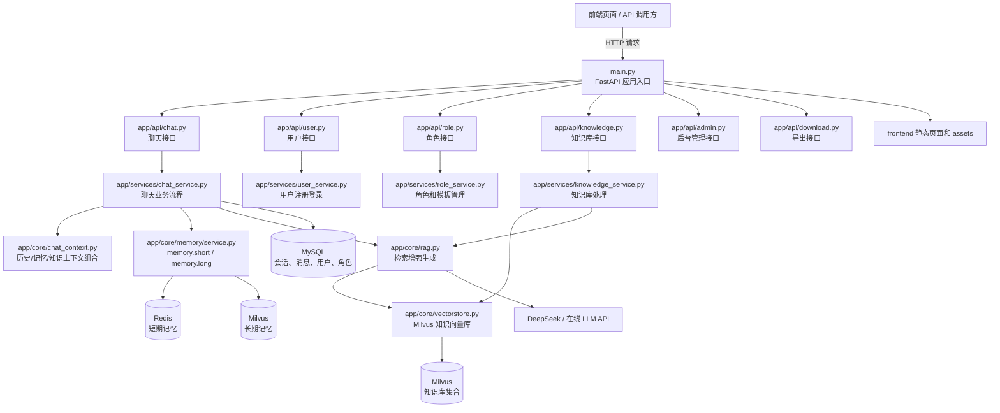
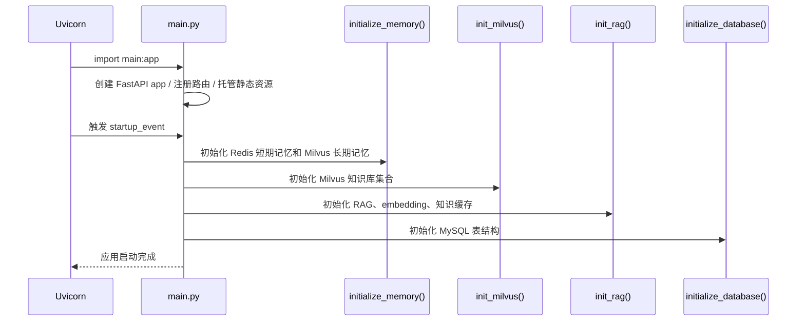
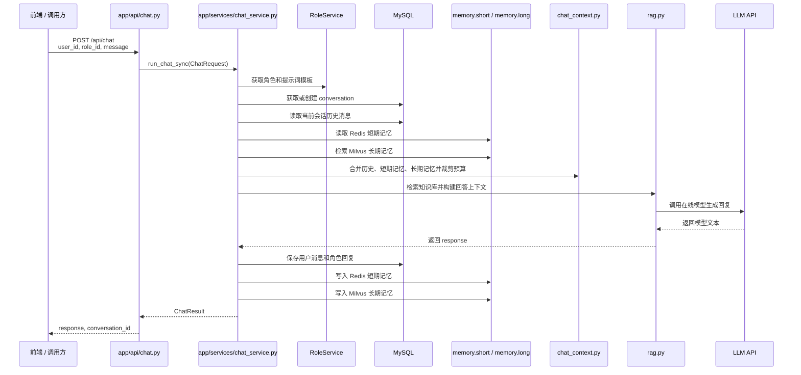
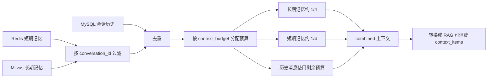
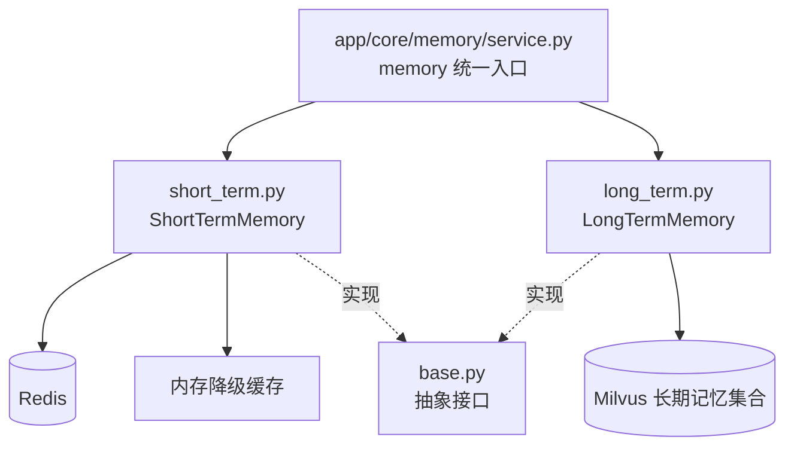
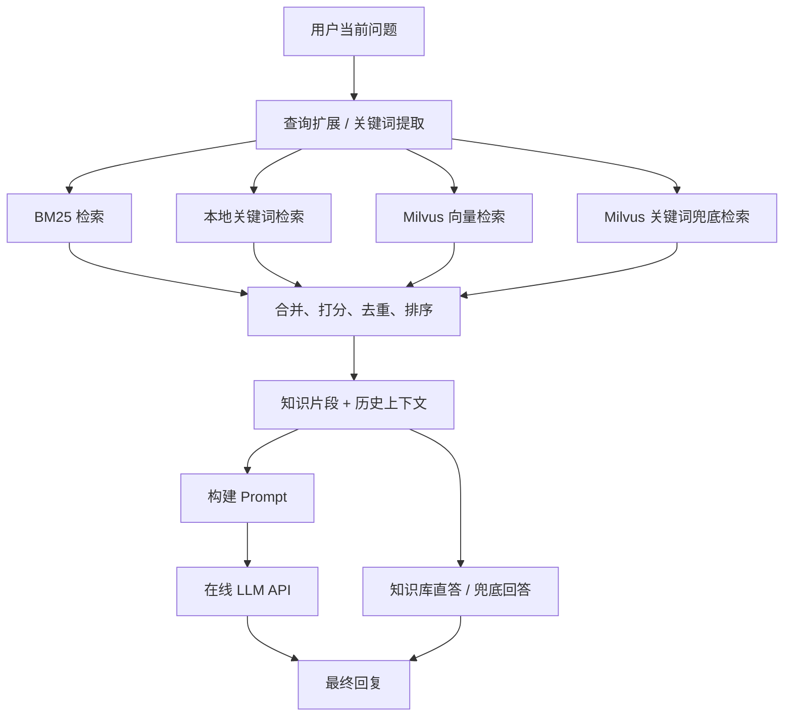
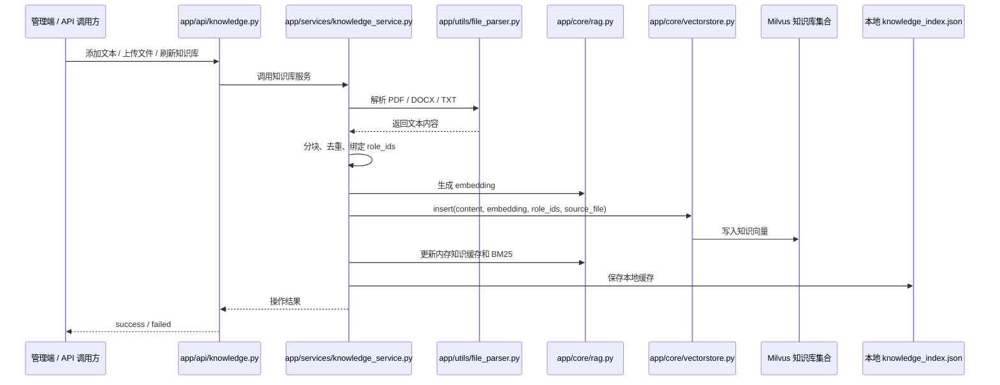
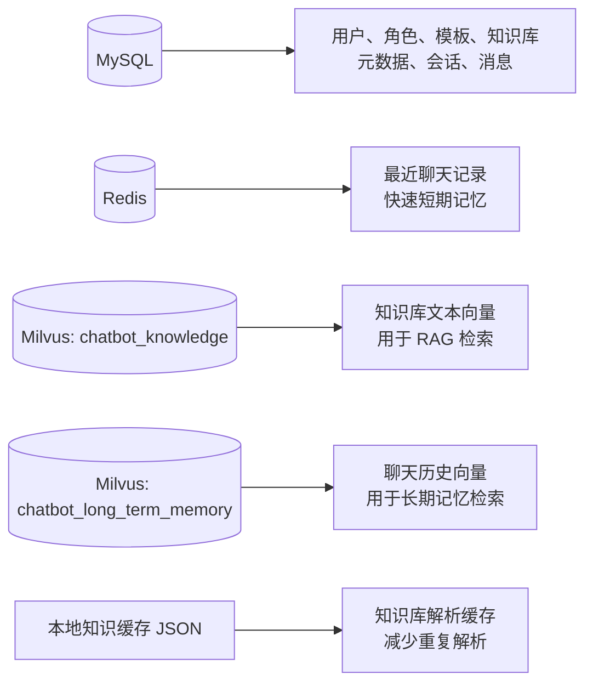

# 项目架构图与数据流说明

本文档根据当前代码生成，主要来源：

- `main.py`：FastAPI 应用入口、启动初始化、路由注册、静态页面托管。
- `app/api/*.py`：HTTP 接口层，负责接收请求、返回响应。
- `app/services/*.py`：业务服务层，负责用户、角色、聊天、知识库等业务流程。
- `app/core/chat_context.py`：聊天上下文构建、记忆合并、预算裁剪。
- `app/core/memory/`：短期记忆、长期记忆和统一记忆服务入口。
- `app/core/rag.py`：知识检索、提示词构建、LLM 调用和兜底回答。
- `app/core/vectorstore.py`：Milvus 知识向量库读写。
- `app/models/`：SQLAlchemy 模型和数据库连接。
- `config/config.py`：MySQL、Redis、Milvus、模型、LLM 等配置。

## 1. 总体架构



### 这张图说明什么

输入来自浏览器或外部 API 调用方，先进入 `main.py` 注册的 FastAPI 路由。接口层不直接处理复杂业务，而是把请求交给服务层。服务层再调用核心模块、数据库和外部模型，最后把结果返回给 API 层。

这样设计的原因：

- API 层只负责请求/响应，逻辑清楚。
- Service 层负责业务流程，便于维护和测试。
- Core 层沉淀可复用能力，例如 RAG、记忆、上下文裁剪、向量库。
- 存储层分工清晰：MySQL 管结构化数据，Redis 管短期记忆，Milvus 管向量检索。

## 2. 应用启动流程



### 输入和输出

- 输入：环境配置、数据库配置、模型配置、知识库缓存。
- 输出：一个可接收 HTTP 请求的 FastAPI 服务。

### 为什么这样做

启动时先初始化记忆、向量库和 RAG，是为了聊天请求到达时不用再临时建立连接。数据库初始化被放在显式启动阶段，是为了避免导入模型文件时就阻塞整个项目。

## 3. 聊天主流程



### 输入

来自 `ChatRequest`：

- `user_id`：用户 ID。
- `role_id`：角色 ID。
- `message`：用户当前输入。
- `conversation_id`：可选，表示继续某个会话。
- `history_limit`、`memory_top_k`、`knowledge_top_k`、`context_budget`：控制上下文读取和裁剪。

### 中间产物

- MySQL 历史消息：用于 UI 历史和当前会话连续性。
- Redis 短期记忆：保存最近消息，读取速度快。
- Milvus 长期记忆：用向量检索找相似历史。
- RAG 知识片段：从知识库检索当前问题相关资料。
- Prompt：由角色模板、知识片段、必要历史共同组成。

### 输出

- API 响应：`response` 和 `conversation_id`。
- MySQL 新增两条消息：用户消息和角色回复。
- Redis 新增短期记忆。
- Milvus 新增长期记忆。

### 为什么这样做

聊天不是只把用户消息丢给大模型，而是先确定角色、会话权限、历史上下文和知识来源。这样可以减少模型胡编、避免上下文过长，并让同一个角色持续保留短期和长期记忆。

## 4. 上下文构建流程



### 来源

这部分来自 `app/core/chat_context.py`：

- `_memory_for_conversation()`：按会话筛选记忆。
- `_dedupe_context()`：去重。
- `_trim_by_budget()`：按预算裁剪。
- `_build_context()`：合并历史、短期记忆、长期记忆。
- `_build_response_context()`：组合知识库检索结果和历史上下文。

### 为什么要裁剪

大模型上下文长度有限，而且历史越多越容易让模型偏题。项目把长期记忆、短期记忆、历史消息分开预算，是为了兼顾“记得住”和“答当前问题”。

## 5. 记忆模块架构



### 新接口

外部统一使用：

```python
from app.core.memory import memory, initialize_memory

initialize_memory()
memory.short.save(user_id, role_id, message)
memory.short.get(user_id, role_id)
memory.long.save(user_id, role_id, conversation_id, message)
memory.long.search(user_id, role_id, query_embedding)
```

### 输入和输出

- 短期记忆输入：用户/角色消息字典。
- 短期记忆输出：最近消息列表。
- 长期记忆输入：消息内容和哈希向量或查询向量。
- 长期记忆输出：按时间或相似度检索出的历史消息。

### 为什么拆成这样

短期记忆和长期记忆用的存储、查询方式完全不同。拆开后，Redis 的问题不会污染 Milvus 逻辑，Milvus 的向量检索也不会让短期记忆接口变复杂。`service.py` 只负责统一入口，避免调用方到处关心具体实现。

## 6. RAG 知识检索与生成



### 来源

这部分来自 `app/core/rag.py`：

- `search_knowledge()`：多路召回并合并结果。
- `_bm25_search()`：BM25 关键词检索。
- `_vector_search()`：本地关键词候选检索。
- `_milvus_search()`：Milvus 向量检索。
- `_milvus_keyword_search()`：Milvus 文本关键词兜底。
- `generate_response()`：生成回答。
- `_build_prompt()`：构建提示词。
- `_quick_llm()`：调用在线 LLM。

### 为什么要多路检索

单一向量检索可能漏掉关键词强相关内容，单一关键词检索又不理解语义。项目同时使用 BM25、关键词、Milvus 向量和 Milvus 关键词兜底，是为了提高召回率，并在 embedding 不可用时仍能尽量给出靠谱资料。

## 7. 知识库写入流程



### 输入

- 接口新增文本：`knowledge_base_id` 和 `content`。
- 上传文件：PDF、DOCX、TXT。
- 本地知识目录：`app/knowledge/data`。

### 输出

- Milvus 中的知识向量。
- RAG 内存缓存和 BM25 索引。
- 本地缓存 JSON。
- API 操作结果。

### 为什么这样做

知识库文件解析和向量写入比较重，如果每次启动都重新解析会非常慢。项目使用本地缓存和文件哈希，目的是减少重复处理；同时写入 Milvus，是为了让聊天时可以做向量检索。

## 8. 数据存储分工



### 为什么不用一个数据库全放

- MySQL 适合结构化关系数据，例如用户、角色、会话、消息。
- Redis 适合快速读取最近消息，作为短期记忆。
- Milvus 适合向量相似度搜索，适合知识库和长期记忆。
- 本地缓存适合避免重复解析文件，降低启动成本。

## 9. 主要输出结果

| 模块 | 输入 | 输出 | 目的 |
|---|---|---|---|
| `main.py` | 配置、路由、启动事件 | FastAPI 应用 | 统一启动和注册接口 |
| `chat.py` | HTTP 聊天请求 | HTTP 聊天响应 / SSE | 对外提供聊天能力 |
| `chat_service.py` | `ChatRequest` | `ChatResult` | 串联角色、历史、记忆、RAG、存储 |
| `chat_context.py` | 历史、短期记忆、长期记忆 | 裁剪后的上下文 | 控制上下文长度，减少偏题 |
| `memory/service.py` | 应用调用 | `memory.short` / `memory.long` | 统一记忆访问入口 |
| `short_term.py` | 消息字典 | Redis/内存中的短期记录 | 快速读取最近对话 |
| `long_term.py` | 消息、向量 | Milvus 长期记忆 | 跨会话相似历史检索 |
| `rag.py` | 当前问题、角色模板、上下文 | 最终回复 | 检索知识并调用 LLM |
| `knowledge_service.py` | 文本/文件 | Milvus 知识向量、本地缓存 | 构建知识库 |
| `vectorstore.py` | 文本向量 | Milvus 知识集合读写结果 | 支撑知识检索 |
| `models/database.py` | 数据库配置 | `engine`、`SessionLocal`、`Base` | 管理数据库连接和表初始化 |

## 10. 维护建议

1. API 文件只放路由，不继续堆业务逻辑。
2. 新增请求/响应模型放到 `app/schemas/`。
3. 新增业务流程放到 `app/services/`。
4. 可复用能力放到 `app/core/`。
5. 存储适配逻辑放到各自模块，例如 Redis 在 `short_term.py`，Milvus 长期记忆在 `long_term.py`，知识向量库在 `vectorstore.py`。
6. 不要在模块导入时做重连接、模型加载或大文件解析；这些动作放到启动初始化或显式函数里。
