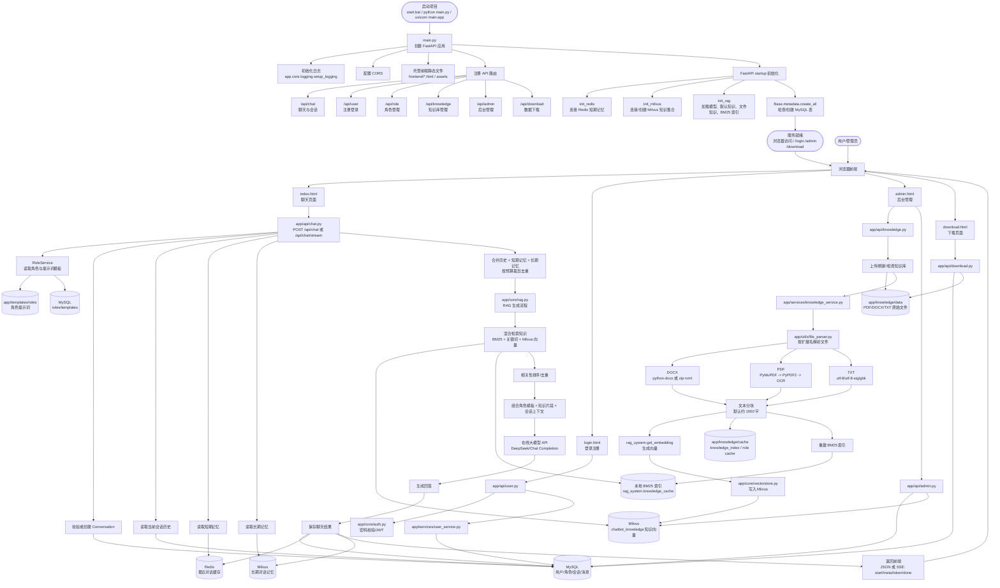
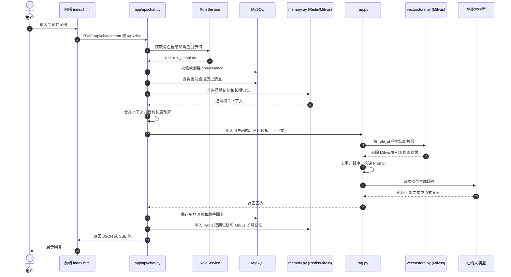
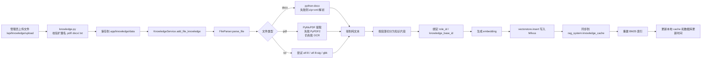

# 项目整体运行流程图

这张图按“系统启动 -> 前端访问 -> API 分发 -> 聊天/RAG/知识库/存储”的实际运行路径整理。

## 聊天请求详细时序

## 知识库入库详细流程

## 核心数据流向

| 数据 | 写入位置 | 读取场景 |
|---|---|---|
| 用户、角色、会话、聊天消息 | MySQL | 登录、角色选择、历史记录、后台管理 |
| 最近对话上下文 | Redis，失败时降级到内存 | 每次聊天时快速补充上下文 |
| 长期对话记忆 | Milvus memory collection | 用户追问、回忆历史、个性化上下文 |
| 知识库片段向量 | Milvus knowledge collection | RAG 检索知识 |
| 知识库原始文件 | `app/knowledge/data` | 刷新/重建知识库 |
| 知识库解析缓存 | `app/knowledge/cache` | 启动时避免重复解析文件 |
| 角色提示词 | `app/templates/roles` + MySQL | 生成回答前构建 Prompt |
| 运行日志 | `logs/app.log` / `logs/error.log` | 排查异常 |
