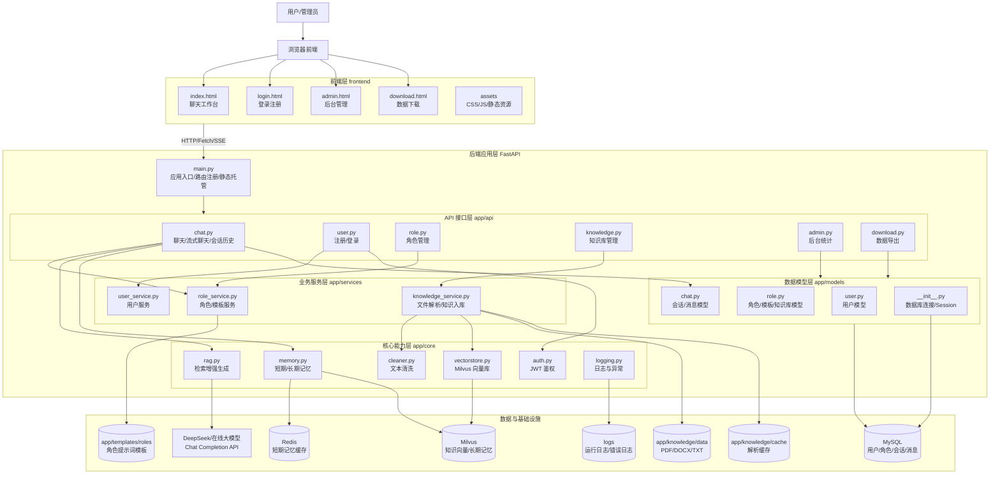
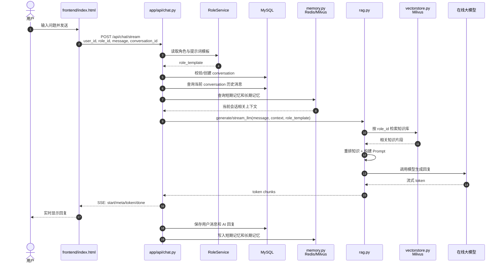
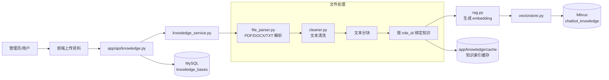
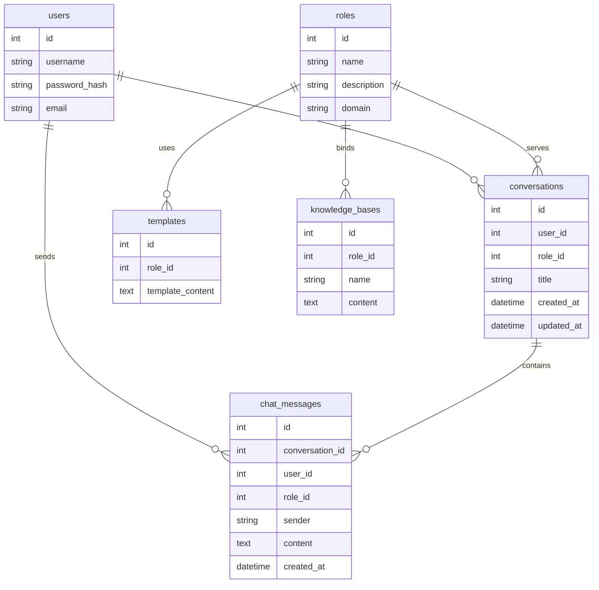
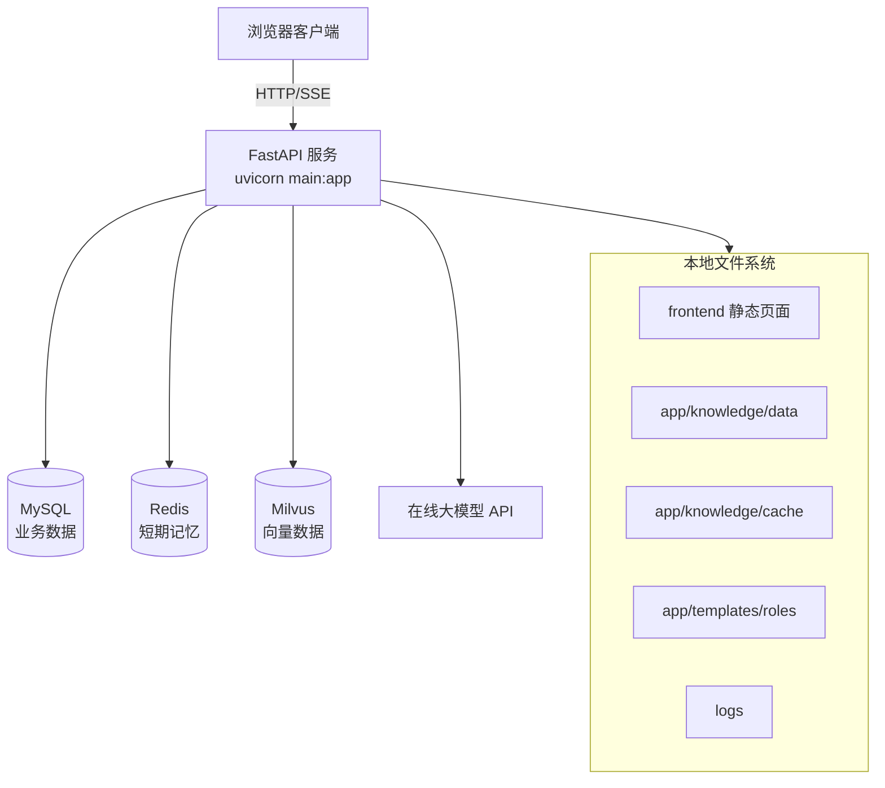

# 多角色聊天机器人项目架构图

## 1. 整体架构

## 2. 聊天请求架构链路

## 3. 知识库入库架构链路

## 4. 数据存储架构

## 5. 模块职责速览

| 层级 | 目录/文件 | 主要职责 |
|---|---|---|
| 前端层 | `frontend/` | 页面展示、用户交互、Fetch/SSE 调用后端 |
| 应用入口 | `main.py` | 初始化 FastAPI、注册路由、托管静态页面、启动 RAG/Redis/Milvus |
| API 层 | `app/api/` | 接收 HTTP 请求，组织业务流程，返回 JSON/SSE |
| 服务层 | `app/services/` | 用户、角色、知识库等业务逻辑封装 |
| 核心层 | `app/core/` | RAG、向量检索、记忆系统、鉴权、日志、文本清洗 |
| 模型层 | `app/models/` | SQLAlchemy ORM 模型与数据库连接 |
| 知识层 | `app/knowledge/` | 原始知识文件与解析缓存 |
| 配置层 | `config/` | 数据库、Redis、Milvus、大模型、JWT 等配置 |
| 测试层 | `tests/`、`scripts/` | API 测试、RAG 测试、文件解析测试、JMeter 压测 |

## 6. 部署视图

