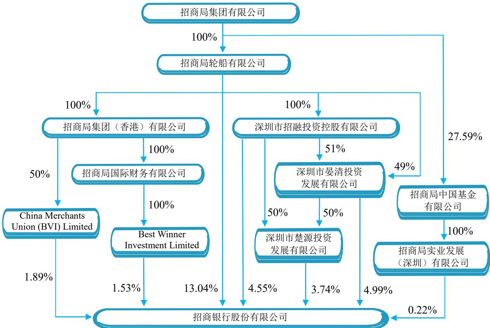
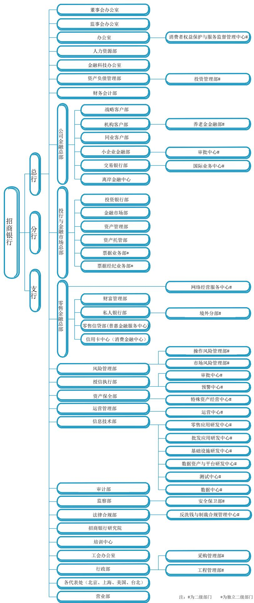
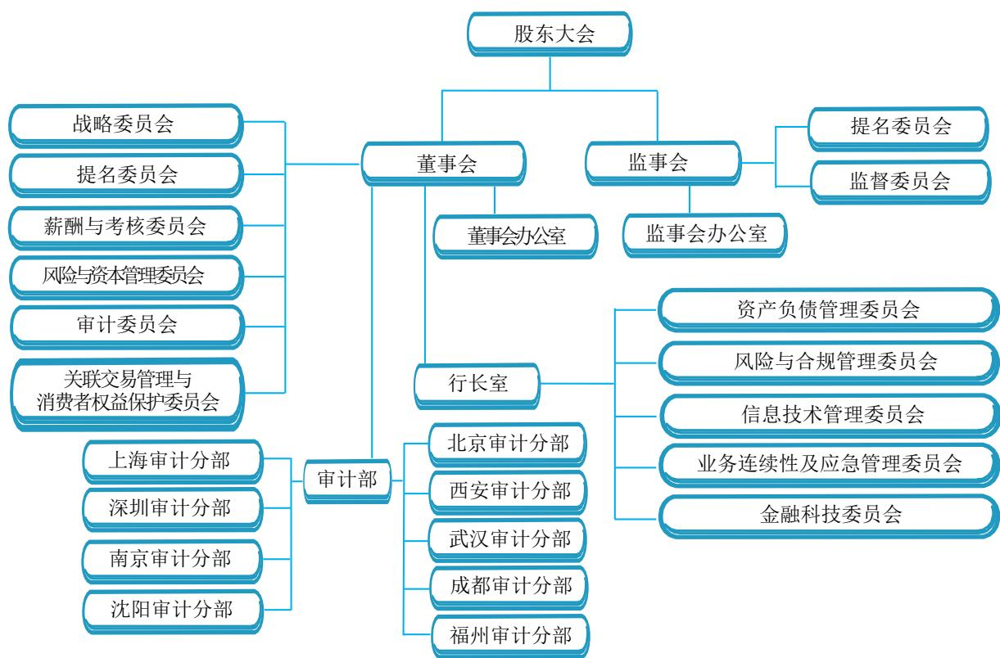

招商银行股份有限公司

CHINA MERCHANTS BANK CO., LTD.

二〇一九年度报告

A股股票代码：600036

## 目 录

重要提示 ...... 3  
释义 ......  
重大风险提示..  
董事长致辞 ......  
行长致辞 ........  
第一章 公司简介 ... . 9  
第二章 会计数据和财务指标摘要 . . 15  
第三章 经营情况讨论与分析 ..... .... 19  
3.1 总体经营情况分析 ...... ...... 19  
3.2 利润表分析 ......... ...... 19  
3.3 资产负债表分析 ...... ...... 26  
3.4 贷款质量分析 . ... 31  
3.5 资本充足率分析 ...... ...... 37  
3.6 分部经营业绩 ..... .... 40  
3.7 根据监管要求披露的其他财务信息.. ..... 41  
3.8 业务发展战略实施情况 . .. 42  
3.9 外部环境变化及应对措施 . .... 44  
3.10 业务运作 ..... .... 53  
3.11 风险管理 ...... .... 68  
3.12 利润分配 ... . 74  
第四章 重要事项....... ..... 76  
第五章 股份变动及股东情况 .. .... 86  
第六章 董事、监事、高级管理人员、员工和机构情况.. ... 93  
第七章 公司治理 ... . 107  
第八章 监事会报告 ...... .. 123  
第九章 备查文件目录 .... .. 124  
第十章 财务报告 ..... . 124

## 重要提示

1. 本公司董事会、监事会及董事、监事和高级管理人员保证年度报告内容的真实、准确、完整，不存在虚假记载、误导性陈述或重大遗漏，并承担个别和连带的法律责任。

2. 本公司第十一届董事会第九次会议于2020年3月20日以远程视频会议方式召开。李建红董事长主持了会议，会议应参会董事17名，实际参会董事17名，本公司9名监事列席了会议。会议的召开符合《中华人民共和国公司法》和《招商银行股份有限公司章程》的有关规定。

3. 本公司审计师德勤华永会计师事务所和德勤•关黄陈方会计师行已分别对本公司按照中国会计准则和国际会计准则编制的2019年度财务报告进行了审计，并分别出具了标准无保留意见的审计报告。

4. 本年度报告除特别说明外，货币币种为人民币。

5. 本公司董事长李建红、行长兼首席执行官田惠宇、副行长兼财务负责人王良及财务机构负责人李俐保证年度报告中财务报告的真实、准确、完整。

6. 利润分配方案：本公司拟按照经审计的本公司2019年度净利润860.85亿元的10%提取法定盈余公积，计86.09亿元；按照风险资产1.5%差额计提一般准备100.02亿元；以届时实施利润分配股权登记日A股和H股总股本为基数，向登记在册的全体股东派发现金股息，每股现金分红1.20元（含税），以人民币计值和宣布，以人民币向A股股东支付，以港币向H股股东支付。港币实际派发金额按照股东大会召开前一周（包括股东大会当日）中国人民银行公布的人民币兑换港币平均基准汇率计算。其余未分配利润结转下年。2019年度，本公司不实施资本公积金转增股本。上述利润分配方案尚需2019年度股东大会审议批准后方可实施。

7. 本报告包含若干对本集团财务状况、经营业绩及业务发展的展望性陈述。报告中使用诸如“将”“可能”“有望”“力争”“努力”“计划”“预计”“目标”及类似字眼以表达展望性陈述。这些陈述乃基于现行计划、估计及预测而作出，虽然本集团相信这些展望性陈述中所反映的期望是合理的，但本集团不能保证这些期望被实现或将会证实为正确，故不构成本集团的实质承诺，投资者不应对其过分依赖并应注意投资风险。务请注意，该等展望性陈述与日后事件或本集团日后财务、业务或其他表现有关，并受若干可能会导致实际结果出现重大差异的不确定因素的影响。

## 释义

本公司、本行、招行、招商银行 ：招商银行股份有限公司

本集团 ：招商银行及其附属公司

中国银保监会 ：中国银行保险监督管理委员会

中国证监会 ：中国证券监督管理委员会

香港联交所 ：香港联合交易所有限公司

香港上市规则 ：香港联交所证券上市规则

招商永隆银行 ：招商永隆银行有限公司

招商永隆集团 ：招商永隆银行及其附属公司

招银租赁 ：招银金融租赁有限公司

招银国际 ：招银国际金融控股有限公司

招银理财 ：招银理财有限责任公司

招商基金 ：招商基金管理有限公司

招商信诺 ：招商信诺人寿保险有限公司

招联消费 ：招联消费金融有限公司

招商证券 ：招商证券股份有限公司

德勤华永会计师事务所 ：德勤华永会计师事务所（特殊普通合伙）

证券及期货条例 ：证券及期货条例（香港法例第571章）

标准守则 ：香港联交所上市发行人董事进行证券交易的标准守则

## 重大风险提示

本公司已在本报告中详细描述存在的主要风险及拟采取的应对措施，详情请参阅第三章有关风险管理的内容。

## 董事长致辞

招商银行的发展改革历程，是一首坚守传承与转型创新的协奏曲。2019年，在迈向“创新驱动，零售领先，特色鲜明的中国最佳商业银行”战略愿景道路上，我们直面复杂的经营环境，演奏出了令人难忘和自豪的乐章。

我们坚守质量、效益、规模动态均衡发展理念，用高质量增长不断创造价值。当年实现归属于股东净利润928.67亿元，同比增长15.28%，加权平均净资产收益率（ROAE）16.84%，连续三年提升。2019年末A 股、H 股较年初分别上涨 53%和 43%，市值创出历史新高。同时，多措并举落实“两增两控”及房地产贷款调控目标，积极贯彻落实金融供给侧改革、防范化解重大风险及支持实体经济发展各项监管要求。不断优化大类资产配置，资产质量持续向好，不良额和不良率连续三年实现“双降”，资本持续内生，核心一级资本充足率不断提升，实现了稳健可控基础上的高质量增长。

我们锐意转型创新，培育创新土壤，探索创新商业模式。以共生共建的理念，聚焦高频生活场景，联合合作伙伴共同为用户提供优质服务。通过召开首次由商业银行举办的合作伙伴大会、发起设立“逾越者联盟”、参与咖啡零售、出行预订、影票销售等，探索开放的新生态模式。将金融科技投入、市场化选人用人机制和薪酬激励机制纳入公司章程，并持续优化员工职业发展通道，加强金融科技人才吸引和培养，通过蛋壳平台建立“平视、包容”文化，2019 年跻身智联招聘“中国年度最佳雇主”前 5 名，为创新发展提供了长远的制度和人才保障。

我们不忘企业公民身份，积极履行社会责任。坚持 20 余年如一日对口扶贫云南武定、永仁两县，大力推进“教育、产业、文化”三位一体的“造血”扶贫模式。目前，永仁县已经实现全面脱贫，武定县也在发起最后的脱贫攻坚战。新冠肺炎战“疫”中，第一时间捐款驰援武汉，配合武汉火神山和雷神山医院建设，通过开辟绿色汇款通道助力企业海外采购紧缺医疗物资，提供贷款展期等多措并举助力企业复工复产，发挥稳定、高效、便捷的金融科技优势为个人和企业捐助提供优质线上服务，为打赢疫情防控阻击战和保持国民经济平稳运行持续贡献力量。

站在二十一世纪第三个十年的起点，世界大变局加速演变的特征更趋明显。新冠肺炎疫情对全球经济、社会、金融和居民生活产生了巨大冲击，对国家治理体系和能力提出了重大考验，引发了大家的深刻思考。对中国银行业而言，是挑战与机遇并存：一方面，中国经济增长中枢仍在下沉，中美经贸关系仍面临较大不确定性，利率市场化深入推进，年轻客户去银行化等，均将对银行业的经营管理带来深远挑战；另一方面，中国经济运行质量向好的基本趋势没有变，金融供给侧改革的深入推进，居民财富的日益增长及科技应用的持续深化，疫情引发的生活、生产和商业模式变化可能带来的结构性机会与长远性机会，均将为银行业的高质量发展提供新动能。

如何应对挑战、把握机遇，续写招商银行新的乐章？我们的答案没有变，就是坚守传承和转型创新。

没有特色就没有竞争力。招商银行将坚守传承零售特色，充分发挥“开放和融合”模式创新和数字化创新成果，围绕连接面广、连接点多、数字化程度高的业务，开拓打造新的特色。

没有创新就没有基业长青。招商银行将立足长远，用金融科技手段洞察客户需求、改善服务方式、提高经营效率，不断完善与合作伙伴共建生态的模式创新。同时将进一步加大数字化投入力度，持续积累、沉淀创新能力，进一步提升数字化获客、经营和风控能力，推动经营、管理效率持续改善，形成和完善可持续、可推广、不断迭代升级的创新体系。

没有稳健风控就没有发展基础。招商银行将继续巩固完善稳健审慎的风险文化，不断完善风险管理体系，消除短板、盲区、死角，优化大类资产配置，加强对各类非传统风险的管理。

没有机制保障就没有转型动能。招商银行将继续坚守“董事会领导下的行长负责制”公司治理机制，坚持市场化的激励机制不动摇，并不断进行丰富和完善，为招商银行的转型创新筑牢体制机制的保障和支撑。

没有文化传承就没有精神之源。招商银行将秉承“招商血脉，蛇口基因”，继续以“敢为天下先”的勇气和容错机制，弘扬“多赢共赢”的分享文化，一如既往地在转型变革中初心不改，穿越周期，抓住机遇，挑战自我，谱写“开放、融合、平视、包容”的清新旋律。

2020年是实现全面建成小康社会和“十三五”规划的收官之年。招商银行将继续努力追求“跑赢大市、优于同业”的优异业绩，创造更大价值，奏响新的乐章！

招商银行股份有限公司

董事长：李建红

2020年3月20日

## 行长致辞

2019年我们依然能量满格，硬核自我，又交出一份不错的答卷。截至年末，招商银行总资产达7.42万亿元，较上年末增长9.95%；全年实现营业收入2,697.03亿元，同比增长8.51%；实现归属于本行股东净利润928.67亿元，同比增长15.28%。ROAA、ROAE持续提升，不良贷款额和不良贷款率继续“双降”，拨备覆盖率持续提升。更加重要的是，我们打开了未来发展的空间——“招商银行”“掌上生活”两大 App 月活跃用户突破1亿，零售金融数字化转型追星逐辰，公司金融数字化转型向“南”而行；云计算能力行业领先，开放的数字化基础设施云台初垒……我们以更克制的资产扩张速度实现了更好的发展效益，越过规模制胜和结构制胜阶段，矢志探索数字化时代的经营模式。

这些成绩，得益于亿万客户与我们风雨同舟、不离不弃，鞭策我们“因您而变”，因势而变；也得益于过去十年金融科技的革命性变迁，为我们探索商业银行新经营模式透射出一束光亮；更得益于我们十年磨一剑的战略定力：我们以“一卡通”铸就的科技成色和“一次转型”奠定的零售先发优势为支点，持之以恒推动“轻型银行”转型步步深入。

经过上半场转型，招商银行“轻资产”经营成效明显，使我们有勇气抛弃规模情结，赢得结构制胜的先机。随着“轻型银行”转型深入，我们认识到，科技是唯一可能颠覆商业银行经营模式的力量；要真正实现“轻经营”和“轻管理”，也必须依靠科技的力量。因此，我们旗帜鲜明地提出打造金融科技银行，把探索数字化经营模式作为转型下半场的主攻方向。

面对数字化世界，我们在不断碰撞中成长，而最大的成长就是，招行整个组织逐步找到了数字化转型的感觉，就像我们十年如一日做零售业务对服务的感觉一样，正在深入招行体系化能力的骨髓。我们也在不断试错中颠覆自我认知：跟随客户走入新的生态场景，却发现自己才是陌生人；努力打造数字化经营能力，却发现基础设施的筋脉还不通畅；想要搭上科技变革的快车，却感觉组织进化速度还跟不上；想让组织更加轻盈，却发现文化的不够开放和包容让我们步履蹒跚。在数字化时代的浩瀚星空中，我们看到了自己的无知和渺小。

我们躬逢盛世，躬身入局，像一个懵懂少年，怀着好奇和敬畏之心，努力寻找属于招商银行自己打开数字化大门的那把钥匙——开放与融合。

开放，是为了寻求服务机会。数字化时代，对客户而言，金融只是工具，个人生活和企业经营才是目的。纯粹而独立的金融服务越来越难以触达客户，我们必须跟随客户的脚步，寻找和融入数字化时代金融服务的新入口。我们围绕金融核心搭建或切入客户服务生态，招行零售金融基于“招商银行”和“掌上生活”两大App的生态服务平台建设，已初具规模。我们将加大“引进来”的力度，与合作伙伴共建生态圈，聚焦形成优势场景，培养和强化用户习惯；我们要大踏步地“走出去”，开放II、III类户，通过API接口输出金融服务能力，建立更加广泛的生态联盟。企业经营数字化是未来一个重要的客户服务入口。我们将探索从企业数字化服务切入公司客户的产业互联网建设，从资管生态化服务切入同业客户的生态圈建设。

融合，是为了提升服务能力。数字化时代，市场竞争不再是单个产品和业务线的竞争，而是整体生态的竞争。这就要求我们打破内部竖井和业务边界，集聚有生力量作用于市场，服务于客户，通过服务的组合增加服务价值，增强服务粘性。开放和融合是一个硬币的两面。只有开放，才能获取更多服务入口和更丰富的客户需求，才能刺激融合能力的生长；只有融合，才能形成完整的服务生态，才能进一步提升开放的价值。

开放与融合，对我们的组织进化和管理升级提出了新的要求。我们正在从组织到行动，打破边界，更多地组建任务型团队。我们努力提升中台能力，逐步构建赋能型组织：建设架构开放、敏捷迭代的系统中台，将系统解耦，实现功能模块化、产品化，从技术底层打通所有业务系统；建设数据中台，将数据作为核心资产，打通内外部数据，完善大数据治理体系；建设业务中台，打造强大的“总参谋部”，向市场赋能，为一线减负。我们期望建立中台赋能前台、前台反馈推动中台迭代的循环，推动招商银行组织自我进化。

开放与融合的最底层，是文化的蝶变。文化是最底层的生产力，是链接个人与个人、个人与组织的柔性价值网。如果管理是一个装满容器的过程，制度就是石头，管理者是沙子，组织文化则是水。企业文化与水一样，无处不在，润物细无声。凭借组织的文化自觉，可以解决许多制度和人覆盖不到的问题。

“轻型银行”转型到最深处，就是轻型文化。“清风公约”的发布，标志着我们决心塑造“开放、融合、平视、包容”的新型企业文化，让每一个员工发自内心地做正确的事。7 万多名招行人价值观的最大公约数，将牵引我们与亿万客户形成心灵共振，构筑招商银行最宽的护城河。

2020 年伊始，一场波及全球的新冠肺炎疫情给实体经济和金融业带来实质性冲击。但我们坚信，危机改变不了大国崛起的百年变局。比尔·盖茨曾说，人们总是高估未来一两年的变化，低估未来十年的变革。我们不会浪费这场危机。面对危机，积极应对比预测结局更重要。我们坚信，回归初心，遵循规律，更加贴近客户、贴近市场，积极拥抱变化，快速试错，快速学习，快速进化，才是应对危机最好的方法论。

疫情让我们关心蔬菜、口罩和亲友，但也让我们更加信仰开放、融合与分享。我们无法预测未来，但我们坚信，唯有更加彻底地开放与融合，参与到塑造未来的过程中去，才可能拥有未来。

道阻且长，行则将至。想，都是问题；做，才有答案。

招商银行股份有限公司

行长：田惠宇

2020年3月20日

## 第一章 公司简介

## 1.1 公司基本情况

1.1.1 法定中文名称：招商银行股份有限公司（简称：招商银行）

法定英文名称：China Merchants Bank Co., Ltd.

1.1.2 法定代表人：李建红

授权代表：田惠宇、刘建军

董事会秘书：刘建军

联席公司秘书：刘建军、何咏紫

证券事务代表：霍建军

1.1.3 注册及办公地址：中国广东省深圳市福田区深南大道7088号

1.1.4 联系地址：

中国广东省深圳市福田区深南大道7088号

邮政编码：518040

联系电话：+86 755 8319 8888

传真：+86 755 8319 5109

电子信箱：cmb@cmbchina.com

互联网网址：www.cmbchina.com

客户服务投诉电话：95555-7

消费者权益保护电话：+86 755 8307 7333

1.1.5 香港主要营业地址：香港中环康乐广场8号交易广场三期31楼

1.1.6 股票上市证券交易所：

A股：上海证券交易所；股票简称：招商银行；股票代码：600036

H股：香港联交所；股票简称：招商银行；股票代码：03968

境内优先股：上海证券交易所；股票简称：招银优1；股票代码：360028

境外优先股：香港联交所；股票简称：CMB17USDPREF；股票代码：04614

1.1.7 国内会计师事务所：德勤华永会计师事务所

办公地址：中国上海市延安东路222号外滩中心30楼

签字注册会计师：曾浩、朱炜

国际会计师事务所：德勤•关黄陈方会计师行

办公地址：香港金钟道88号太古广场一座35楼

## 1.1.8 中国内地法律顾问：君合律师事务所

香港法律顾问：史密夫斐尔律师事务所

1.1.9 A股股票登记处：中国证券登记结算有限责任公司上海分公司

H股股票登记及过户处：香港中央证券登记有限公司

香港湾仔皇后大道东 183 号合和中心 17 楼 1712-1716 号铺

境内优先股股票登记处：中国证券登记结算有限责任公司上海分公司

境外优先股股票登记处和转让代理：纽约梅隆银行卢森堡分行

## 1.1.10 指定的信息披露报纸和网站：

内地：《中国证券报》《证券时报》《上海证券报》

上海证券交易所网站（www.sse.com）、本公司网站（www.cmbchina.com）

香港：香港联交所网站（www.hkex.com.hk）、本公司网站（www.cmbchina.com）

年度报告备置地点：本公司董事会办公室

1.1.11 境内优先股保荐机构：

瑞银证券有限责任公司

办公地址：北京西城区金融大街7号英蓝国际金融中心12层、15层

保荐代表人：刘文成、罗勇

招商证券股份有限公司

办公地址：深圳市福田区福华一路111号招商证券大厦27层

保荐代表人：王玉亭、卫进扬

持续督导期间：2018年1月12日至2019年12月31日

## 1.2 公司业务概要

本公司成立于1987年，总部位于中国深圳，是一家在中国具有鲜明特色和品牌影响力的全国性商业银行。本公司业务以中国市场为主，分销网络主要分布在粤港澳大湾区、长江三角洲地区、环渤海经济区等中国重要经济中心区域，以及其他地区大中城市，有关详情请参阅“分销渠道”和“分支机构”章节。2002年4月，本公司在上海证券交易所上市。2006年9月，本公司在香港联交所上市。

本公司向客户提供各种批发及零售银行产品和服务，亦自营及代客进行资金业务。本公司推出的许多创新产品和服务广为中国消费者接受，例如：“一卡通”多功能借记卡、“一网通”综合网上银行服务，信用卡、“金葵花理财”和私人银行服务，招商银行App和掌上生活App服务，招商银行企业App服务，全球现金管理、贸易金融等交易银行与离岸业务服务，以及资产管理、资产托管和投资银行服务等。

2019年，本公司主动适应内外部形势变化，继续以金融科技为核动力，加快数字化转型，致力于打造“最佳客户体验银行”，一年来业务发展成效显著，客户基础更加雄厚，客户服务能力稳步提升。2020年，本公司将紧紧围绕客户和科技两大关键点，深化战略转型，促进对外开放与内部融合，在自我迭代中打造3.0经营模式，有关详情请参阅“董事长致辞”和“行长致辞”章节。

## 1.3 发展战略、投资价值及核心竞争力

发展愿景：创新驱动、零售领先、特色鲜明的中国最佳商业银行

战略目标：紧密围绕“轻型银行”的转型方向，推动“轻型银行”建设不断深入，推进“质量、效益、规模”动态均衡发展，努力实现金融科技银行的质变突破，不断深化风险管理向“治本”转型，大力打造最佳客户体验银行，进一步提升国际化、综合化服务能力。

战略定位：坚持“一体两翼”的战略定位，零售“一体”以MAU为“北极星”，拥抱“客户+科技”，构建移动互联时代的竞争新优势，打造零售金融3.0数字化新模式。批发“两翼”以特色化为方向，着力构建批发业务体系化能力，加快推进数字化转型，实现批发金融高质量发展。不断推进“一体两翼”的深度融合，打造有机循环、相互促进的整体，形成高度融合的价值循环链。

## 发展策略：

积极抢占未来战略制高点：一是加快推进金融科技战略。推进金融科技本体质变，赋能零售金融3.0数字化转型，助力产业互联网模式升级。二是践行最佳客户体验战略。建立客户体验闭环监测系统及指标体系，开展定期评估并持续优化客户旅程。三是深化风险管理战略。明确风险偏好目标，优化风险流程体系，建立金融科技驱动的风险管理工具体系。四是高效推动协同战略。打造“财富管理-资产管理-投资银行”业务拓展协同体系，建立B2B2C的客户联动经营协同体系，构建行内外、跨条线的数据共享协同体系。

深入推进业务模式转型：一是打造零售金融3.0新模式，以金融科技为手段，以大数据为驱动，以MAU为“北极星”指标，抢占未来发展战略制高点，构建线上用户获取与经营新模式，深入推进零售金融3.0数字化转型，打造最佳客户体验银行。二是推进批发金融高质量发展，一方面，牢牢把握产业互联网创新金融服务的转型方向，提升基于行业的综合服务能力和风险管理能力；另一方面，深化客户分层分类经营体系和客户经理管理体系建设，有效推动交易银行和投资银行两大业务体系转型升级。三是提升综合化经营水平，为客户提供高质量、全方位的金融服务。四是强化国际化服务能力，着力打造“跨境金融领域最佳客户体验银行”。

打造强有力的战略支撑体系：一是实现科技“双模IT”1 转型，坚持科技领先，顺应数字化、信息化、网络化潮流，提升数字化创新能力。二是构建轻型人力资源管理体系，打造服务战略、结构优化、梯队合理、能力突出的人才队伍。三是强化资产负债和财务管理，持续提升资产负债管理专业能力与管理效率，构建全面、智能、专业的财务管理体系。四是推进内控合规体系化建设，推进内控合规定量化、标准化、精细化管理。五是构建智慧运营体系，有效平衡客户体验、运营效率和运营成本、运营风险之间的关系。六是丰富和发展招银文化品牌，持续扩大品牌差异化优势和影响力。

投资价值及核心竞争力：

成熟完善的战略管理。本公司坚持以战略引领发展，战略管理日臻成熟，在技术进步、产业转型及金融市场改革深化的关键时期，充分发挥自身的比较优势和管理潜能，进行准确战略定位，大力开展业务、客户、渠道、产品的结构性调整，促进“质量、效益、规模”动态均衡发展，以优良业绩先行走出了一条差异化发展道路。

创新求变的企业文化。本公司承袭因改革开放而生的“蛇口基因”，在经营发展过程中形成了“因您而变”的经营理念，“服务、创新、稳健”的核心价值观，以及创新求变、追求卓越的鲜明的企业文化。近年来，在管理升级的背景下，又提出“清风公约”，并逐步形成“开放、融合、平视、包容”的轻型文化。

全面赋能的金融科技。本公司大力开展金融科技银行建设，把金融科技作为转型发展的核动力，为业务发展全面赋能。通过对标金融科技企业，全面构建本公司金融科技的基础设施；以开放心态和长远眼光，构建本公司业务生态体系；以金融科技的理念和方法，转变经营管理模式，加强科技能力建设，推动科技与业务融合，以科技敏捷带动业务敏捷。

结构良好的业务布局。本公司充分发挥自身资源禀赋，通过业务的聚焦、客户的聚焦，明确“一体两翼”战略定位，构建“财富管理-资产管理-投资银行”专业化体系，打造了一大批业内领先的特色业务，形成了结构更安全、抗周期性更强的业务布局。

优势显著的零售金融。本公司零售业务较早确立行业领先地位，在客群、渠道、产品和品牌等方面形成了内生能力体系，同时，通过大力推进内涵式、集约化增长，提升精细化管理水平，营业收入占比、利润贡献度等关键指标位居同业前列，领先优势显著。

特色鲜明的批发金融。本公司积极打造市场领先、特色鲜明的批发金融业务，依托专业优势,为客户提供定制化、综合化金融服务，投资银行、交易银行、资产托管、资产管理、票据、金融市场等战略性业务新动能不断培育壮大，专业服务能力获得市场和客户的肯定和认可。

科学高效的管理体系。本公司以服务客户和助推业务发展为主旨，较好地建立了全面、现代、科学的风险管理体系、资本管理体系、运营管理体系、信息管理体系、绩效考核体系、人力资源管理体系及相关的能力，有效保证了业务经营的长期稳健发展。

持续完善的组织体制。本公司按照专业化、扁平化、集约化的方向，打造高效率的轻型管理架构，建立端到端的客户服务流程，构建分行事业部等具有招行特色的组织模式，专业化水平和经营管理效率不断提升，对客户需求的响应能力和对市场变化的反应速度不断提高。

行业领先的优质服务。本公司服务模式在立行之初就独树一帜，通过长期实践确立了“因您而变”的服务理念，注重客户服务体验，积极推进服务升级，服务品质始终保持领先。“服务好”已成为本公司吸引客户和拓展市场的金字招牌。

优秀专业的人才队伍。本公司通过以人为本的人才文化、市场化的人才激励机制，培养和造就了一支高素质的人才队伍，高级管理团队管理经验丰富、稳定性强，员工队伍综合素质、专业技能业界领先，特别是为了积极迎接金融科技竞争，在科技领域加大了金融科技人才的引进和培养。

## 1.4 荣誉与奖项

2019年，本公司在国内外机构组织的评选活动中获得诸多荣誉与奖项，其中：

2019年1月，本公司在润灵环球责任评级及SGS-CSTC（通标标准技术服务有限公司）主办的“A股上市公司社会责任报告高峰论坛暨上市公司社会责任报告评级10周年庆典”活动中荣获“AA级社会责任报告企业”。

2019年2月，英国《银行家》杂志公布“2019年全球银行品牌价值500强”榜单，本公司凭借品牌价值224.8亿美元名列全球排名第9位，较上年提升两位，跻身前十。

2019年2月，在《欧洲货币》杂志举办的“2019年私人银行与财富管理颁奖典礼”中，本公司第9次荣获“中国最佳私人银行”大奖。

2019年3月，本公司在《亚洲货币》杂志举办的“2019中国零售银行”奖项评选中荣获“最佳信用卡业务发展奖”和“最佳技术创新奖”；同时，本公司在《亚洲货币》杂志举办的“2019中国私人银行”奖项评选中荣获“最佳全国性股份制银行”。

2019年5月，在《亚洲货币》杂志举办的“2019中国卓越交易银行”评选中，本公司荣获“最佳电子交易银行”。

2019年5月，在中国《银行家》杂志举办的“2019中国金融创新奖”评选中，本公司荣获“最佳金融创新奖”。

2019年7月，英国《银行家》杂志公布2019年全球银行1000强排名，本公司以753.9亿美元的一级资本规模位列全球第19位，较上年提高1个位次。

2019年7月，《财富》中国500强榜单揭晓，本公司以2,485.55亿元的营业收入位列第38位。同月，《财富》世界500强榜单正式发布，本公司连续8年入榜，名列第188名，较上年提升25个位次。

2019年7月，在《欧洲货币》杂志主办的“2019年卓越大奖颁奖典礼”上，本公司荣获“中国最佳银行”大奖。

2019年7月，在《21世纪经济报道》主办的2019“第十二届中国资产管理金贝奖”颁奖典礼上，本公司荣获“2019最佳资产管理银行”。

2019年7月，在《亚洲银行家》杂志主办的“2019年度国际零售金融服务卓越大奖”评选活动中，本公司第10次荣膺“中国最佳零售银行”，第15次荣获“中国最佳股份制零售银行”。

2019年8月，在美国《机构投资者》杂志举办的“2019年度全亚洲管理团队荣誉公司”评选中，本公司以全部第一名的成绩包揽亚洲地区银行板块所有七项大奖，包括“亚洲最令人尊敬公司”“最佳CEO”“最佳CFO”“最佳公司治理”“最佳投资者关系管理公司”“最具环保与社会责任公司”和“最佳投资者关系管理专家”。

2019年9月，本公司在《亚洲货币》杂志年度颁奖典礼上荣获“2019最佳A股上市公司”和“亚洲30周年最佳企业管理”两项大奖。同时在《亚洲货币》2019“中国卓越公司金融及投资银行大奖”评选中，本公司荣获“中国最佳公司金融及投资银行”和“最佳并购融资业务”奖。

2019年11月，在美国《环球金融》杂志举办的“中国之星”评选活动中，本公司荣获“家族办公室和财富管理之星”。

2019年11月，在智联招聘和北京大学社会调查研究中心联合举办的“2019中国最佳雇主”评选活动中，本公司荣获“最佳雇主10强”“最具社会责任雇主奖”“最受女性关注雇主奖”三项大奖。

2019年12月，在《亚洲银行家》杂志举办的“2019年度亚洲银行家-全球财富与社会奖项计划”评选活动中，本公司荣获“中国年度私人银行”奖项。

## 第二章 会计数据和财务指标摘要

## 2.1 主要会计数据和财务指标

<table><tr><td colspan="4"></td></tr><tr><td>（人民币百万元，特别注明除外）</td><td>2019年</td><td>2018年</td><td>增（减）(%) 2017年</td></tr><tr><td>经营业绩</td><td></td><td></td><td></td></tr><tr><td>营业收入</td><td>269,703</td><td>248,555</td><td>8.51 220,897</td></tr><tr><td>营业利润</td><td>117,047</td><td>106,608</td><td>9.79 90,540</td></tr><tr><td>利润总额</td><td>117,132</td><td>106,497</td><td>9.99 90,680</td></tr><tr><td>净利润</td><td>93,423</td><td>80,819</td><td>15.60 70,638</td></tr><tr><td>归属于本行股东的净利润</td><td>92,867</td><td>80,560</td><td>15.28 70,150</td></tr><tr><td>扣除非经常性损益后归属于本行股东的净利润</td><td>92,178</td><td>80,129</td><td>15.04 69,769</td></tr><tr><td>经营活动产生的现金流量净额</td><td>4,432</td><td>(35,721)</td><td>不适用 (5,660)</td></tr><tr><td>每股计（人民币元／股）</td><td></td><td></td><td></td></tr><tr><td></td><td>3.62</td><td>3.13</td><td>15.65 2.78</td></tr><tr><td>归属于本行普通股股东的稀释每股收益</td><td>3.62</td><td>3.13</td><td>15.65 2.78</td></tr><tr><td>扣除非经常性损益后归属于本行普通股股东的</td><td></td><td></td><td></td></tr><tr><td>基本每股收益</td><td>3.59</td><td>3.11</td><td>15.43 2.77</td></tr><tr><td>每股经营活动产生的现金流量净额</td><td>0.18</td><td>(1.42)</td><td>不适用 (0.22)</td></tr><tr><td>财务比率(%)</td><td></td><td></td><td></td></tr><tr><td>归属于本行股东的平均总资产收益率</td><td>1.31</td><td>1.24 增加0.07个百分点</td><td>1.15</td></tr><tr><td>归属于本行普通股股东的平均净资产收益率()</td><td>16.84</td><td>16.57 增加0.27个百分点</td><td>16.54</td></tr><tr><td>归属于本行普通股股东的加权平均净资产收益率</td><td>16.84</td><td>16.57 增加0.27个百分点</td><td>16.54</td></tr><tr><td>扣除非经常性损益后归属于本行普通股股东的</td><td></td><td></td><td></td></tr><tr><td>加权平均净资产收益率</td><td>16.71</td><td>16.48增加0.23个百分点</td><td>16.45</td></tr></table>

<table><tr><td rowspan="2"></td><td colspan="4">本年末比</td></tr><tr><td>2019年</td><td>2018年</td><td>上年末</td><td>2017年</td></tr><tr><td>（人民币百万元，特别注明除外）</td><td>12月31日</td><td>12月31日</td><td>增（减）(%)</td><td>12月31日</td></tr><tr><td>规模指标</td><td></td><td></td><td></td><td></td></tr><tr><td>总资产</td><td>7,417,240</td><td>6,745,729</td><td>9.95</td><td>6,297,638</td></tr><tr><td>贷款和垫款总额(2)</td><td>4,490,650</td><td>3,933,034</td><td>14.18</td><td>3,565,044</td></tr><tr><td>－正常贷款</td><td>4,438,375</td><td>3,879,429</td><td>14.41</td><td>3,507,651</td></tr><tr><td>－不良贷款</td><td>52,275</td><td>53,605</td><td>(2.48)</td><td>57,393</td></tr><tr><td>贷款损失准备</td><td>223,097</td><td>192,000</td><td>16.20</td><td>150,432</td></tr><tr><td>其中：以公允价值计量且其变动计入其他综合收益的贷款</td><td></td><td></td><td></td><td></td></tr><tr><td>和垫款的损失准备(3)</td><td>341</td><td>228</td><td>49.56</td><td>不适用</td></tr><tr><td>总负债</td><td>6,799,533</td><td>6,202,124</td><td>9.63</td><td>5,814,246</td></tr><tr><td>客户存款总额(4)</td><td>4,844,422</td><td>4,400,674</td><td>10.08</td><td>4,064,345</td></tr><tr><td>－公司活期存款</td><td>1,692,068</td><td>1,645,684</td><td>2.82</td><td>1,581,802</td></tr><tr><td>－公司定期存款</td><td>1,346,033</td><td>1,192,037</td><td>12.92</td><td>1,144,021</td></tr><tr><td>－ 零售活期存款</td><td>1,171,221</td><td>1,059,923</td><td>10.50</td><td>972,291</td></tr><tr><td>— 零售定期存款</td><td>635,100</td><td>503,030</td><td>26.25</td><td>366,231</td></tr><tr><td>归属于本行股东权益</td><td>611,301</td><td>540,118</td><td>13.18</td><td>480,210</td></tr><tr><td></td><td>22.89</td><td>20.07</td><td>14.05</td><td>17.69</td></tr><tr><td>资本净额（高级法）</td><td>715,925</td><td>641,881</td><td>11.54</td><td>546,534</td></tr><tr><td>其中：核心一级资本净额</td><td>550,339</td><td>482,340</td><td>14.10</td><td>425,689</td></tr><tr><td>风险加权资产（考虑并行期底线要求）</td><td>4,606,786</td><td>4,092,890</td><td>12.56</td><td>3,530,745</td></tr><tr><td rowspan="3">（人民币百万元）</td><td>2019年</td><td></td><td></td><td></td></tr><tr><td></td><td>2019年</td><td>2019年</td><td>2019年</td></tr><tr><td>第一季度</td><td>第二季度</td><td>第三季度</td><td>第四季度</td></tr><tr><td>按季度披露的经营业绩指标</td><td></td><td></td><td></td><td></td></tr><tr><td>营业收入</td><td>68,739</td><td>69,562</td><td>69,429</td><td>61,973</td></tr><tr><td>归属于本行股东的净利润</td><td>25,240</td><td>25,372</td><td>26,627</td><td>15,628</td></tr><tr><td>扣除非经常性损益后归属于本行股东的净利润</td><td>25,091</td><td>25,083</td><td>26,584</td><td>15,420</td></tr><tr><td>经营活动产生的现金流量净额</td><td>(172,622)</td><td>117,599</td><td>1,291</td><td>58,164</td></tr></table>

注 :

(1) 有关指标根据《公开发行证券的公司信息披露内容与格式准则第2号〈年度报告的内容与格式〉》及《公开发行证券的公司信息披露编报规则第9号——净资产收益率和每股收益的计算及披露》规定计算。本公司2017年发行了非累积型优先股，2019年进行了优先股股息的发放。因此，在计算基本每股收益、平均净资产收益率和每股净资产时，“归属于本行股东的净利润”已扣除优先股股息，“平均净资产”和“净资产”扣除了优先股。

(2) 根据财政部《关于修订印发2018年度金融企业财务报表格式的通知》，基于实际利率法计提的金融工具的利息应包含在相应金融工具的账面余额中，并反映在相关报表项目中，不再单独列示“应收利息”项目或“应付利息”项目。列示于“其他资产”或“其他负债”项目的“应收利息”或“应付利息”余额仅为相关金融工具已到期可收取或应支付但于资产负债表日尚未收到或尚未支付的利息。自2018年报起，本集团已按上述要求调整财务报告及其附注相关内容。除特别说明，此处及下文相关项目余额均未包含上述基于实际利率法计提的金融工具的利息。

(3) 以公允价值计量且其变动计入其他综合收益的贷款和垫款账面金额不扣除损失准备3.41亿元。有关详情请参阅财务报告附注9(a)。

(4) 2019年，本集团对部分存款核算规则进行优化，相应调整了2018年末可比数。

(5) 根据《公开发行证券的公司信息披露解释性公告第1号——非经常性损益》的规定，本集团非经常性损益列示如下 ：

<table><tr><td>（人民币百万元）</td><td>2019年</td></tr><tr><td>非经常性损益项目</td><td></td></tr><tr><td>处置固定资产净损益</td><td>382</td></tr><tr><td>其他净损益</td><td>515</td></tr><tr><td>减：所得税影响</td><td>199</td></tr><tr><td>合计</td><td>698</td></tr></table>

## 2.2 补充财务比率

<table><tr><td>财务比率(%)</td><td>2019年</td><td>2018年</td><td>本年比上年增减</td><td>2017年</td></tr><tr><td>盈利能力指标</td><td></td><td></td><td></td><td></td></tr><tr><td>净利差(</td><td>2.48</td><td>2.44</td><td>增加0.04个百分点</td><td>2.29</td></tr><tr><td>净利息收益率(2)</td><td>2.59</td><td>2.57</td><td>增加0.02个百分点</td><td>2.43</td></tr><tr><td>占营业收入百分比</td><td></td><td></td><td></td><td></td></tr><tr><td>一净利息收入</td><td>64.18</td><td>64.53</td><td>减少0.35个百分点</td><td>65.57</td></tr><tr><td>－非利息净收入</td><td>35.82</td><td>35.47</td><td>增加0.35个百分点</td><td>34.43</td></tr><tr><td>成本收入比(3)</td><td>32.09</td><td>31.02</td><td>增加1.07个百分点</td><td>30.23</td></tr></table>

注 ：

(1) 净利差=总生息资产平均收益率-总计息负债平均成本率。

(2) 净利息收益率=净利息收入╱总生息资产平均余额。

(3) 成本收入比=业务及管理费╱营业收入。

<table><tr><td>资产质量指标(%)</td><td>2019年 12月31日</td><td>2018年 12月31日</td><td>本年末比 上年末增减</td><td>2017年</td></tr><tr><td>不良贷款率</td><td>1.16</td><td>1.36</td><td>减少0.20个百分点</td><td>12月31日</td></tr><tr><td>不良贷款拨备覆盖率()</td><td>426.78</td><td>358.18</td><td>增加68.60个百分点</td><td>1.61 262.11</td></tr><tr><td>贷款拨备率(2)</td><td>4.97</td><td>4.88</td><td>增加0.09个百分点</td><td>4.22</td></tr></table>

注 ：

(1) 不良贷款拨备覆盖率=贷款损失准备╱不良贷款余额。

(2) 贷款拨备率=贷款损失准备╱贷款和垫款总额。

<table><tr><td>资本充足率指标(%）（高级法)</td><td>2019年 12月31日</td><td>2018年</td><td>本年末比</td><td>2017年</td></tr><tr><td></td><td>11.95</td><td>12月31日</td><td>上年末增减 上升0.17个百分点</td><td>12月31日</td></tr><tr><td>核心一级资本充足率 一级资本充足率</td><td>12.69</td><td>11.78 12.62</td><td>上升0.07个百分点</td><td>12.06 13.02</td></tr><tr><td>资本充足率</td><td>15.54</td><td>15.68</td><td>下降0.14个百分点</td><td>15.48</td></tr><tr><td></td><td></td><td></td><td></td><td></td></tr></table>

注 ：截至报告期末，本集团权重法下资本充足率 13.02%，一级资本充足率 11.30%，核心一级资本充足率 10.64%。

## 2.3 补充财务指标

<table><tr><td>主要指标(%)</td><td>标准值</td><td>2019年</td><td>2018年</td><td>2017年</td></tr><tr><td rowspan="2">流动性比例</td><td>人民币</td><td>≥25</td><td>51.18 44.94</td><td>40.68</td></tr><tr><td>外币</td><td>≥25</td><td>68.15 51.95</td><td>54.78</td></tr><tr><td>单一最大贷款和垫款比例</td><td></td><td>≤10</td><td>4.89</td><td>4.21 3.58</td></tr><tr><td>最大十家贷款和垫款比例</td><td></td><td></td><td>18.34 17.20</td><td>13.95</td></tr></table>

注 ：

(1) 以上数据均为本公司口径，根据中国银保监会监管口径计算。

(2) 单一最大贷款和垫款比例=单一最大贷款和垫款╱高级法下资本净额。

(3) 最大十家贷款和垫款比例=最大十家贷款和垫款╱高级法下资本净额。

<table><tr><td>迁徙率指标(%)</td><td>2019年</td><td>2018年</td><td>2017年</td></tr><tr><td>正常类贷款迁徙率</td><td>1.45</td><td>1.79</td><td>1.73</td></tr><tr><td>关注类贷款迁徙率</td><td>35.09</td><td>26.06</td><td>26.58</td></tr><tr><td>次级类贷款迁徙率</td><td>61.24</td><td>80.73</td><td>69.28</td></tr><tr><td>可疑类贷款迁徙率</td><td>40.08</td><td>19.90</td><td>28.78</td></tr></table>

注 ：迁徙率为本公司口径，根据中国银保监会相关规定计算。

正常类贷款迁徙率=期初正常类贷款期末转为后四类贷款的余额╱期初正常类贷款期末仍为贷款的部分×100%；关注类贷款迁徙率=期初关注类贷款期末转为不良贷款的余额╱期初关注类贷款期末仍为贷款的部分×100%；次级类贷款迁徙率=期初次级类贷款期末转为可疑类和损失类贷款余额╱期初次级类贷款期末仍为贷款的部分×100%；可疑类贷款迁徙率=期初可疑类贷款期末转为损失类贷款余额╱期初可疑类贷款期末仍为贷款的部分×100%。

## 2.4 境内外会计准则差异

本集团分别根据境内外会计准则计算的2019年度净利润和截至2019年末的净资产无差异。

## 第三章 经营情况讨论与分析

## 3.1 总体经营情况分析

2019年，本集团始终坚持“轻型银行”的战略方向和“一体两翼”的战略定位，积极稳健开展各项业务，总体经营情况持续向好，“质量、效益、规模”实现动态均衡发展。主要表现在：

盈利较快增长，资本回报水平持续提高。2019年本集团实现归属于本行股东的净利润928.67亿元，同比增长15.28%，增速创2013年以来新高；实现净利息收入1,730.90亿元，同比增长7.92%；实现非利息净收入966.13亿元，同比增长9.57%；归属于本行股东的平均总资产收益率(ROAA)和归属于本行普通股股东的平均净资产收益率(ROAE)分别为1.31%和16.84%，同比分别提高0.07和0.27个百分点。

资产负债规模平稳增长。截至报告期末，本集团资产总额74,172.40亿元，较上年末增长9.95%；贷款和垫款总额44,906.50亿元，较上年末增长14.18%；负债总额67,995.33亿元，较上年末增长9.63%；客户存款总额48,444.22亿元，较上年末增长10.08%。

资产质量持续优化，不良贷款实现余额与占比双降，拨备覆盖保持稳健水平。截至报告期末，本集团 不良贷款总额522.75亿元，较上年末减少13.30亿元；不良贷款率1.16%，较上年末下降0.20个百分点； 不良贷款拨备覆盖率426.78%，较上年末提高68.60个百分点；贷款拨备率4.97%，较上年末提高0.09 个百分点。

## 3.2 利润表分析

## 3.2.1 财务业绩摘要

2019年，本集团实现税前利润1,171.32亿元，同比增长9.99%，实际所得税税率20.24%，同比下降3.87个百分点。下表列出2019年度本集团主要损益项目变化。

<table><tr><td>（人民币百万元）</td><td>2019年</td><td>2018年</td><td>变动额</td></tr><tr><td>净利息收入</td><td>173,090</td><td>160,384</td><td>12,706</td></tr><tr><td>净手续费及佣金收入</td><td>71,493</td><td>66,480</td><td>5,013</td></tr><tr><td>其他净收入</td><td>25,120</td><td>21,691</td><td>3,429</td></tr><tr><td>业务及管理费</td><td>(86,541)</td><td>(77,112)</td><td>(9,429)</td></tr><tr><td>税金及附加</td><td>(2,348)</td><td>(2,132)</td><td>(216)</td></tr><tr><td>信用减值损失</td><td>(61,066)</td><td>(60,829)</td><td>(237)</td></tr><tr><td>其他资产减值损失</td><td>(93)</td><td>(8)</td><td>(85)</td></tr><tr><td>其他业务成本</td><td>(2,608)</td><td>(1,866)</td><td>(742)</td></tr><tr><td>营业外收支净额</td><td>85</td><td>(111)</td><td>196</td></tr><tr><td>税前利润</td><td>117,132</td><td>106,497</td><td>10,635</td></tr><tr><td>所得税</td><td>(23,709)</td><td>(25,678)</td><td>1,969</td></tr><tr><td>净利润</td><td>93,423</td><td>80,819</td><td>12,604</td></tr><tr><td>归属于本行股东的净利润</td><td>92,867</td><td>80,560</td><td>12,307</td></tr></table>

## 3.2.2 营业收入

2019年，本集团实现营业收入2,697.03亿元，同比增长8.51%，其中净利息收入占比为64.18%，非利息净收入占比为35.82%，同比提高0.35个百分点。

下表列出本集团近三年营业收入构成的占比情况。

<table><tr><td>(%)</td><td>2019年</td><td>2018年</td><td>2017年</td></tr><tr><td>净利息收入</td><td>64.18</td><td>64.53</td><td>65.57</td></tr><tr><td>净手续费及佣金收入</td><td>26.51</td><td>26.75</td><td>28.98</td></tr><tr><td>其他净收入</td><td>9.31</td><td>8.72</td><td>5.45</td></tr><tr><td>合计</td><td>100.00</td><td>100.00</td><td>100.00</td></tr></table>

## 3.2.3 利息收入

2019年，本集团实现利息收入2,929.94亿元，同比增长8.15%，主要是生息资产规模增长，以及资产结构持续优化、风险定价水平有所提升带动生息资产收益率提升。贷款和垫款利息收入仍然是本集团利息收入的最大组成部分。

## 贷款和垫款利息收入

2019年，本集团贷款和垫款利息收入2,219.79亿元，同比增长13.04%。

下表列出所示期间本集团贷款和垫款各组成部分的平均余额、利息收入及平均收益率情况。

<table><tr><td rowspan="2"></td><td colspan="3">2019年</td><td colspan="3">2018年</td></tr><tr><td></td><td></td><td>平均</td><td></td><td></td><td>平均</td></tr><tr><td>（人民币百万元，百分比除外）</td><td>平均余额</td><td>利息收入</td><td>收益率%</td><td>平均余额</td><td>利息收入</td><td>收益率%</td></tr><tr><td>公司贷款</td><td>1,818,831</td><td>78,914</td><td>4.34</td><td>1,743,614</td><td>73,954</td><td>4.24</td></tr><tr><td>零售贷款</td><td>2,220,299</td><td>134,763</td><td>6.07</td><td>1,886,389</td><td>113,698</td><td>6.03</td></tr><tr><td>票据贴现</td><td>250,635</td><td>8,302</td><td>3.31</td><td>195,120</td><td>8,718</td><td>4.47</td></tr><tr><td>贷款和垫款</td><td>4,289,765</td><td>221,979</td><td>5.17</td><td>3,825,123</td><td>196,370</td><td>5.13</td></tr></table>

2019年，本公司贷款和垫款从期限结构来看，短期贷款平均余额16,681.52亿元，利息收入1,000.94亿元，平均收益率6.00%；中长期贷款平均余额23,168.17亿元，利息收入1,094.47亿元，平均收益率4.72%。短期贷款平均收益率高于中长期贷款平均收益率主要是因为短期贷款中的信用卡透支及小微贷款收益率较高。

## 投资利息收入

2019年，本集团投资利息收入489.02亿元，同比增长1.32%。投资平均收益率3.66%，同比下降11个基点，主要是受市场利率下行影响。

## 存拆放同业和其他金融机构款项利息收入

2019年，本集团存拆放同业和其他金融机构款项利息收入143.54亿元，同比下降21.62%，存拆放同业和其他金融机构款项平均收益率2.51%，同比下降40个基点，主要是本集团持续优化资产结构，在市场利率下行期降低拆放同业和其他金融机构款项等低收益资产的配置力度。

## 3.2.4 利息支出

2019年，本集团利息支出1,199.04亿元，同比增长8.48%，主要是计息负债规模增长及客户存款成本率刚性上升，拉动本集团利息支出增长。

## 客户存款利息支出

2019年，本集团客户存款利息支出734.30亿元，同比增长18.46%，除规模增长因素外，还受存款竞争加剧影响，同时为承接客户理财到期资金，本集团适度加大结构性存款、大额存单等成本相对较高的存款产品的供应，存款成本率有所上升。

下表列出所示期间本集团公司客户存款及零售客户存款的平均余额、利息支出和平均成本率。

<table><tr><td></td><td colspan="3">2019年</td><td colspan="3">2018年</td></tr><tr><td>（人民币百万元，百分比除外）</td><td>平均余额</td><td>利息支出</td><td>平均 成本率%</td><td>平均余额</td><td>利息支出成本率%</td><td>平均</td></tr><tr><td>公司客户存款</td><td></td><td></td><td></td><td></td><td></td><td></td></tr><tr><td>活期</td><td>1,607,847</td><td>13,245</td><td>0.82</td><td>1,559,171</td><td>12,641</td><td>0.81</td></tr><tr><td>定期</td><td>1,363,971</td><td>38,900</td><td>2.85</td><td>1,242,061</td><td>34,166</td><td>2.75</td></tr><tr><td>小计</td><td>2,971,818</td><td>52,145</td><td>1.75</td><td>2,801,232</td><td>46,807</td><td>1.67</td></tr><tr><td>零售客户存款</td><td></td><td></td><td></td><td></td><td></td><td></td></tr><tr><td>活期</td><td>1,081,045</td><td>3,973</td><td>0.37</td><td>1,029,918</td><td>3,409</td><td>0.33</td></tr><tr><td>定期</td><td>584,104</td><td>17,312</td><td>2.96</td><td>438,373</td><td>11,771</td><td>2.69</td></tr><tr><td>小计</td><td>1,665,149</td><td>21,285</td><td>1.28</td><td>1,468,291</td><td>15,180</td><td>1.03</td></tr><tr><td>合计</td><td>4,636,967</td><td>73,430</td><td>1.58</td><td>4,269,523</td><td>61,987</td><td>1.45</td></tr></table>

## 同业和其他金融机构存拆放款项利息支出

2019年，本集团同业和其他金融机构存拆放款项利息支出190.79亿元，同比下降17.15%，主要是市场利率下行，带动同业负债成本下降，同时本集团持续优化负债结构，不断提升自营存款占比，根据市场流动性情况，合理控制了同业负债占比。

## 应付债券利息支出

2019年，本集团应付债券利息支出176.31亿元，同比增长21.34%，主要是同业存单和长期债券规模增加导致。

## 3.2.5 净利息收入

2019年，本集团净利息收入1,730.90亿元，同比增长7.92%。

下表列出所示期间本集团资产负债项目平均余额、利息收入╱利息支出及平均收益╱成本率情况。生息资产及计息负债项目平均余额为日均余额。

<table><tr><td rowspan="3"></td><td colspan="3">2019年</td><td colspan="3">2018年</td></tr><tr><td></td><td></td><td>平均</td><td></td><td></td><td>平均</td></tr><tr><td>平均余额</td><td>利息收入</td><td>收益率%</td><td>平均余额</td><td>利息收入收益率%</td><td></td></tr><tr><td>（人民币百万元，百分比除外） 生息资产</td><td colspan="3"></td><td colspan="3"></td></tr><tr><td>贷款和垫款</td><td>4,289,765</td><td>221,979</td><td>5.17</td><td>3,825,123</td><td>196,370</td><td>5.13</td></tr><tr><td>投资</td><td>1,335,247</td><td>48,902</td><td>3.66</td><td>1,278,915</td><td>48,267</td><td>3.77</td></tr><tr><td>存放中央银行款项</td><td>493,722</td><td>7,759</td><td>1.57</td><td>510,760</td><td>7,961</td><td>1.56</td></tr><tr><td>存拆放同业和其他金融机构款项</td><td>570,995</td><td>14,354</td><td>2.51</td><td>630,169</td><td>18,313</td><td>2.91</td></tr><tr><td>合计</td><td>6,689,729</td><td>292,994</td><td>4.38</td><td>6,244,967</td><td>270,911</td><td>4.34</td></tr><tr><td></td><td></td><td></td><td>平均</td><td></td><td></td><td>平均</td></tr><tr><td>（人民币百万元，百分比除外）</td><td>平均余额</td><td>利息支出</td><td>成本率%</td><td>平均余额</td><td>利息支出</td><td>成本率%</td></tr><tr><td>计息负债</td><td></td><td></td><td></td><td></td><td></td><td></td></tr><tr><td>客户存款</td><td>4,636,967</td><td>73,430</td><td>1.58</td><td>4,269,523</td><td>61,987</td><td>1.45</td></tr><tr><td>同业和其他金融机构存拆放款项</td><td>843,293</td><td>19,079</td><td>2.26</td><td>863,041</td><td>23,028</td><td>2.67</td></tr><tr><td>应付债券</td><td>504,241</td><td>17,631</td><td>3.50</td><td>340,151</td><td>14,530</td><td>4.27</td></tr><tr><td>向中央银行借款</td><td>300,662</td><td>9,207</td><td>3.06</td><td>348,093</td><td>10,982</td><td>3.15</td></tr><tr><td>租赁负债</td><td>13,605</td><td>557</td><td>4.09</td><td>不适用</td><td>不适用</td><td>不适用</td></tr><tr><td>合计</td><td>6,298,768</td><td>119,904</td><td>1.90</td><td>5,820,808</td><td>110,527</td><td></td></tr><tr><td>净利息收入</td><td></td><td>173,090</td><td></td><td></td><td></td><td>1.90</td></tr><tr><td>净利差</td><td></td><td></td><td>2.48</td><td></td><td>160,384</td><td>_</td></tr><tr><td></td><td></td><td></td><td></td><td></td><td></td><td>2.44</td></tr><tr><td>净利息收益率</td><td></td><td></td><td>2.59</td><td></td><td></td><td>2.57</td></tr></table>

注：本集团自2019年1月1日开始实施《企业会计准则第21号－租赁》（简称新租赁准则）。根据新租赁准则，对于租赁合同，本集团按照租赁期开始日尚未支付的租赁付款额现值确认租赁负债，后续以实际利率法计算租赁负债在各期间的利息费用，并确认为利息支出。符合短期租赁及低价值租赁的合同除外。上年同期对比数据无需调整。

2019年，生息资产平均收益率4.38%，同比上升4个基点；计息负债平均成本率1.90%，与上年持平；  
净利差2.48%、净利息收益率2.59%，同比分别上升4和2个基点。

下表列出所示期间本集团由于规模变化和利率变化导致利息收入和利息支出变化的分布情况。规模变化以平均余额（日均余额）变化来衡量；利率变化以平均利率变化来衡量，由规模变化和利率变化共同引起的利息收支变化，计入规模变化对利息收支变化的影响金额。

2019年对比2018年
<table><tr><td rowspan="2">（人民币百万元）</td><td colspan="3">增（减）因素</td></tr><tr><td>规模</td><td>利率</td><td>增（减）净值</td></tr><tr><td>生息资产</td><td></td><td></td><td></td></tr><tr><td>贷款和垫款</td><td>24,043</td><td>1,566</td><td>25,609</td></tr><tr><td>投资</td><td>2,063</td><td>(1,428)</td><td>635</td></tr><tr><td>存放中央银行款项</td><td>(268)</td><td>66</td><td>(202)</td></tr><tr><td>存拆放同业和其他金融机构款项</td><td>(1,488)</td><td>(2,471)</td><td>(3,959)</td></tr><tr><td>利息收入变动</td><td>24,350</td><td>(2,267)</td><td>22,083</td></tr><tr><td>计息负债</td><td></td><td></td><td></td></tr><tr><td>客户存款</td><td>5,819</td><td>5,624</td><td>11,443</td></tr><tr><td>同业和其他金融机构存拆放款项</td><td>(447)</td><td>(3,502)</td><td>(3,949)</td></tr><tr><td>应付债券</td><td>5,737</td><td>(2,636)</td><td>3,101</td></tr><tr><td>向中央银行借款</td><td>(1,452)</td><td>(323)</td><td>(1,775)</td></tr><tr><td>租赁负债</td><td>557</td><td>-</td><td>557</td></tr><tr><td>利息支出变动</td><td>10,214</td><td>(837)</td><td></td></tr><tr><td>净利息收入变动</td><td>14,136</td><td>(1,430)</td><td>9,377 12,706</td></tr></table>

下表列出所示期间本集团资产负债项目平均余额、利息收入╱利息支出及年化平均收益╱成本率情况。  
生息资产及计息负债项目平均余额为日均余额。

<table><tr><td rowspan="2"></td><td colspan="3">2019年10-12月</td><td colspan="3">2019年7-9月</td></tr><tr><td></td><td></td><td>年化平均</td><td></td><td></td><td>年化平均</td></tr><tr><td>（人民币百万元，百分比除外）</td><td>平均余额</td><td>利息收入</td><td>收益率%</td><td></td><td>平均余额利息收入收益率%</td><td></td></tr><tr><td>生息资产</td><td></td><td></td><td></td><td></td><td></td><td></td></tr><tr><td>贷款和垫款</td><td>4,462,793</td><td>55,710</td><td>4.95</td><td>4,404,849</td><td>57,191</td><td>5.15</td></tr><tr><td>投资 存放中央银行款项</td><td>1,339,480</td><td>12,290</td><td>3.64</td><td>1,351,054</td><td>12,366</td><td>3.63</td></tr><tr><td>存拆放同业和其他金融机构款项</td><td>503,820</td><td>1,973</td><td>1.55</td><td>502,025</td><td>1,979</td><td>1.56</td></tr><tr><td></td><td>608,711</td><td>3,597</td><td>2.34</td><td>542,496</td><td>3,371</td><td>2.47</td></tr><tr><td>合计</td><td>6,914,804</td><td>73,570</td><td>4.22</td><td>6,800,424</td><td>74,907</td><td>4.37</td></tr><tr><td>（人民币百万元，百分比除外）</td><td>平均余额</td><td>利息支出</td><td>年化平均 成本率%</td><td>平均余额</td><td>利息支出成本率%</td><td>年化平均</td></tr><tr><td>计息负债</td><td></td><td></td><td></td><td></td><td></td><td></td></tr><tr><td>客户存款</td><td>4,816,302</td><td>19,800</td><td>1.63</td><td>4,733,875</td><td>19,517</td><td>1.64</td></tr><tr><td>同业和其他金融机构存拆放款项</td><td>844,704</td><td>4,681</td><td>2.20</td><td>861,608</td><td>4,719</td><td>2.17</td></tr><tr><td>应付债券</td><td>572,873</td><td>4,849</td><td>3.36</td><td>549,771</td><td>4,605</td><td>3.32</td></tr><tr><td>向中央银行借款</td><td>289,380</td><td>2,211</td><td>3.03</td><td>275,671</td><td>2,116</td><td>3.05</td></tr><tr><td>租赁负债</td><td>15,776</td><td>163</td><td>4.10</td><td>12,873</td><td>133</td><td>4.10</td></tr><tr><td>合计</td><td>6,539,035</td><td>31,704</td><td>1.92</td><td>6,433,798</td><td>31,090</td><td>1.92</td></tr><tr><td>净利息收入</td><td>/</td><td>41,866</td><td>/</td><td>/</td><td>43,817</td><td>/</td></tr><tr><td>净利差</td><td>/</td><td>/</td><td>2.30</td><td>/</td><td>/</td><td>2.45</td></tr><tr><td>净利息收益率</td><td>/</td><td>/</td><td></td><td>/</td><td>/</td><td></td></tr><tr><td></td><td></td><td></td><td>2.40</td><td></td><td></td><td>2.56</td></tr></table>

2019 年第四季度本集团净利息收益率 2.40%，环比下降 16 个基点，净利差 2.30%，环比下降 15 个基点；生息资产年化平均收益率 4.22%，环比下降15 个基点，计息负债年化平均成本率 1.92%，环比持平。有关本公司净利息收益率环比下降的原因，详见本章3.9.1“关于净利息收益率”。

## 3.2.6 非利息净收入

2019年，本集团实现非利息净收入966.13亿元，同比增长9.57%。构成如下：

净手续费及佣金收入714.93亿元，同比增长7.54%。手续费及佣金收入中，银行卡手续费收入195.51亿元，同比增长16.88%，主要是银行卡交易量增长，带动收入增长；结算与清算手续费收入114.92亿元，同比增长11.93%，主要是电子支付收入增长；代理服务手续费收入136.81亿元，同口径较上年增长4.51%，主要是代理保险收入和附属公司证券经纪等代理业务收入增加；信贷承诺及贷款业务佣金收入63.10亿元，同比下降7.30%，主要是融资租赁业务手续费收入减少；托管及其他受托业务佣金收入235.60亿元，同口径较上年增长0.81%。

其他净收入251.20亿元，同比增长15.81%，其中，投资收益157.71亿元，同比增长24.81%，主要是以公允价值计量且其变动计入当期损益的票据非标资产持有收益、债券投资收益和长期股权投资收益等增加；其他业务收入57.06亿元，同比增长28.92%，主要由于经营租赁业务收入增长；汇兑净收益32.59亿元，同比下降7.89%，主要是外汇交易收益减少；公允价值变动收益3.84亿元，同比下降64.80%，主要是以公允价值计量且其变动计入当期损益的票据非标资产估值下降。

从业务分部看，其中，零售金融业务非利息净收入479.57亿元，同比增长10.94%，占本集团非利息净收入的49.64%；批发金融业务非利息净收入361.32亿元，同比增长11.61%，占本集团非利息净收入的37.40%；其他业务非利息净收入125.24亿元，同比下降0.36%，占本集团非利息净收入的12.96%。

<table><tr><td>（人民币百万元）</td><td>2019年</td><td>2018年</td></tr><tr><td>手续费及佣金收入</td><td>79,047</td><td>73,046</td></tr><tr><td>银行卡手续费</td><td>19,551</td><td>16,727</td></tr><tr><td>结算与清算手续费</td><td>11,492</td><td>10,267</td></tr><tr><td>代理服务手续费</td><td>13,681</td><td>13,091</td></tr><tr><td>信贷承诺及贷款业务佣金</td><td>6,310</td><td>6,807</td></tr><tr><td>托管及其他受托业务佣金</td><td>23,560</td><td>23,370</td></tr><tr><td>其他</td><td>4,453</td><td>2,784</td></tr><tr><td>减：手续费及佣金支出 净手续费及佣金收入</td><td>(7,554) 71,493</td><td>(6,566)</td></tr><tr><td>其他净收入</td><td>25,120</td><td>66,480 21,691</td></tr><tr><td>公允价值变动收益</td><td>384</td><td>1,091</td></tr><tr><td>投资收益</td><td>15,771</td><td></td></tr><tr><td>汇兑净收益</td><td></td><td>12,636</td></tr><tr><td>其他业务收入</td><td>3,259</td><td>3,538</td></tr><tr><td></td><td>5,706</td><td>4,426</td></tr><tr><td>非利息净收入总额</td><td>96,613</td><td>88,171</td></tr></table>

注：2019年，本集团对手续费及佣金收入附注明细项目列报口径进行调整，将附属子公司证券经纪及投资服务手续费由“其他”调整至“代理服务手续费”，将基金管理费由“其他”调整至“托管及其他受托业务佣金”，并相应调整了同期对比数据。

## 3.2.7 业务及管理费

2019年，本集团业务及管理费865.41亿元，同比增长12.23%，其中员工费用同比增长11.76%；其他一般及行政费用同比增长14.18%；成本收入比32.09%，同比上升1.07个百分点。业务及管理费增长主要是本集团为大力支持金融科技创新，夯实科技基础，加大了数字化基础设施建设及研发人员投入；为谋求经营模式转型升级，锻造全业务线数字化获客与数字化经营能力，加大了相关业务领域的资源投入；为提升网点品牌形象及服务水平，加大了数字化网点软硬件设施改造的投入。本公司成本收入比32.52%，同比上升1.30个百分点。

下表列出所示期间本集团业务及管理费的主要构成。

<table><tr><td>（人民币百万元）</td><td>2019年</td><td>2018年</td></tr><tr><td>员工费用</td><td>51,439</td><td>46,025</td></tr><tr><td>折旧、摊销和租赁费用</td><td>9,289</td><td>8,480</td></tr><tr><td>其他一般及行政费用</td><td>25,813</td><td>22,607</td></tr><tr><td>业务及管理费合计</td><td>86,541</td><td>77,112</td></tr></table>

## 3.2.8 信用减值损失

2019年，本集团信用减值损失610.66亿元，同比增长0.39%。

下表列出所示期间本集团信用减值损失的主要构成。

<table><tr><td>（人民币百万元）</td><td>2019年</td><td>2018年</td></tr><tr><td>贷款和垫款</td><td>54,214</td><td>59,252</td></tr><tr><td>金融投资</td><td>6,481</td><td>1,176</td></tr><tr><td>应收同业和其他金融机构款项</td><td>(208)</td><td>(368)</td></tr><tr><td>表外预期信用减值损失</td><td>545</td><td>374</td></tr><tr><td>其他资产</td><td>34</td><td>395</td></tr><tr><td>信用减值损失合计</td><td>61,066</td><td>60,829</td></tr></table>

贷款和垫款信用减值损失是信用减值损失的最大组成部分。2019年，本集团贷款和垫款信用减值损失542.14亿元，同比下降8.50%。2019年本集团对对公自营非标投资前瞻增提拨备。有关贷款损失准备的详情请参阅本章“贷款质量分析”一节。

## 3.3 资产负债表分析

## 3.3.1 资产

截至报告期末，本集团资产总额74,172.40亿元，较上年末增长9.95%，主要是由于本集团贷款和垫款、债券投资等增长。

为保持数据可比，本节“3.3.1资产”金融工具除在“本集团资产总额的构成情况”表中按财政部要求包含实际利率法计提的应收利息之外，其他章节仍按未含应收利息的口径进行分析。

下表列出截至所示日期本集团资产总额的构成情况。

<table><tr><td rowspan="2"></td><td colspan="2">2019年12月31日</td><td colspan="2">2018年12月31日</td></tr><tr><td></td><td>占总额</td><td></td><td>占总额</td></tr><tr><td>（人民币百万元，百分比除外）</td><td>金额</td><td>百分比%</td><td>金额</td><td>百分比%</td></tr><tr><td>贷款和垫款总额</td><td>4,500,199</td><td>60.67</td><td>3,941,844</td><td>58.43</td></tr><tr><td>贷款损失准备(1)</td><td>(222,899)</td><td>(3.00)</td><td>(191,895)</td><td>(2.84)</td></tr><tr><td>贷款和垫款净额</td><td>4,277,300</td><td>57.67</td><td>3,749,949</td><td>55.59</td></tr><tr><td>投资证券及其他金融资产</td><td>1,839,440</td><td>24.80</td><td>1,714,490</td><td>25.42</td></tr><tr><td>现金、贵金属及存放中央银行款项</td><td>571,990</td><td>7.71</td><td>500,020</td><td>7.41</td></tr><tr><td>同业往来(2)</td><td>522,507</td><td>7.04</td><td>612,957</td><td>9.08</td></tr><tr><td>商誉</td><td>9,954</td><td>0.13</td><td>9,954</td><td>0.15</td></tr><tr><td>其他(3)</td><td>196,049</td><td>2.65</td><td>158,359</td><td>2.35</td></tr><tr><td>资产总额</td><td>7,417,240</td><td>100.00</td><td>6,745,729</td><td>100.00</td></tr></table>

注 ：

(1) 本年末的“贷款损失准备”包含以摊余成本计量的贷款和垫款的本息损失准备。以公允价值计量且其变动计入其他综合收益的贷款和垫款账面金额不扣除损失准备3.41 亿元。有关详情请参阅财务报告附注9(a)。

(2) 包括存拆放同业和其他金融机构款项和买入返售金融资产。

(3) 包括固定资产、使用权资产、无形资产、投资性房地产、递延所得税资产和其他资产。

## 3.3.1.1 贷款和垫款

截至报告期末，本集团贷款和垫款总额44,906.50亿元，较上年末增长14.18%；贷款和垫款总额占资产总额的比例为60.54%，较上年末上升2.24个百分点。有关本集团贷款和垫款的详情，请参阅本章“贷款质量分析”一节。

## 3.3.1.2投资证券及其他金融资产

本集团投资证券及其他金融资产包括以人民币和外币计价的上市和非上市金融工具。

下表按报表项目列出本集团投资证券及其他金融资产的构成情况。

<table><tr><td rowspan="2"></td><td colspan="2">2019年12月31日</td><td colspan="2">2018年12月31日</td></tr><tr><td></td><td>占总额</td><td></td><td>占总额</td></tr><tr><td>（人民币百万元，百分比除外）</td><td>金额</td><td>百分比%</td><td>金额</td><td>百分比%</td></tr><tr><td>衍生金融资产</td><td>24,219</td><td>1.33</td><td>34,220</td><td>2.02</td></tr><tr><td>以公允价值计量且其变动计入当期损益的金融投资(1)</td><td>398,276</td><td>21.89</td><td>330,302</td><td>19.48</td></tr><tr><td>－债券投资</td><td>123,256</td><td>6.77</td><td>134,651</td><td>7.94</td></tr><tr><td>－非标资产投资</td><td>199,817</td><td>10.98</td><td>174,845</td><td>10.31</td></tr><tr><td>–其他(2)</td><td>75,203</td><td>4.14</td><td>20,806</td><td>1.23</td></tr><tr><td>以摊余成本计量的金融投资</td><td>907,472</td><td>49.88</td><td>903,268</td><td>53.28</td></tr><tr><td>－债券投资</td><td>778,170</td><td>42.77</td><td>657,926</td><td>38.81</td></tr><tr><td>-非标资产投资</td><td>142,733</td><td>7.84</td><td>252,884</td><td>14.92</td></tr><tr><td>－其他</td><td>564</td><td>0.04</td><td>538</td><td>0.03</td></tr><tr><td>—减：损失准备 以公允价值计量且其变动计入其他综合收益的债务工</td><td>(13,995)</td><td>(0.77)</td><td>(8,080)</td><td>(0.48)</td></tr><tr><td>具投资</td><td>472,586</td><td>25.97</td><td>414,691</td><td>24.46</td></tr><tr><td>指定为以公允价值计量且其变动计入其他综合收益的</td><td></td><td></td><td></td><td></td></tr><tr><td>权益工具投资</td><td>6,077</td><td>0.33</td><td>4,015</td><td>0.24</td></tr><tr><td>长期股权投资</td><td>10,784</td><td>0.60</td><td>8,871</td><td>0.52</td></tr><tr><td>投资证券及其他金融资产总额</td><td>1,819,414</td><td>100.00</td><td>1,695,367</td><td>100.00</td></tr></table>

注 ：

(1) 自2019年年报起，本集团将以公允价值计量且其变动计入当期损益的金融投资的票面应收利息纳入资产公允价值一并披露，并重述上年末相应资产余额可比数。

(2) 包括股权投资、基金投资、理财产品、纸贵金属（多头）等。

## 衍生金融工具

截至报告期末，本集团所持衍生金融工具主要类别和金额情况如下表所示。有关详情请参阅财务报告附注57(f)。

<table><tr><td rowspan="2"></td><td colspan="3">2019年12月31日</td><td colspan="3">2018年12月31日</td></tr><tr><td></td><td>公允价值</td><td></td><td></td><td>公允价值</td><td></td></tr><tr><td>（人民币百万元）</td><td>名义金额</td><td>资产</td><td>负债</td><td>名义金额</td><td>资产</td><td>负债</td></tr><tr><td>利率衍生金融工具</td><td>4,656,569</td><td>10,990</td><td>(10,724)</td><td>4,382,713</td><td>16,150</td><td>(14,812)</td></tr><tr><td>货币衍生金融工具</td><td>1,135,734</td><td>12,479</td><td>(11,756)</td><td>1,605,849</td><td>17,630</td><td>(21,321)</td></tr><tr><td>其他衍生金融工具</td><td>130,219</td><td>750</td><td>(720)</td><td>116,624</td><td>440</td><td>(437)</td></tr><tr><td>合计</td><td>5,922,522</td><td>24,219</td><td>(23,200)</td><td>6,105,186</td><td>34,220</td><td>(36,570)</td></tr></table>

上述列示的是各资产负债表日本集团衍生工具按剩余到期日分析的名义金额及公允价值，名义金额仅指在资产负债表日尚未到期交割的交易量，并不代表风险数额。

2019年，全市场银行对客户人民币汇率衍生交易量萎缩近18%，但央行在8月改革完善贷款市场报价利率（LPR），进一步推进人民币利率市场化，带来客户应对利率市场波动风险定制衍生交易方案的需求。本集团在持续为客户提供汇率类产品衍生交易服务的同时，发挥在利率互换等金融市场衍生交易方面的专业优势，拓展新的对客衍生交易服务品种，并积极为客户提供线上交易服务，批发客户数量和交易规模继续保持增长。

## 以公允价值计量且其变动计入当期损益的金融投资

截至报告期末，以公允价值计量且其变动计入当期损益的金融投资余额为3,982.76亿元，主要类别为债券投资和非标资产投资等。债券投资主要是本集团通过宏观经济和货币政策等基本面分析来把握债券市场的交易机会从而获取投资收益。非标资产投资以票据非标投资为主，是本集团票据资产结构配置的一部分，本集团结合经营需要和货币市场走势，通过把握票据市场交易机会获取投资收益。有关详情请参阅财务报告附注10。

## 以摊余成本计量的金融投资

截至报告期末，以摊余成本计量的金融投资余额为9,074.72亿元，其中，债券投资以中国政府债券和政策性银行债券为主，该类投资是基于银行账户利率风险管理及流动性管理的需要，兼顾收益与风险，作为本集团资产负债的战略性配置而长期持有。有关详情请参阅财务报告附注11。

## 以公允价值计量且其变动计入其他综合收益的债务工具投资

截至报告期末，以公允价值计量且其变动计入其他综合收益的债务工具投资余额为4,725.86亿元。报告期内，受市场环境变化影响，人民币债券市场利率呈现震荡走势，中高等级信用债利差大幅收窄，同时违约事件增多。本集团密切跟踪市场变化，人民币组合久期维持高位运行，积极把握波段机会，并适时调整存量组合结构，重点增持国债、地方债和中高等级信用债等配置价值较高的资产，配置专门信用评审团队，优化资产结构，有效规避了信用风险事件。有关详情请参阅财务报告附注12。

## 指定为以公允价值计量且其变动计入其他综合收益的权益工具投资

截至报告期末，指定为以公允价值计量且其变动计入其他综合收益的权益工具投资余额为60.77亿元。该类投资主要是本集团持有的对被投资方无控制、无共同控制、无重大影响的非交易性股权投资。有关详情请参阅财务报告附注13。

## 按发行主体分类列示的本集团债券投资总额构成(1)

<table><tr><td></td><td>2019年</td><td>2018年</td></tr><tr><td>（人民币百万元） 官方机构(2)</td><td>12月31日</td><td>12月31日</td></tr><tr><td></td><td>783,189</td><td>641,480</td></tr><tr><td>政策性银行</td><td>316,241</td><td>291,271</td></tr><tr><td>商业银行及其他金融机构</td><td>162,341</td><td>175,556</td></tr><tr><td>其他(2)</td><td>112,241</td><td>98,961</td></tr><tr><td>债券投资合计</td><td>1,374,012</td><td>1,207,268</td></tr></table>

注 ：

(1) 2019年，以公允价值计量且其变动计入当期损益的金融投资账面价值包含按实际利率法计提的应收利息，相应调整了2018年末可比数。

(2) “官方机构”包括中国财政部、地方政府、央行等；“其他”主要是企业。

## 报告期末本公司所持前十大面值金融债券

<table><tr><td></td><td>面值</td><td>票面利率</td><td></td><td>损失准备</td></tr><tr><td>债券名称</td><td>(人民币百万元)</td><td>(%)</td><td>到期日</td><td>（人民币百万元）</td></tr><tr><td>2016年政策性银行债券</td><td>12,080</td><td>3.05</td><td>2026/8/25</td><td>2</td></tr><tr><td>2018年政策性银行债券</td><td>8,370</td><td>4.73</td><td>2025/4/2</td><td>2</td></tr><tr><td>2012年政策性银行债券</td><td>6,242</td><td>4.06</td><td>2022/7/9</td><td>1</td></tr><tr><td>2013年政策性银行债券</td><td>5,530</td><td>4.43</td><td>2023/1/10</td><td>1</td></tr><tr><td>2018年政策性银行债券</td><td>5,410</td><td>4.98</td><td>2025/1/12</td><td>1</td></tr><tr><td>2019年政策性银行债券</td><td>4,820</td><td>3.68</td><td>2026/2/26</td><td>1</td></tr><tr><td>2014年政策性银行债券</td><td>4,750</td><td>5.67</td><td>2024/4/8</td><td>1</td></tr><tr><td>2012年政策性银行债券</td><td>4,690</td><td>4.29</td><td>2022/9/17</td><td>1</td></tr><tr><td>2012年政策性银行债券</td><td>4,630</td><td>4.44</td><td>2022/4/23</td><td>1</td></tr><tr><td>2016年政策性银行债券</td><td>4,450</td><td>3.80</td><td>2036/1/25</td><td>1</td></tr></table>

注 ：上述金融债券发行人财务状况在报告期内没有发生重大变化。上述损失准备为根据新金融工具准则的要求，以预期损失模型计算的损失准备。

## 长期股权投资

截至报告期末，本集团长期股权投资净额107.84亿元，较上年末增长21.56%，主要是因为合营公司招商信诺及招联消费盈利增加。截至报告期末，本集团长期股权投资减值准备余额为零。有关详情请参阅财务报告附注14。

## 3.3.1.3 商誉

依据中国企业会计准则的规定，2019年末，本集团对收购招商永隆银行、招商基金等所形成的商誉进行了减值测试，确定本年不需计提减值准备。截至报告期末，本集团商誉减值准备余额5.79亿元，商誉账面价值99.54亿元。

## 3.3.2 负债

截至报告期末，本集团负债总额67,995.33亿元，较上年末增长9.63%，主要是客户存款稳步增长及报告期内债券发行增多。

为保持数据可比，本节“3.3.2负债”金融工具除在“本集团负债总额的构成情况”表中按财政部要求包含实际利率法计提的应付利息之外，其他章节仍按未含应付利息的口径进行分析。

下表列出截至所示日期本集团负债总额的构成情况。

<table><tr><td rowspan="3"></td><td colspan="2">2019年12月31日</td><td colspan="2">2018年12月31日</td></tr><tr><td colspan="2">占总额</td><td colspan="2">占总额</td></tr><tr><td>金额</td><td>百分比%</td><td>金额</td><td>百分比%</td></tr><tr><td>（人民币百万元，百分比除外） 客户存款</td><td>4,874,981</td><td>71.70</td><td>4,427,566</td><td>71.39</td></tr><tr><td>同业往来()</td><td>784,735</td><td>11.54</td><td>752,917</td><td></td></tr><tr><td>向中央银行借款</td><td>359,175</td><td>5.28</td><td>405,314</td><td>12.14 6.54</td></tr><tr><td>以公允价值计量且其变动计入当期损益的</td><td></td><td></td><td></td><td></td></tr><tr><td>金融负债及衍生金融负债</td><td>66,634</td><td>0.98</td><td>80,714</td><td>1.30</td></tr><tr><td>应付债券</td><td>578,191</td><td>8.50</td><td>424,926</td><td></td></tr><tr><td>其他(2)</td><td>135,817</td><td>2.00</td><td>110,687</td><td>6.85</td></tr><tr><td>负债总额</td><td>6,799,533</td><td>100.00</td><td>6,202,124</td><td>1.78 100.00</td></tr></table>

注 ：  
(1) 包括同业和其他金融机构存拆放款项和卖出回购金融资产款。  
(2) 包括应付职工薪酬、应交税费、合同负债、租赁负债、预计负债、递延所得税负债和其他负债。

## 客户存款

截至报告期末，本集团客户存款总额48,444.22亿元，较上年末增长10.08%，占本集团负债总额的71.25%，为本集团的主要资金来源。

下表列出截至所示日期，本集团按产品类型和客户类型划分的客户存款情况。

<table><tr><td rowspan="3"></td><td colspan="2">2019年12月31日</td></tr><tr><td>2018年12月31日 占总额</td><td>占总额</td></tr><tr><td>金额 百分比%</td><td>金额 百分比%</td></tr><tr><td>（人民币百万元，百分比除外）</td><td></td></tr><tr><td>公司客户存款</td><td></td></tr><tr><td>活期存款</td><td>1,692,068 34.93 1,645,684</td></tr><tr><td>定期存款 1,346,033 小计</td><td>27.79 1,192,037 27.09</td></tr><tr><td>3,038,101</td><td>62.72 2,837,721 64.48</td></tr><tr><td>零售客户存款</td><td></td></tr><tr><td>活期存款 1,171,221</td><td>24.18 1,059,923 24.09</td></tr><tr><td>定期存款 635,100</td><td>13.10 503,030 11.43</td></tr><tr><td>小计 1,806,321</td><td>37.28 1,562,953 35.52</td></tr><tr><td>客户存款总额 4,844,422</td><td>100.00 4,400,674 100.00</td></tr></table>

截至报告期末，本集团活期存款年日均余额占客户存款年日均余额的比例为57.99%，较上年下降2.65个百分点，其中，公司客户活期存款年日均余额占公司客户存款年日均余额的比例为54.10%，较上年下降1.56个百分点，零售客户活期存款年日均余额占零售客户存款年日均余额的比例为64.92%，较上年下降5.22个百分点。有关活期存款占比下降的原因，详见本章3.9.1“关于自营存款”。

## 3.3.3 股东权益

截至报告期末，本集团股东权益6,177.07亿元，较上年末增长13.63%，其中，未分配利润3,216.10亿元，较上年末增长17.22%；其他综合收益104.41亿元，较上年末增加37.16亿元，主要因以公允价值计量且其变动计入其他综合收益的债券投资、权益投资和票据资产等估值增加所致。

## 3.4 贷款质量分析

## 3.4.1 按五级分类划分的贷款分布情况

下表列出截至所示日期，本集团贷款五级分类情况。

<table><tr><td rowspan="4">（人民币百万元，百分比除外）</td><td colspan="2">2019年12月31日</td><td>2018年12月31日</td><td></td></tr><tr><td></td><td>占总额</td><td></td><td>占总额</td></tr><tr><td>金额</td><td>百分比%</td><td>金额</td><td>百分比%</td></tr><tr><td>正常类贷款</td><td>4,385,785 97.67</td><td>3,820,100</td><td>97.13</td></tr><tr><td>关注类贷款</td><td>52,590</td><td>1.17</td><td>59,329</td><td>1.51</td></tr><tr><td>次级类贷款</td><td>15,747</td><td>0.35</td><td>13,526</td><td>0.34</td></tr><tr><td>可疑类贷款</td><td>17,383</td><td>0.39</td><td>25,041</td><td>0.64</td></tr><tr><td>损失类贷款</td><td>19,145</td><td>0.42</td><td>15,038</td><td>0.38</td></tr><tr><td>客户贷款总额</td><td>4,490,650</td><td>100.00</td><td>3,933,034</td><td>100.00</td></tr><tr><td>不良贷款总额</td><td>52,275</td><td>1.16</td><td>53,605</td><td>1.36</td></tr></table>

注：在贷款监管五级分类制度下，本集团的不良贷款包括分类为次级、可疑和损失类的贷款。

报告期内，本集团贷款五级分类结构继续优化。截至报告期末，本集团关注类贷款和不良贷款的余额和占比均下降，其中，关注类贷款额525.90亿元，较上年末减少67.39亿元，关注贷款率1.17%，较上年末下降0.34个百分点；不良贷款额522.75亿元，较上年末减少13.30亿元，不良贷款率1.16%，较上年末下降0.20个百分点。

## 3.4.2 按产品类型划分的贷款及不良贷款分布情况

<table><tr><td rowspan="2"></td><td colspan="4">2019年12月31日</td><td colspan="4">2018年12月31日</td></tr><tr><td></td><td>占总额</td><td>不良</td><td>不良贷</td><td></td><td>占总额</td><td>不良</td><td>不良贷</td></tr><tr><td>（人民币百万元，百分比除外）</td><td>贷款金额</td><td>百分比%</td><td>贷款金额</td><td>款率%()</td><td>贷款金额百分比%</td><td></td><td>贷款金额</td><td>款率%(1)</td></tr><tr><td>公司贷款</td><td>1,901,994</td><td>42.35</td><td>35,070</td><td>1.84</td><td>1,773,929</td><td>45.10</td><td>37,758</td><td>2.13</td></tr><tr><td>流动资金贷款</td><td>854,121</td><td>19.02</td><td>24,925</td><td>2.92</td><td>884,660</td><td>22.49</td><td>25,698</td><td>2.90</td></tr><tr><td>固定资产贷款</td><td>559,580</td><td>12.46</td><td>4,491</td><td>0.80</td><td>470,521</td><td>11.97</td><td>5,067</td><td>1.08</td></tr><tr><td>贸易融资</td><td>192,750</td><td>4.29</td><td>819</td><td>0.42</td><td>157,093</td><td>3.99</td><td>2,465</td><td>1.57</td></tr><tr><td>其他(2)</td><td>295,543</td><td>6.58</td><td>4,835</td><td>1.64</td><td>261,655</td><td>6.65</td><td>4,528</td><td>1.73</td></tr><tr><td>票据贴现(3)</td><td>226,040</td><td>5.04</td><td>19</td><td>0.01</td><td>149,766</td><td>3.81</td><td>-</td><td>-</td></tr><tr><td>零售贷款</td><td>2,362,616</td><td>52.61</td><td>17,186</td><td>0.73</td><td>2,009,339</td><td>51.09</td><td>15,847</td><td>0.79</td></tr><tr><td>小微贷款</td><td>405,780</td><td>9.04</td><td>3,284</td><td>0.81</td><td>350,534</td><td>8.91</td><td>4,682</td><td>1.34</td></tr><tr><td>个人住房贷款</td><td>1,108,148</td><td>24.68</td><td>2,749</td><td>0.25</td><td>928,760</td><td>23.62</td><td>2,610</td><td>0.28</td></tr><tr><td>信用卡贷款</td><td>671,099</td><td>14.94</td><td>9,033</td><td>1.35</td><td>575,490</td><td>14.63</td><td>6,392</td><td>1.11</td></tr><tr><td>其他(4)</td><td>177,589</td><td>3.95</td><td>2,120</td><td>1.19</td><td>154,555</td><td>3.93</td><td>2,163</td><td>1.40</td></tr><tr><td>客户贷款总额</td><td>4,490,650</td><td>100.00</td><td>52,275</td><td>1.16</td><td>3,933,034</td><td>100.00</td><td>53,605</td><td>1.36</td></tr></table>

注 ：  
(1) 代表某一类不良贷款占该类贷款总额的比例。  
(2) 主要包括融资租赁、并购贷款及对公按揭等其他公司贷款。  
(3) 票据贴现逾期后转入公司贷款核算。  
(4) 其他主要包括综合消费贷款、商用房贷款、汽车贷款、住房装修贷款、教育贷款及以货币资产质押的其他个人贷款。

2019年，本集团积极拓展零售信贷业务，稳健投放自住需求的住房按揭贷款、信用卡贷款，积极支持民营小微贷款，资产质量平稳可控。截至报告期末，零售贷款占比上升1.52个百分点至52.61%；不良额171.86亿元，较上年末增加13.39亿元；不良率0.73%，较上年末下降0.06个百分点，其中，受共债风险等外部因素影响，信用卡贷款不良率1.35%，较上年末上升0.24个百分点。

公司贷款方面，本集团稳步推进项目融资、国内贸易融资等业务发展，资产质量稳定向好。截至报告期末，本集团公司贷款占比下降2.75个百分点至42.35%，其中，固定资产贷款和贸易融资占比有所上升；公司贷款不良率1.84%，较上年末下降0.29个百分点，其中，固定资产贷款和贸易融资不良额、不良率均下降。

## 3.4.3 按行业划分的贷款及不良贷款分布情况

<table><tr><td rowspan="2"></td><td colspan="4">2019年12月31日</td><td colspan="4">2018年12月31日</td></tr><tr><td></td><td>占总额</td><td>不良</td><td>不良贷</td><td></td><td>占总额</td><td>不良</td><td>不良贷</td></tr><tr><td>（人民币百万元，百分比除外）</td><td>贷款金额</td><td>百分比%</td><td>贷款金额</td><td>款率%(1)</td><td>贷款金额</td><td>百分比%</td><td>贷款金额</td><td>款率%(1)</td></tr><tr><td>公司贷款</td><td>1,901,994</td><td>42.35</td><td>35,070</td><td>1.84</td><td>1,773,929</td><td>45.10</td><td>37,758</td><td>2.13</td></tr><tr><td>房地产业</td><td>368,377</td><td>8.20</td><td>1,636</td><td>0.44</td><td>316,490</td><td>8.05</td><td>3,263</td><td>1.03</td></tr><tr><td>交通运输、仓储和邮政业</td><td>337,209</td><td>7.51</td><td>2,475</td><td>0.73</td><td>287,027</td><td>7.30</td><td>1,674</td><td>0.58</td></tr><tr><td>制造业</td><td>261,711</td><td>5.83</td><td>15,943</td><td>6.09</td><td>282,543</td><td>7.18</td><td>18,760</td><td>6.64</td></tr><tr><td>批发和零售业</td><td>162,857</td><td>3.63</td><td>5,202</td><td>3.19</td><td>170,489</td><td>4.33</td><td>6,867</td><td>4.03</td></tr><tr><td>电力、热力、燃气及水生产和</td><td></td><td></td><td></td><td></td><td></td><td></td><td></td><td></td></tr><tr><td>供应业</td><td>150,083</td><td>3.34</td><td>519</td><td>0.35</td><td>146,662</td><td>3.73</td><td>827</td><td>0.56</td></tr><tr><td>租赁和商务服务业</td><td>173,369</td><td>3.86</td><td>3,612</td><td>2.08</td><td>126,095</td><td>3.21</td><td>576</td><td>0.46</td></tr><tr><td>金融业</td><td>126,706</td><td>2.82</td><td>229</td><td>0.18</td><td>114,137</td><td>2.90</td><td>3</td><td>0.00</td></tr><tr><td>建筑业</td><td>97,475</td><td>2.17</td><td>1,270</td><td>1.30</td><td>90,110</td><td>2.29</td><td>1,080</td><td>1.20</td></tr><tr><td>信息传输、软件和信息技术服务业</td><td>55,900</td><td>1.24</td><td>1,034</td><td>1.85</td><td>70,012</td><td>1.78</td><td>710</td><td>1.01</td></tr><tr><td>水利、环境和公共设施管理业</td><td>58,263</td><td>1.30</td><td>270</td><td>0.46</td><td>55,916</td><td>1.42</td><td>294</td><td>0.53</td></tr><tr><td>采矿业</td><td>39,189</td><td>0.87</td><td>2,084</td><td>5.32</td><td>37,545</td><td>0.95</td><td>3,019</td><td>8.04</td></tr><tr><td>其他(2)</td><td>70,855</td><td>1.58</td><td>796</td><td>1.12</td><td>76,903</td><td>1.96</td><td>685</td><td>0.89</td></tr><tr><td>票据贴现</td><td>226,040</td><td>5.04</td><td>19</td><td>0.01</td><td>149,766</td><td>3.81</td><td>-</td><td>-</td></tr><tr><td>零售贷款</td><td>2,362,616</td><td>52.61</td><td>17,186</td><td>0.73</td><td>2,009,339</td><td>51.09</td><td>15,847</td><td>0.79</td></tr><tr><td>客户贷款总额</td><td>4,490,650</td><td>100.00</td><td>52,275</td><td>1.16</td><td>3,933,034</td><td>100.00</td><td>53,605</td><td>1.36</td></tr></table>

注 ：  
(1) 代表某一类不良贷款占该类贷款总额的比例。  
(2) 主要包括农、林、牧、渔，住宿和餐饮，卫生和社会工作等行业。

2019年，本集团紧跟国家重大战略规划，坚定支持实体经济发展，持续深化信贷结构调整，积极向基础设施等补短板领域重大建设项目、战略性新兴产业、先进制造业、现代服务业等行业投放资源，结合国家宏观产业政策，动态调整房地产、地方政府融资平台、压缩退出类行业等重点领域信贷策略，加快压退高杠杆、“僵尸企业”、产能过剩等风险领域客户。报告期内，受宏观经济下行、个别对公大户不良生成等因素影响，租赁和商务服务业，交通运输、仓储和邮政业，信息传输、软件和信息技术服务业等部分行业不良率有所上升。

## 3.4.4 按地区划分的贷款及不良贷款分布情况

<table><tr><td rowspan="2"></td><td colspan="4">2019年12月31日</td><td colspan="4">2018年12月31日</td></tr><tr><td></td><td>占总额</td><td>不良</td><td>不良贷</td><td></td><td>占总额</td><td>不良</td><td>不良贷</td></tr><tr><td>（人民币百万元，百分比除外）</td><td>贷款金额</td><td>百分比%</td><td>贷款金额</td><td>款率%(1)</td><td>贷款金额</td><td>百分比%</td><td>贷款金额</td><td>款率%()</td></tr><tr><td>总行(2)</td><td>740,664</td><td>16.49</td><td>11,209</td><td>1.51</td><td>650,128</td><td>16.53</td><td>6,567</td><td>1.01</td></tr><tr><td>长江三角洲地区</td><td>903,754</td><td>20.13</td><td>8,574</td><td>0.95</td><td>793,637</td><td>20.18</td><td>10,334</td><td>1.30</td></tr><tr><td>环渤海地区</td><td>567,997</td><td>12.65</td><td>7,092</td><td>1.25</td><td>503,588</td><td>12.80</td><td>8,708</td><td>1.73</td></tr><tr><td>珠江三角洲及海西地区</td><td>773,445</td><td>17.22</td><td>7,093</td><td>0.92</td><td>667,011</td><td>16.96</td><td>7,009</td><td>1.05</td></tr><tr><td>东北地区</td><td>151,587</td><td>3.38</td><td>5,146</td><td>3.39</td><td>146,198</td><td>3.72</td><td>5,583</td><td>3.82</td></tr><tr><td>中部地区</td><td>453,128</td><td>10.09</td><td>3,739</td><td>0.83</td><td>384,094</td><td>9.77</td><td>5,005</td><td>1.30</td></tr><tr><td>西部地区</td><td>446,520</td><td>9.94</td><td>7,321</td><td>1.64</td><td>380,675</td><td>9.68</td><td>7,975</td><td>2.09</td></tr><tr><td>境外</td><td>139,341</td><td>3.10</td><td>276</td><td>0.20</td><td>123,337</td><td>3.13</td><td>456</td><td>0.37</td></tr><tr><td>附属机构</td><td>314,214</td><td>7.00</td><td>1,825</td><td>0.58</td><td>284,366</td><td>7.23</td><td>1,968</td><td>0.69</td></tr><tr><td>客户贷款总额</td><td>4,490,650</td><td>100.00</td><td>52,275</td><td>1.16</td><td>3,933,034</td><td>100.00</td><td>53,605</td><td>1.36</td></tr></table>

注 ：  
(1) 代表某一类不良贷款占该类贷款总额的比例。  
(2) 总行包括信用卡中心、离岸金融中心、总行营业部。

针对各区域经济特点及客群差异，本集团对各地分支机构实行差异化的风险分类督导管理，对风险较高地区提高授信准入标准、动态调整业务授权，密切防范区域系统性风险。截至报告期末，本集团中部地区、珠江三角洲及海西地区、西部地区贷款余额占比上升，其余区域贷款余额占比下降。受个别对公大户不良生成与信用卡不良增加的影响，总行不良贷款率较上年末上升0.50个百分点，其余地区不良贷款率均较上年末下降。

## 3.4.5 按担保方式划分的贷款及不良贷款分布情况

<table><tr><td colspan="4">2019年12月31日</td><td colspan="4">2018年12月31日</td></tr><tr><td></td><td></td><td>占总额</td><td>不良</td><td>不良贷</td><td>占总额</td><td>不良</td><td>不良贷</td></tr><tr><td>（人民币百万元，百分比除外）</td><td>贷款金额</td><td>百分比%</td><td>贷款金额</td><td>款率%1)</td><td>贷款金额</td><td>百分比% 贷款金额</td><td>款率%()</td></tr><tr><td>信用贷款</td><td>1,535,977</td><td>34.20</td><td>13,438</td><td>0.87</td><td>1,320,545 33.57</td><td>9,752</td><td>0.74</td></tr><tr><td>保证贷款(2)</td><td>636,709</td><td>14.18</td><td>16,755</td><td>2.63</td><td>583,242 14.83</td><td>20,338</td><td>3.49</td></tr><tr><td>抵押贷款</td><td>1,859,500</td><td>41.40</td><td>15,103</td><td>0.81</td><td>1,653,517</td><td>42.04 20,769</td><td>1.26</td></tr><tr><td>质押贷款(2)</td><td>232,424</td><td>5.18</td><td>6,960</td><td>2.99</td><td>225,964</td><td>5.75 2,746</td><td>1.22</td></tr><tr><td>票据贴现</td><td>226,040</td><td>5.04</td><td>19.00</td><td>0.01</td><td>149,766</td><td>3.81 -</td><td>-</td></tr><tr><td>客户贷款总额</td><td>4,490,650</td><td>100.00</td><td>52,275</td><td>1.16</td><td>3,933,034</td><td>100.00 53,605</td><td>1.36</td></tr></table>

注 ：  
(1) 代表某一类不良贷款占该类贷款总额的比例。

(2) 报告期内，对于以国内信用证、境内备用信用证、境外备用信用证进行担保的业务，本集团将担保方式由质押调整为保证，并对年初数作同口径调整。

截至报告期末，抵质押贷款较年初增长11.30%，保证贷款较年初增长9.17%，信用贷款较上年末增长16.31%。质押贷款不良率受个别大户不良生成影响较年初上升1.77个百分点，信用贷款不良率较上年末上升0.13个百分点，保证贷款和抵押贷款的不良率均有所下降。

## 3.4.6 前十大单一借款人的贷款情况

<table><tr><td colspan="2"></td><td>2019年</td><td>占资本净额</td><td></td></tr><tr><td colspan="2">（人民币百万元，百分比除外）</td><td>12月31日</td><td>(高级法)</td><td>占贷款总额</td></tr><tr><td>十大借款人</td><td>行业</td><td>贷款金额</td><td>百分比%</td><td>百分比%</td></tr><tr><td>A</td><td>交通运输、仓储和邮政业</td><td>31,100</td><td>4.34</td><td>0.69</td></tr><tr><td>B</td><td>房地产业</td><td>16,650</td><td>2.33</td><td>0.37</td></tr><tr><td>C</td><td>房地产业</td><td>12,761</td><td>1.78</td><td>0.28</td></tr><tr><td>D</td><td>制造业</td><td>10,100</td><td>1.41</td><td>0.22</td></tr><tr><td>E</td><td>金融业</td><td>10,000</td><td>1.40</td><td>0.22</td></tr><tr><td>F</td><td>交通运输、仓储和邮政业</td><td>8,070</td><td>1.13</td><td>0.18</td></tr><tr><td>G</td><td>金融业</td><td>7,969</td><td>1.11</td><td>0.18</td></tr><tr><td>H</td><td>交通运输、仓储和邮政业</td><td>7,962</td><td>1.11</td><td>0.18</td></tr><tr><td>1</td><td>房地产业</td><td>7,217</td><td>1.01</td><td>0.16</td></tr><tr><td>J</td><td>采矿业</td><td>6,972</td><td>0.97</td><td>0.16</td></tr><tr><td colspan="2">合计</td><td>118,801</td><td>16.59</td><td>2.64</td></tr></table>

截至报告期末，本集团最大单一借款人贷款总额311.00亿元，占本集团高级法下资本净额的4.34%。最大十家单一借款人贷款总额1,188.01亿元，占本集团高级法下资本净额的16.59%，占本集团权重法下资本净额的17.64%，占本集团贷款总额的2.64%。

## 3.4.7 按逾期期限划分的贷款分布情况

<table><tr><td rowspan="2"></td><td colspan="2">2019年12月31日</td><td colspan="2">2018年12月31日</td></tr><tr><td></td><td>占贷款总额</td><td></td><td>占贷款总额</td></tr><tr><td>（人民币百万元，百分比除外）</td><td>贷款金额</td><td>百分比%</td><td>贷款金额</td><td>百分比%</td></tr><tr><td>逾期3个月以内</td><td>18,899</td><td>0.42</td><td>19,731</td><td>0.50</td></tr><tr><td>逾期3个月至1年</td><td>20,288</td><td>0.45</td><td>16,447</td><td>0.42</td></tr><tr><td>逾期1年以上至3年以内</td><td>16,657</td><td>0.37</td><td>19,130</td><td>0.49</td></tr><tr><td>逾期3年以上</td><td>7,519</td><td>0.17</td><td>6,695</td><td>0.17</td></tr><tr><td>逾期贷款合计</td><td>63,363</td><td>1.41</td><td>62,003</td><td>1.58</td></tr><tr><td>客户贷款总额</td><td>4,490,650</td><td>100.00</td><td>3,933,034</td><td>100.00</td></tr></table>

截至报告期末，本集团逾期贷款633.63亿元，较上年末增加13.60亿元，逾期贷款占比1.41%，较上年末下降0.17个百分点。逾期贷款中，抵质押贷款占比36.17%，保证贷款占比26.53%，信用贷款占比37.30%（主要为信用卡逾期贷款）。本集团对逾期贷款采取审慎的分类标准，不良贷款与逾期90天以上贷款的比值为1.18。

## 3.4.8 重组贷款情况

<table><tr><td rowspan="2"></td><td colspan="2">2019年12月31日</td><td colspan="2">2018年12月31日</td></tr><tr><td>贷款金额</td><td>占贷款总额 百分比%</td><td>贷款金额</td><td>占贷款总额 百分比%</td></tr><tr><td>（人民币百万元，百分比除外） 已重组贷款（注)</td><td>25,022</td><td>0.56</td><td>22,766</td><td>0.58</td></tr><tr><td>其中：逾期超过90天的已重组贷款</td><td>19,255</td><td>0.43</td><td>16,218</td><td>0.41</td></tr></table>

注 ：指经重组的不良贷款。

本集团对贷款重组实施严格审慎的管控。截至报告期末，本集团重组贷款占比为0.56%，较上年末下降0.02个百分点。

## 3.4.9 抵债资产及减值准备计提情况

截至报告期末，本集团抵债资产（非金融工具）余额9.42亿元，扣除已计提减值准备1.74亿元，账面净值7.68亿元；抵债金融工具余额15.18亿元。

## 3.4.10贷款损失准备的变化

本集团采用新金融工具准则，以预期信用损失模型为基础，基于客户违约概率、违约损失率等风险量化参数，结合宏观前瞻性的调整，充足计提信用风险损失准备。

下表列出本集团贷款损失准备的变化情况。

<table><tr><td>（人民币百万元）</td><td>2019年</td><td>2018年</td></tr><tr><td>上年末余额</td><td>192,000</td><td>150,432</td></tr><tr><td>新金融工具准则期初调整</td><td>不适用</td><td>1,088</td></tr><tr><td>年初余额</td><td>192,000</td><td>151,520</td></tr><tr><td>本期计提/转回</td><td>54,214</td><td>59,252</td></tr><tr><td>已减值贷款和垫款折现回拨（注)</td><td>(286)</td><td>(307)</td></tr><tr><td>收回以前年度核销贷款</td><td>9,170</td><td>7,453</td></tr><tr><td>期内核销/处置</td><td>(32,201)</td><td>(26,197)</td></tr><tr><td>汇率变动</td><td>200</td><td>279</td></tr><tr><td>期末余额</td><td>223,097</td><td>192,000</td></tr></table>

注 ：指随着时间的推移，已减值的贷款随现值增加的累计利息收入。

本集团坚持稳健、审慎的拨备计提政策。截至报告期末，本集团贷款损失准备余额2,230.97亿元，较上年末增加310.97亿元；不良贷款拨备覆盖率426.78%，较上年末提高68.60个百分点；贷款拨备率4.97%，较上年末提高0.09个百分点。

## 3.5 资本充足率分析

截至报告期末，本集团高级法下资本充足率15.54%，较上年末下降0.14个百分点，一级资本充足率和核心一级资本充足率分别为12.69%和11.95%，较上年末分别上升0.07和0.17个百分点。

关于高级法下资本充足率下降的原因分析详见3.9.1“关于资本管理”。

<table><tr><td>本集团</td><td>2019年</td><td>2018年</td><td>本年末比</td></tr><tr><td>（人民币百万元，百分比除外）</td><td>12月31日</td><td>12月31日</td><td>上年末增减(%)</td></tr><tr><td>高级法(1)下资本充足率情况</td><td></td><td></td><td></td></tr><tr><td>核心一级资本净额</td><td>550,339</td><td>482,340</td><td>14.10</td></tr><tr><td>一级资本净额</td><td>584,436</td><td>516,433</td><td>13.17</td></tr><tr><td>资本净额</td><td>715,925</td><td>641,881</td><td>11.54</td></tr><tr><td>风险加权资产（不考虑并行期底线要求）</td><td>3,863,760</td><td>3,530,424</td><td>9.44</td></tr><tr><td>其中：信用风险加权资产</td><td>3,347,515</td><td>3,052,636</td><td>9.66</td></tr><tr><td>市场风险加权资产</td><td>66,514</td><td>65,906</td><td>0.92</td></tr><tr><td>操作风险加权资产</td><td>449,731</td><td>411,882</td><td>9.19</td></tr><tr><td>风险加权资产（考虑并行期底线要求）</td><td>4,606,786</td><td>4,092,890</td><td>12.56</td></tr><tr><td>核心一级资本充足率</td><td>11.95%</td><td>11.78%</td><td>上升0.17个百分点</td></tr><tr><td>一级资本充足率</td><td>12.69%</td><td>12.62%</td><td>上升0.07个百分点</td></tr><tr><td>资本充足率</td><td>15.54%</td><td>15.68%</td><td>下降0.14个百分点</td></tr><tr><td>杠杆率情况(2)</td><td></td><td></td><td></td></tr><tr><td>调整后的表内外资产余额</td><td>8,604,521</td><td>7,812,054</td><td>10.14</td></tr><tr><td>杠杆率</td><td>6.79%</td><td>6.61%</td><td>上升0.18个百分点</td></tr></table>

注 ：

(1) “高级法”指2012年6月7日原中国银监会发布的《商业银行资本管理办法（试行）》中的高级计量方法，下同。按该办法规定，本集团资本充足率计算范围包括招商银行及其附属公司。本公司资本充足率计算范围包括招商银行境内外所有分支机构。截至报告期末，本集团符合资本充足率并表范围的附属公司包括：招商永隆银行、招银国际、招银租赁、招银理财和招商基金。商业银行在实施资本计量高级方法的并行期内，应当通过资本底线调整系数对银行风险加权资产乘以最低资本要求与储备资本要求之和的金额、资本扣减项总额、可计入资本的超额贷款损失准备进行调整。资本底线要求调整系数在并行期第一年为95%，第二年为90%，第三年及以后为80%，2019年为并行期实施的第五年。

(2) 自2015年起使用2015年2月12日原中国银监会发布的《商业银行杠杆率管理办法（修订）》计算杠杆率。2019年第三季度末、半年末和第一季度末本集团的杠杆率水平分别为：6.62%、6.43%和6.82%。

截至报告期末，本公司高级法下资本充足率15.27%，较上年末下降0.25个百分点，一级资本充足率和核心一级资本充足率分别为12.23%和11.48%，较上年末分别下降0.02和上升0.09个百分点。

<table><tr><td>本公司</td><td>2019年</td><td>2018年</td><td>本年末比</td></tr><tr><td>（人民币百万元，百分比除外）</td><td>12月31日</td><td>12月31日</td><td>上年末增减(%)</td></tr><tr><td>高级法下资本充足率情况</td><td></td><td></td><td></td></tr><tr><td>核心一级资本净额</td><td>478,083</td><td>420,996</td><td>13.56</td></tr><tr><td>一级资本净额</td><td>509,336</td><td>452,449</td><td>12.57</td></tr><tr><td>资本净额</td><td>635,977</td><td>573,466</td><td>10.90</td></tr><tr><td>风险加权资产（不考虑并行期底线要求）</td><td>3,426,517</td><td>3,142,192</td><td>9.05</td></tr><tr><td>其中：信用风险加权资产</td><td>2,960,115</td><td>2,698,166</td><td>9.71</td></tr><tr><td>市场风险加权资产</td><td>51,112</td><td>60,272</td><td>(15.20)</td></tr><tr><td>操作风险加权资产</td><td>415,290</td><td>383,754</td><td>8.22</td></tr><tr><td>风险加权资产（考虑并行期底线要求）</td><td>4,163,903</td><td>3,694,893</td><td>12.69</td></tr><tr><td>核心一级资本充足率</td><td>11.48%</td><td>11.39%</td><td>上升0.09个百分点</td></tr><tr><td>一级资本充足率</td><td>12.23%</td><td>12.25%</td><td>下降0.02个百分点</td></tr><tr><td>资本充足率</td><td>15.27%</td><td>15.52%</td><td>下降0.25个百分点</td></tr></table>

截至报告期末，本集团权重法下资本充足率13.02%，较上年末下降0.04个百分点，一级资本充足率和 核心一级资本充足率分别为11.30%和10.64%，较上年末分别上升0.26和0.33个百分点。

<table><tr><td>本集团</td><td>2019年</td><td>2018年</td><td>本年末比</td></tr><tr><td>（人民币百万元，百分比除外）</td><td>12月31日</td><td>12月31日</td><td>上年末增减(%)</td></tr><tr><td>权重法()下资本充足率情况</td><td></td><td></td><td></td></tr><tr><td>核心一级资本净额</td><td>550,339</td><td>482,340</td><td>14.10</td></tr><tr><td>一级资本净额</td><td>584,436</td><td>516,433</td><td>13.17</td></tr><tr><td>资本净额</td><td>673,366</td><td>611,025</td><td>10.20</td></tr><tr><td>风险加权资产</td><td>5,170,500</td><td>4,677,967</td><td>10.53</td></tr><tr><td>核心一级资本充足率</td><td>10.64%</td><td>10.31%</td><td>上升0.33个百分点</td></tr><tr><td>一级资本充足率</td><td>11.30%</td><td>11.04%</td><td>上升0.26个百分点</td></tr><tr><td>资本充足率</td><td>13.02%</td><td>13.06%</td><td>下降0.04个百分点</td></tr></table>

注：“权重法”指按照2012年6月7日原中国银监会发布的《商业银行资本管理办法（试行）》中的相关规定，信用风险使用权重法，市场风险使用标准法，操作风险使用基本指标法，下同。

截至报告期末，本公司权重法下资本充足率12.53%，较上年末下降0.13个百分点，一级资本充足率和核心一级资本充足率分别为10.75%和10.09%，较上年末分别上升0.20和0.27个百分点。

<table><tr><td>本公司</td><td>2019年</td><td>2018年</td><td>本年末比</td></tr><tr><td>（人民币百万元，百分比除外）</td><td>12月31日</td><td>12月31日</td><td>上年末增减(%)</td></tr><tr><td>权重法下资本充足率情况</td><td></td><td></td><td></td></tr><tr><td>核心一级资本净额</td><td>478,083</td><td>420,996</td><td>13.56</td></tr><tr><td>一级资本净额</td><td>509,336</td><td>452,449</td><td>12.57</td></tr><tr><td>资本净额</td><td>593,418</td><td>542,610</td><td>9.36</td></tr><tr><td>风险加权资产</td><td>4,737,827</td><td>4,286,653</td><td>10.53</td></tr><tr><td>核心一级资本充足率</td><td>10.09%</td><td>9.82%</td><td>上升0.27个百分点</td></tr><tr><td>一级资本充足率</td><td>10.75%</td><td>10.55%</td><td>上升0.20个百分点</td></tr><tr><td>资本充足率</td><td>12.53%</td><td>12.66%</td><td>下降0.13个百分点</td></tr></table>

## 信用风险暴露余额

报告期内，在内评初级法下，本公司信用风险共划分为主权、金融机构、公司、零售、股权、其他等六类风险暴露。各类风险暴露余额如下表所示：

<table><tr><td>（人民币百万元）</td><td>风险暴露类型</td><td>法人</td><td>集团</td></tr><tr><td>内评覆盖部分</td><td>金融机构</td><td>1,447,567</td><td>1,447,567</td></tr><tr><td></td><td>公司</td><td>1,943,103</td><td>1,943,103</td></tr><tr><td></td><td>零售</td><td>3,028,344</td><td>3,028,344</td></tr><tr><td></td><td>其中：个人住房抵押</td><td>1,101,367</td><td>1,101,367</td></tr><tr><td rowspan="5">内评未覆盖部分</td><td>合格循环零售</td><td>1,464,643</td><td>1,464,643</td></tr><tr><td>其他零售</td><td>462,334</td><td>462,334</td></tr><tr><td>表内</td><td>2,304,065</td><td>2,699,308</td></tr><tr><td>表外</td><td>135,076</td><td>148,314</td></tr><tr><td>交易对手</td><td>12,843</td><td>21,784</td></tr></table>

## 市场风险资本计量

本集团采用混合法计算市场风险资本要求，具体而言：采用内模法计算本公司（不含境外分行）的一般市场风险资本要求，采用标准法计算本公司境外分行和附属公司的一般市场风险资本要求，以及本公司及附属公司的特定市场风险资本要求。截至报告期末，本集团市场风险加权资产为665.14亿元，市场风险资本要求为53.21亿元，其中采用内模法计算的一般市场风险资本要求为26.70亿元，采用标准法计算的市场风险资本要求为26.51亿元。

本集团采用历史市场数据长度为250天，置信度为99%，持有期为10天的市场风险价值计算内模法资本要求。报告期末，本集团市场风险价值指标如下表所示：

<table><tr><td colspan="2">序号</td><td>报告期压力</td><td>报告期一般</td></tr><tr><td>（人民币百万元）</td><td>项目</td><td>风险价值</td><td>风险价值</td></tr><tr><td>1</td><td>平均值</td><td>604</td><td>200</td></tr><tr><td>2</td><td>最大值</td><td>1,001</td><td>278</td></tr><tr><td>3</td><td>最小值</td><td>405</td><td>133</td></tr><tr><td>4</td><td>期末值</td><td>597</td><td>161</td></tr></table>

## 3.6 分部经营业绩

本集团主要业务分部包括零售金融业务和批发金融业务。下表列出所示期间本集团各业务分部的概要经营业绩。

<table><tr><td rowspan="2">项目 （人民币百万元）</td><td colspan="2">2019年</td><td colspan="2">2018年</td></tr><tr><td>分部税前利润</td><td>营业收入</td><td>分部税前利润</td><td>营业收入</td></tr><tr><td>零售金融业务</td><td>66,417</td><td>144,722</td><td>58,263</td><td>125,846</td></tr><tr><td>批发金融业务</td><td>46,431</td><td>111,912</td><td>39,914</td><td>109,393</td></tr><tr><td>其他业务</td><td>4,284</td><td>13,069</td><td>8,320</td><td>13,316</td></tr><tr><td>合计</td><td>117,132</td><td>269,703</td><td>106,497</td><td>248,555</td></tr></table>

报告期内，本集团零售金融业务盈利占比有所上升，税前利润664.17亿元，同比增长14.00%，占本集团税前利润的56.70%，同比上升1.99个百分点；营业收入1,447.22亿元，同比增长15.00%，占本集团营业收入的53.66%，同比上升3.03个百分点。同时，零售金融业务成本收入比33.74%，同比下降1.73个百分点。

关于本集团业务分部和地区分部的详细数据请见财务报告附注53。

## 3.7 根据监管要求披露的其他财务信息

## 3.7.1 可能对财务状况与经营成果造成重大影响的表外项目余额及其情况

本集团资产负债表表外项目包括衍生金融工具、承诺及或有负债。承诺及或有负债具体包括信贷承诺、经营租赁承担、资本支出承诺、证券承销承诺、债券承兑承诺、未决诉讼和纠纷及其他或有负债，其中信贷承诺是最主要的组成部分。截至报告期末，本集团信贷承诺余额17,793.13亿元。有关或有负债及承担详见财务报告附注55。

## 3.7.2 逾期未偿债务情况

截至报告期末，本集团没有发生逾期未偿债务情况。

## 3.7.3 应收利息及其他应收款坏账准备的计提情况

## 应收利息增减变动情况

<table><tr><td colspan="3"></td><td colspan="2">本期收回</td></tr><tr><td>项目</td><td></td><td>本期增加额/</td><td>数额/转回</td><td></td></tr><tr><td>（人民币百万元）</td><td>期初余额</td><td>计提损失准备</td><td>损失准备</td><td>期末余额</td></tr><tr><td>贷款和垫款</td><td>8,810</td><td>221,979</td><td>(221,240)</td><td>9,548</td></tr><tr><td>投资</td><td>19,169</td><td>48,902</td><td>(47,980)</td><td>20,091</td></tr><tr><td>其他</td><td>5,435</td><td>22,113</td><td>(22,158)</td><td>5,426</td></tr><tr><td>减：损失准备</td><td>(695)</td><td>(213)</td><td>5</td><td>(866)</td></tr><tr><td>合计</td><td>32,719</td><td>292,781</td><td>(291,337)</td><td>34,163</td></tr></table>

坏账准备的提取情况

<table><tr><td colspan="4">项目</td></tr><tr><td>（人民币百万元）</td><td>金额</td><td>损失准备</td><td>计提方法</td></tr><tr><td>应收利息</td><td>34,163</td><td>866</td><td>预期信用损失模型</td></tr><tr><td>其他应收款</td><td>10,268</td><td>1,494</td><td>个别认定</td></tr></table>

## 3.7.4 现金流量情况

2019年，本集团经营活动产生的现金流量净额为44.32亿元，净流入额同比增加401.53亿元，主要为客户存款和同业往来现金流入增加所致；投资活动产生的现金流量净额为-705.71亿元，净流出额同比增加902.89亿元，主要为收回投资收到的现金减少所致；筹资活动产生的现金流量净额为1,104.50亿元，净流入额同比增加161.17亿元，主要为发行同业存单收到的现金增加所致。

## 以下从3.8节开始的内容和数据均从本公司角度进行分析。

## 3.8 业务发展战略实施情况

报告期内，本公司坚持“轻型银行”战略方向和“一体两翼”战略定位，把握中国银行业发展的阶段性规律，在保持2.0阶段所取得的结构和质量优势的基础上，深入推进3.0阶段经营模式探索。

报告期内，本公司信息科技投入93.61亿元，同比增长43.97%，是本公司营业收入的3.72%。截至报告期末，全行累计申报金融科技创新项目2,260个，累计立项1,611个，其中957个项目已投产上线，覆盖零售、批发、风险、科技及组织文化转型的各个领域，为3.0经营模式探索提供坚实支撑。

## 1. 以“北极星”指标MAU为指引，重塑零售金融数字化体系。

一是数字化获客。以招商银行App和掌上生活App为平台，探索和构建数字化获客模型，通过联名营销、联动营销、场景营销、品牌广告营销、自媒体粉丝营销、MGM（客户推荐客户）社交营销等方式，打造新的获客增长点。截至报告期末，招商银行App累计用户数达1.14亿户，借记卡数字化获客占比24.96%2；掌上生活App累计用户数达9,126.43万户，信用卡数字化获客占比达64.32%。

二是数字化经营。报告期内，“招商银行”和“掌上生活”两大App的月活跃用户（MAU）达1.02亿户，较上年末增长25.58%，两大App已成为客户经营的主要平台。第一，基于数字化运营进一步提升金融服务效能，报告期内，招商银行App的理财投资销售金额7.87万亿元，同比增长25.72%，占全行理财投资销售金额的71.52%；招商银行App理财投资客户数762.09万户，同比增长50.17%，占全行理财投资客户数的89.96%。第二，通过数字化运营不断加强与客户的线上交互，报告期内，招商银行App登录次数60.93亿人次，人均月登录次数11.82次，44家分行开通了城市专区，1,403个网点建立了线上店，同时积极探索以线上化、集中化的模式对零售客户进行有效经营，线上直营零售金卡及金葵花客户469万户。第三，通过平台开放不断提升服务创新效率，对内开放App平台能力，所有分行可通过在招商银行App上开发小程序迅速提供新服务，对外向合作伙伴开放API（应用程序编程接口），聚焦饭票、影票、出行、便民服务等重点场景，不断拓宽服务边界。报告期内，招商银行App和掌上生活App中16个场景的MAU超过千万；招商银行App金融场景使用率和非金融场景使用率3分别为83.79%和69.80%，掌上生活App金融场景使用率和非金融场景使用率分别为76.21%和73.90%。

三是数字化风控。不断强化扩展智能风控平台“天秤系统”，伪冒侦测范围覆盖线上和线下交易渠道，并进一步优化电信诈骗提醒拦截。报告期内，“天秤系统”30毫秒即可对疑似欺诈交易作出拦截判断，将非持卡人伪冒及盗用金额比例降低至千万分之八，帮助客户拦截电信诈骗交易8万笔，拦截金额超过18亿元，为客户资金安全提供了有力保障。

## 2. 以生态化视角，重塑批发业务专业化服务体系。

一是不断完善分层分类客户经营体系。加深对区域市场、优势行业、优质客户的认知，聚焦核心客户，落实“直营+行业专营”的模式，搭建客户分层分类经营体系。做好战略客户、机构客户、同业客户、供应链中小企业客户的协同服务，从授信策略、产品策略、服务策略、资源配置等方面实现客户服务体验的全面提升。

二是以数字化转型强化专业化服务能力。第一，强化数字化经营平台建设。依托招商银行企业App，构建开放式全场景企业移动服务平台。截至报告期末，招商银行企业App客户数100.08万户，较上年末增长87.45%，月活跃客户数42.65万户，同口径较上年末增长136.68%。搭建面向企业的统一数字化中台——招商银行开放平台，探索以标准化、模块化服务支持业务经营模式的转型，快速响应客户需求。第二，批发金融产品线上化。持续推进票据业务流程线上化，报告期内票据在线贴现业务量3,006.23亿元，同比增长46.02%，票据在线贴现客户数13,509户，同比增长48.29%，其中，中小微企业客户占比92%，数字化普惠金融服务能力持续提升。第三，提升数字化风控能力。融合内外部数据，构建客户关联知识图谱，加强针对具体场景的风险分析能力，建立了包括担保圈、金融司法纠纷、风险传导、风险舆情、涉小贷公司融资、政策解读、数据质量检查、授信审批授权等场景的风险特征模型；建设基于机器学习算法的对公智能预警系统，截至报告期末，批发智能化评级和预警精度不断提升，对公客户智能评级系统准确率较传统评级提升52.60%，对有潜在风险的公司客户预警准确率达到75%。

三是以产业互联网为纲，实现生态化经营。围绕账户及支付体系数字化、数字化融资、金融科技能力输出三大方向打通产业链，在统一支付结算体系方面创新实现收款分账功能和B2B平台内部户结算模式。报告期内，结算综合解决方案“云账单”已为5,766家企业客户提供服务，交易量为2,872.71亿元；聚合收款业务聚焦保险、医药、教育、快消四大场景，交易笔数达5.02亿笔，交易金额达1,466.47亿元，同比增长267.51%。

## 3. 以流程优化为抓手，持续打造最佳客户体验银行。

本公司零售、批发条线均设有专业用户体验团队，以“为客户创造价值”为出发点，推动客户体验升级。报告期内，本公司一方面重构零售客户体验监测体系，风铃系统1.0版本上线运行，对接行内系统20个，监测客户体验指标923个，实现对零售客户体验的实时监测和数字化呈现，初步构建零售客户的体验风向标和服务升级引擎。零售信贷贷中审批实现全流程数字化处理，审批中心审批作业耗时同比缩短20%。采用“端到端客户旅程方法论”，重点对零售客户首面经营旅程、MGM（客户推荐客户）旅程、代发业务旅程和信用卡账单分期旅程进行全流程体验重塑，改进效果显著。首面旅程项目将零售客户在网点开户的总时长缩短了25%左右。MGM旅程专注解决“流程断点多”的痛点，月均参与推荐用户数增长1倍，月均接受推荐且成功开卡用户数增长3成，获客效果提升显著。代发旅程将业务签约流程由17步压缩至5步，流程效率大幅提高。信用卡账单分期旅程优化后，客户满意度提升15%。另一方面，全面诊断对公关键客户旅程，不断打通线上审批、风险、合规、运营流程，持续推进各类服务流程的重塑。保证金收取支持客户经理移动端7×24小时自主完成，征信授权及查询实现全流程线上化，查询全流程耗时从约一个星期缩短至最快只需5分钟。银行承兑汇票、流动资金贷款、保函等高频业务授信项下提款全流程用时较上年缩短37%。在全国落地多家线下对公客户金融科技体验中心，为客户提供38个对公产品线上操作体验环境。

## 4. 以开放和智能为核心，持续提升科技基础能力。

云+API方面，加快系统架构转型，打造开放型IT架构，建立基于云计算技术的大规模数字化基础设施，报告期内X86服务器部署总量同比增长60.67%，新一代PaaS（平台即服务）平台扩大运用，全行应用上云比例达到44%。同时不断增强开放银行能力，全行统一对外服务的“Open API平台”支持API安全快捷输出，服务金融支付、AI、智慧停车、智慧医疗等不同场景，赋能合作企业629家。大数据+AI方面，升级大数据云平台，数据湖整体容量提升至9.8PB，入湖数据同比增长68%。在内外数据整合的基础上，加大AI技术研究和应用，建设智能客服、风险舆情、计算机视觉三大AI云服务，推出知识管理、数字营销、风险管控三大AI解决方案，支持业务的智能化发展；区块链方面，完善并发展标准分链、BaaS（区块链即服务）平台生态，应用数量累计达25个。同时，继续深化业务和科技融合，全面推进价值驱动的精益研发转型，截至报告期末，科技队伍中超过六成的人员与业务部门组成跨职能团队，实现了精益敏捷转型，不断提升交付质量和速度。

## 5. 以打破竖井、赋能减负为重点，优化组织形态和文化氛围。

依托内部论坛“蛋壳”平台，持续建设开放、融合、平视、包容的文化氛围。报告期内，“蛋壳”上共有1,263篇意见建议获采纳，采纳率达到29%。通过“打破竖井、赋能减负”专项行动，治理“大企业”病，打破系统和业务竖井，向形式主义说不，为一线员工赋能和减负。将企业文化具体化为行动准则，推出“清风公约”倡议书，包括“做正确的事，不管它在不在你的KPI里”等十条公约，引导全员形成文化共识。

## 3.9 外部环境变化及应对措施

## 3.9.1 经营环境变化的影响及经营中关注的重点问题

## 1. 关于净利息收益率

2019年，本公司净利息收益率为2.65%，同比提高1个基点，全年净利息收益率呈现前高后低的走势，主要原因是本公司年初抓住资产投放时机，加大信贷资产，尤其是高收益的零售贷款投放力度，同时人民银行三次降低存款准备金率，本公司存放央行款项占生息资产比重下降，资产结构进一步优化，推动净利息收益率稳步上升。但受实体经济下行、企业融资需求疲弱影响，贷款收益率年内有所回落，同时，为承接客户理财到期资金，本公司下半年主动适度加大结构性存款、大额存单等成本相对较高的存款产品的供应，负债端成本有所上升，导致净利息收益率回落。

展望2020年，本公司净利息收益率水平将承压，一方面，国内经济增长持续面临下行压力，叠加新冠肺炎疫情冲击，宏观经济金融形势难言乐观，同时，贷款市场报价利率（LPR）持续推进，推动国内利率市场化稳步前进，预计利率中枢将进一步下移，商业银行资产定价将面临一定下行压力；另一方面，存款竞争预计依然激烈，同时在客户投资意识持续觉醒的影响下，存款成本仍存刚性上升压力。为应对净利息收益率下行压力，本公司将持续加强对宏观形势和政策研判，强化对资产负债的前瞻性、灵活性管理；不断优化资产负债结构，资产端保持信贷资产平稳增长，负债端坚持以低成本核心存款增长为主，加强对结构性存款、大额存单等相对高成本存款的限额管控；同时，本公司还将进一步提高风险定价管理能力。通过上述举措，本公司力争将净利息收益率保持在同业较优水平。

## 2. 关于贷款市场报价利率（LPR）

贷款市场报价利率（LPR）改革是我国深化利率市场化改革，推进“利率并轨”的一项重要举措，对本公司的贷款定价、利率风险管理及净利息收益将产生重要影响。一是贷款定价更加市场化。新的报价机制和定价方式下，LPR对新发放贷款定价指导作用逐步增强，贷款定价与市场利率联动更为紧密，对银行的综合定价能力提出很大挑战。二是利率风险管理难度加大。后续贷款业务将逐步以市场化利率为基准，存贷款定价基准不同导致基准风险增大，敞口转向，同时贷款利率和净利息收益率的波动性将加大。三是净利息收益面临下降压力。考虑国内外宏观经济形势，预计2020年LPR将继续下行，牵引贷款定价跟随下行，将对本公司贷款利息收入带来一定负面冲击。

目前本公司已在全部新发放人民币一般性贷款业务中（含公司贷款和零售贷款）运用LPR基准。2019年四季度，本公司新发放人民币一般性贷款中参考LPR基准定价的占比为91.72%，已提前完成央行指导目标。

存量浮动利率贷款定价基准切换为LPR后，市场利率向信贷利率的传导将更为顺畅，贷款利率的波动也随之加大，对利率风险的管理将带来更为艰巨的挑战。本公司已针对利率并轨所带来的利率风险水平上升进行了充分准备，并及时调整了利率风险主动管理措施的方向和力度，预计未来利率风险整体平稳可控。

## 3. 关于非利息净收入

报告期内，本公司实现非利息净收入842.97亿元，同比增长7.98%，占本公司营业收入的33.52%，同比提高0.15个百分点，非利息净收入增长的主要原因包括：一是受益于居民财富总量和财富管理需求的不断增长，代理保险、代销信托等财富管理业务收入增长较好；二是顺应消费金融及移动支付发展趋势，信用卡业务收入、电子支付收入稳健增长；三是抓住机遇在市场利率下行期拓展债券承销业务、票据业务，债券承销收入、票据卖断价差收益增长较好。

报告期内，在宏观经济增速下行、中美贸易摩擦复杂反复、资管转型继续推进等背景下，本公司仍保持战略定力，加快客户拓展及深度经营，不断提升资产组织能力和服务效率，带动手续费及佣金收入稳健增长。报告期内，本公司实现手续费及佣金收入728.66亿元，同比增长7.90%。就重点项目来看，财富管理手续费及佣金收入239.72亿元，同比下降4.67%（其中，代理信托计划收入67.74亿元，同比增长13.13%，主要得益于本公司客群优势及领先的产品创设能力；受托理财收入65.58亿元，同比下降14.18%，主要是受资管新规影响；代理保险收入57.90亿元，同比增长22.00%，主要是保险行业整体回暖及期缴转型成效逐步显现；代理基金收入47.30亿元，同比下降29.06%，主要是2018年本公司对代理基金收入进行权责发生制核算优化改造导致同比基数较高；代理贵金属收入1.20亿元，同比增长16.50%）；银行卡手续费收入194.46亿元，同比增长16.98%；结算与清算手续费收入114.61亿元，同比增长11.91%；托管费收入36.05亿元，同比下降18.79%，主要是受市场整体托管费率下行影响。

2020年，受宏观经济低位运行、结构调整深入推进等因素影响，银行业非利息净收入增长仍面临诸多挑战。本公司将继续坚持稳健经营，围绕客户和科技两大增长动能，前瞻性地推动新经营模式的形成，推动业务结构进一步优化，积极开展挖潜增收，促进非息业务发展：一是夯实零售业务优势，以代理公募基金、代理保险等业务为主要增长点，依靠线上化、数字化转型，培育产品配置理念，提升客户收益；同时把握信用卡业务发展节奏，平衡风险与规模的增长，积极调整优化资产结构，通过深度经营提高客户粘性及交易频次；二是通过构建批发客户、产品、风险管理的体系化经营模式，提升客户经营能力和服务效率，加快推进公司产品的线上化转型，优化业务结构，实现交易银行、资产管理、资产托管、投资银行等批发非息收入恢复性增长。

## 4. 关于自营存款

2019年，广义货币供应量（M2）增速虽边际改善，但仍处近年来低位，金融机构存款同比增速仅略高于上年0.76个百分点。2019年本公司自营存款余额较上年末增长9.96%，增速较上年末提高1.70个百分点，主要是两方面原因：一是本公司通过加大客群拓展，加强存款结构优化等方式，持续推动低成本的一般性存款增长；二是本公司在保持净利息收益率较优水平的同时，适度加大结构性存款、大额存单等存款产品的供应，积极引流客户资金，提升了本公司存款市场份额。

2019年，本公司客户存款年日均余额中活期的占比为59.06%，同比下降2.50个百分点，主要原因包括：一是受企业中长期融资需求不足影响，存款派生减少，以及资金密集型行业资金需求走弱，企业资金活化不足等影响，对公活期存款增长放缓；二是受资管新规逐步落地实施影响，部分到期理财资金由结构性存款、大额存单等定期存款承接，导致零售定期存款增量高于活期增量。

2020年，宏观经济运行依然面临下行压力，本公司预计仍将面对存款增长同业竞争激烈和存款成本刚性上升的挑战。在此情况下，本公司将坚持低成本核心存款的主导地位，努力保持相对较高的活期占比；强化存款产品定价管理，加强对高成本主动负债的限额管控，将其在自营存款的占比保持在合意水平；同时，充分挖掘市场资金宽裕的有利条件，合理安排自营存款之外市场化程度较高的主动负债，进一步丰富负债来源。通过上述举措，本公司预计自营存款将保持平稳增长，并在一定程度上缓解存款成本上升压力。

## 5. 关于贷款投放

零售贷款方面，2019年本公司持续加大零售信贷投放力度，零售贷款保持良好增长趋势，零售贷款总额23,279.55亿元，较上年末增加3,403.68亿元，增幅17.12%，占本公司贷款和垫款总额的55.73%，较上年末提高1.30个百分点。其中，住房贷款方面，本公司把握上半年个人住房按揭业务机会，适当加快投放节奏，增配信贷额度，支持了居民合理自住购房需求；零售小微方面，本公司积极响应国家政策和监管要求，大力支持实体经济发展，尤其以普惠金融为导向，有力支持了零售小微业务的发展。

公司贷款方面，2019年公司贷款增速较上年略有放缓，主要是在当前经济下行阶段，企业扩张意愿不强烈，融资需求相对不足。本公司为应对有效信贷需求不足的挑战，一方面持续优化公司贷款业务结构，加大公司项目融资储备，适度加大了中长期融资项目推动力度；另一方面，在区域和行业风险可控的前提下，把握新旧动能转化及供应链金融等市场机遇，充分利用普惠金融考核补贴政策，加大了对公小微企业贷款业务的推动力度。

普惠金融方面，本公司持续推进普惠金融业务，截至2019年末，本公司普惠型小微企业贷款4余额为

4,533.29亿元，较上年末增加601.54亿元，增幅15.30%，达到中国银保监会“两增两控”目标，预计能够继续享受普惠型小微企业贷款利息收入免增值税及定向降准等优惠政策，但最终取决于相关监管部门的审核批准。

2020年，宏观经济仍然面临下行压力，企业有效需求依然不足，叠加新冠肺炎疫情影响和利率市场化推进，贷款投放仍面临挑战。为应对上述挑战，在贷款业务投向上，本公司将合理制定个人住房贷款与对公房地产贷款增长计划，有效管控房地产行业贷款集中度；鼓励对非房地产行业的投放，把握新旧动能转化及供应链金融等市场机遇，加大对先进制造业、战略性新兴产业的信贷投入力度；同时，在风险可控的前提下，积极满足小微企业和民营企业的有效融资需求，不断优化现有的贷款业务结构。通过上述努力，本公司将力争保持信贷资产平稳增长，对公贷款和零售信贷年度增量配比与2019年相比保持平稳。

## 6. 关于资产管理业务

资管新规实施以来，本公司主动适应监管新规及配套政策要求，积极推动资管业务转型，加速筹建理财子公司。2019年11月5日，本公司全资子公司招银理财正式开业。招银理财将服务于本公司“一体两翼”战略定位，致力于满足广大投资者财富保值增值的需求，发挥资产管理业务独立法人优势，以成为“国内领先、国际一流的全能型资产管理机构”为愿景，重点提升产品设计、投资研究、资产投资、产品销售、风险管理、金融科技、集团协同等七大能力。

本公司认为，2019年以来，配套资管新规出台的一系列政策，对资产管理业务健康发展起到了重要的指导、规范和引领作用，有利于营造健康稳定的市场环境。本公司存量非标准化资产大部分将在过渡期内到期，同时本公司也将积极按照监管导向，继续稳步推进理财产品转型工作，围绕现金管理类、固定收益类、多资产类、股票类、另类和其他五大产品线，打造覆盖全客群的产品线，预计2020年理财产品规模将保持稳步增长，受托理财收入将保持稳定。有关资产管理业务的其他情况详见本章3.10.2“资产管理业务”。

## 7. 关于不良资产的生成和处置

截至报告期末，本公司不良贷款率1.21%，较上年末下降0.20个百分点；关注贷款率1.18%，较上年末 下降0.38个百分点；逾期贷款率1.46%，较上年末下降0.19个百分点；不良贷款拨备覆盖率430.02%， 较上年末上升66.81个百分点；贷款拨备率5.19%，较上年末上升0.05个百分点；信用成本1.34%，同比 下降0.34个百分点，风险水平整体平稳。

报告期内，受信用卡风险上升影响，本公司不良贷款生成额、不良贷款生成率均有所上升。总体看，2019年新生成不良贷款442.15亿元，同比增加89.37亿元；不良贷款生成率1.13%，同比上升0.12个百分点。从业务大类看，信用卡不良生成额、不良生成率上升，公司贷款不良生成额小幅增加、不良生成率持平，零售贷款（不含信用卡）相对平稳；从地区看，总行、西部、中部、珠三角及海西地区不良生成额、不良生成率均有所上升，环渤海、长三角、境外、东北地区实现双降；从行业看，租赁和商务服务业，交通运输、仓储和邮政业等行业不良生成额、不良生成率均上升；从客群看，大型企业不良生成额、不良生成率均上升，中型、小型企业均实现双降。

报告期内，本公司继续加大不良资产处置力度，运用多种途径化解风险资产，2019年共处置不良贷款456.63亿元，其中，常规核销254.31亿元，清收104.03亿元，不良资产证券化63.26亿元，通过抵债、转让、重组上迁、减免等其他方式处置35.03亿元。

2019年，本公司凭借高效和成熟的资产证券化运作机制，继续推进不良资产证券化实践，报告期内共发行五期，合计处置不良资产本金规模63.26亿元，发行证券面值8.35亿元。本公司根据监管规定自持各档证券的5%，其余部分全部由市场投资者认购。本公司不良资产证券化构建了市场化的发行和定价机制，实现了资产的真实出售和破产隔离，从资产持有转向资产服务，有利于优化资产负债结构、提高资产流动性和改善收入结构。

此外，自2016年债转股试点重启以来，本公司根据国务院《关于市场化银行债权转股权的指导意见》，推动市场化债转股处置，优选合格转股标的，合理配套转股方案，积极、稳妥推进债转股项目的落地实施。

2020年，宏观经济金融形势更加复杂多变，叠加新冠肺炎疫情影响，本公司资产质量管控将面临挑战。对此，本公司将加强风险演变趋势预判，提升行业和客户研究能力，强化科技赋能，做好客户结构与业务结构调整，优化授信准入标准，加强风险预警等全生命周期过程管理，高效处置不良资产，努力保持资产质量稳定，巩固风险管理成果，进一步提升风险管理水平。

## 8. 关于重点领域资产质量

本公司积极应对外部宏观经济形势变化，强化对消费信贷业务、房地产行业、地方政府融资平台、压缩退出类行业等重点领域的风险管控。

## 消费信贷类业务风险管控

面对消费金融全行业风险整体上升的形势，本公司秉持审慎的风险偏好、稳健的风险策略，坚持价值客户导向，积极关注外部风险趋势变化，自2017年起已对共债风险有所预判，合理安排业务投入和增长策略，持续调整优化客群及资产结构配置；综合采取各项风控举措，完善“分类经营，统一管理”的客户综合授信管理体系，加强风险客户预警，扩充催收资源，强化贷后清收，加大不良资产证券化、核销等处置力度；持续推进科技风控建设，实现风险防范模型的迭代优化，定期进行共债风险监控排查，部署并动态优化风险策略联动措施。截至报告期末，信用卡贷款不良贷款率1.35%，较上年末上升0.24个百分点；个人消费贷款不良贷款率1.18%，较上年末上升0.05个百分点。从短期看，目前行业仍处于风险释放期，叠加新冠肺炎疫情影响，本公司消费信贷类资产质量仍将面临压力，但从长期看，本公司具备优质的客群基础，与共债风险客群的交叉主要集中在小部分次级客群且规模有限，资产质量将保持相对稳定。

## 房地产授信业务风险管控

本公司高度重视房地产领域的资产质量控制和风险防范，积极响应国家政策导向，根据房地产行业调控政策、监管要求、行业运行状况，按照“稳步投放、结构调整、限额管理”的总体策略，动态优化内部信贷政策。截至报告期末，本公司境内公司房地产广义口径风险业务余额5,083.31亿元（含实有及或有信贷、债券投资、自营及理财非标投资等业务），较上年末增加237.84亿元，其中，境内公司房地产贷款余额2,842.63亿元，较上年末增加391.42亿元，主要投向优质战略客户，严控战略客户名单外增量投放，贷款余额占本公司贷款和垫款总额的6.81%，较上年末上升0.10个百分点。报告期末，境内公司房地产领域资产质量良好，不良贷款率0.36%，较上年末下降0.73个百分点。2019年房地产企业融资相关政策有所收紧，预计2020年，部分高成本、高杠杆房地产企业会增加一定程度的资金压力。本公司将持续对房地产客户及区域资产结构进行调整，预计在宏观环境及产业政策无重大变化的情况下，本公司房地产领域资产质量将保持相对平稳。

## 地方政府融资平台业务风险管控

本公司贯彻执行国家加强地方政府举债约束、防范化解地方政府隐性债务风险、进一步规范融资平台和地方国有企业投融资行为的要求，严格履行法定程序，坚持依法合规经营。本公司秉承“优选区域、择优支持、合规运作、限额管理”的总体原则，重点支持列入粤港澳大湾区、长三角区域经济一体化等重点规划区域的建设项目，根据项目和客户经营性现金流对自身债务的覆盖程度优选业务，积极参与地方政府债券承销和投资，加强全口径限额管理，并强化贷后管理和监测。截至报告期末，地方政府融资平台广义口径风险业务余额2,562.08亿元（含实有及或有信贷、债券投资、自营及理财资金投资等业务），较上年末减少247.77亿元，其中，表内贷款余额1,061.75亿元，较上年末增加37.89亿元，占本公司贷款和垫款总额的2.54%，较上年末下降0.26个百分点。涉及地方政府融资平台的各项业务均无不良资产。在国家财政金融政策保持稳定的背景下，预计2020年本公司地方政府融资平台业务资产质量有望继续保持稳定。

## 压缩退出类行业风险管控

对煤炭、钢铁、船舶制造、光伏制造、煤化工等16个本公司压缩退出类行业5，本公司继续执行行业分类管理策略，严格客户准入标准，优先满足涉及节能环保改造和技术改造升级等绿色信贷融资需求，适度增加对业内优质龙头企业的融资支持；着力压缩退出重大风险、经营状况难以好转的企业；通过总量控制、去劣存优的方式实现资产结构和客户结构的优化配置。截至报告期末，本公司压缩退出类行业6全口径业务融资敞口1,239.94亿元，较年初减少28.11亿元，其中钢铁、船舶制造、基础化工、煤化工等4个行业敞口有所增加，其余12个行业敞口全部实现压降；不良贷款率6.07%，较年初下降3.49个百分点，其中，受个别大户风险暴露和规模持续压降影响，金属矿采选、煤化工、海洋货运、化肥、纺织化纤、有色金属冶炼及压延等6个行业不良率较年初有所上升，其他10个行业不良率均较年初下降。预计2020年该领域的风险总体可控。

## 9. 关于资本管理

本公司持续优化业务结构，加强资本管理，报告期内满足中国银保监会关于过渡期安排的最低资本要求、储备资本要求及逆周期资本要求，资本缓冲较为充足。

截至报告期末，本公司权重法下风险加权资产与总资产的比值为68.07%；高级法下风险加权资产与总资产的比值为59.82%，比权重法低8.25个百分点，资本节约效果明显。高级法下风险调整后的资本收益率（RAROC，税前）为26.22%，明显高于资本成本。

截至报告期末，本公司高级法下风险加权资产（不考虑并行期底线要求）增速为9.05%，较权重法下风险加权资产增速10.53%低，主要得益于本公司持续推进轻资本战略，业务结构进一步优化。高级法下风险加权资产（考虑并行期底线要求）增速为12.69%，高于权重法下风险加权资产增速，主要受监管计量规则影响，需加回至高级法的风险加权资产较多。按照监管的资本底线计量规则，高级法下底线加回的风险加权资产与其超额拨备呈正相关，由于本公司坚持审慎稳健的风险管理策略，2019年拨备计提较为充分，相应计入高级法二级资本的超额拨备增多，底线加回的风险加权资产较上年末增加1,847亿元，拉高了高级法下风险加权资产（考虑并行期底线要求）增速。截至报告期末，本公司高级法下核心一级资本充足率较上年末上升，但总资本充足率较上年末下降，主要是受年内赎回113亿元二级资本债影响，如剔除该项因素，本公司高级法下资本充足率较上年末上升0.02个百分点。

本公司坚持市场化、品牌化和国际化的发展策略，持续推进资产证券化业务创新发展，进一步为资本节约提供空间。报告期内，本公司通过银行间市场共发行18单资产证券化项目，规模合计1,207.83亿元，基础资产包括汽车分期贷款、信用卡贷款、个人住房抵押贷款、房贷不良贷款及信用卡不良贷款。

为保证本公司业务持续健康发展，保障股东长远利益，增强抵御风险的能力，经董事会和股东大会批准，本公司决定在境内发行规模不超过500亿元的减记型无固定期限资本债券，以补充本公司其他一级资本。有关详情，请参见上海证券交易所、香港联交所及本公司网站的有关公告。目前，本次发行尚待监管机构审批。减记型无固定期限资本债券的发行预计不会对本公司净资产收益率等指标造成重大影响。本公司将通过提高资金运用效率、优化资产负债结构等多种方式，不断提升股东回报水平。

近年来，监管部门“强监管”成为常态，资管新规、《关于完善系统重要性金融机构监管的指导意见》等专项领域监管文件陆续出台，国际监管改革持续推进，巴塞尔协议Ⅲ最终改革方案将于未来几年全面落地。面对此种情况，本公司将继续坚持内生积累为主、外源补充为辅的原则，多渠道、多方式筹措资本来源，继续深化资本管理精细化理念，持续推动风险调整资本收益率（RAROC）、经济利润（EVA）等价值评估指标的运用，并紧跟国际资本监管改革进展，持续实施内部资本充足评估程序（ICAAP），动态平衡资本供给与需求，综合规划各类资本工具的运用。通过以上努力，预计本公司资本充足率仍可达成规划目标，即2020年和2021年核心一级资本充足率、一级资本充足率和资本充足率分别达到并保持在9.5%、10.5%和12.5%以上。

## 10. 关于月活跃用户（MAU）增长

2019年，本公司继续以月活跃用户（MAU）为北极星指标，聚焦大批量低成本获客能力和数字化经营能力建设，构建零售业务发展新动能，推动MAU持续增长，打造新的竞争优势。截至报告期末，本公司“招商银行”和“掌上生活”两大App的MAU突破一亿户，标志着本公司在数字化经营的道路上又迈上了一个新的台阶。

未来，本公司将在以下方面发力，持续推进MAU的增长。一是精心打磨各类数字化平台，完善运营体系，加快 “招商银行”和“掌上生活”两大App迭代优化，为亿级用户打造全新的数字化经营与服务平台，同时在数据、流量、平台、工具等方面加强赋能，增强两大App的协同作战能力。二是在现有获客体系基础上，组建集中式的市场直拓直营团队，强化分行直扑前沿的市场拓展能力；加快数字化获客等新获客模式的突破，提升数字化获客占比；探索开放银行建设，积极开展跨界合作，推动用户和客户持续快速增长。三是充分利用金融科技在营销、风险、客服和运营等方面开展数据智能化应用，提升数字化经营能力，提高用户在App内的留存、转化及价值变现，同时，强化场景拓展，丰富各类场景服务能力，不断增强客户粘度。

## 3.9.2 2020年前景展望与应对措施

2020年，在内外矛盾叠加的双重影响下，国内经济依旧面临增长压力。从外部看，中美达成第一阶段贸易协议，避免了贸易摩擦进一步恶化，但美国仅小幅降低了对我国加征的关税，目前美国对我国征收关税的平均税率仍是贸易摩擦开始前的近五倍，对我国经济仍将施加显著的负面影响。从内部看，新冠肺炎疫情短期内将对经济增长形成显著拖累，低生育率和老龄化背景下居民消费升级动力减弱，房地产投资动能下降，制造业投资增速位于底部区间，贸易顺差或有所收窄。

2020年我国GDP或在一季度遭受显著冲击，其后将恢复性反弹，主要压力来自于新冠肺炎疫情和贸易摩擦。投资方面，新冠肺炎疫情冲击使得房地产投资显著承压，部分地区房地产调控政策或边际放松；新冠肺炎疫情冲击叠加企业盈利增长放缓、资本开支意愿疲弱，制造业投资增速或延续低迷；基建投资将成为“稳增长”的主要抓手，增速大概率将进一步上行。消费方面，新冠肺炎疫情将对一季度消费形成较大冲击，居民收入增速下滑亦不利于消费增长，政府或更快推出力度更大的消费支持政策。贸易方面，贸易摩擦仍将对进出口施加负面影响，新冠肺炎疫情的海外发展将对外需形成显著冲击，并抑制全球的贸易活动。疫情冲击过后，我国总供给和总需求将出现恢复性反弹，但全年GDP增速将受到负面影响。物价方面，在猪肉价格快速上升的冲击下，春节附近可能会成为CPI同比增速年内高点，之后预计将趋于回落；受新冠肺炎疫情影响PPI同比增速或仍徘徊在零附近。

汇率方面，虽然人民币面临美元指数、新冠肺炎疫情和贸易摩擦的三重压力，但在中美利差偏高、全球货币政策“宽松潮”及中国加大金融开放的背景下，跨境资金会加大对中国市场的配置，将支撑人民币汇率中枢围绕7.0附近反复波动。

财政政策方面，受制于我国地方政府偿债高峰来临和财政收入增长乏力，减税降费空间将有所下降。受新冠肺炎疫情冲击影响，政府或将通过进一步上调目标赤字率、扩大新增专项债发行规模的方式来提高财政政策的积极程度。支出方面，仍需继续压缩一般性支出以保障具有乘数效应的重点领域资金，涉及“三大攻坚战”的城乡社区事务、节能环保、农林水、债务付息等领域的支出或维持较快增长；受疫情影响，公共卫生领域的财政支出比重将明显提高；专项债资金可做项目资本金等新政及基建类项目比例的提高或显著提升财政资金对基建投资的拉动。

货币政策在全球协同的“宽松潮”下打开空间，受疫情影响或边际宽松，加大逆周期调节力度，同时注重解决结构性问题。数量调控方面，央行有望进一步降准，灵活运用定向降准、常备借贷便利、中期借贷便利、再贷款再贴现等定向工具保持流动性合理充裕和社会融资规模合理增长，并可能通过抵押补充贷款支持基建。价格调控方面，各期限政策利率或全面调降，进一步通过下调中期借贷便利利率以引导LPR下行，并可能通过调整存款基准利率引导存款利率下行。

在稳健的货币政策背景下，信贷政策继续鼓励银行加大对实体经济的支持力度，特别是“两小”和“三农”，以及疫区和疫情防控相关产业；同时基建投资及地方政府化解隐性债务依然需要银行信贷的支持。预计银行信贷规模扩张继续保持较快速度。利率并轨改革进一步推进，存量贷款利率切换到LPR基准将推动银行的资产收益率下行，净利息收益率将进一步收窄。在金融供给侧结构性改革不断深化的背景下，政策鼓励优化融资结构，资本市场有望得到更快发展，而银行与资本市场相关的中间业务也面临更好的发展环境。监管方面，2020年是“三大攻坚战”的收官之年，在守住不发生系统性风险底线的前提下，国家将精准处置风险机构。预计银行的不良资产会加速出清，大力进行资本补充，部分中小银行可能会出现重组、并购的情况。

根据当前环境，2020年本公司将保持存贷款平稳增长，整体增速预计保持在10%左右。面对复杂艰巨的内外部形势，本公司将保持战略定力，回归服务本源，继续坚持“轻型银行”的战略方向和“一体两翼”的战略定位，围绕客户和科技两条主线，以“开放和融合”为方法论，提升专业化能力、夯实数字化基础设施、促进组织进化和文化转型，持续打造3.0经营模式。

一是强化内部融合。打破系统、数据、组织、业务边界，集中内部力量服务于客户、作用于市场。零售依靠数字化手段，融合各类产品、线上线下渠道、金融与非金融服务、权益体系，打通客户服务生态，构建持续为客户提供价值的能力。对公强调战略客户与小企业业务、投资银行和资产管理业务、交易银行业务之间的融合。推动零售与批发业务融合，构建“B2B2C”生态服务链，形成“一体”与“两翼”有机循环、相互促进。加强前中后台融合，更加贴近客户和市场一线。推动境内外融合，搭建面向服务企业和私人银行客户的跨国业务合作及全球服务体系。

二是强化对外连接与开放。对外开放赋能，主动融入零售客户的生活圈，为客户提供更多金融和非金融的价值服务。主动融入对公核心客户的经营圈，参与到产业互联网进程中去，将客户认知、行业认知，转化为服务核心客户生态圈的系统和风控能力，加快模式创新，赋能对公客户及其员工和C端客户。

三是把握市场机会，提升专业化能力。抓住资本市场机会和居民资产保值增值需求，零售业务着力提升资产配置服务能力、市场拓展能力和数字化中台能力。顺应逆周期调节和对外开放的趋势，公司业务持续聚焦专业能力建设，大力发展机构业务，提升国际业务竞争力，构建项目融资体系化能力、提升直接融资的体系化能力。治标与治本相结合，巩固并提高全面风险管理能力。消除盲点，健全体系，高度关注重点领域风险，持续加强基础管理。深度融合业务，锻造风险治本能力。

四是建设面向未来的金融科技基础设施。加快建设云计算能力，加快应用上云进度。强化数据中台建设，推动数据打通。加强数据治理，提高数据的便捷性和易用性，建设数据应用工具平台，降低数据应用门槛。推动系统的打通与开放，打通各个系统的工作流、信息流，实现一个入口通全行。以开放思维将系统解耦，将功能模块微服务化、产品化，将各类通用能力沉淀为系统中台。

五是推动开放融合的组织进化和文化转型。推广跨条线融合的任务型项目团队，促进人才流动，打破传统组织边界，激发组织活力。持续践行“清风公约”，鼓励员工做正确的事。深入推动“打破竖井，赋能减负”工作，寓管理于服务。把“开放、融合”贯彻到干部评价和任用标准中去，塑造胸怀格局大和开放意识强的干部队伍。

## 3.10 业务运作

## 3.10.1 零售金融业务

## 业务概述

报告期内，本公司零售金融业务利润保持较快增长，税前利润651.58亿元，同比增长13.86%；零售金融业务营业收入1,425.64亿元，同比增长15.66 %，占本公司营业收入的56.69 %，其中，零售净利息收入951.84亿元，同比增长18.19%，占零售营业收入的66.77%；零售非利息净收入473.80亿元，同比增长10.91%，占零售营业收入的33.23%，占本公司非利息净收入的56.21%。报告期内，本公司零售业务实现银行卡手续费收入193.37亿元，同比增长17.09%；实现零售财富管理手续费及佣金收入194.53亿元，占零售净手续费及佣金收入的41.96%。

2019年是本公司零售金融3.0数字化转型的关键之年，面对同业和异业竞争，本公司围绕打造“最佳客户体验银行”的目标，聚焦形成业务控制力，坚持优化客群和资产结构，强化科技赋能建设，继续探索多维商业模式，加快打造全客群、全产品、全渠道的服务体系，深入推进零售金融3.0数字化转型，抢占未来发展战略制高点。

## 零售客户及管理客户总资产

截至报告期末，本公司零售客户数1.44亿户（含借记卡和信用卡客户），较上年末增长14.82%，其中金葵花及以上客户（指在本公司月日均总资产在50万元及以上的零售客户）264.77万户，较上年末增长12.07%；管理零售客户总资产余额74,939.55亿元，较上年末增长10.17%，其中管理金葵花及以上客户总资产余额60,852.25亿元，较上年末增长10.48%，占全行管理零售客户总资产余额的81.20%。截至报告期末，本公司零售客户存款余额16,742.23亿元，较上年末增长16.53%，存款余额位居全国性中小型银行第一（中国人民银行统计数据）。报告期本公司零售客户存款年日均余额中活期占比67.34%。截至报告期末，本公司零售客户一卡通发卡总量1.48亿张，较上年末增长11.89%。

2019年，本公司通过持续为客户创造价值，升级数字化转型引领下的“人+技术”服务新模式，打造最佳客户体验的方式实现零售客户数和管理客户总资产稳中有进。截至报告期末，本公司构建了金融与生活全连接的经营服务体系，在拓展客户服务边界的同时，加强精细化管理，不断强化专业能力优势和客户综合金融服务优势，增强零售金融核心竞争力，巩固领先优势。

## 财富管理业务

2019年，本公司期末零售理财产品余额18,833.58亿元，较上年末增长15.33%；抓住资本市场机会，聚焦客户需求，实现代理非货币公募基金销售额2,197.70亿元，同比增长33.89%；实现代理信托类产品销售额3,394.76亿元，同比增长5.33%；实现代理保险保费943.19亿元，同比增长33.88%。2019年，本公司实现零售财富管理手续费及佣金收入194.53亿元，其中，代理信托计划收入64.32亿元，代理保险收入57.88亿元，代理基金收入47.13亿元，受托理财收入24.01亿元。有关财富管理手续费及佣金收入变化的原因详见本章3.9.1“关于非利息净收入”。

报告期内，面对日趋激烈的市场竞争，本公司通过强化客群拓展与经营、产品创设和精细化管理能力，保持财富管理业务的差异化领先优势。一是以客户需求为中心进行分类分群管理，通过构建精细化的服务体系，为合适的客户在合适的渠道配置合适的产品；二是创新打造综合金融服务体系，以应对客户对财富管理需求的变化；三是推动数字化转型，打造高效数字化运营中心，构建全渠道的线上线下一体化的运营服务体系；四是通过人+智能提升一线专业水平，持续提升客户体验。受理财业务监管政策影响，本公司理财业务面临着新的挑战和机遇。在深入推进理财净值化的进程中，本公司积极探索理财新型发展思路，携手理财子公司开展理财代销业务，洞悉客户需求，关注同业动向，开展差异化、定制化产品创设，并且持续完善售后服务体系，丰富投资者教育形式，优化理财全流程服务体验，打造财富管理品牌优势。报告期内，本公司持续推广金葵花财富规划服务体系，并在招商银行App推出财富规划服务，致力于为客户提供覆盖全生命周期的财富管理方案，为客户赢得长久的幸福感；持续优化财富体检项目，充分运用金融科技、大数据，线上线下渠道合力，进行客户全资产管理，竭诚满足客户全维度财富管理需求。

## 私人银行业务

截至报告期末，本公司私人银行客户（指在本公司月日均全折人民币总资产在1,000万元及以上的零售客户）81,674户，较上年末增长11.98%；管理的私人银行客户总资产22,310.52亿元，较上年末增长9.40%；户均总资产2,731.66万元。截至报告期末，本公司已在67个境内城市和7个境外城市建立了由79家私人银行中心和61家财富管理中心组成的高端客户服务网络。

本公司在个人、家庭、企业三个层次为高价值客户提供投资、税务、法务、并购、融资、清算等方面的专业、全面、私密的私人银行金融服务。本公司始终站在客户的视角，以投资顾问服务为核心，不断强化私人银行业务专业能力建设，深化对客户的综合经营与服务，为客户创造价值。一是持续深耕拓客体系，加大客群拓展力度。二是借助金融科技持续提升客户需求精准识别、专业金融方案提供、客户经理专业能力培养和内部运营效率，促进业务高效运转，同时不断丰富和升级综合金融服务及非金融服务内容，为客户提供全面有效的综合解决方案。接下来，本公司将持续构建开放式产品平台，与理财子公司开展受托理财代销合作，并在业务合作的整体框架下按市场化原则实施各项对接工作。

## 信用卡业务

截至报告期末，本公司信用卡流通卡数9,529.99万张，较上年末增长13.04%；流通户数6,450.48万户，较上年末增长11.16%；信用卡贷款余额6,709.92亿元，较上年末增长16.62%；信用卡循环余额占比22.38%。2019年，本公司实现信用卡交易额43,486.15亿元，同比增长14.62%；实现信用卡利息收入539.99亿元，同比增长17.44%；实现信用卡非利息收入259.89亿元，同比增长25.42%。

在前期现金贷行业快速发展带来的风险逐渐暴露的大背景下，本公司立足于健全的风险管理体系，秉持审慎的风险偏好，把握业务增长节奏和结构，有效平衡风险和收益，寻求信用卡业务持续健康发展。截至报告期末，本公司信用卡贷款不良率1.35%，较上年末上升0.24个百分点，整体风险可控。长期来看，本公司信用卡贷款资产质量将保持稳定。有关消费信贷类业务的风险管控分析详见本章3.9.1“关于重点领域资产质量”。

报告期内，本公司坚持创新驱动和技术驱动，保持良好的业务发展态势。具体包括：持续调整优化新户结构，积极探索社交获客新模式，加强线下渠道的精细化管理；围绕饭票、影票等生活场景，进一步优化用卡环境；持续升级境内外营销活动，围绕10周年超级大回馈开展“10元风暴”，并联合五大国际卡组织共建合作平台，推出“非常全球”计划；完善信用卡产品矩阵，携手IP“宝可梦”推出“宝可梦”粉丝卡，并结合年轻人探索世界、追求自由的特点，全新推出“星座守护”信用卡及“自由人生”白金信用卡；坚持优化资产结构，持续提升消费金融产品满意度和营销效率，推动形成以量化决策为支撑、以客户为中心的数字化经营体系；全力打造AI服务平台，积极推动金融科技应用，营造大数据生态，进一步提升用户体验。此外，本公司正式发布掌上生活App 8.0版本，从内容生态、品质电商、汽车生活三个维度重构与客户的连接。有关掌上生活App的详情，请参阅本章3.10.3“分销渠道”。

## 零售贷款

截至报告期末，本公司零售贷款总额23,279.55亿元，较上年末增长17.12%，占本公司贷款和垫款总额的55.73%，较上年末上升1.30个百分点。其中，本公司零售贷款（不含信用卡）总额16,570.34亿元，较上年末增长17.33%，占本公司贷款和垫款总额的39.67%，较上年末上升1个百分点。

业务开展方面，本公司结合各地房地产调控政策，以支持居民合理自住购房需求为导向，稳健发展房贷业务；在充分评估风险的前提下，积极贯彻国家普惠金融政策，加快对普惠小微贷款业务的投入，同时，运用金融科技推出专门服务于小微企业的“招贷App”，为小微企业提供智能化、专业化、综合化的金融服务，解决小微企业融资难、融资贵等痛点；严控消费贷款资金用途，走线上化、小额化、场景化的轻型发展道路。通过以上举措，本公司零售信贷业务实现健康发展。截至报告期末，本公司住房贷款余额10,985.47亿元，较上年末增长19.23%；小微贷款余额4,051.49亿元，较上年末增长16.09%；消费贷款余额1,236.91亿元，较上年末增长17.32%。截至报告期末，本公司零售贷款客户数642.23万户，较上年末增长35.63%，客群增长以线上轻型获客为主。

资产质量方面，本公司通过不断优化零售信贷政策并提升风险管理能力，零售贷款资产质量保持稳定。截至报告期末，本公司关注类零售贷款余额274.57亿元，关注贷款率1.18%，较上年末下降0.15个百分点；零售不良贷款余额170.54亿元，不良贷款率0.73%，较上年末下降0.06个百分点，其中，小微不良贷款处置加快，不良贷款率0.81%，较上年末下降0.53个百分点；消费贷款不良率1.18%，较上年末上升0.05个百分点。剔除信用卡，2019年本公司新生成零售不良贷款余额中抵质押占比达75.43%，抵质押率40.34%，绝大多数新生成零售不良贷款具有足额抵质押品作为担保，最终损失相对有限。

风险管理方面，本公司持续扩展行内外数据资源的广度和深度，以大数据和量化模型为驱动，强化由“数据＋平台+模型＋应用”组成的量化风险能力，形成全面风险管理体系。本公司坚持以稳定行业职业、稳定收入的优质客户作为获客主体，切入不同的真实消费应用场景；深入挖掘行内及行外数据，多维度刻画、验证和还原客户真实的资产负债情况，建立个人收入预测模型，形成客户风险统一视图，有效防范“共债”风险和过度授信；利用金融科技构建个贷客户关系图谱，识别团伙犯罪，提升外部合作方风险识别和防控能力；建成一体化贷后管理体系，风险管理关口不断前置，并形成风险管理闭环。

## 3.10.2 批发金融业务

## 业务概况

报告期内，本公司实现批发金融业务税前利润450.46亿元，同比增长5.30%；批发金融业务营业收入1,099.09亿元，同比下降0.95%，占本公司营业收入的43.70%，其中，批发金融业务净利息收入742.26亿元，同比下降4.00%，占批发金融业务营业收入的67.53%；批发金融业务非利息净收入356.83亿元，同比增长6.07%，占批发金融业务营业收入的32.47%，占本公司非利息净收入的42.33%。

## 批发客户

截至报告期末，本公司公司客户总数209.84万户，较上年末增长12.94%。报告期内新开公司存款客户数42.92万户，贡献年日均存款1,610.45亿元。

本公司建立了战略客户、机构客户、小企业客户、同业客户、离岸客户等分层分类、专业专注的对公客户服务体系。战略客户方面，本公司采取集约化管理方式，以行业专业化和客户综合化经营为主线，在资本链、产业链、生态链经营方面探索出了新方法和新路径。截至报告期末，总行级战略客户数282户7，较上年末增加31户，自营存款年日均余额6,836.43亿元，较年初增长16.42%，一般性贷款余额5,864.96亿元，较年初增长23.57%；本公司在报告期内深化公司金融经营体制改革，调整完成后分行级战略客户数5,614户8，自营存款年日均余额5,298.41亿元，一般性贷款余额2,400.40亿元。机构客群方面，本公司通过全面深化与国家部委的“总对总”战略合作、赋能全行客群经营，聚焦财政、社保、公共资源交易、公积金等客群，持续做好低成本“流量资金”与“增量资金”经营，坚持推进机构客群的专业化、场景化、科技化经营，并着力拓展高价值场景，强化与零售业务的联动，带动机构客群的快速增长。截至报告期末，本公司机构客户数3.54万户，较上年末增长14.56%，报告期内机构客户人民币存款年日均余额8,403.17亿元，同比增长8.92%，地方政府专项债省级发行主体服务覆盖率由上年的54.28%提升至77.78%；累计派生存款2,628.01亿元，同比增长92.53%；已完成招标的各省职业年金资格全部中标，受托规模达到429.04亿元，同比大增375.65%。小企业客群方面，本公司积极推进构建小企业数字化经营新模式，强化“线上+线下”渠道获客，推广新开户流程优化，获客能力持续增强，截至报告期末，本公司小企业客户数199.30万户，较上年末增长13.76%。报告期内，本公司加快供应链业务体系建设，聚焦“千鹰展翼”高科技客群、战略客户上下游供应链客群、经营稳定型传统企业三大重点客群加大信贷投放，创新开发“政采贷”“退税贷”等线上融资产品，持续完善小企业融资产品体系，积极扩容小企业标准化产品集中审批范围，充分发挥集中审批的效率优势，小企业客群经营服务能力持续提升。同业客群方面，本公司通过建立“集中经营、分层经营、集约经营”的同业客户服务体系，细分战略客户和基础客户两类同业客群，以综合服务方案深度经营战略客户，以金融科技手段快速触达基础客户，有效培育同业客户价值。截至报告期末，本公司总行级同业战略客户67户，分行级同业战略客户196户。离岸客群方面，本公司深化客户分层服务体系建设，聚焦战略客户及新经济客户，开展名单制营销，提升金融科技应用水平，践行科技赋能营销新模式。

## 公司贷款

截至报告期末，本公司公司贷款总额16,243.14亿元，较上年末增长6.96%，占本公司贷款和垫款总额的38.89%，其中，境内公司中长期贷款余额8,109.64亿元，占境内公司贷款总额的54.59%，较上年末上升7.31个百分点；公司贷款不良率2.05%，较上年末下降0.32个百分点，境内对公非违约客户的风险暴露加权平均违约概率9 为0.99%，较年初下降0.17个百分点，公司贷款资产质量可控。

因年初部分企业成长后行标标识变化需对相关数据予以调整或剔除，大、中型企业和小企业年初基数较上年末有所调整。截至报告期末，本公司境内行标大型企业贷款余额12,697.37亿元，较年初增长5.92%，占境内公司贷款的85.47%，较年初下降0.45个百分点，不良贷款率1.91%，较年初下降0.07个百分点；境内行标中型企业贷款余额1,209亿元，较年初下降3.74%，占境内公司贷款的8.14%，较年初下降0.86个百分点，不良贷款率5.16%，较年初下降1.28个百分点；境内行标小企业贷款余额948.54亿元，较年初增长33.99%，占境内公司贷款的6.39%，较年初上升1.31个百分点，不良贷款率2.74%，较年初下降2.39个百分点。

报告期内，本公司从全行持续经营和资产组合配置的角度出发，稳步推进增量资产投放和存量资产结构调整，紧跟国家重大战略规划，围绕粤港澳大湾区、长三角、京津冀、长江经济带等重点区域，加大中长期资产投放力度，继续支持实体经济发展，加大对绿色信贷和战略性新兴产业的研究和支持力度，运用大数据探索民营企业融资服务创新，推动标准化产品投放，进一步落实对民营企业的扶持。截至报告期末，本公司绿色信贷余额1,767.73亿元，较上年末增加107.40亿元，占本公司公司贷款总额的10.88%；战略性新兴产业10贷款余额1,457.47亿元，较年初增加154.18亿元，占本公司公司贷款总额的8.97%。有关房地产、地方政府融资平台等国家重点调控领域的贷款情况，详见本章3.9.1“关于重点领域资产质量”。

“千鹰展翼”是本公司服务成长型科技创新企业的战略品牌。报告期内，本公司坚持“千鹰展翼”客群的战略定位，持续丰富和完善“千鹰展翼”特色服务体系，推进建设“科技金融生态合作联盟”，与数十家股权投资基金、证券公司及企业服务机构开展深度合作，建立科创企业联合服务机制，培育优质科创企业登陆各级资本市场。同时，本公司继续创新投贷联动业务模式，向知名风投机构已投企业推出新型融资产品“投联贷”，满足成长期科创企业的信贷融资需求。截至报告期末，本公司“千鹰展翼”入库客户26,000户，较年初增加1,247户；“千鹰展翼”客户授信总额2,547亿元，贷款余额419亿元。

本公司银团贷款业务主要是为了增强与同业间的合作与信息共享，分散大额信贷风险。截至报告期末，本公司银团贷款余额2,295.20亿元，较上年末增长43.19%。

## 票据业务

报告期内，本公司持续优化用户体验，票据业务基础客群持续增加，业务发展基础不断夯实。报告期内，本公司票据客户数84,251户，同比增长26.63%，票据直贴业务量12,362.10亿元，同比增长20.55%，业务量市场排名第二（中国银行业协会数据）。截至报告期末，本公司票据贴现余额2,248.84亿元，较上年末增长54.42%。

报告期内，本公司积极配合央行票据再贴现货币政策，再贴现业务量2,063.26亿元，同比增长72.76%，年末再贴现余额市场排名第一（中国银行业协会数据）；受市场利率下行及内部经营策略调整影响，报告期内本公司转贴现买断业务量5,792.29亿元，同比下降19.29%，但仍保持行业前列。

## 公司客户存款

报告期内，本公司回归业务本源，打造公司客群差异化竞争优势，围绕交易银行、投资银行两大优势产品体系来服务客户，通过存款产品提升客户粘性和综合贡献，实现了对公存款的稳定增长。截至报告期末，公司客户存款余额29,564.65亿元，较上年末增长6.55%；年日均余额28,946.82亿元，较上年增长5.69%；公司客户存款年日均余额中，活期占比54.66%。报告期内，公司客户存款平均成本率1.77%，同比上升0.09个百分点。

## 交易银行业务

在结算与现金管理业务方面，本公司致力于统一支付结算体系的创新探索，加快在支付结算和账户管理方面的创新。一是重点打造具有线上线下对账查询、交易识别和跨行收付结算功能的“云账单”支付平台，报告期内，支付平台交易量2,872.71亿元，其中5家客户年交易量突破百亿元。二是强化聚合收款在社会活动场景的对接和服务能力，围绕保险、医药、快消、教育四大重点行业及出行、便民、医疗、校园等场景，积极发挥公私联动效应推动智慧Mall、智慧商圈、智慧园区、智慧医疗等综合性项目开发及运营；报告期内，对公聚合收款业务交易量1,466.47亿元，同比增长267.51%。三是公司“一卡通”在集成“存、取、转、支、自助服务”等多功能合一的基础上，将其核心功能拓展至招商银行企业App，实现无卡化应用；创新推出“账户通”产品，满足客户资金分类管理、明细核算、个性化计息等需求，拓展多账户记账管理的结算场景，提升对公账户管理能力。四是创新研发交通运输新业态用户资金存管系统，通过为客户开立全国唯一用户资金存管专户，实现用户资金“专款专用、集中管理、交易限制”等功能。五是升级发布财资管理云平台CBS7.0，融合RPA流程机器人、大数据分析等技术，优化全球银行视图、跨境汇款追踪、内部资金计价、境内外资金自动划拨归集、投融资一体化管理等功能；截至报告期末，本公司已累计为3,481家集团客户提供财资管理服务，纳入管理的成员企业数量达7.36万家，纳入管理的各类账户交易笔数累计2,987.83万笔，同比增长12.16%。

在贸易金融方面，本公司积极创新特色产品，持续推进贸易融资线上化。一是在国际贸易融资经营上，本公司利用“工程保”业务、进出口代付、国际福费廷二级市场经营等特色产品满足战略客户的个性化跨境融资需求，报告期内，本公司国际贸易融资表内外投放182.66亿美元。二是在国内贸易融资经营上，本公司利用金融科技创新成果为中小企业提供线上化便利融资服务，具体包括：推广直联模式的付款代理业务，聚焦核心企业的小额碎片化的供应链融资场景，批量服务核心企业的中小型上下游企业；对客输出“发票云”平台的发票自助管理及查验功能，并实现了该功能在国内保理、国内信用证、票据及小企业退税贷等业务中的覆盖，提升作业效率并有效防止发票重复融资。截至报告期末，累计为2,131家企业客户提供服务，查验金额1,263.34亿元；推动国内信用证的跨行电子化信息交换，上线国内电子信用证系统，成为全国首家试点与人行电子信用证系统进行信息交换的银行。报告期内，本公司国内贸易融资业务量4,519.88亿元，同比增长18.36%。

在跨境金融方面，本公司积极推动国际业务线上化，在跨境支付领域不断创新。一是积极推动SWIFTGPI（全球支付创新服务）二期项目上线，扩大本公司GPI业务的功能版图，实现跨境汇款状态反馈、实时止付、端到端追踪支付、收费透明可预见等功能，进一步提高了本公司跨境收支服务水平，并满足企业客户跨境人民币结算需求。报告期内，本公司在岸国际结算量2,058.92亿美元，合计为2.33万企业客户提供跨境人民币结算服务，结算收支量2,400.40亿元。二是大力推广“电子单证”业务，为符合条件的企业全线上办理货物贸易项下汇出汇款业务；为战略客户打造“结算通”综合服务方案，提高收付汇业务时效，推进无纸化作业和汇款信息实时交互，促进了货物贸易项下外汇收支便利化。

## 离岸业务

报告期内，本公司一方面不断提升反洗钱管理水平，强化反洗钱制度执行，增强反洗钱科技防控能力，另一方面推动构建非居民客户综合化经营体系，推出多项跨境服务新产品以满足客户境外金融需求，搭建营销支持平台、优化运营电子化流程以提升客户体验。报告期内，本公司在同业间首创针对FT自贸账户体系的总分行复制推广模式，并在海口、天津自贸区落地实施，成为行业标杆。

## 投资银行业务

报告期内，本公司持续推进“投商行一体化”策略，紧抓直接融资市场发展机遇，把握资本市场波动下的结构性机会，通过资产组织与资产销售双引擎发力，围绕总分行两级战略客户开展综合服务，打造差异化的竞争优势，实现投资银行业务的持续稳健发展，市场品牌形象进一步提升。

债券承销业务方面，本公司深化业务全流程改造，探索产品创新模式，债券承销规模和市场排名均创历史最好成绩。报告期内，本公司主承销债券金额6,532.43亿元，同比增长35.97%。根据WIND统计，2019年度本公司企业信用类债券主承销金额排名银行类主承销商第三，非政策性金融债主承销金额排名银行类主承销商第一。本公司积极参与各类债券创新，报告期内成功主承销全国首单以簿记建档方式发行的证券公司短期融资券、首单“三绿”（绿色发行主体、绿色资金用途、绿色基础资产）资产支持票据、首单银行间市场助力粤港澳大湾区建设非金融企业债务融资工具。

并购金融业务方面，本公司积极把握资本市场结构性机会，持续发展银团组织能力，深耕财务顾问专业化服务，通过行业研究带动优质资产投放。在中国并购交易金额同比持续大幅下降的市场环境下，本公司并购业务保持稳健发展，报告期内实现并购融资发生额1,019.39亿元，连续三年实现千亿融资规模，并成功牵头完成格力混改等大型并购交易。并购财务顾问方面，本公司主导并完成多家上市公司控制权转让交易，并购财务顾问业务品牌和影响力大幅提升。

结构融资业务方面，本公司深耕市场交易业务体系搭建和渠道建设，借力金融科技赋能，加快推进“招投星”系统和“招投星”微信小程序更新迭代，打通行内外交流通道，提升业务推动效率，实现业务快速发展。报告期内，本公司实现结构融资发生额285.04亿元，结构融资市场交易（撮合类）业务规模1,155.97亿元，同比增长67.67%。

股权资本市场业务方面，本公司围绕客户降杠杆、优化资本结构需求，积极推动市场化债转股业务，以差异化服务提升客户体验、深化客户关系，带动综合收益的提升。报告期内，本公司实现股权资本市场业务发生额71.57亿元。

## 同业业务

同业资产负债方面，本公司继续深化同业客户经营，优化同业存款结构，服务全行流动性管理。截至报告期末，本公司同业存款余额5,399.41亿元，较上年末增长19.80%，其中，基于资金清算、结算或存管服务的同业活期存款余额4,362.27亿元，占比80.79%，活期存款规模和占比继续领先其他全国性中小型银行，存款结构进一步优化。存管业务方面，本公司证券期货保证金存管业务平稳运行，与101家券商开展第三方存管业务合作，期末绑定客户数1,061.11万户；与85家券商开展融资融券业务合作，期末绑定客户数40.95万户；与53家券商开展股票期权业务合作，期末绑定客户数2.92万户；与126家期货公司开展银期转账业务合作，期末绑定客户数16.89万户。同业代理清算方面，截至报告期末，本公司累计开立跨境人民币同业往来账户256户，位居全国性中小型银行首位（中国人民银行数据）；人民币跨境支付系统（CIPS）间接参与行客户215户，位列全国性中小型银行第二、商业银行第三（人民币跨境支付系统数据）。招赢通同业互联网服务平台业务方面，截至报告期末，本公司招赢通同业互联网服务平台签约金融机构数2,518家；报告期内线上业务量9,498.07亿元。

## 资产管理业务

截至报告期末，本公司理财产品余额（不含结构性存款）112.19万亿元，较上年末增长11.73%，其中，表外理财产品余额占比达97.66%；表外理财产品募集资金余额在商业银行中排名第二（中国银保监会数据）；新产品12余额6,851.96亿元，较上年末增长200.27%，占理财产品余额（不含结构性存款）的31.22%，较上年末提高17.18个百分点。

报告期内，本公司在推进招银理财筹建的同时，保持了资产管理业务的稳定健康发展，在以下方面取得了一系列工作成果。

一是加快推进产品转型。报告期内，本公司按照资管新规及其配套政策要求，继续推动理财产品转型工作，全年发行新产品158只，新产品余额位居同业前列，并开始进入由短期低波动、中长期低波动产品向中长期中波动产品进阶的阶段。在业绩上，新产品实现了固定收益投资稳健盈利、股票投资低点布局的目标，“青葵”系列产品树立起了一定的市场口碑，产品收益率始终稳定在业绩比较基准区间，产品余额已突破千亿元。招银理财开业后，针对本公司不同的客群需求和偏好，正式启用了“招赢睿智卓越”全新产品命名体系，首支产品“招睿颐养2年定开”已于2020年初完成募集并顺利起息。

二是持续提升资产组织能力。报告期内，本公司资产配置结构保持稳定，持续引导理财资金流向实体经济。一方面，加大标准化资产的投资力度，债券投资业务稳步扩大规模的同时适时调整配置策略。截至报告期末，理财资金投资债券的余额为16,285.88亿元，债券类资产投资占比为67.95%，较上年末提高8.27个百分点。另一方面，严格依据监管指引在额度限制内开展非标债权投资，在“以募定投”模式下，多种资产类型对接私募项目成功发行，非标资产组织能力有效提升，非标投放规模显著回升。截至报告期末，理财资金投资非标资产的余额为2,087.28亿元。

三是不断健全风险管理体系。报告期内，本公司对资产管理业务的风险管理保持高度重视，严格落实监管政策要求，积极探索搭建与产品转型相适应的风险管理体系，从资产端个体信用风险管理向以产品投资组合为核心的全面风险管理体系转型，根据产品创设和产品运作不同阶段及不同产品的特点，制定更有针对性的投资策略和风险偏好，保持对信用风险、集中度风险、利率风险、流动性风险和操作风险等风险指标体系的全覆盖监测，确保产品的投资运作符合外部监管规定，符合客户的风险偏好和收益要求。同时，本公司持续加强对委外机构的管理，报告期内存续的委外机构均为市场排名靠前的大型基金、券商及知名的保险机构。

## 资产托管业务

截至报告期末，本公司托管资产余额13.23万亿元，较上年末增长7.13%，继续保持国内托管行业第二（银行业协会统计数据）。报告期内，受市场整体托管费率下行影响，本公司实现托管费收入36.05亿元，同比下降18.79%，收入规模居国内托管行业第四（银行业协会统计数据）。

报告期内，本公司资产托管业务借助金融科技，创新产品，优化流程，客户体验和市场竞争力进一步提升。一是聚焦客户移动办公需求，发布了全功能网上托管银行3.0和掌上托管App1.0，托管科技能力持续领跑同业；二是报告期内新发托管公募基金托管规模行业排名第一（WIND公开数据），托管业务结构不断优化；三是正式获得存托凭证试点存托人资格，进一步巩固了本公司在国内托管行业的领先地位。

## 金融市场业务

2019年，全球经济环境复杂严峻，中国经济面临下行压力，人民币债券市场利率波动较大；人民币汇率受中美贸易谈判进程影响先升后贬，年末表现趋于稳定。

人民币债券投资方面，本公司通过深入研究国内货币政策及宏观经济形势，把握住了人民币债券利率震荡的行情，在收益率相对低点的一季度和7-8月期间集中卖出长久期品种，在收益率相对高点的二季度和9-10月间集中买入长久期品种，灵活调整人民币债券组合的久期，增厚投资组合收益。与此同时，本公司还持续优化银行账户持仓结构，增大地方政府债、高等级信用债和中长期国债等配置价值较高的品种占比，减少配置价值偏低的中短期政策性金融债和信用债，在市场收益率整体下行的过程中保持了收益率的稳定。外币债券投资方面，本公司密切跟踪主要国家的货币政策，根据对国际经济形势及市场走势的判断，预判美联储将重回降息轨道，本公司主动加大美元债券的配置，及时拉长外币债券投资组合的久期，并加大信用债投资力度，把握美债市场收益率下行和信用利差收窄的机会，提高了外币债券组合的投资收益。

外汇交易方面，本公司积极研究全球宏观经济及相关国别货币政策，聚焦中美贸易谈判进程，把握全球外汇市场低波动率及人民币汇率阶段性波动特征，通过灵活的交易敞口管理及积极的做市策略，推动相关业务发展。

2019年，本公司人民币汇率掉期业务量8,321.97亿美元，同比增长8.94%；批发客户衍生品交易量1,814.22亿美元，同比增长1.06%。根据中国外汇交易中心数据，本公司银行间市场人民币期权综合排名第一。

## 3.10.3 分销渠道

本公司通过各种不同的分销渠道来提供产品和服务。本公司的分销渠道主要分为物理分销渠道和电子银行渠道。

## 物理分销渠道

本公司高效的分销网络主要分布在长江三角洲地区、珠江三角洲地区、环渤海经济区等中国重要经济中心区域，以及其他地区的一些大中城市。截至报告期末，本公司在中国境内的130多个城市设有141家分行及1,681家支行，1家分行级专营机构（信用卡中心），1家代表处，16,750台可视设备；在香港设有香港分行；在美国设有纽约分行和代表处；在英国设有伦敦分行；在新加坡设有新加坡分行；在卢森堡设有卢森堡分行；在台北设有代表处；在澳大利亚设有悉尼分行。

## 电子银行渠道

## 零售主要电子渠道

报告期内，本公司持续完善零售电子银行渠道，进一步提升了运营的效率。截至报告期末，本公司零售电子渠道综合柜面替代率98.25%；可视化设备柜面业务分流率95.99%。

## App

报告期内，本公司发布招商银行App8.0版本，推出在线财务规划、语音记账等创新金融服务，广泛引入内容、生活、便民、出行领域的头部合作伙伴构建非金融生态，为用户缔造更加美好的财富生活。

截至报告期末，招商银行App累计用户数1.14亿户，其中，月活跃用户数5,513.63万户，报告期内登录次数60.93亿人次，人均月登录次数11.82次。报告期内，招商银行App交易笔数16.87亿笔，同比增长22.07%，交易金额33.20万亿元，同比增长7.93%。

## App

报告期内，本公司推出掌上生活App8.0版本，以“连接亿万人的生活、消费和金融”为愿景，在进一步强化信用卡主营业务的基础上，积极探索拓展内容生态、品质电商、汽车生活等生活场景，重构与用户的连接。

截至报告期末，掌上生活App累计用户数9,126.43万户，其中非信用卡用户占比31.51%。报告期内，掌上生活App日活跃用户数峰值903.58万户，期末月活跃用户数4,664.34万户，客户规模和活跃度持续领跑同业信用卡类App。

## 智能服务体系

在借记卡智能服务体系方面，本公司以“招商银行”微信公众号为品牌宣传及业务推广的重要渠道，通过与年轻客群持续进行优质内容、趣味活动的高频互动，不断提升本公司线上营销的推广价值和品牌美誉度。同时，不断完善的产品及运营体系已让公众号逐渐成为重要的App用户增长新引擎。截至报告期末，“招商银行”微信公众号的关注用户数2,289.53万户。

在信用卡智能服务体系方面，本公司持续以掌上生活App为主、第三方渠道为辅，进一步探索新兴渠道的1+N服务生态布局。为支撑巨大的服务流量，本公司依靠大数据和人工智能打造了智能服务机器人、流量分发决策机器人、智能坐席助手机器人、服务分析机器人、质检机器人等，覆盖用户洞察、流量分发、服务交互、需求再挖掘、管理提升等五大模块，并将呼叫中心移至掌上生活App，为用户提供视听多媒体交互服务，实现了服务效率和用户体验的升级。截至报告期末，本公司从信用卡第三方渠道（主要为微信、支付宝服务窗和官方QQ）获取的粉丝量累计达1.39亿。

## 远程银行

本公司网络经营服务中心通过电话、网络和视频等方式为客户提供实时、全面、快速和专业的贴心服务。

2019年，本公司不断提升服务能力和客户体验，电话人工接通率97.86%，电话人工20秒响应率94.07%，电话服务的客户满意度99.71%。

本公司积极加强网络服务能力以顺应客户行为向移动互联网迁徙的趋势，报告期在线互动服务占比90.11%13，文本在线交互已成为远程咨询服务的主流。同时，本公司加快服务智能化演进的步伐，深化智能机器人的训练学习，加强算法优化，报告期智能自助服务占比76.11%14。报告期内，本公司可视柜台月均来电量262万次，单日最高13.21万次，对网点非现金交易替代效用凸显。

## 批发主要电子渠道

## 网上企业银行

本公司以用户体验为中心，将网上企业银行升级为综合化金融服务管理平台，全面优化平台上搭载的支付结算、代发代扣、账务查询等多项高频功能，并充分利用个性化网银为本公司重点客户提供差异化服务。截至报告期末，本公司网上企业银行客户数195.44万户，较上年末增长15.72%，其中，月活跃客户数100.38万户，较上年末增长21.91%。报告期内，网上企业银行实现交易笔数28,403.16万笔，交易金额111.16万亿元。

## App

作为本公司批发金融的第二大“线上”服务平台，招商银行企业App以移动应用方式直接触达客户，建立了集账户管理、交易支付、在线外汇服务于一体的互联网经营模式。报告期内，招商银行企业App在境内分行共推出248项专区特色服务，建设差异化场景及O2O服务模式，有效提升了客户体验及活跃度；在纽约分行率先推出招商银行企业App国际版，为本公司境外公司客户量身打造移动金融服务平台。截至报告期末，招商银行企业App客户数100.08万户，较上年末增长87.45%，其中，月活跃客户数42.65万户，同口径较上年末增长136.68%。报告期内，客户通过招商银行企业App发起的移动支付交易笔数327.58万笔，交易金额1,076.81亿元。

## 3.10.4 信息技术与研发

报告期内，本公司围绕打造“最佳客户体验银行”的目标，持续建设领先的数字化基础设施；实施IT组织架构调整，加强基础设施和基础平台建设的组织保障；进一步推进研发精益转型、科技与业务的融合，以科技敏捷带动业务敏捷、以系统融合带动业务融合。以深圳、杭州、成都三个软件中心和深圳、上海两地数据中心为布局，支撑全行业务发展。

基础平台建设方面，打造“云+API”技术架构，对标公有云先进技术和服务方式，提供具备低成本海量计算能力的私有云，为总分行及子公司提供自服务式的、便捷的用户体验，支撑向“金融科技银行”转型发展；建设统一对外服务的Open API平台、招商银行App小程序平台，助力打造开放银行；数据湖整体容量达到了9.8PB，支持本公司数据分析工作的海量需求。应用系统开发方面，发布招商银行App8.0和掌上生活App8.0，全面开放，加速零售金融3.0数字化转型；发布财资管理云平台CBS7.0，引领财资管理创新变革；投产招商银行企业App5.0，聚焦数字化客群经营和场景迭代优化。境外支持方面，继续由总行统筹管理及维护境外分支机构核心业务系统，加强对境外分支机构业务发展的支持。报告期内，完成了悉尼分行和纽约分行核心业务系统大版本的升级。安全稳定方面，在系统规模和交易量快速增长的情况下，系统整体运行平稳，核心账务系统和骨干网络可用性保持行业领先；推进运营和维护的数字化转型，持续优化业务连续性管理体系，并设立北京站点，与深圳站点、上海站点一同对外提供网络服务，提升用户网络访问体验。产学研合作方面，本公司设立鲲鹏计算联合创新实验室和负载均衡联合创新实验室，加快分布式数据库联合创新实验室研究成果落地；在智能客服、风险舆情、计算机视觉、知识管理、知识图谱和营销模型等人工智能的金融应用领域，技术水平领先同业。

## 3.10.5 境外分行

## 香港分行

本公司香港分行成立于2002年，是本公司在境外正式成立的首家分行。作为一家全牌照的持牌银行和香港证监会注册机构，香港分行可经营全面的商业银行业务，业务范围包括批发及零售银行服务。批发业务方面，香港分行可向在港企业提供存款、结算、贸易融资、双边贷款、银团贷款、跨境并购综合服务方案、资产管理、资产托管等多元化的公司银行业务产品和服务，可参与同业资金、债券及外汇市场交易，并与同业客户开展资金清算及资产转让业务等。零售业务方面，香港分行积极发展特色零售银行业务，为香港和内地的个人客户提供跨境个人银行服务和私人财富管理服务，特色产品为“香港一卡通”和“香港银证通”等。

2019年，香港分行重点聚焦“一带一路”、人民币国际化和粤港澳大湾区建设等机遇，大力推动跨境联动业务，持续拓展本地客群，不断扩大市场份额，为客户提供了强有力的金融支持。同时，香港分行进一步加强风险合规和内部基础管理，不断完善和创新产品服务体系，努力探索资产经营模式，各项业务均取得健康发展。报告期内，香港分行实现营业收入港币30.32亿元，税前利润港币25.50亿元。

## 纽约分行

本公司纽约分行于2008年正式成立，是美国自1991年实施《加强外国银行监管法》以来批准设立的首家中资银行分行。纽约分行地处全球金融中心，致力于打造以中美双向联动为特征的跨境金融平台，为中美两国企业和高净值私人银行客户提供多样化、全方位的银行服务。

2019年，纽约分行坚持“合规优先、稳健经营”的原则，以提升特色跨境金融平台综合服务能力为目标，在深挖中美跨境业务潜能、发展本地业务、加强客户经营及强化合规管理等方面均取得较大进展。报告期内，纽约分行实现营业收入1.00亿美元，税前利润6,109.07万美元。

## 新加坡分行

本公司新加坡分行成立于2013年，定位于东南亚地区重要的跨境金融平台，立足新加坡，辐射东南亚，以跨境金融、财富管理两大业务为核心，致力于为“走出去”的中国企业和“引进来”的新加坡本地及其他东南亚地区企业提供全方位的跨境金融一站式解决方案，主要服务及产品包括：资金结算、存款服务、外汇交易、联动融资、贸易融资、并购贷款、银团贷款、房地产信托杠杆融资、退市融资等。财富管理业务方面，私人银行（新加坡）中心于2017年4月正式开业，为高净值客户提供现金管理、资产配置、财富传承等投融资一体化的私人银行产品及增值服务。

2019年，新加坡分行坚持跨境金融与本地业务并举的经营策略，聚焦于总分行两级战略客户和新加坡优质企业，回归客户本源，走专业化之路，寻求高质量发展。私人银行业务聚焦新产品和客户拓展，回归服务初心，打造最佳客户体验银行。报告期内，新加坡分行实现营业收入2,072.57万美元，税前利润834.42万美元。

## 卢森堡分行

本公司卢森堡分行成立于2015年，定位于欧洲大陆重要的跨境金融平台，为“走出去”的中国企业和“引进来”的欧洲企业提供企业存款、企业贷款、项目融资、贸易融资、并购融资、并购咨询、债券承销和资产管理等服务，并致力于结合母行优势业务和卢森堡特色优势，打造本公司在欧洲的经营平台。

2019年，卢森堡分行顺应政策变化，紧抓市场机会，依靠高效率的服务，通过与境内外同业的紧密合作，实现了业务的稳健发展。报告期内，卢森堡分行实现营业收入1,688.19万欧元，税前利润529.82万欧元。

## 伦敦分行

本公司伦敦分行成立于2016年，是中资股份制商业银行在英国获准成立的首家分行，也是新中国成立以来中国大陆银行在英国直接设立的首家分行，目前主要开展对公银行业务，为客户提供存款、贷款（包括双边贷款、银团贷款、跨境并购融资等）、结算等多元化的公司银行业务产品和服务，参与同业资金、债券及外汇市场交易，与同业客户开展资金清算及资产转让业务等。

2019年，伦敦分行在叙做传统内保外贷、内保外债业务的基础上，创新开拓业务品种，推出包括代付、福费廷等贸易融资新产品，同时，成功发行三年期美元浮息中期票据（MTN），标志着分行长期资金融资渠道的实质性拓宽。报告期内，伦敦分行实现营业收入2,210.37万美元，税前利润790.54万美元。

## 悉尼分行

本公司悉尼分行成立于2017年，是中资股份制商业银行在澳大利亚获准成立的首家分行，积极参与中澳跨境投融资、贸易融资与结算、矿产资源和优质基建项目开发，为“走出去”客户布局澳新地区及“引进来”当地头部企业提供配套服务。同时稳妥合规开展私人银行业务，满足私人银行客户的全球化服务和跨境非金融增值服务需求。悉尼分行的成立，进一步拓展和完善了本公司在全球的机构布局，形成了横跨亚、欧、美、澳四大洲的全球服务网络。

2019年，悉尼分行在合规经营的基础上，坚持“打基础、做特色”的战略方向，全力推动各项业务发展，客户经营进入正轨。报告期内，悉尼分行实现营业收入1,811.23万澳元；税前亏损368.74万澳元，主要原因是拨备支出较高。

## 3.10.6 招商永隆集团

招商永隆银行成立于1933年，截至报告期末其注册资本港币11.61亿元，是本公司在香港的全资附属公司。招商永隆银行及其附属公司的主要经营范围包括存款、贷款、私人银行及财富管理、投资理财、证券、信用卡、网上银行、“招商永隆银行一点通”手机银行、全球现金管理、银团贷款、企业贷款、押汇、租购贷款、汇兑、保险代理、强制性公积金、保险经纪及一般保险承保、物业管理及信托、受托代管，以及资产管理服务等。目前，招商永隆银行在香港设有总行1家，分行和私人银行中心共33家，在中国境内共设4家分支行，在澳门设有1家分行，另在美国洛杉矶及旧金山各设有分行1家。

2019年，招商永隆集团实现股东应占溢利港币39.87亿元，实现营业净收入港币71.24亿元，其中净利息收入港币52.20亿元，非利息净收入港币19.04亿元；成本收入比32.75%。

截至报告期末，招商永隆集团总资产港币3,418.43亿元，股东应占权益港币390.24亿元，客户总贷款（包括商业票据）港币1,851.56亿元，客户存款港币2,431.36亿元，贷存比率70.20%，不良贷款率（包括商业票据）0.51%。

有关招商永隆集团详细的财务资料，请参阅刊登于招商永隆银行网站（www.cmbwinglungbank.com）的招商永隆银行2019年度报告。

## 3.10.7 招银租赁

招银租赁是国务院首批批准设立的五家银行系金融租赁公司之一，于2008年由本公司全资设立，注册资本60亿元。招银租赁将“专业化、数字化、国际化”作为公司经营发展战略，以“支持国家战略、服务实体经济、助力产业升级”为使命，通过航空、航运、能源、基础设施、装备制造、环境、健康产业与文化旅游、公共交通、智慧互联与物流和租赁同业等十大行业金融解决方案满足承租人购置设备、促进销售、盘活资产、均衡税负和改善财务结构等需求。

截至报告期末，招银租赁总资产1,887.18亿元，净资产203.66亿元；报告期内实现净利润25.01亿元。

## 3.10.8 招银国际

招银国际成立于1993年，注册资本港币41.29亿元，是本公司在香港的全资附属公司。目前，招银国际及其附属公司的主要业务包括企业融资业务、资产管理业务、财富管理业务、股票业务和结构融资业务等。

截至报告期末，招银国际总资产港币279.73亿元，净资产港币88.41亿元；报告期内实现净利润港币10.78亿元。

## 3.10.9 招银理财

招银理财由本公司全资设立，注册资本50亿元，于2019年11月正式开业。

作为以“受人之托、代客理财”为宗旨的独立法人平台，招银理财以固定收益类投资为重点，以权益类、另类资产投资为辅助，逐步建立起全能型的资管业务经营模式，为客户提供跨市场、多品类的理财产品组合及资管服务选择，满足客户多样化资产管理需求。

## 3.10.10招商基金

招商基金成立于2002年，注册资本13.1亿元。截至报告期末，本公司持有招商基金55%的股权。招商基金的经营范围包括发起设立基金、基金管理业务和中国证监会批准的其他业务。

截至报告期末，招商基金总资产72.95亿元，净资产53.84亿元，资管业务总规模9,334.95亿元（含招商基金及其子公司）；报告期内实现净利润8.03亿元。

## 3.10.11招商信诺

招商信诺于2003年在深圳成立，是中国加入WTO后成立的首家中外合资寿险公司，注册资本28亿元，为本公司的合营公司。截至报告期末，本公司持有招商信诺50%的股权。招商信诺的主要业务是人寿保险、健康保险和意外伤害保险等保险业务及上述业务的再保险业务。

截至报告期末，招商信诺总资产587.52亿元，净资产76.63亿元；报告期内实现净利润13.78亿元。

## 3.10.12招联消费

招联消费于2015年在深圳成立，是我国第一家在《内地与香港关于建立更紧密经贸关系的安排》（CEPA）框架下成立的消费金融公司，注册资本38.69亿元，为本公司的合营公司。截至报告期末，本公司及全资附属公司招商永隆银行共同持有招联消费50%的股权。招联消费的主要业务是发放个人消费贷款。

截至报告期末，招联消费总资产926.97亿元，净资产93.60亿元；报告期内实现净利润14.66亿元。

## 3.11 风险管理

本公司遵循“全面性、专业性、独立性、制衡性”的宗旨，加快建设以风险调整后的价值创造为核心的风险管理体系。总行风险与合规管理委员会在董事会批准的风险管理偏好、战略、政策及权限框架内，审议并决策全行重大风险管理政策。

报告期内，国内外经济环境复杂多变，银行经营风险上升，本公司持续完善全面风险管理体系，积极应对及防范各类风险。

## 3.11.1 信用风险管理

信用风险是指因银行的借款人或交易对手未按照约定履行其义务而形成的风险。本公司围绕“合规为根、风险为本、质量为先”的经营宗旨，以“打造一流风险管理银行”为目标，倡导“稳健、理性、主动、全员”的风险管理文化，坚持风险回报相平衡的理念及风险最终可以为资本所覆盖的审慎经营策略，执行统一的信用风险偏好，优化全生命周期信用风险管理流程，完善信用风险管理工具，全面提升风险管理能力，防范和降低信用风险损失。

报告期内，本公司密切跟进宏观经济金融形势，整体规划，重点突破，多措并举，标本兼治，资产质量得到有效管控。一是前瞻预判，扎实做好客户结构和业务结构调整。围绕以总分行两级战略客户为主导的策略，探索项目融资、直接融资业务机会，供应链业务以战略客户为核心向其上下游批量发展中小企业客户，加大对战略性新兴产业、传统行业转型升级等新动能行业的信贷投放。持续开展大额风险客户、同业客户、P2P、私募机构、合作机构等领域风险排查，优化风险预警与报告机制，实现早预警、早暴露、早处置。二是深度融入，助力业务发展。扩大深化新动能行业研究，已累计实现对36个新动能行业的信贷政策全覆盖，并探索实施主动授信；开展粤港澳大湾区产业趋势分析及区域信贷政策研究，形成涵盖业务经营策略、客户选择标准、目标客户名单和保障措施的大湾区信贷政策；组建项目评估专业团队，开发项目评估系统、风险项目评估报告模板，提供专业融资方案；围绕特定行业、特定核心企业、特定场景、特定产品、特定合作机构，丰富风险控制平台及针对特定场景封闭的评级模型开发。三是全面检视，综合运用各类风险管理工具。推进扎口管理，初步实现以客户为中心的信用风险事前管控目标，为客户层面的集中度风险管理提供抓手；探索组合管理在客户群或业务领域资产配置中的应用；建立以董事会风险与资本管理委员会为核心、以绩效考核为机制、以IT系统连接为基础和以报告关系为桥梁的并表风险管理体系。四是优化流程，创新方法，提升风险管理效率。信贷基础流程优化全面上线，贷前调查、贷时审查、贷后检查升级到2.0版，实现自动化、模块化、标准化、开放化的目标，与相关系统互联互通，实现了信息共享。五是拓宽不良处置渠道，高效处置不良资产。加强不良资产现金清收，持续推动不良资产核销、资产证券化，积极探索债转股，多种途径化解风险资产，实现高效率、高效益的合规不良处置。六是深化金融科技应用。开发上线风险管理门户、非金融企业智能评级模型、智能风险预警模型等一系列项目，有效提升管理效能。

有关本公司信用风险管理的更多内容请参阅财务报告附注48 (a)。

## 3.11.2 大额风险暴露管理

根据中国银保监会发布的《商业银行大额风险暴露管理办法》（银保监会2018年1号令），大额风险暴露是指商业银行对单一客户或一组关联客户超过其一级资本净额2.5%的信用风险暴露（包括银行账簿和交易账簿内各类信用风险暴露）。本公司将大额风险暴露管理纳入全面风险管理体系，计量并动态监测大额风险暴露变动，有效管控客户集中度风险。截至报告期末，除监管豁免客户外，本公司达到大额风险暴露标准的非同业单一客户、非同业集团客户、同业单一客户、同业集团客户均符合监管要求。

## 3.11.3 国别风险管理

国别风险是指由于某一国家或地区经济、政治、社会变化及事件，导致该国家或地区借款人或债务人没有能力或者拒绝偿付银行债务，或使本公司在该国家或地区的业务存在遭受损失，或使本公司遭受其他损失的风险。国别风险可能由一国或地区经济状况恶化、政治和社会动荡、资产被国有化或被征用、政府拒付对外债务、外汇管制或货币贬值等情况引发。

本公司将国别风险管理纳入全面风险管理体系，按照监管要求，动态监测国别风险变动。本公司国别风险评级体系，主要利用主权评级模型的评级结果开展，并将评级结果应用于国别风险限额制定、国别风险准备金计提等。截止报告期末，本公司涉及国别风险敞口的资产规模较小，国别风险等级较低，并已按监管规定计提足额的国别风险准备金，国别风险不会对本公司业务经营产生重大影响。

## 3.11.4 市场风险管理

本公司的市场风险来自交易账户和银行账户，利率风险和汇率风险是本公司所面临的主要市场风险。

## 利率风险管理

## 交易账户

本公司采用规模指标、市场风险价值指标（VaR，覆盖交易账户业务涉及的各币种和期限的利率风险因子）、利率情景压力测试损失指标、利率敏感性指标、累计损失指标等风险指标对交易账户利率风险进行计量、监控管理。风险计量方面，所用利率风险因子覆盖交易账户全部业务，由约110条利率或债券收益率曲线构成。市场风险价值指标包括一般市场风险价值和压力市场风险价值，使用历史模拟法计算，置信度为99%，观察期长度为250天，持有期为10天；利率压力测试情景包括不同程度的利率平行上移、陡峭上移、扭曲变化情景及根据投资组合特征设计的多个不利市场情景，其中极端利率情景上移幅度达到300个基点，可覆盖极端市场不利情况；主要利率敏感性指标为债券久期、债券及利率衍生品PV01（在利率不利变动1个基点时的市值变动）。日常管理方面，年初根据董事会风险偏好、经营规划、风险预测，设定年度交易账户利率风险相关业务授权和市场风险限额，由市场风险管理部执行日常监控和持续报告。

2019年，全球贸易增速放缓，国际主要经济体货币政策应对空间有限，全球经济内生性增长动能进一步减弱，增速创2008年金融危机以来的低点。外部不确定因素增多，美联储进行了10年来首度降息和7年来首度扩表，美元债券收益率曲线一度倒挂引发市场担忧，欧元区下行风险犹存，日本经济波动性增大，英国受脱欧的不确定性拖累。国内经济发展环境更趋复杂，猪肉价格上涨较快、实体经济下行压力加大、中小银行出现局部性风险。在此形势下，央行保持稳健的货币政策灵活适度，加强逆周期调节，保持流动性合理充裕，全年10年期国债收益率在3.0%-3.5%之间震荡。

本公司交易账户投资范围以人民币债券，特别是境内利率债为主。2019年，本公司交易账户各项利率风险指标均在目标范围内。

## 银行账户

本公司主要采用重定价缺口分析、久期分析、基准关联分析、情景模拟等方法按月计量和分析银行账户利率风险。重定价缺口分析主要监测资产负债的重定价期限分布及错配情况；久期分析监测主要产品类型的久期及全行资产负债的久期缺口变动；基准关联分析通过内部模型得出的基准关联系数，评估不同定价基准利率曲线之间和曲线上不同期限点之间存在的基准风险；情景模拟是本公司进行利率风险分析和计量的主要手段，涵盖了多个常规场景和压力场景，包括利率标准冲击、收益率曲线平移和形状变化、历史极端利率变动、客户执行存贷款业务内嵌期权，以及经专家判断的未来最可能利率变动等场景。通过对利率变动场景的模拟计算出未来1年净利息收入（NII）及经济价值（EVE）指标的变动，部分场景的NII波动率和EVE波动率被纳入全行利率风险限额指标体系。

报告期内，本公司秉承中性审慎的利率风险偏好原则，紧盯国内外宏观经济基本面、货币政策方向的边际变化，通过宏观建模对市场利率走势进行深入的分析和预测，并基于上述判断灵活调整利率风险主动管理策略。在央行正式下发LPR改革方案前，本公司已针对利率并轨引发的利率风险进行了影响分析和前瞻准备，并在改革方案落地后迅速响应，及时调整利率风险主动管理措施的方向和力度，同时着手研究基于LPR的衍生工具，为贷款利率市场化背景下强化利率风险主动管理开拓新工具、新渠道。尽管压力测试结果显示本公司各项利率风险指标小幅上升，但依旧维持在设定的限额和预警值内，银行账户利率风险整体可控。

## 汇率风险管理

## 交易账户

本公司采用敞口指标、市场风险价值指标 (VaR，覆盖交易账户业务涉及的各币种汇率风险因子) 、汇率情景压力测试损失指标、汇率敏感性指标、累计损失指标等风险指标进行风险计量、监控管理。风险计量方面，所用汇率风险因子覆盖交易账户全部交易币种的即期、远期价格和波动率。市场风险价值指标包括一般市场风险价值和压力市场风险价值，使用历史模拟法计算，置信度为99%，观察期长度为250天，持有期为10天；汇率压力测试情景包括各交易币种对人民币汇率向不利方向变动5%、10%、15%或更大幅度，外汇期权波动率变动等；主要汇率敏感性指标为汇率衍生品Delta、Gamma、

Vega等指标。日常管理方面，年初根据董事会风险偏好、经营规划、风险预测，设定年度交易账户汇率风险相关业务授权和市场风险限额，由市场风险管理部执行日常监控和持续报告。

2019年人民币汇率以市场供求为基础有升有贬、双向波动明显。即期市场上，受国际经济金融形势、贸易谈判进展等因素影响，人民币对美元汇率在市场力量推动下破“7”，人民币对一篮子货币保持稳定和强势，人民币汇率在市场供求中的“稳定器”功能凸显，弹性不断增加。衍生市场上，中美息差频繁变化，美元兑人民币掉期点波动显著，一年期掉期最高达到过升水490个基点。人民币汇率期权隐含波动率基本保持在合理范围，但受中美贸易谈判影响，市场避险情绪在个别时点浓厚，推动波动率上升并一度超过了2018年底的水平。

本公司主要依靠代客外汇业务获取稳定的价差收入，并利用系统模块对自营交易性敞口进行动态监控，加强对敏感性指标、止损等限额指标的控制。2019年，本公司交易账户各项汇率风险指标均在目标范围内。

## 银行账户

本公司银行账户汇率风险计量的数据主要来自数据仓库，计量、分析方法主要采用外汇敞口分析、情景模拟分析和压力测试等。外汇敞口采用短边法、相关法、合计法计量；情景模拟和压力测试分析是本公司管理汇率风险的重要方法之一，涵盖了标准情景、历史情景、远期情景、压力情景等内容，包括各币种汇率波动、按照远期汇率波动、历史极端波动等情景，每个情景均能模拟出对本公司损益的影响，部分情景模拟的损益影响及其占资本净额比重作为限额指标，纳入日常管理。本公司定期对相关模型参数进行回测和评估，以验证计量模型的有效性。

本公司定期计量和分析银行账户外汇风险敞口和情景模拟结果，在限额框架中按月监测和报告当期汇率风险，并根据汇率变动趋势对外汇敞口进行相应的调整，以规避有关的银行账户汇率风险。本公司审计部门负责对汇率风险进行全面审计。

报告期内，本公司密切关注汇率走势，结合国内外宏观经济形势，主动分析汇率变化影响，提出资产负债优化方案，为管理决策提供了科学的参照标准。2019年，人民币汇率年化波动率趋于平稳，面对多变的国际经济形势，本公司加强了对国内经济形势及中美贸易摩擦的分析，实现了外汇敞口的系统化计量，严格控制外汇风险敞口规模。本公司汇率风险偏好审慎，截至报告期末，本公司银行账户外汇敞口规模处于相对较低水平，汇率风险水平总体稳定，各项核心限额指标、一般情景和压力测试结果均满足限额要求。

有关本公司市场风险管理的更多内容请参阅财务报告附注57(b)。

## 3.11.5 操作风险管理

操作风险是指由不完善或有问题的内部程序、员工、信息科技系统，以及外部事件所造成损失的风险。针对操作风险点多面广的特点，本公司操作风险管理将本着成本收益匹配、投入产出平衡的原则，在一定的成本下，最大限度地加强操作风险管理体系建设，落实内部控制制度，持续稳健开展各项业务，降低或避免操作风险损失。在操作风险管理过程中，本公司在董事会设定的风险限额内，通过完善风险管理机制、加强重点领域风险防控、深入开展风险监测预警、健全考核评价机制、培育防控操作风险文化等措施，进一步提升操作风险管理能力和有效性，防范和降低操作风险损失。

报告期内，本公司以防范系统性操作风险和重大操作风险损失为目标，持续完善操作风险管理体系。一是加强重点领域风险防控，开展了P2P、私募基金、无证经营支付、商品房预售资金监管、商业汇票贴现等方面的风险排查，加强了风险管控；二是优化完善管理工具，开展关键风险指标检视工作，对各维度指标进行检视和调整，进一步加强操作风险报告机制，优化操作风险的考核机制和操作风险经济资本分配方案；三是加强外包风险管理，审慎评审外包品种，强化准入管理，扩大外包风险监测范围，组织全行开展外包项目后评估；四是加强IT风险及业务连续性管理，开展信息科技流程检视；五是进一步提升操作风险管理系统性能，推广运用操作风险数据分析平台；六是加大对分行的赋能力度，对境内外分行操作风险管理人员开展多种形式的培训，提高分行操作风险管理技能。

## 3.11.6 流动性风险管理

流动性风险是指本公司无法以合理成本及时获得充足资金，以应对资产增长、偿付到期债务或其他支付义务的风险。本公司流动性风险管理遵循审慎性、前瞻性、全面性等原则，较好地适应了本公司当前发展阶段。目前的流动性风险管理政策及制度基本符合监管要求和本公司自身管理需要。

本公司根据流动性风险管理的政策制定、策略执行和监督职能相分离原则，建立流动性风险管理治理架构，明确董事会及风险与资本管理委员会、监事会、高级管理层及专门委员会、相关部门在流动性风险管理中的职责和报告路线，以提高流动性风险管理的有效性。

2019年，央行继续采取稳健的货币政策，保持流动性合理充裕。根据市场环境及本公司流动性状况，本公司采取以下措施加强流动性管理：一是持续促进自营存款增长，通过加强重点客群营销策略引导等措施，强化关键时点的管控，多策并举推动核心存款平稳增长；二是动态调控信贷资产的投放，不断优化资产结构，实现资产负债平稳运行；三是全方位多渠道进行主动负债管理，加强与交易对手的合作，拓展多样化融资渠道，提高司库融资能力；四是深入开展精细化前瞻性流动性风险管理，通过定量建模、动态测算等工具，加强对宏观经济的研判及对全行流动性状况的动态预测，根据自身流动性状况和市场利率走势，灵活开展短期和中长期主动负债业务，包括积极参与央行中期借贷便利和公开市场操作、择机发行金融债等，提高流动性风险主动管理水平；五是适度加大合格优质债券投资力度，保持充足的流动性储备，进一步提高流动性风险缓释能力；六是加强对业务条线的流动性风险管理，针对票据、理财等业务设置单独的流动性风险限额，加强其资产负债期限匹配管理；七是检验并完善流动性应急计划及应急预案，通过定期开展流动性风险应急演练，切实提高应对流动性风险事件的能力。

本公司已满足中国银保监会2018年5月发布的《商业银行流动性风险管理办法》的相关要求。截至报告期末，本公司流动性覆盖率为171.53%，高于中国银保监会最低要求71.53个百分点；净稳定资金比例为122.62%，高于中国银保监会最低要求22.62个百分点；流动性比例为51.90%，高于中国银保监会最低要求26.90个百分点；流动性匹配率为153.12%，高于中国银保监会最低要求53.12个百分点15，显示本公司有充足的资金来源，以满足业务持续健康发展的需要；人民币存款总额中的10.5%及外币存款总额中的5%按规定存放于中国人民银行。综上，本公司流动性指标保持良好，存款保持稳定增长，流动性储备充足，整体流动性安全。

有关本公司流动性风险管理的更多内容请参阅财务报告附注57(c)。

## 3.11.7 声誉风险管理

声誉风险是指由本公司经营、管理及其他行为或外部事件导致利益相关方对本公司负面评价的风险。声誉风险管理作为公司治理及全面风险管理体系的重要组成部分，覆盖本公司及附属机构的所有行为、经营活动和业务领域，通过建立和制定声誉风险管理相关制度和要求，主动、有效地防范声誉风险和应对声誉事件，最大程度地减少损失和负面影响。

报告期内，本公司对现有舆情监测系统进行了迭代升级，增加涉分行舆情的总分行双线预警模式，提升负面舆情响应效率；全面排查第三方合作机构风险，加强了声誉风险前置管理，减少风险隐患；建立了总分行共享舆情案例库，整理、分析典型舆情案例并开展相关培训，持续提升全行声誉风险意识及管理水平。

## 3.11.8 合规风险管理

合规风险是指本公司因没有遵循法律、规则和准则而可能遭受法律制裁、监管处罚、重大财务损失和声誉损失的风险。本公司董事会对经营活动的合规性负最终责任，并授权下设的风险与资本管理委员会对合规风险管理进行监督。总行风险与合规管理委员会是本公司高级管理层下的全公司合规风险管理的最高管理机构。本公司建立了完整、有效的合规风险管理体系，由总分行风险与合规管理委员会、合规负责人、合规官、法律合规部门与分支行合规督导官组成的网状管理组织架构，及合规风险管理三道防线和双线报告机制，并通过持续完善管理体系和机制、提升管理技术，实现对合规风险的有效管控。

报告期内，面对持续“强监管、严监管”态势，本公司主动适应监管新要求，正确把握合规方向、确保监管要求传导到位，进一步健全内控合规管理的长效机制，主要采取了以下内控合规管理举措：一是制定发布2019年内控合规工作指导意见，对全行内控合规管理工作进行部署安排。二是按照中国银保监会要求开展“巩固治乱象成果 促进合规建设”工作，从股权与公司治理、宏观政策执行、信贷管理等方面实施全面综合整治，进一步夯实内控合规管理根基。三是对监管新规及时进行解读、传导，有效识别、评估、缓释并化解新产品、新业务及重大项目的合规风险。四是加强全行制度管理，组织开展制度改进、回检、后评估等工作，完善制度体系；同时，启动办公及制度优化项目，在提升办公效率的同时方便员工利用碎片化时间学习制度中的关键知识点。五是采取员工异常行为排查、员工轻微违规行为积分、对申请离行的从事资产业务人员进行尽职调查等多种手段加强员工行为管理，并发放员工合规与警示案例等培训材料，组织开展多层次合规教育，进一步提升全行员工合规理念与意识。六是持续开展全面合规性检查，并对内外部检查发现的各类问题深入剖析原因、跟踪督导整改情况，不断提升各级机构内控合规管理水平。

## 3.11.9 反洗钱管理

本公司建立了较完善的反洗钱内部控制体系。依据反洗钱法律法规及本公司实际，本公司制定了一整套反洗钱管理制度，开发上线了较完善的反洗钱监控系统，建立了反洗钱组织体系，拥有一支专业反洗钱队伍，为确保全行业务的稳健运营提供了保障。

报告期内，本公司积极履行反洗钱义务，采取多项举措保证本公司反洗钱合规有效。这些举措包括但不限于：根据《法人金融机构洗钱和恐怖融资风险管理指引（试行）》《银行业金融机构反洗钱和反恐怖融资管理办法》等监管文件要求，进一步完善本公司反洗钱内控制度体系；加强业务与产品洗钱风险评估和反洗钱制度评审，将反洗钱合规要求有效嵌入业务流程和系统中；深入开展各项风险排查、案件倒查活动，切实防范各类洗钱风险；积极推广AI等金融科技在反洗钱领域的应用，提升反洗钱监测分析的效率及质量，分析效率提升了30%，分析质量提升了8%；开发并推广反洗钱客户背景调查平台，完善客户尽职调查流程；持续优化反洗钱监测系统、反洗钱名单管理系统和风险评级系统，提高全行反洗钱工作的有效性；落实《中国人民银行关于加强反洗钱客户身份识别有关工作的通知》及其他监管要求，继续开展受益所有人识别、可疑交易报告及后续风险控制、高风险客户管理等工作。

## 3.12 利润分配

## 3.12.1 2019年度利润分配方案

按照经审计的本公司2019年度净利润860.85亿元的10%提取法定盈余公积，计86.09亿元；按照风险资产1.5%差额计提一般准备100.02亿元。本公司拟以届时实施利润分配股权登记日A股和H股总股本为基数，向登记在册的全体股东派发现金股息，每股现金分红1.20元（含税），以人民币计值和宣布，以人民币向A股股东支付，以港币向H股股东支付。港币实际派发金额按照股东大会召开前一周（包括股东大会当日）中国人民银行公布的人民币兑换港币平均基准汇率计算。其余未分配利润结转下年。2019年度，本公司不实施资本公积金转增股本。上述利润分配方案尚需2019年度股东大会审议批准后方可实施。

## 3.12.2 本公司近三年利润分配情况

<table><tr><td colspan="6">分红年度</td><td>现金分红占</td></tr><tr><td></td><td>每股</td><td>每股派息数</td><td>每股</td><td>现金分红的</td><td>合并报表中</td><td>合并报表中归属于</td></tr><tr><td></td><td>送红股数</td><td>（含税）</td><td>转增数</td><td>数额（含税）</td><td>归属于本行</td><td>本行普通股股东的 净利润的比率</td></tr><tr><td>年度</td><td>（股）</td><td>（人民币元）</td><td>（股）</td><td>（人民币百万元）</td><td>普通股股东的净利润</td><td></td></tr><tr><td>2017</td><td></td><td>0.84</td><td></td><td>21,185</td><td>（人民币百万元）</td><td>(%)</td></tr><tr><td>2018</td><td></td><td>0.94</td><td>」</td><td></td><td>70,150</td><td>30.20</td></tr><tr><td>（注） 2019</td><td>- -</td><td>1.20</td><td>- -</td><td>23,707 30,264</td><td>78,901 91,197</td><td>30.05 33.19</td></tr></table>

注 ：2019年度利润分配方案尚需2019年度股东大会审议批准后方可实施。

## 3.12.3 本公司现金分红政策的制定及执行情况

1. 《招商银行股份有限公司章程》规定本公司普通股利润分配政策为：

(1) 本公司的利润分配应重视对投资者的合理投资回报，利润分配政策应保持连续性和稳定性；

(2) 本公司可以采取现金、股票或现金与股票相结合的方式分配利润，本公司应主要采取现金分红方式。在符合届时法律法规和监管机构对资本充足率规定及满足本公司正常经营资金要求、业务发展和重大投资并购需求的前提下，本公司每年给普通股股东现金分红原则上将不低于当年按中国会计准则审计后归属于普通股股东的税后净利润的30%。本公司可以进行中期现金分红。除非股东大会另有决议，股东大会授权董事会批准半年度利润分配方案；

(3) 本公司在上一个会计年度实现盈利，但董事会在上一会计年度结束后未提出现金分红预案的，应当在定期报告中详细说明未分红的原因、未用于分红的资金留存本公司的用途，独立董事还应当对此发表独立意见；

(4) 在董事会认为本公司股票价格与本公司股本规模不相匹配或董事会认为必要时，董事会可以在满足上述现金利润分配的基础上，提出股票方式利润分配预案并在股东大会审议批准后实施；

(5) 本公司向境内上市内资股股东支付现金利润和其他款项，以人民币计价、宣布和支付。本公司向H股股东支付现金利润和其他款项，以人民币计价和宣布，以港币支付。本公司向境外上市外资股股东支付现金利润和其他款项所需的外币，按国家有关外汇管理的规定办理；

(6) 存在股东违规占用本公司资金情况的，本公司应当扣减该股东所分配的现金红利，以偿还其占用的资金；

(7) 本公司应当按照相关规定在定期报告中披露现金分红政策的执行情况及其他相关情况。

2. 报告期内，本公司2018年度利润分配方案的实施严格按照《招商银行股份有限公司章程》的相关规定执行，经本公司第十届董事会第四十次会议审议通过，并提交2018年度股东大会审议通过，分红标准和比例明确、清晰，本公司董事会已具体实施了该利润分配方案。本公司2019年度利润分配方案，也将严格按照《招商银行股份有限公司章程》的相关规定执行，该议案经本公司第十一届董事会第九次会议审议通过，并将提交本公司2019年度股东大会审议。本公司独立董事对2018、2019年度利润分配方案均发表了独立意见，本公司权益分派方案及实施过程充分保护了中小投资者的合法权益。

## 第四章 重要事项

## 4.1 主要业务

本公司从事银行业及相关金融服务。

## 4.2 财务资料概要

详见第二章会计数据和财务指标摘要。

## 4.3 股东权益

本公司股东权益变动情况详见财务报告“股东权益变动表”。

## 4.4 固定资产

本公司截至报告期末的固定资产变动情况详见财务报告附注16。

## 4.5 买卖或回购本公司上市证券

报告期内，本公司及子公司均未购买、出售或回购本公司任何上市证券。

## 4.6 优先认股权安排

本公司章程未就优先认股权作出规定，本公司股东并无优先认股权。

## 4.7 退休与福利

本公司提供给员工的退休福利详见财务报告附注28。

## 4.8 主要客户

截至报告期末，本公司前五家最大客户所贡献的营业净收入占本公司营业净收入总额的比例不超过30%。

## 4.9 遵守法律及法规

就董事会所知，报告期内，本公司在重大方面均遵守对本公司运营具有重大影响的相关法律法规。

## 4.10 董事在与本公司构成竞争的业务中的权益

就本公司所知，本公司无任何董事在与本公司直接或间接构成或可能构成竞争的业务中有任何权益。

## 4.11 董事、监事、高级管理人员之间的财务、业务、亲属关系

除本报告披露外，本公司未知本公司董事、监事和高级管理人员之间存在其他任何财务、业务、亲属或其他重大或相关的关系。

## 4.12 董事及监事的合约权益及服务合约

就本公司所知，报告期内，本公司董事和监事在本公司或其附属公司所订立的重大合约中，无任何重大权益。本公司董事和监事没有与本公司签订任何一年内若由本公司终止合约则须作出赔偿的服务合约（法定赔偿除外）。

## 4.13 本公司、董事、监事、高级管理人员受处罚情况

就本公司所知，报告期内，本公司、本公司董事、监事及高级管理人员没有受到有权机关调查，被司法纪检部门采取强制措施，被移送司法机关或追究刑事责任，被中国证监会立案调查或行政处罚、被证券市场禁入、被认定为不适当人选，或被证券交易所公开谴责的情形，本公司也没有受到其他监管机构对本公司经营有重大影响的处罚。

## 4.14 本公司诚信状况的说明

就本公司所知，报告期内，本公司不存在未履行重大诉讼案件法院生效判决情况，无所负数额较大的债务到期未清偿的情形。

## 4.15 本公司、董事、监事、高级管理人员及其他关联方的承诺事项

在本公司2013年度A＋H股配股过程中，招商局集团有限公司、招商局轮船股份有限公司（现已更名为招商局轮船有限公司）和中国远洋运输（集团）总公司（现已更名为中国远洋运输有限公司）曾分别承诺：不谋求优于其他股东的关联交易；对本公司向其提供的贷款按时还本付息；不干预本公司的日常经营事务；获配股份锁定期届满后，如转让股份将就转让行为及受让方的股东资格提前取得监管部门的同意；在本公司董事会及股东大会批准的情况下，持续补充本公司合理的资本需求；不向本公司施加不当的指标压力。有关详情，请参阅上海证券交易所、香港联交所和本公司网站的日期为2013年8月22日的A股配股说明书。就本公司所知，截至报告期末，前述股东不存在违反前述承诺的情形。

根据中国证监会相关规定，本公司2016年度股东大会于2017年5月26日审议通过了《关于非公开发行优先股摊薄即期回报的影响分析及填补措施的议案》，就本次非公开发行优先股可能导致的普通股股东即期回报被摊薄制定了填补措施，包括坚持“轻型银行”战略方向和“一体两翼”战略定位，打造差异化竞争优势，强化资本约束与资本回报意识，努力降低资本消耗水平，提高资本使用效率，强化资产质量管理，坚持稳定的普通股股东回报政策等。同时，本公司董事、高级管理人员也就切实履行填补回报的措施作出了承诺。就本公司所知，截至报告期末，本公司和本公司董事、高级管理人员不存在违反前述承诺的情形。

## 4.16 重大关联交易事项

## 4.16.1 关联交易综述

2019年，本公司关联交易依据境内外监管机构的有关规定开展业务，关联交易按照一般商业条款进行，交易条款公平合理，符合本公司和股东的整体利益。根据中国银保监会《商业银行与内部人和股东关联交易管理办法》的有关规定，本公司对2019年度关联交易管理制度的执行情况及关联交易情况进行了总结，并形成了《2019年度关联交易情况报告》。该报告在提交董事会审议后将提交本公司2019年度股东大会表决。

2019年，本公司经董事会审议通过的关联交易项目有12项，分别为：

本公司第十届董事会第三十八次会议审议通过了《关于与安邦人寿保险股份有限公司关联交易项目的议案》，同意给予安邦人寿保险股份有限公司内保外贷专项授信额度4亿美元，授信期限3年+15天，境外贷款期限不超过3年。有关详情请参阅本公司日期为2019年2月28日的相关公告。

本公司第十届董事会第四十次会议审议通过了《关于与安邦人寿保险股份有限公司关联交易项目的议案》，同意给予安邦人寿保险股份有限公司内保外贷专项授信额度21亿美元，授信期限3年+15天，境外贷款期限不超过3年。有关详情请参阅本公司日期为2019年3月22日的相关公告。

本公司第十届董事会第四十七次会议审议通过了《关于与招商局集团有限公司关联交易项目的议案》，同意给予招商局集团有限公司综合授信额度960亿元，授信期限2年；审议通过了《关于与中国远洋海运集团有限公司关联交易项目的议案》，同意给予中国远洋海运集团有限公司综合授信额度745亿元，授信期限2年；审议通过了《关于与招联消费金融有限公司关联交易项目的议案》，同意给予招联消费同业授信额度270亿元，授信期限2年；审议通过了《关于与中信建投证券股份有限公司关联交易项目的议案》，同意给予中信建投证券股份有限公司同业授信额度232亿元，授信期限2年；审议通过了《关于与国泰君安证券股份有限公司关联交易项目的议案》，同意给予国泰君安证券股份有限公司同业授信额度270亿元，授信期限2年；审议通过了《关于与华电国际电力股份有限公司关联交易项目的议案》，同意给予华电国际电力股份有限公司综合授信额度114亿元，授信期限2年。有关详情请参阅本公司日期为2019年6月25日的相关公告。

本公司第十一届董事会第四次会议审议通过了《关于与金地集团关联交易项目的议案》，同意给予金地（集团）股份有限公司关联交易授信额度260亿元，授信期限2年。有关详情请参阅本公司日期为2019年10月30日的相关公告。

本公司第十一届董事会第五次会议审议通过了《关于与招银金融租赁关联交易项目的议案》，同意给予招银租赁同业授信额度640亿元，授信期限2年；审议通过了《关于与大家人寿关联交易项目的议案》，同意给予大家人寿保险股份有限公司内保外贷专项额度6.66亿欧元，授信期限13个月，境外贷款期限不超过13个月；审议通过了《关于与招商基金 2020年—2022年持续关连交易额度的议案》，同意与招商基金2020年至2022年年度持续关连交易16额度分别为14亿元、16亿元、18亿元，有关详情请参阅本公司日期为2019年12月3日的相关公告。

## 4.16.2 授信类关联交易

本公司作为上市商业银行，经营范围包括贷款和资金业务，本公司向大股东及关联方发放的贷款依据中国人民银行、中国银保监会、中国证监会等监管机构及上海证券交易所的有关规定开展。

截至报告期末，本公司向关联公司发放的贷款（含票据贴现、进口代付）余额为784亿元，占本公司贷款和垫款总额的1.88%。本公司关联贷款风险分类均为正常。从关联交易的数量、结构、质量及面临的潜在风险角度分析，现有的关联贷款对本公司的正常经营不会产生重大影响。

截至报告期末，本公司前十大关联公司贷款明细如下：

<table><tr><td>贷款余额 关联公司名称 占关联公司贷款</td></tr><tr><td>（人民币百万元，百分比除外） 贷款余额</td></tr><tr><td>余额比例(%) Mighty Group Limited 14,113 18.00</td></tr><tr><td>安邦金融发展有限公司 7,969 10.16</td></tr><tr><td>金地(集团)股份有限公司 7,217 9.21</td></tr><tr><td>深圳市鑫麦穗投资管理有限公司 5,400 6.89</td></tr><tr><td>Vanke Rainbow Investment Partner II Limited 5,237 6.68</td></tr><tr><td>大连港集团有限公司 3,220 4.11</td></tr><tr><td>中国国际海运集装箱(集团)股份有限公司 2,300 2.93</td></tr><tr><td>中交云南高速公路发展有限公司 2,196 2.80</td></tr><tr><td>招商局蛇口工业区控股股份有限公司</td></tr><tr><td>1,950 2.49 招商局置地有限公司</td></tr><tr><td>1,925 2.45 合计 51,527 65.72</td></tr></table>

从上表来看，本公司最大单一关联贷款余额为141.13亿元，占报告期末全部关联贷款余额的18%，前十大关联贷款余额为515.27亿元，占全部关联贷款余额的65.72%。本公司关联贷款集中度相对较高，但关联贷款占本公司贷款和垫款总额的比例不足2%，所能产生风险的影响程度有限。

## 4.16.3 非授信类关联交易

依据香港上市规则第14A章，本公司非豁免的持续关连交易为本公司分别与招商基金及其联系人（简称招商基金集团）和招商证券及其联系人（简称招商证券集团）之间的交易。

经本公司董事会批准，2016年12月13日，本公司公告了与招商基金集团2017年、2018年及2019年年度持续关连交易上限分别为25亿元、38亿元、58亿元。2018年3月27日，本公司公告了与招商证券集团2018年、2019年及2020年年度持续关连交易上限均为5亿元。有关上述持续关连交易详情，请参阅本公司日期为2016年12月13日和2018年3月27日的相关公告。

## 招商基金集团

于本报告期末，本公司持有招商基金55%的股权，招商证券持有招商基金45%的股权。根据香港上市规则，招商基金集团为本公司的关连方。本公司向招商基金集团提供的基金代理销售服务按照香港上市规则构成本公司的持续关连交易。

2016年12月13日，本公司与招商基金订立了业务合作协议，协议有效期为2017年1月1日至2019年12月31日。该协议按公平磋商及一般商业原则订立，招商基金集团按照基金发售文件及/或发售章程列明的费率计价，并根据协议向本公司支付代理服务费。

本公司与招商基金集团的持续关连交易2019年年度上限为58亿元，该服务费用年度上限不超过根据香港上市规则第14.07条计算的有关百分比率的5%，因此该等交易仅需符合香港上市规则的申报、公布及年度审核的规定，并豁免遵守独立股东批准的规定。

2019年，本公司与招商基金集团的持续关连交易金额为10.81亿元。

2019年12月3日，本公司与招商基金签订了新基金业务合作协议，协议期限为三年，自2020年1月1日起，至2022年12月31日止。该协议按公平基准磋商及一般商业原则订立，招商基金集团按照基金发售文件及╱或发售章程列明的费率计价，并根据协议向本公司支付代理服务费。有关基金业务合作协议的详情，请参阅本公司日期为2019年12月3日的相关公告。

## 招商证券集团

于本报告期末，招商局集团有限公司间接持有本公司29.97%的股权（通过股权/控制/一致行动关系控制本公司的股份），同时持有招商证券44.09%的股权，根据香港上市规则，招商证券集团为本公司的关连方。本公司向招商证券集团提供的第三方存管账户、有关基金销售、账户托管、理财产品及集合投资产品代理销售等服务按照香港上市规则构成本公司的持续关连交易。

2018年3月27日，本公司与招商证券订立了业务合作协议，协议有效期为2018年1月1日至2020年12月31日。该协议按公平基准磋商及一般商业原则订立，招商证券集团根据业务合作协议按照正常市场定价向本公司支付服务费用。

本公司与招商证券集团的持续关连交易2019年年度上限为5亿元，该服务费用年度上限不超过根据香港上市规则第14.07条计算的有关百分比率的5%，因此该等交易仅需符合香港上市规则的申报、公布及年度审核的规定，并豁免遵守独立股东批准的规定。

2019年，本公司与招商证券集团的持续关连交易金额为0.84亿元。

## 4.16.4 独立非执行董事及审计师的确认

本公司独立非执行董事已审阅上述本公司与招商基金集团和招商证券集团的非豁免的持续关连交易并确认：

1. 交易由本公司在日常业务过程中订立；

2. 交易条款公平合理，且符合本公司股东的整体利益；

3. 以一般商业条款或更佳条款进行；

4. 根据该等交易的相关协议条款进行。

此外，本公司已按照香港会计师公会颁布的香港鉴证业务准则第3000号下的“非审核或审阅过往财务资料之鉴证工作”规定，并参照实务说明第740号“关于香港上市规则所述持续关连交易的核数师函件”，委任德勤•关黄陈方会计师行审查本集团的持续关连交易。根据香港上市规则第14A.56条，董事会确认了德勤•关黄陈方会计师行就上述持续关连交易得出的审查结果和结论，以及其发出的无保留意见的函件。本公司已将有关函件的副本提交香港联交所。

本公司持续关连交易中符合最低豁免水平的交易占绝大多数，未获豁免的持续关连交易均履行了香港上市规则要求的有关申报及公告程序。

## 4.17 重大诉讼、仲裁事项

本公司在日常经营过程中涉及若干法律诉讼，其中大部分是为收回不良贷款而主动提起的。截至报告期末，本公司未取得终审判决的被诉案件（含诉讼、仲裁）213件，诉讼标的折合人民币12.04亿元。本公司认为上述诉讼及仲裁不会对本公司财务或经营结果构成重大不利影响。

## 4.18 重大合同及其履行情况

重大托管、承包、租赁事项

报告期内，本公司签署的重大合同中没有在银行正常业务范围之外的托管、承包、租赁其他公司资产或其他公司托管、承包、租赁本公司资产事项。

## 重大担保事项

担保业务属本公司日常业务。报告期内，本公司除中国银保监会批准的经营范围内的金融担保业务外，没有其他需要披露的重大担保事项。

## 独立非执行董事关于招商银行对外担保的专项说明及独立意见

根据中国证监会及上海证券交易所的相关规定，本公司独立非执行董事本着公开、公平、客观的原则，对本公司2019年度对外担保情况进行了认真核查，并发表专项核查意见如下：

经核查，招商银行开展对外担保业务是经中国银保监会批准的、属于银行正常经营范围内的常规业务之一。截至2019年12月31日，招商银行不可撤销保函余额为2,014.27亿元。

招商银行重视担保业务的风险管理，根据该项业务的风险特征，制定了专项业务管理办法及操作规程。此外，招商银行还通过现场、非现场检查等管理手段，加大对此项业务的风险监测与防范。报告期内，招商银行该项业务运作正常，没有出现违规担保的情况。

## 4.19 关联方资金占用情况

报告期内，本公司不存在大股东及其关联方非经营性占用本公司资金的情况，也不存在通过不公允关联交易等方式变相占用本公司资金等问题，且本公司审计师德勤华永会计师事务所已对此出具专项审核意见。

## 4.20 重大股权投资情况

本公司已于2019年11月获得中国银保监会关于本公司全资子公司招银理财开业的批复，目前招银理财已正式开业。有关详情，请参阅本公司刊登在上海证券交易所、香港联交所和本公司网站的相关公告。

## 4.21 聘请会计师事务所和保荐人的情况

根据本公司2018年度股东大会审议通过的决议，本公司聘请德勤华永会计师事务所为本公司及境内附属子公司2019年度国内会计师事务所，聘请德勤•关黄陈方会计师行为本公司及境外附属子公司2019年度国际会计师事务所。自2016年开始，本公司聘用上述两家会计师事务所为本公司审计师。2019年度为本公司中国会计准则财务报表审计报告签字的注册会计师为曾浩、朱炜，其中曾浩自2016年度开始为本公司的签字注册会计师，朱炜自2017年度开始为本公司的签字注册会计师。

本公司按中国会计准则编制的2019年度财务报表及2019年度基准日的内部控制由德勤华永会计师事务所审计，按国际会计准则编制的2019年度财务报表由德勤•关黄陈方会计师行审计，合计审计费用约为2,393万元，其中内部控制审计费用约为134万元。本年度，本公司合计向德勤华永会计师事务所及德勤•关黄陈方会计师行支付非审计业务费用约1,220万元。德勤华永会计师事务所及德勤•关黄陈方会计师行确认此类非审计业务不会损害其审计独立性。

自2017年起，本公司聘请瑞银证券有限责任公司和招商证券担任本公司非公开发行境内优先股的保荐机构，其对本公司的持续督导期已于2019年12月31日期满。本公司已于2018年向保荐机构付清了全部报酬（含保荐费及承销费）。

## 4.22 社会责任

报告期内，本公司坚持“源于社会、回报社会”的社会责任宗旨，在精准扶贫、绿色金融、支持中小企业发展、参与公益和关爱员工等方面积极投入力量，主动承担社会责任，有关详情，请参阅本公司刊登在上海证券交易所、香港联交所及本公司网站的《招商银行2019年度社会责任报告》。

## 环境信息

报告期内，本公司坚持绿色发展，助力建设人与自然和谐共处的美丽中国。

在绿色金融方面，本公司积极贯彻落实绿色信贷的各项政策要求，通过优化信贷结构、创新商业模式，在金融促进绿色发展、节能减排等方面开展持续探索。本公司制定了《绿色信贷政策》《节能环保行业信贷政策》《新能源汽车行业信贷政策》等一系列符合绿色发展理念的信贷政策，在加大对低碳经济、循环经济、节能环保等领域绿色信贷支持力度的同时，严控对高污染、高耗能产业的新增贷款。截至报告期末，本公司绿色贷款余额达1,767.73亿元，较上年末增加107.40亿元，主要投向节能环保综合利用、清洁能源、绿色交通等领域。

在绿色运营方面，本公司着力推动节能减排，报告期内通过推广电子账单，累计节省17.91亿余张纸质账单用纸。在内部管理方面，本公司不断深化“无纸化”和“电子化”实践，大力推进绿色办公，开发智慧物业系统和物业办公审批程序减少纸质单据及会议材料打印，进一步降低能源与资源消耗。

在绿色公益方面，本公司连续第15年开展“百年招银林”植树造林活动，并鼓励员工、客户和社会各界共同参与丰富多元的环保志愿活动，共建绿色美好家园。

报告期内，本公司未发生环境污染事件。

## 精准扶贫

精准扶贫规划：招商银行坚决贯彻落实党中央、国务院关于脱贫攻坚的决策部署，把精准扶贫和定点扶贫作为重要政治任务，组建党委领导下的跨部门扶贫工作领导机构，党委书记、行长为第一责任人，紧紧围绕“两不愁、三保障”扶贫标准，坚持“真扶贫、扶真贫”的扶贫理念，优化扶贫工作机制，聚焦脱贫工作难点，不断加大帮扶力度，开展扶贫产品创新，扎实开展精准扶贫和定点扶贫工作，打好金融精准扶贫攻坚战。

年度精准扶贫概要：报告期内，本公司签订了《中央单位定点扶贫责任书》，在两县投入帮扶资金5,142.28万元，引进帮扶资金586.96万元，培训基层干部483人，培训技术人员1,455人，购买贫困地区农产品1,287.44万元，帮助销售贫困地区农产品315.08万元，圆满完成责任书任务。报告期内，本公司积极围绕教育扶贫、文化扶贫、产业扶贫、消费扶贫、专业扶贫、就业扶贫、抓党建促扶贫、住房安全、医疗扶贫和饮水安全等方向开展定点扶贫工作；通过“直接捐赠+委托贷款”模式，开展武定县3,000万元危房改造项目，惠及4个“葵花苗寨”和70个村民小组1,334户贫困户，凭借金融信贷思维走出了一条大额扶贫资金使用管理创新之路；制定《招商银行赴云南武定、永仁两县扶贫干部管理办法（第五版）》，加强对扶贫干部的选派、管理、激励和关爱；制定《招商银行专项扶贫资金管理办法》，总行扶贫工作领导小组下设专项扶贫项目评审委员会，通过建立科学评审机制，实现对扶贫项目的规范选择和扶贫资金的“把关守口”。同时，田惠宇行长和王云桂副行长分别率队对两县的扶贫情况进行了调研，对扶贫工作进行了现场指导。报告期内，本公司在全国投放金融精准扶贫贷款164.05亿元，其中个人精准扶贫贷款90.04亿元，单位精准扶贫贷款74.01亿元。

下表为本公司精准扶贫工作情况的统计：

数量及开展情况

<table><tr><td>指你 总体情况 一、 资金</td><td></td></tr><tr><td></td><td rowspan="2">在武定、永仁两县直接投入帮扶资金5,142.28万元</td></tr><tr><td>二、</td><td>分项投入</td></tr><tr><td>产业发展脱贫</td><td></td><td></td></tr><tr><td></td><td>产业扶贫项目类型</td><td>电商扶贫</td></tr><tr><td></td><td>产业扶贫项目个数（个）</td><td>2</td></tr><tr><td></td><td>产业扶贫项目投入金额</td><td>1,287.44万元</td></tr><tr><td></td><td>转移就业脱贫</td><td></td></tr><tr><td></td><td>职业技能培训人数（人/次）</td><td>1,455</td></tr><tr><td>教育脱贫</td><td>帮助建档立卡贫困户实现就业人数（人）</td><td>35</td></tr><tr><td></td><td></td><td></td></tr><tr><td></td><td>资助贫困学生投入金额</td><td>457.01万元</td></tr><tr><td></td><td>资助贫困学生人数（人）</td><td>2,754</td></tr><tr><td></td><td>健康脱贫</td><td></td></tr><tr><td></td><td>贫困地区医疗卫生资源投入金额</td><td>62.36万元</td></tr><tr><td></td><td>兜底保障</td><td></td></tr><tr><td></td><td>帮助贫困残疾人投入金额</td><td>26.19万元</td></tr><tr><td></td><td>帮助贫困残疾人数（人）</td><td>项目可惠及武定、永仁两县全部残疾人</td></tr></table>

后续精准扶贫计划：2020年，是打赢脱贫攻坚战攻坚克难的关键一年，本公司将全面贯彻落实十九大精神及习近平总书记关于扶贫工作讲话精神，在脱贫攻坚进入最后关键阶段，加大扶贫投入，聚焦脱贫工作难点，为打赢脱贫攻坚战作出积极贡献。

## 消费者权益保护

本公司高度重视消费者权益保护工作，将其融入公司治理、企业文化建设和经营发展中。

在董事会层面，由董事会关联交易管理与消费者权益保护委员会负责监督、评价本公司消费者权益保护工作的全面性、及时性、有效性及高级管理层相关履职情况等。2019年委员会在定期听取本公司消费者权益保护工作开展情况的报告及相关议案，并就相关工作向董事会提出建议之外，还组织开展消费者权益保护方面的调研，进一步加强了关联交易管理与消费者权益保护委员会的指导力度。

在管理层面，本公司于2014年将原服务监督管理中心正式更名为消费者权益保护与服务监督管理中心，负责全行消费者权益保护工作，挂靠总行办公室，更有效地统筹协调和调动行内资源做好消费者合法权益的保障工作。

在执行层面，本公司根据年度消费者权益保护工作计划，持续做好各项消费者权益保护工作，如消费者权益保护审查、金融知识宣传教育、投诉系统建设与数据分析、客户满意度调查和消费者权益保护评估监督检查等，并于2019年印发了《招商银行消费者权益保护工作管理办法》《招商银行消费者权益保护审查指引》《招商银行消费者权益保护信息披露管理办法》《招商银行特殊消费者群体服务工作指引》等多项制度，指导全行消费者权益保护相关工作人员规范开展消费者权益保护工作；主动按照银行业金融机构消费者投诉统计分类及编码行业标准开展消费者投诉系统优化，高效受理处置消费者投诉，全年投诉按时响应率达99.66%，按时反馈率达99.72%；积极承担提升消费者金融知识素养主体责任，顺应移动互联网时代要求，本公司创新开启“互联网+金融知识宣传教育”工作新模式，建立了官网、微信、微博等全面、立体的现代金融宣教体系，在打造金融宣教自主品牌、增强宣教内容传播性等方面做了诸多有益探索，2019年组织开展宣传活动3万多次，消费者受众达1亿人，发放宣传材料300多万份，各平台媒体报道共计近1,500次，微信推送点击量542万次。

## 4.23 审阅年度业绩

本公司外部审计师德勤华永会计师事务所和德勤•关黄陈方会计师行已分别对本公司按照中国会计准则和国际会计准则编制的财务报告进行审计，并分别出具了标准无保留意见的审计报告。本公司董事会审计委员会已审阅本公司2019年度报告。

## 4.24 年度股东大会

关于召开2019年度股东大会的相关事项，本公司将另行公告。

## 4.25 会计政策变更的说明

有关本公司报告期内的会计政策变更，请参阅财务报告附注3(30)“会计政策变更”。

## 4.26 资产负债表日后事项

2020年1月，新冠肺炎疫情在全国暴发，预计短期内将对包括湖北省在内的部分省市和部分行业的企业经营及整体经济运行造成显著影响，从而可能在一定程度上影响本公司信贷资产和投资资产的资产收益水平或资产质量等，影响程度将取决于疫情防控的情况、持续时间及各项调控政策的实施等因素。

## 4.27 发布年度报告

本公司按照国际会计准则和香港上市规则编制的中英文两种语言版本的年度报告，可在香港联交所和本公司网站查阅。在对本年度报告的中英文版本理解上发生歧义时，以中文为准。

本公司按照中国会计准则和年报编制规则编制的中文版本的年度报告，可在上海证券交易所和本公司网站查阅。

## 第五章 股份变动及股东情况

## 5.1 报告期内本公司普通股股份变动情况

<table><tr><td rowspan="2"></td><td colspan="2">2018年12月31日</td><td rowspan="2">报告期内 变动数量 （股）</td><td colspan="2">2019年12月31日</td></tr><tr><td>数量（股）</td><td>比例(%)</td><td>数量（股）</td><td>比例(%)</td></tr><tr><td></td><td>1．有限售条件股份</td><td></td><td></td><td></td><td></td><td></td></tr><tr><td></td><td>2．无限售条件股份</td><td>25,219,845,601</td><td>100.00</td><td></td><td>25,219,845,601</td><td>100.00</td></tr><tr><td></td><td>(1）人民币普通股（A股）</td><td>20,628,944,429</td><td>81.80</td><td></td><td>20,628,944,429</td><td>81.80</td></tr><tr><td></td><td>(2)境内上市外资股</td><td>−</td><td>-</td><td></td><td></td><td></td></tr><tr><td></td><td>(3）境外上市外资股（H股）</td><td>4,590,901,172</td><td>18.20</td><td></td><td>4,590,901,172</td><td>18.20</td></tr><tr><td>(4)其他</td><td></td><td></td><td></td><td></td><td></td><td></td></tr><tr><td>3. 股份总数</td><td></td><td>25,219,845,601</td><td>100.00</td><td></td><td>25,219,845,601</td><td>100.00</td></tr></table>

截至报告期末，本公司股东总数263,863户，全部为无限售条件股东，其中，A股股东总数231,096户，H股股东总数32,767户。

截至本报告披露日前上一月末（即2020年2月29日），本公司股东总数355,287户，全部为无限售条件股东，其中，A股股东总数322,658户，H股股东总数32,629户。

基于公开资料并就董事所知，截至报告期末，本公司一直维持香港上市规则所要求的公众持股量。

## 5.2 前十名普通股股东和前十名无限售条件普通股股东

<table><tr><td colspan="5">期末</td><td colspan="5">占总</td></tr><tr><td colspan="2">序 号股东名称</td><td>股东性质</td><td>持股数 (股)</td><td>股本 比例 (%)</td><td>股份类别</td><td>报告期内股份数量质押或 增减(股)</td><td>条件</td><td>(股)冻结(股)</td></tr><tr><td></td><td>1香港中央结算(代理人)有限公司境外法人4,548,278,35418.03条件H股</td><td></td><td></td><td></td><td>无限售</td><td>1,798,685</td><td></td><td>未知</td></tr><tr><td></td><td>2招商局轮船有限公司</td><td></td><td>国有法人3,289,470,33713.04条件A股</td><td></td><td>无限售 无限售</td><td></td><td></td><td></td></tr><tr><td></td><td>3中国远洋运输有限公司 4和谐健康保险股份有限公司</td><td></td><td>国有法人1,574,729,111</td><td></td><td>6.24条件A股</td><td></td><td></td><td></td></tr><tr><td></td><td>一传统一普通保险产品</td><td></td><td>境内法人1,258,949,171</td><td></td><td>无限售 4.99条件A股</td><td></td><td></td><td></td></tr><tr><td></td><td>5安邦人寿保险股份有限公司 一保守型投资组合</td><td></td><td>境内法人1,258,949,100</td><td></td><td>无限售 4.99条件A股</td><td></td><td></td><td></td></tr><tr><td></td><td>6深圳市晏清投资发展有限公司国有法人1,258,542,349</td><td></td><td></td><td></td><td>无限售 4.99条件A股</td><td></td><td></td><td></td></tr><tr><td></td><td>7深圳市招融投资控股有限公司国有法人1,147,377,415</td><td></td><td></td><td></td><td>无限售 4.55条件A股</td><td></td><td></td><td></td></tr><tr><td></td><td>8香港中央结算有限公司</td><td></td><td>境外法人1,017,326,161</td><td></td><td>无限售 4.03条件A股</td><td>331,710,060</td><td></td><td></td></tr><tr><td></td><td>9深圳市楚源投资发展有限公司国有法人</td><td></td><td>944,013,171</td><td></td><td>无限售 3.74条件A股</td><td></td><td></td><td></td></tr><tr><td>10中国证券金融股份有限公司</td><td></td><td>境内法人</td><td>754,798,622</td><td></td><td>无限售 2.99条件A股</td><td></td><td></td><td></td></tr></table>

注 ：

(1) 香港中央结算（代理人）有限公司所持股份为其代理的在香港中央结算（代理人）有限公司交易平台上交易的招商银行H股股东账户的股份总和。香港中央结算有限公司是以名义持有人身份，受他人指定并代表他人持有股份的机构，其所持股份为投资者持有的招商银行沪股通股份。

(2) 经中国银保监会批复同意，安邦人寿保险股份有限公司更名为大家人寿保险股份有限公司，其控股股东由安邦保险集团股份有限公司变更为大家保险集团有限责任公司。相关股东账户名称的变更尚需在中国证券登记结算有限责任公司上海分公司办理相关手续。有关详情请参阅本公司日期为2019年8月28日的公告。

(3) 截至报告期末，上述前10名股东中，香港中央结算（代理人）有限公司是香港中央结算有限公司的全资子公司；招商局轮船有限公司、深圳市晏清投资发展有限公司、深圳市招融投资控股有限公司和深圳市楚源投资发展有限公司同为招商局集团有限公司的子公司；和谐健康保险股份有限公司与大家人寿保险股份有限公司的最终控股股东均为中国保险保障基金有限责任公司。其余股东之间本公司未知其关联关系或一致行动关系。

(4) 上述A股股东没有通过信用证券账户持有本公司股票。

## 5.3 主要普通股股东情况

## 5.3.1本公司第一大股东情况

截至报告期末，招商局集团有限公司通过旗下的招商局轮船有限公司、深圳市招融投资控股有限公司、深圳市晏清投资发展有限公司、深圳市楚源投资发展有限公司、China Merchants Union（BVI）Limited、Best Winner Investment Limited和招商局实业发展(深圳)有限公司合并间接持有本公司29.97%的股份，不存在出质本公司股份的情况。其中，招商局轮船有限公司直接持有本公司13.04%的股份，是本公司第一大股东，注册资本70亿元，法定代表人李建红，主要从事水上客、货运输业务；码头、仓库及车辆运输业务；各类交通运输设备、零配件、物料的销售、采购及供应；船舶、客货代理业务、海上国际货运业务等业务；另外也从事与运输有关的银行、证券、保险等金融业务的投资与管理。

招商局集团有限公司直接持有招商局轮船有限公司100%的股权，是本公司第一大股东的控股股东，注册资本167亿元，法定代表人李建红。招商局集团有限公司是国务院国有资产监督管理委员会监管的中央企业，该公司的前身是轮船招商局，创立于1872年中国晚清洋务运动时期，曾是对中国近代民族工商业现代化进程起到过重要推动作用的企业之一。目前，该公司已经成为一家业务多元的综合企业，业务主要集中于综合交通、特色金融、城市与园区综合开发三大核心产业，并正实现由三大主业向实业经营、金融服务、投资与资本运营三大平台转变。

本公司无控股股东及实际控制人。截至报告期末，本公司与第一大股东及其控股股东之间的产权关系如下（本报告中，部分合计数与各加总数直接相加之和在尾数上可能略有差异，是四舍五入所致）：

## 5.3.2其他持股5%以上股东情况

1. 截至报告期末，和谐健康保险股份有限公司持有本公司4.99%的股份，大家人寿保险股份有限公司持有本公司4.99%的股份，合计持有本公司9.98%的股份，不存在出质本公司股份的情况。其中：

（1）和谐健康保险股份有限公司的控股股东为安邦保险集团股份有限公司。安邦保险集团股份有限公司的控股股东为中国保险保障基金有限责任公司，中国保险保障基金有限责任公司的实际控制人为财政部。安邦保险集团股份有限公司成立于2004年10月15日，注册资本415.39亿元，法定代表人何肖锋，营业范围包括：投资设立保险企业；监督管理控股投资企业的各种国内、国际业务；国家法律法规允许的投资业务；国家法律法规允许的保险业务；经中国银保监会批准的其他业务。

（2）大家人寿保险股份有限公司由安邦人寿保险股份有限公司更名而来，其控股股东为大家保险集团有限责任公司。2019年8月23日，经中国银保监会批复同意，安邦人寿保险股份有限公司更名为大家人寿保险股份有限公司，控股股东由安邦保险集团股份有限公司变更为大家保险集团有限责任公司。大家保险集团有限责任公司的控股股东为中国保险保障基金有限责任公司，中国保险保障基金有限责任公司的实际控制人为财政部。大家保险集团有限责任公司成立于2019年6月25日，注册资本203.6亿元，法定代表人何肖锋，营业范围包括：投资并持有保险机构和其他金融机构的股份；监督管理控股投资企业的各种国内、国际业务；国家法律法规允许的投资业务及保险资金运用业务；经中国银保监会批准的保险业务；经中国银保监会及国家有关部门批准的其他业务。

2. 截至报告期末，中国远洋海运集团有限公司通过旗下控股子公司中国远洋运输有限公司、中远海运（广州）有限公司、广州海宁海务技术咨询有限公司、中远海运（上海）有限公司、中远海运金融控股有限公司和深圳市三鼎油运贸易有限公司合并间接持有本公司9.97%的股份，不存在出质本公司股份的情况。其中，中国远洋运输有限公司持有本公司6.24%的股份。中国远洋运输有限公司的前身中国远洋运输（集团）总公司成立于1983年10月22日，注册资本161.91亿元，法定代表人许立荣，营业范围包括：国际船舶运输；国际海运辅助业务；接受国内外货主订舱、程租、期租船舶业务；承办租赁、建造、买卖船舶、集装箱及其维修和备件制造业务；船舶代管业务；国内外与海运业务有关的船舶物资、备件、通信服务；对经营船、货代理业务及海员外派业务企业的管理。

中国远洋海运集团有限公司持有中国远洋运输有限公司100%的股权，是其控股股东，实际控制人为国务院国有资产监督管理委员会。中国远洋海运集团有限公司成立于2016年2月，注册资本110亿元，法定代表人许立荣，营业范围包括：国际船舶运输、国际海运辅助业务；从事货物及技术的进出口业务；海上、陆路、航空国际货运代理业务；自有船舶租赁；船舶、集装箱、钢材销售；海洋工程装备设计；码头和港口投资；通讯设备销售，信息与技术服务；仓储（除危险化学品）；从事船舶、备件相关领域内的技术开发、技术转让、技术咨询、技术服务，股权投资基金。

## 5.3.3监管口径下的其他主要股东

1. 截至报告期末，中国交通建设集团有限公司通过旗下控股子公司中国交通建设股份有限公司、中交广州航道局有限公司、中交第四航务工程局有限公司、中交上海航道局有限公司、振华工程（深圳）有限公司和中交第三航务工程勘察设计院有限公司合并间接持有本公司1.68%的股份，为向本公司派

驻监事的股东，不存在出质本公司股份的情况。中国交通建设集团有限公司成立于2005年12月8日，注册资本72.74亿元，法定代表人刘起涛，实际控制人为国务院国有资产监督管理委员会。

2. 截至报告期末，上海汽车集团股份有限公司持有本公司1.23%的股份，为向本公司派驻监事的股东，不存在出质本公司股份的情况。上海汽车集团股份有限公司成立于1984年4月16日，注册资本116.83亿元，法定代表人陈虹，实际控制人为上海市国有资产监督管理委员会。

3. 截至报告期末，河北港口集团有限公司持有本公司1.17%的股份，为向本公司派驻监事的股东，不存在出质本公司股份的情况。河北港口集团有限公司成立于2002年8月28日，注册资本80亿元，法定代表人曹子玉，实际控制人为河北省国有资产监督管理委员会。

## 5.4 证券发行与上市情况

报告期内，本公司未发行新的普通股。

有关本公司优先股发行及上市情况的相关详情，请参阅本章“优先股”一节。

报告期内，本公司没有公开发行在证券交易所上市的公司债券。

有关本公司及其子公司其他债券发行情况，请参阅财务报告附注32。

本公司无内部职工股。

## 5.5 优先股

## 5.5.1优先股的发行与上市情况

经监管机构核准，本公司于2017年10月25日非公开发行了5,000万股非累积永续境外优先股，发行价格每股20美元，票面年股息率为4.40%（不含税，即4.40%为优先股股东实际取得的股息率）。本次发行的境外优先股于2017年10月26日在香港联交所挂牌上市，股票简称“CMB 17USDPREF”，股票代码04614，挂牌数量5,000万股。本次境外优先股发行募集资金总额为10亿美元，扣除发行费用后已全部用于补充本公司其他一级资本。

经监管机构核准，本公司于2017年12月22日非公开发行了2.75亿股境内优先股，发行价格每股100元，票面年股息率为4.81%（含税）。本次发行的境内优先股于2018年1月12日起在上海证券交易所综合业务平台挂牌转让，股票简称“招银优1”，股票代码360028，挂牌数量2.75亿股。本次境内优先股发行募集资金总额为275亿元，扣除发行费用后已全部用于补充本公司其他一级资本。

有关详情，请参阅本公司刊登在上海证券交易所、香港联交所和本公司网站的相关公告。

## 5.5.2优先股股东数量及持股情况

截至报告期末，本公司优先股股东（或代持人）总数为13户，其中，境外优先股股东（或代持人）数量为1户，境内优先股股东数量为12户。

截至本报告披露日前上一月末（即2020年2月29日），本公司优先股股东（或代持人）总数为13户，其中，境外优先股股东（或代持人）数量为1户，境内优先股股东数量为12户。

截至报告期末，本公司前10名境外优先股股东（或代持人）持股情况如下：

持有有限 质押或

售条件 冻结的

<table><tr><td>序 号股东名称</td><td>股东 性质</td><td>股份类别</td><td>报告期内 增减(股)</td><td></td><td>期末持股持股比例股份数量股份数量</td><td></td><td></td></tr><tr><td>1 The Bank ofNewYork Depository境外法人境外优先股</td><td></td><td></td><td></td><td>数量(股) 50,000,000</td><td>(%) 100</td><td>(股）</td><td>(股)</td></tr><tr><td>(Nominees) Limited</td><td></td><td></td><td></td><td></td><td></td><td></td><td>未知</td></tr></table>

注 ：

(1) 优先股股东持股情况根据设置的本公司优先股股东名册中所列的信息统计。

(2) 由于此次发行为境外非公开发行，优先股股东名册中所列为获配售人代持人的信息。

(3) 本公司未知上述优先股股东与前10名普通股股东之间是否存在关联关系或一致行动关系。

(4) “持股比例”指优先股股东持有境外优先股的股份数量占境外优先股的股份总数的比例。

截至报告期末，本公司前10名境内优先股股东持股情况如下：

持有有限 质押或

售条件 冻结的

<table><tr><td>序</td><td></td><td>股东</td><td></td><td>报告期内</td><td></td><td>期末持股持股比例股份数量股份数量</td><td></td><td></td></tr><tr><td></td><td>号股东名称</td><td>性质</td><td>股份类别</td><td>增减(股)</td><td>数量(股)</td><td>(%)</td><td>(股)</td><td>(股)</td></tr><tr><td>1</td><td>中国移动通信集团有限公司</td><td></td><td>国有法人境内优先股</td><td></td><td>106,000,000</td><td>38.55</td><td></td><td></td></tr><tr><td>2</td><td>建信信托有限责任公司</td><td></td><td>国有法人境内优先股</td><td></td><td>30,000,000</td><td>10.91</td><td></td><td></td></tr><tr><td>3</td><td>中银资产管理有限公司</td><td>其他</td><td>境内优先股</td><td></td><td>25,000,000</td><td>9.09</td><td></td><td></td></tr><tr><td>4</td><td>中国烟草总公司河南省公司</td><td></td><td>国有法人境内优先股</td><td></td><td>20,000,000</td><td>7.27</td><td></td><td></td></tr><tr><td></td><td>中国平安财产保险股份有限公司</td><td>其他</td><td>境内优先股</td><td></td><td>20,000,000</td><td>7.27</td><td></td><td></td></tr><tr><td>6</td><td>中国光大银行股份有限公司</td><td>其他</td><td>境内优先股</td><td></td><td>19,000,000</td><td>6.91</td><td>-</td><td></td></tr><tr><td></td><td>7中国烟草总公司四川省公司</td><td></td><td>国有法人境内优先股</td><td></td><td>15,000,000</td><td>5.45</td><td>-</td><td></td></tr><tr><td></td><td>中国烟草总公司安徽省公司</td><td></td><td>国有法人境内优先股</td><td></td><td>15,000,000</td><td>5.45</td><td>-</td><td></td></tr><tr><td></td><td>9中国建设银行股份有限公司 广东省分行</td><td></td><td>国有法人境内优先股</td><td></td><td>10,000,000</td><td>3.64</td><td></td><td></td></tr><tr><td></td><td>10中国烟草总公司辽宁省公司</td><td></td><td>国有法人境内优先股</td><td></td><td>5,000,000</td><td>1.82</td><td></td><td></td></tr><tr><td></td><td>长江养老保险股份有限公司</td><td></td><td>国有法人境内优先股</td><td></td><td>5,000,000</td><td>1.82</td><td></td><td></td></tr><tr><td></td><td>华润深国投信托有限公司</td><td></td><td>国有法人境内优先股</td><td></td><td>5,000,000</td><td>1.82</td><td>-</td><td></td></tr></table>

注 ：

(1) 优先股股东持股情况是根据设置的本公司优先股股东名册中所列的信息统计。

(2) 中国烟草总公司河南省公司、中国烟草总公司四川省公司、中国烟草总公司安徽省公司和中国烟草总公司辽宁省公司是中国烟草总公司的全资子公司，除此之外，本公司未知上述优先股股东之间、上述优先股股东与前10名普通股股东之间是否存在关联关系或一致行动关系。

(3) “持股比例”指优先股股东持有境内优先股的股份数量占境内优先股的股份总数的比例。

## 5.5.3优先股股息分配情况

## 境外优先股股息的分配

根据本公司2016年度股东大会、2017年第一次A股类别股东会议和2017年第一次H股类别股东会议审议通过的《关于本公司非公开发行境外优先股方案的议案》的相关规定，本公司于2019年10月25日全额派发境外优先股股息，符合相关分配条件和分配程序。

本公司境外优先股每年派息一次，以现金形式支付。境外优先股采取非累积股息支付方式，境外优先股股东按照约定的股息率分配股息后，不再与普通股股东一起参与剩余利润分配。根据境外优先股有关条款，境外优先股的年股息率为4.40%（不含税，即4.40%为优先股股东实际取得的股息率）。按照有关法律规定，本公司在向境外非居民企业派发境外优先股股息时，需按10%的税率代扣代缴企业所得税。根据境外优先股条款约定，相关税费由本公司承担。本公司境外优先股募集资金总额为10亿美元，本次境外优先股股息总额为48,888,888.89美元，其中向境外优先股股东实际支付44,000,000.00美元，代扣代缴所得税4,888,888.89美元。

## 境内优先股股息的分配

根据本公司2016年度股东大会、2017年第一次A股类别股东会议和2017年第一次H股类别股东会议审议通过的《关于本公司非公开发行境内优先股方案的议案》的相关规定，本公司于2019年12月18日全额派发境内优先股股息，符合相关分配条件和分配程序。

本公司境内优先股每年派息一次，以现金形式支付。境内优先股采取非累积股息支付方式，境内优先股股东按照约定的股息率分配股息后，不再与普通股股东一起参与剩余利润分配。根据境内优先股有关股息支付的条款，按照境内优先股票面股息率4.81%计算，每股优先股派发现金股息4.81元（含税），以境内优先股发行量2.75亿股为基数，本次股息金额共计13.2275亿元（含税）。

有关境内外优先股的具体派息情况，请参阅本公司刊登在上海证券交易所、香港联交所和本公司网站的日期为2019年12月10日和10月15日的相关公告。

## 5.5.4优先股回购或转换情况

报告期内，本公司未发生优先股的回购及转换。

## 5.5.5优先股表决权恢复情况

报告期内，本公司已发行境内、境外优先股的表决权均未恢复。

## 5.5.6对优先股采取的会计政策及理由

本公司依据《企业会计准则第22号——金融工具确认和计量》《企业会计准则第37号——金融工具列报》等会计准则相关要求对本公司所发行且存续的优先股进行会计判断。本公司已发行且存续的优先股不包括交付现金及现金等价物的义务，且不包括交付可变数量的自身权益工具进行结算的合同义务，因此作为权益工具核算。

## 第六章 董事、监事、高级管理人员、员工和机构情况

## 6.1 董事、监事和高级管理人员情况

<table><tr><td colspan="7">期初</td><td colspan="2">报告期内 从本公司 获得的 期末 税前报酬</td><td>报告期内 是否在 本公司</td></tr><tr><td>姓名</td><td></td><td>性别出生年月</td><td>职务</td><td>任期</td><td>持股 (股)</td><td>持股 (股)</td><td>总额 （万元）</td><td>关联方 获取报酬</td></tr><tr><td>李建红</td><td>男</td><td>1956.5</td><td>董事长</td><td>2014.8-2022.6</td><td>-</td><td></td><td></td><td>是</td></tr><tr><td>付刚峰</td><td></td><td></td><td>非执行董事 副董事长</td><td>2014.7-2022.6</td><td></td><td></td><td></td><td>是</td></tr><tr><td></td><td>男</td><td>1966.12</td><td>非执行董事</td><td>2018.7-2022.6</td><td></td><td></td><td></td><td></td></tr><tr><td>田惠宇</td><td></td><td>1965.12</td><td>执行董事</td><td>2010.8-2022.6</td><td>110,000</td><td>220,400</td><td>465.83</td><td>否</td></tr><tr><td></td><td>男</td><td></td><td>行长兼首席执行官</td><td>2013.8-2022.6</td><td></td><td></td><td></td><td></td></tr><tr><td>周松</td><td>男</td><td>1972.4</td><td>非执行董事</td><td>2013.9-2022.6</td><td></td><td></td><td></td><td>是</td></tr><tr><td>洪小源</td><td>男</td><td>1963.3</td><td>非执行董事</td><td>2018.10—2022.6</td><td></td><td></td><td></td><td>是</td></tr><tr><td>张健</td><td>男</td><td>1964.10</td><td>非执行董事</td><td>2007.6-2022.6</td><td></td><td></td><td></td><td>是</td></tr><tr><td>苏敏</td><td>女</td><td>1968.2</td><td>非执行董事</td><td>2016.11-2022.6</td><td></td><td></td><td></td><td>是</td></tr><tr><td>王大雄</td><td>男</td><td>1960.12</td><td>非执行董事</td><td>2014.9-2022.6</td><td></td><td></td><td></td><td>是</td></tr><tr><td>罗胜</td><td>男</td><td>1970.9</td><td>非执行董事</td><td>2016.11-2022.6</td><td></td><td></td><td></td><td>否</td></tr><tr><td>刘建军</td><td>男</td><td>1965.8</td><td>执行董事</td><td>2019.7-2022.6 2019.8-2022.6</td><td>80,000</td><td>160,000</td><td>339.81</td><td>否</td></tr><tr><td rowspan="4"></td><td></td><td></td><td>副行长</td><td>2013.12-2022.6</td><td></td><td></td><td></td><td></td></tr><tr><td></td><td></td><td>董事会秘书</td><td>2019.7-2022.6</td><td></td><td></td><td></td><td></td></tr><tr><td>王良男</td><td>1965.12</td><td>执行董事</td><td>2019.8-2022.6</td><td>80,000</td><td>160,000</td><td>339.83</td><td>否</td></tr><tr><td></td><td></td><td>副行长</td><td>2015.1-2022.6</td><td></td><td></td><td></td><td></td></tr><tr><td></td><td></td><td></td><td>财务负责人</td><td>2019.4-2022.6</td><td></td><td></td><td></td><td></td></tr><tr><td>梁锦松</td><td>男</td><td>1952.1</td><td>独立非执行董事</td><td>2015.1－（注1）</td><td></td><td></td><td>50.00</td><td>否</td></tr><tr><td>赵军</td><td>男</td><td>1962.9</td><td>独立非执行董事</td><td>2015.1－（注1）</td><td></td><td></td><td>50.00</td><td>否</td></tr><tr><td>王仕雄</td><td>男</td><td>1953.6</td><td>独立非执行董事</td><td>2017.2-2022.6</td><td></td><td></td><td>50.00</td><td>否</td></tr><tr><td>李孟刚</td><td>男</td><td>1967.4</td><td>独立非执行董事</td><td>2018.11-2022.6</td><td></td><td>-</td><td>50.00</td><td>否</td></tr><tr><td>刘俏</td><td>男</td><td>1970.5</td><td>独立非执行董事</td><td>2018.11-2022.6</td><td></td><td></td><td>50.00</td><td>否</td></tr><tr><td>田宏启</td><td>男</td><td>1957.5</td><td>独立非执行董事</td><td>2019.8-2022.6</td><td></td><td></td><td>20.30</td><td>否</td></tr><tr><td>刘元</td><td>男</td><td>1962.1</td><td>监事长、职工监事</td><td>2014.8-2022.6</td><td>90,000</td><td>180,000</td><td>381.81</td><td>否</td></tr><tr><td>彭碧宏</td><td>男</td><td>1963.10</td><td>股东监事</td><td>2019.6-2022.6</td><td></td><td></td><td>-</td><td>是</td></tr><tr><td>温建国</td><td>男</td><td>1962.10</td><td>股东监事</td><td>2016.6-2022.6</td><td></td><td>-</td><td>-</td><td>是</td></tr><tr><td>吴珩</td><td>男</td><td>1976.8</td><td>股东监事</td><td>2016.6-2022.6</td><td></td><td></td><td>-</td><td>是</td></tr><tr><td>丁慧平</td><td>男</td><td>1956.6</td><td>外部监事</td><td>2016.6-2022.6</td><td></td><td></td><td>40.00</td><td>否</td></tr><tr><td>韩子荣</td><td>男</td><td>1963.7</td><td>外部监事</td><td>2016.6-2022.6</td><td></td><td></td><td>40.00</td><td>否</td></tr><tr><td>徐政军</td><td>男</td><td>1955.9</td><td>外部监事</td><td>2019.6-2022.6</td><td></td><td></td><td>20.00</td><td>否</td></tr><tr><td>王万青</td><td>男</td><td>1964.9</td><td>职工监事</td><td>2018.7-2022.6</td><td>60,000</td><td>121,000</td><td>290.58</td><td>否</td></tr><tr><td>刘小明</td><td>男</td><td>1963.11</td><td>职工监事</td><td>2019.6-2022.6</td><td>50,000</td><td>100,000</td><td>141.85</td><td>否</td></tr><tr><td></td><td></td><td></td><td></td><td></td><td></td><td></td><td></td><td></td></tr><tr><td>唐志宏</td><td>男</td><td>1960.3</td><td>副行长</td><td>2006.5-2022.6</td><td>80,000</td><td>241,400</td><td>339.27</td><td>否</td></tr></table>

<table><tr><td colspan="7">报告期内 从本公司 报告期内 获得的 是否在</td></tr><tr><td>姓名</td><td>性别</td><td>出生年月职务</td><td></td><td>任期</td><td>期初 持股 (股)</td><td>期末 持股 (股)</td><td>税前报酬 总额 （万元）</td><td>本公司 关联方 获取报酬</td></tr><tr><td>熊良俊</td><td>男</td><td>1963.2</td><td>纪委书记</td><td>2014.7-至今</td><td>80,000</td><td>160,000</td><td>339.81</td><td>否</td></tr><tr><td>汪建中</td><td>男</td><td>1962.10</td><td>副行长</td><td>2019.4-2022.6</td><td>80,000</td><td>162,100</td><td>339.81</td><td>否</td></tr><tr><td>施顺华</td><td>男</td><td>1962.12</td><td>副行长</td><td>2019.4-2022.6</td><td>85,000</td><td>165,000</td><td>339.27</td><td>否</td></tr><tr><td>王云桂</td><td>男</td><td>1963.6</td><td>副行长</td><td>2019.6-2022.6</td><td>-</td><td>160,000</td><td>248.38</td><td>否</td></tr><tr><td>李德林</td><td>男</td><td>1974.12</td><td>行长助理</td><td>2019.4-至今</td><td>60,000</td><td>130,000</td><td>223.09</td><td>否</td></tr><tr><td>刘辉</td><td>女</td><td>1970.5</td><td>行长助理</td><td>2019.4-至今</td><td>55,000</td><td>134,100</td><td>223.41</td><td>否</td></tr><tr><td>孙月英</td><td>女</td><td>1958.6</td><td>原非执行董事 原执行董事、常务副行长2007.6—2019.4</td><td>2001.4-2019.6</td><td>-</td><td></td><td>-</td><td>是</td></tr><tr><td>李浩</td><td>男</td><td>1959.3</td><td>兼财务负责人</td><td></td><td>100,000</td><td>200,000</td><td>141.20</td><td>否</td></tr><tr><td>潘承伟</td><td>男</td><td>1946.2</td><td>原独立非执行董事</td><td>2012.7-2019.8</td><td></td><td></td><td>29.70</td><td>否</td></tr><tr><td>傅俊元</td><td>男</td><td>1961.5</td><td>原股东监事</td><td>2015.9-2019.2</td><td>-</td><td>-</td><td>-</td><td>是</td></tr><tr><td>靳庆军</td><td>男</td><td>1957.8</td><td>原外部监事</td><td>2014.10-2019.6</td><td>65,800</td><td>65,800</td><td>20.00</td><td>否</td></tr><tr><td>黄丹</td><td>女</td><td>1966.6</td><td>原职工监事</td><td>2015.3-2019.6</td><td>45,000</td><td>90,000</td><td>73.62</td><td>否</td></tr><tr><td>朱 琦</td><td>男</td><td>1960.7</td><td>原副行长</td><td>2008.12-2019.2</td><td></td><td></td><td></td><td>否</td></tr><tr><td>赵</td><td>驹 男</td><td>1964.11</td><td>原副行长</td><td>2015.2-2019.2</td><td></td><td></td><td></td><td>否</td></tr></table>

注 ：

(1) 根据《关于在上市公司建立独立董事制度的指导意见》，独立董事连任时间不得超过六年。故独立董事梁锦松先生和赵军先生的实际任期到期时间早于第十一届董事会到期时间。

(2) 截至报告期末，周松先生配偶持有本公司23,282股A股。

(3) 朱琦先生在本公司附属公司招商永隆银行领取报酬。赵驹先生在本公司附属公司招银国际金融有限公司领取报酬。

(4) 当年新任或离任人员报告期内从本公司获得的薪酬按报告期内在职时间折算。

(5) 本公司全薪履职的执行董事、监事长及高管人员的税前薪酬总额仍在确认过程中，其余部分待确认发放之后再另行披露。

(6) 汪建中先生、施顺华先生税前报酬总额含2019年1月至4月任本公司党委委员期间薪酬；王云桂先生税前报酬总额含2019年4月至6月任本公司党委委员期间薪酬。

(7) 本表所述人员报告期内股份变动原因均为增持。

(8) 本表所述人员近三年没有受到证券监管机构处罚。

(9) 本表所述人员未持有本公司股票期权或被授予限制性股票。

## 6.2 聘任及离任人员情况

董事

2019年4月，李浩先生因年龄原因辞任本公司执行董事。

2019年6月，根据本公司2018年度股东大会相关决议，罗胜先生当选为本公司非执行董事，其董事任职资格已于2019年7月获中国银保监会核准；孙云飞先生新当选为本公司非执行董事，其董事任职资

格尚待中国银保监会核准；刘建军先生和王良先生新当选为本公司执行董事，其董事任职资格已于2019年8月获中国银保监会核准；田宏启先生新当选为本公司独立非执行董事，其独立董事任职资格已于2019年8月获中国银保监会核准，同时潘承伟先生因任期届满不再担任本公司独立非执行董事。

2019年6月，孙月英女士因任期届满，于2018年度股东大会结束后不再担任本公司非执行董事。

2019年6月，本公司第十一届董事会第一次会议新选举孙云飞先生为副董事长，其副董事长任职资格尚待中国银保监会核准。

## 监事

2019年2月，傅俊元先生因工作原因辞任本公司股东监事。

2019年6月，根据本公司2018年度股东大会相关决议，彭碧宏先生新当选为本公司股东监事，徐政军先生新当选为本公司外部监事，任期自2019年6月27日起生效。

2019年6月，靳庆军先生因任期届满，于2018年度股东大会结束后不再担任本公司外部监事。

2019年6月，根据本公司职工代表大会选举结果，刘小明先生新当选为本公司职工监事，任期自2019年6月27日起生效。

2019年6月，黄丹女士因任期届满，于2018年度股东大会结束后不再担任本公司职工监事。

## 高级管理人员

2019年2月，根据本公司第十届董事会第三十七次会议决议，朱琦先生和赵驹先生因工作需要辞任本公司副行长，本公司董事会聘任汪建中先生和施顺华先生为本公司副行长。2019年4月，汪建中先生和施顺华先生的副行长任职资格获中国银保监会核准。

2019年4月，李德林先生和刘辉女士的行长助理任职资格获中国银保监会核准。

2019年4月，根据本公司第十届董事会第四十一次会议决议，李浩先生因年龄原因，不再担任本公司常务副行长兼财务负责人，本公司董事会聘任王云桂先生为本公司副行长。2019年6月，王云桂先生的副行长任职资格获中国银保监会核准。

2019年4月，根据本公司第十届董事会第四十二次会议决议，本公司董事会聘任王良先生为本公司财务负责人，因行内分工变动，王良先生不再兼任本公司董事会秘书。

2019年6月，根据本公司第十一届董事会第一次会议决议，本公司董事会聘任刘建军先生为本公司董事会秘书，刘建军先生已于2019年7月取得董事会秘书资格培训合格证书并正式任职。

有关详情，请参阅本公司刊登在上海证券交易所、香港联交所和本公司网站的相关公告。

## 6.3 董事和监事资料变更情况

1. 付刚峰先生任中国远洋海运集团有限公司董事、总经理，不再担任招商局集团有限公司董事、总经理，不再兼任招商局港口集团股份有限公司董事长。

2. 周松先生不再兼任招商局资本投资有限责任公司董事长。

3. 洪小源先生兼任招商局资本投资有限公司董事长和国新国际有限公司董事，不再兼任深圳市招银前海金融资产交易中心有限公司董事长。

4. 张健先生兼任粤港澳大湾区产业基金管理有限公司董事、招商局资本控股（国际）有限公司董事、招商局联合发展有限公司董事、招商局资本管理有限责任公司副董事长和招商局资本控股有限责任公司副董事长，不再兼任深圳市招银前海金融资产交易中心有限公司董事。

5. 王大雄先生不再兼任中远海运财产保险自保有限公司董事长。

6. 王仕雄先生不再兼任香港泰禾人寿保险有限公司独立董事。

7. 李孟刚先生兼任中国人力资源开发研究会人力资本研究院院长，不再担任新华社特约经济分析师。

8. 刘元先生不再担任香港中文大学（深圳）高等金融研究院理事会理事。

9. 彭碧宏先生任中国交通建设集团有限公司总会计师，兼任中交房地产集团有限公司董事长，不再兼任中国交通建设股份有限公司党委常委、财务总监，不再兼任中交财务有限公司董事长。

10. 吴珩先生任上海汽车集团股份有限公司金融事业部总经理。

## 6.4 股东单位派驻的董事和监事在股东单位的任职情况

<table><tr><td>姓名</td><td>任职单位名称</td><td>主要职务</td><td>任期</td></tr><tr><td></td><td>李建红招商局集团有限公司</td><td>董事长</td><td>2014年7月至今</td></tr><tr><td></td><td>付刚峰　中国远洋海运集团有限公司</td><td>董事、总经理</td><td>2019年9月至今</td></tr><tr><td></td><td>周松昇招商局集团有限公司</td><td>总会计师</td><td>2018年10月至今</td></tr><tr><td></td><td>洪小源招商局集团有限公司</td><td>总经理助理 招商局金融事业群/平台执行委员会主任(常务)</td><td>2011年9月至今 2018年6月至今</td></tr><tr><td></td><td>张健招商局集团有限公司</td><td>首席数字官</td><td>2019年1月至今</td></tr><tr><td></td><td>苏敏招商局集团有限公司</td><td>招商局金融事业群/平台执行委员会副主任(常务) 招商局金融事业群/平台执行委员会副主任(常务)</td><td>2018年6月至今 2018年6月至今</td></tr><tr><td></td><td>王大雄中远海运发展股份有限公司</td><td>董事长</td><td>2019年7月至今</td></tr><tr><td>罗胜</td><td>中国银保监会派驻安邦集团风险</td><td>副组长</td><td>2020年2月至今</td></tr><tr><td>彭碧宏</td><td>处置专责组</td><td></td><td></td></tr><tr><td></td><td>中国交通建设集团有限公司 温建国河北港口集团有限公司</td><td>总会计师 董事、总会计师</td><td>2019年9月至今 2009年7月至今</td></tr><tr><td></td><td>吴珩上海汽车集团股份有限公司</td><td>金融事业部总经理</td><td>2019年8月至今</td></tr></table>

## 6.5 董事、监事和高级管理人员履历及任职兼职情况

董事

李建红先生，本公司董事长、非执行董事。英国东伦敦大学工商管理硕士、吉林大学经济管理专业硕士，高级经济师。现任招商局集团有限公司董事长。兼任招商局仁和人寿保险股份有限公司董事长。曾任中国远洋运输（集团）总公司副总裁，招商局集团有限公司董事、总裁。曾兼任招商局港口控股有限公司（香港联交所上市公司）董事会主席、中国国际海运集装箱（集团）股份有限公司（香港联交所及深圳证券交易所上市公司）董事长、招商局资本投资有限责任公司董事长、招商局能源运输股份有限公司（上海证券交易所上市公司）董事长和招商局华建公路投资有限公司董事长。

付刚峰先生，本公司副董事长、非执行董事。西安公路学院财会专业学士及管理工程硕士，高级会计师。现任中国远洋海运集团有限公司董事、总经理。兼任招商局港口控股有限公司（香港联交所上市公司）执行董事兼董事会主席、招商局仁和人寿保险股份有限公司监事长。曾任蛇口中华会计师事务所副所长，招商局蛇口工业区总会计师室主任，招商局蛇口工业区副总会计师，招商局蛇口控股股份有限公司财务总监，蛇口工业区财务总监，招商局集团有限公司财务部总经理，招商局集团有限公司财务总监，招商局集团有限公司总会计师，招商局集团有限公司董事、总经理，招商局港口集团股份有限公司（深圳证券交易所上市公司）董事长。

田惠宇先生，本公司执行董事、行长兼首席执行官。上海财经大学基建财务与信用专业学士，哥伦比亚大学公共管理专业硕士，高级经济师。兼任招银国际金融控股有限公司董事长、招银国际金融有限公司董事长、招联消费金融有限公司副董事长、中国银行间市场交易商协会监事长。1998年7月至2003年7月任中国信达资产管理公司信托投资公司副总裁，2003年7月至2006年12月任上海银行副行长，2006年12月至2011年3月历任中国建设银行股份有限公司（香港联交所和上海证券交易所上市公司）上海市分行副行长、深圳市分行主要负责人、深圳市分行行长，2011年3月至2013年5月任中国建设银行零售业务总监兼北京市分行主要负责人、行长。2013年5月加入本公司，2013年9月起任本公司行长。

周松先生，本公司非执行董事。武汉大学世界经济专业硕士。现任招商局集团有限公司总会计师、深圳市招商平安资产管理有限责任公司董事长，招商局集团财务有限公司董事长，招商局蛇口工业区控股股份有限公司（深圳证券交易所上市公司）监事会主席。曾任招商银行总行计划财务部副总经理，武汉分行副行长，总行计划财务部副总经理（主持工作）、总经理，招商银行职工监事，总行业务总监兼总行资产负债管理部总经理，同业金融总部总裁兼总行资产管理部总经理、总行业务总监，投行与金融市场总部总裁兼总行资产管理部总经理、总行业务总监。

洪小源先生，本公司非执行董事。北京大学经济学硕士，澳大利亚国立大学科学硕士, 高级经济师。现任招商局集团（香港）有限公司董事，招商局集团有限公司总经理助理，招商局金融事业群/平台执行委员会主任（常务），招商局金融集团有限公司董事长。兼任深圳市招融投资控股有限公司、招商局资本投资有限公司、招商局联合发展有限公司、招商局创新投资管理有限责任公司董事长，招商局仁和人寿保险股份有限公司董事，国新国际有限公司董事。曾任招商证券股份有限公司（彼时为上海证券交易所上市公司）董事，招商局中国基金有限公司（香港联交所上市公司）董事会主席，招商局金融集团有限公司首席执行官，深圳市招银前海金融资产交易中心有限公司董事长。

张健先生，本公司非执行董事。南京大学经济学系经济管理专业学士，南京大学商学院计量经济学专业硕士，高级经济师。现任招商局集团有限公司首席数字官、金融事业部部长、数字化中心主任，招商局金融事业群/平台执行委员会副主任（常务），招商局金融集团有限公司董事。兼任招商局金融科技有限公司董事长、招商局中国基金有限公司董事会主席、招商局资本投资有限责任公司副董事长、招商局资本管理有限责任公司副董事长、招商局资本控股有限责任公司副董事长、招商局创新投资管理有限责任公司董事、粤港澳大湾区产业基金管理有限公司董事、招商局资本控股（国际）有限公司董事、招商局创新投资（国际）有限公司董事、招商局创新投资普通合伙（国际）有限公司董事、招商局联合发展有限公司董事、试金石信用服务有限公司董事、四源合股权投资管理有限公司董事。曾任招商银行苏州分行行长，招商银行总行公司银行部副总经理（主持工作），招商银行总行业务总监兼公司银行部总经理，招商银行总行业务总监兼信用风险管理部总经理，招商银行总行全面风险管理办公室业务总监、总经理，招商局仁和人寿保险股份有限公司董事，招商局保险控股有限公司董事和招商平安资产管理有限责任公司董事，招商局金融集团有限公司副总经理，深圳市招银前海金融资产交易中心有限公司董事。

苏敏女士，本公司非执行董事。上海财经大学金融专业学士，中国科技大学工商管理专业硕士，高级会计师，注册会计师，注册资产评估师。现任招商局金融事业群/平台执行委员会副主任（常务）。兼任博时基金管理有限公司董事、招商证券股份有限公司（香港联交所及上海证券交易所上市公司）董事。曾任安徽省国资委产权局副局长，徽商银行董事，安徽省能源集团有限公司副总经理、总会计师，中国海运（集团）总公司总会计师、党组成员，中海集团财务有限责任公司董事长，中海融资租赁公司董事长, 昆仑银行董事，中海发展股份有限公司（香港联交所及上海证券交易所上市公司）和中海集装箱运输股份有限公司（香港联交所及上海证券交易所上市公司）董事，招商局创新投资管理有限责任公司董事，招商局资本投资有限责任公司监事，招商局金融集团有限公司总经理。

王大雄先生，本公司非执行董事。上海海运学院水运管理系水运财会专业大学本科，上海财经大学高级管理人员工商管理专业硕士研究生，高级会计师。现任中远海运发展股份有限公司（香港联交所及上海证券交易所上市公司）董事长，中远海运金融控股有限公司董事长，兼任招商证券股份有限公司（香港联交所及上海证券交易所上市公司）董事。1998年3月至2014年3月任招商银行董事。曾任中国海运（集团）总公司副总裁、总会计师，中国海运（集团）总公司副总经理，中国海运（香港）控股有限公司董事长。

罗胜先生，本公司非执行董事。南开大学商学院公司治理专业博士。现任安邦集团风险处置专责组副组长，金地（集团）股份有限公司（上海证券交易所上市公司）董事。曾先后担任中国保险监督管理委员会政策法规部法规处主任科员，发展改革部市场分析处主任科员，发展改革部公司治理处副处长、处长，法规部副主任，中国保险信息技术管理有限责任公司执行董事、常务副总裁、董事会秘书、上海分公司总经理，中国保险监督管理委员会发展改革部副主任等职务。

刘建军先生，本公司执行董事、副行长兼董事会秘书。东北财经大学国民经济学硕士研究生学历，高级经济师。2000年9月起历任本公司济南分行副行长、总行零售银行部总经理、总行零售银行部常务副总裁、总行业务总监，2013年12月起任本公司副行长，2019年7月起兼任本公司董事会秘书，2019年8月起任本公司执行董事。

王良先生，本公司执行董事、副行长兼财务负责人。中国人民大学货币银行学硕士研究生学历，高级经济师。历任本公司北京分行行长助理、副行长、行长，2012年6月起任本公司总行行长助理兼北京分行行长，2013年11月起不再兼任本公司北京分行行长，2015年1月起任本公司副行长，2016年11月至2019年4月兼任本公司董事会秘书，2019年4月起兼任本公司财务负责人。兼任中国支付清算协会副会长、中国银保监会数据治理高层指导协调委员会委员。

梁锦松先生，本公司独立非执行董事。香港大学社会科学学士，曾进修美国哈佛商学院管理发展及高级管理课程。现任香港南丰集团董事长兼行政总裁、新风天域集团董事长兼联合创始人、两间慈善机构“香港小母牛”及“惜食堂”主席。曾任黑石集团执行委员会成员、高级董事总经理和大中华区主席，摩根大通亚洲业务主席、花旗集团中国和香港地区业务主管、北亚区外汇和资金市场业务主管、北亚洲和西南亚洲地区投资银行业务主管、亚洲地区私人银行业务主管，中国工商银行股份有限公司（香港联交所及上海证券交易所上市公司）、中国移动香港有限公司、美国友邦保险(香港)有限公司独立董事，中国蓝星集团副董事长，中国国家开发银行和欧洲顾问集团国际顾问委员会委员。在政府服务方面，曾任香港特区政府财政司司长、行政会议非官守成员、教育统筹委员会主席、大学教育资助委员会主席、外汇基金咨询委员会委员、香港特区政府筹备委员会委员、推选委员会委员与港事顾问、香港机场管理局董事、香港期货交易所董事。

赵军先生，本公司独立非执行董事。哈尔滨工程大学船舶工程系学士，上海交通大学海洋工程系硕士，休斯顿大学土木工程博士，耶鲁大学管理学院金融管理硕士。现任北京复朴道和投资管理有限公司董事长。兼任博实乐教育控股有限公司（纽约证券交易所上市公司）独立非执行董事，四川迅游网络科技股份有限公司（深圳证券交易所上市公司）独立非执行董事。曾任德同资本管理有限公司主管合伙人，中国创业投资公司董事总经理和中国首席代表。

王仕雄先生，本公司独立非执行董事。新加坡国立大学工商管理学士，香港科技大学投资管理硕士、伯特利神学院转化型领导学博士。现任新加坡辉盛国际资产管理有限公司独立董事及新加坡运通网城资产管理私人有限公司独立董事。曾任中银香港副总裁，荷兰银行东南亚地区主管、董事总经理及执行总裁、亚洲区金融市场部主管，中银保险集团董事，中银集团信托人有限公司董事会主席，中银保诚强积金董事长，中银香港资产管理有限公司董事长，新加坡总理办公室公务员学院董事会成员，Thomson Reuters客户咨询委员会委员，香港管理学会财务管理委员会委员。

李孟刚先生，本公司独立非执行董事。北京交通大学经济学博士、交通运输工程和理论经济学双博士后。现任北京交通大学教授、博士生导师，北京交通大学国家经济安全研究院（NAES）联席院长，国家经济安全预警工程北京实验室主任，国家社科基金重大招标项目首席专家，国家社科基金项目评审专家，电气和电子工程师协会（IEEE）物流信息化与产业安全系统专业委员会主席。兼任中国人力资源开发研究会副会长、专家委员会副主任委员、人力资本研究院院长，中国上市公司协会独立董事委员会副主任委员，大秦铁路股份有限公司（上海证券交易所上市公司）独立董事，湖南湘邮科技股份有限公司（上海证券交易所上市公司）独立董事。曾任四川金顶（集团）股份有限公司（上海证券交易所上市公司）独立董事，裕兴科技投资控股有限公司（香港联交所上市公司）独立非执行董事。

刘俏先生, 本公司独立非执行董事。中国人民大学经济应用数学理学学士，中国人民银行金融研究所经济学硕士，美国加州大学洛杉矶分校经济学博士，长江学者特聘教授。现任北京大学光华管理学院院长，金融学和经济学教授、博士生导师。兼任全国工商联智库委员会委员，中国国民党革命委员会经济研究中心委员、深圳证券交易所专家评审委员会委员，中国证监会、深圳证券交易所、中国金融期货交易所、中国民生银行股份有限公司等机构的博士后站指导导师，中国企业改革与发展研究会副会长，中信建投证券股份有限公司（香港联交所上市公司）独立非执行董事，正商实业有限公司（原正恒国际控股有限公司，香港联交所上市公司）独立非执行董事，北京首创股份有限公司（上海证券交易所上市公司）独立董事。曾任香港大学经济金融学院助理教授，麦肯锡公司亚太公司金融与战略咨询中心咨询顾问，香港大学经济与工商管理学院助理教授、副教授（终身教职）。

田宏启先生，本公司独立非执行董事。上海海运学院水运财务会计专业学士，高级会计师。曾任中远海运散货运输有限公司首席财务官、首席信息官，中远集装箱运输有限公司财务部总经理，中远日本株式会社董事财务部部长，中远控股（新加坡）有限公司首席财务官，中远集装箱运输经营总部财务部总经理，中远总公司财务处副处长。

## 监事

刘元先生，本公司监事长、职工监事。中国人民大学世界经济专业本科毕业，高级经济师。1984年8月至1991年10月历任中国人民银行外事局管理处副主任科员、主任科员。1991年10月至1994年2月历任国家外汇管理局副处级秘书、外汇业务司金管处副处长。1994年2月至2003年7月历任中国人民银行办公厅正处级秘书、银行司监管一处调研员、银行监管二司监管三处处长、银行监管二司监管七处处长。2003年7月至2014年7月历任中国银监会银行监管二部副主任、山西银监局局长、深圳银监局局长、银监会银行业案件稽查局局长、银监会银行业消费者权益保护局局长。2014年8月起担任本公司监事长。同时担任中国人民大学兼职教授、中国上市公司协会监事会专业委员会主任委员、深圳市金融发展决策咨询委员会委员。

彭碧宏先生，本公司股东监事。湖南财经学院财务专业毕业，武汉大学经济学硕士，注册会计师。现任中国交通建设集团有限公司党委常委、总会计师，中交房地产集团有限公司董事长，江泰保险经纪股份有限公司副董事长。曾在中国保利集团有限公司（简称保利集团）任职近20年，历任中国保利集团公司财务部主任，保利财务有限公司总经理，保利房地产（集团）股份有限公司财务总监，保利集团党委常委、总会计师，曾兼任保利财务公司董事长、保利投资公司董事长。2018年9月至2019年9月任中国交通建设股份有限公司财务总监。

温建国先生，本公司股东监事。大学学历，会计师。现任河北港口集团有限公司董事、党委常委、总会计师。兼任河北港口集团财务有限公司董事长，财达证券有限责任公司、河北银行股份有限公司董事。曾任秦皇岛港务局财务处副处长、处长，秦皇岛港务集团有限公司财务部部长。2007年7月至2009年7月任秦皇岛港务集团有限公司董事、总会计师。2010年6月至2013年5月曾担任本公司股东监事。

吴珩先生，本公司股东监事。上海财经大学会计学研究生毕业，管理学硕士，高级会计师。现任上海汽车集团股份有限公司金融事业部总经理，兼任上海汽车集团金控管理有限公司总经理，重庆银行股份有限公司（香港联交所上市公司）非执行董事。2000年3月至2005年3月历任上海汽车集团财务有限责任公司计划财务部副经理、经理、固定收益部经理，2005年3月至2009年4月历任上海汽车集团股份有限公司财务部财务会计科科长、执行总监助理兼财务会计科经理，2009年4月至2015年5月任华域汽车系统股份有限公司（上海证券交易所上市公司）财务总监，其中2014年5月至2015年5月兼任华域汽车系统（上海）有限公司董事、总经理，2015年5月至2019年8月任上海汽车集团股份有限公司金融事业部副总经理。

丁慧平先生，本公司外部监事。瑞典林雪平大学企业经济学博士。现任北京交通大学经济管理学院教授、博士生导师，中国企业竞争力研究中心主任，杜肯大学商学院荣誉教授。兼任华电国际电力股份有限公司（香港联交所及上海证券交易所上市公司）、京投发展股份有限公司（上海证券交易所上市公司）、山东省国际信托股份有限公司（香港联交所上市公司）、中国海诚工程科技股份有限公司（深圳证券交易所上市公司）独立董事。曾任山东鲁能泰山电缆股份有限公司（深圳证券交易所上市公司）、路桥集团国际建设股份有限公司（上海证券交易所上市公司）、中国国际海运集装箱（集团）股份有限公司（香港联交所及深圳证券交易所上市公司）和招商证券（香港联交所及上海证券交易所上市公司）独立董事。2003年5月至2006年5月曾担任本公司独立董事。

韩子荣先生，本公司外部监事。吉林财贸学院商业经济专业本科，经济师，注册会计师。现任立信会计师事务所合伙人。兼任成都银行股份有限公司（上海证券交易所上市公司）外部监事，海南银行独立董事。1985年8月至1992年10月任工商银行长春分行信贷员，1992年10月至1997年9月任深圳市审计局审计师事务所所长助理，1997年10月至2008年10月任深圳市融信会计师事务所首席合伙人，2008年10月至2012年10月任大信会计师事务所高级合伙人。

徐政军先生，本公司外部监事。上海海事大学水运管理专业硕士，高级政工师。现任仁和人寿保险股份有限公司独立董事。曾任上海远洋运输公司科长、处长，中远集装箱运输有限公司船员公司、陆产公司总经理，中远集装箱运输有限公司总经理助理，上海远洋运输公司总经理，中远集装箱运输有限公司纪委书记，中远(香港)工贸控股有限公司总经理，深圳市广聚能源股份有限公司（深圳证券交易所上市公司）副董事长，中远(香港)集团有限公司副总裁兼总法律顾问及True Smart InternationalLimited董事，中远国际控股有限公司总经理兼执行董事，中远国际企业管治委员会主席，中外运航运有限公司独立董事。

王万青先生，本公司职工监事。安徽大学汉语言文学专业本科。现任本公司总行业务总监、审计部总经理，同时担任中国内部审计协会理事会理事。1986年7月在安徽大学参加工作，1991年11月至2001年2月在安徽省委办公厅工作，2001年2月至2007年4月历任本公司合肥分行办公室主任、行长助理、副行长，2007年4月至2012年8月任本公司总行人力资源部总经理、工会副主任，2012年9月至2014年3月任本公司总行业务总监兼人力资源部总经理、工会副主任。2018年7月起担任本公司职工监事。

刘小明先生，本公司职工监事。西安交通大学应用经济学博士，高级经济师。现任本行总行工会办公室主任。1987年7月在陕西财经学院参加工作，1994年3月至1997年2月历任中国农村发展信托投资公司陕西办事处业务二处副处长、处长，1997年2月加入本行，历任西安分行信贷部经理、风险控制部总经理，乌鲁木齐分行行长助理、副行长，总行风险控制部副总经理、信贷管理部副总经理、授信审批部总经理、信用风险管理部总经理，郑州分行行长，2016年12月至2019年6月任招银大学常务副校长、总行培训中心主任，期间曾兼任总行战略发展部总经理。

## 高级管理人员

田惠宇先生，请参阅上文“董事”中田惠宇先生的简历。

刘元先生，请参阅上文“监事”中刘元先生的简历。

唐志宏先生，本公司副行长。吉林大学汉语言文学专业大学本科学历，高级经济师。1995年5月加入本公司，历任沈阳分行副行长、深圳管理部副主任、兰州分行行长、上海分行行长、深圳管理部主任、总行行长助理，2006年5月起担任本公司副行长。兼任深圳市深商总会会董。

刘建军先生，请参阅上文“董事”中刘建军先生的简历。

熊良俊先生，本公司纪委书记。中南财经大学货币银行学硕士研究生，长江商学院EMBA，高级经济师。2003年9月至2014年7月历任中国银行业监督管理委员会深圳监管局副局长、广西监管局局长、深圳监管局局长，2014年7月起任本公司纪委书记。

王良先生，请参阅上文“董事”中王良先生的简历。

汪建中先生，本公司副行长。东北财经大学会计学本科学历，助理经济师。1991年11月加入本公司，2002年10月起历任本公司长沙分行行长、总行公司银行部副总经理、佛山分行行长、武汉分行行长、总行公司金融总部总裁、北京分行行长，2019年4月起任本公司副行长。兼任中国银联股份有限公司董事、VISA亚太区高级顾问委员会委员。

施顺华先生，本公司副行长。中欧国际工商学院工商管理硕士，高级经济师。1996年11月加入本公司，2003年5月起历任本公司上海分行行长助理、副行长，苏州分行行长，上海分行行长，总行公司金融总部总裁，2019年4月起任本公司副行长。兼任本公司上海分行行长、招银租赁董事长，同时担任第十三届上海市政协委员。

王云桂先生，本公司副行长。中共中央党校硕士研究生学历，复旦大学和香港大学工商管理学硕士（国际课程），高级经济师。2008年7月至2016年12月历任中国工商银行教育部总经理、人力资源部总经理，2016年12月至2019年3月任国家开发银行纪委书记，2019年6月起任本公司副行长。

李德林先生，本公司行长助理。武汉大学金融学博士，高级经济师。2013年10月加入本公司，历任本公司总行办公室主任、战略客户部总经理、战略客户部总经理兼机构客户部总经理、上海分行行长兼上海自贸试验区分行行长，2019年4月起任本公司行长助理。兼任深圳上市公司协会监事长。

刘辉女士，本公司行长助理。清华大学和香港中文大学金融财务方向工商管理硕士，高级经济师。1995年4月加入本公司，历任本公司总行计划财务部副总经理、市场风险管理部总经理、资产负债管理部总经理兼投资管理部总经理、投行与金融市场总部总裁兼资产管理部总经理，2019年4月起任本公司行长助理。兼任本公司总行资产管理部总经理、招商基金管理有限公司董事长、招银理财有限责任公司董事长、亚洲金融合作协会理事。

## 联席公司秘书

刘建军先生，请参阅上文“董事简历”中刘建军先生的简历。

何咏紫女士，本公司联席公司秘书。香港理工大学工商管理硕士，特许秘书，特许企业管治专业人员，香港特许秘书公会（HKICS）及英国特许公司治理公会（CGI）（原特许秘书及行政人员公会（ICSA））资深会士，HKICS理事，HKICS教育委员会副主席，持有由HKICS发出的执业者认可证明。现任卓佳专业商务有限公司企业服务部执行董事，专业业务范畴涵盖商业咨询，私人公司﹑离岸公司及上市公司的企业服务，在公司秘书及合规服务领域拥有逾20年经验，现为数间于香港联交所上市的公司的公司秘书或联席公司秘书。

## 6.6 董事、监事及高级管理人员考评激励机制

本公司分别根据2016年第一次临时股东大会审议通过的《关于调整独立董事报酬的议案》和《关于调整外部监事报酬的议案》为独立董事和外部监事提供报酬；根据《招商银行股份有限公司高级管理人员薪酬管理办法》为执行董事和其他高级管理人员提供报酬；根据本公司员工薪酬管理办法为职工监事提供报酬。本公司股东董事和股东监事不在本公司领取任何报酬。

本公司董事会根据《招商银行股份有限公司高级管理人员薪酬管理办法》和H股股票增值权计划的考核标准对高级管理人员进行考核；监事会根据《监事会对董事履行职务情况评价办法》和《监事会对监事履行职务情况评价办法》，通过对董事、监事履行职务情况进行日常监督，开展履职访谈，查阅董事、监事年度履职记录（包括但不限于出席会议、参加调研和发表意见建议、在本公司履职工作时间等情况），以及董事、监事个人填报的《履职情况自我评价问卷》和工作总结等信息，对董事、监事年度履行职务情况进行评价，并向股东大会和监管部门报告；监事会根据《监事会对高级管理人员履行职务情况评价办法（试行)》，通过对高级管理人员履行职务情况进行日常监督，调阅高级管理人员履职资料（包括但不限于重要讲话、重要会议记录、董事会对高级管理人员考核评价等情况）和述职报告等信息，对高级管理人员年度履行职务情况进行评价，并向股东大会和监管部门报告。

## 6.7 员工情况

截至2019年12月31日，本集团共有在职人员84,683人17（含派遣人员），专业构成为：公司金融17,876人，零售金融36,052人，风险管理4,280人，运营操作及管理14,679人，研发人员3,253人，行政后勤900人，综合管理7,643人；学历分布为：硕士及以上18,056人，大学本科56,928人，大专及以下9,699人。

## 员工薪酬政策

本公司的薪酬政策与本公司的经营目标、文化理念、价值观相一致，以健全和完善激励约束机制、实现企业战略、提高组织绩效、约束经营风险为目标，遵循“战略导向、绩效体现、风险约束、内部公平、市场适应”的薪酬管理原则，坚持“以岗定薪，按劳取酬”的薪酬支付理念。

## 员工教育培训计划

本公司分级制定员工培训计划，培训对象覆盖全体员工，内容以业务和产品知识、职业操守与安全、管理技能、领导力等为主。报告期内，本公司教育培训计划完成率在100%以上。

## 6.8 分支机构

<table><tr><td colspan="2"></td><td rowspan="2">营业地址</td><td colspan="3">机构数量员工人数 邮编</td><td colspan="2" rowspan="2">资产规模 （百万元）</td></tr><tr><td>区域划分</td><td>机构名称</td><td></td><td>(个）</td><td colspan="2">(人）</td></tr><tr><td>总行</td><td>总行</td><td>深圳市深南大道7088号</td><td>518040</td><td>1</td><td>4,884</td><td colspan="2">2,728,674</td></tr><tr><td rowspan="10">长江三角洲地区上海分行</td><td>信用卡中心</td><td>上海市浦东新区来安路686号</td><td>201201</td><td>1</td><td>6,360</td><td colspan="2">648,768</td></tr><tr><td>上海自贸试验区分行</td><td>上海市浦东新区陆家嘴环路1088号</td><td>200120</td><td>92</td><td>4,985</td><td colspan="2">250,032</td></tr><tr><td>南京分行</td><td>上海市浦东新区外高桥保税区基隆路6号</td><td>200131</td><td>1</td><td>15</td><td colspan="2">23,769</td></tr><tr><td>杭州分行</td><td>南京市建邺区庐山路199号</td><td>210005</td><td>80</td><td>2,982</td><td colspan="2">174,771</td></tr><tr><td>宁波分行</td><td>杭州市杭大路23号 宁波市民安东路342号</td><td>310007</td><td>72</td><td>2,762</td><td colspan="2">175,339</td></tr><tr><td>苏州分行</td><td>苏州市工业园区万盛街36号</td><td>315042</td><td>32</td><td>1,204</td><td colspan="2">73,237</td></tr><tr><td>无锡分行</td><td>无锡市滨湖区金融一街6-107、6-108</td><td>215028</td><td>29</td><td>1,352</td><td colspan="2">112,634</td></tr><tr><td>温州分行</td><td>温州市鹿城区吴桥路鸿盛锦园2、4、5幢</td><td>214001</td><td>18</td><td>776</td><td colspan="2">42,819</td></tr><tr><td>南通分行</td><td>南通市工农路111号</td><td>325000</td><td>13</td><td>540</td><td colspan="2">32,773</td></tr><tr><td></td><td></td><td>226007</td><td>14</td><td>570</td><td colspan="2">26,853</td></tr><tr><td rowspan="8">环渤海地区</td><td>北京代表处</td><td>北京市西城区月坛南街1号院3号楼26层</td><td>100045</td><td>1</td><td>9</td><td colspan="2">-</td></tr><tr><td>北京分行</td><td>北京市西城区复兴门内大街156号</td><td>100031</td><td>95</td><td>5,029</td><td colspan="2">336,286</td></tr><tr><td>青岛分行</td><td>青岛市崂山区海尔路65号</td><td>266103</td><td>49</td><td>1,573</td><td colspan="2">49,226</td></tr><tr><td>天津分行</td><td>天津市河西区广东路255号、前进道9号</td><td>300201</td><td>44</td><td>1,741</td><td colspan="2">76,337</td></tr><tr><td>济南分行</td><td>济南市共青团路7号</td><td>250012</td><td>59</td><td>1,867</td><td colspan="2">77,400</td></tr><tr><td>烟台分行</td><td>烟台市经济技术开发区珠江路66号</td><td>264006</td><td>17</td><td>558</td><td colspan="2">16,583</td></tr><tr><td>石家庄分行</td><td>石家庄市中华南大街172号</td><td>050000</td><td>14</td><td>452</td><td colspan="2">21,081</td></tr><tr><td>唐山分行</td><td>唐山市路北区北新西道45号</td><td>063000</td><td>9</td><td>233</td><td colspan="2">5,431</td></tr><tr><td rowspan="7">珠江三角洲及 海西地区</td><td>广州分行</td><td>广州市天河区华穗路5号</td><td>510623</td><td>78</td><td>2,740</td><td colspan="2">160,759</td></tr><tr><td>深圳分行</td><td>深圳市福田区深南大道2016号</td><td>518001</td><td>113</td><td>5,208</td><td colspan="2">404,361</td></tr><tr><td>福州分行</td><td>福州市江滨中大道316号</td><td>350014</td><td>34</td><td>1,206</td><td colspan="2">60,098</td></tr><tr><td>厦门分行</td><td>厦门市思明区领事馆路18号</td><td>361012</td><td>31</td><td>1,025</td><td colspan="2">52,877</td></tr><tr><td>泉州分行</td><td>泉州市丰泽区江滨北路180号</td><td>362800</td><td>17</td><td>502</td><td colspan="2">20,717</td></tr><tr><td>东莞分行</td><td>东莞市南城区鸿福路200号</td><td>523000</td><td>28</td><td>908</td><td colspan="2">44,513</td></tr><tr><td>佛山分行</td><td>佛山市南海区桂城街道灯湖东路12号</td><td>528200</td><td>28</td><td>1,016</td><td colspan="2">53,892</td></tr><tr><td rowspan="4">东北地区</td><td>沈阳分行</td><td>沈阳市和平区十一纬路12号</td><td>110003</td><td>62</td><td>1,670</td><td colspan="2">45,806</td></tr><tr><td>大连分行</td><td>大连市中山区人民路17号</td><td>116001</td><td>37</td><td>1,248</td><td colspan="2">35,996</td></tr><tr><td>哈尔滨分行</td><td>哈尔滨市道里区中央大街3号</td><td>150010</td><td>38</td><td>1,100</td><td colspan="2">43,483</td></tr><tr><td>长春分行</td><td>长春市南关区人民大街9999号</td><td>130022</td><td>27</td><td>701</td><td colspan="2">24,787</td></tr><tr><td rowspan="3">区域划分 中部地区</td><td rowspan="3">机构名称 武汉分行</td><td rowspan="3">营业地址 武汉市建设大道518号</td><td rowspan="3"></td><td>机构数量 (个)</td><td>员工人数 (人)</td><td>资产规模</td></tr><tr><td>邮编</td><td></td><td></td><td>（百万元）</td></tr><tr><td>430022</td><td>114</td><td>2,737</td><td>150,671</td></tr><tr><td rowspan="6"></td><td>南昌分行</td><td>南昌市东湖区叠山路468号</td><td>330008</td><td>58</td><td>1,510</td><td>84,811</td></tr><tr><td>长沙分行</td><td>长沙市五一大道766号</td><td>410005</td><td>42</td><td>1,492</td><td>51,990</td></tr><tr><td>合肥分行</td><td>合肥市阜南路169号</td><td>230001</td><td>43</td><td>1,372</td><td>54,343</td></tr><tr><td>郑州分行</td><td>郑州市农业东路96号</td><td>450018</td><td>47</td><td>1,322</td><td>72,852</td></tr><tr><td>太原分行</td><td>太原市小店区南中环街265号</td><td>030012</td><td>28</td><td>877</td><td>31,202</td></tr><tr><td>海口分行</td><td>海口市世贸北路1号海岸壹号C栋</td><td>570125</td><td>9</td><td>343</td><td>11,212</td></tr><tr><td>西部地区</td><td>成都分行</td><td>成都市武侯区人民南路三段1号</td><td>610000</td><td>55</td><td>1,673</td><td>65,658</td></tr><tr><td rowspan="10"></td><td>兰州分行</td><td>兰州市城关区庆阳路9号</td><td>730030</td><td></td><td></td><td></td></tr><tr><td>西安分行</td><td>西安市高新二路1号</td><td></td><td>29</td><td>941</td><td>32,194</td></tr><tr><td>重庆分行</td><td></td><td>710075</td><td>66</td><td>1,909</td><td>80,294</td></tr><tr><td>乌鲁木齐分行</td><td>重庆市北部新区星光大道88号</td><td>401121</td><td>49</td><td>1,656</td><td>84,739</td></tr><tr><td>昆明分行</td><td>乌鲁木齐市黄河路2号</td><td>830006</td><td>16</td><td>792</td><td>25,286</td></tr><tr><td>呼和浩特分行</td><td>昆明市五华区崇仁街1号 呼和浩特市赛罕区敕勒川大街9号</td><td>650021</td><td>49</td><td>1,292</td><td>56,069</td></tr><tr><td>南宁分行</td><td>南宁市青秀区民族大道136-5号</td><td>010098</td><td>22</td><td>631</td><td>22,940</td></tr><tr><td>贵阳分行</td><td>贵阳市云岩区中华北路284号</td><td>530028</td><td>21</td><td>540</td><td>30,142</td></tr><tr><td>银川分行</td><td>银川市金凤区北京中路138号</td><td>550001</td><td>16</td><td>461</td><td>23,958</td></tr><tr><td>西宁分行</td><td>西宁市城西区新宁路4号</td><td>750001</td><td>17</td><td>425</td><td>13,375</td></tr><tr><td rowspan="8">境外</td><td></td><td></td><td>810000</td><td>10</td><td>270</td><td>10,201</td></tr><tr><td>香港分行 美国代表处</td><td>香港中环康乐广场8号交易广场三期31楼 23rd Floor, 535 Madison Avenue,New York, U.S.A</td><td>/</td><td>1</td><td>261</td><td>125,208</td></tr><tr><td>纽约分行</td><td>23rd Floor, 535 Madison Avenue,New York, U.S.A</td><td>10022 10022</td><td>1 1</td><td>1 122</td><td>/ 80,289</td></tr><tr><td>新加坡分行</td><td>1 Raffles Place, Tower2, #32-61, Singapore</td><td>048616</td><td>1</td><td>45</td><td>6,438</td></tr><tr><td>台北代表处</td><td>台北市信义区基隆路一段333号</td><td>/</td><td>1</td><td>2</td><td>/</td></tr><tr><td>卢森堡分行</td><td>20 Boulevard Royal, L-2449, Luxembourg</td><td>L-2449</td><td>1</td><td>51</td><td>11,024</td></tr><tr><td>伦敦分行</td><td>18/F, 20 Fenchurch Street, London, UK</td><td>/</td><td>1</td><td>57</td><td>12,045</td></tr><tr><td>悉尼分行</td><td>L39, GPT, 1 Farrer Place, Sydney, NSW</td><td>/</td><td>1</td><td>37</td><td>3,989</td></tr><tr><td>外派其他</td><td>/ </td><td></td><td>/</td><td>/</td><td>11</td><td></td></tr><tr><td rowspan="6"></td><td>招商永隆银行</td><td>香港德辅道中45号</td><td>/</td><td>/</td><td>2,031</td><td>/ 港币341,843</td></tr><tr><td>招银租赁</td><td>上海市陆家嘴环路1088号22楼</td><td>200120</td><td>—</td><td>297</td><td>188,718</td></tr><tr><td>招银国际</td><td>香港中环花园道3号冠君大厦45-46楼</td><td>/</td><td>/</td><td>487</td><td>港币27,973</td></tr><tr><td>招银理财</td><td>深圳市南山区科苑南路2700号华润金融大厦17-20层</td><td>518052</td><td>/</td><td>316</td><td>5,190</td></tr><tr><td>招商基金</td><td>深圳市深南大道7088号招商银行大厦</td><td>518040</td><td>—</td><td>635</td><td>7,295</td></tr><tr><td>招商信诺</td><td>深圳市深南大道7088号招商银行大厦3102号</td><td>518040</td><td>/</td><td>3,914</td><td>58,752</td></tr><tr><td></td><td>招联消费</td><td>深圳市南山区科兴科学园A4栋18楼</td><td>518000</td><td>一</td><td>957</td><td>92,697</td></tr><tr><td>合计</td><td>一</td><td>/</td><td>/</td><td>1,833</td><td>84,68318</td><td></td></tr></table>

## 6.9 公司组织架构图

## 第七章 公司治理

## 7.1 公司治理架构图

## 7.2 公司治理情况综述

报告期内，本公司召开股东大会1次，审议议案14项，听取汇报事项5项；董事会会议17次，审议议案101项，听取或审阅汇报事项11项；监事会会议10次，审议议案33项，听取汇报15项；董事会专门委员会会议35次，审议议案123项，听取或审阅汇报事项12项；监事会专门委员会会议6次，审议议案12项；非执行董事会会议1次，听取汇报1项。此外，董事会组织专题调研2次，监事会组织专题调研4次。

本公司通过认真自查，未发现报告期内公司治理实际情况与中国证监会有关上市公司治理的规范性文件要求存在差异。

报告期内，本公司在公司治理、信息披露和投资者关系管理方面获得了资本市场及监管机构的肯定，赢得了多项荣誉，主要包括荣获《董事会杂志》金圆桌“卓越公司治理”“最具创新力董秘”奖项，美国传媒专业联盟国际年报金奖，上海证券交易所信息披露年度评价最高等级“A”，美国《机构投资者》杂志亚洲上市银行“亚洲最令人尊敬公司” “最佳CEO”“最佳CFO”“最佳公司治理”“最佳投资者关系管理公司”“最具环保与社会责任公司”和“最佳投资者关系管理专家”等奖项，雪球网“2019年度最具影响力上市公司”等。

## 7.3 股东大会召开情况

报告期内，本公司共召开1次股东大会，即2019年6月27日召开的2018年度股东大会。

有关议案详情，请参阅本公司刊登在上海证券交易所和本公司网站的股东大会文件及香港联交所和本公司网站的股东大会通函。会议的通知、召集、召开和表决程序均符合《中华人民共和国公司法》、本公司章程及香港上市规则的有关规定。会议相关决议公告刊登在上海证券交易所、香港联交所和本公司网站，以及《中国证券报》《上海证券报》和《证券时报》。有关董事出席股东大会的情况，请参阅本报告“董事出席会议情况”。

## 7.4 董事会

董事会是本公司的决策机构，具有独立性，负责执行股东大会的决议，制定本公司的发展战略、风险偏好、内控和内审制度、薪酬管理制度等重大方针和政策，决定本公司的经营计划及投融资方案，制订年度财务预算、决算及利润分配方案，聘任、考核高级管理人员等。本公司实行董事会领导下的行长负责制，高级管理层具有经营自主权，在董事会的授权范围内进行日常经营管理决策，董事会不干预本公司日常经营管理的具体事务。

本公司董事会通过建立多元化的董事结构，使董事会的决策更为科学、合理；通过推动专门委员会的有效运作，持续提高董事会的决策水平和运作效率。董事会坚持抓大事、抓方向、抓战略，不断强化均衡、健康、持续的发展理念，通过对本公司战略、风险、资本、薪酬、内控、关联交易等方面的有效管理，保障本公司“质量、效益、规模”动态均衡发展，为本公司提升经营管理水平提供了坚实保障。

## 7.4.1 董事会成员

目前，本公司董事会共有17名董事，其中非执行董事8名，执行董事3名，独立非执行董事6名。8名非执行董事来自国有大型企业，担任董事长、总经理、副总经理或财务负责人等重要职务，具有丰富的企业管理、金融、财务等方面的经验；3名执行董事长期从事金融管理工作，具有丰富的专业经验；6名独立非执行董事有财会金融方面的专家和具有国际视野的财经专家、大学教授及投资银行家，对国内外银行业的发展具有深刻认识，其中2名来自香港，熟悉国际会计准则和香港资本市场规则。本公司董事会有1名女性董事，连同本公司其他董事在不同领域为本公司提供专业意见。本公司多元化的董事结构为董事会带来了广阔的视野和高水准的专业经验，也保持了董事会内应有的独立元素，确保本公司董事会在研究和审议重大事项时能够有效地作出独立判断和科学决策。

本公司十分注重保持董事会成员的多元化特征，并已制定相关政策，根据本公司经营活动情况、资产规模和股权结构，由董事会提名委员会每年至少一次评估董事会的架构、人数和组成（包括从技能、知识和经验等方面），并就任何为配合本公司的策略而拟对董事会作出的变动提出建议。

本公司董事名单载于本报告第六章，所有载有董事姓名的本公司通讯文件中均明确说明独立非执行董事的身份，符合香港上市规则的规定。

## 7.4.2 董事的委任、重选及罢免

根据本公司章程，董事由股东大会选举或更换，每届任期三年，任期自中国银行业监督管理机构核准之日起计算。董事任期届满，可连选连任，在任期届满以前，股东大会不得无故解除其职务。

股东大会在遵守相关法律和行政法规规定的前提下，可以以普通决议的方式将任何任期未届满的董事罢免 (但依据任何合同可提出的索偿要求不受此影响)。

本公司独立非执行董事每届任期与其他董事任期相同，独立非执行董事在本公司任职年限应符合有关法律和监管机构的规定。

本公司有关委任、重选及罢免董事的程序和候选人资格等已载列于本公司章程及提名委员会的实施细则。本公司董事会提名委员会对每位董事候选人的任职资格及经验作审慎考虑，并向董事会推荐合适的候选人。董事会通过有关候选人的提名议案后，会向股东大会建议选举有关候选人，并提交股东大会审议批准。

## 7.4.3 董事责任

报告期内，本公司全体董事均审慎、认真、勤勉地行使本公司章程及境内外监管规则赋予的权利，付出足够的时间和精力处理本公司事务，确保本公司商业行为符合国家的法律、行政法规及国家各项经济政策的要求，并公平对待所有股东，及时了解本公司业务经营管理状况，切实履行法律、行政法规、部门规章及本公司章程规定的其他勤勉义务。所有董事均知悉其对股东所负的共同及个别责任。本年度，董事参加董事会及其专门委员会现场会议的平均出席率为97%。

本公司独立非执行董事对董事会审议的议案均发表了专业意见，对利润分配方案、提名和选聘董事、聘请会计师事务所、关联交易等重大事项均发表了书面独立意见。此外，本公司独立非执行董事还在董事会相关专门委员会中充分发挥各自的专业优势，对本公司的公司治理和经营管理活动提出专业和独立意见，为董事会的科学决策提供了有力保障。

本公司董事会对报告期内的工作情况进行了回顾，认为其有效地履行了职责，维护了本公司及股东的权益。本公司认为所有董事已付出充足的时间履行职责。

本公司非常注重董事的持续培训，以确保他们对本公司的运作及业务有适当的理解，确保他们了解中国银保监会、中国证监会、上海证券交易所、香港联交所及本公司章程等相关法律法规、制度及监管规定所赋予的职责。本公司还为全体董事续买了“董事、监事及高级管理人员责任险”。

报告期内，本公司开展了监事会对董事年度履行职务情况的评价，独立非执行董事的年度述职和相互评价等工作，并将评价结果报告股东大会。

## 7.4.4 董事长及行长

本公司董事长、行长的职位由不同人士担任，各自职责界定清晰，符合香港上市规则的规定。李建红先生为本公司董事长，负责领导董事会，确保董事会会议上所有董事均知悉当前事项，管理董事会的运作及确定董事会能适时及有建设性地讨论所有重大及有关的事项。为协助董事会能适时地讨论所有

重要事项，董事长会与高级管理人员合作以确保董事及时收到适当、完备及可靠的信息供他们参考及审议。田惠宇先生任行长，负责本公司业务运作，推行本公司的策略及业务计划。

## 7.4.5 董事出席会议情况

2019年，各董事出席董事会、董事会专门委员会及股东大会会议的情况如下表所示。

董事会下设专门委员会
<table><tr><td rowspan="2">董事</td><td rowspan="2">董事会(1)</td><td rowspan="2">战略 委员会</td><td rowspan="2">提名 委员会</td><td rowspan="2">薪酬与 考核</td><td rowspan="2">风险与 资本管理 委员会</td><td rowspan="2">审计 委员会</td><td rowspan="2">关联交易管理 与消费者权益 保护委员会</td><td rowspan="2">股东 大会</td></tr><tr><td>委员会</td></tr><tr><td></td><td colspan="8">实际出席次数/应出席次数(2)</td></tr><tr><td>非执行董事</td><td></td><td></td><td></td><td></td><td>/</td><td>/</td><td></td><td></td></tr><tr><td>李建红 付刚峰</td><td>17/17</td><td>5/5</td><td>5/5</td><td>/ /</td><td>/</td><td>/</td><td>/ /</td><td>1/1</td></tr><tr><td>周松</td><td>16/17</td><td>5/5</td><td>/ /</td><td>/</td><td>/</td><td>7/7</td><td></td><td>0/1</td></tr><tr><td>洪小源</td><td>16/17</td><td>/ /</td><td></td><td></td><td>8/8</td><td>/</td><td>/</td><td>1/1</td></tr><tr><td>张健</td><td>17/17</td><td></td><td>/</td><td>5/5</td><td></td><td>/</td><td>/</td><td>1/1</td></tr><tr><td>苏敏</td><td>17/17</td><td>/</td><td>/</td><td>/</td><td>8/8</td><td>/</td><td>/</td><td>1/1</td></tr><tr><td>王大雄</td><td>17/17</td><td>/</td><td>/</td><td>/</td><td>4/4</td><td></td><td>5/5</td><td>1/1</td></tr><tr><td>罗胜</td><td>17/17</td><td>/</td><td>/</td><td>3/3</td><td>4/4</td><td>5/5 /</td><td>/</td><td>1/1</td></tr><tr><td>孙月英(已离任)</td><td>5/5 11/11</td><td>1/1</td><td>/ /</td><td>/</td><td>4/4</td><td>/</td><td>/</td><td>/</td></tr><tr><td>执行董事</td><td></td><td>/</td><td></td><td>2/2</td><td>4/4</td><td></td><td>/</td><td>1/1</td></tr><tr><td>田惠宇</td><td>17/17</td><td>5/5</td><td>5/5</td><td>/</td><td>/</td><td>/</td><td>/</td><td></td></tr><tr><td>刘建军</td><td>3/3</td><td>/</td><td>/</td><td>/</td><td>/</td><td>/</td><td>2/2</td><td>1/1 /</td></tr><tr><td>王良</td><td>3/3</td><td>/</td><td>/</td><td>/</td><td>3/3</td><td>/</td><td>/</td><td></td></tr><tr><td>李浩(已离任)</td><td>4/4</td><td>/</td><td>/</td><td>/</td><td>2/2</td><td>/</td><td>2/2</td><td>/</td></tr><tr><td>独立非执行董事</td><td></td><td></td><td></td><td></td><td></td><td></td><td></td><td>/</td></tr><tr><td>梁锦松</td><td>15/17</td><td>/</td><td>/</td><td>4/5</td><td>4/4</td><td>/</td><td>/</td><td></td></tr><tr><td>赵军</td><td>17/17</td><td>/</td><td>5/5</td><td>/</td><td>/</td><td>2/2</td><td>5/5</td><td>1/1</td></tr><tr><td>王仕雄</td><td></td><td></td><td></td><td></td><td>/</td><td>7/7</td><td></td><td>1/1</td></tr><tr><td>李孟刚</td><td>17/17</td><td>/</td><td>/</td><td>/</td><td></td><td></td><td>5/5</td><td>1/1</td></tr><tr><td></td><td>17/17</td><td>/</td><td>/</td><td>5/5</td><td>/</td><td>7/7</td><td>/</td><td>1/1</td></tr><tr><td>刘俏 田宏启</td><td>17/17</td><td>/ /</td><td>5/5 /</td><td>5/5 /</td><td>4/4 /</td><td>/ 2/2</td><td>/</td><td>1/1</td></tr><tr><td>潘承伟(已离任)</td><td>5/5</td><td></td><td></td><td></td><td></td><td></td><td>2/2</td><td>/</td></tr><tr><td></td><td>12/12</td><td>/</td><td>5/5</td><td>/</td><td>/</td><td>5/5</td><td>3/3</td><td>1/1</td></tr></table>

注：  
(1) 报告期内，本公司董事会共召开17次会议，董事会专门委员会共召开35次会议。  
(2) 实际出席次数不包括委托出席的情况。  
(3) 李浩先生于2019年4月8日起不再担任本公司执行董事，孙月英女士于2019年6月27日起不再担任本公司非执行董事，潘承伟先生于2019年8月5日起不再担任本公司独立董事。  
(4) 罗胜先生于2019年7月12日起担任本公司非执行董事，田宏启先生于2019年8月5日起担任本公司独立董事，刘建军先生和王良先生均于2019年8月25日起担任本公司执行董事。

## 7.4.6 董事、监事及有关雇员之证券交易

本公司已采纳香港上市规则附录十的标准守则所订的标准为本公司董事及监事进行证券交易的行为准则。经查询，就本公司所知，本公司全体董事及监事报告期内一直遵守上述标准守则。

本公司亦就有关雇员买卖本公司证券事宜设定指引，指引内容不比标准守则宽松。报告期内，本公司并没有发现有关雇员违反指引。

## 7.4.7 独立非执行董事履行职责情况

本公司董事会现有独立非执行董事6名，满足独立董事至少占本公司董事会人数三分之一的规定。独立非执行董事资格、人数和比例符合中国银保监会、中国证监会、上海证券交易所和香港上市规则的规定。本公司6名独立非执行董事均不涉及香港上市规则第3.13条中所述会令独立性受质疑的因素。本公司已收到独立非执行董事根据香港上市规则第3.13条就其独立性发出的年度确认书，因此，本公司认为所有独立非执行董事均符合香港上市规则所载的独立性规定。本公司董事会提名委员会、薪酬与考核委员会、审计委员会和关联交易管理与消费者权益保护委员会中独立非执行董事占多数并担任主任委员。报告期内，6名独立非执行董事通过出席会议、实地考察、调研、座谈等多种方式保持与本公司的沟通，认真参加董事会及各专门委员会会议，积极发表意见和建议，并注重中小股东的利益要求，充分发挥了独立非执行董事作用。独立非执行董事出席董事会及专门委员会会议情况详见本报告“董事出席会议情况”。

报告期内，本公司独立非执行董事对本公司利润分配方案、提名和选聘董事、聘请会计师事务所、关联交易等重大事项发表了独立意见，未对本公司本年度的董事会议案及其他非董事会议案事项提出反对意见。

根据本公司《独立董事年报工作制度》，本公司独立非执行董事听取了关于本公司2019年度经营情况的汇报，认为相关汇报全面客观地反映了本公司2019年经营情况和重大事项进展情况，对2019年的工作和取得的业绩表示肯定和满意；审阅了本公司未经审计的公司财务报表，与年审注册会计师就审计中的重要事项进行了沟通，并形成了书面意见；审查了年度董事会会议召开程序、审议事项的决策程序及会议资料信息的充分性；审核本公司的持续关连交易，并作出香港上市规则所要求的确认。

## 7.5 董事会专门委员会

本公司董事会下设战略委员会、提名委员会、薪酬与考核委员会、风险与资本管理委员会、审计委员会和关联交易管理与消费者权益保护委员会等六个专门委员会。

2019年，本公司董事会专门委员会依法独立、规范、有效地行使职权，全年共召开35次会议，研究审议了战略实施与评估情况、金融科技、利润分配、年度预决算、薪酬与考核、资本管理规划、全面风险管理、内部控制等135项重大事项，并通过会议纪要呈阅和现场会议汇报等方式向董事会报告审议意见和建议，充分发挥了协助董事会科学决策的作用。

本公司董事会六个专门委员会的成员、职权范围及2019年度工作如下：

## 7.5.1 战略委员会

战略委员会由非执行董事和执行董事担任，目前成员包括非执行董事李建红（主任委员）、付刚峰、罗胜和执行董事田惠宇。战略委员会主要负责制定本公司经营管理目标和中长期发展战略，监督、检查年度经营计划、投资方案的执行情况。

主要职权范围：

1. 拟定本公司经营目标和中长期发展战略，全面评估战略风险；

2. 审议重大投融资方案并向董事会提出建议；

3. 监督、检查年度经营计划、投资方案的执行情况；

4. 检查监督贯彻董事会决议情况；

5. 提出需经董事会讨论决定的重大问题的建议和方案；

6. 董事会授权的其他事宜。

2019年，战略委员会重点审议了发展战略滚动规划、金融科技创新项目基金使用情况等议案，对3.0模式进行了前瞻性的部署，坚持“立足长远、把握当下、科技引领、拥抱变化”的战略原则，坚定推进向“金融科技银行”转型，保证金融科技投入的长期化、常态化，并支持研究建立与之相适应的人力资源管理机制，提出建议将市场化选人用人及薪酬激励机制、金融科技投入政策写入本公司章程，为“人才+创新”的双轮驱动提供了有力的制度保障。

此外，战略委员会还审议了年度财务预决算报告、经营计划执行情况报告、授权及发行减记型无固定期限资本债券等事项。

## 7.5.2 提名委员会

提名委员会由独立非执行董事占多数并担任主任委员，成员包括独立非执行董事王仕雄（主任委员）、李孟刚、刘俏，非执行董事李建红和执行董事田惠宇。提名委员会主要负责拟订董事和高级管理人员的选任程序和标准，对董事和高级管理人员的任职资格进行初步审核，并向董事会提出建议。

主要职权范围：

1. 根据本公司经营活动情况、资产规模和股权结构，每年至少一次检讨董事会的架构、人数和组成（包括从技能、知识和经验等方面），并就任何为配合本公司的策略而拟对董事会作出的变动提出建议；

2. 研究董事、高级管理人员的选择标准和程序，并向董事会提出建议；

3. 广泛搜寻合格的董事和高级管理人员的人选；

4. 对董事候选人和高级管理人员人选进行初步审查并向董事会提出建议；

5. 董事会授权的其他事宜。

2019年，第十届董事会任期届满，提名委员会根据外部监管和本公司章程关于董事会架构和董事提名选举的最新规定，研究制订换届方案，明确董事会成员人数与组成结构、各类董事的产生方式。提名委员会还先后完成了5位副行长、财务负责人、董事会秘书等高级管理人员的遴选程序，并根据监管要求综合考虑教育背景、工作经验、专业知识等方面的因素，初步审核了第十一届董事会18名董事候选人的任职资格，向董事会、股东大会提交候选人名单，为董事会圆满完成换届工作提供有力保障。

## 7.5.3 薪酬与考核委员会

薪酬与考核委员会由独立非执行董事占多数并担任主任委员，成员包括独立非执行董事李孟刚（主任委员）、梁锦松、刘俏和非执行董事洪小源、王大雄。薪酬与考核委员会主要负责审议本公司薪酬管理制度和政策，拟订董事及高级管理人员的薪酬方案，向董事会提出建议并监督方案实施。

主要职权范围：

1. 研究董事和高级管理人员的考核标准，视本公司实际情况进行考核并提出建议；

2. 研究和审查董事、高级管理人员的薪酬政策与方案，向董事会提出建议并监督方案实施；

3. 审议全行薪酬管理制度和政策；

4. 董事会授权的其他事宜。

2019年，薪酬与考核委员会继续引导广大干部员工“立足长远、把握当下”，贯彻执行董事会制定的中长期战略目标，不断丰富激励约束机制内涵，研究完善激励方案并推动落地实施；审议制定《招商银行负责人履职待遇和业务支出管理实施细则》，对相关管理人员履职待遇和业务支出作出进一步规范；按照H股股票增值权计划规定，对已授予的增值权进行了生效考核和授予价格调整，保障了本公司中长期激励机制的连续运行。

## 7.5.4 风险与资本管理委员会

风险与资本管理委员会的成员包括非执行董事洪小源（主任委员）、张健、王大雄、罗胜，执行董事王良和独立非执行董事刘俏。风险与资本管理委员会主要负责监督本公司高级管理层关于各类主要风险的管理情况，对本公司风险政策、风险承受能力和资本管理状况等进行定期评估，提出完善本公司风险管理和资本管理的意见。

主要职权范围：

1. 对本公司高级管理层在信用风险、市场风险、操作风险、流动性风险、战略风险、合规风险、声誉风险、国别风险等方面的风险管理情况进行监督；

2. 对本公司风险政策、管理状况、风险承受能力和资本状况进行定期评估；

3. 根据董事会的授权，履行资本计量高级方法实施的相关职责；

4. 提出完善本公司风险管理和资本管理的建议；

5. 根据董事会的授权，组织指导案防工作；

6. 董事会授权的其他事宜。

2019年，风险与资本管理委员会继续贯彻执行董事会“质量第一、效益优先、风险可控、规模适度”的战略原则，坚持长期审慎的风险管理理念，始终保持风险管理的战略定力，协助董事会在全面风险管理、大类资产配置、资本补充、洗钱和制裁风险、外部机构合作风险、不良资产清收处置等方面加强管理，积极落实董事会“跑赢大市、优于同业”的目标要求。

风险与资本管理委员会通过研究审议各季度全面风险报告、大类资产配置方案、风险偏好执行情况报告、全面风险并表管理方案等议案，强化银行集团层面的全面风险管理体系，推动将表外资产管理业务和相关附属子公司纳入全面风险管理体系中，并加大对附属子公司风险管理的向下穿透力度；研究完善全行大类资产配置方案，并根据宏观经济增长和产业结构调整情况对全行大类资产配置进行相应调整；听取年度业务连续性管理工作报告、年度反洗钱工作报告、在美机构合规工作报告、压力测试报告、验证政策执行情况报告、外包管理报告，切实践行稳健审慎的风险管理理念，协助董事会进一步提升风险管控能力。

## 7.5.5 审计委员会

审计委员会由独立非执行董事占多数并担任主任委员，成员包括独立非执行董事田宏启（主任委员）、赵军、王仕雄、李孟刚和非执行董事周松。上述人员均未担任过本公司现任审计师合伙人。审计委员会主要负责检查本公司会计政策、财务状况；负责本公司年度审计工作，提出外部审计机构的聘请与更换建议；检查本公司内部审计及内部控制状况。

主要职权范围：

1. 提议聘请或更换外部审计机构；

2. 监督本公司的内部审计制度及其实施，对内部审计部门的工作程序和工作效果进行评价；

3. 负责内部审计与外部审计之间的沟通；

4. 审核本公司的财务信息及其披露，负责本公司年度审计工作，就审计后的财务报告信息真实性、准确性、完整性和及时性作出判断性报告，提交董事会审议；

5. 审查本公司内控制度，提出完善本公司内部控制的建议；

6. 审查监督本公司员工举报财务报告、内部控制或其他不正当行为的机制，确保本公司公平且独立地处理举报事宜，并采取适当的行动；

7. 检查本公司会计政策、财务报告程序和财务状况；

8. 董事会授权的其他事宜。

2019年，审计委员会坚持以季度例会制度为基础，以定期报告和内外部审计工作报告为抓手，监督并核查财务报告信息的真实性、准确性和及时性，及时掌握内部审计发现的问题，加强行内自查与监管关注的问题整改和问责，通过持续加强与内外审计之间的沟通联系，促进内审和外审之间形成有效的沟通机制，充分发挥监督经营管理、揭示风险和问题、改进提升管理水平的重要作用，有效履行了相关职责，推进管理水平提升。

根据本公司《董事会审计委员会年报工作规程》，本公司董事会审计委员会在2019年度报告编制、审议过程中，履行了如下职责：

1. 研究审议了会计师事务所关于2019年度审计工作计划及未经审计的公司财务报表。

2. 在审计过程中和年审会计师事务所出具初步审计意见后，审计委员会听取了关于本公司2019年度经营情况的汇报，与年审会计师事务所就审计中的重大问题及审计进度进行了沟通，审阅了本公司财务会计报表，并对上述事项形成了书面意见。

3. 在年度董事会召开前，审计委员会对本公司2019年度报告进行了审议，并同意提交董事会审核。同时，审计委员会审阅并向董事会提交了年审会计师事务所对本公司2019年度审计工作的总结报告。

## 7.5.6 关联交易管理与消费者权益保护委员会

关联交易管理与消费者权益保护委员会由独立非执行董事占多数并担任主任委员，成员包括独立非执行董事赵军（主任委员）、王仕雄、田宏启，非执行董事苏敏和执行董事刘建军。关联交易管理与消费者权益保护委员会主要负责本公司关联交易的检查、监督和审核及消费者权益保护工作。

主要职权范围：

1. 依据有关法律法规确认本公司的关联方；

2. 检查、监督、审核重大关联交易和持续关连交易，控制关联交易风险；

3. 审核本公司的关联交易管理办法，监督本公司关联交易管理体系的建立和完善；

4. 审核本公司关联交易的公告；

5. 审议本公司消费者权益保护工作的战略、政策和目标；

6. 定期听取本公司消费者权益保护工作开展情况的报告及相关议案，并就相关工作向董事会提出建议；

7. 监督、评价本公司消费者权益保护工作的全面性、及时性、有效性，高级管理层在消费者权益保护方面相关履职情况，以及消费者权益保护工作的信息披露情况；

8. 董事会授权的其他事宜。

2019年，关联交易管理与消费者权益保护委员会重点审查了关联交易的公允性，协助董事会确保关联交易管理工作的合法合规，并根据监管要求落实消费者权益保护工作的相关职责，审议通过了2018年度关联交易情况报告、2019年度关联方名单等议案，审议通过了本公司与招商局集团有限公司、中国远洋海运集团有限公司、金地（集团）股份有限公司、招联消费、招银租赁、国泰君安股份有限公司等的关联交易，审议通过了与招商基金的持续关连交易额度，审议通过了关于消费者权益保护工作有关情况的报告。

## 7.6 企业管治职能

报告期内，董事会履行了以下企业管治责任：

1. 制定及评估本公司企业管治政策及常规，并作出其认为必要的改动，以确保该等政策及常规的有效性；

2. 评估及监督董事及高级管理层的培训和专业能力的提升；

3. 评估及监督本公司在遵守法律及监管规定方面的政策及常规；

4. 制定、评估及监督适用于董事及雇员的操守准则及合规手册；

5. 评估本公司遵守《企业管治守则》的情况及《企业管治报告》的披露；

6. 对本公司风险进行管理、控制、监督和评估，对本公司内部控制状况进行评价。董事会认为本公司的风险管理及内部控制系统有效。

## 7.7 监事会

监事会是本公司的监督机构，对股东大会负责，以保护本公司、股东、职工、债权人和其他利益相关者的合法权益为目标，对本公司的战略管理、财务活动、内部控制、风险管理、合法经营、公司治理，以及董事会和高级管理层成员的履职尽责情况实施有效监督。

## 7.7.1 监事会组成

本公司监事会由9名监事组成，其中股东监事、职工监事、外部监事各3名，职工监事、外部监事在监事会成员中的占比均符合监管要求。3名股东监事均来自国有大型企业并担任重要职务，具有丰富的企业管理经验和金融、财会专长；3名职工监事均长期从事银行经营管理工作，具有丰富的金融专业经验；3名外部监事分别在经济管理研究、会计专业和企业管理等领域具备专业特长和丰富的实践经验。本公司监事会成员具有履职所需的职业操守和专业能力，能够确保监事会有效发挥监督职能。

本公司监事会下设提名委员会和监督委员会。

## 7.7.2 监事会履行监督职责的方式

本公司监事会履行监督职责的方式主要包括：定期召开监事会及专门委员会会议；出席和列席股东大会、董事会及其专门委员会会议；列席高级管理层各类经营管理会议；审阅本公司的各类文件材料；听取高级管理层工作报告和专题汇报、进行交流座谈；对境内外分支机构进行集体或独立专题调研；与董事和高级管理人员进行年度履职访谈；定期与外部审计机构沟通，等等。通过上述工作，监事会对本公司经营管理情况、风险管理状况、内部控制情况、董事和高级管理人员的履职尽责情况进行全方位监督，并提出富有建设性和针对性的经营管理建议和监督意见。

## 7.7.3 报告期内监事会工作情况

报告期内，监事会共召开10次会议，其中现场会议3次，通讯表决会议7次，审议与业务经营、财务活动、内部控制、风险管理、内部审计、关联交易、公司治理、董监事履职评价、高级管理人员离任审计等相关的各类议案33项，听取了涉及战略规划、风险偏好执行情况、不良资产处置、案件防控、消费者权益保护等专题汇报15项。

2019年，本公司共召开1次股东大会、7次董事会现场会议。监事出席了股东大会并列席了全部董事会现场会议，对股东大会和董事会召开的合法合规性、投票表决程序及董事出席会议、发表意见和表决情况进行了监督。

报告期内，本公司3名外部监事均能够独立行使监督职权。在履职过程中，外部监事通过出席监事会会议，召集召开监事会专门委员会会议，列席股东大会、董事会及其专门委员会会议，参加监事会对分支机构的集体调研或进行独立调研等方式，主动了解本公司经营管理状况和战略执行情况，积极参与对重大事项的研究和审议。在董事会、监事会闭会期间，认真研读本公司各类文件、报告等信息，及时就发现的问题与董事会、高级管理层交换意见，为监事会履行监督职责发挥了积极作用。

报告期内，本公司监事会对各项监督事项无异议。

## 7.7.4 监事会专门委员会运作情况

本公司监事会下设提名委员会和监督委员会，各由4名监事组成，主任委员均由外部监事担任。

## 监事会提名委员会

截至报告期末，第十一届监事会提名委员会成员：丁慧平（主任委员）、彭碧宏、温建国、刘小明。提名委员会的主要职责：对监事会的规模和构成向监事会提出建议；研究监事的选择标准和程序，并向监事会提出建议；广泛搜寻合格的监事人选；对由股东提名的监事候选人的任职资格和条件进行初步审核，并提出建议；对董事的选聘程序进行监督；组织实施对董事会、监事会和高级管理层及其成员的履职评价工作，并向监事会报告；对全行薪酬管理制度和政策及高级管理人员薪酬方案的科学性、合理性进行监督等。

2019年，监事会提名委员会共召开3次会议，研究和审议了监事会对董事会及其成员、监事会及其成员、高级管理层及其成员2018年度履行职务情况的评价过程和具体结论，以及本公司新一届监事会的换届程序、方案和股东监事、外部监事候选人提名事宜。

## 监事会监督委员会

截至报告期末，第十一届监事会监督委员会成员：韩子荣（主任委员）、吴珩、徐政军、王万青。监督委员会的主要职责：负责拟定监事会行使监督职权的具体方案；拟定对本公司财务活动的监督方案并实施相关检查；监督董事会确立稳健的经营理念、价值准则和制定符合本公司实际的发展战略；组织实施对董事会和高级管理层的重要财务决策和执行情况，内部控制治理结构的建立和完善情况，全面风险管理治理架构的建立和完善情况，以及相关各方的职责划分及履职情况的监督和评价工作；根据需要，在监事会授权下拟定对本公司经营决策、内部控制、风险管理等进行审计的具体方案；根据需要，拟定对董事、行长和其他高级管理人员进行离任审计的方案等。

2019年，监事会监督委员会共召开3次会议，就2019年度监事会工作计划、高级管理人员离任审计、风险管控重点关注事项等进行了研究和审议。此外，监事会监督委员会成员还列席了董事会风险与资本管理委员会和审计委员会各次现场会议，听取了上述专门委员会对本公司财务决策、风险管理、资本管理、内控合规、内部审计等情况的审议和讨论过程，并就部分议题提出了意见和建议。

## 7.8 报告期内董事和监事培训调研情况

报告期内，本公司董事会和监事会组织调研考察活动7次，董事和监事的履职能力和决策、监督有效性不断提升。

报告期内，本公司董事会组织董事调研考察活动2次，走访了信用卡中心、部分一级分行和二级分行，深入了解总行及分支机构的经营管理情况、“轻型银行”战略转型情况、重点业务开展情况、风险管理和内控合规情况、消费者权益保护情况等，并有针对性地提出意见建议。此外，本公司非执行董事听取了本公司《关于当前反洗钱及制裁合规形势的报告》，深入了解监管部门关于完善反洗钱、反恐怖融资、反逃税监管体制机制的政策指引和监管要求，为本公司完善反洗钱风险管理体系、加快金融科技在反洗钱管理中的应用、优化流程及加快人才培训等方面提供了建设性的意见与建议。

报告期内，监事会持续优化和改进调研方式方法，聚焦重点关注领域，深挖问题解决困难，有效提升调研质效。全年共组织集体调研4次，其中境内调研3次，境外调研1次，涉及分支机构共9家。调研过程中，监事会成员通过与分行管理层座谈交流，实地走访基层一线、客户和同业，深入了解各分行战略发展、风险管控、内控合规、基础管理情况和总行“赋能减负”政策实效，并针对二级分行发展、境外分行经营管理等方面提出高质量意见和建议。全年，共编发《监事会工作要情》4期，及时将监事会调研情况和建议向董事会和高管层传递，协调推动解决重点难点问题，助力经营发展。聚焦风险苗头，以内部审计为抓手追根溯源，查找原因、警示问题。督办总行部门有效解决基层经营中在绩效考核、资源配置、产品支持、人才培养等方面遇到的问题。通过调整和优化，监事会调研形成了信息收集、问题整理、督办解决、沟通反馈的全流程闭环，机制运转顺畅，效果显著。

报告期内，本公司董事均根据履职需要参加了相关培训或调研，涉及的内容包括公司治理、政策法规及银行经营管理等方面。上述培训或调研有助于促进董事履职水平的提高，确保董事全面掌握履职所需信息并根据本公司实际情况持续对本公司董事会作出贡献。如有需要，本公司会协助董事参加合适的培训及调研并提供相关经费。

报告期内，本公司部分新任监事参加了深圳市证监局举办的董监事培训班，进一步深化学习和掌握公司治理运作、监督职能发挥等具体内容，有效促进履职水平的提升。

## 7.9 香港上市规则的公司秘书

报告期内，刘建军先生（于2019年4月24日获委任为本公司公司秘书以代替王良先生）及卓佳专业商务有限公司（外聘服务机构）的沈施加美女士为本公司香港上市规则下的联席公司秘书，本公司的内部主要联络人为刘建军先生。

报告期内，刘建军先生及沈施加美女士均已遵守香港上市规则第3.29条之要求参加不少于15小时的相关专业培训。

报告期后，于2020年1月1日，卓佳专业商务有限公司（外聘服务机构）的何咏紫女士代替沈施加美女士担任本公司联席公司秘书。

## 7.10 违规行为的报告和监控

报告期内，本公司未发生造成重大损失的内部恶性案件，也未发生外部既遂盗抢恶性案件或重大安全责任事故。

## 7.11 与股东的沟通

## 投资者关系

2019年，本公司坚持以投资者为中心，以积极、创新、专业的态度，努力提升与资本市场沟通的开放程度和有效性，通过多种创新形式，向境内外各类投资者和分析师更加全面、深入地推介本公司的发展战略、经营策略、业务亮点和投资价值，及时、高效回应资本市场的各项关切。本公司全年资本市场表现实现了“跑赢大市，优于同业”，A+H股估值继续位居国内银行业前列，全年涨幅超过大盘和行业平均，市值继续保持国内银行业第五位。

报告期内，本公司开展年度业绩全球路演1次，国内路演2次，举行业绩推介会2次、媒体发布会1次；共有国内外427名机构投资者、分析师和32名媒体记者参加了本公司2018年度业绩推介会和新闻发布会，创本公司2002年上市以来的最高纪录。

李建红董事长和田惠宇行长高度重视投资者关系管理工作，出席了2018年度业绩推介会和新闻发布会，并详细解答市场和媒体关注的问题。2018年度业绩发布后，田惠宇行长等高管分两队在香港、欧洲、美国等地全球路演，共拜访了97家重要投资机构，就本公司战略愿景、金融科技转型、业务发展、优势特色等问题作了充分、密集的沟通。2019年中期业绩发布后，刘建军副行长兼董事会秘书带队在上海、香港开展路演交流活动，会见了53家重要投资机构；三季度业绩发布后，本公司主动上门拜访了北京、广州、深圳合计22家重要机构投资者并进行深入交流。此外，本公司全年共接待了322家国内外机构投资者和分析师的109次来访和电话调研；参加了36家境内外投行、券商举办的投资者会议，共与1082家机构投资者进行了156场一对一或一对多的沟通；接听数百通投资者电话，处理投资者在本公司官方网页、投资者信箱、上证e互动等留言数百则。以上措施有效满足了境内外投资者、分析师与本公司的交流需求。

## 信息披露

本公司董事会、监事会和高级管理层高度重视本公司的信息披露工作。本公司的信息披露以良好的公司治理为基础，完善的内部控制为依托，健全的信息披露制度为保障，确保了投资者能够及时、准确、平等地获取信息。

报告期内，本公司在完成全年法定信息披露工作的基础上，进一步强化信息披露的主动性和透明度。2019年，本公司在上海和香港两地交易所共发布各类披露文件283份，约216万字，及时公平、公开、公正地披露了所有重大事项，严格履行了法定信息披露义务，未出现任何披露差错。同时，本公司进一步提升自愿性信息披露质量，重点突出、特色鲜明，通过在定期报告中强化对发展战略及其实施成效的分析，进一步展示本公司在向“金融科技银行”转型方面取得的进展；通过数据详实的分析，充分体现本公司区别于同业的差异化竞争优势，并坦诚分析本公司面临的困难和挑战，为投资者全面了解本公司经营情况提供了依据。

报告期内，本公司通过全面梳理信息披露事务管理制度，根据境内外监管规则孰严的原则及最新颁布的监管规定，对信息披露事务管理制度的条款进行了全面修订，经董事会审议通过后正式实施。修订后的《招商银行股份有限公司信息披露事务管理制度》紧跟监管步伐，同时也更加适应本公司信息披露工作内部管理的需要，为完善本公司信息披露制度建设、加强对信息披露工作的合规管理提供了有力保障。

本公司的规范运作和高质量的信息披露工作获得了监管机构的充分肯定。在上交所对上市公司信息披露工作的年度考核评价中，本公司获得了最高等级A的评价。

## 7.12 股东权利

## 召开临时股东大会

单独或者合并持有本公司有表决权股份总数10%以上的股东书面请求时，董事会应当在两个月内召开临时股东大会。

## 向股东大会提出议案

本公司召开股东大会，单独或合计持有本公司发行在外的有表决权的股份总额3%以上的股东可以在股东大会召开15个工作日前以书面形式向本公司提出临时提案并提交召集人。召集人应当在收到提案后2个工作日内发出股东大会补充通知，公告临时提案的内容。

## 召开临时董事会会议

经代表10%以上表决权的股东提议，可以召开临时董事会会议。董事长应自接到代表10%以上表决权的股东提议后10日内召集董事会会议。

## 向董事会提出查询

股东在向本公司提供证明其持有本公司股份的种类及持股数量的书面文件并经本公司核实股东身份后，有权依据本公司章程的规定查阅本公司有关信息，包括公司章程、股本状况、股东会议的会议记录、董事会会议决议、监事会会议决议和财务会计报告等。

## 现金分红政策

本公司制定了现金分红政策，详见第三章“本公司现金分红政策的制定及执行情况”。

## 7.13 公司章程的主要修订

报告期内，本公司修订了公司章程，修订内容详见本公司分别于2019年5月10日、6月11日和10月23日发布的股东通函、股东大会文件和公告。

## 7.14 对财务报告的责任声明

本公司的高级管理层会向董事会提供充分的解释及足够的资料，使董事会可以就提交给其批准的财务及其他资料，作出有根据的评审。本公司董事确认其有责任编制本公司截至2019年12月31日年度能真实反映本公司经营成果的财务报告书。就董事所知，并无任何可能会严重影响本公司持续经营能力的重大不明朗事件或情况。

## 7.15 内部控制

报告期内，本公司根据中国银保监会的统一部署，在全行范围内认真组织开展了“巩固治乱象成果 促进合规建设”工作，对前期乱象整治整改落实情况进行全面回检，巩固治理成效，围绕2019年中国银保监会提出的整治工作要点，全面开展自查自纠，并从制度完善、文化宣导、系统建设、流程优化、业务培训、监督检查等多方面实施综合整治，持续完善依法合规经营的制度基础和机制保障，巩固遏制乱象“顽疾”及风险案件的长效机制。结合自身实际，本公司围绕“横向打破竖井、纵向赋能减负”，持续提升内部管理的质量和效率。在严监管、治乱象的新常态下，本公司持续组织开展合规教育、案例警示教育和行为规范教育，不断强化员工的风险意识和合规意识，大力推行诚信正直、遵章守纪的职业操守，积极构建“不能违规、不敢违规、不愿违规”的合规文化；持续开展员工异常行为排查和案件风险排查，及时发现并排除各类风险隐患；进一步强化对业务活动的监督检查及执纪问责，继续保持对各类违规行为的高压态势，切实保障各项监管规定及国家调控政策的贯彻落实，确保本公司各项业务的合规经营和稳健发展。

报告期内，本公司组织全行对2019年内部控制状况进行了评价，经本公司董事会审查，未发现内部控制在完整性、合理性与有效性方面存在重大缺陷。有关详情，请参阅《招商银行股份有限公司2019年度内部控制评价报告》，以及德勤华永会计师事务所出具的标准无保留意见的《内部控制审计报告》。

## 7.16 内部审计

本公司实行独立垂直的内部审计管理体系。董事会对内部审计的独立性和有效性承担最终职责，审议批准内部审计章程、审计组织体系设置、中长期审计规划和年度审计计划，聘任审计部负责人，为独立、客观开展内部审计工作提供必要保障，并对内部审计工作的独立性和有效性进行考核。董事会下设审计委员会，经其授权审计委员会负责审核内部审计章程等重要制度和报告，审批中长期审计规划和年度审计计划，指导、考核和评价内部审计工作。总行设立审计部，下设9个审计分部，接受监事会和高级管理层指导，具体承担内部审计职责。总行审计部本部设立9个专业团队，强化“研究、分析、组织、指导”等非现场审计工作，加大对审计分部的支持与指导。同时，设立4个相应的审计团队，强化对总行部门、境外机构及反洗钱工作、信用卡业务等审计力度。各审计分部设立5个专业混编的审计团队，加强对区域分行和机构的持续审计和整改跟踪工作。

2019年，本公司审计部门紧扣战略、风险和监管关注重点，围绕“赋能减负”工作要求，突出风险防控，加大重点领域、重点风险、重要环节审计监督力度；突出专项整治，多措并举，强化审计整改；突出持续审计，坚持从事后纠弊向事前、事中提示预警的方向转变，及时提出审计建议，推动制度、流程、系统持续完善，助力全行经营管理水平的提升。

## 第八章 监事会报告

报告期内，监事会按照《中华人民共和国公司法》、本公司章程和监管部门赋予的各项职责，积极开展监督工作，对本公司财务活动、内部控制、风险管理、合法经营、董事会和高级管理层的履职尽责等情况进行了有效监督。

监事会就有关事项发表的独立意见如下：

## 公司依法经营情况

报告期内，本公司的经营活动符合《中华人民共和国公司法》《中华人民共和国商业银行法》和本公司章程的规定，内部控制体系完善，决策程序合法有效。没有发现本公司董事、高级管理层履行职责时有违反法律法规、本公司章程或损害本公司及股东利益的行为。

## 财务报告的真实性

德勤华永会计师事务所和德勤•关黄陈方会计师行分别对本公司按照中国会计准则和国际会计准则编制的2019年度财务报告进行了审计，并分别出具了标准无保留意见的审计报告。财务报告真实、客观、准确地反映了本公司的财务状况和经营成果。

## 募集资金使用情况

报告期内，本公司募集资金使用与本公司募集说明书承诺的用途一致。

## 公司收购、出售资产情况

报告期内，未发现本公司收购、出售资产中有内幕交易、损害股东权益或造成本公司资产流失的行为。

## 关联交易情况

关于报告期内发生的关联交易，监事会没有发现违背公允性原则或损害本公司和股东利益的行为。

## 股东大会决议执行情况

监事会对本公司董事会在2019年内提交股东大会审议的各项报告和提案没有异议，对股东大会决议的执行情况进行了监督，认为董事会认真执行了股东大会的有关决议。

## 内部控制情况

监事会已审阅《招商银行股份有限公司2019年度内部控制评价报告》，同意董事会对本公司内控制度完整性、合理性和有效性，以及内部控制制度执行情况的说明。

## 第九章 备查文件目录

9.1 载有法定代表人、行长、财务负责人、财务机构负责人签名并盖章的会计报表；

9.2 载有会计师事务所盖章、注册会计师签名并盖章的审计报告原件；

9.3 报告期内在中国证监会指定报纸上公开披露过的所有公司文件的正本及公告的原件；

9.4 在香港联交所披露的年度报告。

## 第十章 财务报告

10.1 审计报告；

10.2 财务报表及附注；

10.3 未经审计财务报表补充资料。

（详见附件）

招商银行股份有限公司

财务报表及审计报告

2019 年 12 月 31 日止年度

内容 页码  
审计报告 1 - 6  
合并及公司资产负债表 7 - 8  
合并及公司利润表 9 - 11  
合并及公司现金流量表 12 - 15  
合并及公司股东权益变动表 16 - 19  
财务报表附注 20 - 208

# 审计报告

德师报(审)字(20)第 P00105 号

(第 1页，共 6页)

招商银行股份有限公司全体股东：

## 一、审计意见

我们审计了招商银行股份有限公司(以下简称“贵行”)及其子公司(以下统称“贵集团”)的财务报表，包括2019年12月31日的合并及母公司资产负债表，2019年度的合并及母公司利润表、合并及母公司现金流量表、合并及母公司股东权益变动表以及相关财务报表附注。

我们认为，后附的财务报表在所有重大方面按照企业会计准则的规定编制，公允反映了贵集团2019年12月31日的合并及母公司财务状况以及2019年度的合并及母公司经营成果和合并及母公司现金流量。

## 二、形成审计意见的基础

我们按照中国注册会计师审计准则的规定执行了审计工作。审计报告的“注册会计师对财务报表审计的责任”部分进一步阐述了我们在这些准则下的责任。按照中国注册会计师职业道德守则，我们独立于贵集团，并履行了职业道德方面的其他责任。我们相信，我们获取的审计证据是充分、适当的，为发表审计意见提供了基础。

## 三、关键审计事项

关键审计事项是我们根据职业判断，认为对本期财务报表审计最为重要的事项。这些事项的应对以对财务报表整体进行审计并形成审计意见为背景，我们不对这些事项单独发表意见。我们确定下列事项是需要在审计报告中沟通的关键审计事项。

## 1、以摊余成本计量的贷款和垫款及以摊余成本计量的金融投资预期信用损失准备

关键审计事项

我们识别以摊余成本计量的贷款和垫款及以摊余成本计量的金融投资预期信用损失准备为关键审计事项，是因为以摊余成本计量的贷款和垫款及以摊余成本计量的金融投资余额的重要性，以及贵集团在采用预期信用损失模型计量预期信用损失准备的过程中，包括模型的设计、应用和输入值的确定等方面，管理层运用了重大会计判断及估计。

于2019年12月31日，如财务报表附注9所示，贵集团以摊余成本计量的贷款和垫款余额为人民币4,230,285百万元，相关预期信用损失准备为人民币222,899百万元；如财务报表附注11所示，贵集团以摊余成本计量的金融投资的余额为人民币935,288百万元，相关预期信用损失准备为人民币14,060百万元。

# 审计报告-续

德师报(审)字(20)第 P00105 号

(第 2页，共 6页)

## 三、关键审计事项 -续

## 1、以摊余成本计量的贷款和垫款及以摊余成本计量的金融投资预期信用损失准备-续

## 关键审计事项-续

管理层在预期信用损失计提过程中运用的重大会计判断及估计包括：信用风险是否显著增加以及是否出现信用减值事项需要作出重大判断；预期信用损失准备模型输入参数的确定以及前瞻性信息的确定需要作出重大判断和估计。

用于确定以摊余成本计量的贷款和垫款及以摊余成本计量的金融投资的预期信用损失准备的主要会计政策和重大判断和会计估计列示在财务报表附注3(7)(a)和3(29)(d)。

## 关键审计事项在审计中的应对

我们关于以摊余成本计量的贷款和垫款及以摊余成本计量的金融投资预期信用损失准备的审计程序包括：

我们了解并测试了贵集团信用损失准备相关内部控制的设计和运行有效性。这些控制包括预期信用损失模型的建立和复核；预期信用损失模型数据输入的控制，包括手动录入控制和系统自动传输的控制；预期信用损失计算的自动控制；识别信用风险显著增加和已减值事项相关的控制等。

我们评估了贵集团所搭建的预期信用损失模型是否覆盖了需计量预期信用损失的所有敞口。针对不同的以摊余成本计量的贷款和垫款及以摊余成本计量的金融投资组合，我们在内部信用风险模型专家的协助下评价了有关预期信用损失模型的方法论，复核了相关文档，以及评估了预期信用损失模型的适用性和合理性。

我们还在内部信用风险模型专家的协助下对预期信用损失模型的关键定义、参数和假设的应用进行评估，当中包括阶段划分、违约概率、违约损失率、违约风险暴露以及前瞻性信息等。我们选取样本执行了信贷审阅，以评估信用风险是否显著增加、减值事件是否发生以及是否恰当并及时识别等重大判断的合理性。我们还抽样检查了预期信用损失模型输入数据，以评价数据输入的完整性和准确性，复核了预期信用损失模型相关计算，其中对第三阶段的以摊余成本计量的贷款和垫款及以摊余成本计量的金融投资，我们抽样测试了贵集团就相关借款人未来现金流量的估计，包括抵质押物的预计可回收金额，以评估信用损失准备金额是否存在重大错报。

# 审计报告-续

德师报(审)字(20)第 P00105 号

(第 3页，共 6页)

## 三、关键审计事项 -续

## 2、金融工具公允价值的估值

## 关键审计事项

贵集团以公允价值计量的金融工具的估值以市场数据和估值模型为基础，其中估值模型通常需要大量的参数输入。大部分参数来源于能够可靠获取的数据，尤其是公允价值属于第一层级和第二层级的金融工具，其估值模型采用的参数分别是市场报价和可观察参数。当可观察的参数无法可靠获取时，即公允价值属于第三层级的情形下，不可观察输入值的确定需要管理层进行估计，这当中会涉及管理层的重大判断。

我们识别金融工具公允价值的估值作为关键审计事项，是因为以公允价值计量的金融工具的重要性且部分金融工具公允价值的评估较为复杂，在确定估值方法或估值模型以及估值模型所使用的输入值时涉及管理层的重大判断及估计。

2019年12月31日，如附注57(g)所述，贵集团以公允价值计量的金融资产和金融负债总额分别为人民币1,177,342百万元和人民币66,634百万元，占贵集团总资产和总负债比例分别为 16%和 1%。

适用于金融工具公允价值的重大估计和金融工具公允价值的披露参见财务报表附注3(29)(e)以及 57(g)。

## 关键审计事项在审计中的应对

我们关于金融工具公允价值的估值的审计程序包括：

我们了解并测试了贵集团针对金融工具估值模型审批以及金融工具公允价值估值相关的关键内部控制的设计和运行有效性。

我们对贵集团所采用的估值技术、参数和假设进行了评估，包括对比当前市场上同业机构常用的估值技术，将所采用的可观察参数与可获得的外部市场数据进行核对，获取不同来源的估值结果进行比较分析。

我们选取样本，通过比较贵集团采用的公允价值与公开可获取的市场数据，评价公允价值属于第一层级的金融工具的估值。

我们在内部金融工具估值专家的协助下，选取样本对需要运用重大判断和估计以确定其公允价值的金融工具进行独立估值，并将我们的估值结果与贵集团的估值结果进行比较。

## 审计报告-续

德师报(审)字(20)第 P00105 号

(第 4页，共 6页)

## 三、关键审计事项 -续

## 3、结构化主体的合并

## 关键审计事项

我们识别结构化主体的合并为关键审计事项是因为管理层需要对结构化主体的合并作出重大判断以确定是否对结构化主体拥有控制权。

结构化主体主要包括在财务报表附注62中披露的理财产品、资产管理计划、公募基金等。

如附注 3(3)(b)所述,合并财务报表的合并范围以控制为基础予以确定。控制，是指投资方拥有对被投资方的权力，通过参与被投资方的相关活动而享有可变回报，并且有能力运用对被投资方的权力影响其回报金额。当评估贵集团是否控制结构化主体时，贵集团考虑基于作为管理人的决策范围、其他方的权力、提供管理服务而获得的报酬和面临的可变回报风险敞口等因素。

## 关键审计事项在审计中的应对

我们关于结构化主体合并的审计程序包括：

我们了解并测试了贵集团用以确定结构化主体合并范围的内部控制设计及运行有效性，并且我们了解了贵集团设立结构化主体的目的。

我们通过抽样的方式评估了相关合同的条款，包括贵集团对结构化主体的权力，享有的可变回报以及运用权力影响可变回报的能力，评估了管理层对结构化主体是否具有控制的判断以及是否满足合并条件的结论。

## 四、其他信息

管理层对其他信息负责。其他信息包括年度报告中涵盖的信息，但不包括财务报表和我们的审计报告。

我们对财务报表发表的审计意见不涵盖其他信息，我们也不对其他信息发表任何形式的鉴证结论。

# 审计报告-续

德师报(审)字(20)第 P00105 号

(第 5页，共 6页)

## 四、其他信息 -续

结合我们对财务报表的审计，我们的责任是阅读其他信息，在此过程中，考虑其他信息是否与财务报表或我们在审计过程中了解到的情况存在重大不一致或者似乎存在重大错报。

基于我们已执行的工作，如果我们确定其他信息存在重大错报，我们应当报告该事实。在这方面，我们无任何事项需要报告。

## 五、管理层和治理层对财务报表的责任

管理层负责按照企业会计准则的规定编制财务报表，使其实现公允反映，并设计、执行和维护必要的内部控制，以使财务报表不存在由于舞弊或错误导致的重大错报。

在编制财务报表时，管理层负责评估贵集团的持续经营能力，披露与持续经营相关的事项(如适用)，并运用持续经营假设，除非管理层计划清算贵集团、终止运营或别无其他现实的选择。

治理层负责监督贵集团的财务报告过程。

## 六、注册会计师对财务报表审计的责任

我们的目标是对财务报表整体是否不存在由于舞弊或错误导致的重大错报获取合理保证，并出具包含审计意见的审计报告。合理保证是高水平的保证，但并不能保证按照审计准则执行的审计在某一重大错报存在时总能发现。错报可能由于舞弊或错误导致，如果合理预期错报单独或汇总起来可能影响财务报表使用者依据财务报表作出的经济决策，则通常认为错报是重大的。

在按照审计准则执行审计工作的过程中，我们运用职业判断，并保持职业怀疑。同时，我们也执行以下工作：

(1) 识别和评估由于舞弊或错误导致的财务报表重大错报风险，设计和实施审计程序以应对这些风险，并获取充分、适当的审计证据，作为发表审计意见的基础。由于舞弊可能涉及串通、伪造、故意遗漏、虚假陈述或凌驾于内部控制之上，未能发现由于舞弊导致的重大错报的风险高于未能发现由于错误导致的重大错报的风险。

(2) 了解与审计相关的内部控制，以设计恰当的审计程序。

(3) 评价管理层选用会计政策的恰当性和作出会计估计及相关披露的合理性。

# 审计报告-续

德师报(审)字(20)第 P00105 号

(第 6页，共 6页)

## 六、注册会计师对财务报表审计的责任 -续

(4) 对管理层使用持续经营假设的恰当性得出结论。同时，根据获取的审计证据，就可能导致对贵集团持续经营能力产生重大疑虑的事项或情况是否存在重大不确定性得出结论。如果我们得出结论认为存在重大不确定性，审计准则要求我们在审计报告中提请报表使用者注意财务报表中的相关披露；如果披露不充分，我们应当发表非无保留意见。我们的结论基于截至审计报告日可获得的信息。然而，未来的事项或情况可能导致贵集团不能持续经营。

(5) 评价财务报表的总体列报、结构和内容(包括披露)，并评价财务报表是否公允反映相关交易和事项。

(6) 就贵集团中实体或业务活动的财务信息获取充分、适当的审计证据，以对财务报表发表审计意见。我们负责指导、监督和执行集团审计，并对审计意见承担全部责任。

我们与治理层就计划的审计范围、时间安排和重大审计发现等事项进行沟通，包括沟通我们在审计中识别出的值得关注的内部控制缺陷。

我们还就已遵守与独立性相关的职业道德要求向治理层提供声明，并与治理层沟通可能被合理认为影响我们独立性的所有关系和其他事项，以及相关的防范措施(如适用)。

从与治理层沟通过的事项中，我们确定哪些事项对本期财务报表审计最为重要，因而构成关键审计事项。我们在审计报告中描述这些事项，除非法律法规禁止公开披露这些事项，或在极少数情形下，如果合理预期在审计报告中沟通某事项造成的负面后果超过在公众利益方面产生的益处，我们确定不应在审计报告中沟通该事项。

德勤华永会计师事务所(特殊普通合伙)

中国注册会计师

中国•上海

(项目合伙人)

中国注册会计师

2020 年 3 月 20 日

2019 年 12 月 31 日止年度

合并资产负债表  
单位：人民币百万元
<table><tr><td rowspan=1 colspan=1>项目</td><td rowspan=1 colspan=1>附注</td><td rowspan=1 colspan=1>2019年12月31日</td><td rowspan=1 colspan=1>2018年12月31日</td><td rowspan=1 colspan=1>项目</td><td rowspan=1 colspan=1>附注</td><td rowspan=1 colspan=1>2019年12月31日</td><td rowspan=1 colspan=1>2018年12月31日</td></tr><tr><td rowspan=1 colspan=1>资产</td><td rowspan=1 colspan=1></td><td rowspan=1 colspan=1></td><td rowspan=1 colspan=1></td><td rowspan=1 colspan=1>负债</td><td rowspan=1 colspan=1></td><td rowspan=1 colspan=1></td><td rowspan=1 colspan=1></td></tr><tr><td rowspan=1 colspan=1>现金</td><td rowspan=1 colspan=1></td><td rowspan=1 colspan=1>15,306</td><td rowspan=1 colspan=1>15,814</td><td rowspan=1 colspan=1>向中央银行借款</td><td rowspan=1 colspan=1></td><td rowspan=1 colspan=1>359,175</td><td rowspan=1 colspan=1>405,314</td></tr><tr><td rowspan=1 colspan=1>贵金属</td><td rowspan=1 colspan=1></td><td rowspan=1 colspan=1>4,094</td><td rowspan=1 colspan=1>6,638</td><td rowspan=1 colspan=1>同业和其他金融机构存放款项</td><td rowspan=1 colspan=1>23</td><td rowspan=1 colspan=1>555,581</td><td rowspan=1 colspan=1>470,826</td></tr><tr><td rowspan=1 colspan=1>存放中央银行款项</td><td rowspan=1 colspan=1>5</td><td rowspan=1 colspan=1>552,590</td><td rowspan=1 colspan=1>477,568</td><td rowspan=1 colspan=1>拆入资金</td><td rowspan=1 colspan=1>24</td><td rowspan=1 colspan=1>165,921</td><td rowspan=1 colspan=1>203,950</td></tr><tr><td rowspan=1 colspan=1>存放同业和其他金融机构款项</td><td rowspan=1 colspan=1>6</td><td rowspan=1 colspan=1>106,113</td><td rowspan=1 colspan=1>100,160</td><td rowspan=1 colspan=1>以公允价值计量且其变动计入当期损益的金融负债</td><td rowspan=1 colspan=1>25</td><td rowspan=1 colspan=1>43,434</td><td rowspan=1 colspan=1>44,144</td></tr><tr><td rowspan=1 colspan=1>拆出资金</td><td rowspan=1 colspan=1>7</td><td rowspan=1 colspan=1>307,433</td><td rowspan=1 colspan=1>313,411</td><td rowspan=1 colspan=1>衍生金融负债</td><td rowspan=1 colspan=1>57(f)</td><td rowspan=1 colspan=1>23,200</td><td rowspan=1 colspan=1>36,570</td></tr><tr><td rowspan=1 colspan=1>买入返售金融资产</td><td rowspan=1 colspan=1>8</td><td rowspan=1 colspan=1>108,961</td><td rowspan=1 colspan=1>199,386</td><td rowspan=1 colspan=1>卖出回购金融资产款</td><td rowspan=1 colspan=1>26</td><td rowspan=1 colspan=1>63,233</td><td rowspan=1 colspan=1>78,141</td></tr><tr><td rowspan=1 colspan=1>贷款和垫款</td><td rowspan=1 colspan=1>9</td><td rowspan=1 colspan=1>4,277,300</td><td rowspan=1 colspan=1>3,749,949</td><td rowspan=1 colspan=1>客户存款</td><td rowspan=1 colspan=1>27</td><td rowspan=1 colspan=1>4,874,981</td><td rowspan=1 colspan=1>4,427,566</td></tr><tr><td rowspan=1 colspan=1>衍生金融资产</td><td rowspan=1 colspan=1>57(f)</td><td rowspan=1 colspan=1>24,219</td><td rowspan=1 colspan=1>34,220</td><td rowspan=1 colspan=1>应付职工薪酬</td><td rowspan=1 colspan=1>28(a)</td><td rowspan=1 colspan=1>11,638</td><td rowspan=1 colspan=1>8,475</td></tr><tr><td rowspan=1 colspan=1>金融投资：</td><td rowspan=1 colspan=1></td><td rowspan=1 colspan=1></td><td rowspan=1 colspan=1></td><td rowspan=1 colspan=1>应交税费</td><td rowspan=1 colspan=1>29</td><td rowspan=1 colspan=1>19,069</td><td rowspan=1 colspan=1>20,411</td></tr><tr><td rowspan=1 colspan=1>以公允价值计量且其变动计入当期损益的金融投资</td><td rowspan=1 colspan=1>10</td><td rowspan=1 colspan=1>398,276</td><td rowspan=1 colspan=1>330,302</td><td rowspan=1 colspan=1>合同负债</td><td rowspan=1 colspan=1>30</td><td rowspan=1 colspan=1>6,488</td><td rowspan=1 colspan=1>5,607</td></tr><tr><td rowspan=1 colspan=1>以摊余成本计量的金融投资</td><td rowspan=1 colspan=1>11</td><td rowspan=1 colspan=1>921,228</td><td rowspan=1 colspan=1>916,012</td><td rowspan=1 colspan=1>租赁负债</td><td rowspan=1 colspan=1>17(b)</td><td rowspan=1 colspan=1>14,379</td><td rowspan=1 colspan=1>不适用</td></tr><tr><td rowspan=1 colspan=1>以公允价值计量且其变动计入其他综合收益的债务工具投资</td><td rowspan=1 colspan=1>12</td><td rowspan=1 colspan=1>478,856</td><td rowspan=1 colspan=1>421,070</td><td rowspan=1 colspan=1>预计负债</td><td rowspan=1 colspan=1>31</td><td rowspan=1 colspan=1>6,109</td><td rowspan=1 colspan=1>5,665</td></tr><tr><td rowspan=1 colspan=1>指定为以公允价值计量且其变动计入其他综合收益的权益工具投资</td><td rowspan=1 colspan=1>13</td><td rowspan=1 colspan=1>6,077</td><td rowspan=1 colspan=1>4,015</td><td rowspan=1 colspan=1>应付债券</td><td rowspan=1 colspan=1>32</td><td rowspan=1 colspan=1>578,191</td><td rowspan=1 colspan=1>424,926</td></tr><tr><td rowspan=1 colspan=1>长期股权投资</td><td rowspan=1 colspan=1>14</td><td rowspan=1 colspan=1>10,784</td><td rowspan=1 colspan=1>8,871</td><td rowspan=1 colspan=1>递延所得税负债</td><td rowspan=1 colspan=1>20</td><td rowspan=1 colspan=1>956</td><td rowspan=1 colspan=1>1,211</td></tr><tr><td rowspan=1 colspan=1>投资性房地产</td><td rowspan=1 colspan=1>15</td><td rowspan=1 colspan=1>1,925</td><td rowspan=1 colspan=1>2,061</td><td rowspan=1 colspan=1>其他负债</td><td rowspan=1 colspan=1>33</td><td rowspan=1 colspan=1>77,178</td><td rowspan=1 colspan=1>69,318</td></tr><tr><td rowspan=1 colspan=1>固定资产</td><td rowspan=1 colspan=1>16</td><td rowspan=1 colspan=1>65,269</td><td rowspan=1 colspan=1>55,444</td><td rowspan=1 colspan=1>负债合计</td><td rowspan=1 colspan=1></td><td rowspan=1 colspan=1>6,799,533</td><td rowspan=1 colspan=1>6,202,124</td></tr><tr><td rowspan=1 colspan=1>使用权资产</td><td rowspan=1 colspan=1>17(a)</td><td rowspan=1 colspan=1>14,862</td><td rowspan=1 colspan=1>不适用</td><td rowspan=1 colspan=1>股东权益</td><td rowspan=1 colspan=1></td><td rowspan=1 colspan=1></td><td rowspan=1 colspan=1></td></tr><tr><td rowspan=1 colspan=1>无形资产</td><td rowspan=1 colspan=1>18</td><td rowspan=1 colspan=1>9,713</td><td rowspan=1 colspan=1>9,150</td><td rowspan=1 colspan=1>股本</td><td rowspan=1 colspan=1>34</td><td rowspan=1 colspan=1>25,220</td><td rowspan=1 colspan=1>25,220</td></tr><tr><td rowspan=1 colspan=1>商誉</td><td rowspan=1 colspan=1>19</td><td rowspan=1 colspan=1>9,954</td><td rowspan=1 colspan=1>9,954</td><td rowspan=1 colspan=1>其他权益工具</td><td rowspan=1 colspan=1></td><td rowspan=1 colspan=1>34,065</td><td rowspan=1 colspan=1>34,065</td></tr><tr><td rowspan=1 colspan=1>递延所得税资产</td><td rowspan=1 colspan=1>20</td><td rowspan=1 colspan=1>65,151</td><td rowspan=1 colspan=1>58,374</td><td rowspan=1 colspan=1>其中：优先股</td><td rowspan=1 colspan=1>35</td><td rowspan=1 colspan=1>34,065</td><td rowspan=1 colspan=1>34,065</td></tr><tr><td rowspan=1 colspan=1>其他资产</td><td rowspan=1 colspan=1>21</td><td rowspan=1 colspan=1>39,129</td><td rowspan=1 colspan=1>33,330</td><td rowspan=1 colspan=1>资本公积</td><td rowspan=1 colspan=1>36</td><td rowspan=1 colspan=1>67,523</td><td rowspan=1 colspan=1>67,523</td></tr><tr><td rowspan=1 colspan=1></td><td rowspan=1 colspan=1></td><td rowspan=1 colspan=1></td><td rowspan=1 colspan=1></td><td rowspan=1 colspan=1>其他综合收益</td><td rowspan=1 colspan=1>37</td><td rowspan=1 colspan=1>10,441</td><td rowspan=1 colspan=1>6,725</td></tr><tr><td rowspan=1 colspan=1></td><td rowspan=1 colspan=1></td><td rowspan=1 colspan=1></td><td rowspan=1 colspan=1></td><td rowspan=1 colspan=1>盈余公积</td><td rowspan=1 colspan=1>38</td><td rowspan=1 colspan=1>62,291</td><td rowspan=1 colspan=1>53,682</td></tr><tr><td rowspan=1 colspan=1></td><td rowspan=1 colspan=1></td><td rowspan=1 colspan=1></td><td rowspan=1 colspan=1></td><td rowspan=1 colspan=1>一般风险准备</td><td rowspan=1 colspan=1>39</td><td rowspan=1 colspan=1>90,151</td><td rowspan=1 colspan=1>78,542</td></tr><tr><td rowspan=1 colspan=1></td><td rowspan=1 colspan=1></td><td rowspan=1 colspan=1></td><td rowspan=1 colspan=1></td><td rowspan=1 colspan=1>未分配利润</td><td rowspan=1 colspan=1>40(c)</td><td rowspan=1 colspan=1>321,610</td><td rowspan=1 colspan=1>274,361</td></tr><tr><td rowspan=1 colspan=1></td><td rowspan=1 colspan=1></td><td rowspan=1 colspan=1></td><td rowspan=1 colspan=1></td><td rowspan=1 colspan=1>其中：建议分配利润</td><td rowspan=1 colspan=1>40(b)</td><td rowspan=1 colspan=1>30,264</td><td rowspan=1 colspan=1>23,707</td></tr><tr><td rowspan=1 colspan=1></td><td rowspan=1 colspan=1></td><td rowspan=1 colspan=1></td><td rowspan=1 colspan=1></td><td rowspan=1 colspan=1>归属于本行股东权益合计</td><td rowspan=1 colspan=1></td><td rowspan=1 colspan=1>611,301</td><td rowspan=1 colspan=1>540,118</td></tr><tr><td rowspan=1 colspan=1></td><td rowspan=1 colspan=1></td><td rowspan=1 colspan=1></td><td rowspan=1 colspan=1></td><td rowspan=1 colspan=1>少数股东权益</td><td rowspan=1 colspan=1></td><td rowspan=1 colspan=1>6,406</td><td rowspan=1 colspan=1>3,487</td></tr><tr><td rowspan=1 colspan=1></td><td rowspan=1 colspan=1></td><td rowspan=1 colspan=1></td><td rowspan=1 colspan=1></td><td rowspan=1 colspan=1>其中：普通少数股东权益</td><td rowspan=1 colspan=1></td><td rowspan=1 colspan=1>2,427</td><td rowspan=1 colspan=1>2,329</td></tr><tr><td rowspan=1 colspan=1></td><td rowspan=1 colspan=1></td><td rowspan=1 colspan=1></td><td rowspan=1 colspan=1></td><td rowspan=1 colspan=1>永久性债务资本</td><td rowspan=1 colspan=1>61(a)</td><td rowspan=1 colspan=1>3,979</td><td rowspan=1 colspan=1>1,158</td></tr><tr><td rowspan=1 colspan=1></td><td rowspan=1 colspan=1></td><td rowspan=1 colspan=1></td><td rowspan=1 colspan=1></td><td rowspan=1 colspan=1>股东权益合计</td><td rowspan=1 colspan=1></td><td rowspan=1 colspan=1>617,707</td><td rowspan=1 colspan=1>543,605</td></tr><tr><td rowspan=1 colspan=1>资产合计</td><td rowspan=1 colspan=1></td><td rowspan=1 colspan=1>7,417,240</td><td rowspan=1 colspan=1>6,745,729</td><td rowspan=1 colspan=1>股东权益及负债总计</td><td rowspan=1 colspan=1></td><td rowspan=1 colspan=1>7,417,240</td><td rowspan=1 colspan=1>6,745,729</td></tr></table>

附注为财务报表的组成部分

财务报表由下列负责人签署：

2019 年 12 月 31 日止年度

公司资产负债表  
单位：人民币百万元
<table><tr><td rowspan=1 colspan=1>项目</td><td rowspan=1 colspan=1>附注</td><td rowspan=1 colspan=1>2019年12月31日</td><td rowspan=1 colspan=1>2018年12月31日</td><td rowspan=1 colspan=1>项目</td><td rowspan=1 colspan=1>附注</td><td rowspan=1 colspan=1>2019年12月31日</td><td rowspan=1 colspan=1>2018年12月31日</td></tr><tr><td rowspan=1 colspan=1>资产</td><td rowspan=1 colspan=1></td><td rowspan=1 colspan=1></td><td rowspan=1 colspan=1></td><td rowspan=1 colspan=1>负债</td><td rowspan=1 colspan=1></td><td rowspan=1 colspan=1></td><td rowspan=1 colspan=1></td></tr><tr><td rowspan=1 colspan=1>现金</td><td rowspan=1 colspan=1></td><td rowspan=1 colspan=1>14,356</td><td rowspan=1 colspan=1>14,997</td><td rowspan=1 colspan=1>向中央银行借款</td><td rowspan=1 colspan=1></td><td rowspan=1 colspan=1>358,728</td><td rowspan=1 colspan=1>405,314</td></tr><tr><td rowspan=1 colspan=1>贵金属</td><td rowspan=1 colspan=1></td><td rowspan=1 colspan=1>4,006</td><td rowspan=1 colspan=1>6,573</td><td rowspan=1 colspan=1>同业和其他金融机构存放款项</td><td rowspan=1 colspan=1>23</td><td rowspan=1 colspan=1>541,745</td><td rowspan=1 colspan=1>452,305</td></tr><tr><td rowspan=1 colspan=1>存放中央银行款项</td><td rowspan=1 colspan=1>5</td><td rowspan=1 colspan=1>549,969</td><td rowspan=1 colspan=1>474,380</td><td rowspan=1 colspan=1>拆入资金</td><td rowspan=1 colspan=1>24</td><td rowspan=1 colspan=1>73,880</td><td rowspan=1 colspan=1>116,072</td></tr><tr><td rowspan=1 colspan=1>存放同业和其他金融机构款项</td><td rowspan=1 colspan=1>6</td><td rowspan=1 colspan=1>73,472</td><td rowspan=1 colspan=1>68,501</td><td rowspan=1 colspan=1>以公允价值计量且其变动计入当期损益的金融负债</td><td rowspan=1 colspan=1>25</td><td rowspan=1 colspan=1>32,922</td><td rowspan=1 colspan=1>40,175</td></tr><tr><td rowspan=1 colspan=1>拆出资金</td><td rowspan=1 colspan=1>7</td><td rowspan=1 colspan=1>304,396</td><td rowspan=1 colspan=1>299,981</td><td rowspan=1 colspan=1>衍生金融负债</td><td rowspan=1 colspan=1>57(t)</td><td rowspan=1 colspan=1>22,911</td><td rowspan=1 colspan=1>35,795</td></tr><tr><td rowspan=1 colspan=1>买入返售金融资产</td><td rowspan=1 colspan=1>8</td><td rowspan=1 colspan=1>103,740</td><td rowspan=1 colspan=1>199,555</td><td rowspan=1 colspan=1>卖出回购金融资产款</td><td rowspan=1 colspan=1>26</td><td rowspan=1 colspan=1>55,455</td><td rowspan=1 colspan=1>77,064</td></tr><tr><td rowspan=1 colspan=1>贷款和垫款</td><td rowspan=1 colspan=1>9</td><td rowspan=1 colspan=1>3,968,513</td><td rowspan=1 colspan=1>3,471,874</td><td rowspan=1 colspan=1>客户存款</td><td rowspan=1 colspan=1>27</td><td rowspan=1 colspan=1>4,660,232</td><td rowspan=1 colspan=1>4,237,430</td></tr><tr><td rowspan=1 colspan=1>衍生金融资产</td><td rowspan=1 colspan=1>57(t)</td><td rowspan=1 colspan=1>23,769</td><td rowspan=1 colspan=1>33,582</td><td rowspan=1 colspan=1>应付职工薪酬</td><td rowspan=1 colspan=1>28(a)</td><td rowspan=1 colspan=1>9,581</td><td rowspan=1 colspan=1>6,697</td></tr><tr><td rowspan=1 colspan=1>金融投资：</td><td rowspan=1 colspan=1></td><td rowspan=1 colspan=1></td><td rowspan=1 colspan=1></td><td rowspan=1 colspan=1>应交税费</td><td rowspan=1 colspan=1>29</td><td rowspan=1 colspan=1>17,655</td><td rowspan=1 colspan=1>19,512</td></tr><tr><td rowspan=1 colspan=1>以公允价值计量且其变动计入当期损益的金融投资</td><td rowspan=1 colspan=1>10</td><td rowspan=1 colspan=1>378,242</td><td rowspan=1 colspan=1>315,000</td><td rowspan=1 colspan=1>合同负债</td><td rowspan=1 colspan=1>30</td><td rowspan=1 colspan=1>6,488</td><td rowspan=1 colspan=1>5,607</td></tr><tr><td rowspan=1 colspan=1>以摊余成本计量的金融投资</td><td rowspan=1 colspan=1>11</td><td rowspan=1 colspan=1>920,575</td><td rowspan=1 colspan=1>915,410</td><td rowspan=1 colspan=1>租赁负债</td><td rowspan=1 colspan=1>17(b)</td><td rowspan=1 colspan=1>13,632</td><td rowspan=1 colspan=1>不适用</td></tr><tr><td rowspan=1 colspan=1>以公允价值计量且其变动计入其他综合收益的债务工具投资</td><td rowspan=1 colspan=1>12</td><td rowspan=1 colspan=1>416,181</td><td rowspan=1 colspan=1>380,971</td><td rowspan=1 colspan=1>预计负债</td><td rowspan=1 colspan=1>31</td><td rowspan=1 colspan=1>6,061</td><td rowspan=1 colspan=1>5,638</td></tr><tr><td rowspan=1 colspan=1>指定为以公允价值计量且其变动计入其他综合收益的权益工具投资</td><td rowspan=1 colspan=1>13</td><td rowspan=1 colspan=1>5,430</td><td rowspan=1 colspan=1>3,465</td><td rowspan=1 colspan=1>应付债券</td><td rowspan=1 colspan=1>32</td><td rowspan=1 colspan=1>527,986</td><td rowspan=1 colspan=1>375,625</td></tr><tr><td rowspan=1 colspan=1>长期股权投资</td><td rowspan=1 colspan=1>14</td><td rowspan=1 colspan=1>55,586</td><td rowspan=1 colspan=1>48,698</td><td rowspan=1 colspan=1>其他负债</td><td rowspan=1 colspan=1>33</td><td rowspan=1 colspan=1>54,604</td><td rowspan=1 colspan=1>55,918</td></tr><tr><td rowspan=1 colspan=1>投资性房地产</td><td rowspan=1 colspan=1>15</td><td rowspan=1 colspan=1>1,203</td><td rowspan=1 colspan=1>1,262</td><td rowspan=1 colspan=1>负债合计</td><td rowspan=1 colspan=1></td><td rowspan=1 colspan=1>6,381,880</td><td rowspan=1 colspan=1>5,833,152</td></tr><tr><td rowspan=1 colspan=1>固定资产</td><td rowspan=1 colspan=1>16</td><td rowspan=1 colspan=1>24,479</td><td rowspan=1 colspan=1>22,468</td><td rowspan=1 colspan=1>股东权益</td><td rowspan=1 colspan=1></td><td rowspan=1 colspan=1></td><td rowspan=1 colspan=1></td></tr><tr><td rowspan=1 colspan=1>使用权资产</td><td rowspan=1 colspan=1>17(a)</td><td rowspan=1 colspan=1>14,136</td><td rowspan=1 colspan=1>不适用</td><td rowspan=1 colspan=1>股本</td><td rowspan=1 colspan=1>34</td><td rowspan=1 colspan=1>25,220</td><td rowspan=1 colspan=1>25,220</td></tr><tr><td rowspan=1 colspan=1>无形资产</td><td rowspan=1 colspan=1>18</td><td rowspan=1 colspan=1>8,694</td><td rowspan=1 colspan=1>8,157</td><td rowspan=1 colspan=1>其他权益工具</td><td rowspan=1 colspan=1></td><td rowspan=1 colspan=1>34,065</td><td rowspan=1 colspan=1>34,065</td></tr><tr><td rowspan=1 colspan=1>递延所得税资产</td><td rowspan=1 colspan=1>20</td><td rowspan=1 colspan=1>63,663</td><td rowspan=1 colspan=1>56,866</td><td rowspan=1 colspan=1>其中：优先股</td><td rowspan=1 colspan=1>35</td><td rowspan=1 colspan=1>34,065</td><td rowspan=1 colspan=1>34,065</td></tr><tr><td rowspan=1 colspan=1>其他资产</td><td rowspan=1 colspan=1>21</td><td rowspan=1 colspan=1>29,822</td><td rowspan=1 colspan=1>25,875</td><td rowspan=1 colspan=1>资本公积</td><td rowspan=1 colspan=1>36</td><td rowspan=1 colspan=1>76,681</td><td rowspan=1 colspan=1>76,681</td></tr><tr><td rowspan=1 colspan=1></td><td rowspan=1 colspan=1></td><td rowspan=1 colspan=1></td><td rowspan=1 colspan=1></td><td rowspan=1 colspan=1>其他综合收益</td><td rowspan=1 colspan=1>37</td><td rowspan=1 colspan=1>8,856</td><td rowspan=1 colspan=1>5,668</td></tr><tr><td rowspan=1 colspan=1></td><td rowspan=1 colspan=1></td><td rowspan=1 colspan=1></td><td rowspan=1 colspan=1></td><td rowspan=1 colspan=1>盈余公积</td><td rowspan=1 colspan=1>38</td><td rowspan=1 colspan=1>62,291</td><td rowspan=1 colspan=1>53,682</td></tr><tr><td rowspan=1 colspan=1></td><td rowspan=1 colspan=1></td><td rowspan=1 colspan=1></td><td rowspan=1 colspan=1></td><td rowspan=1 colspan=1>一般风险准备</td><td rowspan=1 colspan=1>39</td><td rowspan=1 colspan=1>85,820</td><td rowspan=1 colspan=1>75,818</td></tr><tr><td rowspan=1 colspan=1></td><td rowspan=1 colspan=1></td><td rowspan=1 colspan=1></td><td rowspan=1 colspan=1></td><td rowspan=1 colspan=1>未分配利润</td><td rowspan=1 colspan=1>40(c)</td><td rowspan=1 colspan=1>285,419</td><td rowspan=1 colspan=1>243,329</td></tr><tr><td rowspan=1 colspan=1></td><td rowspan=1 colspan=1></td><td rowspan=1 colspan=1></td><td rowspan=1 colspan=1></td><td rowspan=1 colspan=1>其中：建议分配利润</td><td rowspan=1 colspan=1>40(b)</td><td rowspan=1 colspan=1>30,264</td><td rowspan=1 colspan=1>23,707</td></tr><tr><td rowspan=1 colspan=1></td><td rowspan=1 colspan=1></td><td rowspan=1 colspan=1></td><td rowspan=1 colspan=1></td><td rowspan=1 colspan=1>股东权益合计</td><td rowspan=1 colspan=1></td><td rowspan=1 colspan=1>578,352</td><td rowspan=1 colspan=1>514,463</td></tr><tr><td rowspan=1 colspan=1>资产合计</td><td rowspan=1 colspan=1></td><td rowspan=1 colspan=1>6,960,232</td><td rowspan=1 colspan=1>6,347,615</td><td rowspan=1 colspan=1>股东权益及负债总计</td><td rowspan=1 colspan=1></td><td rowspan=1 colspan=1>6,960,232</td><td rowspan=1 colspan=1>6,347,615</td></tr></table>

附注为财务报表的组成部分

财务报表由下列负责人签署：

## 2019 年 12 月 31 日止年度

## 合并利润表

单位：人民币百万元

<table><tr><td rowspan=1 colspan=1>项目</td><td rowspan=1 colspan=1>附注</td><td rowspan=1 colspan=1>2019年</td><td rowspan=1 colspan=1>2018年</td></tr><tr><td rowspan=1 colspan=1>营业收入</td><td rowspan=1 colspan=1></td><td rowspan=1 colspan=1></td><td rowspan=1 colspan=1></td></tr><tr><td rowspan=1 colspan=1>利息收入</td><td rowspan=1 colspan=1>41</td><td rowspan=1 colspan=1>292,994</td><td rowspan=1 colspan=1>270,911</td></tr><tr><td rowspan=1 colspan=1>利息支出</td><td rowspan=1 colspan=1>42</td><td rowspan=1 colspan=1>(119,904)</td><td rowspan=1 colspan=1>(110,527)</td></tr><tr><td rowspan=1 colspan=1>凈利息收入</td><td rowspan=1 colspan=1></td><td rowspan=1 colspan=1>173,090</td><td rowspan=1 colspan=1>160,384</td></tr><tr><td rowspan=1 colspan=1>手续费及佣金收入</td><td rowspan=1 colspan=1>43</td><td rowspan=1 colspan=1>79,047</td><td rowspan=1 colspan=1>73,046</td></tr><tr><td rowspan=1 colspan=1>手续费及佣金支出</td><td rowspan=1 colspan=1></td><td rowspan=1 colspan=1>(7,554)</td><td rowspan=1 colspan=1>(6,566)</td></tr><tr><td rowspan=1 colspan=1>净手续费及佣金收入</td><td rowspan=1 colspan=1></td><td rowspan=1 colspan=1>71,493</td><td rowspan=1 colspan=1>66,480</td></tr><tr><td rowspan=1 colspan=1>投资收益</td><td rowspan=1 colspan=1>44</td><td rowspan=1 colspan=1>15,771</td><td rowspan=1 colspan=1>12,636</td></tr><tr><td rowspan=1 colspan=1>其中：对联营公司的投资收益</td><td rowspan=1 colspan=1>14</td><td rowspan=1 colspan=1>37</td><td rowspan=1 colspan=1>37</td></tr><tr><td rowspan=1 colspan=1>对合营公司的投资收益</td><td rowspan=1 colspan=1>14</td><td rowspan=1 colspan=1>1,686</td><td rowspan=1 colspan=1>1,272</td></tr><tr><td rowspan=1 colspan=1>以摊余成本计量的金融资产终止确认产生的损益</td><td rowspan=1 colspan=1></td><td rowspan=1 colspan=1>146</td><td rowspan=1 colspan=1>(350)</td></tr><tr><td rowspan=1 colspan=1>公允价值变动收益</td><td rowspan=1 colspan=1>45</td><td rowspan=1 colspan=1>384</td><td rowspan=1 colspan=1>1,091</td></tr><tr><td rowspan=1 colspan=1>汇兑净收益</td><td rowspan=1 colspan=1></td><td rowspan=1 colspan=1>3,259</td><td rowspan=1 colspan=1>3,538</td></tr><tr><td rowspan=1 colspan=1>其他业务收入</td><td rowspan=1 colspan=1>46</td><td rowspan=1 colspan=1>5,706</td><td rowspan=1 colspan=1>4,426</td></tr><tr><td rowspan=1 colspan=1>其他净收入小计</td><td rowspan=1 colspan=1></td><td rowspan=1 colspan=1>25,120</td><td rowspan=1 colspan=1>21,691</td></tr><tr><td rowspan=1 colspan=1>营业收入合计</td><td rowspan=1 colspan=1></td><td rowspan=1 colspan=1>269,703</td><td rowspan=1 colspan=1>248,555</td></tr><tr><td rowspan=1 colspan=1>营业支出</td><td rowspan=1 colspan=1></td><td rowspan=1 colspan=1></td><td rowspan=1 colspan=1></td></tr><tr><td rowspan=1 colspan=1>税金及附加</td><td rowspan=1 colspan=1>47</td><td rowspan=1 colspan=1>(2,348)</td><td rowspan=1 colspan=1>(2,132)</td></tr><tr><td rowspan=1 colspan=1>业务及管理费</td><td rowspan=1 colspan=1>48</td><td rowspan=1 colspan=1>(86,541)</td><td rowspan=1 colspan=1>(77,112)</td></tr><tr><td rowspan=1 colspan=1>信用减值损失</td><td rowspan=1 colspan=1>49</td><td rowspan=1 colspan=1>(61,066)</td><td rowspan=1 colspan=1>(60,829)</td></tr><tr><td rowspan=1 colspan=1>其他资产减值损失</td><td rowspan=1 colspan=1></td><td rowspan=1 colspan=1>(93)</td><td rowspan=1 colspan=1>(8)</td></tr><tr><td rowspan=1 colspan=1>其他业务成本</td><td rowspan=1 colspan=1>50</td><td rowspan=1 colspan=1>(2,608)</td><td rowspan=1 colspan=1>(1,866)</td></tr><tr><td rowspan=1 colspan=1>营业支出合计</td><td rowspan=1 colspan=1></td><td rowspan=1 colspan=1>(152,656)</td><td rowspan=1 colspan=1>(141,947)</td></tr><tr><td rowspan=1 colspan=1>营业利润</td><td rowspan=1 colspan=1></td><td rowspan=1 colspan=1>117,047</td><td rowspan=1 colspan=1>106,608</td></tr><tr><td rowspan=1 colspan=1>加：营业外收入</td><td rowspan=1 colspan=1></td><td rowspan=1 colspan=1>317</td><td rowspan=1 colspan=1>264</td></tr><tr><td rowspan=1 colspan=1>减：营业外支出</td><td rowspan=1 colspan=1></td><td rowspan=1 colspan=1>(232)</td><td rowspan=1 colspan=1>(375)</td></tr><tr><td rowspan=1 colspan=1>利润总额</td><td rowspan=1 colspan=1></td><td rowspan=1 colspan=1>117,132</td><td rowspan=1 colspan=1>106,497</td></tr><tr><td rowspan=1 colspan=1>减：所得税费用</td><td rowspan=1 colspan=1>51</td><td rowspan=1 colspan=1>(23,709)</td><td rowspan=1 colspan=1>(25,678)</td></tr><tr><td rowspan=1 colspan=1>净利润</td><td rowspan=1 colspan=1></td><td rowspan=1 colspan=1>93,423</td><td rowspan=1 colspan=1>80,819</td></tr><tr><td rowspan=1 colspan=1>归属于：</td><td rowspan=1 colspan=1></td><td rowspan=1 colspan=1></td><td rowspan=1 colspan=1></td></tr><tr><td rowspan=1 colspan=1>本行股东的净利润</td><td rowspan=1 colspan=1></td><td rowspan=1 colspan=1>92,867</td><td rowspan=1 colspan=1>80,560</td></tr><tr><td rowspan=1 colspan=1>少数股东的净利润</td><td rowspan=1 colspan=1></td><td rowspan=1 colspan=1>556</td><td rowspan=1 colspan=1>259</td></tr><tr><td rowspan=1 colspan=1>每股收益</td><td rowspan=1 colspan=1></td><td rowspan=1 colspan=1></td><td rowspan=1 colspan=1></td></tr><tr><td rowspan=1 colspan=1>基本及稀释每股收益(人民币元）</td><td rowspan=1 colspan=1>52</td><td rowspan=1 colspan=1>3.62</td><td rowspan=1 colspan=1>3.13</td></tr></table>

2019 年 12 月 31 日止年度

合并利润表-续  
单位：人民币百万元
<table><tr><td rowspan=1 colspan=1>项目</td><td rowspan=1 colspan=1>附注</td><td rowspan=1 colspan=1>2019年</td><td rowspan=1 colspan=1>2018年</td></tr><tr><td rowspan=1 colspan=1>净利润</td><td rowspan=1 colspan=1></td><td rowspan=1 colspan=1>93,423</td><td rowspan=1 colspan=1>80,819</td></tr><tr><td rowspan=1 colspan=1>其他综合收益的税后净额</td><td rowspan=1 colspan=1></td><td rowspan=1 colspan=1></td><td rowspan=1 colspan=1></td></tr><tr><td rowspan=1 colspan=1>以后将重分类进损益的项目：</td><td rowspan=1 colspan=1></td><td rowspan=1 colspan=1></td><td rowspan=1 colspan=1></td></tr><tr><td rowspan=1 colspan=1>权益法下在被投资单位以后将重分类进损益的其他综合收益中享有的份额</td><td rowspan=1 colspan=1></td><td rowspan=1 colspan=1>368</td><td rowspan=1 colspan=1>(36)</td></tr><tr><td rowspan=1 colspan=1>分类为以公允价值计量且其变动计入其他综合收益的金融资产公允价值变动</td><td rowspan=1 colspan=1></td><td rowspan=1 colspan=1>1,640</td><td rowspan=1 colspan=1>6,243</td></tr><tr><td rowspan=1 colspan=1>分类为以公允价值计量且其变动计入其他综合收益的金融资产信用损失准备</td><td rowspan=1 colspan=1></td><td rowspan=1 colspan=1>626</td><td rowspan=1 colspan=1>496</td></tr><tr><td rowspan=1 colspan=1>现金流量套期损益的有效部分</td><td rowspan=1 colspan=1>[</td><td rowspan=1 colspan=1>(102)</td><td rowspan=1 colspan=1>149</td></tr><tr><td rowspan=1 colspan=1>外币财务报表折算差额</td><td rowspan=1 colspan=1>[</td><td rowspan=1 colspan=1>497</td><td rowspan=1 colspan=1>1,995</td></tr><tr><td rowspan=1 colspan=1>以后不能重分类进损益的项目：</td><td rowspan=1 colspan=1>[</td><td rowspan=1 colspan=1></td><td rowspan=1 colspan=1></td></tr><tr><td rowspan=1 colspan=1>指定为以公允价值计量且其变动计入其他综合收益的权益工具投资公允价值变动</td><td rowspan=1 colspan=1></td><td rowspan=1 colspan=1>729</td><td rowspan=1 colspan=1>332</td></tr><tr><td rowspan=1 colspan=1>重新计量设定受益计划负债或净资产的变动</td><td rowspan=1 colspan=1></td><td rowspan=1 colspan=1>1</td><td rowspan=1 colspan=1>(62)</td></tr><tr><td rowspan=1 colspan=1>本年其他综合收益的税后净额</td><td rowspan=1 colspan=1>37</td><td rowspan=1 colspan=1>3,759</td><td rowspan=1 colspan=1>9,117</td></tr><tr><td rowspan=1 colspan=1>归属于：</td><td rowspan=1 colspan=1></td><td rowspan=1 colspan=1></td><td rowspan=1 colspan=1></td></tr><tr><td rowspan=1 colspan=1>本行股东的其他综合收益的税后净额</td><td rowspan=1 colspan=1></td><td rowspan=1 colspan=1>3,693</td><td rowspan=1 colspan=1>9,094</td></tr><tr><td rowspan=1 colspan=1>少数股东的其他综合收益的税后净额</td><td rowspan=1 colspan=1></td><td rowspan=1 colspan=1>66</td><td rowspan=1 colspan=1>23</td></tr><tr><td rowspan=1 colspan=1>综合收益总额</td><td rowspan=1 colspan=1></td><td rowspan=1 colspan=1>97,182</td><td rowspan=1 colspan=1>89,936</td></tr><tr><td rowspan=1 colspan=1>归属于：</td><td rowspan=1 colspan=1></td><td rowspan=1 colspan=1></td><td rowspan=1 colspan=1></td></tr><tr><td rowspan=1 colspan=1>本行股东的综合收益总额</td><td rowspan=1 colspan=1></td><td rowspan=1 colspan=1>96,560</td><td rowspan=1 colspan=1>89,654</td></tr><tr><td rowspan=1 colspan=1>少数股东的综合收益总额</td><td rowspan=1 colspan=1></td><td rowspan=1 colspan=1>622</td><td rowspan=1 colspan=1>282</td></tr></table>

附注为财务报表的组成部分

财务报表由下列负责人签署：

2019 年 12 月 31 日止年度

公司利润表

单位：人民币百万元

<table><tr><td rowspan=1 colspan=1>项目</td><td rowspan=1 colspan=1>附注</td><td rowspan=1 colspan=1>2019年</td><td rowspan=1 colspan=1>2018年</td></tr><tr><td rowspan=1 colspan=1>营业收入</td><td rowspan=1 colspan=1></td><td rowspan=1 colspan=1></td><td rowspan=1 colspan=1></td></tr><tr><td rowspan=1 colspan=1>利息收入</td><td rowspan=1 colspan=1>41</td><td rowspan=1 colspan=1>278,698</td><td rowspan=1 colspan=1>258,440</td></tr><tr><td rowspan=1 colspan=1>利息支出</td><td rowspan=1 colspan=1>42</td><td rowspan=1 colspan=1>(111,502)</td><td rowspan=1 colspan=1>(102,554)</td></tr><tr><td rowspan=1 colspan=1>净利息收入</td><td rowspan=1 colspan=1></td><td rowspan=1 colspan=1>167,196</td><td rowspan=1 colspan=1>155,886</td></tr><tr><td rowspan=1 colspan=1>手续费及佣金收入</td><td rowspan=1 colspan=1>43</td><td rowspan=1 colspan=1>72,866</td><td rowspan=1 colspan=1>67,530</td></tr><tr><td rowspan=1 colspan=1>手续费及佣金支出</td><td rowspan=1 colspan=1></td><td rowspan=1 colspan=1>(7,082)</td><td rowspan=1 colspan=1>(6,177)</td></tr><tr><td rowspan=1 colspan=1>净手续费及佣金收入</td><td rowspan=1 colspan=1></td><td rowspan=1 colspan=1>65,784</td><td rowspan=1 colspan=1>61,353</td></tr><tr><td rowspan=1 colspan=1>投资收益</td><td rowspan=1 colspan=1>44</td><td rowspan=1 colspan=1>13,426</td><td rowspan=1 colspan=1>10,822</td></tr><tr><td rowspan=1 colspan=1>其中：对联营公司的投资收益</td><td rowspan=1 colspan=1></td><td rowspan=1 colspan=1>-</td><td rowspan=1 colspan=1></td></tr><tr><td rowspan=1 colspan=1>对合营公司的投资收益</td><td rowspan=1 colspan=1></td><td rowspan=1 colspan=1>1,042</td><td rowspan=1 colspan=1>697</td></tr><tr><td rowspan=1 colspan=1>以摊余成本计量的金融资产终止确认产生的损益</td><td rowspan=1 colspan=1></td><td rowspan=1 colspan=1>(5)</td><td rowspan=1 colspan=1>(338)</td></tr><tr><td rowspan=1 colspan=1>公允价值变动收益</td><td rowspan=1 colspan=1>45</td><td rowspan=1 colspan=1>1,179</td><td rowspan=1 colspan=1>1,989</td></tr><tr><td rowspan=1 colspan=1>汇兑净收益</td><td rowspan=1 colspan=1></td><td rowspan=1 colspan=1>3,138</td><td rowspan=1 colspan=1>3,253</td></tr><tr><td rowspan=1 colspan=1>其他业务收入</td><td rowspan=1 colspan=1>46</td><td rowspan=1 colspan=1>770</td><td rowspan=1 colspan=1>647</td></tr><tr><td rowspan=1 colspan=1>其他净收入小计</td><td rowspan=1 colspan=1></td><td rowspan=1 colspan=1>18,513</td><td rowspan=1 colspan=1>16,711</td></tr><tr><td rowspan=1 colspan=1>营业收入合计</td><td rowspan=1 colspan=1></td><td rowspan=1 colspan=1>251,493</td><td rowspan=1 colspan=1>233,950</td></tr><tr><td rowspan=1 colspan=1>营业支出</td><td rowspan=1 colspan=1></td><td rowspan=1 colspan=1></td><td rowspan=1 colspan=1></td></tr><tr><td rowspan=1 colspan=1>税金及附加</td><td rowspan=1 colspan=1>47</td><td rowspan=1 colspan=1>(2,210)</td><td rowspan=1 colspan=1>(2,015)</td></tr><tr><td rowspan=1 colspan=1>业务及管理费</td><td rowspan=1 colspan=1>48</td><td rowspan=1 colspan=1>(81,775)</td><td rowspan=1 colspan=1>(73,033)</td></tr><tr><td rowspan=1 colspan=1>信用减值损失</td><td rowspan=1 colspan=1>49</td><td rowspan=1 colspan=1>(59,162)</td><td rowspan=1 colspan=1>(59,344)</td></tr><tr><td rowspan=1 colspan=1>其他资产减值损失</td><td rowspan=1 colspan=1></td><td rowspan=1 colspan=1>-</td><td rowspan=1 colspan=1>(8)</td></tr><tr><td rowspan=1 colspan=1>其他业务成本</td><td rowspan=1 colspan=1>50</td><td rowspan=1 colspan=1>(82)</td><td rowspan=1 colspan=1>(49)</td></tr><tr><td rowspan=1 colspan=1>营业支出合计</td><td rowspan=1 colspan=1></td><td rowspan=1 colspan=1>(143,229)</td><td rowspan=1 colspan=1>(134,449)</td></tr><tr><td rowspan=1 colspan=1>营业利润</td><td rowspan=1 colspan=1></td><td rowspan=1 colspan=1>108,264</td><td rowspan=1 colspan=1>99,501</td></tr><tr><td rowspan=1 colspan=1>加：营业外收入</td><td rowspan=1 colspan=1></td><td rowspan=1 colspan=1>129</td><td rowspan=1 colspan=1>154</td></tr><tr><td rowspan=1 colspan=1>减：营业外支出</td><td rowspan=1 colspan=1></td><td rowspan=1 colspan=1>(232)</td><td rowspan=1 colspan=1>(282)</td></tr><tr><td rowspan=1 colspan=1>利润总额</td><td rowspan=1 colspan=1></td><td rowspan=1 colspan=1>108,161</td><td rowspan=1 colspan=1>99,373</td></tr><tr><td rowspan=1 colspan=1>减：所得税费用</td><td rowspan=1 colspan=1>51</td><td rowspan=1 colspan=1>(22,076)</td><td rowspan=1 colspan=1>(24,141)</td></tr><tr><td rowspan=1 colspan=1>净利润</td><td rowspan=1 colspan=1></td><td rowspan=1 colspan=1>86,085</td><td rowspan=1 colspan=1>75,232</td></tr><tr><td rowspan=1 colspan=1>其他综合收益的税后金额</td><td rowspan=1 colspan=1></td><td rowspan=1 colspan=1></td><td rowspan=1 colspan=1></td></tr><tr><td rowspan=1 colspan=1>以后将重分类进损益的项目：</td><td rowspan=1 colspan=1></td><td rowspan=1 colspan=1></td><td rowspan=1 colspan=1></td></tr><tr><td rowspan=1 colspan=1>权益法下在被投资单位以后将重分类进损益的其他综合收益中享有的份额</td><td rowspan=1 colspan=1></td><td rowspan=1 colspan=1>351</td><td rowspan=1 colspan=1>(17)</td></tr><tr><td rowspan=1 colspan=1>分类为以公允价值计量且其变动计入其他综合收益的金融资产公允价值变动</td><td rowspan=1 colspan=1></td><td rowspan=1 colspan=1>1,474</td><td rowspan=1 colspan=1>6,860</td></tr><tr><td rowspan=1 colspan=1>分类为以公允价值计量且其变动计入其他综合收益的金融资产信用损失准备</td><td rowspan=1 colspan=1></td><td rowspan=1 colspan=1>517</td><td rowspan=1 colspan=1>(18)</td></tr><tr><td rowspan=1 colspan=1>现金流量套期损益的有效部分</td><td rowspan=1 colspan=1></td><td rowspan=1 colspan=1>1</td><td rowspan=1 colspan=1>59</td></tr><tr><td rowspan=1 colspan=1>外币财务报表折算差额</td><td rowspan=1 colspan=1></td><td rowspan=1 colspan=1>51</td><td rowspan=1 colspan=1>233</td></tr><tr><td rowspan=1 colspan=1>以后不能重分类进损益的项目：</td><td rowspan=1 colspan=1></td><td rowspan=1 colspan=1></td><td rowspan=1 colspan=1></td></tr><tr><td rowspan=1 colspan=1>指定为以公允价值计量且其变动计入其他综合收益的权益工具投资公允价值变动</td><td rowspan=1 colspan=1></td><td rowspan=1 colspan=1>787</td><td rowspan=1 colspan=1>318</td></tr><tr><td rowspan=1 colspan=1>其他综合收益</td><td rowspan=1 colspan=1>37</td><td rowspan=1 colspan=1>3,181</td><td rowspan=1 colspan=1>7,435</td></tr><tr><td rowspan=1 colspan=1>综合收益总额</td><td rowspan=1 colspan=1></td><td rowspan=1 colspan=1>89,266</td><td rowspan=1 colspan=1>82,667</td></tr></table>

## 附注为财务报表的组成部分

财务报表由下列负责人签署：

## 2019 年 12 月 31 日止年度

## 合并现金流量表

单位：人民币百万元

<table><tr><td rowspan=1 colspan=1>项目</td><td rowspan=1 colspan=1>附注</td><td rowspan=1 colspan=1>2019年</td><td rowspan=1 colspan=1>2018年</td></tr><tr><td rowspan=1 colspan=1>、经营活动产生的现金流量</td><td rowspan=1 colspan=1></td><td rowspan=1 colspan=1></td><td rowspan=1 colspan=1></td></tr><tr><td rowspan=1 colspan=1>客户存款净增加额</td><td rowspan=1 colspan=1></td><td rowspan=1 colspan=1>443,748</td><td rowspan=1 colspan=1>336,329</td></tr><tr><td rowspan=1 colspan=1>存放中央银行款项减少额</td><td rowspan=1 colspan=1></td><td rowspan=1 colspan=1></td><td rowspan=1 colspan=1>91,162</td></tr><tr><td rowspan=1 colspan=1>同业和其他金融机构存放款项净增加额</td><td rowspan=1 colspan=1></td><td rowspan=1 colspan=1>84,676</td><td rowspan=1 colspan=1>29,890</td></tr><tr><td rowspan=1 colspan=1>存放同业和其他金融机构款项净减少额</td><td rowspan=1 colspan=1></td><td rowspan=1 colspan=1>-</td><td rowspan=1 colspan=1>2,714</td></tr><tr><td rowspan=1 colspan=1>拆出资金及买入返售金融资产净减少额</td><td rowspan=1 colspan=1></td><td rowspan=1 colspan=1>35,458</td><td rowspan=1 colspan=1>-</td></tr><tr><td rowspan=1 colspan=1>收取利息、手续费及佣金的现金</td><td rowspan=1 colspan=1></td><td rowspan=1 colspan=1>323,177</td><td rowspan=1 colspan=1>287,889</td></tr><tr><td rowspan=1 colspan=1>收到其他与经营活动有关的现金</td><td rowspan=1 colspan=1></td><td rowspan=1 colspan=1>16,067</td><td rowspan=1 colspan=1>27,463</td></tr><tr><td rowspan=1 colspan=1>经营活动现金流入小计</td><td rowspan=1 colspan=1></td><td rowspan=1 colspan=1>903,126</td><td rowspan=1 colspan=1>775,447</td></tr><tr><td rowspan=1 colspan=1>贷款和垫款净增加额</td><td rowspan=1 colspan=1></td><td rowspan=1 colspan=1>(509,737)</td><td rowspan=1 colspan=1>(375,451)</td></tr><tr><td rowspan=1 colspan=1>存放中央银行款项净增加额</td><td rowspan=1 colspan=1></td><td rowspan=1 colspan=1>(36,397)</td><td rowspan=1 colspan=1></td></tr><tr><td rowspan=1 colspan=1>向中央银行借款净减少额</td><td rowspan=1 colspan=1></td><td rowspan=1 colspan=1>(43,625)</td><td rowspan=1 colspan=1>(14,693)</td></tr><tr><td rowspan=1 colspan=1>存放同业和其他金融机构款项净增加额</td><td rowspan=1 colspan=1></td><td rowspan=1 colspan=1>(29,541)</td><td rowspan=1 colspan=1>-</td></tr><tr><td rowspan=1 colspan=1>拆出资金及买入返售金融资产净增加额</td><td rowspan=1 colspan=1>[]</td><td rowspan=1 colspan=1>-</td><td rowspan=1 colspan=1>(24,025)</td></tr><tr><td rowspan=1 colspan=1>拆入资金及卖出回购金融资产净减少额</td><td rowspan=1 colspan=1>[</td><td rowspan=1 colspan=1>(52,493)</td><td rowspan=1 colspan=1>(117,351)</td></tr><tr><td rowspan=1 colspan=1>为交易目的而持有的金融资产净增加额</td><td rowspan=1 colspan=1>[</td><td rowspan=1 colspan=1>(9,819)</td><td rowspan=1 colspan=1>(40,067)</td></tr><tr><td rowspan=1 colspan=1>支付利息、手续费及佣金的现金</td><td rowspan=1 colspan=1>[</td><td rowspan=1 colspan=1>(108,812)</td><td rowspan=1 colspan=1>(101,915)</td></tr><tr><td rowspan=1 colspan=1>支付给职工以及为职工支付的现金</td><td rowspan=1 colspan=1>[</td><td rowspan=1 colspan=1>(42,276)</td><td rowspan=1 colspan=1>(42,570)</td></tr><tr><td rowspan=1 colspan=1>支付的各项税费</td><td rowspan=1 colspan=1></td><td rowspan=1 colspan=1>(50,865)</td><td rowspan=1 colspan=1>(59,950)</td></tr><tr><td rowspan=1 colspan=1>支付其他与经营活动有关的现金</td><td rowspan=1 colspan=1></td><td rowspan=1 colspan=1>(15,129)</td><td rowspan=1 colspan=1>(35,146)</td></tr><tr><td rowspan=1 colspan=1>经营活动现金流出小计</td><td rowspan=1 colspan=1>[]</td><td rowspan=1 colspan=1>(898,694)</td><td rowspan=1 colspan=1>(811,168)</td></tr><tr><td rowspan=1 colspan=1>经营活动产生的现金流量净额</td><td rowspan=1 colspan=1>58(a)</td><td rowspan=1 colspan=1>4,432</td><td rowspan=1 colspan=1>(35,721)</td></tr><tr><td rowspan=1 colspan=1>投资活动产生的现金流量</td><td rowspan=1 colspan=1>[</td><td rowspan=1 colspan=1></td><td rowspan=1 colspan=1></td></tr><tr><td rowspan=1 colspan=1>收回投资收到的现金</td><td rowspan=1 colspan=1></td><td rowspan=1 colspan=1>802,970</td><td rowspan=1 colspan=1>980,939</td></tr><tr><td rowspan=1 colspan=1>取得投资收益收到的现金</td><td rowspan=1 colspan=1></td><td rowspan=1 colspan=1>49,221</td><td rowspan=1 colspan=1>48,692</td></tr><tr><td rowspan=1 colspan=1>处置子公司及联营合营公司收取的现金净额</td><td rowspan=1 colspan=1></td><td rowspan=1 colspan=1>39</td><td rowspan=1 colspan=1>9</td></tr><tr><td rowspan=1 colspan=1>出售固定资产和其他资产收到的现金</td><td rowspan=1 colspan=1>[</td><td rowspan=1 colspan=1>5,063</td><td rowspan=1 colspan=1>2,173</td></tr><tr><td rowspan=1 colspan=1>收到其他与投资活动有关的现金</td><td rowspan=1 colspan=1></td><td rowspan=1 colspan=1></td><td rowspan=1 colspan=1>1,785</td></tr><tr><td rowspan=1 colspan=1>投资活动现金流入小计</td><td rowspan=1 colspan=1></td><td rowspan=1 colspan=1>857,293</td><td rowspan=1 colspan=1>1,033,598</td></tr><tr><td rowspan=1 colspan=1>购建固定资产和其他资产所支付的现金</td><td rowspan=1 colspan=1></td><td rowspan=1 colspan=1>(23,964)</td><td rowspan=1 colspan=1>(17,492)</td></tr><tr><td rowspan=1 colspan=1>投资支付的现金</td><td rowspan=1 colspan=1></td><td rowspan=1 colspan=1>(903,854)</td><td rowspan=1 colspan=1>(994,234)</td></tr><tr><td rowspan=1 colspan=1>取得子公司及联营合营公司支付的现金净额</td><td rowspan=1 colspan=1></td><td rowspan=1 colspan=1>(46)</td><td rowspan=1 colspan=1>(2,154)</td></tr><tr><td rowspan=1 colspan=1>投资活动现金流出小计</td><td rowspan=1 colspan=1></td><td rowspan=1 colspan=1>(927,864)</td><td rowspan=1 colspan=1>(1,013,880)</td></tr><tr><td rowspan=1 colspan=1>投资活动产生的现金流量净额</td><td rowspan=1 colspan=1></td><td rowspan=1 colspan=1>(70,571)</td><td rowspan=1 colspan=1>19,718</td></tr></table>

2019 年 12 月 31 日止年度

合并现金流量表-续

单位：人民币百万元

<table><tr><td rowspan=1 colspan=1>项目</td><td rowspan=1 colspan=1>附注</td><td rowspan=1 colspan=1>2019年</td><td rowspan=1 colspan=1>2018年</td></tr><tr><td rowspan=1 colspan=1>三、筹资活动产生的现金流量</td><td rowspan=1 colspan=1></td><td rowspan=1 colspan=1></td><td rowspan=1 colspan=1></td></tr><tr><td rowspan=1 colspan=1>吸收投资收到的现金</td><td rowspan=1 colspan=1></td><td rowspan=1 colspan=1></td><td rowspan=1 colspan=1>125</td></tr><tr><td rowspan=1 colspan=1>其中：子公司吸收少数股东投资收到的现金</td><td rowspan=1 colspan=1></td><td rowspan=1 colspan=1></td><td rowspan=1 colspan=1>125</td></tr><tr><td rowspan=1 colspan=1>发行永续债筹集的资金</td><td rowspan=1 colspan=1></td><td rowspan=1 colspan=1>2,761</td><td rowspan=1 colspan=1></td></tr><tr><td rowspan=1 colspan=1>发行债券收到的现金</td><td rowspan=1 colspan=1></td><td rowspan=1 colspan=1>70,607</td><td rowspan=1 colspan=1>73,029</td></tr><tr><td rowspan=1 colspan=1>发行存款证收到的现金</td><td rowspan=1 colspan=1></td><td rowspan=1 colspan=1>27,631</td><td rowspan=1 colspan=1>32,300</td></tr><tr><td rowspan=1 colspan=1>发行同业存单收到的现金</td><td rowspan=1 colspan=1>[</td><td rowspan=1 colspan=1>455,128</td><td rowspan=1 colspan=1>407,328</td></tr><tr><td rowspan=1 colspan=1>收到其他与筹资活动有关的现金</td><td rowspan=1 colspan=1>[</td><td rowspan=1 colspan=1>6,509</td><td rowspan=1 colspan=1>2,921</td></tr><tr><td rowspan=1 colspan=1>筹资活动现金流入小计</td><td rowspan=1 colspan=1>[]</td><td rowspan=1 colspan=1>562,636</td><td rowspan=1 colspan=1>515,703</td></tr><tr><td rowspan=1 colspan=1>偿还存款证支付的现金</td><td rowspan=1 colspan=1>[</td><td rowspan=1 colspan=1>(30,921)</td><td rowspan=1 colspan=1>(28,389)</td></tr><tr><td rowspan=1 colspan=1>偿还债券支付的现金</td><td rowspan=1 colspan=1>[</td><td rowspan=1 colspan=1>(22,363)</td><td rowspan=1 colspan=1>(15,590)</td></tr><tr><td rowspan=1 colspan=1>偿还同业存单支付的现金</td><td rowspan=1 colspan=1></td><td rowspan=1 colspan=1>(351,235)</td><td rowspan=1 colspan=1>(342,201)</td></tr><tr><td rowspan=1 colspan=1>偿还租赁负债支付的现金</td><td rowspan=1 colspan=1>[</td><td rowspan=1 colspan=1>(4,302)</td><td rowspan=1 colspan=1>不适用</td></tr><tr><td rowspan=1 colspan=1>派发股利支付的现金</td><td rowspan=1 colspan=1></td><td rowspan=1 colspan=1>(25,673)</td><td rowspan=1 colspan=1>(22,912)</td></tr><tr><td rowspan=1 colspan=1>支付筹资活动的利息</td><td rowspan=1 colspan=1></td><td rowspan=1 colspan=1>(17,337)</td><td rowspan=1 colspan=1>(11,813)</td></tr><tr><td rowspan=1 colspan=1>赎回少数股东权益支付的现金</td><td rowspan=1 colspan=1></td><td rowspan=1 colspan=1>(170)</td><td rowspan=1 colspan=1>(34)</td></tr><tr><td rowspan=1 colspan=1>支付其他与筹资活动有关的现金</td><td rowspan=1 colspan=1></td><td rowspan=1 colspan=1>(185)</td><td rowspan=1 colspan=1>(431)</td></tr><tr><td rowspan=1 colspan=1>筹资活动现金流出小计</td><td rowspan=1 colspan=1></td><td rowspan=1 colspan=1>(452,186)</td><td rowspan=1 colspan=1>(421,370)</td></tr><tr><td rowspan=1 colspan=1>筹资活动产生的现金流量净额</td><td rowspan=1 colspan=1></td><td rowspan=1 colspan=1>110,450</td><td rowspan=1 colspan=1>94,333</td></tr><tr><td rowspan=1 colspan=1>四、汇率变动对现金的影响额</td><td rowspan=1 colspan=1></td><td rowspan=1 colspan=1>1,681</td><td rowspan=1 colspan=1>4,928</td></tr><tr><td rowspan=1 colspan=1>五、现金及现金等价物净增加额（减少额)</td><td rowspan=1 colspan=1>58(c)</td><td rowspan=1 colspan=1>45,992</td><td rowspan=1 colspan=1>83,258</td></tr><tr><td rowspan=1 colspan=1>加：期初现金及现金等价物</td><td rowspan=1 colspan=1></td><td rowspan=1 colspan=1>543,683</td><td rowspan=1 colspan=1>460,425</td></tr><tr><td rowspan=1 colspan=1>六、期末现金及现金等价物</td><td rowspan=1 colspan=1>58(b)</td><td rowspan=1 colspan=1>589,675</td><td rowspan=1 colspan=1>543,683</td></tr></table>

附注为财务报表的组成部分

财务报表由下列负责人签署：

2019 年 12 月 31 日止年度

## 公司现金流量表

单位：人民币百万元

<table><tr><td rowspan=1 colspan=1>项目</td><td rowspan=1 colspan=1>附注</td><td rowspan=1 colspan=1>2019年</td><td rowspan=1 colspan=1>2018年</td></tr><tr><td rowspan=1 colspan=1>一、经营活动产生的现金流量</td><td rowspan=1 colspan=1></td><td rowspan=1 colspan=1></td><td rowspan=1 colspan=1></td></tr><tr><td rowspan=1 colspan=1>客户存款净增加额</td><td rowspan=1 colspan=1></td><td rowspan=1 colspan=1>419,317</td><td rowspan=1 colspan=1>321,347</td></tr><tr><td rowspan=1 colspan=1>存放中央银行款项净减少额</td><td rowspan=1 colspan=1></td><td rowspan=1 colspan=1>-</td><td rowspan=1 colspan=1>90,769</td></tr><tr><td rowspan=1 colspan=1>同业和其他金融机构存放款项净增加额</td><td rowspan=1 colspan=1></td><td rowspan=1 colspan=1>89,235</td><td rowspan=1 colspan=1>29,455</td></tr><tr><td rowspan=1 colspan=1>拆出资金及买入返售金融资产净减少额</td><td rowspan=1 colspan=1></td><td rowspan=1 colspan=1>34,246</td><td rowspan=1 colspan=1>-</td></tr><tr><td rowspan=1 colspan=1>为交易目的而持有的金融资产净减少额</td><td rowspan=1 colspan=1></td><td rowspan=1 colspan=1>2,047</td><td rowspan=1 colspan=1>13,857</td></tr><tr><td rowspan=1 colspan=1>收取利息、手续费及佣金的现金</td><td rowspan=1 colspan=1></td><td rowspan=1 colspan=1>305,320</td><td rowspan=1 colspan=1>275,104</td></tr><tr><td rowspan=1 colspan=1>收到其他与经营活动有关的现金</td><td rowspan=1 colspan=1></td><td rowspan=1 colspan=1>19,644</td><td rowspan=1 colspan=1>17,383</td></tr><tr><td rowspan=1 colspan=1>经营活动现金流入小计</td><td rowspan=1 colspan=1></td><td rowspan=1 colspan=1>869,809</td><td rowspan=1 colspan=1>747,915</td></tr><tr><td rowspan=1 colspan=1>贷款和垫款净增加额</td><td rowspan=1 colspan=1></td><td rowspan=1 colspan=1>(477,688)</td><td rowspan=1 colspan=1>(352,980)</td></tr><tr><td rowspan=1 colspan=1>向中央银行借款净减少额</td><td rowspan=1 colspan=1></td><td rowspan=1 colspan=1>(44,072)</td><td rowspan=1 colspan=1>(14,693)</td></tr><tr><td rowspan=1 colspan=1>存放中央银行款项净增加额</td><td rowspan=1 colspan=1></td><td rowspan=1 colspan=1>(36,171)</td><td rowspan=1 colspan=1>-</td></tr><tr><td rowspan=1 colspan=1>拆出资金和买入返售金融资产净增加额</td><td rowspan=1 colspan=1></td><td rowspan=1 colspan=1>-</td><td rowspan=1 colspan=1>(15,540)</td></tr><tr><td rowspan=1 colspan=1>存放同业和其他金融机构款项净增加额</td><td rowspan=1 colspan=1></td><td rowspan=1 colspan=1>(15,544)</td><td rowspan=1 colspan=1>(981)</td></tr><tr><td rowspan=1 colspan=1>拆入资金及卖出回购金融资产净减少额</td><td rowspan=1 colspan=1></td><td rowspan=1 colspan=1>(63,478)</td><td rowspan=1 colspan=1>(122,887)</td></tr><tr><td rowspan=1 colspan=1>支付利息、手续费及佣金的现金</td><td rowspan=1 colspan=1></td><td rowspan=1 colspan=1>(101,540)</td><td rowspan=1 colspan=1>(95,466)</td></tr><tr><td rowspan=1 colspan=1>支付给职工以及为职工支付的现金</td><td rowspan=1 colspan=1></td><td rowspan=1 colspan=1>(39,581)</td><td rowspan=1 colspan=1>(40,142)</td></tr><tr><td rowspan=1 colspan=1>支付的各项税费</td><td rowspan=1 colspan=1></td><td rowspan=1 colspan=1>(49,020)</td><td rowspan=1 colspan=1>(54,485)</td></tr><tr><td rowspan=1 colspan=1>支付其他与经营活动有关的现金</td><td rowspan=1 colspan=1></td><td rowspan=1 colspan=1>(33,158)</td><td rowspan=1 colspan=1>(32,684)</td></tr><tr><td rowspan=1 colspan=1>经营活动现金流出小计</td><td rowspan=1 colspan=1></td><td rowspan=1 colspan=1>(860,252)</td><td rowspan=1 colspan=1>(729,858)</td></tr><tr><td rowspan=1 colspan=1>经营活动产生的现金流量净额</td><td rowspan=1 colspan=1>58(a)</td><td rowspan=1 colspan=1>9,557</td><td rowspan=1 colspan=1>18,057</td></tr><tr><td rowspan=1 colspan=1>二、投资活动产生的现金流量</td><td rowspan=1 colspan=1></td><td rowspan=1 colspan=1></td><td rowspan=1 colspan=1></td></tr><tr><td rowspan=1 colspan=1>收回投资收到的现金</td><td rowspan=1 colspan=1></td><td rowspan=1 colspan=1>796,718</td><td rowspan=1 colspan=1>894,728</td></tr><tr><td rowspan=1 colspan=1>取得投资收益收到的现金</td><td rowspan=1 colspan=1></td><td rowspan=1 colspan=1>46,676</td><td rowspan=1 colspan=1>44,064</td></tr><tr><td rowspan=1 colspan=1>出售固定资产和其他资产所收到的现金</td><td rowspan=1 colspan=1></td><td rowspan=1 colspan=1>538</td><td rowspan=1 colspan=1>263</td></tr><tr><td rowspan=1 colspan=1>收到其他与投资活动有关的现金</td><td rowspan=1 colspan=1>[]</td><td rowspan=1 colspan=1>-</td><td rowspan=1 colspan=1>1,785</td></tr><tr><td rowspan=1 colspan=1>投资活动现金流入小计</td><td rowspan=1 colspan=1></td><td rowspan=1 colspan=1>843,932</td><td rowspan=1 colspan=1>940,840</td></tr><tr><td rowspan=1 colspan=1>购建固定资产和其他资产所支付的现金</td><td rowspan=1 colspan=1>[]</td><td rowspan=1 colspan=1>(8,453)</td><td rowspan=1 colspan=1>(8,743)</td></tr><tr><td rowspan=1 colspan=1>投资支付的现金</td><td rowspan=1 colspan=1>[]</td><td rowspan=1 colspan=1>(895,731)</td><td rowspan=1 colspan=1>(958,041)</td></tr><tr><td rowspan=1 colspan=1>取得子公司及联营合营公司支付的现金净额</td><td rowspan=1 colspan=1></td><td rowspan=1 colspan=1>(5,287)</td><td rowspan=1 colspan=1>(1,000)</td></tr><tr><td rowspan=1 colspan=1>投资活动现金流出小计</td><td rowspan=1 colspan=1>[]</td><td rowspan=1 colspan=1>(909,471)</td><td rowspan=1 colspan=1>(967,784)</td></tr><tr><td rowspan=1 colspan=1>投资活动产生的现金流量净额</td><td rowspan=1 colspan=1>[]</td><td rowspan=1 colspan=1>(65,539)</td><td rowspan=1 colspan=1>(26,944)</td></tr></table>

附注为财务报表的组成部分

2019 年 12 月 31 日止年度

公司现金流量表-续

单位：人民币百万元

<table><tr><td rowspan=1 colspan=1>项目</td><td rowspan=1 colspan=1>附注</td><td rowspan=1 colspan=1>2019年</td><td rowspan=1 colspan=1>2018年</td></tr><tr><td rowspan=1 colspan=1>三、筹资活动产生的现金流量</td><td rowspan=1 colspan=1></td><td rowspan=1 colspan=1></td><td rowspan=1 colspan=1></td></tr><tr><td rowspan=1 colspan=1>发行债券收到的现金</td><td rowspan=1 colspan=1></td><td rowspan=1 colspan=1>56,904</td><td rowspan=1 colspan=1>58,887</td></tr><tr><td rowspan=1 colspan=1>发行存款证收到的现金</td><td rowspan=1 colspan=1></td><td rowspan=1 colspan=1>20,139</td><td rowspan=1 colspan=1>19,687</td></tr><tr><td rowspan=1 colspan=1>发行同业存单收到的现金</td><td rowspan=1 colspan=1></td><td rowspan=1 colspan=1>455,128</td><td rowspan=1 colspan=1>407,328</td></tr><tr><td rowspan=1 colspan=1>筹资活动现金流入小计</td><td rowspan=1 colspan=1></td><td rowspan=1 colspan=1>532,171</td><td rowspan=1 colspan=1>485,902</td></tr><tr><td rowspan=1 colspan=1>偿还债券支付的现金</td><td rowspan=1 colspan=1></td><td rowspan=1 colspan=1>(12,302)</td><td rowspan=1 colspan=1>(10,334)</td></tr><tr><td rowspan=1 colspan=1>偿还存款证支付的现金</td><td rowspan=1 colspan=1></td><td rowspan=1 colspan=1>(19,763)</td><td rowspan=1 colspan=1>(18,357)</td></tr><tr><td rowspan=1 colspan=1>偿还同业存单支付的现金</td><td rowspan=1 colspan=1></td><td rowspan=1 colspan=1>(351,235)</td><td rowspan=1 colspan=1>(342,201)</td></tr><tr><td rowspan=1 colspan=1>偿还租赁负债支付的现金</td><td rowspan=1 colspan=1></td><td rowspan=1 colspan=1>(4,036)</td><td rowspan=1 colspan=1>不适用</td></tr><tr><td rowspan=1 colspan=1>派发股利支付的现金</td><td rowspan=1 colspan=1></td><td rowspan=1 colspan=1>(25,377)</td><td rowspan=1 colspan=1>(22,844)</td></tr><tr><td rowspan=1 colspan=1>支付筹资活动的利息</td><td rowspan=1 colspan=1></td><td rowspan=1 colspan=1>(15,592)</td><td rowspan=1 colspan=1>(10,488)</td></tr><tr><td rowspan=1 colspan=1>筹资活动现金流出小计</td><td rowspan=1 colspan=1></td><td rowspan=1 colspan=1>(428,305)</td><td rowspan=1 colspan=1>(404,224)</td></tr><tr><td rowspan=1 colspan=1>筹资活动产生的现金流量净额</td><td rowspan=1 colspan=1></td><td rowspan=1 colspan=1>103,866</td><td rowspan=1 colspan=1>81,678</td></tr><tr><td rowspan=1 colspan=1>四、汇率变动对现金及现金等价物的影响额</td><td rowspan=1 colspan=1></td><td rowspan=1 colspan=1>1,590</td><td rowspan=1 colspan=1>4,352</td></tr><tr><td rowspan=1 colspan=1>五、现金及现金等价物净增加额(减少额)</td><td rowspan=1 colspan=1>58(c)</td><td rowspan=1 colspan=1>49,474</td><td rowspan=1 colspan=1>77,143</td></tr><tr><td rowspan=1 colspan=1>加：年初现金及现金等价物余额</td><td rowspan=1 colspan=1>[]</td><td rowspan=1 colspan=1>494,093</td><td rowspan=1 colspan=1>416,950</td></tr><tr><td rowspan=1 colspan=1>六、年末现金及现金等价物余额</td><td rowspan=1 colspan=1>58(b)</td><td rowspan=1 colspan=1>543,567</td><td rowspan=1 colspan=1>494,093</td></tr></table>

附注为财务报表的组成部分

财务报表由下列负责人签署：

## 合并股东权益变动表

单位：人民币百万元

<table><tr><td rowspan=3 colspan=1>项目</td><td rowspan=3 colspan=1>附注</td><td rowspan=1 colspan=12>2019年</td></tr><tr><td rowspan=1 colspan=4></td><td rowspan=1 colspan=1>归属于母公司</td><td rowspan=1 colspan=4>股东权益</td><td rowspan=1 colspan=1>少数股</td><td rowspan=1 colspan=1>东权益</td><td rowspan=1 colspan=1>股东权益</td></tr><tr><td rowspan=1 colspan=1>股本</td><td rowspan=1 colspan=1>其他权益工具-优先股</td><td rowspan=1 colspan=1>资本公积</td><td rowspan=1 colspan=1>其他综合收益</td><td rowspan=1 colspan=1>盈余公积</td><td rowspan=1 colspan=1>一般风险准备</td><td rowspan=1 colspan=1>未分配利润</td><td rowspan=1 colspan=1>其中：建议分派股利</td><td rowspan=1 colspan=1>小计</td><td rowspan=1 colspan=1>永久性债务资本</td><td rowspan=1 colspan=1>普通少数股东权益</td><td rowspan=1 colspan=1>合计</td></tr><tr><td rowspan=1 colspan=1>于2019年1月1日</td><td rowspan=1 colspan=1></td><td rowspan=1 colspan=1>25,220</td><td rowspan=1 colspan=1>34,065</td><td rowspan=1 colspan=1>67,523</td><td rowspan=1 colspan=1>6,725</td><td rowspan=1 colspan=1>53,682</td><td rowspan=1 colspan=1>78,542</td><td rowspan=1 colspan=1>274,361</td><td rowspan=1 colspan=1>23,707</td><td rowspan=1 colspan=1>540,118</td><td rowspan=1 colspan=1>1,158</td><td rowspan=1 colspan=1>2,329</td><td rowspan=1 colspan=1>543,605</td></tr><tr><td rowspan=1 colspan=1>本年增减变动金额</td><td rowspan=1 colspan=1></td><td rowspan=1 colspan=1></td><td rowspan=1 colspan=1></td><td rowspan=1 colspan=1>-</td><td rowspan=1 colspan=1>3,716</td><td rowspan=1 colspan=1>8,609</td><td rowspan=1 colspan=1>11,609</td><td rowspan=1 colspan=1>47,249</td><td rowspan=1 colspan=1>6,557</td><td rowspan=1 colspan=1>71,183</td><td rowspan=1 colspan=1>2,821</td><td rowspan=1 colspan=1>98</td><td rowspan=1 colspan=1>74,102</td></tr><tr><td rowspan=1 colspan=1>(一)净利润</td><td rowspan=1 colspan=1></td><td rowspan=1 colspan=1></td><td rowspan=1 colspan=1></td><td rowspan=1 colspan=1></td><td rowspan=1 colspan=1>-</td><td rowspan=1 colspan=1>-</td><td rowspan=1 colspan=1></td><td rowspan=1 colspan=1>92,867</td><td rowspan=1 colspan=1></td><td rowspan=1 colspan=1>92,867</td><td rowspan=1 colspan=1>153</td><td rowspan=1 colspan=1>403</td><td rowspan=1 colspan=1>93,423</td></tr><tr><td rowspan=1 colspan=1>(二)其他综合收益总额</td><td rowspan=1 colspan=1></td><td rowspan=1 colspan=1></td><td rowspan=1 colspan=1></td><td rowspan=1 colspan=1></td><td rowspan=1 colspan=1>3,693</td><td rowspan=1 colspan=1></td><td rowspan=1 colspan=1></td><td rowspan=1 colspan=1>-</td><td rowspan=1 colspan=1></td><td rowspan=1 colspan=1>3,693</td><td rowspan=1 colspan=1>60</td><td rowspan=1 colspan=1>6</td><td rowspan=1 colspan=1>3,759</td></tr><tr><td rowspan=1 colspan=1>本年综合收益总额</td><td rowspan=1 colspan=1></td><td rowspan=1 colspan=1></td><td rowspan=1 colspan=1></td><td rowspan=1 colspan=1></td><td rowspan=1 colspan=1>3,693</td><td rowspan=1 colspan=1></td><td rowspan=1 colspan=1></td><td rowspan=1 colspan=1>92,867</td><td rowspan=1 colspan=1>-</td><td rowspan=1 colspan=1>96,560</td><td rowspan=1 colspan=1>213</td><td rowspan=1 colspan=1>409</td><td rowspan=1 colspan=1>97,182</td></tr><tr><td rowspan=1 colspan=1>(三)股东投入和减少的资本</td><td rowspan=1 colspan=1></td><td rowspan=1 colspan=1></td><td rowspan=1 colspan=1></td><td rowspan=1 colspan=1></td><td rowspan=1 colspan=1></td><td rowspan=1 colspan=1></td><td rowspan=1 colspan=1></td><td rowspan=1 colspan=1></td><td rowspan=1 colspan=1></td><td rowspan=1 colspan=1></td><td rowspan=1 colspan=1>2,761</td><td rowspan=1 colspan=1>(168)</td><td rowspan=1 colspan=1>2,593</td></tr><tr><td rowspan=1 colspan=1>1.少数股东投入资本</td><td rowspan=1 colspan=1></td><td rowspan=1 colspan=1></td><td rowspan=1 colspan=1></td><td rowspan=1 colspan=1></td><td rowspan=1 colspan=1></td><td rowspan=1 colspan=1></td><td rowspan=1 colspan=1></td><td rowspan=1 colspan=1></td><td rowspan=1 colspan=1></td><td rowspan=1 colspan=1></td><td rowspan=1 colspan=1></td><td rowspan=1 colspan=1>2</td><td rowspan=1 colspan=1>2</td></tr><tr><td rowspan=1 colspan=1>2.少数股东权益减少</td><td rowspan=1 colspan=1></td><td rowspan=1 colspan=1></td><td rowspan=1 colspan=1></td><td rowspan=1 colspan=1></td><td rowspan=1 colspan=1></td><td rowspan=1 colspan=1></td><td rowspan=1 colspan=1></td><td rowspan=1 colspan=1>-</td><td rowspan=1 colspan=1>-</td><td rowspan=1 colspan=1></td><td rowspan=1 colspan=1>-</td><td rowspan=1 colspan=1>(170)</td><td rowspan=1 colspan=1>(170)</td></tr><tr><td rowspan=1 colspan=1>3.发行永久债务资本</td><td rowspan=1 colspan=1></td><td rowspan=1 colspan=1></td><td rowspan=1 colspan=1></td><td rowspan=1 colspan=1></td><td rowspan=1 colspan=1></td><td rowspan=1 colspan=1></td><td rowspan=1 colspan=1></td><td rowspan=1 colspan=1></td><td rowspan=1 colspan=1></td><td rowspan=1 colspan=1></td><td rowspan=1 colspan=1>2,761</td><td rowspan=1 colspan=1></td><td rowspan=1 colspan=1>2,761</td></tr><tr><td rowspan=1 colspan=1>(四)利润分配</td><td rowspan=1 colspan=1></td><td rowspan=1 colspan=1></td><td rowspan=1 colspan=1></td><td rowspan=1 colspan=1></td><td rowspan=1 colspan=1>-</td><td rowspan=1 colspan=1>8,609</td><td rowspan=1 colspan=1>11,609</td><td rowspan=1 colspan=1>(45,595)</td><td rowspan=1 colspan=1>6,557</td><td rowspan=1 colspan=1>(25,377)</td><td rowspan=1 colspan=1>(153)</td><td rowspan=1 colspan=1>(143)</td><td rowspan=1 colspan=1>(25,673)</td></tr><tr><td rowspan=1 colspan=1>1.提取法定盈余公积</td><td rowspan=1 colspan=1>38</td><td rowspan=1 colspan=1></td><td rowspan=1 colspan=1></td><td rowspan=1 colspan=1></td><td rowspan=1 colspan=1></td><td rowspan=1 colspan=1>8,609</td><td rowspan=1 colspan=1>-</td><td rowspan=1 colspan=1>(8,609)</td><td rowspan=1 colspan=1>-</td><td rowspan=1 colspan=1></td><td rowspan=1 colspan=1>-</td><td rowspan=1 colspan=1>-</td><td rowspan=1 colspan=1></td></tr><tr><td rowspan=1 colspan=1>2.提取一般风险准备</td><td rowspan=1 colspan=1>39</td><td rowspan=1 colspan=1></td><td rowspan=1 colspan=1></td><td rowspan=1 colspan=1></td><td rowspan=1 colspan=1>-</td><td rowspan=1 colspan=1></td><td rowspan=1 colspan=1>11,609</td><td rowspan=1 colspan=1>(11,609)</td><td rowspan=1 colspan=1>-</td><td rowspan=1 colspan=1></td><td rowspan=1 colspan=1>-</td><td rowspan=1 colspan=1>-</td><td rowspan=1 colspan=1>-</td></tr><tr><td rowspan=1 colspan=1>3.子公司永久性债务资本分配</td><td rowspan=1 colspan=1></td><td rowspan=1 colspan=1></td><td rowspan=1 colspan=1></td><td rowspan=1 colspan=1></td><td rowspan=1 colspan=1></td><td rowspan=1 colspan=1></td><td rowspan=1 colspan=1></td><td rowspan=1 colspan=1></td><td rowspan=1 colspan=1></td><td rowspan=1 colspan=1></td><td rowspan=1 colspan=1>(153)</td><td rowspan=1 colspan=1></td><td rowspan=1 colspan=1>(153)</td></tr><tr><td rowspan=1 colspan=1>4.分配2018年股利</td><td rowspan=1 colspan=1>40(a)</td><td rowspan=1 colspan=1></td><td rowspan=1 colspan=1></td><td rowspan=1 colspan=1></td><td rowspan=1 colspan=1></td><td rowspan=1 colspan=1></td><td rowspan=1 colspan=1></td><td rowspan=1 colspan=1>(23,707)</td><td rowspan=1 colspan=1>(23,707)</td><td rowspan=1 colspan=1>(23,707)</td><td rowspan=1 colspan=1></td><td rowspan=1 colspan=1>(143)</td><td rowspan=1 colspan=1>(23,850)</td></tr><tr><td rowspan=1 colspan=1>5.建议分派2019年度股利</td><td rowspan=1 colspan=1>40(b)</td><td rowspan=1 colspan=1></td><td rowspan=1 colspan=1></td><td rowspan=1 colspan=1></td><td rowspan=1 colspan=1></td><td rowspan=1 colspan=1></td><td rowspan=1 colspan=1></td><td rowspan=1 colspan=1>-</td><td rowspan=1 colspan=1>30,264</td><td rowspan=1 colspan=1></td><td rowspan=1 colspan=1>-</td><td rowspan=1 colspan=1>-</td><td rowspan=1 colspan=1>-</td></tr><tr><td rowspan=1 colspan=1>6.分配优先股股息</td><td rowspan=1 colspan=1>40(c)</td><td rowspan=1 colspan=1></td><td rowspan=1 colspan=1></td><td rowspan=1 colspan=1></td><td rowspan=1 colspan=1></td><td rowspan=1 colspan=1></td><td rowspan=1 colspan=1></td><td rowspan=1 colspan=1>(1,670)</td><td rowspan=1 colspan=1>-</td><td rowspan=1 colspan=1>(1,670)</td><td rowspan=1 colspan=1></td><td rowspan=1 colspan=1>-</td><td rowspan=1 colspan=1>(1,670)</td></tr><tr><td rowspan=1 colspan=1>(五)所有者权益内部结转</td><td rowspan=1 colspan=1></td><td rowspan=1 colspan=1>-</td><td rowspan=1 colspan=1></td><td rowspan=1 colspan=1></td><td rowspan=1 colspan=1>23</td><td rowspan=1 colspan=1></td><td rowspan=1 colspan=1></td><td rowspan=1 colspan=1>(23)</td><td rowspan=1 colspan=1>-</td><td rowspan=1 colspan=1></td><td rowspan=1 colspan=1>-</td><td rowspan=1 colspan=1>-</td><td rowspan=1 colspan=1></td></tr><tr><td rowspan=1 colspan=1>其他综合收益结转留存收益</td><td rowspan=1 colspan=1></td><td rowspan=1 colspan=1></td><td rowspan=1 colspan=1></td><td rowspan=1 colspan=1></td><td rowspan=1 colspan=1>23</td><td rowspan=1 colspan=1></td><td rowspan=1 colspan=1></td><td rowspan=1 colspan=1>(23)</td><td rowspan=1 colspan=1></td><td rowspan=1 colspan=1></td><td rowspan=1 colspan=1></td><td rowspan=1 colspan=1>-</td><td rowspan=1 colspan=1></td></tr><tr><td rowspan=1 colspan=1>于2019年12月31日</td><td rowspan=1 colspan=1></td><td rowspan=1 colspan=1>25,220</td><td rowspan=1 colspan=1>34,065</td><td rowspan=1 colspan=1>67,523</td><td rowspan=1 colspan=1>10,441</td><td rowspan=1 colspan=1>62,291</td><td rowspan=1 colspan=1>90,151</td><td rowspan=1 colspan=1>321,610</td><td rowspan=1 colspan=1>30,264</td><td rowspan=1 colspan=1>611,301</td><td rowspan=1 colspan=1>3,979</td><td rowspan=1 colspan=1>2,427</td><td rowspan=1 colspan=1>617,707</td></tr></table>

合并股东权益变动表 -续  
单位：人民币百万元
<table><tr><td rowspan=3 colspan=1>项目</td><td rowspan=3 colspan=1>附注</td><td rowspan=1 colspan=12>2018年</td></tr><tr><td rowspan=1 colspan=4></td><td rowspan=1 colspan=5>归属于母公司股东权益</td><td rowspan=1 colspan=1>少数股</td><td rowspan=1 colspan=1>东权益</td><td rowspan=1 colspan=1>股东权益</td></tr><tr><td rowspan=1 colspan=1>股本</td><td rowspan=1 colspan=1>其他权益工具-优先股</td><td rowspan=1 colspan=1>资本公积</td><td rowspan=1 colspan=1>其他综合收益</td><td rowspan=1 colspan=1>盈余公积</td><td rowspan=1 colspan=1>一般风险准备</td><td rowspan=1 colspan=1>未分配利润</td><td rowspan=1 colspan=1>其中：建议分派股利</td><td rowspan=1 colspan=1>小计</td><td rowspan=1 colspan=1>永久性债务资本</td><td rowspan=1 colspan=1>普通少数股东权益</td><td rowspan=1 colspan=1>合计</td></tr><tr><td rowspan=1 colspan=1>于2018年1月1日</td><td rowspan=1 colspan=1></td><td rowspan=1 colspan=1>25,220</td><td rowspan=1 colspan=1>34,065</td><td rowspan=1 colspan=1>67,523</td><td rowspan=1 colspan=1>(2,373)</td><td rowspan=1 colspan=1>46,159</td><td rowspan=1 colspan=1>70,921</td><td rowspan=1 colspan=1>231,793</td><td rowspan=1 colspan=1>21,185</td><td rowspan=1 colspan=1>473,308</td><td rowspan=1 colspan=1>1,170</td><td rowspan=1 colspan=1>2,012</td><td rowspan=1 colspan=1>476,490</td></tr><tr><td rowspan=1 colspan=1>本年增减变动金额</td><td rowspan=1 colspan=1></td><td rowspan=1 colspan=1>-</td><td rowspan=1 colspan=1>-</td><td rowspan=1 colspan=1>-</td><td rowspan=1 colspan=1>9,098</td><td rowspan=1 colspan=1>7.523</td><td rowspan=1 colspan=1>7,621</td><td rowspan=1 colspan=1>42,568</td><td rowspan=1 colspan=1>2,522</td><td rowspan=1 colspan=1>66,810</td><td rowspan=1 colspan=1>(12)</td><td rowspan=1 colspan=1>317</td><td rowspan=1 colspan=1>67,115</td></tr><tr><td rowspan=1 colspan=1>(一)净利润</td><td rowspan=1 colspan=1></td><td rowspan=1 colspan=1>-</td><td rowspan=1 colspan=1></td><td rowspan=1 colspan=1>-</td><td rowspan=1 colspan=1></td><td rowspan=1 colspan=1></td><td rowspan=1 colspan=1></td><td rowspan=1 colspan=1>80,560</td><td rowspan=1 colspan=1></td><td rowspan=1 colspan=1>80,560</td><td rowspan=1 colspan=1>64</td><td rowspan=1 colspan=1>195</td><td rowspan=1 colspan=1>80,819</td></tr><tr><td rowspan=1 colspan=1>(二)其他综合收益总额</td><td rowspan=1 colspan=1></td><td rowspan=1 colspan=1></td><td rowspan=1 colspan=1></td><td rowspan=1 colspan=1></td><td rowspan=1 colspan=1>9,094</td><td rowspan=1 colspan=1></td><td rowspan=1 colspan=1></td><td rowspan=1 colspan=1></td><td rowspan=1 colspan=1></td><td rowspan=1 colspan=1>9,094</td><td rowspan=1 colspan=1>(12)</td><td rowspan=1 colspan=1>35</td><td rowspan=1 colspan=1>9,117</td></tr><tr><td rowspan=1 colspan=1>本年综合收益总额</td><td rowspan=1 colspan=1></td><td rowspan=1 colspan=1></td><td rowspan=1 colspan=1></td><td rowspan=1 colspan=1></td><td rowspan=1 colspan=1>9,094</td><td rowspan=1 colspan=1></td><td rowspan=1 colspan=1></td><td rowspan=1 colspan=1>80,560</td><td rowspan=1 colspan=1>-</td><td rowspan=1 colspan=1>89,654</td><td rowspan=1 colspan=1>52</td><td rowspan=1 colspan=1>230</td><td rowspan=1 colspan=1>89,936</td></tr><tr><td rowspan=1 colspan=1>(三)股东投入和减少的资本</td><td rowspan=1 colspan=1></td><td rowspan=1 colspan=1></td><td rowspan=1 colspan=1></td><td rowspan=1 colspan=1></td><td rowspan=1 colspan=1></td><td rowspan=1 colspan=1></td><td rowspan=1 colspan=1></td><td rowspan=1 colspan=1></td><td rowspan=1 colspan=1></td><td rowspan=1 colspan=1></td><td rowspan=1 colspan=1></td><td rowspan=1 colspan=1>91</td><td rowspan=1 colspan=1>91</td></tr><tr><td rowspan=1 colspan=1>1.少数股东投入资本</td><td rowspan=1 colspan=1></td><td rowspan=1 colspan=1></td><td rowspan=1 colspan=1></td><td rowspan=1 colspan=1></td><td rowspan=1 colspan=1>-</td><td rowspan=1 colspan=1></td><td rowspan=1 colspan=1></td><td rowspan=1 colspan=1></td><td rowspan=1 colspan=1></td><td rowspan=1 colspan=1></td><td rowspan=1 colspan=1></td><td rowspan=1 colspan=1>125</td><td rowspan=1 colspan=1>125</td></tr><tr><td rowspan=1 colspan=1>2.少数股东权益减少</td><td rowspan=1 colspan=1></td><td rowspan=1 colspan=1></td><td rowspan=1 colspan=1></td><td rowspan=1 colspan=1></td><td rowspan=1 colspan=1></td><td rowspan=1 colspan=1></td><td rowspan=1 colspan=1></td><td rowspan=1 colspan=1></td><td rowspan=1 colspan=1></td><td rowspan=1 colspan=1></td><td rowspan=1 colspan=1></td><td rowspan=1 colspan=1>(34)</td><td rowspan=1 colspan=1>(34)</td></tr><tr><td rowspan=1 colspan=1>(四)利润分配</td><td rowspan=1 colspan=1></td><td rowspan=1 colspan=1></td><td rowspan=1 colspan=1></td><td rowspan=1 colspan=1></td><td rowspan=1 colspan=1>-</td><td rowspan=1 colspan=1>7,523</td><td rowspan=1 colspan=1>7,621</td><td rowspan=1 colspan=1>(37,988)</td><td rowspan=1 colspan=1>2,522</td><td rowspan=1 colspan=1>(22,844)</td><td rowspan=1 colspan=1>(64)</td><td rowspan=1 colspan=1>(4)</td><td rowspan=1 colspan=1>(22,912)</td></tr><tr><td rowspan=1 colspan=1>1.提取法定盈余公积</td><td rowspan=1 colspan=1>38</td><td rowspan=1 colspan=1></td><td rowspan=1 colspan=1></td><td rowspan=1 colspan=1></td><td rowspan=1 colspan=1></td><td rowspan=1 colspan=1>7,523</td><td rowspan=1 colspan=1></td><td rowspan=1 colspan=1>(7,523)</td><td rowspan=1 colspan=1>-</td><td rowspan=1 colspan=1></td><td rowspan=1 colspan=1></td><td rowspan=1 colspan=1></td><td rowspan=1 colspan=1></td></tr><tr><td rowspan=1 colspan=1>2.提取一般风险准备</td><td rowspan=1 colspan=1>39</td><td rowspan=1 colspan=1></td><td rowspan=1 colspan=1></td><td rowspan=1 colspan=1></td><td rowspan=1 colspan=1></td><td rowspan=1 colspan=1></td><td rowspan=1 colspan=1>7,621</td><td rowspan=1 colspan=1>(7,621)</td><td rowspan=1 colspan=1></td><td rowspan=1 colspan=1></td><td rowspan=1 colspan=1></td><td rowspan=1 colspan=1></td><td rowspan=1 colspan=1></td></tr><tr><td rowspan=1 colspan=1>3.子公司永久性债务资本分配</td><td rowspan=1 colspan=1></td><td rowspan=1 colspan=1></td><td rowspan=1 colspan=1></td><td rowspan=1 colspan=1></td><td rowspan=1 colspan=1></td><td rowspan=1 colspan=1></td><td rowspan=1 colspan=1></td><td rowspan=1 colspan=1></td><td rowspan=1 colspan=1></td><td rowspan=1 colspan=1></td><td rowspan=1 colspan=1>(64)</td><td rowspan=1 colspan=1></td><td rowspan=1 colspan=1>(64)</td></tr><tr><td rowspan=1 colspan=1>4.分配2017年股利</td><td rowspan=1 colspan=1>40(a)</td><td rowspan=1 colspan=1></td><td rowspan=1 colspan=1></td><td rowspan=1 colspan=1></td><td rowspan=1 colspan=1></td><td rowspan=1 colspan=1></td><td rowspan=1 colspan=1>-</td><td rowspan=1 colspan=1>(21,185)</td><td rowspan=1 colspan=1>(21,185)</td><td rowspan=1 colspan=1>(21,185)</td><td rowspan=1 colspan=1></td><td rowspan=1 colspan=1>(4)</td><td rowspan=1 colspan=1>(21,189)</td></tr><tr><td rowspan=1 colspan=1>5.建议分派2018年度股利</td><td rowspan=1 colspan=1>40(b)</td><td rowspan=1 colspan=1></td><td rowspan=1 colspan=1></td><td rowspan=1 colspan=1></td><td rowspan=1 colspan=1></td><td rowspan=1 colspan=1></td><td rowspan=1 colspan=1></td><td rowspan=1 colspan=1></td><td rowspan=1 colspan=1>23,707</td><td rowspan=1 colspan=1></td><td rowspan=1 colspan=1></td><td rowspan=1 colspan=1></td><td rowspan=1 colspan=1></td></tr><tr><td rowspan=1 colspan=1>6.分配优先股股息</td><td rowspan=1 colspan=1>40(c)</td><td rowspan=1 colspan=1></td><td rowspan=1 colspan=1></td><td rowspan=1 colspan=1></td><td rowspan=1 colspan=1></td><td rowspan=1 colspan=1></td><td rowspan=1 colspan=1></td><td rowspan=1 colspan=1>(1,659)</td><td rowspan=1 colspan=1></td><td rowspan=1 colspan=1>(1,659)</td><td rowspan=1 colspan=1></td><td rowspan=1 colspan=1></td><td rowspan=1 colspan=1>(1,659)</td></tr><tr><td rowspan=1 colspan=1>(五)所有者权益内部结转</td><td rowspan=1 colspan=1></td><td rowspan=1 colspan=1></td><td rowspan=1 colspan=1></td><td rowspan=1 colspan=1></td><td rowspan=1 colspan=1>4</td><td rowspan=1 colspan=1></td><td rowspan=1 colspan=1></td><td rowspan=1 colspan=1>(4)</td><td rowspan=1 colspan=1>-</td><td rowspan=1 colspan=1></td><td rowspan=1 colspan=1></td><td rowspan=1 colspan=1></td><td rowspan=1 colspan=1></td></tr><tr><td rowspan=1 colspan=1>其他综合收益结转留存收益</td><td rowspan=1 colspan=1></td><td rowspan=1 colspan=1></td><td rowspan=1 colspan=1></td><td rowspan=1 colspan=1></td><td rowspan=1 colspan=1>4</td><td rowspan=1 colspan=1></td><td rowspan=1 colspan=1>-</td><td rowspan=1 colspan=1>(4)</td><td rowspan=1 colspan=1></td><td rowspan=1 colspan=1></td><td rowspan=1 colspan=1></td><td rowspan=1 colspan=1></td><td rowspan=1 colspan=1></td></tr><tr><td rowspan=1 colspan=1>于2018年12月31日</td><td rowspan=1 colspan=1></td><td rowspan=1 colspan=1>25,220</td><td rowspan=1 colspan=1>34,065</td><td rowspan=1 colspan=1>67,523</td><td rowspan=1 colspan=1>6,725</td><td rowspan=1 colspan=1>53,682</td><td rowspan=1 colspan=1>78,542</td><td rowspan=1 colspan=1>274,361</td><td rowspan=1 colspan=1>23,707</td><td rowspan=1 colspan=1>540,118</td><td rowspan=1 colspan=1>1,158</td><td rowspan=1 colspan=1>2,329</td><td rowspan=1 colspan=1>543,605</td></tr></table>

附注为财务报表的组成部分

财务报表由下列负责人签署：

## 公司股东权益变动表

单位：人民币百万元

<table><tr><td rowspan=2 colspan=1>项目</td><td rowspan=2 colspan=1>附注</td><td rowspan=1 colspan=9>2019年</td></tr><tr><td rowspan=1 colspan=1>股本</td><td rowspan=1 colspan=1>其他权益工具-优先股</td><td rowspan=1 colspan=1>资本公积</td><td rowspan=1 colspan=1>其他综合收益</td><td rowspan=1 colspan=1>盈余公积</td><td rowspan=1 colspan=1>一般风险准备</td><td rowspan=1 colspan=1>未分配利润</td><td rowspan=1 colspan=1>其中：建议分派股利</td><td rowspan=1 colspan=1>股东权益合计</td></tr><tr><td rowspan=1 colspan=1>于2019年1月1日</td><td rowspan=1 colspan=1></td><td rowspan=1 colspan=1>25,220</td><td rowspan=1 colspan=1>34,065</td><td rowspan=1 colspan=1>76,681</td><td rowspan=1 colspan=1>5,668</td><td rowspan=1 colspan=1>53,682</td><td rowspan=1 colspan=1>75,818</td><td rowspan=1 colspan=1>243,329</td><td rowspan=1 colspan=1>23,707</td><td rowspan=1 colspan=1>514,463</td></tr><tr><td rowspan=1 colspan=1>本年增减变动金额</td><td rowspan=1 colspan=1></td><td rowspan=1 colspan=1></td><td rowspan=1 colspan=1>-</td><td rowspan=1 colspan=1></td><td rowspan=1 colspan=1>3,188</td><td rowspan=1 colspan=1>8,609</td><td rowspan=1 colspan=1>10,002</td><td rowspan=1 colspan=1>42,090</td><td rowspan=1 colspan=1>6,557</td><td rowspan=1 colspan=1>63,889</td></tr><tr><td rowspan=1 colspan=1>(一)净利润</td><td rowspan=1 colspan=1></td><td rowspan=1 colspan=1></td><td rowspan=1 colspan=1></td><td rowspan=1 colspan=1></td><td rowspan=1 colspan=1></td><td rowspan=1 colspan=1></td><td rowspan=1 colspan=1></td><td rowspan=1 colspan=1>86,085</td><td rowspan=1 colspan=1></td><td rowspan=1 colspan=1>86,085</td></tr><tr><td rowspan=1 colspan=1>(二)其他综合收益</td><td rowspan=1 colspan=1></td><td rowspan=1 colspan=1></td><td rowspan=1 colspan=1></td><td rowspan=1 colspan=1></td><td rowspan=1 colspan=1>3,181</td><td rowspan=1 colspan=1></td><td rowspan=1 colspan=1></td><td rowspan=1 colspan=1></td><td rowspan=1 colspan=1></td><td rowspan=1 colspan=1>3,181</td></tr><tr><td rowspan=1 colspan=1>本年综合收益总额</td><td rowspan=1 colspan=1></td><td rowspan=1 colspan=1></td><td rowspan=1 colspan=1></td><td rowspan=1 colspan=1></td><td rowspan=1 colspan=1>3,181</td><td rowspan=1 colspan=1></td><td rowspan=1 colspan=1></td><td rowspan=1 colspan=1>86,085</td><td rowspan=1 colspan=1></td><td rowspan=1 colspan=1>89,266</td></tr><tr><td rowspan=1 colspan=1>(三)利润分配</td><td rowspan=1 colspan=1></td><td rowspan=1 colspan=1></td><td rowspan=1 colspan=1></td><td rowspan=1 colspan=1></td><td rowspan=1 colspan=1>-</td><td rowspan=1 colspan=1>8,609</td><td rowspan=1 colspan=1>10,002</td><td rowspan=1 colspan=1>(43,988)</td><td rowspan=1 colspan=1>6,557</td><td rowspan=1 colspan=1>(25,377)</td></tr><tr><td rowspan=1 colspan=1>1.提取法定盈余公积</td><td rowspan=1 colspan=1>38</td><td rowspan=1 colspan=1></td><td rowspan=1 colspan=1></td><td rowspan=1 colspan=1></td><td rowspan=1 colspan=1></td><td rowspan=1 colspan=1>8,609</td><td rowspan=1 colspan=1></td><td rowspan=1 colspan=1>(8,609)</td><td rowspan=1 colspan=1></td><td rowspan=1 colspan=1></td></tr><tr><td rowspan=1 colspan=1>2.提取一般风险准备</td><td rowspan=1 colspan=1>39</td><td rowspan=1 colspan=1></td><td rowspan=1 colspan=1></td><td rowspan=1 colspan=1></td><td rowspan=1 colspan=1></td><td rowspan=1 colspan=1></td><td rowspan=1 colspan=1>10,002</td><td rowspan=1 colspan=1>(10,002)</td><td rowspan=1 colspan=1></td><td rowspan=1 colspan=1></td></tr><tr><td rowspan=1 colspan=1>3.分配2018年股利</td><td rowspan=1 colspan=1>40(a)</td><td rowspan=1 colspan=1></td><td rowspan=1 colspan=1></td><td rowspan=1 colspan=1></td><td rowspan=1 colspan=1></td><td rowspan=1 colspan=1></td><td rowspan=1 colspan=1></td><td rowspan=1 colspan=1>(23,707)</td><td rowspan=1 colspan=1>(23,707)</td><td rowspan=1 colspan=1>(23,707)</td></tr><tr><td rowspan=1 colspan=1>4.建议分派2019年度股利</td><td rowspan=1 colspan=1>40(b)</td><td rowspan=1 colspan=1></td><td rowspan=1 colspan=1></td><td rowspan=1 colspan=1></td><td rowspan=1 colspan=1></td><td rowspan=1 colspan=1></td><td rowspan=1 colspan=1></td><td rowspan=1 colspan=1></td><td rowspan=1 colspan=1>30,264</td><td rowspan=1 colspan=1></td></tr><tr><td rowspan=1 colspan=1>5.分配优先股股息</td><td rowspan=1 colspan=1>40(c)</td><td rowspan=1 colspan=1></td><td rowspan=1 colspan=1></td><td rowspan=1 colspan=1></td><td rowspan=1 colspan=1></td><td rowspan=1 colspan=1></td><td rowspan=1 colspan=1></td><td rowspan=1 colspan=1>(1,670)</td><td rowspan=1 colspan=1></td><td rowspan=1 colspan=1>(1,670)</td></tr><tr><td rowspan=1 colspan=1>(四)所有者权益内部结转</td><td rowspan=1 colspan=1></td><td rowspan=1 colspan=1></td><td rowspan=1 colspan=1></td><td rowspan=1 colspan=1></td><td rowspan=1 colspan=1>7</td><td rowspan=1 colspan=1></td><td rowspan=1 colspan=1></td><td rowspan=1 colspan=1>(7)</td><td rowspan=1 colspan=1></td><td rowspan=1 colspan=1></td></tr><tr><td rowspan=1 colspan=1>其他综合收益结转留存收益</td><td rowspan=1 colspan=1></td><td rowspan=1 colspan=1></td><td rowspan=1 colspan=1></td><td rowspan=1 colspan=1></td><td rowspan=1 colspan=1>7</td><td rowspan=1 colspan=1></td><td rowspan=1 colspan=1></td><td rowspan=1 colspan=1>(7)</td><td rowspan=1 colspan=1></td><td rowspan=1 colspan=1></td></tr><tr><td rowspan=1 colspan=1>于2019年12月31日</td><td rowspan=1 colspan=1></td><td rowspan=1 colspan=1>25,220</td><td rowspan=1 colspan=1>34,065</td><td rowspan=1 colspan=1>76,681</td><td rowspan=1 colspan=1>8,856</td><td rowspan=1 colspan=1>62,291</td><td rowspan=1 colspan=1>85,820</td><td rowspan=1 colspan=1>285,419</td><td rowspan=1 colspan=1>30,264</td><td rowspan=1 colspan=1>578,352</td></tr></table>

公司股东权益变动表 -续

单位：人民币百万元

<table><tr><td rowspan=2 colspan=1>项目</td><td rowspan=2 colspan=1>附注</td><td rowspan=1 colspan=9>2018年</td></tr><tr><td rowspan=1 colspan=1>股本</td><td rowspan=1 colspan=1>其他权益工具-优先股</td><td rowspan=1 colspan=1>资本公积</td><td rowspan=1 colspan=1>其他综合收益</td><td rowspan=1 colspan=1>盈余公积</td><td rowspan=1 colspan=1>一般风险准备</td><td rowspan=1 colspan=1>未分配利润</td><td rowspan=1 colspan=1>其中：建议分派股利</td><td rowspan=1 colspan=1>股东权益合计</td></tr><tr><td rowspan=1 colspan=1>于2018年1月1日</td><td rowspan=1 colspan=1></td><td rowspan=1 colspan=1>25,220</td><td rowspan=1 colspan=1>34,065</td><td rowspan=1 colspan=1>76,681</td><td rowspan=1 colspan=1>(1,767)</td><td rowspan=1 colspan=1>46,159</td><td rowspan=1 colspan=1>69,790</td><td rowspan=1 colspan=1>204,492</td><td rowspan=1 colspan=1>21,185</td><td rowspan=1 colspan=1>454,640</td></tr><tr><td rowspan=1 colspan=1>本年增减变动金额</td><td rowspan=1 colspan=1></td><td rowspan=1 colspan=1></td><td rowspan=1 colspan=1>-</td><td rowspan=1 colspan=1></td><td rowspan=1 colspan=1>7,435</td><td rowspan=1 colspan=1>7,523</td><td rowspan=1 colspan=1>6,028</td><td rowspan=1 colspan=1>38,837</td><td rowspan=1 colspan=1>2,522</td><td rowspan=1 colspan=1>59,823</td></tr><tr><td rowspan=1 colspan=1>(一)净利润</td><td rowspan=1 colspan=1></td><td rowspan=1 colspan=1></td><td rowspan=1 colspan=1></td><td rowspan=1 colspan=1></td><td rowspan=1 colspan=1></td><td rowspan=1 colspan=1></td><td rowspan=1 colspan=1></td><td rowspan=1 colspan=1>75,232</td><td rowspan=1 colspan=1></td><td rowspan=1 colspan=1>75,232</td></tr><tr><td rowspan=1 colspan=1>(二)其他综合收益</td><td rowspan=1 colspan=1></td><td rowspan=1 colspan=1></td><td rowspan=1 colspan=1></td><td rowspan=1 colspan=1></td><td rowspan=1 colspan=1>7,435</td><td rowspan=1 colspan=1></td><td rowspan=1 colspan=1></td><td rowspan=1 colspan=1>-</td><td rowspan=1 colspan=1></td><td rowspan=1 colspan=1>7,435</td></tr><tr><td rowspan=1 colspan=1>本年综合收益总额</td><td rowspan=1 colspan=1></td><td rowspan=1 colspan=1></td><td rowspan=1 colspan=1></td><td rowspan=1 colspan=1></td><td rowspan=1 colspan=1>7,435</td><td rowspan=1 colspan=1></td><td rowspan=1 colspan=1>-</td><td rowspan=1 colspan=1>75,232</td><td rowspan=1 colspan=1>-</td><td rowspan=1 colspan=1>82,667</td></tr><tr><td rowspan=1 colspan=1>(三)利润分配</td><td rowspan=1 colspan=1></td><td rowspan=1 colspan=1></td><td rowspan=1 colspan=1></td><td rowspan=1 colspan=1></td><td rowspan=1 colspan=1></td><td rowspan=1 colspan=1>7,523</td><td rowspan=1 colspan=1>6,028</td><td rowspan=1 colspan=1>(36,395)</td><td rowspan=1 colspan=1>2,522</td><td rowspan=1 colspan=1>(22,844)</td></tr><tr><td rowspan=1 colspan=1>1.提取法定盈余公积</td><td rowspan=1 colspan=1>38</td><td rowspan=1 colspan=1></td><td rowspan=1 colspan=1></td><td rowspan=1 colspan=1></td><td rowspan=1 colspan=1></td><td rowspan=1 colspan=1>7.523</td><td rowspan=1 colspan=1>-</td><td rowspan=1 colspan=1>(7.523)</td><td rowspan=1 colspan=1>-</td><td rowspan=1 colspan=1>-</td></tr><tr><td rowspan=1 colspan=1>2.提取一般风险准备</td><td rowspan=1 colspan=1>39</td><td rowspan=1 colspan=1></td><td rowspan=1 colspan=1></td><td rowspan=1 colspan=1></td><td rowspan=1 colspan=1></td><td rowspan=1 colspan=1></td><td rowspan=1 colspan=1>6,028</td><td rowspan=1 colspan=1>(6,028)</td><td rowspan=1 colspan=1></td><td rowspan=1 colspan=1></td></tr><tr><td rowspan=1 colspan=1>3.分配2017年股利</td><td rowspan=1 colspan=1>40(a)</td><td rowspan=1 colspan=1></td><td rowspan=1 colspan=1></td><td rowspan=1 colspan=1></td><td rowspan=1 colspan=1></td><td rowspan=1 colspan=1></td><td rowspan=1 colspan=1></td><td rowspan=1 colspan=1>(21,185)</td><td rowspan=1 colspan=1>(21,185)</td><td rowspan=1 colspan=1>(21,185)</td></tr><tr><td rowspan=1 colspan=1>4.建议分派2018年度股利</td><td rowspan=1 colspan=1>40(b)</td><td rowspan=1 colspan=1>-</td><td rowspan=1 colspan=1></td><td rowspan=1 colspan=1></td><td rowspan=1 colspan=1>-</td><td rowspan=1 colspan=1>-</td><td rowspan=1 colspan=1></td><td rowspan=1 colspan=1>-</td><td rowspan=1 colspan=1>23,707</td><td rowspan=1 colspan=1></td></tr><tr><td rowspan=1 colspan=1>5.分配优先股股息</td><td rowspan=1 colspan=1>40(c)</td><td rowspan=1 colspan=1></td><td rowspan=1 colspan=1>-</td><td rowspan=1 colspan=1></td><td rowspan=1 colspan=1></td><td rowspan=1 colspan=1></td><td rowspan=1 colspan=1></td><td rowspan=1 colspan=1>(1,659)</td><td rowspan=1 colspan=1>-</td><td rowspan=1 colspan=1>(1,659)</td></tr><tr><td rowspan=1 colspan=1>于2018年12月31日</td><td rowspan=1 colspan=1></td><td rowspan=1 colspan=1>25,220</td><td rowspan=1 colspan=1>34,065</td><td rowspan=1 colspan=1>76,681</td><td rowspan=1 colspan=1>5,668</td><td rowspan=1 colspan=1>53,682</td><td rowspan=1 colspan=1>75,818</td><td rowspan=1 colspan=1>243,329</td><td rowspan=1 colspan=1>23,707</td><td rowspan=1 colspan=1>514,463</td></tr></table>

附注为财务报表的组成部分

财务报表由下列负责人签署：

## 集团简介

招商银行股份有限公司(“本行”)是于中国深圳注册成立的商业银行。经中国证券监督管理委员会(“证监会”)批准，本行A股于2002年4月9日在上海证券交易所上市。

本行的H股已于2006年9月22日在香港联合交易所有限公司(“香港联交所”)的主板上市。

截至2019年12月31日止，本行除总行外在中国境内及香港、纽约、新加坡、卢森堡、伦敦、悉尼共设有51家分行。另外，本行还在北京、纽约、台北设有三家代表处。

本行及其子公司(“本集团”)的主要业务为提供公司及个人银行服务、从事资金业务，并提供资产管理及其他金融服务。

## 2. 财务报表编制基础

本集团执行中华人民共和国财政部(以下简称“财政部”)颁布并生效的企业会计准则及相关规定(以下简称“企业会计准则”)。于2019年1月1日，本集团首次采用《企业会计准则第21 号- 租赁》 (以下简称“新租赁准则”)，相关会计政策变更影响参见财务报表附注 3(30)。

此外，本集团还按照《公开发行证券的公司信息披露编报规则第15号-财务报告的一般规定》(2014年修订)和中国证监会发布的相关规定披露有关财务信息。

本集团以持续经营为基础编制财务报表。

## 3. 重要会计政策和会计估计

## (1) 遵循企业会计准则的声明

本财务报表符合财政部颁布并生效的企业会计准则要求，真实、完整地反映了本行2019年12月31日的合并财务状况和财务状况、2019年度的合并经营成果和经营成果及合并现金流量和现金流量。

## (2) 会计期间

会计年度自公历1月1日起至12月31日止。

3. 重要会计政策和会计估计-续

(3) 企业合并及合并财务报表

(a) 企业合并

同一控制下的企业合并

参与合并的企业在合并前后均受同一方或相同的多方最终控制，且该控制并非暂时性的，为同一控制下的企业合并。在企业合并中取得的资产和负债，按合并日其在最终控制方合并财务报告中的账面价值计量。合并方取得的净资产账面价值与支付的合并对价的账面价值或者发行股份面值总额的差额，调整资本公积中的股本溢价，股本溢价不足冲减的则调整留存收益。

为企业合并发行的权益性证券或债务性证券的交易费用，计入权益性证券或债务性证券的初始确认金额。为进行企业合并发生的各项其他直接费用，于发生时计入当期损益。

非同一控制下的企业合并

参与合并的各方在合并前后不受同一方或相同的多方最终控制的，为非同一控制下的企业合并。本集团作为购买方，为取得被购买方控制权而付出的资产(包括购买日之前所持有的被购买方的股权)、发生或承担的负债以及发行的权益性证券在购买日的公允价值之和，减去合并中取得的被购买方可辨认净资产于购买日公允价值份额的差额，如为正数则确认为商誉(参见附注3(15))；如为负数则计入当期损益。本集团将作为合并对价发行的权益性证券或债务性证券的交易费用，计入权益性证券或债务性证券的初始确认金额。本集团为进行企业合并发生的其他各项直接费用计入当期损益。付出资产的公允价值与其账面价值的差额，计入当期损益。本集团在购买日按公允价值确认所取得的被购买方符合确认条件的各项可辨认资产、负债及或有负债。购买日是指购买方实际取得对被购买方控制权的日期。

通过多次交易分步实现非同一控制企业合并时，对于购买日之前持有的被购买方的股权，本集团会按照该股权在购买日的公允价值进行重新计量，公允价值与其账面价值的差额计入当期投资收益。购买日之前持有的被购买方的股权涉及的以后可重分类进损益的其他综合收益及权益法核算下的其他所有者权益变动于购买日转入当期投资收益。

本集团在企业合并中取得的被购买方的可抵扣暂时性差异，在购买日不符合递延所得税资产确认条件的，不予以确认。购买日后12个月内，如取得新的或进一步的信息表明购买日的相关情况已经存在，预期被购买方在购买日可抵扣暂时性差异带来的经济利益能够实现的，确认相关的递延所得税资产，同时减少商誉，商誉不足冲减的，差额部分确认为当期损益；除上述情况以外，确认与企业合并相关的递延所得税资产，计入当期损益。

3. 重要会计政策和会计估计-续

(3) 企业合并及合并财务报表-续

(b) 合并财务报表的编制方法

合并财务报表的合并范围以控制为基础予以确定，包括本行及本行控制的子公司。控制，是指本集团拥有对被投资方的权力，通过参与被投资方的相关活动而享有可变回报，并且有能力运用对被投资方的权力影响其回报金额。在判断本集团是否拥有对被投资方的权力时，本集团仅考虑与被投资方相关的实质性权利(包括本集团自身所享有的及其他方所享有的实质性权利)。子公司的财务状况、经营成果和现金流量由控制开始日起至控制结束日止包含于合并财务报表中。

子公司少数股东应占的权益、损益和综合收益总额分别在合并资产负债表的股东权益中和合并利润表的净利润及综合收益总额项目后单独列示。

如果子公司少数股东分担的当期亏损超过了少数股东在该子公司期初所有者权益中所享有的份额的，其余额仍冲减少数股东权益。

当子公司所采用的会计期间或会计政策与本行不一致时，合并时已按照本行的会计期间或会计政策对子公司财务报表进行必要的调整。合并时所有集团内部交易及余额，包括未实现的内部交易损益均已抵销。集团内部交易发生的未实现损失，有证据表明该损失是相关资产减值损失的，则全额确认该损失。

本集团通过非同一控制下企业合并取得的子公司，在编制合并当期财务报表时，以购买日确定的被购买子公司各项可辨认资产、负债的公允价值为基础自购买日起将被购买子公司纳入本集团合并范围。

本集团丧失对原有子公司控制权时，终止确认与该子公司相关的资产、负债、少数股东权益以及权益中的其他相关项目。对于处置后的剩余股权投资，本集团按照其在丧失控制权日的公允价值进行重新计量，由此产生的任何收益或损失，计入丧失控制权当期的投资收益。

本行因购买少数股权新取得的长期股权投资成本与按照新增持股比例计算应享有子公司的净资产份额之间的差额，以及在不丧失控制权的情况下因部分处置对子公司的股权投资而取得的处置价款与处置长期股权投资相对应享有子公司净资产的差额，均调整合并资产负债表中的资本公积(股本溢价)，资本公积(股本溢价)不足冲减的，调整留存收益。

## 3. 重要会计政策和会计估计-续

## (4) 记账基础和计量原则

本集团会计核算主要以权责发生制为记账基础。编制本财务报表时一般采用历史成本为计量原则，但以下资产和负债项目除外：

以公允价值计量且其变动计入当期损益的金融工具(包括衍生金融资产和衍生金融负债) (参见附注 3(7))

分类为以公允价值计量且其变动计入其他综合收益的金融资产(参见附注 3(7))

指定为以公允价值计量且其变动计入其他综合收益的金融资产(参见附注 3(7))

## (5) 记账本位币

本集团境内机构的记账本位币为人民币，本集团境内机构选定记账本位币的依据是主要业务收支的计价和结算币种。本集团的境外机构根据其经营所处的主要经济环境确定其记账本位币，在编制本财务报表时，这些境外机构的外币财务报表按照附注3(6)进行了折算。本集团编制财务报表采用的货币为人民币。

## (6) 外币业务和外币报表折算

本集团收到投资者以外币投入资本时按当日即期汇率折合为人民币，其他外币交易在初始确认时按交易发生日的即期汇率或即期汇率的近似汇率折算为人民币。

即期汇率是中国人民银行公布的人民币外汇牌价或根据公布的外汇牌价套算的汇率。即期汇率的近似汇率是按照系统合理的方法确定的、与交易发生日即期汇率近似的当期平均汇率。

于资产负债表日，外币货币性项目采用该日的即期汇率折算，汇兑差额计入当期损益。以历史成本计量的外币非货币性项目，仍采用交易发生日的即期汇率折算。以公允价值计量的外币非货币性项目，采用公允价值确定日的即期汇率折算，由此产生的汇兑差额，属于指定为以公允价值计量且其变动计入其他综合收益的金融资产外币非货币性项目的差额，计入其他综合收益，其他差额计入当期损益。

对境外经营的财务报表进行折算时，资产负债表中的资产和负债项目，采用资产负债表日的即期汇率折算，所有者权益项目除“未分配利润”项目外，其他项目采用发生时的即期汇率折算。利润表中的收入和费用项目，采用交易发生日的即期汇率折算或即期汇率的近似汇率折算。按照上述折算产生的外币财务报表折算差额，在其他综合收益中列示。处置境外经营时，相关的外币财务报表折算差额自其他综合收益转入当期损益。

## 3. 重要会计政策和会计估计-续

## (7) 金融工具

## (a) 金融工具的确认和计量

在本集团成为金融工具合同的一方时确认一项金融资产或金融负债。

对于以常规方式购买或出售金融资产的，在交易日确认将收到的资产和为此将承担的负债，或者在交易日终止确认已出售的资产。

金融资产和金融负债在初始确认时以公允价值计量。对于以公允价值计量且其变动计入当期损益的金融资产和金融负债，相关的交易费用直接计入当期损益；对于其他类别的金融资产和金融负债，相关交易费用计入初始确认金额。当本集团按照《企业会计准则第14号-收入》(以下简称“新收入准则”)确认未包含重大融资成分或不考虑不超过一年的合同中的融资成分的应收账款，初始确认时则按照新收入准则定义的交易价格进行初始计量。

实际利率法是指计算金融资产或金融负债的摊余成本以及将利息收入或利息费用分摊计入各会计期间的方法。

实际利率，是指将金融资产或金融负债在预计存续期的估计未来现金流量，折现为该金融资产账面余额或该金融负债摊余成本所使用的利率。在确定实际利率时，在考虑金融资产或金融负债所有合同条款(如提前还款、展期、看涨期权或其他类似期权等)的基础上估计预期现金流量，但不考虑预期信用损失。

金融资产或金融负债的摊余成本是以该金融资产或金融负债的初始确认金额扣除已偿还的本金，加上或减去采用实际利率法将该初始确认金额与到期日金额之间的差额进行摊销形成的累计摊销额，再扣除累计计提的损失准备(仅适用于金融资产)。

金融资产的分类及后续计量

初始确认后，本集团对不同类别的金融资产，分别以摊余成本、以公允价值计量且其变动计入其他综合收益或以公允价值计量且其变动计入当期损益进行后续计量。

满足下列要求的债务工具将以摊余成本进行后续计量：

本集团管理该金融资产的业务模式是以收取合同现金流量为目标；且

金融资产的合同条款规定在特定日期产生的现金流量，仅为对本金和以未偿付本金金额为基础的利息的支付。

满足下列要求的债务工具将以公允价值计量且其变动计入其他综合收益进行后续计量：

本集团管理该金融资产的业务模式既以收取合同现金流量为目标又以出售该金融资产为目标；且

金融资产的合同条款规定在特定日期产生的现金流量，仅为对本金和以未偿付本金金额为基础的利息的支付。

## 3. 重要会计政策和会计估计-续

(7) 金融工具-续

(a) 金融工具的确认和计量-续

金融资产的分类及后续计量-续

除上述以外的金融资产及本集团在首次执行日或者初始确认时将非交易性的权益工具不可撤销地指定为以公允价值计量且其变动计入其他综合收益计量外，其他金融资产均以公允价值计量且其变动计入当期损益进行后续计量。以公允价值计量且其变动计入当期损益的金融资产包括分类为以公允价值计量且其变动计入当期损益的金融资产和指定为以公允价值计量且其变动计入当期损益的金融资产：

不符合分类为以摊余成本计量的金融资产或分类为以公允价值计量且其变动计入其他综合收益的金融资产条件的金融资产均分类为以公允价值计量且其变动计入当期损益。

在初始确认时，为消除或显著减少会计错配，以及符合条件的包含嵌入衍生工具的混合合同，本集团可将金融资产不可撤销地指定为以公允价值计量且其变动计入当期损益的金融资产。

满足下列条件之一的，表明本集团持有该金融资产的目的是交易性的：

取得相关金融资产的目的，主要是为了近期出售；或

相关金融资产在初始确认时属于集中管理的可辨认金融工具组合的一部分，且有客观证据表明近期实际存在短期获利模式；或

相关金融资产属于衍生工具。但符合财务担保合同定义的衍生工具以及被指定为有效套期工具的衍生工具除外。

## 以摊余成本计量的金融资产

以摊余成本进行计量的金融资产，采用实际利率法进行后续计量，其摊销或减值产生的利得或损失，均计入当期损益。本集团按金融资产的账面余额乘以实际利率计算利息收入，除非该金融资产已发生信用减值。对于购入或源生的未发生信用减值，但在后续期间成为已发生信用减值的金融资产，本集团在后续期间，按照该金融资产的摊余成本和实际利率计算确定其利息收入。此种情形下，若该金融资产在后续期间因其信用风险有所改善而不再存在信用减值，并且这一改善可与应用上述规定之后发生的某一事件相联系，本集团转按实际利率乘以该金融资产账面余额来计算确定利息收入。

3. 重要会计政策和会计估计-续

(7) 金融工具-续

## (a) 金融工具的确认和计量-续

## 金融资产的分类及后续计量-续

分类为以公允价值计量且其变动计入其他综合收益的金融资产

分类为以公允价值计量且其变动计入其他综合收益的金融资产相关的减值损失或利得、采用实际利率法计算的利息收入及汇兑损益计入当期损益，除此以外该金融资产的公允价值变动均计入其他综合收益。该金融资产计入各期损益的金额与视同其一直按摊余成本计量而计入各期损益的金额相等。该金融资产终止确认时，之前计入其他综合收益的累计利得或损失从其他综合收益中转出，计入当期损益。

## 指定为以公允价值计量且其变动计入其他综合收益的金融资产

本集团在首次执行日或者初始确认时可能做出不可撤销的选择，将非交易性权益工具公允价值的后续变动在其他综合收益中列报。该类金融资产以公允价值加上相应交易费用作为初始入账价值，后续以公允价值计量并将公允价值变动计入其他综合收益，且该类金融资产不适用减值测试规定。当处置时，在其他综合收益中累计确认的公允价值变动将不会重分类至损益，而是直接重分类至留存收益。本集团持有该权益工具投资期间，在本集团收取股利的权利已经确立，与股利相关的经济利益很可能流入本集团，且股利的金额能够可靠计量时，确认股利收入并计入当期损益。

以公允价值计量且其变动计入当期损益的金融资产

以公允价值计量且其变动计入当期损益的金融资产以公允价值进行后续计量，变动计入当期损益。对于该类金融资产产生的股利或利息收入，列报于利润表“投资收益”项目中。

## 预期信用损失模型

本集团对适用《企业会计准则22号-金融工具确认和计量》(以下简称“新金融工具准则”)减值相关规定的金融资产(包括以摊余成本计量的金融资产、分类为以公允价值计量且其变动计入其他综合收益的金融资产)、租赁应收款、贷款承诺和财务担保合同等按预期信用损失模型评估减值。本集团会在每个报告日更新预期信用损失的金额，以反映金融资产自初始确认后的信用风险变化。

本集团结合前瞻性信息评估金融资产的预期信用损失。12个月预期信用损失代表金融工具因报告日后12个月内可能发生的金融工具拖欠事件而导致的预期信用损失。整个存续期内的预期信用损失是指因金融工具整个预计存续期内所有可能发生的拖欠事件而导致的预期信用损失。预期信用损失的评估是根据债务人特有的因素、一般经济状况、对报告日期当前状况的评估以及对未来状况的预测进行的。

## 3. 重要会计政策和会计估计-续

## (7) 金融工具-续

## (a) 金融工具的确认和计量-续

预期信用损失模型-续

对于以上适用新金融工具准则减值相关规定的金融工具，本集团按照这些金融工具自初始确认后信用风险是否显著增加来判断是否确认整个存续期预期信用损失。当这些金融工具在初始确认后信用风险未显著增加时，本集团按照相当于12个月预期信用损失来计提损失准备；当信用风险显著增加时，本集团按照整个存续期预期信用损失来计提损失准备。

## 信用风险显著增加

在评估自初始确认后信用风险是否显著增加时，本集团将比较金融工具在报告日的违约风险与金融工具初始确认时的违约风险。在进行此评估时，本集团会考虑合理且可支持的定量和定性信息，包括历史经验和无需过多的成本或努力即可获得的前瞻性信息。信用风险显著增加的判断标准详细见附注57(a)。

已发生信用减值的金融资产

本集团基于内部针对相关金融工具的信用风险管理体系的评估结果，界定是否发生信用减值：当金融资产逾期90天以上，或依据行内五级分类管理规定被分类为次级、可疑或损失，则认定金融资产已发生信用减值。

## 预期信用损失的计量和确认

预期信用损失的计量基于违约概率、违约损失率和违约风险暴露，有关预期信用损失的计 量和确认详细见附注57(a)。

一般而言，预期信用损失为本集团根据合约应收的所有合约现金流量与本集团预期将收取的所有现金流量之间的差额，并按初时确认时厘定的实际利率折现。

就应收租赁款而言，用以确定预期信用损失之现金流量与根据《企业会计准则第21号-租赁》计量应收租赁款所用之现金流量一致。

就财务担保合同而言，只有在债务人根据担保合同条款违约的情况下，本集团才需付款。因此，预期信用损失为就该合同持有人发生的信用损失向其赔付的预计付款额，减去本集团预期向该合同持有人、债务人或任何其他方收取的金额之差的现值。

3. 重要会计政策和会计估计-续

(7) 金融工具-续

(a) 金融工具的确认和计量-续

预期信用损失模型-续

预期信用损失的计量和确认-续

对于未使用的贷款承诺，信用损失应为下列两者之间差额的现值：

如果贷款承诺的持有人提取相应贷款，本集团应收的合同现金流量；以及

如果提取相应贷款，本集团预期收取的现金流量。

贷款承诺和财务担保合同的信用损失准备列报在预计负债中，以及分类为以公允价值计量且其变动计入其他综合收益的金融资产的信用损失准备不减少其账面金额外，其他适用新金融工具准则减值规定的资产通过调整其账面金额确认其预期信用损失。

金融负债的分类和后续计量

以公允价值计量且其变动计入当期损益的金融负债

以公允价值计量且其变动计入当期损益的金融负债，包括交易性金融负债(含属于金融负债的衍生工具)和初始确认时指定为以公允价值计量且其变动计入当期损益的金融负债。

满足下列条件之一的，表明本集团承担该金融负债的目的是交易性的：

承担相关金融负债的目的主要是为了在近期内回购以获取价差；或

属于集中管理的可辨认金融工具组合的一部分，且有客观证据表明企业近期采用短期获利方式模式；或

属于衍生工具。但符合财务担保合同定义的衍生工具以及被指定为有效套期工具的衍生工具除外。

交易性金融负债(含属于金融负债的衍生工具)，按照公允价值进行后续计量，除与套期会计有关外，所有公允价值变动均计入当期损益。

符合以下一项或一项以上标准的金融工具(不包括为交易目的而持有的金融工具)，在初始确认时，本集团将其指定为以公允价值计量且其变动计入当期损益的金融负债：

本集团的该项指定能够消除或明显减少会计错配；或

根据本集团正式书面文件载明的企业风险管理或投资策略，以公允价值为基础对金融负债组合或金融资产和金融负债组合进行管理和业绩评价，并在本集团内部以此为基础向关键管理人员报告；或

符合条件的包含嵌入衍生工具的混合合同。

## 3. 重要会计政策和会计估计-续

(7) 金融工具-续

## (a) 金融工具的确认和计量-续

## 金融负债的分类和后续计量-续

其他金融负债

除金融资产转移不符合终止确认条件或继续涉入被转移金融资产所形成的金融负债、财务担保合同及贷款承诺外的其他金融负债分类为以摊余成本计量的金融负债，按摊余成本进行后续计量，终止确认或摊销产生的利得或损失计入当期损益。

权益工具

权益工具是指能证明拥有本集团在扣除所有负债后的资产中的剩余权益的合同。本集团发行(含再融资)、回购、出售或注销权益工具作为权益的变动处理。本集团不确认权益工具的公允价值变动。与权益性交易相关的交易费用从权益中扣减。

本集团对权益工具持有方的分配作为利润分配处理，发放的股票股利不影响股东权益总额。

## 套期会计

本集团会指定若干衍生工具作为现金流量套期工具。本集团的套期会计政策，包括在套期开始时记录对冲工具及被对冲项目之间的关系，及管理层进行对冲的目标及策略，同时也需要在开始进行对冲时及在对冲期间持续地记录及评价对冲工具是否高度有效地对冲了相关被对冲项目的现金流量变化所产生的风险。

## 现金流量套期

被指定及符合条件的现金流量对冲衍生工具，其公允价值变动中的有效套期部分，将于其他综合收益中确认。无效部分则于合并利润表中确认。

当被对冲项目的现金流量影响损益时，其他综合收益中累计的套期储备金额将随之转出并于合并利润表内确认。当对冲工具到期或售出时，或对冲工具不再符合采用套期会计的条件时，但未来现金流量预期仍然会发生，其他综合收益中的累积套期储备仍将继续保留，直至最终于合并利润表确认。如未来现金流量预计不再发生，累计现金流量套期储备的金额从其他综合收益转出于合并利润表确认。

## 3. 重要会计政策和会计估计-续

(7) 金融工具-续

## (a) 金融工具的确认和计量-续

套期会计 - 续

套期有效性测试

对于套期有效性而言，本集团考虑套期工具是否有效抵销被套期项目所对应的公允价值或现金流量变动，即套期关系满足下列所有套期有效性要求：

被套期项目与套期工具之间存在经济关系；

被套期项目和套期工具经济关系产生的价值变动中，信用风险的影响不占主导地位；

套期关系的套期比率应当等于本集团被套期项目的实际数量与对其进行套期的套期工具实际数量之比。

如果套期关系由于套期比率的原因而不再符合套期有效性要求，但指定该套期关系的风险管理目标保持不变，则本集团通过调整套期关系的套期比率(即套期关系再平衡)，使其重新满足套期有效性要求。

## 不符合采用套期会计条件的衍生工具

与指定为以公允价值计量且其变动计入当期损益的金融工具一并管理的衍生工具，凡是不符合采用套期会计条件的，其公允价值变动而产生的任何收益或亏损，于合并利润表中确认。

## (b) 金融资产及金融负债的列报

金融资产和金融负债在资产负债表内分别列示，不相互抵销。但是，同时满足下列条件的，以相互抵销后的净额在资产负债表内列示：

本集团具有抵销已确认金额的法定权利，且该种法定权利当前是可执行的；

本集团计划以净额结算，或同时变现该金融资产和清偿该金融负债。

## 3. 重要会计政策和会计估计-续

## (7) 金融工具-续

(c) 金融工具的终止确认

金融资产

当满足下列条件时，某项金融资产(或某项金融资产的一部分或某组相类似的金融资产的一部分)将被终止确认：

收取该金融资产现金流量的合同权利终止；或

转移了收取金融资产现金流量的权利；或

保留了收取金融资产现金流量的权利，但在「过手」协议下承担了将收取的现金流量无重大延误地全额支付给第三方的义务；且本集团已转移几乎所有与该金融资产有关的风险和报酬，或虽然没有转移也没有保留该金融资产所有权上几乎所有的风险和报酬，不过已转移对该金融资产的控制。

当本集团转移了收取金融资产现金流量的权利，或保留了收取金融资产现金流量的权利，但承担了上述「过手」协议的相关义务，且既没有转移也没有保留金融资产所有权上几乎所有的风险和报酬，也没有放弃对该金融资产的控制，则本集团会根据继续涉入所转移金融资产的程度确认有关金融资产。

如果本集团采用为所转移金融资产提供担保的形式继续涉入，则本集团的继续涉入程度是下述二者中的孰低者：即该金融资产的初始账面金额；本集团可能被要求偿付对价的最大金额。

当本集团已经进行了所有必要的法律或其他程序后，贷款仍然不可收回时，本集团将决定核销贷款及冲销相应的损失准备。核销构成金融资产的终止确认，如在期后本集团收回已核销的贷款，则收回金额冲减减值损失，计入当期损益。

## 资产证券化

作为经营活动的一部分，本集团将部分信贷资产证券化，一般是将这些资产出售给结构化主体，然后再由其向投资者发行证券。证券化金融资产的权益以优先级资产支持证券或次级资产支持证券，或其他剩余权益(“保留权益”)的形式体现。

对于未能符合终止确认条件的信贷资产证券化，相关金融资产不终止确认并维持原来的分类，从第三方投资者筹集的资金以融资款处理。

## 3. 重要会计政策和会计估计-续

(7) 金融工具-续

(c) 金融工具的终止确认-续

金融资产 - 续

\- 续

当证券化导致金融资产终止确认或部分终止确认时，本集团将已转让金融资产的账面价值按照终止确认的金融资产与保留权益的金融资产各自的公允价值进行分配。证券化的收益或亏损，即收到的对价与终止确认的金融资产的分配账面金额之间的差额，计入“投资收益”。保留的权益的计量方式与证券化之前一致。

在应用证券化金融资产的会计政策时，本集团已考虑转移至另一实体的资产的风险和报酬转移程度，以及本集团对该实体行使控制权的程度：

当本集团已转移该金融资产所有权上几乎全部风险和报酬时，本集团将终止确认该金融资产；

当本集团保留该金融资产所有权上几乎全部风险和报酬时，本集团将继续确认该金融资产；及

如本集团并未转移或保留该金融资产所有权上几乎全部风险和报酬，本集团将考虑对该金融资产是否存在控制。如果本集团并未保留控制权，本集团将终止确认该金融资产，并把在转移中产生或保留的权利及义务分别确认为资产或负债。如本集团保留控制权，则根据对金融资产的继续涉入程度确认金融资产。

## 附回购条件的资产转让

附回购条件的金融资产转让，根据交易的经济实质确定是否终止确认。对于将予回购的资产与转让的金融资产相同或实质上相同、回购价格固定或是原转让价格加上合理回报的，本集团不终止确认所转让的金融资产。对于在金融资产转让后只保留了优先按照公允价值回购该金融资产权利的(在转入方出售该金融资产的情况下)，本集团终止确认所转让的金融资产。

## 金融负债

如果金融负债的责任已履行、撤销或届满导致金融负债的现时义务全部或部分已经解除的，本集团终止确认该金融负债或其一部分。

## 3. 重要会计政策和会计估计-续

## (7) 金融工具-续

(d) 主要金融工具项目

## 存放同业和其他金融机构款项及拆出资金

同业指经中国人民银行批准的银行同业。其他金融机构指已于中国银行保险监督管理委员会(以下简称“银保监会”)注册及受银保监会监督的财务公司、投资信托公司、租赁公司、保险公司及已于其他监管机构注册、受其他监管机构监督的证券公司和投资基金公司等。

## 金融投资

本集团的权益工具投资分类为以公允价值计量且其变动计入当期损益的金融投资和指定为以公允价值计量且其变动计入其他综合收益的权益工具投资。债务工具投资在购入时按业务模式和现金流量特征并考虑公允价值选择权，分类为以摊余成本计量的金融投资、以公允价值计量且其变动计入其他综合收益的债务工具投资和以公允价值计量且其变动计入当期损益的金融投资。

## 买入返售金融资产与卖出回购金融资产款

买入返售金融资产按实际发生额扣除损失准备列账，卖出回购金融资产款按实际发生额列账。买入返售金融资产与卖出回购金融资产款的利息收入和支出按权责发生制确认。

## 贷款和垫款

本集团直接向客户发放贷款和垫款、参与银团贷款及应收融资租赁款均按贷款和垫款核算。

本集团在贷款和垫款业务初始确认时按业务模式和现金流量特征并考虑公允价值选择权，分类为以摊余成本计量的贷款和垫款、以公允价值计量且其变动计入其他综合收益的贷款和垫款及以公允价值计量且其变动计入当期损益的贷款和垫款。

## 衍生工具

本集团进行的衍生工具交易主要是因本集团风险管理需要或应客户要求而产生，当中包括即期合约、远期合约、外汇掉期合约、利率掉期合约和期权等。为了抵销与客户进行衍生工具交易的潜在风险，本集团和其他可以进行此类业务的银行同业和金融机构达成了相似的衍生工具合同。

衍生工具均以公允价值记账，有关损益除用作现金流量套期工具的衍生工具外，均在利润表内确认。用作现金流量套期的衍生工具，其有效套期部分的利得或损失计入其他综合收益。

3. 重要会计政策和会计估计-续

(7) 金融工具-续

(d) 主要金融工具项目-续

嵌入衍生工具

对包含嵌入衍生工具的混合工具，如其主合同属于新金融工具准则规范的资产的，本集团将整个混合工具作为一个整体适用新金融工具准则关于金融资产分类的相关规定；如其主合同不属于新金融工具准则规范的资产，且未指定为以公允价值计量且其变动计入当期损益的金融资产或金融负债，嵌入衍生工具与该主合同在经济特征及风险方面不存在紧密关系，且与嵌入衍生工具条件相同，单独存在的工具符合衍生工具的定义的，嵌入衍生工具从混合工具中分拆，作为单独的衍生金融工具处理。如果无法在取得时或后续的资产负债表日对嵌入衍生工具进行单独计量，则将混合工具整体指定为以公允价值计量且其变动计入当期损益的金融资产或金融负债。

永久性债务资本

本集团根据所发行的永久性债务资本的合同条款及其所反映的经济实质，结合金融负债和权益工具的定义，在初始确认时将这些金融工具或其组成部分分类为金融负债或权益工具。

当且仅当同时满足下列条件的，应当将发行的金融工具分类为权益工具：

(i)该金融工具不包括交付现金或其他金融资产给其他方、或在潜在不利条件下与其他方交换金融资产或金融负债的合同义务；

(ii)将来须用或可用自身权益工具结算该金融工具的，如该金融工具为非衍生工具，不包括交付可变数量的自身权益工具进行结算的合同义务；如为衍生工具，只能通过以固定数量的自身权益工具交换固定金额的现金或其他金融资产结算该金融工具

归类为权益工具的永久性债务资本，利息支出或股利分配作为本集团的利润分配，其回购、注销等作为权益的变动处理，相关交易费用从权益中扣减。

## 优先股

本集团根据所发行的优先股的合同条款及其所反映的经济实质，结合金融负债和权益工具的定义，在初始确认时将这些金融工具或其组成部分分类为金融负债或权益工具。本集团将发行的优先股分类为权益工具，发行优先股发生的手续费、佣金等交易费用从权益中扣除。优先股股息在宣告时，作为利润分配处理。

## 3. 重要会计政策和会计估计-续

## (8) 现金等价物

现金和现金等价物包括现金、可以随时用于支付的存款以及本集团持有的期限短、流动性强、易于转换为已知金额现金、价值变动风险小的投资。

(9) 长期股权投资

(a) 长期股权投资投资成本确定

## 通过企业合并形成的长期股权投资

对于同一控制下的企业合并形成的对子公司的长期股权投资，本行按照合并日取得的被合并方所有者权益在最终控制方合并财务报表中的账面价值的份额作为长期股权投资的初始投资成本。长期股权投资初始投资成本与支付对价账面价值之间的差额，调整资本公积中的股本溢价；资本公积中的股本溢价不足冲减时，调整留存收益。通过非一揽子的多次交易分步实现的同一控制下企业合并形成的对子公司的长期股权投资，本行按上述原则确认的长期股权投资的初始投资成本与达到合并前的长期股权投资账面价值加上合并日进一步取得股份新支付对价的账面价值之和的差额，调整资本公积中的股本溢价，资本公积中的股本溢价不足冲减时，调整留存收益。

对于非同一控制下企业合并形成的对子公司的长期股权投资，本行按照购买日取得对被购买方的控制权而付出的资产、发生或承担的负债以及发行的权益性证券的公允价值，作为该投资的初始投资成本。通过非一揽子的多次交易分步实现的非同一控制下企业合并形成的对子公司的长期股权投资，其初始投资成本为本行购买日之前所持被购买方的股权投资的账面价值与购买日新增投资成本之和。

## 其他方式取得的长期股权投资

对于通过企业合并以外的其他方式取得的长期股权投资，在初始确认时，对于以支付现金取得的长期股权投资，本集团按照实际支付的购买价款作为初始投资成本；对于发行权益性证券取得的长期股权投资，本集团按照发行权益性证券的公允价值作为初始投资成本。

## (b) 长期股权投资后续计量及损益确认方法

## 对子公司的投资

在本行财务报表中，采用成本法对子公司的长期股权投资进行后续计量，对被投资单位宣告分派的现金股利或利润由本行享有的部分确认为当期投资收益，但取得投资时实际支付的价款或对价中包含的已宣告但尚未发放的现金股利或利润除外。

对子公司的投资按照成本减去减值准备后在资产负债表内列示。

对子公司投资的减值测试方法及减值准备计提方法参见附注 3(16)。

在本集团合并财务报表中，对子公司的长期股权投资按附注3(3)(b) 进行处理。

## 3. 重要会计政策和会计估计-续

(9) 长期股权投资-续

(b) 长期股权投资后续计量及损益确认方法 -续

对合营企业和联营企业的投资

合营企业指本集团与其他合营方共同控制(参见附注3(9)(c))且仅对其净资产享有权利的一项安排。

联营企业指本集团能够对其施加重大影响 (参见附注 3(9)(c)) 的企业。

后续计量时，对合营企业和联营企业的长期股权投资采用权益法核算。

本集团在采用权益法核算时的具体会计处理包括：

对于长期股权投资的初始投资成本大于投资时应享有被投资单位可辨认净资产公允价值份额的，以前者作为长期股权投资的成本；对于长期股权投资的初始投资成本小于投资时应享有被投资单位可辨认净资产公允价值份额的，以后者作为长期股权投资的成本，长期股权投资的成本与初始投资成本的差额计入当期损益。

取得对合营企业和联营企业投资后，本集团按照应享有或应分担的被投资单位实现的净损益和其他综合收益的份额，分别确认投资损益和其他综合收益并调整长期股权投资的账面价值；按照被投资单位宣告分派的利润或现金股利计算应分得的部分，相应减少长期股权投资的账面价值。对合营企业或联营企业除净损益、其他综合收益和利润分配以外所有者权益的其他变动，本集团按照应享有或应分担的份额计入股东权益，并同时调整长期股权投资的账面价值。

在计算应享有或应分担的被投资单位实现的净损益、其他综合收益及其他所有者权益变动的份额时，本集团以取得投资时被投资单位可辨认净资产公允价值为基础，按照本集团的会计政策或会计期间进行必要调整后确认投资收益和其他综合收益等。本集团与联营企业及合营企业之间内部交易产生的未实现损益按照应享有的比例计算归属于本集团的部分，在权益法核算时予以抵销。内部交易产生的未实现损失，有证据表明该损失是相关资产减值损失的，则全额确认该损失。

本集团对合营企业或联营企业发生的净亏损，除本集团负有承担额外损失义务外，以长期股权投资的账面价值以及其他实质上构成对合营企业或联营企业净投资的长期权益减记至零为限。合营企业或联营企业以后实现净利润的，本集团在收益分享额弥补未确认的亏损分担额后，恢复确认收益分享额。

本集团对合营企业和联营企业投资的减值测试方法及减值准备计提方法参见附注 3(16)。

3. 重要会计政策和会计估计-续

(9) 长期股权投资-续

(c) 确定对被投资单位具有共同控制、重大影响的判断标准

共同控制指按照相关约定对某项安排所共有的控制，并且该安排的相关活动(即对安排的回报产生重大影响的活动)必须经过分享控制权的参与方一致同意后才能决策。

本集团在判断对被投资单位是否存在共同控制时，通常考虑下述事项：

是否任何一个参与方均不能单独控制被投资单位的相关活动；

涉及被投资单位相关活动的决策是否需要分享控制权参与方一致同意。

重大影响指本集团对被投资单位的财务和经营政策有参与决策的权力，但并不能够控制或者与其他方一起共同控制这些政策的制定。

(10) 固定资产及在建工程

固定资产在取得时，按取得时的成本入账。与购买或建造固定资产有关的所有直接或间接成本，在所购建资产达到预定可使用状态前所发生的，全部资本化为固定资产的成本。

固定资产折旧采用直线法计算，并按固定资产的原值扣除残值和其预计使用年限制定折旧率。已计提减值准备的固定资产，在计提折旧时会扣除已计提的固定资产减值准备累计金额。主要固定资产类别的折旧年限和年折旧率如下：

<table><tr><td rowspan=1 colspan=1>资产类别</td><td rowspan=1 colspan=1>折旧年限</td><td rowspan=1 colspan=1>预计净残值率</td><td rowspan=1 colspan=1>年折旧率</td></tr><tr><td rowspan=1 colspan=1>房屋及建筑物</td><td rowspan=1 colspan=1>20年</td><td rowspan=1 colspan=1>3%</td><td rowspan=1 colspan=1>4.85%</td></tr><tr><td rowspan=1 colspan=1>电子设备</td><td rowspan=1 colspan=1>3年</td><td rowspan=1 colspan=1>0%</td><td rowspan=1 colspan=1>33%</td></tr><tr><td rowspan=1 colspan=1>运输工具及其他设备</td><td rowspan=1 colspan=1>3-5年</td><td rowspan=1 colspan=1>0% -3%</td><td rowspan=1 colspan=1>20%-33%</td></tr><tr><td rowspan=1 colspan=1>装修费 (自有房产)</td><td rowspan=1 colspan=1>两次装修期间与自有房产剩余折旧年限两者孰短</td><td rowspan=1 colspan=1>0%</td><td rowspan=1 colspan=1>5% -20%</td></tr></table>

在建工程是指正在建造的物业，以成本减去减值准备(参见附注3(16))后的价值列示。在有关工程达到预定使用状态之前发生的与购建固定资产有关的所有直接或间接成本予以资本化。在建工程于达到预定可使用状态时转入固定资产。在建工程并不计提折旧。

与固定资产有关的后续支出，如果与该固定资产有关的经济利益很可能流入且其成本能可靠地计量，则计入固定资产的成本，并终止确认被替换部分的账面价值。除此之外的其他后续支出，在发生时计入当期损益。

报废或处置固定资产所产生的损益以出售所得净值与其账面净值之间的差额计算，并于清理时在利润表内确认为当期损益。

## 3. 重要会计政策和会计估计-续

(11) 投资性房地产

本集团将持有的为赚取租金或资本增值，或两者兼有的房地产划分为投资性房地产。本集团采用成本模式计量投资性房地产，即以成本减累计折旧及减值准备(参见附注3(16))计入资产负债表内。本集团对投资性房地产在使用寿命内扣除预计净残值后按年限平均法计提折旧。

投资性房地产以成本入账，按照预计使用年限(20年)按直线法计提折旧。预计净残值率为3%，年折旧率为 4.85%。

## (12) 租赁

租赁，是指在一定期间内，出租人将资产的使用权让与承租人以获取对价的合同。

在合同开始日，本集团评估该合同是否为租赁或者包含租赁。除非合同条款和条件发生变化，本集团不重新评估合同是否为租赁或者包含租赁。

## (a) 作为承租人

租赁的分拆

合同中同时包含一项或多项租赁和非租赁部分的，本集团将各项单独租赁和非租赁部分进行分拆，按照各租赁部分单独价格及非租赁部分的单独价格之和的相对比例分摊合同对价。

## 短期租赁和低价值资产租赁

本集团对短期租赁(租赁期开始日后租赁期不超过12个月且不包含购买选择权的租赁)和低价值资产租赁(资产价值低于等值人民币35,000元)，选择不确认使用权资产和租赁负债。

短期租赁和低价值资产租赁的租赁付款在租赁期内按直线法确认为费用。

使用权资产

使用权资产在合并资产负债表中单独列示。

## 3. 重要会计政策和会计估计-续

## (12) 租赁 - 续

## (a) 作为承租人-续

使用权资产-续

除短期租赁和低价值资产租赁外，本集团在租赁期开始日对租赁确认使用权资产。租赁期开始日，是指出租人提供租赁资产使其可供本集团使用的起始日期。使用权资产按照成本进行初始计量。该成本包括：

租赁负债的初始计量金额；

在租赁期开始日或之前支付的租赁付款额，存在租赁激励的，扣除已享受的租赁激励相关金额；

本集团作为承租人发生的初始直接费用；

本集团作为承租人为拆卸及移除租赁资产、复原租赁资产所在场地或将租赁资产恢复至租赁条款约定状态根据《企业会计准则第13号-或有事项》预计将发生的成本，但不包括属于为生产存货而发生的成本。

于租赁期开始日后，使用权资产按照成本减去累计折旧和减值准备进行后续计量，并根据租赁负债的重新计量进行调整。本集团以直线法计提折旧并将其计入合并利润表的业务及管理费中。本集团能够合理确定租赁期届满时取得租赁资产所有权的，则在租赁资产剩余使用寿命内计提折旧。无法合理确定租赁期届满时能够取得租赁资产所有权的，本集团在租赁期与租赁资产剩余使用寿命两者孰短的期间内计提折旧。

本集团按照按附注3(16) 所述的会计政策，确定使用权资产是否发生减值及计量核算已识别的减值准备。

## 租赁负债

租赁负债在合并资产负债表中单独列示。

除短期租赁和低价值资产租赁外，租赁负债按照租赁期开始日尚未支付的租赁付款额的现值进行初始计量。在计算租赁付款额的现值时，本集团采用承租人增量借款利率作为折现率。

租赁付款额，是指承租人向出租人支付的与在租赁期内使用租赁资产的权利相关的款项，包括：

固定付款额及实质固定付款额，存在租赁激励的，扣除租赁激励相关金额；

取决于指数或比率的可变租赁付款额，该款项在初始计量时根据租赁期开始日的指数或比率确定；

购买选择权的行权价格，前提是承租人合理确定将行使该选择权；

行使终止租赁选择权需支付的款项，前提是租赁期反映出承租人将行使终止租赁选择权；

根据承租人提供的担保余值预计应支付的款项。

## 3. 重要会计政策和会计估计-续

## (12) 租赁 - 续

## (a) 作为承租人-续

租赁负债-续

租赁期开始日后，本集团按照固定的周期性利率计算租赁负债在租赁期内各期间的利息费用，并计入当期损益或相关资产成本。

在租赁期开始日后，发生下列情形的，本集团重新确定租赁付款额，并按变动后租赁付款额和修订后的折现率计算的现值重新计量租赁负债，并相应调整相关使用权资产的金额：

租赁期限发生变化或对行使购买选择权的评估发生变化，在这种情况下，通过使用修订后的折现率对变动后的租赁付款进行折现，重新计量租赁负债；

租赁期开始日后，根据担保余值预计的应付金额发生变动，或者因用于确定租赁付款额的指数或比率变动而导致未来租赁付款额发生变动的，本集团按照变动后租赁付款额的现值重新计量租赁负债。在这些情形下，本集团采用的折现率不变；但是，租赁付款额的变动源自浮动利率变动的，使用修订后的折现率。

## (b) 作为出租人

本集团作为出租人在租赁开始日将租赁分为融资租赁和经营租赁。融资租赁，是指实质上转移了与租赁资产所有权有关的几乎全部风险和报酬的租赁。其所有权最终可能转移，也可能不转移。经营租赁，是指除融资租赁以外的其他租赁。

于租赁期开始日，本集团以租赁投资净额作为应收融资租赁款的入账价值，并终止确认融资租赁资产。租赁投资净额为未担保余值和租赁期开始日尚未收到的租赁收款额按照租赁内含利率折现的现值之和。应收融资租赁款的损失准备计提方法参见附注 3(7)(a) 。

当本集团作为经营租赁的出租人时，经营租赁租出资产所产生的租金收入在租赁期内按直线法确认为收入。经营租赁租出资产发生的初始直接费用，在整个租赁期内按照与确认租金收入相同的基础分期计入当期损益。或有租金收入在实际发生时计入当期损益。经营租赁租出的除投资性房地产 (参见附注3(11)) 以外的固定资产按附注3(10) 所述的折旧政策计提折旧，按附注3(16) 所述的会计政策计提减值准备。

当合同包括租赁和非租赁组成部分时，本集团采用新收入准则将合同项下的对价分配给每个组成部分。分摊的基础为租赁部分和非租赁部分各自的单独价格。

## 3. 重要会计政策和会计估计-续

## (12) 租赁 - 续

(b) 作为出租人 - 续

售后租回交易

集团作为买方兼出租人

售后租回交易中的资产转让不属于销售的，本集团不确认被转让资产，但确认一项与转让收入等额的金融资产，并按照新金融工具准则对该金融资产进行会计处理。该资产转让属于销售的，本集团根据其他适用的企业会计准则对资产购买进行会计处理，并对资产出租进行会计处理。

## (13) 待处理抵债资产

在收回已减值贷款和垫款时，本集团可通过法律程序收回抵质押品的所有权或由借款人自愿交付所有权。除抵债股权外的抵债资产列报于“其他资产”项目中。

抵债股权的相关会计政策见附注 3(7)。

## (14) 无形资产

无形资产以成本或评估值减累计摊销(仅限于使用寿命有限的无形资产)及减值准备(参见附注3(16))记入资产负债表内。对于使用寿命有限的无形资产，本集团将无形资产的成本或评估值扣除减值准备按直线法在预计使用寿命期(2 -50年)内摊销。

土地使用权是以成本入账，及按授权使用期以直线法摊销。

本集团将无法预见未来经济利益期限的无形资产视为使用寿命不确定的无形资产。截至资产负债表日，本集团没有使用寿命不确定的无形资产。

## (15) 商誉

因非同一控制下企业合并形成的商誉，其初始成本是合并成本大于合并中取得的被购买方可辨认净资产公允价值份额的差额。

本集团对商誉不摊销，年末以成本扣除减值准备(参见附注3(16))计入资产负债表内。企业合并产生的商誉会分配至预期可通过合并的协同效益获利的每个资产组或资产组组合，并且每年进行减值测试。

处置资产组或资产组组合时，处置利得或损失会将购入商誉的账面价值(扣除减值准备后净额，如有)考虑在内。

## 3. 重要会计政策和会计估计-续

## (16) 除适用新金融工具准则信用减值损失外的其他资产减值准备

本集团在资产负债表日根据内部及外部信息以确定下列资产是否存在减值的迹象，包括：

长期股权投资

固定资产及在建工程

使用权资产

商誉

无形资产

抵债资产

采用成本模式计量的投资性房地产

其他长期资产

本集团对存在减值迹象的资产进行减值测试，估计资产的可收回金额。此外，对于商誉和使用寿命不确定的无形资产，无论是否存在减值迹象，本集团至少于每年年末估计其可收回金额。商誉的测试是结合与其相关的资产组或者资产组组合进行的。

资产组由创造现金流入相关的资产组成，是本集团可以认定的最小资产组合，其产生的现金流入基本上独立于其他资产或者资产组。

可收回金额是指资产(或资产组、资产组组合，下同)的公允价值减去处置费用后的净额与资产预计未来现金流量的现值两者之间较高者。有迹象表明单项资产可能发生减值的，本集团以单项资产为基础估计其可收回金额；如难以对单项资产的可收回金额进行估计，本集团以该资产所属的资产组为基础确定资产组的可收回金额。

资产预计未来现金流量的现值，按照资产在持续使用过程中和最终处置时所产生的预计未来现金流量，综合考虑资产的预计未来现金流量、使用寿命和折现率等因素选择恰当的折现率对其进行折现后的金额加以确定。

可收回金额的估计结果表明，资产的可收回金额低于其账面价值的，资产的账面价值会减记至可收回金额，减记的金额确认为资产减值损失，计入当期损益，同时计提相应的资产减值准备。与资产组或者资产组组合相关的减值损失，先抵减分摊至该资产组或者资产组组合中商誉的账面价值，再根据资产组或者资产组组合中除商誉之外的其他各项资产的账面价值所占比重，按比例抵减其他各项资产的账面价值，但抵减后的各资产的账面价值不得低于该资产的公允价值减去处置费用后的净额(如可确定的)、该资产预计未来现金流量的现值(如可确定的)和零三者之中最高者。

在对包含商誉的相关资产组或者资产组组合进行减值测试时，如与商誉相关的资产组或者资产组合存在减值迹象的，首先对不包含商誉的资产组或资产组组合进行减值测试，计算可收回金额，并与相关账面价值相比较，确认相应的减值损失。再对包含商誉的资产组或资产组组合进行减值测试，比较其账面价值可收回金额，如可收回金额低于其账面价值的，确认商誉的减值损失。

## 3. 重要会计政策和会计估计-续

## (17) 公允价值的计量

除特别声明外，本集团按下述原则计量公允价值：

公允价值是市场参与者在计量日发生的有序交易中，出售一项资产所能收到或者转移一项负债所需支付的价格。无论公允价值是可观察到的还是采用估值技术估计的，在本财务报表中计量披露的公允价值均在此基础上予以确定。本集团估计公允价值时，考虑市场参与者在计量日对相关资产或负债进行定价时考虑的特征(包括资产状况及所在位置、对资产出售或者使用限制等)，并采用在当前情况下适用并且有足够可利用数据和其他信息支持的估值技术。使用的估值技术主要包括市场法、收益法、成本法。

公允价值计量基于公允价值的输入值的可观察程度以及该等输入值对公允价值计量整体的重要性，被划分为三个层次：

第一层次输入值是在计量日能够取得的相同资产或负债在活跃市场上未经调整的报价。

第二层次输入值是除第一层次输入值外相关资产或负债直接或间接可观察的输入值。

第三层次输入值是相关资产或负债的不可观察输入值。

## (18) 预计负债及或有负债

## (a) 已作出财务担保

财务担保合同是指那些指定发行人(“担保人”) 根据债务工具的条款支付指定款项，以补偿担保的受益人(“持有人”)因某一特定债务人不能偿付到期债务而产生的损失的合同。已作出的财务担保准备金根据附注3(7)在资产负债表内确认。

## (b) 预计负债

如果本集团须就已发生的事情承担现时义务，且该义务的履行很可能会导致经济利益流出本集团，以及相关金额能够可靠估计，本集团便会将该义务确认为预计负债。

## (19) 收入确认

收入是本集团在日常活动中形成的、会导致股东权益增加且与股东投入资本无关的经济利益的总流入。

## (a) 利息净收入

除以公允价值计量且其变动计入当期损益的金融工具外，所有金融工具的利息收入和支出均采用实际利率法并计入合并利润表的“利息收入”和“利息支出”。以公允价值计量且其变动计入当期损益的金融工具的利息收入在“投资收益”中确认。

## 3. 重要会计政策和会计估计-续

## (19) 收入确认 - 续

## (b) 股利收入

上市投资的股利在被投资单位宣告发放股利时确认。

非上市投资的中期股利在其董事会宣布该等股利时确认；非上市投资的末期股利则在此投资的股东于股东大会批准董事会所建议的股利后确认。

(c) 物业出租收入：

本集团在租赁合同约定的租赁期内按直线法确认收入。

(d) 保险费收入

保险费收入乃承保之毛保费总额，扣除分出之再保险费用并就未满期保费作出调整。所承保之毛保费收入在承担相关风险时确认。

## (e) 手续费及佣金收入

本集团在履行每一单项履约义务时确认收入，即当一项履约义务项下的一项商品或服务的“控制权”已经转移给客户时确认收入。

履约义务，是指合同中本集团向客户转让一项或一组可明确区分的商品或服务，或者一系列实质上相同且转让模式相同的、可明确区分商品或服务的承诺。合同中包含两项或多项履约义务的，本集团在合同开始日，按照各单项履约义务所承诺商品或服务的单独售价的相对比例，将交易价格分摊至各单项履约义务(分配折扣和可变对价除外)，按照分摊至各单项履约义务的交易价格计量收入。

基于各项履约义务的可区分商品或服务的单独售价在合同开始日确定。本集团在类似环境下向类似客户单独销售商品或服务的价格，是确定该商品或服务单独售价的最佳证据。单独售价无法直接观察的，本集团使用适当技术估计其最终分配至任何履约义务的交易价格，以反映本集团预期向客户转让商品或服务而有权获取的对价。

对于包含可变对价的合同，本集团使用期望值法或最可能发生金额估计其将获得的对价金额，该选择取决于哪种方法能够更好地预测本集团将有权收取的对价金额。包含可变对价的交易价格，应当不超过在相关不确定性消除时累计已确认收入极可能不会发生重大转回的金额。本集团于报告期末重新估计应计入交易价格的可变对价金额，以反映报告期末的情况以及报告期间的变化情况。

## 3. 重要会计政策和会计估计-续

## (19) 收入确认 - 续

## (e) 手续费及佣金收入-续

满足下列条件之一的，属于在某一时段内的履约义务，相关收入在该履约义务履行的期间内确认：

客户在企业履约的同时即取得并消耗所带来的经济利益；

客户能够控制企业履约过程中在建的商品；

本集团履约过程中产出的商品或服务具有不可替代用途，且本集团在整个合同期间内有权就累计至今已完成的履约部分收取款项。

否则，属于在某一时点履行履约义务。

对于在某一时段内履行的履约义务，本集团在该段时间内按照履约进度确认收入, 本集团完成履约义务的进度按照产出法进行计量，该法是根据直接计量已向客户转让的服务的价值相对于合同项下剩余服务的价值确定履约进度，这最能说明本集团在转移对服务的控制方面的表现。

对于在某一时点履行的履约义务，本集团在客户取得相关商品或服务控制权时点确认收入。在判断客户是否已取得商品或服务控制权时，本集团会考虑下列迹象：

本集团就该商品或服务享有现时收款权利；

本集团已将该商品的实物转移给客户；

本集团已将该商品的法定所有权或所有权上的主要风险和报酬转移给客户；

客户已接受该商品或服务等。

当另一方参与向客户提供服务时，本集团会厘定其承诺的性质是否为提供指定服务本身(即本集团为委托人)的履约义务或安排该等服务由另一方提供服务(即本集团为代理人)。

本集团在向客户转让服务前能够控制该服务的，本集团为主要责任人。如果履约义务是安排另一方提供指定服务，则本集团为代理人。在这种情况下，本集团在该服务转移给客户之前不会控制另一方提供的指定服务。当本集团作为代理人身份时，本集团按照预期有权收取的佣金或手续费的金额确认收入，作为安排由另一方提供的指定服务的回报。

合同资产，是指本集团已向客户转让商品或服务而有权收取对价的权利，且该权利取决于时间流逝之外的其他因素。合同资产的减值适用新金融工具准则。相反地，应收款项是指本集团拥有无条件的向客户收取对价的权利，即该权利仅取决于时间流逝的因素。

合同负债，是指本集团已收或应收客户对价而应向客户转让商品或服务的义务。

同一合同下的合同资产和合同负债以净额列示。

## 3. 重要会计政策和会计估计-续

## (20) 税项

## (a) 所得税

本集团除了将与直接计入股东权益的交易或者事项有关的所得税影响计入股东权益外，当期所得税和递延所得税费用(或收益)计入当期损益。

当期所得税包括根据当期应纳税所得额及税法规定税率计算的预期应交所得税和对以前年度应交所得税的调整。

资产负债表日，如果本集团拥有以净额结算的法定权利并且意图以净额结算或取得资产、清偿负债同时进行时，那么当期所得税资产及当期所得税负债以抵销后的净额列示。

递延所得税资产与递延所得税负债分别根据可抵扣暂时性差异和应纳税暂时性差异确定。暂时性差异是指资产或负债的账面价值与其计税基础之间的差额。对于能够结转以后年度的可抵扣亏损和税款抵减，视同可抵扣暂时性差异。递延所得税资产的确认以很可能取得用来抵扣可抵扣暂时性差异的应纳所得税为限。

本集团对与子公司、联营企业及合营企业投资相关的应纳税暂时性差异，确认相应的递延所得税负债。但是，同时满足下列条件的除外：投资企业能够控制暂时性差异转回的时间；且该暂时性差异在可预见的未来很可能不会转回。

如果不属于企业合并交易且交易发生时既不影响会计利润也不影响应纳税所得额(或可抵扣亏损)，则该项交易中产生的暂时性差异不会产生递延所得税。商誉的初始确认导致的暂时性差异也不产生相关的递延所得税。

资产负债表日，本集团根据递延所得税资产和负债的预期实现或结算方式，根据已颁布的税法规定，按照预期收回该资产或清偿该负债期间的适用税率计量该递延所得税资产和负债的账面金额。

资产负债表日，本集团对递延所得税资产的账面价值进行复核。如果未来期间很可能无法获得足够的应纳税所得额用以抵扣递延所得税资产的利益，则减记递延所得税资产的账面价值。在很可能获得足够的应纳税所得额时，减记的金额予以转回。

资产负债表日，递延所得税资产及递延所得税负债在同时满足以下条件时以抵销后的净额列示：

纳税主体拥有以净额结算当期所得税资产及当期所得税负债的法定权利；

并且递延所得税资产及递延所得税负债是与同一税收征管部门对同一纳税主体征收的所得税相关或者是对不同的纳税主体相关，但在未来每一具有重要性的递延所得税资产及负债转回的期间内，涉及的纳税主体意图以净额结算当期所得税资产和负债或是同时取得资产、清偿负债。

## 3. 重要会计政策和会计估计-续

## (20) 税项 - 续

## (b) 其他税项

其他税项如城市维护建设税、教育费附加以及房产税等均按照法定税率和税基计提，并计入税金及附加。增值税的处理见附注 4(1)。

## (21) 职工薪酬

## (a) 短期薪酬

本集团在职工提供服务的会计期间，将实际发生或按规定的基准和比例计提的职工工资、奖金、医疗保险费、工伤保险费和生育保险费等社会保险费和住房公积金，确认为负债，并计入当期损益或相关资产成本。

## (b) 离职后福利-设定提存计划

本集团所参与的设定提存计划是按照中国有关法规要求，本集团职工参加的由政府机构设立管理的社会保障体系中的基本养老保险和失业保险，以及企业年金缴费。基本养老保险和失业保险的缴费金额按国家规定的基准和比例计算。本集团根据国家企业年金制度的相关政策为员工建立补充设定提存退休金计划—企业年金。本集团在职工提供服务的会计期间，将应缴存的金额确认为负债，并计入当期损益或相关资产成本。

## (c) 离职后福利-设定受益计划

本集团根据预期累计福利单位法，采用无偏且相互一致的精算假设对有关人口统计变量和财务变量等做出估计，计量设定受益计划所产生的义务，然后将其予以折现后的现值减去设定受益计划资产(如有)公允价值所形成的赤字或盈余确认为一项设定受益计划净负债或净资产。

本集团将设定受益计划产生的福利义务归属于职工提供服务的期间，对属于服务成本和设定受益计划净负债或净资产的利息净额计入当期损益或相关资产成本，对属于重新计量设定受益计划净负债或净资产所产生的变动计入其他综合收益。

## (d) 辞退福利

本集团在职工劳动合同到期之前解除与职工的劳动关系，或者为鼓励职工自愿接受裁减而提出给予补偿的建议，在下列两者孰早日，确认辞退福利产生的负债，同时计入当期损益：

本集团不能单方面撤回因解除劳动关系计划或裁减建议所提供的辞退福利时；

企业确认与涉及支付辞退福利的重组相关的成本或费用时。

## 3. 重要会计政策和会计估计-续

## (21) 职工薪酬 - 续

## (e) 股票增值权

本集团向高级管理人员提供H股股票增值权激励计划(“计划”)，该计划以现金结算。股票增值权以本集团承担的以股份为基础确定的负债的公允价值计量。在等待期的每个资产负债表日，以对可行权情况的最佳估计为基础，按照本集团承担负债的公允价值金额，将当期取得的服务计入成本或费用，相应增加负债。在相关负债结算前的每个资产负债表日以及结算日，对负债的公允价值重新计量，其变动计入当期损益。

本集团授予的股票增值权采用柏力克-舒尔斯(Black-Scholes)模型计量，并会考虑授予条款和条件。

## (22) 一般风险准备

根据财政部有关规定，本行及本集团在中国境内的金融业子公司应于每年年度终了根据承担风险的资产余额的一定比例通过税后利润提取一般准备，用于弥补尚未识别的可能性损失。自二零一二年七月一日起，一般准备余额须在5年的过渡期内达到不低于风险资产期末余额的1.5% 。本行及本集团在中国境内的金融业子公司已按照上述要求提取一般准备。

## (23) 股利分配

现金股利于宣告发放时计入应付股利。资产负债表日后至财务报表批准报出日之间建议或批准的现金股利在资产负债表股东权益中单独列示为建议分派股利。

## (24) 关联方

一方控制、共同控制另一方或对另一方施加重大影响，以及两方或两方以上同受一方控制、共同控制的，构成关联方。关联方可为个人或企业。仅仅同受国家控制而不存在其他关联方关系的企业，不构成关联方。此外，本集团同时根据证监会颁布的《上市公司信息披露管理办法》确定本集团或本行的关联方。

## (25) 分部报告

本集团以内部组织结构、管理要求、内部报告制度为依据确定经营分部。如果两个或多个经营分部存在相似经济特征且同时在各单项产品或劳务的性质、生产过程的性质、产品或劳务的客户类型、销售产品或提供劳务的方式、生产产品及提供劳务受法律及行政法规的影响等方面具有相同或相似性的，可以合并为一个经营分部。本集团以经营分部为基础考虑重要性原则后确定报告分部。本集团在编制分部报告时，分部间交易收入按实际交易价格为基础计量。编制分部报告所采用的会计政策与编制本集团财务报表所采用的会计政策一致。

## 3. 重要会计政策和会计估计-续

## (26) 委托业务

本集团承办委托业务﹐包括委托贷款、委托投资。

委托贷款由委托人提供资金，并按照委托人确定的贷款对象、用途、期限、利率，而代理发放、监督使用和协助收回的贷款。委托投资由委托人提供资金，本集团于资金受托期间为委托人进行投资理财。委托贷款及委托投资以发放或投放金额列示。

所有委托业务的风险和损益由委托人承担，本集团只收取手续费。

## (27) 贵金属

与本集团交易活动无关的贵金属按照取得时的成本进行初始计量，以成本与可变现净值两者的较低者进行后续计量。与本集团交易活动有关的贵金属按照公允价值进行初始计量和后续计量，重新计量所产生的公允价值变动直接计入当期损益。

## (28) 保险合同

## 保险合同的分类

保险合同指本集团承担重大保险风险的合同。必要时，本集团通过再保险合同将保险风险转移给分保人。重大保险风险测试于保险合同初始日进行。

## 保险合同收入的确认

长期寿险保险合同的保费收入在保险合同确立需收取相应对价时确认为收入。短期非寿险合同的保费于承保日收到时作为未实现保费收入计入合并资产负债表中，并在相应承保期限内按直线法摊销计入损益。当本集团通过再保险合同转移保险合同风险时，本集团基于再保险合同的约定计算分出保费和应向再保险接受人摊回的分保费用，计入当期损益。

## 保险申索准备

本集团以履行保险合同相关义务所需支出的合理估计金额为基础计量保险合同准备金，即该类保险合同产生的预期未来现金流出与预期未来现金流入的差额。合理预计净现金流以资产负债表日可获取的当前信息为基础确定。在计算长期寿险合同准备金时，本集团将考虑时间价值的影响。

在评估保险合同负债时，本集团于资产负债表日基于可获得的信息对各项准备金进行负债充足性测试。如存在差额，则按照其差额补提相关准备金。

## 3. 重要会计政策和会计估计-续

## (29) 重要会计估计及判断

编制财务报表时，本集团管理层需要对不确定的未来事项在资产负债表日对财务报表的影响进行判断、估计和假设。未来的实际情况可能与这些判断、估计和假设不同。本集团管理层对前述判断、估计和假设进行持续评估，会计估计变更仅影响变更当期的，其影响数在变更当期予以确认；既影响变更当期又影响未来期间的，其影响数在变更当期和未来期间予以确认。

## (a) 对结构化主体的合并

本集团作为结构化主体管理人时，对本集团是主要责任人还是代理人进行评估，以判断是否对该等结构化主体具有控制。本集团基于作为管理人的决策范围、其他方持有的权力、提供管理服务而获得的报酬和面临的可变动收益风险敞口等因素来判断本集团是主要责任人还是代理人，并确定是否应合并结构化主体。

## (b) 金融资产的分类

业务模式评估：金融资产的分类和计量取决于合同现金流量测试和业务模式测试。本集团确定业务模式的类别，该类别应当反映如何对金融资产组进行管理，以达到特定业务目标。该确定涵盖能够反映所有相关证据的判断，包括如何评估和计量资产绩效、影响资产绩效的风险、以及如何管理资产及相关资产管理人员获得报酬的方式。本集团通过监测到期日前终止确认的以摊余成本计量的金融资产或以公允价值计量且其变动计入其他综合收益的金融资产，评估其终止确认原因及其是否与相应业务模式目标相一致，以作为对本集团持有的剩余的金融资产业务模式是否仍然适用的衡量，如果评估结果表明不再适用，则其业务模式需相应发生变更且相应改变其资产的分类。

## (c) 金融资产转移的终止确认

本集团在正常经营活动中通过常规方式交易、资产证券化、卖出回购协议等多种方式转移金融资产。在确定转移的金融资产是否能够全部终止确认的过程中，本集团需要作出重大的判断和估计。

若本集团通过结构化交易转移金融资产至特殊目的实体，本集团分析评估与特殊目的实体之间的关系是否实质表明本集团对特殊目的实体拥有控制权从而需进行合并。合并的判断将决定终止确认分析应在合并主体层面，还是在转出金融资产的单体机构层面进行。

本集团需要分析与金融资产转移相关的合同现金流权利和义务，从而依据以下判断确定其是否满足终止确认条件。

是否转移获取合同现金流的权力；或现金流是否已满足“过手”的要求转移给独立第三方。

评估金融资产所有权上的风险和报酬转移程度。本集团在估计转移前后现金流以及其他影响风险和报酬转移程度的因素时，运用了重要会计估计及判断。

## 3. 重要会计政策和会计估计-续

## (29) 重要会计估计和判断 - 续

## (d) 信用减值损失的计量

信用风险的显著增加：预期信用损失模型中损失准备的确认为第一阶段资产采用12个月内的预期信用损失，第二阶段或第三阶段资产采用整个存续期内的预期信用损失。当初始确认后信用风险显著增加时，资产进入第二阶段。在评估资产的信用风险是否显著增加时，本集团会考虑定性和定量的合理且有依据的前瞻性信息。详见附注57(a)。

建立具有相似信用风险特征的资产组：当预期信用损失在组合的基础上计量时，金融工具是基于相似的风险特征而组合在一起的，详见附注57(a)。本集团持续评估这些金融工具是否继续保持具有相似的信用风险特征，用以确保一旦信用风险特征发生变化，金融工具将被适当地重分类。这可能会导致新建资产组合或将资产重分类至某个现存资产组合，从而更好地反映这类资产的类似信用风险特征。当信用风险显著增加时，资产从第一阶段转入第二阶段。同时也发生在当资产仍评估为12个月内或整个存续期内的预期信用损失时，由于资产组的信用风险不同而导致预期信用损失的金额不同。

• 模型和假设的使用：本集团采用不同的模型和假设来评估金融资产的预期信用损失。本集团通过判断来确定每类金融资产的最适用模型，以及确定这些模型所使用的假设，包括信用风险的关键驱动因素相关的假设。有关预期信用损失的信息详见附注57(a)。

前瞻性信息：在评估预期信用损失时，本集团使用了合理且有依据的前瞻性信息，这些信息基于对不同经济驱动因素的未来走势的假设，以及这些经济驱动因素如何相互影响的假设，详见附注 57(a)。

违约率：违约率是预期信用风险的重要输入值。违约率是对未来一定时期内发生违约的可能性的估计，其计算涉及历史数据、假设和对未来情况的预期，详见附注57(a)。

违约损失率：违约损失率是对违约产生的损失的估计。它基于合同现金流与借款人预期收到的现金流之间的差异，且考虑了抵押品产生的现金流和整体信用增级，详见附注 57(a)。

## (e) 金融工具的公允价值

金融工具不存在活跃市场的，本集团采用估值技术确定其公允价值。估值技术包括参考熟悉情况并自愿交易的各方最近进行的市场交易适用的价格、参照实质上相同的其他金融工具的当前公允价值、现金流量折现法和期权定价模型等。本集团建立的工作流程确保由符合专业资格的员工开发估值技术，并由独立于开发的员工负责估值技术的验证和审阅工作。估值技术在使用前需经过验证和调整，以确保估值结果反映实际市场状况。本集团制定的估值模型尽可能多地采用市场信息并尽少采用本集团特有信息。估值模型使用的部分信息需要进行管理层估计(例如信用和交易对手风险、风险相关系数等)。本集团定期审阅上述估计和假设，必要时进行调整。如果使用第三方信息(如经纪报价或定价服务)来计量公允价值，估值组会评估从第三方得到的证据，以支持有关估值可符合《企业会计准则》规定的结论，包括有关估值已分类为公允价值层次中的应属层次。

## 3. 重要会计政策和会计估计-续

## (29) 重要会计估计和判断 - 续

## (f) 所得税

确定所得税涉及对某些交易未来税务处理的判断。本集团慎重评估各项交易的税务影响，并计提相应的所得税。本集团定期根据税收法规重新评估这些交易的税务影响。递延所得税资产按可抵扣税务亏损及可抵扣暂时性差异确认。递延所得税资产只会在未来应纳税所得很有可能用作抵销有关递延所得税资产时确认，所以需要管理层判断获得未来应纳税所得的可能性。本集团持续审阅对递延所得税的判断，如果预计未来很可能获得能利用的未来应纳税所得额，将确认相应的递延所得税资产。

## (g) 商誉减值

本集团至少每年测试商誉是否发生减值，并且当商誉存在可能发生减值的迹象时，亦需进行减值测试。在进行减值测试时，需要将商誉分配到相应的资产组组合，并预计资产组或者资产组组合未来产生的现金流量，同时选择恰当的折现率确定未来现金流量的现值。

## (30) 会计政策变更

本集团自2019年1月1日(“首次执行日”)起执行财政部于2018年修订的《企业会计准则第21号-租赁》(以下简称“新租赁准则”，修订前的租赁准则简称“原租赁准则”)。新租赁准则完善了租赁的定义，增加了租赁的识别、分拆和合并等内容；取消承租人经营租赁和融资租赁的分类，要求在租赁期开始日对所有租赁(短期租赁和低价值资产租赁除外)确认使用权资产和租赁负债，并分别确认折旧和利息费用；改进了承租人对租赁的后续计量，增加了选择权重估和租赁变更情形下的会计处理，并增加了相关披露要求。此外，也丰富了出租人的披露内容。本集团修订后的作为承租人和出租人对租赁的确认和计量的会计政策参见附注3(12)。

对于首次执行日前已存在的合同，本集团在首次执行日选择不重新评估其是否为租赁或者包含租赁。

## 作为承租人

本集团根据首次执行新租赁准则的累积影响数，调整首次执行日留存收益及财务报表其他相关项目金额，不调整可比期间信息。

对于首次执行日前的经营租赁，本集团根据每项租赁选择采用下列一项或多项简化处理：

## 3. 重要会计政策和会计估计-续

(30) 会计政策变更-续

作为承租人-续

将于首次执行日后12个月内完成的租赁，作为短期租赁处理。

计量租赁负债时，具有相似特征的租赁采用同一折现率；

使用权资产的计量不包含初始直接费用；

存在续租选择权或终止租赁选择权的，本集团根据首次执行日前选择权的实际行使及其他最新情况确定租赁期。

于首次执行日，本集团根据新租赁准则进行了以下调整：

对于首次执行日前的经营租赁，本集团在首次执行日根据剩余租赁付款额按首次执行日承租人增量借款利率折现的现值计量租赁负债，并根据与租赁负债相等的金额，并根据预付租金进行必要调整计量使用权资产。

本集团于2019年1月1日确认租赁负债为人民币12,807百万元，使用权资产为人民币13,700百万元。

在确认以前归类为经营租赁的租赁负债时，本集团在首次执行日应用了集团实体的增量借款利率。采用的加权平均承租人增量借款利率为4.01%。

执行新租赁准则对本集团2019年1月1日资产负债表相关项目的影响列示如下：

<table><tr><td rowspan=1 colspan=1></td><td rowspan=1 colspan=1>账面价值2018年12月31日</td><td rowspan=1 colspan=1>新租赁准则的影响</td><td rowspan=1 colspan=1>新租赁准则列示的账面价值2019年1月1日</td></tr><tr><td rowspan=1 colspan=1>资产</td><td rowspan=1 colspan=1></td><td rowspan=1 colspan=1></td><td rowspan=1 colspan=1></td></tr><tr><td rowspan=1 colspan=1>使用权资产</td><td rowspan=1 colspan=1>不适用</td><td rowspan=1 colspan=1>13,700</td><td rowspan=1 colspan=1>13,700</td></tr><tr><td rowspan=1 colspan=1>其他资产</td><td rowspan=1 colspan=1>33,330</td><td rowspan=1 colspan=1>(988)</td><td rowspan=1 colspan=1>32,342</td></tr><tr><td rowspan=1 colspan=1>负债</td><td rowspan=1 colspan=1></td><td rowspan=1 colspan=1></td><td rowspan=1 colspan=1></td></tr><tr><td rowspan=1 colspan=1>租赁负债</td><td rowspan=1 colspan=1>不适用</td><td rowspan=1 colspan=1>12,807</td><td rowspan=1 colspan=1>12,807</td></tr><tr><td rowspan=1 colspan=1>其他负债</td><td rowspan=1 colspan=1>69,318</td><td rowspan=1 colspan=1>(95)</td><td rowspan=1 colspan=1>69,223</td></tr></table>

## 3. 重要会计政策和会计估计-续

(30) 会计政策变更-续

作为承租人-续

本集团于2019 年1 月1 日确认的租赁负债与2018 年度财务报表中披露的重大经营租赁承诺的差额信息如下：

<table><tr><td rowspan=1 colspan=1></td><td rowspan=1 colspan=1>2019年1月1日</td></tr><tr><td rowspan=1 colspan=1>2018年12月31日不可撤销经营租赁承诺(含增值税)</td><td rowspan=1 colspan=1>14,548</td></tr><tr><td rowspan=1 colspan=1>减：增值税</td><td rowspan=1 colspan=1>(609)</td></tr><tr><td rowspan=1 colspan=1>2018年12月31日不可撤销经营租赁承诺(不含增值税)</td><td rowspan=1 colspan=1>13,939</td></tr><tr><td rowspan=1 colspan=1>按增量借款利率折现的租赁负债</td><td rowspan=1 colspan=1>12,730</td></tr><tr><td rowspan=1 colspan=1>加：可合理确定行使的延期期权</td><td rowspan=1 colspan=1>98</td></tr><tr><td rowspan=1 colspan=1>减：短期租赁</td><td rowspan=1 colspan=1>(18)</td></tr><tr><td rowspan=1 colspan=1>低价值资产租赁</td><td rowspan=1 colspan=1>(3)</td></tr><tr><td rowspan=1 colspan=1>经营租赁的租赁负债</td><td rowspan=1 colspan=1>12,807</td></tr><tr><td rowspan=1 colspan=1>加：融资租赁租赁负债</td><td rowspan=1 colspan=1>-</td></tr><tr><td rowspan=1 colspan=1>2019年1月1日租赁负债</td><td rowspan=1 colspan=1>12,807</td></tr></table>

于2019年1月1日的使用权资产账面价值包括：

<table><tr><td rowspan=1 colspan=1></td><td rowspan=1 colspan=1>2019年1月1日</td></tr><tr><td rowspan=1 colspan=1>新租赁准则确认的经营租赁使用权资产</td><td rowspan=1 colspan=1>12,807</td></tr><tr><td rowspan=1 colspan=1>加：预付租赁款重分类</td><td rowspan=1 colspan=1>988</td></tr><tr><td rowspan=1 colspan=1>减：预提租赁费</td><td rowspan=1 colspan=1>(95)</td></tr><tr><td rowspan=1 colspan=1>2019年1月1日使用权资产账面净额</td><td rowspan=1 colspan=1>13,700</td></tr><tr><td rowspan=1 colspan=1>使用权资产按类型分类如下</td><td rowspan=1 colspan=1></td></tr><tr><td rowspan=1 colspan=1>-房屋建筑物</td><td rowspan=1 colspan=1>13,690</td></tr><tr><td rowspan=1 colspan=1>-电子设备</td><td rowspan=1 colspan=1>5</td></tr><tr><td rowspan=1 colspan=1>-运输设备及其他</td><td rowspan=1 colspan=1>5</td></tr></table>

## 作为出租人

根据新租赁准则的过渡性规定，于首次执行日，本集团无需对本集团作为出租人的租赁于首次执行日进行调整且比较信息也无需重述。

## 4. 税项

本集团适用的税项及税率如下：

## (1) 增值税

根据中国《财政部税务总局海关总署关于深化增值税改革有关政策的公告》(财政部税务总局海关总署公告2019年第39号)等相关文件，自 2019年4月1日起，增值税一般纳税人发生增值税应税销售行为或进口货物，原适用16%税率的，税率调整为13%；原适用10%税率的，税率调整为 9%。销项税金方面，贷款利息收入、手续费及佣金收入、投资收益等主要业务应税收入按6%税率计缴，部分其他业务根据政策分别适用16%或13%、10%或9%等相应档次税率。进项税金方面，视购进货物、服务、不动产等具体种类适用相应档次税率。

(2) 城市维护建设税

按增值税的 1%\~7% 计缴。

(3) 教育费附加

按增值税的3% \~5% 计缴。

(4) 所得税

(a) 本行于中华人民共和国境内的业务在 2019 年的所得税税率为 25% (2018 年：25%) 。

(b) 香港及海外业务按所在地区适用的税率计提税费。

5. 存放中央银行款项

单位：人民币百万元

<table><tr><td rowspan=2 colspan=1></td><td rowspan=1 colspan=2>本集团</td><td rowspan=1 colspan=2>本行</td></tr><tr><td rowspan=1 colspan=1>2019年12月31日</td><td rowspan=1 colspan=1>2018年12月31日</td><td rowspan=1 colspan=1>2019年12月31日</td><td rowspan=1 colspan=1>2018年12月31日</td></tr><tr><td rowspan=1 colspan=1>法定存款准备金(注1)</td><td rowspan=1 colspan=1>472,533</td><td rowspan=1 colspan=1>438,777</td><td rowspan=1 colspan=1>471,771</td><td rowspan=1 colspan=1>438,241</td></tr><tr><td rowspan=1 colspan=1>超额存款准备金(注2)</td><td rowspan=1 colspan=1>75,077</td><td rowspan=1 colspan=1>36,488</td><td rowspan=1 colspan=1>73,219</td><td rowspan=1 colspan=1>33,836</td></tr><tr><td rowspan=1 colspan=1>缴存中央银行财政性存款</td><td rowspan=1 colspan=1>4,697</td><td rowspan=1 colspan=1>2,056</td><td rowspan=1 colspan=1>4,697</td><td rowspan=1 colspan=1>2,056</td></tr><tr><td rowspan=1 colspan=1>应收利息</td><td rowspan=1 colspan=1>283</td><td rowspan=1 colspan=1>247</td><td rowspan=1 colspan=1>282</td><td rowspan=1 colspan=1>247</td></tr><tr><td rowspan=1 colspan=1>合计</td><td rowspan=1 colspan=1>552,590</td><td rowspan=1 colspan=1>477,568</td><td rowspan=1 colspan=1>549,969</td><td rowspan=1 colspan=1>474,380</td></tr></table>

注1：法定存款准备金为按规定向中国人民银行缴纳的存款准备金，此资金不可用于日常业务。于2019年12月31日，本行境内机构按照中国人民银行规定的人民币存款及外币存款的缴存比率分别为 10.5%及 5% (2018 年：人民币存款 11%及外币存款5%)。存款范围包括机关团体存款、零售存款、企业存款及委托业务负债项目轧减资产项目后的贷方余额以及境外金融机构存放于本行的境外人民币存款。

注2：超额存款准备金为存放于中国人民银行以及境外中央银行用于资金清算的款项。

## 6. 存放同业和其他金融机构款项

单位：人民币百万元

<table><tr><td rowspan=2 colspan=1></td><td rowspan=1 colspan=2>本集团</td><td rowspan=1 colspan=2>本行</td></tr><tr><td rowspan=1 colspan=1>2019年12月31日</td><td rowspan=1 colspan=1>2018年12月31日</td><td rowspan=1 colspan=1>2019年12月31日</td><td rowspan=1 colspan=1>2018年12月31日</td></tr><tr><td rowspan=1 colspan=1>本金(a)</td><td rowspan=1 colspan=1>106,306</td><td rowspan=1 colspan=1>100,022</td><td rowspan=1 colspan=1>73,714</td><td rowspan=1 colspan=1>68,553</td></tr><tr><td rowspan=1 colspan=1>本金损失准备(a)(b)</td><td rowspan=1 colspan=1>(372)</td><td rowspan=1 colspan=1>(171)</td><td rowspan=1 colspan=1>(354)</td><td rowspan=1 colspan=1>(148)</td></tr><tr><td rowspan=1 colspan=1>小计</td><td rowspan=1 colspan=1>105,934</td><td rowspan=1 colspan=1>99,851</td><td rowspan=1 colspan=1>73,360</td><td rowspan=1 colspan=1>68,405</td></tr><tr><td rowspan=1 colspan=1>应收利息</td><td rowspan=1 colspan=1>179</td><td rowspan=1 colspan=1>309</td><td rowspan=1 colspan=1>112</td><td rowspan=1 colspan=1>96</td></tr><tr><td rowspan=1 colspan=1>合计</td><td rowspan=1 colspan=1>106,113</td><td rowspan=1 colspan=1>100,160</td><td rowspan=1 colspan=1>73,472</td><td rowspan=1 colspan=1>68,501</td></tr></table>

## (a) 按交易对手性质分析

单位：人民币百万元

<table><tr><td rowspan=2 colspan=1></td><td rowspan=1 colspan=2>本集团</td><td rowspan=1 colspan=2>本行</td></tr><tr><td rowspan=1 colspan=1>2019年12月31日</td><td rowspan=1 colspan=1>2018年12月31日</td><td rowspan=1 colspan=1>2019年12月31日</td><td rowspan=1 colspan=1>2018年12月31日</td></tr><tr><td rowspan=1 colspan=1>存放境内</td><td rowspan=1 colspan=1></td><td rowspan=1 colspan=1></td><td rowspan=1 colspan=1></td><td rowspan=1 colspan=1></td></tr><tr><td rowspan=1 colspan=1>-同业</td><td rowspan=1 colspan=1>73,825</td><td rowspan=1 colspan=1>60,222</td><td rowspan=1 colspan=1>56,204</td><td rowspan=1 colspan=1>37,115</td></tr><tr><td rowspan=1 colspan=1>-其他金融机构</td><td rowspan=1 colspan=1>2,484</td><td rowspan=1 colspan=1>2,833</td><td rowspan=1 colspan=1>2,457</td><td rowspan=1 colspan=1>2,811</td></tr><tr><td rowspan=1 colspan=1>小计</td><td rowspan=1 colspan=1>76,309</td><td rowspan=1 colspan=1>63,055</td><td rowspan=1 colspan=1>58,661</td><td rowspan=1 colspan=1>39,926</td></tr><tr><td rowspan=1 colspan=1>存放境外</td><td rowspan=1 colspan=1></td><td rowspan=1 colspan=1></td><td rowspan=1 colspan=1></td><td rowspan=1 colspan=1></td></tr><tr><td rowspan=1 colspan=1>-同业</td><td rowspan=1 colspan=1>29,923</td><td rowspan=1 colspan=1>36,861</td><td rowspan=1 colspan=1>15,053</td><td rowspan=1 colspan=1>28,627</td></tr><tr><td rowspan=1 colspan=1>-其他金融机构</td><td rowspan=1 colspan=1>74</td><td rowspan=1 colspan=1>106</td><td rowspan=1 colspan=1>-</td><td rowspan=1 colspan=1>-</td></tr><tr><td rowspan=1 colspan=1>小计</td><td rowspan=1 colspan=1>29,997</td><td rowspan=1 colspan=1>36,967</td><td rowspan=1 colspan=1>15,053</td><td rowspan=1 colspan=1>28,627</td></tr><tr><td rowspan=1 colspan=1>合计</td><td rowspan=1 colspan=1>106,306</td><td rowspan=1 colspan=1>100,022</td><td rowspan=1 colspan=1>73,714</td><td rowspan=1 colspan=1>68,553</td></tr><tr><td rowspan=1 colspan=1>减：损失准备</td><td rowspan=1 colspan=1></td><td rowspan=1 colspan=1></td><td rowspan=1 colspan=1></td><td rowspan=1 colspan=1></td></tr><tr><td rowspan=1 colspan=1>-同业</td><td rowspan=1 colspan=1>(361)</td><td rowspan=1 colspan=1>(133)</td><td rowspan=1 colspan=1>(346)</td><td rowspan=1 colspan=1>(112)</td></tr><tr><td rowspan=1 colspan=1>-其他金融机构</td><td rowspan=1 colspan=1>(11)</td><td rowspan=1 colspan=1>(38)</td><td rowspan=1 colspan=1>(8)</td><td rowspan=1 colspan=1>(36)</td></tr><tr><td rowspan=1 colspan=1>小计</td><td rowspan=1 colspan=1>(372)</td><td rowspan=1 colspan=1>(171)</td><td rowspan=1 colspan=1>(354)</td><td rowspan=1 colspan=1>(148)</td></tr><tr><td rowspan=1 colspan=1>净额</td><td rowspan=1 colspan=1>105,934</td><td rowspan=1 colspan=1>99,851</td><td rowspan=1 colspan=1>73,360</td><td rowspan=1 colspan=1>68,405</td></tr></table>

## (b) 损失准备变动情况

单位：人民币百万元

<table><tr><td rowspan=2 colspan=1></td><td rowspan=1 colspan=2>本集团</td><td rowspan=1 colspan=2>本行</td></tr><tr><td rowspan=1 colspan=1>2019年</td><td rowspan=1 colspan=1>2018年</td><td rowspan=1 colspan=1>2019年</td><td rowspan=1 colspan=1>2018年</td></tr><tr><td rowspan=1 colspan=1>年初余额</td><td rowspan=1 colspan=1>171</td><td rowspan=1 colspan=1>138</td><td rowspan=1 colspan=1>148</td><td rowspan=1 colspan=1>121</td></tr><tr><td rowspan=1 colspan=1>本年计提</td><td rowspan=1 colspan=1>201</td><td rowspan=1 colspan=1>43</td><td rowspan=1 colspan=1>206</td><td rowspan=1 colspan=1>26</td></tr><tr><td rowspan=1 colspan=1>汇率变动</td><td rowspan=1 colspan=1></td><td rowspan=1 colspan=1>(10)</td><td rowspan=1 colspan=1></td><td rowspan=1 colspan=1>1</td></tr><tr><td rowspan=1 colspan=1>年末余额</td><td rowspan=1 colspan=1>372</td><td rowspan=1 colspan=1>171</td><td rowspan=1 colspan=1>354</td><td rowspan=1 colspan=1>148</td></tr></table>

## 拆出资金

单位：人民币百万元

<table><tr><td rowspan=2 colspan=1></td><td rowspan=1 colspan=2>本集团</td><td rowspan=1 colspan=2>本行</td></tr><tr><td rowspan=1 colspan=1>2019年12月31日</td><td rowspan=1 colspan=1>2018年12月31日</td><td rowspan=1 colspan=1>2019年12月31日</td><td rowspan=1 colspan=1>2018年12月31日</td></tr><tr><td rowspan=1 colspan=1>本金(a)</td><td rowspan=1 colspan=1>306,656</td><td rowspan=1 colspan=1>312,559</td><td rowspan=1 colspan=1>303,458</td><td rowspan=1 colspan=1>299,018</td></tr><tr><td rowspan=1 colspan=1>本金损失准备(a)(c)</td><td rowspan=1 colspan=1>(338)</td><td rowspan=1 colspan=1>(405)</td><td rowspan=1 colspan=1>(343)</td><td rowspan=1 colspan=1>(417)</td></tr><tr><td rowspan=1 colspan=1>小计</td><td rowspan=1 colspan=1>306,318</td><td rowspan=1 colspan=1>312,154</td><td rowspan=1 colspan=1>303,115</td><td rowspan=1 colspan=1>298,601</td></tr><tr><td rowspan=1 colspan=1>应收利息</td><td rowspan=1 colspan=1>1,115</td><td rowspan=1 colspan=1>1,257</td><td rowspan=1 colspan=1>1,281</td><td rowspan=1 colspan=1>1,380</td></tr><tr><td rowspan=1 colspan=1>合计</td><td rowspan=1 colspan=1>307,433</td><td rowspan=1 colspan=1>313,411</td><td rowspan=1 colspan=1>304,396</td><td rowspan=1 colspan=1>299,981</td></tr></table>

## (a) 按交易对手性质分析

单位：人民币百万元

<table><tr><td rowspan=2 colspan=1></td><td rowspan=1 colspan=2>本集团</td><td rowspan=1 colspan=2>本行</td></tr><tr><td rowspan=1 colspan=1>2019年12月31日</td><td rowspan=1 colspan=1>2018年12月31日</td><td rowspan=1 colspan=1>2019年12月31日</td><td rowspan=1 colspan=1>2018年12月31日</td></tr><tr><td rowspan=1 colspan=1>拆出境内</td><td rowspan=1 colspan=1></td><td rowspan=1 colspan=1></td><td rowspan=1 colspan=1></td><td rowspan=1 colspan=1></td></tr><tr><td rowspan=1 colspan=1>-同业</td><td rowspan=1 colspan=1>80,251</td><td rowspan=1 colspan=1>99,487</td><td rowspan=1 colspan=1>74,781</td><td rowspan=1 colspan=1>90,357</td></tr><tr><td rowspan=1 colspan=1>-其他金融机构</td><td rowspan=1 colspan=1>155,386</td><td rowspan=1 colspan=1>136,274</td><td rowspan=1 colspan=1>178,466</td><td rowspan=1 colspan=1>159,903</td></tr><tr><td rowspan=1 colspan=1>小计</td><td rowspan=1 colspan=1>235,637</td><td rowspan=1 colspan=1>235,761</td><td rowspan=1 colspan=1>253,247</td><td rowspan=1 colspan=1>250,260</td></tr><tr><td rowspan=1 colspan=1>拆出境外</td><td rowspan=1 colspan=1></td><td rowspan=1 colspan=1></td><td rowspan=1 colspan=1></td><td rowspan=1 colspan=1></td></tr><tr><td rowspan=1 colspan=1>-同业</td><td rowspan=1 colspan=1>71,019</td><td rowspan=1 colspan=1>76,798</td><td rowspan=1 colspan=1>44,638</td><td rowspan=1 colspan=1>46,699</td></tr><tr><td rowspan=1 colspan=1>-其他金融机构</td><td rowspan=1 colspan=1></td><td rowspan=1 colspan=1>-</td><td rowspan=1 colspan=1>5,573</td><td rowspan=1 colspan=1>2,059</td></tr><tr><td rowspan=1 colspan=1>小计</td><td rowspan=1 colspan=1>71,019</td><td rowspan=1 colspan=1>76,798</td><td rowspan=1 colspan=1>50,211</td><td rowspan=1 colspan=1>48,758</td></tr><tr><td rowspan=1 colspan=1>合计</td><td rowspan=1 colspan=1>306,656</td><td rowspan=1 colspan=1>312,559</td><td rowspan=1 colspan=1>303,458</td><td rowspan=1 colspan=1>299,018</td></tr><tr><td rowspan=1 colspan=1>减：损失准备</td><td rowspan=1 colspan=1></td><td rowspan=1 colspan=1></td><td rowspan=1 colspan=1></td><td rowspan=1 colspan=1></td></tr><tr><td rowspan=1 colspan=1>-同业</td><td rowspan=1 colspan=1>(58)</td><td rowspan=1 colspan=1>(180)</td><td rowspan=1 colspan=1>(57)</td><td rowspan=1 colspan=1>(180)</td></tr><tr><td rowspan=1 colspan=1>-其他金融机构</td><td rowspan=1 colspan=1>(280)</td><td rowspan=1 colspan=1>(225)</td><td rowspan=1 colspan=1>(286)</td><td rowspan=1 colspan=1>(237)</td></tr><tr><td rowspan=1 colspan=1>小计</td><td rowspan=1 colspan=1>(338)</td><td rowspan=1 colspan=1>(405)</td><td rowspan=1 colspan=1>(343)</td><td rowspan=1 colspan=1>(417)</td></tr><tr><td rowspan=1 colspan=1>净额</td><td rowspan=1 colspan=1>306,318</td><td rowspan=1 colspan=1>312,154</td><td rowspan=1 colspan=1>303,115</td><td rowspan=1 colspan=1>298,601</td></tr></table>

## (b) 按剩余到期日分析

单位：人民币百万元

<table><tr><td rowspan=2 colspan=1></td><td rowspan=1 colspan=2>本集团</td><td rowspan=1 colspan=2>本行</td></tr><tr><td rowspan=1 colspan=1>2019年12月31日</td><td rowspan=1 colspan=1>2018年12月31日</td><td rowspan=1 colspan=1>2019年12月31日</td><td rowspan=1 colspan=1>2018年12月31日</td></tr><tr><td rowspan=1 colspan=1>结余于</td><td rowspan=1 colspan=1></td><td rowspan=1 colspan=1></td><td rowspan=1 colspan=1></td><td rowspan=1 colspan=1></td></tr><tr><td rowspan=1 colspan=1>-1个月内到期 (含)</td><td rowspan=1 colspan=1>216,735</td><td rowspan=1 colspan=1>208,432</td><td rowspan=1 colspan=1>197,684</td><td rowspan=1 colspan=1>187,294</td></tr><tr><td rowspan=1 colspan=1>-超过1个月但在1年内到期(含)</td><td rowspan=1 colspan=1>75,796</td><td rowspan=1 colspan=1>102,493</td><td rowspan=1 colspan=1>90,024</td><td rowspan=1 colspan=1>109,185</td></tr><tr><td rowspan=1 colspan=1>-超过1年到期</td><td rowspan=1 colspan=1>13,787</td><td rowspan=1 colspan=1>1,229</td><td rowspan=1 colspan=1>15,407</td><td rowspan=1 colspan=1>2,122</td></tr><tr><td rowspan=1 colspan=1>合计</td><td rowspan=1 colspan=1>306,318</td><td rowspan=1 colspan=1>312,154</td><td rowspan=1 colspan=1>303,115</td><td rowspan=1 colspan=1>298,601</td></tr></table>

## 拆出资金-续

## (c) 损失准备变动情况

单位：人民币百万元

<table><tr><td rowspan=2 colspan=1></td><td rowspan=1 colspan=2>本集团</td><td rowspan=1 colspan=2>本行</td></tr><tr><td rowspan=1 colspan=1>2019年</td><td rowspan=1 colspan=1>2018年</td><td rowspan=1 colspan=1>2019年</td><td rowspan=1 colspan=1>2018年</td></tr><tr><td rowspan=1 colspan=1>年初余额</td><td rowspan=1 colspan=1>405</td><td rowspan=1 colspan=1>184</td><td rowspan=1 colspan=1>417</td><td rowspan=1 colspan=1>192</td></tr><tr><td rowspan=1 colspan=1>本年(转回)计提</td><td rowspan=1 colspan=1>(68)</td><td rowspan=1 colspan=1>218</td><td rowspan=1 colspan=1>(75)</td><td rowspan=1 colspan=1>222</td></tr><tr><td rowspan=1 colspan=1>汇率变动</td><td rowspan=1 colspan=1>1</td><td rowspan=1 colspan=1>3</td><td rowspan=1 colspan=1>1</td><td rowspan=1 colspan=1>3</td></tr><tr><td rowspan=1 colspan=1>年末余额</td><td rowspan=1 colspan=1>338</td><td rowspan=1 colspan=1>405</td><td rowspan=1 colspan=1>343</td><td rowspan=1 colspan=1>417</td></tr></table>

## 8. 买入返售金融资产

单位：人民币百万元

<table><tr><td rowspan=2 colspan=1></td><td rowspan=1 colspan=2>本集团</td><td rowspan=1 colspan=2>本行</td></tr><tr><td rowspan=1 colspan=1>2019年12月31日</td><td rowspan=1 colspan=1>2018年12月31日</td><td rowspan=1 colspan=1>2019年12月31日</td><td rowspan=1 colspan=1>2018年12月31日</td></tr><tr><td rowspan=1 colspan=1>本金(a)</td><td rowspan=1 colspan=1>109,353</td><td rowspan=1 colspan=1>199,918</td><td rowspan=1 colspan=1>104,132</td><td rowspan=1 colspan=1>200,087</td></tr><tr><td rowspan=1 colspan=1>本金损失准备(a)(d)</td><td rowspan=1 colspan=1>(396)</td><td rowspan=1 colspan=1>(737)</td><td rowspan=1 colspan=1>(396)</td><td rowspan=1 colspan=1>(737)</td></tr><tr><td rowspan=1 colspan=1>小计</td><td rowspan=1 colspan=1>108,957</td><td rowspan=1 colspan=1>199,181</td><td rowspan=1 colspan=1>103,736</td><td rowspan=1 colspan=1>199,350</td></tr><tr><td rowspan=1 colspan=1>应收利息</td><td rowspan=1 colspan=1>4</td><td rowspan=1 colspan=1>205</td><td rowspan=1 colspan=1>4</td><td rowspan=1 colspan=1>205</td></tr><tr><td rowspan=1 colspan=1>合计</td><td rowspan=1 colspan=1>108,961</td><td rowspan=1 colspan=1>199,386</td><td rowspan=1 colspan=1>103,740</td><td rowspan=1 colspan=1>199,555</td></tr></table>

## (a) 按交易对手性质分析

单位：人民币百万元

<table><tr><td rowspan=2 colspan=1></td><td rowspan=1 colspan=2>本集团</td><td rowspan=1 colspan=2>本行</td></tr><tr><td rowspan=1 colspan=1>2019年12月31日</td><td rowspan=1 colspan=1>2018年12月31日</td><td rowspan=1 colspan=1>2019年12月31日</td><td rowspan=1 colspan=1>2018年12月31日</td></tr><tr><td rowspan=1 colspan=1>买入返售金融资产境内</td><td rowspan=1 colspan=1></td><td rowspan=1 colspan=1></td><td rowspan=1 colspan=1></td><td rowspan=1 colspan=1></td></tr><tr><td rowspan=1 colspan=1>-同业</td><td rowspan=1 colspan=1>16,377</td><td rowspan=1 colspan=1>47,793</td><td rowspan=1 colspan=1>11,177</td><td rowspan=1 colspan=1>47,962</td></tr><tr><td rowspan=1 colspan=1>-其他金融机构</td><td rowspan=1 colspan=1>92,955</td><td rowspan=1 colspan=1>152,125</td><td rowspan=1 colspan=1>92,955</td><td rowspan=1 colspan=1>152,125</td></tr><tr><td rowspan=1 colspan=1>买入返售金融资产境外</td><td rowspan=1 colspan=1></td><td rowspan=1 colspan=1></td><td rowspan=1 colspan=1></td><td rowspan=1 colspan=1></td></tr><tr><td rowspan=1 colspan=1>-其他金融机构</td><td rowspan=1 colspan=1>21</td><td rowspan=1 colspan=1></td><td rowspan=1 colspan=1></td><td rowspan=1 colspan=1></td></tr><tr><td rowspan=1 colspan=1>合计</td><td rowspan=1 colspan=1>109,353</td><td rowspan=1 colspan=1>199,918</td><td rowspan=1 colspan=1>104,132</td><td rowspan=1 colspan=1>200,087</td></tr><tr><td rowspan=1 colspan=1>减：损失准备</td><td rowspan=1 colspan=1></td><td rowspan=1 colspan=1></td><td rowspan=1 colspan=1></td><td rowspan=1 colspan=1></td></tr><tr><td rowspan=1 colspan=1>-同业</td><td rowspan=1 colspan=1>(222)</td><td rowspan=1 colspan=1>(229)</td><td rowspan=1 colspan=1>(222)</td><td rowspan=1 colspan=1>(229)</td></tr><tr><td rowspan=1 colspan=1>-其他金融机构</td><td rowspan=1 colspan=1>(174)</td><td rowspan=1 colspan=1>(508)</td><td rowspan=1 colspan=1>(174)</td><td rowspan=1 colspan=1>(508)</td></tr><tr><td rowspan=1 colspan=1>小计：</td><td rowspan=1 colspan=1>(396)</td><td rowspan=1 colspan=1>(737)</td><td rowspan=1 colspan=1>(396)</td><td rowspan=1 colspan=1>(737)</td></tr><tr><td rowspan=1 colspan=1>净额</td><td rowspan=1 colspan=1>108,957</td><td rowspan=1 colspan=1>199,181</td><td rowspan=1 colspan=1>103,736</td><td rowspan=1 colspan=1>199,350</td></tr></table>

## 8. 买入返售金融资产-续

## (b) 按剩余到期日分析

单位：人民币百万元

<table><tr><td rowspan=2 colspan=1></td><td rowspan=1 colspan=2>本集团</td><td rowspan=1 colspan=2>本行</td></tr><tr><td rowspan=1 colspan=1>2019年12月31日</td><td rowspan=1 colspan=1>2018年12月31日</td><td rowspan=1 colspan=1>2019年12月31日</td><td rowspan=1 colspan=1>2018年12月31日</td></tr><tr><td rowspan=1 colspan=1>结余于</td><td rowspan=1 colspan=1></td><td rowspan=1 colspan=1></td><td rowspan=1 colspan=1></td><td rowspan=1 colspan=1></td></tr><tr><td rowspan=1 colspan=1>-1个月内到期 (含)</td><td rowspan=1 colspan=1>108,014</td><td rowspan=1 colspan=1>198,183</td><td rowspan=1 colspan=1>102,813</td><td rowspan=1 colspan=1>198,352</td></tr><tr><td rowspan=1 colspan=1>-超过1个月但在1年内到期(含)</td><td rowspan=1 colspan=1>943</td><td rowspan=1 colspan=1>998</td><td rowspan=1 colspan=1>923</td><td rowspan=1 colspan=1>998</td></tr><tr><td rowspan=1 colspan=1>合计</td><td rowspan=1 colspan=1>108,957</td><td rowspan=1 colspan=1>199,181</td><td rowspan=1 colspan=1>103,736</td><td rowspan=1 colspan=1>199,350</td></tr></table>

## (c) 按资产类型分析

单位：人民币百万元

<table><tr><td rowspan=2 colspan=1></td><td rowspan=1 colspan=2>本集团</td><td rowspan=1 colspan=2>本行</td></tr><tr><td rowspan=1 colspan=1>2019年12月31日</td><td rowspan=1 colspan=1>2018年12月31日</td><td rowspan=1 colspan=1>2019年12月31日</td><td rowspan=1 colspan=1>2018年12月31日</td></tr><tr><td rowspan=1 colspan=1>债券</td><td rowspan=1 colspan=1>107,219</td><td rowspan=1 colspan=1>188,429</td><td rowspan=1 colspan=1>101,998</td><td rowspan=1 colspan=1>188,308</td></tr><tr><td rowspan=1 colspan=1>票据</td><td rowspan=1 colspan=1>1,738</td><td rowspan=1 colspan=1>10,752</td><td rowspan=1 colspan=1>1,738</td><td rowspan=1 colspan=1>11,042</td></tr><tr><td rowspan=1 colspan=1>合计</td><td rowspan=1 colspan=1>108,957</td><td rowspan=1 colspan=1>199,181</td><td rowspan=1 colspan=1>103,736</td><td rowspan=1 colspan=1>199,350</td></tr></table>

## (d) 损失准备变动情况

单位：人民币百万元

<table><tr><td rowspan=2 colspan=1></td><td rowspan=1 colspan=2>本集团</td><td rowspan=1 colspan=2>本行</td></tr><tr><td rowspan=1 colspan=1>2019年</td><td rowspan=1 colspan=1>2018年</td><td rowspan=1 colspan=1>2019年</td><td rowspan=1 colspan=1>2018年</td></tr><tr><td rowspan=1 colspan=1>年初余额</td><td rowspan=1 colspan=1>737</td><td rowspan=1 colspan=1>1,364</td><td rowspan=1 colspan=1>737</td><td rowspan=1 colspan=1>1,364</td></tr><tr><td rowspan=1 colspan=1>本年转回</td><td rowspan=1 colspan=1>(341)</td><td rowspan=1 colspan=1>(629)</td><td rowspan=1 colspan=1>(341)</td><td rowspan=1 colspan=1>(629)</td></tr><tr><td rowspan=1 colspan=1>汇率变动</td><td rowspan=1 colspan=1>-</td><td rowspan=1 colspan=1>2</td><td rowspan=1 colspan=1>-</td><td rowspan=1 colspan=1>2</td></tr><tr><td rowspan=1 colspan=1>年末余额</td><td rowspan=1 colspan=1>396</td><td rowspan=1 colspan=1>737</td><td rowspan=1 colspan=1>396</td><td rowspan=1 colspan=1>737</td></tr></table>

## 9. 贷款和垫款

## (a) 贷款和垫款分类

单位：人民币百万元

<table><tr><td rowspan=2 colspan=1></td><td rowspan=1 colspan=2>本集团</td><td rowspan=1 colspan=1>本行</td><td rowspan=1 colspan=1></td></tr><tr><td rowspan=1 colspan=1>2019年12月31日</td><td rowspan=1 colspan=1>2018年12月31日</td><td rowspan=1 colspan=1>2019年12月31日</td><td rowspan=1 colspan=1>2018年12月31日</td></tr><tr><td rowspan=1 colspan=1>以摊余成本计量的贷款和垫款总额(1)</td><td rowspan=1 colspan=1>4,220,771</td><td rowspan=1 colspan=1>3,755,264</td><td rowspan=1 colspan=1>3,916,548</td><td rowspan=1 colspan=1>3,485,588</td></tr><tr><td rowspan=1 colspan=1>以摊余成本计量的贷款和垫款应收利息</td><td rowspan=1 colspan=1>9,514</td><td rowspan=1 colspan=1>8,810</td><td rowspan=1 colspan=1>8,035</td><td rowspan=1 colspan=1>7,431</td></tr><tr><td rowspan=1 colspan=1>小计</td><td rowspan=1 colspan=1>4,230,285</td><td rowspan=1 colspan=1>3,764,074</td><td rowspan=1 colspan=1>3,924,583</td><td rowspan=1 colspan=1>3,493,019</td></tr><tr><td rowspan=1 colspan=1>以摊余成本计量的贷款和垫款损失准备(i)</td><td rowspan=1 colspan=1>(222,756)</td><td rowspan=1 colspan=1>(191,772)</td><td rowspan=1 colspan=1>(216,603)</td><td rowspan=1 colspan=1>(187,359)</td></tr><tr><td rowspan=1 colspan=1>以摊余成本计量的贷款和垫款应收利息损失准备</td><td rowspan=1 colspan=1>(143)</td><td rowspan=1 colspan=1>(123)</td><td rowspan=1 colspan=1>(107)</td><td rowspan=1 colspan=1>(103)</td></tr><tr><td rowspan=1 colspan=1>小计</td><td rowspan=1 colspan=1>(222,899)</td><td rowspan=1 colspan=1>(191,895)</td><td rowspan=1 colspan=1>(216,710)</td><td rowspan=1 colspan=1>(187,462)</td></tr><tr><td rowspan=1 colspan=1>以摊余成本计量的贷款和垫款</td><td rowspan=1 colspan=1>4,007,386</td><td rowspan=1 colspan=1>3,572,179</td><td rowspan=1 colspan=1>3,707,873</td><td rowspan=1 colspan=1>3,305,557</td></tr><tr><td rowspan=1 colspan=1>以公允价值计量且其变动计入其他综合收益的贷款和垫款(i)</td><td rowspan=1 colspan=1>264,135</td><td rowspan=1 colspan=1>177,367</td><td rowspan=1 colspan=1>255,205</td><td rowspan=1 colspan=1>166,317</td></tr><tr><td rowspan=1 colspan=1>以公允价值计量且其变动计入当期损益的贷款和垫款(i)</td><td rowspan=1 colspan=1>5,779</td><td rowspan=1 colspan=1>403</td><td rowspan=1 colspan=1>5,435</td><td rowspan=1 colspan=1></td></tr><tr><td rowspan=1 colspan=1>合计</td><td rowspan=1 colspan=1>4,277,300</td><td rowspan=1 colspan=1>3,749,949</td><td rowspan=1 colspan=1>3,968,513</td><td rowspan=1 colspan=1>3,471,874</td></tr></table>

## (i) 以摊余成本计量的贷款和垫款

单位：人民币百万元

<table><tr><td rowspan=2 colspan=1></td><td rowspan=1 colspan=2>本集团</td><td rowspan=1 colspan=2>本行</td></tr><tr><td rowspan=1 colspan=1>2019年12月31日</td><td rowspan=1 colspan=1>2018年12月31日</td><td rowspan=1 colspan=1>2019年12月31日</td><td rowspan=1 colspan=1>2018年12月31日</td></tr><tr><td rowspan=1 colspan=1>公司贷款和垫款</td><td rowspan=1 colspan=1>1,858,130</td><td rowspan=1 colspan=1>1,745,925</td><td rowspan=1 colspan=1>1,588,568</td><td rowspan=1 colspan=1>1,498,001</td></tr><tr><td rowspan=1 colspan=1>零售贷款和垫款</td><td rowspan=1 colspan=1>2,362,616</td><td rowspan=1 colspan=1>2,009,339</td><td rowspan=1 colspan=1>2,327,955</td><td rowspan=1 colspan=1>1,987,587</td></tr><tr><td rowspan=1 colspan=1>票据贴现</td><td rowspan=1 colspan=1></td><td rowspan=1 colspan=1></td><td rowspan=1 colspan=1></td><td rowspan=1 colspan=1></td></tr><tr><td rowspan=1 colspan=1>-银行承兑汇票</td><td rowspan=1 colspan=1>25</td><td rowspan=1 colspan=1>-</td><td rowspan=1 colspan=1>25</td><td rowspan=1 colspan=1>-</td></tr><tr><td rowspan=1 colspan=1>以摊余成本计量的贷款和垫款总额</td><td rowspan=1 colspan=1>4,220,771</td><td rowspan=1 colspan=1>3,755,264</td><td rowspan=1 colspan=1>3,916,548</td><td rowspan=1 colspan=1>3,485,588</td></tr><tr><td rowspan=1 colspan=1>减：损失准备</td><td rowspan=1 colspan=1></td><td rowspan=1 colspan=1></td><td rowspan=1 colspan=1></td><td rowspan=1 colspan=1></td></tr><tr><td rowspan=1 colspan=1>-阶段一(12个月的预期信用损失)</td><td rowspan=1 colspan=1>(138,803)</td><td rowspan=1 colspan=1>(105,978)</td><td rowspan=1 colspan=1>(135,860)</td><td rowspan=1 colspan=1>(103,422)</td></tr><tr><td rowspan=1 colspan=1>-阶段二(整个存续期预期信用损失）</td><td rowspan=1 colspan=1>(37,644)</td><td rowspan=1 colspan=1>(38,517)</td><td rowspan=1 colspan=1>(35,971)</td><td rowspan=1 colspan=1>(37,990)</td></tr><tr><td rowspan=1 colspan=1>-阶段三(整个存续期预期信用损失 -已减值)</td><td rowspan=1 colspan=1>(46,309)</td><td rowspan=1 colspan=1>(47,277)</td><td rowspan=1 colspan=1>(44,772)</td><td rowspan=1 colspan=1>(45,947)</td></tr><tr><td rowspan=1 colspan=1>小计</td><td rowspan=1 colspan=1>(222,756)</td><td rowspan=1 colspan=1>(191,772)</td><td rowspan=1 colspan=1>(216,603)</td><td rowspan=1 colspan=1>(187,359)</td></tr><tr><td rowspan=1 colspan=1>以摊余成本计量的贷款和垫款净额</td><td rowspan=1 colspan=1>3,998,015</td><td rowspan=1 colspan=1>3,563,492</td><td rowspan=1 colspan=1>3,699,945</td><td rowspan=1 colspan=1>3,298,229</td></tr></table>

9. 贷款和垫款-续

(a) 贷款和垫款分类-续

(ii) 以公允价值计量且其变动计入其他综合收益的贷款和垫款

单位：人民币百万元

<table><tr><td rowspan=2 colspan=1></td><td rowspan=1 colspan=2>本集团</td><td rowspan=1 colspan=2>本行</td></tr><tr><td rowspan=1 colspan=1>2019年12月31日</td><td rowspan=1 colspan=1>2018年12月31日</td><td rowspan=1 colspan=1>2019年12月31日</td><td rowspan=1 colspan=1>2018年12月31日</td></tr><tr><td rowspan=1 colspan=1>公司贷款和垫款</td><td rowspan=1 colspan=1>38,120</td><td rowspan=1 colspan=1>27,601</td><td rowspan=1 colspan=1>30,346</td><td rowspan=1 colspan=1>20,684</td></tr><tr><td rowspan=1 colspan=1>票据贴现</td><td rowspan=1 colspan=1></td><td rowspan=1 colspan=1></td><td rowspan=1 colspan=1></td><td rowspan=1 colspan=1></td></tr><tr><td rowspan=1 colspan=1>-银行承兑汇票</td><td rowspan=1 colspan=1>204,599</td><td rowspan=1 colspan=1>138,491</td><td rowspan=1 colspan=1>203,597</td><td rowspan=1 colspan=1>134,358</td></tr><tr><td rowspan=1 colspan=1>-商业承兑汇票</td><td rowspan=1 colspan=1>21,416</td><td rowspan=1 colspan=1>11,275</td><td rowspan=1 colspan=1>21,262</td><td rowspan=1 colspan=1>11,275</td></tr><tr><td rowspan=1 colspan=1>小计</td><td rowspan=1 colspan=1>226,015</td><td rowspan=1 colspan=1>149,766</td><td rowspan=1 colspan=1>224,859</td><td rowspan=1 colspan=1>145,633</td></tr><tr><td rowspan=1 colspan=1>以公允价值计量且其变动计入其他综合收益的贷款和垫款总额</td><td rowspan=1 colspan=1>264,135</td><td rowspan=1 colspan=1>177,367</td><td rowspan=1 colspan=1>255,205</td><td rowspan=1 colspan=1>166,317</td></tr><tr><td rowspan=1 colspan=1>损失准备</td><td rowspan=1 colspan=1></td><td rowspan=1 colspan=1></td><td rowspan=1 colspan=1></td><td rowspan=1 colspan=1></td></tr><tr><td rowspan=1 colspan=1>-阶段一(12个月的预期信用损失)</td><td rowspan=1 colspan=1>(213)</td><td rowspan=1 colspan=1>(187)</td><td rowspan=1 colspan=1>(212)</td><td rowspan=1 colspan=1>(187)</td></tr><tr><td rowspan=1 colspan=1>-阶段二(整个存续期预期信用损失)</td><td rowspan=1 colspan=1>(117)</td><td rowspan=1 colspan=1>(41)</td><td rowspan=1 colspan=1>(117)</td><td rowspan=1 colspan=1>(6)</td></tr><tr><td rowspan=1 colspan=1>-阶段三(整个存续期预期信用损失-已减值)</td><td rowspan=1 colspan=1>(11)</td><td rowspan=1 colspan=1>-</td><td rowspan=1 colspan=1>(11)</td><td rowspan=1 colspan=1>-</td></tr><tr><td rowspan=1 colspan=1>小计</td><td rowspan=1 colspan=1>(341)</td><td rowspan=1 colspan=1>(228)</td><td rowspan=1 colspan=1>(340)</td><td rowspan=1 colspan=1>(193)</td></tr></table>

以公允价值计量且其变动计入其他综合收益的贷款和垫款，其账面金额不扣除损失准备。

(iii) 以公允价值计量且其变动计入当期损益的贷款和垫款

<table><tr><td rowspan=2 colspan=1></td><td rowspan=1 colspan=2>本集团</td><td rowspan=1 colspan=2>本行</td></tr><tr><td rowspan=1 colspan=1>2019年12月31日</td><td rowspan=1 colspan=1>2018年12月31日</td><td rowspan=1 colspan=1>2019年12月31日</td><td rowspan=1 colspan=1>2018年12月31日</td></tr><tr><td rowspan=1 colspan=1>公司贷款和垫款</td><td rowspan=1 colspan=1>5,744</td><td rowspan=1 colspan=1>403</td><td rowspan=1 colspan=1>5,400</td><td rowspan=1 colspan=1></td></tr><tr><td rowspan=1 colspan=1>应收利息</td><td rowspan=1 colspan=1>35</td><td rowspan=1 colspan=1>」</td><td rowspan=1 colspan=1>35</td><td rowspan=1 colspan=1>-</td></tr><tr><td rowspan=1 colspan=1>小计</td><td rowspan=1 colspan=1>5,779</td><td rowspan=1 colspan=1>403</td><td rowspan=1 colspan=1>5,435</td><td rowspan=1 colspan=1></td></tr></table>

9. 贷款和垫款-续

(b) 贷款和垫款分析

(i) 按行业和品种

单位：人民币百万元

<table><tr><td rowspan=3 colspan=1></td><td rowspan=1 colspan=4>本集团</td></tr><tr><td rowspan=1 colspan=2>2019年12月31日</td><td rowspan=1 colspan=2>2018年12月31日</td></tr><tr><td rowspan=1 colspan=1>金额</td><td rowspan=1 colspan=1>%</td><td rowspan=1 colspan=1>金额</td><td rowspan=1 colspan=1>%</td></tr><tr><td rowspan=1 colspan=1>房地产业</td><td rowspan=1 colspan=1>368,377</td><td rowspan=1 colspan=1>19</td><td rowspan=1 colspan=1>316,490</td><td rowspan=1 colspan=1>18</td></tr><tr><td rowspan=1 colspan=1>交通运输、仓储和邮政业</td><td rowspan=1 colspan=1>337,209</td><td rowspan=1 colspan=1>18</td><td rowspan=1 colspan=1>287,027</td><td rowspan=1 colspan=1>16</td></tr><tr><td rowspan=1 colspan=1>制造业</td><td rowspan=1 colspan=1>261,711</td><td rowspan=1 colspan=1>13</td><td rowspan=1 colspan=1>282,543</td><td rowspan=1 colspan=1>16</td></tr><tr><td rowspan=1 colspan=1>批发和零售业</td><td rowspan=1 colspan=1>162,857</td><td rowspan=1 colspan=1>9</td><td rowspan=1 colspan=1>170,489</td><td rowspan=1 colspan=1>10</td></tr><tr><td rowspan=1 colspan=1>租赁和商务服务业</td><td rowspan=1 colspan=1>173,369</td><td rowspan=1 colspan=1>9</td><td rowspan=1 colspan=1>126,095</td><td rowspan=1 colspan=1>7</td></tr><tr><td rowspan=1 colspan=1>电力、热力、燃气及水生产和供应业</td><td rowspan=1 colspan=1>150,083</td><td rowspan=1 colspan=1>8</td><td rowspan=1 colspan=1>146,662</td><td rowspan=1 colspan=1>8</td></tr><tr><td rowspan=1 colspan=1>金融业</td><td rowspan=1 colspan=1>126,706</td><td rowspan=1 colspan=1>7</td><td rowspan=1 colspan=1>114,137</td><td rowspan=1 colspan=1>6</td></tr><tr><td rowspan=1 colspan=1>建筑业</td><td rowspan=1 colspan=1>97,475</td><td rowspan=1 colspan=1>5</td><td rowspan=1 colspan=1>90,110</td><td rowspan=1 colspan=1>5</td></tr><tr><td rowspan=1 colspan=1>信息传输、软件和信息技术服务业</td><td rowspan=1 colspan=1>55,900</td><td rowspan=1 colspan=1>3</td><td rowspan=1 colspan=1>70,012</td><td rowspan=1 colspan=1>4</td></tr><tr><td rowspan=1 colspan=1>水利、环境和公共设施管理业</td><td rowspan=1 colspan=1>58,263</td><td rowspan=1 colspan=1>3</td><td rowspan=1 colspan=1>55,916</td><td rowspan=1 colspan=1>3</td></tr><tr><td rowspan=1 colspan=1>采矿业</td><td rowspan=1 colspan=1>39,189</td><td rowspan=1 colspan=1>2</td><td rowspan=1 colspan=1>37,545</td><td rowspan=1 colspan=1>2</td></tr><tr><td rowspan=1 colspan=1>其他</td><td rowspan=1 colspan=1>70,855</td><td rowspan=1 colspan=1>4</td><td rowspan=1 colspan=1>76,903</td><td rowspan=1 colspan=1>5</td></tr><tr><td rowspan=1 colspan=1>公司贷款和垫款小计</td><td rowspan=1 colspan=1>1,901,994</td><td rowspan=1 colspan=1>100</td><td rowspan=1 colspan=1>1,773,929</td><td rowspan=1 colspan=1>100</td></tr><tr><td rowspan=1 colspan=1>票据贴现</td><td rowspan=1 colspan=1>226,040</td><td rowspan=1 colspan=1>100</td><td rowspan=1 colspan=1>149,766</td><td rowspan=1 colspan=1>100</td></tr><tr><td rowspan=1 colspan=1>个人住房贷款</td><td rowspan=1 colspan=1>1,108,148</td><td rowspan=1 colspan=1>47</td><td rowspan=1 colspan=1>928,760</td><td rowspan=1 colspan=1>46</td></tr><tr><td rowspan=1 colspan=1>信用卡贷款</td><td rowspan=1 colspan=1>671,099</td><td rowspan=1 colspan=1>28</td><td rowspan=1 colspan=1>575,490</td><td rowspan=1 colspan=1>29</td></tr><tr><td rowspan=1 colspan=1>小微贷款</td><td rowspan=1 colspan=1>405,780</td><td rowspan=1 colspan=1>17</td><td rowspan=1 colspan=1>350,534</td><td rowspan=1 colspan=1>17</td></tr><tr><td rowspan=1 colspan=1>其他</td><td rowspan=1 colspan=1>177,589</td><td rowspan=1 colspan=1>8</td><td rowspan=1 colspan=1>154,555</td><td rowspan=1 colspan=1>8</td></tr><tr><td rowspan=1 colspan=1>零售贷款和垫款小计</td><td rowspan=1 colspan=1>2,362,616</td><td rowspan=1 colspan=1>100</td><td rowspan=1 colspan=1>2,009,339</td><td rowspan=1 colspan=1>100</td></tr><tr><td rowspan=1 colspan=1>贷款和垫款总额</td><td rowspan=1 colspan=1>4,490,650</td><td rowspan=1 colspan=1>100</td><td rowspan=1 colspan=1>3,933,034</td><td rowspan=1 colspan=1>100</td></tr></table>

9. 贷款和垫款-续

(b) 贷款和垫款分析-续

(i) 按行业和品种-续

单位：人民币百万元

<table><tr><td rowspan=3 colspan=1></td><td rowspan=1 colspan=4>本行</td></tr><tr><td rowspan=1 colspan=2>2019年12月31日</td><td rowspan=1 colspan=2>2018年12月31日</td></tr><tr><td rowspan=1 colspan=1>金额</td><td rowspan=1 colspan=1>%</td><td rowspan=1 colspan=1>金额</td><td rowspan=1 colspan=1>%</td></tr><tr><td rowspan=1 colspan=1>房地产业</td><td rowspan=1 colspan=1>322,732</td><td rowspan=1 colspan=1>20</td><td rowspan=1 colspan=1>275,816</td><td rowspan=1 colspan=1>18</td></tr><tr><td rowspan=1 colspan=1>制造业</td><td rowspan=1 colspan=1>255,225</td><td rowspan=1 colspan=1>16</td><td rowspan=1 colspan=1>271,107</td><td rowspan=1 colspan=1>18</td></tr><tr><td rowspan=1 colspan=1>交通运输、仓储和邮政业</td><td rowspan=1 colspan=1>263,264</td><td rowspan=1 colspan=1>16</td><td rowspan=1 colspan=1>216,740</td><td rowspan=1 colspan=1>14</td></tr><tr><td rowspan=1 colspan=1>批发和零售业</td><td rowspan=1 colspan=1>158,205</td><td rowspan=1 colspan=1>10</td><td rowspan=1 colspan=1>166,801</td><td rowspan=1 colspan=1>11</td></tr><tr><td rowspan=1 colspan=1>租赁和商务服务业</td><td rowspan=1 colspan=1>162,598</td><td rowspan=1 colspan=1>10</td><td rowspan=1 colspan=1>122,285</td><td rowspan=1 colspan=1>8</td></tr><tr><td rowspan=1 colspan=1>电力、热力、燃气及水生产和供应业</td><td rowspan=1 colspan=1>113,834</td><td rowspan=1 colspan=1>7</td><td rowspan=1 colspan=1>114,259</td><td rowspan=1 colspan=1>8</td></tr><tr><td rowspan=1 colspan=1>建筑业</td><td rowspan=1 colspan=1>94,315</td><td rowspan=1 colspan=1>6</td><td rowspan=1 colspan=1>85,024</td><td rowspan=1 colspan=1>6</td></tr><tr><td rowspan=1 colspan=1>金融业</td><td rowspan=1 colspan=1>72,681</td><td rowspan=1 colspan=1>4</td><td rowspan=1 colspan=1>64,470</td><td rowspan=1 colspan=1>4</td></tr><tr><td rowspan=1 colspan=1>信息传输、软件和信息技术服务业</td><td rowspan=1 colspan=1>51,656</td><td rowspan=1 colspan=1>3</td><td rowspan=1 colspan=1>64,947</td><td rowspan=1 colspan=1>4</td></tr><tr><td rowspan=1 colspan=1>水利、环境和公共设施管理业</td><td rowspan=1 colspan=1>43,632</td><td rowspan=1 colspan=1>3</td><td rowspan=1 colspan=1>40,249</td><td rowspan=1 colspan=1>3</td></tr><tr><td rowspan=1 colspan=1>采矿业</td><td rowspan=1 colspan=1>31,920</td><td rowspan=1 colspan=1>2</td><td rowspan=1 colspan=1>36,038</td><td rowspan=1 colspan=1>2</td></tr><tr><td rowspan=1 colspan=1>其他</td><td rowspan=1 colspan=1>54,252</td><td rowspan=1 colspan=1>3</td><td rowspan=1 colspan=1>60,949</td><td rowspan=1 colspan=1>4</td></tr><tr><td rowspan=1 colspan=1>公司贷款和垫款小计</td><td rowspan=1 colspan=1>1,624,314</td><td rowspan=1 colspan=1>100</td><td rowspan=1 colspan=1>1,518,685</td><td rowspan=1 colspan=1>100</td></tr><tr><td rowspan=1 colspan=1>票据贴现</td><td rowspan=1 colspan=1>224,884</td><td rowspan=1 colspan=1>100</td><td rowspan=1 colspan=1>145,633</td><td rowspan=1 colspan=1>100</td></tr><tr><td rowspan=1 colspan=1>个人住房贷款</td><td rowspan=1 colspan=1>1,098,547</td><td rowspan=1 colspan=1>47</td><td rowspan=1 colspan=1>921,347</td><td rowspan=1 colspan=1>46</td></tr><tr><td rowspan=1 colspan=1>信用卡贷款</td><td rowspan=1 colspan=1>670,921</td><td rowspan=1 colspan=1>29</td><td rowspan=1 colspan=1>575,298</td><td rowspan=1 colspan=1>29</td></tr><tr><td rowspan=1 colspan=1>小微贷款</td><td rowspan=1 colspan=1>405,149</td><td rowspan=1 colspan=1>17</td><td rowspan=1 colspan=1>348,993</td><td rowspan=1 colspan=1>18</td></tr><tr><td rowspan=1 colspan=1>其他</td><td rowspan=1 colspan=1>153,338</td><td rowspan=1 colspan=1>7</td><td rowspan=1 colspan=1>141,949</td><td rowspan=1 colspan=1>7</td></tr><tr><td rowspan=1 colspan=1>零售贷款和垫款小计</td><td rowspan=1 colspan=1>2,327,955</td><td rowspan=1 colspan=1>100</td><td rowspan=1 colspan=1>1,987,587</td><td rowspan=1 colspan=1>100</td></tr><tr><td rowspan=1 colspan=1>贷款和垫款总额</td><td rowspan=1 colspan=1>4,177,153</td><td rowspan=1 colspan=1>100</td><td rowspan=1 colspan=1>3,651,905</td><td rowspan=1 colspan=1>100</td></tr></table>

## (ii) 按地区

单位：人民币百万元

<table><tr><td rowspan=3 colspan=1></td><td rowspan=1 colspan=4>本集团</td></tr><tr><td rowspan=1 colspan=2>2019年12月31日</td><td rowspan=1 colspan=2>2018年12月31日</td></tr><tr><td rowspan=1 colspan=1>金额</td><td rowspan=1 colspan=1>%</td><td rowspan=1 colspan=1>金额</td><td rowspan=1 colspan=1>%</td></tr><tr><td rowspan=1 colspan=1>总行</td><td rowspan=1 colspan=1>740,664</td><td rowspan=1 colspan=1>16</td><td rowspan=1 colspan=1>650,128</td><td rowspan=1 colspan=1>17</td></tr><tr><td rowspan=1 colspan=1>长江三角洲地区</td><td rowspan=1 colspan=1>903,754</td><td rowspan=1 colspan=1>21</td><td rowspan=1 colspan=1>793,637</td><td rowspan=1 colspan=1>19</td></tr><tr><td rowspan=1 colspan=1>环渤海地区</td><td rowspan=1 colspan=1>567,997</td><td rowspan=1 colspan=1>13</td><td rowspan=1 colspan=1>503,588</td><td rowspan=1 colspan=1>13</td></tr><tr><td rowspan=1 colspan=1>珠江三角洲及海西地区</td><td rowspan=1 colspan=1>773,445</td><td rowspan=1 colspan=1>17</td><td rowspan=1 colspan=1>667,011</td><td rowspan=1 colspan=1>17</td></tr><tr><td rowspan=1 colspan=1>东北地区</td><td rowspan=1 colspan=1>151,587</td><td rowspan=1 colspan=1>3</td><td rowspan=1 colspan=1>146,198</td><td rowspan=1 colspan=1>4</td></tr><tr><td rowspan=1 colspan=1>中部地区</td><td rowspan=1 colspan=1>453,128</td><td rowspan=1 colspan=1>10</td><td rowspan=1 colspan=1>384,094</td><td rowspan=1 colspan=1>10</td></tr><tr><td rowspan=1 colspan=1>西部地区</td><td rowspan=1 colspan=1>446,520</td><td rowspan=1 colspan=1>10</td><td rowspan=1 colspan=1>380,675</td><td rowspan=1 colspan=1>10</td></tr><tr><td rowspan=1 colspan=1>境外</td><td rowspan=1 colspan=1>139,341</td><td rowspan=1 colspan=1>3</td><td rowspan=1 colspan=1>123,337</td><td rowspan=1 colspan=1>3</td></tr><tr><td rowspan=1 colspan=1>附属机构</td><td rowspan=1 colspan=1>314,214</td><td rowspan=1 colspan=1>7</td><td rowspan=1 colspan=1>284,366</td><td rowspan=1 colspan=1>7</td></tr><tr><td rowspan=1 colspan=1>贷款和垫款总额</td><td rowspan=1 colspan=1>4,490,650</td><td rowspan=1 colspan=1>100</td><td rowspan=1 colspan=1>3,933,034</td><td rowspan=1 colspan=1>100</td></tr></table>

9. 贷款和垫款 - 续

(b) 贷款和垫款分析 - 续

(ii) 按地区 - 续

单位：人民币百万元

<table><tr><td rowspan=3 colspan=1></td><td rowspan=1 colspan=4>本行</td></tr><tr><td rowspan=1 colspan=2>2019年12月31日</td><td rowspan=1 colspan=2>2018年12月31日</td></tr><tr><td rowspan=1 colspan=1>金额</td><td rowspan=1 colspan=1>%</td><td rowspan=1 colspan=1>金额</td><td rowspan=1 colspan=1>%</td></tr><tr><td rowspan=1 colspan=1>总行</td><td rowspan=1 colspan=1>740,720</td><td rowspan=1 colspan=1>17</td><td rowspan=1 colspan=1>652,393</td><td rowspan=1 colspan=1>18</td></tr><tr><td rowspan=1 colspan=1>长江三角洲地区</td><td rowspan=1 colspan=1>903,754</td><td rowspan=1 colspan=1>21</td><td rowspan=1 colspan=1>794,286</td><td rowspan=1 colspan=1>22</td></tr><tr><td rowspan=1 colspan=1>环渤海地区</td><td rowspan=1 colspan=1>567,997</td><td rowspan=1 colspan=1>14</td><td rowspan=1 colspan=1>503,588</td><td rowspan=1 colspan=1>14</td></tr><tr><td rowspan=1 colspan=1>珠江三角洲及海西地区</td><td rowspan=1 colspan=1>773,445</td><td rowspan=1 colspan=1>19</td><td rowspan=1 colspan=1>667,011</td><td rowspan=1 colspan=1>18</td></tr><tr><td rowspan=1 colspan=1>东北地区</td><td rowspan=1 colspan=1>151,587</td><td rowspan=1 colspan=1>4</td><td rowspan=1 colspan=1>146,198</td><td rowspan=1 colspan=1>4</td></tr><tr><td rowspan=1 colspan=1>中部地区</td><td rowspan=1 colspan=1>453,128</td><td rowspan=1 colspan=1>11</td><td rowspan=1 colspan=1>384,094</td><td rowspan=1 colspan=1>11</td></tr><tr><td rowspan=1 colspan=1>西部地区</td><td rowspan=1 colspan=1>446,520</td><td rowspan=1 colspan=1>11</td><td rowspan=1 colspan=1>380,675</td><td rowspan=1 colspan=1>10</td></tr><tr><td rowspan=1 colspan=1>境外</td><td rowspan=1 colspan=1>140,002</td><td rowspan=1 colspan=1>3</td><td rowspan=1 colspan=1>123,660</td><td rowspan=1 colspan=1>3</td></tr><tr><td rowspan=1 colspan=1>贷款和垫款总额</td><td rowspan=1 colspan=1>4,177,153</td><td rowspan=1 colspan=1>100</td><td rowspan=1 colspan=1>3,651,905</td><td rowspan=1 colspan=1>100</td></tr></table>

## (iii) 按担保方式

单位：人民币百万元

<table><tr><td rowspan=2 colspan=1></td><td rowspan=1 colspan=2>本集团</td><td rowspan=1 colspan=2>本行</td></tr><tr><td rowspan=1 colspan=1>2019年12月31日</td><td rowspan=1 colspan=1>2018年12月31日</td><td rowspan=1 colspan=1>2019年12月31日</td><td rowspan=1 colspan=1>2018年12月31日</td></tr><tr><td rowspan=1 colspan=1>信用贷款</td><td rowspan=1 colspan=1>1,535,977</td><td rowspan=1 colspan=1>1,320,545</td><td rowspan=1 colspan=1>1,493,954</td><td rowspan=1 colspan=1>1,273,788</td></tr><tr><td rowspan=1 colspan=1>保证贷款</td><td rowspan=1 colspan=1>636,709</td><td rowspan=1 colspan=1>583,242</td><td rowspan=1 colspan=1>579,461</td><td rowspan=1 colspan=1>553,864</td></tr><tr><td rowspan=1 colspan=1>抵押贷款</td><td rowspan=1 colspan=1>1,859,500</td><td rowspan=1 colspan=1>1,653,517</td><td rowspan=1 colspan=1>1,687,174</td><td rowspan=1 colspan=1>1,485,985</td></tr><tr><td rowspan=1 colspan=1>质押贷款</td><td rowspan=1 colspan=1>232,424</td><td rowspan=1 colspan=1>225,964</td><td rowspan=1 colspan=1>191,680</td><td rowspan=1 colspan=1>192,635</td></tr><tr><td rowspan=1 colspan=1>小计</td><td rowspan=1 colspan=1>4,264,610</td><td rowspan=1 colspan=1>3,783,268</td><td rowspan=1 colspan=1>3,952,269</td><td rowspan=1 colspan=1>3,506,272</td></tr><tr><td rowspan=1 colspan=1>票据贴现</td><td rowspan=1 colspan=1>226,040</td><td rowspan=1 colspan=1>149,766</td><td rowspan=1 colspan=1>224,884</td><td rowspan=1 colspan=1>145,633</td></tr><tr><td rowspan=1 colspan=1>贷款和垫款总额</td><td rowspan=1 colspan=1>4,490,650</td><td rowspan=1 colspan=1>3,933,034</td><td rowspan=1 colspan=1>4,177,153</td><td rowspan=1 colspan=1>3,651,905</td></tr></table>

注：报告期内，对于以国内信用证、境内备用信用证、境外备用信用证进行担保的业务，本集团及本行将担保方式由质押调整为保证，并对上年同期数作同口径调整。

(iv) 按逾期期限

单位：人民币百万元

<table><tr><td rowspan=3 colspan=1></td><td rowspan=1 colspan=5>本集团</td></tr><tr><td rowspan=1 colspan=5>2019年12月31日</td></tr><tr><td rowspan=1 colspan=1>逾期3个月以内</td><td rowspan=1 colspan=1>逾期3个月至1年</td><td rowspan=1 colspan=1>逾期1年以上至3年以内</td><td rowspan=1 colspan=1>逾期3年以上</td><td rowspan=1 colspan=1>合计</td></tr><tr><td rowspan=1 colspan=1>信用贷款</td><td rowspan=1 colspan=1>10,953</td><td rowspan=1 colspan=1>10,259</td><td rowspan=1 colspan=1>1,745</td><td rowspan=1 colspan=1>677</td><td rowspan=1 colspan=1>23,634</td></tr><tr><td rowspan=1 colspan=1>保证贷款</td><td rowspan=1 colspan=1>2,608</td><td rowspan=1 colspan=1>3,952</td><td rowspan=1 colspan=1>6,732</td><td rowspan=1 colspan=1>3,519</td><td rowspan=1 colspan=1>16,811</td></tr><tr><td rowspan=1 colspan=1>抵押贷款</td><td rowspan=1 colspan=1>4,691</td><td rowspan=1 colspan=1>4,207</td><td rowspan=1 colspan=1>3,800</td><td rowspan=1 colspan=1>3,068</td><td rowspan=1 colspan=1>15,766</td></tr><tr><td rowspan=1 colspan=1>质押贷款</td><td rowspan=1 colspan=1>647</td><td rowspan=1 colspan=1>1,870</td><td rowspan=1 colspan=1>4,380</td><td rowspan=1 colspan=1>255</td><td rowspan=1 colspan=1>7,152</td></tr><tr><td rowspan=1 colspan=1>贷款和垫款总额</td><td rowspan=1 colspan=1>18,899</td><td rowspan=1 colspan=1>20,288</td><td rowspan=1 colspan=1>16,657</td><td rowspan=1 colspan=1>7,519</td><td rowspan=1 colspan=1>63,363</td></tr></table>

9. 贷款和垫款-续

(b) 贷款和垫款分析-续

(iv) 按逾期期限-续

单位：人民币百万元

<table><tr><td rowspan=3 colspan=1></td><td rowspan=1 colspan=5>本集团</td></tr><tr><td rowspan=1 colspan=5>2018年12月31日</td></tr><tr><td rowspan=1 colspan=1>逾期3个月以内</td><td rowspan=1 colspan=1>逾期3个月至1年</td><td rowspan=1 colspan=1>逾期1年以上至3年以内</td><td rowspan=1 colspan=1>逾期3年以上</td><td rowspan=1 colspan=1>合计</td></tr><tr><td rowspan=1 colspan=1>信用贷款</td><td rowspan=1 colspan=1>7,645</td><td rowspan=1 colspan=1>6,674</td><td rowspan=1 colspan=1>1,679</td><td rowspan=1 colspan=1>351</td><td rowspan=1 colspan=1>16,349</td></tr><tr><td rowspan=1 colspan=1>保证贷款</td><td rowspan=1 colspan=1>2,922</td><td rowspan=1 colspan=1>4,313</td><td rowspan=1 colspan=1>9,441</td><td rowspan=1 colspan=1>2,798</td><td rowspan=1 colspan=1>19,474</td></tr><tr><td rowspan=1 colspan=1>抵押贷款</td><td rowspan=1 colspan=1>4,692</td><td rowspan=1 colspan=1>5,306</td><td rowspan=1 colspan=1>6,684</td><td rowspan=1 colspan=1>3,314</td><td rowspan=1 colspan=1>19,996</td></tr><tr><td rowspan=1 colspan=1>质押贷款</td><td rowspan=1 colspan=1>4,472</td><td rowspan=1 colspan=1>154</td><td rowspan=1 colspan=1>1,326</td><td rowspan=1 colspan=1>232</td><td rowspan=1 colspan=1>6,184</td></tr><tr><td rowspan=1 colspan=1>贷款和垫款总额</td><td rowspan=1 colspan=1>19,731</td><td rowspan=1 colspan=1>16,447</td><td rowspan=1 colspan=1>19,130</td><td rowspan=1 colspan=1>6,695</td><td rowspan=1 colspan=1>62,003</td></tr></table>

单位：人民币百万元

<table><tr><td rowspan=3 colspan=1></td><td rowspan=1 colspan=5>本行</td></tr><tr><td rowspan=1 colspan=5>2019年12月31日</td></tr><tr><td rowspan=1 colspan=1>逾期3个月以内</td><td rowspan=1 colspan=1>逾期3个月至1年</td><td rowspan=1 colspan=1>逾期1年以上至3年以内</td><td rowspan=1 colspan=1>逾期3年以上</td><td rowspan=1 colspan=1>合计</td></tr><tr><td rowspan=1 colspan=1>信用贷款</td><td rowspan=1 colspan=1>10,896</td><td rowspan=1 colspan=1>10,152</td><td rowspan=1 colspan=1>1,681</td><td rowspan=1 colspan=1>671</td><td rowspan=1 colspan=1>23,400</td></tr><tr><td rowspan=1 colspan=1>保证贷款</td><td rowspan=1 colspan=1>2,605</td><td rowspan=1 colspan=1>3,952</td><td rowspan=1 colspan=1>6,541</td><td rowspan=1 colspan=1>3,519</td><td rowspan=1 colspan=1>16,617</td></tr><tr><td rowspan=1 colspan=1>抵押贷款</td><td rowspan=1 colspan=1>3,688</td><td rowspan=1 colspan=1>4,065</td><td rowspan=1 colspan=1>3,713</td><td rowspan=1 colspan=1>2,774</td><td rowspan=1 colspan=1>14,240</td></tr><tr><td rowspan=1 colspan=1>质押贷款</td><td rowspan=1 colspan=1>206</td><td rowspan=1 colspan=1>1,870</td><td rowspan=1 colspan=1>4,338</td><td rowspan=1 colspan=1>255</td><td rowspan=1 colspan=1>6,669</td></tr><tr><td rowspan=1 colspan=1>贷款和垫款总额</td><td rowspan=1 colspan=1>17,395</td><td rowspan=1 colspan=1>20,039</td><td rowspan=1 colspan=1>16,273</td><td rowspan=1 colspan=1>7,219</td><td rowspan=1 colspan=1>60,926</td></tr></table>

单位：人民币百万元

<table><tr><td rowspan=3 colspan=1></td><td rowspan=1 colspan=5>本行</td></tr><tr><td rowspan=1 colspan=5>2018年12月31日</td></tr><tr><td rowspan=1 colspan=1>逾期3 个月以内</td><td rowspan=1 colspan=1>逾期3个月至1年</td><td rowspan=1 colspan=1>逾期1年以上至3年以内</td><td rowspan=1 colspan=1>逾期3年以上</td><td rowspan=1 colspan=1>合计</td></tr><tr><td rowspan=1 colspan=1>信用贷款</td><td rowspan=1 colspan=1>7,584</td><td rowspan=1 colspan=1>6,652</td><td rowspan=1 colspan=1>1,679</td><td rowspan=1 colspan=1>351</td><td rowspan=1 colspan=1>16,266</td></tr><tr><td rowspan=1 colspan=1>保证贷款</td><td rowspan=1 colspan=1>2,725</td><td rowspan=1 colspan=1>4,121</td><td rowspan=1 colspan=1>9,441</td><td rowspan=1 colspan=1>2,797</td><td rowspan=1 colspan=1>19,084</td></tr><tr><td rowspan=1 colspan=1>抵押贷款</td><td rowspan=1 colspan=1>4,291</td><td rowspan=1 colspan=1>5,194</td><td rowspan=1 colspan=1>6,294</td><td rowspan=1 colspan=1>3,164</td><td rowspan=1 colspan=1>18,943</td></tr><tr><td rowspan=1 colspan=1>质押贷款</td><td rowspan=1 colspan=1>4,269</td><td rowspan=1 colspan=1>58</td><td rowspan=1 colspan=1>1,326</td><td rowspan=1 colspan=1>232</td><td rowspan=1 colspan=1>5,885</td></tr><tr><td rowspan=1 colspan=1>贷款和垫款总额</td><td rowspan=1 colspan=1>18,869</td><td rowspan=1 colspan=1>16,025</td><td rowspan=1 colspan=1>18,740</td><td rowspan=1 colspan=1>6,544</td><td rowspan=1 colspan=1>60,178</td></tr></table>

注：贷款本金或利息逾期超过1天即为逾期。

9. 贷款和垫款-续

(b) 贷款和垫款分析-续

(iv) 按逾期期限-续

上述逾期贷款和垫款中，于资产负债表日已逾期未减值贷款和垫款中抵/ 质押贷款和垫款为：

单位：人民币百万元

<table><tr><td rowspan=2 colspan=1></td><td rowspan=1 colspan=2>本集团</td><td rowspan=1 colspan=2>本行</td></tr><tr><td rowspan=1 colspan=1>2019年12月31日</td><td rowspan=1 colspan=1>2018年12月31日</td><td rowspan=1 colspan=1>2019年12月31日</td><td rowspan=1 colspan=1>2018年12月31日</td></tr><tr><td rowspan=1 colspan=1>已逾期未减值抵押贷款</td><td rowspan=1 colspan=1>3,904</td><td rowspan=1 colspan=1>3,084</td><td rowspan=1 colspan=1>2,880</td><td rowspan=1 colspan=1>2,697</td></tr><tr><td rowspan=1 colspan=1>已逾期未减值质押贷款</td><td rowspan=1 colspan=1>682</td><td rowspan=1 colspan=1>4,472</td><td rowspan=1 colspan=1>198</td><td rowspan=1 colspan=1>4,268</td></tr><tr><td rowspan=1 colspan=1>合计</td><td rowspan=1 colspan=1>4,586</td><td rowspan=1 colspan=1>7,556</td><td rowspan=1 colspan=1>3,078</td><td rowspan=1 colspan=1>6,965</td></tr></table>

(v) 按预期信用损失的评估方式

单位：人民币百万元

<table><tr><td rowspan=3 colspan=1></td><td rowspan=1 colspan=4>本集团</td></tr><tr><td rowspan=1 colspan=4>2019年12月31日</td></tr><tr><td rowspan=1 colspan=1>阶段一(12个月预期信用损失)</td><td rowspan=1 colspan=1>阶段二(整个存续期预期信用损失)</td><td rowspan=1 colspan=1>阶段三(整个存续期预期信用损失-已减值)</td><td rowspan=1 colspan=1>合计</td></tr><tr><td rowspan=1 colspan=1>以摊余成本计量的贷款和垫款总额</td><td rowspan=1 colspan=1>4,088,065</td><td rowspan=1 colspan=1>80,141</td><td rowspan=1 colspan=1>52,565</td><td rowspan=1 colspan=1>4,220,771</td></tr><tr><td rowspan=1 colspan=1>减：以摊余成本计量的贷款和垫款损失准备</td><td rowspan=1 colspan=1>(138,803)</td><td rowspan=1 colspan=1>(37,644)</td><td rowspan=1 colspan=1>(46,309)</td><td rowspan=1 colspan=1>(222,756)</td></tr><tr><td rowspan=1 colspan=1>以摊余成本计量的贷款和垫款净额</td><td rowspan=1 colspan=1>3,949,262</td><td rowspan=1 colspan=1>42,497</td><td rowspan=1 colspan=1>6,256</td><td rowspan=1 colspan=1>3,998,015</td></tr><tr><td rowspan=1 colspan=1>以公允价值计量且其变动计入其他综合收益的贷款和垫款</td><td rowspan=1 colspan=1>263,144</td><td rowspan=1 colspan=1>972</td><td rowspan=1 colspan=1>19</td><td rowspan=1 colspan=1>264,135</td></tr><tr><td rowspan=1 colspan=1>以公允价值计量且其变动计入其他综合收益的贷款和垫款损失准备</td><td rowspan=1 colspan=1>(213)</td><td rowspan=1 colspan=1>(117)</td><td rowspan=1 colspan=1>(11)</td><td rowspan=1 colspan=1>(341)</td></tr></table>

单位：人民币百万元

<table><tr><td rowspan=3 colspan=1></td><td rowspan=1 colspan=4>本集团</td></tr><tr><td rowspan=1 colspan=4>2018年12月31日</td></tr><tr><td rowspan=1 colspan=1>阶段一(12个月预期信用损失)</td><td rowspan=1 colspan=1>阶段二(整个存续期预期信用损失)</td><td rowspan=1 colspan=1>阶段三(整个存续期预期信用损失-已减值)</td><td rowspan=1 colspan=1>合计</td></tr><tr><td rowspan=1 colspan=1>以摊余成本计量的贷款和垫款总额</td><td rowspan=1 colspan=1>3,610,711</td><td rowspan=1 colspan=1>90,942</td><td rowspan=1 colspan=1>53,611</td><td rowspan=1 colspan=1>3,755,264</td></tr><tr><td rowspan=1 colspan=1>减：以摊余成本计量的贷款和垫款损失准备</td><td rowspan=1 colspan=1>(105,978)</td><td rowspan=1 colspan=1>(38,517)</td><td rowspan=1 colspan=1>(47,277)</td><td rowspan=1 colspan=1>(191,772)</td></tr><tr><td rowspan=1 colspan=1>以摊余成本计量的贷款和垫款净额</td><td rowspan=1 colspan=1>3,504,733</td><td rowspan=1 colspan=1>52,425</td><td rowspan=1 colspan=1>6,334</td><td rowspan=1 colspan=1>3,563,492</td></tr><tr><td rowspan=1 colspan=1>以公允价值计量且其变动计入其他综合收益的贷款和垫款</td><td rowspan=1 colspan=1>175,078</td><td rowspan=1 colspan=1>2,289</td><td rowspan=1 colspan=1>-</td><td rowspan=1 colspan=1>177,367</td></tr><tr><td rowspan=1 colspan=1>以公允价值计量且其变动计入其他综合收益的贷款和垫款损失准备</td><td rowspan=1 colspan=1>(187)</td><td rowspan=1 colspan=1>(41)</td><td rowspan=1 colspan=1>-</td><td rowspan=1 colspan=1>(228)</td></tr></table>

9. 贷款和垫款-续

(b) 贷款和垫款分析-续

(v) 按预期信用损失的评估方式-续

单位：人民币百万元

<table><tr><td rowspan=3 colspan=1></td><td rowspan=1 colspan=4>本行</td></tr><tr><td rowspan=1 colspan=4>2019年12月31日</td></tr><tr><td rowspan=1 colspan=1>阶段一(12个月预期预期信用损失)</td><td rowspan=1 colspan=1>阶段二(整个存续期预期信用损失）</td><td rowspan=1 colspan=1>阶段三(整个存续期预期信用损失-已减值)</td><td rowspan=1 colspan=1>合计</td></tr><tr><td rowspan=1 colspan=1>以摊余成本计量的贷款和垫款总额</td><td rowspan=1 colspan=1>3,795,992</td><td rowspan=1 colspan=1>69,823</td><td rowspan=1 colspan=1>50,733</td><td rowspan=1 colspan=1>3,916,548</td></tr><tr><td rowspan=1 colspan=1>减：以摊余成本计量的贷款和垫款损失准备</td><td rowspan=1 colspan=1>(135,860)</td><td rowspan=1 colspan=1>(35,971)</td><td rowspan=1 colspan=1>(44,772)</td><td rowspan=1 colspan=1>(216,603)</td></tr><tr><td rowspan=1 colspan=1>以摊余成本计量的贷款和垫款净额</td><td rowspan=1 colspan=1>3,660,132</td><td rowspan=1 colspan=1>33,852</td><td rowspan=1 colspan=1>5,961</td><td rowspan=1 colspan=1>3,699,945</td></tr><tr><td rowspan=1 colspan=1>以公允价值计量且其变动计入其他综合收益的贷款和垫款</td><td rowspan=1 colspan=1>254,214</td><td rowspan=1 colspan=1>972</td><td rowspan=1 colspan=1>19</td><td rowspan=1 colspan=1>255,205</td></tr><tr><td rowspan=1 colspan=1>以公允价值计量且其变动计入其他综合收益的贷款和垫款损失准备</td><td rowspan=1 colspan=1>(212)</td><td rowspan=1 colspan=1>(117)</td><td rowspan=1 colspan=1>(11)</td><td rowspan=1 colspan=1>(340)</td></tr></table>

单位：人民币百万元

<table><tr><td rowspan=3 colspan=1></td><td rowspan=1 colspan=4>本行</td></tr><tr><td rowspan=1 colspan=4>2018年12月31日</td></tr><tr><td rowspan=1 colspan=1>阶段一(12个月预期预期信用损失)</td><td rowspan=1 colspan=1>阶段二(整个存续期预期信用损失）</td><td rowspan=1 colspan=1>阶段三(整个存续期预期信用损失-已减值)</td><td rowspan=1 colspan=1>合计</td></tr><tr><td rowspan=1 colspan=1>以摊余成本计量的贷款和垫款总额</td><td rowspan=1 colspan=1>3,351,140</td><td rowspan=1 colspan=1>82,808</td><td rowspan=1 colspan=1>51,640</td><td rowspan=1 colspan=1>3,485,588</td></tr><tr><td rowspan=1 colspan=1>减：以摊余成本计量的贷款和垫款损失准备</td><td rowspan=1 colspan=1>(103,422)</td><td rowspan=1 colspan=1>(37,990)</td><td rowspan=1 colspan=1>(45,947)</td><td rowspan=1 colspan=1>(187,359)</td></tr><tr><td rowspan=1 colspan=1>以摊余成本计量的贷款和垫款净额</td><td rowspan=1 colspan=1>3,247,718</td><td rowspan=1 colspan=1>44,818</td><td rowspan=1 colspan=1>5,693</td><td rowspan=1 colspan=1>3,298,229</td></tr><tr><td rowspan=1 colspan=1>以公允价值计量且其变动计入其他综合收益的贷款和垫款</td><td rowspan=1 colspan=1>166,288</td><td rowspan=1 colspan=1>29</td><td rowspan=1 colspan=1>-</td><td rowspan=1 colspan=1>166,317</td></tr><tr><td rowspan=1 colspan=1>以公允价值计量且其变动计入其他综合收益的贷款和垫款损失准备</td><td rowspan=1 colspan=1>(187)</td><td rowspan=1 colspan=1>(6)</td><td rowspan=1 colspan=1></td><td rowspan=1 colspan=1>(193)</td></tr></table>

## 9. 贷款和垫款-续

## (c) 贷款和垫款损失准备变动表

以摊余成本计量的贷款和垫款损失准备变动情况列示如下：

单位：人民币百万元

<table><tr><td rowspan=3 colspan=1></td><td rowspan=1 colspan=4>本集团</td></tr><tr><td rowspan=1 colspan=4>2019年</td></tr><tr><td rowspan=1 colspan=1>阶段一(12个月预期信用损失)</td><td rowspan=1 colspan=1>阶段二(整个存续期预期信用损失）</td><td rowspan=1 colspan=1>阶段三(整个存续期预期信用损失-已减值)</td><td rowspan=1 colspan=1>合计</td></tr><tr><td rowspan=1 colspan=1>年初余额</td><td rowspan=1 colspan=1>105,978</td><td rowspan=1 colspan=1>38,517</td><td rowspan=1 colspan=1>47,277</td><td rowspan=1 colspan=1>191,772</td></tr><tr><td rowspan=1 colspan=1>转移：</td><td rowspan=1 colspan=1></td><td rowspan=1 colspan=1></td><td rowspan=1 colspan=1></td><td rowspan=1 colspan=1></td></tr><tr><td rowspan=1 colspan=1>-至阶段一</td><td rowspan=1 colspan=1>3,108</td><td rowspan=1 colspan=1>(3,059)</td><td rowspan=1 colspan=1>(49)</td><td rowspan=1 colspan=1>-</td></tr><tr><td rowspan=1 colspan=1>-至阶段二</td><td rowspan=1 colspan=1>(605)</td><td rowspan=1 colspan=1>1,375</td><td rowspan=1 colspan=1>(770)</td><td rowspan=1 colspan=1></td></tr><tr><td rowspan=1 colspan=1>一至阶段</td><td rowspan=1 colspan=1>(684)</td><td rowspan=1 colspan=1>(9,480)</td><td rowspan=1 colspan=1>10,164</td><td rowspan=1 colspan=1>-</td></tr><tr><td rowspan=1 colspan=1>本年计提(附注49)</td><td rowspan=1 colspan=1>30,869</td><td rowspan=1 colspan=1>10,271</td><td rowspan=1 colspan=1>12,961</td><td rowspan=1 colspan=1>54,101</td></tr><tr><td rowspan=1 colspan=1>本年核销/处置</td><td rowspan=1 colspan=1>-</td><td rowspan=1 colspan=1>-</td><td rowspan=1 colspan=1>(32,201)</td><td rowspan=1 colspan=1>(32,201)</td></tr><tr><td rowspan=1 colspan=1>已减值贷款和垫款折现回拨</td><td rowspan=1 colspan=1>-</td><td rowspan=1 colspan=1></td><td rowspan=1 colspan=1>(286)</td><td rowspan=1 colspan=1>(286)</td></tr><tr><td rowspan=1 colspan=1>收回已核销的贷款和垫款</td><td rowspan=1 colspan=1>」</td><td rowspan=1 colspan=1>-</td><td rowspan=1 colspan=1>9,170</td><td rowspan=1 colspan=1>9,170</td></tr><tr><td rowspan=1 colspan=1>汇率变动</td><td rowspan=1 colspan=1>137</td><td rowspan=1 colspan=1>20</td><td rowspan=1 colspan=1>43</td><td rowspan=1 colspan=1>200</td></tr><tr><td rowspan=1 colspan=1>年末余额</td><td rowspan=1 colspan=1>138,803</td><td rowspan=1 colspan=1>37,644</td><td rowspan=1 colspan=1>46,309</td><td rowspan=1 colspan=1>222,756</td></tr></table>

单位：人民币百万元
<table><tr><td rowspan=3 colspan=1></td><td rowspan=1 colspan=4>本集团</td></tr><tr><td rowspan=1 colspan=4>2018年</td></tr><tr><td rowspan=1 colspan=1>阶段一(12个月预期信用损失)</td><td rowspan=1 colspan=1>阶段二(整个存续期预期信用损失）</td><td rowspan=1 colspan=1>阶段三(整个存续期预期信用损失-已减值)</td><td rowspan=1 colspan=1>合计</td></tr><tr><td rowspan=1 colspan=1>年初余额</td><td rowspan=1 colspan=1>68,107</td><td rowspan=1 colspan=1>33,815</td><td rowspan=1 colspan=1>49,418</td><td rowspan=1 colspan=1>151,340</td></tr><tr><td rowspan=1 colspan=1>转移：</td><td rowspan=1 colspan=1></td><td rowspan=1 colspan=1></td><td rowspan=1 colspan=1></td><td rowspan=1 colspan=1></td></tr><tr><td rowspan=1 colspan=1>-至阶段一</td><td rowspan=1 colspan=1>1,545</td><td rowspan=1 colspan=1>(1,462)</td><td rowspan=1 colspan=1>(83)</td><td rowspan=1 colspan=1></td></tr><tr><td rowspan=1 colspan=1>-至阶段二</td><td rowspan=1 colspan=1>(1,624)</td><td rowspan=1 colspan=1>1,951</td><td rowspan=1 colspan=1>(327)</td><td rowspan=1 colspan=1>-</td></tr><tr><td rowspan=1 colspan=1>-至阶段</td><td rowspan=1 colspan=1>(845)</td><td rowspan=1 colspan=1>(6,341)</td><td rowspan=1 colspan=1>7,186</td><td rowspan=1 colspan=1>-</td></tr><tr><td rowspan=1 colspan=1>本年计提 (附注49)</td><td rowspan=1 colspan=1>38,643</td><td rowspan=1 colspan=1>10,505</td><td rowspan=1 colspan=1>10,056</td><td rowspan=1 colspan=1>59,204</td></tr><tr><td rowspan=1 colspan=1>本年核销/处置</td><td rowspan=1 colspan=1></td><td rowspan=1 colspan=1>」</td><td rowspan=1 colspan=1>(26,197)</td><td rowspan=1 colspan=1>(26,197)</td></tr><tr><td rowspan=1 colspan=1>已减值贷款和垫款折现回拨</td><td rowspan=1 colspan=1>-</td><td rowspan=1 colspan=1></td><td rowspan=1 colspan=1>(307)</td><td rowspan=1 colspan=1>(307)</td></tr><tr><td rowspan=1 colspan=1>收回已核销的贷款和垫款</td><td rowspan=1 colspan=1>-</td><td rowspan=1 colspan=1>」</td><td rowspan=1 colspan=1>7,453</td><td rowspan=1 colspan=1>7,453</td></tr><tr><td rowspan=1 colspan=1>汇率变动</td><td rowspan=1 colspan=1>152</td><td rowspan=1 colspan=1>49</td><td rowspan=1 colspan=1>78</td><td rowspan=1 colspan=1>279</td></tr><tr><td rowspan=1 colspan=1>年末余额</td><td rowspan=1 colspan=1>105,978</td><td rowspan=1 colspan=1>38,517</td><td rowspan=1 colspan=1>47,277</td><td rowspan=1 colspan=1>191,772</td></tr></table>

9. 贷款和垫款-续

(c) 贷款和垫款损失准备变动表-续

以摊余成本计量的贷款和垫款减值准备变动情况列示如下： - 续

单位：人民币百万元

<table><tr><td rowspan=3 colspan=1></td><td rowspan=1 colspan=4>本行</td></tr><tr><td rowspan=1 colspan=4>2019年</td></tr><tr><td rowspan=1 colspan=1>阶段一(12 个月预期信用损失)</td><td rowspan=1 colspan=1>阶段二(整个存续期预期信用损失)</td><td rowspan=1 colspan=1>阶段三(整个存续期预期信用损失-已减值)</td><td rowspan=1 colspan=1>合计</td></tr><tr><td rowspan=1 colspan=1>年初余额</td><td rowspan=1 colspan=1>103,422</td><td rowspan=1 colspan=1>37,990</td><td rowspan=1 colspan=1>45,947</td><td rowspan=1 colspan=1>187,359</td></tr><tr><td rowspan=1 colspan=1>转移：</td><td rowspan=1 colspan=1></td><td rowspan=1 colspan=1></td><td rowspan=1 colspan=1></td><td rowspan=1 colspan=1></td></tr><tr><td rowspan=1 colspan=1>-至阶段一</td><td rowspan=1 colspan=1>2,949</td><td rowspan=1 colspan=1>(2,906)</td><td rowspan=1 colspan=1>(43)</td><td rowspan=1 colspan=1></td></tr><tr><td rowspan=1 colspan=1>一至阶段二</td><td rowspan=1 colspan=1>(512)</td><td rowspan=1 colspan=1>1,279</td><td rowspan=1 colspan=1>(767)</td><td rowspan=1 colspan=1>-</td></tr><tr><td rowspan=1 colspan=1>-至阶段</td><td rowspan=1 colspan=1>(644)</td><td rowspan=1 colspan=1>(9,453)</td><td rowspan=1 colspan=1>10,097</td><td rowspan=1 colspan=1>-</td></tr><tr><td rowspan=1 colspan=1>本年计提(附注49)</td><td rowspan=1 colspan=1>30,553</td><td rowspan=1 colspan=1>9,044</td><td rowspan=1 colspan=1>12,865</td><td rowspan=1 colspan=1>52,462</td></tr><tr><td rowspan=1 colspan=1>本年核销/处置</td><td rowspan=1 colspan=1>-</td><td rowspan=1 colspan=1>-</td><td rowspan=1 colspan=1>(32,196)</td><td rowspan=1 colspan=1>(32,196)</td></tr><tr><td rowspan=1 colspan=1>已减值贷款和垫款折现回拨</td><td rowspan=1 colspan=1>-</td><td rowspan=1 colspan=1>-</td><td rowspan=1 colspan=1>(269)</td><td rowspan=1 colspan=1>(269)</td></tr><tr><td rowspan=1 colspan=1>收回已核销的贷款和垫款</td><td rowspan=1 colspan=1>」</td><td rowspan=1 colspan=1>」</td><td rowspan=1 colspan=1>9,110</td><td rowspan=1 colspan=1>9,110</td></tr><tr><td rowspan=1 colspan=1>汇率变动</td><td rowspan=1 colspan=1>92</td><td rowspan=1 colspan=1>17</td><td rowspan=1 colspan=1>28</td><td rowspan=1 colspan=1>137</td></tr><tr><td rowspan=1 colspan=1>年末余额</td><td rowspan=1 colspan=1>135,860</td><td rowspan=1 colspan=1>35,971</td><td rowspan=1 colspan=1>44,772</td><td rowspan=1 colspan=1>216,603</td></tr></table>

单位：人民币百万元
<table><tr><td rowspan=3 colspan=1></td><td rowspan=1 colspan=4>本行</td></tr><tr><td rowspan=1 colspan=4>2018年</td></tr><tr><td rowspan=1 colspan=1>阶段一(12个月预期信用损失)</td><td rowspan=1 colspan=1>阶段二(整个存续期预期信用损失)</td><td rowspan=1 colspan=1>阶段三(整个存续期预期信用损失-已减值)</td><td rowspan=1 colspan=1>合计</td></tr><tr><td rowspan=1 colspan=1>年初余额</td><td rowspan=1 colspan=1>65,855</td><td rowspan=1 colspan=1>33,088</td><td rowspan=1 colspan=1>48,472</td><td rowspan=1 colspan=1>147,415</td></tr><tr><td rowspan=1 colspan=1>转移：</td><td rowspan=1 colspan=1></td><td rowspan=1 colspan=1></td><td rowspan=1 colspan=1></td><td rowspan=1 colspan=1></td></tr><tr><td rowspan=1 colspan=1>-至阶段一</td><td rowspan=1 colspan=1>1,198</td><td rowspan=1 colspan=1>(1,115)</td><td rowspan=1 colspan=1>(83)</td><td rowspan=1 colspan=1></td></tr><tr><td rowspan=1 colspan=1>一至阶段二</td><td rowspan=1 colspan=1>(1,592)</td><td rowspan=1 colspan=1>1,919</td><td rowspan=1 colspan=1>(327)</td><td rowspan=1 colspan=1>-</td></tr><tr><td rowspan=1 colspan=1>-至阶段</td><td rowspan=1 colspan=1>(831)</td><td rowspan=1 colspan=1>(6,270)</td><td rowspan=1 colspan=1>7,101</td><td rowspan=1 colspan=1>-</td></tr><tr><td rowspan=1 colspan=1>本年计提(附注49)</td><td rowspan=1 colspan=1>38,680</td><td rowspan=1 colspan=1>10,322</td><td rowspan=1 colspan=1>9,404</td><td rowspan=1 colspan=1>58,406</td></tr><tr><td rowspan=1 colspan=1>本年核销/处置</td><td rowspan=1 colspan=1>」</td><td rowspan=1 colspan=1>」</td><td rowspan=1 colspan=1>(25,817)</td><td rowspan=1 colspan=1>(25,817)</td></tr><tr><td rowspan=1 colspan=1>已减值贷款和垫款折现回拨</td><td rowspan=1 colspan=1>-</td><td rowspan=1 colspan=1>-</td><td rowspan=1 colspan=1>(297)</td><td rowspan=1 colspan=1>(297)</td></tr><tr><td rowspan=1 colspan=1>收回已核销的贷款和垫款</td><td rowspan=1 colspan=1>-</td><td rowspan=1 colspan=1>-</td><td rowspan=1 colspan=1>7,433</td><td rowspan=1 colspan=1>7,433</td></tr><tr><td rowspan=1 colspan=1>汇率变动</td><td rowspan=1 colspan=1>112</td><td rowspan=1 colspan=1>46</td><td rowspan=1 colspan=1>61</td><td rowspan=1 colspan=1>219</td></tr><tr><td rowspan=1 colspan=1>年末余额</td><td rowspan=1 colspan=1>103,422</td><td rowspan=1 colspan=1>37,990</td><td rowspan=1 colspan=1>45,947</td><td rowspan=1 colspan=1>187,359</td></tr></table>

9. 贷款和垫款-续

(c) 贷款和垫款损失准备变动表-续

以公允价值计量且其变动计入其他综合收益的贷款和垫款损失准备情况列示如下：

单位：人民币百万元

<table><tr><td rowspan=2 colspan=1></td><td rowspan=1 colspan=2>本集团</td><td rowspan=1 colspan=2>本行</td></tr><tr><td rowspan=1 colspan=1>2019年</td><td rowspan=1 colspan=1>2018年</td><td rowspan=1 colspan=1>2019年</td><td rowspan=1 colspan=1>2018年</td></tr><tr><td rowspan=1 colspan=1>年初余额</td><td rowspan=1 colspan=1>228</td><td rowspan=1 colspan=1>180</td><td rowspan=1 colspan=1>193</td><td rowspan=1 colspan=1>179</td></tr><tr><td rowspan=1 colspan=1>本年计提(附注49)</td><td rowspan=1 colspan=1>113</td><td rowspan=1 colspan=1>48</td><td rowspan=1 colspan=1>147</td><td rowspan=1 colspan=1>14</td></tr><tr><td rowspan=1 colspan=1>年末余额</td><td rowspan=1 colspan=1>341</td><td rowspan=1 colspan=1>228</td><td rowspan=1 colspan=1>340</td><td rowspan=1 colspan=1>193</td></tr></table>

## 10. 以公允价值计量且其变动计入当期损益的金融投资

单位：人民币百万元

<table><tr><td rowspan=2 colspan=1></td><td rowspan=2 colspan=1>注</td><td rowspan=1 colspan=2>本集团</td><td rowspan=1 colspan=2>本行</td></tr><tr><td rowspan=1 colspan=1>2019年12月31日</td><td rowspan=1 colspan=1>2018年12月31日</td><td rowspan=1 colspan=1>2019年12月31日</td><td rowspan=1 colspan=1>2018年12月31日</td></tr><tr><td rowspan=1 colspan=1>分类为以公允价值计量且其变动计入当期损益的金融投资</td><td rowspan=1 colspan=1>(a)</td><td rowspan=1 colspan=1>393,154</td><td rowspan=1 colspan=1>316,898</td><td rowspan=1 colspan=1>376,380</td><td rowspan=1 colspan=1>305,303</td></tr><tr><td rowspan=1 colspan=1>指定为以公允价值计量且其变动计入当期损益的金融投资</td><td rowspan=1 colspan=1>(b)</td><td rowspan=1 colspan=1>5,122</td><td rowspan=1 colspan=1>13,404</td><td rowspan=1 colspan=1>1,862</td><td rowspan=1 colspan=1>9,697</td></tr><tr><td rowspan=1 colspan=1>合计</td><td rowspan=1 colspan=1></td><td rowspan=1 colspan=1>398,276</td><td rowspan=1 colspan=1>330,302</td><td rowspan=1 colspan=1>378,242</td><td rowspan=1 colspan=1>315,000</td></tr></table>

## 10. 以公允价值计量且其变动计入当期损益的金融投资-续

## (a) 分类为以公允价值计量且其变动计入当期损益的金融投资

单位：人民币百万元

<table><tr><td rowspan=2 colspan=1></td><td rowspan=1 colspan=2>本集团</td><td rowspan=1 colspan=2>本行</td></tr><tr><td rowspan=1 colspan=1>2019年12月31日</td><td rowspan=1 colspan=1>2018年12月31日</td><td rowspan=1 colspan=1>2019年12月31日</td><td rowspan=1 colspan=1>2018年12月31日</td></tr><tr><td rowspan=1 colspan=1>为交易目的而持有的金融投资</td><td rowspan=1 colspan=1></td><td rowspan=1 colspan=1></td><td rowspan=1 colspan=1></td><td rowspan=1 colspan=1></td></tr><tr><td rowspan=1 colspan=1>债券投资：</td><td rowspan=1 colspan=1></td><td rowspan=1 colspan=1></td><td rowspan=1 colspan=1></td><td rowspan=1 colspan=1></td></tr><tr><td rowspan=1 colspan=1>按发行人分类</td><td rowspan=1 colspan=1></td><td rowspan=1 colspan=1></td><td rowspan=1 colspan=1></td><td rowspan=1 colspan=1></td></tr><tr><td rowspan=1 colspan=1>政府债券</td><td rowspan=1 colspan=1>24,787</td><td rowspan=1 colspan=1>21,295</td><td rowspan=1 colspan=1>24,399</td><td rowspan=1 colspan=1>20,618</td></tr><tr><td rowspan=1 colspan=1>政策性银行债券</td><td rowspan=1 colspan=1>10,364</td><td rowspan=1 colspan=1>9,317</td><td rowspan=1 colspan=1>1,748</td><td rowspan=1 colspan=1>1,676</td></tr><tr><td rowspan=1 colspan=1>商业银行及其他金融机构债券</td><td rowspan=1 colspan=1>20,641</td><td rowspan=1 colspan=1>17,460</td><td rowspan=1 colspan=1>15,322</td><td rowspan=1 colspan=1>10,072</td></tr><tr><td rowspan=1 colspan=1>其他债券</td><td rowspan=1 colspan=1>52,922</td><td rowspan=1 colspan=1>48,147</td><td rowspan=1 colspan=1>4,617</td><td rowspan=1 colspan=1>10,067</td></tr><tr><td rowspan=1 colspan=1>小计</td><td rowspan=1 colspan=1>108,714</td><td rowspan=1 colspan=1>96,219</td><td rowspan=1 colspan=1>46,086</td><td rowspan=1 colspan=1>42,433</td></tr><tr><td rowspan=1 colspan=1>按上市情况分类</td><td rowspan=1 colspan=1></td><td rowspan=1 colspan=1></td><td rowspan=1 colspan=1></td><td rowspan=1 colspan=1></td></tr><tr><td rowspan=1 colspan=1>境内上市</td><td rowspan=1 colspan=1>92,374</td><td rowspan=1 colspan=1>86,565</td><td rowspan=1 colspan=1>34,111</td><td rowspan=1 colspan=1>35,088</td></tr><tr><td rowspan=1 colspan=1>境外上市</td><td rowspan=1 colspan=1>15,178</td><td rowspan=1 colspan=1>8,571</td><td rowspan=1 colspan=1>10,887</td><td rowspan=1 colspan=1>6,916</td></tr><tr><td rowspan=1 colspan=1>非上市</td><td rowspan=1 colspan=1>1,162</td><td rowspan=1 colspan=1>1,083</td><td rowspan=1 colspan=1>1,088</td><td rowspan=1 colspan=1>429</td></tr><tr><td rowspan=1 colspan=1>小计</td><td rowspan=1 colspan=1>108,714</td><td rowspan=1 colspan=1>96,219</td><td rowspan=1 colspan=1>46,086</td><td rowspan=1 colspan=1>42,433</td></tr><tr><td rowspan=1 colspan=1>其他投资：</td><td rowspan=1 colspan=1></td><td rowspan=1 colspan=1></td><td rowspan=1 colspan=1></td><td rowspan=1 colspan=1></td></tr><tr><td rowspan=1 colspan=1>按投资标的分类</td><td rowspan=1 colspan=1></td><td rowspan=1 colspan=1></td><td rowspan=1 colspan=1></td><td rowspan=1 colspan=1></td></tr><tr><td rowspan=1 colspan=1>股权投资</td><td rowspan=1 colspan=1>242</td><td rowspan=1 colspan=1>111</td><td rowspan=1 colspan=1></td><td rowspan=1 colspan=1></td></tr><tr><td rowspan=1 colspan=1>基金投资</td><td rowspan=1 colspan=1>4,084</td><td rowspan=1 colspan=1>3,306</td><td rowspan=1 colspan=1>-</td><td rowspan=1 colspan=1>-</td></tr><tr><td rowspan=1 colspan=1>纸贵金属 (多头)</td><td rowspan=1 colspan=1>183</td><td rowspan=1 colspan=1>111</td><td rowspan=1 colspan=1>183</td><td rowspan=1 colspan=1>111</td></tr><tr><td rowspan=1 colspan=1>小计</td><td rowspan=1 colspan=1>4,509</td><td rowspan=1 colspan=1>3,528</td><td rowspan=1 colspan=1>183</td><td rowspan=1 colspan=1>111</td></tr><tr><td rowspan=1 colspan=1>按上市情况分类</td><td rowspan=1 colspan=1></td><td rowspan=1 colspan=1></td><td rowspan=1 colspan=1></td><td rowspan=1 colspan=1></td></tr><tr><td rowspan=1 colspan=1>境内上市</td><td rowspan=1 colspan=1>231</td><td rowspan=1 colspan=1>84</td><td rowspan=1 colspan=1>-</td><td rowspan=1 colspan=1>-</td></tr><tr><td rowspan=1 colspan=1>境外上市</td><td rowspan=1 colspan=1>190</td><td rowspan=1 colspan=1>121</td><td rowspan=1 colspan=1>183</td><td rowspan=1 colspan=1>111</td></tr><tr><td rowspan=1 colspan=1>非上市</td><td rowspan=1 colspan=1>4,088</td><td rowspan=1 colspan=1>3,323</td><td rowspan=1 colspan=1></td><td rowspan=1 colspan=1>-</td></tr><tr><td rowspan=1 colspan=1>小计</td><td rowspan=1 colspan=1>4,509</td><td rowspan=1 colspan=1>3,528</td><td rowspan=1 colspan=1>183</td><td rowspan=1 colspan=1>111</td></tr><tr><td rowspan=1 colspan=1>为交易目的而持有的金融投资合计</td><td rowspan=1 colspan=1>113,223</td><td rowspan=1 colspan=1>99,747</td><td rowspan=1 colspan=1>46,269</td><td rowspan=1 colspan=1>42,544</td></tr><tr><td rowspan=1 colspan=1></td><td rowspan=1 colspan=1></td><td rowspan=1 colspan=1></td><td rowspan=1 colspan=1></td><td rowspan=1 colspan=1></td></tr><tr><td rowspan=1 colspan=1>其他分类为以公允价值计量且其变动计入当期损益的金融投资</td><td rowspan=1 colspan=1></td><td rowspan=1 colspan=1></td><td rowspan=1 colspan=1></td><td rowspan=1 colspan=1></td></tr><tr><td rowspan=1 colspan=1>债券投资：</td><td rowspan=1 colspan=1></td><td rowspan=1 colspan=1></td><td rowspan=1 colspan=1></td><td rowspan=1 colspan=1></td></tr><tr><td rowspan=1 colspan=1>按发行人分类</td><td rowspan=1 colspan=1></td><td rowspan=1 colspan=1></td><td rowspan=1 colspan=1></td><td rowspan=1 colspan=1></td></tr><tr><td rowspan=1 colspan=1>商业银行及其他金融机构债券</td><td rowspan=1 colspan=1>4,294</td><td rowspan=1 colspan=1>22,684</td><td rowspan=1 colspan=1>4,294</td><td rowspan=1 colspan=1>22,684</td></tr><tr><td rowspan=1 colspan=1>其他债券</td><td rowspan=1 colspan=1>5,126</td><td rowspan=1 colspan=1>2,344</td><td rowspan=1 colspan=1>5,126</td><td rowspan=1 colspan=1>2,344</td></tr><tr><td rowspan=1 colspan=1>小计</td><td rowspan=1 colspan=1>9,420</td><td rowspan=1 colspan=1>25,028</td><td rowspan=1 colspan=1>9,420</td><td rowspan=1 colspan=1>25,028</td></tr><tr><td rowspan=1 colspan=1>按上市情况分类</td><td rowspan=1 colspan=1></td><td rowspan=1 colspan=1></td><td rowspan=1 colspan=1></td><td rowspan=1 colspan=1></td></tr><tr><td rowspan=1 colspan=1>境内上市</td><td rowspan=1 colspan=1>8,950</td><td rowspan=1 colspan=1>24,641</td><td rowspan=1 colspan=1>8,950</td><td rowspan=1 colspan=1>24,641</td></tr><tr><td rowspan=1 colspan=1>境外上市</td><td rowspan=1 colspan=1>71</td><td rowspan=1 colspan=1></td><td rowspan=1 colspan=1>71</td><td rowspan=1 colspan=1>-</td></tr><tr><td rowspan=1 colspan=1>非上市</td><td rowspan=1 colspan=1>399</td><td rowspan=1 colspan=1>387</td><td rowspan=1 colspan=1>399</td><td rowspan=1 colspan=1>387</td></tr><tr><td rowspan=1 colspan=1>小计</td><td rowspan=1 colspan=1>9,420</td><td rowspan=1 colspan=1>25,028</td><td rowspan=1 colspan=1>9,420</td><td rowspan=1 colspan=1>25,028</td></tr></table>

10. 以公允价值计量且其变动计入当期损益的金融投资-续

(a) 分类为以公允价值计量且其变动计入当期损益的金融投资-续

单位：人民币百万元

<table><tr><td rowspan=2 colspan=1></td><td rowspan=1 colspan=2>本集团</td><td rowspan=1 colspan=2>本行</td></tr><tr><td rowspan=1 colspan=1>2019年12月31日</td><td rowspan=1 colspan=1>2018年12月31日</td><td rowspan=1 colspan=1>2019年12月31日</td><td rowspan=1 colspan=1>2018年12月31日</td></tr><tr><td rowspan=1 colspan=1>其他投资：</td><td rowspan=1 colspan=1></td><td rowspan=1 colspan=1></td><td rowspan=1 colspan=1></td><td rowspan=1 colspan=1></td></tr><tr><td rowspan=1 colspan=1>按投资标的分类</td><td rowspan=1 colspan=1></td><td rowspan=1 colspan=1></td><td rowspan=1 colspan=1></td><td rowspan=1 colspan=1></td></tr><tr><td rowspan=1 colspan=1>非标资产-票据资产</td><td rowspan=1 colspan=1>199,817</td><td rowspan=1 colspan=1>174,845</td><td rowspan=1 colspan=1>199,817</td><td rowspan=1 colspan=1>174,845</td></tr><tr><td rowspan=1 colspan=1>股权投资</td><td rowspan=1 colspan=1>2,215</td><td rowspan=1 colspan=1>1,450</td><td rowspan=1 colspan=1>-</td><td rowspan=1 colspan=1>-</td></tr><tr><td rowspan=1 colspan=1>基金投资</td><td rowspan=1 colspan=1>67,615</td><td rowspan=1 colspan=1>14,765</td><td rowspan=1 colspan=1>120,874</td><td rowspan=1 colspan=1>62,883</td></tr><tr><td rowspan=1 colspan=1>理财产品</td><td rowspan=1 colspan=1>864</td><td rowspan=1 colspan=1>1,060</td><td rowspan=1 colspan=1>-</td><td rowspan=1 colspan=1>-</td></tr><tr><td rowspan=1 colspan=1>其他</td><td rowspan=1 colspan=1>-</td><td rowspan=1 colspan=1>3</td><td rowspan=1 colspan=1>-</td><td rowspan=1 colspan=1>3</td></tr><tr><td rowspan=1 colspan=1>小计</td><td rowspan=1 colspan=1>270,511</td><td rowspan=1 colspan=1>192,123</td><td rowspan=1 colspan=1>320,691</td><td rowspan=1 colspan=1>237,731</td></tr><tr><td rowspan=1 colspan=1>按上市情况分类</td><td rowspan=1 colspan=1></td><td rowspan=1 colspan=1></td><td rowspan=1 colspan=1></td><td rowspan=1 colspan=1></td></tr><tr><td rowspan=1 colspan=1>境内上市</td><td rowspan=1 colspan=1>121</td><td rowspan=1 colspan=1>-</td><td rowspan=1 colspan=1>-</td><td rowspan=1 colspan=1></td></tr><tr><td rowspan=1 colspan=1>境外上市</td><td rowspan=1 colspan=1>790</td><td rowspan=1 colspan=1>-</td><td rowspan=1 colspan=1>-</td><td rowspan=1 colspan=1>-</td></tr><tr><td rowspan=1 colspan=1>非上市</td><td rowspan=1 colspan=1>269,600</td><td rowspan=1 colspan=1>192,123</td><td rowspan=1 colspan=1>320,691</td><td rowspan=1 colspan=1>237,731</td></tr><tr><td rowspan=1 colspan=1>小计</td><td rowspan=1 colspan=1>270,511</td><td rowspan=1 colspan=1>192,123</td><td rowspan=1 colspan=1>320,691</td><td rowspan=1 colspan=1>237,731</td></tr><tr><td rowspan=1 colspan=1>其他分类为以公允价值计量且其变动计入当期损益的金融投资合计</td><td rowspan=1 colspan=1>279,931</td><td rowspan=1 colspan=1>217,151</td><td rowspan=1 colspan=1>330,111</td><td rowspan=1 colspan=1>262,759</td></tr><tr><td rowspan=1 colspan=1>分类为以公允价值计量且其变动计入当期损益的金融投资合计</td><td rowspan=1 colspan=1>393,154</td><td rowspan=1 colspan=1>316,898</td><td rowspan=1 colspan=1>376,380</td><td rowspan=1 colspan=1>305,303</td></tr></table>

(b) 指定为以公允价值计量且其变动计入当期损益的金融投资  
单位：人民币百万元

<table><tr><td rowspan=2 colspan=1></td><td rowspan=1 colspan=2>本集团</td><td rowspan=1 colspan=2>本行</td></tr><tr><td rowspan=1 colspan=1>2019年12月31日</td><td rowspan=1 colspan=1>2018年12月31日</td><td rowspan=1 colspan=1>2019年12月31日</td><td rowspan=1 colspan=1>2018年12月31日</td></tr><tr><td rowspan=1 colspan=1>债券投资：</td><td rowspan=1 colspan=1></td><td rowspan=1 colspan=1></td><td rowspan=1 colspan=1></td><td rowspan=1 colspan=1></td></tr><tr><td rowspan=1 colspan=1>按发行人分类</td><td rowspan=1 colspan=1></td><td rowspan=1 colspan=1></td><td rowspan=1 colspan=1></td><td rowspan=1 colspan=1></td></tr><tr><td rowspan=1 colspan=1>政策性银行债券</td><td rowspan=1 colspan=1>79</td><td rowspan=1 colspan=1>2,314</td><td rowspan=1 colspan=1>79</td><td rowspan=1 colspan=1>2,314</td></tr><tr><td rowspan=1 colspan=1>商业银行及其他金融机构债券</td><td rowspan=1 colspan=1>1,630</td><td rowspan=1 colspan=1>7,382</td><td rowspan=1 colspan=1>1,413</td><td rowspan=1 colspan=1>7,002</td></tr><tr><td rowspan=1 colspan=1>其他债券</td><td rowspan=1 colspan=1>3,413</td><td rowspan=1 colspan=1>3,708</td><td rowspan=1 colspan=1>370</td><td rowspan=1 colspan=1>381</td></tr><tr><td rowspan=1 colspan=1>合计</td><td rowspan=1 colspan=1>5,122</td><td rowspan=1 colspan=1>13,404</td><td rowspan=1 colspan=1>1,862</td><td rowspan=1 colspan=1>9,697</td></tr><tr><td rowspan=1 colspan=1>按上市情况分类</td><td rowspan=1 colspan=1></td><td rowspan=1 colspan=1></td><td rowspan=1 colspan=1></td><td rowspan=1 colspan=1></td></tr><tr><td rowspan=1 colspan=1>境内上市</td><td rowspan=1 colspan=1>-</td><td rowspan=1 colspan=1>160</td><td rowspan=1 colspan=1>-</td><td rowspan=1 colspan=1>160</td></tr><tr><td rowspan=1 colspan=1>境外上市</td><td rowspan=1 colspan=1>4,830</td><td rowspan=1 colspan=1>5,410</td><td rowspan=1 colspan=1>1,862</td><td rowspan=1 colspan=1>2,003</td></tr><tr><td rowspan=1 colspan=1>非上市</td><td rowspan=1 colspan=1>292</td><td rowspan=1 colspan=1>7,834</td><td rowspan=1 colspan=1>-</td><td rowspan=1 colspan=1>7,534</td></tr><tr><td rowspan=1 colspan=1>合计</td><td rowspan=1 colspan=1>5,122</td><td rowspan=1 colspan=1>13,404</td><td rowspan=1 colspan=1>1,862</td><td rowspan=1 colspan=1>9,697</td></tr></table>

截至2019年12月31日止年度及该日，本集团上述指定为以公允价值计量且其变动计入当期损益的金融投资因信用风险导致的公允价值变化的金额并不重大。

## 11. 以摊余成本计量的金融投资

单位：人民币百万元

<table><tr><td rowspan=2 colspan=1></td><td rowspan=1 colspan=2>本集团</td><td rowspan=1 colspan=2>本行</td></tr><tr><td rowspan=1 colspan=1>2019年12月31日</td><td rowspan=1 colspan=1>2018年12月31日</td><td rowspan=1 colspan=1>2019年12月31日</td><td rowspan=1 colspan=1>2018年12月31日</td></tr><tr><td rowspan=1 colspan=1>以摊余成本计量的金融投资(a)(b)</td><td rowspan=1 colspan=1>921,467</td><td rowspan=1 colspan=1>911,348</td><td rowspan=1 colspan=1>920,669</td><td rowspan=1 colspan=1>910,627</td></tr><tr><td rowspan=1 colspan=1>应收利息</td><td rowspan=1 colspan=1>13,821</td><td rowspan=1 colspan=1>12,790</td><td rowspan=1 colspan=1>13,817</td><td rowspan=1 colspan=1>12,785</td></tr><tr><td rowspan=1 colspan=1>小计</td><td rowspan=1 colspan=1>935,288</td><td rowspan=1 colspan=1>924,138</td><td rowspan=1 colspan=1>934,486</td><td rowspan=1 colspan=1>923,412</td></tr><tr><td rowspan=1 colspan=1>以摊余成本计量的金融投资损失准备(a)(b)(c)</td><td rowspan=1 colspan=1>(13,995)</td><td rowspan=1 colspan=1>(8,080)</td><td rowspan=1 colspan=1>(13,846)</td><td rowspan=1 colspan=1>(7,956)</td></tr><tr><td rowspan=1 colspan=1>应收利息损失准备</td><td rowspan=1 colspan=1>(65)</td><td rowspan=1 colspan=1>(46)</td><td rowspan=1 colspan=1>(65)</td><td rowspan=1 colspan=1>(46)</td></tr><tr><td rowspan=1 colspan=1>小计</td><td rowspan=1 colspan=1>(14,060)</td><td rowspan=1 colspan=1>(8,126)</td><td rowspan=1 colspan=1>(13,911)</td><td rowspan=1 colspan=1>(8,002)</td></tr><tr><td rowspan=1 colspan=1>合计</td><td rowspan=1 colspan=1>921,228</td><td rowspan=1 colspan=1>916,012</td><td rowspan=1 colspan=1>920,575</td><td rowspan=1 colspan=1>915,410</td></tr></table>

## (a) 以摊余成本计量的金融投资：

单位：人民币百万元

<table><tr><td rowspan=2 colspan=1></td><td rowspan=1 colspan=2>本集团</td><td rowspan=1 colspan=2>本行</td></tr><tr><td rowspan=1 colspan=1>2019年12月31日</td><td rowspan=1 colspan=1>2018年12月31日</td><td rowspan=1 colspan=1>2019年12月31日</td><td rowspan=1 colspan=1>2018年12月31日</td></tr><tr><td rowspan=1 colspan=1>债券投资：</td><td rowspan=1 colspan=1></td><td rowspan=1 colspan=1></td><td rowspan=1 colspan=1></td><td rowspan=1 colspan=1></td></tr><tr><td rowspan=1 colspan=1>按发行人分类</td><td rowspan=1 colspan=1></td><td rowspan=1 colspan=1></td><td rowspan=1 colspan=1></td><td rowspan=1 colspan=1></td></tr><tr><td rowspan=1 colspan=1>政府债券</td><td rowspan=1 colspan=1>498,310</td><td rowspan=1 colspan=1>400,107</td><td rowspan=1 colspan=1>498,310</td><td rowspan=1 colspan=1>400,014</td></tr><tr><td rowspan=1 colspan=1>政策性银行债券</td><td rowspan=1 colspan=1>239,480</td><td rowspan=1 colspan=1>219,275</td><td rowspan=1 colspan=1>239,480</td><td rowspan=1 colspan=1>219,275</td></tr><tr><td rowspan=1 colspan=1>商业银行及其他金融机构债券</td><td rowspan=1 colspan=1>33,026</td><td rowspan=1 colspan=1>29,602</td><td rowspan=1 colspan=1>32,765</td><td rowspan=1 colspan=1>29,517</td></tr><tr><td rowspan=1 colspan=1>其他债券</td><td rowspan=1 colspan=1>7,354</td><td rowspan=1 colspan=1>8,942</td><td rowspan=1 colspan=1>6,817</td><td rowspan=1 colspan=1>8,399</td></tr><tr><td rowspan=1 colspan=1>小计</td><td rowspan=1 colspan=1>778,170</td><td rowspan=1 colspan=1>657,926</td><td rowspan=1 colspan=1>777,372</td><td rowspan=1 colspan=1>657,205</td></tr><tr><td rowspan=1 colspan=1>按上市情况分类</td><td rowspan=1 colspan=1></td><td rowspan=1 colspan=1></td><td rowspan=1 colspan=1></td><td rowspan=1 colspan=1></td></tr><tr><td rowspan=1 colspan=1>境内上市</td><td rowspan=1 colspan=1>772,837</td><td rowspan=1 colspan=1>651,347</td><td rowspan=1 colspan=1>772,837</td><td rowspan=1 colspan=1>651,347</td></tr><tr><td rowspan=1 colspan=1>境外上市</td><td rowspan=1 colspan=1>3,243</td><td rowspan=1 colspan=1>3,490</td><td rowspan=1 colspan=1>2,621</td><td rowspan=1 colspan=1>2,825</td></tr><tr><td rowspan=1 colspan=1>非上市</td><td rowspan=1 colspan=1>2,090</td><td rowspan=1 colspan=1>3,089</td><td rowspan=1 colspan=1>1,914</td><td rowspan=1 colspan=1>3,033</td></tr><tr><td rowspan=1 colspan=1>小计</td><td rowspan=1 colspan=1>778,170</td><td rowspan=1 colspan=1>657,926</td><td rowspan=1 colspan=1>777,372</td><td rowspan=1 colspan=1>657,205</td></tr><tr><td rowspan=1 colspan=1>上市债券投资的公允价值</td><td rowspan=1 colspan=1>794,212</td><td rowspan=1 colspan=1>666,092</td><td rowspan=1 colspan=1>793,692</td><td rowspan=1 colspan=1>665,533</td></tr><tr><td rowspan=1 colspan=1>其他投资：</td><td rowspan=1 colspan=1></td><td rowspan=1 colspan=1></td><td rowspan=1 colspan=1></td><td rowspan=1 colspan=1></td></tr><tr><td rowspan=1 colspan=1>按投资标的分类</td><td rowspan=1 colspan=1></td><td rowspan=1 colspan=1></td><td rowspan=1 colspan=1></td><td rowspan=1 colspan=1></td></tr><tr><td rowspan=1 colspan=1>非标资产-票据资产</td><td rowspan=1 colspan=1>1,334</td><td rowspan=1 colspan=1>43,655</td><td rowspan=1 colspan=1>1,334</td><td rowspan=1 colspan=1>43,655</td></tr><tr><td rowspan=1 colspan=1>非标资产-贷款</td><td rowspan=1 colspan=1>138,749</td><td rowspan=1 colspan=1>206,229</td><td rowspan=1 colspan=1>138,749</td><td rowspan=1 colspan=1>206,229</td></tr><tr><td rowspan=1 colspan=1>非标资产-同业债权资产收益权</td><td rowspan=1 colspan=1>2,650</td><td rowspan=1 colspan=1>3,000</td><td rowspan=1 colspan=1>2,650</td><td rowspan=1 colspan=1>3,000</td></tr><tr><td rowspan=1 colspan=1>其他</td><td rowspan=1 colspan=1>564</td><td rowspan=1 colspan=1>538</td><td rowspan=1 colspan=1>564</td><td rowspan=1 colspan=1>538</td></tr><tr><td rowspan=1 colspan=1>小计</td><td rowspan=1 colspan=1>143,297</td><td rowspan=1 colspan=1>253,422</td><td rowspan=1 colspan=1>143,297</td><td rowspan=1 colspan=1>253,422</td></tr><tr><td rowspan=1 colspan=1>按上市情况分类</td><td rowspan=1 colspan=1></td><td rowspan=1 colspan=1></td><td rowspan=1 colspan=1></td><td rowspan=1 colspan=1></td></tr><tr><td rowspan=1 colspan=1>非上市</td><td rowspan=1 colspan=1>143,297</td><td rowspan=1 colspan=1>253,422</td><td rowspan=1 colspan=1>143,297</td><td rowspan=1 colspan=1>253,422</td></tr><tr><td rowspan=1 colspan=1>合计</td><td rowspan=1 colspan=1>921,467</td><td rowspan=1 colspan=1>911,348</td><td rowspan=1 colspan=1>920,669</td><td rowspan=1 colspan=1>910,627</td></tr><tr><td rowspan=1 colspan=1>损失准备</td><td rowspan=1 colspan=1></td><td rowspan=1 colspan=1></td><td rowspan=1 colspan=1></td><td rowspan=1 colspan=1></td></tr><tr><td rowspan=1 colspan=1>-阶段一(12个月的预期信用损失)</td><td rowspan=1 colspan=1>(9,179)</td><td rowspan=1 colspan=1>(3,582)</td><td rowspan=1 colspan=1>(9,178)</td><td rowspan=1 colspan=1>(3,582)</td></tr><tr><td rowspan=1 colspan=1>-阶段二(整个存续期预期信用损失)</td><td rowspan=1 colspan=1>(283)</td><td rowspan=1 colspan=1>(517)</td><td rowspan=1 colspan=1>(283)</td><td rowspan=1 colspan=1>(517)</td></tr><tr><td rowspan=1 colspan=1>-阶段三(整个存续期预期信用损失-已减值)</td><td rowspan=1 colspan=1>(4,533)</td><td rowspan=1 colspan=1>(3,981)</td><td rowspan=1 colspan=1>(4,385)</td><td rowspan=1 colspan=1>(3,857)</td></tr><tr><td rowspan=1 colspan=1>以摊余成本计量的金融投资净额</td><td rowspan=1 colspan=1>907,472</td><td rowspan=1 colspan=1>903,268</td><td rowspan=1 colspan=1>906,823</td><td rowspan=1 colspan=1>902,671</td></tr></table>

## 11. 以摊余成本计量的金融投资-续

(b) 以摊余成本计量的金融投资按预期信用损失的评估方式：

单位：人民币百万元

<table><tr><td rowspan=3 colspan=1></td><td rowspan=1 colspan=4>本集团</td></tr><tr><td rowspan=1 colspan=4>2019年12月31日</td></tr><tr><td rowspan=1 colspan=1>阶段一(12个月预期信用损失)</td><td rowspan=1 colspan=1>阶段二(整个存续期预期信用损失）</td><td rowspan=1 colspan=1>阶段三(整个存续期预期信用损失-已减值)</td><td rowspan=1 colspan=1>合计</td></tr><tr><td rowspan=1 colspan=1>以摊余成本计量的金融投资总额</td><td rowspan=1 colspan=1>916,206</td><td rowspan=1 colspan=1>580</td><td rowspan=1 colspan=1>4,681</td><td rowspan=1 colspan=1>921,467</td></tr><tr><td rowspan=1 colspan=1>减：损失准备</td><td rowspan=1 colspan=1>(9,179)</td><td rowspan=1 colspan=1>(283)</td><td rowspan=1 colspan=1>(4,533)</td><td rowspan=1 colspan=1>(13,995)</td></tr><tr><td rowspan=1 colspan=1>以摊余成本计量的金融投资净额</td><td rowspan=1 colspan=1>907,027</td><td rowspan=1 colspan=1>297</td><td rowspan=1 colspan=1>148</td><td rowspan=1 colspan=1>907,472</td></tr></table>

<table><tr><td rowspan=3 colspan=1></td><td rowspan=1 colspan=4>本集团</td></tr><tr><td rowspan=1 colspan=4>2018年12月31日</td></tr><tr><td rowspan=1 colspan=1>阶段一(12 个月预期信(用损失)</td><td rowspan=1 colspan=1>阶段二整个存续期预期信用损失）</td><td rowspan=1 colspan=1>阶段三(整个存续期预期信用损失-已减值)</td><td rowspan=1 colspan=1>合计</td></tr><tr><td rowspan=1 colspan=1>以摊余成本计量的金融投资总额</td><td rowspan=1 colspan=1>906,028</td><td rowspan=1 colspan=1>1,037</td><td rowspan=1 colspan=1>4,283</td><td rowspan=1 colspan=1>911,348</td></tr><tr><td rowspan=1 colspan=1>减：损失准备</td><td rowspan=1 colspan=1>(3,582)</td><td rowspan=1 colspan=1>(517)</td><td rowspan=1 colspan=1>(3,981)</td><td rowspan=1 colspan=1>(8,080)</td></tr><tr><td rowspan=1 colspan=1>以摊余成本计量的金融投资净额</td><td rowspan=1 colspan=1>902,446</td><td rowspan=1 colspan=1>520</td><td rowspan=1 colspan=1>302</td><td rowspan=1 colspan=1>903,268</td></tr></table>

单位：人民币百万元
<table><tr><td rowspan=3 colspan=1></td><td rowspan=1 colspan=4>本行</td></tr><tr><td rowspan=1 colspan=4>2019年12月31日</td></tr><tr><td rowspan=1 colspan=1>阶段一(12个月预期信整用损失)</td><td rowspan=1 colspan=1>阶段二个存续期预期信用损失）</td><td rowspan=1 colspan=1>阶段三(整个存续期预期信用损失-已减值)</td><td rowspan=1 colspan=1>合计</td></tr><tr><td rowspan=1 colspan=1>以摊余成本计量的金融投资总额</td><td rowspan=1 colspan=1>915,563</td><td rowspan=1 colspan=1>580</td><td rowspan=1 colspan=1>4,526</td><td rowspan=1 colspan=1>920,669</td></tr><tr><td rowspan=1 colspan=1>减：损失准备</td><td rowspan=1 colspan=1>(9,178)</td><td rowspan=1 colspan=1>(283)</td><td rowspan=1 colspan=1>(4,385)</td><td rowspan=1 colspan=1>(13,846)</td></tr><tr><td rowspan=1 colspan=1>以摊余成本计量的金融投资净额</td><td rowspan=1 colspan=1>906,385</td><td rowspan=1 colspan=1>297</td><td rowspan=1 colspan=1>141</td><td rowspan=1 colspan=1>906,823</td></tr></table>

<table><tr><td rowspan=3 colspan=1></td><td rowspan=1 colspan=4>本行</td></tr><tr><td rowspan=1 colspan=4>2018年12月31日</td></tr><tr><td rowspan=1 colspan=1>阶段一(12个月预期信整用损失)</td><td rowspan=1 colspan=1>阶段二个存续期预期信用损失）</td><td rowspan=1 colspan=1>阶段三(整个存续期预期信用损失-已减值)</td><td rowspan=1 colspan=1>合计</td></tr><tr><td rowspan=1 colspan=1>以摊余成本计量的金融投资总额</td><td rowspan=1 colspan=1>905,480</td><td rowspan=1 colspan=1>1,037</td><td rowspan=1 colspan=1>4,110</td><td rowspan=1 colspan=1>910,627</td></tr><tr><td rowspan=1 colspan=1>减：损失准备</td><td rowspan=1 colspan=1>(3,582)</td><td rowspan=1 colspan=1>(517)</td><td rowspan=1 colspan=1>(3,857)</td><td rowspan=1 colspan=1>(7,956)</td></tr><tr><td rowspan=1 colspan=1>以摊余成本计量的金融投资净额</td><td rowspan=1 colspan=1>901,898</td><td rowspan=1 colspan=1>520</td><td rowspan=1 colspan=1>253</td><td rowspan=1 colspan=1>902,671</td></tr></table>

## 11. 以摊余成本计量的金融投资-续

(c) 以摊余成本计量的金融投资损失准备变动情况列示如下：

单位：人民币百万元

<table><tr><td rowspan=3 colspan=1></td><td rowspan=1 colspan=4>本集团</td></tr><tr><td rowspan=1 colspan=4>2019年</td></tr><tr><td rowspan=1 colspan=1>阶段一(12个月预期信用损失)</td><td rowspan=1 colspan=1>阶段二(整个存续期预期信用损失）</td><td rowspan=1 colspan=1>阶段三(整个存续期预期信用损失-已减值)</td><td rowspan=1 colspan=1>合计</td></tr><tr><td rowspan=1 colspan=1>年初余额</td><td rowspan=1 colspan=1>3,582</td><td rowspan=1 colspan=1>517</td><td rowspan=1 colspan=1>3,981</td><td rowspan=1 colspan=1>8,080</td></tr><tr><td rowspan=1 colspan=1>转移：</td><td rowspan=1 colspan=1></td><td rowspan=1 colspan=1></td><td rowspan=1 colspan=1></td><td rowspan=1 colspan=1></td></tr><tr><td rowspan=1 colspan=1>-至阶段一</td><td rowspan=1 colspan=1>1</td><td rowspan=1 colspan=1>(1)</td><td rowspan=1 colspan=1>-</td><td rowspan=1 colspan=1></td></tr><tr><td rowspan=1 colspan=1>-至阶段二</td><td rowspan=1 colspan=1>-</td><td rowspan=1 colspan=1>-</td><td rowspan=1 colspan=1>-</td><td rowspan=1 colspan=1>-</td></tr><tr><td rowspan=1 colspan=1>-至阶段</td><td rowspan=1 colspan=1>(2)</td><td rowspan=1 colspan=1>(1)</td><td rowspan=1 colspan=1>3</td><td rowspan=1 colspan=1>-</td></tr><tr><td rowspan=1 colspan=1>本年计提(转回)(附注49)</td><td rowspan=1 colspan=1>5,593</td><td rowspan=1 colspan=1>(232)</td><td rowspan=1 colspan=1>442</td><td rowspan=1 colspan=1>5,803</td></tr><tr><td rowspan=1 colspan=1>已减值债券折现回拨</td><td rowspan=1 colspan=1>-</td><td rowspan=1 colspan=1>-</td><td rowspan=1 colspan=1>(2)</td><td rowspan=1 colspan=1>(2)</td></tr><tr><td rowspan=1 colspan=1>收回已核销的债权</td><td rowspan=1 colspan=1>-</td><td rowspan=1 colspan=1></td><td rowspan=1 colspan=1>105</td><td rowspan=1 colspan=1>105</td></tr><tr><td rowspan=1 colspan=1>汇率变动</td><td rowspan=1 colspan=1>5</td><td rowspan=1 colspan=1></td><td rowspan=1 colspan=1>4</td><td rowspan=1 colspan=1>9</td></tr><tr><td rowspan=1 colspan=1>年末余额</td><td rowspan=1 colspan=1>9,179</td><td rowspan=1 colspan=1>283</td><td rowspan=1 colspan=1>4,533</td><td rowspan=1 colspan=1>13,995</td></tr></table>

<table><tr><td rowspan=3 colspan=1></td><td rowspan=1 colspan=4>本集团</td></tr><tr><td rowspan=1 colspan=4>2018年</td></tr><tr><td rowspan=1 colspan=1>阶段一(12个月预期信用损失)</td><td rowspan=1 colspan=1>阶段二(整个存续期预期信用损失）</td><td rowspan=1 colspan=1>阶段三(整个存续期预期信用损失 -已减值)</td><td rowspan=1 colspan=1>合计</td></tr><tr><td rowspan=1 colspan=1>年初余额</td><td rowspan=1 colspan=1>4,461</td><td rowspan=1 colspan=1>49</td><td rowspan=1 colspan=1>2,555</td><td rowspan=1 colspan=1>7,065</td></tr><tr><td rowspan=1 colspan=1>转移：</td><td rowspan=1 colspan=1></td><td rowspan=1 colspan=1></td><td rowspan=1 colspan=1></td><td rowspan=1 colspan=1></td></tr><tr><td rowspan=1 colspan=1>-至阶段一</td><td rowspan=1 colspan=1>24</td><td rowspan=1 colspan=1>(17)</td><td rowspan=1 colspan=1>(7)</td><td rowspan=1 colspan=1></td></tr><tr><td rowspan=1 colspan=1>-至阶段二</td><td rowspan=1 colspan=1>(3)</td><td rowspan=1 colspan=1>6</td><td rowspan=1 colspan=1>(3)</td><td rowspan=1 colspan=1></td></tr><tr><td rowspan=1 colspan=1>-至阶段</td><td rowspan=1 colspan=1>(42)</td><td rowspan=1 colspan=1>(9)</td><td rowspan=1 colspan=1>51</td><td rowspan=1 colspan=1>-</td></tr><tr><td rowspan=1 colspan=1>本年计提(转回)(附注 49)</td><td rowspan=1 colspan=1>(890)</td><td rowspan=1 colspan=1>488</td><td rowspan=1 colspan=1>1,189</td><td rowspan=1 colspan=1>787</td></tr><tr><td rowspan=1 colspan=1>收回已核销的债权</td><td rowspan=1 colspan=1>-</td><td rowspan=1 colspan=1>-</td><td rowspan=1 colspan=1>192</td><td rowspan=1 colspan=1>192</td></tr><tr><td rowspan=1 colspan=1>汇率变动</td><td rowspan=1 colspan=1>32</td><td rowspan=1 colspan=1>-</td><td rowspan=1 colspan=1>4</td><td rowspan=1 colspan=1>36</td></tr><tr><td rowspan=1 colspan=1>年末余额</td><td rowspan=1 colspan=1>3,582</td><td rowspan=1 colspan=1>517</td><td rowspan=1 colspan=1>3,981</td><td rowspan=1 colspan=1>8,080</td></tr></table>

## 11. 以摊余成本计量的金融投资-续

## (c) 以摊余成本计量的金融投资损失准备变动情况列示如下：-续

单位：人民币百万元

<table><tr><td rowspan=3 colspan=1></td><td rowspan=1 colspan=4>本行</td></tr><tr><td rowspan=1 colspan=4>2019年</td></tr><tr><td rowspan=1 colspan=1>阶段一(12个月预期信用损失)</td><td rowspan=1 colspan=1>阶段二(整个存续期预期信用损失）</td><td rowspan=1 colspan=1>阶段三(整个存续期预期信用损失-已减值)</td><td rowspan=1 colspan=1>合计</td></tr><tr><td rowspan=1 colspan=1>年初余额</td><td rowspan=1 colspan=1>3,582</td><td rowspan=1 colspan=1>517</td><td rowspan=1 colspan=1>3,857</td><td rowspan=1 colspan=1>7,956</td></tr><tr><td rowspan=1 colspan=1>转移：</td><td rowspan=1 colspan=1></td><td rowspan=1 colspan=1></td><td rowspan=1 colspan=1></td><td rowspan=1 colspan=1></td></tr><tr><td rowspan=1 colspan=1>-至阶段一</td><td rowspan=1 colspan=1>1</td><td rowspan=1 colspan=1>(1)</td><td rowspan=1 colspan=1>-</td><td rowspan=1 colspan=1></td></tr><tr><td rowspan=1 colspan=1>至阶段二</td><td rowspan=1 colspan=1>-</td><td rowspan=1 colspan=1>-</td><td rowspan=1 colspan=1>-</td><td rowspan=1 colspan=1>-</td></tr><tr><td rowspan=1 colspan=1>-至阶段</td><td rowspan=1 colspan=1>(2)</td><td rowspan=1 colspan=1>(1)</td><td rowspan=1 colspan=1>3</td><td rowspan=1 colspan=1>-</td></tr><tr><td rowspan=1 colspan=1>本年计提(转回) (附注 49)</td><td rowspan=1 colspan=1>5,596</td><td rowspan=1 colspan=1>(232)</td><td rowspan=1 colspan=1>419</td><td rowspan=1 colspan=1>5,783</td></tr><tr><td rowspan=1 colspan=1>收回已核销的债权</td><td rowspan=1 colspan=1>-</td><td rowspan=1 colspan=1></td><td rowspan=1 colspan=1>105</td><td rowspan=1 colspan=1>105</td></tr><tr><td rowspan=1 colspan=1>汇率变动</td><td rowspan=1 colspan=1>1</td><td rowspan=1 colspan=1>-</td><td rowspan=1 colspan=1>1</td><td rowspan=1 colspan=1>2</td></tr><tr><td rowspan=1 colspan=1>年末余额</td><td rowspan=1 colspan=1>9,178</td><td rowspan=1 colspan=1>283</td><td rowspan=1 colspan=1>4,385</td><td rowspan=1 colspan=1>13,846</td></tr></table>

<table><tr><td rowspan=3 colspan=1></td><td rowspan=1 colspan=4>本行</td></tr><tr><td rowspan=1 colspan=4>2018年</td></tr><tr><td rowspan=1 colspan=1>阶段一(12个月预期信用损失)</td><td rowspan=1 colspan=1>阶段二(整个存续期预期信用损失）</td><td rowspan=1 colspan=1>阶段三(整个存续期预期信用损失 -已减值)</td><td rowspan=1 colspan=1>合计</td></tr><tr><td rowspan=1 colspan=1>年初余额</td><td rowspan=1 colspan=1>4,459</td><td rowspan=1 colspan=1>49</td><td rowspan=1 colspan=1>2,555</td><td rowspan=1 colspan=1>7,063</td></tr><tr><td rowspan=1 colspan=1>转移：</td><td rowspan=1 colspan=1></td><td rowspan=1 colspan=1></td><td rowspan=1 colspan=1></td><td rowspan=1 colspan=1></td></tr><tr><td rowspan=1 colspan=1>-至阶段一</td><td rowspan=1 colspan=1>24</td><td rowspan=1 colspan=1>(17)</td><td rowspan=1 colspan=1>(7)</td><td rowspan=1 colspan=1>-</td></tr><tr><td rowspan=1 colspan=1>-至阶段二</td><td rowspan=1 colspan=1>(3)</td><td rowspan=1 colspan=1>6</td><td rowspan=1 colspan=1>(3)</td><td rowspan=1 colspan=1></td></tr><tr><td rowspan=1 colspan=1>-至阶段三</td><td rowspan=1 colspan=1>(42)</td><td rowspan=1 colspan=1>(9)</td><td rowspan=1 colspan=1>51</td><td rowspan=1 colspan=1>-</td></tr><tr><td rowspan=1 colspan=1>本年计提(转回) (附注 49)</td><td rowspan=1 colspan=1>(879)</td><td rowspan=1 colspan=1>488</td><td rowspan=1 colspan=1>1,067</td><td rowspan=1 colspan=1>676</td></tr><tr><td rowspan=1 colspan=1>收回已核销的债权</td><td rowspan=1 colspan=1>-</td><td rowspan=1 colspan=1>-</td><td rowspan=1 colspan=1>192</td><td rowspan=1 colspan=1>192</td></tr><tr><td rowspan=1 colspan=1>汇率变动</td><td rowspan=1 colspan=1>23</td><td rowspan=1 colspan=1>-</td><td rowspan=1 colspan=1>2</td><td rowspan=1 colspan=1>25</td></tr><tr><td rowspan=1 colspan=1>年末余额</td><td rowspan=1 colspan=1>3,582</td><td rowspan=1 colspan=1>517</td><td rowspan=1 colspan=1>3,857</td><td rowspan=1 colspan=1>7,956</td></tr></table>

## 12. 以公允价值计量且其变动计入其他综合收益的债务工具投资

单位：人民币百万元

<table><tr><td rowspan=2 colspan=1></td><td rowspan=1 colspan=2>本集团</td><td rowspan=1 colspan=2>本行</td></tr><tr><td rowspan=1 colspan=1>2019年12月31日</td><td rowspan=1 colspan=1>2018年12月31日</td><td rowspan=1 colspan=1>2019年12月31日</td><td rowspan=1 colspan=1>2018年12月31日</td></tr><tr><td rowspan=1 colspan=1>以公允价值计量且其变动计入其他综合收益的债务工具(a)</td><td rowspan=1 colspan=1>472,586</td><td rowspan=1 colspan=1>414,691</td><td rowspan=1 colspan=1>410,136</td><td rowspan=1 colspan=1>374,776</td></tr><tr><td rowspan=1 colspan=1>应收利息</td><td rowspan=1 colspan=1>6,270</td><td rowspan=1 colspan=1>6,379</td><td rowspan=1 colspan=1>6,045</td><td rowspan=1 colspan=1>6,195</td></tr><tr><td rowspan=1 colspan=1>合计</td><td rowspan=1 colspan=1>478,856</td><td rowspan=1 colspan=1>421,070</td><td rowspan=1 colspan=1>416,181</td><td rowspan=1 colspan=1>380,971</td></tr><tr><td rowspan=1 colspan=1>以公允价值计量且其变动计入其他综合收益的债务工具损失准备(b)</td><td rowspan=1 colspan=1>(2,600)</td><td rowspan=1 colspan=1>(1,897)</td><td rowspan=1 colspan=1>(1,924)</td><td rowspan=1 colspan=1>(1,380)</td></tr><tr><td rowspan=1 colspan=1>应收利息损失准备</td><td rowspan=1 colspan=1>(1)</td><td rowspan=1 colspan=1>(15)</td><td rowspan=1 colspan=1>(1)</td><td rowspan=1 colspan=1>(15)</td></tr><tr><td rowspan=1 colspan=1>合计</td><td rowspan=1 colspan=1>(2,601)</td><td rowspan=1 colspan=1>(1,912)</td><td rowspan=1 colspan=1>(1,925)</td><td rowspan=1 colspan=1>(1,395)</td></tr></table>

以公允价值计量且其变动计入其他综合收益的债务工具投资，其账面金额以公允价值计量不扣除损失准备。

(a) 以公允价值计量且其变动计入其他综合收益的债务工具投资：

单位：人民币百万元

<table><tr><td rowspan=2 colspan=1></td><td rowspan=1 colspan=2>本集团</td><td rowspan=1 colspan=2>本行</td></tr><tr><td rowspan=1 colspan=1>2019年12月31日</td><td rowspan=1 colspan=1>2018年12月31日</td><td rowspan=1 colspan=1>2019年12月31日</td><td rowspan=1 colspan=1>2018年12月31日</td></tr><tr><td rowspan=1 colspan=1>债券投资：</td><td rowspan=1 colspan=1></td><td rowspan=1 colspan=1></td><td rowspan=1 colspan=1></td><td rowspan=1 colspan=1></td></tr><tr><td rowspan=1 colspan=1>按发行人分类</td><td rowspan=1 colspan=1></td><td rowspan=1 colspan=1></td><td rowspan=1 colspan=1></td><td rowspan=1 colspan=1></td></tr><tr><td rowspan=1 colspan=1>政府债券</td><td rowspan=1 colspan=1>260,092</td><td rowspan=1 colspan=1>220,078</td><td rowspan=1 colspan=1>226,815</td><td rowspan=1 colspan=1>204,269</td></tr><tr><td rowspan=1 colspan=1>政策性银行债券</td><td rowspan=1 colspan=1>66,318</td><td rowspan=1 colspan=1>60,365</td><td rowspan=1 colspan=1>56,957</td><td rowspan=1 colspan=1>52,764</td></tr><tr><td rowspan=1 colspan=1>商业银行及其他金融机构债券</td><td rowspan=1 colspan=1>102,750</td><td rowspan=1 colspan=1>98,428</td><td rowspan=1 colspan=1>91,109</td><td rowspan=1 colspan=1>90,266</td></tr><tr><td rowspan=1 colspan=1>其他债券</td><td rowspan=1 colspan=1>43,426</td><td rowspan=1 colspan=1>35,820</td><td rowspan=1 colspan=1>35,255</td><td rowspan=1 colspan=1>27,477</td></tr><tr><td rowspan=1 colspan=1>合计</td><td rowspan=1 colspan=1>472,586</td><td rowspan=1 colspan=1>414,691</td><td rowspan=1 colspan=1>410,136</td><td rowspan=1 colspan=1>374,776</td></tr><tr><td rowspan=1 colspan=1>按上市情况分类</td><td rowspan=1 colspan=1></td><td rowspan=1 colspan=1></td><td rowspan=1 colspan=1></td><td rowspan=1 colspan=1></td></tr><tr><td rowspan=1 colspan=1>境内上市</td><td rowspan=1 colspan=1>323,090</td><td rowspan=1 colspan=1>292,347</td><td rowspan=1 colspan=1>318,561</td><td rowspan=1 colspan=1>291,186</td></tr><tr><td rowspan=1 colspan=1>境外上市</td><td rowspan=1 colspan=1>54,995</td><td rowspan=1 colspan=1>50,486</td><td rowspan=1 colspan=1>38,071</td><td rowspan=1 colspan=1>33,177</td></tr><tr><td rowspan=1 colspan=1>非上市</td><td rowspan=1 colspan=1>94,501</td><td rowspan=1 colspan=1>71,858</td><td rowspan=1 colspan=1>53,504</td><td rowspan=1 colspan=1>50,413</td></tr><tr><td rowspan=1 colspan=1>合计</td><td rowspan=1 colspan=1>472,586</td><td rowspan=1 colspan=1>414,691</td><td rowspan=1 colspan=1>410,136</td><td rowspan=1 colspan=1>374,776</td></tr></table>

(b) 以公允价值计量且其变动计入其他综合收益的债务工具投资损失准备变动情况：  
单位：人民币百万元

<table><tr><td rowspan=2 colspan=1></td><td rowspan=1 colspan=2>本集团</td><td rowspan=1 colspan=2>本行</td></tr><tr><td rowspan=1 colspan=1>2019年</td><td rowspan=1 colspan=1>2018年</td><td rowspan=1 colspan=1>2019年</td><td rowspan=1 colspan=1>2018年</td></tr><tr><td rowspan=1 colspan=1>年初余额</td><td rowspan=1 colspan=1>1,897</td><td rowspan=1 colspan=1>1,445</td><td rowspan=1 colspan=1>1,380</td><td rowspan=1 colspan=1>1,418</td></tr><tr><td rowspan=1 colspan=1>本年计提(转回)(附注49)</td><td rowspan=1 colspan=1>678</td><td rowspan=1 colspan=1>389</td><td rowspan=1 colspan=1>529</td><td rowspan=1 colspan=1>(88)</td></tr><tr><td rowspan=1 colspan=1>已减值债券折现回拨</td><td rowspan=1 colspan=1>(3)</td><td rowspan=1 colspan=1>-</td><td rowspan=1 colspan=1>-</td><td rowspan=1 colspan=1>-</td></tr><tr><td rowspan=1 colspan=1>汇率变动</td><td rowspan=1 colspan=1>28</td><td rowspan=1 colspan=1>63</td><td rowspan=1 colspan=1>15</td><td rowspan=1 colspan=1>50</td></tr><tr><td rowspan=1 colspan=1>年末余额</td><td rowspan=1 colspan=1>2,600</td><td rowspan=1 colspan=1>1,897</td><td rowspan=1 colspan=1>1,924</td><td rowspan=1 colspan=1>1,380</td></tr></table>

## 13. 指定为以公允价值计量且其变动计入其他综合收益的权益工具投资

单位：人民币百万元

<table><tr><td rowspan=2 colspan=1></td><td rowspan=1 colspan=2>本集团</td><td rowspan=1 colspan=2>本行</td></tr><tr><td rowspan=1 colspan=1>2019年12月31日</td><td rowspan=1 colspan=1>2018年12月31日</td><td rowspan=1 colspan=1>2019年12月31日</td><td rowspan=1 colspan=1>2018年12月31日</td></tr><tr><td rowspan=1 colspan=1>抵债股权</td><td rowspan=1 colspan=1>625</td><td rowspan=1 colspan=1>220</td><td rowspan=1 colspan=1>625</td><td rowspan=1 colspan=1>220</td></tr><tr><td rowspan=1 colspan=1>其他</td><td rowspan=1 colspan=1>5,452</td><td rowspan=1 colspan=1>3,795</td><td rowspan=1 colspan=1>4,805</td><td rowspan=1 colspan=1>3,245</td></tr><tr><td rowspan=1 colspan=1>合计</td><td rowspan=1 colspan=1>6,077</td><td rowspan=1 colspan=1>4,015</td><td rowspan=1 colspan=1>5,430</td><td rowspan=1 colspan=1>3,465</td></tr><tr><td rowspan=1 colspan=1>按上市情况分类</td><td rowspan=1 colspan=1></td><td rowspan=1 colspan=1></td><td rowspan=1 colspan=1></td><td rowspan=1 colspan=1></td></tr><tr><td rowspan=1 colspan=1>境内上市</td><td rowspan=1 colspan=1>197</td><td rowspan=1 colspan=1>66</td><td rowspan=1 colspan=1>197</td><td rowspan=1 colspan=1>66</td></tr><tr><td rowspan=1 colspan=1>境外上市</td><td rowspan=1 colspan=1>2,131</td><td rowspan=1 colspan=1>1,410</td><td rowspan=1 colspan=1>1,758</td><td rowspan=1 colspan=1>1,164</td></tr><tr><td rowspan=1 colspan=1>非上市</td><td rowspan=1 colspan=1>3,749</td><td rowspan=1 colspan=1>2,539</td><td rowspan=1 colspan=1>3,475</td><td rowspan=1 colspan=1>2,235</td></tr><tr><td rowspan=1 colspan=1>合计</td><td rowspan=1 colspan=1>6,077</td><td rowspan=1 colspan=1>4,015</td><td rowspan=1 colspan=1>5,430</td><td rowspan=1 colspan=1>3,465</td></tr></table>

2019 年，本集团处置抵债股权及基于止损策略处置的权益工具，于处置日的公允价值为人民币 112 百万元(2018 年：人民币 17 百万元), 处置的累计损失及由此从其他综合收益转入留存收益的损失金额为人民币 23 百万元(2018 年：人民币 4 百万元)。

## 14. 长期股权投资

单位：人民币百万元

<table><tr><td rowspan=2 colspan=1></td><td rowspan=2 colspan=1>注</td><td rowspan=1 colspan=2>本集团</td><td rowspan=1 colspan=2>本行</td></tr><tr><td rowspan=1 colspan=1>2019年12月31日</td><td rowspan=1 colspan=1>2018年12月31日</td><td rowspan=1 colspan=1>2019年12月31日</td><td rowspan=1 colspan=1>2018年12月31日</td></tr><tr><td rowspan=1 colspan=1>对子公司的投资</td><td rowspan=1 colspan=1>(a)</td><td rowspan=1 colspan=1>-</td><td rowspan=1 colspan=1>-</td><td rowspan=1 colspan=1>51,263</td><td rowspan=1 colspan=1>45,669</td></tr><tr><td rowspan=1 colspan=1>对合营公司的投资</td><td rowspan=1 colspan=1>(b)</td><td rowspan=1 colspan=1>10,324</td><td rowspan=1 colspan=1>8,622</td><td rowspan=1 colspan=1>6,091</td><td rowspan=1 colspan=1>4,797</td></tr><tr><td rowspan=1 colspan=1>对联营公司的投资</td><td rowspan=1 colspan=1>(c)</td><td rowspan=1 colspan=1>460</td><td rowspan=1 colspan=1>249</td><td rowspan=1 colspan=1>-</td><td rowspan=1 colspan=1>-</td></tr><tr><td rowspan=1 colspan=1>小计</td><td rowspan=1 colspan=1></td><td rowspan=1 colspan=1>10,784</td><td rowspan=1 colspan=1>8,871</td><td rowspan=1 colspan=1>57,354</td><td rowspan=1 colspan=1>50,466</td></tr><tr><td rowspan=1 colspan=1>减：减值准备</td><td rowspan=1 colspan=1></td><td rowspan=1 colspan=1>-</td><td rowspan=1 colspan=1>-</td><td rowspan=1 colspan=1>(1,768)</td><td rowspan=1 colspan=1>(1,768)</td></tr><tr><td rowspan=1 colspan=1>合计</td><td rowspan=1 colspan=1></td><td rowspan=1 colspan=1>10,784</td><td rowspan=1 colspan=1>8,871</td><td rowspan=1 colspan=1>55,586</td><td rowspan=1 colspan=1>48,698</td></tr></table>

## (a) 对子公司的投资

单位：人民币百万元

<table><tr><td rowspan=2 colspan=1></td><td rowspan=1 colspan=2>本行</td></tr><tr><td rowspan=1 colspan=1>2019年12月31日</td><td rowspan=1 colspan=1>2018年12月31日</td></tr><tr><td rowspan=1 colspan=1>主要子公司：</td><td rowspan=1 colspan=1></td><td rowspan=1 colspan=1></td></tr><tr><td rowspan=1 colspan=1>招商永隆银行有限公司</td><td rowspan=1 colspan=1>32,082</td><td rowspan=1 colspan=1>32,082</td></tr><tr><td rowspan=1 colspan=1>招银金融租赁有限公司</td><td rowspan=1 colspan=1>6,000</td><td rowspan=1 colspan=1>6,000</td></tr><tr><td rowspan=1 colspan=1>招商基金管理有限公司</td><td rowspan=1 colspan=1>1,487</td><td rowspan=1 colspan=1>1,487</td></tr><tr><td rowspan=1 colspan=1>招银国际金融控股有限公司</td><td rowspan=1 colspan=1>3,488</td><td rowspan=1 colspan=1>3,488</td></tr><tr><td rowspan=1 colspan=1>招银理财有限责任公司</td><td rowspan=1 colspan=1>5,000</td><td rowspan=1 colspan=1>不适用</td></tr><tr><td rowspan=1 colspan=1>招商(欧洲)有限公司</td><td rowspan=1 colspan=1>386</td><td rowspan=1 colspan=1>不适用</td></tr><tr><td rowspan=1 colspan=1>永久性债务资本投资(注）</td><td rowspan=1 colspan=1>2,820</td><td rowspan=1 colspan=1>2,612</td></tr><tr><td rowspan=1 colspan=1>小计</td><td rowspan=1 colspan=1>51,263</td><td rowspan=1 colspan=1>45,669</td></tr><tr><td rowspan=1 colspan=1>减：减值准备</td><td rowspan=1 colspan=1>(1,768)</td><td rowspan=1 colspan=1>(1,768)</td></tr><tr><td rowspan=1 colspan=1>合计</td><td rowspan=1 colspan=1>49,495</td><td rowspan=1 colspan=1>43,901</td></tr></table>

## 14. 长期股权投资-续

## (a) 对子公司的投资-续

注： 招商永隆银行分别于2014年9月30日和2014年12月29日，向本行定向发行永久性债务资本美元各130百万元，于2015年4月23日向本行定向发行的永久性债务资本人民币 1,000 百万元，于 2019 年 9 月 30 日和 2019 年 12 月 26 日赎回永久性债务资本美元各130百万元，并于2019年12月26日向本行定向发行永久性债务资本美元 260 百万元。

各子公司的业绩及财务状况已纳入本集团的合并财务报表内。

于2019年12月31日，纳入本行合并财务报表范围的主要子公司信息如下：

单位：人民币百万元

<table><tr><td rowspan=1 colspan=1>公司名称</td><td rowspan=1 colspan=1>注册成立及经营地点</td><td rowspan=1 colspan=1>已发行及缴足股本详情(百万元)</td><td rowspan=1 colspan=1>本行持有所有权百分比</td><td rowspan=1 colspan=1>主要业务</td><td rowspan=1 colspan=1>经济性质或类型</td><td rowspan=1 colspan=1>法定代表人</td></tr><tr><td rowspan=1 colspan=1>招银国际金融控股有限公司 (注(i)</td><td rowspan=1 colspan=1>香港</td><td rowspan=1 colspan=1>港币4,129</td><td rowspan=1 colspan=1>100%</td><td rowspan=1 colspan=1>财务咨询服务</td><td rowspan=1 colspan=1>有限公司</td><td rowspan=1 colspan=1>田惠宇</td></tr><tr><td rowspan=1 colspan=1>招银金融租赁有限公司(注(i))</td><td rowspan=1 colspan=1>上海</td><td rowspan=1 colspan=1>人民币6,000</td><td rowspan=1 colspan=1>100%</td><td rowspan=1 colspan=1>融资租赁</td><td rowspan=1 colspan=1>有限公司</td><td rowspan=1 colspan=1>施顺华</td></tr><tr><td rowspan=1 colspan=1>招商永隆银行有限公司 (注(ii)</td><td rowspan=1 colspan=1>香港</td><td rowspan=1 colspan=1>港币1,161</td><td rowspan=1 colspan=1>100%</td><td rowspan=1 colspan=1>银行业务</td><td rowspan=1 colspan=1>有限公司</td><td rowspan=1 colspan=1>朱琦</td></tr><tr><td rowspan=1 colspan=1>招商基金管理有限公司(注(iv))</td><td rowspan=1 colspan=1>深圳</td><td rowspan=1 colspan=1>人民币1,310</td><td rowspan=1 colspan=1>55%</td><td rowspan=1 colspan=1>基金管理</td><td rowspan=1 colspan=1>有限公司</td><td rowspan=1 colspan=1>刘辉</td></tr><tr><td rowspan=1 colspan=1>招银理财有限责任公司(注(v)</td><td rowspan=1 colspan=1>深圳</td><td rowspan=1 colspan=1>人民币5,000</td><td rowspan=1 colspan=1>100%</td><td rowspan=1 colspan=1>资产管理</td><td rowspan=1 colspan=1>有限公司</td><td rowspan=1 colspan=1>刘辉</td></tr><tr><td rowspan=1 colspan=1>招商(欧洲)有限公司(注(vi))</td><td rowspan=1 colspan=1>卢森堡</td><td rowspan=1 colspan=1>欧元50</td><td rowspan=1 colspan=1>100%</td><td rowspan=1 colspan=1>银行业务</td><td rowspan=1 colspan=1>有限公司</td><td rowspan=1 colspan=1>李彪</td></tr></table>

注：

(i) 招银国际金融控股有限公司(“招银国际”)，原名为“江南财务有限公司”、“招银国际金融有限公司”，为本行经中国人民银行银复[1998] 405号文批准的全资子公司。于2014 年，本行对招银国际增资港币 750 百万元，增资后招银国际股本为港币 1,000 百万元，本行持有股权百分比不变。

2015年7月28日，本行第九届董事会第三十五次会议决议通过《关于招银国际金融控股有限公司增资重组的议案》，本行同意对招银国际增资 400百万美元(等值)。于2016年1月20日，本行完成对招银国际的增资。

(ii) 招银金融租赁有限公司(“招银租赁”)为本行经中国银保监会银监复 [2008] 110 号文批准设立的全资子公司，于2008年 4月正式开业。于2014年，本行对招银租赁增资人民币2,000百万元，增资后招银租赁股本为人民币6,000百万元，本行持有股权百分比不变。

(iii) 招商永隆银行有限公司(“招商永隆银行”)，原名为“永隆银行有限公司”。于2008年9月30日，本行取得招商永隆银行 53.12% 的股权，于2009年1月15日，招商永隆银行成为本行的全资子公司。于2009年1月16日, 招商永隆银行撤回其于香港联交所的上市地位。

## 14. 长期股权投资-续

## (a) 对子公司的投资-续

注： - 续

(iv) 招商基金管理有限公司(“招商基金”)原为本行的联营公司，本行于 2012 年通过以63,567,567.57 欧元的价格受让 ING Asset Management B.V.所转让的招商基金 21.6% 的股权。本行于2013年以现金支付对价后，占招商基金的股权由33.4% 增加到55.0% ，取得对招商基金的控制。招商基金于 2013年11月28日成为本行子公司。于 2017 年 12 月，本行对招商基金增资人民币 605 百万元，其他股东同比例增资人民币495百万元，增资后招商基金股本为人民币1,310百万元，本行持有股权百分比不变。

(v) 招银理财有限责任公司(“招银理财”)为本行经中国银保监会银保监复[2019]981 号文批准设立的全资子公司，于2019年11月1日设立登记。

(vi) 招商(欧洲)有限公司(“招商欧洲”)，为本行经中国银保监会银监复[2016]460号文批准的全资子公司。于 2019 年 11 月设立，截至审计报告日尚待卢森堡金融监管当局(CSSF)颁发商业银行牌照。

## (b) 对合营公司的投资

本集团的主要合营公司：

单位：人民币百万元

<table><tr><td rowspan=2 colspan=1></td><td rowspan=1 colspan=4>2019年</td></tr><tr><td rowspan=1 colspan=1>招商信诺人寿保险有限公司</td><td rowspan=1 colspan=1>招联消费金融有限公司</td><td rowspan=1 colspan=1>其他</td><td rowspan=1 colspan=1>合计</td></tr><tr><td rowspan=1 colspan=1>本集团的初始投资成本</td><td rowspan=1 colspan=1>1,321</td><td rowspan=1 colspan=1>2,600</td><td rowspan=1 colspan=1>1,200</td><td rowspan=1 colspan=1>5,121</td></tr><tr><td rowspan=1 colspan=1>投资变动</td><td rowspan=1 colspan=1></td><td rowspan=1 colspan=1></td><td rowspan=1 colspan=1></td><td rowspan=1 colspan=1></td></tr><tr><td rowspan=1 colspan=1>2019年1月1日</td><td rowspan=1 colspan=1>2,891</td><td rowspan=1 colspan=1>3,946</td><td rowspan=1 colspan=1>1,785</td><td rowspan=1 colspan=1>8,622</td></tr><tr><td rowspan=1 colspan=1>加：对合营公司增资</td><td rowspan=1 colspan=1>-</td><td rowspan=1 colspan=1>-</td><td rowspan=1 colspan=1>15</td><td rowspan=1 colspan=1>15</td></tr><tr><td rowspan=1 colspan=1>本年转出</td><td rowspan=1 colspan=1>-</td><td rowspan=1 colspan=1>-</td><td rowspan=1 colspan=1>(142)</td><td rowspan=1 colspan=1>(142)</td></tr><tr><td rowspan=1 colspan=1>按权益法核算的调整数</td><td rowspan=1 colspan=1>1,040</td><td rowspan=1 colspan=1>734</td><td rowspan=1 colspan=1>263</td><td rowspan=1 colspan=1>2,037</td></tr><tr><td rowspan=1 colspan=1>收到股利</td><td rowspan=1 colspan=1>(100)</td><td rowspan=1 colspan=1>-</td><td rowspan=1 colspan=1>(23)</td><td rowspan=1 colspan=1>(123)</td></tr><tr><td rowspan=1 colspan=1>本期处置</td><td rowspan=1 colspan=1>」</td><td rowspan=1 colspan=1></td><td rowspan=1 colspan=1>(22)</td><td rowspan=1 colspan=1>(22)</td></tr><tr><td rowspan=1 colspan=1>汇率变动</td><td rowspan=1 colspan=1>-</td><td rowspan=1 colspan=1>-</td><td rowspan=1 colspan=1>(63)</td><td rowspan=1 colspan=1>(63)</td></tr><tr><td rowspan=1 colspan=1>2019年12月31日</td><td rowspan=1 colspan=1>3,831</td><td rowspan=1 colspan=1>4,680</td><td rowspan=1 colspan=1>1,813</td><td rowspan=1 colspan=1>10,324</td></tr></table>

## 14. 长期股权投资-续

(b) 对合营公司的投资-续

本集团的主要合营公司：-续

单位：人民币百万元

<table><tr><td rowspan=2 colspan=1></td><td rowspan=1 colspan=4>2018年</td></tr><tr><td rowspan=1 colspan=1>招商信诺人寿保险有限公司</td><td rowspan=1 colspan=1>招联消费金融有限公司</td><td rowspan=1 colspan=1>其他</td><td rowspan=1 colspan=1>合计</td></tr><tr><td rowspan=1 colspan=1>本集团的初始投资成本</td><td rowspan=1 colspan=1>1,321</td><td rowspan=1 colspan=1>2,600</td><td rowspan=1 colspan=1>1,347</td><td rowspan=1 colspan=1>5,268</td></tr><tr><td rowspan=1 colspan=1>投资变动</td><td rowspan=1 colspan=1></td><td rowspan=1 colspan=1></td><td rowspan=1 colspan=1></td><td rowspan=1 colspan=1></td></tr><tr><td rowspan=1 colspan=1>2018年1月1日</td><td rowspan=1 colspan=1>2,395</td><td rowspan=1 colspan=1>2,320</td><td rowspan=1 colspan=1>468</td><td rowspan=1 colspan=1>5,183</td></tr><tr><td rowspan=1 colspan=1>加：对合营公司增资</td><td rowspan=1 colspan=1>-</td><td rowspan=1 colspan=1>1,000</td><td rowspan=1 colspan=1>1,125</td><td rowspan=1 colspan=1>2,125</td></tr><tr><td rowspan=1 colspan=1>按权益法核算的调整数</td><td rowspan=1 colspan=1>496</td><td rowspan=1 colspan=1>626</td><td rowspan=1 colspan=1>114</td><td rowspan=1 colspan=1>1,236</td></tr><tr><td rowspan=1 colspan=1>收到股利</td><td rowspan=1 colspan=1>-</td><td rowspan=1 colspan=1>-</td><td rowspan=1 colspan=1>(23)</td><td rowspan=1 colspan=1>(23)</td></tr><tr><td rowspan=1 colspan=1>汇率变动</td><td rowspan=1 colspan=1>-</td><td rowspan=1 colspan=1>-</td><td rowspan=1 colspan=1>101</td><td rowspan=1 colspan=1>101</td></tr><tr><td rowspan=1 colspan=1>2018年12月31日</td><td rowspan=1 colspan=1>2,891</td><td rowspan=1 colspan=1>3,946</td><td rowspan=1 colspan=1>1,785</td><td rowspan=1 colspan=1>8,622</td></tr></table>

本集团的主要合营公司信息列示如下：

<table><tr><td rowspan=2 colspan=1>公司名称</td><td rowspan=2 colspan=1>商业模式</td><td rowspan=2 colspan=1>注册地及经营地点</td><td rowspan=2 colspan=1>已发行及缴足的股本(千元)</td><td rowspan=1 colspan=3>本集团持有所有权百分比</td><td rowspan=2 colspan=1>主要业务</td></tr><tr><td rowspan=1 colspan=1>本集团所占有效利益</td><td rowspan=1 colspan=1>本行持有所有权百分比</td><td rowspan=1 colspan=1>子公司持有所有权百分比</td></tr><tr><td rowspan=1 colspan=1>招商信诺人寿保险有限公司(注(i))</td><td rowspan=1 colspan=1>有限公司</td><td rowspan=1 colspan=1>深圳</td><td rowspan=1 colspan=1>人民币2,800,000</td><td rowspan=1 colspan=1>50.00%</td><td rowspan=1 colspan=1>50.00%</td><td rowspan=1 colspan=1>-</td><td rowspan=1 colspan=1>人寿保险业务</td></tr><tr><td rowspan=1 colspan=1>招联消费金融有限公司(注(ii)</td><td rowspan=1 colspan=1>有限公司</td><td rowspan=1 colspan=1>深圳</td><td rowspan=1 colspan=1>人民币3,868,964</td><td rowspan=1 colspan=1>50.00%</td><td rowspan=1 colspan=1>24.15%</td><td rowspan=1 colspan=1>25.85%</td><td rowspan=1 colspan=1>消费金融服务</td></tr></table>

注：

(i) 本行与信诺北美人寿保险公司各持有招商信诺人寿保险有限公司(“招商信诺”)50.00%股权。按持股比例分享利润，承担风险和亏损。本行对该投资作为合营公司投资核算。

(ii) 招联消费金融有限公司由本行子公司招商永隆银行与中国联通股份有限公司旗下中国联合网络通信有限公司共同出资设立，已于2015年3月3日获得银保监会批准开业。出资双方各出资50%，按持股比例分享利润，承担风险和亏损。于 2017年12月，本集团对招联消费金融增资人民币600百万元，其他股东同比例增资，增资后招联消费金融股本为人民币2,859百万元，本行持有股权比例15%，招商永隆银行持有股权比例35%，本集团持股比例不变。于2018年12月，本行与中国联合网络通信有限公司分别增资人民币1,000百万元，增资后，本行持有股权比例24.15%，招商永隆银行持有股权比例25.85%，本集团持股比例不变。

## 14. 长期股权投资-续

## (b) 对合营公司的投资-续

本集团对财务报表有重要影响的合营公司为招商信诺人寿保险有限公司与招联消费金融有限公司，其财务信息列示如下：

(i) 招商信诺人寿保险有限公司

单位：人民币百万元

<table><tr><td rowspan=1 colspan=1></td><td rowspan=1 colspan=1>资产</td><td rowspan=1 colspan=1>负债</td><td rowspan=1 colspan=1>权益</td><td rowspan=1 colspan=1>收入</td><td rowspan=1 colspan=1>净利润</td><td rowspan=1 colspan=1>其他综合收益</td><td rowspan=1 colspan=1>综合收益总额</td><td rowspan=1 colspan=1>现金及现金等价物</td><td rowspan=1 colspan=1>折旧和摊销</td><td rowspan=1 colspan=1>所得税费用</td></tr><tr><td rowspan=1 colspan=1>2019年</td><td rowspan=1 colspan=1>[]</td><td rowspan=1 colspan=1>[</td><td rowspan=1 colspan=1>[]</td><td rowspan=1 colspan=1>[</td><td rowspan=1 colspan=1></td><td rowspan=1 colspan=1>[]</td><td rowspan=1 colspan=1>[]</td><td rowspan=1 colspan=1>[]</td><td rowspan=1 colspan=1></td><td rowspan=1 colspan=1></td></tr><tr><td rowspan=1 colspan=1>招商信诺人寿保险有限公司</td><td rowspan=1 colspan=1>58,752</td><td rowspan=1 colspan=1>51,089</td><td rowspan=1 colspan=1>7,663</td><td rowspan=1 colspan=1>20,164</td><td rowspan=1 colspan=1>1,378</td><td rowspan=1 colspan=1>724</td><td rowspan=1 colspan=1>2,102</td><td rowspan=1 colspan=1>522</td><td rowspan=1 colspan=1>47</td><td rowspan=1 colspan=1>221</td></tr><tr><td rowspan=1 colspan=1>本集团的有效权益</td><td rowspan=1 colspan=1>29,376</td><td rowspan=1 colspan=1>25,545</td><td rowspan=1 colspan=1>3,831</td><td rowspan=1 colspan=1>10,082</td><td rowspan=1 colspan=1>689</td><td rowspan=1 colspan=1>351</td><td rowspan=1 colspan=1>1,040</td><td rowspan=1 colspan=1>261</td><td rowspan=1 colspan=1>24</td><td rowspan=1 colspan=1>111</td></tr></table>

单位：人民币百万元

<table><tr><td rowspan=1 colspan=1></td><td rowspan=1 colspan=1>资产</td><td rowspan=1 colspan=1>负债</td><td rowspan=1 colspan=1>权益</td><td rowspan=1 colspan=1>收入</td><td rowspan=1 colspan=1>净利润</td><td rowspan=1 colspan=1>其他综合收益</td><td rowspan=1 colspan=1>综合收益总额</td><td rowspan=1 colspan=1>现金及现金等价物</td><td rowspan=1 colspan=1>折旧和摊销</td><td rowspan=1 colspan=1>所得税费用</td></tr><tr><td rowspan=1 colspan=1>2018年</td><td rowspan=1 colspan=1></td><td rowspan=1 colspan=1></td><td rowspan=1 colspan=1></td><td rowspan=1 colspan=1></td><td rowspan=1 colspan=1></td><td rowspan=1 colspan=1></td><td rowspan=1 colspan=1></td><td rowspan=1 colspan=1></td><td rowspan=1 colspan=1></td><td rowspan=1 colspan=1></td></tr><tr><td rowspan=1 colspan=1>招商信诺人寿保险有限公司</td><td rowspan=1 colspan=1>45,332</td><td rowspan=1 colspan=1>39,549</td><td rowspan=1 colspan=1>5,783</td><td rowspan=1 colspan=1>16,649</td><td rowspan=1 colspan=1>1,045</td><td rowspan=1 colspan=1>(25)</td><td rowspan=1 colspan=1>1,020</td><td rowspan=1 colspan=1>303</td><td rowspan=1 colspan=1>28</td><td rowspan=1 colspan=1>245</td></tr><tr><td rowspan=1 colspan=1>本集团的有效权益</td><td rowspan=1 colspan=1>22,666</td><td rowspan=1 colspan=1>19,775</td><td rowspan=1 colspan=1>2,891</td><td rowspan=1 colspan=1>8,325</td><td rowspan=1 colspan=1>509</td><td rowspan=1 colspan=1>(13)</td><td rowspan=1 colspan=1>496</td><td rowspan=1 colspan=1>152</td><td rowspan=1 colspan=1>14</td><td rowspan=1 colspan=1>123</td></tr></table>

## 14. 长期股权投资-续

(b) 对合营公司的投资-续

(ii) 招联消费金融有限公司

单位：人民币百万元

<table><tr><td rowspan=1 colspan=1></td><td rowspan=1 colspan=1>资产</td><td rowspan=1 colspan=1>负债</td><td rowspan=1 colspan=1>权益</td><td rowspan=1 colspan=1>收入</td><td rowspan=1 colspan=1>净利润</td><td rowspan=1 colspan=1>综合收益总额</td><td rowspan=1 colspan=1>现金及现金等价物</td><td rowspan=1 colspan=1>折旧和摊销</td><td rowspan=1 colspan=1>所得税费用</td></tr><tr><td rowspan=1 colspan=1>2019年</td><td rowspan=1 colspan=1></td><td rowspan=1 colspan=1></td><td rowspan=1 colspan=1></td><td rowspan=1 colspan=1></td><td rowspan=1 colspan=1></td><td rowspan=1 colspan=1></td><td rowspan=1 colspan=1></td><td rowspan=1 colspan=1></td><td rowspan=1 colspan=1></td></tr><tr><td rowspan=1 colspan=1>招联消费金融有限公司</td><td rowspan=1 colspan=1>92,697</td><td rowspan=1 colspan=1>83,337</td><td rowspan=1 colspan=1>9,360</td><td rowspan=1 colspan=1>10,740</td><td rowspan=1 colspan=1>1,466</td><td rowspan=1 colspan=1>1,466</td><td rowspan=1 colspan=1>1,015</td><td rowspan=1 colspan=1>44</td><td rowspan=1 colspan=1>426</td></tr><tr><td rowspan=1 colspan=1>集益</td><td rowspan=1 colspan=1>46,349</td><td rowspan=1 colspan=1>41,669</td><td rowspan=1 colspan=1>4,680</td><td rowspan=1 colspan=1>5,370</td><td rowspan=1 colspan=1>734</td><td rowspan=1 colspan=1>734</td><td rowspan=1 colspan=1>508</td><td rowspan=1 colspan=1>22</td><td rowspan=1 colspan=1>213</td></tr></table>

单位：人民币百万元

<table><tr><td rowspan=1 colspan=1></td><td rowspan=1 colspan=1>资产</td><td rowspan=1 colspan=1>负债</td><td rowspan=1 colspan=1>权益</td><td rowspan=1 colspan=1>收入</td><td rowspan=1 colspan=1>净利润</td><td rowspan=1 colspan=1>综合收益总额</td><td rowspan=1 colspan=1>现金及现金等价物</td><td rowspan=1 colspan=1>折旧和摊销</td><td rowspan=1 colspan=1>所得税费用</td></tr><tr><td rowspan=1 colspan=1>2018年</td><td rowspan=1 colspan=1></td><td rowspan=1 colspan=1></td><td rowspan=1 colspan=1></td><td rowspan=1 colspan=1></td><td rowspan=1 colspan=1></td><td rowspan=1 colspan=1></td><td rowspan=1 colspan=1></td><td rowspan=1 colspan=1></td><td rowspan=1 colspan=1></td></tr><tr><td rowspan=1 colspan=1>招联消费金融有限公司</td><td rowspan=1 colspan=1>74,748</td><td rowspan=1 colspan=1>66,855</td><td rowspan=1 colspan=1>7,893</td><td rowspan=1 colspan=1>6,956</td><td rowspan=1 colspan=1>1,253</td><td rowspan=1 colspan=1>1,253</td><td rowspan=1 colspan=1>2,273</td><td rowspan=1 colspan=1>10</td><td rowspan=1 colspan=1>391</td></tr><tr><td rowspan=1 colspan=1>本集团的有效权益</td><td rowspan=1 colspan=1>37,374</td><td rowspan=1 colspan=1>33,428</td><td rowspan=1 colspan=1>3,946</td><td rowspan=1 colspan=1>3,478</td><td rowspan=1 colspan=1>626</td><td rowspan=1 colspan=1>626</td><td rowspan=1 colspan=1>1,137</td><td rowspan=1 colspan=1>5</td><td rowspan=1 colspan=1>196</td></tr></table>

14. 长期股权投资-续

## (b) 对合营公司的投资-续

(iii) 其他合营公司

单项而言不重要的合营公司的财务信息如下：

单位：人民币百万元

<table><tr><td rowspan=1 colspan=1></td><td rowspan=1 colspan=1>净利润</td><td rowspan=1 colspan=1>其他综合收益</td><td rowspan=1 colspan=1>综合收益总额</td></tr><tr><td rowspan=1 colspan=1>2019年</td><td rowspan=1 colspan=1></td><td rowspan=1 colspan=1></td><td rowspan=1 colspan=1></td></tr><tr><td rowspan=1 colspan=1>其他不重要的合营公司</td><td rowspan=1 colspan=1>1,403</td><td rowspan=1 colspan=1>-</td><td rowspan=1 colspan=1>1,403</td></tr><tr><td rowspan=1 colspan=1>本集团的有效权益</td><td rowspan=1 colspan=1>263</td><td rowspan=1 colspan=1>-</td><td rowspan=1 colspan=1>263</td></tr></table>

单位：人民币百万元

<table><tr><td rowspan=1 colspan=1></td><td rowspan=1 colspan=1>净利润</td><td rowspan=1 colspan=1>其他综合收益</td><td rowspan=1 colspan=1>综合收益总额</td></tr><tr><td rowspan=1 colspan=1>2018年</td><td rowspan=1 colspan=1></td><td rowspan=1 colspan=1></td><td rowspan=1 colspan=1></td></tr><tr><td rowspan=1 colspan=1>其他不重要的合营公司</td><td rowspan=1 colspan=1>1,051</td><td rowspan=1 colspan=1>(111)</td><td rowspan=1 colspan=1>940</td></tr><tr><td rowspan=1 colspan=1>本集团的有效权益</td><td rowspan=1 colspan=1>137</td><td rowspan=1 colspan=1>(23)</td><td rowspan=1 colspan=1>114</td></tr></table>

## (c) 对联营公司的投资

单位：人民币百万元

<table><tr><td rowspan=2 colspan=1></td><td rowspan=1 colspan=2>本集团</td></tr><tr><td rowspan=1 colspan=1>2019年</td><td rowspan=1 colspan=1>2018年</td></tr><tr><td rowspan=1 colspan=1>本集团的初始投资成本</td><td rowspan=1 colspan=1>400</td><td rowspan=1 colspan=1>246</td></tr><tr><td rowspan=1 colspan=1>投资余额变动</td><td rowspan=1 colspan=1></td><td rowspan=1 colspan=1></td></tr><tr><td rowspan=1 colspan=1>本年年初余额</td><td rowspan=1 colspan=1>249</td><td rowspan=1 colspan=1>20</td></tr><tr><td rowspan=1 colspan=1>加：本年新增联营公司投资</td><td rowspan=1 colspan=1>31</td><td rowspan=1 colspan=1>29</td></tr><tr><td rowspan=1 colspan=1>本年转入</td><td rowspan=1 colspan=1>142</td><td rowspan=1 colspan=1>184</td></tr><tr><td rowspan=1 colspan=1>按权益法核算的调整数</td><td rowspan=1 colspan=1>54</td><td rowspan=1 colspan=1>37</td></tr><tr><td rowspan=1 colspan=1>收到股利</td><td rowspan=1 colspan=1>(1)</td><td rowspan=1 colspan=1>(1)</td></tr><tr><td rowspan=1 colspan=1>本年处置</td><td rowspan=1 colspan=1>(17)</td><td rowspan=1 colspan=1>(9)</td></tr><tr><td rowspan=1 colspan=1>汇率变动</td><td rowspan=1 colspan=1>2</td><td rowspan=1 colspan=1>(11)</td></tr><tr><td rowspan=1 colspan=1>本年年末余额及账面价值</td><td rowspan=1 colspan=1>460</td><td rowspan=1 colspan=1>249</td></tr></table>

联营公司为非上市公司且都不是本集团重要的联营公司，其财务信息如下：

单位：人民币百万元

<table><tr><td rowspan=1 colspan=1></td><td rowspan=1 colspan=1>净利润</td><td rowspan=1 colspan=1>其他综合收益</td><td rowspan=1 colspan=1>综合收益总额</td></tr><tr><td rowspan=1 colspan=1>2019年</td><td rowspan=1 colspan=1></td><td rowspan=1 colspan=1></td><td rowspan=1 colspan=1></td></tr><tr><td rowspan=1 colspan=1>总额</td><td rowspan=1 colspan=1>3,764</td><td rowspan=1 colspan=1>93</td><td rowspan=1 colspan=1>3,857</td></tr><tr><td rowspan=1 colspan=1>本集团的有效权益</td><td rowspan=1 colspan=1>37</td><td rowspan=1 colspan=1>17</td><td rowspan=1 colspan=1>54</td></tr></table>

单位：人民币百万元

<table><tr><td rowspan=1 colspan=1></td><td rowspan=1 colspan=1>净利润</td><td rowspan=1 colspan=1>其他综合收益</td><td rowspan=1 colspan=1>综合收益总额</td></tr><tr><td rowspan=1 colspan=1>2018年</td><td rowspan=1 colspan=1></td><td rowspan=1 colspan=1></td><td rowspan=1 colspan=1></td></tr><tr><td rowspan=1 colspan=1>总额</td><td rowspan=1 colspan=1>4,837</td><td rowspan=1 colspan=1>-</td><td rowspan=1 colspan=1>4,837</td></tr><tr><td rowspan=1 colspan=1>本集团的有效权益</td><td rowspan=1 colspan=1>37</td><td rowspan=1 colspan=1>-</td><td rowspan=1 colspan=1>37</td></tr></table>

## 15. 投资性房地产

单位：人民币百万元

<table><tr><td rowspan=2 colspan=1></td><td rowspan=1 colspan=2>本集团</td><td rowspan=1 colspan=2>本行</td></tr><tr><td rowspan=1 colspan=1>2019年</td><td rowspan=1 colspan=1>2018年</td><td rowspan=1 colspan=1>2019年</td><td rowspan=1 colspan=1>2018年</td></tr><tr><td rowspan=1 colspan=1>成本：</td><td rowspan=1 colspan=1></td><td rowspan=1 colspan=1></td><td rowspan=1 colspan=1></td><td rowspan=1 colspan=1></td></tr><tr><td rowspan=1 colspan=1>年初余额</td><td rowspan=1 colspan=1>3,488</td><td rowspan=1 colspan=1>2,855</td><td rowspan=1 colspan=1>1,781</td><td rowspan=1 colspan=1>1,033</td></tr><tr><td rowspan=1 colspan=1>转入(转出)</td><td rowspan=1 colspan=1>32</td><td rowspan=1 colspan=1>550</td><td rowspan=1 colspan=1>47</td><td rowspan=1 colspan=1>760</td></tr><tr><td rowspan=1 colspan=1>出售/处理</td><td rowspan=1 colspan=1>-</td><td rowspan=1 colspan=1>(12)</td><td rowspan=1 colspan=1>」</td><td rowspan=1 colspan=1>(12)</td></tr><tr><td rowspan=1 colspan=1>汇率变动</td><td rowspan=1 colspan=1>38</td><td rowspan=1 colspan=1>95</td><td rowspan=1 colspan=1>-</td><td rowspan=1 colspan=1>-</td></tr><tr><td rowspan=1 colspan=1>年末余额</td><td rowspan=1 colspan=1>3,558</td><td rowspan=1 colspan=1>3,488</td><td rowspan=1 colspan=1>1,828</td><td rowspan=1 colspan=1>1,781</td></tr><tr><td rowspan=1 colspan=1>累计折旧：</td><td rowspan=1 colspan=1>[]</td><td rowspan=1 colspan=1>[]</td><td rowspan=1 colspan=1>[]</td><td rowspan=1 colspan=1>[]</td></tr><tr><td rowspan=1 colspan=1>年初余额</td><td rowspan=1 colspan=1>1,427</td><td rowspan=1 colspan=1>1,243</td><td rowspan=1 colspan=1>519</td><td rowspan=1 colspan=1>412</td></tr><tr><td rowspan=1 colspan=1>本年计提(附注50)</td><td rowspan=1 colspan=1>171</td><td rowspan=1 colspan=1>134</td><td rowspan=1 colspan=1>82</td><td rowspan=1 colspan=1>49</td></tr><tr><td rowspan=1 colspan=1>转入/(转出)</td><td rowspan=1 colspan=1>18</td><td rowspan=1 colspan=1>17</td><td rowspan=1 colspan=1>24</td><td rowspan=1 colspan=1>70</td></tr><tr><td rowspan=1 colspan=1>出售/处理</td><td rowspan=1 colspan=1>-</td><td rowspan=1 colspan=1>(12)</td><td rowspan=1 colspan=1>」</td><td rowspan=1 colspan=1>(12)</td></tr><tr><td rowspan=1 colspan=1>汇率变动</td><td rowspan=1 colspan=1>17</td><td rowspan=1 colspan=1>45</td><td rowspan=1 colspan=1>」</td><td rowspan=1 colspan=1>」</td></tr><tr><td rowspan=1 colspan=1>年末余额</td><td rowspan=1 colspan=1>1,633</td><td rowspan=1 colspan=1>1,427</td><td rowspan=1 colspan=1>625</td><td rowspan=1 colspan=1>519</td></tr><tr><td rowspan=1 colspan=1>账面净值：</td><td rowspan=1 colspan=1></td><td rowspan=1 colspan=1></td><td rowspan=1 colspan=1></td><td rowspan=1 colspan=1></td></tr><tr><td rowspan=1 colspan=1>年末余额</td><td rowspan=1 colspan=1>1,925</td><td rowspan=1 colspan=1>2,061</td><td rowspan=1 colspan=1>1,203</td><td rowspan=1 colspan=1>1,262</td></tr><tr><td rowspan=1 colspan=1>年初余额</td><td rowspan=1 colspan=1>2,061</td><td rowspan=1 colspan=1>1,612</td><td rowspan=1 colspan=1>1,262</td><td rowspan=1 colspan=1>621</td></tr></table>

(a) 于 2019 年 12 月 31 日，本集团认为投资性房地产不需要计提减值准备 (2018 年：无)。

(b) 本集团在不可撤销经营租赁期内，未来最低应收租赁款项总额如下：

单位：人民币百万元

<table><tr><td rowspan=1 colspan=1></td><td rowspan=1 colspan=1>2019年12月31日</td></tr><tr><td rowspan=1 colspan=1>1年或以下</td><td rowspan=1 colspan=1>414</td></tr><tr><td rowspan=1 colspan=1>1年以上至2年</td><td rowspan=1 colspan=1>267</td></tr><tr><td rowspan=1 colspan=1>2年以上至3年</td><td rowspan=1 colspan=1>148</td></tr><tr><td rowspan=1 colspan=1>3年以上至4年</td><td rowspan=1 colspan=1>68</td></tr><tr><td rowspan=1 colspan=1>4年以上至5年</td><td rowspan=1 colspan=1>64</td></tr><tr><td rowspan=1 colspan=1>5年以上</td><td rowspan=1 colspan=1>424</td></tr><tr><td rowspan=1 colspan=1>合计</td><td rowspan=1 colspan=1>1,385</td></tr></table>

单位：人民币百万元

<table><tr><td rowspan=1 colspan=1></td><td rowspan=1 colspan=1>2018年12月31日</td></tr><tr><td rowspan=1 colspan=1>1年或以下</td><td rowspan=1 colspan=1>443</td></tr><tr><td rowspan=1 colspan=1>1年以上至2年</td><td rowspan=1 colspan=1>334</td></tr><tr><td rowspan=1 colspan=1>2年以上至3年</td><td rowspan=1 colspan=1>217</td></tr><tr><td rowspan=1 colspan=1>3年以上</td><td rowspan=1 colspan=1>670</td></tr><tr><td rowspan=1 colspan=1>合计</td><td rowspan=1 colspan=1>1,664</td></tr></table>

## 16. 固定资产

单位：人民币百万元

<table><tr><td rowspan=2 colspan=1></td><td rowspan=1 colspan=7>本集团</td></tr><tr><td rowspan=1 colspan=1>土地及建筑物</td><td rowspan=1 colspan=1>在建工程</td><td rowspan=1 colspan=1>电子设备</td><td rowspan=1 colspan=1>装修费</td><td rowspan=1 colspan=1>飞机、船舶及专业设备</td><td rowspan=1 colspan=1>运输设备及其他</td><td rowspan=1 colspan=1>合计</td></tr><tr><td rowspan=1 colspan=1>成本：</td><td rowspan=1 colspan=1></td><td rowspan=1 colspan=1></td><td rowspan=1 colspan=1></td><td rowspan=1 colspan=1></td><td rowspan=1 colspan=1></td><td rowspan=1 colspan=1></td><td rowspan=1 colspan=1></td></tr><tr><td rowspan=1 colspan=1>2019年1月1日</td><td rowspan=1 colspan=1>25,923</td><td rowspan=1 colspan=1>1,646</td><td rowspan=1 colspan=1>12,276</td><td rowspan=1 colspan=1>3,291</td><td rowspan=1 colspan=1>33,904</td><td rowspan=1 colspan=1>6,369</td><td rowspan=1 colspan=1>83,409</td></tr><tr><td rowspan=1 colspan=1>购置</td><td rowspan=1 colspan=1>1,510</td><td rowspan=1 colspan=1>1,506</td><td rowspan=1 colspan=1>1,882</td><td rowspan=1 colspan=1>44</td><td rowspan=1 colspan=1>14,168</td><td rowspan=1 colspan=1>726</td><td rowspan=1 colspan=1>19,836</td></tr><tr><td rowspan=1 colspan=1>重分类及转入/(转出)</td><td rowspan=1 colspan=1>104</td><td rowspan=1 colspan=1>(188)</td><td rowspan=1 colspan=1>-</td><td rowspan=1 colspan=1>52</td><td rowspan=1 colspan=1>-</td><td rowspan=1 colspan=1>-</td><td rowspan=1 colspan=1>(32)</td></tr><tr><td rowspan=1 colspan=1>出售/报废</td><td rowspan=1 colspan=1>(244)</td><td rowspan=1 colspan=1>-</td><td rowspan=1 colspan=1>(427)</td><td rowspan=1 colspan=1>(76)</td><td rowspan=1 colspan=1>(5,249)</td><td rowspan=1 colspan=1>(746)</td><td rowspan=1 colspan=1>(6,742)</td></tr><tr><td rowspan=1 colspan=1>汇率变动</td><td rowspan=1 colspan=1>63</td><td rowspan=1 colspan=1>-</td><td rowspan=1 colspan=1>19</td><td rowspan=1 colspan=1>4</td><td rowspan=1 colspan=1>486</td><td rowspan=1 colspan=1>2</td><td rowspan=1 colspan=1>574</td></tr><tr><td rowspan=1 colspan=1>2019年12月31日</td><td rowspan=1 colspan=1>27,356</td><td rowspan=1 colspan=1>2,964</td><td rowspan=1 colspan=1>13,750</td><td rowspan=1 colspan=1>3,315</td><td rowspan=1 colspan=1>43,309</td><td rowspan=1 colspan=1>6,351</td><td rowspan=1 colspan=1>97,045</td></tr><tr><td rowspan=1 colspan=1>累计折旧：</td><td rowspan=1 colspan=1>[]</td><td rowspan=1 colspan=1></td><td rowspan=1 colspan=1>[]</td><td rowspan=1 colspan=1></td><td rowspan=1 colspan=1></td><td rowspan=1 colspan=1></td><td rowspan=1 colspan=1>[]</td></tr><tr><td rowspan=1 colspan=1>2019年1月1日</td><td rowspan=1 colspan=1>9,412</td><td rowspan=1 colspan=1>-</td><td rowspan=1 colspan=1>8,789</td><td rowspan=1 colspan=1>1,253</td><td rowspan=1 colspan=1>3,169</td><td rowspan=1 colspan=1>5,342</td><td rowspan=1 colspan=1>27,965</td></tr><tr><td rowspan=1 colspan=1>本年计提</td><td rowspan=1 colspan=1>1,233</td><td rowspan=1 colspan=1>-</td><td rowspan=1 colspan=1>1,765</td><td rowspan=1 colspan=1>153</td><td rowspan=1 colspan=1>2,165</td><td rowspan=1 colspan=1>458</td><td rowspan=1 colspan=1>5,774</td></tr><tr><td rowspan=1 colspan=1>重分类及转入/(转出)</td><td rowspan=1 colspan=1>(18)</td><td rowspan=1 colspan=1>-</td><td rowspan=1 colspan=1>-</td><td rowspan=1 colspan=1>-</td><td rowspan=1 colspan=1>-</td><td rowspan=1 colspan=1>-</td><td rowspan=1 colspan=1>(18)</td></tr><tr><td rowspan=1 colspan=1>出售/报废</td><td rowspan=1 colspan=1>(152)</td><td rowspan=1 colspan=1></td><td rowspan=1 colspan=1>(401)</td><td rowspan=1 colspan=1>(24)</td><td rowspan=1 colspan=1>(878)</td><td rowspan=1 colspan=1>(701)</td><td rowspan=1 colspan=1>(2,156)</td></tr><tr><td rowspan=1 colspan=1>汇率变动</td><td rowspan=1 colspan=1>37</td><td rowspan=1 colspan=1>-</td><td rowspan=1 colspan=1>10</td><td rowspan=1 colspan=1>3</td><td rowspan=1 colspan=1>67</td><td rowspan=1 colspan=1>1</td><td rowspan=1 colspan=1>118</td></tr><tr><td rowspan=1 colspan=1>2019年12月31日</td><td rowspan=1 colspan=1>10,512</td><td rowspan=1 colspan=1>-</td><td rowspan=1 colspan=1>10,163</td><td rowspan=1 colspan=1>1,385</td><td rowspan=1 colspan=1>4,523</td><td rowspan=1 colspan=1>5,100</td><td rowspan=1 colspan=1>31,683</td></tr><tr><td rowspan=1 colspan=1>减值准备：</td><td rowspan=1 colspan=1></td><td rowspan=1 colspan=1></td><td rowspan=1 colspan=1></td><td rowspan=1 colspan=1></td><td rowspan=1 colspan=1></td><td rowspan=1 colspan=1></td><td rowspan=1 colspan=1></td></tr><tr><td rowspan=1 colspan=1>2019年1月1日</td><td rowspan=1 colspan=1>-</td><td rowspan=1 colspan=1>-</td><td rowspan=1 colspan=1>-</td><td rowspan=1 colspan=1>-</td><td rowspan=1 colspan=1>-</td><td rowspan=1 colspan=1>-</td><td rowspan=1 colspan=1>-</td></tr><tr><td rowspan=1 colspan=1>本年计提</td><td rowspan=1 colspan=1>-</td><td rowspan=1 colspan=1>-</td><td rowspan=1 colspan=1>-</td><td rowspan=1 colspan=1></td><td rowspan=1 colspan=1>93</td><td rowspan=1 colspan=1>-</td><td rowspan=1 colspan=1>93</td></tr><tr><td rowspan=1 colspan=1>2019年12月31日</td><td rowspan=1 colspan=1></td><td rowspan=1 colspan=1>-</td><td rowspan=1 colspan=1>-</td><td rowspan=1 colspan=1></td><td rowspan=1 colspan=1>93</td><td rowspan=1 colspan=1>」</td><td rowspan=1 colspan=1>93</td></tr><tr><td rowspan=1 colspan=1>账面净值：</td><td rowspan=1 colspan=1></td><td rowspan=1 colspan=1></td><td rowspan=1 colspan=1></td><td rowspan=1 colspan=1></td><td rowspan=1 colspan=1></td><td rowspan=1 colspan=1></td><td rowspan=1 colspan=1></td></tr><tr><td rowspan=1 colspan=1>2019年12月31日</td><td rowspan=1 colspan=1>16,844</td><td rowspan=1 colspan=1>2,964</td><td rowspan=1 colspan=1>3,587</td><td rowspan=1 colspan=1>1,930</td><td rowspan=1 colspan=1>38,693</td><td rowspan=1 colspan=1>1,251</td><td rowspan=1 colspan=1>65,269</td></tr><tr><td rowspan=1 colspan=1>2019年1月1日</td><td rowspan=1 colspan=1>16,511</td><td rowspan=1 colspan=1>1,646</td><td rowspan=1 colspan=1>3,487</td><td rowspan=1 colspan=1>2,038</td><td rowspan=1 colspan=1>30,735</td><td rowspan=1 colspan=1>1,027</td><td rowspan=1 colspan=1>55,444</td></tr></table>

单位：人民币百万元
<table><tr><td rowspan=2 colspan=1></td><td rowspan=1 colspan=7>本集团</td></tr><tr><td rowspan=1 colspan=1>土地及建筑物</td><td rowspan=1 colspan=1>在建工程</td><td rowspan=1 colspan=1>电子设备</td><td rowspan=1 colspan=1>装修费</td><td rowspan=1 colspan=1>飞机、船舶及专业设备</td><td rowspan=1 colspan=1>运输设备及其他</td><td rowspan=1 colspan=1>合计</td></tr><tr><td rowspan=1 colspan=1>成本：</td><td rowspan=1 colspan=1></td><td rowspan=1 colspan=1></td><td rowspan=1 colspan=1></td><td rowspan=1 colspan=1></td><td rowspan=1 colspan=1></td><td rowspan=1 colspan=1></td><td rowspan=1 colspan=1></td></tr><tr><td rowspan=1 colspan=1>2018年1月1日</td><td rowspan=1 colspan=1>24,847</td><td rowspan=1 colspan=1>2,482</td><td rowspan=1 colspan=1>10,165</td><td rowspan=1 colspan=1>2,992</td><td rowspan=1 colspan=1>26,420</td><td rowspan=1 colspan=1>6,416</td><td rowspan=1 colspan=1>73,322</td></tr><tr><td rowspan=1 colspan=1>购置</td><td rowspan=1 colspan=1>65</td><td rowspan=1 colspan=1>805</td><td rowspan=1 colspan=1>2,309</td><td rowspan=1 colspan=1>185</td><td rowspan=1 colspan=1>8,437</td><td rowspan=1 colspan=1>431</td><td rowspan=1 colspan=1>12,232</td></tr><tr><td rowspan=1 colspan=1>重分类及转入/(转出)</td><td rowspan=1 colspan=1>982</td><td rowspan=1 colspan=1>(1,641)</td><td rowspan=1 colspan=1></td><td rowspan=1 colspan=1>109</td><td rowspan=1 colspan=1></td><td rowspan=1 colspan=1>-</td><td rowspan=1 colspan=1>(550)</td></tr><tr><td rowspan=1 colspan=1>出售/报废</td><td rowspan=1 colspan=1>(151)</td><td rowspan=1 colspan=1></td><td rowspan=1 colspan=1>(252)</td><td rowspan=1 colspan=1>(7)</td><td rowspan=1 colspan=1>(2,094)</td><td rowspan=1 colspan=1>(490)</td><td rowspan=1 colspan=1>(2,994)</td></tr><tr><td rowspan=1 colspan=1>汇率变动</td><td rowspan=1 colspan=1>180</td><td rowspan=1 colspan=1></td><td rowspan=1 colspan=1>54</td><td rowspan=1 colspan=1>12</td><td rowspan=1 colspan=1>1,141</td><td rowspan=1 colspan=1>12</td><td rowspan=1 colspan=1>1,399</td></tr><tr><td rowspan=1 colspan=1>2018年12月31日</td><td rowspan=1 colspan=1>25,923</td><td rowspan=1 colspan=1>1,646</td><td rowspan=1 colspan=1>12,276</td><td rowspan=1 colspan=1>3,291</td><td rowspan=1 colspan=1>33,904</td><td rowspan=1 colspan=1>6,369</td><td rowspan=1 colspan=1>83,409</td></tr><tr><td rowspan=1 colspan=1>累计折旧：</td><td rowspan=1 colspan=1></td><td rowspan=1 colspan=1></td><td rowspan=1 colspan=1></td><td rowspan=1 colspan=1></td><td rowspan=1 colspan=1></td><td rowspan=1 colspan=1></td><td rowspan=1 colspan=1></td></tr><tr><td rowspan=1 colspan=1>2018年1月1日</td><td rowspan=1 colspan=1>8,134</td><td rowspan=1 colspan=1>-</td><td rowspan=1 colspan=1>7,673</td><td rowspan=1 colspan=1>1,099</td><td rowspan=1 colspan=1>1,947</td><td rowspan=1 colspan=1>5,288</td><td rowspan=1 colspan=1>24,141</td></tr><tr><td rowspan=1 colspan=1>本年计提</td><td rowspan=1 colspan=1>1,220</td><td rowspan=1 colspan=1>-</td><td rowspan=1 colspan=1>1,344</td><td rowspan=1 colspan=1>154</td><td rowspan=1 colspan=1>1,459</td><td rowspan=1 colspan=1>537</td><td rowspan=1 colspan=1>4,714</td></tr><tr><td rowspan=1 colspan=1>重分类及转入/(转出)</td><td rowspan=1 colspan=1>(17)</td><td rowspan=1 colspan=1>-</td><td rowspan=1 colspan=1>-</td><td rowspan=1 colspan=1></td><td rowspan=1 colspan=1>-</td><td rowspan=1 colspan=1>-</td><td rowspan=1 colspan=1>(17)</td></tr><tr><td rowspan=1 colspan=1>出售/报废</td><td rowspan=1 colspan=1>(19)</td><td rowspan=1 colspan=1>-</td><td rowspan=1 colspan=1>(252)</td><td rowspan=1 colspan=1>(6)</td><td rowspan=1 colspan=1>(256)</td><td rowspan=1 colspan=1>(487)</td><td rowspan=1 colspan=1>(1,020)</td></tr><tr><td rowspan=1 colspan=1>汇率变动</td><td rowspan=1 colspan=1>94</td><td rowspan=1 colspan=1>-</td><td rowspan=1 colspan=1>24</td><td rowspan=1 colspan=1>6</td><td rowspan=1 colspan=1>19</td><td rowspan=1 colspan=1>4</td><td rowspan=1 colspan=1>147</td></tr><tr><td rowspan=1 colspan=1>2018年12月31日</td><td rowspan=1 colspan=1>9,412</td><td rowspan=1 colspan=1>-</td><td rowspan=1 colspan=1>8,789</td><td rowspan=1 colspan=1>1,253</td><td rowspan=1 colspan=1>3,169</td><td rowspan=1 colspan=1>5,342</td><td rowspan=1 colspan=1>27,965</td></tr><tr><td rowspan=1 colspan=1>账面净值：</td><td rowspan=1 colspan=1></td><td rowspan=1 colspan=1></td><td rowspan=1 colspan=1></td><td rowspan=1 colspan=1></td><td rowspan=1 colspan=1></td><td rowspan=1 colspan=1></td><td rowspan=1 colspan=1></td></tr><tr><td rowspan=1 colspan=1>2018年12月31日</td><td rowspan=1 colspan=1>16,511</td><td rowspan=1 colspan=1>1,646</td><td rowspan=1 colspan=1>3,487</td><td rowspan=1 colspan=1>2,038</td><td rowspan=1 colspan=1>30,735</td><td rowspan=1 colspan=1>1,027</td><td rowspan=1 colspan=1>55,444</td></tr><tr><td rowspan=1 colspan=1>2018年1月1日</td><td rowspan=1 colspan=1>16,713</td><td rowspan=1 colspan=1>2,482</td><td rowspan=1 colspan=1>2,492</td><td rowspan=1 colspan=1>1,893</td><td rowspan=1 colspan=1>24,473</td><td rowspan=1 colspan=1>1,128</td><td rowspan=1 colspan=1>49,181</td></tr></table>

## 16. 固定资产-续

单位：人民币百万元

<table><tr><td rowspan=2 colspan=1></td><td rowspan=1 colspan=6>本行</td></tr><tr><td rowspan=1 colspan=1>土地及建筑物</td><td rowspan=1 colspan=1>在建工程</td><td rowspan=1 colspan=1>电子设备</td><td rowspan=1 colspan=1>装修费</td><td rowspan=1 colspan=1>运输设备及其他</td><td rowspan=1 colspan=1>合计</td></tr><tr><td rowspan=1 colspan=1>成本：</td><td rowspan=1 colspan=1></td><td rowspan=1 colspan=1></td><td rowspan=1 colspan=1></td><td rowspan=1 colspan=1></td><td rowspan=1 colspan=1></td><td rowspan=1 colspan=1></td></tr><tr><td rowspan=1 colspan=1>2019年1月1日</td><td rowspan=1 colspan=1>22,713</td><td rowspan=1 colspan=1>1,626</td><td rowspan=1 colspan=1>11,261</td><td rowspan=1 colspan=1>3,057</td><td rowspan=1 colspan=1>6,250</td><td rowspan=1 colspan=1>44,907</td></tr><tr><td rowspan=1 colspan=1>购置</td><td rowspan=1 colspan=1>1,510</td><td rowspan=1 colspan=1>1,504</td><td rowspan=1 colspan=1>1,795</td><td rowspan=1 colspan=1>40</td><td rowspan=1 colspan=1>692</td><td rowspan=1 colspan=1>5,541</td></tr><tr><td rowspan=1 colspan=1>重分类及转入/(转出)</td><td rowspan=1 colspan=1>90</td><td rowspan=1 colspan=1>(189)</td><td rowspan=1 colspan=1>-</td><td rowspan=1 colspan=1>52</td><td rowspan=1 colspan=1></td><td rowspan=1 colspan=1>(47)</td></tr><tr><td rowspan=1 colspan=1>出售/报废</td><td rowspan=1 colspan=1>(244)</td><td rowspan=1 colspan=1>-</td><td rowspan=1 colspan=1>(426)</td><td rowspan=1 colspan=1>(76)</td><td rowspan=1 colspan=1>(740)</td><td rowspan=1 colspan=1>(1,486)</td></tr><tr><td rowspan=1 colspan=1>汇率变动</td><td rowspan=1 colspan=1>3</td><td rowspan=1 colspan=1>-</td><td rowspan=1 colspan=1>1</td><td rowspan=1 colspan=1>-</td><td rowspan=1 colspan=1>1</td><td rowspan=1 colspan=1>5</td></tr><tr><td rowspan=1 colspan=1>2019年12月31日</td><td rowspan=1 colspan=1>24,072</td><td rowspan=1 colspan=1>2,941</td><td rowspan=1 colspan=1>12,631</td><td rowspan=1 colspan=1>3,073</td><td rowspan=1 colspan=1>6,203</td><td rowspan=1 colspan=1>48,920</td></tr><tr><td rowspan=1 colspan=1>累计折旧：</td><td rowspan=1 colspan=1></td><td rowspan=1 colspan=1></td><td rowspan=1 colspan=1></td><td rowspan=1 colspan=1></td><td rowspan=1 colspan=1></td><td rowspan=1 colspan=1></td></tr><tr><td rowspan=1 colspan=1>2019年1月1日</td><td rowspan=1 colspan=1>7,844</td><td rowspan=1 colspan=1>-</td><td rowspan=1 colspan=1>8,220</td><td rowspan=1 colspan=1>1,105</td><td rowspan=1 colspan=1>5,270</td><td rowspan=1 colspan=1>22,439</td></tr><tr><td rowspan=1 colspan=1>本年计提</td><td rowspan=1 colspan=1>1,069</td><td rowspan=1 colspan=1>-</td><td rowspan=1 colspan=1>1,644</td><td rowspan=1 colspan=1>137</td><td rowspan=1 colspan=1>445</td><td rowspan=1 colspan=1>3,295</td></tr><tr><td rowspan=1 colspan=1>重分类及转入/(转出)</td><td rowspan=1 colspan=1>(24)</td><td rowspan=1 colspan=1>-</td><td rowspan=1 colspan=1>-</td><td rowspan=1 colspan=1>-</td><td rowspan=1 colspan=1></td><td rowspan=1 colspan=1>(24)</td></tr><tr><td rowspan=1 colspan=1>出售/报废</td><td rowspan=1 colspan=1>(152)</td><td rowspan=1 colspan=1></td><td rowspan=1 colspan=1>(401)</td><td rowspan=1 colspan=1>(24)</td><td rowspan=1 colspan=1>(695)</td><td rowspan=1 colspan=1>(1,272)</td></tr><tr><td rowspan=1 colspan=1>汇率变动</td><td rowspan=1 colspan=1>2</td><td rowspan=1 colspan=1>」</td><td rowspan=1 colspan=1>-</td><td rowspan=1 colspan=1>-</td><td rowspan=1 colspan=1>1</td><td rowspan=1 colspan=1>3</td></tr><tr><td rowspan=1 colspan=1>2019年12月31日</td><td rowspan=1 colspan=1>8,739</td><td rowspan=1 colspan=1></td><td rowspan=1 colspan=1>9,463</td><td rowspan=1 colspan=1>1,218</td><td rowspan=1 colspan=1>5,021</td><td rowspan=1 colspan=1>24,441</td></tr><tr><td rowspan=1 colspan=1>账面净值：</td><td rowspan=1 colspan=1></td><td rowspan=1 colspan=1></td><td rowspan=1 colspan=1></td><td rowspan=1 colspan=1></td><td rowspan=1 colspan=1></td><td rowspan=1 colspan=1></td></tr><tr><td rowspan=1 colspan=1>2019年12月31日</td><td rowspan=1 colspan=1>15,333</td><td rowspan=1 colspan=1>2,941</td><td rowspan=1 colspan=1>3,168</td><td rowspan=1 colspan=1>1,855</td><td rowspan=1 colspan=1>1,182</td><td rowspan=1 colspan=1>24,479</td></tr><tr><td rowspan=1 colspan=1>2019年1月1日</td><td rowspan=1 colspan=1>14,869</td><td rowspan=1 colspan=1>1,626</td><td rowspan=1 colspan=1>3,041</td><td rowspan=1 colspan=1>1,952</td><td rowspan=1 colspan=1>980</td><td rowspan=1 colspan=1>22,468</td></tr></table>

单位：人民币百万元
<table><tr><td rowspan=2 colspan=1></td><td rowspan=1 colspan=6>本行</td></tr><tr><td rowspan=1 colspan=1>土地及建筑物</td><td rowspan=1 colspan=1>在建工程</td><td rowspan=1 colspan=1>电子设备</td><td rowspan=1 colspan=1>装修费</td><td rowspan=1 colspan=1>运输设备及其他</td><td rowspan=1 colspan=1>合计</td></tr><tr><td rowspan=1 colspan=1>成本：</td><td rowspan=1 colspan=1></td><td rowspan=1 colspan=1></td><td rowspan=1 colspan=1></td><td rowspan=1 colspan=1></td><td rowspan=1 colspan=1></td><td rowspan=1 colspan=1></td></tr><tr><td rowspan=1 colspan=1>2018年1月1日</td><td rowspan=1 colspan=1>22,020</td><td rowspan=1 colspan=1>2,481</td><td rowspan=1 colspan=1>9,275</td><td rowspan=1 colspan=1>2,770</td><td rowspan=1 colspan=1>6,317</td><td rowspan=1 colspan=1>42,863</td></tr><tr><td rowspan=1 colspan=1>购置</td><td rowspan=1 colspan=1>28</td><td rowspan=1 colspan=1>786</td><td rowspan=1 colspan=1>2,226</td><td rowspan=1 colspan=1>183</td><td rowspan=1 colspan=1>413</td><td rowspan=1 colspan=1>3,636</td></tr><tr><td rowspan=1 colspan=1>重分类及转入/(转出)</td><td rowspan=1 colspan=1>772</td><td rowspan=1 colspan=1>(1,641)</td><td rowspan=1 colspan=1>-</td><td rowspan=1 colspan=1>109</td><td rowspan=1 colspan=1>-</td><td rowspan=1 colspan=1>(760)</td></tr><tr><td rowspan=1 colspan=1>出售/报废</td><td rowspan=1 colspan=1>(141)</td><td rowspan=1 colspan=1>-</td><td rowspan=1 colspan=1>(249)</td><td rowspan=1 colspan=1>(5)</td><td rowspan=1 colspan=1>(487)</td><td rowspan=1 colspan=1>(882)</td></tr><tr><td rowspan=1 colspan=1>汇率变动</td><td rowspan=1 colspan=1>34</td><td rowspan=1 colspan=1>-</td><td rowspan=1 colspan=1>9</td><td rowspan=1 colspan=1>-</td><td rowspan=1 colspan=1>7</td><td rowspan=1 colspan=1>50</td></tr><tr><td rowspan=1 colspan=1>2018年12月31日</td><td rowspan=1 colspan=1>22,713</td><td rowspan=1 colspan=1>1,626</td><td rowspan=1 colspan=1>11,261</td><td rowspan=1 colspan=1>3,057</td><td rowspan=1 colspan=1>6,250</td><td rowspan=1 colspan=1>44,907</td></tr><tr><td rowspan=1 colspan=1>累计折旧：</td><td rowspan=1 colspan=1>[]</td><td rowspan=1 colspan=1>[]</td><td rowspan=1 colspan=1>[]</td><td rowspan=1 colspan=1>[]</td><td rowspan=1 colspan=1>[]</td><td rowspan=1 colspan=1>[]</td></tr><tr><td rowspan=1 colspan=1>2018年1月1日</td><td rowspan=1 colspan=1>6,836</td><td rowspan=1 colspan=1>-</td><td rowspan=1 colspan=1>7,251</td><td rowspan=1 colspan=1>977</td><td rowspan=1 colspan=1>5,232</td><td rowspan=1 colspan=1>20,296</td></tr><tr><td rowspan=1 colspan=1>本年计提</td><td rowspan=1 colspan=1>1,070</td><td rowspan=1 colspan=1></td><td rowspan=1 colspan=1>1,217</td><td rowspan=1 colspan=1>133</td><td rowspan=1 colspan=1>522</td><td rowspan=1 colspan=1>2,942</td></tr><tr><td rowspan=1 colspan=1>重分类及转入/(转出)</td><td rowspan=1 colspan=1>(70)</td><td rowspan=1 colspan=1>-</td><td rowspan=1 colspan=1>-</td><td rowspan=1 colspan=1>-</td><td rowspan=1 colspan=1>-</td><td rowspan=1 colspan=1>(70)</td></tr><tr><td rowspan=1 colspan=1>出售/报废</td><td rowspan=1 colspan=1>(14)</td><td rowspan=1 colspan=1>-</td><td rowspan=1 colspan=1>(249)</td><td rowspan=1 colspan=1>(5)</td><td rowspan=1 colspan=1>(486)</td><td rowspan=1 colspan=1>(754)</td></tr><tr><td rowspan=1 colspan=1>汇率变动</td><td rowspan=1 colspan=1>22</td><td rowspan=1 colspan=1></td><td rowspan=1 colspan=1>1</td><td rowspan=1 colspan=1>-</td><td rowspan=1 colspan=1>2</td><td rowspan=1 colspan=1>25</td></tr><tr><td rowspan=1 colspan=1>2018年12月31日</td><td rowspan=1 colspan=1>7,844</td><td rowspan=1 colspan=1></td><td rowspan=1 colspan=1>8,220</td><td rowspan=1 colspan=1>1,105</td><td rowspan=1 colspan=1>5,270</td><td rowspan=1 colspan=1>22,439</td></tr><tr><td rowspan=1 colspan=1>账面净值：</td><td rowspan=1 colspan=1>[]</td><td rowspan=1 colspan=1>[]</td><td rowspan=1 colspan=1>[]</td><td rowspan=1 colspan=1>[]</td><td rowspan=1 colspan=1>[]</td><td rowspan=1 colspan=1>[]</td></tr><tr><td rowspan=1 colspan=1>2018年12月31日</td><td rowspan=1 colspan=1>14,869</td><td rowspan=1 colspan=1>1,626</td><td rowspan=1 colspan=1>3,041</td><td rowspan=1 colspan=1>1,952</td><td rowspan=1 colspan=1>980</td><td rowspan=1 colspan=1>22,468</td></tr><tr><td rowspan=1 colspan=1>2018年1月1日</td><td rowspan=1 colspan=1>15,184</td><td rowspan=1 colspan=1>2,481</td><td rowspan=1 colspan=1>2,024</td><td rowspan=1 colspan=1>1,793</td><td rowspan=1 colspan=1>1,085</td><td rowspan=1 colspan=1>22,567</td></tr></table>

(a) 于 2019 年 12 月 31 日，本集团有账面净值约人民币 2,516 百万元 (2018 年 12 月 31日：人民币 2,066 百万元) 的建筑物的产权手续尚在办理中。

(b) 于 2019 年 12 月 31 日，本集团无重大暂时闲置的固定资产 (2018 年 12 月 31 日：无) 。

## 16. 固定资产-续

(c) 本集团将部分固定资产用于经营出租，与固定资产相关的在不可撤销经营租赁期内的未来最低应收租赁款项如下：

<table><tr><td rowspan=1 colspan=1></td><td rowspan=1 colspan=1>2019年12月31日</td></tr><tr><td rowspan=1 colspan=1>1年或以下(含1年)</td><td rowspan=1 colspan=1>4,740</td></tr><tr><td rowspan=1 colspan=1>1年以上至2年(含2年)</td><td rowspan=1 colspan=1>4,677</td></tr><tr><td rowspan=1 colspan=1>2年以上至3年(含3年)</td><td rowspan=1 colspan=1>4,427</td></tr><tr><td rowspan=1 colspan=1>3年以上至4年(含4年)</td><td rowspan=1 colspan=1>4,133</td></tr><tr><td rowspan=1 colspan=1>4年以上至5年(含5年)</td><td rowspan=1 colspan=1>3,456</td></tr><tr><td rowspan=1 colspan=1>5年以上</td><td rowspan=1 colspan=1>13,057</td></tr><tr><td rowspan=1 colspan=1>合计</td><td rowspan=1 colspan=1>34,490</td></tr></table>

<table><tr><td rowspan=1 colspan=1></td><td rowspan=1 colspan=1>2018年12月31日</td></tr><tr><td rowspan=1 colspan=1>1年或以下(含1年)</td><td rowspan=1 colspan=1>3,472</td></tr><tr><td rowspan=1 colspan=1>1年以上至2年(含2年）</td><td rowspan=1 colspan=1>3,371</td></tr><tr><td rowspan=1 colspan=1>2年以上至3年(含3年)</td><td rowspan=1 colspan=1>3,284</td></tr><tr><td rowspan=1 colspan=1>3年以上</td><td rowspan=1 colspan=1>16,607</td></tr><tr><td rowspan=1 colspan=1>合计</td><td rowspan=1 colspan=1>26,734</td></tr></table>

## 17. 租赁合同

(a) 使用权资产

单位：人民币百万元

<table><tr><td rowspan=2 colspan=1></td><td rowspan=1 colspan=4>本集团</td></tr><tr><td rowspan=1 colspan=1>房屋及建筑物</td><td rowspan=1 colspan=1>电子设备</td><td rowspan=1 colspan=1>运输设备及其他</td><td rowspan=1 colspan=1>合计</td></tr><tr><td rowspan=1 colspan=1>使用权资产成本：</td><td rowspan=1 colspan=1></td><td rowspan=1 colspan=1></td><td rowspan=1 colspan=1></td><td rowspan=1 colspan=1></td></tr><tr><td rowspan=1 colspan=1>2018年12月31日</td><td rowspan=1 colspan=1>-</td><td rowspan=1 colspan=1></td><td rowspan=1 colspan=1>-</td><td rowspan=1 colspan=1>-</td></tr><tr><td rowspan=1 colspan=1>会计政策变更影响</td><td rowspan=1 colspan=1>13,690</td><td rowspan=1 colspan=1>5</td><td rowspan=1 colspan=1>5</td><td rowspan=1 colspan=1>13,700</td></tr><tr><td rowspan=1 colspan=1>2019年1月1日</td><td rowspan=1 colspan=1>13,690</td><td rowspan=1 colspan=1>5</td><td rowspan=1 colspan=1>5</td><td rowspan=1 colspan=1>13,700</td></tr><tr><td rowspan=1 colspan=1>本年新增</td><td rowspan=1 colspan=1>5,421</td><td rowspan=1 colspan=1>1</td><td rowspan=1 colspan=1>16</td><td rowspan=1 colspan=1>5,438</td></tr><tr><td rowspan=1 colspan=1>本年减少</td><td rowspan=1 colspan=1>(509)</td><td rowspan=1 colspan=1>(3)</td><td rowspan=1 colspan=1>(3)</td><td rowspan=1 colspan=1>(515)</td></tr><tr><td rowspan=1 colspan=1>于2019年12月31日</td><td rowspan=1 colspan=1>18,602</td><td rowspan=1 colspan=1>3</td><td rowspan=1 colspan=1>18</td><td rowspan=1 colspan=1>18,623</td></tr><tr><td rowspan=1 colspan=1></td><td rowspan=1 colspan=1></td><td rowspan=1 colspan=1></td><td rowspan=1 colspan=1></td><td rowspan=1 colspan=1></td></tr><tr><td rowspan=1 colspan=1>使用权资产累计折旧：</td><td rowspan=1 colspan=1></td><td rowspan=1 colspan=1></td><td rowspan=1 colspan=1></td><td rowspan=1 colspan=1></td></tr><tr><td rowspan=1 colspan=1>2019年1月1日</td><td rowspan=1 colspan=1>-</td><td rowspan=1 colspan=1>-</td><td rowspan=1 colspan=1>-</td><td rowspan=1 colspan=1></td></tr><tr><td rowspan=1 colspan=1>本年计提(附注48)</td><td rowspan=1 colspan=1>4,173</td><td rowspan=1 colspan=1>1</td><td rowspan=1 colspan=1>5d</td><td rowspan=1 colspan=1>4,179</td></tr><tr><td rowspan=1 colspan=1>本年减少</td><td rowspan=1 colspan=1>(418)</td><td rowspan=1 colspan=1>-</td><td rowspan=1 colspan=1>」</td><td rowspan=1 colspan=1>(418)</td></tr><tr><td rowspan=1 colspan=1>2019年12月31日</td><td rowspan=1 colspan=1>3,755</td><td rowspan=1 colspan=1>1</td><td rowspan=1 colspan=1>5</td><td rowspan=1 colspan=1>3,761</td></tr><tr><td rowspan=1 colspan=1></td><td rowspan=1 colspan=1></td><td rowspan=1 colspan=1></td><td rowspan=1 colspan=1></td><td rowspan=1 colspan=1></td></tr><tr><td rowspan=1 colspan=1>账面净值：</td><td rowspan=1 colspan=1></td><td rowspan=1 colspan=1></td><td rowspan=1 colspan=1></td><td rowspan=1 colspan=1></td></tr><tr><td rowspan=1 colspan=1>2019年12月31日</td><td rowspan=1 colspan=1>14,847</td><td rowspan=1 colspan=1>2</td><td rowspan=1 colspan=1>13</td><td rowspan=1 colspan=1>14,862</td></tr><tr><td rowspan=1 colspan=1>2019年1月1日</td><td rowspan=1 colspan=1>13,690</td><td rowspan=1 colspan=1>5</td><td rowspan=1 colspan=1>5</td><td rowspan=1 colspan=1>13,700</td></tr></table>

## 17. 租赁合同-续

(a) 使用权资产- 续

单位：人民币百万元

<table><tr><td rowspan=2 colspan=1></td><td rowspan=1 colspan=4>本行</td></tr><tr><td rowspan=1 colspan=1>房屋及建筑物</td><td rowspan=1 colspan=1>电子设备</td><td rowspan=1 colspan=1>运输设备及其他</td><td rowspan=1 colspan=1>合计</td></tr><tr><td rowspan=1 colspan=1>使用权资产成本：</td><td rowspan=1 colspan=1></td><td rowspan=1 colspan=1></td><td rowspan=1 colspan=1></td><td rowspan=1 colspan=1></td></tr><tr><td rowspan=1 colspan=1>2018年12月31日</td><td rowspan=1 colspan=1>-</td><td rowspan=1 colspan=1></td><td rowspan=1 colspan=1>-</td><td rowspan=1 colspan=1>-</td></tr><tr><td rowspan=1 colspan=1>会计政策变更影响</td><td rowspan=1 colspan=1>13,023</td><td rowspan=1 colspan=1>1</td><td rowspan=1 colspan=1>5</td><td rowspan=1 colspan=1>13,029</td></tr><tr><td rowspan=1 colspan=1>2019年1月1日</td><td rowspan=1 colspan=1>13,023</td><td rowspan=1 colspan=1>1</td><td rowspan=1 colspan=1>5</td><td rowspan=1 colspan=1>13,029</td></tr><tr><td rowspan=1 colspan=1>本年新增</td><td rowspan=1 colspan=1>5,168</td><td rowspan=1 colspan=1>1</td><td rowspan=1 colspan=1>-</td><td rowspan=1 colspan=1>5,169</td></tr><tr><td rowspan=1 colspan=1>本年减少</td><td rowspan=1 colspan=1>(486)</td><td rowspan=1 colspan=1></td><td rowspan=1 colspan=1>(3)</td><td rowspan=1 colspan=1>(489)</td></tr><tr><td rowspan=1 colspan=1>2019年12月31日</td><td rowspan=1 colspan=1>17,705</td><td rowspan=1 colspan=1>2</td><td rowspan=1 colspan=1>2</td><td rowspan=1 colspan=1>17,709</td></tr><tr><td rowspan=1 colspan=1></td><td rowspan=1 colspan=1></td><td rowspan=1 colspan=1></td><td rowspan=1 colspan=1></td><td rowspan=1 colspan=1></td></tr><tr><td rowspan=1 colspan=1>使用权资产累计折旧：</td><td rowspan=1 colspan=1></td><td rowspan=1 colspan=1></td><td rowspan=1 colspan=1></td><td rowspan=1 colspan=1></td></tr><tr><td rowspan=1 colspan=1>2019年1月1日</td><td rowspan=1 colspan=1>-</td><td rowspan=1 colspan=1>-</td><td rowspan=1 colspan=1>-</td><td rowspan=1 colspan=1></td></tr><tr><td rowspan=1 colspan=1>本年计提（附注48)</td><td rowspan=1 colspan=1>3,976</td><td rowspan=1 colspan=1>1</td><td rowspan=1 colspan=1>1</td><td rowspan=1 colspan=1>3,978</td></tr><tr><td rowspan=1 colspan=1>本年减少</td><td rowspan=1 colspan=1>(405)</td><td rowspan=1 colspan=1>-</td><td rowspan=1 colspan=1>-</td><td rowspan=1 colspan=1>(405)</td></tr><tr><td rowspan=1 colspan=1>2019年12月31日</td><td rowspan=1 colspan=1>3,571</td><td rowspan=1 colspan=1>1</td><td rowspan=1 colspan=1>1</td><td rowspan=1 colspan=1>3,573</td></tr><tr><td rowspan=1 colspan=1></td><td rowspan=1 colspan=1></td><td rowspan=1 colspan=1></td><td rowspan=1 colspan=1></td><td rowspan=1 colspan=1></td></tr><tr><td rowspan=1 colspan=1>账面净值：</td><td rowspan=1 colspan=1></td><td rowspan=1 colspan=1></td><td rowspan=1 colspan=1></td><td rowspan=1 colspan=1></td></tr><tr><td rowspan=1 colspan=1>2019年12月31日</td><td rowspan=1 colspan=1>14,134</td><td rowspan=1 colspan=1>1</td><td rowspan=1 colspan=1>1</td><td rowspan=1 colspan=1>14,136</td></tr><tr><td rowspan=1 colspan=1>2019年1月1日</td><td rowspan=1 colspan=1>13,023</td><td rowspan=1 colspan=1>1</td><td rowspan=1 colspan=1>5</td><td rowspan=1 colspan=1>13,029</td></tr></table>

本集团主要租赁房屋及建筑物。租赁条款根据个别基础进行拟定，其包含不同的条款和期限。在确定租赁期和评估不可撤销期期间时，在承租人控制范围内的重大事件或情况发生重大变化时，本集团将重新评估是否合理确定行使延期选择权或不行使终止选择权。2019年度，未触发此类事件。

## (b) 租赁负债

截止2019年12月31日，租赁负债按照剩余到期日的分析如下：

<table><tr><td rowspan=1 colspan=1></td><td rowspan=1 colspan=1>本集团</td><td rowspan=1 colspan=1>本行</td></tr><tr><td rowspan=1 colspan=1>1个月内到期</td><td rowspan=1 colspan=1>527</td><td rowspan=1 colspan=1>513</td></tr><tr><td rowspan=1 colspan=1>1个月至3个月</td><td rowspan=1 colspan=1>476</td><td rowspan=1 colspan=1>447</td></tr><tr><td rowspan=1 colspan=1>3个月至1年</td><td rowspan=1 colspan=1>2,729</td><td rowspan=1 colspan=1>2,617</td></tr><tr><td rowspan=1 colspan=1>1年至5年</td><td rowspan=1 colspan=1>8,436</td><td rowspan=1 colspan=1>7,879</td></tr><tr><td rowspan=1 colspan=1>5年以上</td><td rowspan=1 colspan=1>2,211</td><td rowspan=1 colspan=1>2,176</td></tr><tr><td rowspan=1 colspan=1>合计</td><td rowspan=1 colspan=1>14,379</td><td rowspan=1 colspan=1>13,632</td></tr></table>

租赁负债的利息支出详见附注42。

## (c) 短期租赁及低价值资产租赁

短期租赁及低价值资产租赁费用详见附注 48。本集团签订的短期租赁合同包括房屋建筑物、电子设备、运输设备及其他。截至 2019年 12月 31日，本集团签订的短期租赁的组合和附注48的短期租赁费的组合一致。

## 17. 租赁合同-续

(d) 截至2019年12月31日，本集团租赁现金总流出量为人民币4,604百万元, 本行租赁现金总流出量为人民币4,312百万元。

(e) 截至2019年12月31日，已签订但租赁期尚未开始的租赁合同金额并不重大。

## 18. 无形资产

单位：人民币百万元

<table><tr><td rowspan=2 colspan=1></td><td rowspan=1 colspan=4>本集团</td></tr><tr><td rowspan=1 colspan=1>土地使用权</td><td rowspan=1 colspan=1>软件及其他</td><td rowspan=1 colspan=1>核心存款</td><td rowspan=1 colspan=1>合计</td></tr><tr><td rowspan=1 colspan=1>成本/评估值：</td><td rowspan=1 colspan=1></td><td rowspan=1 colspan=1></td><td rowspan=1 colspan=1></td><td rowspan=1 colspan=1></td></tr><tr><td rowspan=1 colspan=1>2019年1月1日</td><td rowspan=1 colspan=1>6,074</td><td rowspan=1 colspan=1>6,322</td><td rowspan=1 colspan=1>1,162</td><td rowspan=1 colspan=1>13,558</td></tr><tr><td rowspan=1 colspan=1>本年购入</td><td rowspan=1 colspan=1>-</td><td rowspan=1 colspan=1>1,840</td><td rowspan=1 colspan=1>-</td><td rowspan=1 colspan=1>1,840</td></tr><tr><td rowspan=1 colspan=1>出售/报废</td><td rowspan=1 colspan=1>(112)</td><td rowspan=1 colspan=1>(3)</td><td rowspan=1 colspan=1>-</td><td rowspan=1 colspan=1>(115)</td></tr><tr><td rowspan=1 colspan=1>汇率变动</td><td rowspan=1 colspan=1>6</td><td rowspan=1 colspan=1>2</td><td rowspan=1 colspan=1>24</td><td rowspan=1 colspan=1>32</td></tr><tr><td rowspan=1 colspan=1>2019年12月31日</td><td rowspan=1 colspan=1>5,968</td><td rowspan=1 colspan=1>8,161</td><td rowspan=1 colspan=1>1,186</td><td rowspan=1 colspan=1>15,315</td></tr><tr><td rowspan=1 colspan=1>累计摊销：</td><td rowspan=1 colspan=1></td><td rowspan=1 colspan=1></td><td rowspan=1 colspan=1></td><td rowspan=1 colspan=1></td></tr><tr><td rowspan=1 colspan=1>2019年1月1日</td><td rowspan=1 colspan=1>662</td><td rowspan=1 colspan=1>3,319</td><td rowspan=1 colspan=1>427</td><td rowspan=1 colspan=1>4,408</td></tr><tr><td rowspan=1 colspan=1>本年摊销(附注48)</td><td rowspan=1 colspan=1>185</td><td rowspan=1 colspan=1>973</td><td rowspan=1 colspan=1>41</td><td rowspan=1 colspan=1>1,199</td></tr><tr><td rowspan=1 colspan=1>出售/报废</td><td rowspan=1 colspan=1>(20)</td><td rowspan=1 colspan=1>-</td><td rowspan=1 colspan=1>-</td><td rowspan=1 colspan=1>(20)</td></tr><tr><td rowspan=1 colspan=1>汇率变动</td><td rowspan=1 colspan=1>3</td><td rowspan=1 colspan=1>2</td><td rowspan=1 colspan=1>10</td><td rowspan=1 colspan=1>15</td></tr><tr><td rowspan=1 colspan=1>2019年12月31日</td><td rowspan=1 colspan=1>830</td><td rowspan=1 colspan=1>4,294</td><td rowspan=1 colspan=1>478</td><td rowspan=1 colspan=1>5,602</td></tr><tr><td rowspan=1 colspan=1>账面净值：</td><td rowspan=1 colspan=1></td><td rowspan=1 colspan=1></td><td rowspan=1 colspan=1></td><td rowspan=1 colspan=1></td></tr><tr><td rowspan=1 colspan=1>2019年12月31日</td><td rowspan=1 colspan=1>5,138</td><td rowspan=1 colspan=1>3,867</td><td rowspan=1 colspan=1>708</td><td rowspan=1 colspan=1>9,713</td></tr><tr><td rowspan=1 colspan=1>2019年1月1日</td><td rowspan=1 colspan=1>5,412</td><td rowspan=1 colspan=1>3,003</td><td rowspan=1 colspan=1>735</td><td rowspan=1 colspan=1>9,150</td></tr></table>

单位：人民币百万元

<table><tr><td rowspan=2 colspan=1></td><td rowspan=1 colspan=4>本集团</td></tr><tr><td rowspan=1 colspan=1>土地使用权</td><td rowspan=1 colspan=1>软件及其他</td><td rowspan=1 colspan=1>核心存款</td><td rowspan=1 colspan=1>合计</td></tr><tr><td rowspan=1 colspan=1>成本/评估值：</td><td rowspan=1 colspan=1></td><td rowspan=1 colspan=1></td><td rowspan=1 colspan=1></td><td rowspan=1 colspan=1></td></tr><tr><td rowspan=1 colspan=1>2018年1月1日</td><td rowspan=1 colspan=1>4,634</td><td rowspan=1 colspan=1>4,923</td><td rowspan=1 colspan=1>1,095</td><td rowspan=1 colspan=1>10,652</td></tr><tr><td rowspan=1 colspan=1>本年购入</td><td rowspan=1 colspan=1>3,224</td><td rowspan=1 colspan=1>1,398</td><td rowspan=1 colspan=1>」</td><td rowspan=1 colspan=1>4,622</td></tr><tr><td rowspan=1 colspan=1>(转出)</td><td rowspan=1 colspan=1>(1,785)</td><td rowspan=1 colspan=1>-</td><td rowspan=1 colspan=1>」</td><td rowspan=1 colspan=1>(1,785)</td></tr><tr><td rowspan=1 colspan=1>出售/报废</td><td rowspan=1 colspan=1>(4)</td><td rowspan=1 colspan=1>(4)</td><td rowspan=1 colspan=1>-</td><td rowspan=1 colspan=1>(8)</td></tr><tr><td rowspan=1 colspan=1>汇率变动</td><td rowspan=1 colspan=1>5</td><td rowspan=1 colspan=1>5</td><td rowspan=1 colspan=1>67</td><td rowspan=1 colspan=1>77</td></tr><tr><td rowspan=1 colspan=1>2018年12月31日</td><td rowspan=1 colspan=1>6,074</td><td rowspan=1 colspan=1>6,322</td><td rowspan=1 colspan=1>1,162</td><td rowspan=1 colspan=1>13,558</td></tr><tr><td rowspan=1 colspan=1>累计摊销：</td><td rowspan=1 colspan=1></td><td rowspan=1 colspan=1></td><td rowspan=1 colspan=1></td><td rowspan=1 colspan=1></td></tr><tr><td rowspan=1 colspan=1>2018年1月1日</td><td rowspan=1 colspan=1>426</td><td rowspan=1 colspan=1>2,613</td><td rowspan=1 colspan=1>358</td><td rowspan=1 colspan=1>3,397</td></tr><tr><td rowspan=1 colspan=1>本年摊销(附注48)</td><td rowspan=1 colspan=1>237</td><td rowspan=1 colspan=1>706</td><td rowspan=1 colspan=1>40</td><td rowspan=1 colspan=1>983</td></tr><tr><td rowspan=1 colspan=1>出售/报废</td><td rowspan=1 colspan=1>(2)</td><td rowspan=1 colspan=1>(3)</td><td rowspan=1 colspan=1>-</td><td rowspan=1 colspan=1>(5)</td></tr><tr><td rowspan=1 colspan=1>汇率变动</td><td rowspan=1 colspan=1>1</td><td rowspan=1 colspan=1>3</td><td rowspan=1 colspan=1>29</td><td rowspan=1 colspan=1>33</td></tr><tr><td rowspan=1 colspan=1>2018年12月31日</td><td rowspan=1 colspan=1>662</td><td rowspan=1 colspan=1>3,319</td><td rowspan=1 colspan=1>427</td><td rowspan=1 colspan=1>4,408</td></tr><tr><td rowspan=1 colspan=1>账面净值：</td><td rowspan=1 colspan=1></td><td rowspan=1 colspan=1></td><td rowspan=1 colspan=1></td><td rowspan=1 colspan=1>[</td></tr><tr><td rowspan=1 colspan=1>2018年12月31日</td><td rowspan=1 colspan=1>5,412</td><td rowspan=1 colspan=1>3,003</td><td rowspan=1 colspan=1>735</td><td rowspan=1 colspan=1>9,150</td></tr><tr><td rowspan=1 colspan=1>2018年1月1日</td><td rowspan=1 colspan=1>4,208</td><td rowspan=1 colspan=1>2,310</td><td rowspan=1 colspan=1>737</td><td rowspan=1 colspan=1>7,255</td></tr></table>

## 18. 无形资产-续

单位：人民币百万元

<table><tr><td rowspan=2 colspan=1></td><td rowspan=1 colspan=3>本行</td></tr><tr><td rowspan=1 colspan=1>土地使用权</td><td rowspan=1 colspan=1>软件及其他</td><td rowspan=1 colspan=1>合计</td></tr><tr><td rowspan=1 colspan=1>成本：</td><td rowspan=1 colspan=1></td><td rowspan=1 colspan=1></td><td rowspan=1 colspan=1></td></tr><tr><td rowspan=1 colspan=1>2019年1月1日</td><td rowspan=1 colspan=1>5,841</td><td rowspan=1 colspan=1>6,191</td><td rowspan=1 colspan=1>12,032</td></tr><tr><td rowspan=1 colspan=1>本年购入</td><td rowspan=1 colspan=1>-</td><td rowspan=1 colspan=1>1,763</td><td rowspan=1 colspan=1>1,763</td></tr><tr><td rowspan=1 colspan=1>出售/报废</td><td rowspan=1 colspan=1>(112)</td><td rowspan=1 colspan=1>(3)</td><td rowspan=1 colspan=1>(115)</td></tr><tr><td rowspan=1 colspan=1>汇率变动</td><td rowspan=1 colspan=1>1</td><td rowspan=1 colspan=1>2</td><td rowspan=1 colspan=1>3</td></tr><tr><td rowspan=1 colspan=1>2019年12月31日</td><td rowspan=1 colspan=1>5,730</td><td rowspan=1 colspan=1>7,953</td><td rowspan=1 colspan=1>13,683</td></tr><tr><td rowspan=1 colspan=1>累计摊销：</td><td rowspan=1 colspan=1></td><td rowspan=1 colspan=1></td><td rowspan=1 colspan=1></td></tr><tr><td rowspan=1 colspan=1>2019年1月1日</td><td rowspan=1 colspan=1>629</td><td rowspan=1 colspan=1>3,246</td><td rowspan=1 colspan=1>3,875</td></tr><tr><td rowspan=1 colspan=1>本年摊销(附注48)</td><td rowspan=1 colspan=1>179</td><td rowspan=1 colspan=1>954</td><td rowspan=1 colspan=1>1,133</td></tr><tr><td rowspan=1 colspan=1>出售/报废</td><td rowspan=1 colspan=1>(20)</td><td rowspan=1 colspan=1></td><td rowspan=1 colspan=1>(20)</td></tr><tr><td rowspan=1 colspan=1>汇率变动</td><td rowspan=1 colspan=1>」</td><td rowspan=1 colspan=1>1</td><td rowspan=1 colspan=1>1</td></tr><tr><td rowspan=1 colspan=1>2019年12月31日</td><td rowspan=1 colspan=1>788</td><td rowspan=1 colspan=1>4,201</td><td rowspan=1 colspan=1>4,989</td></tr><tr><td rowspan=1 colspan=1>账面净值：</td><td rowspan=1 colspan=1></td><td rowspan=1 colspan=1></td><td rowspan=1 colspan=1></td></tr><tr><td rowspan=1 colspan=1>2019年12月31日</td><td rowspan=1 colspan=1>4,942</td><td rowspan=1 colspan=1>3,752</td><td rowspan=1 colspan=1>8,694</td></tr><tr><td rowspan=1 colspan=1>2019年1月1日</td><td rowspan=1 colspan=1>5,212</td><td rowspan=1 colspan=1>2,945</td><td rowspan=1 colspan=1>8,157</td></tr></table>

单位：人民币百万元
<table><tr><td rowspan=2 colspan=1></td><td rowspan=1 colspan=3>本行</td></tr><tr><td rowspan=1 colspan=1>土地使用权</td><td rowspan=1 colspan=1>软件及其他</td><td rowspan=1 colspan=1>合计</td></tr><tr><td rowspan=1 colspan=1>成本：</td><td rowspan=1 colspan=1></td><td rowspan=1 colspan=1></td><td rowspan=1 colspan=1></td></tr><tr><td rowspan=1 colspan=1>2018年1月1日</td><td rowspan=1 colspan=1>4,470</td><td rowspan=1 colspan=1>4,831</td><td rowspan=1 colspan=1>9,301</td></tr><tr><td rowspan=1 colspan=1>本年购入</td><td rowspan=1 colspan=1>3,156</td><td rowspan=1 colspan=1>1,358</td><td rowspan=1 colspan=1>4,514</td></tr><tr><td rowspan=1 colspan=1>转入/转出</td><td rowspan=1 colspan=1>(1,785)</td><td rowspan=1 colspan=1>-</td><td rowspan=1 colspan=1>(1,785)</td></tr><tr><td rowspan=1 colspan=1>出售/报废</td><td rowspan=1 colspan=1>-</td><td rowspan=1 colspan=1>(4)</td><td rowspan=1 colspan=1>(4)</td></tr><tr><td rowspan=1 colspan=1>汇率变动</td><td rowspan=1 colspan=1>-</td><td rowspan=1 colspan=1>6</td><td rowspan=1 colspan=1>6</td></tr><tr><td rowspan=1 colspan=1>2018年12月31日</td><td rowspan=1 colspan=1>5,841</td><td rowspan=1 colspan=1>6,191</td><td rowspan=1 colspan=1>12,032</td></tr><tr><td rowspan=1 colspan=1>累计摊销：</td><td rowspan=1 colspan=1></td><td rowspan=1 colspan=1></td><td rowspan=1 colspan=1></td></tr><tr><td rowspan=1 colspan=1>2018年1月1日</td><td rowspan=1 colspan=1>395</td><td rowspan=1 colspan=1>2,552</td><td rowspan=1 colspan=1>2,947</td></tr><tr><td rowspan=1 colspan=1>本年摊销(附注48)</td><td rowspan=1 colspan=1>234</td><td rowspan=1 colspan=1>693</td><td rowspan=1 colspan=1>927</td></tr><tr><td rowspan=1 colspan=1>出售/报废</td><td rowspan=1 colspan=1>」</td><td rowspan=1 colspan=1>(3)</td><td rowspan=1 colspan=1>(3)</td></tr><tr><td rowspan=1 colspan=1>汇率变动</td><td rowspan=1 colspan=1>」</td><td rowspan=1 colspan=1>4</td><td rowspan=1 colspan=1>4</td></tr><tr><td rowspan=1 colspan=1>2018年12月31日</td><td rowspan=1 colspan=1>629</td><td rowspan=1 colspan=1>3,246</td><td rowspan=1 colspan=1>3,875</td></tr><tr><td rowspan=1 colspan=1>账面净值：</td><td rowspan=1 colspan=1></td><td rowspan=1 colspan=1></td><td rowspan=1 colspan=1></td></tr><tr><td rowspan=1 colspan=1>2018年12月31日</td><td rowspan=1 colspan=1>5,212</td><td rowspan=1 colspan=1>2,945</td><td rowspan=1 colspan=1>8,157</td></tr><tr><td rowspan=1 colspan=1>2018年1月1日</td><td rowspan=1 colspan=1>4,075</td><td rowspan=1 colspan=1>2,279</td><td rowspan=1 colspan=1>6,354</td></tr></table>

## 19. 商誉

单位：人民币百万元

<table><tr><td rowspan=1 colspan=1></td><td rowspan=1 colspan=1>年初余额</td><td rowspan=1 colspan=1>本年增加</td><td rowspan=1 colspan=1>本年減少</td><td rowspan=1 colspan=1>年末余额</td><td rowspan=1 colspan=1>年初及年末减值准备</td><td rowspan=1 colspan=1>年初及年末净额</td></tr><tr><td rowspan=1 colspan=1>招商永隆银行 (注(i)</td><td rowspan=1 colspan=1>10,177</td><td rowspan=1 colspan=1></td><td rowspan=1 colspan=1>-</td><td rowspan=1 colspan=1>10,177</td><td rowspan=1 colspan=1>(579)</td><td rowspan=1 colspan=1>9,598</td></tr><tr><td rowspan=1 colspan=1>招商基金 (注(i))</td><td rowspan=1 colspan=1>355</td><td rowspan=1 colspan=1></td><td rowspan=1 colspan=1>-</td><td rowspan=1 colspan=1>355</td><td rowspan=1 colspan=1>-</td><td rowspan=1 colspan=1>355</td></tr><tr><td rowspan=1 colspan=1>招银网络(注()</td><td rowspan=1 colspan=1>1</td><td rowspan=1 colspan=1>-</td><td rowspan=1 colspan=1></td><td rowspan=1 colspan=1>1</td><td rowspan=1 colspan=1>-</td><td rowspan=1 colspan=1>1</td></tr><tr><td rowspan=1 colspan=1>合计</td><td rowspan=1 colspan=1>10,533</td><td rowspan=1 colspan=1>-</td><td rowspan=1 colspan=1>-</td><td rowspan=1 colspan=1>10,533</td><td rowspan=1 colspan=1>(579)</td><td rowspan=1 colspan=1>9,954</td></tr></table>

注：

(i) 于2008年9月30日本行取得招商永隆银行53.12%的股权。购买日，招商永隆银行可辨认净资产的公允价值为人民币12,898百万元，其中本行占人民币6,851百万元，其低于合并成本的差额人民币10,177百万元确认为商誉。招商永隆银行详细信息参见附注 14(a)。

(ii) 于2013年11月28日本行取得招商基金55.00%的股权。购买日，招商基金可辩认净资产的公允价值为人民币752百万元，其中本行占人民币414百万元，其低于合并成本769百万元的差额人民币355百万元确认为商誉。招商基金详细信息参见附注14(a)。

(iii) 招银国际于2015年4月1日取得招银网络科技(深圳)有限公司(“招银网络”)100%的股权。购买日，招银网络的可辨认净资产为人民币3百万元，其低于合并成本的差额人民币1百万元确认为商誉。招银网络的主要经营范围包括电脑软、硬件的技术开发和销售；通讯设备、办公自动化设备的销售；计算机技术信息咨询。

## 包含商誉的资产组的减值测试

商誉分配至本集团的资产组，即于2008年9月30日收购的招商永隆银行和于2013年11月28日收购的招商基金以及2015年4月1日收购的招银网络。

本集团计算资产组的可收回金额时，采用了经管理层批准以五年财务预测为基础编制的预计未来现金流量预测。五年后的现金流量是按平稳的增长比率制定。该增长比率不会超过资产组所在行业的长期平均增长率。

评估商誉减值时，本集团假设永续增长率与权威机构发布的预测长期经济增长率相当。本集团采用的招商永隆银行和招商基金的税前贴现率分别为9%和12%(2018年12月31日：12%和14%)。本集团认为可收回金额所依据的关键假设在未来可能出现的任何合理变动均不会导致资产组的账面金额超过其可收回金额。

## 20. 递延所得税资产、递延所得税负债

单位：人民币百万元

<table><tr><td rowspan=2 colspan=1></td><td rowspan=1 colspan=2>本集团</td><td rowspan=1 colspan=2>本行</td></tr><tr><td rowspan=1 colspan=1>2019年12月31日</td><td rowspan=1 colspan=1>2018年12月31日</td><td rowspan=1 colspan=1>2019年12月31日</td><td rowspan=1 colspan=1>2018年12月31日</td></tr><tr><td rowspan=1 colspan=1>递延所得税资产</td><td rowspan=1 colspan=1>65,151</td><td rowspan=1 colspan=1>58,374</td><td rowspan=1 colspan=1>63,663</td><td rowspan=1 colspan=1>56,866</td></tr><tr><td rowspan=1 colspan=1>递延所得税负债</td><td rowspan=1 colspan=1>(956)</td><td rowspan=1 colspan=1>(1,211)</td><td rowspan=1 colspan=1>-</td><td rowspan=1 colspan=1></td></tr><tr><td rowspan=1 colspan=1>净额</td><td rowspan=1 colspan=1>64,195</td><td rowspan=1 colspan=1>57,163</td><td rowspan=1 colspan=1>63,663</td><td rowspan=1 colspan=1>56,866</td></tr></table>

## (a) 按性质分析

在资产负债表中确认的递延所得税资产及负债的分析列示如下：

单位：人民币百万元

<table><tr><td rowspan=3 colspan=1></td><td rowspan=1 colspan=4>本集团</td></tr><tr><td rowspan=1 colspan=2>2019年12月31日</td><td rowspan=1 colspan=2>2018年12月31日</td></tr><tr><td rowspan=1 colspan=1>可抵扣/(应纳税)暂时性差异</td><td rowspan=1 colspan=1>递延所得税</td><td rowspan=1 colspan=1>可抵扣/(应纳税)暂时性差异</td><td rowspan=1 colspan=1>递延所得税</td></tr><tr><td rowspan=1 colspan=1>递延所得税资产</td><td rowspan=1 colspan=1></td><td rowspan=1 colspan=1></td><td rowspan=1 colspan=1></td><td rowspan=1 colspan=1></td></tr><tr><td rowspan=1 colspan=1>以摊余成本计量的贷款和垫款及其他资产损失/减值准备</td><td rowspan=1 colspan=1>237,143</td><td rowspan=1 colspan=1>59,185</td><td rowspan=1 colspan=1>206,932</td><td rowspan=1 colspan=1>51,684</td></tr><tr><td rowspan=1 colspan=1>以公允价值计量且其变动计入其他综合收益的金融资产</td><td rowspan=1 colspan=1>(8,952)</td><td rowspan=1 colspan=1>(2,238)</td><td rowspan=1 colspan=1>(5,899)</td><td rowspan=1 colspan=1>(1,475)</td></tr><tr><td rowspan=1 colspan=1>以公允价值计量且其变动计入当期损益的金融工具</td><td rowspan=1 colspan=1>(1,263)</td><td rowspan=1 colspan=1>(316)</td><td rowspan=1 colspan=1>7,758</td><td rowspan=1 colspan=1>1,940</td></tr><tr><td rowspan=1 colspan=1>应付工资</td><td rowspan=1 colspan=1>26,482</td><td rowspan=1 colspan=1>6,621</td><td rowspan=1 colspan=1>18,582</td><td rowspan=1 colspan=1>4,646</td></tr><tr><td rowspan=1 colspan=1>其他</td><td rowspan=1 colspan=1>7,580</td><td rowspan=1 colspan=1>1,899</td><td rowspan=1 colspan=1>6,980</td><td rowspan=1 colspan=1>1,579</td></tr><tr><td rowspan=1 colspan=1>合计</td><td rowspan=1 colspan=1>260,990</td><td rowspan=1 colspan=1>65,151</td><td rowspan=1 colspan=1>234,353</td><td rowspan=1 colspan=1>58,374</td></tr><tr><td rowspan=1 colspan=1>递延所得税负债</td><td rowspan=1 colspan=1></td><td rowspan=1 colspan=1>[]</td><td rowspan=1 colspan=1></td><td rowspan=1 colspan=1>[]</td></tr><tr><td rowspan=1 colspan=1>以摊余成本计量的贷款和垫款及其他资产损失/减值准备</td><td rowspan=1 colspan=1>291</td><td rowspan=1 colspan=1>47</td><td rowspan=1 colspan=1>207</td><td rowspan=1 colspan=1>34</td></tr><tr><td rowspan=1 colspan=1>以公允价值计量且其变动计入其他综合收益的金融资产</td><td rowspan=1 colspan=1>(29)</td><td rowspan=1 colspan=1>(6)</td><td rowspan=1 colspan=1>244</td><td rowspan=1 colspan=1>38</td></tr><tr><td rowspan=1 colspan=1>以公允价值计量且其变动计入当期损益的金融工具</td><td rowspan=1 colspan=1>11</td><td rowspan=1 colspan=1>3</td><td rowspan=1 colspan=1>(116)</td><td rowspan=1 colspan=1>(29)</td></tr><tr><td rowspan=1 colspan=1>其他</td><td rowspan=1 colspan=1>(6,376)</td><td rowspan=1 colspan=1>(1,000)</td><td rowspan=1 colspan=1>(8,524)</td><td rowspan=1 colspan=1>(1,254)</td></tr><tr><td rowspan=1 colspan=1>合计</td><td rowspan=1 colspan=1>(6,103)</td><td rowspan=1 colspan=1>(956)</td><td rowspan=1 colspan=1>(8,189)</td><td rowspan=1 colspan=1>(1,211)</td></tr></table>

## 20. 递延所得税资产、递延所得税负债-续

## (a) 按性质分析-续

单位：人民币百万元

<table><tr><td rowspan=3 colspan=1></td><td rowspan=1 colspan=4>本行</td></tr><tr><td rowspan=1 colspan=2>2019年12月31日</td><td rowspan=1 colspan=2>2018年12月31日</td></tr><tr><td rowspan=1 colspan=1>可抵扣/(应纳税)暂时性差异</td><td rowspan=1 colspan=1>递延所得税</td><td rowspan=1 colspan=1>可抵扣/(应纳税)暂时性差异</td><td rowspan=1 colspan=1>递延所得税</td></tr><tr><td rowspan=1 colspan=1>递延所得税资产</td><td rowspan=1 colspan=1></td><td rowspan=1 colspan=1></td><td rowspan=1 colspan=1></td><td rowspan=1 colspan=1></td></tr><tr><td rowspan=1 colspan=1>以摊余成本计量的贷款和垫款及其他资产损失/减值准备</td><td rowspan=1 colspan=1>232,962</td><td rowspan=1 colspan=1>58,241</td><td rowspan=1 colspan=1>204,354</td><td rowspan=1 colspan=1>51,089</td></tr><tr><td rowspan=1 colspan=1>以公允价值计量且其变动计入其他综合收益的金融资产</td><td rowspan=1 colspan=1>(8,952)</td><td rowspan=1 colspan=1>(2,238)</td><td rowspan=1 colspan=1>(5,897)</td><td rowspan=1 colspan=1>(1,474)</td></tr><tr><td rowspan=1 colspan=1>以公允价值计量且其变动计入当期损益的金融工具</td><td rowspan=1 colspan=1>(1,151)</td><td rowspan=1 colspan=1>(289)</td><td rowspan=1 colspan=1>7,763</td><td rowspan=1 colspan=1>1,940</td></tr><tr><td rowspan=1 colspan=1>应付工资</td><td rowspan=1 colspan=1>26,067</td><td rowspan=1 colspan=1>6,517</td><td rowspan=1 colspan=1>18,316</td><td rowspan=1 colspan=1>4,579</td></tr><tr><td rowspan=1 colspan=1>其他</td><td rowspan=1 colspan=1>5,726</td><td rowspan=1 colspan=1>1,432</td><td rowspan=1 colspan=1>2,927</td><td rowspan=1 colspan=1>732</td></tr><tr><td rowspan=1 colspan=1>合计</td><td rowspan=1 colspan=1>254,652</td><td rowspan=1 colspan=1>63,663</td><td rowspan=1 colspan=1>227,463</td><td rowspan=1 colspan=1>56,866</td></tr></table>

## (b) 递延所得税的变动

单位：人民币百万元

<table><tr><td rowspan=2 colspan=1></td><td rowspan=1 colspan=6>本集团</td></tr><tr><td rowspan=1 colspan=1>以摊余成本计量的贷款和垫款及其他资产损失/减值准备</td><td rowspan=1 colspan=1>以公允价值且其变动计入其他综合收益的金融资产</td><td rowspan=1 colspan=1>以公允价值计量且其变动计入当期损益的金融工具</td><td rowspan=1 colspan=1>应付工资</td><td rowspan=1 colspan=1>其他</td><td rowspan=1 colspan=1>合计</td></tr><tr><td rowspan=1 colspan=1>2019年1月1日</td><td rowspan=1 colspan=1>51,718</td><td rowspan=1 colspan=1>(1,437)</td><td rowspan=1 colspan=1>1,911</td><td rowspan=1 colspan=1>4,646</td><td rowspan=1 colspan=1>325</td><td rowspan=1 colspan=1>57,163</td></tr><tr><td rowspan=1 colspan=1>于损益中确认</td><td rowspan=1 colspan=1>7,491</td><td rowspan=1 colspan=1>177</td><td rowspan=1 colspan=1>(2,224)</td><td rowspan=1 colspan=1>1,975</td><td rowspan=1 colspan=1>541</td><td rowspan=1 colspan=1>7,960</td></tr><tr><td rowspan=1 colspan=1>于其他综合收益确认</td><td rowspan=1 colspan=1>-</td><td rowspan=1 colspan=1>(984)</td><td rowspan=1 colspan=1>-</td><td rowspan=1 colspan=1>-</td><td rowspan=1 colspan=1>13</td><td rowspan=1 colspan=1>(971)</td></tr><tr><td rowspan=1 colspan=1>汇率变动影响</td><td rowspan=1 colspan=1>23</td><td rowspan=1 colspan=1>-</td><td rowspan=1 colspan=1>」</td><td rowspan=1 colspan=1>-</td><td rowspan=1 colspan=1>20</td><td rowspan=1 colspan=1>43</td></tr><tr><td rowspan=1 colspan=1>2019年12月31日</td><td rowspan=1 colspan=1>59,232</td><td rowspan=1 colspan=1>(2,244)</td><td rowspan=1 colspan=1>(313)</td><td rowspan=1 colspan=1>6,621</td><td rowspan=1 colspan=1>899</td><td rowspan=1 colspan=1>64,195</td></tr></table>

单位：人民币百万元

<table><tr><td rowspan=2 colspan=1></td><td rowspan=1 colspan=6>本集团</td></tr><tr><td rowspan=1 colspan=1>以摊余成本计量的贷款和垫款及其他资产损失/减值准备</td><td rowspan=1 colspan=1>以公允价值且其变动计入其他综合收益的金融资产</td><td rowspan=1 colspan=1>以公允价值计量且其变动计入当期损益的金融工具</td><td rowspan=1 colspan=1>应付工资</td><td rowspan=1 colspan=1>其他</td><td rowspan=1 colspan=1>合计</td></tr><tr><td rowspan=1 colspan=1>2018年1月1日</td><td rowspan=1 colspan=1>43,894</td><td rowspan=1 colspan=1>921</td><td rowspan=1 colspan=1>2,208</td><td rowspan=1 colspan=1>3,884</td><td rowspan=1 colspan=1>354</td><td rowspan=1 colspan=1>51,261</td></tr><tr><td rowspan=1 colspan=1>于损益中确认</td><td rowspan=1 colspan=1>7,819</td><td rowspan=1 colspan=1>(6)</td><td rowspan=1 colspan=1>(297)</td><td rowspan=1 colspan=1>762</td><td rowspan=1 colspan=1>21</td><td rowspan=1 colspan=1>8,299</td></tr><tr><td rowspan=1 colspan=1>于其他综合收益确认</td><td rowspan=1 colspan=1>」</td><td rowspan=1 colspan=1>(2,352)</td><td rowspan=1 colspan=1>」</td><td rowspan=1 colspan=1>-</td><td rowspan=1 colspan=1>(19)</td><td rowspan=1 colspan=1>(2,371)</td></tr><tr><td rowspan=1 colspan=1>汇率变动影响</td><td rowspan=1 colspan=1>5</td><td rowspan=1 colspan=1>-</td><td rowspan=1 colspan=1>-</td><td rowspan=1 colspan=1>-</td><td rowspan=1 colspan=1>(31)</td><td rowspan=1 colspan=1>(26)</td></tr><tr><td rowspan=1 colspan=1>2018年12月31日</td><td rowspan=1 colspan=1>51,718</td><td rowspan=1 colspan=1>(1,437)</td><td rowspan=1 colspan=1>1,911</td><td rowspan=1 colspan=1>4,646</td><td rowspan=1 colspan=1>325</td><td rowspan=1 colspan=1>57,163</td></tr></table>

## 20. 递延所得税资产、递延所得税负债-续

## (b) 递延所得税的变动-续

单位：人民币百万元

<table><tr><td rowspan=2 colspan=1></td><td rowspan=1 colspan=6>本行</td></tr><tr><td rowspan=1 colspan=1>以摊余成本计量的贷款和垫款及其他资产损失/减值准备</td><td rowspan=1 colspan=1>以公允价值计量且其变动计入其他综合收益的金融资产</td><td rowspan=1 colspan=1>以公允价值计量且其变动计入当期损益的金融工具</td><td rowspan=1 colspan=1>应付工资</td><td rowspan=1 colspan=1>其他</td><td rowspan=1 colspan=1>合计</td></tr><tr><td rowspan=1 colspan=1>2019年1月1日</td><td rowspan=1 colspan=1>51,089</td><td rowspan=1 colspan=1>(1,474)</td><td rowspan=1 colspan=1>1,940</td><td rowspan=1 colspan=1>4,579</td><td rowspan=1 colspan=1>732</td><td rowspan=1 colspan=1>56,866</td></tr><tr><td rowspan=1 colspan=1>于损益中确认</td><td rowspan=1 colspan=1>7,152</td><td rowspan=1 colspan=1>173</td><td rowspan=1 colspan=1>(2,229)</td><td rowspan=1 colspan=1>1,938</td><td rowspan=1 colspan=1>700</td><td rowspan=1 colspan=1>7,734</td></tr><tr><td rowspan=1 colspan=1>于其他综合收益确认</td><td rowspan=1 colspan=1>-</td><td rowspan=1 colspan=1>(937)</td><td rowspan=1 colspan=1>-</td><td rowspan=1 colspan=1>-</td><td rowspan=1 colspan=1>-</td><td rowspan=1 colspan=1>(937)</td></tr><tr><td rowspan=1 colspan=1>2019年12月31日</td><td rowspan=1 colspan=1>58,241</td><td rowspan=1 colspan=1>(2,238)</td><td rowspan=1 colspan=1>(289)</td><td rowspan=1 colspan=1>6,517</td><td rowspan=1 colspan=1>1,432</td><td rowspan=1 colspan=1>63,663</td></tr></table>

单位：人民币百万元

<table><tr><td rowspan=2 colspan=1></td><td rowspan=1 colspan=6>本行</td></tr><tr><td rowspan=1 colspan=1>以摊余成本计量的贷款和垫款及其他资产损失/减值准备</td><td rowspan=1 colspan=1>以公允价值计量且其变动计入其他综合收益的金融资产</td><td rowspan=1 colspan=1>以公允价值计量且其变动计入当期损益的金融工具</td><td rowspan=1 colspan=1>应付工资</td><td rowspan=1 colspan=1>其他</td><td rowspan=1 colspan=1>合计</td></tr><tr><td rowspan=1 colspan=1>2018年1月1日</td><td rowspan=1 colspan=1>43,372</td><td rowspan=1 colspan=1>909</td><td rowspan=1 colspan=1>2,257</td><td rowspan=1 colspan=1>3,764</td><td rowspan=1 colspan=1>643</td><td rowspan=1 colspan=1>50,945</td></tr><tr><td rowspan=1 colspan=1>于损益中确认</td><td rowspan=1 colspan=1>7,717</td><td rowspan=1 colspan=1>(6)</td><td rowspan=1 colspan=1>(317)</td><td rowspan=1 colspan=1>815</td><td rowspan=1 colspan=1>108</td><td rowspan=1 colspan=1>8,317</td></tr><tr><td rowspan=1 colspan=1>于其他综合收益确认</td><td rowspan=1 colspan=1></td><td rowspan=1 colspan=1>(2,377)</td><td rowspan=1 colspan=1>-</td><td rowspan=1 colspan=1></td><td rowspan=1 colspan=1>(19)</td><td rowspan=1 colspan=1>(2,396)</td></tr><tr><td rowspan=1 colspan=1>2018年12月31日</td><td rowspan=1 colspan=1>51,089</td><td rowspan=1 colspan=1>(1,474)</td><td rowspan=1 colspan=1>1,940</td><td rowspan=1 colspan=1>4,579</td><td rowspan=1 colspan=1>732</td><td rowspan=1 colspan=1>56,866</td></tr></table>

本行适用的所得税率为 25% (2018 年：25%) 。

## 21. 其他资产

单位：人民币百万元

<table><tr><td rowspan=2 colspan=1></td><td rowspan=1 colspan=2>本集团</td><td rowspan=1 colspan=2>本行</td></tr><tr><td rowspan=1 colspan=1>2019年12月31日</td><td rowspan=1 colspan=1>2018年12月31日</td><td rowspan=1 colspan=1>2019年12月31日</td><td rowspan=1 colspan=1>2018年12月31日</td></tr><tr><td rowspan=1 colspan=1>待清算款项</td><td rowspan=1 colspan=1>11,219</td><td rowspan=1 colspan=1>9,344</td><td rowspan=1 colspan=1>8,797</td><td rowspan=1 colspan=1>8,634</td></tr><tr><td rowspan=1 colspan=1>继续涉入资产</td><td rowspan=1 colspan=1>987</td><td rowspan=1 colspan=1>-</td><td rowspan=1 colspan=1>987</td><td rowspan=1 colspan=1>-</td></tr><tr><td rowspan=1 colspan=1>应收利息</td><td rowspan=1 colspan=1>3,148</td><td rowspan=1 colspan=1>2,888</td><td rowspan=1 colspan=1>3,097</td><td rowspan=1 colspan=1>2,880</td></tr><tr><td rowspan=1 colspan=1>预付租赁费</td><td rowspan=1 colspan=1>345</td><td rowspan=1 colspan=1>1,117</td><td rowspan=1 colspan=1>329</td><td rowspan=1 colspan=1>1,115</td></tr><tr><td rowspan=1 colspan=1>待处理抵债资产(附注21(a))</td><td rowspan=1 colspan=1>768</td><td rowspan=1 colspan=1>597</td><td rowspan=1 colspan=1>646</td><td rowspan=1 colspan=1>597</td></tr><tr><td rowspan=1 colspan=1>押金及保证金</td><td rowspan=1 colspan=1>619</td><td rowspan=1 colspan=1>794</td><td rowspan=1 colspan=1>377</td><td rowspan=1 colspan=1>323</td></tr><tr><td rowspan=1 colspan=1>应收分保费</td><td rowspan=1 colspan=1>192</td><td rowspan=1 colspan=1>209</td><td rowspan=1 colspan=1>-</td><td rowspan=1 colspan=1>-</td></tr><tr><td rowspan=1 colspan=1>长期待摊费用 (附注21(b))</td><td rowspan=1 colspan=1>1,349</td><td rowspan=1 colspan=1>882</td><td rowspan=1 colspan=1>1,292</td><td rowspan=1 colspan=1>816</td></tr><tr><td rowspan=1 colspan=1>装修、工程及资产购置预付款</td><td rowspan=1 colspan=1>3,436</td><td rowspan=1 colspan=1>2,416</td><td rowspan=1 colspan=1>114</td><td rowspan=1 colspan=1>107</td></tr><tr><td rowspan=1 colspan=1>应收保费</td><td rowspan=1 colspan=1>122</td><td rowspan=1 colspan=1>112</td><td rowspan=1 colspan=1>-</td><td rowspan=1 colspan=1>-</td></tr><tr><td rowspan=1 colspan=1>设定受益计划(附注28(b))</td><td rowspan=1 colspan=1>22</td><td rowspan=1 colspan=1>31</td><td rowspan=1 colspan=1></td><td rowspan=1 colspan=1>-</td></tr><tr><td rowspan=1 colspan=1>其他</td><td rowspan=1 colspan=1>16,922</td><td rowspan=1 colspan=1>14,940</td><td rowspan=1 colspan=1>14,183</td><td rowspan=1 colspan=1>11,403</td></tr><tr><td rowspan=1 colspan=1>合计</td><td rowspan=1 colspan=1>39,129</td><td rowspan=1 colspan=1>33,330</td><td rowspan=1 colspan=1>29,822</td><td rowspan=1 colspan=1>25,875</td></tr></table>

## 21. 其他资产-续

## (a) 待处理抵债资产

单位：人民币百万元

<table><tr><td rowspan=2 colspan=1></td><td rowspan=1 colspan=1>本集</td><td rowspan=1 colspan=1>团</td><td rowspan=1 colspan=2>本行</td></tr><tr><td rowspan=1 colspan=1>2019年12月31日</td><td rowspan=1 colspan=1>2018年12月31日</td><td rowspan=1 colspan=1>2019年12月31日</td><td rowspan=1 colspan=1>2018年12月31日</td></tr><tr><td rowspan=1 colspan=1>土地、房屋及建筑物</td><td rowspan=1 colspan=1>923</td><td rowspan=1 colspan=1>767</td><td rowspan=1 colspan=1>801</td><td rowspan=1 colspan=1>767</td></tr><tr><td rowspan=1 colspan=1>其他</td><td rowspan=1 colspan=1>19</td><td rowspan=1 colspan=1>18</td><td rowspan=1 colspan=1>19</td><td rowspan=1 colspan=1>18</td></tr><tr><td rowspan=1 colspan=1>合计</td><td rowspan=1 colspan=1>942</td><td rowspan=1 colspan=1>785</td><td rowspan=1 colspan=1>820</td><td rowspan=1 colspan=1>785</td></tr><tr><td rowspan=1 colspan=1>减：减值准备</td><td rowspan=1 colspan=1>(174)</td><td rowspan=1 colspan=1>(188)</td><td rowspan=1 colspan=1>(174)</td><td rowspan=1 colspan=1>(188)</td></tr><tr><td rowspan=1 colspan=1>待处理抵债资产净额</td><td rowspan=1 colspan=1>768</td><td rowspan=1 colspan=1>597</td><td rowspan=1 colspan=1>646</td><td rowspan=1 colspan=1>597</td></tr></table>

注：

(i) 本集团于 2019 年内共处置抵债资产原值为人民币 15 百万元(2018 年：人民币 143 百万元) 。

(ii) 本集团计划在未来期间通过拍卖、竞价和协议转让等方式对抵债资产进行处置。

## (b) 长期待摊费用

单位：人民币百万元

<table><tr><td rowspan=3 colspan=1></td><td rowspan=1 colspan=5>本集团</td></tr><tr><td rowspan=1 colspan=5>2019年</td></tr><tr><td rowspan=1 colspan=1>年初余额</td><td rowspan=1 colspan=1>本年增加额</td><td rowspan=1 colspan=1>本年摊销额</td><td rowspan=1 colspan=1>其他变动</td><td rowspan=1 colspan=1>年末余额</td></tr><tr><td rowspan=1 colspan=1>经营租入固定资产改良支出</td><td rowspan=1 colspan=1>762</td><td rowspan=1 colspan=1>803</td><td rowspan=1 colspan=1>(434)</td><td rowspan=1 colspan=1>8</td><td rowspan=1 colspan=1>1,139</td></tr><tr><td rowspan=1 colspan=1>其他</td><td rowspan=1 colspan=1>120</td><td rowspan=1 colspan=1>157</td><td rowspan=1 colspan=1>(49)</td><td rowspan=1 colspan=1>(18)</td><td rowspan=1 colspan=1>210</td></tr><tr><td rowspan=1 colspan=1>合计</td><td rowspan=1 colspan=1>882</td><td rowspan=1 colspan=1>960</td><td rowspan=1 colspan=1>(483)</td><td rowspan=1 colspan=1>(10)</td><td rowspan=1 colspan=1>1,349</td></tr></table>

单位：人民币百万元

<table><tr><td rowspan=3 colspan=1></td><td rowspan=1 colspan=5>本集团</td></tr><tr><td rowspan=1 colspan=5>2018年</td></tr><tr><td rowspan=1 colspan=1>年初余额</td><td rowspan=1 colspan=1>本年增加额</td><td rowspan=1 colspan=1>本年摊销额</td><td rowspan=1 colspan=1>其他变动</td><td rowspan=1 colspan=1>年末余额</td></tr><tr><td rowspan=1 colspan=1>经营租入固定资产改良支出</td><td rowspan=1 colspan=1>631</td><td rowspan=1 colspan=1>528</td><td rowspan=1 colspan=1>(422)</td><td rowspan=1 colspan=1>25</td><td rowspan=1 colspan=1>762</td></tr><tr><td rowspan=1 colspan=1>其他</td><td rowspan=1 colspan=1>43</td><td rowspan=1 colspan=1>110</td><td rowspan=1 colspan=1>(22)</td><td rowspan=1 colspan=1>(11)</td><td rowspan=1 colspan=1>120</td></tr><tr><td rowspan=1 colspan=1>合计</td><td rowspan=1 colspan=1>674</td><td rowspan=1 colspan=1>638</td><td rowspan=1 colspan=1>(444)</td><td rowspan=1 colspan=1>14</td><td rowspan=1 colspan=1>882</td></tr></table>

单位：人民币百万元

<table><tr><td rowspan=3 colspan=1></td><td rowspan=1 colspan=5>本行</td></tr><tr><td rowspan=1 colspan=5>2019年</td></tr><tr><td rowspan=1 colspan=1>年初余额</td><td rowspan=1 colspan=1>本年增加额</td><td rowspan=1 colspan=1>本年摊销额</td><td rowspan=1 colspan=1>其他变动</td><td rowspan=1 colspan=1>年末余额</td></tr><tr><td rowspan=1 colspan=1>经营租入固定资产改良支出</td><td rowspan=1 colspan=1>701</td><td rowspan=1 colspan=1>785</td><td rowspan=1 colspan=1>(407)</td><td rowspan=1 colspan=1>7</td><td rowspan=1 colspan=1>1,086</td></tr><tr><td rowspan=1 colspan=1>其他</td><td rowspan=1 colspan=1>115</td><td rowspan=1 colspan=1>155</td><td rowspan=1 colspan=1>(46)</td><td rowspan=1 colspan=1>(18)</td><td rowspan=1 colspan=1>206</td></tr><tr><td rowspan=1 colspan=1>合计</td><td rowspan=1 colspan=1>816</td><td rowspan=1 colspan=1>940</td><td rowspan=1 colspan=1>(453)</td><td rowspan=1 colspan=1>(11)</td><td rowspan=1 colspan=1>1,292</td></tr></table>

## 21. 其他资产-续

## (b) 长期待摊费用-续

<table><tr><td rowspan=3 colspan=1></td><td rowspan=1 colspan=5>本行</td></tr><tr><td rowspan=1 colspan=5>2018年</td></tr><tr><td rowspan=1 colspan=1>年初余额</td><td rowspan=1 colspan=1>本年增加额</td><td rowspan=1 colspan=1>本年摊销额</td><td rowspan=1 colspan=1>其他变动</td><td rowspan=1 colspan=1>年末余额</td></tr><tr><td rowspan=1 colspan=1>经营租入固定资产改良支出</td><td rowspan=1 colspan=1>575</td><td rowspan=1 colspan=1>483</td><td rowspan=1 colspan=1>(382)</td><td rowspan=1 colspan=1>25</td><td rowspan=1 colspan=1>701</td></tr><tr><td rowspan=1 colspan=1>其他</td><td rowspan=1 colspan=1>37</td><td rowspan=1 colspan=1>110</td><td rowspan=1 colspan=1>(20)</td><td rowspan=1 colspan=1>(12)</td><td rowspan=1 colspan=1>115</td></tr><tr><td rowspan=1 colspan=1>合计</td><td rowspan=1 colspan=1>612</td><td rowspan=1 colspan=1>593</td><td rowspan=1 colspan=1>(402)</td><td rowspan=1 colspan=1>13</td><td rowspan=1 colspan=1>816</td></tr></table>

单位：人民币百万元

## 22. 资产损失/减值准备表

本集团

<table><tr><td rowspan=2 colspan=1></td><td rowspan=2 colspan=1>附注</td><td rowspan=1 colspan=7>2019年</td></tr><tr><td rowspan=1 colspan=1>年初余额</td><td rowspan=1 colspan=1>本年计提(转回)</td><td rowspan=1 colspan=1>本年收回</td><td rowspan=1 colspan=1>本年核销/处置</td><td rowspan=1 colspan=1>已减值资产折现回拨</td><td rowspan=1 colspan=1>汇率变动</td><td rowspan=1 colspan=1>年末余额</td></tr><tr><td rowspan=1 colspan=1>以摊余成本计量的金融投资损失准备</td><td rowspan=1 colspan=1>11</td><td rowspan=1 colspan=1>8,080</td><td rowspan=1 colspan=1>5,803</td><td rowspan=1 colspan=1>105</td><td rowspan=1 colspan=1></td><td rowspan=1 colspan=1>(2)</td><td rowspan=1 colspan=1>9</td><td rowspan=1 colspan=1>13,995</td></tr><tr><td rowspan=1 colspan=1>以公允价值计量且其变动计入其他综合收益的债务工具投资损失准备</td><td rowspan=1 colspan=1>12</td><td rowspan=1 colspan=1>1,897</td><td rowspan=1 colspan=1>678</td><td rowspan=1 colspan=1></td><td rowspan=1 colspan=1></td><td rowspan=1 colspan=1>(3)</td><td rowspan=1 colspan=1>28</td><td rowspan=1 colspan=1>2,600</td></tr><tr><td rowspan=1 colspan=1>应收同业和其他金融机构款项损失准备</td><td rowspan=1 colspan=1>6(b), 7(c), 8(d)</td><td rowspan=1 colspan=1>1,313</td><td rowspan=1 colspan=1>(208)</td><td rowspan=1 colspan=1>-</td><td rowspan=1 colspan=1>-</td><td rowspan=1 colspan=1></td><td rowspan=1 colspan=1>1</td><td rowspan=1 colspan=1>1,106</td></tr><tr><td rowspan=1 colspan=1>贷款和垫款损失准备</td><td rowspan=1 colspan=1>9(c)</td><td rowspan=1 colspan=1>192,000</td><td rowspan=1 colspan=1>54,214</td><td rowspan=1 colspan=1>9,170</td><td rowspan=1 colspan=1>(32,201)</td><td rowspan=1 colspan=1>(286)</td><td rowspan=1 colspan=1>200</td><td rowspan=1 colspan=1>223,097</td></tr><tr><td rowspan=1 colspan=1>商誉减值准备</td><td rowspan=1 colspan=1>19</td><td rowspan=1 colspan=1>579</td><td rowspan=1 colspan=1></td><td rowspan=1 colspan=1></td><td rowspan=1 colspan=1></td><td rowspan=1 colspan=1></td><td rowspan=1 colspan=1></td><td rowspan=1 colspan=1>579</td></tr><tr><td rowspan=1 colspan=1>待处理抵债资产减值准备</td><td rowspan=1 colspan=1>21(a)</td><td rowspan=1 colspan=1>188</td><td rowspan=1 colspan=1></td><td rowspan=1 colspan=1></td><td rowspan=1 colspan=1>(14)</td><td rowspan=1 colspan=1></td><td rowspan=1 colspan=1></td><td rowspan=1 colspan=1>174</td></tr><tr><td rowspan=1 colspan=1>固定资产减值准备</td><td rowspan=1 colspan=1></td><td rowspan=1 colspan=1></td><td rowspan=1 colspan=1>93</td><td rowspan=1 colspan=1></td><td rowspan=1 colspan=1>-</td><td rowspan=1 colspan=1></td><td rowspan=1 colspan=1></td><td rowspan=1 colspan=1>93</td></tr><tr><td rowspan=1 colspan=1>其他资产信用损失准备</td><td rowspan=1 colspan=1></td><td rowspan=1 colspan=1>3,257</td><td rowspan=1 colspan=1>34</td><td rowspan=1 colspan=1>-</td><td rowspan=1 colspan=1>(242)</td><td rowspan=1 colspan=1></td><td rowspan=1 colspan=1>-</td><td rowspan=1 colspan=1>3,049</td></tr><tr><td rowspan=1 colspan=1>合计</td><td rowspan=1 colspan=1>[]</td><td rowspan=1 colspan=1>207,314</td><td rowspan=1 colspan=1>60,614</td><td rowspan=1 colspan=1>9,275</td><td rowspan=1 colspan=1>(32,457)</td><td rowspan=1 colspan=1>(291)</td><td rowspan=1 colspan=1>238</td><td rowspan=1 colspan=1>244,693</td></tr></table>

单位：人民币百万元  
单位：人民币百万元

<table><tr><td rowspan=2 colspan=1></td><td rowspan=2 colspan=1>附注</td><td rowspan=1 colspan=7>2018年</td></tr><tr><td rowspan=1 colspan=1>年初余额</td><td rowspan=1 colspan=1>本年计提(转回)</td><td rowspan=1 colspan=1>本年收回</td><td rowspan=1 colspan=1>本年核销/处置</td><td rowspan=1 colspan=1>已减值资产折现回拨</td><td rowspan=1 colspan=1>汇率变动</td><td rowspan=1 colspan=1>年末余额</td></tr><tr><td rowspan=1 colspan=1>以摊余成本计量的金融投资损失准备</td><td rowspan=1 colspan=1>11</td><td rowspan=1 colspan=1>7,065</td><td rowspan=1 colspan=1>787</td><td rowspan=1 colspan=1>192</td><td rowspan=1 colspan=1></td><td rowspan=1 colspan=1></td><td rowspan=1 colspan=1>36</td><td rowspan=1 colspan=1>8,080</td></tr><tr><td rowspan=1 colspan=1>以公允价值计量且其变动计入其他综合收益的债务工具投资损失准备</td><td rowspan=1 colspan=1>12</td><td rowspan=1 colspan=1>1,445</td><td rowspan=1 colspan=1>389</td><td rowspan=1 colspan=1></td><td rowspan=1 colspan=1></td><td rowspan=1 colspan=1></td><td rowspan=1 colspan=1>63</td><td rowspan=1 colspan=1>1,897</td></tr><tr><td rowspan=1 colspan=1>应收同业和其他金融机构款项损失准备</td><td rowspan=1 colspan=1>6(b), 7(c), 8(d)</td><td rowspan=1 colspan=1>1,686</td><td rowspan=1 colspan=1>(368)</td><td rowspan=1 colspan=1>-</td><td rowspan=1 colspan=1></td><td rowspan=1 colspan=1>-</td><td rowspan=1 colspan=1>(5)</td><td rowspan=1 colspan=1>1,313</td></tr><tr><td rowspan=1 colspan=1>贷款和垫款损失准备</td><td rowspan=1 colspan=1>9(c)</td><td rowspan=1 colspan=1>151,520</td><td rowspan=1 colspan=1>59,252</td><td rowspan=1 colspan=1>7,453</td><td rowspan=1 colspan=1>(26,197)</td><td rowspan=1 colspan=1>(307)</td><td rowspan=1 colspan=1>279</td><td rowspan=1 colspan=1>192,000</td></tr><tr><td rowspan=1 colspan=1>商誉减值准备</td><td rowspan=1 colspan=1>19</td><td rowspan=1 colspan=1>579</td><td rowspan=1 colspan=1>-</td><td rowspan=1 colspan=1>-</td><td rowspan=1 colspan=1>-</td><td rowspan=1 colspan=1>-</td><td rowspan=1 colspan=1>-</td><td rowspan=1 colspan=1>579</td></tr><tr><td rowspan=1 colspan=1>待处理抵债资产减值准备</td><td rowspan=1 colspan=1>21(a)</td><td rowspan=1 colspan=1>272</td><td rowspan=1 colspan=1>8</td><td rowspan=1 colspan=1>-</td><td rowspan=1 colspan=1>(92)</td><td rowspan=1 colspan=1>-</td><td rowspan=1 colspan=1>-</td><td rowspan=1 colspan=1>188</td></tr><tr><td rowspan=1 colspan=1>其他资产信用损失准备</td><td rowspan=1 colspan=1></td><td rowspan=1 colspan=1>2,915</td><td rowspan=1 colspan=1>395</td><td rowspan=1 colspan=1>-</td><td rowspan=1 colspan=1>(69)</td><td rowspan=1 colspan=1></td><td rowspan=1 colspan=1>16</td><td rowspan=1 colspan=1>3,257</td></tr><tr><td rowspan=1 colspan=1>合计</td><td rowspan=1 colspan=1></td><td rowspan=1 colspan=1>165,482</td><td rowspan=1 colspan=1>60,463</td><td rowspan=1 colspan=1>7,645</td><td rowspan=1 colspan=1>(26,358)</td><td rowspan=1 colspan=1>(307)</td><td rowspan=1 colspan=1>389</td><td rowspan=1 colspan=1>207,314</td></tr></table>

## 22. 资产损失/减值准备表-续

本行

单位：人民币百万元

<table><tr><td rowspan=2 colspan=1></td><td rowspan=2 colspan=1>附注</td><td rowspan=1 colspan=7>2019年</td></tr><tr><td rowspan=1 colspan=1>年初余额</td><td rowspan=1 colspan=1>本年计提(转回)</td><td rowspan=1 colspan=1>本年收回</td><td rowspan=1 colspan=1>本年核销/处置</td><td rowspan=1 colspan=1>已减值资产折现回拨</td><td rowspan=1 colspan=1>汇率变动</td><td rowspan=1 colspan=1>年末余额</td></tr><tr><td rowspan=1 colspan=1>以摊余成本计量的金融投资损失准备</td><td rowspan=1 colspan=1>11</td><td rowspan=1 colspan=1>7,956</td><td rowspan=1 colspan=1>5,783</td><td rowspan=1 colspan=1>105</td><td rowspan=1 colspan=1></td><td rowspan=1 colspan=1></td><td rowspan=1 colspan=1>2</td><td rowspan=1 colspan=1>13,846</td></tr><tr><td rowspan=1 colspan=1>以公允价值计量且其变动计入其他综合收益的债务工具投资损失准备</td><td rowspan=1 colspan=1>12</td><td rowspan=1 colspan=1>1,380</td><td rowspan=1 colspan=1>529</td><td rowspan=1 colspan=1>-</td><td rowspan=1 colspan=1></td><td rowspan=1 colspan=1>-</td><td rowspan=1 colspan=1>15</td><td rowspan=1 colspan=1>1,924</td></tr><tr><td rowspan=1 colspan=1>应收同业和其他金融机构款项损失准备</td><td rowspan=1 colspan=1>6(b), 7(c), 8(d)</td><td rowspan=1 colspan=1>1,302</td><td rowspan=1 colspan=1>(210)</td><td rowspan=1 colspan=1>-</td><td rowspan=1 colspan=1>-</td><td rowspan=1 colspan=1></td><td rowspan=1 colspan=1>1</td><td rowspan=1 colspan=1>1,093</td></tr><tr><td rowspan=1 colspan=1>贷款和垫款损失准备</td><td rowspan=1 colspan=1>9(c)</td><td rowspan=1 colspan=1>187,552</td><td rowspan=1 colspan=1>52,609</td><td rowspan=1 colspan=1>9,110</td><td rowspan=1 colspan=1>(32,196)</td><td rowspan=1 colspan=1>(269)</td><td rowspan=1 colspan=1>137</td><td rowspan=1 colspan=1>216,943</td></tr><tr><td rowspan=1 colspan=1>长期股权投资减值准备</td><td rowspan=1 colspan=1>14</td><td rowspan=1 colspan=1>1,768</td><td rowspan=1 colspan=1>-</td><td rowspan=1 colspan=1>-</td><td rowspan=1 colspan=1>-</td><td rowspan=1 colspan=1>-</td><td rowspan=1 colspan=1></td><td rowspan=1 colspan=1>1,768</td></tr><tr><td rowspan=1 colspan=1>待处理抵债资产减值准备</td><td rowspan=1 colspan=1>21(a)</td><td rowspan=1 colspan=1>188</td><td rowspan=1 colspan=1>-</td><td rowspan=1 colspan=1>-</td><td rowspan=1 colspan=1>(14)</td><td rowspan=1 colspan=1></td><td rowspan=1 colspan=1></td><td rowspan=1 colspan=1>174</td></tr><tr><td rowspan=1 colspan=1>其他资产信用损失准备</td><td rowspan=1 colspan=1></td><td rowspan=1 colspan=1>3,182</td><td rowspan=1 colspan=1>(73)</td><td rowspan=1 colspan=1>-</td><td rowspan=1 colspan=1>(242)</td><td rowspan=1 colspan=1>-</td><td rowspan=1 colspan=1>-</td><td rowspan=1 colspan=1>2,867</td></tr><tr><td rowspan=1 colspan=1>合计</td><td rowspan=1 colspan=1></td><td rowspan=1 colspan=1>203,328</td><td rowspan=1 colspan=1>58,638</td><td rowspan=1 colspan=1>9,215</td><td rowspan=1 colspan=1>(32,452)</td><td rowspan=1 colspan=1>(269)</td><td rowspan=1 colspan=1>155</td><td rowspan=1 colspan=1>238,615</td></tr></table>

单位：人民币百万元

<table><tr><td rowspan=2 colspan=1></td><td rowspan=2 colspan=1>附注</td><td rowspan=1 colspan=7>2018年</td></tr><tr><td rowspan=1 colspan=1>年初余额</td><td rowspan=1 colspan=1>本年计提(转回)</td><td rowspan=1 colspan=1>本年收回</td><td rowspan=1 colspan=1>本年核销/处置</td><td rowspan=1 colspan=1>已减值资产折现回拨</td><td rowspan=1 colspan=1>汇率变动</td><td rowspan=1 colspan=1>年末余额</td></tr><tr><td rowspan=1 colspan=1>以摊余成本计量的金融投资损失准备</td><td rowspan=1 colspan=1>11</td><td rowspan=1 colspan=1>7,063</td><td rowspan=1 colspan=1>676</td><td rowspan=1 colspan=1>192</td><td rowspan=1 colspan=1></td><td rowspan=1 colspan=1></td><td rowspan=1 colspan=1>25</td><td rowspan=1 colspan=1>7,956</td></tr><tr><td rowspan=1 colspan=1>以公允价值计量且其变动计入其他综合收益的债务工具投资损失准备</td><td rowspan=1 colspan=1>12</td><td rowspan=1 colspan=1>1,418</td><td rowspan=1 colspan=1>(88)</td><td rowspan=1 colspan=1>-</td><td rowspan=1 colspan=1></td><td rowspan=1 colspan=1>-</td><td rowspan=1 colspan=1>50</td><td rowspan=1 colspan=1>1,380</td></tr><tr><td rowspan=1 colspan=1>应收同业和其他金融机构款项损失准备</td><td rowspan=1 colspan=1>6(b), 7(c), 8(d)</td><td rowspan=1 colspan=1>1,677</td><td rowspan=1 colspan=1>(381)</td><td rowspan=1 colspan=1>-</td><td rowspan=1 colspan=1>-</td><td rowspan=1 colspan=1></td><td rowspan=1 colspan=1>6</td><td rowspan=1 colspan=1>1,302</td></tr><tr><td rowspan=1 colspan=1>贷款和垫款损失准备</td><td rowspan=1 colspan=1>9(c)</td><td rowspan=1 colspan=1>147,594</td><td rowspan=1 colspan=1>58,420</td><td rowspan=1 colspan=1>7,433</td><td rowspan=1 colspan=1>(25,817)</td><td rowspan=1 colspan=1>(297)</td><td rowspan=1 colspan=1>219</td><td rowspan=1 colspan=1>187,552</td></tr><tr><td rowspan=1 colspan=1>长期股权投资减值准备</td><td rowspan=1 colspan=1>14</td><td rowspan=1 colspan=1>1,768</td><td rowspan=1 colspan=1>-</td><td rowspan=1 colspan=1>-</td><td rowspan=1 colspan=1>-</td><td rowspan=1 colspan=1>-</td><td rowspan=1 colspan=1>-</td><td rowspan=1 colspan=1>1,768</td></tr><tr><td rowspan=1 colspan=1>待处理抵债资产减值准备</td><td rowspan=1 colspan=1>21(a)</td><td rowspan=1 colspan=1>272</td><td rowspan=1 colspan=1>8</td><td rowspan=1 colspan=1>-</td><td rowspan=1 colspan=1>(92)</td><td rowspan=1 colspan=1>-</td><td rowspan=1 colspan=1>-</td><td rowspan=1 colspan=1>188</td></tr><tr><td rowspan=1 colspan=1>其他资产信用损失准备</td><td rowspan=1 colspan=1></td><td rowspan=1 colspan=1>2,890</td><td rowspan=1 colspan=1>343</td><td rowspan=1 colspan=1>-</td><td rowspan=1 colspan=1>(69)</td><td rowspan=1 colspan=1>-</td><td rowspan=1 colspan=1>18</td><td rowspan=1 colspan=1>3,182</td></tr><tr><td rowspan=1 colspan=1>合计</td><td rowspan=1 colspan=1></td><td rowspan=1 colspan=1>162,682</td><td rowspan=1 colspan=1>58,978</td><td rowspan=1 colspan=1>7,625</td><td rowspan=1 colspan=1>(25,978)</td><td rowspan=1 colspan=1>(297)</td><td rowspan=1 colspan=1>318</td><td rowspan=1 colspan=1>203,328</td></tr></table>

注：各项金融工具应收利息的损失准备余额及其变动包含于“其他资产信用损失准备”中。

## 23. 同业和其他金融机构存放款项

单位：人民币百万元

<table><tr><td rowspan=2 colspan=1></td><td rowspan=1 colspan=2>本集团</td><td rowspan=1 colspan=2>本行</td></tr><tr><td rowspan=1 colspan=1>2019年12月31日</td><td rowspan=1 colspan=1>2018年12月31日</td><td rowspan=1 colspan=1>2019年12月31日</td><td rowspan=1 colspan=1>2018年12月31日</td></tr><tr><td rowspan=1 colspan=1>本金(a)</td><td rowspan=1 colspan=1>553,684</td><td rowspan=1 colspan=1>469,008</td><td rowspan=1 colspan=1>539,941</td><td rowspan=1 colspan=1>450,706</td></tr><tr><td rowspan=1 colspan=1>应付利息</td><td rowspan=1 colspan=1>1,897</td><td rowspan=1 colspan=1>1,818</td><td rowspan=1 colspan=1>1,804</td><td rowspan=1 colspan=1>1,599</td></tr><tr><td rowspan=1 colspan=1>合计</td><td rowspan=1 colspan=1>555,581</td><td rowspan=1 colspan=1>470,826</td><td rowspan=1 colspan=1>541,745</td><td rowspan=1 colspan=1>452,305</td></tr></table>

## (a) 按交易对手性质分析：

单位：人民币百万元

<table><tr><td rowspan=2 colspan=1></td><td rowspan=1 colspan=2>本集团</td><td rowspan=1 colspan=2>本行</td></tr><tr><td rowspan=1 colspan=1>2019年12月31日</td><td rowspan=1 colspan=1>2018年12月31日</td><td rowspan=1 colspan=1>2019年12月31日</td><td rowspan=1 colspan=1>2018年12月31日</td></tr><tr><td rowspan=1 colspan=1>境内存放</td><td rowspan=1 colspan=1></td><td rowspan=1 colspan=1></td><td rowspan=1 colspan=1></td><td rowspan=1 colspan=1></td></tr><tr><td rowspan=1 colspan=1>-同业</td><td rowspan=1 colspan=1>60,111</td><td rowspan=1 colspan=1>108,732</td><td rowspan=1 colspan=1>49,007</td><td rowspan=1 colspan=1>94,519</td></tr><tr><td rowspan=1 colspan=1>-其他金融机构</td><td rowspan=1 colspan=1>478,894</td><td rowspan=1 colspan=1>350,347</td><td rowspan=1 colspan=1>478,798</td><td rowspan=1 colspan=1>349,430</td></tr><tr><td rowspan=1 colspan=1>小计</td><td rowspan=1 colspan=1>539,005</td><td rowspan=1 colspan=1>459,079</td><td rowspan=1 colspan=1>527,805</td><td rowspan=1 colspan=1>443,949</td></tr><tr><td rowspan=1 colspan=1>境外存放</td><td rowspan=1 colspan=1></td><td rowspan=1 colspan=1></td><td rowspan=1 colspan=1></td><td rowspan=1 colspan=1></td></tr><tr><td rowspan=1 colspan=1>-同业</td><td rowspan=1 colspan=1>14,638</td><td rowspan=1 colspan=1>9,897</td><td rowspan=1 colspan=1>12,061</td><td rowspan=1 colspan=1>6,725</td></tr><tr><td rowspan=1 colspan=1>-其他金融机构</td><td rowspan=1 colspan=1>41</td><td rowspan=1 colspan=1>32</td><td rowspan=1 colspan=1>75</td><td rowspan=1 colspan=1>32</td></tr><tr><td rowspan=1 colspan=1>小计</td><td rowspan=1 colspan=1>14,679</td><td rowspan=1 colspan=1>9,929</td><td rowspan=1 colspan=1>12,136</td><td rowspan=1 colspan=1>6,757</td></tr><tr><td rowspan=1 colspan=1>合计</td><td rowspan=1 colspan=1>553,684</td><td rowspan=1 colspan=1>469,008</td><td rowspan=1 colspan=1>539,941</td><td rowspan=1 colspan=1>450,706</td></tr></table>

## 24. 拆入资金

单位：人民币百万元

<table><tr><td rowspan=2 colspan=1></td><td rowspan=1 colspan=2>本集团</td><td rowspan=1 colspan=2>本行</td></tr><tr><td rowspan=1 colspan=1>2019年12月31日</td><td rowspan=1 colspan=1>2018年12月31日</td><td rowspan=1 colspan=1>2019年12月31日</td><td rowspan=1 colspan=1>2018年12月31日</td></tr><tr><td rowspan=1 colspan=1>本金(a)</td><td rowspan=1 colspan=1>165,403</td><td rowspan=1 colspan=1>202,974</td><td rowspan=1 colspan=1>73,714</td><td rowspan=1 colspan=1>115,570</td></tr><tr><td rowspan=1 colspan=1>应付利息</td><td rowspan=1 colspan=1>518</td><td rowspan=1 colspan=1>976</td><td rowspan=1 colspan=1>166</td><td rowspan=1 colspan=1>502</td></tr><tr><td rowspan=1 colspan=1>合计</td><td rowspan=1 colspan=1>165,921</td><td rowspan=1 colspan=1>203,950</td><td rowspan=1 colspan=1>73,880</td><td rowspan=1 colspan=1>116,072</td></tr></table>

## (a) 按交易对手性质分析：

单位：人民币百万元

<table><tr><td rowspan=2 colspan=1></td><td rowspan=1 colspan=2>本集团</td><td rowspan=1 colspan=2>本行</td></tr><tr><td rowspan=1 colspan=1>2019年12月31日</td><td rowspan=1 colspan=1>2018年12月31日</td><td rowspan=1 colspan=1>2019年12月31日</td><td rowspan=1 colspan=1>2018年12月31日</td></tr><tr><td rowspan=1 colspan=1>境内</td><td rowspan=1 colspan=1></td><td rowspan=1 colspan=1></td><td rowspan=1 colspan=1></td><td rowspan=1 colspan=1></td></tr><tr><td rowspan=1 colspan=1>同业</td><td rowspan=1 colspan=1>77,526</td><td rowspan=1 colspan=1>81,876</td><td rowspan=1 colspan=1>24,738</td><td rowspan=1 colspan=1>44,461</td></tr><tr><td rowspan=1 colspan=1>-其他金融机构</td><td rowspan=1 colspan=1>9,138</td><td rowspan=1 colspan=1>48,311</td><td rowspan=1 colspan=1>8,957</td><td rowspan=1 colspan=1>40,596</td></tr><tr><td rowspan=1 colspan=1>小计</td><td rowspan=1 colspan=1>86,664</td><td rowspan=1 colspan=1>130,187</td><td rowspan=1 colspan=1>33,695</td><td rowspan=1 colspan=1>85,057</td></tr><tr><td rowspan=1 colspan=1>境外</td><td rowspan=1 colspan=1></td><td rowspan=1 colspan=1></td><td rowspan=1 colspan=1></td><td rowspan=1 colspan=1></td></tr><tr><td rowspan=1 colspan=1>-同业</td><td rowspan=1 colspan=1>78,739</td><td rowspan=1 colspan=1>72,769</td><td rowspan=1 colspan=1>40,019</td><td rowspan=1 colspan=1>30,513</td></tr><tr><td rowspan=1 colspan=1>-其他金融机构</td><td rowspan=1 colspan=1>-</td><td rowspan=1 colspan=1>18</td><td rowspan=1 colspan=1>-</td><td rowspan=1 colspan=1>-</td></tr><tr><td rowspan=1 colspan=1>小计</td><td rowspan=1 colspan=1>78,739</td><td rowspan=1 colspan=1>72,787</td><td rowspan=1 colspan=1>40,019</td><td rowspan=1 colspan=1>30,513</td></tr><tr><td rowspan=1 colspan=1>合计</td><td rowspan=1 colspan=1>165,403</td><td rowspan=1 colspan=1>202,974</td><td rowspan=1 colspan=1>73,714</td><td rowspan=1 colspan=1>115,570</td></tr></table>

## 25. 以公允价值计量且其变动计入当期损益的金融负债

单位：人民币百万元

<table><tr><td rowspan=2 colspan=1></td><td rowspan=2 colspan=1>附注</td><td rowspan=1 colspan=2>本集团</td><td rowspan=1 colspan=1>本行</td><td rowspan=1 colspan=1></td></tr><tr><td rowspan=1 colspan=1>2019年12月31日</td><td rowspan=1 colspan=1>2018年12月31日</td><td rowspan=1 colspan=1>2019年12月31日</td><td rowspan=1 colspan=1>2018年12月31日</td></tr><tr><td rowspan=1 colspan=1>交易性金融负债</td><td rowspan=1 colspan=1>(a)</td><td rowspan=1 colspan=1>14,888</td><td rowspan=1 colspan=1>18,996</td><td rowspan=1 colspan=1>13,701</td><td rowspan=1 colspan=1>17,906</td></tr><tr><td rowspan=1 colspan=1>指定为以公允价值计量且其变动计入当期损益的金融负债</td><td rowspan=1 colspan=1>(b)</td><td rowspan=1 colspan=1>28,546</td><td rowspan=1 colspan=1>25,148</td><td rowspan=1 colspan=1>19,221</td><td rowspan=1 colspan=1>22,269</td></tr><tr><td rowspan=1 colspan=1>合计</td><td rowspan=1 colspan=1></td><td rowspan=1 colspan=1>43,434</td><td rowspan=1 colspan=1>44,144</td><td rowspan=1 colspan=1>32,922</td><td rowspan=1 colspan=1>40,175</td></tr></table>

## (a) 交易性金融负债

单位：人民币百万元

<table><tr><td rowspan=2 colspan=1></td><td rowspan=1 colspan=2>本集团</td><td rowspan=1 colspan=2>本行</td></tr><tr><td rowspan=1 colspan=1>2019年12月31日</td><td rowspan=1 colspan=1>2018年12月31日</td><td rowspan=1 colspan=1>2019年12月31日</td><td rowspan=1 colspan=1>2018年12月31日</td></tr><tr><td rowspan=1 colspan=1>与贵金属相关的金融负债</td><td rowspan=1 colspan=1>13,701</td><td rowspan=1 colspan=1>17,906</td><td rowspan=1 colspan=1>13,701</td><td rowspan=1 colspan=1>17,906</td></tr><tr><td rowspan=1 colspan=1>债券卖空</td><td rowspan=1 colspan=1>1,187</td><td rowspan=1 colspan=1>1,090</td><td rowspan=1 colspan=1>-</td><td rowspan=1 colspan=1>-</td></tr><tr><td rowspan=1 colspan=1>合计</td><td rowspan=1 colspan=1>14,888</td><td rowspan=1 colspan=1>18,996</td><td rowspan=1 colspan=1>13,701</td><td rowspan=1 colspan=1>17,906</td></tr></table>

## (b) 指定为以公允价值计量且其变动计入当期损益的金融负债

单位：人民币百万元

<table><tr><td rowspan=2 colspan=1></td><td rowspan=1 colspan=2>本集团</td><td rowspan=1 colspan=2>本行</td></tr><tr><td rowspan=1 colspan=1>2019年12月31日</td><td rowspan=1 colspan=1>2018年12月31日</td><td rowspan=1 colspan=1>2019年12月31日</td><td rowspan=1 colspan=1>2018年12月31日</td></tr><tr><td rowspan=1 colspan=1>境内</td><td rowspan=1 colspan=1></td><td rowspan=1 colspan=1></td><td rowspan=1 colspan=1></td><td rowspan=1 colspan=1></td></tr><tr><td rowspan=1 colspan=1>-拆入贵金属</td><td rowspan=1 colspan=1>9,217</td><td rowspan=1 colspan=1>9,673</td><td rowspan=1 colspan=1>9,217</td><td rowspan=1 colspan=1>9,673</td></tr><tr><td rowspan=1 colspan=1>-其他</td><td rowspan=1 colspan=1>9,092</td><td rowspan=1 colspan=1>2,879</td><td rowspan=1 colspan=1></td><td rowspan=1 colspan=1>-</td></tr><tr><td rowspan=1 colspan=1>境外</td><td rowspan=1 colspan=1></td><td rowspan=1 colspan=1></td><td rowspan=1 colspan=1></td><td rowspan=1 colspan=1></td></tr><tr><td rowspan=1 colspan=1>发行存款证</td><td rowspan=1 colspan=1>767</td><td rowspan=1 colspan=1>2,619</td><td rowspan=1 colspan=1>767</td><td rowspan=1 colspan=1>2,619</td></tr><tr><td rowspan=1 colspan=1>-发行债券</td><td rowspan=1 colspan=1>9,237</td><td rowspan=1 colspan=1>9,977</td><td rowspan=1 colspan=1>9,237</td><td rowspan=1 colspan=1>9,977</td></tr><tr><td rowspan=1 colspan=1>-其他</td><td rowspan=1 colspan=1>233</td><td rowspan=1 colspan=1>」</td><td rowspan=1 colspan=1>-</td><td rowspan=1 colspan=1>-</td></tr><tr><td rowspan=1 colspan=1>合计</td><td rowspan=1 colspan=1>28,546</td><td rowspan=1 colspan=1>25,148</td><td rowspan=1 colspan=1>19,221</td><td rowspan=1 colspan=1>22,269</td></tr></table>

于资产负债表日，本集团及本行的指定为以公允价值计量且其变动计入当期损益的金融负债的公允价值与按合同到期日应支付持有人的金额的差异并不重大。截至2019年和2018年12月31日止年度及该日，由于本集团信用风险变化导致上述金融负债公允价值变化的金额并不重大。

## 26. 卖出回购金融资产款

单位：人民币百万元

<table><tr><td rowspan=2 colspan=1></td><td rowspan=1 colspan=2>本集团</td><td rowspan=1 colspan=2>本行</td></tr><tr><td rowspan=1 colspan=1>2019年12月31日</td><td rowspan=1 colspan=1>2018年12月31日</td><td rowspan=1 colspan=1>2019年12月31日</td><td rowspan=1 colspan=1>2018年12月31日</td></tr><tr><td rowspan=1 colspan=1>本金(a)(b)</td><td rowspan=1 colspan=1>63,107</td><td rowspan=1 colspan=1>78,029</td><td rowspan=1 colspan=1>55,331</td><td rowspan=1 colspan=1>76,953</td></tr><tr><td rowspan=1 colspan=1>应付利息</td><td rowspan=1 colspan=1>126</td><td rowspan=1 colspan=1>112</td><td rowspan=1 colspan=1>124</td><td rowspan=1 colspan=1>111</td></tr><tr><td rowspan=1 colspan=1>合计</td><td rowspan=1 colspan=1>63,233</td><td rowspan=1 colspan=1>78,141</td><td rowspan=1 colspan=1>55,455</td><td rowspan=1 colspan=1>77,064</td></tr></table>

## 26. 卖出回购金融资产款-续

## (a) 按交易对手性质分析

单位：人民币百万元

<table><tr><td rowspan=2 colspan=1></td><td rowspan=1 colspan=2>本集团</td><td rowspan=1 colspan=2>本行</td></tr><tr><td rowspan=1 colspan=1>2019年12月31日</td><td rowspan=1 colspan=1>2018年12月31日</td><td rowspan=1 colspan=1>2019年12月31日</td><td rowspan=1 colspan=1>2018年12月31日</td></tr><tr><td rowspan=1 colspan=1>境内</td><td rowspan=1 colspan=1></td><td rowspan=1 colspan=1></td><td rowspan=1 colspan=1></td><td rowspan=1 colspan=1></td></tr><tr><td rowspan=1 colspan=1>-同业</td><td rowspan=1 colspan=1>59,383</td><td rowspan=1 colspan=1>69,089</td><td rowspan=1 colspan=1>53,024</td><td rowspan=1 colspan=1>68,271</td></tr><tr><td rowspan=1 colspan=1>-其他金融机构</td><td rowspan=1 colspan=1>480</td><td rowspan=1 colspan=1>1,171</td><td rowspan=1 colspan=1>480</td><td rowspan=1 colspan=1>1,171</td></tr><tr><td rowspan=1 colspan=1>小计</td><td rowspan=1 colspan=1>59,863</td><td rowspan=1 colspan=1>70,260</td><td rowspan=1 colspan=1>53,504</td><td rowspan=1 colspan=1>69,442</td></tr><tr><td rowspan=1 colspan=1>境外</td><td rowspan=1 colspan=1></td><td rowspan=1 colspan=1></td><td rowspan=1 colspan=1></td><td rowspan=1 colspan=1></td></tr><tr><td rowspan=1 colspan=1>同业</td><td rowspan=1 colspan=1>1,845</td><td rowspan=1 colspan=1>7,769</td><td rowspan=1 colspan=1>1,827</td><td rowspan=1 colspan=1>7,511</td></tr><tr><td rowspan=1 colspan=1>-其他金融机构</td><td rowspan=1 colspan=1>1,399</td><td rowspan=1 colspan=1>」</td><td rowspan=1 colspan=1>-</td><td rowspan=1 colspan=1>-</td></tr><tr><td rowspan=1 colspan=1>小计</td><td rowspan=1 colspan=1>3,244</td><td rowspan=1 colspan=1>7,769</td><td rowspan=1 colspan=1>1,827</td><td rowspan=1 colspan=1>7,511</td></tr><tr><td rowspan=1 colspan=1>合计</td><td rowspan=1 colspan=1>63,107</td><td rowspan=1 colspan=1>78,029</td><td rowspan=1 colspan=1>55,331</td><td rowspan=1 colspan=1>76,953</td></tr></table>

## (b) 按资产类型分析

单位：人民币百万元

<table><tr><td rowspan=2 colspan=1></td><td rowspan=1 colspan=2>本集团</td><td rowspan=1 colspan=2>本行</td></tr><tr><td rowspan=1 colspan=1>2019年12月31日</td><td rowspan=1 colspan=1>2018年12月31日</td><td rowspan=1 colspan=1>2019年12月31日</td><td rowspan=1 colspan=1>2018年12月31日</td></tr><tr><td rowspan=1 colspan=1>债券</td><td rowspan=1 colspan=1></td><td rowspan=1 colspan=1></td><td rowspan=1 colspan=1></td><td rowspan=1 colspan=1></td></tr><tr><td rowspan=1 colspan=1>-政府债券</td><td rowspan=1 colspan=1>30,962</td><td rowspan=1 colspan=1>41,391</td><td rowspan=1 colspan=1>30,944</td><td rowspan=1 colspan=1>41,391</td></tr><tr><td rowspan=1 colspan=1>政策性银行债券</td><td rowspan=1 colspan=1>21,941</td><td rowspan=1 colspan=1>21,399</td><td rowspan=1 colspan=1>17,615</td><td rowspan=1 colspan=1>20,602</td></tr><tr><td rowspan=1 colspan=1>商业银行及其他金融机构债券</td><td rowspan=1 colspan=1>493</td><td rowspan=1 colspan=1>5,469</td><td rowspan=1 colspan=1>398</td><td rowspan=1 colspan=1>5,469</td></tr><tr><td rowspan=1 colspan=1>-其他债券</td><td rowspan=1 colspan=1>3,337</td><td rowspan=1 colspan=1>1,917</td><td rowspan=1 colspan=1>-</td><td rowspan=1 colspan=1>1,638</td></tr><tr><td rowspan=1 colspan=1>小计</td><td rowspan=1 colspan=1>56,733</td><td rowspan=1 colspan=1>70,176</td><td rowspan=1 colspan=1>48,957</td><td rowspan=1 colspan=1>69,100</td></tr><tr><td rowspan=1 colspan=1>票据</td><td rowspan=1 colspan=1>6,374</td><td rowspan=1 colspan=1>7,853</td><td rowspan=1 colspan=1>6,374</td><td rowspan=1 colspan=1>7,853</td></tr><tr><td rowspan=1 colspan=1>合计</td><td rowspan=1 colspan=1>63,107</td><td rowspan=1 colspan=1>78,029</td><td rowspan=1 colspan=1>55,331</td><td rowspan=1 colspan=1>76,953</td></tr></table>

## 27. 客户存款

单位：人民币百万元

<table><tr><td rowspan=2 colspan=1></td><td rowspan=1 colspan=2>本集团</td><td rowspan=1 colspan=2>本行</td></tr><tr><td rowspan=1 colspan=1>2019年12月31日</td><td rowspan=1 colspan=1>2018年12月31日</td><td rowspan=1 colspan=1>2019年12月31日</td><td rowspan=1 colspan=1>2018年12月31日</td></tr><tr><td rowspan=1 colspan=1>本金(a)</td><td rowspan=1 colspan=1>4,844,422</td><td rowspan=1 colspan=1>4,400,674</td><td rowspan=1 colspan=1>4,630,688</td><td rowspan=1 colspan=1>4,211,371</td></tr><tr><td rowspan=1 colspan=1>应付利息</td><td rowspan=1 colspan=1>30,559</td><td rowspan=1 colspan=1>26,892</td><td rowspan=1 colspan=1>29,544</td><td rowspan=1 colspan=1>26,059</td></tr><tr><td rowspan=1 colspan=1>合计</td><td rowspan=1 colspan=1>4,874,981</td><td rowspan=1 colspan=1>4,427,566</td><td rowspan=1 colspan=1>4,660,232</td><td rowspan=1 colspan=1>4,237,430</td></tr></table>

## 27. 客户存款-续

(a) 按类型分类如下：

单位：人民币百万元

<table><tr><td rowspan=2 colspan=1></td><td rowspan=1 colspan=2>本集团</td><td rowspan=1 colspan=2>本行</td></tr><tr><td rowspan=1 colspan=1>2019年12月31日</td><td rowspan=1 colspan=1>2018年12月31日</td><td rowspan=1 colspan=1>2019年12月31日</td><td rowspan=1 colspan=1>2018年12月31日</td></tr><tr><td rowspan=1 colspan=1>公司存款</td><td rowspan=1 colspan=1></td><td rowspan=1 colspan=1></td><td rowspan=1 colspan=1></td><td rowspan=1 colspan=1></td></tr><tr><td rowspan=1 colspan=1>-活期</td><td rowspan=1 colspan=1>1,692,068</td><td rowspan=1 colspan=1>1,645,684</td><td rowspan=1 colspan=1>1,662,363</td><td rowspan=1 colspan=1>1,615,491</td></tr><tr><td rowspan=1 colspan=1>-定期</td><td rowspan=1 colspan=1>1,346,033</td><td rowspan=1 colspan=1>1,192,037</td><td rowspan=1 colspan=1>1,294,102</td><td rowspan=1 colspan=1>1,159,205</td></tr><tr><td rowspan=1 colspan=1>小计</td><td rowspan=1 colspan=1>3,038,101</td><td rowspan=1 colspan=1>2,837,721</td><td rowspan=1 colspan=1>2,956,465</td><td rowspan=1 colspan=1>2,774,696</td></tr><tr><td rowspan=1 colspan=1>零售存款</td><td rowspan=1 colspan=1></td><td rowspan=1 colspan=1></td><td rowspan=1 colspan=1></td><td rowspan=1 colspan=1></td></tr><tr><td rowspan=1 colspan=1>-活期</td><td rowspan=1 colspan=1>1,171,221</td><td rowspan=1 colspan=1>1,059,923</td><td rowspan=1 colspan=1>1,122,166</td><td rowspan=1 colspan=1>1,013,749</td></tr><tr><td rowspan=1 colspan=1>-定期</td><td rowspan=1 colspan=1>635,100</td><td rowspan=1 colspan=1>503,030</td><td rowspan=1 colspan=1>552,057</td><td rowspan=1 colspan=1>422,926</td></tr><tr><td rowspan=1 colspan=1>小计</td><td rowspan=1 colspan=1>1,806,321</td><td rowspan=1 colspan=1>1,562,953</td><td rowspan=1 colspan=1>1,674,223</td><td rowspan=1 colspan=1>1,436,675</td></tr><tr><td rowspan=1 colspan=1>合计</td><td rowspan=1 colspan=1>4,844,422</td><td rowspan=1 colspan=1>4,400,674</td><td rowspan=1 colspan=1>4,630,688</td><td rowspan=1 colspan=1>4,211,371</td></tr></table>

(b) 于客户存款内含存入保证金，存入保证金情况如下：

单位：人民币百万元

<table><tr><td rowspan=2 colspan=1></td><td rowspan=1 colspan=2>本集团</td><td rowspan=1 colspan=2>本行</td></tr><tr><td rowspan=1 colspan=1>2019年12月31日</td><td rowspan=1 colspan=1>2018年12月31日</td><td rowspan=1 colspan=1>2019年12月31日</td><td rowspan=1 colspan=1>2018年12月31日</td></tr><tr><td rowspan=1 colspan=1>承兑汇票保证金</td><td rowspan=1 colspan=1>62,809</td><td rowspan=1 colspan=1>64,919</td><td rowspan=1 colspan=1>62,809</td><td rowspan=1 colspan=1>64,919</td></tr><tr><td rowspan=1 colspan=1>贷款保证金</td><td rowspan=1 colspan=1>29,620</td><td rowspan=1 colspan=1>20,908</td><td rowspan=1 colspan=1>29,620</td><td rowspan=1 colspan=1>20,908</td></tr><tr><td rowspan=1 colspan=1>信用证开证保证金</td><td rowspan=1 colspan=1>19,086</td><td rowspan=1 colspan=1>12,974</td><td rowspan=1 colspan=1>17,187</td><td rowspan=1 colspan=1>10,989</td></tr><tr><td rowspan=1 colspan=1>保函保证金</td><td rowspan=1 colspan=1>26,878</td><td rowspan=1 colspan=1>46,107</td><td rowspan=1 colspan=1>26,878</td><td rowspan=1 colspan=1>46,107</td></tr><tr><td rowspan=1 colspan=1>其他</td><td rowspan=1 colspan=1>24,734</td><td rowspan=1 colspan=1>19,054</td><td rowspan=1 colspan=1>20,734</td><td rowspan=1 colspan=1>19,054</td></tr><tr><td rowspan=1 colspan=1>合计</td><td rowspan=1 colspan=1>163,127</td><td rowspan=1 colspan=1>163,962</td><td rowspan=1 colspan=1>157,228</td><td rowspan=1 colspan=1>161,977</td></tr></table>

## 28. 员工福利计划

(a) 应付职工薪酬

单位：人民币百万元

<table><tr><td rowspan=3 colspan=1></td><td rowspan=1 colspan=4>本集团</td></tr><tr><td rowspan=1 colspan=4>2019年</td></tr><tr><td rowspan=1 colspan=1>年初账面余额</td><td rowspan=1 colspan=1>本年增加额</td><td rowspan=1 colspan=1>本年支付额/转出额</td><td rowspan=1 colspan=1>年末账面余额</td></tr><tr><td rowspan=1 colspan=1>短期薪酬 ()</td><td rowspan=1 colspan=1>8,297</td><td rowspan=1 colspan=1>41,429</td><td rowspan=1 colspan=1>(38,854)</td><td rowspan=1 colspan=1>10,872</td></tr><tr><td rowspan=1 colspan=1>离职后福利</td><td rowspan=1 colspan=1></td><td rowspan=1 colspan=1></td><td rowspan=1 colspan=1></td><td rowspan=1 colspan=1></td></tr><tr><td rowspan=1 colspan=1>-设定提存计划()</td><td rowspan=1 colspan=1>129</td><td rowspan=1 colspan=1>3,966</td><td rowspan=1 colspan=1>(3,396)</td><td rowspan=1 colspan=1>699</td></tr><tr><td rowspan=1 colspan=1>其他长期职工福利()</td><td rowspan=1 colspan=1>49</td><td rowspan=1 colspan=1>54</td><td rowspan=1 colspan=1>(36)</td><td rowspan=1 colspan=1>67</td></tr><tr><td rowspan=1 colspan=1>合计</td><td rowspan=1 colspan=1>8,475</td><td rowspan=1 colspan=1>45,449</td><td rowspan=1 colspan=1>(42,286)</td><td rowspan=1 colspan=1>11,638</td></tr></table>

## 28. 员工福利计划-续

## (a) 应付职工薪酬-续

单位：人民币百万元

<table><tr><td rowspan=3 colspan=1></td><td rowspan=1 colspan=4>本集团</td></tr><tr><td rowspan=1 colspan=4>2018年</td></tr><tr><td rowspan=1 colspan=1>年初账面余额</td><td rowspan=1 colspan=1>本年增加额</td><td rowspan=1 colspan=1>本年支付额/转出额</td><td rowspan=1 colspan=1>年末账面余额</td></tr><tr><td rowspan=1 colspan=1>短期薪酬(i)</td><td rowspan=1 colspan=1>7,756</td><td rowspan=1 colspan=1>39,473</td><td rowspan=1 colspan=1>(38,932)</td><td rowspan=1 colspan=1>8,297</td></tr><tr><td rowspan=1 colspan=1>离职后福利</td><td rowspan=1 colspan=1></td><td rowspan=1 colspan=1></td><td rowspan=1 colspan=1></td><td rowspan=1 colspan=1></td></tr><tr><td rowspan=1 colspan=1>-设定提存计划(i)</td><td rowspan=1 colspan=1>228</td><td rowspan=1 colspan=1>3,543</td><td rowspan=1 colspan=1>(3,642)</td><td rowspan=1 colspan=1>129</td></tr><tr><td rowspan=1 colspan=1>其他长期职工福利()</td><td rowspan=1 colspan=1>36</td><td rowspan=1 colspan=1>30</td><td rowspan=1 colspan=1>(17)</td><td rowspan=1 colspan=1>49</td></tr><tr><td rowspan=1 colspan=1>合计</td><td rowspan=1 colspan=1>8,020</td><td rowspan=1 colspan=1>43,046</td><td rowspan=1 colspan=1>(42,591)</td><td rowspan=1 colspan=1>8,475</td></tr></table>

单位：人民币百万元
<table><tr><td rowspan=3 colspan=1></td><td rowspan=1 colspan=4>本行</td></tr><tr><td rowspan=1 colspan=4>2019年</td></tr><tr><td rowspan=1 colspan=1>年初账面余额</td><td rowspan=1 colspan=1>本年增加额</td><td rowspan=1 colspan=1>本年支付额/转出额</td><td rowspan=1 colspan=1>年末账面余额</td></tr><tr><td rowspan=1 colspan=1>短期薪酬 (i)</td><td rowspan=1 colspan=1>6,559</td><td rowspan=1 colspan=1>38,536</td><td rowspan=1 colspan=1>(36,253)</td><td rowspan=1 colspan=1>8,842</td></tr><tr><td rowspan=1 colspan=1>离职后福利</td><td rowspan=1 colspan=1></td><td rowspan=1 colspan=1></td><td rowspan=1 colspan=1></td><td rowspan=1 colspan=1>[]</td></tr><tr><td rowspan=1 colspan=1>-设定提存计划(i)</td><td rowspan=1 colspan=1>89</td><td rowspan=1 colspan=1>3,888</td><td rowspan=1 colspan=1>(3,305)</td><td rowspan=1 colspan=1>672</td></tr><tr><td rowspan=1 colspan=1>其他长期职工福利(ii)</td><td rowspan=1 colspan=1>49</td><td rowspan=1 colspan=1>54</td><td rowspan=1 colspan=1>(36)</td><td rowspan=1 colspan=1>67</td></tr><tr><td rowspan=1 colspan=1>合计</td><td rowspan=1 colspan=1>6,697</td><td rowspan=1 colspan=1>42,478</td><td rowspan=1 colspan=1>(39,594)</td><td rowspan=1 colspan=1>9,581</td></tr></table>

单位：人民币百万元
<table><tr><td rowspan=3 colspan=1></td><td rowspan=1 colspan=4>本行</td></tr><tr><td rowspan=1 colspan=4>2018年</td></tr><tr><td rowspan=1 colspan=1>年初账面余额</td><td rowspan=1 colspan=1>本年增加额</td><td rowspan=1 colspan=1>本年支付额/转出额</td><td rowspan=1 colspan=1>年末账面余额</td></tr><tr><td rowspan=1 colspan=1>短期薪酬 (i)</td><td rowspan=1 colspan=1>6,015</td><td rowspan=1 colspan=1>37,099</td><td rowspan=1 colspan=1>(36,555)</td><td rowspan=1 colspan=1>6,559</td></tr><tr><td rowspan=1 colspan=1>离职后福利</td><td rowspan=1 colspan=1></td><td rowspan=1 colspan=1></td><td rowspan=1 colspan=1></td><td rowspan=1 colspan=1>[]</td></tr><tr><td rowspan=1 colspan=1>-设定提存计划(i)</td><td rowspan=1 colspan=1>194</td><td rowspan=1 colspan=1>3,485</td><td rowspan=1 colspan=1>(3,590)</td><td rowspan=1 colspan=1>89</td></tr><tr><td rowspan=1 colspan=1>其他长期职工福利(ii)</td><td rowspan=1 colspan=1>36</td><td rowspan=1 colspan=1>30</td><td rowspan=1 colspan=1>(17)</td><td rowspan=1 colspan=1>49</td></tr><tr><td rowspan=1 colspan=1>合计</td><td rowspan=1 colspan=1>6,245</td><td rowspan=1 colspan=1>40,614</td><td rowspan=1 colspan=1>(40,162)</td><td rowspan=1 colspan=1>6,697</td></tr></table>

28. 员工福利计划-续

(a) 应付职工薪酬-续

(i) 短期薪酬

单位：人民币百万元

<table><tr><td rowspan=3 colspan=1></td><td rowspan=1 colspan=4>本集团</td></tr><tr><td rowspan=1 colspan=4>2019年</td></tr><tr><td rowspan=1 colspan=1>年初账面余额</td><td rowspan=1 colspan=1>本年增加额</td><td rowspan=1 colspan=1>本年支付额/转出额</td><td rowspan=1 colspan=1>年末账面余额</td></tr><tr><td rowspan=1 colspan=1>工资及奖金</td><td rowspan=1 colspan=1>6,112</td><td rowspan=1 colspan=1>31,232</td><td rowspan=1 colspan=1>(28,893)</td><td rowspan=1 colspan=1>8,451</td></tr><tr><td rowspan=1 colspan=1>职工福利费</td><td rowspan=1 colspan=1>73</td><td rowspan=1 colspan=1>4,267</td><td rowspan=1 colspan=1>(4,271)</td><td rowspan=1 colspan=1>69</td></tr><tr><td rowspan=1 colspan=1>社会保险费</td><td rowspan=1 colspan=1></td><td rowspan=1 colspan=1></td><td rowspan=1 colspan=1></td><td rowspan=1 colspan=1></td></tr><tr><td rowspan=1 colspan=1>-医疗保险费</td><td rowspan=1 colspan=1>38</td><td rowspan=1 colspan=1>2,358</td><td rowspan=1 colspan=1>(2,289)</td><td rowspan=1 colspan=1>107</td></tr><tr><td rowspan=1 colspan=1>工伤保险费</td><td rowspan=1 colspan=1>4</td><td rowspan=1 colspan=1>26</td><td rowspan=1 colspan=1>(24)</td><td rowspan=1 colspan=1>6</td></tr><tr><td rowspan=1 colspan=1>-生育保险费</td><td rowspan=1 colspan=1>5</td><td rowspan=1 colspan=1>95</td><td rowspan=1 colspan=1>(93)</td><td rowspan=1 colspan=1>7</td></tr><tr><td rowspan=1 colspan=1>住房公积金</td><td rowspan=1 colspan=1>198</td><td rowspan=1 colspan=1>2,015</td><td rowspan=1 colspan=1>(1,967)</td><td rowspan=1 colspan=1>246</td></tr><tr><td rowspan=1 colspan=1>工会经费和职工教育经费</td><td rowspan=1 colspan=1>1,867</td><td rowspan=1 colspan=1>1,436</td><td rowspan=1 colspan=1>(1,317)</td><td rowspan=1 colspan=1>1,986</td></tr><tr><td rowspan=1 colspan=1>合计</td><td rowspan=1 colspan=1>8,297</td><td rowspan=1 colspan=1>41,429</td><td rowspan=1 colspan=1>(38,854)</td><td rowspan=1 colspan=1>10,872</td></tr></table>

单位：人民币百万元

<table><tr><td rowspan=3 colspan=1></td><td rowspan=1 colspan=4>本集团</td></tr><tr><td rowspan=1 colspan=4>2018年</td></tr><tr><td rowspan=1 colspan=1>年初账面余额</td><td rowspan=1 colspan=1>本年增加额</td><td rowspan=1 colspan=1>本年支付额/转出额</td><td rowspan=1 colspan=1>年末账面余额</td></tr><tr><td rowspan=1 colspan=1>工资及奖金</td><td rowspan=1 colspan=1>5,858</td><td rowspan=1 colspan=1>30,126</td><td rowspan=1 colspan=1>(29,872)</td><td rowspan=1 colspan=1>6,112</td></tr><tr><td rowspan=1 colspan=1>职工福利费</td><td rowspan=1 colspan=1>62</td><td rowspan=1 colspan=1>3,534</td><td rowspan=1 colspan=1>(3,523)</td><td rowspan=1 colspan=1>73</td></tr><tr><td rowspan=1 colspan=1>社会保险费</td><td rowspan=1 colspan=1></td><td rowspan=1 colspan=1></td><td rowspan=1 colspan=1></td><td rowspan=1 colspan=1></td></tr><tr><td rowspan=1 colspan=1>-医疗保险费</td><td rowspan=1 colspan=1>42</td><td rowspan=1 colspan=1>2,108</td><td rowspan=1 colspan=1>(2,112)</td><td rowspan=1 colspan=1>38</td></tr><tr><td rowspan=1 colspan=1>工伤保险费</td><td rowspan=1 colspan=1>3</td><td rowspan=1 colspan=1>29</td><td rowspan=1 colspan=1>(28)</td><td rowspan=1 colspan=1>4</td></tr><tr><td rowspan=1 colspan=1>-生育保险费</td><td rowspan=1 colspan=1>4</td><td rowspan=1 colspan=1>81</td><td rowspan=1 colspan=1>(80)</td><td rowspan=1 colspan=1>5</td></tr><tr><td rowspan=1 colspan=1>住房公积金</td><td rowspan=1 colspan=1>171</td><td rowspan=1 colspan=1>2,309</td><td rowspan=1 colspan=1>(2,282)</td><td rowspan=1 colspan=1>198</td></tr><tr><td rowspan=1 colspan=1>工会经费和职工教育经费</td><td rowspan=1 colspan=1>1,616</td><td rowspan=1 colspan=1>1,286</td><td rowspan=1 colspan=1>(1,035)</td><td rowspan=1 colspan=1>1,867</td></tr><tr><td rowspan=1 colspan=1>合计</td><td rowspan=1 colspan=1>7,756</td><td rowspan=1 colspan=1>39,473</td><td rowspan=1 colspan=1>(38,932)</td><td rowspan=1 colspan=1>8,297</td></tr></table>

28. 员工福利计划-续

(a) 应付职工薪酬-续

(i) 短期薪酬-续

单位：人民币百万元

<table><tr><td rowspan=3 colspan=1></td><td rowspan=1 colspan=4>本行</td></tr><tr><td rowspan=1 colspan=4>2019年</td></tr><tr><td rowspan=1 colspan=1>年初账面余额</td><td rowspan=1 colspan=1>本年增加额</td><td rowspan=1 colspan=1>本年支付额/转出额</td><td rowspan=1 colspan=1>年末账面余额</td></tr><tr><td rowspan=1 colspan=1>工资及奖金</td><td rowspan=1 colspan=1>4,421</td><td rowspan=1 colspan=1>28,632</td><td rowspan=1 colspan=1>(26,574)</td><td rowspan=1 colspan=1>6,479</td></tr><tr><td rowspan=1 colspan=1>职工福利费</td><td rowspan=1 colspan=1>66</td><td rowspan=1 colspan=1>4,074</td><td rowspan=1 colspan=1>(4,082)</td><td rowspan=1 colspan=1>58</td></tr><tr><td rowspan=1 colspan=1>社会保险费</td><td rowspan=1 colspan=1></td><td rowspan=1 colspan=1></td><td rowspan=1 colspan=1></td><td rowspan=1 colspan=1></td></tr><tr><td rowspan=1 colspan=1>-医疗保险费</td><td rowspan=1 colspan=1>33</td><td rowspan=1 colspan=1>2,308</td><td rowspan=1 colspan=1>(2,243)</td><td rowspan=1 colspan=1>98</td></tr><tr><td rowspan=1 colspan=1>工伤保险费</td><td rowspan=1 colspan=1>4</td><td rowspan=1 colspan=1>26</td><td rowspan=1 colspan=1>(24)</td><td rowspan=1 colspan=1>6</td></tr><tr><td rowspan=1 colspan=1>-生育保险费</td><td rowspan=1 colspan=1>5</td><td rowspan=1 colspan=1>93</td><td rowspan=1 colspan=1>(91)</td><td rowspan=1 colspan=1>7</td></tr><tr><td rowspan=1 colspan=1>住房公积金</td><td rowspan=1 colspan=1>197</td><td rowspan=1 colspan=1>1,988</td><td rowspan=1 colspan=1>(1,940)</td><td rowspan=1 colspan=1>245</td></tr><tr><td rowspan=1 colspan=1>工会经费和职工教育经费</td><td rowspan=1 colspan=1>1,833</td><td rowspan=1 colspan=1>1,415</td><td rowspan=1 colspan=1>(1,299)</td><td rowspan=1 colspan=1>1,949</td></tr><tr><td rowspan=1 colspan=1>合计</td><td rowspan=1 colspan=1>6,559</td><td rowspan=1 colspan=1>38,536</td><td rowspan=1 colspan=1>(36,253)</td><td rowspan=1 colspan=1>8,842</td></tr></table>

单位：人民币百万元

<table><tr><td rowspan=3 colspan=1></td><td rowspan=1 colspan=4>本行</td></tr><tr><td rowspan=1 colspan=4>2018年</td></tr><tr><td rowspan=1 colspan=1>年初账面余额</td><td rowspan=1 colspan=1>本年增加额</td><td rowspan=1 colspan=1>本年支付额/转出额</td><td rowspan=1 colspan=1>年末账面余额</td></tr><tr><td rowspan=1 colspan=1>工资及奖金</td><td rowspan=1 colspan=1>4,160</td><td rowspan=1 colspan=1>27,970</td><td rowspan=1 colspan=1>(27,709)</td><td rowspan=1 colspan=1>4,421</td></tr><tr><td rowspan=1 colspan=1>职工福利费</td><td rowspan=1 colspan=1>58</td><td rowspan=1 colspan=1>3,396</td><td rowspan=1 colspan=1>(3,388)</td><td rowspan=1 colspan=1>66</td></tr><tr><td rowspan=1 colspan=1>社会保险费</td><td rowspan=1 colspan=1></td><td rowspan=1 colspan=1></td><td rowspan=1 colspan=1></td><td rowspan=1 colspan=1></td></tr><tr><td rowspan=1 colspan=1>-医疗保险费</td><td rowspan=1 colspan=1>37</td><td rowspan=1 colspan=1>2,073</td><td rowspan=1 colspan=1>(2,077)</td><td rowspan=1 colspan=1>33</td></tr><tr><td rowspan=1 colspan=1>工伤保险费</td><td rowspan=1 colspan=1>3</td><td rowspan=1 colspan=1>28</td><td rowspan=1 colspan=1>(27)</td><td rowspan=1 colspan=1>4</td></tr><tr><td rowspan=1 colspan=1>-生育保险费</td><td rowspan=1 colspan=1>4</td><td rowspan=1 colspan=1>80</td><td rowspan=1 colspan=1>(79)</td><td rowspan=1 colspan=1>5</td></tr><tr><td rowspan=1 colspan=1>住房公积金</td><td rowspan=1 colspan=1>170</td><td rowspan=1 colspan=1>2,285</td><td rowspan=1 colspan=1>(2,258)</td><td rowspan=1 colspan=1>197</td></tr><tr><td rowspan=1 colspan=1>工会经费和职工教育经费</td><td rowspan=1 colspan=1>1,583</td><td rowspan=1 colspan=1>1,267</td><td rowspan=1 colspan=1>(1,017)</td><td rowspan=1 colspan=1>1,833</td></tr><tr><td rowspan=1 colspan=1>合计</td><td rowspan=1 colspan=1>6,015</td><td rowspan=1 colspan=1>37,099</td><td rowspan=1 colspan=1>(36,555)</td><td rowspan=1 colspan=1>6,559</td></tr></table>

## (ii) 离职后福利-设定提存计划

单位：人民币百万元

<table><tr><td rowspan=3 colspan=1></td><td rowspan=1 colspan=4>本集团</td></tr><tr><td rowspan=1 colspan=4>2019年</td></tr><tr><td rowspan=1 colspan=1>年初账面余额</td><td rowspan=1 colspan=1>本年增加额</td><td rowspan=1 colspan=1>本年支付额/转出额</td><td rowspan=1 colspan=1>年末账面余额</td></tr><tr><td rowspan=1 colspan=1>基本养老保险费</td><td rowspan=1 colspan=1>65</td><td rowspan=1 colspan=1>2,246</td><td rowspan=1 colspan=1>(2,242)</td><td rowspan=1 colspan=1>69</td></tr><tr><td rowspan=1 colspan=1>企业年金缴费</td><td rowspan=1 colspan=1>43</td><td rowspan=1 colspan=1>1,661</td><td rowspan=1 colspan=1>(1,094)</td><td rowspan=1 colspan=1>610</td></tr><tr><td rowspan=1 colspan=1>失业保险费</td><td rowspan=1 colspan=1>21</td><td rowspan=1 colspan=1>59</td><td rowspan=1 colspan=1>(60)</td><td rowspan=1 colspan=1>20</td></tr><tr><td rowspan=1 colspan=1>合计</td><td rowspan=1 colspan=1>129</td><td rowspan=1 colspan=1>3,966</td><td rowspan=1 colspan=1>(3,396)</td><td rowspan=1 colspan=1>699</td></tr></table>

28. 员工福利计划-续

(a) 应付职工薪酬-续

(ii) 离职后福利-设定提存计划-续

单位：人民币百万元

<table><tr><td rowspan=3 colspan=1></td><td rowspan=1 colspan=4>本集团</td></tr><tr><td rowspan=1 colspan=4>2018年</td></tr><tr><td rowspan=1 colspan=1>年初账面余额</td><td rowspan=1 colspan=1>本年增加额</td><td rowspan=1 colspan=1>本年支付额/转出额</td><td rowspan=1 colspan=1>年末账面余额</td></tr><tr><td rowspan=1 colspan=1>基本养老保险费</td><td rowspan=1 colspan=1>61</td><td rowspan=1 colspan=1>2,134</td><td rowspan=1 colspan=1>(2,130)</td><td rowspan=1 colspan=1>65</td></tr><tr><td rowspan=1 colspan=1>企业年金缴费</td><td rowspan=1 colspan=1>149</td><td rowspan=1 colspan=1>1,356</td><td rowspan=1 colspan=1>(1,462)</td><td rowspan=1 colspan=1>43</td></tr><tr><td rowspan=1 colspan=1>失业保险费</td><td rowspan=1 colspan=1>18</td><td rowspan=1 colspan=1>53</td><td rowspan=1 colspan=1>(50)</td><td rowspan=1 colspan=1>21</td></tr><tr><td rowspan=1 colspan=1>合计</td><td rowspan=1 colspan=1>228</td><td rowspan=1 colspan=1>3,543</td><td rowspan=1 colspan=1>(3,642)</td><td rowspan=1 colspan=1>129</td></tr></table>

单位：人民币百万元

<table><tr><td rowspan=3 colspan=1></td><td rowspan=1 colspan=4>本行</td></tr><tr><td rowspan=1 colspan=4>2019年</td></tr><tr><td rowspan=1 colspan=1>年初账面余额</td><td rowspan=1 colspan=1>本年增加额</td><td rowspan=1 colspan=1>本年支付额/转出额</td><td rowspan=1 colspan=1>年末账面余额</td></tr><tr><td rowspan=1 colspan=1>基本养老保险费</td><td rowspan=1 colspan=1>64</td><td rowspan=1 colspan=1>2,214</td><td rowspan=1 colspan=1>(2,208)</td><td rowspan=1 colspan=1>70</td></tr><tr><td rowspan=1 colspan=1>企业年金缴费</td><td rowspan=1 colspan=1>4</td><td rowspan=1 colspan=1>1,616</td><td rowspan=1 colspan=1>(1,038)</td><td rowspan=1 colspan=1>582</td></tr><tr><td rowspan=1 colspan=1>失业保险费</td><td rowspan=1 colspan=1>21</td><td rowspan=1 colspan=1>58</td><td rowspan=1 colspan=1>(59)</td><td rowspan=1 colspan=1>20</td></tr><tr><td rowspan=1 colspan=1>合计</td><td rowspan=1 colspan=1>89</td><td rowspan=1 colspan=1>3,888</td><td rowspan=1 colspan=1>(3,305)</td><td rowspan=1 colspan=1>672</td></tr></table>

单位：人民币百万元

<table><tr><td rowspan=3 colspan=1></td><td rowspan=1 colspan=4>本行</td></tr><tr><td rowspan=1 colspan=4>2018年</td></tr><tr><td rowspan=1 colspan=1>年初账面余额</td><td rowspan=1 colspan=1>本年增加额</td><td rowspan=1 colspan=1>本年支付额/转出额</td><td rowspan=1 colspan=1>年末账面余额</td></tr><tr><td rowspan=1 colspan=1>基本养老保险费</td><td rowspan=1 colspan=1>60</td><td rowspan=1 colspan=1>2,118</td><td rowspan=1 colspan=1>(2,114)</td><td rowspan=1 colspan=1>64</td></tr><tr><td rowspan=1 colspan=1>企业年金缴费</td><td rowspan=1 colspan=1>116</td><td rowspan=1 colspan=1>1,315</td><td rowspan=1 colspan=1>(1,427)</td><td rowspan=1 colspan=1>4</td></tr><tr><td rowspan=1 colspan=1>失业保险费</td><td rowspan=1 colspan=1>18</td><td rowspan=1 colspan=1>52</td><td rowspan=1 colspan=1>(49)</td><td rowspan=1 colspan=1>21</td></tr><tr><td rowspan=1 colspan=1>合计</td><td rowspan=1 colspan=1>194</td><td rowspan=1 colspan=1>3,485</td><td rowspan=1 colspan=1>(3,590)</td><td rowspan=1 colspan=1>89</td></tr></table>

## 设定提存退休金计划

根据中国法规，本集团为员工参加了由当地政府组织的法定设定提存退休金计划(基本养老保险) 。于 2019年，本集团需按员工工资的 12% 至 16% (2018年：12% 至 20% ) 不等的比率，向退休金计划供款。

除上述法定退休金计划外，本集团根据国家企业年金制度的相关政策为员工建立补充设定提存退休金计划(企业年金)。于2019年，本集团年供款按员工工资及奖金的0%至8.33%计算 (2018 年：0%至 8.33% ) 。

对于本行于中国境外的员工，本集团按照当地法规规定的供款比率制定了设定提存退休金计划。

28. 员工福利计划-续

(a) 应付职工薪酬-续

(iii) 其他长期职工福利

单位：人民币百万元

<table><tr><td rowspan=3 colspan=1></td><td rowspan=1 colspan=4>本集团/本行</td></tr><tr><td rowspan=1 colspan=4>2019年</td></tr><tr><td rowspan=1 colspan=1>年初账面余额</td><td rowspan=1 colspan=1>本年增加额</td><td rowspan=1 colspan=1>本年支付额</td><td rowspan=1 colspan=1>年末账面余额</td></tr><tr><td rowspan=1 colspan=1>以现金结算的股份支付</td><td rowspan=1 colspan=1>49</td><td rowspan=1 colspan=1>54</td><td rowspan=1 colspan=1>(36)</td><td rowspan=1 colspan=1>67</td></tr></table>

单位：人民币百万元

<table><tr><td rowspan=3 colspan=1></td><td rowspan=1 colspan=4>本集团/本行</td></tr><tr><td rowspan=1 colspan=4>2018年</td></tr><tr><td rowspan=1 colspan=1>年初账面余额</td><td rowspan=1 colspan=1>本年增加额</td><td rowspan=1 colspan=1>本年支付额</td><td rowspan=1 colspan=1>年末账面余额</td></tr><tr><td rowspan=1 colspan=1>以现金结算的股份支付</td><td rowspan=1 colspan=1>36</td><td rowspan=1 colspan=1>30</td><td rowspan=1 colspan=1>(17)</td><td rowspan=1 colspan=1>49</td></tr></table>

截至2019年12月31日止年度，本集团共发行十期H股股票增值权激励计划。该计划规定，股票增值权授予后两年或三年内不得行权，在行权限制期满后的七年或八年为行权有效期，每份股票增值权与一份H股股票挂钩。

(1) 所有股票增值权将以现金支付，下表列出该计划的条款和条件：

<table><tr><td rowspan=2 colspan=1></td><td rowspan=1 colspan=1>2019 年末未行权股票增值权数量</td><td rowspan=1 colspan=1>行权条件</td><td rowspan=1 colspan=1>股票增值权合约期</td></tr><tr><td rowspan=1 colspan=1>(百万)</td><td rowspan=1 colspan=1></td><td rowspan=1 colspan=1></td></tr><tr><td rowspan=1 colspan=1>于2012年5月4日授予的股票增值权(第五期)</td><td rowspan=1 colspan=1>0.046</td><td rowspan=1 colspan=1>授予日起计3年后</td><td rowspan=1 colspan=1>10年</td></tr><tr><td rowspan=1 colspan=1>于2013年5月22日授予的股票增值权(第六期)</td><td rowspan=1 colspan=1>0.092</td><td rowspan=1 colspan=1>授予日起计3年后</td><td rowspan=1 colspan=1>10年</td></tr><tr><td rowspan=1 colspan=1>于2014年7月7日授予的股票增值权(第七期)</td><td rowspan=1 colspan=1>0.623</td><td rowspan=1 colspan=1>授予日起计3年后</td><td rowspan=1 colspan=1>10年</td></tr><tr><td rowspan=1 colspan=1>于2015年7月22日授予的股票增值权(第八期)</td><td rowspan=1 colspan=1>1.058</td><td rowspan=1 colspan=1>授予日起计3 年后</td><td rowspan=1 colspan=1>10年</td></tr><tr><td rowspan=1 colspan=1>于2016年8月24日授予的股票增值权(第九期)</td><td rowspan=1 colspan=1>1.035</td><td rowspan=1 colspan=1>授予日起计3 年后</td><td rowspan=1 colspan=1>10年</td></tr><tr><td rowspan=1 colspan=1>于2017年8月25日授予的股票增值权(第十期)</td><td rowspan=1 colspan=1>1.290</td><td rowspan=1 colspan=1>授予日起计3年后</td><td rowspan=1 colspan=1>10年</td></tr></table>

(2) 下表列出股票增值权的数量和加权平均行权价：

<table><tr><td rowspan=2 colspan=1></td><td rowspan=1 colspan=2>2019年</td><td rowspan=1 colspan=2>2018年</td></tr><tr><td rowspan=1 colspan=1>加权平均行权价</td><td rowspan=1 colspan=1>股票增值权数量</td><td rowspan=1 colspan=1>加权平均行权价</td><td rowspan=1 colspan=1>股票增值权数量</td></tr><tr><td rowspan=1 colspan=1></td><td rowspan=1 colspan=1>(港币元)</td><td rowspan=1 colspan=1>(百万)</td><td rowspan=1 colspan=1>(港币元)</td><td rowspan=1 colspan=1>(百万)</td></tr><tr><td rowspan=1 colspan=1>年初未行权</td><td rowspan=1 colspan=1>19.00</td><td rowspan=1 colspan=1>5.86</td><td rowspan=1 colspan=1>19.32</td><td rowspan=1 colspan=1>7.24</td></tr><tr><td rowspan=1 colspan=1>年内行权</td><td rowspan=1 colspan=1>15.02</td><td rowspan=1 colspan=1>(1.72)</td><td rowspan=1 colspan=1>12.34</td><td rowspan=1 colspan=1>(0.08)</td></tr><tr><td rowspan=1 colspan=1>年内注销</td><td rowspan=1 colspan=1>-</td><td rowspan=1 colspan=1>-</td><td rowspan=1 colspan=1>16.06</td><td rowspan=1 colspan=1>(1.30)</td></tr><tr><td rowspan=1 colspan=1>年末尚未行权</td><td rowspan=1 colspan=1>18.57</td><td rowspan=1 colspan=1>4.14</td><td rowspan=1 colspan=1>19.00</td><td rowspan=1 colspan=1>5.86</td></tr><tr><td rowspan=1 colspan=1>年末可行权</td><td rowspan=1 colspan=1>13.80</td><td rowspan=1 colspan=1>1.08</td><td rowspan=1 colspan=1>14.13</td><td rowspan=1 colspan=1>0.96</td></tr></table>

28. 员工福利计划-续

(a) 应付职工薪酬-续

(iii) 其他长期职工福利-续

(2) 下表列出股票增值权的数量和加权平均行权价： -续

于 2019 年 12 月 31 日尚未行权的加权平均行权价为港币 18.57 元 (2018 年：港币 19.00元) ，而加权平均剩余合约期是 6.26 年(2018 年：7.10 年)。

根据《招商银行股份有限公司H股股票增值权激励计划》中有关授予价格的调整方法，即若在行权前本行有派息，资本公积转增股份派送股票红利，股票拆细或缩股等事项，应对授予价格进行相应的调整。

(3) 股票增值权的公允价值及假设

获得服务以换取股票增值权的公允价值按授予股票增值权的公允价值计量。授予股票增值权之估计公允价值按柏力克-舒尔斯(Black-Scholes)期权定价模型。股票增值权的合约年期须输入该模型。

<table><tr><td rowspan=2 colspan=1></td><td rowspan=1 colspan=6>2019年</td></tr><tr><td rowspan=1 colspan=1>第五期</td><td rowspan=1 colspan=1>第六期</td><td rowspan=1 colspan=1>第七期</td><td rowspan=1 colspan=1>第八期</td><td rowspan=1 colspan=1>第九期</td><td rowspan=1 colspan=1>第十期</td></tr><tr><td rowspan=1 colspan=1>于计量日的公允价值(人民币元)</td><td rowspan=1 colspan=1>25.44</td><td rowspan=1 colspan=1>23.93</td><td rowspan=1 colspan=1>22.91</td><td rowspan=1 colspan=1>16.74</td><td rowspan=1 colspan=1>17.09</td><td rowspan=1 colspan=1>11.23</td></tr><tr><td rowspan=1 colspan=1>股价(港币元)</td><td rowspan=1 colspan=1>40.6</td><td rowspan=1 colspan=1>40.6</td><td rowspan=1 colspan=1>40.6</td><td rowspan=1 colspan=1>40.6</td><td rowspan=1 colspan=1>40.6</td><td rowspan=1 colspan=1>40.6</td></tr><tr><td rowspan=1 colspan=1>行使价(港币元）</td><td rowspan=1 colspan=1>9.63</td><td rowspan=1 colspan=1>10.19</td><td rowspan=1 colspan=1>10.26</td><td rowspan=1 colspan=1>17.41</td><td rowspan=1 colspan=1>15.98</td><td rowspan=1 colspan=1>26.52</td></tr><tr><td rowspan=1 colspan=1>预计波幅</td><td rowspan=1 colspan=1>26.68%</td><td rowspan=1 colspan=1>26.68%</td><td rowspan=1 colspan=1>26.68%</td><td rowspan=1 colspan=1>26.68%</td><td rowspan=1 colspan=1>26.68%</td><td rowspan=1 colspan=1>26.68%</td></tr><tr><td rowspan=1 colspan=1>股票增值权年期(年)</td><td rowspan=1 colspan=1>2.33</td><td rowspan=1 colspan=1>3.42</td><td rowspan=1 colspan=1>4.50</td><td rowspan=1 colspan=1>5.58</td><td rowspan=1 colspan=1>6.67</td><td rowspan=1 colspan=1>7.67</td></tr><tr><td rowspan=1 colspan=1>估计股息率</td><td rowspan=1 colspan=1>3.24%</td><td rowspan=1 colspan=1>3.24%</td><td rowspan=1 colspan=1>3.24%</td><td rowspan=1 colspan=1>3.24%</td><td rowspan=1 colspan=1>3.24%</td><td rowspan=1 colspan=1>3.24%</td></tr><tr><td rowspan=1 colspan=1>无风险利率</td><td rowspan=1 colspan=1>1.43%</td><td rowspan=1 colspan=1>1.43%</td><td rowspan=1 colspan=1>1.43%</td><td rowspan=1 colspan=1>1.43%</td><td rowspan=1 colspan=1>1.43%</td><td rowspan=1 colspan=1>1.43%</td></tr></table>

<table><tr><td rowspan=2 colspan=1></td><td rowspan=1 colspan=6>2018年</td></tr><tr><td rowspan=1 colspan=1>第五期</td><td rowspan=1 colspan=1>第六期</td><td rowspan=1 colspan=1>第七期</td><td rowspan=1 colspan=1>第八期</td><td rowspan=1 colspan=1>第九期</td><td rowspan=1 colspan=1>第十期</td></tr><tr><td rowspan=1 colspan=1>于计量日的公允价值(人民币元)</td><td rowspan=1 colspan=1>16.06</td><td rowspan=1 colspan=1>15.04</td><td rowspan=1 colspan=1>14.51</td><td rowspan=1 colspan=1>10.19</td><td rowspan=1 colspan=1>10.70</td><td rowspan=1 colspan=1>7.20</td></tr><tr><td rowspan=1 colspan=1>股价 (港币元)</td><td rowspan=1 colspan=1>29.15</td><td rowspan=1 colspan=1>29.15</td><td rowspan=1 colspan=1>29.15</td><td rowspan=1 colspan=1>29.15</td><td rowspan=1 colspan=1>29.15</td><td rowspan=1 colspan=1>29.15</td></tr><tr><td rowspan=1 colspan=1>行使价(港币元)</td><td rowspan=1 colspan=1>10.70</td><td rowspan=1 colspan=1>11.26</td><td rowspan=1 colspan=1>11.33</td><td rowspan=1 colspan=1>18.48</td><td rowspan=1 colspan=1>17.05</td><td rowspan=1 colspan=1>27.59</td></tr><tr><td rowspan=1 colspan=1>预计波幅</td><td rowspan=1 colspan=1>32.46%</td><td rowspan=1 colspan=1>32.46%</td><td rowspan=1 colspan=1>32.46%</td><td rowspan=1 colspan=1>32.46%</td><td rowspan=1 colspan=1>32.46%</td><td rowspan=1 colspan=1>32.46%</td></tr><tr><td rowspan=1 colspan=1>股票增值权年期(年)</td><td rowspan=1 colspan=1>3.33</td><td rowspan=1 colspan=1>4.42</td><td rowspan=1 colspan=1>5.50</td><td rowspan=1 colspan=1>6.58</td><td rowspan=1 colspan=1>7.67</td><td rowspan=1 colspan=1>8.67</td></tr><tr><td rowspan=1 colspan=1>估计股息率</td><td rowspan=1 colspan=1>3.39%</td><td rowspan=1 colspan=1>3.39%</td><td rowspan=1 colspan=1>3.39%</td><td rowspan=1 colspan=1>3.39%</td><td rowspan=1 colspan=1>3.39%</td><td rowspan=1 colspan=1>3.39%</td></tr><tr><td rowspan=1 colspan=1>无风险利率</td><td rowspan=1 colspan=1>1.43%</td><td rowspan=1 colspan=1>1.43%</td><td rowspan=1 colspan=1>1.43%</td><td rowspan=1 colspan=1>1.43%</td><td rowspan=1 colspan=1>1.43%</td><td rowspan=1 colspan=1>1.43%</td></tr></table>

预计波幅是根据过往之波幅(以股票增值权的加权剩余年期计算)，再调整因公众所知的信息影响未来波幅的估计变动。估计股息按过往的股息。主观输入假设的变动可能重大影响公允价值的估计。

股票增值权的授予须符合服务条件。该条件并未纳入计算于授予日获得服务的公允价值。  
并无市场条件与授予股票增值权有关。

## 28. 员工福利计划-续

## (b) 离职后福利-设定受益计划

本集团子公司招商永隆银行为其员工设有设定受益计划，包括设定受益计划和设定受益退休计划部分。设定受益计划的供款是由精算师定期评估该计划的资产负债而确定。设定受益计划根据成员的最后薪金作为计算福利的基准，由招商永隆银行承担所有成本。

设定受益计划最近期一次精算估值由专业精算师Willis Towers Watson顾问有限公司根据企业会计准则的相关要求于2019年12月31日评估。设定受益计划的设定受益义务现值及服务成本均以预期累计福利单位法计算。于估值日，该等计划之注资水平达 106% (2018年：110%) 。

于 2019 年 12 月 31 日止之年度合并资产负债表内确认之金额分析如下：

单位：人民币百万元

<table><tr><td rowspan="2"></td><td colspan="2">本集团</td></tr><tr><td>2019年12月31日</td><td>2018年12月31日</td></tr><tr><td>设定受益计划资产公允价值</td><td>385</td><td>357</td></tr><tr><td>已累积设定受益义务现值</td><td>(363)</td><td>(326)</td></tr><tr><td>于合并资产负债表内确认的资产净额</td><td>22</td><td>31</td></tr></table>

以上部分之资产预期在一年后才收回。此项金额不适宜与未来十二个月内应收款项金额分隔开，原因是未来的供款涉及至未来提供的服务以及未来的精算估计和市场变化。预计于2019年不会为设定受益计划作出供款。

截至2019年及2018年12月31日止之年度，计划并无受调整、削减或结算之影响。

于合并利润表内确认的金额如下：

单位：人民币百万元

<table><tr><td rowspan="2"></td><td colspan="2">本集团</td></tr><tr><td>2019年</td><td>2018年</td></tr><tr><td>服务成本</td><td>(11)</td><td>(10)</td></tr><tr><td>净利息收入</td><td>1</td><td>2</td></tr><tr><td>包括在退休福利成本的支出凈额</td><td>(10)</td><td>(8)</td></tr></table>

截至 2019 年 12 月 31 日止，设定受益计划资产的实际收益为人民币 47 百万元 (2018 年：实际亏损人民币 39 百万元)。

## 28. 员工福利计划-续

## (b) 离职后福利-设定受益计划-续

设定受益义务变动如下：

单位：人民币百万元

<table><tr><td rowspan=2 colspan=1></td><td rowspan=1 colspan=2>本集团</td></tr><tr><td rowspan=1 colspan=1>2019年</td><td rowspan=1 colspan=1>2018年</td></tr><tr><td rowspan=1 colspan=1>于1月1日设定受益义务现值</td><td rowspan=1 colspan=1>326</td><td rowspan=1 colspan=1>285</td></tr><tr><td rowspan=1 colspan=1>服务成本</td><td rowspan=1 colspan=1>11</td><td rowspan=1 colspan=1>10</td></tr><tr><td rowspan=1 colspan=1>利息成本</td><td rowspan=1 colspan=1>6</td><td rowspan=1 colspan=1>5</td></tr><tr><td rowspan=1 colspan=1>实际福利支出</td><td rowspan=1 colspan=1>(26)</td><td rowspan=1 colspan=1>(18)</td></tr><tr><td rowspan=1 colspan=1>负债经验所致的精算损益</td><td rowspan=1 colspan=1>10</td><td rowspan=1 colspan=1>10</td></tr><tr><td rowspan=1 colspan=1>财务假设变动所致的精算损益</td><td rowspan=1 colspan=1>29</td><td rowspan=1 colspan=1>11</td></tr><tr><td rowspan=1 colspan=1>人口假设变动所致的精算损益</td><td rowspan=1 colspan=1>-</td><td rowspan=1 colspan=1>7</td></tr><tr><td rowspan=1 colspan=1>汇率变动</td><td rowspan=1 colspan=1>7</td><td rowspan=1 colspan=1>16</td></tr><tr><td rowspan=1 colspan=1>于12月 31日实际设定受益义务</td><td rowspan=1 colspan=1>363</td><td rowspan=1 colspan=1>326</td></tr></table>

设定受益计划资产公允价值变动如下：

单位：人民币百万元

<table><tr><td rowspan=2 colspan=1></td><td rowspan=1 colspan=2>本集团</td></tr><tr><td rowspan=1 colspan=1>2019年</td><td rowspan=1 colspan=1>2018年</td></tr><tr><td rowspan=1 colspan=1>于1月1日设定受益计划资产公允价值</td><td rowspan=1 colspan=1>357</td><td rowspan=1 colspan=1>394</td></tr><tr><td rowspan=1 colspan=1>利息收入</td><td rowspan=1 colspan=1>7</td><td rowspan=1 colspan=1>7</td></tr><tr><td rowspan=1 colspan=1>预期设定受益计划资产利息收入以外的损益</td><td rowspan=1 colspan=1>40</td><td rowspan=1 colspan=1>(46)</td></tr><tr><td rowspan=1 colspan=1>实际福利支出</td><td rowspan=1 colspan=1>(26)</td><td rowspan=1 colspan=1>(18)</td></tr><tr><td rowspan=1 colspan=1>汇率变动</td><td rowspan=1 colspan=1>7</td><td rowspan=1 colspan=1>20</td></tr><tr><td rowspan=1 colspan=1>于12月 31日设定受益计划资产公允价值</td><td rowspan=1 colspan=1>385</td><td rowspan=1 colspan=1>357</td></tr></table>

设定受益计划资产主要分类如下：

单位：人民币百万元

<table><tr><td rowspan=3 colspan=1></td><td rowspan=1 colspan=4>本集团</td></tr><tr><td rowspan=1 colspan=2>2019年12月31日</td><td rowspan=1 colspan=2>2018年12月31日</td></tr><tr><td rowspan=1 colspan=1>金额</td><td rowspan=1 colspan=1>比例</td><td rowspan=1 colspan=1>金额</td><td rowspan=1 colspan=1>比例</td></tr><tr><td rowspan=1 colspan=1>股权证券</td><td rowspan=1 colspan=1>238</td><td rowspan=1 colspan=1>61.8</td><td rowspan=1 colspan=1>216</td><td rowspan=1 colspan=1>60.6</td></tr><tr><td rowspan=1 colspan=1>债权证券</td><td rowspan=1 colspan=1>73</td><td rowspan=1 colspan=1>19.0</td><td rowspan=1 colspan=1>63</td><td rowspan=1 colspan=1>17.6</td></tr><tr><td rowspan=1 colspan=1>现金</td><td rowspan=1 colspan=1>74</td><td rowspan=1 colspan=1>19.2</td><td rowspan=1 colspan=1>78</td><td rowspan=1 colspan=1>21.8</td></tr><tr><td rowspan=1 colspan=1>总额</td><td rowspan=1 colspan=1>385</td><td rowspan=1 colspan=1>100.0</td><td rowspan=1 colspan=1>357</td><td rowspan=1 colspan=1>100.0</td></tr></table>

设定受益计划的资产中存放在本行的存款总值为人民币57百万元(2018年：人民币56百万元) 。

## 28. 员工福利计划-续

(b) 离职后福利-设定受益计划-续

在评估时采用的主要精算假设如下：

<table><tr><td rowspan=2 colspan=1></td><td rowspan=1 colspan=2>本集团</td></tr><tr><td rowspan=1 colspan=1>2019年12月31日</td><td rowspan=1 colspan=1>2018年12月31日</td></tr><tr><td rowspan=1 colspan=1></td><td rowspan=1 colspan=1>%</td><td rowspan=1 colspan=1>%</td></tr><tr><td rowspan=1 colspan=1>折算率</td><td rowspan=1 colspan=1></td><td rowspan=1 colspan=1></td></tr><tr><td rowspan=1 colspan=1>-设定受益计划部分</td><td rowspan=1 colspan=1>1.6</td><td rowspan=1 colspan=1>1.9</td></tr><tr><td rowspan=1 colspan=1>-设定受益退休计划部分</td><td rowspan=1 colspan=1>1.7</td><td rowspan=1 colspan=1>1.8</td></tr><tr><td rowspan=1 colspan=1>设定受益计划设定受益部分的长期平均薪酬升幅</td><td rowspan=1 colspan=1>6.0</td><td rowspan=1 colspan=1>5.0</td></tr><tr><td rowspan=1 colspan=1>设定受益退休计划的退休金增长幅度</td><td rowspan=1 colspan=1>-</td><td rowspan=1 colspan=1>-</td></tr></table>

于 2019 年及 2018 年 12 月 31 日，因上述精算假设变动引起的退休福利计划负债变动金额均不重大。

## 29. 应交税费

单位：人民币百万元

<table><tr><td rowspan=2 colspan=1></td><td rowspan=1 colspan=2>本集团</td><td rowspan=1 colspan=2>本行</td></tr><tr><td rowspan=1 colspan=1>2019年12月31日</td><td rowspan=1 colspan=1>2018年12月31日</td><td rowspan=1 colspan=1>2019年12月31日</td><td rowspan=1 colspan=1>2018年12月31日</td></tr><tr><td rowspan=1 colspan=1>企业所得税</td><td rowspan=1 colspan=1>13,909</td><td rowspan=1 colspan=1>16,229</td><td rowspan=1 colspan=1>12,659</td><td rowspan=1 colspan=1>15,533</td></tr><tr><td rowspan=1 colspan=1>增值税</td><td rowspan=1 colspan=1>3,057</td><td rowspan=1 colspan=1>3,137</td><td rowspan=1 colspan=1>2,964</td><td rowspan=1 colspan=1>3,011</td></tr><tr><td rowspan=1 colspan=1>其他</td><td rowspan=1 colspan=1>2,103</td><td rowspan=1 colspan=1>1,045</td><td rowspan=1 colspan=1>2,032</td><td rowspan=1 colspan=1>968</td></tr><tr><td rowspan=1 colspan=1>合计</td><td rowspan=1 colspan=1>19,069</td><td rowspan=1 colspan=1>20,411</td><td rowspan=1 colspan=1>17,655</td><td rowspan=1 colspan=1>19,512</td></tr></table>

## 30. 合同负债

单位：人民币百万元

<table><tr><td rowspan=2 colspan=1></td><td rowspan=1 colspan=2>本集团</td><td rowspan=1 colspan=2>本行</td></tr><tr><td rowspan=1 colspan=1>2019年12月31日</td><td rowspan=1 colspan=1>2018年12月31日</td><td rowspan=1 colspan=1>2019年12月31日</td><td rowspan=1 colspan=1>2018年12月31日</td></tr><tr><td rowspan=1 colspan=1>信用卡积分递延收益</td><td rowspan=1 colspan=1>5,262</td><td rowspan=1 colspan=1>4,799</td><td rowspan=1 colspan=1>5,262</td><td rowspan=1 colspan=1>4,799</td></tr><tr><td rowspan=1 colspan=1>其他递延手续费及佣金收入</td><td rowspan=1 colspan=1>1,226</td><td rowspan=1 colspan=1>808</td><td rowspan=1 colspan=1>1,226</td><td rowspan=1 colspan=1>808</td></tr><tr><td rowspan=1 colspan=1>合计</td><td rowspan=1 colspan=1>6,488</td><td rowspan=1 colspan=1>5,607</td><td rowspan=1 colspan=1>6,488</td><td rowspan=1 colspan=1>5,607</td></tr></table>

于 2018 年 1 月 1 日，本集团及本行合同负债金额为人民币 4,244 百万元

## 31. 预计负债

单位：人民币百万元

<table><tr><td rowspan=2 colspan=1></td><td rowspan=1 colspan=2>本集团</td><td rowspan=1 colspan=2>本行</td></tr><tr><td rowspan=1 colspan=1>2019年12月31日</td><td rowspan=1 colspan=1>2018年12月31日</td><td rowspan=1 colspan=1>2019年12月31日</td><td rowspan=1 colspan=1>2018年12月31日</td></tr><tr><td rowspan=1 colspan=1>表外预期信用损失准备</td><td rowspan=1 colspan=1>5,116</td><td rowspan=1 colspan=1>4,565</td><td rowspan=1 colspan=1>5,068</td><td rowspan=1 colspan=1>4,538</td></tr><tr><td rowspan=1 colspan=1>其他预计负债</td><td rowspan=1 colspan=1>993</td><td rowspan=1 colspan=1>1,100</td><td rowspan=1 colspan=1>993</td><td rowspan=1 colspan=1>1,100</td></tr><tr><td rowspan=1 colspan=1>合计</td><td rowspan=1 colspan=1>6,109</td><td rowspan=1 colspan=1>5,665</td><td rowspan=1 colspan=1>6,061</td><td rowspan=1 colspan=1>5,638</td></tr></table>

## 31. 预计负债-续

表外预期信用损失按照三阶段划分：

单位：人民币百万元

<table><tr><td rowspan=3 colspan=1></td><td rowspan=1 colspan=4>本集团</td></tr><tr><td rowspan=1 colspan=4>2019年12月31日</td></tr><tr><td rowspan=1 colspan=1>阶段一（12个月预期信用损失)</td><td rowspan=1 colspan=1>阶段二(整个存续期预期信用损失)</td><td rowspan=1 colspan=1>阶段(整个存续期预期信用损失-已减值)</td><td rowspan=1 colspan=1>合计</td></tr><tr><td rowspan=1 colspan=1>表外预期信用损失准备</td><td rowspan=1 colspan=1>3,396</td><td rowspan=1 colspan=1>1,307</td><td rowspan=1 colspan=1>413</td><td rowspan=1 colspan=1>5,116</td></tr></table>

<table><tr><td rowspan=3 colspan=1></td><td rowspan=1 colspan=4>本集团</td></tr><tr><td rowspan=1 colspan=4>2018年12月31日</td></tr><tr><td rowspan=1 colspan=1>阶段一(12个月预期信用损失)</td><td rowspan=1 colspan=1>阶段二(整个存续期预期信用损失）</td><td rowspan=1 colspan=1>阶段(整个存续期预期信用损失-已减值)</td><td rowspan=1 colspan=1>合计</td></tr><tr><td rowspan=1 colspan=1>表外预期信用损失准备</td><td rowspan=1 colspan=1>2,934</td><td rowspan=1 colspan=1>1,221</td><td rowspan=1 colspan=1>410</td><td rowspan=1 colspan=1>4,565</td></tr></table>

单位：人民币百万元

<table><tr><td rowspan=3 colspan=1></td><td rowspan=1 colspan=4>本行</td></tr><tr><td rowspan=1 colspan=4>2019年12月31日</td></tr><tr><td rowspan=1 colspan=1>阶段一(12个月预期信用损失)</td><td rowspan=1 colspan=1>阶段二(整个存续期预期信用损失）</td><td rowspan=1 colspan=1>八阶段(整个存续期预期信用损失-已减值)</td><td rowspan=1 colspan=1>合计</td></tr><tr><td rowspan=1 colspan=1>表外预期信用损失准备</td><td rowspan=1 colspan=1>3,381</td><td rowspan=1 colspan=1>1,303</td><td rowspan=1 colspan=1>384</td><td rowspan=1 colspan=1>5,068</td></tr></table>

<table><tr><td rowspan=3 colspan=1></td><td rowspan=1 colspan=4>本行</td></tr><tr><td rowspan=1 colspan=4>2018年12月31日</td></tr><tr><td rowspan=1 colspan=1>阶段一(12个月预期信用损失)</td><td rowspan=1 colspan=1>阶段二(整个存续期预期信用损失）</td><td rowspan=1 colspan=1>阶段三(整个存续期预期信用损失-已减值)</td><td rowspan=1 colspan=1>合计</td></tr><tr><td rowspan=1 colspan=1>表外预期信用损失准备</td><td rowspan=1 colspan=1>2,926</td><td rowspan=1 colspan=1>1,216</td><td rowspan=1 colspan=1>396</td><td rowspan=1 colspan=1>4,538</td></tr></table>

## 32. 应付债券

单位：人民币百万元

<table><tr><td rowspan=2 colspan=1></td><td rowspan=2 colspan=1>附注</td><td rowspan=1 colspan=2>本集团</td><td rowspan=1 colspan=2>本行</td></tr><tr><td rowspan=1 colspan=1>2019年12月31日</td><td rowspan=1 colspan=1>2018年12月31日</td><td rowspan=1 colspan=1>2019年12月31日</td><td rowspan=1 colspan=1>2018年12月31日</td></tr><tr><td rowspan=1 colspan=1>已发行次级定期债券</td><td rowspan=1 colspan=1>(a)</td><td rowspan=1 colspan=1>34,469</td><td rowspan=1 colspan=1>45,714</td><td rowspan=1 colspan=1>31,686</td><td rowspan=1 colspan=1>42,971</td></tr><tr><td rowspan=1 colspan=1>已发行长期债券</td><td rowspan=1 colspan=1>(b)</td><td rowspan=1 colspan=1>165,602</td><td rowspan=1 colspan=1>104,483</td><td rowspan=1 colspan=1>122,453</td><td rowspan=1 colspan=1>65,434</td></tr><tr><td rowspan=1 colspan=1>已发行同业存单</td><td rowspan=1 colspan=1></td><td rowspan=1 colspan=1>349,284</td><td rowspan=1 colspan=1>245,406</td><td rowspan=1 colspan=1>349,284</td><td rowspan=1 colspan=1>245,406</td></tr><tr><td rowspan=1 colspan=1>已发行存款证</td><td rowspan=1 colspan=1></td><td rowspan=1 colspan=1>26,007</td><td rowspan=1 colspan=1>26,724</td><td rowspan=1 colspan=1>22,675</td><td rowspan=1 colspan=1>20,039</td></tr><tr><td rowspan=1 colspan=1>应付利息</td><td rowspan=1 colspan=1></td><td rowspan=1 colspan=1>2,829</td><td rowspan=1 colspan=1>2,599</td><td rowspan=1 colspan=1>1,888</td><td rowspan=1 colspan=1>1,775</td></tr><tr><td rowspan=1 colspan=1>合计</td><td rowspan=1 colspan=1></td><td rowspan=1 colspan=1>578,191</td><td rowspan=1 colspan=1>424,926</td><td rowspan=1 colspan=1>527,986</td><td rowspan=1 colspan=1>375,625</td></tr></table>

## 32. 应付债券-续

(a) 已发行次级定期债券

于资产负债表日本行发行次级定期债券如下：

单位：人民币百万元

<table><tr><td rowspan=1 colspan=1>债券种类</td><td rowspan=1 colspan=1>期限</td><td rowspan=1 colspan=1>发行日期</td><td rowspan=1 colspan=1>年利率(%)</td><td rowspan=1 colspan=1>面值总额(百万元)</td><td rowspan=1 colspan=1>2019年1月1日</td><td rowspan=1 colspan=1>本年发行</td><td rowspan=1 colspan=1>折溢价摊销</td><td rowspan=1 colspan=1>本年偿还</td><td rowspan=1 colspan=1>2019年12月31日</td></tr><tr><td rowspan=1 colspan=1>固定利率债券</td><td rowspan=1 colspan=1>180个月</td><td rowspan=1 colspan=1>2012年12月28日</td><td rowspan=1 colspan=1>5.20</td><td rowspan=1 colspan=1>人民币11,700</td><td rowspan=1 colspan=1>11,693</td><td rowspan=1 colspan=1></td><td rowspan=1 colspan=1></td><td rowspan=1 colspan=1></td><td rowspan=1 colspan=1>11,693</td></tr><tr><td rowspan=1 colspan=1>固定利率债券(注)</td><td rowspan=1 colspan=1>120个月</td><td rowspan=1 colspan=1>2014年4月18日</td><td rowspan=1 colspan=1>6.40</td><td rowspan=1 colspan=1>人民币11,300</td><td rowspan=1 colspan=1>11,285</td><td rowspan=1 colspan=1></td><td rowspan=1 colspan=1>15</td><td rowspan=1 colspan=1>(11,300)</td><td rowspan=1 colspan=1>-</td></tr><tr><td rowspan=1 colspan=1>定率债</td><td rowspan=1 colspan=1>120个月</td><td rowspan=1 colspan=1>2018年11月15日</td><td rowspan=1 colspan=1>4.65</td><td rowspan=1 colspan=1>人民币20,000</td><td rowspan=1 colspan=1>19,993</td><td rowspan=1 colspan=1></td><td rowspan=1 colspan=1></td><td rowspan=1 colspan=1></td><td rowspan=1 colspan=1>19,993</td></tr><tr><td rowspan=1 colspan=1>合计</td><td rowspan=1 colspan=1></td><td rowspan=1 colspan=1></td><td rowspan=1 colspan=1></td><td rowspan=1 colspan=1></td><td rowspan=1 colspan=1>42,971</td><td rowspan=1 colspan=1></td><td rowspan=1 colspan=1>15</td><td rowspan=1 colspan=1>(11,300)</td><td rowspan=1 colspan=1>31,686</td></tr></table>

注：本行于2019年4月21日赎回的此二级资本债券金额为人民币11,300百万元。

于资产负债表日招商永隆银行发行次级定期债券如下：

单位：人民币百万元

<table><tr><td rowspan=1 colspan=1>债券种类</td><td rowspan=1 colspan=1>期限</td><td rowspan=1 colspan=1>发行日期</td><td rowspan=1 colspan=1>年利率(%)</td><td rowspan=1 colspan=1>面值总额(百万元)</td><td rowspan=1 colspan=1>2019年1月1日</td><td rowspan=1 colspan=1>折溢价摊销</td><td rowspan=1 colspan=1>汇率变动</td><td rowspan=1 colspan=1>本年偿还</td><td rowspan=1 colspan=1>2019年12月31日</td></tr><tr><td rowspan=1 colspan=1>定转浮息债券</td><td rowspan=1 colspan=1>120个月</td><td rowspan=1 colspan=1>2017年11月22日</td><td rowspan=1 colspan=1>3.75%(前5年)；T*+1.75%(第6个计算年度第一天起，若本行不行使赎回权)</td><td rowspan=1 colspan=1>美元400</td><td rowspan=1 colspan=1>2,743</td><td rowspan=1 colspan=1></td><td rowspan=1 colspan=1>40</td><td rowspan=1 colspan=1></td><td rowspan=1 colspan=1>2,783</td></tr><tr><td rowspan=1 colspan=1>合计</td><td rowspan=1 colspan=1></td><td rowspan=1 colspan=1>[</td><td rowspan=1 colspan=1></td><td rowspan=1 colspan=1></td><td rowspan=1 colspan=1>2,743</td><td rowspan=1 colspan=1></td><td rowspan=1 colspan=1>40</td><td rowspan=1 colspan=1></td><td rowspan=1 colspan=1>2,783</td></tr></table>

\* T为5年期美国国库券孳息率。

## 32. 应付债券-续

## (b) 已发行长期债券

于资产负债表日本行发行长期债券如下：

单位：人民币百万元

<table><tr><td rowspan=1 colspan=1>债券种类</td><td rowspan=1 colspan=1>期限</td><td rowspan=1 colspan=1>发行日期</td><td rowspan=1 colspan=1>年利率(%)</td><td rowspan=1 colspan=1>面值总额(百万元)</td><td rowspan=1 colspan=1>2019年1月1日</td><td rowspan=1 colspan=1>本年发行</td><td rowspan=1 colspan=1>折溢价摊销</td><td rowspan=1 colspan=1>汇率变动</td><td rowspan=1 colspan=1>2019年12月31日</td></tr><tr><td rowspan=1 colspan=1>固定利率债券</td><td rowspan=1 colspan=1>36个月</td><td rowspan=1 colspan=1>2017年5月22日</td><td rowspan=1 colspan=1>4.20</td><td rowspan=1 colspan=1>人民币18,000</td><td rowspan=1 colspan=1>17,984</td><td rowspan=1 colspan=1></td><td rowspan=1 colspan=1>7</td><td rowspan=1 colspan=1>-</td><td rowspan=1 colspan=1>17,991</td></tr><tr><td rowspan=1 colspan=1>中期票据</td><td rowspan=1 colspan=1>36个月</td><td rowspan=1 colspan=1>2017年6月12日</td><td rowspan=1 colspan=1>3MLibor+82.5基点</td><td rowspan=1 colspan=1>美元800</td><td rowspan=1 colspan=1>5,496</td><td rowspan=1 colspan=1>-</td><td rowspan=1 colspan=1>5</td><td rowspan=1 colspan=1>78</td><td rowspan=1 colspan=1>5,579</td></tr><tr><td rowspan=1 colspan=1>固定利率债券</td><td rowspan=1 colspan=1>36个月</td><td rowspan=1 colspan=1>2017年9月14日</td><td rowspan=1 colspan=1>4.30</td><td rowspan=1 colspan=1>人民币12,000</td><td rowspan=1 colspan=1>11,990</td><td rowspan=1 colspan=1></td><td rowspan=1 colspan=1>4</td><td rowspan=1 colspan=1>-</td><td rowspan=1 colspan=1>11,994</td></tr><tr><td rowspan=1 colspan=1>固定利率债券</td><td rowspan=1 colspan=1>36个月</td><td rowspan=1 colspan=1>2018年8月17日</td><td rowspan=1 colspan=1>3.95</td><td rowspan=1 colspan=1>人民币30,000</td><td rowspan=1 colspan=1>29,964</td><td rowspan=1 colspan=1>-</td><td rowspan=1 colspan=1>9</td><td rowspan=1 colspan=1>-</td><td rowspan=1 colspan=1>29,973</td></tr><tr><td rowspan=1 colspan=1>中期票据</td><td rowspan=1 colspan=1>36个月</td><td rowspan=1 colspan=1>2019年6月12日</td><td rowspan=1 colspan=1>0.25</td><td rowspan=1 colspan=1>欧元300</td><td rowspan=1 colspan=1>-</td><td rowspan=1 colspan=1>2,337</td><td rowspan=1 colspan=1>(6)</td><td rowspan=1 colspan=1>10</td><td rowspan=1 colspan=1>2,341</td></tr><tr><td rowspan=1 colspan=1>中期票据</td><td rowspan=1 colspan=1>36个月</td><td rowspan=1 colspan=1>2019年6月19日</td><td rowspan=1 colspan=1>3M Libor+74基点</td><td rowspan=1 colspan=1>美元600</td><td rowspan=1 colspan=1>-</td><td rowspan=1 colspan=1>4,170</td><td rowspan=1 colspan=1>(10)</td><td rowspan=1 colspan=1>13</td><td rowspan=1 colspan=1>4,173</td></tr><tr><td rowspan=1 colspan=1>固定利率债券</td><td rowspan=1 colspan=1>36个月</td><td rowspan=1 colspan=1>2019年7月5日</td><td rowspan=1 colspan=1>3.45</td><td rowspan=1 colspan=1>人民币30,000</td><td rowspan=1 colspan=1></td><td rowspan=1 colspan=1>29,987</td><td rowspan=1 colspan=1>3</td><td rowspan=1 colspan=1>-</td><td rowspan=1 colspan=1>29,990</td></tr><tr><td rowspan=1 colspan=1>固定利率债券</td><td rowspan=1 colspan=1>36个月</td><td rowspan=1 colspan=1>2019年9月4日</td><td rowspan=1 colspan=1>2.64</td><td rowspan=1 colspan=1>美元60</td><td rowspan=1 colspan=1></td><td rowspan=1 colspan=1>417</td><td rowspan=1 colspan=1>(1)</td><td rowspan=1 colspan=1>2</td><td rowspan=1 colspan=1>418</td></tr><tr><td rowspan=1 colspan=1>固定利率债券</td><td rowspan=1 colspan=1>36个月</td><td rowspan=1 colspan=1>2019年9月24日</td><td rowspan=1 colspan=1>3.33</td><td rowspan=1 colspan=1>人民币20,000</td><td rowspan=1 colspan=1></td><td rowspan=1 colspan=1>19,993</td><td rowspan=1 colspan=1>1</td><td rowspan=1 colspan=1>-</td><td rowspan=1 colspan=1>19,994</td></tr><tr><td rowspan=1 colspan=1>合计</td><td rowspan=1 colspan=1></td><td rowspan=1 colspan=1></td><td rowspan=1 colspan=1></td><td rowspan=1 colspan=1></td><td rowspan=1 colspan=1>65,434</td><td rowspan=1 colspan=1>56,904</td><td rowspan=1 colspan=1>12</td><td rowspan=1 colspan=1>103</td><td rowspan=1 colspan=1>122,453</td></tr></table>

## 32. 应付债券-续

## (b) 已发行长期债券-续

于资产负债表日招银租赁发行长期债券如下：

单位：人民币百万元

<table><tr><td rowspan=1 colspan=1>债券种类</td><td rowspan=1 colspan=1>期限</td><td rowspan=1 colspan=1>发行日期</td><td rowspan=1 colspan=1>年利率(%)</td><td rowspan=1 colspan=1>面值总额(百万元)</td><td rowspan=1 colspan=1>2019年1月1日</td><td rowspan=1 colspan=1>本年发行</td><td rowspan=1 colspan=1>折溢价摊销</td><td rowspan=1 colspan=1>汇率变动</td><td rowspan=1 colspan=1>本年偿还</td><td rowspan=1 colspan=1>2019年12月31日</td></tr><tr><td rowspan=1 colspan=1>固定利率债券</td><td rowspan=1 colspan=1>60个月</td><td rowspan=1 colspan=1>2014年8月11日</td><td rowspan=1 colspan=1>3.25</td><td rowspan=1 colspan=1>美元500</td><td rowspan=1 colspan=1>3,431</td><td rowspan=1 colspan=1></td><td rowspan=1 colspan=1>1</td><td rowspan=1 colspan=1>51</td><td rowspan=1 colspan=1>(3,483)</td><td rowspan=1 colspan=1>-</td></tr><tr><td rowspan=1 colspan=1>固定利率债券</td><td rowspan=1 colspan=1>36个月</td><td rowspan=1 colspan=1>2016年3月11日</td><td rowspan=1 colspan=1>3.27</td><td rowspan=1 colspan=1>人民币3,800</td><td rowspan=1 colspan=1>3,798</td><td rowspan=1 colspan=1></td><td rowspan=1 colspan=1>2</td><td rowspan=1 colspan=1></td><td rowspan=1 colspan=1>(3,800)</td><td rowspan=1 colspan=1>-</td></tr><tr><td rowspan=1 colspan=1>固定利率债券</td><td rowspan=1 colspan=1>36个月</td><td rowspan=1 colspan=1>2016年11月29日</td><td rowspan=1 colspan=1>2.63</td><td rowspan=1 colspan=1>美元300</td><td rowspan=1 colspan=1>2,056</td><td rowspan=1 colspan=1></td><td rowspan=1 colspan=1>3</td><td rowspan=1 colspan=1>16</td><td rowspan=1 colspan=1>(2,075)</td><td rowspan=1 colspan=1>-</td></tr><tr><td rowspan=1 colspan=1>固定利率债券</td><td rowspan=1 colspan=1>60个月</td><td rowspan=1 colspan=1>2016年11月29日</td><td rowspan=1 colspan=1>3.25</td><td rowspan=1 colspan=1>美元900</td><td rowspan=1 colspan=1>6,157</td><td rowspan=1 colspan=1></td><td rowspan=1 colspan=1>7</td><td rowspan=1 colspan=1>104</td><td rowspan=1 colspan=1></td><td rowspan=1 colspan=1>6,268</td></tr><tr><td rowspan=1 colspan=1>租赁资产支持证券</td><td rowspan=1 colspan=1>31个月</td><td rowspan=1 colspan=1>2017年2月21日</td><td rowspan=1 colspan=1>4.3/4.5/4.73</td><td rowspan=1 colspan=1>人民币4,930</td><td rowspan=1 colspan=1>706</td><td rowspan=1 colspan=1></td><td rowspan=1 colspan=1>(3)</td><td rowspan=1 colspan=1></td><td rowspan=1 colspan=1>(703)</td><td rowspan=1 colspan=1>-</td></tr><tr><td rowspan=1 colspan=1>固定利率债券</td><td rowspan=1 colspan=1>36个月</td><td rowspan=1 colspan=1>2017年3月15日</td><td rowspan=1 colspan=1>4.5</td><td rowspan=1 colspan=1>人民币4,000</td><td rowspan=1 colspan=1>3,992</td><td rowspan=1 colspan=1></td><td rowspan=1 colspan=1>7</td><td rowspan=1 colspan=1></td><td rowspan=1 colspan=1></td><td rowspan=1 colspan=1>3,999</td></tr><tr><td rowspan=1 colspan=1>固定利率债券()</td><td rowspan=1 colspan=1>36个月</td><td rowspan=1 colspan=1>2017年7月5日</td><td rowspan=1 colspan=1>4.80</td><td rowspan=1 colspan=1>人民币1,500</td><td rowspan=1 colspan=1>1,497</td><td rowspan=1 colspan=1></td><td rowspan=1 colspan=1>2</td><td rowspan=1 colspan=1></td><td rowspan=1 colspan=1>-</td><td rowspan=1 colspan=1>1,499</td></tr><tr><td rowspan=1 colspan=1>定率债券(i)</td><td rowspan=1 colspan=1>36个月</td><td rowspan=1 colspan=1>2017年7月20日</td><td rowspan=1 colspan=1>4.89</td><td rowspan=1 colspan=1>人民币2,500</td><td rowspan=1 colspan=1>2,496</td><td rowspan=1 colspan=1></td><td rowspan=1 colspan=1>3</td><td rowspan=1 colspan=1>-</td><td rowspan=1 colspan=1>-</td><td rowspan=1 colspan=1>2,499</td></tr><tr><td rowspan=1 colspan=1>固定利率债券</td><td rowspan=1 colspan=1>36个月</td><td rowspan=1 colspan=1>2017年8月3日</td><td rowspan=1 colspan=1>4.6</td><td rowspan=1 colspan=1>人民币2,000</td><td rowspan=1 colspan=1>1,997</td><td rowspan=1 colspan=1></td><td rowspan=1 colspan=1>2</td><td rowspan=1 colspan=1></td><td rowspan=1 colspan=1></td><td rowspan=1 colspan=1>1,99</td></tr><tr><td rowspan=1 colspan=1>固定利率债券()</td><td rowspan=1 colspan=1>36个月</td><td rowspan=1 colspan=1>2018年3月14日</td><td rowspan=1 colspan=1>5.24</td><td rowspan=1 colspan=1>人民币4.000</td><td rowspan=1 colspan=1>3,989</td><td rowspan=1 colspan=1></td><td rowspan=1 colspan=1>6</td><td rowspan=1 colspan=1></td><td rowspan=1 colspan=1>-</td><td rowspan=1 colspan=1>3,995</td></tr><tr><td rowspan=1 colspan=1>固定利率债券(iv)</td><td rowspan=1 colspan=1>36个月</td><td rowspan=1 colspan=1>2018年5月9日</td><td rowspan=1 colspan=1>4.80</td><td rowspan=1 colspan=1>人民币4.000</td><td rowspan=1 colspan=1>3,989</td><td rowspan=1 colspan=1></td><td rowspan=1 colspan=1>6</td><td rowspan=1 colspan=1></td><td rowspan=1 colspan=1></td><td rowspan=1 colspan=1>3,995</td></tr><tr><td rowspan=1 colspan=1>固定利率债券</td><td rowspan=1 colspan=1>36个月</td><td rowspan=1 colspan=1>2018年7月16日</td><td rowspan=1 colspan=1>4.50</td><td rowspan=1 colspan=1>人民币4.000</td><td rowspan=1 colspan=1>3,989</td><td rowspan=1 colspan=1></td><td rowspan=1 colspan=1>5</td><td rowspan=1 colspan=1></td><td rowspan=1 colspan=1></td><td rowspan=1 colspan=1>3,994</td></tr><tr><td rowspan=1 colspan=1>固定利率债券()</td><td rowspan=1 colspan=1>36个月</td><td rowspan=1 colspan=1>2019年3月14日</td><td rowspan=1 colspan=1>3.50</td><td rowspan=1 colspan=1>人民币1,500</td><td rowspan=1 colspan=1></td><td rowspan=1 colspan=1>1,495</td><td rowspan=1 colspan=1>2</td><td rowspan=1 colspan=1></td><td rowspan=1 colspan=1></td><td rowspan=1 colspan=1>1,497</td></tr><tr><td rowspan=1 colspan=1>定利率债券(vi)</td><td rowspan=1 colspan=1>60个月</td><td rowspan=1 colspan=1>2019年3月14日</td><td rowspan=1 colspan=1>4.00</td><td rowspan=1 colspan=1>人民币500</td><td rowspan=1 colspan=1></td><td rowspan=1 colspan=1>499</td><td rowspan=1 colspan=1>-</td><td rowspan=1 colspan=1>-</td><td rowspan=1 colspan=1></td><td rowspan=1 colspan=1>499</td></tr><tr><td rowspan=1 colspan=1>固定利率债券</td><td rowspan=1 colspan=1>36个月</td><td rowspan=1 colspan=1>2019年5月28日</td><td rowspan=1 colspan=1>3.68</td><td rowspan=1 colspan=1>人民币3,000</td><td rowspan=1 colspan=1>-</td><td rowspan=1 colspan=1>2,991</td><td rowspan=1 colspan=1>2</td><td rowspan=1 colspan=1>-</td><td rowspan=1 colspan=1></td><td rowspan=1 colspan=1>2,993</td></tr><tr><td rowspan=1 colspan=1>定利率债券(vi)</td><td rowspan=1 colspan=1>60个月</td><td rowspan=1 colspan=1>2019年6月25日</td><td rowspan=1 colspan=1>3.12</td><td rowspan=1 colspan=1>美元 900</td><td rowspan=1 colspan=1></td><td rowspan=1 colspan=1>6,227</td><td rowspan=1 colspan=1>(50)</td><td rowspan=1 colspan=1>54</td><td rowspan=1 colspan=1></td><td rowspan=1 colspan=1>6,231</td></tr><tr><td rowspan=1 colspan=1>固定利率债券(vii)</td><td rowspan=1 colspan=1>120个月</td><td rowspan=1 colspan=1>2019年6月25日</td><td rowspan=1 colspan=1>3.69</td><td rowspan=1 colspan=1>美元100</td><td rowspan=1 colspan=1></td><td rowspan=1 colspan=1>692</td><td rowspan=1 colspan=1>(6)</td><td rowspan=1 colspan=1>6</td><td rowspan=1 colspan=1>-</td><td rowspan=1 colspan=1>692</td></tr><tr><td rowspan=1 colspan=1>定率债</td><td rowspan=1 colspan=1>36个月</td><td rowspan=1 colspan=1>2019年7月17日</td><td rowspan=1 colspan=1>3.60</td><td rowspan=1 colspan=1>人民币3,000</td><td rowspan=1 colspan=1></td><td rowspan=1 colspan=1>2,991</td><td rowspan=1 colspan=1>1</td><td rowspan=1 colspan=1>-</td><td rowspan=1 colspan=1></td><td rowspan=1 colspan=1>2,992</td></tr><tr><td rowspan=1 colspan=1>固定利率债券</td><td rowspan=1 colspan=1>12个月</td><td rowspan=1 colspan=1>2019年11月22日</td><td rowspan=1 colspan=1>2.72</td><td rowspan=1 colspan=1>美元50</td><td rowspan=1 colspan=1></td><td rowspan=1 colspan=1>349</td><td rowspan=1 colspan=1>-</td><td rowspan=1 colspan=1>-</td><td rowspan=1 colspan=1></td><td rowspan=1 colspan=1>349</td></tr><tr><td rowspan=1 colspan=1>合计</td><td rowspan=1 colspan=1></td><td rowspan=1 colspan=1></td><td rowspan=1 colspan=1></td><td rowspan=1 colspan=1></td><td rowspan=1 colspan=1>38,097</td><td rowspan=1 colspan=1>15,244</td><td rowspan=1 colspan=1>(10)</td><td rowspan=1 colspan=1>231</td><td rowspan=1 colspan=1>(10,061)</td><td rowspan=1 colspan=1>43,501</td></tr></table>

## 32. 应付债券-续

## (b) 已发行长期债券-续

注：

(i) 本行于 2019 年 12 月 31 日持有招银租赁发行的此金融债券金额为人民币 300 百万元(2018 年 12 月 31 日：人民币 300 百万元)。

(ii) 本行于 2019 年 12 月 31 日持有招银租赁发行的此金融债券金额为人民币 200 百万元(2018 年 12 月 31 日：人民币 200 百万元)。

(iii) 本行于 2019 年 12 月 31 日持有招银国际租赁发行的此金融债券金额为人民币 260 百万元(2018 年 12 月 31 日：人民币 260 百万元)。

(iv) 本行于 2019 年 12 月 31 日持有招银国际租赁发行的此金融债券金额为人民币 140 百万元(2018 年 12 月 31 日：人民币 140 百万元)。

(v) 本行于 2019 年 12 月 31 日持有招银国际租赁发行的此金融债券金额为人民币 300 百万元(2018 年 12 月 31 日：零)。

(vi) 本行于 2019 年 12 月 31 日持有招银国际租赁发行的此金融债券金额为人民币 100 百万元(2018 年 12 月 31 日：零)。

(vii) 本行于 2019 年 12 月 31 日持有招银国际租赁发行的此金融债券金额为美元 50 百万元，折人民币 348 百万元(2018 年 12 月 31 日：零)。

(viii) 本行于 2019 年 12 月 31 日持有招银国际租赁发行的此金融债券金额为美元 43 百万元，折人民币 300 百万元(2018 年 12 月 31 日：零)。

于资产负债表日招银国际发行长期债券如下：

<table><tr><td rowspan=1 colspan=1>债券种类</td><td rowspan=1 colspan=1>期限</td><td rowspan=1 colspan=1>发行日期</td><td rowspan=1 colspan=1>年利率(%)</td><td rowspan=1 colspan=1>面值总额(百万元)</td><td rowspan=1 colspan=1>2019年1</td><td rowspan=1 colspan=1>本年发行</td><td rowspan=1 colspan=1>折溢价摊销</td><td rowspan=1 colspan=1>汇率变动</td><td rowspan=1 colspan=1>2019年12月31日</td></tr><tr><td rowspan=1 colspan=1>固定利率债券</td><td rowspan=1 colspan=1>36个月</td><td rowspan=1 colspan=1>2018年7月9日</td><td rowspan=1 colspan=1>3.72</td><td rowspan=1 colspan=1>美元300</td><td rowspan=1 colspan=1>2,060</td><td rowspan=1 colspan=1></td><td rowspan=1 colspan=1></td><td rowspan=1 colspan=1>30</td><td rowspan=1 colspan=1>2,090</td></tr><tr><td rowspan=1 colspan=1>合计</td><td rowspan=1 colspan=1></td><td rowspan=1 colspan=1></td><td rowspan=1 colspan=1></td><td rowspan=1 colspan=1></td><td rowspan=1 colspan=1>2,060</td><td rowspan=1 colspan=1></td><td rowspan=1 colspan=1></td><td rowspan=1 colspan=1>30</td><td rowspan=1 colspan=1>2,090</td></tr></table>

## 33. 其他负债

单位：人民币百万元

<table><tr><td rowspan=2 colspan=1></td><td rowspan=1 colspan=2>本集团</td><td rowspan=1 colspan=2>本行</td></tr><tr><td rowspan=1 colspan=1>2019年12月31日</td><td rowspan=1 colspan=1>2018年12月31日</td><td rowspan=1 colspan=1>2019年12月31日</td><td rowspan=1 colspan=1>2018年12月31日</td></tr><tr><td rowspan=1 colspan=1>结算及清算账户</td><td rowspan=1 colspan=1>9,971</td><td rowspan=1 colspan=1>7,661</td><td rowspan=1 colspan=1>8,141</td><td rowspan=1 colspan=1>7,054</td></tr><tr><td rowspan=1 colspan=1>薪酬风险准备金 (注)</td><td rowspan=1 colspan=1>22,000</td><td rowspan=1 colspan=1>16,000</td><td rowspan=1 colspan=1>22,000</td><td rowspan=1 colspan=1>16,000</td></tr><tr><td rowspan=1 colspan=1>继续涉入负债</td><td rowspan=1 colspan=1>987</td><td rowspan=1 colspan=1></td><td rowspan=1 colspan=1>987</td><td rowspan=1 colspan=1>-</td></tr><tr><td rowspan=1 colspan=1>保险负债</td><td rowspan=1 colspan=1>1,931</td><td rowspan=1 colspan=1>1,832</td><td rowspan=1 colspan=1></td><td rowspan=1 colspan=1>-</td></tr><tr><td rowspan=1 colspan=1>代收代付</td><td rowspan=1 colspan=1>2,046</td><td rowspan=1 colspan=1>2,532</td><td rowspan=1 colspan=1>2,046</td><td rowspan=1 colspan=1>2,532</td></tr><tr><td rowspan=1 colspan=1>退票及退汇</td><td rowspan=1 colspan=1>49</td><td rowspan=1 colspan=1>70</td><td rowspan=1 colspan=1>49</td><td rowspan=1 colspan=1>70</td></tr><tr><td rowspan=1 colspan=1>其他应付款</td><td rowspan=1 colspan=1>40,194</td><td rowspan=1 colspan=1>41,223</td><td rowspan=1 colspan=1>21,381</td><td rowspan=1 colspan=1>30,262</td></tr><tr><td rowspan=1 colspan=1>合计</td><td rowspan=1 colspan=1>77,178</td><td rowspan=1 colspan=1>69,318</td><td rowspan=1 colspan=1>54,604</td><td rowspan=1 colspan=1>55,918</td></tr></table>

注： 薪酬风险准备金是指从应分配给本行员工(不含高级管理人员)的年度薪酬中进行预留，未来根据风险管理情况延迟发放而形成的专项资金。该准备金的分配兼顾长短期利益，以业绩与风险管理情况为依据，通过考核进行分配。如出现资产质量大幅下降、风险状况和盈利状况明显恶化、较大案件发生、监管部门查出严重违规问题等情况，其相关人员的薪酬风险准备金将被限制分配。

## 34. 股本

本行股本结构分析如下：

单位：人民币百万股

<table><tr><td rowspan=2 colspan=1></td><td rowspan=1 colspan=1>注册资本</td></tr><tr><td rowspan=1 colspan=1>年末及年初</td></tr><tr><td rowspan=1 colspan=1>流通股份</td><td rowspan=1 colspan=1></td></tr><tr><td rowspan=1 colspan=1>-A股</td><td rowspan=1 colspan=1>20,629</td></tr><tr><td rowspan=1 colspan=1>-H股</td><td rowspan=1 colspan=1>4,591</td></tr><tr><td rowspan=1 colspan=1>合计</td><td rowspan=1 colspan=1>25,220</td></tr></table>

本行所有发行的A股和H股均为普通股，享有同等权益。上述股份均无限售条件。

单位：人民币百万元

<table><tr><td rowspan=2 colspan=1></td><td rowspan=1 colspan=2>股本</td></tr><tr><td rowspan=1 colspan=1>股数(百万股)</td><td rowspan=1 colspan=1>金额</td></tr><tr><td rowspan=1 colspan=1>于2019年1月1日及2019年12月31日</td><td rowspan=1 colspan=1>25,220</td><td rowspan=1 colspan=1>25,220</td></tr></table>

## 35. 优先股

## (a) 优先股

单位：人民币百万元

<table><tr><td rowspan=2 colspan=1></td><td rowspan=1 colspan=2>2019年12月31日</td><td rowspan=1 colspan=2>2018年12月31日</td></tr><tr><td rowspan=1 colspan=1>数量(百万股)</td><td rowspan=1 colspan=1>金额</td><td rowspan=1 colspan=1>数量(百万股)</td><td rowspan=1 colspan=1>金额</td></tr><tr><td rowspan=1 colspan=1>发行境外优先股(注(i)</td><td rowspan=1 colspan=1>50</td><td rowspan=1 colspan=1>6,597</td><td rowspan=1 colspan=1>50</td><td rowspan=1 colspan=1>6,597</td></tr><tr><td rowspan=1 colspan=1>发行境内优先股(注(i))</td><td rowspan=1 colspan=1>275</td><td rowspan=1 colspan=1>27,468</td><td rowspan=1 colspan=1>275</td><td rowspan=1 colspan=1>27,468</td></tr><tr><td rowspan=1 colspan=1>合计</td><td rowspan=1 colspan=1>325</td><td rowspan=1 colspan=1>34,065</td><td rowspan=1 colspan=1>325</td><td rowspan=1 colspan=1>34,065</td></tr></table>

注：

(i) 经中国相关监管机构的批准，本行于2017年10月25日在境外发行了以美元认购和交易的非累积优先股，面值总额为美元1,000百万元，每股面值为美元20元，发行数量为50,000,000股，初始股息率为 4.40%，在存续期内按约定重置，且最高不得超过16.68%。本行以现金形式支付该境外优先股股息，以人民币计价和宣告，境外优先股股东按照约定的息率分配后，不再同普通股股东一起参加剩余利润分配。境外优先股采取非累积息支付方式，本行有权取消上述优先股的股息，且不构成违约事件。如本行全部或部分取消本次优先股的派息，自股东大会决议通过次日起，直至决定重新开始向优先股股东派发全额股息前，本行将不会向普通股股东分配利润。由于本次优先股采取非累积股息支付方式，因此本行不会派发以前年度已经被取消的股息。

该境外优先股无到期日，但是自发行结束之日起满5年或以后，经银保监会批准并符合相关要求，本行有权赎回全部或部份本次境外优先股。但是本行不负有必须赎回优先股的义务，优先股股东无权要求本行赎回优先股，且不应形成优先股将被赎回的预期。

(ii) 经中国相关监管机构的批准，本行于2017年12月22日在境内发行了非累积优先股，面值总额为人民币27,500百万元，每股面值为人民币100元，发行数量为275,000,000股，初始股息率为4.81%，在存续期内按约定重置，且最高不得超过16.68%。本次优先股以现金形式支付股息，境内优先股股东按照约定的息率分配后，不再同普通股股东一起参加剩余利润分配。境内优先股采取非累积息支付方式，本行有权取消上述优先股的股息，且不构成违约事件。如本行全部或部分取消本次优先股的派息，自股东大会决议通过次日起，直至决定重新开始向优先股股东派发全额股息前，本行将不会向普通股股东分配利润。由于本次优先股采取非累积股息支付方式，因此本行不会派发以前年度已经被取消的股息。

该境内优先股无到期日，本次优先股自发行结束之日起满5年或以后，在满足赎回条件且事先取得银保监会批准的前提下，本行行使有条件赎回权，本行不负有必须赎回优先股的义务，优先股股东无权要求本行赎回优先股，且不应形成优先股将被赎回的预期。

## 35. 优先股-续

## (a) 优先股 - 续

注：-续

本次发行的境内优先股和境外优先股均具有以下强制转股触发条件：

(1) 当其他一级资本工具触发事件发生时，即核心一级资本充足率降至5.125%(或以下)时，本行有权在无需获得优先股股东同意的情况下将届时已发行且存续的本次优先股按照票面总金额全部或部分转为A股普通股，并使本行的核心一级资本充足率恢复到5.125%以上。在部分转股情形下，本次优先股按同等比例、以同等条件转股。

(2) 当二级资本工具触发事件发生时，本行有权在无需获得优先股股东同意的情况下将届时已发行且存续的本次优先股按照票面总金额全部转为A股普通股。其中，二级资本工具触发事件是指以下两种情形的较早发生者：①银保监会认定若不进行转股或减记，本行将无法生存；②相关部门认定若不进行公共部门注资或提供同等效力的支持，本行将无法生存。

当本行发生上述强制转股情形时，应当报银保监会审查并决定，并按照《证券法》及证监会和香港法规的相关规定，履行临时报告、公告等信息披露义务。

(b) 归属于权益工具持有者的相关信息

单位：人民币百万元

<table><tr><td rowspan=1 colspan=1></td><td rowspan=1 colspan=1>2019年12月31日</td><td rowspan=1 colspan=1>2018年12月31日</td></tr><tr><td rowspan=1 colspan=1>归属於本行股东的权益</td><td rowspan=1 colspan=1>611,301</td><td rowspan=1 colspan=1>540,118</td></tr><tr><td rowspan=1 colspan=1>-归属于本行普通股持有者的权益</td><td rowspan=1 colspan=1>577,236</td><td rowspan=1 colspan=1>506,053</td></tr><tr><td rowspan=1 colspan=1>-归属于本行其他权益持有者的权益</td><td rowspan=1 colspan=1>34,065</td><td rowspan=1 colspan=1>34,065</td></tr><tr><td rowspan=1 colspan=1>归属於少数股东的权益</td><td rowspan=1 colspan=1>6,406</td><td rowspan=1 colspan=1>3,487</td></tr><tr><td rowspan=1 colspan=1>-归属于普通少数股东的权益</td><td rowspan=1 colspan=1>2,427</td><td rowspan=1 colspan=1>2,329</td></tr><tr><td rowspan=1 colspan=1>-归属于少数股东其他权益工具持有者的权益(附注 61)</td><td rowspan=1 colspan=1>3,979</td><td rowspan=1 colspan=1>1,158</td></tr></table>

## 36. 资本公积

资本公积由发行股本的溢价等组成。资本公积经股东批准后可用于转增为股本。

单位：人民币百万元

<table><tr><td rowspan=1 colspan=1></td><td rowspan=1 colspan=1>本集团</td><td rowspan=1 colspan=1>本行</td></tr><tr><td rowspan=1 colspan=1>于2019年1月1日及2019年12月31日</td><td rowspan=1 colspan=1>67,523</td><td rowspan=1 colspan=1>76,681</td></tr></table>

## 37. 其他综合收益

单位：人民币百万元

<table><tr><td rowspan=3 colspan=1>项目</td><td rowspan=1 colspan=8>本集团</td></tr><tr><td rowspan=2 colspan=1>归属于母公司股东的其他综合收益年初余额</td><td rowspan=1 colspan=6>2019年</td><td rowspan=2 colspan=1>归属于母公司股东的其他综合收益年末余额</td></tr><tr><td rowspan=1 colspan=1>本年所得税前发生额</td><td rowspan=1 colspan=1>前期计入其他综合收益当期转入损益</td><td rowspan=1 colspan=1>所得税</td><td rowspan=1 colspan=1>税后归属于母公司</td><td rowspan=1 colspan=1>税后归属于少数股东</td><td rowspan=1 colspan=1>所有者权益内部结转</td></tr><tr><td rowspan=1 colspan=1>以后不能重分类进损益的其他综合收益</td><td rowspan=1 colspan=1></td><td rowspan=1 colspan=1></td><td rowspan=1 colspan=1></td><td rowspan=1 colspan=1></td><td rowspan=1 colspan=1></td><td rowspan=1 colspan=1></td><td rowspan=1 colspan=1></td><td rowspan=1 colspan=1></td></tr><tr><td rowspan=1 colspan=1>-指定为以公允价值计量且其变动计入其他综合收益的权益工具投资公允价值变动</td><td rowspan=1 colspan=1>1,857</td><td rowspan=1 colspan=1>991</td><td rowspan=1 colspan=1></td><td rowspan=1 colspan=1>(262)</td><td rowspan=1 colspan=1>729</td><td rowspan=1 colspan=1></td><td rowspan=1 colspan=1>23</td><td rowspan=1 colspan=1>2,609</td></tr><tr><td rowspan=1 colspan=1>-重新计算设定受益计划负债的变动</td><td rowspan=1 colspan=1>29</td><td rowspan=1 colspan=1>1</td><td rowspan=1 colspan=1></td><td rowspan=1 colspan=1></td><td rowspan=1 colspan=1>1</td><td rowspan=1 colspan=1></td><td rowspan=1 colspan=1>-</td><td rowspan=1 colspan=1>30</td></tr><tr><td rowspan=1 colspan=1>小计</td><td rowspan=1 colspan=1>1,886</td><td rowspan=1 colspan=1>992</td><td rowspan=1 colspan=1></td><td rowspan=1 colspan=1>(262)</td><td rowspan=1 colspan=1>730</td><td rowspan=1 colspan=1></td><td rowspan=1 colspan=1>23</td><td rowspan=1 colspan=1>2,639</td></tr><tr><td rowspan=1 colspan=1>以后将重分类进损益的其他综合收益</td><td rowspan=1 colspan=1></td><td rowspan=1 colspan=1></td><td rowspan=1 colspan=1></td><td rowspan=1 colspan=1></td><td rowspan=1 colspan=1></td><td rowspan=1 colspan=1></td><td rowspan=1 colspan=1></td><td rowspan=1 colspan=1></td></tr><tr><td rowspan=1 colspan=1>-分类为以公允价值计量且其变动计入其他综合收益的金融资产公允价值变动</td><td rowspan=1 colspan=1>1,981</td><td rowspan=1 colspan=1>4,646</td><td rowspan=1 colspan=1>(2,457)</td><td rowspan=1 colspan=1>(549)</td><td rowspan=1 colspan=1>1,640</td><td rowspan=1 colspan=1></td><td rowspan=1 colspan=1>-</td><td rowspan=1 colspan=1>3,621</td></tr><tr><td rowspan=1 colspan=1>-分类为以公允计量且其变动计入其他综合收益的金融资产信用损失准备</td><td rowspan=1 colspan=1>1,707</td><td rowspan=1 colspan=1>799</td><td rowspan=1 colspan=1></td><td rowspan=1 colspan=1>(173)</td><td rowspan=1 colspan=1>626</td><td rowspan=1 colspan=1></td><td rowspan=1 colspan=1></td><td rowspan=1 colspan=1>2,333</td></tr><tr><td rowspan=1 colspan=1>-现金流量套期的有效部分</td><td rowspan=1 colspan=1>63</td><td rowspan=1 colspan=1>(114)</td><td rowspan=1 colspan=1>(1)</td><td rowspan=1 colspan=1>13</td><td rowspan=1 colspan=1>(102)</td><td rowspan=1 colspan=1></td><td rowspan=1 colspan=1>-</td><td rowspan=1 colspan=1>(39)</td></tr><tr><td rowspan=1 colspan=1>-外币财务报表折算差额</td><td rowspan=1 colspan=1>1,130</td><td rowspan=1 colspan=1>497</td><td rowspan=1 colspan=1></td><td rowspan=1 colspan=1></td><td rowspan=1 colspan=1>431</td><td rowspan=1 colspan=1>66</td><td rowspan=1 colspan=1></td><td rowspan=1 colspan=1>1,561</td></tr><tr><td rowspan=1 colspan=1>-权益法下在被投资单位以后将重分类进损益的其他综合收益中享有的份额</td><td rowspan=1 colspan=1>(42)</td><td rowspan=1 colspan=1>368</td><td rowspan=1 colspan=1></td><td rowspan=1 colspan=1>-</td><td rowspan=1 colspan=1>368</td><td rowspan=1 colspan=1>-</td><td rowspan=1 colspan=1></td><td rowspan=1 colspan=1>326</td></tr><tr><td rowspan=1 colspan=1>小计</td><td rowspan=1 colspan=1>4,839</td><td rowspan=1 colspan=1>6,196</td><td rowspan=1 colspan=1>(2,458)</td><td rowspan=1 colspan=1>(709)</td><td rowspan=1 colspan=1>2,963</td><td rowspan=1 colspan=1>66</td><td rowspan=1 colspan=1></td><td rowspan=1 colspan=1>7,802</td></tr><tr><td rowspan=1 colspan=1>合计</td><td rowspan=1 colspan=1>6,725</td><td rowspan=1 colspan=1>7,188</td><td rowspan=1 colspan=1>(2,458)</td><td rowspan=1 colspan=1>(971)</td><td rowspan=1 colspan=1>3,693</td><td rowspan=1 colspan=1>66</td><td rowspan=1 colspan=1>23</td><td rowspan=1 colspan=1>10,441</td></tr></table>

## 37. 其他综合收益-续

单位：人民币百万元

<table><tr><td rowspan=3 colspan=1>项目</td><td rowspan=1 colspan=8>本集团</td></tr><tr><td rowspan=2 colspan=1>归属于母公司股东的其他综合收益年初余额</td><td rowspan=1 colspan=6>2018年</td><td rowspan=2 colspan=1>归属于母公司股东的其他综合收益年末余额</td></tr><tr><td rowspan=1 colspan=1>本年所得税前发生额</td><td rowspan=1 colspan=1>前期计入其他综合收益当期转入损益</td><td rowspan=1 colspan=1>所得税</td><td rowspan=1 colspan=1>税后归属于母公司</td><td rowspan=1 colspan=1>税后归属于少数股东</td><td rowspan=1 colspan=1>所有者权益内部结转</td></tr><tr><td rowspan=1 colspan=1>以后不能重分类进损益的其他综合收益</td><td rowspan=1 colspan=1></td><td rowspan=1 colspan=1></td><td rowspan=1 colspan=1>[</td><td rowspan=1 colspan=1></td><td rowspan=1 colspan=1></td><td rowspan=1 colspan=1></td><td rowspan=1 colspan=1></td><td rowspan=1 colspan=1></td></tr><tr><td rowspan=1 colspan=1>-指定为以公允价值计量且其变动计入其他综合收益的权益工具投资公允价值变动</td><td rowspan=1 colspan=1>1,521</td><td rowspan=1 colspan=1>439</td><td rowspan=1 colspan=1></td><td rowspan=1 colspan=1>(107)</td><td rowspan=1 colspan=1>332</td><td rowspan=1 colspan=1></td><td rowspan=1 colspan=1>4</td><td rowspan=1 colspan=1>1,857</td></tr><tr><td rowspan=1 colspan=1>-重新计算设定受益计划负债的变动</td><td rowspan=1 colspan=1>91</td><td rowspan=1 colspan=1>(74)</td><td rowspan=1 colspan=1></td><td rowspan=1 colspan=1>12</td><td rowspan=1 colspan=1>(62)</td><td rowspan=1 colspan=1></td><td rowspan=1 colspan=1>-</td><td rowspan=1 colspan=1>29</td></tr><tr><td rowspan=1 colspan=1>小计</td><td rowspan=1 colspan=1>1,612</td><td rowspan=1 colspan=1>365</td><td rowspan=1 colspan=1></td><td rowspan=1 colspan=1>(95)</td><td rowspan=1 colspan=1>270</td><td rowspan=1 colspan=1></td><td rowspan=1 colspan=1>4</td><td rowspan=1 colspan=1>1,886</td></tr><tr><td rowspan=1 colspan=1>以后将重分类进损益的其他综合收益</td><td rowspan=1 colspan=1></td><td rowspan=1 colspan=1></td><td rowspan=1 colspan=1></td><td rowspan=1 colspan=1></td><td rowspan=1 colspan=1></td><td rowspan=1 colspan=1></td><td rowspan=1 colspan=1></td><td rowspan=1 colspan=1></td></tr><tr><td rowspan=1 colspan=1>-分类为以公允价值计量且其变动计入其他综合收益的金融资产公允价值变动</td><td rowspan=1 colspan=1>(4,261)</td><td rowspan=1 colspan=1>10,310</td><td rowspan=1 colspan=1>(1,816)</td><td rowspan=1 colspan=1>(2,251)</td><td rowspan=1 colspan=1>6,242</td><td rowspan=1 colspan=1>1</td><td rowspan=1 colspan=1></td><td rowspan=1 colspan=1>1,981</td></tr><tr><td rowspan=1 colspan=1>-分类为以公允计量且其变动计入其他综合收益的金融资产信用损失准备</td><td rowspan=1 colspan=1>1,211</td><td rowspan=1 colspan=1>490</td><td rowspan=1 colspan=1></td><td rowspan=1 colspan=1>6</td><td rowspan=1 colspan=1>496</td><td rowspan=1 colspan=1></td><td rowspan=1 colspan=1></td><td rowspan=1 colspan=1>1,707</td></tr><tr><td rowspan=1 colspan=1>-现金流量套期的有效部分</td><td rowspan=1 colspan=1>(86)</td><td rowspan=1 colspan=1>137</td><td rowspan=1 colspan=1>43</td><td rowspan=1 colspan=1>(31)</td><td rowspan=1 colspan=1>149</td><td rowspan=1 colspan=1></td><td rowspan=1 colspan=1></td><td rowspan=1 colspan=1>63</td></tr><tr><td rowspan=1 colspan=1>-外币财务报表折算差额</td><td rowspan=1 colspan=1>(843)</td><td rowspan=1 colspan=1>1,995</td><td rowspan=1 colspan=1>——</td><td rowspan=1 colspan=1></td><td rowspan=1 colspan=1>1,973</td><td rowspan=1 colspan=1>22</td><td rowspan=1 colspan=1></td><td rowspan=1 colspan=1>1,130</td></tr><tr><td rowspan=1 colspan=1>-权益法下在被投资单位以后将重分类进损益的其他综合收益中享有的份额</td><td rowspan=1 colspan=1>(6)</td><td rowspan=1 colspan=1>(36)</td><td rowspan=1 colspan=1></td><td rowspan=1 colspan=1>-</td><td rowspan=1 colspan=1>(36)</td><td rowspan=1 colspan=1>-</td><td rowspan=1 colspan=1></td><td rowspan=1 colspan=1>(42)</td></tr><tr><td rowspan=1 colspan=1>小计</td><td rowspan=1 colspan=1>(3,985)</td><td rowspan=1 colspan=1>12,896</td><td rowspan=1 colspan=1>(1,773)</td><td rowspan=1 colspan=1>(2,276)</td><td rowspan=1 colspan=1>8,824</td><td rowspan=1 colspan=1>23</td><td rowspan=1 colspan=1></td><td rowspan=1 colspan=1>4,839</td></tr><tr><td rowspan=1 colspan=1>合计</td><td rowspan=1 colspan=1>(2,373)</td><td rowspan=1 colspan=1>13,261</td><td rowspan=1 colspan=1>(1,773)</td><td rowspan=1 colspan=1>(2,371)</td><td rowspan=1 colspan=1>9,094</td><td rowspan=1 colspan=1>23</td><td rowspan=1 colspan=1>4</td><td rowspan=1 colspan=1>6,725</td></tr></table>

## 37. 其他综合收益-续

单位：人民币百万元

<table><tr><td rowspan=3 colspan=1>项目</td><td rowspan=1 colspan=7>本行</td></tr><tr><td rowspan=2 colspan=1>其他综合收益年初余额</td><td rowspan=1 colspan=5>2019年</td><td rowspan=2 colspan=1>其他综合收益年末余额</td></tr><tr><td rowspan=1 colspan=1>本年所得税前发生额</td><td rowspan=1 colspan=1>前期计入其他综合收益当期转入损益</td><td rowspan=1 colspan=1>所得税</td><td rowspan=1 colspan=1>税后其他综合收益发生额</td><td rowspan=1 colspan=1>所有者权益内部结转</td></tr><tr><td rowspan=1 colspan=1>以后不能重分类进损益的其他综合收益</td><td rowspan=1 colspan=1></td><td rowspan=1 colspan=1></td><td rowspan=1 colspan=1></td><td rowspan=1 colspan=1></td><td rowspan=1 colspan=1></td><td rowspan=1 colspan=1></td><td rowspan=1 colspan=1></td></tr><tr><td rowspan=1 colspan=1>-指定为以公允价值计量且其变动计入其他综合收益的权益工具投资公允价值变动</td><td rowspan=1 colspan=1>1,847</td><td rowspan=1 colspan=1>1,051</td><td rowspan=1 colspan=1></td><td rowspan=1 colspan=1>(264)</td><td rowspan=1 colspan=1>787</td><td rowspan=1 colspan=1>7</td><td rowspan=1 colspan=1>2,641</td></tr><tr><td rowspan=1 colspan=1>以后将重分类进损益的其他综合收益</td><td rowspan=1 colspan=1></td><td rowspan=1 colspan=1></td><td rowspan=1 colspan=1></td><td rowspan=1 colspan=1></td><td rowspan=1 colspan=1></td><td rowspan=1 colspan=1></td><td rowspan=1 colspan=1></td></tr><tr><td rowspan=1 colspan=1>-分类为以公允价值计量且其变动计入其他综合收益的金融资产公允价值变动</td><td rowspan=1 colspan=1>2,600</td><td rowspan=1 colspan=1>4,361</td><td rowspan=1 colspan=1>(2,387)</td><td rowspan=1 colspan=1>(500)</td><td rowspan=1 colspan=1>1,474</td><td rowspan=1 colspan=1></td><td rowspan=1 colspan=1>4,074</td></tr><tr><td rowspan=1 colspan=1>-分类为以公允计量且其变动计入其他综合收益的金融资产信用损失准备</td><td rowspan=1 colspan=1>1,165</td><td rowspan=1 colspan=1>690</td><td rowspan=1 colspan=1></td><td rowspan=1 colspan=1>(173)d</td><td rowspan=1 colspan=1>517</td><td rowspan=1 colspan=1></td><td rowspan=1 colspan=1>1,682</td></tr><tr><td rowspan=1 colspan=1>-现金流量套期的有效部分</td><td rowspan=1 colspan=1>(27)</td><td rowspan=1 colspan=1>2</td><td rowspan=1 colspan=1>(1)</td><td rowspan=1 colspan=1>-</td><td rowspan=1 colspan=1>1</td><td rowspan=1 colspan=1></td><td rowspan=1 colspan=1>(26)</td></tr><tr><td rowspan=1 colspan=1>-外币财务报表折算差额</td><td rowspan=1 colspan=1>155</td><td rowspan=1 colspan=1>51</td><td rowspan=1 colspan=1></td><td rowspan=1 colspan=1></td><td rowspan=1 colspan=1>51</td><td rowspan=1 colspan=1></td><td rowspan=1 colspan=1>206</td></tr><tr><td rowspan=1 colspan=1>-权益法下在被投资单位以后将重分类进损益的其他综合收益中享有的份额</td><td rowspan=1 colspan=1>(72)</td><td rowspan=1 colspan=1>351</td><td rowspan=1 colspan=1></td><td rowspan=1 colspan=1></td><td rowspan=1 colspan=1>351</td><td rowspan=1 colspan=1></td><td rowspan=1 colspan=1>279</td></tr><tr><td rowspan=1 colspan=1>合计</td><td rowspan=1 colspan=1>5,668</td><td rowspan=1 colspan=1>6,506</td><td rowspan=1 colspan=1>(2,388)</td><td rowspan=1 colspan=1>(937)</td><td rowspan=1 colspan=1>3,181</td><td rowspan=1 colspan=1>7</td><td rowspan=1 colspan=1>8,856</td></tr></table>

## 37. 其他综合收益-续

<table><tr><td rowspan=3 colspan=1>项目</td><td rowspan=1 colspan=6>本行</td></tr><tr><td rowspan=2 colspan=1>其他综合收益年初余额</td><td rowspan=1 colspan=4>2018年</td><td rowspan=2 colspan=1>其他综合收益年末余额</td></tr><tr><td rowspan=1 colspan=1>本年所得税前发生额</td><td rowspan=1 colspan=1>前期计入其他综合收益当期转入损益</td><td rowspan=1 colspan=1>所得税</td><td rowspan=1 colspan=1>税后其他综合收益发生额</td></tr><tr><td rowspan=1 colspan=1>以后不能重分类进损益的其他综合收益</td><td rowspan=1 colspan=1>[</td><td rowspan=1 colspan=1></td><td rowspan=1 colspan=1></td><td rowspan=1 colspan=1></td><td rowspan=1 colspan=1></td><td rowspan=1 colspan=1></td></tr><tr><td rowspan=1 colspan=1>-指定为以公允价值计量且其变动计入其他综合收益的权益工具投资公允价值变动</td><td rowspan=1 colspan=1>1,529</td><td rowspan=1 colspan=1>424</td><td rowspan=1 colspan=1></td><td rowspan=1 colspan=1>(106)d)</td><td rowspan=1 colspan=1>318</td><td rowspan=1 colspan=1>1,847</td></tr><tr><td rowspan=1 colspan=1>以后将重分类进损益的其他综合收益</td><td rowspan=1 colspan=1></td><td rowspan=1 colspan=1></td><td rowspan=1 colspan=1></td><td rowspan=1 colspan=1></td><td rowspan=1 colspan=1></td><td rowspan=1 colspan=1></td></tr><tr><td rowspan=1 colspan=1>-分类为以公允价值计量且其变动计入其他综合收益的金融资产公允价值变动</td><td rowspan=1 colspan=1>(4,260)</td><td rowspan=1 colspan=1>10,912</td><td rowspan=1 colspan=1>(1,775)</td><td rowspan=1 colspan=1>(2,277)</td><td rowspan=1 colspan=1>6,860</td><td rowspan=1 colspan=1>2,600</td></tr><tr><td rowspan=1 colspan=1>-分类为以公允计量且其变动计入其他综合收益的金融资产信用损失准备</td><td rowspan=1 colspan=1>1,183</td><td rowspan=1 colspan=1>(24)</td><td rowspan=1 colspan=1>-</td><td rowspan=1 colspan=1>6</td><td rowspan=1 colspan=1>(18)</td><td rowspan=1 colspan=1>1,165</td></tr><tr><td rowspan=1 colspan=1>-现金流量套期的有效部分</td><td rowspan=1 colspan=1>(86)</td><td rowspan=1 colspan=1>35</td><td rowspan=1 colspan=1>43</td><td rowspan=1 colspan=1>(19)</td><td rowspan=1 colspan=1>59</td><td rowspan=1 colspan=1>(27)</td></tr><tr><td rowspan=1 colspan=1>-外币财务报表折算差额</td><td rowspan=1 colspan=1>(78)</td><td rowspan=1 colspan=1>233</td><td rowspan=1 colspan=1></td><td rowspan=1 colspan=1>———</td><td rowspan=1 colspan=1>233</td><td rowspan=1 colspan=1>155</td></tr><tr><td rowspan=1 colspan=1>-权益法下在被投资单位以后将重分类进损益的其他综合收益中享有的份额</td><td rowspan=1 colspan=1>(55)</td><td rowspan=1 colspan=1>(17)</td><td rowspan=1 colspan=1></td><td rowspan=1 colspan=1></td><td rowspan=1 colspan=1>(17)</td><td rowspan=1 colspan=1>(72)</td></tr><tr><td rowspan=1 colspan=1>合计</td><td rowspan=1 colspan=1>(1,767)</td><td rowspan=1 colspan=1>11,563</td><td rowspan=1 colspan=1>(1,732)</td><td rowspan=1 colspan=1>(2,396)</td><td rowspan=1 colspan=1>7,435</td><td rowspan=1 colspan=1>5,668</td></tr></table>

单位：人民币百万元

## 38. 盈余公积

法定盈余公积金是按照财政部所颁布的企业会计准则及其他有关补充规定计算的经审计后净利润的10% 来计提。盈余公积经股东批准后可用于弥补累计亏损或者转为股本。

单位：人民币百万元

<table><tr><td rowspan=2 colspan=1></td><td rowspan=1 colspan=2>本集团及本行</td></tr><tr><td rowspan=1 colspan=1>2019年</td><td rowspan=1 colspan=1>2018年</td></tr><tr><td rowspan=1 colspan=1>年初余额</td><td rowspan=1 colspan=1>53,682</td><td rowspan=1 colspan=1>46,159</td></tr><tr><td rowspan=1 colspan=1>提取法定盈余公积金</td><td rowspan=1 colspan=1>8,609</td><td rowspan=1 colspan=1>7,523</td></tr><tr><td rowspan=1 colspan=1>年末余额</td><td rowspan=1 colspan=1>62,291</td><td rowspan=1 colspan=1>53,682</td></tr></table>

## 39. 一般风险准备

单位：人民币百万元

<table><tr><td rowspan=2 colspan=1></td><td rowspan=1 colspan=2>本集团</td><td rowspan=1 colspan=2>本行</td></tr><tr><td rowspan=1 colspan=1>2019年</td><td rowspan=1 colspan=1>2018年</td><td rowspan=1 colspan=1>2019年</td><td rowspan=1 colspan=1>2018年</td></tr><tr><td rowspan=1 colspan=1>年初余额</td><td rowspan=1 colspan=1>78,542</td><td rowspan=1 colspan=1>70,921</td><td rowspan=1 colspan=1>75,818</td><td rowspan=1 colspan=1>69,790</td></tr><tr><td rowspan=1 colspan=1>提取一般风险准备金</td><td rowspan=1 colspan=1>11,609</td><td rowspan=1 colspan=1>7,621</td><td rowspan=1 colspan=1>10,002</td><td rowspan=1 colspan=1>6,028</td></tr><tr><td rowspan=1 colspan=1>年末余额</td><td rowspan=1 colspan=1>90,151</td><td rowspan=1 colspan=1>78,542</td><td rowspan=1 colspan=1>85,820</td><td rowspan=1 colspan=1>75,818</td></tr></table>

## 40. 利润分配

(a) 宣告及分派股利

单位：人民币百万元

<table><tr><td rowspan=1 colspan=1></td><td rowspan=1 colspan=1>2019年</td><td rowspan=1 colspan=1>2018年</td></tr><tr><td rowspan=1 colspan=1>年内批准、宣告及分派上年度现金股利每股人民币 0.94元(2018年：每股人民币0.84元)</td><td rowspan=1 colspan=1>23,707</td><td rowspan=1 colspan=1>21,185</td></tr></table>

## (b) 建议分配利润

本行2019年度根据中国企业会计准则等法规编制的财务报表的净利润为人民币 86,085百万元，因此提取法定盈余公积以此净利润数额为基准。

2019年度利润分配方案如下：

单位：人民币百万元

<table><tr><td rowspan=1 colspan=1>项目</td><td rowspan=1 colspan=1>附注</td><td rowspan=1 colspan=1>分配比例</td><td rowspan=1 colspan=1>分配金额</td></tr><tr><td rowspan=1 colspan=1>提取法定盈余公积</td><td rowspan=1 colspan=1>38</td><td rowspan=1 colspan=1>10%</td><td rowspan=1 colspan=1>8,609</td></tr><tr><td rowspan=1 colspan=1>提取一般风险准备</td><td rowspan=1 colspan=1>39</td><td rowspan=1 colspan=1></td><td rowspan=1 colspan=1>10,002</td></tr><tr><td rowspan=1 colspan=1>分派股利-现金股利(每股人民币1.20元)：(2018年：每股人民币0.94元)</td><td rowspan=1 colspan=1></td><td rowspan=1 colspan=1></td><td rowspan=1 colspan=1>30,264</td></tr><tr><td rowspan=1 colspan=1>合计</td><td rowspan=1 colspan=1></td><td rowspan=1 colspan=1></td><td rowspan=1 colspan=1>48,875</td></tr></table>

以上利润分配方案根据本行2020年3月20日董事会审议通过，即将提交2019年度股东大会审议。

## 40. 利润分配-续

(c) 未分配利润

单位：人民币百万元

<table><tr><td rowspan=3 colspan=1></td><td rowspan=1 colspan=4>本集团</td><td rowspan=1 colspan=4>本行</td></tr><tr><td rowspan=1 colspan=2>2019年</td><td rowspan=1 colspan=2>2018年</td><td rowspan=1 colspan=2>2019年</td><td rowspan=1 colspan=2>2018年</td></tr><tr><td rowspan=1 colspan=1>金额</td><td rowspan=1 colspan=1>提取或分配比例</td><td rowspan=1 colspan=1>金额</td><td rowspan=1 colspan=1>提取或分配比例</td><td rowspan=1 colspan=1>金额</td><td rowspan=1 colspan=1>提取或分配比例</td><td rowspan=1 colspan=1>金额</td><td rowspan=1 colspan=1>提取或分配比例</td></tr><tr><td rowspan=1 colspan=1>年初未分配利润</td><td rowspan=1 colspan=1>274,361</td><td rowspan=1 colspan=1></td><td rowspan=1 colspan=1>231,793</td><td rowspan=1 colspan=1></td><td rowspan=1 colspan=1>243,329</td><td rowspan=1 colspan=1></td><td rowspan=1 colspan=1>204,492</td><td rowspan=1 colspan=1></td></tr><tr><td rowspan=1 colspan=1>加：本年归属于母公司股东的净利润</td><td rowspan=1 colspan=1>92,867</td><td rowspan=1 colspan=1></td><td rowspan=1 colspan=1>80,560</td><td rowspan=1 colspan=1></td><td rowspan=1 colspan=1>86,085</td><td rowspan=1 colspan=1></td><td rowspan=1 colspan=1>75,232</td><td rowspan=1 colspan=1></td></tr><tr><td rowspan=1 colspan=1>减：提取法定盈余公积(附注38)</td><td rowspan=1 colspan=1>(8,609)</td><td rowspan=1 colspan=1>10%</td><td rowspan=1 colspan=1>(7,523)</td><td rowspan=1 colspan=1>10%</td><td rowspan=1 colspan=1>(8,609)</td><td rowspan=1 colspan=1>10%</td><td rowspan=1 colspan=1>(7,523)</td><td rowspan=1 colspan=1>10%</td></tr><tr><td rowspan=1 colspan=1>提取一般风险准备(附注39)</td><td rowspan=1 colspan=1>(11,609)</td><td rowspan=1 colspan=1></td><td rowspan=1 colspan=1>(7,621)</td><td rowspan=1 colspan=1></td><td rowspan=1 colspan=1>(10,002)</td><td rowspan=1 colspan=1></td><td rowspan=1 colspan=1>(6,028)</td><td rowspan=1 colspan=1></td></tr><tr><td rowspan=1 colspan=1>分派股利(附注40(a))</td><td rowspan=1 colspan=1>(23,707)</td><td rowspan=1 colspan=1></td><td rowspan=1 colspan=1>(21,185)</td><td rowspan=1 colspan=1></td><td rowspan=1 colspan=1>(23,707)</td><td rowspan=1 colspan=1></td><td rowspan=1 colspan=1>(21,185)</td><td rowspan=1 colspan=1></td></tr><tr><td rowspan=1 colspan=1>分派优先股股息</td><td rowspan=1 colspan=1>(1,670)</td><td rowspan=1 colspan=1></td><td rowspan=1 colspan=1>(1,659)</td><td rowspan=1 colspan=1></td><td rowspan=1 colspan=1>(1,670)</td><td rowspan=1 colspan=1>[</td><td rowspan=1 colspan=1>(1,659)</td><td rowspan=1 colspan=1>[</td></tr><tr><td rowspan=1 colspan=1>其他综合收益结转留存收益(附注13)</td><td rowspan=1 colspan=1>(23)</td><td rowspan=1 colspan=1></td><td rowspan=1 colspan=1>(4)</td><td rowspan=1 colspan=1></td><td rowspan=1 colspan=1>(7)</td><td rowspan=1 colspan=1></td><td rowspan=1 colspan=1></td><td rowspan=1 colspan=1></td></tr><tr><td rowspan=1 colspan=1>年末未分配利润</td><td rowspan=1 colspan=1>321,610</td><td rowspan=1 colspan=1></td><td rowspan=1 colspan=1>274,361</td><td rowspan=1 colspan=1></td><td rowspan=1 colspan=1>285,419</td><td rowspan=1 colspan=1></td><td rowspan=1 colspan=1>243,329</td><td rowspan=1 colspan=1></td></tr></table>

(d) 2019年12月31日，本集团归属于本行的未分配利润中包含了本行的子公司提取的盈余公积人民币1,337百万元(2018年：人民币989百万元) 。

## 41. 利息收入

单位：人民币百万元

<table><tr><td rowspan=2 colspan=1></td><td rowspan=1 colspan=2>本集团</td><td rowspan=1 colspan=2>本行</td></tr><tr><td rowspan=1 colspan=1>2019年</td><td rowspan=1 colspan=1>2018年</td><td rowspan=1 colspan=1>2019年</td><td rowspan=1 colspan=1>2018年</td></tr><tr><td rowspan=1 colspan=1>贷款和垫款</td><td rowspan=1 colspan=1>221,979</td><td rowspan=1 colspan=1>196,370</td><td rowspan=1 colspan=1>209,541</td><td rowspan=1 colspan=1>185,424</td></tr><tr><td rowspan=1 colspan=1>公司贷款和垫款</td><td rowspan=1 colspan=1>78,914</td><td rowspan=1 colspan=1>73,954</td><td rowspan=1 colspan=1>67,387</td><td rowspan=1 colspan=1>63,745</td></tr><tr><td rowspan=1 colspan=1>-零售贷款和垫款</td><td rowspan=1 colspan=1>134,763</td><td rowspan=1 colspan=1>113,698</td><td rowspan=1 colspan=1>134,045</td><td rowspan=1 colspan=1>113,169</td></tr><tr><td rowspan=1 colspan=1>-票据贴现</td><td rowspan=1 colspan=1>8,302</td><td rowspan=1 colspan=1>8,718</td><td rowspan=1 colspan=1>8,109</td><td rowspan=1 colspan=1>8,510</td></tr><tr><td rowspan=1 colspan=1>存放中央银行款项</td><td rowspan=1 colspan=1>7,759</td><td rowspan=1 colspan=1>7,961</td><td rowspan=1 colspan=1>7,743</td><td rowspan=1 colspan=1>7,944</td></tr><tr><td rowspan=1 colspan=1>存放同业和其他金融机构款项</td><td rowspan=1 colspan=1>1,882</td><td rowspan=1 colspan=1>1,980</td><td rowspan=1 colspan=1>1,044</td><td rowspan=1 colspan=1>805</td></tr><tr><td rowspan=1 colspan=1>拆出资金</td><td rowspan=1 colspan=1>8,170</td><td rowspan=1 colspan=1>8,802</td><td rowspan=1 colspan=1>8,332</td><td rowspan=1 colspan=1>9,287</td></tr><tr><td rowspan=1 colspan=1>买入返售金融资产</td><td rowspan=1 colspan=1>4,302</td><td rowspan=1 colspan=1>7,531</td><td rowspan=1 colspan=1>4,292</td><td rowspan=1 colspan=1>7,540</td></tr><tr><td rowspan=1 colspan=1>金融投资</td><td rowspan=1 colspan=1>48,902</td><td rowspan=1 colspan=1>48,267</td><td rowspan=1 colspan=1>47,746</td><td rowspan=1 colspan=1>47,440</td></tr><tr><td rowspan=1 colspan=1>- 以公允价值计量且其变动计入其他综合收益的债务工具</td><td rowspan=1 colspan=1>13,821</td><td rowspan=1 colspan=1>12,256</td><td rowspan=1 colspan=1>12,690</td><td rowspan=1 colspan=1>11,438</td></tr><tr><td rowspan=1 colspan=1>- 以摊余成本计量的金融投资</td><td rowspan=1 colspan=1>35,081</td><td rowspan=1 colspan=1>36,011</td><td rowspan=1 colspan=1>35,056</td><td rowspan=1 colspan=1>36,002</td></tr><tr><td rowspan=1 colspan=1>合计</td><td rowspan=1 colspan=1>292,994</td><td rowspan=1 colspan=1>270,911</td><td rowspan=1 colspan=1>278,698</td><td rowspan=1 colspan=1>258,440</td></tr></table>

注： 截至2019年12月31日止年度，本集团对已减值贷款计提的利息收入为人民币286百万元(2018年：人民币307百万元) ；投资利息收入中对减值债券计提的利息收入为人民币5 百万元(2018年：零)。对以公允价值计量且其变动计入其他综合收益的贷款和垫款的利息收入为人民币 9,577 百万元 (2018 年：人民币 9,462 百万元)。

## 42. 利息支出

单位：人民币百万元

<table><tr><td rowspan=2 colspan=1></td><td rowspan=1 colspan=2>本集团</td><td rowspan=1 colspan=2>本行</td></tr><tr><td rowspan=1 colspan=1>2019年</td><td rowspan=1 colspan=1>2018年</td><td rowspan=1 colspan=1>2019年</td><td rowspan=1 colspan=1>2018年</td></tr><tr><td rowspan=1 colspan=1>客户存款</td><td rowspan=1 colspan=1>73,430</td><td rowspan=1 colspan=1>61,987</td><td rowspan=1 colspan=1>70,726</td><td rowspan=1 colspan=1>59,699</td></tr><tr><td rowspan=1 colspan=1>向中央银行借款</td><td rowspan=1 colspan=1>9,207</td><td rowspan=1 colspan=1>10,982</td><td rowspan=1 colspan=1>9,200</td><td rowspan=1 colspan=1>10,975</td></tr><tr><td rowspan=1 colspan=1>同业和其他金融机构存放款项</td><td rowspan=1 colspan=1>10,269</td><td rowspan=1 colspan=1>12,166</td><td rowspan=1 colspan=1>10,015</td><td rowspan=1 colspan=1>11,394</td></tr><tr><td rowspan=1 colspan=1>拆入资金</td><td rowspan=1 colspan=1>6,406</td><td rowspan=1 colspan=1>7,294</td><td rowspan=1 colspan=1>3,068</td><td rowspan=1 colspan=1>4,183</td></tr><tr><td rowspan=1 colspan=1>卖出回购金融资产款</td><td rowspan=1 colspan=1>2,404</td><td rowspan=1 colspan=1>3,568</td><td rowspan=1 colspan=1>2,237</td><td rowspan=1 colspan=1>3,592</td></tr><tr><td rowspan=1 colspan=1>应付债券</td><td rowspan=1 colspan=1>17,631</td><td rowspan=1 colspan=1>14,530</td><td rowspan=1 colspan=1>15,727</td><td rowspan=1 colspan=1>12,711</td></tr><tr><td rowspan=1 colspan=1>租赁负债</td><td rowspan=1 colspan=1>557</td><td rowspan=1 colspan=1>不适用</td><td rowspan=1 colspan=1>529</td><td rowspan=1 colspan=1>不适用</td></tr><tr><td rowspan=1 colspan=1>合计</td><td rowspan=1 colspan=1>119,904</td><td rowspan=1 colspan=1>110,527</td><td rowspan=1 colspan=1>111,502</td><td rowspan=1 colspan=1>102,554</td></tr></table>

## 43. 手续费及佣金收入

单位：人民币百万元

<table><tr><td rowspan=2 colspan=1></td><td rowspan=1 colspan=2>本集团</td><td rowspan=1 colspan=2>本行</td></tr><tr><td rowspan=1 colspan=1>2019年</td><td rowspan=1 colspan=1>2018年</td><td rowspan=1 colspan=1>2019年</td><td rowspan=1 colspan=1>2018年</td></tr><tr><td rowspan=1 colspan=1>银行卡手续费</td><td rowspan=1 colspan=1>19,551</td><td rowspan=1 colspan=1>16,727</td><td rowspan=1 colspan=1>19,446</td><td rowspan=1 colspan=1>16,624</td></tr><tr><td rowspan=1 colspan=1>结算与清算手续费</td><td rowspan=1 colspan=1>11,492</td><td rowspan=1 colspan=1>10,267</td><td rowspan=1 colspan=1>11,461</td><td rowspan=1 colspan=1>10,241</td></tr><tr><td rowspan=1 colspan=1>代理服务手续费</td><td rowspan=1 colspan=1>13,681</td><td rowspan=1 colspan=1>13,091</td><td rowspan=1 colspan=1>12,799</td><td rowspan=1 colspan=1>13,471</td></tr><tr><td rowspan=1 colspan=1>信贷承诺及贷款业务佣金</td><td rowspan=1 colspan=1>6,310</td><td rowspan=1 colspan=1>6,807</td><td rowspan=1 colspan=1>4,483</td><td rowspan=1 colspan=1>4,577</td></tr><tr><td rowspan=1 colspan=1>托管及其他受托业务佣金</td><td rowspan=1 colspan=1>23,560</td><td rowspan=1 colspan=1>23,370</td><td rowspan=1 colspan=1>21,102</td><td rowspan=1 colspan=1>20,544</td></tr><tr><td rowspan=1 colspan=1>其他</td><td rowspan=1 colspan=1>4,453</td><td rowspan=1 colspan=1>2,784</td><td rowspan=1 colspan=1>3,575</td><td rowspan=1 colspan=1>2,073</td></tr><tr><td rowspan=1 colspan=1>合计</td><td rowspan=1 colspan=1>79,047</td><td rowspan=1 colspan=1>73,046</td><td rowspan=1 colspan=1>72,866</td><td rowspan=1 colspan=1>67,530</td></tr></table>

## 44. 投资收益

单位：人民币百万元

<table><tr><td rowspan=2 colspan=1></td><td rowspan=1 colspan=2>本集团</td><td rowspan=1 colspan=2>本行</td></tr><tr><td rowspan=1 colspan=1>2019年</td><td rowspan=1 colspan=1>2018年</td><td rowspan=1 colspan=1>2019年</td><td rowspan=1 colspan=1>2018年</td></tr><tr><td rowspan=1 colspan=1>以公允价值计量且其变动计入当期损益的金融工具</td><td rowspan=1 colspan=1>11,030</td><td rowspan=1 colspan=1>9,734</td><td rowspan=1 colspan=1>9,297</td><td rowspan=1 colspan=1>8,370</td></tr><tr><td rowspan=1 colspan=1>以摊余成本计量的金融资产终止确认产生的损益</td><td rowspan=1 colspan=1>146</td><td rowspan=1 colspan=1>(350)</td><td rowspan=1 colspan=1>(5)</td><td rowspan=1 colspan=1>(338)</td></tr><tr><td rowspan=1 colspan=1>处置以公允价值计量且其变动计入其他综合收益的债务工具</td><td rowspan=1 colspan=1>2,457</td><td rowspan=1 colspan=1>1,816</td><td rowspan=1 colspan=1>2,387</td><td rowspan=1 colspan=1>1,775</td></tr><tr><td rowspan=1 colspan=1>其中：票据价差收益</td><td rowspan=1 colspan=1>1,941</td><td rowspan=1 colspan=1>1,742</td><td rowspan=1 colspan=1>1,941</td><td rowspan=1 colspan=1>1,742</td></tr><tr><td rowspan=1 colspan=1>指定为以公允价值计量且其变动计入其他综合收益的权益工具投资股利收入</td><td rowspan=1 colspan=1>170</td><td rowspan=1 colspan=1>154</td><td rowspan=1 colspan=1>147</td><td rowspan=1 colspan=1>143</td></tr><tr><td rowspan=1 colspan=1>长期股权投资收益</td><td rowspan=1 colspan=1>1,937</td><td rowspan=1 colspan=1>1,309</td><td rowspan=1 colspan=1>1,595</td><td rowspan=1 colspan=1>854</td></tr><tr><td rowspan=1 colspan=1>其他</td><td rowspan=1 colspan=1>31</td><td rowspan=1 colspan=1>(27)</td><td rowspan=1 colspan=1>5</td><td rowspan=1 colspan=1>18</td></tr><tr><td rowspan=1 colspan=1>合计</td><td rowspan=1 colspan=1>15,771</td><td rowspan=1 colspan=1>12,636</td><td rowspan=1 colspan=1>13,426</td><td rowspan=1 colspan=1>10,822</td></tr></table>

## 45. 公允价值变动收益

单位：人民币百万元

<table><tr><td rowspan=2 colspan=1></td><td rowspan=1 colspan=2>本集团</td><td rowspan=1 colspan=2>本行</td></tr><tr><td rowspan=1 colspan=1>2019年</td><td rowspan=1 colspan=1>2018年</td><td rowspan=1 colspan=1>2019年</td><td rowspan=1 colspan=1>2018年</td></tr><tr><td rowspan=1 colspan=1>以公允价值计量且其变动计入当期损益的金融工具</td><td rowspan=1 colspan=1>1,112</td><td rowspan=1 colspan=1>1,803</td><td rowspan=1 colspan=1>1,811</td><td rowspan=1 colspan=1>2,673</td></tr><tr><td rowspan=1 colspan=1>衍生金融工具</td><td rowspan=1 colspan=1>(255)</td><td rowspan=1 colspan=1>52</td><td rowspan=1 colspan=1>(159)</td><td rowspan=1 colspan=1>80</td></tr><tr><td rowspan=1 colspan=1>贵金属</td><td rowspan=1 colspan=1>(473)</td><td rowspan=1 colspan=1>(764)</td><td rowspan=1 colspan=1>(473)</td><td rowspan=1 colspan=1>(764)</td></tr><tr><td rowspan=1 colspan=1>合计</td><td rowspan=1 colspan=1>384</td><td rowspan=1 colspan=1>1,091</td><td rowspan=1 colspan=1>1,179</td><td rowspan=1 colspan=1>1,989</td></tr></table>

## 46. 其他业务收入

单位：人民币百万元

<table><tr><td rowspan=2 colspan=1></td><td rowspan=1 colspan=2>本集团</td><td rowspan=1 colspan=2>本行</td></tr><tr><td rowspan=1 colspan=1>2019年</td><td rowspan=1 colspan=1>2018年</td><td rowspan=1 colspan=1>2019年</td><td rowspan=1 colspan=1>2018年</td></tr><tr><td rowspan=1 colspan=1>资产处置收益</td><td rowspan=1 colspan=1>382</td><td rowspan=1 colspan=1>192</td><td rowspan=1 colspan=1>229</td><td rowspan=1 colspan=1>134</td></tr><tr><td rowspan=1 colspan=1>经营性政府补助</td><td rowspan=1 colspan=1>430</td><td rowspan=1 colspan=1>376</td><td rowspan=1 colspan=1>60</td><td rowspan=1 colspan=1>95</td></tr><tr><td rowspan=1 colspan=1>经营租赁收入</td><td rowspan=1 colspan=1>4,488</td><td rowspan=1 colspan=1>3,555</td><td rowspan=1 colspan=1>481</td><td rowspan=1 colspan=1>418</td></tr><tr><td rowspan=1 colspan=1>保险业务收入及其他</td><td rowspan=1 colspan=1>406</td><td rowspan=1 colspan=1>303</td><td rowspan=1 colspan=1>-</td><td rowspan=1 colspan=1>-</td></tr><tr><td rowspan=1 colspan=1>合计</td><td rowspan=1 colspan=1>5,706</td><td rowspan=1 colspan=1>4,426</td><td rowspan=1 colspan=1>770</td><td rowspan=1 colspan=1>647</td></tr></table>

## 47. 税金及附加

单位：人民币百万元

<table><tr><td rowspan=2 colspan=1></td><td rowspan=1 colspan=2>本集团</td><td rowspan=1 colspan=2>本行</td></tr><tr><td rowspan=1 colspan=1>2019年</td><td rowspan=1 colspan=1>2018年</td><td rowspan=1 colspan=1>2019年</td><td rowspan=1 colspan=1>2018年</td></tr><tr><td rowspan=1 colspan=1>城建税</td><td rowspan=1 colspan=1>1,021</td><td rowspan=1 colspan=1>938</td><td rowspan=1 colspan=1>982</td><td rowspan=1 colspan=1>899</td></tr><tr><td rowspan=1 colspan=1>教育费附加</td><td rowspan=1 colspan=1>707</td><td rowspan=1 colspan=1>646</td><td rowspan=1 colspan=1>672</td><td rowspan=1 colspan=1>618</td></tr><tr><td rowspan=1 colspan=1>其他</td><td rowspan=1 colspan=1>620</td><td rowspan=1 colspan=1>548</td><td rowspan=1 colspan=1>556</td><td rowspan=1 colspan=1>498</td></tr><tr><td rowspan=1 colspan=1>合计</td><td rowspan=1 colspan=1>2,348</td><td rowspan=1 colspan=1>2,132</td><td rowspan=1 colspan=1>2,210</td><td rowspan=1 colspan=1>2,015</td></tr></table>

## 48. 业务及管理费

单位：人民币百万元

<table><tr><td rowspan=2 colspan=1></td><td rowspan=1 colspan=2>本集团</td><td rowspan=1 colspan=2>本行</td></tr><tr><td rowspan=1 colspan=1>2019年</td><td rowspan=1 colspan=1>2018年</td><td rowspan=1 colspan=1>2019年</td><td rowspan=1 colspan=1>2018年</td></tr><tr><td rowspan=1 colspan=1>员工费用</td><td rowspan=1 colspan=1></td><td rowspan=1 colspan=1></td><td rowspan=1 colspan=1></td><td rowspan=1 colspan=1></td></tr><tr><td rowspan=1 colspan=1>-工资及奖金</td><td rowspan=1 colspan=1>37,267</td><td rowspan=1 colspan=1>33,077</td><td rowspan=1 colspan=1>34,673</td><td rowspan=1 colspan=1>30,979</td></tr><tr><td rowspan=1 colspan=1>-社会保险及企业补充保险</td><td rowspan=1 colspan=1>6,470</td><td rowspan=1 colspan=1>5,777</td><td rowspan=1 colspan=1>6,315</td><td rowspan=1 colspan=1>5,668</td></tr><tr><td rowspan=1 colspan=1>其他福利</td><td rowspan=1 colspan=1>7,702</td><td rowspan=1 colspan=1>7,171</td><td rowspan=1 colspan=1>7,477</td><td rowspan=1 colspan=1>6,947</td></tr><tr><td rowspan=1 colspan=1>小计</td><td rowspan=1 colspan=1>51,439</td><td rowspan=1 colspan=1>46,025</td><td rowspan=1 colspan=1>48,465</td><td rowspan=1 colspan=1>43,594</td></tr><tr><td rowspan=1 colspan=1>固定资产折旧费</td><td rowspan=1 colspan=1>3,609</td><td rowspan=1 colspan=1>3,255</td><td rowspan=1 colspan=1>3,295</td><td rowspan=1 colspan=1>2,942</td></tr><tr><td rowspan=1 colspan=1>无形资产摊销费</td><td rowspan=1 colspan=1>1,199</td><td rowspan=1 colspan=1>983</td><td rowspan=1 colspan=1>1,133</td><td rowspan=1 colspan=1>927</td></tr><tr><td rowspan=1 colspan=1>使用权资产折旧费</td><td rowspan=1 colspan=1>4,179</td><td rowspan=1 colspan=1>不适用</td><td rowspan=1 colspan=1>3,978</td><td rowspan=1 colspan=1>不适用</td></tr><tr><td rowspan=1 colspan=1>短期租赁费和低价值资产租赁费</td><td rowspan=1 colspan=1>302</td><td rowspan=1 colspan=1>不适用</td><td rowspan=1 colspan=1>276</td><td rowspan=1 colspan=1>不适用</td></tr><tr><td rowspan=1 colspan=1>租赁费</td><td rowspan=1 colspan=1>不适用</td><td rowspan=1 colspan=1>4,242</td><td rowspan=1 colspan=1>不适用</td><td rowspan=1 colspan=1>4,032</td></tr><tr><td rowspan=1 colspan=1>其他一般及行政费用</td><td rowspan=1 colspan=1>25,813</td><td rowspan=1 colspan=1>22,607</td><td rowspan=1 colspan=1>24,628</td><td rowspan=1 colspan=1>21,538</td></tr><tr><td rowspan=1 colspan=1>合计</td><td rowspan=1 colspan=1>86,541</td><td rowspan=1 colspan=1>77,112</td><td rowspan=1 colspan=1>81,775</td><td rowspan=1 colspan=1>73,033</td></tr></table>

## 49. 信用减值损失

单位：人民币百万元

<table><tr><td rowspan=2 colspan=1></td><td rowspan=1 colspan=2>本集团</td><td rowspan=1 colspan=2>本行</td></tr><tr><td rowspan=1 colspan=1>2019年</td><td rowspan=1 colspan=1>2018年</td><td rowspan=1 colspan=1>2019年</td><td rowspan=1 colspan=1>2018年</td></tr><tr><td rowspan=1 colspan=1>贷款和垫款(附注 9(c))</td><td rowspan=1 colspan=1>54,214</td><td rowspan=1 colspan=1>59,252</td><td rowspan=1 colspan=1>52,609</td><td rowspan=1 colspan=1>58,420</td></tr><tr><td rowspan=1 colspan=1>应收同业和其他金融机构款项</td><td rowspan=1 colspan=1>(208)</td><td rowspan=1 colspan=1>(368)</td><td rowspan=1 colspan=1>(210)</td><td rowspan=1 colspan=1>(381)</td></tr><tr><td rowspan=1 colspan=1>以摊余成本计量的金融投资(附注11)</td><td rowspan=1 colspan=1>5,803</td><td rowspan=1 colspan=1>787</td><td rowspan=1 colspan=1>5,783</td><td rowspan=1 colspan=1>676</td></tr><tr><td rowspan=1 colspan=1>以公允价值计量且其变动计入其他综合收益的债务工具投资(附注 12)</td><td rowspan=1 colspan=1>678</td><td rowspan=1 colspan=1>389</td><td rowspan=1 colspan=1>529</td><td rowspan=1 colspan=1>(88)</td></tr><tr><td rowspan=1 colspan=1>表外预期信用减值损失</td><td rowspan=1 colspan=1>545</td><td rowspan=1 colspan=1>374</td><td rowspan=1 colspan=1>524</td><td rowspan=1 colspan=1>374</td></tr><tr><td rowspan=1 colspan=1>其他</td><td rowspan=1 colspan=1>34</td><td rowspan=1 colspan=1>395</td><td rowspan=1 colspan=1>(73)</td><td rowspan=1 colspan=1>343</td></tr><tr><td rowspan=1 colspan=1>合计</td><td rowspan=1 colspan=1>61,066</td><td rowspan=1 colspan=1>60,829</td><td rowspan=1 colspan=1>59,162</td><td rowspan=1 colspan=1>59,344</td></tr></table>

## 50. 其他业务成本

单位：人民币百万元

<table><tr><td rowspan=2 colspan=1></td><td rowspan=1 colspan=2>本集团</td><td rowspan=1 colspan=2>本行</td></tr><tr><td rowspan=1 colspan=1>2019年</td><td rowspan=1 colspan=1>2018年</td><td rowspan=1 colspan=1>2019年</td><td rowspan=1 colspan=1>2018年</td></tr><tr><td rowspan=1 colspan=1>投资性房地产折旧</td><td rowspan=1 colspan=1>171</td><td rowspan=1 colspan=1>134</td><td rowspan=1 colspan=1>82</td><td rowspan=1 colspan=1>49</td></tr><tr><td rowspan=1 colspan=1>经营租出资产折旧</td><td rowspan=1 colspan=1>2,165</td><td rowspan=1 colspan=1>1,459</td><td rowspan=1 colspan=1>-</td><td rowspan=1 colspan=1>」</td></tr><tr><td rowspan=1 colspan=1>保险申索准备</td><td rowspan=1 colspan=1>245</td><td rowspan=1 colspan=1>244</td><td rowspan=1 colspan=1>-</td><td rowspan=1 colspan=1>-</td></tr><tr><td rowspan=1 colspan=1>其他</td><td rowspan=1 colspan=1>27</td><td rowspan=1 colspan=1>29</td><td rowspan=1 colspan=1>-</td><td rowspan=1 colspan=1>-</td></tr><tr><td rowspan=1 colspan=1>合计</td><td rowspan=1 colspan=1>2,608</td><td rowspan=1 colspan=1>1,866</td><td rowspan=1 colspan=1>82</td><td rowspan=1 colspan=1>49</td></tr></table>

## 51. 所得税费用

## (a) 利润表所列的所得税含：

单位：人民币百万元

<table><tr><td rowspan=2 colspan=1></td><td rowspan=1 colspan=2>本集团</td><td rowspan=1 colspan=2>本行</td></tr><tr><td rowspan=1 colspan=1>2019年</td><td rowspan=1 colspan=1>2018年</td><td rowspan=1 colspan=1>2019年</td><td rowspan=1 colspan=1>2018年</td></tr><tr><td rowspan=1 colspan=1>当期所得税</td><td rowspan=1 colspan=1></td><td rowspan=1 colspan=1></td><td rowspan=1 colspan=1></td><td rowspan=1 colspan=1></td></tr><tr><td rowspan=1 colspan=1>-中国内地</td><td rowspan=1 colspan=1>30,296</td><td rowspan=1 colspan=1>32,744</td><td rowspan=1 colspan=1>29,130</td><td rowspan=1 colspan=1>31,729</td></tr><tr><td rowspan=1 colspan=1>-香港</td><td rowspan=1 colspan=1>1,243</td><td rowspan=1 colspan=1>1,017</td><td rowspan=1 colspan=1>553</td><td rowspan=1 colspan=1>561</td></tr><tr><td rowspan=1 colspan=1>-海外</td><td rowspan=1 colspan=1>130</td><td rowspan=1 colspan=1>216</td><td rowspan=1 colspan=1>127</td><td rowspan=1 colspan=1>168</td></tr><tr><td rowspan=1 colspan=1>小计</td><td rowspan=1 colspan=1>31,669</td><td rowspan=1 colspan=1>33,977</td><td rowspan=1 colspan=1>29,810</td><td rowspan=1 colspan=1>32,458</td></tr><tr><td rowspan=1 colspan=1></td><td rowspan=1 colspan=1></td><td rowspan=1 colspan=1></td><td rowspan=1 colspan=1></td><td rowspan=1 colspan=1></td></tr><tr><td rowspan=1 colspan=1>递延所得税</td><td rowspan=1 colspan=1>(7,960)</td><td rowspan=1 colspan=1>(8,299)</td><td rowspan=1 colspan=1>(7,734)</td><td rowspan=1 colspan=1>(8,317)</td></tr><tr><td rowspan=1 colspan=1>合计</td><td rowspan=1 colspan=1>23,709</td><td rowspan=1 colspan=1>25,678</td><td rowspan=1 colspan=1>22,076</td><td rowspan=1 colspan=1>24,141</td></tr></table>

## 51. 所得税费用-续

(b) 利润表中列示的所得税与按法定税率计算得出的金额之间的差异如下：

单位：人民币百万元

<table><tr><td rowspan=2 colspan=1></td><td rowspan=1 colspan=2>本集团</td><td rowspan=1 colspan=2>本行</td></tr><tr><td rowspan=1 colspan=1>2019年</td><td rowspan=1 colspan=1>2018年</td><td rowspan=1 colspan=1>2019年</td><td rowspan=1 colspan=1>2018年</td></tr><tr><td rowspan=1 colspan=1>税前利润</td><td rowspan=1 colspan=1>117,132</td><td rowspan=1 colspan=1>106,497</td><td rowspan=1 colspan=1>108,161</td><td rowspan=1 colspan=1>99,373</td></tr><tr><td rowspan=1 colspan=1>按法定税率25%(2018年：25%)计算的所得税</td><td rowspan=1 colspan=1>29,283</td><td rowspan=1 colspan=1>26,624</td><td rowspan=1 colspan=1>27,039</td><td rowspan=1 colspan=1>24,843</td></tr><tr><td rowspan=1 colspan=1>以下项目的税务影响：</td><td rowspan=1 colspan=1></td><td rowspan=1 colspan=1>[]</td><td rowspan=1 colspan=1>[]</td><td rowspan=1 colspan=1>[]</td></tr><tr><td rowspan=1 colspan=1>- 不可扣减的支出</td><td rowspan=1 colspan=1>1,298</td><td rowspan=1 colspan=1>1,574</td><td rowspan=1 colspan=1>736</td><td rowspan=1 colspan=1>1,364</td></tr><tr><td rowspan=1 colspan=1>免税收入</td><td rowspan=1 colspan=1>(7,738)</td><td rowspan=1 colspan=1>(5,917)</td><td rowspan=1 colspan=1>(7,019)</td><td rowspan=1 colspan=1>(5,636)</td></tr><tr><td rowspan=1 colspan=1>-不同地区税率的影响</td><td rowspan=1 colspan=1>(417)</td><td rowspan=1 colspan=1>(210)</td><td rowspan=1 colspan=1>-</td><td rowspan=1 colspan=1>-</td></tr><tr><td rowspan=1 colspan=1>以前年度递延税资产转出</td><td rowspan=1 colspan=1>1,320</td><td rowspan=1 colspan=1>3,570</td><td rowspan=1 colspan=1>1,320</td><td rowspan=1 colspan=1>3,570</td></tr><tr><td rowspan=1 colspan=1>-其他</td><td rowspan=1 colspan=1>(37)</td><td rowspan=1 colspan=1>37</td><td rowspan=1 colspan=1>-</td><td rowspan=1 colspan=1>-</td></tr><tr><td rowspan=1 colspan=1>所得税费用</td><td rowspan=1 colspan=1>23,709</td><td rowspan=1 colspan=1>25,678</td><td rowspan=1 colspan=1>22,076</td><td rowspan=1 colspan=1>24,141</td></tr></table>

注：

(i) 本行于中华人民共和国境内的业务在 2019 年的所得税税率为 25% (2018 年：25%) 。

(ii) 香港及海外业务按所在地区适用的税率计提税费。

## 52. 每股收益及净资产收益率

本集团按照证监会的《公开发行证券的公司信息披露编报规则第9号——净资产收益率和每股收益的计算及披露》(2010年修订) 计算的每股收益及净资产收益率如下：

<table><tr><td rowspan=3 colspan=1></td><td rowspan=1 colspan=4>2019年</td></tr><tr><td rowspan=2 colspan=1>报告期利润人民币百万元)</td><td rowspan=2 colspan=1>加权平均净资产收益率(%)</td><td rowspan=1 colspan=2>每股收益(人民币元)</td></tr><tr><td rowspan=1 colspan=1>基本</td><td rowspan=1 colspan=1>稀释</td></tr><tr><td rowspan=1 colspan=1>归属於本行普通股股东的凈利润</td><td rowspan=1 colspan=1>91,197</td><td rowspan=1 colspan=1>16.84</td><td rowspan=1 colspan=1>3.62</td><td rowspan=1 colspan=1>3.62</td></tr><tr><td rowspan=1 colspan=1>扣除非经常性损益后归属于本行普通股股东的净利润</td><td rowspan=1 colspan=1>90,508</td><td rowspan=1 colspan=1>16.71</td><td rowspan=1 colspan=1>3.59</td><td rowspan=1 colspan=1>3.59</td></tr></table>

## 52. 每股收益及净资产收益率-续

<table><tr><td rowspan=3 colspan=1></td><td rowspan=1 colspan=4>2018年</td></tr><tr><td rowspan=2 colspan=1>报告期利润人民币百万元)</td><td rowspan=2 colspan=1>加权平均净资产收益率(%)</td><td rowspan=1 colspan=2>每股收益(人民币元)</td></tr><tr><td rowspan=1 colspan=1>基本</td><td rowspan=1 colspan=1>稀释</td></tr><tr><td rowspan=1 colspan=1>归属於本行普通股股东的凈利润</td><td rowspan=1 colspan=1>78,901</td><td rowspan=1 colspan=1>16.57</td><td rowspan=1 colspan=1>3.13</td><td rowspan=1 colspan=1>3.13</td></tr><tr><td rowspan=1 colspan=1>扣除非经常性损益后归属于本行普通股股东的净利润</td><td rowspan=1 colspan=1>78,470</td><td rowspan=1 colspan=1>16.48</td><td rowspan=1 colspan=1>3.11</td><td rowspan=1 colspan=1>3.11</td></tr></table>

## (a) 每股收益

单位：人民币百万元

<table><tr><td rowspan=1 colspan=1></td><td rowspan=1 colspan=1>2019年</td><td rowspan=1 colspan=1>2018年</td></tr><tr><td rowspan=1 colspan=1>归属於本行股东的凈利润</td><td rowspan=1 colspan=1>92,867</td><td rowspan=1 colspan=1>80,560</td></tr><tr><td rowspan=1 colspan=1>减：归属于本行优先股股东的净利润</td><td rowspan=1 colspan=1>(1,670)</td><td rowspan=1 colspan=1>(1,659)</td></tr><tr><td rowspan=1 colspan=1>归属於本行普通股股东的凈利润</td><td rowspan=1 colspan=1>91,197</td><td rowspan=1 colspan=1>78,901</td></tr><tr><td rowspan=1 colspan=1>加权平均普通股股本数 (百万股)</td><td rowspan=1 colspan=1>25,220</td><td rowspan=1 colspan=1>25,220</td></tr><tr><td rowspan=1 colspan=1>归属于本行普通股股东的基本和稀释每股收益(人民币元)</td><td rowspan=1 colspan=1>3.62</td><td rowspan=1 colspan=1>3.13</td></tr><tr><td rowspan=1 colspan=1>扣除非经常性损益后归属于本行普通股股东的净利润</td><td rowspan=1 colspan=1>90,508</td><td rowspan=1 colspan=1>78,470</td></tr><tr><td rowspan=1 colspan=1>扣除非经常性损益后归属于本行普通股股东的基本和稀释每股收益 (人民币元)</td><td rowspan=1 colspan=1>3.59</td><td rowspan=1 colspan=1>3.11</td></tr></table>

2017年度，本行发行了非累积型优先股。计算普通股基本每股收益时，应当在归属于本行股东的净利润中扣除当期宣告发放的优先股股利。

优先股的转股特征使得本行存在或有可发行普通股。截至 2019年12月31日及2018年12月31日止年度，转股的触发事件并未发生，优先股的转股特征对2019年度及2018年度基本及稀释每股收益的计算没有影响。

单位：人民币百万元

<table><tr><td rowspan=1 colspan=1></td><td rowspan=1 colspan=1>附注</td><td rowspan=1 colspan=1>2019年</td><td rowspan=1 colspan=1>2018年</td></tr><tr><td rowspan=1 colspan=1>归属於本行普通股股东的凈利润</td><td rowspan=1 colspan=1></td><td rowspan=1 colspan=1>91,197</td><td rowspan=1 colspan=1>78,901</td></tr><tr><td rowspan=1 colspan=1>减：影响本行普通股股东净利润的非经常性损益</td><td rowspan=1 colspan=1>63</td><td rowspan=1 colspan=1>(689)</td><td rowspan=1 colspan=1>(431)</td></tr><tr><td rowspan=1 colspan=1>扣除非经常性损益后归属于本行普通股股东的净利润</td><td rowspan=1 colspan=1></td><td rowspan=1 colspan=1>90,508</td><td rowspan=1 colspan=1>78,470</td></tr></table>

## (b) 净资产收益率

单位：人民币百万元

<table><tr><td rowspan=1 colspan=1></td><td rowspan=1 colspan=1>2019年</td><td rowspan=1 colspan=1>2018年</td></tr><tr><td rowspan=1 colspan=1>归属于本行普通股股东的净利润</td><td rowspan=1 colspan=1>91,197</td><td rowspan=1 colspan=1>78,901</td></tr><tr><td rowspan=1 colspan=1>归属于本行普通股股东的加权平均净资产</td><td rowspan=1 colspan=1>541,645</td><td rowspan=1 colspan=1>476,099</td></tr><tr><td rowspan=1 colspan=1>归属于本行普通股股东的加权平均净资产收益率(%)</td><td rowspan=1 colspan=1>16.84</td><td rowspan=1 colspan=1>16.57</td></tr><tr><td rowspan=1 colspan=1>扣除非经常性损益后归属于本行普通股股东的净利润</td><td rowspan=1 colspan=1>90,508</td><td rowspan=1 colspan=1>78,470</td></tr><tr><td rowspan=1 colspan=1>扣除非经常性损益后归属于本行普通股股东的加权平均净资产收益率(%)</td><td rowspan=1 colspan=1>16.71</td><td rowspan=1 colspan=1>16.48</td></tr></table>

## 53. 经营分部

本集团的主要业务乃为零售及批发客户提供存贷款业务、资金业务、资产管理及其他金融服务。

本集团按业务条线和经营地区将业务划分为不同的营运组别，从而进行业务管理。

## (1) 批发金融业务

向公司类客户、政府机构类客户、同业机构类客户提供的金融服务包括：贷款及存款服务、结算与现金管理服务、贸易金融与离岸业务、投资银行业务、拆借、回购等同业机构往来业务、资产托管业务、金融市场业务及其他服务。

## (2) 零售金融业务

向个人客户提供的金融服务包括：贷款及存款服务、银行卡服务、财富管理、私人银行及其他服务。

## (3) 其他业务

该分部业务包括：投资性房地产及除招商永隆银行之外的其他子公司、联营及合营公司的相关业务。这些分部尚不符合任何用来确定报告分部的量化门槛。

就分部分析而言，外部净利息收入/支出是指报告分部通过对外部提供银行业务而获得的净利息收入/支出。内部净利息收入/支出是指报告分部通过内部资金转移定价机制所承担的损益。内部资金转移定价机制已考虑资产及负债组合的结构及市场回报。成本分配是依据各报告分部的直接占用成本及相关动因分摊而定。

经营分部的会计政策与本集团的会计政策相同。上述分部收入代表外部客户产生的收入，抵销分部间的内部交易。没有客户为本集团在 2019 年和 2018 年的收入贡献了 10％或更多。分部之间的内部交易是按照公允价格达成。

## 53. 经营分部-续

(a) 分部业绩、资产及负债

单位：人民币百万元

<table><tr><td rowspan=2 colspan=1></td><td rowspan=1 colspan=2>批发金融业务</td><td rowspan=1 colspan=2>零售金融业务</td><td rowspan=1 colspan=2>其他业务</td><td rowspan=1 colspan=2>合计</td></tr><tr><td rowspan=1 colspan=1>2019年</td><td rowspan=1 colspan=1>2018年</td><td rowspan=1 colspan=1>2019年</td><td rowspan=1 colspan=1>2018年</td><td rowspan=1 colspan=1>2019年</td><td rowspan=1 colspan=1>2018年</td><td rowspan=1 colspan=1>2019年</td><td rowspan=1 colspan=1>2018年</td></tr><tr><td rowspan=1 colspan=1>外部净利息收入</td><td rowspan=1 colspan=1>18,083</td><td rowspan=1 colspan=1>24,466</td><td rowspan=1 colspan=1>116,421</td><td rowspan=1 colspan=1>100,299</td><td rowspan=1 colspan=1>38,586</td><td rowspan=1 colspan=1>35,619</td><td rowspan=1 colspan=1>173,090</td><td rowspan=1 colspan=1>160,384</td></tr><tr><td rowspan=1 colspan=1>内部净利息收入(支出)</td><td rowspan=1 colspan=1>57,697</td><td rowspan=1 colspan=1>52.553</td><td rowspan=1 colspan=1>(19,656)</td><td rowspan=1 colspan=1>(17,681)</td><td rowspan=1 colspan=1>(38,041)</td><td rowspan=1 colspan=1>(34,872)</td><td rowspan=1 colspan=1></td><td rowspan=1 colspan=1></td></tr><tr><td rowspan=1 colspan=1>净利息收入</td><td rowspan=1 colspan=1>75,780</td><td rowspan=1 colspan=1>77,019</td><td rowspan=1 colspan=1>96,765</td><td rowspan=1 colspan=1>82,618</td><td rowspan=1 colspan=1>545</td><td rowspan=1 colspan=1>747</td><td rowspan=1 colspan=1>173,090</td><td rowspan=1 colspan=1>160,384</td></tr><tr><td rowspan=1 colspan=1></td><td rowspan=1 colspan=1></td><td rowspan=1 colspan=1></td><td rowspan=1 colspan=1></td><td rowspan=1 colspan=1></td><td rowspan=1 colspan=1></td><td rowspan=1 colspan=1></td><td rowspan=1 colspan=1></td><td rowspan=1 colspan=1></td></tr><tr><td rowspan=1 colspan=1>净手续费及佣金收入</td><td rowspan=1 colspan=1>21,246</td><td rowspan=1 colspan=1>20,095</td><td rowspan=1 colspan=1>46,724</td><td rowspan=1 colspan=1>42,700</td><td rowspan=1 colspan=1>3.523</td><td rowspan=1 colspan=1>3,685</td><td rowspan=1 colspan=1>71,493</td><td rowspan=1 colspan=1>66,480</td></tr><tr><td rowspan=1 colspan=1>其他净收入</td><td rowspan=1 colspan=1>14,886</td><td rowspan=1 colspan=1>12,279</td><td rowspan=1 colspan=1>1,233</td><td rowspan=1 colspan=1>528</td><td rowspan=1 colspan=1>9,001</td><td rowspan=1 colspan=1>8,884</td><td rowspan=1 colspan=1>25,120</td><td rowspan=1 colspan=1>21,691</td></tr><tr><td rowspan=1 colspan=1>其中：对联营及合营公司的投资收益</td><td rowspan=1 colspan=1>——</td><td rowspan=1 colspan=1>-</td><td rowspan=1 colspan=1></td><td rowspan=1 colspan=1>——</td><td rowspan=1 colspan=1>1,723</td><td rowspan=1 colspan=1>1,309</td><td rowspan=1 colspan=1>1,723</td><td rowspan=1 colspan=1>1,309</td></tr><tr><td rowspan=1 colspan=1>营业收</td><td rowspan=1 colspan=1>111,912</td><td rowspan=1 colspan=1>109,393</td><td rowspan=1 colspan=1>144,722</td><td rowspan=1 colspan=1>125,846</td><td rowspan=1 colspan=1>13,069</td><td rowspan=1 colspan=1>13,316</td><td rowspan=1 colspan=1>269,703</td><td rowspan=1 colspan=1>248,555</td></tr><tr><td rowspan=1 colspan=1>营业支出</td><td rowspan=1 colspan=1></td><td rowspan=1 colspan=1></td><td rowspan=1 colspan=1></td><td rowspan=1 colspan=1></td><td rowspan=1 colspan=1></td><td rowspan=1 colspan=1></td><td rowspan=1 colspan=1></td><td rowspan=1 colspan=1></td></tr><tr><td rowspan=1 colspan=1>固定资产及投资性房地产折旧费用</td><td rowspan=1 colspan=1>(1,401)</td><td rowspan=1 colspan=1>(1,357)</td><td rowspan=1 colspan=1>(2,112)</td><td rowspan=1 colspan=1>(2,003)</td><td rowspan=1 colspan=1>(2,432)</td><td rowspan=1 colspan=1>(1,488)</td><td rowspan=1 colspan=1>(5,945)</td><td rowspan=1 colspan=1>(4,848)</td></tr><tr><td rowspan=1 colspan=1>使用权资产折旧费用</td><td rowspan=1 colspan=1>(1,655)</td><td rowspan=1 colspan=1>不适用</td><td rowspan=1 colspan=1>(2,366)</td><td rowspan=1 colspan=1>不适用</td><td rowspan=1 colspan=1>(158)</td><td rowspan=1 colspan=1>不适用</td><td rowspan=1 colspan=1>(4,179)</td><td rowspan=1 colspan=1>不适用</td></tr><tr><td rowspan=1 colspan=1>信用减值损失及其他资产减值损失</td><td rowspan=1 colspan=1>(30,642)</td><td rowspan=1 colspan=1>(38,171)</td><td rowspan=1 colspan=1>(27,911)</td><td rowspan=1 colspan=1>(21,522)</td><td rowspan=1 colspan=1>(2,606)</td><td rowspan=1 colspan=1>(1,144)</td><td rowspan=1 colspan=1>(61,159)</td><td rowspan=1 colspan=1>(60,837)</td></tr><tr><td rowspan=1 colspan=1>其他</td><td rowspan=1 colspan=1>(31,703)</td><td rowspan=1 colspan=1>(29,853)</td><td rowspan=1 colspan=1>(45,910)</td><td rowspan=1 colspan=1>(44,055)</td><td rowspan=1 colspan=1>(3,760)</td><td rowspan=1 colspan=1>(2,354)</td><td rowspan=1 colspan=1>(81,373)</td><td rowspan=1 colspan=1>(76,262)</td></tr><tr><td rowspan=1 colspan=1>营业支出</td><td rowspan=1 colspan=1>(65,401)</td><td rowspan=1 colspan=1>(69,381)</td><td rowspan=1 colspan=1>(78,299)</td><td rowspan=1 colspan=1>(67,580)</td><td rowspan=1 colspan=1>(8,956)</td><td rowspan=1 colspan=1>(4,986)</td><td rowspan=1 colspan=1>(152,656)</td><td rowspan=1 colspan=1>(141,947)</td></tr><tr><td rowspan=1 colspan=1>营业外收入</td><td rowspan=1 colspan=1>108</td><td rowspan=1 colspan=1>221</td><td rowspan=1 colspan=1>8</td><td rowspan=1 colspan=1>10</td><td rowspan=1 colspan=1>201</td><td rowspan=1 colspan=1>33</td><td rowspan=1 colspan=1>317</td><td rowspan=1 colspan=1>264</td></tr><tr><td rowspan=1 colspan=1>营业外支出</td><td rowspan=1 colspan=1>(188)</td><td rowspan=1 colspan=1>(319)</td><td rowspan=1 colspan=1>(14)</td><td rowspan=1 colspan=1>(13)</td><td rowspan=1 colspan=1>(30)</td><td rowspan=1 colspan=1>(43)</td><td rowspan=1 colspan=1>(232)</td><td rowspan=1 colspan=1>(375)</td></tr><tr><td rowspan=1 colspan=1>报告分部税前利润</td><td rowspan=1 colspan=1>46,431</td><td rowspan=1 colspan=1>39,914</td><td rowspan=1 colspan=1>66,417</td><td rowspan=1 colspan=1>58,263</td><td rowspan=1 colspan=1>4,284</td><td rowspan=1 colspan=1>8,320</td><td rowspan=1 colspan=1>117,132</td><td rowspan=1 colspan=1>106,497</td></tr><tr><td rowspan=1 colspan=1>资本性支出(注(1)</td><td rowspan=1 colspan=1>2,979</td><td rowspan=1 colspan=1>3,291</td><td rowspan=1 colspan=1>4,275</td><td rowspan=1 colspan=1>4,858</td><td rowspan=1 colspan=1>14,355</td><td rowspan=1 colspan=1>8,705</td><td rowspan=1 colspan=1>21,609</td><td rowspan=1 colspan=1>16,854</td></tr></table>

单位：人民币百万元

<table><tr><td rowspan=2 colspan=1></td><td rowspan=1 colspan=2>批发金融业务</td><td rowspan=1 colspan=2>零售金融业务</td><td rowspan=1 colspan=2>其他业务</td><td rowspan=1 colspan=2>合计</td></tr><tr><td rowspan=1 colspan=1>2019年12月31日</td><td rowspan=1 colspan=1>2018年12月31日</td><td rowspan=1 colspan=1>2019年12月31日</td><td rowspan=1 colspan=1>2018年12月31日</td><td rowspan=1 colspan=1>2019年12月31日</td><td rowspan=1 colspan=1>2018年12月31日</td><td rowspan=1 colspan=1>2019年12月31日</td><td rowspan=1 colspan=1>2018年12月31日</td></tr><tr><td rowspan=1 colspan=1>报告分部资产</td><td rowspan=1 colspan=1>3,194,551</td><td rowspan=1 colspan=1>2,831,765</td><td rowspan=1 colspan=1>2,307,439</td><td rowspan=1 colspan=1>2,045,530</td><td rowspan=1 colspan=1>1,831,826</td><td rowspan=1 colspan=1>1,794,697</td><td rowspan=1 colspan=1>7,333,816</td><td rowspan=1 colspan=1>6,671,992</td></tr><tr><td rowspan=1 colspan=1>告负</td><td rowspan=1 colspan=1>3,737,661</td><td rowspan=1 colspan=1>3,526,129</td><td rowspan=1 colspan=1>1,846,913</td><td rowspan=1 colspan=1>1,598,208</td><td rowspan=1 colspan=1>1,147,923</td><td rowspan=1 colspan=1>1,007,225</td><td rowspan=1 colspan=1>6,732,497</td><td rowspan=1 colspan=1>6,131,562</td></tr><tr><td rowspan=1 colspan=1>联营及合营公司投资</td><td rowspan=1 colspan=1></td><td rowspan=1 colspan=1></td><td rowspan=1 colspan=1></td><td rowspan=1 colspan=1></td><td rowspan=1 colspan=1>10,784</td><td rowspan=1 colspan=1>8,871</td><td rowspan=1 colspan=1>10,784</td><td rowspan=1 colspan=1>8,871</td></tr></table>

注：

(i) 资本性支出是指在各期间内购入预期使用一段时间以上的分部资产的金额。

## 53. 经营分部-续

(b) 报告分部的收入、利润或亏损、资产和负债以及其他重要项目的调节

单位：人民币百万元

<table><tr><td rowspan=1 colspan=1></td><td rowspan=1 colspan=1>2019年</td><td rowspan=1 colspan=1>2018年</td></tr><tr><td rowspan=1 colspan=1>收入</td><td rowspan=1 colspan=1></td><td rowspan=1 colspan=1></td></tr><tr><td rowspan=1 colspan=1>报告分部的总收入</td><td rowspan=1 colspan=1>269,703</td><td rowspan=1 colspan=1>248,555</td></tr><tr><td rowspan=1 colspan=1>其他收入</td><td rowspan=1 colspan=1>-</td><td rowspan=1 colspan=1>」</td></tr><tr><td rowspan=1 colspan=1>合并收入</td><td rowspan=1 colspan=1>269,703</td><td rowspan=1 colspan=1>248,555</td></tr><tr><td rowspan=1 colspan=1></td><td rowspan=1 colspan=1></td><td rowspan=1 colspan=1></td></tr><tr><td rowspan=1 colspan=1>利润</td><td rowspan=1 colspan=1></td><td rowspan=1 colspan=1></td></tr><tr><td rowspan=1 colspan=1>报告分部的总利润</td><td rowspan=1 colspan=1>117,132</td><td rowspan=1 colspan=1>106,497</td></tr><tr><td rowspan=1 colspan=1>其他利润</td><td rowspan=1 colspan=1>-</td><td rowspan=1 colspan=1>-</td></tr><tr><td rowspan=1 colspan=1>合并税前利润</td><td rowspan=1 colspan=1>117,132</td><td rowspan=1 colspan=1>106,497</td></tr><tr><td rowspan=1 colspan=1></td><td rowspan=1 colspan=1></td><td rowspan=1 colspan=1></td></tr><tr><td rowspan=1 colspan=1>资产</td><td rowspan=1 colspan=1></td><td rowspan=1 colspan=1></td></tr><tr><td rowspan=1 colspan=1>各报告分部的总资产</td><td rowspan=1 colspan=1>7,333,816</td><td rowspan=1 colspan=1>6,671,992</td></tr><tr><td rowspan=1 colspan=1>商誉</td><td rowspan=1 colspan=1>9,954</td><td rowspan=1 colspan=1>9,954</td></tr><tr><td rowspan=1 colspan=1>无形资产</td><td rowspan=1 colspan=1>708</td><td rowspan=1 colspan=1>735</td></tr><tr><td rowspan=1 colspan=1>递延所得税资产</td><td rowspan=1 colspan=1>65,151</td><td rowspan=1 colspan=1>58,374</td></tr><tr><td rowspan=1 colspan=1>其他未分配资产</td><td rowspan=1 colspan=1>7,611</td><td rowspan=1 colspan=1>4,674</td></tr><tr><td rowspan=1 colspan=1>合并资产合计</td><td rowspan=1 colspan=1>7,417,240</td><td rowspan=1 colspan=1>6,745,729</td></tr><tr><td rowspan=1 colspan=1></td><td rowspan=1 colspan=1></td><td rowspan=1 colspan=1></td></tr><tr><td rowspan=1 colspan=1>负债</td><td rowspan=1 colspan=1></td><td rowspan=1 colspan=1></td></tr><tr><td rowspan=1 colspan=1>报告分部的总负债</td><td rowspan=1 colspan=1>6,732,497</td><td rowspan=1 colspan=1>6,131,562</td></tr><tr><td rowspan=1 colspan=1>应交税费</td><td rowspan=1 colspan=1>19,069</td><td rowspan=1 colspan=1>20,411</td></tr><tr><td rowspan=1 colspan=1>其他未分配负债</td><td rowspan=1 colspan=1>47,967</td><td rowspan=1 colspan=1>50,151</td></tr><tr><td rowspan=1 colspan=1>合并负债合计</td><td rowspan=1 colspan=1>6,799,533</td><td rowspan=1 colspan=1>6,202,124</td></tr></table>

## (c) 地区分部

本集团主要是于中国境内地区经营，分行遍布全国主要省份、自治区和中央政府直辖市。本集团亦在香港、纽约、新加坡、卢森堡、伦敦、悉尼设立分行，在香港、上海、深圳设立子公司及在北京、纽约、台北设立代表处。

按地区分部列报信息时，经营收入是以产生收入的分行、子公司的所在地为基准划分。分部资产和非流动资产则按相关资产的所在地划分。

## 53. 经营分部-续

## (c) 地区分部-续

作为配合银行运营及管理层对于绩效管理的用途，地区分部的定义为：

“总行”指本集团总行本部、总行直属的分行级专营机构及合营与联营公司，包括总行本部和信用卡中心等；

“长江三角洲地区”指本集团下列地区服务的分行：上海直辖市、浙江省和江苏省；

“环渤海地区”指本集团下列地区服务的分行及办事处：北京直辖市、天津直辖市、山东省和河北省；

“珠江三角洲及海西地区”指本集团下列地区服务的分行：广东省和福建省；

“东北地区”指本集团下列地区服务的分行：辽宁省、黑龙江省和吉林省；

“中部地区”指本集团下列地区服务的分行：河南省、安徽省、湖南省、湖北省、江西省、山西省和海南省；

“西部地区”指本集团下列地区服务的分行：四川省、重庆直辖市、贵州省、云南省、陕西省、甘肃省、宁夏回族自治区、新疆维吾尔族自治区、广西壮族自治区、内蒙古自治区、青海省和西藏自治区；

“境外”指本集团处于境外的分行及代表处，包括香港分行、纽约分行、新加坡分行、卢森堡分行、伦敦分行、悉尼分行和纽约、台北代表处；

“附属机构”指本集团的全资及控股附属机构，包括招商永隆银行、招银国际、招银租赁、招商基金、招银理财和招商欧洲等。

## 53. 经营分部-续

## (c) 地区分部 - 续

单位：人民币百万元

<table><tr><td rowspan=2 colspan=1></td><td rowspan=1 colspan=2>总资产</td><td rowspan=1 colspan=2>总负债</td><td rowspan=1 colspan=2>非流动性资产</td><td rowspan=1 colspan=2>税前利润</td><td rowspan=1 colspan=2>收入</td></tr><tr><td rowspan=1 colspan=1>2019年12月31日</td><td rowspan=1 colspan=1>2018年12月31日</td><td rowspan=1 colspan=1>2019年12月31日</td><td rowspan=1 colspan=1>2018年12月31日</td><td rowspan=1 colspan=1>2019年12月31日</td><td rowspan=1 colspan=1>2018年12月31日</td><td rowspan=1 colspan=1>2019年</td><td rowspan=1 colspan=1>2018年</td><td rowspan=1 colspan=1>2019年</td><td rowspan=1 colspan=1>2018年</td></tr><tr><td rowspan=1 colspan=1>总行</td><td rowspan=1 colspan=1>3,306,057</td><td rowspan=1 colspan=1>3,129,174</td><td rowspan=1 colspan=1>2,856,659</td><td rowspan=1 colspan=1>2,739,929</td><td rowspan=1 colspan=1>37,821</td><td rowspan=1 colspan=1>34,056</td><td rowspan=1 colspan=1>16,363</td><td rowspan=1 colspan=1>12,017</td><td rowspan=1 colspan=1>112,147</td><td rowspan=1 colspan=1>92,342</td></tr><tr><td rowspan=1 colspan=1>长江三角洲地区</td><td rowspan=1 colspan=1>912,227</td><td rowspan=1 colspan=1>777,607</td><td rowspan=1 colspan=1>893,454</td><td rowspan=1 colspan=1>759,258</td><td rowspan=1 colspan=1>6,177</td><td rowspan=1 colspan=1>2,948</td><td rowspan=1 colspan=1>24,634</td><td rowspan=1 colspan=1>24,040</td><td rowspan=1 colspan=1>33,890</td><td rowspan=1 colspan=1>34,380</td></tr><tr><td rowspan=1 colspan=1>环渤海地区</td><td rowspan=1 colspan=1>582,344</td><td rowspan=1 colspan=1>526,143</td><td rowspan=1 colspan=1>570,647</td><td rowspan=1 colspan=1>513,813</td><td rowspan=1 colspan=1>4,701</td><td rowspan=1 colspan=1>2,015</td><td rowspan=1 colspan=1>15,809</td><td rowspan=1 colspan=1>16,383</td><td rowspan=1 colspan=1>27,134</td><td rowspan=1 colspan=1>26,966</td></tr><tr><td rowspan=1 colspan=1>珠江三角洲及海西地区</td><td rowspan=1 colspan=1>795,968</td><td rowspan=1 colspan=1>693,830</td><td rowspan=1 colspan=1>778,866</td><td rowspan=1 colspan=1>679,961</td><td rowspan=1 colspan=1>4,556</td><td rowspan=1 colspan=1>2,137</td><td rowspan=1 colspan=1>21,657</td><td rowspan=1 colspan=1>19,279</td><td rowspan=1 colspan=1>31,596</td><td rowspan=1 colspan=1>31,956</td></tr><tr><td rowspan=1 colspan=1>东北</td><td rowspan=1 colspan=1>150,072</td><td rowspan=1 colspan=1>144,367</td><td rowspan=1 colspan=1>147,584</td><td rowspan=1 colspan=1>146,060</td><td rowspan=1 colspan=1>2,006</td><td rowspan=1 colspan=1>1,125</td><td rowspan=1 colspan=1>3,271</td><td rowspan=1 colspan=1>(1,320)</td><td rowspan=1 colspan=1>6,007</td><td rowspan=1 colspan=1>6,377</td></tr><tr><td rowspan=1 colspan=1>部地区</td><td rowspan=1 colspan=1>457,081</td><td rowspan=1 colspan=1>389,081</td><td rowspan=1 colspan=1>449,597</td><td rowspan=1 colspan=1>380,025</td><td rowspan=1 colspan=1>4,344</td><td rowspan=1 colspan=1>2,524</td><td rowspan=1 colspan=1>10,282</td><td rowspan=1 colspan=1>11,930</td><td rowspan=1 colspan=1>17,006</td><td rowspan=1 colspan=1>16,933</td></tr><tr><td rowspan=1 colspan=1>西部地区</td><td rowspan=1 colspan=1>444,856</td><td rowspan=1 colspan=1>380,152</td><td rowspan=1 colspan=1>436,575</td><td rowspan=1 colspan=1>371,913</td><td rowspan=1 colspan=1>4,692</td><td rowspan=1 colspan=1>2,389</td><td rowspan=1 colspan=1>10,880</td><td rowspan=1 colspan=1>10,790</td><td rowspan=1 colspan=1>17,365</td><td rowspan=1 colspan=1>17,500</td></tr><tr><td rowspan=1 colspan=1>境外</td><td rowspan=1 colspan=1>238,988</td><td rowspan=1 colspan=1>240,080</td><td rowspan=1 colspan=1>233,402</td><td rowspan=1 colspan=1>234,741</td><td rowspan=1 colspan=1>1,344</td><td rowspan=1 colspan=1>145</td><td rowspan=1 colspan=1>2,669</td><td rowspan=1 colspan=1>3,041</td><td rowspan=1 colspan=1>3,722</td><td rowspan=1 colspan=1>4,268</td></tr><tr><td rowspan=1 colspan=1>附属机构</td><td rowspan=1 colspan=1>529,647</td><td rowspan=1 colspan=1>465,295</td><td rowspan=1 colspan=1>432,749</td><td rowspan=1 colspan=1>376,424</td><td rowspan=1 colspan=1>48,005</td><td rowspan=1 colspan=1>38,903</td><td rowspan=1 colspan=1>11,567</td><td rowspan=1 colspan=1>10,337</td><td rowspan=1 colspan=1>20,836</td><td rowspan=1 colspan=1>17,833</td></tr><tr><td rowspan=1 colspan=1>合计</td><td rowspan=1 colspan=1>7,417,240</td><td rowspan=1 colspan=1>6,745,729</td><td rowspan=1 colspan=1>6,799,533</td><td rowspan=1 colspan=1>6,202,124</td><td rowspan=1 colspan=1>113,646</td><td rowspan=1 colspan=1>86,242</td><td rowspan=1 colspan=1>117,132</td><td rowspan=1 colspan=1>106,497</td><td rowspan=1 colspan=1>269,703</td><td rowspan=1 colspan=1>248,555</td></tr></table>

注： 非流动资产包括合营公司投资、联营公司投资、固定资产、投资性房地产、使用权资产、无形资产和商誉等。

## 54. 担保物

## (a) 用作担保的资产

本集团下列资产作为附有卖出回购协议的负债的质押物：

单位：人民币百万元

<table><tr><td rowspan=2 colspan=1></td><td rowspan=1 colspan=2>本集团</td><td rowspan=1 colspan=2>本行</td></tr><tr><td rowspan=1 colspan=1>2019年</td><td rowspan=1 colspan=1>2018年</td><td rowspan=1 colspan=1>2019年</td><td rowspan=1 colspan=1>2018年</td></tr><tr><td rowspan=1 colspan=1>向中央银行借款</td><td rowspan=1 colspan=1>359,175</td><td rowspan=1 colspan=1>405,314</td><td rowspan=1 colspan=1>358,728</td><td rowspan=1 colspan=1>405,314</td></tr><tr><td rowspan=1 colspan=1>卖出回购金融资产款</td><td rowspan=1 colspan=1>63,233</td><td rowspan=1 colspan=1>78,141</td><td rowspan=1 colspan=1>55,455</td><td rowspan=1 colspan=1>77,064</td></tr><tr><td rowspan=1 colspan=1>小计</td><td rowspan=1 colspan=1>422,408</td><td rowspan=1 colspan=1>483,455</td><td rowspan=1 colspan=1>414,183</td><td rowspan=1 colspan=1>482,378</td></tr><tr><td rowspan=1 colspan=1>担保物</td><td rowspan=1 colspan=1></td><td rowspan=1 colspan=1></td><td rowspan=1 colspan=1></td><td rowspan=1 colspan=1></td></tr><tr><td rowspan=1 colspan=1>-以公允价值计量且其变动计入当期损益的金融投资</td><td rowspan=1 colspan=1>10,908</td><td rowspan=1 colspan=1>18,925</td><td rowspan=1 colspan=1>2,843</td><td rowspan=1 colspan=1>18,925</td></tr><tr><td rowspan=1 colspan=1>- 以摊余成本计量的金融投资</td><td rowspan=1 colspan=1>229,202</td><td rowspan=1 colspan=1>280,262</td><td rowspan=1 colspan=1>229,045</td><td rowspan=1 colspan=1>280,262</td></tr><tr><td rowspan=1 colspan=1>以公允价值计量且其变动计入其他综合收益的债务工具投资</td><td rowspan=1 colspan=1>21,907</td><td rowspan=1 colspan=1>71,196</td><td rowspan=1 colspan=1>21,889</td><td rowspan=1 colspan=1>70,913</td></tr><tr><td rowspan=1 colspan=1>-其他资产</td><td rowspan=1 colspan=1>90,636</td><td rowspan=1 colspan=1>109,757</td><td rowspan=1 colspan=1>90,636</td><td rowspan=1 colspan=1>107,868</td></tr><tr><td rowspan=1 colspan=1>-贷款和垫款</td><td rowspan=1 colspan=1>190,363</td><td rowspan=1 colspan=1>-</td><td rowspan=1 colspan=1>190,363</td><td rowspan=1 colspan=1>-</td></tr><tr><td rowspan=1 colspan=1>合计</td><td rowspan=1 colspan=1>543,016</td><td rowspan=1 colspan=1>480,140</td><td rowspan=1 colspan=1>534,776</td><td rowspan=1 colspan=1>477,968</td></tr></table>

以上卖出回购交易是按标准借款及拆借的一般惯常条款进行。

## (b) 取得的担保物

于2019年12月31日，本集团及本银行没有进行买断式买入返售交易时收到的，在担保物所有人没有违约时就可以出售或再用于担保的担保物(2018年12月31日：无)。本集团及本银行有义务在约定的返售日返还担保物的，于 2019 年 12 月 31 日及 2018 年 12 月 31日，本集团及本银行并无该等担保物用于卖出回购担保。

## 55. 或有负债和承担

## (a) 信贷承诺

本集团在任何特定期间均须提供贷款额度的承担，形式包括批出贷款额度及信用卡透支额度。

本集团提供财务担保及信用证服务，以保证客户向第三方履行合同。承兑汇票是指本集团对客户签发的汇票作出的兑付承诺。本集团预期大部分的承兑汇票均会同时与客户偿付款项结清。

承担及或有负债的合同金额分类载于下表。下表所反映承担的金额是指贷款额度全部支用时的金额。下表所反映担保及信用证的金额是指假如交易另一方未能完全履行合同时于资产负债表日确认的最大可能损失额。

## 55. 或有负债和承担-续

(a) 信贷承诺 - 续

单位：人民币百万元

<table><tr><td rowspan=3 colspan=1></td><td rowspan=1 colspan=4>本集团</td></tr><tr><td rowspan=1 colspan=4>2019年12月31日</td></tr><tr><td rowspan=1 colspan=1>阶段一(12个月预期信用损失）</td><td rowspan=1 colspan=1>阶段二(整个存续期预期信用损失)</td><td rowspan=1 colspan=1>阶段三(整个存续期预期信用损失-已减值)</td><td rowspan=1 colspan=1>合计</td></tr><tr><td rowspan=1 colspan=1>不可撤销的保函</td><td rowspan=1 colspan=1>200,021</td><td rowspan=1 colspan=1>1,129</td><td rowspan=1 colspan=1>277</td><td rowspan=1 colspan=1>201,427</td></tr><tr><td rowspan=1 colspan=1>其中：融资保函</td><td rowspan=1 colspan=1>101,477</td><td rowspan=1 colspan=1>951</td><td rowspan=1 colspan=1>3</td><td rowspan=1 colspan=1>102,431</td></tr><tr><td rowspan=1 colspan=1>非融资保函</td><td rowspan=1 colspan=1>98,544</td><td rowspan=1 colspan=1>178</td><td rowspan=1 colspan=1>274</td><td rowspan=1 colspan=1>98,996</td></tr><tr><td rowspan=1 colspan=1>不可撤销的信用证</td><td rowspan=1 colspan=1>80,354</td><td rowspan=1 colspan=1>788</td><td rowspan=1 colspan=1>56</td><td rowspan=1 colspan=1>81,198</td></tr><tr><td rowspan=1 colspan=1>承兑汇票</td><td rowspan=1 colspan=1>269,055</td><td rowspan=1 colspan=1>3,630</td><td rowspan=1 colspan=1>77</td><td rowspan=1 colspan=1>272,762</td></tr><tr><td rowspan=1 colspan=1>不可撤销的贷款承诺</td><td rowspan=1 colspan=1>187,404</td><td rowspan=1 colspan=1>334</td><td rowspan=1 colspan=1>284</td><td rowspan=1 colspan=1>188,022</td></tr><tr><td rowspan=1 colspan=1>-原到期日为1年以内(含）</td><td rowspan=1 colspan=1>100,090</td><td rowspan=1 colspan=1>143</td><td rowspan=1 colspan=1>71</td><td rowspan=1 colspan=1>100,304</td></tr><tr><td rowspan=1 colspan=1>-原到期日为1年以上</td><td rowspan=1 colspan=1>87,314</td><td rowspan=1 colspan=1>191</td><td rowspan=1 colspan=1>213</td><td rowspan=1 colspan=1>87,718</td></tr><tr><td rowspan=1 colspan=1>信用卡信用额度</td><td rowspan=1 colspan=1>954,555</td><td rowspan=1 colspan=1>6,130</td><td rowspan=1 colspan=1>100</td><td rowspan=1 colspan=1>960,785</td></tr><tr><td rowspan=1 colspan=1>其他</td><td rowspan=1 colspan=1>75,119</td><td rowspan=1 colspan=1></td><td rowspan=1 colspan=1></td><td rowspan=1 colspan=1>75,119</td></tr><tr><td rowspan=1 colspan=1>合计</td><td rowspan=1 colspan=1>1,766,508</td><td rowspan=1 colspan=1>12,011</td><td rowspan=1 colspan=1>794</td><td rowspan=1 colspan=1>1,779,313</td></tr></table>

单位：人民币百万元

<table><tr><td rowspan=3 colspan=1></td><td rowspan=1 colspan=4>本集团</td></tr><tr><td rowspan=1 colspan=4>2018年12月31日</td></tr><tr><td rowspan=1 colspan=1>阶段一(12个月预期信用损失）</td><td rowspan=1 colspan=1>阶段二(整个存续期预期信用损失)</td><td rowspan=1 colspan=1>阶段(整个存续期预期信用损失-已减值）</td><td rowspan=1 colspan=1>合计</td></tr><tr><td rowspan=1 colspan=1>不可撤销的保函</td><td rowspan=1 colspan=1>234,373</td><td rowspan=1 colspan=1>370</td><td rowspan=1 colspan=1>357</td><td rowspan=1 colspan=1>235,100</td></tr><tr><td rowspan=1 colspan=1>其中：融资保函</td><td rowspan=1 colspan=1>142,937</td><td rowspan=1 colspan=1>288</td><td rowspan=1 colspan=1>3</td><td rowspan=1 colspan=1>143,228</td></tr><tr><td rowspan=1 colspan=1>非融资保函</td><td rowspan=1 colspan=1>91,436</td><td rowspan=1 colspan=1>82</td><td rowspan=1 colspan=1>354</td><td rowspan=1 colspan=1>91,872</td></tr><tr><td rowspan=1 colspan=1>不可撤销的信用证</td><td rowspan=1 colspan=1>66,198</td><td rowspan=1 colspan=1>1,038</td><td rowspan=1 colspan=1>6</td><td rowspan=1 colspan=1>67,242</td></tr><tr><td rowspan=1 colspan=1>承兑汇票</td><td rowspan=1 colspan=1>234,681</td><td rowspan=1 colspan=1>2,134</td><td rowspan=1 colspan=1>12</td><td rowspan=1 colspan=1>236,827</td></tr><tr><td rowspan=1 colspan=1>不可撤销的贷款承诺</td><td rowspan=1 colspan=1>96,741</td><td rowspan=1 colspan=1>137</td><td rowspan=1 colspan=1>12</td><td rowspan=1 colspan=1>96,890</td></tr><tr><td rowspan=1 colspan=1>-原到期日为1年以内(含)</td><td rowspan=1 colspan=1>42,790</td><td rowspan=1 colspan=1>54</td><td rowspan=1 colspan=1>12</td><td rowspan=1 colspan=1>42,856</td></tr><tr><td rowspan=1 colspan=1>-原到期日为1年以上</td><td rowspan=1 colspan=1>53,951</td><td rowspan=1 colspan=1>83</td><td rowspan=1 colspan=1></td><td rowspan=1 colspan=1>54,034</td></tr><tr><td rowspan=1 colspan=1>信用卡信用额度</td><td rowspan=1 colspan=1>836,924</td><td rowspan=1 colspan=1>8,497</td><td rowspan=1 colspan=1>81</td><td rowspan=1 colspan=1>845,502</td></tr><tr><td rowspan=1 colspan=1>其他</td><td rowspan=1 colspan=1>74,918</td><td rowspan=1 colspan=1>5</td><td rowspan=1 colspan=1>-</td><td rowspan=1 colspan=1>74,923</td></tr><tr><td rowspan=1 colspan=1>合计</td><td rowspan=1 colspan=1>1,543,835</td><td rowspan=1 colspan=1>12,181</td><td rowspan=1 colspan=1>468</td><td rowspan=1 colspan=1>1,556,484</td></tr></table>

截至2019年12月31日，本集团不可撤销的信用证中，开出即期信用证金额为人民币9,368百万元(2018年12月31日：人民币8,679百万元)，开出远期信用证金额为人民币2,068百万元(2018年12月31日：人民币 5,640百万元)，其他付款承诺金额为人民币69,762 百万元(2018 年 12 月 31 日：人民币 52,923 百万元)。

## 55. 或有负债和承担-续

(a) 信贷承诺-续

单位：人民币百万元

<table><tr><td rowspan=3 colspan=1></td><td rowspan=1 colspan=4>本行</td></tr><tr><td rowspan=1 colspan=4>2019年12月31日</td></tr><tr><td rowspan=1 colspan=1>阶段一(12个月预期信用损失）</td><td rowspan=1 colspan=1>阶段二(整个存续期预期信用损失)</td><td rowspan=1 colspan=1>阶段三(整个存续期预期信用损失-已减值)</td><td rowspan=1 colspan=1>合计</td></tr><tr><td rowspan=1 colspan=1>不可撤销的保函</td><td rowspan=1 colspan=1>222,830</td><td rowspan=1 colspan=1>1,122</td><td rowspan=1 colspan=1>277</td><td rowspan=1 colspan=1>224,229</td></tr><tr><td rowspan=1 colspan=1>其中：融资保函</td><td rowspan=1 colspan=1>125,910</td><td rowspan=1 colspan=1>944</td><td rowspan=1 colspan=1>3</td><td rowspan=1 colspan=1>126,857</td></tr><tr><td rowspan=1 colspan=1>非融资保函</td><td rowspan=1 colspan=1>96,920</td><td rowspan=1 colspan=1>178</td><td rowspan=1 colspan=1>274</td><td rowspan=1 colspan=1>97,372</td></tr><tr><td rowspan=1 colspan=1>不可撤销的信用证</td><td rowspan=1 colspan=1>83,399</td><td rowspan=1 colspan=1>786</td><td rowspan=1 colspan=1>3</td><td rowspan=1 colspan=1>84,188</td></tr><tr><td rowspan=1 colspan=1>承兑汇票</td><td rowspan=1 colspan=1>268,867</td><td rowspan=1 colspan=1>3,630</td><td rowspan=1 colspan=1>77</td><td rowspan=1 colspan=1>272,574</td></tr><tr><td rowspan=1 colspan=1>不可撤销的贷款承诺</td><td rowspan=1 colspan=1>173,850</td><td rowspan=1 colspan=1>173</td><td rowspan=1 colspan=1>23</td><td rowspan=1 colspan=1>174,046</td></tr><tr><td rowspan=1 colspan=1>-原到期日为1年以内(含)</td><td rowspan=1 colspan=1>97,617</td><td rowspan=1 colspan=1>141</td><td rowspan=1 colspan=1>23</td><td rowspan=1 colspan=1>97,781</td></tr><tr><td rowspan=1 colspan=1>-原到期日为1年以上</td><td rowspan=1 colspan=1>76,233</td><td rowspan=1 colspan=1>32</td><td rowspan=1 colspan=1>-</td><td rowspan=1 colspan=1>76,265</td></tr><tr><td rowspan=1 colspan=1>信用卡信用额度</td><td rowspan=1 colspan=1>948,501</td><td rowspan=1 colspan=1>5,925</td><td rowspan=1 colspan=1>95</td><td rowspan=1 colspan=1>954,521</td></tr><tr><td rowspan=1 colspan=1>其他</td><td rowspan=1 colspan=1>75,119</td><td rowspan=1 colspan=1>-</td><td rowspan=1 colspan=1>-</td><td rowspan=1 colspan=1>75,119</td></tr><tr><td rowspan=1 colspan=1>合计</td><td rowspan=1 colspan=1>1,772,566</td><td rowspan=1 colspan=1>11,636</td><td rowspan=1 colspan=1>475</td><td rowspan=1 colspan=1>1,784,677</td></tr></table>

单位：人民币百万元

<table><tr><td rowspan=3 colspan=1></td><td rowspan=1 colspan=4>本行</td></tr><tr><td rowspan=1 colspan=4>2018年12月31日</td></tr><tr><td rowspan=1 colspan=1>阶段一(12个月预期信用损失）</td><td rowspan=1 colspan=1>阶段二整个存续期预期信用损失）</td><td rowspan=1 colspan=1>阶段三(整个存续期预期信用损失-已减值)</td><td rowspan=1 colspan=1>合计</td></tr><tr><td rowspan=1 colspan=1>不可撤销的保函</td><td rowspan=1 colspan=1>241,320</td><td rowspan=1 colspan=1>370</td><td rowspan=1 colspan=1>357</td><td rowspan=1 colspan=1>242,047</td></tr><tr><td rowspan=1 colspan=1>其中：融资保函</td><td rowspan=1 colspan=1>151,845</td><td rowspan=1 colspan=1>288</td><td rowspan=1 colspan=1>3</td><td rowspan=1 colspan=1>152,136</td></tr><tr><td rowspan=1 colspan=1>非融资保函</td><td rowspan=1 colspan=1>89,475</td><td rowspan=1 colspan=1>82</td><td rowspan=1 colspan=1>354</td><td rowspan=1 colspan=1>89,911</td></tr><tr><td rowspan=1 colspan=1>不可撤销的信用证</td><td rowspan=1 colspan=1>66,102</td><td rowspan=1 colspan=1>1,038</td><td rowspan=1 colspan=1>6</td><td rowspan=1 colspan=1>67,146</td></tr><tr><td rowspan=1 colspan=1>承兑汇票</td><td rowspan=1 colspan=1>234,444</td><td rowspan=1 colspan=1>2,134</td><td rowspan=1 colspan=1>12</td><td rowspan=1 colspan=1>236,590</td></tr><tr><td rowspan=1 colspan=1>不可撤销的贷款承诺</td><td rowspan=1 colspan=1>85,288</td><td rowspan=1 colspan=1>137</td><td rowspan=1 colspan=1>12</td><td rowspan=1 colspan=1>85,437</td></tr><tr><td rowspan=1 colspan=1>-原到期日为1年以内(含)</td><td rowspan=1 colspan=1>41,866</td><td rowspan=1 colspan=1>54</td><td rowspan=1 colspan=1>12</td><td rowspan=1 colspan=1>41,932</td></tr><tr><td rowspan=1 colspan=1>-原到期日为1年以上</td><td rowspan=1 colspan=1>43,422</td><td rowspan=1 colspan=1>83</td><td rowspan=1 colspan=1></td><td rowspan=1 colspan=1>43,505</td></tr><tr><td rowspan=1 colspan=1>信用卡信用额度</td><td rowspan=1 colspan=1>830,232</td><td rowspan=1 colspan=1>8,497</td><td rowspan=1 colspan=1>81</td><td rowspan=1 colspan=1>838,810</td></tr><tr><td rowspan=1 colspan=1>其他</td><td rowspan=1 colspan=1>74,918</td><td rowspan=1 colspan=1>5</td><td rowspan=1 colspan=1>-</td><td rowspan=1 colspan=1>74,923</td></tr><tr><td rowspan=1 colspan=1>合计</td><td rowspan=1 colspan=1>1,532,304</td><td rowspan=1 colspan=1>12,181</td><td rowspan=1 colspan=1>468</td><td rowspan=1 colspan=1>1,544,953</td></tr></table>

截至 2019 年 12 月 31 日，本行不可撤销的信用证中，开出即期信用证金额为人民币 8,807百万元(2018 年 12 月 31 日：人民币 8,605 百万元)，开出远期信用证金额为人民币 5,618 百万元(2018 年 12 月 31 日：人民币 5,618 百万元)，其他付款承诺金额为人民币 69,763 百万元(2018 年 12 月 31 日：人民币 52,923 百万元)。

不可撤销的贷款承诺包含对境外及境内的银团贷款及境外机构对境外客户提供的贷款授信额度等。

上述承担和或有负债承受资产负债表外的信贷风险，在履约或期满前，本集团管理层会合理评估其或有损失，并在必要时确认预计负债。由于上述信贷业务所涉金额或不会被提取，上述合同金额并不代表未来的预期现金流出。

单位：人民币百万元

## 55. 或有负债和承担-续

## (a) 信贷承诺 - 续

除上述不可撤销的贷款承诺外，本集团于2019年12月31日有金额为人民币2,829,535百万元(2018年12月31日：人民币2,236,875百万元) 的可撤销贷款承诺。这些贷款承诺是本集团可于任何时间无条件地取消的，或按相关的贷款合同约定因借款人的信贷能力变坏而自动取消的。由于本集团并不承担这些客户未使用的授信额度风险，因此该数额并未包含在上述或有负债/ 承担内。

单位：人民币百万元

<table><tr><td rowspan=2 colspan=1></td><td rowspan=1 colspan=2>本集团</td><td rowspan=1 colspan=2>本行</td></tr><tr><td rowspan=1 colspan=1>2019年</td><td rowspan=1 colspan=1>2018年</td><td rowspan=1 colspan=1>2019年</td><td rowspan=1 colspan=1>2018年</td></tr><tr><td rowspan=1 colspan=1>或有负债和承担的信用风险加权金额</td><td rowspan=1 colspan=1>444,075</td><td rowspan=1 colspan=1>373,397</td><td rowspan=1 colspan=1>434,407</td><td rowspan=1 colspan=1>363,085</td></tr></table>

或有负债和承担的信用风险加权金额依据银保监会的《商业银行资本管理办法(试行) 》的规定，并根据银保监会2014年4月核准的范围采用内部评级法计算，内部评级法未覆盖部分采用权重法计算。

## (b) 资本承担

于资产负债表日已授权资本承担如下：

单位：人民币百万元

<table><tr><td rowspan=2 colspan=1></td><td rowspan=1 colspan=2>本集团</td><td rowspan=1 colspan=2>本行</td></tr><tr><td rowspan=1 colspan=1>2019年</td><td rowspan=1 colspan=1>2018年</td><td rowspan=1 colspan=1>2019年</td><td rowspan=1 colspan=1>2018年</td></tr><tr><td rowspan=1 colspan=1>已订约</td><td rowspan=1 colspan=1>49,045</td><td rowspan=1 colspan=1>10,067</td><td rowspan=1 colspan=1>876</td><td rowspan=1 colspan=1>1,813</td></tr><tr><td rowspan=1 colspan=1>已授权但未订约</td><td rowspan=1 colspan=1>1,639</td><td rowspan=1 colspan=1>394</td><td rowspan=1 colspan=1>1,639</td><td rowspan=1 colspan=1>394</td></tr><tr><td rowspan=1 colspan=1>合计</td><td rowspan=1 colspan=1>50,684</td><td rowspan=1 colspan=1>10,461</td><td rowspan=1 colspan=1>2,515</td><td rowspan=1 colspan=1>2,207</td></tr></table>

## (c) 未决诉讼

于2019年12月31日本集团尚有作为被起诉方的若干未决诉讼案件，涉及起诉金额约人民币778百万元(2018年12月31日：人民币515百万元) 。本集团认为，本集团不会因该等未决诉讼而遭受重大损失，故未于本财务报表内就有关事项计提准备。

## (d) 承兑责任

作为中国国债承销商，若债券持有人于债券到期日前兑付国债，本集团有责任为债券持有人兑付这些债券。国债于到期日前的兑付价是按票面价值加上兑付日应计提的未付利息。应付债券持有人的应计提未付利息按照财政部和中国人民银行有关规则计算。兑付价可能与于兑付日市场上交易的相近似债券的公允价值不同。

本集团于资产负债表日按票面值对已承销、出售，但未到期的国债承兑责任如下：

<table><tr><td rowspan=2 colspan=1></td><td rowspan=1 colspan=2>本集团</td><td rowspan=1 colspan=2>本行</td></tr><tr><td rowspan=1 colspan=1>2019年</td><td rowspan=1 colspan=1>2018年</td><td rowspan=1 colspan=1>2019年</td><td rowspan=1 colspan=1>2018年</td></tr><tr><td rowspan=1 colspan=1>承兑责任</td><td rowspan=1 colspan=1>27,363</td><td rowspan=1 colspan=1>25,568</td><td rowspan=1 colspan=1>27,363</td><td rowspan=1 colspan=1>25,568</td></tr></table>

## 55. 或有负债和承担-续

## (d) 承兑责任-续

本集团预计于国债到期日前通过本集团提前兑付的国债金额不重大。

## 56. 代客交易

## (a) 委托贷款业务

本集团的委托业务是指政府部门、企事业单位及个人等委托人提供资金，本集团根据委托人确定的贷款对象和贷款条件等代为发放、监督使用并协助收回的贷款。本集团的委托贷款业务均不需本集团承担任何信用风险，本集团只以代理人的身份，根据委托方的指示持有和管理这些资产及负债，并就所提供的服务收取手续费。

由于委托贷款并不属于本集团的资产，故未在资产负债表内确认。提供有关服务的已收和应收收入在利润表的手续费及佣金收入中确认。

于资产负债表日的委托资产及负债如下：

单位：人民币百万元

<table><tr><td rowspan=2 colspan=1></td><td rowspan=1 colspan=2>本集团</td><td rowspan=1 colspan=2>本行</td></tr><tr><td rowspan=1 colspan=1>2019年</td><td rowspan=1 colspan=1>2018年</td><td rowspan=1 colspan=1>2019年</td><td rowspan=1 colspan=1>2018年</td></tr><tr><td rowspan=1 colspan=1>委托贷款</td><td rowspan=1 colspan=1>320,404</td><td rowspan=1 colspan=1>417,263</td><td rowspan=1 colspan=1>320,307</td><td rowspan=1 colspan=1>417,136</td></tr><tr><td rowspan=1 colspan=1>委托贷款资金</td><td rowspan=1 colspan=1>(320,404)</td><td rowspan=1 colspan=1>(417,263)</td><td rowspan=1 colspan=1>(320,307)</td><td rowspan=1 colspan=1>(417,136)</td></tr></table>

## (b) 理财业务

本集团的理财业务主要是指本行将理财产品销售给企业或个人，募集资金投资于国家债券、政策性银行债券、企业短期融资券以及信托贷款等投资品种。本集团作为发起人成立理财产品，与理财产品相关的投资风险由投资者承担。理财产品未纳入本集团合并财务报表范围。本集团从该业务中获取的收入主要包括理财产品的托管、销售、投资管理等手续费收入。

理财产品投资及募集的资金不是本集团的资产和负债，因此未在资产负债表内确认。从理财业务客户募集的资金于投资前记录为其他负债。

于报告期末，本集团未纳入合并报表的非保本理财业务客户募集的资金如下：

单位：人民币百万元

<table><tr><td rowspan=2 colspan=1></td><td rowspan=1 colspan=2>本集团</td><td rowspan=1 colspan=2>本行</td></tr><tr><td rowspan=1 colspan=1>2019年</td><td rowspan=1 colspan=1>2018年</td><td rowspan=1 colspan=1>2019年</td><td rowspan=1 colspan=1>2018年</td></tr><tr><td rowspan=1 colspan=1>理财客户募集资金</td><td rowspan=1 colspan=1>2,098,944</td><td rowspan=1 colspan=1>1,851,964</td><td rowspan=1 colspan=1>2,098,944</td><td rowspan=1 colspan=1>1,851,964</td></tr></table>

注： 本集团披露的理财资金统计口径为未纳入合并报表的非保本理财业务客户处募集的资金。

## 57. 风险管理

## (a) 信用风险

信用风险是交易对手或债务人违约，使本集团可能蒙受损失的风险。当所有交易对手集中在单一行业或地区时，银行可能面临较大的信用风险。这主要是由于不同的交易对手会因处于同一地区或行业而受到同样的经济发展影响，可能影响到其还款能力。

本集团专为有效识别、评估和管理信用风险而设计了系统架构、信用政策和程序。董事会委任的风险与资本管理委员会，负责监督和评估风险管理各职能部门的设置、组织架构、工作程序和效果。

日常操作方面，风险与资本管理委员会所督导的风险管理部门负责参与、协调配合并监控各业务部门和法律合规部等部门实施风险管理工作。本集团信用风险管理工作贯穿于信贷业务贷前调查、信贷审批、贷后管理等各流程环节。

在公司金融业务信用风险管理方面，本集团制定了信贷政策指引，完善了公司、同业及机构类客户信贷准入标准和管理要求，对重点风险领域进行限额管控，促进信贷结构优化。

在零售金融业务信用风险管理方面，本集团主要依靠对申请人的信用评估作为发放个人信贷的基础，对信贷申请人收入、信用历史和贷款偿还能力等进行评估。本集团重视对个人贷款的贷后监控，重点关注借款人的偿款能力和抵质押品状况及其价值变化情况。一旦贷款逾期，本集团将根据一套个人类贷款标准化催收作业流程体系开展催收工作。

为降低风险，本集团在适当的情况下要求客户提供抵质押品和担保。本集团已为特定类别的抵质押品或信贷风险冲抵的可接受性制订指引。对抵质押品组合及法律契约均会做定期审核，确保其能继续覆盖相应的风险，并符合市场惯例。

贷款分类方面，本集团采纳以风险为本的贷款分类方法。现时，本集团的贷款以十级分类为基础，进行内部细化的风险分类管理(正常一至五级、关注一级、关注二级、次级、可疑及损失) 。

或有负债和承担产生的风险在实质上与贷款和垫款的风险一致。因此，这些交易需要经过与贷款业务相同的申请、贷后管理以及抵质押担保要求。

信用风险的集中程度：当一定数量的客户进行相同的经营活动、处于相同的地理位置或其行业具有相似的经济特性时，其履行合约的能力会受到同一经济变化的影响。信用风险的集中程度反映了本集团业绩对某一特定行业或地理位置的敏感程度。为防范集中度风险，本集团制定了必要的限额管理政策，定期进行了组合监测、分析。

有关贷款和垫款按行业、贷款组合的分析已于附注9列示。

## 57. 风险管理-续

## (a) 信用风险 - 续

## (i)内部信用风险评级

本集团根据违约概率将信用风险进行分级。本集团划分二十五级内部信用风险。内部信用风险评级是基于预测的违约风险。内部信用风险评级是基于定性和定量因素，批发业务考虑的因素如净利润增长率、销售增长率、行业等，零售业务考虑的因素如期限、账龄、抵押率等。

## (ii）信用风险显著增加

如附注 3 所述，如果信用风险显著增加，本集团按照整个存续期预期信用损失计提损失准备。

在评估金融工具自初始确认后信用风险是否显著增加，本集团对比金融工具及其他工具在初始确认日和报告日的违约风险情况。在实际操作中，本集团在评估信用风险是否显著增加时考虑金融工具的内部信用风险评级(附注57(a)(i))实际或预期显著恶化情况，内部预警信号，五级分类结果，逾期天数等。本集团定期回顾评价标准是否适用当前情况。

满足下列任意条件的批发业务，本集团认为其信用风险显著增加：债项五级分类为关注类；债项逾期天数超过30天(含)；该客户内部信用风险评级达到评级下迁标准；该客户预警信号达到一定级别；该客户出现本集团认定的其他重大风险信号等。

满足下列任意条件的零售业务，本集团认为其信用风险显著增加：债项五级分类为关注类；  
债项逾期天数超过30天(含)；该客户出现本集团认定的其他重大风险信号等。

满足下列任意条件的信用卡业务，本集团认为其信用风险显著增加：债项五级分类为关注类；债项逾期天数超过30天(含)；该客户或者债项出现信用风险预警信号；该客户出现本集团认定的其他重大风险信号等。

如果：i)违约风险较低，ii)借款人在近期内具有很强的履行合同现金流量义务的能力，以及iii)经济和商业条件的不利变化从长远来看不一定会降低借款人履行合同现金流量义务的能力，债务工具被确定为具有较低的信用风险。

对于贷款承诺和财务担保合同，本集团成为不可撤销承诺一方的日期被视为评估金融工具减值的初始确认日。

本集团认为，如果债项五级分类为次级类、可疑类、损失类或债务工具逾期超过90日，则进入第三阶段。

## 57. 风险管理-续

## (a) 信用风险 - 续

## (iii)

本集团计量预期信用损失的关键输入值包括：

违约概率(PD)：是指债务人在未来12个月或者在整个剩余存续期发生违约的可能性；

违约损失率(LGD)：是指某一债项违约导致的损失金额占该违约债项风险暴露的比例；

违约风险暴露(EAD)：是指某一债项的风险暴露敞口。

以上输入值来自于本集团研发的统计模型、历史数据，并考虑前瞻性信息。

## (iv）考虑前瞻性信息

本集团根据资产不同的风险特征，将资产划分为不同的资产组，根据资产组的风险特征找出与信用风险相关的宏观指标，并建立回归模型。

本集团在合理的成本和时间范围内运用前瞻性信息测量预期信用损失，同时预测宏观经济假设，所使用的外部信息包括宏观经济数据，政府或监管机构发布的预测信息，比如GDP、固定资产投资、社会消费总额等宏观指标。本集团赋予不同的情景假设以不同的发生概率。

本集团定期对宏观经济指标池的各项指标进行预测，结合宏观数据分析及专家判断结果确定乐观、中性、悲观的情景下宏观经济指标的表现及其权重，并加权平均计算其违约概率，结合业务的动态违约损失率，作为前瞻性调整后的预期损失。

## (v）按照相同的风险特征进行分类

本集团将主要业务分为批发业务、零售业务和信用卡业务。根据相似风险特征对模型进行分组，目前主要分组参考指标包括规模、业务类型、抵质押方式等。

## (vi)

在不考虑抵质押品或其他信用增级的情况下，本集团所承受的信用风险最大敞口金额即为资产负债表中相关金融资产(包括衍生工具)账面金额以及附注 55(a)中不可撤销的信贷承诺的合同金额合计。截至 2019 年 12 月 31 日，本集团所承受的最大信用风险敞口金额为人民币 8,997,378 百万元(2018 年：人民币 8,134,428 百万元)。本行为人民币 8,556,848 百万元(2018 年：人民币 7,732,134 百万元)。

## 57. 风险管理-续

(a) 信用风险 - 续

(vii)

本集团于 2019年 12月 31日有金额为人民币 25,022百万元(2018年 12月 31日：人民币22,766百万元)的贷款和垫款已发生减值且相关合同条款已重新商定。

(viii)

于资产负债表日，债券投资的信用质量根据外部信用评估机构-标准普尔等的分析如下：

单位：人民币百万元

<table><tr><td rowspan=2 colspan=1></td><td rowspan=1 colspan=2>本集团</td><td rowspan=1 colspan=2>本行</td></tr><tr><td rowspan=1 colspan=1>2019年</td><td rowspan=1 colspan=1>2018年</td><td rowspan=1 colspan=1>2019年</td><td rowspan=1 colspan=1>2018年</td></tr><tr><td rowspan=1 colspan=1>已出现减值的债券投资总额</td><td rowspan=1 colspan=1>851</td><td rowspan=1 colspan=1>968</td><td rowspan=1 colspan=1>696</td><td rowspan=1 colspan=1>795</td></tr><tr><td rowspan=1 colspan=1>损失准备</td><td rowspan=1 colspan=1>(571)</td><td rowspan=1 colspan=1>(455)</td><td rowspan=1 colspan=1>(423)</td><td rowspan=1 colspan=1>(331)</td></tr><tr><td rowspan=1 colspan=1>账面价值小计</td><td rowspan=1 colspan=1>280</td><td rowspan=1 colspan=1>513</td><td rowspan=1 colspan=1>273</td><td rowspan=1 colspan=1>464</td></tr><tr><td rowspan=1 colspan=1>未逾期未减值</td><td rowspan=1 colspan=1></td><td rowspan=1 colspan=1></td><td rowspan=1 colspan=1></td><td rowspan=1 colspan=1></td></tr><tr><td rowspan=1 colspan=1>AAA</td><td rowspan=1 colspan=1>348,673</td><td rowspan=1 colspan=1>296,427</td><td rowspan=1 colspan=1>311,092</td><td rowspan=1 colspan=1>267,336</td></tr><tr><td rowspan=1 colspan=1>AA-至AA+</td><td rowspan=1 colspan=1>50,791</td><td rowspan=1 colspan=1>70,452</td><td rowspan=1 colspan=1>11,272</td><td rowspan=1 colspan=1>46,400</td></tr><tr><td rowspan=1 colspan=1>A-至A+</td><td rowspan=1 colspan=1>656,976</td><td rowspan=1 colspan=1>597,389</td><td rowspan=1 colspan=1>629,259</td><td rowspan=1 colspan=1>578,809</td></tr><tr><td rowspan=1 colspan=1>低於A-</td><td rowspan=1 colspan=1>20,972</td><td rowspan=1 colspan=1>27,726</td><td rowspan=1 colspan=1>14,278</td><td rowspan=1 colspan=1>20,161</td></tr><tr><td rowspan=1 colspan=1>无评级</td><td rowspan=1 colspan=1>295,750</td><td rowspan=1 colspan=1>214,306</td><td rowspan=1 colspan=1>278,279</td><td rowspan=1 colspan=1>195,638</td></tr><tr><td rowspan=1 colspan=1>损失准备</td><td rowspan=1 colspan=1>(3,965)</td><td rowspan=1 colspan=1>(3,575)</td><td rowspan=1 colspan=1>(3,963)</td><td rowspan=1 colspan=1>(3,575)</td></tr><tr><td rowspan=1 colspan=1>账面价值小计</td><td rowspan=1 colspan=1>1,369,197</td><td rowspan=1 colspan=1>1,202,725</td><td rowspan=1 colspan=1>1,240,217</td><td rowspan=1 colspan=1>1,104,769</td></tr><tr><td rowspan=1 colspan=1>合计</td><td rowspan=1 colspan=1>1,369,477</td><td rowspan=1 colspan=1>1,203,238</td><td rowspan=1 colspan=1>1,240,490</td><td rowspan=1 colspan=1>1,105,233</td></tr></table>

注： 本集团持有的由政府、中央银行及政策性银行发行的债券，总额为人民币 1,099,430百万元(2018 年：人民币 932,751 百万元) 。

## (ix)

已逾期未减值金融资产的抵质押物的公允价值估值如下：

单位：人民币百万元

<table><tr><td rowspan=2 colspan=1></td><td rowspan=1 colspan=2>本集团</td><td rowspan=1 colspan=2>本行</td></tr><tr><td rowspan=1 colspan=1>2019年12月31日</td><td rowspan=1 colspan=1>2018年12月31日</td><td rowspan=1 colspan=1>2019年12月31日</td><td rowspan=1 colspan=1>2018年12月31日</td></tr><tr><td rowspan=1 colspan=1>下列金融资产的抵质押物的公允价值估值-贷款和垫款</td><td rowspan=1 colspan=1>8,495</td><td rowspan=1 colspan=1>20,618</td><td rowspan=1 colspan=1>6,939</td><td rowspan=1 colspan=1>19,101</td></tr></table>

57. 风险管理-续

(a) 信用风险 - 续

(x）以摊余成本计量的贷款和垫款及以摊余成本计量的金融投资本金变动表

以摊余成本计量的贷款和垫款本金变动情况列示如下：

单位：人民币百万元

<table><tr><td rowspan=3 colspan=1></td><td rowspan=1 colspan=4>本集团</td></tr><tr><td rowspan=1 colspan=4>2019年</td></tr><tr><td rowspan=1 colspan=1>阶段一(12 个月预期信用损失)</td><td rowspan=1 colspan=1>阶段二(整个存续期预期信用损失)</td><td rowspan=1 colspan=1>阶段三(整个存续期预期信用损失-已减值)</td><td rowspan=1 colspan=1>合计</td></tr><tr><td rowspan=1 colspan=1>年初余额</td><td rowspan=1 colspan=1>3,610,711</td><td rowspan=1 colspan=1>90,942</td><td rowspan=1 colspan=1>53,611</td><td rowspan=1 colspan=1>3,755,264</td></tr><tr><td rowspan=1 colspan=1>本年净增加/(减少)</td><td rowspan=1 colspan=1>505,432</td><td rowspan=1 colspan=1>(8,476)</td><td rowspan=1 colspan=1>752</td><td rowspan=1 colspan=1>497,708</td></tr><tr><td rowspan=1 colspan=1>转移：</td><td rowspan=1 colspan=1></td><td rowspan=1 colspan=1></td><td rowspan=1 colspan=1></td><td rowspan=1 colspan=1>[]</td></tr><tr><td rowspan=1 colspan=1>-至阶段一</td><td rowspan=1 colspan=1>26,138</td><td rowspan=1 colspan=1>(26,034)</td><td rowspan=1 colspan=1>(104)</td><td rowspan=1 colspan=1>-</td></tr><tr><td rowspan=1 colspan=1>-至阶段二</td><td rowspan=1 colspan=1>(39,048)</td><td rowspan=1 colspan=1>40,213</td><td rowspan=1 colspan=1>(1,165)</td><td rowspan=1 colspan=1></td></tr><tr><td rowspan=1 colspan=1>-至阶段三</td><td rowspan=1 colspan=1>(15,168)</td><td rowspan=1 colspan=1>(16,504)</td><td rowspan=1 colspan=1>31,672</td><td rowspan=1 colspan=1>-</td></tr><tr><td rowspan=1 colspan=1>本年核销/处置</td><td rowspan=1 colspan=1>-</td><td rowspan=1 colspan=1>-</td><td rowspan=1 colspan=1>(32,201)</td><td rowspan=1 colspan=1>(32,201)</td></tr><tr><td rowspan=1 colspan=1>年末余额</td><td rowspan=1 colspan=1>4,088,065</td><td rowspan=1 colspan=1>80,141</td><td rowspan=1 colspan=1>52,565</td><td rowspan=1 colspan=1>4,220,771</td></tr></table>

单位：人民币百万元

<table><tr><td rowspan=3 colspan=1></td><td rowspan=1 colspan=4>本集团</td></tr><tr><td rowspan=1 colspan=4>2018年</td></tr><tr><td rowspan=1 colspan=1>阶段一(12 个月预期信用损失)</td><td rowspan=1 colspan=1>阶段二(整个存续期预期信用损失)</td><td rowspan=1 colspan=1>阶段三(整个存续期预期信用损失-已减值)</td><td rowspan=1 colspan=1>合计</td></tr><tr><td rowspan=1 colspan=1>年初余额</td><td rowspan=1 colspan=1>3,316,816</td><td rowspan=1 colspan=1>70,498</td><td rowspan=1 colspan=1>57,848</td><td rowspan=1 colspan=1>3,445,162</td></tr><tr><td rowspan=1 colspan=1>本年净增加/(减少)</td><td rowspan=1 colspan=1>343,854</td><td rowspan=1 colspan=1>(6,173)</td><td rowspan=1 colspan=1>(1,382)</td><td rowspan=1 colspan=1>336,299</td></tr><tr><td rowspan=1 colspan=1>转移：</td><td rowspan=1 colspan=1></td><td rowspan=1 colspan=1></td><td rowspan=1 colspan=1></td><td rowspan=1 colspan=1></td></tr><tr><td rowspan=1 colspan=1>-至阶段一</td><td rowspan=1 colspan=1>9,422</td><td rowspan=1 colspan=1>(9,296)</td><td rowspan=1 colspan=1>(126)</td><td rowspan=1 colspan=1></td></tr><tr><td rowspan=1 colspan=1>-至阶段二</td><td rowspan=1 colspan=1>(46,231)</td><td rowspan=1 colspan=1>46,633</td><td rowspan=1 colspan=1>(402)</td><td rowspan=1 colspan=1></td></tr><tr><td rowspan=1 colspan=1>-至阶段</td><td rowspan=1 colspan=1>(13,150)</td><td rowspan=1 colspan=1>(10,720)</td><td rowspan=1 colspan=1>23,870</td><td rowspan=1 colspan=1>-</td></tr><tr><td rowspan=1 colspan=1>本年核销/处置</td><td rowspan=1 colspan=1>-</td><td rowspan=1 colspan=1>-</td><td rowspan=1 colspan=1>(26,197)</td><td rowspan=1 colspan=1>(26,197)</td></tr><tr><td rowspan=1 colspan=1>年末余额</td><td rowspan=1 colspan=1>3,610,711</td><td rowspan=1 colspan=1>90,942</td><td rowspan=1 colspan=1>53,611</td><td rowspan=1 colspan=1>3,755,264</td></tr></table>

57. 风险管理-续

(a) 信用风险 - 续

(x) 以摊余成本计量的贷款和垫款及以摊余成本计量的金融投资本金变动表-续 以摊余成本计量的贷款和垫款本金变动情况列示如下-续：

单位：人民币百万元

<table><tr><td rowspan=3 colspan=1></td><td rowspan=1 colspan=4>本行</td></tr><tr><td rowspan=1 colspan=4>2019年</td></tr><tr><td rowspan=1 colspan=1>阶段一(12 个月预期信用损失)</td><td rowspan=1 colspan=1>阶段二(整个存续期预期信用损失)</td><td rowspan=1 colspan=1>阶段三(整个存续期预期信用损失-已减值)</td><td rowspan=1 colspan=1>合计</td></tr><tr><td rowspan=1 colspan=1>年初余额</td><td rowspan=1 colspan=1>3,351,140</td><td rowspan=1 colspan=1>82,808</td><td rowspan=1 colspan=1>51,640</td><td rowspan=1 colspan=1>3,485,588</td></tr><tr><td rowspan=1 colspan=1>本年净增加/(减少)</td><td rowspan=1 colspan=1>468,888</td><td rowspan=1 colspan=1>(7,224)</td><td rowspan=1 colspan=1>1,492</td><td rowspan=1 colspan=1>463,156</td></tr><tr><td rowspan=1 colspan=1>转移：</td><td rowspan=1 colspan=1></td><td rowspan=1 colspan=1></td><td rowspan=1 colspan=1></td><td rowspan=1 colspan=1>[]</td></tr><tr><td rowspan=1 colspan=1>-至阶段一</td><td rowspan=1 colspan=1>16,358</td><td rowspan=1 colspan=1>(16,298)</td><td rowspan=1 colspan=1>(60)</td><td rowspan=1 colspan=1>-</td></tr><tr><td rowspan=1 colspan=1>-至阶段二</td><td rowspan=1 colspan=1>(25,926)</td><td rowspan=1 colspan=1>26,992</td><td rowspan=1 colspan=1>(1,066)</td><td rowspan=1 colspan=1></td></tr><tr><td rowspan=1 colspan=1>-至阶段三</td><td rowspan=1 colspan=1>(14,468)</td><td rowspan=1 colspan=1>(16,455)</td><td rowspan=1 colspan=1>30,923</td><td rowspan=1 colspan=1>-</td></tr><tr><td rowspan=1 colspan=1>本年核销/处置</td><td rowspan=1 colspan=1>-</td><td rowspan=1 colspan=1>-</td><td rowspan=1 colspan=1>(32,196)</td><td rowspan=1 colspan=1>(32,196)</td></tr><tr><td rowspan=1 colspan=1>年末余额</td><td rowspan=1 colspan=1>3,795,992</td><td rowspan=1 colspan=1>69,823</td><td rowspan=1 colspan=1>50,733</td><td rowspan=1 colspan=1>3,916,548</td></tr></table>

单位：人民币百万元

<table><tr><td rowspan=3 colspan=1></td><td rowspan=1 colspan=4>本行</td></tr><tr><td rowspan=1 colspan=4>2018年</td></tr><tr><td rowspan=1 colspan=1>阶段一(12 个月预期信用损失)</td><td rowspan=1 colspan=1>阶段二(整个存续期预期信用损失)</td><td rowspan=1 colspan=1>阶段三(整个存续期预期信用损失-已减值)</td><td rowspan=1 colspan=1>合计</td></tr><tr><td rowspan=1 colspan=1>年初余额</td><td rowspan=1 colspan=1>3,076,842</td><td rowspan=1 colspan=1>60,123</td><td rowspan=1 colspan=1>55,656</td><td rowspan=1 colspan=1>3,192,621</td></tr><tr><td rowspan=1 colspan=1>本年净增加/(减少)</td><td rowspan=1 colspan=1>323,203</td><td rowspan=1 colspan=1>(3,243)</td><td rowspan=1 colspan=1>(1,176)</td><td rowspan=1 colspan=1>318,784</td></tr><tr><td rowspan=1 colspan=1>转移：</td><td rowspan=1 colspan=1></td><td rowspan=1 colspan=1></td><td rowspan=1 colspan=1></td><td rowspan=1 colspan=1></td></tr><tr><td rowspan=1 colspan=1>-至阶段一</td><td rowspan=1 colspan=1>5,511</td><td rowspan=1 colspan=1>(5,386)</td><td rowspan=1 colspan=1>(125)</td><td rowspan=1 colspan=1>-</td></tr><tr><td rowspan=1 colspan=1>-至阶段二</td><td rowspan=1 colspan=1>(41,487)</td><td rowspan=1 colspan=1>41,888</td><td rowspan=1 colspan=1>(401)</td><td rowspan=1 colspan=1></td></tr><tr><td rowspan=1 colspan=1>-至阶段三</td><td rowspan=1 colspan=1>(12,929)</td><td rowspan=1 colspan=1>(10,574)</td><td rowspan=1 colspan=1>23,503</td><td rowspan=1 colspan=1>-</td></tr><tr><td rowspan=1 colspan=1>本年核销/处置</td><td rowspan=1 colspan=1>-</td><td rowspan=1 colspan=1>-</td><td rowspan=1 colspan=1>(25,817)</td><td rowspan=1 colspan=1>(25,817)</td></tr><tr><td rowspan=1 colspan=1>年末余额</td><td rowspan=1 colspan=1>3,351,140</td><td rowspan=1 colspan=1>82,808</td><td rowspan=1 colspan=1>51,640</td><td rowspan=1 colspan=1>3,485,588</td></tr></table>

57. 风险管理-续

(a) 信用风险 - 续

(x) 以摊余成本计量的贷款和垫款及以摊余成本计量的金融投资本金变动表-续

以摊余成本计量的金融投资本金变动情况列示如下：

单位：人民币百万元

<table><tr><td rowspan=3 colspan=1></td><td rowspan=1 colspan=4>本集团</td></tr><tr><td rowspan=1 colspan=4>2019年</td></tr><tr><td rowspan=1 colspan=1>阶段一(12个月预期信用损失)</td><td rowspan=1 colspan=1>阶段二(整个存续期预期信用损失)</td><td rowspan=1 colspan=1>阶段三(整个存续期预期信用损失-已减值)</td><td rowspan=1 colspan=1>合计</td></tr><tr><td rowspan=1 colspan=1>年初余额</td><td rowspan=1 colspan=1>906,028</td><td rowspan=1 colspan=1>1,037</td><td rowspan=1 colspan=1>4,283</td><td rowspan=1 colspan=1>911,348</td></tr><tr><td rowspan=1 colspan=1>本年净增加/(减少)</td><td rowspan=1 colspan=1>10,293</td><td rowspan=1 colspan=1>(456)</td><td rowspan=1 colspan=1>282</td><td rowspan=1 colspan=1>10,119</td></tr><tr><td rowspan=1 colspan=1>转移：</td><td rowspan=1 colspan=1></td><td rowspan=1 colspan=1></td><td rowspan=1 colspan=1></td><td rowspan=1 colspan=1></td></tr><tr><td rowspan=1 colspan=1>-至阶段一</td><td rowspan=1 colspan=1>3</td><td rowspan=1 colspan=1>(3)</td><td rowspan=1 colspan=1>」</td><td rowspan=1 colspan=1>-</td></tr><tr><td rowspan=1 colspan=1>-至阶段二</td><td rowspan=1 colspan=1>(9)</td><td rowspan=1 colspan=1>9</td><td rowspan=1 colspan=1></td><td rowspan=1 colspan=1></td></tr><tr><td rowspan=1 colspan=1>-至阶段</td><td rowspan=1 colspan=1>(109)</td><td rowspan=1 colspan=1>(7)</td><td rowspan=1 colspan=1>116</td><td rowspan=1 colspan=1>-</td></tr><tr><td rowspan=1 colspan=1>年末余额</td><td rowspan=1 colspan=1>916,206</td><td rowspan=1 colspan=1>580</td><td rowspan=1 colspan=1>4,681</td><td rowspan=1 colspan=1>921,467</td></tr></table>

单位：人民币百万元

<table><tr><td rowspan=3 colspan=1></td><td rowspan=1 colspan=4>本集团</td></tr><tr><td rowspan=1 colspan=4>2018年</td></tr><tr><td rowspan=1 colspan=1>阶段一(12个月预期信用损失)</td><td rowspan=1 colspan=1>阶段二(整个存续期预期信用损失）</td><td rowspan=1 colspan=1>阶段三(整个存续期预期信用损失-已减值)</td><td rowspan=1 colspan=1>合计</td></tr><tr><td rowspan=1 colspan=1>年初余额</td><td rowspan=1 colspan=1>930,062</td><td rowspan=1 colspan=1>264</td><td rowspan=1 colspan=1>3,425</td><td rowspan=1 colspan=1>933,751</td></tr><tr><td rowspan=1 colspan=1>本年净增加/(减少)</td><td rowspan=1 colspan=1>(23,449)</td><td rowspan=1 colspan=1>873</td><td rowspan=1 colspan=1>173</td><td rowspan=1 colspan=1>(22,403)</td></tr><tr><td rowspan=1 colspan=1>转移：</td><td rowspan=1 colspan=1></td><td rowspan=1 colspan=1></td><td rowspan=1 colspan=1></td><td rowspan=1 colspan=1>[]</td></tr><tr><td rowspan=1 colspan=1>-至阶段一</td><td rowspan=1 colspan=1>83</td><td rowspan=1 colspan=1>(72)</td><td rowspan=1 colspan=1>(11)</td><td rowspan=1 colspan=1>-</td></tr><tr><td rowspan=1 colspan=1>-至阶段二</td><td rowspan=1 colspan=1>(66)</td><td rowspan=1 colspan=1>70</td><td rowspan=1 colspan=1>(4)</td><td rowspan=1 colspan=1></td></tr><tr><td rowspan=1 colspan=1>-至阶段</td><td rowspan=1 colspan=1>(602)</td><td rowspan=1 colspan=1>(98)</td><td rowspan=1 colspan=1>700</td><td rowspan=1 colspan=1>-</td></tr><tr><td rowspan=1 colspan=1>年末余额</td><td rowspan=1 colspan=1>906,028</td><td rowspan=1 colspan=1>1,037</td><td rowspan=1 colspan=1>4,283</td><td rowspan=1 colspan=1>911,348</td></tr></table>

57. 风险管理-续

(a) 信用风险 - 续

(x) 以摊余成本计量的贷款和垫款及以摊余成本计量的金融投资本金变动表-续

以摊余成本计量的金融投资本金变动情况列示如下：-续

单位：人民币百万元

<table><tr><td rowspan=3 colspan=1></td><td rowspan=1 colspan=4>本行</td></tr><tr><td rowspan=1 colspan=4>2019年</td></tr><tr><td rowspan=1 colspan=1>阶段一(12个月预期信用损失)</td><td rowspan=1 colspan=1>阶段二(整个存续期预期信用损失)</td><td rowspan=1 colspan=1>阶段三(整个存续期预期信用损失-已减值)</td><td rowspan=1 colspan=1>合计</td></tr><tr><td rowspan=1 colspan=1>年初余额</td><td rowspan=1 colspan=1>905,480</td><td rowspan=1 colspan=1>1,037</td><td rowspan=1 colspan=1>4,110</td><td rowspan=1 colspan=1>910,627</td></tr><tr><td rowspan=1 colspan=1>本年净增加/(减少)</td><td rowspan=1 colspan=1>10,198</td><td rowspan=1 colspan=1>(456)</td><td rowspan=1 colspan=1>300</td><td rowspan=1 colspan=1>10,042</td></tr><tr><td rowspan=1 colspan=1>转移：</td><td rowspan=1 colspan=1></td><td rowspan=1 colspan=1></td><td rowspan=1 colspan=1></td><td rowspan=1 colspan=1></td></tr><tr><td rowspan=1 colspan=1>-至阶段一</td><td rowspan=1 colspan=1>3</td><td rowspan=1 colspan=1>(3)</td><td rowspan=1 colspan=1>-</td><td rowspan=1 colspan=1>-</td></tr><tr><td rowspan=1 colspan=1>-至阶段二</td><td rowspan=1 colspan=1>(9)</td><td rowspan=1 colspan=1>9</td><td rowspan=1 colspan=1>-</td><td rowspan=1 colspan=1></td></tr><tr><td rowspan=1 colspan=1>至阶段三</td><td rowspan=1 colspan=1>(109)</td><td rowspan=1 colspan=1>(7)</td><td rowspan=1 colspan=1>116</td><td rowspan=1 colspan=1>-</td></tr><tr><td rowspan=1 colspan=1>年末余额</td><td rowspan=1 colspan=1>915,563</td><td rowspan=1 colspan=1>580</td><td rowspan=1 colspan=1>4,526</td><td rowspan=1 colspan=1>920,669</td></tr></table>

单位：人民币百万元

<table><tr><td rowspan=3 colspan=1></td><td rowspan=1 colspan=4>本行</td></tr><tr><td rowspan=1 colspan=4>2018年</td></tr><tr><td rowspan=1 colspan=1>阶段一(12个月预期信用损失)</td><td rowspan=1 colspan=1>阶段二(整个存续期预期信用损失)</td><td rowspan=1 colspan=1>阶段三(整个存续期预期信用损失-已减值)</td><td rowspan=1 colspan=1>合计</td></tr><tr><td rowspan=1 colspan=1>年初余额</td><td rowspan=1 colspan=1>928,890</td><td rowspan=1 colspan=1>196</td><td rowspan=1 colspan=1>3,425</td><td rowspan=1 colspan=1>932,511</td></tr><tr><td rowspan=1 colspan=1>本年净增加/(减少)</td><td rowspan=1 colspan=1>(22,959)</td><td rowspan=1 colspan=1>873</td><td rowspan=1 colspan=1>202</td><td rowspan=1 colspan=1>(21,884)</td></tr><tr><td rowspan=1 colspan=1>转移：</td><td rowspan=1 colspan=1></td><td rowspan=1 colspan=1></td><td rowspan=1 colspan=1></td><td rowspan=1 colspan=1></td></tr><tr><td rowspan=1 colspan=1>-至阶段一</td><td rowspan=1 colspan=1>83</td><td rowspan=1 colspan=1>(72)</td><td rowspan=1 colspan=1>(11)</td><td rowspan=1 colspan=1>-</td></tr><tr><td rowspan=1 colspan=1>-至阶段二</td><td rowspan=1 colspan=1>(66)</td><td rowspan=1 colspan=1>70</td><td rowspan=1 colspan=1>(4)</td><td rowspan=1 colspan=1></td></tr><tr><td rowspan=1 colspan=1>-至阶段</td><td rowspan=1 colspan=1>(468)</td><td rowspan=1 colspan=1>(30)</td><td rowspan=1 colspan=1>498</td><td rowspan=1 colspan=1></td></tr><tr><td rowspan=1 colspan=1>年末余额</td><td rowspan=1 colspan=1>905,480</td><td rowspan=1 colspan=1>1,037</td><td rowspan=1 colspan=1>4,110</td><td rowspan=1 colspan=1>910,627</td></tr></table>

## 57. 风险管理-续

## (a) 信用风险 - 续

(xi）金融工具信用质量分析

于资产负债表日，本集团的贷款和垫款及以摊余成本计量的金融投资的风险阶段划分详见附注9和附注11，其他金融工具风险阶段划分如下：

单位：人民币百万元

<table><tr><td rowspan=3 colspan=1></td><td rowspan=1 colspan=8>2019年12月31日</td></tr><tr><td rowspan=1 colspan=2>账面</td><td rowspan=1 colspan=2>余额</td><td rowspan=1 colspan=1></td><td rowspan=1 colspan=1>预期信</td><td rowspan=1 colspan=1>用损失准备</td><td rowspan=1 colspan=1></td></tr><tr><td rowspan=1 colspan=1>阶段(12个月预期信用损失）</td><td rowspan=1 colspan=1>阶段二(整个存续期预期信用损失）</td><td rowspan=1 colspan=1>阶段(整个存续期预期信用损失-已减值)</td><td rowspan=1 colspan=1>合计</td><td rowspan=1 colspan=1>阶段一(12个月预期信用损失)</td><td rowspan=1 colspan=1>阶段(整个存续期预期信用损失）</td><td rowspan=1 colspan=1>阶段整个存续期预期信用损失-已减值)</td><td rowspan=1 colspan=1>合计</td></tr><tr><td rowspan=1 colspan=1>现金及存放中央银行款项</td><td rowspan=1 colspan=1>567,613</td><td rowspan=1 colspan=1></td><td rowspan=1 colspan=1></td><td rowspan=1 colspan=1>567,613</td><td rowspan=1 colspan=1></td><td rowspan=1 colspan=1></td><td rowspan=1 colspan=1></td><td rowspan=1 colspan=1></td></tr><tr><td rowspan=1 colspan=1>存放同业及其他金融机构款项</td><td rowspan=1 colspan=1>106,295</td><td rowspan=1 colspan=1></td><td rowspan=1 colspan=1>11</td><td rowspan=1 colspan=1>106,306</td><td rowspan=1 colspan=1>(361)</td><td rowspan=1 colspan=1></td><td rowspan=1 colspan=1>(11)</td><td rowspan=1 colspan=1>(372)</td></tr><tr><td rowspan=1 colspan=1>拆出资金</td><td rowspan=1 colspan=1>306,656</td><td rowspan=1 colspan=1>-</td><td rowspan=1 colspan=1>-</td><td rowspan=1 colspan=1>306,656</td><td rowspan=1 colspan=1>(338)</td><td rowspan=1 colspan=1></td><td rowspan=1 colspan=1></td><td rowspan=1 colspan=1>(338)</td></tr><tr><td rowspan=1 colspan=1>买入返售金融资产</td><td rowspan=1 colspan=1>109,153</td><td rowspan=1 colspan=1></td><td rowspan=1 colspan=1>200</td><td rowspan=1 colspan=1>109,353</td><td rowspan=1 colspan=1>(196)</td><td rowspan=1 colspan=1></td><td rowspan=1 colspan=1>(200)</td><td rowspan=1 colspan=1>(396)</td></tr><tr><td rowspan=1 colspan=1>以公允价道计量且其变动计入其他综合收益的债务工具投资</td><td rowspan=1 colspan=1>472,112</td><td rowspan=1 colspan=1>48</td><td rowspan=1 colspan=1>426</td><td rowspan=1 colspan=1>472,586</td><td rowspan=1 colspan=1>(1,667)</td><td rowspan=1 colspan=1>(5)</td><td rowspan=1 colspan=1>(928)</td><td rowspan=1 colspan=1>(2,600)</td></tr></table>

单位：人民币百万元

<table><tr><td rowspan=3 colspan=1></td><td rowspan=1 colspan=4>2018年</td><td rowspan=1 colspan=4>12月31日</td></tr><tr><td rowspan=1 colspan=1></td><td rowspan=1 colspan=1>账面</td><td rowspan=1 colspan=1>余额</td><td rowspan=1 colspan=1></td><td rowspan=1 colspan=1></td><td rowspan=1 colspan=1>预期信</td><td rowspan=1 colspan=2>用损失准备</td></tr><tr><td rowspan=1 colspan=1>阶段一(12个月预期信用损失）</td><td rowspan=1 colspan=1>阶段二(整个存续期预期信用损失）</td><td rowspan=1 colspan=1>阶段三(整个存续期预期信用损失-已减值)</td><td rowspan=1 colspan=1>合计</td><td rowspan=1 colspan=1>阶段一(12个月预期信用损失）</td><td rowspan=1 colspan=1>阶段二(整个存续期预期信用损失）</td><td rowspan=1 colspan=1>阶段三(整个存续期预期信用损失-已减值)</td><td rowspan=1 colspan=1>合计</td></tr><tr><td rowspan=1 colspan=1>现金及存放中央银行款项</td><td rowspan=1 colspan=1>493,135</td><td rowspan=1 colspan=1></td><td rowspan=1 colspan=1></td><td rowspan=1 colspan=1>493,135</td><td rowspan=1 colspan=1></td><td rowspan=1 colspan=1></td><td rowspan=1 colspan=1></td><td rowspan=1 colspan=1></td></tr><tr><td rowspan=1 colspan=1>存放同业及其他金融机构款项</td><td rowspan=1 colspan=1>100,011</td><td rowspan=1 colspan=1></td><td rowspan=1 colspan=1>11</td><td rowspan=1 colspan=1>100,022</td><td rowspan=1 colspan=1>(160)</td><td rowspan=1 colspan=1></td><td rowspan=1 colspan=1>(11)</td><td rowspan=1 colspan=1>(171)</td></tr><tr><td rowspan=1 colspan=1>拆出资金</td><td rowspan=1 colspan=1>312,559</td><td rowspan=1 colspan=1></td><td rowspan=1 colspan=1></td><td rowspan=1 colspan=1>312,559</td><td rowspan=1 colspan=1>(405)</td><td rowspan=1 colspan=1></td><td rowspan=1 colspan=1></td><td rowspan=1 colspan=1>(405)</td></tr><tr><td rowspan=1 colspan=1>买入返售金融资产</td><td rowspan=1 colspan=1>199,718</td><td rowspan=1 colspan=1></td><td rowspan=1 colspan=1>200</td><td rowspan=1 colspan=1>199,918</td><td rowspan=1 colspan=1>(537)</td><td rowspan=1 colspan=1></td><td rowspan=1 colspan=1>(200)</td><td rowspan=1 colspan=1>(737)</td></tr><tr><td rowspan=1 colspan=1>以公允价值计量且其变动计入其他综合收益的债务工具投资</td><td rowspan=1 colspan=1>414,122</td><td rowspan=1 colspan=1>53</td><td rowspan=1 colspan=1>516</td><td rowspan=1 colspan=1>414,691</td><td rowspan=1 colspan=1>(1,089)</td><td rowspan=1 colspan=1>(39)</td><td rowspan=1 colspan=1>(769)</td><td rowspan=1 colspan=1>(1,897)</td></tr></table>

## 57. 风险管理-续

## (a) 信用风险-续

(xi) 金融工具信用质量分析-续

于资产负债表日，本行的贷款和垫款及以摊余成本计量的金融投资的风险阶段划分详见附注 9和附注11，其他金融工具风险阶段划分如下：

单位：人民币百万元

<table><tr><td rowspan=3 colspan=1></td><td rowspan=1 colspan=8>2019年12月31日</td></tr><tr><td rowspan=1 colspan=2>账面</td><td rowspan=1 colspan=2>余额</td><td rowspan=1 colspan=2>预期</td><td rowspan=1 colspan=2>信用损失准备</td></tr><tr><td rowspan=1 colspan=1>阶段一(12个月预期信用损失）</td><td rowspan=1 colspan=1>阶段二(整个存续期预期信用损失）</td><td rowspan=1 colspan=1>阶段(整个存续期预期信用损失-已减值)</td><td rowspan=1 colspan=1>合计</td><td rowspan=1 colspan=1>阶段一(12个月预期信用损失）</td><td rowspan=1 colspan=1>阶段(整个存续期预期信用损失）</td><td rowspan=1 colspan=1>阶段（整个存续期预期信用损失-已减值)</td><td rowspan=1 colspan=1>合计</td></tr><tr><td rowspan=1 colspan=1>现金及存放中央银行款项</td><td rowspan=1 colspan=1>564,043</td><td rowspan=1 colspan=1></td><td rowspan=1 colspan=1></td><td rowspan=1 colspan=1>564,043</td><td rowspan=1 colspan=1></td><td rowspan=1 colspan=1></td><td rowspan=1 colspan=1></td><td rowspan=1 colspan=1>-</td></tr><tr><td rowspan=1 colspan=1>存放同业及其他金融机构款项</td><td rowspan=1 colspan=1>73,703</td><td rowspan=1 colspan=1></td><td rowspan=1 colspan=1>11</td><td rowspan=1 colspan=1>73,714</td><td rowspan=1 colspan=1>(343)</td><td rowspan=1 colspan=1></td><td rowspan=1 colspan=1>(11)</td><td rowspan=1 colspan=1>(354)</td></tr><tr><td rowspan=1 colspan=1>拆出资金</td><td rowspan=1 colspan=1>303,458</td><td rowspan=1 colspan=1></td><td rowspan=1 colspan=1></td><td rowspan=1 colspan=1>303,458</td><td rowspan=1 colspan=1>(343)</td><td rowspan=1 colspan=1></td><td rowspan=1 colspan=1></td><td rowspan=1 colspan=1>(343)</td></tr><tr><td rowspan=1 colspan=1>买入返售金融资产</td><td rowspan=1 colspan=1>103,932</td><td rowspan=1 colspan=1></td><td rowspan=1 colspan=1>200</td><td rowspan=1 colspan=1>104,132</td><td rowspan=1 colspan=1>(196)</td><td rowspan=1 colspan=1></td><td rowspan=1 colspan=1>(200)</td><td rowspan=1 colspan=1>(396)</td></tr><tr><td rowspan=1 colspan=1>以公允价道计量且其变动计入其他综合收益的债务工具投资</td><td rowspan=1 colspan=1>409,829</td><td rowspan=1 colspan=1>48</td><td rowspan=1 colspan=1>259</td><td rowspan=1 colspan=1>410,136</td><td rowspan=1 colspan=1>(1,655)</td><td rowspan=1 colspan=1>(5)</td><td rowspan=1 colspan=1>(264)</td><td rowspan=1 colspan=1>(1,924)</td></tr></table>

<table><tr><td rowspan=3 colspan=1></td><td rowspan=1 colspan=8>2018年12月31日</td></tr><tr><td rowspan=1 colspan=2>账面</td><td rowspan=1 colspan=2>余额</td><td rowspan=1 colspan=1></td><td rowspan=1 colspan=3>预期信用损失准备</td></tr><tr><td rowspan=1 colspan=1>阶段一(12个月预期信用损失)</td><td rowspan=1 colspan=1>阶段二(整个存续期预期信用损失）</td><td rowspan=1 colspan=1>阶段(整个存续期预期信用损失-已减值)</td><td rowspan=1 colspan=1>合计</td><td rowspan=1 colspan=1>阶段一(12个月预期信用损失）</td><td rowspan=1 colspan=1>阶段二(整个存续期预期信用损失）</td><td rowspan=1 colspan=1>五阶段（整个存续期预期信用损失-已减值)</td><td rowspan=1 colspan=1>合计</td></tr><tr><td rowspan=1 colspan=1>现金及存放中央银行款项</td><td rowspan=1 colspan=1>489,130</td><td rowspan=1 colspan=1></td><td rowspan=1 colspan=1></td><td rowspan=1 colspan=1>489,130</td><td rowspan=1 colspan=1></td><td rowspan=1 colspan=1></td><td rowspan=1 colspan=1></td><td rowspan=1 colspan=1></td></tr><tr><td rowspan=1 colspan=1>存放同业及其他金融机构款项</td><td rowspan=1 colspan=1>68.542</td><td rowspan=1 colspan=1></td><td rowspan=1 colspan=1>11</td><td rowspan=1 colspan=1>68,553</td><td rowspan=1 colspan=1>(137)</td><td rowspan=1 colspan=1></td><td rowspan=1 colspan=1>(11)</td><td rowspan=1 colspan=1>(148)</td></tr><tr><td rowspan=1 colspan=1>拆出资金</td><td rowspan=1 colspan=1>299,018</td><td rowspan=1 colspan=1></td><td rowspan=1 colspan=1>-</td><td rowspan=1 colspan=1>299,018</td><td rowspan=1 colspan=1>(417)</td><td rowspan=1 colspan=1></td><td rowspan=1 colspan=1></td><td rowspan=1 colspan=1>(417)</td></tr><tr><td rowspan=1 colspan=1>买入返售金融资产</td><td rowspan=1 colspan=1>199,887</td><td rowspan=1 colspan=1></td><td rowspan=1 colspan=1>200</td><td rowspan=1 colspan=1>200,087</td><td rowspan=1 colspan=1>(537)</td><td rowspan=1 colspan=1></td><td rowspan=1 colspan=1>(200)</td><td rowspan=1 colspan=1>(737)</td></tr><tr><td rowspan=1 colspan=1>以公允价值计量且其变动计入其他综合收益的债务工具投资</td><td rowspan=1 colspan=1>374,436</td><td rowspan=1 colspan=1>53</td><td rowspan=1 colspan=1>287</td><td rowspan=1 colspan=1>374,776</td><td rowspan=1 colspan=1>(1,081)</td><td rowspan=1 colspan=1>(39)</td><td rowspan=1 colspan=1>(260)</td><td rowspan=1 colspan=1>(1,380)</td></tr></table>

注：上表中的各项金融工具账面余额未包含应收利息，其对应的应收利息绝大部分位于阶段一。

2019 年及 2018 年度，上表中的金融资产并未发生各阶段之间的重大转移。

## 57. 风险管理-续

## (b) 市场风险

市场风险是指因汇率、利率、商品价格和股票价格等市场因子的变动，引起本集团金融工具的公允价值或未来现金流量变动，从而可能蒙受损失的风险。利率风险和汇率风险是本集团所面临的主要市场风险。本集团的市场风险来自交易账户和银行账户。交易账户包括为交易目的或规避交易账户上的其他项目风险而持有的、可以自由交易的金融工具和头寸；银行账户指记录在银行资产负债表内及表外的、市场价值相对稳定、银行为获取稳定收益或对冲风险而开展、并愿意持有的资产负债业务及相关金融工具。

## (i) 汇率风险

汇率风险是指以外币形式存在的资产负债及权益项目、外汇及外汇衍生工具头寸，由于汇率发生不利变化导致银行整体收益遭受损失的风险。本集团的金融资产及负债均以人民币为主，其余主要为美元和港币。本集团根据汇率风险管理政策制定、执行和监督职能相分离的原则，建立了汇率风险管理治理结构，明确董事会、监事会(监事) 、高级管理层、专门委员会及银行相关部门在汇率风险管理中的作用、职责及报告路线。本集团汇率风险偏好审慎，原则上不主动承担风险，较好地适应了本集团当前发展阶段。目前的汇率风险管理政策及制度基本符合监管要求和本集团自身管理需要。

## (1) 交易账户

本集团建立了包括汇率风险在内的交易账户市场风险架构和体系，以量化指标对交易账户汇率风险进行统一管理。交易账户汇率风险的架构、流程、方法与交易账户利率风险相一致。

本集团采用敞口指标、市场风险价值指标(VaR，包含利率、汇率、商品风险因子) 、汇率情景压力测试损失指标、汇率敏感性指标、累计损失指标等量化指标进行管理，管理方式包括下达业务授权和限额指标、每日监控、持续报告等。

## (2) 银行账户

本集团银行账户汇率风险由总行统筹管理，总行资产负债管理部作为全行的司库负责具体银行账户汇率风险管理工作。审计部负责审计。司库负责按监管要求和审慎原则管理银行账户汇率风险，通过限额管理、计划调控等方式对银行账户汇率风险实行统一管理。

本集团的银行账户汇率风险主要来自本集团持有的非人民币资产、负债币种的错配。本集团通过严格管控风险敞口，将银行账户汇率风险控制在本集团可承受范围之内。

本集团主要采用外汇敞口分析、情景模拟分析、压力测试等方法计量、分析银行账户汇率风险。本集团定期计量和分析银行账户外汇敞口的变化，在限额框架中按月监测、报告汇率风险，并根据汇率变动趋势对外汇敞口进行相应的调整，以规避有关的银行账户汇率风险。

57. 风险管理-续

(b) 市场风险 - 续

(i) 汇率风险-续

(2) 银行账户 - 续

本集团继续加大银行账户汇率风险监测以及限额授权管理的力度，确保风险控制在合理范围内。

有关资产和负债按原币种列示如下：

单位：人民币百万元

<table><tr><td rowspan=4 colspan=1></td><td rowspan=1 colspan=7>本集团</td></tr><tr><td rowspan=1 colspan=7>2019年</td></tr><tr><td rowspan=1 colspan=5>折合人民币百万元</td><td rowspan=1 colspan=2>主要原币余额</td></tr><tr><td rowspan=1 colspan=1>人民币</td><td rowspan=1 colspan=1>美元</td><td rowspan=1 colspan=1>港币</td><td rowspan=1 colspan=1>其他</td><td rowspan=1 colspan=1>合计</td><td rowspan=1 colspan=1>美元</td><td rowspan=1 colspan=1>港币</td></tr><tr><td rowspan=1 colspan=1>资产</td><td rowspan=1 colspan=1></td><td rowspan=1 colspan=1></td><td rowspan=1 colspan=1></td><td rowspan=1 colspan=1></td><td rowspan=1 colspan=1></td><td rowspan=1 colspan=1></td><td rowspan=1 colspan=1></td></tr><tr><td rowspan=1 colspan=1>现金及存放中央银行款项</td><td rowspan=1 colspan=1>510,981</td><td rowspan=1 colspan=1>48,658</td><td rowspan=1 colspan=1>4,633</td><td rowspan=1 colspan=1>3,341</td><td rowspan=1 colspan=1>567,613</td><td rowspan=1 colspan=1>6,985</td><td rowspan=1 colspan=1>5,178</td></tr><tr><td rowspan=1 colspan=1>应收同业和其他金融机构款项</td><td rowspan=1 colspan=1>377,581</td><td rowspan=1 colspan=1>115,486</td><td rowspan=1 colspan=1>16,115</td><td rowspan=1 colspan=1>12,027</td><td rowspan=1 colspan=1>521,209</td><td rowspan=1 colspan=1>16,578</td><td rowspan=1 colspan=1>18,013</td></tr><tr><td rowspan=1 colspan=1>贷款和垫款</td><td rowspan=1 colspan=1>3,887,465</td><td rowspan=1 colspan=1>204,764</td><td rowspan=1 colspan=1>135,626</td><td rowspan=1 colspan=1>40,074</td><td rowspan=1 colspan=1>4,267,929</td><td rowspan=1 colspan=1>29,394</td><td rowspan=1 colspan=1>151,605</td></tr><tr><td rowspan=1 colspan=1>金融投资及衍生</td><td rowspan=1 colspan=1>1,665,629</td><td rowspan=1 colspan=1>86,169</td><td rowspan=1 colspan=1>43,247</td><td rowspan=1 colspan=1>13,585</td><td rowspan=1 colspan=1>1,808,630</td><td rowspan=1 colspan=1>12,369</td><td rowspan=1 colspan=1>48,343</td></tr><tr><td rowspan=1 colspan=1>其他资产(注(i)</td><td rowspan=1 colspan=1>180,113</td><td rowspan=1 colspan=1>54,855</td><td rowspan=1 colspan=1>14,870</td><td rowspan=1 colspan=1>2,021</td><td rowspan=1 colspan=1>251,859</td><td rowspan=1 colspan=1>7,876</td><td rowspan=1 colspan=1>16,621</td></tr><tr><td rowspan=1 colspan=1>资产合计</td><td rowspan=1 colspan=1>6,621,769</td><td rowspan=1 colspan=1>509,932</td><td rowspan=1 colspan=1>214,491</td><td rowspan=1 colspan=1>71,048</td><td rowspan=1 colspan=1>7,417,240</td><td rowspan=1 colspan=1>73,202</td><td rowspan=1 colspan=1>239,760</td></tr><tr><td rowspan=1 colspan=1>负债</td><td rowspan=1 colspan=1></td><td rowspan=1 colspan=1></td><td rowspan=1 colspan=1></td><td rowspan=1 colspan=1></td><td rowspan=1 colspan=1></td><td rowspan=1 colspan=1></td><td rowspan=1 colspan=1></td></tr><tr><td rowspan=1 colspan=1>应付同业和其他金融机构款项</td><td rowspan=1 colspan=1>1,010,944</td><td rowspan=1 colspan=1>105,451</td><td rowspan=1 colspan=1>7,928</td><td rowspan=1 colspan=1>14,391</td><td rowspan=1 colspan=1>1,138,714</td><td rowspan=1 colspan=1>15,137</td><td rowspan=1 colspan=1>8,861</td></tr><tr><td rowspan=1 colspan=1>客户存款</td><td rowspan=1 colspan=1>4,360,070</td><td rowspan=1 colspan=1>288,454</td><td rowspan=1 colspan=1>163,251</td><td rowspan=1 colspan=1>32,647</td><td rowspan=1 colspan=1>4,844,422</td><td rowspan=1 colspan=1>41,408</td><td rowspan=1 colspan=1>182,485</td></tr><tr><td rowspan=1 colspan=1>以公允价值计量且其变动计入当期损益的金融负债及衍生</td><td rowspan=1 colspan=1>40,989</td><td rowspan=1 colspan=1>24,369</td><td rowspan=1 colspan=1>1,247</td><td rowspan=1 colspan=1>29</td><td rowspan=1 colspan=1>66,634</td><td rowspan=1 colspan=1>3,497</td><td rowspan=1 colspan=1>1,394</td></tr><tr><td rowspan=1 colspan=1>应付债券</td><td rowspan=1 colspan=1>518,422</td><td rowspan=1 colspan=1>47,056</td><td rowspan=1 colspan=1>4,285</td><td rowspan=1 colspan=1>5,599</td><td rowspan=1 colspan=1>575,362</td><td rowspan=1 colspan=1>6,755</td><td rowspan=1 colspan=1>4,790</td></tr><tr><td rowspan=1 colspan=1>其他负债(注(i))</td><td rowspan=1 colspan=1>146,101</td><td rowspan=1 colspan=1>8,210</td><td rowspan=1 colspan=1>18,802</td><td rowspan=1 colspan=1>1,288</td><td rowspan=1 colspan=1>174,401</td><td rowspan=1 colspan=1>1,179</td><td rowspan=1 colspan=1>21,016</td></tr><tr><td rowspan=1 colspan=1>负债合计</td><td rowspan=1 colspan=1>6,076,526</td><td rowspan=1 colspan=1>473,540</td><td rowspan=1 colspan=1>195,513</td><td rowspan=1 colspan=1>53,954</td><td rowspan=1 colspan=1>6,799,533</td><td rowspan=1 colspan=1>67,976</td><td rowspan=1 colspan=1>218,546</td></tr><tr><td rowspan=1 colspan=1>资产负债净头寸</td><td rowspan=1 colspan=1>545,243</td><td rowspan=1 colspan=1>36,392</td><td rowspan=1 colspan=1>18,978</td><td rowspan=1 colspan=1>17,094</td><td rowspan=1 colspan=1>617,707</td><td rowspan=1 colspan=1>5,226</td><td rowspan=1 colspan=1>21,214</td></tr><tr><td rowspan=1 colspan=1>资产负债表外净头寸：</td><td rowspan=1 colspan=1></td><td rowspan=1 colspan=1></td><td rowspan=1 colspan=1></td><td rowspan=1 colspan=1></td><td rowspan=1 colspan=1></td><td rowspan=1 colspan=1></td><td rowspan=1 colspan=1></td></tr><tr><td rowspan=1 colspan=1>信贷承诺(注(i))</td><td rowspan=1 colspan=1>1,648,248</td><td rowspan=1 colspan=1>86,415</td><td rowspan=1 colspan=1>28,351</td><td rowspan=1 colspan=1>16,299</td><td rowspan=1 colspan=1>1,779,313</td><td rowspan=1 colspan=1>12,405</td><td rowspan=1 colspan=1>31,692</td></tr><tr><td rowspan=1 colspan=1>衍生工具：</td><td rowspan=1 colspan=1></td><td rowspan=1 colspan=1></td><td rowspan=1 colspan=1></td><td rowspan=1 colspan=1>[]</td><td rowspan=1 colspan=1>[]</td><td rowspan=1 colspan=1>[]</td><td rowspan=1 colspan=1>[]</td></tr><tr><td rowspan=1 colspan=1>-远期购入</td><td rowspan=1 colspan=1>435,138</td><td rowspan=1 colspan=1>443,111</td><td rowspan=1 colspan=1>47,517</td><td rowspan=1 colspan=1>12,180</td><td rowspan=1 colspan=1>937,946</td><td rowspan=1 colspan=1>63,609</td><td rowspan=1 colspan=1>53,116</td></tr><tr><td rowspan=1 colspan=1>-远期出售</td><td rowspan=1 colspan=1>(399,138)</td><td rowspan=1 colspan=1>(350,229)</td><td rowspan=1 colspan=1>(3,647)</td><td rowspan=1 colspan=1>(13,838)</td><td rowspan=1 colspan=1>(766,852)</td><td rowspan=1 colspan=1>(50,275)</td><td rowspan=1 colspan=1>(4,077)</td></tr><tr><td rowspan=1 colspan=1>-货币期权净头寸</td><td rowspan=1 colspan=1>(15,493)</td><td rowspan=1 colspan=1>15,472</td><td rowspan=1 colspan=1>(255)</td><td rowspan=1 colspan=1>1,861</td><td rowspan=1 colspan=1>1,585</td><td rowspan=1 colspan=1>2,221</td><td rowspan=1 colspan=1>(285)</td></tr><tr><td rowspan=1 colspan=1>衍生工具合计</td><td rowspan=1 colspan=1>20,507</td><td rowspan=1 colspan=1>108,354</td><td rowspan=1 colspan=1>43,615</td><td rowspan=1 colspan=1>203</td><td rowspan=1 colspan=1>172,679</td><td rowspan=1 colspan=1>15,555</td><td rowspan=1 colspan=1>48,754</td></tr></table>

57. 风险管理-续

(b) 市场风险 - 续

(i) 汇率风险 - 续

(2) 银行账户 - 续

有关资产和负债按原币种列示如下：-续

单位：人民币百万元

<table><tr><td rowspan=4 colspan=1></td><td rowspan=1 colspan=7>本集团</td></tr><tr><td rowspan=1 colspan=7>2018年</td></tr><tr><td rowspan=1 colspan=5>折合人民币百万元</td><td rowspan=1 colspan=2>主要原币余额</td></tr><tr><td rowspan=1 colspan=1>人民币</td><td rowspan=1 colspan=1>美元</td><td rowspan=1 colspan=1>港币</td><td rowspan=1 colspan=1>其他</td><td rowspan=1 colspan=1>合计</td><td rowspan=1 colspan=1>美元</td><td rowspan=1 colspan=1>港币</td></tr><tr><td rowspan=1 colspan=1>资产</td><td rowspan=1 colspan=1></td><td rowspan=1 colspan=1></td><td rowspan=1 colspan=1></td><td rowspan=1 colspan=1></td><td rowspan=1 colspan=1></td><td rowspan=1 colspan=1></td><td rowspan=1 colspan=1></td></tr><tr><td rowspan=1 colspan=1>现金及存放中央银行款项</td><td rowspan=1 colspan=1>468,309</td><td rowspan=1 colspan=1>18,266</td><td rowspan=1 colspan=1>4,680</td><td rowspan=1 colspan=1>1,880</td><td rowspan=1 colspan=1>493,135</td><td rowspan=1 colspan=1>2,660</td><td rowspan=1 colspan=1>5,338</td></tr><tr><td rowspan=1 colspan=1>应收同业和其他金融机构款项</td><td rowspan=1 colspan=1>414,598</td><td rowspan=1 colspan=1>166,478</td><td rowspan=1 colspan=1>18,866</td><td rowspan=1 colspan=1>11,244</td><td rowspan=1 colspan=1>611,186</td><td rowspan=1 colspan=1>24,247</td><td rowspan=1 colspan=1>21,517</td></tr><tr><td rowspan=1 colspan=1>贷款和垫款</td><td rowspan=1 colspan=1>3,377,558</td><td rowspan=1 colspan=1>191,839</td><td rowspan=1 colspan=1>130,064</td><td rowspan=1 colspan=1>41,801</td><td rowspan=1 colspan=1>3,741,262</td><td rowspan=1 colspan=1>27,941</td><td rowspan=1 colspan=1>148,339</td></tr><tr><td rowspan=1 colspan=1>金融投资及衍生</td><td rowspan=1 colspan=1>1,576,694</td><td rowspan=1 colspan=1>73,949</td><td rowspan=1 colspan=1>23,563</td><td rowspan=1 colspan=1>12,290</td><td rowspan=1 colspan=1>1,686,496</td><td rowspan=1 colspan=1>10,771</td><td rowspan=1 colspan=1>26,873</td></tr><tr><td rowspan=1 colspan=1>其他资产(注(i))</td><td rowspan=1 colspan=1>155,601</td><td rowspan=1 colspan=1>43,322</td><td rowspan=1 colspan=1>12,859</td><td rowspan=1 colspan=1>1,868</td><td rowspan=1 colspan=1>213,650</td><td rowspan=1 colspan=1>6,311</td><td rowspan=1 colspan=1>14,666</td></tr><tr><td rowspan=1 colspan=1>资产合计</td><td rowspan=1 colspan=1>5,992,760</td><td rowspan=1 colspan=1>493,854</td><td rowspan=1 colspan=1>190,032</td><td rowspan=1 colspan=1>69,083</td><td rowspan=1 colspan=1>6,745,729</td><td rowspan=1 colspan=1>71,930</td><td rowspan=1 colspan=1>216,733</td></tr><tr><td rowspan=1 colspan=1>负债</td><td rowspan=1 colspan=1></td><td rowspan=1 colspan=1></td><td rowspan=1 colspan=1></td><td rowspan=1 colspan=1></td><td rowspan=1 colspan=1></td><td rowspan=1 colspan=1></td><td rowspan=1 colspan=1></td></tr><tr><td rowspan=1 colspan=1>应付同业和其他金融机构款项</td><td rowspan=1 colspan=1>1,025,703</td><td rowspan=1 colspan=1>103,989</td><td rowspan=1 colspan=1>13,116</td><td rowspan=1 colspan=1>7,348</td><td rowspan=1 colspan=1>1,150,156</td><td rowspan=1 colspan=1>15,146</td><td rowspan=1 colspan=1>14,959</td></tr><tr><td rowspan=1 colspan=1>客户存款</td><td rowspan=1 colspan=1>3,903,972</td><td rowspan=1 colspan=1>316,770</td><td rowspan=1 colspan=1>142,793</td><td rowspan=1 colspan=1>37,139</td><td rowspan=1 colspan=1>4,400,674</td><td rowspan=1 colspan=1>46,137</td><td rowspan=1 colspan=1>162,857</td></tr><tr><td rowspan=1 colspan=1>以公允价值计量且其变动计入当期损益的金融负债及衍生</td><td rowspan=1 colspan=1>49,486</td><td rowspan=1 colspan=1>29,237</td><td rowspan=1 colspan=1>1,972</td><td rowspan=1 colspan=1>19</td><td rowspan=1 colspan=1>80,714</td><td rowspan=1 colspan=1>4,258</td><td rowspan=1 colspan=1>2,249</td></tr><tr><td rowspan=1 colspan=1>应付债券</td><td rowspan=1 colspan=1>373,113</td><td rowspan=1 colspan=1>38,382</td><td rowspan=1 colspan=1>7,923</td><td rowspan=1 colspan=1>2,909</td><td rowspan=1 colspan=1>422,327</td><td rowspan=1 colspan=1>5,590</td><td rowspan=1 colspan=1>9,036</td></tr><tr><td rowspan=1 colspan=1>其他负债(注(i)</td><td rowspan=1 colspan=1>131,201</td><td rowspan=1 colspan=1>7,214</td><td rowspan=1 colspan=1>5,663</td><td rowspan=1 colspan=1>4,175</td><td rowspan=1 colspan=1>148,253</td><td rowspan=1 colspan=1>1,051</td><td rowspan=1 colspan=1>6,457</td></tr><tr><td rowspan=1 colspan=1>负债合计</td><td rowspan=1 colspan=1>5,483,475</td><td rowspan=1 colspan=1>495,592</td><td rowspan=1 colspan=1>171,467</td><td rowspan=1 colspan=1>51,590</td><td rowspan=1 colspan=1>6,202,124</td><td rowspan=1 colspan=1>72,182</td><td rowspan=1 colspan=1>195,558</td></tr><tr><td rowspan=1 colspan=1>资产负债净头寸</td><td rowspan=1 colspan=1>509,285</td><td rowspan=1 colspan=1>(1,738)</td><td rowspan=1 colspan=1>18,565</td><td rowspan=1 colspan=1>17,493</td><td rowspan=1 colspan=1>543,605</td><td rowspan=1 colspan=1>(252)</td><td rowspan=1 colspan=1>21,175</td></tr><tr><td rowspan=1 colspan=1>资产负债表外净头寸：</td><td rowspan=1 colspan=1></td><td rowspan=1 colspan=1></td><td rowspan=1 colspan=1></td><td rowspan=1 colspan=1></td><td rowspan=1 colspan=1></td><td rowspan=1 colspan=1></td><td rowspan=1 colspan=1></td></tr><tr><td rowspan=1 colspan=1>信贷承诺(注(i))</td><td rowspan=1 colspan=1>1,384,833</td><td rowspan=1 colspan=1>119,708</td><td rowspan=1 colspan=1>28,089</td><td rowspan=1 colspan=1>23,854</td><td rowspan=1 colspan=1>1,556,484</td><td rowspan=1 colspan=1>17,435</td><td rowspan=1 colspan=1>32,036</td></tr><tr><td rowspan=1 colspan=1>衍生工具：</td><td rowspan=1 colspan=1></td><td rowspan=1 colspan=1></td><td rowspan=1 colspan=1>[]</td><td rowspan=1 colspan=1>[]</td><td rowspan=1 colspan=1>[]</td><td rowspan=1 colspan=1>[]</td><td rowspan=1 colspan=1>[]</td></tr><tr><td rowspan=1 colspan=1>-远期购入</td><td rowspan=1 colspan=1>515,342</td><td rowspan=1 colspan=1>586,568</td><td rowspan=1 colspan=1>52,220</td><td rowspan=1 colspan=1>25,454</td><td rowspan=1 colspan=1>1,179,584</td><td rowspan=1 colspan=1>85,433</td><td rowspan=1 colspan=1>59,557</td></tr><tr><td rowspan=1 colspan=1>-远期出售</td><td rowspan=1 colspan=1>(542,869)</td><td rowspan=1 colspan=1>(543,114)</td><td rowspan=1 colspan=1>(24,796)</td><td rowspan=1 colspan=1>(45,387)</td><td rowspan=1 colspan=1>(1,156,166)</td><td rowspan=1 colspan=1>(79,104)</td><td rowspan=1 colspan=1>(28,280)</td></tr><tr><td rowspan=1 colspan=1>-货币期权净头寸</td><td rowspan=1 colspan=1>(60,782)</td><td rowspan=1 colspan=1>64,568</td><td rowspan=1 colspan=1>364</td><td rowspan=1 colspan=1>(650)</td><td rowspan=1 colspan=1>3,500</td><td rowspan=1 colspan=1>9,404</td><td rowspan=1 colspan=1>415</td></tr><tr><td rowspan=1 colspan=1>衍生工具合计</td><td rowspan=1 colspan=1>(88,309)</td><td rowspan=1 colspan=1>108,022</td><td rowspan=1 colspan=1>27,788</td><td rowspan=1 colspan=1>(20,583)</td><td rowspan=1 colspan=1>26,918</td><td rowspan=1 colspan=1>15,733</td><td rowspan=1 colspan=1>31,692</td></tr></table>

注： (i)各项金融工具的应收利息及应付利息分别包含于“其他资产”及“其他负债”中。

(ii)信贷承诺一般在未使用前已到期，故以上列示的净头寸并不代表未来现金流之需求。

57. 风险管理-续

(b) 市场风险 - 续

(i) 汇率风险 - 续

(2) 银行账户 - 续

有关资产和负债按原币种列示如下：-续

单位：人民币百万元

<table><tr><td rowspan=4 colspan=1></td><td rowspan=1 colspan=7>本行</td></tr><tr><td rowspan=1 colspan=7>2019年</td></tr><tr><td rowspan=1 colspan=5>折合人民币百万元</td><td rowspan=1 colspan=2>主要原币余额</td></tr><tr><td rowspan=1 colspan=1>人民币</td><td rowspan=1 colspan=1>美元</td><td rowspan=1 colspan=1>港币</td><td rowspan=1 colspan=1>其他</td><td rowspan=1 colspan=1>合计</td><td rowspan=1 colspan=1>美元</td><td rowspan=1 colspan=1>港币</td></tr><tr><td rowspan=1 colspan=1>资产</td><td rowspan=1 colspan=1></td><td rowspan=1 colspan=1></td><td rowspan=1 colspan=1></td><td rowspan=1 colspan=1></td><td rowspan=1 colspan=1></td><td rowspan=1 colspan=1></td><td rowspan=1 colspan=1></td></tr><tr><td rowspan=1 colspan=1>现金及存放中央银行款项</td><td rowspan=1 colspan=1>510,206</td><td rowspan=1 colspan=1>48,558</td><td rowspan=1 colspan=1>2,250</td><td rowspan=1 colspan=1>3,029</td><td rowspan=1 colspan=1>564,043</td><td rowspan=1 colspan=1>6,971</td><td rowspan=1 colspan=1>2,515</td></tr><tr><td rowspan=1 colspan=1>应收同业和其他金融机构款项</td><td rowspan=1 colspan=1>372,917</td><td rowspan=1 colspan=1>90,013</td><td rowspan=1 colspan=1>9,414</td><td rowspan=1 colspan=1>7,867</td><td rowspan=1 colspan=1>480,211</td><td rowspan=1 colspan=1>12,921</td><td rowspan=1 colspan=1>10,523</td></tr><tr><td rowspan=1 colspan=1>贷款和垫款</td><td rowspan=1 colspan=1>3,753,009</td><td rowspan=1 colspan=1>127,613</td><td rowspan=1 colspan=1>44,432</td><td rowspan=1 colspan=1>35,531</td><td rowspan=1 colspan=1>3,960,585</td><td rowspan=1 colspan=1>18,319</td><td rowspan=1 colspan=1>49,667</td></tr><tr><td rowspan=1 colspan=1>金融投资及衍生</td><td rowspan=1 colspan=1>1,648,822</td><td rowspan=1 colspan=1>62,761</td><td rowspan=1 colspan=1>5,432</td><td rowspan=1 colspan=1>7,385</td><td rowspan=1 colspan=1>1,724,400</td><td rowspan=1 colspan=1>9,008</td><td rowspan=1 colspan=1>6,073</td></tr><tr><td rowspan=1 colspan=1>其他资产(注(i)</td><td rowspan=1 colspan=1>182,686</td><td rowspan=1 colspan=1>11,827</td><td rowspan=1 colspan=1>35,009</td><td rowspan=1 colspan=1>1,471</td><td rowspan=1 colspan=1>230,993</td><td rowspan=1 colspan=1>1,699</td><td rowspan=1 colspan=1>39,135</td></tr><tr><td rowspan=1 colspan=1>资产合计</td><td rowspan=1 colspan=1>6,467,640</td><td rowspan=1 colspan=1>340,772</td><td rowspan=1 colspan=1>96,537</td><td rowspan=1 colspan=1>55,283</td><td rowspan=1 colspan=1>6,960,232</td><td rowspan=1 colspan=1>48,918</td><td rowspan=1 colspan=1>107,913</td></tr><tr><td rowspan=1 colspan=1>负债</td><td rowspan=1 colspan=1></td><td rowspan=1 colspan=1></td><td rowspan=1 colspan=1></td><td rowspan=1 colspan=1></td><td rowspan=1 colspan=1></td><td rowspan=1 colspan=1></td><td rowspan=1 colspan=1></td></tr><tr><td rowspan=1 colspan=1>应付同业和其他金融机构款项</td><td rowspan=1 colspan=1>953,998</td><td rowspan=1 colspan=1>55,783</td><td rowspan=1 colspan=1>2,091</td><td rowspan=1 colspan=1>13,187</td><td rowspan=1 colspan=1>1,025,059</td><td rowspan=1 colspan=1>8,007</td><td rowspan=1 colspan=1>2,336</td></tr><tr><td rowspan=1 colspan=1>客户存款</td><td rowspan=1 colspan=1>4,328,690</td><td rowspan=1 colspan=1>236,754</td><td rowspan=1 colspan=1>45,219</td><td rowspan=1 colspan=1>20,025</td><td rowspan=1 colspan=1>4,630,688</td><td rowspan=1 colspan=1>33,986</td><td rowspan=1 colspan=1>50,547</td></tr><tr><td rowspan=1 colspan=1>以公允价值计量且其变动计入当期损益的金融负债及衍生</td><td rowspan=1 colspan=1>32,078</td><td rowspan=1 colspan=1>22,910</td><td rowspan=1 colspan=1>823</td><td rowspan=1 colspan=1>22</td><td rowspan=1 colspan=1>55,833</td><td rowspan=1 colspan=1>3,289</td><td rowspan=1 colspan=1>920</td></tr><tr><td rowspan=1 colspan=1>应付债券</td><td rowspan=1 colspan=1>489,763</td><td rowspan=1 colspan=1>26,582</td><td rowspan=1 colspan=1>4,154</td><td rowspan=1 colspan=1>5,599</td><td rowspan=1 colspan=1>526,098</td><td rowspan=1 colspan=1>3,816</td><td rowspan=1 colspan=1>4,643</td></tr><tr><td rowspan=1 colspan=1>其他负债(注(i)</td><td rowspan=1 colspan=1>137,558</td><td rowspan=1 colspan=1>3,142</td><td rowspan=1 colspan=1>2,310</td><td rowspan=1 colspan=1>1,192</td><td rowspan=1 colspan=1>144,202</td><td rowspan=1 colspan=1>425</td><td rowspan=1 colspan=1>1,842</td></tr><tr><td rowspan=1 colspan=1>负债合计</td><td rowspan=1 colspan=1>5,942,087</td><td rowspan=1 colspan=1>345,171</td><td rowspan=1 colspan=1>54,597</td><td rowspan=1 colspan=1>40,025</td><td rowspan=1 colspan=1>6,381,880</td><td rowspan=1 colspan=1>49,523</td><td rowspan=1 colspan=1>60,288</td></tr><tr><td rowspan=1 colspan=1>资产负债净头寸</td><td rowspan=1 colspan=1>525,553</td><td rowspan=1 colspan=1>(4,399)</td><td rowspan=1 colspan=1>41,940</td><td rowspan=1 colspan=1>15,258</td><td rowspan=1 colspan=1>578,352</td><td rowspan=1 colspan=1>(605)</td><td rowspan=1 colspan=1>47,625</td></tr><tr><td rowspan=1 colspan=1>资产负债表外净头寸：</td><td rowspan=1 colspan=1>[]</td><td rowspan=1 colspan=1></td><td rowspan=1 colspan=1>[]</td><td rowspan=1 colspan=1>[]</td><td rowspan=1 colspan=1></td><td rowspan=1 colspan=1>[]</td><td rowspan=1 colspan=1>[]</td></tr><tr><td rowspan=1 colspan=1>信贷承诺 (注(i))</td><td rowspan=1 colspan=1>1,641,744</td><td rowspan=1 colspan=1>105,212</td><td rowspan=1 colspan=1>19,126</td><td rowspan=1 colspan=1>18,595</td><td rowspan=1 colspan=1>1,784,677</td><td rowspan=1 colspan=1>15,103</td><td rowspan=1 colspan=1>21,379</td></tr><tr><td rowspan=1 colspan=1>衍生工具：</td><td rowspan=1 colspan=1></td><td rowspan=1 colspan=1></td><td rowspan=1 colspan=1></td><td rowspan=1 colspan=1></td><td rowspan=1 colspan=1></td><td rowspan=1 colspan=1></td><td rowspan=1 colspan=1></td></tr><tr><td rowspan=1 colspan=1>-远期购入</td><td rowspan=1 colspan=1>426,433</td><td rowspan=1 colspan=1>423,887</td><td rowspan=1 colspan=1>15,506</td><td rowspan=1 colspan=1>6,140</td><td rowspan=1 colspan=1>871,966</td><td rowspan=1 colspan=1>60,849</td><td rowspan=1 colspan=1>17,333</td></tr><tr><td rowspan=1 colspan=1>-远期出售</td><td rowspan=1 colspan=1>(411,679)</td><td rowspan=1 colspan=1>(404,375)</td><td rowspan=1 colspan=1>(11,001)</td><td rowspan=1 colspan=1>(20,745)</td><td rowspan=1 colspan=1>(847,800)</td><td rowspan=1 colspan=1>(58,048)</td><td rowspan=1 colspan=1>(12,297)</td></tr><tr><td rowspan=1 colspan=1>-货币期权净头寸</td><td rowspan=1 colspan=1>(15,490)</td><td rowspan=1 colspan=1>15,424</td><td rowspan=1 colspan=1>(187)</td><td rowspan=1 colspan=1>1,840</td><td rowspan=1 colspan=1>1,587</td><td rowspan=1 colspan=1>2,214</td><td rowspan=1 colspan=1>(209)</td></tr><tr><td rowspan=1 colspan=1>衍生工具合计</td><td rowspan=1 colspan=1>(736)</td><td rowspan=1 colspan=1>34,936</td><td rowspan=1 colspan=1>4,318</td><td rowspan=1 colspan=1>(12,765)</td><td rowspan=1 colspan=1>25,753</td><td rowspan=1 colspan=1>5,015</td><td rowspan=1 colspan=1>4,827</td></tr></table>

57. 风险管理-续

(b) 市场风险 - 续

(i) 汇率风险 - 续

(2) 银行账户 - 续

有关资产和负债按原币种列示如下：-续

单位：人民币百万元

<table><tr><td rowspan=4 colspan=1></td><td rowspan=1 colspan=7>本行</td></tr><tr><td rowspan=1 colspan=7>2018年</td></tr><tr><td rowspan=1 colspan=5>折合人民币百万元</td><td rowspan=1 colspan=2>主要原币余额</td></tr><tr><td rowspan=1 colspan=1>人民币</td><td rowspan=1 colspan=1>美元</td><td rowspan=1 colspan=1>港币</td><td rowspan=1 colspan=1>其他</td><td rowspan=1 colspan=1>合计</td><td rowspan=1 colspan=1>美元</td><td rowspan=1 colspan=1>港币</td></tr><tr><td rowspan=1 colspan=1>资产</td><td rowspan=1 colspan=1></td><td rowspan=1 colspan=1></td><td rowspan=1 colspan=1></td><td rowspan=1 colspan=1></td><td rowspan=1 colspan=1></td><td rowspan=1 colspan=1></td><td rowspan=1 colspan=1></td></tr><tr><td rowspan=1 colspan=1>现金及存放中央银行款项</td><td rowspan=1 colspan=1>467,492</td><td rowspan=1 colspan=1>18,204</td><td rowspan=1 colspan=1>1,802</td><td rowspan=1 colspan=1>1,632</td><td rowspan=1 colspan=1>489,130</td><td rowspan=1 colspan=1>2,651</td><td rowspan=1 colspan=1>2,055</td></tr><tr><td rowspan=1 colspan=1>应收同业和其他金融机构款项</td><td rowspan=1 colspan=1>423,264</td><td rowspan=1 colspan=1>125,880</td><td rowspan=1 colspan=1>7,731</td><td rowspan=1 colspan=1>9,481</td><td rowspan=1 colspan=1>566,356</td><td rowspan=1 colspan=1>18,334</td><td rowspan=1 colspan=1>8,817</td></tr><tr><td rowspan=1 colspan=1>贷款和垫款</td><td rowspan=1 colspan=1>3,254,537</td><td rowspan=1 colspan=1>125,881</td><td rowspan=1 colspan=1>43,214</td><td rowspan=1 colspan=1>40,914</td><td rowspan=1 colspan=1>3,464,546</td><td rowspan=1 colspan=1>18,335</td><td rowspan=1 colspan=1>49,286</td></tr><tr><td rowspan=1 colspan=1>金融投资及衍生</td><td rowspan=1 colspan=1>1,565,142</td><td rowspan=1 colspan=1>53,716</td><td rowspan=1 colspan=1>5,055</td><td rowspan=1 colspan=1>5,581</td><td rowspan=1 colspan=1>1,629,494</td><td rowspan=1 colspan=1>7,824</td><td rowspan=1 colspan=1>5,765</td></tr><tr><td rowspan=1 colspan=1>其他资产(注(i))</td><td rowspan=1 colspan=1>153,892</td><td rowspan=1 colspan=1>8,901</td><td rowspan=1 colspan=1>33,816</td><td rowspan=1 colspan=1>1,480</td><td rowspan=1 colspan=1>198,089</td><td rowspan=1 colspan=1>1,297</td><td rowspan=1 colspan=1>38,570</td></tr><tr><td rowspan=1 colspan=1>资产合计</td><td rowspan=1 colspan=1>5,864,327</td><td rowspan=1 colspan=1>332,582</td><td rowspan=1 colspan=1>91,618</td><td rowspan=1 colspan=1>59,088</td><td rowspan=1 colspan=1>6,347,615</td><td rowspan=1 colspan=1>48,441</td><td rowspan=1 colspan=1>104,493</td></tr><tr><td rowspan=1 colspan=1>负债</td><td rowspan=1 colspan=1></td><td rowspan=1 colspan=1></td><td rowspan=1 colspan=1></td><td rowspan=1 colspan=1></td><td rowspan=1 colspan=1></td><td rowspan=1 colspan=1></td><td rowspan=1 colspan=1></td></tr><tr><td rowspan=1 colspan=1>应付同业和其他金融机构款项</td><td rowspan=1 colspan=1>972,923</td><td rowspan=1 colspan=1>52,547</td><td rowspan=1 colspan=1>11,353</td><td rowspan=1 colspan=1>6,551</td><td rowspan=1 colspan=1>1,043,374</td><td rowspan=1 colspan=1>7,653</td><td rowspan=1 colspan=1>12,948</td></tr><tr><td rowspan=1 colspan=1>客户存款</td><td rowspan=1 colspan=1>3,880,331</td><td rowspan=1 colspan=1>276,640</td><td rowspan=1 colspan=1>31,693</td><td rowspan=1 colspan=1>22,707</td><td rowspan=1 colspan=1>4,211,371</td><td rowspan=1 colspan=1>40,293</td><td rowspan=1 colspan=1>36,146</td></tr><tr><td rowspan=1 colspan=1>以公允价值计量且其变动计入当期损益的金融负债及衍生</td><td rowspan=1 colspan=1>46,605</td><td rowspan=1 colspan=1>28,046</td><td rowspan=1 colspan=1>1,306</td><td rowspan=1 colspan=1>13</td><td rowspan=1 colspan=1>75,970</td><td rowspan=1 colspan=1>4,084</td><td rowspan=1 colspan=1>1,490</td></tr><tr><td rowspan=1 colspan=1>应付债券</td><td rowspan=1 colspan=1>347,560</td><td rowspan=1 colspan=1>18,051</td><td rowspan=1 colspan=1>5,330</td><td rowspan=1 colspan=1>2,909</td><td rowspan=1 colspan=1>373,850</td><td rowspan=1 colspan=1>2,629</td><td rowspan=1 colspan=1>6,079</td></tr><tr><td rowspan=1 colspan=1>其他负债(注(i)</td><td rowspan=1 colspan=1>119,771</td><td rowspan=1 colspan=1>3,943</td><td rowspan=1 colspan=1>928</td><td rowspan=1 colspan=1>3,945</td><td rowspan=1 colspan=1>128,587</td><td rowspan=1 colspan=1>574</td><td rowspan=1 colspan=1>1,059</td></tr><tr><td rowspan=1 colspan=1>负债合计</td><td rowspan=1 colspan=1>5,367,190</td><td rowspan=1 colspan=1>379,227</td><td rowspan=1 colspan=1>50,610</td><td rowspan=1 colspan=1>36,125</td><td rowspan=1 colspan=1>5,833,152</td><td rowspan=1 colspan=1>55,233</td><td rowspan=1 colspan=1>57,722</td></tr><tr><td rowspan=1 colspan=1>资产负债净头寸</td><td rowspan=1 colspan=1>497,137</td><td rowspan=1 colspan=1>(46,645)</td><td rowspan=1 colspan=1>41,008</td><td rowspan=1 colspan=1>22,963</td><td rowspan=1 colspan=1>514,463</td><td rowspan=1 colspan=1>(6,792)</td><td rowspan=1 colspan=1>46,771</td></tr><tr><td rowspan=1 colspan=1>资产负债表外净头寸：</td><td rowspan=1 colspan=1></td><td rowspan=1 colspan=1></td><td rowspan=1 colspan=1></td><td rowspan=1 colspan=1></td><td rowspan=1 colspan=1></td><td rowspan=1 colspan=1></td><td rowspan=1 colspan=1></td></tr><tr><td rowspan=1 colspan=1>信贷承诺 (注(i))</td><td rowspan=1 colspan=1>1,385,206</td><td rowspan=1 colspan=1>111,659</td><td rowspan=1 colspan=1>24,564</td><td rowspan=1 colspan=1>23,524</td><td rowspan=1 colspan=1>1,544,953</td><td rowspan=1 colspan=1>16,263</td><td rowspan=1 colspan=1>28,016</td></tr><tr><td rowspan=1 colspan=1>衍生工具：</td><td rowspan=1 colspan=1>[]</td><td rowspan=1 colspan=1></td><td rowspan=1 colspan=1>[]</td><td rowspan=1 colspan=1></td><td rowspan=1 colspan=1>[]</td><td rowspan=1 colspan=1>[]</td><td rowspan=1 colspan=1>[]</td></tr><tr><td rowspan=1 colspan=1>-远期购入</td><td rowspan=1 colspan=1>494,695</td><td rowspan=1 colspan=1>564,797</td><td rowspan=1 colspan=1>25,045</td><td rowspan=1 colspan=1>15,862</td><td rowspan=1 colspan=1>1,100,399</td><td rowspan=1 colspan=1>82,262</td><td rowspan=1 colspan=1>28,564</td></tr><tr><td rowspan=1 colspan=1>-远期出售</td><td rowspan=1 colspan=1>(528,289)</td><td rowspan=1 colspan=1>(487,923)</td><td rowspan=1 colspan=1>(19,569)</td><td rowspan=1 colspan=1>(40,858)</td><td rowspan=1 colspan=1>(1,076,639)</td><td rowspan=1 colspan=1>(71,066)</td><td rowspan=1 colspan=1>(22,319)</td></tr><tr><td rowspan=1 colspan=1>-货币期权净头寸</td><td rowspan=1 colspan=1>(60,768)</td><td rowspan=1 colspan=1>64,562</td><td rowspan=1 colspan=1>355</td><td rowspan=1 colspan=1>(648)</td><td rowspan=1 colspan=1>3,501</td><td rowspan=1 colspan=1>9,403</td><td rowspan=1 colspan=1>405</td></tr><tr><td rowspan=1 colspan=1>衍生工具合计</td><td rowspan=1 colspan=1>(94,362)</td><td rowspan=1 colspan=1>141,436</td><td rowspan=1 colspan=1>5,831</td><td rowspan=1 colspan=1>(25,644)</td><td rowspan=1 colspan=1>27,261</td><td rowspan=1 colspan=1>20,599</td><td rowspan=1 colspan=1>6,650</td></tr></table>

注： (i)各项金融工具的应收利息及应付利息分别包含于“其他资产”及“其他负债”中。

(ii)信贷承诺一般在未使用前已到期，故以上列示的净头寸并不代表未来现金流之需求。

在现行管理的浮动汇率制度下，本集团采用敏感性分析衡量汇率变化对本集团汇兑净损益以及权益的可能影响。下表列出本集团于 2019年 12月 31日和 2018年 12月 31日按当日资产和负债进行汇率敏感性分析的结果。

单位：人民币百万元

<table><tr><td rowspan=2 colspan=1></td><td rowspan=1 colspan=2>2019年</td><td rowspan=1 colspan=2>2018年</td></tr><tr><td rowspan=1 colspan=2>汇率变动</td><td rowspan=1 colspan=2>汇率变更 (基点)</td></tr><tr><td rowspan=1 colspan=1></td><td rowspan=1 colspan=1>下降1%</td><td rowspan=1 colspan=1>上升1%</td><td rowspan=1 colspan=1>下降1%</td><td rowspan=1 colspan=1>上升1%</td></tr><tr><td rowspan=1 colspan=1>按年化计算净利润的增加/(减少)</td><td rowspan=1 colspan=1>(145)</td><td rowspan=1 colspan=1>145</td><td rowspan=1 colspan=1>177</td><td rowspan=1 colspan=1>(177)</td></tr><tr><td rowspan=1 colspan=1>按年化计算权益的增加/(减少)</td><td rowspan=1 colspan=1>(145)</td><td rowspan=1 colspan=1>145</td><td rowspan=1 colspan=1>177</td><td rowspan=1 colspan=1>(177)</td></tr></table>

汇率变化导致本集团汇兑损益及及权益出现的实际变化可能与此敏感性分析的结果不同。

## 57. 风险管理-续

(b) 市场风险 - 续

## (ii) 利率风险

利率风险是指利率水平、期限结构等要素发生不利变动导致金融工具和头寸整体收益和市值遭受损失的风险。

## (1) 交易账户

本集团根据风险治理基本原则建设并不断完善市场风险管理体系，建立市场风险识别、计量、监测、控制和报告的管理流程，覆盖交易账户业务涉及的利率、汇率、商品等风险。在董事会制定的市场风险偏好下，开展交易账户相关业务管理，清晰识别、准确计量和有效管理交易账户市场风险，以确保全行交易账户风险敞口在可接受范围内，达到风险收益的合理平衡，并不断提升经风险调整后回报水平，努力实现股东价值最大化。

本集团交易账户市场风险治理组织架构明确了董事会、董事会风险与资本管理委员会、高级管理层及银行相关部门的职责、分工和报告路线，以保障交易账户市场风险管理目标的实现。市场风险管理部是集团交易账户市场风险主管部门，承担风险政策制定及管理职能。

本集团根据业务实际和市场风险治理组织架构建立交易账户市场风险限额管理体系，由董事会制定的风险偏好定量指标为最高层级限额，通过限额层级自上而下、逐级传导。各层级管理机构在其授权范围内，根据风险特征、产品类型和交易策略等，分配和设置限额。业务前台根据授权和限额要求开展业务，各级监控职责部门根据限额管理规定持续监控和报告。

交易账户市场风险管理采用规模指标、止损指标、敏感性指标、风险价值指标、压力测试损失指标等风险计量指标作为限额指标，综合考虑风险偏好、风险承受能力、业务经营策略、风险收益、管理条件等因素设置限额值。

本集团采用估值、敏感性分析、风险价值分析、压力测试等计量手段对利率市场风险因子进行甄别和量化分析，并将市场风险计量模型融入日常风险管理，把市场风险计量作为业务规划、资源分配、金融市场业务经营和风险管理的基础。

## (2) 银行账户

本集团根据银行账户利率风险管理政策建立了利率风险管理治理架构，明确了董事会、高级管理层、专门委员会及银行相关部门在银行账户利率风险管理中的作用、职责及报告路线，保证利率风险管理的有效性。本集团的银行账户利率风险由资产负债管理部进行集中管理。审计部负责审计。

57. 风险管理-续

(b) 市场风险 - 续

(ii) 利率风险-续

(2) 银行账户 - 续

本集团主要采用情景模拟分析、重定价缺口分析、久期分析、压力测试等方法计量、分析银行账户利率风险。压力测试作为情景模拟的一种形式，用于评估极端利率波动情况下NII和EVE指标的变动。本集团按月开展银行账户利率风险压力测试。2019年，压力测试结果反映银行账户利率风险水平整体稳定，各项指标均维持在设定的限额和预警值内。

本集团银行账户利率风险偏好中性审慎，根据风险计量和监测结果，通过资产负债管理委员会例会及报告机制，提出对应的风险管理策略并由资产负债管理部负责落实。风险管理的主要措施包括表内资产负债业务规模、期限结构及利率结构调整，运用表外衍生工具对冲风险敞口。

本集团通过资产负债管理系统进行银行账户利率风险的计量和监测，计量过程中所使用的主要模型和参数假设在正式投产前需要经过风险管理部门的独立验证，并在投产后定期进行回顾和校验。

下表列出于资产负债表日资产与负债于相关年度预计下一个重新定价日期(或到期日，以较早者为准)。

单位：人民币百万元

<table><tr><td rowspan=3 colspan=1></td><td rowspan=1 colspan=6>本集团</td></tr><tr><td rowspan=1 colspan=6>2019年</td></tr><tr><td rowspan=1 colspan=1>合计</td><td rowspan=1 colspan=1>3个月或以下(包括已逾期)</td><td rowspan=1 colspan=1>3个月至1年</td><td rowspan=1 colspan=1>1年至5年</td><td rowspan=1 colspan=1>5年以上</td><td rowspan=1 colspan=1>不计息</td></tr><tr><td rowspan=1 colspan=1>资产</td><td rowspan=1 colspan=1></td><td rowspan=1 colspan=1></td><td rowspan=1 colspan=1></td><td rowspan=1 colspan=1></td><td rowspan=1 colspan=1></td><td rowspan=1 colspan=1></td></tr><tr><td rowspan=1 colspan=1>现金及存放中央银行款项</td><td rowspan=1 colspan=1>567,613</td><td rowspan=1 colspan=1>552,307</td><td rowspan=1 colspan=1>-</td><td rowspan=1 colspan=1></td><td rowspan=1 colspan=1></td><td rowspan=1 colspan=1>15,306</td></tr><tr><td rowspan=1 colspan=1>应收同业和其他金融机构款项</td><td rowspan=1 colspan=1>521,209</td><td rowspan=1 colspan=1>454,186</td><td rowspan=1 colspan=1>57,023</td><td rowspan=1 colspan=1>10,000</td><td rowspan=1 colspan=1>」</td><td rowspan=1 colspan=1>-</td></tr><tr><td rowspan=1 colspan=1>贷款和垫款 (注(i))</td><td rowspan=1 colspan=1>4,267,929</td><td rowspan=1 colspan=1>1,787,157</td><td rowspan=1 colspan=1>2,207,931</td><td rowspan=1 colspan=1>215,672</td><td rowspan=1 colspan=1>57,169</td><td rowspan=1 colspan=1>-</td></tr><tr><td rowspan=1 colspan=1>金融投资及衍生</td><td rowspan=1 colspan=1>1,808,630</td><td rowspan=1 colspan=1>273,258</td><td rowspan=1 colspan=1>348,706</td><td rowspan=1 colspan=1>742,595</td><td rowspan=1 colspan=1>403,762</td><td rowspan=1 colspan=1>40,309</td></tr><tr><td rowspan=1 colspan=1>其他资产(注(i)</td><td rowspan=1 colspan=1>251,859</td><td rowspan=1 colspan=1>-</td><td rowspan=1 colspan=1>」</td><td rowspan=1 colspan=1></td><td rowspan=1 colspan=1>-</td><td rowspan=1 colspan=1>251,859</td></tr><tr><td rowspan=1 colspan=1>资产总计</td><td rowspan=1 colspan=1>7,417,240</td><td rowspan=1 colspan=1>3,066,908</td><td rowspan=1 colspan=1>2,613,660</td><td rowspan=1 colspan=1>968,267</td><td rowspan=1 colspan=1>460,931</td><td rowspan=1 colspan=1>307,474</td></tr><tr><td rowspan=1 colspan=1>负债</td><td rowspan=1 colspan=1>[]</td><td rowspan=1 colspan=1>[]</td><td rowspan=1 colspan=1>[]</td><td rowspan=1 colspan=1>[]</td><td rowspan=1 colspan=1>[]</td><td rowspan=1 colspan=1>[]</td></tr><tr><td rowspan=1 colspan=1>应付同业和其他金融机构款项</td><td rowspan=1 colspan=1>1,138,714</td><td rowspan=1 colspan=1>828,647</td><td rowspan=1 colspan=1>297,855</td><td rowspan=1 colspan=1>3,936</td><td rowspan=1 colspan=1>1,507</td><td rowspan=1 colspan=1>6,769</td></tr><tr><td rowspan=1 colspan=1>客户存款</td><td rowspan=1 colspan=1>4,844,422</td><td rowspan=1 colspan=1>3,642,086</td><td rowspan=1 colspan=1>559,236</td><td rowspan=1 colspan=1>630,193</td><td rowspan=1 colspan=1>1,248</td><td rowspan=1 colspan=1>11,659</td></tr><tr><td rowspan=1 colspan=1>以公允价值计量且其变动计入当期损益的金融负债及衍生</td><td rowspan=1 colspan=1>66,634</td><td rowspan=1 colspan=1>415</td><td rowspan=1 colspan=1>201</td><td rowspan=1 colspan=1>10,093</td><td rowspan=1 colspan=1>-</td><td rowspan=1 colspan=1>55,925</td></tr><tr><td rowspan=1 colspan=1>租赁负责</td><td rowspan=1 colspan=1>14,379</td><td rowspan=1 colspan=1>1,003</td><td rowspan=1 colspan=1>2,729</td><td rowspan=1 colspan=1>8,436</td><td rowspan=1 colspan=1>2,211</td><td rowspan=1 colspan=1></td></tr><tr><td rowspan=1 colspan=1>应付债券</td><td rowspan=1 colspan=1>575,362</td><td rowspan=1 colspan=1>117,570</td><td rowspan=1 colspan=1>302,061</td><td rowspan=1 colspan=1>120,869</td><td rowspan=1 colspan=1>34,862</td><td rowspan=1 colspan=1>-</td></tr><tr><td rowspan=1 colspan=1>其他负债(注(i))</td><td rowspan=1 colspan=1>160,022</td><td rowspan=1 colspan=1>1,125</td><td rowspan=1 colspan=1></td><td rowspan=1 colspan=1></td><td rowspan=1 colspan=1></td><td rowspan=1 colspan=1>158,897</td></tr><tr><td rowspan=1 colspan=1>负债总计</td><td rowspan=1 colspan=1>6,799,533</td><td rowspan=1 colspan=1>4,590,846</td><td rowspan=1 colspan=1>1,162,082</td><td rowspan=1 colspan=1>773,527</td><td rowspan=1 colspan=1>39,828</td><td rowspan=1 colspan=1>233,250</td></tr><tr><td rowspan=1 colspan=1>资产负债缺口</td><td rowspan=1 colspan=1>617,707</td><td rowspan=1 colspan=1>(1,523,938)</td><td rowspan=1 colspan=1>1,451,578</td><td rowspan=1 colspan=1>194,740</td><td rowspan=1 colspan=1>421,103</td><td rowspan=1 colspan=1>74,224</td></tr></table>

57. 风险管理-续

(b) 市场风险 - 续

(ii) 利率风险 - 续

(2) 银行账户 - 续

单位：人民币百万元

<table><tr><td rowspan=3 colspan=1></td><td rowspan=1 colspan=6>本集团</td></tr><tr><td rowspan=1 colspan=6>2018年</td></tr><tr><td rowspan=1 colspan=1>合计</td><td rowspan=1 colspan=1>3个月或以下(包括已逾期)</td><td rowspan=1 colspan=1>3个月至1年</td><td rowspan=1 colspan=1>1年至5年</td><td rowspan=1 colspan=1>5年以上</td><td rowspan=1 colspan=1>不计息</td></tr><tr><td rowspan=1 colspan=1>资产</td><td rowspan=1 colspan=1></td><td rowspan=1 colspan=1></td><td rowspan=1 colspan=1></td><td rowspan=1 colspan=1></td><td rowspan=1 colspan=1></td><td rowspan=1 colspan=1></td></tr><tr><td rowspan=1 colspan=1>现金及存放中央银行款项</td><td rowspan=1 colspan=1>493,135</td><td rowspan=1 colspan=1>477,321</td><td rowspan=1 colspan=1></td><td rowspan=1 colspan=1>-</td><td rowspan=1 colspan=1></td><td rowspan=1 colspan=1>15,814</td></tr><tr><td rowspan=1 colspan=1>应收同业和其他金融机构款项</td><td rowspan=1 colspan=1>611,186</td><td rowspan=1 colspan=1>518,613</td><td rowspan=1 colspan=1>91,091</td><td rowspan=1 colspan=1>268</td><td rowspan=1 colspan=1>1,214</td><td rowspan=1 colspan=1>-</td></tr><tr><td rowspan=1 colspan=1>贷款和垫款 (注(i)</td><td rowspan=1 colspan=1>3,741,262</td><td rowspan=1 colspan=1>1,665,384</td><td rowspan=1 colspan=1>1,846,122</td><td rowspan=1 colspan=1>170,453</td><td rowspan=1 colspan=1>59,303</td><td rowspan=1 colspan=1>」</td></tr><tr><td rowspan=1 colspan=1>金融投资及衍生</td><td rowspan=1 colspan=1>1,686,496</td><td rowspan=1 colspan=1>439,396</td><td rowspan=1 colspan=1>173,454</td><td rowspan=1 colspan=1>665,013</td><td rowspan=1 colspan=1>360,022</td><td rowspan=1 colspan=1>48,611</td></tr><tr><td rowspan=1 colspan=1>其他资产(注(i)</td><td rowspan=1 colspan=1>213,650</td><td rowspan=1 colspan=1>-</td><td rowspan=1 colspan=1></td><td rowspan=1 colspan=1></td><td rowspan=1 colspan=1></td><td rowspan=1 colspan=1>213,650</td></tr><tr><td rowspan=1 colspan=1>资产总计</td><td rowspan=1 colspan=1>6,745,729</td><td rowspan=1 colspan=1>3,100,714</td><td rowspan=1 colspan=1>2,110,667</td><td rowspan=1 colspan=1>835,734</td><td rowspan=1 colspan=1>420,539</td><td rowspan=1 colspan=1>278,075</td></tr><tr><td rowspan=1 colspan=1>负债</td><td rowspan=1 colspan=1></td><td rowspan=1 colspan=1></td><td rowspan=1 colspan=1></td><td rowspan=1 colspan=1></td><td rowspan=1 colspan=1></td><td rowspan=1 colspan=1></td></tr><tr><td rowspan=1 colspan=1>应付同业和其他金融机构款项</td><td rowspan=1 colspan=1>1,150,156</td><td rowspan=1 colspan=1>802,236</td><td rowspan=1 colspan=1>327,266</td><td rowspan=1 colspan=1>10,792</td><td rowspan=1 colspan=1>4,683</td><td rowspan=1 colspan=1>5,179</td></tr><tr><td rowspan=1 colspan=1>客户存款</td><td rowspan=1 colspan=1>4,400,674</td><td rowspan=1 colspan=1>3,424,830</td><td rowspan=1 colspan=1>545,087</td><td rowspan=1 colspan=1>417,315</td><td rowspan=1 colspan=1>2,597</td><td rowspan=1 colspan=1>10,845</td></tr><tr><td rowspan=1 colspan=1>以公允价值计量且其变动计入当期损益的金融负债及衍生</td><td rowspan=1 colspan=1>80,714</td><td rowspan=1 colspan=1>206</td><td rowspan=1 colspan=1>2,667</td><td rowspan=1 colspan=1>9,511</td><td rowspan=1 colspan=1>213</td><td rowspan=1 colspan=1>68,117</td></tr><tr><td rowspan=1 colspan=1>应付债券</td><td rowspan=1 colspan=1>422,327</td><td rowspan=1 colspan=1>77,883</td><td rowspan=1 colspan=1>197,850</td><td rowspan=1 colspan=1>101,780</td><td rowspan=1 colspan=1>44,814</td><td rowspan=1 colspan=1></td></tr><tr><td rowspan=1 colspan=1>其他负债(注(i)</td><td rowspan=1 colspan=1>148,253</td><td rowspan=1 colspan=1>19</td><td rowspan=1 colspan=1></td><td rowspan=1 colspan=1></td><td rowspan=1 colspan=1></td><td rowspan=1 colspan=1>148,234</td></tr><tr><td rowspan=1 colspan=1>负债总计</td><td rowspan=1 colspan=1>6,202,124</td><td rowspan=1 colspan=1>4,305,174</td><td rowspan=1 colspan=1>1,072,870</td><td rowspan=1 colspan=1>539,398</td><td rowspan=1 colspan=1>52,307</td><td rowspan=1 colspan=1>232,375</td></tr><tr><td rowspan=1 colspan=1>资产负债缺口</td><td rowspan=1 colspan=1>543,605</td><td rowspan=1 colspan=1>(1,204,460)</td><td rowspan=1 colspan=1>1,037,797</td><td rowspan=1 colspan=1>296,336</td><td rowspan=1 colspan=1>368,232</td><td rowspan=1 colspan=1>45,700</td></tr></table>

单位：人民币百万元
<table><tr><td rowspan=3 colspan=1></td><td rowspan=1 colspan=6>本行</td></tr><tr><td rowspan=1 colspan=6>2019年</td></tr><tr><td rowspan=1 colspan=1>合计</td><td rowspan=1 colspan=1>3个月或以下(包括已逾期)</td><td rowspan=1 colspan=1>3个月至1年</td><td rowspan=1 colspan=1>1年至5年</td><td rowspan=1 colspan=1>5年以上</td><td rowspan=1 colspan=1>不计息</td></tr><tr><td rowspan=1 colspan=1>资产</td><td rowspan=1 colspan=1></td><td rowspan=1 colspan=1></td><td rowspan=1 colspan=1></td><td rowspan=1 colspan=1></td><td rowspan=1 colspan=1></td><td rowspan=1 colspan=1></td></tr><tr><td rowspan=1 colspan=1>现金及存放中央银行款项</td><td rowspan=1 colspan=1>564,043</td><td rowspan=1 colspan=1>549,687</td><td rowspan=1 colspan=1></td><td rowspan=1 colspan=1></td><td rowspan=1 colspan=1>-</td><td rowspan=1 colspan=1>14,356</td></tr><tr><td rowspan=1 colspan=1>应收同业和其他金融机构款项</td><td rowspan=1 colspan=1>480,211</td><td rowspan=1 colspan=1>412,050</td><td rowspan=1 colspan=1>52,754</td><td rowspan=1 colspan=1>15,407</td><td rowspan=1 colspan=1>-</td><td rowspan=1 colspan=1>-</td></tr><tr><td rowspan=1 colspan=1>贷款和垫款(注(i)</td><td rowspan=1 colspan=1>3,960,585</td><td rowspan=1 colspan=1>1,557,311</td><td rowspan=1 colspan=1>2,148,847</td><td rowspan=1 colspan=1>205,585</td><td rowspan=1 colspan=1>48,842</td><td rowspan=1 colspan=1>-</td></tr><tr><td rowspan=1 colspan=1>金融投资及衍生</td><td rowspan=1 colspan=1>1,724,400</td><td rowspan=1 colspan=1>291,649</td><td rowspan=1 colspan=1>315,885</td><td rowspan=1 colspan=1>688,077</td><td rowspan=1 colspan=1>398,274</td><td rowspan=1 colspan=1>30,515</td></tr><tr><td rowspan=1 colspan=1>其他资产(注(i)</td><td rowspan=1 colspan=1>230,993</td><td rowspan=1 colspan=1>-</td><td rowspan=1 colspan=1></td><td rowspan=1 colspan=1>-</td><td rowspan=1 colspan=1>-</td><td rowspan=1 colspan=1>230,993</td></tr><tr><td rowspan=1 colspan=1>资产总计</td><td rowspan=1 colspan=1>6,960,232</td><td rowspan=1 colspan=1>2,810,697</td><td rowspan=1 colspan=1>2,517,486</td><td rowspan=1 colspan=1>909,069</td><td rowspan=1 colspan=1>447,116</td><td rowspan=1 colspan=1>275,864</td></tr><tr><td rowspan=1 colspan=1>负债</td><td rowspan=1 colspan=1>[]</td><td rowspan=1 colspan=1>[]</td><td rowspan=1 colspan=1>[]</td><td rowspan=1 colspan=1>[]</td><td rowspan=1 colspan=1>[]</td><td rowspan=1 colspan=1>[]</td></tr><tr><td rowspan=1 colspan=1>应付同业和其他金融机构款项</td><td rowspan=1 colspan=1>1,025,059</td><td rowspan=1 colspan=1>744,834</td><td rowspan=1 colspan=1>280,225</td><td rowspan=1 colspan=1></td><td rowspan=1 colspan=1>-</td><td rowspan=1 colspan=1>-</td></tr><tr><td rowspan=1 colspan=1>客户存款</td><td rowspan=1 colspan=1>4,630,688</td><td rowspan=1 colspan=1>3,474,033</td><td rowspan=1 colspan=1>530,066</td><td rowspan=1 colspan=1>625,880</td><td rowspan=1 colspan=1>709</td><td rowspan=1 colspan=1></td></tr><tr><td rowspan=1 colspan=1>以公允价值计量且其变动计入当期损益的金融负债及衍生</td><td rowspan=1 colspan=1>55,833</td><td rowspan=1 colspan=1>150</td><td rowspan=1 colspan=1></td><td rowspan=1 colspan=1>9,816</td><td rowspan=1 colspan=1>-</td><td rowspan=1 colspan=1>45,867</td></tr><tr><td rowspan=1 colspan=1>租赁负责</td><td rowspan=1 colspan=1>13,632</td><td rowspan=1 colspan=1>960</td><td rowspan=1 colspan=1>2,617</td><td rowspan=1 colspan=1>7,879</td><td rowspan=1 colspan=1>2,176</td><td rowspan=1 colspan=1>&#x27;</td></tr><tr><td rowspan=1 colspan=1>应付债券</td><td rowspan=1 colspan=1>526,098</td><td rowspan=1 colspan=1>112,112</td><td rowspan=1 colspan=1>294,344</td><td rowspan=1 colspan=1>87,955</td><td rowspan=1 colspan=1>31,687</td><td rowspan=1 colspan=1>-</td></tr><tr><td rowspan=1 colspan=1>其他负债(注(i))</td><td rowspan=1 colspan=1>130,570</td><td rowspan=1 colspan=1>-</td><td rowspan=1 colspan=1></td><td rowspan=1 colspan=1></td><td rowspan=1 colspan=1></td><td rowspan=1 colspan=1>130,570</td></tr><tr><td rowspan=1 colspan=1>负债总计</td><td rowspan=1 colspan=1>6,381,880</td><td rowspan=1 colspan=1>4,332,089</td><td rowspan=1 colspan=1>1,107,252</td><td rowspan=1 colspan=1>731,530</td><td rowspan=1 colspan=1>34,572</td><td rowspan=1 colspan=1>176,437</td></tr><tr><td rowspan=1 colspan=1>资产负债缺口</td><td rowspan=1 colspan=1>578,352</td><td rowspan=1 colspan=1>(1,521,392)</td><td rowspan=1 colspan=1>1,410,234</td><td rowspan=1 colspan=1>177,539</td><td rowspan=1 colspan=1>412,544</td><td rowspan=1 colspan=1>99,427</td></tr></table>

57. 风险管理-续

(b) 市场风险 - 续

(ii) 利率风险 - 续

(2) 银行账户 - 续

单位：人民币百万元

<table><tr><td rowspan=3 colspan=1></td><td rowspan=1 colspan=6>本行</td></tr><tr><td rowspan=1 colspan=6>2018年</td></tr><tr><td rowspan=1 colspan=1>合计</td><td rowspan=1 colspan=1>3个月或以下(包括已逾期)</td><td rowspan=1 colspan=1>3个月至1年</td><td rowspan=1 colspan=1>1年至5年</td><td rowspan=1 colspan=1>5年以上</td><td rowspan=1 colspan=1>不计息</td></tr><tr><td rowspan=1 colspan=1>资产</td><td rowspan=1 colspan=1></td><td rowspan=1 colspan=1></td><td rowspan=1 colspan=1></td><td rowspan=1 colspan=1></td><td rowspan=1 colspan=1></td><td rowspan=1 colspan=1></td></tr><tr><td rowspan=1 colspan=1>现金及存放中央银行款项</td><td rowspan=1 colspan=1>489,130</td><td rowspan=1 colspan=1>474,133</td><td rowspan=1 colspan=1></td><td rowspan=1 colspan=1></td><td rowspan=1 colspan=1></td><td rowspan=1 colspan=1>14,997</td></tr><tr><td rowspan=1 colspan=1>应收同业和其他金融机构款项</td><td rowspan=1 colspan=1>566,356</td><td rowspan=1 colspan=1>480,718</td><td rowspan=1 colspan=1>83,516</td><td rowspan=1 colspan=1>2,122</td><td rowspan=1 colspan=1></td><td rowspan=1 colspan=1></td></tr><tr><td rowspan=1 colspan=1>贷款和垫款(注(i)</td><td rowspan=1 colspan=1>3,464,546</td><td rowspan=1 colspan=1>1,435,969</td><td rowspan=1 colspan=1>1,805,855</td><td rowspan=1 colspan=1>169,081</td><td rowspan=1 colspan=1>53,641</td><td rowspan=1 colspan=1>」</td></tr><tr><td rowspan=1 colspan=1>金融投资及衍生</td><td rowspan=1 colspan=1>1,629,494</td><td rowspan=1 colspan=1>419,875</td><td rowspan=1 colspan=1>161,133</td><td rowspan=1 colspan=1>649,645</td><td rowspan=1 colspan=1>359,859</td><td rowspan=1 colspan=1>38,982</td></tr><tr><td rowspan=1 colspan=1>其他资产(注(i)</td><td rowspan=1 colspan=1>198,089</td><td rowspan=1 colspan=1>-</td><td rowspan=1 colspan=1></td><td rowspan=1 colspan=1></td><td rowspan=1 colspan=1></td><td rowspan=1 colspan=1>198,089</td></tr><tr><td rowspan=1 colspan=1>资产总计</td><td rowspan=1 colspan=1>6,347,615</td><td rowspan=1 colspan=1>2,810,695</td><td rowspan=1 colspan=1>2,050,504</td><td rowspan=1 colspan=1>820,848</td><td rowspan=1 colspan=1>413,500</td><td rowspan=1 colspan=1>252,068</td></tr><tr><td rowspan=1 colspan=1>负债</td><td rowspan=1 colspan=1></td><td rowspan=1 colspan=1></td><td rowspan=1 colspan=1></td><td rowspan=1 colspan=1></td><td rowspan=1 colspan=1></td><td rowspan=1 colspan=1></td></tr><tr><td rowspan=1 colspan=1>应付同业和其他金融机构款项</td><td rowspan=1 colspan=1>1,043,374</td><td rowspan=1 colspan=1>757,607</td><td rowspan=1 colspan=1>285,767</td><td rowspan=1 colspan=1></td><td rowspan=1 colspan=1>-</td><td rowspan=1 colspan=1></td></tr><tr><td rowspan=1 colspan=1>客户存款</td><td rowspan=1 colspan=1>4,211,371</td><td rowspan=1 colspan=1>3,277,113</td><td rowspan=1 colspan=1>516,860</td><td rowspan=1 colspan=1>414,313</td><td rowspan=1 colspan=1>2,597</td><td rowspan=1 colspan=1>488</td></tr><tr><td rowspan=1 colspan=1>以公允价值计量且其变动计入当期损益的金融负债及衍生</td><td rowspan=1 colspan=1>75,970</td><td rowspan=1 colspan=1>206</td><td rowspan=1 colspan=1>2,667</td><td rowspan=1 colspan=1>9,511</td><td rowspan=1 colspan=1>213</td><td rowspan=1 colspan=1>63,373</td></tr><tr><td rowspan=1 colspan=1>应付债券</td><td rowspan=1 colspan=1>373,850</td><td rowspan=1 colspan=1>72,952</td><td rowspan=1 colspan=1>186,107</td><td rowspan=1 colspan=1>71,820</td><td rowspan=1 colspan=1>42,971</td><td rowspan=1 colspan=1></td></tr><tr><td rowspan=1 colspan=1>其他负债(注(i)</td><td rowspan=1 colspan=1>128,587</td><td rowspan=1 colspan=1>-</td><td rowspan=1 colspan=1></td><td rowspan=1 colspan=1></td><td rowspan=1 colspan=1></td><td rowspan=1 colspan=1>128,587</td></tr><tr><td rowspan=1 colspan=1>负债总计</td><td rowspan=1 colspan=1>5,833,152</td><td rowspan=1 colspan=1>4,107,878</td><td rowspan=1 colspan=1>991,401</td><td rowspan=1 colspan=1>495,644</td><td rowspan=1 colspan=1>45,781</td><td rowspan=1 colspan=1>192,448</td></tr><tr><td rowspan=1 colspan=1>资产负债缺口</td><td rowspan=1 colspan=1>514,463</td><td rowspan=1 colspan=1>(1,297,183)</td><td rowspan=1 colspan=1>1,059,103</td><td rowspan=1 colspan=1>325,204</td><td rowspan=1 colspan=1>367,719</td><td rowspan=1 colspan=1>59,620</td></tr></table>

注： (i)以上列报为“3 个月或以下”到期的贷款和垫款包括于 2019 年 12 月 31 日和 2018年12月31日的逾期金额(扣除损失准备) 。逾期金额是指该等所有或部分本金或利息已逾期的贷款和垫款。

(ii)各项金融工具的应收利息及应付利息分别包含于“其他资产”及“其他负债”中。

本集团采用敏感性分析衡量利率变化对本集团净利息收入以及权益的可能影响。下表列出本集团于2019年12月31日和2018年12月31日按当日资产和负债进行利率敏感性分析的结果。

单位：人民币百万元

<table><tr><td rowspan=2 colspan=1></td><td rowspan=1 colspan=2>2019年</td><td rowspan=1 colspan=2>2018年</td></tr><tr><td rowspan=1 colspan=2>利率变更 (基点)</td><td rowspan=1 colspan=2>利率变更(基点)</td></tr><tr><td rowspan=1 colspan=1></td><td rowspan=1 colspan=1>25</td><td rowspan=1 colspan=1>(25)</td><td rowspan=1 colspan=1>25</td><td rowspan=1 colspan=1>(25)</td></tr><tr><td rowspan=1 colspan=1>按年化计算净利息收入的增加/(减少)</td><td rowspan=1 colspan=1>(2,243)</td><td rowspan=1 colspan=1>2,243</td><td rowspan=1 colspan=1>(1,966)</td><td rowspan=1 colspan=1>1,966</td></tr><tr><td rowspan=1 colspan=1>按年化计算的权益的增加的/(减少)</td><td rowspan=1 colspan=1>(3,701)</td><td rowspan=1 colspan=1>4,067</td><td rowspan=1 colspan=1>(3,544)</td><td rowspan=1 colspan=1>3,756</td></tr></table>

利率增减导致本集团净利息收入及权益出现的实际变化可能与此敏感性分析的结果不同。

## 57. 风险管理-续

## (c) 流动性风险

流动性风险是指本集团无法以合理成本及时获得充足资金，以应对资产增长、偿付到期债务或其他支付义务的风险。

本集团根据流动性风险管理政策制定、执行和监督职能相分离的原则，建立了流动性风险管理治理结构，明确董事会、监事会、高级管理层、专门委员会及银行相关部门在流动性风险管理中的作用、职责及报告路线，以提高流动性风险管理的有效性。董事会承担对流动性风险管理的最终责任，确保本集团有效地识别、计量、监测和控制流动性风险，负责确定集团可以承受的流动性风险水平。董事会风险与资本管理委员会代为履行董事会在流动性风险管理方面的职责。监事会负责对董事会及高级管理层在流动性风险管理中的履职情况进行监督评价，并向股东大会报告。高级管理层(总行行长室)负责流动性风险的具体管理工作，及时了解流动性风险变化，并向董事会报告。资产负债管理委员(ALCO)根据高级管理层的授权，部分代行总行行长室的职责，行使相应的流动性风险管理职能。总行资产负债管理部是ALCO的日常办事机构，负责拟定流动性风险管理政策和程序、对流动性风险进行定性和定量分析等具体管理工作。总行审计部履行对流动性风险管理工作的审计职责，负责对本集团流动性风险管理情况进行全面审计。

本集团流动性风险偏好审慎，较好地适应了本集团当前发展阶段。目前的流动性风险管理政策及制度基本符合监管要求和本集团自身管理需要。

本集团流动性风险采取总行统筹、分行配合的模式开展管理。资产负债管理部作为全行的司库负责具体日常流动性风险管理工作。司库负责按监管要求和审慎原则管理流动性状况，通过限额管理、计划调控、主动负债以及内部资金转移定价等方式对流动性实行统一管理。

本集团从短期备付和结构及应急两个层面，计量、监测并识别流动性风险，按照固定频度密切监测各项限额指标，其中外部流动性指标部分采用外购的万得、路透等系统提供的信息，内部流动性指标及现金流报表通过流动性风险管理系统计量。

本集团定期开展压力测试，评估应对压力情况下流动性需求的能力，除监管机构要求开展的年度压力测试外，按月对本、外币流动性风险进行压力测试。此外，本集团制定了流动性应急计划、定期开展流动性应急演练，以备加强对流动性风险事件的应对能力。

## 57. 风险管理-续

(c) 流动性风险-续

本集团的资产及负债项目按其剩余到期日情况分析如下：

单位：人民币百万元

<table><tr><td rowspan=2 colspan=1></td><td rowspan=1 colspan=9>2019年</td></tr><tr><td rowspan=1 colspan=1>实时偿还</td><td rowspan=1 colspan=1>1个月内到期</td><td rowspan=1 colspan=1>1个月至3个月</td><td rowspan=1 colspan=1>3个月至1年</td><td rowspan=1 colspan=1>1年至5年</td><td rowspan=1 colspan=1>5年以上</td><td rowspan=1 colspan=1>无期限</td><td rowspan=1 colspan=1>已逾期</td><td rowspan=1 colspan=1>合计</td></tr><tr><td rowspan=1 colspan=1>资产</td><td rowspan=1 colspan=1></td><td rowspan=1 colspan=1></td><td rowspan=1 colspan=1></td><td rowspan=1 colspan=1></td><td rowspan=1 colspan=1></td><td rowspan=1 colspan=1></td><td rowspan=1 colspan=1></td><td rowspan=1 colspan=1></td><td rowspan=1 colspan=1></td></tr><tr><td rowspan=1 colspan=1>现金及存放中央银行款项(注(i)</td><td rowspan=1 colspan=1>90,384</td><td rowspan=1 colspan=1></td><td rowspan=1 colspan=1></td><td rowspan=1 colspan=1></td><td rowspan=1 colspan=1></td><td rowspan=1 colspan=1></td><td rowspan=1 colspan=1>477229</td><td rowspan=1 colspan=1></td><td rowspan=1 colspan=1>567,613</td></tr><tr><td rowspan=1 colspan=1>应收同业和其他金融机构款项</td><td rowspan=1 colspan=1>75,300</td><td rowspan=1 colspan=1>218,574</td><td rowspan=1 colspan=1>158,030</td><td rowspan=1 colspan=1>58,606</td><td rowspan=1 colspan=1>10,518</td><td rowspan=1 colspan=1>181</td><td rowspan=1 colspan=1></td><td rowspan=1 colspan=1></td><td rowspan=1 colspan=1>521,209</td></tr><tr><td rowspan=1 colspan=1>贷和垫</td><td rowspan=1 colspan=1></td><td rowspan=1 colspan=1>410,349</td><td rowspan=1 colspan=1>355,891</td><td rowspan=1 colspan=1>1,217,503</td><td rowspan=1 colspan=1>1,119,454</td><td rowspan=1 colspan=1>1,149,038</td><td rowspan=1 colspan=1></td><td rowspan=1 colspan=1>15,694</td><td rowspan=1 colspan=1>4,267,929</td></tr><tr><td rowspan=1 colspan=1>金融投资及衍生(注(i))</td><td rowspan=1 colspan=1>6,597</td><td rowspan=1 colspan=1>118,977</td><td rowspan=1 colspan=1>95,402</td><td rowspan=1 colspan=1>382,935</td><td rowspan=1 colspan=1>789,737</td><td rowspan=1 colspan=1>406,224</td><td rowspan=1 colspan=1>7,605</td><td rowspan=1 colspan=1>1,153</td><td rowspan=1 colspan=1>1,808,630</td></tr><tr><td rowspan=1 colspan=1>其他资产(注(iv)</td><td rowspan=1 colspan=1>26,906</td><td rowspan=1 colspan=1>8,426</td><td rowspan=1 colspan=1>7,480</td><td rowspan=1 colspan=1>19,954</td><td rowspan=1 colspan=1>13,929</td><td rowspan=1 colspan=1>1,627</td><td rowspan=1 colspan=1>169,626</td><td rowspan=1 colspan=1>3,911</td><td rowspan=1 colspan=1>251,859</td></tr><tr><td rowspan=1 colspan=1>资产总计</td><td rowspan=1 colspan=1>199,187</td><td rowspan=1 colspan=1>756,326</td><td rowspan=1 colspan=1>616,803</td><td rowspan=1 colspan=1>1,678,998</td><td rowspan=1 colspan=1>1,933,638</td><td rowspan=1 colspan=1>1,557,070</td><td rowspan=1 colspan=1>654,460</td><td rowspan=1 colspan=1>20,758</td><td rowspan=1 colspan=1>7,417,240</td></tr><tr><td rowspan=1 colspan=1>负债</td><td rowspan=1 colspan=1></td><td rowspan=1 colspan=1></td><td rowspan=1 colspan=1></td><td rowspan=1 colspan=1></td><td rowspan=1 colspan=1></td><td rowspan=1 colspan=1></td><td rowspan=1 colspan=1></td><td rowspan=1 colspan=1></td><td rowspan=1 colspan=1></td></tr><tr><td rowspan=1 colspan=1>应付同业和其他金融机构款项</td><td rowspan=1 colspan=1>440,699</td><td rowspan=1 colspan=1>237,753</td><td rowspan=1 colspan=1>133,511</td><td rowspan=1 colspan=1>303,651</td><td rowspan=1 colspan=1>16,765</td><td rowspan=1 colspan=1>6,335</td><td rowspan=1 colspan=1></td><td rowspan=1 colspan=1></td><td rowspan=1 colspan=1>1,138,714</td></tr><tr><td rowspan=1 colspan=1>客户存款(注(i))</td><td rowspan=1 colspan=1>2,863,156</td><td rowspan=1 colspan=1>360,013</td><td rowspan=1 colspan=1>426,827</td><td rowspan=1 colspan=1>561,032</td><td rowspan=1 colspan=1>632,146</td><td rowspan=1 colspan=1>1,248</td><td rowspan=1 colspan=1></td><td rowspan=1 colspan=1></td><td rowspan=1 colspan=1>4,844,422</td></tr><tr><td rowspan=1 colspan=1>以公允价值计量且其变动计入当期损益的金融负债及衍生</td><td rowspan=1 colspan=1>9,391</td><td rowspan=1 colspan=1>13,029</td><td rowspan=1 colspan=1>7,754</td><td rowspan=1 colspan=1>6,806</td><td rowspan=1 colspan=1>23,558</td><td rowspan=1 colspan=1>6,096</td><td rowspan=1 colspan=1></td><td rowspan=1 colspan=1></td><td rowspan=1 colspan=1>66,634</td></tr><tr><td rowspan=1 colspan=1>租赁负债</td><td rowspan=1 colspan=1></td><td rowspan=1 colspan=1>527</td><td rowspan=1 colspan=1>476</td><td rowspan=1 colspan=1>2,729</td><td rowspan=1 colspan=1>8,436</td><td rowspan=1 colspan=1>2,211</td><td rowspan=1 colspan=1></td><td rowspan=1 colspan=1></td><td rowspan=1 colspan=1>14,379</td></tr><tr><td rowspan=1 colspan=1>应付债券</td><td rowspan=1 colspan=1></td><td rowspan=1 colspan=1>12,008</td><td rowspan=1 colspan=1>105,563</td><td rowspan=1 colspan=1>302,062</td><td rowspan=1 colspan=1>120,867</td><td rowspan=1 colspan=1>34,862</td><td rowspan=1 colspan=1></td><td rowspan=1 colspan=1></td><td rowspan=1 colspan=1>575,362</td></tr><tr><td rowspan=1 colspan=1>其他负债(注(iv))</td><td rowspan=1 colspan=1>91,862</td><td rowspan=1 colspan=1>31,439</td><td rowspan=1 colspan=1>10,100</td><td rowspan=1 colspan=1>16,126</td><td rowspan=1 colspan=1>6,748</td><td rowspan=1 colspan=1>255</td><td rowspan=1 colspan=1>3,492</td><td rowspan=1 colspan=1></td><td rowspan=1 colspan=1>160,022</td></tr><tr><td rowspan=1 colspan=1>负债总计</td><td rowspan=1 colspan=1>3,405,108</td><td rowspan=1 colspan=1>654,769</td><td rowspan=1 colspan=1>684,231</td><td rowspan=1 colspan=1>1,192,406</td><td rowspan=1 colspan=1>808,520</td><td rowspan=1 colspan=1>51,007</td><td rowspan=1 colspan=1>3,492</td><td rowspan=1 colspan=1>-</td><td rowspan=1 colspan=1>6,799,533</td></tr><tr><td rowspan=1 colspan=1>(短)/长头寸</td><td rowspan=1 colspan=1>(3,205,921)</td><td rowspan=1 colspan=1>101,557</td><td rowspan=1 colspan=1>(67,428)</td><td rowspan=1 colspan=1>486,592</td><td rowspan=1 colspan=1>1,125,118</td><td rowspan=1 colspan=1>1,506,063</td><td rowspan=1 colspan=1>650,968</td><td rowspan=1 colspan=1>20,758</td><td rowspan=1 colspan=1>617,707</td></tr></table>

## 57. 风险管理-续

(c) 流动性风险-续

本集团的资产及负债项目按其剩余到期日情况分析如下：-续

单位：人民币百万元

<table><tr><td rowspan=2 colspan=1></td><td rowspan=1 colspan=9>2018年</td></tr><tr><td rowspan=1 colspan=1>实时偿还</td><td rowspan=1 colspan=1>1个月内到期</td><td rowspan=1 colspan=1>1个月至3个月</td><td rowspan=1 colspan=1>3个月至1年</td><td rowspan=1 colspan=1>1年至5年</td><td rowspan=1 colspan=1>5年以上</td><td rowspan=1 colspan=1>无期限</td><td rowspan=1 colspan=1>已逾期</td><td rowspan=1 colspan=1>合计</td></tr><tr><td rowspan=1 colspan=1>资产</td><td rowspan=1 colspan=1></td><td rowspan=1 colspan=1></td><td rowspan=1 colspan=1></td><td rowspan=1 colspan=1></td><td rowspan=1 colspan=1></td><td rowspan=1 colspan=1></td><td rowspan=1 colspan=1></td><td rowspan=1 colspan=1></td><td rowspan=1 colspan=1></td></tr><tr><td rowspan=1 colspan=1>现金及存放中央银行款项(注(0)</td><td rowspan=1 colspan=1>31,621</td><td rowspan=1 colspan=1></td><td rowspan=1 colspan=1></td><td rowspan=1 colspan=1></td><td rowspan=1 colspan=1></td><td rowspan=1 colspan=1></td><td rowspan=1 colspan=1>461,514</td><td rowspan=1 colspan=1></td><td rowspan=1 colspan=1>493,135</td></tr><tr><td rowspan=1 colspan=1>应收同业和其他金融机构款项</td><td rowspan=1 colspan=1>81,344</td><td rowspan=1 colspan=1>410,287</td><td rowspan=1 colspan=1>31,664</td><td rowspan=1 colspan=1>85,447</td><td rowspan=1 colspan=1>1,230</td><td rowspan=1 colspan=1>1,214</td><td rowspan=1 colspan=1>-</td><td rowspan=1 colspan=1>-</td><td rowspan=1 colspan=1>611,186</td></tr><tr><td rowspan=1 colspan=1>贷款和垫款</td><td rowspan=1 colspan=1>-</td><td rowspan=1 colspan=1>414,154</td><td rowspan=1 colspan=1>275,758</td><td rowspan=1 colspan=1>1,097,315</td><td rowspan=1 colspan=1>964,517</td><td rowspan=1 colspan=1>970,623</td><td rowspan=1 colspan=1></td><td rowspan=1 colspan=1>18,895</td><td rowspan=1 colspan=1>3,741,262</td></tr><tr><td rowspan=1 colspan=1>金融投资及衍生(注(i)</td><td rowspan=1 colspan=1>3,504</td><td rowspan=1 colspan=1>224,335</td><td rowspan=1 colspan=1>158,136</td><td rowspan=1 colspan=1>215,516</td><td rowspan=1 colspan=1>714,292</td><td rowspan=1 colspan=1>363,769</td><td rowspan=1 colspan=1>5,857</td><td rowspan=1 colspan=1>1,087</td><td rowspan=1 colspan=1>1,686,496</td></tr><tr><td rowspan=1 colspan=1>其他资产(注(iv)</td><td rowspan=1 colspan=1>23,775</td><td rowspan=1 colspan=1>4,692</td><td rowspan=1 colspan=1>6,532</td><td rowspan=1 colspan=1>11,244</td><td rowspan=1 colspan=1>2,822</td><td rowspan=1 colspan=1></td><td rowspan=1 colspan=1>155,446</td><td rowspan=1 colspan=1>9,139</td><td rowspan=1 colspan=1>213,650</td></tr><tr><td rowspan=1 colspan=1>资产总计</td><td rowspan=1 colspan=1>140,244</td><td rowspan=1 colspan=1>1,053,468</td><td rowspan=1 colspan=1>472,090</td><td rowspan=1 colspan=1>1,409,522</td><td rowspan=1 colspan=1>1,682,861</td><td rowspan=1 colspan=1>1,335,606</td><td rowspan=1 colspan=1>622,817</td><td rowspan=1 colspan=1>29,121</td><td rowspan=1 colspan=1>6,745,729</td></tr><tr><td rowspan=1 colspan=1>负债</td><td rowspan=1 colspan=1></td><td rowspan=1 colspan=1></td><td rowspan=1 colspan=1></td><td rowspan=1 colspan=1></td><td rowspan=1 colspan=1></td><td rowspan=1 colspan=1></td><td rowspan=1 colspan=1></td><td rowspan=1 colspan=1></td><td rowspan=1 colspan=1></td></tr><tr><td rowspan=1 colspan=1>应付同业和其他金融机构款项</td><td rowspan=1 colspan=1>328,999</td><td rowspan=1 colspan=1>269,494</td><td rowspan=1 colspan=1>184,328</td><td rowspan=1 colspan=1>334,596</td><td rowspan=1 colspan=1>25,383</td><td rowspan=1 colspan=1>5,744</td><td rowspan=1 colspan=1>1,612</td><td rowspan=1 colspan=1></td><td rowspan=1 colspan=1>1,150,156</td></tr><tr><td rowspan=1 colspan=1>客户存款(注())</td><td rowspan=1 colspan=1>2,705,487</td><td rowspan=1 colspan=1>392,496</td><td rowspan=1 colspan=1>333,848</td><td rowspan=1 colspan=1>547,380</td><td rowspan=1 colspan=1>418,866</td><td rowspan=1 colspan=1>2,597</td><td rowspan=1 colspan=1></td><td rowspan=1 colspan=1></td><td rowspan=1 colspan=1>4,400,674</td></tr><tr><td rowspan=1 colspan=1>以公允价值计量且其变动计入当期损益的金融负债及衍生</td><td rowspan=1 colspan=1>14,608</td><td rowspan=1 colspan=1>13,904</td><td rowspan=1 colspan=1>8,400</td><td rowspan=1 colspan=1>21,810</td><td rowspan=1 colspan=1>21,760</td><td rowspan=1 colspan=1>232</td><td rowspan=1 colspan=1>-</td><td rowspan=1 colspan=1></td><td rowspan=1 colspan=1>80,714</td></tr><tr><td rowspan=1 colspan=1>应付债券</td><td rowspan=1 colspan=1></td><td rowspan=1 colspan=1>13,343</td><td rowspan=1 colspan=1>68,339</td><td rowspan=1 colspan=1>194,051</td><td rowspan=1 colspan=1>101,780</td><td rowspan=1 colspan=1>44,814</td><td rowspan=1 colspan=1></td><td rowspan=1 colspan=1></td><td rowspan=1 colspan=1>422,327</td></tr><tr><td rowspan=1 colspan=1>其他负债(注(iv)</td><td rowspan=1 colspan=1>65,087</td><td rowspan=1 colspan=1>44,850</td><td rowspan=1 colspan=1>9,438</td><td rowspan=1 colspan=1>19,273</td><td rowspan=1 colspan=1>5,517</td><td rowspan=1 colspan=1>766</td><td rowspan=1 colspan=1>3,322</td><td rowspan=1 colspan=1></td><td rowspan=1 colspan=1>148,253</td></tr><tr><td rowspan=1 colspan=1>负债总计</td><td rowspan=1 colspan=1>3,114,181</td><td rowspan=1 colspan=1>734,087</td><td rowspan=1 colspan=1>604,353</td><td rowspan=1 colspan=1>1,117,110</td><td rowspan=1 colspan=1>573,306</td><td rowspan=1 colspan=1>54,153</td><td rowspan=1 colspan=1>4,934</td><td rowspan=1 colspan=1></td><td rowspan=1 colspan=1>6,202,124</td></tr><tr><td rowspan=1 colspan=1>(短)/长头寸</td><td rowspan=1 colspan=1>(2,973,937)</td><td rowspan=1 colspan=1>319,381</td><td rowspan=1 colspan=1>(132,263)</td><td rowspan=1 colspan=1>292,412</td><td rowspan=1 colspan=1>1,109,555</td><td rowspan=1 colspan=1>1,281,453</td><td rowspan=1 colspan=1>617,883</td><td rowspan=1 colspan=1>29,121</td><td rowspan=1 colspan=1>543,605</td></tr></table>

## 57. 风险管理-续

(c) 流动性风险-续

本行的资产及负债项目按其剩余到期日情况分析如下：

单位：人民币百万元

<table><tr><td rowspan=2 colspan=1></td><td rowspan=1 colspan=6>2019年</td><td rowspan=1 colspan=3></td></tr><tr><td rowspan=1 colspan=1>实时偿还</td><td rowspan=1 colspan=1>1个月内到期</td><td rowspan=1 colspan=1>1个月至3个月</td><td rowspan=1 colspan=1>3个月至1年</td><td rowspan=1 colspan=1>1年至5年</td><td rowspan=1 colspan=1>5年以上</td><td rowspan=1 colspan=1>无期限</td><td rowspan=1 colspan=1>已逾期</td><td rowspan=1 colspan=1>合计</td></tr><tr><td rowspan=1 colspan=1>资产</td><td rowspan=1 colspan=1></td><td rowspan=1 colspan=1></td><td rowspan=1 colspan=1></td><td rowspan=1 colspan=1></td><td rowspan=1 colspan=1></td><td rowspan=1 colspan=1></td><td rowspan=1 colspan=1></td><td rowspan=1 colspan=1></td><td rowspan=1 colspan=1></td></tr><tr><td rowspan=1 colspan=1>现金及存放中央银行款项(注(i))</td><td rowspan=1 colspan=1>87,574</td><td rowspan=1 colspan=1></td><td rowspan=1 colspan=1></td><td rowspan=1 colspan=1></td><td rowspan=1 colspan=1></td><td rowspan=1 colspan=1></td><td rowspan=1 colspan=1>476,469</td><td rowspan=1 colspan=1></td><td rowspan=1 colspan=1>564,043</td></tr><tr><td rowspan=1 colspan=1>应收同业和其他金融机构款项</td><td rowspan=1 colspan=1>50,381</td><td rowspan=1 colspan=1>305,916</td><td rowspan=1 colspan=1>55,672</td><td rowspan=1 colspan=1>52,753</td><td rowspan=1 colspan=1>15,407</td><td rowspan=1 colspan=1>82</td><td rowspan=1 colspan=1></td><td rowspan=1 colspan=1></td><td rowspan=1 colspan=1>480,211</td></tr><tr><td rowspan=1 colspan=1>贷款和垫款</td><td rowspan=1 colspan=1></td><td rowspan=1 colspan=1>389,928</td><td rowspan=1 colspan=1>338,816</td><td rowspan=1 colspan=1>1,147,017</td><td rowspan=1 colspan=1>972,568</td><td rowspan=1 colspan=1>1,100302</td><td rowspan=1 colspan=1></td><td rowspan=1 colspan=1>11,954</td><td rowspan=1 colspan=1>3,960,585</td></tr><tr><td rowspan=1 colspan=1>金融投资及衍生(注(i)</td><td rowspan=1 colspan=1></td><td rowspan=1 colspan=1>167,736</td><td rowspan=1 colspan=1>80,092</td><td rowspan=1 colspan=1>347,102</td><td rowspan=1 colspan=1>722,470</td><td rowspan=1 colspan=1>400,606</td><td rowspan=1 colspan=1>5,430</td><td rowspan=1 colspan=1>964</td><td rowspan=1 colspan=1>1,724,400</td></tr><tr><td rowspan=1 colspan=1>其他资产(注(iv))</td><td rowspan=1 colspan=1>27,202</td><td rowspan=1 colspan=1>4,891</td><td rowspan=1 colspan=1>6,211</td><td rowspan=1 colspan=1>17,739</td><td rowspan=1 colspan=1>10,008</td><td rowspan=1 colspan=1>1,772</td><td rowspan=1 colspan=1>159,165</td><td rowspan=1 colspan=1>4,005</td><td rowspan=1 colspan=1>230,993</td></tr><tr><td rowspan=1 colspan=1>资产总计</td><td rowspan=1 colspan=1>165,157</td><td rowspan=1 colspan=1>868,471</td><td rowspan=1 colspan=1>480,791</td><td rowspan=1 colspan=1>1,564,611</td><td rowspan=1 colspan=1>1,720,453</td><td rowspan=1 colspan=1>1,502,762</td><td rowspan=1 colspan=1>641,064</td><td rowspan=1 colspan=1>16,923</td><td rowspan=1 colspan=1>6,960,232</td></tr><tr><td rowspan=1 colspan=1>负债</td><td rowspan=1 colspan=1></td><td rowspan=1 colspan=1></td><td rowspan=1 colspan=1></td><td rowspan=1 colspan=1></td><td rowspan=1 colspan=1></td><td rowspan=1 colspan=1></td><td rowspan=1 colspan=1></td><td rowspan=1 colspan=1></td><td rowspan=1 colspan=1></td></tr><tr><td rowspan=1 colspan=1>应付同业和其他金融机构款项</td><td rowspan=1 colspan=1>444,937</td><td rowspan=1 colspan=1>208,371</td><td rowspan=1 colspan=1>91,526</td><td rowspan=1 colspan=1>280,225</td><td rowspan=1 colspan=1></td><td rowspan=1 colspan=1></td><td rowspan=1 colspan=1>-</td><td rowspan=1 colspan=1></td><td rowspan=1 colspan=1>1,025,059</td></tr><tr><td rowspan=1 colspan=1>客户存款(注(i))</td><td rowspan=1 colspan=1>2,784,691</td><td rowspan=1 colspan=1>312,325</td><td rowspan=1 colspan=1>373,972</td><td rowspan=1 colspan=1>531,566</td><td rowspan=1 colspan=1>627,425</td><td rowspan=1 colspan=1>709</td><td rowspan=1 colspan=1>-</td><td rowspan=1 colspan=1></td><td rowspan=1 colspan=1>4,630,688</td></tr><tr><td rowspan=1 colspan=1>以公允价值计量且其变动计入当期损益的金融负债及衍生</td><td rowspan=1 colspan=1>8,479</td><td rowspan=1 colspan=1>12,932</td><td rowspan=1 colspan=1>7,454</td><td rowspan=1 colspan=1>6,364</td><td rowspan=1 colspan=1>20,568</td><td rowspan=1 colspan=1>36</td><td rowspan=1 colspan=1>-</td><td rowspan=1 colspan=1></td><td rowspan=1 colspan=1>55,833</td></tr><tr><td rowspan=1 colspan=1>租赁负债</td><td rowspan=1 colspan=1></td><td rowspan=1 colspan=1>513</td><td rowspan=1 colspan=1>447</td><td rowspan=1 colspan=1>2,617</td><td rowspan=1 colspan=1>7,879</td><td rowspan=1 colspan=1>2,176</td><td rowspan=1 colspan=1></td><td rowspan=1 colspan=1></td><td rowspan=1 colspan=1>13,632</td></tr><tr><td rowspan=1 colspan=1>应付债券</td><td rowspan=1 colspan=1></td><td rowspan=1 colspan=1>12,008</td><td rowspan=1 colspan=1>100,104</td><td rowspan=1 colspan=1>294,344</td><td rowspan=1 colspan=1>87,955</td><td rowspan=1 colspan=1>31,687</td><td rowspan=1 colspan=1></td><td rowspan=1 colspan=1></td><td rowspan=1 colspan=1>526,098</td></tr><tr><td rowspan=1 colspan=1>其他负债(注(iv)</td><td rowspan=1 colspan=1>77,894</td><td rowspan=1 colspan=1>26,302</td><td rowspan=1 colspan=1>7,548</td><td rowspan=1 colspan=1>12,880</td><td rowspan=1 colspan=1>5,707</td><td rowspan=1 colspan=1>239</td><td rowspan=1 colspan=1>-</td><td rowspan=1 colspan=1></td><td rowspan=1 colspan=1>130,570</td></tr><tr><td rowspan=1 colspan=1>负债总计</td><td rowspan=1 colspan=1>3,316,001</td><td rowspan=1 colspan=1>572,451</td><td rowspan=1 colspan=1>581,051</td><td rowspan=1 colspan=1>1,127,996</td><td rowspan=1 colspan=1>749,534</td><td rowspan=1 colspan=1>34,847</td><td rowspan=1 colspan=1>-</td><td rowspan=1 colspan=1>-</td><td rowspan=1 colspan=1>6,381,880</td></tr><tr><td rowspan=1 colspan=1>(短)/长头寸</td><td rowspan=1 colspan=1>(3,150,844)</td><td rowspan=1 colspan=1>296,020</td><td rowspan=1 colspan=1>(100,260)</td><td rowspan=1 colspan=1>436,615</td><td rowspan=1 colspan=1>970,919</td><td rowspan=1 colspan=1>1,467,915</td><td rowspan=1 colspan=1>641,064</td><td rowspan=1 colspan=1>16,923</td><td rowspan=1 colspan=1>578,352</td></tr></table>

## 57. 风险管理-续

(c) 流动性风险-续

本行的资产及负债项目按其剩余到期日情况分析如下：-续

单位：人民币百万元

<table><tr><td rowspan=2 colspan=1></td><td rowspan=1 colspan=6>2018年</td><td rowspan=1 colspan=3></td></tr><tr><td rowspan=1 colspan=1>实时偿还</td><td rowspan=1 colspan=1>1个月内到期</td><td rowspan=1 colspan=1>1个月至3个月</td><td rowspan=1 colspan=1>3个月至1年</td><td rowspan=1 colspan=1>1年至5年</td><td rowspan=1 colspan=1>5年以上</td><td rowspan=1 colspan=1>无期限</td><td rowspan=1 colspan=1>已逾期</td><td rowspan=1 colspan=1>合计</td></tr><tr><td rowspan=1 colspan=1>资产</td><td rowspan=1 colspan=1></td><td rowspan=1 colspan=1></td><td rowspan=1 colspan=1></td><td rowspan=1 colspan=1></td><td rowspan=1 colspan=1></td><td rowspan=1 colspan=1></td><td rowspan=1 colspan=1></td><td rowspan=1 colspan=1></td><td rowspan=1 colspan=1></td></tr><tr><td rowspan=1 colspan=1>现金及存放中央银行款项(注(0)</td><td rowspan=1 colspan=1>27,616</td><td rowspan=1 colspan=1></td><td rowspan=1 colspan=1></td><td rowspan=1 colspan=1></td><td rowspan=1 colspan=1></td><td rowspan=1 colspan=1></td><td rowspan=1 colspan=1>461,514</td><td rowspan=1 colspan=1></td><td rowspan=1 colspan=1>489,130</td></tr><tr><td rowspan=1 colspan=1>应收同业和其他金融机构款项</td><td rowspan=1 colspan=1>62,565</td><td rowspan=1 colspan=1>387,749</td><td rowspan=1 colspan=1>30,404</td><td rowspan=1 colspan=1>83,516</td><td rowspan=1 colspan=1>2,122</td><td rowspan=1 colspan=1>-</td><td rowspan=1 colspan=1>-</td><td rowspan=1 colspan=1></td><td rowspan=1 colspan=1>566,356</td></tr><tr><td rowspan=1 colspan=1>贷款和垫款</td><td rowspan=1 colspan=1></td><td rowspan=1 colspan=1>396,947</td><td rowspan=1 colspan=1>258,874</td><td rowspan=1 colspan=1>1,043,576</td><td rowspan=1 colspan=1>829,588</td><td rowspan=1 colspan=1>922,571</td><td rowspan=1 colspan=1>-</td><td rowspan=1 colspan=1>12,990</td><td rowspan=1 colspan=1>3,464,546</td></tr><tr><td rowspan=1 colspan=1>金融投资及衍生(注(i)</td><td rowspan=1 colspan=1>-</td><td rowspan=1 colspan=1>217,645</td><td rowspan=1 colspan=1>152,890</td><td rowspan=1 colspan=1>201,920</td><td rowspan=1 colspan=1>689,053</td><td rowspan=1 colspan=1>363,548</td><td rowspan=1 colspan=1>3,465</td><td rowspan=1 colspan=1>973</td><td rowspan=1 colspan=1>1,629,494</td></tr><tr><td rowspan=1 colspan=1>其他资产(注(v)</td><td rowspan=1 colspan=1>24,061</td><td rowspan=1 colspan=1>3,264</td><td rowspan=1 colspan=1>5,281</td><td rowspan=1 colspan=1>9,513</td><td rowspan=1 colspan=1>1,073</td><td rowspan=1 colspan=1>43</td><td rowspan=1 colspan=1>145,767</td><td rowspan=1 colspan=1>9,087</td><td rowspan=1 colspan=1>198,089</td></tr><tr><td rowspan=1 colspan=1>资产总计</td><td rowspan=1 colspan=1>114,242</td><td rowspan=1 colspan=1>1,005,605</td><td rowspan=1 colspan=1>447,449</td><td rowspan=1 colspan=1>1,338,525</td><td rowspan=1 colspan=1>1,521,836</td><td rowspan=1 colspan=1>1,286,162</td><td rowspan=1 colspan=1>610,746</td><td rowspan=1 colspan=1>23,050</td><td rowspan=1 colspan=1>6,347,615</td></tr><tr><td rowspan=1 colspan=1>负债</td><td rowspan=1 colspan=1></td><td rowspan=1 colspan=1></td><td rowspan=1 colspan=1></td><td rowspan=1 colspan=1></td><td rowspan=1 colspan=1></td><td rowspan=1 colspan=1></td><td rowspan=1 colspan=1></td><td rowspan=1 colspan=1></td><td rowspan=1 colspan=1></td></tr><tr><td rowspan=1 colspan=1>应付同业和其他金融机构款项</td><td rowspan=1 colspan=1>328,413</td><td rowspan=1 colspan=1>269,365</td><td rowspan=1 colspan=1>159,829</td><td rowspan=1 colspan=1>285,767</td><td rowspan=1 colspan=1></td><td rowspan=1 colspan=1></td><td rowspan=1 colspan=1></td><td rowspan=1 colspan=1></td><td rowspan=1 colspan=1>1,043,374</td></tr><tr><td rowspan=1 colspan=1>客户存款(注())</td><td rowspan=1 colspan=1>2,628,871</td><td rowspan=1 colspan=1>350,903</td><td rowspan=1 colspan=1>294,121</td><td rowspan=1 colspan=1>519,015</td><td rowspan=1 colspan=1>415,864</td><td rowspan=1 colspan=1>2,597</td><td rowspan=1 colspan=1></td><td rowspan=1 colspan=1></td><td rowspan=1 colspan=1>4,211,371</td></tr><tr><td rowspan=1 colspan=1>以公允价值计量且其变动计入当期损益的金融负债及衍生</td><td rowspan=1 colspan=1>10,639</td><td rowspan=1 colspan=1>13,816</td><td rowspan=1 colspan=1>8,072</td><td rowspan=1 colspan=1>21,526</td><td rowspan=1 colspan=1>21,701</td><td rowspan=1 colspan=1>216</td><td rowspan=1 colspan=1>-</td><td rowspan=1 colspan=1></td><td rowspan=1 colspan=1>75,970</td></tr><tr><td rowspan=1 colspan=1>应付债券</td><td rowspan=1 colspan=1></td><td rowspan=1 colspan=1>13,343</td><td rowspan=1 colspan=1>59,610</td><td rowspan=1 colspan=1>186,106</td><td rowspan=1 colspan=1>71,820</td><td rowspan=1 colspan=1>42,971</td><td rowspan=1 colspan=1></td><td rowspan=1 colspan=1></td><td rowspan=1 colspan=1>373,850</td></tr><tr><td rowspan=1 colspan=1>其他负债(注(iv))</td><td rowspan=1 colspan=1>60,775</td><td rowspan=1 colspan=1>42,485</td><td rowspan=1 colspan=1>7,038</td><td rowspan=1 colspan=1>14,106</td><td rowspan=1 colspan=1>3,431</td><td rowspan=1 colspan=1>752</td><td rowspan=1 colspan=1></td><td rowspan=1 colspan=1></td><td rowspan=1 colspan=1>128,587</td></tr><tr><td rowspan=1 colspan=1>负债总计</td><td rowspan=1 colspan=1>3,028,698</td><td rowspan=1 colspan=1>689,912</td><td rowspan=1 colspan=1>528,670</td><td rowspan=1 colspan=1>1,026,520</td><td rowspan=1 colspan=1>512,816</td><td rowspan=1 colspan=1>46,536</td><td rowspan=1 colspan=1>-</td><td rowspan=1 colspan=1>-</td><td rowspan=1 colspan=1>5,833,152</td></tr><tr><td rowspan=1 colspan=1>(短)/长头寸</td><td rowspan=1 colspan=1>(2,914,456)</td><td rowspan=1 colspan=1>315,693</td><td rowspan=1 colspan=1>(81,221)</td><td rowspan=1 colspan=1>312,005</td><td rowspan=1 colspan=1>1,009,020</td><td rowspan=1 colspan=1>1,239,626</td><td rowspan=1 colspan=1>610,746</td><td rowspan=1 colspan=1>23,050</td><td rowspan=1 colspan=1>514,463</td></tr></table>

注：(i) 存放中央银行款项中的“无期限”款项是指法定存款准备金及财政性存款。

(ii) 投资中的交易性金融资产，剩余到期日不代表本集团打算持有至最后到期日。

(iii) 实时偿还客户存款中含已到期但尚待存户指示的定期存款。

(iv) 各项金融工具的应收利息及应付利息分别包含于“其他资产”及“其他负债”中。

## 57. 风险管理-续

## (c) 流动性风险-续

下表列示于报告期末，本集团的非衍生金融资产、非衍生金融负债、租赁负债及贷款承诺的未折现合同现金使用分析。这些金融工具或租赁负债的实际现金流量可能与本分析有显著差异。

单位：人民币百万元

<table><tr><td rowspan=2 colspan=1></td><td rowspan=1 colspan=10>2019年</td></tr><tr><td rowspan=1 colspan=1>账面值</td><td rowspan=1 colspan=1>合计</td><td rowspan=1 colspan=1>实时偿还</td><td rowspan=1 colspan=1>1个月内</td><td rowspan=1 colspan=1>1个月至3个月</td><td rowspan=1 colspan=1>3个月至1年</td><td rowspan=1 colspan=1>1年至5年</td><td rowspan=1 colspan=1>５年以上</td><td rowspan=1 colspan=1>无期限</td><td rowspan=1 colspan=1>已逾期</td></tr><tr><td rowspan=1 colspan=1>非衍生金融资产</td><td rowspan=1 colspan=1></td><td rowspan=1 colspan=1></td><td rowspan=1 colspan=1></td><td rowspan=1 colspan=1></td><td rowspan=1 colspan=1></td><td rowspan=1 colspan=1></td><td rowspan=1 colspan=1></td><td rowspan=1 colspan=1></td><td rowspan=1 colspan=1></td><td rowspan=1 colspan=1></td></tr><tr><td rowspan=1 colspan=1>现金及存放中央银行款项</td><td rowspan=1 colspan=1>567,613</td><td rowspan=1 colspan=1>567,613</td><td rowspan=1 colspan=1>90,384</td><td rowspan=1 colspan=1></td><td rowspan=1 colspan=1></td><td rowspan=1 colspan=1></td><td rowspan=1 colspan=1></td><td rowspan=1 colspan=1></td><td rowspan=1 colspan=1>477,229</td><td rowspan=1 colspan=1></td></tr><tr><td rowspan=1 colspan=1>应收同业和其他金融机构款项</td><td rowspan=1 colspan=1>521,209</td><td rowspan=1 colspan=1>523,740</td><td rowspan=1 colspan=1>75,300</td><td rowspan=1 colspan=1>326,801</td><td rowspan=1 colspan=1>51,242</td><td rowspan=1 colspan=1>59,109</td><td rowspan=1 colspan=1>11,107</td><td rowspan=1 colspan=1>181</td><td rowspan=1 colspan=1>-</td><td rowspan=1 colspan=1>-</td></tr><tr><td rowspan=1 colspan=1></td><td rowspan=1 colspan=1>4,267,929</td><td rowspan=1 colspan=1>5,163,254</td><td rowspan=1 colspan=1></td><td rowspan=1 colspan=1>425,241</td><td rowspan=1 colspan=1>389,108</td><td rowspan=1 colspan=1>1,360,791</td><td rowspan=1 colspan=1>1,435,590</td><td rowspan=1 colspan=1>1,536,707</td><td rowspan=1 colspan=1></td><td rowspan=1 colspan=1>15,817</td></tr><tr><td rowspan=1 colspan=1>金融投资</td><td rowspan=1 colspan=1>1,784,411</td><td rowspan=1 colspan=1>2,037,871</td><td rowspan=1 colspan=1>6,597</td><td rowspan=1 colspan=1>119,131</td><td rowspan=1 colspan=1>101,781</td><td rowspan=1 colspan=1>411,428</td><td rowspan=1 colspan=1>893,361</td><td rowspan=1 colspan=1>496,151</td><td rowspan=1 colspan=1>8,276</td><td rowspan=1 colspan=1>1,146</td></tr><tr><td rowspan=1 colspan=1>其他资产</td><td rowspan=1 colspan=1>72,870</td><td rowspan=1 colspan=1>73,413</td><td rowspan=1 colspan=1>27,196</td><td rowspan=1 colspan=1>7,967</td><td rowspan=1 colspan=1>7,390</td><td rowspan=1 colspan=1>11,342</td><td rowspan=1 colspan=1>7,476</td><td rowspan=1 colspan=1>1,627</td><td rowspan=1 colspan=1>6,504</td><td rowspan=1 colspan=1>3,911</td></tr><tr><td rowspan=1 colspan=1>小计</td><td rowspan=1 colspan=1>7,214,032</td><td rowspan=1 colspan=1>8,365,891</td><td rowspan=1 colspan=1>199,477</td><td rowspan=1 colspan=1>879,140</td><td rowspan=1 colspan=1>549,521</td><td rowspan=1 colspan=1>1,842,670</td><td rowspan=1 colspan=1>2,347,534</td><td rowspan=1 colspan=1>2,034,666</td><td rowspan=1 colspan=1>492,009</td><td rowspan=1 colspan=1>20,874</td></tr><tr><td rowspan=1 colspan=1>非衍生金融负债</td><td rowspan=1 colspan=1></td><td rowspan=1 colspan=1></td><td rowspan=1 colspan=1></td><td rowspan=1 colspan=1></td><td rowspan=1 colspan=1></td><td rowspan=1 colspan=1></td><td rowspan=1 colspan=1></td><td rowspan=1 colspan=1></td><td rowspan=1 colspan=1></td><td rowspan=1 colspan=1></td></tr><tr><td rowspan=1 colspan=1>应付同业和其他金融机构款项</td><td rowspan=1 colspan=1>1,138,714</td><td rowspan=1 colspan=1>1,187,903</td><td rowspan=1 colspan=1>440,802</td><td rowspan=1 colspan=1>253,535</td><td rowspan=1 colspan=1>153,219</td><td rowspan=1 colspan=1>315,174</td><td rowspan=1 colspan=1>18,230</td><td rowspan=1 colspan=1>6,943</td><td rowspan=1 colspan=1></td><td rowspan=1 colspan=1></td></tr><tr><td rowspan=1 colspan=1>客户存</td><td rowspan=1 colspan=1>4,844,422</td><td rowspan=1 colspan=1>4,993,293</td><td rowspan=1 colspan=1>2,906,977</td><td rowspan=1 colspan=1>364,336</td><td rowspan=1 colspan=1>434,185</td><td rowspan=1 colspan=1>581,100</td><td rowspan=1 colspan=1>705,095</td><td rowspan=1 colspan=1>1,600</td><td rowspan=1 colspan=1></td><td rowspan=1 colspan=1></td></tr><tr><td rowspan=1 colspan=1>以公允价值计量且其变动计入当期损益的金融负债</td><td rowspan=1 colspan=1>43,434</td><td rowspan=1 colspan=1>44,233</td><td rowspan=1 colspan=1>9,391</td><td rowspan=1 colspan=1>10,202</td><td rowspan=1 colspan=1>3,941</td><td rowspan=1 colspan=1>1,094</td><td rowspan=1 colspan=1>13,545</td><td rowspan=1 colspan=1>6,060</td><td rowspan=1 colspan=1></td><td rowspan=1 colspan=1></td></tr><tr><td rowspan=1 colspan=1>赁负债</td><td rowspan=1 colspan=1>14,379</td><td rowspan=1 colspan=1>15,858</td><td rowspan=1 colspan=1></td><td rowspan=1 colspan=1>525</td><td rowspan=1 colspan=1>475</td><td rowspan=1 colspan=1>2,768</td><td rowspan=1 colspan=1>9,445</td><td rowspan=1 colspan=1>2,645</td><td rowspan=1 colspan=1>-</td><td rowspan=1 colspan=1></td></tr><tr><td rowspan=1 colspan=1>应付债券</td><td rowspan=1 colspan=1>575,362</td><td rowspan=1 colspan=1>599,308</td><td rowspan=1 colspan=1>-</td><td rowspan=1 colspan=1>12,541</td><td rowspan=1 colspan=1>107,009</td><td rowspan=1 colspan=1>306,506</td><td rowspan=1 colspan=1>132,560</td><td rowspan=1 colspan=1>40,692</td><td rowspan=1 colspan=1>-</td><td rowspan=1 colspan=1>-</td></tr><tr><td rowspan=1 colspan=1>其他负债</td><td rowspan=1 colspan=1>128,346</td><td rowspan=1 colspan=1>129,318</td><td rowspan=1 colspan=1>61,356</td><td rowspan=1 colspan=1>30,778</td><td rowspan=1 colspan=1>9,326</td><td rowspan=1 colspan=1>15,171</td><td rowspan=1 colspan=1>7,486</td><td rowspan=1 colspan=1>245</td><td rowspan=1 colspan=1>4,956</td><td rowspan=1 colspan=1></td></tr><tr><td rowspan=1 colspan=1>小计</td><td rowspan=1 colspan=1>6,744,657</td><td rowspan=1 colspan=1>6,969,913</td><td rowspan=1 colspan=1>3,418,526</td><td rowspan=1 colspan=1>671,917</td><td rowspan=1 colspan=1>708,155</td><td rowspan=1 colspan=1>1,221,813</td><td rowspan=1 colspan=1>886,361</td><td rowspan=1 colspan=1>58,185</td><td rowspan=1 colspan=1>4,956</td><td rowspan=1 colspan=1>-</td></tr><tr><td rowspan=1 colspan=1>贷承诺</td><td rowspan=1 colspan=1></td><td rowspan=1 colspan=1>1,148,807</td><td rowspan=1 colspan=1>1,148,807</td><td rowspan=1 colspan=1>-</td><td rowspan=1 colspan=1></td><td rowspan=1 colspan=1></td><td rowspan=1 colspan=1></td><td rowspan=1 colspan=1></td><td rowspan=1 colspan=1>-</td><td rowspan=1 colspan=1></td></tr></table>

## 57. 风险管理-续

## (c) 流动性风险-续

下表列示于报告期末，本集团的非衍生金融资产、非衍生金融负债、租赁负债及贷款承诺的未折现合同现金使用分析。这些金融工具或租赁负债的实际现金流量可能与本分析有显著差异。-续

单位：人民币百万元

<table><tr><td rowspan=2 colspan=1></td><td rowspan=1 colspan=10>2018年</td></tr><tr><td rowspan=1 colspan=1>账面值</td><td rowspan=1 colspan=1>合计</td><td rowspan=1 colspan=1>实时偿还</td><td rowspan=1 colspan=1>1个月内</td><td rowspan=1 colspan=1>1个月至3个月</td><td rowspan=1 colspan=1>3个月至1年</td><td rowspan=1 colspan=1>1年至5年</td><td rowspan=1 colspan=1>5年以上</td><td rowspan=1 colspan=1>无期限</td><td rowspan=1 colspan=1>已逾期</td></tr><tr><td rowspan=1 colspan=1>非衍生金融资产</td><td rowspan=1 colspan=1></td><td rowspan=1 colspan=1></td><td rowspan=1 colspan=1></td><td rowspan=1 colspan=1></td><td rowspan=1 colspan=1></td><td rowspan=1 colspan=1></td><td rowspan=1 colspan=1></td><td rowspan=1 colspan=1></td><td rowspan=1 colspan=1></td><td rowspan=1 colspan=1></td></tr><tr><td rowspan=1 colspan=1>现金及存放中央银行款项</td><td rowspan=1 colspan=1>493,135</td><td rowspan=1 colspan=1>493,135</td><td rowspan=1 colspan=1>31,621</td><td rowspan=1 colspan=1></td><td rowspan=1 colspan=1></td><td rowspan=1 colspan=1></td><td rowspan=1 colspan=1></td><td rowspan=1 colspan=1></td><td rowspan=1 colspan=1>461,514</td><td rowspan=1 colspan=1></td></tr><tr><td rowspan=1 colspan=1>应收同业和其他金融机构款项</td><td rowspan=1 colspan=1>611,186</td><td rowspan=1 colspan=1>664,376</td><td rowspan=1 colspan=1>92,117</td><td rowspan=1 colspan=1>425,647</td><td rowspan=1 colspan=1>42,522</td><td rowspan=1 colspan=1>99,309</td><td rowspan=1 colspan=1>3,567</td><td rowspan=1 colspan=1>1,214</td><td rowspan=1 colspan=1></td><td rowspan=1 colspan=1>-</td></tr><tr><td rowspan=1 colspan=1>贷款和垫</td><td rowspan=1 colspan=1>3,741,262</td><td rowspan=1 colspan=1>4,485,884</td><td rowspan=1 colspan=1></td><td rowspan=1 colspan=1>429,359</td><td rowspan=1 colspan=1>305,185</td><td rowspan=1 colspan=1>1,224,946</td><td rowspan=1 colspan=1>1,225,783</td><td rowspan=1 colspan=1>1,281,883</td><td rowspan=1 colspan=1></td><td rowspan=1 colspan=1>18,728</td></tr><tr><td rowspan=1 colspan=1>金融投资</td><td rowspan=1 colspan=1>1,652,276</td><td rowspan=1 colspan=1>1,877,027</td><td rowspan=1 colspan=1>3,504</td><td rowspan=1 colspan=1>224,254</td><td rowspan=1 colspan=1>160,788</td><td rowspan=1 colspan=1>233,245</td><td rowspan=1 colspan=1>806,806</td><td rowspan=1 colspan=1>441,208</td><td rowspan=1 colspan=1>5,885</td><td rowspan=1 colspan=1>1,337</td></tr><tr><td rowspan=1 colspan=1>其他资产</td><td rowspan=1 colspan=1>68,165</td><td rowspan=1 colspan=1>68,290</td><td rowspan=1 colspan=1>24,041</td><td rowspan=1 colspan=1>4,861</td><td rowspan=1 colspan=1>6,485</td><td rowspan=1 colspan=1>10,969</td><td rowspan=1 colspan=1>2,772</td><td rowspan=1 colspan=1>-</td><td rowspan=1 colspan=1>10,023</td><td rowspan=1 colspan=1>9,139</td></tr><tr><td rowspan=1 colspan=1>小计</td><td rowspan=1 colspan=1>6,566,024</td><td rowspan=1 colspan=1>7,588,712</td><td rowspan=1 colspan=1>151,283</td><td rowspan=1 colspan=1>1,084,121</td><td rowspan=1 colspan=1>514,980</td><td rowspan=1 colspan=1>1,568,469</td><td rowspan=1 colspan=1>2,038,928</td><td rowspan=1 colspan=1>1,724,305</td><td rowspan=1 colspan=1>477,422</td><td rowspan=1 colspan=1>29,204</td></tr><tr><td rowspan=1 colspan=1>非衍生金融负债</td><td rowspan=1 colspan=1></td><td rowspan=1 colspan=1></td><td rowspan=1 colspan=1></td><td rowspan=1 colspan=1></td><td rowspan=1 colspan=1></td><td rowspan=1 colspan=1></td><td rowspan=1 colspan=1></td><td rowspan=1 colspan=1></td><td rowspan=1 colspan=1></td><td rowspan=1 colspan=1></td></tr><tr><td rowspan=1 colspan=1>应付同业和其他金融机构款项</td><td rowspan=1 colspan=1>1,150,156</td><td rowspan=1 colspan=1>1,195,858</td><td rowspan=1 colspan=1>342,929</td><td rowspan=1 colspan=1>275,784</td><td rowspan=1 colspan=1>197,112</td><td rowspan=1 colspan=1>344,251</td><td rowspan=1 colspan=1>27,644</td><td rowspan=1 colspan=1>6,526</td><td rowspan=1 colspan=1>1,612</td><td rowspan=1 colspan=1></td></tr><tr><td rowspan=1 colspan=1>客户存</td><td rowspan=1 colspan=1>4,400,674</td><td rowspan=1 colspan=1>4,523,601</td><td rowspan=1 colspan=1>3,072,330</td><td rowspan=1 colspan=1>220,813</td><td rowspan=1 colspan=1>251,698</td><td rowspan=1 colspan=1>504,660</td><td rowspan=1 colspan=1>470,186</td><td rowspan=1 colspan=1>3,914</td><td rowspan=1 colspan=1>-</td><td rowspan=1 colspan=1></td></tr><tr><td rowspan=1 colspan=1>以公允价值计量且其变动计入当期损益的金融负债</td><td rowspan=1 colspan=1>44,144</td><td rowspan=1 colspan=1>45,152</td><td rowspan=1 colspan=1>21,576</td><td rowspan=1 colspan=1>5,765</td><td rowspan=1 colspan=1>1,99</td><td rowspan=1 colspan=1>5,320</td><td rowspan=1 colspan=1>10,279</td><td rowspan=1 colspan=1>213</td><td rowspan=1 colspan=1>-</td><td rowspan=1 colspan=1></td></tr><tr><td rowspan=1 colspan=1>应付债券</td><td rowspan=1 colspan=1>422,327</td><td rowspan=1 colspan=1>454,141</td><td rowspan=1 colspan=1></td><td rowspan=1 colspan=1>23,224</td><td rowspan=1 colspan=1>68,511</td><td rowspan=1 colspan=1>224,268</td><td rowspan=1 colspan=1>88,801</td><td rowspan=1 colspan=1>49,337</td><td rowspan=1 colspan=1></td><td rowspan=1 colspan=1></td></tr><tr><td rowspan=1 colspan=1>其他负债</td><td rowspan=1 colspan=1>117,184</td><td rowspan=1 colspan=1>117,690</td><td rowspan=1 colspan=1>35,521</td><td rowspan=1 colspan=1>44,540</td><td rowspan=1 colspan=1>9,085</td><td rowspan=1 colspan=1>17,487</td><td rowspan=1 colspan=1>7,224</td><td rowspan=1 colspan=1>1,863</td><td rowspan=1 colspan=1>1,970</td><td rowspan=1 colspan=1>-</td></tr><tr><td rowspan=1 colspan=1>小计</td><td rowspan=1 colspan=1>6,134,485</td><td rowspan=1 colspan=1>6,336,442</td><td rowspan=1 colspan=1>3,472,356</td><td rowspan=1 colspan=1>570,126</td><td rowspan=1 colspan=1>528,405</td><td rowspan=1 colspan=1>1,095,986</td><td rowspan=1 colspan=1>604,134</td><td rowspan=1 colspan=1>61,853</td><td rowspan=1 colspan=1>3,582</td><td rowspan=1 colspan=1>-</td></tr><tr><td rowspan=1 colspan=1>贷款承诺</td><td rowspan=1 colspan=1></td><td rowspan=1 colspan=1>942,392</td><td rowspan=1 colspan=1>942,392</td><td rowspan=1 colspan=1></td><td rowspan=1 colspan=1></td><td rowspan=1 colspan=1></td><td rowspan=1 colspan=1></td><td rowspan=1 colspan=1></td><td rowspan=1 colspan=1></td><td rowspan=1 colspan=1></td></tr></table>

## 57. 风险管理-续

## (c) 流动性风险-续

下表列示于报告期末，本行的非衍生金融资产、非衍生金融负债、租赁负债及贷款承诺的未折现合同现金流量分析。这些金融工具或租赁负债的实际现金流量可能与本分析有显著差异。

单位：人民币百万元

<table><tr><td rowspan=2 colspan=1></td><td rowspan=1 colspan=9>2019年</td><td rowspan=1 colspan=1></td></tr><tr><td rowspan=1 colspan=1>账面值</td><td rowspan=1 colspan=1>合计</td><td rowspan=1 colspan=1>实时偿还</td><td rowspan=1 colspan=1>1个月内</td><td rowspan=1 colspan=1>1个月至3个月</td><td rowspan=1 colspan=1>3个月至1年</td><td rowspan=1 colspan=1>1年至5年</td><td rowspan=1 colspan=1>5年以上</td><td rowspan=1 colspan=1>无期限</td><td rowspan=1 colspan=1>已逾期</td></tr><tr><td rowspan=1 colspan=1>非衍生金融资产</td><td rowspan=1 colspan=1></td><td rowspan=1 colspan=1></td><td rowspan=1 colspan=1></td><td rowspan=1 colspan=1></td><td rowspan=1 colspan=1></td><td rowspan=1 colspan=1></td><td rowspan=1 colspan=1></td><td rowspan=1 colspan=1></td><td rowspan=1 colspan=1></td><td rowspan=1 colspan=1></td></tr><tr><td rowspan=1 colspan=1>现金及存放中央银行款项</td><td rowspan=1 colspan=1>564,043</td><td rowspan=1 colspan=1>564,043</td><td rowspan=1 colspan=1>87,574</td><td rowspan=1 colspan=1></td><td rowspan=1 colspan=1></td><td rowspan=1 colspan=1></td><td rowspan=1 colspan=1></td><td rowspan=1 colspan=1>-</td><td rowspan=1 colspan=1>476,469</td><td rowspan=1 colspan=1></td></tr><tr><td rowspan=1 colspan=1>应收同业和其他金融机构款项</td><td rowspan=1 colspan=1>480,211</td><td rowspan=1 colspan=1>483,128</td><td rowspan=1 colspan=1>50,381</td><td rowspan=1 colspan=1>305,993</td><td rowspan=1 colspan=1>55,979</td><td rowspan=1 colspan=1>54,069</td><td rowspan=1 colspan=1>16,624</td><td rowspan=1 colspan=1>82</td><td rowspan=1 colspan=1>-</td><td rowspan=1 colspan=1>-</td></tr><tr><td rowspan=1 colspan=1>贷</td><td rowspan=1 colspan=1>3,960,585</td><td rowspan=1 colspan=1>4,833,100</td><td rowspan=1 colspan=1></td><td rowspan=1 colspan=1>404,673</td><td rowspan=1 colspan=1>370,468</td><td rowspan=1 colspan=1>1,285,012</td><td rowspan=1 colspan=1>1,273,713</td><td rowspan=1 colspan=1>1,487,280</td><td rowspan=1 colspan=1>-</td><td rowspan=1 colspan=1>11,954</td></tr><tr><td rowspan=1 colspan=1>金融投资</td><td rowspan=1 colspan=1>1,700,631</td><td rowspan=1 colspan=1>1,946,566</td><td rowspan=1 colspan=1></td><td rowspan=1 colspan=1>169,024</td><td rowspan=1 colspan=1>85,305</td><td rowspan=1 colspan=1>375,780</td><td rowspan=1 colspan=1>821,375</td><td rowspan=1 colspan=1>488,688</td><td rowspan=1 colspan=1>5,430</td><td rowspan=1 colspan=1>964</td></tr><tr><td rowspan=1 colspan=1>其他资产</td><td rowspan=1 colspan=1>63,232</td><td rowspan=1 colspan=1>61,940</td><td rowspan=1 colspan=1>27,194</td><td rowspan=1 colspan=1>4,867</td><td rowspan=1 colspan=1>5,900</td><td rowspan=1 colspan=1>9,869</td><td rowspan=1 colspan=1>4,085</td><td rowspan=1 colspan=1>1,772</td><td rowspan=1 colspan=1>4,248</td><td rowspan=1 colspan=1>4,005</td></tr><tr><td rowspan=1 colspan=1>小计</td><td rowspan=1 colspan=1>6,768,702</td><td rowspan=1 colspan=1>7,888,777</td><td rowspan=1 colspan=1>165,149</td><td rowspan=1 colspan=1>884,557</td><td rowspan=1 colspan=1>517,652</td><td rowspan=1 colspan=1>1,724,730</td><td rowspan=1 colspan=1>2,115,797</td><td rowspan=1 colspan=1>1,977,822</td><td rowspan=1 colspan=1>486,147</td><td rowspan=1 colspan=1>16,923</td></tr><tr><td rowspan=1 colspan=1>非衍生金融负债</td><td rowspan=1 colspan=1></td><td rowspan=1 colspan=1></td><td rowspan=1 colspan=1></td><td rowspan=1 colspan=1></td><td rowspan=1 colspan=1></td><td rowspan=1 colspan=1></td><td rowspan=1 colspan=1></td><td rowspan=1 colspan=1></td><td rowspan=1 colspan=1></td><td rowspan=1 colspan=1></td></tr><tr><td rowspan=1 colspan=1>应付同业和其他金融机构款项</td><td rowspan=1 colspan=1>1,025,059</td><td rowspan=1 colspan=1>1,069,475</td><td rowspan=1 colspan=1>445,041</td><td rowspan=1 colspan=1>223,172</td><td rowspan=1 colspan=1>110,572</td><td rowspan=1 colspan=1>290,690</td><td rowspan=1 colspan=1></td><td rowspan=1 colspan=1></td><td rowspan=1 colspan=1>-</td><td rowspan=1 colspan=1></td></tr><tr><td rowspan=1 colspan=1>客户存</td><td rowspan=1 colspan=1>4,630,688</td><td rowspan=1 colspan=1>4,778,054</td><td rowspan=1 colspan=1>2,828,503</td><td rowspan=1 colspan=1>316,372</td><td rowspan=1 colspan=1>380,805</td><td rowspan=1 colspan=1>551,014</td><td rowspan=1 colspan=1>700,299</td><td rowspan=1 colspan=1>1,061</td><td rowspan=1 colspan=1></td><td rowspan=1 colspan=1></td></tr><tr><td rowspan=1 colspan=1>以公允价值计量且其变动计入当期损益的金融负债</td><td rowspan=1 colspan=1>32,922</td><td rowspan=1 colspan=1>33,698</td><td rowspan=1 colspan=1>8,479</td><td rowspan=1 colspan=1>10,143</td><td rowspan=1 colspan=1>3,735</td><td rowspan=1 colspan=1>730</td><td rowspan=1 colspan=1>10,611</td><td rowspan=1 colspan=1></td><td rowspan=1 colspan=1></td><td rowspan=1 colspan=1></td></tr><tr><td rowspan=1 colspan=1>赁负债</td><td rowspan=1 colspan=1>13,632</td><td rowspan=1 colspan=1>14,964</td><td rowspan=1 colspan=1></td><td rowspan=1 colspan=1>513</td><td rowspan=1 colspan=1>450</td><td rowspan=1 colspan=1>2,673</td><td rowspan=1 colspan=1>8,719</td><td rowspan=1 colspan=1>2,609</td><td rowspan=1 colspan=1>-</td><td rowspan=1 colspan=1></td></tr><tr><td rowspan=1 colspan=1>应付债券</td><td rowspan=1 colspan=1>526,098</td><td rowspan=1 colspan=1>547,069</td><td rowspan=1 colspan=1>-</td><td rowspan=1 colspan=1>12,541</td><td rowspan=1 colspan=1>101,139</td><td rowspan=1 colspan=1>298,240</td><td rowspan=1 colspan=1>97,984</td><td rowspan=1 colspan=1>37,165</td><td rowspan=1 colspan=1>-</td><td rowspan=1 colspan=1>-</td></tr><tr><td rowspan=1 colspan=1>其他负债</td><td rowspan=1 colspan=1>103,334</td><td rowspan=1 colspan=1>103,334</td><td rowspan=1 colspan=1>50,658</td><td rowspan=1 colspan=1>26,302</td><td rowspan=1 colspan=1>7,548</td><td rowspan=1 colspan=1>12,880</td><td rowspan=1 colspan=1>5,707</td><td rowspan=1 colspan=1>239</td><td rowspan=1 colspan=1></td><td rowspan=1 colspan=1></td></tr><tr><td rowspan=1 colspan=1>小计</td><td rowspan=1 colspan=1>6,331,733</td><td rowspan=1 colspan=1>6,546,594</td><td rowspan=1 colspan=1>3,332,681</td><td rowspan=1 colspan=1>589,043</td><td rowspan=1 colspan=1>604,249</td><td rowspan=1 colspan=1>1,156,227</td><td rowspan=1 colspan=1>823,320</td><td rowspan=1 colspan=1>41,074</td><td rowspan=1 colspan=1>-</td><td rowspan=1 colspan=1>-</td></tr><tr><td rowspan=1 colspan=1>贷款承诺</td><td rowspan=1 colspan=1></td><td rowspan=1 colspan=1>1,128,567</td><td rowspan=1 colspan=1>1,128,567</td><td rowspan=1 colspan=1></td><td rowspan=1 colspan=1>-</td><td rowspan=1 colspan=1>-</td><td rowspan=1 colspan=1>-</td><td rowspan=1 colspan=1>-</td><td rowspan=1 colspan=1>-</td><td rowspan=1 colspan=1></td></tr></table>

## 57. 风险管理-续

## (c) 流动性风险-续

下表列示于报告期末，本行的非衍生金融资产、非衍生金融负债、租赁负债及贷款承诺的未折现合同现金使用分析。这些金融工具或租赁负债的实际现金流量可能与本分析有显著差异。-续

单位：人民币百万元

<table><tr><td rowspan=2 colspan=1></td><td rowspan=1 colspan=10>2018年</td></tr><tr><td rowspan=1 colspan=1>账面值</td><td rowspan=1 colspan=1>合计</td><td rowspan=1 colspan=1>实时偿还</td><td rowspan=1 colspan=1>1个月内</td><td rowspan=1 colspan=1>1个月至3个月</td><td rowspan=1 colspan=1>3个月至1年</td><td rowspan=1 colspan=1>1年至5年</td><td rowspan=1 colspan=1>5年以上</td><td rowspan=1 colspan=1>无期限</td><td rowspan=1 colspan=1>已逾期</td></tr><tr><td rowspan=1 colspan=1>非衍生金融资产</td><td rowspan=1 colspan=1></td><td rowspan=1 colspan=1></td><td rowspan=1 colspan=1></td><td rowspan=1 colspan=1></td><td rowspan=1 colspan=1></td><td rowspan=1 colspan=1></td><td rowspan=1 colspan=1></td><td rowspan=1 colspan=1></td><td rowspan=1 colspan=1></td><td rowspan=1 colspan=1></td></tr><tr><td rowspan=1 colspan=1>现金及存放中央银行款项</td><td rowspan=1 colspan=1>489,130</td><td rowspan=1 colspan=1>489,130</td><td rowspan=1 colspan=1>27,616</td><td rowspan=1 colspan=1></td><td rowspan=1 colspan=1></td><td rowspan=1 colspan=1></td><td rowspan=1 colspan=1></td><td rowspan=1 colspan=1></td><td rowspan=1 colspan=1>461,514</td><td rowspan=1 colspan=1></td></tr><tr><td rowspan=1 colspan=1>应收同业和其他金融机构款项</td><td rowspan=1 colspan=1>566,356</td><td rowspan=1 colspan=1>581,991</td><td rowspan=1 colspan=1>62.574</td><td rowspan=1 colspan=1>398,349</td><td rowspan=1 colspan=1>31,991</td><td rowspan=1 colspan=1>86,677</td><td rowspan=1 colspan=1>2,400</td><td rowspan=1 colspan=1></td><td rowspan=1 colspan=1>-</td><td rowspan=1 colspan=1>-</td></tr><tr><td rowspan=1 colspan=1>贷款垫</td><td rowspan=1 colspan=1>3,464,546</td><td rowspan=1 colspan=1>4,180,930</td><td rowspan=1 colspan=1></td><td rowspan=1 colspan=1>411,079</td><td rowspan=1 colspan=1>286,958</td><td rowspan=1 colspan=1>1,166,262</td><td rowspan=1 colspan=1>1,076,065</td><td rowspan=1 colspan=1>1,227,576</td><td rowspan=1 colspan=1></td><td rowspan=1 colspan=1>12,990</td></tr><tr><td rowspan=1 colspan=1>金融投资</td><td rowspan=1 colspan=1>1,595,912</td><td rowspan=1 colspan=1>1,817,309</td><td rowspan=1 colspan=1></td><td rowspan=1 colspan=1>217,520</td><td rowspan=1 colspan=1>155,553</td><td rowspan=1 colspan=1>218,812</td><td rowspan=1 colspan=1>779,984</td><td rowspan=1 colspan=1>441,002</td><td rowspan=1 colspan=1>3,465</td><td rowspan=1 colspan=1>973</td></tr><tr><td rowspan=1 colspan=1>其他资产</td><td rowspan=1 colspan=1>59,422</td><td rowspan=1 colspan=1>59,422</td><td rowspan=1 colspan=1>24,061</td><td rowspan=1 colspan=1>3,459</td><td rowspan=1 colspan=1>5,281</td><td rowspan=1 colspan=1>9,513</td><td rowspan=1 colspan=1>1,073</td><td rowspan=1 colspan=1>43</td><td rowspan=1 colspan=1>335</td><td rowspan=1 colspan=1>15,657</td></tr><tr><td rowspan=1 colspan=1>小计</td><td rowspan=1 colspan=1>6,175,366</td><td rowspan=1 colspan=1>7,128,782</td><td rowspan=1 colspan=1>114,251</td><td rowspan=1 colspan=1>1,030,407</td><td rowspan=1 colspan=1>479,783</td><td rowspan=1 colspan=1>1,481,264</td><td rowspan=1 colspan=1>1,859,522</td><td rowspan=1 colspan=1>1,668,621</td><td rowspan=1 colspan=1>465,314</td><td rowspan=1 colspan=1>29,620</td></tr><tr><td rowspan=1 colspan=1>非衍生金融负债</td><td rowspan=1 colspan=1></td><td rowspan=1 colspan=1></td><td rowspan=1 colspan=1></td><td rowspan=1 colspan=1></td><td rowspan=1 colspan=1></td><td rowspan=1 colspan=1></td><td rowspan=1 colspan=1></td><td rowspan=1 colspan=1></td><td rowspan=1 colspan=1></td><td rowspan=1 colspan=1></td></tr><tr><td rowspan=1 colspan=1>应付同业和其他金融机构款项</td><td rowspan=1 colspan=1>1,043,374</td><td rowspan=1 colspan=1>1,077,097</td><td rowspan=1 colspan=1>328,502</td><td rowspan=1 colspan=1>280,042</td><td rowspan=1 colspan=1>174,466</td><td rowspan=1 colspan=1>294,087</td><td rowspan=1 colspan=1>-</td><td rowspan=1 colspan=1></td><td rowspan=1 colspan=1></td><td rowspan=1 colspan=1></td></tr><tr><td rowspan=1 colspan=1>客户存</td><td rowspan=1 colspan=1>4,211,371</td><td rowspan=1 colspan=1>4,332,774</td><td rowspan=1 colspan=1>2,995,717</td><td rowspan=1 colspan=1>178,969</td><td rowspan=1 colspan=1>211,602</td><td rowspan=1 colspan=1>475,558</td><td rowspan=1 colspan=1>467,014</td><td rowspan=1 colspan=1>3,914</td><td rowspan=1 colspan=1>-</td><td rowspan=1 colspan=1></td></tr><tr><td rowspan=1 colspan=1>以公允价值计量且其变动计入当期损益的金融负债</td><td rowspan=1 colspan=1>40,175</td><td rowspan=1 colspan=1>41,315</td><td rowspan=1 colspan=1>17,739</td><td rowspan=1 colspan=1>5,765</td><td rowspan=1 colspan=1>1,999</td><td rowspan=1 colspan=1>5,320</td><td rowspan=1 colspan=1>10,279</td><td rowspan=1 colspan=1>213</td><td rowspan=1 colspan=1>-</td><td rowspan=1 colspan=1></td></tr><tr><td rowspan=1 colspan=1>应付债券</td><td rowspan=1 colspan=1>373,850</td><td rowspan=1 colspan=1>402,527</td><td rowspan=1 colspan=1></td><td rowspan=1 colspan=1>13,881</td><td rowspan=1 colspan=1>60,957</td><td rowspan=1 colspan=1>193,661</td><td rowspan=1 colspan=1>83,791</td><td rowspan=1 colspan=1>50,237</td><td rowspan=1 colspan=1></td><td rowspan=1 colspan=1></td></tr><tr><td rowspan=1 colspan=1>其他负债</td><td rowspan=1 colspan=1>102,457</td><td rowspan=1 colspan=1>102,458</td><td rowspan=1 colspan=1>34,562</td><td rowspan=1 colspan=1>42,564</td><td rowspan=1 colspan=1>7,038</td><td rowspan=1 colspan=1>14,107</td><td rowspan=1 colspan=1>3,431</td><td rowspan=1 colspan=1>752</td><td rowspan=1 colspan=1>4</td><td rowspan=1 colspan=1>-</td></tr><tr><td rowspan=1 colspan=1>小计</td><td rowspan=1 colspan=1>5,771,227</td><td rowspan=1 colspan=1>5,956,171</td><td rowspan=1 colspan=1>3,376,520</td><td rowspan=1 colspan=1>521,221</td><td rowspan=1 colspan=1>456,062</td><td rowspan=1 colspan=1>982,733</td><td rowspan=1 colspan=1>564,515</td><td rowspan=1 colspan=1>55,116</td><td rowspan=1 colspan=1>4</td><td rowspan=1 colspan=1>-</td></tr><tr><td rowspan=1 colspan=1>贷款承诺</td><td rowspan=1 colspan=1>[</td><td rowspan=1 colspan=1>924,247</td><td rowspan=1 colspan=1>924,247</td><td rowspan=1 colspan=1></td><td rowspan=1 colspan=1></td><td rowspan=1 colspan=1>-</td><td rowspan=1 colspan=1></td><td rowspan=1 colspan=1></td><td rowspan=1 colspan=1>-</td><td rowspan=1 colspan=1></td></tr></table>

注：各项金融工具的应收利息及应付利息分别包含于“其他资产”及“其他负债”中。

## 57. 风险管理-续

## (d) 操作风险

操作风险是指由不完善或有问题的内部程序、员工和信息科技系统，以及外部事件所造成损失的风险。包括法律风险，但不包括策略风险和声誉风险。

报告期内，本集团通过加强对重点领域操作风险的识别、评估和监测，从流程、制度、人员、系统入手，针对关键控制环节存在问题，进一步完善操作风险管理框架和方法，健全操作风险考核评价机制，强化操作风险管理经济资本分配机制，进一步提升了本集团操作风险管理的针对性和有效性，各项主要风险指标均符合本集团风险偏好要求。

面对内外部经营管理方面的挑战，本集团将继续以风险偏好为引领，进一步提升风险管理能力，加强操作风险监测和管控，努力防范和降低操作风险事件及损失。

## (e) 资本管理

本集团资本管理的目标为：

保持合理的资本充足率水平，持续满足资本监管法规和政策要求。保持稳固的资本基础，支持本集团业务增长和战略规划的实施，实现全面、协调和可持续发展；

遵守资本监管法规，开展内部资本充足评估程序，公开披露资本管理相关信息，全面覆盖各类风险，确保集团安全运营；

充分运用各类风险量化成果，推行以经济资本为核心的银行价值管理体系，动态完善政策流程和管理应用体系，强化资本约束和资本激励机制，提升客户定价和决策支持能力，提高资本配置效率；

合理运用各类资本工具，不断增强资本实力，优化资本结构，提高资本质量，降低资本成本，为股东创造最佳回报。

本集团对资本结构进行管理，并根据经济环境和集团经营活动的风险特性进行资本结构调整。为保持或调整资本结构，本集团可能调整利润分配政策，发行或回购股票、其他一级资本工具、合格二级资本工具、可转换公司债券等。本集团管理层根据银保监会规定的方法定期监控资本充足率。本集团及本行每季度向银保监会提交所需信息。

本集团资本充足率计算范围包括本行及其子公司。本行资本充足率计算范围包括本行境内外所有分支机构。截至二零一九年十二月三十一日，本集团符合资本充足率并表范围的子公司包括：招商永隆银行、招银国际、招银租赁、招商基金、招银理财。

## 57. 风险管理-续

## (e) 资本管理 - 续

二零一三年一月一日起，本集团按照银保监会《商业银行资本管理办法(试行)》及其他相关规定的要求计算资本充足率。二零一四年四月十八日，银保监会核准本行实施资本计量高级方法。根据批复要求，本行符合监管要求的公司风险暴露和金融机构风险暴露使用初级内部评级法，零售风险暴露使用高级内部评级法，市场风险采用内部模型法，操作风险采用标准法。同时，银保监会对获准实施资本计量高级方法的商业银行设立并行期。并行期内商业银行应当按照资本计量高级方法和其他方法并行计算资本充足率，并遵守资本底线要求。

资本充足率管理是本集团资本管理的核心。资本充足率反映了本集团稳健经营和抵御风险的能力。本集团在满足法定监管要求的基础上，根据实际面临的风险状况，参考国际先进同业的资本充足率水准及本集团经营状况，审慎确定资本充足率目标。

本集团根据战略发展规划、业务扩张情况、风险变动趋势等因素采用情景模拟、压力测试等方法预测、规划和管理资本充足率。

## (f) 运用衍生工具

衍生工具包括本集团在外汇和利率市场进行的远期、掉期和期权交易。

本集团为资金业务及对资产及负债的管理而进行利率、货币及其他衍生工具交易。根据持有目的不同分类为交易性衍生工具、现金流量对冲金融工具和与指定为以公允价值计量且其变动计入当期损益的金融工具一并管理的衍生工具。

本集团会根据银行资产负债的利率、汇率风险状况，基于对未来利率、汇率走势的分析判断，选择合适的对冲策略和对冲工具。

当本集团的资产或负债的原币为外币时，面临的汇率风险可以通过外汇远期合约或外汇期权合约进行抵销。

## 57. 风险管理-续

## (f) 运用衍生工具-续

本集团使用利率掉期工具对人民币贷款组合和同业资产组合的利率风险进行现金流套期。

以下列示的是各资产负债表日本集团衍生工具按剩余到期日分析的名义金额及公允价值，名义金额仅指在资产负债日尚未到期交割的交易量，并不代表风险数额。

单位：人民币百万元

<table><tr><td rowspan=4 colspan=1></td><td rowspan=1 colspan=7>本集团</td></tr><tr><td rowspan=1 colspan=7>2019年</td></tr><tr><td rowspan=1 colspan=5>按剩余到期日分析的名义金额</td><td rowspan=1 colspan=2>公允价值</td></tr><tr><td rowspan=1 colspan=1>3个月以内</td><td rowspan=1 colspan=1>3个月至1年</td><td rowspan=1 colspan=1>1年至5年</td><td rowspan=1 colspan=1>5年以上</td><td rowspan=1 colspan=1>合计</td><td rowspan=1 colspan=1>资产</td><td rowspan=1 colspan=1>负债</td></tr><tr><td rowspan=1 colspan=1>以公允价值计量且其变动计入当期损益的衍生工具</td><td rowspan=1 colspan=1></td><td rowspan=1 colspan=1></td><td rowspan=1 colspan=1></td><td rowspan=1 colspan=1></td><td rowspan=1 colspan=1></td><td rowspan=1 colspan=1></td><td rowspan=1 colspan=1></td></tr><tr><td rowspan=1 colspan=1>利率衍生工具</td><td rowspan=1 colspan=1></td><td rowspan=1 colspan=1></td><td rowspan=1 colspan=1></td><td rowspan=1 colspan=1></td><td rowspan=1 colspan=1></td><td rowspan=1 colspan=1></td><td rowspan=1 colspan=1></td></tr><tr><td rowspan=1 colspan=1>利率掉期</td><td rowspan=1 colspan=1>775,720</td><td rowspan=1 colspan=1>2,143,146</td><td rowspan=1 colspan=1>1,723,469</td><td rowspan=1 colspan=1>1,272</td><td rowspan=1 colspan=1>4,643,607</td><td rowspan=1 colspan=1>10,960</td><td rowspan=1 colspan=1>(10,676)</td></tr><tr><td rowspan=1 colspan=1>债券远期</td><td rowspan=1 colspan=1>488</td><td rowspan=1 colspan=1>348</td><td rowspan=1 colspan=1>35</td><td rowspan=1 colspan=1>-</td><td rowspan=1 colspan=1>871</td><td rowspan=1 colspan=1>17</td><td rowspan=1 colspan=1>(14)</td></tr><tr><td rowspan=1 colspan=1>债券期货</td><td rowspan=1 colspan=1>10</td><td rowspan=1 colspan=1></td><td rowspan=1 colspan=1>-</td><td rowspan=1 colspan=1></td><td rowspan=1 colspan=1>10</td><td rowspan=1 colspan=1></td><td rowspan=1 colspan=1></td></tr><tr><td rowspan=1 colspan=1>债券期权</td><td rowspan=1 colspan=1>-</td><td rowspan=1 colspan=1>-</td><td rowspan=1 colspan=1>279</td><td rowspan=1 colspan=1>-</td><td rowspan=1 colspan=1>279</td><td rowspan=1 colspan=1>1</td><td rowspan=1 colspan=1>-</td></tr><tr><td rowspan=1 colspan=1>小计</td><td rowspan=1 colspan=1>776,218</td><td rowspan=1 colspan=1>2,143,494</td><td rowspan=1 colspan=1>1,723,783</td><td rowspan=1 colspan=1>1,272</td><td rowspan=1 colspan=1>4,644,767</td><td rowspan=1 colspan=1>10,978</td><td rowspan=1 colspan=1>(10,690)</td></tr><tr><td rowspan=1 colspan=1>货币衍生工具</td><td rowspan=1 colspan=1></td><td rowspan=1 colspan=1></td><td rowspan=1 colspan=1></td><td rowspan=1 colspan=1></td><td rowspan=1 colspan=1></td><td rowspan=1 colspan=1></td><td rowspan=1 colspan=1></td></tr><tr><td rowspan=1 colspan=1>远期</td><td rowspan=1 colspan=1>36,636</td><td rowspan=1 colspan=1>7,007</td><td rowspan=1 colspan=1>803</td><td rowspan=1 colspan=1>21,541</td><td rowspan=1 colspan=1>65,987</td><td rowspan=1 colspan=1>569</td><td rowspan=1 colspan=1>(477)</td></tr><tr><td rowspan=1 colspan=1>外汇掉期</td><td rowspan=1 colspan=1>428,898</td><td rowspan=1 colspan=1>390,664</td><td rowspan=1 colspan=1>12,541</td><td rowspan=1 colspan=1>1,315</td><td rowspan=1 colspan=1>833,418</td><td rowspan=1 colspan=1>8,595</td><td rowspan=1 colspan=1>(7,781)</td></tr><tr><td rowspan=1 colspan=1>期货</td><td rowspan=1 colspan=1>380</td><td rowspan=1 colspan=1>2,564</td><td rowspan=1 colspan=1></td><td rowspan=1 colspan=1>-</td><td rowspan=1 colspan=1>2,944</td><td rowspan=1 colspan=1>-</td><td rowspan=1 colspan=1></td></tr><tr><td rowspan=1 colspan=1>期权</td><td rowspan=1 colspan=1>124,262</td><td rowspan=1 colspan=1>103,354</td><td rowspan=1 colspan=1>5,183</td><td rowspan=1 colspan=1>-</td><td rowspan=1 colspan=1>232,799</td><td rowspan=1 colspan=1>3,313</td><td rowspan=1 colspan=1>(3,498)</td></tr><tr><td rowspan=1 colspan=1>小计</td><td rowspan=1 colspan=1>590,176</td><td rowspan=1 colspan=1>503,589</td><td rowspan=1 colspan=1>18,527</td><td rowspan=1 colspan=1>22,856</td><td rowspan=1 colspan=1>1,135,148</td><td rowspan=1 colspan=1>12,477</td><td rowspan=1 colspan=1>(11,756)</td></tr><tr><td rowspan=1 colspan=1>其他衍生工具</td><td rowspan=1 colspan=1></td><td rowspan=1 colspan=1></td><td rowspan=1 colspan=1></td><td rowspan=1 colspan=1></td><td rowspan=1 colspan=1></td><td rowspan=1 colspan=1></td><td rowspan=1 colspan=1></td></tr><tr><td rowspan=1 colspan=1>权益期权购入</td><td rowspan=1 colspan=1>1,423</td><td rowspan=1 colspan=1>5,113</td><td rowspan=1 colspan=1>56,447</td><td rowspan=1 colspan=1>-</td><td rowspan=1 colspan=1>62,983</td><td rowspan=1 colspan=1>507</td><td rowspan=1 colspan=1></td></tr><tr><td rowspan=1 colspan=1>权益期权出售</td><td rowspan=1 colspan=1>1,423</td><td rowspan=1 colspan=1>5,113</td><td rowspan=1 colspan=1>56,447</td><td rowspan=1 colspan=1>-</td><td rowspan=1 colspan=1>62,983</td><td rowspan=1 colspan=1>-</td><td rowspan=1 colspan=1>(507)</td></tr><tr><td rowspan=1 colspan=1>大宗商品交易</td><td rowspan=1 colspan=1>1,608</td><td rowspan=1 colspan=1>573</td><td rowspan=1 colspan=1>539</td><td rowspan=1 colspan=1></td><td rowspan=1 colspan=1>2,720</td><td rowspan=1 colspan=1>241</td><td rowspan=1 colspan=1>(213)</td></tr><tr><td rowspan=1 colspan=1>信用违约掉期</td><td rowspan=1 colspan=1>697</td><td rowspan=1 colspan=1>836</td><td rowspan=1 colspan=1></td><td rowspan=1 colspan=1>-</td><td rowspan=1 colspan=1>1,533</td><td rowspan=1 colspan=1>2</td><td rowspan=1 colspan=1>-</td></tr><tr><td rowspan=1 colspan=1>小计</td><td rowspan=1 colspan=1>5,151</td><td rowspan=1 colspan=1>11,635</td><td rowspan=1 colspan=1>113,433</td><td rowspan=1 colspan=1></td><td rowspan=1 colspan=1>130,219</td><td rowspan=1 colspan=1>750</td><td rowspan=1 colspan=1>(720)</td></tr><tr><td rowspan=1 colspan=1>现金流量套期金融工具</td><td rowspan=1 colspan=1></td><td rowspan=1 colspan=1></td><td rowspan=1 colspan=1></td><td rowspan=1 colspan=1></td><td rowspan=1 colspan=1></td><td rowspan=1 colspan=1></td><td rowspan=1 colspan=1></td></tr><tr><td rowspan=1 colspan=1>利率衍生工具</td><td rowspan=1 colspan=1></td><td rowspan=1 colspan=1></td><td rowspan=1 colspan=1></td><td rowspan=1 colspan=1></td><td rowspan=1 colspan=1></td><td rowspan=1 colspan=1></td><td rowspan=1 colspan=1></td></tr><tr><td rowspan=1 colspan=1>利率掉期</td><td rowspan=1 colspan=1>55</td><td rowspan=1 colspan=1>6,549</td><td rowspan=1 colspan=1>507</td><td rowspan=1 colspan=1>209</td><td rowspan=1 colspan=1>7,320</td><td rowspan=1 colspan=1>5</td><td rowspan=1 colspan=1></td></tr><tr><td rowspan=1 colspan=1>与指定为以公允价值计量且其变动计入当期损益的金融工具一並管理的衍生工具</td><td rowspan=1 colspan=1></td><td rowspan=1 colspan=1></td><td rowspan=1 colspan=1></td><td rowspan=1 colspan=1></td><td rowspan=1 colspan=1></td><td rowspan=1 colspan=1></td><td rowspan=1 colspan=1></td></tr><tr><td rowspan=1 colspan=1>利率衍生工具</td><td rowspan=1 colspan=1></td><td rowspan=1 colspan=1></td><td rowspan=1 colspan=1></td><td rowspan=1 colspan=1></td><td rowspan=1 colspan=1></td><td rowspan=1 colspan=1></td><td rowspan=1 colspan=1></td></tr><tr><td rowspan=1 colspan=1>利率掉期</td><td rowspan=1 colspan=1>634</td><td rowspan=1 colspan=1>1,271</td><td rowspan=1 colspan=1>2,577</td><td rowspan=1 colspan=1>-</td><td rowspan=1 colspan=1>4,482</td><td rowspan=1 colspan=1>7</td><td rowspan=1 colspan=1>(34)</td></tr><tr><td rowspan=1 colspan=1>货币衍生工具</td><td rowspan=1 colspan=1></td><td rowspan=1 colspan=1></td><td rowspan=1 colspan=1></td><td rowspan=1 colspan=1></td><td rowspan=1 colspan=1></td><td rowspan=1 colspan=1></td><td rowspan=1 colspan=1></td></tr><tr><td rowspan=1 colspan=1>外汇掉期</td><td rowspan=1 colspan=1>-</td><td rowspan=1 colspan=1>-</td><td rowspan=1 colspan=1>586</td><td rowspan=1 colspan=1>-</td><td rowspan=1 colspan=1>586</td><td rowspan=1 colspan=1>2</td><td rowspan=1 colspan=1></td></tr><tr><td rowspan=1 colspan=1>小计</td><td rowspan=1 colspan=1>634</td><td rowspan=1 colspan=1>1,271</td><td rowspan=1 colspan=1>3,163</td><td rowspan=1 colspan=1></td><td rowspan=1 colspan=1>5,068</td><td rowspan=1 colspan=1>9</td><td rowspan=1 colspan=1>(34)</td></tr><tr><td rowspan=1 colspan=1>合计</td><td rowspan=1 colspan=1></td><td rowspan=1 colspan=1></td><td rowspan=1 colspan=1></td><td rowspan=1 colspan=1></td><td rowspan=1 colspan=1></td><td rowspan=1 colspan=1>24,219</td><td rowspan=1 colspan=1>(23,200)</td></tr></table>

## 57. 风险管理-续

(f) 运用衍生工具-续

单位：人民币百万元

<table><tr><td rowspan=4 colspan=1></td><td rowspan=1 colspan=7>本集团</td></tr><tr><td rowspan=1 colspan=7>2018年</td></tr><tr><td rowspan=1 colspan=5>按剩余到期日分析的名义金额</td><td rowspan=1 colspan=2>公允价值</td></tr><tr><td rowspan=1 colspan=1>3个月以内</td><td rowspan=1 colspan=1>3个月至1年</td><td rowspan=1 colspan=1>1年至5年</td><td rowspan=1 colspan=1>5年以上</td><td rowspan=1 colspan=1>合计</td><td rowspan=1 colspan=1>资产</td><td rowspan=1 colspan=1>负债</td></tr><tr><td rowspan=1 colspan=1>以公允价值计量且其变动计入当期损益的衍生工具</td><td rowspan=1 colspan=1></td><td rowspan=1 colspan=1></td><td rowspan=1 colspan=1></td><td rowspan=1 colspan=1></td><td rowspan=1 colspan=1></td><td rowspan=1 colspan=1></td><td rowspan=1 colspan=1></td></tr><tr><td rowspan=1 colspan=1>利率衍生工具</td><td rowspan=1 colspan=1></td><td rowspan=1 colspan=1></td><td rowspan=1 colspan=1></td><td rowspan=1 colspan=1></td><td rowspan=1 colspan=1></td><td rowspan=1 colspan=1></td><td rowspan=1 colspan=1></td></tr><tr><td rowspan=1 colspan=1>利率掉期</td><td rowspan=1 colspan=1>636,827</td><td rowspan=1 colspan=1>1,804,827</td><td rowspan=1 colspan=1>1,922,312</td><td rowspan=1 colspan=1>3,323</td><td rowspan=1 colspan=1>4,367,289</td><td rowspan=1 colspan=1>15,929</td><td rowspan=1 colspan=1>(14,748)</td></tr><tr><td rowspan=1 colspan=1>债券远期</td><td rowspan=1 colspan=1>481</td><td rowspan=1 colspan=1>618</td><td rowspan=1 colspan=1>343</td><td rowspan=1 colspan=1>-</td><td rowspan=1 colspan=1>1,442</td><td rowspan=1 colspan=1>198</td><td rowspan=1 colspan=1>(198)</td></tr><tr><td rowspan=1 colspan=1>小计</td><td rowspan=1 colspan=1>637,308</td><td rowspan=1 colspan=1>1,805,445</td><td rowspan=1 colspan=1>1,922,655</td><td rowspan=1 colspan=1>3,323</td><td rowspan=1 colspan=1>4,368,731</td><td rowspan=1 colspan=1>16,127</td><td rowspan=1 colspan=1>(14,946)</td></tr><tr><td rowspan=1 colspan=1>货币衍生工具</td><td rowspan=1 colspan=1></td><td rowspan=1 colspan=1></td><td rowspan=1 colspan=1></td><td rowspan=1 colspan=1></td><td rowspan=1 colspan=1></td><td rowspan=1 colspan=1></td><td rowspan=1 colspan=1></td></tr><tr><td rowspan=1 colspan=1>远期</td><td rowspan=1 colspan=1>55,071</td><td rowspan=1 colspan=1>25,398</td><td rowspan=1 colspan=1>148</td><td rowspan=1 colspan=1>11,172</td><td rowspan=1 colspan=1>91,789</td><td rowspan=1 colspan=1>1,104</td><td rowspan=1 colspan=1>(867)</td></tr><tr><td rowspan=1 colspan=1>外汇掉期</td><td rowspan=1 colspan=1>450,164</td><td rowspan=1 colspan=1>604,153</td><td rowspan=1 colspan=1>9,767</td><td rowspan=1 colspan=1>」</td><td rowspan=1 colspan=1>1,064,084</td><td rowspan=1 colspan=1>13,748</td><td rowspan=1 colspan=1>(12,551)</td></tr><tr><td rowspan=1 colspan=1>期货</td><td rowspan=1 colspan=1></td><td rowspan=1 colspan=1>2,839</td><td rowspan=1 colspan=1>-</td><td rowspan=1 colspan=1>-</td><td rowspan=1 colspan=1>2,839</td><td rowspan=1 colspan=1>-</td><td rowspan=1 colspan=1></td></tr><tr><td rowspan=1 colspan=1>期权</td><td rowspan=1 colspan=1>185,109</td><td rowspan=1 colspan=1>253,869</td><td rowspan=1 colspan=1>5,377</td><td rowspan=1 colspan=1></td><td rowspan=1 colspan=1>444,355</td><td rowspan=1 colspan=1>2,766</td><td rowspan=1 colspan=1>(7,903)</td></tr><tr><td rowspan=1 colspan=1>小计</td><td rowspan=1 colspan=1>690,344</td><td rowspan=1 colspan=1>886,259</td><td rowspan=1 colspan=1>15,292</td><td rowspan=1 colspan=1>11,172</td><td rowspan=1 colspan=1>1,603,067</td><td rowspan=1 colspan=1>17,618</td><td rowspan=1 colspan=1>(21,321)</td></tr><tr><td rowspan=1 colspan=1>其他衍生工具</td><td rowspan=1 colspan=1>[]</td><td rowspan=1 colspan=1>[</td><td rowspan=1 colspan=1>[]</td><td rowspan=1 colspan=1>[</td><td rowspan=1 colspan=1>[</td><td rowspan=1 colspan=1>[]</td><td rowspan=1 colspan=1>[]</td></tr><tr><td rowspan=1 colspan=1>权益期权购入</td><td rowspan=1 colspan=1>1,160</td><td rowspan=1 colspan=1></td><td rowspan=1 colspan=1>55,926</td><td rowspan=1 colspan=1></td><td rowspan=1 colspan=1>57,086</td><td rowspan=1 colspan=1>169</td><td rowspan=1 colspan=1></td></tr><tr><td rowspan=1 colspan=1>权益期权出售</td><td rowspan=1 colspan=1>1,160</td><td rowspan=1 colspan=1></td><td rowspan=1 colspan=1>55,926</td><td rowspan=1 colspan=1></td><td rowspan=1 colspan=1>57,086</td><td rowspan=1 colspan=1>-</td><td rowspan=1 colspan=1>(169)</td></tr><tr><td rowspan=1 colspan=1>大宗商品交易</td><td rowspan=1 colspan=1>121</td><td rowspan=1 colspan=1>171</td><td rowspan=1 colspan=1>11</td><td rowspan=1 colspan=1>-</td><td rowspan=1 colspan=1>303</td><td rowspan=1 colspan=1>69</td><td rowspan=1 colspan=1>(69)</td></tr><tr><td rowspan=1 colspan=1>信用违约掉期</td><td rowspan=1 colspan=1>-</td><td rowspan=1 colspan=1>570</td><td rowspan=1 colspan=1>137</td><td rowspan=1 colspan=1></td><td rowspan=1 colspan=1>707</td><td rowspan=1 colspan=1>4</td><td rowspan=1 colspan=1>(1)</td></tr><tr><td rowspan=1 colspan=1>小计</td><td rowspan=1 colspan=1>2,441</td><td rowspan=1 colspan=1>741</td><td rowspan=1 colspan=1>112,000</td><td rowspan=1 colspan=1>-</td><td rowspan=1 colspan=1>115,182</td><td rowspan=1 colspan=1>242</td><td rowspan=1 colspan=1>(239)</td></tr><tr><td rowspan=1 colspan=1>现金流量套期金融工具</td><td rowspan=1 colspan=1>[]</td><td rowspan=1 colspan=1>[]</td><td rowspan=1 colspan=1>[]</td><td rowspan=1 colspan=1>[]</td><td rowspan=1 colspan=1></td><td rowspan=1 colspan=1>[]</td><td rowspan=1 colspan=1>[]</td></tr><tr><td rowspan=1 colspan=1>利率衍生工具</td><td rowspan=1 colspan=1>[</td><td rowspan=1 colspan=1>[]</td><td rowspan=1 colspan=1>[]</td><td rowspan=1 colspan=1></td><td rowspan=1 colspan=1></td><td rowspan=1 colspan=1>[]</td><td rowspan=1 colspan=1>[]</td></tr><tr><td rowspan=1 colspan=1>利率掉期</td><td rowspan=1 colspan=1>52</td><td rowspan=1 colspan=1>2,103</td><td rowspan=1 colspan=1>6,864</td><td rowspan=1 colspan=1>339</td><td rowspan=1 colspan=1>9,358</td><td rowspan=1 colspan=1>118</td><td rowspan=1 colspan=1>(2)</td></tr><tr><td rowspan=1 colspan=1>与指定为以公允价值计量且其变动计入当期损益的金融工具一并管理的衍生工具</td><td rowspan=1 colspan=1></td><td rowspan=1 colspan=1></td><td rowspan=1 colspan=1></td><td rowspan=1 colspan=1></td><td rowspan=1 colspan=1></td><td rowspan=1 colspan=1></td><td rowspan=1 colspan=1></td></tr><tr><td rowspan=1 colspan=1>利率衍生工具</td><td rowspan=1 colspan=1>[]</td><td rowspan=1 colspan=1>[]</td><td rowspan=1 colspan=1>[]</td><td rowspan=1 colspan=1></td><td rowspan=1 colspan=1></td><td rowspan=1 colspan=1>[]</td><td rowspan=1 colspan=1>[]</td></tr><tr><td rowspan=1 colspan=1>利率掉期</td><td rowspan=1 colspan=1>624</td><td rowspan=1 colspan=1>735</td><td rowspan=1 colspan=1>4,707</td><td rowspan=1 colspan=1>-</td><td rowspan=1 colspan=1>6,066</td><td rowspan=1 colspan=1>103</td><td rowspan=1 colspan=1>(62)</td></tr><tr><td rowspan=1 colspan=1>货币衍生工具</td><td rowspan=1 colspan=1></td><td rowspan=1 colspan=1></td><td rowspan=1 colspan=1></td><td rowspan=1 colspan=1></td><td rowspan=1 colspan=1></td><td rowspan=1 colspan=1></td><td rowspan=1 colspan=1></td></tr><tr><td rowspan=1 colspan=1>外汇掉期</td><td rowspan=1 colspan=1>-</td><td rowspan=1 colspan=1>2,164</td><td rowspan=1 colspan=1>618</td><td rowspan=1 colspan=1>-</td><td rowspan=1 colspan=1>2,782</td><td rowspan=1 colspan=1>12</td><td rowspan=1 colspan=1></td></tr><tr><td rowspan=1 colspan=1>小计</td><td rowspan=1 colspan=1>624</td><td rowspan=1 colspan=1>2,899</td><td rowspan=1 colspan=1>5,325</td><td rowspan=1 colspan=1>-</td><td rowspan=1 colspan=1>8,848</td><td rowspan=1 colspan=1>115</td><td rowspan=1 colspan=1>(62)</td></tr><tr><td rowspan=1 colspan=1>合计</td><td rowspan=1 colspan=1>[</td><td rowspan=1 colspan=1></td><td rowspan=1 colspan=1></td><td rowspan=1 colspan=1></td><td rowspan=1 colspan=1></td><td rowspan=1 colspan=1>34,220</td><td rowspan=1 colspan=1>(36,570)</td></tr></table>

本年度因无效的现金流量套期导致的对当期损益的影响为零。 (2018 年：零)

## 57. 风险管理-续

## (f) 运用衍生工具-续

单位：人民币百万元

<table><tr><td rowspan=4 colspan=1></td><td rowspan=1 colspan=7>本行</td></tr><tr><td rowspan=1 colspan=7>2019年</td></tr><tr><td rowspan=1 colspan=5>按剩余到期日分析的名义金额</td><td rowspan=1 colspan=2>公允价值</td></tr><tr><td rowspan=1 colspan=1>3个月以内</td><td rowspan=1 colspan=1>3个月至1年</td><td rowspan=1 colspan=1>1年至5年</td><td rowspan=1 colspan=1>5年以上</td><td rowspan=1 colspan=1>合计</td><td rowspan=1 colspan=1>资产</td><td rowspan=1 colspan=1>负债</td></tr><tr><td rowspan=1 colspan=1>以公允价值计量且其变动计入当期损益的衍生工具</td><td rowspan=1 colspan=1></td><td rowspan=1 colspan=1></td><td rowspan=1 colspan=1></td><td rowspan=1 colspan=1></td><td rowspan=1 colspan=1></td><td rowspan=1 colspan=1></td><td rowspan=1 colspan=1></td></tr><tr><td rowspan=1 colspan=1>利率衍生工具</td><td rowspan=1 colspan=1></td><td rowspan=1 colspan=1></td><td rowspan=1 colspan=1></td><td rowspan=1 colspan=1></td><td rowspan=1 colspan=1></td><td rowspan=1 colspan=1></td><td rowspan=1 colspan=1></td></tr><tr><td rowspan=1 colspan=1>利率掉期</td><td rowspan=1 colspan=1>775,720</td><td rowspan=1 colspan=1>2,137,688</td><td rowspan=1 colspan=1>1,711,267</td><td rowspan=1 colspan=1>1,272</td><td rowspan=1 colspan=1>4,625,947</td><td rowspan=1 colspan=1>10,871</td><td rowspan=1 colspan=1>(10,551)</td></tr><tr><td rowspan=1 colspan=1>债券远期</td><td rowspan=1 colspan=1>488</td><td rowspan=1 colspan=1>348</td><td rowspan=1 colspan=1>35</td><td rowspan=1 colspan=1>-</td><td rowspan=1 colspan=1>871</td><td rowspan=1 colspan=1>17</td><td rowspan=1 colspan=1>(14)</td></tr><tr><td rowspan=1 colspan=1>债券期货</td><td rowspan=1 colspan=1>10</td><td rowspan=1 colspan=1>-</td><td rowspan=1 colspan=1>-</td><td rowspan=1 colspan=1>-</td><td rowspan=1 colspan=1>10</td><td rowspan=1 colspan=1>-</td><td rowspan=1 colspan=1>-</td></tr><tr><td rowspan=1 colspan=1>债券期权</td><td rowspan=1 colspan=1>-</td><td rowspan=1 colspan=1></td><td rowspan=1 colspan=1>279</td><td rowspan=1 colspan=1>-</td><td rowspan=1 colspan=1>279</td><td rowspan=1 colspan=1>1</td><td rowspan=1 colspan=1>-</td></tr><tr><td rowspan=1 colspan=1>小计</td><td rowspan=1 colspan=1>776,218</td><td rowspan=1 colspan=1>2,138,036</td><td rowspan=1 colspan=1>1,711,581</td><td rowspan=1 colspan=1>1,272</td><td rowspan=1 colspan=1>4,627,107</td><td rowspan=1 colspan=1>10,889</td><td rowspan=1 colspan=1>(10,565)</td></tr><tr><td rowspan=1 colspan=1>货币衍生工具</td><td rowspan=1 colspan=1></td><td rowspan=1 colspan=1></td><td rowspan=1 colspan=1></td><td rowspan=1 colspan=1></td><td rowspan=1 colspan=1></td><td rowspan=1 colspan=1></td><td rowspan=1 colspan=1></td></tr><tr><td rowspan=1 colspan=1>远期</td><td rowspan=1 colspan=1>33,824</td><td rowspan=1 colspan=1>17,307</td><td rowspan=1 colspan=1>803</td><td rowspan=1 colspan=1>21,541</td><td rowspan=1 colspan=1>73,475</td><td rowspan=1 colspan=1>513</td><td rowspan=1 colspan=1>(444)</td></tr><tr><td rowspan=1 colspan=1>外汇掉期</td><td rowspan=1 colspan=1>393,457</td><td rowspan=1 colspan=1>379,218</td><td rowspan=1 colspan=1>11,903</td><td rowspan=1 colspan=1>1,315</td><td rowspan=1 colspan=1>785,893</td><td rowspan=1 colspan=1>8,307</td><td rowspan=1 colspan=1>(7,664)</td></tr><tr><td rowspan=1 colspan=1>期货</td><td rowspan=1 colspan=1>380</td><td rowspan=1 colspan=1>2,564</td><td rowspan=1 colspan=1>-</td><td rowspan=1 colspan=1>」</td><td rowspan=1 colspan=1>2,944</td><td rowspan=1 colspan=1>」</td><td rowspan=1 colspan=1></td></tr><tr><td rowspan=1 colspan=1>期权</td><td rowspan=1 colspan=1>123,824</td><td rowspan=1 colspan=1>103,351</td><td rowspan=1 colspan=1>5,183</td><td rowspan=1 colspan=1></td><td rowspan=1 colspan=1>232,358</td><td rowspan=1 colspan=1>3,311</td><td rowspan=1 colspan=1>(3,495)</td></tr><tr><td rowspan=1 colspan=1>小计</td><td rowspan=1 colspan=1>551,485</td><td rowspan=1 colspan=1>502,440</td><td rowspan=1 colspan=1>17,889</td><td rowspan=1 colspan=1>22,856</td><td rowspan=1 colspan=1>1,094,670</td><td rowspan=1 colspan=1>12,131</td><td rowspan=1 colspan=1>(11,603)</td></tr><tr><td rowspan=1 colspan=1>其他衍生工具</td><td rowspan=1 colspan=1></td><td rowspan=1 colspan=1></td><td rowspan=1 colspan=1></td><td rowspan=1 colspan=1></td><td rowspan=1 colspan=1></td><td rowspan=1 colspan=1></td><td rowspan=1 colspan=1></td></tr><tr><td rowspan=1 colspan=1>权益期权购入</td><td rowspan=1 colspan=1>1,323</td><td rowspan=1 colspan=1>5,109</td><td rowspan=1 colspan=1>56,447</td><td rowspan=1 colspan=1>-</td><td rowspan=1 colspan=1>62,879</td><td rowspan=1 colspan=1>503</td><td rowspan=1 colspan=1></td></tr><tr><td rowspan=1 colspan=1>权益期权出售</td><td rowspan=1 colspan=1>1,323</td><td rowspan=1 colspan=1>5,109</td><td rowspan=1 colspan=1>56,447</td><td rowspan=1 colspan=1>-</td><td rowspan=1 colspan=1>62,879</td><td rowspan=1 colspan=1>-</td><td rowspan=1 colspan=1>(503)</td></tr><tr><td rowspan=1 colspan=1>大宗商品交易</td><td rowspan=1 colspan=1>1,608</td><td rowspan=1 colspan=1>573</td><td rowspan=1 colspan=1>539</td><td rowspan=1 colspan=1>-</td><td rowspan=1 colspan=1>2,720</td><td rowspan=1 colspan=1>241</td><td rowspan=1 colspan=1>(213)</td></tr><tr><td rowspan=1 colspan=1>信用违约掉期</td><td rowspan=1 colspan=1>697</td><td rowspan=1 colspan=1>836</td><td rowspan=1 colspan=1></td><td rowspan=1 colspan=1>-</td><td rowspan=1 colspan=1>1,533</td><td rowspan=1 colspan=1>2</td><td rowspan=1 colspan=1>-</td></tr><tr><td rowspan=1 colspan=1>小计</td><td rowspan=1 colspan=1>4,951</td><td rowspan=1 colspan=1>11,627</td><td rowspan=1 colspan=1>113,433</td><td rowspan=1 colspan=1>-</td><td rowspan=1 colspan=1>130,011</td><td rowspan=1 colspan=1>746</td><td rowspan=1 colspan=1>(716)</td></tr><tr><td rowspan=1 colspan=1>现金流量套期金融工具</td><td rowspan=1 colspan=1></td><td rowspan=1 colspan=1></td><td rowspan=1 colspan=1></td><td rowspan=1 colspan=1></td><td rowspan=1 colspan=1></td><td rowspan=1 colspan=1></td><td rowspan=1 colspan=1></td></tr><tr><td rowspan=1 colspan=1>利率衍生工具</td><td rowspan=1 colspan=1></td><td rowspan=1 colspan=1></td><td rowspan=1 colspan=1></td><td rowspan=1 colspan=1></td><td rowspan=1 colspan=1></td><td rowspan=1 colspan=1></td><td rowspan=1 colspan=1></td></tr><tr><td rowspan=1 colspan=1>利率掉期</td><td rowspan=1 colspan=1>-</td><td rowspan=1 colspan=1>350</td><td rowspan=1 colspan=1>-</td><td rowspan=1 colspan=1>-</td><td rowspan=1 colspan=1>350</td><td rowspan=1 colspan=1>1</td><td rowspan=1 colspan=1></td></tr><tr><td rowspan=1 colspan=1>与指定为以公允值计量且其变动计入当期损益的金融工具一并管理的衍生工具</td><td rowspan=1 colspan=1></td><td rowspan=1 colspan=1></td><td rowspan=1 colspan=1></td><td rowspan=1 colspan=1></td><td rowspan=1 colspan=1></td><td rowspan=1 colspan=1></td><td rowspan=1 colspan=1></td></tr><tr><td rowspan=1 colspan=1>利率衍生工具</td><td rowspan=1 colspan=1></td><td rowspan=1 colspan=1></td><td rowspan=1 colspan=1></td><td rowspan=1 colspan=1></td><td rowspan=1 colspan=1></td><td rowspan=1 colspan=1></td><td rowspan=1 colspan=1></td></tr><tr><td rowspan=1 colspan=1>利率掉期</td><td rowspan=1 colspan=1>279</td><td rowspan=1 colspan=1>-</td><td rowspan=1 colspan=1>984</td><td rowspan=1 colspan=1></td><td rowspan=1 colspan=1>1,263</td><td rowspan=1 colspan=1>-</td><td rowspan=1 colspan=1>(27)</td></tr><tr><td rowspan=1 colspan=1>货币衍生工具</td><td rowspan=1 colspan=1></td><td rowspan=1 colspan=1></td><td rowspan=1 colspan=1></td><td rowspan=1 colspan=1></td><td rowspan=1 colspan=1></td><td rowspan=1 colspan=1></td><td rowspan=1 colspan=1></td></tr><tr><td rowspan=1 colspan=1>外汇掉期</td><td rowspan=1 colspan=1>-</td><td rowspan=1 colspan=1></td><td rowspan=1 colspan=1>586</td><td rowspan=1 colspan=1>-</td><td rowspan=1 colspan=1>586</td><td rowspan=1 colspan=1>2</td><td rowspan=1 colspan=1></td></tr><tr><td rowspan=1 colspan=1>小计</td><td rowspan=1 colspan=1>279</td><td rowspan=1 colspan=1>-</td><td rowspan=1 colspan=1>1,570</td><td rowspan=1 colspan=1>」</td><td rowspan=1 colspan=1>1,849</td><td rowspan=1 colspan=1>2</td><td rowspan=1 colspan=1>(27)</td></tr><tr><td rowspan=1 colspan=1>合计</td><td rowspan=1 colspan=1></td><td rowspan=1 colspan=1></td><td rowspan=1 colspan=1></td><td rowspan=1 colspan=1></td><td rowspan=1 colspan=1></td><td rowspan=1 colspan=1>23,769</td><td rowspan=1 colspan=1>(22,911)</td></tr></table>

## 57. 风险管理-续

(f) 运用衍生工具-续

单位：人民币百万元

<table><tr><td rowspan=4 colspan=1></td><td rowspan=1 colspan=7>本行</td></tr><tr><td rowspan=1 colspan=7>2018年</td></tr><tr><td rowspan=1 colspan=5>按剩余到期日分析的名义金额</td><td rowspan=1 colspan=2>公允价值</td></tr><tr><td rowspan=1 colspan=1>3个月以内</td><td rowspan=1 colspan=1>3个月至1年</td><td rowspan=1 colspan=1>1年至5年</td><td rowspan=1 colspan=1>5年以上</td><td rowspan=1 colspan=1>合计</td><td rowspan=1 colspan=1>资产</td><td rowspan=1 colspan=1>负债</td></tr><tr><td rowspan=1 colspan=1>以公允价值计量且其变动计入当期损益的衍生工具</td><td rowspan=1 colspan=1></td><td rowspan=1 colspan=1></td><td rowspan=1 colspan=1></td><td rowspan=1 colspan=1></td><td rowspan=1 colspan=1></td><td rowspan=1 colspan=1></td><td rowspan=1 colspan=1></td></tr><tr><td rowspan=1 colspan=1>利率衍生工具</td><td rowspan=1 colspan=1></td><td rowspan=1 colspan=1></td><td rowspan=1 colspan=1></td><td rowspan=1 colspan=1></td><td rowspan=1 colspan=1></td><td rowspan=1 colspan=1></td><td rowspan=1 colspan=1></td></tr><tr><td rowspan=1 colspan=1>利率掉期</td><td rowspan=1 colspan=1>632,491</td><td rowspan=1 colspan=1>1,797,285</td><td rowspan=1 colspan=1>1,917,016</td><td rowspan=1 colspan=1>686</td><td rowspan=1 colspan=1>4,347,478</td><td rowspan=1 colspan=1>15,753</td><td rowspan=1 colspan=1>(14,570)</td></tr><tr><td rowspan=1 colspan=1>债券远期</td><td rowspan=1 colspan=1>481</td><td rowspan=1 colspan=1>618</td><td rowspan=1 colspan=1>343</td><td rowspan=1 colspan=1>-</td><td rowspan=1 colspan=1>1,442</td><td rowspan=1 colspan=1>198</td><td rowspan=1 colspan=1>(198)</td></tr><tr><td rowspan=1 colspan=1>小计</td><td rowspan=1 colspan=1>632,972</td><td rowspan=1 colspan=1>1,797,903</td><td rowspan=1 colspan=1>1,917,359</td><td rowspan=1 colspan=1>686</td><td rowspan=1 colspan=1>4,348,920</td><td rowspan=1 colspan=1>15,951</td><td rowspan=1 colspan=1>(14,768)</td></tr><tr><td rowspan=1 colspan=1>货币衍生工具</td><td rowspan=1 colspan=1></td><td rowspan=1 colspan=1></td><td rowspan=1 colspan=1></td><td rowspan=1 colspan=1></td><td rowspan=1 colspan=1></td><td rowspan=1 colspan=1></td><td rowspan=1 colspan=1></td></tr><tr><td rowspan=1 colspan=1>远期</td><td rowspan=1 colspan=1>49,193</td><td rowspan=1 colspan=1>14,774</td><td rowspan=1 colspan=1>148</td><td rowspan=1 colspan=1>11,172</td><td rowspan=1 colspan=1>75,287</td><td rowspan=1 colspan=1>947</td><td rowspan=1 colspan=1>(737)</td></tr><tr><td rowspan=1 colspan=1>外汇掉期</td><td rowspan=1 colspan=1>409,569</td><td rowspan=1 colspan=1>582,614</td><td rowspan=1 colspan=1>9,159</td><td rowspan=1 colspan=1>&#x27;</td><td rowspan=1 colspan=1>1,001,342</td><td rowspan=1 colspan=1>13,617</td><td rowspan=1 colspan=1>(12,093)</td></tr><tr><td rowspan=1 colspan=1>期货</td><td rowspan=1 colspan=1>-</td><td rowspan=1 colspan=1>2,839</td><td rowspan=1 colspan=1>-</td><td rowspan=1 colspan=1>」</td><td rowspan=1 colspan=1>2,839</td><td rowspan=1 colspan=1>-</td><td rowspan=1 colspan=1>-</td></tr><tr><td rowspan=1 colspan=1>期权</td><td rowspan=1 colspan=1>184,593</td><td rowspan=1 colspan=1>253,863</td><td rowspan=1 colspan=1>5,377</td><td rowspan=1 colspan=1>-</td><td rowspan=1 colspan=1>443,833</td><td rowspan=1 colspan=1>2,765</td><td rowspan=1 colspan=1>(7,902)</td></tr><tr><td rowspan=1 colspan=1>小计</td><td rowspan=1 colspan=1>643,355</td><td rowspan=1 colspan=1>854,090</td><td rowspan=1 colspan=1>14,684</td><td rowspan=1 colspan=1>11,172</td><td rowspan=1 colspan=1>1,523,301</td><td rowspan=1 colspan=1>17,329</td><td rowspan=1 colspan=1>(20,732)</td></tr><tr><td rowspan=1 colspan=1>其他衍生工具</td><td rowspan=1 colspan=1></td><td rowspan=1 colspan=1></td><td rowspan=1 colspan=1></td><td rowspan=1 colspan=1></td><td rowspan=1 colspan=1></td><td rowspan=1 colspan=1></td><td rowspan=1 colspan=1></td></tr><tr><td rowspan=1 colspan=1>权益期权购入</td><td rowspan=1 colspan=1>1,101</td><td rowspan=1 colspan=1>-</td><td rowspan=1 colspan=1>55,926</td><td rowspan=1 colspan=1>-</td><td rowspan=1 colspan=1>57,027</td><td rowspan=1 colspan=1>169</td><td rowspan=1 colspan=1>-</td></tr><tr><td rowspan=1 colspan=1>权益期权出售</td><td rowspan=1 colspan=1>1,101</td><td rowspan=1 colspan=1>-</td><td rowspan=1 colspan=1>55,926</td><td rowspan=1 colspan=1>-</td><td rowspan=1 colspan=1>57,027</td><td rowspan=1 colspan=1>-</td><td rowspan=1 colspan=1>(169)</td></tr><tr><td rowspan=1 colspan=1>大宗商品交易</td><td rowspan=1 colspan=1>121</td><td rowspan=1 colspan=1>171</td><td rowspan=1 colspan=1>11</td><td rowspan=1 colspan=1>-</td><td rowspan=1 colspan=1>303</td><td rowspan=1 colspan=1>69</td><td rowspan=1 colspan=1>(67)</td></tr><tr><td rowspan=1 colspan=1>信用违约掉期</td><td rowspan=1 colspan=1></td><td rowspan=1 colspan=1>570</td><td rowspan=1 colspan=1>137</td><td rowspan=1 colspan=1>-</td><td rowspan=1 colspan=1>707</td><td rowspan=1 colspan=1>4</td><td rowspan=1 colspan=1>(1)</td></tr><tr><td rowspan=1 colspan=1>小计</td><td rowspan=1 colspan=1>2,323</td><td rowspan=1 colspan=1>741</td><td rowspan=1 colspan=1>112,000</td><td rowspan=1 colspan=1>-</td><td rowspan=1 colspan=1>115,064</td><td rowspan=1 colspan=1>242</td><td rowspan=1 colspan=1>(237)</td></tr><tr><td rowspan=1 colspan=1>现金流量套期金融工具</td><td rowspan=1 colspan=1></td><td rowspan=1 colspan=1></td><td rowspan=1 colspan=1></td><td rowspan=1 colspan=1></td><td rowspan=1 colspan=1></td><td rowspan=1 colspan=1></td><td rowspan=1 colspan=1></td></tr><tr><td rowspan=1 colspan=1>利率衍生工具</td><td rowspan=1 colspan=1></td><td rowspan=1 colspan=1></td><td rowspan=1 colspan=1></td><td rowspan=1 colspan=1></td><td rowspan=1 colspan=1></td><td rowspan=1 colspan=1></td><td rowspan=1 colspan=1></td></tr><tr><td rowspan=1 colspan=1>利率掉期</td><td rowspan=1 colspan=1></td><td rowspan=1 colspan=1>2,050</td><td rowspan=1 colspan=1>350</td><td rowspan=1 colspan=1></td><td rowspan=1 colspan=1>2,400</td><td rowspan=1 colspan=1></td><td rowspan=1 colspan=1>(1)</td></tr><tr><td rowspan=1 colspan=1>与指定为以公允值计量且其变动计入当期损益的金融工具一并管理的衍生工具</td><td rowspan=1 colspan=1></td><td rowspan=1 colspan=1></td><td rowspan=1 colspan=1></td><td rowspan=1 colspan=1></td><td rowspan=1 colspan=1></td><td rowspan=1 colspan=1></td><td rowspan=1 colspan=1></td></tr><tr><td rowspan=1 colspan=1>利率衍生工具</td><td rowspan=1 colspan=1>[]</td><td rowspan=1 colspan=1>[]</td><td rowspan=1 colspan=1>[]</td><td rowspan=1 colspan=1>[]</td><td rowspan=1 colspan=1>[]</td><td rowspan=1 colspan=1>[]</td><td rowspan=1 colspan=1>[</td></tr><tr><td rowspan=1 colspan=1>利率掉期</td><td rowspan=1 colspan=1>624</td><td rowspan=1 colspan=1>206</td><td rowspan=1 colspan=1>1,518</td><td rowspan=1 colspan=1></td><td rowspan=1 colspan=1>2,348</td><td rowspan=1 colspan=1>48</td><td rowspan=1 colspan=1>(57)</td></tr><tr><td rowspan=1 colspan=1>货币衍生工具</td><td rowspan=1 colspan=1></td><td rowspan=1 colspan=1></td><td rowspan=1 colspan=1></td><td rowspan=1 colspan=1></td><td rowspan=1 colspan=1></td><td rowspan=1 colspan=1></td><td rowspan=1 colspan=1></td></tr><tr><td rowspan=1 colspan=1>外汇掉期</td><td rowspan=1 colspan=1>-</td><td rowspan=1 colspan=1>2,164</td><td rowspan=1 colspan=1>618</td><td rowspan=1 colspan=1>-</td><td rowspan=1 colspan=1>2,782</td><td rowspan=1 colspan=1>12</td><td rowspan=1 colspan=1></td></tr><tr><td rowspan=1 colspan=1>小计</td><td rowspan=1 colspan=1>624</td><td rowspan=1 colspan=1>2,370</td><td rowspan=1 colspan=1>2,136</td><td rowspan=1 colspan=1>-</td><td rowspan=1 colspan=1>5,130</td><td rowspan=1 colspan=1>60</td><td rowspan=1 colspan=1>(57)</td></tr><tr><td rowspan=1 colspan=1>合计</td><td rowspan=1 colspan=1>[]</td><td rowspan=1 colspan=1>[]</td><td rowspan=1 colspan=1>[]</td><td rowspan=1 colspan=1>[]</td><td rowspan=1 colspan=1>[]</td><td rowspan=1 colspan=1>33,582</td><td rowspan=1 colspan=1>(35,795)</td></tr></table>

本集团有关衍生工具的信贷风险加权金额如下。该金额已考虑双边净额结算安排的影响。  
单位：人民币百万元

<table><tr><td rowspan=1 colspan=1></td><td rowspan=1 colspan=1>2019年12月31日</td><td rowspan=1 colspan=1>2018年12月31日</td></tr><tr><td rowspan=1 colspan=1>交易对手违约风险加权资产</td><td rowspan=1 colspan=1></td><td rowspan=1 colspan=1></td></tr><tr><td rowspan=1 colspan=1>利率衍生工具</td><td rowspan=1 colspan=1>257</td><td rowspan=1 colspan=1>272</td></tr><tr><td rowspan=1 colspan=1>货币衍生工具</td><td rowspan=1 colspan=1>6,404</td><td rowspan=1 colspan=1>7,728</td></tr><tr><td rowspan=1 colspan=1>其他衍生工具</td><td rowspan=1 colspan=1>4,439</td><td rowspan=1 colspan=1>4,236</td></tr><tr><td rowspan=1 colspan=1>信用估值调整风险加权资产</td><td rowspan=1 colspan=1>10,517</td><td rowspan=1 colspan=1>17,606</td></tr><tr><td rowspan=1 colspan=1>合计</td><td rowspan=1 colspan=1>21,617</td><td rowspan=1 colspan=1>29,842</td></tr></table>

注： 自2019年起，本集团根据银保监会《关于印发衍生工具交易对手违约风险资产计量规则的通知》及配套规则计算衍生工具的风险暴露，并考虑双边净额结算安排的影响。本集团根据《商业银行资本管理办法(试行)》计算衍生工具的风险加权资产，对符合银保监会二零一四年四月核准的内评覆盖范围的业务采用内部评级法计算风险加权资产，内部评级法未覆盖部分仍采用权重法计算。

## 57. 风险管理-续

## (g) 公允价值

## (i) 确定公允价值的方法

本集团设有多项会计政策和披露规定，要求计量金融工具和非金融资产和负债的公允价值。

本集团就计量公允价值制定了一个控制架构，包括设立估值团队，全面监控所有重大的公允价值计量，包括三层次的公允价值计量。

估值团队会定期审阅重大和不可观察的输入值和估值调整。如果使用第三方信息(如经纪报价或定价服务) 来计量公允价值，估值团队会评核从第三方得到的证据，以支持有关估值可符合《企业会计准则》规定的结论，包括有关估值已分类为公允价值层次中的应属层次。

在计量资产或负债的公允价值时，本集团会尽量使用市场上可观察的数据。公允价值会根据估值技术所采用的输入值来分类为不同的层次。

下表列示了本集团在每个资产负债表日持续以公允价值计量的资产和负债于本报告期末的公允价值信息及其公允价值计量的层次。公允价值计量结果所属层次取决于对公允价值计量整体而言具有重要意义的最低层次的输入值。三个层次输入值的定义如下：

第一层次输入值：在计量日能够取得的相同资产或负债在活跃市场上未经调整的报价；

第二层次输入值：除第一层次输入值外相关资产或负债直接或间接可观察的输入值；

第三层次输入值：相关资产或负债的不可观察输入值。

本集团会在出现变动的报告期末确认在公允价值层次之间的转换。

本集团以公允价值计量的资产和负债均持续以公允价值计量，不存在非持续以公允价值计量的资产和负债。

57. 风险管理-续

(g) 公允价值 - 续

(ii) 持续以公允价值计量的金融资产和金融负债

下表按公允价值层次分析在报告期末以公允价值计量的金融工具：

单位：人民币百万元

<table><tr><td rowspan=3 colspan=1></td><td rowspan=1 colspan=8>2019年</td></tr><tr><td rowspan=1 colspan=4>本集团</td><td rowspan=1 colspan=4>本行</td></tr><tr><td rowspan=1 colspan=1>第1层次</td><td rowspan=1 colspan=1>第2层次</td><td rowspan=1 colspan=1>第3层次</td><td rowspan=1 colspan=1>总额</td><td rowspan=1 colspan=1>第1层次</td><td rowspan=1 colspan=1>第2层次</td><td rowspan=1 colspan=1>第3层次</td><td rowspan=1 colspan=1>总额</td></tr><tr><td rowspan=1 colspan=1>资产</td><td rowspan=1 colspan=1></td><td rowspan=1 colspan=1></td><td rowspan=1 colspan=1></td><td rowspan=1 colspan=1></td><td rowspan=1 colspan=1></td><td rowspan=1 colspan=1></td><td rowspan=1 colspan=1></td><td rowspan=1 colspan=1></td></tr><tr><td rowspan=1 colspan=1>分类为以公允价值计量且其变动计入当期损益的金融投资</td><td rowspan=1 colspan=1></td><td rowspan=1 colspan=1></td><td rowspan=1 colspan=1></td><td rowspan=1 colspan=1></td><td rowspan=1 colspan=1></td><td rowspan=1 colspan=1></td><td rowspan=1 colspan=1></td><td rowspan=1 colspan=1></td></tr><tr><td rowspan=1 colspan=1>债券投资</td><td rowspan=1 colspan=1>17,336</td><td rowspan=1 colspan=1>100,420</td><td rowspan=1 colspan=1>378</td><td rowspan=1 colspan=1>118,134</td><td rowspan=1 colspan=1>11,545</td><td rowspan=1 colspan=1>43,633</td><td rowspan=1 colspan=1>328</td><td rowspan=1 colspan=1>55,506</td></tr><tr><td rowspan=1 colspan=1>-纸贵金属</td><td rowspan=1 colspan=1>183</td><td rowspan=1 colspan=1>-</td><td rowspan=1 colspan=1>-</td><td rowspan=1 colspan=1>183</td><td rowspan=1 colspan=1>183</td><td rowspan=1 colspan=1>-</td><td rowspan=1 colspan=1>-</td><td rowspan=1 colspan=1>183</td></tr><tr><td rowspan=1 colspan=1>-股权投资</td><td rowspan=1 colspan=1>1,142</td><td rowspan=1 colspan=1>-</td><td rowspan=1 colspan=1>1,315</td><td rowspan=1 colspan=1>2,457</td><td rowspan=1 colspan=1>」</td><td rowspan=1 colspan=1></td><td rowspan=1 colspan=1></td><td rowspan=1 colspan=1>-</td></tr><tr><td rowspan=1 colspan=1>-基金投资</td><td rowspan=1 colspan=1>2,149</td><td rowspan=1 colspan=1>69,136</td><td rowspan=1 colspan=1>414</td><td rowspan=1 colspan=1>71,699</td><td rowspan=1 colspan=1>&#x27;</td><td rowspan=1 colspan=1>120,874</td><td rowspan=1 colspan=1></td><td rowspan=1 colspan=1>120,874</td></tr><tr><td rowspan=1 colspan=1>-理财产品</td><td rowspan=1 colspan=1>-</td><td rowspan=1 colspan=1>20</td><td rowspan=1 colspan=1>844</td><td rowspan=1 colspan=1>864</td><td rowspan=1 colspan=1>-</td><td rowspan=1 colspan=1></td><td rowspan=1 colspan=1>-</td><td rowspan=1 colspan=1>-</td></tr><tr><td rowspan=1 colspan=1>-非标资产-票据资产</td><td rowspan=1 colspan=1>-</td><td rowspan=1 colspan=1>199,817</td><td rowspan=1 colspan=1>-</td><td rowspan=1 colspan=1>199,817</td><td rowspan=1 colspan=1>-</td><td rowspan=1 colspan=1>199,817</td><td rowspan=1 colspan=1>-</td><td rowspan=1 colspan=1>199,817</td></tr><tr><td rowspan=1 colspan=1>小计</td><td rowspan=1 colspan=1>20,810</td><td rowspan=1 colspan=1>369,393</td><td rowspan=1 colspan=1>2,951</td><td rowspan=1 colspan=1>393,154</td><td rowspan=1 colspan=1>11,728</td><td rowspan=1 colspan=1>364,324</td><td rowspan=1 colspan=1>328</td><td rowspan=1 colspan=1>376,380</td></tr><tr><td rowspan=1 colspan=1>指定为以公允价值计量且其变动计入当期损益的金融投资</td><td rowspan=1 colspan=1></td><td rowspan=1 colspan=1></td><td rowspan=1 colspan=1></td><td rowspan=1 colspan=1></td><td rowspan=1 colspan=1></td><td rowspan=1 colspan=1></td><td rowspan=1 colspan=1></td><td rowspan=1 colspan=1></td></tr><tr><td rowspan=1 colspan=1>-债券投资</td><td rowspan=1 colspan=1>4,830</td><td rowspan=1 colspan=1>275</td><td rowspan=1 colspan=1>17</td><td rowspan=1 colspan=1>5,122</td><td rowspan=1 colspan=1>1,862</td><td rowspan=1 colspan=1></td><td rowspan=1 colspan=1></td><td rowspan=1 colspan=1>1,862</td></tr><tr><td rowspan=1 colspan=1>衍生金融资产</td><td rowspan=1 colspan=1>-</td><td rowspan=1 colspan=1>24,219</td><td rowspan=1 colspan=1></td><td rowspan=1 colspan=1>24,219</td><td rowspan=1 colspan=1>-</td><td rowspan=1 colspan=1>23,769</td><td rowspan=1 colspan=1>-</td><td rowspan=1 colspan=1>23,769</td></tr><tr><td rowspan=1 colspan=1>以公允价值计量且其变动计入当期损益的贷款和垫款</td><td rowspan=1 colspan=1></td><td rowspan=1 colspan=1>-</td><td rowspan=1 colspan=1>5,779</td><td rowspan=1 colspan=1>5,779</td><td rowspan=1 colspan=1></td><td rowspan=1 colspan=1>-</td><td rowspan=1 colspan=1>5,435</td><td rowspan=1 colspan=1>5,435</td></tr><tr><td rowspan=1 colspan=1>以公允价值计量且其变动计入其他综合收益的债务工具投资</td><td rowspan=1 colspan=1>104,530</td><td rowspan=1 colspan=1>374,326</td><td rowspan=1 colspan=1></td><td rowspan=1 colspan=1>478,856</td><td rowspan=1 colspan=1>53,411</td><td rowspan=1 colspan=1>362,770</td><td rowspan=1 colspan=1></td><td rowspan=1 colspan=1>416,181</td></tr><tr><td rowspan=1 colspan=1>以公允价值计量且其变动计入其他综合收益的贷款和垫款</td><td rowspan=1 colspan=1></td><td rowspan=1 colspan=1>233,789</td><td rowspan=1 colspan=1>30,346</td><td rowspan=1 colspan=1>264,135</td><td rowspan=1 colspan=1>-</td><td rowspan=1 colspan=1>224,859</td><td rowspan=1 colspan=1>30,346</td><td rowspan=1 colspan=1>255,205</td></tr><tr><td rowspan=1 colspan=1>指定为以公允价值计量且其变动计入其他综合收益的权益工具投资</td><td rowspan=1 colspan=1>2,329</td><td rowspan=1 colspan=1></td><td rowspan=1 colspan=1>3,748</td><td rowspan=1 colspan=1>6,077</td><td rowspan=1 colspan=1>1,955</td><td rowspan=1 colspan=1></td><td rowspan=1 colspan=1>3,475</td><td rowspan=1 colspan=1>5,430</td></tr><tr><td rowspan=1 colspan=1>合计</td><td rowspan=1 colspan=1>132,499</td><td rowspan=1 colspan=1>1,002,002</td><td rowspan=1 colspan=1>42,841</td><td rowspan=1 colspan=1>1,177,342</td><td rowspan=1 colspan=1>68,956</td><td rowspan=1 colspan=1>975,722</td><td rowspan=1 colspan=1>39,584</td><td rowspan=1 colspan=1>1,084,262</td></tr><tr><td rowspan=1 colspan=1>负债</td><td rowspan=1 colspan=1></td><td rowspan=1 colspan=1></td><td rowspan=1 colspan=1></td><td rowspan=1 colspan=1></td><td rowspan=1 colspan=1></td><td rowspan=1 colspan=1></td><td rowspan=1 colspan=1></td><td rowspan=1 colspan=1></td></tr><tr><td rowspan=1 colspan=1>交易性金融负债</td><td rowspan=1 colspan=1></td><td rowspan=1 colspan=1></td><td rowspan=1 colspan=1></td><td rowspan=1 colspan=1></td><td rowspan=1 colspan=1></td><td rowspan=1 colspan=1></td><td rowspan=1 colspan=1></td><td rowspan=1 colspan=1></td></tr><tr><td rowspan=1 colspan=1>-与贵金属相关的金融负债</td><td rowspan=1 colspan=1>13,701</td><td rowspan=1 colspan=1>-</td><td rowspan=1 colspan=1></td><td rowspan=1 colspan=1>13,701</td><td rowspan=1 colspan=1>13,701</td><td rowspan=1 colspan=1></td><td rowspan=1 colspan=1>-</td><td rowspan=1 colspan=1>13,701</td></tr><tr><td rowspan=1 colspan=1>-债券卖空</td><td rowspan=1 colspan=1>1,187</td><td rowspan=1 colspan=1>-</td><td rowspan=1 colspan=1></td><td rowspan=1 colspan=1>1,187</td><td rowspan=1 colspan=1>-</td><td rowspan=1 colspan=1>-</td><td rowspan=1 colspan=1>-</td><td rowspan=1 colspan=1>-</td></tr><tr><td rowspan=1 colspan=1>小计</td><td rowspan=1 colspan=1>14,888</td><td rowspan=1 colspan=1>-</td><td rowspan=1 colspan=1>-</td><td rowspan=1 colspan=1>14,888</td><td rowspan=1 colspan=1>13,701</td><td rowspan=1 colspan=1>-</td><td rowspan=1 colspan=1>-</td><td rowspan=1 colspan=1>13,701</td></tr><tr><td rowspan=1 colspan=1>指定为以公允价值计量且其变动计入当期损益的金融负债</td><td rowspan=1 colspan=1></td><td rowspan=1 colspan=1></td><td rowspan=1 colspan=1></td><td rowspan=1 colspan=1></td><td rowspan=1 colspan=1></td><td rowspan=1 colspan=1></td><td rowspan=1 colspan=1></td><td rowspan=1 colspan=1></td></tr><tr><td rowspan=1 colspan=1>-拆入纸贵金属</td><td rowspan=1 colspan=1>9,217</td><td rowspan=1 colspan=1></td><td rowspan=1 colspan=1></td><td rowspan=1 colspan=1>9,217</td><td rowspan=1 colspan=1>9,217</td><td rowspan=1 colspan=1></td><td rowspan=1 colspan=1></td><td rowspan=1 colspan=1>9,217</td></tr><tr><td rowspan=1 colspan=1>-发行存款证</td><td rowspan=1 colspan=1></td><td rowspan=1 colspan=1>767</td><td rowspan=1 colspan=1></td><td rowspan=1 colspan=1>767</td><td rowspan=1 colspan=1>-</td><td rowspan=1 colspan=1>767</td><td rowspan=1 colspan=1>-</td><td rowspan=1 colspan=1>767</td></tr><tr><td rowspan=1 colspan=1>-发行债券</td><td rowspan=1 colspan=1>9,237</td><td rowspan=1 colspan=1></td><td rowspan=1 colspan=1></td><td rowspan=1 colspan=1>9,237</td><td rowspan=1 colspan=1>9,237</td><td rowspan=1 colspan=1></td><td rowspan=1 colspan=1></td><td rowspan=1 colspan=1>9,237</td></tr><tr><td rowspan=1 colspan=1>其他</td><td rowspan=1 colspan=1></td><td rowspan=1 colspan=1>6,220</td><td rowspan=1 colspan=1>3,105</td><td rowspan=1 colspan=1>9,325</td><td rowspan=1 colspan=1></td><td rowspan=1 colspan=1></td><td rowspan=1 colspan=1></td><td rowspan=1 colspan=1></td></tr><tr><td rowspan=1 colspan=1>小计</td><td rowspan=1 colspan=1>18,454</td><td rowspan=1 colspan=1>6,987</td><td rowspan=1 colspan=1>3,105</td><td rowspan=1 colspan=1>28,546</td><td rowspan=1 colspan=1>18,454</td><td rowspan=1 colspan=1>767</td><td rowspan=1 colspan=1></td><td rowspan=1 colspan=1>19,221</td></tr><tr><td rowspan=1 colspan=1>衍生金融负债</td><td rowspan=1 colspan=1>-</td><td rowspan=1 colspan=1>23,200</td><td rowspan=1 colspan=1>-</td><td rowspan=1 colspan=1>23,200</td><td rowspan=1 colspan=1>-</td><td rowspan=1 colspan=1>22,911</td><td rowspan=1 colspan=1></td><td rowspan=1 colspan=1>22,911</td></tr><tr><td rowspan=1 colspan=1>合计</td><td rowspan=1 colspan=1>33,342</td><td rowspan=1 colspan=1>30,187</td><td rowspan=1 colspan=1>3,105</td><td rowspan=1 colspan=1>66,634</td><td rowspan=1 colspan=1>32,155</td><td rowspan=1 colspan=1>23,678</td><td rowspan=1 colspan=1>-</td><td rowspan=1 colspan=1>55,833</td></tr></table>

57. 风险管理-续

(g) 公允价值 - 续

(ii) 持续以公允价值计量的金融资产和金融负债-续

单位：人民币百万元

<table><tr><td rowspan=3 colspan=1></td><td rowspan=1 colspan=8>2018年</td></tr><tr><td rowspan=1 colspan=4>本集团</td><td rowspan=1 colspan=4>本行</td></tr><tr><td rowspan=1 colspan=1>第1层次</td><td rowspan=1 colspan=1>第2层次</td><td rowspan=1 colspan=1>第3层次</td><td rowspan=1 colspan=1>总额</td><td rowspan=1 colspan=1>第1层次</td><td rowspan=1 colspan=1>第2层次</td><td rowspan=1 colspan=1>第3层次</td><td rowspan=1 colspan=1>总额</td></tr><tr><td rowspan=1 colspan=1>资产</td><td rowspan=1 colspan=1></td><td rowspan=1 colspan=1></td><td rowspan=1 colspan=1></td><td rowspan=1 colspan=1></td><td rowspan=1 colspan=1></td><td rowspan=1 colspan=1></td><td rowspan=1 colspan=1></td><td rowspan=1 colspan=1></td></tr><tr><td rowspan=1 colspan=1>分类为以公允价值计量且其变动计入当期损益的金融投资</td><td rowspan=1 colspan=1></td><td rowspan=1 colspan=1></td><td rowspan=1 colspan=1></td><td rowspan=1 colspan=1></td><td rowspan=1 colspan=1></td><td rowspan=1 colspan=1></td><td rowspan=1 colspan=1></td><td rowspan=1 colspan=1></td></tr><tr><td rowspan=1 colspan=1>债券投资</td><td rowspan=1 colspan=1>10,335</td><td rowspan=1 colspan=1>110,166</td><td rowspan=1 colspan=1>746</td><td rowspan=1 colspan=1>121,247</td><td rowspan=1 colspan=1>7,595</td><td rowspan=1 colspan=1>59,120</td><td rowspan=1 colspan=1>746</td><td rowspan=1 colspan=1>67,461</td></tr><tr><td rowspan=1 colspan=1>纸贵金属</td><td rowspan=1 colspan=1>111</td><td rowspan=1 colspan=1>-</td><td rowspan=1 colspan=1>-</td><td rowspan=1 colspan=1>111</td><td rowspan=1 colspan=1>111</td><td rowspan=1 colspan=1>-</td><td rowspan=1 colspan=1>-</td><td rowspan=1 colspan=1>111</td></tr><tr><td rowspan=1 colspan=1>-股权投资</td><td rowspan=1 colspan=1>125</td><td rowspan=1 colspan=1>58</td><td rowspan=1 colspan=1>1,378</td><td rowspan=1 colspan=1>1,561</td><td rowspan=1 colspan=1>-</td><td rowspan=1 colspan=1>-</td><td rowspan=1 colspan=1>-</td><td rowspan=1 colspan=1>-</td></tr><tr><td rowspan=1 colspan=1>-基金投资</td><td rowspan=1 colspan=1>2,004</td><td rowspan=1 colspan=1>15,661</td><td rowspan=1 colspan=1>406</td><td rowspan=1 colspan=1>18,071</td><td rowspan=1 colspan=1></td><td rowspan=1 colspan=1>62,883</td><td rowspan=1 colspan=1>-</td><td rowspan=1 colspan=1>62,883</td></tr><tr><td rowspan=1 colspan=1>理财产品</td><td rowspan=1 colspan=1>」</td><td rowspan=1 colspan=1></td><td rowspan=1 colspan=1>1,060</td><td rowspan=1 colspan=1>1,060</td><td rowspan=1 colspan=1>-</td><td rowspan=1 colspan=1>-</td><td rowspan=1 colspan=1>-</td><td rowspan=1 colspan=1>-</td></tr><tr><td rowspan=1 colspan=1>-非标资产-票据资产</td><td rowspan=1 colspan=1>-</td><td rowspan=1 colspan=1>174,845</td><td rowspan=1 colspan=1>-</td><td rowspan=1 colspan=1>174,845</td><td rowspan=1 colspan=1>-</td><td rowspan=1 colspan=1>174,845</td><td rowspan=1 colspan=1>-</td><td rowspan=1 colspan=1>174,845</td></tr><tr><td rowspan=1 colspan=1>-其他</td><td rowspan=1 colspan=1>-</td><td rowspan=1 colspan=1>-</td><td rowspan=1 colspan=1>3</td><td rowspan=1 colspan=1>3</td><td rowspan=1 colspan=1>-</td><td rowspan=1 colspan=1>-</td><td rowspan=1 colspan=1>3</td><td rowspan=1 colspan=1>3</td></tr><tr><td rowspan=1 colspan=1>小计</td><td rowspan=1 colspan=1>12,575</td><td rowspan=1 colspan=1>300,730</td><td rowspan=1 colspan=1>3,593</td><td rowspan=1 colspan=1>316,898</td><td rowspan=1 colspan=1>7,706</td><td rowspan=1 colspan=1>296,848</td><td rowspan=1 colspan=1>749</td><td rowspan=1 colspan=1>305,303</td></tr><tr><td rowspan=1 colspan=1>指定为以公允价值计量且其变动计入当期损益的金融投资</td><td rowspan=1 colspan=1></td><td rowspan=1 colspan=1></td><td rowspan=1 colspan=1></td><td rowspan=1 colspan=1></td><td rowspan=1 colspan=1></td><td rowspan=1 colspan=1></td><td rowspan=1 colspan=1></td><td rowspan=1 colspan=1></td></tr><tr><td rowspan=1 colspan=1>-债券投资</td><td rowspan=1 colspan=1>4,972</td><td rowspan=1 colspan=1>8,384</td><td rowspan=1 colspan=1>48</td><td rowspan=1 colspan=1>13,404</td><td rowspan=1 colspan=1>1,842</td><td rowspan=1 colspan=1>7,855</td><td rowspan=1 colspan=1>-</td><td rowspan=1 colspan=1>9,697</td></tr><tr><td rowspan=1 colspan=1>衍生金融资产</td><td rowspan=1 colspan=1></td><td rowspan=1 colspan=1>34,220</td><td rowspan=1 colspan=1>-</td><td rowspan=1 colspan=1>34,220</td><td rowspan=1 colspan=1></td><td rowspan=1 colspan=1>33,582</td><td rowspan=1 colspan=1>-</td><td rowspan=1 colspan=1>33,582</td></tr><tr><td rowspan=1 colspan=1>以公允价值计量且其变动计入当期损益的贷款和垫款</td><td rowspan=1 colspan=1>-</td><td rowspan=1 colspan=1>-</td><td rowspan=1 colspan=1>403</td><td rowspan=1 colspan=1>403</td><td rowspan=1 colspan=1>-</td><td rowspan=1 colspan=1></td><td rowspan=1 colspan=1>-</td><td rowspan=1 colspan=1></td></tr><tr><td rowspan=1 colspan=1>以公允价值计量且其变动计入其他综合收益的债务工具投资</td><td rowspan=1 colspan=1>79,158</td><td rowspan=1 colspan=1>341,912</td><td rowspan=1 colspan=1></td><td rowspan=1 colspan=1>421,070</td><td rowspan=1 colspan=1>43,503</td><td rowspan=1 colspan=1>337,468</td><td rowspan=1 colspan=1></td><td rowspan=1 colspan=1>380,971</td></tr><tr><td rowspan=1 colspan=1>以公允价值计量且其变动计入其他综合收益的贷款和垫款</td><td rowspan=1 colspan=1></td><td rowspan=1 colspan=1>156,683</td><td rowspan=1 colspan=1>20,684</td><td rowspan=1 colspan=1>177,367</td><td rowspan=1 colspan=1></td><td rowspan=1 colspan=1>145,633</td><td rowspan=1 colspan=1>20,684</td><td rowspan=1 colspan=1>166,317</td></tr><tr><td rowspan=1 colspan=1>指定为以公允价值计量且其变动计入其他综合收益的权益工具投资</td><td rowspan=1 colspan=1>1,475</td><td rowspan=1 colspan=1>、</td><td rowspan=1 colspan=1>2,540</td><td rowspan=1 colspan=1>4,015</td><td rowspan=1 colspan=1>1,230</td><td rowspan=1 colspan=1></td><td rowspan=1 colspan=1>2,235</td><td rowspan=1 colspan=1>3,465</td></tr><tr><td rowspan=1 colspan=1>合计</td><td rowspan=1 colspan=1>98,180</td><td rowspan=1 colspan=1>841,929</td><td rowspan=1 colspan=1>27,268</td><td rowspan=1 colspan=1>967,377</td><td rowspan=1 colspan=1>54,281</td><td rowspan=1 colspan=1>821,386</td><td rowspan=1 colspan=1>23,668</td><td rowspan=1 colspan=1>899,335</td></tr><tr><td rowspan=1 colspan=1>负债</td><td rowspan=1 colspan=1></td><td rowspan=1 colspan=1></td><td rowspan=1 colspan=1></td><td rowspan=1 colspan=1></td><td rowspan=1 colspan=1></td><td rowspan=1 colspan=1></td><td rowspan=1 colspan=1></td><td rowspan=1 colspan=1></td></tr><tr><td rowspan=1 colspan=1>交易性金融负债</td><td rowspan=1 colspan=1></td><td rowspan=1 colspan=1></td><td rowspan=1 colspan=1></td><td rowspan=1 colspan=1></td><td rowspan=1 colspan=1></td><td rowspan=1 colspan=1></td><td rowspan=1 colspan=1></td><td rowspan=1 colspan=1></td></tr><tr><td rowspan=1 colspan=1>-与贵金属相关的金融负债</td><td rowspan=1 colspan=1>17,906</td><td rowspan=1 colspan=1>-</td><td rowspan=1 colspan=1>-</td><td rowspan=1 colspan=1>17,906</td><td rowspan=1 colspan=1>17,906</td><td rowspan=1 colspan=1>-</td><td rowspan=1 colspan=1>-</td><td rowspan=1 colspan=1>17,906</td></tr><tr><td rowspan=1 colspan=1>-债券卖空</td><td rowspan=1 colspan=1>1,090</td><td rowspan=1 colspan=1></td><td rowspan=1 colspan=1>-</td><td rowspan=1 colspan=1>1,090</td><td rowspan=1 colspan=1>-</td><td rowspan=1 colspan=1>-</td><td rowspan=1 colspan=1>-</td><td rowspan=1 colspan=1>-</td></tr><tr><td rowspan=1 colspan=1>小计</td><td rowspan=1 colspan=1>18,996</td><td rowspan=1 colspan=1></td><td rowspan=1 colspan=1>-</td><td rowspan=1 colspan=1>18,996</td><td rowspan=1 colspan=1>17,906</td><td rowspan=1 colspan=1></td><td rowspan=1 colspan=1>」</td><td rowspan=1 colspan=1>17,906</td></tr><tr><td rowspan=1 colspan=1>指定为以公允价值计量且其变动计入当期损益的金融负债</td><td rowspan=1 colspan=1></td><td rowspan=1 colspan=1></td><td rowspan=1 colspan=1></td><td rowspan=1 colspan=1></td><td rowspan=1 colspan=1></td><td rowspan=1 colspan=1></td><td rowspan=1 colspan=1></td><td rowspan=1 colspan=1></td></tr><tr><td rowspan=1 colspan=1>拆入纸贵金属</td><td rowspan=1 colspan=1>9,673</td><td rowspan=1 colspan=1></td><td rowspan=1 colspan=1></td><td rowspan=1 colspan=1>9,673</td><td rowspan=1 colspan=1>9,673</td><td rowspan=1 colspan=1></td><td rowspan=1 colspan=1>-</td><td rowspan=1 colspan=1>9,673</td></tr><tr><td rowspan=1 colspan=1>发行存款证</td><td rowspan=1 colspan=1></td><td rowspan=1 colspan=1>2,619</td><td rowspan=1 colspan=1>-</td><td rowspan=1 colspan=1>2,619</td><td rowspan=1 colspan=1>[</td><td rowspan=1 colspan=1>2,619</td><td rowspan=1 colspan=1>-</td><td rowspan=1 colspan=1>2,619</td></tr><tr><td rowspan=1 colspan=1>发行债券</td><td rowspan=1 colspan=1>9,977</td><td rowspan=1 colspan=1>-</td><td rowspan=1 colspan=1>-</td><td rowspan=1 colspan=1>9,977</td><td rowspan=1 colspan=1>9,977</td><td rowspan=1 colspan=1>&#x27;</td><td rowspan=1 colspan=1>-</td><td rowspan=1 colspan=1>9,977</td></tr><tr><td rowspan=1 colspan=1>-其他</td><td rowspan=1 colspan=1>」</td><td rowspan=1 colspan=1>365</td><td rowspan=1 colspan=1>2,514</td><td rowspan=1 colspan=1>2,879</td><td rowspan=1 colspan=1></td><td rowspan=1 colspan=1>-</td><td rowspan=1 colspan=1>-</td><td rowspan=1 colspan=1>-</td></tr><tr><td rowspan=1 colspan=1>小计</td><td rowspan=1 colspan=1>19,650</td><td rowspan=1 colspan=1>2,984</td><td rowspan=1 colspan=1>2,514</td><td rowspan=1 colspan=1>25,148</td><td rowspan=1 colspan=1>19,650</td><td rowspan=1 colspan=1>2,619</td><td rowspan=1 colspan=1>」</td><td rowspan=1 colspan=1>22,269</td></tr><tr><td rowspan=1 colspan=1>衍生金融负债</td><td rowspan=1 colspan=1></td><td rowspan=1 colspan=1>36,570</td><td rowspan=1 colspan=1>-</td><td rowspan=1 colspan=1>36,570</td><td rowspan=1 colspan=1>-</td><td rowspan=1 colspan=1>35,795</td><td rowspan=1 colspan=1>-</td><td rowspan=1 colspan=1>35,795</td></tr><tr><td rowspan=1 colspan=1>合计</td><td rowspan=1 colspan=1>38,646</td><td rowspan=1 colspan=1>39,554</td><td rowspan=1 colspan=1>2,514</td><td rowspan=1 colspan=1>80,714</td><td rowspan=1 colspan=1>37,556</td><td rowspan=1 colspan=1>38,414</td><td rowspan=1 colspan=1>-</td><td rowspan=1 colspan=1>75,970</td></tr></table>

于本年度，金融工具并无在公允价值层次的第一和第二层次之间作出重大转移。

1) 持续第一层次公允价值计量项目市价的确定依据

对于有活跃市场报价的金融工具采用 Bloomberg 等发布的市场报价。

57. 风险管理-续

(g) 公允价值 - 续

(ii) 持续以公允价值计量的金融资产和金融负债-续

2) 持续第二层次公允价值计量项目，采用的估值技术和重要参数的定性及定量信息

估值日当日中国债券信息网存在估值的人民币债券，采用中国债券信息网最新发布的估值结果确定其公允价值。

对于没有活跃市场报价的外币债券采用Bloomberg发布的综合估值。

衍生金融资产中的远期外汇合约的公允价值是采用对远期外汇合约约定价格与市场远期价格之差折现的方法来确定。所使用的折现率为报告期末相关的人民币掉期收益率曲线。

外汇期权合约的公允价值是基于 Black-Scholes 模型，采用外汇即期、货币收益率、汇率波动率确定。使用的市场数据来自Bloomberg、Reuters等供应商提供的活跃市场报价。

衍生金融资产中的利率掉期合约的公允价值为假设于报告期末终止该掉期合约预计所应收或应付金额折现。所使用的折现率为报告期末相关币种或掉期品种收益率曲线。

基金投资估值根据在市场的可观察报价得出。

以公允价值计量且其变动计入其他综合收益的贷款和垫款，中国大陆采用市场上唯一认证的票交所公布的票据转贴现成交价格，以10日均线为基准对票据价值进行评估；中国境外采用折现法估值，折现率考虑贷款客户在S&P, Moody, Fitch的评级、客户行业、贷款年期及贷款货币等因素，再加上发行人信用利差而成。

以公允价值计量且其变动计入当期损益的票据非标，中国大陆采用市场上唯一认证的票交所公布的票据转贴现成交价格，以10日均线为基准对票据价值进行评估；

发行的存款证，估值取自 Bloomberg 提供的估值结果。

57. 风险管理-续

(g) 公允价值-续

(ii) 持续以公允价值计量的金融资产和金融负债-续

3) 持续第三层次公允价值计量项目，采用的估值技术和重要参数的定性及定量信息

第三层次公允价值计量的量化信息如下：

单位：人民币百万元

<table><tr><td rowspan=1 colspan=1></td><td rowspan=1 colspan=1>2019年12月31日的公允价值</td><td rowspan=1 colspan=1>估值技术</td><td rowspan=1 colspan=1>不可观察输入值</td></tr><tr><td rowspan=1 colspan=1>指定为以公允价值计量且其变动计入其他综合收益的权益工具投资</td><td rowspan=1 colspan=1>1,105</td><td rowspan=1 colspan=1>市场法</td><td rowspan=1 colspan=1>流动性折价</td></tr><tr><td rowspan=1 colspan=1>指定为以公允价值计量且其变动计入其他综合收益的权益工具投资</td><td rowspan=1 colspan=1>2,643</td><td rowspan=1 colspan=1>资产净值法</td><td rowspan=1 colspan=1>净资产、流动性折价</td></tr><tr><td rowspan=1 colspan=1>以公允价值计量且其变动计入当期损益的贷款和垫款</td><td rowspan=1 colspan=1>5,779</td><td rowspan=1 colspan=1>现金流折现法</td><td rowspan=1 colspan=1>现金流、风险调整折现率、实际交易情况调整折现率</td></tr><tr><td rowspan=1 colspan=1>以公允价值计量且其变动计入其他综合收益的贷款和垫款</td><td rowspan=1 colspan=1>30,346</td><td rowspan=1 colspan=1>现金流折现法</td><td rowspan=1 colspan=1>现金流、风险调整折现率、实际交易情况调整折现率</td></tr><tr><td rowspan=1 colspan=1>分类为以公允价值计量且其变动计入当期损益的金融投资</td><td rowspan=1 colspan=1></td><td rowspan=1 colspan=1></td><td rowspan=1 colspan=1></td></tr><tr><td rowspan=1 colspan=1>-债券投资</td><td rowspan=1 colspan=1>378</td><td rowspan=1 colspan=1>现金流量折现法</td><td rowspan=1 colspan=1>风险调整折现率，现金流量</td></tr><tr><td rowspan=1 colspan=1>-股权投资</td><td rowspan=1 colspan=1>1,315</td><td rowspan=1 colspan=1>市场法</td><td rowspan=1 colspan=1>流动性折价</td></tr><tr><td rowspan=1 colspan=1>基金投资</td><td rowspan=1 colspan=1>414</td><td rowspan=1 colspan=1>市场法</td><td rowspan=1 colspan=1>流动性折价</td></tr><tr><td rowspan=1 colspan=1>理财产品</td><td rowspan=1 colspan=1>844</td><td rowspan=1 colspan=1>现金流量折现法</td><td rowspan=1 colspan=1>风险调整折现率、现金流量</td></tr><tr><td rowspan=1 colspan=1>指定为以公允价值计量且其变动计入当期损益的金融投资</td><td rowspan=1 colspan=1>17</td><td rowspan=1 colspan=1>现金流量折现法</td><td rowspan=1 colspan=1>风险调整折现率、现金流量</td></tr><tr><td rowspan=1 colspan=1>指定为以公允价值计量且其变动计入当期损益的金融负债</td><td rowspan=1 colspan=1>3,105</td><td rowspan=1 colspan=1>基金净值法</td><td rowspan=1 colspan=1>净资产、流动性折价</td></tr></table>

单位：人民币百万元

<table><tr><td rowspan=1 colspan=1></td><td rowspan=1 colspan=1>2018年12月31日的公允价值</td><td rowspan=1 colspan=1>估值技术</td><td rowspan=1 colspan=1>不可观察输入值</td></tr><tr><td rowspan=1 colspan=1>指定为以公允价值计量且其变动计入其他综合收益的权益工具投资</td><td rowspan=1 colspan=1>1,031</td><td rowspan=1 colspan=1>市场法</td><td rowspan=1 colspan=1>流动性折价</td></tr><tr><td rowspan=1 colspan=1>指定为以公允价值计量且其变动计入其他综合收益的权益工具投资</td><td rowspan=1 colspan=1>1,509</td><td rowspan=1 colspan=1>资产净值法</td><td rowspan=1 colspan=1>净资产、流动性折价</td></tr><tr><td rowspan=1 colspan=1>以公允价值计量且其变动计入当期损益的贷款和垫款</td><td rowspan=1 colspan=1>403</td><td rowspan=1 colspan=1>现金流折现法</td><td rowspan=1 colspan=1>现金流、风险调整折现率、实际交易情况调整折现率</td></tr><tr><td rowspan=1 colspan=1>以公允价值计量且其变动计入其他综合收益的贷款和垫款</td><td rowspan=1 colspan=1>20,684</td><td rowspan=1 colspan=1>现金流折现法</td><td rowspan=1 colspan=1>现金流、风险调整折现率、实际交易情况调整折现率</td></tr><tr><td rowspan=1 colspan=1>分类为以公允价值计量且其变动计入当期损益的金融投资</td><td rowspan=1 colspan=1></td><td rowspan=1 colspan=1></td><td rowspan=1 colspan=1></td></tr><tr><td rowspan=1 colspan=1>-债券投资</td><td rowspan=1 colspan=1>746</td><td rowspan=1 colspan=1>现金流量折现法</td><td rowspan=1 colspan=1>风险调整折现率、现金流量</td></tr><tr><td rowspan=1 colspan=1>-股权投资</td><td rowspan=1 colspan=1>1,373</td><td rowspan=1 colspan=1>市场法</td><td rowspan=1 colspan=1>流动性折价</td></tr><tr><td rowspan=1 colspan=1>-股权投资</td><td rowspan=1 colspan=1>5</td><td rowspan=1 colspan=1>现金流量折现法</td><td rowspan=1 colspan=1>风险调整折现率、现金流量</td></tr><tr><td rowspan=1 colspan=1>-基金投资</td><td rowspan=1 colspan=1>307</td><td rowspan=1 colspan=1>市场法</td><td rowspan=1 colspan=1>流动性折价</td></tr><tr><td rowspan=1 colspan=1>-基金投资</td><td rowspan=1 colspan=1>99</td><td rowspan=1 colspan=1>现金流量折现法</td><td rowspan=1 colspan=1>风险调整折现率、现金流量</td></tr><tr><td rowspan=1 colspan=1>-理财产品</td><td rowspan=1 colspan=1>1,060</td><td rowspan=1 colspan=1>现金流量折现法</td><td rowspan=1 colspan=1>风险调整折现率、现金流量</td></tr><tr><td rowspan=1 colspan=1>其他</td><td rowspan=1 colspan=1>3</td><td rowspan=1 colspan=1>现金流量折现法</td><td rowspan=1 colspan=1>风险调整折现率、现金流量</td></tr><tr><td rowspan=1 colspan=1>指定为以公允价值计量且其变动计入当期损益的金融投资</td><td rowspan=1 colspan=1>48</td><td rowspan=1 colspan=1>现金流量折现法</td><td rowspan=1 colspan=1>风险调整折现率、现金流量</td></tr><tr><td rowspan=1 colspan=1>指定为以公允价值计量且其变动计入当期损益的金融负债</td><td rowspan=1 colspan=1>2,514</td><td rowspan=1 colspan=1>基金净值法</td><td rowspan=1 colspan=1>净资产、流动性折价</td></tr></table>

57. 风险管理-续

(g) 公允价值 - 续

(ii) 持续以公允价值计量的金融资产和金融负债-续

3) 持续第三层次公允价值计量项目，采用的估值技术和重要参数的定性及定量信息-续

(1) 以重要的不可观察输入变量估值的金融工具

下表列示在公允价值层次第三层次所计量公允价值的年初结余与年末结余之间的变动：

单位：人民币百万元

<table><tr><td rowspan=2 colspan=1>资产</td><td rowspan=1 colspan=5>本集团</td></tr><tr><td rowspan=1 colspan=1>以公允价值计量且其变动计入当期损益的金融投资</td><td rowspan=1 colspan=1>以公允价值计量且其变动计入当期损益的贷款和垫款</td><td rowspan=1 colspan=1>以公允价值计量且其变动计入其他综合收益的贷款和垫款</td><td rowspan=1 colspan=1>指定为以公允价值计量且其变动计入其他综合收益的权益工具投资</td><td rowspan=1 colspan=1>总额</td></tr><tr><td rowspan=1 colspan=1>于2019年1月1日</td><td rowspan=1 colspan=1>3,641</td><td rowspan=1 colspan=1>403</td><td rowspan=1 colspan=1>20,684</td><td rowspan=1 colspan=1>2,540</td><td rowspan=1 colspan=1>27,268</td></tr><tr><td rowspan=1 colspan=1>收益或损失</td><td rowspan=1 colspan=1></td><td rowspan=1 colspan=1></td><td rowspan=1 colspan=1></td><td rowspan=1 colspan=1></td><td rowspan=1 colspan=1></td></tr><tr><td rowspan=1 colspan=1>-于损益中确认</td><td rowspan=1 colspan=1>(540)</td><td rowspan=1 colspan=1>27</td><td rowspan=1 colspan=1>(62)</td><td rowspan=1 colspan=1></td><td rowspan=1 colspan=1>(575)</td></tr><tr><td rowspan=1 colspan=1>-于其他综合收益中确认</td><td rowspan=1 colspan=1></td><td rowspan=1 colspan=1></td><td rowspan=1 colspan=1>2</td><td rowspan=1 colspan=1>1,018</td><td rowspan=1 colspan=1>1,020</td></tr><tr><td rowspan=1 colspan=1>购买/发放</td><td rowspan=1 colspan=1>131</td><td rowspan=1 colspan=1>5,741</td><td rowspan=1 colspan=1>51,435</td><td rowspan=1 colspan=1></td><td rowspan=1 colspan=1>57,307</td></tr><tr><td rowspan=1 colspan=1>转入第三层</td><td rowspan=1 colspan=1>59</td><td rowspan=1 colspan=1></td><td rowspan=1 colspan=1>-</td><td rowspan=1 colspan=1></td><td rowspan=1 colspan=1>59</td></tr><tr><td rowspan=1 colspan=1>出售和结算</td><td rowspan=1 colspan=1>(314)</td><td rowspan=1 colspan=1>(400)</td><td rowspan=1 colspan=1>(41,713)</td><td rowspan=1 colspan=1></td><td rowspan=1 colspan=1>(42,427)</td></tr><tr><td rowspan=1 colspan=1>汇率变动</td><td rowspan=1 colspan=1>(9)</td><td rowspan=1 colspan=1>8</td><td rowspan=1 colspan=1>-</td><td rowspan=1 colspan=1>190</td><td rowspan=1 colspan=1>189</td></tr><tr><td rowspan=1 colspan=1>于2019年12月31日</td><td rowspan=1 colspan=1>2,968</td><td rowspan=1 colspan=1>5,779</td><td rowspan=1 colspan=1>30,346</td><td rowspan=1 colspan=1>3,748</td><td rowspan=1 colspan=1>42,841</td></tr><tr><td rowspan=1 colspan=1>于报告日持有的以上资产项目于损益中确认的未实现收益或损失</td><td rowspan=1 colspan=1>(540)</td><td rowspan=1 colspan=1>35</td><td rowspan=1 colspan=1>(62)</td><td rowspan=1 colspan=1></td><td rowspan=1 colspan=1>(567)</td></tr></table>

单位：人民币百万元
<table><tr><td rowspan=2 colspan=1>资产</td><td rowspan=1 colspan=5>本集团</td></tr><tr><td rowspan=1 colspan=1>以公允价值计量且其变动计入当期损益的金融投资</td><td rowspan=1 colspan=1>以公允价值计量且其变动计入当期损益的贷款和垫款</td><td rowspan=1 colspan=1>以公允价值计量且其变动计入其他综合收益的贷款和垫款</td><td rowspan=1 colspan=1>指定为以公允价值计量且其变动计入其他综合收益的权益工具投资</td><td rowspan=1 colspan=1>总额</td></tr><tr><td rowspan=1 colspan=1>于2018年1月1日</td><td rowspan=1 colspan=1>2,171</td><td rowspan=1 colspan=1></td><td rowspan=1 colspan=1>14,909</td><td rowspan=1 colspan=1>2,380</td><td rowspan=1 colspan=1>19,460</td></tr><tr><td rowspan=1 colspan=1>收益或损失</td><td rowspan=1 colspan=1></td><td rowspan=1 colspan=1></td><td rowspan=1 colspan=1></td><td rowspan=1 colspan=1></td><td rowspan=1 colspan=1></td></tr><tr><td rowspan=1 colspan=1>-于损益中确认</td><td rowspan=1 colspan=1>376</td><td rowspan=1 colspan=1>5</td><td rowspan=1 colspan=1>(4)</td><td rowspan=1 colspan=1></td><td rowspan=1 colspan=1>377</td></tr><tr><td rowspan=1 colspan=1>-于其他综合收益中确认</td><td rowspan=1 colspan=1>-</td><td rowspan=1 colspan=1></td><td rowspan=1 colspan=1>30</td><td rowspan=1 colspan=1>86</td><td rowspan=1 colspan=1>116</td></tr><tr><td rowspan=1 colspan=1>购买/发放</td><td rowspan=1 colspan=1>3,457</td><td rowspan=1 colspan=1>388</td><td rowspan=1 colspan=1>31,732</td><td rowspan=1 colspan=1>101</td><td rowspan=1 colspan=1>35,678</td></tr><tr><td rowspan=1 colspan=1>转入第三层</td><td rowspan=1 colspan=1>279</td><td rowspan=1 colspan=1></td><td rowspan=1 colspan=1></td><td rowspan=1 colspan=1></td><td rowspan=1 colspan=1>279</td></tr><tr><td rowspan=1 colspan=1>出售和结算</td><td rowspan=1 colspan=1>(2,349)</td><td rowspan=1 colspan=1></td><td rowspan=1 colspan=1>(25,983)</td><td rowspan=1 colspan=1></td><td rowspan=1 colspan=1>(28,332)</td></tr><tr><td rowspan=1 colspan=1>汇率变动</td><td rowspan=1 colspan=1>(293)</td><td rowspan=1 colspan=1>10</td><td rowspan=1 colspan=1>-</td><td rowspan=1 colspan=1>(27)</td><td rowspan=1 colspan=1>(310)</td></tr><tr><td rowspan=1 colspan=1>于2018年12月31日</td><td rowspan=1 colspan=1>3,641</td><td rowspan=1 colspan=1>403</td><td rowspan=1 colspan=1>20,684</td><td rowspan=1 colspan=1>2,540</td><td rowspan=1 colspan=1>27,268</td></tr><tr><td rowspan=1 colspan=1>于报告日持有的以上资产项目于损益中确认的未实现收益或损失</td><td rowspan=1 colspan=1>376</td><td rowspan=1 colspan=1>5</td><td rowspan=1 colspan=1>(4)</td><td rowspan=1 colspan=1></td><td rowspan=1 colspan=1>377</td></tr></table>

57. 风险管理-续

(g) 公允价值 - 续

(ii) 持续以公允价值计量的金融资产和金融负债-续

3) 持续第三层次公允价值计量项目，采用的估值技术和重要参数的定性及定量信息-续

(1) 以重要的不可观察输入变量估值的金融工具-续

单位：人民币百万元

<table><tr><td rowspan=2 colspan=1>负债</td><td rowspan=1 colspan=1>本集团</td></tr><tr><td rowspan=1 colspan=1>以公允价值计量且其变动计入当期损益的金融负债</td></tr><tr><td rowspan=1 colspan=1>于2019年1月1日</td><td rowspan=1 colspan=1>2,514</td></tr><tr><td rowspan=1 colspan=1>于损益中确认的收益或损失</td><td rowspan=1 colspan=1>(17)</td></tr><tr><td rowspan=1 colspan=1>发行</td><td rowspan=1 colspan=1>591</td></tr><tr><td rowspan=1 colspan=1>汇率变动</td><td rowspan=1 colspan=1>17</td></tr><tr><td rowspan=1 colspan=1>于2019年12月31日</td><td rowspan=1 colspan=1>3,105</td></tr><tr><td rowspan=1 colspan=1>于报告日持有的以上负债项目于损益中确认的未实现收益或损失</td><td rowspan=1 colspan=1>(17)</td></tr></table>

单位：人民币百万元
<table><tr><td rowspan=2 colspan=1>负债</td><td rowspan=1 colspan=1>本集团</td></tr><tr><td rowspan=1 colspan=1>以公允价值计量且其变动计入当期损益的金融负债</td></tr><tr><td rowspan=1 colspan=1>于2018年1月1日</td><td rowspan=1 colspan=1>-</td></tr><tr><td rowspan=1 colspan=1>于损益中确认的收益或损失</td><td rowspan=1 colspan=1>251</td></tr><tr><td rowspan=1 colspan=1>发行</td><td rowspan=1 colspan=1>2,263</td></tr><tr><td rowspan=1 colspan=1>于2018年12月31日</td><td rowspan=1 colspan=1>2,514</td></tr><tr><td rowspan=1 colspan=1>于报告日持有的以上负债项目于损益中确认的未实现收益或损失</td><td rowspan=1 colspan=1>251</td></tr></table>

单位：人民币百万元
<table><tr><td rowspan=2 colspan=1>资产</td><td rowspan=2 colspan=1>以公允价值计量且其变动计入当期损益的金融投资</td><td rowspan=1 colspan=4>本行</td></tr><tr><td rowspan=1 colspan=1>以公允价值计量且其变动计入当期损益的贷款和垫款</td><td rowspan=1 colspan=1>以公允价值计量且其变动计入其他综合收益的贷款和垫款</td><td rowspan=1 colspan=1>指定为以公允价值计量且其变动计入其他综合收益的权益工具投资</td><td rowspan=1 colspan=1>总额</td></tr><tr><td rowspan=1 colspan=1>于2019年1月1日</td><td rowspan=1 colspan=1>749</td><td rowspan=1 colspan=1></td><td rowspan=1 colspan=1>20,684</td><td rowspan=1 colspan=1>2,235</td><td rowspan=1 colspan=1>23,668</td></tr><tr><td rowspan=1 colspan=1>收益或损失</td><td rowspan=1 colspan=1></td><td rowspan=1 colspan=1></td><td rowspan=1 colspan=1></td><td rowspan=1 colspan=1></td><td rowspan=1 colspan=1></td></tr><tr><td rowspan=1 colspan=1>-于损益中确认</td><td rowspan=1 colspan=1>(421)</td><td rowspan=1 colspan=1>35</td><td rowspan=1 colspan=1>(62)</td><td rowspan=1 colspan=1></td><td rowspan=1 colspan=1>(448)</td></tr><tr><td rowspan=1 colspan=1>-于其他综合收益中确认</td><td rowspan=1 colspan=1>-</td><td rowspan=1 colspan=1>-</td><td rowspan=1 colspan=1>2</td><td rowspan=1 colspan=1>1,240</td><td rowspan=1 colspan=1>1,242</td></tr><tr><td rowspan=1 colspan=1>购买/发放</td><td rowspan=1 colspan=1>-</td><td rowspan=1 colspan=1>5,400</td><td rowspan=1 colspan=1>51,435</td><td rowspan=1 colspan=1></td><td rowspan=1 colspan=1>56,835</td></tr><tr><td rowspan=1 colspan=1>出售和结算</td><td rowspan=1 colspan=1>-</td><td rowspan=1 colspan=1>-</td><td rowspan=1 colspan=1>(41,713)</td><td rowspan=1 colspan=1>-</td><td rowspan=1 colspan=1>(41,713)</td></tr><tr><td rowspan=1 colspan=1>于2019年12月31日</td><td rowspan=1 colspan=1>328</td><td rowspan=1 colspan=1>5,435</td><td rowspan=1 colspan=1>30,346</td><td rowspan=1 colspan=1>3,475</td><td rowspan=1 colspan=1>39,584</td></tr><tr><td rowspan=1 colspan=1>于报告日持有的以上资产项目于损益中确认的未实现收益或损失</td><td rowspan=1 colspan=1>(421)</td><td rowspan=1 colspan=1>35</td><td rowspan=1 colspan=1>(62)</td><td rowspan=1 colspan=1></td><td rowspan=1 colspan=1>(448)</td></tr></table>

财务报表附注2019 年 12 月 31 日止年度

57. 风险管理-续

(g) 公允价值 - 续

(ii) 持续以公允价值计量的金融资产和金融负债-续

3) 持续第三层次公允价值计量项目，采用的估值技术和重要参数的定性及定量信息-续

(1) 以重要的不可观察输入变量估值的金融工具 - 续

单位：人民币百万元

<table><tr><td rowspan=2 colspan=1>资产</td><td rowspan=1 colspan=4>本行</td></tr><tr><td rowspan=1 colspan=1>以公允价值计量且其变动计入当期损益的金融投资</td><td rowspan=1 colspan=1>以公允价值计量且其变动计入其他综合收益的贷款和垫款</td><td rowspan=1 colspan=1>指定为以公允价值计量且其变动计入其他综合收益的权益工具投资</td><td rowspan=1 colspan=1>总额</td></tr><tr><td rowspan=1 colspan=1>于2018年1月1日</td><td rowspan=1 colspan=1>287</td><td rowspan=1 colspan=1>14,909</td><td rowspan=1 colspan=1>2,155</td><td rowspan=1 colspan=1>17,351</td></tr><tr><td rowspan=1 colspan=1>收益或损失</td><td rowspan=1 colspan=1></td><td rowspan=1 colspan=1></td><td rowspan=1 colspan=1>[</td><td rowspan=1 colspan=1></td></tr><tr><td rowspan=1 colspan=1>-于损益中确认</td><td rowspan=1 colspan=1>462</td><td rowspan=1 colspan=1>(4)</td><td rowspan=1 colspan=1></td><td rowspan=1 colspan=1>458</td></tr><tr><td rowspan=1 colspan=1>于其他综合收益中确认</td><td rowspan=1 colspan=1>-</td><td rowspan=1 colspan=1>30</td><td rowspan=1 colspan=1></td><td rowspan=1 colspan=1>30</td></tr><tr><td rowspan=1 colspan=1>购买/发放</td><td rowspan=1 colspan=1>-</td><td rowspan=1 colspan=1>31,732</td><td rowspan=1 colspan=1>80</td><td rowspan=1 colspan=1>31,812</td></tr><tr><td rowspan=1 colspan=1>出售和结算</td><td rowspan=1 colspan=1>-</td><td rowspan=1 colspan=1>(25,983)</td><td rowspan=1 colspan=1>-</td><td rowspan=1 colspan=1>(25,983)</td></tr><tr><td rowspan=1 colspan=1>于2018年12月31日</td><td rowspan=1 colspan=1>749</td><td rowspan=1 colspan=1>20,684</td><td rowspan=1 colspan=1>2,235</td><td rowspan=1 colspan=1>23,668</td></tr><tr><td rowspan=1 colspan=1>于报告日持有的以上资产项目于损益中确认的未实现收益或损失</td><td rowspan=1 colspan=1>462</td><td rowspan=1 colspan=1>(4)</td><td rowspan=1 colspan=1>-</td><td rowspan=1 colspan=1>458</td></tr></table>

(2) 持续的公允价值计量项目，本年内发生各层次之间转换的，转换的原因及确定转换时点的政策

2019年，本集团上述持续以公允价值计量的资产和负债各层次之间没有发生重大转换。

(3) 本年内发生的估值技术变更及变更原因

2019年，本集团上述持续公允价值计量所使用的估值技术并未发生变更。

(iii) 未以公允价值计量的金融资产和金融负债

1) 金融资产

本集团的金融资产主要包括现金及存放中央银行款项、存放同业和其他金融机构款项、拆出资金、买入返售金融资产、以摊余成本计量的贷款和垫款和以摊余成本计量的金融投资。

除以摊余成本计量贷款和垫款及以摊余成本计量的金融投资外，大部分金融资产均于一年之内到期，其账面值接近公允价值。

57. 风险管理-续

(g) 公允价值 - 续

(iii) 未以公允价值计量的金融资产和金融负债-续

1) 金融资产-续

以摊余成本计量的贷款和垫款以摊余成本扣除损失/减值准备列账(附注9) 。由于大部分以摊余成本计量的贷款和垫款按与中国人民银行利率相若的浮动利率定价，至少每年按市场利率重定价一次，减值贷款已扣除损失/减值准备以反映其可回收金额，因此以摊余成本计量的贷款和垫款的公允价值与账面值接近。

以摊余成本计量的金融投资以摊余成本扣除减值准备列账，其上市投资公允价值已披露于附注 11。

下表列示了未以公允价值反映或披露的以摊余成本计量的金融投资的公允价值以及公允价值层次的披露：

其中，第一层次公允价值计量依据为采用Bloomberg等发布的活跃市场报价的债券；第二层次公允价值计量项目中，人民币债券采用中国债券信息网最新发布的估值结果确定其公允价值，对于没有活跃市场报价的外币债券采用Bloomberg发布的综合估值；第三层次公允价值为采用预期现金流回收的估值方法。

本集团

单位：人民币百万元

<table><tr><td rowspan=2 colspan=1></td><td rowspan=1 colspan=5>2019年</td></tr><tr><td rowspan=1 colspan=1>账面价值</td><td rowspan=1 colspan=1>公允价值</td><td rowspan=1 colspan=1>第1层次</td><td rowspan=1 colspan=1>第2层次</td><td rowspan=1 colspan=1>第3层次</td></tr><tr><td rowspan=1 colspan=1>以摊余成本计量的金融投资</td><td rowspan=1 colspan=1>907,472</td><td rowspan=1 colspan=1>930,217</td><td rowspan=1 colspan=1>6,577</td><td rowspan=1 colspan=1>789,068</td><td rowspan=1 colspan=1>134,572</td></tr></table>

单位：人民币百万元

<table><tr><td rowspan=2 colspan=1></td><td rowspan=1 colspan=5>2018年</td></tr><tr><td rowspan=1 colspan=1>账面价值</td><td rowspan=1 colspan=1>公允价值</td><td rowspan=1 colspan=1>第1层次</td><td rowspan=1 colspan=1>第2层次</td><td rowspan=1 colspan=1>第3层次</td></tr><tr><td rowspan=1 colspan=1>以摊余成本计量的金融投资</td><td rowspan=1 colspan=1>903,268</td><td rowspan=1 colspan=1>925,363</td><td rowspan=1 colspan=1>4,777</td><td rowspan=1 colspan=1>663,110</td><td rowspan=1 colspan=1>257,476</td></tr></table>

57. 风险管理-续

(g) 公允价值 - 续

(iii) 未以公允价值计量的金融资产和金融负债-续

2) 金融负债

本集团的金融负债主要包括客户存款、同业和其他金融机构存放、拆入款项、卖出回购金融资产款和本集团发行的债券。除以下的金融负债外，其他金融负债于各资产负债表日的账面值接近公允价值。

单位：人民币百万元

<table><tr><td rowspan=2 colspan=1></td><td rowspan=1 colspan=5>2019年</td></tr><tr><td rowspan=1 colspan=1>账面价值</td><td rowspan=1 colspan=1>公允价值</td><td rowspan=1 colspan=1>第1层次</td><td rowspan=1 colspan=1>第2层次</td><td rowspan=1 colspan=1>第3层次</td></tr><tr><td rowspan=1 colspan=1>已发行次级定期债券</td><td rowspan=1 colspan=1>34,469</td><td rowspan=1 colspan=1>35,631</td><td rowspan=1 colspan=1>-</td><td rowspan=1 colspan=1>35,631</td><td rowspan=1 colspan=1>-</td></tr><tr><td rowspan=1 colspan=1>已发行长期债券</td><td rowspan=1 colspan=1>165,602</td><td rowspan=1 colspan=1>167,405</td><td rowspan=1 colspan=1>-</td><td rowspan=1 colspan=1>167,405</td><td rowspan=1 colspan=1>-</td></tr><tr><td rowspan=1 colspan=1>合计</td><td rowspan=1 colspan=1>200,071</td><td rowspan=1 colspan=1>203,036</td><td rowspan=1 colspan=1>-</td><td rowspan=1 colspan=1>203,036</td><td rowspan=1 colspan=1></td></tr></table>

单位：人民币百万元

<table><tr><td rowspan=2 colspan=1></td><td rowspan=1 colspan=5>2018年</td></tr><tr><td rowspan=1 colspan=1>账面价值</td><td rowspan=1 colspan=1>公允价值</td><td rowspan=1 colspan=1>第1层次</td><td rowspan=1 colspan=1>第2层次</td><td rowspan=1 colspan=1>第3层次</td></tr><tr><td rowspan=1 colspan=1>已发行次级定期债券</td><td rowspan=1 colspan=1>45,714</td><td rowspan=1 colspan=1>46,191</td><td rowspan=1 colspan=1>-</td><td rowspan=1 colspan=1>46,191</td><td rowspan=1 colspan=1></td></tr><tr><td rowspan=1 colspan=1>已发行长期债券</td><td rowspan=1 colspan=1>104,483</td><td rowspan=1 colspan=1>104,712</td><td rowspan=1 colspan=1>-</td><td rowspan=1 colspan=1>104,712</td><td rowspan=1 colspan=1>-</td></tr><tr><td rowspan=1 colspan=1>合计</td><td rowspan=1 colspan=1>150,197</td><td rowspan=1 colspan=1>150,903</td><td rowspan=1 colspan=1></td><td rowspan=1 colspan=1>150,903</td><td rowspan=1 colspan=1></td></tr></table>

## 58. 现金流量表补充说明

(a) 将净利润调整为经营活动的现金流量：

单位：人民币百万元

<table><tr><td rowspan=2 colspan=1></td><td rowspan=1 colspan=2>本集团</td><td rowspan=1 colspan=2>本行</td></tr><tr><td rowspan=1 colspan=1>2019年</td><td rowspan=1 colspan=1>2018年</td><td rowspan=1 colspan=1>2019年</td><td rowspan=1 colspan=1>2018年</td></tr><tr><td rowspan=1 colspan=1>净利润</td><td rowspan=1 colspan=1>93,423</td><td rowspan=1 colspan=1>80,819</td><td rowspan=1 colspan=1>86,085</td><td rowspan=1 colspan=1>75,232</td></tr><tr><td rowspan=1 colspan=1>调整：</td><td rowspan=1 colspan=1></td><td rowspan=1 colspan=1></td><td rowspan=1 colspan=1></td><td rowspan=1 colspan=1></td></tr><tr><td rowspan=1 colspan=1>计提贷款和垫款减值准备</td><td rowspan=1 colspan=1>54,214</td><td rowspan=1 colspan=1>59,252</td><td rowspan=1 colspan=1>52,609</td><td rowspan=1 colspan=1>58,420</td></tr><tr><td rowspan=1 colspan=1>计提投资及其他资产减值准备</td><td rowspan=1 colspan=1>6,945</td><td rowspan=1 colspan=1>1,585</td><td rowspan=1 colspan=1>6,553</td><td rowspan=1 colspan=1>932</td></tr><tr><td rowspan=1 colspan=1>固定资产及投资性房地产折旧</td><td rowspan=1 colspan=1>5,945</td><td rowspan=1 colspan=1>4,848</td><td rowspan=1 colspan=1>3,377</td><td rowspan=1 colspan=1>2,991</td></tr><tr><td rowspan=1 colspan=1>使用权资产折旧</td><td rowspan=1 colspan=1>4,179</td><td rowspan=1 colspan=1>不适用</td><td rowspan=1 colspan=1>3,978</td><td rowspan=1 colspan=1>不适用</td></tr><tr><td rowspan=1 colspan=1>无形资产摊销</td><td rowspan=1 colspan=1>1,199</td><td rowspan=1 colspan=1>983</td><td rowspan=1 colspan=1>1,133</td><td rowspan=1 colspan=1>927</td></tr><tr><td rowspan=1 colspan=1>长期待摊费用摊销</td><td rowspan=1 colspan=1>483</td><td rowspan=1 colspan=1>444</td><td rowspan=1 colspan=1>453</td><td rowspan=1 colspan=1>402</td></tr><tr><td rowspan=1 colspan=1>固定资产及其他资产处置净收益</td><td rowspan=1 colspan=1>(382)</td><td rowspan=1 colspan=1>(196)</td><td rowspan=1 colspan=1>(229)</td><td rowspan=1 colspan=1>(138)</td></tr><tr><td rowspan=1 colspan=1>公允价值变动和未实现汇兑损益</td><td rowspan=1 colspan=1>(5,324)</td><td rowspan=1 colspan=1>(9,557)</td><td rowspan=1 colspan=1>(5,907)</td><td rowspan=1 colspan=1>(9,594)</td></tr><tr><td rowspan=1 colspan=1>投资收益</td><td rowspan=1 colspan=1>(2,590)</td><td rowspan=1 colspan=1>(1,509)</td><td rowspan=1 colspan=1>(1,655)</td><td rowspan=1 colspan=1>(297)</td></tr><tr><td rowspan=1 colspan=1>投资利息收入</td><td rowspan=1 colspan=1>(48,902)</td><td rowspan=1 colspan=1>(48,267)</td><td rowspan=1 colspan=1>(47,746)</td><td rowspan=1 colspan=1>(47,440)</td></tr><tr><td rowspan=1 colspan=1>债券利息支出</td><td rowspan=1 colspan=1>17,631</td><td rowspan=1 colspan=1>14,530</td><td rowspan=1 colspan=1>15,727</td><td rowspan=1 colspan=1>12,711</td></tr><tr><td rowspan=1 colspan=1>租赁负债利息支出</td><td rowspan=1 colspan=1>557</td><td rowspan=1 colspan=1>不适用</td><td rowspan=1 colspan=1>529</td><td rowspan=1 colspan=1>不适用</td></tr><tr><td rowspan=1 colspan=1>已减值贷款和垫款折现回拨</td><td rowspan=1 colspan=1>(286)</td><td rowspan=1 colspan=1>(307)</td><td rowspan=1 colspan=1>(269)</td><td rowspan=1 colspan=1>(297)</td></tr><tr><td rowspan=1 colspan=1>递延所得税变动</td><td rowspan=1 colspan=1>(7,960)</td><td rowspan=1 colspan=1>(8,299)</td><td rowspan=1 colspan=1>(7,734)</td><td rowspan=1 colspan=1>(8,317)</td></tr><tr><td rowspan=1 colspan=1>经营性应收项目的增加</td><td rowspan=1 colspan=1>(550,051)</td><td rowspan=1 colspan=1>(351,394)</td><td rowspan=1 colspan=1>(491,255)</td><td rowspan=1 colspan=1>(267,786)</td></tr><tr><td rowspan=1 colspan=1>经营性应付项目的增加</td><td rowspan=1 colspan=1>435,351</td><td rowspan=1 colspan=1>221,347</td><td rowspan=1 colspan=1>393,908</td><td rowspan=1 colspan=1>200,311</td></tr><tr><td rowspan=1 colspan=1>经营活动产生的现金流量净额</td><td rowspan=1 colspan=1>4,432</td><td rowspan=1 colspan=1>(35,721)</td><td rowspan=1 colspan=1>9,557</td><td rowspan=1 colspan=1>18,057</td></tr></table>

## 58. 现金流量表补充说明-续

(b) 现金及现金等价物包括以下项目 (原到期日均在 3 个月以内)：

单位：人民币百万元

<table><tr><td rowspan=2 colspan=1></td><td rowspan=1 colspan=2>本集团</td><td rowspan=1 colspan=2>本行</td></tr><tr><td rowspan=1 colspan=1>2019年</td><td rowspan=1 colspan=1>2018年</td><td rowspan=1 colspan=1>2019年</td><td rowspan=1 colspan=1>2018年</td></tr><tr><td rowspan=1 colspan=1>现金及存放中央银行款项</td><td rowspan=1 colspan=1>90,383</td><td rowspan=1 colspan=1>52,302</td><td rowspan=1 colspan=1>87,575</td><td rowspan=1 colspan=1>48,833</td></tr><tr><td rowspan=1 colspan=1>存放同业及其他金融机构款项</td><td rowspan=1 colspan=1>61,260</td><td rowspan=1 colspan=1>84,517</td><td rowspan=1 colspan=1>55,940</td><td rowspan=1 colspan=1>66,323</td></tr><tr><td rowspan=1 colspan=1>拆出资金</td><td rowspan=1 colspan=1>227,606</td><td rowspan=1 colspan=1>200,326</td><td rowspan=1 colspan=1>205,026</td><td rowspan=1 colspan=1>172,716</td></tr><tr><td rowspan=1 colspan=1>买入返售金融资产</td><td rowspan=1 colspan=1>103,633</td><td rowspan=1 colspan=1>191,923</td><td rowspan=1 colspan=1>103,633</td><td rowspan=1 colspan=1>193,213</td></tr><tr><td rowspan=1 colspan=1>债券投资</td><td rowspan=1 colspan=1>106,793</td><td rowspan=1 colspan=1>14,615</td><td rowspan=1 colspan=1>91,393</td><td rowspan=1 colspan=1>13,008</td></tr><tr><td rowspan=1 colspan=1>现金及现金等价物合计</td><td rowspan=1 colspan=1>589,675</td><td rowspan=1 colspan=1>543,683</td><td rowspan=1 colspan=1>543,567</td><td rowspan=1 colspan=1>494,093</td></tr></table>

(c) 现金及现金等价物净增加情况：

单位：人民币百万元

<table><tr><td rowspan=2 colspan=1></td><td rowspan=1 colspan=2>本集团</td><td rowspan=1 colspan=2>本行</td></tr><tr><td rowspan=1 colspan=1>2019年</td><td rowspan=1 colspan=1>2018年</td><td rowspan=1 colspan=1>2019年</td><td rowspan=1 colspan=1>2018年</td></tr><tr><td rowspan=1 colspan=1>现金的年末余额</td><td rowspan=1 colspan=1>15,306</td><td rowspan=1 colspan=1>15,814</td><td rowspan=1 colspan=1>14,356</td><td rowspan=1 colspan=1>14,997</td></tr><tr><td rowspan=1 colspan=1>减：现金的年初余额</td><td rowspan=1 colspan=1>(15,814)</td><td rowspan=1 colspan=1>(16,412)</td><td rowspan=1 colspan=1>(14,997)</td><td rowspan=1 colspan=1>(15,724)</td></tr><tr><td rowspan=1 colspan=1>现金等价物的年末余额</td><td rowspan=1 colspan=1>574,369</td><td rowspan=1 colspan=1>527,869</td><td rowspan=1 colspan=1>529,211</td><td rowspan=1 colspan=1>479,096</td></tr><tr><td rowspan=1 colspan=1>减：现金等价物的年初余额</td><td rowspan=1 colspan=1>(527,869)</td><td rowspan=1 colspan=1>(444,013)</td><td rowspan=1 colspan=1>(479,096)</td><td rowspan=1 colspan=1>(401,226)</td></tr><tr><td rowspan=1 colspan=1>现金及现金等价物净增加额</td><td rowspan=1 colspan=1>45,992</td><td rowspan=1 colspan=1>83,258</td><td rowspan=1 colspan=1>49,474</td><td rowspan=1 colspan=1>77,143</td></tr></table>

## (d) 重大非现金交易

本年度，本集团无重大非现金交易。

## 59. 金融资产转移

在日常业务中，本集团进行的某些交易会将已确认的金融资产转让给第三方或特殊目的信托。这些金融资产转让若全部或部分符合终止确认条件，相关金融资产全部或部分终止确认。当本集团保留了已转让资产的绝大部分风险与报酬时，相关金融资产转让不符合终止确认的条件，本集团继续在资产负债表中确认上述资产。

## 信贷资产证券化

本集团开展了将信贷资产出售给特殊目的信托，再由特殊目的信托向投资者发行资产支持证券的资产证券化业务。本集团在该等信贷资产转让业务中可能会持有部分次级档投资，从而对所转让信贷资产保留了部分风险和报酬。本集团会按照风险和报酬的保留程度，分析判断是否终止确认相关信贷资产。

## 59. 金融资产转移-续

## 信贷资产证券化-续

本集团根据附注 3(7)(c)中列示的标准进行了评估，对于符合终止确认条件的信贷资产证券化，本集团全部终止确认已转移的信贷资产。2019年度本集团通过信贷资产证券化交易转让贷款以及贷款价值人民币115,881百万元(2018年：人民币45,071百万元)所有权的绝大部分风险及回报，本集团已终止确认该等证券化贷款的全部金额。

对于既没有转移也没有保留与所转让信贷资产所有权有关的几乎所有风险和报酬，且保留了对该信贷资产控制的，本集团在资产负债表上会按照本集团的继续涉入程度确认该项资产，其余部分终止确认。继续涉入所转让金融资产的程度，是指本集团承担的被转移金融资产价值变动风险或报酬的程度。2019年度本集团仍在一定程度上继续涉入的证券化交易中，被证券化的信贷资产于转让日的金额为人民币10,402百万元(2018年：零)；本集团继续确认的资产价值为人民币987百万元(2018年12月31日：零)，同时本集团由于该事项确认了相同金额的继续涉入资产和继续涉入负债。

对于作为资产证券化基础资产的应收融资租赁款不符合金融资产终止确认条件，本集团未终止确认已转移的应收融资租赁款，并将收到的对价确认为一项金融负债。截至2019年12 月 31 日，本集团无未予终止确认的已转移应收融资租赁款的账面价值(2018 年 12 月 31日：人民币1,415百万元)和相关金融负债的账面价值(2018年12月31日：人民币706百万元)。

## 信贷资产的转让

2019年，本集团直接向第三方转让信贷资产(不含资产证券化)人民币889百万元(2018年：人民币79,544百万元)，其中本集团无转让给结构化主体的信贷资产(2018年：人民币77,607 百万元)。本集团根据附注 3(7)(c)中列示的标准进行了评估，认为已转让该等贷款所有权的绝大部分风险及报酬，本集团已终止确认该等贷款的全部金额。

## 卖出回购交易及证券借出交易

全部未终止确认的已转让金融资产主要为卖出回购交易中作为担保物交付给交易对手的证券及证券借出交易中借出的证券，此种交易下交易对手在本集团无任何违约的情况下，可以将上述证券出售或再次用于担保，但同时需承担在协议规定的到期日将上述证券归还于本集团的义务。在某些情况下，若相关证券价值上升或下降，本集团可以要求交易对手支付额外的现金作为抵押或需要向交易对手归还部分现金抵押物。对于上述交易，本集团认为本集团保留了相关证券的大部分风险和报酬，故未对相关证券进行终止确认。同时，本集团将收到的现金抵押品确认为一项金融负债。

60. 关联方关系及交易

(a) 主要关联方概况

(i) 本行主要股东及其母公司和本行控股子公司

各公司主要情况

<table><tr><td rowspan=1 colspan=1>企业名称</td><td rowspan=1 colspan=1>注册地址</td><td rowspan=1 colspan=1>实收资本</td><td rowspan=1 colspan=1>对本行持有股数</td><td rowspan=1 colspan=1>对本行的持股比例</td><td rowspan=1 colspan=1>本行持股比例</td><td rowspan=1 colspan=1>主营业务</td><td rowspan=1 colspan=1>与本行关系</td><td rowspan=1 colspan=1>经济性质或类型</td><td rowspan=1 colspan=1>法定入</td></tr><tr><td rowspan=1 colspan=1>招商局集团有限公司</td><td rowspan=1 colspan=1>北京</td><td rowspan=1 colspan=1>人民币16,700百万元</td><td rowspan=1 colspan=1>7,559427,375</td><td rowspan=1 colspan=1>29.97%(注(i,vi)</td><td rowspan=1 colspan=1>-</td><td rowspan=1 colspan=1>运输、代理、仓储服务、租赁、制造、修理、承包施工、销售、组织管理</td><td rowspan=1 colspan=1>大股东之母公司</td><td rowspan=1 colspan=1>有限公司</td><td rowspan=1 colspan=1>李建红</td></tr><tr><td rowspan=1 colspan=1>其中：招商局轮船有限公司</td><td rowspan=1 colspan=1>北京</td><td rowspan=1 colspan=1>人民币7,000百万元</td><td rowspan=1 colspan=1>3,289,470,337</td><td rowspan=1 colspan=1>13.04%(注(ii)</td><td rowspan=1 colspan=1></td><td rowspan=1 colspan=1>运输、修理、建造、销售采购供应、代理</td><td rowspan=1 colspan=1>大股东</td><td rowspan=1 colspan=1>有限公司</td><td rowspan=1 colspan=1>李建红</td></tr><tr><td rowspan=1 colspan=1>深圳市晏清投资发展有限公司</td><td rowspan=1 colspan=1>深圳</td><td rowspan=1 colspan=1>人民币600百万元</td><td rowspan=1 colspan=1>1,258.542,349</td><td rowspan=1 colspan=1>4.99%</td><td rowspan=1 colspan=1></td><td rowspan=1 colspan=1>投资兴办实业、国内商业、物资供销业</td><td rowspan=1 colspan=1>股东</td><td rowspan=1 colspan=1>有限公司</td><td rowspan=1 colspan=1>鑫</td></tr><tr><td rowspan=1 colspan=1>深圳市楚源投资发展有限公司</td><td rowspan=1 colspan=1>深圳</td><td rowspan=1 colspan=1>人民币600百万元</td><td rowspan=1 colspan=1>944,013,171</td><td rowspan=1 colspan=1>3.74%</td><td rowspan=1 colspan=1></td><td rowspan=1 colspan=1>投资兴办实业、国内商业、物资供销业</td><td rowspan=1 colspan=1>股东</td><td rowspan=1 colspan=1>有限公司</td><td rowspan=1 colspan=1>徐鑫</td></tr><tr><td rowspan=1 colspan=1>深圳市招融投资控股有限公司</td><td rowspan=1 colspan=1>深圳</td><td rowspan=1 colspan=1>人民币600百万元</td><td rowspan=1 colspan=1>1,147,377,415</td><td rowspan=1 colspan=1>4.55%</td><td rowspan=1 colspan=1>[</td><td rowspan=1 colspan=1>投资兴办实业、国内商业、物资供销业</td><td rowspan=1 colspan=1>股东</td><td rowspan=1 colspan=1>有限公司</td><td rowspan=1 colspan=1>洪小源</td></tr><tr><td rowspan=1 colspan=1>Best Winner Investment Ltd.</td><td rowspan=1 colspan=1>英属维尔京群岛</td><td rowspan=1 colspan=1>美元0.05百万元</td><td rowspan=1 colspan=1>386,924,063</td><td rowspan=1 colspan=1>1.53%</td><td rowspan=1 colspan=1></td><td rowspan=1 colspan=1></td><td rowspan=1 colspan=1>股东</td><td rowspan=1 colspan=1>股份有限公司</td><td rowspan=1 colspan=1>-</td></tr><tr><td rowspan=1 colspan=1>China Merchants Union (BVI) Limited</td><td rowspan=1 colspan=1>英属维尔京群岛</td><td rowspan=1 colspan=1>美元 0.06百万元</td><td rowspan=1 colspan=1>477,903,500</td><td rowspan=1 colspan=1>1.89%</td><td rowspan=1 colspan=1></td><td rowspan=1 colspan=1></td><td rowspan=1 colspan=1>股东</td><td rowspan=1 colspan=1>有限公司</td><td rowspan=1 colspan=1>-</td></tr><tr><td rowspan=1 colspan=1>招商局实业发展（深圳）有限公司</td><td rowspan=1 colspan=1>深圳</td><td rowspan=1 colspan=1>美元 10百万元</td><td rowspan=1 colspan=1>55,196,540</td><td rowspan=1 colspan=1>0.22%</td><td rowspan=1 colspan=1>[</td><td rowspan=1 colspan=1>投资兴办工业和其它实业、企业管理及投资咨询</td><td rowspan=1 colspan=1>股东</td><td rowspan=1 colspan=1>有限公司</td><td rowspan=1 colspan=1>王效钉</td></tr><tr><td rowspan=1 colspan=1>中国保险保障基金有限责任公司</td><td rowspan=1 colspan=1>北京</td><td rowspan=1 colspan=1>人民币100 百万元</td><td rowspan=1 colspan=1>2,517,898,271</td><td rowspan=1 colspan=1>9.98%(注(i))</td><td rowspan=1 colspan=1></td><td rowspan=1 colspan=1>筹集、管理和运作保险保障基金；监测、评估保险业风险；参与保险业风险处置；管理和处分受偿资产</td><td rowspan=1 colspan=1>股东之母公司</td><td rowspan=1 colspan=1>有限公司</td><td rowspan=1 colspan=1>于华</td></tr><tr><td rowspan=1 colspan=1>其中：大家人寿保险股份有限公司</td><td rowspan=1 colspan=1>北京</td><td rowspan=1 colspan=1>人民币 30,790百万元</td><td rowspan=1 colspan=1>1,258,949,100</td><td rowspan=1 colspan=1>4.99%</td><td rowspan=1 colspan=1></td><td rowspan=1 colspan=1>人寿保险、健康保险、意外伤害保险等各类人身保险业务</td><td rowspan=1 colspan=1>股东</td><td rowspan=1 colspan=1>股份有限公司</td><td rowspan=1 colspan=1>何肖锋</td></tr><tr><td rowspan=1 colspan=1>和谐健康保险股份有限公司</td><td rowspan=1 colspan=1>成都</td><td rowspan=1 colspan=1>人民币13,900百万元</td><td rowspan=1 colspan=1>1,258,949,171</td><td rowspan=1 colspan=1>4.99%</td><td rowspan=1 colspan=1></td><td rowspan=1 colspan=1>各种人民币和外币的健康保险业务、意外伤害保险业务、与国家医疗保障政策配套、受政府委托的健康保险业务</td><td rowspan=1 colspan=1>股东</td><td rowspan=1 colspan=1>股份有限公司</td><td rowspan=1 colspan=1>古红梅</td></tr><tr><td rowspan=1 colspan=1>中国远洋海运集团有限公司</td><td rowspan=1 colspan=1>北京</td><td rowspan=1 colspan=1>人民币11,0万元</td><td rowspan=1 colspan=1>2,515,193,034</td><td rowspan=1 colspan=1>9.97%(注(iv))</td><td rowspan=1 colspan=1>-</td><td rowspan=1 colspan=1>国际船舶运输、国际海运辅助业务、从事货物及技术的进出口业务、国际货运代理业务</td><td rowspan=1 colspan=1>股东之母公司</td><td rowspan=1 colspan=1>有限公司</td><td rowspan=1 colspan=1>许立荣</td></tr></table>

60. 关联方关系及交易-续

(a) 主要关联方概况-续

(i) 本行主要股东及其母公司和本行控股子公司-续

各公司主要情况-续

<table><tr><td rowspan=1 colspan=1>企业名称</td><td rowspan=1 colspan=1>注册地址</td><td rowspan=1 colspan=1>实收资本</td><td rowspan=1 colspan=1>对本行持有股数</td><td rowspan=1 colspan=1>对本行的持股比例</td><td rowspan=1 colspan=1>本行持股比例</td><td rowspan=1 colspan=1>主营业务</td><td rowspan=1 colspan=1>与本行关系</td><td rowspan=1 colspan=1>经济性质或类型</td><td rowspan=1 colspan=1>法定代表人</td></tr><tr><td rowspan=1 colspan=1>其中：中国远洋运输有限公司</td><td rowspan=1 colspan=1>北京</td><td rowspan=1 colspan=1>人民币16,191百万元</td><td rowspan=1 colspan=1>1,574,729,11</td><td rowspan=1 colspan=1>6.24%</td><td rowspan=1 colspan=1>-</td><td rowspan=1 colspan=1>运输业务、租赁业务、船舶购销业务、仓储业务</td><td rowspan=1 colspan=1>股东</td><td rowspan=1 colspan=1>有限公司</td><td rowspan=1 colspan=1>许立荣</td></tr><tr><td rowspan=1 colspan=1>中远海运（广州）有限公司</td><td rowspan=1 colspan=1>广州</td><td rowspan=1 colspan=1>人民币3,191百万元</td><td rowspan=1 colspan=1>696,450,214</td><td rowspan=1 colspan=1>2.76%</td><td rowspan=1 colspan=1></td><td rowspan=1 colspan=1>水上运输业</td><td rowspan=1 colspan=1>股东</td><td rowspan=1 colspan=1>有限公司</td><td rowspan=1 colspan=1>寿健</td></tr><tr><td rowspan=1 colspan=1>广州海宁海务技术咨询有限公司</td><td rowspan=1 colspan=1>广州</td><td rowspan=1 colspan=1>人民币2 百万元</td><td rowspan=1 colspan=1>103,552,616</td><td rowspan=1 colspan=1>0.41%</td><td rowspan=1 colspan=1></td><td rowspan=1 colspan=1>商务服务业</td><td rowspan=1 colspan=1>股东</td><td rowspan=1 colspan=1>有限公司</td><td rowspan=1 colspan=1>黄彪</td></tr><tr><td rowspan=1 colspan=1>中远海运（上海）有限公司</td><td rowspan=1 colspan=1>上海</td><td rowspan=1 colspan=1>人民币1,399百万元</td><td rowspan=1 colspan=1>75,617,340</td><td rowspan=1 colspan=1>0.30%</td><td rowspan=1 colspan=1></td><td rowspan=1 colspan=1>运输业务、租赁业务、船舶修造业务</td><td rowspan=1 colspan=1>股东</td><td rowspan=1 colspan=1>有限公司</td><td rowspan=1 colspan=1>赵邦涛</td></tr><tr><td rowspan=1 colspan=1>中远海运金融控股有限公司</td><td rowspan=1 colspan=1>香港</td><td rowspan=1 colspan=1>港币500 百万元</td><td rowspan=1 colspan=1>54,721,930</td><td rowspan=1 colspan=1>0.22%</td><td rowspan=1 colspan=1></td><td rowspan=1 colspan=1>租赁业务、金融业务、保险业务</td><td rowspan=1 colspan=1>股东</td><td rowspan=1 colspan=1>有限公司</td><td rowspan=1 colspan=1></td></tr><tr><td rowspan=1 colspan=1>广州市三鼎油运贸易有限公司</td><td rowspan=1 colspan=1>广州</td><td rowspan=1 colspan=1>人民币 299 百万元</td><td rowspan=1 colspan=1>10,121,823</td><td rowspan=1 colspan=1>0.04%</td><td rowspan=1 colspan=1></td><td rowspan=1 colspan=1>购销业务货运代理业务、船舶租赁业务、运输业务</td><td rowspan=1 colspan=1>股东</td><td rowspan=1 colspan=1>有限公司</td><td rowspan=1 colspan=1>任照平</td></tr><tr><td rowspan=1 colspan=1>中国交通建设集团有限公司</td><td rowspan=1 colspan=1>北京</td><td rowspan=1 colspan=1>人民币7,274百万元</td><td rowspan=1 colspan=1>422,770,418</td><td rowspan=1 colspan=1>1.68%(注(v))</td><td rowspan=1 colspan=1></td><td rowspan=1 colspan=1>建设项目总承包</td><td rowspan=1 colspan=1>股东之母公司</td><td rowspan=1 colspan=1>有限公司</td><td rowspan=1 colspan=1>刘起涛</td></tr><tr><td rowspan=1 colspan=1>其中：中国交通建设股份有限公司</td><td rowspan=1 colspan=1>北京</td><td rowspan=1 colspan=1>人民币16,175 百万元</td><td rowspan=1 colspan=1>301,089,738</td><td rowspan=1 colspan=1>1.19%</td><td rowspan=1 colspan=1></td><td rowspan=1 colspan=1>建设项目总承包、租赁及维修业务、技术咨询服务、进出口业务、投资与管理业务</td><td rowspan=1 colspan=1>股东</td><td rowspan=1 colspan=1>股份有限公司</td><td rowspan=1 colspan=1>刘起涛</td></tr><tr><td rowspan=1 colspan=1>上海汽车工业(集团)总公司</td><td rowspan=1 colspan=1>上海</td><td rowspan=1 colspan=1>人民币21,599百万元</td><td rowspan=1 colspan=1>310,125,822</td><td rowspan=1 colspan=1>1.23%(注(vi))</td><td rowspan=1 colspan=1>-</td><td rowspan=1 colspan=1>机动车辆生产购销业务；国有资产经营与管理业务；国内贸易业务、咨询服务</td><td rowspan=1 colspan=1>股东之母公司</td><td rowspan=1 colspan=1>有限公司</td><td rowspan=1 colspan=1>陈虹</td></tr><tr><td rowspan=1 colspan=1>其中：上海汽车集团股份有限公司</td><td rowspan=1 colspan=1>上海</td><td rowspan=1 colspan=1>人民币11,683百万元</td><td rowspan=1 colspan=1>310,125,822</td><td rowspan=1 colspan=1>1.23%</td><td rowspan=1 colspan=1>-</td><td rowspan=1 colspan=1>机动车生产购销业务、咨询服务、进出口业务</td><td rowspan=1 colspan=1>股东</td><td rowspan=1 colspan=1>股份有限公司</td><td rowspan=1 colspan=1>陈虹</td></tr><tr><td rowspan=1 colspan=1>河北港口集团有限公司</td><td rowspan=1 colspan=1>秦皇岛</td><td rowspan=1 colspan=1>人民币 8,000百万万元</td><td rowspan=1 colspan=1>305,434,127</td><td rowspan=1 colspan=1>1.21%注(vi))</td><td rowspan=1 colspan=1>-</td><td rowspan=1 colspan=1>港口建设及投资管理业务、港口租赁及维修业务、装卸仓储业务</td><td rowspan=1 colspan=1>股东</td><td rowspan=1 colspan=1>有限公司</td><td rowspan=1 colspan=1>曹子玉</td></tr><tr><td rowspan=1 colspan=1>招银国际金融控股有限公司</td><td rowspan=1 colspan=1>香港</td><td rowspan=1 colspan=1>港币4,129百万元</td><td rowspan=1 colspan=1></td><td rowspan=1 colspan=1>-</td><td rowspan=1 colspan=1>100%</td><td rowspan=1 colspan=1>财务咨询服务</td><td rowspan=1 colspan=1>子公司</td><td rowspan=1 colspan=1>有限公司</td><td rowspan=1 colspan=1>田惠宇</td></tr><tr><td rowspan=1 colspan=1>招银金融租赁有限公司</td><td rowspan=1 colspan=1>上海</td><td rowspan=1 colspan=1>人民币6,000百万元</td><td rowspan=1 colspan=1></td><td rowspan=1 colspan=1></td><td rowspan=1 colspan=1>100%</td><td rowspan=1 colspan=1>融资租赁</td><td rowspan=1 colspan=1>子公司</td><td rowspan=1 colspan=1>有限公司</td><td rowspan=1 colspan=1>施顺华</td></tr><tr><td rowspan=1 colspan=1>招商永隆银行有限公司</td><td rowspan=1 colspan=1>香港</td><td rowspan=1 colspan=1>港币1.,161百万元</td><td rowspan=1 colspan=1>-</td><td rowspan=1 colspan=1></td><td rowspan=1 colspan=1>100%</td><td rowspan=1 colspan=1>银行业务</td><td rowspan=1 colspan=1>子公司</td><td rowspan=1 colspan=1>有限公司</td><td rowspan=1 colspan=1>朱琦</td></tr><tr><td rowspan=1 colspan=1>招商基金管理有限公司</td><td rowspan=1 colspan=1>深圳</td><td rowspan=1 colspan=1>人民币1,310百万元</td><td rowspan=1 colspan=1></td><td rowspan=1 colspan=1></td><td rowspan=1 colspan=1>55%</td><td rowspan=1 colspan=1>基金管理</td><td rowspan=1 colspan=1>子公司</td><td rowspan=1 colspan=1>有限公司</td><td rowspan=1 colspan=1>刘辉</td></tr><tr><td rowspan=1 colspan=1>招银理财有限责任公司</td><td rowspan=1 colspan=1>深圳</td><td rowspan=1 colspan=1>人民币5.000百万元</td><td rowspan=1 colspan=1></td><td rowspan=1 colspan=1></td><td rowspan=1 colspan=1>100%</td><td rowspan=1 colspan=1>资产管理</td><td rowspan=1 colspan=1>子公司</td><td rowspan=1 colspan=1>有限公司</td><td rowspan=1 colspan=1>刘辉</td></tr></table>

60. 关联方关系及交易-续

(a) 主要关联方概况-续

(i) 本行主要股东及其母公司和本行控股子公司-续

各公司主要情况-续

注：

(i) 招商局集团有限公司 (“招商局集团”) 通过其子公司间接持有本行 29.97% (2018 年：29.97%) 的股份。

(ii) 招商局轮船有限公司 (“招商局轮船”) 是招商局集团的子公司，于 2019 年 12 月 31 日其持有本行 13.04% 的股权 (2018年：13.04%) ，为本行第一大股东。

(iii) 中国保险保障基金有限责任公司(“中国保险保障基金”)分别持有安邦保险集团股份有限公司和大家保险集团有限责任公司98.23%股权，合并间接持有本行9.98%(2018年：11.63%)的股份。

(iv) 中国远洋海运集团有限公司(“中国远洋海运集团”)通过其子公司间接持有本行9.97%(2018 年：9.97%)的股份。

(v) 中国交通建设集团有限公司(“中国交通建设集团”)通过其子公司间接持有本行1.68%(2018 年：2.27%)的股份。

(vi) 上海汽车工业(集团)总公司(“上海汽车工业集团”)通过其子公司间接持有本行1.23%(2018 年：1.23%)的股份。

(vii) 河北港口集团有限公司(“河北港口集团”)直接持有本行 1.21%(2018 年：1.21%)的股份。

(viii)招商局集团对本行的持股比例与以上部分相关数直接相加之和在尾数上可能略有差异，系四舍五入所致。

60. 关联方关系及交易-续

(a) 主要关联方概况-续

(i) 本行大股东及其母公司和本行控股子公司-续

各公司的注册资本及其变化 (金额：元)

<table><tr><td rowspan=1 colspan=1>关联方名称</td><td rowspan=1 colspan=2>2019年12月31日</td><td rowspan=1 colspan=2>2018年12月31日</td></tr><tr><td rowspan=1 colspan=1>招商局集团</td><td rowspan=1 colspan=1>人民币</td><td rowspan=1 colspan=1>16,700,000,000</td><td rowspan=1 colspan=1>人民币</td><td rowspan=1 colspan=1>16,700,000,000</td></tr><tr><td rowspan=1 colspan=1>招商局轮船</td><td rowspan=1 colspan=1>人民币</td><td rowspan=1 colspan=1>7,000,000,000</td><td rowspan=1 colspan=1>人民币</td><td rowspan=1 colspan=1>7,000,000,000</td></tr><tr><td rowspan=1 colspan=1>深圳市晏清投资发展有限公司</td><td rowspan=1 colspan=1>人民币</td><td rowspan=1 colspan=1>600,000,000</td><td rowspan=1 colspan=1>人民币</td><td rowspan=1 colspan=1>600,000,000</td></tr><tr><td rowspan=1 colspan=1>深圳市楚源投资发展有限公司</td><td rowspan=1 colspan=1>人民币</td><td rowspan=1 colspan=1>600,000,000</td><td rowspan=1 colspan=1>人民币</td><td rowspan=1 colspan=1>600,000,000</td></tr><tr><td rowspan=1 colspan=1>深圳市招融投资控股有限公司</td><td rowspan=1 colspan=1>人民币</td><td rowspan=1 colspan=1>600,000,000</td><td rowspan=1 colspan=1>人民币</td><td rowspan=1 colspan=1>600,000,000</td></tr><tr><td rowspan=1 colspan=1>Best Winner Investment Ltd.</td><td rowspan=1 colspan=1>美元</td><td rowspan=1 colspan=1>50,000</td><td rowspan=1 colspan=1>美元</td><td rowspan=1 colspan=1>50,000</td></tr><tr><td rowspan=1 colspan=1>China Merchants Union (BVI) Limited.</td><td rowspan=1 colspan=1>美元</td><td rowspan=1 colspan=1>60,000</td><td rowspan=1 colspan=1>美元</td><td rowspan=1 colspan=1>60,000</td></tr><tr><td rowspan=1 colspan=1>招商局实业发展(深圳)有限公司</td><td rowspan=1 colspan=1>美元</td><td rowspan=1 colspan=1>10,000,000</td><td rowspan=1 colspan=1>美元</td><td rowspan=1 colspan=1>10,000,000</td></tr><tr><td rowspan=1 colspan=1>中国保险保障基金管理有限责任公司</td><td rowspan=1 colspan=1>人民币</td><td rowspan=1 colspan=1>100,000,000</td><td rowspan=1 colspan=1>人民币</td><td rowspan=1 colspan=1>100,000,000</td></tr><tr><td rowspan=1 colspan=1>和谐健康保险股份有限公司</td><td rowspan=1 colspan=1>人民币</td><td rowspan=1 colspan=1>13,900,000,000</td><td rowspan=1 colspan=1>人民币</td><td rowspan=1 colspan=1>13,900,000,000</td></tr><tr><td rowspan=1 colspan=1>大家人寿保险股份有限公司</td><td rowspan=1 colspan=1>人民币</td><td rowspan=1 colspan=1>30,790,000,000</td><td rowspan=1 colspan=1>人民币</td><td rowspan=1 colspan=1>30,790,000,000</td></tr><tr><td rowspan=1 colspan=1>中国远洋海运集团</td><td rowspan=1 colspan=1>人民币</td><td rowspan=1 colspan=1>11,000,000,000</td><td rowspan=1 colspan=1>人民币</td><td rowspan=1 colspan=1>11,000,000,000</td></tr><tr><td rowspan=1 colspan=1>中国远洋运输有限公司</td><td rowspan=1 colspan=1>人民币</td><td rowspan=1 colspan=1>16,191,351,300</td><td rowspan=1 colspan=1>人民币</td><td rowspan=1 colspan=1>16,191,351,300</td></tr><tr><td rowspan=1 colspan=1>中远海运（广州）有限公司</td><td rowspan=1 colspan=1>人民币</td><td rowspan=1 colspan=1>3,191,200,000</td><td rowspan=1 colspan=1>人民币</td><td rowspan=1 colspan=1>3,191,200,000</td></tr><tr><td rowspan=1 colspan=1>广州海宁海务技术咨询有限公司</td><td rowspan=1 colspan=1>人民币</td><td rowspan=1 colspan=1>2,000,000</td><td rowspan=1 colspan=1>人民币</td><td rowspan=1 colspan=1>2,000,000</td></tr><tr><td rowspan=1 colspan=1>中远海运（上海）有限公司</td><td rowspan=1 colspan=1>人民币</td><td rowspan=1 colspan=1>1,398,941,000</td><td rowspan=1 colspan=1>人民币</td><td rowspan=1 colspan=1>1,398,941,000</td></tr><tr><td rowspan=1 colspan=1>中远海运金融控股有限公司</td><td rowspan=1 colspan=1>港币</td><td rowspan=1 colspan=1>500,000,000</td><td rowspan=1 colspan=1>港币</td><td rowspan=1 colspan=1>500,000,000</td></tr><tr><td rowspan=1 colspan=1>广州市三鼎油运贸易有限公司</td><td rowspan=1 colspan=1>人民币</td><td rowspan=1 colspan=1>299,020,000</td><td rowspan=1 colspan=1>人民币</td><td rowspan=1 colspan=1>299,020,000</td></tr><tr><td rowspan=1 colspan=1>中国交通建设集团</td><td rowspan=1 colspan=1>人民币</td><td rowspan=1 colspan=1>7,274,023,830</td><td rowspan=1 colspan=1>人民币</td><td rowspan=1 colspan=1>5,855,423,830</td></tr><tr><td rowspan=1 colspan=1>中国交通建设股份有限公司</td><td rowspan=1 colspan=1>人民币</td><td rowspan=1 colspan=1>16,174,735,425</td><td rowspan=1 colspan=1>人民币</td><td rowspan=1 colspan=1>16,174,735,425</td></tr><tr><td rowspan=1 colspan=1>上海汽车工业集团</td><td rowspan=1 colspan=1>人民币</td><td rowspan=1 colspan=1>21,599,175,737</td><td rowspan=1 colspan=1>人民币</td><td rowspan=1 colspan=1>21,599,175,737</td></tr><tr><td rowspan=1 colspan=1>上海汽车集团股份有限公司</td><td rowspan=1 colspan=1>人民币</td><td rowspan=1 colspan=1>11,683,461,365</td><td rowspan=1 colspan=1>人民币</td><td rowspan=1 colspan=1>11,683,461,365</td></tr><tr><td rowspan=1 colspan=1>河北港口集团</td><td rowspan=1 colspan=1>人民币</td><td rowspan=1 colspan=1>8,000,000,000</td><td rowspan=1 colspan=1>人民币</td><td rowspan=1 colspan=1>8,000,000,000</td></tr><tr><td rowspan=1 colspan=1>招银国际金融控股有限公司</td><td rowspan=1 colspan=1>港币</td><td rowspan=1 colspan=1>4,129,000,000</td><td rowspan=1 colspan=1>港币</td><td rowspan=1 colspan=1>4,129,000,000</td></tr><tr><td rowspan=1 colspan=1>招银金融租赁有限公司</td><td rowspan=1 colspan=1>人民币</td><td rowspan=1 colspan=1>6,000,000,000</td><td rowspan=1 colspan=1>人民币</td><td rowspan=1 colspan=1>6,000,000,000</td></tr><tr><td rowspan=1 colspan=1>招商永隆银行有限公司</td><td rowspan=1 colspan=1>港币</td><td rowspan=1 colspan=1>1,160,950,575</td><td rowspan=1 colspan=1>港币</td><td rowspan=1 colspan=1>1,160,950,575</td></tr><tr><td rowspan=1 colspan=1>招商基金管理有限公司</td><td rowspan=1 colspan=1>人民币</td><td rowspan=1 colspan=1>1,310,000,000</td><td rowspan=1 colspan=1>人民币</td><td rowspan=1 colspan=1>1,310,000,000</td></tr><tr><td rowspan=1 colspan=1>招银理财有限责任公司</td><td rowspan=1 colspan=1>人民币</td><td rowspan=1 colspan=1>5,000,000,000</td><td rowspan=1 colspan=1>不适用</td><td rowspan=1 colspan=1>不适用</td></tr><tr><td rowspan=1 colspan=1>招商(欧洲)有限公司</td><td rowspan=1 colspan=1>欧元</td><td rowspan=1 colspan=1>50,000,000</td><td rowspan=1 colspan=1>不适用</td><td rowspan=1 colspan=1>不适用</td></tr></table>

60. 关联方关系及交易-续

(a) 主要关联方概况-续

(i) 本行大股东及其母公司和本行控股子公司-续

大股东对本行及本行对子公司所持股份变化

<table><tr><td rowspan=4 colspan=1></td><td rowspan=1 colspan=2>大股东对本行</td><td rowspan=1 colspan=10>本行对子公司</td></tr><tr><td rowspan=1 colspan=2>招商局轮船</td><td rowspan=1 colspan=2>招银国际</td><td rowspan=1 colspan=2>招银租赁</td><td rowspan=1 colspan=2>招商永隆银行</td><td rowspan=1 colspan=2>招商基金</td><td rowspan=1 colspan=2>招银理财</td></tr><tr><td rowspan=1 colspan=1>金额(元）</td><td rowspan=1 colspan=1>比例</td><td rowspan=1 colspan=1>金额(元）</td><td rowspan=1 colspan=1>比例</td><td rowspan=1 colspan=1>金额(元)</td><td rowspan=1 colspan=1>比例</td><td rowspan=1 colspan=1>金额(元)</td><td rowspan=1 colspan=1>比例</td><td rowspan=1 colspan=1>金额(元）</td><td rowspan=1 colspan=1>比例</td><td rowspan=1 colspan=1>金额(元）</td><td rowspan=1 colspan=1>比例</td></tr><tr><td rowspan=1 colspan=1>人民币</td><td rowspan=1 colspan=1>%</td><td rowspan=1 colspan=1>港币</td><td rowspan=1 colspan=1>%</td><td rowspan=1 colspan=1>人民币</td><td rowspan=1 colspan=1>%</td><td rowspan=1 colspan=1>港币</td><td rowspan=1 colspan=1>%</td><td rowspan=1 colspan=1>人民币</td><td rowspan=1 colspan=1>%</td><td rowspan=1 colspan=1>人民币</td><td rowspan=1 colspan=1>%</td></tr><tr><td rowspan=1 colspan=1>于2019年1月1日</td><td rowspan=1 colspan=1>3,289,470,337</td><td rowspan=1 colspan=1>13.04</td><td rowspan=1 colspan=1>4,129,000,000</td><td rowspan=1 colspan=1>100.00</td><td rowspan=1 colspan=1>6,000,000,000</td><td rowspan=1 colspan=1>100.00</td><td rowspan=1 colspan=1>1,160,950,575</td><td rowspan=1 colspan=1>100.00</td><td rowspan=1 colspan=1>720,500,000</td><td rowspan=1 colspan=1>55.00</td><td rowspan=1 colspan=1></td><td rowspan=1 colspan=1></td></tr><tr><td rowspan=1 colspan=1>本年增加</td><td rowspan=1 colspan=1></td><td rowspan=1 colspan=1></td><td rowspan=1 colspan=1></td><td rowspan=1 colspan=1></td><td rowspan=1 colspan=1></td><td rowspan=1 colspan=1></td><td rowspan=1 colspan=1></td><td rowspan=1 colspan=1></td><td rowspan=1 colspan=1></td><td rowspan=1 colspan=1></td><td rowspan=1 colspan=1>5,000,000,000</td><td rowspan=1 colspan=1>100%</td></tr><tr><td rowspan=1 colspan=1>于2019年12月31日</td><td rowspan=1 colspan=1>3,289,470,337</td><td rowspan=1 colspan=1>13.04</td><td rowspan=1 colspan=1>4,129,000,000</td><td rowspan=1 colspan=1>100.00</td><td rowspan=1 colspan=1>6,000,000,000</td><td rowspan=1 colspan=1>100.00</td><td rowspan=1 colspan=1>1,160,950,575</td><td rowspan=1 colspan=1>100.00</td><td rowspan=1 colspan=1>720,500,000</td><td rowspan=1 colspan=1>55.00</td><td rowspan=1 colspan=1>5,000,000,000</td><td rowspan=1 colspan=1>100%</td></tr></table>

<table><tr><td rowspan=4 colspan=1></td><td rowspan=1 colspan=2>大股东对本行</td><td rowspan=1 colspan=8>本行对子公司</td></tr><tr><td rowspan=1 colspan=2>招商局轮船</td><td rowspan=1 colspan=2>招银国际</td><td rowspan=1 colspan=2>招银租赁</td><td rowspan=1 colspan=2>招商永隆银行</td><td rowspan=1 colspan=2>招商基金</td></tr><tr><td rowspan=1 colspan=1>金额(元)</td><td rowspan=1 colspan=1>比例</td><td rowspan=1 colspan=1>金额(元）</td><td rowspan=1 colspan=1>比例</td><td rowspan=1 colspan=1>金额(元）</td><td rowspan=1 colspan=1>比例</td><td rowspan=1 colspan=1>金额(元）</td><td rowspan=1 colspan=1>比例</td><td rowspan=1 colspan=1>金额(元)</td><td rowspan=1 colspan=1>比例</td></tr><tr><td rowspan=1 colspan=1>人民币</td><td rowspan=1 colspan=1>%</td><td rowspan=1 colspan=1>港币</td><td rowspan=1 colspan=1>%</td><td rowspan=1 colspan=1>人民币</td><td rowspan=1 colspan=1>%</td><td rowspan=1 colspan=1>港币</td><td rowspan=1 colspan=1>%</td><td rowspan=1 colspan=1>人民币</td><td rowspan=1 colspan=1>%</td></tr><tr><td rowspan=1 colspan=1>于2018年1月1日</td><td rowspan=1 colspan=1>3,289,470,337</td><td rowspan=1 colspan=1>13.04</td><td rowspan=1 colspan=1>4,129,000,000</td><td rowspan=1 colspan=1>100.00</td><td rowspan=1 colspan=1>6,000,000,000</td><td rowspan=1 colspan=1>100.00</td><td rowspan=1 colspan=1>1,160,950,575</td><td rowspan=1 colspan=1>100.00</td><td rowspan=1 colspan=1>720,500,000</td><td rowspan=1 colspan=1>55.00</td></tr><tr><td rowspan=1 colspan=1>本年增加</td><td rowspan=1 colspan=1></td><td rowspan=1 colspan=1></td><td rowspan=1 colspan=1></td><td rowspan=1 colspan=1></td><td rowspan=1 colspan=1></td><td rowspan=1 colspan=1></td><td rowspan=1 colspan=1></td><td rowspan=1 colspan=1></td><td rowspan=1 colspan=1>-</td><td rowspan=1 colspan=1>-</td></tr><tr><td rowspan=1 colspan=1>于2018年12月31日</td><td rowspan=1 colspan=1>3,289,470,337</td><td rowspan=1 colspan=1>13.04</td><td rowspan=1 colspan=1>4,129,000,000</td><td rowspan=1 colspan=1>100.00</td><td rowspan=1 colspan=1>6,000,000,000</td><td rowspan=1 colspan=1>100.00</td><td rowspan=1 colspan=1>1,160,950,575</td><td rowspan=1 colspan=1>100.00</td><td rowspan=1 colspan=1>720,500,000</td><td rowspan=1 colspan=1>55.00</td></tr></table>

(ii) 本行董事监事、高管及其近亲属控制、任职和可施加重大影响的公司除上述关联方外共计 320 家(2018 年：282 家)。

60. 关联方关系及交易-续

(b) 重大关联方交易款项余额

本集团与关联公司交易的条件及利率均按本集团业务的一般规定执行。

(i) 与本集团关联公司的交易余额

(1) 贷款和垫款

单位：人民币百万元

<table><tr><td rowspan=2 colspan=1>关联方名称</td><td rowspan=1 colspan=2>2019年</td><td rowspan=1 colspan=2>2018年</td></tr><tr><td rowspan=1 colspan=1>交易余额</td><td rowspan=1 colspan=1>占有关同类交易余额比例(%)</td><td rowspan=1 colspan=1>交易余额</td><td rowspan=1 colspan=1>占有关同类交易余额比例(%)</td></tr><tr><td rowspan=1 colspan=1>招商局集团及其关联公司小计</td><td rowspan=1 colspan=1>26,222</td><td rowspan=1 colspan=1>0.61</td><td rowspan=1 colspan=1>12,151</td><td rowspan=1 colspan=1>0.32</td></tr><tr><td rowspan=1 colspan=1>中国保险保障基金及其关联公司小计</td><td rowspan=1 colspan=1>28,631</td><td rowspan=1 colspan=1>0.67</td><td rowspan=1 colspan=1>15,639</td><td rowspan=1 colspan=1>0.42</td></tr><tr><td rowspan=1 colspan=1>中国远洋海运集团及其关联公司小计</td><td rowspan=1 colspan=1>3,084</td><td rowspan=1 colspan=1>0.07</td><td rowspan=1 colspan=1>6,667</td><td rowspan=1 colspan=1>0.18</td></tr><tr><td rowspan=1 colspan=1>中国交通建设集团及其关联公司小计</td><td rowspan=1 colspan=1>8,547</td><td rowspan=1 colspan=1>0.20</td><td rowspan=1 colspan=1>7,407</td><td rowspan=1 colspan=1>0.20</td></tr><tr><td rowspan=1 colspan=1>上海汽车工业集团及其关联公司小计</td><td rowspan=1 colspan=1>2,015</td><td rowspan=1 colspan=1>0.05</td><td rowspan=1 colspan=1>1,431</td><td rowspan=1 colspan=1>0.04</td></tr><tr><td rowspan=1 colspan=1>董监事、高管及近亲属控制、任职和可施加重大影响的公司小计(不含以上公司)</td><td rowspan=1 colspan=1>12,015</td><td rowspan=1 colspan=1>0.28</td><td rowspan=1 colspan=1>4,651</td><td rowspan=1 colspan=1>0.12</td></tr><tr><td rowspan=1 colspan=1>联营公司及合营公司小计</td><td rowspan=1 colspan=1>6,178</td><td rowspan=1 colspan=1>0.14</td><td rowspan=1 colspan=1>2,748</td><td rowspan=1 colspan=1>0.07</td></tr><tr><td rowspan=1 colspan=1>合计</td><td rowspan=1 colspan=1>86,692</td><td rowspan=1 colspan=1>2.02</td><td rowspan=1 colspan=1>50,694</td><td rowspan=1 colspan=1>1.35</td></tr></table>

于 2019 年 12 月 31 日，持有本集团 5% 及 5% 以上股份股东在本行贷款余额为零(2018年：零)。

## (2) 金融投资

单位：人民币百万元

<table><tr><td rowspan=2 colspan=1>关联方名称</td><td rowspan=1 colspan=2>2019年</td><td rowspan=1 colspan=2>2018年</td></tr><tr><td rowspan=1 colspan=1>交易余额</td><td rowspan=1 colspan=1>占有关同类交易余额比例(%)</td><td rowspan=1 colspan=1>交易余额</td><td rowspan=1 colspan=1>占有关同类交易余额比例(%)</td></tr><tr><td rowspan=1 colspan=1>招商局集团及其关联公司小计</td><td rowspan=1 colspan=1>2,527</td><td rowspan=1 colspan=1>0.14</td><td rowspan=1 colspan=1>4,526</td><td rowspan=1 colspan=1>0.27</td></tr><tr><td rowspan=1 colspan=1>中国保险保障基金及其关联公司小计</td><td rowspan=1 colspan=1>-</td><td rowspan=1 colspan=1>-</td><td rowspan=1 colspan=1>200</td><td rowspan=1 colspan=1>0.01</td></tr><tr><td rowspan=1 colspan=1>中国远洋海运集团及其关联公司小计</td><td rowspan=1 colspan=1>795</td><td rowspan=1 colspan=1>0.04</td><td rowspan=1 colspan=1>734</td><td rowspan=1 colspan=1>0.04</td></tr><tr><td rowspan=1 colspan=1>中国交通建设集团及其关联公司小计</td><td rowspan=1 colspan=1>1,781</td><td rowspan=1 colspan=1>0.10</td><td rowspan=1 colspan=1>2,509</td><td rowspan=1 colspan=1>0.15</td></tr><tr><td rowspan=1 colspan=1>河北港口集团及其关联公司小计</td><td rowspan=1 colspan=1>100</td><td rowspan=1 colspan=1>0.01</td><td rowspan=1 colspan=1>100</td><td rowspan=1 colspan=1>0.01</td></tr><tr><td rowspan=1 colspan=1>上海汽车工业集团及其关联公司小计</td><td rowspan=1 colspan=1>160</td><td rowspan=1 colspan=1>0.01</td><td rowspan=1 colspan=1>-</td><td rowspan=1 colspan=1></td></tr><tr><td rowspan=1 colspan=1>董监事、高管及近亲属控制、任职和可施加重大影响的公司小计(不含以上公司)</td><td rowspan=1 colspan=1>1,747</td><td rowspan=1 colspan=1>0.10</td><td rowspan=1 colspan=1>940</td><td rowspan=1 colspan=1>0.06</td></tr><tr><td rowspan=1 colspan=1>合计</td><td rowspan=1 colspan=1>7,110</td><td rowspan=1 colspan=1>0.40</td><td rowspan=1 colspan=1>9,009</td><td rowspan=1 colspan=1>0.54</td></tr></table>

60. 关联方关系及交易-续

(b) 重大关联方交易款项余额-续

(i) 与本集团关联公司的交易余额-续

(3) 客户存款

单位：人民币百万元

<table><tr><td rowspan=2 colspan=1>关联方名称</td><td rowspan=1 colspan=2>2019年</td><td rowspan=1 colspan=2>2018年</td></tr><tr><td rowspan=1 colspan=1>交易余额</td><td rowspan=1 colspan=1>占有关同类交易余额比例(%)</td><td rowspan=1 colspan=1>交易余额</td><td rowspan=1 colspan=1>占有关同类交易余额比例(%)</td></tr><tr><td rowspan=1 colspan=1>招商局集团及其关联公司小计</td><td rowspan=1 colspan=1>68,795</td><td rowspan=1 colspan=1>1.41</td><td rowspan=1 colspan=1>59,156</td><td rowspan=1 colspan=1>1.34</td></tr><tr><td rowspan=1 colspan=1>中国保险保障基金及其关联公司小计</td><td rowspan=1 colspan=1>36,777</td><td rowspan=1 colspan=1>0.75</td><td rowspan=1 colspan=1>19,811</td><td rowspan=1 colspan=1>0.45</td></tr><tr><td rowspan=1 colspan=1>中国远洋海运集团及其关联公司小计</td><td rowspan=1 colspan=1>4,254</td><td rowspan=1 colspan=1>0.09</td><td rowspan=1 colspan=1>7,790</td><td rowspan=1 colspan=1>0.18</td></tr><tr><td rowspan=1 colspan=1>中国交通建设集团及其关联公司小计</td><td rowspan=1 colspan=1>1,535</td><td rowspan=1 colspan=1>0.03</td><td rowspan=1 colspan=1>3,454</td><td rowspan=1 colspan=1>0.08</td></tr><tr><td rowspan=1 colspan=1>河北港口集团及其关联公司小计</td><td rowspan=1 colspan=1>144</td><td rowspan=1 colspan=1>0.00</td><td rowspan=1 colspan=1>88</td><td rowspan=1 colspan=1>0.00</td></tr><tr><td rowspan=1 colspan=1>上海汽车工业集团及其关联公司小计</td><td rowspan=1 colspan=1>11,847</td><td rowspan=1 colspan=1>0.24</td><td rowspan=1 colspan=1>9,792</td><td rowspan=1 colspan=1>0.22</td></tr><tr><td rowspan=1 colspan=1>董监事、高管及近亲属控制、任职和可施加重大影响的公司小计(不含以上公司)</td><td rowspan=1 colspan=1>35,443</td><td rowspan=1 colspan=1>0.73</td><td rowspan=1 colspan=1>18,935</td><td rowspan=1 colspan=1>0.43</td></tr><tr><td rowspan=1 colspan=1>联营公司及合营公司小计</td><td rowspan=1 colspan=1>1,040</td><td rowspan=1 colspan=1>0.02</td><td rowspan=1 colspan=1>1,696</td><td rowspan=1 colspan=1>0.04</td></tr><tr><td rowspan=1 colspan=1>合计</td><td rowspan=1 colspan=1>159,835</td><td rowspan=1 colspan=1>3.27</td><td rowspan=1 colspan=1>120,722</td><td rowspan=1 colspan=1>2.74</td></tr></table>

(4) 本集团的关键管理人员是指有权力及责任直接或间接地计划、指令和控制本集团的活动的人士，包括董事、监事和高级管理人员。

<table><tr><td rowspan=2 colspan=1></td><td rowspan=1 colspan=1>2019年</td><td rowspan=1 colspan=1>2018年</td></tr><tr><td rowspan=1 colspan=1>人民币千元</td><td rowspan=1 colspan=1>人民币千元</td></tr><tr><td rowspan=1 colspan=1>薪金及其他酬金</td><td rowspan=1 colspan=1>46,746</td><td rowspan=1 colspan=1>51,472</td></tr><tr><td rowspan=1 colspan=1>酌定花红 (注)</td><td rowspan=1 colspan=1>」</td><td rowspan=1 colspan=1>-</td></tr><tr><td rowspan=1 colspan=1>股份报酬</td><td rowspan=1 colspan=1>54,390</td><td rowspan=1 colspan=1>29,444</td></tr><tr><td rowspan=1 colspan=1>设定提存退休金计划供款</td><td rowspan=1 colspan=1>506</td><td rowspan=1 colspan=1>1,312</td></tr><tr><td rowspan=1 colspan=1>合计</td><td rowspan=1 colspan=1>101,642</td><td rowspan=1 colspan=1>82,228</td></tr></table>

注： 本行董事会截止2019年12月31日尚未审核同意本行董事、监事和高级管理人员的2018年度酌定花红。

以上股份报酬是本集团授予高级管理人员股票增值权(见附注28(a)(iii)) 的估算公允价值。该公允价值是按柏力克-舒尔斯(Black-Scholes) 期权定价模型进行估值，并已经计入合并利润表内。由于股票增值权可能截止到期日仍未被行使，该公允价值并不代表高级管理人员实际收到或应收的金额。

60. 关联方关系及交易-续

(b) 重大关联方交易款项余额-续

(i) 与本集团关联公司的交易余额-续

(5) 于2019年12月31日，本集团在日常业务过程中，按一般商业条款同董事、监事和高级管理人员等关联自然人进行业务往来。具体业务包括发放贷款、吸收存款，相应利率等同于本集团向第三方提供的利率。本集团向上述关联自然人发放贷款余额折合人民币1,655百万元(2018年12月31日：人民币1,856百万元) 。本集团向上述关联自然人吸收存款余额折合人民币 98 百万元 (2018 年 12 月 31 日：人民币 592 百万元)。

(6) 于 2019 年 12 月 31 日，本集团为主要关联方开出信用证、保函、承兑汇票和应收保理款项余额分别为人民币 1,031 百万元、人民币 52,542 百万元、人民币 7,393 百万元和零 (2018 年 12 月 31 日：人民币 561 百万元、人民币 31,730 百万元、人民币 2,562百万元和人民币 1,800 百万元) 。

(7) 于 2019 年 12 月 31 日，本集团为招商证券股份有限公司、招联消费金融有限公司拆放资金分别为人民币 700 百万元、人民币 12,350 百万元(2018 年 12 月 31 日：零、人民币 9,500 百万元)。

(ii) 与本行关联公司的交易余额 (不含子公司)

(1) 贷款和垫款

单位：人民币百万元

<table><tr><td rowspan=2 colspan=1>关联方名称</td><td rowspan=1 colspan=2>2019年</td><td rowspan=1 colspan=2>2018年</td></tr><tr><td rowspan=1 colspan=1>交易余额</td><td rowspan=1 colspan=1>占有关同类交易余额比例(%)</td><td rowspan=1 colspan=1>交易余额</td><td rowspan=1 colspan=1>占有关同类交易余额比例(%)</td></tr><tr><td rowspan=1 colspan=1>招商局集团及其关联公司小计</td><td rowspan=1 colspan=1>22,268</td><td rowspan=1 colspan=1>0.56</td><td rowspan=1 colspan=1>9,114</td><td rowspan=1 colspan=1>0.26</td></tr><tr><td rowspan=1 colspan=1>中国保险保障基金及其关联公司小计</td><td rowspan=1 colspan=1>24,938</td><td rowspan=1 colspan=1>0.63</td><td rowspan=1 colspan=1>12,206</td><td rowspan=1 colspan=1>0.35</td></tr><tr><td rowspan=1 colspan=1>中国远洋海运集团及其关联公司小计</td><td rowspan=1 colspan=1>2,389</td><td rowspan=1 colspan=1>0.06</td><td rowspan=1 colspan=1>5,538</td><td rowspan=1 colspan=1>0.16</td></tr><tr><td rowspan=1 colspan=1>中国交通建设集团及其关联公司小计</td><td rowspan=1 colspan=1>8,514</td><td rowspan=1 colspan=1>0.21</td><td rowspan=1 colspan=1>7,285</td><td rowspan=1 colspan=1>0.21</td></tr><tr><td rowspan=1 colspan=1>上海汽车工业集团及其关联公司小计</td><td rowspan=1 colspan=1>1,515</td><td rowspan=1 colspan=1>0.04</td><td rowspan=1 colspan=1>1,431</td><td rowspan=1 colspan=1>0.04</td></tr><tr><td rowspan=1 colspan=1>董监事、高管及近亲属控制、任职和可施加重大影响的公司小计(不含以上公司)</td><td rowspan=1 colspan=1>11,881</td><td rowspan=1 colspan=1>0.30</td><td rowspan=1 colspan=1>4,651</td><td rowspan=1 colspan=1>0.13</td></tr><tr><td rowspan=1 colspan=1>联营公司及合营公司小计</td><td rowspan=1 colspan=1>6,177</td><td rowspan=1 colspan=1>0.16</td><td rowspan=1 colspan=1>2,748</td><td rowspan=1 colspan=1>0.08</td></tr><tr><td rowspan=1 colspan=1>合计</td><td rowspan=1 colspan=1>77,682</td><td rowspan=1 colspan=1>1.96</td><td rowspan=1 colspan=1>42,973</td><td rowspan=1 colspan=1>1.23</td></tr></table>

于2019年12月31日，持有本行5% 及5% 以上股份股东在本行贷款余额为零(2018年：零) 。

60. 关联方关系及交易-续

(b) 重大关联方交易款项余额-续

(ii) 与本行关联公司的交易余额 (不含子公司) - 续

(2) 金融投资

单位：人民币百万元

<table><tr><td rowspan=2 colspan=1>关联方名称</td><td rowspan=1 colspan=2>2019年</td><td rowspan=1 colspan=2>2018年</td></tr><tr><td rowspan=1 colspan=1>交易余额</td><td rowspan=1 colspan=1>占有关同类交易余额比例(%)</td><td rowspan=1 colspan=1>交易余额</td><td rowspan=1 colspan=1>占有关同类交易余额比例(%)</td></tr><tr><td rowspan=1 colspan=1>招商局集团及其关联公司小计</td><td rowspan=1 colspan=1>2,527</td><td rowspan=1 colspan=1>0.15</td><td rowspan=1 colspan=1>4,526</td><td rowspan=1 colspan=1>0.28</td></tr><tr><td rowspan=1 colspan=1>中国保险保障基金及其关联公司小计</td><td rowspan=1 colspan=1>-</td><td rowspan=1 colspan=1>-</td><td rowspan=1 colspan=1>200</td><td rowspan=1 colspan=1>0.01</td></tr><tr><td rowspan=1 colspan=1>中国远洋海运集团及其关联公司小计</td><td rowspan=1 colspan=1>795</td><td rowspan=1 colspan=1>0.05</td><td rowspan=1 colspan=1>734</td><td rowspan=1 colspan=1>0.05</td></tr><tr><td rowspan=1 colspan=1>中国交通建设集团及其关联公司小计</td><td rowspan=1 colspan=1>1,781</td><td rowspan=1 colspan=1>0.10</td><td rowspan=1 colspan=1>2,509</td><td rowspan=1 colspan=1>0.16</td></tr><tr><td rowspan=1 colspan=1>河北港口集团及其关联公司小计</td><td rowspan=1 colspan=1>100</td><td rowspan=1 colspan=1>0.01</td><td rowspan=1 colspan=1>100</td><td rowspan=1 colspan=1>0.01</td></tr><tr><td rowspan=1 colspan=1>上海汽车工业集团及其关联公司小计</td><td rowspan=1 colspan=1>160</td><td rowspan=1 colspan=1>0.01</td><td rowspan=1 colspan=1>-</td><td rowspan=1 colspan=1>-</td></tr><tr><td rowspan=1 colspan=1>董监事、高管及近亲属控制、任职和可施加重大影响的公司小计(不含以上公司)</td><td rowspan=1 colspan=1>1,747</td><td rowspan=1 colspan=1>0.10</td><td rowspan=1 colspan=1>940</td><td rowspan=1 colspan=1>0.06</td></tr><tr><td rowspan=1 colspan=1>合计</td><td rowspan=1 colspan=1>7,110</td><td rowspan=1 colspan=1>0.42</td><td rowspan=1 colspan=1>9,009</td><td rowspan=1 colspan=1>0.57</td></tr></table>

(3) 客户存款

单位：人民币百万元

<table><tr><td rowspan=2 colspan=1>关联方名称</td><td rowspan=1 colspan=2>2019年</td><td rowspan=1 colspan=2>2018年</td></tr><tr><td rowspan=1 colspan=1>交易余额</td><td rowspan=1 colspan=1>占有关同类交易余额比例(%)</td><td rowspan=1 colspan=1>交易余额</td><td rowspan=1 colspan=1>占有关同类交易余额比例(%)</td></tr><tr><td rowspan=1 colspan=1>招商局集团及其关联公司小计</td><td rowspan=1 colspan=1>68,128</td><td rowspan=1 colspan=1>1.46</td><td rowspan=1 colspan=1>58,543</td><td rowspan=1 colspan=1>1.38</td></tr><tr><td rowspan=1 colspan=1>中国保险保障基金及其关联公司小计</td><td rowspan=1 colspan=1>36,775</td><td rowspan=1 colspan=1>0.79</td><td rowspan=1 colspan=1>19,811</td><td rowspan=1 colspan=1>0.47</td></tr><tr><td rowspan=1 colspan=1>中国远洋海运集团及其关联公司小计</td><td rowspan=1 colspan=1>4,254</td><td rowspan=1 colspan=1>0.09</td><td rowspan=1 colspan=1>7,790</td><td rowspan=1 colspan=1>0.18</td></tr><tr><td rowspan=1 colspan=1>中国交通建设集团及其关联公司小计</td><td rowspan=1 colspan=1>1,535</td><td rowspan=1 colspan=1>0.03</td><td rowspan=1 colspan=1>3,454</td><td rowspan=1 colspan=1>0.08</td></tr><tr><td rowspan=1 colspan=1>河北港口集团及其关联公司小计</td><td rowspan=1 colspan=1>144</td><td rowspan=1 colspan=1>0.00</td><td rowspan=1 colspan=1>88</td><td rowspan=1 colspan=1>0.00</td></tr><tr><td rowspan=1 colspan=1>上海汽车工业集团及其关联公司小计</td><td rowspan=1 colspan=1>11,847</td><td rowspan=1 colspan=1>0.25</td><td rowspan=1 colspan=1>9,792</td><td rowspan=1 colspan=1>0.23</td></tr><tr><td rowspan=1 colspan=1>董监事、高管及近亲属控制、任职和可施加重大影响的公司小计(不含以上公司)</td><td rowspan=1 colspan=1>35,443</td><td rowspan=1 colspan=1>0.76</td><td rowspan=1 colspan=1>18,935</td><td rowspan=1 colspan=1>0.45</td></tr><tr><td rowspan=1 colspan=1>联营公司及合营公司小计</td><td rowspan=1 colspan=1>800</td><td rowspan=1 colspan=1>0.02</td><td rowspan=1 colspan=1>1,464</td><td rowspan=1 colspan=1>0.03</td></tr><tr><td rowspan=1 colspan=1>合计</td><td rowspan=1 colspan=1>158,926</td><td rowspan=1 colspan=1>3.40</td><td rowspan=1 colspan=1>119,877</td><td rowspan=1 colspan=1>2.82</td></tr></table>

(4) 于2019年12月31日，本行在日常业务过程中，按一般商业条款同董事、监事和高级管理人员等关联自然人进行业务往来。具体业务包括发放贷款、吸收存款，相应利率等同于本行向第三方提供的利率。本行向上述关联自然人发放贷款余额折合人民币1,635百万元(2018年：人民币1,836百万元) 。本行向上述关联自然人吸收存款余额折合人民币 931 百万元 (2018 年：人民币 553 百万元)。

60. 关联方关系及交易-续

(b) 重大关联方交易款项余额-续

(ii) 与本行关联公司的交易余额 (不含子公司) - 续

(5) 于 2019 年 12 月 31 日，本行为主要关联方开出信用证、保函、承兑汇票和应收保理款项余额分别为人民币 1,031 百万元、人民币 52,542 百万元、人民币 7,393 百万元和零(2018 年：人民币 561 百万元、人民币 31,730 百万元、人民币 2,562 百万元 和人民币 1,800 百万元)。

(6) 于 2019 年 12 月 31 日，本行为主要关联方招商证券股份有限公司、招联消费金融有限公司拆放资金分别为人民币700百万元、人民币12,350百万元(2018年：零、人民币 9,500 百万元)。

## (iii) 与本行子公司的交易余额

本行与子公司之间的重大往来余额及交易均已在合并财务报表中抵销。

(1) 客户存款

单位：人民币百万元

<table><tr><td rowspan=2 colspan=1>关联方名称</td><td rowspan=1 colspan=2>2019年</td><td rowspan=1 colspan=2>2018年</td></tr><tr><td rowspan=1 colspan=1>交易余额</td><td rowspan=1 colspan=1>占有关同类交易余额比例(%)</td><td rowspan=1 colspan=1>交易余额</td><td rowspan=1 colspan=1>占有关同类交易余额比例(%)</td></tr><tr><td rowspan=1 colspan=1>深圳招银电信股权投资基金管理有限公司</td><td rowspan=1 colspan=1>252</td><td rowspan=1 colspan=1>0.01</td><td rowspan=1 colspan=1></td><td rowspan=1 colspan=1></td></tr><tr><td rowspan=1 colspan=1>招银国际金融控股有限公司</td><td rowspan=1 colspan=1></td><td rowspan=1 colspan=1>-</td><td rowspan=1 colspan=1>147</td><td rowspan=1 colspan=1>0.00</td></tr><tr><td rowspan=1 colspan=1>招银国际资本管理(深圳)有限公司</td><td rowspan=1 colspan=1>611</td><td rowspan=1 colspan=1>0.01</td><td rowspan=1 colspan=1>92</td><td rowspan=1 colspan=1>0.00</td></tr><tr><td rowspan=1 colspan=1>招银网络科技(深圳)有限公司</td><td rowspan=1 colspan=1>261</td><td rowspan=1 colspan=1>0.01</td><td rowspan=1 colspan=1>274</td><td rowspan=1 colspan=1>0.01</td></tr><tr><td rowspan=1 colspan=1>招银国际融资有限公司</td><td rowspan=1 colspan=1>-</td><td rowspan=1 colspan=1>-</td><td rowspan=1 colspan=1>241</td><td rowspan=1 colspan=1>0.01</td></tr><tr><td rowspan=1 colspan=1>深圳市招银展翼投资管理合伙企业(有限合伙)</td><td rowspan=1 colspan=1>26</td><td rowspan=1 colspan=1>0.00</td><td rowspan=1 colspan=1>2</td><td rowspan=1 colspan=1>0.00</td></tr><tr><td rowspan=1 colspan=1>招银国际金融控股(深圳)有限公司</td><td rowspan=1 colspan=1>449</td><td rowspan=1 colspan=1>0.01</td><td rowspan=1 colspan=1>70</td><td rowspan=1 colspan=1>0.00</td></tr><tr><td rowspan=1 colspan=1>招银国际租赁管理有限公司</td><td rowspan=1 colspan=1>2</td><td rowspan=1 colspan=1>0.00</td><td rowspan=1 colspan=1>2</td><td rowspan=1 colspan=1>0.00</td></tr><tr><td rowspan=1 colspan=1>招银金融控股(深圳)有限公司</td><td rowspan=1 colspan=1>432</td><td rowspan=1 colspan=1>0.01</td><td rowspan=1 colspan=1>」</td><td rowspan=1 colspan=1>」</td></tr><tr><td rowspan=1 colspan=1>其他子公司合计</td><td rowspan=1 colspan=1>1,097</td><td rowspan=1 colspan=1>0.02</td><td rowspan=1 colspan=1>208</td><td rowspan=1 colspan=1>0.00</td></tr><tr><td rowspan=1 colspan=1>子公司存款合计</td><td rowspan=1 colspan=1>3,130</td><td rowspan=1 colspan=1>0.07</td><td rowspan=1 colspan=1>1,036</td><td rowspan=1 colspan=1>0.02</td></tr></table>

## (2) 贷款和垫款

单位：人民币百万元

<table><tr><td rowspan=2 colspan=1>关联方名称</td><td rowspan=1 colspan=2>2019年</td><td rowspan=1 colspan=2>2018年</td></tr><tr><td rowspan=1 colspan=1>交易余额</td><td rowspan=1 colspan=1>占有关同类交易余额比例(%)</td><td rowspan=1 colspan=1>交易余额</td><td rowspan=1 colspan=1>占有关同类交易余额比例(%)</td></tr><tr><td rowspan=1 colspan=1>招银金融租赁有限公司</td><td rowspan=1 colspan=1>二</td><td rowspan=1 colspan=1>-</td><td rowspan=1 colspan=1>335</td><td rowspan=1 colspan=1>0.01</td></tr><tr><td rowspan=1 colspan=1>招银国际租赁管理有限公司</td><td rowspan=1 colspan=1>662</td><td rowspan=1 colspan=1>0.02</td><td rowspan=1 colspan=1>652</td><td rowspan=1 colspan=1>0.02</td></tr><tr><td rowspan=1 colspan=1>招银前海控股(深圳)有限公司</td><td rowspan=1 colspan=1>55</td><td rowspan=1 colspan=1>0.00</td><td rowspan=1 colspan=1>1,612</td><td rowspan=1 colspan=1>0.05</td></tr><tr><td rowspan=1 colspan=1>招银国际金融有限公司</td><td rowspan=1 colspan=1>-</td><td rowspan=1 colspan=1>-</td><td rowspan=1 colspan=1>324</td><td rowspan=1 colspan=1>0.01</td></tr><tr><td rowspan=1 colspan=1>天津招银津四十九租赁有限公司</td><td rowspan=1 colspan=1>-</td><td rowspan=1 colspan=1>-</td><td rowspan=1 colspan=1>314</td><td rowspan=1 colspan=1>0.01</td></tr><tr><td rowspan=1 colspan=1>合计</td><td rowspan=1 colspan=1>717</td><td rowspan=1 colspan=1>0.02</td><td rowspan=1 colspan=1>3,237</td><td rowspan=1 colspan=1>0.10</td></tr></table>

60. 关联方关系及交易-续

(b) 重大关联方交易款项余额-续

(iii) 与本行子公司的交易余额-续

(3) 存放同业和其他金融机构款项

单位：人民币百万元

<table><tr><td rowspan=2 colspan=1>关联方名称</td><td rowspan=1 colspan=2>2019年</td><td rowspan=1 colspan=2>2018年</td></tr><tr><td rowspan=1 colspan=1>交易余额</td><td rowspan=1 colspan=1>占有关同类交易余额比例(%)</td><td rowspan=1 colspan=1>交易余额</td><td rowspan=1 colspan=1>占有关同类交易余额比例(%)</td></tr><tr><td rowspan=1 colspan=1>招商永隆银行有限公司</td><td rowspan=1 colspan=1>3,285</td><td rowspan=1 colspan=1>4.47</td><td rowspan=1 colspan=1>2,545</td><td rowspan=1 colspan=1>3.72</td></tr></table>

(4) 拆出资金

单位：人民币百万元

<table><tr><td rowspan=2 colspan=1>关联方名称</td><td rowspan=1 colspan=2>2019年</td><td rowspan=1 colspan=2>2018年</td></tr><tr><td rowspan=1 colspan=1>交易余额</td><td rowspan=1 colspan=1>占有关同类交易余额比例(%)</td><td rowspan=1 colspan=1>交易余额</td><td rowspan=1 colspan=1>占有关同类交易余额比例(%)</td></tr><tr><td rowspan=1 colspan=1>招银金融租赁有限公司</td><td rowspan=1 colspan=1>23,081</td><td rowspan=1 colspan=1>7.58</td><td rowspan=1 colspan=1>23,629</td><td rowspan=1 colspan=1>7.88</td></tr><tr><td rowspan=1 colspan=1>招银国际租赁管理有限公司</td><td rowspan=1 colspan=1>5,573</td><td rowspan=1 colspan=1>1.83</td><td rowspan=1 colspan=1>2,060</td><td rowspan=1 colspan=1>0.69</td></tr><tr><td rowspan=1 colspan=1>合计</td><td rowspan=1 colspan=1>28,654</td><td rowspan=1 colspan=1>9.41</td><td rowspan=1 colspan=1>25,689</td><td rowspan=1 colspan=1>8.57</td></tr></table>

(5) 拆入资金

单位：人民币百万元

<table><tr><td rowspan=2 colspan=1>关联方名称</td><td rowspan=1 colspan=2>2019年</td><td rowspan=1 colspan=2>2018年</td></tr><tr><td rowspan=1 colspan=1>交易余额</td><td rowspan=1 colspan=1>占有关同类交易余额比例(%)</td><td rowspan=1 colspan=1>交易余额</td><td rowspan=1 colspan=1>占有关同类交易余额比例(%)</td></tr><tr><td rowspan=1 colspan=1>招商永隆银行有限公司</td><td rowspan=1 colspan=1>30</td><td rowspan=1 colspan=1>0.04</td><td rowspan=1 colspan=1></td><td rowspan=1 colspan=1>-</td></tr></table>

## (6) 同业和其他金融机构存放款项

单位：人民币百万元

<table><tr><td rowspan=2 colspan=1>关联方名称</td><td rowspan=1 colspan=2>2019年</td><td rowspan=1 colspan=2>2018年</td></tr><tr><td rowspan=1 colspan=1>交易余额</td><td rowspan=1 colspan=1>占有关同类交易余额比例(%)</td><td rowspan=1 colspan=1>交易余额</td><td rowspan=1 colspan=1>占有关同类交易余额比例(%)</td></tr><tr><td rowspan=1 colspan=1>招商财富资产管理有限公司</td><td rowspan=1 colspan=1>34,446</td><td rowspan=1 colspan=1>6.36</td><td rowspan=1 colspan=1>2,798</td><td rowspan=1 colspan=1>0.62</td></tr><tr><td rowspan=1 colspan=1>招银理财有限责任公司</td><td rowspan=1 colspan=1>4,998</td><td rowspan=1 colspan=1>0.92</td><td rowspan=1 colspan=1>-</td><td rowspan=1 colspan=1>」</td></tr><tr><td rowspan=1 colspan=1>招商基金管理有限公司</td><td rowspan=1 colspan=1>2,369</td><td rowspan=1 colspan=1>0.44</td><td rowspan=1 colspan=1>7,412</td><td rowspan=1 colspan=1>1.64</td></tr><tr><td rowspan=1 colspan=1>招银金融租赁有限公司</td><td rowspan=1 colspan=1>1,771</td><td rowspan=1 colspan=1>0.33</td><td rowspan=1 colspan=1>1,203</td><td rowspan=1 colspan=1>0.27</td></tr><tr><td rowspan=1 colspan=1>招银金融控股(深圳)有限公司</td><td rowspan=1 colspan=1>-</td><td rowspan=1 colspan=1>-</td><td rowspan=1 colspan=1>414</td><td rowspan=1 colspan=1>0.09</td></tr><tr><td rowspan=1 colspan=1>招银航空航运金融租赁有限公司</td><td rowspan=1 colspan=1>1</td><td rowspan=1 colspan=1>0.00</td><td rowspan=1 colspan=1>14</td><td rowspan=1 colspan=1>0.00</td></tr><tr><td rowspan=1 colspan=1>招商永隆银行有限公司</td><td rowspan=1 colspan=1>1,713</td><td rowspan=1 colspan=1>0.32</td><td rowspan=1 colspan=1>1,018</td><td rowspan=1 colspan=1>0.23</td></tr><tr><td rowspan=1 colspan=1>合计</td><td rowspan=1 colspan=1>45,298</td><td rowspan=1 colspan=1>8.37</td><td rowspan=1 colspan=1>12,859</td><td rowspan=1 colspan=1>2.85</td></tr></table>

60. 关联方关系及交易-续

(b) 重大关联方交易款项余额-续

(iii) 与本行子公司的交易余额-续

(7) 金融投资

单位：人民币百万元

<table><tr><td rowspan=2 colspan=1>关联方名称</td><td rowspan=1 colspan=2>2019年</td><td rowspan=1 colspan=2>2018年</td></tr><tr><td rowspan=1 colspan=1>交易余额</td><td rowspan=1 colspan=1>占有关同类交易余额比例(%)</td><td rowspan=1 colspan=1>交易余额</td><td rowspan=1 colspan=1>占有关同类交易余额比例(%)</td></tr><tr><td rowspan=1 colspan=1>CMBLEMTN 1 Limited</td><td rowspan=1 colspan=1>-</td><td rowspan=1 colspan=1>-</td><td rowspan=1 colspan=1>34</td><td rowspan=1 colspan=1>0.00</td></tr><tr><td rowspan=1 colspan=1>招银金融租赁有限公司</td><td rowspan=1 colspan=1>1,330</td><td rowspan=1 colspan=1>0.08</td><td rowspan=1 colspan=1>1,108</td><td rowspan=1 colspan=1>0.07</td></tr><tr><td rowspan=1 colspan=1>招银国际租赁管理有限公司</td><td rowspan=1 colspan=1>648</td><td rowspan=1 colspan=1>0.04</td><td rowspan=1 colspan=1>」</td><td rowspan=1 colspan=1></td></tr><tr><td rowspan=1 colspan=1>合计</td><td rowspan=1 colspan=1>1,978</td><td rowspan=1 colspan=1>0.12</td><td rowspan=1 colspan=1>1,142</td><td rowspan=1 colspan=1>0.07</td></tr></table>

(8) 于 2019年12月31日，本行出具的以招商永隆银行有限公司为受益人的保函及信用证的最高担保额为人民币 32,209 百万元 (内保外贷人民币 28,572 百万；外汇合约人民币 33 百万元；外汇掉期人民币 79 百万元，福费廷人民币 3,525 百万元) (2018 年：人民币12,412百万元(内保外贷人民币12,062百万元；承兑信用证人民币160百万元；福费廷人民币 190 百万元))。

(9) 于 2019 年 12 月 31 日，本行出具的以招银金融租赁有限公司为受益人的保函及信用证的最高担保额为零(2018 年：人民币 185 百万元)。

(10) 于2019年12月31日，本行买断式银票转贴现招商永隆银行有限公司为零(2018年：人民币 199 百万元) 。

(11) 于 2019年 12月 31日，本行为招银金融租赁有限公司开出银行承兑汇票为人民币 277百万元(2018 年：人民币 573 百万元)。

(12) 于2019年12月31日，本行为招银国际租赁管理有限公司开出的保函为零 (2018年：人民币 3,433 百万元)。

60. 关联方关系及交易-续

(c) 关联方交易金额

(i) 与本集团关联公司的交易金额

(1) 净手续费及佣金收入

单位：人民币百万元

<table><tr><td rowspan=2 colspan=1>关联方名称</td><td rowspan=1 colspan=2>2019年</td><td rowspan=1 colspan=2>2018年</td></tr><tr><td rowspan=1 colspan=1>交易余额</td><td rowspan=1 colspan=1>占有关同类交易余额比例(%)</td><td rowspan=1 colspan=1>交易余额</td><td rowspan=1 colspan=1>占有关同类交易余额比例(%)</td></tr><tr><td rowspan=1 colspan=1>招商局集团及其关联公司小计</td><td rowspan=1 colspan=1>561</td><td rowspan=1 colspan=1>0.78</td><td rowspan=1 colspan=1>398</td><td rowspan=1 colspan=1>0.60</td></tr><tr><td rowspan=1 colspan=1>中国保险保障基金及其关联公司小计</td><td rowspan=1 colspan=1>1,273</td><td rowspan=1 colspan=1>1.78</td><td rowspan=1 colspan=1>1,335</td><td rowspan=1 colspan=1>2.01</td></tr><tr><td rowspan=1 colspan=1>中国远洋海运集团及其关联公司小计</td><td rowspan=1 colspan=1>17</td><td rowspan=1 colspan=1>0.02</td><td rowspan=1 colspan=1>25</td><td rowspan=1 colspan=1>0.04</td></tr><tr><td rowspan=1 colspan=1>中国交通建设集团及其关联公司小计</td><td rowspan=1 colspan=1>31</td><td rowspan=1 colspan=1>0.04</td><td rowspan=1 colspan=1>47</td><td rowspan=1 colspan=1>0.07</td></tr><tr><td rowspan=1 colspan=1>河北港口集团及其关联公司小计</td><td rowspan=1 colspan=1>1</td><td rowspan=1 colspan=1>0.00</td><td rowspan=1 colspan=1>2</td><td rowspan=1 colspan=1>0.00</td></tr><tr><td rowspan=1 colspan=1>上海汽车工业集团及其关联公司小计</td><td rowspan=1 colspan=1>14</td><td rowspan=1 colspan=1>0.02</td><td rowspan=1 colspan=1>18</td><td rowspan=1 colspan=1>0.03</td></tr><tr><td rowspan=1 colspan=1>董监事、高管及近亲属控制、任职和可施加重大影响的公司小计(不含以上公司)</td><td rowspan=1 colspan=1>996</td><td rowspan=1 colspan=1>1.39</td><td rowspan=1 colspan=1>495</td><td rowspan=1 colspan=1>0.74</td></tr><tr><td rowspan=1 colspan=1>联营公司及合营公司小计</td><td rowspan=1 colspan=1>973</td><td rowspan=1 colspan=1>1.36</td><td rowspan=1 colspan=1>1,123</td><td rowspan=1 colspan=1>1.69</td></tr><tr><td rowspan=1 colspan=1>合计</td><td rowspan=1 colspan=1>3,866</td><td rowspan=1 colspan=1>5.39</td><td rowspan=1 colspan=1>3,443</td><td rowspan=1 colspan=1>5.18</td></tr></table>

## (2) 利息收入

单位：人民币百万元

<table><tr><td rowspan=2 colspan=1>关联方名称</td><td rowspan=1 colspan=2>2019年</td><td rowspan=1 colspan=2>2018年</td></tr><tr><td rowspan=1 colspan=1>交易余额</td><td rowspan=1 colspan=1>占有关同类交易余额比例(%)</td><td rowspan=1 colspan=1>交易余额</td><td rowspan=1 colspan=1>占有关同类交易余额比例(%)</td></tr><tr><td rowspan=1 colspan=1>招商局集团及其关联公司小计</td><td rowspan=1 colspan=1>834</td><td rowspan=1 colspan=1>0.28</td><td rowspan=1 colspan=1>718</td><td rowspan=1 colspan=1>0.27</td></tr><tr><td rowspan=1 colspan=1>中国保险保障基金及其关联公司小计</td><td rowspan=1 colspan=1>548</td><td rowspan=1 colspan=1>0.19</td><td rowspan=1 colspan=1>37</td><td rowspan=1 colspan=1>0.01</td></tr><tr><td rowspan=1 colspan=1>中国远洋海运集团及其关联公司小计</td><td rowspan=1 colspan=1>198</td><td rowspan=1 colspan=1>0.07</td><td rowspan=1 colspan=1>230</td><td rowspan=1 colspan=1>0.08</td></tr><tr><td rowspan=1 colspan=1>中国交通建设集团及其关联公司小计</td><td rowspan=1 colspan=1>611</td><td rowspan=1 colspan=1>0.21</td><td rowspan=1 colspan=1>383</td><td rowspan=1 colspan=1>0.14</td></tr><tr><td rowspan=1 colspan=1>河北港口集团及其关联公司小计</td><td rowspan=1 colspan=1>72</td><td rowspan=1 colspan=1>0.02</td><td rowspan=1 colspan=1>20</td><td rowspan=1 colspan=1>0.01</td></tr><tr><td rowspan=1 colspan=1>上海汽车工业集团及其关联公司小计</td><td rowspan=1 colspan=1>108</td><td rowspan=1 colspan=1>0.04</td><td rowspan=1 colspan=1>80</td><td rowspan=1 colspan=1>0.03</td></tr><tr><td rowspan=1 colspan=1>董监事、高管及近亲属控制、任职和可施加重大影响的公司小计(不含以上公司)</td><td rowspan=1 colspan=1>611</td><td rowspan=1 colspan=1>0.21</td><td rowspan=1 colspan=1>189</td><td rowspan=1 colspan=1>0.07</td></tr><tr><td rowspan=1 colspan=1>联营公司及合营公司小计</td><td rowspan=1 colspan=1>79</td><td rowspan=1 colspan=1>0.03</td><td rowspan=1 colspan=1>11</td><td rowspan=1 colspan=1>0.00</td></tr><tr><td rowspan=1 colspan=1>合计</td><td rowspan=1 colspan=1>3,061</td><td rowspan=1 colspan=1>1.05</td><td rowspan=1 colspan=1>1,668</td><td rowspan=1 colspan=1>0.61</td></tr></table>

60. 关联方关系及交易-续

(c) 关联方交易金额-续

(i) 与本集团关联公司的交易金额-续

(3) 利息支出

单位：人民币百万元

<table><tr><td rowspan=2 colspan=1>关联方名称</td><td rowspan=1 colspan=2>2019年</td><td rowspan=1 colspan=2>2018年</td></tr><tr><td rowspan=1 colspan=1>交易余额</td><td rowspan=1 colspan=1>占有关同类交易余额比例(%)</td><td rowspan=1 colspan=1>交易余额</td><td rowspan=1 colspan=1>占有关同类交易余额比例(%)</td></tr><tr><td rowspan=1 colspan=1>招商局集团及其关联公司小计</td><td rowspan=1 colspan=1>1,189</td><td rowspan=1 colspan=1>0.99</td><td rowspan=1 colspan=1>728</td><td rowspan=1 colspan=1>0.66</td></tr><tr><td rowspan=1 colspan=1>中国保险保障基金及其关联公司小计</td><td rowspan=1 colspan=1>1,240</td><td rowspan=1 colspan=1>1.03</td><td rowspan=1 colspan=1>723</td><td rowspan=1 colspan=1>0.65</td></tr><tr><td rowspan=1 colspan=1>中国远洋海运集团及其关联公司小计</td><td rowspan=1 colspan=1>102</td><td rowspan=1 colspan=1>0.09</td><td rowspan=1 colspan=1>248</td><td rowspan=1 colspan=1>0.22</td></tr><tr><td rowspan=1 colspan=1>中国交通建设集团及其关联公司小计</td><td rowspan=1 colspan=1>51</td><td rowspan=1 colspan=1>0.04</td><td rowspan=1 colspan=1>33</td><td rowspan=1 colspan=1>0.03</td></tr><tr><td rowspan=1 colspan=1>河北港口集团及其关联公司小计</td><td rowspan=1 colspan=1>2</td><td rowspan=1 colspan=1>0.00</td><td rowspan=1 colspan=1>2</td><td rowspan=1 colspan=1>0.00</td></tr><tr><td rowspan=1 colspan=1>上海汽车工业集团及其关联公司小计</td><td rowspan=1 colspan=1>56</td><td rowspan=1 colspan=1>0.05</td><td rowspan=1 colspan=1>68</td><td rowspan=1 colspan=1>0.06</td></tr><tr><td rowspan=1 colspan=1>董监事、高管及近亲属控制、任职和可施加重大影响的公司小计(不含以上公司)</td><td rowspan=1 colspan=1>421</td><td rowspan=1 colspan=1>0.35</td><td rowspan=1 colspan=1>367</td><td rowspan=1 colspan=1>0.33</td></tr><tr><td rowspan=1 colspan=1>联营公司及合营公司小计</td><td rowspan=1 colspan=1>18</td><td rowspan=1 colspan=1>0.02</td><td rowspan=1 colspan=1>17</td><td rowspan=1 colspan=1>0.02</td></tr><tr><td rowspan=1 colspan=1>合计</td><td rowspan=1 colspan=1>3,079</td><td rowspan=1 colspan=1>2.57</td><td rowspan=1 colspan=1>2,186</td><td rowspan=1 colspan=1>1.97</td></tr></table>

## (4) 业务及管理费

单位：人民币百万元

<table><tr><td rowspan=2 colspan=1>关联方名称</td><td rowspan=1 colspan=2>2019年</td><td rowspan=1 colspan=2>2018年</td></tr><tr><td rowspan=1 colspan=1>交易余额</td><td rowspan=1 colspan=1>占有关同类交易余额比例(%)</td><td rowspan=1 colspan=1>交易余额</td><td rowspan=1 colspan=1>占有关同类交易余额比例(%)</td></tr><tr><td rowspan=1 colspan=1>招商局集团及其关联公司小计</td><td rowspan=1 colspan=1>(34)</td><td rowspan=1 colspan=1>0.04</td><td rowspan=1 colspan=1>(47)</td><td rowspan=1 colspan=1>0.06</td></tr><tr><td rowspan=1 colspan=1>上海汽车工业集团及其关联公司小计</td><td rowspan=1 colspan=1>(1)</td><td rowspan=1 colspan=1>0.00</td><td rowspan=1 colspan=1>(1)</td><td rowspan=1 colspan=1>0.00</td></tr><tr><td rowspan=1 colspan=1>董监事、高管及近亲属控制、任职和可施加重大影响的公司小计(不含以上公司)</td><td rowspan=1 colspan=1>(1,613)</td><td rowspan=1 colspan=1>1.86</td><td rowspan=1 colspan=1>(1,435)</td><td rowspan=1 colspan=1>1.86</td></tr><tr><td rowspan=1 colspan=1>联营公司及合营公司小计</td><td rowspan=1 colspan=1>(31)</td><td rowspan=1 colspan=1>0.04</td><td rowspan=1 colspan=1>10</td><td rowspan=1 colspan=1>(0.01)</td></tr><tr><td rowspan=1 colspan=1>合计</td><td rowspan=1 colspan=1>(1,679)</td><td rowspan=1 colspan=1>1.94</td><td rowspan=1 colspan=1>(1,473)</td><td rowspan=1 colspan=1>1.91</td></tr></table>

## (5) 其他净收入

单位：人民币百万元

<table><tr><td rowspan=2 colspan=1>关联方名称</td><td rowspan=1 colspan=2>2019年</td><td rowspan=1 colspan=2>2018年</td></tr><tr><td rowspan=1 colspan=1>交易余额</td><td rowspan=1 colspan=1>占有关同类交易余额比例(%)</td><td rowspan=1 colspan=1>交易余额</td><td rowspan=1 colspan=1>占有关同类交易余额比例(%)</td></tr><tr><td rowspan=1 colspan=1>招商局集团及其关联公司小计</td><td rowspan=1 colspan=1>(1)</td><td rowspan=1 colspan=1>(0.00)</td><td rowspan=1 colspan=1>3</td><td rowspan=1 colspan=1>0.01</td></tr><tr><td rowspan=1 colspan=1>中国远洋海运集团及其关联公司小计</td><td rowspan=1 colspan=1>19</td><td rowspan=1 colspan=1>0.08</td><td rowspan=1 colspan=1>55</td><td rowspan=1 colspan=1>0.25</td></tr><tr><td rowspan=1 colspan=1>董事监事、高管及近亲属控制、任职和可施加重大影响的公司小计(不含以上公司)</td><td rowspan=1 colspan=1>6</td><td rowspan=1 colspan=1>0.02</td><td rowspan=1 colspan=1>(87)</td><td rowspan=1 colspan=1>(0.40)</td></tr><tr><td rowspan=1 colspan=1>合计</td><td rowspan=1 colspan=1>24</td><td rowspan=1 colspan=1>0.10</td><td rowspan=1 colspan=1>(29)</td><td rowspan=1 colspan=1>(0.14)</td></tr></table>

60. 关联方关系及交易-续

(c) 关联方交易金额-续

(ii) 与本行关联公司的交易金额 (不含子公司)

(1) 净手续费及佣金收入

单位：人民币百万元

<table><tr><td rowspan=2 colspan=1>关联方名称</td><td rowspan=1 colspan=2>2019年</td><td rowspan=1 colspan=2>2018年</td></tr><tr><td rowspan=1 colspan=1>交易余额</td><td rowspan=1 colspan=1>占有关同类交易余额比例(%)</td><td rowspan=1 colspan=1>交易余额</td><td rowspan=1 colspan=1>占有关同类交易余额比例(%)</td></tr><tr><td rowspan=1 colspan=1>招商局集团及其关联公司小计</td><td rowspan=1 colspan=1>555</td><td rowspan=1 colspan=1>0.84</td><td rowspan=1 colspan=1>392</td><td rowspan=1 colspan=1>0.64</td></tr><tr><td rowspan=1 colspan=1>中国保险保障基金及其关联公司小计</td><td rowspan=1 colspan=1>1,265</td><td rowspan=1 colspan=1>1.92</td><td rowspan=1 colspan=1>1,333</td><td rowspan=1 colspan=1>2.17</td></tr><tr><td rowspan=1 colspan=1>中国远洋海运集团及其关联公司小计</td><td rowspan=1 colspan=1>17</td><td rowspan=1 colspan=1>0.03</td><td rowspan=1 colspan=1>25</td><td rowspan=1 colspan=1>0.04</td></tr><tr><td rowspan=1 colspan=1>中国交通建设集团及其关联公司小计</td><td rowspan=1 colspan=1>31</td><td rowspan=1 colspan=1>0.05</td><td rowspan=1 colspan=1>47</td><td rowspan=1 colspan=1>0.08</td></tr><tr><td rowspan=1 colspan=1>河北港口集团及其关联公司小计</td><td rowspan=1 colspan=1>1</td><td rowspan=1 colspan=1>0.00</td><td rowspan=1 colspan=1>2</td><td rowspan=1 colspan=1>0.00</td></tr><tr><td rowspan=1 colspan=1>上海汽车工业集团及其关联公司小计</td><td rowspan=1 colspan=1>14</td><td rowspan=1 colspan=1>0.02</td><td rowspan=1 colspan=1>18</td><td rowspan=1 colspan=1>0.03</td></tr><tr><td rowspan=1 colspan=1>董监事、高管及近亲属控制、任职和可施加重大影响的公司小计(不含以上公司)</td><td rowspan=1 colspan=1>995</td><td rowspan=1 colspan=1>1.51</td><td rowspan=1 colspan=1>495</td><td rowspan=1 colspan=1>0.81</td></tr><tr><td rowspan=1 colspan=1>联营公司及合营公司小计</td><td rowspan=1 colspan=1>969</td><td rowspan=1 colspan=1>1.47</td><td rowspan=1 colspan=1>1,078</td><td rowspan=1 colspan=1>1.76</td></tr><tr><td rowspan=1 colspan=1>合计</td><td rowspan=1 colspan=1>3,847</td><td rowspan=1 colspan=1>5.84</td><td rowspan=1 colspan=1>3,390</td><td rowspan=1 colspan=1>5.53</td></tr></table>

(2) 利息收入

单位：人民币百万元

<table><tr><td rowspan=2 colspan=1>关联方名称</td><td rowspan=1 colspan=2>2019年</td><td rowspan=1 colspan=2>2018年</td></tr><tr><td rowspan=1 colspan=1>交易余额</td><td rowspan=1 colspan=1>占有关同类交易余额比例(%)</td><td rowspan=1 colspan=1>交易余额</td><td rowspan=1 colspan=1>占有关同类交易余额比例(%)</td></tr><tr><td rowspan=1 colspan=1>招商局集团及其关联公司小计</td><td rowspan=1 colspan=1>755</td><td rowspan=1 colspan=1>0.27</td><td rowspan=1 colspan=1>714</td><td rowspan=1 colspan=1>0.28</td></tr><tr><td rowspan=1 colspan=1>中国保险保障基金及其关联公司小计</td><td rowspan=1 colspan=1>406</td><td rowspan=1 colspan=1>0.15</td><td rowspan=1 colspan=1>29</td><td rowspan=1 colspan=1>0.01</td></tr><tr><td rowspan=1 colspan=1>中国远洋海运集团及其关联公司小计</td><td rowspan=1 colspan=1>185</td><td rowspan=1 colspan=1>0.07</td><td rowspan=1 colspan=1>230</td><td rowspan=1 colspan=1>0.09</td></tr><tr><td rowspan=1 colspan=1>中国交通建设集团及其关联公司小计</td><td rowspan=1 colspan=1>611</td><td rowspan=1 colspan=1>0.22</td><td rowspan=1 colspan=1>383</td><td rowspan=1 colspan=1>0.15</td></tr><tr><td rowspan=1 colspan=1>河北港口集团及其关联公司小计</td><td rowspan=1 colspan=1>72</td><td rowspan=1 colspan=1>0.03</td><td rowspan=1 colspan=1>20</td><td rowspan=1 colspan=1>0.01</td></tr><tr><td rowspan=1 colspan=1>上海汽车工业集团及其关联公司小计</td><td rowspan=1 colspan=1>80</td><td rowspan=1 colspan=1>0.03</td><td rowspan=1 colspan=1>80</td><td rowspan=1 colspan=1>0.03</td></tr><tr><td rowspan=1 colspan=1>董监事、高管及近亲属控制、任职和可施加重大影响的公司小计(不含以上公司)</td><td rowspan=1 colspan=1>608</td><td rowspan=1 colspan=1>0.22</td><td rowspan=1 colspan=1>189</td><td rowspan=1 colspan=1>0.07</td></tr><tr><td rowspan=1 colspan=1>联营公司及合营公司小计</td><td rowspan=1 colspan=1>79</td><td rowspan=1 colspan=1>0.03</td><td rowspan=1 colspan=1>11</td><td rowspan=1 colspan=1>0.00</td></tr><tr><td rowspan=1 colspan=1>合计</td><td rowspan=1 colspan=1>2,796</td><td rowspan=1 colspan=1>1.02</td><td rowspan=1 colspan=1>1,656</td><td rowspan=1 colspan=1>0.64</td></tr></table>

60. 关联方关系及交易-续

(c) 关联方交易金额-续

(ii) 与本行关联公司的交易金额 (不含子公司) - 续

(3) 利息支出

单位：人民币百万元

<table><tr><td rowspan=2 colspan=1>关联方名称</td><td rowspan=1 colspan=2>2019年</td><td rowspan=1 colspan=2>2018年</td></tr><tr><td rowspan=1 colspan=1>交易余额</td><td rowspan=1 colspan=1>占有关同类交易余额比例(%)</td><td rowspan=1 colspan=1>交易余额</td><td rowspan=1 colspan=1>占有关同类交易余额比例(%)</td></tr><tr><td rowspan=1 colspan=1>招商局集团及其关联公司小计</td><td rowspan=1 colspan=1>1,169</td><td rowspan=1 colspan=1>1.05</td><td rowspan=1 colspan=1>720</td><td rowspan=1 colspan=1>0.70</td></tr><tr><td rowspan=1 colspan=1>中国保险保障基金及其关联公司小计</td><td rowspan=1 colspan=1>1,239</td><td rowspan=1 colspan=1>1.11</td><td rowspan=1 colspan=1>723</td><td rowspan=1 colspan=1>0.70</td></tr><tr><td rowspan=1 colspan=1>中国远洋海运集团及其关联公司小计</td><td rowspan=1 colspan=1>102</td><td rowspan=1 colspan=1>0.09</td><td rowspan=1 colspan=1>248</td><td rowspan=1 colspan=1>0.24</td></tr><tr><td rowspan=1 colspan=1>中国交通建设集团及其关联公司小计</td><td rowspan=1 colspan=1>51</td><td rowspan=1 colspan=1>0.05</td><td rowspan=1 colspan=1>33</td><td rowspan=1 colspan=1>0.03</td></tr><tr><td rowspan=1 colspan=1>河北港口集团及其关联公司小计</td><td rowspan=1 colspan=1>2</td><td rowspan=1 colspan=1>0.00</td><td rowspan=1 colspan=1>2</td><td rowspan=1 colspan=1>0.00</td></tr><tr><td rowspan=1 colspan=1>上海汽车工业集团及其关联公司小计</td><td rowspan=1 colspan=1>56</td><td rowspan=1 colspan=1>0.05</td><td rowspan=1 colspan=1>68</td><td rowspan=1 colspan=1>0.07</td></tr><tr><td rowspan=1 colspan=1>董监事、高管及近亲属控制、任职和可施加重大影响的公司小计(不含以上公司)</td><td rowspan=1 colspan=1>421</td><td rowspan=1 colspan=1>0.38</td><td rowspan=1 colspan=1>367</td><td rowspan=1 colspan=1>0.36</td></tr><tr><td rowspan=1 colspan=1>联营公司及合营公司小计</td><td rowspan=1 colspan=1>16</td><td rowspan=1 colspan=1>0.01</td><td rowspan=1 colspan=1>16</td><td rowspan=1 colspan=1>0.02</td></tr><tr><td rowspan=1 colspan=1>合计</td><td rowspan=1 colspan=1>3,056</td><td rowspan=1 colspan=1>2.74</td><td rowspan=1 colspan=1>2,177</td><td rowspan=1 colspan=1>2.12</td></tr></table>

## (4) 业务及管理费

单位：人民币百万元

<table><tr><td rowspan=2 colspan=1>关联方名称</td><td rowspan=1 colspan=2>2019年</td><td rowspan=1 colspan=2>2018年</td></tr><tr><td rowspan=1 colspan=1>交易余额</td><td rowspan=1 colspan=1>占有关同类交易余额比例(%)</td><td rowspan=1 colspan=1>交易余额</td><td rowspan=1 colspan=1>占有关同类交易余额比例(%)</td></tr><tr><td rowspan=1 colspan=1>招商局集团及其关联公司小计</td><td rowspan=1 colspan=1>(35)</td><td rowspan=1 colspan=1>0.04</td><td rowspan=1 colspan=1>(47)</td><td rowspan=1 colspan=1>0.06</td></tr><tr><td rowspan=1 colspan=1>上海汽车工业集团及其关联公司小计</td><td rowspan=1 colspan=1>(2)</td><td rowspan=1 colspan=1>0.00</td><td rowspan=1 colspan=1>(1)</td><td rowspan=1 colspan=1>0.00</td></tr><tr><td rowspan=1 colspan=1>董监事、高管及近亲属控制、任职和可施加重大影响的公司小计(不含以上公司)</td><td rowspan=1 colspan=1>(1,611)</td><td rowspan=1 colspan=1>1.97</td><td rowspan=1 colspan=1>(1,403)</td><td rowspan=1 colspan=1>1.92</td></tr><tr><td rowspan=1 colspan=1>联营公司及合营公司小计</td><td rowspan=1 colspan=1>(3)</td><td rowspan=1 colspan=1>0.00</td><td rowspan=1 colspan=1>10</td><td rowspan=1 colspan=1>(0.01)</td></tr><tr><td rowspan=1 colspan=1>合计</td><td rowspan=1 colspan=1>(1,651)</td><td rowspan=1 colspan=1>2.01</td><td rowspan=1 colspan=1>(1,441)</td><td rowspan=1 colspan=1>1.97</td></tr></table>

## (5) 其他净收入

单位：人民币百万元

<table><tr><td rowspan=2 colspan=1>关联方名称</td><td rowspan=1 colspan=2>2019年</td><td rowspan=1 colspan=2>2018年</td></tr><tr><td rowspan=1 colspan=1>交易余额</td><td rowspan=1 colspan=1>占有关同类交易余额比例(%)</td><td rowspan=1 colspan=1>交易余额</td><td rowspan=1 colspan=1>占有关同类交易余额比例(%)</td></tr><tr><td rowspan=1 colspan=1>招商局集团及其关联公司小计</td><td rowspan=1 colspan=1>(1)</td><td rowspan=1 colspan=1>(0.01)</td><td rowspan=1 colspan=1>3</td><td rowspan=1 colspan=1>0.02</td></tr><tr><td rowspan=1 colspan=1>中国远洋海运集团及其关联公司小计</td><td rowspan=1 colspan=1>19</td><td rowspan=1 colspan=1>0.10</td><td rowspan=1 colspan=1>55</td><td rowspan=1 colspan=1>0.33</td></tr><tr><td rowspan=1 colspan=1>董监事、高管及近亲属控制、任职和可施加重大影响的公司小计(不含以上公司)</td><td rowspan=1 colspan=1>6</td><td rowspan=1 colspan=1>0.03</td><td rowspan=1 colspan=1>(87)</td><td rowspan=1 colspan=1>(0.52)</td></tr><tr><td rowspan=1 colspan=1>合计</td><td rowspan=1 colspan=1>24</td><td rowspan=1 colspan=1>0.12</td><td rowspan=1 colspan=1>(29)</td><td rowspan=1 colspan=1>(0.17)</td></tr></table>

60. 关联方关系及交易-续

(c) 关联方交易金额-续

(iii) 与本行子公司的交易金额

(1) 净手续费及佣金收入

单位：人民币百万元

<table><tr><td rowspan=2 colspan=1>关联方名称</td><td rowspan=1 colspan=2>2019年</td><td rowspan=1 colspan=2>2018年</td></tr><tr><td rowspan=1 colspan=1>交易余额</td><td rowspan=1 colspan=1>占有关同类交易余额比例(%)</td><td rowspan=1 colspan=1>交易余额</td><td rowspan=1 colspan=1>占有关同类交易余额比例(%)</td></tr><tr><td rowspan=1 colspan=1>招银国际证券有限公司</td><td rowspan=1 colspan=1>(3)</td><td rowspan=1 colspan=1>(0.00)</td><td rowspan=1 colspan=1>7</td><td rowspan=1 colspan=1>0.01</td></tr><tr><td rowspan=1 colspan=1>招商财富资产管理有限公司</td><td rowspan=1 colspan=1>383</td><td rowspan=1 colspan=1>0.58</td><td rowspan=1 colspan=1>515</td><td rowspan=1 colspan=1>0.84</td></tr><tr><td rowspan=1 colspan=1>招商基金管理有限公司</td><td rowspan=1 colspan=1>698</td><td rowspan=1 colspan=1>1.06</td><td rowspan=1 colspan=1>877</td><td rowspan=1 colspan=1>1.43</td></tr><tr><td rowspan=1 colspan=1>招银金融租赁有限公司</td><td rowspan=1 colspan=1>1</td><td rowspan=1 colspan=1>0.00</td><td rowspan=1 colspan=1>3</td><td rowspan=1 colspan=1>0.00</td></tr><tr><td rowspan=1 colspan=1>其他子公司合计</td><td rowspan=1 colspan=1>5</td><td rowspan=1 colspan=1>0.01</td><td rowspan=1 colspan=1>17</td><td rowspan=1 colspan=1>0.03</td></tr><tr><td rowspan=1 colspan=1>合计</td><td rowspan=1 colspan=1>1,084</td><td rowspan=1 colspan=1>1.65</td><td rowspan=1 colspan=1>1,419</td><td rowspan=1 colspan=1>2.31</td></tr></table>

## (2) 利息收入

单位：人民币百万元

<table><tr><td rowspan=2 colspan=1>关联方名称</td><td rowspan=1 colspan=2>2019年</td><td rowspan=1 colspan=2>2018年</td></tr><tr><td rowspan=1 colspan=1>交易余额</td><td rowspan=1 colspan=1>占有关同类交易余额比例(%)</td><td rowspan=1 colspan=1>交易余额</td><td rowspan=1 colspan=1>占有关同类交易余额比例(%)</td></tr><tr><td rowspan=1 colspan=1>招银金融租赁有限公司</td><td rowspan=1 colspan=1>255</td><td rowspan=1 colspan=1>0.09</td><td rowspan=1 colspan=1>14</td><td rowspan=1 colspan=1>0.01</td></tr><tr><td rowspan=1 colspan=1>招商永隆银行有限公司</td><td rowspan=1 colspan=1>326</td><td rowspan=1 colspan=1>0.12</td><td rowspan=1 colspan=1>-</td><td rowspan=1 colspan=1>-</td></tr><tr><td rowspan=1 colspan=1>招银前海控股(深圳)有限公司</td><td rowspan=1 colspan=1>93</td><td rowspan=1 colspan=1>0.03</td><td rowspan=1 colspan=1>53</td><td rowspan=1 colspan=1>0.02</td></tr><tr><td rowspan=1 colspan=1>招银国际租赁管理有限公司</td><td rowspan=1 colspan=1>130</td><td rowspan=1 colspan=1>0.05</td><td rowspan=1 colspan=1>15</td><td rowspan=1 colspan=1>0.01</td></tr><tr><td rowspan=1 colspan=1>可智投资有限公司</td><td rowspan=1 colspan=1>-</td><td rowspan=1 colspan=1>-</td><td rowspan=1 colspan=1>9</td><td rowspan=1 colspan=1>0.00</td></tr><tr><td rowspan=1 colspan=1>天津招银津四十九租赁有限公司</td><td rowspan=1 colspan=1>12</td><td rowspan=1 colspan=1>0.00</td><td rowspan=1 colspan=1>-</td><td rowspan=1 colspan=1>-</td></tr><tr><td rowspan=1 colspan=1>合计</td><td rowspan=1 colspan=1>816</td><td rowspan=1 colspan=1>0.29</td><td rowspan=1 colspan=1>91</td><td rowspan=1 colspan=1>0.04</td></tr></table>

## (3) 利息支出

单位：人民币百万元

<table><tr><td rowspan=2 colspan=1>关联方名称</td><td rowspan=1 colspan=2>2019年</td><td rowspan=1 colspan=2>2018年</td></tr><tr><td rowspan=1 colspan=1>交易余额</td><td rowspan=1 colspan=1>占有关同类交易余额比例(%)</td><td rowspan=1 colspan=1>交易余额</td><td rowspan=1 colspan=1>占有关同类交易余额比例(%)</td></tr><tr><td rowspan=1 colspan=1>招商永隆银行有限公司</td><td rowspan=1 colspan=1>262</td><td rowspan=1 colspan=1>0.23</td><td rowspan=1 colspan=1>305</td><td rowspan=1 colspan=1>0.30</td></tr><tr><td rowspan=1 colspan=1>招银金融租赁有限公司</td><td rowspan=1 colspan=1>15</td><td rowspan=1 colspan=1>0.01</td><td rowspan=1 colspan=1>13</td><td rowspan=1 colspan=1>0.01</td></tr><tr><td rowspan=1 colspan=1>招商财富资产管理有限公司</td><td rowspan=1 colspan=1>32</td><td rowspan=1 colspan=1>0.03</td><td rowspan=1 colspan=1>31</td><td rowspan=1 colspan=1>0.03</td></tr><tr><td rowspan=1 colspan=1>招商基金管理有限公司</td><td rowspan=1 colspan=1>88</td><td rowspan=1 colspan=1>0.08</td><td rowspan=1 colspan=1>51</td><td rowspan=1 colspan=1>0.05</td></tr><tr><td rowspan=1 colspan=1>招银理财有限责任公司</td><td rowspan=1 colspan=1>43</td><td rowspan=1 colspan=1>0.04</td><td rowspan=1 colspan=1>-</td><td rowspan=1 colspan=1>-</td></tr><tr><td rowspan=1 colspan=1>其他子公司</td><td rowspan=1 colspan=1>14</td><td rowspan=1 colspan=1>0.01</td><td rowspan=1 colspan=1>13</td><td rowspan=1 colspan=1>0.01</td></tr><tr><td rowspan=1 colspan=1>合计</td><td rowspan=1 colspan=1>454</td><td rowspan=1 colspan=1>0.40</td><td rowspan=1 colspan=1>413</td><td rowspan=1 colspan=1>0.40</td></tr></table>

60. 关联方关系及交易-续

(c) 关联方交易金额-续

(iii) 与本行子公司的交易金额-续

## (4) 业务及管理费

单位：人民币百万元

<table><tr><td rowspan=2 colspan=1>关联方名称</td><td rowspan=1 colspan=2>2019年</td><td rowspan=1 colspan=2>2018年</td></tr><tr><td rowspan=1 colspan=1>交易余额</td><td rowspan=1 colspan=1>占有关同类交易余额比例(%)</td><td rowspan=1 colspan=1>交易余额</td><td rowspan=1 colspan=1>占有关同类交易余额比例(%)</td></tr><tr><td rowspan=1 colspan=1>招商基金管理有限公司</td><td rowspan=1 colspan=1>-</td><td rowspan=1 colspan=1>-</td><td rowspan=1 colspan=1>13</td><td rowspan=1 colspan=1>0.02</td></tr><tr><td rowspan=1 colspan=1>招银国际金融有限公司</td><td rowspan=1 colspan=1>132</td><td rowspan=1 colspan=1>0.16</td><td rowspan=1 colspan=1>-</td><td rowspan=1 colspan=1>-</td></tr><tr><td rowspan=1 colspan=1>合计</td><td rowspan=1 colspan=1>132</td><td rowspan=1 colspan=1>0.16</td><td rowspan=1 colspan=1>13</td><td rowspan=1 colspan=1>0.02</td></tr></table>

## (5) 其他净收入

单位：人民币百万元

<table><tr><td rowspan=2 colspan=1>关联方名称</td><td rowspan=1 colspan=2>2019年</td><td rowspan=1 colspan=2>2018年</td></tr><tr><td rowspan=1 colspan=1>交易余额</td><td rowspan=1 colspan=1>占有关同类交易余额比例(%)</td><td rowspan=1 colspan=1>交易余额</td><td rowspan=1 colspan=1>占有关同类交易余额比例(%)</td></tr><tr><td rowspan=1 colspan=1>招银金融租赁有限公司</td><td rowspan=1 colspan=1></td><td rowspan=1 colspan=1>0.00</td><td rowspan=1 colspan=1>1</td><td rowspan=1 colspan=1>0.01</td></tr><tr><td rowspan=1 colspan=1>合计</td><td rowspan=1 colspan=1>-</td><td rowspan=1 colspan=1>0.00</td><td rowspan=1 colspan=1>1</td><td rowspan=1 colspan=1>0.01</td></tr></table>

## (iv) 与本行企业年金基金的交易金额

本集团与本行设立的企业年金基金除正常的供款和普通银行业务外，2019年度和2018年度均未发生其他关联交易。

## 61. 少数股东权益

少数股东权益是指本集团非全资子公司权益中不由本集团占有的部分。本行董事认为，在报告期内，本集团未有重要少数股东权益的子公司。

## 61. 少数股东权益-续

## (a) 永久性债务资本

本行子公司招商永隆银行于2017年4月27日发行永久性债务资本美元170百万元，于2019年1月24日发行永久性债务资本美元400百万元，详情如下：

单位：人民币百万元

<table><tr><td rowspan=1 colspan=1></td><td rowspan=1 colspan=1>本金</td><td rowspan=1 colspan=1>分配/支付</td><td rowspan=1 colspan=1>总计</td></tr><tr><td rowspan=1 colspan=1>于2019年1月1日结余</td><td rowspan=1 colspan=1>1,158</td><td rowspan=1 colspan=1></td><td rowspan=1 colspan=1>1,158</td></tr><tr><td rowspan=1 colspan=1>发行永久债务资本</td><td rowspan=1 colspan=1>2,761</td><td rowspan=1 colspan=1>-</td><td rowspan=1 colspan=1>2,761</td></tr><tr><td rowspan=1 colspan=1>本年分配</td><td rowspan=1 colspan=1>-</td><td rowspan=1 colspan=1>153</td><td rowspan=1 colspan=1>153</td></tr><tr><td rowspan=1 colspan=1>本年支付</td><td rowspan=1 colspan=1>-</td><td rowspan=1 colspan=1>(153)</td><td rowspan=1 colspan=1>(153)</td></tr><tr><td rowspan=1 colspan=1>汇率变动</td><td rowspan=1 colspan=1>60</td><td rowspan=1 colspan=1>」</td><td rowspan=1 colspan=1>60</td></tr><tr><td rowspan=1 colspan=1>于2019年12月31日结余</td><td rowspan=1 colspan=1>3,979</td><td rowspan=1 colspan=1>-</td><td rowspan=1 colspan=1>3,979</td></tr></table>

永久性债务资本并无固定的赎回日，发行人拥有选择支付利息的权利，该永久性债务资本的利息一经取消，不可累积，不存在交付现金给其他方的合同义务。于2019年，招商永隆银行并未取消相应款项的支付并将其支付给了永久性债务资本持有人。

## 62. 在未纳入合并财务报表范围的结构化主体中的权益

## (a) 在第三方机构发起设立的结构化主体中享有的权益

本集团通过直接持有投资而在第三方机构发起设立的结构化主体中享有权益。这些结构化主体未纳入本集团的合并财务报表范围，主要包括理财产品、资产管理计划、信托受益权、资产支持证券以及基金。这些结构化主体的性质和目的主要是管理投资者的资产并赚取投资收益，其融资方式是向投资者发行投资产品。

截至2019年12月31日及2018年12月31日，本集团通过直接持有投资而在第三方机构发起设立的结构化主体中享有的权益的账面价值及其在本集团的资产负债表的相关资产负债列示如下：

单位：人民币百万元

<table><tr><td rowspan=3 colspan=1></td><td rowspan=1 colspan=5>2019年</td></tr><tr><td rowspan=1 colspan=4>账面价值</td><td rowspan=2 colspan=1>最大损失口</td></tr><tr><td rowspan=1 colspan=1>以公允价值计量且其变动计入当期损益的金融投资</td><td rowspan=1 colspan=1>以摊余成本计量的金融投资</td><td rowspan=1 colspan=1>以公允价值计量且其变动计入其他综合收益的债务工具投资</td><td rowspan=1 colspan=1>合计</td></tr><tr><td rowspan=1 colspan=1>资产管理计划</td><td rowspan=1 colspan=1>165,068</td><td rowspan=1 colspan=1>109,344</td><td rowspan=1 colspan=1>-</td><td rowspan=1 colspan=1>274,412</td><td rowspan=1 colspan=1>274,412</td></tr><tr><td rowspan=1 colspan=1>信托受益权</td><td rowspan=1 colspan=1>-</td><td rowspan=1 colspan=1>33,389</td><td rowspan=1 colspan=1>-</td><td rowspan=1 colspan=1>33,389</td><td rowspan=1 colspan=1>33,389</td></tr><tr><td rowspan=1 colspan=1>资产支持证券</td><td rowspan=1 colspan=1>1,075</td><td rowspan=1 colspan=1>40</td><td rowspan=1 colspan=1>1,185</td><td rowspan=1 colspan=1>2,300</td><td rowspan=1 colspan=1>2,300</td></tr><tr><td rowspan=1 colspan=1>基金</td><td rowspan=1 colspan=1>71,699</td><td rowspan=1 colspan=1></td><td rowspan=1 colspan=1>-</td><td rowspan=1 colspan=1>71,699</td><td rowspan=1 colspan=1>71,699</td></tr><tr><td rowspan=1 colspan=1>合计</td><td rowspan=1 colspan=1>237,842</td><td rowspan=1 colspan=1>142,773</td><td rowspan=1 colspan=1>1,185</td><td rowspan=1 colspan=1>381,800</td><td rowspan=1 colspan=1>381,800</td></tr></table>

## 62. 在未纳入合并财务报表范围的结构化主体中的权益-续

## (a) 在第三方机构发起设立的结构化主体中享有的权益-续

单位：人民币百万元

<table><tr><td rowspan=3 colspan=1></td><td rowspan=1 colspan=5>2018年</td></tr><tr><td rowspan=1 colspan=4>账面价值</td><td rowspan=2 colspan=1>最大损失口</td></tr><tr><td rowspan=1 colspan=1>以公允价值计量且其变动计入当期损益的金融投资</td><td rowspan=1 colspan=1>以摊余成本计量的金融投资</td><td rowspan=1 colspan=1>以公允价值计量且其变动计入其他综合收益的债务工具投资</td><td rowspan=1 colspan=1>合计</td></tr><tr><td rowspan=1 colspan=1>资产管理计划</td><td rowspan=1 colspan=1>96,204</td><td rowspan=1 colspan=1>151,481</td><td rowspan=1 colspan=1>-</td><td rowspan=1 colspan=1>247,685</td><td rowspan=1 colspan=1>247,685</td></tr><tr><td rowspan=1 colspan=1>信托受益权</td><td rowspan=1 colspan=1>-</td><td rowspan=1 colspan=1>82,457</td><td rowspan=1 colspan=1>-</td><td rowspan=1 colspan=1>82,457</td><td rowspan=1 colspan=1>82,457</td></tr><tr><td rowspan=1 colspan=1>资产支持证券</td><td rowspan=1 colspan=1>1,469</td><td rowspan=1 colspan=1>855</td><td rowspan=1 colspan=1>1,214</td><td rowspan=1 colspan=1>3,538</td><td rowspan=1 colspan=1>3,538</td></tr><tr><td rowspan=1 colspan=1>基金</td><td rowspan=1 colspan=1>18,071</td><td rowspan=1 colspan=1>」</td><td rowspan=1 colspan=1>-</td><td rowspan=1 colspan=1>18,071</td><td rowspan=1 colspan=1>18,071</td></tr><tr><td rowspan=1 colspan=1>合计</td><td rowspan=1 colspan=1>115,744</td><td rowspan=1 colspan=1>234,793</td><td rowspan=1 colspan=1>1,214</td><td rowspan=1 colspan=1>351,751</td><td rowspan=1 colspan=1>351,751</td></tr></table>

资产支持证券次级档及基金的最大损失敞口为其在报告日的公允价值。信托受益权、资产管理计划及资产支持证券优先档的最大损失敞口按其在资产负债表中的分类确认为其在报告日的摊余成本。

## (b) 在本集团作为发起人但未纳入合并财务报表范围的结构化主体中享有的权益

本集团发起设立的未纳入合并财务报表范围的结构化主体，主要包括本集团发行的非保本理财产品、基金以及资产管理计划。这些结构化主体的性质和目的主要是管理投资者的资产并赚取投资收益，其融资方式是向投资者发行投资产品。本集团在这些未纳入合并财务报表范围的结构化主体中享有的权益主要指通过管理这些结构化主体赚取管理费收入。

于2019年12月31日，本集团发起设立但未纳入本集团合并财务报告范围的非保本理财业务资金余额为人民币 2,293,628 百万元 (2018 年 12 月 31 日：人民币 2,052,183 百万元) 。

于2019年12月31日，本集团发起设立但未纳入本集团合并财务报表范围的公募基金为人民币 378,304 百万元 (2018 年 12 月 31 日：人民币 382,772 百万元) 。

于2019年12月31日，本集团发起设立但未纳入本集团合并财务报表范围的资产管理计划为人民币 270,585 百万元 (2018 年 12 月 31 日：人民币 271,239 百万元)。

于 2019 年 12 月 31 日，本集团与自身发起设立的非保本理财产品之间的买入返售交易余额为人民币 63,214 百万元 (2018 年 12 月 31 日：人民币 87,903 百万元) ，拆出资金的余额为人民币82,113百万元(2018年12月31日：人民币 60,591百万元) 。这些交易是根据正常的商业交易条款和条件进行的。

于2019年度，本集团在上述非保本理财确认的手续费及佣金收入为人民币7,330百万元(2018 年：人民币 8,972 百万元) 。

## 62. 在未纳入合并财务报表范围的结构化主体中的权益-续

(b) 在本集团作为发起人但未纳入合并财务报表范围的结构化主体中享有的权益-续

于 2019 年度，本集团在上述公募基金的管理费收入为人民币 1,400 百万元 (2018 年：人民币 1,448 百万元) 。

于2019年度，本集团在上述资产管理计划的管理费收入为人民币744百万元(2018年：人民币 762 百万元)。

本集团于2019年1月1日之后发行，并于2019年12月31日之前已到期的非保本理财产品发行总量共计人民币 2,363,999 百万元 (2018 年：人民币 3,008,657 百万元) 。

## 63. 非经常性损益

根据《公开发行证券的公司信息披露解释性公告第 1 号——非经常性损益》(2008) 的规定，本集团非经常性损益列示如下：

单位：人民币百万元

<table><tr><td rowspan=1 colspan=1></td><td rowspan=1 colspan=1>2019年</td><td rowspan=1 colspan=1>2018年</td></tr><tr><td rowspan=1 colspan=1>处置固定资产净损益</td><td rowspan=1 colspan=1>382</td><td rowspan=1 colspan=1>193</td></tr><tr><td rowspan=1 colspan=1>其他净损益</td><td rowspan=1 colspan=1>515</td><td rowspan=1 colspan=1>354</td></tr><tr><td rowspan=1 colspan=1>小计</td><td rowspan=1 colspan=1>897</td><td rowspan=1 colspan=1>547</td></tr><tr><td rowspan=1 colspan=1>减：以上各项对税务的影响</td><td rowspan=1 colspan=1>199</td><td rowspan=1 colspan=1>112</td></tr><tr><td rowspan=1 colspan=1>合计</td><td rowspan=1 colspan=1>698</td><td rowspan=1 colspan=1>435</td></tr><tr><td rowspan=1 colspan=1>其中：影响本行股东净利润的非经常性损益</td><td rowspan=1 colspan=1>689</td><td rowspan=1 colspan=1>431</td></tr><tr><td rowspan=1 colspan=1>影响少数股东净利润的非经常性损益</td><td rowspan=1 colspan=1>9</td><td rowspan=1 colspan=1>4</td></tr></table>

## 64. 资产负债表日后事项

2020年1月，新型冠状病毒肺炎在全国暴发，预计短期内将对包括湖北省在内的部分省市和部分行业的企业经营及整体经济运行造成显著影响，从而可能在一定程度上影响本集团信贷资产和投资资产的资产收益水平或资产质量等，影响程度取决于疫情防控的情况、持续时间以及各项调控政策的实施等。

## 资本构成信息披露

以下监管资本项目与资产负债表对应关系附表依据《中国银监会关于印发商业银行资本监管配套政策档的通知》(银监发[2013] 33号) 中《关于商业银行资本构成信息披露的监管要求》进行披露。

附表一：资本构成披露

单位：人民币百万元

<table><tr><td rowspan=1 colspan=2>核心一级资本：</td><td rowspan=1 colspan=1>数额</td></tr><tr><td rowspan=1 colspan=1>1</td><td rowspan=1 colspan=1>实收资本</td><td rowspan=1 colspan=1>25,220</td></tr><tr><td rowspan=1 colspan=1>2</td><td rowspan=1 colspan=1>留存收益</td><td rowspan=1 colspan=1></td></tr><tr><td rowspan=1 colspan=1>2a</td><td rowspan=1 colspan=1>盈余公积</td><td rowspan=1 colspan=1>62,184</td></tr><tr><td rowspan=1 colspan=1>2b</td><td rowspan=1 colspan=1>一般风险准备</td><td rowspan=1 colspan=1>90,151</td></tr><tr><td rowspan=1 colspan=1>2c</td><td rowspan=1 colspan=1>未分配利润</td><td rowspan=1 colspan=1>317,643</td></tr><tr><td rowspan=1 colspan=1>3</td><td rowspan=1 colspan=1>累计其他综合收益和公开储备</td><td rowspan=1 colspan=1></td></tr><tr><td rowspan=1 colspan=1>3a</td><td rowspan=1 colspan=1>资本公积</td><td rowspan=1 colspan=1>67,281</td></tr><tr><td rowspan=1 colspan=1>3b</td><td rowspan=1 colspan=1>其他</td><td rowspan=1 colspan=1>10,624</td></tr><tr><td rowspan=1 colspan=1>4</td><td rowspan=1 colspan=1>过渡期内可计入核心一级资本数额(仅适用于非股份公司，股份制公司的银行填0即可)</td><td rowspan=1 colspan=1></td></tr><tr><td rowspan=1 colspan=1>5</td><td rowspan=1 colspan=1>少数股东资本可计入部分</td><td rowspan=1 colspan=1>243</td></tr><tr><td rowspan=1 colspan=1>6</td><td rowspan=1 colspan=1>监管调整前的核心一级资本</td><td rowspan=1 colspan=1>573,346</td></tr><tr><td rowspan=1 colspan=1>核心</td><td rowspan=1 colspan=1>级资本：监管调整</td><td rowspan=1 colspan=1></td></tr><tr><td rowspan=1 colspan=1>7</td><td rowspan=1 colspan=1>审慎估值调整</td><td rowspan=1 colspan=1>-</td></tr><tr><td rowspan=1 colspan=1>8</td><td rowspan=1 colspan=1>商誉(扣除递延税负债)</td><td rowspan=1 colspan=1>9,953</td></tr><tr><td rowspan=1 colspan=1>9</td><td rowspan=1 colspan=1>其他无形资产(土地使用权除外)(扣除递延税负债)</td><td rowspan=1 colspan=1>4,528</td></tr><tr><td rowspan=1 colspan=1>10</td><td rowspan=1 colspan=1>依赖未来盈利的由经营亏损引起的净递延税资产</td><td rowspan=1 colspan=1>-</td></tr><tr><td rowspan=1 colspan=1>11</td><td rowspan=1 colspan=1>对未按公允价值计量的项目进行现金流套期形成的储备</td><td rowspan=1 colspan=1>(39)</td></tr><tr><td rowspan=1 colspan=1>12</td><td rowspan=1 colspan=1>贷款损失准备缺口</td><td rowspan=1 colspan=1>-</td></tr><tr><td rowspan=1 colspan=1>13</td><td rowspan=1 colspan=1>资产证券化销售利得</td><td rowspan=1 colspan=1>-</td></tr><tr><td rowspan=1 colspan=1>14</td><td rowspan=1 colspan=1>自身信用风险变化导致其负债公允价值变化带来的未实现损益</td><td rowspan=1 colspan=1>-</td></tr><tr><td rowspan=1 colspan=1>15</td><td rowspan=1 colspan=1>确定受益类的养老金资产净额 (扣除递延税项负债)</td><td rowspan=1 colspan=1>18</td></tr><tr><td rowspan=1 colspan=1>16</td><td rowspan=1 colspan=1>直接或间接持有本银行的普通股</td><td rowspan=1 colspan=1>-</td></tr><tr><td rowspan=1 colspan=1>17</td><td rowspan=1 colspan=1>银行间或银行与其他金融机构间通过协议相互持有的核心一级资本</td><td rowspan=1 colspan=1>-</td></tr><tr><td rowspan=1 colspan=1>18</td><td rowspan=1 colspan=1>对未并表金融机构小额少数资本投资中的核心一级资本中应扣除金额</td><td rowspan=1 colspan=1></td></tr><tr><td rowspan=1 colspan=1>19</td><td rowspan=1 colspan=1>对未并表金融机构大额少数资本投资中的核心一级资本中应扣除金额</td><td rowspan=1 colspan=1>-</td></tr><tr><td rowspan=1 colspan=1>20</td><td rowspan=1 colspan=1>抵押贷款服务权</td><td rowspan=1 colspan=1>不适用</td></tr><tr><td rowspan=1 colspan=1>21</td><td rowspan=1 colspan=1>其他依赖于银行未来盈利的净递延税资产中应扣除金额</td><td rowspan=1 colspan=1>8,340</td></tr><tr><td rowspan=1 colspan=1>22</td><td rowspan=1 colspan=1>对未并表金融机构大额少数资本投资中的核心一级资本和其他依赖于银行未来盈利的净递延税资产的未扣除部分超过核心一级资本15%的应扣除金额</td><td rowspan=1 colspan=1>-</td></tr><tr><td rowspan=1 colspan=1>23</td><td rowspan=1 colspan=1>其中：应在对金融机构大额少数资本投资中扣除的金额</td><td rowspan=1 colspan=1>-</td></tr><tr><td rowspan=1 colspan=1>24</td><td rowspan=1 colspan=1>其中：抵押贷款服务权应扣除的金额</td><td rowspan=1 colspan=1>不适用</td></tr><tr><td rowspan=1 colspan=1>25</td><td rowspan=1 colspan=1>其中：应在其他依赖于银行未来盈利的净递延税资产中扣除的金额</td><td rowspan=1 colspan=1>-</td></tr><tr><td rowspan=1 colspan=1>26a</td><td rowspan=1 colspan=1>对有控制权但不并表的金融机构的核心一级资本投资</td><td rowspan=1 colspan=1>207</td></tr><tr><td rowspan=1 colspan=1>26b</td><td rowspan=1 colspan=1>对有控制权但不并表的金融机构的核心一级资本缺口</td><td rowspan=1 colspan=1>-</td></tr><tr><td rowspan=1 colspan=1>26c</td><td rowspan=1 colspan=1>其他应在核心一级资本中扣除的项目合计</td><td rowspan=1 colspan=1>-</td></tr></table>

## 资本构成信息披露-续

附表一：资本构成披露-续

单位：人民币百万元

<table><tr><td rowspan=1 colspan=2>核心一级资本：</td><td rowspan=1 colspan=1>数额</td></tr><tr><td rowspan=1 colspan=1>27</td><td rowspan=1 colspan=1>应从其他一级资本和二级资本中扣除的未扣缺口</td><td rowspan=1 colspan=1></td></tr><tr><td rowspan=1 colspan=1>28</td><td rowspan=1 colspan=1>核心一级资本监管调整总和</td><td rowspan=1 colspan=1>23,007</td></tr><tr><td rowspan=1 colspan=1>29</td><td rowspan=1 colspan=1>核心一级资本</td><td rowspan=1 colspan=1>550,339</td></tr><tr><td rowspan=1 colspan=2>其他 级资本：</td><td rowspan=1 colspan=1></td></tr><tr><td rowspan=1 colspan=1>30</td><td rowspan=1 colspan=1>其他一级资本工具及其溢价</td><td rowspan=1 colspan=1>34,065</td></tr><tr><td rowspan=1 colspan=1>31</td><td rowspan=1 colspan=1>其中：权益部分</td><td rowspan=1 colspan=1>34,065</td></tr><tr><td rowspan=1 colspan=1>32</td><td rowspan=1 colspan=1>其中：负债部分</td><td rowspan=1 colspan=1>-</td></tr><tr><td rowspan=1 colspan=1>33</td><td rowspan=1 colspan=1>过渡期后不可计入其他一级资本的工具</td><td rowspan=1 colspan=1>-</td></tr><tr><td rowspan=1 colspan=1>34</td><td rowspan=1 colspan=1>少数股东资本可计入部分</td><td rowspan=1 colspan=1>32</td></tr><tr><td rowspan=1 colspan=1>35</td><td rowspan=1 colspan=1>其中：过渡期后不可计入其他一级资本的部分</td><td rowspan=1 colspan=1>-</td></tr><tr><td rowspan=1 colspan=1>36</td><td rowspan=1 colspan=1>监管调整前的其他一级资本</td><td rowspan=1 colspan=1>34,097</td></tr><tr><td rowspan=1 colspan=1>其他</td><td rowspan=1 colspan=1>级资本：监管调整</td><td rowspan=1 colspan=1></td></tr><tr><td rowspan=1 colspan=1>37</td><td rowspan=1 colspan=1>直接或间接持有的本银行其他一级资本</td><td rowspan=1 colspan=1>-</td></tr><tr><td rowspan=1 colspan=1>38</td><td rowspan=1 colspan=1>银行间或银行与其他金融机构间通过协议相互持有的其他一级资本</td><td rowspan=1 colspan=1>-</td></tr><tr><td rowspan=1 colspan=1>39</td><td rowspan=1 colspan=1>对未并表金融机构小额少数资本投资中的其他一级资本应扣除部分</td><td rowspan=1 colspan=1>-</td></tr><tr><td rowspan=1 colspan=1>40</td><td rowspan=1 colspan=1>对未并表金融机构大额少数资本投资中的其他一级资本</td><td rowspan=1 colspan=1>-</td></tr><tr><td rowspan=1 colspan=1>41a</td><td rowspan=1 colspan=1>对有控制权但不并表的金融机构的其他一级资本投资</td><td rowspan=1 colspan=1>-</td></tr><tr><td rowspan=1 colspan=1>41b</td><td rowspan=1 colspan=1>对有控制权但不并表的金融机构的其他一级资本缺口</td><td rowspan=1 colspan=1>-</td></tr><tr><td rowspan=1 colspan=1>41c</td><td rowspan=1 colspan=1>其他应在其他一级资本中扣除的项目</td><td rowspan=1 colspan=1>-</td></tr><tr><td rowspan=1 colspan=1>42</td><td rowspan=1 colspan=1>应从二级资本中扣除的未扣缺口</td><td rowspan=1 colspan=1>-</td></tr><tr><td rowspan=1 colspan=1>43</td><td rowspan=1 colspan=1>其他一级资本监管调整总和</td><td rowspan=1 colspan=1>-</td></tr><tr><td rowspan=1 colspan=1>44</td><td rowspan=1 colspan=1>其他一级资本</td><td rowspan=1 colspan=1>34,097</td></tr><tr><td rowspan=1 colspan=1>45</td><td rowspan=1 colspan=1>级资本(核心一级资本+其他一级资本)</td><td rowspan=1 colspan=1>584,436</td></tr><tr><td rowspan=1 colspan=1>二级资</td><td rowspan=1 colspan=1>本：</td><td rowspan=1 colspan=1></td></tr><tr><td rowspan=1 colspan=1>46</td><td rowspan=1 colspan=1>级资本工具及其溢价</td><td rowspan=1 colspan=1>31,700</td></tr><tr><td rowspan=1 colspan=1>47</td><td rowspan=1 colspan=1>过渡期后不可计入二级资本的部分</td><td rowspan=1 colspan=1>11,700</td></tr><tr><td rowspan=1 colspan=1>48</td><td rowspan=1 colspan=1>少数股东资本可计入部分</td><td rowspan=1 colspan=1>65</td></tr><tr><td rowspan=1 colspan=1>49</td><td rowspan=1 colspan=1>其中：过渡期结束后不可计入的部分</td><td rowspan=1 colspan=1>-</td></tr><tr><td rowspan=1 colspan=1>50</td><td rowspan=1 colspan=1>超额贷款损失准备可计入部分</td><td rowspan=1 colspan=1>99,724</td></tr><tr><td rowspan=1 colspan=1>51</td><td rowspan=1 colspan=1>监管调整前的二级资本</td><td rowspan=1 colspan=1>131,489</td></tr><tr><td rowspan=1 colspan=2>二级资本：监管调整</td><td rowspan=1 colspan=1></td></tr><tr><td rowspan=1 colspan=1>52</td><td rowspan=1 colspan=1>直接或间接持有的本银行的二级资本</td><td rowspan=1 colspan=1>-</td></tr><tr><td rowspan=1 colspan=1>53</td><td rowspan=1 colspan=1>银行间或银行与其他金融机构间通过协议相互持有的二级资本</td><td rowspan=1 colspan=1>-</td></tr><tr><td rowspan=1 colspan=1>54</td><td rowspan=1 colspan=1>对未并表金融机构小额少数资本投资中的二级资本应扣除部分</td><td rowspan=1 colspan=1>-</td></tr><tr><td rowspan=1 colspan=1>55</td><td rowspan=1 colspan=1>对未并表金融机构大额少数资本投资中的二级资本</td><td rowspan=1 colspan=1>-</td></tr><tr><td rowspan=1 colspan=1>56a</td><td rowspan=1 colspan=1>对有控制权但不并表的金融机构的二级资本投资</td><td rowspan=1 colspan=1>-</td></tr><tr><td rowspan=1 colspan=1>56b</td><td rowspan=1 colspan=1>有控制权但不并表的金融机构的二级资本缺口</td><td rowspan=1 colspan=1>-</td></tr><tr><td rowspan=1 colspan=1>56c</td><td rowspan=1 colspan=1>其他应在二级资本中扣除的项目</td><td rowspan=1 colspan=1></td></tr></table>

## 资本构成信息披露-续

附表一：资本构成披露-续

单位：人民币百万元

<table><tr><td rowspan=1 colspan=2>核心一级资本：</td><td rowspan=1 colspan=1>数额</td></tr><tr><td rowspan=1 colspan=1>57</td><td rowspan=1 colspan=1>二级资本监管调整总和</td><td rowspan=1 colspan=1></td></tr><tr><td rowspan=1 colspan=1>58</td><td rowspan=1 colspan=1>二级资本</td><td rowspan=1 colspan=1>131,489</td></tr><tr><td rowspan=1 colspan=1>59</td><td rowspan=1 colspan=1>总资本（一级资本+二级资本）</td><td rowspan=1 colspan=1>715,925</td></tr><tr><td rowspan=1 colspan=1>60</td><td rowspan=1 colspan=1>总风险加权资产</td><td rowspan=1 colspan=1>4,606,786</td></tr><tr><td rowspan=1 colspan=2>资本充足率和储备资本要求</td><td rowspan=1 colspan=1></td></tr><tr><td rowspan=1 colspan=1>61</td><td rowspan=1 colspan=1>核心一级资本充足率</td><td rowspan=1 colspan=1>11.95%</td></tr><tr><td rowspan=1 colspan=1>62</td><td rowspan=1 colspan=1>一级资本充足率</td><td rowspan=1 colspan=1>12.69%</td></tr><tr><td rowspan=1 colspan=1>63</td><td rowspan=1 colspan=1>资本充足率</td><td rowspan=1 colspan=1>15.54%</td></tr><tr><td rowspan=1 colspan=1>64</td><td rowspan=1 colspan=1>机构特定的资本要求</td><td rowspan=1 colspan=1></td></tr><tr><td rowspan=1 colspan=1>65</td><td rowspan=1 colspan=1>其中：储备资本要求</td><td rowspan=1 colspan=1>2.50%</td></tr><tr><td rowspan=1 colspan=1>66</td><td rowspan=1 colspan=1>其中：逆周期资本要求</td><td rowspan=1 colspan=1>-</td></tr><tr><td rowspan=1 colspan=1>67</td><td rowspan=1 colspan=1>其中：全球系统重要性银行附加资本要求</td><td rowspan=1 colspan=1>0%</td></tr><tr><td rowspan=1 colspan=1>68</td><td rowspan=1 colspan=1>满足缓冲区的核心一级资本占风险加权资产的比例</td><td rowspan=1 colspan=1>6.95%</td></tr><tr><td rowspan=1 colspan=2>国内最低监管要求</td><td rowspan=1 colspan=1></td></tr><tr><td rowspan=1 colspan=1>69</td><td rowspan=1 colspan=1>核心一级资本充足率</td><td rowspan=1 colspan=1>5%</td></tr><tr><td rowspan=1 colspan=1>70</td><td rowspan=1 colspan=1>级资本充足率</td><td rowspan=1 colspan=1>6%</td></tr><tr><td rowspan=1 colspan=1>71</td><td rowspan=1 colspan=1>资本充足率</td><td rowspan=1 colspan=1>8%</td></tr><tr><td rowspan=1 colspan=1>门坎扣</td><td rowspan=1 colspan=1>除中未扣除部分</td><td rowspan=1 colspan=1></td></tr><tr><td rowspan=1 colspan=1>72</td><td rowspan=1 colspan=1>对未并表金融机构小额少数资本投资中的核心一级资本未扣除部分</td><td rowspan=1 colspan=1>8,763</td></tr><tr><td rowspan=1 colspan=1>73</td><td rowspan=1 colspan=1>对未并表金融机构的大额少数资本投资未扣除部分</td><td rowspan=1 colspan=1>8,151</td></tr><tr><td rowspan=1 colspan=1>74</td><td rowspan=1 colspan=1>抵押贷款服务权(扣除递延税负债)</td><td rowspan=1 colspan=1>不适用</td></tr><tr><td rowspan=1 colspan=1>75</td><td rowspan=1 colspan=1>其他依赖于银行未来盈利的净递延税资产(扣除递延税负债)</td><td rowspan=1 colspan=1>55,868</td></tr><tr><td rowspan=1 colspan=1>可计入</td><td rowspan=1 colspan=1>二级资本的超额贷款损失准备的限额</td><td rowspan=1 colspan=1></td></tr><tr><td rowspan=1 colspan=1>76</td><td rowspan=1 colspan=1>权重法下，实际计提的贷款损失准备金额</td><td rowspan=1 colspan=1>不适用</td></tr><tr><td rowspan=1 colspan=1>77</td><td rowspan=1 colspan=1>权重法下，可计入二级资本超额贷款损失准备的数额</td><td rowspan=1 colspan=1>不适用</td></tr><tr><td rowspan=1 colspan=1>78</td><td rowspan=1 colspan=1>内部评级法下，实际计提的贷款损失准备金额</td><td rowspan=1 colspan=1>223,097</td></tr><tr><td rowspan=1 colspan=1>79</td><td rowspan=1 colspan=1>内部评级法下，可计入二级资本超额贷款损失准备的数额</td><td rowspan=1 colspan=1>99,724</td></tr><tr><td rowspan=1 colspan=1>符合</td><td rowspan=1 colspan=1>退出安排的资本工具</td><td rowspan=1 colspan=1></td></tr><tr><td rowspan=1 colspan=1>80</td><td rowspan=1 colspan=1>因过渡期安排造成的当期可计入核心一级资本的数额</td><td rowspan=1 colspan=1>-</td></tr><tr><td rowspan=1 colspan=1>81</td><td rowspan=1 colspan=1>因过渡期安排造成的不可计入核心一级资本的数额</td><td rowspan=1 colspan=1>-</td></tr><tr><td rowspan=1 colspan=1>82</td><td rowspan=1 colspan=1>因过渡期安排造成的当期可计入其他一级资本的数额</td><td rowspan=1 colspan=1>-</td></tr><tr><td rowspan=1 colspan=1>83</td><td rowspan=1 colspan=1>因过渡期安排造成的不可计入其他一级资本的数额</td><td rowspan=1 colspan=1>-</td></tr><tr><td rowspan=1 colspan=1>84</td><td rowspan=1 colspan=1>因过渡期安排造成的当期可计入二级资本的数额</td><td rowspan=1 colspan=1>-</td></tr><tr><td rowspan=1 colspan=1>85</td><td rowspan=1 colspan=1>因过渡期安排造成的当期不可计入二级资本的数额</td><td rowspan=1 colspan=1>-</td></tr></table>

## 资本构成信息披露-续

2019年，本行按照银保监会于2014年4月核准的资本管理高级方法计算的核心一级资本充足率为 11.48%、一级资本充足率为 12.23%、资本充足率为 15.27%、资本净额为人民币635,977 百万元、风险加权资产总额为人民币 4,163,903 百万元。

2019 年，本集团信用风险采用权重法，市场风险采用标准法，操作风险采用基本指标法计算的核心一级资本充足率为 10.64%、一级资本充足率为 11.30%、资本充足率为 13.02%、资本净额为人民币 673,366 百万元、风险加权资产总额为人民币 5,170,500 百万元。

2019 年，本行信用风险采用权重法，市场风险采用标准法，操作风险采用基本指标法计算的核心一级资本充足率为10.09%、一级资本充足率为10.75% 、资本充足率为12.53% 、资本净额为人民币 593,418 百万元、风险加权资产总额为人民币 4,737,827 百万元。

## 资本构成信息披露-续

附表二：集团口径的资产负债表(财务并表和监管并表)

单位：人民币百万元

<table><tr><td rowspan=1 colspan=1></td><td rowspan=1 colspan=1>银行公布的合并资产负债表</td><td rowspan=1 colspan=1>监管并表口径下的资产负债表</td></tr><tr><td rowspan=1 colspan=1>资产</td><td rowspan=1 colspan=1></td><td rowspan=1 colspan=1></td></tr><tr><td rowspan=1 colspan=1>现金</td><td rowspan=1 colspan=1>15,306</td><td rowspan=1 colspan=1>15,306</td></tr><tr><td rowspan=1 colspan=1>贵金属</td><td rowspan=1 colspan=1>4,094</td><td rowspan=1 colspan=1>4,094</td></tr><tr><td rowspan=1 colspan=1>存放中央银行款项</td><td rowspan=1 colspan=1>552,590</td><td rowspan=1 colspan=1>552,590</td></tr><tr><td rowspan=1 colspan=1>存放同业和其他金融机构款项</td><td rowspan=1 colspan=1>106,113</td><td rowspan=1 colspan=1>97,604</td></tr><tr><td rowspan=1 colspan=1>拆出资金</td><td rowspan=1 colspan=1>307,433</td><td rowspan=1 colspan=1>307,433</td></tr><tr><td rowspan=1 colspan=1>买入返售金融资产</td><td rowspan=1 colspan=1>108,961</td><td rowspan=1 colspan=1>104,867</td></tr><tr><td rowspan=1 colspan=1>贷款和垫款</td><td rowspan=1 colspan=1>4,277,300</td><td rowspan=1 colspan=1>4,277,184</td></tr><tr><td rowspan=1 colspan=1>以公允价值计量且其变动计入当期损益的金融投资</td><td rowspan=1 colspan=1>398,276</td><td rowspan=1 colspan=1>388,857</td></tr><tr><td rowspan=1 colspan=1>衍生金融资产</td><td rowspan=1 colspan=1>24,219</td><td rowspan=1 colspan=1>24,219</td></tr><tr><td rowspan=1 colspan=1>以摊余成本计量的金融投资</td><td rowspan=1 colspan=1>921,228</td><td rowspan=1 colspan=1>920,742</td></tr><tr><td rowspan=1 colspan=1>以公允价值计量且其变动计入其他综合收益的债务工具投资</td><td rowspan=1 colspan=1>478,856</td><td rowspan=1 colspan=1>478,612</td></tr><tr><td rowspan=1 colspan=1>指定为以公允价值计量且其变动计入其他综合收益的权益工具投资</td><td rowspan=1 colspan=1>6,077</td><td rowspan=1 colspan=1>5,988</td></tr><tr><td rowspan=1 colspan=1>长期股权投资</td><td rowspan=1 colspan=1>10,784</td><td rowspan=1 colspan=1>8,190</td></tr><tr><td rowspan=1 colspan=1>固定资产</td><td rowspan=1 colspan=1>65,269</td><td rowspan=1 colspan=1>65,245</td></tr><tr><td rowspan=1 colspan=1>使用权资产</td><td rowspan=1 colspan=1>14,862</td><td rowspan=1 colspan=1>14,871</td></tr><tr><td rowspan=1 colspan=1>投资性房地产</td><td rowspan=1 colspan=1>1,925</td><td rowspan=1 colspan=1>1,998</td></tr><tr><td rowspan=1 colspan=1>无形资产</td><td rowspan=1 colspan=1>9,713</td><td rowspan=1 colspan=1>9,666</td></tr><tr><td rowspan=1 colspan=1>商誉</td><td rowspan=1 colspan=1>9,954</td><td rowspan=1 colspan=1>9,953</td></tr><tr><td rowspan=1 colspan=1>递延所得税资产</td><td rowspan=1 colspan=1>65,151</td><td rowspan=1 colspan=1>65,144</td></tr><tr><td rowspan=1 colspan=1>其他资产</td><td rowspan=1 colspan=1>39,129</td><td rowspan=1 colspan=1>40,074</td></tr><tr><td rowspan=1 colspan=1>资产总计</td><td rowspan=1 colspan=1>7,417,240</td><td rowspan=1 colspan=1>7,392,637</td></tr><tr><td rowspan=1 colspan=1>负债</td><td rowspan=1 colspan=1></td><td rowspan=1 colspan=1></td></tr><tr><td rowspan=1 colspan=1>向中央银行借款</td><td rowspan=1 colspan=1>359,175</td><td rowspan=1 colspan=1>359,175</td></tr><tr><td rowspan=1 colspan=1>同业和其他金融机构存放款项</td><td rowspan=1 colspan=1>555,581</td><td rowspan=1 colspan=1>555,581</td></tr><tr><td rowspan=1 colspan=1>拆入资金</td><td rowspan=1 colspan=1>165,921</td><td rowspan=1 colspan=1>168,473</td></tr><tr><td rowspan=1 colspan=1>卖出回购金融资产款</td><td rowspan=1 colspan=1>63,233</td><td rowspan=1 colspan=1>56,582</td></tr><tr><td rowspan=1 colspan=1>客户存款</td><td rowspan=1 colspan=1>4,874,981</td><td rowspan=1 colspan=1>4,875,817</td></tr><tr><td rowspan=1 colspan=1>以公允价值计量且其变动计入当期损益的金融负债</td><td rowspan=1 colspan=1>43,434</td><td rowspan=1 colspan=1>34,131</td></tr><tr><td rowspan=1 colspan=1>衍生金融负债</td><td rowspan=1 colspan=1>23,200</td><td rowspan=1 colspan=1>23,169</td></tr><tr><td rowspan=1 colspan=1>应付债券</td><td rowspan=1 colspan=1>578,191</td><td rowspan=1 colspan=1>575,635</td></tr><tr><td rowspan=1 colspan=1>应付职工薪酬</td><td rowspan=1 colspan=1>11,638</td><td rowspan=1 colspan=1>11,076</td></tr><tr><td rowspan=1 colspan=1>应交税费</td><td rowspan=1 colspan=1>19,069</td><td rowspan=1 colspan=1>18,886</td></tr><tr><td rowspan=1 colspan=1>递延所得税负债</td><td rowspan=1 colspan=1>956</td><td rowspan=1 colspan=1>936</td></tr><tr><td rowspan=1 colspan=1>其他负债</td><td rowspan=1 colspan=1>77,178</td><td rowspan=1 colspan=1>72,871</td></tr><tr><td rowspan=1 colspan=1>合同负债</td><td rowspan=1 colspan=1>6,488</td><td rowspan=1 colspan=1>6,488</td></tr><tr><td rowspan=1 colspan=1>租赁负债</td><td rowspan=1 colspan=1>14,379</td><td rowspan=1 colspan=1>14,388</td></tr><tr><td rowspan=1 colspan=1>预计负债</td><td rowspan=1 colspan=1>6,109</td><td rowspan=1 colspan=1>6,109</td></tr><tr><td rowspan=1 colspan=1>负债总计</td><td rowspan=1 colspan=1>6,799,533</td><td rowspan=1 colspan=1>6,779,317</td></tr></table>

## 资本构成信息披露-续

附表二：集团口径的资产负债表 (财务并表和监管并表) - 续

单位：人民币百万元

<table><tr><td rowspan=1 colspan=1></td><td rowspan=1 colspan=1>银行公布的合并资产负债表</td><td rowspan=1 colspan=1>监管并表口径下的资产负债表</td></tr><tr><td rowspan=1 colspan=1>股东权益</td><td rowspan=1 colspan=1></td><td rowspan=1 colspan=1></td></tr><tr><td rowspan=1 colspan=1>股本</td><td rowspan=1 colspan=1>25,220</td><td rowspan=1 colspan=1>25,220</td></tr><tr><td rowspan=1 colspan=1>其他权益工具</td><td rowspan=1 colspan=1>34,065</td><td rowspan=1 colspan=1>34,065</td></tr><tr><td rowspan=1 colspan=1>资本公积</td><td rowspan=1 colspan=1>67,523</td><td rowspan=1 colspan=1>67,281</td></tr><tr><td rowspan=1 colspan=1>其他综合收益</td><td rowspan=1 colspan=1>10,441</td><td rowspan=1 colspan=1>10,624</td></tr><tr><td rowspan=1 colspan=1>盈余公积</td><td rowspan=1 colspan=1>62,291</td><td rowspan=1 colspan=1>62,184</td></tr><tr><td rowspan=1 colspan=1>一般风险准备</td><td rowspan=1 colspan=1>90,151</td><td rowspan=1 colspan=1>90,151</td></tr><tr><td rowspan=1 colspan=1>未分配利润</td><td rowspan=1 colspan=1>321,610</td><td rowspan=1 colspan=1>317,643</td></tr><tr><td rowspan=1 colspan=1>少数股东权益</td><td rowspan=1 colspan=1>6,406</td><td rowspan=1 colspan=1>6,152</td></tr><tr><td rowspan=1 colspan=1>股东权益合计</td><td rowspan=1 colspan=1>617,707</td><td rowspan=1 colspan=1>613,320</td></tr></table>

附表三：有关科目展开说明表  
单位：人民币百万元

<table><tr><td rowspan=1 colspan=1></td><td rowspan=1 colspan=1>监管并表口径下的资产负债表</td><td rowspan=1 colspan=1>代码</td></tr><tr><td rowspan=1 colspan=1></td><td rowspan=1 colspan=1></td><td rowspan=1 colspan=1></td></tr><tr><td rowspan=1 colspan=1>商誉</td><td rowspan=1 colspan=1>9,953</td><td rowspan=1 colspan=1>a</td></tr><tr><td rowspan=1 colspan=1>无形资产</td><td rowspan=1 colspan=1>9,666</td><td rowspan=1 colspan=1>b</td></tr><tr><td rowspan=1 colspan=1>其中：土地使用权</td><td rowspan=1 colspan=1>5,138</td><td rowspan=1 colspan=1>c</td></tr><tr><td rowspan=1 colspan=1>递延所得税负债</td><td rowspan=1 colspan=1>936</td><td rowspan=1 colspan=1></td></tr><tr><td rowspan=1 colspan=1>其中：与商誉相关的递延税项负债</td><td rowspan=1 colspan=1>-</td><td rowspan=1 colspan=1>d</td></tr><tr><td rowspan=1 colspan=1>其中：与其他无形资产(不含土地使用权)的递延税项负债</td><td rowspan=1 colspan=1>-</td><td rowspan=1 colspan=1>e</td></tr><tr><td rowspan=1 colspan=1>实收资本</td><td rowspan=1 colspan=1>25,220</td><td rowspan=1 colspan=1></td></tr><tr><td rowspan=1 colspan=1>其中：可计入核心一级资本的数额</td><td rowspan=1 colspan=1>25,220</td><td rowspan=1 colspan=1>f</td></tr><tr><td rowspan=1 colspan=1>其中：可计入其他一级资本的数额</td><td rowspan=1 colspan=1>-</td><td rowspan=1 colspan=1>g</td></tr><tr><td rowspan=1 colspan=1>资本公积</td><td rowspan=1 colspan=1>67,281</td><td rowspan=1 colspan=1>h</td></tr><tr><td rowspan=1 colspan=1>投资重估储备</td><td rowspan=1 colspan=1>8,919</td><td rowspan=1 colspan=1>i</td></tr><tr><td rowspan=1 colspan=1>套期储备</td><td rowspan=1 colspan=1>(39)</td><td rowspan=1 colspan=1>j</td></tr><tr><td rowspan=1 colspan=1>外币报表折算差额</td><td rowspan=1 colspan=1>1,744</td><td rowspan=1 colspan=1>k</td></tr><tr><td rowspan=1 colspan=1>盈余公积</td><td rowspan=1 colspan=1>62,184</td><td rowspan=1 colspan=1>1</td></tr><tr><td rowspan=1 colspan=1>一般风险准备</td><td rowspan=1 colspan=1>90,151</td><td rowspan=1 colspan=1>m</td></tr><tr><td rowspan=1 colspan=1>未分配利润</td><td rowspan=1 colspan=1>317,643</td><td rowspan=1 colspan=1>n</td></tr><tr><td rowspan=1 colspan=1>应付债券</td><td rowspan=1 colspan=1>575,635</td><td rowspan=1 colspan=1></td></tr><tr><td rowspan=1 colspan=1>其中：可计入二级资本工具及其溢价的发行债务</td><td rowspan=1 colspan=1>31,700</td><td rowspan=1 colspan=1>0</td></tr></table>

## 资本构成信息披露-续

附表四：附表三披露的所有项目与附表一资本构成披露表中项目的对应关系

单位：人民币百万元

<table><tr><td rowspan=1 colspan=2>核心一级资本</td><td rowspan=1 colspan=1>数额</td><td rowspan=1 colspan=1>代码</td></tr><tr><td rowspan=1 colspan=1>1</td><td rowspan=1 colspan=1>实收资本</td><td rowspan=1 colspan=1>25,220</td><td rowspan=1 colspan=1>f</td></tr><tr><td rowspan=1 colspan=1>2a</td><td rowspan=1 colspan=1>盈余公积</td><td rowspan=1 colspan=1>62,184</td><td rowspan=1 colspan=1>1</td></tr><tr><td rowspan=1 colspan=1>2b</td><td rowspan=1 colspan=1>般风险准备</td><td rowspan=1 colspan=1>90,151</td><td rowspan=1 colspan=1>m</td></tr><tr><td rowspan=1 colspan=1>$2c$</td><td rowspan=1 colspan=1>未分配利润</td><td rowspan=1 colspan=1>317,643</td><td rowspan=1 colspan=1>n</td></tr><tr><td rowspan=1 colspan=1>3a</td><td rowspan=1 colspan=1>资本公积</td><td rowspan=1 colspan=1>67,281</td><td rowspan=1 colspan=1>h</td></tr><tr><td rowspan=1 colspan=1>8</td><td rowspan=1 colspan=1>商誉 (扣除递延税负债)</td><td rowspan=1 colspan=1>9,953</td><td rowspan=1 colspan=1>$a-d</td></tr><tr><td rowspan=1 colspan=1>9</td><td rowspan=1 colspan=1>其他无形资产(土地使用权外)(扣除递延税负债）</td><td rowspan=1 colspan=1>4,528</td><td rowspan=1 colspan=1>b-c-e</td></tr><tr><td rowspan=1 colspan=1>46</td><td rowspan=1 colspan=1>二级资本工具及其溢价</td><td rowspan=1 colspan=1>31,700</td><td rowspan=1 colspan=1>0</td></tr></table>

## 资本构成信息披露-续

附表五：资本工具主要特征

<table><tr><td rowspan=1 colspan=3></td><td rowspan=1 colspan=4>监管资本工具的主要特征</td></tr><tr><td rowspan=1 colspan=1>1</td><td rowspan=1 colspan=1>发行机构</td><td rowspan=1 colspan=1>招商银行</td><td rowspan=1 colspan=1>招商银行</td><td rowspan=1 colspan=1>招商银行</td><td rowspan=1 colspan=1>招商银行</td><td rowspan=1 colspan=1>招商银行</td></tr><tr><td rowspan=1 colspan=1>2</td><td rowspan=1 colspan=1>标识码</td><td rowspan=1 colspan=1>600036</td><td rowspan=1 colspan=1>03968</td><td rowspan=1 colspan=1>04614</td><td rowspan=1 colspan=1>360028</td><td rowspan=1 colspan=1>1828015</td></tr><tr><td rowspan=1 colspan=1>3</td><td rowspan=1 colspan=1>适用法律</td><td rowspan=1 colspan=1>中国大陆</td><td rowspan=1 colspan=1>中国香港</td><td rowspan=1 colspan=1>境外优先股的设立和发行及境外优先股附带的权利和义务（含非契约性权利和义务)均适用中国法律并按中国法律解释</td><td rowspan=1 colspan=1>中国/《中华人民共和国公司法》《中华人民共和国证券法》《国务院关于开展优先股试点的指导意见》《关于商业银行发行优先股补充一级资本的指导意见》《商业银行资本管理办法(试行)》</td><td rowspan=1 colspan=1>中国大陆</td></tr><tr><td rowspan=1 colspan=1></td><td rowspan=1 colspan=1>监管处理</td><td rowspan=1 colspan=1></td><td rowspan=1 colspan=1></td><td rowspan=1 colspan=1></td><td rowspan=1 colspan=1></td><td rowspan=1 colspan=1></td></tr><tr><td rowspan=1 colspan=1>4</td><td rowspan=1 colspan=1>其中：适用《商业银行资本管理办法(试行)》过渡期规则</td><td rowspan=1 colspan=1>核心一级资本</td><td rowspan=1 colspan=1>核心一级资本</td><td rowspan=1 colspan=1>其他一级资本</td><td rowspan=1 colspan=1>其他一级资本</td><td rowspan=1 colspan=1>二级资本</td></tr><tr><td rowspan=1 colspan=1>5</td><td rowspan=1 colspan=1>其中：适用《商业银行资本管理办法(试行）》过渡期结束后规则</td><td rowspan=1 colspan=1>核心一级资本</td><td rowspan=1 colspan=1>核心一级资本</td><td rowspan=1 colspan=1>其他一级资本</td><td rowspan=1 colspan=1>其他一级资本</td><td rowspan=1 colspan=1>二级资本</td></tr><tr><td rowspan=1 colspan=1>6</td><td rowspan=1 colspan=1>其中：适用法人/集团层面</td><td rowspan=1 colspan=1>法人/集团</td><td rowspan=1 colspan=1>法人/集团</td><td rowspan=1 colspan=1>法人/集团</td><td rowspan=1 colspan=1>法人/集团</td><td rowspan=1 colspan=1>法人/集团</td></tr><tr><td rowspan=1 colspan=1>7</td><td rowspan=1 colspan=1>工具类型</td><td rowspan=1 colspan=1>普通股</td><td rowspan=1 colspan=1>普通股</td><td rowspan=1 colspan=1>其他一级资本工具</td><td rowspan=1 colspan=1>其他一级资本工具</td><td rowspan=1 colspan=1>二级资本工具</td></tr><tr><td rowspan=1 colspan=1>8</td><td rowspan=1 colspan=1>可计入监管资本的数额(单位为百万，最近一期报告日</td><td rowspan=1 colspan=1>人民币70,228</td><td rowspan=1 colspan=1>人民币31,673</td><td rowspan=1 colspan=1>折人民币 6,597</td><td rowspan=1 colspan=1>人民币27,468</td><td rowspan=1 colspan=1>人民币20,000</td></tr><tr><td rowspan=1 colspan=1>9</td><td rowspan=1 colspan=1>工具面值(单位为百万)</td><td rowspan=1 colspan=1>人民币20,629</td><td rowspan=1 colspan=1>人民币4,591     美元</td><td rowspan=1 colspan=1>1,000</td><td rowspan=1 colspan=1>人民币27.500</td><td rowspan=1 colspan=1>人民币20,000</td></tr><tr><td rowspan=1 colspan=1>10</td><td rowspan=1 colspan=1>会计处理</td><td rowspan=1 colspan=1>股本及资本公积</td><td rowspan=1 colspan=1>股本及资本公积</td><td rowspan=1 colspan=1>其他权益工具</td><td rowspan=1 colspan=1>其他权益工具</td><td rowspan=1 colspan=1>应付债券</td></tr><tr><td rowspan=1 colspan=1>11</td><td rowspan=1 colspan=1>初始发行日</td><td rowspan=1 colspan=1>2002年3月27日</td><td rowspan=1 colspan=1>2006年9月22日</td><td rowspan=1 colspan=1>2017年10月25日</td><td rowspan=1 colspan=1>2017年12月13日</td><td rowspan=1 colspan=1>2018年11月19日</td></tr><tr><td rowspan=1 colspan=1>12</td><td rowspan=1 colspan=1>是否存在期限(存在期限或永续)</td><td rowspan=1 colspan=1>永续</td><td rowspan=1 colspan=1>永续</td><td rowspan=1 colspan=1>永续</td><td rowspan=1 colspan=1>永续</td><td rowspan=1 colspan=1>是</td></tr><tr><td rowspan=1 colspan=1>13</td><td rowspan=1 colspan=1>其中：原到期日</td><td rowspan=1 colspan=1>无到期日</td><td rowspan=1 colspan=1>无到期日</td><td rowspan=1 colspan=1>无到期日</td><td rowspan=1 colspan=1>无到期日</td><td rowspan=1 colspan=1>2028年11月19日</td></tr><tr><td rowspan=1 colspan=1>14</td><td rowspan=1 colspan=1>发行人赎回(须经监管审批)</td><td rowspan=1 colspan=1>否</td><td rowspan=1 colspan=1>否</td><td rowspan=1 colspan=1>是</td><td rowspan=1 colspan=1>是</td><td rowspan=1 colspan=1>是</td></tr></table>

## 资本构成信息披露-续

附表五：资本工具主要特征-续

<table><tr><td rowspan=1 colspan=7>监管资本工具的主要特征</td></tr><tr><td rowspan=1 colspan=1></td><td rowspan=1 colspan=1>发行机构</td><td rowspan=1 colspan=1>招商银行</td><td rowspan=1 colspan=1>招商银行</td><td rowspan=1 colspan=1>招商银行</td><td rowspan=1 colspan=1>招商银行</td><td rowspan=1 colspan=1>招商银行</td></tr><tr><td rowspan=1 colspan=1></td><td rowspan=1 colspan=1>标识码</td><td rowspan=1 colspan=1>600036</td><td rowspan=1 colspan=1>03968</td><td rowspan=1 colspan=1>04614</td><td rowspan=1 colspan=1>360028</td><td rowspan=1 colspan=1>1828015</td></tr><tr><td rowspan=2 colspan=1>15</td><td rowspan=2 colspan=1>其中：赎回日期(或有时间赎回日期)及额度(单位为百万)</td><td rowspan=2 colspan=1>不适用</td><td rowspan=2 colspan=1>不适用</td><td rowspan=1 colspan=1>自发行结束之日起满5 年或以后，经中国银保监会批准并符合相关要求，本公司有权赎回全部或部分本次优先股</td><td rowspan=1 colspan=1>自发行结束之日起满 5 年或以后，经中国银保监会批准并符合相关要求，本公司有权赎回全部或部分本次优先股</td><td rowspan=1 colspan=1>在行使赎回权后发行人的资本水平仍满足中国银保监会规定的监管资本要求情况下，经中国银保监会事先批准，发行人可以选择在本期二级资本债券第5个计息年度的最后一日，按面值一次性部分或全部赎回本期二级资本债券。</td></tr><tr><td rowspan=1 colspan=1>全额或部分</td><td rowspan=1 colspan=1>全额或部分</td><td rowspan=1 colspan=1>全额或部分</td></tr><tr><td rowspan=1 colspan=1>16</td><td rowspan=1 colspan=1>其中：后续赎回日期(如果有）</td><td rowspan=1 colspan=1>不适用</td><td rowspan=1 colspan=1>不适用</td><td rowspan=1 colspan=1>自发行结束之日起满 5 年或以后，经中国银保监会批准并符合相关要求，本公司有权赎回全部或部分本次优先股</td><td rowspan=1 colspan=1>自发行结束之日起满 5 年或以后，经中国银保监会批准并符合相关要求，本公司有权赎回全部或部分本次优先股</td><td rowspan=1 colspan=1>在行使赎回权后发行人的资本水平仍满足中国银保监会规定的监管资本要求情况下，经中国银保监会事先批准，发行人可以选择在本期二级资本债券第5个计息年度的最后一日，按面值一次性部分或全部赎回本期二级资本债券。</td></tr><tr><td rowspan=1 colspan=1></td><td rowspan=1 colspan=1>分红或派息</td><td rowspan=1 colspan=1></td><td rowspan=1 colspan=1></td><td rowspan=1 colspan=1></td><td rowspan=1 colspan=1></td><td rowspan=1 colspan=1></td></tr><tr><td rowspan=1 colspan=1>17</td><td rowspan=1 colspan=1>其中：固定或浮动派息/分红</td><td rowspan=1 colspan=1>浮动</td><td rowspan=1 colspan=1>浮动</td><td rowspan=1 colspan=1>票面股息率为基准利率加固定利差，采用分阶段调整，每5年为一个股息率调整期，每个股息率调整期内以约定的相同股息率支付股息</td><td rowspan=1 colspan=1>票面股息率为基准利率加固定利差，采用分阶段调整，每5年为一个股息率调整期，每个股息率调整期内以约定的相同股息率支付股息</td><td rowspan=1 colspan=1>固定</td></tr><tr><td rowspan=1 colspan=1>18</td><td rowspan=1 colspan=1>其中：票面利率及相关指标</td><td rowspan=1 colspan=1>不适用</td><td rowspan=1 colspan=1>不适用</td><td rowspan=1 colspan=1>首个股息率调整周期的股息率为4.40%</td><td rowspan=1 colspan=1>首个股息率调整周期的股息率为 4.81%</td><td rowspan=1 colspan=1>4.65%</td></tr><tr><td rowspan=1 colspan=1>19</td><td rowspan=1 colspan=1>其中：是否存在股息制动机制</td><td rowspan=1 colspan=1>不适用</td><td rowspan=1 colspan=1>不适用</td><td rowspan=1 colspan=1>是</td><td rowspan=1 colspan=1>是</td><td rowspan=1 colspan=1>否</td></tr><tr><td rowspan=1 colspan=1>20</td><td rowspan=1 colspan=1>其中：是否可自主取消分红或派息</td><td rowspan=1 colspan=1>完全自由裁量</td><td rowspan=1 colspan=1>完全自由量</td><td rowspan=1 colspan=1>完全自由裁量</td><td rowspan=1 colspan=1>完全自由裁量</td><td rowspan=1 colspan=1>部分自由裁量</td></tr><tr><td rowspan=1 colspan=1>21</td><td rowspan=1 colspan=1>其中：是否有赎回激励机制</td><td rowspan=1 colspan=1>否</td><td rowspan=1 colspan=1>否</td><td rowspan=1 colspan=1>否</td><td rowspan=1 colspan=1>否</td><td rowspan=1 colspan=1>否</td></tr><tr><td rowspan=1 colspan=1>22</td><td rowspan=1 colspan=1>其中：累计或非累计</td><td rowspan=1 colspan=1>非累计</td><td rowspan=1 colspan=1>非累计</td><td rowspan=1 colspan=1>非累计</td><td rowspan=1 colspan=1>非累计</td><td rowspan=1 colspan=1>非累计</td></tr></table>

## 资本构成信息披露-续

附表五：资本工具主要特征-续

<table><tr><td rowspan=1 colspan=7>监管资本工具的主要特征</td></tr><tr><td rowspan=1 colspan=1></td><td rowspan=1 colspan=1>发行机构</td><td rowspan=1 colspan=1>招商银行</td><td rowspan=1 colspan=1>招商银行</td><td rowspan=1 colspan=1>招商银行</td><td rowspan=1 colspan=1>招商银行</td><td rowspan=1 colspan=1>招商银行</td></tr><tr><td rowspan=1 colspan=1></td><td rowspan=1 colspan=1>标识码</td><td rowspan=1 colspan=1>600036</td><td rowspan=1 colspan=1>03968</td><td rowspan=1 colspan=1>04614</td><td rowspan=1 colspan=1>360028</td><td rowspan=1 colspan=1>1828015</td></tr><tr><td rowspan=1 colspan=1>23</td><td rowspan=1 colspan=1>是否可转股</td><td rowspan=1 colspan=1>不适用</td><td rowspan=1 colspan=1>不适用</td><td rowspan=1 colspan=1>是</td><td rowspan=1 colspan=1>是</td><td rowspan=1 colspan=1>否</td></tr><tr><td rowspan=1 colspan=1></td><td rowspan=1 colspan=1>其中：若可转股，则说明转换触发条件</td><td rowspan=1 colspan=1>不适用</td><td rowspan=1 colspan=1>不适用</td><td rowspan=1 colspan=1>其他一级资本工具触发事件或二级资本工具触发事件</td><td rowspan=1 colspan=1>其他一级资本工具出发事件或二级资本工具发事件</td><td rowspan=1 colspan=1>不适用</td></tr><tr><td rowspan=1 colspan=1></td><td rowspan=1 colspan=1>其中：若可转股，则说明全部转股还是部分转股</td><td rowspan=1 colspan=1>不适用</td><td rowspan=1 colspan=1>不适用</td><td rowspan=1 colspan=1>其他一级资本工具触发事件发生时可全部或部分转股。二级资本工具触发事件发生时全部转股</td><td rowspan=1 colspan=1>其他一级资本工具触发事件发生时可全部或部分转股。二级资本工具触发事件发生时全部转股</td><td rowspan=1 colspan=1>不适用</td></tr><tr><td rowspan=1 colspan=1></td><td rowspan=1 colspan=1>其中：若可转股，则说明转换价格确定方式</td><td rowspan=1 colspan=1>不适用</td><td rowspan=1 colspan=1>不适用</td><td rowspan=1 colspan=1>以审议通过本次境内优先股发行方案的董事会决议公告日(2017年3月24日)前二十个交易日本公司H股普通股股票交易均价作为初始转股价格</td><td rowspan=1 colspan=1>以审议通过本次境内优先股发行方案的董事会决议公告日(2017年3月24日)前二十个交易日本公司A 股普通股股票交易均价作为初始转股价格</td><td rowspan=1 colspan=1>不适用</td></tr><tr><td rowspan=1 colspan=1></td><td rowspan=1 colspan=1>其中：若可转股，则说明是否为强制性转换</td><td rowspan=1 colspan=1>不适用</td><td rowspan=1 colspan=1>不适用</td><td rowspan=1 colspan=1>强制的</td><td rowspan=1 colspan=1>强制的</td><td rowspan=1 colspan=1>不适用</td></tr><tr><td rowspan=1 colspan=1></td><td rowspan=1 colspan=1>其中：若可转股，则说明转换后工具类型</td><td rowspan=1 colspan=1>不适用</td><td rowspan=1 colspan=1>不适用</td><td rowspan=1 colspan=1>核心一级资本</td><td rowspan=1 colspan=1>核心一级资本</td><td rowspan=1 colspan=1>不适用</td></tr><tr><td rowspan=1 colspan=1></td><td rowspan=1 colspan=1>其中：若可转股，则说明转换后工具的发行人</td><td rowspan=1 colspan=1>不适用</td><td rowspan=1 colspan=1>不适用</td><td rowspan=1 colspan=1>招商银行</td><td rowspan=1 colspan=1>招商银行</td><td rowspan=1 colspan=1>不适用</td></tr><tr><td rowspan=1 colspan=1>24</td><td rowspan=1 colspan=1>是否减记</td><td rowspan=1 colspan=1>不适用</td><td rowspan=1 colspan=1>不适用</td><td rowspan=1 colspan=1>否</td><td rowspan=1 colspan=1>否</td><td rowspan=1 colspan=1>是</td></tr><tr><td rowspan=1 colspan=1>25</td><td rowspan=1 colspan=1>其中：若减记，则说明减记触发点</td><td rowspan=1 colspan=1></td><td rowspan=1 colspan=1></td><td rowspan=1 colspan=1></td><td rowspan=1 colspan=1></td><td rowspan=1 colspan=1>以下两种情形中的较早者：(1)中国银保监会认定若不进行减记，发行人将无法生存；(2)相关部门认定若不进行公共部门注资或提供同等效力的支持发行人将无法生存。</td></tr><tr><td rowspan=1 colspan=1>26</td><td rowspan=1 colspan=1>其中：若减记，则说明部分减记还是全部减记</td><td rowspan=1 colspan=1></td><td rowspan=1 colspan=1></td><td rowspan=1 colspan=1></td><td rowspan=1 colspan=1></td><td rowspan=1 colspan=1>全部减记</td></tr><tr><td rowspan=1 colspan=1>27</td><td rowspan=1 colspan=1>其中：若减记，则说明永久减记还是暂时减记</td><td rowspan=1 colspan=1></td><td rowspan=1 colspan=1></td><td rowspan=1 colspan=1></td><td rowspan=1 colspan=1></td><td rowspan=1 colspan=1>永久减记</td></tr></table>

## 资本构成信息披露-续

附表五：资本工具主要特征-续

<table><tr><td rowspan=1 colspan=7>监管资本工具的主要特征</td></tr><tr><td rowspan=1 colspan=1></td><td rowspan=1 colspan=1>发行机构</td><td rowspan=1 colspan=1>招商银行</td><td rowspan=1 colspan=1>招商银行</td><td rowspan=1 colspan=1>招商银行</td><td rowspan=1 colspan=1>招商银行</td><td rowspan=1 colspan=1>招商银行</td></tr><tr><td rowspan=1 colspan=1></td><td rowspan=1 colspan=1>标识码</td><td rowspan=1 colspan=1>600036</td><td rowspan=1 colspan=1>03968</td><td rowspan=1 colspan=1>04614</td><td rowspan=1 colspan=1>360028</td><td rowspan=1 colspan=1>1828015</td></tr><tr><td rowspan=1 colspan=1>28</td><td rowspan=1 colspan=1>清算时清偿顺序(说明清偿顺序更高级的工具类型)</td><td rowspan=1 colspan=1>受偿顺序在存款人、一般债权人及次级债、二级资本债和其他一级资本工具持有人之后</td><td rowspan=1 colspan=1>受偿顺序在存款人、一般债权人及次级债、二级资本债和其资有人之后</td><td rowspan=1 colspan=1>受偿顺序在存款人、一般债权人及次级债之后，与具有同等清偿顺序的资本工具同顺位受偿</td><td rowspan=1 colspan=1>受偿顺序在存款人、一般债权人及次级债之后，与具有同等清偿顺序的资本工具同顺位受偿</td><td rowspan=1 colspan=1>受偿顺序在发行人的存款人和一般债权人之后，优先于发行人的股权资本、其他一级资本工具和混合资本债券；本期债券与发行人已发行的与本期债券偿还顺序相同的其他次级债务处于同一清偿顺序，与未来可能发行的与本期债券偿还顺序相同的其他二级资本工具同顺位受偿。除非发行人结业、倒闭或清算，投资者不能要求发行人加速偿还本期债券的本金和利息。本期债券的派息将遵守监管当局现时有效的监管规定。除发生触发事件外，本期债券的本金和利息不可递延支付或取消支付。</td></tr><tr><td rowspan=1 colspan=1>29</td><td rowspan=1 colspan=1>是否含有暂时的不合格特征</td><td rowspan=1 colspan=1>否</td><td rowspan=1 colspan=1>否</td><td rowspan=1 colspan=1>否</td><td rowspan=1 colspan=1>否</td><td rowspan=1 colspan=1>否</td></tr><tr><td rowspan=1 colspan=1></td><td rowspan=1 colspan=1>其中：若有，则说明该特征</td><td rowspan=1 colspan=1>不适用</td><td rowspan=1 colspan=1>不适用</td><td rowspan=1 colspan=1>不适用</td><td rowspan=1 colspan=1>不适用</td><td rowspan=1 colspan=1>不适用</td></tr></table>

注： 以上附表一至附表五按照《关于商业银行资本构成信息披露的监管要求》口径计算及披露，为未经审计数据，与财务报表披露的口径存在差异。

## 2. 杠杆率

本集团根据银保监会2015年颁布并于2015年4月1日开始生效的《商业银行杠杆率管理办法(修订) 》指引编制的杠杆率如下，其中的依据可能会与香港或其他国家所采用的相关依据存在差异。

与杠杆率监管项目对应的相关会计项目以及监管项目与会计项目的差异：

单位：人民币百万元

<table><tr><td rowspan=1 colspan=1></td><td rowspan=1 colspan=1>2019年12月31日</td><td rowspan=1 colspan=1>2018年12月31日</td></tr><tr><td rowspan=1 colspan=1>并表总资产</td><td rowspan=1 colspan=1>7,417,240</td><td rowspan=1 colspan=1>6,745,729</td></tr><tr><td rowspan=1 colspan=1>并表调整项</td><td rowspan=1 colspan=1>(24,603)</td><td rowspan=1 colspan=1>(9,608)</td></tr><tr><td rowspan=1 colspan=1>客户资产调整项</td><td rowspan=1 colspan=1>-</td><td rowspan=1 colspan=1></td></tr><tr><td rowspan=1 colspan=1>衍生产品调整项</td><td rowspan=1 colspan=1>11,796</td><td rowspan=1 colspan=1>8,744</td></tr><tr><td rowspan=1 colspan=1>证券融资交易调整项</td><td rowspan=1 colspan=1>28,861</td><td rowspan=1 colspan=1>34,953</td></tr><tr><td rowspan=1 colspan=1>表外项目调整项</td><td rowspan=1 colspan=1>1,194,234</td><td rowspan=1 colspan=1>1,054,031</td></tr><tr><td rowspan=1 colspan=1>其他调整项</td><td rowspan=1 colspan=1>(23,007)</td><td rowspan=1 colspan=1>(21,795)</td></tr><tr><td rowspan=1 colspan=1>调整后的表内外资产余额</td><td rowspan=1 colspan=1>8,604,521</td><td rowspan=1 colspan=1>7,812,054</td></tr></table>

杠杆率水平、一级资本净额、调整后的表内外资产及相关明细项目信息：  
单位：人民币百万元

<table><tr><td rowspan=1 colspan=1></td><td rowspan=1 colspan=1>2019年12月31日</td><td rowspan=1 colspan=1>2018年12月31日</td></tr><tr><td rowspan=1 colspan=1>表内资产(除衍生产品和证券融资交易外)</td><td rowspan=1 colspan=1>7,258,371</td><td rowspan=1 colspan=1>6,502,515</td></tr><tr><td rowspan=1 colspan=1>减：一级资本扣减项</td><td rowspan=1 colspan=1>(23,007)</td><td rowspan=1 colspan=1>(21,795)</td></tr><tr><td rowspan=1 colspan=1>调整后的表内资产余额(衍生产品和证券融资交易除外)</td><td rowspan=1 colspan=1>7,235,364</td><td rowspan=1 colspan=1>6,480,720</td></tr><tr><td rowspan=1 colspan=1>各类衍生产品的重置成本(扣除合格保证金)</td><td rowspan=1 colspan=1>13,393</td><td rowspan=1 colspan=1>17,420</td></tr><tr><td rowspan=1 colspan=1>各类衍生产品的潜在风险暴露</td><td rowspan=1 colspan=1>21,805</td><td rowspan=1 colspan=1>24,590</td></tr><tr><td rowspan=1 colspan=1>已从资产负债表中扣除的抵质押品总和</td><td rowspan=1 colspan=1>」</td><td rowspan=1 colspan=1>-</td></tr><tr><td rowspan=1 colspan=1>减：因提供合格保证金形成的应收资产</td><td rowspan=1 colspan=1>-</td><td rowspan=1 colspan=1>-</td></tr><tr><td rowspan=1 colspan=1>减：为客户提供清算服务时与中央交易对手交易形成的衍生产品资产余额</td><td rowspan=1 colspan=1>-</td><td rowspan=1 colspan=1>-</td></tr><tr><td rowspan=1 colspan=1>卖出信用衍生产品的名义本金</td><td rowspan=1 colspan=1>817</td><td rowspan=1 colspan=1>954</td></tr><tr><td rowspan=1 colspan=1>减：可扣除的卖出信用衍生产品资产余额</td><td rowspan=1 colspan=1>-</td><td rowspan=1 colspan=1></td></tr><tr><td rowspan=1 colspan=1>衍生产品资产余额</td><td rowspan=1 colspan=1>36,015</td><td rowspan=1 colspan=1>42,964</td></tr></table>

单位：人民币百万元

<table><tr><td rowspan=1 colspan=1></td><td rowspan=1 colspan=1>2019年12月31日</td><td rowspan=1 colspan=1>2018年12月31日</td></tr><tr><td rowspan=1 colspan=1>证券融资交易的会计资产余额</td><td rowspan=1 colspan=1>110,047</td><td rowspan=1 colspan=1>199,386</td></tr><tr><td rowspan=1 colspan=1>减：可以扣除的证券融资交易资产余额</td><td rowspan=1 colspan=1></td><td rowspan=1 colspan=1>-</td></tr><tr><td rowspan=1 colspan=1>证券融资交易的交易对手信用风险暴露</td><td rowspan=1 colspan=1>28,861</td><td rowspan=1 colspan=1>34,953</td></tr><tr><td rowspan=1 colspan=1>代理证券融资交易形成的证券融资交易资产余额</td><td rowspan=1 colspan=1></td><td rowspan=1 colspan=1>-</td></tr><tr><td rowspan=1 colspan=1>证券融资交易资产余额</td><td rowspan=1 colspan=1>138,908</td><td rowspan=1 colspan=1>234,339</td></tr><tr><td rowspan=1 colspan=1></td><td rowspan=1 colspan=1></td><td rowspan=1 colspan=1></td></tr><tr><td rowspan=1 colspan=1>表外项目余额</td><td rowspan=1 colspan=1>2,266,901</td><td rowspan=1 colspan=1>1,964,539</td></tr><tr><td rowspan=1 colspan=1>减：因信用转换减少的表外项目余额</td><td rowspan=1 colspan=1>(1,072,667)</td><td rowspan=1 colspan=1>(910,508)</td></tr><tr><td rowspan=1 colspan=1>调整后的表外项目余额</td><td rowspan=1 colspan=1>1,194,234</td><td rowspan=1 colspan=1>1,054,031</td></tr><tr><td rowspan=1 colspan=1>一级资本净额</td><td rowspan=1 colspan=1>584,436</td><td rowspan=1 colspan=1>516,433</td></tr><tr><td rowspan=1 colspan=1>调整后的表内外资产余额</td><td rowspan=1 colspan=1>8,604,521</td><td rowspan=1 colspan=1>7,812,054</td></tr><tr><td rowspan=1 colspan=1>杠杆率</td><td rowspan=1 colspan=1>6.79%</td><td rowspan=1 colspan=1>6.61%</td></tr></table>

## 3. 商业银行全球系统重要性评估指标披露

本集团根据中国银保监会《商业银行全球系统重要性评估指标披露指引》(银监发 [2014] 1号) 的规定编制的2019年商业银行全球系统重要性评估指标如下：

单位：人民币亿元

<table><tr><td rowspan=1 colspan=1>序号</td><td rowspan=1 colspan=1>指标</td><td rowspan=1 colspan=1>指标值</td></tr><tr><td rowspan=1 colspan=1>1</td><td rowspan=1 colspan=1>调整后的表内外资产余额</td><td rowspan=1 colspan=1>86,045</td></tr><tr><td rowspan=1 colspan=1>2</td><td rowspan=1 colspan=1>金融机构间资产</td><td rowspan=1 colspan=1>7,738</td></tr><tr><td rowspan=1 colspan=1>3</td><td rowspan=1 colspan=1>金融机构间负债</td><td rowspan=1 colspan=1>7,465</td></tr><tr><td rowspan=1 colspan=1>4</td><td rowspan=1 colspan=1>发行证券和其他融资工具</td><td rowspan=1 colspan=1>15,471</td></tr><tr><td rowspan=1 colspan=1>5</td><td rowspan=1 colspan=1>通过支付系统或代理行结算的支付额 (年初至报告期末数)</td><td rowspan=1 colspan=1>1,399,877</td></tr><tr><td rowspan=1 colspan=1>6</td><td rowspan=1 colspan=1>托管资产</td><td rowspan=1 colspan=1>132,336</td></tr><tr><td rowspan=1 colspan=1>7</td><td rowspan=1 colspan=1>有价证券承销额 (年初至报告期末数)</td><td rowspan=1 colspan=1>10,442</td></tr><tr><td rowspan=1 colspan=1>8</td><td rowspan=1 colspan=1>场外衍生产品名义本金</td><td rowspan=1 colspan=1>18,688</td></tr><tr><td rowspan=1 colspan=1>9</td><td rowspan=1 colspan=1>交易类和可供出售类证券</td><td rowspan=1 colspan=1>4,893</td></tr><tr><td rowspan=1 colspan=1>10</td><td rowspan=1 colspan=1>第三层次资产</td><td rowspan=1 colspan=1>413</td></tr><tr><td rowspan=1 colspan=1>11</td><td rowspan=1 colspan=1>跨境债权</td><td rowspan=1 colspan=1>4,070</td></tr><tr><td rowspan=1 colspan=1>12</td><td rowspan=1 colspan=1>跨境负债</td><td rowspan=1 colspan=1>4,901</td></tr></table>

注： 以上评估指标按照《商业银行全球系统重要性评估指标披露指引》及巴塞尔委员会相关填报说明的口径计算及披露，为未经审计数据，与财务报表披露的口径存在差异。

## 4. 流动性覆盖率

本集团根据《商业银行流动性覆盖率信息披露办法》的相关规定编制和披露流动性覆盖率信息，其中的依据可能会与香港或其他地区所采用的相关依据存在差异。本集团2019年第四季度流动性覆盖率均值为167.42%，较上季度提高23.58个百分点，主要受金融机构现金流入规模增加的影响。本集团2019年第四季度末流动性覆盖率时点值为169.63%，符合中国银行保险监督管理委员会2019年监管要求。本集团2019年流动性覆盖率各明细项目的第四季度平均值如下表所示：

(单位：人民币百万元，百分比除外)
<table><tr><td rowspan=1 colspan=1>序号</td><td rowspan=1 colspan=1></td><td rowspan=1 colspan=1>折算前数值</td><td rowspan=1 colspan=1>折算后数值</td></tr><tr><td rowspan=1 colspan=4>合格优质流动性资产</td></tr><tr><td rowspan=1 colspan=1>1</td><td rowspan=1 colspan=1>合格优质流动性资产</td><td rowspan=1 colspan=1></td><td rowspan=1 colspan=1>1,068,974</td></tr><tr><td rowspan=1 colspan=4>现金流出</td></tr><tr><td rowspan=1 colspan=1>2</td><td rowspan=1 colspan=1>零售存款、小企业客户存款，其中：</td><td rowspan=1 colspan=1>1,854,925</td><td rowspan=1 colspan=1>165,340</td></tr><tr><td rowspan=1 colspan=1>3</td><td rowspan=1 colspan=1>稳定存款</td><td rowspan=1 colspan=1>403,047</td><td rowspan=1 colspan=1>20,152</td></tr><tr><td rowspan=1 colspan=1>4</td><td rowspan=1 colspan=1>欠稳定存款</td><td rowspan=1 colspan=1>1,451,878</td><td rowspan=1 colspan=1>145,188</td></tr><tr><td rowspan=1 colspan=1>5</td><td rowspan=1 colspan=1>无抵(质)押批发融资，其中：</td><td rowspan=1 colspan=1>2,958,483</td><td rowspan=1 colspan=1>1,110,140</td></tr><tr><td rowspan=1 colspan=1>6</td><td rowspan=1 colspan=1>业务关系存款(不包括代理行业务)</td><td rowspan=1 colspan=1>1,682,062</td><td rowspan=1 colspan=1>419,060</td></tr><tr><td rowspan=1 colspan=1>7</td><td rowspan=1 colspan=1>非业务关系存款(所有交易对手)</td><td rowspan=1 colspan=1>1,249,161</td><td rowspan=1 colspan=1>663,820</td></tr><tr><td rowspan=1 colspan=1>8</td><td rowspan=1 colspan=1>无抵(质)押债务</td><td rowspan=1 colspan=1>27,260</td><td rowspan=1 colspan=1>27,260</td></tr><tr><td rowspan=1 colspan=1>9</td><td rowspan=1 colspan=1>抵(质)押融资</td><td rowspan=1 colspan=1></td><td rowspan=1 colspan=1>9,635</td></tr><tr><td rowspan=1 colspan=1>10</td><td rowspan=1 colspan=1>其他项目，其中：</td><td rowspan=1 colspan=1>1,347,629</td><td rowspan=1 colspan=1>346,476</td></tr><tr><td rowspan=1 colspan=1>11</td><td rowspan=1 colspan=1>与衍生产品及其他抵(质)押品要求相关的现金流出</td><td rowspan=1 colspan=1>288,471</td><td rowspan=1 colspan=1>288,471</td></tr><tr><td rowspan=1 colspan=1>12</td><td rowspan=1 colspan=1>与抵(质)押债务工具融资流失相关的现金流出</td><td rowspan=1 colspan=1>-</td><td rowspan=1 colspan=1>」</td></tr><tr><td rowspan=1 colspan=1>13</td><td rowspan=1 colspan=1>信用便利和流动性便利</td><td rowspan=1 colspan=1>1,059,158</td><td rowspan=1 colspan=1>58,005</td></tr><tr><td rowspan=1 colspan=1>14</td><td rowspan=1 colspan=1>其他契约性融资义务</td><td rowspan=1 colspan=1>48,915</td><td rowspan=1 colspan=1>48,915</td></tr><tr><td rowspan=1 colspan=1>15</td><td rowspan=1 colspan=1>或有融资义务</td><td rowspan=1 colspan=1>5,965,787</td><td rowspan=1 colspan=1>87,332</td></tr><tr><td rowspan=1 colspan=1>16</td><td rowspan=1 colspan=1>预期现金流出总量</td><td rowspan=1 colspan=1></td><td rowspan=1 colspan=1>1,767,838</td></tr><tr><td rowspan=1 colspan=4>现金流入</td></tr><tr><td rowspan=1 colspan=1>17</td><td rowspan=1 colspan=1>抵(质)押借贷(包括逆回购和借入证券)</td><td rowspan=1 colspan=1>165,208</td><td rowspan=1 colspan=1>163,147</td></tr><tr><td rowspan=1 colspan=1>18</td><td rowspan=1 colspan=1>完全正常履约付款带来的现金流入</td><td rowspan=1 colspan=1>998,399</td><td rowspan=1 colspan=1>666,624</td></tr><tr><td rowspan=1 colspan=1>19</td><td rowspan=1 colspan=1>其他现金流入</td><td rowspan=1 colspan=1>300,189</td><td rowspan=1 colspan=1>299,566</td></tr><tr><td rowspan=1 colspan=1>20</td><td rowspan=1 colspan=1>预期现金流入总量</td><td rowspan=1 colspan=1>1,463,796</td><td rowspan=1 colspan=1>1,129,337</td></tr><tr><td rowspan=1 colspan=3></td><td rowspan=1 colspan=1>调整后数值</td></tr><tr><td rowspan=1 colspan=1>21</td><td rowspan=1 colspan=2>合格优质流动性资产</td><td rowspan=1 colspan=1>1,068,974</td></tr><tr><td rowspan=1 colspan=1>22</td><td rowspan=1 colspan=2>现金净流出量</td><td rowspan=1 colspan=1>638,501</td></tr><tr><td rowspan=1 colspan=1>23</td><td rowspan=1 colspan=2>流动性覆盖率(%)</td><td rowspan=1 colspan=1>167.42%</td></tr></table>

注：  
1、 上表中各项数据境内部分为最近一个季度内92天数值的简单算术平均值，并表附属机构为最近一个季度内各月末均值。  
2、 上表中的“合格优质流动性资产”由现金、压力条件下可动用的央行准备金，以及符合中国银行保险监督管理委员会《商业银行流动性风险管理办法》规定的一级资产和二级资产定义的债券构成。

## 5. 净稳定资金比例

本集团根据《商业银行净稳定资金比例信息披露办法》的相关规定编制和披露净稳定资金比例信息。本集团2019年第四季度净稳定资金比例季末时点值为121.04%，较上季度提高1.97个百分点，主要受活期存款增长的影响。本集团最近两个季度的净稳定资金比例各明细项目如下表所示：

2019年12月31日
<table><tr><td rowspan=2 colspan=1>序号</td><td rowspan=2 colspan=1></td><td rowspan=1 colspan=4>折算前数值</td><td rowspan=1 colspan=1>折算后数值</td></tr><tr><td rowspan=1 colspan=1>无期限</td><td rowspan=1 colspan=1>&lt;6个月</td><td rowspan=1 colspan=1>6-12个月</td><td rowspan=1 colspan=1>≥1年</td><td rowspan=1 colspan=1></td></tr><tr><td rowspan=1 colspan=7>可用的稳定资金</td></tr><tr><td rowspan=1 colspan=1>1</td><td rowspan=1 colspan=1>资本</td><td rowspan=1 colspan=1>619,143</td><td rowspan=1 colspan=1>-</td><td rowspan=1 colspan=1>-</td><td rowspan=1 colspan=1>20,000</td><td rowspan=1 colspan=1>639,143</td></tr><tr><td rowspan=1 colspan=1>2</td><td rowspan=1 colspan=1>监管资本</td><td rowspan=1 colspan=1>607,443</td><td rowspan=1 colspan=1>-</td><td rowspan=1 colspan=1>-</td><td rowspan=1 colspan=1>20,000</td><td rowspan=1 colspan=1>627,443</td></tr><tr><td rowspan=1 colspan=1>3</td><td rowspan=1 colspan=1>其他资本工具</td><td rowspan=1 colspan=1>11,700</td><td rowspan=1 colspan=1>-</td><td rowspan=1 colspan=1>-</td><td rowspan=1 colspan=1>-</td><td rowspan=1 colspan=1>11,700</td></tr><tr><td rowspan=1 colspan=1>4</td><td rowspan=1 colspan=1>来自零售和小企业客户的存款</td><td rowspan=1 colspan=1>1,458,292</td><td rowspan=1 colspan=1>620,811</td><td rowspan=1 colspan=1>19,662</td><td rowspan=1 colspan=1>1,476</td><td rowspan=1 colspan=1>1,912,495</td></tr><tr><td rowspan=1 colspan=1>5</td><td rowspan=1 colspan=1>稳定存款</td><td rowspan=1 colspan=1>439,963</td><td rowspan=1 colspan=1>2,505</td><td rowspan=1 colspan=1>148</td><td rowspan=1 colspan=1>769</td><td rowspan=1 colspan=1>421,254</td></tr><tr><td rowspan=1 colspan=1>6</td><td rowspan=1 colspan=1>欠稳定存款</td><td rowspan=1 colspan=1>1,018,329</td><td rowspan=1 colspan=1>618,306</td><td rowspan=1 colspan=1>19,514</td><td rowspan=1 colspan=1>707</td><td rowspan=1 colspan=1>1,491,241</td></tr><tr><td rowspan=1 colspan=1>7</td><td rowspan=1 colspan=1>批发融资</td><td rowspan=1 colspan=1>1,873,504</td><td rowspan=1 colspan=1>1,786,087</td><td rowspan=1 colspan=1>428,058</td><td rowspan=1 colspan=1>349,363</td><td rowspan=1 colspan=1>2,007,486</td></tr><tr><td rowspan=1 colspan=1>8</td><td rowspan=1 colspan=1>业务关系存款</td><td rowspan=1 colspan=1>1,554,221</td><td rowspan=1 colspan=1>120,131</td><td rowspan=1 colspan=1>-</td><td rowspan=1 colspan=1>-</td><td rowspan=1 colspan=1>837,176</td></tr><tr><td rowspan=1 colspan=1>9</td><td rowspan=1 colspan=1>其他批发融资</td><td rowspan=1 colspan=1>319,283</td><td rowspan=1 colspan=1>1,665,956</td><td rowspan=1 colspan=1>428,058</td><td rowspan=1 colspan=1>349,363</td><td rowspan=1 colspan=1>1,170,310</td></tr><tr><td rowspan=1 colspan=1>10</td><td rowspan=1 colspan=1>相互依存的负债</td><td rowspan=1 colspan=1>-</td><td rowspan=1 colspan=1>-</td><td rowspan=1 colspan=1>-</td><td rowspan=1 colspan=1>-</td><td rowspan=1 colspan=1>-</td></tr><tr><td rowspan=1 colspan=1>11</td><td rowspan=1 colspan=1>其他负债</td><td rowspan=1 colspan=1>20,608</td><td rowspan=1 colspan=1>161,687</td><td rowspan=1 colspan=1>5,738</td><td rowspan=1 colspan=1>52,811</td><td rowspan=1 colspan=1>25,290</td></tr><tr><td rowspan=1 colspan=1>12</td><td rowspan=1 colspan=1>净稳定资金比例衍生产品负债</td><td rowspan=1 colspan=1></td><td rowspan=1 colspan=3>30,390</td><td rowspan=1 colspan=1></td></tr><tr><td rowspan=1 colspan=1>13</td><td rowspan=1 colspan=1>以上未包括的所有其它负债和权益</td><td rowspan=1 colspan=1>20,608</td><td rowspan=1 colspan=1>161,687</td><td rowspan=1 colspan=1>5,738</td><td rowspan=1 colspan=1>22,421</td><td rowspan=1 colspan=1>25,290</td></tr><tr><td rowspan=1 colspan=1>14</td><td rowspan=1 colspan=1>可用的稳定资金合计</td><td rowspan=1 colspan=1></td><td rowspan=1 colspan=1></td><td rowspan=1 colspan=1></td><td rowspan=1 colspan=1></td><td rowspan=1 colspan=1>4,584,414</td></tr><tr><td rowspan=1 colspan=7>所需的稳定资金</td></tr><tr><td rowspan=1 colspan=1>15</td><td rowspan=1 colspan=1>净稳定资金比例合格优质流动性资产</td><td rowspan=1 colspan=1></td><td rowspan=1 colspan=1></td><td rowspan=1 colspan=1></td><td rowspan=1 colspan=1></td><td rowspan=1 colspan=1>118,678</td></tr><tr><td rowspan=1 colspan=1>16</td><td rowspan=1 colspan=1>存放在金融机构的业务关系存款</td><td rowspan=1 colspan=1>40,664</td><td rowspan=1 colspan=1>8,382</td><td rowspan=1 colspan=1>-</td><td rowspan=1 colspan=1>-</td><td rowspan=1 colspan=1>24,523</td></tr><tr><td rowspan=1 colspan=1>17</td><td rowspan=1 colspan=1>贷款和证券</td><td rowspan=1 colspan=1>55,617</td><td rowspan=1 colspan=1>2,061,993</td><td rowspan=1 colspan=1>965,108</td><td rowspan=1 colspan=1>2,397,879</td><td rowspan=1 colspan=1>3,283,353</td></tr><tr><td rowspan=1 colspan=1>18</td><td rowspan=1 colspan=1>由一级资产担保的向金融机构发放的贷款</td><td rowspan=1 colspan=1>-</td><td rowspan=1 colspan=1>136,112</td><td rowspan=1 colspan=1>-</td><td rowspan=1 colspan=1>-</td><td rowspan=1 colspan=1>-</td></tr><tr><td rowspan=1 colspan=1>19</td><td rowspan=1 colspan=1>由非一级资产担保或无担保的向金融机构发放的贷款</td><td rowspan=1 colspan=1>13,863</td><td rowspan=1 colspan=1>612,826</td><td rowspan=1 colspan=1>157,762</td><td rowspan=1 colspan=1>43,270</td><td rowspan=1 colspan=1>236,571</td></tr><tr><td rowspan=1 colspan=1>20</td><td rowspan=1 colspan=1>向零售和小企业客户、非金融机构、主权、中央银行和公共部门实体等发放的贷款</td><td rowspan=1 colspan=1>-</td><td rowspan=1 colspan=1>1,139,168</td><td rowspan=1 colspan=1>755,264</td><td rowspan=1 colspan=1>1,256,844</td><td rowspan=1 colspan=1>1,979,691</td></tr><tr><td rowspan=1 colspan=1>21</td><td rowspan=1 colspan=1>其中：风险权重不高于35%</td><td rowspan=1 colspan=1>-</td><td rowspan=1 colspan=1>103,817</td><td rowspan=1 colspan=1>89,860</td><td rowspan=1 colspan=1>179,212</td><td rowspan=1 colspan=1>213,326</td></tr><tr><td rowspan=1 colspan=1>22</td><td rowspan=1 colspan=1>住房抵押贷款</td><td rowspan=1 colspan=1>-</td><td rowspan=1 colspan=1>31,161</td><td rowspan=1 colspan=1>28,945</td><td rowspan=1 colspan=1>1,037,004</td><td rowspan=1 colspan=1>911,507</td></tr><tr><td rowspan=1 colspan=1>23</td><td rowspan=1 colspan=1>其中：风险权重不高于35%</td><td rowspan=1 colspan=1>-</td><td rowspan=1 colspan=1>-</td><td rowspan=1 colspan=1>-</td><td rowspan=1 colspan=1>-</td><td rowspan=1 colspan=1>-</td></tr><tr><td rowspan=1 colspan=1>24</td><td rowspan=1 colspan=1>不符合合格优质流动性资产标准的非违约证券，包括交易所交易的权益类证券</td><td rowspan=1 colspan=1>41,754</td><td rowspan=1 colspan=1>142,726</td><td rowspan=1 colspan=1>23,137</td><td rowspan=1 colspan=1>60,761</td><td rowspan=1 colspan=1>155,584</td></tr><tr><td rowspan=1 colspan=1>25</td><td rowspan=1 colspan=1>相互依存的资产</td><td rowspan=1 colspan=1>-</td><td rowspan=1 colspan=1>297</td><td rowspan=1 colspan=1>」</td><td rowspan=1 colspan=1>-</td><td rowspan=1 colspan=1>-</td></tr><tr><td rowspan=1 colspan=1>26</td><td rowspan=1 colspan=1>其他资产</td><td rowspan=1 colspan=1>104,868</td><td rowspan=1 colspan=1>16,578</td><td rowspan=1 colspan=1>895</td><td rowspan=1 colspan=1>82,308</td><td rowspan=1 colspan=1>183,806</td></tr></table>

## 5. 净稳定资金比例-续

2019年12月31日 - 续
<table><tr><td rowspan=2 colspan=1>序号</td><td rowspan=2 colspan=1></td><td rowspan=1 colspan=4>折算前数值</td><td rowspan=1 colspan=1>折算后数值</td></tr><tr><td rowspan=1 colspan=1>无期限</td><td rowspan=1 colspan=1>&lt;6个月</td><td rowspan=1 colspan=1>6-12个月</td><td rowspan=1 colspan=1>≥1年</td><td rowspan=1 colspan=1></td></tr><tr><td rowspan=1 colspan=7>所需的稳定资金-续</td></tr><tr><td rowspan=1 colspan=1>27</td><td rowspan=1 colspan=1>实物交易的大宗商品(包括黄金)</td><td rowspan=1 colspan=1>4,092</td><td rowspan=1 colspan=1></td><td rowspan=1 colspan=1></td><td rowspan=1 colspan=1></td><td rowspan=1 colspan=1>3,478</td></tr><tr><td rowspan=1 colspan=1>28</td><td rowspan=1 colspan=1>提供的衍生产品初始保证金及提供给中央交易对手的违约基金</td><td rowspan=1 colspan=1></td><td rowspan=1 colspan=3>207</td><td rowspan=1 colspan=1>176</td></tr><tr><td rowspan=1 colspan=1>29</td><td rowspan=1 colspan=1>净稳定资金比例衍生产品资产</td><td rowspan=1 colspan=1></td><td rowspan=1 colspan=3>26,056</td><td rowspan=1 colspan=1>-</td></tr><tr><td rowspan=1 colspan=1>30</td><td rowspan=1 colspan=1>衍生产品附加要求</td><td rowspan=1 colspan=1></td><td rowspan=1 colspan=3>30,782</td><td rowspan=1 colspan=1>6,156</td></tr><tr><td rowspan=1 colspan=1>31</td><td rowspan=1 colspan=1>以上未包括的所有其它资产</td><td rowspan=1 colspan=1>100,776</td><td rowspan=1 colspan=1>16,578</td><td rowspan=1 colspan=1>895</td><td rowspan=1 colspan=1>56,045</td><td rowspan=1 colspan=1>173,996</td></tr><tr><td rowspan=1 colspan=1>32</td><td rowspan=1 colspan=1>表外项目</td><td rowspan=1 colspan=1></td><td rowspan=1 colspan=3>7,959,301</td><td rowspan=1 colspan=1>177,106</td></tr><tr><td rowspan=1 colspan=1>33</td><td rowspan=1 colspan=1>所需的稳定资金合计</td><td rowspan=1 colspan=1></td><td rowspan=1 colspan=1></td><td rowspan=1 colspan=1></td><td rowspan=1 colspan=1></td><td rowspan=1 colspan=1>3,787,466</td></tr><tr><td rowspan=1 colspan=1>34</td><td rowspan=1 colspan=1>净稳定资金比例(%)</td><td rowspan=1 colspan=1></td><td rowspan=1 colspan=1></td><td rowspan=1 colspan=1></td><td rowspan=1 colspan=1></td><td rowspan=1 colspan=1>121.04%</td></tr></table>

2019年9月30日
<table><tr><td rowspan=2 colspan=1>序号</td><td rowspan=2 colspan=1></td><td rowspan=1 colspan=4>折算前数值</td><td rowspan=1 colspan=1>折算后数值</td></tr><tr><td rowspan=1 colspan=1>无期限</td><td rowspan=1 colspan=1>&lt;6个月</td><td rowspan=1 colspan=1>6-12个月</td><td rowspan=1 colspan=1>21年</td><td rowspan=1 colspan=1></td></tr><tr><td rowspan=1 colspan=7>可用的稳定资金</td></tr><tr><td rowspan=1 colspan=1>1</td><td rowspan=1 colspan=1>资本</td><td rowspan=1 colspan=1>604,642</td><td rowspan=1 colspan=1>-</td><td rowspan=1 colspan=1>」</td><td rowspan=1 colspan=1>20,000</td><td rowspan=1 colspan=1>624,642</td></tr><tr><td rowspan=1 colspan=1>2</td><td rowspan=1 colspan=1>监管资本</td><td rowspan=1 colspan=1>592,942</td><td rowspan=1 colspan=1></td><td rowspan=1 colspan=1>-</td><td rowspan=1 colspan=1>20,000</td><td rowspan=1 colspan=1>612,942</td></tr><tr><td rowspan=1 colspan=1>3</td><td rowspan=1 colspan=1>其他资本工具</td><td rowspan=1 colspan=1>11,700</td><td rowspan=1 colspan=1>-</td><td rowspan=1 colspan=1>-</td><td rowspan=1 colspan=1>-</td><td rowspan=1 colspan=1>11,700</td></tr><tr><td rowspan=1 colspan=1>4</td><td rowspan=1 colspan=1>来自零售和小企业客户的存款</td><td rowspan=1 colspan=1>1,332,384</td><td rowspan=1 colspan=1>624,359</td><td rowspan=1 colspan=1>31,850</td><td rowspan=1 colspan=1>1,016</td><td rowspan=1 colspan=1>1,811,348</td></tr><tr><td rowspan=1 colspan=1>5</td><td rowspan=1 colspan=1>稳定存款</td><td rowspan=1 colspan=1>409,071</td><td rowspan=1 colspan=1>2,756</td><td rowspan=1 colspan=1>110</td><td rowspan=1 colspan=1>27</td><td rowspan=1 colspan=1>391,368</td></tr><tr><td rowspan=1 colspan=1>6</td><td rowspan=1 colspan=1>欠稳定存款</td><td rowspan=1 colspan=1>923,313</td><td rowspan=1 colspan=1>621,603</td><td rowspan=1 colspan=1>31,740</td><td rowspan=1 colspan=1>989</td><td rowspan=1 colspan=1>1,419,980</td></tr><tr><td rowspan=1 colspan=1>7</td><td rowspan=1 colspan=1>批发融资</td><td rowspan=1 colspan=1>1,681,474</td><td rowspan=1 colspan=1>1,923,553</td><td rowspan=1 colspan=1>471,366</td><td rowspan=1 colspan=1>343,439</td><td rowspan=1 colspan=1>2,026,537</td></tr><tr><td rowspan=1 colspan=1>8</td><td rowspan=1 colspan=1>业务关系存款</td><td rowspan=1 colspan=1>1,609,802</td><td rowspan=1 colspan=1>4,718</td><td rowspan=1 colspan=1>-</td><td rowspan=1 colspan=1>-</td><td rowspan=1 colspan=1>807,260</td></tr><tr><td rowspan=1 colspan=1>9</td><td rowspan=1 colspan=1>其他批发融资</td><td rowspan=1 colspan=1>71,672</td><td rowspan=1 colspan=1>1,918,835</td><td rowspan=1 colspan=1>471,366</td><td rowspan=1 colspan=1>343,439</td><td rowspan=1 colspan=1>1,219,277</td></tr><tr><td rowspan=1 colspan=1>10</td><td rowspan=1 colspan=1>相互依存的负债</td><td rowspan=1 colspan=1>-</td><td rowspan=1 colspan=1>-</td><td rowspan=1 colspan=1>「</td><td rowspan=1 colspan=1>-</td><td rowspan=1 colspan=1>-</td></tr><tr><td rowspan=1 colspan=1>11</td><td rowspan=1 colspan=1>其他负债</td><td rowspan=1 colspan=1>24,716</td><td rowspan=1 colspan=1>172,668</td><td rowspan=1 colspan=1>5,636</td><td rowspan=1 colspan=1>68,821</td><td rowspan=1 colspan=1>22,059</td></tr><tr><td rowspan=1 colspan=1>12</td><td rowspan=1 colspan=1>净稳定资金比例衍生产品负债</td><td rowspan=1 colspan=1></td><td rowspan=1 colspan=3>49,580</td><td rowspan=1 colspan=1></td></tr><tr><td rowspan=1 colspan=1>13</td><td rowspan=1 colspan=1>以上未包括的所有其它负债和权益</td><td rowspan=1 colspan=1>24,716</td><td rowspan=1 colspan=1>172,668</td><td rowspan=1 colspan=1>5,636</td><td rowspan=1 colspan=1>19,241</td><td rowspan=1 colspan=1>22,059</td></tr><tr><td rowspan=1 colspan=1>14</td><td rowspan=1 colspan=1>可用的稳定资金合计</td><td rowspan=1 colspan=1></td><td rowspan=1 colspan=1></td><td rowspan=1 colspan=1></td><td rowspan=1 colspan=1></td><td rowspan=1 colspan=1>4,484,586</td></tr><tr><td rowspan=1 colspan=1>所需的</td><td rowspan=1 colspan=5>稳定资金</td><td rowspan=1 colspan=1></td></tr><tr><td rowspan=1 colspan=1>15</td><td rowspan=1 colspan=1>净稳定资金比例合格优质流动性资产</td><td rowspan=1 colspan=1></td><td rowspan=1 colspan=1></td><td rowspan=1 colspan=1></td><td rowspan=1 colspan=1></td><td rowspan=1 colspan=1>130,546</td></tr><tr><td rowspan=1 colspan=1>16</td><td rowspan=1 colspan=1>存放在金融机构的业务关系存款</td><td rowspan=1 colspan=1>87,879</td><td rowspan=1 colspan=1>2,997</td><td rowspan=1 colspan=1>-</td><td rowspan=1 colspan=1>-</td><td rowspan=1 colspan=1>45,438</td></tr><tr><td rowspan=1 colspan=1>17</td><td rowspan=1 colspan=1>贷款和证券</td><td rowspan=1 colspan=1>74,753</td><td rowspan=1 colspan=1>1,995,920</td><td rowspan=1 colspan=1>895,914</td><td rowspan=1 colspan=1>2,453,142</td><td rowspan=1 colspan=1>3,245,120</td></tr><tr><td rowspan=1 colspan=1>18</td><td rowspan=1 colspan=1>由一级资产担保的向金融机构发放的贷款</td><td rowspan=1 colspan=1>-</td><td rowspan=1 colspan=1>180,540</td><td rowspan=1 colspan=1>-</td><td rowspan=1 colspan=1>-</td><td rowspan=1 colspan=1>-</td></tr><tr><td rowspan=1 colspan=1>19</td><td rowspan=1 colspan=1>由非一级资产担保或无担保的向金融机构发放的贷款</td><td rowspan=1 colspan=1>21,407</td><td rowspan=1 colspan=1>631,541</td><td rowspan=1 colspan=1>120,301</td><td rowspan=1 colspan=1>37,161</td><td rowspan=1 colspan=1>222,335</td></tr></table>

## 5. 净稳定资金比例-续

2019年9月30日 - 续
<table><tr><td rowspan=2 colspan=1>序号</td><td rowspan=2 colspan=1></td><td rowspan=1 colspan=4>折算前数值</td><td rowspan=1 colspan=1>折算后数值</td></tr><tr><td rowspan=1 colspan=1>无期限</td><td rowspan=1 colspan=1>&lt;6个月</td><td rowspan=1 colspan=1>6-12个月</td><td rowspan=1 colspan=1>≥1年</td><td rowspan=1 colspan=1></td></tr><tr><td rowspan=1 colspan=7>所需的稳定资金-续</td></tr><tr><td rowspan=1 colspan=1>20</td><td rowspan=1 colspan=1>向零售和小企业客户、非金融机构、主权、中央银行和公共部门实体等发放的贷款</td><td rowspan=1 colspan=1></td><td rowspan=1 colspan=1>1,044,329</td><td rowspan=1 colspan=1>718,070</td><td rowspan=1 colspan=1>1,300,030</td><td rowspan=1 colspan=1>1,950,380</td></tr><tr><td rowspan=1 colspan=1>21</td><td rowspan=1 colspan=1>其中：风险权重不高于35%</td><td rowspan=1 colspan=1>-</td><td rowspan=1 colspan=1>120,589</td><td rowspan=1 colspan=1>59,392</td><td rowspan=1 colspan=1>179,224</td><td rowspan=1 colspan=1>206,487</td></tr><tr><td rowspan=1 colspan=1>22</td><td rowspan=1 colspan=1>住房抵押贷款</td><td rowspan=1 colspan=1>-</td><td rowspan=1 colspan=1>45,128</td><td rowspan=1 colspan=1>28,168</td><td rowspan=1 colspan=1>1,013,592</td><td rowspan=1 colspan=1>896,674</td></tr><tr><td rowspan=1 colspan=1>23</td><td rowspan=1 colspan=1>其中：风险权重不高于35%</td><td rowspan=1 colspan=1>-</td><td rowspan=1 colspan=1>-</td><td rowspan=1 colspan=1>-</td><td rowspan=1 colspan=1>-</td><td rowspan=1 colspan=1>-</td></tr><tr><td rowspan=1 colspan=1>24</td><td rowspan=1 colspan=1>不符合合格优质流动性资产标准的非违约证券，包括交易所交易的权益类证券</td><td rowspan=1 colspan=1>53,346</td><td rowspan=1 colspan=1>94,382</td><td rowspan=1 colspan=1>29,375</td><td rowspan=1 colspan=1>102,359</td><td rowspan=1 colspan=1>175,731</td></tr><tr><td rowspan=1 colspan=1>25</td><td rowspan=1 colspan=1>相互依存的资产</td><td rowspan=1 colspan=1>-</td><td rowspan=1 colspan=1>-</td><td rowspan=1 colspan=1>-</td><td rowspan=1 colspan=1>-</td><td rowspan=1 colspan=1>-</td></tr><tr><td rowspan=1 colspan=1>26</td><td rowspan=1 colspan=1>其他资产</td><td rowspan=1 colspan=1>100,468</td><td rowspan=1 colspan=1>24,110</td><td rowspan=1 colspan=1>544</td><td rowspan=1 colspan=1>74,295</td><td rowspan=1 colspan=1>171,226</td></tr><tr><td rowspan=1 colspan=1>27</td><td rowspan=1 colspan=1>实物交易的大宗商品(包括黄金)</td><td rowspan=1 colspan=1>3,537</td><td rowspan=1 colspan=1></td><td rowspan=1 colspan=1></td><td rowspan=1 colspan=1></td><td rowspan=1 colspan=1>3,007</td></tr><tr><td rowspan=1 colspan=1>28</td><td rowspan=1 colspan=1>提供的衍生产品初始保证金及提供给中央交易对手的违约基金</td><td rowspan=1 colspan=1></td><td rowspan=1 colspan=3>230</td><td rowspan=1 colspan=1>196</td></tr><tr><td rowspan=1 colspan=1>29</td><td rowspan=1 colspan=1>净稳定资金比例衍生产品资产</td><td rowspan=1 colspan=1></td><td rowspan=1 colspan=3>37,688</td><td rowspan=1 colspan=1>-</td></tr><tr><td rowspan=1 colspan=1>30</td><td rowspan=1 colspan=1>衍生产品附加要求</td><td rowspan=1 colspan=1></td><td rowspan=1 colspan=3>50,298</td><td rowspan=1 colspan=1>10,060</td></tr><tr><td rowspan=1 colspan=1>31</td><td rowspan=1 colspan=1>以上未包括的所有其它资产</td><td rowspan=1 colspan=1>96,931</td><td rowspan=1 colspan=1>24,110</td><td rowspan=1 colspan=1>544</td><td rowspan=1 colspan=1>36,377</td><td rowspan=1 colspan=1>157,963</td></tr><tr><td rowspan=1 colspan=1>32</td><td rowspan=1 colspan=1>表外项目</td><td rowspan=1 colspan=1></td><td rowspan=1 colspan=3>6,697,015</td><td rowspan=1 colspan=1>174,029</td></tr><tr><td rowspan=1 colspan=1>33</td><td rowspan=1 colspan=1>所需的稳定资金合计</td><td rowspan=1 colspan=1></td><td rowspan=1 colspan=1></td><td rowspan=1 colspan=1></td><td rowspan=1 colspan=1></td><td rowspan=1 colspan=1>3,766,359</td></tr><tr><td rowspan=1 colspan=1>34</td><td rowspan=1 colspan=1>净稳定资金比例(%)</td><td rowspan=1 colspan=1></td><td rowspan=1 colspan=1></td><td rowspan=1 colspan=1></td><td rowspan=1 colspan=1></td><td rowspan=1 colspan=1>119.07%</td></tr></table>

注：  
1、 上表所称“无期限”项目包括但不限于拥有永久期限的资本、无确定到期日(活期)存款、空头头寸、无到期日头寸、不符合合格优质流动性资产标准的权益、实物交易的大宗商品等。  
2、 上表第30项“衍生产品附加要求项目”填写衍生产品负债金额，即扣减变动保证金之前的净稳定资金比例衍生产品负债金额，不区分期限，且折算前金额不纳入第 26项“其他资产”合计。