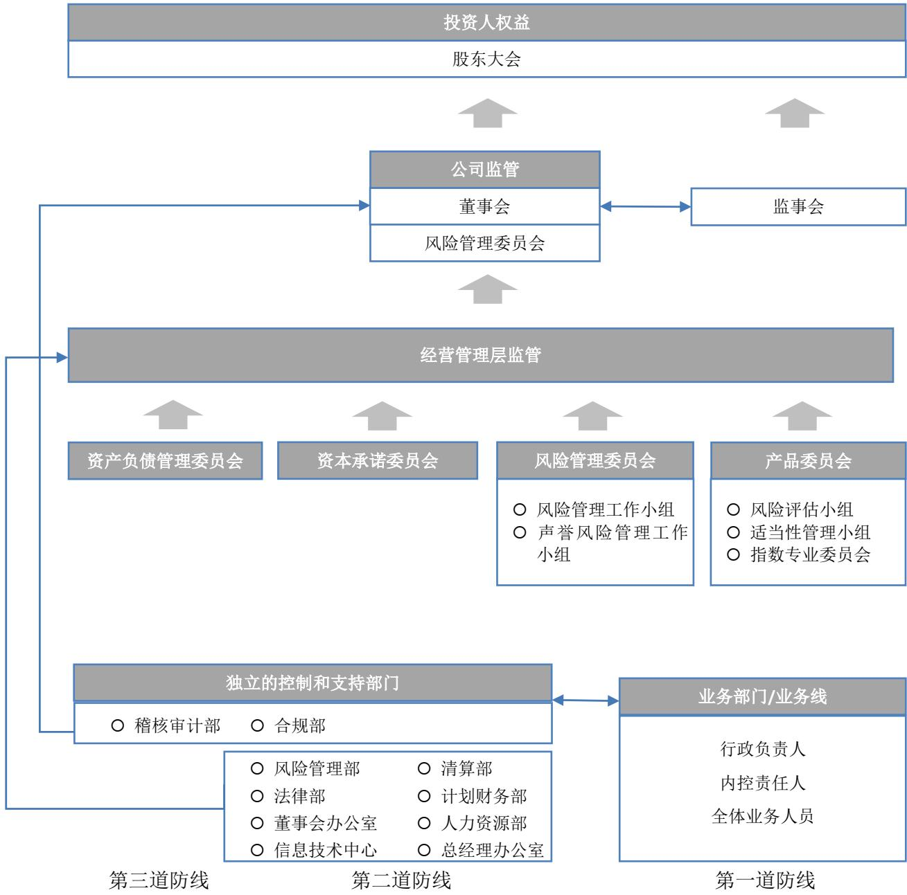
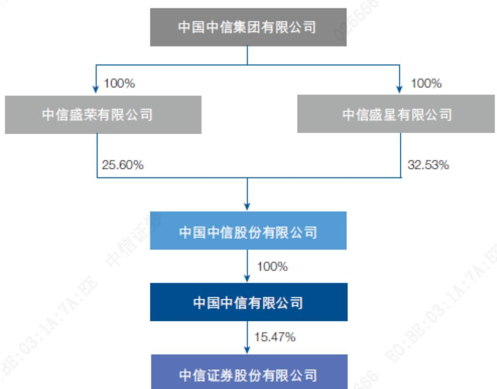
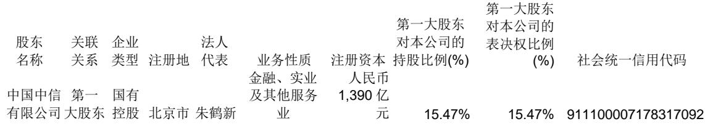
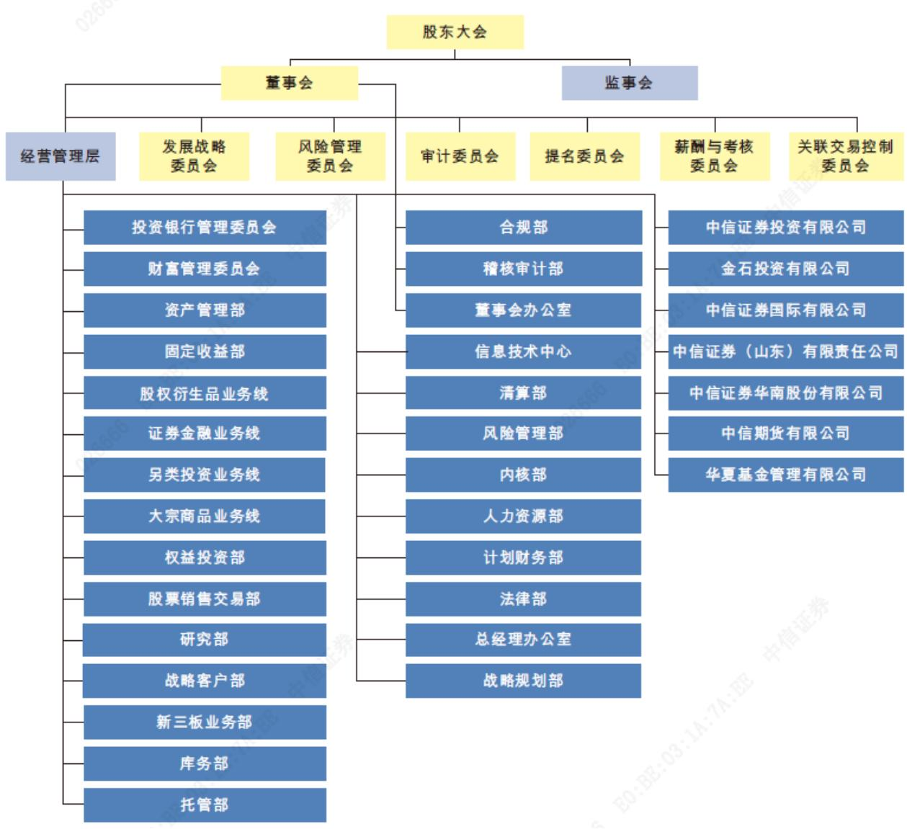

公司代码：600030

公司简称：中信证券

# 中信证券股份有限公司2020 年年度报告

## 重要提示

一、 本公司董事会、监事会及董事、监事、高级管理人员保证年度报告内容的真实、准确、完整，不存在虚假记载、误导性陈述或重大遗漏，并承担个别和连带的法律责任。

二、 本报告经本公司第七届董事会第二十一次会议审议通过，公司全体董事出席董事会会议。未有董事对本报告提出异议。

三、 本公司国内及国际年度财务报告已经分别由普华永道中天会计师事务所（特殊普通合伙）和罗兵咸永道会计师事务所为本公司出具了标准无保留意见的审计报告。

四、 公司负责人张佑君先生、主管会计工作负责人李冏先生及会计机构负责人史本良先生声明：保证年度报告中财务报告的真实、准确、完整。

五、 本公司经董事会审议的报告期利润分配预案为：每10股派发现金红利人民币4.00元（含税）。此预案尚需本公司股东大会批准。

六、 前瞻性陈述的风险声明

√适用 □不适用

本报告所涉及的未来计划、发展战略等前瞻性描述不构成本公司对投资者的实质承诺，敬请投资者注意投资风险。

七、 是否存在被控股股东及其关联方非经营性占用资金情况：否

八、 是否存在违反规定决策程序对外提供担保的情况：否

九、 是否存在半数以上董事无法保证公司所披露年度报告的真实性、准确性和完整性：否

## 十、 重大风险提示

本集团的业务高度依赖于中国及其它业务所处地区的整体经济及市场状况，中国及国际资本市场的波动，都将对本集团经营业绩产生重大影响。

本集团面临的风险主要包括：因国家法律法规和监管机构条例调整，如业务管理和规范未能及时跟进，而造成的法律以及合规风险；面对国内外资本市场的深刻变化，而确定战略规划的战略风险；因业务模式转型、新业务产生、新技术出现等方面的变化，而带来的内部运营及管理风险；持仓金融头寸的市场价格变动可能导致的市场风险；因借款人、交易对手或持仓金融头寸的发行人无法履约或信用资质恶化而导致的信用风险；在履行偿付义务时遇到资金短缺而产生的流动性风险；因内部流程管理疏漏、信息系统故障或人员行为不当等可能引起的操作风险；因公司经营、管理及其他行为或外部事件导致利益相关方对公司负面评价而引起的声誉风险；因开展国际化业务及金融创新业务等带来的汇率风险等。其中，信用风险和流动性风险是当前面临的主要风险。

针对上述风险，本集团从组织架构、管理机制、信息技术等方面进行防范，同时优化业务流程，重点加强信用风险和流动性风险的管理。

## 十一、 其他

□适用 √不适用

## 目 录

第一节 释义 ... 4  
第二节 公司简介和主要财务指标 5  
第三节 董事长致辞 . 17  
第四节 公司业务概要 . 19  
第五节 经营情况讨论与分析 20  
第六节 重要事项 . 46  
第七节 普通股股份变动及股东情况 74  
第八节 优先股相关情况 . 82  
第九节 董事、监事、高级管理人员和员工情况 83  
第十节 公司治理 . 90  
第十一节 公司债券相关情况 . 12  
第十二节 财务报告 ...  
第十三节 备查文件目录 . .361  
第十四节 证券公司信息披露 . .361  
附录一 组织结构图 . .362  
附录二 信息披露索引 . .363

## 第一节 释义

在本报告书中，除非文义另有所指，下列词语具有如下含义：

<table><tr><td colspan="3" rowspan="1">常用词语释义</td></tr><tr><td colspan="1" rowspan="1">公司、本公司、中信证券</td><td colspan="1" rowspan="1">指</td><td colspan="1" rowspan="1">中信证券股份有限公司</td></tr><tr><td colspan="1" rowspan="1">本集团</td><td colspan="1" rowspan="1">指</td><td colspan="1" rowspan="1">本公司及其子公司</td></tr><tr><td colspan="1" rowspan="1">中国证监会</td><td colspan="1" rowspan="1">指</td><td colspan="1" rowspan="1">中国证券监督管理委员会</td></tr><tr><td colspan="1" rowspan="1">财政部</td><td colspan="1" rowspan="1">指</td><td colspan="1" rowspan="1">中华人民共和国财政部</td></tr><tr><td colspan="1" rowspan="1">深圳证监局</td><td colspan="1" rowspan="1">指</td><td colspan="1" rowspan="1">中国证券监督管理委员会深圳监管局</td></tr><tr><td colspan="1" rowspan="1">北京证监局</td><td colspan="1" rowspan="1">指</td><td colspan="1" rowspan="1">中国证券监督管理委员会北京监管局</td></tr><tr><td colspan="1" rowspan="1">上交所</td><td colspan="1" rowspan="1">指</td><td colspan="1" rowspan="1">上海证券交易所</td></tr><tr><td colspan="1" rowspan="1">深交所</td><td colspan="1" rowspan="1">指</td><td colspan="1" rowspan="1">深圳证券交易所</td></tr><tr><td colspan="1" rowspan="1">中国结算</td><td colspan="1" rowspan="1">指</td><td colspan="1" rowspan="1">中国证券登记结算有限责任公司</td></tr><tr><td colspan="1" rowspan="1">上海清算所</td><td colspan="1" rowspan="1">指</td><td colspan="1" rowspan="1">银行间市场清算所股份有限公司</td></tr><tr><td colspan="1" rowspan="1">香港交易所</td><td colspan="1" rowspan="1">指</td><td colspan="1" rowspan="1">香港交易及结算所有限公司</td></tr><tr><td colspan="1" rowspan="1">香港联交所</td><td colspan="1" rowspan="1">指</td><td colspan="1" rowspan="1">香港联合交易所有限公司</td></tr><tr><td colspan="1" rowspan="1">中信集团</td><td colspan="1" rowspan="1">指</td><td colspan="1" rowspan="1">中国中信集团有限公司</td></tr><tr><td colspan="1" rowspan="1">中信股份</td><td colspan="1" rowspan="1">指</td><td colspan="1" rowspan="1">中国中信股份有限公司</td></tr><tr><td colspan="1" rowspan="1">中信有限</td><td colspan="1" rowspan="1">指</td><td colspan="1" rowspan="1">中国中信有限公司</td></tr><tr><td colspan="1" rowspan="1">中信泰富</td><td colspan="1" rowspan="1">指</td><td colspan="1" rowspan="1">中信泰富有限公司</td></tr><tr><td colspan="1" rowspan="1">中信控股</td><td colspan="1" rowspan="1">指</td><td colspan="1" rowspan="1">中信控股有限责任公司</td></tr><tr><td colspan="1" rowspan="1">全国社保基金</td><td colspan="1" rowspan="1">指</td><td colspan="1" rowspan="1">全国社会保障基金</td></tr><tr><td colspan="1" rowspan="1">中信证券（山东）</td><td colspan="1" rowspan="1">指</td><td colspan="1" rowspan="1">中信证券（山东）有限责任公司</td></tr><tr><td colspan="1" rowspan="1">中信里昂</td><td colspan="1" rowspan="1">指</td><td colspan="1" rowspan="1">本公司境外业务的品牌名称</td></tr><tr><td colspan="1" rowspan="1">中信证券国际</td><td colspan="1" rowspan="1">指</td><td colspan="1" rowspan="1">中信证券国际有限公司</td></tr><tr><td colspan="1" rowspan="1">CLSA B.V.</td><td colspan="1" rowspan="1">指</td><td colspan="1" rowspan="1">Crédit Agricole Securities Asia B. V.,   -家根据荷兰法律成立的私人有限公司，于2013年7月31日成为中信证券国际的全资子公司</td></tr><tr><td colspan="1" rowspan="1">中信里昂证券</td><td colspan="1" rowspan="1">指</td><td colspan="1" rowspan="1">CLSA Limited</td></tr><tr><td colspan="1" rowspan="1">中信证券经纪（香港）</td><td colspan="1" rowspan="1">指</td><td colspan="1" rowspan="1">CITIC Securities Brokerage (HK) Limited</td></tr><tr><td colspan="1" rowspan="1">金石投资</td><td colspan="1" rowspan="1">指</td><td colspan="1" rowspan="1">金石投资有限公司</td></tr><tr><td colspan="1" rowspan="1">三峡金石管理公司</td><td colspan="1" rowspan="1">指</td><td colspan="1" rowspan="1">三峡金石私募基金管理有限公司</td></tr><tr><td colspan="1" rowspan="1">三峡金石基金</td><td colspan="1" rowspan="1">指</td><td colspan="1" rowspan="1">三峡金石（武汉）股权投资基金合伙企业（有限合伙）</td></tr><tr><td colspan="1" rowspan="1">中信证券投资</td><td colspan="1" rowspan="1">指</td><td colspan="1" rowspan="1">中信证券投资有限公司</td></tr><tr><td colspan="1" rowspan="1">中信期货</td><td colspan="1" rowspan="1">指</td><td colspan="1" rowspan="1">中信期货有限公司</td></tr><tr><td colspan="1" rowspan="1">中信证券华南、广州证券</td><td colspan="1" rowspan="1">指</td><td colspan="1" rowspan="1">中信证券华南股份有限公司（前称“广州证券股份有限公司”）</td></tr><tr><td colspan="1" rowspan="1">华夏基金</td><td colspan="1" rowspan="1">指</td><td colspan="1" rowspan="1">华夏基金管理有限公司</td></tr><tr><td colspan="1" rowspan="1">金通证券</td><td colspan="1" rowspan="1">指</td><td colspan="1" rowspan="1">金通证券有限责任公司</td></tr><tr><td colspan="1" rowspan="1">中信产业基金</td><td colspan="1" rowspan="1">指</td><td colspan="1" rowspan="1">中信产业投资基金管理有限公司</td></tr><tr><td colspan="1" rowspan="1">银河资产</td><td colspan="1" rowspan="1">指</td><td colspan="1" rowspan="1">中国银河资产管理有限责任公司，原“建投中信资产管理有限责任公司”</td></tr><tr><td colspan="1" rowspan="1">CITIC Securities Finance MTN</td><td colspan="1" rowspan="1">指</td><td colspan="1" rowspan="1">CITIC Securities Finance MTN Co., Ltd.</td></tr><tr><td colspan="1" rowspan="1">金石灏汭</td><td colspan="1" rowspan="1">指</td><td colspan="1" rowspan="1">青岛金石灏汭投资有限公司</td></tr><tr><td colspan="1" rowspan="1">金石泽信</td><td colspan="1" rowspan="1">指</td><td colspan="1" rowspan="1">金石泽信投资管理有限公司</td></tr><tr><td colspan="1" rowspan="1">中信寰球商贸</td><td colspan="1" rowspan="1">指</td><td colspan="1" rowspan="1">中信寰球商贸（上海）有限公司</td></tr><tr><td colspan="1" rowspan="1">中信银行</td><td colspan="1" rowspan="1">指</td><td colspan="1" rowspan="1">中信银行股份有限公司</td></tr><tr><td colspan="1" rowspan="1">中信信托</td><td colspan="1" rowspan="1">指</td><td colspan="1" rowspan="1">中信信托有限责任公司</td></tr><tr><td colspan="1" rowspan="1">兴澄特钢</td><td colspan="1" rowspan="1">指</td><td colspan="1" rowspan="1">江阴兴澄特种钢铁有限公司</td></tr><tr><td colspan="1" rowspan="1">越秀金控</td><td colspan="1" rowspan="1">指</td><td colspan="1" rowspan="1">广州越秀金融控股集团股份有限公司</td></tr><tr><td colspan="1" rowspan="1">金控有限</td><td colspan="1" rowspan="1">指</td><td colspan="1" rowspan="1">广州越秀金融控股集团有限公司</td></tr><tr><td colspan="1" rowspan="1">金控资本</td><td colspan="1" rowspan="1">指</td><td colspan="1" rowspan="1">广州越秀金控资本管理有限公司</td></tr><tr><td colspan="1" rowspan="1">越秀产业基金</td><td colspan="1" rowspan="1">指</td><td colspan="1" rowspan="1">广州越秀产业投资基金管理股份有限公司</td></tr><tr><td colspan="1" rowspan="1">渤海创富</td><td colspan="1" rowspan="1">指</td><td colspan="1" rowspan="1">渤海创富证券投资有限公司</td></tr><tr><td colspan="1" rowspan="1">中信建投</td><td colspan="1" rowspan="1">指</td><td colspan="1" rowspan="1">中信建投证券股份有限公司</td></tr><tr><td colspan="1" rowspan="1">《公司法》</td><td colspan="1" rowspan="1">指</td><td colspan="1" rowspan="1">《中华人民共和国公司法》</td></tr><tr><td colspan="1" rowspan="1">《证券法》</td><td colspan="1" rowspan="1">指</td><td colspan="1" rowspan="1">《中华人民共和国证券法》</td></tr><tr><td colspan="1" rowspan="1">《上交所上市规则》</td><td colspan="1" rowspan="1">指</td><td colspan="1" rowspan="1">《上海证券交易所股票上市规则》</td></tr><tr><td colspan="1" rowspan="1">《香港上市规则》</td><td colspan="1" rowspan="1">指</td><td colspan="1" rowspan="1">《香港联合交易所有限公司证券上市规则》</td></tr><tr><td colspan="1" rowspan="1">关联交易</td><td colspan="1" rowspan="1">指</td><td colspan="1" rowspan="1">与现行有效且不时修订的《上交所上市规则》中“关联交易”的定义相同</td></tr><tr><td colspan="1" rowspan="1">关连交易</td><td colspan="1" rowspan="1">指</td><td colspan="1" rowspan="1">与现行有效且不时修订的《香港上市规则》中“关连交易”的定义相同</td></tr><tr><td colspan="1" rowspan="1">普华永道</td><td colspan="1" rowspan="1">指</td><td colspan="1" rowspan="1">普华永道中天会计师事务所（特殊普通合伙）、罗兵咸永道会计师事务所</td></tr><tr><td colspan="1" rowspan="1">普华永道中天</td><td colspan="1" rowspan="1">指</td><td colspan="1" rowspan="1">普华永道中天会计师事务所（特殊普通合伙）</td></tr><tr><td colspan="1" rowspan="1">罗兵咸永道</td><td colspan="1" rowspan="1">指</td><td colspan="1" rowspan="1">罗兵咸永道会计师事务所</td></tr><tr><td colspan="1" rowspan="1">万得资讯</td><td colspan="1" rowspan="1">指</td><td colspan="1" rowspan="1">万得信息技术股份有限公司</td></tr><tr><td colspan="1" rowspan="1">股份</td><td colspan="1" rowspan="1">指</td><td colspan="1" rowspan="1">A股及H股</td></tr><tr><td colspan="1" rowspan="1">股东</td><td colspan="1" rowspan="1">指</td><td colspan="1" rowspan="1">本公司普通股股本中每股面值人民币1.00元的内资股或境外上市外资股并分别于上交所及香港联交所上市的持有人</td></tr><tr><td colspan="1" rowspan="1">A股</td><td colspan="1" rowspan="1">指</td><td colspan="1" rowspan="1">本公司普通股股本中每股面值为人民币1.00元的内资股，于上海证券交易所上市（股份代码：600030）</td></tr><tr><td colspan="1" rowspan="1">H股</td><td colspan="1" rowspan="1">指</td><td colspan="1" rowspan="1">本公司普通股股本中每股面值为人民币1.00元的境外上市外资股，于香港联合交易所有限公司上市（股份代码：6030）</td></tr><tr><td colspan="1" rowspan="1">A股股东</td><td colspan="1" rowspan="1">指</td><td colspan="1" rowspan="1">A股持有人</td></tr><tr><td colspan="1" rowspan="1">H股股东</td><td colspan="1" rowspan="1">指</td><td colspan="1" rowspan="1">H股持有人</td></tr><tr><td colspan="1" rowspan="1">中国</td><td colspan="1" rowspan="1">指</td><td colspan="1" rowspan="1">中华人民共和国</td></tr><tr><td colspan="1" rowspan="1">香港</td><td colspan="1" rowspan="1">指</td><td colspan="1" rowspan="1">中国香港特别行政区</td></tr><tr><td colspan="1" rowspan="1">报告期</td><td colspan="1" rowspan="1">指</td><td colspan="1" rowspan="1">截至2020年12月31日止十二个月期间</td></tr></table>

## 第二节 公司简介和主要财务指标

## 一、 公司信息

<table><tr><td rowspan=1 colspan=1>公司的中文名称</td><td rowspan=1 colspan=1>中信证券股份有限公司</td></tr><tr><td rowspan=1 colspan=1>公司的中文简称</td><td rowspan=1 colspan=1>中信证券</td></tr><tr><td rowspan=1 colspan=1>公司的外文名称</td><td rowspan=1 colspan=1>CITIC Securities Company Limited</td></tr><tr><td rowspan=1 colspan=1>公司的外文名称缩写</td><td rowspan=1 colspan=1>CITIC Securities Co., Ltd.</td></tr><tr><td rowspan=1 colspan=1>公司的法定代表人</td><td rowspan=1 colspan=1>张佑君</td></tr><tr><td rowspan=1 colspan=1>公司总经理</td><td rowspan=1 colspan=1>杨明辉</td></tr><tr><td rowspan=1 colspan=1>授权代表</td><td rowspan=1 colspan=1>杨明辉、刘小萌</td></tr></table>

公司注册资本和净资本

√适用 □不适用

单位：元 币种：人民币

<table><tr><td rowspan=1 colspan=1></td><td rowspan=1 colspan=1>本报告期末</td><td rowspan=1 colspan=1>上年度末</td></tr><tr><td rowspan=1 colspan=1>注册资本</td><td rowspan=1 colspan=1>12,926,776,029.00</td><td rowspan=1 colspan=1>12,116,908,400.00</td></tr><tr><td rowspan=1 colspan=1>净资本</td><td rowspan=1 colspan=1>85,906,426,786.60</td><td rowspan=1 colspan=1>94,904, 219,964.48</td></tr></table>

公司的各单项业务资格情况

## √适用 □不适用

公司经营范围包括：证券经纪（限山东省、河南省、浙江省天台县、浙江省苍南县以外区域）；证券投资咨询；与证券交易、证券投资活动有关的财务顾问；证券承销与保荐；证券自营；证券资产管理；融资融券；证券投资基金代销；为期货公司提供中间介绍业务；代销金融产品；股票期权做市。

此外，公司还具有以下业务资格：

1. 经中国证监会核准或认可的业务资格：网上证券委托业务资格、受托理财、合格境内机构投资者从事境外证券投资管理业务（QDII）、直接投资业务、银行间市场利率互换业务、自营业务及资产管理业务开展股指期货交易资格、股票收益互换业务试点资格、场外期权一级交易商资质、自营业务及证券资产管理业务开展国债期货交易业务资格、黄金等贵金属现货合约代理及黄金现货合约自营业务试点资格、证券投资基金托管资格、信用风险缓释工具卖出业务资格、国债期货做市业务资格、商品衍生品交易及境外交易所金融产品交易资格、试点开展跨境业务资格。

2. 交易所核准的业务资格：交易所固定收益平台做市商、权证交易、约定购回式证券交易业务资格、股票质押式回购业务资格、转融资、转融券、港股通业务、上市公司股权激励行权融资业务、股票期权经纪业务、股票期权自营业务、上交所上证50ETF期权主做市商、上交所及深交所沪深300ETF期权主做市商、上交所上市基金主做市商、深交所上市基金做市商资格。

3. 中国证券业协会核准的业务资格：报价转让业务、柜台市场业务、柜台交易业务、互联网证券业务试点、跨境收益互换交易业务。

4. 中国人民银行核准的业务资格：全国银行间同业拆借中心组织的拆借交易和债券交易、短期融资券承销、银行间债券市场做市商、公开市场一级交易商。

5. 其它资格：记账式国债承销团成员、中国结算甲类结算参与人、证券业务外汇经营许可证（外币有价证券经纪业务、外币有价证券承销业务、受托外汇资产管理业务）、企业年金、职业年金投资管理人、政策性银行承销团成员、全国社保基金转持股份管理人、全国社保基金境内投资管理人、受托管理保险资金、全国基本养老保险基金证券投资管理、转融通业务试点、保险兼业代理业务、保险机构特殊机构客户业务、全国中小企业股份转让系统从事推荐业务和经纪业务、全国中小企业股份转让系统从事做市业务、军工涉密业务咨询服务、上海清算所利率互换集中清算业务综合清算会员、结售汇业务经营、上海清算所大宗商品及航运金融衍生品集中清算业务综合清算会员、上海清算所标准债券远期集中清算业务综合清算会员、上海清算所债券净额集中清算业务综合清算会员、银行间外汇市场会员、银行间外币对市场会员、上海票据交易所会员、非金融企业债务融资工具受托管理人。

## 二、 联系人和联系方式

<table><tr><td rowspan=1 colspan=1></td><td rowspan=1 colspan=1>董事会秘书、证券事务代表、公司秘书</td></tr><tr><td rowspan=1 colspan=1>姓名</td><td rowspan=1 colspan=1>董事会秘书：王俊锋证券事务代表：杨宝林联席公司秘书：刘小萌、余晓君</td></tr><tr><td rowspan=1 colspan=1>联系地址</td><td rowspan=1 colspan=1>东省深圳市福田区中心三路8号中信证券大厦（注：此为邮寄地址，与公司注册地址为同一楼宇，公司注册地址系该楼宇于深圳市房地产权登记中心登记的名称）北京市朝阳区亮马桥路48号中信证券大厦</td></tr><tr><td rowspan=1 colspan=1>电话</td><td rowspan=1 colspan=1>0086-755-23835383、0086-10-60836030</td></tr><tr><td rowspan=1 colspan=1>传真</td><td rowspan=1 colspan=1>0086-755-23835525、0086-10-60836031</td></tr><tr><td rowspan=1 colspan=1>电子信箱</td><td rowspan=1 colspan=1>ir@citics.com</td></tr></table>

## 三、 基本情况简介

<table><tr><td rowspan=1 colspan=1>公司注册地址</td><td rowspan=1 colspan=1>广东省深圳市福田区中心三路8号卓越时代广场（二期）北座</td></tr><tr><td rowspan=1 colspan=1>公司注册地址的邮政编码</td><td rowspan=1 colspan=1>518048</td></tr><tr><td rowspan=1 colspan=1>公司办公地址</td><td rowspan=1 colspan=1>广东省深圳市福田区中心三路8号中信证券大厦北京市朝阳区亮马桥路48号中信证券大厦</td></tr><tr><td rowspan=1 colspan=1>公司办公地址的邮政编码</td><td rowspan=1 colspan=1>518048、100026</td></tr><tr><td rowspan=1 colspan=1>香港营业地址</td><td rowspan=1 colspan=1>香港中环添美道1号中信大厦26层</td></tr><tr><td rowspan=1 colspan=1>公司网址</td><td rowspan=1 colspan=1>http://www.citics.com</td></tr><tr><td rowspan=1 colspan=1>电子信箱</td><td rowspan=1 colspan=1>ir@citics.com</td></tr><tr><td rowspan=1 colspan=1>联系电话</td><td rowspan=1 colspan=1>0086-755-23835888、0086-10-60838888</td></tr><tr><td rowspan=1 colspan=1>传真</td><td rowspan=1 colspan=1>0086-755-23835861、0086-10-60836029</td></tr><tr><td rowspan=1 colspan=1>经纪业务、资产管理业务客户服务热线</td><td rowspan=1 colspan=1>95548、4008895548</td></tr><tr><td rowspan=1 colspan=1>股东联络热线</td><td rowspan=1 colspan=1>0086-755-2383 5383、0086-10-60836030</td></tr><tr><td rowspan=1 colspan=1>统一社会信用代码</td><td rowspan=1 colspan=1>914403001017814402</td></tr></table>

## 四、 信息披露及备置地点

<table><tr><td rowspan=1 colspan=1>公司选定的信息披露媒体名称</td><td rowspan=1 colspan=1>中国证券报、上海证券报、证券时报</td></tr><tr><td rowspan=1 colspan=1>登载公司年度报告的指定网站的网址</td><td rowspan=1 colspan=1>中国证监会指定网站：http://www.sse.com.cn（上交所网站）香港联交所指定网站：http://www.hkexnews.hk（香港交易所披露易网站)</td></tr><tr><td rowspan=1 colspan=1>公司年度报告备置地点</td><td rowspan=1 colspan=1>广东省深圳市福田区中心三路8号中信证券大厦16层北京市朝阳区亮马桥路48号中信证券大厦10层香港中环添美道1号中信大厦26层</td></tr></table>

## 五、 公司股票简况

<table><tr><td rowspan=1 colspan=1>股票种类</td><td rowspan=1 colspan=1>股票上市交易所</td><td rowspan=1 colspan=1>股票簡称</td><td rowspan=1 colspan=1>股票代码</td><td rowspan=1 colspan=1>变更前股票简称</td></tr><tr><td rowspan=1 colspan=1>A股</td><td rowspan=1 colspan=1>上交所</td><td rowspan=1 colspan=1>中信证券</td><td rowspan=1 colspan=1>600030</td><td rowspan=1 colspan=1>不适用</td></tr><tr><td rowspan=1 colspan=1>H股</td><td rowspan=1 colspan=1>香港联交所</td><td rowspan=1 colspan=1>中信证券</td><td rowspan=1 colspan=1>6030</td><td rowspan=1 colspan=1>不适用</td></tr></table>

## 六、 公司其他情况

## (一)公司历史沿革情况

## √适用 □不适用

公司前身系中信证券有限责任公司，1995年10月25日成立，注册地北京市，注册资本人民币3亿元，主要股东为中信集团，其直接持股比例为95%。

1999年12月29日，中信证券有限责任公司增资扩股并改制为中信证券股份有限公司，注册资本增至人民币208,150万元，中信集团直接持股比例为37.85%。

2000年4月6日，经中国证监会和国家工商总局批准，公司注册地变更至深圳市。

2002年12月，公司首次公开发行A股40,000万股，发行价格人民币4.50元/股，于2003年1月6日在上交所上市交易。发行完成后，公司总股数变更为248,150万股，中信集团直接持股比例为31.75%。

2005年8月15日，公司实施股权分置改革，非流通股股东按10:3.5的比例向流通股股东支付对价以换取非流通股份的上市流通权（即：流通股股东每持有10股流通股获得3.5股股票），此外，全体非流通股股东还提供了总量为3,000万股的股票作为公司首次股权激励计划的股票来源。股权分置改革完成后，公司总股数仍为248,150万股，所有股份均为流通股，其中有限售条件流通股的股数为194,150万股，占公司总股数的78.24%，中信集团直接持股比例为29.89%。2008年8月15日，发起人限售股份全部上市流通。

2006年6月27日，公司向中国人寿保险（集团）公司、中国人寿保险股份有限公司非公开发行的50,000万股A股于上交所上市交易，发行价格人民币9.29元/股，公司总股数由248,150万股变更至298,150万股，中信集团直接持股比例为24.88%。

2007年9月4日，公司公开发行的33,373.38万股A股于上交所上市交易，发行价格人民币74.91元/股，公司总股数由298,150万股变更至331,523.38万股，中信集团直接持股比例为23.43%。

2008年4月，公司实行2007年度利润分配及资本公积转增股本，即每10股派发现金红利人民币5元（含税）、资本公积每10股转增10股。资本公积转增完成后，公司总股数由331,523.38万股变更至663,046.76万股。

2010年6月，公司实行2009年度利润分配及资本公积转增股本，即每10股派发现金红利人民币5元（含税）、资本公积每10股转增5股。资本公积转增完成后，公司总股数由663,046.76万股变更至994,570.14万股。

2011年9-10月，公司首次公开发行H股107,120.70万股（含部分行使超额配售权的部分），发行价格13.30港元/股，每股面值人民币1元，全部为普通股。公司13家国有股股东根据《减持国有股筹集社会保障资金管理办法》和财政部的批复，将所持10,712.07万股（含因部分行使超额配售权而减持的部分）国有股划转予全国社保基金持有并转换为H股。该次根据全球发售而发行及转持的109,483万股H股（含相应的国有股转换为H股的部分）、根据部分行使超额配售权而发行的7,590.70万股H股及相应的国有股转换为H股的759.07万股，已先后于2011年10月6日、2011年11月1日、2011年11月7日在香港联交所主板挂牌上市并交易。发行完成后，公司总股数由994,570.14万股变更至1,101,690.84万股，其中A股983,858.07万股、H股117,832.77万股。中信集团直接持股比例为20.30%。

2011年12月27日，公司第一大股东中信集团整体改制为国有独资公司，并更名为“中国中信集团有限公司”，承继原中信集团的全部业务及资产。中信集团以其绝大部分经营性净资产（含所持本公司20.30%的股份）出资，联合北京中信企业管理有限公司，于2011年12月27日共同发起设立中国中信股份有限公司（2014年更名为“中国中信有限公司”）。经中国证监会核准，中信集团、中信有限于2013年2月25日办理完毕股权过户手续，公司第一大股东变更为中信有限，其直接持股比例为20.30%。2014年4月16日，中信有限的股东中信集团及北京中信企业管理有限公司，与中信泰富签署了股份转让协议，同意将其所持中信有限100%的股权转让予中信泰富。相关股权转让于2014年8月25日完成，中信泰富成为本公司第一大股东中信有限的单一直接股东。2014年8月27日，中信泰富更名为“中国中信股份有限公司”。

2015年6月23日，公司向科威特投资局等10位投资者非公开发行的11亿股H股于香港联交所上市交易，发行价格24.60港元/股，公司总股数由1,101,690.84万股变更至1,211,690.84万股，其中A股983,858.07万股、H股227,832.77万股。发行完成时，中信有限直接持股比例为15.59%。

2016年2月26日、2016年2月29日，中信有限通过自身股票账户增持本公司股份合计110,936,871股A股。本次增持完成后，中信有限直接持有本公司股份总数由1,888,758,875股增至1,999,695,746股，直接持股比例由15.59%增至16.50%。

2019年5月27日，公司2019年第一次临时股东大会审议通过发行股份购买广州证券100%股权。前述交易之标的资产过户手续及相关工商变更登记于2020年1月完成，广州证券更名为中信证券华南股份有限公司，公司持有其100%股权。公司于2020年3月11日完成向越秀金控、金控有限分别发行265,352,996股、544,514,633股代价股份。公司注册资本已由人民币12,116,908,400元变更为人民币 12,926,776,029 元 ， 公 司 总 股 数 由 12,116,908,400 股 增 至 12,926,776,029 股 ， 其 中 A 股 由9,838,580,700股变更为10,648,448,329股，H股仍为2,278,327,700股，中信有限直接持有公司股份比例为15.47%，越秀金控、金控有限合计持有公司股份比例为6.26%。

公司于上交所上市后，先后被纳入上证180指数、上证50指数、沪深300指数、上证公司治理指数、新华富时A50指数、道琼斯中国88指数、上证社会责任指数等；公司于香港联交所上市后，先后被纳入恒生中国H股金融行业指数、恒生AH指数系列、恒生环球综合指数、恒生综合指数、恒生综合行业指数——金融业、恒生综合中型股指数、恒生中国企业指数、恒生中国内地100指数、中证恒生沪港通AH股精明指数、上证沪股通指数、富时中国25指数、MSCI中国指数、恒生A股可持续发展企业基准指数等成份股，极大提升了公司的形象。2014年11月17日沪港通开通后，公司股票分别成为沪股通和港股通的标的股票。2016年12月5日深港通开通后，公司H股股票为深港通标的股票。

## 报告期内注册变更情况：

2020年5月27日，公司在深圳市市场监督管理局办理完毕注册资本及公司《章程》的变更备案。

首次注册情况的相关查询索引：

公司首次注册登记日期：1995年10月25日

公司首次注册登记地址：北京市朝阳区新源南路6号京城大厦

企业法人营业执照注册号：10001830

组织机构代码：10178144-0

公司首次注册情况请参见公司2002年年度报告“一、公司基本情况”。

## (二)业务的变化情况

公司是在中国证券市场起步不久，中信集团整合原有分散的证券经营机构成立的。在“规范经营、稳健发展”的原则下，积极开展业务，于1996年底成为中国证监会重新批准股票承销资格的首批十家证券机构之一，于1999年10月成为中国证监会批准的首批综合类证券公司之一、中国证监会重新批准股票主承销资格的首批证券机构之一，公司是中国证券业协会监事单位，是首批进入全国银行间拆借市场的证券公司之一，是首批获准进行股票抵押贷款的证券公司之一。公司2002年获受托投资管理业务资格、基金代销资格，2005年获得企业年金投资管理人资格，2006年成为首批（唯一一家）获得短期融资券主承销商资格的证券公司，2007年获得开展直接投资业务试点资格、合格境内机构投资者从事境外证券投资管理业务资格（QDII），2008年成为中国结算甲类结算参与人、取得为期货公司提供中间介绍业务资格，2009年获得全国社保基金转持股份管理资格，2010年获得融资融券业务资格、自营业务及资产管理业务开展股指期货交易资格、获准成为全国社保基金境内投资管理人，2011年获得首批开展约定购回式证券交易资格，2012年获得中小企业私募债券承销业务资格、受托管理保险资金资格、代销金融产品业务资格、股票收益互换业务试点资格、转融通业务试点资格,获得军工涉密业务咨询服务资格，2013年获准开展保险兼业代理业务、自营业务及证券资产管理业务开展国债期货交易业务，首批获得上海清算所人民币利率互换会员资格，开展代理清算业务，并于2014年首批成为综合清算会员。2014年获准开展黄金等贵金属现货合约代理及黄金现货合约自营业务、场外期权业务、互联网证券业务、新三板做市商业务、证券投资基金托管业务、港股通业务、信用风险缓释工具卖出业务、上市公司股权激励行权融资业务，获得公开市场一级交易商资格等。2015年获股票期权做市业务资格，获准开展上证50ETF期权做市业务，获准成为上交所股票期权交易参与人，具有股票期权经纪业务、自营业务交易权限。2016年获准开展职业年金投资管理，获得上海票据交易所非银会员资格，获准开展基于票据的转贴现、质押式回购、买断式回购等交易。2018年获准以自有资金投资于其他合格境内机构投资者允许投资的境外金融产品或工具，2019年获得上市基金主做市商业务资格，获准开展国债期货做市业务、股指期权做市业务，获得结售汇业务经营资格，可试点开展结售汇业务，成为银行间外汇市场会员、银行间外币对市场会员，可从事即期、远期、掉期、货币掉期、外币利率互换及期权交易。2020年经国家外汇管理局备案，可开展相关代客外汇业务，经中国银行间市场交易商协会备案，成为非金融企业债务融资工具受托管理人，可开展受托管理业务。

## (三)主要股东的变更情况

公司自成立以来，中信集团或其下属公司一直是公司的第一大股东。2020年公司向越秀金控及其全资子公司金控有限发行股份购买原广州证券100%股权后，越秀金控及金控有限合计持有公司股份比例超过5%，详情请参见本节“公司历史沿革情况”。

## (四)公司组织机构情况

## √适用 □不适用

截至本报告期末，公司拥有主要全资子公司6家，分别为中信证券（山东）、中信证券国际、金石投资、中信证券投资、中信期货、中信证券华南；拥有主要控股子公司1家，即，华夏基金。详情请参见本报告“主要控股参股公司分析”。

## (五)公司证券营业部的数量和分布情况

√适用 □不适用

截至报告期末，本公司及中信证券（山东）、中信证券华南、中信期货、金通证券在境内共拥有分公司84家，营业部337家（其中，证券营业部333家，期货营业部4家）。此外，截至报告期末中信证券国际通过其下属公司在香港拥有4家分行。

本集团境内证券营业部的数量及分布情况如下：

<table><tr><td rowspan=1 colspan=1>省市或地区</td><td rowspan=1 colspan=1>营业部数量</td><td rowspan=1 colspan=1>省市或地区</td><td rowspan=1 colspan=1>营业部数量</td><td rowspan=1 colspan=1>省市或地区</td><td rowspan=1 colspan=1>营业部数量</td></tr><tr><td rowspan=1 colspan=1>浙江</td><td rowspan=1 colspan=1>62</td><td rowspan=1 colspan=1>湖北</td><td rowspan=1 colspan=1>10</td><td rowspan=1 colspan=1>陕西</td><td rowspan=1 colspan=1>5</td></tr><tr><td rowspan=1 colspan=1>山东</td><td rowspan=1 colspan=1>57</td><td rowspan=1 colspan=1>江西</td><td rowspan=1 colspan=1>7</td><td rowspan=1 colspan=1>山西</td><td rowspan=1 colspan=1>2</td></tr><tr><td rowspan=1 colspan=1>广东</td><td rowspan=1 colspan=1>54</td><td rowspan=1 colspan=1>辽宁</td><td rowspan=1 colspan=1>11</td><td rowspan=1 colspan=1>安徽</td><td rowspan=1 colspan=1>3</td></tr><tr><td rowspan=1 colspan=1>上海</td><td rowspan=1 colspan=1>20</td><td rowspan=1 colspan=1>河南</td><td rowspan=1 colspan=1>7</td><td rowspan=1 colspan=1>重庆</td><td rowspan=1 colspan=1>1</td></tr><tr><td rowspan=1 colspan=1>江苏</td><td rowspan=1 colspan=1>29</td><td rowspan=1 colspan=1>四川</td><td rowspan=1 colspan=1>8</td><td rowspan=1 colspan=1>吉林</td><td rowspan=1 colspan=1>1</td></tr><tr><td rowspan=1 colspan=1>北京</td><td rowspan=1 colspan=1>22</td><td rowspan=1 colspan=1>河北</td><td rowspan=1 colspan=1>7</td><td rowspan=1 colspan=1>湖南</td><td rowspan=1 colspan=1>7</td></tr><tr><td rowspan=1 colspan=1>福建</td><td rowspan=1 colspan=1>8</td><td rowspan=1 colspan=1>天津</td><td rowspan=1 colspan=1>4</td><td rowspan=1 colspan=1>内蒙古</td><td rowspan=1 colspan=1>1</td></tr><tr><td rowspan=1 colspan=1>广西</td><td rowspan=1 colspan=1>2</td><td rowspan=1 colspan=1>黑龙江</td><td rowspan=1 colspan=1>1</td><td rowspan=1 colspan=1>青海</td><td rowspan=1 colspan=1>2</td></tr><tr><td rowspan=1 colspan=1>西藏</td><td rowspan=1 colspan=1>1</td><td rowspan=1 colspan=1>云南</td><td rowspan=1 colspan=1>1</td><td rowspan=1 colspan=1></td><td rowspan=1 colspan=1></td></tr></table>

## (六)其他分支机构数量与分布情况

## √适用 □不适用

本集团境内其他证券分支机构（分公司）的数量及分布情况如下：
<table><tr><td rowspan=1 colspan=1>省市或地区</td><td rowspan=1 colspan=1>分公司数量</td><td rowspan=1 colspan=1>省市或地区</td><td rowspan=1 colspan=1>分公司数量</td><td rowspan=1 colspan=1>省市或地区</td><td rowspan=1 colspan=1>分公司数量</td></tr><tr><td rowspan=1 colspan=1>浙江</td><td rowspan=1 colspan=1>7</td><td rowspan=1 colspan=1>湖北</td><td rowspan=1 colspan=1>1</td><td rowspan=1 colspan=1>陕西</td><td rowspan=1 colspan=1>1</td></tr><tr><td rowspan=1 colspan=1>山东</td><td rowspan=1 colspan=1>5</td><td rowspan=1 colspan=1>江西</td><td rowspan=1 colspan=1>1</td><td rowspan=1 colspan=1>山西</td><td rowspan=1 colspan=1>1</td></tr><tr><td rowspan=1 colspan=1>广东</td><td rowspan=1 colspan=1>1</td><td rowspan=1 colspan=1>辽宁</td><td rowspan=1 colspan=1>1</td><td rowspan=1 colspan=1>安徽</td><td rowspan=1 colspan=1>1</td></tr><tr><td rowspan=1 colspan=1>上海</td><td rowspan=1 colspan=1>2</td><td rowspan=1 colspan=1>河南</td><td rowspan=1 colspan=1>1</td><td rowspan=1 colspan=1>重庆</td><td rowspan=1 colspan=1>1</td></tr><tr><td rowspan=1 colspan=1>江苏</td><td rowspan=1 colspan=1>1</td><td rowspan=1 colspan=1>四川</td><td rowspan=1 colspan=1>1</td><td rowspan=1 colspan=1>吉林</td><td rowspan=1 colspan=1>1</td></tr><tr><td rowspan=1 colspan=1>北京</td><td rowspan=1 colspan=1>1</td><td rowspan=1 colspan=1>河北</td><td rowspan=1 colspan=1>1</td><td rowspan=1 colspan=1>湖南</td><td rowspan=1 colspan=1>1</td></tr><tr><td rowspan=1 colspan=1>福建</td><td rowspan=1 colspan=1>1</td><td rowspan=1 colspan=1>天津</td><td rowspan=1 colspan=1>1</td><td rowspan=1 colspan=1>內蒙古</td><td rowspan=1 colspan=1>1</td></tr><tr><td rowspan=1 colspan=1>黑龙江</td><td rowspan=1 colspan=1>1</td><td rowspan=1 colspan=1>云南</td><td rowspan=1 colspan=1>1</td><td rowspan=1 colspan=1>广西</td><td rowspan=1 colspan=1>1</td></tr><tr><td rowspan=1 colspan=1>海南</td><td rowspan=1 colspan=1>1</td><td rowspan=1 colspan=1>甘肃</td><td rowspan=1 colspan=1>1</td><td rowspan=1 colspan=1>宁夏</td><td rowspan=1 colspan=1>1</td></tr><tr><td rowspan=1 colspan=1>贵州</td><td rowspan=1 colspan=1>1</td><td rowspan=1 colspan=1>新疆</td><td rowspan=1 colspan=1>1</td><td rowspan=1 colspan=1></td><td rowspan=1 colspan=1></td></tr></table>

截至报告期末，中信期货拥有48家分支机构，包括44家分公司、4家期货营业部（均位于浙江），其数量及分布情况如下：

<table><tr><td rowspan=1 colspan=1>省市或地区</td><td rowspan=1 colspan=1>分支机构数量</td><td rowspan=1 colspan=1>省市或地区</td><td rowspan=1 colspan=1>分支机构数量</td><td rowspan=1 colspan=1>省市或地区</td><td rowspan=1 colspan=1>分支机构数量</td></tr><tr><td rowspan=1 colspan=1>北京</td><td rowspan=1 colspan=1>3</td><td rowspan=1 colspan=1>贵州</td><td rowspan=1 colspan=1>1</td><td rowspan=1 colspan=1>内蒙古</td><td rowspan=1 colspan=1>1</td></tr><tr><td rowspan=1 colspan=1>上海</td><td rowspan=1 colspan=1>4</td><td rowspan=1 colspan=1>海南</td><td rowspan=1 colspan=1>1</td><td rowspan=1 colspan=1>宁夏</td><td rowspan=1 colspan=1>1</td></tr><tr><td rowspan=1 colspan=1>广东</td><td rowspan=1 colspan=1>4</td><td rowspan=1 colspan=1>河北</td><td rowspan=1 colspan=1>1</td><td rowspan=1 colspan=1>山东</td><td rowspan=1 colspan=1>4</td></tr><tr><td rowspan=1 colspan=1>浙江</td><td rowspan=1 colspan=1>7</td><td rowspan=1 colspan=1>河南</td><td rowspan=1 colspan=1>1</td><td rowspan=1 colspan=1>山西</td><td rowspan=1 colspan=1>1</td></tr><tr><td rowspan=1 colspan=1>云南</td><td rowspan=1 colspan=1>1</td><td rowspan=1 colspan=1>湖北</td><td rowspan=1 colspan=1>1</td><td rowspan=1 colspan=1>陕西</td><td rowspan=1 colspan=1>1</td></tr><tr><td rowspan=1 colspan=1>黑龙江</td><td rowspan=1 colspan=1>1</td><td rowspan=1 colspan=1>湖南</td><td rowspan=1 colspan=1>1</td><td rowspan=1 colspan=1>四川</td><td rowspan=1 colspan=1>1</td></tr><tr><td rowspan=1 colspan=1>安徽</td><td rowspan=1 colspan=1>1</td><td rowspan=1 colspan=1>江苏</td><td rowspan=1 colspan=1>3</td><td rowspan=1 colspan=1>天津</td><td rowspan=1 colspan=1>1</td></tr><tr><td rowspan=1 colspan=1>福建</td><td rowspan=1 colspan=1>1</td><td rowspan=1 colspan=1>江西</td><td rowspan=1 colspan=1>1</td><td rowspan=1 colspan=1>新疆</td><td rowspan=1 colspan=1>1</td></tr><tr><td rowspan=1 colspan=1>甘肃</td><td rowspan=1 colspan=1>1</td><td rowspan=1 colspan=1>辽宁</td><td rowspan=1 colspan=1>2</td><td rowspan=1 colspan=1>重庆</td><td rowspan=1 colspan=1>1</td></tr><tr><td rowspan=1 colspan=1>广西</td><td rowspan=1 colspan=1>1</td><td rowspan=1 colspan=1></td><td rowspan=1 colspan=1></td><td rowspan=1 colspan=1></td><td rowspan=1 colspan=1></td></tr></table>

## 七、 其他相关资料

<table><tr><td colspan="1" rowspan="3">公司聘请的会计师事务所（境内）</td><td colspan="1" rowspan="1">名称</td><td colspan="1" rowspan="1">普华永道中天</td></tr><tr><td colspan="1" rowspan="1">办公地址</td><td colspan="1" rowspan="1">上海市黄浦区湖滨路202号领展企业广场2座普华永道中心11楼</td></tr><tr><td colspan="1" rowspan="1">签字会计师姓名</td><td colspan="1" rowspan="1">姜昆、逯一斌</td></tr><tr><td colspan="1" rowspan="2">公司聘请的会计师事务所（境外）</td><td colspan="1" rowspan="1">名称</td><td colspan="1" rowspan="1">罗兵咸永道执业会计师注册公众利益实体核数师</td></tr><tr><td colspan="1" rowspan="1">办公地址</td><td colspan="1" rowspan="1">香港中环太子大厦22层</td></tr><tr><td colspan="1" rowspan="1"></td><td colspan="1" rowspan="1">签字会计师姓名</td><td colspan="1" rowspan="1">梁伟坚</td></tr><tr><td colspan="1" rowspan="1">中国内地法律顾问</td><td colspan="1" rowspan="1">名称</td><td colspan="1" rowspan="1">北京市嘉源律师事务所</td></tr><tr><td colspan="1" rowspan="1">中国香港法律顾问</td><td colspan="1" rowspan="1">名称</td><td colspan="1" rowspan="1">竞天公诚律师事务所有限法律责任合伙</td></tr><tr><td colspan="1" rowspan="2">A股股份登记处</td><td colspan="1" rowspan="1">名称</td><td colspan="1" rowspan="1">中国结算上海分公司</td></tr><tr><td colspan="1" rowspan="1">办公地址</td><td colspan="1" rowspan="1">上海市浦东新区陆家嘴东路166号中国保险大厦36楼</td></tr><tr><td colspan="1" rowspan="2">H股股份登记处</td><td colspan="1" rowspan="1">名称</td><td colspan="1" rowspan="1">香港中央证券登记有限公司</td></tr><tr><td colspan="1" rowspan="1">办公地址</td><td colspan="1" rowspan="1">香港湾仔皇后大道东183号合和中心17M楼</td></tr></table>

## 八、 近三年主要会计数据和财务指标

## (一)主要会计数据

单位：元 币种：人民币

<table><tr><td rowspan=1 colspan=1>主要会计数据</td><td rowspan=1 colspan=1>2020年</td><td rowspan=1 colspan=1>2019年</td><td rowspan=1 colspan=1>本期比上年同期增减(%)</td><td rowspan=1 colspan=1>2018年</td></tr><tr><td rowspan=1 colspan=1>营业收入</td><td rowspan=1 colspan=1>54, 382, 730, 241.56</td><td rowspan=1 colspan=1>43, 139,697, 642.01</td><td rowspan=1 colspan=1>26.06</td><td rowspan=1 colspan=1>37,220,708,075.49</td></tr><tr><td rowspan=1 colspan=1>归属于母公司股东的净利润</td><td rowspan=1 colspan=1>14,902, 324,215.75</td><td rowspan=1 colspan=1>12,228,609,723.82</td><td rowspan=1 colspan=1>21.86</td><td rowspan=1 colspan=1>9,389,895,989.94</td></tr><tr><td rowspan=1 colspan=1>归属于母公司股东的扣除非经常性损益的净利润</td><td rowspan=1 colspan=1>14, 899, 634, 549.74</td><td rowspan=1 colspan=1>12,146, 253, 697.96</td><td rowspan=1 colspan=1>22.67</td><td rowspan=1 colspan=1>8,997,577, 184.10</td></tr><tr><td rowspan=1 colspan=1>经营活动产生的现金流量净额</td><td rowspan=1 colspan=1>101, 825, 030, 335.14</td><td rowspan=1 colspan=1>21,976, 368,919.44</td><td rowspan=1 colspan=1>363.34</td><td rowspan=1 colspan=1>57, 653, 504, 626.47</td></tr><tr><td rowspan=1 colspan=1>其他综合收益的税后净额</td><td rowspan=1 colspan=1>-668,241,580.46</td><td rowspan=1 colspan=1>874,729,231.54</td><td rowspan=1 colspan=1>不适用</td><td rowspan=1 colspan=1>-964,090,240.41</td></tr><tr><td rowspan=1 colspan=1></td><td rowspan=1 colspan=1>2020年末</td><td rowspan=1 colspan=1>2019年末</td><td rowspan=1 colspan=1>本期末比上年同期末增减（%)</td><td rowspan=1 colspan=1>2018年末</td></tr><tr><td rowspan=1 colspan=1>资产总额</td><td rowspan=1 colspan=1>1,052,962, 294, 032.21</td><td rowspan=1 colspan=1>791,722, 429, 235.72</td><td rowspan=1 colspan=1>33.00</td><td rowspan=1 colspan=1>653, 132,717, 498.71</td></tr><tr><td rowspan=1 colspan=1>负债总额</td><td rowspan=1 colspan=1>867,079,558,284.09</td><td rowspan=1 colspan=1>626,272,636,962.40</td><td rowspan=1 colspan=1>38.45</td><td rowspan=1 colspan=1>496,301,221, 152.36</td></tr><tr><td rowspan=1 colspan=1>归属于母公司股东的权益</td><td rowspan=1 colspan=1>181, 712, 068, 580.73</td><td rowspan=1 colspan=1>161, 625,208, 721.97</td><td rowspan=1 colspan=1>12.43</td><td rowspan=1 colspan=1>153, 140, 769, 241.14</td></tr><tr><td rowspan=1 colspan=1>所有者权益总额</td><td rowspan=1 colspan=1>185,882,735,748.12</td><td rowspan=1 colspan=1>165,449,792,273.32</td><td rowspan=1 colspan=1>12.35</td><td rowspan=1 colspan=1>156,831,496,346.35</td></tr></table>

## (二)主要财务指标

单位：元 币种：人民币

<table><tr><td rowspan=1 colspan=1>主要财务指标</td><td rowspan=1 colspan=1>2020年</td><td rowspan=1 colspan=1>2019年</td><td rowspan=1 colspan=1>本期比上年同期增减(%)</td><td rowspan=1 colspan=1>2018年</td></tr><tr><td rowspan=1 colspan=1>基本每股收益（元/股）</td><td rowspan=1 colspan=1>1.16</td><td rowspan=1 colspan=1>1.01</td><td rowspan=1 colspan=1>14.85</td><td rowspan=1 colspan=1>0.77</td></tr><tr><td rowspan=1 colspan=1>稀释每股收益（元/股）</td><td rowspan=1 colspan=1>1.16</td><td rowspan=1 colspan=1>1.01</td><td rowspan=1 colspan=1>14.85</td><td rowspan=1 colspan=1>0.77</td></tr><tr><td rowspan=1 colspan=1>扣除非经常性损益后的基本每股收益（元/股）</td><td rowspan=1 colspan=1>1.16</td><td rowspan=1 colspan=1>1.00</td><td rowspan=1 colspan=1>16.00</td><td rowspan=1 colspan=1>0.74</td></tr><tr><td rowspan=1 colspan=1>加权平均净资产收益率（%）</td><td rowspan=1 colspan=1>8.43</td><td rowspan=1 colspan=1>7.76</td><td rowspan=1 colspan=1>增加0.67个百分点</td><td rowspan=1 colspan=1>6.20</td></tr><tr><td rowspan=1 colspan=1>扣除非经常性损益后的加权平均净资产收益率（%）</td><td rowspan=1 colspan=1>8.43</td><td rowspan=1 colspan=1>7.71</td><td rowspan=1 colspan=1>增加0.72个百分点</td><td rowspan=1 colspan=1>5.94</td></tr></table>

报告期末公司前三年主要会计数据和财务指标的说明

## □适用 √不适用

## (三) 母公司的净资本及风险控制指标

√适用 □不适用

单位：元 币种：人民币

<table><tr><td rowspan=1 colspan=1>项目</td><td rowspan=1 colspan=1>本报告期末</td><td rowspan=1 colspan=1>上年度末</td></tr><tr><td rowspan=1 colspan=1>净资本</td><td rowspan=1 colspan=1>85,906,426,786.60</td><td rowspan=1 colspan=1>94,904, 219,964.48</td></tr><tr><td rowspan=1 colspan=1>净资产</td><td rowspan=1 colspan=1>151, 704, 855, 612.78</td><td rowspan=1 colspan=1>133, 557, 605, 797.73</td></tr><tr><td rowspan=1 colspan=1>各项风险资本准备之和</td><td rowspan=1 colspan=1>55,438,286,749.69</td><td rowspan=1 colspan=1>47,205, 458, 261.12</td></tr><tr><td rowspan=1 colspan=1>风险覆盖率（%)</td><td rowspan=1 colspan=1>154.96</td><td rowspan=1 colspan=1>201.05</td></tr><tr><td rowspan=1 colspan=1>资本杠杆率（%）</td><td rowspan=1 colspan=1>14.95</td><td rowspan=1 colspan=1>19.61</td></tr><tr><td rowspan=1 colspan=1>流动性覆盖率(%)</td><td rowspan=1 colspan=1>141.83</td><td rowspan=1 colspan=1>149.74</td></tr><tr><td rowspan=1 colspan=1>净稳定资金率（%)</td><td rowspan=1 colspan=1>124.15</td><td rowspan=1 colspan=1>131.15</td></tr><tr><td rowspan=1 colspan=1>净资本/净资产(%)</td><td rowspan=1 colspan=1>56.63</td><td rowspan=1 colspan=1>71.06</td></tr><tr><td rowspan=1 colspan=1>净资本/负债(%)</td><td rowspan=1 colspan=1>16.51</td><td rowspan=1 colspan=1>23.35</td></tr><tr><td rowspan=1 colspan=1>净资产/负债(%)</td><td rowspan=1 colspan=1>29.15</td><td rowspan=1 colspan=1>32.86</td></tr><tr><td rowspan=1 colspan=1>自营权益类证券及证券衍生品/净资本(%)</td><td rowspan=1 colspan=1>78.54</td><td rowspan=1 colspan=1>47.88</td></tr><tr><td rowspan=1 colspan=1>自营非权益类证券及其衍生品/净资本（%）</td><td rowspan=1 colspan=1>293.17</td><td rowspan=1 colspan=1>289.28</td></tr></table>

注1：根据中国证监会公告[2020]10号《证券公司风险控制指标计算标准规定》，对2019年12月31日的净资本指标进行重述。  
注2：母公司各项业务风险控制指标均符合中国证监会《证券公司风险控制指标管理办法》的有关规定。

## 九、 境内外会计准则下会计数据差异

(一)同时按照国际会计准则与按中国会计准则披露的财务报告中净利润和归属于上市公司股东的净资产差异情况

□适用 √不适用

(二)同时按照境外会计准则与按中国会计准则披露的财务报告中净利润和归属于上市公司股东的净资产差异情况

□适用 √不适用

(三)境内外会计准则差异的说明：

□适用 √不适用

## 十、 2020年分季度主要财务数据

单位：元 币种：人民币

<table><tr><td rowspan=1 colspan=1></td><td rowspan=1 colspan=1>第一季度(1-3月份)</td><td rowspan=1 colspan=1>第二季度(4-6月份)</td><td rowspan=1 colspan=1>第三季度(7-9月份）</td><td rowspan=1 colspan=1>第四季度（10-12月份）</td></tr><tr><td rowspan=1 colspan=1>营业收入</td><td rowspan=1 colspan=1>12,852, 369, 126.50</td><td rowspan=1 colspan=1>13, 891, 186, 539.06</td><td rowspan=1 colspan=1>15, 251, 065, 262.81</td><td rowspan=1 colspan=1>12, 388, 109, 313.19</td></tr><tr><td rowspan=1 colspan=1>归属于母公司股东的净利润</td><td rowspan=1 colspan=1>4,075, 530, 540.79</td><td rowspan=1 colspan=1>4,850, 346, 876.02</td><td rowspan=1 colspan=1>3,734, 934, 570.17</td><td rowspan=1 colspan=1>2,241, 512, 228.77</td></tr><tr><td rowspan=1 colspan=1>归属于母公司股东的扣除非经常性损益后的净利润</td><td rowspan=1 colspan=1>4,064, 273, 788.70</td><td rowspan=1 colspan=1>4,790, 892, 421.87</td><td rowspan=1 colspan=1>3,702, 289, 472.91</td><td rowspan=1 colspan=1>2, 342, 178, 866.26</td></tr><tr><td rowspan=1 colspan=1>经营活动产生的现金流量净额</td><td rowspan=1 colspan=1>30,547,460, 596.43</td><td rowspan=1 colspan=1>351,660,098.66</td><td rowspan=1 colspan=1>31, 446, 073, 773.43</td><td rowspan=1 colspan=1>39,479,835,866.62</td></tr></table>

## 季度数据与已披露定期报告数据差异说明

## □适用 √不适用

## 十一、 非经常性损益项目和金额

√适用 □不适用

单位：元 币种：人民币

<table><tr><td rowspan=1 colspan=1>非经常性损益项目</td><td rowspan=1 colspan=1>2020年金额</td><td rowspan=1 colspan=1>附注（如适用）</td><td rowspan=1 colspan=1>2019年金额</td><td rowspan=1 colspan=1>2018年金额</td></tr><tr><td rowspan=1 colspan=1>非流动资产处置损益</td><td rowspan=1 colspan=1>-75,640,989.79</td><td rowspan=1 colspan=1>主要是无形资产处置损失</td><td rowspan=1 colspan=1>-782, 562.64</td><td rowspan=1 colspan=1>−1,683, 185.11</td></tr><tr><td rowspan=1 colspan=1>计入当期损益的政府补助，但与公司正常经营业务密切相关，符合国家政策规定、按照一定标准定额或定量持续享受的政府补助除外</td><td rowspan=1 colspan=1>202, 628, 262.11</td><td rowspan=1 colspan=1>主要是政府补助</td><td rowspan=1 colspan=1>171, 370, 404. 14</td><td rowspan=1 colspan=1>131, 248, 234.55</td></tr><tr><td rowspan=1 colspan=1>企业取得子公司、联营企业及合营企业的投资成本小于取得投资时应享有被投资单位可辨认净资产公允价值产生的收益</td><td rowspan=1 colspan=1>15,192, 165.43</td><td rowspan=1 colspan=1></td><td rowspan=1 colspan=1></td><td rowspan=1 colspan=1></td></tr><tr><td rowspan=1 colspan=1>除上述各项之外的其他营业外收入和支出</td><td rowspan=1 colspan=1>-139, 384, 666.82</td><td rowspan=1 colspan=1></td><td rowspan=1 colspan=1>-37, 739, 124.66</td><td rowspan=1 colspan=1>409,488,320.58</td></tr><tr><td rowspan=1 colspan=1>少数股东权益影响额</td><td rowspan=1 colspan=1>-941,002.05</td><td rowspan=1 colspan=1></td><td rowspan=1 colspan=1>-7,193,501.20</td><td rowspan=1 colspan=1>-944,671.77</td></tr><tr><td rowspan=1 colspan=1>所得税影响额</td><td rowspan=1 colspan=1>835,897.13</td><td rowspan=1 colspan=1></td><td rowspan=1 colspan=1>-43, 299, 189.78</td><td rowspan=1 colspan=1>−145,789, 892.41</td></tr><tr><td rowspan=1 colspan=1>合计</td><td rowspan=1 colspan=1>2,689, 666.01</td><td rowspan=1 colspan=1></td><td rowspan=1 colspan=1>82,356,025.86</td><td rowspan=1 colspan=1>392,318,805.84</td></tr></table>

## 十二、 采用公允价值计量的项目

√适用 □不适用

单位：元 币种：人民币

<table><tr><td rowspan=1 colspan=1>项目名称</td><td rowspan=1 colspan=1>期初余额</td><td rowspan=1 colspan=1>期末余额</td><td rowspan=1 colspan=1>当期变动</td><td rowspan=1 colspan=1>对当期利润的影响金额</td></tr><tr><td rowspan=1 colspan=1>交易性金融资产</td><td rowspan=1 colspan=1>355, 348, 307, 131.56</td><td rowspan=1 colspan=1>419, 980, 859, 823.90</td><td rowspan=1 colspan=1>64, 632,552, 692.34</td><td rowspan=1 colspan=1>61, 829, 142, 032.47</td></tr><tr><td rowspan=1 colspan=1>其他债权投资</td><td rowspan=1 colspan=1>23,684, 062, 705.54</td><td rowspan=1 colspan=1>49,400,900,096.32</td><td rowspan=1 colspan=1>25,716, 837, 390.78</td><td rowspan=1 colspan=1>800, 141, 478.20</td></tr><tr><td rowspan=1 colspan=1>其他权益工具投资</td><td rowspan=1 colspan=1>16, 279, 368,862.57</td><td rowspan=1 colspan=1>16,635,500,511.08</td><td rowspan=1 colspan=1>356, 131, 648.51</td><td rowspan=1 colspan=1>-</td></tr><tr><td rowspan=1 colspan=1>交易性金融负债</td><td rowspan=1 colspan=1>57,716, 998,785.74</td><td rowspan=1 colspan=1>58,408,743, 795.91</td><td rowspan=1 colspan=1>691,745, 010.17</td><td rowspan=1 colspan=1>-7,555,884,909.35</td></tr><tr><td rowspan=1 colspan=1>衍生金融工具</td><td rowspan=1 colspan=1>-6,640,676,870.98</td><td rowspan=1 colspan=1>-26, 718, 215, 106.63</td><td rowspan=1 colspan=1>-20,077, 538, 235.65</td><td rowspan=1 colspan=1>—36,640, 689, 690.92</td></tr><tr><td rowspan=1 colspan=1>合计</td><td rowspan=1 colspan=1>446, 388, 060, 614.43</td><td rowspan=1 colspan=1>517,707,789, 120.58</td><td rowspan=1 colspan=1>71, 319, 728, 506.15</td><td rowspan=1 colspan=1>18,432, 708, 910.40</td></tr></table>

## 十三、 2020年荣誉

√适用 □不适用

◆本公司

<table><tr><td colspan="1" rowspan="1">颁发单位</td><td colspan="1" rowspan="1">奖项名称</td></tr><tr><td colspan="1" rowspan="1">上海证券交易所</td><td colspan="1" rowspan="1">2019年度优秀期权做市商2020年度疫情防控专项奖、金融债券优秀承销商、地方政府债券优秀承销商、公司债券优秀承销商、公司债券创新产品优秀承销商、资产证券化业务优秀管理人、资产证券化创新业务优秀管理人、债券优秀交易商、优秀债券投资机构（自营类、资管类）、债券借贷优秀参与机构、债券质押式三方回购优秀参与机构、信用保护工具业务优秀参与机构、优秀受托管理人</td></tr><tr><td colspan="1" rowspan="1">深圳证券交易所</td><td colspan="1" rowspan="1">2019年度优秀ETF流动性服务商2020年度优秀公司债券承销商、优秀资产支持专项计划管理人、优秀债券存续期管理机构、优秀民营企业融资支持机构、优秀利率债承销机构、优秀债券投资交易机构、债券交易机制优化积极贡献奖、优秀跨市场债券承销转托管机构</td></tr><tr><td colspan="1" rowspan="1">深圳市政府</td><td colspan="1" rowspan="1">深圳市2019年度金融创新奖二等奖：中信证券量化交易平台</td></tr><tr><td colspan="1" rowspan="1">全国银行间同业拆借中心</td><td colspan="1" rowspan="1">核心交易商、优秀债券市场交易商、优秀衍生品市场交易商、对外开放贡献奖、市场创新奖、交易机制创新奖、自动化交易创新奖</td></tr><tr><td colspan="1" rowspan="1">中国保险资产管理业协会</td><td colspan="1" rowspan="1">2019年度最受险资欢迎证券机构2019年度最受险资欢迎证券机构（受托业务）2019年度最受险资欢迎证券机构（交易服务）</td></tr><tr><td colspan="1" rowspan="1">国家开发银行</td><td colspan="1" rowspan="1">交易所市场优秀承销商、银行间市场卓越承销商、银行间市场优秀做市商、境外市场推动奖、最佳研究合作机构、随买随卖优秀机构</td></tr><tr><td colspan="1" rowspan="1">中国农业发展银行</td><td colspan="1" rowspan="1">优秀承销商奖、最佳券商类机构奖、抗疫突出贡献奖、农发债优秀二级做市商、农发债优秀债券通做市商、交易所金融债券优秀承销商、境外债券最佳合作承销机构奖（中信里昂证券）</td></tr><tr><td colspan="1" rowspan="1">债券通有限公司</td><td colspan="1" rowspan="1">2020年度优秀做市商、市场推广奖</td></tr><tr><td colspan="1" rowspan="1">SRP</td><td colspan="1" rowspan="1">最佳中资券商、最佳产品发行商、最佳指数提供商、最佳产品表现奖</td></tr><tr><td colspan="1" rowspan="1">亚洲金融</td><td colspan="1" rowspan="1">2020年度成就大奖年度最佳并购项目：国家油气管网公司资产重组</td></tr><tr><td colspan="1" rowspan="1">亚洲货币</td><td colspan="1" rowspan="1">2020年中国卓越公司金融及投资银行大奖中国最佳券商、最佳境内股权融资券商、最佳境内债务融资券商2020年中国ABS领导者大奖汽车贷款ABS最佳承销机构、最具创新力证券化业务年度最佳MBS交易：工元宜居2020年第一期个人住房抵押贷款资产支持证券（首单LPR挂钩RMBS）</td></tr><tr><td colspan="1" rowspan="1">并购市场资讯</td><td colspan="1" rowspan="1">2020年度中国企业并购大奖年度最佳并购交易：国家油气管网公司资产重组年度最佳消费行业并购交易：物美收购麦德龙年度最佳金融服务行业并购交易：包商银行重组</td></tr><tr><td colspan="1" rowspan="1">财资</td><td colspan="1" rowspan="1">2020年AAA国家奖项最佳本地企业及机构顾问、最佳本地权益类顾问、最佳并购顾问最佳抗疫项目：物美疫情防控债最佳IPO项目：寒武纪最佳资产证券化项目：德宝天元之信2020年第一期个人汽车抵押贷款资产支持证券2019/2020年度AAA可持续投资奖项最佳境内托管机构奖（券商类-新星奖)</td></tr><tr><td colspan="1" rowspan="1">财新传媒</td><td colspan="1" rowspan="1">2019年度财新资本市场成就奖最佳投资银行第一名、最佳金融行业投行第一名、最佳工业行业投行第二名、最佳TMT行业投行第三名最佳股票承销券商第一名、最佳债券承销券商第一名、最佳A股承销商第一名、最佳A股IPO承销商第一名、最佳A股非公开发行承销商第二名最佳金融债承销商第一名、最佳资产证券化承销商第二名、最佳企业债券承销商第二名、最佳在岸绿色债券承销商第二名、最佳公司债券第三名</td></tr><tr><td colspan="1" rowspan="1">新财富</td><td colspan="1" rowspan="1">第十三届新财富最佳投行本土最佳投行第一名、最佳股权承销投行第一名、最佳债权承销投行第一名、最佳再融资投行第一名、最佳科创板投行第一名、最佳IPO投行第二名、最佳并购投行第二名、海外市场能力最佳投行第二名、最佳新三板投行第三名、航天军工领域最佳投行第一名、金融地产领域最佳投行第二名、医药健康领域最佳投行第三名、TMT领域最佳投行第四名最佳IPO项目：第一名（邮储银行）、第二名（浙商银行）、第四名（宝丰能源）最佳再融资项目：第一名（中国银行非公开发行优先股）、第二名（工商银行非公开发行优先股）、</td></tr><tr><td colspan="1" rowspan="1"></td><td colspan="1" rowspan="1">第四名（居然之家新零售重组上市）、第五名（兴业银行非公开发行优先股）、第六名（中信特钢整体上市）、第八名（东方航空非公开发行）最佳科创板项目：第一名（中国通号）、第三名（澜起科技）最佳海外项目第二名（中粮地产收购大悦城地产）最佳公司债项目：第一名（中国长江三峡集团有限公司公开发行2019年绿色可交换公司债券）、第三名（招商局集团有限公司2019年非公开发行可交换公司债券第一期）最佳可转债项目：第一名（平银转债）</td></tr><tr><td colspan="1" rowspan="1">证券时报</td><td colspan="1" rowspan="1">2020中国区投资银行君鼎奖中国区全能投行、中国区科创板投行、中国区中小板投行、中国区主板投行中国区科创板项目：澜起科技IPO中国区创业板项目：亿纬锂能非公开发行中国区中小板项目：青岛银行IPO中国区主板项目：中信银行2019可转债2020中国财富管理机构君鼎奖资产管理券商君鼎奖、权益类投资团队君鼎奖、十大创新产品君鼎奖2020中国区证券经纪商君鼎奖全能证券经纪商君鼎奖、零售证券经纪商君鼎奖</td></tr><tr><td colspan="1" rowspan="1">万得资讯</td><td colspan="1" rowspan="1">2020年度中国上市公司排行榜市值榜总榜单50强、最受机构欢迎上市公司50强、多元金融行业5强2019年度Wind最佳投行最佳股权承销商、最佳IPO承销商、最佳再融资承销商、最佳优先股承销商、最佳新三板精选层股权承销商、最佳债券承销商、最佳信用类债券承销商-卓越券商奖、最佳金融债承销商-卓越券商奖、最佳资产支持证券承销商、最佳信贷ABS承销商、最佳企业ABS承销商、最佳公司债承销商、最佳企业债承销商、最佳可转债承销商、最佳可交债承销商</td></tr><tr><td colspan="1" rowspan="1">中国证券报</td><td colspan="1" rowspan="1">2020年中国证券业金牛奖十大证券公司金牛奖、证券公司社会责任金牛奖、金牛资产管理团队奖2019年度金牛理财产品评选三年期金牛券商集合资产管理人、金牛券商资管社会责任奖三年期金牛券商集合资产管理计划：中信证券红利价值一年持有混合型集合资产管理计划、中信证券股票精选集合资产管理计划五年期金牛券商集合资产管理计划：中信证券臻选价值成长混合型集合资产管理计划（原中信证券股债双赢）、中信证券量化优选股票型集合资产管理计划（原中信证券套利宝1号）金牛券商集合资产管理计划创新奖：中信证券六个月滚动持有债券型集合资产管理计划</td></tr><tr><td colspan="1" rowspan="1">中国基金报·英华奖</td><td colspan="1" rowspan="1">最佳券商资管奖、最佳固收类券商资管奖、最佳权益类券商资管奖最佳券商资管创新产品奖：中信证券六个月滚动持有债券型集合资产管理计划最佳私募托管券商</td></tr><tr><td colspan="1" rowspan="1">金融时报</td><td colspan="1" rowspan="1">2020年度最佳证券公司</td></tr><tr><td colspan="1" rowspan="1">上海证券报</td><td colspan="1" rowspan="1">2020年金质量奖（社会责任奖）</td></tr><tr><td colspan="1" rowspan="1">第一财经</td><td colspan="1" rowspan="1">2020第一财经金融价值榜年度投行TOP10</td></tr><tr><td colspan="1" rowspan="1">国际金融报</td><td colspan="1" rowspan="1">2020先锋投资银行、2020资产管理先锋券商、2020最佳证券APP</td></tr><tr><td colspan="1" rowspan="1">新浪财经</td><td colspan="1" rowspan="1">2020中国企业ESG“金责奖”：责任投资最佳证券公司</td></tr><tr><td colspan="1" rowspan="1">金融界</td><td colspan="1" rowspan="1">2020“领航中国”年度评选：风云三十年·中国杰出证券公司</td></tr><tr><td colspan="1" rowspan="1">财视中国</td><td colspan="1" rowspan="1">第十届基金与财富管理·介甫奖：优秀托管机构</td></tr></table>

中信证券/中信里昂证券
<table><tr><td>颁发单位</td><td>奖项名称</td></tr><tr><td>中国农业发展银行</td><td>境外债券最佳合作承销机构奖 2020年中国卓越公司金融及投资银行大奖</td></tr><tr><td>亚洲货币</td><td>最佳跨境并购券商 2020亚洲货币券商评选 亚洲区域（不包括澳大利亚、日本）最佳研究与销售第二名 亚洲区域（不包括澳大利亚、日本）销售第二名 亚洲区域（不包括澳大利亚、日本）研究第二名 中国（A股、B股）整体研究及销售第二名 中国（A股、B股）最佳券商第二名、最佳研究团队第二名、最佳银行业分析团队第一名、最佳整</td></tr><tr><td rowspan="7">名、最佳销售团队第一名、最佳执行团队第二名、最佳CA服务团队第二名 第一名/最佳房地产分析团队第一名/最佳软件与互联网服务分析团队第一名/最佳通讯服务分 析团队第一名/最佳交通和物流分析团队第一名/最佳公用事业分析团队第一名 销售和交易：最佳整体销售服务第一名/最佳销售团队第一名/最佳销售团队第二名/最佳销售交 易团队第一名/最佳销售执行团队第一名/最佳CA服务团队第二名 新加坡 研究：最佳银行分析团队第一名/最佳交通和物流分析团队第一名 销售和交易：最佳销售团队第三名/最佳销售执行团队第三名 泰国 研究：最佳整体研究团队第一名/最佳策略分析师第一名/最佳农业分析团队第一名/最佳建筑工 程分析团队第一名/最佳非必需消费品分析团队第一名/最佳非银金融分析团队第一名 销售和交易：最佳整体销售服务第一名/最佳销售团队第一名/最佳销售团队第二名/最佳销售交 易团队第二名/最佳销售交易团队第三名/最佳销售执行团队第二名/最佳CA服务团队第一名 2020年国家成就奖（中国） 中国最佳证券经纪商 亚洲金融 中国/中国香港地区年度最佳交易项目：京东香港二次上市（中信证券/中信里昂证券作为其中 一名保荐人） 年度最佳股票交易项目：京东香港二次上市（中信证券/中信里昂证券作为其中一名保荐人） 2020年AAA国家奖项（中国） 最佳股票交易项目：京东39亿美元香港二次上市（中信证券/中信里昂证券作为其中一名保荐人） 最佳IP0项目：泰格医药13.8亿美元香港IPO（中信证券/中信里昂证券作为其中一名保荐人、全 财资 球协调人及账簿管理人及牵头经办人）</td><td>中国香港最佳中小盘股票分析团队第一名、本地股票最佳整体销售团队第三名、最佳销售团队 第三名、最佳执行团队第三名、最佳CA服务团队第三名 澳大利亚整体研究及销售第三名 亚洲地区（不包含日本）奖项 研究：最佳经济学家第三名/最佳量化技术分析团队第一名/最佳银行分析团队第一名/最佳必需 消费品分析团队第二名/最佳房地产分析团队第三名/最佳医疗健康分析团队第一名/最佳保险 分析团队第二名/最佳半导体与半导体设备分析团队第一名/最佳科技硬件与设备分析团队第 一</td></tr><tr><td>名/最佳软件与互联网服务分析团队第二名/最佳通讯服务分析团队第三名 销售：最佳地区销售团队第一名 日本 研究：最佳策略团队第一名</td></tr><tr><td>销售和交易：最佳销售团队第一名/最佳销售团队第三名/最佳销售交易团队第三名 澳大利亚</td></tr><tr><td>研究：最佳经济学家第一名/最佳中小盘股票分析团队第一名/最佳银行分析团队第一名/最佳必</td></tr><tr><td>需消费品分析团队第一名/最佳能源分析团队第一名/最佳非银金融分析团队第一名/最佳医疗</td></tr><tr><td>健康分析团队第一名/最佳工业分析团队第一名/最佳软件与互联网服务分析团队第一名/最佳 科技硬件与设备分析团队第一名/最佳交通和物流分析团队第一名/最佳公用事业分析团队第</td></tr><tr><td>名 销售和交易：最佳整体销售服务第二名/最佳销售团队第一名/最佳销售团队第二名/最佳销售交 易团队第一名/最佳销售交易团队第二名/最佳销售交易团队第三名/最佳销售执行团队第二名 印度尼西亚 研究：最佳整体研究团队第二名/最佳汽车及零部件分析团队第一名/最佳非必需消费品分析团</td></tr><tr><td>队第一名/最佳房地产分析团队第一名 销售和交易：最佳整体销售服务第二名/最佳销售团队第一名/最佳销售交易团队第一名/最佳销 售执行团队第二名/最佳CA服务团队第二名 马来西亚 分析团队第一名/最佳非银金融分析团队第一名/最佳工业分析团队第一名/最佳材料分析团队</td></tr><tr><td>研究：最佳整体研究团队第三名/最佳建筑工程分析团队第一名/最佳非必需消费品分析团队第 分析团队第一名/最佳银行分析团队第一名/最佳赌场和游戏分析团队第一名/最佳建筑工程分 析团队第一名/最佳必需消费品分析团队第一名/最佳非必需消费品分析团队第一名/最佳能源</td></tr><tr><td>名/最佳半导体与半导体设备分析团队第一名/最佳科技硬件与设备分析团队第一名 销售和交易：最佳整体销售服务第二名/最佳销售团队第一名/最佳销售团队第二名/最佳销售交 易团队第一名/最佳销售执行团队第三名/最佳CA服务团队第三名 菲律宾 研究：最佳整体研究团队第一名/最佳策略分析师第一名/最佳经济学家第一名/最佳中小盘股票</td></tr><tr><td></td><td>中一名账簿管理人及牵头经办人） 最佳负债端管理项目：广州富力地产高级债券发行（中信证券/中信里昂证券作为其中一名全球 协调人） 最佳银行资本债项目：交通银行（香港）有限公司美元永续非累积次级额外一级资本工具（中信 证券/中信里昂证券作为其中一名账簿管理人及牵头经办人） 最佳企业债项目：中国旅游集团有限公司双年期高级担保票据（中信证券/中信里昂证券作为其</td></tr><tr><td>路孚特</td><td>2020年STARMINE分析师奖项 亚洲 银行业选股第一名/REITs盈利预测第一名/金融服务行业盈利预测第一名/金融服务行业选股第 三名/互动媒体及服务行业盈利预测第二名/全体分析师奖项第十名：金属和矿业，能源化工行 业，建筑工程行业 中国 (含香港) 全体分析师奖项第四名：房地产/金融服务行业选股第一名/金融服务行业盈利预测第二名/互动 媒体及服务行业盈利预测第二名/材料行业选股第二名/材料行业盈利预测第三名/交通和工业 选股第二名/交通和工业盈利预测第三名 澳大利亚及新西兰 能源行业选股第一名/能源行业盈利预测第三名/食品饮料及烟草行业盈利预测第一名/酒店、餐</td></tr><tr><td></td><td>饮及休闲行业选股第一名/酒店、餐饮及休闲行业盈利预测第一名/互动媒体及服务行业盈利预 测第三名/交通和基础设施行业盈利预测第二名/房地产行业盈利预测第二名/全体分析师奖项 第三名：能源及公用事业/全体分析师奖项第十名：零售业及消费品、食品饮料及烟草行业、酒 店餐饮及休闲行业 印度 公用事业选股第二名/银行业盈利预测第三名/能源行业盈利预测第三名/房地产行业盈利预测 第三名/全体分析师奖项第九名：银行业/全体分析师奖项第十名：信息科技行业</td></tr><tr><td>新浪财经</td><td>日本 软件与信息服务行业盈利预测第一名/娱乐行业盈利预测第二名 新浪财经香港金融机构“飞亚奖”</td></tr></table>

## ◆金石投资

<table><tr><td rowspan=1 colspan=1>颁发单位</td><td rowspan=1 colspan=1>奖项名称</td></tr><tr><td rowspan=1 colspan=1>中国证券报</td><td rowspan=1 colspan=1>金牛券商股权投资年度优胜机构、金牛最佳IPO案例</td></tr><tr><td rowspan=1 colspan=1>清科集团</td><td rowspan=1 colspan=1>2020年度中国私募股权投资机构20强、2020年度中国先进制造领域投资机构10强、2020年度中国科创企业最佳投资机构10强、2020年度中国国资投资机构50强、2020年度中国证券公司股权投资机构10强中国股权投资市场二十年百亿俱乐部</td></tr></table>

## ◆中信期货

<table><tr><td rowspan=1 colspan=1>颁发单位</td><td rowspan=1 colspan=1>奖项名称</td></tr><tr><td rowspan=1 colspan=1>郑州商品交易所</td><td rowspan=1 colspan=1>2019年度优秀会员、优秀风险管理公司、人才培育优秀会员、产业服务优秀会员、白糖品种服务优秀会员、甲醇品种服务优秀会员、玻璃品种服务优秀会员、PTA品种服务优秀会员、棉系品种服务优秀会员、菜系品种服务优秀会员、铁合金品种服务优秀会员、苹果品种服务优秀会员、动力煤品种服务优秀会员</td></tr><tr><td rowspan=1 colspan=1>大连商品交易所</td><td rowspan=1 colspan=1>优秀会员金奖、优秀机构服务奖、优秀化工产品服务奖、优秀国际市场服务奖、优秀黑色产品服务奖、优秀农产品服务奖、优秀产业服务奖、优秀期权市场服务奖、优秀技术支持奖</td></tr><tr><td rowspan=1 colspan=1>中国金融期货交易所</td><td rowspan=1 colspan=1>优秀会员白金奖、技术管理奖、业务创新奖、优秀投教奖、产品拓展奖（股指期权类、股指期货类、国债期货类）</td></tr><tr><td rowspan=1 colspan=1>上海期货交易所</td><td rowspan=1 colspan=1>2019年度优秀会员金奖、产业服务奖（铜、燃料油、沥青、锌、铅、钢材、锡、黄金、白银、铝、天然橡胶、镍、能化、不锈钢、纸浆）</td></tr><tr><td rowspan=1 colspan=1>中国保险资产管理业协会</td><td rowspan=1 colspan=1>2019年度最受险资欢迎期货公司、2019年度最受险资欢迎期货公司（研究服务）、2019年度最受险资欢迎期货公司（股指期货业务）</td></tr><tr><td rowspan=1 colspan=1>证券时报、期货日报</td><td rowspan=1 colspan=1>中国最佳期货公司、2020优秀财富管理机构君鼎奖、最佳商品期货产业服务奖、最佳金融期货服务奖、最佳精准扶贫及爱心公益奖、最佳资产管理领航奖、年度最佳投资者教育模式创新奖、最佳期货IT系统建设奖、最佳期货衍生品综合服务创新奖、期货公司国际化进程新锐奖、最佳企业品牌建设奖、最佳风险管理子公司服务创新奖（中信中证资本）、最佳中国期货经营分支机构（中信期货上海分公司）、中国金牌期货研究所（中信期货研究咨询部）</td></tr><tr><td rowspan=1 colspan=1>和讯网</td><td rowspan=1 colspan=1>第十八届中国财经风云榜2020年度期货业扶贫奖</td></tr><tr><td rowspan=1 colspan=1>财视中国</td><td rowspan=1 colspan=1>优秀FOF产品收益奖：中信盈时全天候FOF1号</td></tr></table>

## ◆华夏基金

<table><tr><td rowspan=1 colspan=1>颁发单位</td><td rowspan=1 colspan=1>奖项名称</td></tr><tr><td rowspan=1 colspan=1>中国证券报</td><td rowspan=1 colspan=1>被动投资金牛基金公司三年期开放式指数型持续优胜金牛基金：华夏上证50ETF</td></tr><tr><td rowspan=1 colspan=1>证券时报·中国基金报</td><td rowspan=1 colspan=1>2019年度最佳指数发展基金公司、最佳营销策划案例最佳社会公益实践案例：华夏基金教育公益计划2019年度最佳股票ETF：华夏上证50ETF</td></tr><tr><td rowspan=1 colspan=1>证券时报</td><td rowspan=1 colspan=1>ETF管理明星基金公司五年持续回报绝对收益策略明星基金：华夏回报混合</td></tr><tr><td rowspan=1 colspan=1>每日经济新闻</td><td rowspan=1 colspan=1>ETF最具人气基金公司、最具竞争力基金公司（专户机构业务）ETF最佳十大爆款产品：华夏5GETF</td></tr><tr><td rowspan=1 colspan=1>国际金融报</td><td rowspan=1 colspan=1>2020先锋证券投资机构</td></tr><tr><td rowspan=1 colspan=1>GlobalBanking  &amp;Finance Review</td><td rowspan=1 colspan=1>2020年度中国最佳资产管理公司、中国增速最快基金管理公司</td></tr><tr><td rowspan=1 colspan=1>Finance Derivative</td><td rowspan=1 colspan=1>2020年度中国最佳资产管理公司</td></tr><tr><td rowspan=1 colspan=1>Insights &amp; Mandate</td><td rowspan=1 colspan=1>亚洲最佳人民币投资基金公司、中国最佳基金公司、中国最佳零售基金公司、中国最佳ETF管理人、中国最佳责任投资人</td></tr></table>

## 第三节 董事长致辞

各位股东：

2020年，于危机中蕴新机，于发展中布新局。这一年，全面建设小康社会取得决定性成就，“十三五”顺利收官。我们面对突如其来的新冠肺炎疫情挑战，携手并进，共克时艰。我们见证新发展格局逐步推进，高质量发展成为经济社会发展新主题。我们迎接中国资本市场走过三十年征程，翻开深化金融改革开放、助力国家经济建设的新篇章。

2020年，中信证券迎来了成立25周年。在迈向“全球客户最为信赖的国内领先、国际一流的中国投资银行”愿景的道路上，我们直面复杂的经营环境，取得新的进步。截至2020年末，中信证券总资产达1.05万亿元，较年初增长33.00%，成为国内首家资产规模过万亿元的证券公司。公司全年实现营业收入543.83亿元，同比增长26.06%；实现归属于公司股东净利润149.02亿元，同比增长21.86%；净资产收益率8.43%，同比增加0.67个百分点，均达到五年来最高水平，稳居行业领先地位。

回顾2020年，百年未有之大变局具体而微地展现在我们面前，每一个个体和每一家企业的命运，都与整个国家、社会的生存发展紧紧相连。我们更加深刻地感受到，只有彼此联系在一起，成为更加紧密的命运共同体，才能更好地抵御风险、行稳致远。我们得到新的启示：不仅要关注当前的经营业绩，更要深入总结过去的历程和经验，将自身放入客户、行业、社会和国家的发展进程之中，认真思考、找准定位，以此为依据确定未来的方向。

1994年9月26日，中信集团决定重组中信公司证券部，对旗下证券业务进行整合，中信证券的创业者们从两间不足10平方米的办公室开始筹备工作。1995年10月25日公司成立时，仅有注册资本3亿元、员工401人、营业部16家。当时，公司既没有成熟的证券业务运营经验，也没有雄厚的资金支持，发展面临重重考验。而我们坚信，只要坚持市场化运作、敢想敢为，将大胆创新的“中信基因”和专业敏锐的洞察与思考相结合，就一定能够把握住改革开放、中国资本市场发展的历史机遇。

在25年的发展历程中，中信证券创造了多个“第一”。例如，2003年，中信证券完成A股上市，成为国内第一家IPO上市的证券公司；2005年，设立中信证券（香港）有限公司，成为业内第一家获准在香港设立全资子公司的中资证券公司；2011年，中信证券完成H股上市，成为第一家A+H股上市的中资证券公司。目前，中信证券已成长为国内领先的大型投资银行，净资产超过1,800亿元，拥有

1.9万名员工、30个业务线及部门、7家主要子公司、400多家分支机构。公司零售客户超过1,000万户，境内企业与机构客户7.5万家，分布在国民经济主要领域，深度覆盖主要央企、重要地方国企和众多有影响力的上市公司。境外机构客户2,000家，分布在英、美、澳、东南亚等13个国家和地区。

回望历史，中信证券从零起步、由小至大、由弱至强，得益于以客户为中心，持续推动战略、创新、国际化的有机融合。

坚持大处思考，准确把握战略机遇。公司实施一系列超前的战略布局，逐步确立起行业领先地位。实施“大项目”战略，以应对融资市场的变化，在服务国企改革上市浪潮中推动投行业务进入领先行列；实施“大网络”战略，以应对行业竞争的变化，凭借行业内率先上市积累的资本优势择机收购扩张，扩大客户服务覆盖，确立了业务渠道优势；实施“大平台”战略，以应对行业重资产属性的变化，收缩股票自营规模，发展直接投资和资本中介业务，搭建多元化买方业务平台；实施“国际化”战略，以应对客户跨境业务需求的变化，通过香港上市、境外收购，搭建起境内企业走出去、境外机构走进来的桥梁。

坚持创新发展，培育内在驱动力。25年来，中信证券响应客户需求，在创新竞进的过程中不断探索，实践新的业务模式，成为中国资本市场的建设者和行业的领先者。许多创新之举如今已成为行业主流。例如，公司率先在行业内提出并践行资本中介业务，首批获得直投、融资融券、股票质押回购、交易所期权做市等业务资格；率先开展跨境收益互换业务，在境外发行美元债，成为业内第一家衍生品经纪商。在持续的迭代和创新之中，公司逐步实现全品种、全市场、全业务覆盖，投资、融资、交易、支付和托管等金融基础功能日益完善，搭建起业内最完善的业务体系，为长期可持续发展扎下坚实根基。

坚持开放竞合，推进国际化经营。中信证券从2005年开始在香港设立子公司，后续又在港交所上市、收购里昂证券，打造出业内领先的国际业务平台，成为“一带一路”沿线国家和地区中拥有最多当地分支机构的中资投资银行。如今，公司已全面落实全球一体化管理，以此作为国际化经营的重要战略节点，实践全球管理，打造广泛的国际影响力。

每一个时代都有其独特的使命和价值。站在“两个一百年”的历史交汇点上，无论是企业还是个人，都是时代大潮中的一份子。“十四五”时期是开启全面建设社会主义现代化国家新征程、向第二个百年奋斗目标进军的第一个五年，中国将秉承创新、协调、绿色、开放、共享的新发展理念，以推动高质量发展为主题，加快构建以国内大循环为主体、国内国际双循环相互促进的新发展格局。我们应当顺应时代变化，始终坚持以践行国家战略、服务实体经济、为社会创造更大价值为己任，服务好新发展格局，优化境内外一体化的业务模式，继续扩大客户市场覆盖，提高业务灵敏度，提升经营管理弹性，积极履行社会责任，走出战略、创新、国际化的融合发展之路。

时代洪流奔涌向前，不进则退。25岁的中信证券仍是一家年轻的公司，实现高质量可持续发展的重任在肩，机遇前所未有，挑战仍然很多。我们将高举习近平新时代中国特色社会主义思想伟大旗帜，不断加强党的建设，继往开来，务实进取，戮力同心，汲取过去的智慧和力量，以新作为开启新征程，继续向着成为全球客户最为信赖的国内领先、国际一流的中国投资银行奋勇前进。

董事长：张佑君

2021年3月18日

## 第四节 公司业务概要

## 一、报告期内公司所从事的主要业务、经营模式及行业情况说明

本集团的主要业务为投资银行、财富管理、资产管理、金融市场等相关金融服务（报告期内本集团主要业务、经营模式、主要业绩驱动因素等请参见本报告“经营情况讨论与分析”）。

本集团所属行业的发展阶段、周期性特点以及本集团所处的行业地位：

我国进入新发展阶段和构建新发展格局为证券行业发展提供了难得的机遇。党的十九届五中全会做出了构建新发展格局的重大战略部署。构建新发展格局的关键是畅通经济循环，立足扩大内需和扩大开放，实现更高水平的要素资源的配置和优化。资本市场是现代金融体系的核心，对于优化资源配置，推动科技、资本和实体经济高水平循环具有枢纽作用，可将更多要素资源配置到高效领域，是金融服务实体经济的重要阵地，将有力推动科技创新、产业链供应链完善、促进消费扩大升级等。全面实行股票发行注册制、提高直接融资比重等改革举措呈现出诸多结构性机遇，整体来看将使资本市场更具效率、股权融资更为便利、优质公司溢价凸显、产业机构不断优化。资本市场在构建新发展格局中的战略地位将进一步提升、支撑作用将进一步凸显。资本市场发展需要良好的市场流动性、丰富的金融产品、多样化的融资方式和具有风险定价能力的专业机构，也需要证券公司发挥“融资安排者”、“财富管理者”、“交易服务和流动性提供者”、“市场重要投资者”和“风险管理者”职能，这是证券行业全面发展的难得机遇。

报告期内公司主要资产发生重大变化情况的说明

## □适用 √不适用

## 二、报告期内核心竞争力分析

√适用 □不适用

公司在二十五年的发展过程中，凭借强大的股东背景，形成和积累了完善的公司治理体系、前瞻性的战略布局和完整的业务体系、雄厚的资本实力和领先行业的经营业绩、深厚的客户资源、优秀的企业文化和核心价值观，这些构成了公司的核心竞争力。

1．恪守“七个坚持”的发展原则

公司在二十五年的发展历程中，总结出“七个坚持”的原则，它是公司的核心价值观，也是公司发展的不竭动力：坚持党的领导，为公司发展提供坚强政治保障；坚持践行国家战略、服务实体经济的经营宗旨；坚持以客户为中心、与客户共成长的经营方针；坚持合规经营、严控风险的经营理念；坚持创新创业、永不懈怠的进取精神；坚持以人为本、市场化管理的人才强企战略；坚持和发扬公司优秀的企业文化和传统。

## 2. 强大的股东背景和完善的公司治理体系

中信证券第一大股东为中信有限。公司是在整合中信集团旗下的证券业务基础上成立的，在中信集团的全力支持下，从一家中小证券公司发展成为大型综合化的证券集团，2003年在上交所挂牌上市交易，2011年在香港联交所挂牌上市交易，是中国第一家A股、H股、A+H股IPO上市的证券公司。公司形成了以董事会、监事会、股东大会为核心的、完善的公司治理结构，确保公司长期保持市场化的运行机制，实现持续健康发展。

## 3．前瞻性的战略布局和完整的业务体系

多年来，公司不断探索与实践新的业务模式，在行业内率先提出并践行资本中介业务，布局直接投资、债券做市、大宗交易等业务；通过收购与持续培育，确立期货、基金、商品等业务的领先优

势；加大投入固定收益、融资融券、股权衍生品、另类投资等业务，建立起金融市场业务体系。公司已获得多项境内监管部门许可的业务资格，实现了全品种、全市场、全业务覆盖，投资、融资、交易、支付和托管等金融基础功能日益完善。

## 4. 雄厚的资本实力和领先行业的经营业绩

自成立以来，公司净资本、净资产和总资产等规模优势显著，盈利能力突出。投资银行、财富管理、资产管理、金融市场、固定收益等各项业务均保持市场领先地位，在国内市场积累了广泛的声誉和品牌优势。多年来获得亚洲货币、英国金融时报、福布斯、沪深证券交易所等境内外机构颁发的各类奖项。

## 5．深厚的客户资源和广泛的网点布局

二十五年来，公司积累了三峡集团、长江电力、工商银行等一大批值得信赖的战略客户。目前，公司零售客户超过1,000万户，境内企业与机构客户7.5万家，分布在国民经济主要领域，对主要央企、重要地方国企、有影响力上市公司做到了深度覆盖。以客户为中心、与客户共成长，一直是促进公司发展的不竭动力。

## 6．“一带一路”地区布局最广的中国投资银行

公司旗下的海外业务平台中信里昂，分支机构遍及英、美、澳、东南亚等13个国家和地区，研究覆盖超过1,000家“一带一路”区域上市公司，是在“一带一路”区域拥有最多当地分支机构、研究覆盖、销售网络和清算交收基础设施的中资证券公司，也是全球范围内与“一带一路”倡议契合度最高的投资银行。凭借独特的行业地位和累积的优势，中信里昂为参与“一带一路”项目的企业在亚洲跨国收购、建立合资企业、深入了解当地市场等业务领域，提供最优质、最有效的服务和建议。

## 7．市场化机制下的人才优势

公司不断完善市场化机制，探索运用中长期激励政策，健全人才激励和保障机制，深入实施人才强企战略。实行更开放的人才政策，培养具有竞争力的青年人才后备军，加大国际化人才储备，加强分业务、分层次的专业化培训和系统性培养，打造了一批具有国际化视野、精通国际运营、富有创造性思维的国际化人才队伍。

## 8. 优秀的企业文化和核心价值理念

公司继承了中信集团的优秀文化基因，秉承“遵纪守法，作风正派；实事求是，开拓创新；谦虚谨慎，团结互助；勤勉奋发，雷厉风行”的中信风格，弘扬“诚信、创新、凝聚、融合、奉献、卓越”的中信核心价值理念，恪守“为客户提供最好服务，为员工提供施展才能的平台，为股东创造最大价值，为国家做出最大贡献”的中信发展使命，逐渐形成了中信证券遵纪守法、规范经营、严控风险的经营理念；铸就了追求卓越、勇于创新、允许试错的进取精神；养成了直面问题、敬畏市场、主动求变的危机意识；培养了低调做人、低头做事、谦虚谨慎的处事风格；形成了勤俭节约、崇尚简明、摒弃缛节的优良传统。

## 第五节 经营情况讨论与分析

## 一、经营情况讨论与分析

本集团的投资银行业务包括股权融资、债务融资及资产证券化和财务顾问业务。本集团在中国及全球为各类企业及其它机构客户提供融资及财务顾问服务。

本集团的财富管理业务主要从事证券及期货经纪业务，代销金融产品。

本集团的机构股票经纪业务服务于境内外的专业机构投资者客户群，为其投资交易中国股票市场以及亚太、美国等海外股票市场，提供包括研究销售、交易执行、股票融资和交易项目推介等各类专业增值服务。

本集团的金融市场业务主要从事权益产品、固定收益产品及衍生品的交易及做市、外汇交易业务、融资融券业务、另类投资和大宗商品业务。

本集团在中国及全球范围内为客户提供资产管理服务及产品。本集团已经开展的资产管理业务包括：集合资产管理、单一资产管理、专项资产管理、基金管理及其他投资账户管理。

本集团的投资业务主要包括另类投资、私募股权投资。

本集团提供托管及研究等服务。

## (一)投资银行

## 1. 股权融资业务

## 市场环境

2020年，随着科创板、创业板注册制改革推进，A股IPO发行规模显著提升，沪深两市共计395家企业完成IPO发行上市，同比增长94.58%，合计发行规模人民币4,686.30亿元，同比增长85.05%。《上市公司证券发行管理办法》修订后，再融资产品结构发生变化，现金类定向增发项目合计发行规模人民币4,739.90亿元，同比增长223.69%；可转债合计发行规模人民币2,466.81亿元，同比下降0.44%。

2020年，A股承销金额（现金类）人民币13,079.01亿元，同比增长29.76%；A股承销金额（含资产类定向增发）人民币16,555.11亿元，同比增长7.41%。A股承销金额（现金类）前十位证券公司的市场份额合计为67.95%，集中度较高。

2020年，港股IPO承销金额516.23亿美元，同比增长27.94%；港股再融资市场承销金额478.44亿美元，同比增长161.87%；按承销金额在所有承销商中平均分配的口径计算，港股股权融资前十大投行的市场份额合计63.06%。

## 经营举措及业绩

2020年，境内股权融资方面，随着注册制改革推进，公司加大科创板、创业板等IPO客户覆盖力度，年内完成的IPO项目承销规模占市场份额9.3%。《上市公司证券发行管理办法》修订后，公司重点布局定向增发业务，完成52单现金类定向增发项目，合计发行规模人民币831.01亿元，市场份额占比17.53%；完成15单资产类定向增发项目，合计发行规模人民币1,084.84亿元，市场份额占比31.21%。同时，公司积极拓展可转债、优先股等业务机会，不断加强股权融资项目全流程质量管理和风险控制，巩固提升综合竞争优势。

2020年，公司完成A股主承销项目158单，主承销金额人民币3,135.99亿元（含资产类定向增发），同比增长12.08%，市场份额18.94%，排名市场第一。其中，IPO主承销项目39单，主承销金额人民币435.85亿元；再融资主承销项目119单，主承销金额人民币2,700.14亿元。

<table><tr><td rowspan=2 colspan=1>项目</td><td rowspan=1 colspan=2>2020年</td><td rowspan=1 colspan=2>2019年</td></tr><tr><td rowspan=1 colspan=1>主承销金额（人民币百万元）</td><td rowspan=1 colspan=1>发行数量</td><td rowspan=1 colspan=1>主承销金额（人民币百万元）</td><td rowspan=1 colspan=1>发行数量</td></tr><tr><td rowspan=1 colspan=1>首次公开发行</td><td rowspan=1 colspan=1>43,585</td><td rowspan=1 colspan=1>39</td><td rowspan=1 colspan=1>45,133</td><td rowspan=1 colspan=1>28</td></tr><tr><td rowspan=1 colspan=1>再融资发行</td><td rowspan=1 colspan=1>270,014</td><td rowspan=1 colspan=1>119</td><td rowspan=1 colspan=1>234,670</td><td rowspan=1 colspan=1>53</td></tr><tr><td rowspan=1 colspan=1>合计</td><td rowspan=1 colspan=1>313,599</td><td rowspan=1 colspan=1>158</td><td rowspan=1 colspan=1>279,803</td><td rowspan=1 colspan=1>81</td></tr></table>

资料来源：万得资讯、公司内部统计

注1：上表统计中，首次公开发行、公开增发股票、可转债/可交换债、定向增发、配股、优先股完成时点均为上市日。

注2：如无明确承销商份额，联席主承销项目的承销金额为项目总规模除以主承销商家数。

2020年，境外股权融资方面，公司进一步加强境内外一体化管理，继续重点布局互联网、消费、医疗医药等新经济行业。按照账簿管理人口径，公司完成54单境外股权项目，承销金额合计52.47亿美元。其中，香港市场IPO项目24单，承销金额30.60亿美元；再融资项目9单，承销金额10.67亿美元，香港市场股权融资业务排名中资证券公司第二。同时，公司完成美国、欧洲、澳大利亚和东南亚等海外市场股权融资项目21单，承销金额11.20亿美元。

## 2021年展望

2021年，公司将进一步扩大境内外客户覆盖，增加项目储备；加强新兴行业、重要客户及创新产品研究，根据市场发展与客户需求主动优化业务结构，获取重要客户关键交易，进一步提升全球市场影响力；紧密跟进政策变化，就注册制全面稳步推进、新三板转板、沪伦通、深伦通、跨境二次上市等业务持续进行布局；加强股权承销业务能力，发挥公司平台优势，为客户提供综合投行服务。

## 2. 债券及资产证券化业务

## 市场环境

境内市场方面，受新冠疫情影响，2020年中国货币政策保持宽松，市场流动性总体充裕，债券市场融资规模大幅增长。全年债券发行总规模人民币56.89万亿元，同比增长25.89%；净融资额人民币17.32万亿元，同比增加人民币5.83万亿元；信用债券（不含同业存单）发行总规模人民币19.09万亿元，同比增长28.49%。国债、地方政府债受财政政策影响，发行规模增速较高；非金融企业债券发行规模保持较快增长，金融机构资本类债券发行规模较大；资产证券化市场持续活跃，交易所证券化产品发行规模提速，银行间信贷资产证券化市场规模有所萎缩。

境外市场方面，受新冠疫情影响，美元出现流动性紧张并导致海外债券市场明显波动。根据Bloomberg数据统计，2020年中资企业发行的中资美元债券共521只，总融资规模2,114.39亿美元。

## 经营举措及业绩

2020年，公司债务融资业务继续保持行业领先地位，承销金额合计人民币12,989.44亿元，同比增长27.78%；承销金额占证券公司承销总金额的12.93%，排名同业第一；占包含商业银行等承销机构在内的全市场承销总金额的5.16%，排名全市场第五；承销2,989只，排名同业第一。

<table><tr><td rowspan=2 colspan=1>项目</td><td rowspan=1 colspan=2>2020年</td><td rowspan=1 colspan=2>2019年</td></tr><tr><td rowspan=1 colspan=1>主承销金额（人民币百万元）</td><td rowspan=1 colspan=1>发行只数</td><td rowspan=1 colspan=1>主承销金额（人民币百万元）</td><td rowspan=1 colspan=1>发行只数</td></tr><tr><td rowspan=1 colspan=1>企业债</td><td rowspan=1 colspan=1>43,009</td><td rowspan=1 colspan=1>54</td><td rowspan=1 colspan=1>33,861</td><td rowspan=1 colspan=1>44</td></tr><tr><td rowspan=1 colspan=1>公司债</td><td rowspan=1 colspan=1>282,153</td><td rowspan=1 colspan=1>483</td><td rowspan=1 colspan=1>211,414</td><td rowspan=1 colspan=1>325</td></tr><tr><td rowspan=1 colspan=1>金融债</td><td rowspan=1 colspan=1>327,047</td><td rowspan=1 colspan=1>158</td><td rowspan=1 colspan=1>269,681</td><td rowspan=1 colspan=1>143</td></tr><tr><td rowspan=1 colspan=1>中期票据</td><td rowspan=1 colspan=1>57,360</td><td rowspan=1 colspan=1>88</td><td rowspan=1 colspan=1>44,907</td><td rowspan=1 colspan=1>54</td></tr><tr><td rowspan=1 colspan=1>短期融资券</td><td rowspan=1 colspan=1>12,172</td><td rowspan=1 colspan=1>30</td><td rowspan=1 colspan=1>12,732</td><td rowspan=1 colspan=1>21</td></tr><tr><td rowspan=1 colspan=1>定向工具</td><td rowspan=1 colspan=1>21,700</td><td rowspan=1 colspan=1>50</td><td rowspan=1 colspan=1>14,287</td><td rowspan=1 colspan=1>27</td></tr><tr><td rowspan=1 colspan=1>资产支持证券</td><td rowspan=1 colspan=1>314,660</td><td rowspan=1 colspan=1>874</td><td rowspan=1 colspan=1>247, 171</td><td rowspan=1 colspan=1>597</td></tr><tr><td rowspan=1 colspan=1>可转债/可交换债</td><td rowspan=1 colspan=1>56,144</td><td rowspan=1 colspan=1>48</td><td rowspan=1 colspan=1>99,053</td><td rowspan=1 colspan=1>27</td></tr><tr><td rowspan=1 colspan=1>地方政府债</td><td rowspan=1 colspan=1>184,699</td><td rowspan=1 colspan=1>1,204</td><td rowspan=1 colspan=1>83,480</td><td rowspan=1 colspan=1>809</td></tr><tr><td rowspan=1 colspan=1>合计</td><td rowspan=1 colspan=1>1, 298, 944</td><td rowspan=1 colspan=1>2,989</td><td rowspan=1 colspan=1>1,016,586</td><td rowspan=1 colspan=1>2,047</td></tr></table>

资料来源：万得资讯、公司内部统计

境外中资美元债券业务方面，公司共完成项目93单，总承销规模38.19亿美元，市场份额占比2.02%，排名中资证券公司第四；同时，在债券承销的基础上，公司为客户提供结构化及杠杆融资、风险解决方案等多元化服务。

## 2021年展望

2021年，债务融资业务机遇与挑战并存。债券市场继续推动改革、开放、创新，将进一步带来业务机会；企业违约风险进一步暴露、压实中介机构责任等也对债券承销业务提出了更高要求和挑战。公司将积极把握市场机遇，整合资源，继续做大客户市场，提高公司市场份额，并大力加强尽职调查、风险管理和质量管控，降低项目风险。业务策略方面，一是巩固公司在债务融资业务领域的领先优势，继续加大对非金融企业债券的投入，为客户提供综合化服务和一揽子融资解决方案；二是加大力度开拓地方企业与区域客户的债务融资机会，弥补公司区域业务短板并形成区域优势和竞争力；三是大力推进基础设施公募REITs的新业务落地；四是全面落实公司境内外一体化战略，加强境内外业务客户与业务协同，大力拓展中资美元债券市场，提高公司境外债券业务承销能力及市场份额。

## 3. 财务顾问业务

## 市场环境

根据Dealogic统计，2020年全球已公告的并购交易金额3.59万亿美元，交易数量32,513单。行业方面，以电子与计算机行业最为活跃，2020年公告的并购交易金额8,080亿美元，占已公告并购交易金额的22.50%；其次是医疗健康行业，2020年公告的并购交易金额3,869亿美元，占已公告并购交易金额的10.77%。

2020年，市场已公告涉及中国企业的并购交易5,169单，交易规模5,980亿美元。其中跨境交易604单，交易规模634亿美元。

## 经营举措及业绩

2020年，公司完成A股重大资产重组交易金额人民币2,777亿元，市场份额43.47%，排名行业第一。公司紧跟市场及政策动态，加强并购全产品覆盖能力，在市场化债转股、央企内部重组等领域完成多单大型并购重组交易，包括中国船舶市场化债转股，一汽轿车重大资产重组，招商蛇口与前海投控共同增资合资公司，中国动力重大资产重组等，不断巩固提升公司在并购领域的市场地位与竞争力。

2020年，公司完成涉及中国企业全球并购交易金额1,594亿美元，排名行业第二。公司继续完善境外业务网络布局，积极开展跨境并购业务。公司协助物美集团收购麦德龙中国业务，加强双方线上线下业务一体化整合；协助华能新能源完成的私有化退市是港股有史以来最大央企私有化交易，为中国华能及华能新能源的业务整合奠定基础；协助新奥股份收购港股上市公司新奥能源，助力其成为创新型清洁能源上下游一体化领先企业。

## 2021年展望

2021年，公司将继续坚持以客户为中心，紧密跟踪政策动态，持续巩固市场份额，在大型企业并购重组、分拆上市、国企混合所有制改革、企业债务重组及破产重整等方面积极布局，不断提升公司并购综合服务能力。公司还将继续深化境内外协同合作，发挥全球化布局优势，加强跨境并购、并购融资、境外上市公司私有化等业务的开拓力度，增强公司全球业务覆盖能力及市场竞争力。

## 4. 新三板业务

## 市场环境

2020年，新三板改革稳步落地实施，新三板公开发行并在精选层挂牌业务开始受理审核，市场各项功能指标回升，积极效应逐渐显现。截至报告期末，新三板市场挂牌企业共8,187家，总股本5,335.28亿股，总市值人民币26,542.31亿元。2020年，新三板市场总成交金额人民币1,294.64亿元，

完成股票发行募集资金总额人民币338.50亿元。截至报告期末，新三板成指收于1,010.77点，较2019年末上涨8.83%，新三板做市指数收于1,073.18点，较2019年末上升17.32%。

## 经营举措及业绩

2020年，公司新三板业务继续坚持以客户拓展覆盖为基础，以价值发现和价值实现为核心。在积极开展新三板精选层公开发行业务，坚持优化做市持仓结构，加大对优质企业覆盖力度的同时，高度重视质量控制工作，有效控制业务风险。

截至报告期末，公司作为新三板主办券商，持续督导的挂牌公司共25家，其中15家进入了创新层及精选层；公司作为保荐券商申报新三板公开发行挂牌公司5家，其中2家已在精选层挂牌交易。2020年，公司为51家挂牌公司提供了做市服务，其中31家公司进入了创新层及精选层。

## 2021年展望

2021年，公司将根据新三板深化改革进程不断完善业务管理体系和市场开发体系，继续以价值发现和价值实现为核心，带动其他相关业务发展，为客户提供高质量的新三板综合服务；选择优质企业，深度挖掘企业价值，力争创造良好效益。

## (二)财富管理

## 市场环境

2020年，国内证券市场整体活跃度较2019年明显提升，上证综指涨幅13.87%，中小板综指涨幅31.55%，创业板综指涨幅47.85%。

## 经营举措及业绩

2020年，公司坚持经纪业务本源，深化财富管理发展，丰富财富客户产品与服务体系，强化核心财富配置能力，大力培育高素质专业人才队伍，贯彻全球一体化发展要求，整合境外零售与财富管理，探索为客户提供境内外全产品服务。

截至报告期末，客户数量累计超1,090万户，托管客户资产规模合计人民币8.5万亿元。财富客户数量12.6万户，资产规模人民币1.5万亿元；人民币600万元以上资产高净值客户数量2.7万户，资产规模人民币1.3万亿元；财富管理账户签约客户1.3万户，签约客户资产超人民币1,700亿元。2020年度，公司及中信证券（山东）、中信证券华南代理股票基金交易总额人民币28.6万亿元，港股通交易量市场份额10.92%，代销金融产品人民币9,447亿元，公募及私募基金保有规模超人民币3,000亿元，财富配置投资业务规模步入百亿级别，注册投资顾问队伍人数保持行业第一。

## 2021年展望

2021年，公司将继续全面贯彻以客户为中心的经营理念和帮助客户实现资产保值增值的经营宗旨，深化财富管理转型发展，提升资产配置服务能力，推动财富客户及其资产规模稳定增长，优化业务收入结构，进一步提升财富管理收入占比，扩大财富管理品牌影响力；逐步建立为境内外高净值客户提供全球资产配置和交易服务的全方位财富管理平台，更好地满足客户财富的保值、增值、传承需求。坚持经纪业务本源，保持并扩大经纪业务收入领先优势。探索搭建数字化运营服务体系，推动传统营销模式向内容营销新模式、数字化智能营销新模式转变，提升获客留客效率，做大客户市场规模。搭建专业队伍，提升专业能力，更好地支持公司综合金融服务在各区域全面落地，充分发挥公司综合金融服务优势，促进财富管理大力发展，实现专业价值。

## (三)机构股票经纪业务

## 市场环境（参见财富管理部分）

## 经营举措及业绩

境内机构股票经纪业务主要覆盖服务公募基金、保险公司、私募基金、银行理财子公司、QFII、RQFII、WFOE等境内外专业机构投资者。2020年，公司保持了在境内机构经纪业务中的整体领先地位。其中，公募基金佣金分仓2020年上半年排名第一；QFII/RQFII交易客户数量增长至219家；重点私募基金覆盖率提升至80%；重点银行理财子公司券商结算模式业务招标累计中标15家。

2020年，境外机构股票经纪业务发展平稳，同比业绩稳中有升，落实了全球一体化垂直管理，打通了中国跨境销售及交易通道，以亚太市场股票产品为核心，通过遍布海外13个国家及地区的分支机构，为全球机构客户提供交易及研究服务，并在传统经纪业务的基础上加强了交叉销售及程序化电子交易业务拓展，市场份额在亚太地区保持领先。

## 2021年展望

2021年，公司将结合境内外业务优势和客户资源，持续推进全球机构股票经纪业务的一体化整合和业务拓展。境内机构股票经纪业务将继续深耕传统客户市场，提升客户有效覆盖率，开拓新的客户市场，提高客户满意度。以客户为中心，积极协调对接公司各类业务产品和资源，为客户提供综合金融服务，提升客户业务合作的广度和深度。

## (四)金融市场

## 市场环境

2020年，股票市场尽管受新冠肺炎疫情影响，但全年来看维持了升势，特别是各行业龙头公司涨幅显著，带来公募基金为代表的机构投资者业绩较为强势。中证流通指数全年上涨25%，中证股票基金指数全年上涨45%。两市全年成交额同比增长超60%，市场结构从普涨到不断分化，各行业龙头公司表现持续强势，医药、消费、新能源行业涨幅突出。

2020年，海外主要市场亦是大幅波动，主要股票指数深跌后反弹，在各国政府财政货币刺激不断深化背景下普遍涨势加快。标普500指数上涨16%，科技股占比更高的纳斯达克100指数则上涨48%。欧洲和香港市场表现相对较弱，欧洲STOXX600指数下跌4%，恒生指数下跌3%。但这种结构分化更多是行业分布导致，恒生科技指数全年上涨79%。

2020年，债券市场冲高回落，下半年相对平稳。中债综合财富指数上涨3%。国债中长期关键期限利率探底回升，短端利率也先降后升，银行间流动性整体仍然较为宽松。2020年下半年信用事件冲击增多，信用债市场分化也在加剧。

## 经营举措及业绩

公司股权衍生品业务方面，2020年，场外衍生品业务和柜台产品持续发展，做市交易业务持续排名市场前列，境外股权衍生品交易持续发展创新，为客户提供跨时区的全球市场衍生品交易服务。

公司固定收益业务充分发挥客户资源优势，提升产品设计及服务客户的综合能力，为客户提供丰富的固定收益类产品及服务，不断丰富盈利模式。2020年，公司利率产品销售规模保持同业第一。

公司紧跟资本市场创新改革、行业规模化、数字化及国际化的发展趋势，积极布局境内外证券融资、借贷业务，加强各类型客群精细化管理和产品服务深耕细作。

公司大宗商品业务方面，践行金融服务实体经济的理念，加强盈利能力，扩大客户覆盖面，在全球市场的剧烈波动中严控风险、抓住机遇，为境内外各类产业和机构客户提供大宗商品领域个性化、专业化的金融服务。

公司股票自营业务继续深化对各行业龙头公司的理解，同时继续注重对尾部风险的控制，灵活

运用股指衍生品，整体保持了稳健的业绩。在量化分析和多元策略的探索和实践上取得初步成效，为未来进一步降低业绩对市场单一方向变动的依赖打下基础。

另类投资业务线积极应对疫情带来的市场变化，在资金管理规模和使用效率、新策略研发、跨业务协同等方面取得了显著的成效。

## 2021年展望

股权衍生品业务方面，公司将继续完善产品供给和交易服务，以满足客户需求为中心，提高综合解决方案服务能力，打造股票衍生品国际综合业务平台，为境内外客户提供多市场、全天候的一站式投资交易服务和综合解决方案。

固定收益业务方面，公司将进一步深耕客户市场，扩大客户覆盖的广度和深度，为客户提供多样的产品和交易服务，满足客户需求。继续发展跨境业务，促进境内外业务的共同发展。

证券融资、借贷类业务方面，公司将持续完善“以客户为中心”的产品供给和客户服务生态，满足零售客户投融资及财富管理需求，为专业机构、企业及上市公司客户提供一站式投融资业务服务和产品解决方案。

大宗商品业务方面，公司将继续拓宽客户市场覆盖面，成为公司提供多类别资产的综合性金融服务链条中的重要一环。同时，不断提升服务深度、丰富产品设计，为境内外客户提供风险对冲和转移的渠道。

股票自营业务方面，公司将继续优化投研体系，继续探索开发多策略投资系统，提升资本运用能力。

另类投资业务方面，公司将持续加快新策略的研发，加速国际业务布局，丰富收益来源。

## (五)资产管理

## 市场环境

2020年，受新冠疫情影响，全球经济发展受到冲击，为确保资产管理行业平稳转型，监管机构将资管新规过渡期延长至2021年底，缓解资产管理机构整改压力，为资产管理机构进一步提升业务模式和产品创新能力提供更好的环境和条件。现阶段，资产管理行业的转型攻坚战已经进入关键节点，各子行业的监管框架基本成型，子行业之间基于资源禀赋的差异而形成的错位竞争格局逐渐形成。未来，资产管理机构应继续坚定主动管理的核心定位，持续强化资产配置、策略开发、产品管理、风险控制能力，优化客户服务体验，探索特色化、差异化的资产管理业务。

## 1. 本公司资产管理业务

## 经营举措及业绩

2020年，面对业务模式新老交替的行业转型发展环境，公司资产管理业务遵循多管齐下策略，重点开拓长期资金、净值化产品、含权产品，取得较好效果，客户和资金结构取得一定程度的优化。持续以“扩大主动管理规模、发展权益产品、服务实体经济”为导向，提升投研专业化、完善买方投研体系，大力发展企业年金、职业年金等养老业务，有序推进大集合公募化改造，积极推动银行主动管理业务转型，私行业务取得多项突破。

截至报告期末，公司资产管理规模合计人民币13,664.01亿元，包括集合资产管理计划、单一资产管理计划及专项资产管理计划，规模分别为人民币2,601.24亿元、11,061.68亿元和1.09亿元，其中主动管理规模人民币10,526.45亿元，资管新规下公司私募资产管理业务（不包括养老业务、公募大集合产品以及资产证券化产品）市场份额约13.50%，排名行业第一。

<table><tr><td rowspan=2 colspan=1>类别</td><td rowspan=1 colspan=2>资产管理规模（人民币百万元）</td><td rowspan=1 colspan=2>管理费收入（人民币百万元）</td></tr><tr><td rowspan=1 colspan=1>2020年</td><td rowspan=1 colspan=1>2019年</td><td rowspan=1 colspan=1>2020年</td><td rowspan=1 colspan=1>2019年</td></tr><tr><td rowspan=1 colspan=1>集合资管计划</td><td rowspan=1 colspan=1>260, 124</td><td rowspan=1 colspan=1>129,174</td><td rowspan=1 colspan=1>1,229.05</td><td rowspan=1 colspan=1>497.34</td></tr><tr><td rowspan=1 colspan=1>单一资管计划</td><td rowspan=1 colspan=1>1, 106, 168</td><td rowspan=1 colspan=1>1,265, 213</td><td rowspan=1 colspan=1>1,128.36</td><td rowspan=1 colspan=1>1,093.72</td></tr><tr><td rowspan=1 colspan=1>专项资管计划</td><td rowspan=1 colspan=1>109</td><td rowspan=1 colspan=1>371</td><td rowspan=1 colspan=1>50.47</td><td rowspan=1 colspan=1>27.58</td></tr><tr><td rowspan=1 colspan=1>合计</td><td rowspan=1 colspan=1>1,366, 401</td><td rowspan=1 colspan=1>1,394, 758</td><td rowspan=1 colspan=1>2,407.88</td><td rowspan=1 colspan=1>1,618.64</td></tr></table>

资料来源：公司内部统计  
注：集合资管计划包括大集合产品，不包括养老金产品，单一资管计划包括养老业务，专项资管计划不包括资产证券化产品。

## 2021年展望

2021年，公司在资产管理业务方面将持续以服务实体经济、把资金配置到最有效的企业、实现客户资产长期稳健增值为使命，围绕“立足机构、做大零售”的客户开发战略，提升客户开发能力和综合金融服务水平。推进投研团队专业化建设和精细化管理。不断丰富产品种类，持续推进主动管理、长期限净值型、“固收+”及权益等多资产模式。做大做强养老业务，夯实机构业务领先地位，围绕客户需求创新业务模式，不断补全零售业务短板，持续推进大集合公募化改造和营销工作。持续推进资产管理业务数字化建设，全面建设新一代业务平台。

## 2. 华夏基金

## 经营举措及业绩

2020年，华夏基金重新定位基金策略和风格，不断完善资产配置研究框架，投资业绩大幅提升，多个投资类别涌现绩优基金；大力开展定开型基金产品销售，主动权益类基金规模进一步增长；全力开展债券基金销售，打造“固收＋”爆款基金；稳健发展机构养老业务，持续拓展国际业务，不断提高风险防范能力，整体资产管理规模进一步提升。截至报告期末，华夏基金本部管理资产规模人民币14,611.42亿元。其中，公募基金管理规模人民币8,046.36亿元；机构及国际业务资产管理规模人民币6,565.06亿元。

## 2021年展望

2021年，华夏基金将持续提升投研能力，着力完善产品线布局，加强优势指数产品营销，优化年金业务存量提升增量，推动专户业务结构转型，拓展国际业务规模，持续完善金融科技生态圈，保持行业综合竞争力。

## (六)托管

## 市场环境

2020年，国内新冠疫情的逐渐缓解为国内资本市场的持续活跃创造了良好环境。注册制试点、机构化程度增强、资管新规过渡期适度延长等因素，推动了资产管理行业的稳步发展。据中国证券投资基金业协会数据统计，截至2020年底，公募基金管理规模为人民币19.89万亿元，私募基金管理规模为人民币15.97万亿元，均较去年同期有较大幅度增长。银行理财子公司作为商业银行理财业务转型的载体，逐步成为国内资产管理行业的主力军之一。2020年，国内金融市场对外开放步伐进一步加快，首家外商独资公募基金管理公司正式获批，多家外资商业银行获得证券投资基金托管资格。资产管理行业进入境内外机构同台竞技、创新发展的新时代。

## 经营举措及业绩

2020年，公司紧抓资产管理行业发展机遇，以服务、科技驱动资产托管和基金运营外包服务发展，着力提升京、沪、深、广等重点地区的属地化服务能力，持续加大金融科技建设投入。资产托管业务方面，公司恪守谨慎勤勉的原则，为基金份额持有人的利益忠实履行托管人职责。截至2020年末，公司的公募基金和私募基金托管业务规模、客户数量均创历史新高。基金运营外包服务方面，公司获批为公募基金提供估值核算、份额登记外包服务；同时，公司通过设立海外基金服务公司，对标国际基金服务行业标准，积极为资产管理机构打造境内外一体化的服务生态。截至报告期末，公司资产托管和基金运营外包服务业务实现快速增长，由公司提供资产托管服务的产品数量为7,476只，提供基金运营外包服务的产品数量为8,059只。

## 2021年展望

2021年，国内资本市场将进一步深化改革开放，在居民财富积累加速、储蓄向投资转化加快的背景下，公司将持续提升资产托管和基金服务的核心竞争力，加大与各类专业投资机构的深度合作，拓宽服务模式、提升服务品质、强化科技引领，推动资产托管和基金服务业务高质量发展。

## (七)股权投资

## 市场环境

随着大环境的持续复苏，市场规模呈现出较好态势。受宏观环境影响，股权投资市场募资难。2020年我国股权投资市场新募集金额为人民币11,971.14亿，同比下降3.8%，新募集基金数为3,478支，同比上升28.3%。下半年得益于国内疫情的有效控制，募资活动逐步恢复正常水平，募资节奏明显加快。整体而言，2020年募资格局呈现两极分化态势。投资方面，2020年中国股权投资市场共发生7,559起投资，同比下降7.9%，降幅有所收窄；投资金额人民币8,781.49亿元，同比上升14.0%。受疫情影响，大额投资的交割更多发生在下半年，由此2020年各季度的投资数量和金额均呈现走高趋势。退出市场方面，退出案例数同比大幅上升，IPO退出仍为首选。

## 经营举措和业绩

## 1. 中信证券投资

作为公司另类投资子公司，2020年，中信证券投资紧密围绕资本市场和国内外宏观形势的发展，继续在科技与先进制造、现代服务、医疗健康、新材料及工业品等行业深入挖掘投资机会，积极探索投资阶段适当前移，继续发挥中信证券的综合优势，加大投资力度，在半导体、医疗器械及前沿生物技术、消费等领域投资了一批具有核心竞争力的企业。2020年，中信证券投资新增投资项目70余单（含科创板跟投），投资金额近人民币40亿元。

## 2. 金石投资

作为公司募集并管理私募股权投资基金的平台，2020年，金石投资发起设立金石制造业转型升级新材料基金、四川川投金石康健股权投资基金合伙企业等基金，规模超过人民币300亿元，金石投资担任基金管理人，通过股权投资方式，支持具有核心竞争优势的新材料企业、医药医疗及信息技术等企业的发展。在投资方面，金石投资2020年对外投资金额约人民币50亿元，涉及医疗、芯片、新材料、制造业等多个领域。截至报告期末，金石投资在管私募股权投资基金18只。

## 2021年展望

2021年，中信证券投资将以国家政策为导向，服务实体经济、践行国家战略，提升投研能力，系统化进行产业布局，加大前瞻性投资性布局，开展多样化投资方式，加大投资力度，加强投后管理和风险控制，继续巩固在券商另类投资子公司股权投资领域的领先地位。

金石投资的发展策略是管理规模与投资效益并重；战略目标是发展成为国内领先的私募投资基金管理机构；投资目标是为基金投资人创造优异的回报，为公司实现管理费收入和业绩报酬。金石投资将通过自上而下的研究，以产业升级与整合为核心，挖掘有价值的公司，对其进行投资，并在

投后管理中提升公司价值。此外，金石投资也将拓展境外投资，抓住新区域的经济发展机会，作为境内投资的有益补充。

## (八)研究

2020年，公司继续推进研究业务的全面战略转型。研究深度和服务水平进一步提升，在2020《亚洲货币》评选中，荣获亚洲区域最佳研究团队第二名。公司境内外研究力量加速融合，中英文研究报告数量增长，海外市场影响力提升；研究服务实施云上升级，举办多场大中型线上线下结合的会议活动，客户服务质量与频次未受疫情影响；A股及海外上市公司研究覆盖持续增加，机构客户数量再创新高。此外，研究综合服务与业务协同相结合，为政府决策和中信集团发展提供多类课题服务，提升了公司声誉。

2021年，公司研究业务将以价值量为导向，做客户驱动型和业务驱动型的研究服务，持续提升公司声誉和价值。研究领域方面，除了继续增加海内外上市公司研究覆盖外，进一步强化产业研究、深度研究和上市公司经营战略研究。研究范围从二级市场拓展到产业趋势、产业整合、并购重组，以及未上市企业的战略咨询等。服务对象方面，除了继续全力服务公募基金、保险资管、私募基金、外资客户等二级市场重点机构客户外，还将加大对银行理财子公司等重要增量客户的服务力度。此外，深化落实一二级市场联动思路，从二级市场机构客户服务进一步拓展到一级市场的PE投资机构、各产业的未上市企业和政府引导基金等，挖掘客户价值。境内外协同方面，公司将打造全球视野、扎根本土研究品牌。境内外研究业务继续在管理、服务、考核等方面进行融合，利用境内外团队的差异化定位和覆盖，共同服务客户，形成互补。

## 二、报告期内主要经营情况

详情请参阅本节“一、经营情况讨论与分析”。

## (一)主营业务分析

利润表及现金流量表相关科目变动分析表

单位：元 币种：人民币

<table><tr><td rowspan=1 colspan=1>科目</td><td rowspan=1 colspan=1>本期数</td><td rowspan=1 colspan=1>上年同期数</td><td rowspan=1 colspan=1>变动比例(%)</td><td rowspan=1 colspan=1>主要变动原因</td></tr><tr><td rowspan=1 colspan=1>手续费及佣金净收入</td><td rowspan=1 colspan=1>26,764, 047, 167.74</td><td rowspan=1 colspan=1>18,022, 178,985.83</td><td rowspan=1 colspan=1>48.51</td><td rowspan=1 colspan=1>经纪业务、投资银行业务、资产管理业务手续费及佣金净收入均增加</td></tr><tr><td rowspan=1 colspan=1>投资收益</td><td rowspan=1 colspan=1>24,883,520,433.60</td><td rowspan=1 colspan=1>18,747,889,883.60</td><td rowspan=1 colspan=1>32.73</td><td rowspan=1 colspan=1>金融工具持有期间投资收益增加</td></tr><tr><td rowspan=1 colspan=1>公允价值变动收益</td><td rowspan=1 colspan=1>-6, 391, 105, 422.48</td><td rowspan=1 colspan=1>-2,055, 398, 363.41</td><td rowspan=1 colspan=1>不适用</td><td rowspan=1 colspan=1>证券市场波动导致金融工具公允价值变动</td></tr><tr><td rowspan=1 colspan=1>汇兑收益</td><td rowspan=1 colspan=1>-329,368,300.02</td><td rowspan=1 colspan=1>236,838,830.57</td><td rowspan=1 colspan=1>不适用</td><td rowspan=1 colspan=1>汇率变动</td></tr><tr><td rowspan=1 colspan=1>资产处置收益</td><td rowspan=1 colspan=1>66,078.78</td><td rowspan=1 colspan=1>-782,562.64</td><td rowspan=1 colspan=1>不适用</td><td rowspan=1 colspan=1>资产处置收益增加</td></tr><tr><td rowspan=1 colspan=1>税金及附加</td><td rowspan=1 colspan=1>398,254,387.66</td><td rowspan=1 colspan=1>292,697,028.42</td><td rowspan=1 colspan=1>36.06</td><td rowspan=1 colspan=1>城建税及教育费附加增加</td></tr><tr><td rowspan=1 colspan=1>信用减值损失</td><td rowspan=1 colspan=1>6,580,656, 569.18</td><td rowspan=1 colspan=1>1,891,579, 568.08</td><td rowspan=1 colspan=1>247.89</td><td rowspan=1 colspan=1>买入返售金融资产和融出资金信用减值损失计提增加</td></tr><tr><td rowspan=1 colspan=1>营业外收入</td><td rowspan=1 colspan=1>78,823,057.99</td><td rowspan=1 colspan=1>36,456, 301.62</td><td rowspan=1 colspan=1>116.21</td><td rowspan=1 colspan=1>下属子公司企业合并形成的收益及收到的业务违约金收入</td></tr><tr><td rowspan=1 colspan=1>营业外支出</td><td rowspan=1 colspan=1>246, 611, 221.58</td><td rowspan=1 colspan=1>52,612,670.10</td><td rowspan=1 colspan=1>368.73</td><td rowspan=1 colspan=1>公益性捐赠支出及无形资产处置损失增加</td></tr><tr><td rowspan=1 colspan=1>其他综合收益的税后净额</td><td rowspan=1 colspan=1>-668,241,580.46</td><td rowspan=1 colspan=1>874,729,231.54</td><td rowspan=1 colspan=1>不适用</td><td rowspan=1 colspan=1>外币报表折算差额变动</td></tr><tr><td rowspan=1 colspan=1>经营活动产生的现金流量净额</td><td rowspan=1 colspan=1>101, 825, 030, 335.14</td><td rowspan=1 colspan=1>21,976, 368,919.44</td><td rowspan=1 colspan=1>363.34</td><td rowspan=1 colspan=1>为交易目的而持有的金融资产净流出和代理买卖证券款净流入变化增加</td></tr><tr><td rowspan=1 colspan=1>投资活动产生的现金流量净额</td><td rowspan=1 colspan=1>-6,859,570,618.79</td><td rowspan=1 colspan=1>16,247, 526, 143.51</td><td rowspan=1 colspan=1>不适用</td><td rowspan=1 colspan=1>新增并表子公司净流入及其他债权投资净流出变化增加</td></tr><tr><td rowspan=1 colspan=1>筹资活动产生的现金流量净额</td><td rowspan=1 colspan=1>11,998, 477, 249.47</td><td rowspan=1 colspan=1>-158,780,847.10</td><td rowspan=1 colspan=1>不适用</td><td rowspan=1 colspan=1>报告期内公司发行的债务工具同比增加</td></tr></table>

## 1. 收入和成本分析

√适用 □不适用

2020年，公司经营业绩较2019年同期有所增长。本集团实现归属于母公司股东的净利润人民币149.02亿元，同比增长21.86%；实现基本每股收益人民币1.16元，同比增长14.85%；加权平均净资产收益率8.43%，同比增长0.67个百分点。

主营业务分行业、分地区情况

单位：元 币种：人民币

<table><tr><td colspan="7" rowspan="1">主营业务分行业情况</td></tr><tr><td colspan="1" rowspan="1">分行业</td><td colspan="1" rowspan="1">营业收入</td><td colspan="1" rowspan="1">营业成本</td><td colspan="1" rowspan="1">毛利率(%)</td><td colspan="1" rowspan="1">营业收入比上年增减(%)</td><td colspan="1" rowspan="1">营业成本比上年增减(%)</td><td colspan="1" rowspan="1">毛利率比上年增减(%)</td></tr><tr><td colspan="1" rowspan="1">经纪业务</td><td colspan="1" rowspan="1">14, 397,971, 350.11</td><td colspan="1" rowspan="1">8,540,483,172.42</td><td colspan="1" rowspan="1">40.68</td><td colspan="1" rowspan="1">50.69</td><td colspan="1" rowspan="1">14.55</td><td colspan="1" rowspan="1">增加18.72个百分点</td></tr><tr><td colspan="1" rowspan="1">资产管理业务</td><td colspan="1" rowspan="1">9,561,056, 314.78</td><td colspan="1" rowspan="1">4,823,174, 146.99</td><td colspan="1" rowspan="1">49.55</td><td colspan="1" rowspan="1">29.64</td><td colspan="1" rowspan="1">29.35</td><td colspan="1" rowspan="1">增加0.11个百分点</td></tr><tr><td colspan="1" rowspan="1">证券投资业务</td><td colspan="1" rowspan="1">13,406,099,861.27</td><td colspan="1" rowspan="1">10,720, 777, 474.36</td><td colspan="1" rowspan="1">20.03</td><td colspan="1" rowspan="1">9.52</td><td colspan="1" rowspan="1">84.87</td><td colspan="1" rowspan="1">减少32.60个百分点</td></tr><tr><td colspan="1" rowspan="1">证券承销业务</td><td colspan="1" rowspan="1">6,487,476, 892.68</td><td colspan="1" rowspan="1">2,592, 344, 201.81</td><td colspan="1" rowspan="1">60.04</td><td colspan="1" rowspan="1">50.59</td><td colspan="1" rowspan="1">15.57</td><td colspan="1" rowspan="1">增加12.11个百分点</td></tr><tr><td colspan="1" rowspan="1">其他业务</td><td colspan="1" rowspan="1">10,530, 125,822.72</td><td colspan="1" rowspan="1">7,067,705,302.97</td><td colspan="1" rowspan="1">32.88</td><td colspan="1" rowspan="1">9.00</td><td colspan="1" rowspan="1">2.40</td><td colspan="1" rowspan="1">增加4.32个百分点</td></tr><tr><td colspan="1" rowspan="1">合计</td><td colspan="1" rowspan="1">54,382,730,241.56</td><td colspan="1" rowspan="1">33,744, 484, 298.55</td><td colspan="1" rowspan="1">37.95</td><td colspan="1" rowspan="1">26.06</td><td colspan="1" rowspan="1">29.15</td><td colspan="1" rowspan="1">减少1.48个百分点</td></tr><tr><td colspan="1" rowspan="1"></td><td colspan="1" rowspan="1"></td><td colspan="1" rowspan="1">主营业务</td><td colspan="1" rowspan="1">分地区情况</td><td colspan="1" rowspan="1"></td><td colspan="1" rowspan="1"></td><td colspan="1" rowspan="1"></td></tr><tr><td colspan="1" rowspan="1">分地区</td><td colspan="1" rowspan="1">营业收入</td><td colspan="1" rowspan="1">营业成本</td><td colspan="1" rowspan="1">毛利率(%)</td><td colspan="1" rowspan="1">营业收入比上年增减(%)</td><td colspan="1" rowspan="1">营业成本比上年增减(%)</td><td colspan="1" rowspan="1">毛利率比上年增减(%)</td></tr><tr><td colspan="1" rowspan="1">北京</td><td colspan="1" rowspan="1">866,003,816.12</td><td colspan="1" rowspan="1">425,042,921.02</td><td colspan="1" rowspan="1">50.92</td><td colspan="1" rowspan="1">50.36</td><td colspan="1" rowspan="1">23.97</td><td colspan="1" rowspan="1">增加10.45个百分点</td></tr><tr><td colspan="1" rowspan="1">天津</td><td colspan="1" rowspan="1">239,880,919.97</td><td colspan="1" rowspan="1">194,128,298.62</td><td colspan="1" rowspan="1">19.07</td><td colspan="1" rowspan="1">235.14</td><td colspan="1" rowspan="1">317.58</td><td colspan="1" rowspan="1">减少15.98个百分点</td></tr><tr><td colspan="1" rowspan="1">河北</td><td colspan="1" rowspan="1">62,613,947.97</td><td colspan="1" rowspan="1">63,009,115.38</td><td colspan="1" rowspan="1">-0.63</td><td colspan="1" rowspan="1">111.46</td><td colspan="1" rowspan="1">43.13</td><td colspan="1" rowspan="1">增加48.04个百分点</td></tr><tr><td colspan="1" rowspan="1">山西</td><td colspan="1" rowspan="1">19, 764, 729.01</td><td colspan="1" rowspan="1">31,540,727.33</td><td colspan="1" rowspan="1">-59.58</td><td colspan="1" rowspan="1">48.27</td><td colspan="1" rowspan="1">13.50</td><td colspan="1" rowspan="1">增加48.89个百分点</td></tr><tr><td colspan="1" rowspan="1">辽宁</td><td colspan="1" rowspan="1">164,583,868.82</td><td colspan="1" rowspan="1">120,278,480.00</td><td colspan="1" rowspan="1">26.92</td><td colspan="1" rowspan="1">221.41</td><td colspan="1" rowspan="1">49.64</td><td colspan="1" rowspan="1">增加83.89个百分点</td></tr><tr><td colspan="1" rowspan="1">吉林</td><td colspan="1" rowspan="1">9,852,798.94</td><td colspan="1" rowspan="1">13,761, 303.46</td><td colspan="1" rowspan="1">-39.67</td><td colspan="1" rowspan="1">85.06</td><td colspan="1" rowspan="1">16.82</td><td colspan="1" rowspan="1">增加81.59个百分点</td></tr><tr><td colspan="1" rowspan="1">上海</td><td colspan="1" rowspan="1">7,031, 631, 275.43</td><td colspan="1" rowspan="1">6,715,588,972.55</td><td colspan="1" rowspan="1">4.49</td><td colspan="1" rowspan="1">1,563.15</td><td colspan="1" rowspan="1">1,829.69</td><td colspan="1" rowspan="1">减少13.20个百分点</td></tr><tr><td colspan="1" rowspan="1">江苏</td><td colspan="1" rowspan="1">261, 638, 144.35</td><td colspan="1" rowspan="1">217, 269, 602.04</td><td colspan="1" rowspan="1">16.96</td><td colspan="1" rowspan="1">62.53</td><td colspan="1" rowspan="1">43.28</td><td colspan="1" rowspan="1">增加11.16个百分点</td></tr><tr><td colspan="1" rowspan="1">浙江</td><td colspan="1" rowspan="1">1,657,308,422.39</td><td colspan="1" rowspan="1">906,350,200.46</td><td colspan="1" rowspan="1">45.31</td><td colspan="1" rowspan="1">62.21</td><td colspan="1" rowspan="1">20.30</td><td colspan="1" rowspan="1">增加19.05个百分点</td></tr><tr><td colspan="1" rowspan="1">安徽</td><td colspan="1" rowspan="1">27,100,707.14</td><td colspan="1" rowspan="1">31,609, 606.21</td><td colspan="1" rowspan="1">-16.64</td><td colspan="1" rowspan="1">67.80</td><td colspan="1" rowspan="1">38.14</td><td colspan="1" rowspan="1">增加25.04个百分点</td></tr><tr><td colspan="1" rowspan="1">福建</td><td colspan="1" rowspan="1">47,243, 711.62</td><td colspan="1" rowspan="1">57,287, 674.78</td><td colspan="1" rowspan="1">-21.26</td><td colspan="1" rowspan="1">65.44</td><td colspan="1" rowspan="1">16.24</td><td colspan="1" rowspan="1">增加51.32个百分点</td></tr><tr><td colspan="1" rowspan="1">江西</td><td colspan="1" rowspan="1">61,984,253.95</td><td colspan="1" rowspan="1">53,350,447.66</td><td colspan="1" rowspan="1">13.93</td><td colspan="1" rowspan="1">54.37</td><td colspan="1" rowspan="1">13.27</td><td colspan="1" rowspan="1">增加31.23个百分点</td></tr><tr><td colspan="1" rowspan="1">山东</td><td colspan="1" rowspan="1">970,108,899.90</td><td colspan="1" rowspan="1">627,008,418.02</td><td colspan="1" rowspan="1">35.37</td><td colspan="1" rowspan="1">65.43</td><td colspan="1" rowspan="1">23.14</td><td colspan="1" rowspan="1">增加22.20个百分点</td></tr><tr><td colspan="1" rowspan="1">河南</td><td colspan="1" rowspan="1">56,280,230.13</td><td colspan="1" rowspan="1">46,702, 788.41</td><td colspan="1" rowspan="1">17.02</td><td colspan="1" rowspan="1">78.12</td><td colspan="1" rowspan="1">18.21</td><td colspan="1" rowspan="1">增加42.06个百分点</td></tr><tr><td colspan="1" rowspan="1">湖北</td><td colspan="1" rowspan="1">108,346,276.98</td><td colspan="1" rowspan="1">97,048,098.95</td><td colspan="1" rowspan="1">10.43</td><td colspan="1" rowspan="1">53.55</td><td colspan="1" rowspan="1">21.54</td><td colspan="1" rowspan="1">增加23.59个百分点</td></tr><tr><td colspan="1" rowspan="1">湖南</td><td colspan="1" rowspan="1">50,839,365.69</td><td colspan="1" rowspan="1">48,496, 376.15</td><td colspan="1" rowspan="1">4.61</td><td colspan="1" rowspan="1">87.42</td><td colspan="1" rowspan="1">73.55</td><td colspan="1" rowspan="1">增加7.62个百分点</td></tr><tr><td colspan="1" rowspan="1">广东</td><td colspan="1" rowspan="1">752, 744, 347.47</td><td colspan="1" rowspan="1">491, 135, 248.03</td><td colspan="1" rowspan="1">34.75</td><td colspan="1" rowspan="1">166.43</td><td colspan="1" rowspan="1">78.05</td><td colspan="1" rowspan="1">增加32.38个百分点</td></tr><tr><td colspan="1" rowspan="1">广西</td><td colspan="1" rowspan="1">13,791, 709.29</td><td colspan="1" rowspan="1">12,466, 470.95</td><td colspan="1" rowspan="1">9.61</td><td colspan="1" rowspan="1">173.30</td><td colspan="1" rowspan="1">45.96</td><td colspan="1" rowspan="1">增加78.85个百分点</td></tr><tr><td colspan="1" rowspan="1">海南</td><td colspan="1" rowspan="1">8,597,745.09</td><td colspan="1" rowspan="1">8,151, 888.27</td><td colspan="1" rowspan="1">5.19</td><td colspan="1" rowspan="1">37.94</td><td colspan="1" rowspan="1">14.21</td><td colspan="1" rowspan="1">增加19.70个百分点</td></tr><tr><td colspan="1" rowspan="1">四川</td><td colspan="1" rowspan="1">66,574,910.25</td><td colspan="1" rowspan="1">57,636,505.85</td><td colspan="1" rowspan="1">13.43</td><td colspan="1" rowspan="1">72.37</td><td colspan="1" rowspan="1">54.89</td><td colspan="1" rowspan="1">增加9.77个百分点</td></tr><tr><td colspan="1" rowspan="1">云南</td><td colspan="1" rowspan="1">16,692, 198.17</td><td colspan="1" rowspan="1">15,965,341.02</td><td colspan="1" rowspan="1">4.35</td><td colspan="1" rowspan="1">63.95</td><td colspan="1" rowspan="1">31.23</td><td colspan="1" rowspan="1">增加23.85个百分点</td></tr><tr><td colspan="1" rowspan="1">陕</td><td colspan="1" rowspan="1">45,517,876.23</td><td colspan="1" rowspan="1">51,305,327.83</td><td colspan="1" rowspan="1">-12.71</td><td colspan="1" rowspan="1">56.79</td><td colspan="1" rowspan="1">25.10</td><td colspan="1" rowspan="1">增加28.56个百分点</td></tr><tr><td colspan="1" rowspan="1">宁夏</td><td colspan="1" rowspan="1">7,154,638.58</td><td colspan="1" rowspan="1">8,535,402.46</td><td colspan="1" rowspan="1">-19.30</td><td colspan="1" rowspan="1">-23.08</td><td colspan="1" rowspan="1">20.52</td><td colspan="1" rowspan="1">减少43.16个百分点</td></tr><tr><td colspan="1" rowspan="1">黑龙江</td><td colspan="1" rowspan="1">6,770, 360.92</td><td colspan="1" rowspan="1">11, 177, 205.52</td><td colspan="1" rowspan="1">-65.09</td><td colspan="1" rowspan="1">80.87</td><td colspan="1" rowspan="1">19.79</td><td colspan="1" rowspan="1">增加84.19个百分点</td></tr><tr><td colspan="1" rowspan="1">内蒙古</td><td colspan="1" rowspan="1">14,298,204.49</td><td colspan="1" rowspan="1">15,242,300.38</td><td colspan="1" rowspan="1">-6.60</td><td colspan="1" rowspan="1">109.78</td><td colspan="1" rowspan="1">18.47</td><td colspan="1" rowspan="1">增加82.16个百分点</td></tr><tr><td colspan="1" rowspan="1">重庆</td><td colspan="1" rowspan="1">10,574,849.02</td><td colspan="1" rowspan="1">15,910, 726.38</td><td colspan="1" rowspan="1">-50.46</td><td colspan="1" rowspan="1">145.30</td><td colspan="1" rowspan="1">42.08</td><td colspan="1" rowspan="1">增加109.30个百分点</td></tr><tr><td colspan="1" rowspan="1">甘肃</td><td colspan="1" rowspan="1">3,865,232.34</td><td colspan="1" rowspan="1">6,581,300.54</td><td colspan="1" rowspan="1">-70.27</td><td colspan="1" rowspan="1">103.94</td><td colspan="1" rowspan="1">13.13</td><td colspan="1" rowspan="1">增加136.68个百分点</td></tr><tr><td colspan="1" rowspan="1">贵州</td><td colspan="1" rowspan="1">1,240, 226.81</td><td colspan="1" rowspan="1">3,578,525.14</td><td colspan="1" rowspan="1">-188.54</td><td colspan="1" rowspan="1">53.67</td><td colspan="1" rowspan="1">106.49</td><td colspan="1" rowspan="1">减少73.81个百分点</td></tr><tr><td colspan="1" rowspan="1">青海</td><td colspan="1" rowspan="1">7,310,356.03</td><td colspan="1" rowspan="1">4,029, 444.26</td><td colspan="1" rowspan="1">44.88</td><td colspan="1" rowspan="1">-</td><td colspan="1" rowspan="1">-</td><td colspan="1" rowspan="1">不适用</td></tr><tr><td colspan="1" rowspan="1">西藏</td><td colspan="1" rowspan="1">45,795.79</td><td colspan="1" rowspan="1">787,637.80</td><td colspan="1" rowspan="1">-1,619.89</td><td colspan="1" rowspan="1">-</td><td colspan="1" rowspan="1">-</td><td colspan="1" rowspan="1">不适用</td></tr><tr><td colspan="1" rowspan="1">新疆</td><td colspan="1" rowspan="1">1,378,832.14</td><td colspan="1" rowspan="1">5,823,740.46</td><td colspan="1" rowspan="1">-322.37</td><td colspan="1" rowspan="1">113.31</td><td colspan="1" rowspan="1">71.31</td><td colspan="1" rowspan="1">增加103.56个百分点</td></tr><tr><td colspan="1" rowspan="1">小计</td><td colspan="1" rowspan="1">12,591,738,651.03</td><td colspan="1" rowspan="1">10,356,800,095.93</td><td colspan="1" rowspan="1">17.75</td><td colspan="1" rowspan="1">254.48</td><td colspan="1" rowspan="1">243.45</td><td colspan="1" rowspan="1">增加2.64个百分点</td></tr><tr><td colspan="1" rowspan="1">公司本部</td><td colspan="1" rowspan="1">35,345,391,916.60</td><td colspan="1" rowspan="1">19,166,038,570.94</td><td colspan="1" rowspan="1">45.78</td><td colspan="1" rowspan="1">2.16</td><td colspan="1" rowspan="1">7.78</td><td colspan="1" rowspan="1">减少2.82个百分点</td></tr><tr><td colspan="1" rowspan="1">境内小计</td><td colspan="1" rowspan="1">47,937, 130, 567.63</td><td colspan="1" rowspan="1">29,522,838, 666.87</td><td colspan="1" rowspan="1">38.41</td><td colspan="1" rowspan="1">25.65</td><td colspan="1" rowspan="1">41.95</td><td colspan="1" rowspan="1">减少7.07个百分点</td></tr><tr><td colspan="1" rowspan="1">境外小计</td><td colspan="1" rowspan="1">6,445,599,673.93</td><td colspan="1" rowspan="1">4,221, 645, 631.68</td><td colspan="1" rowspan="1">34.50</td><td colspan="1" rowspan="1">29.18</td><td colspan="1" rowspan="1">-20.80</td><td colspan="1" rowspan="1">增加41.33个百分点</td></tr><tr><td colspan="1" rowspan="1">合计</td><td colspan="1" rowspan="1">54,382,730, 241.56</td><td colspan="1" rowspan="1">33,744,484,298.55</td><td colspan="1" rowspan="1">37.95</td><td colspan="1" rowspan="1">26.06</td><td colspan="1" rowspan="1">29.15</td><td colspan="1" rowspan="1">减少1.48个百分点</td></tr></table>

注：上表境内各地区的营业收入和支出为公司及境内证券、期货子公司的营业分支机构的经营情况。  
主营业务分行业、分地区情况的说明

√适用 □不适用

2020年，公司经纪业务实现营业收入人民币143.98亿元，同比增长50.69%；资产管理业务实现营业收入人民币95.61亿元，同比增长29.64%；证券投资业务实现营业收入人民币134.06亿元，同比增长9.52%；证券承销业务实现营业收入人民币64.87亿元，同比增长50.59%；其他业务实现营业收入人民币105.31亿元，同比增长9.00%。

## 2. 成本分析

√适用 □不适用

单位：元 币种：人民币

<table><tr><td rowspan=1 colspan=7>主营业务分行业情况</td></tr><tr><td rowspan=1 colspan=1>分行业</td><td rowspan=1 colspan=1>成本构成项目</td><td rowspan=1 colspan=1>本期金额</td><td rowspan=1 colspan=1>本期占总成本比例(%)</td><td rowspan=1 colspan=1>上年同期金额</td><td rowspan=1 colspan=1>上年同期占总成本比例(%)</td><td rowspan=1 colspan=1>本期金额较上年同期变动比例(%)</td></tr><tr><td rowspan=1 colspan=1>经纪业务</td><td rowspan=1 colspan=1>营业支出</td><td rowspan=1 colspan=1>8,540, 483, 172.42</td><td rowspan=1 colspan=1>25.31</td><td rowspan=1 colspan=1>7,455,997,799.48</td><td rowspan=1 colspan=1>28.54</td><td rowspan=1 colspan=1>14.55</td></tr><tr><td rowspan=1 colspan=1>资产管理业务</td><td rowspan=1 colspan=1>营业支出</td><td rowspan=1 colspan=1>4,823,174, 146.99</td><td rowspan=1 colspan=1>14.29</td><td rowspan=1 colspan=1>3,728, 755,939.77</td><td rowspan=1 colspan=1>14.27</td><td rowspan=1 colspan=1>29.35</td></tr><tr><td rowspan=1 colspan=1>证券投资业务</td><td rowspan=1 colspan=1>营业支出</td><td rowspan=1 colspan=1>10,720,777, 474.36</td><td rowspan=1 colspan=1>31.77</td><td rowspan=1 colspan=1>5,799, 137,713.97</td><td rowspan=1 colspan=1>22.19</td><td rowspan=1 colspan=1>84.87</td></tr><tr><td rowspan=1 colspan=1>证券承销业务</td><td rowspan=1 colspan=1>营业支出</td><td rowspan=1 colspan=1>2, 592, 344, 201.81</td><td rowspan=1 colspan=1>7.68</td><td rowspan=1 colspan=1>2, 243, 113, 016.44</td><td rowspan=1 colspan=1>8.58</td><td rowspan=1 colspan=1>15.57</td></tr><tr><td rowspan=1 colspan=1>其他业务</td><td rowspan=1 colspan=1>营业支出</td><td rowspan=1 colspan=1>7,067,705,302.97</td><td rowspan=1 colspan=1>20.95</td><td rowspan=1 colspan=1>6,901,900,721.59</td><td rowspan=1 colspan=1>26.42</td><td rowspan=1 colspan=1>2.40</td></tr><tr><td rowspan=1 colspan=1>合计</td><td rowspan=1 colspan=1>营业支出</td><td rowspan=1 colspan=1>33,744, 484, 298.55</td><td rowspan=1 colspan=1>100.00</td><td rowspan=1 colspan=1>26,128,905, 191.25</td><td rowspan=1 colspan=1>100.00</td><td rowspan=1 colspan=1>29.15</td></tr></table>

## 成本分析情况说明

2020年，公司经纪业务营业支出人民币85.40亿元，同比增长14.55%；资产管理业务营业支出人民币48.23亿元，同比增长29.35%；证券投资业务营业支出人民币107.21亿元，同比增长84.87%；证券承销业务营业支出人民币25.92亿元，同比增长15.57%；其他业务营业支出人民币70.68亿元，同比增长2.40%。

## 3. 研发投入

## 研发投入情况表

□适用 √不适用

## 情况说明

□适用 √不适用

## 4. 现金流

√适用 □不适用

报告期内，本集团现金及现金等价物的变动净额为人民币1,050.34亿元，净流入同比增加人民币672.07亿元，主要是由于经营活动和筹资活动现金流量净额增加所致。

从结构上看，2020年经营活动产生的现金流量净额为人民币1,018.25亿元，2019年同期为人民币219.76亿元，净流入同比增加人民币798.49亿元，主要是由于为交易目的而持有的金融资产净流出和代理买卖证券款净流入变化增加。

2020年投资活动产生的现金流量净额为人民币-68.60亿元，2019年同期为人民币162.48亿元，净流出同比增加人民币231.08亿元，主要是由于新增并表子公司净流入及其他债权投资净流出变化增加。

2020年筹资活动产生的现金流量净额为人民币119.98亿元，2019年同期为人民币-1.59亿元，净流入同比增加人民币121.57亿元，主要由于报告期内公司发行的债务工具同比增加。

## (二)非主营业务导致利润重大变化的说明

□适用 √不适用

(三)资产、负债情况分析

√适用 □不适用

1. 资产及负债状况

单位：元

<table><tr><td rowspan=1 colspan=1>项目名称</td><td rowspan=1 colspan=1>本期期末数</td><td rowspan=1 colspan=1>本期期末数占总资产的比例(%)</td><td rowspan=1 colspan=1>上期期末数</td><td rowspan=1 colspan=1>上期期末数占总资产的比例(%)</td><td rowspan=1 colspan=1>本期期末金额较上期期末变动比例(%)</td><td rowspan=1 colspan=1>情况说明</td></tr><tr><td rowspan=1 colspan=1>货币资金</td><td rowspan=1 colspan=1>233,693,264,600.98</td><td rowspan=1 colspan=1>22.19</td><td rowspan=1 colspan=1>150,151,768,382.02</td><td rowspan=1 colspan=1>18.97</td><td rowspan=1 colspan=1>55.64</td><td rowspan=1 colspan=1>客户资金存款增加</td></tr><tr><td rowspan=1 colspan=1>结算备付金</td><td rowspan=1 colspan=1>56,934,000,392.55</td><td rowspan=1 colspan=1>5.41</td><td rowspan=1 colspan=1>32,692,075,415.83</td><td rowspan=1 colspan=1>4.13</td><td rowspan=1 colspan=1>74.15</td><td rowspan=1 colspan=1>客户备付金增加</td></tr><tr><td rowspan=1 colspan=1>融出资金</td><td rowspan=1 colspan=1>116, 741, 431, 729.57</td><td rowspan=1 colspan=1>11.09</td><td rowspan=1 colspan=1>70,673,845,176.95</td><td rowspan=1 colspan=1>8.93</td><td rowspan=1 colspan=1>65.18</td><td rowspan=1 colspan=1>融出资金规模增加</td></tr><tr><td rowspan=1 colspan=1>衍生金融资产</td><td rowspan=1 colspan=1>20,157,990, 448.68</td><td rowspan=1 colspan=1>1.91</td><td rowspan=1 colspan=1>7, 351, 073, 185.24</td><td rowspan=1 colspan=1>0.93</td><td rowspan=1 colspan=1>174.22</td><td rowspan=1 colspan=1>衍生金融工具规模及公允价值变动</td></tr><tr><td rowspan=1 colspan=1>买入返售金融资产</td><td rowspan=1 colspan=1>39,226, 613, 451.99</td><td rowspan=1 colspan=1>3.73</td><td rowspan=1 colspan=1>58,830,052,958.26</td><td rowspan=1 colspan=1>7.43</td><td rowspan=1 colspan=1>-33.32</td><td rowspan=1 colspan=1>买入返售金融资产规模减少</td></tr><tr><td rowspan=1 colspan=1>应收款项</td><td rowspan=1 colspan=1>39,352,598,397.78</td><td rowspan=1 colspan=1>3.74</td><td rowspan=1 colspan=1>29,067,859,326.60</td><td rowspan=1 colspan=1>3.67</td><td rowspan=1 colspan=1>35.38</td><td rowspan=1 colspan=1>应收经纪客户及清算款增加</td></tr><tr><td rowspan=1 colspan=1>存出保证金</td><td rowspan=1 colspan=1>3,877, 774, 046.76</td><td rowspan=1 colspan=1>0.37</td><td rowspan=1 colspan=1>1,459, 936, 901.68</td><td rowspan=1 colspan=1>0.18</td><td rowspan=1 colspan=1>165.61</td><td rowspan=1 colspan=1>交易及信用保证金规模增加</td></tr><tr><td rowspan=1 colspan=1>其他债权投资</td><td rowspan=1 colspan=1>49,400,900,096.32</td><td rowspan=1 colspan=1>4.69</td><td rowspan=1 colspan=1>23,684, 062, 705.54</td><td rowspan=1 colspan=1>2.99</td><td rowspan=1 colspan=1>108.58</td><td rowspan=1 colspan=1>其他债权投资规模增加</td></tr><tr><td rowspan=1 colspan=1>在建工程</td><td rowspan=1 colspan=1>482, 344, 110.41</td><td rowspan=1 colspan=1>0.05</td><td rowspan=1 colspan=1>294, 310, 677.19</td><td rowspan=1 colspan=1>0.04</td><td rowspan=1 colspan=1>63.89</td><td rowspan=1 colspan=1>中信金融中心工程款项增加</td></tr><tr><td rowspan=1 colspan=1>递延所得税资产</td><td rowspan=1 colspan=1>9,661, 920, 246.87</td><td rowspan=1 colspan=1>0.92</td><td rowspan=1 colspan=1>5,241, 489, 039.56</td><td rowspan=1 colspan=1>0.66</td><td rowspan=1 colspan=1>84.34</td><td rowspan=1 colspan=1>金融工具公允价值变动及新增并表子公司</td></tr><tr><td rowspan=1 colspan=1>其他资产</td><td rowspan=1 colspan=1>14, 434, 530, 119.63</td><td rowspan=1 colspan=1>1.37</td><td rowspan=1 colspan=1>8,034, 002, 932.68</td><td rowspan=1 colspan=1>1.01</td><td rowspan=1 colspan=1>79.67</td><td rowspan=1 colspan=1>下属子公司大宗商品存货增加</td></tr><tr><td rowspan=1 colspan=1>持有待售资产</td><td rowspan=1 colspan=1>-</td><td rowspan=1 colspan=1>0.00</td><td rowspan=1 colspan=1>194, 678, 484.11</td><td rowspan=1 colspan=1>0.02</td><td rowspan=1 colspan=1>-100.00</td><td rowspan=1 colspan=1>下属子公司已处置持有待售资</td></tr><tr><td rowspan=1 colspan=1>短期借款</td><td rowspan=1 colspan=1>5,010,371, 216.16</td><td rowspan=1 colspan=1>0.48</td><td rowspan=1 colspan=1>7,404,904,947.08</td><td rowspan=1 colspan=1>0.94</td><td rowspan=1 colspan=1>-32.34</td><td rowspan=1 colspan=1>短期借款规模减少</td></tr><tr><td rowspan=1 colspan=1>应付短期融资款</td><td rowspan=1 colspan=1>11,941, 871,221.60</td><td rowspan=1 colspan=1>1.13</td><td rowspan=1 colspan=1>20,137, 293, 290.79</td><td rowspan=1 colspan=1>2.54</td><td rowspan=1 colspan=1>-40.70</td><td rowspan=1 colspan=1>应付短期融资款规模减少</td></tr><tr><td rowspan=1 colspan=1>拆入资金</td><td rowspan=1 colspan=1>10,504, 114,828.52</td><td rowspan=1 colspan=1>1.00</td><td rowspan=1 colspan=1>33, 136, 195, 311.15</td><td rowspan=1 colspan=1>4.19</td><td rowspan=1 colspan=1>-68.30</td><td rowspan=1 colspan=1>拆入资金规模减少</td></tr><tr><td rowspan=1 colspan=1>衍生金融负债</td><td rowspan=1 colspan=1>46,876, 205,555.31</td><td rowspan=1 colspan=1>4.45</td><td rowspan=1 colspan=1>13,991, 750, 056.22</td><td rowspan=1 colspan=1>1.77</td><td rowspan=1 colspan=1>235.03</td><td rowspan=1 colspan=1>衍生金融工具规模及公允价值变动</td></tr><tr><td rowspan=1 colspan=1>代理买卖证券款</td><td rowspan=1 colspan=1>203, 110, 587, 613.79</td><td rowspan=1 colspan=1>19.29</td><td rowspan=1 colspan=1>123, 351, 753, 911.38</td><td rowspan=1 colspan=1>15.58</td><td rowspan=1 colspan=1>64.66</td><td rowspan=1 colspan=1>经纪业务客户存款增加</td></tr><tr><td rowspan=1 colspan=1>代理承销证券款</td><td rowspan=1 colspan=1>1,071, 235, 143.49</td><td rowspan=1 colspan=1>0.10</td><td rowspan=1 colspan=1>272,990, 189.48</td><td rowspan=1 colspan=1>0.03</td><td rowspan=1 colspan=1>292.41</td><td rowspan=1 colspan=1>未结算代理承销款增加</td></tr><tr><td rowspan=1 colspan=1>应交税费</td><td rowspan=1 colspan=1>7,381,981,338.20</td><td rowspan=1 colspan=1>0.70</td><td rowspan=1 colspan=1>2,884, 804,837.71</td><td rowspan=1 colspan=1>0.36</td><td rowspan=1 colspan=1>155.89</td><td rowspan=1 colspan=1>应付企业所得税增加</td></tr><tr><td rowspan=1 colspan=1>应付款项</td><td rowspan=1 colspan=1>118,947, 545,790.80</td><td rowspan=1 colspan=1>11.30</td><td rowspan=1 colspan=1>42,208,491,987.30</td><td rowspan=1 colspan=1>5.33</td><td rowspan=1 colspan=1>181.81</td><td rowspan=1 colspan=1>应付客户保证金增加</td></tr><tr><td rowspan=1 colspan=1>预计负债</td><td rowspan=1 colspan=1>305,979,812.67</td><td rowspan=1 colspan=1>0.03</td><td rowspan=1 colspan=1>22,737, 711.14</td><td rowspan=1 colspan=1>0.00</td><td rowspan=1 colspan=1>1,245.69</td><td rowspan=1 colspan=1>融券业务计提信用减值准备及新增并表子公司</td></tr><tr><td rowspan=1 colspan=1>长期借款</td><td rowspan=1 colspan=1>893,535,664.41</td><td rowspan=1 colspan=1>0.08</td><td rowspan=1 colspan=1>383, 333, 834.21</td><td rowspan=1 colspan=1>0.05</td><td rowspan=1 colspan=1>133.10</td><td rowspan=1 colspan=1>长期借款规模增加</td></tr><tr><td rowspan=1 colspan=1>应付债券</td><td rowspan=1 colspan=1>171,987, 819, 424.94</td><td rowspan=1 colspan=1>16.33</td><td rowspan=1 colspan=1>126,010,977, 854.89</td><td rowspan=1 colspan=1>15.92</td><td rowspan=1 colspan=1>36.49</td><td rowspan=1 colspan=1>应付债券规模增加</td></tr><tr><td rowspan=1 colspan=1>其他负债</td><td rowspan=1 colspan=1>7,680,036, 499.54</td><td rowspan=1 colspan=1>0.73</td><td rowspan=1 colspan=1>4, 345, 232, 977.48</td><td rowspan=1 colspan=1>0.55</td><td rowspan=1 colspan=1>76.75</td><td rowspan=1 colspan=1>下属子公司应付次级债务增加</td></tr><tr><td rowspan=1 colspan=1>合同负债</td><td rowspan=1 colspan=1>2, 194, 220, 628. 36</td><td rowspan=1 colspan=1>0.21</td><td rowspan=1 colspan=1>938, 146, 481.40</td><td rowspan=1 colspan=1>0.12</td><td rowspan=1 colspan=1>133.89</td><td rowspan=1 colspan=1>下属子公司大宗商品贸易货款增加</td></tr><tr><td rowspan=1 colspan=1>其他综合收益</td><td rowspan=1 colspan=1>316, 814, 211.81</td><td rowspan=1 colspan=1>0.03</td><td rowspan=1 colspan=1>954, 348, 112.50</td><td rowspan=1 colspan=1>0.12</td><td rowspan=1 colspan=1>-66.80</td><td rowspan=1 colspan=1>外币报表折算差额变动</td></tr></table>

资产结构和资产质量说明

2020年，本集团资产总额、负债总额均有不同幅度增长。2020年，本集团对发生减值迹象的资产计提了减值准备，使公司的资产质量保持优良。

截至2020年12月31日，本集团资产总额为人民币10,529.62亿元，同比上年度末增加人民币

2,612.40亿元、增长33.00%；扣除代理买卖证券款及代理承销证券款后，本集团资产总额为人民币8,487.80亿元，同比上年度末增加人民币1,806.82亿元、增长27.04%。截至2020年12月31日，本集团负债总额为人民币8,670.80亿元，同比上年度末增加人民币2,408.07亿元、增长38.45%；扣除代理买卖证券款及代理承销证券款后，本集团负债总额为人民币6,628.98亿元，同比上年度末增加人民币1,602.50亿元、增长31.88%。

截至2020年12月31日，本集团归属于母公司股东的权益为人民币1,817.12亿元，同比上年度末增加人民币200.87亿元、增长12.43%。

资产负债结构稳定。截至2020年12月31日，本集团扣除代理买卖证券款及代理承销证券款的总资产为人民币8,487.80亿元，其中，投资类的资产主要包括对联营、合营公司的投资及对金融资产的投资，占比60.68%；融出资金及买入返售金融资产占比18.38%；现金及银行结余占比10.73%；固定资产、在建工程、无形资产、投资性房地产及使用权资产合计占比1.56%。

截至2020年12月31日，本集团扣除代理买卖证券款及代理承销证券款的负债总额为人民币6,628.98亿元。其中，卖出回购金融资产款为人民币1,982.99亿元，占比29.91%；应付债券及长期借款为人民币1,728.81亿元，占比26.08%；短期借款、拆入资金及应付短期融资款为人民币274.56亿元，占比4.14%；交易性金融负债及衍生金融负债为人民币1,052.85亿元，占比15.88%；其他负债合计金额为人民币1,589.77亿元，占比23.99%。

资产负债水平略有增长。截至2020年12月31日，本集团扣除代理买卖证券款及代理承销证券款的资产负债率为78.10%，较同口径上年末增加2.86个百分点。

## 2. 截至报告期末主要资产受限情况

√适用 □不适用

报告期内，主要资产受限情况请参阅财务报告附注八，1、货币资金，8、金融投资：交易性金融资产，9、金融投资：其他债权投资，14、固定资产。

## 3. 其他说明

□适用 √不适用

## (四)行业经营性信息分析

√适用 □不适用

详见本报告“公司业务概要”和“经营情况讨论与分析”中的相关内容。

## (五)投资状况分析

## 1、 对外股权投资总体分析

√适用 □不适用

报告期内，公司完成发行股份购买原广州证券100%股权，本次交易将促进公司在华南地区业务的跨越式发展，有助于增强该地区的核心竞争力。

## (1) 重大的股权投资

√适用 □不适用

报告期内，公司完成发行股份购买原广州证券100%股权，成本为发行股份的公允价值人民币121.68亿元。

## (2) 重大的非股权投资

□适用 √不适用

## (3) 以公允价值计量的金融资产

√适用 □不适用

报告期内公司以公允价值计量的金融资产请参阅财务报告附注八、38。

## (六)重大资产和股权出售

□适用 √不适用

(七)主要控股参股公司分析

√适用 □不适用

公司现有主要子公司7家，主要参股公司2家，简要情况如下：
<table><tr><td rowspan=1 colspan=1>名称</td><td rowspan=1 colspan=1>公司持股比例</td><td rowspan=1 colspan=1>设立日期</td><td rowspan=1 colspan=1>注册资本</td><td rowspan=1 colspan=1>办公地址</td><td rowspan=1 colspan=1>注册地址</td><td rowspan=1 colspan=1>负责人</td><td rowspan=1 colspan=1>联系电话</td></tr><tr><td rowspan=1 colspan=1>中信证券（山东）</td><td rowspan=1 colspan=1>100%</td><td rowspan=1 colspan=1>1988.6.2</td><td rowspan=1 colspan=1>人民币249,380万元</td><td rowspan=1 colspan=1>青岛市市南区东海西路28号龙翔广场1号楼东5层济南市市中区经七路156号国际财富中心15层</td><td rowspan=1 colspan=1>青岛市崂山区深圳路222号1号楼2001</td><td rowspan=1 colspan=1>冯恩新</td><td rowspan=1 colspan=1>0532-85022309</td></tr><tr><td rowspan=1 colspan=1>中信证券国际</td><td rowspan=1 colspan=1>100%</td><td rowspan=1 colspan=1>1998.4.9</td><td rowspan=1 colspan=1>实收资本651,605万港元</td><td rowspan=1 colspan=1>香港中环添美道1号中信大厦26楼</td><td rowspan=1 colspan=1>香港中环添美道1号中信厦26楼</td><td rowspan=1 colspan=1>张佑君</td><td rowspan=1 colspan=1>00852-26008188</td></tr><tr><td rowspan=1 colspan=1>金石投资</td><td rowspan=1 colspan=1>100%</td><td rowspan=1 colspan=1>2007.10.11</td><td rowspan=1 colspan=1>人民币300,000万元</td><td rowspan=1 colspan=1>北京市朝阳区亮马桥路48号中信证券大厦17层</td><td rowspan=1 colspan=1>北京市朝阳区亮马桥路48号</td><td rowspan=1 colspan=1>金剑华</td><td rowspan=1 colspan=1>010-60837800</td></tr><tr><td rowspan=1 colspan=1>中信证券投资</td><td rowspan=1 colspan=1>100%</td><td rowspan=1 colspan=1>2012.4.1</td><td rowspan=1 colspan=1>人民币1,400,000万元</td><td rowspan=1 colspan=1>北京市朝阳区亮马桥路48号中信证券大厦17层</td><td rowspan=1 colspan=1>青岛市崂山区深圳路22号国际金融广场1号楼2001户</td><td rowspan=1 colspan=1>张佑君</td><td rowspan=1 colspan=1>010-60833811</td></tr><tr><td rowspan=1 colspan=1>中信期货</td><td rowspan=1 colspan=1>100%</td><td rowspan=1 colspan=1>1993.3.30</td><td rowspan=1 colspan=1>人民币360,000万元</td><td rowspan=1 colspan=1>广东省深圳市福田区中心三路8号卓越时代广场（二期）北座13层1301-1305、14层</td><td rowspan=1 colspan=1>广东省深圳市福田区中心三路8号卓越时代广场（二期）北座13层1301-1305、14层</td><td rowspan=1 colspan=1>张皓</td><td rowspan=1 colspan=1>0755-83217780</td></tr><tr><td rowspan=1 colspan=1>中信证券华南</td><td rowspan=1 colspan=1>100%</td><td rowspan=1 colspan=1>1988.3.26</td><td rowspan=1 colspan=1>人民币10,091,137,318元</td><td rowspan=1 colspan=1>广州市天河区临江大道395号合利天德广场T1楼10层</td><td rowspan=1 colspan=1>广州市天河区珠江西路5号501房</td><td rowspan=1 colspan=1>胡伏云</td><td rowspan=1 colspan=1>020-88836999</td></tr><tr><td rowspan=1 colspan=1>华夏基金</td><td rowspan=1 colspan=1>62.20%</td><td rowspan=1 colspan=1>1998.4.9</td><td rowspan=1 colspan=1>人民币23,800万元</td><td rowspan=1 colspan=1>北京市西城区月坛南街1号院7号楼</td><td rowspan=1 colspan=1>北京市顺义区安庆大街甲3号院</td><td rowspan=1 colspan=1>杨明辉</td><td rowspan=1 colspan=1>010-88066688</td></tr><tr><td rowspan=1 colspan=1>中信产业基金</td><td rowspan=1 colspan=1>35%</td><td rowspan=1 colspan=1>2008.6.6</td><td rowspan=1 colspan=1>人民币180,000万元</td><td rowspan=1 colspan=1>北京市朝阳区亮马桥路48号中信证券大厦17层</td><td rowspan=1 colspan=1>绵阳科技城科教创业园区孵化大楼C区</td><td rowspan=1 colspan=1>金剑华</td><td rowspan=1 colspan=1>010-60837869</td></tr><tr><td rowspan=1 colspan=1>银河资产</td><td rowspan=1 colspan=1>5.70%</td><td rowspan=1 colspan=1>2005.9.30</td><td rowspan=1 colspan=1>人民币1,000,000万元</td><td rowspan=1 colspan=1>北京市西城区金融大街甲9号金融街中心5层501</td><td rowspan=1 colspan=1>北京市西城区金融大街9号楼4层401-01单元</td><td rowspan=1 colspan=1>李梅</td><td rowspan=1 colspan=1>010-66562611</td></tr></table>

公司主要子公司、参股公司基本情况如下：

（1）中信证券（山东），注册资本人民币249,380万元，为公司的全资子公司。截至报告期末，中信证券（山东）总资产人民币2,765,992万元，净资产人民币692,564万元；2020年，实现营业收入人民币180,561万元，利润总额人民币71,503万元，净利润人民币53,466万元；拥有证券分支机构70家，员工2,602人，其中经纪人3人、派遣员工7人。

中信证券（山东）的主营业务：中国保监会批准的人身险和财产险（航意险及替代产品除外）；外币有价证券经纪业务；证券经纪（限山东省、河南省）；证券投资咨询（限山东省、河南省的证券投资顾问业务）；融资融券；证券投资基金代销；为期货公司提供中间介绍业务；代销金融产品（限山东省、河南省）。

（2）中信证券国际，实收资本651,605万港元，为公司的全资子公司。截至报告期末，中信证券国际总资产约合人民币19,800,274万元，净资产约合人民币847,924万元；2020年，实现营业收入约合人民币536,933万元，利润总额约合人民币150,928万元，净利润约合人民币81,865万元。在香港拥有4家分行，员工1,808人，其中经纪人77人。

中信证券国际的主营业务：控股、投资，其下设的子公司从事企业融资及资本市场、证券经纪、期货经纪、资产管理、自营业务、直接投资等业务。

（3）金石投资，注册资本人民币30亿元，为公司的全资子公司。截至报告期末，金石投资总资产人民币2,275,377万元，净资产人民币871,675万元；2020年，实现营业收入人民币135,531万元，利润总额人民币115,232万元，净利润人民币84,216万元；员工104人（含派遣员工7人）。

金石投资的主营业务：实业投资；投资咨询、管理。

（4）中信证券投资，注册资本人民币140亿元，为公司的全资子公司。截至报告期末，中信证券投资总资产人民币1,857,513万元，净资产人民币1,658,837万元；2020年，实现营业收入人民币280,623万元，利润总额人民币226,654万元，净利润人民币175,938万元；员工29人。

中信证券投资的主营业务：金融产品投资、证券投资、股权投资。

（5）中信期货，注册资本人民币36亿元，为公司的全资子公司。截至报告期末，中信期货总资产人民币9,022,854万元，净资产人民币614,767万元；2020年，实现营业收入人民币809,031万元，利润总额人民币75,940万元，净利润人民币64,757万元；拥有期货分支机构48家，员工1,338人。

中信期货的主营业务：商品期货经纪、金融期货经纪、期货投资咨询、资产管理、基金销售。

（6）中信证券华南，注册资本人民币10,091,137,318元，为公司的全资子公司。截至报告期末，中信证券华南总资产人民币2,389,917万元，净资产人民币1,141,238万元；自纳入公司财务报表合并范围起至报告期末，实现营业收入人民币95,058万元，净利润人民币20,217万元；拥有证券分支机构67家，员工1,069人，经纪人2人。

中信证券华南的主营业务：证券经纪；证券投资咨询（仅限于证券投资顾问业务）；与证券交易、证券投资活动有关的财务顾问；证券承销与保荐；证券自营；证券资产管理；融资融券；证券投资基金代销；代销金融产品。

（7）华夏基金，注册资本人民币2.38亿元，公司持有62.20%的股权。截至报告期末，华夏基金总资产人民币1,369,462万元，净资产人民币1,000,632万元；2020年，实现营业收入人民币553,914万元，利润总额人民币211,127万元，净利润人民币159,752万元；员工1,083人（含派遣员工）。

华夏基金的主营业务：基金募集；基金销售；资产管理；从事特定客户资产管理业务；中国证监会核准的其他业务。

（8）中信产业基金，注册资本人民币18亿元，公司持有35%的股权。截至报告期末，中信产业基金总资产人民币540,492万元，净资产人民币495,385万元；2020年，实现净利润人民币44,633万元（未经审计）。

中信产业基金的主营业务：发起设立产业（股权）投资基金；产业（股权）投资基金管理；财务顾问、投资及投资管理咨询；股权投资及对外投资；企业管理。

（9）银河资产，注册资本人民币100亿元，公司持有5.70%的股权。2020年，原建投中信转型为金融资产管理公司并更名为中国银河资产管理有限责任公司。截至报告期末，银河资产总资产人民币1,138,291.62万元，净资产人民币1,106,553.97万元；2020年，实现净利润人民币3,825.28万元（未经审计）。

银河资产的主营业务：收购、受托经营金融机构不良资产，对不良资产进行管理、投资和处置；债权转股权，对股权资产进行投资、管理和处置；固定收益类有价证券投资；发行金融债券、同业拆借和向其他金融机构商业融资；破产管理；财务、投资、法律及风险管理咨询和顾问；资产及项目评估；经批准的资产证券化业务、金融机构托管和关闭清算业务；非金融机构不良资产业务；国务院银行业监督管理机构批准的其他业务。

## (八)证券分公司介绍

截至报告期末，公司于北京、上海、湖北、江苏、上海自贸试验区、深圳、东北、浙江、福建、江西、温州、宁波、四川、陕西、天津、内蒙古、安徽、山西、云南、河北、湖南、重庆、海南、甘肃、宁夏、广西、吉林、黑龙江、嘉兴、金华、绍兴、台州共设立了32家证券分公司，基本情况如下：

<table><tr><td rowspan=1 colspan=1>序号</td><td rowspan=1 colspan=1>所属分公司</td><td rowspan=1 colspan=1>负责人</td><td rowspan=1 colspan=1>营业地址</td><td rowspan=1 colspan=1>联系方式</td></tr><tr><td rowspan=1 colspan=1>1</td><td rowspan=1 colspan=1>北京分公司</td><td rowspan=1 colspan=1>雷</td><td rowspan=1 colspan=1>北京市东城区建国门北大街5号金成建国5号4层</td><td rowspan=1 colspan=1>010-65128320</td></tr><tr><td rowspan=1 colspan=1>2</td><td rowspan=1 colspan=1>上海分公司</td><td rowspan=1 colspan=1>汪丽华</td><td rowspan=1 colspan=1>上海市世纪大道1568号8层（实际楼层7层）06、07单元，10层（实际楼层9层）01-03、06A、07单元</td><td rowspan=1 colspan=1>021-61768697</td></tr><tr><td rowspan=1 colspan=1>3</td><td rowspan=1 colspan=1>湖北分公司</td><td rowspan=1 colspan=1>孙洪涛</td><td rowspan=1 colspan=1>湖北省武汉市江汉区建设大道737号广发银行大厦51层</td><td rowspan=1 colspan=1>027-85355366</td></tr><tr><td rowspan=1 colspan=1>4</td><td rowspan=1 colspan=1>江苏分公司</td><td rowspan=1 colspan=1>解思源</td><td rowspan=1 colspan=1>江苏省南京市建邺区庐山路168号新地中心二期十层、B区一层</td><td rowspan=1 colspan=1>025-83261298</td></tr><tr><td rowspan=1 colspan=1>5</td><td rowspan=1 colspan=1>上海自贸试验区分公司</td><td rowspan=1 colspan=1>田兴农</td><td rowspan=1 colspan=1>上海市自由贸易试验区世纪大道1568号19、20层</td><td rowspan=1 colspan=1>021-20262006</td></tr><tr><td rowspan=1 colspan=1>6</td><td rowspan=1 colspan=1>深圳分公司</td><td rowspan=1 colspan=1>梁琪</td><td rowspan=1 colspan=1>深圳市福田区福田街道中心三路8号中信证券大厦12楼、20楼</td><td rowspan=1 colspan=1>0755-23911668</td></tr><tr><td rowspan=1 colspan=1></td><td rowspan=1 colspan=1>东北分公司</td><td rowspan=1 colspan=1>李喆</td><td rowspan=1 colspan=1>辽宁省沈阳市和平区青年大街286号华润大厦A座30层</td><td rowspan=1 colspan=1>024-23972693</td></tr><tr><td rowspan=1 colspan=1>8</td><td rowspan=1 colspan=1>浙江分公司</td><td rowspan=1 colspan=1>陈钢</td><td rowspan=1 colspan=1>浙江省杭州市江干区迪凯银座1901、1902、2201、2202、2203、2204、2301、2303、2304室</td><td rowspan=1 colspan=1>0571-85783714</td></tr><tr><td rowspan=1 colspan=1>9</td><td rowspan=1 colspan=1>江西分公司</td><td rowspan=1 colspan=1>张新青</td><td rowspan=1 colspan=1>江西省南昌市红谷滩新区绿茵路129号联发广场写字楼2801、2802、2806、2807、2808、2809、2810（第28层）</td><td rowspan=1 colspan=1>0791-83970561</td></tr><tr><td rowspan=1 colspan=1>10</td><td rowspan=1 colspan=1>福建分公司</td><td rowspan=1 colspan=1>眭艳萍</td><td rowspan=1 colspan=1>福建省福州市鼓楼区五四路137号信和广场1901、1902、1907、2005B、2006、2007单元</td><td rowspan=1 colspan=1>0591-87905705</td></tr><tr><td rowspan=1 colspan=1>11</td><td rowspan=1 colspan=1>宁波分公司</td><td rowspan=1 colspan=1>姚锋</td><td rowspan=1 colspan=1>浙江省宁波市江东区和济街235号2幢（15-1）</td><td rowspan=1 colspan=1>0574-87033718</td></tr><tr><td rowspan=1 colspan=1>12</td><td rowspan=1 colspan=1>温州分公司</td><td rowspan=1 colspan=1>潘晔</td><td rowspan=1 colspan=1>浙江省温州市车站大道577号财富中心7楼702.703室</td><td rowspan=1 colspan=1>0577-88107230</td></tr><tr><td rowspan=1 colspan=1>13</td><td rowspan=1 colspan=1>四川分公司</td><td rowspan=1 colspan=1>洪蔚</td><td rowspan=1 colspan=1>四川省中国（四川）自由贸易试验区成都市高新区天府大道北段1480号拉.德方斯大厦西楼1层</td><td rowspan=1 colspan=1>028-63278899</td></tr><tr><td rowspan=1 colspan=1>14</td><td rowspan=1 colspan=1>陕西分公司</td><td rowspan=1 colspan=1>史磊</td><td rowspan=1 colspan=1>陕西省西安市高新区唐延路11号禾盛京广中心1幢1单元19层02-03-04号房</td><td rowspan=1 colspan=1>029-88601239</td></tr><tr><td rowspan=1 colspan=1>15</td><td rowspan=1 colspan=1>天津分公司</td><td rowspan=1 colspan=1>张新宇</td><td rowspan=1 colspan=1>天津市河西区友谊路23号天津科技大厦7层</td><td rowspan=1 colspan=1>022-58816668</td></tr><tr><td rowspan=1 colspan=1>16</td><td rowspan=1 colspan=1>内蒙古分公司</td><td rowspan=1 colspan=1>樊雅琼</td><td rowspan=1 colspan=1>内蒙古自治区呼和浩特市赛罕区四纬路金泰丽湾10号综合体</td><td rowspan=1 colspan=1>0471-5982233</td></tr><tr><td rowspan=1 colspan=1>17</td><td rowspan=1 colspan=1>安徽分公司</td><td rowspan=1 colspan=1>韩睿</td><td rowspan=1 colspan=1>安徽省合肥市庐阳区濉溪路287号金鼎国际广场A座1-商101、1-701-708室</td><td rowspan=1 colspan=1>0551-65662889</td></tr><tr><td rowspan=1 colspan=1>18</td><td rowspan=1 colspan=1>山西分公司</td><td rowspan=1 colspan=1>郑文慧</td><td rowspan=1 colspan=1>山西省太原市晋源区集阜路1号鸿昇时代金融广场东北角1号商铺</td><td rowspan=1 colspan=1>0351-6191968</td></tr><tr><td rowspan=1 colspan=1>19</td><td rowspan=1 colspan=1>云南分公司</td><td rowspan=1 colspan=1>张蕊</td><td rowspan=1 colspan=1>云南省昆明市西山区环城西路弥勒寺新村华海新境界商务大厦2幢11层</td><td rowspan=1 colspan=1>0871-68353618</td></tr><tr><td rowspan=1 colspan=1>20</td><td rowspan=1 colspan=1>湖南分公司</td><td rowspan=1 colspan=1>罗花</td><td rowspan=1 colspan=1>湖南省长沙市天心区芙蓉中路二段198号新世纪大厦二楼</td><td rowspan=1 colspan=1>0731-85175379</td></tr><tr><td rowspan=1 colspan=1>21</td><td rowspan=1 colspan=1>河北分公司</td><td rowspan=1 colspan=1>邱振缨</td><td rowspan=1 colspan=1>河北省石家庄市长安区中山东路39号勒泰中心B座35层3501-3504室</td><td rowspan=1 colspan=1>0311-66188908</td></tr><tr><td rowspan=1 colspan=1>22</td><td rowspan=1 colspan=1>重庆分公司</td><td rowspan=1 colspan=1>韩函</td><td rowspan=1 colspan=1>重庆市江北区江北城西大街5号中信银行大厦负5-1、12-1-2</td><td rowspan=1 colspan=1>023-67518668</td></tr><tr><td rowspan=1 colspan=1>23</td><td rowspan=1 colspan=1>海南分公司</td><td rowspan=1 colspan=1>朱玉梅</td><td rowspan=1 colspan=1>海南省海口市美兰区国兴大道65号盛达景都东区B栋1-2层</td><td rowspan=1 colspan=1>0898-65361268</td></tr><tr><td rowspan=1 colspan=1>24</td><td rowspan=1 colspan=1>广西分公司</td><td rowspan=1 colspan=1>刘渝扬</td><td rowspan=1 colspan=1>广西南宁市青秀区民族大道136-5号华润大厦C座18楼1805室</td><td rowspan=1 colspan=1>0771-2539031</td></tr><tr><td rowspan=1 colspan=1>25</td><td rowspan=1 colspan=1>甘肃分公司</td><td rowspan=1 colspan=1>徐莹</td><td rowspan=1 colspan=1>甘肃省兰州市城关区民主西路9号兰州SOHO大厦4层</td><td rowspan=1 colspan=1>0931-8631255</td></tr><tr><td rowspan=1 colspan=1>26</td><td rowspan=1 colspan=1>宁夏分公司</td><td rowspan=1 colspan=1>吴立刚</td><td rowspan=1 colspan=1>宁夏银川市金凤区尹家渠东侧、枕水路南侧悦海新天地16号（原B4号）综合商业楼301室</td><td rowspan=1 colspan=1>0951-5102568</td></tr><tr><td rowspan=1 colspan=1>27</td><td rowspan=1 colspan=1>吉林分公司</td><td rowspan=1 colspan=1>刘明旭</td><td rowspan=1 colspan=1>吉林省长春市南关区人民大街8988号明珠广场C座一至二层C101三层C301、C302室</td><td rowspan=1 colspan=1>0431-81970899</td></tr><tr><td rowspan=1 colspan=1>28</td><td rowspan=1 colspan=1>黑龙江分公司</td><td rowspan=1 colspan=1>赵勇</td><td rowspan=1 colspan=1>黑龙江省哈尔滨市道里区金江路1150号</td><td rowspan=1 colspan=1>0451-51176699</td></tr><tr><td rowspan=1 colspan=1>29</td><td rowspan=1 colspan=1>嘉兴分公司</td><td rowspan=1 colspan=1>吴静兰</td><td rowspan=1 colspan=1>浙江省嘉兴市南湖区中山路、吉水路口商办综合楼一楼北侧、六楼、七楼</td><td rowspan=1 colspan=1>0573-82069341</td></tr><tr><td rowspan=1 colspan=1>30</td><td rowspan=1 colspan=1>金华分公司</td><td rowspan=1 colspan=1>厉强</td><td rowspan=1 colspan=1>浙江省金华市中山路331号海洋大厦1-4层</td><td rowspan=1 colspan=1>0579-82337102</td></tr><tr><td rowspan=1 colspan=1>31</td><td rowspan=1 colspan=1>绍兴分公司</td><td rowspan=1 colspan=1>童维佳</td><td rowspan=1 colspan=1>浙江省绍兴市越城区偏门直街117号</td><td rowspan=1 colspan=1>0575-88096598</td></tr><tr><td rowspan=1 colspan=1>32</td><td rowspan=1 colspan=1>台州分公司</td><td rowspan=1 colspan=1>林斌仙</td><td rowspan=1 colspan=1>浙江省台州市椒江区府中路188号开投商务大厦2001室、103室</td><td rowspan=1 colspan=1>0576-88896598</td></tr></table>

## (九)公司控制的结构化主体情况

√适用 □不适用

公司控制的结构化主体情况请参阅财务报告附注十、1。

## (十)报表合并范围变更的说明

报告期内，公司于2020年1月31日完成了对广州证券的股权收购，纳入公司财务报表合并范围的

结构化主体变更为10支，纳入公司财务报表合并范围的一级单位变更为27家。

## (十一)报告期内，公司所得税政策未发生变化

2008年1月1日起，公司企业所得税执行《中华人民共和国企业所得税法》和《中华人民共和国企业所得税法实施条例》。企业所得税的计算缴纳按照国家税务总局公告[2012]57号《国家税务总局关于印发<跨地区经营汇总纳税企业所得税征收管理办法>的公告》的规定执行。本公司适用的企业所得税税率为25%。

## 三、公司关于公司未来发展的讨论与分析

## (一)行业格局和趋势

√适用 □不适用

## 1. 行业监管环境变化

“十四五”时期将是中国资本市场实现“规范、透明、开放、有活力、有韧性”的目标、中国证券行业实现高质量发展的关键时期。“十四五”期间资本市场与证券行业监管将坚持“建制度、不干预、零容忍”的思路。

“建制度”是指加快推动资本市场基础制度体系成熟定型。证券法配套制度将在“十四五”期间持续出台，刑事追责、民事赔偿等全方位立体式追责机制预计也将加速完善。“深改十二条”突出强调提高上市公司质量的战略意义，包括发行、上市、交易、信息披露、减持和退市等在内的资本市场基础制度预计将迎来系统性变革。

“不干预”是指构建资本市场良好的可预期机制，大力推进“放管服”改革，这是保持市场功能正常发挥、稳定市场预期和增强市场活力的重要路径。在创新业务领域，有望深化负面清单和无异议函的监管模式，促进行业机构做优做强。

“零容忍”是指严厉打击资本市场违法犯罪行为，这是强化监管震慑，净化市场生态的重要保障。规制资本市场违法犯罪行为的法律体系日益完善，对欺诈发行、财务造假、内幕交易、操纵市场等恶性违法犯罪的认定更加清晰，中介机构责任更加明确。预计将持续加大违法犯罪行为的成本，推动构建行政执法、民事追偿和刑事惩戒相互衔接、互相支持的有机体系，抓好证券集体诉讼制度落地实施。

“十四五”期间的监管环境将在资本市场和证券行业上起到鼎故革新、扶优限劣的效果。对证券行业而言，违规经营的成本将大幅增加，合规经营的溢价将显著提升，行业内的优胜劣汰将明显加速。在此背景下，公司一方面需要把握好资本市场加速改革和双向开放的历史机遇，推动商业模式的转型升级，提升国内与国际竞争力；另一方面需要把合规经营摆在更突出的位置，贯彻合规创造价值的理念。

## 2. 证券行业竞争更加充分

跨行业、跨领域的全方位竞争是当前证券业务竞争的新特点。外资券商、商业银行、互联网公司等众多实力对手的进入，证券行业有望形成头部集中和差异化发展的竞争格局。

首先，头部集中，强者恒强。在创新业务中，头部券商依托资本优势、平台优势和服务能力逐渐形成了集中的市场格局，依靠创新业务带来的市场声誉与新增服务，进一步提升了传统业务的服务水平与获客能力。证券行业强者恒强趋势愈发明显，但头部券商间的竞争也日益加剧。

其次，差异化发展，特色券商初露峥嵘。未来随着传统通道业务利润率下滑，创新业务市场集中度提升，中小券商在激烈的市场竞争下必须实现差异化发展。国内证券行业可能形成大型综合性券商、区域券商、精品投行、互联网券商、投资咨询机构等多类型金融机构同台竞技的竞争格局。

再次，证券行业的核心发力点仍在于科技、人才、资本三方面。科技正在重塑传统金融服务生态，证券公司运用金融科技推动业务创新的时代已经开启。人才是驱动证券公司发展的核心要素，围绕人才的竞争将白热化。资金类业务的发展对证券公司资本金提出了较高要求，证券行业已步入增资扩容的新周期。

## (二)公司发展战略

## √适用 □不适用

公司的发展愿景和目标是“成为全球客户最为信赖的国内领先、国际一流的中国投资银行”，力争公司主要业务排名继续在国内居行业领先地位，并跻身亚太地区前列，全方位完善与提升业务布局、管理架构、运行机制、考核体系。公司将继续全面对标国际一流投行，正视差距、勇于赶超，促进业务更加多元化、客户更加广泛、参与国际市场竞争更加充分。

## (三)经营计划

## √适用 □不适用

2021年，公司将以习近平中国特色社会主义思想为指导，深入学习贯彻党的十九届五中全会精神，总结二十五年来公司践行国家战略、服务实体经济的宝贵经验，持续加大市场开拓，提升客户服务能力，促进公司高质量可持续发展。重点工作包括：把握资本市场深改机遇，抓住全面实行股票发行注册制、提高直接融资比重的历史机遇，推动提升融资业务规模，发挥金融业务优势支持实体经济发展；加大新经济领域客户开发力度，推动传统行业存量客户向新经济领域转型，加强京津冀、长三角、粤港澳大湾区、长江经济带、海南自贸港等重点区域的业务布局，深度融入国家区域战略，扎实推进区域市场开发；强化科技赋能，运用大数据、云计算、人工智能、区块链、5G等新一代技术，加强信息系统全球一体化建设；完善内控体系建设，从组织架构、职责分工、协同合作、工作方法和流程等方面对内控活动进行规范，牢牢守住金融风险底线。

## (四)资金需求

2020年，公司各项业务有序开展，固定收益、融资融券等业务均为资金占用型，需要大量资金支持。截至报告期末，本集团境内外长短期借款、应付债券、应付短期融资款余额合计人民币1,898亿元。公司将加强境内外资金的统一管理，继续提升公司资金总体配置效率，并不断探索新的融资品种、融资模式，保证业务发展的资金需求。

## (五)可能面对的风险

## √适用 □不适用

当前世界经济还处于疫情后的恢复期，形势仍然复杂严峻，复苏不稳定不平衡，疫情冲击导致的各类衍生风险不容忽视，平衡好短期经济恢复和长期结构优化还存在不小挑战。随着外部环境的变化，信用衍生品、大宗商品、外汇等新业务规模增长将带来相应的市场风险增加，融资类业务、固定收益类产品投资等面临着信用风险与交易对手风险的变化。公司在稳健经营的过程中，要保证在业务规模增长的趋势下风险水平仍保持可查可控。

## (六)风险管理

## √适用 □不适用

## 概述

公司始终认为，有效的风险管理和内部控制对公司的成功运作至关重要。通过实施全面的风险管理机制和内部控制流程，公司对业务活动中的金融、操作、合规、法律风险进行监测、评估与管理，对子公司通过业务指导、运营支持、决策管理等不同模式进行垂直的风险管理。根据各类法律法规及监管要求，公司建立了完整有效的治理结构体系。公司股东大会、董事会和监事会根据《公司法》《证券法》、公司《章程》履行职权，对公司的经营运作进行监督管理。董事会通过加强对内部控制有关工作的安排、完善公司的内部控制环境和内部控制结构，使内部控制与风险管理成为公司决策的必要环节。

公司建立了由首席风险官领导，风险管理部牵头，公司各部门/业务线、分支机构、子公司及全体员工共同参与的全面风险管理体系，并致力于将风险管理打造为公司的核心竞争力。2020年，受新冠病毒疫情和宏观环境变化影响，公司风险管理面临新的挑战。在此特殊环境下，公司持续完善风险管理手段和应对措施，保障公司全面风险管理体系稳健运行，各类风险得到有效管理和控制。同时，公司按计划推进境内外一体化风险管理；公司并表管理能力初步获得监管认可，成为首批并表监管试点单位。

公司深知，要实现“成为全球客户最为信赖的国内领先、国际一流的中国投资银行”的发展愿景，离不开完善的全面风险管理体系和先进的信息技术平台。因此，公司近年来持续增加在合规风控、信息技术方面的资源投入，加大相关专业人才的招聘力度，加强金融科技平台的建设并丰富大数据、人工智能等新技术的应用，推进专业合规风控系统及业务系统中合规风控模块的建设和优化，促进风险管理流程规范化、自动化，实现全球业务各类风险的系统化计算与监控。

## 风险管理架构

公司董事会下设的风险管理委员会，经营管理层下设的专业委员会，相关内部控制部门与业务部门/业务线共同构成公司风险管理的主要组织架构，形成由委员会进行集体决策、内部控制部门与业务部门/业务线密切配合，较为完善的三层次风险管理体系，从审议、决策、执行和监督等方面管理风险。在部门和业务线层面，确立了由业务部门/业务线承担风险管理的首要责任、风险管理部及合规部等内部控制部门对各类风险进行专业化管理、稽核审计部负责事后监督与评价的风险管理三道防线。

## 第一层：董事会

董事会风险管理委员会对公司的总体风险管理进行监督，并将之控制在合理的范围内，以确保公司能够对与经营活动相关联的各种风险实施有效的风险管理计划；制定总体风险管理政策供董事会审议；规定用于公司风险管理的战略结构和资源，并使之与公司的内部风险管理政策相兼容；制定重要风险的界限；对相关的风险管理政策进行监督、审查和向董事会提出建议。

## 第二层：经营管理层

公司设立资产负债管理委员会。该委员会在公司董事会和经营管理层的授权范围内，对涉及公司自有资金运用的重要事项及相关制度进行决策审批，利用科学、规范的管理手段，坚持稳健的原则，严格控制和管理风险，在保证公司资金安全的基础上，优化资产配置，提高资金使用效率。

公司设立资本承诺委员会。该委员会在公司董事会和经营管理层的授权范围内，对承销业务的资本承诺进行最终的风险审查和审批，所有可能动用公司资本的企业融资业务均需要经过资本承诺委员会批准，确保企业融资业务风险的可承受性和公司资本的安全。

公司设立风险管理委员会。该委员会向公司董事会风险管理委员会、公司经营管理层汇报，并在授权范围内，负责公司日常的风险监控和管理工作，对涉及风险管理的重要事项及相关制度进行决策审批，制定风险限额。风险管理委员会下设风险管理工作小组和声誉风险管理工作小组，其中，风险管理工作小组是负责对公司买方业务的金融风险实行日常监控管理的协调决策机构，推进落实公司风险管理委员会的决策。风险管理工作小组在定期工作会议的机制上，针对市场风险、信用风险、流动性风险、操作风险分别设置由专岗风险管理专家牵头、主要涉及业务部门/业务线参与的专项工作组，通过建立执行层面的协调机制，及时响应日常监控所发现的待处理事项或上级机构制订的决策事项。声誉风险管理工作小组是声誉风险的日常管理机构，负责建立相关制度和管理机制，防范和识别声誉风险，主动、有效地应对和处置声誉事件，最大程度地减少负面影响。

公司任命首席风险官负责协调全面风险管理工作。

公司设立产品委员会。产品委员会在公司董事会和经营管理层的授权范围内，对公司产品与服务业务进行统一规划、部署及决策，对公司发行或销售产品、提供相关服务进行审批，是公司金融产品准入与适当性管理的决策机构。产品委员会下设风险评估小组、适当性管理小组和指数专业委员会。风险评估小组负责公司代销产品的委托人资格审查，负责组织产品评估的具体工作，制定公司产品或服务风险分级的标准和方法，对产品或服务进行风险评估与风险评级，督促存续期管理等工作。适当性管理小组负责制定投资者分类的标准、对投资者进行适当性匹配的原则和流程，督促各部门落实投资者适当性管理工作，组织开展适当性培训和公司级别的适当性自查及整改，督促建立并完善投资者适当性评估数据库等适当性管理相关的工作。指数专业委员会负责对公司自创指数业务的规划和运维进行统一的管理，具体包括制定公司指数业务开展和运维的制度与标准，明确风险事件的处理预案和责任机制，规划公司指数业务布局，对公司自创指数进行上线审核等工作。

## 第三层：部门/业务线

在部门和业务线层面，公司对前、中、后台进行了分离，分别行使不同的职责，建立了相应的制约机制，形成由业务部门/业务线、风险管理部及合规部等内部控制部门、稽核审计部共同构筑的风险管理三道防线。

公司的前台业务部门/业务线作为公司风险管理的第一道防线，承担风险管理的第一线责任，负责建立各项业务的业务管理制度与风险管理制度，对业务风险进行监控、评估、报告，并将业务风险控制在授权范围内。

公司风险管理部、合规部等内部控制部门是公司风险管理的第二道防线，其中：

公司风险管理部对公司面临的风险进行识别、测量、分析、监控、报告和管理，分析、评价公司总体及业务线风险，对优化公司的风险资源配置提出建议；协助公司风险管理委员会制订公司的风险限额等风险管理指标，监控、报告风险限额等指标的执行情况；建立和完善业务风险在前台、风险管理部门、经营管理层间的快速报告、反馈机制，定期向经营管理层全面揭示公司的整体风险状况，为公司风险管理提供建议；建立全面压力测试机制，为公司重大决策和日常经营调整提供依据，并满足监管要求；对新产品、新业务进行事前的风险评估和控制设计。

公司合规部组织拟订并实施公司合规管理的基本制度；为公司经营管理层及各部门/业务线和分支机构提供合规建议及咨询，并对其经营管理活动的合法合规性进行监督；督导公司各部门/业务线和分支机构根据法律法规和准则的变化，评估、制定、修订、完善内部管理制度和业务流程；对公司内部管理制度、重大决策、新产品、新业务及重要业务活动等进行事前合规审查；履行向监管部门定期、临时报告义务；依据公司反洗钱有关制度，组织开展洗钱风险防控工作等。

公司法律部负责控制公司及相关业务的法律风险等。

公司董事会办公室会同总经理办公室、风险管理部、合规部、人力资源部、法律部、信息技术中心、稽核审计部及相关部门，共同推进管理公司的声誉风险。

公司信息技术中心负责管理公司的信息技术风险。

公司稽核审计部是公司风险管理的第三道防线，全面负责内部稽核审计，计划并实施对公司各部门/业务线、子公司及分支机构的内部审计工作，监督内部控制制度的执行情况，防范各种道德风险和政策风险，协助公司对突发事件进行核查。

其他内部控制部门分别在各部门职责范围内行使相应的风险管理职能。

  
图：风险管理架构

## 市场风险

市场风险是由于持仓金融头寸的市场价格变动而导致的损失风险。持仓金融头寸来自于自营投资、做市业务以及其他投资活动。持仓金融头寸的变动主要来自客户的要求或自营投资的相关策略。

市场风险的类别主要包括权益价格风险、利率风险、商品价格风险和汇率风险。其中，权益价格风险是由于股票、股票组合、股指期货等权益品种价格或波动率的变化而导致的；利率风险主要由固定收益投资收益率曲线结构、利率波动性和信用利差等变动引起；商品价格风险由各类商品价格发生不利变动引起；汇率风险由非本国货币汇率波动引起。

公司建立了自上而下的风险限额管理体系，通过将公司整体的风险限额分配至各业务部门/业务线、内部控制部门监督执行、重大风险事项及时评估与报告等方式，将公司整体市场风险水平管理在恰当的范围内。

公司通过独立于业务部门/业务线的风险管理部对公司整体的市场风险进行全面的评估、监测和管理，并将评估、监测结果向各业务部门/业务线、公司经营管理层和风险管理委员会进行汇报。在具体实施市场风险管理的过程中，前台业务部门/业务线作为市场风险的直接承担者和一线管理人员，动态管理其持仓部分所暴露出的市场风险，并在风险暴露较高时主动采取降低风险敞口或风险对冲等操作；而风险管理部的相关监控人员则会持续地直接与业务部门/业务线的团队沟通风险信息，讨论风险状态和极端损失情景等。

风险管理部通过一系列计量方式估计可能的市场风险损失，既包括在市场正常波动状况下的可能损失，也包括市场极端变动状况下的可能损失。风险管理部主要通过VaR和敏感性分析的方式对正常波动情况下的短期可能损失进行衡量，同时，对于极端情况下的可能损失，采用压力测试的方法进行评估。风险报告包括各业务部门/业务线的市场风险状况以及变化情况，会以每日、周、月、季度等不同频率发送给业务部门/业务线的主要负责人和公司经营管理层。

VaR是在一定的时间段内、一定置信度下持仓投资组合由于市场价格变动导致的可能损失。公司使用VaR作为衡量市场风险状况的主要指标。在具体参数设置上采用1天持有期、95%置信度。VaR的计算模型覆盖了利率风险、权益价格风险、汇率风险等风险类型，能够衡量由于利率曲线变动、证券价格变动、汇率变动等因素导致的市场风险变动。风险管理部通过回溯测试等方法对VaR计算模型的准确性进行持续检测，并随公司业务的不断拓展，积极改善VaR风险计算模型。公司还通过压力测试的方式对持仓面临极端情况的冲击下的可能损失状况进行评估。风险管理部设置了一系列宏观及市场场景，来计算公司全部持仓在单一情景或多情景同时发生的不同状况下的可能损失。这些场景包括：宏观经济状况的大幅下滑、主要市场大幅不利变动、特殊风险事件的发生等。压力测试是公司市场风险管理中的重要组成部分。通过压力测试，可以更为突出的显示公司的可能损失，进行风险收益分析，并对比风险承受能力，衡量公司整体的市场风险状态是否在预期范围内。

公司对业务部门/业务线设置了风险限额以控制盈亏波动水平和市场风险暴露程度，风险管理部对风险限额进行每日监控。当接近或突破风险限额时，风险管理部会向相关管理人员进行预警提示，并和相关业务管理人员进行讨论，按照讨论形成的意见，业务部门/业务线会降低风险暴露程度使之符合风险限额，或者业务部门/业务线申请临时或永久提高风险限额，经相应授权人员或组织批准后实施。

公司对风险限额体系进行持续的完善，明确了统一的限额管理办法和分级授权机制，并根据授权机制调整公司整体、各业务部门/业务线、投资账户等不同层面的风险限额指标体系管理办法。

对于境外资产及子公司资产，公司实行境内外一体化管理，以逐日盯市方式对账户资产价格进行跟踪，并从资产限额、VaR、敏感性分析、压力测试等多个角度进行管理，针对外币资产，公司对汇率风险进行整体监控和管理，并通过调整外汇头寸、用外汇远期/期权对冲、进行货币互换等多种手段管理汇率风险敞口。

2020年公司更新了市场风险限额管理办法，进一步细化了当前的限额体系，持续推动风险计量方法研究与完善，新增了更多类型的风险指标，以此更有针对性地评估和管控公司可能发生的重大损失。

本集团紧密跟踪市场和业务变化，及时掌握最新市场风险状况，与监管机构和股东保持良好的沟通，及时管理市场风险敞口。

## 信用风险

信用风险是指因借款人、交易对手或持仓金融头寸的发行人无法履约或信用资质恶化而带来损失的风险。

本集团的信用风险主要来自四个方面：一是经纪业务代理客户买卖证券及进行期货交易，若没有提前要求客户依法缴足交易保证金，在结算当日客户的资金不足以支付交易所需的情况下，或客户资金由于其他原因出现缺口，本集团有责任代客户进行结算而造成损失的风险；二是融资融券、约定购回式证券交易、股票质押式回购等证券融资类业务的信用风险，指由于客户未能履行合同约定而带来损失的风险；三是信用类产品投资的违约风险，即所投资信用类产品之融资人或发行人出现违约、拒绝支付到期本息，导致资产损失和收益变化的风险；四是利率互换、股票收益互换、场外期权、远期交易等场外衍生品交易的对手方违约风险，即交易对手方到期未能按照合同约定履行相应支付义务的风险。

公司通过内部信用评级体系对交易对手或发行人的信用级别进行评估，采用压力测试、敏感性分析等手段进行计量，并基于这些结果通过授信制度来管理信用风险。同时，公司通过信息管理系统对信用风险进行实时监控，跟踪业务品种及交易对手的信用风险状况、出具分析及预警报告并及时调整授信额度。

在中国境内代理客户进行的证券交易均以全额保证金结算，很大程度上控制了交易业务相关的结算风险。

证券融资类业务的信用风险主要涉及客户提供虚假资料、未及时足额偿还负债、持仓规模及结构违反合同约定、交易行为违反监管规定、提供的担保物资产涉及法律纠纷等。公司主要通过对客户风险教育、征信、授信、逐日盯市、客户风险提示、强制平仓、司法追索等方式，控制此类业务的信用风险。

信用类产品投资方面，对于私募类投资，公司制定了产品准入标准和投资限额，通过风险评估、风险提示和司法追索等方式对其信用风险进行管理；对于公募类投资，公司通过交易对手授信制度针对信用评级制定相应的投资限制。

场外衍生品交易的交易对手主要为金融机构或其他专业机构，主要涉及交易对手未能按时付款、在投资发生亏损时未能及时补足保证金、交易双方计算金额不匹配等风险。公司对交易对手设定保证金比例和交易规模限制，通过每日盯市、追保、强制平仓等手段来控制交易对手的信用风险敞口，并在出现强制平仓且发生损失后通过司法程序进行追索。

因境内外评级机构对于债券的评级结果没有较强的可比性，因此分别表述如下：债券类投资信用风险敞口（中国境内）

单位：万元 币种：人民币

<table><tr><td rowspan=1 colspan=1>投资评级</td><td rowspan=1 colspan=1>2020年12月31日</td><td rowspan=1 colspan=1>2019年12月31日</td></tr><tr><td rowspan=1 colspan=1>中国主权信用</td><td rowspan=1 colspan=1>4,645,709</td><td rowspan=1 colspan=1>1,020,088</td></tr><tr><td rowspan=1 colspan=1>AAA</td><td rowspan=1 colspan=1>6,951,854</td><td rowspan=1 colspan=1>9,269,027</td></tr><tr><td rowspan=1 colspan=1>AA</td><td rowspan=1 colspan=1>1,886, 740</td><td rowspan=1 colspan=1>1,245, 410</td></tr><tr><td rowspan=1 colspan=1>A</td><td rowspan=1 colspan=1>25,349</td><td rowspan=1 colspan=1>139</td></tr><tr><td rowspan=1 colspan=1>A-1</td><td rowspan=1 colspan=1>64,532</td><td rowspan=1 colspan=1>481,523</td></tr><tr><td rowspan=1 colspan=1>其他</td><td rowspan=1 colspan=1>1,559,341</td><td rowspan=1 colspan=1>2,647,961</td></tr><tr><td rowspan=1 colspan=1>口合计</td><td rowspan=1 colspan=1>15,133, 525</td><td rowspan=1 colspan=1>14,664, 148</td></tr></table>

注：AAA～A指一年期以上债务的评级，其中AAA为最高评级；A-1指一年期以内债务的最高评级；AA包含实际评级为

AA+、AA和AA-的产品；A包含实际评级为A+、A和A-的产品；其他为A-以下（不含A-）评级及没有外部债项评级的资产。

债券类投资信用风险敞口（境外）

单位：万元 币种：人民币

<table><tr><td rowspan=1 colspan=1>投资评级</td><td rowspan=1 colspan=1>2020年12月31日</td><td rowspan=1 colspan=1>2019年12月31日</td></tr><tr><td rowspan=1 colspan=1>A</td><td rowspan=1 colspan=1>990</td><td rowspan=1 colspan=1>3,823</td></tr><tr><td rowspan=1 colspan=1>B</td><td rowspan=1 colspan=1>621,323</td><td rowspan=1 colspan=1>716, 418</td></tr><tr><td rowspan=1 colspan=1>C</td><td rowspan=1 colspan=1>705,817</td><td rowspan=1 colspan=1>786,972</td></tr><tr><td rowspan=1 colspan=1>D</td><td rowspan=1 colspan=1>13,627</td><td rowspan=1 colspan=1>567</td></tr><tr><td rowspan=1 colspan=1>NR</td><td rowspan=1 colspan=1>-69,095</td><td rowspan=1 colspan=1>-679,863</td></tr><tr><td rowspan=1 colspan=1>敞口合计</td><td rowspan=1 colspan=1>1,272,662</td><td rowspan=1 colspan=1>827,917</td></tr></table>

注：境外债券评级取自穆迪、标普、惠誉三者评级（若有）中的最低者；若三者均无评级，则记为NR。其中，A评级包含穆迪评级Aaa～Aa3、标普评级AAA～AA-、惠誉评级AAA～AA-的产品；B评级包含穆迪评级A1～Baa3、标普评级A+～BBB-、惠誉评级A+～BBB-的产品；C评级包含穆迪评级Ba1～B3、标普评级BB+～B-、惠誉评级BB+～B-的产品；D评级包含穆迪评级Caa1～D、标普评级CCC+～D、惠誉评级CCC+～D的产品。

本集团对证券融资类业务从质押率、质押物、保障金比例、集中度、流动性、期限等多个角度继续保持严格的风险管理标准，并通过及时的盯市管理来管理信用风险敞口。

报告期末，本集团融资融券业务存量负债客户平均维持担保比例为305%；本集团约定购回式证券交易客户无负债；本集团自有资金出资的股票质押式回购业务规模为人民币317.24亿元，平均维持担保比例336%，本集团管理的资管产品股票质押式回购业务规模为人民币218.32亿元。

## 流动性风险

流动性风险，是指公司无法以合理成本及时获得充足资金，以偿付到期债务、履行其他支付义务和满足正常业务开展的资金需求的风险。公司一贯坚持资金的整体运作，并由库务部统一管理公司的资金调配。在境内交易所和银行间市场，公司具有较好的资信水平，维持着比较稳定的拆借、回购等短期融资通道；同时也通过公募或私募的方式发行公司债、次级债、收益凭证等补充公司长期运营资金，从而使公司的整体流动性状态保持在较为安全的水平。

此外，风险管理部会独立地对公司未来一段时间内的资金负债情况进行每日监测与评估，通过对特定时间点和时间段的资产负债匹配情况的分析以及对资金缺口等指标的计算，来评估公司的资金支付能力。公司建立了流动性储备池制度，持有充足的高流动性资产以满足公司应急流动性需求，并由风险管理部每日对储备池规模及流动性情况进行监控。风险管理部每日发布公司流动性风险报告，对公司的资产负债状况、流动性风险限额执行情况、储备池情况等进行报告。同时，公司对流动性风险指标设置了预警阀值，当超过阀值时，风险管理部将依照相关制度向公司风险管理委员会和公司管理层以及相关部门进行风险警示，并由相关的管理部门进行适当操作以将公司的流动性风险调整到公司允许的范围内。

2020年，市场流动性环境经历从宽松到逐渐恢复正常的过程，公司加强了对流动性风险的密切关注和日常管理，确保公司流动性维持良好状态，同时确保流动性监管指标持续符合监管标准。2020年，风险管理部牵头开展了两次集团层面的流动性风险压力测试，评估极端情况下的流动性压力，并梳理了母子公司流动性风险管理机制，确保公司流动性的安全。

## 操作风险

操作风险是指由内部流程缺陷、信息系统故障、人员失误或不当行为，以及外部因素等原因给公司造成损失的风险。

报告期内，已建立的各项管理工具持续有效运行，公司通过新产品新业务评估与回顾、业务流程梳理与规章制度审核等手段不断完善内控流程、控制风险暴露；通过关键风险指标（KRI）监控及时对运营中的风险进行预警与分析，关键风险指标的数量稳步增加，针对性不断增强；通过风险事件调查与报告、整改措施追踪及时缓释风险。通过开展形式多样的培训，培育员工操作风险理念，提升操作风险意识。通过不断完善操作风险管理系统功能及配套OA办公流程，辅以自动化手段支持操作风险日常管理，助力操作风险管理效率与效果的持续提升。

## 四、税项减免

## (一)A股股东

根据财政部、国家税务总局、中国证监会《关于实施上市公司股息红利差别化个人所得税政策有关问题的通知》（财税[2012]85号）、《关于上市公司股息红利差别化个人所得税政策有关问题的通知》（财税[2015]101号），对于个人投资者从上市公司取得的股息红利，自个人投资者取得公司股票之日起至股权登记日止，持股期限超过1年的，暂免征收个人所得税；持股期限未超过1年（含1年）的，上市公司暂不代扣代缴其个人所得税，在个人投资者转让股票时根据上述通知要求作相应调整。

对于居民企业股东，现金红利所得税由其自行缴纳。

对于合格境外机构投资者（QFII），根据《国家税务总局关于中国居民企业向QFII支付股息、红利、利息代扣代缴企业所得税有关问题的通知》（国税函2009[47]号）的规定，上市公司按10%的税率代扣代缴企业所得税。如QFII股东取得的股息红利收入需要享受税收协定（安排）待遇的，可按照规定在取得股息红利后自行向主管税务机关提出退税申请。

根据《财政部国家税务总局证监会关于沪港股票市场交易互联互通机制试点有关税收政策的通知》（财税[2014]81号）的规定，对香港市场投资者（包括企业和个人）投资上交所上市A股取得的股息红利所得，在香港中央结算有限公司不具备向中国结算提供投资者的身份及持股时间等明细数据的条件之前，暂不执行按持股时间实行差别化征税政策，由上市公司按照10%的税率代扣所得税，并向其主管税务机关办理扣缴申报。对于香港投资者中属于其他国家税收居民且其所在国与中国签订的税收协定规定股息红利所得税率低于10%的，企业或个人可以自行或委托代扣代缴义务人，向上市公司主管税务机关提出享受税收协定待遇的申请，主管税务机关审核后，应按已征税款和根据税收协定税率计算的应纳税款的差额予以退税。

## (二)H股股东

根据《国家税务总局关于国税发[1993]045号文件废止后有关个人所得税征管问题的通知》（国税函[2011]348号）的规定，境外居民个人股东从境内非外商投资企业在香港发行股票取得的股息红利所得，应按照“利息、股息、红利所得”项目，由扣缴义务人依法代扣代缴个人所得税。境内非外商投资企业在香港发行股票，其境外居民个人股东根据其居民身份所属国家与中国签署的税收协定及内地和香港（澳门）间税收安排的规定，享受相关税收优惠。根据相关税收协定及税收安排规定的相关股息税率一般为10%，为简化税收征管，在香港发行股票的境内非外商投资企业派发股息红利时，一般可按10%税率扣缴个人所得税，无需办理申请事宜。对股息税率不属10%的情况，按以下规定办理：（1）低于10%税率的协定国家居民，根据《非居民纳税人享受协定待遇管理办法》（国家税务总局公告2019年第35号），如H股个人股东为与中国签订低于10%股息税率的税收协议的国家的居民，该等H股个人股东应主动向本公司提交报表要求享受协定待遇，并将相关资料留存备查。若填报信息完整，由本公司根据中国税收法律规定和协定规定扣缴；（2）高于10%低于20%税率的协定国家居民，扣缴义务人派发股息红利时应按协定实际税率扣缴个人所得税，无需办理申请审批事宜；（3）没有税收协定国家居民及其他情况，扣缴义务人派发股息红利时应按20%扣缴个人所得税。

根据国家税务总局《关于中国居民企业向境外H股非居民企业股东派发股息代扣代缴企业所得税有关问题的通知》（国税函[2008]897号）的规定，中国居民企业向境外H股非居民企业股东派发2008年及以后年度股息时，统一按10%的税率代扣代缴企业所得税。

根据《财政部国家税务总局证监会关于沪港股票市场交易互联互通机制试点有关税收政策的通知》（财税[2014]81号）及《关于深港股票市场交易互联互通机制试点有关税收政策的通知》（财税[2016]127号）的规定，对内地个人投资者通过沪港通或深港通投资香港联交所上市H股取得的股息红利，H股公司按照20%的税率代扣个人所得税。对内地证券投资基金通过沪港通或深港通投资香港联交所上市股票取得的股息红利所得，按照上述规定计征个人所得税。对内地企业投资者通过沪港通或深港通投资香港联交所上市股票取得的股息红利所得，H股公司不代扣股息红利所得税款，由企业自行申报缴纳。其中，内地居民企业连续持有H股满12个月取得的股息红利所得，依法免征企业所得税。

根据现行香港税务局惯例，在香港无须就本公司派付的股息缴税。

本公司股东依据上述规定缴纳相关税项和/或享受税项减免。

五、公司因不适用准则规定或国家秘密、商业秘密等特殊原因，未按准则披露的情况和原因说明□适用 √不适用

## 第六节 重要事项

## 一、普通股利润分配或资本公积金转增预案

## (一)现金分红政策的制定、执行或调整情况

## √适用 □不适用

公司《章程》载明利润分配方案尤其是现金分红方案的决策程序和机制，明确现金分红在利润分配中的优先顺序，并规定“公司尽可能保证每年利润分配规模不低于当年实现的归属于母公司股东净利润的20%”。

公司利润分配政策的制定、修订均透明、合规，符合公司《章程》及审议程序的规定。分红标准和比例明确、清晰，决策程序和机制完备。

2020年6月23日，公司2019年度股东大会审议通过了公司2019年度利润分配方案，即：每10股派发现金红利人民币5元（含税），该方案已于2020年8月21日实施完毕。该次分配的现金红利占2019年合并报表归属于母公司股东净利润的52.85%，符合《上海证券交易所上市公司现金分红指引》及公司《章程》的有关规定。公司独立非执行董事就公司2019年度利润分配方案出具了独立意见，认为该方案有利于公司的长远发展，符合股东的整体利益和长远利益。

(二)公司近三年（含报告期）的普通股股利分配方案或预案、资本公积金转增股本方案或预案

单位：元 币种：人民币

<table><tr><td rowspan=1 colspan=1>分红年度</td><td rowspan=1 colspan=1>每10股送红股数（股）</td><td rowspan=1 colspan=1>每10股派息数（元）（含税）</td><td rowspan=1 colspan=1>每10股转增数（股）</td><td rowspan=1 colspan=1>现金分红的数额（含税）</td><td rowspan=1 colspan=1>分红年度合并报表中归属于上市公司普通股股东的净利润</td><td rowspan=1 colspan=1>占合并报表中归属於上市公司普通股股东的净利润的比率(%)</td></tr><tr><td rowspan=1 colspan=1>2020年</td><td rowspan=1 colspan=1>0</td><td rowspan=1 colspan=1>4.0000</td><td rowspan=1 colspan=1>0</td><td rowspan=1 colspan=1>5, 170, 710, 411.60</td><td rowspan=1 colspan=1>14,902, 324, 215.75</td><td rowspan=1 colspan=1>34.70</td></tr><tr><td rowspan=1 colspan=1>2019年</td><td rowspan=1 colspan=1>0</td><td rowspan=1 colspan=1>5.0000</td><td rowspan=1 colspan=1>0</td><td rowspan=1 colspan=1>6,463, 388, 014.50</td><td rowspan=1 colspan=1>12, 228, 609,723.82</td><td rowspan=1 colspan=1>52.85</td></tr><tr><td rowspan=1 colspan=1>2018年</td><td rowspan=1 colspan=1>0</td><td rowspan=1 colspan=1>3.5000</td><td rowspan=1 colspan=1>0</td><td rowspan=1 colspan=1>4,240, 917,940.00</td><td rowspan=1 colspan=1>9,389,895,989.94</td><td rowspan=1 colspan=1>45.16</td></tr></table>

2020年利润分配预案：

2020年初本公司未分配利润为人民币36,844,385,889.87元，2020年度本公司实现的净利润人民币12,342,143,375.79元，扣除所属2019年度现金分红人民币6,463,388,014.50元，2020年度本公司可供分配利润为人民币42,723,141,251.16元。

根据《公司法》《证券法》《金融企业财务规则》《公开募集证券投资基金风险准备金监督管理暂行办法》《关于规范金融机构资产管理业务的指导意见》、公司《章程》，2020年本公司净利润拟按如下顺序进行分配；

1、提取法定公积金人民币406,048,086.00元（本次提取后公司法定公积金累计额已达公司注册资本的50%）；

2、2020年度提取一般风险准备金人民币1,234,214,337.58元；

3、2020年度提取交易风险准备金人民币1,234,214,337.58元；

4、2020年度提取托管业务风险准备金人民币4,774,690.80元；

5、2020年度提取资产管理大集合业务风险准备金人民币65,868,164.27元。

上述提取合计为人民币2,945,119,616.23元。

扣除上述提取后母公司2020年可供投资者分配的利润为人民币39,778,021,634.93元。

从公司未来发展及股东利益等综合因素考虑，公司2020年度利润分配预案如下：

1、公司2020年度利润分配采用现金分红的方式（即100%为现金分红），向2020年度现金红利派发股权登记日（具体日期将进一步公告）登记在册的A股股东和H股股东派发红利，每10股派发人民币4.00元（含税）。以本次董事会召开日公司已发行总股数12,926,776,029股为基数，合计派发现金红利人民币5,170,710,411.60元（含税），占2020年合并报表归属于母公司股东净利润的34.70%。在上述董事会召开日后至实施权益分派的股权登记日前公司总股本发生变动的，维持分配总额不变，相应调整每股分配比例。2020年度公司剩余可供分配的未分配利润结转入下一年度。

2、现金红利以人民币计值和宣布，以人民币向A股股东支付，以港币向H股股东支付。港币实际派发金额按照公司2020年度股东大会召开日前五个工作日中国人民银行公布的人民币兑换港币平均基准汇率计算。

公司2020年度利润分配方案需经2020年度股东大会审议通过后，公司将于2021年8月31日前派发2020年度现金红利。有关本次H股股息派发的记录日、暂停股东过户登记期间以及A股股息派发的股权登记日、具体发放日等事宜，公司将另行通知。

## (三)以现金方式回购股份计入现金分红的情况

□适用 √不适用

(四)报告期内盈利且母公司可供普通股股东分配利润为正，但未提出普通股现金利润分配预案的，公司应当详细披露原因以及未分配利润的用途和使用计划

□适用 √不适用

## 二、承诺事项履行情况

(一)公司实际控制人、股东、关联方、收购人以及公司等承诺相关方在报告期内或持续到报告期内的承诺事项

## √适用 □不适用

<table><tr><td colspan="1" rowspan="1">承诺背景</td><td colspan="1" rowspan="1">承诺类型</td><td colspan="1" rowspan="1">承诺方</td><td colspan="1" rowspan="1">承诺内容</td><td colspan="1" rowspan="1">承诺时间及期限</td><td colspan="1" rowspan="1">是否有是履行期时限</td><td colspan="1" rowspan="1">否及严格履行</td><td colspan="1" rowspan="1">如未能及时履行应说明未完成履行的具体原因</td><td colspan="1" rowspan="1">如未能及时履行应说明下一步计划</td></tr><tr><td colspan="1" rowspan="1">与股改相关的承诺</td><td colspan="1" rowspan="1">股份限售</td><td colspan="1" rowspan="1">中信集团。因中信集团已将其 期</td><td colspan="1" rowspan="1">所持股份自获得上市流通权之日起12个月内不上市交易或转让的承诺期满后，通过交易所挂牌交易出</td><td colspan="1" rowspan="1">2005年公司实施股权分置改革时起，长期有效。</td><td colspan="1" rowspan="1">否</td><td colspan="1" rowspan="1">是</td><td colspan="1" rowspan="1">不适用</td><td colspan="1" rowspan="1">不适用</td></tr><tr><td colspan="1" rowspan="1"></td><td colspan="1" rowspan="1"></td><td colspan="1" rowspan="1">所持本公司全转中信有限，此承诺由信限承继。</td><td colspan="1" rowspan="1">售的股份数量达到中信证券股份总数的1%的，自该事实发生之日起两个工作日内作出公告，且出售数量占公司股份总数的比例在12个月内不超过5%，在24个月内不超过10%。</td><td colspan="1" rowspan="1"></td><td colspan="1" rowspan="1"></td><td colspan="1" rowspan="1"></td><td colspan="1" rowspan="1"></td><td colspan="1" rowspan="1"></td></tr><tr><td colspan="1" rowspan="1">与首次公发关的承诺</td><td colspan="1" rowspan="1">解决同业竞争</td><td colspan="1" rowspan="1">集。集己将其司全股份转让至中信有限，此承诺由限承继。</td><td colspan="1" rowspan="1">保证现时不存在并且将来也不再设立新的证券公司；针对银行和信托投资公司所从事的与证券公司相同或类似的业务，由中信证券股份有限公司进行充分的信息披露；保证不利用控股股东地位，损害中信证券股份有限公司及其他股东的利益。</td><td colspan="1" rowspan="1">2002年12月公司首次公开发行A股时起，长期有效。</td><td colspan="1" rowspan="1">否</td><td colspan="1" rowspan="1">是</td><td colspan="1" rowspan="1">不适用</td><td colspan="1" rowspan="1">不适用</td></tr><tr><td colspan="1" rowspan="2">与发行股份收购广州证券相关的承诺</td><td colspan="1" rowspan="1">其他</td><td colspan="1" rowspan="1">中信有限</td><td colspan="1" rowspan="1">本次交易中，自公司股票复牌之日起至本次发行股份购买资产实施完毕期间，中信有限如拟减持公司股份的，将严格按照法律法规及上交所之相关规定操作，并及时履行信息披露义务。</td><td colspan="1" rowspan="1">自公司股票复牌（2019年1月10日）至本次发行股份购买资产实施完毕期间。</td><td colspan="1" rowspan="1">是</td><td colspan="1" rowspan="1">是</td><td colspan="1" rowspan="1">不适用</td><td colspan="1" rowspan="1">不适用</td></tr><tr><td colspan="1" rowspan="1">其他</td><td colspan="1" rowspan="1">中信有限</td><td colspan="1" rowspan="1">1.保持中信证券业务的独立性中信有限不会对中信证券的正常经营活动进行非法干预。中信有限将尽量减少中信有限及中信有限控制的其他企业与中信证券的关联交易；如有不可避免的关联交易，将依法签订协议，并将按照有关法律、法规的规定，履行必要的程序。2.保持中信证券资产的独立性中信有限将不通过中信有限自身及控制的关联企业违规占用中信证券或其控制企业的资产、资金及其他资源。3.保持中信证券人员的独立性中信有限保证中信证券的总经理、财务负责人、董事会秘书等高级管理人员不在中信有限及/或中信有限控制的其他企业担任除董事、监事以外的其他职务或者领取报酬。中信有限将确保及维持中信证券劳动、人事和工资及社会保障管理体系的完整性。4.保持中信证券财务的独立性中信有限将保证中信证券财务会计核算部门的独立性，建立独立的会计核算体系和财务管理制度，并设置独立的财务部负责相关业务的具体运作。中信证券开设独立的银行账户，不与中信有限及其控制的其他企业共用银行账户。中信证券的财务人员不在中信有限及其控制的其他企业兼职。中信证券依法独立纳税。中信证券将独立作出财务决策，不存在中信有限以违法、违规的方式干预中信证券的资金使用调度的情况。</td><td colspan="1" rowspan="1">自2019年公司发行股份购买资产起长期有效。</td><td colspan="1" rowspan="1">否</td><td colspan="1" rowspan="1">是</td><td colspan="1" rowspan="1">不适用</td><td colspan="1" rowspan="1">不适用</td></tr><tr><td colspan="2" rowspan="2">其他</td><td colspan="1" rowspan="1"></td><td colspan="1" rowspan="1"></td><td colspan="3" rowspan="1">5.保持中信证券机构的独立性中信有限将确保中信证券与中信有限及其控制的其他企业的机构保持独立运作。中信有限保证中信证券保持健全的股份公司法人治理结构。中信证券的股东大会、董事会、监事会以及公司各职能部门等均依照法律、法规和公司章程独立行使职权，与中信有限控制的其他企业的职能部门之间不存在机构混同的情形。</td><td colspan="2" rowspan="1"></td></tr><tr><td colspan="1" rowspan="1">越秀金控、金控有限</td><td colspan="1" rowspan="1">1.保持中信证券业务的独立性越秀金控、金控有限不会对中信证券的正常经营活动进行非法干预。越秀金控、金控有限将尽量减少越秀金控、金控有限及其控制的其他企业与中信证券的关联交易；如有不可避免的关联交易，将依法签订协议，并将按照有关法律、法规的规定，履行必要的程序。2.保持中信证券资产的独立性越秀金控、金控有限将不通过越秀金控、金控有限自身及控制的关联企业违规占用中信证券或其控制企业的资产、资金及其他资源；亦不会要求中信证券或其控制的企业为越秀金控、金控有限及其控制的其他企业提供担保。3.保持中信证券人员的独立性越秀金控、金控有限保证中信证券的总经理、副总经理、财务负责人、董事会秘书等高级管理人员不在越秀金控、金控有限及/或控制的其他关联企业担任除董事、监事以外的其他职务或者领取报酬。越秀金控、金控有限将确保及维持中信证券劳动、人事和工资及社会保障管理体系的完整性。4.保持中信证券财务的独立性越秀金控、金控有限将保证不干预中信证券财务会计核算部门的独立性，不干预其建立独立的会计核算体系和财务管理制度，并设置独立的财务部负责相关业务的具体运作。中信证券开设独立的银行账户，不与越秀金控、金控有限及控制的其他关联企业共用银行账户。中信证券的财务人员不在越秀金控、金控有限及其控制的其他企业兼职。中信证券依法独立纳税。中信证券将独立作出财务决策，不存在越秀金控、金控有限以违法、违规的方式干预中信证券的资金使用调度的情况。5.保持中信证券机构的独立性越秀金控、金控有限将确保中信证券与越秀金控、金控有限及其控制的其他企业的机构保持独立运作。越秀金控、金控有限将督促和支持</td><td colspan="1" rowspan="1">自2019年公司发行股份购买资产起长期有效。</td><td colspan="1" rowspan="1">否</td><td colspan="1" rowspan="1">是</td><td colspan="1" rowspan="1">不适用</td><td colspan="1" rowspan="1">不适用</td></tr><tr><td colspan="1" rowspan="5"></td><td colspan="1" rowspan="1"></td><td colspan="1" rowspan="1"></td><td colspan="1" rowspan="1">中信证券保持健全的股份公司法人治理结构。中信证券的股东大会、董事会、监事会以及公司各职能部门等均依照法律、法规和公司章程独立行使职权，与越秀金控、金控有限控制的其他关联企业的职能部门之间不存在从属关系。</td><td colspan="1" rowspan="1"></td><td colspan="1" rowspan="1"></td><td colspan="1" rowspan="1"></td><td colspan="1" rowspan="1"></td><td colspan="1" rowspan="1"></td></tr><tr><td colspan="1" rowspan="1">解决关联交易</td><td colspan="1" rowspan="1">中信有限</td><td colspan="1" rowspan="1">1.中信有限及其控制的企业将继续依照相关法律法规及《中信证券股份有限公司关联交易管理办法》的规定规范与中信证券及其下属企业的关联交易。若发生必要且不可避免的关联交易，中信有限及其控制的企业将与中信证券及其下属企业按照公平、公正、公开的原则依法签订协议，履行合法程序，保证关联交易价格的公允性。2.中信有限保证将依照相关法律法规及《中信证券股份有限公司章程》等内控制度的规定行使相关股东权利，承担相应义务。不利用股东地位谋取不正当利益，不利用关联交易非法转移中信证券及其下属企业的资金、利润，不利用关联交易恶意损害中信证券其他股东的合法权益。</td><td colspan="1" rowspan="1">自2019年公司发行股份购买资产起长期有效。</td><td colspan="1" rowspan="1">否</td><td colspan="1" rowspan="1">是</td><td colspan="1" rowspan="1">不适用</td><td colspan="1" rowspan="1">不适用</td></tr><tr><td colspan="1" rowspan="1">解决关联交易</td><td colspan="1" rowspan="1">越秀金控、金控有限</td><td colspan="1" rowspan="1">1.本次交易完成后，越秀金控、金控有限及控制的企业将尽可能减少与中信证券及其下属企业的关联交易。若发生必要且不可避免的关联交易，越秀金控、金控有限及控制的企业将与中信证券及其下属企业按照公平、公正、公开的原则依法签订协议，履行合法程序，确保关联交易价格的公允性。2.越秀金控、金控有限保证将依照相关法律法规及《中信证券股份有限公司章程》等内控制度的规定行使相关股东权利，承担相应义务。不利用股东地位谋取不正当利益，不利用关联交易非法转移中信证券及其下属企业的资金、利润，不利用关联交易恶意损害中信证券其他股东的合法权益。</td><td colspan="1" rowspan="1">自2019年公司发行股份购买资产起长期有效。</td><td colspan="1" rowspan="1">否</td><td colspan="1" rowspan="1">是</td><td colspan="1" rowspan="1">不适用</td><td colspan="1" rowspan="1">不适用</td></tr><tr><td colspan="1" rowspan="1">股份限售</td><td colspan="1" rowspan="1">越秀金控、金控有限</td><td colspan="1" rowspan="1">1.越秀金控、金控有限在本次交易中所获得的对价股份自发行结束之日（注：“对价股份发行结束之日”指：对价股份登记在越秀金控/金控有限名下之日，下同)起48个月内不进行转让，除非中国证监会等监管机构提出更长锁定期要求。2.本次交易完成后，如越秀金控、金控有限由于中信证券派息、送股、配股、资本公积金转增股本等原因增持的中信证券股份，亦应遵守上述约定。</td><td colspan="1" rowspan="1">自2019年公司发行股份购买资产起至限售期满。</td><td colspan="1" rowspan="1">是</td><td colspan="1" rowspan="1">是</td><td colspan="1" rowspan="1">不适用</td><td colspan="1" rowspan="1">不适用</td></tr><tr><td colspan="1" rowspan="1">其他</td><td colspan="1" rowspan="1">越秀金控、金控有限</td><td colspan="1" rowspan="1">为保障中信证券、广州证券的合法权益，越秀金控、金控有限在此不可撤销地承诺，不会占用中信证券、广州证券或其控制的企业的资金或要</td><td colspan="1" rowspan="1">自2019年公司发行股份购买资产起长期有效。</td><td colspan="1" rowspan="1">否</td><td colspan="1" rowspan="1">是</td><td colspan="1" rowspan="1">不适用</td><td colspan="1" rowspan="1">不适用</td></tr><tr><td colspan="1" rowspan="3"></td><td colspan="1" rowspan="1"></td><td colspan="1" rowspan="1"></td><td colspan="1" rowspan="1">求其为越秀金控、金控有限及其控制的企业提供担保，否则，应对中信证券因此遭受的任何损失及时进行补偿。</td><td colspan="1" rowspan="1"></td><td colspan="1" rowspan="1"></td><td colspan="1" rowspan="1"></td><td colspan="1" rowspan="1"></td><td colspan="1" rowspan="1"></td></tr><tr><td colspan="1" rowspan="1">解决同业竞争</td><td colspan="1" rowspan="1">本公司</td><td colspan="1" rowspan="1">本次交易完成后，广州证券股份有限公司将成为本公司直接或间接持股的全资子公司，其现有业务与本公司及控股子公司可能存在利益冲突及同业竞争。本公司承诺将在本次交易完成后5年之内进行资产和业务整合，以解决母子公司可能存在的利益冲突及同业竞争问题，符合相关法律法规规定及监管要求。</td><td colspan="1" rowspan="1">自2019年公司发行股份购买资产起长期有效。</td><td colspan="1" rowspan="1">否</td><td colspan="1" rowspan="1">是</td><td colspan="1" rowspan="1">不适用</td><td colspan="1" rowspan="1">不适用</td></tr><tr><td colspan="1" rowspan="1">其他</td><td colspan="1" rowspan="1">中信有限</td><td colspan="1" rowspan="1">1.不越权干预中信证券经营管理活动，不侵占中信证券利益；2.如违反上述承诺给中信证券造成损失的，本承诺人将依法承担补偿责任。</td><td colspan="1" rowspan="1">自2019年公司发行股份购买资产起长期有效。</td><td colspan="1" rowspan="1">否</td><td colspan="1" rowspan="1">是</td><td colspan="1" rowspan="1">不适用</td><td colspan="1" rowspan="1">不适用</td></tr></table>

公司未有其他股东及关联/连方尚未履行完毕的公开承诺事项。

## (二)公司资产或项目存在盈利预测，且报告期仍处在盈利预测期间，公司就资产或项目是否达到原盈利预测及其原因作出说明

□已达到 □未达到 √不适用

(三)业绩承诺的完成情况及其对商誉减值测试的影响

□适用 √不适用

## 三、报告期内资金被占用情况及清欠进展情况

□适用 √不适用

## 四、公司对会计师事务所“非标准意见审计报告”的说明

□适用 √不适用

五、公司对会计政策、会计估计变更或重大会计差错更正的原因和影响的分析说明

(一)公司对会计政策、会计估计变更原因及影响的分析说明

□适用 √不适用

(二)公司对重大会计差错更正原因及影响的分析说明

□适用 √不适用

(三)与前任会计师事务所进行的沟通情况

□适用 √不适用

(四)其他说明

□适用 √不适用

六、聘任、解聘会计师事务所情况

单位：元 币种：人民币

<table><tr><td rowspan=1 colspan=1></td><td rowspan=1 colspan=1>现聘任</td></tr><tr><td rowspan=1 colspan=1>境内会计师事务所名称</td><td rowspan=1 colspan=1>普华永道中天</td></tr><tr><td rowspan=1 colspan=1>境内会计师事务所报酬</td><td rowspan=1 colspan=1>2,020,000</td></tr><tr><td rowspan=1 colspan=1>境内会计师事务所审计年限</td><td rowspan=1 colspan=1>6年</td></tr><tr><td rowspan=1 colspan=1>境外会计师事务所名称</td><td rowspan=1 colspan=1>罗兵咸永道</td></tr><tr><td rowspan=1 colspan=1>境外会计师事务所报酬</td><td rowspan=1 colspan=1>370,000</td></tr><tr><td rowspan=1 colspan=1>境外会计师事务所审计年限</td><td rowspan=1 colspan=1>6年</td></tr></table>

注：以上为对本公司2020年度财务报告的审计费用，未包含对并表子公司的审计费用。

<table><tr><td rowspan=1 colspan=1></td><td rowspan=1 colspan=1>名称</td><td rowspan=1 colspan=1>报酬</td></tr><tr><td rowspan=1 colspan=1>内部控制审计会计师事务所</td><td rowspan=1 colspan=1>普华永道中天</td><td rowspan=1 colspan=1>430,000</td></tr></table>

聘任、解聘会计师事务所的情况说明

√适用 □不适用

经公司2019年度股东大会批准，公司续聘普华永道中天、罗兵咸永道为公司2020年度外部审计师，分别负责按照中国企业会计准则和国际财务报告准则提供相关审计及审阅服务；聘请普华永道中天为公司2020年度内部控制的审计机构。上述审计、审阅费用合计不超过人民币500万元。如审计、审阅范围、内容变更导致费用增加，2019年度股东大会授权董事会根据实际审计、审阅的范围和内容确定相关费用。

## 审计期间改聘会计师事务所的情况说明

□适用 √不适用

## 七、面临暂停上市风险的情况

(一)导致暂停上市的原因

□适用 √不适用

(二)公司拟采取的应对措施

□适用 √不适用

## 八、面临终止上市的情况和原因

□适用 √不适用

## 九、破产重整相关事项

□适用 √不适用

## 十、重大诉讼、仲裁事项

## □本年度公司有重大诉讼、仲裁事项 √本年度公司无重大诉讼、仲裁事项

报告期内，本集团不存在《上交所上市规则》中要求披露的涉案金额超过人民币1,000万元并且占公司最近一期经审计净资产绝对值10%以上的重大诉讼、仲裁事项。

自报告期初至本报告披露日，本集团尚未披露的新增（金额超过人民币1亿元）或已披露且有新进展的诉讼、仲裁事项如下：

## 公司与萍乡英顺股票质押式回购交易纠纷案

因萍乡英顺企业管理有限公司（以下简称“萍乡英顺”）股票质押式回购交易违约，公司向公证处申请出具执行证书，并向广东省佛山市中级人民法院（以下简称“佛山中院”）申请强制执行，要求萍乡英顺支付欠付本金人民币12,940.5万元，以及相应的利息、违约金、债权实现费用等，佛山中院于2018年8月7日受理本案。因拍卖股票两次流拍，佛山中院于2019年11月14日作出执行裁定，裁定将23,511,019股质押股票（证券简称：欧浦智网，证券代码:002711）作价抵偿公司债务。2019年11月28日，案涉股票已过户至公司名下。因陈礼豪为萍乡英顺的上述负债提供连带责任保证担保，公司向北京市第三中级人民法院（以下简称“北京三中院”）提起诉讼，要求陈礼豪承担连带保证责任，北京三中院于2018年7月30日受理本案，并于2019年8月12日、9月5日、12月23日三次开庭审理。2019年12月24日，北京三中院作出一审判决，支持公司的诉讼请求。2020年6月10日，一审判决生效。后公司向北京三中院申请强制执行，法院于2020年7月3日予以受理（相关案件信息请参见公司2020年半年度报告），目前正在执行程序中。

## 公司与天津钢管厂、天津钢管集团就公司管理的定向资产管理计划产生的两起金融借款合同纠纷

因借款人天津市无缝钢管厂（以下简称“天津钢管厂”）、保证人天津钢管集团股份有限公司（以下简称“天津钢管集团”）发生违约，2018年7月20日，公司将天津钢管厂以及天津钢管集团诉至北京市第四中级人民法院（以下简称“北京四中院”），要求天津钢管厂偿还本金、利息、罚息等各项费用共计人民币207,926,616.36元，天津钢管集团承担连带保证责任；并向北京四中院提交财产保全申请。2018年7月4日，法院已受理该案件以及保全申请。2018年12月18日，北京四中院做出一审判决书，支持公司的诉讼请求。2019年1月3日，本案被告已经上诉。2019年5月17日，北京市高级人民法院（以下简称“北京高院”）作出终审判决，驳回本案被告的上诉请求。2019年9月，公司向天津市人民政府国有资产监督管理委员会提交了《关于天津钢管集团股份有限公司担保的天津无缝钢管厂债权处置方案的诉求函》，随后申请北京四中院解除对被申请人天津钢管厂、天津钢管集团名下已经被保全的财产的保全措施，并与天津钢管集团、上海电气集团股份有限公司、天津钢管制造有限公司等各方签署了重组协议书（相关案件信息请参见公司2019年年度报告）。2020年6月16日，天津市第二中级人民法院裁定受理天津钢管厂破产清算案，天津钢管厂进入破产清算程序中。

## 公司与兴化农商行定向资管合同纠纷案

因江苏兴化农村商业银行股份有限公司（以下简称“兴化农商行”）认为公司、托管人招商银行股份有限公司北京分行（以下简称“招行北分”）存在定向资管合同违约行为，2018年8月10日，其向上海国际经济贸易仲裁委员会（以下简称“上海贸仲委”）申请仲裁，要求公司及招行北分向其连带赔偿损失人民币10,937,622.53元。2019年3月19日，本案在上海贸仲委开庭审理（相关案件信息请参见公司2019年第一季度报告）。2020年11月2日，公司收到上海贸仲委送达的仲裁裁决书，裁决驳回兴化农商行的所有仲裁请求，公司不承担任何责任，本案胜诉结案。

## 公司与聚利汇合同纠纷案

因厦门聚利汇投资合伙企业（有限合伙）（以下简称“聚利汇”）股票质押式回购交易违约，公司于2019年1月21日向北京三中院提起诉讼，要求聚利汇偿还未付本金、利息、违约金等合计人民币100,845,833.33元，案件已于2019年1月22日获正式受理，并于2019年10月8日开庭审理。2019年12月26日，北京三中院作出一审判决，支持公司的诉讼请求。2020年2月11日，公司收到聚利汇提出的上诉状（相关案件信息请参见公司2020年第三季度报告）。2020年11月4日，聚利汇向法院申请撤回上诉，北京高院于2020年11月12日裁定准许撤回，一审判决已生效。

## 公司与康得集团保证合同纠纷案

因深圳前海丰实云兰资本管理有限公司（以下简称“丰实云兰”）与公司开展股票质押式回购交易时违约，康得投资集团有限公司（以下简称“康得集团”）也未能及时履行保证责任，代丰实云兰向公司偿还相关债务。2019年1月22日，公司向北京高院提起诉讼，要求康得集团承担连带保证责任，偿还欠付公司的资金人民币1,418,245,278.08元。2019年12月9日，北京高院开庭审理本案。2020年4月30日、5月6日，北京高院作出一审判决及补正裁定，支持了公司的全部诉讼请求。2020年7月2日，公司已向北京高院申请强制执行（相关案件信息请参见公司2020年半年度报告）。后北京高院将本案指定由北京市第一中级人民法院（以下简称“北京一中院”）负责执行，案件于2020年8月4日受理，目前本案正在强制执行过程中。2020年12月28日，公司向执行法院提起执行异议之诉，请求康得集团股东韩于在未实缴本息范围内承担赔偿责任，法院于2021年1月4日受理，目前该案正在审理当中。

2019年5月15日，公司向北京一中院递交强制执行申请，被执行人为债务人丰实云兰、保证人钟玉、质押人天明禹捷投资管理有限公司、北京益圣恒通科技合伙企业（有限合伙）。2019年5月27日，本案已获正式受理。2020年2月、4月北京一中院组织对全部质押股票进行司法拍卖。因股票流拍，

2020年5月22日，北京一中院作出执行裁定，将56,874,914股ST康得股票（股票代码：002450），作价抵债给公司。2020年6月22日，股票已过户至公司名下（相关案件信息请参见公司2020年半年度报告）。2020年11月29日，北京一中院组织对质押的康得复合材料有限公司股权进行司法拍卖，因股权流拍，2020年12月24日，公司收到北京一中院执行裁定书，法院裁定将上述股权抵债给公司。

## 公司与何巧女、唐凯股票质押式回购交易纠纷案

因何巧女、唐凯股票质押式回购交易违约，公司于2018年10月26日向北京市方圆公证处提出申请签发执行证书。2018年11月22日，北京市方圆公证处依法出具《执行证书》。2019年5月15日，公司向北京三中院递交强制执行申请，当日完成立案。2019年8月27日，公司与何巧女、唐凯达成执行和解。2019年9月26日，公司已收到何巧女支付的第一笔和解款项。后因何巧女、唐凯未履行和解协议项下的全部承诺，公司向法院申请恢复执行，2020年7月3日法院裁定受理（相关案件信息请参见公司2020年第三季度报告）。2020年12月11日，公司与何巧女、唐凯再次达成执行和解。

## 公司与陈铸保证合同纠纷案

因高玉根、查传和与公司开展股票质押式回购交易未履行购回义务，陈铸未承担保证责任，构成违约，公司向北京三中院提起诉讼，要求陈铸承担保证担保责任，代高玉根、查传和偿还欠付公司的债务人民币2亿元。本案已于2019年9月25日正式受理，于2019年12月17日、12月30日在北京三中院两次开庭。2020年3月24日，法院作出一审判决，支持了公司提出的诉讼请求。2020年5月8日，陈铸向法院提出上诉（相关案件信息请参见公司2020年半年度报告）。2020年12月30日，公司与陈铸、高玉根、查传和达成和解，收到全部和解款后向法院申请撤回起诉。北京高院于2020年12月31日裁定准许撤回起诉，本案结案。

## 公司与正源房地产、湖南正源、大连海汇、富彦斌合同纠纷案

因公司持有的正源房地产开发有限公司发行的人民币1.3亿元面值的“16正源02”债券存在违约风险，公司向北京三中院起诉，要求发行人支付本金、利息、违约金和实现债权的费用，并要求担保人湖南正源尚峰尚水房地产开发有限公司、大连海汇房地产开发有限公司（以下简称“大连海汇”）、富彦斌承担保证责任。2020年4月2日，法院正式受理本案（相关案件信息请参见公司2020年第三季度报告）。因大连海汇、富彦斌在提交答辩状期间向北京三中院提出管辖权异议，北京三中院于2020年10月19日裁定本案移送大连市中级人民法院（以下简称“大连中院”）处理。大连中院于2021年1月7日正式受理本案，目前尚未确定开庭时间。

## 公司与新华联控股公司债券交易纠纷案

因新华联控股有限公司（以下简称“新华联控股”）未能按约定履行中期票据兑付义务，公司向北京三中院依法提起诉讼，请求判令新华联控股偿付债券本金人民币2亿元及至付清之日止的利息等。2020年4月2日，法院正式受理本案。本案于2020年7月21日、8月13日两次开庭（相关案件信息请参见公司2020年第三季度报告）。2020年12月30日，北京三中院作出一审判决，支持了公司的主要诉讼请求。

## 公司与临西农商行、恒丰银行营业信托纠纷案

因营业信托纠纷，2020年4月16日，公司收到河北临西农村商业银行股份有限公司（以下简称“临西农商行”）向济南铁路运输中级法院起诉恒丰银行股份有限公司（以下简称“恒丰银行”）及公司的诉状，诉请恒丰银行及公司连带赔偿投资本金及利息损失、返还管理费等共计276,505,505.775元。2020年6月30日，本案进行线上开庭（相关案件信息请参见公司2020年半年度报告）。2020年10月21日，公司收到一审判决，驳回原告临西农商行全部诉讼请求。原告不服，向山东省高级人民法院（以下简称“山东高院”）上诉。2020年12月17日，本案二审开庭审理。2020年12月21日，公司收到山东高院作出的二审判决书，判决驳回上诉，维持原判，本案胜诉结案。

## 公司与信业公司、金石泽信委托合同纠纷案

2020年9月22日，公司收到北京三中院寄来的信业股权投资管理有限公司（以下简称“信业公司”）诉公司及间接子公司金石泽信委托合同纠纷一案的诉讼材料。信业公司要求公司和金石泽信支付项目管理费及违约金等共计人民币13,958万元。北京三中院已正式受理本案（相关案件信息请参见公司2020年第三季度报告），并于2021年1月15日开庭审理，目前尚未作出判决。

## 公司与景华融资融券保证合同纠纷案

2020年，陈珍玲、施宝健、福建开蓝供应链管理有限公司分别与公司签署《融资融券合同》，进行融资融券交易，景华签署《担保函》对上述三份《融资融券合同》项下债务提供连带责任保证担保。后陈珍玲、施宝健、福建开蓝供应链管理有限公司因融资融券交易对公司形成负债未予清偿，公司向北京仲裁委员会（以下简称“北仲委”）提交申请材料，请求景华就上述交易负债承担连带保证责任，向公司支付款项共计人民币110,880,070.18元。2021年1月13日，北仲委受理本案。目前尚未确定开庭时间。

## 金石投资与云南天宇、云南思高、北京华宇股权合同纠纷案

因云南神州天宇置业有限公司（以下简称“云南天宇”）、云南思高投资有限公司（以下简称“云南思高”）、北京华宇智信投资有限公司（以下简称“北京华宇”）增资合同、股权转让合同等违约，金石投资向北仲委提起仲裁，要求云南天宇支付股权转让款、违约金和实现债权的费用共计人民币376,220,063.45元，并要求云南思高承担连带责任，金石投资对云南天宇质押的股权、北京华宇在相关信托合同项下的信托财产权利享有优先受偿权。2020年9月28日，北仲委受理本案（相关案件信息请参见公司2020年第三季度报告）。本案定于2021年2月5日开庭审理，目前北仲委尚未做出裁决。

## 上述案件中涉及的潜在损失已根据相关规定进行了充分计提。

以下中信证券华南案件涉及的潜在损失已在交割之前予以充分考虑，未来对本公司及中信证券华南的潜在损失风险较小。

## 中信证券华南与瑞丰集团股票质押回购交易纠纷案

因广州瑞丰集团股份有限公司（以下简称“瑞丰集团”）与原广州证券（于2020年1月更名为中信证券华南，下同）开展股票质押业务发生违约，2019年8月5日，原广州证券向广州市中级人民法院（以下简称“广州中院”）申请强制执行公证文书并获得立案，执行标的为本金人民币32,999万元及相应的利息、违约金、债权实现费用等。因被执行人提起执行异议，2020年1月13日，广州中院裁定驳回中信证券华南的强制执行申请。后中信证券华南向广东省高级人民法院（以下简称“广东高院”）提起复议（相关案件信息请参见公司2020年第一季度报告）。2020年4月30日，广东高院作出执行裁定，撤销广州中院的执行裁定，发回广州中院重新审查执行异议。2021年1月7日，广州中院裁定驳回被执行人的执行异议。

因担保人林永飞未及时履行上述股票质押债务的担保责任，2020年2月25日，中信证券华南向广州仲裁委员会（以下简称“广州仲裁”）提交针对林永飞及其配偶翁雅云等的仲裁申请，要求其对瑞丰集团的债务承担连带保证责任，广州仲裁于2020年3月20日立案受理（相关案件信息请参见公司2020年第一季度报告），2020年11月27日，中信证券华南收到广州仲裁作出的仲裁裁决。2020年12月

20日，中信证券华南向法院申请强制执行，案件于2020年12月27日受理。目前正在强制执行过程中。

## 中信证券华南与上海华信集团债券交易纠纷案

因上海华信国际集团有限公司（以下简称“上海华信集团”）债券交易发生违约，2019年4月18日，原广州证券代表两个资管计划分别向上海金融法院起诉上海华信集团，并获立案受理，起诉标的为本金人民币3亿元及相应的利息、违约金、债权实现费用等。2019年7月23日，案件开庭审理。2020年3月31日，上海市第三中级人民法院作出裁定，宣告上海华信集团破产，中信证券华南已在法院要求的期限内进行债权申报（相关案件信息请参见公司2020年半年度报告）。2020年5月7日，上海金融法院作出判决，对中信证券华南所诉本金、利息及违约金均予以支持。目前，上海华信集团仍处于破产清算程序中。

## 中信证券华南与中信国安债券交易纠纷案

因中信国安集团有限公司（以下简称“中信国安”）债券交易违约，2019年5月，原广州证券向北京三中院起诉中信国安，诉讼标的为本金人民币4.8亿元及相应的利息、违约金、债权实现费用等，2019年5月14日案件正式受理（相关案件信息请参见公司2020年第一季度报告）。案件于2019年9月24日、12月11日开庭审理。2020年12月16日，中信证券华南收到北京三中院作出的判决书，中信证券华南所主张的诉讼请求全部得到支持。

## 中信证券华南与开源证券债券逆回购交易纠纷案

因开源证券在开展逆回购交易时未依约支付资金款项。原广州证券于2019年10月10日向上海国际仲裁中心申请仲裁，要求开源证券支付人民币13,130万元回购本金及相应利息、违约金、债权实现费用等。2019年10月30日案件受理。本案于2020年7月31日开庭审理（相关案件信息请参见公司2020年半年度报告）。2020年11月23日，上海国际仲裁中心作出仲裁裁决，支持中信证券华南提出的主要仲裁请求。2020年12月7日，中信证券华南向北京一中院申请强制执行，目前正在执行过程中。

## 中信证券华南与安徽盛运环保、西部证券债券交易纠纷案

因安徽盛运环保（集团）股份有限公司（以下简称“安徽盛运环保”）债券交易违约，该债券的主承销商、受托管理人西部证券股份有限公司（以下简称“西部证券”）受托管理工作未能勤勉尽责，募集说明书存在虚假记载及重大遗漏，应对广州证券的损失承担连带赔偿责任。2019年9月27日，原广州证券向安庆市中级人民法院递交材料，起诉安徽盛运环保与西部证券，诉讼标的为本金人民币1亿元及相应的利息、违约金、债权实现费用等，2019年10月案件得到受理。2020年4月29日，中信证券华南收到安徽省高级人民法院民事裁定书，驳回西部证券的上诉，维持原裁定，本案仍由安徽省合肥市中级人民法院管辖（相关案件信息请参见公司2020年半年度报告）。2020年10月26日，本案开庭审理。目前法院尚未作出一审判决。

## 中信证券华南与黄文佳股票质押回购交易纠纷案

因黄文佳在开展股票质押式回购交易时发生违约。2019年8月27日，原广州证券向深圳市中级人民法院（以下简称“深圳中院”）起诉黄文佳，诉讼标的为本金人民币10,667万元及利息、违约金等。2019年10月29日，案件正式受理。2020年6月3日、4日，本案完成证据交换和一审开庭（相关案件信息请参见公司2020年半年度报告）。2020年10月27日，中信证券华南收到深圳中院作出的判决书，法院支持中信证券华南提出的主要诉讼请求。

## 中信证券华南与灏轩公司、丁孔贤股票质押回购交易纠纷案

因阿拉山口市灏轩股权投资有限公司（以下简称“灏轩公司”）开展股票质押式回购交易发生

违约，中信证券华南于2020年7月31日向广州中院起诉灏轩公司及保证人丁孔贤，起诉标的为本金人民币1.49亿元，以及相应的利息、违约金、债权实现费用等。广州中院于当日受理本案（相关案件信息请参见公司2020年半年度报告）。本案定于2021年3月1日开庭审理。

## 十一、上市公司及其董事、监事、高级管理人员、控股股东、实际控制人、收购人处罚及整改情况√适用 □不适用

1．报告期内，公司及个别营业部存在以下被监管部门采取行政监管措施的事项：

2020年4月10日，北京证监局对公司出具《关于对中信证券股份有限公司北京紫竹院路证券营业部采取责令改正措施的决定》，对北京紫竹院路证券营业部采取责令改正的行政监管措施。上述监管函认定北京紫竹院路证券营业部存在客户开户资料重要信息填写缺失、未对高龄客户职业信息填写异常进行核实、同一客户同日填写的两份信息登记材料内容不一致、测评打分加总错误导致评级结果出现偏差等问题，未按规定向监管局报告营业部负责人孙丽丽任职情况，以及无法提供营业场所计算机设备及对应媒介访问控制地址（MAC地址）的登记记录变更及历史登记数据问题。公司在收到上述监管函件后高度重视，立即组织和督促营业部落实整改，完善开户审核、人员任免备案、客户适当性管理等工作，切实加强异常交易监控，避免类似事件再次发生。

2020年10月27日，中国证监会对公司出具《关于对中信证券股份有限公司采取责令改正措施的决定》。上述监管函件认定公司投行类业务内部控制不完善、廉洁从业风险防控机制不完善，即个别项目存在未严格履行内核程序、未对工作底稿严格验收、未充分披露聘请第三方机构情况等问题。公司在知悉上述监管函件后高度重视，根据中国证监会的要求及时对存在的问题进行整改，完善和健全公司投资银行类内部控制机制、廉洁从业风险防控机制，进一步加强内部控制，避免类似事件再次发生。

2020年12月24日，中国证监会对公司出具《关于对中信证券股份有限公司采取出具警示函监管措施的决定》。上述监管函件认定公司及公司保荐代表人在一单保荐项目申请过程中，提交的申报材料存在财务数据前后不一致，披露口径出现明显差异；信息披露内容前后矛盾；未履行豁免披露程序，擅自简化披露内容等问题；以上行为违反了《证券发行上市保荐业务管理办法》第五条规定。公司在知悉上述监管函件后高度重视，及时根据中国证监会的要求进行整改，并进一步加强内部控制，督促各项目组勤勉尽责、扎实推进项目，提高执业质量和风险意识。

2．报告期内，公司董事、监事、高级管理人员、第一大股东不存在被有权机关调查、被司法机关或纪检部门采取强制措施、被移送司法机关或追究刑事责任、被中国证监会立案调查或行政处罚、被采取市场禁入、被认定为不适当人选、被其他行政管理部门给予重大行政处罚以及被证券交易所公开谴责的情形。

## 十二、报告期内公司及其控股股东、实际控制人诚信状况的说明

√适用 □不适用

报告期内，公司及其第一大股东不存在未履行法院生效判决、所负数额较大的债务到期未清偿等情况。

## 十三、公司股权激励计划、员工持股计划或其他员工激励措施的情况及其影响

## (一)相关激励事项已在临时公告披露且后续实施无进展或变化的

□适用 √不适用

公司曾于2006年实施了股权激励，请参见2006年9月7日的《中国证券报》《上海证券报》《证券时报》及上交所网站。

## (二)临时公告未披露或有后续进展的激励情况

股权激励情况

□适用 √不适用

其他说明

□适用 √不适用

员工持股计划情况

□适用 √不适用

其他激励措施

□适用 √不适用

## 十四、重大关联交易

## (一)与日常经营相关的关联交易

## 1. 已在临时公告披露且后续实施无进展或变化的事项

## □适用 √不适用

## 2. 已在临时公告披露，但有后续实施的进展或变化的事项

√适用 □不适用

## （1）《上交所上市规则》及《香港上市规则》项下的日常关联/持续性关连交易

## 1）背景

本集团严格按照上市地上市规则、《公司信息披露管理制度》和《公司关联交易管理办法》开展关联/连交易，本集团的关联/连交易遵循公平、公开、公允的原则，关联/连交易协议的签订遵循平等、自愿、等价、有偿的原则，按照市场价格进行。

本集团的日常关联/持续性关连交易主要与中信集团及其下属公司、联系人之间发生。中信集团间接持有本公司15.47%股权，因此根据《上交所上市规则》《香港上市规则》，中信集团及其下属公司、联系人为本公司的关联/连方。中信集团经营范围广泛，下属子公司众多，本集团作为金融市场的参与者，将不可避免地与中信集团下属中信银行、中信信托、中信保诚人寿保险有限公司等具有较高市场影响力的公司发生交易，共同为客户提供境内外全方位的金融服务，一方面有助于扩展服务范围，提升服务水平，另一方面也为本集团带来了业务机会。因此，本集团与关联/连方相关业务的开展有利于促进业务的增长，提高投资回报，相关关联/连交易符合本集团实际情况，有利于业务的长远发展。

根据相关规定，本集团在分析现时及未来可能与中信集团及其下属公司、联系人持续发生的关联/连交易种类及基本内容的基础上，区分交易性质，将该等关联/连交易分为证券和金融产品交易及服务、综合服务、房屋租赁三大类。于公司H股上市时，经公司2011年第三次临时股东大会批准，公司与中信集团签署了《证券和金融产品交易及服务框架协议》；经董事会批准，签署了《综合服务框架协议》及《房屋租赁框架协议》，就该等框架协议下2011-2013年的日常关联/持续性关连交易的内容进行了约定，并分别设定了年度交易金额上限。经公司2013年第三次临时股东大会批准，公司与中信集团于2013年12月31日续签了《证券和金融产品交易及服务框架协议》；并经董事会批准与中信集团续签了《综合服务框架协议》及签署了《<房屋租赁框架协议>之补充协议（一）》，就该等续签之框架协议下2014-2016年的日常关联/持续性关连交易的内容进行了约定，并分别设定了年度交易金额上限。经公司2017年第一次临时股东大会批准，公司与中信集团于2017年2月14日续签了《证券和金融产品交易及服务框架协议》、并经董事会批准与中信集团续签了《综合服务框架协议》及签署了《<房屋租赁框架协议>之补充协议（二）》，就该等续签之框架协议下2017-2019年的日常关联/持续性关连交易的内容进行了约定，并分别设定了年度交易金额上限。经公司2019年第二次临时股东大会批准，公司与中信集团于2019年12月31日再次续签了《证券和金融产品交易及服务框架协议》、并经董事会批准与中信集团再次续签了《综合服务框架协议》及签署了《<房屋租赁框架协议>之补充协议（三）》，就该等续签之框架协议下2020-2022年的日常关联/持续性关连交易的内容进行了约定，并分别设定了年度交易金额上限。再次续签之《证券和金融产品交易及服务框架协议》及《综合服务框架协议》的有效期均为三年，自2020年1月1日起生效至2022年12月31日止届满。《<房屋租赁框架协议>之补充协议（三）》的期限为2020年1月1日至2021年9月22日。

报告期内，上述日常关联/持续性关连交易，均按照公司与中信集团签署的相关框架协议执行并严格遵守相关交易的定价原则，交易金额、交易内容均未超出协议范围，具体执行情况介绍如下：

## 2）《证券和金融产品交易及服务框架协议》

根据2019年续签之该协议，本集团与中信集团及其下属公司、联系人在日常业务过程中进行各种证券和金融产品交易并互相提供证券和金融服务。公司及中信集团均同意：①证券和金融产品的认购以该产品的认购价及条件进行；证券和金融产品的场内交易，以该类型证券和金融产品当时适用的市场价格或市场费率进行；证券和金融产品的场外及其他交易，以该类型证券和金融产品当时适用的市场价格或市场费率为依据经双方协商进行；如无该类型证券和金融产品当时适用的市场价格或市场费率，该交易的价格或费率应适用双方依据公平市场交易原则协商确定的价格或费率。同业拆借的利率及回购交易应当以该类型的独立交易方当时适用的市场利率及价格为依据经双方协商确定。公司发行的收益凭证的价格应当参考该类收益凭证独立交易方当时适用的市场利率确定。②证券和金融服务——存款利率：不低于中国人民银行公布的商业银行同期存款利率，且公司于中信集团的银行子公司存款的条款不逊于独立第三方所能提供的条款。中信集团收取代理佣金或服务费：按适用的相关法律、法规的要求，并参考当时的市场费率后，由双方协商确定，惟不得高于中信集团向独立第三方提供同类服务所收取的代理佣金或服务费标准。公司收取的经纪或代理佣金或服务费：按适用的相关法律法规的要求，并参考当时的市场费率后，由双方协商确定，惟不得低于公司向独立第三方提供同类服务所收取的经纪或代理佣金或服务费标准。该协议有效期3年，自2020年1月1日起生效至2022年12月31日止届满，可予续期。

香港联交所已批准，于截至2022年12月31日止三个财政年度，豁免本公司就存放于中信集团于中国及香港的银行子公司之款项（包括本集团自有资金及其客户资金）设定每日最高结余。

于2020年度，本集团与中信集团及其下属公司、联系人就证券和金融产品交易、金融机构间拆入及收益凭证售出、融资交易涉及的借/贷款及证券和金融服务所涉及的日常关联/持续性关连交易的年度发生额/单日最高余额如下：

单位：万元 币种：人民币

<table><tr><td colspan="1" rowspan="1"></td><td colspan="1" rowspan="1">2020年度交易上限</td><td colspan="1" rowspan="1">2020年度发生交易金额</td><td colspan="1" rowspan="1">占同类交易金额的比例（%)</td><td colspan="1" rowspan="1">对公司利润的影响</td></tr><tr><td colspan="5" rowspan="1">1、证券和金融产品交易</td></tr><tr><td colspan="1" rowspan="1">证券和金融产品交易净现金流入（扣除同业拆入、正回购及收益凭证金额）</td><td colspan="1" rowspan="1">7,500,000</td><td colspan="1" rowspan="1">3,362, 433</td><td colspan="1" rowspan="1"></td><td colspan="1" rowspan="1"></td></tr><tr><td colspan="1" rowspan="1">证券和金融产品交易净现金流出（扣除同业拆出及逆回购金额）</td><td colspan="1" rowspan="1">17,000,000</td><td colspan="1" rowspan="1">5,485,064</td><td colspan="1" rowspan="1">一</td><td colspan="1" rowspan="1"></td></tr><tr><td colspan="1" rowspan="1">2、金融机构间拆入及收益凭证售出</td><td colspan="1" rowspan="1">未设定上限注</td><td colspan="1" rowspan="1">37,002,000</td><td colspan="1" rowspan="1">-</td><td colspan="1" rowspan="1">-</td></tr><tr><td colspan="1" rowspan="1"></td><td colspan="1" rowspan="1">2020年度每日</td><td colspan="1" rowspan="1">2020年发生</td><td colspan="1" rowspan="1">占同类交易金额</td><td colspan="1" rowspan="1">对公司利润的</td></tr><tr><td colspan="1" rowspan="1"></td><td colspan="1" rowspan="1">最高余额上限</td><td colspan="1" rowspan="1">单日最高余额</td><td colspan="1" rowspan="1">的比例（%)</td><td colspan="1" rowspan="1">影响</td></tr><tr><td colspan="5" rowspan="1">3、融资交易涉及的借/贷款</td></tr><tr><td colspan="1" rowspan="1">正回购交易涉及每日最高余额（含利息）</td><td colspan="1" rowspan="1">2,000,000</td><td colspan="1" rowspan="1">192,636</td><td colspan="1" rowspan="1">-</td><td colspan="1" rowspan="1">-</td></tr><tr><td colspan="1" rowspan="1">金融机构间拆出及逆回购交易涉及的每日最高余额（含利息）</td><td colspan="1" rowspan="1">800,000</td><td colspan="1" rowspan="1"></td><td colspan="1" rowspan="1">-</td><td colspan="1" rowspan="1">-</td></tr><tr><td colspan="1" rowspan="1"></td><td colspan="1" rowspan="1">2020年度交易上限</td><td colspan="1" rowspan="1">2020年度发生交易金额</td><td colspan="1" rowspan="1">占营业收入/营业支出的比例(%)</td><td colspan="1" rowspan="1">对公司利润的影响</td></tr><tr><td colspan="4" rowspan="1">4、证券和金融服务</td><td colspan="1" rowspan="1"></td></tr><tr><td colspan="1" rowspan="1">证券和金融服务收入</td><td colspan="1" rowspan="1">240,000</td><td colspan="1" rowspan="1">81,600</td><td colspan="1" rowspan="1">1.50</td><td colspan="1" rowspan="1">81,600</td></tr><tr><td colspan="1" rowspan="1">证券和金融服务支出</td><td colspan="1" rowspan="1">70,000</td><td colspan="1" rowspan="1">8,205</td><td colspan="1" rowspan="1">0.24</td><td colspan="1" rowspan="1">-8,205</td></tr></table>

注：中信集团及其联系人向本集团提供同业拆入及认购本集团发行的收益凭证，系基于其利益考虑并按正常商业条款提供；且本集团无须就该等同业拆入及收益凭证提供任何担保；同时，该等同业拆入及收益凭证属联交所上市规则第14A.90条下的获豁免持续关连交易，因此公司未对中信集团及其联系人向本集团提供同业拆入及认购本集团发行的收益凭证设定上限。

## 3）《综合服务框架协议》

根据2019年续签之该协议，公司及中信集团均同意应当在符合相关法律法规规定及一般商业交易条件下，以不逊于从独立第三方取得该等服务/向独立第三方提供该等服务时的条件，由双方公平协商确定相关的服务价款。就工程总承包服务而言，若相关服务以公开招标方式确定服务提供方，公司将根据《中华人民共和国建筑法》《中华人民共和国招标投标法》《中华人民共和国合同法》及其它适用的法律法规及有关规定，在综合考虑投标报价、工程总承包业绩、是否具备房屋建筑工程施工总承包特级资质等因素后选定工程总承包单位。该协议有效期3年，自2020年1月1日起生效至2022年12月31日止届满，可予续期。

于2020年度，本集团与中信集团及其下属公司、联系人就《综合服务框架协议》所涉及的日常关联/持续性关连交易的年度交易实际发生额如下：

单位：万元 币种：人民币

<table><tr><td rowspan=1 colspan=1>综合服务</td><td rowspan=1 colspan=1>2020年度交易上限</td><td rowspan=1 colspan=1>2020年度发生交易金额</td><td rowspan=1 colspan=1>占营业收入/营业支出的比例（%)</td><td rowspan=1 colspan=1>对公司利润的影响</td></tr><tr><td rowspan=1 colspan=1>综合服务收入</td><td rowspan=1 colspan=1>2,700</td><td rowspan=1 colspan=1>83</td><td rowspan=1 colspan=1>不足0.01</td><td rowspan=1 colspan=1>83</td></tr><tr><td rowspan=1 colspan=1>综合服务支出</td><td rowspan=1 colspan=1>100,000</td><td rowspan=1 colspan=1>40,951</td><td rowspan=1 colspan=1>1.21</td><td rowspan=1 colspan=1>-40,951</td></tr></table>

## 4）《房屋租赁框架协议》及补充协议

根据公司与中信集团签署之《房屋租赁框架协议》，公司及中信集团均同意依据国家有关法律、法规以及由独立的合资格物业评估师所确认的当地公平的市场价值协商确定租赁房屋的租金。该协议有效期10年，自2011年9月23日起生效至2021年9月22日届满。本公司于2019年12月31日与中信集团签署《<房屋租赁框架协议>之补充协议（三）》，就本集团于《房屋租赁框架协议》下之日常关联/持续性关连交易设定了《房屋租赁框架协议》项下剩余租赁期限内（即2020年度及2021年1月1日至9月22日）的交易上限。

于2020年度，本集团与中信集团及其下属公司、联系人于《房屋租赁框架协议》下的年租金发生额如下：

单位：万元 币种：人民币

<table><tr><td rowspan=1 colspan=1>房屋租赁费</td><td rowspan=1 colspan=1>2020年度交易上限</td><td rowspan=1 colspan=1>2020年度发生交易金额</td><td rowspan=1 colspan=1>占营业收入/营业支出的比例(%)</td><td rowspan=1 colspan=1>对公司利润的影响</td></tr><tr><td rowspan=1 colspan=1>房屋租赁收入</td><td rowspan=1 colspan=1>60,000</td><td rowspan=1 colspan=1>3,092</td><td rowspan=1 colspan=1>0.06</td><td rowspan=1 colspan=1>3,092</td></tr><tr><td rowspan=1 colspan=1>房屋租赁支出</td><td rowspan=1 colspan=1>100,000</td><td rowspan=1 colspan=1>5,043</td><td rowspan=1 colspan=1>-</td><td rowspan=1 colspan=1>-</td></tr></table>

公司聘请的审计师已审阅上述日常关联/持续性关连交易，并向董事会发出函件，表示其：

未注意到任何事项，可使其认为披露的日常关联/持续性关连交易未获本公司董事会批准；

若交易涉及由本集团提供货品或服务，未注意到任何事项，可使其认为该等交易在各重大方面没有按照本集团的定价政策进行；

未注意到任何事项，可使其认为该等交易在各重大方面未根据相关交易的协议进行；

就日常关联/持续性关连交易函附件中所列每一项持续性关连交易发生总额，未注意到任何事项，可使其认为披露的日常关联/持续性关连交易已超逾本公司所设的年度交易上限。

## （2）《上交所上市规则》项下的其他日常关联交易

根据《上交所上市规则》，除中信集团及其下属公司、联系人外，公司董事、监事、高级管理人员担任董事、高级管理人员职务的公司亦为公司的关联方，但不属于《香港上市规则》项下的关连方，公司与其发生的关联交易遵照《上交所上市规则》相关规定开展，不属于《香港上市规则》项下的关连交易。报告期内，此等关联交易按照公司2019年度股东大会审议通过的《关于预计公司2020年日常关联/持续性关连交易的议案》及独立董事就关联交易事项的专项表决执行。

单位：万元 币种：人民币

<table><tr><td rowspan=1 colspan=1>关联方</td><td rowspan=1 colspan=1>关联交易类别</td><td rowspan=1 colspan=1>2020年预计交易金额</td><td rowspan=1 colspan=1>2020年发生交易金额</td><td rowspan=1 colspan=1>占营业收入/营业支出的比例(%)</td><td rowspan=1 colspan=1>对公司利润的影响</td></tr><tr><td rowspan=1 colspan=1>证通股份有限公司</td><td rowspan=1 colspan=1>支出</td><td rowspan=1 colspan=1>500</td><td rowspan=1 colspan=1>414.45</td><td rowspan=1 colspan=1>0.01</td><td rowspan=1 colspan=1>-414.45</td></tr><tr><td rowspan=1 colspan=1>中信产业基金</td><td rowspan=1 colspan=1>证券和金融产品交易</td><td rowspan=1 colspan=1>以发生交易金额计算注</td><td rowspan=1 colspan=1>90,000</td><td rowspan=1 colspan=1>二</td><td rowspan=1 colspan=1>-</td></tr><tr><td rowspan=1 colspan=1>越秀产业基金</td><td rowspan=1 colspan=1>收入</td><td rowspan=1 colspan=1>900注2</td><td rowspan=1 colspan=1>4.72</td><td rowspan=1 colspan=1>不足0.01</td><td rowspan=1 colspan=1>4.72</td></tr></table>

注1：由于证券市场情况无法预计，交易量难以估计，经公司股东大会批准上述证券和金融产品交易量以发生交易金额计算。

注2：因王恕慧先生同时在金控资本、越秀产业基金任董事长，故金控资本、越秀产业基金视为公司的关联人。2020年5月7日，公司全体独立非执行董事审议通过本集团与金控资本、越秀产业基金2020年度日常关联交易预计。2020年度，本集团与金控资本未发生日常关联交易。

## （3）本集团与持有公司重要下属子公司10%以上股权的公司发生的关联/连交易

报告期内，此等关联/连交易按照公司2019年度股东大会审议通过的《关于预计公司2020年日常关联/持续性关连交易的议案》执行。

单位：万元 币种：人民币

<table><tr><td rowspan=1 colspan=1>关联/连方</td><td rowspan=1 colspan=1>关联/连交易类别</td><td rowspan=1 colspan=1>2020年预计交易金额</td><td rowspan=1 colspan=1>2020年发生交易金额</td><td rowspan=1 colspan=1>占营业收入/营业支出的比例（%)</td><td rowspan=1 colspan=1>对公司利润的影响</td></tr><tr><td rowspan=1 colspan=1>POWER CORPORATION OF CANADA</td><td rowspan=1 colspan=1>收入</td><td rowspan=1 colspan=1>800</td><td rowspan=1 colspan=1>218.17</td><td rowspan=1 colspan=1>不足0.01</td><td rowspan=1 colspan=1>218.17</td></tr><tr><td rowspan=2 colspan=1>MACKENZIE FINANCIAL CORPORATION</td><td rowspan=1 colspan=1>收入</td><td rowspan=1 colspan=1>500</td><td rowspan=1 colspan=1>101.50</td><td rowspan=1 colspan=1>不足0.01</td><td rowspan=1 colspan=1>101.50</td></tr><tr><td rowspan=1 colspan=1>支出</td><td rowspan=1 colspan=1>500</td><td rowspan=1 colspan=1>34.19</td><td rowspan=1 colspan=1>不足0.01</td><td rowspan=1 colspan=1>-34.19</td></tr></table>

## （4）本集团与持有公司股份比例超过5%以上的公司发生的关联交易

越秀金控与其全资子公司金控有限合计持有公司股份比例超过5%，为公司于《上交所上市规则》下之关联方，但不属于《香港上市规则》项下的关连方，公司与其发生的关联交易遵照《上交所上市规则》相关规定开展，不属于《香港上市规则》项下的关连交易。报告期内，此等关联交易按照公司2019年度股东大会审议通过的《关于预计公司2020年日常关联/持续性关连交易的议案》及独立董事就关联交易事项的专项表决执行。

单位：万元 币种：人民币

<table><tr><td rowspan=1 colspan=1>关联方</td><td rowspan=1 colspan=1>关联交易类别</td><td rowspan=1 colspan=1>2020年预计交易金额</td><td rowspan=1 colspan=1>2020年发生交易金额</td><td rowspan=1 colspan=1>占营业收入/营业支出的比例（%)</td><td rowspan=1 colspan=1>对公司利润的影响</td></tr><tr><td rowspan=1 colspan=1>越秀金控</td><td rowspan=1 colspan=1>收入</td><td rowspan=1 colspan=1>300</td><td rowspan=1 colspan=1>87.26</td><td rowspan=1 colspan=1>不足0.01</td><td rowspan=1 colspan=1>87.26</td></tr><tr><td rowspan=2 colspan=1>金控有限</td><td rowspan=1 colspan=1>收入</td><td rowspan=1 colspan=1>2,800</td><td rowspan=1 colspan=1>147.17</td><td rowspan=1 colspan=1>不足0.01</td><td rowspan=1 colspan=1>147.17</td></tr><tr><td rowspan=1 colspan=1>支出</td><td rowspan=1 colspan=1>147注</td><td rowspan=1 colspan=1>115.42</td><td rowspan=1 colspan=1>不足0.01</td><td rowspan=1 colspan=1>-115.42</td></tr></table>

注：中信证券华南向金控有限支付花都建设路营业部办公场地2019年11月12日至2020年11月12日期间的租金及保证

金不超过人民币147万元。该事项于2020年9月2日获公司全体独立非执行董事审议通过。

## （5）其他关联/连交易

## 中信寰球商贸与上海中信轮船有限公司签署的《光船租赁合同》

按照中信期货下属公司中信寰球商贸与上海中信轮船有限公司（现已更名为“中信轮船（宁波）有限公司”）签署的《光船租赁合同》，2020年度发生租金收入为人民币1,274.34万元。该关联/连交易审批情况请详见公司2014年年度报告。

## 3. 临时公告未披露的事项

□适用 √不适用

## (二)资产或股权收购、出售发生的关联交易

## 1. 已在临时公告披露且后续实施无进展或变化的事项

□适用 √不适用

## 2. 已在临时公告披露，但有后续实施的进展或变化的事项

## √适用 □不适用

## 发行股份购买广州证券100%股权

公司发行股份购买广州证券100%股权实施完毕（详情请见公司2019年年度报告）后，公司注册资本由人民币12,116,908,400元变更为人民币12,926,776,029元。公司已于2020年5月27日获得深圳市市场监督管理局对本次注册资本变更申请的核准并完成相关公司《章程》变更备案。

## 3. 临时公告未披露的事项

## □适用 √不适用

## 4. 涉及业绩约定的，应当披露报告期内的业绩实现情况

□适用 √不适用

## (三)共同对外投资的重大关联交易

## 1. 已在临时公告披露且后续实施无进展或变化的事项

□适用 √不适用

## 2. 已在临时公告披露，但有后续实施的进展或变化的事项

√适用 □不适用

## 金石投资、三峡金石管理公司放弃优先受让权与关联方形成共同投资关系

渤海创富作为三峡金石基金的有限合伙人之一，向金控资本转让其持有的三峡金石基金未实缴的基金份额人民币4.1亿元（以下简称“标的份额”）。公司全资子公司金石投资及其控股子公司三峡金石管理公司作为三峡金石基金的投资人，享有标的份额的优先受让权。金石投资及三峡金石管理公司放弃行使优先受让权，与金控资本将形成共同投资关系暨关联交易。2020年7月23日，经公司第七届董事会第九次会议审议通过《关于放弃优先受让权暨与关联方形成共同投资关系的议案》。同日，三峡金石管理公司与渤海创富、金控资本签署了《基金份额转让协议之补充协议》，金石投资、三峡金石管理公司与三峡金石基金其他合伙人签署了《临时合伙人会议决议》《有限合伙协议》。详情请参阅2020年7月24日在上交所网站及公司网站披露的董事会决议及关联交易公告。目前，三峡金石基金已完成相关变更登记手续。

## 3. 临时公告未披露的事项

□适用 √不适用

## (四)关联债权债务往来

1. 已在临时公告披露且后续实施无进展或变化的事项

□适用 √不适用

2. 已在临时公告披露，但有后续实施的进展或变化的事项

□适用 √不适用

## 3. 临时公告未披露的事项

√适用 □不适用

单位：元 币种：人民币

<table><tr><td rowspan=2 colspan=1>关联方</td><td rowspan=2 colspan=1>关联关系</td><td rowspan=1 colspan=1></td><td rowspan=1 colspan=2>向关联方提供资金</td><td rowspan=1 colspan=3>关联方向上市公司提供资金</td></tr><tr><td rowspan=1 colspan=1>期初余额</td><td rowspan=1 colspan=1>发生额</td><td rowspan=1 colspan=1>期末余额</td><td rowspan=1 colspan=1>期初余额</td><td rowspan=1 colspan=1>发生额</td><td rowspan=1 colspan=1>期末余额</td></tr><tr><td rowspan=1 colspan=1>中信集团下属子公司</td><td rowspan=1 colspan=1>股东的子公司</td><td rowspan=1 colspan=1>85,712, 309.48</td><td rowspan=1 colspan=1>-58,594, 047.69</td><td rowspan=1 colspan=1>27,118,261.79</td><td rowspan=1 colspan=1>18,193,495.07</td><td rowspan=1 colspan=1>4,596,500.46</td><td rowspan=1 colspan=1>22,789,995.53</td></tr><tr><td rowspan=1 colspan=1>金控有限</td><td rowspan=1 colspan=1>参股股东</td><td rowspan=1 colspan=1></td><td rowspan=1 colspan=1>209,682.00</td><td rowspan=1 colspan=1>209,682.00</td><td rowspan=1 colspan=1></td><td rowspan=1 colspan=1>2,290,319,023.41</td><td rowspan=1 colspan=1>2,290, 319,023.41</td></tr><tr><td rowspan=1 colspan=2>合计</td><td rowspan=1 colspan=1>85,712,309.48</td><td rowspan=1 colspan=1>-58,384, 365.69</td><td rowspan=1 colspan=1>27,327,943.79</td><td rowspan=1 colspan=1>18, 193, 495.07</td><td rowspan=1 colspan=1>2,294,915, 523.87</td><td rowspan=1 colspan=1>2,313, 109,018.94</td></tr><tr><td rowspan=1 colspan=2>关联债权债务形成原因</td><td rowspan=1 colspan=6>主要是与上述关联方发生的应付代销基金费用、应收/应付押金、保证金及次级债务等。</td></tr><tr><td rowspan=1 colspan=2>关联债权债务对公司的影响</td><td rowspan=1 colspan=6>无不良影响</td></tr></table>

## (五)其他

## √适用 □不适用

## 关联/连方为公司提供的担保

2006年，公司发行15年期15亿元人民币公司债券，由中信集团提供担保，根据中信集团重组协议，此担保由中信有限承继。截至报告期末，中信有限为公司提供的担保总额为人民币15亿元。

## 与关联/连方共同设立基金

公司全资子公司金石投资、中信证券投资与兴澄特钢等主体共同出资设立嘉兴金石彭衡股权投资合伙企业（有限合伙），其中，金石投资、中信证券投资合计出资不超过人民币2.8亿元。兴澄特钢与公司第一大股东中信有限的最终实际控制人均为中信集团，为公司关联/连方，本次交易构成关联/连交易。本次交易金额未达到公司2019年末经审计净资产的5%，且根据《香港上市规则》有关交易所适用的各项规模测试百分比率未超过0.1%。该事项于2020年7月20日获公司全体独立非执行董事审议通过。

## (六)独立董事意见

上述关联/连交易按照市场价格进行，定价原则合理、公平，不存在损害非关联/连方股东利益的情形，上述关联/连交易不会对公司的独立性产生不良影响。

公司独立非执行董事已向公司董事会确认其已审阅上述非豁免日常关联/持续性关连交易，并认为该等交易：

属于本集团的日常业务；

是按照一般商业条款进行，或如可供比较的交易不足以判断该等交易的条款是否为一般商业条款，则对本集团而言，该等交易的条款不逊于独立第三方可取得或提供（视情况而定）的条款；

是根据有关协议条款进行，且交易条款公平合理，并符合本公司股东的整体利益。

## (七)公司与境外子公司的交易情况

根据《证券公司和证券投资基金管理公司境外设立、收购、参股经营机构管理办法》的相关要求，本次披露的是公司与境外子公司发生的交易情况：本公司在2020年末资产类科目内部交易为人民币547.20亿元，涉及应收账款、其他应收款、衍生金融资产、交易性金融资产及其他债权投资科

目，负债科目人民币63.75亿元，涉及代理买卖证券款、衍生金融负债、其他应付款及应付款项。

## 十五、重大合同及其履行情况

## (一)托管、承包、租赁事项

1. 托管情况

□适用 √不适用

2. 承包情况

□适用 √不适用

3. 租赁情况

□适用 √不适用

(二)担保情况

√适用 □不适用

单位：亿元 币种：人民币

<table><tr><td colspan="2" rowspan="1">公司对外担保情况（不包括对子公司的担保）</td></tr><tr><td colspan="1" rowspan="1">报告期内担保发生额合计（不包括对子公司的担保）</td><td colspan="1" rowspan="1"></td></tr><tr><td colspan="1" rowspan="1">报告期末担保余额合计（A）（不包括对子公司的担保）</td><td colspan="1" rowspan="1"></td></tr><tr><td colspan="2" rowspan="1">公司及其子公司对子公司的担保情况</td></tr><tr><td colspan="1" rowspan="1">报告期内对子公司担保发生额合计</td><td colspan="1" rowspan="1">200.54</td></tr><tr><td colspan="1" rowspan="1">报告期末对子公司担保余额合计（B）</td><td colspan="1" rowspan="1">537.41</td></tr><tr><td colspan="2" rowspan="1">公司担保总额情况（包括对子公司的担保）</td></tr><tr><td colspan="1" rowspan="1">担保总额（A+B）</td><td colspan="1" rowspan="1">537.41</td></tr><tr><td colspan="1" rowspan="1">担保总额占公司净资产的比例(%)</td><td colspan="1" rowspan="1">29.58</td></tr><tr><td colspan="1" rowspan="1">其中：</td><td colspan="1" rowspan="1"></td></tr><tr><td colspan="1" rowspan="1">为股东、实际控制人及其关联方提供担保的金额（C）</td><td colspan="1" rowspan="1"></td></tr><tr><td colspan="1" rowspan="1">直接或间接为资产负债率超过70%的被担保对象提供的债务担保金额（D)</td><td colspan="1" rowspan="1">518.50</td></tr><tr><td colspan="1" rowspan="1">担保总额超过净资产50%部分的金额（E）</td><td colspan="1" rowspan="1"></td></tr><tr><td colspan="1" rowspan="1">上述三项担保金额合计（C+D+E）</td><td colspan="1" rowspan="1">518.50</td></tr><tr><td colspan="1" rowspan="1">未到期担保可能承担连带清偿责任说明</td><td colspan="1" rowspan="1">承担债券的本金、利息及其他相关费用</td></tr><tr><td colspan="1" rowspan="1">担保情况说明</td><td colspan="1" rowspan="1">（1）本公司的担保事项公司根据股东大会决议，经获授权小组审议，为间接全资附属公司CITICSecuritiesFinanceMTN设立的境外中期票据计划内拟发行的每批票据项下的清偿义务提供无条件及不可撤销的连带责任保证担保，担保金额为30亿美元，担保范围包括境外票据本金、利息及其他或有应付款。截至报告期末，上述中期票据计划内存续的票据余额合计25亿美元，包括：2017年，CITICSecurities Finance MTN对该次中期票据计划进行提取，发行五年期品种5亿美元；2018年，CITIC Securities Finance MTN对该次中期票据计划进行提取，发行三年期品种3亿美元。2019年，CITICSecurities Finance MTN对该次中期票据计划进行提取，发行规模7亿美元，其中三年期品种5亿美元，五年期品种2亿美元；报告期内，CITIC Securities Finance MTN对该次中期票据计划进行提取，发行规模10亿美元，其中三年期品种5亿美元，五年期品种5亿美元。公司根据股东大会决议，经公司经营管理层审议，为CITICSecuritiesFinanceMTN设立的欧洲商业票据项目进行无条件及不可撤销的担保，担保起止期为2018年5月4日至2023年5月4日，担保金额为30亿美元，担保范围包括境外票据本金、利息及其他或有应付款。报告期内，CITIC SecuritiesFinance MTN共发行12期欧洲商业票据，合计发行规模8.54亿美元；截至报告期末，存续票据余额3.78亿美元。根据2019年第一次临时股东大会决议，公司为广州证券（已</td></tr><tr><td></td><td>更名为“中信证券华南”）发行总额不超过人民币40亿元、期限 不超过7年的次级债券提供连带责任保证担保，担保范围为被担保 债券的本金及应付利息、违约金、损害赔偿金、实现债权的全部 费用及其他应支付的费用。截至2020年12月31日，上述存续债券 余额人民币10.1亿元。 （2）控股子公司的担保事项 报告期内，公司控股子公司中，中信证券国际存在担保事项， 相关担保均是对其下属子公司提供，且为满足下属子公司业务开 展而进行的，主要为：贷款担保、中期票据担保、与交易对手方 签署国际衍生品框架协议（ISDA协议）、全球证券借贷主协议（GMSL 协议）涉及的交易担保等。截至2020年12月31日，上述担保金额 约合人民币339.48亿元。 此外，中信证券国际和CLSAB.V.为多项国际衍生品框架协议 （ISDA协议）、全球总回购协议（GMRA主协议）、全球证券借贷主 协议（GMSLA协议）及经纪交易商协议提供无限额担保。上述无限 额担保乃依据国际银行业及资本市场常规作出，使得与中信证券 国际、CLSAB.V.及其子公司交易的银行和其他金融机构可以支持 较大的市场交易量及波动之需求量，保证中信证券国际、CLSA B.V.及其子公司的正常业务不受影响。量化这些无限额担保的最 高数额并不实际，但由于中信证券国际和CLSAB.V.都属有限责任 公司，因此该等担保之绝对最高总金额亦将分别以中信证券国际 及CLSAB.V.各自的净资产为限。 截至报告期末，前述直接或间接为资产负债率超过70%的被担 保对象提供的债务担保金额人民币518.50亿元，全部为公司及境 外子公司为满足业务开展需要对其下属子公司提供的担保金额。</td></tr></table>

## (三)其他重大合同

□适用 √不适用

## 十六、其他重大事项的说明

√适用 □不适用

## (一)证券营业网点变更情况

本公司

报告期内，公司将广东分公司变更为广州珠江西路证券营业部，撤销6家证券营业部，并完成20家分支机构同城迁址。

证券营业部撤销情况如下：

<table><tr><td rowspan=1 colspan=1>序号</td><td rowspan=1 colspan=1>营业部名称</td><td rowspan=1 colspan=1>地址</td></tr><tr><td rowspan=1 colspan=1>1</td><td rowspan=1 colspan=1>上海娄山关路证券营业部</td><td rowspan=1 colspan=1>上海市长宁区天山路街道娄山关路555号20楼2006-2007室</td></tr><tr><td rowspan=1 colspan=1>2</td><td rowspan=1 colspan=1>上海莘松路证券营业部</td><td rowspan=1 colspan=1>上海市闵行区莘松路58号1号楼302室</td></tr><tr><td rowspan=1 colspan=1>3</td><td rowspan=1 colspan=1>上海中信广场证券营业部</td><td rowspan=1 colspan=1>上海市虹口区四川北路859号2902、2903室</td></tr><tr><td rowspan=1 colspan=1>4</td><td rowspan=1 colspan=1>杭州丽景路证券营业部</td><td rowspan=1 colspan=1>浙江省杭州市西湖区丽景路18号A-103-2</td></tr><tr><td rowspan=1 colspan=1>5</td><td rowspan=1 colspan=1>杭州莫干山路证券营业部</td><td rowspan=1 colspan=1>浙江省杭州市西湖区西溪街道莫干山路1号、3号</td></tr><tr><td rowspan=1 colspan=1>6</td><td rowspan=1 colspan=1>嘉兴纺工路证券营业部</td><td rowspan=1 colspan=1>浙江省嘉兴市南湖区纺工路1301号</td></tr></table>

分支机构迁址情况如下：
<table><tr><td colspan="1" rowspan="1">序号</td><td colspan="1" rowspan="1">分支机构原名称</td><td colspan="1" rowspan="1">分支机构现名称</td><td colspan="1" rowspan="1">搬迁后地址</td></tr><tr><td colspan="1" rowspan="1">1</td><td colspan="1" rowspan="1">黑龙江分公司</td><td colspan="1" rowspan="1">黑龙江分公司</td><td colspan="1" rowspan="1">黑龙江省哈尔滨市道里区金江路1150号</td></tr><tr><td colspan="1" rowspan="1">2</td><td colspan="1" rowspan="1">武汉东风大道证券营业部</td><td colspan="1" rowspan="1">武汉东风大道证券营业部</td><td colspan="1" rowspan="1">湖北省武汉经济技术开发区17C1地块东合中心二期E栋2层101室</td></tr><tr><td colspan="1" rowspan="1">3</td><td colspan="1" rowspan="1">如皋健康南路证券营业部</td><td colspan="1" rowspan="1">如皋福寿路证券营业部</td><td colspan="1" rowspan="1">江苏省如皋市如城街道福寿路278-6号</td></tr><tr><td colspan="1" rowspan="1">4</td><td colspan="1" rowspan="1">杭州迎宾路证券营业部</td><td colspan="1" rowspan="1">杭州新城路证券营业部</td><td colspan="1" rowspan="1">浙江省杭州市余杭区南苑街道新城路108号103室、601室、602室、603室</td></tr><tr><td colspan="1" rowspan="1">5</td><td colspan="1" rowspan="1">襄阳解放路证券营业部</td><td colspan="1" rowspan="1">襄阳长虹路证券营业部</td><td colspan="1" rowspan="1">湖北省襄阳市樊城区长虹路56号谷山大厦1层6-7室、2层6-11室</td></tr><tr><td colspan="1" rowspan="1">6</td><td colspan="1" rowspan="1">东莞松山湖证券营业部</td><td colspan="1" rowspan="1">东莞松山湖证券营业部</td><td colspan="1" rowspan="1">广东省东莞市松山湖园区工业西路15号1栋101室、202室</td></tr><tr><td colspan="1" rowspan="1">7</td><td colspan="1" rowspan="1">杭州四季路证券营业部</td><td colspan="1" rowspan="1">杭州富春路证券营业部</td><td colspan="1" rowspan="1">浙江省杭州市江干区富春路290号钱江国际时代广场3幢107-2、108、1201-1203室</td></tr><tr><td colspan="1" rowspan="1">8</td><td colspan="1" rowspan="1">长沙岳麓大道证券营业部</td><td colspan="1" rowspan="1">长沙金星中路证券营业部</td><td colspan="1" rowspan="1">湖南省长沙市岳麓区金星中路480号咸嘉村三期高层住宅101号房</td></tr><tr><td colspan="1" rowspan="1">9</td><td colspan="1" rowspan="1">长兴明珠路证券营业部</td><td colspan="1" rowspan="1">长兴明珠路证券营业部</td><td colspan="1" rowspan="1">浙江省湖州市长兴县太湖街道明珠路1358号南方大厦107、1801室</td></tr><tr><td colspan="1" rowspan="1">10</td><td colspan="1" rowspan="1">甘肃分公司</td><td colspan="1" rowspan="1">甘肃分公司</td><td colspan="1" rowspan="1">甘肃省兰州市城关区民主西路9号兰州SOHO大厦4层</td></tr><tr><td colspan="1" rowspan="1">11</td><td colspan="1" rowspan="1">上虞王充路证券营业部</td><td colspan="1" rowspan="1">上虞王充路证券营业部</td><td colspan="1" rowspan="1">浙江省绍兴市上虞区百官街道王充路569、571、573号</td></tr><tr><td colspan="1" rowspan="1">12</td><td colspan="1" rowspan="1">泉州安吉路证券营业部</td><td colspan="1" rowspan="1">泉州丰泽街证券营业部</td><td colspan="1" rowspan="1">福建省泉州市丰泽区丰泽街666号南益广场写字楼第20层03单元</td></tr><tr><td colspan="1" rowspan="1">13</td><td colspan="1" rowspan="1">惠州麦地东路证券营业部</td><td colspan="1" rowspan="1">惠州惠沙堤二路证券营业部</td><td colspan="1" rowspan="1">广东省惠州市惠城区河南岸惠沙堤二路86号悦湖会花园第1栋1层02号和4层01号</td></tr><tr><td colspan="1" rowspan="1">14</td><td colspan="1" rowspan="1">宁波北仑新大路证券营业部</td><td colspan="1" rowspan="1">宁波北仑新碶证券营业部</td><td colspan="1" rowspan="1">浙江省宁波市北仑区新碶黄山路827号1幢827号、829号1幢829号、831号1幢831号、833号1幢833号</td></tr><tr><td colspan="1" rowspan="1">15</td><td colspan="1" rowspan="1">桐乡复兴北路证券营业部</td><td colspan="1" rowspan="1">桐乡振兴东路证券营业部</td><td colspan="1" rowspan="1">浙江省嘉兴市桐乡市梧桐街道振兴东路18号大通酩悦小区1幢一层36号、38号、501室</td></tr><tr><td colspan="1" rowspan="1">16</td><td colspan="1" rowspan="1">大连金马路证券营业部</td><td colspan="1" rowspan="1">大连中山路证券营业部</td><td colspan="1" rowspan="1">辽宁省大连市中山区中山路136号希望大厦10层03单元</td></tr><tr><td colspan="1" rowspan="1">17</td><td colspan="1" rowspan="1">深圳福田南证券营业部</td><td colspan="1" rowspan="1">深圳深业上城证券营业部</td><td colspan="1" rowspan="1">深圳市福田区华富街道莲花一村社区皇岗路5001号深业上城（南区）T2栋4302</td></tr><tr><td colspan="1" rowspan="1">18</td><td colspan="1" rowspan="1">武汉水果湖证券营业部</td><td colspan="1" rowspan="1">武汉中北路证券营业部</td><td colspan="1" rowspan="1">湖北省武汉市武昌区中北路31号知音广场1层102、103号</td></tr><tr><td colspan="1" rowspan="1">19</td><td colspan="1" rowspan="1">广州珠江西路证券营业部</td><td colspan="1" rowspan="1">广州临江大道天德广场证券营业部</td><td colspan="1" rowspan="1">广东省广州市天河区临江大道395号901室（部位：自编02)</td></tr><tr><td colspan="1" rowspan="1">20</td><td colspan="1" rowspan="1">义乌城中中路证券营业部</td><td colspan="1" rowspan="1">义乌城中中路证券营业部</td><td colspan="1" rowspan="1">浙江省义乌市稠城街道城中中路168号一楼</td></tr></table>

截至报告期末，本公司拥有32家分公司、202家证券营业部。

## 中信证券（山东）

报告期内，中信证券（山东）分支机构未发生变动。截至报告期末，中信证券（山东）拥有6家分公司、64家证券营业部。

## 中信期货

报告期内，中信期货新设5家分公司，完成7家分支机构同城迁址，其中1家分支机构名称变更。

## 新设分公司情况如下：

<table><tr><td rowspan=1 colspan=1>序号</td><td rowspan=1 colspan=1>分公司名称</td><td rowspan=1 colspan=1>地址</td></tr><tr><td rowspan=1 colspan=1>1</td><td rowspan=1 colspan=1>深圳分公司</td><td rowspan=1 colspan=1>广东省深圳市福田区华富街道莲花一村社区皇岗路5001号深业上城（南区）T1栋2006</td></tr><tr><td rowspan=1 colspan=1>2</td><td rowspan=1 colspan=1>江苏分公司</td><td rowspan=1 colspan=1>江苏省南京市建邺区庐山路168号2404室</td></tr><tr><td rowspan=1 colspan=1>3</td><td rowspan=1 colspan=1>北京市东城分公司</td><td rowspan=1 colspan=1>北京市东城区广渠门内大街47号7层47-（07）702</td></tr><tr><td rowspan=1 colspan=1>4</td><td rowspan=1 colspan=1>日照分公司</td><td rowspan=1 colspan=1>山东省日照市东港区泰安路南，北京路东（王府花园）三期13号楼1楼102室及7楼702室</td></tr><tr><td rowspan=1 colspan=1>5</td><td rowspan=1 colspan=1>广州分公司</td><td rowspan=1 colspan=1>广东省广州市天河区珠江西路15号第3407房</td></tr></table>

分支机构迁址及名称变更情况如下：
<table><tr><td rowspan=1 colspan=1>序号</td><td rowspan=1 colspan=1>分支机构名称</td><td rowspan=1 colspan=2>搬迁后地址</td></tr><tr><td rowspan=1 colspan=1>1</td><td rowspan=1 colspan=1>北京分公司</td><td rowspan=1 colspan=2>北京市东城区广渠门内大街47号7层47-(07)701</td></tr><tr><td rowspan=1 colspan=1>2</td><td rowspan=1 colspan=1>上海分公司</td><td rowspan=1 colspan=2>中国（上海）自由贸易试验区杨高南路799号1301-1单元</td></tr><tr><td rowspan=1 colspan=1>3</td><td rowspan=1 colspan=1>义乌营业部</td><td rowspan=1 colspan=2>浙江省义乌市稠城街道城中中路168号7楼</td></tr><tr><td rowspan=1 colspan=1>4</td><td rowspan=1 colspan=1>深圳分公司</td><td rowspan=1 colspan=2>广东省深圳市福田区华富街道莲花一村社区皇岗路5001号深业上城（南区）T1栋2006</td></tr><tr><td rowspan=1 colspan=1>5</td><td rowspan=1 colspan=1>广东分公司</td><td rowspan=1 colspan=2>广东省广州市越秀区东风东路761号3602房</td></tr><tr><td rowspan=1 colspan=1>6</td><td rowspan=1 colspan=1>江西分公司</td><td rowspan=1 colspan=2>江西省南昌市红谷滩新区红谷中大道998号绿地中央广场C区C1办公楼305室</td></tr><tr><td rowspan=1 colspan=1></td><td rowspan=1 colspan=1></td><td rowspan=1 colspan=1></td><td rowspan=1 colspan=1></td></tr><tr><td rowspan=1 colspan=1>序号</td><td rowspan=1 colspan=1>分支机构原名称</td><td rowspan=1 colspan=1>分支机构现名称</td><td rowspan=1 colspan=1>搬迁后地址</td></tr></table>

7 上海松林路分公司 上海世纪大道分公司 中国（上海）自由贸易试验区世纪大道1568号9层04单元截至报告期末，中信期货拥有44家分公司，4家期货营业部。

中信证券华南

自2020年1月31日中信证券华南纳入公司合并范围起至报告期末，中信证券华南撤销70家分支机构，完成4家分支机构名称变更及2家证券营业部同城迁址。

分支机构撤销情况如下：

<table><tr><td rowspan=1 colspan=1>序号</td><td rowspan=1 colspan=1>分支机构名称</td><td rowspan=1 colspan=1>地址</td></tr><tr><td rowspan=1 colspan=1>1</td><td rowspan=1 colspan=1>深圳分公司</td><td rowspan=1 colspan=1>广东省深圳市福田区民田178华融大厦2楼208室</td></tr><tr><td rowspan=1 colspan=1>2</td><td rowspan=1 colspan=1>广州分公司</td><td rowspan=1 colspan=1>广东省广州市南沙区丰泽东路106号1302房</td></tr><tr><td rowspan=1 colspan=1>3</td><td rowspan=1 colspan=1>广西分公司</td><td rowspan=1 colspan=1>广西省南宁市青秀区金湖北路67号梦之岛广场十三层B1301、B1302、B1303、B1305室</td></tr><tr><td rowspan=1 colspan=1>4</td><td rowspan=1 colspan=1>海南分公司</td><td rowspan=1 colspan=1>海南省海口市龙华区国贸路2号海南时代广场19层东北侧</td></tr><tr><td rowspan=1 colspan=1>5</td><td rowspan=1 colspan=1>河南分公司</td><td rowspan=1 colspan=1>河南省郑州市郑东新区商务外环路7号1层101号</td></tr><tr><td rowspan=1 colspan=1>6</td><td rowspan=1 colspan=1>黑龙江分公司</td><td rowspan=1 colspan=1>黑龙江省哈尔滨市道里区金江路1150号</td></tr><tr><td rowspan=1 colspan=1>7</td><td rowspan=1 colspan=1>吉林分公司</td><td rowspan=1 colspan=1>吉林省长春市南关区亚泰大街3218号通钢国际大厦B座14楼B区</td></tr><tr><td rowspan=1 colspan=1>8</td><td rowspan=1 colspan=1>江苏分公司</td><td rowspan=1 colspan=1>江苏省南京市建邺区庐山路188号新地中心一期4001室</td></tr><tr><td rowspan=1 colspan=1></td><td rowspan=1 colspan=1>赣州分公司</td><td rowspan=1 colspan=1>江西省赣州市章贡区章江南大道18号豪德银座1-7#商业</td></tr><tr><td rowspan=1 colspan=1>10</td><td rowspan=1 colspan=1>山东分公司</td><td rowspan=1 colspan=1>山东省济南市市中区经十路20999号三箭瑞福苑一区5号楼105</td></tr><tr><td rowspan=1 colspan=1>11</td><td rowspan=1 colspan=1>山西分公司</td><td rowspan=1 colspan=1>山西省太原市高新区南中环街529号CD座裙楼3层10B室</td></tr><tr><td rowspan=1 colspan=1>12</td><td rowspan=1 colspan=1>重庆分公司</td><td rowspan=1 colspan=1>重庆市江北区桂花街支路10号成大锦嘉国际大厦03层05号单元</td></tr><tr><td rowspan=1 colspan=1>13</td><td rowspan=1 colspan=1>江西分公司</td><td rowspan=1 colspan=1>江西省南昌市红谷滩新区绿茵路129号联发广场写字楼-4106室（第41层）</td></tr><tr><td rowspan=1 colspan=1>14</td><td rowspan=1 colspan=1>内蒙古分公司</td><td rowspan=1 colspan=1>内蒙古自治区呼和浩特市赛罕区腾飞大道富恒花园7号楼3-5号商铺二楼201号</td></tr><tr><td rowspan=1 colspan=1>15</td><td rowspan=1 colspan=1>呼和浩特腾飞大道证券营业部</td><td rowspan=1 colspan=1>内蒙古自治区呼和浩特市赛罕区腾飞大道富恒花园7号楼3-5号商铺二楼</td></tr><tr><td rowspan=1 colspan=1>16</td><td rowspan=1 colspan=1>北京武定侯街证券营业部</td><td rowspan=1 colspan=1>北京市西城区武定侯街2号泰康国际大厦105室</td></tr><tr><td rowspan=1 colspan=1>17</td><td rowspan=1 colspan=1>福州五四路证券营业部</td><td rowspan=1 colspan=1>福建省福州市鼓楼区温泉街道五四路137号信和广场806、807单元</td></tr><tr><td rowspan=1 colspan=1>18</td><td rowspan=1 colspan=1>龙岩水门路证券营业部</td><td rowspan=1 colspan=1>福建省龙岩市新罗区东城水门路1号（恒宝花园）1层20-21</td></tr><tr><td rowspan=1 colspan=1>19</td><td rowspan=1 colspan=1>漳州新浦东路证券营业部</td><td rowspan=1 colspan=1>福建省漳州市龙文区新浦东路3号漳州市浦东副食品综合批发市场18幢D11-D12</td></tr><tr><td rowspan=1 colspan=1>20</td><td rowspan=1 colspan=1>泉州津淮街证券营业部</td><td rowspan=1 colspan=1>福建省泉州市丰泽区刺桐东路与津淮街交叉口东北侧群盛国际华城1#楼店面31、32号</td></tr><tr><td rowspan=1 colspan=1>21</td><td rowspan=1 colspan=1>厦门鹭江道证券营业部</td><td rowspan=1 colspan=1>福建省厦门市思明区鹭江道100号怡山商业中心（厦门财富中心）01层03单元</td></tr><tr><td rowspan=1 colspan=1>22</td><td rowspan=1 colspan=1>佛山顺德新桂路证券营业部</td><td rowspan=1 colspan=1>广东省佛山市顺德区大良府又居委会新桂路明日广场2座303、305</td></tr><tr><td rowspan=1 colspan=1>23</td><td rowspan=1 colspan=1>东莞清溪证券营业部</td><td rowspan=1 colspan=1>广东省东莞市清溪镇清厦村鹿城西路5号名汇大厦4楼401-402</td></tr><tr><td rowspan=1 colspan=1>24</td><td rowspan=1 colspan=1>广州珠江东路东塔证券营业部</td><td rowspan=1 colspan=1>广东省广州市天河区珠江东路6号广州周大福金融中心大厦11层01&amp;02</td></tr><tr><td rowspan=1 colspan=1>25</td><td rowspan=1 colspan=1>中山中山四路证券营业部</td><td rowspan=1 colspan=1>广东省中山市东区中山四路88号尚峰金融商务中心2座8层05卡</td></tr><tr><td rowspan=1 colspan=1>26</td><td rowspan=1 colspan=1>焦作民主南路证券营业部</td><td rowspan=1 colspan=1>河南省焦作市解放区民主南路889号焦作农信小区1号商住楼1层7号8号商铺</td></tr><tr><td rowspan=1 colspan=1>27</td><td rowspan=1 colspan=1>洛阳洛浦路证券营业部</td><td rowspan=1 colspan=1>河南省洛阳市西工区洛浦路114-116号</td></tr><tr><td rowspan=1 colspan=1>28</td><td rowspan=1 colspan=1>黄石广场路证券营业部</td><td rowspan=1 colspan=1>湖北省黄石市黄石港区广场路2号四楼402室</td></tr><tr><td rowspan=1 colspan=1>29</td><td rowspan=1 colspan=1>荆门象山一路证券营业部</td><td rowspan=1 colspan=1>湖北省荆门市东宝区象山一路28号102#、103#商铺</td></tr><tr><td rowspan=1 colspan=1>30</td><td rowspan=1 colspan=1>常州高新科技园证券营业部</td><td rowspan=1 colspan=1>江苏省常州市新北区高新科技园3号楼E座（常州小微金融服务中心101号）</td></tr><tr><td rowspan=1 colspan=1>31</td><td rowspan=1 colspan=1>江阴澄江中路证券营业部</td><td rowspan=1 colspan=1>江苏省江阴市澄江中路5-1号1201</td></tr><tr><td rowspan=1 colspan=1>32</td><td rowspan=1 colspan=1>泰州鼓楼南路证券营业部</td><td rowspan=1 colspan=1>江苏省泰州市海陵区鼓楼南路409-9号</td></tr><tr><td rowspan=1 colspan=1>33</td><td rowspan=1 colspan=1>宿迁西湖路证券营业部</td><td rowspan=1 colspan=1>江苏省宿迁市宿城区西湖路139号凯林瑞交通银行大厦13-1、13-2号</td></tr><tr><td rowspan=1 colspan=1>34</td><td rowspan=1 colspan=1>徐州和平路证券营业部</td><td rowspan=1 colspan=1>江苏省徐州市云龙区和平路59号文远大楼102-2</td></tr><tr><td rowspan=1 colspan=1>35</td><td rowspan=1 colspan=1>盐城青年中路证券营业部</td><td rowspan=1 colspan=1>江苏省盐城市区青年中路26号圣华名都苑2幢1205室、1206室（5）</td></tr><tr><td rowspan=1 colspan=1>36</td><td rowspan=1 colspan=1>张家港人民中路证券营业部</td><td rowspan=1 colspan=1>江苏省张家港市杨舍镇人民中路50号恒隆大厦301</td></tr><tr><td rowspan=1 colspan=1>37</td><td rowspan=1 colspan=1>九江都昌东风大道证券营业部</td><td rowspan=1 colspan=1>江西省九江市都昌县东风大道371号（建行大楼）2楼</td></tr><tr><td rowspan=1 colspan=1>38</td><td rowspan=1 colspan=1>宜春秀江东路证券营业部</td><td rowspan=1 colspan=1>江西省宜春市袁州区秀江东路1号</td></tr><tr><td rowspan=1 colspan=1>39</td><td rowspan=1 colspan=1>大连中山路证券营业部</td><td rowspan=1 colspan=1>辽宁省大连市中山区中山路136号希望大厦10层03单元</td></tr><tr><td rowspan=1 colspan=1>40</td><td rowspan=1 colspan=1>银川尹家渠北街证券营业部</td><td rowspan=1 colspan=1>宁夏回族自治区银川市金凤区尹家渠北街70号鑫业大厦3层</td></tr><tr><td rowspan=1 colspan=1>41</td><td rowspan=1 colspan=1>大通人民路证券营业部</td><td rowspan=1 colspan=1>青海省西宁市大通县人民路27号</td></tr><tr><td rowspan=1 colspan=1>42</td><td rowspan=1 colspan=1>东营济南路证券营业部</td><td rowspan=1 colspan=1>山东省东营市东营区济南路19号3幢17号</td></tr><tr><td rowspan=1 colspan=1>43</td><td rowspan=1 colspan=1>青岛秦岭路证券营业部</td><td rowspan=1 colspan=1>山东省青岛市崂山路秦岭路6号永新国际金融中心12层1203A</td></tr><tr><td rowspan=1 colspan=1>44</td><td rowspan=1 colspan=1>威海世昌大道证券营业部</td><td rowspan=1 colspan=1>山东省威海市环翠区世昌大道-3-2-14号商铺</td></tr></table>

撤销分行情况如下：

<table><tr><td rowspan=1 colspan=1>45</td><td rowspan=1 colspan=1>烟台南大街证券营业部</td><td rowspan=1 colspan=1>山东省烟台市芝罘区南大街9号金都大厦18楼</td></tr><tr><td rowspan=1 colspan=1>46</td><td rowspan=1 colspan=1>淄博鲁泰大道证券营业部</td><td rowspan=1 colspan=1>山东省淄博市高新区鲁泰大道99号汇金大厦A座305室</td></tr><tr><td rowspan=1 colspan=1>47</td><td rowspan=1 colspan=1>宝鸡公园路证券营业部</td><td rowspan=1 colspan=1>陕西省宝鸡市高新开发区公园路79号综合楼一层3号、4号</td></tr><tr><td rowspan=1 colspan=1>48</td><td rowspan=1 colspan=1>上海杨高南路证券营业部</td><td rowspan=1 colspan=1>中国（上海）自由贸易试验区杨高南路799号第15层（名义楼层，实际楼层第13层）02单元</td></tr><tr><td rowspan=1 colspan=1>49</td><td rowspan=1 colspan=1>攀枝花炳草岗大街证券营业部</td><td rowspan=1 colspan=1>四川省攀枝花市东区炳草岗大街58号泰隆商务大厦6层609室</td></tr><tr><td rowspan=1 colspan=1>50</td><td rowspan=1 colspan=1>绵阳临园路证券营业部</td><td rowspan=1 colspan=1>四川省绵阳市涪城区临园路东段72号新益大厦（栋）写字楼28层19-22号</td></tr><tr><td rowspan=1 colspan=1>51</td><td rowspan=1 colspan=1>成都交子大道证券营业部</td><td rowspan=1 colspan=1>四川省成都市高新区交子大道88号3栋2层2号</td></tr><tr><td rowspan=1 colspan=1>52</td><td rowspan=1 colspan=1>湖州劳动路证券营业部</td><td rowspan=1 colspan=1>浙江省湖州市吴兴区东吴国际广场浙北金融中心1005室</td></tr><tr><td rowspan=1 colspan=1>53</td><td rowspan=1 colspan=1>嘉兴中山西路证券营业部</td><td rowspan=1 colspan=1>浙江省嘉兴市中山西路908号213室、928号</td></tr><tr><td rowspan=1 colspan=1>54</td><td rowspan=1 colspan=1>金华双龙南街证券营业部</td><td rowspan=1 colspan=1>浙江省金华市双龙南街1328号</td></tr><tr><td rowspan=1 colspan=1>55</td><td rowspan=1 colspan=1>丽水中山街证券营业部</td><td rowspan=1 colspan=1>浙江省丽水市莲都区中山街797号</td></tr><tr><td rowspan=1 colspan=1>56</td><td rowspan=1 colspan=1>宁波江东北路证券营业部</td><td rowspan=1 colspan=1>浙江省宁波市鄞州区江东北路495号004幢（13-1）宁波和丰创意广场谷庭楼1303</td></tr><tr><td rowspan=1 colspan=1>57</td><td rowspan=1 colspan=1>绍兴云东路证券营业部</td><td rowspan=1 colspan=1>浙江省绍兴市越城区天元大厦1103室</td></tr><tr><td rowspan=1 colspan=1>58</td><td rowspan=1 colspan=1>台州东环大道证券营业部</td><td rowspan=1 colspan=1>浙江省台州市椒江区东环大道96号、98号、100号、102号（自主申报）</td></tr><tr><td rowspan=1 colspan=1>59</td><td rowspan=1 colspan=1>温州温迪路证券营业部</td><td rowspan=1 colspan=1>浙江省温州市鹿城区温迪路73号</td></tr><tr><td rowspan=1 colspan=1>60</td><td rowspan=1 colspan=1>舟山合兴路证券营业部</td><td rowspan=1 colspan=1>浙江省舟山市定海区临城街道合兴路31号中昌国际大厦102室（南面靠西第2间商铺）</td></tr><tr><td rowspan=1 colspan=1>61</td><td rowspan=1 colspan=1>芜湖北京中路证券营业部</td><td rowspan=1 colspan=1>安徽省芜湖市镜湖区北京中路7号伟星时代金融中心808、809室</td></tr><tr><td rowspan=1 colspan=1>62</td><td rowspan=1 colspan=1>兰州和政东街证券营业部</td><td rowspan=1 colspan=1>甘肃省兰州市城关区和政东街163号第1层009-012室</td></tr><tr><td rowspan=1 colspan=1>63</td><td rowspan=1 colspan=1>石家庄建设南大街证券营业部</td><td rowspan=1 colspan=1>河北省石家庄市裕华区建设南大街东岗怡园社区东岗三期南一号商铺</td></tr><tr><td rowspan=1 colspan=1>64</td><td rowspan=1 colspan=1>益阳益阳大道证券营业部</td><td rowspan=1 colspan=1>湖南省益阳市高新区益阳大道西289号嘉信大厦九楼</td></tr><tr><td rowspan=1 colspan=1>65</td><td rowspan=1 colspan=1>湘潭霞光东路证券营业部</td><td rowspan=1 colspan=1>湖南省湘潭市岳塘区宝塔街道霞光东路85号0701001号701室</td></tr><tr><td rowspan=1 colspan=1>66</td><td rowspan=1 colspan=1>吉林松江中路证券营业部</td><td rowspan=1 colspan=1>吉林省吉林市船营区翠江锦苑2栋1单元1层5号2-5网点</td></tr><tr><td rowspan=1 colspan=1>67</td><td rowspan=1 colspan=1>鞍山解放东路证券营业部</td><td rowspan=1 colspan=1>辽宁省鞍山市铁东区解放东路38栋1-2层S38号</td></tr><tr><td rowspan=1 colspan=1>68</td><td rowspan=1 colspan=1>抚顺浑河南路证券营业部</td><td rowspan=1 colspan=1>辽宁省抚顺市新抚区浑河南路中段56-14号楼8号门市、9号门市</td></tr><tr><td rowspan=1 colspan=1>69</td><td rowspan=1 colspan=1>天津友谊路证券营业部</td><td rowspan=1 colspan=1>天津市河西区友谊路5号北方金融大厦15层AB座</td></tr><tr><td rowspan=1 colspan=1>70</td><td rowspan=1 colspan=1>佛山分公司</td><td rowspan=1 colspan=1>广东省佛山市南海区桂城街道南海大道北61号之一经委大厦副楼二层之二</td></tr></table>

分支机构名称变更情况如下：
<table><tr><td rowspan=1 colspan=1>序号</td><td rowspan=1 colspan=1>分支机构原名称</td><td rowspan=1 colspan=1>分支机构现名称</td></tr><tr><td rowspan=1 colspan=1>1</td><td rowspan=1 colspan=1>安徽分公司</td><td rowspan=1 colspan=1>合肥长江路证券营业部</td></tr><tr><td rowspan=1 colspan=1>2</td><td rowspan=1 colspan=1>湖南分公司</td><td rowspan=1 colspan=1>长沙芙蓉中路证券营业部</td></tr><tr><td rowspan=1 colspan=1>3</td><td rowspan=1 colspan=1>辽宁分公司</td><td rowspan=1 colspan=1>沈阳南京北街证券营业部</td></tr><tr><td rowspan=1 colspan=1>4</td><td rowspan=1 colspan=1>云南分公司</td><td rowspan=1 colspan=1>昆明青年路证券营业部</td></tr></table>

证券营业部迁址情况如下：
<table><tr><td rowspan=1 colspan=1>序号</td><td rowspan=1 colspan=1>营业部原名称</td><td rowspan=1 colspan=1>营业部现名称</td><td rowspan=1 colspan=1>搬迁后地址</td></tr><tr><td rowspan=1 colspan=1>1</td><td rowspan=1 colspan=1>广州金穗路证券营业部</td><td rowspan=1 colspan=1>广州宸悦路证券营业部</td><td rowspan=1 colspan=1>广东省广州市海珠区宸悦路1号107-108铺</td></tr><tr><td rowspan=1 colspan=1>2</td><td rowspan=1 colspan=1>花都建设路证券营业部</td><td rowspan=1 colspan=1>广州花都曙光路证券营业部</td><td rowspan=1 colspan=1>广东省广州市花都区曙光路79号之一101室（部位：A7铺）、701室（部位：A1铺）</td></tr></table>

截至报告期末，中信证券华南拥有2家分公司、65家证券营业部。

## 中信证券国际

报告期内，中信证券国际新设1家分行，撤销1家分行。

新设分行情况如下：
<table><tr><td rowspan=1 colspan=1>序号</td><td rowspan=1 colspan=1>分行名称</td><td rowspan=1 colspan=1>地址</td></tr><tr><td rowspan=1 colspan=1>1</td><td rowspan=1 colspan=1>ICC CITICS Plus「信证理财」中心</td><td rowspan=1 colspan=1>香港九龙柯士甸道西一号环球贸易广场75楼7507B室</td></tr></table>

<table><tr><td rowspan=1 colspan=1>序号</td><td rowspan=1 colspan=1>分行名称</td><td rowspan=1 colspan=1>地址</td></tr><tr><td rowspan=1 colspan=1>1</td><td rowspan=1 colspan=1>中环分行</td><td rowspan=1 colspan=1>香港金钟海富中心第一期5楼508-9室</td></tr></table>

截至报告期末，中信证券国际拥有4家分行。

## 金通证券

报告期内，金通证券完成2家证券营业部的同城迁址。具体迁址情况如下：

<table><tr><td rowspan=1 colspan=1>序号</td><td rowspan=1 colspan=1>营业部原名称</td><td rowspan=1 colspan=1>营业部现名称</td><td rowspan=1 colspan=1>搬迁后地址</td></tr><tr><td rowspan=1 colspan=1>1</td><td rowspan=1 colspan=1>天台县后巷证券营业部</td><td rowspan=1 colspan=1>天台汇泉西街证券营业部</td><td rowspan=1 colspan=1>浙江省台州市天台县始丰街道汇泉西街313号</td></tr><tr><td rowspan=1 colspan=1>2</td><td rowspan=1 colspan=1>苍南龙港大道证券营业部</td><td rowspan=1 colspan=1>苍南人民大道证券营业部</td><td rowspan=1 colspan=1>浙江省温州市苍南县灵溪镇人民大道919号大顺发商厦912室</td></tr></table>

截至报告期末，金通证券拥有2家证券营业部。

## (二)已公告事项的后续进展情况

## 对中信证券（山东）减资

2018年12月28日，公司第六届董事会第三十三次会议审议通过了《关于对中信证券（山东）有限责任公司减资的议案》，同意将中信证券（山东）名下的山东省即墨市温泉街道办事处海泉路67-1号的3,406平方米土地划转至母公司，该等资产的价格以完成相关产权过户时的价格计算；即，对中信证券（山东）相应减资，此次减资金额最高不超过人民币647万元，中信证券（山东）的注册资本相应扣减；授权公司经营管理层在公司各项风险控制指标符合监管要求的前提下，全权办理涉及此次减资事项的相关手续。目前，公司已完成对中信证券（山东）的减资，中信证券（山东）注册资本由人民币25亿元变更为人民币249,380万元，相关变更登记及备案手续已完成。

## 规范大集合产品

根据公司第六届董事会第三十五次会议一致审议通过的《关于规范公司大集合产品的议案》，公司大集合产品的整改规范工作有序推进，目前公司已有八只大集合产品合同变更申请获中国证监会批准，并已参考公募基金正常运作，其他大集合产品的整改规范工作正在积极有序推进中。

## 撤销5家证券营业部

2019年11月13日，公司第六届董事会第四十六次会议审议通过了《关于公司撤销5家证券营业部的议案》，同意撤销上海娄山关路证券营业部、上海中信广场证券营业部、杭州丽景路证券营业部、杭州莫干山路证券营业部、嘉兴纺工路证券营业部等5家证券营业部；授权公司经营管理层办理与撤销有关的手续。目前，上述5家证券营业部已完成撤销工作。

## 关于中信金融中心项目工程建设

2020年5月7日，公司第七届董事会第六次会议审议通过了《关于中信金融中心项目工程建设的议案》，同意中信金融中心项目工程造价不超过人民币45.34亿元，由公司与全资子公司金石泽信以6:4的比例承担。授权公司经营管理层依法办理项目投资建设所涉及的相关事宜，包括但不限于开展项目施工总承包工程的公开招标工作、签署项目相关合同、办理监管审批手续等。该项目施工总承包工程的公开招标已于2020年7月27日完成，中标人为中信建设有限责任公司，中标价为人民币3,740,435,184.71元。目前，该项目施工总承包合同已签署并已正式开工。

## 关于收购广证领秀投资有限公司100%股权

2020年4月28日，公司第七届董事会第五次会议审议通过了《关于收购广证领秀投资有限公司100%股权的议案》，同意公司以广证领秀投资有限公司2020年1月31日经审计的净资产值为交易作价向中信证券华南购买广证领秀投资有限公司100%的股权；授权中信证券投资协助公司办理上述股权收购的具体事宜。目前，股权转让协议已签署，股权变更登记及备案手续均已完成。

## 对中信证券国际增资

2020年7月23日，公司第七届董事会第九次会议审议通过了《关于对中信证券国际有限公司增资的议案》，同意对中信证券国际进行现金增资，增资金额不超过15亿美元，将根据公司境外资产负债

业务发展情况分批实施，其中，第一批实缴不超过3亿美元；同意公司经营管理层在公司各项风险控制指标符合监管要求的前提下，办理涉及增资事项的备案及审批手续。目前，增资事宜正在办理中。

## 对外投资事项

2020年9月16日，公司第七届董事会第十四次会议一致审议通过《关于通过境外子公司对外投资的议案》，同意公司通过间接全资子公司Neptune Connection Limited出资8,347.2万美元认购Biomedical Future Limited的全部A类股，并参与境外上市公司私有化；授权公司经营管理层全权办理本次交易的具体事宜，包括但不限于交易文件及私有化相关承诺函的签署、出资款缴付等。目前，已完成出资协议签署及出资款缴付。

## 对中信证券华南减资

2020年11月20日，公司第七届董事会第十六次会议审议通过了《关于对中信证券华南股份有限公司减资的议案》，同意对中信证券华南减资，减资金额不超过人民币70亿元（含70亿元），将根据中信证券华南业务运营情况分批实施；同意公司经营管理层在中信证券华南各项风险控制指标符合监管要求的前提下，办理涉及减资事项的备案及审批手续。目前，减资事宜正在办理中。

## (三)其他

## 授权经营管理层决定新设、撤销证券分支机构

2020年5月7日，公司第七届董事会第六次会议审议通过了《关于授权经营管理层决定新设、撤销证券分支机构的议案》，同意公司董事会授权公司经营管理层决定以下事项：在公司《章程》规定的董事会对外投资权限范围内确定证券分支机构的设立，每家新设证券分支机构运营资金不超过人民币500万元；在对已设立的证券分支机构净收入规模、有效客户数及客户资产、前台员工人数、员工创收水平、网点布局等进行综合、合理评估后，决定证券分支机构的撤销。报告期内，公司证券分支机构的新设、撤销情况请参阅本节“证券营业网点变更情况”。

## 机构洗钱风险评估

根据中国人民银行《关于印发<法人金融机构洗钱和恐怖融资风险管理指引（试行）>的通知》（银反洗发[2018]19号）的要求，公司定期开展法人机构层面的洗钱风险评估工作。2020年8月30日，公司第七届董事会第十三次会议一致审议通过《关于审议公司2019年度洗钱风险评估报告的议案》。

## 综合管理部设置调整

2021年1月6日，公司第七届董事会第十七次会议一致审议通过了《关于综合管理部设置调整的议案》，同意综合管理部不再作为公司一级部门设置，隶属于总经理办公室。前述调整已于2021年1月完成。

## 收购中信证券华南部分证券营业部

2021年2月19日，公司第七届董事会第十八次会议一致审议通过了《关于收购华南公司“五省外”31家证券营业部的议案》，同意公司收购中信证券华南在广东省（不含深圳市）、广西壮族自治区、云南省、海南省、贵州省以外区域的31家证券营业部。目前，收购事宜正在办理中。

## 设立资管子公司

2021年2月22日，公司第七届董事会第十九次会议审议通过了《关于设立资产管理子公司并相应变更公司经营范围的预案》。同意公司出资不超过人民币30亿元（含）（其中初始注册资本人民币10亿元），设立全资子公司中信证券资产管理有限公司（暂定名），从事证券资产管理业务、公开募集证券投资基金管理业务以及监管机构核准的其他业务，其中公开募集证券投资基金管理业务待相关法规出台后方可申请。该子公司名称、经营范围以监管机构和登记机关核准为准。同意公司按照监管要求，视该子公司风险控制指标情况，为其提供累计不超过人民币70亿元（含）净资本担保承诺；净资本担保承诺的有效期自该子公司成立之日起至其资本状况能够持续满足监管部门要求时止；授权经营管理层根据实际需要按照监管要求办理相关手续。同意在该子公司设立后，由其承继公司的证券资产管理业务。同意相应变更公司经营范围中关于“证券资产管理”的内容，授权经营管理层：拟定、调整公司及该子公司经营范围的具体表述，递交监管申报材料，办理公司经营范围变更，办理相关工商登记变更及换发经营证券业务许可证等相关事宜。同意授权公司经营管理层全权办理该子公司的筹备、报批、设立以及登记等相关事宜。

## 拟配股公开发行证券

2021年2月26日，公司第七届董事会第二十次会议预审通过了配股发行证券（以下简称“本次配股”）的预案等相关议题。本次配股的股票种类为A股和H股，每股面值为人民币1.00元，按照每10股配售不超过1.5股的比例向全体A股及H股原股东配售，采用市价折扣法确定配股价格，最终配股价格由股东大会授权董事会在发行前根据市场情况与保荐机构（承销商）协商确定。本次配股前公司滚存的未分配利润由A股和H股配股完成后的全体股东依其持股比例享有。本次配股经中国证监会核准后在规定期限内择机向全体股东配售股份，A股及H股配股分别采用代销及包销的承销方式。本次配股募集资金总额不超过人民币280亿元，扣除发行费用后拟全部用于发展资本中介业务、增加对子公司的投入、加强信息系统建设以及补充其他营运资金。本次配股完成后，获配A股及H股股票将在上交所及香港联交所上市流通。本次配股预案待公司股东大会、A股类别股东会、H股类别股东会审议通过（决议有效期12个月），并报中国证监会核准后方可实施。

## 十七、积极履行社会责任的工作情况

## (一)上市公司扶贫工作情况

## √适用 □不适用

## 1. 精准扶贫规划

基本方略：公司以专业金融服务助力产业扶贫，整合内外部资源，全面促进产品销售扶贫、教育扶贫等。

总体目标：汇集公司体系的整体资源，集中力量，侧重对口扶贫县，确保重点项目发挥作用，切实助力贫困地区的经济发展、民生改善。

主要任务：

（1）发挥专业优势，将信息和知识及时传递到边远的贫困地区，借助资本市场的力量促进贫困地区的社会经济发展。

（2）对贫困地区的农产品，助力销售，优先采购。

（3）在甘肃省临夏州积石山县开展教育扶贫和消费扶贫工作，从改善中学的教育、生活环境入手，使入校学生得到更好的系统教育和生活条件。

（4）持续资助河北省张家口市沽源县一中的贫困高中学生，每年资助300名学生，与社会各界共同为他们在校期间创造稳定的生活环境，帮助他们学好知识与技能，成为对社会有用之材。

（5）继续关注江西省会昌县在金融、生态、就业、教育、农产品销售等方面的扶贫需求；对贫困户增收进行必要援助。

（6）根据公司实际情况，探索新的扶贫项目。

保障措施：

（1）保持有效的工作机制，响应扶贫公益等项目所需，及时提供人财物保障，服务项目第一线。

（2）选派得力骨干员工，赴贫困地区调研（或挂职），就近提供咨询培训等支持，根据当地实际情况，探索精准扶贫模式和项目，推进并跟踪既定事项。

（3）与对口扶贫地区签订（或继续履行）全面合作及专项协议，保障扶贫工作的落实。

（4）保持扶贫团队的稳定与专业性，保障贫困地区证券金融服务的有效覆盖。

（5）持续管理好员工公益资金平台，集众人之力办大事。

（6）依托第三方扶贫机构及专业团队，将成熟的经验与机制辐射到对口的贫困地区，促进精准扶贫的落地实施。

## 2. 年度精准扶贫概要

公司援建的江西省会昌县光伏扶贫一期、二期工程运行情况良好。公司继续向甘肃省积石山县两所学校捐款人民币65.51万元，用于改善学生生活环境，疫情期间向积石山县捐赠防疫物资共同抗疫。公司继续开展沽源一中捐资助学活动。公司与全国社保基金合作对内蒙古自治区兴和县捐赠资金，用于医疗设备采购及全科医生培训；与中国工商银行合作向四川省金阳县捐赠资金用于购买农用车及驾驶员培训。

公司积极通过资本市场开展扶贫工作。2020年，公司及中信证券华南共承销五期扶贫专项债券人民币22亿元；承销两期助农贷款资产支持专项计划人民币10亿元，承销三峡水利发行股份及支付现金购买资产并募集配套资金项目，资产交易金额人民币61.71亿元，募集配套资金人民币5亿元。

公司全年完成26个扶贫县消费扶贫，采购人民币1,044.82万元。

中信期货对江西省萍乡市、安徽省太湖县开展精准帮扶工作，利用专业优势分别在黑龙江、新疆、陕西、甘肃等地的贫困地区开展农产品场外期权、“保险+期货”扶贫项目，通过工会积极采购贫困县农产品。

华夏基金积极采购国家级贫困县的农副产品，疫情期间向河北省张北县中小学校捐赠防疫物资。华夏人基金会继续向兴和县、张北县捐资用于资助贫困学生和优秀乡村教师。2020年7月，国家级贫困县江西省鄱阳县爆发洪灾，华夏人基金会向其捐赠救灾物品，帮其渡过难关。

## 3. 精准扶贫成效

√适用 □不适用

单位：万元 币种：人民币

<table><tr><td colspan="1" rowspan="1">指标</td><td colspan="1" rowspan="1">数量及开展情况</td></tr><tr><td colspan="2" rowspan="1">一、总体情况</td></tr><tr><td colspan="1" rowspan="1">其中：1.资金</td><td colspan="1" rowspan="1">1,474.96</td></tr><tr><td colspan="1" rowspan="1">2.物资折款</td><td colspan="1" rowspan="1">116.91</td></tr><tr><td colspan="1" rowspan="1">3.帮助建档立卡贫困人口脱贫数（人）</td><td colspan="1" rowspan="1">不适用</td></tr><tr><td colspan="2" rowspan="1">二、分项投入</td></tr><tr><td colspan="2" rowspan="1">1.产业发展脱贫</td></tr><tr><td colspan="1" rowspan="1">其中：1.1产业扶贫项目类型</td><td colspan="1" rowspan="1">√农林产业扶贫□旅游扶贫□电商扶贫□资产收益扶贫□科技扶贫√其他</td></tr><tr><td colspan="1" rowspan="1">1.2产业扶贫项目个数（个）</td><td colspan="1" rowspan="1">5</td></tr><tr><td colspan="1" rowspan="1">1.3产业扶贫项目投入金额</td><td colspan="1" rowspan="1">194.43</td></tr><tr><td colspan="1" rowspan="1">1.4帮助建档立卡贫困人口脱贫数（人）</td><td colspan="1" rowspan="1">-</td></tr><tr><td colspan="2" rowspan="1">2.转移就业脱贫</td></tr><tr><td colspan="1" rowspan="1">其中：2.1职业技能培训投入金额</td><td colspan="1" rowspan="1">20</td></tr><tr><td colspan="1" rowspan="1">2.2职业技能培训人数（人/次）</td><td colspan="1" rowspan="1"></td></tr><tr><td colspan="1" rowspan="1">2.3帮助建档立卡贫困户实现就业人数（人）</td><td colspan="1" rowspan="1">−</td></tr><tr><td colspan="1" rowspan="1">3.教育脱贫</td><td colspan="1" rowspan="1"></td></tr><tr><td colspan="1" rowspan="1">其中：3.1资助贫困学生投入金额</td><td colspan="1" rowspan="1">31.5</td></tr><tr><td colspan="1" rowspan="1">3.2资助贫困学生人数（人）</td><td colspan="1" rowspan="1">3,000</td></tr><tr><td colspan="1" rowspan="1">3.3改善贫困地区教育资源投入金额</td><td colspan="1" rowspan="1">65.51</td></tr><tr><td colspan="2" rowspan="1">4.健康扶贫</td></tr><tr><td colspan="1" rowspan="1">其中：4.1贫困地区医疗卫生资源投入金额</td><td colspan="1" rowspan="1">51.4</td></tr><tr><td colspan="1" rowspan="1">5.其他项目</td><td colspan="1" rowspan="1"></td></tr><tr><td colspan="1" rowspan="1">其中：5.1项目个数（个）</td><td colspan="1" rowspan="1">30</td></tr><tr><td colspan="1" rowspan="1">5.2投入金额</td><td colspan="1" rowspan="1">1,229.03</td></tr><tr><td colspan="1" rowspan="1">5.3帮助建档立卡贫困人口脱贫数（人）</td><td colspan="1" rowspan="1">-</td></tr><tr><td colspan="1" rowspan="1">5.4其他项目说明</td><td colspan="1" rowspan="1">一</td></tr><tr><td colspan="2" rowspan="1">三、所获奖项（内容、级别）</td></tr><tr><td colspan="2" rowspan="1">获奖情况请参阅本报告第二节“十三、2020年荣誉”</td></tr></table>

## 4. 后续精准扶贫计划

继续积极落实中国证监会关于“资本市场服务脱贫攻坚”的有关要求，为欠发达地区提供资本市场等相关金融服务，支持欠发达地区产业发展，助力欠发达地区农产品销售，资助欠发达及边远地区的基础教育事业。

## 2021年主要计划如下：

（1）公司继续资助河北省张家口市沽源县一中贫困高中学生，适时组织员工代表与受助贫困高中生开展见面交流活动，加强了解和沟通。

（2）继续做好对口江西省赣州市会昌县的对口帮扶工作。为当地产业和经济活动提供专业的金融服务；做好捐建的光伏扶贫一期、二期工程的运营及维护工作，其发电收益将直接助力当地乡村振兴。

（3）继续开展与甘肃省临夏州积石山县的结对帮扶工作。按照中信集团、公司党委的要求，与积石山县制定下一步的捐赠扶贫工作的运行机制，落实具体项目，提高对积石山县的支持力度，提高捐赠扶贫资金的使用效率和质量。

（4）关注欠发达地区的经济发展动向与需求，利用公司在金融证券领域的优势，为实体经济提供资本市场专业服务，助力欠发达地区的企业规范运营、产业升级、开拓市场、发展壮大。

（5）既依托行业金融服务机制，也挖掘公司人员、客户的采购渠道，择时助力欠发达地区特色农产品的销售，及时保障偏远贫困农户的劳动成果。

（6）贯彻“精准扶贫”精神，依托公司在欠发达地区现有扶贫案例和经验，继续探寻其它适用于当地实际的新模式和新项目，及时推动实施，扩大扶贫成效，为乡村振兴多做贡献。

（7）加大消费扶贫力度，对中信集团定点扶贫县、公司定点扶贫县在公司福利采购等方面专项安排资金进行采购。

## (二)社会责任工作情况

## √适用 □不适用

公司牢固树立和维护诚信、守法、公正的良好形象，依法纳税，主动承担促进社会经济发展和推动证券行业进步的义务，继续深入公司文化建设，积极服务实体经济转型，支持创业板注册制等资本市场改革，为社会财富的保值增值、我国资本市场的稳健发展做出了积极贡献。公司力求成为优秀的企业公民，热心支持社会公益事业，通过捐资助学、济贫帮困、关注社会弱势群体、投身环保等方式，积极履行社会责任。公司及下属各单位积极参与抗击新冠肺炎疫情，第一时间向武汉市慈善总会捐赠人民币2,000万元，持续为社会各界提供物资及资金支援，充分发挥证券公司作为资本市场投融资中介的职能，大力承销发行疫情防控债券，有力支持了相关企业的经营发展。

公司履行社会责任的工作情况请详见公司于上交所网站（http://www.sse.com.cn）披露的《中信证券股份有限公司2020年度社会责任报告》。

## (三)环境信息情况

## 1. 属于环境保护部门公布的重点排污单位的公司及其重要子公司的环保情况说明

□适用 √不适用

2. 重点排污单位之外的公司的环保情况说明

□适用 √不适用

3. 重点排污单位之外的公司未披露环境信息的原因说明

□适用 √不适用

4. 报告期内披露环境信息内容的后续进展或变化情况的说明

□适用 √不适用

(四)其他说明

□适用 √不适用

十八、可转换公司债券情况

□适用 √不适用

## 第七节 普通股股份变动及股东情况

## 一、 普通股股本变动情况

## (一)普通股股份变动情况表

## 1. 普通股股份变动情况表

单位：股

<table><tr><td rowspan=2 colspan=1></td><td rowspan=1 colspan=2>本次变动前</td><td rowspan=1 colspan=2>本次变动增减（十，—)</td><td rowspan=1 colspan=2>本次变动后</td></tr><tr><td rowspan=1 colspan=1>数量</td><td rowspan=1 colspan=1>比例(%)</td><td rowspan=1 colspan=1>发行新股</td><td rowspan=1 colspan=1>小计</td><td rowspan=1 colspan=1>数量</td><td rowspan=1 colspan=1>比例(%)</td></tr><tr><td rowspan=1 colspan=1>一、有限售条件股份</td><td rowspan=1 colspan=1>23,919,000</td><td rowspan=1 colspan=1>0.197</td><td rowspan=1 colspan=1>809,867,629</td><td rowspan=1 colspan=1>809,867,629</td><td rowspan=1 colspan=1>833,786, 629</td><td rowspan=1 colspan=1>6.450</td></tr><tr><td rowspan=1 colspan=1>1、国有法人持股</td><td rowspan=1 colspan=1>-</td><td rowspan=1 colspan=1>-</td><td rowspan=1 colspan=1>809,867,629</td><td rowspan=1 colspan=1>809,867,629</td><td rowspan=1 colspan=1>809,867,629</td><td rowspan=1 colspan=1>6.265</td></tr><tr><td rowspan=1 colspan=1>2、其他内资持股</td><td rowspan=1 colspan=1>23,919,000</td><td rowspan=1 colspan=1>0.197</td><td rowspan=1 colspan=1>-</td><td rowspan=1 colspan=1>-</td><td rowspan=1 colspan=1>23,919,000</td><td rowspan=1 colspan=1>0.185</td></tr><tr><td rowspan=1 colspan=1>二、无限售条件流通股份</td><td rowspan=1 colspan=1>12,092, 989, 400</td><td rowspan=1 colspan=1>99.803</td><td rowspan=1 colspan=1>-</td><td rowspan=1 colspan=1>-</td><td rowspan=1 colspan=1>12,092,989, 400</td><td rowspan=1 colspan=1>93.550</td></tr><tr><td rowspan=1 colspan=1>1、人民币普通股</td><td rowspan=1 colspan=1>9,814, 661,700</td><td rowspan=1 colspan=1>81.000</td><td rowspan=1 colspan=1>-</td><td rowspan=1 colspan=1></td><td rowspan=1 colspan=1>9,814, 661, 700</td><td rowspan=1 colspan=1>75.925</td></tr><tr><td rowspan=1 colspan=1>2、境外上市的外资股</td><td rowspan=1 colspan=1>2,278,327,700</td><td rowspan=1 colspan=1>18.803</td><td rowspan=1 colspan=1>−</td><td rowspan=1 colspan=1></td><td rowspan=1 colspan=1>2,278, 327,700</td><td rowspan=1 colspan=1>17.625</td></tr><tr><td rowspan=1 colspan=1>三、股份总数</td><td rowspan=1 colspan=1>12,116,908,400</td><td rowspan=1 colspan=1>100.000</td><td rowspan=1 colspan=1>809,867,629</td><td rowspan=1 colspan=1>809,867,629</td><td rowspan=1 colspan=1>12,926, 776, 029</td><td rowspan=1 colspan=1>100.000</td></tr></table>

## 2. 普通股股份变动情况说明

√适用 □不适用

2020年3月11日，公司发行股份购买原广州证券100%股权的新增股份于中国结算上海分公司办理完成登记手续。发行完成后，公司总股数由12,116,908,400股增至12,926,776,029股，其中A股由9,838,580,700股变更为10,648,448,329股，H股仍为2,278,327,700股。

## 3. 普通股股份变动对最近一年和最近一期每股收益、每股净资产等财务指标的影响

√适用 □不适用

以公司发行股份购买原广州证券100%股权前，公司的总股数12,116,908,400股计算，公司2020年每股收益、每股净资产分别为人民币1.23元、15.00元；以该次发行完成后公司的总股数12,926,776,029股计算，公司2020年每股收益、每股净资产分别为人民币1.16元、14.06元。

## 4. 公司认为必要或证券监管机构要求披露的其他内容

□适用 √不适用

(二)限售股份变动情况

√适用 □不适用

单位：股

<table><tr><td rowspan=1 colspan=1>股东名称</td><td rowspan=1 colspan=1>年初限售股数</td><td rowspan=1 colspan=1>本年解除限售股数</td><td rowspan=1 colspan=1>本年增加限售股数</td><td rowspan=1 colspan=1>年末限售股数</td><td rowspan=1 colspan=1>限售原因</td><td rowspan=1 colspan=1>解除限售日期</td></tr><tr><td rowspan=1 colspan=1>广州越秀金融控股集团有限公司</td><td rowspan=1 colspan=1></td><td rowspan=1 colspan=1></td><td rowspan=1 colspan=1>544, 514, 633</td><td rowspan=1 colspan=1>544, 514, 633</td><td rowspan=1 colspan=1>股东承诺限售48个月</td><td rowspan=1 colspan=1>2024-03-11</td></tr><tr><td rowspan=1 colspan=1>广州越秀金融控股集团股份有限公司</td><td rowspan=1 colspan=1></td><td rowspan=1 colspan=1>-</td><td rowspan=1 colspan=1>265,352,996</td><td rowspan=1 colspan=1>265,352,996</td><td rowspan=1 colspan=1>股东承诺限售48个月</td><td rowspan=1 colspan=1>2024-03-11</td></tr><tr><td rowspan=1 colspan=1>合计</td><td rowspan=1 colspan=1>-</td><td rowspan=1 colspan=1>-</td><td rowspan=1 colspan=1>809,867,629</td><td rowspan=1 colspan=1>809,867,629</td><td rowspan=1 colspan=1>/</td><td rowspan=1 colspan=1>/</td></tr></table>

## 二、 证券发行与上市情况

## (一)截至报告期内证券发行情况

√适用 □不适用

单位：股 币种：人民币

<table><tr><td colspan="1" rowspan="1">股票及其衍生证券的种类</td><td colspan="1" rowspan="1">发行日期</td><td colspan="1" rowspan="1">发行价格（或利率）(%)</td><td colspan="1" rowspan="1">发行数量（亿元）</td><td colspan="1" rowspan="1">上市日期</td><td colspan="1" rowspan="1">获准上市交易数量 （亿元）</td><td colspan="1" rowspan="1">交易终止日期</td></tr><tr><td colspan="1" rowspan="1">公司债券、短期融</td><td colspan="1" rowspan="1">资券</td><td colspan="1" rowspan="1"></td><td colspan="1" rowspan="1"></td><td colspan="1" rowspan="1"></td><td colspan="1" rowspan="1"></td><td colspan="1" rowspan="1"></td></tr><tr><td colspan="1" rowspan="1">短期融资券</td><td colspan="1" rowspan="1">2020-01-15</td><td colspan="1" rowspan="1">2.78</td><td colspan="1" rowspan="1">40.00</td><td colspan="1" rowspan="1">2020-01-19</td><td colspan="1" rowspan="1">40.00</td><td colspan="1" rowspan="1">2020-04-16</td></tr><tr><td colspan="1" rowspan="1">短期融资券</td><td colspan="1" rowspan="1">2020-02-14</td><td colspan="1" rowspan="1">2.50</td><td colspan="1" rowspan="1">40.00</td><td colspan="1" rowspan="1">2020-02-19</td><td colspan="1" rowspan="1">40.00</td><td colspan="1" rowspan="1">2020-05-18</td></tr><tr><td colspan="1" rowspan="1">公司债券</td><td colspan="1" rowspan="1">2020-02-20</td><td colspan="1" rowspan="1">3.02</td><td colspan="1" rowspan="1">30.00</td><td colspan="1" rowspan="1">2020-02-28</td><td colspan="1" rowspan="1">30.00</td><td colspan="1" rowspan="1">2023-02-21</td></tr><tr><td colspan="1" rowspan="1">公司债券</td><td colspan="1" rowspan="1">2020-02-20</td><td colspan="1" rowspan="1">3.31</td><td colspan="1" rowspan="1">20.00</td><td colspan="1" rowspan="1">2020-02-28</td><td colspan="1" rowspan="1">20.00</td><td colspan="1" rowspan="1">2025-02-21</td></tr><tr><td colspan="1" rowspan="1">短期融资券</td><td colspan="1" rowspan="1">2020-02-21</td><td colspan="1" rowspan="1">2.45</td><td colspan="1" rowspan="1">40.00</td><td colspan="1" rowspan="1">2020-02-26</td><td colspan="1" rowspan="1">40.00</td><td colspan="1" rowspan="1">2020-05-25</td></tr><tr><td colspan="1" rowspan="1">短期融资券</td><td colspan="1" rowspan="1">2020-03-03</td><td colspan="1" rowspan="1">2.39</td><td colspan="1" rowspan="1">40.00</td><td colspan="1" rowspan="1">2020-03-06</td><td colspan="1" rowspan="1">40.00</td><td colspan="1" rowspan="1">2020-06-03</td></tr><tr><td colspan="1" rowspan="1">公司债券</td><td colspan="1" rowspan="1">2020-03-09</td><td colspan="1" rowspan="1">2.95</td><td colspan="1" rowspan="1">22.00</td><td colspan="1" rowspan="1">2020-03-17</td><td colspan="1" rowspan="1">22.00</td><td colspan="1" rowspan="1">2023-03-10</td></tr><tr><td colspan="1" rowspan="1">公司债券</td><td colspan="1" rowspan="1">2020-03-09</td><td colspan="1" rowspan="1">3.20</td><td colspan="1" rowspan="1">20.00</td><td colspan="1" rowspan="1">2020-03-17</td><td colspan="1" rowspan="1">20.00</td><td colspan="1" rowspan="1">2025-03-10</td></tr><tr><td colspan="1" rowspan="1">短期融资券</td><td colspan="1" rowspan="1">2020-03-11</td><td colspan="1" rowspan="1">2.16</td><td colspan="1" rowspan="1">50.00</td><td colspan="1" rowspan="1">2020-03-16</td><td colspan="1" rowspan="1">50.00</td><td colspan="1" rowspan="1">2020-06-11</td></tr><tr><td colspan="1" rowspan="1">次级债券</td><td colspan="1" rowspan="1">2020-03-20</td><td colspan="1" rowspan="1">3.32</td><td colspan="1" rowspan="1">20.00</td><td colspan="1" rowspan="1">2020-04-01</td><td colspan="1" rowspan="1">20.00</td><td colspan="1" rowspan="1">2023-03-24</td></tr><tr><td colspan="1" rowspan="1">短期融资券</td><td colspan="1" rowspan="1">2020-03-23</td><td colspan="1" rowspan="1">1.78</td><td colspan="1" rowspan="1">50.00</td><td colspan="1" rowspan="1">2020-03-26</td><td colspan="1" rowspan="1">50.00</td><td colspan="1" rowspan="1">2020-06-23</td></tr><tr><td colspan="1" rowspan="1">短期融资券</td><td colspan="1" rowspan="1">2020-04-03</td><td colspan="1" rowspan="1">1.50</td><td colspan="1" rowspan="1">60.00</td><td colspan="1" rowspan="1">2020-04-09</td><td colspan="1" rowspan="1">60.00</td><td colspan="1" rowspan="1">2020-07-07</td></tr><tr><td colspan="1" rowspan="1">公司债券</td><td colspan="1" rowspan="1">2020-04-10</td><td colspan="1" rowspan="1">1.88</td><td colspan="1" rowspan="1">15.00</td><td colspan="1" rowspan="1">2020-04-21</td><td colspan="1" rowspan="1">15.00</td><td colspan="1" rowspan="1">2021-04-16</td></tr><tr><td colspan="1" rowspan="1">公司债券</td><td colspan="1" rowspan="1">2020-04-10</td><td colspan="1" rowspan="1">2.54</td><td colspan="1" rowspan="1">33.00</td><td colspan="1" rowspan="1">2020-04-21</td><td colspan="1" rowspan="1">33.00</td><td colspan="1" rowspan="1">2023-04-14</td></tr><tr><td colspan="1" rowspan="1">公司债券</td><td colspan="1" rowspan="1">2020-04-10</td><td colspan="1" rowspan="1">3.10</td><td colspan="1" rowspan="1">10.00</td><td colspan="1" rowspan="1">2020-04-21</td><td colspan="1" rowspan="1">10.00</td><td colspan="1" rowspan="1">2025-04-14</td></tr><tr><td colspan="1" rowspan="1">短期融资券</td><td colspan="1" rowspan="1">2020-04-16</td><td colspan="1" rowspan="1">1.40</td><td colspan="1" rowspan="1">60.00</td><td colspan="1" rowspan="1">2020-04-21</td><td colspan="1" rowspan="1">60.00</td><td colspan="1" rowspan="1">2020-07-17</td></tr><tr><td colspan="1" rowspan="1">短期融资券</td><td colspan="1" rowspan="1">2020-05-11</td><td colspan="1" rowspan="1">1.55</td><td colspan="1" rowspan="1">50.00</td><td colspan="1" rowspan="1">2020-05-14</td><td colspan="1" rowspan="1">50.00</td><td colspan="1" rowspan="1">2020-08-11</td></tr><tr><td colspan="1" rowspan="1">短期融资券</td><td colspan="1" rowspan="1">2020-05-21</td><td colspan="1" rowspan="1">1.55</td><td colspan="1" rowspan="1">50.00</td><td colspan="1" rowspan="1">2020-05-26</td><td colspan="1" rowspan="1">50.00</td><td colspan="1" rowspan="1">2020-08-21</td></tr><tr><td colspan="1" rowspan="1">短期融资券</td><td colspan="1" rowspan="1">2020-05-26</td><td colspan="1" rowspan="1">1.58</td><td colspan="1" rowspan="1">40.00</td><td colspan="1" rowspan="1">2020-05-29</td><td colspan="1" rowspan="1">40.00</td><td colspan="1" rowspan="1">2020-08-26</td></tr><tr><td colspan="1" rowspan="1">公司债券</td><td colspan="1" rowspan="1">2020-05-29</td><td colspan="1" rowspan="1">2.08</td><td colspan="1" rowspan="1">10.00</td><td colspan="1" rowspan="1">2020-06-09</td><td colspan="1" rowspan="1">10.00</td><td colspan="1" rowspan="1">2021-06-02</td></tr><tr><td colspan="1" rowspan="1">公司债券</td><td colspan="1" rowspan="1">2020-05-29</td><td colspan="1" rowspan="1">2.70</td><td colspan="1" rowspan="1">45.00</td><td colspan="1" rowspan="1">2020-06-09</td><td colspan="1" rowspan="1">45.00</td><td colspan="1" rowspan="1">2023-06-02</td></tr><tr><td colspan="1" rowspan="1">短期融资券</td><td colspan="1" rowspan="1">2020-06-11</td><td colspan="1" rowspan="1">2.20</td><td colspan="1" rowspan="1">40.00</td><td colspan="1" rowspan="1">2020-06-16</td><td colspan="1" rowspan="1">40.00</td><td colspan="1" rowspan="1">2020-09-11</td></tr><tr><td colspan="1" rowspan="1">公司债券</td><td colspan="1" rowspan="1">2020-06-17</td><td colspan="1" rowspan="1">3.10</td><td colspan="1" rowspan="1">20.00</td><td colspan="1" rowspan="1">2020-06-29</td><td colspan="1" rowspan="1">20.00</td><td colspan="1" rowspan="1">2023-06-19</td></tr><tr><td colspan="1" rowspan="1">短期融资券</td><td colspan="1" rowspan="1">2020-07-07</td><td colspan="1" rowspan="1">1.95</td><td colspan="1" rowspan="1">50.00</td><td colspan="1" rowspan="1">2020-07-10</td><td colspan="1" rowspan="1">50.00</td><td colspan="1" rowspan="1">2020-09-30</td></tr><tr><td colspan="1" rowspan="1">公司债券</td><td colspan="1" rowspan="1">2020-07-10</td><td colspan="1" rowspan="1">3.58</td><td colspan="1" rowspan="1">30.00</td><td colspan="1" rowspan="1">2020-07-21</td><td colspan="1" rowspan="1">30.00</td><td colspan="1" rowspan="1">2023-07-14</td></tr><tr><td colspan="1" rowspan="1">公司债券</td><td colspan="1" rowspan="1">2020-07-24</td><td colspan="1" rowspan="1">2.84</td><td colspan="1" rowspan="1">5.00</td><td colspan="1" rowspan="1">2020-08-04</td><td colspan="1" rowspan="1">5.00</td><td colspan="1" rowspan="1">2021-04-28</td></tr><tr><td colspan="1" rowspan="1">公司债券</td><td colspan="1" rowspan="1">2020-07-24</td><td colspan="1" rowspan="1">3.49</td><td colspan="1" rowspan="1">75.00</td><td colspan="1" rowspan="1">2020-08-04</td><td colspan="1" rowspan="1">75.00</td><td colspan="1" rowspan="1">2023-07-28</td></tr><tr><td colspan="1" rowspan="1">公司债券</td><td colspan="1" rowspan="1">2020-08-05</td><td colspan="1" rowspan="1">2.95</td><td colspan="1" rowspan="1">28.00</td><td colspan="1" rowspan="1">2020-08-14</td><td colspan="1" rowspan="1">28.00</td><td colspan="1" rowspan="1">2021-08-07</td></tr><tr><td colspan="1" rowspan="1">公司债券</td><td colspan="1" rowspan="1">2020-08-05</td><td colspan="1" rowspan="1">3.55</td><td colspan="1" rowspan="1">52.00</td><td colspan="1" rowspan="1">2020-08-14</td><td colspan="1" rowspan="1">52.00</td><td colspan="1" rowspan="1">2023-08-07</td></tr><tr><td colspan="1" rowspan="1">公司债券</td><td colspan="1" rowspan="1">2020-08-20</td><td colspan="1" rowspan="1">2.95</td><td colspan="1" rowspan="1">42.00</td><td colspan="1" rowspan="1">2020-08-31</td><td colspan="1" rowspan="1">42.00</td><td colspan="1" rowspan="1">2021-08-29</td></tr><tr><td colspan="1" rowspan="1">公司债券</td><td colspan="1" rowspan="1">2020-08-20</td><td colspan="1" rowspan="1">3.48</td><td colspan="1" rowspan="1">28.00</td><td colspan="1" rowspan="1">2020-08-31</td><td colspan="1" rowspan="1">28.00</td><td colspan="1" rowspan="1">2023-08-24</td></tr><tr><td colspan="1" rowspan="1">公司债券</td><td colspan="1" rowspan="1">2020-09-09</td><td colspan="1" rowspan="1">3.23</td><td colspan="1" rowspan="1">22.00</td><td colspan="1" rowspan="1">2020-09-17</td><td colspan="1" rowspan="1">22.00</td><td colspan="1" rowspan="1">2021-09-16</td></tr><tr><td colspan="1" rowspan="1">公司债券</td><td colspan="1" rowspan="1">2020-09-09</td><td colspan="1" rowspan="1">4.20</td><td colspan="1" rowspan="1">8.00</td><td colspan="1" rowspan="1">2020-09-17</td><td colspan="1" rowspan="1">8.00</td><td colspan="1" rowspan="1">2030-09-11</td></tr><tr><td colspan="1" rowspan="1">公司债券</td><td colspan="1" rowspan="1">2020-10-19</td><td colspan="1" rowspan="1">3.48</td><td colspan="1" rowspan="1">75.00</td><td colspan="1" rowspan="1">2020-10-28</td><td colspan="1" rowspan="1">75.00</td><td colspan="1" rowspan="1">2022-10-21</td></tr><tr><td colspan="1" rowspan="1">公司债券</td><td colspan="1" rowspan="1">2020-10-26</td><td colspan="1" rowspan="1">3.16</td><td colspan="1" rowspan="1">8.00</td><td colspan="1" rowspan="1">2020-11-04</td><td colspan="1" rowspan="1">8.00</td><td colspan="1" rowspan="1">2021-11-02</td></tr><tr><td colspan="1" rowspan="1">公司债券</td><td colspan="1" rowspan="1">2020-10-26</td><td colspan="1" rowspan="1">3.45</td><td colspan="1" rowspan="1">43.00</td><td colspan="1" rowspan="1">2020-11-04</td><td colspan="1" rowspan="1">43.00</td><td colspan="1" rowspan="1">2022-10-28</td></tr><tr><td colspan="1" rowspan="1">公司债券</td><td colspan="1" rowspan="1">2020-10-26</td><td colspan="1" rowspan="1">4.27</td><td colspan="1" rowspan="1">9.00</td><td colspan="1" rowspan="1">2020-11-04</td><td colspan="1" rowspan="1">9.00</td><td colspan="1" rowspan="1">2030-10-28</td></tr><tr><td colspan="1" rowspan="1">公司债券</td><td colspan="1" rowspan="1">2020-11-16</td><td colspan="1" rowspan="1">3.53</td><td colspan="1" rowspan="1">56.00</td><td colspan="1" rowspan="1">2020-02-28</td><td colspan="1" rowspan="1">56.00</td><td colspan="1" rowspan="1">2021-11-24</td></tr><tr><td colspan="1" rowspan="1">欧洲商业票据</td><td colspan="1" rowspan="1">2020-03-09</td><td colspan="1" rowspan="1">1.44</td><td colspan="1" rowspan="1">6.52</td><td colspan="1" rowspan="1">2020-03-11</td><td colspan="1" rowspan="1">6.52</td><td colspan="1" rowspan="1">2020-09-11</td></tr><tr><td colspan="1" rowspan="1">欧洲商业票据</td><td colspan="1" rowspan="1">2020-03-06</td><td colspan="1" rowspan="1">1.44</td><td colspan="1" rowspan="1">3.26</td><td colspan="1" rowspan="1">2020-03-13</td><td colspan="1" rowspan="1">3.26</td><td colspan="1" rowspan="1">2020-09-14</td></tr><tr><td colspan="1" rowspan="1">欧洲商业票据</td><td colspan="1" rowspan="1">2020-03-18</td><td colspan="1" rowspan="1">2.25</td><td colspan="1" rowspan="1">6.52</td><td colspan="1" rowspan="1">2020-03-25</td><td colspan="1" rowspan="1">6.52</td><td colspan="1" rowspan="1">2020-06-26</td></tr><tr><td colspan="1" rowspan="1">欧洲商业票据</td><td colspan="1" rowspan="1">2020-05-18</td><td colspan="1" rowspan="1">2.00</td><td colspan="1" rowspan="1">11.42</td><td colspan="1" rowspan="1">2020-05-22</td><td colspan="1" rowspan="1">11.42</td><td colspan="1" rowspan="1">2020-11-23</td></tr><tr><td colspan="1" rowspan="1">欧洲商业票据</td><td colspan="1" rowspan="1">2020-05-22</td><td colspan="1" rowspan="1">2.00</td><td colspan="1" rowspan="1">3.26</td><td colspan="1" rowspan="1">2020-05-26</td><td colspan="1" rowspan="1">3.26</td><td colspan="1" rowspan="1">2020-11-27</td></tr><tr><td colspan="1" rowspan="1">欧洲商业票据</td><td colspan="1" rowspan="1">2020-05-19</td><td colspan="1" rowspan="1">2.00</td><td colspan="1" rowspan="1">3.26</td><td colspan="1" rowspan="1">2020-05-26</td><td colspan="1" rowspan="1">3.26</td><td colspan="1" rowspan="1">2021-05-25</td></tr><tr><td colspan="1" rowspan="1">境外中期票据</td><td colspan="1" rowspan="1">2020-05-27</td><td colspan="1" rowspan="1">2.00</td><td colspan="1" rowspan="1">32.62</td><td colspan="1" rowspan="1">2020-06-03</td><td colspan="1" rowspan="1">32.62</td><td colspan="1" rowspan="1">2025-06-03</td></tr><tr><td colspan="1" rowspan="1">境外中期票据</td><td colspan="1" rowspan="1">2020-05-27</td><td colspan="1" rowspan="1">1.75</td><td colspan="1" rowspan="1">32.62</td><td colspan="1" rowspan="1">2020-06-03</td><td colspan="1" rowspan="1">32.62</td><td colspan="1" rowspan="1">2023-06-03</td></tr><tr><td colspan="1" rowspan="1">欧洲商业票据</td><td colspan="1" rowspan="1">2020-08-18</td><td colspan="1" rowspan="1">1.30</td><td colspan="1" rowspan="1">1.96</td><td colspan="1" rowspan="1">2020-08-20</td><td colspan="1" rowspan="1">1.96</td><td colspan="1" rowspan="1">2021-08-19</td></tr><tr><td colspan="1" rowspan="1">欧洲商业票据</td><td colspan="1" rowspan="1">2020-09-10</td><td colspan="1" rowspan="1">1.05</td><td colspan="1" rowspan="1">6.52</td><td colspan="1" rowspan="1">2020-09-17</td><td colspan="1" rowspan="1">6.52</td><td colspan="1" rowspan="1">2021-09-16</td></tr><tr><td colspan="1" rowspan="1">欧洲商业票据</td><td colspan="1" rowspan="1">2020-10-16</td><td colspan="1" rowspan="1">0.74</td><td colspan="1" rowspan="1">1.96</td><td colspan="1" rowspan="1">2020-10-20</td><td colspan="1" rowspan="1">1.96</td><td colspan="1" rowspan="1">2021-01-20</td></tr><tr><td colspan="1" rowspan="1">欧洲商业票据</td><td colspan="1" rowspan="1">2020-11-12</td><td colspan="1" rowspan="1">0.95</td><td colspan="1" rowspan="1">19.57</td><td colspan="1" rowspan="1">2020-11-19</td><td colspan="1" rowspan="1">19.57</td><td colspan="1" rowspan="1">2021-05-19</td></tr><tr><td colspan="1" rowspan="1">欧洲商业票据</td><td colspan="1" rowspan="1">2020-11-18</td><td colspan="1" rowspan="1">1.00</td><td colspan="1" rowspan="1">0.65</td><td colspan="1" rowspan="1">2020-11-25</td><td colspan="1" rowspan="1">0.65</td><td colspan="1" rowspan="1">2021-11-24</td></tr><tr><td colspan="1" rowspan="1">欧洲商业票据</td><td colspan="1" rowspan="1">2020-12-08</td><td colspan="1" rowspan="1">1.00</td><td colspan="1" rowspan="1">7.83</td><td colspan="1" rowspan="1">2020-12-15</td><td colspan="1" rowspan="1">7.83</td><td colspan="1" rowspan="1">2021-12-14</td></tr></table>

截至报告期内证券发行情况的说明：

## √适用 □不适用

公司于2020年1月15日发行一期短期融资券，于2020年1月19日在银行间上市。本期短期融资券发行规模为人民币40亿元、期限为90天、票面利率2.78%。

公司于2020年2月14日发行一期短期融资券，于2020年2月19日在银行间上市。本期短期融资券发行规模为人民币40亿元、期限为90天、票面利率2.50%。

公司于2020年2月20日发行一期公募公司债券，于2020年2月28日在上交所上市。本期债券分为两个品种，其中，品种一发行规模为人民币30亿元、期限为3年、票面利率3.02%，品种二发行规模为人民币20亿元、期限为5年、票面利率3.31%。

公司于2020年2月21日发行一期短期融资券，于2020年2月26日在银行间上市。本期短期融资券发行规模为人民币40亿元、期限为90天、票面利率2.45%。

公司于2020年3月3日发行一期短期融资券，于2020年3月6日在银行间上市。本期短期融资券发行规模为人民币40亿元、期限为90天、票面利率2.39%。

公司于2020年3月9日发行一期公募公司债券，于2020年3月17日在上交所上市。本期债券分为两个品种，其中，品种一发行规模为人民币22亿元、期限为3年、票面利率2.95%，品种二发行规模为人民币20亿元、期限为5年、票面利率3.20%。

公司于2020年3月11日发行一期短期融资券，于2020年3月16日在银行间上市。本期短期融资券发行规模为人民币50亿元、期限为90天、票面利率2.16%。

公司于2020年3月20日发行一期次级债券，于2020年4月1日在上交所挂牌。本期债券分为两个品种，其中，品种一发行规模为人民币20亿元、期限为3年、票面利率3.32%，品种二未发行。

公司于2020年3月23日发行一期短期融资券，于2020年3月26日在银行间上市。本期短期融资券发行规模为人民币50亿元、期限为90天、票面利率1.78%。

公司于2020年4月3日发行一期短期融资券，于2020年4月9日在银行间上市。本期短期融资券发行规模为人民币60亿元、期限为90天、票面利率1.50%。

公司于2020年4月10日发行一期公募公司债券，于2020年4月21日在上交所上市。本期债券分为三个品种，其中，品种一发行规模为人民币15亿元、期限为367天、票面利率1.88%，品种二发行规模为人民币33亿元、期限为3年、票面利率2.54%，品种三发行规模为人民币10亿元、期限为5年、票面利率3.10%。

公司于2020年4月16日发行一期短期融资券，于2020年4月21日在银行间上市。本期短期融资券发行规模为人民币60亿元、期限为88天、票面利率1.40%。

公司于2020年5月11日发行一期短期融资券，于2020年5月14日在银行间上市。本期短期融资券发行规模为人民币50亿元、期限为90天、票面利率1.55%。

公司于2020年5月21日发行一期短期融资券，于2020年5月26日在银行间上市。本期短期融资券发行规模为人民币50亿元、期限为88天、票面利率1.55%。

公司于2020年5月26日发行一期短期融资券，于2020年5月29日在银行间上市。本期短期融资券发行规模为人民币40亿元、期限为90天、票面利率1.58%。

公司于2020年5月29日发行一期公募公司债券，于2020年6月9日在上交所上市。本期债券分为三个品种，其中，品种一发行规模为人民币10亿元、期限为365天、票面利率2.08%，品种二发行规模为人民币45亿元、期限为3年、票面利率2.70%，品种三未发行。

公司于2020年6月11日发行一期短期融资券，于2020年6月16日在银行间上市。本期短期融资券发行规模为人民币40亿元、期限为88天、票面利率2.20%。

公司于2020年6月17日发行一期公募公司债券，于2020年6月29日在上交所上市。本期债券分为两个品种，其中，品种一发行规模为人民币20亿元、期限为3年、票面利率3.10%，品种二未发行。

公司于2020年7月7日发行一期短期融资券，于2020年7月10日在银行间上市。本期短期融资券发行规模为人民币50亿元、期限为83天、票面利率1.95%。

公司于2020年7月10日发行一期公募公司债券，于2020年7月21日在上交所上市。本期债券分为两个品种，其中，品种一发行规模为人民币30亿元、期限为3年、票面利率3.58%，品种二未发行。

公司于2020年7月24日发行一期公募公司债券，于2020年8月4日在上交所上市。本期债券分为两个品种，其中，品种一发行规模为人民币5亿元、期限为274天、票面利率2.84%，品种二发行规模为人民币75亿元、期限为3年、票面利率3.49%。

公司于2020年8月5日发行一期公募公司债券，于2020年8月14日在上交所上市。本期债券分为两个品种，其中，品种一发行规模为人民币28亿元、期限为365天、票面利率2.95%，品种二发行规模为人民币52亿元、期限为3年、票面利率3.55%。

公司于2020年8月20日发行一期公募公司债券，于2020年8月31日在上交所上市。本期债券分为两个品种，其中，品种一发行规模为人民币42亿元、期限为370天、票面利率2.95%，品种二发行规模为人民币28亿元、期限为3年、票面利率3.48%。

公司于2020年9月9日发行一期公募公司债券，于2020年9月17日在上交所上市。本期债券分为两个品种，其中，品种一发行规模为人民币22亿元、期限为370天、票面利率3.23%，品种二发行规模为人民币8亿元、期限为10年、票面利率4.20%。

公司于2020年10月19日发行一期公募公司债券，于2020年10月28日在上交所上市。本期债券分为两个品种，其中，品种一未发行，品种二发行规模为人民币75亿元、期限为2年、票面利率3.48%。

公司于2020年10月26日发行一期公募公司债券，于2020年11月04日在上交所上市。本期债券分为三个品种，其中，品种一发行规模为人民币8亿元、期限为370天、票面利率3.16%，品种二发行规模为人民币43亿元、期限为2年、票面利率3.45%，品种三发行规模为人民币9亿元、期限为10年、票面利率4.27%。

公司于2020年11月16日发行一期私募公司债券，于2020年11月26日在上交所挂牌。本期债券发

行规模为人民币56亿元、期限为371天、票面利率3.53%。

公司于2020年3月9日发行一期欧洲商业票据，于2020年3月11日在香港联交所上市。本期欧洲商业票据发行规模为1亿美元、实际利率1.44%、期限184天。

公司于2020年3月6日发行一期欧洲商业票据，于2020年3月13日在香港联交所上市。本期欧洲商业票据发行规模为0.5亿美元、实际利率1.44%、期限185天。

公司于2020年3月18日发行一期欧洲商业票据，于2020年3月25日在香港联交所上市。本期欧洲商业票据发行规模为1.00亿美元、实际利率2.25%、期限93天。

公司于2020年5月18日发行一期欧洲商业票据，于2020年5月22日在香港联交所上市。本期欧洲商业票据发行规模为1.75亿美元、实际利率2.00%、期限185天。

公司于2020年5月22日发行一期欧洲商业票据，于2020年5月26日在香港联交所上市。本期欧洲商业票据发行规模为0.5亿美元、实际利率2.00%、期限185天。

公司于2020年5月19日发行一期欧洲商业票据，于2020年5月26日在香港联交所上市。本期欧洲商业票据发行规模为0.5亿美元、实际利率2.00%、期限364天。

公司于2020年5月27日发行一期境外中期票据，于2020年6月3日在香港联交所上市。本期中期票据发行规模为5亿美元、票面利率2.00%、期限5年。

公司于2020年5月27日发行一期境外中期票据，于2020年6月3日在香港联交所上市。本期中期票据发行规模为5亿美元、票面利率1.75%、期限3年。

公司于2020年8月18日发行一期欧洲商业票据，于2020年8月20日在香港联交所上市。本期欧洲商业票据发行规模为0.3亿美元、实际利率1.30%、期限364天。

公司于2020年9月10日发行一期欧洲商业票据，于2020年9月17日在香港联交所上市。本期欧洲商业票据发行规模为1.0亿美元、实际利率1.05%、期限364天。

公司于2020年10月16日发行一期欧洲商业票据，于2020年10月20日在香港联交所上市。本期欧洲商业票据发行规模为0.3亿美元、实际利率0.74%、期限92天。

公司于2020年11月12日发行一期欧洲商业票据，于2020年11月19日在香港联交所上市。本期欧洲商业票据发行规模为3亿港元、实际利率0.95%、期限181天。

公司于2020年11月18日发行一期欧洲商业票据，于2020年11月25日在香港联交所上市。本期欧洲商业票据发行规模为0.1亿美元、实际利率1.00%、期限364天。

公司于2020年12月8日发行一期欧洲商业票据，于2020年12月15日在香港联交所上市。本期欧洲商业票据发行规模为1.2亿美元、实际利率1.00%、期限364天。

## (二)公司普通股股份总数及股东结构变动及公司资产和负债结构的变动情况

□适用 √不适用

(三)现存的内部职工股情况

□适用 √不适用

## 三、 股东和实际控制人情况

## (一)股东总数

<table><tr><td rowspan=2 colspan=1>截止报告期末普通股股东总数(户)</td><td rowspan=1 colspan=1>622,988</td></tr><tr><td rowspan=1 colspan=1>其中，A股股东622,831户，H股登记股东157户。</td></tr><tr><td rowspan=2 colspan=1>年度报告披露日前上一月末的普通股股东总数(户)</td><td rowspan=1 colspan=1>678,129</td></tr><tr><td rowspan=1 colspan=1>其中，A股股东677，974户，H股登记股东155户。</td></tr></table>

## (二)截至报告期末前十名股东、前十名流通股东（或无限售条件股东）持股情况表

单位：股

<table><tr><td rowspan=1 colspan=8>前十名股东持股情况</td></tr><tr><td rowspan=2 colspan=1>股东名称(全称)</td><td rowspan=2 colspan=1>报告期内增减</td><td rowspan=2 colspan=1>期末持股数量</td><td rowspan=2 colspan=1>比例(%)</td><td rowspan=2 colspan=1>持有有限售条件股份数量</td><td rowspan=1 colspan=2>质押或冻结情况</td><td rowspan=2 colspan=1>股东性质</td></tr><tr><td rowspan=1 colspan=1>股份状态</td><td rowspan=1 colspan=1>数量</td></tr><tr><td rowspan=1 colspan=1>香港中央结算（代理人）有限公司注1</td><td rowspan=1 colspan=1>658,502</td><td rowspan=1 colspan=1>2,276, 694, 267</td><td rowspan=1 colspan=1>17.62</td><td rowspan=1 colspan=1></td><td rowspan=1 colspan=1>未知</td><td rowspan=1 colspan=1>-</td><td rowspan=1 colspan=1>境外法人</td></tr><tr><td rowspan=1 colspan=1>中国中信有限公司</td><td rowspan=1 colspan=1></td><td rowspan=1 colspan=1>1,999, 695, 746</td><td rowspan=1 colspan=1>15.47</td><td rowspan=1 colspan=1></td><td rowspan=1 colspan=1>无</td><td rowspan=1 colspan=1>-</td><td rowspan=1 colspan=1>国有法人</td></tr><tr><td rowspan=1 colspan=1>广州越秀金融控股集团有限公司</td><td rowspan=1 colspan=1>544, 514, 633</td><td rowspan=1 colspan=1>544, 514, 633</td><td rowspan=1 colspan=1>4.21</td><td rowspan=1 colspan=1>544, 514, 633</td><td rowspan=1 colspan=1>无</td><td rowspan=1 colspan=1>-</td><td rowspan=1 colspan=1>国有法人</td></tr><tr><td rowspan=1 colspan=1>中国证券金融股份有限公司</td><td rowspan=1 colspan=1>-</td><td rowspan=1 colspan=1>362,296, 197</td><td rowspan=1 colspan=1>2.80</td><td rowspan=1 colspan=1>-</td><td rowspan=1 colspan=1>无</td><td rowspan=1 colspan=1>-</td><td rowspan=1 colspan=1>未知</td></tr><tr><td rowspan=1 colspan=1>香港中央结算有限公司</td><td rowspan=1 colspan=1>53,295,819</td><td rowspan=1 colspan=1>308,251, 199</td><td rowspan=1 colspan=1>2.38</td><td rowspan=1 colspan=1>-</td><td rowspan=1 colspan=1>无</td><td rowspan=1 colspan=1>-</td><td rowspan=1 colspan=1>境外法人</td></tr><tr><td rowspan=1 colspan=1>广州越秀金融控股集团股份有限公司</td><td rowspan=1 colspan=1>265,352,996</td><td rowspan=1 colspan=1>265,352,996</td><td rowspan=1 colspan=1>2.05</td><td rowspan=1 colspan=1>265,352,996</td><td rowspan=1 colspan=1>无</td><td rowspan=1 colspan=1></td><td rowspan=1 colspan=1>国有法人</td></tr><tr><td rowspan=1 colspan=1>中央汇金资产管理有限责任公司</td><td rowspan=1 colspan=1>-</td><td rowspan=1 colspan=1>198,709, 100</td><td rowspan=1 colspan=1>1.54</td><td rowspan=1 colspan=1>-</td><td rowspan=1 colspan=1>无</td><td rowspan=1 colspan=1>-</td><td rowspan=1 colspan=1>国有法人</td></tr><tr><td rowspan=1 colspan=1>中国建设银行股份有限公司一国泰中证全指证券公司交易型开放式指数证券投资基金</td><td rowspan=1 colspan=1>101,455,206</td><td rowspan=1 colspan=1>183,265, 129</td><td rowspan=1 colspan=1>1.42</td><td rowspan=1 colspan=1>-</td><td rowspan=1 colspan=1>无</td><td rowspan=1 colspan=1>-</td><td rowspan=1 colspan=1>未知</td></tr><tr><td rowspan=1 colspan=1>大成基金一农业银行一大成中证金融资产管理计划</td><td rowspan=1 colspan=1>一</td><td rowspan=1 colspan=1>153, 726, 217</td><td rowspan=1 colspan=1>1.19</td><td rowspan=1 colspan=1>-</td><td rowspan=1 colspan=1>无</td><td rowspan=1 colspan=1>-</td><td rowspan=1 colspan=1>未知</td></tr><tr><td rowspan=1 colspan=1>华夏基金一农业银行一华夏中证金融资产管理计划</td><td rowspan=1 colspan=1>-</td><td rowspan=1 colspan=1>144, 472, 197</td><td rowspan=1 colspan=1>1.12</td><td rowspan=1 colspan=1>-</td><td rowspan=1 colspan=1>无</td><td rowspan=1 colspan=1>-</td><td rowspan=1 colspan=1>未知</td></tr><tr><td rowspan=1 colspan=8>前十名无限售条件股东持股情况</td></tr><tr><td rowspan=2 colspan=2>股东名称</td><td rowspan=2 colspan=2>持有无限售条件流通股的数量</td><td rowspan=1 colspan=4>股份种类及数量</td></tr><tr><td rowspan=1 colspan=2>种类</td><td rowspan=1 colspan=2>数量</td></tr><tr><td rowspan=1 colspan=2>香港中央结算（代理人）有限公司</td><td rowspan=1 colspan=2>2,277,352,769</td><td rowspan=1 colspan=2>境外上市外资股</td><td rowspan=1 colspan=2>2,277,352,769</td></tr><tr><td rowspan=1 colspan=2>中国中信有限公司</td><td rowspan=1 colspan=2>1,999,695, 746</td><td rowspan=1 colspan=2>人民币普通股</td><td rowspan=1 colspan=2>1,999,695,746</td></tr><tr><td rowspan=1 colspan=2>中国证券金融股份有限公司</td><td rowspan=1 colspan=2>362,296, 197</td><td rowspan=1 colspan=2>人民币普通股</td><td rowspan=1 colspan=2>362,296, 197</td></tr><tr><td rowspan=1 colspan=2>香港中央结算有限公司</td><td rowspan=1 colspan=2>308,251,199</td><td rowspan=1 colspan=2>人民币普通股</td><td rowspan=1 colspan=2>308,251,199</td></tr><tr><td rowspan=1 colspan=2>中央汇金资产管理有限责任公司</td><td rowspan=1 colspan=2>198,709,100</td><td rowspan=1 colspan=2>人民币普通股</td><td rowspan=1 colspan=2>198,709,100</td></tr><tr><td rowspan=1 colspan=2>中国建设银行股份有限公司一国泰中证全指证券公司交易型开放式指数证券投资基金</td><td rowspan=1 colspan=2>183,265, 129</td><td rowspan=1 colspan=2>人民币普通股</td><td rowspan=1 colspan=2>183,265, 129</td></tr><tr><td rowspan=1 colspan=2>大成基金一农业银行一大成中证金融资产管理计划</td><td rowspan=1 colspan=2>153, 726, 217</td><td rowspan=1 colspan=2>人民币普通股</td><td rowspan=1 colspan=2>153,726, 217</td></tr><tr><td rowspan=1 colspan=2>华夏基金一农业银行-华夏中证金融资产管理计划</td><td rowspan=1 colspan=2>144, 472, 197</td><td rowspan=1 colspan=2>人民币普通股</td><td rowspan=1 colspan=2>144, 472, 197</td></tr><tr><td rowspan=1 colspan=2>中欧基金一农业银行行一中欧中证金融资产管理计划</td><td rowspan=1 colspan=2>140,178,900</td><td rowspan=1 colspan=2>人民币普通股</td><td rowspan=1 colspan=2>140,178,900</td></tr><tr><td rowspan=1 colspan=2>广发基金一农业银行行一广发中证金融资产管理计划</td><td rowspan=1 colspan=2>140,049,999</td><td rowspan=1 colspan=2>人民币普通股</td><td rowspan=1 colspan=2>140,049,999</td></tr><tr><td rowspan=1 colspan=2>上述股东关联关系或一致行动的说明</td><td rowspan=1 colspan=6></td></tr></table>

注1：香港中央结算（代理人）有限公司为公司H股非登记股东所持股份的名义持有人。  
注2：香港中央结算有限公司名下股票为沪股通的非登记股东所持股份。  
注3：A股股东性质为股东在中国结算上海分公司登记的账户性质。  
注4：此处列示持股情况摘自本公司截至2020年12月31日的股东名册。  
注5：因公司股票为融资融券标的证券，股东持股数量按照其通过普通证券账户、信用证券账户持有的股票及权益数量合并计算。  
前十名有限售条件股东持股数量及限售条件

√适用 □不适用

单位：股

<table><tr><td rowspan=2 colspan=1>序号</td><td rowspan=2 colspan=1>有限售条件股东名称</td><td rowspan=2 colspan=1>持有的有限售条件股份数量</td><td rowspan=1 colspan=2>有限售条件股份可上市交易情况</td><td rowspan=2 colspan=1>限售条件</td></tr><tr><td rowspan=1 colspan=1>可上市交易时间</td><td rowspan=1 colspan=1>新增可上市交易股份数量</td></tr><tr><td rowspan=1 colspan=1>1</td><td rowspan=1 colspan=1>广州越秀金融控股集团有限公司</td><td rowspan=1 colspan=1>544, 514, 633</td><td rowspan=1 colspan=1>2024-03-11</td><td rowspan=1 colspan=1></td><td rowspan=1 colspan=1>股东承诺限售48个月</td></tr><tr><td rowspan=1 colspan=1>2</td><td rowspan=1 colspan=1>广州越秀金融控股集团股份有限公司</td><td rowspan=1 colspan=1>265,352,996</td><td rowspan=1 colspan=1>2024-03-11</td><td rowspan=1 colspan=1></td><td rowspan=1 colspan=1>股东承诺限售48个月</td></tr><tr><td rowspan=1 colspan=1>3</td><td rowspan=1 colspan=1>股权激励暂存股及其它</td><td rowspan=1 colspan=1>23,919,000|股</td><td rowspan=1 colspan=1>权激励计划实施后确定</td><td rowspan=1 colspan=1>-</td><td rowspan=1 colspan=1>股权激励计划实施后确定</td></tr><tr><td rowspan=1 colspan=2>上述股东关联关系或一致行动的说明</td><td rowspan=1 colspan=4>广州越秀金融控股集团有限公司系广州越秀金融控股集团股份有限公司全资子公司，两者构成一致行动关系。</td></tr></table>

## (三)战略投资者或一般法人因配售新股成为前10名股东

□适用 √不适用

## 四、 控股股东及实际控制人情况

## (一)控股股东情况

1. 法人

□适用 √不适用

2. 自然人

□适用 √不适用

## 3. 公司不存在控股股东情况的特别说明

√适用 □不适用

公司第一大股东为中信有限，截至2020年12月31日，其直接持有本公司15.47%的股份。此外，公司不存在其他持股10%以上股份的股东。

## 4. 报告期内控股股东变更情况索引及日期

□适用 √不适用

5. 公司与控股股东之间的产权及控制关系的方框图

□适用 √不适用

(二)实际控制人情况

1. 法人

□适用 √不适用

2. 自然人

□适用 √不适用

## 3. 公司不存在实际控制人情况的特别说明

√适用 □不适用

公司第一大股东为中信有限，截至2020年12月31日，其直接持有本公司15.47%的股份。此外，公司不存在其他持股10%以上股份的股东。4. 报告期内实际控制人变更情况索引及日期□适用 √不适用5. 公司与实际控制人之间的产权及控制关系的方框图□适用 √不适用6. 实际控制人通过信托或其他资产管理方式控制公司□适用 √不适用

(三)控股股东及实际控制人其他情况介绍

□适用 √不适用

## 五、 其他持股在百分之十以上的法人股东

√适用 □不适用

单位：万元 币种：人民币

<table><tr><td>法人股东 名称</td><td>单位负责人或 法定代表人</td><td>成立日期</td><td>统一社会信用代码</td><td>注册资本</td><td>主要经营业务或 管理活动等情况</td></tr><tr><td>中信有限</td><td>朱鹤新</td><td>2011-12-27</td><td>911100007178317092</td><td>13,900,000</td><td>参见下文</td></tr><tr><td>情况说明</td><td colspan="5">中信有限成立于2011年12月27日，现任法定代表人为朱鹤新先生，总经理为奚国华先生，注册资 本人民币13,900，000万元，统一社会信用代码为911100007178317092，主要经营业务：1．投资和管 理金融业，包括：投资和管理境内外银行、证券、保险、信托、资产管理、期货、租赁、基金、信用 卡等金融类企业及相关产业；2.投资和管理非金融业，包括：（1）能源、交通等基础设施；（2）矿产、 林木等资源开发和原材料工业；（3）机械制造；（4）房地产开发；（5）信息产业：信息基础设施、基 础电信和增值电信业务；（6）商贸服务及其他产业：环境保护；医药、生物工程和新材料；航空、运 输、仓储、酒店、旅游业；国际贸易和国内贸易、进出口业务、商业；教育、出版、传媒、文化和体 育；咨询服务；3.向境内外子公司发放股东贷款；资本运营；资产管理；境内外工程设计、建设、承</td></tr><tr><td>类项目的经营活动。)</td><td colspan="5">包及分包和劳务输出，及经批准的其他业务。（市场主体依法自主选择经营项目，开展经营活动；该 企业于2014年7月22日由内资企业转为外商投资企业；依法须经批准的项目，经相关部门批准后依 批准的内容开展经营活动；不得从事国家和本市产业政策禁止和限制类项目的经营活动。） 中信有限的实际控制人中信集团成立于1979年，现任法定代表人为朱鹤新先生，总经理为奚国华 先生，注册资本人民币20,531，147.635903万元，统一社会信用代码为9110000010168558XU，主要经 营业务：投资管理境内外银行、证券、保险、信托、资产管理、期货、租赁、基金、信用卡金融类企 业及相关产业、能源、交通基础设施、矿产、林木资源开发和原材料工业、机械制造、房地产开发、 信息基础设施、基础电信和增值电信业务、环境保护、医药、生物工程和新材料、航空、运输、仓储、 酒店、旅游业、国际贸易和国内贸易、商业、教育、出版、传媒、文化和体育、境内外工程设计、建 设、承包及分包、行业的投资业务；资产管理；资本运营；工程招标、勘测、设计、施工、监理、承 包及分包、咨询服务行业；对外派遣与其实力、规模、业绩相适应的境外工程所需的劳务人员；进出 口业务；信息服务业务（仅限互联网信息服务，不含信息搜索查询服务、信息社区服务、信息即时交 互服务和信息保护和加工处理服务）。（市场主体依法自主选择经营项目，开展经营活动；依法须经批 准的项目，经相关部门批准后依批准的内容开展经营活动；不得从事国家和本市产业政策禁止和限制</td></tr></table>

截至报告期末，本公司的股东架构如下：

截至报告期末，中信股份、中信有限直接或间接控股、参股的其它主要上市公司情况如下：
<table><tr><td colspan="1" rowspan="1">序号</td><td colspan="1" rowspan="1">上市公司名称</td><td colspan="1" rowspan="1">证券代码</td><td colspan="1" rowspan="1">持股比例</td><td colspan="1" rowspan="1">股东方名称</td></tr><tr><td colspan="1" rowspan="1">1</td><td colspan="1" rowspan="1">中信银行股份有限公司</td><td colspan="1" rowspan="1">601998.SH00998.HK</td><td colspan="1" rowspan="1">65.97%</td><td colspan="1" rowspan="1">中国中信有限公司（65.37%）Fortune Class Investments Limited (0.02%)Metal Link Limited (0. 58%)</td></tr><tr><td colspan="1" rowspan="1">2</td><td colspan="1" rowspan="1">中信重工机械股份有限公司</td><td colspan="1" rowspan="1">601608.SH</td><td colspan="1" rowspan="1">67.27%</td><td colspan="1" rowspan="1">中国中信有限公司（60.49%）中信投资控股有限公司（4.52%）中信汽车有限责任公司（2.26%）</td></tr><tr><td colspan="1" rowspan="1">3</td><td colspan="1" rowspan="1">中信海洋直升机股份有限公司</td><td colspan="1" rowspan="1">000099.SZ</td><td colspan="1" rowspan="1">38.63%</td><td colspan="1" rowspan="1">中国中海直有限责任公司</td></tr><tr><td colspan="1" rowspan="1">4</td><td colspan="1" rowspan="1">中信出版集团股份有限公司</td><td colspan="1" rowspan="1">300788.SZ</td><td colspan="1" rowspan="1">73.50%</td><td colspan="1" rowspan="1">中国中信有限公司（62.70%）中信投资控股有限公司（10.80%）</td></tr><tr><td colspan="1" rowspan="1">5</td><td colspan="1" rowspan="1">中信资源控股有限公司</td><td colspan="1" rowspan="1">01205.HK</td><td colspan="1" rowspan="1">59.50%</td><td colspan="1" rowspan="1">Keentech Group Ltd. (49.57%)中信澳大利亚有限公司（9.55%）Fortune Class Investments Limited (0.38%)</td></tr><tr><td colspan="1" rowspan="1">6</td><td colspan="1" rowspan="1">中信国际电讯集团有限公司</td><td colspan="1" rowspan="1">01883.HK</td><td colspan="1" rowspan="1">58.11%</td><td colspan="1" rowspan="1">Richtone Enterprises Inc. (3.68%)Ease Action Investments Corp. (33.88%)</td></tr><tr><td colspan="1" rowspan="1"></td><td colspan="1" rowspan="1"></td><td colspan="1" rowspan="1"></td><td colspan="1" rowspan="1"></td><td colspan="1" rowspan="1">Silver Log Holdings Ltd. (16. 68%)萃新控股有限公司（3.87%）</td></tr><tr><td colspan="1" rowspan="1">7</td><td colspan="1" rowspan="1">中信泰富特钢集团股份有限公司</td><td colspan="1" rowspan="1">000708.SZ</td><td colspan="1" rowspan="1">83.85%</td><td colspan="1" rowspan="1">中信泰富（中国）投资有限公司（4.26%）湖北新冶钢有限公司（4.53%）中信泰富特钢投资有限公司（75.05%）</td></tr><tr><td colspan="1" rowspan="1">8</td><td colspan="1" rowspan="1">袁隆平农业高科技股份有限公司</td><td colspan="1" rowspan="1">000998.SZ</td><td colspan="1" rowspan="1">20.56%</td><td colspan="1" rowspan="1">中信兴业投资集团有限公司（0.82%）中信农业科技股份有限公司（16.54%）深圳市信农投资中心（有限合伙）（3.20%）</td></tr><tr><td colspan="1" rowspan="1">9</td><td colspan="1" rowspan="1">中国海外发展有限公司</td><td colspan="1" rowspan="1">00688.HK</td><td colspan="1" rowspan="1">10%</td><td colspan="1" rowspan="1">满贵投资有限公司</td></tr><tr><td colspan="1" rowspan="1">10</td><td colspan="1" rowspan="1">先丰服务集团有限公司</td><td colspan="1" rowspan="1">00500.HK</td><td colspan="1" rowspan="1">25.91%</td><td colspan="1" rowspan="1">Easy Flow Investments Limited</td></tr><tr><td colspan="1" rowspan="1">11</td><td colspan="1" rowspan="1">Ivanhoe Mines Ltd.</td><td colspan="1" rowspan="1">IVN.TSXIVPAF. OTCQX</td><td colspan="1" rowspan="1">26.09%</td><td colspan="1" rowspan="1">中信金属非洲投资有限公司</td></tr><tr><td colspan="1" rowspan="1">12</td><td colspan="1" rowspan="1">Alumina Limi ted</td><td colspan="1" rowspan="1">AWC.ASXAWC.OTC</td><td colspan="1" rowspan="1">18.92%</td><td colspan="1" rowspan="1">CITIC Resources Australia Pty Limite (9.61%)中信澳大利亚有限公司（1.37%）Bestbuy Overseas Co Ltd. (7.94%)</td></tr></table>

注1：中信股份、中信有限直接或间接控股、参股中信泰富特钢集团股份有限公司的合计持股比例因四舍五入的原因与各直接持股公司的持股比例之和略有出入。  
注2：本表内所示持股比例为直接持股单位的持股比例。  
除上表外，截至报告期末，中信集团控股、参股的主要其他上市公司情况如下：

<table><tr><td rowspan=1 colspan=1>被投资上市公司名称</td><td rowspan=1 colspan=1>证券代码</td><td rowspan=1 colspan=1>持股比例</td><td rowspan=1 colspan=1>持股单位</td></tr><tr><td rowspan=1 colspan=1>中国中信股份有限公司</td><td rowspan=1 colspan=1>00267.HK</td><td rowspan=1 colspan=1>58.13%</td><td rowspan=1 colspan=1>中信盛星有限公司（32.53%）中信盛荣有限公司（25.60%）</td></tr></table>

其他持有5%以上股份的股东：

截至报告期末，越秀金控及其全资子公司金控有限合计持有公司股份比例6.26%。

## 六、 股份限制减持情况说明

□适用 √不适用

## 第八节 优先股相关情况

□适用 √不适用

## 第九节 董事、监事、高级管理人员和员工情况

## 一、持股变动情况及报酬情况

## (一)现任及报告期内离任董事、监事和高级管理人员持股变动及报酬情况

## √适用 □不适用

<table><tr><td colspan="1" rowspan="1">姓名</td><td colspan="1" rowspan="1">职务</td><td colspan="1" rowspan="1">性别</td><td colspan="1" rowspan="1">年龄</td><td colspan="1" rowspan="1">任期起始日期</td><td colspan="1" rowspan="1">任期终止日期</td><td colspan="1" rowspan="1">年初持股数（股）</td><td colspan="1" rowspan="1">年末持股数（股）</td><td colspan="1" rowspan="1">年度内股份增减变动量</td><td colspan="1" rowspan="1">增减变动原因</td><td colspan="1" rowspan="1">报告期（任期内）从公司获得的税前报酬总额（人民币万元）</td><td colspan="1" rowspan="1">是否在公司关联方获取报酬</td></tr><tr><td colspan="1" rowspan="1">张佑君</td><td colspan="1" rowspan="1">执行董事、董事长、执行委员会委员</td><td colspan="1" rowspan="1">男</td><td colspan="1" rowspan="1">55</td><td colspan="1" rowspan="1">2016-01-19</td><td colspan="1" rowspan="1">至届满</td><td colspan="1" rowspan="1">374</td><td colspan="1" rowspan="1">374</td><td colspan="1" rowspan="1"></td><td colspan="1" rowspan="1">-</td><td colspan="1" rowspan="1">491.51</td><td colspan="1" rowspan="1">否</td></tr><tr><td colspan="1" rowspan="1">杨明辉</td><td colspan="1" rowspan="1">执行董事、总经理、执行委员会委员</td><td colspan="1" rowspan="1">男</td><td colspan="1" rowspan="1">56</td><td colspan="1" rowspan="1">2016-01-19</td><td colspan="1" rowspan="1">至届满</td><td colspan="1" rowspan="1">-</td><td colspan="1" rowspan="1"></td><td colspan="1" rowspan="1"></td><td colspan="1" rowspan="1"></td><td colspan="1" rowspan="1">993.54</td><td colspan="1" rowspan="1">否</td></tr><tr><td colspan="1" rowspan="1">王恕慧</td><td colspan="1" rowspan="1">非执行董事</td><td colspan="1" rowspan="1">男</td><td colspan="1" rowspan="1">49</td><td colspan="1" rowspan="1">2020-06-23</td><td colspan="1" rowspan="1">至届满</td><td colspan="1" rowspan="1">-</td><td colspan="1" rowspan="1"></td><td colspan="1" rowspan="1"></td><td colspan="1" rowspan="1">-</td><td colspan="1" rowspan="1"></td><td colspan="1" rowspan="1">是</td></tr><tr><td colspan="1" rowspan="1">刘克</td><td colspan="1" rowspan="1">独立非执行董事</td><td colspan="1" rowspan="1">男</td><td colspan="1" rowspan="1">62</td><td colspan="1" rowspan="1">2016-01-19</td><td colspan="1" rowspan="1">至届满</td><td colspan="1" rowspan="1">-</td><td colspan="1" rowspan="1">-</td><td colspan="1" rowspan="1">一</td><td colspan="1" rowspan="1">-</td><td colspan="1" rowspan="1">15.00</td><td colspan="1" rowspan="1">否</td></tr><tr><td colspan="1" rowspan="1">何佳</td><td colspan="1" rowspan="1">独立非执行董事</td><td colspan="1" rowspan="1">男</td><td colspan="1" rowspan="1">66</td><td colspan="1" rowspan="1">2016-03-23</td><td colspan="1" rowspan="1">至届满</td><td colspan="1" rowspan="1">一</td><td colspan="1" rowspan="1">一</td><td colspan="1" rowspan="1"></td><td colspan="1" rowspan="1"></td><td colspan="1" rowspan="1">15.00</td><td colspan="1" rowspan="1">是</td></tr><tr><td colspan="1" rowspan="1">周忠惠</td><td colspan="1" rowspan="1">独立非执行董事</td><td colspan="1" rowspan="1">男</td><td colspan="1" rowspan="1">73</td><td colspan="1" rowspan="1">2019-05-27</td><td colspan="1" rowspan="1">至届满</td><td colspan="1" rowspan="1">-</td><td colspan="1" rowspan="1">-</td><td colspan="1" rowspan="1">一</td><td colspan="1" rowspan="1"></td><td colspan="1" rowspan="1">15.00</td><td colspan="1" rowspan="1">否</td></tr><tr><td colspan="1" rowspan="1">张长义</td><td colspan="1" rowspan="1">监事、监事会主席</td><td colspan="1" rowspan="1">男</td><td colspan="1" rowspan="1">53</td><td colspan="1" rowspan="1">2020-06-23</td><td colspan="1" rowspan="1">至届满</td><td colspan="1" rowspan="1">-</td><td colspan="1" rowspan="1">-</td><td colspan="1" rowspan="1">一</td><td colspan="1" rowspan="1"></td><td colspan="1" rowspan="1">352.28</td><td colspan="1" rowspan="1">否</td></tr><tr><td colspan="1" rowspan="1">郭昭</td><td colspan="1" rowspan="1">监事</td><td colspan="1" rowspan="1">男</td><td colspan="1" rowspan="1">64</td><td colspan="1" rowspan="1">1999-09-26</td><td colspan="1" rowspan="1">至届满</td><td colspan="1" rowspan="1">-</td><td colspan="1" rowspan="1">-</td><td colspan="1" rowspan="1"></td><td colspan="1" rowspan="1">-</td><td colspan="1" rowspan="1">10.00</td><td colspan="1" rowspan="1">否</td></tr><tr><td colspan="1" rowspan="1">饶戈平</td><td colspan="1" rowspan="1">监事</td><td colspan="1" rowspan="1">男</td><td colspan="1" rowspan="1">73</td><td colspan="1" rowspan="1">2016-03-23</td><td colspan="1" rowspan="1">至届满</td><td colspan="1" rowspan="1">-</td><td colspan="1" rowspan="1"></td><td colspan="1" rowspan="1"></td><td colspan="1" rowspan="1">一</td><td colspan="1" rowspan="1">10.00</td><td colspan="1" rowspan="1">否</td></tr><tr><td colspan="1" rowspan="1">李宁</td><td colspan="1" rowspan="1">职工监事</td><td colspan="1" rowspan="1">男</td><td colspan="1" rowspan="1">36</td><td colspan="1" rowspan="1">2019-12-31</td><td colspan="1" rowspan="1">至届满</td><td colspan="1" rowspan="1"></td><td colspan="1" rowspan="1"></td><td colspan="1" rowspan="1"></td><td colspan="1" rowspan="1"></td><td colspan="1" rowspan="1">326.08</td><td colspan="1" rowspan="1">否</td></tr><tr><td colspan="1" rowspan="1">牛学坤</td><td colspan="1" rowspan="1">职工监事</td><td colspan="1" rowspan="1">女</td><td colspan="1" rowspan="1">47</td><td colspan="1" rowspan="1">2019-12-31</td><td colspan="1" rowspan="1">至届满</td><td colspan="1" rowspan="1">-</td><td colspan="1" rowspan="1"></td><td colspan="1" rowspan="1"></td><td colspan="1" rowspan="1"></td><td colspan="1" rowspan="1">201.09</td><td colspan="1" rowspan="1">否</td></tr><tr><td colspan="1" rowspan="1">马尧</td><td colspan="1" rowspan="1">执行委员会委员</td><td colspan="1" rowspan="1">男</td><td colspan="1" rowspan="1">49</td><td colspan="1" rowspan="1">2017-11-28</td><td colspan="1" rowspan="1">至届满</td><td colspan="1" rowspan="1">20,000</td><td colspan="1" rowspan="1">20,000</td><td colspan="1" rowspan="1"></td><td colspan="1" rowspan="1"></td><td colspan="1" rowspan="1">1,096.46</td><td colspan="1" rowspan="1">否</td></tr><tr><td colspan="1" rowspan="1">薛继锐</td><td colspan="1" rowspan="1">执行委员会委员</td><td colspan="1" rowspan="1">男</td><td colspan="1" rowspan="1">47</td><td colspan="1" rowspan="1">2017-10-24</td><td colspan="1" rowspan="1">至届满</td><td colspan="1" rowspan="1">-</td><td colspan="1" rowspan="1">-</td><td colspan="1" rowspan="1"></td><td colspan="1" rowspan="1">-</td><td colspan="1" rowspan="1">1,056.64</td><td colspan="1" rowspan="1">否</td></tr><tr><td colspan="1" rowspan="1">杨冰</td><td colspan="1" rowspan="1">执行委员会委员</td><td colspan="1" rowspan="1">男</td><td colspan="1" rowspan="1">48</td><td colspan="1" rowspan="1">2017-10-24</td><td colspan="1" rowspan="1">至届满</td><td colspan="1" rowspan="1"></td><td colspan="1" rowspan="1"></td><td colspan="1" rowspan="1"></td><td colspan="1" rowspan="1"></td><td colspan="1" rowspan="1">1,016.46</td><td colspan="1" rowspan="1">否</td></tr><tr><td colspan="1" rowspan="1">李春波</td><td colspan="1" rowspan="1">执行委员会委员</td><td colspan="1" rowspan="1">男</td><td colspan="1" rowspan="1">45</td><td colspan="1" rowspan="1">2017-11-17</td><td colspan="1" rowspan="1">至届满</td><td colspan="1" rowspan="1">-</td><td colspan="1" rowspan="1"></td><td colspan="1" rowspan="1"></td><td colspan="1" rowspan="1">-</td><td colspan="1" rowspan="1">936.64</td><td colspan="1" rowspan="1">否</td></tr><tr><td colspan="1" rowspan="1">邹迎光</td><td colspan="1" rowspan="1">执行委员会委员</td><td colspan="1" rowspan="1">男</td><td colspan="1" rowspan="1">50</td><td colspan="1" rowspan="1">2017-09-07</td><td colspan="1" rowspan="1">至届满</td><td colspan="1" rowspan="1">-</td><td colspan="1" rowspan="1"></td><td colspan="1" rowspan="1"></td><td colspan="1" rowspan="1">-</td><td colspan="1" rowspan="1">985.87</td><td colspan="1" rowspan="1">否</td></tr><tr><td colspan="1" rowspan="1">李勇进</td><td colspan="1" rowspan="1">执行委员会委员</td><td colspan="1" rowspan="1">男</td><td colspan="1" rowspan="1">50</td><td colspan="1" rowspan="1">2017-09-07</td><td colspan="1" rowspan="1">至届满</td><td colspan="1" rowspan="1">-</td><td colspan="1" rowspan="1"></td><td colspan="1" rowspan="1"></td><td colspan="1" rowspan="1">-</td><td colspan="1" rowspan="1">836.06</td><td colspan="1" rowspan="1">否</td></tr><tr><td colspan="1" rowspan="1">李冏</td><td colspan="1" rowspan="1">财务负责人、总司库</td><td colspan="1" rowspan="1">男</td><td colspan="1" rowspan="1">51</td><td colspan="1" rowspan="1">2017-10-24</td><td colspan="1" rowspan="1">至届满</td><td colspan="1" rowspan="1">-</td><td colspan="1" rowspan="1"></td><td colspan="1" rowspan="1"></td><td colspan="1" rowspan="1">-</td><td colspan="1" rowspan="1">876.64</td><td colspan="1" rowspan="1">否</td></tr><tr><td colspan="1" rowspan="1">王俊锋</td><td colspan="1" rowspan="1">董事会秘书</td><td colspan="1" rowspan="1">男</td><td colspan="1" rowspan="1">52</td><td colspan="1" rowspan="1">2020-07-30</td><td colspan="1" rowspan="1">至届满</td><td colspan="1" rowspan="1"></td><td colspan="1" rowspan="1"></td><td colspan="1" rowspan="1"></td><td colspan="1" rowspan="1"></td><td colspan="1" rowspan="1">73.79</td><td colspan="1" rowspan="1">否</td></tr><tr><td colspan="1" rowspan="1">宋群力</td><td colspan="1" rowspan="1">总工程师（首席信息官）</td><td colspan="1" rowspan="1">男</td><td colspan="1" rowspan="1">54</td><td colspan="1" rowspan="1">2017-09-07</td><td colspan="1" rowspan="1">至届满</td><td colspan="1" rowspan="1">一</td><td colspan="1" rowspan="1"></td><td colspan="1" rowspan="1">一</td><td colspan="1" rowspan="1"></td><td colspan="1" rowspan="1">632.78</td><td colspan="1" rowspan="1">否</td></tr><tr><td colspan="1" rowspan="1">张皓</td><td colspan="1" rowspan="1">首席营销总监</td><td colspan="1" rowspan="1">男</td><td colspan="1" rowspan="1">51</td><td colspan="1" rowspan="1">2017-10-31</td><td colspan="1" rowspan="1">至届满</td><td colspan="1" rowspan="1"></td><td colspan="1" rowspan="1"></td><td colspan="1" rowspan="1"></td><td colspan="1" rowspan="1"></td><td colspan="1" rowspan="1">955.38</td><td colspan="1" rowspan="1">否</td></tr><tr><td colspan="1" rowspan="1">张国明</td><td colspan="1" rowspan="1">合规总监、首席风险官</td><td colspan="1" rowspan="1">男</td><td colspan="1" rowspan="1">56</td><td colspan="1" rowspan="1">2013-09-10</td><td colspan="1" rowspan="1">至届满</td><td colspan="1" rowspan="1"></td><td colspan="1" rowspan="1"></td><td colspan="1" rowspan="1">一</td><td colspan="1" rowspan="1"></td><td colspan="1" rowspan="1">577.86</td><td colspan="1" rowspan="1">否</td></tr><tr><td colspan="1" rowspan="1">叶新江</td><td colspan="1" rowspan="1">高级管理层成员</td><td colspan="1" rowspan="1">男</td><td colspan="1" rowspan="1">56</td><td colspan="1" rowspan="1">2018-11-06</td><td colspan="1" rowspan="1">至届满</td><td colspan="1" rowspan="1"></td><td colspan="1" rowspan="1"></td><td colspan="1" rowspan="1"></td><td colspan="1" rowspan="1"></td><td colspan="1" rowspan="1">702.13</td><td colspan="1" rowspan="1">否</td></tr><tr><td colspan="1" rowspan="1">金剑华</td><td colspan="1" rowspan="1">高级管理层成员</td><td colspan="1" rowspan="1">男</td><td colspan="1" rowspan="1">50</td><td colspan="1" rowspan="1">2019-01-22</td><td colspan="1" rowspan="1">至届满</td><td colspan="1" rowspan="1">350,000</td><td colspan="1" rowspan="1">350,000</td><td colspan="1" rowspan="1">一</td><td colspan="1" rowspan="1"></td><td colspan="1" rowspan="1">745.79</td><td colspan="1" rowspan="1">否</td></tr><tr><td colspan="1" rowspan="1">孙毅</td><td colspan="1" rowspan="1">高级管理层成员</td><td colspan="1" rowspan="1">男</td><td colspan="1" rowspan="1">49</td><td colspan="1" rowspan="1">2018-08-06</td><td colspan="1" rowspan="1">至届满</td><td colspan="1" rowspan="1">-</td><td colspan="1" rowspan="1">-</td><td colspan="1" rowspan="1"></td><td colspan="1" rowspan="1">-</td><td colspan="1" rowspan="1">779.64</td><td colspan="1" rowspan="1">否</td></tr><tr><td colspan="1" rowspan="1">高愈湘</td><td colspan="1" rowspan="1">高级管理层成员</td><td colspan="1" rowspan="1">男</td><td colspan="1" rowspan="1">52</td><td colspan="1" rowspan="1">2019-01-22</td><td colspan="1" rowspan="1">至届满</td><td colspan="1" rowspan="1"></td><td colspan="1" rowspan="1"></td><td colspan="1" rowspan="1"></td><td colspan="1" rowspan="1"></td><td colspan="1" rowspan="1">1,076.64</td><td colspan="1" rowspan="1">否</td></tr><tr><td colspan="1" rowspan="1">郑京</td><td colspan="1" rowspan="1">原董事会秘书、公司秘书</td><td colspan="1" rowspan="1">女</td><td colspan="1" rowspan="1">48</td><td colspan="1" rowspan="1">2011-04-21</td><td colspan="1" rowspan="1">2020-02-11</td><td colspan="1" rowspan="1"></td><td colspan="1" rowspan="1"></td><td colspan="1" rowspan="1"></td><td colspan="1" rowspan="1">-</td><td colspan="1" rowspan="1">159.90</td><td colspan="1" rowspan="1">否</td></tr><tr><td colspan="1" rowspan="1">合计</td><td colspan="1" rowspan="1">/</td><td colspan="1" rowspan="1">/</td><td colspan="1" rowspan="1">/</td><td colspan="1" rowspan="1">/</td><td colspan="1" rowspan="1">/</td><td colspan="1" rowspan="1">370,374</td><td colspan="1" rowspan="1">370,374</td><td colspan="1" rowspan="1">-</td><td colspan="1" rowspan="1">/</td><td colspan="1" rowspan="1">14,938.18</td><td colspan="1" rowspan="1">/</td></tr></table>

注1：职务栏中有多个职务时，仅标注第一个职务的任期。连选连任的董事、监事，其任期起始日为其首次担任本公司董事、监事之日；连选连任的高级管理人员，其任期起始日为首次上任之日。  
注2：公司董事、监事和高级管理人员所持股份均为A股，包括公司首批股权激励计划第一步实施方案的激励股份、增发配售股份以及资本公积转增股份。  
注3：根据公司2011年度股东大会决议，公司自2012年7月起，每年支付非执行董事、监事补助人民币10万元（含税），每年支付独立非执行董事补助人民币15万元（含税），并向参加董事会专门委员会现场会议的董事支付补助人民币3,000元/人/次。非执行董事王恕慧先生未在公司领取报酬或补助；独立非执行董事刘克先生、何佳先生、周忠惠先生，监事饶戈平先生、郭昭先生的报酬系2020年度在任期间在公司领取的董事/监事补助。  
注4：上表所列公司执行董事、职工监事及高级管理人员的税前报酬总额包括：基本年薪、效益年薪（包含2020年度发放的即期奖金及递延奖金）、特殊奖励和保险福利。  
注5：公司执行董事、总经理、执行委员会委员杨明辉先生在公司领取报酬人民币578.54万元，在华夏基金领取报酬人民币415万元。

现任董事、监事及高级管理人员的主要工作经历：
<table><tr><td colspan="1" rowspan="1">姓名</td><td colspan="1" rowspan="1">主要工作经历</td></tr><tr><td colspan="1" rowspan="1">张佑君</td><td colspan="1" rowspan="1">本公司党委书记、执行董事、董事长、执行委员会委员。张先生于本公司1995年成立时加入，于2016年1月19日获委任为本公司执行董事，同期获选担任公司董事长。张先生亦兼任中信集团、中信股份及中信有限总经理助理，金石投资、中信证券投资、中信证券国际、中信里昂（即CLSAB.V.及其子公司）董事长，中信里昂证券董事，赛领资本管理有限公司、赛领国际投资基金（上海）有限公司董事，深圳市前海中证城市发展管理有限公司董事长。张先生曾于1995年起任本公司交易部总经理、襄理、副总经理，199年9月至2012年6月获委任本公司董事，2002年5月至2005年10月任本公司总经理，1998年至2001年期间任长盛基金管理有限公司总经理，2005年至2011年期间先后任中信建投总经理、董事长，2011年12月至2015年12月任中信集团董事会办公室主任，2020年4月至12月期间任中证国际有限公司董事。张先生于1987年获得中国人民大学货币银行学专业经济学学士学位，并于1990年获中央财经大学货币银行学专业经济学硕士学位。</td></tr><tr><td colspan="1" rowspan="1">杨明辉</td><td colspan="1" rowspan="1">本公司党委副书记、执行董事、总经理、执行委员会委员。杨先生于本公司1995年成立时加入本公司，并于2016年1月19日获委任为本公司董事。杨先生亦兼任华夏基金及华夏基金（香港）有限公司董事长。杨先生曾任本公司董事、襄理、副总经理；于2002年5月至2005年8月担任中信控股董事、常务副总裁，中信信托董事；于2005年7月至2007年1月任信诚基金管理有限公司董事长；于2005年8月至2011年10月任中国建银投资证券有限责任公司执行董事、总裁。1996年10月，杨先生获中国国际信托投资公司（中信集团前身）授予高级经济师职称。杨先生于1982年获华东纺织工学院机械工程系机械制造工艺与设备专业工学学士学位，1985年获华东纺织工学院机械工程系纺织机械专业工学硕士学位。</td></tr><tr><td colspan="1" rowspan="1">王恕慧</td><td colspan="1" rowspan="1">本公司非执行董事。王先生于2020年6月23日获委任为本公司非执行董事。王先生现任越秀金控、金控有限、金控资本、越秀产业基金董事长。王先生曾于1994年至2006年期间先后任广州证券证券发行咨询部业务经理、研究拓展部副经理、董事会秘书、副总裁，于2006年至2010年期间先后任广州越秀集团股份有限公司办公室总经理、发展部总经理，于2010年至2016期间先后任广州越秀集团有限公司、越秀企业（集团）有限公司总经理助理、董事、副总经理。王先生于1993年获西南财经大学经济学学士学位，2000年获暨南大学经济学硕士学位。</td></tr><tr><td colspan="1" rowspan="1">刘克</td><td colspan="1" rowspan="1">本公司独立非执行董事。刘先生于2016年1月19日获委任为本公司独立非执行董事。刘先生亦任北京语言大学商学院教授。刘先生于1984年7月至1997年10月在兰州商学院从事教学、科研与管理工作；1997年10月至2001年5月任北京物资学院教授，从事教学、科研与管理工作，任《中国流通经济》杂志社常务副主编。刘先生于1999年4月被评为国务院政府特殊津贴专家，于2000年4月被评为北京市跨世纪优秀人才。刘先生于1984年获西北师范大学外语系文学学士学位，1993年获美国佐治亚大学商学院工商管理硕士学位，2000年获中国人民大学财政金融学院经济学博士学位。</td></tr><tr><td colspan="1" rowspan="1">何佳</td><td colspan="1" rowspan="1">本公司独立非执行董事。何先生于2016年1月19日获委任为本公司独立非执行董事，于2016年3月23日正式任职（独立董事任职资格获监管机构核准）。何先生亦任清华大学双聘教授、教育部长江学者讲座教授、中国金融学会常务理事兼学术委员，上海北外滩金融研究院院长，兼任北方国际合作股份有限公司（深交所上市公司）、中国诚通发展集团有限公司（香港联交所上市公司）、华科资本有限公司（香港联交所上市公司）、天津银行股份有限公司（香港联交所上市公司）独立董事，上海信熹投资管理有限公司董事长。何先生于1991年8月至1999年8月任美国休斯顿大学助理教授、副教授（终身教职），1996年8月至2015年7月任香港中文大学财务学系教授，2014年5月至2020年11月任南方科技大学领军教授，2001年6月至2002年7月任中国证监会规划发展委员会委员，2001年6月至2002年10月任深交所综合研究所所长，2015年8月至2016年11月任深圳市索菱实业股份有限公司（深交所中小板上市公司）独立董事，2014年5月至2019年6月任深圳市新国都股份有限公司（深交所创业板上市公司）独立董事，2016年5月至2020年2月任同方股份有限公司（上交所上市公司）独立董事，2018年6月至2020年6月任上海君实生物医药科技股份有限公司（上交所科创板、香港联交所上市公司）独立董事，2012年10月至2018年10月任西藏华钰矿业股份有限公司（上交所上市公司）独立董事。何先生于1978年毕业于黑龙江大学数学专业，1983年获上海交通大学计算机科学和决策科学工程专业双硕士学位，1988年获美国宾悉法尼亚大学沃顿商学院金融财务专业博士学位。</td></tr><tr><td colspan="1" rowspan="1">周忠惠</td><td colspan="1" rowspan="1">本公司独立非执行董事。周先生于2019年5月27日获委任为本公司独立非执行董事。周先生于2010年11月起担任中国注册会计师协会资深会员、中国上市公司协会财务总监专业委员会委员、中国评估师协会咨询委员会委员。周先生兼任上海复旦张江生物医药股份有限公司（上交所科创板、香港联交所上市公司）、顺丰控股股份有限公司（深交所中小板上市公司）、中远海运控股股份有限公司（上交所、香港联交所上市公司）、高盛高华证券有限责任公司的独立董事。周先生是普华永道中天会计师事务所有限公司创始人之一、首任总经理和主任会计师，曾任普华永道国际会计公司资深合伙人，上海财经大学会计学讲师、副教授、教授，香港鑫隆有限公司财务总监，2007年5月至2011年4月任中国证监会首席会计师，2011年9月至2016年9月任中国证监会国际顾问委员会委员，2011年6月至2014年5月任普华永道会计师事务所高级顾问，2013年7月至2019年6月任中国太平洋保险（集团）股份有限公司（上交所、香港联交所上市公司）独立董事。周先生于1983年、1993年分别获上海财经学院会计学专业经济学硕士及经济学博士学位，于1995年获中国注册会计师资格。</td></tr><tr><td colspan="1" rowspan="1">张长义</td><td colspan="1" rowspan="1">本公司党委副书记、监事会主席、工会主席。张先生于2018年加入公司。张先生曾于1989年8月至1995年11月担任建设部教育司干部、科员、副主任科员，于1995年11月至1997年6月担任建设部办公厅主任科员、助理调研员，于1997年6月至2001年4月担任国务院办公厅秘书二局二秘（副处级）、副处长、一秘兼副处长（正处级），于2001年4月至2018年8月担任国务院办公厅正处级秘书、副局级秘书、正局级秘书。张先生亦任金石泽信董事长。张先生于1989年获西北建工学院建筑工程系工业与民用建筑专业工学学士学位，于1999年获哈尔滨建筑大学管理工程专业工学硕士学位。</td></tr><tr><td colspan="1" rowspan="1">郭昭</td><td colspan="1" rowspan="1">本公司监事。郭先生于1999年加入本公司，并于1999年9月26日获委任为本公司监事。郭先生曾于1988年至1992年期间担任南京国际集装箱装卸有限公司副总会计师，1992年至2002年担任南京新港高科技股份有限公司董事会秘书，2001年1月至2013年1月担任南京新港高科技股份有限公司董事，2003年6月至2016年12月担任南京高科股份有限公司副总裁，2001年1月至2017年1月担任南京臣功制药股份有限公司董事、总经理。1993年9月，郭先生获中国交通部学术资格评审委员会授予会计师证书。郭先生于1988年获得武汉河运专科学校水运财务会计专业大学专科文凭。</td></tr><tr><td colspan="1" rowspan="1">饶戈平</td><td colspan="1" rowspan="1">本公司监事。饶先生于2011年加入本公司，并于2016年1月19日获委任为本公司监事，于2016年3月23日正式任职。饶先生亦任北京大学法学院教授、博士生导师，北京大学港澳研究中心主任，国务院发展研究中心港澳研究所所长，全国高等教育自学考试法学类专业委员会主任委员。饶先生曾任第十二届全国政协委员，全国人大常委会香港基本法委员会委员，中国民航信息网络股份有限公司独立监事，本公司独立非执行董事，阳光新业地产股份有限公司独立非执行董事。饶先生于1982年获得北京大学法学硕士学位，曾为华盛顿大学、纽约大学及马克斯一普朗克国际法研究所访问学者。</td></tr><tr><td colspan="1" rowspan="1">李宁</td><td colspan="1" rowspan="1">本公司职工监事、投资银行管理委员会总监。李先生于2011年5月加入公司，曾任普华永道中天审计师、高级审计师，公司投资银行管理委员会高级经理、副总裁、高级副总裁。李先生于2006年获山东经济学院经济学学士学位，于2008年获对外经济贸易大学经济学硕士学位。李先生于2014年取得中国注册会计师资格；于2019年获得保荐代表人资格。</td></tr><tr><td colspan="1" rowspan="1">牛学坤</td><td colspan="1" rowspan="1">本公司职工监事、计划财务部高级副总裁。牛女士于2000年10月加入公司，曾任深圳市物业管理有限公司会计，公司计划财务部高级经理、副总裁。牛女士现兼任中信证券投资、金石泽信、广证领秀投资有限公司监事。牛女士于1996年获东北财经大学经济学学士学位；于1999年获东北财经大学管理学硕士学位。牛女士于2002年取得中国注册会计师资格；于2015年取得高级会计师资格。</td></tr><tr><td colspan="1" rowspan="1">马尧</td><td colspan="1" rowspan="1">本公司执行委员会委员、投资银行管理委员会主任、全球投资银行管理委员会主任。马先生于1998年加入本公司，曾任本公司风险控制部副总经理、债券销售交易部副总经理、交易部副总经理、资本市场部行政负责人、金融行业组负责人、投资银行管理委员会委员。马先生亦任中信里昂证券、中信里昂证券资本市场有限公司董事。马先生于1994年获得西安交通大学自动控制专业学士学位，1998年获得中国人民银行研究生部货币银行学专业硕士学位，2012年获得中国人民银行研究生部国际金融专业博士学位。</td></tr><tr><td colspan="1" rowspan="1">薛继锐</td><td colspan="1" rowspan="1">本公司执行委员会委员、股权衍生品业务线、证券金融业务线行政负责人。薛先生于2000年加入本公司，曾任本公司金融产品开发小组经理、研究部研究员、交易与衍生产品业务线产品开发组负责人。薛先生亦任中信期货董事。薛先生于1997年获中国人民大学统计系学士学位，于2000年获中国人民大学统计系硕士学位，于2006年获中国人民大学统计系博士学位。</td></tr><tr><td colspan="1" rowspan="1">杨冰</td><td colspan="1" rowspan="1">本公司执行委员会委员、资产管理业务行政负责人。杨先生于1999年加入本公司，1993年至1996年期间曾任韶关大学教师，曾任本公司交易部助理交易员、固定收益部交易员、资产管理业务投资经理、资产管理业务投资主管。杨先生亦任华夏基金董事。杨先生于1993年获南昌大学精细化工专业学士学位，于1999年获南京大学国民经济学硕士学位。</td></tr><tr><td colspan="1" rowspan="1">李春波</td><td colspan="1" rowspan="1">本公司执行委员会委员，研究部、股票销售交易部及托管部分管领导。李先生于2001年加入本公司，曾任研究咨询部（后更名为研究部）分析师、研究部首席分析师、研究部行政负责人、股票销售交易部行政负责人。李先生亦任中信证券国际董事、中信里昂证券董事长、中国证券业协会国际战略委员会委员、中国金融学会副秘书长。李先生于1998年获清华大学汽车工程专业学士学位，于2001年获清华大学管理科学与工程专业硕士学位。</td></tr><tr><td colspan="1" rowspan="1">邹迎光</td><td colspan="1" rowspan="1">本公司执行委员会委员、固定收益部行政负责人。邹先生于2017年加入本公司，曾任首都医科大学宣武医院外科医师，海南华银国际信托投资公司北京证券营业部业务经理，华夏证券股份有限公司海淀南路营业部机构客户部经理、债券业务部高级业务董事，中信建投债券业务部总经理助理、固定收益部行政负责人、执行委员会委员兼固定收益部行政负责人。邹先生亦任CLSA Asset Management Limited及CLSA Americas，LLC董事。邹先生于1994年获首都医科大学临床医学专业学士学位，2000年获得中央财经大学金融学硕士学位，2012年获得中欧国际工商学院EMBA学位。</td></tr><tr><td colspan="1" rowspan="1">李勇进</td><td colspan="1" rowspan="1">本公司执行委员会委员、财富管理委员会主任。李先生于1998年加入本公司，曾任中国农业银行大连市分行国际业务部科员，申银万国证券大连营业部部门经理，公司大连营业部总经理助理、副总经理、总经理，公司经纪业务管理部高级副总裁、总监，中信证券浙江分公司及其前身中信证券（浙江）有限责任公司总经理。李先生亦任中信证券经纪（香港）、中信证券期货（香港）有限公司、中信证券（山东）、中信期货、华夏基金、中信证券华南董事，金通证券董事兼总经理。李先生于1992年获东北财经大学经济学学士学位，于2000年获得东北财经大学金融学硕士学位。</td></tr><tr><td colspan="1" rowspan="1">李冏</td><td colspan="1" rowspan="1">本公司财务负责人、总司库、库务部行政负责人。李先生于1996年加入本公司，曾任中国国际信托投资公司（中信集团前身）信息中心国际合作处经理，中信国际合作公司开发部经理，本公司债券部经理、资金运营部（后更名为库务部）副总经理、证券金融业务线行政负责人，中信证券国际董事。李先生现兼任中信证券海外投资有限公司、中信期货、中证寰球融资租赁股份有限公司、CLSA Premium Limited、CITIC Securities International USA，LLC董事。李先生于1992年获对外经济贸易大学国际金融专业学士学位，于2000年获清华大学MBA硕士学位。</td></tr><tr><td colspan="1" rowspan="1">王俊锋</td><td colspan="1" rowspan="1">本公司董事会秘书、纪委副书记、党群工作部主任、总经理办公室行政负责人。王先生于1999年加入本公司，曾任中国人民银行总行干部，本公司经纪业务管理部副总经理，总经理办公室业务协调主管。王先生于1990年获得郑州大学金融学专业经济学学士学位，于1997年获得中国人民银行总行金融研究所（现清华大学五道口金融学院）经济学硕士学位。</td></tr><tr><td colspan="1" rowspan="1">宋群力</td><td colspan="1" rowspan="1">本公司总工程师（首席信息官）、信息技术中心行政负责人。宋先生于2016年加入本公司，曾任北京康泰克电子技术有限责任公司软件科系长、华夏证券股份有限公司电脑中心总经理、中信建投经营决策会委员兼信息技术部行政负责人、中国民族证券有限责任公司副总裁、中信建投信息技术部董事总经理。宋先生现兼任中信证券信息与量化服务（深圳）有限责任公司执行董事、证通股份有限公司董事、中信证券华南首席信息官。宋先生于1987年获北京联合大学电子工程学院自动控制系学士学位。</td></tr><tr><td colspan="1" rowspan="1">张皓</td><td colspan="1" rowspan="1">本公司首席营销总监，中信期货党委书记、董事长。张先生于1997年加入本公司，曾任上海城市建设学院助教，中国建设银行上海市信托投资公司B股业务部负责人，公司上海B股业务部副总经理、上海复兴中路营业部总经理兼任上海管理总部副总经理、上海淮海中路营业部总经理、上海管理总部副总经理、上海分公司总经理。张先生现兼任中国期货业协会兼职副会长、中证寰球融资租赁股份有限公司董事。张先生于2001年获“中央企业青年岗位能手”称号。张先生于1991年获上海交通大学工业管理工程专业、工程力学专业双学士学位，并于2001年获上海交通大学安泰管理学院工商管理硕士学位。</td></tr><tr><td colspan="1" rowspan="1">张国明</td><td colspan="1" rowspan="1">本公司纪委副书记、合规总监、首席风险官、法律部行政负责人、风险管理部负责人。张先生于2010年加入本公司，曾任河南省高级人民法院副庭长、庭长、审判委员会委员，最高人民法院法官。张先生亦任中信期货及中信证券华南监事、金通证券合规总监。张先生分别于1994年及2008年获得中国人民大学法学硕士研究生学位、法学博士研究生学位。</td></tr><tr><td colspan="1" rowspan="1">叶新江</td><td colspan="1" rowspan="1">本公司高级管理层成员。叶先生于2005年12月加入本公司，曾任医疗健康行业组负责人、区域IBS组负责人、新三板业务部负责人、投资银行管理委员会委员、质量控制组负责人、并购业务线负责人。叶先生于1985年7月获得浙江大学（原浙江农业大学）农业经济专业学士学位，于1990年7月获得浙江大学（原浙江农业大学）管理学专业硕士学位。</td></tr><tr><td colspan="1" rowspan="1">金剑华</td><td colspan="1" rowspan="1">本公司高级管理层成员、金石投资党委书记及总经理、中信产业基金董事长。金先生于1997年5月加入本公司，曾任投资银行部副总经理（北京）、投资银行管理委员会委员、金融行业组负责人、装备制造行业组负责人、并购业务线负责人。金先生于1993年7月获得西安交通大学工业外贸专业学士学位，1996年7月获得西安交通大学技术经济专业硕士学位，2009年获得中欧国际工商学院工商管理硕士学位。</td></tr><tr><td colspan="1" rowspan="1">孙毅</td><td colspan="1" rowspan="1">本公司高级管理层成员、投资银行管理委员会委员兼金融行业组负责人、全球投资银行管理委员会副主任。孙先生于1998年4月加入本公司，曾任投资银行部副总经理（分管深圳），中信证券国际董事总经理，投资银行管理委员会运营部负责人、资本市场部负责人、交通行业组负责人，华夏基金副总经理兼华夏资本管理有限公司总经理。孙先生亦任中信里昂证券资本市场有限公司董事。孙先生于1993年7月获得江西财经大学经济学学士学位，于1996年6月获得厦门大学经济学硕士学位。</td></tr><tr><td colspan="1" rowspan="1">高愈湘</td><td colspan="1" rowspan="1">本公司高级管理层成员、投资银行管理委员会委员兼基础设施与房地产行业组负责人、全球投资银行管理委员会副主任、新疆股权交易中心有限公司执行董事、法定代表人。高先生于2004年11月加入本公司，曾任投资银行管理委员会房地产与建筑建材行业组B角、交通行业组B角、基础设施与房地产行业组B角。高先生亦任中证国际有限公司董事。高先生于1990年7月获得青岛广播电视大学财务会计专业大专学历，1995年7月获得北京大学国民经济管理专业学士学位，2001年7月获得首都经济贸易大学企业管理专业学历，2004年7月获得北京交通大学产业经济学专业博士学位。高先生于2006年9月获得高级经济师专业技术资格。</td></tr></table>

其它情况说明  
□适用 √不适用

(二)董事、高级管理人员报告期内被授予的股权激励情况

□适用 √不适用

## 二、现任及报告期内离任董事、监事和高级管理人员的任职情况

## (一) 在股东单位任职情况

√适用 □不适用
<table><tr><td rowspan=1 colspan=1>任职人员姓名</td><td rowspan=1 colspan=1>股东单位名称</td><td rowspan=1 colspan=1>在股东单位担任的职务</td><td rowspan=1 colspan=1>任期起始日期</td><td rowspan=1 colspan=1>任期终止日期</td></tr><tr><td rowspan=1 colspan=1>张佑君</td><td rowspan=1 colspan=1>中信有限</td><td rowspan=1 colspan=1>总经理助理</td><td rowspan=1 colspan=1>2015-11-12</td><td rowspan=1 colspan=1>至届满</td></tr><tr><td rowspan=2 colspan=1>王恕慧</td><td rowspan=1 colspan=1>越秀金控</td><td rowspan=1 colspan=1>董事长</td><td rowspan=1 colspan=1>2016-08-25</td><td rowspan=1 colspan=1>至届满</td></tr><tr><td rowspan=1 colspan=1>金控有限</td><td rowspan=1 colspan=1>董事长</td><td rowspan=1 colspan=1>2016-10-18</td><td rowspan=1 colspan=1>至届满</td></tr><tr><td rowspan=1 colspan=1>在股东单位任职情况的说明</td><td rowspan=1 colspan=4>张佑君先生还担任中信集团总经理助理、中信股份总经理助理。</td></tr></table>

## (二) 在其他单位任职情况

## √适用 □不适用

<table><tr><td rowspan=1 colspan=1>任职人员姓名</td><td rowspan=1 colspan=1>其他单位名称</td><td rowspan=1 colspan=1>在其他单位担任的职务</td><td rowspan=1 colspan=1>任期起始日期</td><td rowspan=1 colspan=1>任期终止日期</td></tr><tr><td rowspan=1 colspan=1>张佑君</td><td rowspan=1 colspan=1>中证国际有限公司</td><td rowspan=1 colspan=1>董事</td><td rowspan=1 colspan=1>2020-04-17</td><td rowspan=1 colspan=1>2020-12-17</td></tr><tr><td rowspan=1 colspan=1>刘克</td><td rowspan=1 colspan=1>北京语言大学商学院</td><td rowspan=1 colspan=1>教授</td><td rowspan=1 colspan=1>2001-06-01</td><td rowspan=1 colspan=1>至届满</td></tr><tr><td rowspan=1 colspan=1>何佳</td><td rowspan=1 colspan=1>南方科技大学</td><td rowspan=1 colspan=1>领军教授</td><td rowspan=1 colspan=1>2014-05-01</td><td rowspan=1 colspan=1>2020-11-04</td></tr><tr><td rowspan=1 colspan=1>饶戈平</td><td rowspan=1 colspan=1>北京大学</td><td rowspan=1 colspan=1>法学院教授、博士生导师</td><td rowspan=1 colspan=1>1994-08-01</td><td rowspan=1 colspan=1>至届满</td></tr><tr><td rowspan=1 colspan=1>高愈湘</td><td rowspan=1 colspan=1>中证国际有限公司</td><td rowspan=1 colspan=1>董事</td><td rowspan=1 colspan=1>2020-12-17</td><td rowspan=1 colspan=1>至届满</td></tr><tr><td rowspan=1 colspan=1>在其他单位任职情况的说明</td><td rowspan=1 colspan=4>公司董监高其他任职情况请参阅本节董监高主要工作经历。</td></tr></table>

## 三、董事、监事、高级管理人员报酬情况

## √适用 □不适用

<table><tr><td rowspan=1 colspan=1>董事、监事、高级管理人员报酬的决策程序</td><td rowspan=1 colspan=1>董事会薪酬与考核委员会负责就公司董事及高级管理人员的全体薪酬及架构，及就设立正规而具透明的程序制定薪酬政策，向董事会提出建议。董事会决定高级管理人员的报酬和奖惩事项，股东大会决定董事、监事的报酬事项。公司将根据相关监管要求，结合公司实际情况，持续完善绩效、薪酬等管理制度。</td></tr><tr><td rowspan=1 colspan=1>董事、监事、高级管理人员报酬确定依据</td><td rowspan=1 colspan=1>严格按照公司《薪酬管理制度》执行，与岗位和绩效挂钩。</td></tr><tr><td rowspan=1 colspan=1>董事、监事和高级管理人员报酬的实际支付情况</td><td rowspan=1 colspan=1>请参阅本节“持股变动情况及报酬情况”。外部董事、监事补助按年计算，按月计提，每年分两次发放。</td></tr><tr><td rowspan=1 colspan=1>报告期末全体董事、监事和高级管理人员实际获得的报酬合计</td><td rowspan=1 colspan=1>人民币14,938.18万元</td></tr></table>

## 四、公司董事、监事、高级管理人员变动情况

## √适用 □不适用

<table><tr><td rowspan=1 colspan=1>姓名</td><td rowspan=1 colspan=1>担任的职务</td><td rowspan=1 colspan=1>变动情形</td><td rowspan=1 colspan=1>变动原因</td></tr><tr><td rowspan=1 colspan=1>张佑君</td><td rowspan=1 colspan=1>原董事会秘书（代）</td><td rowspan=1 colspan=1>不再代任</td><td rowspan=1 colspan=1>董事会聘任的董事会秘书正式上任</td></tr><tr><td rowspan=1 colspan=1>王恕慧</td><td rowspan=1 colspan=1>非执行董事</td><td rowspan=1 colspan=1>选举</td><td rowspan=1 colspan=1>股东大会选举</td></tr><tr><td rowspan=1 colspan=1>张长义</td><td rowspan=1 colspan=1>监事、监事会主席</td><td rowspan=1 colspan=1>选举</td><td rowspan=1 colspan=1>股东大会、监事会选举</td></tr><tr><td rowspan=1 colspan=1>王俊锋</td><td rowspan=1 colspan=1>董事会秘书</td><td rowspan=1 colspan=1>聘任</td><td rowspan=1 colspan=1>董事会聘任</td></tr><tr><td rowspan=1 colspan=1>李宁</td><td rowspan=1 colspan=1>原监事会召集人</td><td rowspan=1 colspan=1>不再兼任</td><td rowspan=1 colspan=1>监事会选举的监事会主席正式上任</td></tr><tr><td rowspan=1 colspan=1>郑京</td><td rowspan=1 colspan=1>原董事会秘书、公司秘书</td><td rowspan=1 colspan=1>离任</td><td rowspan=1 colspan=1>个人原因</td></tr></table>

公司董事、监事、高级管理人员变动的情况说明：

经公司第七届董事会第四次会议提名、2019年度股东大会选举，王恕慧先生自2020年6月23日起，正式出任公司非执行董事、董事会发展战略委员会及风险管理委员会委员。

经公司2019年度股东大会及第七届监事会第五次会议选举，张长义先生自2020年6月23日起，正式出任公司监事，自2020年6月24日起正式出任公司监事会主席，李宁先生不再担任监事会召集人。

郑京女士于2020年2月11日向公司董事会提交了辞职报告，不再履行公司董事会秘书职责、辞任公司秘书及在公司的其他任职，同日公司董事会授权董事长张佑君先生代为履行董事会秘书职责。

经公司第七届董事会第一次会议聘任，自2020年7月30日起，王俊锋先生正式出任公司董事会秘

书，董事长张佑君先生不再代行董事会秘书职责。

五、近三年受证券监管机构处罚的情况说明

□适用 √不适用

## 六、董事、监事服务合约

公司与第七届董事会全体董事及监事会全体监事签署了《董事服务合同》《监事服务合同》，就董事、监事的聘用、任期、职责、报酬及费用、不与竞争、保密责任、聘用终止、违约及仲裁等内容进行了约定。董事、监事的任期自股东大会选举通过且取得相关任职资格之日起至本届董事会、监事会任期届满之日止，公司股票上市地监管机构对独立非执行董事任期另有规定的从其规定。

此外，公司的董事、监事未与公司或公司的子公司订立任何在一年内不可以不作赔偿（法定赔偿除外）方式终止的服务合约。

## 七、董事、监事在重大合约中的权益

公司或公司的子公司均未订立任何令公司董事或监事于报告期内直接或间接享有重大权益的重要合约。

## 八、董事在与公司构成竞争的业务中所占的权益

公司董事在与公司构成竞争的业务中不持有任何权益。

## 九、母公司和主要子公司的员工情况

## (一)员工情况

截至报告期末，本集团共有员工19,012人（含经纪人、派遣员工），其中本公司员工10,976人（含经纪人、派遣员工），构成情况如下：

<table><tr><td rowspan=1 colspan=1>母公司在职员工的数量</td><td rowspan=1 colspan=1>10,976</td></tr><tr><td rowspan=1 colspan=1>主要子公司在职员工的数量</td><td rowspan=1 colspan=1>8,036</td></tr><tr><td rowspan=1 colspan=1>在职员工的数量合计</td><td rowspan=1 colspan=1>19,012</td></tr><tr><td rowspan=1 colspan=1>母公司及主要子公司需承担费用的离退休职工人数</td><td rowspan=1 colspan=1>368</td></tr><tr><td rowspan=1 colspan=2>专业构成</td></tr><tr><td rowspan=1 colspan=1>专业构成类别</td><td rowspan=1 colspan=1>专业构成人数</td></tr><tr><td rowspan=1 colspan=1>业务人员</td><td rowspan=1 colspan=1>15,638</td></tr><tr><td rowspan=1 colspan=1>信息技术人员</td><td rowspan=1 colspan=1>1,133</td></tr><tr><td rowspan=1 colspan=1>财务人员</td><td rowspan=1 colspan=1>508</td></tr><tr><td rowspan=1 colspan=1>行政人员</td><td rowspan=1 colspan=1>355</td></tr><tr><td rowspan=1 colspan=1>其他（含清算、风控、法律、合规、监察、稽核等）</td><td rowspan=1 colspan=1>1,378</td></tr><tr><td rowspan=1 colspan=1>合计</td><td rowspan=1 colspan=1>19,012</td></tr><tr><td rowspan=1 colspan=1>教育程</td><td rowspan=1 colspan=1>度</td></tr><tr><td rowspan=1 colspan=1>教育程度类别</td><td rowspan=1 colspan=1>数量（人）</td></tr><tr><td rowspan=1 colspan=1>博士</td><td rowspan=1 colspan=1>290</td></tr><tr><td rowspan=1 colspan=1>硕士</td><td rowspan=1 colspan=1>7,019</td></tr><tr><td rowspan=1 colspan=1>本科</td><td rowspan=1 colspan=1>10,663</td></tr><tr><td rowspan=1 colspan=1>大专及以下</td><td rowspan=1 colspan=1>1,040</td></tr><tr><td rowspan=1 colspan=1>合计</td><td rowspan=1 colspan=1>19,012</td></tr></table>

## (二)薪酬政策

## √适用 □不适用

公司员工薪酬由基本年薪、效益年薪、特殊奖励和保险福利构成。基本年薪是员工年度基本收入，基本年薪的确定通过员工的岗位职级工资标准套定得到，岗位职级工资标准主要根据工作职责、承担责任、重要性、经营规模、同业水平等因素综合确定。为了平衡业务风险和财务目标，公司采取分享制的效益年薪激励原则。在肯定业务部门创造利润的前提下，效益年薪分配首先“向业务倾斜、向盈利业务倾斜、向重要创新业务倾斜”；同时充分承认中后台部门对公司的作用和价值。效益年薪与公司当年经营业绩挂钩。公司每年度按董事会审议批准的比例，从年度利润中提取效益年薪总额。

为打造公司核心竞争力，鼓励创新协作精神，保持核心人力资源队伍的持续稳定，公司设立“董事长奖励基金”、“忠诚奖”等特殊奖励。

公司和员工按照中国有关规定缴纳各项社会统筹保险、企业年金和住房公积金，有关社会统筹保险和住房公积金按照属地化原则进行管理。

为提高员工的医疗保障水平，在基本医疗保险的基础上，公司为员工建立商业补充医疗保险及意外险，保险费用由公司承担。

公司暂无认股期权计划。

## (三)员工培训

√适用 □不适用

员工培训方面，2020年以来，由于疫情原因，公司将部分面授培训转变为线上培训，员工的培训课程不但没有减少，反而有了更多选择。公司在国内疫情严重，员工居家隔离期间陆续推出了《居家隔离期间网络学习课程包》《因疫情滞留人员专项线上培训课程包》等；复产复工之后，公司按照年度培训计划，以线上线下相结合的培训形式，举办了针对管理人员和后备干部的领航计划培训、扬帆计划培训和启航计划培训，针对新员工的校招新员工培训和社招新员工培训，针对业务人才的“投资之星”培养计划等项目；在员工在岗培训方面，公司举办了各职级年度晋升培训和在岗培训，并在每月持续开展“中信证券大讲堂”和“职场加油站”系列讲座，为员工职业发展助力。

## (四)证券经纪人的相关情况

截至报告期末，本公司、中信证券（山东）、中信证券华南共有证券经纪人13人，其中本公司8人。公司建立了完善的证券经纪人管理制度，明确了证券经纪人的组织体系、执业条件、授权范围和行为规范，建立了证券经纪人档案及查询体系。公司证券经纪人在取得证券经纪人证书后方可执业，依托公司证券营业部或通过证券营业部提供的营销渠道，从事客户招揽和客户服务等活动。公司证券经纪人执业时，将根据规定向客户出示证券经纪人证书，明示其与公司的委托代理关系，并在委托合同约定的代理权限、代理期间、执业地域范围内开展相关工作。公司将证券经纪人管理纳入证券营业部的前台管理体系，并对证券经纪人的执业行为进行日常监督。公司建立健全了客户回访制度，对证券经纪人招揽和服务的客户进行回访，并做出完整记录。此外，公司还对证券经纪人的合规管理、培训等做了专项规定。

## (五)劳务外包情况

□适用 √不适用

## 十、其他

□适用 √不适用

## 第十节 公司治理

## 一、 公司治理相关情况说明

## √适用 □不适用

## (一)公司治理概况

公司致力追求卓越，并力求成为全球客户最为信赖的国内领先、国际一流的中国投资银行。有关公司的企业战略和长期经营模式详情请参阅本报告“经营情况讨论与分析”。

作为在中国境内和中国香港两地上市的公司，公司严格按照境内外上市地的法律、法规及规范性文件的要求，规范运作，不断致力于维护和提升公司良好的市场形象。公司根据《公司法》《证券法》及中国证监会相关规章制度的要求，不断完善法人治理结构，公司治理情况符合相关法律法规的规定，形成了股东大会、董事会、监事会和经营管理层相互分离、相互制衡的公司治理结构，使各层次在各自的职责、权限范围内，各司其职，各负其责，确保了公司的规范运作。

报告期内，公司严格遵照《香港上市规则》附录十四《企业管治守则》及《企业管治报告》（以下简称“《守则》”），全面遵循《守则》中的所有守则条文，同时达到了《守则》中所列明的绝大多数建议最佳常规条文的要求。

## (二)内幕信息知情人登记管理制度的建立及执行情况

为进一步健全信息披露事务管理制度，经董事会审议批准，公司《内幕信息知情人登记制度》于2009年9月29日正式施行。报告期内，公司能够根据《内幕信息知情人登记制度》的要求，做好内幕信息管理以及内幕信息知情人登记工作，能够如实、完整记录内幕信息在公开前的报告、传递、编制、审核、披露等各环节所有内幕信息知情人名单，以及知情人知悉内幕信息的内容和时间等相关档案，供公司自查和相关监管机构查询。报告期内，公司未发生违反《内幕信息知情人登记制度》的情形。

此外，公司根据深圳证监局《关于加强证券公司未公开信息知情人管理的通知》（深证局机构字[2010]126号）的要求，从证券公司的角度，制定了《未公开信息知情人登记制度》，确立了公司各部门/业务线未公开信息知情人信息报送机制和工作流程，明确了合规部与各部门/业务线未公开信息管理人员、各部门/业务线行政负责人、未公开信息知情人的主体责任。报告期内，公司严格执行《未公开信息知情人登记制度》，每季度开展公司未公开信息知情人登记工作，对公司各部门/业务线职责范围内，经营活动中的未公开信息知情人进行管理和登记备案。

## (三)董事、监事及有关雇员的证券交易

根据境内监管要求，2008年3月13日，公司第三届董事会第二十三次会议审议通过了《公司董事、监事和高级管理人员持有本公司股份及其变动管理办法》（以下简称“《管理办法》”），以规范公司董事、监事和高级管理人员持有本公司股份及买卖本公司股份的行为。《管理办法》与《香港上市规则》附录十《上市发行人董事进行证券交易的标准守则》（以下简称“《标准守则》”）中的强制性规定相比更加严格。经查询，公司所有董事、监事及高级管理人员均已确认其于报告期内严格遵守了《管理办法》及《标准守则》的相关规定。公司董事、监事及高级管理人员持有本公司股份情况请参阅本报告“持股变动情况及报酬情况”。

公司治理与中国证监会相关规定的要求是否存在重大差异；如有重大差异，应当说明原因□适用 √不适用

## 二、 股东大会情况简介

<table><tr><td rowspan=1 colspan=1>会议届次</td><td rowspan=1 colspan=1>召开日期</td><td rowspan=1 colspan=1>决议刊登的指定网站的查询索引</td><td rowspan=1 colspan=1>决议刊登的披露日期</td></tr><tr><td rowspan=1 colspan=1>2019年度股东大会</td><td rowspan=1 colspan=1>2020-06-23</td><td rowspan=2 colspan=1>www.sse.com.cnwww.hkexnews.hkwww.citics.com</td><td rowspan=1 colspan=1>2020-06-24</td></tr><tr><td rowspan=1 colspan=1>2020年第一次临时股东大会</td><td rowspan=1 colspan=1>2020-08-18</td><td rowspan=1 colspan=1>2020-08-19</td></tr></table>

注：上述会议决议公告请参阅会议当日的香港交易所披露易网站，次日的上交所网站、《中国证券报》《上海证券报》和《证券时报》及本公司网站。

股东大会情况说明

√适用 □不适用

公司2019年度股东大会于2020年6月23日采取现场投票与网络投票相结合的表决方式召开，会议现场设在北京瑞城四季酒店，会议审议通过了十项普通决议案。经公司董事共同推举，该次股东大会由公司执行董事杨明辉先生主持，公司董事、监事、部分高级管理人员出席了会议。

公司2020年第一次临时股东大会于2020年8月18日采取现场投票与网络投票相结合的表决方式召开，会议现场设在北京瑞城四季酒店，会议审议通过了一项特别决议案。该次股东大会由公司董事长张佑君先生主持，公司董事、监事、部分高级管理人员出席了会议。

股东大会是公司的最高权力机构，股东通过股东大会行使权力。公司严格按照相关规定召集、召开股东大会，确保所有股东，特别是中小股东享有平等的地位，能够充分行使自己的权利。在公司《章程》的指引下，公司有序运行并保持健康稳定的发展，切实保护了公司及股东的利益。

根据公司《章程》第九十三条，单独或者合计持有公司10%以上股份的股东有权向董事会请求召开临时股东大会，并以书面形式向董事会提出。董事会在收到请求后10日内提出同意或不同意召开临时股东大会的书面反馈意见。董事会同意召开临时股东大会的，应在作出董事会决议后的5日内发出召开股东大会的通知，通知中对原请求的变更，应当征得相关股东的同意。董事会不同意召开临时股东大会，或者在收到请求后10日内未作出反馈的，单独或者合计持有公司10%以上股份的股东有权向监事会提议召开临时股东大会，并以书面形式向监事会提出请求。监事会同意召开临时股东大会的，应在收到请求后5日内发出召开股东大会的通知，通知中对原提案的变更，应当征得相关股东的同意。监事会未在规定期限内发出股东大会通知的，视为监事会不召集和主持股东大会，连续90日以上单独或者合计持有公司10%以上股份的股东可以自行召集和主持临时股东大会。

此外，根据公司《章程》第九十八条，公司召开股东大会，董事会、监事会以及单独或者合并持有公司3%以上股份的股东，有权向公司提出提案。单独或者合计持有公司3%以上股份的股东，可以在股东大会召开10日前提出临时提案并书面提交召集人。召集人应在收到提案后2日内发出股东大会补充通知，公告临时提案的内容。否则，召集人在发出股东大会通知公告后，不得修改股东大会通知中已列明的提案或增加新的提案。

公司高度重视投资者关系管理工作，根据公司《信息披露事务管理制度》和《投资者关系管理制度》，指定董事会秘书负责信息披露事务，接待股东来访和咨询，设立了较为完善的与股东沟通的有效渠道。除法律规定的信息披露途径外，公司主要通过电话、电子邮件、网络平台、接待来访、参加投资者见面会等形式与投资者进行交流，确保所有股东尤其是中小股东能够充分行使自己的权利。

公司充分尊重和维护股东及其他债权人、职工、客户等其他利益相关者的合法权益，共同推动公司持续、健康的发展。

## 三、 董事履行职责情况

## (一)董事参加董事会和股东大会的情况

<table><tr><td rowspan=2 colspan=1>董事姓名</td><td rowspan=2 colspan=1>是否独立董事</td><td rowspan=1 colspan=6>参加董事会情况</td><td rowspan=1 colspan=1>参加股东大会情况</td></tr><tr><td rowspan=1 colspan=1>本年应参加董事会次数</td><td rowspan=1 colspan=1>亲自出席次数</td><td rowspan=1 colspan=1>以通讯方式参加次数</td><td rowspan=1 colspan=1>委托出席次数</td><td rowspan=1 colspan=1>缺席次数</td><td rowspan=1 colspan=1>是否连续两次未亲自参加会议</td><td rowspan=1 colspan=1>出席股东大会的次数</td></tr><tr><td rowspan=1 colspan=1>张佑君</td><td rowspan=1 colspan=1>否</td><td rowspan=1 colspan=1>15</td><td rowspan=1 colspan=1>15</td><td rowspan=1 colspan=1>14</td><td rowspan=1 colspan=1>-</td><td rowspan=1 colspan=1>-</td><td rowspan=1 colspan=1>否</td><td rowspan=1 colspan=1>2</td></tr><tr><td rowspan=1 colspan=1>杨明辉</td><td rowspan=1 colspan=1>否</td><td rowspan=1 colspan=1>15</td><td rowspan=1 colspan=1>15</td><td rowspan=1 colspan=1>14</td><td rowspan=1 colspan=1>一</td><td rowspan=1 colspan=1>-</td><td rowspan=1 colspan=1>否</td><td rowspan=1 colspan=1>2</td></tr><tr><td rowspan=1 colspan=1>王恕慧</td><td rowspan=1 colspan=1>否</td><td rowspan=1 colspan=1>8</td><td rowspan=1 colspan=1>8</td><td rowspan=1 colspan=1>8</td><td rowspan=1 colspan=1>一</td><td rowspan=1 colspan=1>一</td><td rowspan=1 colspan=1>否</td><td rowspan=1 colspan=1>1</td></tr><tr><td rowspan=1 colspan=1>刘克</td><td rowspan=1 colspan=1>是</td><td rowspan=1 colspan=1>15</td><td rowspan=1 colspan=1>15</td><td rowspan=1 colspan=1>14</td><td rowspan=1 colspan=1>一</td><td rowspan=1 colspan=1>-</td><td rowspan=1 colspan=1>否</td><td rowspan=1 colspan=1>2</td></tr><tr><td rowspan=1 colspan=1>何佳</td><td rowspan=1 colspan=1>是</td><td rowspan=1 colspan=1>15</td><td rowspan=1 colspan=1>15</td><td rowspan=1 colspan=1>14</td><td rowspan=1 colspan=1>一</td><td rowspan=1 colspan=1>-</td><td rowspan=1 colspan=1>否</td><td rowspan=1 colspan=1>2</td></tr><tr><td rowspan=1 colspan=1>周忠惠</td><td rowspan=1 colspan=1>是</td><td rowspan=1 colspan=1>15</td><td rowspan=1 colspan=1>15</td><td rowspan=1 colspan=1>14</td><td rowspan=1 colspan=1>-</td><td rowspan=1 colspan=1>-</td><td rowspan=1 colspan=1>否</td><td rowspan=1 colspan=1>2</td></tr></table>

注：王恕慧先生2020年任期内，公司召开1次股东大会、8次董事会，其参加了全部会议。

连续两次未亲自出席董事会会议的说明

□适用 √不适用

<table><tr><td rowspan=1 colspan=1>年内召开董事会会议次数</td><td rowspan=1 colspan=1>15</td></tr><tr><td rowspan=1 colspan=1>其中：现场会议次数</td><td rowspan=1 colspan=1>-</td></tr><tr><td rowspan=1 colspan=1>通讯方式召开会议次数</td><td rowspan=1 colspan=1>14</td></tr><tr><td rowspan=1 colspan=1>现场结合通讯方式召开会议次数</td><td rowspan=1 colspan=1>1</td></tr></table>

## (二)独立董事对公司有关事项提出异议的情况

□适用 √不适用

## (三)董事会与经营管理层

√适用 □不适用

## 1、董事会的组成

公司严格按照公司《章程》的规定聘任和变更董事，董事人数和人员构成符合法律、法规的要求。公司董事会亦不断完善董事会议事规则，董事会会议的召集、召开及表决程序合法有效；公司独立非执行董事能够独立及客观地维护小股东权益，在董事会进行决策时起到制衡作用。

截至报告期末，公司第七届董事会由6名董事组成，其中，2名执行董事（张佑君先生、杨明辉先生），1名非执行董事（王恕慧先生），3名独立非执行董事（刘克先生、何佳先生、周忠惠先生），独立非执行董事人数占公司董事人数的比例超过1/3。张佑君先生为公司董事长。

董事（包括执行董事、非执行董事及独立非执行董事）由股东大会选举，每届任期三年，于股东大会选举通过且取得中国证监会核准的证券公司董事任职资格之日起正式担任。董事任期届满可连选连任，独立非执行董事与其他董事任期相同，但是连任不得超过两届。根据《香港上市规则》第3.13条的有关规定，本公司已收到每名独立非执行董事就其独立性所做出的年度书面确认，基于该项确认及董事会掌握的相关资料，本公司继续确认其独立身份。

公司根据2011年第五次临时股东大会的授权，为董事、监事、高级管理人员投保责任险，为公司董事、监事和高级管理人员履职过程中可能产生的赔偿责任提供保障，促进公司董事、监事和高级管理人员充分履行职责。

## 2、董事会的职责

董事会是公司的决策机构，对股东大会负责。董事会主要负责本集团整体的长远决策，以及企业管治、发展战略、风险管理、财务经营等方面的决策。董事会亦负责检讨及批准公司主要财务投资决策及业务战略等方案。

依照公司《章程》，董事会主要行使下列职权：召集股东大会，并向股东大会报告工作；在股东大会年会上报告并在年度报告中披露董事的履职情况，包括报告期内董事参加董事会会议的次数、投票表决等情况；执行股东大会的决议；决定公司的经营计划和投资方案；制订公司的年度财务预算方案、决算方案；制订公司的利润分配方案和弥补亏损方案；制订公司增加或者减少注册资本、发行债券或其他证券及上市方案；拟订公司重大收购、收购公司股票或者合并、分立、解散及变更公司形式的方案；根据法律法规或公司股票上市地证券交易所上市规则规定，或在股东大会授权范围内，决定公司对外投资、收购出售资产、资产抵押、对外担保事项、委托理财、关联/连交易等事项；决定公司内部管理机构的设置；聘任公司总经理、合规总监、首席风险官和董事会秘书，考核并决定其报酬和奖惩事项；根据董事长或总经理提名，聘任公司执行委员会委员、财务负责人等高级管理人员，决定其报酬事项和奖惩事项；并决定上述高级管理人员的解聘（包括但不限于对发生重大合规风险负有主要责任或者领导责任）；制订公司的基本管理制度；制订公司章程的修改方案；

管理公司信息披露事项；向股东大会提请聘请或更换为公司审计的会计师事务所；听取公司总经理的工作汇报并检查总经理的工作；审议批准公司的合规管理、全面风险管理基本制度；审议批准公司的风险偏好、风险容忍度以及重大风险限额；审议公司定期风险评估报告；听取合规总监、首席风险官的工作报告；审议批准年度合规报告；评估合规管理有效性，敦促解决合规管理中存在的问题；审议信息技术管理目标，对信息技术管理的有效性承担责任；法律、行政法规、部门规章授予的其他职权等。

## 3、经营管理层的职责

公司经营管理层负责具体实施董事会通过的发展战略及政策，并负责本集团的日常营运管理。经营管理层是公司为贯彻、落实董事会确定的路线和方针而设立的最高经营管理机构，依照公司《章程》，行使下列职权：贯彻执行董事会确定的公司经营方针，决定公司经营管理中的重大事项；拟订公司利润分配方案和弥补亏损方案；拟订公司注册资本变更方案及发行债券方案；拟订公司的合并、分立、变更、解散方案；拟订公司经营计划及投资、融资、资产处置方案，并按权限报董事会批准；拟订公司管理机构设置方案；制定和批准职工薪酬方案和奖惩方案等董事会授权的职权。

报告期内，公司各项管理工作稳步推进，高级管理人员切实履行职责，各项管理工作取得积极成效，公司的业绩及主要业务保持行业前列。公司进一步健全风险、合规管理体系，丰富风险防范的监测手段和措施，控制和减少各类风险、合规事件。推动信息系统全面化、精细化、自动化、智能化建设，加强数据治理和运用。加强人力资源核心数据的管理和应用，加强过程绩效跟踪。推进境内外财务一体化管理体系建设，加强成本费用管控，提升财务集中化和集约化工作效率。

## 4、董事会会议召开情况

报告期内，董事会共召开15次会议：

（1）公司第七届董事会第二次会议于2020年2月11日以通讯方式召开，一致审议通过了《关于授权董事长代为履行董事会秘书职责的议案》《关于聘任证券事务代表的议案》《关于变更公司秘书及授权代表的议案》。

（2）公司第七届董事会第三次会议于2020年3月6日以通讯方式召开，一致审议通过了《关于就发行股份购买资产暨关联交易事项签署补充协议的议案》《关于本次重组交易对方减值测试补偿的议案》。

（3）公司第七届董事会第四次会议于2020年3月19日在北京中信证券大厦以现场结合通讯的方式召开，一致审议通过了《2019年度内部控制评价报告》《内部控制审计报告》《2019年度合规报告》《2019年度合规管理有效性评估报告》《2019年度反洗钱工作报告》《关于修订<中信证券股份有限公司廉洁从业规定>的议案》《2019年度廉洁从业管理情况报告》《2019年度全面风险管理报告》《关于公司高级管理人员2019年度报酬总额的议案》《关于对公司合规负责人年度考核的议案》《2019年度信息技术管理专项报告》《2019年度企业管治报告》《2019年度稽核审计工作报告》《2019年度社会责任报告》《关于授权召开2019年度股东大会的议案》，同意将《2019年年度报告》《2019年度利润分配预案》《关于续聘会计师事务所的预案》《关于公司董事2019年度报酬总额的预案》《2019年度董事会工作报告》《关于预计公司2020年自营投资额度的预案》《关于提请股东大会授予董事会增发公司A股、H股股份一般性授权的预案》《关于预计公司2020年日常关联/持续性关连交易的预案》《关于修订公司<章程>的预案》《关于提名公司非执行董事及委任董事会专门委员会委员的议案》《2019年度独立非执行董事述职报告》提交公司2019年度股东大会审议。

（4）公司第七届董事会第五次会议于2020年4月28日以通讯方式召开，一致审议通过了《2020年第一季度报告》《关于变更公司注册资本及修订公司<章程>的议案》《关于收购广证领秀投资有限公司100%股权的议案》。

（5）公司第七届董事会第六次会议于2020年5月7日以通讯方式召开，一致审议通过了《关于中信金融中心项目工程建设的议案》《关于授权经营管理层决定新设、撤销证券分支机构的议案》。

（6）公司第七届董事会第七次会议于2020年6月5日以通讯方式召开，一致审议通过了《关于取消公司2019年度股东大会部分议案的议案》。

（7）公司第七届董事会第八次会议于2020年6月12日以通讯方式召开，一致审议通过了《关于修订公司<章程>的预案》《关于提议召开2020年第一次临时股东大会的议案》。

（8）公司第七届董事会第九次会议于2020年7月23日以通讯方式召开，一致审议通过了《关于对中信证券国际有限公司增资的议案》《关于放弃优先受让权暨与关联方形成共同投资关系的议案》。

（9）公司第七届董事会第十次会议于2020年7月28日以通讯方式召开，一致审议通过了《关于取消公司2020年第一次临时股东大会议案的议案》《关于修订完善公司<章程>的预案》《关于公司2020年第一次临时股东大会延期的议案》。

（10）公司第七届董事会第十一次会议于2020年8月14日以通讯方式召开，一致审议通过了《关于变更公司在香港的相关授权代表的议案》《关于审议公司资产管理业务规范整改计划的议案》。

（11）公司第七届董事会第十二次会议于2020年8月24日以通讯方式召开，一致审议通过了《关于审议中信证券股份有限公司2020年半年度报告的议案》《关于审议中信证券股份有限公司2020年度中期合规报告的议案》《关于审议中信证券股份有限公司2020年度中期全面风险管理报告的议案》。

（12）公司第七届董事会第十三次会议于2020年8月30日以通讯方式召开，一致审议通过了《关于审议公司2019年度洗钱风险评估报告的议案》。

（13）公司第七届董事会第十四次会议于2020年9月16日以通讯方式召开，一致审议通过了《关于通过境外子公司对外投资的议案》。

（14）公司第七届董事会第十五次会议于2020年10月29日以通讯方式召开，一致审议通过了《公司2020年第三季度报告》。

（15）公司第七届董事会第十六次会议于2020年11月20日以通讯方式召开，一致审议通过了《关于对中信证券华南股份有限公司减资的议案》《关于修订<反洗钱管理办法>的议案》。

## 5、董事会对股东大会决议的执行情况

（1）2018年6月26日，公司2017年度股东大会审议通过了《关于再次授权公司发行境内外公司债务融资工具的议案》。报告期内，该等股东大会决议的执行情况如下：

<table><tr><td colspan="1" rowspan="1">发行日期</td><td colspan="1" rowspan="1">发行主体</td><td colspan="1" rowspan="1">债务融资工具类别</td><td colspan="1" rowspan="1">剩余规模</td></tr><tr><td colspan="4" rowspan="1">2017年度股东大会授权使用情况</td></tr><tr><td colspan="1" rowspan="1">2019年2月-11月</td><td colspan="1" rowspan="1">中信证券股份有限公司</td><td colspan="1" rowspan="1">人民币债券</td><td colspan="1" rowspan="1">人民币182亿元</td></tr><tr><td colspan="1" rowspan="1">2020年2月-11月</td><td colspan="1" rowspan="1">中信证券股份有限公司</td><td colspan="1" rowspan="1">人民币债券</td><td colspan="1" rowspan="1">人民币706亿元</td></tr><tr><td colspan="1" rowspan="1">2019年7月23日</td><td colspan="1" rowspan="1">中信证券股份有限公司</td><td colspan="1" rowspan="1">金融债券</td><td colspan="1" rowspan="1">人民币90亿元</td></tr><tr><td colspan="1" rowspan="1">2019年4月-5月</td><td colspan="1" rowspan="1">中信证券股份有限公司</td><td colspan="1" rowspan="1">人民币次级债</td><td colspan="1" rowspan="1">人民币55亿元</td></tr><tr><td colspan="1" rowspan="1">2020年3月</td><td colspan="1" rowspan="1">中信证券股份有限公司</td><td colspan="1" rowspan="1">人民币次级债</td><td colspan="1" rowspan="1">人民币20亿元</td></tr><tr><td colspan="1" rowspan="1">2019年1月-2020年12月</td><td colspan="1" rowspan="1">中信证券股份有限公司</td><td colspan="1" rowspan="1">收益凭证</td><td colspan="1" rowspan="1">人民币318.98亿元</td></tr><tr><td colspan="1" rowspan="1">2018年12月10日</td><td colspan="1" rowspan="1">CITIC SecuritiesFinanceMTN Co., Ltd.</td><td colspan="1" rowspan="1">美元中期票据</td><td colspan="1" rowspan="1">3亿美元（折合人民币19.5747亿元）</td></tr><tr><td colspan="1" rowspan="1">2019年10月24日</td><td colspan="1" rowspan="1">CITIC SecuritiesFinanceMTN Co., Ltd.</td><td colspan="1" rowspan="1">美元中期票据</td><td colspan="1" rowspan="1">7亿美元（折合人民币45.6743亿元）</td></tr><tr><td>2020年6月3日</td><td>CITIC Securities Finance MTN Co., Ltd.</td><td>美元中期票据</td><td>10亿美元 （折合人民币65.249亿元）</td></tr></table>

注：美元折合人民币汇率为2020年末汇率中间价1美元对人民币6.5249元折算。

（2）2019年5月27日，公司2019年第一次临时股东大会审议通过发行股份购买广州证券100%股权。2020年3月公司发行股份购买原广州证券100%股权实施完毕。

经公司第七届董事会第五次会议审议通过《关于变更公司注册资本及修订公司<章程>的议案》，同意公司的注册资本变更为人民币12,926,776,029元，并同意相应修改公司《章程》的相关条款。公司已于2020年5月27日获得深圳市市场监督管理局对本次注册资本变更申请的核准并完成相关公司《章程》变更备案。修订后的公司《章程》自2020年4月28日起生效。

（3）2020年6月23日，公司2019年度股东大会审议通过了《2019年度利润分配方案》。现金红利以人民币计值和宣布，以人民币向A股股东支付，以港币向H股股东支付。现金红利已于2020年8月21日发放完毕。

（4）2020年6月23日，公司2019年度股东大会审议通过了《关于续聘会计师事务所的议案》，根据该议案，公司聘请普华永道中天和罗兵咸永道为公司2020年度外部审计机构，聘请普华永道中天为公司2020年度内部控制的审计机构。2021年3月18日普华永道为公司出具了无保留意见的审计报告及《内部控制审计报告》。

（5）2019年12月31日，公司2019年第二次临时股东大会审议通过了《关于修订公司<章程>的议案》，同意公司根据监管要求、结合公司情况，相应修订公司《章程》及附件的部分条款。修订后的公司《章程》自2020年3月1日起正式生效。

（6）2020年8月18日，公司2020年第一次临时股东大会审议通过了《关于修订完善公司<章程>的议案》，同意对公司《章程》进行修订完善。该次修订依据《公司法》第十九条规定以及金融企业党建工作写入公司章程的相关要求，新增相关内容。修订后的公司《章程》自2020年8月18日起生效。

## 6、报告期内，公司董事会在企业管治方面的主要举措

（1）公司企业管治及相关建议：面对2020年复杂的经济和市场环境，公司董事会及董事会专门委员会持续了解公司和市场情况及法规要求，促进公司进一步梳理内部管理流程，强化内部控制机制，建立健全风险管理体系。

（2）董事及高级管理人员的发展：公司为董事、高级管理人员履职提供专业培训，并为其及时提供有关证券行业的相关资料及公司的发展动态，为其履职提供便利。

（3）法律法规的合规管理：董事会依据监管部门修订的各项法律法规、规范性文件的规定和要求，并结合公司经营发展的需要，对公司《章程》及附件的部分条款进行了修订。

公司根据中国监会发布的《证券期货经营机构及其工作人员廉洁从业规定》修订了公司《廉洁从业规定》。该次修订经公司董事会风险管理委员会2020年第一次会议预审，公司第七届董事会第四次会议审议通过，自2020年3月19日起生效。

公司根据中国人民银行反洗钱局下发的《法人金融机构洗钱和恐怖融资风险管理指引（试行）》《2019年度反洗钱分类评级初评意见》，以及公司第七届董事会第十三次会议审议通过的《中信证券2019年度机构洗钱风险评估报告》，对公司《反洗钱管理办法》进行了修订。该次修订经公司董事会风险管理委员会2020年第四次会议预审，公司第七届董事会第十六次会议审议通过，自2020年11月24日起生效。

（4）企业管治报告：与本报告同期披露的2020年年度业绩公告（于香港交易所披露易网站发布）

“企业管治报告”披露了公司企业管治的有关内容，本报告的相关内容与企业管治报告的内容一致。公司董事会在本报告公布前对企业管治报告进行了审阅，认为企业管治报告符合《香港上市规则》中的相关要求。

## 7、董事培训情况

董事培训是项持续工作。所有新任董事均获按其经验及背景而安排上任培训，公司亦会向新任的董事提供各种相关的阅读材料，以加强其对本集团公司文化及营运的认识和了解。培训及阅读材料内容一般包括本集团架构、业务及管治常规等简介，以及中国证券业、投资银行等方面的介绍。

此外，每名董事加入董事会时均会收到操守指引等文件。报告期内，董事定期或不定期收到有关本集团业务营运情况的汇报资料，以及相关立法及监管环境的变动、最新发展情况的介绍等。此外，本公司亦鼓励所有董事参加相关培训课程，费用由本公司支付。所有董事均定期向本公司提供其培训记录。

报告期内，公司董事注重更新专业知识及技能，以适应公司发展的需求，具体采取的方式及内容如下：

<table><tr><td colspan="1" rowspan="1">姓名</td><td colspan="1" rowspan="1">职务</td><td colspan="1" rowspan="1">培训方式、内容</td></tr><tr><td colspan="1" rowspan="1">张佑君执</td><td colspan="1" rowspan="1">行董事、董事长</td><td colspan="1" rowspan="1">2020年4月，参加上市公司协会举办的《新证券法解读》培训；2020年6月，参加中信集团党委2020年度第一次中心组（扩大）学习报告会，学习贯彻“两会”精神、把握当前经济形势；2020年7月，参加中信集团党委中心组集体学习研讨暨专题党课，深刻把握国有企业政治属性，坚决做到旗帜鲜明讲政治；2020年8-9月，参加中信集团党委组织的十九届四中全会精神轮训；2020年9月，参加上海上市公司协会举办的新《证券法》对上市公司实务影响解析；2020年11月，参加深圳证监局主办、深圳上市公司协会协办的深圳辖区提高上市公司质量大会；参加公司党委专题党课，学习总书记中央党校重要讲话，提高解决实际问题能力；参加公司党委中心组关于围绕学习党章进行的专题学习研讨；参加中信集团党委中心组（扩大）学习报告会，学习贯彻党的十九届五中全会精神；2020年11-12月，参考中国干部网络学院举办的国有企业简史专栏学习；2020年12月，参加中信集团党委中心组（扩大）学习报告会，学习党内条例、加强国企党建；参加公司党委中心组关于围绕《习近平谈治国理政》第三卷专题学习研讨、围绕学习贯彻十九届五中全会精神进行专题学习研讨。</td></tr><tr><td colspan="1" rowspan="1">杨明辉</td><td colspan="1" rowspan="1">执行董事</td><td colspan="1" rowspan="1">2020年4月，参加上市公司协会举办的《新证券法解读》培训；2020年6月，参加中信集团党委2020年度第一次中心组（扩大）学习报告会，学习贯彻“两会”精神、把握当前经济形势；2020年7月，参加中信集团党委中心组集体学习研讨暨专题党课，深刻把握国有企业政治属性，坚决做到旗帜鲜明讲政治；2020年8-9月，参加中信集团党委组织的十九届四中全会精神轮训；2020年9月，参加上海上市公司协会举办的新《证券法》对上市公司实务影响解析；2020年11月，参加深圳证监局主办、深圳上市公司协会协办的深圳辖区提高上市公司质量大会；参加公司党委中心组关于围绕学习党章进行的专题学习研讨；参加中信集团党委中心组（扩大）学习报告会，学习贯彻党的十九届五中全会精神；2020年11-12月，参考中国干部网络学院举办的国有企业简史专栏学习；2020年12月，参加中信集团党委中心组（扩大）学习报告会，学习党内条例、加强国企党建；参加中信集团党委理论学习中心组学习经验交流会，深入学习贯彻习近平新时代中国特色社会主义思想；参加公司党委中心组关于围绕《习近平谈治国理政》第三卷专题学习研讨、围绕学习贯彻十九届五中全会精神进行专题学习研讨。</td></tr><tr><td colspan="1" rowspan="1">王恕慧</td><td colspan="1" rowspan="1">非执行董事</td><td colspan="1" rowspan="1">2020年5月，参加越秀金控《党委（党组）落实全面从严治党主体责任规定》《中国共产党国有企业基层组织工作条例（试行）》专题培训；2020年7-10月，参加中国上市公司协会2020年上市公司董事长、总经理网络系列培训第五至八讲；2020年9月，参加上海上市公司协会举办的新《证券法》对上市公司实务影响解析；参加越秀集团党委理论学习中心组（扩大）会议暨《民法典》解读专场；2020年11月，参加深圳证监局主办、深圳上市公司协会协办的深圳辖区提高上市公司质量大会；参加广东省地方金融监督管理局组织的“面向十四五’的广东金融发展”闭门会；参加广东</td></tr><tr><td colspan="1" rowspan="1"></td><td colspan="1" rowspan="1"></td><td colspan="1" rowspan="1">证监局组织的辖区2020年上市公司董事长培训班；2020年12月，参加广州市市管干部学习贯彻习近平总书记出席深圳经济特区建立40周年庆祝大会和视察广东重要讲话重要指示精神暨学习贯彻党的十九届五中全会精神专题研讨班。</td></tr><tr><td colspan="1" rowspan="1">刘克</td><td colspan="1" rowspan="1">独立非执行董事</td><td colspan="1" rowspan="1">2020年8月，参加上交所2020年第二期上市公司独立董事后续培训并取得证书；2020年9月，参加上海上市公司协会举办的新《证券法》对上市公司实务影响解析；2020年11月，参加深圳证监局主办、深圳上市公司协会协办的深圳辖区提高上市公司质量大会；2020年12月，参加普华永道中天为公司独立董事举办的2020年主要监管政策及香港联交所ESG报告指引的培训；阅读《中华人民共和国证券法释义》。</td></tr><tr><td colspan="1" rowspan="1">何佳</td><td colspan="1" rowspan="1">独立非执行董事</td><td colspan="1" rowspan="1">2020年8月，参加上交所2020年第二期上市公司独立董事后续培训并取得证书；2020年9月，参加上海上市公司协会举办的新《证券法》对上市公司实务影响解析；2020年11月，参加深圳证监局主办、深圳上市公司协会协办的深圳辖区提高上市公司质量大会；2020年12月，参加普华永道中天为公司独立董事举办的2020年主要监管政策及香港联交所ESG报告指引的培训。</td></tr><tr><td colspan="1" rowspan="1">周忠惠</td><td colspan="1" rowspan="1">独立非执行董事</td><td colspan="1" rowspan="1">2020年6月，参加上交所科创板独立董事视频课程学习并获得证书；2020年9月，参加上海上市公司协会举办的新《证券法》对上市公司实务影响解析；2020年11月，参加深圳证监局主办、深圳上市公司协会协办的深圳辖区提高上市公司质量大会；2020年12月，参加上海上市公司协会举办的2020年第一期上市公司董事、监事培训班；参加普华永道中天为公司独立董事举办的2020年主要监管政策及香港联交所ESG报告指引的培训。</td></tr></table>

## (四)董事长

董事长是公司的法定代表人，负责管理董事会的运作，确保董事会以符合公司最佳利益的方式行事，确保董事会有效运作及履行应有职责并就各项重要及适当事务进行讨论，确保董事获得准确、及时和清楚的数据。

## (五)非执行董事

公司现任非执行董事4名，其中3名为独立非执行董事，任期请参阅本报告第九节“董事、监事、高级管理人员和员工情况”。

## (六)独立非执行董事履职情况

## 1、定期报告相关工作

## （1）2019年年报编制、审议工作

公司独立非执行董事均为审计委员会委员，2020年3月6日，公司第七届董事会审计委员会2020年第一次会议听取了普华永道中天、罗兵咸永道汇报的2019年报初审结果，审议了《公司2020年度稽核审计工作计划》，预审了《关于续聘会计师事务所的预案》《公司2019年度稽核审计工作报告》。

2020年3月17日，公司第七届董事会审计委员会2020年第二次会议审议了《关于审议普华审计工作总结的议案》《关于审议公司董事会审计委员会2019年度履职情况报告的议案》，同意将公司《2019年年度报告》《2019年度内部控制评价报告》《内部控制审计报告》提交公司董事会审议。

## （2）2020年年报编制、审议工作

2020年12月16日，公司第七届董事会审计委员会2020年第七次会议审议通过了《中信证券股份有限公司2020年度审计计划》。

2021年3月4日，公司独立非执行董事听取了公司经营管理层、财务工作负责人和审计机构关于公司2020年度的经营情况、财务状况及审计情况的汇报。公司全体独立非执行董事作为审计委员会委员，审议了《普华永道中天会计师事务所（特殊普通合伙）、罗兵咸永道会计师事务所关于公司2020年报初审结果的汇报》《公司2021年度稽核审计工作计划》，预审了《关于续聘会计师事务所的预案》《关于公司2020年计提信用减值损失的预案》《公司2020年度稽核审计工作报告》。

2021年3月17日，公司全体独立非执行董事作为审计委员会委员，审议了《普华永道2020年度审计工作总结》《董事会审计委员会2020年度履职情况报告》，预审了《2020年年度报告》《2020年度内

部控制评价报告》《内部控制审计报告》。

## 2、审议关联/连交易事项

公司独立非执行董事均为关联交易控制委员会委员，于2020年3月6日、3月27日、7月23日及8月23日，分别预审了《关于就发行股份购买资产暨关联交易事项签署补充协议的议案》《关于本次重组交易对方减值测试补偿的议案》《关于预计公司2020年日常关联/持续性关连交易的预案》，审议了《关于放弃优先受让权暨与关联方形成共同投资关系的预案》《关于审议公司2020年上半年日常关联/持续性关连交易执行情况的议案》。

2020年3月6日，公司独立非执行董事就公司发行股份购买资产暨关联交易事项出具了关于公司第七届董事会第三次会议相关事宜的事前认可意见及独立意见。

2020年5月7日、7月20日、9月2日，公司独立非执行董事分别就与新增关联人2020年度关联交易预算、和关联方共同设立基金、与关联人租赁合同事项进行了专项表决。

2020年7月22日、23日，公司独立非执行董事就关于放弃优先受让权暨与关联方形成共同投资关系出具事前认可及独立意见。

## 3、其它履职情况

2020年3月16日，公司独立非执行董事就担保情况、关联/连交易、利润分配、续聘会计师事务所、董事及高管年度报酬总额等事项出具了关于公司第七届董事会第四次会议相关事项的专项说明及独立意见。

2020年8月7日，公司独立非执行董事出具了关于公司无实际控制人之独立意见。

## 4、独立非执行董事相关工作制度的建立健全情况及独立董事履职情况

为完善公司的治理结构，促进规范运作，维护公司整体利益，保障全体股东特别是中小股东的合法权益，公司《独立董事工作制度》于2008年7月28日经公司第三届董事会第二十八次会议审议通过后正式实施。该制度主要包括：独立董事的任职条件，独立董事的提名、选举和更换，独立董事的特别职权，独立董事的独立意见，为独立董事提供必要的条件，年度报告工作制度等内容。

公司独立非执行董事在任职期间，能够遵守法律、法规及公司《章程》的有关规定，有足够的时间和精力履行职责；作出独立判断时，不受公司主要股东和其他与公司存在利害关系的单位、个人的影响；尽力维护了公司及中小股东的利益。

公司独立非执行董事积极参加各次董事会会议。公司董事会的审计委员会、提名委员会、薪酬与考核委员会以及关联交易控制委员会的成员中，分别按规定配备了独立非执行董事，该等专门委员会的主席均由独立非执行董事担任，委员会主席能够按照相关议事规则召集会议。

## 四、 董事会下设专门委员会在报告期内履行职责时所提出的重要意见和建议，存在异议事项的，应当披露具体情况

## √适用 □不适用

公司第七届董事会下设发展战略委员会、审计委员会、薪酬与考核委员会、提名委员会、风险管理委员会、关联交易控制委员会，负责从不同方面协助董事会履行职责。公司第七届董事会下设各委员会构成情况如下：

<table><tr><td colspan="1" rowspan="1">序号</td><td colspan="1" rowspan="1">董事会专门委员会名称</td><td colspan="1" rowspan="1">委员名单</td></tr><tr><td colspan="1" rowspan="1">1</td><td colspan="1" rowspan="1">发展战略委员会</td><td colspan="1" rowspan="1">张佑君、杨明辉、王恕慧、刘克</td></tr><tr><td colspan="1" rowspan="1">2</td><td colspan="1" rowspan="1">审计委员会</td><td colspan="1" rowspan="1">周忠惠、刘克、何佳</td></tr><tr><td colspan="1" rowspan="1">3</td><td colspan="1" rowspan="1">薪酬与考核委员会</td><td colspan="1" rowspan="1">刘克、何佳、周忠惠</td></tr><tr><td colspan="1" rowspan="1">4</td><td colspan="1" rowspan="1">提名委员会</td><td colspan="1" rowspan="1">刘克、张佑君、何佳、周忠惠</td></tr><tr><td colspan="1" rowspan="1">5</td><td colspan="1" rowspan="1">风险管理委员会</td><td colspan="1" rowspan="1">杨明辉、王恕慧、何佳、周忠惠</td></tr><tr><td>6</td><td>关联交易控制委员会</td><td>何佳、刘克、周忠惠</td></tr></table>

报告期内，公司董事会专门委员会认真履职，积极研讨内外部形势变化，参与公司重大事项集体决策，为公司快速健康发展提出了诸多有建设性的、专业性的意见和建议。针对全球经济金融形势、国家宏观政策以及证券行业监管要求，公司董事会专门委员会肯定了公司的战略目标，并就深入推进国际化进程、完善内部控制、防范业务风险、探索更加高效的管理架构、建立与公司行业定位相匹配的激励政策等方面，向董事会提出建议。报告期内，未有委员就所审议事项提出异议。

报告期内，公司董事会下设各专门委员会会议召开情况如下：

## (一)发展战略委员会

公司董事会发展战略委员会的主要职责为：了解并掌握公司经营的全面情况；了解、分析、掌握国际国内行业现状；了解并掌握国家相关政策；研究公司近期、中期、长期发展战略或其它相关问题；对公司长期发展战略、重大投资、改革等重大决策提供咨询建议；审议通过发展战略专项研究报告；定期或不定期出具日常研究报告。

报告期内，发展战略委员会召开了5次会议，具体如下：

<table><tr><td rowspan=1 colspan=1>会议召开日期</td><td rowspan=1 colspan=1>会议内容</td></tr><tr><td rowspan=1 colspan=1>2020年3月27日</td><td rowspan=1 colspan=1>《关于收购广证领秀投资有限公司100%股权的预案》</td></tr><tr><td rowspan=1 colspan=1>2020年7月22日</td><td rowspan=1 colspan=1>《关于对中信证券国际有限公司增资的预案》</td></tr><tr><td rowspan=1 colspan=1>2020年9月15日</td><td rowspan=1 colspan=1>《关于通过境外子公司对外投资的预案》</td></tr><tr><td rowspan=1 colspan=1>2020年11月19日</td><td rowspan=1 colspan=1>《关于对中信证券华南股份有限公司减资的议案》</td></tr><tr><td rowspan=1 colspan=1>2020年12月31日</td><td rowspan=1 colspan=1>《关于综合管理部设置调整的预案》</td></tr></table>

发展战略委员会全体委员均出席了上述会议。

## (二)审计委员会

公司董事会审计委员会的主要职责为：就聘任、解聘审计师等事项向董事会提供建议、批准审计师的薪酬及聘用条款等；按适用的标准检讨及监察外聘审计师是否独立客观及审计程序是否有效；审核公司的财务信息及其披露；检讨公司的财务监控、内部监控及风险管理制度；检讨公司的财务、会计政策及实务。

报告期内，审计委员会共召开7次会议。审计委员会根据公司《董事会审计委员会议事规则》的规定召集会议、审议相关事项并进行决策，努力提高工作效率和科学决策的水平；审计委员会认真履行职责，按照公司《董事会审计委员会年报工作规程》积极参与年度财务报告的编制、审计及披露工作，维护审计的独立性，提高审计质量，维护公司及股东的整体利益。

审计委员会及其委员按照有关法律法规的要求，充分发挥了审查、监督作用，勤勉尽责地开展工作，为完善公司治理结构、提高审计工作质量发挥了重要作用。

审计委员会对公司的财务状况进行了审慎的核查并对公司编制的财务报表进行了审核，认为：公司财务体系运营稳健，财务状况良好。此外，公司董事会通过审计委员会，对公司在会计及财务汇报职能方面是否具备充足的资源、员工资历及经验，以及员工所接受的培训课程及有关预算亦作出检讨并感到满意。

审计委员会2020年主要工作成果包括：

审阅定期财务报告

审核内部稽核活动摘要并批准内部稽核年度计划

审阅内部稽核部门及外部审计师的主要稽核/审计结果，以及经营管理层对所提出稽核/审计建议的响应

检讨内部监控系统的效能以及会计与财务汇报功能的充足程度

审阅外部审计师的法定审核范围

审议外部审计师的审计费用及聘任事宜

检讨及监察外部审计师的独立性及其所提供的非审计服务

报告期内及延续至报告日，审计委员会会议情况如下：

<table><tr><td rowspan=1 colspan=1>会议召开日期</td><td rowspan=1 colspan=1>会议内容</td></tr><tr><td rowspan=1 colspan=1>2020年3月6日</td><td rowspan=1 colspan=1>《普华永道中天会计师事务所（特殊普通合伙）、罗兵咸永道会计师事务所关于公司2019年报初审结果的汇报》《关于续聘会计师事务所的预案》《公司2019年度稽核审计工作报告》《公司2020年度稽核审计工作计划》</td></tr><tr><td rowspan=1 colspan=1>2020年3月17日</td><td rowspan=1 colspan=1>《关于审议普华审计工作总结的议案》《关于审议公司董事会审计委员会2019年度履职情况报告的议案》《2019年年度报告》《2019年度内部控制评价报告》《内部控制审计报告》</td></tr><tr><td rowspan=1 colspan=1>2020年4月27日</td><td rowspan=1 colspan=1>《2020年第一季度报告》</td></tr><tr><td rowspan=1 colspan=1>2020年8月11日</td><td rowspan=1 colspan=1>《关于审议公司2020年中期审阅工作情况的议案》</td></tr><tr><td rowspan=1 colspan=1>2020年8月23日</td><td rowspan=1 colspan=1>《关于审议公司2020年半年度报告的预案》</td></tr><tr><td rowspan=1 colspan=1>2020年10月27日</td><td rowspan=1 colspan=1>《公司2020年第三季度报告》</td></tr><tr><td rowspan=1 colspan=1>2020年12月16日</td><td rowspan=1 colspan=1>《关于审议&lt;中信证券股份有限公司2020年度审计计划&gt;的议案》</td></tr><tr><td rowspan=1 colspan=1>2021年3月4日</td><td rowspan=1 colspan=1>《普华永道中天会计师事务所（特殊普通合伙）、罗兵咸永道会计师事务所关于公司2020年报初审结果的汇报》《关于续聘会计师事务所的预案》《关于公司2020年计提信用减值损失的预案》《公司2020年度稽核审计工作报告》《公司2021年度稽核审计工作计划》</td></tr><tr><td rowspan=1 colspan=1>2021年3月17日</td><td rowspan=1 colspan=1>《普华永道2020年度审计工作总结》《董事会审计委员会2020年度履职情况报告》《2020年年度报告》《2020年度内部控制评价报告》《内部控制审计报告》</td></tr></table>

审计委员会全体委员均出席了上述会议，会前认真审议会议文件，为履行职责做了充分的准备。会议议题讨论过程中，各位委员依托自身的专业背景、经验提出了中肯的建议，积极指导公司改进相关工作。

公司审计工作总体情况介绍：

普华永道对公司2020年度的审计工作主要分成预审和年终审计两个阶段进行，普华永道采取“整合审计”的审计方法，将财务报表审计和内部控制审计结合来完成审计。其中，在预审阶段，普华永道根据《中国注册会计师审计准则》《企业内部控制审计指引》及中国注册会计师协会《企业内部控制审计指引实施意见》的要求，开展内部控制审计工作，对企业层面和业务流程层面进行内部控制测试，同时，普华永道的IT审计人员也对公司所采用的主要计算机系统进行了解和测试。在年终审计阶段，普华永道重点关注公司采用的主要会计政策的实施、重大会计判断和会计估计的应用，采用函证、检查、重新计算等细节测试和实质性分析程序等手段对财务报表科目进行审计。

为做好公司2020年年度财务报告审计工作、督促普华永道在商定的时间内出具相关报告，公司第六届董事会审计委员会委托公司计划财务部与普华永道就审计工作计划、商誉减值、金融工具估值、融资类业务减值、合并范围的判断、审计进程、审计报告初稿和终稿定稿时间等事项，于审计期间进行了多次督促，并于2020年12月16日以现场结合通讯的方式召开了公司第七届董事会审计委员会2020年第七次会议，一致审议通过了《公司2020年度审计计划》。2021年3月18日，普华永道如期向公司出具了无保留意见的审计报告。

此外，审计委员会对普华永道进行了年度评估，评估时主要考虑了中国境内、中国香港法律法规及相关的专业条文对外部审计师的要求，及外部审计师遵守该等法律法规及条文的情况和其报告期内的整体表现。审计委员会亦有责任监察普华永道的独立性，以确保其出具的报告能提供真正客观的意见。公司2020年财务报表审计开始之前，审计委员会已接获普华永道就其独立性及客观性的书面确认。除特别批准的项目外，普华永道不得提供其它非核证服务，以确保其审核时的判断及独立性不被削弱。公司董事会审计委员会认为，普华永道在公司2020年年度财务报表审计过程中认真尽责，以公允、客观的态度进行独立审计，顺利完成了年度审计工作。

2021年3月17日，审计委员会预审了公司《2020年度内部控制评价报告》《内部控制审计报告》，认为公司内控机制有效、运作情况良好，能够有效保障公司的健康发展。有关公司董事会对公司内部控制的评估及相关信息请参阅本节“是否披露内部控制自我评价报告”。

## (三)薪酬与考核委员会

公司董事会薪酬与考核委员会的主要职责为：制定并执行适应市场环境变化的绩效评价体系、具备竞争优势的薪酬政策以及与经营业绩相关联的奖惩激励措施，就公司董事及高级管理人员的全体薪酬及架构，及就设立正规而具透明的程序制定薪酬政策，向董事会提出建议；审查公司董事及高级管理人员的履职情况，对其进行年度绩效考核，检讨及批准按表现而厘定的薪酬；负责对公司薪酬制度执行情况进行监督等。

薪酬与考核委员会2020年主要工作成果包括：

审查公司董事及高级管理人员的履职情况，对其进行年度绩效考核

检讨董事、高级管理人员薪酬水平并向董事会提出建议

监督公司薪酬制度执行情况

报告期内，薪酬与考核委员会共召开1次会议，具体如下：

<table><tr><td>会议召开日期</td><td>会议内容</td></tr><tr><td>2020年3月19日</td><td>《关于公司董事2019年度报酬总额的预案》《关于公司高级管理人员2019年度报酬总额的预 案》《关于对公司合规负责人年度考核的预案》《关于审议公司董事会薪酬与考核委员会2019 年度履职情况报告的议案》《关于审议公司2019年业绩完成情况以及高级管理人员效益年薪 执行方案的议案》《关于审议公司2019年度高管忠诚奖预分配方案的议案》</td></tr></table>

薪酬与考核委员会全体委员出席了该次会议。

报告期内，薪酬与考核委员会对公司薪酬制度的执行情况进行了监督，认为公司能够严格执行公司董事会制定的薪酬制度，公司2020年年度报告所披露的董事、监事和高级管理人员的薪酬信息真实、准确、完整，符合中国证监会以及香港联交所的相关要求。

## (四)提名委员会

公司董事会提名委员会的主要职责为：检讨董事会的架构、人数及组成（包括董事会成员的技能、知识、经验及多元化等方面），必要时对董事会的变动提出建议以配合公司的策略；研究董事、高级管理人员的选择标准和程序并向董事会提出建议，确保董事会成员具备适合公司经营发展所需的技巧、经验及多样的观点与角度；广泛搜寻合格的董事和高级管理人员，对其人选进行审查并提出建议，挑选并提名有关人士出任董事或就此向董事会提供意见；评核独立非执行董事的独立性；就董事委任或重新委任以及董事继任计划的有关事宜向董事会提出建议；就委员会作出的决定或建议向董事会汇报。

为实现董事会成员多元化，《公司董事会提名委员会议事规则》明确指出，提名委员会应以客观标准择优挑选董事候选人，相关标准包括但不限于：

考虑董事候选人的性别、年龄、文化及教育背景、专业经验等综合因素

考虑公司的业务特点和未来发展需求等

提名委员会基于上述多元化原则确定并定期审阅甄选董事候选人的可计量目标，包括但不限于性别、年龄、文化背景、教育背景、专业经验、服务年限等。综合考虑本公司业务及发展需求，提名委员会认为现任董事会在技能、经验、知识及独立性方面充分表现出多样化格局。于本业绩公告日期，董事会在多元化层面之组成概述如下：（1）教育背景：现有6名董事中，3人拥有博士学位，3人拥有硕士学位；（2）年龄：现有6名董事中，六十岁及以上3人，六十岁以下3人；及（3）职位：现有6名董事中，2人为执行董事，1人为非执行董事，3人为独立非执行董事。

公司向提名委员会提供充足的资源以履行其职责。在履行其职责时，如需要，提名委员会可以寻求独立专业意见，费用由公司支付。

提名委员会2020年预审了提名王恕慧先生为公司非执行董事的事项。

报告期内，提名委员会共召开1次会议，具体如下：

<table><tr><td>会议召开日期</td><td>会议内容</td></tr><tr><td>2020年3月19日</td><td>《关于提名公司非执行董事及委任董事会专门委员会委员的议案》</td></tr></table>

提名委员会全体委员均出席了该次会议。

根据公司《章程》，董事候选人可由董事会、单独或合并持有公司3%以上股份的股东提名。董事候选人以提案的方式提请股东大会决议。

董事候选人于呈交董事会前，须经提名委员会进行审查，并向董事会及股东提出建议。其中，提名委员会审阅候选人的个人履历，进行尽职调查，对该候选人的技能、知识、经验及多元化等作出评估。

## (五)风险管理委员会

公司董事会风险管理委员会的主要职责为：制定总体风险管理政策供董事会审议；规定用于公司风险管理的战略结构和资源，并使之与公司的内部风险管理政策相兼容；制定重要风险的界限；对相关的风险管理政策进行监督、审查和向董事会提出建议。

报告期内，风险管理委员会共召开4次会议，审议了各项风险控制、合规管理、内控治理等方面的报告，具体如下：

<table><tr><td rowspan=1 colspan=1>会议召开日期</td><td rowspan=1 colspan=1>会议内容</td></tr><tr><td rowspan=1 colspan=1>2020年3月17日</td><td rowspan=1 colspan=1>《2019年度内部控制评价报告》《内部控制审计报告》《2019年度合规报告》《2019年度合规管理有效性评估报告》《2019年度反洗钱工作报告》《2019年度廉洁从业管理情况报告》《关于修订&lt;中信证券股份有限公司廉洁从业规定&gt;的议案》《2019年度全面风险管理报告》《2019年度信息技术管理专项报告》</td></tr><tr><td rowspan=1 colspan=1>2020年8月23日</td><td rowspan=1 colspan=1>《中信证券股份有限公司2020年度中期合规报告》《中信证券股份有限公司2020年度中期全面风险管理报告》</td></tr><tr><td rowspan=1 colspan=1>2020年8月29日</td><td rowspan=1 colspan=1>《中信证券股份有限公司2019年度洗钱风险评估报告》</td></tr><tr><td rowspan=1 colspan=1>2020年11月19日</td><td rowspan=1 colspan=1>《关于修订&lt;反洗钱管理办法&gt;的议案》</td></tr></table>

风险管理委员会全体委员均出席了上述会议。

## (六)关联交易控制委员会

公司董事会关联交易控制委员会的主要职责为：制定、修改公司关联/连交易管理制度，并监督其实施；确认公司关联/连人名单，并及时向董事会和监事会报告；对关联/连交易的种类进行界定，并确定其审批程序和标准等内容；对公司拟与关联/连人进行的重大关联/连交易事项进行审核，形成书面意见，提交董事会审议，并报告监事会；负责审核关联/连交易的信息披露事项。

报告期内，关联交易控制委员会召开了4次会议，具体如下：

<table><tr><td rowspan=1 colspan=1>会议召开日期</td><td rowspan=1 colspan=1>会议内容</td></tr><tr><td rowspan=1 colspan=1>2020年3月6日</td><td rowspan=1 colspan=1>《关于就发行股份购买资产暨关联交易事项签署补充协议的议案》《关于本次重组交易对方减值测试补偿的议案》</td></tr><tr><td rowspan=1 colspan=1>2020年3月27日</td><td rowspan=1 colspan=1>《关于预计公司2020年日常关联/持续性关连交易的预案》</td></tr><tr><td rowspan=1 colspan=1>2020年7月23日</td><td rowspan=1 colspan=1>《关于放弃优先受让权暨与关联方形成共同投资关系的预案》</td></tr><tr><td rowspan=1 colspan=1>2020年8月23日</td><td rowspan=1 colspan=1>《关于审议公司2020年上半年日常关联/持续性关连交易执行情况的议案》</td></tr></table>

关联交易控制委员会全体委员均出席了上述会议。

## 五、 监事会履职情况说明

√适用 □不适用

监事会是公司的监督机构，对股东大会负责。监事会根据《公司法》和公司《章程》的规定，负责监督公司的财务活动与内部控制，监督董事会、经营管理层及其成员履职行为的合法、合规性。

2020年，公司监事会严格遵守《公司法》、公司《章程》等有关规定，依法认真履行职责，遵循程序，列席全部现场董事会、股东大会会议并向股东大会汇报工作，提交监事会工作报告和有关议案；本着对全体股东负责的精神，对公司财务以及公司董事会、经营管理层履行责任的合法合规性进行有效监督。

## (一)报告期内监事会会议情况及监事出席情况

2020年，公司监事会召开了6次会议，具体如下：

1、公司第七届监事会第二次会议于2020年3月6日以通讯方式召开，一致审议通过《关于就发行股份购买资产暨关联交易事项签署补充协议的议案》《关于本次重组交易对方减值测试补偿的议案》。

2、公司第七届监事会第三次会议于2020年3月19日在北京中信证券大厦以现场结合通讯的方式召开，同意将《2019年年度报告》《2019年度利润分配预案》《2019年度监事会工作报告》《关于公司监事2019年度报酬总额的预案》提交公司2019年度股东大会讨论，一致审议通过《2019年度社会责任报告》并对《2019年度内部控制评价报告》《2019年度稽核审计工作报告》《2019年度全面风险管理报告》《2019年度廉洁从业管理情况报告》《2019年度合规报告》进行审阅。

3、公司第七届监事会第四次会议于2020年4月28日以通讯方式召开，一致审议通过《公司2020年第一季度报告》，并出具了书面审核意见。

4、公司第七届监事会第五次会议于2020年6月24日以通讯方式召开，一致审议通过《关于选举公司监事会主席的议案》。

5、公司第七届监事会第六次会议于2020年8月24日以通讯方式召开，一致审议通过《公司2020年半年度报告》并出具了书面审核意见，对《公司2020年度中期合规报告》《公司2020年度中期全面风险管理报告》进行审阅。

6、公司第七届监事会第七次会议于2020年10月29日以通讯方式召开，一致审议通过《公司2020年第三季度报告》，并出具了书面审核意见。

报告期内，公司监事出席监事会会议情况如下：
<table><tr><td rowspan=1 colspan=1>监事姓名</td><td rowspan=1 colspan=1>职务</td><td rowspan=1 colspan=1>本年应参加监事会次数</td><td rowspan=1 colspan=1>实际出席次数</td><td rowspan=1 colspan=1>以其它方式出席现场会议次数</td><td rowspan=1 colspan=1>委托出席次数</td><td rowspan=1 colspan=1>缺席次数</td><td rowspan=1 colspan=1>出席现场会议方式</td></tr><tr><td rowspan=1 colspan=1>张长义</td><td rowspan=1 colspan=1>监事、监事会主席</td><td rowspan=1 colspan=1>3</td><td rowspan=1 colspan=1>3</td><td rowspan=1 colspan=1>-</td><td rowspan=1 colspan=1>-</td><td rowspan=1 colspan=1>-</td><td rowspan=1 colspan=1>-</td></tr><tr><td rowspan=1 colspan=1>郭昭</td><td rowspan=1 colspan=1>监事</td><td rowspan=1 colspan=1>6</td><td rowspan=1 colspan=1>6</td><td rowspan=1 colspan=1>1</td><td rowspan=1 colspan=1>-</td><td rowspan=1 colspan=1>-</td><td rowspan=1 colspan=1>电话</td></tr><tr><td rowspan=1 colspan=1>饶戈平</td><td rowspan=1 colspan=1>监事</td><td rowspan=1 colspan=1>6</td><td rowspan=1 colspan=1>6</td><td rowspan=1 colspan=1>1</td><td rowspan=1 colspan=1>-</td><td rowspan=1 colspan=1>-</td><td rowspan=1 colspan=1>电话</td></tr><tr><td rowspan=1 colspan=1>李宁</td><td rowspan=1 colspan=1>职工监事</td><td rowspan=1 colspan=1>6</td><td rowspan=1 colspan=1>6</td><td rowspan=1 colspan=1>-</td><td rowspan=1 colspan=1>-</td><td rowspan=1 colspan=1>-</td><td rowspan=1 colspan=1>现场</td></tr><tr><td rowspan=1 colspan=1>牛学坤</td><td rowspan=1 colspan=1>职工监事</td><td rowspan=1 colspan=1>6</td><td rowspan=1 colspan=1>6</td><td rowspan=1 colspan=1>-</td><td rowspan=1 colspan=1>-</td><td rowspan=1 colspan=1>-</td><td rowspan=1 colspan=1>现场</td></tr><tr><td rowspan=1 colspan=4>年内召开监事会会议次数</td><td rowspan=1 colspan=4>6</td></tr><tr><td rowspan=1 colspan=4>其中：现场会议次数</td><td rowspan=1 colspan=4>-</td></tr><tr><td rowspan=1 colspan=4>通讯方式召开会议次数</td><td rowspan=1 colspan=4>5</td></tr><tr><td rowspan=1 colspan=4>现场结合通讯方式召开会议次数</td><td rowspan=1 colspan=4>1</td></tr></table>

注：张长义先生2020年任期内，公司共召开3次监事会，其参加了全部会议。

## (二)参与公司稽核项目，开展实地考察

为保障公司监事履行监督职责，公司监事会继续加强对公司日常运营的监督检查工作。其中，结合公司稽核项目，公司监事参加了稽核审计部对相关部门、营业部、子公司的现场稽核意见交换工作，并对部分子公司进行了走访了解。

2020年，公司监事会共完成四期现场活动，具体如下：

2020年8月14日，公司监事会主席张长义、监事饶戈平、职工监事牛学坤赴北京呼家楼营业部，参加了稽核审计部对营业部稽核项目现场意见交换工作，并进行了现场交流。

2020年8月19-21日，公司监事会主席张长义、监事郭昭、职工监事李宁、牛学坤赴中信证券陕西分公司，了解了分公司的经营合规及风险控制情况，参加了稽核审计部对陕西分公司稽核项目现场意见交换工作，并走访了当地营业部、统一客户联络中心、中信期货陕西分公司等地，与员工进行了现场交流。

2020年9月17-18日，公司监事会主席张长义、监事郭昭、饶戈平、职工监事李宁、牛学坤赴中信证券深圳分公司，了解了分公司的经营合规及风险控制情况，参加了稽核审计部对深圳分公司稽核项目现场意见交换工作，并进行了现场交流。

2020年10月27-28日，公司监事会主席张长义、监事郭昭、饶戈平、职工监事李宁赴中信证券浙江分公司，了解了该分公司的经营合规及风险控制情况，参加了稽核审计部对浙江分公司稽核项目现场意见交换工作，并进行了现场交流。

通过实地考察，进一步丰富了公司监事的履职方式，加强了对公司运营及基本状况的了解，切实提升了公司监事对公司经营管理活动的监督能力。

## (三)监事会的独立意见

报告期内，公司监事列席了各次董事会和股东大会的现场会议，监督检查了公司依法运作情况、重大决策和重大经营活动情况及公司的财务状况，并在此基础之上，发表如下独立意见：

1、公司能够严格按照《公司法》《证券法》、公司《章程》及国家有关规定运作，公司决策程序合法，不断健全内控制度，未发现公司董事、高级管理人员在执行公司职务时存在违法违纪、损害公司利益的行为。公司监事会对报告期内的监督事项无异议。

2、公司财务情况运行良好，2020年度财务报告经普华永道审计，并出具了标准无保留意见的审计报告，该财务报告真实、客观地反映了公司的财务状况和经营成果。

3、报告期内，公司公开发行了十二期公司债券，合计发行规模人民币650亿元，非公开发行了一期公司债券，发行规模人民币56亿元，非公开发行一期次级债券，发行规模人民币20亿元，用于补充公司营运资金及偿还债务融资工具；公司发行13期短期融资券，合计发行规模人民币610亿元，用于补充流动资金；公司发行2,540期收益凭证，合计发行规模人民币1,157.27亿元，用于补充公司营运资金。公司按照《公司债券发行与交易管理办法》的相关要求，设立各期公司债券、次级债券募集资金专项账户，用于债券募集资金的接收、存储、划转及兑息、兑付资金的归集和管理。截至报告期末，各期债券募集资金已使用完毕，与募集说明书承诺的用途、使用计划及其他约定一致。

4、公司收购、出售资产交易价格合理，未发现内幕交易，也未发现损害部分股东的权益或造成公司资产流失的情形。

5、公司相关关联/连交易依法公平进行，无损害公司利益的情况。

6、公司指定董事会秘书负责信息披露工作，具体负责接待投资者来电、来访及咨询等活动；指定《中国证券报》《上海证券报》和《证券时报》为公司的信息披露报纸，指定上交所网站（http://www.sse.com.cn）、香港交易所披露易网站（http://www.hkexnews.hk）为公司信息披露网站；公司严格按照有关法律法规及《信息披露事务管理制度》的规定和要求，真实、准确、及时、完整地披露有关信息，并保证所有的股东有平等的机会获知相关信息。

报告期内，公司《信息披露事务管理制度》《内幕信息知情人登记制度》等相关制度得以有效实施，进一步规范了公司信息披露工作，提高了公司信息披露事务管理水平和信息披露质量，维护了信息披露的公平原则，保护了广大投资者的合法权益。同时，《信息披露事务管理制度》与公司内部制度对公司重大事件的报告、传递、审核、披露程序做了明确规定，落实情况良好。

## 7、对董事会编制的年度报告书面审核意见如下：

公司年报编制和审议程序符合相关法律、法规、公司《章程》和公司内部管理制度的各项规定；

年报的内容和格式符合监管机构的各项规定，所包含的信息能够完整、真实地反映出公司当年度的经营管理和财务状况等事项；

未发现参与年报编制和审议的人员有违反保密规定的行为。

8、公司监事会对公司2020年度利润分配预案进行了审议，认为公司董事会拟定的2020年度利润分配预案符合相关法律、法规、公司规范性文件的规定，严格履行了现金分红决策程序，公司2020年度利润分配预案充分考虑了内外部因素、公司现状、发展规划、未来资金需求以及股东的整体和长远利益，同意将该预案提交公司股东大会审议。

9、公司监事会审阅了公司《2020年度内部控制评价报告》《2020年度合规报告》《2020年度廉洁从业管理情况报告》《2020年度全面风险管理报告》和《2020年度稽核审计工作报告》，对该等报告的内容无异议。

## 六、 公司就其与控股股东在业务、人员、资产、机构、财务等方面存在的不能保证独立性、不能保持自主经营能力的情况说明

□适用 √不适用

存在同业竞争的，公司相应的解决措施、工作进度及后续工作计划

□适用 √不适用

## 七、 报告期内对高级管理人员的考评机制，以及激励机制的建立、实施情况

√适用 □不适用

报告期内，公司对高级管理人员职责范围内的工作明确业绩目标，年终进行评价，除重点关注其各自分管工作领域的财务表现、市场影响力、年度重点工作完成情况外，其绩效考核结果还与公司业绩紧密挂钩。

报告期内，公司高级管理人员在职期间，认真履职，整体绩效表现良好，较好地完成了董事会安排的各项工作，进一步完善了公司内部控制体系和风险控制机制，在董事会的指导下，紧抓行业发展机遇，加快创新，优化业务结构，加强协作，全面深化公司战略落地，取得了较好的经营业绩。

## 八、 是否披露内部控制自我评价报告

√适用 □不适用

## (一)董事会关于内部控制责任的声明

按照企业内部控制规范体系的规定，建立健全和有效实施内部控制，评价其有效性，并如实披露内部控制评价报告是公司董事会的责任。监事会对董事会建立和实施内部控制进行监督。经理层负责组织领导企业内部控制的日常运行。

公司内部控制的目标是合理保证经营管理合法合规、资产安全、财务报告及相关信息真实完整，提高经营效率和效果，促进实现发展战略。由于内部控制存在的固有局限性，故仅能为实现上述目标提供合理保证。此外，由于情况的变化可能导致内部控制变得不恰当，或对控制政策和程序遵循的程度降低，根据内部控制评价结果推测未来内部控制的有效性具有一定的风险。

董事会审计委员会协助董事会独立地审查公司财务状况、内部监控制度的执行情况及效果，对公司内部稽核审计工作结果进行审查和监督。有关检讨概无发现重大内部监控问题。董事会认为，回顾年内及截至本报告披露日，现存的风险管理及内部监控系统有效且充足。

## (二)建立财务报告内部控制的依据

报告期内，公司持续按照《企业内部控制基本规范》及其配套指引、《证券公司内部控制指引》《上海证券交易所上市公司内部控制指引》等法律、法规和规则的要求，结合公司实际情况，进一步建立健全了财务报告内部控制。

公司根据上述法律、法规对重大缺陷、重要缺陷和一般缺陷的认定标准，结合公司规模、行业特征、风险水平等因素，研究确定了适用于本公司内部控制缺陷及具体认定标准，并与以前年度保持一致。

重大缺陷，是指一个或多个控制缺陷的组合，可能导致企业严重偏离控制目标。重要缺陷，是指一个或多个控制缺陷的组合，其严重程度和经济后果低于重大缺陷，但仍有可能导致企业偏离控制目标。一般缺陷，是指除重大缺陷、重要缺陷之外的其他缺陷。

根据上述认定标准，结合日常监督和专项监督情况，报告期内，公司内部控制制度、机制健全，在实际工作中有效执行，未发现公司存在财务报告内部控制重大缺陷和重要缺陷。

## (三)内部控制体系建设的总体情况

公司自设立以来一直注重内部规章制度和管理体制的建设。在《企业内部控制基本规范》《证券公司内部控制指引》以及《上海证券交易所上市公司内部控制指引》颁布以后，公司按照相关要求进一步完善了内部控制，并把内部控制的建设始终贯穿于公司经营发展过程之中。

2011年，作为深圳证监局辖区重点试点公司，公司从上市公司角度认真开展了内部控制规范试点工作，并聘请外部咨询机构予以协助，引入了外部咨询机构关于内部控制的最佳实践和方法论；2012年，公司按照《关于深圳辖区证券公司开展内控治理活动的通知》，从证券公司角度认真开展并顺利完成内控治理活动，进一步健全了内部控制体系。2012年至今，在公司董事会的授权下，公司合规部牵头组建公司内控自我评价工作小组独立开展内控自我评价工作，通过几年来的经验积累，公司拥有相对稳定的人员分工和责任体系，掌握了一套符合公司实际情况的内部控制自我评价流程与机制，评价结果能够如实、准确地反映公司内部控制工作情况。

截至报告期末，公司已建立与公司业务性质、规模和复杂程度相适应的内部控制体系，在保证公司经营管理合法合规、资产安全、财务报告及相关信息真实完整，提高经营效率和效果方面取得了显著的成果。

报告期内，公司已建立内部监控系统、处理及发布股价敏感资料的程序和内部监控措施、明确内部控制审阅的频率、董事评估内部监控系统的效用时所采用的准则等信息。

公司按照监管要求建立健全了信息隔离墙、未公开信息知情人登记、内幕信息知情人登记管理等制度并落实执行，有效防范了敏感信息的不当使用和传播。同时，公司严格按照法律、法规和公司《章程》的规定，真实、准确、完整、及时地披露信息，确保所有投资者均有平等的机会及时获得公司信息。

报告期内部控制存在重大缺陷情况的说明

□适用 √不适用

## 九、 内部控制审计报告的相关情况说明

√适用 □不适用

公司聘请的普华永道中天已就公司财务报告内部控制的有效性发表审计意见，出具了《中信证券股份有限公司内部控制审计报告》，认为公司于2020年12月31日按照《企业内部控制基本规范》和相关规定在所有重大方面保持了有效的财务报告内部控制。公司在披露本公告的同时披露公司《2020年度内部控制评价报告》及《内部控制审计报告》，其不存在意见不一致的情形。

是否披露内部控制审计报告：是

内部控制审计报告意见类型：标准的无保留意见

## 十、 其他

## √适用 □不适用

## (一)合规管理体系建设情况

公司已建立并不断完善全方位、多层次的合规管理组织架构和制度体系。公司合规管理的领导机构为董事会，监督机构为监事会，专职机构为合规总监及合规部，经营管理层、各部门或业务线负责人和合规专员分别在各自职权范围内履行合规管理职责。公司建立健全了以《合规管理规定》为基本制度，以《员工合规守则》《合规咨询与审核制度》《合规检查与监测制度》《客户投诉举报处理制度》《合规报告制度》《合规考核制度》《合同管理办法》等为综合管理制度，以《信息隔离墙制度》《反洗钱管理办法》《员工证券投资行为管理制度》《廉洁从业规定》《投资者适当性管理制度》等为专项管理制度，以公司各部门、分支机构管理制度为具体工作制度的制度体系，合规管理已嵌入公司日常经营管理。

报告期内，公司制（修）订了《制度管理规定》《信息隔离墙制度》《员工从业登记管理规定》（原《员工从业资格管理规定》）《廉洁从业规定》《投资者适当性管理制度》《客户投诉举报处理制度》《营销宣传管理制度》《公司债券承销业务规范》等27项合规管理基本制度。通过制度建设，公司进一步加强了合规管理工作的规范化，合规管理制度体系得以进一步完善。

在合规管理信息化方面，公司进一步梳理合规管理各项需求，继续加大资源投入，提升合规信息化管理水平。通过信息化建设，公司有效防范了因信息隔离、员工执业、利益冲突、反洗钱、异常交易等引发的各类风险，合规管理信息化能力得到进一步提升。

截至报告期末，公司合规管理体系已日趋健全完善并持续有效运行，公司合规风险管控能力不断提高。

## (二)内部稽核审计情况

报告期内，公司稽核审计部完成对公司总部7个部门/业务线、109家证券营业部及3家子公司，共计142个项目的例行稽核、离任稽核、专项稽核及证券营业部总经理强制离岗稽核。具体如下：

公司总部的20个稽核项目：包括新三板业务部、研究部、权益投资部、投资银行管理委员会所属并购业务线、另类投资业务线、财富管理委员会所属统一客户联络中心的例行稽核，征信业务、全面风险管理、重大关联交易、公司与境外子公司交易、证券投资基金销售业务的定期稽核，大集合资产管理计划、公司呆账核销情况、审计发现问题整改的专项稽核，原公司监事会主席、原公司董事会秘书的离任稽核以及资产管理业务3名投资经理的离任审查；

证券营业部的119个稽核项目：包括67个证券营业部总经理强制离岗稽核项目、52个证券营业部总经理离任稽核项目；

3家子公司的3个稽核项目：包括青岛金石润汇、中信并购基金的例行稽核，金通证券反洗钱的专项稽核。

通过上述稽核，公司稽核审计部对被稽核单位内部控制的健全性、有效性进行了评价，对存在的主要风险进行了揭示，在提高各部门/业务线、证券营业部及子公司的风险防范意识、完善公司风险管理等方面起到了积极的促进作用。

## (三)公司风险控制指标监控和补足机制建立情况

公司始终保持对监管指标的高度关注，并按照《证券公司风险控制指标管理办法》的要求建立了风险控制指标动态监控系统，实现了对风险控制指标的T+1动态监控和自动预警，并建立了跨部门之间的沟通协作机制，以确保风险控制指标的持续达标。同时，公司持续对未来一段时间的风险控制指标进行测算分析，能做到提前发现风险、提前预警，合理统筹融资行为及安排资金用途。

2020年，公司主要风险控制指标状况良好，主要风险控制指标均持续达标。仅证券集中度方面发生几起超限事件，公司均及时向监管机构进行报告，第一时间形成超限处理方案，并不断完善公司内部系统前端控制及后端监控措施。

公司已建立净资本补足机制，保证净资本等风险控制指标持续符合证券监管部门的要求。截至报告期末，公司净资本为人民币859.02亿元，各类风险监控指标符合相关监管规定。

## (四)本公司账户规范情况

2020年，公司继续加强账户日常管理，落实中国结算账户实名开立及实名使用情况要求，组织分支机构账户实名制业务情况现场检查，继续跟踪开展产品证券账户一码通信息补录、份额持有人数据报送及产品净值报送、中国结算账户核查、账户信息治理等工作；对公司各分支机构进行专门培训，通过技术手段完善开户流程控制，杜绝不规范账户的开立。

截至2020年12月31日，公司财富管理业务客户共有证券账户19,809,946户，其中：合格证券账户18,460,332户，占93.19%；休眠证券账户1,298,111户，占6.55%；不合格证券账户1,912户，占0.01%；司法冻结证券账户49,591户，占0.25%；无风险处置证券账户。截至2020年12月31日，公司财富管理业务客户共有资金账户11,355,448户，其中：合格资金账户8,668,158户，占76.34%；休眠资金账户2,676,539户，占23.57%；不合格资金账户10,724户，占0.09%；不合格司法冻结资金账户27户，占0.0002%；无风险处置资金账户。

以上账户规范情况将同时在公司《2020年度内部控制评价报告》中列示。

## (五)对董事会《信息披露事务管理制度》实施情况的自我评估

报告期内，公司能够严格按照法律、法规、公司《章程》以及《信息披露事务管理制度》的规定，真实、准确、完整地披露信息，确保了信息披露的及时性和公平性。

2020年，公司《信息披露事务管理制度》《内幕信息知情人登记制度》等相关制度得以有效实施，进一步规范了公司信息披露工作，提高了公司信息披露事务管理水平和信息披露质量。同时，《信息披露事务管理制度》与公司内部制度对公司重大事件的报告、传递、审核、披露程序进行了明确的规定，落实情况良好。

## (六)关于公司关联方资金往来情况

普华永道中天根据中国证监会证监发[2003]56号《关于规范上市公司与关联方资金往来及上市公司对外担保若干问题的通知》的规定及深圳证监局深证局发字[2004]338号《关于加强上市公司资金占用和违规担保信息披露工作的通知》的要求，出具了《关于中信证券股份有限公司第一大股东及其他关联方占用资金情况专项报告》（普华永道中天特审字[2021]第0665号）。

## (七)关于对外担保

公司独立非执行董事根据证监发[2003]56号《关于规范上市公司与关联方资金往来及上市公司

对外担保若干问题的通知》相关规定和要求，通过对公司有关情况的了解和调查，根据公司提供的资料，就报告期内公司累计和当期担保情况出具了专项说明及独立意见。

## (八)公司不存在到期未偿还债务问题

## (九)董事就财务报表所承担的责任

以下所载的董事对财务报表的责任声明，应与本报告中审计报告的注册会计师责任声明一并阅读。两者的责任声明应分别独立理解。

公司全体董事确认其有责任为每一财政年度编制能真实反映公司经营成果的财务报表。就董事所知，并无任何可能对公司的持续经营产生重大不利影响的事件或情况。

## (十)董事、监事的绩效考核情况

报告期内，公司董事、监事遵守法律、行政法规和公司《章程》，忠实、勤勉地履行了职责和义务。

公司董事按照规定出席董事会会议和相关专门委员会会议，认真审议各项议案，明确提出自己的意见和建议。在董事会闭会期间，能够认真阅读公司提供的各类文件、报告，及时了解公司的经营管理状况。

公司执行董事认真履行决策和执行的双重职责，积极贯彻落实股东大会和董事会的决策，有效发挥了董事会和管理层间的纽带作用；非执行董事认真研究公司发展战略和经营策略，通过调研、座谈和交流，及时了解公司经营管理状况、科学稳健决策，体现了高度的责任心；独立非执行董事通过实地考察、座谈等多种方式保持与公司的沟通，认真参加董事会及相关专门委员会会议，坚持独立、客观发表个人意见，积极维护中小股东权益，充分发挥专业所长，为公司的发展建言献策。

公司监事按照规定出席监事会会议，并列席了现场董事会和股东大会，监督检查了公司依法运作情况、重大决策和重大经营活动情况及公司的财务状况。

有关公司董事、监事的履职情况详情请参阅本报告本节“董事履行职责情况”、“监事会履职情况说明”。

## (十一) 公司秘书

公司秘书对董事会负责，确保董事会各项会议按正确程序顺利召开；对公司治理相关问题提供意见和建议；促进董事会成员之间以及董事与股东、公司经营管理层的有效沟通。

公司秘书为董事长传递公司治理议程，及时向董事会提供充分的解释及资料，特别是年度董事会及各专门委员会的会议安排计划；定期向董事会、监事会提供《信息周报》《管理月报》，确保董事会、监事会及时掌握公司最新情况。公司秘书就公司治理、董事会会议程序、非执行董事参与内部管理会议、非执行董事访问公司等事项为董事会的评审提供充分的依据及建议。董事有权获得公司秘书的意见、建议及相关服务。报告期内，公司秘书认真履职，确保了公司董事会各类会议的顺利召开；促进了董事会成员之间以及董事与股东、公司经营管理层的有效沟通。

报告期内，原公司董事会秘书郑京女士曾兼任公司秘书。因个人原因，郑京女士于2020年2月11日公司第七届董事会第二次会议前，向公司董事会提交了辞职报告，不再履行公司董事会秘书职责、辞任公司秘书及在公司的其他任职，自2020年2月11日起生效。公司董事会于2020年2月11日召开的会议上决议委任刘小萌女士为公司授权代表并委任刘小萌女士及余晓君女士为联席公司秘书，均自2020年2月11日起生效。

## (十二) 投资者关系维护

## 1. 公司《章程》修订情况

经公司第六届董事会第四十六次会议预审，2019年第二次临时股东大会审议通过《关于修订公司<章程>的议案》，同意公司根据监管要求、结合公司情况，相应修订公司《章程》及附件的部分条款。该次修订主要涉及以下七个方面：根据修改后的《公司法》修订关于股份回购条款；根据修订后的《上市公司治理准则》进一步健全公司治理架构和运作机制；根据《上市公司章程指引》修订股份回购及公司治理内容；根据《上交所上市规则》的修订更新相关条款；明确首席信息官为高级管理人员及董事会、执行委员会在信息技术治理方面的职责；将关于证券公司股权管理的监管要求及其他相关内容列入公司《章程》；进一步明确股东大会及董事会的授权范围等。修订后的公司《章程》及附件自2020年3月1日起生效。

经公司第七届董事会第五次会议审议通过《关于变更公司注册资本及修订公司<章程>的议案》，同意公司的注册资本变更为人民币12,926,776,029元，并同意相应修改公司《章程》的相关条款。根据公司2019年第一次临时股东大会审议通过的《关于授权董事会全权办理本次交易相关事宜的议案》的授权，该事项无需另行提交公司股东大会审议。修订后的公司《章程》自2020年4月28日起生效。

经公司第七届董事会第十次会议预审，2020年第一次临时股东大会审议通过《关于修订完善公司<章程>的议案》，同意对公司《章程》进行修订完善。该次修订依据《公司法》第十九条规定以及金融企业党建工作写入公司章程的相关要求，新增相关内容。修订后的公司《章程》自2020年8月18日起生效。

## 2．报告期内投资者关系工作开展情况

公司董事会和经营管理层重视投资者关系工作，并积极参与投资者管理工作，增进投资者对公司的了解，持续推进公司治理与投资者保护相关工作。

2020年公司秉承公开、公平、公正原则，通过法定信息披露确保真实、准确、完整地披露与传播信息。公司秉承主动、开放的态度，通过电话、电子邮件、网络平台、接待来访、参加投资者见面会等形式与投资者进行交流，确保所有股东尤其是中小股东能够充分行使自己的权利。

2020年，公司依据监管要求和业务发展需要组织了多种形式的投资者及分析师交流活动：召开股东大会2次，审议了2019年度利润分配、修订公司《章程》等重要议题，公司董事、监事、高级管理人员及相关业务部门负责人列席会议，向公司股东详细说明会议内容，介绍公司战略目标及发展现状，回答股东关注的问题，取得了良好的沟通效果；克服疫情影响，举办了2019年年度业绩网络发布会、2020年中期业绩发布电话会，邀请中证中小投资者服务中心及中小投资者参加，促进投资者对公司经营情况和业绩表现的深入了解，公司管理层主动与投资者沟通交流，有效增进了投资者对公司投资价值的了解，全面推介公司业务发展优势，有效引导市场预期。2020年，公司参加了深圳辖区上市公司投资者网上接待日活动，对于公司战略、风控、金融科技等多方面进行沟通和交流。此外，公司投资者关系团队与投资者、分析师保持顺畅有效的沟通，及时就市场热点问题和监管政策变化交换意见。保证投资者热线接通率、不断优化信箱、公司网站的功能，及时更新上交所e互动平台内容，回复投资者问题，使投资者能更方便、快捷、及时和全面地了解公司情况。

## 第十一节 公司债券相关情况

√适用 □不适用

## 一、 公开发行公司债券基本情况

单位：亿元 币种：人民币

<table><tr><td colspan="1" rowspan="1">债券名称</td><td colspan="1" rowspan="1">简称</td><td colspan="1" rowspan="1">代码</td><td colspan="1" rowspan="1">发行日</td><td colspan="1" rowspan="1">到期日</td><td colspan="1" rowspan="1">债券余额</td><td colspan="1" rowspan="1">利率(%)</td><td colspan="1" rowspan="1">还本付息方式</td><td colspan="1" rowspan="1">交易场所</td></tr><tr><td colspan="1" rowspan="1">2006年中信证券股份有限公司债券</td><td colspan="1" rowspan="1">06中信证券债</td><td colspan="1" rowspan="1">065001.IB</td><td colspan="1" rowspan="1">2006-05-29</td><td colspan="1" rowspan="1">2021-05-31</td><td colspan="1" rowspan="1">15</td><td colspan="1" rowspan="1">4.25</td><td colspan="1" rowspan="1">每年付息一次</td><td colspan="1" rowspan="1">银行间</td></tr><tr><td colspan="1" rowspan="1">中信证券股份有限公司2013年公司债券（第一期）（10年期）</td><td colspan="1" rowspan="1">13中信02</td><td colspan="1" rowspan="1">122260.SH</td><td colspan="1" rowspan="1">2013-06-07</td><td colspan="1" rowspan="1">2023-06-07</td><td colspan="1" rowspan="1">120</td><td colspan="1" rowspan="1">5.05</td><td colspan="1" rowspan="1">每年付息一次</td><td colspan="1" rowspan="1">上交所</td></tr><tr><td colspan="1" rowspan="1">中信证券股份有限公司2015年公司债券（品种一）</td><td colspan="1" rowspan="1">15中信01</td><td colspan="1" rowspan="1">122384.SH</td><td colspan="1" rowspan="1">2015-06-24</td><td colspan="1" rowspan="1">2020-06-25</td><td colspan="1" rowspan="1">0</td><td colspan="1" rowspan="1">4.60</td><td colspan="1" rowspan="1">每年付息一次</td><td colspan="1" rowspan="1">上交所</td></tr><tr><td colspan="1" rowspan="1">中信证券股份有限公司2015年公司债券（品种二）</td><td colspan="1" rowspan="1">15中信02</td><td colspan="1" rowspan="1">122385.SH</td><td colspan="1" rowspan="1">2015-06-24</td><td colspan="1" rowspan="1">2025-06-25</td><td colspan="1" rowspan="1">25</td><td colspan="1" rowspan="1">5.10</td><td colspan="1" rowspan="1">每年付息一次</td><td colspan="1" rowspan="1">上交所</td></tr><tr><td colspan="1" rowspan="1">中信证券股份有限公司面向合格投资者公开发行2016年公司债券（第一期）（品种二）</td><td colspan="1" rowspan="1">16中信G2</td><td colspan="1" rowspan="1">136831.SH</td><td colspan="1" rowspan="1">2016-11-16</td><td colspan="1" rowspan="1">2021-11-17</td><td colspan="1" rowspan="1">25</td><td colspan="1" rowspan="1">3.38</td><td colspan="1" rowspan="1">每年付息次</td><td colspan="1" rowspan="1">上交所</td></tr><tr><td colspan="1" rowspan="1">中信证券股份有限公司面向合格投资者公开发行2017年公司债券（第一期）（品种一）</td><td colspan="1" rowspan="1">17中信G1</td><td colspan="1" rowspan="1">136895.SH</td><td colspan="1" rowspan="1">2017-02-16</td><td colspan="1" rowspan="1">2020-02-17</td><td colspan="1" rowspan="1">0</td><td colspan="1" rowspan="1">4.20</td><td colspan="1" rowspan="1">每年付息一次</td><td colspan="1" rowspan="1">上交所</td></tr><tr><td colspan="1" rowspan="1">中信证券股份有限公司面向合格投资者公开发行2017年公司债券（第一期）（品种二）</td><td colspan="1" rowspan="1">17中信G2</td><td colspan="1" rowspan="1">136896.SH</td><td colspan="1" rowspan="1">2017-02-16</td><td colspan="1" rowspan="1">2022-02-17</td><td colspan="1" rowspan="1">20</td><td colspan="1" rowspan="1">4.40</td><td colspan="1" rowspan="1">每年付息次</td><td colspan="1" rowspan="1">上交所</td></tr><tr><td colspan="1" rowspan="1">中信证券股份有限公司面向合格投资者公开发行2017年公司债券（第二期）（品种二）</td><td colspan="1" rowspan="1">17中信G4</td><td colspan="1" rowspan="1">143417.SH</td><td colspan="1" rowspan="1">2017-11-27</td><td colspan="1" rowspan="1">2020-11-28</td><td colspan="1" rowspan="1">0</td><td colspan="1" rowspan="1">5.33</td><td colspan="1" rowspan="1">每年付息一次</td><td colspan="1" rowspan="1">上交所</td></tr><tr><td colspan="1" rowspan="1">中信证券股份有限公司面向合格投资者公开发行2018年公司债券（第一期）</td><td colspan="1" rowspan="1">18中信G1</td><td colspan="1" rowspan="1">143512.SH</td><td colspan="1" rowspan="1">2018-03-16</td><td colspan="1" rowspan="1">2021-03-20</td><td colspan="1" rowspan="1">17</td><td colspan="1" rowspan="1">5.14</td><td colspan="1" rowspan="1">每年付息一次</td><td colspan="1" rowspan="1">上交所</td></tr><tr><td colspan="1" rowspan="1">中信证券股份有限公司面向合格投资者公开发行2018年公司债券（第二期）（品种一）</td><td colspan="1" rowspan="1">18中证G1</td><td colspan="1" rowspan="1">143685.SH</td><td colspan="1" rowspan="1">2018-06-13</td><td colspan="1" rowspan="1">2021-06-15</td><td colspan="1" rowspan="1">24</td><td colspan="1" rowspan="1">4.80</td><td colspan="1" rowspan="1">每年付息一次</td><td colspan="1" rowspan="1">上交所</td></tr><tr><td colspan="1" rowspan="1">中信证券股份有限公司面向合格投资者公开发行2018年公司债券（第二期）（品种二）</td><td colspan="1" rowspan="1">18中证G2</td><td colspan="1" rowspan="1">143686.SH</td><td colspan="1" rowspan="1">2018-06-13</td><td colspan="1" rowspan="1">2023-06-15</td><td colspan="1" rowspan="1">6</td><td colspan="1" rowspan="1">4.90</td><td colspan="1" rowspan="1">每年付息一次</td><td colspan="1" rowspan="1">上交所</td></tr><tr><td colspan="1" rowspan="1">中信证券股份有限公司面向合格投资者公开发行2019年公司债券（第一期）（品种一）</td><td colspan="1" rowspan="1">19中证G1</td><td colspan="1" rowspan="1">155524.SH</td><td colspan="1" rowspan="1">2019-09-06</td><td colspan="1" rowspan="1">2022-09-10</td><td colspan="1" rowspan="1">20</td><td colspan="1" rowspan="1">3.39</td><td colspan="1" rowspan="1">每年付息一次</td><td colspan="1" rowspan="1">上交所</td></tr><tr><td colspan="1" rowspan="1">中信证券股份有限公司面向合格投资者公开发行2019年公司债券（第一期）（品种二）</td><td colspan="1" rowspan="1">19中证G2</td><td colspan="1" rowspan="1">155525.SH</td><td colspan="1" rowspan="1">2019-09-06</td><td colspan="1" rowspan="1">2024-09-10</td><td colspan="1" rowspan="1">10</td><td colspan="1" rowspan="1">3.78</td><td colspan="1" rowspan="1">每年付息一次</td><td colspan="1" rowspan="1">上交所</td></tr><tr><td colspan="1" rowspan="1">中信证券股份有限公司面向合格投资者公开发行2020年公司债券（第一期）（品种一）</td><td colspan="1" rowspan="1">20中证G1</td><td colspan="1" rowspan="1">163156.SH</td><td colspan="1" rowspan="1">2020-02-20</td><td colspan="1" rowspan="1">2023-02-21</td><td colspan="1" rowspan="1">30</td><td colspan="1" rowspan="1">3.02</td><td colspan="1" rowspan="1">每年付息次</td><td colspan="1" rowspan="1">上交所</td></tr><tr><td colspan="1" rowspan="1">中信证券股份有限公司面向合格投资者公开发行2020年公司债券（第一期）（品种二）</td><td colspan="1" rowspan="1">20中证G2</td><td colspan="1" rowspan="1">163157.SH</td><td colspan="1" rowspan="1">2020-02-20</td><td colspan="1" rowspan="1">2025-02-21</td><td colspan="1" rowspan="1">20</td><td colspan="1" rowspan="1">3.31</td><td colspan="1" rowspan="1">每年付息一次</td><td colspan="1" rowspan="1">上交所</td></tr><tr><td colspan="1" rowspan="1">中信证券股份有限公司面向合格投资者公开发行2020年公司债券（第二期）（品种一）</td><td colspan="1" rowspan="1">20中证G3</td><td colspan="1" rowspan="1">163244.SH</td><td colspan="1" rowspan="1">2020-03-09</td><td colspan="1" rowspan="1">2023-03-10</td><td colspan="1" rowspan="1">22</td><td colspan="1" rowspan="1">2.95</td><td colspan="1" rowspan="1">每年付息母</td><td colspan="1" rowspan="1">上交所</td></tr><tr><td colspan="1" rowspan="1">中信证券股份有限公司面向合格投资者公开发行2020年公司债券（第二期）（品种二）</td><td colspan="1" rowspan="1">20中证G4</td><td colspan="1" rowspan="1">163245.SH</td><td colspan="1" rowspan="1">2020-03-09</td><td colspan="1" rowspan="1">2025-03-10</td><td colspan="1" rowspan="1">20</td><td colspan="1" rowspan="1">3.2</td><td colspan="1" rowspan="1">每年付息一次</td><td colspan="1" rowspan="1">上交所</td></tr><tr><td colspan="1" rowspan="1">中信证券股份有限公司面向合格投资者公开发行2020年</td><td colspan="1" rowspan="1">20中证G5</td><td colspan="1" rowspan="1">163339.SH</td><td colspan="1" rowspan="1">2020-04-10</td><td colspan="1" rowspan="1">2021-04-16</td><td colspan="1" rowspan="1">15</td><td colspan="1" rowspan="1">1.88</td><td colspan="1" rowspan="1">到期一次还本息</td><td colspan="1" rowspan="1">上交所</td></tr><tr><td colspan="1" rowspan="1">公司债券（第三期）（品种一）</td><td colspan="1" rowspan="1"></td><td colspan="1" rowspan="1"></td><td colspan="1" rowspan="1"></td><td colspan="1" rowspan="1"></td><td colspan="1" rowspan="1"></td><td colspan="1" rowspan="1"></td><td colspan="1" rowspan="1"></td><td colspan="1" rowspan="1"></td></tr><tr><td colspan="1" rowspan="1">中信证券股份有限公司面向合格投资者公开发行2020年公司债券（第三期）（品种二）</td><td colspan="1" rowspan="1">20中证G6</td><td colspan="1" rowspan="1">163340.SH</td><td colspan="1" rowspan="1">2020-04-10</td><td colspan="1" rowspan="1">2023-04-14</td><td colspan="1" rowspan="1">33</td><td colspan="1" rowspan="1">2.54</td><td colspan="1" rowspan="1">每年付息一次</td><td colspan="1" rowspan="1">上交所</td></tr><tr><td colspan="1" rowspan="1">中信证券股份有限公司面向合格投资者公开发行2020年公司债券（第三期）（品种三）</td><td colspan="1" rowspan="1">20中证G7</td><td colspan="1" rowspan="1">163341.SH</td><td colspan="1" rowspan="1">2020-04-10</td><td colspan="1" rowspan="1">2025-04-14</td><td colspan="1" rowspan="1">10</td><td colspan="1" rowspan="1">3.10</td><td colspan="1" rowspan="1">每年付息一次</td><td colspan="1" rowspan="1">上交所</td></tr><tr><td colspan="1" rowspan="1">中信证券股份有限公司面向专业投资者公开发行2020年公司债券（第一期）（品种一）</td><td colspan="1" rowspan="1">20中证08</td><td colspan="1" rowspan="1">163583.SH</td><td colspan="1" rowspan="1">2020-05-29</td><td colspan="1" rowspan="1">2021-06-02</td><td colspan="1" rowspan="1">10</td><td colspan="1" rowspan="1">2.08</td><td colspan="1" rowspan="1">到期一次还本付息</td><td colspan="1" rowspan="1">上交所</td></tr><tr><td colspan="1" rowspan="1">中信证券股份有限公司面向专业投资者公开发行2020年公司债券（第一期）（品种二）</td><td colspan="1" rowspan="1">20中证09</td><td colspan="1" rowspan="1">163584.SH</td><td colspan="1" rowspan="1">2020-05-29</td><td colspan="1" rowspan="1">2023-06-02</td><td colspan="1" rowspan="1">45</td><td colspan="1" rowspan="1">2.70</td><td colspan="1" rowspan="1">每年付息一次</td><td colspan="1" rowspan="1">上交所</td></tr><tr><td colspan="1" rowspan="1">中信证券股份有限公司面向专业投资者公开发行2020年公司债券（第二期）（品种一）</td><td colspan="1" rowspan="1">20中证11</td><td colspan="1" rowspan="1">163629.SH</td><td colspan="1" rowspan="1">2020-06-17</td><td colspan="1" rowspan="1">2023-06-19</td><td colspan="1" rowspan="1">20</td><td colspan="1" rowspan="1">3.10</td><td colspan="1" rowspan="1">每年付息一次</td><td colspan="1" rowspan="1">上交所</td></tr><tr><td colspan="1" rowspan="1">中信证券股份有限公司面向专业投资者公开发行2020年公司债券（第三期）（品种一）</td><td colspan="1" rowspan="1">20中证13</td><td colspan="1" rowspan="1">163707.SH</td><td colspan="1" rowspan="1">2020-07-10</td><td colspan="1" rowspan="1">2023-07-14</td><td colspan="1" rowspan="1">30</td><td colspan="1" rowspan="1">3.58</td><td colspan="1" rowspan="1">每年付息一次</td><td colspan="1" rowspan="1">上交所</td></tr><tr><td colspan="1" rowspan="1">中信证券股份有限公司面向专业投资者公开发行2020年公司债券（第四期）（品种一）</td><td colspan="1" rowspan="1">20中证S1</td><td colspan="1" rowspan="1">163815.SH</td><td colspan="1" rowspan="1">2020-07-24</td><td colspan="1" rowspan="1">2021-04-28</td><td colspan="1" rowspan="1">5</td><td colspan="1" rowspan="1">2.84</td><td colspan="1" rowspan="1">到期一次还本付息</td><td colspan="1" rowspan="1">上交所</td></tr><tr><td colspan="1" rowspan="1">中信证券股份有限公司面向专业投资者公开发行2020年公司债券（第四期）（品种二）</td><td colspan="1" rowspan="1">20中证15</td><td colspan="1" rowspan="1">163774.SH</td><td colspan="1" rowspan="1">2020-07-24</td><td colspan="1" rowspan="1">2023-07-28</td><td colspan="1" rowspan="1">75</td><td colspan="1" rowspan="1">3.49</td><td colspan="1" rowspan="1">每年付息一次</td><td colspan="1" rowspan="1">上交所</td></tr><tr><td colspan="1" rowspan="1">中信证券股份有限公司面向专业投资者公开发行2020年公司债券（第五期）（品种一）</td><td colspan="1" rowspan="1">20中证S2</td><td colspan="1" rowspan="1">163816.SH</td><td colspan="1" rowspan="1">2020-08-05</td><td colspan="1" rowspan="1">2021-08-07</td><td colspan="1" rowspan="1">28</td><td colspan="1" rowspan="1">2.95</td><td colspan="1" rowspan="1">到期一次还本付息</td><td colspan="1" rowspan="1">上交所</td></tr><tr><td colspan="1" rowspan="1">中信证券股份有限公司面向专业投资者公开发行2020年公司债券（第五期）（品种二）</td><td colspan="1" rowspan="1">20中证16</td><td colspan="1" rowspan="1">163910.SH</td><td colspan="1" rowspan="1">2020-08-05</td><td colspan="1" rowspan="1">2023-08-07</td><td colspan="1" rowspan="1">52</td><td colspan="1" rowspan="1">3.55</td><td colspan="1" rowspan="1">每年付息一次</td><td colspan="1" rowspan="1">上交所</td></tr><tr><td colspan="1" rowspan="1">中信证券股份有限公司面向专业投资者公开发行2020年公司债券（第六期）（品种一）</td><td colspan="1" rowspan="1">20中证17</td><td colspan="1" rowspan="1">175037.SH</td><td colspan="1" rowspan="1">2020-08-20</td><td colspan="1" rowspan="1">2021-08-29</td><td colspan="1" rowspan="1">42</td><td colspan="1" rowspan="1">2.95</td><td colspan="1" rowspan="1">到期一次还本付息</td><td colspan="1" rowspan="1">上交所</td></tr><tr><td colspan="1" rowspan="1">中信证券股份有限公司面向专业投资者公开发行2020年公司债券（第六期）（品种二）</td><td colspan="1" rowspan="1">20中证18</td><td colspan="1" rowspan="1">175038.SH</td><td colspan="1" rowspan="1">2020-08-20</td><td colspan="1" rowspan="1">2023-08-24</td><td colspan="1" rowspan="1">28</td><td colspan="1" rowspan="1">3.48</td><td colspan="1" rowspan="1">每年付息次</td><td colspan="1" rowspan="1">上交所</td></tr><tr><td colspan="1" rowspan="1">中信证券股份有限公司面向专业投资者公开发行2020年公司债券（第七期）（品种一）</td><td colspan="1" rowspan="1">20中证19</td><td colspan="1" rowspan="1">175124.SH</td><td colspan="1" rowspan="1">2020-09-09</td><td colspan="1" rowspan="1">2021-09-16</td><td colspan="1" rowspan="1">22</td><td colspan="1" rowspan="1">3.23</td><td colspan="1" rowspan="1">到期一次还本付息</td><td colspan="1" rowspan="1">上交所</td></tr><tr><td colspan="1" rowspan="1">中信证券股份有限公司面向专业投资者公开发行2020年公司债券（第七期）（品种二）</td><td colspan="1" rowspan="1">20中证20</td><td colspan="1" rowspan="1">175125.SH</td><td colspan="1" rowspan="1">2020-09-09</td><td colspan="1" rowspan="1">2030-09-11</td><td colspan="1" rowspan="1">8</td><td colspan="1" rowspan="1">4.20</td><td colspan="1" rowspan="1">每年付息</td><td colspan="1" rowspan="1">上交所</td></tr><tr><td colspan="1" rowspan="1">中信证券股份有限公司面向专业投资者公开发行2020年公司债券（第八期）（品种二）</td><td colspan="1" rowspan="1">20中证21</td><td colspan="1" rowspan="1">175250.SH</td><td colspan="1" rowspan="1">2020-10-19</td><td colspan="1" rowspan="1">2022-10-21</td><td colspan="1" rowspan="1">75</td><td colspan="1" rowspan="1">3.48</td><td colspan="1" rowspan="1">每年付息一次</td><td colspan="1" rowspan="1">上交所</td></tr><tr><td colspan="1" rowspan="1">中信证券股份有限公司面向专业投资者公开发行2020年公司债券（第九期）（品种一）</td><td colspan="1" rowspan="1">20中证22</td><td colspan="1" rowspan="1">175315.SH</td><td colspan="1" rowspan="1">2020-10-26</td><td colspan="1" rowspan="1">2021-11-02</td><td colspan="1" rowspan="1">8</td><td colspan="1" rowspan="1">3.16</td><td colspan="1" rowspan="1">到期一次还本付息</td><td colspan="1" rowspan="1">上交所</td></tr><tr><td colspan="1" rowspan="1">中信证券股份有限公司面向专业投资者公开发行2020年公司债券（第九期）（品种二）</td><td colspan="1" rowspan="1">20中证23</td><td colspan="1" rowspan="1">175316.SH</td><td colspan="1" rowspan="1">2020-10-26</td><td colspan="1" rowspan="1">2022-10-28</td><td colspan="1" rowspan="1">43</td><td colspan="1" rowspan="1">3.45</td><td colspan="1" rowspan="1">每年付息一次</td><td colspan="1" rowspan="1">上交所</td></tr><tr><td colspan="1" rowspan="1">中信证券股份有限公司面向专业投资者公开发行2020年公司债券（第九期）（品种三）</td><td colspan="1" rowspan="1">20中证24</td><td colspan="1" rowspan="1">175317.SH</td><td colspan="1" rowspan="1">2020-10-26</td><td colspan="1" rowspan="1">2030-10-28</td><td colspan="1" rowspan="1">9</td><td colspan="1" rowspan="1">4.27</td><td colspan="1" rowspan="1">每年付息一次</td><td colspan="1" rowspan="1">上交所</td></tr></table>

公司债券付息兑付情况

√适用 □不适用

报告期内，公司完成了10只人民币公司债券付息和3只人民币公司债兑付工作。具体情况如下：

<table><tr><td rowspan=1 colspan=1>债券类型</td><td rowspan=1 colspan=1>债券简称</td><td rowspan=1 colspan=1>起息日</td><td rowspan=1 colspan=1>到期日</td><td rowspan=1 colspan=1>发行规模（人民币亿元）</td><td rowspan=1 colspan=1>付息兑付情况</td></tr><tr><td rowspan=13 colspan=1>人民币公司债券</td><td rowspan=1 colspan=1>06中信证券债</td><td rowspan=1 colspan=1>2006-05-31</td><td rowspan=1 colspan=1>2021-05-31</td><td rowspan=1 colspan=1>15</td><td rowspan=10 colspan=1>已足额按时付息</td></tr><tr><td rowspan=1 colspan=1>13中信02</td><td rowspan=1 colspan=1>2013-06-07</td><td rowspan=1 colspan=1>2023-06-07</td><td rowspan=1 colspan=1>120</td></tr><tr><td rowspan=1 colspan=1>15中信02</td><td rowspan=1 colspan=1>2015-06-25</td><td rowspan=1 colspan=1>2025-06-25</td><td rowspan=1 colspan=1>25</td></tr><tr><td rowspan=1 colspan=1>16中信G2</td><td rowspan=1 colspan=1>2016-11-17</td><td rowspan=1 colspan=1>2021-11-17</td><td rowspan=1 colspan=1>25</td></tr><tr><td rowspan=1 colspan=1>17中信G2</td><td rowspan=1 colspan=1>2017-02-17</td><td rowspan=1 colspan=1>2022-02-17</td><td rowspan=1 colspan=1>20</td></tr><tr><td rowspan=1 colspan=1>18中信G1</td><td rowspan=1 colspan=1>2018-03-20</td><td rowspan=1 colspan=1>2021-03-20</td><td rowspan=1 colspan=1>17</td></tr><tr><td rowspan=1 colspan=1>18中证G1</td><td rowspan=1 colspan=1>2018-06-15</td><td rowspan=1 colspan=1>2021-06-15</td><td rowspan=1 colspan=1>24</td></tr><tr><td rowspan=1 colspan=1>18中证G2</td><td rowspan=1 colspan=1>2018-06-15</td><td rowspan=1 colspan=1>2023-06-15</td><td rowspan=1 colspan=1>6</td></tr><tr><td rowspan=1 colspan=1>19中证G1</td><td rowspan=1 colspan=1>2019-09-10</td><td rowspan=1 colspan=1>2022-09-10</td><td rowspan=1 colspan=1>20</td></tr><tr><td rowspan=1 colspan=1>19中证G2</td><td rowspan=1 colspan=1>2019-09-10</td><td rowspan=1 colspan=1>2024-09-10</td><td rowspan=1 colspan=1>10</td></tr><tr><td rowspan=1 colspan=1>15中信01</td><td rowspan=1 colspan=1>2015-06-25</td><td rowspan=1 colspan=1>2020-06-25</td><td rowspan=1 colspan=1>55</td><td rowspan=3 colspan=1>已足额按时兑付</td></tr><tr><td rowspan=1 colspan=1>17中信G1</td><td rowspan=1 colspan=1>2017-02-17</td><td rowspan=1 colspan=1>2020-02-17</td><td rowspan=1 colspan=1>100</td></tr><tr><td rowspan=1 colspan=1>17中信G4</td><td rowspan=1 colspan=1>2017-11-28</td><td rowspan=1 colspan=1>2020-11-28</td><td rowspan=1 colspan=1>24</td></tr></table>

公司债券其他情况的说明

## □适用 √不适用

## 二、 公司债券受托管理联系人、联系方式及资信评级机构联系方式

<table><tr><td rowspan=8 colspan=1>债券受托管理人</td><td rowspan=1 colspan=1>名称</td><td rowspan=1 colspan=1>海通证券股份有限公司</td></tr><tr><td rowspan=1 colspan=1>办公地址</td><td rowspan=1 colspan=1>北京市朝阳区安定路5号天圆祥泰大厦15层</td></tr><tr><td rowspan=1 colspan=1>联系人</td><td rowspan=1 colspan=1>张海梅</td></tr><tr><td rowspan=1 colspan=1>联系电话</td><td rowspan=1 colspan=1>0086-10-5706 1508</td></tr><tr><td rowspan=1 colspan=1>名称</td><td rowspan=1 colspan=1>华泰联合证券有限责任公司</td></tr><tr><td rowspan=1 colspan=1>办公地址</td><td rowspan=1 colspan=1>江苏省南京市建邺区江东中路228号1号楼5层</td></tr><tr><td rowspan=1 colspan=1>联系人</td><td rowspan=1 colspan=1>胡淑雅</td></tr><tr><td rowspan=1 colspan=1>联系电话</td><td rowspan=1 colspan=1>0086-25-8338 7750</td></tr><tr><td rowspan=4 colspan=1>资信评级机构</td><td rowspan=1 colspan=1>名称</td><td rowspan=1 colspan=1>中诚信国际信用评级有限责任公司</td></tr><tr><td rowspan=1 colspan=1>办公地址</td><td rowspan=1 colspan=1>北京市东城区朝阳门内大街南竹杆胡同2号银河SOH06号楼</td></tr><tr><td rowspan=1 colspan=1>名称</td><td rowspan=1 colspan=1>大公国际资信评估有限公司</td></tr><tr><td rowspan=1 colspan=1>办公地址</td><td rowspan=1 colspan=1>北京市海淀区西三环北路89号中国外文大厦A座3层</td></tr></table>

其他说明：  
□适用 √不适用

## 三、 公司债券募集资金使用情况

## √适用 □不适用

报告期内，公司公开发行了十二期公司债券，发行规模人民币650亿元，扣除发行等相关费用后，全部用于补充公司营运资金。截至报告期末，公司公开发行的公司债券余额为人民币932亿元。

公司按照《公司债券发行与交易管理办法》的相关要求，设立各期公司债券、次级债券募集资金专项账户，用于债券募集资金的接收、存储、划转及兑息、兑付资金的归集和管理。

截至报告期末，各期债券募集资金已使用完毕，全部用于补充公司营运资金，与募集说明书承诺的用途、使用计划及其他约定一致。

## 四、 公司债券评级情况

## √适用 □不适用

1、中诚信国际信用评级有限责任公司于2020年4月20日出具了《中信证券股份有限公司2013年公司债券（第一期）跟踪评级报告（2020）》（信评委函字[2020]跟踪0081号）、《中信证券股份有限公司2015年公司债券跟踪评级报告（2020）》（信评委函字[2020]跟踪0082号）、《中信证券股份有限公司面向合格投资者公开发行2016年公司债券（第一期）、中信证券股份有限公司面向合格投资者公开发行2017年公司债券（第一期）跟踪评级报告（2020）》（信评委函字[2020]跟踪0088号）、《中信证券股份有限公司面向合格投资者公开发行2017年公司债券（第二期）、中信证券股份有限公司面向合格投资者公开发行2018年公司债券（第一期）跟踪评级报告（2020）》（信评委函字[2020]跟踪0084号）、《中信证券股份有限公司面向合格投资者公开发行2018年公司债券（第二期）跟踪评级报告（2020）》（信评委函字[2020]跟踪0089号）、《中信证券股份有限公司面向合格投资者公开发行2019年公司债券（第一期）跟踪评级报告（2020）》（信评委函字[2020]跟踪0092号）、《中信证券股份有限公司面向合格投资者公开发行2020年公司债券（第一期、第二期）跟踪评级报告（2020）》（信评委函字[2020]跟踪0093号），维持本公司债券“13中信02”、“15中信01”、“15中信02”、“16中信G2”、“17中信G2”、“17中信G4”、“18中信G1”、“18中证G1”、“18中证G2”、“19中证G1”、“19中证G2”、“20中证G1”、“20中证G2”、“20中证G3”、“20中证G4”的信用等级为AAA，维持本公司主体信用等级为AAA，评级展望为稳定。

2、中诚信国际信用评级有限责任公司于2020年12月1日出具了《中信证券股份有限公司2020年度跟踪评级报告》（信评委函字[2020]跟踪3810号），维持本公司债券“20中证08”的信用等级为A-1，维持本公司主体信用等级为AAA，评级展望为稳定。

3、大公国际资信评估有限公司于2020年5月18日出具了《中信证券股份有限公司主体与相关债项2020年度跟踪评级报告》（大公报SDF[2020]011号），确定中信证券股份有限公司的主体长期信用等级维持AAA，评级展望维持稳定，“06中信证券债”的信用等级维持AAA。

## 五、 报告期内公司债券增信机制、偿债计划及其他相关情况

√适用 □不适用

公司债券的偿债资金主要来源于本公司日常经营所产生的利润及经营性现金流。2018年、2019年和2020年，公司合并财务报表营业收入分别为人民币372.21亿元、人民币431.40亿元和人民币543.83亿元，实现归属于母公司的净利润分别为人民币93.90亿元、人民币122.29亿元和人民币149.02亿元。良好的收入规模和盈利积累，是公司按期偿本付息的有力保障。

此外，公司经营稳健，信用记录良好，各项风险监管指标均满足相关要求，外部融资渠道畅通。截至报告期末，公司授信对手已经超过100家，获得外部授信规模超过人民币4,200亿元，使用约人民币1,500亿元。一旦本期债券兑付时遇到突发性的资金周转问题，公司将通过各种可行的融资方式予以解决。良好的融资渠道为发行人债务的偿还提供较为有力的保障。

同时，为了充分、有效地维护债券持有人的利益，公司为公司债券的按时、足额偿付做出一系列安排，包括制定《债券持有人会议规则》、设立专门的偿付工作小组、制定并严格执行资金管理计划、充分发挥债券受托管理人的作用和严格履行信息披露义务等，形成一套确保债券安全付息、兑付的保障措施。

## 六、 公司债券持有人会议召开情况

□适用 √不适用

## 七、 公司债券受托管理人履职情况

√适用 □不适用

海通证券股份有限公司作为公司公开发行“13中信02”、“15中信01”、“15中信02”、“17中信G4”、“18中信G1”、“18中证G1”、“18中证G2”、“19中证G1”、“19中证G2”债券的债券受托管理人，海通证券股份有限公司对公司履行募集说明书及协议约定义务的情况进行持续跟踪和监督，持续关注公司的资信状况、内外部增信机制及偿债保障措施的实施情况，对公司专项账户募集资金的接收、存储、划转与本息偿付进行监督。海通证券股份有限公司于2020年6月29日出具了《中信证券股份有限

公司公司债券受托管理事务报告（2019年度）》。

华泰联合证券有限责任公司作为公司公开发行“16中信G2”、“17中信G1”、“17中信G2”债券的债券受托管理人，华泰联合证券有限责任公司对公司履行募集说明书及协议约定义务的情况进行持续跟踪和监督，持续关注公司的资信状况、内外部增信机制及偿债保障措施的实施情况，对公司专项账户募集资金的接收、存储、划转与本息偿付进行监督。华泰联合证券有限责任公司于2020年6月29日分别出具了《中信证券股份有限公司面向合格投资者公开发行2016年公司债券（第一期）（品种二）受托管理事务报告（2019年度）》和《中信证券股份有限公司面向合格投资者公开发行2017年公司债券（第一期）（品种二）受托管理事务报告（2019年度）》。

## 八、 截至报告期末公司近2年的会计数据和财务指标

√适用 □不适用

单位：元 币种：人民币

<table><tr><td rowspan=1 colspan=1>主要指标</td><td rowspan=1 colspan=1>2020年</td><td rowspan=1 colspan=1>2019年</td><td rowspan=1 colspan=1>本期比上年同期增减(%)</td><td rowspan=1 colspan=1>变动原因</td></tr><tr><td rowspan=1 colspan=1>息税折旧摊销前利润</td><td rowspan=1 colspan=1>34,201, 115,625.26</td><td rowspan=1 colspan=1>29,082,521, 183.38</td><td rowspan=1 colspan=1>17.60</td><td rowspan=1 colspan=1>税前利润增加</td></tr><tr><td rowspan=1 colspan=1>投资活动产生的现金流量净额</td><td rowspan=1 colspan=1>−6,859, 570,618.79</td><td rowspan=1 colspan=1>16,247, 526, 143.51</td><td rowspan=1 colspan=1>不适用</td><td rowspan=1 colspan=1>新增并表子公司净流入及其他债权投资净流出变化增加</td></tr><tr><td rowspan=1 colspan=1>筹资活动产生的现金流量净额</td><td rowspan=1 colspan=1>11, 998, 477,249.47</td><td rowspan=1 colspan=1>−158,780, 847.10</td><td rowspan=1 colspan=1>不适用</td><td rowspan=1 colspan=1>报告期内公司公司发行的债务工具同比增加</td></tr><tr><td rowspan=1 colspan=1>期末现金及现金等价物余额</td><td rowspan=1 colspan=1>282, 856, 754, 711.52</td><td rowspan=1 colspan=1>177,822, 867, 101.68</td><td rowspan=1 colspan=1>59.07</td><td rowspan=1 colspan=1></td></tr><tr><td rowspan=1 colspan=1>流动比率</td><td rowspan=1 colspan=1>1.52</td><td rowspan=1 colspan=1>1.58</td><td rowspan=1 colspan=1>-3.80</td><td rowspan=1 colspan=1>[</td></tr><tr><td rowspan=1 colspan=1>速动比率</td><td rowspan=1 colspan=1>1.52</td><td rowspan=1 colspan=1>1.58</td><td rowspan=1 colspan=1>-3.80</td><td rowspan=1 colspan=1>-</td></tr><tr><td rowspan=1 colspan=1>资产负债率（%)</td><td rowspan=1 colspan=1>78.10</td><td rowspan=1 colspan=1>75.24</td><td rowspan=1 colspan=1>增加2.86个百分点</td><td rowspan=1 colspan=1>-</td></tr><tr><td rowspan=1 colspan=1>EBITDA全部债务比</td><td rowspan=1 colspan=1>0.07</td><td rowspan=1 colspan=1>0.07</td><td rowspan=1 colspan=1>0.00</td><td rowspan=1 colspan=1>-</td></tr><tr><td rowspan=1 colspan=1>利息保障倍数</td><td rowspan=1 colspan=1>2.67</td><td rowspan=1 colspan=1>2.59</td><td rowspan=1 colspan=1>3.09</td><td rowspan=1 colspan=1>-</td></tr><tr><td rowspan=1 colspan=1>现金利息保障倍数</td><td rowspan=1 colspan=1>9.43</td><td rowspan=1 colspan=1>3.41</td><td rowspan=1 colspan=1>176.54</td><td rowspan=1 colspan=1>-</td></tr><tr><td rowspan=1 colspan=1>EBITDA利息保障倍数</td><td rowspan=1 colspan=1>2.78</td><td rowspan=1 colspan=1>2.72</td><td rowspan=1 colspan=1>2.21</td><td rowspan=1 colspan=1>-</td></tr><tr><td rowspan=1 colspan=1>利息偿付率(%)</td><td rowspan=1 colspan=1>266.61</td><td rowspan=1 colspan=1>258.71</td><td rowspan=1 colspan=1>增加7.90个百分点</td><td rowspan=1 colspan=1>-</td></tr></table>

## 九、 公司其他债券和债务融资工具的付息兑付情况

## √适用 □不适用

报告期内，公司完成了6只人民币次级债付息工作、2只人民币次级债兑付工作、6只人民币公司债付息工作、3只人民币公司债兑付工作和1只人民币金融债付息工作。具体情况如下：

<table><tr><td colspan="1" rowspan="1">债券类型</td><td colspan="1" rowspan="1">债券简称</td><td colspan="1" rowspan="1">起息日</td><td colspan="1" rowspan="1">到期日</td><td colspan="1" rowspan="1">发行规模（人民币亿元）</td><td colspan="1" rowspan="1">付息兌付情况</td></tr><tr><td colspan="1" rowspan="8">人民币次级债</td><td colspan="1" rowspan="1">17中信C2</td><td colspan="1" rowspan="1">2017-05-25</td><td colspan="1" rowspan="1">2022-05-25</td><td colspan="1" rowspan="1">23</td><td colspan="1" rowspan="6">已足额按时付息</td></tr><tr><td colspan="1" rowspan="1">17中信C4</td><td colspan="1" rowspan="1">2017-10-26</td><td colspan="1" rowspan="1">2022-10-26</td><td colspan="1" rowspan="1">49</td></tr><tr><td colspan="1" rowspan="1">18中证C1</td><td colspan="1" rowspan="1">2018-10-19</td><td colspan="1" rowspan="1">2021-10-19</td><td colspan="1" rowspan="1">50</td></tr><tr><td colspan="1" rowspan="1">18中证C2</td><td colspan="1" rowspan="1">2018-11-07</td><td colspan="1" rowspan="1">2021-11-07</td><td colspan="1" rowspan="1">40</td></tr><tr><td colspan="1" rowspan="1">19中证C1</td><td colspan="1" rowspan="1">2019-04-23</td><td colspan="1" rowspan="1">2022-04-23</td><td colspan="1" rowspan="1">25</td></tr><tr><td colspan="1" rowspan="1">19中证C2</td><td colspan="1" rowspan="1">2019-06-03</td><td colspan="1" rowspan="1">2022-06-03</td><td colspan="1" rowspan="1">30</td></tr><tr><td colspan="1" rowspan="1">17中信C1</td><td colspan="1" rowspan="1">2017-05-25</td><td colspan="1" rowspan="1">2020-05-25</td><td colspan="1" rowspan="1">20</td><td colspan="1" rowspan="2">已足额按时兑付</td></tr><tr><td colspan="1" rowspan="1">17中信C3</td><td colspan="1" rowspan="1">2017-10-26</td><td colspan="1" rowspan="1">2020-10-26</td><td colspan="1" rowspan="1">8</td></tr><tr><td colspan="1" rowspan="4">人民币公司债</td><td colspan="1" rowspan="1">18中信02</td><td colspan="1" rowspan="1">2018-05-10</td><td colspan="1" rowspan="1">2021-05-10</td><td colspan="1" rowspan="1">25</td><td colspan="1" rowspan="4">已足额按时付息</td></tr><tr><td colspan="1" rowspan="1">19中证01</td><td colspan="1" rowspan="1">2019-02-28</td><td colspan="1" rowspan="1">2022-02-28</td><td colspan="1" rowspan="1">27</td></tr><tr><td colspan="1" rowspan="1">19中证02</td><td colspan="1" rowspan="1">2019-03-21</td><td colspan="1" rowspan="1">2022-03-21</td><td colspan="1" rowspan="1">30</td></tr><tr><td colspan="1" rowspan="1">19中证03</td><td colspan="1" rowspan="1">2019-04-30</td><td colspan="1" rowspan="1">2022-04-30</td><td colspan="1" rowspan="1">30</td></tr><tr><td colspan="1" rowspan="5"></td><td colspan="1" rowspan="1">19中证04</td><td colspan="1" rowspan="1">2019-06-14</td><td colspan="1" rowspan="1">2022-06-14</td><td colspan="1" rowspan="1">15</td><td colspan="1" rowspan="2"></td></tr><tr><td colspan="1" rowspan="1">19中证05</td><td colspan="1" rowspan="1">2019-11-26</td><td colspan="1" rowspan="1">2022-11-26</td><td colspan="1" rowspan="1">50</td></tr><tr><td colspan="1" rowspan="1">18中信01</td><td colspan="1" rowspan="1">2018-04-16</td><td colspan="1" rowspan="1">2020-04-16</td><td colspan="1" rowspan="1">48</td><td colspan="1" rowspan="3">已足额按时兑付</td></tr><tr><td colspan="1" rowspan="1">18中证03</td><td colspan="1" rowspan="1">2018-06-15</td><td colspan="1" rowspan="1">2020-06-15</td><td colspan="1" rowspan="1">30</td></tr><tr><td colspan="1" rowspan="1">18中证04</td><td colspan="1" rowspan="1">2018-07-09</td><td colspan="1" rowspan="1">2020-07-09</td><td colspan="1" rowspan="1">40</td></tr><tr><td colspan="1" rowspan="1">人民币金融债</td><td colspan="1" rowspan="1">19中信证券金融债01</td><td colspan="1" rowspan="1">2019-07-25</td><td colspan="1" rowspan="1">2022-07-25</td><td colspan="1" rowspan="1">90</td><td colspan="1" rowspan="1">已足额按时付息</td></tr></table>

## 十、 公司报告期内的银行授信情况

√适用 □不适用

截至报告期末，公司授信对手已经超过100家，获得外部授信规模超过人民币4,200亿元，使用约1,500亿元。

## 十一、 公司报告期内执行公司债券募集说明书相关约定或承诺的情况

□适用 √不适用

## 十二、 公司发生的重大事项及对公司经营情况和偿债能力的影响

□适用 √不适用

## 第十二节 财务报告

## 一、 审计报告

普华永道中天审字(2021)第 10059 号

(第一页，共八页)

中信证券股份有限公司全体股东：

## 一、审计意见

## (一)我们审计的内容

我们审计了中信证券股份有限公司(以下简称“中信证券”)的财务报表，包括 2020年 12 月 31 日的合并及公司资产负债表，2020 年度的合并及公司利润表、合并及公司现金流量表、合并及公司股东权益变动表以及财务报表附注。

## (二)我们的意见

我们认为，后附的财务报表在所有重大方面按照企业会计准则的规定编制，公允反映了中信证券 2020 年 12 月 31 日的合并及公司财务状况以及 2020 年度的合并及公司经营成果和现金流量。

## 二、形成审计意见的基础

我们按照中国注册会计师审计准则的规定执行了审计工作。审计报告的“注册会计师对财务报表审计的责任”部分进一步阐述了我们在这些准则下的责任。我们相信，我们获取的审计证据是充分、适当的，为发表审计意见提供了基础。

按照中国注册会计师职业道德守则，我们独立于中信证券，并履行了职业道德方面的其他责任。

## 三、关键审计事项

关键审计事项是我们根据职业判断，认为对本期财务报表审计最为重要的事项。这些事项的应对以对财务报表整体进行审计并形成审计意见为背景，我们不对这些事项单独发表意见。

我们在审计中识别出的关键审计事项汇总如下：

## (一)商誉减值评估

(二)以公允价值计量且分类为第三层级的金融工具估值

(三)融资类业务预期信用损失计量

## 普华永道中天审字(2021)第 10059 号

(第二页，共八页)

## 三、关键审计事项(续)

<table><tr><td>关键审计事项 (一)商誉减值评估</td><td>我们在审计中如何应对关键审计事项</td></tr><tr><td>请参阅财务报表附注六、22 和28(1)，及 附注八、17。</td><td>我们分别将管理层准备的华夏基金和 里昂证券使用价值法下的现金流预测</td></tr><tr><td>截至2020年12月31日，因收购子公司 产生的商誉为人民币 107.77 亿元，主要来 自收购华夏基金管理有限公司（“华夏基 金”)(人民币74.19 亿元)和子公司中信证 券国际有限公司收购中信里昂证券有限公 司(“里昂证券”)(人民币18.74亿元)。截 至2020年12月31日，累计商誉减值准 备为人民币9.49 亿元。 商誉减值评估每年执行一次。减值评估基</td><td>的关键假设与历史数据、经审批的预算 以及管理层的经营计划进行了比对。 我们的估值专家同时评估了折现现金 流量模型的合理性，以及其中的预测期 增长率、永续增长率以及折现率等参数 的适当性。该评估是基于我们对公司业 务和所处行业的了解。我们也测试了华</td></tr><tr><td>于本集团各资产组的可收回金额进行测 算。管理层将华夏基金和里昂证券分别确 认为单个资产组。 管理层采用折现现金流量模型对华夏基金 和里昂证券的可收回金额进行评估，关键</td><td>夏基金和里昂证券折现现金流量的计 算准确性。 基于上述审计程序的结果，管理层在评 估华夏基金和里昂证券的可收回金额</td></tr><tr><td>假设包括收入增长率、永续增长率及折现 率等参数。 由于选取适当的参数进行资产组的可收回 金额评估以及商誉减值准备的计提涉及管 理层的重大判断，以上商誉减值评估被确 定为关键审计事项。</td><td>过程中所采用的关键判断和假设是可 接受的。</td></tr></table>

普华永道中天审字(2021)第 10059 号

(第三页，共八页)

## 三、关键审计事项(续)

<table><tr><td>关键审计事项</td><td>我们在审计中如何应对关键审计事项</td></tr><tr><td>(二)以公允价值计量且分类为第三层级的 金融工具估值 请参阅财务报表附注六、7(4)和28(3)，及 附注十四、5。 截至2020年12月31日，中信证券的金融工</td><td>我们就中信证券对金融工具估值过程 中所使用的数据源输入的內部控制的 设计和执行进行了评估和测试，以及模</td></tr><tr><td rowspan="2">具包括公允价值层级中分类为第三层级的 金融工具(“第三层级金融工具”），该等金 融工具采用重要不可观察输入值(“不可观 察参数”)作为关键假设计量公允价值，此 类参数包括流动性折扣、波动率、风险调 整折扣以及市场乘数等。截至2020年12月 31日，第三层级金融工具包括第三层级金 融资产人民币338.78亿元，第三层级金融 负债人民币324.32亿元。 由于第三层级金融工具金额重大及管理层 在估值时采用不可观察参数作为关键假设 需要作出重大判断，第三层级的金融工具 的估值被确定为关键审计事项。</td><td>型持续监控和优化。 基于我们对行业惯例的了解，我们对管 理层第三层级金融工具估值中采用的 模型的合理性进行了评估。 同时，基于相关市场数据，我们也对管</td></tr><tr><td>理层在计量第三层级金融工具的公允 价值时所采用的不可观察输入值及可 观察输入值的合理性和适当性进行了 抽样评估。 我们对第三层级金融工具的部分样本 进行了独立估值和敏感性分析。 基于上述审计程序的结果，管理层在第 三层级金融工具的公允价值的评估中</td></tr></table>

普华永道中天审字(2021)第 10059 号

(第四页，共八页)

## 三、关键审计事项(续)

<table><tr><td>关键审计事项</td><td>我们在审计中如何应对关键审计事项</td></tr><tr><td>(三)融资类业务预期信用损失计量 请参阅财务报表附注六、7(6)和 28(5)，附 注六、3、5和53，及附注十三、1。 截至2020年12月31日，中信证券融资类业 务含融出资金，买入返售金融资产下约定 购回式证券及股票质押式回购。其中融出 资金的原值为人民币1,182.75亿元，其减 值准备余额为人民币15.34亿元；股票质押 式回购及约定购回式业务原值为人民币 317.24亿元，其减值准备余额为人民币 80.39亿元。 上述融资类业务的预期信用损失准备余额 反映了管理层采用《企业会计准则第22号 -金融工具确认和计量》预期信用损失模</td><td>我们评价并测试了与融资类业务的预 期信用损失计量相关的内部控制设计 和执行情况。这些控制包括： (1) 预期信用损失模型的治理，包括 模型方法论的选择和审批；以及 模型持续监控和优化； (2)对信用风险显著增加的标准，违 约和已发生信用减值的认定，以 及用于前瞻性计量的经济指标 的采用、前瞻性情景和权重确定 相关的复核和审批； (3)模型使用的关键参数的完整性 和准确性相关的内部控制。 此外，我们还进行了以下程序： (1)我们检查了中信证券预期信用 损失模型法，评价了其合理性， 我们亦评估了其模型方法的编</td></tr></table>

普华永道中天审字(2021)第 10059 号

(第五页，共八页)

## 三、关键审计事项(续)

<table><tr><td>关键审计事项</td><td>我们在审计中如何应对关键审计事项</td></tr><tr><td>(三)融资类业务预期信用损失计量(续) 管理层于每个资产负债表日对融资类业务 进行减值测试，融资类业务的预期信用损 失计量模型中重大管理层判断和假设主要 包括： (1) 选择恰当的计量模型并确定相关参 数； (2)信用风险显著增加的判断标准以及 违约和已发生信用减值的定义； (3)用于前瞻性计量的经济情景的数量 及其权重的采用。 中信证券就预期信用损失计量建立了相关 的治理流程和控制机制。 由于融资类业务金额重大，且预期信用损</td><td>(3)对于前瞻性情景，我们复核了管 理层经济指标，经济场景数量及 权重的模型选取的基础，评估了 不同经济场景下经济指标预测 值的合理性，并对经济指标及经 济场景权重进行了敏感性测试； (4)我们抽样检查了预期信用损失 模型的主要参数，包括信用风险 敞口和考虑前瞻性因子的损失 率； (5)对于阶段三的已发生信用风险 减值的融资类业务，我们抽取样 本，检查了管理层基于相关债务 人和担保人的财务信息、抵押物 的市场价值而计算的损失准备。</td></tr></table>

普华永道中天审字(2021)第 10059 号

(第六页，共八页)

## 四、其他信息

中信证券管理层对其他信息负责。其他信息包括中信证券 2020 年年度报告中涵盖的信息，但不包括财务报表和我们的审计报告。

我们对财务报表发表的审计意见不涵盖其他信息，我们也不对其他信息发表任何形式的鉴证结论。

结合我们对财务报表的审计，我们的责任是阅读其他信息，在此过程中，考虑其他信息是否与财务报表或我们在审计过程中了解到的情况存在重大不一致或者似乎存在重大错报。基于我们已经执行的工作，如果我们确定其他信息存在重大错报，我们应当报告该事实。在这方面，我们无任何事项需要报告。

## 五、管理层和治理层对财务报表的责任

中信证券管理层负责按照企业会计准则的规定编制财务报表，使其实现公允反映，并设计、执行和维护必要的内部控制，以使财务报表不存在由于舞弊或错误导致的重大错报。

在编制财务报表时，管理层负责评估中信证券的持续经营能力，披露与持续经营相关的事项(如适用)，并运用持续经营假设，除非管理层计划清算中信证券、终止运营或别无其他现实的选择。

治理层负责监督中信证券的财务报告过程。

## 六、注册会计师对财务报表审计的责任

我们的目标是对财务报表整体是否不存在由于舞弊或错误导致的重大错报获取合理保证，并出具包含审计意见的审计报告。合理保证是高水平的保证，但并不能保证按照审计准则执行的审计在某一重大错报存在时总能发现。错报可能由于舞弊或错误导致，如果合理预期错报单独或汇总起来可能影响财务报表使用者依据财务报表作出的经济决策，则通常认为错报是重大的。

普华永道中天审字(2021)第 10059 号(第七页，共八页)

## 六、注册会计师对财务报表审计的责任(续)

在按照审计准则执行审计工作的过程中，我们运用职业判断，并保持职业怀疑。同时，我们也执行以下工作：

(一)识别和评估由于舞弊或错误导致的财务报表重大错报风险；设计和实施审计程序以应对这些风险，并获取充分、适当的审计证据，作为发表审计意见的基础。由于舞弊可能涉及串通、伪造、故意遗漏、虚假陈述或凌驾于内部控制之上，未能发现由于舞弊导致的重大错报的风险高于未能发现由于错误导致的重大错报的风险。

(二)了解与审计相关的内部控制，以设计恰当的审计程序。

(三)评价管理层选用会计政策的恰当性和作出会计估计及相关披露的合理性。

(四)对管理层使用持续经营假设的恰当性得出结论。同时，根据获取的审计证据，就可能导致对中信证券持续经营能力产生重大疑虑的事项或情况是否存在重大不确定性得出结论。如果我们得出结论认为存在重大不确定性，审计准则要求我们在审计报告中提请报表使用者注意财务报表中的相关披露；如果披露不充分，我们应当发表非无保留意见。我们的结论基于截至审计报告日可获得的信息。然而，未来的事项或情况可能导致中信证券不能持续经营。

(五)评价财务报表的总体列报 (包括披露) 、结构和内容，并评价财务报表是否公允反映相关交易和事项。

(六)就中信证券中实体或业务活动的财务信息获取充分、适当的审计证据，以对合并财务报表发表审计意见。我们负责指导、监督和执行集团审计，并对审计意见承担全部责任。

我们与治理层就计划的审计范围、时间安排和重大审计发现等事项进行沟通，包括沟通我们在审计中识别出的值得关注的内部控制缺陷。

普华永道中天审字(2021)第 10059 号(第八页，共八页)

## 六、注册会计师对财务报表审计的责任(续)

我们还就已遵守与独立性相关的职业道德要求向治理层提供声明，并与治理层沟通可能被合理认为影响我们独立性的所有关系和其他事项，以及相关的防范措施(如适用)。

从与治理层沟通过的事项中，我们确定哪些事项对本期财务报表审计最为重要，因而构成关键审计事项。我们在审计报告中描述这些事项，除非法律法规禁止公开披露这些事项，或在极少数情形下，如果合理预期在审计报告中沟通某事项造成的负面后果超过在公众利益方面产生的益处，我们确定不应在审计报告中沟通该事项。

普华永道中天

会计师事务所(特殊普通合伙)

注册会计师

姜 昆 (项目合伙人)

中国•上海市2021 年 3 月 18 日注册会计师

逯 一 斌

## 二、 财务报表

## 合并资产负债表

2020 年 12 月 31 日

编制单位: 中信证券股份有限公司

单位:元 币种:人民币

<table><tr><td colspan="1" rowspan="1">项目</td><td colspan="1" rowspan="1">附注八</td><td colspan="1" rowspan="1">2020年12月31日</td><td colspan="1" rowspan="1">2019年12月31日</td></tr><tr><td colspan="1" rowspan="1">资产：</td><td colspan="1" rowspan="1"></td><td colspan="1" rowspan="1"></td><td colspan="1" rowspan="1"></td></tr><tr><td colspan="1" rowspan="1">货币资金</td><td colspan="1" rowspan="1">1</td><td colspan="1" rowspan="1">233,693,264,600.98</td><td colspan="1" rowspan="1">150, 151, 768, 382.02</td></tr><tr><td colspan="1" rowspan="1">其中：客户资金存款</td><td colspan="1" rowspan="1"></td><td colspan="1" rowspan="1">158,250,995,008.88</td><td colspan="1" rowspan="1">95,416,860,960.62</td></tr><tr><td colspan="1" rowspan="1">结算备付金</td><td colspan="1" rowspan="1">2</td><td colspan="1" rowspan="1">56,934,000,392.55</td><td colspan="1" rowspan="1">32,692,075,415.83</td></tr><tr><td colspan="1" rowspan="1">其中：客户备付金</td><td colspan="1" rowspan="1"></td><td colspan="1" rowspan="1">41, 266, 582, 125.23</td><td colspan="1" rowspan="1">22, 984,523,859.43</td></tr><tr><td colspan="1" rowspan="1">融出资金</td><td colspan="1" rowspan="1">3</td><td colspan="1" rowspan="1">116, 741, 431, 729.57</td><td colspan="1" rowspan="1">70,673,845, 176.95</td></tr><tr><td colspan="1" rowspan="1">衍生金融资产</td><td colspan="1" rowspan="1">4</td><td colspan="1" rowspan="1">20,157, 990,448.68</td><td colspan="1" rowspan="1">7, 351, 073, 185.24</td></tr><tr><td colspan="1" rowspan="1">买入返售金融资产</td><td colspan="1" rowspan="1">5</td><td colspan="1" rowspan="1">39,226,613,451.99</td><td colspan="1" rowspan="1">58,830,052,958.26</td></tr><tr><td colspan="1" rowspan="1">应收款项</td><td colspan="1" rowspan="1">6</td><td colspan="1" rowspan="1">39,352,598,397.78</td><td colspan="1" rowspan="1">29,067,859,326.60</td></tr><tr><td colspan="1" rowspan="1">存出保证金</td><td colspan="1" rowspan="1">7</td><td colspan="1" rowspan="1">3,877, 774, 046.76</td><td colspan="1" rowspan="1">1,459,936,901.68</td></tr><tr><td colspan="1" rowspan="1">金融投资：</td><td colspan="1" rowspan="1"></td><td colspan="1" rowspan="1"></td><td colspan="1" rowspan="1"></td></tr><tr><td colspan="1" rowspan="1">交易性金融资产</td><td colspan="1" rowspan="1">8</td><td colspan="1" rowspan="1">419,980,859,823.90</td><td colspan="1" rowspan="1">355,348, 307, 131.56</td></tr><tr><td colspan="1" rowspan="1">其他债权投资</td><td colspan="1" rowspan="1">9</td><td colspan="1" rowspan="1">49,400,900,096.32</td><td colspan="1" rowspan="1">23,684,062,705.54</td></tr><tr><td colspan="1" rowspan="1">其他权益工具投资</td><td colspan="1" rowspan="1">10</td><td colspan="1" rowspan="1">16,635, 500,511.08</td><td colspan="1" rowspan="1">16,279, 368, 862.57</td></tr><tr><td colspan="1" rowspan="1">长期股权投资</td><td colspan="1" rowspan="1">12</td><td colspan="1" rowspan="1">8,876,581,406.90</td><td colspan="1" rowspan="1">9,001,082,583.55</td></tr><tr><td colspan="1" rowspan="1">投资性房地产</td><td colspan="1" rowspan="1">13</td><td colspan="1" rowspan="1">1,060,211, 371.39</td><td colspan="1" rowspan="1">1,254, 733, 414.53</td></tr><tr><td colspan="1" rowspan="1">固定资产</td><td colspan="1" rowspan="1">14</td><td colspan="1" rowspan="1">7,048,297, 138.27</td><td colspan="1" rowspan="1">7,467, 445, 693.97</td></tr><tr><td colspan="1" rowspan="1">在建工程</td><td colspan="1" rowspan="1">15</td><td colspan="1" rowspan="1">482, 344, 110.41</td><td colspan="1" rowspan="1">294, 310,677.19</td></tr><tr><td colspan="1" rowspan="1">无形资产</td><td colspan="1" rowspan="1">16</td><td colspan="1" rowspan="1">2,855,003,356.28</td><td colspan="1" rowspan="1">3,072,628,057.79</td></tr><tr><td colspan="1" rowspan="1">商誉</td><td colspan="1" rowspan="1">17</td><td colspan="1" rowspan="1">10, 776,698, 306.15</td><td colspan="1" rowspan="1">10,022, 823,787.99</td></tr><tr><td colspan="1" rowspan="1">递延所得税资产</td><td colspan="1" rowspan="1">18</td><td colspan="1" rowspan="1">9,661,920,246.87</td><td colspan="1" rowspan="1">5,241,489,039.56</td></tr><tr><td colspan="1" rowspan="1">使用权资产</td><td colspan="1" rowspan="1">19</td><td colspan="1" rowspan="1">1,765,774, 476.70</td><td colspan="1" rowspan="1">1,600, 884, 518.10</td></tr><tr><td colspan="1" rowspan="1">持有待售资产</td><td colspan="1" rowspan="1"></td><td colspan="1" rowspan="1"></td><td colspan="1" rowspan="1">194, 678, 484.11</td></tr><tr><td colspan="1" rowspan="1">其他资产</td><td colspan="1" rowspan="1">20</td><td colspan="1" rowspan="1">14, 434, 530, 119.63</td><td colspan="1" rowspan="1">8, 034, 002,932.68</td></tr><tr><td colspan="1" rowspan="1">资产总计</td><td colspan="1" rowspan="1"></td><td colspan="1" rowspan="1">1,052, 962, 294, 032.21</td><td colspan="1" rowspan="1">791,722, 429, 235.72</td></tr><tr><td colspan="1" rowspan="1">负债：</td><td colspan="1" rowspan="1"></td><td colspan="1" rowspan="1"></td><td colspan="1" rowspan="1"></td></tr><tr><td colspan="1" rowspan="1">短期借款</td><td colspan="1" rowspan="1">22</td><td colspan="1" rowspan="1">5,010, 371, 216.16</td><td colspan="1" rowspan="1">7,404, 904, 947.08</td></tr><tr><td colspan="1" rowspan="1">应付短期融资款</td><td colspan="1" rowspan="1">23</td><td colspan="1" rowspan="1">11,941, 871, 221.60</td><td colspan="1" rowspan="1">20,137,293,290.79</td></tr><tr><td colspan="1" rowspan="1">拆入资金</td><td colspan="1" rowspan="1">24</td><td colspan="1" rowspan="1">10, 504, 114, 828.52</td><td colspan="1" rowspan="1">33, 136, 195, 311.15</td></tr><tr><td colspan="1" rowspan="1">交易性金融负债</td><td colspan="1" rowspan="1">25</td><td colspan="1" rowspan="1">58,408,743, 795.91</td><td colspan="1" rowspan="1">57,716,998, 785.74</td></tr><tr><td colspan="1" rowspan="1">衍生金融负债</td><td colspan="1" rowspan="1">4</td><td colspan="1" rowspan="1">46,876,205,555.31</td><td colspan="1" rowspan="1">13,991,750,056.22</td></tr><tr><td colspan="1" rowspan="1">卖出回购金融资产款</td><td colspan="1" rowspan="1">26</td><td colspan="1" rowspan="1">198,299,400,036.70</td><td colspan="1" rowspan="1">174, 447, 892, 834.65</td></tr><tr><td colspan="1" rowspan="1">代理买卖证券款</td><td colspan="1" rowspan="1">27</td><td colspan="1" rowspan="1">203,110, 587,613.79</td><td colspan="1" rowspan="1">123, 351, 753,911.38</td></tr><tr><td colspan="1" rowspan="1">代理承销证券款</td><td colspan="1" rowspan="1">28</td><td colspan="1" rowspan="1">1,071, 235, 143.49</td><td colspan="1" rowspan="1">272,990,189.48</td></tr><tr><td colspan="1" rowspan="1">应付职工薪酬</td><td colspan="1" rowspan="1">29</td><td colspan="1" rowspan="1">17,583, 983, 484.40</td><td colspan="1" rowspan="1">14,608,233,936.55</td></tr><tr><td colspan="1" rowspan="1">应交税费</td><td colspan="1" rowspan="1">30</td><td colspan="1" rowspan="1">7,381,981, 338.20</td><td colspan="1" rowspan="1">2,884, 804,837.71</td></tr><tr><td colspan="1" rowspan="1">应付款项</td><td colspan="1" rowspan="1">31</td><td colspan="1" rowspan="1">118,947,545,790.80</td><td colspan="1" rowspan="1">42,208,491,987.30</td></tr><tr><td colspan="1" rowspan="1">预计负债</td><td colspan="1" rowspan="1">32</td><td colspan="1" rowspan="1">305,979,812.67</td><td colspan="1" rowspan="1">22, 737, 711.14</td></tr><tr><td colspan="1" rowspan="1">长期借款</td><td colspan="1" rowspan="1">33</td><td colspan="1" rowspan="1">893, 535, 664.41</td><td colspan="1" rowspan="1">383, 333, 834.21</td></tr><tr><td colspan="1" rowspan="1">应付债券</td><td colspan="1" rowspan="1">34</td><td colspan="1" rowspan="1">171,987, 819,424.94</td><td colspan="1" rowspan="1">126,010,977,854.89</td></tr><tr><td colspan="1" rowspan="1">递延所得税负债</td><td colspan="1" rowspan="1">18</td><td colspan="1" rowspan="1">3,176, 191, 664.55</td><td colspan="1" rowspan="1">2,843,995,357.85</td></tr><tr><td colspan="1" rowspan="1">合同负债</td><td colspan="1" rowspan="1">35</td><td colspan="1" rowspan="1">2, 194, 220, 628.36</td><td colspan="1" rowspan="1">938,146,481.40</td></tr><tr><td colspan="1" rowspan="1">租赁负债</td><td colspan="1" rowspan="1">36</td><td colspan="1" rowspan="1">1, 705, 734, 564.74</td><td colspan="1" rowspan="1">1,566, 902, 657.38</td></tr><tr><td colspan="1" rowspan="1">其他负债</td><td colspan="1" rowspan="1">37</td><td colspan="1" rowspan="1">7,680, 036, 499.54</td><td colspan="1" rowspan="1">4, 345, 232,977.48</td></tr><tr><td colspan="1" rowspan="1">负债合计</td><td colspan="1" rowspan="1"></td><td colspan="1" rowspan="1">867,079,558,284.09</td><td colspan="1" rowspan="1">626,272,636,962.40</td></tr><tr><td colspan="1" rowspan="1">所有者权益（或股东权益）：</td><td colspan="1" rowspan="1"></td><td colspan="1" rowspan="1"></td><td colspan="1" rowspan="1"></td></tr><tr><td colspan="1" rowspan="1">实收资本（或股本）</td><td colspan="1" rowspan="1">39</td><td colspan="1" rowspan="1">12,926, 776,029.00</td><td colspan="1" rowspan="1">12, 116,908, 400.00</td></tr><tr><td colspan="1" rowspan="1">资本公积</td><td colspan="1" rowspan="1">40</td><td colspan="1" rowspan="1">65,628,293,570.20</td><td colspan="1" rowspan="1">54,152, 030,508.04</td></tr><tr><td colspan="1" rowspan="1">其他综合收益</td><td colspan="1" rowspan="1">41</td><td colspan="1" rowspan="1">316, 814, 211.81</td><td colspan="1" rowspan="1">954, 348, 112.50</td></tr><tr><td colspan="1" rowspan="1">盈余公积</td><td colspan="1" rowspan="1">42</td><td colspan="1" rowspan="1">9,438,480, 129.79</td><td colspan="1" rowspan="1">8,682, 886,571.37</td></tr><tr><td colspan="1" rowspan="1">一般风险准备</td><td colspan="1" rowspan="1">43</td><td colspan="1" rowspan="1">28,634, 720,699.32</td><td colspan="1" rowspan="1">25,614, 987, 937.31</td></tr><tr><td colspan="1" rowspan="1">未分配利润</td><td colspan="1" rowspan="1">44</td><td colspan="1" rowspan="1">64,766, 983, 940.61</td><td colspan="1" rowspan="1">60, 104, 047, 192.75</td></tr><tr><td colspan="1" rowspan="1">归属于母公司所有者权益（或股东权益）合计</td><td colspan="1" rowspan="1"></td><td colspan="1" rowspan="1">181, 712, 068, 580.73</td><td colspan="1" rowspan="1">161, 625, 208, 721.97</td></tr><tr><td colspan="1" rowspan="1">少数股东权益</td><td colspan="1" rowspan="1">45</td><td colspan="1" rowspan="1">4,170, 667, 167.39</td><td colspan="1" rowspan="1">3, 824, 583, 551.35</td></tr><tr><td colspan="1" rowspan="1">所有者权益（或股东权益）合计</td><td colspan="1" rowspan="1"></td><td colspan="1" rowspan="1">185, 882, 735, 748.12</td><td colspan="1" rowspan="1">165, 449, 792, 273.32</td></tr><tr><td colspan="1" rowspan="1">负债和所有者权益（或股东权益）总计</td><td colspan="1" rowspan="1"></td><td colspan="1" rowspan="1">1, 052, 962, 294, 032.21</td><td colspan="1" rowspan="1">791,722, 429, 235.72</td></tr></table>

法定代表人：张佑君  
主管会计工作负责人：李冏  
会计机构负责人：史本良

## 母公司资产负债表

2020 年 12 月 31 日

编制单位:中信证券股份有限公司

单位:元 币种:人民币

<table><tr><td colspan="1" rowspan="1">项目</td><td colspan="1" rowspan="1">附注九</td><td colspan="1" rowspan="1">2020年12月31日</td><td colspan="1" rowspan="1">2019年12月31日</td></tr><tr><td colspan="1" rowspan="1">资产：</td><td colspan="1" rowspan="1"></td><td colspan="1" rowspan="1"></td><td colspan="1" rowspan="1"></td></tr><tr><td colspan="1" rowspan="1">货币资金</td><td colspan="1" rowspan="1"></td><td colspan="1" rowspan="1">151, 261, 039, 831.54</td><td colspan="1" rowspan="1">94,972, 642,525.25</td></tr><tr><td colspan="1" rowspan="1">其中：客户资金存款</td><td colspan="1" rowspan="1"></td><td colspan="1" rowspan="1">89,431,459,030.03</td><td colspan="1" rowspan="1">53,218, 748,232.78</td></tr><tr><td colspan="1" rowspan="1">结算备付金</td><td colspan="1" rowspan="1"></td><td colspan="1" rowspan="1">20,726, 530, 638.24</td><td colspan="1" rowspan="1">12,748, 373, 081.86</td></tr><tr><td colspan="1" rowspan="1">其中：客户备付金</td><td colspan="1" rowspan="1"></td><td colspan="1" rowspan="1">18,710, 816,936.26</td><td colspan="1" rowspan="1">10, 563, 344, 919.16</td></tr><tr><td colspan="1" rowspan="1">融出资金</td><td colspan="1" rowspan="1"></td><td colspan="1" rowspan="1">96,834,509,753.63</td><td colspan="1" rowspan="1">61, 454, 455, 222.77</td></tr><tr><td colspan="1" rowspan="1">衍生金融资产</td><td colspan="1" rowspan="1"></td><td colspan="1" rowspan="1">26,428,901,521.03</td><td colspan="1" rowspan="1">8,274,927,929.41</td></tr><tr><td colspan="1" rowspan="1">买入返售金融资产</td><td colspan="1" rowspan="1"></td><td colspan="1" rowspan="1">34,778, 736, 015.77</td><td colspan="1" rowspan="1">54,405, 253, 535.40</td></tr><tr><td colspan="1" rowspan="1">应收款项</td><td colspan="1" rowspan="1"></td><td colspan="1" rowspan="1">23,807,245,628.95</td><td colspan="1" rowspan="1">7, 648, 143,507.81</td></tr><tr><td colspan="1" rowspan="1">存出保证金</td><td colspan="1" rowspan="1"></td><td colspan="1" rowspan="1">8, 603,714, 321.31</td><td colspan="1" rowspan="1">3,003,340,007.32</td></tr><tr><td colspan="1" rowspan="1">金融投资：</td><td colspan="1" rowspan="1"></td><td colspan="1" rowspan="1"></td><td colspan="1" rowspan="1"></td></tr><tr><td colspan="1" rowspan="1">交易性金融资产</td><td colspan="1" rowspan="1"></td><td colspan="1" rowspan="1">258,978, 814, 422.72</td><td colspan="1" rowspan="1">248,458,692,052.79</td></tr><tr><td colspan="1" rowspan="1">其他债权投资</td><td colspan="1" rowspan="1"></td><td colspan="1" rowspan="1">56,477,261, 960.15</td><td colspan="1" rowspan="1">32,372,611,099.59</td></tr><tr><td colspan="1" rowspan="1">其他权益工具投资</td><td colspan="1" rowspan="1"></td><td colspan="1" rowspan="1">16, 440, 223, 235. 14</td><td colspan="1" rowspan="1">16,074,056,086.56</td></tr><tr><td colspan="1" rowspan="1">长期股权投资</td><td colspan="1" rowspan="1">1</td><td colspan="1" rowspan="1">49,976,849,258.79</td><td colspan="1" rowspan="1">38,125,367,501.48</td></tr><tr><td colspan="1" rowspan="1">投资性房地产</td><td colspan="1" rowspan="1"></td><td colspan="1" rowspan="1">89,098,092.59</td><td colspan="1" rowspan="1">93,079,879.86</td></tr><tr><td colspan="1" rowspan="1">固定资产</td><td colspan="1" rowspan="1"></td><td colspan="1" rowspan="1">388,888,830.07</td><td colspan="1" rowspan="1">352, 813, 871.21</td></tr><tr><td colspan="1" rowspan="1">在建工程</td><td colspan="1" rowspan="1"></td><td colspan="1" rowspan="1">478,902,225.31</td><td colspan="1" rowspan="1">292,753, 381.04</td></tr><tr><td colspan="1" rowspan="1">无形资产</td><td colspan="1" rowspan="1"></td><td colspan="1" rowspan="1">2,090,537, 194.46</td><td colspan="1" rowspan="1">2,132,649,203.28</td></tr><tr><td colspan="1" rowspan="1">商誉</td><td colspan="1" rowspan="1"></td><td colspan="1" rowspan="1">43, 500, 226.67</td><td colspan="1" rowspan="1">43, 500, 226.67</td></tr><tr><td colspan="1" rowspan="1">递延所得税资产</td><td colspan="1" rowspan="1"></td><td colspan="1" rowspan="1">7,692, 036, 751.71</td><td colspan="1" rowspan="1">3,788,660, 162.85</td></tr><tr><td colspan="1" rowspan="1">使用权资产</td><td colspan="1" rowspan="1"></td><td colspan="1" rowspan="1">2, 040, 786, 773.41</td><td colspan="1" rowspan="1">664, 420, 684.81</td></tr><tr><td colspan="1" rowspan="1">其他资产</td><td colspan="1" rowspan="1"></td><td colspan="1" rowspan="1">21,210, 121,862.86</td><td colspan="1" rowspan="1">18,310,577, 522.25</td></tr><tr><td colspan="1" rowspan="1">资产总计</td><td colspan="1" rowspan="1"></td><td colspan="1" rowspan="1">778, 347,698,544.35</td><td colspan="1" rowspan="1">603,216, 317,482.21</td></tr><tr><td colspan="1" rowspan="1">负债：</td><td colspan="1" rowspan="1"></td><td colspan="1" rowspan="1"></td><td colspan="1" rowspan="1"></td></tr><tr><td colspan="1" rowspan="1">应付短期融资款</td><td colspan="1" rowspan="1"></td><td colspan="1" rowspan="1">9,570,094,097.42</td><td colspan="1" rowspan="1">19, 587,250, 427.41</td></tr><tr><td colspan="1" rowspan="1">拆入资金</td><td colspan="1" rowspan="1"></td><td colspan="1" rowspan="1">10, 504, 114, 828.52</td><td colspan="1" rowspan="1">33,356,209,672.26</td></tr><tr><td colspan="1" rowspan="1">交易性金融负债</td><td colspan="1" rowspan="1"></td><td colspan="1" rowspan="1">19,780,660, 805.29</td><td colspan="1" rowspan="1">17,118, 479, 232.31</td></tr><tr><td colspan="1" rowspan="1">衍生金融负债</td><td colspan="1" rowspan="1"></td><td colspan="1" rowspan="1">37,346, 163,994.32</td><td colspan="1" rowspan="1">11, 172, 069,704.07</td></tr><tr><td colspan="1" rowspan="1">卖出回购金融资产款</td><td colspan="1" rowspan="1"></td><td colspan="1" rowspan="1">163, 112, 170, 331.60</td><td colspan="1" rowspan="1">156,570, 216,991.85</td></tr><tr><td colspan="1" rowspan="1">代理买卖证券款</td><td colspan="1" rowspan="1"></td><td colspan="1" rowspan="1">104, 957,910, 421.19</td><td colspan="1" rowspan="1">62,930, 349,458.91</td></tr><tr><td colspan="1" rowspan="1">代理承销证券款</td><td colspan="1" rowspan="1"></td><td colspan="1" rowspan="1">1,320,885, 071.49</td><td colspan="1" rowspan="1">272,990, 189.48</td></tr><tr><td colspan="1" rowspan="1">应付职工薪酬</td><td colspan="1" rowspan="1"></td><td colspan="1" rowspan="1">11, 221, 664, 212.36</td><td colspan="1" rowspan="1">10,036,967, 006.94</td></tr><tr><td colspan="1" rowspan="1">应交税费</td><td colspan="1" rowspan="1"></td><td colspan="1" rowspan="1">5,427, 524,246.10</td><td colspan="1" rowspan="1">2,312, 425, 158.76</td></tr><tr><td colspan="1" rowspan="1">应付款项</td><td colspan="1" rowspan="1"></td><td colspan="1" rowspan="1">92,892,670,637.64</td><td colspan="1" rowspan="1">30,591, 336, 238.80</td></tr><tr><td colspan="1" rowspan="1">预计负债</td><td colspan="1" rowspan="1"></td><td colspan="1" rowspan="1">186,523,422.02</td><td colspan="1" rowspan="1">8,148, 138.84</td></tr><tr><td colspan="1" rowspan="1">应付债券</td><td colspan="1" rowspan="1"></td><td colspan="1" rowspan="1">158,486,981,965.38</td><td colspan="1" rowspan="1">114, 538,273, 387.53</td></tr><tr><td colspan="1" rowspan="1">递延所得税负债</td><td colspan="1" rowspan="1"></td><td colspan="1" rowspan="1">2,091,247,507.23</td><td colspan="1" rowspan="1">2, 101, 916, 249.31</td></tr><tr><td colspan="1" rowspan="1">租赁负债</td><td colspan="1" rowspan="1"></td><td colspan="1" rowspan="1">1,986,209,817.66</td><td colspan="1" rowspan="1">575,703,773.22</td></tr><tr><td colspan="1" rowspan="1">其他负债</td><td colspan="1" rowspan="1"></td><td colspan="1" rowspan="1">7,758,021, 573.35</td><td colspan="1" rowspan="1">8,486,376,054.79</td></tr><tr><td colspan="1" rowspan="1">负债合计</td><td colspan="1" rowspan="1"></td><td colspan="1" rowspan="1">626, 642, 842,931.57</td><td colspan="1" rowspan="1">469,658, 711, 684.48</td></tr><tr><td colspan="1" rowspan="1">所有者权益（或股东权益）：</td><td colspan="1" rowspan="1"></td><td colspan="1" rowspan="1"></td><td colspan="1" rowspan="1"></td></tr><tr><td colspan="1" rowspan="1">实收资本（或股本）</td><td colspan="1" rowspan="1"></td><td colspan="1" rowspan="1">12,926, 776,029.00</td><td colspan="1" rowspan="1">12, 116, 908, 400.00</td></tr><tr><td colspan="1" rowspan="1">资本公积</td><td colspan="1" rowspan="1"></td><td colspan="1" rowspan="1">65, 799, 696, 719.82</td><td colspan="1" rowspan="1">54, 362, 218,074.34</td></tr><tr><td colspan="1" rowspan="1">其他综合收益</td><td colspan="1" rowspan="1"></td><td colspan="1" rowspan="1">1,128, 624,278.52</td><td colspan="1" rowspan="1">1,107,476,099.24</td></tr><tr><td colspan="1" rowspan="1">盈余公积</td><td colspan="1" rowspan="1"></td><td colspan="1" rowspan="1">6,669,818,337.95</td><td colspan="1" rowspan="1">6,263,770,251.95</td></tr><tr><td colspan="1" rowspan="1">一般风险准备</td><td colspan="1" rowspan="1"></td><td colspan="1" rowspan="1">25,401,918,612.56</td><td colspan="1" rowspan="1">22,862,847,082.33</td></tr><tr><td colspan="1" rowspan="1">未分配利润</td><td colspan="1" rowspan="1"></td><td colspan="1" rowspan="1">39,778,021, 634.93</td><td colspan="1" rowspan="1">36,844,385,889.87</td></tr><tr><td colspan="1" rowspan="1">所有者权益（或股东权益）合计</td><td colspan="1" rowspan="1"></td><td colspan="1" rowspan="1">151, 704, 855, 612.78</td><td colspan="1" rowspan="1">133, 557, 605, 797.73</td></tr><tr><td colspan="1" rowspan="1">负债和所有者权益（或股东权益）总计</td><td colspan="1" rowspan="1"></td><td colspan="1" rowspan="1">778, 347, 698,544.35</td><td colspan="1" rowspan="1">603, 216, 317, 482.21</td></tr></table>

法定代表人：张佑君  
主管会计工作负责人：李冏  
会计机构负责人：史本良

## 合并利润表

2020 年 1—12 月

编制单位:中信证券股份有限公司

单位:元 币种:人民币

<table><tr><td colspan="1" rowspan="1">项目</td><td colspan="1" rowspan="1">附注八</td><td colspan="1" rowspan="1">2020 年度</td><td colspan="1" rowspan="1">2019 年度</td></tr><tr><td colspan="1" rowspan="1">一、营业收入</td><td colspan="1" rowspan="1"></td><td colspan="1" rowspan="1">54, 382, 730, 241.56</td><td colspan="1" rowspan="1">43,139,697, 642.01</td></tr><tr><td colspan="1" rowspan="1">手续费及佣金净收入</td><td colspan="1" rowspan="1">46</td><td colspan="1" rowspan="1">26,764, 047, 167.74</td><td colspan="1" rowspan="1">18,022, 178,985.83</td></tr><tr><td colspan="1" rowspan="1">其中：经纪业务手续费净收入</td><td colspan="1" rowspan="1"></td><td colspan="1" rowspan="1">11,256, 683,437.02</td><td colspan="1" rowspan="1">7, 424,968, 288.74</td></tr><tr><td colspan="1" rowspan="1">投资银行业务手续费净收入</td><td colspan="1" rowspan="1"></td><td colspan="1" rowspan="1">6,881, 554,913.92</td><td colspan="1" rowspan="1">4,465, 279, 339.28</td></tr><tr><td colspan="1" rowspan="1">资产管理业务手续费净收入</td><td colspan="1" rowspan="1"></td><td colspan="1" rowspan="1">8,006, 199,673.75</td><td colspan="1" rowspan="1">5,706,832,375.04</td></tr><tr><td colspan="1" rowspan="1">利息净收入</td><td colspan="1" rowspan="1">47</td><td colspan="1" rowspan="1">2,586,965,689.29</td><td colspan="1" rowspan="1">2,044,589,516.40</td></tr><tr><td colspan="1" rowspan="1">其中：利息收入</td><td colspan="1" rowspan="1"></td><td colspan="1" rowspan="1">15,527, 762, 569.22</td><td colspan="1" rowspan="1">13,257, 055,674.83</td></tr><tr><td colspan="1" rowspan="1">利息支出</td><td colspan="1" rowspan="1"></td><td colspan="1" rowspan="1">(12,940, 796, 879.93)</td><td colspan="1" rowspan="1">(11, 212, 466, 158.43)</td></tr><tr><td colspan="1" rowspan="1">投资收益（损失以""号填列）</td><td colspan="1" rowspan="1">48</td><td colspan="1" rowspan="1">24,883,520,433.60</td><td colspan="1" rowspan="1">18,747,889,883.60</td></tr><tr><td colspan="1" rowspan="1">其中：对联营企业和合营企业的投资收益</td><td colspan="1" rowspan="1"></td><td colspan="1" rowspan="1">585, 756, 428.45</td><td colspan="1" rowspan="1">801, 121, 105.17</td></tr><tr><td colspan="1" rowspan="1">公允价值变动收益（损失以""号填列）</td><td colspan="1" rowspan="1">49</td><td colspan="1" rowspan="1">(6, 391, 105, 422.48)</td><td colspan="1" rowspan="1">(2, 055, 398, 363.41)</td></tr><tr><td colspan="1" rowspan="1">汇兑收益（损失以""号填列）</td><td colspan="1" rowspan="1"></td><td colspan="1" rowspan="1">(329,368,300.02)</td><td colspan="1" rowspan="1">236, 838,830.57</td></tr><tr><td colspan="1" rowspan="1">资产处置收益（损失以“一”号填列）</td><td colspan="1" rowspan="1"></td><td colspan="1" rowspan="1">66,078.78</td><td colspan="1" rowspan="1">(782, 562.64)</td></tr><tr><td colspan="1" rowspan="1">其他收益</td><td colspan="1" rowspan="1"></td><td colspan="1" rowspan="1">170,516, 855.74</td><td colspan="1" rowspan="1">149,787,647.96</td></tr><tr><td colspan="1" rowspan="1">其他业务收入</td><td colspan="1" rowspan="1">50</td><td colspan="1" rowspan="1">6,698,087,738.91</td><td colspan="1" rowspan="1">5,994, 593,703.70</td></tr><tr><td colspan="1" rowspan="1">二、营业支出</td><td colspan="1" rowspan="1"></td><td colspan="1" rowspan="1">33,744, 484, 298.55</td><td colspan="1" rowspan="1">26,128,905, 191.25</td></tr><tr><td colspan="1" rowspan="1">税金及附加</td><td colspan="1" rowspan="1">51</td><td colspan="1" rowspan="1">398,254,387.66</td><td colspan="1" rowspan="1">292,697,028.42</td></tr><tr><td colspan="1" rowspan="1">业务及管理费</td><td colspan="1" rowspan="1">52</td><td colspan="1" rowspan="1">20,144, 546, 139.07</td><td colspan="1" rowspan="1">17,562, 366,097.38</td></tr><tr><td colspan="1" rowspan="1">信用减值损失</td><td colspan="1" rowspan="1">53</td><td colspan="1" rowspan="1">6,580,656,569.18</td><td colspan="1" rowspan="1">1,891,579,568.08</td></tr><tr><td colspan="1" rowspan="1">其他资产减值损失</td><td colspan="1" rowspan="1">54</td><td colspan="1" rowspan="1">495,080,905.51</td><td colspan="1" rowspan="1">698,815,635.83</td></tr><tr><td colspan="1" rowspan="1">其他业务成本</td><td colspan="1" rowspan="1">55</td><td colspan="1" rowspan="1">6,125,946,297.13</td><td colspan="1" rowspan="1">5, 683, 446, 861.54</td></tr><tr><td colspan="1" rowspan="1">三、营业利润（亏损以“-”号填列）</td><td colspan="1" rowspan="1"></td><td colspan="1" rowspan="1">20,638, 245, 943.01</td><td colspan="1" rowspan="1">17, 010, 792, 450.76</td></tr><tr><td colspan="1" rowspan="1">加：营业外收入</td><td colspan="1" rowspan="1">56</td><td colspan="1" rowspan="1">78,823,057.99</td><td colspan="1" rowspan="1">36,456,301.62</td></tr><tr><td colspan="1" rowspan="1">减：营业外支出</td><td colspan="1" rowspan="1">57</td><td colspan="1" rowspan="1">246, 611, 221.58</td><td colspan="1" rowspan="1">52,612,670.10</td></tr><tr><td colspan="1" rowspan="1">四、利润总额（亏损总额以“-”号填列）</td><td colspan="1" rowspan="1"></td><td colspan="1" rowspan="1">20,470, 457, 779.42</td><td colspan="1" rowspan="1">16, 994, 636, 082.28</td></tr><tr><td colspan="1" rowspan="1">减：所得税费用</td><td colspan="1" rowspan="1">58</td><td colspan="1" rowspan="1">4,953,916, 724.67</td><td colspan="1" rowspan="1">4,346, 199,630.50</td></tr><tr><td colspan="1" rowspan="1">五、净利润（净亏损以“—"号填列）</td><td colspan="1" rowspan="1"></td><td colspan="1" rowspan="1">15, 516, 541, 054.75</td><td colspan="1" rowspan="1">12, 648, 436, 451.78</td></tr><tr><td colspan="1" rowspan="1">（一）按经营持续性分类</td><td colspan="3" rowspan="1"></td></tr><tr><td colspan="1" rowspan="1">1.持续经营净利润（净亏损以"—”号填列）</td><td colspan="1" rowspan="1"></td><td colspan="1" rowspan="1">15, 516, 541, 054.75</td><td colspan="1" rowspan="1">12, 648, 436, 451.78</td></tr><tr><td colspan="1" rowspan="1">2.终止经营净利润（净亏损以"—"号填列）</td><td colspan="1" rowspan="1"></td><td colspan="1" rowspan="1">-</td><td colspan="1" rowspan="1"></td></tr><tr><td colspan="4" rowspan="1">（二）按所有权归属分类</td></tr><tr><td colspan="1" rowspan="1">1.归属于母公司股东的净利润（净亏损以“"号填列)</td><td colspan="1" rowspan="1"></td><td colspan="1" rowspan="1">14, 902, 324, 215.75</td><td colspan="1" rowspan="1">12, 228,609, 723.82</td></tr><tr><td colspan="1" rowspan="1">2.少数股东损益（净亏损以“"号填列）</td><td colspan="1" rowspan="1"></td><td colspan="1" rowspan="1">614, 216, 839.00</td><td colspan="1" rowspan="1">419,826, 727.96</td></tr><tr><td colspan="1" rowspan="1">六、其他综合收益的税后净额</td><td colspan="1" rowspan="1"></td><td colspan="1" rowspan="1">(668,241, 580.46)</td><td colspan="1" rowspan="1">874, 729, 231.54</td></tr><tr><td colspan="1" rowspan="1">归属母公司所有者的其他综合收益</td><td colspan="1" rowspan="1">41</td><td colspan="1" rowspan="1">(637,533,900.69)</td><td colspan="1" rowspan="1">772,585, 986.19</td></tr><tr><td colspan="1" rowspan="1">的税后净额</td><td colspan="1" rowspan="1"></td><td colspan="1" rowspan="1"></td><td colspan="1" rowspan="1"></td></tr><tr><td colspan="1" rowspan="1">（一）不能重分类进损益的其他综合收益</td><td colspan="1" rowspan="1"></td><td colspan="1" rowspan="1">256,045, 625.14</td><td colspan="1" rowspan="1">561, 480, 001.97</td></tr><tr><td colspan="1" rowspan="1">1.权益法下不能转损益的其他综合收益</td><td colspan="1" rowspan="1"></td><td colspan="1" rowspan="1">1,948, 371.86</td><td colspan="1" rowspan="1">9,839,260.70</td></tr><tr><td colspan="1" rowspan="1">2.其他权益工具投资公允价值变动</td><td colspan="1" rowspan="1"></td><td colspan="1" rowspan="1">256,666,658.28</td><td colspan="1" rowspan="1">550,599,696.17</td></tr><tr><td colspan="1" rowspan="1">3.其他</td><td colspan="1" rowspan="1"></td><td colspan="1" rowspan="1">(2, 569,405.00)</td><td colspan="1" rowspan="1">1,041, 045.10</td></tr><tr><td colspan="1" rowspan="1">（二）将重分类进损益的其他综合收益</td><td colspan="1" rowspan="1"></td><td colspan="1" rowspan="1">(893, 579, 525.83)</td><td colspan="1" rowspan="1">211, 105, 984.22</td></tr><tr><td colspan="1" rowspan="1">1.权益法下可转损益的其他综合收益</td><td colspan="1" rowspan="1"></td><td colspan="1" rowspan="1">(8,000, 932.36)</td><td colspan="1" rowspan="1">5,998, 494.84</td></tr><tr><td colspan="1" rowspan="1">2.其他债权投资公允价值变动</td><td colspan="1" rowspan="1"></td><td colspan="1" rowspan="1">(211, 473, 001.33)</td><td colspan="1" rowspan="1">10,706,363.80</td></tr><tr><td colspan="1" rowspan="1">3.其他债权投资信用损失准备</td><td colspan="1" rowspan="1"></td><td colspan="1" rowspan="1">237,482,131.05</td><td colspan="1" rowspan="1">87,805, 250.24</td></tr><tr><td colspan="1" rowspan="1">4.外币财务报表折算差额</td><td colspan="1" rowspan="1"></td><td colspan="1" rowspan="1">(921, 338, 977.24)</td><td colspan="1" rowspan="1">132, 603,948.15</td></tr><tr><td colspan="1" rowspan="1">5.其他</td><td colspan="1" rowspan="1"></td><td colspan="1" rowspan="1">9,751, 254.05</td><td colspan="1" rowspan="1">(26, 008, 072.81)</td></tr><tr><td colspan="1" rowspan="1">归属于少数股东的其他综合收益的税后净额</td><td colspan="1" rowspan="1"></td><td colspan="1" rowspan="1">(30, 707, 679.77)</td><td colspan="1" rowspan="1">102, 143, 245.35</td></tr><tr><td colspan="1" rowspan="1">七、综合收益总额</td><td colspan="1" rowspan="1"></td><td colspan="1" rowspan="1">14,848, 299,474.29</td><td colspan="1" rowspan="1">13, 523, 165, 683.32</td></tr><tr><td colspan="1" rowspan="1">归属于母公司所有者的综合收益总额</td><td colspan="1" rowspan="1"></td><td colspan="1" rowspan="1">14, 264, 790, 315.06</td><td colspan="1" rowspan="1">13, 001, 195, 710.01</td></tr><tr><td colspan="1" rowspan="1">归属于少数股东的综合收益总额</td><td colspan="1" rowspan="1"></td><td colspan="1" rowspan="1">583,509, 159.23</td><td colspan="1" rowspan="1">521,969,973.31</td></tr><tr><td colspan="1" rowspan="1">八、每股收益：</td><td colspan="1" rowspan="1">59</td><td colspan="1" rowspan="1"></td><td colspan="1" rowspan="1"></td></tr><tr><td colspan="1" rowspan="1">（一）基本每股收益(元/股)</td><td colspan="1" rowspan="1"></td><td colspan="1" rowspan="1">1.16</td><td colspan="1" rowspan="1">1.01</td></tr><tr><td colspan="1" rowspan="1">（二）稀释每股收益(元/股)</td><td colspan="1" rowspan="1"></td><td colspan="1" rowspan="1">1.16</td><td colspan="1" rowspan="1">1.01</td></tr></table>

法定代表人：张佑君  
主管会计工作负责人：李冏  
会计机构负责人：史本良

## 母公司利润表

2020 年 1—12 月

编制单位:中信证券股份有限公司

单位:元 币种:人民币

<table><tr><td rowspan=1 colspan=1>项目</td><td rowspan=1 colspan=1>附注九</td><td rowspan=1 colspan=1>2020 年度</td><td rowspan=1 colspan=1>2019 年度</td></tr><tr><td rowspan=1 colspan=1>一、营业收入</td><td rowspan=1 colspan=1></td><td rowspan=1 colspan=1>31,594,296,786.96</td><td rowspan=1 colspan=1>25,576, 851, 454.72</td></tr><tr><td rowspan=1 colspan=1>手续费及佣金净收入</td><td rowspan=1 colspan=1>2</td><td rowspan=1 colspan=1>15,796,027,568.06</td><td rowspan=1 colspan=1>10,123, 372, 659.82</td></tr><tr><td rowspan=1 colspan=1>其中：经纪业务手续费净收入</td><td rowspan=1 colspan=1></td><td rowspan=1 colspan=1>7,213,916,402.63</td><td rowspan=1 colspan=1>4,277, 558,653.24</td></tr><tr><td rowspan=1 colspan=1>投资银行业务手续费净收入</td><td rowspan=1 colspan=1></td><td rowspan=1 colspan=1>5, 662, 564, 074.51</td><td rowspan=1 colspan=1>3, 735, 719, 550.28</td></tr><tr><td rowspan=1 colspan=1>资产管理业务手续费净收入</td><td rowspan=1 colspan=1></td><td rowspan=1 colspan=1>2,407,886,359.66</td><td rowspan=1 colspan=1>1,618, 635,687.51</td></tr><tr><td rowspan=1 colspan=1>利息净收入</td><td rowspan=1 colspan=1>3</td><td rowspan=1 colspan=1>1,484, 096, 691.45</td><td rowspan=1 colspan=1>1,497,929, 866.12</td></tr><tr><td rowspan=1 colspan=1>其中：利息收入</td><td rowspan=1 colspan=1></td><td rowspan=1 colspan=1>12,812,295, 266.92</td><td rowspan=1 colspan=1>11, 186, 793, 731.35</td></tr><tr><td rowspan=1 colspan=1>利息支出</td><td rowspan=1 colspan=1></td><td rowspan=1 colspan=1>(11, 328, 198, 575.47)</td><td rowspan=1 colspan=1>(9,688,863,865.23)</td></tr><tr><td rowspan=1 colspan=1>投资收益（损失以“—”号填列）</td><td rowspan=1 colspan=1></td><td rowspan=1 colspan=1>23,630,734, 756.28</td><td rowspan=1 colspan=1>13, 023, 232, 954.74</td></tr><tr><td rowspan=1 colspan=1>其中：对联营企业和合营企业的投资收益</td><td rowspan=1 colspan=1></td><td rowspan=1 colspan=1>645,836,201.53</td><td rowspan=1 colspan=1>501, 164, 567.06</td></tr><tr><td rowspan=1 colspan=1>公允价值变动收益（损失以“一”号填列）</td><td rowspan=1 colspan=1></td><td rowspan=1 colspan=1>(8,958,207, 364.69)</td><td rowspan=1 colspan=1>622, 109, 938.34</td></tr><tr><td rowspan=1 colspan=1>汇兑收益（损失以“一”号填列）</td><td rowspan=1 colspan=1></td><td rowspan=1 colspan=1>(530,518,794.60)</td><td rowspan=1 colspan=1>213,281,029.90</td></tr><tr><td rowspan=1 colspan=1>资产处置收益（损失以“—”号填列）</td><td rowspan=1 colspan=1></td><td rowspan=1 colspan=1>71,361.23</td><td rowspan=1 colspan=1>(816, 762.49)</td></tr><tr><td rowspan=1 colspan=1>其他收益</td><td rowspan=1 colspan=1></td><td rowspan=1 colspan=1>89,789,459.28</td><td rowspan=1 colspan=1>54,582,924.55</td></tr><tr><td rowspan=1 colspan=1>其他业务收入</td><td rowspan=1 colspan=1></td><td rowspan=1 colspan=1>82,303,109.95</td><td rowspan=1 colspan=1>43,158, 843.74</td></tr><tr><td rowspan=1 colspan=1>二、营业支出</td><td rowspan=1 colspan=1></td><td rowspan=1 colspan=1>16,616, 300,049.93</td><td rowspan=1 colspan=1>11,141, 638,075.69</td></tr><tr><td rowspan=1 colspan=1>税金及附加</td><td rowspan=1 colspan=1></td><td rowspan=1 colspan=1>240,203,022.77</td><td rowspan=1 colspan=1>175,305,271.98</td></tr><tr><td rowspan=1 colspan=1>业务及管理费</td><td rowspan=1 colspan=1></td><td rowspan=1 colspan=1>10, 156, 430, 186.74</td><td rowspan=1 colspan=1>9,458,504,272.83</td></tr><tr><td rowspan=1 colspan=1>信用减值损失</td><td rowspan=1 colspan=1></td><td rowspan=1 colspan=1>6,215,685, 053.15</td><td rowspan=1 colspan=1>1, 504, 451, 109.93</td></tr><tr><td rowspan=1 colspan=1>其他业务成本</td><td rowspan=1 colspan=1></td><td rowspan=1 colspan=1>3,981, 787.27</td><td rowspan=1 colspan=1>3,377,420.95</td></tr><tr><td rowspan=1 colspan=1>三、营业利润（亏损以“—”号填列）</td><td rowspan=1 colspan=1></td><td rowspan=1 colspan=1>14,977,996, 737.03</td><td rowspan=1 colspan=1>14, 435, 213, 379.03</td></tr><tr><td rowspan=1 colspan=1>加：营业外收入</td><td rowspan=1 colspan=1></td><td rowspan=1 colspan=1>28,581,787.06</td><td rowspan=1 colspan=1>32,743, 363.40</td></tr><tr><td rowspan=1 colspan=1>减：营业外支出</td><td rowspan=1 colspan=1></td><td rowspan=1 colspan=1>104, 609,572.50</td><td rowspan=1 colspan=1>19,466,012.76</td></tr><tr><td rowspan=1 colspan=1>四、利润总额（亏损总额以“—”号填列）</td><td rowspan=1 colspan=1></td><td rowspan=1 colspan=1>14,901,968,951.59</td><td rowspan=1 colspan=1>14,448, 490, 729.67</td></tr><tr><td rowspan=1 colspan=1>减：所得税费用</td><td rowspan=1 colspan=1></td><td rowspan=1 colspan=1>2,559,825,575.80</td><td rowspan=1 colspan=1>2,747, 290,974.44</td></tr><tr><td rowspan=1 colspan=1>五、净利润（净亏损以“—”号填列）</td><td rowspan=1 colspan=1></td><td rowspan=1 colspan=1>12,342, 143, 375.79</td><td rowspan=1 colspan=1>11, 701, 199, 755.23</td></tr><tr><td rowspan=1 colspan=1>(一）持续经营净利润（净亏损以&quot;—&quot;号填列）</td><td rowspan=1 colspan=1></td><td rowspan=1 colspan=1>12, 342, 143, 375.79</td><td rowspan=1 colspan=1>11, 701, 199, 755.23</td></tr><tr><td rowspan=1 colspan=1>（二）终止经营净利润（净亏损以“—”号填列）</td><td rowspan=1 colspan=1></td><td rowspan=1 colspan=1></td><td rowspan=1 colspan=1></td></tr><tr><td rowspan=1 colspan=1>六、其他综合收益的税后净额</td><td rowspan=1 colspan=1></td><td rowspan=1 colspan=1>21,148, 179.28</td><td rowspan=1 colspan=1>621, 462,477.59</td></tr><tr><td rowspan=1 colspan=1>（一)不能重分类进损益的其他综合收益</td><td rowspan=1 colspan=1></td><td rowspan=1 colspan=1>276,573,733.30</td><td rowspan=1 colspan=1>582, 403, 421.21</td></tr><tr><td rowspan=1 colspan=1>1.权益法下不能转损益的其他综合收益</td><td rowspan=1 colspan=1></td><td rowspan=1 colspan=1>1,948,371.86</td><td rowspan=1 colspan=1>9,839,260.70</td></tr><tr><td rowspan=1 colspan=1>2.其他权益工具投资公允价值变动</td><td rowspan=1 colspan=1></td><td rowspan=1 colspan=1>274, 625, 361.44</td><td rowspan=1 colspan=1>572,564, 160.51</td></tr><tr><td rowspan=1 colspan=1>（二）将重分类进损益的其他综合收益</td><td rowspan=1 colspan=1></td><td rowspan=1 colspan=1>(255, 425, 554.02)</td><td rowspan=1 colspan=1>39,059,056.38</td></tr><tr><td rowspan=1 colspan=1>1.权益法下可转损益的其他综合收益</td><td rowspan=1 colspan=1></td><td rowspan=1 colspan=1>(8,000,932.36)</td><td rowspan=1 colspan=1>5,998,494.84</td></tr><tr><td rowspan=1 colspan=1>2.其他债权投资公允价值变动</td><td rowspan=1 colspan=1></td><td rowspan=1 colspan=1>(478,697, 746.59)</td><td rowspan=1 colspan=1>(54, 744, 688.70)</td></tr><tr><td rowspan=1 colspan=1>3.其他债权投资信用损失准备</td><td rowspan=1 colspan=1></td><td rowspan=1 colspan=1>231,273, 124.93</td><td rowspan=1 colspan=1>87,805,250.24</td></tr><tr><td rowspan=1 colspan=1>七、综合收益总额</td><td rowspan=1 colspan=1></td><td rowspan=1 colspan=1>12, 363, 291, 555.07</td><td rowspan=1 colspan=1>12, 322, 662, 232.82</td></tr></table>

法定代表人：张佑君  
主管会计工作负责人：李冏  
会计机构负责人：史本良

## 合并现金流量表

2020 年 1—12 月

编制单位:中信证券股份有限公司

单位：元 币种：人民币

<table><tr><td colspan="1" rowspan="1">项目</td><td colspan="1" rowspan="1">附注八</td><td colspan="1" rowspan="1">2020年度</td><td colspan="1" rowspan="1">2019年度</td></tr><tr><td colspan="1" rowspan="1">一、经营活动产生的现金流量：</td><td colspan="1" rowspan="1"></td><td colspan="1" rowspan="1"></td><td colspan="1" rowspan="1"></td></tr><tr><td colspan="1" rowspan="1">收取利息、手续费及佣金的现金</td><td colspan="1" rowspan="1"></td><td colspan="1" rowspan="1">47,455, 044, 233.29</td><td colspan="1" rowspan="1">31,243, 412, 368.31</td></tr><tr><td colspan="1" rowspan="1">拆出资金净减少额</td><td colspan="1" rowspan="1"></td><td colspan="1" rowspan="1">3,596,742,411.08</td><td colspan="1" rowspan="1"></td></tr><tr><td colspan="1" rowspan="1">回购业务资金净增加额</td><td colspan="1" rowspan="1"></td><td colspan="1" rowspan="1">40,358,598,573.05</td><td colspan="1" rowspan="1">60,238,372,004.08</td></tr><tr><td colspan="1" rowspan="1">代理买卖证券收到的现金净额</td><td colspan="1" rowspan="1"></td><td colspan="1" rowspan="1">74, 483, 274, 172.91</td><td colspan="1" rowspan="1">25,442, 481, 378.66</td></tr><tr><td colspan="1" rowspan="1">收到其他与经营活动有关的现金</td><td colspan="1" rowspan="1">60</td><td colspan="1" rowspan="1">78,922, 230, 733.09</td><td colspan="1" rowspan="1">18,562, 420,020.41</td></tr><tr><td colspan="1" rowspan="1">经营活动现金流入小计</td><td colspan="1" rowspan="1"></td><td colspan="1" rowspan="1">244, 815, 890, 123.42</td><td colspan="1" rowspan="1">135, 486,685, 771.46</td></tr><tr><td colspan="1" rowspan="1">为交易目的而持有的金融资产净增加额</td><td colspan="1" rowspan="1"></td><td colspan="1" rowspan="1">22, 759, 726, 728.64</td><td colspan="1" rowspan="1">72, 555, 112, 259.27</td></tr><tr><td colspan="1" rowspan="1">融出资金净增加额</td><td colspan="1" rowspan="1"></td><td colspan="1" rowspan="1">43,496, 127, 368.20</td><td colspan="1" rowspan="1">13,774, 918, 686.56</td></tr><tr><td colspan="1" rowspan="1">拆入资金净减少额</td><td colspan="1" rowspan="1"></td><td colspan="1" rowspan="1">22,727,830,359.45</td><td colspan="1" rowspan="1">(13,809,000,000.00)</td></tr><tr><td colspan="1" rowspan="1">支付利息、手续费及佣金的现金</td><td colspan="1" rowspan="1"></td><td colspan="1" rowspan="1">12,213, 196, 761.18</td><td colspan="1" rowspan="1">7,988, 149,276.01</td></tr><tr><td colspan="1" rowspan="1">支付给职工及为职工支付的现金</td><td colspan="1" rowspan="1"></td><td colspan="1" rowspan="1">11,880, 636, 204.18</td><td colspan="1" rowspan="1">9,754, 885,247.20</td></tr><tr><td colspan="1" rowspan="1">支付的各项税费</td><td colspan="1" rowspan="1"></td><td colspan="1" rowspan="1">7,232, 614, 683.60</td><td colspan="1" rowspan="1">6,648,465,358.94</td></tr><tr><td colspan="1" rowspan="1">支付其他与经营活动有关的现金</td><td colspan="1" rowspan="1">61</td><td colspan="1" rowspan="1">22,680, 727, 683.03</td><td colspan="1" rowspan="1">16,597,786,024.04</td></tr><tr><td colspan="1" rowspan="1">经营活动现金流出小计</td><td colspan="1" rowspan="1"></td><td colspan="1" rowspan="1">142,990,859,788.28</td><td colspan="1" rowspan="1">113, 510,316, 852.02</td></tr><tr><td colspan="1" rowspan="1">经营活动产生的现金流量净额</td><td colspan="1" rowspan="1">64</td><td colspan="1" rowspan="1">101, 825, 030, 335.14</td><td colspan="1" rowspan="1">21,976, 368,919.44</td></tr><tr><td colspan="1" rowspan="1">二、投资活动产生的现金流量：</td><td colspan="1" rowspan="1"></td><td colspan="1" rowspan="1"></td><td colspan="1" rowspan="1"></td></tr><tr><td colspan="1" rowspan="1">收回投资收到的现金</td><td colspan="1" rowspan="1"></td><td colspan="1" rowspan="1">3, 196, 328,611.73</td><td colspan="1" rowspan="1">15, 861,873, 058.18</td></tr><tr><td colspan="1" rowspan="1">取得投资收益收到的现金</td><td colspan="1" rowspan="1">62</td><td colspan="1" rowspan="1">282,309,533.20</td><td colspan="1" rowspan="1">1,269, 043, 170.11</td></tr><tr><td colspan="1" rowspan="1">取得子公司及其他营业单位收到的现金净额</td><td colspan="1" rowspan="1"></td><td colspan="1" rowspan="1">13,731, 880, 530.51</td><td colspan="1" rowspan="1"></td></tr><tr><td colspan="1" rowspan="1">处置子公司及其他营业单位收到的现金净额</td><td colspan="1" rowspan="1">63</td><td colspan="1" rowspan="1">9,653,017.47</td><td colspan="1" rowspan="1">(78,522, 543.59)</td></tr><tr><td colspan="1" rowspan="1">收到其他与投资活动有关的现金</td><td colspan="1" rowspan="1"></td><td colspan="1" rowspan="1">1,399,019, 769.72</td><td colspan="1" rowspan="1">5,896,648.67</td></tr><tr><td colspan="1" rowspan="1">投资活动现金流入小计</td><td colspan="1" rowspan="1"></td><td colspan="1" rowspan="1">18, 619, 191, 462.63</td><td colspan="1" rowspan="1">17, 058, 290, 333.37</td></tr><tr><td colspan="1" rowspan="1">投资支付的现金</td><td colspan="1" rowspan="1"></td><td colspan="1" rowspan="1">24, 866,256,049.22</td><td colspan="1" rowspan="1">382, 166, 666.67</td></tr><tr><td colspan="1" rowspan="1">购建固定资产、无形资产和其他长期资产支付的现金</td><td colspan="1" rowspan="1"></td><td colspan="1" rowspan="1">609, 264, 278.10</td><td colspan="1" rowspan="1">428,597,523.19</td></tr><tr><td colspan="1" rowspan="1">支付其他与投资活动有关的现金</td><td colspan="1" rowspan="1"></td><td colspan="1" rowspan="1">3,241, 754.10</td><td colspan="1" rowspan="1"></td></tr><tr><td colspan="1" rowspan="1">投资活动现金流出小计</td><td colspan="1" rowspan="1"></td><td colspan="1" rowspan="1">25,478,762,081.42</td><td colspan="1" rowspan="1">810,764, 189.86</td></tr><tr><td colspan="1" rowspan="1">投资活动产生的现金流量净额</td><td colspan="1" rowspan="1"></td><td colspan="1" rowspan="1">(6,859,570,618.79)</td><td colspan="1" rowspan="1">16, 247, 526, 143.51</td></tr><tr><td colspan="1" rowspan="1">三、筹资活动产生的现金流量：</td><td colspan="1" rowspan="1"></td><td colspan="1" rowspan="1"></td><td colspan="1" rowspan="1"></td></tr><tr><td colspan="1" rowspan="1">取得借款收到的现金</td><td colspan="1" rowspan="1"></td><td colspan="1" rowspan="1">33,484, 107, 830.75</td><td colspan="1" rowspan="1">15,408, 410, 973.74</td></tr><tr><td colspan="1" rowspan="1">发行债券收到的现金</td><td colspan="1" rowspan="1"></td><td colspan="1" rowspan="1">223,715,020, 260.84</td><td colspan="1" rowspan="1">102,389,150,033.55</td></tr><tr><td colspan="1" rowspan="1">收到其他与筹资活动有关的现金</td><td colspan="1" rowspan="1"></td><td colspan="1" rowspan="1">449, 452, 755.63</td><td colspan="1" rowspan="1">74, 766, 051.00</td></tr><tr><td colspan="1" rowspan="1">筹资活动现金流入小计</td><td colspan="1" rowspan="1"></td><td colspan="1" rowspan="1">257,648,580,847.22</td><td colspan="1" rowspan="1">117,872,327,058.29</td></tr><tr><td colspan="1" rowspan="1">偿还债务支付的现金</td><td colspan="1" rowspan="1"></td><td colspan="1" rowspan="1">227,022, 882, 134.05</td><td colspan="1" rowspan="1">106, 666,040,783.09</td></tr><tr><td colspan="1" rowspan="1">分配股利、利润或偿付利息支付的现金</td><td colspan="1" rowspan="1"></td><td colspan="1" rowspan="1">13,918, 583, 964.88</td><td colspan="1" rowspan="1">10, 321,723, 539.90</td></tr><tr><td colspan="1" rowspan="1">其中：子公司支付给少数股东的</td><td colspan="1" rowspan="1"></td><td colspan="1" rowspan="1">197,191, 695.31</td><td colspan="1" rowspan="1">188,063,724.99</td></tr><tr><td colspan="1" rowspan="1">股利、利润</td><td colspan="1" rowspan="1"></td><td colspan="1" rowspan="1"></td><td colspan="1" rowspan="1"></td></tr><tr><td colspan="1" rowspan="1">支付其他与筹资活动有关的现金</td><td colspan="1" rowspan="1"></td><td colspan="1" rowspan="1">4,708,637,498.82</td><td colspan="1" rowspan="1">1,043, 343, 582.40</td></tr><tr><td colspan="1" rowspan="1">筹资活动现金流出小计</td><td colspan="1" rowspan="1"></td><td colspan="1" rowspan="1">245,650, 103,597.75</td><td colspan="1" rowspan="1">118,031, 107,905.39</td></tr><tr><td colspan="1" rowspan="1">筹资活动产生的现金流量净额</td><td colspan="1" rowspan="1"></td><td colspan="1" rowspan="1">11, 998, 477, 249.47</td><td colspan="1" rowspan="1">(158, 780, 847.10)</td></tr><tr><td colspan="1" rowspan="1">四、汇率变动对现金及现金等价物的影响</td><td colspan="1" rowspan="1"></td><td colspan="1" rowspan="1">(1,930,049, 355.98)</td><td colspan="1" rowspan="1">(238, 522, 490.53)</td></tr><tr><td colspan="1" rowspan="1">五、现金及现金等价物净增加额</td><td colspan="1" rowspan="1"></td><td colspan="1" rowspan="1">105,033, 887,609.84</td><td colspan="1" rowspan="1">37, 826, 591, 725.32</td></tr><tr><td colspan="1" rowspan="1">加：期初现金及现金等价物余额</td><td colspan="1" rowspan="1"></td><td colspan="1" rowspan="1">177, 822, 867, 101.68</td><td colspan="1" rowspan="1">139, 996, 275, 376.36</td></tr><tr><td colspan="1" rowspan="1">六、期末现金及现金等价物余额</td><td colspan="1" rowspan="1">65</td><td colspan="1" rowspan="1">282, 856, 754, 711.52</td><td colspan="1" rowspan="1">177,822, 867, 101.68</td></tr></table>

法定代表人：张佑君  
主管会计工作负责人：李冏  
会计机构负责人：史本良

## 母公司现金流量表

2020 年 1—12 月

编制单位:中信证券股份有限公司

单位:元 币种:人民币

<table><tr><td rowspan=1 colspan=1>项目</td><td rowspan=1 colspan=1>附注</td><td rowspan=1 colspan=1>2020年度</td><td rowspan=1 colspan=1>2019年度</td></tr><tr><td rowspan=1 colspan=1>一、经营活动产生的现金流量：</td><td rowspan=1 colspan=1></td><td rowspan=1 colspan=1></td><td rowspan=1 colspan=1></td></tr><tr><td rowspan=1 colspan=1>为交易目的而持有的金融资产净增加额</td><td rowspan=1 colspan=1></td><td rowspan=1 colspan=1>12,752, 333,617.09</td><td rowspan=1 colspan=1>(67, 282, 081, 780.49)</td></tr><tr><td rowspan=1 colspan=1>收取利息、手续费及佣金的现金</td><td rowspan=1 colspan=1></td><td rowspan=1 colspan=1>31, 240, 884, 579.23</td><td rowspan=1 colspan=1>22,578,878,080.58</td></tr><tr><td rowspan=1 colspan=1>回购业务资金净增加额</td><td rowspan=1 colspan=1></td><td rowspan=1 colspan=1>21,396, 530, 791.46</td><td rowspan=1 colspan=1>58,923, 105, 279.44</td></tr><tr><td rowspan=1 colspan=1>代理买卖证券收到的现金净额</td><td rowspan=1 colspan=1></td><td rowspan=1 colspan=1>42,027,560,962.28</td><td rowspan=1 colspan=1>13, 532, 679, 644.18</td></tr><tr><td rowspan=1 colspan=1>收到其他与经营活动有关的现金</td><td rowspan=1 colspan=1></td><td rowspan=1 colspan=1>56, 119,762, 378.18</td><td rowspan=1 colspan=1>2,207, 223,549.06</td></tr><tr><td rowspan=1 colspan=1>经营活动现金流入小计</td><td rowspan=1 colspan=1></td><td rowspan=1 colspan=1>163, 537, 072, 328.24</td><td rowspan=1 colspan=1>29,959,804,772.77</td></tr><tr><td rowspan=1 colspan=1>融出资金净增加额</td><td rowspan=1 colspan=1></td><td rowspan=1 colspan=1>35, 783, 784, 744.53</td><td rowspan=1 colspan=1>11, 793, 804, 461.22</td></tr><tr><td rowspan=1 colspan=1>拆出资金净增加额</td><td rowspan=1 colspan=1></td><td rowspan=1 colspan=1>22,851, 087,948.37</td><td rowspan=1 colspan=1>(13,319,000,000.00)</td></tr><tr><td rowspan=1 colspan=1>支付利息、手续费及佣金的现金</td><td rowspan=1 colspan=1></td><td rowspan=1 colspan=1>8,350,663,538.70</td><td rowspan=1 colspan=1>5,882, 851, 833.18</td></tr><tr><td rowspan=1 colspan=1>支付给职工及为职工支付的现金</td><td rowspan=1 colspan=1></td><td rowspan=1 colspan=1>6,643,630,058.69</td><td rowspan=1 colspan=1>4,997, 440, 296.10</td></tr><tr><td rowspan=1 colspan=1>支付的各项税费</td><td rowspan=1 colspan=1></td><td rowspan=1 colspan=1>5, 561, 355, 854.56</td><td rowspan=1 colspan=1>4,644, 029,023.82</td></tr><tr><td rowspan=1 colspan=1>支付其他与经营活动有关的现金</td><td rowspan=1 colspan=1></td><td rowspan=1 colspan=1>22,278,076, 418.21</td><td rowspan=1 colspan=1>8,006,029,756.35</td></tr><tr><td rowspan=1 colspan=1>经营活动现金流出小计</td><td rowspan=1 colspan=1></td><td rowspan=1 colspan=1>101,468, 598,563.06</td><td rowspan=1 colspan=1>22,005, 155, 370.67</td></tr><tr><td rowspan=1 colspan=1>经营活动产生的现金流量净额</td><td rowspan=1 colspan=1></td><td rowspan=1 colspan=1>62,068, 473,765.18</td><td rowspan=1 colspan=1>7,954,649,402.10</td></tr><tr><td rowspan=1 colspan=1>二、投资活动产生的现金流量：</td><td rowspan=1 colspan=1></td><td rowspan=1 colspan=1></td><td rowspan=1 colspan=1></td></tr><tr><td rowspan=1 colspan=1>收回投资收到的现金</td><td rowspan=1 colspan=1></td><td rowspan=1 colspan=1>2, 356,412, 249.33</td><td rowspan=1 colspan=1>16,210, 173, 549.07</td></tr><tr><td rowspan=1 colspan=1>取得投资收益收到的现金</td><td rowspan=1 colspan=1></td><td rowspan=1 colspan=1>3, 452, 523, 711.58</td><td rowspan=1 colspan=1>4,057,070,722.00</td></tr><tr><td rowspan=1 colspan=1>收到其他与投资活动有关的现金</td><td rowspan=1 colspan=1></td><td rowspan=1 colspan=1>2,217,010.58</td><td rowspan=1 colspan=1>5,495,750.76</td></tr><tr><td rowspan=1 colspan=1>投资活动现金流入小计</td><td rowspan=1 colspan=1></td><td rowspan=1 colspan=1>5, 811, 152,971.49</td><td rowspan=1 colspan=1>20,272, 740,021.83</td></tr><tr><td rowspan=1 colspan=1>投资支付的现金</td><td rowspan=1 colspan=1></td><td rowspan=1 colspan=1>23,761, 168, 120.62</td><td rowspan=1 colspan=1>2,210,707,018.00</td></tr><tr><td rowspan=1 colspan=1>购建固定资产、无形资产和其他长期资产支付的现金</td><td rowspan=1 colspan=1></td><td rowspan=1 colspan=1>442,919,459.40</td><td rowspan=1 colspan=1>167, 790, 261.43</td></tr><tr><td rowspan=1 colspan=1>支付其他与投资活动有关的现金</td><td rowspan=1 colspan=1></td><td rowspan=1 colspan=1>3, 241, 754.10</td><td rowspan=1 colspan=1></td></tr><tr><td rowspan=1 colspan=1>投资活动现金流出小计</td><td rowspan=1 colspan=1></td><td rowspan=1 colspan=1>24, 207, 329, 334.12</td><td rowspan=1 colspan=1>2, 378,497,279.43</td></tr><tr><td rowspan=1 colspan=1>投资活动产生的现金流量净额</td><td rowspan=1 colspan=1></td><td rowspan=1 colspan=1>(18, 396, 176, 362.63)</td><td rowspan=1 colspan=1>17, 894,242,742.40</td></tr><tr><td rowspan=1 colspan=1>三、筹资活动产生的现金流量：</td><td rowspan=1 colspan=1></td><td rowspan=1 colspan=1></td><td rowspan=1 colspan=1></td></tr><tr><td rowspan=1 colspan=1>发行债券收到的现金</td><td rowspan=1 colspan=1></td><td rowspan=1 colspan=1>214, 711, 465, 412.91</td><td rowspan=1 colspan=1>93,671,245,705.38</td></tr><tr><td rowspan=1 colspan=1>筹资活动现金流入小计</td><td rowspan=1 colspan=1></td><td rowspan=1 colspan=1>214, 711, 465, 412.91</td><td rowspan=1 colspan=1>93,671, 245, 705.38</td></tr><tr><td rowspan=1 colspan=1>偿还债务支付的现金</td><td rowspan=1 colspan=1></td><td rowspan=1 colspan=1>180,891,430,000.00</td><td rowspan=1 colspan=1>84,055,269,000.00</td></tr><tr><td rowspan=1 colspan=1>分配股利、利润或偿付利息支付的现金</td><td rowspan=1 colspan=1></td><td rowspan=1 colspan=1>12,070, 499, 066.54</td><td rowspan=1 colspan=1>9,226,672, 771.38</td></tr><tr><td rowspan=1 colspan=1>支付其他与筹资活动有关的现金</td><td rowspan=1 colspan=1></td><td rowspan=1 colspan=1>2,377,902,937.71</td><td rowspan=1 colspan=1>571,997,016.27</td></tr><tr><td rowspan=1 colspan=1>筹资活动现金流出小计</td><td rowspan=1 colspan=1></td><td rowspan=1 colspan=1>195,339, 832, 004.25</td><td rowspan=1 colspan=1>93,853,938,787.65</td></tr><tr><td rowspan=1 colspan=1>筹资活动产生的现金流量净额</td><td rowspan=1 colspan=1></td><td rowspan=1 colspan=1>19,371, 633, 408.66</td><td rowspan=1 colspan=1>(182, 693, 082.27)</td></tr><tr><td rowspan=1 colspan=1>四、汇率变动对现金及现金等价物的影响</td><td rowspan=1 colspan=1></td><td rowspan=1 colspan=1>(691,073, 812.29)</td><td rowspan=1 colspan=1>(40, 236, 534.47)</td></tr><tr><td rowspan=1 colspan=1>五、现金及现金等价物净增加额</td><td rowspan=1 colspan=1></td><td rowspan=1 colspan=1>62,352,856,998.92</td><td rowspan=1 colspan=1>25,625, 962, 527.76</td></tr><tr><td rowspan=1 colspan=1>加：期初现金及现金等价物余额</td><td rowspan=1 colspan=1></td><td rowspan=1 colspan=1>107, 321, 586,680.16</td><td rowspan=1 colspan=1>81,695,624,152.40</td></tr><tr><td rowspan=1 colspan=1>六、期末现金及现金等价物余额</td><td rowspan=1 colspan=1></td><td rowspan=1 colspan=1>169,674, 443,679.08</td><td rowspan=1 colspan=1>107, 321, 586, 680.16</td></tr></table>

法定代表人：张佑君  
主管会计工作负责人：李冏  
会计机构负责人：史本良

## 合并股东权益变动表

编制单位：中信证券股份有限公司

2020 年度

单位：元 币种：人民币

<table><tr><td rowspan="2"></td><td rowspan="2">股本</td><td rowspan="2">资本公积</td><td rowspan="2">其他综合收益</td><td colspan="2">归属于母公司股东权益 一般风险准备</td><td rowspan="2">未分配利润</td><td rowspan="2">少数股东权益</td><td rowspan="2">合计</td></tr><tr><td>盈余公积</td><td></td></tr><tr><td>一、2020年1月1日余额</td><td>12,116,908,400.0054,152,030,508.04</td><td></td><td></td><td>954,348,112.508,682,886,571.37</td><td>25,614,987,937.31</td><td>60,104,047,192.75</td><td>3,824,583,551.35</td><td>165,449,792,273.32</td></tr><tr><td></td><td></td><td></td><td></td><td></td><td></td><td></td><td></td><td></td></tr><tr><td>二、本年增减变动金额</td><td></td><td>809,867,629.0011,476,263,062.16</td><td>(637,533,900.69) -</td><td>755,593,558.42</td><td>3,019,732,762.01</td><td>4,662,936,747.86 14,902,324,215.75</td><td>346,083,616.04 614,216,839.00</td><td>20,432,943,474.80 15,516,541,054.75</td></tr><tr><td>(一)净利润 (二)其他综合收益</td><td></td><td></td><td>(637,533,900.69)</td><td></td><td></td><td></td><td>(30,707,679.77)</td><td>(668,241,580.46)</td></tr><tr><td></td><td></td><td></td><td></td><td></td><td></td><td></td><td></td><td></td></tr><tr><td>综合收益总额</td><td></td><td></td><td>(637,533,900.69)</td><td></td><td></td><td>14,902,324,215.75</td><td>583,509,159.23</td><td>14,848,299,474.29</td></tr><tr><td>(三)股东投入和减少资本</td><td>809,867,629.0011,476,263,062.16</td><td></td><td></td><td></td><td></td><td>(673,132.96)</td><td>(40,233,847.88)</td><td>12,245,223,710.32</td></tr><tr><td>1.股东投入资本 2.其他</td><td>809,867,629.0011,357,362,100.09</td><td></td><td></td><td></td><td></td><td></td><td>(63,857,028.40)</td><td>12,103,372,700.69</td></tr><tr><td></td><td></td><td>118,900,962.07</td><td></td><td></td><td></td><td>(673,132.96)</td><td>23,623,180.52</td><td>141,851,009.63</td></tr><tr><td>(四)利润分配</td><td></td><td></td><td></td><td>755,593,558.42</td><td>3,019,732,762.01</td><td>(10,238,714,334.93)</td><td>(197,191,695.31)</td><td>(6,660,579,709.81)</td></tr><tr><td>1.提取盈余公积</td><td></td><td></td><td></td><td>755,593,558.42</td><td></td><td>(755,593,558.42)</td><td></td><td>-</td></tr><tr><td>2.提取一般风险准备</td><td></td><td></td><td></td><td></td><td>3,019,732,762.01</td><td>(3,019,732,762.01)</td><td></td><td></td></tr><tr><td>3.对股东的分配</td><td></td><td></td><td></td><td></td><td></td><td>(6,463,388,014.50)</td><td>(197,191,695.31)</td><td>(6,660,579,709.81)</td></tr><tr><td>三、2020 年 12 月 31 日余额</td><td>12,926,776,029.0065,628,293,570.20</td><td></td><td></td><td></td><td>316,814,211.819,438,480,129.7928,634,720,699.32</td><td>64,766,983,940.61</td><td>4,170,667,167.39</td><td>185,882,735,748.12</td></tr></table>

## 合并股东权益变动表

## 2019 年度

## 编制单位：中信证券股份有限公司

单位：元 币种：人民币

<table><tr><td rowspan="2"></td><td rowspan="2">股本</td><td rowspan="2">资本公积</td><td rowspan="2">其他综合收益</td><td rowspan="2">归属于母公司股东权益 盈余公积</td><td rowspan="2">一般风险准备</td><td rowspan="2">未分配利润</td><td rowspan="2">少数股东权益</td><td rowspan="2">合计</td></tr><tr><td></td></tr><tr><td>一、2019年1月1日余额</td><td>12,116,908,400.00</td><td>54,422,708,429.11</td><td>181,762,126.31</td><td>8,410,205,129.33</td><td>22,811,407,984.17</td><td>55,197,777,172.22</td><td></td><td>3,690,727,105.21156,831,496,346.35</td></tr><tr><td>二、本年增减变动金额</td><td></td><td></td><td></td><td></td><td></td><td></td><td>133,856,446.14</td><td>8,618,295,926.97</td></tr><tr><td>(一)净利润</td><td></td><td>(270,677,921.07)</td><td>772,585,986.19</td><td>272,681,442.04</td><td>2,803,579,953.14</td><td>4,906,270,020.53 12,228,609,723.82</td><td>419,826,727.96</td><td>12,648,436,451.78</td></tr><tr><td>(二)其他综合收益</td><td></td><td></td><td>772,585,986.19</td><td></td><td></td><td></td><td>102,143,245.35</td><td>874,729,231.54</td></tr><tr><td>综合收益总额</td><td></td><td></td><td>772,585,986.19</td><td></td><td></td><td></td><td>521,969,973.31</td><td></td></tr><tr><td></td><td></td><td></td><td></td><td></td><td></td><td>12,228,609,723.82</td><td></td><td>13,523,165,683.32</td></tr><tr><td>(三)股东投入和减少资本</td><td></td><td>(270,677,921.07)</td><td>-</td><td>-</td><td></td><td>(5,160,368.11)</td><td>(200,049,802.18)</td><td>(475,888,091.36)</td></tr><tr><td>1.股东投入资本 2.其他</td><td></td><td></td><td></td><td></td><td></td><td></td><td>-</td><td></td></tr><tr><td></td><td></td><td>(270,677,921.07)</td><td></td><td></td><td></td><td>(5,160,368.11)</td><td>(200,049,802.18)</td><td>(475,888,091.36)</td></tr><tr><td>(四)利润分配</td><td></td><td></td><td></td><td>272,681,442.04</td><td>2,803,579,953.14</td><td>(7,317,179,335.18)</td><td>(188,063,724.99)</td><td></td></tr><tr><td>1.提取盈余公积</td><td></td><td></td><td></td><td>272,681,442.04</td><td>-</td><td>(272,681,442.04)</td><td></td><td>(4,428,981,664.99)</td></tr><tr><td>2.提取一般风险准备</td><td></td><td></td><td></td><td></td><td>2,803,579,953.14</td><td>(2,803,579,953.14)</td><td></td><td></td></tr><tr><td>3.对股东的分配</td><td></td><td></td><td></td><td></td><td></td><td>(4,240,917,940.00)</td><td>(188,063,724.99)</td><td>(4,428,981,664.99)</td></tr><tr><td>三、2019年12月31日余额</td><td>12,116,908,400.00</td><td>54,152,030,508.04</td><td>954,348,112.508,682,886,571.37</td><td></td><td>25,614,987,937.31</td><td></td><td>60,104,047,192.75 3,824,583,551.35 165,449,792,273.32</td><td></td></tr></table>

后附财务报表附注为本财务报表的组成部分。

## 公司股东权益变动表

## 2020 年度

## 编制单位：中信证券股份有限公司

<table><tr><td colspan="6">归属於母公司股东权益</td><td colspan="2">单位：元币种：人民币</td></tr><tr><td></td><td>股本</td><td>资本公积</td><td>其他综合收益</td><td>盈余公积</td><td>一般风险准备</td><td>未分配利润</td><td>所有者权益合计</td></tr><tr><td>一、2020年1月1日余额</td><td>12,116,908,400.00</td><td>54,362,218,074.34</td><td>1,107,476,099.24</td><td>6,263,770,251.95</td><td>22,862,847,082.33</td><td>36,844,385,889.87</td><td>133,557,605,797.73</td></tr><tr><td>二、本年增减变动金额</td><td>809,867,629.00</td><td>11,437,478,645.48</td><td>21,148,179.28</td><td>406,048,086.00</td><td>2,539,071,530.23</td><td>2,933,635,745.06</td><td>18,147,249,815.05</td></tr><tr><td>(一)净利润</td><td></td><td></td><td>-</td><td></td><td></td><td>12,342,143,375.79</td><td>12,342,143,375.79</td></tr><tr><td>(二)其他综合收益</td><td></td><td></td><td>21,148,179.28</td><td></td><td></td><td></td><td>21,148,179.28</td></tr><tr><td>综合收益总额</td><td></td><td></td><td>21,148,179.28</td><td></td><td></td><td>12,342,143,375.79</td><td>12,363,291,555.07</td></tr><tr><td>(三)股东投入和减少资本</td><td>809,867,629.00</td><td>11,437,478,645.48</td><td></td><td></td><td></td><td></td><td>12,247,346,274.48</td></tr><tr><td>1.股东投入资本</td><td>809,867,629.00</td><td>11,357,362,100.09</td><td></td><td></td><td></td><td></td><td>12,167,229,729.09</td></tr><tr><td>2.其他</td><td></td><td>80,116,545.39</td><td></td><td></td><td></td><td></td><td>80,116,545.39</td></tr><tr><td>(四)利润分配</td><td></td><td></td><td></td><td>406,048,086.00</td><td>2,539,071,530.23</td><td>(9,408,507,630.73)</td><td>(6,463,388,014.50)</td></tr><tr><td>1.提取盈余公积</td><td></td><td>-</td><td>-</td><td>406,048,086.00</td><td>-</td><td>(406,048,086.00)</td><td>-</td></tr><tr><td>2.提取一般风险准备</td><td></td><td></td><td></td><td></td><td>2,539,071,530.23</td><td>(2,539,071,530.23)</td><td>-</td></tr><tr><td>3.对股东的分配</td><td></td><td></td><td></td><td></td><td></td><td>(6,463,388,014.50)</td><td>(6,463,388,014.50)</td></tr><tr><td></td><td></td><td></td><td></td><td></td><td></td><td></td><td></td></tr><tr><td>三、2020年12月31日余额</td><td>12,926,776,029.00</td><td>65,799,696,719.82</td><td>1,128,624,278.52</td><td>6,669,818,337.95</td><td>25,401,918,612.56</td><td>39,778,021,634.93</td><td>151,704,855,612.78</td></tr></table>

公司股东权益变动表  
2019 年度  
编制单位：中信证券股份有限公司
<table><tr><td rowspan="2"></td><td rowspan="2">股本</td><td rowspan="2">资本公积</td><td rowspan="2">其他综合收益</td><td rowspan="2">盈余公积</td><td colspan="3">单位：元币种：人民币</td></tr><tr><td>一般风险准备</td><td>未分配利润</td><td>股东权益合计</td></tr><tr><td>一、2019年1月1日余额</td><td>12,116,908,400.00</td><td>54,362,218,074.34</td><td>486,013,621.65</td><td>6,263,770,251.95</td><td>20,401,815,958.83</td><td>31,845,135,198.14</td><td>125,475,861,504.91</td></tr><tr><td></td><td></td><td></td><td></td><td></td><td></td><td></td><td></td></tr><tr><td>二、本年增减变动金额</td><td></td><td></td><td>621,462,477.59</td><td></td><td>2,461,031,123.50</td><td>4,999,250,691.73</td><td>8,081,744,292.82</td></tr><tr><td>(一)净利润 (二)其他综合收益</td><td></td><td></td><td>- 621,462,477.59</td><td></td><td></td><td>11,701,199,755.23</td><td>11,701,199,755.23</td></tr><tr><td></td><td></td><td></td><td></td><td></td><td></td><td>-</td><td>621,462,477.59</td></tr><tr><td>综合收益总额</td><td></td><td></td><td>621,462,477.59</td><td></td><td></td><td>11,701,199,755.23</td><td>12,322,662,232.82</td></tr><tr><td>(三)股东投入和减少资本</td><td></td><td></td><td></td><td></td><td></td><td></td><td>-</td></tr><tr><td>1.股东投入资本 2.其他</td><td></td><td></td><td></td><td></td><td></td><td></td><td></td></tr><tr><td></td><td></td><td></td><td></td><td></td><td></td><td></td><td></td></tr><tr><td>(四)利润分配</td><td></td><td></td><td></td><td></td><td>2,461,031,123.50</td><td>(6,701,949,063.50)</td><td>(4,240,917,940.00)</td></tr><tr><td>1.提取盈余公积</td><td></td><td></td><td></td><td></td><td></td><td></td><td></td></tr><tr><td>2.提取一般风险准备</td><td></td><td></td><td></td><td></td><td>2,461,031,123.50</td><td>(2,461,031,123.50)</td><td></td></tr><tr><td>3.对股东的分配</td><td></td><td></td><td></td><td></td><td></td><td>(4,240,917,940.00)</td><td>(4,240,917,940.00)</td></tr><tr><td>三、2019年12月31日余额</td><td></td><td></td><td>1,107,476,099.24</td><td></td><td></td><td></td><td></td></tr><tr><td></td><td>12,116,908,400.00 </td><td>54,362,218,074.34</td><td></td><td>6,263,770,251.95</td><td>22,862,847,082.33</td><td>36,844,385,889.87</td><td>133,557,605,797.73</td></tr></table>

后附财务报表附注为本财务报表的组成部分。

## 三、 公司基本情况

## 1. 公司概况

中信证券股份有限公司(以下简称“本公司”或“公司”)于 1995年 10 月25日正式成立，原为有限责任公司，注册资本为人民币 300,000,000.00 元，由中国中信集团有限公司(原中国国际信托投资公司)、中信宁波信托投资公司、中信兴业信托投资公司和中信上海信托投资公司共同出资组建。

1999 年，经中国证券监督管理委员会(以下简称“证监会”)批准(证监机构字[1999]121 号)，本公司增资改制为股份有限公司，营业执照统一社会信用代码914403001017814402。本公司于 2003 年 1 月 6 日在上海证券交易所上市，注册地为广东省深圳市福田区中心三路 8 号卓越时代广场(二期)北座。

截至 2020年 12 月 31 日，公司拥有 202家批准设立并已开业的证券营业部及 32家分公司；拥有一级全资子公司 15家，即中信证券(山东)有限责任公司(以下简称“中信证券(山东)”)、金石投资有限公司(以下简称“金石投资”)、中信证券国际有限公司(以下简称“中信证券国际”)、中信证券投资有限公司(以下简称“中信证券投资”) 、中信期货有限公司(以下简称“中信期货”)、中信证券华南股份有限公司(以下简称“中信证券华南”，原名“广州证券股份有限公司”(以下简称“广州证券”))、广证领秀投资有限公司、青岛中信证券培训中心、中信证券信息与量化服务(深圳)有限责任公司、金通证券有限责任公司(以下简称“金通证券”)、CITICSGlobal Absolute Return Fund、中信证券海外投资有限公司、中信中证投资服务有限责任公司、天津京证物业服务有限公司和天津深证物业服务有限公司；拥有主要一级控股子公司 2家，即华夏基金管理有限公司(以下简称“华夏基金”)和新疆股权交易中心有限公司(以下简称“新疆交易中心”)，本集团纳入合并范围内的结构化主体参见附注十。截至2020年12月31日，公司共有员工 10,976 人，其中高级管理人员共计 17 人。

截至本财务报表批准报出日，本公司经营范围为：证券经纪(限山东省、河南省、浙江省天台县、浙江省苍南县以外区域)；证券投资咨询；与证券交易、证券投资活动有关的财务顾问；证券承销与保荐；证券自营；证券资产管理；融资融券；证券投资基金代销；为期货公司提供中间介绍业务；代销金融产品；股票期权做市。

合并财务报表的合并范围以控制为基础确定，本期间变化情况参见附注十。

## 四、 财务报表的编制基础

本财务报表按照中华人民共和国财政部(以下简称“财政部”)于 2006年 2月15日及以后期间颁布的《企业会计准则——基本准则》、各项具体会计准则及相关规定(以下合称“企业会计准则”)、以及中国证券监督管理委员会(以下简称“证监会”)《公开发行证券的公司信息披露编报规则第 15号——财务报告的一般规定》的披露规定编制。

本财务报表以持续经营为基础编制。

## 五、 遵循企业会计准则的声明

本公司 2020 年度财务报表符合企业会计准则的要求，真实、完整地反映了本公司于 2020 年 12 月 31 日的合并及公司财务状况以及 2020 年度的合并及公司经营成果和现金流量等有关信息。

## 六、 重要会计政策及会计估计

## 1、 会计年度

会计年度为公历 1月 1日起至 12月 31日止。

## 2、 记账本位币

本公司记账本位币为人民币。

本公司下属子公司根据其经营所处的主要经济环境确定其记账本位币。编制财务报表时折算为人民币。

## 3、 同一控制下和非同一控制下企业合并的会计处理方法

企业合并，是指将两个或两个以上单独的企业合并形成一个报告主体的交易或事项。企业合并分为同一控制下企业合并和非同一控制下企业合并。

## (1) 同一控制下企业合并

参与合并的企业在合并前后均受同一方或相同的多方最终控制，且该控制并非暂时性的，为同一控制下的企业合并。同一控制下的企业合并，在合并日取得对其他参与合并企业控制权的一方为合并方，参与合并的其他企业为被合并方。合并日，是指合并方实际取得对被合并方控制权的日期。

合并方在企业合并中取得的资产和负债，按合并日在被合并方的账面价值计量，如被合并方是最终控制方以前年度从第三方收购来的，则以被合并方的资产、负债(包括最终控制方收购被合并方而形成的商誉)在最终控制方合并财务报表中的账面价值为基础。合并方取得的净资产账面价值与支付的合并对价的账面价值(或发行股份面值总额)的差额，调整资本公积中的股本溢价，不足冲减的则调整留存收益。

合并方为进行企业合并发生的各项直接费用，于发生时计入当期损益。为企业合并发行的债券或承担其它债务支付的手续费、佣金，计入所发行的债券及其他债务的初始计量金额。企业合并中发行的权益性证券发生的手续费、佣金等费用，抵减权益性证券溢价收入，溢价收入不足冲减的，冲减留存收益。

3、 同一控制下和非同一控制下企业合并的会计处理方法(续)

## (2) 非同一控制下的企业合并

参与合并的企业在合并前后不受同一方或相同的多方最终控制的，为非同一控制下的企业合并。非同一控制下的企业合并，在购买日取得对其他参与合并企业控制权的一方为购买方，参与合并的其他企业为被购买方。购买日，是指为购买方实际取得对被购买方控制权的日期。

非同一控制下企业合并中所取得的被购买方可辨认资产、负债及或有负债在收购日以公允价值计量。

支付的合并对价的公允价值(或发行的权益性证券的公允价值)与购买日之前持有的被购买方的股权的公允价值之和大于合并中取得的被购买方可辨认净资产公允价值份额的差额，确认为商誉，并以成本减去累计减值损失进行后续计量。支付的合并对价的公允价值(或发行的权益性证券的公允价值)与购买日之前持有的被购买方的股权的公允价值之和小于合并中取得的被购买方可辨认净资产公允价值份额的，首先对取得的被购买方各项可辨认资产、负债及或有负债的公允价值以及支付的合并对价的公允价值(或发行的权益性证券的公允价值)及购买日之前持有的被购买方的股权的公允价值的计量进行复核，复核后支付的合并对价的公允价值(或发行的权益性证券的公允价值)与购买日之前持有的被购买方的股权的公允价值之和仍小于合并中取得的被购买方可辨认净资产公允价值份额的，其差额计入当期损益。

非同一控制下的企业合并中，为企业合并发生的审计、法律服务、评估咨询等中介费用和其他相关管理费用，于发生时计入当期损益，作为合并对价发行的权益性证券或债务性证券的交易费用，计入权益性证券或债务性证券的初始确认金额。

通过多次交易分步实现非同一控制下企业合并的，在合并财务报表中，对于购买日之前持有的被购买方的股权，按照该股权在购买日的公允价值进行重新计量，公允价值与其账面价值的差额计入当期投资收益；购买日之前持有的被购买方的股权涉及其他综合收益的，与其相关的其他综合收益转为购买日所属当期投资收益。

企业因处置部分股权投资或其他原因丧失了对原有子公司控制权的，在合并财务报表中，对于剩余股权，按照其在丧失控制权日的公允价值进行重新计量。处置股权取得的对价与剩余股权公允价值之和，减去按原持股比例计算应享有原有子公司自购买日开始持续计算的净资产的份额之间的差额，计入丧失控制权当期的投资收益。与原有子公司股权投资相关的其他综合收益，在丧失控制权时转为当期投资收益。

## 4、 合并财务报表的编制方法

## (1) 合并范围的确定原则

对具有实际控制权的被投资单位纳入合并范围。

## (2) 合并的会计方法

以母公司及纳入合并范围的被投资单位的个别会计报表为基础，汇总各项目数额，并抵销相互之间的投资、往来款项及重大内部交易后，编制合并会计报表。

## 5、 现金及现金等价物的确定标准

现金，是指库存现金以及可以随时用于支付的存款。

现金等价物，是指本集团持有的期限短、流动性强、易于转换为已知金额的现金、价值变动风险很小的投资。

## 6、 外币业务和外币报表折算

外币业务采用分账制记账方法。外币业务发生时，分别不同的币种按照原币记账。

资产负债表日，分别外币货币性项目和外币非货币性项目进行处理：外币货币性项目采用资产负债表日的即期汇率(中国人民银行或授权单位公布的人民币汇率中间价)折算为记账本位币。以外币计价，分类为以公允价值计量且其变动计入其他综合收益的金融资产的货币性项目，其外币折算差额分解为由摊余成本变动产生的折算差额和该等项目的其他账面金额变动产生的折算差额，分别计入当期损益和其他综合收益。以历史成本计量的外币非货币性项目，于资产负债表日采用交易发生日的即期汇率折算。以公允价值计量的外币非货币性项目，采用公允价值确定日的即期汇率折算，折算后的记账本位币金额与原记账本位币金额的差额，对于以公允价值计量且其变动计入其他综合收益的金融资产以及以公允价值计量且其变动计入当期损益的金融资产和金融负债，则分别计入其他综合收益和当期损益。汇率变动对现金的影响额，在现金流量表中单独列示。

为编制合并财务报表，以外币为记账本位币的子公司的外币财务报表按以下方法折算为人民币报表：外币资产负债表中的资产和负债项目，采用资产负债表日的即期汇率折算，股东权益中除未分配利润项目外，其他项目采用发生时的即期汇率折算。外币利润表中的收入与费用项目，采用交易发生日近似的汇率折算。上述折算产生的外币报表折算差额，计入其他综合收益。外币现金流量项目，采用现金流量发生日近似的汇率折算。汇率变动对现金的影响额，在现金流量表中单独列示。

## 7、 金融工具

金融工具，是指形成一方的金融资产并形成其他方的金融负债或权益工具的合同。

## (1) 金融工具的初始确认和分类

## 金融资产

对于以常规方式购买或出售金融资产的，在交易日确认将收到的资产和为此将承担的负债，或者在交易日终止确认已出售的资产，同时确认处置利得或损失以及应向买方收取的应收款项。交易日，是指本集团承诺买入或卖出金融资产的日期。

本集团根据管理金融资产的业务模式和金融资产的合同现金流量特征，将金融资产划分为：(1)以摊余成本计量的金融资产；(2)以公允价值计量且其变动计入其他综合收益的金融资产；(3)以公允价值计量且其变动计入当期损益的金融资产。

管理金融资产的业务模式，是指如何管理金融资产以产生现金流量。业务模式决定本集团所管理金融资产现金流量的来源是收取合同现金流量、出售金融资产还是两者兼有。本集团在确定一组金融资产业务模式时考虑的因素包括：以往如何收取该组资产的现金流、该组资产的业绩如何评估并上报给关键管理人员、风险如何评估和管理、以及业务管理人员获得报酬的方式。在非同一控制下的企业合并中，作为购买方确认的或有对价形成金融负债的，该金融负债应当按照以公允价值计量且其变动计入当期损益进行会计处理。

金融资产的合同现金流量特征，是指金融工具合同约定的、反映相关金融资产经济特征的现金流量属性，即相关金融资产在特定日期产生的合同现金流量仅为对本金和以未偿付本金金额为基础的利息的支付，其中，本金是指金融资产在初始确认时的公允价值，本金金额可能因提前还款等原因在金融资产的存续期内发生变动；利息包括对货币时间价值、与特定时期未偿付本金金额相关的信用风险、以及其他基本借贷风险、成本和利润的对价。

对于含嵌入式衍生工具的金融资产，在确定合同现金流量是否仅为本金和利息的支付时，应将其作为一个整体分析。

本集团对债务工具资产和权益工具资产的分类具体如下：

## 债务工具

债务工具是指从发行方角度分析符合金融负债定义的工具。债务工具的分类与后续计量取决于：(i)本集团管理该资产的业务模式；及(ii)该资产的现金流量特征。

基于这些因素，本集团将其债务工具划分为以下三种计量类别：

## 7、 金融工具(续)

(1) 金融工具的初始确认和分类(续)

## 金融资产(续)

(i) 以摊余成本计量：如果管理该金融资产的业务模式是以收取合同现金流量为目标，且该金融资产的合同现金流量特征与基本借贷安排相一致，在特定日期产生的现金流量，仅为对本金和以未偿付本金金额为基础的利息的支付，同时并未指定该金融资产为以公允价值计量且其变动计入损益，那么该金融资产按照摊余成本计量。此类金融资产主要包括货币资金、结算备付金、融出资金、买入返售金融资产、应收款项、存出保证金等。

(ii) 以公允价值计量且其变动计入其他综合收益：如果管理该金融资产的业务模式既以收取合同现金流量为目标又以出售该金融资产为目标，且该金融资产的合同现金流量特征与基本借贷安排相一致，在特定日期产生的现金流量，仅为对本金和以未偿付本金金额为基础的利息的支付，同时并未指定该金融资产为以公允价值计量且其变动计入损益，那么该金融资产按照以公允价值计量且其变动计入其他综合收益。此类金融资产列示为其他债权投资。

(iii) 以公允价值计量且其变动计入当期损益：不满足以摊余成本计量的金融资产和以公允价值计量且其变动计入其他综合收益的金融资产，以公允价值计量且其变动计入当期损益，列示为交易性金融资产。

在初始确认时，如果能够消除或显著减少会计错配，可以将金融资产指定为以公允价值计量且其变动计入当期损益的金融资产。该指定一经做出，不得撤销。

## 权益工具

权益工具是指从发行方角度分析符合权益定义的工具；即不包含付款的合同义务且享有发行人净资产和剩余收益的工具，例如普通股。

本集团的权益工具投资以公允价值计量且其变动计入损益，列示为交易性金融资产，但管理层已做出不可撤销指定为公允价值计量且其变动计入其他综合收益的除外。该指定一经做出，不得撤销。本集团对上述指定的政策为，将非交易性权益工具投资指定为以公允价值计量且其变动计入其他综合收益，列示为其他权益工具投资。

## 7、 金融工具(续)

## (1) 金融工具的初始确认和分类(续)

## 金融负债

本集团将金融负债分类为以摊余成本计量的负债，但以公允价值计量且其变动计入当期损益的金融负债除外。分类为以公允价值计量且其变动计入当期损益的金融负债适用于衍生工具、交易性金融负债以及初始确认时指定为以公允价值计量且其变动计入当期损益的其他金融负债。

在初始确认时，满足下列条件的金融负债可以指定为以公允价值计量且其变动计入当期损益的金融负债：(1)能够消除或显著减少会计错配；(2)根据正式书面文件载明的本集团风险管理或投资策略，以公允价值为基础对金融负债组合或金融资产和金融负债组合进行管理和业绩评价，并在本集团内部以此为基础向关键管理人员报告。该指定一经做出，不得撤销。

## (2) 金融资产的重分类

本集团改变其管理金融资产的业务模式时，将对所有受影响的相关金融资产进行重分类，且自重分类日起采用未来适用法进行相关会计处理，不得对以前已经确认的利得、损失(包括减值损失或利得)或利息进行追溯调整。重分类日，是指导致本集团对金融资产进行重分类的业务模式发生变更后的首个报告期间的第一天。

## (3) 衍生金融工具

本集团使用远期外汇合约、利率掉期、股指期货合约和收益互换合约等衍生金融工具分别规避汇率、利率和证券价格变动等风险。衍生金融工具初始以衍生交易合同签订当日的公允价值进行计量，并以其公允价值进行后续计量，衍生工具的公允价值变动而产生的利得和损失直接计入当期损益。公允价值为正数的衍生金融工具确认为一项资产，公允价值为负数的确认为一项负债。公允价值从活跃市场上的公开市场报价中取得(包括最近的市场交易价格等)，或使用估值技术确定(例如：现金流量折现法、期权定价模型等)。本集团对场外交易的衍生工具作出了信贷估值调整及债务估值调整，以反映交易对手和集团自身的信用风险。

## 7、 金融工具(续)

## (4) 金融工具的公允价值

公允价值是出售该项资产所能收到或者转移该项负债所需支付的价格(即脱手价格)。该价格是假定市场参与者在计量日出售资产或者转移负债的交易，是在当前市场条件下的有序交易中进行的。本集团以主要市场的价格计量相关资产或负债的公允价值。不存在主要市场的，以最有利市场的价格计量相关资产或负债的公允价值。在确定公允价值时，本集团采用市场参与者在对该资产或负债定价时为实现其经济利益最大化所使用的假设。

对于存在活跃市场的金融资产或金融负债，本集团采用活跃市场中的报价确定其公允价值。金融工具不存在活跃市场的，本集团采用估值技术确定其公允价值。本集团使用的估值技术主要包括市场法、收益法和成本法。估值技术的应用中，包括使用可观察输入值和/或不可观察输入值，并尽可能优先使用相关可观察输入值。

对于以公允价值计量的负债，本集团已考虑不履约风险，并假定不履约风险在负债转移前后保持不变。不履约风险是指企业不履行义务的风险，包括但不限于企业自身信用风险。

本集团对于以公允价值计量的资产和负债，按照其公允价值计量所使用的输入值划分为以下三个层级：

第一层级：输入值是在计量日能够取得的相同资产或负债在活跃市场上未经调整的报价。

第二层级：输入值是除第一层级输入值外相关资产或负债直接或间接可观察的输入值。  
第三层级：输入值是相关资产或负债的不可观察输入值。

公允价值计量结果所属的层级，由对公允价值计量整体而言具有重要意义的输入值所属的最低层级决定。

## 7、 金融工具(续)

## (5) 金融工具的计量

## 初始计量

金融工具在初始确认时以公允价值计量。对于以公允价值计量且其变动计入当期损益的金融资产或金融负债，相关交易费用直接计入当期损益；对于其他类别的金融资产或金融负债，相关交易费用计入初始确认金额。

## 后续计量

金融工具的后续计量取决于其分类：

## 以摊余成本计量的金融资产和金融负债

对于金融资产或金融负债的摊余成本，应当以该金融资产或金融负债的初始确认金额经下列调整后的结果确定：(1)扣除已偿还的本金；(2)加上或减去采用实际利率法将该初始确认金额与到期日金额之间的差额进行摊销形成的累计摊销额；(3)扣除累计计提的损失准备(仅适用于金融资产)。

实际利率，是指将金融资产或金融负债在预计存续期的估计未来现金流量，折现为该金融资产账面余额(即扣除损失准备之前的摊余成本)或该金融负债摊余成本所使用的利率。计算时不考虑预期信用损失，但包括交易费用、溢价或折价、以及支付或收到的属于实际利率组成部分的费用。对于购入或源生已发生信用减值的金融资产，本集团根据该金融资产的摊余成本(而非账面余额)计算经信用调整的实际利率，并且在估计未来现金流量时将预期信用损失的影响纳入考虑。

本集团根据金融资产账面余额乘以实际利率计算确定利息收入，并列示为“利息收入”，但下列情况除外：(1)对于购入或源生的已发生信用减值的金融资产，自初始确认起，按照该金融资产的摊余成本和经信用调整的实际利率计算确定其利息收入；(2)对于购入或源生的未发生信用减值、但在后续期间成为已发生信用减值的金融资产，按照该金融资产的摊余成本(即，账面余额扣除预期减值损失准备之后的净额)和实际利率计算确定其利息收入。若该金融工具在后续期间因其信用风险有所改善而不再存在信用减值，并且这一改善在客观上可与应用上述规定之后发生的某一事件相联系，应转按实际利率乘以该金融资产账面余额来计算确定利息收入。

7、 金融工具(续)

(5) 金融工具的计量(续)

( )

以公允价值计量且其变动计入其他综合收益的金融资产

## 债务工具

该金融资产摊余成本相关的减值损失或利得、采用实际利率法计算的利息和汇兑损益计入当期损益。除此之外，账面价值的变动均计入其他综合收益。本集团采用实际利率法计算该资产的利息收入，并列示为“利息收入”。

该金融资产终止确认时，之前计入其他综合收益的累计利得或损失应当从其他综合收益中转出，计入当期损益。

## 权益工具

将非交易性权益工具投资指定为以公允价值计量且其变动计入其他综合收益的金融资产的，该金融资产的公允价值变动均计入其他综合收益。当该金融资产终止确认时，之前计入其他综合收益的累计利得或损失应当从其他综合收益中转出，计入留存收益。作为投资回报的股利收入在本集团确定对其收取的权利成立时进行确认并计入当期损益。企业只有在同时符合下列条件时，才能确认股利收入并计入当期损益：(1)企业收取股利的权利已经确立；(2)与股利相关的经济利益很可能流入企业；(3)股利的金额能够可靠计量。

以公允价值计量且其变动计入当期损益的金融资产

该金融资产以公允价值计量，其产生的所有利得或损失计入当期损益。

## 7、 金融工具(续)

## (5) 金融工具的计量(续)

以公允价值计量且其变动计入当期损益的金融负债

该金融负债以公允价值计量，其产生的所有利得或损失计入当期损益，除非是将金融负债指定为以公允价值计量且其变动计入当期损益的金融负债的，则该金融负债所产生的利得或损失应当按照下列规定进行处理：(1)由本集团自身信用风险变动引起的该金融负债公允价值的变动金额，应当计入其他综合收益；(2)该金融负债的其他公允价值变动计入当期损益。按照(1)对该金融负债的自身信用风险变动的影响进行处理会造成或扩大损益中的会计错配的，本集团应当将该金融负债的全部利得或损失(包括自身信用风险变动的影响金额)计入当期损益。

被指定为以公允价值计量且其变动计入当期损益的金融负债终止确认时，之前计入其他综合收益的累计利得或损失应当从其他综合收益中转出，计入留存收益。

## (6) 金融工具的减值

本集团以预期信用损失为基础，进行减值会计处理并确认损失准备的金融工具有：以摊余成本计量的金融资产和以公允价值计量且其变动计入其他综合收益的债务工具投资。

预期信用损失，是指以发生违约的风险为权重的金融工具信用损失的加权平均值。信用损失，是指本集团按照原实际利率折现的、根据合同应收的所有合同现金流量与预期收取的所有现金流量之间的差额，即全部现金短缺的现值。其中，对于本集团购买或源生的已发生信用减值的金融资产，应按照该金融资产经信用调整的实际利率折现。

本集团结合前瞻性信息进行了预期信用损失评估，并在每个资产负债表日确认相关的损失准备。对预期信用损失的计量反映了以下各种要素：(1)通过评价一系列可能的结果而确定的无偏概率加权平均金额；(2)货币时间价值；(3)在资产负债表日无需付出不必要的额外成本或努力即可获得的有关过去事项、当前状况以及未来经济状况预测的合理且有依据的信息。

## 7、 金融工具(续)

## (6) 金融工具的减值(续)

对于纳入预期信用损失计量的金融工具，本集团评估相关金融工具的信用风险自初始确认后是否已显著增加，运用“三阶段”减值模型分别计量其损失准备、确认预期信用损失：

第 1阶段：如果该金融工具的信用风险自初始确认后并未显著增加，本集团按照相当于该金融工具未来 12个月内预期信用损失的金额计量其损失准备；

第 2阶段：如果该金融工具的信用风险自初始确认后已显著增加，但并未将其视为已发生信用减值，本集团按照相当于该金融工具整个存续期内预期信用损失的金额计量其损失准备；

第 3阶段：对于已发生信用减值的金融工具，本集团按照相当于该金融工具整个存续期内预期信用损失的金额计量其损失准备。

以公允价值计量且其变动计入其他综合收益的债务工具投资，在其他综合收益中确认其损失准备，并将减值损失或利得计入当期损益，且不应减少该金融资产在资产负债表中列示的账面价值。

在前一会计期间已经按照相当于金融工具整个存续期内预期信用损失的金额计量了损失准备，但在当期资产负债表日，该金融工具已不再属于自初始确认后信用风险显著增加的情形的，本集团在当期资产负债表日按照相当于未来 12 个月内预期信用损失的金额计量该金融工具的损失准备，由此形成的损失准备的转回金额作为减值利得计入当期损益。

对于购买或源生的已发生信用减值的金融资产，本集团在资产负债表日仅将自初始确认后整个存续期内预期信用损失的累计变动确认为损失准备。在每个资产负债表日，本集团将整个存续期内预期信用损失的变动金额作为减值损失或利得计入当期损益。

## 7、 金融工具(续)

## (7) 金融工具的终止确认

本集团于成为金融工具合同的一方时确认一项金融资产或金融负债。

满足下列条件的，终止确认金融资产(或金融资产的一部分，或一组类似金融资产的一部分)，即从其账户和资产负债表内予以转销：

(a) 收取金融资产现金流量的权利届满；

(b) 转移了收取金融资产现金流量的权利，或现金流量已满足”过手”的要求转移给独立第三方；并且(i)实质上转让了金融资产所有权上几乎所有的风险和报酬，或(ii)虽然实质上既没有转移也没有保留金融资产所有权上几乎所有的风险和报酬，但放弃了对该金融资产的控制。

以常规方式买卖金融资产，按交易日会计进行确认和终止确认。常规方式买卖金融资产，是指按照合同条款的约定，在法规或通行惯例规定的期限内收取或交付金融资产。交易日，是指本集团承诺买入或卖出金融资产的日期。

金融负债的责任已履行、撤销或届满，则对金融负债进行终止确认。现有金融负债被同一债权人以实质上几乎完全不同条款的另一金融负债所取代，或现有负债的条款几乎全部被实质性修改，则此类替换或修改作为终止确认原负债和确认新负债处理。

本集团对现存金融负债部分的合同条款作出实质性修改的，应当终止确认现存金融负债的相关部分，同时将修改条款后的金融负债确认为一项新金融负债。

金融负债全部或部分终止确认的，企业应当将终止确认部分的账面价值与支付的对价(包括转出的非现金资产或承担的新金融负债)之间的差额，计入当期损益。

本集团回购金融负债一部分的，应当在回购日按照继续确认部分和终止确认部分的相对公允价值，将该金融负债整体的账面价值进行分配。分配给终止确认部分的账面价值与支付的对价(包括转出的非现金资产或承担的新金融负债)之间的差额，计入当期损益。

## 7、 金融工具(续)

## (8) 金融工具的抵销

当依法有权抵销债权债务且该法定权利现在是可执行的，同时交易双方准备按净额进行结算，或同时结清资产和负债时，金融资产和负债以抵销后的净额在财务状况表中列示。

## 8、 融资融券业务

融资融券业务，是指本集团向客户出借资金供其买入证券或者出借证券供其卖出，并由客户交存相应担保物的经营活动。融资融券业务，分为融资业务和融券业务两类。

本集团对融出的资金，确认应收债权，并确认相应利息收入；对融出的证券，不终止确认该证券，仍按原金融资产类别进行会计处理。

对客户融资融券并代客户买卖证券时，作为证券经纪业务进行会计处理。

本集团对融资类业务形成的资产计提减值准备，详见附注六、28 重大会计判断和会计估计(5)预期信用损失的计量。

## 9、 买入返售金融资产和卖出回购金融资产款

具有固定回购日期和价格的标准回购合约中，作为抵押品而转移的金融资产无需终止确认，其继续按照出售或借出前的金融资产项目分类列报，向交易对手收取的款项作为卖出回购金融资产款列示。

为按返售合约买入的金融资产所支付的对价作为买入返售金融资产列示，相应买入的金融资产无需在合并资产负债表中确认。

买入返售或卖出回购业务的买卖价差，在交易期间内采用实际利率法摊销，产生的利得或损失计入当期损益。

本集团对融资类业务形成的资产计提减值准备，详见附注六、28重大会计判断和会计估计(5)预期信用损失的计量。

## 10、 长期股权投资的确认和计量方法

## (1) 长期股权投资的初始投资成本确定

长期股权投资包括公司对被投资单位实施控制、重大影响的权益性投资，以及对合营企业的权益性投资。

通过同一控制下的企业合并取得的长期股权投资，以在合并日按照被合并方所有者权益在最终控制方合并财务报表中的账面价值的份额作为初始投资成本。

通过非同一控制下的企业合并取得的长期股权投资，以合并成本作为初始投资成本。通过多次交易分步实现非同一控制下的企业合并的，以购买日之前所持被购买方的股权投资的账面价值与购买日新增投资成本之和作为初始投资成本，合并成本包括购买方付出的资产、发生或承担的负债、发行的权益性证券的公允价值之和。

除企业合并形成的长期股权投资以外，其他方式取得的长期股权投资依照取得方式的不同，分别按照相关规定在取得时以初始投资成本进行初始计量。

长期股权投资的初始投资成本大于投资时应享有被投资单位可辨认净资产公允价值份额的，不调整长期股权投资的初始投资成本；长期股权投资的初始投资成本小于投资时应享有被投资单位可辨认净资产公允价值份额的，其差额计入当期损益，同时调整长期股权投资的成本。

## 10、 长期股权投资的确认和计量方法(续)

## (2) 后续计量及损益确定方法

对被投资单位实施控制的长期股权投资采用成本法核算。

对被投资单位具有共同控制或重大影响的，长期股权投资采用权益法核算，对其中通过基金、风险投资机构或类似主体间接持有的权益性投资选择以公允价值计量且其变动进入损益。采用权益法时，取得长期股权投资后，按照应享有或应分担的被投资单位实现的净损益和其他综合收益的份额，分别确认投资损益和其他综合收益，并调整长期股权投资的账面价值。在确认应享有被投资单位净损益的份额时，以取得投资时被投资单位各项可辨认资产等的公允价值为基础，按照本公司的会计政策及会计期间，并抵销与联营企业及合营企业之间发生的内部交易损益按照持股比例计算归属于投资企业的部分(但内部交易损失属于资产减值损失的，应全额确认)，对被投资单位的净利润进行调整后确认。按照被投资单位宣告分派的利润或现金股利计算应分得的部分，相应减少长期股权投资的账面价值。本集团确认被投资单位发生的净亏损，以长期股权投资的账面价值以及其他实质上构成对被投资单位净投资的长期权益减记至零为限，本集团负有承担额外损失义务的除外。被投资单位以后实现净利润的，在其收益分享额弥补未确认的亏损分担额后，恢复确认收益分享额。对于被投资单位除净损益、其他综合收益和利润分配以外所有者权益的其他变动，调整长期股权投资的账面价值并计入股东权益。

因追加投资等原因能够对被投资单位施加重大影响或实施共同控制但不构成控制的，按照原持有的股权投资的公允价值加上新增投资成本之和，作为改按权益法核算的初始投资成本。原持有的股权投资分类为可供出售金融资产的，其公允价值与账面价值之间的差额，以及原计入其他综合收益的累计公允价值变动转入改按权益法核算的当期损益。

因追加投资等原因能够对非同一控制下的被投资单位实施控制的，在编制个别财务报表时，按照原持有的股权投资账面价值加上新增投资成本之和，作为改按成本法核算的初始投资成本。购买日之前持有的股权投资因采用权益法核算而确认的其他综合收益，在处置该项投资时采用与被投资单位直接处置相关资产或负债相同的基础进行会计处理。购买日之前持有的按照金融工具相关规定进行会计处理的，原计入其他综合收益的累计公允价值变动在改按成本法核算时转入当期损益。

## 10、 长期股权投资的确认和计量方法(续)

## (2) 后续计量及损益确定方法(续)

因处置部分权益性投资等原因丧失了对被投资单位的控制的，在编制个别财务报表时，处置后的剩余股权能够对被投资单位实施共同控制或施加重大影响的，改按权益法核算，并对该剩余股权视同自取得时即采用权益法核算进行调整；处置后的剩余股权不能对被投资单位实施共同控制或施加重大影响的，改按金融工具的有关规定进行会计处理，其在丧失控制之日的公允价值与账面价值间的差额计入当期损益。

处置长期股权投资，其账面价值与实际取得价款的差额，计入当期损益。采用权益法核算的长期股权投资，在处置时将原计入股东权益的部分按相应的比例转入当期损益。

当公司已经就处置某项长期股权投资作出决议，并与受让方签订了不可撤销的转让协议，同时预计该协议很可能在一年内完成时，公司将该项长期股权投资划分为持有待售的长期股权投资。对联营企业或合营企业的权益性投资部分分类为持有待售资产的，对于未划分为持有待售资产的长期股权投资，采用权益法进行会计处理。对于持有待售的长期股权投资，按照公允价值减去处置费用后的金额计量，但不得超过符合持有待售条件时的原账面价值。原账面价值高于公允价值减去处置费用后的差额，作为资产减值损失计入当期损益。

## (3) 确定对被投资单位具有控制、共同控制、重大影响的依据

控制，是指投资方拥有对被投资方的权力，通过参与被投资方的相关活动而享有可变回报，并且有能力运用对被投资方的权力影响其回报金额。在判断本集团是否对某个实体拥有控制权时，本集团会考虑目前可实现或转换的潜在表决权以及其他合同安排的影响。

共同控制，是指按照相关约定对某项安排所共有的控制，并且该安排的相关活动必须经过分享控制权的参与方一致同意后才能决策；重大影响，是指对一个企业的财务和经营政策有参与决策的权力，但并不能够控制或者与其他方一起共同控制这些政策的制定。

## 11、 投资性房地产

投资性房地产，是指为赚取租金或资本增值，或两者兼有而持有的房地产，包括已出租的土地使用权、已出租的建筑物，以成本进行初始计量。与投资性房地产有关的后续支出，在相关的经济利益很可能流入本集团且其成本能够可靠的计量时，计入投资性房地产成本；否则，于发生时计入当期损益。

本集团的投资性房地产按成本模式进行后续计量。出租的房屋、建筑物的初始计量和后续计量比照同类固定资产的计价和折旧方法等；土地使用权比照同类无形资产的年限摊销。

投资性房地产的用途改变为自用时，自改变之日起，将该投资性房地产转换为固定资产或无形资产，基于转换当日投资性房地产的账面价值确定固定资产和无形资产的账面价值。自用房地产的用途改变为赚取租金或资本增值时，自改变之日起，将固定资产或无形资产转换为投资性房地产，以转换当日的账面价值作为投资性房地产的账面价值。

当投资性房地产被处置、或者永久退出使用且预计不能从其处置中取得经济利益时，终止确认该项投资性房地产。投资性房地产出售、转让、报废或毁损的处置收入扣除其账面价值和相关税费后计入当期损益。

## 12、 固定资产

## (1) 固定资产确认及初始计量

固定资产指使用期限在一年以上的房屋、建筑物、运输工具以及电子设备等，以及使用年限在一年以上，单位价值在人民币 2,000 元以上的其他实物资产。

外购固定资产的成本，包括购买价款、相关税费、使固定资产达到预定可使用状态前所发生的可归属于该项资产的运输费、装卸费、安装费和专业人员服务费等；自建的固定资产的成本是建造该项资产达到预定可使用状态前所发生的必要支出。

与固定资产有关的后续支出，在与其有关的经济利益很可能流入本集团且其成本能够可靠计量时，计入固定资产成本；对于被替换的部分，终止确认其账面价值；所有其他后续支出于发生时计入当期损益。

## 12、 固定资产(续)

## (2) 固定资产的折旧方法

固定资产采用平均年限法按月计提折旧。

根据本集团经营所需的固定资产状态，其折旧年限和预计净残值做如下会计估计：

<table><tr><td>固定资产类别</td><td>折旧年限</td><td>月折旧率</td><td>预计净残值率</td></tr><tr><td>房屋及建筑物</td><td>35年</td><td>2.262%o</td><td>5%</td></tr><tr><td>电子设备</td><td>2-5年</td><td>1.667%-4.167%</td><td>0%</td></tr><tr><td>运输设备</td><td></td><td></td><td></td></tr><tr><td>—经营性租出</td><td>(i)</td><td>(i)</td><td>(i)</td></tr><tr><td>一其他</td><td>5年</td><td>1.617%</td><td>3%</td></tr><tr><td>通讯设备</td><td>5年</td><td>1.617%</td><td>3%</td></tr><tr><td>办公设备</td><td>3年</td><td>2.778%</td><td>0%</td></tr><tr><td>安全防卫设备</td><td>5年</td><td>1.617%</td><td>3%</td></tr><tr><td>其他设备</td><td>5年</td><td>1.617%</td><td>3%</td></tr></table>

(i)经营性租出运输工具为飞行设备及船舶，用于本集团的经营租赁业务。本集团根据飞行设备及船舶的实际情况，确定折旧年限和折旧方法。运输设备中船舶的折旧年限为 20 年，预计净残值按处置时的预计废钢价确定。飞机的折旧年限为 18年，月折旧率为 0.394%，预计净残值率为 15%。

确认本集团固定资产折旧年限时，要扣除已使用年限。年末对固定资产的使用寿命、预计净残值和折旧方法进行复核，与上述估计数有差异的，将调整以上估计数。

预计净残值是指假定固定资产预计使用寿命已满并处于使用寿命终了时的预期状态，本集团目前从该项资产处置中获得的扣除预计处置费用后的金额。

## (3) 固定资产的减值测试方法

本集团在每一个资产负债表日检查固定资产是否存在可能发生减值的迹象。如果该资产存在减值迹象，则估计其可回收金额。当固定资产的可收回金额低于其账面价值时，账面价值减记至可收回金额，差额计入当期损益。

固定资产减值损失一经确认，在以后会计期间不予转回。

## (4) 固定资产的处置

当固定资产被处置、或者预期通过使用或处置不能产生经济利益时，终止确认该固定资产。固定资产出售、转让、报废或毁损的处置收入扣除其账面价值和相关税费后的金额计入当期损益。

## 13、 在建工程

在建工程成本按实际工程支出确定﹐包括在建期间发生的各项必要工程支出、工程达到预定可使用状态前的应予资本化的借款费用以及其他相关费用等。

在建工程在达到预定可使用状态时转入固定资产。

## 14、 无形资产

无形资产仅在与其有关的经济利益很可能流入本集团，且其成本能够可靠地计量时才予以确认，并以成本进行初始计量。但非同一控制下企业合并中取得的无形资产，其公允价值能够可靠地计量的，即单独确认为无形资产并按照公允价值计量。

无形资产按照其能为本集团带来经济利益的期限确定使用寿命，无法预见其为本集团带来经济利益期限的作为使用寿命不确定的无形资产。

使用寿命有限的无形资产，在其使用寿命内采用直线法摊销。本集团至少于每年年度终了，对使用寿命有限的无形资产的使用寿命及摊销方法进行复核，必要时进行调整。无形资产的残值一般为零，除非有第三方承诺在无形资产使用寿命结束时愿意以一定的价格购买该项无形资产，或者存在活跃市场，通过市场可以得到无形资产使用寿命结束时的残值信息，并且从目前情况看，在无形资产使用寿命结束时，该市场还可能存在的情况下，可以预计无形资产的残值。

本集团取得的土地使用权，通常确认为无形资产，按其土地使用权证确认的使用年限摊销；用于赚取租金或资本增值的土地使用权，视为投资性房地产(其摊销记入其他业务成本)；自用的土地使用权和相关的建筑物的价款难以合理分配的，视为固定资产。外购软件按照5年摊销。自行开发的软件，取得的专利权、非专利技术、商标权和客户关系等无形资产，按照其可使用年限进行摊销。

对使用寿命不确定的无形资产，无论是否存在减值迹象，每年均进行减值测试。此类无形资产不予摊销，在每个会计期间对其使用寿命进行复核。如果有证据表明使用寿命是有限的，则按上述使用寿命有限的无形资产的政策进行会计处理。对于尚未达到可使用状态的无形资产，也每年进行减值测试。

本集团将内部研究开发项目的支出，区分为研究阶段支出和开发阶段支出。研究阶段的支出，于发生时计入当期损益。开发阶段的支出，只有在同时满足下列条件时，才能予以资本化，即：完成该无形资产以使其能够使用或出售在技术上具有可行性；具有完成该无形资产并使用或出售的意图；无形资产产生经济利益的方式，包括能够证明运用该无形资产生产的产品存在市场或无形资产自身存在市场，无形资产将在内部使用的，能够证明其有用性；有足够的技术、财务资源和其他资源支持，以完成该无形资产的开发，并有能力使用或出售该无形资产；归属于该无形资产开发阶段的支出能够可靠地计量。不满足上述条件的开发支出，于发生时计入当期损益。

## 15、 长期待摊费用

使用权资产改良按租赁合同期限与 5年孰短年限平均摊销，其他长期待摊费用项目按费用项目的受益期平均摊销，但最长不得超过 10年。

## 16、 收入

代理承销业务在提供劳务交易的结果能够可靠估计、合理确认时，通常于发行项目完成后确认结转收入；

代买卖证券业务在证券买卖交易日确认收入；

委托资产管理业务按合同约定方式确认当期收入；

股利收入于本集团获得收取股利的权利确立时确认；

其他业务收入主要来自于本集团下属商贸子公司大宗商品销售收入。

销售商品收入于本集团已履行了合同中的履约义务，即在客户取得相关商品控制权时确认收入。

在销售商品过程中，本集团作为首要的义务人，负有向顾客提供商品、履行订单的首要责任；在仓单转移之前，由本集团承担一般风险；本集团对于所转移商品具有自由定价权，并就其应向客户收取的款项，承担了源自客户的信用风险及存货风险。由此本集团满足了主要责任人的特征，相关大宗商品销售收入按照总额进行列示。本集团作为代理人时，按照已收或应收对价总额扣除应支付给其他相关方的价款后的净额确认并列示收入。

本集团已经取得无条件收款权的部分，确认为应收款项，其余部分确认为合同资产，并对应收款项和合同资产以预期信用损失为基础确认损失准备；如果本集团已收或应收的合同价款超过已完成的劳务，则将超过部分确认为合同负债。本集团对于同一合同下的合同资产和合同负债以净额列示。

本集团对以摊余成本计量的金融资产和以公允价值计量且其变动计入其他综合收益的债务工具投资，根据相关金融资产账面余额乘以实际利率计算确定利息收入，但对于已发生信用减值的金融资产，改按该金融资产的摊余成本和实际利率计算确定利息收入，均列报为“利息收入”。对于以公允价值计量且其变动计入当期损益的金融工具投资，持有期间产生的利得计入当期损益，列报为“投资收益”。

## 17、 所得税

所得税包括当期税项及递延税项。当期所得税是按照当期应纳税所得额计算的当期应交所得税金额。应纳税所得额系根据有关税法规定对本年度税前会计利润作相应调整后得出。

对于当期和以前期间形成的当期所得税负债或资产，按照税法规定计算预期应交纳或可抵扣的所得税金额。

本集团根据资产与负债于资产负债表日的账面价值与计税基础之间的暂时性差异，以及未作为资产和负债确认但按照税法规定可以确定其计税基础的项目的账面价值与计税基础之间的差额产生的暂时性差异，采用资产负债表债务法计提递延所得税。

各种应纳税暂时性差异均据以确认递延所得税负债，除非：

(a)应纳税暂时性差异是在以下交易中产生的：商誉的初始确认，或者具有以下特征的交易中产生的资产或负债的初始确认：该交易不是企业合并，并且交易发生时既不影响会计利润也不影响应纳税所得额或可抵扣亏损。

(b)对于与子公司、合营企业及联营企业投资相关的应纳税暂时性差异，该暂时性差异转回的时间能够控制并且该暂时性差异在可预见的未来很可能不会转回。

对于可抵扣暂时性差异、能够结转以后年度的可抵扣亏损和税款抵减，本集团以很可能取得用来抵扣可抵扣暂时性差异、可抵扣亏损和税款抵减的未来应纳税所得额为限，确认由此产生的递延所得税资产，除非可抵扣暂时性差异是在以下交易中产生的：该交易不是企业合并，并且交易发生时既不影响会计利润也不影响应纳税所得额或可抵扣亏损。

于资产负债表日，对于递延所得税资产和递延所得税负债，依据税法规定，按照预期收回该资产或清偿该负债期间的适用税率计量，并反映资产负债表日预期收回资产或清偿负债方式的所得税影响。

于资产负债表日，对递延所得税资产的账面价值进行复核。如果未来期间很可能无法获得足够的应纳税所得额用以抵扣递延所得税资产的利益，减记递延所得税资产的账面价值。于资产负债表日，在很可能获得足够的应纳税所得额时，减记的金额予以转回。

## 18、 职工薪酬

职工薪酬是指本集团为获得职工提供的服务而给予各种形式的报酬以及其他相关支出。包括短期薪酬、离职后福利、辞退福利等。在职工提供服务的会计期间，将应付的职工薪酬确认为负债。

根据相关法律法规要求，本集团境内机构的职工参加由当地政府管理的基本养老保险、医疗保险、失业保险等社会保险计划和住房公积金计划，相应支出在发生时计入相关资产成本或当期损益。

本集团将离职后福利计划分类为设定提存计划和设定受益计划。设定提存计划是本集团向独立的基金缴存固定费用后，不再承担进一步支付义务的离职后福利计划；设定受益计划是除设定提存计划以外的离职后福利计划。于报告期内，本集团的离职后福利主要是为员工缴纳的基本养老保险和失业保险，均属于设定提存计划。

本集团在职工劳动合同到期之前解除与职工的劳动关系、或者为鼓励职工自愿接受裁减而提出给予补偿，在本集团不能单方面撤回解除劳动关系计划或裁减建议时和确认与涉及支付辞退福利的重组相关的成本费用时两者孰早日，确认因解除与职工的劳动关系给予补偿而产生的负债，同时计入当期损益。

本集团境外机构符合资格的职工参加当地的福利供款计划。本集团按照当地政府机构的规定为职工作出供款。

## 19、 政府补助

政府补助为本集团从政府无偿取得的货币性资产或非货币性资产，包括税费返还、财政补贴等。

政府补助在能够满足其所附的条件并且能够收到时，予以确认。政府补助为货币性资产的，按照收到或应收的金额计量。政府补助为非货币性资产的，按照公允价值计量；公允价值不能可靠取得的，按照名义金额计量。

与资产相关的政府补助，是指本集团取得的、用于购建或以其他方式形成长期资产的政府补助。与收益相关的政府补助，是指除与资产相关的政府补助之外的政府补助。

与资产相关的政府补助，冲减相关资产的账面价值，或确认为递延收益并在相关资产使用寿命内按照合理、系统的方法分摊计入损益；与收益相关的政府补助，用于补偿以后期间的相关成本费用或损失的，确认为递延收益，并在确认相关成本费用或损失的期间，计入当期损益或冲减相关成本，用于补偿已发生的相关费用或损失的，直接计入当期损益或冲减相关成本。本集团对同类政府补助采用相同的列报方式。

与日常活动相关的政府补助纳入营业利润，与日常活动无关的政府补助计入营业外收支。

## 20、 经营租赁

作为出租人

本集团作为出租人，对经营租赁的租金收入在租赁期内按照直线法确认。

作为承租人

## (1) 使用权资产及租赁负债的确认及初始计量

使用权资产的确认及初始计量

使用权资产，是指本集团作为承租人可在租赁期内使用租赁资产的权利。租赁期，是指本集团作为承租人有权使用租赁资产且不可撤销的期间。

使用权资产应当按照成本进行初始计量。该成本包括：

(a) 租赁负债的初始计量金额；

(b) 在租赁期开始日或之前支付的租赁付款额，存在租赁激励的，扣除已享受的租赁激励相关金额；

(c) 承租人发生的初始直接费用；

(d) 承租人为拆卸及移除租赁资产、复原租赁资产所在场地或将租赁资产恢复至租赁条款约定状态预计将发生的成本。

初始直接费用，是指为达成租赁所发生的增量成本。增量成本是指若企业不取得该租赁，则不会发生的成本。

## 租赁负债的确认及初始计量

租赁负债应当按照租赁期开始日尚未支付的租赁付款额的现值进行初始计量。

在计算租赁付款额的现值时，承租人应当采用租赁内含利率作为折现率；无法确定租赁内含利率的，应当采用承租人增量借款利率作为折现率。

租赁内含利率，是指使出租人的租赁收款额的现值与未担保余值的现值之和等于租赁资产公允价值与出租人的初始直接费用之和的利率。

承租人增量借款利率，是指承租人在类似经济环境下为获得与使用权资产价值接近的资产，在类似期间以类似抵押条件借入资金须支付的利率。

## 20、 经营租赁(续)

## (2) 使用权资产及租赁负债的后续计量

使用权资产的后续计量

在租赁期开始日后，本集团作为承租人，采用成本模式对使用权资产进行后续计量，并采用与自有固定资产相一致的折旧政策。能够合理确定租赁期届满时取得租赁资产所有权的，应当在租赁资产剩余使用寿命内计提折旧。无法合理确定租赁期届满时能够取得租赁资产所有权的，应当在租赁期与租赁资产剩余使用寿命两者孰短的期间内计提折旧。当可收回金额低于使用权资产的账面价值时，本集团将其账面价值减记至可收回金额。

## 租赁负债的后续计量

对于租赁负债，本集团按照固定的周期性利率计算在租赁期内各期间的利息费用，并计入当期损益。

## (3) 短期租赁和低价值资产租赁的确认

短期租赁，是指在租赁期开始日，租赁期不超过 12个月的租赁。低价值资产租赁，是指单项租赁资产为全新资产时价值较低的租赁。本集团对于短期租赁和低价值资产租赁，选择不确认使用权资产和租赁负债。承租人应将这些与租赁有关的付款确认为支出。

## 21、 存货

存货按照成本进行初始计量。存货发出时的成本按个别计价法核算，存货成本包括采购成本和其他成本。

于资产负债表日，存货按照成本与可变现净值孰低计量，对成本高于可变现净值的，计提存货跌价准备，计入当期损益。

可变现净值，是指在日常活动中，存货的估计售价减去至完工时估计将要发生的成本、估计的销售费用以及相关税费后的金额。

## 22、 商誉减值

本集团对因企业合并所形成的商誉，无论是否存在减值迹象，至少于每年末进行减值测试。

可收回金额根据资产的公允价值减去处置费用后的净额与资产预计未来现金流量的现值两者之间较高者确定。本集团以单项资产为基础估计其可收回金额；难以对单项资产的可收回金额进行估计的，以该资产所属的资产组为基础确定资产组的可收回金额。资产组的认定，以资产组产生的主要现金流入是否独立于其他资产或者资产组的现金流入为依据。

当资产或者资产组的可收回金额低于其账面价值时，本集团将其账面价值减记至可收回金额，减记的金额计入当期损益，同时计提相应的资产减值准备。

就商誉的减值测试而言，对于因企业合并形成的商誉的账面价值，自购买日起按照合理的方法分摊至相关的资产组；难以分摊至相关的资产组的，将其分摊至相关的资产组组合。相关的资产组或者资产组组合，是能够从企业合并的协同效应中受益的资产组或者资产组组合，且不大于本集团确定的报告分部。

对包含商誉的相关资产组或者资产组组合进行减值测试时，如与商誉相关的资产组或者资产组组合存在减值迹象的，首先对不包含商誉的资产组或者资产组组合进行减值测试，计算可收回金额，确认相应的减值损失。然后对包含商誉的资产组或者资产组组合进行减值测试，比较其账面价值与可收回金额，如可收回金额低于账面价值的，减值损失金额首先抵减分摊至资产组或者资产组组合中商誉的账面价值，再根据资产组或者资产组组合中除商誉之外的其他各项资产的账面价值所占比重，按比例抵减其他各项资产的账面价值。

上述资产减值损失一经确认，在以后会计期间不再转回。

## 23、 关联方

满足如下条件的一方是本集团的关联方：

(a) 该方是个人或与该个人关系密切的家庭成员，且该个人：

(i) 对本集团实施控制或共同控制；

(ii) 对本集团实施重大影响；或者

(iii) 是本集团或本集团母公司的关键管理人员；

## (b) 该方是满足如下任一条件的企业：

(i) 该企业与本集团是同一集团的成员；

(ii) 一方是另一方的联营或合营企业(或是另一方的母公司、子公司或同系附属子公司的联营或合营企业)；

(iii) 该企业和本集团是相同第三方的合营企业；

(iv) 一方是第三方的合营企业并且另一方是该第三方的联营企业；

(v) 该主体是为本集团或与本集团关联的主体的雇员福利而设的离职后福利计划；

(vi) 该企业受(a)项所述的个人的控制或共同控制；并且

(vii) (a)(i)项所述的个人能够实施重大影响的企业或(a)(i)项所述的个人是该企业(或其母公司)关键管理人员。

## 24、 或有事项

当与或有事项相关的义务同时符合以下条件，本集团将其确认为预计负债：

(1) 该义务是本集团承担的现时义务；

(2) 该义务的履行很可能导致经济利益流出本集团；

(3) 该义务的金额能够可靠地计量。

预计负债按照履行相关现时义务所需支出的最佳估计数进行初始计量，并综合考虑与或有事项有关的风险、不确定性和货币时间价值等因素。每个资产负债表日对预计负债的账面价值进行复核。有确凿证据表明该账面价值不能反映当前最佳估计数的，按照当前最佳估计数对该账面价值进行调整。

## 24、 或有事项(续)

或有负债，是指过去的交易或者事项形成的潜在义务，其存在须通过未来不确定事项的发生或不发生予以证实；或过去的交易或事项形成的现时义务，履行该义务不是很可能导致经济利益流出企业或该义务的金额不能可靠计量。

## 25、 利润分配

本公司当年实现的税后利润，在弥补以前年度亏损后，按 10%提取法定公积金、按10%提取一般风险准备金、并按财政部及证监会等监管机构规定的比例 10%提取交易风险准备金后，经年度股东大会批准，按 5%－10%提取任意公积金，余额按股东大会批准方案进行分配。公司法定公积金累计额达到公司注册资本的 50%时，可以不再提取。

公司计提的一般风险准备金和交易风险准备金，用于弥补证券交易的损失。公司的公积金用于弥补公司的亏损或者转为增加公司股本，但资本公积不得用于弥补公司的亏损。法定公积金转为股本时，所留存的该项公积金不得少于转增前公司注册资本的 25%。

股利在经股东大会批准和宣告发放前不能从权益中扣除，在股东大会批准及宣告发放后确认为负债，并且从权益中扣除。

## 26、 分部报告

出于管理目的，本集团的经营业务根据其业务运营和所提供服务的性质，区分为不同的管理结构并进行管理。本集团的每一个业务分部均代表一个策略性业务单位，所提供服务之风险及回报均有别于其他业务分部。

管理层监控各业务分部的经营成果，以决定向其分配资源和其他经营决策，且其计量方法与合并财务报表经营损益一致。

所得税实行统一管理，不在分部间分配。

## 27、 持有待售

同时满足下列条件的非流动资产或处置组划分为持有待售：(一) 根据类似交易中出售此类资产或处置组的惯例，在当前状况下即可立即出售；(二) 本集团已与其他方签订具有法律约束力的出售协议且已取得相关批准，预计出售将在一年内完成。

符合持有待售条件的非流动资产(不包括金融资产、以公允价值计量的投资性房地产以及递延所得税资产)，以账面价值与公允价值减去出售费用后的净额孰低计量，公允价值减去出售费用后的净额低于原账面价值的金额，确认为资产减值损失。

## 28、 重大会计判断和会计估计

资产负债表日，在编制本集团财务报表过程中，管理层会针对未来不确定事项对收入、费用、资产和负债以及或有负债披露等的影响作出判断、估计和假设。管理层在报告年末就主要未来不确定事项作出下列的判断及主要假设，可能导致会计期间的资产负债的账面价值作出调整。

## (1) 商誉减值

本集团至少每年测试商誉是否发生减值。在进行减值测试时，需要将商誉分配到相应的资产组，并预计资产组的可收回金额。

可收回金额根据资产组的公允价值减去处置费用后的净额与资产预计未来现金流量的现值两者之间较高者确定。

## (2) 所得税

本集团需要对某些交易未来的税务处理作出判断以确认所得税。本集团根据有关税收法规，谨慎判断交易对应的所得税影响并相应地计提所得税。递延所得税资产只会在有可能有未来应纳税利润并可用作抵销有关暂时性差异时才可确认。对此需要就某些交易的税务处理作出重大判断，并需要就是否有足够的未来应纳税利润以抵销递延所得税资产的可能性作出重大的估计。

## (3) 金融工具的公允价值

对于缺乏活跃市场的金融工具，本集团运用估值方法确定其公允价值。估值方法包括参照在市场中具有完全信息且有买卖意愿的经济主体之间进行公平交易时确定的交易价格，参考市场上另一类似金融工具的公允价值，或运用现金流量折现分析及期权定价模型进行估算。估值方法在最大程度上利用可观察市场信息，然而，当可观察市场信息无法获得时，管理层将对估值方法中包括的重大不可观察信息作出估计。

## (4) 合并范围的确定

管理层需要对是否控制以及合并结构化主体作出重大判断，确认与否会影响会计核算方法及本集团的财务状况和经营成果。

本集团在评估控制时，需要考虑：1)投资方对被投资方的权力；2)参与被投资方的相关活动而享有的可变回报；以及 3)有能力运用对被投资方的权力影响其回报的金额。

## 28、 重大会计判断和会计估计(续)

## (4) 合并范围的确定(续)

本集团在评估对结构化主体拥有的权力时，通常考虑下列四方面：

(1) 在设立被投资方时的决策及本集团的参与度；

(2) 相关合同安排；

(3) 仅在特定情况或事项发生时开展的相关活动；

(4) 本集团对被投资方做出的承诺。

本集团在判断是否控制结构化主体时，还需考虑本集团之决策行为是以主要责任人的身份进行还是以代理人的身份进行。考虑的因素通常包括本集团对结构化主体的决策权范围、其他方享有的实质性权利、本集团的报酬水平、以及本集团因持有结构化主体的其他利益而承担可变回报的风险等。

## (5) 预期信用损失的计量

对于以摊余成本计量的金融资产和以公允价值计量且其变动计入其他综合收益计量的债务工具投资，其预期信用损失的计量中使用了模型和假设。这些模型和假设涉及未来的宏观经济情况和客户的信用行为(例如，客户违约的可能性及相应损失)。

根据会计准则的要求对预期信用损失进行计量涉及许多重大判断，例如：

• 判断信用风险显著增加的标准；

• 选择计量预期信用损失的适当模型和假设；

• 针对不同类型的产品，在计量预期信用时确定需要使用的前瞻性信息和权重。

## 参数、假设及估计技术

本集团在计量预期信用损失时，充分考虑了前瞻性信息。预期信用损失为考虑了前瞻性影响的违约概率、违约风险敞口及违约损失率三者乘积折现后的结果。

## 28、 重大会计判断和会计估计(续)

## (5) 预期信用损失的计量(续)

预期信用损失模型中包括的前瞻性信息

计量预期信用损失时应充分考虑前瞻性信息。信用风险显著增加的评估及预期信用损失的计算均涉及前瞻性信息。本集团通过进行历史数据分析，识别出影响各资产组合的信用风险及预期信用损失的关键经济指标。这些经济指标及其对违约概率的影响，对不同的金融工具有所不同。本集团通过进行回归分析确定这些经济指标与违约概率之间的关系，以理解这些指标历史上的变化对违约率的影响。

关于上述会计判断和会计估计的具体信息请参见附注十三、1。

## (6) 金融资产的分类

本集团确定金融资产的分类时，需要对金融资产的业务模式和合同现金流量特征进行一些重要判断。

本集团在确定一组金融资产业务模式时考虑的因素包括：以往如何收取该金融资产的现金流，该资产组的业绩如何评估并上报给关键管理人员，风险如何评估和管理，以及业务管理人员获得报酬的方式。

在评估金融资产的合同现金流量是否与基本借贷安排相符时，本集团的主要考虑如下：本金在金融资产的寿命内是否可能变化(如偿还本金)，利息是否仅包括货币时间价值、信用风险、其他基本借贷风险以及与持有该金融资产一定时期的利润率的对价。

## 七、 税项计量依据

按照国家规定的税收政策，现行的税项是：

## (1) 所得税

本公司 2008 年 1 月 1 日起所得税执行《中华人民共和国企业所得税法》和《中华人民共和国企业所得税法实施条例》。所得税的计算和缴纳按照国家税务总局公告[2012]57 号《国家税务总局关于印发<跨地区经营汇总纳税企业所得税征收管理办法>的公告》的通知执行。本公司适用的所得税税率为 25%。

## (2) 增值税

根据财政部、国家税务总局《关于全面推开营业税改征增值税试点的通知》(财税[2016]36号)、《财政部、国家税务总局关于进一步明确全面推开营改增试点金融业有关政策的通知》(财税[2016]46 号)、《关于金融机构同业往来等增值税政策的补充通知》(财税[2016]70 号)以及《关于明确金融、房地产开发、教育辅助服务等增值税政策的通知》(财税[2016]140 号)等规定，自 2016 年 5 月1 日起，本公司的主营业务收入适用增值税，税率为 6%(以下简称“营改增”)。

根据财政部和国家税务总局《关于明确金融、房地产开发、教育辅助等增值税政策的通知》(财税[2016]140号)、《关于资管产品增值税有关问题的补充通知》(财税[2017]2 号)以及《关于资管产品增值税有关问题的通知》(财税[2017]56号)规定，资管产品管理人运营资管产品过程中发生的增值税应税行为，自2018 年 1 月 1 日(含)起，暂适用简易计税方法，按照 3%的征收率缴纳增值税。

(3) 车船使用税、房产税、印花税等按税法有关规定缴纳。

(4) 城市建设维护税、教育费附加和地方教育费附加分别按实际缴纳流转税额的7%、3%、2%计缴。

## 八、 合并财务报表项目注释

## 1、 货币资金

(1) 按类别列示

<table><tr><td colspan="2">2020年</td><td>2019年</td></tr><tr><td colspan="2">12月31日</td><td>12月31日</td></tr><tr><td>库存现金</td><td>317,467.36</td><td>305,886.27</td></tr><tr><td>银行存款</td><td>227,747,676,572.89</td><td>146,026,937,567.34</td></tr><tr><td>其中：客户资金存款</td><td>158,250,995,008.88</td><td>95,416,860,960.62</td></tr><tr><td rowspan="2">公司存款 其他货币资金</td><td>69,496,681,564.01</td><td>50,610,076,606.72</td></tr><tr><td>5,945,270,560.73</td><td>4,124,524,928.41</td></tr><tr><td>合计</td><td>233,693,264,600.98</td><td>150,151,768,382.02</td></tr></table>

## 1、 货币资金(续)

(2) 按币种列示

<table><tr><td rowspan="2">类别</td><td colspan="3">2020年12月31日</td></tr><tr><td>原币</td><td>汇率</td><td>折人民币</td></tr><tr><td>库存现金</td><td></td><td></td><td></td></tr><tr><td>人民币</td><td>140,588.91</td><td>1.00000</td><td>140,588.91</td></tr><tr><td>港币</td><td>108,098.13</td><td>0.84164</td><td>90,979.71</td></tr><tr><td>其他货币</td><td></td><td></td><td>85,898.74</td></tr><tr><td>小计</td><td></td><td></td><td>317,467.36</td></tr><tr><td>客户资金存款</td><td></td><td></td><td></td></tr><tr><td>人民币</td><td>131,441,295,310.32</td><td>1.00000</td><td>131,441,295,310.32</td></tr><tr><td>美元</td><td>640,364,525.42</td><td>6.52490</td><td>4,178,314,491.91</td></tr><tr><td>港币</td><td>8,450,863,637.78</td><td>0.84164</td><td>7,112,584,872.10</td></tr><tr><td>其他货币</td><td></td><td></td><td>261,051,079.88</td></tr><tr><td>小计</td><td></td><td></td><td>142,993,245,754.21</td></tr><tr><td>客户信用资金存款</td><td></td><td></td><td></td></tr><tr><td>人民币</td><td>15,257,749,254.67</td><td>1.00000</td><td>15,257,749,254.67</td></tr><tr><td>客户资金存款合计</td><td></td><td></td><td>158,250,995,008.88</td></tr><tr><td></td><td></td><td></td><td></td></tr><tr><td>公司自有资金存款 人民币</td><td></td><td>1.00000</td><td></td></tr><tr><td>美元</td><td>55,666,350,256.58</td><td>6.52490</td><td>55,666,350,256.58</td></tr><tr><td>港币</td><td>609,300,879.97</td><td></td><td>3,975,627,311.72</td></tr><tr><td></td><td>4,648,363,922.82</td><td>0.84164</td><td>3,912,249,012.00</td></tr><tr><td>其他货币</td><td></td><td></td><td>5,870,185,577.28</td></tr><tr><td>小计</td><td></td><td></td><td>69,424,412,157.58</td></tr><tr><td>公司信用资金存款</td><td></td><td></td><td></td></tr><tr><td>人民币</td><td>72,269,406.43</td><td>1.00000</td><td>72,269,406.43</td></tr><tr><td>公司存款合计</td><td></td><td></td><td>69,496,681,564.01</td></tr><tr><td></td><td></td><td></td><td></td></tr><tr><td>其他货币资金</td><td></td><td></td><td></td></tr><tr><td>人民币</td><td>5,760,035,657.87</td><td>1.00000</td><td>5,760,035,657.87</td></tr><tr><td>美元</td><td>28,222,308.49</td><td>6.52490</td><td>184,147,740.68</td></tr><tr><td>港币</td><td>1,291,718.76</td><td>0.84164</td><td>1,087,162.18</td></tr><tr><td>小计</td><td></td><td></td><td>5,945,270,560.73</td></tr><tr><td></td><td></td><td></td><td></td></tr><tr><td></td><td></td><td></td><td></td></tr><tr><td></td><td></td><td></td><td>233,693,264,600.98</td></tr><tr><td>合计</td><td></td><td></td><td></td></tr></table>

## 1、 货币资金(续)

## (2) 按币种列示(续)

<table><tr><td rowspan="2">类别</td><td colspan="3">2019年12月31日</td></tr><tr><td>原币</td><td>汇率</td><td>折人民币</td></tr><tr><td>库存现金</td><td></td><td></td><td></td></tr><tr><td>人民币</td><td>158,234.16</td><td>1.00000</td><td>158,234.16</td></tr><tr><td>港币</td><td>62,860.86</td><td>0.89578</td><td>56,309.50</td></tr><tr><td>其他货币</td><td></td><td></td><td>91,342.61</td></tr><tr><td>小计</td><td></td><td></td><td>305,886.27</td></tr><tr><td></td><td></td><td></td><td></td></tr><tr><td>客户资金存款</td><td></td><td></td><td></td></tr><tr><td>人民币</td><td>80,066,760,423.69</td><td>1.00000</td><td>80,066,760,423.69</td></tr><tr><td>美元</td><td>494,721,199.58</td><td>6.97620</td><td>3,451,274,032.51</td></tr><tr><td>港币</td><td>5,953,920,533.96</td><td>0.89578</td><td>5,333,402,935.91</td></tr><tr><td>其他货币</td><td></td><td></td><td>326,315,989.07</td></tr><tr><td>小计</td><td></td><td></td><td>89,177,753,381.18</td></tr><tr><td>客户信用资金存款</td><td></td><td></td><td></td></tr><tr><td>人民币</td><td>6,239,107,579.44</td><td>1.00000</td><td>6,239,107,579.44</td></tr><tr><td>客户资金存款合计</td><td></td><td></td><td>95,416,860,960.62</td></tr><tr><td>公司自有资金存款</td><td></td><td></td><td></td></tr><tr><td>人民币</td><td>37,354,054,914.31</td><td>1.00000</td><td>37,354,054,914.31</td></tr><tr><td>美元</td><td>1,241,733,402.42</td><td>6.97620</td><td>8,662,580,561.96</td></tr><tr><td>港币</td><td>1,431,555,237.41</td><td>0.89578</td><td>1,282,358,550.57</td></tr><tr><td>其他货币</td><td></td><td></td><td>2,702,368,000.14</td></tr><tr><td>小计</td><td></td><td></td><td></td></tr><tr><td></td><td></td><td></td><td>50,001,362,026.98</td></tr><tr><td>公司信用资金存款</td><td>608,714,579.74</td><td>1.00000</td><td></td></tr><tr><td>人民币 公司存款合计</td><td></td><td></td><td>608,714,579.74</td></tr><tr><td></td><td></td><td></td><td>50,610,076,606.72</td></tr><tr><td>其他货币资金</td><td></td><td></td><td></td></tr><tr><td>人民币</td><td>4,087,750,885.54</td><td>1.00000</td><td>4,087,750,885.54</td></tr><tr><td>美元</td><td>5,271,325.29</td><td>6.97620</td><td>36,773,819.49</td></tr><tr><td>港币</td><td>249.37</td><td>0.89578</td><td>223.38</td></tr><tr><td>小计</td><td></td><td></td><td>4,124,524,928.41</td></tr><tr><td></td><td></td><td></td><td></td></tr><tr><td>合计</td><td></td><td></td><td></td></tr><tr><td></td><td></td><td></td><td>150,151,768,382.02</td></tr></table>

## 1、 货币资金(续)

(2) 按币种列示(续)

于 2020 年 12 月 31 日，本集团使用受到限制的货币资金人民币 7,529,161,050.19 元(2019 年 12 月 31 日：人民币 4,817,800,556.19 元)。

于 2020 年 12 月 31 日，本集团存放在境外的货币资金共计人民币 24,829,477,870.06元(2019 年 12 月 31 日：人民币 20,745,109,864.24 元)。主要为中信证券及其境外子公司使用。

于 2020 年 12 月 31 日，货币资金较上年末增长人民币 83,541,496,218.96 元，增长比例为55.64%，主要是由于客户资金存款规模增加所致。

## 2、 结算备付金

(1) 按类别列示

<table><tr><td></td><td>2020年 12月31日</td><td>2019年 12月31日</td></tr><tr><td>客户备付金</td><td>41,266,582,125.23</td><td>22,984,523,859.43</td></tr><tr><td>公司备付金</td><td>15,667,418,267.32</td><td>9,707,551,556.40</td></tr><tr><td>合计</td><td>56,934,000,392.55</td><td>32,692,075,415.83</td></tr></table>

## 2、 结算备付金(续)

## (2) 按币种列示

<table><tr><td rowspan="2">类别</td><td colspan="3">2020年12月31日</td></tr><tr><td>原币</td><td>汇率</td><td>折人民币</td></tr><tr><td>客户普通备付金</td><td></td><td></td><td></td></tr><tr><td>人民币</td><td>36,991,450,805.52</td><td>1.00000</td><td>36,991,450,805.52</td></tr><tr><td>美元</td><td>56,172,572.76</td><td>6.52490</td><td>366,520,420.00</td></tr><tr><td>港币 其他货币</td><td>239,801,585.45</td><td>0.84164</td><td>201,826,606.38</td></tr><tr><td rowspan="3">小计</td><td></td><td></td><td>80,332,421.60 37,640,130,253.50</td></tr><tr><td rowspan="2">3,626,451,871.73</td><td></td><td></td></tr><tr><td>1.00000</td><td>3,626,451,871.73</td></tr><tr><td>客户备付金合计 公司自有备付金</td><td></td><td></td><td>41,266,582,125.23</td></tr><tr><td>人民币</td><td>15,091,629,767.22</td><td>1.00000</td><td>15,091,629,767.22</td></tr><tr><td>美元</td><td>4,022,471.29</td><td>6.52490</td><td>26,246,222.92</td></tr><tr><td>港币</td><td>285,885,925.86</td><td>0.84164</td><td>240,613,030.64</td></tr><tr><td>其他货币 小计</td><td></td><td></td><td>221,559,749.89</td></tr><tr><td></td><td></td><td></td><td>15,580,048,770.67</td></tr><tr><td>公司信用备付金</td><td></td><td></td><td></td></tr><tr><td>人民币</td><td>87,369,496.65</td><td>1.00000</td><td>87,369,496.65</td></tr><tr><td>公司备付金合计</td><td></td><td></td><td>15,667,418,267.32</td></tr><tr><td></td><td></td><td></td><td></td></tr><tr><td>合计</td><td></td><td></td><td>56,934,000,392.55</td></tr></table>

## 2、 结算备付金(续)

<table><tr><td rowspan="2">类别</td><td colspan="3">2019年12月31日</td></tr><tr><td>原币</td><td>汇率</td><td>折人民币</td></tr><tr><td>客户普通备付金</td><td></td><td></td><td></td></tr><tr><td>人民币</td><td>21,037,921,960.84</td><td>1.00000</td><td>21,037,921,960.84</td></tr><tr><td>美元</td><td>46,656,207.20</td><td>6.97620</td><td>325,483,032.67</td></tr><tr><td>港币 其他货币</td><td>211,286,818.77</td><td>0.89578</td><td>189,266,506.52 243,659,494.69</td></tr><tr><td rowspan="4">小计 客户信用备付金</td><td></td><td></td><td>21,796,330,994.72</td></tr><tr><td></td><td></td><td></td></tr><tr><td>1,188,192,864.71</td><td>1.00000</td><td>1,188,192,864.71</td></tr><tr><td></td><td></td><td>22,984,523,859.43</td></tr><tr><td>公司自有备付金 人民币</td><td></td><td></td><td></td></tr><tr><td></td><td>9,249,028,940.28</td><td>1.00000</td><td>9,249,028,940.28</td></tr><tr><td>美元</td><td>35,811,241.95</td><td>6.97620</td><td>249,826,386.09</td></tr><tr><td>港币</td><td>161,259,482.06</td><td>0.89578</td><td>144,453,018.84</td></tr><tr><td>其他货币</td><td></td><td></td><td>64,243,211.19</td></tr><tr><td>小计</td><td></td><td></td><td>9,707,551,556.40</td></tr><tr><td>公司信用备付金</td><td></td><td></td><td></td></tr><tr><td>人民币</td><td></td><td>1.00000</td><td>-</td></tr><tr><td>公司备付金合计</td><td></td><td></td><td>9,707,551,556.40</td></tr><tr><td></td><td></td><td></td><td></td></tr><tr><td>合计</td><td></td><td></td><td></td></tr><tr><td></td><td></td><td></td><td>32,692,075,415.83</td></tr></table>

于 2020 年 12 月 31 日，本集团无使用受限的结算备付金(2019 年 12 月 31 日：无)。于 2020 年 12 月 31 日，结算备付金较上年末增长人民币 24,241,924,976.72 元，增长比例为 74.15%，主要是由于客户备付金规模增加所致。

## 3、 融出资金

## (1) 按交易对手

<table><tr><td>项目</td><td>2020年 12月31日</td><td>2019年 12月31日</td></tr><tr><td>中国大陆：</td></tr><tr><td>个人 机构</td><td>72,009,945,228.70 38,960,440,057.14 28,671,625,575.10</td></tr><tr><td>减：减值准备</td><td>40,611,766,344.76</td></tr><tr><td></td><td>1,482,853,946.50 720,401,861.54</td></tr><tr><td>小计</td><td>111,138,857,626.96 66,911,663,770.70</td></tr><tr><td>中国大陆以外地区：</td><td></td></tr><tr><td>减：减值准备</td><td>5,653,252,955.25 3,814,264,809.12 50,678,852.64 52,083,402.87</td></tr><tr><td>小计</td><td>5,602,574,102.61 3,762,181,406.25</td></tr><tr><td>合计</td><td>116,741,431,729.57 70,673,845,176.95</td></tr><tr><td></td><td></td></tr><tr><td>按类别列示</td><td></td></tr><tr><td>(2) 项目</td><td>2020年</td></tr><tr><td></td><td>12月31日 12月31日</td></tr><tr><td></td><td></td></tr><tr><td>融资融券业务融出资金</td><td>112,621,711,573.46 67,632,065,632.24</td></tr><tr><td>孖展融资</td><td>5,653,252,955.25 3,814,264,809.12</td></tr><tr><td>减：减值准备 融出资金净值 116,741,431,729.57</td><td>1,533,532,799.14 772,485,264.41</td></tr></table>

## (3) 按账龄分析

<table><tr><td rowspan="3">账龄</td><td colspan="4">2020年12月31日</td></tr><tr><td colspan="2">账面余额</td><td colspan="2">减值准备</td></tr><tr><td>金额</td><td>比例(%)</td><td>金额</td><td>比例(%)</td></tr><tr><td>1个月以内</td><td>36,744,839,843.17</td><td>31.07%</td><td>120,170,916.31</td><td>7.84%</td></tr><tr><td>1-3个月</td><td>20,239,221,546.45</td><td>17.11%</td><td>174,334,255.06</td><td>11.37%</td></tr><tr><td>3-6个月</td><td></td><td>21.27%</td><td>82,110,661.09</td><td></td></tr><tr><td>6个月以上</td><td>25,158,946,237.06</td><td>25.81%</td><td>1,156,779,260.17</td><td>5.35%</td></tr><tr><td>无固定期限</td><td>30,531,916,137.00</td><td>4.74%</td><td></td><td>75.43%</td></tr><tr><td></td><td>5,600,040,765.03</td><td></td><td>137,706.51</td><td>0.01%</td></tr><tr><td>合计</td><td>118,274,964,528.71</td><td>100.00%</td><td>1,533,532,799.14</td><td>100.00%</td></tr></table>

## 3、 融出资金(续)

## (3) 按账龄分析(续)

账龄

2019 年 12 月 31 日
<table><tr><td></td><td colspan="2">账面余额</td><td colspan="2">减值准备</td></tr><tr><td></td><td>金额</td><td>比例(%)</td><td>金额</td><td>比例(%)</td></tr><tr><td>1个月以内</td><td>17,364,160,391.19</td><td>24.30%</td><td>53,563,983.70</td><td>6.93%</td></tr><tr><td>1-3个月</td><td>8,559,363,103.88</td><td>11.98%</td><td>26,409,440.05</td><td>3.42%</td></tr><tr><td>3-6个月</td><td>8,847,116,336.87</td><td>12.38%</td><td>27,302,151.87</td><td>3.53%</td></tr><tr><td>6个月以上</td><td>32,913,367,860.63</td><td>46.07%</td><td>665,068,346.25</td><td>86.09%</td></tr><tr><td>无固定期限</td><td>3,762,322,748.79</td><td>5.27 %</td><td>141,342.54</td><td>0.03%</td></tr><tr><td>合计</td><td>71,446,330,441.36</td><td>100.00%</td><td>772,485,264.41</td><td>100.00%</td></tr></table>

## (4) 融资融券担保物信息

<table><tr><td></td><td>2020年 12月31日</td><td>2019年 12月31日</td></tr><tr><td>资金</td><td>20,263,016,379.68</td><td>8,140,413,955.74</td></tr><tr><td>债券</td><td>709,702,748.65</td><td>502,438,151.12</td></tr><tr><td>股票</td><td>459,400,180,979.00</td><td>251,882,718,283.52</td></tr><tr><td>基金</td><td>31,531,139,094.28</td><td>733,249,035.94</td></tr><tr><td>担保物合计</td><td>511,904,039,201.61</td><td>261,258,819,426.32</td></tr></table>

于 2020 年 12 月 31 日，本集团融出资金业务强制平仓合约终止后客户尚未归还款项金额为人民币 270,373,980.59 元(2019 年 12 月 31 日：人民币 94,983,532.15元)。

于 2020 年 12 月 31 日，融出资金较上年末增长人民币 46,067,586,552.62 元，增长比例为 65.18%，主要是由于融资类业务规模增加所致。

## 4、衍生金融工具

<table><tr><td rowspan="2">项目</td><td colspan="2">2020年12月31日</td><td colspan="2">2019年12月31日</td></tr><tr><td>非套期工具</td><td></td><td></td><td>非套期工具</td></tr><tr><td>名义金额</td><td></td><td>公允价值</td><td>名义金额</td><td>公允价值</td></tr><tr><td></td><td></td><td>资产 负债</td><td></td><td>资产 负债</td></tr><tr><td>利率衍生工具</td><td>1,499,934,029,274.67</td><td>5,934,465,816.11 6,525,382,741.15</td><td>1,172,493,936,581.14</td><td></td></tr><tr><td></td><td></td><td>1,580,362,128.39 1,287,917,799.30</td><td>46,715,882,732.42</td><td>3,413,911,715.92 3,709,853,388.25</td></tr><tr><td>货币衍生工具</td><td>115,613,610,331.97</td><td></td><td></td><td>437,722,609.43 193,178,877.45</td></tr><tr><td>权益衍生工具</td><td>330,660,257,691.33</td><td>10,984,621,512.89 37,062,854,883.51 19,707,467.41</td><td>185,283,203,440.22 14,830,280,009.32</td><td>3,144,734,730.71 9,590,423,643.12</td></tr><tr><td>信用衍生工具 其他衍生工具</td><td>7,573,988,870.11</td><td>32,819,679.16</td><td></td><td>138,695,593.76 224,715,791.86</td></tr><tr><td>合计</td><td>197,947,212,477.44 2,151,729,098,645.52</td><td>1,625,721,312.131,980,342,663.94 20,157,990,448.68 46,876,205,555.31</td><td>40,957,155,244.02 1,460,280,458,007.12</td><td>216,008,535.42 273,578,355.54 7,351,073,185.24 13,991,750,056.22</td></tr></table>

在当日无负债结算制度下，本集团的期货合约每日结算，其产生的持仓损益金额已在本集团其他货币资金以及利润表中体现，而并未反映在上述衍生金融工具科目中。于 2020 年度，本集团未到期的期货合约的公允价值为人民币 201,736,978.09 元(2019 年度：人民币 37,455,353.83 元)。

## 5、买入返售金融资产

(1) 按标的物类别列示

<table><tr><td></td><td>2020年</td><td>2019年 12月31日</td></tr><tr><td>项目</td><td>12月31日</td><td></td></tr><tr><td>股票</td><td>31,723,843,161.92</td><td>40,488,703,714.75</td></tr><tr><td>债券</td><td>15,541,709,156.48</td><td>21,387,257,935.08</td></tr><tr><td>其中：国债</td><td>347,147,690.52</td><td>54,747,449.27</td></tr><tr><td>金融债</td><td>1,585,999,481.95</td><td>1,603,592,930.54</td></tr><tr><td>企业债</td><td>13,608,561,984.01</td><td>19,728,917,555.27</td></tr><tr><td>减：减值准备</td><td>8,038,938,866.41</td><td>3,045,908,691.57</td></tr><tr><td>合计</td><td>39,226,613,451.99</td><td>58,830,052,958.26</td></tr></table>

(2) 按业务类别列示

<table><tr><td>项目</td><td>2020年 12月31日</td><td>2019年 12月31日</td></tr><tr><td></td><td></td><td></td></tr><tr><td>约定购回式证券</td><td></td><td>4,910,550.07</td></tr><tr><td>股票质押式回购</td><td>31,723,843,161.92</td><td>40,483,793,164.68</td></tr><tr><td>债券质押式回购 买断式回购</td><td>8,771,006,080.79</td><td>12,347,659,537.15</td></tr><tr><td>减：减值准备</td><td>6,770,703,075.69 8,038,938,866.41</td><td>9,039,598,397.93</td></tr><tr><td>合计</td><td>39,226,613,451.99</td><td>3,045,908,691.57</td></tr><tr><td></td><td></td><td>58,830,052,958.26</td></tr></table>

(3) 约定购回式证券按剩余期限分类

<table><tr><td>期限</td><td>2020年 12月31日</td><td>2019年 12月31日</td></tr><tr><td></td><td></td><td></td></tr><tr><td>1个月以内</td><td></td><td>2,486,113.77</td></tr><tr><td>1个月以上至3个月内 3个月以上至1年以内</td><td></td><td>- 2,424,436.30</td></tr><tr><td>合计</td><td></td><td>4,910,550.07</td></tr><tr><td></td><td></td><td></td></tr></table>

## 5、 买入返售金融资产(续)

(4) 股票质押式回购按剩余期限分类：

<table><tr><td>期限</td><td>2020年 12月31日</td><td>2019年 12月31日</td></tr><tr><td>1个月以内</td><td>9,381,514,189.80</td><td>9,665,811,481.93</td></tr><tr><td>1个月以上至3个月内</td><td>3,553,473,196.85</td><td>6,810,902,589.39</td></tr><tr><td>3个月以上至1年以内</td><td>16,779,035,323.55</td><td>21,206,577,494.40</td></tr><tr><td>1年以上</td><td>2,009,820,451.72</td><td>2,800,501,598.96</td></tr><tr><td>合计</td><td>31,723,843,161.92</td><td>40,483,793,164.68</td></tr></table>

## (5) 担保物

<table><tr><td>项目</td><td>2020年 12月31日</td><td>2019年 12月31日</td></tr><tr><td></td><td></td><td></td></tr><tr><td>担保物 其中：可出售或可再次向外抵押的</td><td>125,402,073,257.15</td><td>142,217,529,172.07</td></tr><tr><td>担保物</td><td>8,422,000,787.20</td><td>10,807,328,622.10</td></tr><tr><td>其中：已出售或已再次向外抵押的</td><td></td><td></td></tr><tr><td>担保物</td><td>3,010,425,862.48</td><td>7,483,098,421.05</td></tr></table>

本集团买断式回购持有的担保物，在担保物所有人无任何违约的情况下可以再次用于担保。如果持有的担保物价值下跌，本集团在特定情况下可以要求增加担保物。本集团并负有在合同到期时将担保物返还至交易对手的义务。

## 6、应收款项

## (1) 按明细列示

<table><tr><td rowspan="2">项目</td><td rowspan="2">2020年 12月31日</td><td rowspan="2">2019年</td></tr><tr><td>12月31日</td></tr><tr><td>应收经纪客户</td><td>13,835,207,062.63</td><td>9,655,059,324.13</td></tr><tr><td>应收代理商</td><td>12,657,085,482.18</td><td>10,405,014,790.01</td></tr><tr><td>应收清算款</td><td>7,735,319,173.69</td><td>4,897,035,377.49</td></tr><tr><td>应收手续费及佣金</td><td>2,205,781,045.38</td><td>915,244,400.04</td></tr><tr><td>应收贷款</td><td>40,715,330.12</td><td>964,675,379.06</td></tr><tr><td>预付股权投资款</td><td>566,300,689.83</td><td>584,004,402.96</td></tr><tr><td>其他</td><td>4,257,731,644.39</td><td>3,401,249,391.16</td></tr><tr><td>减：减值准备(按简化模型计提)</td><td>129,807,084.52</td><td>40,375,276.70</td></tr><tr><td>减值准备(按一般模型计提)</td><td>1,815,734,945.92</td><td>1,714,048,461.55</td></tr><tr><td>合计</td><td>39,352,598,397.78</td><td>29,067,859,326.60</td></tr></table>

## (2) 按简化模型计提的账龄分析

<table><tr><td rowspan="2">账龄</td><td colspan="4">2020年12月31日</td></tr><tr><td colspan="2">账面余额</td><td colspan="2">减值准备</td></tr><tr><td></td><td>金额</td><td>比例(%)</td><td></td><td>金额比例(%)</td></tr><tr><td>1年以内</td><td>7,724,684,083.58</td><td>98.45%</td><td>123,720,818.19</td><td>95.31%</td></tr><tr><td>1-2年</td><td>74,386,656.39</td><td>0.95%</td><td>2,975,662.80</td><td>2.29%</td></tr><tr><td>2-3年</td><td>29,854,710.73</td><td>0.38%</td><td>1,438,446.75</td><td>1.11%</td></tr><tr><td>3年以上</td><td>17,161,196.64</td><td>0.22%</td><td>1,672,156.78</td><td>1.29%</td></tr><tr><td>合计</td><td>7,846,086,647.34</td><td>100.00%</td><td>129,807,084.52</td><td>100.00%</td></tr></table>

2019 年 12 月 31 日
<table><tr><td></td><td colspan="2">账面余额</td><td colspan="2">减值准备</td></tr><tr><td></td><td>金额</td><td>比例(%)</td><td></td><td>金额比例(%)</td></tr><tr><td>1年以内</td><td>4,424,578,242.37</td><td>98.31%</td><td>38,852,566.78</td><td>96.23%</td></tr><tr><td>1-2年</td><td>43,248,267.96</td><td>0.96%</td><td>982,127.72</td><td>2.43%</td></tr><tr><td>2-3年</td><td>14,550,052.36</td><td>0.32%</td><td>420,959.08</td><td>1.04%</td></tr><tr><td>3年以上</td><td>18,312,456.94</td><td>0.41%</td><td>119,623.12</td><td>0.30%</td></tr><tr><td>合计</td><td>4,500,689,019.63</td><td>100.00%</td><td>40,375,276.70</td><td>100.00%</td></tr></table>

## 7、 存出保证金

<table><tr><td></td><td colspan="2">2020年 12月31日</td><td>2019年 12月31日</td></tr><tr><td colspan="4">项目</td></tr><tr><td>交易保证金</td><td colspan="2">2,116,013,007.22</td><td>1,110,268,492.47</td></tr><tr><td>信用保证金</td><td colspan="2">1,404,749,172.46</td><td>283,297,008.48</td></tr><tr><td>履约保证金</td><td colspan="2">357,011,867.08</td><td>66,371,400.73</td></tr><tr><td>合计</td><td colspan="2">3,877,774,046.76</td><td>1,459,936,901.68</td></tr><tr><td colspan="4">项目</td></tr><tr><td></td><td colspan="3">2020年12月31日 原币 汇率</td></tr><tr><td>交易保证金</td><td></td><td></td><td></td></tr><tr><td>人民币</td><td>1,804,678,718.14</td><td>1.00000</td><td>1,804,678,718.14</td></tr><tr><td>美元</td><td>7,809,230.65</td><td>6.52490 0.84164</td><td>50,954,449.07</td></tr><tr><td>港币</td><td>248,658,881.94</td><td></td><td>209,281,261.40</td></tr><tr><td>其他货币 小计</td><td></td><td></td><td>51,098,578.61 2,116,013,007.22</td></tr><tr><td></td><td></td><td></td><td></td></tr><tr><td>信用保证金 人民币</td><td>1,404,749,172.46</td><td>1.00000</td><td>1,404,749,172.46</td></tr><tr><td>小计</td><td></td><td></td><td>1,404,749,172.46</td></tr><tr><td>履约保证金</td><td></td><td></td><td></td></tr><tr><td>人民币</td><td>169,926,970.67</td><td>1.00000</td><td></td></tr><tr><td></td><td></td><td>6.52490</td><td>169,926,970.67</td></tr><tr><td>美元</td><td>28,672,454.20</td><td></td><td>187,084,896.41</td></tr><tr><td>小计</td><td></td><td></td><td>357,011,867.08</td></tr><tr><td></td><td></td><td></td><td></td></tr><tr><td>合计</td><td></td><td></td><td></td></tr><tr><td></td><td></td><td></td><td></td></tr><tr><td></td><td></td><td></td><td></td></tr><tr><td></td><td></td><td></td><td></td></tr><tr><td></td><td></td><td></td><td></td></tr><tr><td></td><td></td><td></td><td></td></tr><tr><td></td><td></td><td></td><td></td></tr><tr><td></td><td></td><td></td><td>3,877,774,046.76</td></tr><tr><td></td><td></td><td></td><td></td></tr><tr><td></td><td></td><td></td><td></td></tr><tr><td></td><td></td><td></td><td></td></tr><tr><td></td><td></td><td></td><td></td></tr><tr><td></td><td></td><td></td><td></td></tr><tr><td colspan="2"></td><td></td><td></td></tr></table>

## 7、 存出保证金(续)

<table><tr><td rowspan="2">项目</td><td colspan="3">2019年12月31日</td></tr><tr><td>原币</td><td>汇率</td><td>折人民币</td></tr><tr><td>交易保证金</td><td></td><td></td><td></td></tr><tr><td>人民币</td><td>953,919,623.23</td><td>1.00000</td><td>953,919,623.23</td></tr><tr><td>美元</td><td>540,000.00</td><td>6.97620</td><td>3,767,148.00</td></tr><tr><td>港币</td><td>96,860,271.25</td><td>0.89578</td><td>86,765,493.78</td></tr><tr><td>其他货币</td><td></td><td></td><td>65,816,227.46</td></tr><tr><td>小计</td><td></td><td></td><td>1,110,268,492.47</td></tr><tr><td>信用保证金</td><td></td><td></td><td></td></tr><tr><td>人民币 小计</td><td>283,297,008.48</td><td>1.00000</td><td>283,297,008.48 283,297,008.48</td></tr><tr><td></td><td></td><td></td><td></td></tr><tr><td>履约保证金</td><td></td><td></td><td></td></tr><tr><td>人民币</td><td>33,338,675.23</td><td>1.00000</td><td>33,338,675.23</td></tr><tr><td>美元</td><td>4,735,059.99</td><td>6.97620</td><td>33,032,725.50</td></tr><tr><td>小计</td><td></td><td></td><td>66,371,400.73</td></tr><tr><td></td><td></td><td></td><td></td></tr><tr><td></td><td></td><td></td><td></td></tr><tr><td>合计</td><td></td><td></td><td></td></tr><tr><td></td><td></td><td></td><td></td></tr><tr><td></td><td></td><td></td><td></td></tr><tr><td></td><td></td><td></td><td>1,459,936,901.68</td></tr></table>

## 8、 金融投资：交易性金融资产

## (1) 按类别列示

2020 年 12 月 31 日

<table><tr><td rowspan="2">项目</td><td colspan="3">公允价值</td><td colspan="3">初始投资成本</td></tr><tr><td></td><td>指定以公允价值</td><td></td><td></td><td>指定以公允价值</td><td></td></tr><tr><td></td><td>为交易目的而持 有的金融资产</td><td>计量且变动计入当 期损益的金融资产</td><td>公允价值合计</td><td>为交易目的而持 有的金融资产</td><td>计量且变动计入当 期损益的金融资产</td><td>初始投资成本合计</td></tr><tr><td></td><td></td><td></td><td></td><td></td><td></td><td></td></tr><tr><td>债券</td><td>140,966,859,178.01</td><td>97,861,764.42</td><td>141,064,720,942.43</td><td>141,165,789,185.82</td><td>97,857,341.35</td><td>141,263,646,527.17</td></tr><tr><td>公募基金</td><td>22,118,281,323.85</td><td>209,034,610.13</td><td>22,327,315,933.98</td><td>21,390,327,208.72</td><td>167,941,181.11</td><td>21,558,268,389.83</td></tr><tr><td>股票</td><td>135,942,626,494.30</td><td>12,894,385,060.41</td><td>148,837,011,554.71</td><td>114,860,204,842.15</td><td>4,403,290,669.02</td><td>119,263,495,511.17</td></tr><tr><td>银行理财</td><td>1,709,651,356.61</td><td></td><td>1,709,651,356.61</td><td>1,667,204,481.39</td><td></td><td>1,667,204,481.39</td></tr><tr><td>券商资管</td><td>37,196,411,038.98</td><td></td><td>37,196,411,038.98</td><td>33,531,670,643.98</td><td></td><td>33,531,670,643.98</td></tr><tr><td>信托计划</td><td>2,344,887,300.95</td><td></td><td>2,344,887,300.95</td><td>2,724,287,903.18</td><td></td><td>2,724,287,903.18</td></tr><tr><td>其他</td><td>65,098,815,225.39</td><td>1,402,046,470.85</td><td>66,500,861,696.24</td><td>69,678,529,197.68</td><td>1,691,586,777.01</td><td>71,370,115,974.69</td></tr><tr><td>合计</td><td>405,377,531,918.09</td><td>14,603,327,905.81419,980,859,823.90</td><td></td><td>385,018,013,462.92</td><td>6,360,675,968.49</td><td>391,378,689,431.41</td></tr></table>

于 2020 年 12 月 31 日，交易性金融资产中有承诺条件的金融资产，包括含在卖出回购金融资产款、转融通业务和债券借贷业务中作为担保物的金融资产，其公允价值为人民币 136,219,389,458.95 元(2019 年 12 月 31 日：人民币 134,392,213,309.72 元)。

截至2020 年12月31日，存在限售期限的交易性金融资产其公允价值为人民币 20,450,963,490.35元，限售解禁日范围为2021 年1 月8 日至 2024年3月22日。

## 8、 金融投资：交易性金融资产(续)

## (1) 按类别列示(续)

2019 年 12 月 31 日

<table><tr><td rowspan="3">项目</td><td colspan="3">公允价值</td><td colspan="3">初始投资成本</td></tr><tr><td colspan="3">指定以公允价值 为交易目的而持 计量且变动计入当</td><td colspan="3">指定以公允价值 为交易目的而持 计量且变动计入当</td></tr><tr><td></td><td>有的金融资产期损益的金融资产</td><td>公允价值合计</td><td>有的金融资产</td><td>期损益的金融资产</td><td>初始投资成本合计</td></tr><tr><td>债券</td><td>187,826,481,558.71</td><td></td><td>187,826,481,558.71</td><td>185,678,296,259.04</td><td></td><td>185,678,296,259.04</td></tr><tr><td>公募基金</td><td>19,132,464,922.01</td><td>140,518,047.78</td><td>319,272,982,969.79</td><td>19,022,275,900.49</td><td>133,218,363.77</td><td>19,155,494,264.26</td></tr><tr><td>股票</td><td>62,161,470,212.25</td><td></td><td>62,161,470,212.25</td><td>57,937,691,668.08</td><td></td><td>57,937,691,668.08</td></tr><tr><td>银行理财</td><td>11,979,330,852.68</td><td></td><td>11,979,330,852.68</td><td>11,866,741,074.77</td><td></td><td>11,866,741,074.77</td></tr><tr><td>券商资管</td><td>2,797,725,663.62</td><td></td><td>2,797,725,663.62</td><td>2,736,955,829.32</td><td></td><td>2,736,955,829.32</td></tr><tr><td>信托计划</td><td>3,947,657,366.09</td><td></td><td>3,947,657,366.09</td><td>4,166,657,239.03</td><td></td><td>4,166,657,239.03</td></tr><tr><td>其他</td><td></td><td>60,941,922,159.53 6,420,736,348.89</td><td>67,362,658,508.42</td><td>57,986,184,092.16</td><td>2,476,983,262.48</td><td>60,463,167,354.64</td></tr><tr><td></td><td></td><td></td><td></td><td></td><td></td><td></td></tr><tr><td>合计</td><td>348,787,052,734.89 6,561,254,396.67 355,348,307,131.56</td><td></td><td></td><td>339,394,802,062.89</td><td></td><td>2,610,201,626.25342,005,003,689.14</td></tr></table>

## 9、 金融投资：其他债权投资

以公允价值计量

<table><tr><td rowspan="2">项目</td><td colspan="5">2020年12月31日</td></tr><tr><td>初始成本</td><td>利息</td><td>公允价值变动</td><td>账面价值</td><td>累计减值准备</td></tr><tr><td>国债</td><td></td><td></td><td></td><td></td><td></td></tr><tr><td>金融债</td><td>6,281,564,000.00</td><td>147,296,172.22</td><td>(5,756,074.96)</td><td>6,423,104,097.26</td><td></td></tr><tr><td>企业债</td><td>5,236,500,000.00</td><td>107,046,364.06</td><td>(17,231,777.74)</td><td>5,326,314,586.32</td><td>52,906,785.60</td></tr><tr><td>同业存单</td><td>5,715,085,000.00</td><td>192,250,887.52</td><td>(36,692,548.14)</td><td>5,870,643,339.38</td><td>206,900,543.26</td></tr><tr><td>超短期融资券</td><td>12,134,046,340.00</td><td>98,125,285.55</td><td>20,550,900.68</td><td>12,252,722,526.23</td><td>11,475,001.76</td></tr><tr><td>其他</td><td>1,630,000,000.00</td><td>7,249,156.15</td><td>901,409.20</td><td>1,638,150,565.35</td><td>462,499.41 305,748,213.03</td></tr><tr><td></td><td>17,560,120,780.25</td><td>570,101,411.80</td><td>(240,257,210.27)</td><td>17,889,964,981.78</td><td></td></tr><tr><td>合计</td><td>48,557,316,120.25</td><td>1,122,069,277.30</td><td>(278,485,301.23)</td><td>49,400,900,096.32</td><td>577,493,043.06</td></tr></table>

于 2020 年 12 月 31 日，其他债权投资中有承诺条件的金融资产，包括含在卖出回购金融资产款、转融通业务和债券借贷业务中作为担保物的金融资产，其公允价值为人民币39,717,926,790.30元(2019 年 12 月 31 日：人民币18,497,126,559.68元)。

## 9、 金融投资：其他债权投资(续)

以公允价值计量

<table><tr><td rowspan="2">项目</td><td colspan="4">2019年12月31日</td><td rowspan="2">累计减值准备</td></tr><tr><td>初始成本</td><td>利息</td><td>公允价值变动</td><td>账面价值</td></tr><tr><td>国债</td><td>322,079,100.00</td><td>2,586,414.22</td><td>(691,752.91)</td><td>323,973,761.31</td><td></td></tr><tr><td>金融债</td><td>868,500,000.00</td><td>38,417,231.40</td><td>2,136,033.62</td><td>909,053,265.02</td><td>9,666,541.73</td></tr><tr><td>企业债</td><td>2,620,119,200.00</td><td>79,163,299.43</td><td>8,614,802.70</td><td>2,707,897,302.13</td><td>77,296,239.28</td></tr><tr><td>同业存单</td><td>8,299,321,320.00</td><td>150,055,246.52</td><td>4,992,197.74</td><td>8,454,368,764.26</td><td>83,825,765.12</td></tr><tr><td>超短期融资券</td><td>3,100,000,000.00</td><td>27,400,803.70</td><td>796,204.82</td><td>3,128,197,008.52</td><td>2,246,661.60</td></tr><tr><td>其他</td><td>7,985,642,937.34</td><td>201,191,589.21</td><td>(26,261,922.25)</td><td>8,160,572,604.30</td><td>89,884,662.62</td></tr><tr><td>合计</td><td>23,195,662,557.34</td><td>498,814,584.48</td><td>(10,414,436.28)</td><td>23,684,062,705.54</td><td>262,919,870.35</td></tr></table>

## 10、 金融投资：其他权益工具投资

<table><tr><td></td><td>2020年 12月31号</td><td>2019年 12月31日</td></tr><tr><td>证金1号(i)</td><td>16,440,223,235.14</td><td>16,074,056,086.56</td></tr><tr><td>非交易性权益工具</td><td>195,277,275.94</td><td>205,312,776.01</td></tr><tr><td>合计</td><td>16,635,500,511.08</td><td>16,279,368,862.57</td></tr></table>

(i) 该项目为本公司与其他若干家证券公司投资于中国证券金融股份有限公司(以下简称“证金公司”)统一运作的专户。根据相关合约，本公司与其他投资该专户的证券公司按投资比例分担投资风险、分享投资收益，由证金公司进行统一运作与投资管理。本公司出于非交易性目的对该项投资进行管理。

于 2020 年 12 月 31 日，基于证金公司提供的投资账户报告，本公司对专户投资的成本为人民币 156.75 亿元(2019 年 12 月 31 日：人民币 156.75 亿元)，公允价值为人民币 164.40 亿元(2019 年 12 月 31 日：人民币 160.74 亿元)。

## 11、 融券业务

<table><tr><td></td><td>2020年 12月31日</td><td>2019年 12月31日</td></tr><tr><td>融出证券</td><td></td><td></td></tr><tr><td>交易性金融资产</td><td>5,419,333,272.19</td><td>798,791,194.90</td></tr><tr><td>转融通融入证券</td><td>27,421,356,343.02</td><td>1,412,640,627.65</td></tr><tr><td>合计</td><td>32,840,689,615.21</td><td>2,211,431,822.55</td></tr><tr><td></td><td></td><td></td></tr><tr><td>转融通融入证券总额</td><td>36,832,894,368.00</td><td>2,539,100,520.00</td></tr></table>

于 2020 年 12 月 31 日，本集团融券业务无违约情况(2019 年 12 月 31 日：无)。

## 12、 长期股权投资

(1) 按类别列示

<table><tr><td>项目</td><td>2020年 12月31日</td><td>2019年 12月31日</td></tr><tr><td>联营企业</td><td>8,818,598,813.84</td><td>8,925,954,079.96</td></tr><tr><td>合营企业</td><td>57,982,593.06</td><td>75,128,503.59</td></tr><tr><td>小计</td><td>8,876,581,406.90</td><td>9,001,082,583.55</td></tr><tr><td>减：减值准备</td><td></td><td></td></tr><tr><td>合计</td><td>8,876,581,406.90</td><td>9,001,082,583.55</td></tr></table>

## 12、 长期股权投资(续)

## (2) 长期股权投资明细

2020年度

<table><tr><td>被投资单位名称</td><td>2019年12月31日</td><td>本年增加</td><td>本年减少</td><td>2020年12月31日</td><td>减值准备</td></tr><tr><td>权益法：</td><td></td><td></td><td></td><td></td><td></td></tr><tr><td>联营企业： 中信产业投资基金管理有限公司</td><td>1,555,593,397.11</td><td>203,104,166.79</td><td></td><td>1,758,697,563.90</td><td></td></tr><tr><td>中信建投证券股份有限公司</td><td>2,618,699,234.73</td><td>587,809,106.33</td><td>89,969,577.98</td><td>3,116,538,763.08</td><td></td></tr><tr><td>青岛蓝海股权交易中心有限责任公司</td><td>54,410,590.82</td><td>5,366,630.25</td><td>1,200,000.00</td><td>58,577,221.07</td><td></td></tr><tr><td>北京金石农业投资基金管理中心(有限合伙)</td><td>13,689,034.69</td><td>978,254.28</td><td></td><td>14,667,288.97</td><td></td></tr><tr><td>北京农业产业投资基金(有限合伙)</td><td>90,876,205.17</td><td>15,066,976.94</td><td></td><td>105,943,182.11</td><td></td></tr><tr><td>深圳市前海中证城市发展管理有限公司</td><td>13,106,879.93</td><td></td><td>13,106,879.93</td><td></td><td></td></tr><tr><td>深圳市信融客户服务俱乐部有限公司</td><td>112,457.54</td><td></td><td></td><td>112,457.54</td><td></td></tr><tr><td>泰富金石(天津)基金管理有限公司</td><td>20,924,427.17</td><td></td><td>295,609.85</td><td>20,628,817.32</td><td></td></tr><tr><td>苏宁金石(天津)基金管理有限公司</td><td>25,728,382.18</td><td></td><td>3,111,973.86</td><td></td><td></td></tr><tr><td>西安明日宇航工业有限责任公司</td><td>14,701,350.55</td><td></td><td>5,129,658.06</td><td>22,616,408.32</td><td></td></tr><tr><td>中证基金管理有限公司</td><td>17,526,172.24</td><td></td><td>2,560,481.09</td><td>9,571,692.49</td><td></td></tr><tr><td>深圳前海基础设施投资基金管理有限公司</td><td>41,083,350.13</td><td>1,798,589.88</td><td>2,972,549.44</td><td>14,965,691.15 39,909,390.57</td><td></td></tr><tr><td>赛领国际投资基金(上海)有限公司</td><td>1,051,146,559.86</td><td>17,554,806.72</td><td>366,985,423.42</td><td>701,715,943.16</td><td></td></tr><tr><td>赛领资本管理有限公司</td><td>46,544,150.20</td><td>4,347,696.53</td><td>3,691,566.71</td><td>47,200,280.02</td><td></td></tr><tr><td>信保(天津)股权投资基金管理有限公司</td><td>918,044,174.92</td><td>19,766,416.30</td><td>117,670,587.73</td><td>820,140,003.49</td><td></td></tr><tr><td>西藏信昇股权投资合伙企业（有限合伙）</td><td>264,129,554.91</td><td>52,119,683.22</td><td>3,722,720.52</td><td>312,526,517.61</td><td></td></tr><tr><td>CITIC PE Holdings Limited</td><td>394,339,617.21</td><td>14,623,170.30</td><td></td><td>408,962,787.51</td><td></td></tr><tr><td></td><td></td><td></td><td></td><td></td><td></td></tr><tr><td>Aria Investment Partners I, L.P.</td><td>(374,995.11)</td><td></td><td>177,917.25</td><td>(552,912.36)</td><td></td></tr></table>

## 12、 长期股权投资(续)

## (2) 长期股权投资明细(续)

<table><tr><td rowspan="2">被投资单位名称</td><td rowspan="2">2019年12月31 日</td><td rowspan="2">本年增加</td><td rowspan="2">本年减少</td><td rowspan="2">2020年12月31日</td><td rowspan="2">减值准备</td></tr><tr><td></td></tr><tr><td>权益法： 联营企业：</td><td></td><td></td><td></td><td></td><td></td></tr><tr><td>Aria Investment Partners IV, L.P.</td><td>342,848,621.04</td><td></td><td>123,149,679.33</td><td>219,698,941.71</td><td></td></tr><tr><td>Aria Investment Partners V, L.P.</td><td>51,652,378.56</td><td>1,173,131.97</td><td></td><td>52,825,510.53</td><td></td></tr><tr><td>Clean Resources Asia Growth Fund L.P.</td><td>62,153,573.28</td><td></td><td>42,528,988.83</td><td>19,624,584.45</td><td></td></tr><tr><td>Fudo Capital L.P. II</td><td>3,490,352.30</td><td></td><td>299,792.53</td><td>3,190,559.77</td><td></td></tr><tr><td>Fudo Capital L.P. II</td><td>24,917,643.56</td><td>1,503,042.83</td><td></td><td>26,420,686.39</td><td></td></tr><tr><td>Fudo Capital L.P. IV</td><td></td><td>1,854,011.17</td><td></td><td>1,854,011.17</td><td></td></tr><tr><td>Sunrise Capital L.P. II</td><td>455,647,954.67</td><td></td><td>161,512,305.15</td><td>294,135,649.52</td><td></td></tr><tr><td>Sunrise Capital L.P.III</td><td>122,093,857.22</td><td>58,706,432.80</td><td></td><td>180,800,290.02</td><td></td></tr><tr><td>CLSA Aviation Private Equity Fund I</td><td>27,459,482.88</td><td></td><td>9,336,542.40</td><td>18,122,940.48</td><td></td></tr><tr><td>CLSA Aviation Private Equity Fund II</td><td>342,533.65</td><td></td><td>35,786.14</td><td>306,747.51</td><td></td></tr><tr><td>CLSA Aviation I Investments (Cayman) Limited</td><td>61,986,668.03</td><td>4,356,997.30</td><td>-</td><td>66,343,665.33</td><td></td></tr><tr><td>CT CLSA Holdings Limited</td><td>11,528,517.22</td><td></td><td>724,172.62</td><td>10,804,344.60</td><td></td></tr><tr><td>Pan Asia Realty Ltd</td><td>4,162,511.54</td><td>16,856,366.34</td><td>-</td><td>21,018,877.88</td><td></td></tr><tr><td>Holisol Logistics Private Ltd</td><td>60,853,240.78</td><td></td><td>14,112,283.61</td><td>46,740,957.17</td><td></td></tr><tr><td>CLSA Infrastructure Private Equity Fund</td><td>874,734.87</td><td></td><td>59,712.92</td><td>815,021.95</td><td></td></tr><tr><td>CSOBOR Fund, L.P.</td><td>198,386,592.33</td><td></td><td>109,119,959.11</td><td>89,266,633.22</td><td></td></tr><tr><td>CSI Partners Limited</td><td>8,923,584.01</td><td></td><td>8,923,584.01</td><td></td><td></td></tr><tr><td>Alfalah Securities (Private) Limited</td><td>3,891,000.11</td><td>297,785.74</td><td>-</td><td>4,188,785.85</td><td></td></tr><tr><td>Pine Tree Special Opportunity FMC LLC CLSA Real Estate Limited</td><td>256,321.36</td><td></td><td>256,321.36</td><td></td><td></td></tr><tr><td>Lending Ark Asia Secured Private Debt Fund I</td><td>344,203,968.30</td><td></td><td></td><td></td><td></td></tr><tr><td>(Non-US), LP Lending Ark Asia Secured Private Debt Holdings</td><td></td><td></td><td>33,984,457.96</td><td>310,219,510.34</td><td></td></tr><tr><td>Limited</td><td></td><td></td><td></td><td></td><td></td></tr><tr><td>小计</td><td>8,925,954,079.96</td><td>1,007,283,265.69</td><td>1,114,638,531.81</td><td>8,818,598,813.84</td><td></td></tr></table>

## 12、 长期股权投资(续)

## (2) 长期股权投资明细(续)

<table><tr><td>被投资单位名称</td><td>2019年12月31日</td><td>本年增加</td><td>本年减少</td><td>2020年12月31日</td><td>减值准备</td></tr><tr><td>权益法：</td><td></td><td></td><td></td><td></td><td></td></tr><tr><td>合营企业： Double Nitrogen Fund GP Limited</td><td>334.80</td><td></td><td>21.64</td><td>313.16</td><td></td></tr><tr><td>Platinum Property Management Limited</td><td>458.75</td><td></td><td>458.75</td><td>-</td><td></td></tr><tr><td>CSOBOR Fund GP, Limited</td><td>341.77</td><td></td><td>22.09</td><td>319.68</td><td></td></tr><tr><td>Sino-Ocean Land Logistics Investment Management Limited</td><td>6.97</td><td></td><td>0.45</td><td>6.52</td><td></td></tr><tr><td>Merchant Property Limited</td><td>40,233,726.93</td><td></td><td>20,524,895.15</td><td>19,708,831.78</td><td></td></tr><tr><td>Bright Lee Capital Limited</td><td>-</td><td></td><td>54,624.30</td><td>(54,624.30)</td><td></td></tr><tr><td>Kingvest Limited</td><td>34,893,634.37</td><td>3,433,785.64</td><td></td><td>38,327,420.01</td><td></td></tr><tr><td>Sunrise Capital Holdings IV Limited</td><td></td><td>326.21</td><td></td><td>326.21</td><td></td></tr><tr><td>中信标普指数信息服务（北京）有限公司 Lending Ark Asia Secured Private Debt Holdings</td><td></td><td></td><td></td><td></td><td></td></tr><tr><td>Limited</td><td></td><td></td><td></td><td></td><td></td></tr><tr><td>小计</td><td>75,128,503.59</td><td>3,434,111.85</td><td>20,580,022.38</td><td>57,982,593.06</td><td></td></tr><tr><td>合计</td><td>9,001,082,583.55</td><td>1,010,717,377.54</td><td>1,135,218,554.19</td><td>8,876,581,406.90</td><td></td></tr></table>

## 12、 长期股权投资(续)

## (2) 长期股权投资明细(续)

2019年度

<table><tr><td>被投资单位名称</td><td>2018年12月31日</td><td>本年增加</td><td>本年减少</td><td>2019年12月31日</td><td>减值准备</td></tr><tr><td>权益法： 联营企业：</td><td></td><td></td><td></td><td></td><td></td></tr><tr><td>中信产业投资基金管理有限公司</td><td>1,564,123,736.68</td><td>211,969,660.43</td><td>220,500,000.00</td><td>1,555,593,397.11</td><td></td></tr><tr><td>中信建投证券股份有限公司</td><td>2,681,143,735.68</td><td>301,627,943.47</td><td>364,072,444.42</td><td>2,618,699,234.73</td><td></td></tr><tr><td>青岛蓝海股权交易中心有限责任公司</td><td>49,598,436.97</td><td>4,812,153.85</td><td></td><td>54,410,590.82</td><td></td></tr><tr><td>北京金石农业投资基金管理中心(有限合伙)</td><td>14,023,807.59</td><td></td><td>334,772.90</td><td>13,689,034.69</td><td></td></tr><tr><td>北京农业产业投资基金(有限合伙)</td><td>91,982,258.88</td><td></td><td>1,106,053.71</td><td>90,876,205.17</td><td></td></tr><tr><td>深圳市前海中证城市发展管理有限公司</td><td>28,885,437.35</td><td></td><td>15,778,557.42</td><td>13,106,879.93</td><td></td></tr><tr><td>深圳市信融客户服务俱乐部有限公司</td><td>112,457.54</td><td></td><td></td><td>112,457.54</td><td></td></tr><tr><td>泰富金石(天津)基金管理有限公司</td><td>20,022,819.24</td><td>901,607.93</td><td></td><td>20,924,427.17</td><td></td></tr><tr><td>苏宁金石(天津)基金管理有限公司</td><td>22,913,811.04</td><td>2,814,571.14</td><td>-</td><td>25,728,382.18</td><td></td></tr><tr><td>西安明日宇航工业有限责任公司</td><td>15,097,043.47</td><td></td><td>395,692.92</td><td>14,701,350.55</td><td></td></tr><tr><td>中证基金管理有限公司</td><td>16,178,331.82</td><td>7,481,507.33</td><td>6,133,666.91</td><td>17,526,172.24</td><td></td></tr><tr><td>深圳前海基础设施投资基金管理有限公司</td><td>37,716,050.81</td><td>3,367,299.32</td><td>-</td><td>41,083,350.13</td><td></td></tr><tr><td>赛领国际投资基金(上海)有限公司</td><td>1,166,216,673.75</td><td>61,006,253.09</td><td>176,076,366.98</td><td>1,051,146,559.86</td><td></td></tr><tr><td>赛领资本管理有限公司</td><td>46,640,940.19</td><td>3,731,474.76</td><td>3,828,264.75</td><td>46,544,150.20</td><td></td></tr><tr><td>信保(天津)股权投资基金管理有限公司</td><td>875,825,839.53</td><td>239,382,890.89</td><td>197,164,555.50</td><td>918,044,174.92</td><td></td></tr><tr><td>西藏信昇股权投资合伙企业(有限合伙)</td><td></td><td>266,666,666.67</td><td>2,537,111.76</td><td>264,129,554.91</td><td></td></tr><tr><td>CITIC PE Holdings Limited</td><td>464,281,264.21</td><td></td><td>69,941,647.00</td><td>394,339,617.21</td><td></td></tr><tr><td>Aria Investment Partners ll, L.P.</td><td>6,327,871.41</td><td></td><td>6,702,866.52</td><td>(374,995.11)</td><td></td></tr></table>

## 12、 长期股权投资(续)

## (2) 长期股权投资明细(续)

<table><tr><td colspan="3">2018年12月31 被投资单位名称</td><td rowspan="2">本年减少</td><td rowspan="2">2019年12月31日</td><td rowspan="2">减值准备</td></tr><tr><td>权益法：</td><td>日</td><td>本年增加</td></tr><tr><td>联营企业：</td><td></td><td></td><td></td><td></td><td></td></tr><tr><td>Aria Investment Partners IV, L.P.</td><td>376,622,517.98</td><td>7,958,771.60</td><td>41,732,668.54</td><td>342,848,621.04</td><td></td></tr><tr><td>Aria Investment Partners V, L.P.</td><td>31,564,204.93</td><td>20,088,173.63</td><td></td><td>51,652,378.56</td><td></td></tr><tr><td>Clean Resources Asia Growth Fund L.P.</td><td>80,476,054.68</td><td></td><td>18,322,481.40</td><td>62,153,573.28</td><td></td></tr><tr><td>Fudo Capital L.P. II</td><td>3,315,570.33</td><td>174,781.97</td><td></td><td>3,490,352.30</td><td></td></tr><tr><td>Fudo Capital L.P. II</td><td>120,798,144.44</td><td>1,446,936.70</td><td>97,327,437.58</td><td>24,917,643.56</td><td></td></tr><tr><td>Sunrise Capital L.P. II</td><td>445,432,664.65</td><td>10,215,290.02</td><td></td><td>455,647,954.67</td><td></td></tr><tr><td>Sunrise Capital L.P. II</td><td>85,145,060.59</td><td>36,948,796.63</td><td></td><td>122,093,857.22</td><td></td></tr><tr><td>CLSA Aviation Private Equity Fund I</td><td>27,069,071.10</td><td>390,411.78</td><td></td><td>27,459,482.88</td><td></td></tr><tr><td>CLSA Aviation Private Equity Fund II</td><td>319,461.15</td><td>23,072.50</td><td></td><td>342,533.65</td><td></td></tr><tr><td>CLSA Aviation I Investments (Cayman) Limited</td><td>55,802,005.53</td><td>6,184,662.50</td><td></td><td>61,986,668.03</td><td></td></tr><tr><td>CT CLSA Holdings Limited</td><td>11,059,529.46</td><td>468,987.76</td><td></td><td>11,528,517.22</td><td></td></tr><tr><td>Pan Asia Realty Ltd</td><td>6,195,032.03</td><td></td><td>2,032,520.49</td><td>4,162,511.54</td><td></td></tr><tr><td>Holisol Logistics Private Ltd</td><td>61,577,810.96</td><td></td><td>724,570.18</td><td>60,853,240.78</td><td></td></tr><tr><td>CLSA Infrastructure Private Equity Fund</td><td>879,135.09</td><td></td><td>4,400.22</td><td>874,734.87</td><td></td></tr><tr><td>CSOBOR Fund, L.P.</td><td>208,891,364.84</td><td>24,400,670.83</td><td>34,905,443.34</td><td>198,386,592.33</td><td></td></tr><tr><td>Kingvest Limited</td><td>15,208,827.05</td><td></td><td>15,208,827.05</td><td></td><td></td></tr><tr><td>First Eastern CLSA Capital Limited</td><td>6,862,310.78</td><td></td><td>6,862,310.78</td><td></td><td></td></tr><tr><td>CSI Partners Limited</td><td></td><td>8,923,584.01</td><td></td><td>8,923,584.01</td><td></td></tr><tr><td>Alfalah Securities (Private) Limited</td><td></td><td>3,891,000.11</td><td></td><td>3,891,000.11</td><td></td></tr><tr><td>Pine Tree Special Opportunity FMC LLC</td><td></td><td>2,475,052.30</td><td>2,218,730.94</td><td>256,321.36</td><td></td></tr><tr><td>CLSA Real Estate Limited</td><td></td><td>6,549,325.13</td><td>6,549,325.13</td><td></td><td></td></tr><tr><td>Lending Ark Asia Secured Private Debt Fund</td><td></td><td>344,203,968.30</td><td></td><td>344,203,968.30</td><td></td></tr><tr><td>小计</td><td>8,638,309,281.75</td><td>1,578,105,514.65</td><td>1,290,460,716.44</td><td>8,925,954,079.96</td><td></td></tr></table>

## 12、 长期股权投资(续)

## (2) 长期股权投资明细(续)

<table><tr><td>被投资单位名称</td><td>2018年12月31日</td><td>本年增加</td><td>本年减少</td><td>2019年12月31日</td><td>减值准备</td></tr><tr><td>权益法：</td><td></td><td></td><td></td><td></td><td></td></tr><tr><td>合营企业： 中国旅游产业基金管理有限公司</td><td>3,445,964.19</td><td></td><td>3,445,964.19</td><td></td><td></td></tr><tr><td>Double Nitrogen Fund GP Limited</td><td>329.39</td><td>5.41</td><td></td><td>334.80</td><td></td></tr><tr><td>Platinum Property Management Limited</td><td>437.20</td><td>21.55</td><td></td><td>458.75</td><td></td></tr><tr><td>Lending Ark Asia&#x27;Secured Private Debt Holdings Limited</td><td></td><td></td><td></td><td></td><td></td></tr><tr><td>CSOBOR Fund GP, Limited</td><td>336.25</td><td>5.52</td><td></td><td>341.77</td><td></td></tr><tr><td>Sino-Ocean Land Logistics Investment Management</td><td></td><td></td><td></td><td></td><td></td></tr><tr><td>Limited</td><td>6.86</td><td>0.11</td><td></td><td>6.97</td><td></td></tr><tr><td>Lending Ark Asia Secured Private Debt Fund</td><td>354,012,521.73</td><td></td><td>354,012,521.73</td><td></td><td></td></tr><tr><td>Merchant Property Limited</td><td>42,526,127.04</td><td>391,194.53</td><td>2,683,594.64</td><td>40,233,726.93</td><td></td></tr><tr><td>中信标普指数信息服务(北京)有限公司</td><td></td><td></td><td></td><td></td><td></td></tr><tr><td>Kingvest Limited</td><td>-</td><td>34,893,634.37</td><td>-</td><td>34,893,634.37</td><td></td></tr><tr><td>小计</td><td>399,985,722.66</td><td>35,284,861.49</td><td>360,142,080.56</td><td>75,128,503.59</td><td></td></tr><tr><td></td><td></td><td></td><td></td><td></td><td></td></tr><tr><td>合计</td><td>9,038,295,004.41</td><td>1,613,390,376.14</td><td>1,650,602,797.00</td><td>9,001,082,583.55</td><td></td></tr></table>

(3) 截至2020 年12月31日，本集团无向投资企业转移资金的能力受到限制的有关情况。

## 13、 投资性房地产

<table><tr><td></td><td>房屋及建筑物</td></tr><tr><td>原值： 2019年12月31日</td><td>1,550,288,217.32</td></tr><tr><td>本年增加</td><td>-</td></tr><tr><td>本年减少 汇率变动影响</td><td>69,966,006.35</td></tr><tr><td>2020年12月31日</td><td>(9,617,254.16) 1,470,704,956.81</td></tr><tr><td></td><td></td></tr><tr><td>累计折旧和摊销： 2019年12月31日</td><td>225,531,616.99</td></tr><tr><td>本年增加</td><td>38,517,596.59</td></tr><tr><td>本年减少</td><td>2,768,359.22</td></tr><tr><td>汇率变动影响 2020年12月31日</td><td>(752,808.24)</td></tr><tr><td></td><td>260,528,046.12</td></tr><tr><td>减值准备：</td><td></td></tr><tr><td>2019年12月31日</td><td>70,023,185.80</td></tr><tr><td>本年增加</td><td>102,416,496.31</td></tr><tr><td>本年减少</td><td>10,446,926.42</td></tr><tr><td>汇率变动影响</td><td>(12,027,216.39)</td></tr><tr><td>2020年12月31日</td><td>149,965,539.30</td></tr><tr><td></td><td></td></tr><tr><td>账面价值：</td><td></td></tr><tr><td>2020年12月31日</td><td>1,060,211,371.39</td></tr><tr><td>2019年12月31日</td><td>1,254,733,414.53</td></tr></table>

## 13、 投资性房地产(续)

<table><tr><td></td><td>房屋及建筑物</td></tr><tr><td>原值：</td><td></td></tr><tr><td>2018年12月31日</td><td>1,506,262,207.40</td></tr><tr><td>本年增加 本年减少</td><td>44,532,253.09</td></tr><tr><td>汇率变动影响</td><td>23,828,237.75</td></tr><tr><td>2019年12月31日</td><td>23,321,994.58</td></tr><tr><td></td><td>1,550,288,217.32</td></tr><tr><td>累计折旧和摊销：</td><td></td></tr><tr><td>2018年12月31日 本年增加</td><td>173,754,353.65</td></tr><tr><td>本年减少</td><td>51,928,404.76</td></tr><tr><td>汇率变动影响</td><td>538,972.08</td></tr><tr><td>2019年12月31日</td><td>387,830.66</td></tr><tr><td></td><td>225,531,616.99</td></tr><tr><td>减值准备： 2018年12月31日</td><td></td></tr><tr><td>本年增加</td><td>67,837,291.71</td></tr><tr><td>本年减少</td><td>-</td></tr><tr><td>汇率变动影响</td><td>2,185,894.09</td></tr><tr><td>2019年12月31日</td><td>70,023,185.80</td></tr><tr><td>账面价值：</td><td></td></tr><tr><td></td><td></td></tr><tr><td>2019年12月31日</td><td>1,254,733,414.53</td></tr><tr><td>2018年12月31日</td><td>1,332,507,853.75</td></tr></table>

于 2020年12月31 日，本集团投资性房地产采用成本模式计量，无按公允价值计量的投资性房地产(2019 年 12 月 31 日：无)。

于 2020 年 12 月 31 日，本集团未办妥产权证书的投资性房地产原值为人民币 0.24 亿元(2019 年 12 月 31 日：人民币 0.24 亿元)。

## 14、 固定资产

(1) 账面价值

<table><tr><td></td><td>2020年 12月31日</td><td>2019年 12月31日</td></tr><tr><td>固定资产原价</td><td>11,523,220,710.70</td><td>11,599,745,164.52</td></tr><tr><td>减：累计折旧</td><td>4,473,042,182.17</td><td>4,131,945,708.98</td></tr><tr><td>固定资产减值准备</td><td>1,881,390.26</td><td>353,761.57</td></tr><tr><td>合计</td><td>7,048,297,138.27</td><td>7,467,445,693.97</td></tr></table>

## 14、 固定资产(续)

## (2) 固定资产增减变动表

<table><tr><td rowspan=2 colspan=2>原值：</td><td rowspan=1 colspan=2>房屋及建筑物        通讯设备</td><td rowspan=1 colspan=2>办公设备           运输设备</td><td rowspan=1 colspan=1>安全防卫设备</td><td rowspan=1 colspan=1>电子设备</td><td rowspan=1 colspan=3>其他                  合计</td></tr><tr><td rowspan=1 colspan=2></td><td rowspan=1 colspan=1></td><td rowspan=1 colspan=1></td><td rowspan=1 colspan=1></td><td rowspan=1 colspan=1></td><td rowspan=1 colspan=1></td><td rowspan=2 colspan=2>11,599,745,164.52</td></tr><tr><td rowspan=1 colspan=1></td><td rowspan=1 colspan=1>2019年12月31日</td><td rowspan=1 colspan=1>6,119,346,685.89</td><td rowspan=1 colspan=1>79,515,560.90</td><td rowspan=1 colspan=1>296,998,319.72</td><td rowspan=1 colspan=1>2,539,496,217.50</td><td rowspan=1 colspan=1>7,253,872.15</td><td rowspan=1 colspan=1>2,519,159,139.48</td><td rowspan=1 colspan=1>37,975,368.88</td><td rowspan=1 colspan=1>11,599,745,</td></tr><tr><td rowspan=1 colspan=1></td><td rowspan=1 colspan=1>本年增加</td><td rowspan=1 colspan=1>10,467,190.30</td><td rowspan=1 colspan=1>2,336,368.54</td><td rowspan=1 colspan=1>17,651,953.93</td><td rowspan=1 colspan=1>5,663,520.07</td><td rowspan=1 colspan=1>6,175,009.89</td><td rowspan=1 colspan=1>294,411,236.10</td><td rowspan=1 colspan=1>33,148.67</td><td rowspan=1 colspan=1>336,738,</td><td rowspan=1 colspan=1>427.50</td></tr><tr><td rowspan=1 colspan=1></td><td rowspan=1 colspan=1>本年减少</td><td rowspan=1 colspan=1>9,565,295.40</td><td rowspan=1 colspan=1>1,284,919.49</td><td rowspan=1 colspan=1>14,636,721.38</td><td rowspan=1 colspan=1>1,878,996.95</td><td rowspan=1 colspan=1>2,945,768.88</td><td rowspan=1 colspan=1>135,259,771.64</td><td rowspan=1 colspan=1>1,207,277.27</td><td rowspan=1 colspan=1>166.778</td><td rowspan=1 colspan=1>751.01</td></tr><tr><td rowspan=1 colspan=2>外币报表折算差额</td><td rowspan=1 colspan=1>(10,352,572.62)</td><td rowspan=1 colspan=1>(4,200,074.85)</td><td rowspan=1 colspan=1>(3,886,498.14)</td><td rowspan=1 colspan=1>(153,891,991.83)</td><td rowspan=1 colspan=1></td><td rowspan=1 colspan=1>(74,027,490.52)</td><td rowspan=1 colspan=1>(125,502.35)</td><td rowspan=1 colspan=2>(246,484,130.31)</td></tr><tr><td rowspan=1 colspan=2>2020年12月31日</td><td rowspan=1 colspan=1>6,109,896,008.17</td><td rowspan=1 colspan=1>76,366,935.10</td><td rowspan=1 colspan=1>296,127,054.13</td><td rowspan=1 colspan=1>2,389,388,748.79</td><td rowspan=1 colspan=1>10,483,113.16</td><td rowspan=1 colspan=1>2,604,283,113.42</td><td rowspan=1 colspan=1>36,675,737.93</td><td rowspan=1 colspan=2>11,523,220,710.70</td></tr><tr><td rowspan=1 colspan=2>累计折旧：</td><td rowspan=1 colspan=1></td><td rowspan=1 colspan=1></td><td rowspan=1 colspan=1></td><td rowspan=1 colspan=1></td><td rowspan=1 colspan=1></td><td rowspan=1 colspan=1></td><td rowspan=1 colspan=1></td><td rowspan=1 colspan=2></td></tr><tr><td rowspan=1 colspan=2>2019年12月31日</td><td rowspan=1 colspan=1>1,110,234,332.20</td><td rowspan=1 colspan=1>69,553,375.25</td><td rowspan=1 colspan=1>264,353,149.93</td><td rowspan=1 colspan=1>457,181,175.28</td><td rowspan=1 colspan=1>4,807,143.75</td><td rowspan=1 colspan=1>2,194,245,041.14</td><td rowspan=1 colspan=1>31,571,491.43</td><td rowspan=1 colspan=2>4,131,945,708.98</td></tr><tr><td rowspan=1 colspan=2>本年增加</td><td rowspan=1 colspan=1>185,890,662.70</td><td rowspan=1 colspan=1>4,577,172.02</td><td rowspan=1 colspan=1>22,104,240.86</td><td rowspan=1 colspan=1>135,639,477.31</td><td rowspan=1 colspan=1>6,211,003.22</td><td rowspan=1 colspan=1>258,010,620.07</td><td rowspan=1 colspan=1>3,977,016.53</td><td rowspan=1 colspan=2>616,410,192.71</td></tr><tr><td rowspan=1 colspan=2>其中：本年新增</td><td rowspan=1 colspan=1>1,270,449.59</td><td rowspan=1 colspan=1>1,549,465.54</td><td rowspan=1 colspan=1>7,187,819.31</td><td rowspan=1 colspan=1>3,631,224.55</td><td rowspan=1 colspan=1>5,116,764.38</td><td rowspan=1 colspan=1>96,647,675.94</td><td rowspan=1 colspan=1></td><td rowspan=1 colspan=2>115,403,399.31</td></tr><tr><td rowspan=1 colspan=2>本年计提</td><td rowspan=1 colspan=1>184,620,213.11</td><td rowspan=1 colspan=1>3,027,706.48</td><td rowspan=1 colspan=1>14,916,421.55</td><td rowspan=1 colspan=1>132,008,252.76</td><td rowspan=1 colspan=1>1,094,238.84</td><td rowspan=1 colspan=1>161,362,944.13</td><td rowspan=1 colspan=1>3,977,016.53</td><td rowspan=1 colspan=2>501,006,793.40</td></tr><tr><td rowspan=1 colspan=2>本年减少</td><td rowspan=1 colspan=1>9,679,306.31</td><td rowspan=1 colspan=1>1,244,891.89</td><td rowspan=1 colspan=1>14,372,985.80</td><td rowspan=1 colspan=1>1,884,561.04</td><td rowspan=1 colspan=1>2,818,328.39</td><td rowspan=1 colspan=1>131,649,675.70</td><td rowspan=1 colspan=1>800,239.92</td><td rowspan=1 colspan=2>162,449,989.05</td></tr><tr><td rowspan=1 colspan=2>外币报表折算差额</td><td rowspan=1 colspan=1>(7,159,464.31)</td><td rowspan=1 colspan=1>(3,869,559.18)</td><td rowspan=1 colspan=1>(2,840,878.53)</td><td rowspan=1 colspan=1>(32,283,818.21)</td><td rowspan=1 colspan=1></td><td rowspan=1 colspan=1>(66,667,385.53)</td><td rowspan=1 colspan=1>(42,624.71)</td><td rowspan=1 colspan=2>(112,863,730.47)</td></tr><tr><td rowspan=1 colspan=2>2020年12月31日</td><td rowspan=1 colspan=1>1,279,286,224.28</td><td rowspan=1 colspan=1>69,016,096.20</td><td rowspan=1 colspan=1>269,243,526.46</td><td rowspan=1 colspan=1>558,652,273.34</td><td rowspan=1 colspan=1>8,199,818.58</td><td rowspan=1 colspan=1>2,253,938,599.98</td><td rowspan=1 colspan=1>34,705,643.33</td><td rowspan=1 colspan=2>4,473,042,182.17</td></tr><tr><td rowspan=3 colspan=2>固定资产减值准备：</td><td></td><td></td><td></td><td></td><td></td><td rowspan=1 colspan=1></td><td></td><td></td><td></td></tr><tr><td rowspan=2 colspan=1></td><td rowspan=2 colspan=1></td><td rowspan=2 colspan=1></td><td rowspan=2 colspan=1></td><td rowspan=2 colspan=1></td><td rowspan=3 colspan=1>247,659.73</td><td></td><td></td><td></td></tr><tr><td rowspan=2 colspan=1></td><td rowspan=4 colspan=2>353,761.571,524,600.00</td></tr><tr><td rowspan=1 colspan=2>2019年12月31日</td><td rowspan=1 colspan=1></td><td rowspan=1 colspan=1></td><td rowspan=1 colspan=1>106,101.84</td><td rowspan=1 colspan=1></td><td rowspan=1 colspan=1></td></tr><tr><td rowspan=1 colspan=2>本年增加</td><td rowspan=1 colspan=1>1,524,600.00</td><td rowspan=1 colspan=1></td><td rowspan=1 colspan=1></td><td rowspan=1 colspan=1></td><td rowspan=1 colspan=1></td><td rowspan=1 colspan=1></td><td rowspan=1 colspan=1></td></tr><tr><td rowspan=1 colspan=2>本年减少</td><td rowspan=1 colspan=1></td><td rowspan=1 colspan=1></td><td rowspan=1 colspan=1></td><td rowspan=1 colspan=1></td><td rowspan=1 colspan=1></td><td rowspan=1 colspan=1></td><td rowspan=1 colspan=1></td></tr><tr><td rowspan=1 colspan=2>外币报表折算差额</td><td rowspan=1 colspan=1></td><td rowspan=1 colspan=1></td><td rowspan=1 colspan=1>(244.72)</td><td rowspan=1 colspan=1></td><td rowspan=1 colspan=1></td><td rowspan=1 colspan=1>3,273.41</td><td rowspan=1 colspan=1></td><td rowspan=1 colspan=2>3,028.69</td></tr><tr><td rowspan=2 colspan=2>2020年12月31日净值：</td><td rowspan=1 colspan=1>1,524,600.00</td><td rowspan=1 colspan=1></td><td rowspan=1 colspan=1>105,857.12</td><td rowspan=1 colspan=1>———</td><td rowspan=1 colspan=1></td><td rowspan=1 colspan=1>250,933.14</td><td rowspan=1 colspan=1></td><td rowspan=1 colspan=2>1,881,390.26</td></tr><tr><td rowspan=1 colspan=1>[]</td><td rowspan=1 colspan=1></td><td rowspan=1 colspan=1></td><td rowspan=1 colspan=1></td><td rowspan=1 colspan=1></td><td rowspan=1 colspan=1>[</td><td rowspan=1 colspan=1></td><td rowspan=2 colspan=2>7,048,297,138.27</td></tr><tr><td rowspan=1 colspan=2>2020年12月31日</td><td rowspan=1 colspan=1>4,829,085,183.89</td><td rowspan=1 colspan=1>7,350,838.90</td><td rowspan=1 colspan=1>26,777,670.55</td><td rowspan=1 colspan=1>1,830,736,475.45</td><td rowspan=1 colspan=1>2,283,294.58</td><td rowspan=1 colspan=1>350,093,580.30</td><td rowspan=1 colspan=1>1,970,094.60</td></tr><tr><td rowspan=1 colspan=2>2019年12月31日</td><td rowspan=1 colspan=1>5,009,112,353.69</td><td rowspan=1 colspan=1>9,962,185.65</td><td rowspan=1 colspan=1>32,539,067.95</td><td rowspan=1 colspan=1>2,082,315,042.22</td><td rowspan=1 colspan=1>2,446,728.40</td><td rowspan=1 colspan=1>324,666,438.61</td><td rowspan=1 colspan=1>6,403,877.45</td><td rowspan=1 colspan=2>7,467,445,693.97</td></tr></table>

## 14、 固定资产(续)

## (3) 固定资产增减变动表

<table><tr><td rowspan=1 colspan=3>原值：</td><td rowspan=1 colspan=1>房屋及建筑物</td><td rowspan=1 colspan=1>通讯设备</td><td rowspan=1 colspan=1>办公设备</td><td rowspan=1 colspan=1>运输设备</td><td rowspan=1 colspan=1>安全防卫设备</td><td rowspan=1 colspan=1>电子设备</td><td rowspan=1 colspan=1>其他</td><td rowspan=1 colspan=1>合计</td></tr><tr><td rowspan=2 colspan=3>2018年12月31日</td><td rowspan=2 colspan=1>6,147,103,437.58</td><td></td><td></td><td></td><td></td><td></td><td></td><td></td></tr><tr><td rowspan=1 colspan=1>73,697,975.56</td><td rowspan=1 colspan=1>290,037,350.95</td><td rowspan=1 colspan=1>2,502,857,918.36</td><td rowspan=1 colspan=1>6,857,427.11</td><td rowspan=1 colspan=1>2,372,835,862.11</td><td rowspan=1 colspan=1>40,780,838.14</td><td rowspan=1 colspan=1>11,434,170,809.81</td></tr><tr><td rowspan=1 colspan=3>本年增加</td><td rowspan=1 colspan=1>35,280,120.15</td><td rowspan=1 colspan=1>6,518,203.57</td><td rowspan=1 colspan=1>18,971,013.55</td><td rowspan=1 colspan=1>4,000.00</td><td rowspan=1 colspan=1>730,549.43</td><td rowspan=1 colspan=1>185,113,873.59</td><td rowspan=1 colspan=1>61,314.54</td><td rowspan=1 colspan=1>246,679,074.83</td></tr><tr><td rowspan=1 colspan=3>本年减少</td><td rowspan=1 colspan=1>66,127,849.03</td><td rowspan=1 colspan=1>1,824,278.78</td><td rowspan=1 colspan=1>13,580,213.83</td><td rowspan=1 colspan=1>2,094,648.34</td><td rowspan=1 colspan=1>334,104.39</td><td rowspan=1 colspan=1>60,173,456.57</td><td rowspan=1 colspan=1>3,119,296.69</td><td rowspan=1 colspan=1>147,253,847.63</td></tr><tr><td rowspan=1 colspan=1></td><td rowspan=1 colspan=2>外币报表折算差额</td><td rowspan=1 colspan=1>3,090,977.19</td><td rowspan=1 colspan=1>1,123,660.55</td><td rowspan=1 colspan=1>1,570,169.05</td><td rowspan=1 colspan=1>38,728,947.48</td><td rowspan=1 colspan=1></td><td rowspan=1 colspan=1>21,382,860.35</td><td rowspan=1 colspan=1>252,512.89</td><td rowspan=1 colspan=1>66,149,127.51</td></tr><tr><td rowspan=1 colspan=1></td><td rowspan=1 colspan=2>2019年12月31日</td><td rowspan=1 colspan=1>6,119,346,685.89</td><td rowspan=1 colspan=1>79,515,560.90</td><td rowspan=1 colspan=1>296,998,319.72</td><td rowspan=1 colspan=1>2,539,496,217.50</td><td rowspan=1 colspan=1>7,253,872.15</td><td rowspan=1 colspan=1>2,519,159,139.48</td><td rowspan=1 colspan=1>37,975,368.88</td><td rowspan=1 colspan=1>11,599,745,164.52</td></tr><tr><td rowspan=1 colspan=1>累</td><td rowspan=1 colspan=2>计折旧：</td><td rowspan=1 colspan=1></td><td rowspan=1 colspan=1></td><td rowspan=1 colspan=1></td><td rowspan=1 colspan=1></td><td rowspan=1 colspan=1></td><td rowspan=1 colspan=1></td><td rowspan=1 colspan=1></td><td rowspan=1 colspan=1></td></tr><tr><td rowspan=1 colspan=1></td><td rowspan=1 colspan=2>2018年12月31日</td><td rowspan=1 colspan=1>950,408,128.49</td><td rowspan=1 colspan=1>66,328,629.95</td><td rowspan=1 colspan=1>257,280,577.61</td><td rowspan=1 colspan=1>321,563,297.11</td><td rowspan=1 colspan=1>4,197,449.96</td><td rowspan=1 colspan=1>2,074,749,299.35</td><td rowspan=1 colspan=1>30,021,595.32</td><td rowspan=1 colspan=1>3,704,548,977.79</td></tr><tr><td rowspan=1 colspan=3>本年增加</td><td rowspan=1 colspan=1>182,856,059.52</td><td rowspan=1 colspan=1>3,554,946.78</td><td rowspan=1 colspan=1>19,206,847.41</td><td rowspan=1 colspan=1>132,027,280.83</td><td rowspan=1 colspan=1>910,591.73</td><td rowspan=1 colspan=1>152,815,290.77</td><td rowspan=1 colspan=1>4,056,330.85</td><td rowspan=1 colspan=1>495,427,347.89</td></tr><tr><td rowspan=1 colspan=3>本年计提</td><td rowspan=1 colspan=1>182,856,059.52</td><td rowspan=1 colspan=1>3,554,946.78</td><td rowspan=1 colspan=1>19,206,847.41</td><td rowspan=1 colspan=1>132,027,280.83</td><td rowspan=1 colspan=1>910,591.73</td><td rowspan=1 colspan=1>152,815,290.77</td><td rowspan=1 colspan=1>4,056,330.85</td><td rowspan=1 colspan=1>495,427,347.89</td></tr><tr><td rowspan=1 colspan=3>本年减少</td><td rowspan=1 colspan=1>25,069,667.60</td><td rowspan=1 colspan=1>1,360,142.50</td><td rowspan=1 colspan=1>13,483,844.99</td><td rowspan=1 colspan=1>1,941,840.74</td><td rowspan=1 colspan=1>300,897.94</td><td rowspan=1 colspan=1>52,611,804.05</td><td rowspan=1 colspan=1>2,724,815.90</td><td rowspan=1 colspan=1>97,493,013.72</td></tr><tr><td rowspan=1 colspan=3>外币报表折算差额</td><td rowspan=1 colspan=1>2,039,811.79</td><td rowspan=1 colspan=1>1,029,941.02</td><td rowspan=1 colspan=1>1,349,569.90</td><td rowspan=1 colspan=1>5,532,438.08</td><td rowspan=1 colspan=1></td><td rowspan=1 colspan=1>19,292,255.07</td><td rowspan=1 colspan=1>218,381.16</td><td rowspan=1 colspan=1>29,462,397.02</td></tr><tr><td rowspan=2 colspan=3>2019年12月31日固定资产减值准备:</td><td rowspan=1 colspan=1>1,110,234,332.20</td><td rowspan=1 colspan=1>69,553,375.25</td><td rowspan=1 colspan=1>264,353,149.93</td><td rowspan=1 colspan=1>457,181,175.28</td><td rowspan=1 colspan=1>4,807,143.75</td><td rowspan=1 colspan=1>2,194,245,041.14</td><td rowspan=1 colspan=1>31,571,491.43</td><td rowspan=1 colspan=1>4,131,945,708.98</td></tr><tr><td rowspan=1 colspan=1></td><td rowspan=1 colspan=1></td><td rowspan=1 colspan=1></td><td rowspan=1 colspan=1></td><td rowspan=1 colspan=1></td><td rowspan=1 colspan=1></td><td rowspan=1 colspan=1></td><td rowspan=1 colspan=1></td></tr><tr><td rowspan=1 colspan=1></td><td rowspan=1 colspan=2>2018年12月31日</td><td rowspan=1 colspan=1></td><td rowspan=1 colspan=1></td><td rowspan=1 colspan=1></td><td rowspan=3 colspan=1></td><td rowspan=3 colspan=1></td><td rowspan=3 colspan=1>237,231.19</td><td rowspan=3 colspan=1></td><td></td></tr><tr><td rowspan=2 colspan=1></td><td rowspan=2 colspan=2>本年增加</td><td rowspan=2 colspan=1></td><td rowspan=2 colspan=1></td><td rowspan=2 colspan=1>106,101.84</td><td></td></tr><tr><td rowspan=1 colspan=1>343,333.03</td></tr><tr><td rowspan=1 colspan=3>本年减少</td><td rowspan=1 colspan=1></td><td rowspan=1 colspan=1></td><td rowspan=1 colspan=1></td><td rowspan=2 colspan=1></td><td rowspan=2 colspan=1></td><td rowspan=2 colspan=1>-10,428.54</td><td rowspan=2 colspan=1></td><td rowspan=2 colspan=1>10,428.54</td></tr><tr><td rowspan=1 colspan=3>外币报表折算差额</td><td rowspan=1 colspan=1></td><td rowspan=1 colspan=1></td><td rowspan=1 colspan=1></td></tr><tr><td rowspan=1 colspan=3>2019年12月31日</td><td rowspan=1 colspan=1></td><td rowspan=1 colspan=1></td><td rowspan=1 colspan=1>106,101.84</td><td rowspan=1 colspan=1></td><td rowspan=1 colspan=1></td><td rowspan=1 colspan=1>247,659.73</td><td rowspan=1 colspan=1></td><td rowspan=1 colspan=1>353,761.57</td></tr><tr><td rowspan=1 colspan=3>净值：</td><td rowspan=1 colspan=1></td><td rowspan=1 colspan=1></td><td rowspan=2 colspan=1>32,539,067.95</td><td rowspan=2 colspan=1>2,082,315,042.22</td><td rowspan=2 colspan=1>2,446,728.40</td><td rowspan=2 colspan=1>324,666,438.61</td><td rowspan=2 colspan=1>6,403,877.45</td><td rowspan=2 colspan=1>7,467,445,693.97</td></tr><tr><td rowspan=1 colspan=2>2019年12月31日</td><td rowspan=1 colspan=1></td><td rowspan=1 colspan=1>5,009,112,353.69</td><td rowspan=1 colspan=1>9,962,185.65</td></tr><tr><td rowspan=1 colspan=3>2018年12月31日</td><td rowspan=1 colspan=1>5,196,695,309.09</td><td rowspan=1 colspan=1>7,369,345.61</td><td rowspan=1 colspan=1>32,756,773.34</td><td rowspan=1 colspan=1>2,181,294,621.25</td><td rowspan=1 colspan=1>2,659,977.15</td><td rowspan=1 colspan=1>298,086,562.76</td><td rowspan=1 colspan=1>10,759,242.82</td><td rowspan=1 colspan=1>7,729,621,832.02</td></tr></table>

## 14、 固定资产(续)

于2020年12月31日，本集团尚有部分房屋及建筑物仍未取得有关房产证，其原值金额为人民币0.36亿元(2019年12月31日：人民币0.36亿元)。

于2020年12月31日，本集团存在用于抵押借款的固定资产，详见附注八、33。

于2020年12月31日，用于经营租出的运输设备的账面价值为人民币1,826,673,687.12元 ，原值为人民币2,344,465,408.95元(2019年12月31日：账面价值为人民币2,078,601,370.30元 ，原值为人民币2,498,062,252.19元)。

## 15、 在建工程

<table><tr><td rowspan="2">项目名称</td><td colspan="3">2020年12月31日</td></tr><tr><td>账面余额</td><td>减值准备</td><td>账面价值</td></tr><tr><td>中信金融中心</td><td>433,797,156.29</td><td></td><td>433,797,156.29</td></tr><tr><td>其他</td><td>48,546,954.12</td><td></td><td>48,546,954.12</td></tr><tr><td>合计</td><td>482,344,110.41</td><td>-</td><td>482,344,110.41</td></tr><tr><td rowspan="2">项目名称</td><td></td><td></td><td></td></tr><tr><td>账面余额</td><td>2019年12月31日 减值准备</td><td>账面价值</td></tr><tr><td>中信金融中心</td><td></td><td></td><td></td></tr><tr><td>其他</td><td>235,879,198.91 58,431,478.28</td><td></td><td>235,879,198.91 58,431,478.28</td></tr><tr><td>合计</td><td>294,310,677.19</td><td>-</td><td>294,310,677.19</td></tr></table>

## 16、 无形资产

<table><tr><td>项目</td><td>交易席位费</td><td>软件购置及开发</td><td>客户关系</td><td>商标权</td><td>土地使用权</td><td>合计</td></tr><tr><td>原值：</td><td></td><td></td><td></td><td></td><td></td><td></td></tr><tr><td>2019年12月31日</td><td>130,669,466.45</td><td>1,512,048,786.91</td><td>1,415,668,143.82</td><td>296,822,116.22</td><td>2,273,423,259.01</td><td>5,628,631,772.41</td></tr><tr><td>本年增加</td><td>4,998,810.00</td><td>336,758,737.92</td><td>4,240,718.86</td><td>-</td><td>6,199,996.88</td><td>352,198,263.66</td></tr><tr><td>本年减少</td><td>1,200,000.00</td><td>118,105,285.80</td><td></td><td></td><td>7,186,635.84</td><td>126,491,921.64</td></tr><tr><td>外币报表折算差额</td><td>(2,874,565.09)</td><td>(39,932,354.09)</td><td>(83,295,134.93)</td><td>(19,159,344.26)</td><td></td><td>(145,261,398.37)</td></tr><tr><td>2020年12月31日</td><td>131,593,711.36</td><td>1,690,769,884.94</td><td>1,336,613,727.75</td><td>277,662,771.96</td><td>2,272,436,620.05</td><td>5,709,076,716.06</td></tr><tr><td>累计摊销:</td><td></td><td></td><td></td><td></td><td></td><td></td></tr><tr><td>2019年12月31日</td><td>100,504,845.73</td><td>1,248,931,120.07</td><td>902,062,804.72</td><td></td><td>266,923,918.25</td><td>2,518,422,688.77</td></tr><tr><td>本年增加</td><td>4,140,348.48</td><td>254,187,322.62</td><td>143,029,066.65</td><td></td><td>58,981,184.64</td><td>460,337,922.39</td></tr><tr><td>本年减少</td><td>1,200,000.00</td><td>57,808,376.82</td><td></td><td></td><td>986,638.96</td><td>59,995,015.78</td></tr><tr><td>外币报表折算差额</td><td>(1,246,599.95)</td><td>(39,163,336.60)</td><td>(61,181,887.28)</td><td></td><td></td><td>(101,591,823.83)</td></tr><tr><td>2020年12月31日</td><td>102,198,594.26</td><td>1,406,146,729.27</td><td>983,909,984.09</td><td></td><td>324,918,463.93</td><td>2,817,173,771.55</td></tr><tr><td>减值准备:</td><td></td><td></td><td></td><td></td><td></td><td></td></tr><tr><td>2019年12月31日</td><td>1,503,029.26</td><td>36,077,996.59</td><td></td><td></td><td></td><td>37,581,025.85</td></tr><tr><td>本年增加</td><td></td><td>5,671.05</td><td></td><td></td><td></td><td>5,671.05</td></tr><tr><td>本年减少</td><td></td><td></td><td></td><td></td><td></td><td></td></tr><tr><td>外币报表折算差额</td><td>(3,466.65)</td><td>(683,642.02)</td><td></td><td></td><td></td><td>(687,108.67)</td></tr><tr><td>2020年12月31日</td><td>1,499,562.61</td><td>35,400,025.62</td><td></td><td></td><td></td><td>36,899,588.23</td></tr><tr><td>账面价值</td><td></td><td></td><td></td><td></td><td></td><td></td></tr><tr><td>2020年12月31日</td><td>27,895,554.49</td><td>249,223,130.05</td><td>352,703,743.66</td><td>277,662,771.96</td><td>1,947,518,156.12</td><td>2,855,003,356.28</td></tr><tr><td>2019年12月31日</td><td>28,661,591.46</td><td>227,039,670.25</td><td>513,605,339.10</td><td>296,822,116.22</td><td>2,006,499,340.76</td><td>3,072,628,057.79</td></tr></table>

## 16、 无形资产(续)

<table><tr><td>项目</td><td>交易席位费</td><td>软件购置及开发</td><td>客户关系</td><td>商标权</td><td>土地使用权</td><td>合计</td></tr><tr><td>原值：</td><td></td><td></td><td></td><td></td><td></td><td></td></tr><tr><td>2018年12月31日</td><td>132,525,578.37</td><td>1,401,579,991.85</td><td>1,373,575,231.07</td><td>292,033,208.14</td><td>2,261,433,334.92</td><td>5,461,147,344.35</td></tr><tr><td>本年增加</td><td></td><td>99,695,597.12</td><td>21,622,472.01</td><td></td><td>11,989,924.09</td><td>133,307,993.22</td></tr><tr><td>本年减少</td><td>2,870,859.34</td><td>432,725.00</td><td></td><td></td><td></td><td>3,303,584.34</td></tr><tr><td>外币报表折算差额</td><td>1,014,747.42</td><td>11,205,922.94</td><td>20,470,440.74</td><td>4,788,908.08</td><td>-</td><td>37,480,019.18</td></tr><tr><td>2019年12月31日</td><td>130,669,466.45</td><td>1,512,048,786.91</td><td>1,415,668,143.82</td><td>296,822,116.22</td><td>2,273,423,259.01</td><td>5,628,631,772.41</td></tr><tr><td>累计摊销:</td><td></td><td></td><td></td><td></td><td></td><td></td></tr><tr><td>2018年12月31日</td><td>99,885,348.73</td><td>1,143,586,899.38</td><td>736,266,449.23</td><td></td><td>208,018,813.16</td><td>2,187,757,510.50</td></tr><tr><td>本年增加</td><td>120,000.00</td><td>95,256,177.70</td><td>152,886,935.09</td><td></td><td>58,905,105.09</td><td>307,168,217.88</td></tr><tr><td>本年减少</td><td>11,329.27</td><td>362,535.00</td><td></td><td></td><td></td><td>373,864.27</td></tr><tr><td>外币报表折算差额</td><td>510,826.27</td><td>10,450,577.99</td><td>12,909,420.40</td><td></td><td>-</td><td>23,870,824.66</td></tr><tr><td>2019年12月31日</td><td>100,504,845.73</td><td>1,248,931,120.07</td><td>902,062,804.72</td><td></td><td>266,923,918.25</td><td>2,518,422,688.77</td></tr><tr><td>减值准备:</td><td></td><td></td><td></td><td></td><td></td><td></td></tr><tr><td>2018年12月31日</td><td>1,496,461.98</td><td>2,470,456.41</td><td></td><td></td><td></td><td>3,966,918.39</td></tr><tr><td>本年增加</td><td>-</td><td>33,680,711.19</td><td></td><td></td><td></td><td>33,680,711.19</td></tr><tr><td>本年减少</td><td></td><td></td><td></td><td></td><td></td><td></td></tr><tr><td>外币报表折算差额 2019年12月31日</td><td>6,567.28</td><td>(73,171.01)</td><td></td><td></td><td></td><td>(66,603.73)</td></tr><tr><td></td><td>1,503,029.26</td><td>36,077,996.59</td><td></td><td></td><td></td><td>37,581,025.85</td></tr><tr><td>账面价值</td><td></td><td></td><td></td><td></td><td></td><td></td></tr><tr><td>2019年12月31日</td><td>28,661,591.46</td><td>227,039,670.25</td><td>513,605,339.10</td><td>296,822,116.22</td><td>2,006,499,340.76</td><td>3,072,628,057.79</td></tr><tr><td>2018年12月31日</td><td>31,143,767.66</td><td>255,522,636.06</td><td>637,308,781.84</td><td>292,033,208.14</td><td>2,053,414,521.76</td><td>3,269,422,915.46</td></tr></table>

## 16、 无形资产(续)

金石泽信投资管理有限公司(以下简称“金石泽信”)，系金石投资有限公司的全资子公司，经营范围包括在合法取得使用权的土地上从事房地产开发经营，本公司和金石泽信作为联合竞拍人，于2014年1月竞得深圳市一处土地使用权。2015年8月取得了国有土地使用权证。金石泽信于2015年9月向银行申请固定资产贷款，担保条件为本公司和金石泽信共同将各自持有的该土地使用权进行抵押担保，同时由金石投资有限公司提供连带责任担保，该借款于2019年4月1日提前偿还。于2020年12月31日，上述土地使用权已解除抵押。

归属于金石泽信部分的用于房地产开发的土地使用权被确认为其他资产(附注八、20)，归属于本公司的部分被确认为无形资产。

## 17、 商誉

<table><tr><td>被投资单位名称</td><td>2019年12月31日</td><td>本年增加额</td><td>本年减少额</td><td>2020年12月31日</td><td>减值准备</td></tr><tr><td>华夏基金管理有限公司</td><td>7,418,586,708.87</td><td>-</td><td></td><td>7,418,586,708.87</td><td></td></tr><tr><td>中信证券国际有限公司(1)</td><td>2,273,058,670.86</td><td>4,794,646.13</td><td>218,016,112.14</td><td>2,059,837,204.85</td><td>485,090,373.26*</td></tr><tr><td>中信证券华南股份有限公司(原 名“广州证券”(附注十、1)</td><td></td><td>967,730,660.00</td><td></td><td>967,730,660.00</td><td></td></tr><tr><td>中信证券海外投资有限公司(2)</td><td>634,675.83</td><td>-</td><td>634,675.83</td><td>-</td><td>463,536,350.14*</td></tr><tr><td>中信期货有限公司</td><td>193,826,413.07</td><td></td><td></td><td>193,826,413.07</td><td></td></tr><tr><td>中信证券(山东)有限责任公司</td><td>88,675,272.02</td><td></td><td></td><td>88,675,272.02</td><td></td></tr><tr><td>中信证券股份有限公司</td><td>43,500,226.67</td><td></td><td></td><td>43,500,226.67</td><td></td></tr><tr><td>新疆股权交易中心有限公司</td><td>4,541,820.67</td><td></td><td></td><td>4,541,820.67</td><td></td></tr><tr><td>合计</td><td>10,022,823,787.99</td><td>972,525,306.13</td><td>218,650,787.97</td><td>10,776,698,306.15</td><td>948,626,723.40</td></tr><tr><td>被投资单位名称</td><td></td><td>本年增加额</td><td>本年减少额</td><td></td><td></td></tr><tr><td></td><td>2018年12月31日</td><td></td><td></td><td>2019年12月31日</td><td>减值准备</td></tr><tr><td>华夏基金管理有限公司 中信证券国际有限公司</td><td>7,418,586,708.87</td><td>56,604,471.41</td><td>59,339,907.35</td><td>7,418,586,708.87</td><td></td></tr><tr><td>中信证券海外投资有限公司</td><td>2,275,794,106.80 482,570,398.27</td><td>10,783,757.59</td><td>492,719,480.03</td><td>2,273,058,670.86 634,675.83</td><td>436,767,012.35</td></tr><tr><td>中信期货有限公司</td><td>193,826,413.07</td><td></td><td></td><td>193,826,413.07</td><td>492,719,480.03</td></tr><tr><td>中信证券(山东)有限责任公司</td><td>88,675,272.02</td><td></td><td></td><td>88,675,272.02</td><td></td></tr><tr><td>中信证券股份有限公司</td><td>43,500,226.67</td><td></td><td></td><td>43,500,226.67</td><td></td></tr><tr><td>新疆股权交易中心有限公司</td><td>4,541,820.67</td><td>-</td><td>-</td><td>4,541,820.67</td><td>-</td></tr><tr><td>合计</td><td></td><td>67,388,229.00</td><td>552,059,387.38</td><td>10,022,823,787.99</td><td></td></tr><tr><td></td><td>10,507,494,946.37</td><td></td><td></td><td></td><td>929,486,492.38</td></tr></table>

\*截至 2020 年 12 月 31 日，因汇率变动引起减值准备余额变动人民币-62,345,771.55 元(2019 年 12 月 31 日： 人民币 23,580,865.45 元)。

## 17、 商誉(续)

(1) 截至2020年12月31日，中信证券国际有限公司并购里昂证券产生的商誉账面价值为人民币18.74亿元(2019年12月31日：人民币20.04亿元)。

商誉减值评估每年执行一次。可收回金额根据资产的公允价值减去处置费用后的净额与使用现值两者之间较高者确定。

公允价值减去处置费用法基于资产组的公允价值和处置费用计算。使用现值法通过折现现金流量模型基于管理层的经营计划和调整后的折现率计算。在预测期之后的现金流按照稳定的增长率和终值推算。本集团在2020年度采用的折现率范围为9.90%至20.00%(2019年度：11.00%至16.00%)，预测期增长率范围为2.00%至20.00%(2019年度：1.53%至21.11%)。

(2) 中信证券海外投资有限公司并购CLSA Premium Limited (前称为：昆仑国际金融集团有限公司)产生的商誉的可收回金额根据资产的公允价值减去处置费用后的净额与使用现值两者之间较高者确定，因小于账面价值本年已全额计提减值。

## 18、 递延所得税资产和递延所得税负债

(1) 递延所得税资产

<table><tr><td>项目</td><td colspan="2">2020年12月31日</td></tr><tr><td></td><td>可抵扣暂时性差異</td><td>递延所得税资产</td></tr><tr><td>应付职工薪酬</td><td>16,313,415,844.56</td><td>4,067,554,722.85</td></tr><tr><td>衍生金融工具</td><td>7,570,243,874.58</td><td>1,892,560,968.63</td></tr><tr><td>交易性金融资产</td><td>867,599,016.15</td><td>216,657,635.73</td></tr><tr><td>固定资产</td><td>30,245,772.51</td><td>5,238,277.04</td></tr><tr><td>资产减值准备</td><td>11,732,029,716.86</td><td>2,933,007,429.19</td></tr><tr><td>其他</td><td>2,206,253,174.47</td><td>546,901,213.43</td></tr><tr><td>合计</td><td>38,719,787,399.13</td><td>9,661,920,246.87</td></tr><tr><td></td><td></td><td></td></tr><tr><td rowspan="2">项目</td><td>2019年12月31日</td><td></td></tr><tr><td>可抵扣暂时性差異</td><td>递延所得税资产</td></tr><tr><td>应付职工薪酬</td><td>13,692,438,683.58</td><td>3,412,129,430.62</td></tr><tr><td>衍生金融工具</td><td>434,790,595.15</td><td>108,697,648.79</td></tr><tr><td>交易性金融资产</td><td>18,308,571.81</td><td>4,509,277.74</td></tr><tr><td>其他债权投资</td><td></td><td></td></tr><tr><td>固定资产</td><td>1,697,600.00</td><td>424,400.00</td></tr><tr><td></td><td>129,970,828.53</td><td>23,908,755.98</td></tr><tr><td>资产减值准备</td><td>5,003,945,937.69</td><td>1,249,094,985.68</td></tr><tr><td>其他</td><td>1,864,148,490.31</td><td>442,724,540.75</td></tr><tr><td>合计</td><td>21,145,300,707.07</td><td>5,241,489,039.56</td></tr></table>

## 18、 递延所得税资产和递延所得税负债(续)

<table><tr><td>项目</td><td colspan="2">2020年12月31日</td></tr><tr><td></td><td>应纳税暂时性差异</td><td>递延所得税负债</td></tr><tr><td>交易性金融资产</td><td>8,012,636,204.43</td><td>1,851,000,227.76</td></tr><tr><td>其他债权投资</td><td>298,199,985.07</td><td>74,549,996.27</td></tr><tr><td>其他权益工具投资</td><td>765,363,235.14</td><td>191,340,808.79</td></tr><tr><td>无形资产</td><td>532,698,109.95</td><td>197,098,300.68</td></tr><tr><td>固定资产</td><td>197,460,307.20</td><td>42,743,066.26</td></tr><tr><td>其他</td><td>3,297,612,368.58</td><td>819,459,264.79</td></tr><tr><td>合计</td><td>13,103,970,210.37</td><td>3,176,191,664.55</td></tr><tr><td></td><td></td><td></td></tr><tr><td rowspan="2">项目</td><td>2019年12月31日</td><td></td></tr><tr><td>应纳税暂时性差异</td><td>递延所得税负债</td></tr><tr><td>交易性金融资产</td><td>6,687,149,507.55</td><td>1,626,593,693.07</td></tr><tr><td>其他债权投资</td><td>264,291,380.57</td><td>66,072,845.15</td></tr><tr><td>其他权益工具投资</td><td>399,196,086.56</td><td>99,799,021.64</td></tr><tr><td>无形资产</td><td></td><td></td></tr><tr><td>固定资产</td><td>714,435,768.05</td><td>264,325,708.04</td></tr><tr><td></td><td>205,025,621.56</td><td>40,274,633.60</td></tr><tr><td>其他</td><td>2,988,359,556.43</td><td>746,929,456.35</td></tr><tr><td>合计</td><td>11,258,457,920.72</td><td>2,843,995,357.85</td></tr></table>

## 19、 使用权资产

<table><tr><td></td><td>房屋及建筑物</td><td>运输设备</td><td>电子设备</td><td>其他</td><td>合计</td></tr><tr><td>原值：</td><td></td><td></td><td></td><td></td><td></td></tr><tr><td>2019年12月31日</td><td>2,190,369,055.67</td><td>1,762,957.50</td><td>754,848.03</td><td>1,349,021.47</td><td>2,194,235,882.67</td></tr><tr><td>本年增加</td><td>874,125,889.00</td><td></td><td></td><td>727,928.54</td><td>874,853,817.54</td></tr><tr><td>本年减少</td><td>197,342,214.73</td><td></td><td></td><td>468,728.67</td><td>197,810,943.40</td></tr><tr><td>外币报表折算差额</td><td>(47,810,497.41)</td><td>32,859.62</td><td>13,441.54</td><td>-</td><td>(47,764,196.25)</td></tr><tr><td>2020年12月31日</td><td>2,819,342,232.53</td><td>1,795,817.12</td><td>768,289.57</td><td>1,608,221.34</td><td>2,823,514,560.56</td></tr><tr><td>累计折旧：</td><td></td><td></td><td></td><td></td><td></td></tr><tr><td>2019年12月31日</td><td>592,417,648.90</td><td>517,368.42</td><td>191,092.85</td><td>225,254.40</td><td>593,351,364.57</td></tr><tr><td>本年增加</td><td>615,006,462.32</td><td>493,763.73</td><td>197,306.41</td><td>459,450.83</td><td>616,156,983.29</td></tr><tr><td>本年减少</td><td>147,008,876.51</td><td>-</td><td></td><td>143,222.65</td><td>147,152,099.16</td></tr><tr><td>外币报表折算差额</td><td>(4,688,412.85)</td><td>48,211.49</td><td>24,036.52</td><td></td><td>(4,616,164.84)</td></tr><tr><td>2020年12月31日</td><td>1,055,726,821.86</td><td>1,059,343.64</td><td>412,435.78</td><td>541,482.58</td><td>1,057,740,083.86</td></tr><tr><td>减值准备：</td><td></td><td></td><td></td><td></td><td></td></tr><tr><td>2019年12月31日</td><td></td><td></td><td></td><td></td><td></td></tr><tr><td>本年增加</td><td></td><td></td><td></td><td></td><td></td></tr><tr><td>本年减少</td><td></td><td></td><td></td><td></td><td></td></tr><tr><td>汇率变动的影响</td><td></td><td></td><td></td><td></td><td></td></tr><tr><td>2020年12月31日</td><td></td><td></td><td></td><td></td><td></td></tr><tr><td>账面价值：</td><td></td><td></td><td></td><td></td><td></td></tr><tr><td>2020年12月31日</td><td>1,763,615,410.67</td><td>736,473.48</td><td>355,853.79</td><td>1,066,738.76</td><td>1,765,774,476.70</td></tr><tr><td>2019年12月31日</td><td>1,597,951,406.77</td><td>1,245,589.08</td><td>563,755.18</td><td>1,123,767.07</td><td>1,600,884,518.10</td></tr></table>

## 19、 使用权资产(续)

<table><tr><td>房屋及建筑物</td><td>运输设备</td><td>电子设备</td><td>其他</td><td>合计</td></tr><tr><td>不适用</td><td>不适用</td><td>不适用</td><td>不适用</td><td>不适用</td></tr><tr><td>1,922,509,432.67</td><td>1,708,253.00</td><td>38,766.84</td><td>1,153,530.11</td><td>1,925,409,982.62</td></tr><tr><td>1,922,509,432.67</td><td></td><td>38,766.84</td><td>1,153,530.11</td><td>1,925,409,982.62</td></tr><tr><td></td><td>1,708,253.00</td><td>707,105.58</td><td>267,886.07</td><td>330,489,353.25</td></tr><tr><td>329,488,017.56 75,434,961.41</td><td>26,344.04</td><td></td><td>72,394.71</td><td>75,507,356.12</td></tr><tr><td>13,806,566.85</td><td>-</td><td>- 8,975.61</td><td>-</td><td>13,843,902.92</td></tr><tr><td>2,190,369,055.67</td><td>28,360.46 1,762,957.50</td><td>754,848.03</td><td>1,349,021.47</td><td>2,194,235,882.67</td></tr><tr><td></td><td></td><td></td><td></td><td></td></tr><tr><td>不适用</td><td>不适用</td><td>不适用</td><td>不适用</td><td>不适用</td></tr><tr><td>-</td><td>-</td><td>-</td><td>-</td><td>-</td></tr><tr><td>-</td><td></td><td></td><td>-</td><td>-</td></tr><tr><td>599,803,997.18</td><td>501,814.87</td><td>184,257.43</td><td>246,949.15</td><td>600,737,018.63</td></tr><tr><td>10,262,637.78</td><td>-</td><td>-</td><td>21,694.75</td><td>10,284,332.53</td></tr><tr><td>2,876,289.50</td><td>15,553.55</td><td>6,835.42</td><td>-</td><td>2,898,678.47</td></tr><tr><td>592,417,648.90</td><td>517,368.42</td><td>191,092.85</td><td>225,254.40</td><td>593,351,364.57</td></tr><tr><td></td><td></td><td></td><td></td><td></td></tr><tr><td></td><td></td><td></td><td></td><td></td></tr><tr><td>不适用</td><td>不适用</td><td>不适用</td><td>不适用</td><td>不适用</td></tr><tr><td></td><td>-</td><td></td><td>-</td><td>-</td></tr><tr><td></td><td></td><td></td><td></td><td></td></tr><tr><td></td><td></td><td></td><td></td><td></td></tr><tr><td></td><td></td><td></td><td></td><td></td></tr><tr><td></td><td></td><td></td><td></td><td></td></tr><tr><td></td><td></td><td></td><td></td><td></td></tr><tr><td></td><td></td><td></td><td></td><td></td></tr><tr><td></td><td>1,245,589.08</td><td>563,755.18</td><td>1,123,767.07</td><td>1,600,884,518.10</td></tr><tr><td>1,597,951,406.77 不适用</td><td>不适用</td><td>不适用</td><td>不适用</td><td>不适用</td></tr></table>

## 20、 其他资产

(1) 按类别列示

<table><tr><td>项目</td><td>2020年 12月31日</td><td>2019年 12月31日</td></tr><tr><td>工程项目(i)</td><td>1,888,180,777.19</td><td>1,731,135,195.31</td></tr><tr><td>其他应收款(2)</td><td>2,405,041,586.58</td><td>1,313,646,607.43</td></tr><tr><td>长期待摊费用(3)</td><td>209,283,292.42</td><td>220,832,883.68</td></tr><tr><td>待摊费用</td><td>64,984,437.11</td><td>79,995,327.26</td></tr><tr><td>应收股利</td><td>10,725,920.95</td><td>659,017.19</td></tr><tr><td>大宗商品存货</td><td>4,784,609,137.95</td><td>3,947,026,815.72</td></tr><tr><td>应收利息</td><td>386,071,133.59</td><td>141,632,805.49</td></tr><tr><td>其他项目</td><td>4,874,958,746.62</td><td>616,401,108.05</td></tr><tr><td>减：减值准备(2)</td><td>189,324,912.78</td><td>17,326,827.45</td></tr><tr><td>合计</td><td>14,434,530,119.63</td><td>8,034,002,932.68</td></tr></table>

(i) 详见附注八、16。

(2) 其他应收款

I. 按明细列示

<table><tr><td>项目</td><td>2020年 12月31日</td><td>2019年 12月31日</td></tr><tr><td>其他应收款项余额</td><td>2,405,041,586.58</td><td>1,313,646,607.43</td></tr><tr><td>减：减值准备</td><td>185,905,317.91</td><td>17,090,641.78</td></tr><tr><td>其他应收款净值</td><td>2,219,136,268.67</td><td>1,296,555,965.65</td></tr></table>

## II. 按简易模型计提账龄分析

<table><tr><td rowspan="4">账龄</td><td colspan="4">2020 年 12 月31 日</td></tr><tr><td colspan="2">账面余额</td><td colspan="2">减值准备</td></tr><tr><td>金额</td><td>比例 (%)</td><td>金额</td><td>比例(%)</td></tr><tr><td>单项计提减值准备</td><td>4.45%</td><td></td><td>55.44%</td></tr><tr><td>单项金额重大 单项金额不重大</td><td>106,790,719.39</td><td></td><td>103,073,453.15 4.08%</td></tr><tr><td>单项小计</td><td>20,139,864.06 126,930,583.45</td><td>0.83% 5.28%</td><td>7,580,928.09 110,654,381.24 59.52%</td></tr><tr><td>组合计提减值准备</td><td></td><td></td><td></td></tr><tr><td></td><td></td><td></td><td></td></tr><tr><td>1年以内</td><td>1,990,635,693.13</td><td>82.77% 4.47%</td><td>13,648,828.42 7.34%</td></tr><tr><td>1-2年 2-3年</td><td>107,596,126.09</td><td></td><td>363,846.42 0.20%</td></tr><tr><td></td><td>105,014,937.81</td><td>4.37%</td><td>10,840,963.66 5.83% 27.11%</td></tr><tr><td>3年以上 组合小计</td><td>74,864,246.10</td><td>3.11%</td><td>50,397,298.17</td></tr><tr><td></td><td>2,278,111,003.13</td><td>94.72%</td><td>75,250,936.67 40.48%</td></tr><tr><td>合计</td><td>2,405,041,586.58</td><td>100.00%</td><td>185,905,317.91 100.00%</td></tr></table>

## 20、 其他资产(续)

(2) 其他应收款(续)

II. 按账龄分析(续)

账龄

2019 年 12 月 31 日
<table><tr><td rowspan="3"></td><td colspan="2">账面余额</td><td colspan="2">减值准备</td></tr><tr><td>金额 </td><td>比例(%)</td><td>金额</td><td>比例(%)</td></tr><tr><td colspan="3"></td></tr><tr><td>单项计提减值准备 单项金额重大</td><td></td><td></td><td></td><td></td></tr><tr><td>单项金额不重大</td><td>-</td><td>- 55.19%</td><td>- 11,759,932.96</td><td>- 68.80%</td></tr><tr><td>单项小计</td><td>724,961,287.32 724,961,287.32</td><td>55.19%</td><td>11,759,932.96</td><td>68.80%</td></tr><tr><td></td><td></td><td></td><td></td><td></td></tr><tr><td>组合计提减值准备 1年以内</td><td>497,798,972.37</td><td>37.89%</td><td>940,205.98</td><td></td></tr><tr><td>1-2年</td><td>25,113,572.66</td><td>1.91%</td><td>1,629,783.62</td><td>5.50%</td></tr><tr><td>2-3年</td><td></td><td>3.29%</td><td>477,976.66</td><td>9.54%</td></tr><tr><td>3年以上</td><td>43,213,580.62</td><td>1.72%</td><td></td><td>2.80%</td></tr><tr><td>组合小计</td><td>22,559,194.46</td><td></td><td>2,282,742.56</td><td>13.36%</td></tr><tr><td></td><td>588,685,320.11</td><td>44.81%</td><td>5,330,708.82</td><td>31.20%</td></tr><tr><td>合计</td><td>1,313,646,607.43</td><td>100.00%</td><td>17,090,641.78</td><td>100.00%</td></tr></table>

## III. 应收款金额前五名单位情况

<table><tr><td>单位名称</td><td>金额</td><td>占比(%)</td><td>年限</td><td>款项内容</td></tr><tr><td>中铜国际贸易集团有限公司</td><td>399,834,000.00</td><td></td><td>16.62%一年以内</td><td>预付款</td></tr><tr><td>江阴市金桥化工有限公司</td><td>74,214,159.26</td><td></td><td></td><td>3.09%一年以内买入返售资产</td></tr><tr><td>湖北长江区域棉花交易市场有限</td><td></td><td></td><td></td><td></td></tr><tr><td>公司</td><td>65,638,494.23</td><td></td><td></td><td>2.73%一年以内买入返售资产</td></tr><tr><td>佛山顺欣利燃料油有限公司</td><td>56,876,460.42</td><td>2.36%</td><td></td><td>一年以内买入返售资产</td></tr><tr><td>上期资本管理有限公司</td><td>53,343,716.67</td><td>2.22%</td><td>一年以内</td><td>买入返售资产</td></tr><tr><td>合计</td><td>649,906,830.58</td><td>27.02%</td><td></td><td></td></tr></table>

(i) 于 2020 年 12 月 31 日，其他应收款中无持本公司 5%(含)以上股份的股东单位欠款。

(ii) 应收关联方款项参见“十五、关联方关系及其重大交易”。

## 20、 其他资产(续)

## (3) 长期待摊费用

<table><tr><td>项目</td><td>2019年12月31日</td><td>本年增加</td><td>本年摊销</td><td></td><td>其他减少2020年12月31日</td></tr><tr><td>使用权资产改良</td><td>183,311,041.94</td><td>91,715,383.46</td><td>91,428,091.73</td><td>5,711,977.19</td><td>177,886,356.48</td></tr><tr><td>网络工程</td><td>14,417,181.39</td><td>2,882,056.09</td><td>3,082,212.03</td><td></td><td>14,217,025.45</td></tr><tr><td>其他</td><td>23,104,660.35</td><td>6,875,846.45</td><td>7,140,694.21</td><td>5,659,902.10</td><td>17,179,910.49</td></tr><tr><td>合计</td><td>220,832,883.68</td><td>101,473,286.00</td><td>101,650,997.97</td><td>11,371,879.29</td><td>209,283,292.42</td></tr><tr><td>项目</td><td>2018年12月31日</td><td>本年增加</td><td>本年摊销</td><td>其他减少</td><td>2019年12月31日</td></tr><tr><td>使用权资产改良</td><td>223,577,805.52</td><td>47,395,336.32</td><td>85,262,889.17</td><td>2,399,210.73</td><td>183,311,041.94</td></tr><tr><td>网络工程</td><td>17,342,874.14</td><td>5,045,575.13</td><td>7,898,221.07</td><td>73,046.81</td><td>14,417,181.39</td></tr><tr><td>其他</td><td>30,144,863.87</td><td>7,684,528.18</td><td>14,517,815.31</td><td>206,916.39</td><td>23,104,660.35</td></tr><tr><td>合计</td><td>271,065,543.53</td><td>60,125,439.63</td><td>107,678,925.55</td><td>2,679,173.93</td><td>220,832,883.68</td></tr></table>

## 21. 资产减值及损失准备

<table><tr><td rowspan="2">项目</td><td rowspan="2">2019年12月31日</td><td colspan="2">本年增加</td></tr><tr><td>计提</td><td>其他增加*</td></tr><tr><td>买入返售金融资产减值准备</td><td>3,045,908,691.57</td><td>5,318,441,930.48</td><td>857,372,810.47</td></tr><tr><td>应收款项和其他应收款减值准备</td><td>1,771,514,380.03</td><td>455,032,401.80</td><td>278,707,787.46</td></tr><tr><td>融出资金减值准备</td><td>772,485,264.41</td><td>777,226,560.14</td><td>54,297,435.18</td></tr><tr><td>其他债权投资信用减值准备</td><td>262,919,870.35</td><td>581,750,792.71</td><td>-</td></tr><tr><td>其他</td><td>381,648.86</td><td>2,688,047.46</td><td>-</td></tr><tr><td rowspan="2">金融工具及其他项目信用减值准备小计</td><td>5,853,209,855.22</td><td>7,135,139,732.59</td><td>1,190,378,033.11</td></tr><tr><td></td><td></td><td></td></tr><tr><td>投资性房地产减值准备</td><td>70,023,185.80</td><td>102,416,496.31</td><td>-</td></tr><tr><td>固定资产减值准备</td><td>353,761.57</td><td>-</td><td>1,524,600.00</td></tr><tr><td>商誉减值准备</td><td>929,486,492.38</td><td>81,486,002.57</td><td>-</td></tr><tr><td>无形资产减值准备</td><td>37,581,025.85</td><td>5,671.05</td><td></td></tr><tr><td>存货跌价准备</td><td>236,185.67</td><td></td><td></td></tr><tr><td>其他资产减值准备小计</td><td>1,037,680,651.27</td><td>321,619,662.00</td><td>-</td></tr><tr><td></td><td></td><td>505,527,831.93</td><td>1,524,600.00</td></tr><tr><td>合计</td><td>6,890,890,506.49</td><td>7,640,667,564.52</td><td>1,191,902,633.11</td></tr></table>

\*其他增加主要为本期新增非同一控制下的企业合并中信证券华南的影响导致。

<table><tr><td colspan="3">本年减少</td><td rowspan="2">2020年12月31日</td></tr><tr><td>转回</td><td>转销</td><td>其他减少</td></tr><tr><td></td><td></td><td></td><td></td></tr><tr><td>439,169,588.49</td><td>553,391,936.06</td><td>190,223,041.56</td><td>8,038,938,866.41</td></tr><tr><td>120,691,819.97</td><td>81,284,060.08</td><td>171,831,340.89</td><td>2,131,447,348.35</td></tr><tr><td>66,357,260.05</td><td>-</td><td>4,119,200.54</td><td>1,533,532,799.14</td></tr><tr><td>26,526,999.05</td><td>240,299,246.70</td><td>351,374.25</td><td>577,493,043.06</td></tr><tr><td>187,039.68</td><td>-</td><td>4,186.45</td><td>2,878,470.19</td></tr><tr><td>652,932,707.24</td><td>874,975,242.84</td><td>366,529,143.69</td><td>12,284,290,527.15</td></tr><tr><td>10,446,926.42</td><td></td><td></td><td></td></tr><tr><td></td><td></td><td>12,027,216.39</td><td>149,965,539.30</td></tr><tr><td>-</td><td></td><td>(3,028.69)</td><td>1,881,390.26</td></tr><tr><td></td><td></td><td>62,345,771.55</td><td>948,626,723.40</td></tr><tr><td>-</td><td>-</td><td>687,108.67</td><td>36,899,588.23</td></tr><tr><td>-</td><td>318,436,252.80</td><td>-</td><td>3,419,594.87</td></tr><tr><td>10,446,926.42</td><td>318,436,252.80</td><td>75,057,067.92</td><td>1,140,792,836.06</td></tr><tr><td>663,379,633.66</td><td>1,193,411,495.64</td><td>441,586,211.61</td><td>13,425,083,363.21</td></tr></table>

## 21、 资产减值及损失准备(续)

<table><tr><td rowspan="2">项目</td><td rowspan="2">2018年12月31日</td><td colspan="2">本年增加</td><td colspan="2">本年减少</td><td rowspan="2">其他减少</td><td rowspan="2">2019年12月31日</td></tr><tr><td>计提</td><td>其他增加</td><td>转回</td><td>转销</td></tr><tr><td></td><td></td><td>1,382,968,987.23</td><td></td><td></td><td></td><td></td><td>3,045,908,691.57</td></tr><tr><td>买入返售金融资产减值准备 应收款项和其他应收款减值准备</td><td>1,965,845,575.84 1,646,946,813.26</td><td>790,059,119.64</td><td>289,541,762.51 7,160,124.89</td><td>592,447,634.01 273,542,022.45</td><td>14,584,360.65</td><td>384,525,294.66</td><td>1,771,514,380.03</td></tr><tr><td>融出资金减值准备</td><td>316,634,581.12</td><td>467,246,784.73</td><td>96,122,659.06</td><td>107,518,760.50</td><td></td><td></td><td>772,485,264.41</td></tr><tr><td>其他债权投资信用减值准备</td><td>145,846,203.36</td><td>281,456,804.78</td><td></td><td>56,643,711.34</td><td>107,739,426.45</td><td></td><td>262,919,870.35</td></tr><tr><td>金融工具及其他项目信用减值准备小</td><td></td><td></td><td></td><td></td><td></td><td></td><td></td></tr><tr><td>计</td><td>4,075,273,173.58</td><td>2,921,731,696.38</td><td>392,824,546.46</td><td>1,030,152,128.30</td><td>122,323,787.10</td><td>384,525,294.66</td><td>5,852,828,206.36</td></tr><tr><td>投资性房地产减值准备</td><td></td><td>67,837,291.71</td><td>2,185,894.09</td><td></td><td></td><td></td><td>70,023,185.80</td></tr><tr><td>固定资产减值准备</td><td></td><td>343,333.03</td><td>10,428.54</td><td></td><td></td><td></td><td>353,761.57</td></tr><tr><td>商誉减值准备</td><td>377,427,105.00</td><td>528,478,521.93</td><td>23,580,865.45</td><td></td><td></td><td></td><td>929,486,492.38</td></tr><tr><td>无形资产减值准备</td><td>3,966,918.39</td><td>33,680,711.19</td><td></td><td></td><td></td><td>66,603.73</td><td>37,581,025.85</td></tr><tr><td>存货跌价准备</td><td>9,616,264.37</td><td>70,307,443.26</td><td>381,648.86</td><td>1,831,665.30</td><td>77,855,856.66</td><td></td><td>617,834.53</td></tr><tr><td>其他资产减值准备小计</td><td>391,010,287.76</td><td>700,647,301.12</td><td>26,158,836.94</td><td>1,831,665.30</td><td>77,855,856.66</td><td>66,603.73</td><td>1,038,062,300.13</td></tr><tr><td></td><td></td><td></td><td></td><td></td><td></td><td></td><td>6,890,890,506.49</td></tr><tr><td>合计</td><td>4,466,283,461.34</td><td>3,622,378,997.50</td><td>418,983,383.40</td><td>1,031,983,793.60</td><td>200,179,643.76</td><td>384,591,898.39</td><td></td></tr></table>

## 21. 资产减值及损失准备(续)

<table><tr><td rowspan="2"></td><td rowspan="2">第1阶段 12 个月预期信用损失</td><td colspan="2">2020年12月31日 第2阶段</td><td rowspan="2">合计</td></tr><tr><td>整个存续期预期信用损失</td><td>第3阶段</td></tr><tr><td></td><td></td><td></td><td></td><td></td></tr><tr><td>买入返售金融资产 账面余额</td><td>33,506,322,238.86</td><td>5,369,838,132.87</td><td>8,389,391,946.67</td><td>47,265,552,318.40</td></tr><tr><td>减值损失准备</td><td>58,758,443.12</td><td>1,331,266,622.37</td><td>6,648,913,800.92</td><td>8,038,938,866.41</td></tr><tr><td>账面价值</td><td>33,447,563,795.74</td><td>4,038,571,510.50</td><td>1,740,478,145.75</td><td>39,226,613,451.99</td></tr><tr><td>融出资金</td><td></td><td></td><td></td><td></td></tr><tr><td>账面余额</td><td>114,595,281,677.26</td><td>120,175,782.88</td><td>3,559,507,068.57</td><td>118,274,964,528.71</td></tr><tr><td>减值损失准备</td><td>344,215,075.17</td><td>12,546,351.73</td><td>1,176,771,372.24</td><td>1,533,532,799.14</td></tr><tr><td>账面价值</td><td>114,251,066,602.09</td><td>107,629,431.15</td><td>2,382,735,696.33</td><td>116,741,431,729.57</td></tr><tr><td>应收款项及其他应收款</td><td></td><td></td><td></td><td></td></tr><tr><td>账面余额</td><td>41,612,420,588.57</td><td>37,506,473.31</td><td>2,053,254,952.92</td><td>43,703,182,014.80</td></tr><tr><td>减值损失准备</td><td>173,932,070.44</td><td>8,130,712.44</td><td>1,949,384,565.47</td><td>2,131,447,348.35</td></tr><tr><td>账面价值</td><td>41,438,488,518.13</td><td>29,375,760.87</td><td>103,870,387.45</td><td>41,571,734,666.45</td></tr><tr><td>其他债权投资</td><td></td><td></td><td></td><td></td></tr><tr><td>账面价值</td><td>49,400,900,096.32</td><td></td><td></td><td>49,400,900,096.32</td></tr><tr><td>减值损失准备</td><td>533,493,043.06</td><td></td><td>44,000,000.00</td><td>577,493,043.06</td></tr></table>

## 21. 资产减值及损失准备(续)

<table><tr><td rowspan="2"></td><td rowspan="2">第1阶段 12 个月预期信用损失</td><td colspan="2">2019年12月31日 第2阶段</td><td rowspan="2">合计</td></tr><tr><td>整个存续期预期信用损失</td><td>第3阶段</td></tr><tr><td>买入返售金融资产</td><td></td><td></td><td></td><td></td></tr><tr><td>账面余额</td><td>52,446,116,025.26</td><td>4,437,151,401.62</td><td>4,992,694,222.95</td><td>61,875,961,649.83</td></tr><tr><td>减值损失准备</td><td>102,601,340.34</td><td>385,210,477.63</td><td>2,558,096,873.60</td><td>3,045,908,691.57</td></tr><tr><td>账面价值</td><td>52,343,514,684.92</td><td>4,051,940,923.99</td><td>2,434,597,349.35</td><td>58,830,052,958.26</td></tr><tr><td>融出资金</td><td></td><td></td><td></td><td></td></tr><tr><td>账面余额</td><td>68,012,053,782.15</td><td>2,985,179,295.35</td><td>449,097,363.86</td><td>71,446,330,441.36</td></tr><tr><td>减值损失准备</td><td>198,449,749.65</td><td>303,771,845.10</td><td>270,263,669.66</td><td>772,485,264.41</td></tr><tr><td>账面价值</td><td>67,813,604,032.50</td><td>2,681,407,450.25</td><td>178,833,694.20</td><td>70,673,845,176.95</td></tr><tr><td>应收款项及其他应收款</td><td></td><td></td><td></td><td></td></tr><tr><td>账面余额</td><td>30,340,166,743.63</td><td>31,750,346.76</td><td>1,764,012,581.89</td><td>32,135,929,672.28</td></tr><tr><td>减值损失准备</td><td>119,701,092.97</td><td>5,596,472.64</td><td>1,646,216,814.42</td><td>1,771,514,380.03</td></tr><tr><td>账面价值</td><td>30,220,465,650.66</td><td>26,153,874.12</td><td>117,795,767.47</td><td>30,364,415,292.25</td></tr><tr><td>其他债权投资</td><td></td><td></td><td></td><td></td></tr><tr><td>账面价值</td><td>23,684,062,705.54</td><td></td><td></td><td>23,684,062,705.54</td></tr><tr><td>减值损失准备</td><td>218,919,870.35</td><td></td><td>44,000,000.00</td><td>262,919,870.35</td></tr></table>

## 22、 短期借款

<table><tr><td>项目</td><td>2020年 12月31日</td><td>2019年 12月31日</td></tr><tr><td>信用借款</td><td>3,661,986,969.06</td><td>6,813,690,146.94</td></tr><tr><td>抵押借款</td><td>1,348,384,247.10</td><td>591,214,800.14</td></tr><tr><td>合计</td><td>5,010,371,216.16</td><td>7,404,904,947.08</td></tr></table>

于 2020 年 12 月 31 日，本集团短期借款利率区间为 0.79%至 2.00%(2019 年 12 月 31日：2.00%至 5.66%)。于 2020 年 12 月 31 日，本集团上述借款抵押物账面价值为人民币 3,795,805,237.22 元(2019 年 12 月 31 日：人民币 2,136,868,409.63 元)。

## 23、 应付短期融资款

2020年度

<table><tr><td>债券名称</td><td>发行日期</td><td>到期日期</td><td>票面利率</td><td>年初账面余额</td><td>本年增加额</td><td>本年减少额</td><td>年末账面余额</td></tr><tr><td>19 中信CP010</td><td>18/10/2019</td><td>16/01/2020</td><td>2.95%</td><td>6,036,084,689.87</td><td>7,439,900.29</td><td>6,043,524,590.16</td><td></td></tr><tr><td>19中信CP011</td><td>19/11/2019</td><td>18/02/2020</td><td>3.10% </td><td>5,017,421,175.57</td><td>21,117,075.80</td><td>5,038,538,251.37</td><td></td></tr><tr><td>19中信CP012</td><td>13/12/2019</td><td>12/03/2020</td><td>3.05%</td><td>3,004,354,001.96</td><td>18,145,998.04</td><td>3,022,500,000.00</td><td></td></tr><tr><td>20中信CP001</td><td>17/01/2020</td><td>16/04/2020</td><td>2.78%</td><td></td><td>4,028,664,073.64</td><td>4,028,664,073.64</td><td></td></tr><tr><td>20中信证券 CP002</td><td>28/02/2020</td><td>18/05/2020</td><td>2.50%</td><td></td><td>4,025,985,668.62</td><td>4,025,985,668.62</td><td></td></tr><tr><td>20中信证券 CP003</td><td>25/02/2020</td><td>25/05/2020</td><td>2.45%</td><td></td><td>4,025,577,276.02</td><td>4,025,577,276.02</td><td></td></tr><tr><td>20中信证券CP004</td><td>05/03/2020</td><td>03/06/2020</td><td>2.39%</td><td></td><td>4,024,610,338.59</td><td>4,024,610,338.59</td><td></td></tr><tr><td>20中信证券CP005</td><td>13/03/2020</td><td>11/06/2020</td><td>2.16%</td><td></td><td>5,027,717,898.27</td><td>5,027,717,898.27</td><td></td></tr><tr><td>20中信证券CP006</td><td>25/03/2020</td><td>23/06/2020</td><td>1.78%</td><td></td><td>5,022,596,634.83</td><td>5,022,596,634.83</td><td></td></tr><tr><td>20中信证券CP007</td><td>08/04/2020</td><td>07/07/2020</td><td>1.50%</td><td></td><td>6,023,473,417.17</td><td>6,023,473,417.17</td><td></td></tr><tr><td>20中信证券 CP008</td><td>20/04/2020</td><td>17/07/2020</td><td>1.40%</td><td></td><td>6,021,819,708.53</td><td>6,021,819,708.53</td><td></td></tr><tr><td>20中信证券CP009</td><td>13/05/2020</td><td>11/08/2020</td><td>1.55%</td><td></td><td>5,020,246,488.70</td><td>5,020,246,488.70</td><td></td></tr><tr><td>20中信证券 CP010</td><td>25/05/2020</td><td>21/08/2020</td><td>1.55%</td><td></td><td>5,019,711,096.95</td><td>5,019,711,096.95</td><td></td></tr><tr><td>20 中信证券 CP011</td><td>28/05/2020</td><td>26/08/2020</td><td>1.58%</td><td></td><td>4,016,543,059.87</td><td>4,016,543,059.87</td><td></td></tr><tr><td>20中信证券 CP012</td><td>15/06/2020</td><td>11/09/2020</td><td>2.20%</td><td></td><td>4,022,013,780.44</td><td>4,022,013,780.44</td><td></td></tr><tr><td>20中信证券CP013</td><td>09/07/2020</td><td>30/09/2020</td><td>1.95%</td><td></td><td>5,023,353,863.93</td><td>5,023,353,863.93</td><td></td></tr><tr><td>20中证08</td><td>02/06/2020</td><td>02/06/2021</td><td>2.08%</td><td></td><td>1,013,945,786.83</td><td>3,113,245.28</td><td>1,010,832,541.55</td></tr><tr><td>20中证S1</td><td>28/07/2020</td><td>28/04/2021</td><td>2.84%</td><td></td><td>506,947,221.90</td><td>1,472,367.93</td><td>505,474,853.97</td></tr><tr><td>20中证S2</td><td>07/08/2020</td><td>07/08/2021</td><td>2.95%</td><td></td><td>2,836,502,989.40</td><td>8,115,216.98</td><td>2,828,387,772.42</td></tr><tr><td>CITICSMTNECP03</td><td>20/11/2019</td><td>20/05/2020</td><td>0.00%</td><td>690,726,863.38</td><td>6,915,699.64</td><td>697,642,563.02</td><td></td></tr><tr><td>CITICSMTNECP04</td><td>11/03/2020</td><td>11/09/2020</td><td>0.00%</td><td></td><td>700,690,907.82</td><td>700,690,907.82</td><td></td></tr><tr><td>CITICSMTNECP05</td><td>13/03/2020</td><td>14/09/2020</td><td>0.00%</td><td></td><td>350,344,578.43</td><td>350,344,578.43</td><td></td></tr><tr><td>CITICSMTNECP06</td><td>25/03/2020</td><td>26/06/2020</td><td>0.00%</td><td></td><td>700,703,802.35</td><td>700,703,802.35</td><td></td></tr><tr><td>CITICSMTNECP07</td><td>22/05/2020</td><td>23/11/2020</td><td>0.00%</td><td></td><td>1,234,797,280.60</td><td>1,234,797,280.60</td><td></td></tr></table>

## 23、 应付短期融资款(续)

2020 年度(续)

<table><tr><td>债券名称</td><td>发行日期</td><td>到期日期</td><td>票面利率</td><td>年初账面余额</td><td>本年增加额</td><td>本年减少额</td><td>年末账面余额</td></tr><tr><td>CITICSMTNECP08</td><td>26/05/2020</td><td>25/05/2021</td><td>0.00%</td><td></td><td>349,968,667.83</td><td>26,297,382.60</td><td>323,671,285.23</td></tr><tr><td>CITICSMTNECP09</td><td>26/05/2020</td><td>27/11/2020</td><td>0.00%</td><td></td><td>352,795,544.71</td><td>352,795,544.71</td><td>-</td></tr><tr><td>CITICSMTNECP10</td><td>20/08/2020</td><td>19/08/2021</td><td>0.00%</td><td></td><td>207,790,532.82</td><td>13,652,082.55</td><td>194,138,450.27</td></tr><tr><td>CITICSMTNECP11</td><td>17/09/2020</td><td>16/09/2021</td><td>0.00%</td><td></td><td>687,370,816.84</td><td>33,584,632.86</td><td>653,786,183.98</td></tr><tr><td>CITICSMTNECP12</td><td>16/10/2020</td><td>20/01/2021</td><td>0.00%</td><td></td><td>204,212,641.12</td><td>8,546,126.94</td><td>195,666,514.18</td></tr><tr><td>CITICSMTNECP13</td><td>19/11/2020</td><td>19/05/2021</td><td>0.94%</td><td></td><td>259,190,615.82</td><td>7,585,469.11</td><td>251,605,146.71</td></tr><tr><td>CITICSMTNECP14</td><td>25/11/2020</td><td>24/11/2021</td><td>0.00%</td><td></td><td>66,625,882.92</td><td>1,963,928.30</td><td>64,661,954.62</td></tr><tr><td>CITICSMTNECP15</td><td>15/12/2020</td><td>14/12/2021</td><td>0.00%</td><td></td><td>781,849,611.51</td><td>6,334,952.45</td><td>775,514,659.06</td></tr><tr><td rowspan="2">收益凭证</td><td>11/10/2019</td><td>02/01/2020</td><td>1.39%</td><td></td><td></td><td></td><td></td></tr><tr><td>~31/12/2020</td><td>~13/10/2021</td><td></td><td>~4.00%5,388,706,560.01</td><td>58,095,240,678.4458,345,815,378.84</td><td></td><td>5,138,131,859.61</td></tr><tr><td>合计</td><td></td><td></td><td></td><td>20,137,293,290.79</td><td>129,704,909,538.67137,900,331,607.86</td><td></td><td>11,941,871,221.60</td></tr></table>

## 23、 应付短期融资款(续)

2019年度

<table><tr><td>债券名称</td><td>发行日期</td><td>到期日期</td><td>票面利率</td><td>年初账面余额</td><td>本年增加额</td><td>本年减少额</td><td>年末账面余额</td></tr><tr><td>18中信CP009</td><td>22/10/2018</td><td>18/01/2019</td><td>3.30%</td><td>5,031,952,981.70</td><td>7,827,840.22</td><td>5,039,780,821.92</td><td></td></tr><tr><td>18中信CP010BC</td><td>13/11/2018</td><td>12/02/2019</td><td>3.20%</td><td>3,012,677,797.43</td><td>11,256,449.15</td><td>3,023,934,246.58</td><td></td></tr><tr><td>18中信CP011</td><td>07/12/2018</td><td>08/03/2019</td><td>3.15%</td><td>2,004,095,446.67</td><td>11,611,402.65</td><td>2,015,706,849.32</td><td></td></tr><tr><td>18中证05</td><td>30/10/2018</td><td>18/04/2019</td><td>3.50%</td><td>1,508,989,445.44</td><td>15,462,609.35</td><td>1,524,452,054.79</td><td></td></tr><tr><td>18中证06</td><td>30/10/2018</td><td>27/07/2019</td><td>3.70%</td><td>1,509,512,660.51</td><td>31,542,339.49</td><td>1,541,055,000.00</td><td></td></tr><tr><td>19中信CP001</td><td>18/01/2019</td><td>19/04/2019</td><td>2.95%</td><td></td><td>2,015,388,446.01</td><td>2,015,388,446.01</td><td></td></tr><tr><td>19中信CP002</td><td>22/02/2019</td><td>24/05/2019</td><td>2.71%</td><td></td><td>3,020,722,910.12</td><td>3,020,722,910.12</td><td></td></tr><tr><td>19中信CP003</td><td>08/03/2019</td><td>06/06/2019</td><td>2.79%</td><td></td><td>3,021,032,746.01</td><td>3,021,032,746.01</td><td></td></tr><tr><td>19中信CP004</td><td>18/04/2019</td><td>17/07/2019</td><td>3.00%</td><td></td><td>3,022,589,788.06</td><td>3,022,589,788.06</td><td></td></tr><tr><td>19中信CP005</td><td>17/05/2019</td><td>15/08/2019</td><td>2.99%</td><td></td><td>3,022,455,435.31</td><td>3,022,455,435.31</td><td></td></tr><tr><td>19中信CP006BC</td><td>10/06/2019</td><td>06/09/2019</td><td>3.07%</td><td></td><td>2,015,056,427.45</td><td>2,015,056,427.45</td><td></td></tr><tr><td>19中信CP007</td><td>27/06/2019</td><td>25/09/2019</td><td>2.60%</td><td></td><td>2,013,011,897.40</td><td>2,013,011,897.40</td><td></td></tr><tr><td>19中信CP010</td><td>18/10/2019</td><td>16/01/2020</td><td>2.95%</td><td></td><td>6,037,196,053.48</td><td>1,111,363.61</td><td>6,036,084,689.87</td></tr><tr><td>19中信CP009</td><td>19/09/2019</td><td>18/12/2019</td><td>2.75%</td><td></td><td>5,035,349,675.03</td><td>5,035,349,675.03</td><td></td></tr><tr><td>19中信CP008</td><td>12/07/2019</td><td>10/10/2019</td><td>2.70%</td><td></td><td>3,020,227,088.62</td><td>3,020,227,088.62</td><td></td></tr><tr><td>19中信CP011</td><td>19/11/2019</td><td>18/02/2020</td><td>3.10%</td><td></td><td>5,018,914,555.42</td><td>1,493,379.85</td><td>5,017,421,175.57</td></tr><tr><td>19中信CP012</td><td>13/12/2019</td><td>12/03/2020</td><td>3.05%</td><td></td><td>3,004,855,565.67</td><td>501,563.71</td><td>3,004,354,001.96</td></tr><tr><td>CITICSMTNECP01</td><td>09/01/2019</td><td>24/12/2019</td><td>0.00%</td><td></td><td>1,372,795,979.17</td><td>1,372,795,979.17</td><td>-</td></tr><tr><td>CITICSMTNECP02</td><td>10/01/2019</td><td>24/12/2019</td><td>0.00%</td><td></td><td>2,059,193,981.74</td><td>2,059,193,981.74</td><td></td></tr><tr><td>CITICSMTNECP03</td><td>20/11/2019</td><td>20/05/2020</td><td>0.00%</td><td></td><td>690,726,863.38</td><td></td><td>690,726,863.38</td></tr><tr><td>收益凭证</td><td>11/01/2018</td><td>02/01/2019</td><td>0.50%</td><td></td><td></td><td></td><td></td></tr><tr><td></td><td>~31/12/2019</td><td>~29/06/2020</td><td>~5.00%</td><td>4,992,116,463.98</td><td>18,354,756,281.46</td><td>17,958,166,185.43</td><td>5,388,706,560.01</td></tr><tr><td>合计</td><td></td><td></td><td></td><td></td><td>18,059,344,795.73 62,801,974,335.19 60,724,025,840.13 20,137,293,290.79</td><td></td><td></td></tr></table>

## 23、 应付短期融资款(续)

于 2020年12月31 日，应付短期融资款包括未到期偿付的短期公司债券、短期融资券以及原始期限为1年以内的收益凭证。于2020年 12 月 31 日及 2019年 12月 31日，本集团发行的应付短期融资券没有出现本金、利息或赎回款项的违约情况。

## 24、 拆入资金

<table><tr><td>项目</td><td>2020年 12月31日</td><td>2019年 12月31日</td></tr><tr><td>银行拆入资金</td><td>8,480,225,939.62</td><td>25,116,284,866.70</td></tr><tr><td>转融通融入资金(1)</td><td>2,023,888,888.90</td><td>5,018,506,944.45</td></tr><tr><td>非银金融机构拆入资金</td><td>-</td><td>3,001,403,500.00</td></tr><tr><td>合计</td><td>10,504,114,828.52</td><td>33,136,195,311.15</td></tr></table>

(1) 转融通融入资金剩余期限及利率区间

<table><tr><td rowspan="2">项目</td><td colspan="2">2020年 12月31日</td><td colspan="2">2019年 12月31日</td></tr><tr><td></td><td>余额利率</td><td></td><td>余额利率</td></tr><tr><td>1个月以内</td><td>2,023,888,888.903.00%</td><td></td><td></td><td></td></tr><tr><td>1个月以上至3个月 内</td><td></td><td></td><td></td><td></td></tr><tr><td rowspan="3">3个月以上至1年内 合计</td><td></td><td></td><td>5,018,506,944.453.00%</td><td></td></tr><tr><td>2,023,888,888.90</td><td></td><td>5,018,506,944.45</td><td></td></tr><tr><td></td><td></td><td></td><td></td></tr></table>

## 25、 交易性金融负债

<table><tr><td rowspan="2"></td><td colspan="3">2020年12月31日</td></tr><tr><td></td><td>指定以公允价值</td><td></td></tr><tr><td rowspan="2">项目</td><td>为交易目的而持有</td><td>计量且变动计入当</td><td></td></tr><tr><td>的金融负债</td><td>期损益的金融负债</td><td>公允价值合计</td></tr><tr><td>债券</td><td>5,675,783,392.27</td><td></td><td>5,675,783,392.27</td></tr><tr><td>股票</td><td>1,678,510,228.15</td><td></td><td>1,678,510,228.15</td></tr><tr><td>收益凭证 结构化主体其他</td><td>-</td><td>40,404,592,606.14</td><td>40,404,592,606.14</td></tr><tr><td>份额持有人投资</td><td></td><td></td><td></td></tr><tr><td>份额及其他</td><td>28,478,064.62</td><td>10,621,379,504.73</td><td>10,649,857,569.35</td></tr><tr><td>合计</td><td>7,382,771,685.04</td><td>51,025,972,110.87</td><td>58,408,743,795.91</td></tr></table>

## 25、 交易性金融负债(续)

<table><tr><td rowspan="2"></td><td colspan="3">2019年12月31日</td></tr><tr><td colspan="3">指定以公允价值</td></tr><tr><td rowspan="2">项目</td><td>为交易目的而持有</td><td>计量且变动计入当</td><td></td></tr><tr><td>的金融负债</td><td>期损益的金融负债</td><td>公允价值合计</td></tr><tr><td>债券</td><td>11,072,464,642.48</td><td></td><td>11,072,464,642.48</td></tr><tr><td>股票 收益凭证</td><td>1,027,666,657.31</td><td>-38,301,098,476.4938,301,098,476.49</td><td>1,027,666,657.31</td></tr><tr><td>结构化主体其 他份额持有人 投资份额及其</td><td></td><td></td><td></td></tr><tr><td>他</td><td>27,011,788.02</td><td>7,288,757,221.44</td><td>7,315,769,009.46</td></tr><tr><td>合计</td><td>12,127,143,087.81 45,589,855,697.9357,716,998,785.74</td><td></td><td></td></tr><tr><td></td><td></td><td></td><td></td></tr></table>

截至 2020 年12月 31日及2019年12月31 日，本集团指定为以公允价值计量且其变动计入当期损益的金融负债的公允价值并未发生由于本集团自身信用风险变化导致的重大变动。

## 26、 卖出回购金融资产款

## (1) 按标的物类别列示

<table><tr><td></td><td>2020年 12月31日</td><td>2019年 12月31日</td></tr><tr><td>项目</td><td></td><td></td></tr><tr><td>债券</td><td>120,952,729,240.94</td><td>132,736,828,649.93</td></tr><tr><td>其中：国债</td><td>55,505,567,864.61</td><td>19,630,630,231.87</td></tr><tr><td>金融债</td><td>21,050,371,793.90</td><td>19,311,417,492.92</td></tr><tr><td>企业债</td><td>44,396,789,582.43</td><td>93,794,780,925.14</td></tr><tr><td>股票</td><td>24,922,470,487.14</td><td>5,234,802,294.90</td></tr><tr><td>贵金属</td><td>16,282,953,294.44</td><td>11,454,422,689.78</td></tr><tr><td>其他</td><td>36,141,247,014.18</td><td>25,021,839,200.04</td></tr><tr><td>合计</td><td>198,299,400,036.70</td><td>174,447,892,834.65</td></tr></table>

## 26、 卖出回购金融资产款(续)

(2) 按业务类别列示

<table><tr><td>项目</td><td>2020年 12月31日</td><td>2019年 12月31日</td></tr><tr><td></td><td></td><td></td></tr><tr><td>质押式回购</td><td>108,222,611,184.15</td><td>119,465,544,203.27</td></tr><tr><td>质押式报价回购</td><td>34,427,448,350.53</td><td>25,021,839,200.04</td></tr><tr><td>买断式回购</td><td>39,366,387,207.58</td><td>18,506,086,741.56</td></tr><tr><td>黄金掉期业务 合计</td><td>16,282,953,294.44</td><td>11,454,422,689.78</td></tr><tr><td></td><td>198,299,400,036.70</td><td>174,447,892,834.65</td></tr></table>

(3) 质押式报价回购的剩余期限和利率区间

<table><tr><td>项目</td><td>2020年 12月31日</td><td>2019年 12月31日</td></tr><tr><td>1个月以内</td><td></td><td></td></tr><tr><td>1个月以上至3个月内</td><td>28,751,461,520.11</td><td>20,270,949,401.87</td></tr><tr><td>3个月以上至1年以内</td><td>3,529,247,765.68 2,146,739,064.74</td><td>2,578,816,113.17 2,172,073,685.00</td></tr><tr><td>合计</td><td>34,427,448,350.53</td><td>25,021,839,200.04</td></tr></table>

于 2020 年 12 月 31 日，质押式报价回购利率区间为 2.20%-6.00%(2019 年 12 月31 日：1.60%-6.00%)。

## (4) 担保物金额

<table><tr><td>项目</td><td>2020年 12月31日</td><td>2019年 12月31日</td></tr><tr><td></td><td></td><td></td></tr><tr><td>债券</td><td>133,667,191,314.50</td><td>148,674,424,118.10</td></tr><tr><td>股票 其他</td><td>28,110,260,267.03</td><td>7,338,079,700.53</td></tr><tr><td>合计</td><td>54,991,240,354.17 216,768,691,935.70</td><td>40,322,708,462.41 196,335,212,281.04</td></tr><tr><td></td><td></td><td></td></tr></table>

## 27、 代理买卖证券款

<table><tr><td>项目</td><td>2020年 12月31日</td><td>2019年 12月31日</td></tr><tr><td></td><td></td><td></td></tr><tr><td>境内：</td><td></td><td></td></tr><tr><td>普通经纪业务</td><td>158,517,403,570.23</td><td>95,197,278,266.14</td></tr><tr><td>个人</td><td>75,546,995,233.67</td><td>51,031,252,391.32</td></tr><tr><td>机构</td><td>82,970,408,336.56</td><td>44,166,025,874.82</td></tr><tr><td>信用业务</td><td>18,837,590,152.03</td><td>8,126,113,636.36</td></tr><tr><td>个人</td><td>7,327,360,842.77</td><td>5,519,221,612.01</td></tr><tr><td>机构 小计</td><td>11,510,229,309.26</td><td>2,606,892,024.35</td></tr><tr><td></td><td>177,354,993,722.26</td><td>103,323,391,902.50</td></tr><tr><td>境外：</td><td>25,755,593,891.53</td><td>20,028,362,008.88</td></tr><tr><td>合计</td><td>203,110,587,613.79</td><td>123,351,753,911.38</td></tr><tr><td></td><td></td><td></td></tr></table>

于 2020 年 12 月 31 日，代理买卖证券款较上年末增长人民币 79,758,833,702.41 元，增长比例为64.66%，主要是由于经纪业务客户存款增加所致。

## 28、 代理承销证券款

<table><tr><td rowspan="2">项目</td><td rowspan="2">2020年 12月31日</td><td rowspan="2">2019年</td></tr><tr><td>12月31日</td></tr><tr><td>股票</td><td>929,975,680.92</td><td>55,100,479.82</td></tr><tr><td>债券</td><td>141,259,462.57</td><td>217,889,709.66</td></tr><tr><td>其中：公司债</td><td>48,913,688.00</td><td>71,249,000.00</td></tr><tr><td>金融债及其他</td><td>92,345,774.57</td><td>146,640,709.66</td></tr><tr><td>合计</td><td>1,071,235,143.49</td><td>272,990,189.48</td></tr></table>

## 29. 应付职工薪酬

<table><tr><td>项目</td><td>2019年12月31日</td><td>本年增加</td><td>本年减少</td><td>2020年12月31日</td></tr><tr><td>短期薪酬</td><td>14,514,711,382.49</td><td>14,506,164,013.52</td><td>11,619,873,010.72</td><td>17,401,002,385.29</td></tr><tr><td>离职后福利(设定提存计划) 辞退福利</td><td>93,522,554.06</td><td>902,750,376.05</td><td>825,295,712.38</td><td>170,977,217.73</td></tr><tr><td>合计</td><td>-</td><td>20,814,900.34</td><td>8,811,018.96</td><td>12,003,881.38</td></tr><tr><td></td><td>14,608,233,936.55</td><td>15,429,729,289.91</td><td>12,453,979,742.06</td><td>17,583,983,484.40</td></tr><tr><td>项目</td><td>2018年12月31日</td><td>本年增加</td><td>本年减少</td><td>2019年12月31日</td></tr><tr><td>短期薪酬</td><td>12,013,694,322.77</td><td>11,808,992,013.28</td><td>9,307,974,953.56</td><td>14,514,711,382.49</td></tr><tr><td>离职后福利(设定提存计划)</td><td>80,299,300.88</td><td>787,822,416.35</td><td>774,599,163.17</td><td>93,522,554.06</td></tr><tr><td>辞退福利</td><td></td><td>1,873,723.94</td><td>1,873,723.94</td><td>-</td></tr><tr><td>合计</td><td>12,093,993,623.65</td><td>12,598,688,153.57</td><td>10,084,447,840.67</td><td>14,608,233,936.55</td></tr><tr><td></td><td></td><td></td><td></td><td></td></tr></table>

## 29. 应付职工薪酬(续)

短期薪酬如下：

<table><tr><td>项目</td><td>2019年12月31日</td><td>本年增加</td><td>本年减少</td><td>2020年12月31日</td></tr><tr><td>工资、奖金、津贴和补贴</td><td rowspan="2">14,131,101,309.75</td><td rowspan="2">12,848,036,339.23</td><td rowspan="2">10,139,857,115.05</td><td rowspan="2">16,839,280,533.93</td></tr><tr><td></td></tr><tr><td>职工福利费</td><td></td><td>219,290,724.68</td><td>216,041,344.09</td><td>3,249,380.59</td></tr><tr><td>社会保险费</td><td>224,389,922.26</td><td>385,133,415.72</td><td>340,123,827.87</td><td>269,399,510.11</td></tr><tr><td>其中：医疗保险费</td><td>228,530,997.82</td><td>373,134,682.64</td><td>333,333,190.85</td><td>268,332,489.61</td></tr><tr><td>工伤保险费</td><td>680,399.84</td><td>1,555,056.84</td><td>1,897,488.11</td><td>337,968.57</td></tr><tr><td>生育保险费</td><td>652,847.87</td><td>4,706,268.10</td><td>4,953,729.69</td><td>405,386.28</td></tr><tr><td>住房公积金</td><td>8,712,838.40</td><td>670,309,647.80</td><td>667,811,172.02</td><td>11,211,314.18</td></tr><tr><td>工会经费和职工教育经费</td><td>150,506,760.33 551.75</td><td>308,676,278.36 74,717,607.73</td><td>194,125,147.09</td><td>265,057,891.60</td></tr><tr><td>短期带薪缺勤</td><td></td><td></td><td>61,914,404.60</td><td>12,803,754.88</td></tr><tr><td>合计</td><td>14,514,711,382.49</td><td>14,506,164,013.52</td><td>11,619,873,010.72</td><td>17,401,002,385.29</td></tr></table>

## 29. 应付职工薪酬(续)

短期薪酬如下：

<table><tr><td>项目</td><td>2018年12月31日</td><td>本年增加</td><td>本年减少</td><td>2019年12月31日</td></tr><tr><td>工资、奖金、津贴和补贴</td><td>11,671,219,048.55</td><td>10,649,421,993.12</td><td>8,189,539,731.92</td><td>14,131,101,309.75</td></tr><tr><td>职工福利费</td><td>976.67</td><td>89,858,194.17</td><td>89,859,170.84</td><td></td></tr><tr><td>社会保险费</td><td>202,546,412.69</td><td>317,792,089.11</td><td>295,948,579.54</td><td>224,389,922.26</td></tr><tr><td>其中：医疗保险费</td><td>201,054,871.33</td><td>291,002,246.98</td><td>263,526,120.49</td><td>228,530,997.82</td></tr><tr><td>工伤保险费</td><td>657,232.87</td><td>4,026,155.35</td><td>4,002,988.38</td><td>680,399.84</td></tr><tr><td>生育保险费</td><td>574,991.56</td><td>17,676,104.05</td><td>17,598,247.74</td><td>652,847.87</td></tr><tr><td>住房公积金</td><td>251,324.36</td><td>553,696,965.33</td><td>545,235,451.29</td><td>8,712,838.40</td></tr><tr><td>工会经费和职工教育经费</td><td>139,676,008.75</td><td>143,369,858.41</td><td>132,539,106.83</td><td>150,506,760.33</td></tr><tr><td>短期带薪缺勤</td><td>551.75</td><td>54,852,913.14</td><td>54,852,913.14</td><td>551.75</td></tr><tr><td>合计</td><td>12,013,694,322.77</td><td>11,808,992,013.28</td><td>9,307,974,953.56</td><td>14,514,711,382.49</td></tr></table>

## 29、 应付职工薪酬(续)

设定提存计划如下：

<table><tr><td>项目</td><td>2019年12月31日</td><td>本年增加</td><td>本年减少</td><td>2020年12月31日</td></tr><tr><td>基本养老保险</td><td>15,831,966.91</td><td>375,382,232.89</td><td>373,989,058.27</td><td>17,225,141.53</td></tr><tr><td>失业保险费</td><td>977,058.67</td><td>7,532,071.17</td><td>7,919,949.72</td><td>589,180.12</td></tr><tr><td>企业年金缴费</td><td>76,713,528.48</td><td>519,836,071.99</td><td>443,386,704.39</td><td>153,162,896.08</td></tr><tr><td>合计</td><td>93,522,554.06</td><td>902,750,376.05</td><td>825,295,712.38</td><td>170,977,217.73</td></tr><tr><td>项目</td><td>2018年12月31日</td><td>本年增加</td><td>本年减少</td><td>2019年12月31日</td></tr><tr><td>基本养老保险</td><td>13,829,472.38</td><td>528,254,503.70</td><td>526,252,009.17</td><td>15,831,966.91</td></tr><tr><td>失业保险费</td><td>927,902.36</td><td>18,319,264.87</td><td>18,270,108.56</td><td>977,058.67</td></tr><tr><td>企业年金缴费</td><td>65,541,926.14</td><td>241,248,647.78</td><td>230,077,045.44</td><td>76,713,528.48</td></tr><tr><td>合计</td><td>80,299,300.88</td><td>787,822,416.35</td><td>774,599,163.17</td><td>93,522,554.06</td></tr></table>

2020年度，本公司向高级管理人员支付的薪酬总额为人民币13,833.82 万元(2019年度：人民币13,906.38 万元)。

## 30、 应交税费

<table><tr><td rowspan="2">税费项目</td><td rowspan="2">2020年 12月31日</td><td rowspan="2">2019年</td></tr><tr><td>12月31日</td></tr><tr><td>企业所得税</td><td>6,242,968,788.21</td><td>2,322,867,867.99</td></tr><tr><td>增值税</td><td>350,855,017.62</td><td>190,434,504.56</td></tr><tr><td>个人所得税</td><td>711,855,807.56</td><td>311,669,723.97</td></tr><tr><td>城市维护建设税</td><td>22,960,466.10</td><td>12,533,052.67</td></tr><tr><td>教育费附加及地方教育费附加</td><td>17,528,569.91</td><td>6,621,019.84</td></tr><tr><td>其他</td><td>35,812,688.80</td><td>40,678,668.68</td></tr><tr><td>合计</td><td>7,381,981,338.20</td><td>2,884,804,837.71</td></tr></table>

## 31、 应付款项

<table><tr><td>项目</td><td>2020年 12月31日</td><td>2019年 12月31日</td></tr><tr><td>应付客户保证金</td><td>77,905,317,525.93</td><td></td></tr><tr><td>应付代理商</td><td></td><td>26,774,446,802.98</td></tr><tr><td>应付清算款</td><td>16,213,051,299.50 14,941,963,020.01</td><td>7,472,214,899.34</td></tr><tr><td>应付手续费及佣金</td><td>662,587,905.98</td><td>6,495,819,930.05 332,079,773.30</td></tr><tr><td>其他</td><td>9,224,626,039.38</td><td>1,133,930,581.63</td></tr><tr><td>合计</td><td>118,947,545,790.80</td><td>42,208,491,987.30</td></tr></table>

于 2020 年 12 月 31 日，应付款项较上年末增长人民币 76,739,053,803.50 元，增长比例为181.81%，主要是由于应付客户保证金规模增加所致。

## 32、 预计负债

<table><tr><td colspan="2"></td><td colspan="2"></td><td>2020年</td></tr><tr><td>项目</td><td>2020年 1月1日</td><td>本年增加</td><td>本年减少</td><td>12月31日</td></tr><tr><td>预计负债</td><td></td><td></td><td></td><td>22,737,711.14 362,165,226.66 78,923,125.13 305,979,812.67</td></tr><tr><td rowspan="2">项目</td><td>2019年</td><td></td><td></td><td>2019年</td></tr><tr><td>1月1日</td><td>本年增加</td><td>本年减少</td><td>12月31日</td></tr><tr><td>预计负债</td><td></td><td>16,492,808.7312,769,925.53</td><td>6,525,023.1222,737,711.14</td><td></td></tr></table>

## 33、 长期借款

<table><tr><td>项目</td><td>2020年 12月31日</td><td>2019年 12月31日</td></tr><tr><td>抵押借款</td><td>893,535,664.41</td><td>383,333,834.21</td></tr><tr><td>合计</td><td>893,535,664.41</td><td>383,333,834.21</td></tr></table>

于 2020 年 12 月 31 日，本集团长期借款利率区间为 1.37%至 10.00%(2019 年 12月 31 日：2.95%至 10.00%)。于 2020 年 12 月 31 日，本集团上述借款抵质押物账面价值为人民币 1,390,812,002.68 元(2019 年 12 月 31 日：人民币 404,445,157.38元)。

## 34、 应付债券

<table><tr><td colspan="2"></td><td rowspan="2">2020年 12月31日</td><td rowspan="2">2019年 12月31日</td></tr><tr><td></td><td></td></tr><tr><td rowspan="2">已发行债券及中期票据 已发行收益凭证</td><td>(1)</td><td>164,606,906,064.42</td><td>124,127,793,154.87</td></tr><tr><td>(2)</td><td>7,380,913,360.52</td><td>1,883,184,700.02</td></tr><tr><td colspan="2">合计</td><td>171,987,819,424.94</td><td>126,010,977,854.89</td></tr></table>

于2020年 12月 31 日及 2019年 12月31日，本集团发行的债务证券没有出现拖欠本金、利息或赎回款项的违约情况。

## (1) 已发行债券及中期票据

<table><tr><td></td><td></td><td>2020年 2019年 12月31日 12月31日</td></tr><tr><td>06中信债 (i)</td><td>1,537,551,369.86</td><td>1,537,448,770.49</td></tr><tr><td>13中信02</td><td>(i) 12,336,466,030.28</td><td>12,333,113,167.46</td></tr><tr><td>15中信01</td><td>(ii)</td><td>5,631,516,600.03</td></tr><tr><td>15中信02</td><td>(iv) 2,565,917,104.81</td><td>- 2,565,829,228.41</td></tr><tr><td>CITIC SEC N2204</td><td>(v) 3,275,980,476.86</td><td>3,496,050,721.63</td></tr><tr><td>CITIC SEC N2004</td><td>(V)</td><td>2,102,992,852.58</td></tr><tr><td>CITIC SEC N2112</td><td>(V) 1,958,812,861.87</td><td>2,090,042,649.70</td></tr><tr><td>CITIC SEC N2410</td><td>(V) 1,300,556,333.45</td><td>1,387,426,682.37</td></tr><tr><td>CITIC SEC N2210</td><td>(v) 3,262,455,056.60</td><td>3,478,227,451.49</td></tr><tr><td>CITIC SEC N2306</td><td>(v) 3,253,678,555.01</td><td>3,253,678,555.01</td></tr><tr><td>CITIC SEC N2506</td><td>(V) 3,249,222,037.21</td><td>3,249,222,037.21</td></tr><tr><td>16 中信G2</td><td>(vi) 2,510,386,073.46</td><td>2,510,350,911.63</td></tr><tr><td>17次级债01</td><td>(vii)</td><td>2,061,686,262.66</td></tr><tr><td>17次级债02</td><td>(vii) 2,373,759,727.47</td><td>2,373,727,194.27</td></tr><tr><td>17次级债03</td><td>(ix)</td><td>807,393,592.70</td></tr><tr><td>17次级债04 (×)</td><td>- 4,947,069,916.72</td><td>4,946,992,365.16</td></tr><tr><td>17 中信G1</td><td>(xi) -</td><td>10,365,861,886.61</td></tr><tr><td>17 中信G2</td><td>(xii) 2,076,635,085.20</td><td>2,076,606,767.82</td></tr><tr><td>17中信 G4</td><td>(xii)</td><td>2,409,683,477.45</td></tr><tr><td>18中信 01</td><td>(xiv)</td><td>4,972,584,212.42</td></tr><tr><td>18中信 02</td><td>(xv) 2,582,244,074.84</td><td>2,582,154,610.47</td></tr><tr><td>18中信G1</td><td>(×vi) 1,768,305,620.27</td><td>1,766,481,157.56</td></tr><tr><td>18中证03</td><td>(×vii)</td><td>3,083,778,742.66</td></tr><tr><td>18中证04</td><td>(xvili)</td><td>4,092,474,343.88</td></tr><tr><td>18中证C1</td><td>(xix) 5,042,628,278.56</td><td>5,039,265,448.70</td></tr><tr><td>18中证C2</td><td>(xx) 4,024,188,031.24</td><td>4,021,545,752.11</td></tr><tr><td></td><td>(xxi)</td><td></td></tr><tr><td>18中证G1</td><td>2,461,939,611.57</td><td>2,459,405,918.11</td></tr></table>

## 34、 应付债券(续)

(1) 已发行债券及中期票据(续)
<table><tr><td></td><td></td><td>2020年 12月31日</td><td>2019年 12月31日</td></tr><tr><td></td><td></td><td></td><td></td></tr><tr><td>18中证G2</td><td>(xxii)</td><td>616,085,343.88</td><td>616,076,238.57</td></tr><tr><td>18广证01</td><td>(xxii)</td><td>1,039,315,711.16</td><td></td></tr><tr><td>19中证01 19中证02</td><td>(xxiv) (xxv)</td><td>2,788,294,325.19</td><td>2,788,067,828.76</td></tr><tr><td>19中证03</td><td>(xxvi)</td><td>3,093,455,174.13 3,086,404,605.13</td><td>3,093,374,662.37</td></tr><tr><td>19中证04</td><td>(xxvi)</td><td>1,532,973,486.94</td><td>3,086,308,585.99 1,532,928,953.75</td></tr><tr><td>19中证C1</td><td>(xxvii)</td><td>2,570,019,144.46</td><td>2,568,002,572.39</td></tr><tr><td>19中证C2</td><td>(xxix)</td><td>3,068,558,409.75</td><td>3,066,622,036.63</td></tr><tr><td>19中证05</td><td>(xxx)</td><td>5,018,152,888.45</td><td>5,017,982,986.48</td></tr><tr><td>19中证G2</td><td>(xxxi)</td><td></td><td></td></tr><tr><td>19中证G1</td><td>(xxxii)</td><td>1,011,648,508.52 2,020,854,322.11</td><td>1,011,635,113.12</td></tr><tr><td>19 中信金融债 01</td><td>(xxxii)</td><td>9,136,908,153.16</td><td>2,020,777,363.65 9,133,376,044.79</td></tr><tr><td>20中证09</td><td>(xxxiv)</td><td>4,560,305,904.71</td><td></td></tr><tr><td>20中证11</td><td>(×xxν)</td><td>2,028,466,365.21</td><td></td></tr><tr><td>20中证13</td><td>(xxxvi)</td><td>3,042,804,591.25</td><td></td></tr><tr><td>20中证15</td><td>(xxxvii)</td><td>7,593,807,240.38</td><td></td></tr><tr><td>20中证16</td><td>(xxxvili)</td><td>5,261,189,807.77</td><td></td></tr><tr><td>20中证17</td><td>(xxxix)</td><td>4,236,170,764.24</td><td></td></tr><tr><td>20中证18</td><td>(×1)</td><td>2,827,500,800.61</td><td></td></tr><tr><td>20中证19</td><td>(xli)</td><td>2,217,315,601.32</td><td></td></tr><tr><td>20中证20</td><td>(xli)</td><td>808,013,052.04</td><td></td></tr><tr><td>20中证21</td><td>(xli</td><td>7,531,703,003.09</td><td></td></tr><tr><td>20中证22</td><td>(xliv)</td><td>802,561,734.34</td><td></td></tr><tr><td>20中证23</td><td>(xIv)</td><td>4,315,024,820.92</td><td></td></tr><tr><td>20中证24</td><td>(xIvi)</td><td>904,231,376.67</td><td></td></tr><tr><td>20中证C1</td><td>(xIvii)</td><td>2,047,208,833.28</td><td></td></tr><tr><td>20中证F1</td><td>(xIvii)</td><td>5,609,368,553.82</td><td></td></tr><tr><td>20中证G1</td><td>(xlix)</td><td>3,071,686,977.01</td><td></td></tr><tr><td>20中证G2</td><td>(1)</td><td>2,052,198,818.28</td><td></td></tr><tr><td>20中证G3</td><td>(li)</td><td>2,248,069,338.38</td><td></td></tr><tr><td>20中证G4</td><td>(lii)</td><td>2,047,275,283.99</td><td></td></tr><tr><td>20中证G5</td><td>(lii)</td><td>1,518,981,007.54</td><td></td></tr><tr><td>20中证G6</td><td>(liv)</td><td>3,352,818,436.82</td><td></td></tr><tr><td>20中证G7</td><td>(lv)</td><td>1,019,737,434.59</td><td></td></tr><tr><td></td><td></td><td></td><td></td></tr><tr><td></td><td></td><td></td><td></td></tr><tr><td>账面余额</td><td></td><td>164,606,906,064.42</td><td>124,127,793,154.87</td></tr></table>

## 34. 应付债券(续)

(1) 已发行债券及中期票据(续)

(i) 经证监会证监发行字[2006]14 号文件《关于核准中信证券股份有限公司发行债券的通知》和中国人民银行银复[2006]18号文件《中国人民银行关于办理中信证券股份有限公司债券登记托管有关问题的批复》的批准，公司于 2006年5月25 日至2006年6月2日发行了15年期面值总额为15亿元的2006年中信证券股份有限公司债券，到期日为 2021 年 5 月 31 日，票面年利率为 4.25%，中国中信有限公司为本次债券发行提供了不可撤销的连带责任担保。

(ii) 根据证监会《关于核准中信证券股份有限公司公开发行公司债券的批复》(证监许可[2013]706 号)，本公司于 2013 年 6 月 7 日至 2013 年 6 月 14 日发行了 10 年期面值总额为人民币 120亿元的公司债券，到期日为 2023年6月7日，票面年利率为5.05%，本次债券为无担保债券。。

(iii) 根据证监会《关于核准中信证券股份有限公司向合格投资者公开发行公司债券的批复》(证监许可[2015]1215 号)，本公司于 2015 年 6 月 24 日至 2015 年 6 月 25 日发行了 5 年期面值总额为人民币 55 亿元的公司债券，到期日为 2020 年 6 月 25日，票面年利率为 4.60%，本次债券为无担保债券。本公司于 2020 年 6 月 25 日到期兑付全部本息。

(iv) 根据证监会《关于核准中信证券股份有限公司向合格投资者公开发行公司债券的批复》(证监许可[2015]1215 号)，本公司于 2015 年 6 月 24 日至 2015 年 6 月 25 日发行了 10 年期面值总额为人民币 25 亿元的公司债券，到期日为 2025 年 6 月 25日，票面年利率为 5.10%，本次债券为无担保债券。

(v) 根据本公司 2013 年度股东大会审议通过的《关于再次授权公司发行境内外公司债务融资工具的议案》，且经相关监管机构的批准，CITIC Securities Finance MTNCo., Ltd. 于 2014 年 10 月 17 日设立有担保的本金总额最高为 30 亿美元(或以其他货币计算的等值金额)的中国大陆以外地区中期票据计划。2014 年度，CITICSecurities Finance MTN Co., Ltd.对本次中期票据计划进行 6.5 亿美元的首次提取；2015 年度，CITIC Securities Finance MTN Co., Ltd.对该次中期票据计划进行了八次提取，发行规模共计4.40亿美元，皆于当年到期偿清。2017年度，CITIC SecuritiesFinance MTN Co., Ltd.对该次中期票据计划分别进行了 5 亿美元和 3 亿美元的再次提取。2018 年度，CITIC Securities Finance MTN Co.,Ltd. 对该次中期票据计划进行了五次提取，发行规模共计 7.29亿美元，当期清偿共计 2.29亿美元。2019年度， CITIC Securities Finance MTN Co., Ltd.对该次中期票据计划分别进行了 5 亿美元和 2 亿美元的再次提取，本期清偿 8.5 亿美元。本公司均为上述中期票据计划提供担保，上述担保无反担保安排。 2020 年度，CITIC Securities Finance MTNCo., Ltd.对该次中期票据计划进行了 10 亿美元的再次提取，其中三年期品种发行规模5亿美元，五年期品种发行规模 5亿美元。本公司均为上述中期票据计划提供担保，上述担保无反担保安排。

## 34. 应付债券(续)

(1) 已发行债券及中期票据(续)

(vi) 根据证监会《关于核准中信证券股份有限公司向合格投资者公开发行公司债券的批复》(证监许可[2016]2390 号)，本公司于 2016 年 11 月 16 日至 2016 年 11 月 17 日发行了为 5 年期面额值总额为人民币 25 亿元的公司债券，到期日为 2021 年 11 月17日，票面利率为 3.38%。本次债券为无担保债券。

(vii) 根据公司 2013 年度股东大会审议通过的《关于再次授权公司发行境内外公司债务融资工具的议案》，且经相关监管机构的批准，本公司于 2017 年 5 月 24 日发行了3 年期面值总额为人民币 20 亿元的次级债券，到期日为 2020 年 5 月 25 日，票面年利率为5.10%，本次债券为无担保债券。本公司于 2020年5月25日到期兑付全部本息。

(viii) 根据公司 2013 年度股东大会审议通过的《关于再次授权公司发行境内外公司债务融资工具的议案》，且经相关监管机构的批准，本公司于 2017 年 5 月 24 日发行了5 年期面值总额为人民币 23 亿元的次级债券，到期日为 2022 年 5 月 25 日，票面年利率为 5.30%，本次债券为无担保债券。

(ix) 根据公司 2013 年度股东大会审议通过的《关于再次授权公司发行境内外公司债务融资工具的议案》，且经相关监管机构的批准，本公司于 2017年10月 25日发行了3 年期面值总额为人民币 8 亿元的次级债券，到期日为 2020 年 10 月 26 日，票面年利率为 5.05%，本次债券为无担保债券。本公司于 2020 年 10 月 26 日到期兑付全部本息。

(x) 根据公司 2013 年度股东大会审议通过的《关于再次授权公司发行境内外公司债务融资工具的议案》，且经相关监管机构的批准，本公司于 2017 年 10 月 25 日发行了5年期面值总额为人民币49亿元的次级债券，到期日为 2022年10月 26日，票面年利率为5.25%，本次债券为无担保债券。

(xi) 根据证监会《关于核准中信证券股份有限公司向合格投资者公开发行公司债券的批复》(证监许可[2016]2390 号)，本公司于 2017 年 2 月 16 日至 2017 年 2 月 17 日发行了 3 年期面值总额为人民币 100 亿元的公司债券，到期日为 2020 年 2 月 17 日，票面利率为 4.20%。本次债券为无担保债券。本公司于 2020 年 2 月 17 日到期兑付全部本息。

(xii) 根据证监会《关于核准中信证券股份有限公司向合格投资者公开发行公司债券的批复》(证监许可[2016]2390 号)，本公司于 2017 年 2 月 16 日至 2017 年 2 月 17 日发行了 5 年期面值总额为人民币 20 亿元的公司债券，到期日为 2022 年 2 月 17 日，票面利率为 4.40%。本次债券为无担保债券。

## 34. 应付债券(续)

(1) 已发行债券及中期票据(续)

(xiii) 根据证监会《关于核准中信证券股份有限公司向合格投资者公开发行公司债券的批复》(证监许可[2017]1774 号)，本公司于 2017 年 11 月 27 日至 2017 年 11 月 28日发行了 3年期面值总额为人民币 24亿元的公司债券，到期日为 2020 年 11月28日，票面利率为5.33%。本次债券为无担保债券。本公司于 2020年 11 月 30日到期兑付全部本息。

(xiv) 根据公司 2016 年度股东大会审议通过的《关于再次授权公司发行境内外公司债务融资工具的议案》，且经相关监管机构的批准，本公司于 2018 年 4 月 13 日至 2018年4月 16日发行了2年期面值总额为人民币 48亿元的债券，到期日为 2020年4月16日，票面利率为 5.05%。本次债券为无担保债券。本公司于 2020 年4月16日到期兑付全部本息。

(xv) 根据公司 2016 年度股东大会审议通过的《关于再次授权公司发行境内外公司债务融资工具的议案》，且经相关监管机构的批准，本公司于 2018 年 5 月 9 日至 2018年5月 10日发行了3年期面值总额为人民币 25亿元的债券，到期日为 2021年5月 10 日，票面利率为 5.09%。本次债券为无担保债券。

(xvi) 根据证监会《关于核准中信证券股份有限公司向合格投资者公开发行公司债券的批复》(证监许可[2017]1774 号)，本公司于 2018 年 3 月 16 日至 2018 年 3 月 20 日发行了3年期面值总额为人民币 17亿元的债券，到期日为 2021年3月 20日，票面利率为 5.14%。本次债券为无担保债券。

(xvii) 根据公司 2016 年度股东大会审议通过的《关于再次授权公司发行境内外公司债务融资工具的议案》，且经相关监管机构的批准，本公司于 2018年6月14日至2018年 6 月 15 日发行了 2 年期面值总额为人民币 30 亿元的债券，到期日为 2020 年 6月15日，票面利率为 5.10%。本次债券为无担保债券。本公司于 2020 年6月15日到期兑付全部本息。

(xviii) 根据公司 2016 年度股东大会审议通过的《关于再次授权公司发行境内外公司债务融资工具的议案》，且经相关监管机构的批准，本公司于 2018年7月 6日至2018年 7 月 9 日发行了 2 年期面值总额为人民币 40 亿元的债券，到期日为 2020 年 7月9日，票面利率为 4.80%。本次债券为无担保债券。本公司于 2020 年7月9日到期兑付全部本息。

(xix) 根据公司 2016 年度股东大会审议通过的《关于再次授权公司发行境内外公司债务融资工具的议案》，且经相关监管机构的批准，本公司于2018年10月17日至2018年 10 月 19 日发行了 3 年期面值总额为人民币 50 亿元的次级债券，到期日为 2021年10月19日，票面年利率为 4.48%，本次债券为无担保债券。

## 34. 应付债券(续)

(1) 已发行债券及中期票据(续)

(xx) 根据公司2016年度股东大会审议通过的《关于再次授权公司发行境内外公司债务融资工具的议案》，且经相关监管机构的批准，本公司于 2018年 11月 5日至2018年 11 月 7 日发行了 3 年期面值总额为人民币 40 亿元的次级债券，到期日为 2021年 11 月 7 日，票面年利率为 4.40%，本次债券为无担保债券。

(xxi) 根据证监会《中信证券股份有限公司关于面向合格投资者公开发行公司债券的申请》(证监许可[2018]855 号)，本公司于 2018 年 6 月 13 日至 2018 年 6 月 15 日发行了 3 年期面值总额为人民币 24 亿元的公司债券，到期日为 2021 年 6 月 15日，票面利率为 4.80%。本次债券为无担保债券。

(xxii) 根据证监会《中信证券股份有限公司关于面向合格投资者公开发行公司债券的申请》(证监许可[2018]855 号)，本公司于 2018 年 6 月 13 日至 2018 年 6 月 15 日发行了 5年期面值总额为人民币 6亿元的公司债券，到期日为 2023年6月15日，票面利率为 4.90%。本次债券为无担保债券。

(xxiii) 根据《关于广州证券股份有限公司 2018 年证券公司次级债券符合深交所转让条件的无 异议函》(深证函[2018]278 号)，中信证券华南(原名“广州证券”)于 2018年 6 月 22 日发行了 3 年期面值总额为人民币 10.10 亿元的次级债券，到期日为 2021 年 6 月 22 日，票面利率为 5.50%。本次债券为担保债券，担保人为中信证券股份有限公司。

(xxiv) 根据公司2016年度股东大会审议通过的《关于再次授权公司发行境内外公司债务融资工具的议案》，且经相关监管机构的批准，本公司于 2019年2月27 日至2019年2月28日发行了3年期面值总额为人民币 27亿元的债券，到期日为 2022年2月 28 日，票面利率为 3.90%。本次债券为无担保债券。

(xxv) 根据公司2016年度股东大会审议通过的《关于再次授权公司发行境内外公司债务融资工具的议案》，且经相关监管机构的批准，本公司于 2019年3月20 日至2019年3月21日发行了3年期面值总额为人民币 30亿元的债券，到期日为 2022年3月21日，票面利率为 3.98%。本次债券为无担保债券。

(xxvi) 根据公司2018年度股东大会审议通过的《关于再次授权公司发行境内外公司债务融资工具的议案》，且经相关监管机构的批准，本公司于 2019年4月25 日至2019年4月30日发行了3年期面值总额为人民币 30亿元的债券，到期日为 2022年4月 29 日，票面年利率为 4.28%，本次债券为无担保债券。

(xxvii) 根据公司2018年度股东大会审议通过的《关于再次授权公司发行境内外公司债务融资工具的议案》，且经相关监管机构的批准，本公司于 2019 年 6 月 11 日至 2019年6月14日发行了3年期面值总额为人民币 15亿元的债券，到期日为 2022年 6月 14 日，票面年利率为 4.00%，本次债券为无担保债券。

## 34. 应付债券(续)

(1) 已发行债券及中期票据(续)

(xxviii) 根据公司 2018 年度股东大会审议通过的《关于再次授权公司发行境内外公司债务融资工具的议案》，且经相关监管机构的批准，本公司于 2019年4月17日至2019年 4 月 23 日发行了 3 年期面值总额为人民币 25 亿元的次级债券，到期日为 2022年 4月 23日，票面年利率为 4.20%，本次债券为无担保债券。

(xxix) 根据公司 2018 年度股东大会审议通过的《关于再次授权公司发行境内外公司债务融资工具的议案》，且经相关监管机构的批准，本公司于 2019年5月28日至2019年 6 月 3 日发行了 3 年期面值总额为人民币 30 亿元的次级债券，到期日为 2022年 6月 3日，票面年利率为 4.10%，本次债券为无担保债券。

(xxx) 根据公司 2017 年度股东大会审议通过的《关于再次授权公司发行境内外公司债务融资工具的议案》，且经相关监管机构的批准，本公司于2019年11月21日至2019年 11 月 26 日发行了 3 年期面值总额为人民币 50 亿元的债券，到期日为 2022 年11月26日，票面年利率为 3.75%，本次债券为无担保债券。

(xxxi) 根据证监会《中信证券股份有限公司关于面向合格投资者公开发行公司债券的申请》(证监许可[2018]1442 号)，本公司于 2019 年 9 月 4 日至 2019 年 9 月 10 日发行了 5 年期面值总额为人民币 10 亿元的公司债券，到期日为 2024 年 9 月 10 日，票面利率为 3.78%。本次债券为无担保债券。

(xxxii) 根据证监会《中信证券股份有限公司关于面向合格投资者公开发行公司债券的申请》(证监许可[2018]1442 号)，本公司于 2019 年 9 月 4 日至 2019 年 9 月 10 日发行了3年期面值总额为人民币 20亿元的公司债券，到期日为 2022年 9月10日，票面利率为 3.39%。本次债券为无担保债券。

(xxxiii) 根据中国人民银行《中国人民银行准予行政许可决定书》(银市场许准予字[2019]第108 号)，本公司于 2019 年 7 月 15 日至 2019 年 7 月 25 日发行了 3 年期面值总额为人民币 90 亿元的金融债券，票面利率 3.58%，到期日为 2022 年 7 月 25 日，本次债券为无担保债券。

(xxxiv) 根据证监会《关于同意中信证券股份有限公司向专业投资者公开发行公司债券注册的批复》(证监许可[2020]892 号)，本公司于 2020 年 5 月 27 日至 2020 年 6 月 2日发行了 3 年期面值总额为人民币 45 亿元的公司债券，到期日为 2023 年 6 月 2日，票面利率为 2.70%。本次债券为无担保债券。

(xxxv) 根据证监会《关于同意中信证券股份有限公司向专业投资者公开发行公司债券注册的批复》(证监许可[2020]892 号)，本公司于 2020 年 6 月 15 日至 2020 年 6 月 19日发行了 3年期面值总额为人民币 20亿元的公司债券，到期日为 2023年6月19日，票面利率为 3.10%。本次债券为无担保债券。

## 34. 应付债券(续)

(1) 已发行债券及中期票据(续)

(xxxvi) 根据证监会《关于同意中信证券股份有限公司向专业投资者公开发行公司债券注册的批复》(证监许可[2020]892 号)，本公司于 2020 年 7 月 10 日至 2020 年 7月 14日发行了 3年期面值总额为人民币 30亿元的公司债券，到期日为 2023年7月14日，票面利率为3.58%。本次债券为无担保债券。

(xxxvii) 根据证监会《关于同意中信证券股份有限公司向专业投资者公开发行公司债券注册的批复》(证监许可[2020]892 号)，本公司于 2020 年 7 月 24 日至 2020 年 7月 28日发行了 3年期面值总额为人民币 75亿元的公司债券，到期日为 2023年7月28日，票面利率为3.49%。本次债券为无担保债券。

(xxxviii) 根据证监会《关于同意中信证券股份有限公司向专业投资者公开发行公司债券注册的批复》(证监许可[2020]892 号)，本公司于 2020 年 8 月 5 日至 2020 年 8 月7 日发行了 3 年期面值总额为人民币 52 亿元的公司债券，到期日为 2023 年 8 月7日，票面利率为 3.55%。本次债券为无担保债券。

(xxxix) 根据证监会《关于同意中信证券股份有限公司向专业投资者公开发行公司债券注册的批复》(证监许可[2020]892 号)，本公司于 2020 年 8 月 20 日至 2020 年 8月 24 日发行了 3 年期面值总额为人民币 42 亿元的公司债券，到期日为 2023 年8月24日，票面利率为2.95%。本次债券为无担保债券。

(xl) 根据证监会《关于同意中信证券股份有限公司向专业投资者公开发行公司债券注册的批复》(证监许可[2020]892 号)，本公司于 2020 年 8 月 20 日至 2020 年 8月 24日发行了 3年期面值总额为人民币 28亿元的公司债券，到期日为 2023年8月24日，票面利率为3.48%。本次债券为无担保债券

(xli) 根据证监会《关于同意中信证券股份有限公司向专业投资者公开发行公司债券注册的批复》(证监许可[2020]892 号)，本公司于 2020 年 9 月 9 日至 2020 年 9 月11日发行了 10年期面值总额为人民币 22 亿元的公司债券，到期日为 2030年9月 11 日，票面利率为 3.23%。本次债券为无担保债券。

(xlii) 根据证监会《关于同意中信证券股份有限公司向专业投资者公开发行公司债券注册的批复》(证监许可[2020]892 号)，本公司于 2020 年 9 月 9 日至 2020 年 9 月11 日发行了 10 年期面值总额为人民币 8 亿元的公司债券，到期日为 2030 年 9月 11 日，票面利率为 4.20%。本次债券为无担保债券。

(xliii) 根据证监会《关于同意中信证券股份有限公司向专业投资者公开发行公司债券注册的批复》(证监许可[2020]892 号)，本公司于 2020 年 10 月 19 日至 2020 年 10月 21 日发行了 2 年期面值总额为人民币 75 亿元的公司债券，到期日为 2022 年10月 21日，票面利率为 3.48%。本次债券为无担保债券。

(xliv) 根据证监会《关于同意中信证券股份有限公司向专业投资者公开发行公司债券注册的批复》(证监许可[2020]892 号)，本公司于 2020 年 10 月 26 日至 2020 年 10月28日发行了 10年期面值总额为人民币 8亿元的公司债券，到期日为 2030年10月 28日，票面利率为 3.16%。本次债券为无担保债券。

## 34. 应付债券(续)

(1) 已发行债券及中期票据(续)

(xlv) 根据证监会《关于同意中信证券股份有限公司向专业投资者公开发行公司债券注册的批复》(证监许可[2020]892 号)，本公司于 2020 年 10 月 26 日至 2020 年 10月 28 日发行了 10 年期面值总额为人民币 43 亿元的公司债券，到期日为 2030年 10 月 28 日，票面利率为 3.45%。本次债券为无担保债券。

(xlvi) 根据证监会《关于同意中信证券股份有限公司向专业投资者公开发行公司债券注册的批复》(证监许可[2020]892 号)，本公司于 2020 年 10 月 26 日至 2020 年 10月 28 日发行了 10 年期面值总额为人民币 9 亿元的公司债券，到期日为 2030 年10月 28日，票面利率为 4.27%。本次债券为无担保债券。

(xlvii) 根据公司 2017 年度股东大会审议通过的《关于再次授权公司发行境内外公司债务融资工具的议案》，且经相关监管机构的批准，本公司于 2020 年 3 月 18 日至2020 年 3 月 24 日发行了 3 年期面值总额为人民币 20 亿元的次级债券，到期日为 2023 年 3 月 24 日，票面利率为 3.32%。本次债券为无担保债券。

(xlviii) 根据公司 2018 年度股东大会审议通过的《关于再次授权公司发行境内外公司债务融资工具的预案》，且经相关监管机构的批准，本公司于 2020年11 月18日发行了 1 年期面值总额为人民币 56 亿元的次级债券，到期日为 2021 年 11 月 24日，票面利率为 3.53%。本次债券为无担保债券。

(xlix) 根据证监会《关于核准中信证券股份有限公司向合格投资者公开发行公司债券的批复》(证监许可[2020]64 号)，本公司于 2020 年 2 月 18 日至 2020 年 2 月 21日发行了 3 年期面值总额为人民币 30 亿元的公司债券，到期日为 2023 年 2 月21 日，票面利率为 3.02%。本次债券为无担保债券。

(I) 根据证监会《关于核准中信证券股份有限公司向合格投资者公开发行公司债券的批复》(证监许可[2020]64 号)，本公司于 2020 年 2 月 18 日至 2020 年 2 月 21日发行了 5 年期面值总额为人民币 20 亿元的公司债券，到期日为 2025 年 2 月21日，票面利率为 3.31%。本次债券为无担保债券。

(li) 根据证监会《关于核准中信证券股份有限公司向合格投资者公开发行公司债券的批复》(证监许可[2020]64 号)，本公司于 2020 年 3 月 10 日发行了 3 年期面值总额为人民币 22 亿元的公司债券，到期日为 2023 年 3 月 10 日，票面利率为2.95%。本次债券为无担保债券。

(lii) 根据证监会《关于核准中信证券股份有限公司向合格投资者公开发行公司债券的批复》(证监许可[2020]64 号)，本公司于 2020 年 3 月 5 日至 2020 年 3 月 10 日发行了 5年期面值总额为人民币 20亿元的公司债券，到期日为 2025 年 3月 10日，票面利率为 3.20%。本次债券为无担保债券。

## 34. 应付债券(续)

(1) 已发行债券及中期票据(续)

(liii) 根据证监会《关于核准中信证券股份有限公司向合格投资者公开发行公司债券的批复》(证监许可[2020]64 号)，本公司于 2020 年 4 月 8 日至 2020 年 4 月 14 日发行了期限 367 天面值总额为人民币 15 亿元的公司债券，到期日为 2021 年 4 月 16 日，票面利率为 1.88%。本次债券为无担保债券。

(liv) 根据证监会《关于核准中信证券股份有限公司向合格投资者公开发行公司债券的批复》(证监许可[2020]64 号)，本公司于 2020 年 4 月 8 日至 2020 年 4 月 14 日发行了 3 年期面值总额为人民币 33 亿元的公司债券，到期日为 2023 年 4 月 14 日，票面利率为2.54%。本次债券为无担保债券。

(lv) 根据证监会《关于核准中信证券股份有限公司向合格投资者公开发行公司债券的批复》(证监许可[2020]64 号)，本公司于 2020 年 4 月 8 日至 2020 年 4 月 14 日发行了 5 年期面值总额为人民币 10 亿元的公司债券，到期日为 2025 年 4 月 14 日，票面利率为 3.10%。本次债券为无担保债券。

## (2) 已发行收益凭证

于 2020 年 12 月 31 日，本公司发行尚未到期的原始期限大于一年的收益凭证，余额为人民币 7,380,913,360.52 元，票面年利率区间为 1.70%至 3.40%(2019 年 12月 31 日：人民币 1,883,184,700.02 元，票面年利率区间为 3.00%至 4.80%)。

于 2020 年 12 月 31 日，应付债券较上年末增长人民币 45,976,841,570.05 元，增长比例为36.49%，主要是由于本集团长期债务工具发行规模增加所致。

## 35、 合同负债

<table><tr><td>项目</td><td>2020 年 12月31日</td><td>2019年12月31日</td></tr><tr><td>预收货款</td><td>2,192,867,698.06</td><td>934,522,643.61</td></tr><tr><td>其他</td><td>1,352,930.30</td><td>3,623,837.79</td></tr><tr><td>合计</td><td>2,194,220,628.36</td><td>938,146,481.40</td></tr></table>

合同负债主要涉及本集团销售货物收取的预收款。该预收款在合同签订时收取，该合同的相关收入在本集团履行履约义务后确认。

## 36、 租赁负债

<table><tr><td></td><td>2020年 12月31日</td><td>2019年 12月31日</td></tr><tr><td>租赁负债</td><td>1,705,734,564.74</td><td>1,566,902,657.38</td></tr><tr><td>其中：一年以内到期的租赁负债</td><td>494,208,978.31</td><td>463,903,659.52</td></tr></table>

于资产负债表日，本集团作为承租人已签订但尚未开始执行的租赁合同现金流量按到期日列示如下：

<table><tr><td></td><td>2020年 12月31日</td><td>2019年 12月31日</td></tr><tr><td>一年以内</td><td>25,627,237.27</td><td>32,160,255.19</td></tr><tr><td>一到二年</td><td>7,728,705.28</td><td>22,252,835.87</td></tr><tr><td>二到五年</td><td>15,385,106.07</td><td>14,625,712.70</td></tr><tr><td>五年以上</td><td>1,392,426.00</td><td>-</td></tr><tr><td>合计</td><td>50,133,474.62</td><td>69,038,803.76</td></tr></table>

## 37、 其他负债

<table><tr><td>项目</td><td>2020年 12月31日</td><td>2019年 12月31日</td></tr><tr><td>其他应付款(1)</td><td>6,131,501,062.28</td><td></td></tr><tr><td>代理兑付证券款</td><td></td><td>3,288,920,633.56 167,109,230.96</td></tr><tr><td>应付股利</td><td>168,699,038.94 2,049,357.37</td><td>125,139,863.19</td></tr><tr><td>应付利息</td><td>258,306,505.55</td><td>2,049,357.37</td></tr><tr><td>其他</td><td>1,119,480,535.40</td><td>762,013,892.40</td></tr><tr><td>合计</td><td>7,680,036,499.54</td><td>4,345,232,977.48</td></tr></table>

## (1) 其他应付款

<table><tr><td>项目</td><td>2020年 12月31日</td><td>2019年 12月31日</td></tr><tr><td></td><td></td><td></td></tr><tr><td>应付次级债务</td><td>2,289,319,023.41</td><td></td></tr><tr><td>递延收益(i) 仓单质押金</td><td>1,004,080,725.62</td><td>1,014,821,624.64</td></tr><tr><td>预提费用</td><td>639,865,428.00 253,930,648.32</td><td>831,564,360.00 242,199,593.47</td></tr><tr><td>其他</td><td>1,944,305,236.93</td><td>1,200,335,055.45</td></tr><tr><td>合计</td><td>6,131,501,062.28</td><td>3,288,920,633.56</td></tr><tr><td></td><td></td><td></td></tr></table>

(i) 其 中 购 地 补 贴 款 为 人 民 币 986,795,121.85 元 (2019 年 12 月 31 日 ： 人 民 币1,003,792,549.81 元)。

(ii) 应付关联方款项参见“十五、关联方关系及其重大交易”。

## 38、 金融工具计量基础分类表

2020 年 12 月 31 日账面价值
<table><tr><td rowspan="2">金融资产项目</td><td rowspan="2">以摊余成本计量的 金融资产</td><td colspan="2">以公允价值计量且其变动计入其他综合收益</td><td colspan="3">以公允价值计量且其变动计入当期损益</td></tr><tr><td>分类为以公允价值计量 且其变动计入其他综合 收益的金融资产</td><td>指定为以公允价值计量 且其变动计入其他综合 收益的非交易性权益工 具投资</td><td>分类为以公允价值计量且 其变动计入当期损益的金 融资产</td><td>按照金融工具确认和 计量准则指定为以公 允价值计量且其变动 计入当期损益的金融 资产</td><td>按照套期会计准则指 定为以公允价值计量 且其变动计入当期损 益的金融资产</td></tr><tr><td>货币资金</td><td>233,693,264,600.98</td><td></td><td></td><td></td><td></td><td></td></tr><tr><td>结算备付金</td><td>56,934,000,392.55</td><td></td><td></td><td></td><td></td><td></td></tr><tr><td>融出资金</td><td>116,741,431,729.57</td><td></td><td></td><td></td><td></td><td></td></tr><tr><td>买入返售金融资产</td><td>39,226,613,451.99</td><td></td><td></td><td></td><td></td><td></td></tr><tr><td>应收款项</td><td>39,352,598,397.78</td><td></td><td></td><td></td><td></td><td></td></tr><tr><td>存出保证金</td><td>3,877,774,046.76</td><td></td><td></td><td></td><td></td><td></td></tr><tr><td>衍生金融资产</td><td></td><td></td><td></td><td>20,157,990,448.68</td><td>405,377,531,918.09 14,603,327,905.81</td><td></td></tr><tr><td>交易性金融资产</td><td></td><td></td><td></td><td></td><td></td><td></td></tr><tr><td>其他债权投资</td><td></td><td>49,400,900,096.32</td><td>16,635,500,511.08</td><td></td><td></td><td></td></tr><tr><td>其他权益工具投资</td><td></td><td></td><td></td><td></td><td></td><td></td></tr><tr><td>其他金融资产</td><td>2,615,933,323.21</td><td></td><td></td><td></td><td>-</td><td></td></tr><tr><td>合计</td><td>492,441,615,942.84</td><td>49,400,900,096.32</td><td>16,635,500,511.08</td><td>425,535,522,366.7714,603,327,905.81</td><td></td><td></td></tr></table>

## 38、 金融工具计量基础分类表(续)

2020 年 12 月 31 日账面价值
<table><tr><td rowspan="2">金融负债项目</td><td rowspan="2">以摊余成本计量的金融负债</td><td colspan="3">以公允价值计量且其变动计入当期损益</td></tr><tr><td>分类为以公允价值计量 且其变动计入当期损益 的金融负债</td><td>按照金融工具确认和计量 准则指定为以公允价值计 量且其变动计入当期损益 的金融负债</td><td>按照套期会计准则指定为 以公允价值计量且其变动 计入当期损益的金融负债</td></tr><tr><td>交易性金融负债</td><td></td><td>7,382,771,685.04</td><td>51,025,972,110.87</td><td></td></tr><tr><td>衍生金融负债</td><td></td><td>46,876,205,555.31</td><td></td><td></td></tr><tr><td>应付债券</td><td>171,987,819,424.94</td><td></td><td></td><td></td></tr><tr><td>应付短期融资款</td><td>11,941,871,221.60</td><td></td><td></td><td></td></tr><tr><td>拆入资金</td><td>10,504,114,828.52</td><td></td><td></td><td></td></tr><tr><td>卖出回购金融资产</td><td>198,299,400,036.70</td><td></td><td></td><td></td></tr><tr><td>代理买卖证券款</td><td>203,110,587,613.79</td><td></td><td></td><td></td></tr><tr><td>应付款项</td><td>118,947,545,790.80</td><td></td><td></td><td></td></tr><tr><td>长期借款</td><td>893,535,664.41</td><td></td><td></td><td></td></tr><tr><td>短期借款</td><td>5,010,371,216.16</td><td></td><td></td><td></td></tr><tr><td>租赁负债</td><td>1,705,734,564.74</td><td></td><td></td><td></td></tr><tr><td>其他金融负债</td><td>7,463,092,068.67</td><td></td><td>-</td><td></td></tr><tr><td>合计</td><td>729,864,072,430.33</td><td>54,258,977,240.35</td><td>51,025,972,110.87</td><td></td></tr></table>

## 38、 金融工具计量基础分类表(续)

2019 年 12 月 31 日账面价值
<table><tr><td rowspan="2">金融资产项目</td><td rowspan="2">以摊余成本计量的 金融资产</td><td colspan="2">以公允价值计量且其变动计入其他综合收益</td><td colspan="3">以公允价值计量且其变动计入当期损益</td></tr><tr><td>分类为以公允价值计量 且其变动计入其他综合 收益的金融资产</td><td>指定为以公允价值计量 且其变动计入其他综合 收益的非交易性权益工 具投资</td><td>分类为以公允价值计量且 其变动计入当期损益的金 融资产</td><td>按照金融工具确认 和计量准则指定为 以公允价值计量且 其变动计入当期损</td><td>按照套期会计准则指 定为以公允价值计量 且其变动计入当期损 益的金融资产</td></tr><tr><td>货币资金</td><td>150,151,768,382.02</td><td></td><td></td><td></td><td>益的金融资产</td><td></td></tr><tr><td>结算备付金</td><td>32,692,075,415.83</td><td></td><td></td><td></td><td></td><td></td></tr><tr><td>融出资金</td><td>70,673,845,176.95</td><td></td><td></td><td></td><td></td><td></td></tr><tr><td>买入返售金融资产</td><td>58,830,052,958.26</td><td></td><td></td><td></td><td></td><td></td></tr><tr><td>应收款项</td><td>29,067,859,326.60</td><td></td><td></td><td></td><td></td><td></td></tr><tr><td>存出保证金</td><td>1,459,936,901.68</td><td></td><td></td><td></td><td></td><td></td></tr><tr><td>衍生金融资产</td><td></td><td></td><td></td><td>7,351,073,185.24</td><td></td><td></td></tr><tr><td>交易性金融资产</td><td></td><td></td><td></td><td>348,787,052,734.89</td><td>6,561,254,396.67</td><td></td></tr><tr><td>其他债权投资</td><td></td><td>23,684,062,705.54</td><td></td><td></td><td></td><td></td></tr><tr><td>其他权益工具投资</td><td></td><td></td><td>16,279,368,862.57</td><td></td><td></td><td></td></tr><tr><td>其他金融资产</td><td>1,438,847,788.33</td><td></td><td></td><td></td><td></td><td></td></tr><tr><td>合计</td><td>344,314,385,949.67</td><td>23,684,062,705.54</td><td>16,279,368,862.57</td><td>356,138,125,920.13</td><td>6,561,254,396.67</td><td></td></tr></table>

## 38、 金融工具计量基础分类表(续)

2019 年 12 月 31 日账面价值
<table><tr><td rowspan="2">金融负债项目</td><td rowspan="2">以摊余成本计量的金融负债</td><td colspan="3">以公允价值计量且其变动计入当期损益</td></tr><tr><td>分类为以公允价值计量且其 变动计入当期损益的金融负 债</td><td>按照金融工具确认和计量准 则指定为以公允价值计量且 其变动计入当期损益的金融 负债</td><td>按照套期会计准则指定为以 公允价值计量且其变动计入 当期损益的金融负债</td></tr><tr><td>交易性金融负债</td><td></td><td></td><td></td><td></td></tr><tr><td>衍生金融负债</td><td></td><td>12,127,143,087.81 13,991,750,056.22</td><td>45,589,855,697.93</td><td></td></tr><tr><td>应付债券</td><td>126,010,977,854.89</td><td></td><td></td><td></td></tr><tr><td>应付短期融资款</td><td>20,137,293,290.79</td><td></td><td></td><td></td></tr><tr><td>拆入资金</td><td>33,136,195,311.15</td><td></td><td></td><td></td></tr><tr><td>卖出回购金融资产</td><td>174,447,892,834.65</td><td></td><td></td><td></td></tr><tr><td>代理买卖证券款</td><td>123,351,753,911.38</td><td></td><td></td><td></td></tr><tr><td>应付款项</td><td>42,208,491,987.30</td><td></td><td></td><td></td></tr><tr><td>长期借款</td><td>383,333,834.21</td><td></td><td></td><td></td></tr><tr><td>短期借款</td><td>7,404,904,947.08</td><td></td><td></td><td></td></tr><tr><td>租赁负债</td><td>1,566,902,657.38</td><td></td><td></td><td></td></tr><tr><td>其他金融负债</td><td>3,689,100,043.60</td><td></td><td>-</td><td></td></tr><tr><td>合计</td><td>532,336,846,672.43</td><td>26,118,893,144.03</td><td>45,589,855,697.93</td><td></td></tr></table>

## 39 股本

<table><tr><td rowspan="2">项目</td><td rowspan="2">2019年12月31日</td><td colspan="3">本年变动增(+)减(-)</td><td rowspan="2">2020年12月31日 小计</td></tr><tr><td>发行新股</td><td>送股公积金转增</td><td>其他</td></tr><tr><td>股份总数</td><td>12,116,908,400.00</td><td>809,867,629.00</td><td></td><td></td><td></td><td>809,867,629.0012,926,776,029.00</td></tr><tr><td rowspan="3">项目</td><td rowspan="3">2018年12月31 日</td><td></td><td>本年变动增(+)减(-)</td><td></td><td></td><td>2019年12月31</td></tr><tr><td></td><td></td><td></td><td></td><td>日</td></tr><tr><td>发行新股</td><td>送股公积金转增</td><td>其他</td><td>小计</td><td></td></tr><tr><td></td><td>股份总数12,116,908,400.00</td><td></td><td></td><td></td><td></td><td>12,116,908,400.00</td></tr></table>

本公司由于并购广州证券股权向广州越秀金融控股集团股份有限公司(以下简称“越秀金控”)及其全资子公司广州越秀金融控股集团有限公司(以下简称“金控有限”)定向发行境内上市普通股，发行股份数量为 809,867,629股。2020年 3月 11日，本公司上述新增境内上市普通股股份在中国证券登记结算有限责任公司上海分公司已办理完成证券变更登记及上市手续，本次发行新增股份的性质为有限售条件流通股，限售期限为自发行结束之日起 48 个月。本次增资后，本公司总股本变更为人民币12,926,776,029.00元。此次验资结果已经普华永道中天会计师事务所(特殊普通合伙)普华永道中天验字(2020)第 0134号验资报告验证。

本次发行完成后，仍满足《公司法》、《证券法》及《上市规则》等法律法规规定的股票上市条件。本公司第一大股东仍为中信有限，仍无控股股东和实际控制人。

## 40、 资本公积

<table><tr><td>项目</td><td>2019年12月31日</td><td>本年增加</td><td>本年减少</td><td>2020年12月31日</td></tr><tr><td>股本溢价</td><td>61,466,584,677.85</td><td>11,357,362,100.09</td><td></td><td>72,823,946,777.94</td></tr><tr><td>资本公积转增股本</td><td>(6,630,467,600.00)</td><td>-</td><td></td><td>(6,630,467,600.00)</td></tr><tr><td>其他资本公积</td><td>(684,086,569.81)</td><td>160,708,227.72</td><td>41,807,265.65</td><td>(565,185,607.74)</td></tr><tr><td>合计</td><td>54,152,030,508.04</td><td>11,518,070,327.81</td><td>41,807,265.65</td><td>65,628,293,570.20</td></tr><tr><td>项目</td><td>2018年12月31日</td><td>本年增加</td><td>本年减少</td><td>2019年12月31日</td></tr><tr><td>股本溢价</td><td>61,466,584,677.85</td><td></td><td></td><td>61,466,584,677.85</td></tr><tr><td>资本公积转增股本</td><td>(6,630,467,600.00)</td><td></td><td></td><td>(6,630,467,600.00)</td></tr><tr><td>其他资本公积</td><td>(413,408,648.74)</td><td></td><td>(270,677,921.07)</td><td>(684,086,569.81)</td></tr><tr><td>合计</td><td>54,422,708,429.11</td><td></td><td>(270,677,921.07)</td><td>54,152,030,508.04</td></tr></table>

## 41、 其他综合收益

资产负债表中归属于母公司的其他综合收益累积余额：

<table><tr><td>项目</td><td>2019年12月31日</td><td>增减变动</td><td>2020年12月31日</td></tr><tr><td>权益法下不能转损益的其他综合收</td><td></td><td>1,948,371.86</td><td>7,719,115.11</td></tr><tr><td>益</td><td>5,770,743.25</td><td></td><td></td></tr><tr><td>其他权益工具投资公允价值变动</td><td>156,944,450.27</td><td>256,666,658.28</td><td>413,611,108.55</td></tr><tr><td>权益法下可转损益的其他综合收益</td><td>20,396,422.68</td><td>(8,000,932.36)</td><td>12,395,490.32</td></tr><tr><td>其他债权投资公允价值变动</td><td>83,713,857.64</td><td>(211,473,001.33)</td><td>(127,759,143.69)</td></tr><tr><td>其他债权投资信用减值准备</td><td>113,472,791.70</td><td>237,482,131.05</td><td>350,954,922.75</td></tr><tr><td>外币财务报表折算差额</td><td>765,465,233.24</td><td>(921,338,977.24)</td><td>(155,873,744.00)</td></tr><tr><td>其他</td><td>(191,415,386.28)</td><td>7,181,849.05</td><td>(184,233,537.23)</td></tr><tr><td>合计</td><td>954,348,112.50</td><td>(637,533,900.69)</td><td>316,814,211.81</td></tr></table>

## 41、 其他综合收益(续)

资产负债表中归属于母公司的其他综合收益累积余额：(续)

<table><tr><td>项目</td><td>2018年12月31日</td><td>增减变动</td><td>2019年12月31日</td></tr><tr><td>权益法下不能转损益的其他综合收</td><td></td><td></td><td></td></tr><tr><td>益</td><td>(4,068,517.45)</td><td>9,839,260.70</td><td>5,770,743.25</td></tr><tr><td>其他权益工具投资公允价值变动</td><td>(393,655,245.90)</td><td>550,599,696.17</td><td>156,944,450.27</td></tr><tr><td>权益法下可转损益的其他综合收益</td><td>14,397,927.84</td><td>5,998,494.84</td><td>20,396,422.68</td></tr><tr><td>其他债权投资公允价值变动</td><td>73,007,493.84</td><td>10,706,363.80</td><td>83,713,857.64</td></tr><tr><td>其他债权投资信用减值准备 外币财务报表折算差额</td><td>25,667,541.46</td><td>87,805,250.24</td><td>113,472,791.70</td></tr><tr><td>其他</td><td>632,861,285.09</td><td>132,603,948.15</td><td>765,465,233.24 (191,415,386.28)</td></tr><tr><td>合计</td><td>(166,448,358.57)</td><td>(24,967,027.71)</td><td></td></tr><tr><td></td><td>181,762,126.31</td><td>772,585,986.19</td><td>954,348,112.50</td></tr></table>

## 41、 其他综合收益(续)

利润表中的其他综合收益当期发生额：

<table><tr><td colspan="7">2020年度</td></tr><tr><td>项目</td><td>税前金额</td><td>所得税</td><td>减：前期计入其他综减：前期计入其他 合收益当期转入损益综合收益当期转入</td><td></td><td></td><td>税后归属于母公司税后归属于少数股</td><td>东</td></tr><tr><td></td><td></td><td></td><td></td><td>留存</td><td></td><td></td><td></td></tr><tr><td>（一）不能重分类进损益的其他 综合收益</td><td>348,236,869.58</td><td>92,191,244.44</td><td></td><td></td><td>256,045,625.14</td><td>256,045,625.14</td><td></td></tr><tr><td>权益法下不能转损益的其 他综合收益</td><td>2,597,829.15</td><td>649,457.29</td><td></td><td></td><td>1,948,371.86</td><td>1,948,371.86</td><td></td></tr><tr><td>其他权益工具投资公允 价值变动</td><td></td><td></td><td></td><td></td><td></td><td></td><td></td></tr><tr><td>其他</td><td>348,208,445.43 (2,569,405.00)</td><td>91,541,787.15</td><td></td><td></td><td>256,666,658.28 (2,569,405.00)</td><td>256,666,658.28 (2,569,405.00)</td><td></td></tr><tr><td>（二）将重分类进损益的其他综</td><td></td><td></td><td></td><td></td><td></td><td></td><td></td></tr><tr><td>合收益</td><td>(1,042,238,375.40)</td><td>(24,811,862.20)</td><td>(93,139,307.60)</td><td></td><td>(924,287,205.60)</td><td>(893,579,525.83)</td><td>(30,707,679.77)</td></tr><tr><td>权益法下可转损益的其 他综合收益</td><td>(10,667,909.81)</td><td>(2,666,977.45)</td><td></td><td></td><td>(8,000,932.36)</td><td>(8,000,932.36)</td><td></td></tr><tr><td>其他债权投资公允价值 变动</td><td>(257,796,264.43)</td><td>(62,722,933.67)</td><td>16,399,670.57</td><td></td><td>(211,473,001.33)</td><td>(211,473,001.33)</td><td></td></tr><tr><td>其他债权投资信用减值 准备</td><td>168,521,201.80</td><td>40,578,048.92</td><td>(109,538,978.17)</td><td></td><td>237,482,131.05</td><td>237,482,131.05</td><td></td></tr><tr><td>外币财务报表折算差额</td><td>(952,046,657.01)</td><td></td><td></td><td></td><td>(952,046,657.01)</td><td>(921,338,977.24)</td><td>(30,707,679.77)</td></tr><tr><td>其他</td><td>9,751,254.05</td><td></td><td></td><td></td><td>9,751,254.05</td><td>9,751,254.05</td><td>-</td></tr><tr><td></td><td></td><td></td><td></td><td></td><td></td><td></td><td></td></tr><tr><td>其他综合收益合计</td><td>(694,001,505.82)</td><td>67,379,382.24</td><td>(93,139,307.60)</td><td></td><td>(668,241,580.46)</td><td>(637,533,900.69)</td><td>(30,707,679.77)</td></tr></table>

## 41、 其他综合收益(续)

利润表中的其他综合收益当期发生额：(续)
<table><tr><td rowspan="2">2019年度 项目</td><td rowspan="2">税前金额</td><td rowspan="2"></td><td rowspan="2">所得税减：前期计入其他综合 收益当期转入损益</td><td rowspan="2">减：前期计入其</td><td rowspan="2">小计</td><td rowspan="2">税后归属于母公司税后归属于少数股东</td><td rowspan="2"></td></tr><tr><td>他综合收 益当期转</td></tr><tr><td>（一)不能重分类进损益的</td><td></td><td></td><td></td><td></td><td></td><td></td><td></td></tr><tr><td>其他综合收益 权益法下不能转损益</td><td>755,614,475.71</td><td>194,134,473.74</td><td></td><td></td><td>561,480,001.97</td><td>561,480,001.97</td><td></td></tr><tr><td>的其他综合收益 其他权益工具投资</td><td>13,119,014.27</td><td>3,279,753.57</td><td></td><td></td><td>9,839,260.70</td><td>9,839,260.70</td><td></td></tr><tr><td>公允价值变动</td><td>741,454,416.34</td><td>190,854,720.17</td><td></td><td></td><td>550,599,696.17</td><td>550,599,696.17</td><td></td></tr><tr><td>其他</td><td>1,041,045.10</td><td></td><td></td><td></td><td>1,041,045.10</td><td>1,041,045.10</td><td></td></tr><tr><td>（二)将重分类进损益的其 他综合收益</td><td>381,023,521.27</td><td>43,071,100.15</td><td>24,703,191.55</td><td></td><td>313,249,229.57</td><td>211,105,984.22</td><td>102,143,245.35</td></tr><tr><td>权益法下可转损益</td><td></td><td></td><td></td><td></td><td></td><td></td><td></td></tr><tr><td>的其他综合收益 其他债权投资公允</td><td>7,537,026.95</td><td>1,884,256.74</td><td>(345,724.63)</td><td></td><td>5,998,494.84</td><td>5,998,494.84</td><td></td></tr><tr><td>价值变动 其他债权投资信用</td><td>47,673,706.64</td><td>11,918,426.66</td><td>25,048,916.18</td><td></td><td>10,706,363.80</td><td>10,706,363.80</td><td></td></tr><tr><td>减值准备 外币财务报表折算</td><td>117,073,666.99</td><td>29,268,416.75</td><td></td><td></td><td>87,805,250.24</td><td>87,805,250.24</td><td></td></tr><tr><td>差额 其他</td><td>234,747,193.50 (26,008,072.81)</td><td></td><td></td><td></td><td>234,747,193.50 (26,008,072.81)</td><td>132,603,948.15 (26,008,072.81)</td><td>102,143,245.35</td></tr><tr><td></td><td></td><td></td><td></td><td></td><td></td><td></td><td></td></tr><tr><td>其他综合收益合计</td><td>1,136,637,996.98</td><td>237,205,573.89</td><td>24,703,191.55</td><td></td><td>874,729,231.54</td><td>772,585,986.19</td><td>102,143,245.35</td></tr></table>

## 42、 盈余公积

<table><tr><td>项目</td><td>2019年12月31日</td><td>本年增加</td><td>本年减少</td><td>2020年12月31日</td></tr><tr><td rowspan="3">法定盈余公积 任意盈余公积 合计</td><td>8,477,570,519.42</td><td>755,593,558.42</td><td></td><td>9,233,164,077.84</td></tr><tr><td>205,316,051.95 8,682,886,571.37</td><td>- 755,593,558.42</td><td></td><td>205,316,051.95 9,438,480,129.79</td></tr><tr><td></td><td></td><td>本年减少</td><td></td></tr><tr><td>项目 法定盈余公积</td><td>2018年12月31日 8,204,889,077.38</td><td>本年增加 272,681,442.04</td><td></td><td>2019年12月31日 8,477,570,519.42</td></tr><tr><td>任意盈余公积</td><td>205,316,051.95</td><td>-</td><td></td><td>205,316,051.95</td></tr><tr><td>合计</td><td>8,410,205,129.33</td><td>272,681,442.04</td><td>- </td><td>8,682,886,571.37</td></tr></table>

根据公司法、本公司章程的规定，本公司按净利润的10%提取法定盈余公积金。法定盈余公积累计额为本公司注册资本50%以上的，可不再提取。本公司在提取法定盈余公积金后，经年度股东大会批准，可提取任意盈余公积金。经批准，任意盈余公积金可用于弥补以前年度亏损或增加股本。

## 43、 一般风险准备

<table><tr><td>项目</td><td>2019年12月31日</td><td>本年增加</td><td>本年减少</td><td>2020年12月31日</td></tr><tr><td>一般风险准备</td><td>13,770,525,247.43</td><td>1,729,369,231.61</td><td></td><td>15,499,894,479.04</td></tr><tr><td>交易风险准备</td><td>11,844,462,689.88</td><td>1,290,363,530.40</td><td></td><td>13,134,826,220.28</td></tr><tr><td>合计</td><td>25,614,987,937.31</td><td>3,019,732,762.01</td><td></td><td>28,634,720,699.32</td></tr><tr><td></td><td></td><td></td><td></td><td></td></tr><tr><td>项目</td><td>2018年12月31日</td><td>本年增加</td><td>本年减少</td><td>2019年12月31日</td></tr><tr><td>一般风险准备</td><td>12,174,479,691.93</td><td>1,596,045,555.50</td><td></td><td>13,770,525,247.43</td></tr><tr><td>交易风险准备</td><td>10,636,928,292.24</td><td>1,207,534,397.64</td><td></td><td>11,844,462,689.88</td></tr><tr><td>合计</td><td>22,811,407,984.17</td><td>2,803,579,953.14</td><td></td><td>25,614,987,937.31</td></tr></table>

## 44、 未分配利润

<table><tr><td>项目 2020年</td></tr><tr><td>上年末未分配利润 60,104,047,192.75 加：本年归属于母公司所有者的净利润 14,902,324,215.75</td></tr><tr><td>减：提取法定盈余公积 755,593,558.42</td></tr><tr><td>提取一般风险准备 1,729,369,231.61</td></tr><tr><td>提取交易风险准备 1,290,363,530.40</td></tr><tr><td>对所有者(或股东)的分配 6,463,388,014.50 加：其他</td></tr><tr><td>(673,132.96)</td></tr><tr><td>年末未分配利润 64,766,983,940.61</td></tr><tr><td>项目 2019年</td></tr><tr><td>上年末未分配利润 55,197,777,172.22</td></tr><tr><td>加：本年归属于母公司所有者的净利润 12,228,609,723.82</td></tr><tr><td>减：提取法定盈余公积 272,681,442.04</td></tr><tr><td>提取一般风险准备 1,596,045,555.50 提取交易风险准备 1,207,534,397.64</td></tr></table>

本公司于2020年6月23日召开的2019年度股东大会上确认支付2019年度的股息，每股派发现金红利人民币0.50元(含税)，按12,926,776,029股进行分配，共分配股息人民币6,463,388,014.50元。

## 45、 少数股东权益

本公司重要子公司少数股东权益如下：

<table><tr><td>子公司名称</td><td>2020 年 12 月 31 日</td><td>2019 年 12月31 日</td></tr><tr><td>华夏基金</td><td>3,782,390,817.33</td><td>3,381,013,101.85</td></tr><tr><td>金石投资</td><td>150,729,189.74</td><td>143,281,305.13</td></tr><tr><td>中信证券海外投资有限公司</td><td>113,613,293.99</td><td>132,416,206.71</td></tr><tr><td>新疆交易中心</td><td>53,172,761.10</td><td>105,936,328.99</td></tr><tr><td>中信证券国际</td><td>51,978,514.74</td><td>51,119,617.41</td></tr><tr><td>中信期货</td><td>10,626,044.11</td><td>10,816,991.26</td></tr><tr><td>中信证券华南(原名“广州证券”)</td><td>8,156,546.38</td><td>不适用</td></tr><tr><td>合计</td><td>4,170,667,167.39</td><td>3,824,583,551.35</td></tr></table>

## 46、 手续费及佣金净收入

<table><tr><td>项目</td><td>2020年度</td><td>2019年度</td></tr><tr><td>证券经纪业务净收入</td><td>10,795,219,876.43</td><td>7,087,050,820.39</td></tr><tr><td>证券经纪业务收入</td><td>14,198,576,230.12</td><td>9,047,475,522.72</td></tr><tr><td>其中：代理买卖证券业务</td><td>11,032,678,837.41</td><td>7,459,127,723.32</td></tr><tr><td>交易单元席位租赁</td><td>1,196,704,215.58</td><td>773,658,311.97</td></tr><tr><td>代销金融产品业务</td><td>1,964,585,073.04</td><td>803,357,720.92</td></tr><tr><td>证券经纪业务支出</td><td>3,403,356,353.69</td><td>1,960,424,702.33</td></tr><tr><td>其中：代理买卖证券业务</td><td>3,327,825,406.15</td><td>1,804,064,329.95</td></tr><tr><td>交易单元席位租赁</td><td>73,701,507.95</td><td>141,577,669.06</td></tr><tr><td></td><td></td><td></td></tr><tr><td>期货经纪业务净收入</td><td>461,463,560.59</td><td>337,917,468.35</td></tr><tr><td>期货经纪业务收入</td><td>1,548,169,272.18</td><td>1,233,142,904.97</td></tr><tr><td>期货经纪业务支出</td><td>1,086,705,711.59</td><td>895,225,436.62</td></tr><tr><td></td><td></td><td></td></tr><tr><td>投资银行业务净收入</td><td>6,881,554,913.92</td><td>4,465,279,339.28</td></tr><tr><td>投资银行业务收入</td><td>7,236,446,690.92</td><td>4,782,599,061.34</td></tr><tr><td>其中：证券承销业务</td><td>6,222,104,704.01</td><td>3,640,889,617.84</td></tr><tr><td>证券保荐业务</td><td>252,671,068.59</td><td></td></tr><tr><td>财务顾问业务</td><td>761,670,918.32</td><td>221,803,386.76</td></tr><tr><td>投资银行业务支出</td><td></td><td>919,906,056.74</td></tr><tr><td>其中：证券承销业务</td><td>354,891,777.00</td><td>317,319,722.06</td></tr><tr><td>财务顾问业务</td><td>344,300,782.41 10,590,994.59</td><td>303,040,170.52 14,279,551.54</td></tr></table>

## 46、 手续费及佣金净收入(续)

<table><tr><td>项目</td><td>2020年度</td><td>2019年度</td></tr><tr><td>资产管理业务净收入</td><td>2,473,745,439.42</td><td>1,631,226,949.95</td></tr><tr><td>资产管理业务收入</td><td>2,475,367,739.32</td><td>1,639,136,386.95</td></tr><tr><td>资产管理业务支出</td><td>1,622,299.90</td><td>7,909,437.00</td></tr><tr><td></td><td></td><td></td></tr><tr><td>基金管理业务净收入</td><td>5,532,454,234.33</td><td>4,075,605,425.09</td></tr><tr><td>基金管理业务收入</td><td>5,544,562,043.51</td><td>4,085,427,016.94</td></tr><tr><td>基金管理业务支出</td><td>12,107,809.18</td><td>9,821,591.85</td></tr><tr><td></td><td></td><td></td></tr><tr><td>投资咨询业务净收入 投资咨询业务收入</td><td>272,737,149.70</td><td>304,241,801.18</td></tr><tr><td>投资咨询业务支出</td><td>272,737,149.70</td><td>304,241,801.18</td></tr><tr><td></td><td>-</td><td>-</td></tr><tr><td>其他手续费及佣金净收入</td><td>346,871,993.35</td><td>120,857,181.59</td></tr><tr><td>其他手续费及佣金收入</td><td>540,478,790.76</td><td>423,019,620.12</td></tr><tr><td>其他手续费及佣金支出</td><td>193,606,797.41</td><td>302,162,438.53</td></tr><tr><td></td><td></td><td></td></tr><tr><td>合计</td><td>26,764,047,167.74</td><td>18,022,178,985.83</td></tr><tr><td>其中：手续费及佣金收入小计</td><td>31,816,337,916.51</td><td>21,515,042,314.22</td></tr><tr><td>手续费及佣金支出小计</td><td>5,052,290,748.77</td><td>3,492,863,328.39</td></tr></table>

## (1) 财务顾问业务净收入

<table><tr><td>项目</td><td>2020年度</td><td>2019年度</td></tr><tr><td>并购重组财务顾问业务净收入-境内上市公</td><td></td><td></td></tr><tr><td>司</td><td>233,380,283.23</td><td>339,867,924.55</td></tr><tr><td>并购重组财务顾问业务净收入-其他</td><td>17,556,630.21</td><td>16,346,135.26</td></tr><tr><td>其他财务顾问业务净收入</td><td>500,143,010.29</td><td>549,412,445.39</td></tr><tr><td>合计</td><td>751,079,923.73</td><td>905,626,505.20</td></tr></table>

2020年度手续费及佣金收入较上年增加人民币 8,741,868,181.91元，增加比例为48.51%，主要是由于本年度经纪业务、投行业务以及资产管理业务净收入规模增加所致。

## 47、 利息净收入

<table><tr><td>项目</td><td>2020年度</td><td>2019年度</td></tr><tr><td>利息收入</td><td></td><td></td></tr><tr><td>融资融券利息收入</td><td>6,792,798,088.94</td><td>4,602,811,860.42</td></tr><tr><td>货币资金及结算备付金利息收入</td><td>4,810,935,444.39</td><td>4,373,109,305.71</td></tr><tr><td>买入返售利息收入</td><td>2,506,961,882.81</td><td>3,114,619,236.35</td></tr><tr><td>其中：约定式购回利息收入</td><td></td><td>3,925,647.82</td></tr><tr><td>股权质押回购利息收入</td><td>2,074,452,009.09</td><td>2,482,323,642.23</td></tr><tr><td>其他债权投资利息收入</td><td>1,138,888,817.16</td><td>1,021,226,145.96</td></tr><tr><td>拆出资金利息收入</td><td>7,182,623.92</td><td>81,727.25</td></tr><tr><td>其他</td><td>270,995,712.00</td><td>145,207,399.14</td></tr><tr><td rowspan="2">利息收入小计</td><td>15,527,762,569.22</td><td>13,257,055,674.83</td></tr><tr><td></td><td></td></tr><tr><td>利息支出</td><td></td><td></td></tr><tr><td>应付债券利息支出</td><td>5,884,120,415.67</td><td>5,434,520,387.99</td></tr><tr><td>其中：次级债券利息支出</td><td>1,372,658,301.71</td><td>1,074,231,775.78</td></tr><tr><td>卖出回购利息支出</td><td>3,955,312,414.74</td><td>3,208,810,064.66</td></tr><tr><td>其中：报价回购利息支出</td><td>711,697,208.99</td><td>628,963,891.27</td></tr><tr><td>应付短期融资券利息支出</td><td>587,484,895.60</td><td>508,079,903.04</td></tr><tr><td>拆入资金利息支出</td><td>1,017,352,874.84</td><td>768,282,682.19</td></tr><tr><td>其中：转融通利息支出</td><td>581,560,733.25</td><td>86,496,675.67</td></tr><tr><td>短期借款利息支出</td><td></td><td></td></tr><tr><td>代理买卖证券款利息支出</td><td>206,838,383.06</td><td>372,650,291.82</td></tr><tr><td>长期借款利息支出</td><td>654,542,259.05</td><td>504,727,878.63</td></tr><tr><td></td><td>35,820,150.66</td><td>12,894,173.58</td></tr><tr><td>其他</td><td>599,325,486.31</td><td>402,500,776.52</td></tr><tr><td>利息支出小计</td><td>12,940,796,879.93</td><td>11,212,466,158.43</td></tr><tr><td>利息净收入</td><td>2,586,965,689.29</td><td>2,044,589,516.40</td></tr></table>

## 48、 投资收益

## (1) 投资收益明细情况

<table><tr><td>项目</td><td>2020年度</td><td>2019年度</td></tr><tr><td>权益法确认的收益</td><td>585,756,428.45</td><td>801,121,105.17</td></tr><tr><td>处置长期股权投资产生的投资收益</td><td>57,614,695.77</td><td>493,820,794.96</td></tr><tr><td>金融工具投资收益</td><td>24,240,149,309.38</td><td>17,451,804,232.16</td></tr><tr><td>其中：持有期间取得的收益</td><td>15,528,869,222.35</td><td>9,148,497,881.99</td></tr><tr><td>一交易性金融工具</td><td>15,520,089,464.21</td><td>8,123,095,234.72</td></tr><tr><td>—其他权益工具投资</td><td>-</td><td>1,029,069,653.19</td></tr><tr><td>—衍生金融工具</td><td>8,779,758.14</td><td>(3,667,005.92)</td></tr><tr><td>处置金融工具取得的收益</td><td>8,711,280,087.03</td><td>8,303,306,350.17</td></tr><tr><td>—交易性金融工具</td><td>23,884,901,566.51</td><td>3,191,592,334.14</td></tr><tr><td>—其他债权投资</td><td>216,476,454.70</td><td>259,572,310.22</td></tr><tr><td>一衍生金融工具</td><td>(15,390,097,934.18)</td><td>4,852,141,705.81</td></tr><tr><td>其他</td><td></td><td>1,143,751.31</td></tr><tr><td>合计</td><td>24,883,520,433.60</td><td>18,747,889,883.60</td></tr></table>

## (2) 对联营企业和合营企业的投资收益

<table><tr><td>被投资单位</td><td>2020年度</td><td></td><td>2019年度本年比上年增减变动的原因</td></tr><tr><td>中信建投证券有限责任公司</td><td>439,032,056.59</td><td></td><td>286,307,614.31被投资单位的净利润发生变动</td></tr><tr><td>中信产业基金管理公司</td><td>203,104,166.79</td><td></td><td>211,969,660.43被投资单位的净利润发生变动</td></tr><tr><td>CITIC PE Holdings Limited</td><td>42,802,126.93</td><td>65,353,059.94</td><td>被投资单位的净利润发生变动</td></tr><tr><td>Sunrise Capital L.P. III</td><td>25,220,119.28</td><td>21,198,085.33</td><td>被投资单位的净利润发生变动</td></tr><tr><td>信保(天津)股权投资基金管理有限公司 其他</td><td>19,766,416.30</td><td>236,896,819.48被</td><td>被投资单位的净利润发生变动</td></tr><tr><td></td><td>(144,168,457.44)</td><td></td><td>(20,604,134.32)被投资单位的净利润发生变动</td></tr><tr><td></td><td>585,756,428.45</td><td>801,121,105.17</td><td></td></tr></table>

于 2020 年 12 月 31 日，本集团投资收益的汇回均无重大限制。

2020 年度投资收益较上年增加人民币 6,135,630,550.00 元，增加比例为 32.73%，主要是由于本年度金融工具持有期间收益增加所致。

## 49、 公允价值变动收益

<table><tr><td>项目</td><td>2020年度</td><td>2019年度</td></tr><tr><td>交易性金融资产 其中：指定为以公允价值计量且其 变动计入当期损益的金</td><td>19,066,231,737.97</td><td>10,566,767,582.57</td></tr><tr><td>融资产 交易性金融负债</td><td>3,540,129,391.36 (4,197,965,645.57)</td><td>2,475,580,714.28 (2,904,240,038.46)</td></tr><tr><td>其中：指定为以公允价值计量且其 变动计入当期损益的金</td><td></td><td></td></tr><tr><td>融负债</td><td>(4,510,370,609.52)</td><td>(3,274,048,864.96)</td></tr><tr><td>衍生金融工具</td><td>(21,259,371,514.88)</td><td>(9,717,925,907.52)</td></tr><tr><td>合计</td><td>(6,391,105,422.48)</td><td>(2,055,398,363.41)</td></tr></table>

2020 年度公允价值变动收益较上年增加亏损人民币 4,335,707,059.07 元，增加比例为  
210.94%，主要是由于本年度金融工具持有期间亏损增加所致。

## 50 其他业务收入

<table><tr><td>项目</td><td>2020年度</td><td>2019年度</td></tr><tr><td>大宗商品贸易收入</td><td>6,080,845,065.62</td><td>5,516,016,119.57</td></tr><tr><td>租赁收入</td><td>343,322,048.79</td><td>295,952,295.80</td></tr><tr><td>其他</td><td>273,920,624.50</td><td>182,625,288.33</td></tr><tr><td>合计</td><td>6,698,087,738.91</td><td>5,994,593,703.70</td></tr></table>

## 51、 税金及附加

<table><tr><td>项目</td><td>2020年度</td><td>2019年度</td></tr><tr><td>城市维护建设税</td><td>174,892,986.45</td><td>115,703,757.22</td></tr><tr><td>教育费附加及地方教育费附加</td><td>122,473,805.53</td><td>84,304,654.48</td></tr><tr><td>其他</td><td>100,887,595.68</td><td>92,688,616.72</td></tr><tr><td>合计</td><td>398,254,387.66</td><td>292,697,028.42</td></tr></table>

## 52、 业务及管理费

<table><tr><td>项目</td><td>2020年度</td><td>2019年度</td></tr><tr><td>职工费用</td><td>14,737,559,579.54</td><td>12,441,447,771.13</td></tr><tr><td>基金销售及管理费用</td><td>930,946,450.20</td><td>670,957,146.78</td></tr><tr><td>电子设备运转费</td><td>730,806,448.94</td><td>678,469,671.47</td></tr><tr><td>使用权资产折旧费</td><td>667,012,520.41</td><td>609,500,298.24</td></tr><tr><td>折旧费</td><td>380,836,562.37</td><td>378,561,743.11</td></tr><tr><td>咨询费</td><td>380,155,339.47</td><td>375,534,848.23</td></tr><tr><td>无形资产摊销</td><td>295,905,257.21</td><td>285,677,772.32</td></tr><tr><td>邮电通讯费</td><td>292,949,646.61</td><td>265,098,100.19</td></tr><tr><td>差旅费</td><td>245,641,101.47</td><td></td></tr><tr><td>业务宣传费</td><td>240,054,893.65</td><td>451,990,644.85</td></tr><tr><td>其他</td><td>1,242,678,339.20</td><td>205,666,656.56</td></tr><tr><td>合计</td><td>20,144,546,139.07</td><td>1,199,461,444.50 17,562,366,097.38</td></tr></table>

## 53、 信用减值损失

<table><tr><td>项目</td><td>2020年度</td><td>2019年度</td></tr><tr><td>买入返售金融资产减值损失</td><td>4,879,272,341.99</td><td>790,521,353.22</td></tr><tr><td>融出资金减值损失</td><td>710,869,300.09</td><td>359,728,024.23</td></tr><tr><td>其他债权投资减值损失</td><td>555,223,793.66</td><td>224,813,093.44</td></tr><tr><td>应收款项和其他应收款</td><td>334,340,581.83</td><td>516,517,097.19</td></tr><tr><td>其他</td><td>100,950,551.61</td><td></td></tr><tr><td>合计</td><td>6,580,656,569.18</td><td>1,891,579,568.08</td></tr></table>

2020 年度信用减值损失较上年增加人民币 4,689,077,001.10 元，增加比例为 247.89%，主要是由于金融工具信用减值损失计提增加所致。

## 54、 其他资产减值损失

<table><tr><td>项目</td><td>2020年度</td><td>2019年度</td></tr><tr><td>存货减值损失</td><td>321,619,662.00</td><td>68,475,777.96</td></tr><tr><td>投资性房地产减值损失(附注八、13)</td><td>91,969,569.89</td><td>67,837,291.71</td></tr><tr><td>商誉减值损失(附注八、17)</td><td>81,486,002.57</td><td>528,478,521.93</td></tr><tr><td>其他</td><td>5,671.05</td><td>34,024,044.23</td></tr><tr><td>合计</td><td>495,080,905.51</td><td>698,815,635.83</td></tr></table>

## 55、 其他业务成本

<table><tr><td>项目</td><td>2020年度</td><td>2019年度</td></tr><tr><td>大宗商品贸易成本</td><td>5,737,461,738.19</td><td>5,377,495,000.89</td></tr><tr><td>出租资产折旧</td><td>158,887,590.01</td><td>158,251,164.48</td></tr><tr><td>其他</td><td>229,596,968.93</td><td>147,700,696.17</td></tr><tr><td>合计</td><td>6,125,946,297.13</td><td>5,683,446,861.54</td></tr></table>

## 56、营业外收入

<table><tr><td>项目</td><td>2020年度</td><td></td><td>计入2020年度 2019 年度非经常性损益的金额</td></tr><tr><td>政府补助(1)</td><td>32, 111,406.37</td><td>21,582,756.18</td><td>32,111,406.37</td></tr><tr><td>其他</td><td>46,711,651.62</td><td>14,873,545.44</td><td>46,711,651.62</td></tr><tr><td>合计</td><td>78,823,057.99</td><td>36,456,301.62</td><td>78,823,057.99</td></tr></table>

<table><tr><td>项目</td><td>2020年度</td><td>2019年度</td></tr><tr><td>迁址奖励</td><td>16,997,427.96</td><td>21,555,114.50</td></tr><tr><td>其他</td><td>15,113,978.41</td><td>27,641.68</td></tr><tr><td>合计</td><td>32, 111,406.37</td><td>21,582,756.18</td></tr></table>

## 57、 营业外支出

<table><tr><td>项目</td><td>2020年度</td><td></td><td>计入2020年度 2019年度非经常性损益的金额</td></tr><tr><td></td><td></td><td></td><td></td></tr><tr><td>公益性捐赠支出</td><td>26,093,400.21</td><td>6,857,029.38</td><td>26,093,400.21</td></tr><tr><td>其他 合计</td><td>220,517,821.37 246,611,221.58</td><td>45,755,640.72 52,612,670.10</td><td>220,517,821.37 246,611,221.58</td></tr></table>

## 58、 所得税费用

<table><tr><td>项目</td><td>2020年度</td><td>2019年度</td></tr><tr><td>按税法及相关规定计算的当期所</td><td></td><td></td></tr><tr><td>得税</td><td>8,658,564,675.95</td><td>4,717,838,550.53</td></tr><tr><td>其中：中国大陆</td><td>8,260,481,468.53</td><td>4,605,569,114.01</td></tr><tr><td>中国大陆以外地区</td><td>398,083,207.42</td><td>112,269,436.52</td></tr><tr><td>递延所得税</td><td>(3,704,647,951.28)</td><td>(371,638,920.03)</td></tr><tr><td>合计</td><td>4,953,916,724.67</td><td>4,346,199,630.50</td></tr></table>

所得税费用与会计利润关系的说明：

<table><tr><td></td><td>2020年度</td><td>2019年度</td></tr><tr><td>利润总额</td><td>20,470,457,779.42</td><td>16,994,636,082.28</td></tr><tr><td>按适用税率计算的所得税费用</td><td>5,117,614,444.84</td><td>4,248,659,020.57</td></tr><tr><td>其他地区采用不同税率的影响</td><td>3,936,623.21</td><td>(18,171,089.70)</td></tr><tr><td>不可抵扣支出</td><td>262,994,914.58</td><td>102,080,100.11</td></tr><tr><td>免税收入</td><td>(783,431,973.61)</td><td>(391,266,790.61)</td></tr><tr><td>以前年度当期及递延所得税调整</td><td>348,560,356.06</td><td>101,854,657.53</td></tr><tr><td>其他</td><td>4,242,359.59</td><td>303,043,732.60</td></tr><tr><td>所得税费用</td><td>4,953,916,724.67</td><td>4,346,199,630.50</td></tr></table>

## 59、 每股收益

基本每股收益按照归属于本公司普通股股东的当期净利润，除以发行在外的普通股的加权平均数计算。于 2020 年 12 月 31 日，本公司已发行股份按加权平均计算的股数为 12,860,211,566.34 股(2019 年 12 月 31 日：12,116,908,400 股)。基本每股收益的具体计算如下：

<table><tr><td>项目</td><td>2020年度</td><td>2019年度</td></tr><tr><td>收益：</td><td></td><td></td></tr><tr><td>归属于本公司普通股股东的当年净利润14,902,324,215.75</td><td></td><td>12,228,609,723.82</td></tr><tr><td>股份：</td><td></td><td></td></tr><tr><td>本公司发行在外普通股的加权平均数</td><td>12,860,211,566.34</td><td>12,116,908,400.00</td></tr><tr><td>基本每股收益</td><td>1.16</td><td>1.01</td></tr></table>

本公司无稀释性潜在普通股。

## 60、 收到其他与经营活动有关的现金

<table><tr><td>项目</td><td>2020年度</td><td>2019年度</td></tr><tr><td>应付款项及其他应付款增加</td><td>67,315,072,808.84</td><td>7,336,706,768.83</td></tr><tr><td>应收款项及其他应收款减少</td><td>356,353,981.90</td><td>480,200,861.83</td></tr><tr><td>存出保证金减少</td><td>9,600,000.00</td><td>-</td></tr><tr><td>其他业务收入及营业外收入</td><td>9,464,945,965.03</td><td>9,510,106,905.73</td></tr><tr><td>其他</td><td>1,776,257,977.32</td><td>1,235,405,484.02</td></tr><tr><td>合计</td><td>78,922,230,733.09</td><td>18,562,420,020.41</td></tr></table>

## 61、 支付其他与经营活动有关的现金

<table><tr><td>项目</td><td>2020年度</td><td>2019年度</td></tr><tr><td>应付款项及其他应付款减少</td><td>978,115,426.16</td><td>505,815,950.94</td></tr><tr><td>应收款项及其他应收款增加</td><td>7,147,352,379.50</td><td>4,825,406,462.32</td></tr><tr><td>其他业务成本</td><td></td><td></td></tr><tr><td>以现金支付的营业费用</td><td>9,069,183,779.05 2,475,669,234.53</td><td>7,946,165,940.28 2,327,419,981.31</td></tr><tr><td>其他</td><td></td><td></td></tr><tr><td>合计</td><td>3,010,406,863.79 22,680,727,683.03</td><td>992,977,689.19 16,597,786,024.04</td></tr></table>

## 62、 本年取得子公司及其他营业单位的相关信息

<table><tr><td>项目</td><td>2020年度</td><td>2019年度</td></tr><tr><td>取得子公司及其他营业单位的有关信息：</td><td></td><td></td></tr><tr><td>1.取得子公司及其他营业单位的价格 2.取得子公司及其他营业单位支付的现金</td><td>12,190,346,454.62</td><td></td></tr><tr><td>和现金等价物 减：子公司及其他营业单位持有的现金和</td><td>11,101,810.53</td><td></td></tr><tr><td>现金等价物</td><td>13,742,982,341.04</td><td></td></tr><tr><td>3.取得子公司及其他营业单位支付的现金 净额</td><td>(13,731,880,530.51)</td><td></td></tr><tr><td>4.取得子公司的净资产</td><td>11,257,946,462.63</td><td></td></tr><tr><td>其中：流动资产</td><td>26,554,823,793.73</td><td></td></tr><tr><td>非流动资产</td><td>1,716,069,431.29</td><td></td></tr><tr><td>流动负债</td><td></td><td></td></tr><tr><td></td><td>12,498,750,938.94</td><td></td></tr><tr><td>非流动负债</td><td>4,514,195,823.45</td><td></td></tr></table>

## 63、 本年处置子公司的相关信息

<table><tr><td></td><td>2020年度</td><td>2019 年度</td></tr><tr><td>企业当期处置子公司</td><td></td><td></td></tr><tr><td>1.处置子公司及其他营业单位的价格 2.处置子公司及其他营业单位收到的现金</td><td>12,549,700.00</td><td>21,813,983.41</td></tr><tr><td>和现金等价物</td><td>12,549,700.00</td><td>21,813,983.41</td></tr><tr><td>减：子公司及其他营业单位持有的现金和 现金等价物</td><td>2,896,682.53</td><td>100,336,527.00</td></tr><tr><td>3.处置子公司及其他营业单位收到的现金</td><td></td><td></td></tr><tr><td>净额</td><td>9,653,017.47</td><td>(78,522,543.59)</td></tr><tr><td>4.处置子公司的净资产</td><td>(5,687,165.84)</td><td>(13,927,066.37)</td></tr><tr><td>其中：流动资产</td><td>2,896,682.53</td><td>109,054,958.59</td></tr><tr><td>非流动资产</td><td>80,976.42</td><td>3,524,638.76</td></tr><tr><td>流动负债</td><td>-</td><td>126,500,932.51</td></tr><tr><td>非流动负债</td><td>8,664,824.79</td><td>5,731.21</td></tr><tr><td></td><td></td><td></td></tr></table>

## 64、现金流量表补充资料

<table><tr><td rowspan="2">补充资料</td><td colspan="2">2020 年度</td><td colspan="2">2019 年度</td></tr><tr><td>合并</td><td>母公司</td><td>合并</td><td>母公司</td></tr><tr><td>1．将净利润调节为经营活动现金流量</td><td></td><td></td><td></td><td></td></tr><tr><td>净利润</td><td>15,516,541,054.75</td><td>12,342,143,375.79</td><td>12,648,436,451.78</td><td>11,701,199,755.23</td></tr><tr><td>加：资产及信用减值损失</td><td>7,075,737,474.69</td><td>6,215,685,053.15</td><td>2,590,395,203.91</td><td>1,504,451,109.93</td></tr><tr><td>固定资产及投资性房地产及使用权资产折旧</td><td>1,210,803,057.23</td><td>681,423,393.19</td><td>1,146,313,205.83</td><td>636,657,507.35</td></tr><tr><td>无形资产摊销</td><td>296,228,334.15</td><td>127,429,613.95</td><td>285,797,772.32</td><td>124,722,778.81</td></tr><tr><td>长期待摊费用摊销</td><td>100,325,808.03</td><td></td><td>106,287,007.63</td><td></td></tr><tr><td>处置固定资产、无形资产和其他长期资产的损失/收益)</td><td>75,640,989.79</td><td>65,084,327.30</td><td></td><td>72,430,411.51</td></tr><tr><td></td><td></td><td>(71,361.23)</td><td>782,562.64</td><td>816,762.49</td></tr><tr><td>公允价值变动损失/(收益)</td><td>6,391,105,422.48</td><td>8,958,207,364.69</td><td>2,055,398,363.41</td><td>(622,109,938.34)</td></tr><tr><td>利息支出/(收益)</td><td>5,910,996,958.40</td><td>4,677,927,467.21</td><td>6,417,900,470.48</td><td>5,418,577,436.62</td></tr><tr><td>汇兑损失/(收益)</td><td>329,368,300.02</td><td>530,518,794.60</td><td>(236,838,830.57)</td><td>(213,281,029.90)</td></tr><tr><td>投资损失/(收益) 递延所得税资产减少/(增加)</td><td>(890,205,995.79)</td><td>(4,233,022,700.74)</td><td>(3,604,810,009.50)</td><td>(6,231,511,352.96)</td></tr><tr><td>递延所得税负债增加/(减少)</td><td>(3,762,879,684.35)</td><td>(3,891,389,013.23)</td><td>(1,119,135,292.15)</td><td>(1,020,479,243.52)</td></tr><tr><td>交易性金融资产的减少/(增加)</td><td>303,403,552.24</td><td>(56,382,584.38)</td><td>751,282,292.97</td><td>317,105,353.45</td></tr><tr><td></td><td>(49,263,363,887.65)</td><td>(7,231,214,998.63)</td><td>(85,286,075,219.33)</td><td>(75,528,545,249.42)</td></tr><tr><td>存货的减少 经营性应收项目的减少/(增加)</td><td>(837,582,322.23)</td><td></td><td>(1,981,607,771.72)</td><td></td></tr><tr><td>经营性应付项目的增加/(减少)</td><td>(90,301,122,731.17)</td><td>(42,316,454,108.23)</td><td>(7,294,439,070.21)</td><td>(8,222,990,580.93)</td></tr><tr><td>经营活动产生的现金流量净额</td><td>209,670,034,004.55</td><td>86,198,589,141.74</td><td>95,496,681,781.95</td><td>80,017,605,681.78</td></tr><tr><td></td><td>101,825,030,335.14</td><td>62,068,473,765.18</td><td>21,976,368,919.44</td><td>7,954,649,402.10</td></tr><tr><td>2.不涉及现金收支的重大投资和筹资活动</td><td></td><td></td><td></td><td></td></tr><tr><td>债务转为资本 一年内到期的可转换公司债券</td><td></td><td></td><td></td><td></td></tr><tr><td>融资租入固定资产</td><td></td><td></td><td></td><td></td></tr><tr><td></td><td></td><td></td><td></td><td></td></tr><tr><td>3．现金及现金等价物净变动情况</td><td></td><td></td><td></td><td></td></tr><tr><td>现金的年末余额</td><td>282,856,754,711.52</td><td>169,674,443,679.08</td><td>177,822,867,101.68</td><td>107,321,586,680.16</td></tr><tr><td>减：现金的年初余额</td><td>177,822,867,101.68</td><td>107,321,586,680.16</td><td>139,996,275,376.36</td><td>81,695,624,152.40</td></tr><tr><td>加：现金等价物的年末余额</td><td></td><td></td><td></td><td></td></tr><tr><td>减：现金等价物的年初余额</td><td></td><td></td><td></td><td></td></tr><tr><td>现金及现金等价物净增加额</td><td>105,033,887,609.84</td><td>62,352,856,998.92</td><td>37,826,591,725.32</td><td>25,625,962,527.76</td></tr></table>

## 65、 现金和现金等价物

<table><tr><td colspan="2">项目</td><td>2020年度</td><td>2019年度</td></tr><tr><td colspan="3">一、现金</td><td></td></tr><tr><td rowspan="4">其中：库存现金</td><td></td><td>317,467.36</td><td>305,886.27</td></tr><tr><td>可随时用于支付的银行存款</td><td>224,604,784,993.04</td><td>145,052,696,579.20</td></tr><tr><td>可随时用于支付的结算备付金</td><td>56,934,000,392.55</td><td>32,692,075,405.67</td></tr><tr><td>可随时用于支付的其他货币资金</td><td>1,317,651,858.57</td><td>77,789,230.54</td></tr><tr><td colspan="2">二、现金等价物</td><td></td><td>-</td></tr><tr><td colspan="2">三、年末现金及现金等价物余额</td><td>282,856,754,711.52</td><td>177,822,867,101.68</td></tr></table>

## 66、 外币货币项目

中国大陆以外地区经营实体主要报表项目的折算汇率：

<table><tr><td></td><td>2020年12月31日</td><td>2019年12月31日</td></tr><tr><td>美元</td><td>6.52490</td><td>6.97620</td></tr><tr><td>港币</td><td>0.84164</td><td>0.89578</td></tr></table>

## 九、 公司财务报表主要项目附注

1、 长期股权投资

(1) 按类别列示

<table><tr><td>项目</td><td>2020年12月31日</td><td>2019年12月31日</td></tr><tr><td>子公司</td><td>45,091,316,599.76</td><td>33,943,278,515.74</td></tr><tr><td>联营企业</td><td>4,885,532,659.03</td><td>4,182,088,985.74</td></tr><tr><td>小计</td><td>49,976,849,258.79</td><td>38,125,367,501.48</td></tr><tr><td>减：减值准备</td><td>-</td><td>-</td></tr><tr><td>合计</td><td>49,976,849,258.79</td><td>38,125,367,501.48</td></tr></table>

## 1. 长期股权投资(续)

## (2) 长期股权投资明细

2020 年度

<table><tr><td>被投资单位名称</td><td>2019年12月31日</td><td>本年增加</td><td>本年减少</td><td>2020年12月31日</td></tr><tr><td>成本法：</td><td></td><td></td><td></td><td></td></tr><tr><td>金通证券有限责任公司</td><td>35,000,000.00</td><td></td><td></td><td>35,000,000.00</td></tr><tr><td>中信证券华南股份有限公司(原名“广州证券”）</td><td></td><td>12,154,270,660.00</td><td></td><td>12,154,270,660.00</td></tr><tr><td>中信证券(山东)有限责任公司</td><td>1,151,941,641.83</td><td></td><td>6,199,996.88</td><td>1,145,741,644.95</td></tr><tr><td>中信期货有限公司</td><td>3,949,233,557.52</td><td></td><td></td><td>3,949,233,557.52</td></tr><tr><td>金石投资有限公司</td><td>1,700,000,000.00</td><td></td><td></td><td>1,700,000,000.00</td></tr><tr><td>中信证券国际有限公司</td><td>5,759,088,337.40</td><td></td><td></td><td>5,759,088,337.40</td></tr><tr><td>中信证券投资有限公司</td><td>14,000,000,000.00</td><td></td><td></td><td>14,000,000,000.00</td></tr><tr><td>CITICS Global Absolute Return Fund</td><td>36,439,037.86</td><td></td><td>24,753,713.14</td><td>11,685,324.72</td></tr><tr><td>华夏基金管理有限公司</td><td>4,059,138,848.43</td><td></td><td></td><td>4,059,138,848.43</td></tr><tr><td>青岛中信证券培训中心</td><td>700,000.00</td><td></td><td></td><td>700,000.00</td></tr><tr><td>中信证券信息与量化服务(深圳)有限责任公司</td><td>10,000,000.00</td><td></td><td></td><td>10,000,000.00</td></tr><tr><td>中信证券海外投资有限公司</td><td>7,892.70</td><td></td><td></td><td>7,892.70</td></tr><tr><td>中信中证投资服务有限责任公司</td><td>100,000,000.00</td><td></td><td></td><td>100,000,000.00</td></tr><tr><td>新疆股权交易中心有限公司</td><td>60,000,000.00</td><td></td><td></td><td>60,000,000.00</td></tr><tr><td>天津京证物业服务有限公司</td><td>336,859,400.00</td><td></td><td></td><td>336,859,400.00</td></tr><tr><td>天津深证物业服务有限公司</td><td>244,869,800.00</td><td></td><td></td><td>244,869,800.00</td></tr><tr><td>广证领秀投资有限公司</td><td></td><td>1,340,207,488.62</td><td></td><td>1,340,207,488.62</td></tr><tr><td>证券行业支持民企发展系列之中信证券2号单一资产管理 计划</td><td></td><td></td><td></td><td></td></tr><tr><td>证券行业支持民企发展系列之中信证券 4 号单一资产管理</td><td>2,284,500,000.00</td><td></td><td>2,202,712,181.61</td><td>81,787,818.39</td></tr><tr><td>计划</td><td>215,500,000.00</td><td>2,712,181.61</td><td>115,486,354.58</td><td>102,725,827.03</td></tr><tr><td>小计</td><td>33,943,278,515.74</td><td>13,497,190,330.23</td><td>2,349,152,246.21</td><td>45,091,316,599.76</td></tr><tr><td></td><td></td><td></td><td></td><td></td></tr></table>

## 1. 长期股权投资(续)

## (2) 长期股权投资明细(续)

<table><tr><td>被投资单位名称</td><td>2019年12月31日</td><td>本年增加</td><td>本年减少</td><td>2020年12月31日</td></tr><tr><td>权益法：</td><td></td><td></td><td></td><td></td></tr><tr><td>中信产业投资基金管理有限公司</td><td>1,530,743,396.50</td><td>203,104,166.79</td><td></td><td>1,733,847,563.29</td></tr><tr><td>青岛蓝海股权交易中心有限责任公司</td><td>32,646,354.51</td><td>3,699,978.15</td><td>1,200,000.00</td><td>35,146,332.66</td></tr><tr><td>中信建投证券股份有限公司</td><td>2,618,699,234.73</td><td>587,809,106.33</td><td>89,969,577.98</td><td>3,116,538,763.08</td></tr><tr><td>中信标普指数信息服务(北京)有限公司</td><td></td><td></td><td></td><td></td></tr><tr><td>小计</td><td>4,182,088,985.74</td><td>794,613,251.27</td><td>91,169,577.98</td><td>4,885,532,659.03</td></tr><tr><td>合计</td><td>38,125,367,501.48</td><td>14,291,803,581.50</td><td>2,440,321,824.19</td><td>49,976,849,258.79</td></tr></table>

## 1. 长期股权投资(续)

## (2) 长期股权投资明细(续)

2019 年度

<table><tr><td>被投资单位名称</td><td>2018年12月31日</td><td>本年增加</td><td>本年减少</td><td>2019年12月31日</td></tr><tr><td>成本法：</td><td></td><td></td><td></td><td></td></tr><tr><td>金通证券有限责任公司</td><td>35,000,000.00</td><td></td><td></td><td>35,000,000.00</td></tr><tr><td>中信证券(山东)有限责任公司</td><td>1,151,941,641.83</td><td></td><td></td><td>1,151,941,641.83</td></tr><tr><td>中信期货有限公司</td><td>1,503,026,539.52</td><td>2,446,207,018.00</td><td></td><td>3,949,233,557.52</td></tr><tr><td>金石投资有限公司</td><td>1,700,000,000.00</td><td></td><td></td><td>1,700,000,000.00</td></tr><tr><td>中信证券国际有限公司</td><td>5,759,088,337.40</td><td></td><td></td><td>5,759,088,337.40</td></tr><tr><td>中信证券投资有限公司</td><td>14,000,000,000.00</td><td></td><td></td><td>14,000,000,000.00</td></tr><tr><td>CITICS Global Absolute Return Fund</td><td>576,916,417.01</td><td></td><td>540,477,379.15</td><td>36,439,037.86</td></tr><tr><td>CITICS Pan-Asian Multi-Strategy Fund</td><td>8,287,315.81</td><td></td><td>8,287,315.81</td><td></td></tr><tr><td>华夏基金管理有限公司</td><td>4,059,138,848.43</td><td></td><td></td><td>4,059,138,848.43</td></tr><tr><td>青岛中信证券培训中心</td><td>700,000.00</td><td></td><td></td><td>700,000.00</td></tr><tr><td>中信证券信息与量化服务(深圳)有限责任公司</td><td>10,000,000.00</td><td></td><td></td><td>10,000,000.00</td></tr><tr><td>中信证券海外投资有限公司</td><td>7,892.70</td><td></td><td></td><td>7,892.70</td></tr><tr><td>中信中证投资服务有限责任公司</td><td>100,000,000.00</td><td></td><td></td><td>100,000,000.00</td></tr><tr><td>新疆股权交易中心有限公司</td><td>60,000,000.00</td><td></td><td></td><td>60,000,000.00</td></tr><tr><td>天津京证物业服务有限公司</td><td>336,859,400.00</td><td></td><td></td><td>336,859,400.00</td></tr><tr><td>天津深证物业服务有限公司 证券行业支持民企发展系列之中信证券2号单一资产管理</td><td>244,869,800.00</td><td></td><td></td><td>244,869,800.00</td></tr><tr><td>计划</td><td>2,500,000,000.00</td><td></td><td>215,500,000.00</td><td>2,284,500,000.00</td></tr><tr><td>证券行业支持民企发展系列之中信证券 4 号单一资产管理 计划</td><td></td><td></td><td></td><td></td></tr><tr><td>小计</td><td>32,045,836,192.70</td><td>215,500,000.00 2,661,707,018.00</td><td>764,264,694.96</td><td>215,500,000.00 33,943,278,515.74</td></tr><tr><td></td><td></td><td></td><td></td><td></td></tr></table>

## 1. 长期股权投资(续)

## (2) 长期股权投资明细(续)

<table><tr><td>被投资单位名称</td><td>2018年12月31日</td><td>本年增加</td><td>本年减少</td><td>2019年12月31日</td></tr><tr><td>权益法：</td><td></td><td></td><td></td><td></td></tr><tr><td>中信产业投资基金管理有限公司</td><td>1,539,273,736.07</td><td>211,969,660.43</td><td>220,500,000.00</td><td>1,530,743,396.50</td></tr><tr><td>青岛蓝海股权交易中心有限责任公司</td><td>29,759,062.19</td><td>2,887,292.32</td><td></td><td>32,646,354.51</td></tr><tr><td>中信建投证券股份有限公司</td><td>2,681,143,735.68</td><td>301,627,943.47</td><td>364,072,444.42</td><td>2,618,699,234.73</td></tr><tr><td>中信标普指数信息服务(北京)有限公司</td><td></td><td>-</td><td>-</td><td></td></tr><tr><td>小计</td><td>4,250,176,533.94</td><td>516,484,896.22</td><td>584,572,444.42</td><td>4,182,088,985.74</td></tr><tr><td>合计</td><td>36,296,012,726.64</td><td>3,178,191,914.22</td><td>1,348,837,139.38</td><td>38,125,367,501.48</td></tr></table>

## 2. 手续费及佣金净收入

<table><tr><td>项目</td><td>2020年度</td><td>2019年度</td></tr><tr><td>证券经纪业务净收入</td><td>7,213,916,402.63</td><td>4,277,558,653.24</td></tr><tr><td>证券经纪业务收入</td><td>9,486,695,593.38</td><td>5,612,797,492.69</td></tr><tr><td>其中：代理买卖证券业务</td><td>6,689,406,772.92</td><td>4,123,463,301.36</td></tr><tr><td>交易单元席位租赁</td><td>1,184,105,573.01</td><td>771,938,546.30</td></tr><tr><td>代销金融产品业务</td><td>1,613,183,247.45</td><td>717,395,645.03</td></tr><tr><td>证券经纪业务支出</td><td>2,272,779,190.75</td><td>1,335,238,839.45</td></tr><tr><td>其中：代理买卖证券业务</td><td></td><td>1,193,661,170.39</td></tr><tr><td>交易单元席位租赁</td><td>2,204,115,225.34</td><td>141,577,669.06</td></tr><tr><td>代销金融产品业务</td><td>68,663,965.41 -</td><td>-</td></tr><tr><td>投资银行业务净收入</td><td></td><td></td></tr><tr><td>投资银行业务收入</td><td>5,662,564,074.51</td><td>3,735,719,550.28</td></tr><tr><td></td><td>6,016,111,511.88</td><td>4,053,039,272.34</td></tr><tr><td>其中：证券承销业务</td><td>5,106,599,833.98</td><td>3,171,916,404.53</td></tr><tr><td>证券保荐业务</td><td>224,332,075.16</td><td>161,043,396.22</td></tr><tr><td>财务顾问业务</td><td>685,179,602.74</td><td>720,079,471.59</td></tr><tr><td>投资银行业务支出</td><td>353,547,437.37</td><td>317,319,722.06</td></tr><tr><td>其中：证券承销业务</td><td>342,956,442.78</td><td>303,040,170.52</td></tr><tr><td>财务顾问业务</td><td>10,590,994.59</td><td>14,279,551.54</td></tr><tr><td>资产管理业务净收入</td><td>2,407,886,359.66</td><td>1,618,635,687.51</td></tr><tr><td>资产管理业务收入 投资咨询业务净收入</td><td>2,407,886,359.66</td><td>1,618,635,687.51</td></tr><tr><td>投资咨询业务收入</td><td>263,398,215.12 263,398,215.12</td><td>285,066,936.00 285,066,936.00</td></tr><tr><td>其他手续费及佣金净收入 其他手续费及佣金收入 其他手续费及佣金支出</td><td>248,262,516.14 351,479,827.68</td><td>206,391,832.79 291,802,518.70</td></tr><tr><td></td><td>103,217,311.54</td><td>85,410,685.91</td></tr><tr><td>合计</td><td>15,796,027,568.06</td><td>10,123,372,659.82</td></tr><tr><td></td><td></td><td></td></tr><tr><td></td><td></td><td></td></tr><tr><td>其中：手续费及佣金收入小计</td><td></td><td></td></tr><tr><td></td><td></td><td></td></tr><tr><td></td><td>18,525,571,507.72</td><td></td></tr><tr><td></td><td></td><td>11,861,341,907.24</td></tr><tr><td></td><td></td><td></td></tr><tr><td></td><td></td><td></td></tr><tr><td></td><td></td><td></td></tr><tr><td></td><td></td><td></td></tr><tr><td></td><td></td><td></td></tr><tr><td></td><td></td><td></td></tr><tr><td></td><td></td><td></td></tr><tr><td></td><td></td><td></td></tr><tr><td></td><td></td><td></td></tr><tr><td></td><td></td><td></td></tr><tr><td></td><td></td><td></td></tr><tr><td>手续费及佣金支出小计</td><td>2,729,543,939.66</td><td>1,737,969,247.42</td></tr></table>

## 3. 利息净收入

<table><tr><td>项目</td><td>2020年度</td><td>2019年度</td></tr><tr><td>利息收入</td><td></td><td></td></tr><tr><td>融资融券利息收入</td><td>5,768,426,395.95</td><td>3,976,147,837.34</td></tr><tr><td>买入返售利息收入</td><td>2,366,878,627.39</td><td>2,933,526,929.84</td></tr><tr><td>其中：约定式购回利息收入</td><td>-</td><td>3,712,703.33</td></tr><tr><td>股权质押回购利息收入</td><td>2,062,016,497.10</td><td>2,482,323,642.23</td></tr><tr><td>货币资金及结算备付金利息收入</td><td>3,028,992,143.73</td><td>2,660,542,693.05</td></tr><tr><td>其他债权投资利息收入</td><td>1,121,317,157.08</td><td>1,094,589,177.21</td></tr><tr><td>其他</td><td>526,680,942.77</td><td>521,987,093.91</td></tr><tr><td>利息收入小计</td><td>12,812,295,266.92</td><td>11,186,793,731.35</td></tr><tr><td></td><td></td><td></td></tr><tr><td>利息支出</td><td></td><td></td></tr><tr><td>应付债券利息支出</td><td>5,171,660,654.24</td><td>4,998,311,695.01</td></tr><tr><td>其中：次级债券利息支出</td><td>1,143,435,796.11</td><td>1,074,231,775.78</td></tr><tr><td>卖出回购利息支出</td><td>3,553,978,370.80</td><td>2,635,586,453.78</td></tr><tr><td>其中：报价回购利息支出</td><td>614,768,644.86</td><td>529,653,635.17</td></tr><tr><td>应付短期融资券利息支出</td><td></td><td></td></tr><tr><td>拆入资金利息支出</td><td>546,967,232.75</td><td>385,240,057.87</td></tr><tr><td>其中：转融通利息支出</td><td>1,117,563,765.18</td><td>779,506,182.42</td></tr><tr><td></td><td>581,211,101.73</td><td>86,338,342.58</td></tr><tr><td>代理买卖证券款利息支出</td><td>321,966,491.84</td><td>217,090,752.04</td></tr><tr><td>其他</td><td>616,062,060.66</td><td>673,128,724.11</td></tr><tr><td>利息支出小计</td><td>11,328,198,575.47</td><td>9,688,863,865.23</td></tr><tr><td></td><td></td><td></td></tr><tr><td>利息净收入</td><td>1,484,096,691.45</td><td>1,497,929,866.12</td></tr></table>

## 4. 投资收益

## (1) 投资收益明细情况

<table><tr><td>项目</td><td>2020年度</td><td>2019年度</td></tr><tr><td>权益法确认的收益</td><td>645,836,201.53</td><td>501,164,567.06</td></tr><tr><td>成本法确认的收益</td><td>3,355,856,306.74</td><td>2,735,625,385.45</td></tr><tr><td>处置长期股权投资产生的投资收益</td><td>5,497,826.86</td><td>611,551,542.85</td></tr><tr><td>金融工具投资收益</td><td>19,623,544,421.15</td><td>9,174,891,459.38</td></tr><tr><td>其中：金融工具持有期间取得的收益</td><td>12,394,952,198.19</td><td>6,143,336,617.25</td></tr><tr><td>—交易性金融工具</td><td>12,394,952,198.19</td><td>5,114,266,964.06</td></tr><tr><td>—其他权益工具投资</td><td>-</td><td>1,029,069,653.19</td></tr><tr><td>处置金融工具取得的收益</td><td>7,228,592,222.96</td><td>3,031,554,842.13</td></tr><tr><td>—交易性金融工具</td><td>8,356,283,955.22</td><td>3,506,827,540.29</td></tr><tr><td>—其他债权投资</td><td>218,555,554.70</td><td>259,511,027.20</td></tr><tr><td>—衍生金融工具</td><td>(1,346,247,286.96)</td><td>(734,783,725.36)</td></tr><tr><td>合计</td><td>23,630,734,756.28</td><td>13,023,232,954.74</td></tr><tr><td></td><td></td><td></td></tr></table>

## (2) 对联营企业和合营企业的投资收益

<table><tr><td>被投资单位</td><td>2020年度</td><td>2019 年度</td><td>本年比上年增减变动的原因</td></tr><tr><td>中信建投证券股份有限公司</td><td>439,032,056.59</td><td>286,307,614.31</td><td>被投资单位的净利润发生变动</td></tr><tr><td>中信产业投资基金管理有限公司</td><td>203,104,166.79</td><td>211,969,660.43</td><td>被投资单位的净利润发生变动</td></tr><tr><td>青岛蓝海股权交易中心有限责任公司</td><td>3,699,978.15</td><td>2,887,292.32</td><td>被投资单位的净利润发生变动</td></tr><tr><td>合计</td><td>645,836,201.53</td><td>501,164,567.06</td><td></td></tr></table>

## (3) 按成本法核算的长期股权投资收益

<table><tr><td>被投资单位</td><td>2020年度</td><td>2019 年度</td><td>本年比上年增减变动的原因</td></tr><tr><td>金石投资有限公司</td><td>1,000,000,000.00 1,000,000,000.00</td><td></td><td>被投资单位分红发生变动</td></tr><tr><td>中信证券投资有限公司</td><td>1,000,000,000.001,500,000,000.00</td><td></td><td>被投资单位分红发生变动</td></tr><tr><td>华夏基金管理有限公司</td><td></td><td>298,526,343.97232,500,249.42</td><td>被投资单位分红发生变动</td></tr><tr><td>新疆股权交易中心</td><td></td><td>3,125,136.03</td><td>被投资单位分红发生变动</td></tr><tr><td>中信期货有限公司</td><td>1,000,000,000.00</td><td>-</td><td>被投资单位分红发生变动</td></tr><tr><td>证券行业支持民企发展系列之中信 证券4号单一资产管理计划</td><td></td><td></td><td>被投资单位分红发生变动</td></tr><tr><td></td><td>57,329,962.77</td><td>-</td><td></td></tr><tr><td>合计</td><td>3,355,856,306.74 2,735,625,385.45</td><td></td><td></td></tr></table>

## 5. 公允价值变动损益

<table><tr><td>项目</td><td>2020年度</td><td>2019年度</td></tr><tr><td>交易性金融资产 其中：指定为以公允价值计量且其变动</td><td>(581,705,585.82)</td><td>3,890,272,276.73</td></tr><tr><td>记入当期损益的金融资产 交易性金融负债</td><td>- (848,917,422.86)</td><td>- (1,488,043,692.48)</td></tr><tr><td>其中：指定为以公允价值计量且其变动 记入当期损益的金融资产</td><td>(888,086, 137.53)</td><td>(1,453,457,439.45)</td></tr><tr><td>衍生金融工具</td><td>(7,527,584,356.01)</td><td>(1,780,118,645.91)</td></tr><tr><td>合计</td><td>(8,958,207,364.69)</td><td>622,109,938.34</td></tr></table>

## 6. 业务及管理费

<table><tr><td>项目</td><td>2020年度</td><td>2019年度</td></tr><tr><td>职工费用</td><td>7,828,366,641.80</td><td>7,156,601,198.00</td></tr><tr><td>使用权资产折旧费</td><td>595,972,118.08</td><td>552,067,863.37</td></tr><tr><td>电子设备运转费</td><td>224,526,852.36</td><td>228,179,463.33</td></tr><tr><td>咨询费</td><td>198,496,256.23</td><td>105,602,665.78</td></tr><tr><td>差旅费</td><td>197,308,494.29</td><td>291,764,475.07</td></tr><tr><td>证券投资者保护基金</td><td>142,557,928.94</td><td>119,212,426.38</td></tr><tr><td>无形资产摊销</td><td>127,369,613.95</td><td>124,662,778.81</td></tr><tr><td>邮电通讯费</td><td>121,607,749.25</td><td></td></tr><tr><td>折旧费</td><td>81,469,487.84</td><td>100,904,202.25</td></tr><tr><td>租赁费</td><td>78,430,930.26</td><td>81,212,223.03</td></tr><tr><td>其他</td><td>560,324,113.74</td><td>158,254,586.15</td></tr><tr><td>合计</td><td>10,156,430,186.74</td><td>540,042,390.66 9,458,504,272.83</td></tr></table>

## 十、 合并范围的变更

## 1、 非同一控制下企业合并

## (1) 本年度发生的非同一控制下的企业合并

$$
\begin{array} { r l r l r l r l r l r l r l r } & { \mathbb { H } \mathbb { H } \mathbb { H } \mathbb { H } \mathbb { H } \mathbb { H } \mathbb { H } \mathbb { H } \mathbb { H } } & & { \mathbb { H } \mathbb { H } \mathbb { H } \mathbb { H } \mathbb { H } \mathbb { H } \mathbb { H } \mathbb { H } \mathbb { H } } & &  \mathbb { H } \mathbb { H } \mathbb { H } \mathbb { H } \mathbb { H } \mathbb { H } \mathbb { H } \mathbb { H } \mathbb { H } \mathbb { H } \mathbb { H } \mathbb { H } \mathbb { H } \mathbb { H } \mathbb { H } \mathbb { H } \mathbb { H } \mathbb { H } \mathbb { H } \mathbb { H } \mathbb { H } \mathbb { H } \mathbb { H } \mathbb { H } \mathbb { H } \mathbb { H } \mathbb { H } \mathbb { H } \mathbb { H } \mathbb { H } \mathbb { H } \mathbb { H } \mathbb { H } \mathbb { H } \mathbb { H } \mathbb { H } \mathbb { H } \mathbb { H } \mathbb { H } \mathbb { H } \mathbb { H } \mathbb { H } \mathbb { H } \mathbb { H } \mathbb { H } \mathbb { H } \mathbb { H } \mathbb { H } \mathbb { H } \mathbb { H } \mathbb { H } \mathbb { H } \mathbb { H } \mathbb { H } \mathbb { H } \mathbb { H } \mathbb { H } \mathbb { H } \mathbb { H } \mathbb { H } \mathbb { H } \mathbb { H } \mathbb { H } \mathbb { H } \mathbb { H } \mathbb { H } \mathbb { H } \mathbb { H } \mathbb { H } \mathbb { H } \mathbb { H } \mathbb { H } \mathbb { H } \mathbb { H } \mathbb { H } \mathbb { H } \mathbb { H } \mathbb { H } \mathbb { H } \mathbb { H } \mathbb { H } \mathbb { H } \mathbb { H } \mathbb { H } \mathbb { H } \mathbb { H } \mathbb { H } \mathbb { H } \mathbb { H } \mathbb { H } \mathbb { H } \mathbb { H } \mathbb { H } \mathbb { H } \mathbb { H } \mathbb { H } \mathbb { H } \mathbb { H } \mathbb { H } \mathbb { H } \mathbb { H } \mathbb { H } \mathbb { H } \mathbb { H } \mathbb { H } \mathbb { H } \mathbb { H } \mathbb { H } \mathbb { H } \mathbb { H } \mathbb { H } \mathbb { H } \mathbb { H } \mathbb { H } \mathbb { H } \mathbb { H } \mathbb { H } \mathbb { H } \mathbb { H } \mathbb { H } \mathbb \end{array}
$$

经本公司于 2019 年 1 月 9 日召开的第六届董事会第三十四次会议及于 2019 年 5 月 27 日召开的 2019 年第一次临时股东大会决议通过，本公司向越秀金控及金控有限合计发行809,867,629 股境内上市普通股股票，购买其持有的剥离广州期货 99.03%股份和金鹰基金 24.01%股权后的广州证券 100%的股权。本公司、越秀金控和广州证券(现已更名为中信证券华南)签署《资产保障协议》，约定于购买日之后的保障期间，对于双方约定的保障资产出现的实际损失，越秀金控需向中信证券华南补偿该等资产公允价值低于减值测试基准日公允价值的部分。

在报告期内，本公司收购广州证券已经取得了包括中国证券监督管理委员会《关于核准中信证券股份有限公司向广州越秀金融控股集团股份有限公司等发行股份购买资产的批复》(证监许可[2019]2871 号)的所有必要审批，广州证券 100%的股权过户至中信证券的相关工商变更登记手续已于 2020 年 1 月办理完毕，中信证券华南作为公司全资子公司自 2020 年 1 月 31日起纳入公司合并财务报表范围。

## 1 非同一控制下的企业合并(续)

(2) 合并成本以及商誉的确认情况如下：

<table><tr><td></td><td>中信证券华南 (原名“广州证券”)</td></tr><tr><td>发行的权益性证券的公允价值</td><td>12,167,730,660.00</td></tr><tr><td>合并成本合计</td><td>12,167,730,660.00</td></tr><tr><td>减：取得的可辨认净资产公允价值份额</td><td>(11,200,000,000.00)</td></tr><tr><td>商誉</td><td>967,730,660.00</td></tr></table>

(3) 中信证券华南(原名“广州证券”)的可辨认资产和负债于购买日的公允价值和账面价值如下：

<table><tr><td></td><td>购买日公允价值</td><td>购买日账面价值</td></tr><tr><td>资产总额</td><td>28,189,419,911.73</td><td>28,189,419,911.73</td></tr><tr><td>负债总额</td><td>16,965,729,488.59</td><td>16,965,729,488.59</td></tr><tr><td>净资产</td><td>11,223,690,423.14</td><td>11,223,690,423.14</td></tr><tr><td>减：少数股东权益</td><td>(23,690,423.14)</td><td>(23,690,423.14)</td></tr><tr><td>取得的净资产</td><td>11,200,000,000.00</td><td>11,200,000,000.00</td></tr></table>

可辨认资产、负债公允价值的确定方法：

本公司采用资产基础法确定中信证券华南(原名“广州证券”)的所有可辨认资产和负债于购买日 2020年 1月31日的公允价值。

## 2、 纳入合并范围的结构化主体

本集团对结构化主体是否应纳入合并范围进行判断，包括本公司或本公司子公司作为管理人的结构化主体和本公司或本公司子公司投资的由其他机构发行的结构化主体。

本集团对于本公司或本公司子公司作为管理人的结构化主体和本公司或本公司子公司投资的由其他机构发行的由本公司或本公司子公司作为投资顾问制定投资决策的结构化主体拥有权力。本集团参与该等结构化主体的相关活动而享有可变回报，并且有能力运用对被投资方的权力影响其回报金额。于 2020 年12月31日，共有 24 只产品因本集团享有的可变回报重大而纳入本集团财务报表的合并范围(2019 年 12 月 31 日：17 只)。

2020年12月31日，本集团纳入合并财务报表范围的结构化主体的总资产账面价值为人民币13,456,906,604.45元(2019年12月31日：人民币3,788,169,699.70元)，总负债账面价值为人民币97,638,278.89元(2019年12月31日：人民币95,227,447.81元)。

## 十一、 在其他主体中的权益

## 1、 在子公司中的权益

本集团重要子公司的情况如下：

## (1) 通过设立或投资等方式取得的子公司

<table><tr><td>子公司全称</td><td>子公司类注册地 型</td><td></td><td>社会统一信用代码/注册 号</td><td>法人代业务性质 表</td><td></td><td>注册资本</td><td>经营范围</td></tr><tr><td>金石投资有限公司</td><td>全资子公司北京市</td><td></td><td>91110000710935134P</td><td>金剑华 理</td><td>实业投资、投资咨询、管300,000万元实业投资、投资咨询、管理</td><td></td><td></td></tr><tr><td>中信证券国际有限公司</td><td>全资子公司香港</td><td></td><td>不适用</td><td>不适用</td><td>控股、投资</td><td>不适用</td><td>控股、投资</td></tr><tr><td>中信证券投资有限公司</td><td></td><td>青岛市</td><td>全资子公司山东省91370212591286847J</td><td>张佑君</td><td>金融产品投资、证券投 资、股权投资</td><td>1,400,000 万元</td><td>金融产品投资、证券投资、 股权投资</td></tr><tr><td>CITICS Global Absolute全资公司开曼群不适 Return Fund</td><td></td><td>岛</td><td></td><td>不适用</td><td>境外组合对冲基金、投资 基金</td><td>不适用</td><td>境外二级市场组合对冲基 金投资</td></tr><tr><td>CITIC Securities Finance 2013全资子公司英属维不适用 Co., Ltd</td><td></td><td>尔京群 岛</td><td></td><td>不适用</td><td>发行债券</td><td>不适用</td><td>发行债券</td></tr><tr><td>CITIC Securities Finance MTN全资子公司英属维不适用 Co., Ltd</td><td></td><td>尔京群</td><td></td><td>不适用</td><td>发行债券</td><td>不适用</td><td>发行债券</td></tr><tr><td>CITIC Securities Holding Limited</td><td>Regal全资子公司英属维不适用</td><td>岛 尔京群</td><td></td><td>不适用</td><td>投资控股</td><td>不适用</td><td>投资控股</td></tr><tr><td>青岛中信证券培训中心</td><td></td><td>岛 青岛市</td><td>全资子公司山东省52370200MJD8247238</td><td>张亮</td><td>业务培训</td><td>100万元</td><td>在职人员培训；业内技能及 后续教育；各类培训咨询； 业内会议承办</td></tr></table>

## 1. 在子公司中的权益(续)

本集团重要子公司的情况如下(续)：

## (1) 通过设立或投资等方式取得的子公司(续)

<table><tr><td>子公司全称</td><td></td><td></td><td>子公司类型注册地社会统一信用代码/注册号</td><td>法人代表</td><td>业务性质</td><td>注册资本</td><td>经营范围</td></tr><tr><td>(深圳)有限责任公司</td><td></td><td>圳市</td><td>中信证券信息与量化服务全资子公司广东省深91440300081867385K</td><td>宋群力</td><td>计算机软硬件的技术 开发；技术咨询；技 术服务；系统集成和</td><td>1,000万元</td><td>计算机软硬件的技术开发； 技术咨询；技术服务；系统 集成和销售；数据处理(不含 限制项目）</td></tr><tr><td rowspan="3">中信证券海外投资有限公司全资子公司香港 金通证券有限责任公司</td><td rowspan="3"></td><td rowspan="3"></td><td rowspan="3">不适用 全资子公司浙江省杭913300003135775992</td><td>不适用</td><td rowspan="3">销售；数据处理(不含 限制项目） 控股、投资</td><td rowspan="3">不适用 13,500万元</td><td rowspan="3">控股、投资 证券经纪(限浙江省苍南县、</td></tr><tr><td>李勇进 证券经纪</td></tr><tr><td></td><td></td></tr><tr><td></td><td></td><td></td><td></td><td></td><td></td><td></td><td>天台县)；证券投资咨询(限 浙江省苍南天台县的证券 投资顾问业务)；融资融券 (限浙江省苍南县、天台县)</td></tr><tr><td></td><td></td><td></td><td></td><td></td><td></td><td></td><td></td></tr><tr><td></td><td></td><td></td><td></td><td></td><td></td><td></td><td></td></tr><tr><td></td><td></td><td></td><td>中信中证投资服务有限责全资子公司广东省深91440300349714831T</td><td>吴俊文</td><td>投资管理、咨询服务，10,000万元</td><td></td><td></td></tr><tr><td></td><td></td><td></td><td></td><td></td><td></td><td></td><td>受托管理股权投资基金(不</td></tr><tr><td>任公司</td><td></td><td></td><td></td><td></td><td></td><td></td><td></td></tr><tr><td></td><td></td><td></td><td></td><td></td><td></td><td></td><td></td></tr><tr><td></td><td></td><td>圳市</td><td></td><td></td><td>金融外包服务</td><td></td><td>得从事证券投资活动，不得</td></tr><tr><td></td><td></td><td></td><td></td><td></td><td></td><td></td><td></td></tr><tr><td></td><td></td><td></td><td></td><td></td><td></td><td></td><td></td></tr><tr><td></td><td></td><td></td><td></td><td></td><td></td><td></td><td>以公开方式募集资金开展</td></tr><tr><td></td><td></td><td></td><td></td><td></td><td></td><td></td><td></td></tr><tr><td></td><td></td><td></td><td></td><td></td><td></td><td></td><td>投资活动；不得从事公开募</td></tr><tr><td></td><td></td><td></td><td></td><td></td><td></td><td></td><td></td></tr><tr><td></td><td></td><td></td><td></td><td></td><td></td><td></td><td>集基金管理业务)等</td></tr><tr><td></td><td></td><td></td><td></td><td></td><td></td><td></td><td></td></tr></table>

## 1. 在子公司中的权益(续)

本集团重要子公司的情况如下(续)：

## (1) 通过设立或投资等方式取得的子公司(续)

<table><tr><td>子公司全称</td><td>子公司类型</td><td>注册地</td><td>社会统一信用代码/注册法人代表业务性质 号</td><td></td><td></td><td>注册资本</td><td>经营范围</td></tr><tr><td>新疆股权交易中心有限公司</td><td>控股子公司</td><td>乌鲁木 齐</td><td>916500000531864000</td><td>高愈湘</td><td>金融业</td><td>11,000万元</td><td>为非上市公司的股权、债券、资产 和相关金融产品及其衍生品的挂 牌、转让、登记、托管、融资、结 算、过户等提供场所、设施和服 务；组织和监督市场活动；发布市 场信息；为各类市场参与主体提 供投融资对接、培训咨询、人力资</td></tr><tr><td>公司</td><td>青岛金石暴风投资咨询有限全资子公司</td><td>山东省 青岛市</td><td>91370212583696264M</td><td>吕翔</td><td>投资管理、咨询服5,010万元 务</td><td></td><td>源等综合性服务 投资管理、咨询服务</td></tr><tr><td>青岛金石润汇投资管理有限全资子公司 公司</td><td></td><td>山东省 青岛市</td><td>91370212057271741J</td><td>陈平进</td><td>投资管理、咨询服 务，以自有资金对</td><td>1,010万元</td><td>投资管理，投资咨询，以自有资金 对外投资</td></tr><tr><td>青岛金石灏汭投资有限公司</td><td>全资子公司</td><td>山东省 青岛市</td><td>913702120572717765</td><td>王丽平</td><td>外投资 投资管理、咨询服 务，以自有资金对 外投资</td><td>80,500万元</td><td>投资管理，投资咨询，以自有资金 对外投资</td></tr></table>

## 1. 在子公司中的权益(续)

本集团重要子公司的情况如下(续)：

## (1) 通过设立或投资等方式取得的子公司(续)

<table><tr><td>子公司全称</td><td>子公司类型注册地</td><td></td><td>社会统一信用代码/注册号</td><td></td><td>法人代表业务性质</td><td>注册资本</td><td>经营范围</td></tr><tr><td>金津投资(天津)有限公司</td><td>全资子公司天津市</td><td></td><td>9112011605871388XQ</td><td>陈平进投资</td><td></td><td>10,000万元</td><td>以自有资金对工业，商业，农 业，文化产业，医药行业，建 筑工程业，制造业，高科技行 业，生物工业，仓储运输业进</td></tr><tr><td>中信金石基金管理有限公司全资子公司天津市</td><td></td><td></td><td>911202220731164180</td><td>陈平进投资</td><td></td><td>10,000万元</td><td>行投资 筹集并管理客户资金金石股 权投资，为客户提供股权投资 的财务顾问服务，投资管理及 相关咨询，使用自有资金对境 内企业进行股权投资，中国证 监会同意的其他业务</td></tr><tr><td></td><td></td><td>圳市</td><td>金石泽信投资管理有限公司全资子公司广东省深91440300078038201X</td><td>张长义</td><td>询、投资顾问、受 托管理股权投资基 金、创业投资、创 业投资咨询、物业 管理、自有物业租 赁、酒店管理、建</td><td>投资管理、投资咨100,000 万元</td><td>投资管理、投资咨询、投资顾 问、受托管理股权投资基金、 创业投资、创业投资咨询、物 业管理、自有物业租赁、酒店 管理、建筑装饰材料的购销</td></tr><tr><td>中信并购基金管理有限公司全资子公司</td><td></td><td>圳市</td><td>广东省深91440300052759457G</td><td>胡柏风</td><td>筑装饰材料的购销 投资管理、咨询服10,000万元 务</td><td></td><td>股权投资基金管理；受托资产 管理；发起设立股权投资基 金；投资咨询；提供股权投资 的财务顾问服务</td></tr></table>

## 1. 在子公司中的权益(续)

本集团重要子公司的情况如下(续)：

## (1) 通过设立或投资等方式取得的子公司(续)

<table><tr><td>子公司全称</td><td>子公司类型</td><td>注册地</td><td>社会统一信用代码/注册号</td><td>法人代表业务性质</td><td></td><td>注册资本</td><td>经营范围</td></tr><tr><td>中信并购投资基金(深圳)合控股子公司 伙企业(有限合伙)</td><td></td><td>广东省 深圳市</td><td>91440300057851180L</td><td>不适用</td><td>投资、咨询不适用 服务</td><td></td><td>发起和设立股权投资基金(不含私募证 券投资基金)；股权投资、投资管理、投 资咨询服务</td></tr><tr><td>金石博信投资管理有限公司</td><td>全资子公司</td><td>广东省 深圳市</td><td>914403003265970706</td><td>陈平进</td><td>投资</td><td>50,000万元</td><td>投资</td></tr><tr><td>三峡金石私募基金管理有限 公司</td><td>控股子公司</td><td>广东省 深圳市</td><td>91440300360029704H</td><td>张佑君</td><td>投资管理</td><td>10,000万元投资管理</td><td></td></tr><tr><td>金石沣汭投资管理(杭州)有全资子公司 限公司</td><td></td><td>浙江省 杭州市</td><td>91330102MA27YMUG4X</td><td>陈平进</td><td>投资管理</td><td>3,000万元投资管理</td><td></td></tr></table>

## 1. 在子公司中的权益(续)

本集团重要子公司的情况如下(续)：

## (1) 通过设立或投资等方式取得的子公司(续)

<table><tr><td>子公司全称</td><td>子公司类型</td><td></td><td>注册地社会统一信用代码/注册号</td><td>法人代表</td><td>业务性质</td><td>注册资本</td><td>经营范围</td></tr><tr><td>安徽交控金石私募基金管理控股子公司 有限公司</td><td></td><td>安徽省 合肥市</td><td>91340100MA2Q40L0X5</td><td>陈平进</td><td>投资基金管 理</td><td>3,000万元</td><td>股权投资基金管理;证券投资基金管 理；资产管理；发起设立股权投资基金； 发起设立证券投资基金。</td></tr><tr><td>安徽信安并购私募基金管理控股子公司 有限公司</td><td></td><td>安徽省 合肥市</td><td>91340100MA2MU0X98T</td><td>陈平进</td><td>投资管理</td><td>2,000万元</td><td>投资管理;股权投资基金管理;证券投 资基金管理；受托资产管理;发起设立 股权投资基金;发起设立证券投资基 金;提供股权投资的财务顾问服务</td></tr></table>

## 1. 在子公司中的权益(续)

本集团重要子公司的情况如下(续)：

## (1) 通过设立或投资等方式取得的子公司(续)

<table><tr><td>子公司全称</td><td>子公司类型</td><td>注册地</td><td>社会统一信用代码/注册号</td><td>法人代表</td><td>业务性质</td><td>注册资本</td><td>经营范围</td></tr><tr><td>中信中证资本管理有限控股子公司 公司</td><td></td><td>深圳市</td><td>广东省91440300072520232A</td><td>方兴</td><td>投资与资产100,000万元 管理</td><td></td><td>资产管理、投资管理、投资咨询、 实业投资、经营进出口业务、数据 处理、软件服务、贸易、贸易经纪 与代理、掉期、期权及其他套期保 值、仓单服务、合作套保、定价服</td></tr><tr><td>盈莳（上海）资产管理有控股子公司 限公司 中证寰球商贸（上海）有全资子公司</td><td></td><td>上海市</td><td>913101153511395140 91310000093591355G</td><td>朱琳</td><td>资产管理 从事货物及</td><td>20,000万元</td><td>务和基差交易 资产管理 从事货物及技术的进出口业务，</td></tr><tr><td>限公司</td><td></td><td>上海市</td><td></td><td>刘勇</td><td>技术的进出 口业务，转口 贸易，区内企 业间的贸易 及贸易代理，</td><td>100,000万元</td><td>转口贸易，区内企业间的贸易及 贸易代理，区内商业性简单加工， 国内货物运输代理，商务咨询服 务，自有设备租赁</td></tr><tr><td></td><td></td><td></td><td></td><td></td><td>简单加工，国 内货物运输 代理，商务咨 询服务，自有</td><td></td><td></td></tr><tr><td>信期国际金融控股有限全资子公司香港不适用 公司</td><td></td><td></td><td></td><td>不适用</td><td>设备租赁 控股</td><td>30,000万元控股</td><td></td></tr></table>

## 1. 在子公司中的权益(续)

本集团重要子公司的情况如下(续)：

## (1) 通过设立或投资等方式取得的子公司(续)

<table><tr><td>子公司全称</td><td>子公司 类型</td><td>注册地</td><td>社会统一信用代码/注册 号</td><td>法人代 表</td><td>业务性质</td><td>注册资本</td><td>经营范围</td></tr><tr><td>CSI AMC Company Limited</td><td>全资子 公司</td><td>香港</td><td>不适用</td><td>不适用</td><td>投资服务</td><td>不适用</td><td>投资服务</td></tr><tr><td>CSI Principal Investment Holding Limited</td><td>全资子 公司</td><td>英属维 京群岛</td><td>不适用</td><td>不适用</td><td>投资控股</td><td>5万美元</td><td>投资控股</td></tr><tr><td>CSI Corporate Finance (HK) Limited</td><td>全资子 公司</td><td>香港</td><td>不适用</td><td>不适用</td><td>投资银行业 务</td><td>不适用</td><td>投资银行业务</td></tr><tr><td>CLSA Europe B.V.</td><td>公司</td><td>全资子 荷兰</td><td>不适用</td><td>不适用</td><td>投资银行业 务、证券经纪 业务</td><td>75万欧元</td><td>投资银行业务、证券经纪业务</td></tr><tr><td>上海华夏财富投资管理有限公司</td><td>公司</td><td>控股子上海市</td><td>91310000MA1FL19T48</td><td>毛淮平</td><td>资产管理</td><td>2,000万 元</td><td>证券投资基金销售业务及证监会许可 的其他业务，投资管理，资产管理，投 资咨询</td></tr><tr><td>新疆小微金融服务中心有限公司</td><td>公司</td><td>控股子新疆乌 鲁木齐</td><td>916540043973476774</td><td>钱炜</td><td>金融产品的 研究开发、组 合设计、咨询 服务等</td><td>182万元</td><td>金融产品的研究开发、组合设计、咨询 服务等</td></tr></table>

## 1. 在子公司中的权益(续)

本集团重要子公司的情况如下(续)：

(1) 通过设立或投资等方式取得的子公司(续)
<table><tr><td rowspan="2">子公司全称</td><td rowspan="2">年末实际出资额</td><td colspan="2">持股比例(%)</td><td colspan="2">表决权比例(%)</td><td>是否合并报表</td></tr><tr><td>直接</td><td>间接</td><td>直接</td><td>间接</td><td></td></tr><tr><td>金石投资有限公司</td><td>170,000万元</td><td>100%</td><td></td><td>100%</td><td></td><td>是</td></tr><tr><td>中信证券国际有限公司</td><td>651,605万港元</td><td>100%</td><td></td><td>100%</td><td></td><td>是</td></tr><tr><td>中信证券投资有限公司</td><td>1,400,000万元</td><td>100%</td><td></td><td>100%</td><td></td><td>是</td></tr><tr><td>CITICS Global Absolute Return Fund</td><td>327.57万美元</td><td>57.73%</td><td>42.27%</td><td>不适用</td><td>不适用</td><td>是</td></tr><tr><td>CITIC Securities Finance 2013 Co.,Ltd</td><td>1美元</td><td></td><td>100%</td><td>-</td><td>100%</td><td>是</td></tr><tr><td>CITIC Securities Finance MTN Co.,Ltd</td><td>1美元</td><td></td><td>100%</td><td>-</td><td>100%</td><td>是</td></tr><tr><td>CITIC Securities Regal Holding Limited</td><td>1美元</td><td></td><td>100%</td><td></td><td>100%</td><td>是</td></tr><tr><td>青岛中信证券培训中心</td><td>100万元</td><td>70%</td><td>30%</td><td>70%</td><td>30%</td><td>疋是是</td></tr><tr><td>中信证券信息与量化服务(深圳)有限责任公司</td><td>1,000万元</td><td>100%</td><td></td><td>100%</td><td></td><td></td></tr><tr><td>中信证券海外投资有限公司</td><td>10,000港元</td><td>100%</td><td></td><td>100%</td><td></td><td>是</td></tr><tr><td>金通证券有限责任公司</td><td>3,500万元</td><td>100%</td><td>-</td><td>100%</td><td>-</td><td>是</td></tr><tr><td>中信中证投资服务有限责任公司</td><td>10,000万元</td><td>100%</td><td>-</td><td>100%</td><td></td><td>是</td></tr><tr><td>新疆股权交易中心有限公司</td><td>6,000万元</td><td>54.55%</td><td>-</td><td>54.55%</td><td>-</td><td>是</td></tr><tr><td>青岛金石暴风投资咨询有限公司</td><td>5,010万元</td><td>-</td><td>100%</td><td>-</td><td>100%</td><td>是</td></tr><tr><td>青岛金石润汇投资管理有限公司</td><td>1,010万元</td><td></td><td>100%</td><td></td><td>100%</td><td>是</td></tr><tr><td>青岛金石灏汭投资有限公司</td><td>200,000万元</td><td></td><td>100%</td><td></td><td>100%</td><td>是</td></tr><tr><td>金津投资(天津)有限公司</td><td>50,000万元</td><td></td><td>100%</td><td>-</td><td>100%</td><td>是</td></tr></table>

## 1. 在子公司中的权益(续)

本集团重要子公司的情况如下(续)：

## (1) 通过设立或投资等方式取得的子公司(续)

<table><tr><td>子公司全称</td><td>年末实际出资额</td><td>持股比例(%)</td><td></td><td>表决权比例(%)</td><td></td><td>是否合并报表</td></tr><tr><td></td><td></td><td>直接</td><td>间接</td><td>直接</td><td>间接</td><td></td></tr><tr><td>中信金石基金管理有限公司</td><td>10,000万元</td><td></td><td>100%</td><td></td><td>100%</td><td>是</td></tr><tr><td>金石泽信投资管理有限公司</td><td>100,000万元</td><td></td><td>100%</td><td></td><td>100%</td><td>是 是</td></tr><tr><td>中信并购基金管理有限公司</td><td>10,000万元</td><td></td><td>100%</td><td></td><td>100%</td><td></td></tr><tr><td>中信并购投资基金(深圳)合伙企业(有限合伙)</td><td>88,753万元</td><td></td><td>25.25%</td><td></td><td>不适用</td><td></td></tr><tr><td>金石博信投资管理有限公司</td><td></td><td></td><td>44.42%</td><td></td><td>44.42%</td><td>是</td></tr><tr><td>三峡金石私募基金管理有限公司</td><td>6,000万元</td><td></td><td>60%</td><td></td><td>60%</td><td>是</td></tr><tr><td>金石沣汭投资管理(杭州)有限公司</td><td></td><td></td><td>100%</td><td></td><td>100%</td><td>是</td></tr><tr><td>安徽交控金石私募基金管理有限公司</td><td>1,050万元</td><td></td><td>70%</td><td></td><td>70%</td><td>是</td></tr><tr><td>安徽信安并购私募基金管理有限公司</td><td>1,600万元</td><td></td><td>80%</td><td></td><td>80%</td><td>是</td></tr></table>

## 1. 在子公司中的权益(续)

本集团重要子公司的情况如下(续)：

## (1) 通过设立或投资等方式取得的子公司(续)

<table><tr><td>子公司全称</td><td>年末实际出资额</td><td colspan="2">持股比例(%)</td><td colspan="2">表决权比例(%)</td><td>是否合并报表</td></tr><tr><td></td><td></td><td>直接</td><td>间接</td><td>直接</td><td>间接</td><td></td></tr><tr><td>中信中证资本管理有限公司</td><td>100,000万元</td><td></td><td>100%</td><td></td><td>100%</td><td>是</td></tr><tr><td>盈蒔（上海）资产管理有限公司</td><td>10,000万元</td><td></td><td>100%</td><td></td><td>100%</td><td>是</td></tr><tr><td>中证寰球商贸（上海）有限公司</td><td>40,000万元</td><td></td><td>100%</td><td></td><td>100%</td><td>是</td></tr><tr><td>信期国际金融控股有限公司</td><td>30,000万元</td><td></td><td>100%</td><td></td><td>100%</td><td>是</td></tr><tr><td>CSI AMC Company Limited</td><td>1港元</td><td></td><td>100%</td><td></td><td>100%</td><td>是</td></tr><tr><td>CSI Principal Investment Holding Limited</td><td>1美元</td><td></td><td>100%</td><td></td><td>100%</td><td>是</td></tr><tr><td>CSI Corporate Finance (HK) Limited</td><td>38,000万港元</td><td></td><td>100%</td><td></td><td>100%</td><td>是</td></tr><tr><td>CLSA Europe B.V.</td><td>75万欧元</td><td></td><td>100%</td><td></td><td>100%</td><td>是</td></tr><tr><td>上海华夏财富投资管理有限公司</td><td>2,000万元</td><td></td><td>62.20%</td><td></td><td>62.20%</td><td>是</td></tr><tr><td>新疆小微金融服务中心有限公司</td><td>91万元</td><td></td><td>54.55%</td><td></td><td>54.55%</td><td>是</td></tr></table>

## 1. 在子公司中的权益(续)

本集团重要子公司的情况如下(续)：

## (2) 通过非同一控制下企业合并取得的子公司

<table><tr><td>子公司全称</td><td>子公司类型</td><td>注册地 号</td><td>社会统一信用代码/注册</td><td>法人代 表</td><td>业务性质</td><td>注册资本</td><td>经营范围</td></tr><tr><td>中信证券(山东)有限责任公司</td><td>全资子公司</td><td>山东省 青岛市</td><td>913702002645853135</td><td>冯恩新</td><td>证券业务</td><td>249,380万元</td><td>中国保监会批准的人身险和财产险 （航意险及替代产品除外）；外币有 价证券经纪业务；证券经纪（限山 东省、河南省）；证券投资咨询（限 山东省、河南省的证券投资顾问业 务）；融资融券；证券投资基金代 销；为期货公司提供中间介绍业 务；代销金融产品（限山东省、河</td></tr><tr><td>中信期货有限公司</td><td>控股子公司</td><td>广东省 深圳市</td><td>914400001000206237</td><td>张皓</td><td>期货经纪、 资产管理、 基金代销业 务</td><td>360,000万元</td><td>南省） 商品期货经纪，金融期货经纪、期 货投资咨询、资产管理、基金代销 业务</td></tr><tr><td>华夏基金管理有限公司 天津京证物业服务有限公司</td><td>控股子公司</td><td>北京市</td><td>911100006336940653 91120222066890835L</td><td>杨明辉</td><td>基金管理</td><td>23,800万元</td><td>基金募集；基金销售；资产管理； 中国证监会核准的其他业务</td></tr><tr><td></td><td>全资子公司天津市</td><td></td><td></td><td>田兴农</td><td>房地产业</td><td>30万元</td><td>对自有房屋的物业服务，自有房屋 租赁，企业管理咨询（依法须经批 准的项目，经相关部门批准后方可</td></tr></table>

## 1. 在子公司中的权益(续)

本集团重要子公司的情况如下(续)：

## (2) 通过非同一控制下企业合并取得的子公司(续)

<table><tr><td>子公司全称</td><td>子公司类型注册地</td><td></td><td>社会统一信用代码/注 册号</td><td>法人代 表</td><td>业务性质</td><td>注册资本</td><td>经营范围</td></tr><tr><td>中信证券华南股份有限公司(原全资子公司 名“广州证券”）</td><td></td><td>广东省 深圳市</td><td>91440101190660172H胡伏云</td><td></td><td>证券业务</td><td>536,046万元</td><td>融资融券;机构证券自营投资服务；证 券投资基金销售服务；代销金融产品； 证券资产管理；为期货公司提供中间 介绍业务（限证券公司）；证券经纪；证 券承销和保荐；与证券交易、证券投 资活动有关的财务顾问；证券投资咨</td></tr><tr><td>广州广证恒生证券研究所有限 公司</td><td>控股子公司</td><td>广东省 广州市</td><td>91440115717885117U王伟</td><td></td><td>研究咨询</td><td>4,468万元</td><td>询 资本市场服务</td></tr><tr><td>广证领秀投资有限公司</td><td>全资子公司</td><td>广东省 深圳市</td><td>91440300342605173Y方浩</td><td></td><td>另类投资</td><td>155,000万元</td><td>实业项目投资（具体项目另行申报）； 股权投资；投资管理(不得从事信托、金 融资产管理、证券资产管理等业务）； 投资顾问、投资咨询、财务顾问咨询 （以上不含限制项目）；金融信息咨询</td></tr><tr><td>广州证券创新投资管理有限公 司</td><td>全资子公司</td><td>广东省 广州市</td><td>914401010611006033</td><td>金剑华</td><td>资本市场服</td><td>50,000万元</td><td>（根据法律法规、行政法规、国务院 决定等规定需要审批的，依法取得相 关审批文件后方可经营)。 企业自有资金投资；投资咨询服务；企业</td></tr><tr><td>天津深证物业服务有限公司</td><td>全资子公司天津市</td><td></td><td>91120222066890798E</td><td>田兴农</td><td>务 房地产业</td><td>30万元</td><td>财务咨询服务 对自有房屋的物业服务，自有房屋租</td></tr><tr><td></td><td></td><td></td><td></td><td></td><td></td><td></td><td>赁，企业管理咨询（依法须经批准的 项目，经相关部门批准后方可开展经 营活动）</td></tr></table>

## 1. 在子公司中的权益(续)

本集团重要子公司的情况如下(续)：

## (2) 通过非同一控制下企业合并取得的子公司(续)

<table><tr><td>子公司全称</td><td>子公司类 型</td><td>注册地</td><td>社会统一信用代码/注册 号</td><td>法人代 表</td><td>业务性质</td><td>注册资本</td><td>经营范围</td></tr><tr><td>金尚(天津)投资管理有限公司</td><td>全资子公 司</td><td>天津市</td><td>91120116553408508W</td><td>陈平进</td><td>投资管理、咨询服 务</td><td>1,250万元</td><td>投资管理服务；企业管理咨 询；商务信息咨询；财务顾问</td></tr><tr><td>华夏基金(香港)有限公司</td><td>控股子公 司</td><td>香港</td><td>不适用</td><td>不适用</td><td>资产管理</td><td>20,000万港 元</td><td>提供资产管理，就证券提供意 见</td></tr><tr><td>华夏资本管理有限公司</td><td>控股子公 司</td><td>广东省 深圳市</td><td>914403000602994389</td><td>骆红艳</td><td>资产管理、财务顾 问</td><td>35,000万元</td><td>项目投资、资产管理、经济信 息咨询、投资管理、财务顾问</td></tr><tr><td>深圳前海领秀资本投资管理有 限公司</td><td>全资子公 司</td><td>广东省 深圳市</td><td>91440300359119729K</td><td>卢振宁</td><td>投资管理、投资 顾问、投资咨 询、股权投资、</td><td>1000万元人 民币</td><td>投资管理、投资顾问、投资咨 询、股权投资、财务顾问咨 询、金融信息咨询服务。</td></tr></table>

## 1. 在子公司中的权益(续)

本集团重要子公司的情况如下(续)：

## (2) 通过非同一控制下企业合并取得的子公司(续)

<table><tr><td>子公司全称</td><td>子公司类 型</td><td>注册地</td><td>社会统一信用代码/注册 号</td><td>法人代 表</td><td>业务性质</td><td>注册资本</td><td>经营范围</td></tr><tr><td>里昂证券</td><td>全资子公 司</td><td>荷兰</td><td>不适用</td><td>不适用</td><td>投资、控股</td><td>不适用</td><td>投资、控股</td></tr><tr><td>CLSA Premium Limited</td><td>控股子公 司</td><td>开曼群 岛</td><td>不适用</td><td>不适用</td><td>杠杆式外汇 交易及其他 交易、现金 交易业务及</td><td>不适用</td><td>杠杆式外汇交易及其他交易、现金交 易业务及其他服务</td></tr><tr><td>CSI Capricornus Limited</td><td>全资子公 司</td><td>英属维 尔京群 岛</td><td>不适用</td><td>不适用</td><td>其他服务 股权投资</td><td>50,000美元</td><td>股权投资</td></tr></table>

## 1. 在子公司中的权益(续)

本集团重要子公司的情况如下(续)：

(2) 通过非同一控制下企业合并取得的子公司(续)
<table><tr><td rowspan="2">子公司全称</td><td rowspan="2">年末实际出资额</td><td colspan="2">持股比例(%)</td><td colspan="2">表决权比例(%)</td><td rowspan="2">是否合并报表</td></tr><tr><td>直接</td><td>间接</td><td>直接</td><td>间接</td></tr><tr><td>中信证券(山东)有限责任公司</td><td>114,574万元</td><td>100%</td><td></td><td>100%</td><td></td><td></td></tr><tr><td>中信期货有限公司</td><td>394,923.36万元</td><td>100%</td><td></td><td>100%</td><td></td><td></td></tr><tr><td>华夏基金管理有限公司</td><td>266,395万元</td><td>62.20%</td><td></td><td>62.20%</td><td></td><td>是是是</td></tr><tr><td>天津京证物业服务有限公司</td><td>33,685.94万元</td><td>100%</td><td></td><td>100%</td><td></td><td>是</td></tr><tr><td>天津深证物业服务有限公司</td><td>24,486.98万元</td><td>100%</td><td>-</td><td>100%</td><td>-</td><td>是</td></tr><tr><td>中信证券华南股份有限公司(原名“广州证券”）</td><td>1,216,773万元</td><td>99.90%</td><td>0.10%</td><td>99.90%</td><td>0.10%</td><td>是</td></tr><tr><td>广州广证恒生证券研究所有限公司</td><td>4,468万元</td><td></td><td>67%</td><td>-</td><td>67%</td><td>是</td></tr><tr><td>广证领秀投资有限公司</td><td>155,000万元</td><td>100%</td><td>-</td><td>100%</td><td>-</td><td>是</td></tr><tr><td>广州证券创新投资管理有限公司</td><td>50,000万元</td><td></td><td>100%</td><td></td><td>100%</td><td>是</td></tr><tr><td>金尚(天津)投资管理有限公司</td><td>1,858.98万元</td><td></td><td>100%</td><td></td><td>100%</td><td>是</td></tr><tr><td>华夏基金(香港)有限公司</td><td>20,000万港元</td><td></td><td>62.20%</td><td></td><td>62.20%</td><td></td></tr><tr><td>华夏资本管理有限公司</td><td>35,000万元</td><td></td><td>62.20%</td><td></td><td>62.20%</td><td>是是</td></tr><tr><td>深圳前海领秀资本投资管理有限公司</td><td>1000万元人民币</td><td></td><td>100%</td><td></td><td>100%</td><td>是</td></tr><tr><td>里昂证券</td><td>109,030万美元</td><td></td><td>100%</td><td></td><td>100%</td><td>是</td></tr><tr><td>CLSA Premium Limited</td><td>78,020万港元</td><td></td><td>59.03%</td><td></td><td>59.03%</td><td>是</td></tr><tr><td>CSI Capricornus Limited</td><td>-</td><td></td><td>100%</td><td></td><td>100%</td><td>是</td></tr></table>

## 1. 在子公司中的权益(续)

存在重要少数股东权益的子公司如下：

2020年度

<table><tr><td colspan="5">少数股</td></tr><tr><td></td><td>东持股</td><td>归属少数</td><td>向少数股东</td><td>年末累计少</td></tr><tr><td rowspan="2"></td><td>比例</td><td>股东损益</td><td>支付股利</td><td>数股东权益</td></tr><tr><td></td><td></td><td>华夏基金管理有限公司37.80%603,863,570.07181,419,546.663,782,390,817.33</td><td></td></tr><tr><td>2019年度</td><td></td><td></td><td></td><td></td></tr><tr><td></td><td></td><td></td><td></td><td></td></tr></table>

<table><tr><td colspan="5"></td></tr><tr><td></td><td>少数股 东持股</td><td>归属少数</td><td>向少数股东</td><td>年末累计少</td></tr><tr><td rowspan="2"></td><td>比例</td><td>股东损益</td><td>支付股利</td><td>数股东权益</td></tr><tr><td>华夏基金管理有限公司 37.80%</td><td>453,964,645.90</td><td></td><td>141,294,363.803,381,013,101.85</td></tr></table>

下表列示了华夏基金管理有限公司主要财务信息。这些信息为本集团内各企业之间相互抵消前的金额：

<table><tr><td></td><td>2020年度 (未经审计)</td><td>2019年度 (经审计）</td></tr><tr><td>资产</td><td>13,694,617,408.84</td><td>11,645,083,721.58</td></tr><tr><td>负债</td><td>3,688,292,495.27</td><td>2,700,604,616.14</td></tr><tr><td></td><td></td><td></td></tr><tr><td>营业收入</td><td>5,539,135,267.47</td><td>3,977,471,216.52</td></tr><tr><td>净利润 综合收益合计</td><td>1,597,522,672.14 1,541,791,698.76</td><td>1,200,964,671.70 1,219,028,141.87</td></tr><tr><td></td><td></td><td></td></tr><tr><td>经营活动产生的现金流量净</td><td></td><td></td></tr><tr><td>额</td><td>790,062,592.01</td><td>712,078,432.68</td></tr></table>

根据《修改基金管理公司提取风险准备金有关问题的通知》，华夏基金管理有限公司按照基金管理费收入的10%计提风险准备金，该部分资金使用受到限制。

## 2、 在合营企业或联营企业中的权益

合营企业：

<table><tr><td></td><td>注册地</td><td>业务性质</td><td>注册资本</td><td>持股比例(%) 直接</td><td>间接</td><td>会计处理</td></tr><tr><td>中信标普指数信息服务(北京)有限公司</td><td>北京市</td><td>金融服务业</td><td>802.70万元</td><td>50%</td><td></td><td>权益法</td></tr><tr><td>Double Nitrogen Fund GP Limited</td><td>开曼群岛</td><td>投资管理</td><td>100美元</td><td>-</td><td>- 48%</td><td>权益法</td></tr><tr><td>Sino-OceanLandLogisticsInvestment开曼群岛</td><td></td><td>投资管理</td><td>5万美元</td><td></td><td>50%</td><td>权益法</td></tr><tr><td>Management Limited CSOBOR Fund GP, Limited</td><td>开曼群岛</td><td>投资管理</td><td>100美元</td><td></td><td>49%</td><td></td></tr><tr><td>Merchant Property Limited</td><td>根西</td><td>置业投资</td><td>725万英镑</td><td></td><td>50%</td><td>权益法 权益法</td></tr><tr><td>Bright Lee Capital Limited</td><td>英属维尔京群岛</td><td>资产管理</td><td>5万美元</td><td></td><td>48%</td><td>权益法</td></tr><tr><td>Kingvest Limited</td><td>开曼群岛</td><td>资产管理</td><td>500,000万日元</td><td></td><td>44.85%</td><td>权益法</td></tr><tr><td>Sunrise Capital Holdings IV Limited</td><td>开曼群岛</td><td>资产管理</td><td>5万美元</td><td></td><td>50%</td><td>权益法</td></tr></table>

## 2. 在合营企业和联营企业中的权益(续)

联营企业：

<table><tr><td></td><td>注册地</td><td>业务性质</td><td>注册资本</td><td>持股比例(%) 直接</td><td>间接</td><td>会计处理</td></tr><tr><td>中信产业投资基金管理有限公司</td><td>四川省绵阳市</td><td>投资基金管理</td><td>180,000万元</td><td>35%</td><td></td><td>权益法</td></tr><tr><td>青岛蓝海股权交易中心有限责任公司</td><td>山东省青岛市</td><td>股权交易</td><td>5,000万元</td><td>24%</td><td>16%</td><td>权益法</td></tr><tr><td>中信建投证券股份有限公司</td><td>北京市</td><td>证券经纪、与证券交易、证券 投资活动有关的财务顾问、证 券承销与保荐、证券自营、证 券资产管理、证券投资基金代</td><td>775,669.47万元</td><td>4.9357%</td><td>-</td><td>权益法</td></tr><tr><td>北京金石农业投资基金管理中心(有限合伙)</td><td>北京市</td><td>销等。 基金管理</td><td>3,000万元</td><td></td><td>33%</td><td>权益法</td></tr><tr><td>北京农业产业投资基金(有限合伙)</td><td>北京市</td><td>投资</td><td>62,000万元</td><td></td><td>32%</td><td>权益法</td></tr><tr><td>深圳市信融客户服务俱乐部有限公司</td><td>广东省深圳市</td><td>金融服务业</td><td>1,000万元</td><td></td><td>25%</td><td>权益法</td></tr><tr><td>泰富金石(天津)基金管理有限公司</td><td>天津市</td><td>受托管理股权投资企业；从事 投资管理及相关咨询服务</td><td>5,000万元</td><td></td><td>40%</td><td>权益法</td></tr><tr><td>苏宁金石(天津)基金管理有限公司</td><td>天津市</td><td>受托管理股权投资企业；从事 投资管理及相关咨询服务</td><td>5,000万元</td><td></td><td>40%</td><td>权益法</td></tr></table>

## 2. 在合营企业和联营企业中的权益(续)

联营企业(续)：

<table><tr><td></td><td>注册地</td><td>业务性质</td><td>注册资本</td><td>持股比例(%) 直接</td><td>间接</td><td>会计处理</td></tr><tr><td>西安明日宇航工业有限责任公司</td><td>陕西省西安市</td><td>航天航空机加零部件、钣金零 部件的制造；型架、夹具、模 具、航空航天地面设备(许可项 目除外)的制造。(依法须经批准 的项目，经相关部门批准后方 可展开经营活动)一般经营项 目：型架、夹具、模具、航空 航天地面设备(许可项目除外)的 研发、设计；系统内员工培 训；液压、电子系统的研发与</td><td>5,000万元</td><td></td><td>35%</td><td>权益法</td></tr><tr><td>信保(天津)股权投资基金管理有限公司</td><td>天津市</td><td>技术服务 受托管理股权投资基金，从事 投融资管理及相关咨询服务</td><td>10,000万元</td><td></td><td>33%</td><td>权益法</td></tr><tr><td>中证基金管理有限公司</td><td>山东省青岛市</td><td>投资咨询（不含金融、证券、期 货），投资管理，股权投资，自 有资金对外投资。（依法须经批 准的项目，经相关部门批准后方</td><td>11,000万元</td><td></td><td>29%</td><td>权益法</td></tr><tr><td>深圳前海基础设施投资基金管理有限公司 赛领国际投资基金(上海)有限公司</td><td>广东省深圳市</td><td>可开展经营活动）。 基金管理</td><td>30,000万元</td><td></td><td>11.67%</td><td>权益法</td></tr><tr><td>赛领资本管理有限公司</td><td>上海市 上海市</td><td>投资，投资管理，投资咨询 股权投资管理，股权投资，投</td><td>571,000万元 28,050万元</td><td></td><td>11.10% 9.09%</td><td>权益法</td></tr><tr><td></td><td></td><td>资管理，投资咨询</td><td></td><td></td><td></td><td>权益法</td></tr><tr><td>西藏信昇股权投资合伙企业（有限合伙）</td><td>西藏自治区</td><td>私募股权投资</td><td>432,210万元</td><td>-</td><td>7.33%</td><td>权益法</td></tr></table>

## 2. 在合营企业和联营企业中的权益(续)

联营企业(续)：

<table><tr><td></td><td>注册地</td><td>业务性质</td><td>注册资本</td><td>持股比例(%) 直接</td><td>间接</td><td>会计处理</td></tr><tr><td>CITIC PE Holdings Limited</td><td>英属维尔京群岛</td><td>投资控股</td><td>17,160万港币</td><td></td><td>35%</td><td>权益法</td></tr><tr><td>Aria Investment Partners L.P. II</td><td>开曼群岛</td><td>直接投资基金</td><td>不适用</td><td></td><td>8.4%</td><td>权益法</td></tr><tr><td>Aria Investment Partners L.P. IV</td><td>开曼群岛</td><td>直接投资基金</td><td>不适用</td><td></td><td>39.14%</td><td>权益法</td></tr><tr><td>Aria Investment Partners L.P. V</td><td>开曼群岛</td><td>直接投资基金</td><td>不适用</td><td></td><td>45.45%</td><td>权益法</td></tr><tr><td>Clean Resources Asia Growth Fund L.P.</td><td>开曼群岛</td><td>直接投资基金</td><td>11,373 万美元</td><td></td><td>17.59%</td><td>权益法</td></tr><tr><td>Fudo Capital L.P. II</td><td>开曼群岛</td><td>直接投资基金</td><td>不适用</td><td></td><td>6.13%</td><td>权益法</td></tr><tr><td>Fudo Capital L.P.III</td><td>开曼群岛</td><td>直接投资基金</td><td>不适用</td><td></td><td>5%</td><td>权益法</td></tr><tr><td>Fudo Capital L.P. IV</td><td>开曼群岛</td><td>直接投资基金</td><td>不适用</td><td></td><td>2.65%</td><td>权益法</td></tr><tr><td>Sunrise Capital L.P. II</td><td>开曼群岛</td><td>直接投资基金</td><td>不适用</td><td></td><td>23.99%</td><td>权益法</td></tr><tr><td>Sunrise Capital L.P. III</td><td>开曼群岛</td><td>直接投资基金</td><td>不适用</td><td></td><td>6.08%</td><td>权益法</td></tr></table>

## 2. 在合营企业和联营企业中的权益(续)

联营企业(续)：

<table><tr><td></td><td>注册地</td><td>业务性质</td><td>注册资本</td><td colspan="2">持股比例(%) 直接 间接</td><td>会计处理</td></tr><tr><td>CLSA Aviation Private Equity Fund I</td><td>韩国</td><td>直接投资基金</td><td>5,828万美元</td><td></td><td>6.86%</td><td>权益法</td></tr><tr><td>CLSA Aviation Private Equity Fund II</td><td>韩国</td><td>直接投资基金</td><td>6,024万美元</td><td></td><td>0.08%</td><td>权益法</td></tr><tr><td>CLSA Aviation II Investments (Cayman) Limited</td><td>开曼群岛</td><td>直接投资基金</td><td>5万美元</td><td></td><td>12.39%</td><td>权益法</td></tr><tr><td>CT CLSA Holdings Limited</td><td>斯里兰卡</td><td>投资控股</td><td>50,000万卢比</td><td></td><td>25%</td><td>权益法</td></tr><tr><td>Pan Asia Realty Ltd.</td><td>开曼群岛</td><td>资产管理</td><td>1,000万美元</td><td></td><td>30%</td><td>权益法</td></tr><tr><td>CLSA Infrastructure Private Equity Fund</td><td>韩国</td><td>直接投资基金</td><td>5万美元</td><td></td><td>0.14%</td><td>权益法</td></tr><tr><td>CSOBOR Fund, L.P.</td><td>开曼群岛</td><td>资产管理</td><td>5,200万美元</td><td></td><td>25.10%</td><td>权益法</td></tr><tr><td>Holisol Logistics Private Ltd</td><td>印度</td><td>资产管理</td><td>1,080万印度卢比</td><td></td><td>20.29%</td><td>权益法</td></tr><tr><td>Alfalah Securities (Private) Limited</td><td>巴基斯坦</td><td>投资银行业务、证券经纪业务</td><td>40,000万巴基斯</td><td></td><td></td><td>权益法</td></tr><tr><td>Pine Tree Special Opportunity FMC LLC</td><td>开曼群岛</td><td>投资控股</td><td>坦卢比</td><td></td><td>24.90%</td><td>权益法</td></tr><tr><td>CLSA Real Estate Limited</td><td>开曼群岛</td><td>房地产投资顾问</td><td>不适用 5万美元</td><td></td><td>50% 40%</td><td></td></tr><tr><td>Lending Ark Asia Secured Private Debt</td><td>开曼群岛</td><td>资产管理</td><td>不适用</td><td></td><td>22.16%</td><td>权益法 权益法</td></tr><tr><td>Fund I (Non-US), LP</td><td></td><td></td><td></td><td></td><td></td><td></td></tr><tr><td>Lending Ark Asia Secured Private Debt Holdings Limited</td><td>开曼群岛</td><td>资产管理</td><td>5万美元</td><td></td><td>30%</td><td>权益法</td></tr></table>

## 2. 在合营企业和联营企业中的权益(续)

中信产业投资基金管理有限公司，作为本集团重要的联营公司，主要从事投资基金管理，并采用权益法核算。相关未经审计财务信息如下(均以万元列示)：

<table><tr><td>项目</td><td>2020年</td><td>2019年</td></tr><tr><td>资产</td><td>540,492</td><td>473,000</td></tr><tr><td>负债</td><td>45,107</td><td>35,645</td></tr><tr><td>按持股比例享有的净资产份额</td><td>173,385</td><td>153,074</td></tr><tr><td>投资的账面价值</td><td>173,385</td><td>153,074</td></tr><tr><td></td><td></td><td></td></tr><tr><td>营业收入 净利润</td><td>77,183</td><td>83,436</td></tr><tr><td>综合收益合计</td><td>44,633</td><td>60,972</td></tr><tr><td></td><td>44,633</td><td>60,972</td></tr><tr><td>收到的股利</td><td></td><td></td></tr><tr><td></td><td></td><td>22,050</td></tr></table>

中信建投证券股份有限公司，作为本集团重要的联营公司，主要从事证券经纪、证券投资咨询等业务，采用权益法核算。相关财务信息如下(均以万元列示)：

<table><tr><td>项目</td><td>2020年 (未经审计)</td><td>2019年 (经审计)</td></tr><tr><td>资产</td><td>37,122,814</td><td>28,566,962</td></tr><tr><td></td><td></td><td></td></tr><tr><td>按持股比例享有的净资产份额 投资的账面价值</td><td>334,321 311,654</td><td>284,866 261,870</td></tr><tr><td>归属于母公司股东的净利润</td><td></td><td></td></tr><tr><td></td><td>950,943</td><td>550,169</td></tr><tr><td>收到的股利</td><td>8,997</td><td>7,188</td></tr></table>

## 2. 在合营企业和联营企业中的权益(续)

下表列示了对本集团不重要的合营企业和联营企业的汇总未经审计财务信息(均以万元列示)：

<table><tr><td></td><td>2020年</td><td>2019年</td></tr><tr><td>合营企业</td><td></td><td></td></tr><tr><td>投资账面价值合计</td><td>5,798</td><td>7,513</td></tr><tr><td>下列各项按持股比例计算的合计数 净利润</td><td>- (4,104)</td><td>- 167</td></tr><tr><td>其他综合收益</td><td>-</td><td>-</td></tr><tr><td>综合收益总额</td><td>(4,104)</td><td>167</td></tr><tr><td>联营企业</td><td></td><td></td></tr><tr><td>投资账面价值合计</td><td>390,901</td><td>370,051</td></tr><tr><td>下列各项按持股比例计算的合计数</td><td>-</td><td></td></tr><tr><td>净利润</td><td>29,898</td><td>35,852</td></tr><tr><td>其他综合收益</td><td>-</td><td>361</td></tr><tr><td>综合收益总额</td><td>29,898</td><td>36,213</td></tr></table>

由于本集团对中信标普指数信息服务(北京)有限公司不负有承担额外损失义务，因此在确认其发生的净亏损时，以长期股权投资的账面价值以及其他实质上构成对其净投资的长期权益减记至零为限。

本集团无与对合营企业及联营企业投资相关的或有负债。

## 3. 对于未纳入合并财务报表范围的结构化主体

本集团主要在金融投资等业务中会涉及结构化主体，这些结构化主体通常以募集资金的方式购买资产。本集团会分析判断是否对这些结构化主体存在控制，以确定是否将其纳入合并财务报表范围。本集团在未纳入合并财务报表范围的结构化主体中的权益的相关信息如下：

本集团发起设立的结构化主体：

本集团发起设立的未纳入合并财务报表范围的结构化主体，主要包括本集团发起设立的投资基金和资产管理计划。这些结构化主体的性质和目的主要是管理投资者的资产并收取管理费，其募资方式是向投资者发行投资产品。本集团在这些未纳入合并财务报表范围的结构化主体中享有的权益主要包括直接持有投资或通过管理这些结构化主体收取管理费收入及业绩报酬。

截至2020年 12月 31日，本集团通过直接持有本集团发起设立的未纳入合并财务报表范围的结构化主体中享有的权益在本集团资产负债表中的相关资产负债项目账面价值及最大损失风险敞口列示如下：

<table><tr><td rowspan="2"></td><td colspan="2">2020年12月31日</td><td colspan="2">2019年12月31日</td></tr><tr><td>账面价值</td><td>最大损失口</td><td>账面价值</td><td>最大损失口</td></tr><tr><td>交易性金融资产</td><td>10,529,514,818.3710,529,514,818.37</td><td></td><td>9,619,944,008.00</td><td>9,619,944,008.00</td></tr></table>

2020 年，本集团从由本集团发起设立但未纳入合并财务报表范围的、且资产负债表日在该结构化主体中没有权益的投资基金及资产管理计划中获取的管理费收入、手续费收入及业绩报酬为人民币 5,891,106,463.18 元。

第三方金融机构发起的结构化主体：

截至2020年 12月 31日，本集团通过直接投资在第三方金融机构发起的结构化主体中享有的权益在本集团资产负债表的相关资产负债项目账面价值及最大损失风险敞口列示如下：

<table><tr><td rowspan="2"></td><td colspan="2">2020年12月31日</td><td colspan="2">2019年12月31日</td></tr><tr><td>账面价值</td><td>最大损失敬口</td><td>账面价值</td><td>最大损失口</td></tr><tr><td>交易性金融资产</td><td>62,467,099,046.77 62,467,099,046.77 36,002,806,312.0436,002,806,312.04</td><td></td><td></td><td></td></tr></table>

## 十二、 金融资产的转移

在日常业务中，本集团进行的某些交易会将已确认的金融资产转让给第三方或客户。

这些金融资产转让若符合终止确认条件的，相关金融资产全部或部分终止确认。当本集团保留了已转让资产的绝大部分风险与回报时，本集团继续在财务状况表中确认此类资产。

## 卖出回购交易

全部未终止确认的已转让金融资产包括卖出回购交易中买断式回购业务下作为担保物交付给交易对手的证券，此种交易下交易对手在本集团无任何违约的情况下，可以将上述证券再次用于担保，但同时需承担在协议规定的到期日将上述证券归还于本集团的义务。在某些情况下，若相关证券价值上升或下降，本集团可以要求交易对手归还部分抵押物或需要向交易对手支付额外的抵押物。对于上述交易，本集团认为本集团保留了相关证券的大部分风险和报酬，故未对相关证券进行终止确认。同时，本集团将收到的现金确认为一项金融负债。

## 融券业务

全部未终止确认的已转让金融资产包括融券业务出借给客户供其卖出的证券，此种交易下集团要求客户提供能够完全覆盖融券信用敞口的充分的担保品，并同时需承担按照协议规定将上述证券归还于本集团的义务。在某些情况下，若相关证券价值上升或下降，本集团需要向客户归还部分抵押物或可以要求客户支付额外的抵押物。对于上述交易，本集团认为本集团保留了相关证券的大部分风险和报酬，故未对相关证券进行终止确认。

下表为已转让给第三方或客户而不符合终止确认条件的金融资产及相关金融负债的账面价值分析：

<table><tr><td rowspan="3"></td><td colspan="2">2020年12月31日</td><td colspan="2">2019年12月31日</td></tr><tr><td>转让资产的</td><td>相关负债的</td><td>转让资产的</td><td>相关负债的</td></tr><tr><td>账面价值</td><td>账面价值</td><td>账面价值</td><td>账面价值</td></tr><tr><td>卖出回购交易</td><td>40,723,213,856.11 34,447,722,603.25</td><td></td><td>1,362,162,528.89</td><td>1,297,034,333.89</td></tr><tr><td>融出证券</td><td>5,419,333,272.19</td><td></td><td>798,791,194.90</td><td></td></tr><tr><td>合计</td><td>46,142,547,128.30 34,447,722,603.25</td><td></td><td>2,160,953,723.791,297,034,333.89</td><td></td></tr></table>

## 十三、 金融工具风险管理

## 概况

公司始终认为，有效的风险管理和内部控制对公司的成功运作至关重要。通过实施全面的风险管理机制和内部控制流程，公司对业务活动中的金融、操作、合规、法律风险进行监测、评估与管理，对子公司通过业务指导、运营支持、决策管理等不同模式进行垂直的风险管理。

根据各类法律法规及监管要求，公司建立了完整有效的治理结构体系。公司股东大会、董事会和监事会根据《公司法》、《证券法》、公司《章程》履行职权，对公司的经营运作进行监督管理。董事会通过加强对内部控制有关工作的安排、完善公司的内部控制环境和内部控制结构，使内部控制与风险管理成为公司决策的必要环节。

## 风险管理架构

公司董事会下设的风险管理委员会，经营管理层下设的专业委员会，相关内部控制部门与业务部门/业务线共同构成公司风险管理的主要组织架构，形成由委员会进行集体决策、内部控制部门与业务部门/业务线密切配合，较为完善的三层次风险管理体系，从审议、决策、执行和监督等方面管理风险。在部门和业务线层面，确立了由业务部门/业务线承担风险管理的首要责任、风险管理部及合规部等内部控制部门对各类风险进行专业化管理、稽核审计部负责事后监督与评价的风险管理三道防线。

## 第一层：董事会

董事会风险管理委员会对公司的总体风险管理进行监督，并将之控制在合理的范围内，以确保公司能够对与经营活动相关联的各种风险实施有效的风险管理计划；制定总体风险管理政策供董事会审议；规定用于公司风险管理的战略结构和资源，并使之与公司的内部风险管理政策相兼容；制定重要风险的界限；对相关的风险管理政策进行监督、审查和向董事会提出建议。

## 第二层：经营管理层

公司设立资产负债管理委员会。该委员会在公司董事会和经营管理层的授权范围内，对涉及公司自有资金运用的重要事项及相关制度进行决策审批，利用科学、规范的管理手段，坚持稳健的原则，严格控制和管理风险，在保证公司资金安全的基础上，优化资产配置，提高资金使用效率。

公司设立资本承诺委员会。该委员会在公司董事会和经营管理层的授权范围内，对承销业务的资本承诺进行最终的风险审查和审批，所有可能动用公司资本的企业融资业务均需要经过资本承诺委员会批准，确保企业融资业务风险的可承受性和公司资本的安全。

## 风险管理架构(续)

公司设立风险管理委员会。该委员会向公司董事会风险管理委员会、公司经营管理层汇报，并在授权范围内，负责公司日常的风险监控和管理工作，对涉及风险管理的重要事项及相关制度进行决策审批，制定风险限额。风险管理委员会下设风险管理工作小组和声誉风险管理工作小组，其中，风险管理工作小组是负责对公司买方业务的金融风险实行日常监控管理的协调决策机构，推进落实公司风险管理委员会的决策。风险管理工作小组在定期工作会议的机制上，针对市场风险、信用风险、流动性风险、操作风险分别设置由专岗风险管理专家牵头、主要涉及业务部门/业务线参与的专项工作组，通过建立执行层面的协调机制，及时响应日常监控所发现的待处理事项或上级机构制订的决策事项。声誉风险管理工作小组是声誉风险的日常管理机构，负责建立相关制度和管理机制，防范和识别声誉风险，主动、有效地应对和处置声誉事件，最大程度地减少负面影响。

公司任命首席风险官负责协调全面风险管理工作。

公司设立产品委员会。产品委员会在公司董事会和经营管理层的授权范围内，对公司产品与服务业务进行统一规划、部署及决策，对公司发行或销售产品、提供相关服务进行审批，是公司金融产品准入与适当性管理的决策机构。产品委员会下设风险评估小组、适当性管理小组和指数专业委员会。风险评估小组负责公司代销产品的委托人资格审查，负责组织产品评估的具体工作，制定公司产品或服务风险分级的标准和方法，对产品或服务进行风险评估与风险评级，督促存续期管理等工作。适当性管理小组负责制定投资者分类的标准、对投资者进行适当性匹配的原则和流程，督促各部门落实投资者适当性管理工作，组织开展适当性培训和公司级别的适当性自查及整改，督促建立并完善投资者适当性评估数据库等适当性管理相关的工作。指数专业委员会负责对公司自创指数业务的规划和运维进行统一的管理，具体包括制定公司指数业务开展和运维的制度与标准，明确风险事件的处理预案和责任机制，规划公司指数业务布局，对公司自创指数进行上线审核等工作。

## 风险管理架构(续)

第三层：部门/业务线

在部门和业务线层面，公司对前、中、后台进行了分离，分别行使不同的职责，建立了相应的制约机制，形成由业务部门/业务线、风险管理部及合规部等内部控制部门、稽核审计部共同构筑的风险管理三道防线。

公司的前台业务部门/业务线作为公司风险管理的第一道防线，承担风险管理的第一线责任，负责建立各项业务的业务管理制度与风险管理制度，对业务风险进行监控、评估、报告，并将业务风险控制在授权范围内。

公司风险管理部、合规部等内部控制部门是公司风险管理的第二道防线，其中：

公司风险管理部对公司面临的风险进行识别、测量、分析、监控、报告和管理，分析、评价公司总体及业务线风险，对优化公司的风险资源配置提出建议；协助公司风险管理委员会制订公司的风险限额等风险管理指标，监控、报告风险限额等指标的执行情况；建立和完善业务风险在前台、风险管理部门、经营管理层间的快速报告、反馈机制，定期向经营管理层全面揭示公司的整体风险状况，为公司风险管理提供建议；建立全面压力测试机制，为公司重大决策和日常经营调整提供依据，并满足监管要求；对新产品、新业务进行事前的风险评估和控制设计。

公司合规部组织拟订并实施公司合规管理的基本制度；为公司经营管理层及各部门/业务线和分支机构提供合规建议及咨询，并对其经营管理活动的合法合规性进行监督；督导公司各部门/业务线和分支机构根据法律法规和准则的变化，评估、制定、修订、完善内部管理制度和业务流程；对公司内部管理制度、重大决策、新产品、新业务及重要业务活动等进行事前合规审查；履行向监管部门定期、临时报告义务；依据公司反洗钱有关制度，组织开展洗钱风险防控工作等。

公司法律部负责控制公司及相关业务的法律风险等。

公司董事会办公室会同总经理办公室、风险管理部、合规部、人力资源部、法律部、信息技术中心、稽核审计部及相关部门，共同推进管理公司的声誉风险。

公司信息技术中心负责管理公司的信息技术风险。

公司稽核审计部是公司风险管理的第三道防线，全面负责内部稽核审计，计划并实施对公司各部门/业务线、子公司及分支机构的内部审计工作，监督内部控制制度的执行情况，防范各种道德风险和政策风险，协助公司对突发事件进行核查。

其他内部控制部门分别在各部门职责范围内行使相应的风险管理职能。

## 1. 信用风险

信用风险是指因借款人、交易对手或持仓金融头寸的发行人无法履约或信用资质恶化而带来损失的风险。

本集团的信用风险主要来自四个方面：一是经纪业务代理客户买卖证券及进行期货交易，若没有提前要求客户依法缴足交易保证金，在结算当日客户的资金不足以支付交易所需的情况下，或客户资金由于其他原因出现缺口，本集团有责任代客户进行结算而造成损失的风险；二是融资融券、约定购回式证券交易、股票质押式回购等证券融资类业务的信用风险，指由于客户提供虚假资料、未及时足额偿还负债、持仓规模及结构违反合同约定、交易行为违反监管规定、提供的担保物资产涉及法律纠纷等引起的信用风险；三是信用类产品投资的违约风险，即所投资信用类产品之融资人或发行人出现违约、拒绝支付到期本息，导致资产损失和收益变化的风险；四是利率互换、股票收益互换、场外期权、远期交易等场外衍生品交易的对手方违约风险，即交易对手方到期未能按照合同约定履行相应支付义务的风险。

公司通过内部信用评级体系对交易对手或发行人的信用级别进行评估，采用压力测试、敏感性分析等手段进行计量，并基于这些结果通过授信制度来管理信用风险。同时，公司通过信息管理系统对信用风险进行实时监控，跟踪业务品种及交易对手的信用风险状况、出具分析及预警报告并及时调整授信额度。

在中国境内代理客户进行的证券交易均以全额保证金结算，很大程度上控制了交易业务相关的结算风险。

证券融资类业务的信用风险主要涉及客户提供虚假资料、未及时足额偿还负债、持仓规模及结构违反合同约定、交易行为违反监管规定、提供的担保物资产涉及法律纠纷等。公司主要通过对客户风险教育、征信、授信、逐日盯市、客户风险提示、强制平仓、司法追索等方式，控制此类业务的信用风险。

信用类产品投资方面，对于私募类投资，公司制定了产品准入标准和投资限额，通过风险评估、风险提示和司法追索等方式对其信用风险进行管理；对于公募类投资，公司通过交易对手授信制度针对信用评级制定相应的投资限制。

场外衍生品交易的交易对手主要为金融机构或其他专业机构，主要涉及交易对手未能按时付款、在投资发生亏损时未能及时补足保证金、交易双方计算金额不匹配等风险。公司对交易对手设定保证金比例和交易规模限制，通过每日盯市、追保、强制平仓等手段来控制交易对手的信用风险敞口，并在出现强制平仓且发生损失后通过司法程序进行追索。

## 1. 信用风险(续)

## 预期信用损失计量

对于以摊余成本计量的金融资产(包括融出资金、买入返售金融资产等)、以公允价值计量且其变动计入其他综合收益计量的金融资产(包括其他债权投资)及融出证券，其预期信用损失的计量中使用了模型和假设。这些模型和假设涉及未来的宏观经济情况和客户的信用行为(例如，客户违约的可能性及相应损失)。

对纳入预期信用损失计量的金融工具，本公司运用自金融工具初始确认之后信用质量发生“三阶段”变化的减值模型分别计量预期信用损失，具体包括：

自初始确认后信用风险未发生显著增加的金融工具进入“阶段一”，且本公司对其信用风险进行持续监控。

如果识别出自初始确认后信用风险发生显著增加，但并未将其视为已发生信用减值的工具，则本公司将其转移至“阶段二”。

对于已发生信用减值的金融工具，则划分为“阶段三”。

阶段一金融工具按照相当于该金融工具未来 12 个月内预期信用损失的金额计量损失准备，阶段二和阶段三金融工具按照相当于该金融工具整个存续期内预期信用损失的金额计量损失准备。购入或源生已发生信用减值的金融资产是指在初始确认时即存在信用减值的金融资产。这些金融资产按照相当于该金融资产整个存续期内预期信用损失的金额计量损失准备。

对于阶段一和阶段二的债券投资类金融资产(即其他债权投资)及融资类金融资产(包括融出资金、融出证券、买入返售金融资产中的股票质押式回购及约定购回式证券)，管理层运用包含违约概率(PD)、违约损失率(LGD)、违约风险敞口(EAD)及损失率比率(LR)等关键参数的风险参数模型法评估损失准备。对于阶段三已发生信用减值的上述金融工具，通过预估未来与该金融工具相关的现金流，计量损失准备。上述阶段一、阶段二以及阶段三金融工具的减值评估，管理层均考虑了前瞻性因素。

## 1. 信用风险(续)

## 预期信用损失计量(续)

## 预期信用损失计量的参数、假设及估计技术

本公司根据会计准则的要求在预期信用损失计量中使用了判断、假设和估计，包括：

•选择计量预期信用损失的适当模型和假设；

•判断信用风险显著增加及已发生信用减值的标准；

•针对不同类型的产品，在计量预期信用损失时确定需要使用的前瞻性信息和权重。

对债券投资类金融资产，预期信用损失为考虑了前瞻性影响的违约概率(PD)、违约风险敞口(EAD)、违约损失率(LGD)三者乘积作为未来现金流折现至当期的结果，对融资类金融资产，预期信用损失为违约风险敞口(EAD)及考虑前瞻性影响的损失率比率(LR)二者乘积折现后的结果：

违约概率是指借款人在未来 12 个月或在整个剩余存续期，无法履行其偿付义务的可能性。本公司计算违约概率考虑的主要因素有：债券发行人经评估后的信用评级信息等；

违约损失率是指本公司对违约风险敞口发生损失程度作出的预期。本公司计算违约损失率主要考虑的因素有：债券发行人或交易对手的类型等；

违约风险敞口是指在未来 12 个月或在整个剩余存续期中，在违约发生时，本公司应被偿付的金额；

损失率比率是指本公司对违约风险敞口发生损失金额作出的预期。本公司使用基于公开市场数据测算的历史损失率并评估其适当性。本公司计算融资类金融资产损失率比率考虑的主要因素有：融资类金融资产维持担保比例及担保证券的波动特征、担保物变现的价值等。

## 1. 信用风险(续)

## 信用风险显著增加的判断标准

本公司在每个资产负债表日评估相关金融工具的信用风险自初始确认后是否已显著增加。本公司在进行金融工具损失准备阶段划分时，充分考虑了反映金融工具的信用风险是否发生显著变化的各种合理且有依据的信息，包括前瞻性信息。当触发以下一个或多个定量和定性指标时，本公司认为金融工具的信用风险已发生显著增加。

针对债券投资类金融资产，如果债券的最新内部评级较购买日时点债券发行人或债券的评级下迁超过 2级，且债券发行人或债券的最新内部评级在投资级别以下，本公司认为该类债券的信用风险显著增加。

针对融资类金融资产，如果维持担保比例低于平仓线，则表明其信用风险已经显著增加。

如果借款人或债务人在合同付款日后逾期超过 30 天仍未付款，则视为该金融工具已经发生信用风险显著增加。

如果金融工具的违约风险较低，借款人在短期内履行其合同现金流量义务的能力很强，即便较长时期内经济形势和经营环境存在不利变化但未必一定降低借款人履行其合同现金流量义务的能力，该金融工具被视为具有较低的信用风险。

截至 2020年 12月 31日，本公司未将任何金融工具视为具有较低信用风险而不再比较资产负债表日的信用风险与初始确认时相比是否显著增加。

## 1. 信用风险(续)

## 已发生信用减值资产的定义

判断金融工具是否发生信用减值时，本公司所采用的界定标准，与内部针对相关金融工具的信用风险管理目标保持一致，同时考虑定量、定性指标。当金融工具符合以下一项或多项条件时，本公司将该金融工具界定为已发生信用减值，其标准与已发生违约的定义一致：

债务人在合同付款日后逾期超过 90天仍未付款；

 融资类金融资产采取强制平仓措施、担保物价值已经不能覆盖融资金额；

债券发行人或债券的最新外部评级存在违约级别；

债务人、债券发行人或交易对手发生重大财务困难；

由于债务人财务困难导致相关金融工具的活跃市场消失；

 债权人由于债务人、债券发行人或交易对手的财务困难作出让步；

债务人、债券发行人或交易对手很可能破产或其他财务重组等。

金融工具发生信用减值时，有可能是多个事件的共同作用所致，未必是可单独识别的事件所致。

## 前瞻性信息

信用风险显著增加的评估及预期信用损失的计算均涉及前瞻性信息。

对于债券投资类金融资产，本公司通过进行历史数据分析，识别出影响信用风险及预期信用损失的关键经济指标，主要包括国内生产总值、生产价格指数和社会消费品零售总额。本公司通过进行回归分析确定这些经济指标历史上与违约概率、违约敞口和违约损失率之间的关系，对债券投资业务的预期损失进行前瞻性的调整。对于融资类金融资产，本公司基于对产品特性进行分析，识别出与融资类金融资产风险相关的经济指标，即：上证综指和深证成指的波动率。通过构建这些经济指标与业务风险特征之间的关系，对融资类金融资产的预期损失进行前瞻性的调整。

除了提供基本经济情景外，本公司的管理层专家小组也提供了其他可能的情景及情景权重。针对每一个主要产品类型分析、设定不同的情景，以确保考虑到指标非线性发展特征。本公司在每一个资产负债表日重新评估情景的数量及其特征。

## 1. 信用风险(续)

## ( )

本公司认为，在 2020年12月31日，对于公司的债券投资类金融资产以及融资类金融资产组合，应当考虑应用乐观、基准及悲观这三种不同情景来恰当反映关键经济指标发展的非线性特征。本公司结合统计分析及专家判断来确定情景权重，也同时考虑了各情景所代表的可能结果的范围，目前本公司采用的三种情景权重基本相若。

本公司以加权的 12 个月预期信用损失(阶段一)或加权的整个存续期预期信用损失(阶段二及阶段三)计量相关的损失准备。上述加权的信用损失是由各情景下预期信用损失乘以相应情景的权重计算得出。

与其他经济预测类似，对预计经济指标和发生可能性的估计具有高度的固有不确定性，因此实际结果可能同预测存在重大差异。本公司认为这些预测体现了公司对可能结果的最佳估计。

## 敏感性分析

预期信用损失计量模型会使用到模型参数、前瞻性预测的宏观经济变量、经济场景权重及运用专家判断时考虑的其他因素等，上述参数、假设和判断的变化将对信用风险显著增加以及预期信用损失计量产生影响。本公司每年定期对模型进行重检并根据具体情况对模型中使用的假设和参数进行适当的修正，本年对模型及参数的调整对预期信用损失结果的影响不重大。

本公司对前瞻性计量所使用的经济指标进行了敏感性分析，当乐观、悲观情景权重变动 10%时，对本公司已计提的预期信用损失的影响不重大。

同时，本公司还对信用风险阶段分类进行了敏感性分析。于 2020 年12月 31日，假设信用风险自初始确认后未发生显著变化，导致阶段二的金融工具全部进入阶段一，则对资产负债表中确认的预期信用损失影响不重大。

## 1. 信用风险(续)

## 担保物及其他信用增级措施

本公司采用一系列政策和信用增级措施来降低信用风险敞口至可接受水平。其中，最为普遍的方法是提供抵押物或担保。本公司根据交易对手的信用风险评估决定所需的担保物金额及类型。融资类金融资产的担保物主要为股票、债券和基金等。本公司管理层会定期检查担保物的市场价值，根据相关协议要求追加担保物，并在进行损失准备的充足性审查时监视担保物的市场价值变化。

## 融资类金融资产损失率情况

本公司充分考虑融资主体的信用状况，合同期限，以及担保证券所属板块、流动性、限售情况、集中度、波动性、履约保障情况、发行人经营情况等因素，为不同融资主体或合约设置不同的预警线和平仓线，其中预警线一般不低于 150%，平仓线一般不低于 130%。

对于维持担保比例大于平仓线，并且本金或利息逾期 30 日及以内的融资类金融资产，属于“阶段一”；

对于维持担保比例大于 100%，小于等于平仓线的融资类金融资产，或者本金或利息发生逾期，且逾期天数超过 30 日且未超 90日的，属于“阶段二”；

对于维持担保比例小于等于100%的融资类金融资产，或者本金或利息发生逾期，且逾期天数超过 90日的，属于“阶段三”。

本公司的融资类金融资产不同阶段对应的损失率比率如下：

阶段一：资产根据不同的维持担保比例，损失率区间为 0.3%\~0.5%；

阶段二：资产损失率不低于 10%；

阶段三：根据逐项折现现金流量模型，计算预期损失率。

## 信用风险口分析

本公司融资类金融资产客户资产质量良好，于2020年12月31日及 2019年12月31日，大部分融资类金融资产的维持担保比达到平仓线以上，且存在充分的抵押物信息表明资产预期不会发生违约。债券投资类金融资产采用公开市场的信用评级，于 2020 年 12 月 31 日及 2019 年 12 月 31 日，本公司持有的债券投资大部分为投资级以上。

## 1. 信用风险(续)

## (1) 不考虑任何担保物及其他信用增级措施的最大信用风险敞口

不考虑任何担保物及其他信用增级措施的最大信用风险敞口详情如下：

本集团

<table><tr><td>项目</td><td>2020年12月 31日</td><td>2019年12月31日</td></tr><tr><td>银行存款及其他货币资金</td><td>233,692,947,133.62</td><td>150,151,462,495.75</td></tr><tr><td>其中：客户资金存款</td><td>158,250,995,008.88</td><td>95,416,860,960.62</td></tr><tr><td>结算备付金</td><td>56,934,000,392.55</td><td>32,692,075,415.83</td></tr><tr><td>其中：客户备付金</td><td>41,266,582,125.23</td><td>22,984,523,859.43</td></tr><tr><td>融出资金</td><td>116,741,431,729.57</td><td>70,673,845,176.95</td></tr><tr><td>交易性金融资产</td><td>244,791,230,692.65</td><td>267,154,763,249.59</td></tr><tr><td>衍生金融资产</td><td>20,157,990,448.68</td><td>7,351,073,185.24</td></tr><tr><td>买入返售金融资产</td><td>39,226,613,451.99</td><td>58,830,052,958.26</td></tr><tr><td>应收款项</td><td>39,352,598,397.78</td><td>29,067,859,326.60</td></tr><tr><td>存出保证金</td><td>3,877,774,046.76</td><td>1,459,936,901.68</td></tr><tr><td>其他债权投资</td><td>49,400,900,096.32</td><td>23,684,062,705.54</td></tr><tr><td>其他</td><td>2,865,802,956.48</td><td>1,520,746,946.86</td></tr><tr><td>最大信用风险敬口</td><td>807,041,289,346.40</td><td></td></tr></table>

## 1. 信用风险(续)

(1) 不考虑任何担保物及其他信用增级措施的最大信用风险敞口(续)

不考虑任何担保物及其他信用增级措施的最大信用风险敞口详情如下：

本公司

<table><tr><td>项目</td><td>2020 年 12月 31日</td><td>2019年 12月31日</td></tr><tr><td>银行存款及其他货币资金</td><td>151,261,028,568.02</td><td>94,972,630,451.73</td></tr><tr><td>其中：客户资金存款</td><td>89,431,459,030.03</td><td>53,218,748,232.78</td></tr><tr><td>结算备付金</td><td></td><td></td></tr><tr><td>其中：客户备付金</td><td>20,726,530,638.24</td><td>12,748,373,081.86</td></tr><tr><td>融出资金</td><td>18,710,816,936.26</td><td>10,563,344,919.16</td></tr><tr><td>交易性金融资产</td><td>96,834,509,753.63</td><td>61,454,455,222.77</td></tr><tr><td>衍生金融资产</td><td>209,011,026,096.93</td><td>213,271,791,102.80</td></tr><tr><td>买入返售金融资产</td><td>26,428,901,521.03</td><td>8,274,927,929.41</td></tr><tr><td>应收款项</td><td>34,778,736,015.77</td><td>54,405,253,535.40</td></tr><tr><td>存出保证金</td><td>23,807,245,628.95</td><td>7,648,143,507.81</td></tr><tr><td>其他债权投资</td><td>8,603,714,321.31</td><td>3,003,340,007.32</td></tr><tr><td>其他</td><td>56,477,261,960.15</td><td>32,372,611,099.59</td></tr><tr><td></td><td>17,192,657,405.61</td><td>18,128,772,137.79</td></tr><tr><td>最大信用风险口</td><td>645,121,611,909.64</td><td>506,280,298,076.48</td></tr></table>

## (2) 风险集中度

如交易对手集中于某一行业或地区，或共同具备某些经济特性，其信用风险通常会相应提高。同时，不同行业和地区的经济发展均有其独特的特点，因此不同的行业和地区的信用风险亦不相同。

本集团在计提减值准备后不考虑任何担保物及其他信用增级措施的最大信用风险敞口按地区分布如下：

## 1. 信用风险(续)

(2) 风险集中度(续)

<table><tr><td rowspan="2">2020年 12月31日</td><td colspan="3">按地区划分</td></tr><tr><td></td><td>中国大陆地区中国大陆以外地区</td><td>合计</td></tr><tr><td>银行存款及其他货币资金</td><td>208,863,469,263.56 24,829,477,870.06 233,692,947,133.62</td><td></td><td></td></tr><tr><td>其中：客户资金存款</td><td>144,337,707,462.77 13,913,287,546.11</td><td></td><td>1 158,250,995,008.88</td></tr><tr><td>结算备付金</td><td>55,742,823,954.83</td><td>1,191,176,437.72</td><td>56,934,000,392.55</td></tr><tr><td>其中：客户备付金</td><td>41,139,311,254.68</td><td>127,270,870.55</td><td>41,266,582,125.23</td></tr><tr><td>融出资金</td><td>111,138,857,626.96</td><td>5,602,574,102.61</td><td>116,741,431,729.57</td></tr><tr><td>交易性金融资产</td><td>211,992,426,458.68</td><td>32,798,804,233.97</td><td>244,791,230,692.65</td></tr><tr><td>衍生金融资产</td><td>13,902,535,888.18</td><td>6,255,454,560.50</td><td>20,157,990,448.68</td></tr><tr><td>买入返售金融资产</td><td>35,214,192,591.01</td><td>4,012,420,860.98</td><td>39,226,613,451.99</td></tr><tr><td>应收款项</td><td>5,393,400,884.41</td><td>33,959,197,513.37</td><td>39,352,598,397.78</td></tr><tr><td>存出保证金</td><td>3,322,607,544.38</td><td>555,166,502.38</td><td>3,877,774,046.76</td></tr><tr><td>其他债权投资</td><td>48,022,268,093.99</td><td>1,378,632,002.33</td><td>49,400,900,096.32</td></tr><tr><td>其他</td><td>2,166,829,687.86</td><td>698,973,268.62</td><td>2,865,802,956.48</td></tr><tr><td></td><td></td><td></td><td></td></tr><tr><td>最大信用风险口 695,759,411,993.86 111,281,877,352.54 807,041,289,346.40</td><td colspan="3"></td></tr></table>

<table><tr><td rowspan="2">2019年12月31日</td><td colspan="3">按地区划分</td></tr><tr><td>中国大陆地区中国大陆以外地区</td><td></td><td>合计</td></tr><tr><td></td><td>银行存款及其他货币资金 129,406,352,631.51 20,745,109,864.24 150,151,462,495.75</td><td></td><td></td></tr><tr><td>其中：客户资金存款</td><td>85,270,884,456.35 10,145,976,504.27</td><td></td><td>95,416,860,960.62</td></tr><tr><td>结算备付金</td><td>31,801,970,924.54</td><td>890,104,491.29</td><td>32,692,075,415.83</td></tr><tr><td>其中：客户备付金</td><td>22,793,236,776.28</td><td>191,287,083.15</td><td>22,984,523,859.43</td></tr><tr><td>融出资金</td><td>66,911,663,770.70</td><td>3,762,181,406.25</td><td>70,673,845,176.95</td></tr><tr><td>交易性金融资产</td><td>230,531,752,491.60</td><td>36,623,010,757.99</td><td>267,154,763,249.59</td></tr><tr><td>衍生金融资产</td><td>4,786,262,552.75</td><td>2,564,810,632.49</td><td>7,351,073,185.24</td></tr><tr><td>买入返售金融资产</td><td>54,412,053,603.40</td><td>4,417,999,354.86</td><td>58,830,052,958.26</td></tr><tr><td>应收款项</td><td></td><td>3,110,270,894.95 25,957,588,431.65</td><td>29,067,859,326.60</td></tr><tr><td>存出保证金</td><td>1,175,481,900.94</td><td>284,455,000.74</td><td>1,459,936,901.68</td></tr><tr><td>其他债权投资</td><td>23,621,707,956.15</td><td>62,354,749.39</td><td>23,684,062,705.54</td></tr><tr><td>其他</td><td>734,027,968.20</td><td>786,718,978.66</td><td>1,520,746,946.86</td></tr><tr><td>最大信用风险口</td><td></td><td></td><td></td></tr><tr><td></td><td colspan="3"></td></tr></table>

## 1. 信用风险(续)

## (3) 预期信用损失计量

本集团纳入预期信用损失减值评估范围的金融工具的信用风险敞口按损失所处阶段划分如下：

## (i) 买入返售款项减值准备

预期信用损失阶段
<table><tr><td rowspan=5 colspan=1>2020年1月1日</td><td rowspan=1 colspan=5>第1阶段                         第2阶段                            第3阶段                                        合计</td></tr><tr><td rowspan=1 colspan=3>未来12 个月预期信用损失    整个存续期预期信用损失</td><td rowspan=1 colspan=1>整个存续期预期信用损失</td><td rowspan=4 colspan=1>3,045,908,691.57</td></tr><tr><td rowspan=2 colspan=3></td><td rowspan=1 colspan=1>(已发生信用减值)</td></tr><tr><td rowspan=1 colspan=1></td></tr><tr><td rowspan=1 colspan=3>102,601,340.34               385,210,477.63</td><td rowspan=1 colspan=1>2,558,096,873.60</td></tr><tr><td rowspan=1 colspan=1>本年计提</td><td rowspan=1 colspan=4>70,243,018.53             1,483,755,986.02                       3,764,442,925.93</td><td rowspan=1 colspan=1>5,318,441,930.48</td></tr><tr><td rowspan=1 colspan=1>本年转回</td><td rowspan=1 colspan=3>(114,085,915.75)             (157,570,814.53)</td><td rowspan=1 colspan=1>(167,512,858.21)</td><td rowspan=1 colspan=1>(439,169,588.49)</td></tr><tr><td rowspan=1 colspan=1>本年转销</td><td rowspan=1 colspan=2></td><td rowspan=3 colspan=2>75,229,613.11</td><td rowspan=3 colspan=1>(553,391,936.06)466,344,400.68</td></tr><tr><td rowspan=1 colspan=1>阶段转移</td><td rowspan=1 colspan=2></td></tr><tr><td rowspan=1 colspan=1>-增加</td><td></td><td></td></tr><tr><td rowspan=1 colspan=1>-减少</td><td rowspan=1 colspan=3>(466,344,400.68)</td><td rowspan=1 colspan=1>(75,229,613.11)</td><td rowspan=1 colspan=1>(541,574,013.79)</td></tr><tr><td rowspan=1 colspan=1>外汇及其他变动</td><td rowspan=1 colspan=3>10,985,760.82</td><td rowspan=1 colspan=1>656,164,008.09</td><td rowspan=1 colspan=1>667,149,768.91</td></tr><tr><td rowspan=1 colspan=1>2020年12月31日</td><td rowspan=1 colspan=3>58,758,443.12             1,331,266,622.37</td><td rowspan=1 colspan=2>6,648,913,800.92        8,038,938,866.41</td></tr></table>

影响买入返售金融资产减值准备重大变动的原因包括个别买入返售合约交易对手方违约，且担保物价值下跌，导致本公司的信用风险敞口不能全额覆盖，本年计提损失准备金额增加人民币 5,318,441,930.48 元(2019 年度：人民币 1,382,968,987.23 元)。截至 2020 年12 月 31 日，本公司第 3 阶段对应担保物的公允价值为人民币 10,551,871,195.12 元(2019 年 12 月 31 日：人民币 3,754,864,581.38元)。

## 1. 信用风险(续)

(3) 预期信用损失计量(续)

(i) 买入返售款项减值准备(续)

预期信用损失阶段
<table><tr><td rowspan="3"></td><td>第1阶段</td><td>预新信用损入所技 第2 阶段</td><td>第3阶段</td><td rowspan="3">合计</td></tr><tr><td>未来12 个月预期信用损失</td><td>整个存续期预期信用损失</td><td>整个存续期预期信用损失</td></tr><tr><td></td><td></td><td>(已发生信用减值)</td></tr><tr><td></td><td></td><td></td><td></td><td></td></tr><tr><td>2019年1月1日</td><td>104,741,465.35</td><td>563,074,280.46</td><td>1,298,029,830.03</td><td>1,965,845,575.84</td></tr><tr><td>本年计提 本年转回</td><td>84,446,149.87 (232,997,808.68)</td><td>256,002,472.10 (105,568,579.99)</td><td>1,042,520,365.26 (253,881,245.34)</td><td>1,382,968,987.23 (592,447,634.01)</td></tr><tr><td>本年转销</td><td></td><td></td><td></td><td></td></tr><tr><td>阶段转移</td><td></td><td></td><td></td><td></td></tr><tr><td>-增加</td><td>146,411,533.80</td><td>-</td><td>181,886,161.14</td><td>328,297,694.94</td></tr><tr><td>-减少</td><td></td><td>(328,297,694.94)</td><td></td><td>(328,297,694.94)</td></tr><tr><td>外汇及其他变动</td><td></td><td></td><td>289,541,762.51</td><td>289,541,762.51</td></tr><tr><td>2019年12月31日</td><td>102,601,340.34</td><td>385,210,477.63</td><td>2,558,096,873.60</td><td>3,045,908,691.57</td></tr></table>

1. 信用风险(续)

(3) 预期信用损失计量(续)

(i) 买入返售款项减值准备(续)

股票质押式回购减值准备明细如下：

<table><tr><td rowspan="2"></td><td colspan="3">预期信用损失阶段</td><td rowspan="2">合计</td></tr><tr><td>第1阶段</td><td>第2 阶段</td><td>第3阶段</td></tr><tr><td></td><td>未来 12 个月预期信用损失</td><td>整个存续期预期信用损失</td><td>整个存续期预期信用损失 (已发生信用减值)</td><td></td></tr><tr><td>账面余额</td><td></td><td></td><td></td><td>31,723,843,161.92</td></tr><tr><td>减值准备</td><td>17,964,613,082.38 58,758,443.11</td><td>5,369,838,132.87 1,331,266,622.37</td><td>8,389,391,946.67 6,648,913,800.93</td><td>8,038,938,866.41</td></tr><tr><td>担保物价值</td><td>74,668,705,446.75</td><td>20,699,077,717.96</td><td>10,786,817,033.89</td><td>106,154,600,198.60</td></tr><tr><td></td><td></td><td></td><td></td><td></td></tr></table>

<table><tr><td rowspan="3"></td><td>第1阶段</td><td>第2阶段</td><td>第3阶段</td><td>合计</td></tr><tr><td>未来 12 个月预期信用损失</td><td>整个存续期预期信用损失</td><td>整个存续期预期信用损失 (已发生信用减值)</td><td></td></tr><tr><td>31,053,947,540.11</td><td>4,437,151,401.62</td><td>4,992,694,222.95</td><td>40,483,793,164.68</td></tr><tr><td>账面余额 减值准备</td><td>102,586,349.41</td><td>385,210,477.63</td><td>2,558,096,873.60</td><td>3,045,893,700.64</td></tr><tr><td>担保物价值</td><td>99,682,240,708.66</td><td>9,886,867,702.22</td><td>3,877,720,452.00</td><td>113,446,828,862.88</td></tr></table>

## 1. 信用风险(续)

(3) 预期信用损失计量(续)

(ii) 融出资金减值准备

预期信用损失阶段
<table><tr><td rowspan="3"></td><td>第1阶段</td><td>第2 阶段</td><td>第3阶段</td><td>合计</td></tr><tr><td>未来 12 个月预期信用损失</td><td>整个存续期预期信用损失</td><td>整个存续期预期信用损失 (已发生信用减值)</td><td></td></tr><tr><td></td><td></td><td></td><td></td></tr><tr><td>2020年1月1日 本年计提</td><td>198,449,749.65 138,179,716.22</td><td>303,771,845.10 24,295,985.84</td><td>270,263,669.66 614,750,858.08</td><td>772,485,264.41 777,226,560.14</td></tr><tr><td>本年转回</td><td>-</td><td>(12,123,028.84)</td><td>(54,234,231.21)</td><td>(66,357,260.05)</td></tr><tr><td>本年转销</td><td></td><td></td><td></td><td>-</td></tr><tr><td>阶段转移 -增加</td><td>360,467.36</td><td>733,862.09</td><td>303,771,845.10</td><td></td></tr><tr><td>-减少</td><td>(733,862.09)</td><td>(304,132,312.46)</td><td>-</td><td>304,866,174.55 (304,866,174.55)</td></tr><tr><td>外汇及其他变动</td><td>7,959,004.03</td><td></td><td>42,219,230.61</td><td>50,178,234.64</td></tr><tr><td>2020年12月31日</td><td>344,215,075.17</td><td>12,546,351.73</td><td>1,176,771,372.24</td><td>1,533,532,799.14</td></tr></table>

影响融出资金减值准备重大变动的原因包括个别融资合约对手方信用风险显著上升，本年计提损失准备金额增加人民币777,226,560.14 元(2019 年度：人民币 467,246,784.73 元)。截至 2020 年 12 月 31 日，本公司第 3 阶段对应担保物的公允价值为人民币 12,571,907,200.00 元(2019 年 12 月 31 日：人民币 199,840,748.40 元)。

## 1. 信用风险(续)

(3) 预期信用损失计量(续)

(ii) 融出资金减值准备(续)

预期信用损失阶段
<table><tr><td rowspan="3"></td><td>第1阶段</td><td>第2 阶段</td><td>第3阶段</td><td>合计</td></tr><tr><td>未来 12 个月预期信用损失</td><td>整个存续期预期信用损失</td><td>整个存续期预期信用损失</td><td></td></tr><tr><td></td><td></td><td>(已发生信用减值)</td><td></td></tr><tr><td>2019年1月1日</td><td>173,768,472.38</td><td>22,465,775.75</td><td>120,400,332.99</td><td>316,634,581.12</td></tr><tr><td>本年计提</td><td>35,651,788.09</td><td>298,782,180.42</td><td>132,812,816.22</td><td>467,246,784.73</td></tr><tr><td>本年转回 本年转销</td><td>(23,865,813.60)</td><td>(4,114,948.17)</td><td>(79,537,998.73)</td><td>(107,518,760.50)</td></tr><tr><td>阶段转移</td><td></td><td></td><td></td><td></td></tr><tr><td>-增加</td><td>22,463,558.94</td><td>9,102,396.04</td><td>6,620.44</td><td>31,572,575.42</td></tr><tr><td>-减少</td><td>(9,109,016.48)</td><td>(22,463,558.94)</td><td></td><td>(31,572,575.42)</td></tr><tr><td>外汇及其他变动</td><td>(459,239.68)</td><td></td><td>96,581,898.74</td><td>96,122,659.06</td></tr><tr><td>2019年12月31日</td><td>198,449,749.65</td><td>303,771,845.10</td><td>270,263,669.66</td><td>772,485,264.41</td></tr></table>

## 1. 信用风险(续)

(3) 预期信用损失计量(续)

(iii) 应收款项及其他应收款减值准备

预期信用损失阶段
<table><tr><td rowspan="3"></td><td>第1阶段</td><td>顶新信用损大所牧 第2阶段</td><td>第3阶段</td><td rowspan="3">合计</td></tr><tr><td>未来 12 个月预期信用损失</td><td>整个存续期预期信用损失</td><td>整个存续期预期信用损失</td><td></td></tr><tr><td></td><td></td><td>(已发生信用减值)</td><td></td></tr><tr><td>2020年1月1日</td><td></td><td></td><td></td><td>1,771,514,380.03</td></tr><tr><td>本年计提</td><td>119,701,092.97</td><td>5,596,472.64 10,093,574.52</td><td>1,646,216,814.42 313,107,321.21</td><td>455,032,401.80</td></tr><tr><td>本年转回</td><td>131,831,506.07 (80,811,167.62)</td><td>(6,842,379.49)</td><td>(33,038,272.86)</td><td>(120,691,819.97)</td></tr><tr><td>本年转销</td><td></td><td>(716,955.23)</td><td>(78,258,987.09)</td><td>(81,284,060.08)</td></tr><tr><td>阶段转移</td><td>(2,308,117.76)</td><td></td><td></td><td></td></tr><tr><td>-增加</td><td></td><td></td><td></td><td></td></tr><tr><td>-减少</td><td></td><td></td><td></td><td></td></tr><tr><td>外汇及其他变动</td><td>5,518,756.78</td><td></td><td>101,357,689.79</td><td>106,876,446.57</td></tr><tr><td>2020年12月31日</td><td>173,932,070.44</td><td>8,130,712.44</td><td>1,949,384,565.47</td><td>2,131,447,348.35</td></tr></table>

## 1. 信用风险(续)

(3) 预期信用损失计量(续)

(iii) 应收款项及其他应收款减值准备(续)

预期信用损失阶段
<table><tr><td rowspan="3"></td><td>第1阶段</td><td>第2阶段</td><td>第3阶段</td><td>合计</td></tr><tr><td>未来 12 个月预期信用损失</td><td>整个存续期预期信用损失</td><td>整个存续期预期信用损失</td><td></td></tr><tr><td></td><td></td><td>(已发生信用减值)</td><td></td></tr><tr><td>2019年1月1日</td><td></td><td></td><td></td><td>1,646,946,813.26</td></tr><tr><td>本年计提</td><td>47,228,930.28 87,032,739.30</td><td>4,586,570.86 1,652,297.43</td><td>1,595,131,312.12 701,374,082.91</td><td>790,059,119.64</td></tr><tr><td>本年转回</td><td>(1,671,964.56)</td><td>(642,395.65)</td><td>(271,227,662.24)</td><td>(273,542,022.45)</td></tr><tr><td>本年转销</td><td>(14,498,433.62)</td><td></td><td>(85,927.03)</td><td>(14,584,360.65)</td></tr><tr><td>阶段转移</td><td></td><td></td><td></td><td></td></tr><tr><td>-增加</td><td></td><td></td><td></td><td></td></tr><tr><td>-减少</td><td></td><td></td><td></td><td></td></tr><tr><td>外汇及其他变动</td><td>1,609,821.57</td><td></td><td>(378,974,991.34)</td><td>(377,365,169.77)</td></tr><tr><td>2019年12月31日</td><td>119,701,092.97</td><td>5,596,472.64</td><td>1,646,216,814.42</td><td>1,771,514,380.03</td></tr></table>

## 1. 信用风险(续)

(3) 预期信用损失计量(续)

(iv) 其他债权投资减值准备

预期信用损失阶段
<table><tr><td rowspan="2"></td><td>第1阶段</td><td>第2 阶段</td><td>第3阶段</td><td>合计</td></tr><tr><td>未来12 个月预期信用损失</td><td>整个存续期预期信用损失</td><td>整个存续期预期信用损失 (已发生信用减值)</td><td></td></tr><tr><td></td><td></td><td></td><td></td><td></td></tr><tr><td>2020年1月1日 本年计提</td><td>218,919,870.35</td><td></td><td>44,000,000.00</td><td>262,919,870.35 581,750,792.71</td></tr><tr><td>本年转回</td><td>581,750,792.71 (26,526,999.05)</td><td></td><td></td><td>(26,526,999.05)</td></tr><tr><td>本年转销</td><td>(240,299,246.70)</td><td></td><td></td><td>(240,299,246.70)</td></tr><tr><td>阶段转移</td><td></td><td></td><td></td><td></td></tr><tr><td>-增加</td><td></td><td></td><td></td><td></td></tr><tr><td>-减少</td><td></td><td></td><td></td><td></td></tr><tr><td>外汇及其他变动</td><td>(351,374.25)</td><td></td><td></td><td>(351,374.25)</td></tr><tr><td>2020年12月31日</td><td>533,493,043.06</td><td></td><td>44,000,000.00</td><td>577,493,043.06</td></tr></table>

## 1. 信用风险(续)

(3) 预期信用损失计量(续)

(iv) 其他债权投资减值准备(续)

预期信用损失阶段
<table><tr><td rowspan="3"></td><td>第1阶段</td><td>顶新旧用顶入所教 第2阶段</td><td>第3阶段</td><td rowspan="3">合计</td></tr><tr><td>未来 12 个月预期信用损失</td><td>整个存续期预期信用损失</td><td>整个存续期预期信用损失</td></tr><tr><td></td><td></td><td>(已发生信用减值)</td></tr><tr><td></td><td></td><td></td><td></td><td></td></tr><tr><td>2019年1月1日 本年计提</td><td>101,846,203.36</td><td></td><td>44,000,000.00</td><td>145,846,203.36 281,456,804.78</td></tr><tr><td>本年转回</td><td>281,456,804.78</td><td></td><td></td><td>(56,643,711.34)</td></tr><tr><td>本年转销</td><td>(56,643,711.34)</td><td></td><td></td><td>(107,739,426.45)</td></tr><tr><td>阶段转移</td><td>(107,739,426.45)</td><td></td><td></td><td></td></tr><tr><td>-增加</td><td></td><td></td><td></td><td></td></tr><tr><td>-减少</td><td></td><td></td><td></td><td></td></tr><tr><td>外汇及其他变动</td><td></td><td></td><td></td><td></td></tr><tr><td>2019年12月31日</td><td>218,919,870.35</td><td></td><td>44,000,000.00</td><td>262,919,870.35</td></tr></table>

## 2. 市场风险

市场风险是由于持仓金融头寸的市场价格变动而导致的损失风险。持仓金融头寸来自于自营投资、做市业务以及其他投资活动。持仓金融头寸的变动主要来自客户的要求或自营投资的相关策略。

市场风险的类别主要包括权益价格风险、利率风险、商品价格风险和汇率风险。其中，权益价格风险是由于股票、股票组合、股指期货等权益品种价格或波动率的变化而导致的；利率风险主要由固定收益投资收益率曲线结构、利率波动性和信用利差等变动引起；商品价格风险由各类商品价格发生不利变动引起；汇率风险由非本国货币汇率波动引起。

公司建立了自上而下的风险限额管理体系，通过将公司整体的风险限额分配至各业务部门/业务线、内部控制部门监督执行、重大风险事项及时评估与报告等方式，将公司整体市场风险水平管理在恰当的范围内。

公司通过独立于业务部门/业务线的风险管理部对公司整体的市场风险进行全面的评估、监测和管理，并将评估、监测结果向各业务部门/业务线、公司经营管理层和风险管理委员会进行汇报。在具体实施市场风险管理的过程中，前台业务部门/业务线作为市场风险的直接承担者和一线管理人员，动态管理其持仓部分所暴露出的市场风险，并在风险暴露较高时主动采取降低风险敞口或风险对冲等操作；而风险管理部的相关监控人员则会持续地直接与业务部门/业务线的团队沟通风险信息，讨论风险状态和极端损失情景等。

风险管理部通过一系列计量方式估计可能的市场风险损失，既包括在市场正常波动状况下的可能损失，也包括市场极端变动状况下的可能损失。风险管理部主要通过VaR和敏感性分析的方式对正常波动情况下的短期可能损失进行衡量，同时，对于极端情况下的可能损失，采用压力测试的方法进行评估。风险报告包括各业务部门/业务线的市场风险状况以及变化情况，会以每日、周、月、季度等不同频率发送给业务部门/业务线的主要负责人和公司经营管理层。

## 2. 市场风险(续)

VaR 是在一定的时间段内、一定置信度下持仓投资组合由于市场价格变动导致的可能损失。公司使用 VaR 作为衡量市场风险状况的主要指标。在具体参数设置上采用 1天持有期、95%置信度。VaR的计算模型覆盖了利率风险、权益价格风险、汇率风险等风险类型，能够衡量由于利率曲线变动、证券价格变动、汇率变动等因素导致的市场风险变动。风险管理部通过回溯测试等方法对 VaR 计算模型的准确性进行持续检测，并随公司业务的不断拓展，积极改善 VaR 风险计算模型。公司还通过压力测试的方式对持仓面临极端情况的冲击下的可能损失状况进行评估。风险管理部设置了一系列宏观及市场场景，来计算公司全部持仓在单一情景或多情景同时发生的不同状况下的可能损失。这些场景包括：宏观经济状况的大幅下滑、主要市场大幅不利变动、特殊风险事件的发生等。压力测试是公司市场风险管理中的重要组成部分。通过压力测试，可以更为突出的显示公司的可能损失，进行风险收益分析，并对比风险承受能力，衡量公司整体的市场风险状态是否在预期范围内。

公司对业务部门/业务线设置了风险限额以控制盈亏波动水平和市场风险暴露程度，风险管理部对风险限额进行每日监控。当接近或突破风险限额时，风险管理部会向相关管理人员进行预警提示，并和相关业务管理人员进行讨论，按照讨论形成的意见，业务部门/业务线会降低风险暴露程度使之符合风险限额，或者业务部门/业务线申请临时或永久提高风险限额，经相应授权人员或组织批准后实施。

公司对风险限额体系进行持续的完善，明确了统一的限额管理办法和分级授权机制，并根据授权机制调整公司整体、各业务部门/业务线、投资账户等不同层面的风险限额指标体系管理办法。

对于境外资产及子公司资产，公司实行境内外一体化管理，以逐日盯市方式对账户资产价格进行跟踪，并从资产限额、VaR、敏感性分析、压力测试等多个角度进行管理，针对外币资产，公司对汇率风险进行整体监控和管理，并通过调整外汇头寸、用外汇远期/期权对冲、进行货币互换等多种手段管理汇率风险敞口。

## (1) 风险价值(VaR)

风险价值(VaR)是一种用以估算在某一给定时间范围，相对于某一给定的置信区间来说，由于市场利率或者股票价格变动而引起的最大可能的持仓亏损的方法。

<table><tr><td rowspan="3"></td><td colspan="2">本集团 2019年12月31日</td><td colspan="2">本公司 2019年12月31日</td></tr><tr><td colspan="2">2020年12月31日</td><td colspan="2">2020年12月31日</td></tr><tr><td colspan="2">29,578</td><td colspan="2">17,202</td></tr><tr><td colspan="2">股价敏感型金融工具 利率敏感型金融工具</td><td colspan="2">35,130</td><td>12,498</td></tr><tr><td colspan="2">7,626 汇率敏感型金融工具 1,645</td><td colspan="2">4,296 7,662</td><td>3,915 491</td></tr><tr><td colspan="2">整体组合风险价值 32,749</td><td colspan="2">34,065</td><td>13,849</td></tr><tr><td colspan="2"></td><td colspan="2">20,593 本公司</td><td></td></tr><tr><td colspan="6">2020年</td></tr><tr><td colspan="2"></td><td colspan="2"></td><td>2019年</td><td>最低</td></tr><tr><td></td><td>平均</td><td>最高</td><td>最低</td><td>平均</td><td>最高</td></tr><tr><td>股价敏感型金融工具</td><td>18,124</td><td>33,640</td><td>7,520</td><td>11,146</td><td>18,360 5,530</td></tr><tr><td>利率敏感型金融工具</td><td>12,785</td><td>27,468</td><td>4,315</td><td>4,456</td><td>8,421 2,427</td></tr><tr><td>汇率敏感型金融工具</td><td>551</td><td>2,508</td><td>47</td><td>1,057 3,088</td><td>119</td></tr><tr><td>整体组合风险价值</td><td>20,415</td><td>32,581</td><td>12,898</td><td>11,456</td><td>18,558 7,903</td></tr></table>

## 2. 市场风险(续)

## (1) 风险价值(VaR)(续)

本集团根据历史数据计算 VaR值(置信水平为 95%，观察期为 1个交易日)。

本集团和本公司按风险类别分类的风险价值(VaR)分析概括如下：

单位：万元

## 2. 市场风险(续)

## (2) 利率风险

利率风险是指金融工具的公允价值因市场利率不利变动而发生损失的风险。持有的具有利率敏感性的各类金融工具因市场利率不利变动导致公允价值变动的风险是本集团利率风险的主要来源。

本集团利用敏感性分析作为监控利率风险的主要工具。采用敏感性分析衡量在其他变量不变的假设下，利率发生合理、可能的变动时，年末持有的各类金融工具公允价值变动对收入总额和股东权益产生的影响。

假设市场整体利率发生平行移动，且不考虑管理层为降低利率风险而可能采取的风险管理活动，本集团及本公司利率敏感性分析如下：

单位：万元

<table><tr><td rowspan="2">收入敏感性</td><td colspan="2">本集团</td><td colspan="2">本公司</td></tr><tr><td>2020年</td><td>2019年</td><td>2020年</td><td>2019年</td></tr><tr><td>利率基点变化</td><td></td><td></td><td></td><td></td></tr><tr><td></td><td></td><td></td><td></td><td></td></tr><tr><td>上升25个基点</td><td>(54,845)</td><td>(76,692)</td><td>(49,638)</td><td>(65,708)</td></tr><tr><td>下降25个基点</td><td>54,139</td><td>78,658</td><td>49,979</td><td>68,617</td></tr></table>

## 2. 市场风险(续)

## (2) 利率风险(续)

单位：万元

<table><tr><td rowspan="2">权益敏感性</td><td colspan="2">本集团</td><td colspan="2">本公司</td></tr><tr><td>2020年12月31日</td><td>2019年12月31日</td><td>2020年12月31日</td><td>2019年12月31日</td></tr><tr><td>利率基点变化</td><td></td><td></td><td></td><td></td></tr><tr><td>上升25个基点</td><td>(25,573)</td><td>(3,837)</td><td>(25,498)</td><td>(3,827)</td></tr><tr><td>下降25个基点</td><td>26,773</td><td>3,873</td><td>26,712</td><td>3,863</td></tr></table>

## 2. 市场风险(续)

## (3) 汇率风险

汇率风险，是指金融工具的公允价值或未来现金流量因外汇汇率变动而发生波动的风险。本集团面临的汇率变动风险主要与本集团的经营活动(当收支以不同于本集团记账本位币的外币结算时)及其于境外子公司的净投资有关。

下表列示了本集团主要币种外汇风险敞口的汇率敏感性分析。其计算了当其他项目不变时，外币对人民币汇率的合理可能变动对收入和权益的影响。负数表示可能减少税前利润或权益，正数表示可能增加收入或权益。

单位：万元

<table><tr><td rowspan="2">币种 汇率变化</td><td colspan="2">收入敏感性</td></tr><tr><td></td><td>2020年 2019年</td></tr><tr><td>美元</td><td>-3%</td><td>53,058 (13,794)</td></tr><tr><td>港元</td><td>-3%</td><td>(51,302) (13,560)</td></tr><tr><td>币种</td><td>汇率变化</td><td>权益敏感性 2020年12月31日 2019年12月31日</td></tr><tr><td>美元</td><td></td><td></td></tr><tr><td>港元</td><td>-3%</td><td>(24,975) (24,215)</td></tr><tr><td></td><td>-3%</td><td>663 449</td></tr></table>

上表列示了美元及港元相对人民币贬值 3%对收入及权益所产生的影响，若上述币种以相同幅度升值，则将对收入和权益产生与上表相同金额方向相反的影响。

## 2. 市场风险(续)

## (3) 汇率风险(续)

下表按币种列示了 2020 年 12 月 31 日及 2019 年 12 月 31 日本集团及本公司受外汇汇率变动影响的风险敞口。本集团及本公司人民币敞口列示在下表中用于比较。本集团及本公司的资产和负债按原币以等值人民币账面价值列示。

本集团

2020 年 12 月 31 日
<table><tr><td rowspan="2"></td><td colspan="2">美元折合</td><td>港币折合</td><td>其他货币折合</td><td></td></tr><tr><td>人民币</td><td>人民币</td><td>人民币</td><td>人民币</td><td>合计</td></tr><tr><td rowspan="4"></td><td></td><td>资产负债表内口净额161,705,402,258.73(4,534,440,991.45）18,004,275,167.67</td><td></td><td>10,707,499,313.17 185,882,735,748.12</td><td></td></tr><tr><td></td><td></td><td>2019年12月31日</td><td></td><td></td></tr><tr><td rowspan="2">人民币</td><td>美元折合</td><td>港币折合</td><td>其他货币折合</td><td></td></tr><tr><td>人民币</td><td>人民币</td><td>人民币</td><td>合计</td></tr><tr><td></td><td>资产负债表内口净额141,648,226,242.9910,162,232,765.125,951,937,437.777,687,395,827.44165,449,792,273.32</td><td></td><td></td><td></td><td></td></tr></table>

2020 年 12 月 31 日

## 2. 市场风险(续)

## (3) 汇率风险(续)

本公司

<table><tr><td rowspan="5"></td><td>人民币</td><td>美元折合 人民币</td><td>港币折合 人民币</td><td>其他货币折合 人民币</td><td>合计</td></tr><tr><td>资产负债表内口净额114,571,587,665.16</td><td>17,729,673,743.7515,821,257,558.30 3,582,336,645.57151,704,855,612.78</td><td></td><td></td><td></td></tr><tr><td></td><td></td><td>2019年12月31日</td><td></td><td></td></tr><tr><td>人民币</td><td>美元折合 人民币</td><td>港币折合 人民币</td><td>其他货币折合 人民币</td><td>合计</td></tr><tr><td></td><td></td><td></td><td></td><td></td></tr><tr><td>资产负债表内口净额113,388,117,927.04</td><td></td><td>6,638,812,867.0113,182,742,558.74</td><td></td><td></td><td>347,932,444.94133,557,605,797.73</td></tr></table>

## 3. 价格风险

价格风险是指权益性证券的公允价值因股票指数水平和个别证券价值的变化而降低的风险。该项风险在数量上表现为交易性金融工具的市价波动影响本集团的利润变动；以公允价值计量且其变动计入其他综合收益的权益性金融工具的市价波动影响本集团的股东权益变动。

截至 2020 年 12 月 31 日，本集团权益性投资占资产总额的比例约为 19.54%，截至 2019年 12 月 31日，本集团权益性投资占资产总额的比例约为 14.77%。

## 4. 流动性风险

流动性风险，是指公司无法以合理成本及时获得充足资金，以偿付到期债务、履行其他支付义务和满足正常业务开展的资金需求的风险。公司一贯坚持资金的整体运作，并由库务部统一管理公司的资金调配。在境内交易所和银行间市场，公司具有较好的资信水平，维持着比较稳定的拆借、回购等短期融资通道；同时也通过公募或私募的方式发行公司债、次级债、收益凭证等补充公司长期运营资金，从而使公司的整体流动性状态保持在较为安全的水平。

此外，风险管理部会独立地对公司未来一段时间内的资金负债情况进行每日监测与评估，通过对特定时间点和时间段的资产负债匹配情况的分析以及对资金缺口等指标的计算，来评估公司的资金支付能力。风险管理部每日发布公司流动性风险报告，对公司的资产负债状况，流动性风险限额管理等情况进行报告。同时，公司对流动性风险指标设置了预警阀值，当超过阀值时，风险管理部将依照相关制度向公司风险管理委员会和公司管理层以及相关部门进行风险警示，并由相关的管理部门进行适当操作以将公司的流动性风险调整到公司允许的范围内。公司还建立了流动性储备池制度，持有充足的高流动性资产以满足公司应急流动性需求。

于本报告年末，本集团及本公司金融工具未经折现的合同现金流量按到期日分析如下：

## 4. 流动性风险(续)

## 未经折现合同现金流量的到期日分析

本集团

2020 年 12 月 31 日
<table><tr><td>非衍生金融负债：</td><td>逾期/即时偿还</td><td>3个月内</td><td>3个月至1年</td><td>1至5年</td><td>5年以上</td><td>无期限</td><td>合计</td></tr><tr><td>短期借款</td><td>1,217,587.20</td><td>5,004,252,778.35</td><td>6,950,818.68</td><td></td><td></td><td></td><td>5,012,421,184.23</td></tr><tr><td>应付短期融资款</td><td></td><td>3,421,695,288.14</td><td>8,634,492,197.99</td><td></td><td></td><td></td><td>12,056,187,486.13</td></tr><tr><td>拆入资金</td><td></td><td>10,377,203,777.77</td><td>130,498,717.57</td><td></td><td></td><td></td><td>10,507,702,495.34</td></tr><tr><td>交易性金融负债</td><td>2,969,253,488.10</td><td>13,853,516,282.54</td><td>19,292,667,216.86</td><td>9,737,208,515.43</td><td>2,286,499,704.87</td><td>10,269,598,588.11</td><td>58,408,743,795.91</td></tr><tr><td>卖出回购金融资产款</td><td>10,347,596.53</td><td>176,435,081,503.05</td><td>21,533,645,061.11</td><td>730,375,153.26</td><td></td><td></td><td>198,709,449,313.95</td></tr><tr><td>代理买卖证券款</td><td>203,110,587,613.79</td><td></td><td></td><td></td><td></td><td></td><td>203,110,587,613.79</td></tr><tr><td>代理承销证券款</td><td>1,071,235,143.49</td><td></td><td></td><td></td><td></td><td></td><td>1,071,235,143.49</td></tr><tr><td>应付款项</td><td>95,784,202,100.59</td><td>20,582,248,504.47</td><td>306,277,438.34</td><td>29,106,448.01</td><td></td><td>2,249,523,299.38</td><td>118,951,357,790.79</td></tr><tr><td>长期借款</td><td></td><td>3,811,158.84</td><td>331,026,894.77</td><td>261,857,057.58</td><td>354,918,724.56</td><td></td><td>951,613,835.75</td></tr><tr><td>应付债券</td><td></td><td>2,452,180,000.00</td><td>40,623,242,325.05</td><td>138,983,250,620.16</td><td>2,060,150,000.00</td><td></td><td>184,118,822,945.21</td></tr><tr><td>租赁负债</td><td></td><td>138,990,307.23</td><td>415,426,073.76</td><td>1,155,554,122.41</td><td>141,023,877.24</td><td></td><td>1,850,994,380.64</td></tr><tr><td>其他</td><td>398,893,645.82</td><td>3,449,163.74</td><td></td><td>494,024,857.65</td><td></td><td>312,840,094.04</td><td>1,209,207,761.25</td></tr><tr><td>金融负债合计</td><td>303,345,737,175.52</td><td>232,272,428,764.13</td><td>91,274,226,744.13</td><td>151,391,376,774.50</td><td>4,842,592,306.67</td><td>12,831,961,981.53</td><td>795,958,323,746.48</td></tr><tr><td>以净额交割的衍生金融负债</td><td>502,258.52</td><td>5,188,027,433.91</td><td>7,869,401,610.30</td><td></td><td>17,673,099,077.39</td><td></td><td>47,128,576,143.41</td></tr><tr><td>以总额交割的衍生金融负债</td><td></td><td></td><td></td><td>16,397,545,763.29</td><td></td><td></td><td></td></tr><tr><td>应收合约金额</td><td></td><td></td><td></td><td></td><td></td><td></td><td></td></tr><tr><td>应付合约金额</td><td></td><td>-</td><td>-</td><td></td><td></td><td></td><td></td></tr><tr><td></td><td></td><td></td><td></td><td></td><td></td><td></td><td></td></tr></table>

## 4. 流动性风险(续)

## 未经折现合同现金流量的到期日分析(续)

本集团

<table><tr><td rowspan="2"></td><td rowspan="2">逾期/即时偿还</td><td rowspan="2">3个月内</td><td colspan="2">2019年12月31日 3个月至1年</td><td rowspan="2">5年以上</td><td rowspan="2">无期限</td><td rowspan="2">合计</td></tr><tr><td></td><td>1至5年</td></tr><tr><td>非衍生金融负债：</td><td></td><td></td><td></td><td></td><td></td><td></td><td></td></tr><tr><td>短期借款</td><td>12,452,901.41</td><td>7,402,170,891.81</td><td>7,431,106.55</td><td></td><td></td><td></td><td>7,422,054,899.77</td></tr><tr><td>应付短期融资款</td><td></td><td>19,404,896,398.77</td><td>797,555,181.33</td><td></td><td></td><td></td><td>20,202,451,580.10</td></tr><tr><td>拆入资金</td><td></td><td>28,119,932,177.77</td><td>5,082,152,777.78</td><td></td><td></td><td></td><td>33,202,084,955.55</td></tr><tr><td>交易性金融负债</td><td>2,278,298,693.77</td><td>17,668,920,435.00</td><td>24,928,376,780.98</td><td>3,171,642,021.10</td><td>2,716,411,893.19</td><td>6,953,348,961.71</td><td>57,716,998,785.75</td></tr><tr><td>卖出回购金融资产款</td><td></td><td>156,678,476,635.32</td><td>16,346,124,716.80</td><td>1,616,692,868.00</td><td></td><td></td><td>174,641,294,220.12</td></tr><tr><td>代理买卖证券款</td><td>123,351,753,911.38</td><td></td><td></td><td></td><td></td><td></td><td>123,351,753,911.38</td></tr><tr><td>代理承销证券款</td><td>272,990,189.48</td><td></td><td></td><td></td><td></td><td></td><td>272,990,189.48</td></tr><tr><td>应付款项</td><td>34,183,144,871.17</td><td>7,308,210,304.93</td><td>291,441,137.63</td><td>23,619,720.63</td><td></td><td>402,096,306.40</td><td>42,208,512,340.76</td></tr><tr><td>长期借款</td><td></td><td>4,546,793.00</td><td>13,640,378.99</td><td>401,521,006.21</td><td></td><td></td><td>419,708,178.20</td></tr><tr><td>应付债券</td><td></td><td>10,957,799,161.64</td><td>29,980,143,470.21</td><td>92,851,590,005.82</td><td>2,627,500,000.00</td><td></td><td>136,417,032,637.67</td></tr><tr><td>租赁负债</td><td>5,115,757.17</td><td>143,043,523.23</td><td>511,017,302.15</td><td>1,029,808,262.66</td><td>91,602,492.70</td><td></td><td>1,780,587,337.91</td></tr><tr><td>其他</td><td>170,703,598.48</td><td>4,939,588.08</td><td></td><td>375,819,266.72</td><td></td><td>261,334,743.83</td><td>812,797,197.11</td></tr><tr><td>金融负债合计</td><td>160,274,459,922.86</td><td>247,692,935,909.55</td><td>77,957,882,852.42</td><td>99,470,693,151.14</td><td>5,435,514,385.89</td><td>7,616,780,011.94</td><td>598,448,266,233.80</td></tr><tr><td>以净额交割的衍生金融</td><td></td><td></td><td></td><td></td><td></td><td></td><td></td></tr><tr><td>负债 以总额交割的衍生金融</td><td>1,249,356.37</td><td>2,233,516,958.61</td><td>5,367,382,782.35</td><td>3,583,403,538.462,904,608,441.57</td><td></td><td></td><td>14,090,161,077.36</td></tr><tr><td>负债</td><td></td><td></td><td></td><td></td><td></td><td></td><td></td></tr><tr><td>应收合约金额</td><td></td><td></td><td></td><td></td><td></td><td></td><td></td></tr><tr><td>应付合约金额</td><td></td><td></td><td></td><td></td><td></td><td></td><td></td></tr><tr><td></td><td></td><td></td><td></td><td></td><td></td><td></td><td></td></tr></table>

## 4. 流动性风险(续)

## 未经折现合同现金流量的到期日分析(续)

## 本公司

2020 年 12 月 31 日
<table><tr><td rowspan="2">非衍生金融负债：</td><td rowspan="2">逾期/即时偿还</td><td rowspan="2">3个月内</td><td rowspan="2">3个月至1年</td><td rowspan="2">1至5年</td><td rowspan="2">5 年以上无期限</td><td rowspan="2"></td><td rowspan="2">合计</td></tr><tr><td></td></tr><tr><td></td><td></td><td></td><td></td><td></td><td></td><td></td><td></td></tr><tr><td>应付短期融资款 拆入资金</td><td></td><td>3,313,701,836.09</td><td>6,353,063,290.40</td><td></td><td></td><td></td><td>9,666,765,126.49 10,507,702,495.34</td></tr><tr><td>交易性金融负债</td><td></td><td>10,377,203,777.77</td><td>130,498,717.57</td><td></td><td></td><td></td><td></td></tr><tr><td>卖出回购金融资产款</td><td></td><td>4,633,319,327.90</td><td>7,426,416,697.14</td><td>7,517,460,075.22</td><td>203,464,705.03</td><td></td><td>19,780,660,805.29</td></tr><tr><td>代理买卖证券款</td><td></td><td>148,444,758,995.23</td><td>14,914,108,589.35</td><td></td><td>-</td><td></td><td>163,358,867,584.58</td></tr><tr><td></td><td>104,957,910,421.19</td><td></td><td></td><td></td><td></td><td></td><td>104,957,910,421.19</td></tr><tr><td>代理承销证券款 应付款项</td><td>1,320,885,071.49 92,892,670,637.64</td><td></td><td></td><td></td><td></td><td></td><td>1,320,885,071.49</td></tr><tr><td>应付债券</td><td></td><td>2,503,558,767.12</td><td>39,204,180,032.93</td><td>125,909,192,341.73</td><td></td><td></td><td>92,892,670,637.64</td></tr><tr><td>租赁负债</td><td></td><td>156,113,502.84</td><td>450,561,765.72</td><td>1,484,542,897.94</td><td>2,060,150,000.00</td><td></td><td>169,677,081,141.78</td></tr><tr><td>其他</td><td>164,879,260.68</td><td></td><td></td><td></td><td>67,897,089.50</td><td></td><td>2,159,115,256.00</td></tr><tr><td>金融负债合计</td><td>199,336,345,391.00</td><td>169,428,656,206.95</td><td>68,478,829,093.11</td><td>134,911,195,314.89</td><td>2,331,511,794.53</td><td></td><td>164,879,260.68 574,486,537,800.48</td></tr><tr><td rowspan="2"></td><td></td><td></td><td></td><td></td><td></td><td></td><td></td></tr><tr><td></td><td>4,315,044,948.65</td><td>5,301,656,689.39</td><td>27,975,454,516.59</td><td>6,378,427.89</td><td></td><td>37,598,534,582.52</td></tr><tr><td>以净额交割的衍生金融负债 以总额交割的衍生金融负债</td><td></td><td></td><td></td><td></td><td></td><td></td><td></td></tr><tr><td>应收合约金额</td><td></td><td></td><td></td><td></td><td></td><td></td><td></td></tr><tr><td>应付合约金额</td><td></td><td></td><td></td><td></td><td></td><td></td><td></td></tr><tr><td></td><td></td><td></td><td></td><td></td><td></td><td></td><td></td></tr></table>

## 4. 流动性风险(续)

## 未经折现合同现金流量的到期日分析(续)

本公司

<table><tr><td></td><td>逾期/即时偿还</td><td>3个月内</td><td>3个月至1年</td><td>2019年12月31日 1至5年</td><td>5年以上</td><td>无期限</td><td>合计</td></tr><tr><td>非衍生金融负债：</td><td></td><td></td><td></td><td></td><td></td><td></td><td></td></tr><tr><td>应付短期融资款</td><td></td><td>19,546,453,933.02</td><td>99,935,181.33</td><td></td><td></td><td></td><td>19,646,389,114.35</td></tr><tr><td>拆入资金</td><td></td><td>28,339,960,899.99</td><td>5,082,152,777.78</td><td></td><td></td><td></td><td>33,422,113,677.77</td></tr><tr><td>交易性金融负债</td><td></td><td>8,920,576,006.55</td><td>6,374,446,535.98</td><td>1,823,456,689.78</td><td></td><td></td><td>17,118,479,232.31</td></tr><tr><td>卖出回购金融资产款</td><td></td><td>148,131,810,879.05</td><td>8,576,095,867.72</td><td></td><td></td><td></td><td>156,707,906,746.77</td></tr><tr><td>代理买卖证券款</td><td>62,930,349,458.91</td><td></td><td>-</td><td></td><td></td><td></td><td>62,930,349,458.91</td></tr><tr><td>代理承销证券款</td><td>272,990,189.48</td><td></td><td></td><td></td><td></td><td></td><td>272,990,189.48</td></tr><tr><td>应付款项</td><td>30,591,336,238.80</td><td></td><td></td><td></td><td></td><td></td><td>30,591,336,238.80</td></tr><tr><td>应付债券</td><td></td><td>11,004,201,805.48</td><td>27,576,850,643.84</td><td>82,813,559,220.55</td><td>2,627,500,000.00</td><td></td><td>124,022,111,669.87</td></tr><tr><td>租赁负债</td><td>5,115,757.17</td><td>62,978,229.99</td><td>152,026,028.66</td><td>393,403,673.18</td><td>54,919,629.03</td><td></td><td>668,443,318.03</td></tr><tr><td>其他</td><td>166,188,445.14</td><td>-</td><td></td><td>-</td><td>-</td><td></td><td>166,188,445.14</td></tr><tr><td>金融负债合计</td><td>93,965,980,089.50</td><td>216,005,981,754.08</td><td>47,861,507,035.31</td><td>85,030,419,583.51</td><td>2,682,419,629.03</td><td></td><td>445,546,308,091.43</td></tr><tr><td>以净额交割的衍生金融负债</td><td></td><td>2,545,299,439.14</td><td>3,640,989,477.21</td><td>5,116,983,057.48</td><td>(32,791,248.65)</td><td></td><td>11,270,480,725.18</td></tr><tr><td>以总额交割的衍生金融负债</td><td></td><td></td><td></td><td></td><td></td><td></td><td></td></tr><tr><td>应收合约金额</td><td></td><td></td><td></td><td></td><td></td><td></td><td></td></tr><tr><td>应付合约金额</td><td></td><td></td><td></td><td></td><td></td><td></td><td></td></tr><tr><td></td><td></td><td></td><td></td><td></td><td></td><td></td><td></td></tr></table>

## 十四、 公允价值的披露

本集团根据以下层级确定及披露金融工具的公允价值：

第一层级：输入值是在计量日能够取得的相同资产或负债在活跃市场上未经调整的报价。

第二层级：输入值是除第一层级输入值外相关资产或负债直接或间接可观察的输入值。

第三层级：输入值是相关资产或负债的不可观察输入值。

当无法从公开市场获取报价时，本集团通过一些估值技术或者询价来确定公允价值。

本集团在估值技术中使用的主要参数包括标的价格、利率、汇率、波动水平、相关性及交易对手信用差价等，均为可观察到的且可从公开市场获取的参数。

对于本集团持有的未上市股权、私募股权、未流通股权、未上市基金及场外期权，管理层从交易对手处询价或使用估值技术确定公允价值。估值技术包括现金流折现法、市场乘数法、期权定价模型和蒙特卡罗模型等。其公允价值的计量可能采用了对估值产生重大影响的不可观察参数，因此本集团将这些资产和负债划分至第三层级。可能对估值产生影响的不可观察参数主要包括流动性折让、市场乘数等，于2020年12月31 日，非上市股权投资、基金投资、其他投资、场外期权及金融负债等的公允价值对上述不可观察参数金额的合理变动无重大敏感性。本集团已建立相关内部控制程序监控集团对此类金融工具的敞口。

## 1. 以公允价值计量的资产和负债

2020 年 12 月 31 日

公允价值计量使用的输入值

<table><tr><td colspan="2">活跃市场报价</td><td rowspan="2">重要可观察输入值 第二层级</td><td colspan="2">重要不可观察 输入值</td></tr><tr><td>持续的以公允价值计量</td><td>第一层级</td><td>第三层级</td><td>合计</td></tr><tr><td>的金融工具</td><td></td><td></td><td></td><td></td></tr><tr><td>金融资产 交易性金融资产</td><td></td><td></td><td>30,675,931,925.61</td><td>419,980,859,823.90</td></tr><tr><td>-债券投资</td><td>222,906,505,658.46</td><td>166,398,422,239.83 106,211,632,822.58</td><td>2,923,915,014.25</td><td>140,966,859,178.01</td></tr><tr><td>-基金投资</td><td>31,831,311,341.18</td><td></td><td></td><td>62,351,896,747.81</td></tr><tr><td>-股票投资</td><td>59,925,624,189.04</td><td>2,415,662,430.93</td><td>10,610,127.84</td><td>135,942,626,494.30</td></tr><tr><td>-证券公司理财产品</td><td>122,924,095,033.22</td><td>9,410,844,747.71</td><td>3,607,686,713.37</td><td>37,196,411,038.98</td></tr><tr><td>-银行理财产品</td><td>-</td><td>37,196,411,038.98 1,709,651,356.61</td><td></td><td>1,709,651,356.61</td></tr><tr><td>-信托计划</td><td></td><td>2,344,887,300.95</td><td></td><td>2,344,887,300.95</td></tr><tr><td>-指定为以公允价值 计量且其变动计</td><td></td><td></td><td></td><td></td></tr><tr><td>入当期损益的金 融资产</td><td>3,555,296,664.34</td><td>1,192,151,267.60</td><td>9,855,879,973.87</td><td>14,603,327,905.81</td></tr><tr><td>-其他</td><td>4,670,178,430.68</td><td>5,917,181,274.47</td><td>14,277,840,096.28</td><td>24,865,199,801.43</td></tr><tr><td>衍生金融资产</td><td>829,193,492.41</td><td>16,963,281,448.93</td><td>2,365,515,507.34</td><td>20,157,990,448.68</td></tr><tr><td></td><td></td><td></td><td></td><td></td></tr><tr><td>其他债权投资</td><td>17,864,405,275.10</td><td>30,895,669,615.74</td><td>640,825,205.48</td><td>49,400,900,096.32</td></tr><tr><td>-国债</td><td>1,328,320,628.80</td><td>5,094,783,468.46</td><td>-</td><td>6,423,104,097.26</td></tr><tr><td>-金融债</td><td>2,663,521,646.45</td><td>3,207,121,692.93</td><td></td><td>5,870,643,339.38</td></tr><tr><td>-企业债</td><td>2,531,509,501.25</td><td>2,794,805,085.07</td><td>-</td><td>5,326,314,586.32</td></tr><tr><td>-同业存单</td><td>-</td><td>12,252,722,526.23</td><td></td><td>12,252,722,526.23</td></tr><tr><td>-超短期融资券</td><td>-</td><td>1,638,150,565.35</td><td>-</td><td>1,638,150,565.35</td></tr><tr><td>-其他</td><td>11,341,053,498.60</td><td>5,908,086,277.70</td><td>640,825,205.48</td><td>17,889,964,981.78</td></tr><tr><td>其他权益工具投资</td><td></td><td>16,440,223,235.14</td><td>195,277,275.94</td><td>16,635,500,511.08</td></tr><tr><td>合计</td><td>241,600,104,425.97</td><td>230,697,596,539.6433,877,549,914.37</td><td></td><td>506,175,250,879.98</td></tr><tr><td>金融负债</td><td></td><td></td><td></td><td></td></tr><tr><td>交易性金融负债 -指定为以公允价值 计量且其变动计入</td><td>5,217,237,944.74</td><td>29,247,124,520.5423,944,381,330.63</td><td></td><td>58,408,743,795.91</td></tr><tr><td>当期损益的金融负 债</td><td>768,047.74</td><td></td><td></td><td></td></tr><tr><td>-为交易而持有的金 融负债</td><td>5,216,469,897.00</td><td>2,166,068,549.06</td><td>27,081,055,971.4823,944,148,091.63 233,239.00</td><td>51,025,972,110.85 7,382,771,685.06</td></tr><tr><td>衍生金融负债</td><td></td><td></td><td></td><td></td></tr><tr><td></td><td>663,811,855.17</td><td>37,724,669,371.87</td><td>8,487,724,328.27</td><td>46,876,205,555.31</td></tr><tr><td></td><td></td><td></td><td></td><td></td></tr><tr><td>合计</td><td>5,881,049,799.91</td><td>66,971,793,892.41</td><td>32,432,105,658.90</td><td>105,284,949,351.22</td></tr></table>

## 1. 以公允价值计量的资产和负债(续)

2019 年 12 月 31 日

公允价值计量使用的输入值

<table><tr><td colspan="2">活跃市场报价</td><td colspan="3">重要不可观察 重要可观察输入值</td></tr><tr><td>持续的以公允价值计量</td><td>第一层级</td><td>第二层级</td><td>输入值 第三层级</td><td>合计</td></tr><tr><td>的金融工具</td><td></td><td></td><td></td><td></td></tr><tr><td>金融资产</td><td></td><td></td><td></td><td></td></tr><tr><td>交易性金融资产</td><td>147,976,532,518.97</td><td>191,484,529,441.65 15,887,245,170.94</td><td></td><td>355,348,307,131.56</td></tr><tr><td>-债券投资</td><td>39,158,913,534.77</td><td>148,395,344,922.35</td><td>272,223,101.59</td><td>187,826,481,558.71</td></tr><tr><td>-基金投资</td><td>46,622,955,805.02</td><td>121,452,725.43</td><td>32,629,729.97</td><td>46,777,038,260.42</td></tr><tr><td>-股票投资</td><td>55,440,707,210.04</td><td>6,349,048,721.42</td><td>371,714,280.79</td><td>62,161,470,212.25 645,680,718.44</td></tr><tr><td>-证券公司理财产品 -银行理财产品</td><td>-</td><td>645,680,718.44</td><td>-</td><td>11,979,330,852.68</td></tr><tr><td>-信托计划</td><td></td><td>11,979,330,852.68</td><td>- 1,052,204,591.18</td><td>3,947,657,366.09</td></tr><tr><td>-指定为以公允价值计</td><td></td><td>2,895,452,774.91</td><td></td><td></td></tr><tr><td>量且其变动计入当 期损益的金融资产</td><td></td><td></td><td>742,566,672.65</td><td>6,561,254,396.67</td></tr><tr><td>-其他</td><td>6,753,955,969.14</td><td>5,818,687,724.02</td><td>15,279,531,002.4013,415,906,794.76</td><td>35,449,393,766.30</td></tr><tr><td>衍生金融资产</td><td></td><td></td><td></td><td></td></tr><tr><td></td><td>278,356,867.50</td><td>7,072,716,317.74</td><td></td><td>7,351,073,185.24</td></tr><tr><td>其他债权投资</td><td>5,089,192,780.40</td><td>18,594,869,925.14</td><td></td><td>23,684,062,705.54</td></tr><tr><td>-国债</td><td>20,216,087.54</td><td>303,757,673.77</td><td></td><td>323,973,761.31</td></tr><tr><td>-金融债</td><td>909,053,265.02</td><td>-</td><td></td><td>909,053,265.02</td></tr><tr><td>-企业债</td><td>1,175,912,813.05</td><td>1,531,984,489.08</td><td></td><td>2,707,897,302.13</td></tr><tr><td>-同业存单</td><td>-</td><td>8,454,368,764.26</td><td></td><td>8,454,368,764.26</td></tr><tr><td>-超短期融资券</td><td>-</td><td>3,128,197,008.52</td><td></td><td>3,128,197,008.52</td></tr><tr><td>-其他</td><td>2,984,010,614.79</td><td>5,176,561,989.51</td><td></td><td>8,160,572,604.30</td></tr><tr><td>其他权益工具投资</td><td></td><td>16,074,056,086.56</td><td>205,312,776.01</td><td>16,279,368,862.57</td></tr><tr><td>合计</td><td>153,344,082,166.87</td><td>233,226,171,771.09</td><td>16,092,557,946.95</td><td>402,662,811,884.91</td></tr><tr><td>金融负债</td><td></td><td></td><td></td><td></td></tr><tr><td>交易性金融负债 -指定为以公允价值计</td><td>8,701,592,988.84</td><td>42,057,788,140.72</td><td>6,957,617,656.18</td><td>57,716,998,785.74</td></tr><tr><td>量且其变动计入当 期损益的金融负债</td><td></td><td>38,636,506,736.22</td><td>6,953,348,961.71</td><td>45,589,855,697.93</td></tr><tr><td>-为交易而持有的金融 负债</td><td>8,701,592,988.84</td><td></td><td></td><td></td></tr><tr><td></td><td></td><td>3,421,281,404.50</td><td>4,268,694.47</td><td>12,127,143,087.81</td></tr><tr><td>衍生金融负债</td><td>204,448,363.91</td><td>13,787,301,692.31</td><td></td><td></td></tr><tr><td></td><td></td><td></td><td></td><td>13,991,750,056.22</td></tr><tr><td></td><td></td><td></td><td></td><td></td></tr><tr><td>合计</td><td>8,906,041,352.75</td><td>55,845,089,833.03</td><td>6,957,617,656.18</td><td>71,708,748,841.96</td></tr></table>

## 2. 持续和非持续第二层级公允价值计量项目，采用的估值技术和重要参数的定性及定量信息

对于交易性金融资产及负债、其他债权投资中的债券投资的公允价值是采用相关债券登记结算机构估值系统的报价。相关报价机构在形成报价过程中采用了反映市场状况的可观察输入值。

对于交易性金融资产及负债、其他债权投资中不存在公开市场的债务，其公允价值以估值技术确定。估值技术所需的可观察输入值包括但不限于无风险利率、隐含波动率和人民币掉期曲线等估值参数。

对于其他权益工具，其公允价值以第三方提供的投资账户报告确定。

对于衍生金融资产和负债中的远期类和互换类利率衍生合约，公允价值是根据每个合约的条款和到期日，采用市场利率将未来现金流折现来确定。互换合约中嵌入的衍生工具的公允价值是采用相关市场公开报价计算的回报来确定的。

2020年，本集团上述持续第二层级公允价值计量所使用的估值技术并未发生变更。

## 3. 持续和非持续第三层级公允价值计量项目，采用的估值技术和重要参数的定性及定量信息

对于非上市股权投资、基金投资、债券投资、无公开市场报价的股票投资、限售股、信托产品、场外期权及金融负债，本集团从交易对手处询价或者采用估值技术来确定其公允价值，估值技术包括现金流折现法、市场比较法和蒙特卡罗模型等。其公允价值的计量采用了重要的不可观察参数，比如流动性折扣、波动率、风险调整折扣和市场乘数等。非上市股权投资、基金投资、其他投资、场外期权及金融负债的公允价值对这些不可观察输入值的合理变动无重大敏感性。

2020年，本集团上述持续第三层级公允价值计量所使用的估值技术并未发生变更。

## 4. 非以公允价值计量的金融资产及金融负债

除应付债券外，下列资产及负债的账面价值与其公允价值相若。

<table><tr><td>资产</td><td>负债</td></tr><tr><td>货币资金</td><td>短期借款</td></tr><tr><td>结算备付金</td><td>应付短期融资券</td></tr><tr><td>拆出资金</td><td>拆入资金</td></tr><tr><td>融出资金</td><td>卖出回购金融资产款</td></tr><tr><td>买入返售金融资产</td><td>代理买卖证券款</td></tr><tr><td>应收款项</td><td>代理承销证券款</td></tr><tr><td>存出保证金</td><td>应付款项</td></tr><tr><td>其他金融资产</td><td>长期借款</td></tr><tr><td></td><td>租赁负债</td></tr><tr><td></td><td>其他金融负债</td></tr></table>

下表列示了应付债券的账面价值以及相应的公允价值：

<table><tr><td rowspan="2">本集团</td><td colspan="2">账面价值</td></tr><tr><td></td><td>公允价值 2020年12月31日2019年12月31日2020年12月31日2019年12月31日</td></tr><tr><td></td><td>应付债券171,987,819,424.94 126,010,977,854.89 173,309,137,228.90 127,829,234,809.67</td><td></td></tr><tr><td rowspan="2">本公司</td><td>账面价值</td><td>公允价值</td></tr><tr><td></td><td>2020年12月31日2019年12月31日2020年12月31日2019年12月31日</td></tr><tr><td></td><td>应付债券 158,486,981,965.38 114,538,273,387.53159,481,447,548.82116,235,242,235.21</td><td></td></tr></table>

## 5. 公允价值的调节

下表列示了持续的第三层级公允价值计量的金融资产和负债年初、年末余额及本年的变动情况：

<table><tr><td rowspan=2 colspan=12>2020年       转入第三层级  转出第三层级本年公允价值变动本年其他综合收             增加             减少             2020年1月1日                                             损益影响合计    益影响合计                                                12月31日</td></tr><tr><td rowspan=1 colspan=1></td><td rowspan=1 colspan=1>损益影响合计</td><td rowspan=1 colspan=1>益影响合计</td><td rowspan=1 colspan=1></td><td rowspan=2 colspan=2></td></tr><tr><td rowspan=1 colspan=1>金融资产：</td><td rowspan=1 colspan=5></td><td rowspan=1 colspan=1></td><td rowspan=1 colspan=1></td><td rowspan=1 colspan=1></td><td rowspan=1 colspan=1></td></tr><tr><td rowspan=1 colspan=1>交易性金融资产</td><td rowspan=1 colspan=5>15,887,245,170.94   9,219,068,835.54</td><td rowspan=1 colspan=1>635,228,597.97</td><td rowspan=1 colspan=1>2,741,351,700.61</td><td rowspan=1 colspan=1>(79,127,962.69</td><td rowspan=1 colspan=1>)6,206,706,396.93</td><td rowspan=1 colspan=2>2,664,083,617.75 30,675,931,925.61</td></tr><tr><td rowspan=1 colspan=1>债券投资</td><td rowspan=1 colspan=5>272,223,101.59   1,156,171,436.01</td><td rowspan=1 colspan=1>-</td><td rowspan=1 colspan=1>(72,372,611.68)</td><td rowspan=1 colspan=1>(19,324,853.00)</td><td rowspan=1 colspan=1>1,587,217,941.33</td><td rowspan=1 colspan=2>-   2,923,915,014.25</td></tr><tr><td rowspan=1 colspan=1>基金投资</td><td rowspan=1 colspan=1>32,629,729.97</td><td rowspan=1 colspan=4></td><td rowspan=1 colspan=1>-</td><td rowspan=1 colspan=1>(6,986,985.13)</td><td rowspan=1 colspan=1></td><td rowspan=1 colspan=1>2,615,826.43</td><td rowspan=1 colspan=2>17,648,443.43      10,610,127.84</td></tr><tr><td rowspan=1 colspan=1>股票投资</td><td rowspan=1 colspan=1>371,714,280.79</td><td rowspan=1 colspan=4>3,036,359,029.21</td><td rowspan=1 colspan=1>9,214,361.30</td><td rowspan=1 colspan=1>192,362,740.60</td><td rowspan=1 colspan=1></td><td rowspan=1 colspan=1>75,850,112.95</td><td rowspan=1 colspan=2>59,385,088.88   3,607,686,713.37</td></tr><tr><td rowspan=1 colspan=1>其他</td><td rowspan=1 colspan=1>13,415,906,794.76</td><td rowspan=1 colspan=4>174,615,839.60</td><td rowspan=1 colspan=1>626,014,236.67</td><td rowspan=1 colspan=1>(1,150,551,660.06)</td><td rowspan=1 colspan=1>(34,792,911.21</td><td rowspan=1 colspan=1>)3,871,559,983.99</td><td rowspan=1 colspan=2>1,052,204,591.181,372,883,714.13 14,277,840,096.28</td></tr><tr><td rowspan=1 colspan=1>指定为以公允价值</td><td rowspan=1 colspan=1></td><td rowspan=3 colspan=4></td><td rowspan=3 colspan=1></td><td rowspan=3 colspan=1></td><td rowspan=1 colspan=1></td><td rowspan=3 colspan=1></td><td rowspan=3 colspan=2></td></tr><tr><td rowspan=1 colspan=1>计量且其变动计</td><td rowspan=1 colspan=1></td><td rowspan=1 colspan=2></td><td rowspan=1 colspan=2></td><td></td></tr><tr><td rowspan=1 colspan=1>入当期损益的金</td><td rowspan=1 colspan=1></td><td rowspan=1 colspan=1></td></tr><tr><td rowspan=1 colspan=1>融资产</td><td rowspan=1 colspan=1>742,566,672.65</td><td rowspan=1 colspan=4>4,851,922,530.72</td><td rowspan=1 colspan=1></td><td rowspan=1 colspan=1>3,778,900,216.88</td><td rowspan=1 colspan=1>(25,010,198.48</td><td rowspan=1 colspan=1>) 669,462,532.23</td><td rowspan=1 colspan=2>161,961,780.13   9,855,879,973.87</td></tr><tr><td rowspan=1 colspan=1>衍生金融资产</td><td rowspan=1 colspan=1></td><td rowspan=1 colspan=4>2,365,515,507.34</td><td rowspan=1 colspan=1></td><td rowspan=1 colspan=1></td><td rowspan=1 colspan=1></td><td rowspan=1 colspan=1></td><td rowspan=1 colspan=2>2,365,515,507.34</td></tr><tr><td rowspan=1 colspan=1>其他债权投资</td><td rowspan=1 colspan=1></td><td rowspan=1 colspan=4>327,160,876.71</td><td rowspan=1 colspan=1></td><td rowspan=1 colspan=1></td><td rowspan=1 colspan=1></td><td rowspan=1 colspan=1>313,664,328.77</td><td rowspan=1 colspan=2>640,825,205.48</td></tr><tr><td rowspan=1 colspan=1>其他权益工具投资</td><td rowspan=1 colspan=1>205,312,776.01</td><td rowspan=1 colspan=4></td><td rowspan=1 colspan=1></td><td rowspan=1 colspan=1>-(</td><td rowspan=1 colspan=1>40,435,500.07)</td><td rowspan=1 colspan=1>30,400,000.00</td><td rowspan=1 colspan=1></td><td rowspan=1 colspan=1>195,277,275.94</td></tr><tr><td rowspan=1 colspan=1>金融负债：</td><td rowspan=3 colspan=1>6,957,617,656.18</td><td rowspan=3 colspan=4>14,152,541,989.91</td><td rowspan=3 colspan=1></td><td rowspan=3 colspan=1>2,968,125,294.74</td><td rowspan=1 colspan=1></td><td rowspan=3 colspan=1></td><td rowspan=3 colspan=1>133,903,610.20</td><td rowspan=3 colspan=1>23,944,381,330.63</td></tr><tr><td rowspan=2 colspan=1>交易性金融负债</td><td></td></tr><tr><td rowspan=1 colspan=1></td></tr><tr><td rowspan=1 colspan=1>指定为以公允价值</td><td rowspan=2 colspan=1></td><td rowspan=2 colspan=4></td><td rowspan=2 colspan=1></td><td rowspan=4 colspan=1>2,968,125,294.74</td><td rowspan=4 colspan=1></td><td rowspan=4 colspan=1></td><td rowspan=4 colspan=1>129,634,915.19</td><td rowspan=4 colspan=1>23,944,148,091.63</td></tr><tr><td rowspan=1 colspan=1>计量且其变动计</td></tr><tr><td rowspan=1 colspan=1>入当期损益的金</td><td rowspan=1 colspan=1></td><td rowspan=1 colspan=4></td><td rowspan=1 colspan=1></td></tr><tr><td rowspan=1 colspan=1>融负债</td><td rowspan=1 colspan=1>6,953,348,961.71</td><td rowspan=1 colspan=4>14,152,308,750.37</td><td rowspan=1 colspan=1></td></tr><tr><td rowspan=1 colspan=1>为交易而持有的金</td><td rowspan=1 colspan=1></td><td rowspan=2 colspan=4>233,239.54</td><td rowspan=2 colspan=1></td><td rowspan=2 colspan=1>-</td><td rowspan=2 colspan=1></td><td rowspan=2 colspan=1></td><td rowspan=3 colspan=2>4,268,695.01         233,239.008,487,724,328.27</td></tr><tr><td rowspan=1 colspan=1>融负债</td><td rowspan=1 colspan=1>4,268,694.47</td></tr><tr><td rowspan=1 colspan=1>衍生金融负债</td><td rowspan=1 colspan=1></td><td rowspan=1 colspan=4>8,487,724,328.27</td><td rowspan=1 colspan=1></td><td rowspan=1 colspan=1></td><td rowspan=1 colspan=1></td><td rowspan=1 colspan=1></td></tr></table>

## 5. 公允价值的调节(续)

<table><tr><td></td><td>2019年 1月1日</td><td>转入第三层级</td><td>转出第三层级本年公允价值变动本年其他综合收益</td><td>损益影响合计</td><td>影响合计</td><td>增加</td><td>减少</td><td>2019年 12月31日</td></tr><tr><td colspan="9">金融资产：</td></tr><tr><td>交易性金融资产</td><td>19,273,437,812.34550,265,134.93 4,014,159,075.29</td><td></td><td></td><td>(391,062,820.04)</td><td></td><td>20,420,190.762,994,121,879.26</td><td>2,545,777,951.02 15,887,245,170.94</td><td></td></tr><tr><td>债券投资</td><td></td><td>46,862,310.78 230,142,679.42</td><td></td><td>(6,893,689.22)</td><td>2,111,800.61</td><td>-</td><td>299,266,247.61</td><td>272,223,101.59 32,629,729.97</td></tr><tr><td>基金投资 股票投资</td><td>276,191,415.12</td><td>46,934,418.78</td><td></td><td>(1,071,853.40)</td><td></td><td>9,841,997.08</td><td>225,747,043.50</td><td>371,714,280.79</td></tr><tr><td>信托计划</td><td>375,121,205.73</td><td></td><td></td><td>(27,580,181.33)</td><td>538,703.77</td><td>249,381,596.12</td><td></td><td></td></tr><tr><td>其他</td><td>1,052,204,591.18 16,956,510,443.28273,188,036.73 4,014,159,075.29</td><td></td><td></td><td>(415,812,671.01)</td><td>17,769,686.382,618,419,287.86</td><td></td><td></td><td>1,052,204,591.18 2,020,008,913.19 13,415,906,794.76</td></tr><tr><td colspan="9">指定为以公允价值计量且</td></tr><tr><td>其变动计入当期损益的 金融资产</td><td>566,547,846.25</td><td></td><td></td><td>60,295,574.92</td><td></td><td>116,478,998.20</td><td>755,746.72</td><td>742,566,672.65</td></tr><tr><td>其他权益工具投资</td><td>221,777,812.23</td><td></td><td></td><td></td><td>(16,465,036.22)</td><td></td><td></td><td>205,312,776.01</td></tr><tr><td colspan="9"></td></tr><tr><td>金融负债： 交易性金融负债</td><td>5,426,223,681.65</td><td></td><td></td><td>-1,805,165,520.78</td><td></td><td>4,268,694.47</td><td></td><td>278,040,240.726,957,617,656.18</td></tr><tr><td>指定为以公允价值计量且</td><td></td><td></td><td></td><td></td><td></td><td></td><td></td><td></td></tr><tr><td></td><td></td><td></td><td></td><td></td><td></td><td></td><td></td><td></td></tr><tr><td>金融负债</td><td>5,426,223,681.65</td><td></td><td></td><td></td><td></td><td></td><td></td><td>278,040,240.726,953,348,961.71</td></tr><tr><td colspan="9"></td></tr><tr><td>其变动计入当期损益的</td><td></td><td></td><td></td><td></td><td></td><td></td><td></td><td></td></tr><tr><td></td><td></td><td></td><td></td><td></td><td></td><td></td><td></td><td></td></tr><tr><td></td><td></td><td></td><td></td><td>- 1,805,165,520.78</td><td></td><td></td><td></td><td></td></tr><tr><td></td><td></td><td></td><td></td><td></td><td></td><td></td><td></td><td></td></tr><tr><td></td><td></td><td></td><td></td><td></td><td></td><td></td><td></td><td></td></tr><tr><td></td><td></td><td></td><td></td><td></td><td></td><td></td><td></td><td></td></tr><tr><td></td><td></td><td></td><td></td><td></td><td></td><td></td><td></td><td></td></tr><tr><td></td><td></td><td></td><td></td><td></td><td></td><td></td><td></td><td></td></tr><tr><td></td><td></td><td></td><td></td><td></td><td></td><td></td><td></td><td></td></tr><tr><td>为交易而持有的金融负债</td><td></td><td></td><td></td><td></td><td></td><td></td><td></td><td></td></tr><tr><td></td><td></td><td></td><td></td><td>-</td><td></td><td></td><td></td><td></td></tr><tr><td></td><td></td><td></td><td></td><td></td><td></td><td>4,268,694.47</td><td>-</td><td></td></tr><tr><td></td><td></td><td></td><td></td><td></td><td></td><td></td><td></td><td>4,268,694.47</td></tr><tr><td></td><td></td><td></td><td></td><td></td><td></td><td></td><td></td><td></td></tr><tr><td></td><td></td><td></td><td></td><td></td><td></td><td></td><td></td><td></td></tr><tr><td></td><td></td><td></td><td></td><td></td><td></td><td></td><td></td><td></td></tr><tr><td></td><td></td><td></td><td></td><td></td><td></td><td></td><td></td><td></td></tr><tr><td></td><td></td><td></td><td></td><td></td><td></td><td></td><td></td><td></td></tr><tr><td></td><td></td><td></td><td></td><td></td><td></td><td></td><td></td><td></td></tr><tr><td></td><td></td><td></td><td></td><td></td><td></td><td></td><td></td><td></td></tr><tr><td></td><td></td><td></td><td></td><td></td><td></td><td></td><td></td><td></td></tr><tr><td></td><td></td><td></td><td></td><td></td><td></td><td></td><td></td><td></td></tr><tr><td></td><td></td><td></td><td></td><td></td><td></td><td></td><td></td><td></td></tr><tr><td></td><td></td><td></td><td></td><td></td><td></td><td></td><td></td><td></td></tr><tr><td></td><td></td><td></td><td></td><td></td><td></td><td></td><td></td><td></td></tr><tr><td></td><td></td><td></td><td></td><td></td><td></td><td></td><td></td><td></td></tr><tr><td></td><td></td><td></td><td></td><td></td><td></td><td></td><td></td><td></td></tr><tr><td></td><td></td><td></td><td></td><td></td><td></td><td></td><td></td><td></td></tr><tr><td></td><td></td><td></td><td></td><td></td><td></td><td></td><td></td><td></td></tr><tr><td></td><td></td><td></td><td></td><td></td><td></td><td></td><td></td><td></td></tr><tr><td></td><td></td><td></td><td></td><td></td><td></td><td></td><td></td><td></td></tr><tr></table>

## 5. 公允价值的调节(续)

2020 年 度 ， 本 集 团 持 有 的 第 三 层 级 金 融 工 具 计 入 投 资 收 益 的 金 额 为 人 民 币  
420,656,241.95 元(2019 年：人民币 420,926,522.86 元)。

## 6. 公允价值层级转换

2020 年度，从第一层级转入第二层级的金融资产为人民币 0.62 亿元，从第二层转入第一层的金融资产为人民币3.06 亿元。

2019 年度，从第一层级转入第二层级的金融资产为人民币 0.51 亿元，从第二层转入第一层的金融资产为人民币 8.06 亿元。

## 十五、 关联方关系及其重大交易

## 1. 本公司的第一大股东情况

## 2. 本公司的重要子公司情况

本公司所属重要子公司情况详见附注十一、1。

## 3. 本公司的合营和联营企业情况

本公司的合营及联营企业情况详见附注十一、2。

## 4. 本公司的其他主要关联方情况

(1) 本公司第一大股东的控股股东和实际控制人及其子公司

(2) 本公司第一大股东的子公司及合营公司

(3) 广州越秀金融控股集团股份有限公司及广州越秀金融控股集团有限公司1

## 5. 关联交易情况

其他关联方名称

社会统一信用代码/组织机构代码

<table><tr><td>中国中信股份有限公司 本公司第一大股东的控股股东和实际控制人及其子公司</td></tr><tr><td>中信泰富有限公司 本公司第一大股东的控股股东和实际控制人及其子公司</td><td>不适用 不适用</td></tr><tr><td>中国中信有限公司</td><td>本公司第一大股东 911100007178317092</td></tr><tr><td>北京中信国际大厦物业管理有限公司</td><td>本公司第一大股东的子公司及合营公司 9111010510169171XC</td></tr><tr><td>中信京城大厦有限责任公司 本公司第一大股东的子公司及合营公司</td><td>9111010510172450X2</td></tr><tr><td>中信保诚人寿保险有限公司</td><td>本公司第一大股东的子公司及合营公司</td></tr><tr><td>中信信托有限责任公司 本公司第一大股东的子公司及合营公司</td><td>91110000725010871G 91110000101730993Y</td></tr><tr><td>中信兴业投资集团有限公司 本公司第一大股东的子公司及合营公司</td><td>91310000132289328R</td></tr><tr><td>中信环境投资集团有限公司</td><td>本公司第一大股东的子公司及合营公司</td></tr><tr><td></td><td>91110000675702676C</td></tr><tr><td>中信建设有限责任公司 本公司第一大股东的子公司及合营公司</td><td>91110000710930579X 91110000717834635Q</td></tr><tr><td>中信财务有限公司 中信银行股份有限公司</td><td>本公司第一大股东的子公司及合营公司</td></tr><tr><td></td><td>本公司第一大股东的子公司及合营公司 91110000101690725E</td></tr><tr><td>CITICProjectsManagement(HK)Limited 本公司第一大股东的子公司及合营公司 本公司第一大股东的子公司及合营公司</td><td>不适用</td></tr><tr><td>中信出版集团股份有限公司 中信投资控股有限公司</td><td>91100000101729466X 91110000710934166R</td></tr><tr><td>中信控股有限责任公司</td><td>本公司第一大股东的子公司及合营公司</td></tr><tr><td>本公司第一大股东的子公司及合营公司</td><td>911100007109300856</td></tr><tr><td>中信城市开发运营有限责任公司 金属矿产有限公司</td><td>本公司第一大股东的子公司及合营公司 91110105339861125D 本公司第一大股东的控股股东和实际控制人及其子公司 不适用</td></tr><tr><td>中企网络通信技术有限公司</td><td>本公司第一大股东的控股股东和实际控制人及其子公司 9111010872261272XG</td></tr><tr><td>中信国际商贸有限公司</td><td>本公司第一大股东的控股股东和实际控制人及其子公司 9111010574155035XD</td></tr><tr><td>中信红河产业开发有限公司 本公司第一大股东的控股股东和实际控制人及其子公司</td><td>91532522670866858C</td></tr><tr><td>中信云网有限公司 本公司第一大股东的控股股东和实际控制人及其子公司</td><td>91110105MA007TJG6A</td></tr><tr><td>广州越秀金融控股集团股份有限公司 直接或间接持有本公司 5%以上股份的股东</td><td></td></tr><tr><td>广州越秀金融控股集团有限公司 直接或间接持有本公司 5%以上股份的股东</td><td>914401011904817725 91440101190479672H</td></tr></table>

## 5. 关联交易情况(续)

本集团与关联方交易按照市场价格进行，无任何高于或低于正常交易价格的情况发生。

<table><tr><td>关联方</td><td>2020年</td><td>2019年</td></tr><tr><td rowspan="2">本公司第一大股东的子公司及合营公司 合计</td><td>608,104,417.51</td><td>606,610,315.62</td></tr><tr><td>608,104,417.51</td><td>606,610,315.62</td></tr></table>

## (2) 利息支出

<table><tr><td>关联方</td><td>2020年</td><td>2019年</td></tr><tr><td>本公司第一大股东的控股股东和实际控</td><td></td><td></td></tr><tr><td>制人及其子公司</td><td>719,997.94</td><td>1,197,312.91</td></tr><tr><td>本公司第一大股东的子公司及合营公司</td><td>26,544,496.28</td><td>55,067,567.16</td></tr><tr><td>本公司第一大股东</td><td>4,134,825.84</td><td>2,806,375.34</td></tr><tr><td>直接或间接持有本公司5%以上股份的</td><td></td><td></td></tr><tr><td>股东</td><td>109,996,843.77</td><td>不适用</td></tr><tr><td>本公司的联营企业</td><td>9,431,510.23</td><td>3.39</td></tr><tr><td>合计</td><td>150,827,674.06</td><td>59,071,258.80</td></tr></table>

## (3) 提供劳务取得的收入

<table><tr><td>关联方</td><td>2020年</td><td>2019年</td></tr><tr><td>本公司第一大股东的控股股东和实际控制</td><td></td><td></td></tr><tr><td>人及其子公司</td><td>18,797,793.23</td><td>65,013,610.75</td></tr><tr><td>本公司第一大股东的子公司及合营公司</td><td>163,207,851.71</td><td>142,674,453.31</td></tr><tr><td>本公司第一大股东</td><td>5,810,381.49</td><td>10,613,207.54</td></tr><tr><td>直接或间接持有本公司 5%以上股份的股东</td><td>2,344,339.63</td><td>不适用</td></tr><tr><td>本公司的联营企业</td><td></td><td>1,415.09</td></tr><tr><td>合计</td><td>190,160,366.06</td><td>218,302,686.69</td></tr></table>

## (4) 接受劳务支付的费用

<table><tr><td>关联方</td><td>2020年</td><td>2019年</td></tr><tr><td>本公司第一大股东的控股股东和实际控制</td><td></td><td></td></tr><tr><td>人及其子公司</td><td>5,572,704.95</td><td>3,802,504.87</td></tr><tr><td>本公司第一大股东的子公司及合营公司</td><td>454,592,303.49</td><td>151,850,300.69</td></tr><tr><td>本公司第一大股东</td><td>343.75</td><td>-</td></tr><tr><td>本公司的联营公司</td><td>11,190,102.91</td><td>1,028,083.96</td></tr><tr><td>合计</td><td>471,355,455.10</td><td>156,680,889.52</td></tr></table>

## 5. 关联交易情况(续)

<table><tr><td colspan="3">投资收益 5)</td></tr><tr><td>关联方</td><td>2020年</td><td>2019年</td></tr><tr><td rowspan="2">本公司第一大股东的子公司及合营公司 合计</td><td>33,652,764.18</td><td>80,972,048.30</td></tr><tr><td>33,652,764.18</td><td>80,972,048.30</td></tr></table>

(6) 收取的租赁费

<table><tr><td></td><td>2020年</td><td>2019年</td></tr><tr><td>本公司第一大股东的控股股东和实际控</td><td></td><td></td></tr><tr><td>制人及其子公司 本公司第一大股东的子公司及合营公司</td><td>30,921,416.72</td><td>2,208,925.33</td></tr><tr><td>本公司的联营公司</td><td></td><td>27,915,595.93</td></tr><tr><td>本公司的合营公司</td><td>-</td><td>2,492,759.98 35,050.94</td></tr><tr><td>合计</td><td>30,921,416.72</td><td>32,652,332.18</td></tr></table>

(7) 关联担保情况

接受关联方担保

<table><tr><td colspan="5"></td></tr><tr><td></td><td></td><td>担保金额担保起始日</td><td>担保到期日</td><td>担保是否已经 履行完毕</td></tr><tr><td>本公司第一大股东</td><td>1,500,000,000.00</td><td>2006-5-29</td><td>2021-5-29</td><td>否</td></tr></table>

<table><tr><td colspan="2">(8) 股权投资</td><td colspan="2"></td></tr><tr><td colspan="2">关联方</td><td>2020年</td><td>2019年</td></tr><tr><td colspan="2">本公司的联营公司</td><td>10,223,073.93</td><td>62,748,60.78</td></tr><tr><td colspan="2">合计</td><td>10,223,073.93</td><td>62,748,60.78</td></tr></table>

## 6. 关联方往来

<table><tr><td colspan="2">关联方</td><td>2020年 12月31日</td><td>2019年 12月31日</td></tr><tr><td colspan="2">存放于本公司第一大股东的子公司及</td><td></td><td></td></tr><tr><td rowspan="5">(2)</td><td>合营公司的存款</td><td>35,693,164,832.45</td><td>21,110,934,863.64</td></tr><tr><td>其中：客户资金存款</td><td>33,911,223,801.22</td><td>19,175,148,866.57</td></tr><tr><td>自有资金存款</td><td>1,781,941,031.23</td><td>1,935,785,997.07</td></tr><tr><td>关联方往来一应收款项</td><td></td><td></td></tr><tr><td></td><td>2020年 12月31日</td><td>2019年</td></tr><tr><td rowspan="10">(3)</td><td>关联方 本公司第一大股东的控股股东和实际</td><td></td><td>12月31日</td></tr><tr><td>控制人及其子公司 本公司第一大股东的子公司及合营公</td><td>1,524,660.47</td><td>16,009,230.31</td></tr><tr><td>司</td><td>25,593,601.32</td><td>69,703,079.17</td></tr><tr><td>直接或间接持有本公司5%以上股份 的股东</td><td>209,682.00</td><td>不适用</td></tr><tr><td>合计</td><td>27,327,943.79</td><td>85,712,309.48</td></tr><tr><td>关联方往来一应付款项</td><td></td><td></td></tr><tr><td>关联方</td><td>2020年 12月31日</td><td>2019年 12月31日</td></tr><tr><td>本公司第一大股东的控股股东和实际</td><td></td><td></td></tr><tr><td>控制人及其子公司 本公司第一大股东的子公司及合营公</td><td>68,000.00</td><td>68,000.00</td></tr><tr><td>司 直接或间接持有本公司5%以上股份的</td><td>22,721,995.53</td><td>18,125,495.07</td></tr><tr><td>股东 本公司的联营公司</td><td></td><td>2,290,319,023.41</td><td>不适用</td></tr><tr><td></td><td></td><td>1,221,837.44</td><td>715,588.03</td></tr><tr><td>本公司的合营公司</td><td></td><td>-</td><td></td></tr><tr><td></td><td></td><td></td><td></td></tr><tr><td>合计</td><td></td><td>2,314,330,856.38</td><td>18,909,083.10</td></tr></table>

## 6. 关联方往来(续)

## (4) 关联方往来－其他

截至 2020年 12月 31日，本公司及其子公司持有的由本公司管理的集合资产管理计划共计人民币 6.93 亿元(2019 年 12 月 31 日：人民币 6.03 亿元)。

截至 2020年 12月 31日，本公司第一大股东的控股股东和实际控制人及其子公司未持有本公司发行的收益凭证(2019 年 12 月 31 日：人民币 35.00 亿元)。

截至 2020年 12月 31日，本公司第一大股东的子公司及合营公司未持有本公司发行的收益凭证(2019 年 12 月 31 日：人民币 0.15 亿元)。

截至 2020 年 12 月 31 日，本公司的联营公司持有本公司发行的收益凭证人民币9.00 亿元。(2019 年 12 月 31 日：无)

截至 2020年 12月 31日，本公司与本公司第一大股东的子公司及合营公司进行卖出回购交易余额为 14.36 亿元(2019 年 12 月 31 日：无)。

## 7. 作为承租方发生的关联交易如下：

与房屋租赁相关的支付

<table><tr><td>关联方</td><td>2020年度</td><td>2019年度</td></tr><tr><td>本公司第一大股东的控股股东和实际控制</td><td></td><td></td></tr><tr><td>人及其子公司</td><td>39,288,721.22</td><td>37,093,519.36</td></tr><tr><td>本公司第一大股东的子公司及合营公司</td><td>11,140,105.74</td><td>16,033,048.87</td></tr><tr><td>直接或间接持有本公司5%以上股份的股东</td><td>1,154,212.84</td><td>不适用</td></tr><tr><td>合计</td><td>51,583,039.80</td><td>53,126,568.23</td></tr></table>

## 8. 作为承租方的关联租赁合同对集团的影响如下：

<table><tr><td>关联方</td><td>2020年度</td><td>2019年度</td></tr><tr><td>本公司第一大股东的控股股东和实际控制</td><td></td><td></td></tr><tr><td>人及其子公司</td><td>2,664,975.48</td><td>358,547.33</td></tr><tr><td rowspan="2">本公司第一大股东的子公司及合营公司 合计</td><td>1,366,839.56</td><td>1,218,026.53</td></tr><tr><td>4,031,815.04</td><td>1,576,573.86</td></tr><tr><td>业务及管理费-使用权资产折旧费</td><td></td><td></td></tr><tr><td>关联方</td><td>2020年度</td><td>2019 年度</td></tr><tr><td>本公司第一大股东的控股股东和实际控制</td><td></td><td></td></tr><tr><td>人及其子公司</td><td>18,219,010.64</td><td>4,925,380.91</td></tr><tr><td rowspan="2">本公司第一大股东的子公司及合营公司 合计</td><td>7,363,183.04</td><td>6,642,779.69</td></tr><tr><td>25,582,193.68</td><td>11,568,160.60</td></tr><tr><td>业务及管理费-租赁费</td><td></td><td></td></tr><tr><td>关联方</td><td>2020年度</td><td>2019年度</td></tr><tr><td>本公司第一大股东的控股股东和实际</td><td></td><td></td></tr><tr><td>控制人及其子公司 本公司第一大股东的子公司及合营公</td><td>15,907,094.12</td><td>17,246,734.07</td></tr><tr><td>司</td><td>2,905,825.34</td><td>3,015,533.32</td></tr><tr><td>直接或间接持有本公司5%以上股份的</td><td></td><td></td></tr><tr><td>股东</td><td>1,154,212.84</td><td>不适用</td></tr><tr><td>合计</td><td>19,967,132.30</td><td>20,262,267.39</td></tr><tr><td></td><td></td><td></td></tr></table>

## 8. 作为承租方的关联租赁合同对集团的影响如下(续)：

<table><tr><td>关联方</td><td>2020年 12月31日</td><td>2019年12月31日</td></tr><tr><td>本公司第一大股东的控股股东和实际 控制人及其子公司</td><td>53,447,948.43</td><td>71,352,066.64</td></tr><tr><td>本公司第一大股东的子公司及合营公 司</td><td>25,684,484.39</td><td>31,527,886.55</td></tr><tr><td>合计</td><td>79,132,432.82</td><td>102,879,953.19</td></tr><tr><td>租赁负债</td><td></td><td></td></tr><tr><td>关联方</td><td>2020年12月 31日</td><td>2019年12月31日</td></tr><tr><td>本公司第一大股东的控股股东和实际 控制人及其子公司</td><td>53,621,100.61</td><td>70,064,708.67</td></tr><tr><td>本公司第一大股东的子公司及合营公 司</td><td>25,376,485.49</td><td></td></tr><tr><td>合计</td><td>78,997,586.10</td><td>28,580,428.39 98,645,137.06</td></tr></table>

## 十六、 承诺及或有事项

## 1、 重要承诺事项

资本性支出承诺

<table><tr><td>项目</td><td>2020年 12月31日</td><td>2019年 12月31日</td></tr><tr><td>已签约但未拨付</td><td>3,874,609,728.15</td><td>264,239,264.66</td></tr></table>

上述主要为本集团购建房屋和设备的资本性支出承诺。

经营性租赁承诺

作为出租人

于各资产负债表日，本集团就下列期间的不可撤销之重大租赁协议能收取的最低租金为：

<table><tr><td></td><td>2020年 12月31日</td><td>2019年 12月31日</td></tr><tr><td></td><td></td><td></td></tr><tr><td>一年以内</td><td>304,598,179.33</td><td>331,919,007.23</td></tr><tr><td>一至二年</td><td>296,300,370.25</td><td>291,070,798.06</td></tr><tr><td>二至三年 三至四年</td><td>283,407,488.70</td><td>276,908,827.79</td></tr><tr><td>四至五年</td><td>273,074,646.22</td><td>268,101,328.50</td></tr><tr><td>五年以上</td><td>233,341,567.21</td><td>263,592,150.21</td></tr><tr><td>合计</td><td>198,100,386.98</td><td>442,545,442.13</td></tr><tr><td></td><td>1,588,822,638.69</td><td>1,874,137,553.92</td></tr></table>

## 或有事项

法律诉讼及其他

本集团在日常经营中会涉及索赔、法律诉讼或监管机构调查。于 2020 年 12月31日及2019年 12月 31日，本集团没有涉及任何重大法律或仲裁的案件。此类重大案件是指如果发生不利的判决，本集团预期将会对自身财务状况或经营成果产生重大的影响。

## 3. 担保物

## (1) 作为担保物的资产

本集团部分资产按合同或监管要求用作卖出回购业务(附注八、26 卖出回购金融资产款)的抵质押物。

此外，本集团部分资产按照合同要求用作借款业务(附注八、22短期借款)(附注八、32长期借款)的抵质押物。

## (2) 收到的担保物

本集团在融资融券业务(附注八、3 融出资金)和买入返售业务(附注八、5 买入返售金融资产)中接受了股票和债券等资产作为抵质押物。

## 十七、 其他重要事项

## 1. 公益捐赠

<table><tr><td>项目</td><td>2020年</td><td>2019年</td></tr><tr><td>教育资助</td><td>955,100.00</td><td>2,100,000.00</td></tr><tr><td>慈善捐赠</td><td>339,000.00</td><td>1,159,617.64</td></tr><tr><td>救灾捐款</td><td>20,263,800.00</td><td>-</td></tr><tr><td>其他公益性支出</td><td>4,535,500.21</td><td>3,597,411.74</td></tr><tr><td>合计</td><td>26,093,400.21</td><td>6,857,029.38</td></tr></table>

## 2. 分部报告

本集团管理层出于管理目的，根据业务种类划分成业务单元。本集团的报告分部为：经纪业务、资产管理业务、证券投资业务、证券承销业务及其他业务。

<table><tr><td>2020年度</td><td>经纪业务</td><td>资产管理业务</td><td>证券投资业务</td><td>证券承销业务</td><td>其他</td><td>合计</td></tr><tr><td>一、营业收入</td><td>14,397,971,350.11</td><td>9,561,056,314.78</td><td>13,406,099,861.27 6,487,476,892.68</td><td></td><td>10,530,125,822.72</td><td>54,382,730,241.56</td></tr><tr><td>手续费及佣金净收入</td><td>11,308,530,438.49</td><td>7,986,853,156.94</td><td></td><td>549,878,868.62 6,489,958,532.61</td><td>428,826,171.08</td><td>26,764,047,167.74</td></tr><tr><td>利息净收入</td><td>2,685,385,177.38</td><td>129,015,767.68</td><td>198,422,967.43</td><td>569,163.63</td><td>(426,427,386.83)</td><td>2,586,965,689.29</td></tr><tr><td>其中：利息收入</td><td>3,494,737,963.56</td><td>173,272,879.16</td><td>11,627,692,200.53</td><td>569,163.63</td><td>231,490,362.34</td><td>15,527,762,569.22</td></tr><tr><td>利息支出</td><td>809,352,786.18</td><td>44,257,111.48</td><td>11,429,269,233.10</td><td></td><td>657,917,749.17</td><td>12,940,796,879.93</td></tr><tr><td>对联营及合营企业的投资收益 其他净收入</td><td>404,055,734.24</td><td>1,445,187,390.16</td><td>12,657,798,025.22</td><td>(3,050,803.56)</td><td>585,756,428.45</td><td>585,756,428.45 24,445,960,956.08</td></tr><tr><td></td><td></td><td></td><td></td><td></td><td>9,941,970,610.02</td><td></td></tr><tr><td>二、营业支出 其中：其他资产减值损失</td><td>8,540,483,172.42</td><td>4,823,174,146.99 149,784,459.57</td><td>10,720,777,474.36 2,592,344,201.81</td><td></td><td>7,067,705,302.97</td><td>33,744,484,298.55</td></tr><tr><td>信用减值损失</td><td>23,676,783.94 2,365,131.07</td><td>129,291,977.99</td><td>6,525,225,901.17</td><td></td><td>321,619,662.00 (76,226,441.05)</td><td>495,080,905.51 6,580,656,569.18</td></tr><tr><td>三、营业利润</td><td></td><td>4,737,882,167.79</td><td>2,685,322,386.91 3,895,132,690.87</td><td></td><td></td><td></td></tr><tr><td></td><td>5,857,488,177.69</td><td></td><td></td><td></td><td>3,462,420,519.75</td><td>20,638,245,943.01</td></tr><tr><td>四、所得税费用</td><td></td><td></td><td></td><td></td><td></td><td>4,953,916,724.67</td></tr><tr><td>五、资产总额</td><td></td><td></td><td>257,786,327,017.33 32,484,898,788.36 691,725,001,454.88 1,754,891,302.80 69,211,175,468.84</td><td></td><td></td><td>1,052,962,294,032.21</td></tr><tr><td>其中：对联营及合营公司的投资</td><td></td><td></td><td></td><td></td><td>8,876,581,406.90</td><td>8,876,581,406.90</td></tr><tr><td>固定资产和在建工程</td><td>329,635,784.47</td><td>292,716,826.16</td><td>45,115,982.48</td><td>44,416,613.26</td><td>6,818,756,042.31</td><td>7,530,641,248.68</td></tr><tr><td>六、负债总额</td><td></td><td></td><td></td><td></td><td></td><td></td></tr><tr><td></td><td></td><td></td><td></td><td></td><td>216,533,374,706.7519,966,092,943.60 586,841,257,765.765,299,218,689.97 38,439,614,178.01</td><td>867,079,558,284.09</td></tr><tr><td>七、补充信息</td><td></td><td></td><td></td><td></td><td></td><td></td></tr><tr><td>1、折旧和摊销费用</td><td>806,244,107.28</td><td>195,697,393.71</td><td>65,186,661.99</td><td>73,071,928.22</td><td>467,157,108.21</td><td>1,607,357,199.41</td></tr><tr><td>2、资本性支出</td><td>204,996,471.22</td><td>87,426,443.89</td><td>90,514,124.18</td><td>214,044,026.66</td><td>12,721,992.62</td><td>609,703,058.57</td></tr></table>

## 2. 分部报告(续)

本集团管理层出于管理目的，根据业务种类划分成业务单元。本集团的报告分部为：经纪业务、资产管理业务、证券投资业务、证券承销业务及其他业务。

<table><tr><td>2019年度</td><td>经纪业务</td><td>资产管理业务</td><td>证券投资业务</td><td>证券承销业务</td><td>其他</td><td>合计</td></tr><tr><td>一、营业收入</td><td>9,554,458,959.55</td><td>7,375,353,046.47</td><td>12,241,159,147.13 4,307,937,978.25</td><td></td><td>9,660,788,510.61</td><td>43,139,697,642.01</td></tr><tr><td>手续费及佣金净收入</td><td>7,225,564,030.14</td><td>6,058,388,586.18</td><td></td><td>76,299,995.45 4,307,684,264.60</td><td>354,242,109.46</td><td>18,022, 178,985.83</td></tr><tr><td>利息净收入</td><td>2,204,763,496.87</td><td>160,737,425.38</td><td>297,240,998.36</td><td>2,749,653.68</td><td>(620,902,057.89)</td><td>2,044,589,516.40</td></tr><tr><td>其中：利息收入</td><td>2,782,485,371.01</td><td>200,279,956.21</td><td>9,952,168,397.89</td><td>2,819,497.81</td><td>319,302,451.91</td><td>13,257,055,674.83</td></tr><tr><td>利息支出</td><td>577,721,874.14</td><td>39,542,530.83</td><td>9,654,927,399.53</td><td>69,844.13</td><td>940,204,509.80</td><td>11,212,466,158.43</td></tr><tr><td>对联营及合营企业的投资收益 其他净收入</td><td>124,131,432.54</td><td>1,156,227,034.91</td><td>11,867,618,153.32</td><td>(2,495,940.03)</td><td>801,121,105.17 9,126,327,353.87</td><td>801,121,105.17 22,271,808,034.61</td></tr><tr><td></td><td></td><td></td><td></td><td></td><td></td><td></td></tr><tr><td>二、营业支出 其中：其他资产减值损失</td><td>7,455,997,799.48 524,152,110.23</td><td>3,728,755,939.77 67,918,140.31</td><td>5,799,137,713.97</td><td>2,243,113,016.44 38,269,607.33</td><td>6,901,900,721.59 68,475,777.96</td><td>26,128,905,191.25 698,815,635.83</td></tr><tr><td>信用减值损失</td><td>780,658.28</td><td></td><td>1,522,795,467.49</td><td></td><td>368,003,442.31</td><td>1,891,579,568.08</td></tr><tr><td>三、营业利润</td><td>2,098,461,160.07</td><td>3,646,597,106.70</td><td>6,442,021,433.162,064,824,961.81</td><td></td><td>2,758,887,789.02</td><td>17,010,792,450.76</td></tr><tr><td>四、所得税费用</td><td></td><td></td><td></td><td></td><td></td><td></td></tr><tr><td></td><td></td><td></td><td></td><td></td><td></td><td>4,346,199,630.50</td></tr><tr><td>五、资产总额 其中：对联营及合营公司的投资</td><td>174,905,335,555.0327,816,375,530.68</td><td></td><td>536,069,592,568.10</td><td></td><td>435,398,380.1252,495,727,201.79</td><td>791,722,429,235.72</td></tr><tr><td>固定资产和在建工程</td><td>513,345,371.07</td><td>308,502,926.35</td><td>71,201,460.20</td><td>30,916,488.28</td><td>9,001,082,583.55 6,837,790,125.26</td><td>9,001,082,583.55 7,761,756,371.16</td></tr><tr><td></td><td></td><td></td><td></td><td></td><td></td><td></td></tr><tr><td>六、负债总额</td><td></td><td></td><td></td><td></td><td>141,317,531,421.0114,516,006,547.33 442,381,381,803.73 2,198,882,758.61 25,858,834,431.726</td><td>626,272,636,962.40</td></tr><tr><td>七、补充信息</td><td></td><td></td><td></td><td></td><td></td><td></td></tr><tr><td>1、折旧和摊销费用</td><td>742,900,701.81</td><td>206,256,587.95</td><td>67,694,475.97</td><td>4,702,376.55</td><td>516,843,843.50</td><td>1,538,397,985.78</td></tr><tr><td>2、资本性支出</td><td>219,968,581.97</td><td>81,077,641.49</td><td>37,198,219.59</td><td>72,871,149.03</td><td>17,481,931.11</td><td>428,597,523.19</td></tr></table>

## 十八、 资产负债表日后事项

## 公开发行公司债券

本公司根据第六届董事会第二十二次会议决议、2017 年度股东大会决议及相关授权以及中国证监会的批复(证监许可[2020]3675号)，获准在中国境内面向专业投资者公开发行面值总额不超过人民币 800 亿元的公司债券。本公司于 2021 年 1 月 25 日完成了公开发行2021 年公司债券(第一期)，发行规模为人民币 100 亿元，其中品种一期限为 370 天，品种二期限为 3 年，品种三期限为 10 年，票面利率分别为 2.90%、3.56%和 4.10%。本公司于 2021 年 3 月 1 日完成了公开发行 2021 年公司债券(第二期)，发行规模为人民币 45亿元，其中品种一期限为 3年，品种二期限为 10年，票面利率分别为 3.60%和4.10%。

## 公开发行次级债券

本公司根据第六届董事会第二十二次会议决议、2017 年度股东大会决议及相关授权以及中国证监会核准，公司获准在中国境内面向专业投资者公开发行面值总额不超过人民币300 亿元的次级债券。本公司于 2021 年 2 月 8 日完成了公开发行 2021 年次级债(第一期)，发行规模为 30 亿，期限为 3 年，票面利率 3.97%。

## 发行欧洲商业票据

截至 2021 年 3 月 18 日，CITIC Securities Finance MTNCo., Ltd.于 2021 年内共发行 4期欧洲商业票据，发行规模 2.80 亿美元，本公司为上述欧洲商业票据提供无条件及不可撤销的连带责任保证担保。

## 利润分配

本公司董事会于2021 年3月 18日决议通过，以审计后的本公司本年度净利润为基础，提取 一 般 风 险 准 备 金 人 民 币 1,234,214,337.58 元 ， 提 取 交 易 风 险 准 备 金 人 民 币1,234,214,337.58 元，提取托管业务风险准备金人民币 4,774,690.80 元，提取资产管理大集合业务风险准备金人民币 65,868,164.27 元，本年计提 法定盈余公积人民币406,048,086.00 元。同时，董事会通过支付 2020 年度的股利，每 10 股现金分红人民币4.00 元(含税)，共分配股利人民币 5,170,710,411.60 元(含税)。在上述董事会召开日后至实施权益分派的股权登记日前公司总股本发生变动的，维持分配总额不变，相应调整每股分配金额。本年度利润分配方案尚待股东大会批准。

## 十九、 财务报表的批准

本财务报表于 2021年3月 18日经本公司董事会批准。

## 财务报表补充资料

## 1. 当期非经常性损益明细表

<table><tr><td rowspan="2">项目 非流动资产处置损益</td><td>2020 年1 月1 日至 12 月 31 日止期间</td></tr><tr><td>(75,640,989.79)</td></tr><tr><td>计入当期损益的政府补助(与企业业务密切相关，按照 国家统一标准定额或定量享受的政府补助除外) 企业取得子公司、联营企业及合营企业的投资成本小于 取得投资时应享有被投资单位可辨认净资产公允价</td><td>202,628,262.11</td></tr><tr><td>值产生的收益 除上述各项之外的其他营业外收入和支出</td><td>15,192,165.43 (139,384,666.82)</td></tr><tr><td>减：所得税影响额</td><td>(835,897.13)</td></tr><tr><td>少数股东权益影响</td><td>941,002.05</td></tr><tr><td>合计</td><td>2,689,666.01</td></tr></table>

本集团对非经常性损益项目的确认依照《公开发行证券的公司信息披露解释性公告第 1号—非经常性损益》的规定执行。

## 2. 净资产收益率及每股收益

<table><tr><td>报告期利润</td><td>加权平均净资产收益率</td><td>基本每股收益</td></tr><tr><td>归属于公司普通股股东的净利润</td><td>8.43%</td><td>1.16</td></tr><tr><td>扣除非经常性损益后归属于公司普</td><td></td><td></td></tr><tr><td>通股股东的净利润</td><td>8.43%</td><td>1.16</td></tr></table>

## 第十三节 备查文件目录

<table><tr><td>备查文件目录</td><td>载有公司负责人、主管财务工作负责人和财会机构负责人签名并盖章的财 务报表。 载有会计师事务所盖章、注册会计师签名并盖章的审计报告原件。 报告期内在中国证监会指定信息披露载体上公开披露过的所有公司文件 的正本及公告原稿。</td></tr></table>

董事长：张佑君

董事会批准报送日期：2021年3月18日

修订信息

□适用 √不适用

## 第十四节 证券公司信息披露

## 一、 公司重大行政许可事项的相关情况

## √适用 □不适用

<table><tr><td rowspan=1 colspan=1>序号</td><td rowspan=1 colspan=1>批复日期</td><td rowspan=1 colspan=1>批复标题及文号</td></tr><tr><td rowspan=1 colspan=1>1</td><td rowspan=1 colspan=1>2020-02-28</td><td rowspan=1 colspan=1>深圳证监局关于核准王俊锋证券公司经理层高级管理人员任职资格的批复（深证局许可字[2020]11号）</td></tr></table>

## 二、 监管部门对公司的分类结果

## √适用 □不适用

2020年度证券公司分类评价中，公司与控股证券子公司—中信证券（山东）、中信证券华南、金通证券合并获评中国证券行业A类AA级。

附录一组织结构图  

注1：投资银行管理委员会下设金融行业组、能源化工行业组、基础设施与房地产行业组、装备制造行业组、信息传媒行业组、医疗健康行业组、消费行业组、综合行业组（北京）、综合行业组（上海）、综合行业组（深圳）、投资银行（浙江）分部、投资银行（山东）分部、投资银行（江苏）分部、投资银行（华南）分部、投资银行（湖北）分部、投资银行（湖南）分部、投资银行（江西）分部、投资银行（河南）分部、投资银行（四川）分部、投资银行（福建）分部、投资银行（陕西）分部、投资银行（安徽）分部、债务融资业务线、并购业务线、股票资本市场部、债务资本市场部、质量控制组、人才发展中心、运营部等部门/业务线；财富管理委员会下设零售客户部、财富客户部、金融产品部、投资顾问部、金融科技部、运营管理部等部门及北京、上海、深圳、浙江、江苏、东北、湖北、湖南、河北、福建、天津、四川、江西、陕西、山西、安徽等分公司。

注2：2020年1月，公司新增1家一级子公司——中信证券华南股份有限公司。上表仅包括部分一级子公司。

## 附录二信息披露索引

报告期内，公司在上交所网站（http://www.sse.com.cn）以及《中国证券报》《上海证券报》《证券时报》上披露的信息如下：

<table><tr><td colspan="1" rowspan="1">序号</td><td colspan="1" rowspan="1">日期</td><td colspan="1" rowspan="1">公告事项</td></tr><tr><td colspan="1" rowspan="4">1</td><td colspan="1" rowspan="4">2020-1-2</td><td colspan="1" rowspan="1">第七届监事会第一次会议决议公告</td></tr><tr><td colspan="1" rowspan="1">2019年第二次临时股东大会法律意见书</td></tr><tr><td colspan="1" rowspan="1">第七届董事会第一次会议决议公告</td></tr><tr><td colspan="1" rowspan="1">2019年第二次临时股东大会决议公告</td></tr><tr><td colspan="1" rowspan="1">2</td><td colspan="1" rowspan="1">2020-1-3</td><td colspan="1" rowspan="1">H股公告-截至二零一九年十二月三十一日止月份之股份发行人的证券变动月报表</td></tr><tr><td colspan="1" rowspan="1">3</td><td colspan="1" rowspan="1">2020-1-4</td><td colspan="1" rowspan="1">关于公司发行股份购买资产暨关联交易事项的进展公告</td></tr><tr><td colspan="1" rowspan="2">4</td><td colspan="1" rowspan="2">2020-1-10</td><td colspan="1" rowspan="1">2019年12月份财务数据简报</td></tr><tr><td colspan="1" rowspan="1">关于公司发行股份购买资产暨关联交易事项的进展公告</td></tr><tr><td colspan="1" rowspan="1">5</td><td colspan="1" rowspan="1">2020-1-14</td><td colspan="1" rowspan="1">2019年年度业绩快报公告</td></tr><tr><td colspan="1" rowspan="3">6</td><td colspan="1" rowspan="3">2020-1-15</td><td colspan="1" rowspan="1">关于发行股份购买资产暨关联交易之标的资产完成过户的公告</td></tr><tr><td colspan="1" rowspan="1">华西证券股份有限公司关于中信证券股份有限公司发行股份购买资产暨关联交易标的资产过户情况之独立财务顾问核查意见</td></tr><tr><td colspan="1" rowspan="1">北京市金杜律师事务所关于中信证券股份有限公司发行股份购买资产暨关联交易之资产过户的法意见</td></tr><tr><td colspan="1" rowspan="1">7</td><td colspan="1" rowspan="1">2020-1-18</td><td colspan="1" rowspan="1">2020年度第一期短期融资券发行结果公告</td></tr><tr><td colspan="1" rowspan="1">8</td><td colspan="1" rowspan="1">2020-2-4</td><td colspan="1" rowspan="1">H股公告-截至二零二零年一月三十一日止月份之股份发行人的证券变动月报表</td></tr><tr><td colspan="1" rowspan="1">9</td><td colspan="1" rowspan="1">2020-2-7</td><td colspan="1" rowspan="1">面向合格投资者公开发行2017年公司债券（第一期）（品种一）2020年付息兑付及摘牌公告</td></tr><tr><td colspan="1" rowspan="1">10</td><td colspan="1" rowspan="1">2020-2-11</td><td colspan="1" rowspan="1">面向合格投资者公开发行2017年公司债券（第一期）（品种二）2020年付息公告</td></tr><tr><td colspan="1" rowspan="1">11</td><td colspan="1" rowspan="1">2020-2-12</td><td colspan="1" rowspan="1">第七届董事会第二次会议决议公告</td></tr><tr><td colspan="1" rowspan="1">12</td><td colspan="1" rowspan="1">2020-2-14</td><td colspan="1" rowspan="1">2020年1月份财务数据简报</td></tr><tr><td colspan="1" rowspan="4">13</td><td colspan="1" rowspan="4">2020-2-18</td><td colspan="1" rowspan="1">面向合格投资者公开发行2020年公司债券（第一期）募集说明书</td></tr><tr><td colspan="1" rowspan="1">面向合格投资者公开发行2020年公司债券（第一期）发行公告</td></tr><tr><td colspan="1" rowspan="1">面向合格投资者公开发行2020年公司债券（第一期）募集说明书摘要</td></tr><tr><td colspan="1" rowspan="1">面向合格投资者公开发行2020年公司债券（第一期）信用评级报告</td></tr><tr><td colspan="1" rowspan="2">14</td><td colspan="1" rowspan="2">2020-2-19</td><td colspan="1" rowspan="1">2020年度第二期短期融资券发行结果公告</td></tr><tr><td colspan="1" rowspan="1">关于延长中信证券股份有限公司面向合格投资者公开发行2020年公司债券（第一期）簿记建档时间的公告</td></tr><tr><td colspan="1" rowspan="1">15</td><td colspan="1" rowspan="1">2020-2-20</td><td colspan="1" rowspan="1">面向合格投资者公开发行2020年公司债券（第一期）票面利率公告</td></tr><tr><td colspan="1" rowspan="1">16</td><td colspan="1" rowspan="1">2020-2-22</td><td colspan="1" rowspan="1">非公开发行2019年公司债券（第一期）2020年付息公告</td></tr><tr><td colspan="1" rowspan="1">17</td><td colspan="1" rowspan="1">2020-2-24</td><td colspan="1" rowspan="1">面向合格投资者公开发行2020年公司债券（第一期）发行结果公告</td></tr><tr><td colspan="1" rowspan="1">18</td><td colspan="1" rowspan="1">2020-2-26</td><td colspan="1" rowspan="1">2020年度第三期短期融资券发行结果公告</td></tr><tr><td colspan="1" rowspan="1">19</td><td colspan="1" rowspan="1">2020-3-3</td><td colspan="1" rowspan="1">H股公告-截至二零二零年二月二十九日止月份之股份发行人的证券变动月报表</td></tr><tr><td colspan="1" rowspan="4">20</td><td colspan="1" rowspan="4">2020-3-5</td><td colspan="1" rowspan="1">面向合格投资者公开发行2020年公司债券（第二期）发行公告</td></tr><tr><td colspan="1" rowspan="1">面向合格投资者公开发行2020年公司债券（第二期）信用评级报告</td></tr><tr><td colspan="1" rowspan="1">面向合格投资者公开发行2020年公司债券（第二期）募集说明书摘要</td></tr><tr><td colspan="1" rowspan="1">面向合格投资者公开发行2020年公司债券（第二期）募集说明书</td></tr><tr><td colspan="1" rowspan="4">21</td><td colspan="1" rowspan="4">2020-3-6</td><td colspan="1" rowspan="1">2020年度第四期短期融资券发行结果公告</td></tr><tr><td colspan="1" rowspan="1">2020年2月份财务数据简报</td></tr><tr><td colspan="1" rowspan="1">H股公告-董事会会议通知</td></tr><tr><td colspan="1" rowspan="1">关于延长中信证券股份有限公司面向合格投资者公开发行2020年公司债券（第二期）簿记建档时间的公告</td></tr><tr><td colspan="1" rowspan="2">22</td><td colspan="1" rowspan="2">2020-3-7</td><td colspan="1" rowspan="1">独立非执行董事关于公司第七届董事会第三次会议相关事项的独立意见</td></tr><tr><td colspan="1" rowspan="1">第七届监事会第二次会议决议公告</td></tr><tr><td colspan="1" rowspan="3"></td><td colspan="1" rowspan="3"></td><td colspan="1" rowspan="1">第七届董事会第三次会议决议公告</td></tr><tr><td colspan="1" rowspan="1">独立非执行董事关于公司第七届董事会第三次会议相关事宜的事前认可意见</td></tr><tr><td colspan="1" rowspan="1">关于就发行股份购买资产事项签署《发行股份购买资产补充协议》暨关联交易进展的公告</td></tr><tr><td colspan="1" rowspan="1">23</td><td colspan="1" rowspan="1">2020-3-9</td><td colspan="1" rowspan="1">面向合格投资者公开发行2020年公司债券（第二期）票面利率公告</td></tr><tr><td colspan="1" rowspan="1">24</td><td colspan="1" rowspan="1">2020-3-11</td><td colspan="1" rowspan="1">面向合格投资者公开发行2020年公司债券（第二期）发行结果公告</td></tr><tr><td colspan="1" rowspan="7">25</td><td colspan="1" rowspan="7">2020-3-13</td><td colspan="1" rowspan="1">华西证券股份有限公司关于中信证券股份有限公司发行股份购买资产暨关联交易实施情况之独立财务顾问核查意见</td></tr><tr><td colspan="1" rowspan="1">简式权益变动报告书</td></tr><tr><td colspan="1" rowspan="1">北京市金杜律师事务所关于中信证券股份有限公司发行股份购买资产暨关联交易之实施情况的法律意见</td></tr><tr><td colspan="1" rowspan="1">关于发行股份购买资产暨关联交易发行结果暨股份变动公告</td></tr><tr><td colspan="1" rowspan="1">发行股份购买资产暨关联交易实施情况暨新增股份上市报告书（摘要）</td></tr><tr><td colspan="1" rowspan="1">发行股份购买资产暨关联交易实施情况暨新增股份上市报告书</td></tr><tr><td colspan="1" rowspan="1">关于发行股份购买资产暨关联交易相关方承诺事项的公告</td></tr><tr><td colspan="1" rowspan="2">26</td><td colspan="1" rowspan="2">2020-3-14</td><td colspan="1" rowspan="1">2020年度第五期短期融资券发行结果公告</td></tr><tr><td colspan="1" rowspan="1">面向合格投资者公开发行2018年公司债券（第一期）2020年付息公告</td></tr><tr><td colspan="1" rowspan="1">27</td><td colspan="1" rowspan="1">2020-3-17</td><td colspan="1" rowspan="1">非公开发行2019年公司债券（第二期）2020年付息公告</td></tr><tr><td colspan="1" rowspan="15">28</td><td colspan="1" rowspan="15">2020-3-20</td><td colspan="1" rowspan="1">董事会审计委员会2019年度履职情况报告</td></tr><tr><td colspan="1" rowspan="1">2019年度社会责任报告</td></tr><tr><td colspan="1" rowspan="1">2019年度内部控制评价报告</td></tr><tr><td colspan="1" rowspan="1">2019年年度报告摘要</td></tr><tr><td colspan="1" rowspan="1">关于续聘会计师事务所公告</td></tr><tr><td colspan="1" rowspan="1">第七届董事会独立非执行董事关于公司第七届董事会第四次会议相关事项的专项说明及独立意见</td></tr><tr><td colspan="1" rowspan="1">2019年12月31日内部控制审计报告</td></tr><tr><td colspan="1" rowspan="1">利润分配方案公告</td></tr><tr><td colspan="1" rowspan="1">2019年度独立非执行董事述职报告</td></tr><tr><td colspan="1" rowspan="1">关于2020年日常关联/持续性关连交易预计的公告</td></tr><tr><td colspan="1" rowspan="1">第七届董事会第四次会议决议公告</td></tr><tr><td colspan="1" rowspan="1">2019年年度报告</td></tr><tr><td colspan="1" rowspan="1">第七届监事会第三次会议决议公告</td></tr><tr><td colspan="1" rowspan="1">第一大股东及其他关联方占用资金情况专项报告</td></tr><tr><td colspan="1" rowspan="1">2019年财务报表及审计报告</td></tr><tr><td colspan="1" rowspan="4">29</td><td colspan="1" rowspan="4">2020-3-26</td><td colspan="1" rowspan="1">非公开发行2020年次级债券（第一期）发行结果公告</td></tr><tr><td colspan="1" rowspan="1">关于公司《章程》变更的公告</td></tr><tr><td colspan="1" rowspan="1">2020年度第六期短期融资券发行结果公告</td></tr><tr><td colspan="1" rowspan="1">中信证券股份有限公司《章程》</td></tr><tr><td colspan="1" rowspan="1">30</td><td colspan="1" rowspan="1">2020-3-31</td><td colspan="1" rowspan="1">关于获中国证监会同意实施并表监管试点的公告</td></tr><tr><td colspan="1" rowspan="1">31</td><td colspan="1" rowspan="1">2020-4-2</td><td colspan="1" rowspan="1">H股公告-截至二零二零年三月三十一日止月份之股份发行人的证券变动月报表</td></tr><tr><td colspan="1" rowspan="6">32</td><td colspan="1" rowspan="6">2020-4-8</td><td colspan="1" rowspan="1">非公开发行2018年公司债券（第一期）2020年本息兑付和摘牌公告</td></tr><tr><td colspan="1" rowspan="1">面向合格投资者公开发行2020年公司债券（第三期）发行相关情况的调整公告</td></tr><tr><td colspan="1" rowspan="1">面向合格投资者公开发行2020年公司债券（第三期）发行公告</td></tr><tr><td colspan="1" rowspan="1">面向合格投资者公开发行2020年公司债券（第三期）信用评级报告</td></tr><tr><td colspan="1" rowspan="1">面向合格投资者公开发行2020年公司债券（第三期）募集说明书</td></tr><tr><td colspan="1" rowspan="1">面向合格投资者公开发行2020年公司债券（第三期）募集说明书摘要</td></tr><tr><td colspan="1" rowspan="2">33</td><td colspan="1" rowspan="2">2020-4-9</td><td colspan="1" rowspan="1">2020年度第七期短期融资券发行结果公告</td></tr><tr><td colspan="1" rowspan="1">关于延长中信证券股份有限公司面向合格投资者公开发行2020年公司债券（第三期）簿记建档时间的公告</td></tr><tr><td colspan="1" rowspan="1">34</td><td colspan="1" rowspan="1">2020-4-10</td><td colspan="1" rowspan="1">2020年3月份财务数据简报</td></tr><tr><td colspan="1" rowspan="1"></td><td colspan="1" rowspan="1"></td><td colspan="1" rowspan="1">面向合格投资者公开发行2020年公司债券（第三期）票面利率公告</td></tr><tr><td colspan="1" rowspan="3">35</td><td colspan="1" rowspan="3">2020-4-15</td><td colspan="1" rowspan="1">H股公告-董事会会议通知</td></tr><tr><td colspan="1" rowspan="1">澄清公告</td></tr><tr><td colspan="1" rowspan="1">面向合格投资者公开发行2020年公司债券（第三期）发行结果公告</td></tr><tr><td colspan="1" rowspan="1">36</td><td colspan="1" rowspan="1">2020-4-17</td><td colspan="1" rowspan="1">非公开发行2019年次级债券（第一期）2020年付息公告</td></tr><tr><td colspan="1" rowspan="9">37</td><td colspan="1" rowspan="9">2020-4-21</td><td colspan="1" rowspan="1">面向合格投资者公开发行公司债券2016（第一期）、2017年（第一期）跟踪评级报告</td></tr><tr><td colspan="1" rowspan="1">2015年公司债券跟踪评级报告</td></tr><tr><td colspan="1" rowspan="1">面向合格投资者公开发行2018年公司债券（第二期）跟踪评级报告</td></tr><tr><td colspan="1" rowspan="1">面向合格投资者公开发行2020年公司债券（第一期、第二期）跟踪评级报告</td></tr><tr><td colspan="1" rowspan="1">2013年公司债券（第一期）跟踪评级报告</td></tr><tr><td colspan="1" rowspan="1">面向合格投资者公开发行2017年公司债券（第二期）、2018年公司债券（第一期）跟踪评级报告</td></tr><tr><td colspan="1" rowspan="1">2020年度第八期短期融资券发行结果公告</td></tr><tr><td colspan="1" rowspan="1">面向合格投资者公开发行2019年公司债券（第一期）跟踪评级报告</td></tr><tr><td colspan="1" rowspan="1">关于公司债券跟踪评级结果的公告</td></tr><tr><td colspan="1" rowspan="1">38</td><td colspan="1" rowspan="1">2020-4-24</td><td colspan="1" rowspan="1">非公开发行2019年公司债券（第三期）2020年付息公告</td></tr><tr><td colspan="1" rowspan="5">39</td><td colspan="1" rowspan="5">2020-4-29</td><td colspan="1" rowspan="1">关于变更注册资本及修订公司《章程》的公告</td></tr><tr><td colspan="1" rowspan="1">2020年第一季度报告</td></tr><tr><td colspan="1" rowspan="1">公司章程（2020年第二次修订）</td></tr><tr><td colspan="1" rowspan="1">第七届董事会第五次会议决议公告</td></tr><tr><td colspan="1" rowspan="1">2020年第一季度报告正文</td></tr><tr><td colspan="1" rowspan="1">40</td><td colspan="1" rowspan="1">2020-4-30</td><td colspan="1" rowspan="1">非公开发行2018年公司债券（第二期）2020年付息公告</td></tr><tr><td colspan="1" rowspan="1">41</td><td colspan="1" rowspan="1">2020-5-7</td><td colspan="1" rowspan="1">2020年4月证券变动月报表</td></tr><tr><td colspan="1" rowspan="3">42</td><td colspan="1" rowspan="3">2020-5-8</td><td colspan="1" rowspan="1">关于召开2019年度股东大会的通知</td></tr><tr><td colspan="1" rowspan="1">第七届董事会第六次会议决议公告</td></tr><tr><td colspan="1" rowspan="1">2019年度股东大会会议文件</td></tr><tr><td colspan="1" rowspan="1">43</td><td colspan="1" rowspan="1">2020-5-12</td><td colspan="1" rowspan="1">2020年4月份财务数据简报</td></tr><tr><td colspan="1" rowspan="1">44</td><td colspan="1" rowspan="1">2020-5-13</td><td colspan="1" rowspan="1">当年累计新增借款超过上年末净资产的百分之二十的公告</td></tr><tr><td colspan="1" rowspan="1">45</td><td colspan="1" rowspan="1">2020-5-14</td><td colspan="1" rowspan="1">2020年度第九期短期融资券发行结果公告</td></tr><tr><td colspan="1" rowspan="1">46</td><td colspan="1" rowspan="1">2020-5-20</td><td colspan="1" rowspan="1">关于向专业投资者公开发行公司债券获得中国证券监督管理委员会注册批复的公告</td></tr><tr><td colspan="1" rowspan="2">47</td><td colspan="1" rowspan="2">2020-5-26</td><td colspan="1" rowspan="1">2020年度第十期短期融资券发行结果公告</td></tr><tr><td colspan="1" rowspan="1">H股公告-于香港联合交易所有限公司上市的通告-CITIC SECURITIES FINANCE MTNCO.，LTD.-3,000,000,000美元中期票据发行计划</td></tr><tr><td colspan="1" rowspan="1">48</td><td colspan="1" rowspan="1">2020-5-29</td><td colspan="1" rowspan="1">2020年度第十一期短期融资券发行结果公告</td></tr><tr><td colspan="1" rowspan="1">49</td><td colspan="1" rowspan="1">2020-6-2</td><td colspan="1" rowspan="1">2020年5月证券变动月报表</td></tr><tr><td colspan="1" rowspan="1">50</td><td colspan="1" rowspan="1">2020-6-4</td><td colspan="1" rowspan="1">H股公告-于香港联合交易所有限公司上市的通告-CITICSECURITIESFINANCEMTNCO.，LTD.500,000,000美元于2023年到期年息1.750%之有担保票据；500,000,000美元于2025年到期年息2.000%之有担保票据</td></tr><tr><td colspan="1" rowspan="1">51</td><td colspan="1" rowspan="1">2020-6-5</td><td colspan="1" rowspan="1">2020年5月份财务数据简报</td></tr><tr><td colspan="1" rowspan="4">52</td><td colspan="1" rowspan="4">2020-6-6</td><td colspan="1" rowspan="1">关于召开2019年度股东大会的第二次通知</td></tr><tr><td colspan="1" rowspan="1">2019年度股东大会会议文件</td></tr><tr><td colspan="1" rowspan="1">第七届董事会第七次会议决议公告</td></tr><tr><td colspan="1" rowspan="1">关于2019年度股东大会取消部分议案的公告</td></tr><tr><td colspan="1" rowspan="2">53</td><td colspan="1" rowspan="2">2020-6-13</td><td colspan="1" rowspan="1">关于修订公司《章程》的公告</td></tr><tr><td colspan="1" rowspan="1">第七届董事会第八次会议决议公告</td></tr><tr><td colspan="1" rowspan="3">54</td><td colspan="1" rowspan="3">2020-6-16</td><td colspan="1" rowspan="1">2020年度第十二期短期融资券发行结果公告</td></tr><tr><td colspan="1" rowspan="1">2020年第一次临时股东大会会议文件</td></tr><tr><td colspan="1" rowspan="1">关于召开2020年第一次临时股东大会的通知</td></tr><tr><td colspan="1" rowspan="1">55</td><td colspan="1" rowspan="1">2020-6-24</td><td colspan="1" rowspan="1">2019年度股东大会的法律意见书</td></tr><tr><td colspan="1" rowspan="1"></td><td colspan="1" rowspan="1"></td><td colspan="1" rowspan="1">2019年度股东大会决议公告</td></tr><tr><td colspan="1" rowspan="1">56</td><td colspan="1" rowspan="1">2020-6-29</td><td colspan="1" rowspan="1">第七届监事会第五次会议决议公告</td></tr><tr><td colspan="1" rowspan="2">57</td><td colspan="1" rowspan="2">2020-07-03</td><td colspan="1" rowspan="1">2020年6月证券变动月报表</td></tr><tr><td colspan="1" rowspan="1">澄清公告</td></tr><tr><td colspan="1" rowspan="1">58</td><td colspan="1" rowspan="1">2020-07-06</td><td colspan="1" rowspan="1">关于收到上海证券交易所有关监管工作函及回复的公告</td></tr><tr><td colspan="1" rowspan="1">59</td><td colspan="1" rowspan="1">2020-07-09</td><td colspan="1" rowspan="1">2020年6月份财务数据简报</td></tr><tr><td colspan="1" rowspan="1">60</td><td colspan="1" rowspan="1">2020-07-10</td><td colspan="1" rowspan="1">2020年度第十三期短期融资券发行结果公告</td></tr><tr><td colspan="1" rowspan="1">61</td><td colspan="1" rowspan="1">2020-07-14</td><td colspan="1" rowspan="1">关于召开2020年第一次临时股东大会的第二次通知</td></tr><tr><td colspan="1" rowspan="4">62</td><td colspan="1" rowspan="4">2020-07-24</td><td colspan="1" rowspan="1">第七届董事会独立非执行董事关于放弃优先受让权暨与关联方形成共同投资关系的独立意见</td></tr><tr><td colspan="1" rowspan="1">第七届董事会独立非执行董事关于放弃优先受让权暨与关联方形成共同投资关系的事前认可意见</td></tr><tr><td colspan="1" rowspan="1">关于放弃优先受让权暨与关联方形成共同投资关系的关联交易的公告</td></tr><tr><td colspan="1" rowspan="1">第七届董事会第九次会议决议公告</td></tr><tr><td colspan="1" rowspan="3">63</td><td colspan="1" rowspan="3">2020-07-29</td><td colspan="1" rowspan="1">中信证券：第七届董事会第十次会议决议公告</td></tr><tr><td colspan="1" rowspan="1">关于修订完善公司《章程》的公告</td></tr><tr><td colspan="1" rowspan="1">关于2020年第一次临时股东大会取消议案并增加临时提案及延期召开的公告</td></tr><tr><td colspan="1" rowspan="1">64</td><td colspan="1" rowspan="1">2020-07-30</td><td colspan="1" rowspan="1">2020年半年度业绩快报公告</td></tr><tr><td colspan="1" rowspan="1">65</td><td colspan="1" rowspan="1">2020-07-31</td><td colspan="1" rowspan="1">中信证券股份有限公司公告</td></tr><tr><td colspan="1" rowspan="1">66</td><td colspan="1" rowspan="1">2020-08-01</td><td colspan="1" rowspan="1">2020年第一次临时股东大会会议文件（更新）</td></tr><tr><td colspan="1" rowspan="1">67</td><td colspan="1" rowspan="1">2020-08-04</td><td colspan="1" rowspan="1">2020年7月证券变动月报表</td></tr><tr><td colspan="1" rowspan="1">68</td><td colspan="1" rowspan="1">2020-08-07</td><td colspan="1" rowspan="1">2020年7月份财务数据简报</td></tr><tr><td colspan="1" rowspan="1">69</td><td colspan="1" rowspan="1">2020-08-11</td><td colspan="1" rowspan="1">董事会会议通知</td></tr><tr><td colspan="1" rowspan="1">70</td><td colspan="1" rowspan="1">2020-08-14</td><td colspan="1" rowspan="1">2019年年度A股分红派息实施公告</td></tr><tr><td colspan="1" rowspan="2">71</td><td colspan="1" rowspan="2">2020-08-15</td><td colspan="1" rowspan="1">第七届董事会第十一次会议决议公告</td></tr><tr><td colspan="1" rowspan="1">H股公告-变更代本公司在香港接受向其送达的法律程序文件及通知书的授权代表</td></tr><tr><td colspan="1" rowspan="3">72</td><td colspan="1" rowspan="3">2020-08-19</td><td colspan="1" rowspan="1">2020年第一次临时股东大会法律意见书</td></tr><tr><td colspan="1" rowspan="1">2020年第一次临时股东大会决议公告</td></tr><tr><td colspan="1" rowspan="1">公司章程（2020年第三次修订）</td></tr><tr><td colspan="1" rowspan="1">73</td><td colspan="1" rowspan="1">2020-08-20</td><td colspan="1" rowspan="1">中信证券股份有限公司公告</td></tr><tr><td colspan="1" rowspan="3">74</td><td colspan="1" rowspan="3">2020-08-25</td><td colspan="1" rowspan="1">第七届董事会第十二次会议决议公告</td></tr><tr><td colspan="1" rowspan="1">2020年半年度报告摘要</td></tr><tr><td colspan="1" rowspan="1">2020年半年度报告</td></tr><tr><td colspan="1" rowspan="1">75</td><td colspan="1" rowspan="1">2020-09-02</td><td colspan="1" rowspan="1">2020年8月证券变动月报表</td></tr><tr><td colspan="1" rowspan="1">76</td><td colspan="1" rowspan="1">2020-09-03</td><td colspan="1" rowspan="1">关于公开发行永续次级债券获得中国证券监督管理委员会复函的公告</td></tr><tr><td colspan="1" rowspan="1">77</td><td colspan="1" rowspan="1">2020-09-08</td><td colspan="1" rowspan="1">当年累计新增借款超过上年末净资产的百分之二十的公告</td></tr><tr><td colspan="1" rowspan="1">78</td><td colspan="1" rowspan="1">2020-09-17</td><td colspan="1" rowspan="1">关于向专业投资者公开发行次级公司债券获得中国证监会注册批复的公告</td></tr><tr><td colspan="1" rowspan="1">79</td><td colspan="1" rowspan="1">2020-10-09</td><td colspan="1" rowspan="1">2020年9月证券变动月报表</td></tr><tr><td colspan="1" rowspan="1">80</td><td colspan="1" rowspan="1">2020-10-13</td><td colspan="1" rowspan="1">董事会会议通知</td></tr><tr><td colspan="1" rowspan="2">81</td><td colspan="1" rowspan="2">2020-10-30</td><td colspan="1" rowspan="1">2020年第三季度报告正文</td></tr><tr><td colspan="1" rowspan="1">2020年第三季度报告</td></tr><tr><td colspan="1" rowspan="1">82</td><td colspan="1" rowspan="1">2020-10-31</td><td colspan="1" rowspan="1">关于计提资产减值准备的公告</td></tr><tr><td colspan="1" rowspan="1">83</td><td colspan="1" rowspan="1">2020-11-03</td><td colspan="1" rowspan="1">2020年10月证券变动月报表</td></tr><tr><td colspan="1" rowspan="1">84</td><td colspan="1" rowspan="1">2020-11-21</td><td colspan="1" rowspan="1">第七届董事会第十六次会议决议公告</td></tr><tr><td colspan="1" rowspan="1">85</td><td colspan="1" rowspan="1">2020-12-02</td><td colspan="1" rowspan="1">2020年11月证券变动月报表</td></tr><tr><td colspan="1" rowspan="1">86</td><td colspan="1" rowspan="1">2020-12-04</td><td colspan="1" rowspan="1">关于参加2020深圳辖区“诚实守信，做受尊重的上市公司”上市公司投资者网上集体接待日活动的公告</td></tr></table>

注：上表“日期”为相关公告于《中国证券报》《上海证券报》《证券时报》和上交所刊登的日期，于香港交易所披露易网站发布的日期为“日期”当日早间或前一日晚间。

报告期内，公司在香港交易所披露易网站（http://www.hkexnews.hk）披露的信息如下：

<table><tr><td colspan="1" rowspan="1">序号</td><td colspan="1" rowspan="1">日期</td><td colspan="1" rowspan="1">公告事项</td></tr><tr><td colspan="1" rowspan="1">1</td><td colspan="1" rowspan="1">2020-1-2</td><td colspan="1" rowspan="1">截至二零一九年十二月三十一日止月份之股份发行人的证券变动月报表</td></tr><tr><td colspan="1" rowspan="1">2</td><td colspan="1" rowspan="1">2020-1-3</td><td colspan="1" rowspan="1">关于本公司发行股份购买资产暨关联交易事项的进展公告</td></tr><tr><td colspan="1" rowspan="2">3</td><td colspan="1" rowspan="2">2020-1-9</td><td colspan="1" rowspan="1">关于2019年12月份财务数据的公告</td></tr><tr><td colspan="1" rowspan="1">关于本公司发行股份购买资产暨关联交易事项的进展公告</td></tr><tr><td colspan="1" rowspan="1">4</td><td colspan="1" rowspan="1">2020-1-13</td><td colspan="1" rowspan="1">二零一九年年度业绩快报</td></tr><tr><td colspan="1" rowspan="3">5</td><td colspan="1" rowspan="3">2020-1-14</td><td colspan="1" rowspan="1">关于本公司发行股份购买资产暨关联交易之目标资产完成过户的公告</td></tr><tr><td colspan="1" rowspan="1">海外监管公告-关于中信证券股份有限公司发行股份购买资产暨关联交易目标资产过户情况之独立财务顾问核查意见</td></tr><tr><td colspan="1" rowspan="1">海外监管公告-北京市金杜律师事务所关于中信证券股份有限公司发行股份购买资产暨关联交易之资产过户的法律意见书</td></tr><tr><td colspan="1" rowspan="1">6</td><td colspan="1" rowspan="1">2020-1-17</td><td colspan="1" rowspan="1">海外监管公告-2020年度第一期短期融资券发行结果公告</td></tr><tr><td colspan="1" rowspan="1">7</td><td colspan="1" rowspan="1">2020-2-3</td><td colspan="1" rowspan="1">截至二零二零年一月三十一日止月份之股份发行人的证券变动月报表</td></tr><tr><td colspan="1" rowspan="1">8</td><td colspan="1" rowspan="1">2020-2-6</td><td colspan="1" rowspan="1">海外监管公告-面向合格投资者公开发行2017年公司债券（第一期）（品种一）2020年付息兑付及摘牌公告</td></tr><tr><td colspan="1" rowspan="1">9</td><td colspan="1" rowspan="1">2020-2-10</td><td colspan="1" rowspan="1">海外监管公告-面向合格投资者公开发行2017年公司债券（第一期）（品种二）2020年付息公告</td></tr><tr><td colspan="1" rowspan="2">10</td><td colspan="1" rowspan="2">2020-2-11</td><td colspan="1" rowspan="1">公司秘书及授权代表变更；豁免嚴格遵守《香港上市規則》第3.28條及8.17條</td></tr><tr><td colspan="1" rowspan="1">海外监管公告-第七届董事会第二次会议决议公告</td></tr><tr><td colspan="1" rowspan="1">11</td><td colspan="1" rowspan="1">2020-2-13</td><td colspan="1" rowspan="1">关于2020年1月份财务数据的公告</td></tr><tr><td colspan="1" rowspan="1">12</td><td colspan="1" rowspan="1">2020-2-18</td><td colspan="1" rowspan="1">海外监管公告-2020年度第二期短期融资券发行结果公告</td></tr><tr><td colspan="1" rowspan="1">13</td><td colspan="1" rowspan="1">2020-2-21</td><td colspan="1" rowspan="1">海外监管公告-非公开发行2019年公司债券（第一期）2020年付息公告</td></tr><tr><td colspan="1" rowspan="1">14</td><td colspan="1" rowspan="1">2020-2-25</td><td colspan="1" rowspan="1">海外监管公告-2020年度第三期短期融资券发行结果公告</td></tr><tr><td colspan="1" rowspan="1">15</td><td colspan="1" rowspan="1">2020-3-2</td><td colspan="1" rowspan="1">截至二零二零年二月二十九日止月份之股份发行人的证券变动月报表</td></tr><tr><td colspan="1" rowspan="3">16</td><td colspan="1" rowspan="3">2020-3-5</td><td colspan="1" rowspan="1">董事会会议通知</td></tr><tr><td colspan="1" rowspan="1">海外监管公告-2020年度第四期短期融资券发行结果公告</td></tr><tr><td colspan="1" rowspan="1">关于2020年2月份财务数据的公告</td></tr><tr><td colspan="1" rowspan="5">17</td><td colspan="1" rowspan="5">2020-3-6</td><td colspan="1" rowspan="1">海外监管公告-第七届董事会第三次会议决议公告</td></tr><tr><td colspan="1" rowspan="1">海外监管公告-第七届监事会第二次会议决议公告</td></tr><tr><td colspan="1" rowspan="1">海外监管公告-独立非执行董事关于公司第七届董事会第三次会议相关事宜的事前认可意见</td></tr><tr><td colspan="1" rowspan="1">海外监管公告-独立非执行董事关于公司第七届董事会第三次会议相关事项的独立意见</td></tr><tr><td colspan="1" rowspan="1">关于签署《发行股份购买资产补充协议》的公告</td></tr><tr><td colspan="1" rowspan="8">18</td><td colspan="1" rowspan="8">2020-3-12</td><td colspan="1" rowspan="1">关于完成本次发行股份购买资产下对价股份发行的公告</td></tr><tr><td colspan="1" rowspan="1">翌日披露报表</td></tr><tr><td colspan="1" rowspan="1">海外监管公告-发行股份购买资产暨关联交易实施情况暨新增股份上市报告书</td></tr><tr><td colspan="1" rowspan="1">海外监管公告-发行股份购买资产暨关联交易实施情况暨新增股份上市报告书（摘要）</td></tr><tr><td colspan="1" rowspan="1">海外监管公告-关于发行股份购买资产暨关联交易相关方承诺事项的公告</td></tr><tr><td colspan="1" rowspan="1">海外监管公告-华西证券股份有限公司关于中信证券股份有限公司发行股份购买资产暨关联交易实施情况之独立财务顾问核查意见</td></tr><tr><td colspan="1" rowspan="1">海外监管公告-北京市金杜律师事务所关于中信证券股份有限公司发行股份购买资产暨关联交易之实施情况的法律意见书</td></tr><tr><td colspan="1" rowspan="1">海外监管公告-简式权益变动报告书</td></tr><tr><td colspan="1" rowspan="2">19</td><td colspan="1" rowspan="2">2020-3-13</td><td colspan="1" rowspan="1">海外监管公告-2020年度第五期短期融资券发行结果公告</td></tr><tr><td colspan="1" rowspan="1">海外监管公告-面向合格投资者公开发行2018年公司债券（第一期）2020年付息公告</td></tr><tr><td colspan="1" rowspan="1">20</td><td colspan="1" rowspan="1">2020-3-16</td><td colspan="1" rowspan="1">海外监管公告-非公开发2019年公司债券（第二期）2020年付息公告</td></tr><tr><td colspan="1" rowspan="4">21</td><td colspan="1" rowspan="4">2020-3-19</td><td colspan="1" rowspan="1">建议委任非执行董事及委任董事会专门委员会委员</td></tr><tr><td colspan="1" rowspan="1">2019年度社会责任报告</td></tr><tr><td colspan="1" rowspan="1">建议修订公司章程</td></tr><tr><td colspan="1" rowspan="1">海外监管公告-第七届监事会第三次会议决议公告</td></tr><tr><td colspan="1" rowspan="11"></td><td colspan="1" rowspan="11"></td><td colspan="1" rowspan="1">海外监管公告-关于2020年日常关联/持续性关连交易预计的公告</td></tr><tr><td colspan="1" rowspan="1">海外监管公告-第七届董事会第四次会议决议公告</td></tr><tr><td colspan="1" rowspan="1">海外监管公告-2019年度内部控制评价报告</td></tr><tr><td colspan="1" rowspan="1">海外监管公告-2019年度内部控制审计报告</td></tr><tr><td colspan="1" rowspan="1">海外监管公告-第一大股东及其他关联方占用资金情况专项报告</td></tr><tr><td colspan="1" rowspan="1">海外监管公告-关于续聘会计师事务所公告</td></tr><tr><td colspan="1" rowspan="1">海外监管公告-利润分配方案公告</td></tr><tr><td colspan="1" rowspan="1">海外监管公告-2019年度独立非执行董事述职报告</td></tr><tr><td colspan="1" rowspan="1">海外监管公告-第七届董事会独立非执行董事关于公司第七届董事会第四次会议相关事项的专项说明及独立意见</td></tr><tr><td colspan="1" rowspan="1">海外监管公告-董事会审计委员会2019年度履职情况报告</td></tr><tr><td colspan="1" rowspan="1">2019年年度业绩公告</td></tr><tr><td colspan="1" rowspan="4">22</td><td colspan="1" rowspan="4">2020-3-25</td><td colspan="1" rowspan="1">海外监管公告-非公开发行2020年次级债券（第一期）发行结果公告</td></tr><tr><td colspan="1" rowspan="1">海外监管公告-2020年度第六期短期融资券发行结果公告</td></tr><tr><td colspan="1" rowspan="1">公司《章程》变更生效</td></tr><tr><td colspan="1" rowspan="1">中信证券股份有限公司《章程》</td></tr><tr><td colspan="1" rowspan="1">23</td><td colspan="1" rowspan="1">2020-3-30</td><td colspan="1" rowspan="1">关于获中国证监会同意实施并表监管试点的公告</td></tr><tr><td colspan="1" rowspan="1">24</td><td colspan="1" rowspan="1">2020-4-1</td><td colspan="1" rowspan="1">截至二零二零年三月三十一日止月份之股份发行人的证券变动月报表</td></tr><tr><td colspan="1" rowspan="1">25</td><td colspan="1" rowspan="1">2020-4-7</td><td colspan="1" rowspan="1">海外监管公告-非公开发行2018年公司债券（第一期）2020年本息兑付和摘牌公告</td></tr><tr><td colspan="1" rowspan="1">26</td><td colspan="1" rowspan="1">2020-4-8</td><td colspan="1" rowspan="1">海外监管公告-2020年度第七期短期融资券发行结果公告</td></tr><tr><td colspan="1" rowspan="1">27</td><td colspan="1" rowspan="1">2020-4-9</td><td colspan="1" rowspan="1">关于2020年3月份财务数据的公告</td></tr><tr><td colspan="1" rowspan="2">28</td><td colspan="1" rowspan="2">2020-4-14</td><td colspan="1" rowspan="1">董事会会议通知</td></tr><tr><td colspan="1" rowspan="1">澄清公告</td></tr><tr><td colspan="1" rowspan="1">29</td><td colspan="1" rowspan="1">2020-4-16</td><td colspan="1" rowspan="1">海外监管公告-非公开发行2019年次级债券（第一期）2020年付息公告</td></tr><tr><td colspan="1" rowspan="2">30</td><td colspan="1" rowspan="2">2020-4-20</td><td colspan="1" rowspan="1">海外监管公告-2020年度第八期短期融资券发行结果公告</td></tr><tr><td colspan="1" rowspan="1">海外监管公告-关于公司债券「13中信02]、「15中信01」、「15中信02」、「16中信G2」、「17中信G2」、「17中信G4」、「18中信G1]、「18中证G1」、「18中证G2]、「19中证G1」、「19中证G2]、「20中证G1」、「20中证G2]、「20中证G3J、「20中证G4」跟踪评级结果的公告</td></tr><tr><td colspan="1" rowspan="4">31</td><td colspan="1" rowspan="4">2020-4-23</td><td colspan="1" rowspan="1">2019年年度报告</td></tr><tr><td colspan="1" rowspan="1">致登记股东之信函-选择公司通讯文件之收取方式及语言版本及回条</td></tr><tr><td colspan="1" rowspan="1">致非登记持有人之信函-2019年度报告之发布通知及申请表格</td></tr><tr><td colspan="1" rowspan="1">海外监管公告-非公开发行2019年公司债券（第三期）2020年付息公告</td></tr><tr><td colspan="1" rowspan="4">32</td><td colspan="1" rowspan="4">2020-4-28</td><td colspan="1" rowspan="1">二零二零年第一季度业绩报告</td></tr><tr><td colspan="1" rowspan="1">关于变更注册资本及修订本公司《章程》的公告</td></tr><tr><td colspan="1" rowspan="1">中信证券股份有限公司《章程》</td></tr><tr><td colspan="1" rowspan="1">海外监管公告-第七届董事会第五次会议决议公告</td></tr><tr><td colspan="1" rowspan="1">33</td><td colspan="1" rowspan="1">2020-4-29</td><td colspan="1" rowspan="1">海外监管公告-非公开发行2018年公司债券（第二期）2020年付息公告</td></tr><tr><td colspan="1" rowspan="1">34</td><td colspan="1" rowspan="1">2020-5-6</td><td colspan="1" rowspan="1">截至二零二零年四月三十日止月份之股份发行人的证券变动月报表</td></tr><tr><td colspan="1" rowspan="2">35</td><td colspan="1" rowspan="2">2020-5-7</td><td colspan="1" rowspan="1">海外监管公告-第七届董事会第六次会议决议公告</td></tr><tr><td colspan="1" rowspan="1">年度股东大会通告、代表委任表格、回执、致非登记持有人之通知信函等</td></tr><tr><td colspan="1" rowspan="1">36</td><td colspan="1" rowspan="1">2020-5-11</td><td colspan="1" rowspan="1">关于2020年4月份财务数据的公告</td></tr><tr><td colspan="1" rowspan="1">37</td><td colspan="1" rowspan="1">2020-5-12</td><td colspan="1" rowspan="1">海外监管公告-当年累计新增借款超过上年末净资产的百分之二十的公告</td></tr><tr><td colspan="1" rowspan="1">38</td><td colspan="1" rowspan="1">2020-5-13</td><td colspan="1" rowspan="1">海外监管公告-2020年度第九期短期融资券发行结果公告</td></tr><tr><td colspan="1" rowspan="1">39</td><td colspan="1" rowspan="1">2020-5-19</td><td colspan="1" rowspan="1">海外监管公告-关于向专业投资者公开发行公司债券获得中国证券监督管理委员会注册批覆的公告</td></tr><tr><td colspan="1" rowspan="2">40</td><td colspan="1" rowspan="2">2020-5-25</td><td colspan="1" rowspan="1">海外监管公告-2020年度第十期短期融资券发行结果公告</td></tr><tr><td colspan="1" rowspan="1">于香港联合交易所有限公司上市的通告-CITIC SECURITIES FINANCE MTN CO.，LTD.-3,000,000，000美元中期票据发行计划</td></tr><tr><td colspan="1" rowspan="1">41</td><td colspan="1" rowspan="1">2020-5-28</td><td colspan="1" rowspan="1">海外监管公告-2020年度第十一期短期融资券发行结果公告</td></tr><tr><td colspan="1" rowspan="1">42</td><td colspan="1" rowspan="1">2020-6-1</td><td colspan="1" rowspan="1">截至二零二零年五月三十一日止月份之股份发行人的证券变动月报表</td></tr><tr><td colspan="1" rowspan="1">43</td><td colspan="1" rowspan="1">2020-6-3</td><td colspan="1" rowspan="1">于香港联合交易所有限公司上市的通告-CITIC SECURITIESFINANCE MTN CO.，LTD.-50O,000，000美元于2023年到期年息1.750%之有担保票据；500,000,000 美元于2025年到期年息2.000%之有担保票据</td></tr><tr><td colspan="1" rowspan="1">44</td><td colspan="1" rowspan="1">2020-6-4</td><td colspan="1" rowspan="1">关于2020年5月份财务数据的公告</td></tr><tr><td colspan="1" rowspan="2">45</td><td colspan="1" rowspan="2">2020-6-5</td><td colspan="1" rowspan="1">2019年度股东大会补充通告-取消部分决议案</td></tr><tr><td colspan="1" rowspan="1">2019年度股东大会第二次通知</td></tr><tr><td colspan="1" rowspan="2">46</td><td colspan="1" rowspan="2">2020-6-12</td><td colspan="1" rowspan="1">建议修订公司章程</td></tr><tr><td colspan="1" rowspan="1">海外监管公告-第七届董事会第八次会议决议公告</td></tr><tr><td colspan="1" rowspan="4">47</td><td colspan="1" rowspan="4">2020-6-15</td><td colspan="1" rowspan="1">建议修订《章程》；及2020年第一次临时股东大会通告</td></tr><tr><td colspan="1" rowspan="1">2020年第一次临时股东大会通告</td></tr><tr><td colspan="1" rowspan="1">代表委任表格、回执、致登记股东之通知函、致非登记持有人通知信函</td></tr><tr><td colspan="1" rowspan="1">海外监管公告-2020年度第十二期短期融资券发行结果公告</td></tr><tr><td colspan="1" rowspan="2">48</td><td colspan="1" rowspan="2">2020-6-23</td><td colspan="1" rowspan="1">董事名单与其角色和职能</td></tr><tr><td colspan="1" rowspan="1">2019年度股东大会投票表决结果；派发2019年度末期股息；及委任非执行董事及监事</td></tr><tr><td colspan="1" rowspan="2">49</td><td colspan="1" rowspan="2">2020-6-24</td><td colspan="1" rowspan="1">选举监事会主席</td></tr><tr><td colspan="1" rowspan="1">海外监管公告-第七届监事会第五次会议决议公告</td></tr><tr><td colspan="1" rowspan="1">50</td><td colspan="1" rowspan="1">2020-7-2</td><td colspan="1" rowspan="1">截至二零二零年六月三十日止月份之股份发行人的证券变动月报表</td></tr><tr><td colspan="1" rowspan="1">51</td><td colspan="1" rowspan="1">2020-7-3</td><td colspan="1" rowspan="1">澄清公告</td></tr><tr><td colspan="1" rowspan="2">52</td><td colspan="1" rowspan="2">2020-7-5</td><td colspan="1" rowspan="1">有关媒体报导事项的进一步说明</td></tr><tr><td colspan="1" rowspan="1">海外监管公告-关于收到上海证券交易所有关监管工作函及回复的公告</td></tr><tr><td colspan="1" rowspan="1">53</td><td colspan="1" rowspan="1">2020-7-6</td><td colspan="1" rowspan="1">有关媒体报导事项的进一步说明</td></tr><tr><td colspan="1" rowspan="1">54</td><td colspan="1" rowspan="1">2020-7-8</td><td colspan="1" rowspan="1">关于2020年6月份财务数据的公告</td></tr><tr><td colspan="1" rowspan="1">55</td><td colspan="1" rowspan="1">2020-7-9</td><td colspan="1" rowspan="1">海外监管公告-2020年度第十三期短期融资券发行结果公告</td></tr><tr><td colspan="1" rowspan="1">56</td><td colspan="1" rowspan="1">2020-7-13</td><td colspan="1" rowspan="1">2020年第一次临时股东大会第二次通知</td></tr><tr><td colspan="1" rowspan="4">57</td><td colspan="1" rowspan="4">2020-7-23</td><td colspan="1" rowspan="1">海外监管公告-第七届董事会第九次会议决议公告</td></tr><tr><td colspan="1" rowspan="1">海外监管公告-关于放弃优先受让权暨与关联方形成共同投资关系的关联交易的公告</td></tr><tr><td colspan="1" rowspan="1">海外监管公告-第七届董事会独立非执行董事关于放弃优先受让权暨与关联方形成共同投资关系的事前认可意见</td></tr><tr><td colspan="1" rowspan="1">海外监管公告-第七届董事会独立非执行董事关于放弃优先受让权暨与关联方形成共同投资关系的独立意见</td></tr><tr><td colspan="1" rowspan="2">58</td><td colspan="1" rowspan="2">2020-7-28</td><td colspan="1" rowspan="1">公告-2020年第一次临时股东会取消决议案及增加临时提案及延期召开2020年第一次临时股东会及延长暂停办理股份过户登记手续的期间</td></tr><tr><td colspan="1" rowspan="1">海外监管公告-第七届董事会第十次会议决议公告</td></tr><tr><td colspan="1" rowspan="1">59</td><td colspan="1" rowspan="1">2020-7-29</td><td colspan="1" rowspan="1">二零二零年半年度业绩快报</td></tr><tr><td colspan="1" rowspan="1">60</td><td colspan="1" rowspan="1">2020-7-30</td><td colspan="1" rowspan="1">董事会秘书任职资格获监管机构核准</td></tr><tr><td colspan="1" rowspan="5">61</td><td colspan="1" rowspan="5">2020-7-31</td><td colspan="1" rowspan="1">致非登记持有人之通知信函-2020年第一次临时股东大会补充通函之发布通知及申请表格</td></tr><tr><td colspan="1" rowspan="1">致登记股东之通知信函-2020年第一次临时股东大会补充通函及第二份代表委任表格之发布通知及更改回条</td></tr><tr><td colspan="1" rowspan="1">委任代表表格-第二份代表委任表格</td></tr><tr><td colspan="1" rowspan="1">2020年第一次临时股东大会延期及补充通告</td></tr><tr><td colspan="1" rowspan="1">建议修订完善本公司《章程》及2020年第一次临时股东大会延期及补充通告</td></tr><tr><td colspan="1" rowspan="1">62</td><td colspan="1" rowspan="1">2020-8-3</td><td colspan="1" rowspan="1">截至二零二零年七月三十一日止月份之股份发行人的证券变动月报表</td></tr><tr><td colspan="1" rowspan="1">63</td><td colspan="1" rowspan="1">2020-8-6</td><td colspan="1" rowspan="1">关于2020年7月份财务数据的公告</td></tr><tr><td colspan="1" rowspan="1">64</td><td colspan="1" rowspan="1">2020-8-10</td><td colspan="1" rowspan="1">董事会会议通知</td></tr><tr><td colspan="1" rowspan="1">65</td><td colspan="1" rowspan="1">2020-8-13</td><td colspan="1" rowspan="1">海外监管公告-公司在上海证券交易所网站刊登的本公司2019年年度A股分红派息实施公告</td></tr><tr><td colspan="1" rowspan="2">66</td><td colspan="1" rowspan="2">2020-8-14</td><td colspan="1" rowspan="1">公告-变更代本公司在香港接受向其送达的法律程序文件及通知书的授权代表</td></tr><tr><td colspan="1" rowspan="1">海外监管公告-第七届董事会第十一次会议决议公告</td></tr><tr><td colspan="1" rowspan="2">67</td><td colspan="1" rowspan="2">2020-8-18</td><td colspan="1" rowspan="1">2020年第一次临时股东大会投票表决结果</td></tr><tr><td colspan="1" rowspan="1">中信证券股份有限公司《章程》</td></tr><tr><td colspan="1" rowspan="1">68</td><td colspan="1" rowspan="1">2020-8-19</td><td colspan="1" rowspan="1">证券事务代表任职资格获监管机构核准</td></tr><tr><td colspan="1" rowspan="2">69</td><td colspan="1" rowspan="2">2020-8-24</td><td colspan="1" rowspan="1">2020年中期业绩公告</td></tr><tr><td colspan="1" rowspan="1">海外监管公告-第七届董事会第十二次会议决议公告</td></tr><tr><td colspan="1" rowspan="1">70</td><td colspan="1" rowspan="1">2020-9-1</td><td colspan="1" rowspan="1">截至二零二零年八月三十一日止月份之股份发行人的证券变动月报表</td></tr><tr><td colspan="1" rowspan="1">71</td><td colspan="1" rowspan="1">2020-9-2</td><td colspan="1" rowspan="1">海外监管公告-当年累计新增借款超过上年末净资产的百分之二十的公告</td></tr><tr><td colspan="1" rowspan="1">72</td><td colspan="1" rowspan="1">2020-9-7</td><td colspan="1" rowspan="1">海外监管公告-关于向专业投资者公开发行次级公司债券获得中国证监会注册批覆的公告</td></tr><tr><td colspan="1" rowspan="1">73</td><td colspan="1" rowspan="1">2020-9-16</td><td colspan="1" rowspan="1">海外监管公告-关于向专业投资者公开发行次级公司债券获得中国证监会注册批覆的公告</td></tr><tr><td colspan="1" rowspan="3">74</td><td colspan="1" rowspan="3">2020-9-23</td><td colspan="1" rowspan="1">2020年中期报告</td></tr><tr><td colspan="1" rowspan="1">致登记股东之通知信函2020年中期报告之发布通知及更改回条</td></tr><tr><td colspan="1" rowspan="1">致非登记持有人之通知信函2020年中期报告之发布通知及申请表格</td></tr><tr><td colspan="1" rowspan="1">75</td><td colspan="1" rowspan="1">2020-9-30</td><td colspan="1" rowspan="1">截至二零二零年九月三十日止月份之股份发行人的证券变动月报表</td></tr><tr><td colspan="1" rowspan="1">76</td><td colspan="1" rowspan="1">2020-10-12</td><td colspan="1" rowspan="1">董事会会议通知</td></tr><tr><td colspan="1" rowspan="1">77</td><td colspan="1" rowspan="1">2020-10-29</td><td colspan="1" rowspan="1">二零二零年第三季度业绩报告</td></tr><tr><td colspan="1" rowspan="1">78</td><td colspan="1" rowspan="1">2020-10-30</td><td colspan="1" rowspan="1">关于计提资产减值准备的公告</td></tr><tr><td colspan="1" rowspan="1">79</td><td colspan="1" rowspan="1">2020-11-2</td><td colspan="1" rowspan="1">截至二零二零年十月三十一日止月份之股份发行人的证券变动月报表</td></tr><tr><td colspan="1" rowspan="1">80</td><td colspan="1" rowspan="1">2020-11-20</td><td colspan="1" rowspan="1">海外监管公告-第七届董事会第十六次会议决议公告</td></tr><tr><td colspan="1" rowspan="1">81</td><td colspan="1" rowspan="1">2020-12-1</td><td colspan="1" rowspan="1">截至二零二零年十一月三十日止月份之股份发行人的证券变动月报表</td></tr><tr><td colspan="1" rowspan="1">82</td><td colspan="1" rowspan="1">2020-12-3</td><td colspan="1" rowspan="1">海外监管公告-关于参加2020深圳辖区「诚实守信，做受尊重的上市公司」上市公司投资者网上集体接待日活动的公告</td></tr></table>