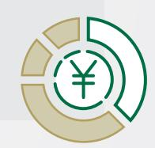
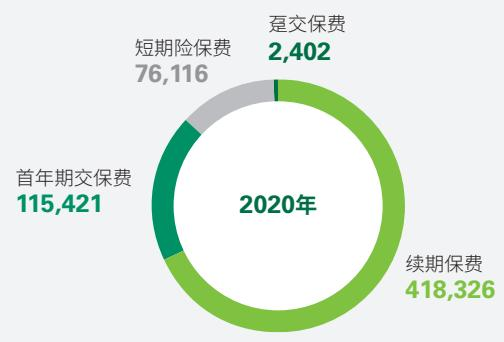
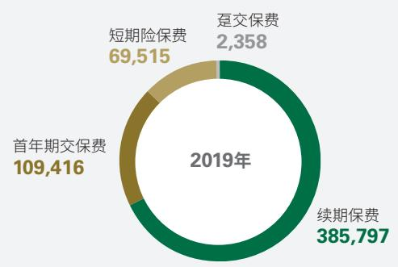
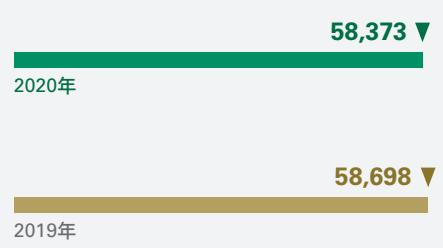
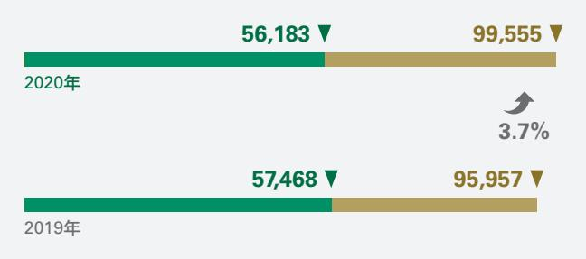
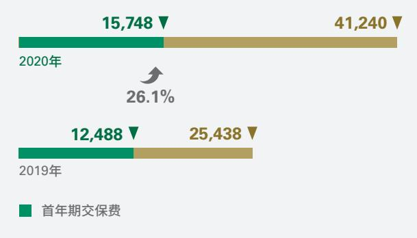
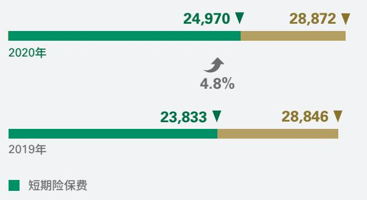
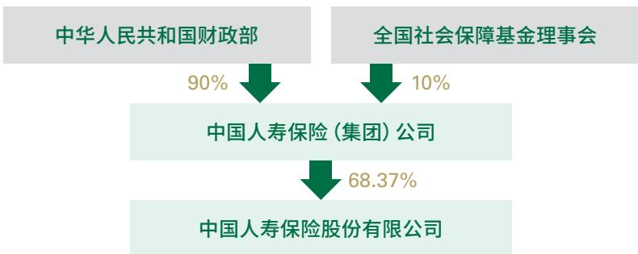
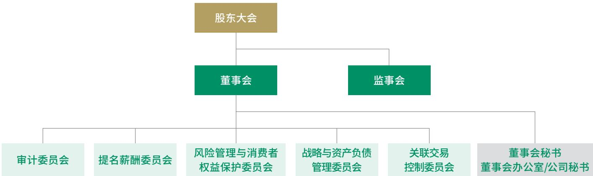

A股股票代码 : 601628

2020年1年报

#

本公司是根据《公司法》《保险法》于2003年6月30日在中国北京注册成立，并于2003年12月17日、18日及2007年1月9日分别在纽约、香港和上海三地上市的人寿保险公司。本公司注册资本为人民币28,264,705,000元。

本公司是中国领先的人寿保险公司，拥有由保险营销员、团险销售人员以及专业和兼业代理机构组成的广泛的分销网络。本公司是中国最大的机构投资者之一，并通过控股的中国人寿资产管理有限公司成为中国最大的保险资产管理者之一。本公司亦控股中国人寿养老保险股份有限公司。

本公司提供个人人寿保险、团体人寿保险、意外险和健康险等产品与服务。本公司是中国领先的个人和团体人寿保险与年金产品、意外险和健康险供应商。截至2020年12月31日，本公司拥有约3.17亿份有效的长期个人和团体人寿保险单、年金合同及长期健康险保单，同时亦提供个人、团体意外险和短期健康险保单和服务。

## 重要提示

本公司董事会、监事会及董事、监事、高级管理人员保证本年度报告内容的真实、准确、完整，不存在虚假记载、误导性陈述或重大遗漏，并承担个别和连带的法律责任。

本公司第六届董事会第三十四次会议于2021年3月25日审议通过《关于公司2020年年度报告(A股/H股)的议案》，董事会会议应出席董事9人，实际出席董事7人。执行董事利明光、独立董事张祖同因其他公务无法出席会议，分别书面委托独立董事梁爱诗和独立董事汤欣代为出席并表决。

本公司2020年度按中国企业会计准则和国际财务报告准则编制的财务报告已经安永华明会计师事务所(特殊普通合伙)和安永会计师事务所分别根据中国注册会计师审计准则和国际审计准则审计，并出具标准无保留意见的审计报告。

公司董事长王滨先生、主管会计工作的副总裁黄秀美女士、总精算师利明光先生及会计机构负责人胡锦女士声明：保证本年度报告中财务报告的真实、准确、完整。

根据2021年3月25日董事会通过的2020年度利润分配方案，按照2020年度净利润的10%提取任意盈余公积人民币50.09亿元，按已发行股份28,264,705,000股计算，拟向全体股东派发现金股利每股人民币0.64元（含税），共计约人民币180.89亿元。上述利润分配方案尚待股东于2021年6月30日举行之年度股东大会批准后生效。

本公司不存在被控股股东及其关联方非经营性占用资金情况。

本公司不存在违反规定决策程序对外提供担保的情况。

本报告中所涉及的未来计划、发展战略等前瞻性描述不构成公司对投资者的实质承诺，敬请投资者注意投资风险。

本公司面临的风险主要有宏观风险、保险风险、市场风险、信用风险、操作风险、战略风险、声誉风险、流动性风险及信息安全风险等。本公司已采取各种措施，有效管理和控制各类风险，详细情况请查阅本报告管理层讨论与分析“未来展望”和公司治理“内部控制与风险管理”部分。

## 目ﾠ录

01 前导信息 2  
核心竞争力 2  
荣誉与奖项 3  
经营亮点指标 5  
财务摘要 6  
02 董事长致辞 10  
03 管理层讨论与分析 12  
2020年业务概要 12  
业务分析 15  
专项分析 23  
科技赋能与运营服务 26  
履行社会责任情况 27  
未来展望 27  
04 内含价值 28  
05 重要事项 34  
重大诉讼、仲裁事项 34  
重大关联交易 34  
重大合同及其履行情况 43  
承诺事项 43  
行政处罚及整改情况 44  
公司及其控股股东、 44  
实际控制人诚信状况  
主要资产受限情况 44  
精准扶贫情况 44  
其他事项 44  
06 - 公司治理 45  
董事会报告 45  
监事会报告 51  
普通股股份变动及股东情况 54  
董事、监事、高级管理人员 56  
及员工情况  
公司治理报告 70  
07 其他信息 87  
公司基本信息 87  
信息披露公告索引 89  
释义 92  
备查文件目录 93  
08 财务报告 94

## 核心竞争力

## 历史悠久品牌卓越

中国人寿的前身与中华人民共和国同龄，1949年10月经中央政府批准组建，是国内最早经营保险业务的企业之一。经改制重组后，本公司先后在境外和境内上市，成为国内首家在三地上市的金融保险企业。自成立以来，公司始终肩负中国寿险业探索者和开拓者的重任，并致力于打造世界一流的金融保险品牌，通过长期持续的品牌建设，中国人寿跻身世界知名品牌行列，品牌价值和品牌影响力不断提升。截至2020年12月31日，中国人寿品牌连续14年入选世界品牌实验室（World Brand Lab）发布的《世界品牌500强》，位列第127位，并蝉联世界品牌实验室（World Brand Lab）“2020年（第十七届）中国500最具价值品牌”榜单，位列第5名。

## 主业突出实力雄厚

本公司坚守本源，深耕潜力巨大的寿险市场，始终占据中国寿险市场领导者地位。2020年本公司保费收入突破6,000亿元，攀越了新的发展高度。经过长期的发展和积淀，中国人寿拥有比肩全球的雄厚实力。截至2020年12月31日，本公司总资产达42,524.10亿元，位居国内寿险业首位。作为国内最大的机构投资者之一，本公司通过控股的中国人寿资产管理有限公司，成为中国最大的保险资产管理者之一。2020年底本公司总市值达1,389亿美元。

## 网络齐全科技领先

本公司拥有健全的机构和服务网络，营业网点及服务柜面覆盖全国城乡。截至本报告期末，本公司拥有分支机构1 约2万个，各渠道销售总人力达145.8万，组成了中国独一无二的强大的分销和服务网络，是真正意义上的客户身边的寿险服务商。同时，本公司坚持以科技创新为先导，深入践行“科技国寿”发展战略，推动服务卓越型企业建设，培育公司一流的经营管理、风险管控和客户服务能力。本公司加快运营服务向线上化、智能化、集约化、生态化转型，通过科技赋能为大众提供便捷的保险服务。

## 客户基础 深厚广泛

本公司拥有广泛的客户基础，截至2020年12月31日，本公司拥有约3.17亿份有效的长期个人和团体人寿保险单、年金合同及长期健康险保单，为5亿多客户提供了保险服务。

## 核心团队 专业稳健

在长期的发展历程中，本公司积累了丰富的经营管理经验，拥有一支深谙国内寿险市场经营之道的、稳定的专业化管理团队。公司的核心管理团队及关键人员包括对中国寿险市场有深刻认识和了解的高级管理人员、经验丰富的核保理赔人员、保险精算师和投资经理等。该等人员在报告期内，未发生对公司有重大影响的变动。

## 荣誉与奖项

“2020年《福布斯》全球上市公司2000强”第37位《福布斯》（“Forbes”）

“2020年《财富》中国500强排行榜”第10位 《财富》中文网

“亚洲最受尊敬企业”《机构投资者》（Institutional Investor）

“2020年度亚洲最佳寿险公司”

“年度优秀金融扶贫企业”《21世纪经济报道》

“2020金龙奖年度最佳上市保险公司”

“2020年高质量发展保险公司方舟奖”

“2020年金牌保险服务方舟奖”

“2020年中国保险业科技进步方舟奖”

“年度卓越人寿保险公司”

“年度影响力保险公司”《和讯网》“第18届财经风云榜”

“年度企业社会责任奖”

《上海证券报》“第十一届‘金理财’评选”

“人民企业社会责任奖 － 年度案例奖”

《人民网》“第十五届人民企业社会责任奖评选”

“2020年度卓越竞争力 － 精准扶贫贡献奖”

《中国经营报》“第十二届卓越竞争力金融机构评选”

“2020年度香港公司管治卓越奖”

香港上市公司商会及香港浸会大学公司管治与金融政策研究中心“2020年度香港公司管治卓越奖”

## “最佳投资者关系上市公司”

香港大公文汇传媒集团联合北京上市公司协会、香港中国企业协会、香港中资证券业协会、香港中国金融协会、香港特许秘书公会、香港证券学会和香港中国并购公会“2020中国证券‘金紫荆’奖评选”

上海数据中心获评“2020年度国家绿色数据中心”

中国工业和信息化部、国家发展和改革委员会、商务部、国家机关事务管理局、银保监会、国家能源局“2020年度国家绿色数据中心”

AI智能训练荣获“机器之心2020人工智能金炼奖”

机器之心科技有限公司（中国人工智能奖项权威评选机构）“2020人工智能金炼奖”

## 经营亮点指标

  
保费收入

612,265 百万元

  
总资产

  
4,252,410 百万元  
归属于母公司股东的净利润  
50,268 百万元

  
内含价值  
5.30%  
1,072,140 百万元  
总投资收益率

  
一年新业务价值58,373 百万元

  
总投资收益198,596 万元

  
综合投资收益率  
6.33%

  
综合偿付能力充足率  
268.92%

## 财务摘要

## 近三年主要财务数据和财务指标

单位：人民币百万元

<table><tr><td></td><td></td><td>本报告期比</td><td></td><td></td></tr><tr><td>主要会计数据</td><td>2020年</td><td>2019年</td><td>上年同期增减</td><td>2018年</td></tr><tr><td>全年业绩</td><td></td><td></td><td></td><td></td></tr><tr><td>营业收入</td><td>824,961</td><td>745,165</td><td>10.7%</td><td>643,101</td></tr><tr><td>其中：已赚保费</td><td>604,666</td><td>560,278</td><td>7.9%</td><td>532,023</td></tr><tr><td>营业支出</td><td>770,050</td><td>685,175</td><td>12.4%</td><td>628,814</td></tr><tr><td>其中：赔付支出</td><td>133,340</td><td>127,919</td><td>4.2%</td><td>174,439</td></tr><tr><td>营业利润</td><td>54,911</td><td>59,990</td><td>-8.5%</td><td>14,287</td></tr><tr><td>利润总额</td><td>54,488</td><td>59,795</td><td>-8.9%</td><td>13,921</td></tr><tr><td>归属于母公司股东的净利润</td><td>50,268</td><td>58,287</td><td>-13.8%</td><td>11,395</td></tr><tr><td>归属于母公司普通股股东的净利润</td><td>50,067</td><td>57,893</td><td>-13.5%</td><td>11,011</td></tr><tr><td>扣除非经常性损益后归属于母公司股东的净利润</td><td>50,513</td><td>53,252</td><td>-5.1%</td><td>11,590</td></tr><tr><td>扣除非经常性损益后归属于母公司普通股股东的</td><td></td><td></td><td></td><td></td></tr><tr><td>净利润</td><td>50,312</td><td>52,858</td><td>-4.8%</td><td>11,206</td></tr><tr><td>经营活动产生的现金流量净额</td><td>304,024</td><td>286,032</td><td>6.3%</td><td>147,552</td></tr><tr><td>于12月31日</td><td></td><td></td><td></td><td></td></tr><tr><td>资产总计</td><td>4,252,410</td><td>3,726,734</td><td>14.1%</td><td>3,254,403</td></tr><tr><td>其中：投资资产1</td><td>4,096,424</td><td>3,574,928</td><td>14.6%</td><td>3,105,790</td></tr><tr><td>负债合计</td><td>3,795,479</td><td>3,317,392</td><td>14.4%</td><td>2,931,113</td></tr><tr><td>归属于母公司股东的股东权益</td><td>450,051</td><td>403,764</td><td>11.5%</td><td>318,371</td></tr><tr><td>总股本</td><td>28,265</td><td>28,265</td><td>-</td><td>28,265</td></tr><tr><td>每股计(元/股)</td><td></td><td></td><td></td><td></td></tr><tr><td>每股收益(基本与稀释)²</td><td>1.77</td><td>2.05</td><td>-13.5%</td><td>0.39</td></tr><tr><td>扣除非经常性损益后的基本每股收益²</td><td>1.78</td><td>1.87</td><td>-4.8%</td><td>0.40</td></tr><tr><td>归属于母公司股东的每股净资产2</td><td>15.92</td><td>14.28</td><td>11.5%</td><td>11.26</td></tr><tr><td>归属于母公司普通股股东的每股净资产2</td><td>15.92</td><td>14.01</td><td>13.7%</td><td>10.99</td></tr><tr><td>每股经营活动产生的现金流量净额²</td><td>10.76</td><td>10.12</td><td>6.3%</td><td>5.22</td></tr><tr><td>主要财务比率</td><td></td><td></td><td></td><td></td></tr><tr><td>加权平均净资产收益率(%)</td><td>11.84</td><td>16.47</td><td>下降4.63个百分点</td><td>3.54</td></tr><tr><td>扣除非经常性损益后的加权平均净资产收益率(%)</td><td>11.89</td><td>15.04</td><td>下降3.15个百分点</td><td>3.60</td></tr><tr><td>资产负债比率3(%)</td><td>89.25</td><td>89.02</td><td>增加0.23个百分点</td><td>90.07</td></tr><tr><td>总投资收益率4(%)</td><td>5.30</td><td>5.23</td><td>增加0.07个百分点</td><td>3.28</td></tr><tr><td></td><td></td><td></td><td></td><td></td></tr></table>

注：  
1. 投资资产=货币资金+以公允价值计量且其变动计入当期损益的金融资产+衍生金融资产+买入返售金融资产+贷款+定期存款+可供出售金融资产+持有至到期 投资+存出资本保证金+投资性房地产+长期股权投资  
2. 在计算“每股收益（基本与稀释）”“扣除非经常性损益后的基本每股收益”“归属于母公司股东的每股净资产”“归属于母公司普通股股东的每股净资产”和“每股经营活动产生的现金流量净额”的变动比率时考虑了基础数据的尾数因素。  
3. 资产负债比率=负债合计/资产总计  
4. 总投资收益率=(总投资收益–卖出回购金融资产款利息支出)/((上年末投资资产–上年末卖出回购金融资产款–上年末衍生金融负债+期末投资资产–期末卖出回购 金融资产款–期末衍生金融负债)/2)

## 2020年分季度主要财务数据

单位：人民币百万元

<table><tr><td></td><td>第一季度 (1-3月份)</td><td>第二季度 (4-6月份)</td><td>第三季度 (7-9月份)</td><td>第四季度 (10-12月份)</td></tr><tr><td>营业收入</td><td>337,772</td><td>175,963</td><td>177,836</td><td>133,390</td></tr><tr><td>归属于母公司股东的净利润</td><td>17,090</td><td>13,445</td><td>16,543</td><td>3,190</td></tr><tr><td>扣除非经常性损益后归属于母公司股东的净利润</td><td>17,120</td><td>13,461</td><td>16,697</td><td>3,235</td></tr><tr><td>经营活动产生的现金流量净额</td><td>125,309</td><td>57,483</td><td>56,126</td><td>65,106</td></tr></table>

季度数据与已披露定期报告数据不存在重大差异。

## 非经常性损益项目和金额

<table><tr><td>截至12月31日止年度</td><td></td><td></td><td>单位：人民币百万元</td></tr><tr><td>非经常性损益项目</td><td>2020年</td><td>2019年</td><td>2018年</td></tr><tr><td>非流动资产处置损益</td><td>24</td><td>7</td><td>80</td></tr><tr><td>计入当期损益的政府补助</td><td>93</td><td>77</td><td>40</td></tr><tr><td>对外捐赠</td><td>(337)</td><td>(193)</td><td>(198)</td></tr><tr><td>除上述各项之外的其他非经常性损益净额</td><td>(98)</td><td>(36)</td><td>(179)</td></tr><tr><td>所得税影响数</td><td>80</td><td>36</td><td>64</td></tr><tr><td>以前期间当期所得税调整注</td><td></td><td>5,154</td><td>-</td></tr><tr><td>少数股东应承担的部分</td><td>(7)</td><td>(10)</td><td>(2)</td></tr><tr><td>合计</td><td>(245)</td><td>5,035</td><td>(195)</td></tr></table>

注：根据财税〔2019〕72号《关于保险企业手续费及佣金支出税前扣除政策的公告》的规定，保险企业发生与其经营活动有关的手续费及佣金支出，不超过当年全部保费收入扣除退保金等后余额的18%（含本数）的部分，在计算应纳税所得额时准予扣除；超过部分，允许结转以后年度扣除，本公告自2019年1月1日起执行，2018年度汇算清缴按照本公告规定执行。根据上述规定本公司在2018年度汇算清缴时调减2019年度所得税人民币51.54亿元。

说明：本公司作为保险公司，投资业务（保险资金运用)为主要经营业务之一，非经常性损益不包括持有以公允价值计量且其变动计入当期损益的金融资产、以公允价值计量且其变动计入当期损益的金融负债产生的公允价值变动损益，以及处置以公允价值计量且其变动计入当期损益的金融资产、以公允价值计量且其变动计入当期损益的金融负债和可供出售金融资产取得的投资收益。

## 中国会计准则和国际财务报告准则财务报表差异说明

本公司根据中国会计准则编制的合并财务报表中归属于母公司股东的净利润和归属于母公司股东的股东权益数据与国际财务报告准则下有关数据并无差异。

## 合并财务报表中重要科目及变动原因

单位：人民币百万元

<table><tr><td rowspan=1 colspan=2>资产负债表主要科目</td><td rowspan=1 colspan=1>2020年12月31日</td><td rowspan=1 colspan=5>2019年12月31日    变动幅度  主要变动原因</td></tr><tr><td rowspan=1 colspan=2>定期存款</td><td rowspan=1 colspan=1>545,667</td><td rowspan=1 colspan=2>535,260</td><td rowspan=1 colspan=2>1.9%</td><td rowspan=2 colspan=1>政府债券配置规模增加</td></tr><tr><td rowspan=1 colspan=2>持有至到期投资</td><td rowspan=1 colspan=1>1,189,369</td><td rowspan=1 colspan=2>928,751</td><td rowspan=1 colspan=2>28.1%</td></tr><tr><td rowspan=6 colspan=2>可供出售金融资产以公允价值计量且其变动计入当期损益的金融资产买入返售金融资产</td><td rowspan=2 colspan=1>1,215,603</td><td rowspan=1 colspan=2>1,058,957</td><td rowspan=1 colspan=2>14.8%</td><td rowspan=2 colspan=1>可供出售金融资产配置规模增加</td></tr><tr><td rowspan=1 colspan=2></td><td rowspan=1 colspan=2></td></tr><tr><td rowspan=1 colspan=1>其变动计入</td><td rowspan=1 colspan=1>161,564</td><td rowspan=1 colspan=2>141,606</td><td rowspan=1 colspan=2>14.1%</td><td rowspan=4 colspan=1>以公允价值计量且其变动计入当期损益的金融资产中债权类资产规模增加流动性管理的需要</td></tr><tr><td rowspan=3 colspan=1>7,947</td><td rowspan=1 colspan=2></td><td rowspan=1 colspan=2></td><td rowspan=1 colspan=1></td></tr><tr><td rowspan=1 colspan=4></td><td rowspan=1 colspan=1></td></tr><tr><td rowspan=1 colspan=2>4,467</td><td rowspan=1 colspan=2>77.9%</td><td rowspan=1 colspan=1></td></tr><tr><td rowspan=1 colspan=2>货币资金</td><td rowspan=1 colspan=1>57,605</td><td rowspan=1 colspan=4>55,082        4.6%</td><td rowspan=1 colspan=1></td></tr><tr><td rowspan=1 colspan=2>贷款</td><td rowspan=1 colspan=1>658,535</td><td rowspan=1 colspan=4>608,920        8.1%</td><td rowspan=1 colspan=1></td></tr><tr><td rowspan=1 colspan=2>投资性房地产</td><td rowspan=1 colspan=1>14,217</td><td rowspan=1 colspan=4>12,141      17.1%</td><td rowspan=1 colspan=1></td></tr><tr><td rowspan=1 colspan=2>长期股权投资</td><td rowspan=1 colspan=1>239,584</td><td rowspan=1 colspan=4>222,983       7.4%</td><td rowspan=1 colspan=1></td></tr><tr><td rowspan=4 colspan=2>递延所得税资产保险合同准备金</td><td rowspan=4 colspan=1>872,973,225</td><td rowspan=1 colspan=4>128     -32.0%</td><td rowspan=2 colspan=1>受可供出售金融资产公允价值增加的影响</td></tr><tr><td rowspan=1 colspan=3></td><td rowspan=1 colspan=1></td></tr><tr><td rowspan=1 colspan=3>2,552,736</td><td rowspan=1 colspan=1>16.5%</td><td rowspan=1 colspan=1>新增的保险业务和续期业务</td></tr><tr><td rowspan=3 colspan=2></td><td></td><td rowspan=3 colspan=1></td><td></td></tr><tr><td rowspan=3 colspan=2>保户储金及投资款</td><td rowspan=3 colspan=1>288,202</td><td rowspan=3 colspan=3>267,794</td><td></td></tr><tr><td rowspan=2 colspan=1>保险责任的累积万能险账户规模增长</td></tr><tr><td rowspan=1 colspan=1>7.6%</td></tr><tr><td rowspan=1 colspan=2>应付保单红利</td><td rowspan=1 colspan=1>122,510</td><td rowspan=1 colspan=3>112,593</td><td rowspan=1 colspan=1>8.8%</td><td rowspan=1 colspan=1>分红账户的投资收益率上升</td></tr><tr><td rowspan=1 colspan=2>卖出回购金融资产款</td><td rowspan=1 colspan=1>122,249</td><td rowspan=1 colspan=3>118,088</td><td rowspan=1 colspan=1>3.5%</td><td rowspan=1 colspan=1>流动性管理的需要</td></tr><tr><td rowspan=1 colspan=2>长期借款注</td><td rowspan=1 colspan=1>17,915</td><td rowspan=1 colspan=3>18,930</td><td rowspan=1 colspan=1>-5.4%</td><td rowspan=2 colspan=1>新增短期借款</td></tr><tr><td rowspan=1 colspan=1></td><td rowspan=1 colspan=2>短期借款注</td><td rowspan=1 colspan=2>1,641</td><td rowspan=1 colspan=2>1,115</td><td rowspan=1 colspan=1>47.2%</td></tr><tr><td rowspan=4 colspan=2>递延所得税负债归属于母公司股东的股东权益</td><td rowspan=1 colspan=1>15,286</td><td rowspan=1 colspan=4>10,330      48.0%</td><td rowspan=4 colspan=1>受可供出售金融资产公允价值增加的影响本报告期内综合收益总额及利润分配的综合影响</td></tr><tr><td rowspan=3 colspan=1>450,051</td><td rowspan=1 colspan=4></td></tr><tr><td rowspan=1 colspan=4>403,764       11.5%</td></tr><tr><td rowspan=1 colspan=4></td></tr></table>

注：公司长期借款和短期借款包括：三年期银行借款3.3亿欧元，到期日为2023年9月8日；五年期银行借款2.75亿英镑，到期日为2024年6月25日；五年期银行借款8.60亿美元，到期日为2024年9月16日；六个月银行借款1.27亿欧元，到期日为2021年1月13日，根据协议约定到期日后自动续期；六个月银行借款0.78亿欧元，到期日为2021年1月4日，根据协议约定到期日后自动续期；以上均为固定利率借款。五年期银行借款9.70亿美元，到期日为2024年9月27日；十八个月期借款1.1亿欧元，到期日为2022年3月9日；以上均为浮动利率借款。

<table><tr><td>利润表主要科目</td><td>2020年</td><td>2019年</td><td>变动幅度</td><td>主要变动原因</td></tr><tr><td>已赚保费</td><td>604,666</td><td>560,278</td><td>7.9%</td><td></td></tr><tr><td>寿险业务</td><td>479,600</td><td>445,719</td><td>7.6%</td><td>寿险业务稳定增长</td></tr><tr><td>健康险业务</td><td>109,091</td><td>99,575</td><td>9.6%</td><td>公司加大健康险业务发展</td></tr><tr><td>意外险业务</td><td>15,975</td><td>14,984</td><td>6.6%</td><td>意外险业务增长</td></tr><tr><td>投资收益</td><td>207,541</td><td>162,480</td><td>27.7%</td><td>权益类资产投资收益增加</td></tr><tr><td>公允价值变动损益</td><td>3,441</td><td>14,419</td><td>-76.1%</td><td>以公允价值计量且其变动计入 当期损益的金融资产市值波动</td></tr><tr><td>汇兑损益</td><td>119</td><td>(67)</td><td>不适用</td><td>及收益兑现 外币资产和负债计价货币汇率</td></tr><tr><td>其他业务收入</td><td>9,010</td><td>7,947</td><td>13.4%</td><td>波动 子公司投资管理服务费收入</td></tr><tr><td>退保金</td><td>33,275</td><td>50,851</td><td>-34.6%</td><td>增加 部分产品退保减少</td></tr><tr><td>赔付支出</td><td>133,340</td><td>127,919</td><td>4.2%</td><td>公司业务增长</td></tr><tr><td>提取保险责任准备金</td><td>418,773</td><td>335,122</td><td>25.0%</td><td>保险业务增长及退保减少</td></tr><tr><td>保单红利支出</td><td>28,279</td><td>22,375</td><td>26.4%</td><td>分红账户的投资收益率上升</td></tr><tr><td>手续费及佣金支出</td><td>84,342</td><td>81,396</td><td>3.6%</td><td>公司业务增长</td></tr><tr><td>业务及管理费</td><td>39,714</td><td>42,008</td><td>-5.5%</td><td>新冠肺炎疫情下费用支出减少</td></tr><tr><td>其他业务成本</td><td>24,018</td><td>21,486</td><td>11.8%</td><td>及公司加强费用管控 投资管理费支出及非保险合同</td></tr><tr><td></td><td></td><td></td><td></td><td>结算利息增加</td></tr><tr><td>资产减值损失 所得税费用</td><td>12,416 3,103</td><td>8,062 781</td><td>54.0% 297.3%</td><td>符合减值条件的投资资产增加 2019年执行手续费及佣金支出</td></tr><tr><td>归属于母公司股东的净利润</td><td>50,268</td><td>58,287</td><td>-13.8%</td><td>税前扣除政策调整影响 受传统险准备金折现率假设更 新、2019年执行手续费及佣金</td></tr></table>

## 董事长致辞

本报告期内，公司综合实力进一步增强，市场领先地位稳固。本公司实现保费收入6,122.65亿元，首次突破六千亿元，攀越新高度。内含价值超过一万亿元，达10,721.40亿元，居行业首位。总资产规模突破四万亿元，达42,524.10亿元，较2019年底增长14.1%。实现归属于母公司股东的净利润502.68亿元。截至本报告期末，核心偿付能力充足率和综合偿付能力充足率分别达260.10%、268.92%。公司董事会建议派发年度现金股息每股0.64元（含税），将提交年度股东大会审议。

2020年，面对前所未有的挑战，我们坚守“守护人民美好生活”初心，专注主业，担当作为，以充足的发展韧性在服务国家大局中增进民生福祉，在高质量发展中创造长期价值，在改革创新中持续增强动能，在稳健经营中助力现代化治理能力提升。

回顾过去的一年，面对突如其来的新冠肺炎疫情和复杂严峻的外部形势，中国人寿紧跟国家部署，保持战略定力，坚持高质量发展，统筹推进疫情防控和改革发展，稳住行业发展大局，内含价值、保费收入等主要指标保持稳健增长，“重振国寿”第一阶段目标全面达成，圆满收官“十三五”。我谨在此代表董事会向各位股东和社会各界报告中国人寿2020年经营业绩。

过去一年，我们积极发挥主业优势，服务国家大局坚决有力。新冠肺炎战“疫”中，我们第一时间向抗疫一线捐赠款项物资，向250万一线医护人员和1,400多万民众赠送保险，累计风险保障近3.3万亿元，扩展相关保险责任，推出特别服务举措，发挥保险“减震器”作用。积极助力精准脱贫，在1,281个帮扶点累计投入超8,700万元，助推帮扶点全部脱贫摘帽。消费扶贫超3,000万元。我们依托主业，持续开发扶贫专属产品，覆盖建档立卡贫困户及临贫易贫人员超1,800万人，提供风险保障3.4万亿元，用保险织牢织密脱贫攻坚风险保障网。在决胜全面小康、决战脱贫攻坚战中，1个集体和1名个人分别荣获全国脱贫攻坚先进集体和先进个人荣誉称号。我们坚守金融服务实体经济的宗旨，积极参与京津冀协同发展、长江经济带发展、粤港澳大湾区建设、长三角一体化发展等区域重大战略建设，助力建设制造强国、交通强国，打造“绿色中国”。截至本报告期末，本公司服务实体经济投资存量规模超过2.3万亿元，全年新增投资规模超过6,000亿元。

过去一年，我们高质量发展走向纵深，价值创造能力持续增强。我们坚持以价值为引领，坚守保障本源，扩大有效供给，价值与规模实现有机统一。本报告期内，虽然受新冠肺炎疫情影响，公司业务结构仍不断优化，保障型业务保持良好增长态势。实现一年新业务价值583.73亿元，同比基本保持稳定。资产负债高效联动、协同发展，2020年实现总投资收益1,985.96亿元，投资收益创新高。

过去一年，我们加快转型升级步伐，数字化经营释放强大动能。我们强力推进“鼎新工程”改革走深走实，以客户为中心的“一体多元”销售发展布局基本形成，个险板块价值创造能力进一步凸显，多元业务板块经营模式转型稳步推进；销售、投资等重点领域人才市场化激励约束机制逐步建立。我们与“数字时代”同步，承接深厚的线下基础，构建线上数字化平台，建成业内领先的混合云，科技赋能为抵消疫情带来的负面冲击贡献了强大的基础力量，“众智、敏捷、迭代”的科技运作模式成为行业新示范。“科技国寿”赋能服务全面升级，运营服务加快向线上化、智能化、集约化、生态化转型，有效满足客户高品质服务需求。

过去一年，我们推进治理体系向前迈进，风险防控科学有效。我们以三地上市公司治理最佳实践为目标，积极完善公司治理机制，有效提升公司治理现代化水平，本年度内荣获“香港公司管治卓越奖”。我们加快推进环境、社会及管治（“ESG”）管理融入经营管理体系，深入践行ESG投资理念。作为中国首家签署联合国支持的负责任投资原则（UNPRI）的保险资产管理公司，本公司控股子公司资产管理子公司深耕“绿色金融”，全年新增绿色投资306亿元。我们坚持稳健审慎的经营原则，始终关注并积极防范化解重大金融风险，有效把握资产负债管理规律，高度关注利率风险、市场风险、信用风险和合规风险，严防外部风险事件向内部传递蔓延，开展重点风险专项治理，大力推广智能风控。在监管机构风险综合评级中，公司连续11个季度达到A级。

“十四五”时期是我国开启全面建设社会主义现代化国家新征程的第一个五年，保险业将在服务国家治理体系和治理能力现代化方面肩负新使命。随着经济社会发展，民生福祉将达到新水平，中等收入群体将加速扩围，人身险业厚植于具有强大韧性和潜力的中国经济，正处于重要的战略机遇期，必将迎来更为广阔的空间。我们同时也看到，当前疫情仍在全球持续，影响广泛而深远，存在诸多不确定性，保险消费需求释放受到影响，资产配置及负债端传统经营模式等面临挑战。我们将深刻把握当前机遇和挑战的新变化，进一步发挥主业风险管理专业优势，贯彻新发展理念，积极探索构建新发展格局的人身险业实现路径，以客户为中心持续深化供给侧结构性改革，加快转型升级步伐，不断提高自身发展与时代要求的匹配度、契合度，以更高的服务能力保障民生、促进经济社会发展。

2021年是“十四五”开局之年，也是高质量发展攻坚之年。我们将深入推进“重振国寿”战略部署，坚持高质量发展主题，全面融入“双循环”新发展格局，全力打好平稳发展、质量提升、改革创新、风险防控四大攻坚战。我们将坚持发展第一要务，强化价值引领，走有效队伍驱动业务发展之路；全面推进“鼎新工程”改革，加强市场化推进力度，进一步增强内生动力；持续深化科技创新引领，全面提速数字化转型，为客户提供“简捷、品质、温暖”的服务；持续强化资产负债联动，严格落实监管要求，持续完善风险防控体系，严密防范重点风险，持续提升公司治理能力。

中国人寿拥有深厚的历史积淀，始终肩负中国寿险业探索者和开拓者的重任。序时更替，梦想前行。当此奋发有为的新时代，国寿人将始终坚守初心，在建设国际一流寿险公司征程中奋勇前行，努力以良好的业绩回报股东和社会各界。

承董事会命

王滨董事长

中国北京2021年3月25日

# 管理层讨论与分析

## 2020年业务概要

2020年，突如其来的新冠肺炎疫情给行业发展带来巨大挑战。一方面，宏观经济增速明显放缓，保险需求难以充分释放；另一方面，保险线下经营活动受到限制，业务拓展与队伍建设面临困难。在多重因素共同影响下，年度行业保费增速出现回落。

面对严峻复杂的外部环境，本公司坚持高质量发展主题，坚持“三大转型、双心双聚、资负联动”战略内核，坚持“重价值、强队伍、稳增长、兴科技、优服务、防风险”的经营方针，统筹疫情防控和改革发展，内含价值、保费收入等主要指标稳中有进、稳中向好。本报告期内，公司业务规模与价值有机统一，资产负债管理统筹推进，科技成果加快落地，运营服务提质增效，公司高质量发展成效显著。

与此同时，公司坚定实施“重振国寿”战略部署，“鼎新工程”改革向纵深推进。2020年，在持续优化完善组织架构基础上，公司全面启动系列变革转型项目，深入推进业务模式和经营机制逐步落地。以客户为中心的“一体多元”销售布局持续深化，个险板块聚焦个人客户市场，价值创造能力进一步凸显，一线生产单元标准化、规范化管理体系落地推广；多元业务板块面向机构客群，渠道定位更加明确，专业化经营能力有效提升。公司构建了契合投资价值链条的投资管理组织体系和市场化的薪酬激励体系，投资能力显著提升。运营服务标准化建设进一步加强，共享服务中心建设全面启动，运营智能化、集约化水平和客户服务满意度持续提升。优化科技发展模式，实行了以大产品团队为重心的科技产品运作机制，科技支撑能力、响应速度和稳定性大幅提高，移动服务、数字职场等新技术广泛应用。风险管理智能化建设加速推进，实现了风险防控的主动识别和实时监控，有效提升了风险管控效率。坚持“强总部、精省域、优地市、活基层”，建立了分支机构分类分级管理体系，实施与业绩挂钩的机构升降级机制，财务资源进一步向基层倾斜，一线发展活力显著提升。

## ,

从左至右：

赵国栋先生、詹忠先生、黄秀美女士、苏恒轩先生、利明光先生、阮琦先生、杨红女士

## 2020年主要经营指标

单位：人民币百万元

<table><tr><td></td><td>2020年</td><td>2019年</td></tr><tr><td>保费收入</td><td>612,265</td><td>567,086</td></tr><tr><td>新单保费</td><td>193,939</td><td>181,289</td></tr><tr><td>其中：首年期交保费</td><td>115,421</td><td>109,416</td></tr><tr><td>十年期及以上首年期交保费</td><td>56,398</td><td>59,168</td></tr><tr><td>续期保费</td><td>418,326</td><td>385,797</td></tr><tr><td>总投资收益</td><td>198,596</td><td>169,043</td></tr><tr><td>归属于母公司股东的净利润</td><td>50,268</td><td></td></tr><tr><td>一年新业务价值</td><td>58,373</td><td>58,287</td></tr><tr><td>其中：个险板块¹</td><td>57,669</td><td>58,698</td></tr><tr><td>保单持续率(14个月)²(%)</td><td></td><td>56,972</td></tr><tr><td>保单持续率(26个月)²(%)</td><td>85.70</td><td>86.80</td></tr><tr><td>退保率³(%)</td><td>82.40 1.09</td><td>85.90 1.89</td></tr><tr><td></td><td>2020年</td><td>2019年</td></tr><tr><td></td><td>12月31日</td><td>12月31日</td></tr><tr><td>内含价值</td><td></td><td></td></tr><tr><td></td><td>1,072,140</td><td>942,087</td></tr><tr><td>长险有效保单数量(亿份)</td><td>3.17</td><td>3.03</td></tr></table>

1. 2019年个险板块数据已根据融合后口径进行模拟重算。

3. 退保率=当期退保金/(期初寿险、长期健康险责任准备金余额+当期寿险、长期健康险保费收入)

截至2019年12月31日

本报告期内，尽管受到新冠肺炎疫情影响，公司依然展现出良好的发展韧性，主要业务指标实现历史新突破。2020年，公司实现保费收入2 6,122.65亿元，首次突破六千亿元，同比增长8.0%，市场领先地位稳固。截至本报告期末，公司内含价值突破一万亿元，达10,721.40亿元，较2019年底增长13.8%。

本报告期内，公司坚持价值引领，业务结构持续优化。新单保费达1,939.39亿元，同比增长7.0%。其中，首年期交保费达1,154.21亿元，同比增长5.5%，占长险首年保费的比重为97.96%；特定保障型产品保费占首年期交保费的比重同比提升0.6个百分点，特定保障型业务件均保费持续提升。续期保费达4,183.26亿元，同比增长8.4%，占总保费收入的比重为68.32%，同比上升0.29个百分点。在2020年复杂的外部环境下，十年期及以上首年期交保费达563.98亿元，同比下降4.7%。2020年，公司实现一年新业务价值583.73亿元，同比下降0.6%，基本保持稳定。截至本报告期末，长险有效保单数量达3.17亿份，较2019年底增长4.6%。本报告期内，退保率为1.09%，同比下降0.80个百分点。

本报告期内，公司持续强化资产负债管理，资负协同发展形成双向合力。公司高度重视资产负债管理，强化资负联动，建立权责清晰、运转有序的组织管理体系，配套完善相关制度与流程；充分践行资产负债管理理念，业务规划、运营服务、产品开发、投资管理等环节高效联动。2020年，公司坚持市场化导向，资产统筹配置能力显著增强，投资收益稳步提升，实现总投资收益1,985.96亿元，同比增长17.5%。受传统险准备金折现率假设更新、2019年执行手续费及佣金支出税前扣除政策调整以及投资收益变化的共同影响，归属于母公司股东的净利润为502.68亿元，同比下降13.8%；扣除非经常性损益后归属于母公司股东的净利润为505.13亿元，同比下降5.1%。

保费收入结构（百万元）

  
年新业务价值（百万元）

  
内含价值（百万元）

1,072,140

## 业务分析

## 保险业务

保险业务收入业务分项数据

截至12月31日止年度  
单位：人民币百万元
<table><tr><td rowspan=1 colspan=1></td><td rowspan=1 colspan=1>2020年</td><td rowspan=1 colspan=1>2019年</td><td rowspan=1 colspan=1>变动幅度</td></tr><tr><td rowspan=1 colspan=1>寿险业务</td><td rowspan=1 colspan=1>480,593</td><td rowspan=1 colspan=1>446,562</td><td rowspan=1 colspan=1>7.6%</td></tr><tr><td rowspan=1 colspan=1>首年业务</td><td rowspan=1 colspan=1>108,205</td><td rowspan=1 colspan=1>100,674</td><td rowspan=1 colspan=1>7.5%</td></tr><tr><td rowspan=1 colspan=1>首年期交</td><td rowspan=1 colspan=1>106,001</td><td rowspan=1 colspan=1>98,342</td><td rowspan=1 colspan=1>7.8%</td></tr><tr><td rowspan=1 colspan=1>趸交</td><td rowspan=1 colspan=1>2,204</td><td rowspan=1 colspan=1>2,332</td><td rowspan=1 colspan=1>-5.5%</td></tr><tr><td rowspan=1 colspan=1>续期业务</td><td rowspan=1 colspan=1>372,388</td><td rowspan=1 colspan=1>345,888</td><td rowspan=1 colspan=1>7.7%</td></tr><tr><td rowspan=1 colspan=1>健康险业务</td><td rowspan=1 colspan=1>115,089</td><td rowspan=1 colspan=1>105,581</td><td rowspan=1 colspan=1>9.0%</td></tr><tr><td rowspan=1 colspan=1>首年业务</td><td rowspan=1 colspan=1>69,722</td><td rowspan=1 colspan=1>66,213</td><td rowspan=1 colspan=1>5.3%</td></tr><tr><td rowspan=1 colspan=1>首年期交</td><td rowspan=1 colspan=1>9,408</td><td rowspan=1 colspan=1>11,000</td><td rowspan=1 colspan=1>-14.5%</td></tr><tr><td rowspan=1 colspan=1>趸交</td><td rowspan=1 colspan=1>60,314</td><td rowspan=1 colspan=1>55,213</td><td rowspan=1 colspan=1>9.2%</td></tr><tr><td rowspan=1 colspan=1>续期业务</td><td rowspan=1 colspan=1>45,367</td><td rowspan=1 colspan=1>39,368</td><td rowspan=1 colspan=1>15.2%</td></tr><tr><td rowspan=1 colspan=1>意外险业务</td><td rowspan=1 colspan=1>16,583</td><td rowspan=1 colspan=1>14,943</td><td rowspan=1 colspan=1>11.0%</td></tr><tr><td rowspan=1 colspan=1>首年业务</td><td rowspan=1 colspan=1>16,012</td><td rowspan=1 colspan=1>14,402</td><td rowspan=1 colspan=1>11.2%</td></tr><tr><td rowspan=1 colspan=1>首年期交</td><td rowspan=1 colspan=1>12</td><td rowspan=1 colspan=1>74</td><td rowspan=1 colspan=1>-83.8%</td></tr><tr><td rowspan=1 colspan=1>趸交</td><td rowspan=1 colspan=1>16,000</td><td rowspan=1 colspan=1>14,328</td><td rowspan=1 colspan=1>11.7%</td></tr><tr><td rowspan=1 colspan=1>续期业务</td><td rowspan=1 colspan=1>571</td><td rowspan=1 colspan=2>541             5.5%</td></tr><tr><td rowspan=1 colspan=1>合计</td><td rowspan=1 colspan=1>612,265</td><td rowspan=1 colspan=2>567,086             8.0%</td></tr></table>

注：本表趸交业务包含短期险业务保费收入。

本报告期内，本公司实现寿险业务总保费4,805.93亿元，同比增长7.6%；健康险业务总保费为1,150.89亿元，同比增长9.0%；意外险业务总保费为165.83亿元，同比增长11.0%。

保险业务收入渠道分项数据  
截至12月31日止年度  
单位：人民币百万元
<table><tr><td rowspan=1 colspan=8></td><td rowspan=1 colspan=1>2020年</td><td rowspan=1 colspan=1>2019年1</td></tr><tr><td rowspan=1 colspan=8>个险板块²</td><td rowspan=1 colspan=1>511,044</td><td rowspan=1 colspan=1>484,517</td></tr><tr><td rowspan=1 colspan=8>长险首年业务</td><td rowspan=1 colspan=1>99,838</td><td rowspan=1 colspan=1>96,237</td></tr><tr><td rowspan=1 colspan=8>首年期交</td><td rowspan=1 colspan=1>99,555</td><td rowspan=1 colspan=1>95,957</td></tr><tr><td rowspan=1 colspan=2></td><td rowspan=2 colspan=8>续期业务</td></tr><tr><td></td><td></td><td rowspan=1 colspan=1>391,272</td><td rowspan=1 colspan=1>371,140</td></tr><tr><td rowspan=1 colspan=8>短期险业务</td><td rowspan=1 colspan=1>19,934</td><td rowspan=1 colspan=1>17,140</td></tr><tr><td rowspan=2 colspan=3>银保渠道长险首年业务</td><td rowspan=1 colspan=5></td><td rowspan=1 colspan=1>41,240</td><td rowspan=1 colspan=1>25,438</td></tr><tr><td rowspan=1 colspan=7></td><td rowspan=1 colspan=1>15,757</td><td rowspan=1 colspan=1>12,516</td></tr><tr><td rowspan=1 colspan=2></td><td rowspan=2 colspan=8>趸交</td></tr><tr><td></td><td></td><td rowspan=1 colspan=1>9</td><td rowspan=1 colspan=1>28</td></tr><tr><td rowspan=1 colspan=6>续期业务</td><td rowspan=1 colspan=1></td><td rowspan=1 colspan=1></td><td rowspan=1 colspan=1>25,109</td><td rowspan=1 colspan=1>12,516</td></tr><tr><td rowspan=1 colspan=6>短期险业务</td><td rowspan=1 colspan=1></td><td rowspan=1 colspan=1></td><td rowspan=1 colspan=1>374</td><td rowspan=1 colspan=1>406</td></tr><tr><td rowspan=1 colspan=8>团险渠道</td><td rowspan=1 colspan=1>28,872</td><td rowspan=1 colspan=1>28,846</td></tr><tr><td rowspan=1 colspan=8>长险首年业务</td><td rowspan=1 colspan=1>2,040</td><td rowspan=1 colspan=1>3,018</td></tr><tr><td rowspan=1 colspan=8>首年期交</td><td rowspan=1 colspan=1>110</td><td rowspan=1 colspan=1>968</td></tr><tr><td rowspan=2 colspan=8>趸交续期业务</td><td rowspan=1 colspan=1>1,930</td><td rowspan=1 colspan=1>2,050</td></tr><tr><td rowspan=1 colspan=1>1,862</td><td rowspan=1 colspan=1>1,995</td></tr><tr><td rowspan=1 colspan=8>短期险业务</td><td rowspan=1 colspan=1>24,970</td><td rowspan=1 colspan=1>23,833</td></tr><tr><td rowspan=2 colspan=8>其他渠道3长险首年业务</td><td rowspan=1 colspan=1>31,109</td><td rowspan=1 colspan=1>28,285</td></tr><tr><td rowspan=2 colspan=3></td><td rowspan=1 colspan=1>188</td><td rowspan=1 colspan=1>3</td></tr><tr><td rowspan=4 colspan=8>首年期交趸交续期业务短期险业务</td><td rowspan=1 colspan=1>8</td><td rowspan=1 colspan=1>3</td></tr><tr><td rowspan=1 colspan=3></td><td rowspan=1 colspan=1>180</td><td rowspan=1 colspan=1>-</td></tr><tr><td rowspan=1 colspan=3></td><td rowspan=1 colspan=1>83</td><td rowspan=1 colspan=1>146</td></tr><tr><td rowspan=1 colspan=1>30,838</td><td rowspan=1 colspan=1>28,136</td></tr><tr><td rowspan=1 colspan=8>合计</td><td rowspan=1 colspan=1>612,265</td><td rowspan=1 colspan=1>567,086</td></tr></table>

注：  
1. 根据“一体多元”销售发展体系对2019年数据进行同口径模拟调整。  
2. 个险板块保费收入包括营销队伍保费收入和收展队伍保费收入。  
3. 其他渠道保费收入主要包括政策性健康险保费收入、网销业务保费收入等。

2020年，公司持续深化以客户为中心的“一体多元”销售布局。个险板块聚焦个人客户市场，渠道价值创造能力进一步凸显；多元业务板块面向机构客群，渠道定位更加明晰，专业化经营能力有效提升。公司坚持以有效队伍驱动业务发展，销售队伍结构持续优化。截至本报告期末，公司总销售人力约145.8万人，人力规模位居行业首位。

## 个险板块

2020年，面对疫情对经济社会发展及行业发展的严重冲击，个险板块坚持价值引领，着力推进销售管理转型升级，业务结构持续优化，实现了规模与价值逆势增长。本报告期内，个险板块总保费达5,110.44亿元，同比增长5.5%，首年期交保费达995.55亿元，同比增长3.7%；特定保障型业务持续增长，首年期交保费和件均保费同比明显提升；受疫情影响，个险板块十年期及以上首年期交保费为561.83亿元，同比下降2.2%；续期保费为3,912.72亿元，同比增长5.4%。个险板块价值创造能力凸显，一年新业务价值为576.69亿元，同比增长1.2%，一年新业务价值率达47.9%，同比保持稳定。

2020年，个险板块坚定贯彻有效队伍驱动的策略，按照“鼎新工程”改革部署，全面升级基本法，努力提升队伍质态。尽管受到新冠肺炎疫情的冲击，队伍规模出现了一定波动，但公司坚定走高质量发展道路，进一步加强人员招募甄选管控，严格队伍管理，优化队伍结构。截至本报告期末，个险销售人力达137.8万人，其中，营销队伍规模为84.1万人，收展队伍规模为53.7万人。个险板块月均有效销售人力同比增长9.7%。

个险板块首年期交保费（百万元）

  
十年期及以上首年期交保费

个险板块销售人力  
137.8 万人  
月均有效销售 9.7%  
人力同比增长

## 多元业务板块

2020年，多元业务板块深入贯彻“鼎新工程”改革部署，坚持“专业经营、提质增效、转型创新、依法合规”发展思路，与个险板块协同发展，着力发展银保、团险和健康险业务。在业务发展受疫情影响的大背景下，多元业务板块巩固优势，各项业务发展呈现向上态势。本报告期内，多元业务板块保费收入达1,012.21亿元，同比增长22.6%。

银保渠道。银保渠道以规模与价值并重为长期目标，深耕银行代理业务，稳步推进渠道转型。本报告期内，银保渠道总保费达412.40亿元，同比增长62.1%。首年期交保费达157.48亿元，同比增长26.1%。续期保费达251.09亿元，同比增长100.6%，占总保费比重达60.89%，同比提升11.69个百分点。银保渠道持续加强队伍管理，队伍质态稳步提升。截至本报告期末，银保渠道客户经理为2.9万人，季均实动人力和人均产能均实现较大幅度增长。

银保渠道保费（百万元）

团险渠道。团险渠道持续深化多元发展和效益提升，强化重点板块业务拓展，实现各项业务稳步发展。本报告期内，团险渠道总保费为288.72亿元，同比增长0.1%；实现短期险保费收入249.70亿元，同比增长4.8%。截至本报告期末，团险销售人员为5.1万人，其中高绩效人力较2019年底增长33.3%。

团险渠道保费（百万元）  

团险销售人员  
5.1万人  
高绩效人力较 33.3 %  
2019 年底增长

其他渠道。2020年，其他渠道总保费达311.09亿元，同比增长10.0%。本公司积极开展各类政策性健康保险业务，持续保持市场领先。截至本报告期末，公司在办220多个大病保险项目，覆盖3.6亿人；持续承办300多个健康保障委托管理项目，覆盖1.7亿人；开办补充医疗保险业务，覆盖5,400万人；为1,500万人提供长期护理保险。

公司持续加强互联网保险业务探索，不断扩大互联网保险产品供给，提升保险业务线上经营能力，并推动线上线下经营相互融合，为客户提供更为多元、便捷的保险产品购买和服务交互通道。2020年，公司互联网保险业务迎来较大发展，呈现快速增长态势。

公司坚持以客户为中心，充分发挥集团公司各成员单位协同优势，积极为客户提供一揽子优质金融保险服务方案。2020年，公司寿代产业务保费收入首次突破200亿元，同比增长14.0%，代理企业年金业务新增中标基金规模及养老保障业务规模同比增长20.7%；推动广发银行代理本公司银保首年期交保费收入同比增长29.0%；国寿广发联名借记卡、信用卡新增荐卡量超115万张。同时，充分发挥综合金融的品牌优势，联合广发银行、国寿财险开展各类客户经营活动，为客户提供多元化、个性化服务，形成了协同发展、互利共赢的良好局面。

主要保险产品分析

保险业务收入前五位的保险产品情况

截至12月31日止年度  
单位：人民币百万元
<table><tr><td>保险产品</td><td>保险业务 收入</td><td>新单标准 保费收入1</td><td>主要销售渠道</td><td>退保金</td></tr><tr><td>国寿鑫享至尊年金保险 (庆典版)</td><td>42,657</td><td>12,813</td><td>以个人代理人渠道为主</td><td>170</td></tr><tr><td>国寿鑫享金生年金保险 (A款)2</td><td>34,828</td><td>-</td><td>以个人代理人渠道为主</td><td>506</td></tr><tr><td>国寿城乡居民大病团体医疗保险(A型)</td><td>26,955</td><td>26,955</td><td>其他渠道</td><td>-</td></tr><tr><td>国寿鑫福赢家年金保险²</td><td>24,116</td><td>-</td><td>以个人代理人渠道为主</td><td>779</td></tr><tr><td>国寿鸿福至尊年金保险(分红型)²</td><td>20,271</td><td>-</td><td>以个人代理人渠道为主</td><td>745</td></tr></table>

## 保户储金及投资款新增交费前三位产品情况

截至12月31日止年度

单位：人民币百万元

<table><tr><td>保险产品</td><td>新增交费金额</td><td>主要销售渠道</td><td>退保金</td></tr><tr><td>国寿鑫账户两全保险 (万能型)(尊享版)</td><td>11,630</td><td>以个人代理人渠道为主</td><td>121</td></tr><tr><td>国寿鑫账户两全保险 (万能型)(钻石版)</td><td>7,883</td><td>以个人代理人渠道为主</td><td>261</td></tr><tr><td>国寿鑫账户年金保险(万能型)(卓越版)</td><td>3,406</td><td>以个人代理人渠道为主</td><td>291</td></tr></table>

## 保险业务收入前五家及其他分公司情况

截至12月31日止年度

单位：人民币百万元

<table><tr><td></td><td>2020年</td></tr><tr><td>分公司</td><td>保险业务收入</td></tr><tr><td>江苏</td><td>66,876</td></tr><tr><td>广东</td><td>57,423</td></tr><tr><td>山东</td><td>45,704</td></tr><tr><td>浙江</td><td>41,974</td></tr><tr><td>河北</td><td>34,524</td></tr><tr><td>中国境内其他分公司</td><td>365,764</td></tr><tr><td>合计</td><td>612,265</td></tr></table>

本公司保险业务收入主要来源于经济较发达或人口较多的省市。

## 保险合同准备金分析

单位：人民币百万元

<table><tr><td></td><td>2020年 2019年</td><td></td><td></td></tr><tr><td></td><td>12月31日</td><td>12月31日</td><td>变动幅度</td></tr><tr><td>未到期责任准备金</td><td>14,701</td><td>13,001</td><td>13.1%</td></tr><tr><td>未决赔款准备金</td><td>21,991</td><td>18,404</td><td>19.5%</td></tr><tr><td>寿险责任准备金</td><td>2,768,584</td><td>2,386,130</td><td>16.0%</td></tr><tr><td>长期健康险责任准备金</td><td>167,949</td><td>135,201</td><td>24.2%</td></tr><tr><td>保险合同准备金合计</td><td>2,973,225</td><td>2,552,736</td><td>16.5%</td></tr><tr><td>寿险</td><td>2,767,642</td><td>2,385,407</td><td></td></tr><tr><td>健康险</td><td>195,487</td><td>158,800</td><td>16.0% 23.1%</td></tr><tr><td>意外险</td><td>10,096</td><td>8,529</td><td>18.4%</td></tr><tr><td>保险合同准备金合计</td><td>2,973,225</td><td>2,552,736</td><td></td></tr><tr><td>其中：剩余边际注</td><td>837,293</td><td>768,280</td><td>16.5% 9.0%</td></tr></table>

注：剩余边际是保险合同准备金的一个组成部分，是为了不确认首日利得而提取的准备金，如果为负数，则置零。剩余边际的增长主要来源于新业务。

截至本报告期末，本公司保险合同准备金为29,732.25亿元，较2019年底的25,527.36亿元增长16.5%，主要原因是新增的保险业务和续期业务保险责任的累积。在资产负债表日，本公司各类保险合同准备金均通过了充足性测试。

## 赔款及保户利益分析

截至12月31日止年度  
单位：人民币百万元
<table><tr><td></td><td>2020年</td><td>2019年</td><td>变动幅度</td></tr><tr><td>退保金</td><td>33,275</td><td>50,851</td><td>-34.6%</td></tr><tr><td>赔付支出</td><td>133,340</td><td>127,919</td><td>4.2%</td></tr><tr><td>寿险业务</td><td>76,892</td><td>74,327</td><td>3.5%</td></tr><tr><td>健康险业务</td><td>49,733</td><td>47,410</td><td>4.9%</td></tr><tr><td>意外险业务</td><td>6,715</td><td>6,182</td><td>8.6%</td></tr><tr><td>提取保险责任准备金</td><td>418,773</td><td>335,122</td><td>25.0%</td></tr><tr><td>保单红利支出</td><td>28,279</td><td>22,375</td><td>26.4%</td></tr></table>

本报告期内，本公司退保金同比下降34.6%，主要原因是部分产品退保减少。赔付支出中，寿险业务赔付支出同比增长3.5%，主要原因是寿险业务满期给付增加；健康险业务赔付支出同比增长4.9%，主要原因是健康险业务规模稳定增长；

意外险业务赔付支出同比增长8.6%，主要原因是部分业务赔款支出波动。受保险业务增长及退保减少的共同影响，提取保险责任准备金同比增长25.0%。分红账户的投资收益率上升使得保单红利支出同比增长26.4%。

## 手续费及佣金、其他支出分析

截至12月31日止年度

单位：人民币百万元

<table><tr><td></td><td></td><td></td><td>变动幅度</td></tr><tr><td></td><td>2020年</td><td>2019年</td><td></td></tr><tr><td>手续费及佣金支出</td><td>84,342</td><td>81,396</td><td>3.6%</td></tr><tr><td>业务及管理费</td><td>39,714</td><td>42,008</td><td>-5.5%</td></tr><tr><td>其他业务成本</td><td>24,018</td><td>21,486</td><td>11.8%</td></tr></table>

本报告期内，因公司业务增长，手续费及佣金支出同比增长3.6%；因新冠肺炎疫情下费用支出减少及公司加强费用管控，业务及管理费同比下降5.5%；因投资管理费支出及非保险合同结算利息增加，其他业务成本同比增长11.8%。

## 投资业务

2020年，全球经济受到新冠肺炎疫情的严重冲击，此后在各国政府的大力宏观对冲政策之下有所恢复。在有效统筹疫情防控和经济社会发展、加快形成“双循环”新发展格局的背景下，国内经济最早走出底部并持续修复，中国成为2020年全球唯一实现经济正增长的主要经济体。2020年，国内债券市场利率波动较大，在4月初跌至历史极低水平之后反弹明显并超出年初水平；与此同时，股票市场也在3月底跌至全年低点之后震荡上行，并呈现出显著的结构性行情。

公司积极应对复杂多变的投资环境，始终坚持资产负债联动管理的基本原则，坚定执行中长期资产战略配置规划，并根据市场变化灵活实施战术策略安排。2020年，公司大类资产配置重点布局三大领域：一是基础配置类资产，有效把握

2020年下半年利率回升和供给加大的机会，以长久期利率债为主加大投资力度，进一步拉长资产久期，收窄资产负债久期缺口；二是具有稳定现金流、增厚收益的非标固收、类固收资产，积极应对融资需求放缓、市场竞争加剧的局面，在严控信用风险的前提下，坚持应配尽配；三是面向未来、创造收益弹性的权益资产，在结构性行情环境下继续积累核心资产，优化品种策略安排，提高组合收益贡献。

2020年，公司按照投资价值链重塑了组织架构体系，建立了市场化的激励约束机制，投资资产统筹配置能力显著增强。委托管理方面，引入中国人寿内外管理人横向比较的竞争性委托机制，通过考核深化管理人优胜劣汰。投资管理体系的持续优化预计将对资金运用产生长期且深远的影响。

## 投资组合情况

截至本报告期末，本公司投资资产按投资对象分类如下表：

单位：人民币百万元

<table><tr><td></td><td rowspan=2 colspan=1>投资资产类别</td><td rowspan=2 colspan=2>2020年12月31日金额              占比</td><td rowspan=1 colspan=2>2019年12月31日</td></tr><tr><td></td><td rowspan=1 colspan=2>金额              占比</td></tr><tr><td></td><td rowspan=1 colspan=1>固定到期日金融资产</td><td rowspan=1 colspan=2>3,076,315          75.10%</td><td rowspan=1 colspan=1>2,674,248</td><td rowspan=1 colspan=1>74.81%</td></tr><tr><td></td><td rowspan=1 colspan=1>定期存款</td><td rowspan=1 colspan=2>545,667           13.32%</td><td rowspan=1 colspan=1>535,260</td><td rowspan=1 colspan=1>14.97%</td></tr><tr><td></td><td rowspan=1 colspan=1>债券</td><td rowspan=1 colspan=2>1,718,625           41.96%</td><td rowspan=1 colspan=1>1,410,551</td><td rowspan=1 colspan=1>39.46%</td></tr><tr><td></td><td rowspan=1 colspan=1>债权型金融产品1</td><td rowspan=1 colspan=2>453,641           11.07%</td><td rowspan=1 colspan=1>415,024</td><td rowspan=1 colspan=1>11.61%</td></tr><tr><td></td><td rowspan=3 colspan=1>其他固定到期日投资²权益类金融资产股票</td><td rowspan=1 colspan=2>358,382            8.75%</td><td rowspan=1 colspan=1>313,413</td><td rowspan=1 colspan=1>8.77%</td></tr><tr><td></td><td rowspan=1 colspan=2>700,756           17.11%</td><td rowspan=1 colspan=1>606,007</td><td rowspan=1 colspan=1>16.95%</td></tr><tr><td></td><td rowspan=1 colspan=1>350,095</td><td rowspan=1 colspan=1>8.55%</td><td rowspan=1 colspan=1>276,595</td><td rowspan=1 colspan=1>7.74%</td></tr><tr><td></td><td rowspan=1 colspan=1>基金3</td><td rowspan=1 colspan=1>114,331</td><td rowspan=1 colspan=1>2.79%</td><td rowspan=1 colspan=1>118,470</td><td rowspan=1 colspan=1>3.31%</td></tr><tr><td rowspan=4 colspan=2>其他权益类投资4投资性房地产现金及其他5</td><td rowspan=1 colspan=3></td><td rowspan=1 colspan=1>13,013</td></tr><tr><td rowspan=1 colspan=1>223,317</td><td rowspan=1 colspan=1>5.45%</td><td rowspan=1 colspan=1>178,302</td><td rowspan=1 colspan=1>4.99%</td></tr><tr><td rowspan=1 colspan=2>14,217            0.35%</td><td rowspan=1 colspan=1>12,141</td><td rowspan=1 colspan=1>0.34%</td></tr><tr><td rowspan=1 colspan=2>65,552            1.59%</td><td rowspan=1 colspan=1>59,549</td><td rowspan=1 colspan=1>1.67%</td></tr><tr><td rowspan=1 colspan=2>联营企业和合营企业投资</td><td rowspan=1 colspan=2>239,584            5.85%</td><td rowspan=1 colspan=2>222,983           6.23%</td></tr><tr><td rowspan=1 colspan=2>合计</td><td rowspan=1 colspan=2>4,096,424         100.00%</td><td rowspan=1 colspan=2>3,574,928         100.00%</td></tr></table>

注：  
1. 债权型金融产品包括债权投资计划、股权投资计划、信托计划、项目资产支持计划、信贷资产支持证券、专项资管计划、资产管理产品等。  
2. 其他固定到期日投资包含保户质押贷款、存出资本保证金、同业存单等。  
3. 基金含权益型基金、债券型基金和货币市场基金等，其中货币市场基金截至2020年12月31日余额为12.05亿元，截至2019年12月31日余额为18.28亿元。  
4. 其他权益类投资包括私募股权基金、未上市股权、优先股、股权投资计划等。  
5. 现金及其他包括货币资金、买入返售金融资产等。

截至本报告期末，本公司投资资产达40,964.24亿元，较2019年底增长14.6%。主要品种中债券配置比例由2019年底的39.46%提升至41.96%，定期存款配置比例由2019年底的14.97%变化至13.32%，债权型金融产品配置比例由2019年底的11.61%变化至11.07%，股票和基金（不包含货币市场基金）配置比例由2019年底的11.00%提升至11.31%。

截至12月31日止年度  
单位：人民币百万元
<table><tr><td></td><td>2020年</td><td>2019年</td></tr><tr><td>总投资收益</td><td>198,596</td><td>169,043</td></tr><tr><td>净投资收益</td><td>162,783</td><td>149,109</td></tr><tr><td>固定到期类净投资收益</td><td>127,673</td><td>116,254</td></tr><tr><td>权益类净投资收益</td><td>24,983</td><td>22,804</td></tr><tr><td>投资性房地产投资收益</td><td>(50)</td><td>31</td></tr><tr><td>现金及其他投资收益</td><td>1,841</td><td>861</td></tr><tr><td>对联营企业和合营企业的投资收益</td><td>8,336</td><td>9,159</td></tr><tr><td>+投资资产买卖价差收益</td><td>44,708</td><td>13,402</td></tr><tr><td>+公允价值变动损益</td><td>3,441</td><td>14,419</td></tr><tr><td>-投资资产资产减值损失</td><td>12,336</td><td>7,887</td></tr><tr><td>净投资收益率1</td><td>4.34%</td><td>4.61%</td></tr><tr><td>总投资收益率²</td><td>5.30%</td><td>5.23%</td></tr></table>

1. 净投资收益率=(净投资收益－卖出回购金融资产款利息支出)/((上年末投资资产－上年末卖出回购金融资产款+期末投资资产－期末卖出回购金融资产款)/2)  
2. 总投资收益率=(总投资收益－卖出回购金融资产款利息支出)/((上年末投资资产－上年末卖出回购金融资产款－上年末衍生金融负债+期末投资资产－期末卖出 回购金融资产款－期末衍生金融负债)/2)

本报告期内，公司实现净投资收益1,627.83亿元，较2019年同期增加136.74亿元，同比增长9.2%。受2020年利率总体下行、存量资产到期等因素影响，净投资收益率为4.34%，较2019年下降27个基点。公司紧密跟踪权益市场变化，持续关注风险敞口，适时兑现价差收益，不断优化持仓结构，维持了投资收益的总体稳定。公司总投资收益达1,985.96亿元，较2019年增加295.53亿元，总投资收益率为5.30%，较2019年上升7个基点。考虑当期计入其他综合收益的可供出售金融资产公允价值变动净额后，综合投资收益率3为6.33%，较2019年下降94个基点。

## 信用风险管理

公司债权型金融产品投向主要为交通运输、金融、公共事业、能源等领域，融资主体以大型央企、国企为主。截至本报告期末，公司持仓债权型金融产品中外评AAA级以上占比超过99%。总体上看，债权型金融产品资产质量良好，风险可控。

公司始终坚持稳健的投资理念，全口径管理与防范各类投资风险。依托严谨科学的内部评级体系和多维度的风险限额管理机制，公司投前审慎把控标的信用资质和风险敞口集中度，投后持续跟踪，通过早识别、早预警、早处置，有效管控信用风险。在信用违约事件频发的市场环境下，2020年内公司未发生信用违约事件。

## 重大投资

本报告期内，本公司无达到须予披露标准的重大股权投资和重大非股权投资。

<table><tr><td></td><td>2020年</td><td>2019年</td><td>变动幅度</td></tr><tr><td>利润总额</td><td>54,488</td><td>59,795</td><td>-8.9%</td></tr><tr><td>寿险业务</td><td>28,073</td><td>42,418</td><td>-33.8%</td></tr><tr><td>健康险业务</td><td>11,611</td><td>5,875</td><td>97.6%</td></tr><tr><td>意外险业务</td><td>572</td><td>489</td><td>17.0%</td></tr><tr><td>其他业务</td><td>14,232</td><td>11,013</td><td>29.2%</td></tr></table>

本报告期内，寿险业务利润总额同比下降33.8%，主要原因是传统险准备金折现率假设更新以及投资收益变化的共同影响；健康险业务利润总额同比上升97.6%，主要原因是短期健康险业务增长及质量改善；意外险业务利润总额同比上升 17.0%，主要原因是意外险业务增长及质量改善；其他业务利润总额同比上升29.2%，主要原因是子公司利润增加。

## 现金流量分析

## 流动资金的来源

本公司的现金收入主要来自于保费收入、非保险合同业务收入、利息及红利收入、投资资产出售及到期收回投资。这些现金流动性的风险主要是合同持有人和保户的退保，以及债务人违约、利率和其他市场波动风险。本公司密切监视并控制这些风险。

本公司的现金及银行存款为我们提供了流动性资源，以满足现金支出需求。截至本报告期末，现金及现金等价物余额为566.29亿元。此外，本公司绝大部分定期银行存款均可动用，但需缴纳罚息。截至本报告期末，本公司的定期存款为5,456.67亿元。

本公司的投资组合也为我们提供了流动性资源，以满足无法预期的现金支出需求。由于本公司在其投资的某些市场上投资量很大，也存在流动性风险。某些情况下，本公司对所投资的某一证券的持有量有可能大到影响其市值的程度。该等因素将不利于以公平的价格出售投资，或可能无法出售。

## 流动资金的使用

本公司的主要现金支出涉及支付与各类人寿保险、年金、意外险和健康险产品之相关负债，营业支出以及所得税和向股东宣派的股息。源于保险业务的现金支出主要涉及保险产品的给付以及退保付款、提款和保户质押贷款。

本公司认为其流动资金能够充分满足当前的现金需求。

## 合并现金流量

本公司建立了现金流测试制度，定期开展现金流测试，考虑多种情景下公司未来现金收入和现金支出情况，并根据现金流匹配情况对公司的资产配置进行调整，以确保公司的现金流充足。

截至12月31日止年度  
单位：人民币百万元
<table><tr><td></td><td>2020年</td><td>2019年</td><td>变动幅度</td><td>主要变动原因</td></tr><tr><td>经营活动产生的现金流量净额</td><td>304,024</td><td>286,032</td><td>6.3%</td><td>公司业务稳定增长，收到的</td></tr><tr><td>投资活动产生的现金流量净额</td><td></td><td></td><td></td><td>保费增加</td></tr><tr><td>筹资活动产生的现金流量净额</td><td>(292,797) (7,760)</td><td>(247,515) (36,075)</td><td>18.3% -78.5%</td><td>投资管理的需要 流动性管理的需要</td></tr><tr><td>汇率变动对现金及现金等价物的</td><td>(144)</td><td>55</td><td>不适用</td><td></td></tr><tr><td>影响额</td><td></td><td></td><td></td><td></td></tr><tr><td>现金及现金等价物净增加额</td><td>3,323</td><td>2,497</td><td>33.1%</td><td></td></tr></table>

## 偿付能力状况

保险公司应当具有与其风险和业务规模相适应的资本。根据资本吸收损失的性质和能力，保险公司资本分为核心资本和附属资本。核心偿付能力充足率，是指核心资本与最低资本的比率，反映保险公司核心资本的充足状况。综合偿付能力充足率，是指核心资本和附属资本之和与最低资本的比率，反映保险公司总体资本的充足状况。下表显示截至本报告期末本公司的偿付能力状况：

单位：人民币百万元

<table><tr><td rowspan=1 colspan=1></td><td rowspan=1 colspan=1></td><td rowspan=1 colspan=1></td></tr><tr><td rowspan=1 colspan=1></td><td rowspan=1 colspan=1>2020年12月31日</td><td rowspan=1 colspan=1>2019年12月31日</td></tr><tr><td rowspan=5 colspan=1>核心资本实际资本最低资本核心偿付能力充足率综合偿付能力充足率</td><td rowspan=1 colspan=1>1,031,947</td><td rowspan=1 colspan=1>952,030</td></tr><tr><td rowspan=1 colspan=1>1,066,939</td><td rowspan=1 colspan=1>987,067</td></tr><tr><td rowspan=1 colspan=1>396,749</td><td rowspan=1 colspan=1>356,953</td></tr><tr><td rowspan=1 colspan=1>260.10%</td><td rowspan=1 colspan=1>266.71%</td></tr><tr><td rowspan=1 colspan=1>268.92%</td><td rowspan=1 colspan=1>276.53%</td></tr></table>

注：中国风险导向的偿付能力体系自2016年1月1日起正式实施，本表根据该规则体系编制。

截至本报告期末，本公司综合偿付能力充足率较2019年底下降7.61个百分点，偿付能力充足率下降的主要原因是保险业务和投资资产规模持续增长、股利分配、偿付能力准备金评估利率下行以及赎回其他权益工具。

## 采用公允价值计量的主要项目

单位：人民币百万元

<table><tr><td colspan="5">公允价值变动</td></tr><tr><td>项目名称</td><td>期初余额</td><td>期末余额</td><td>当期变动</td><td>对当期利润 的影响金额</td></tr><tr><td>以公允价值计量且其变动计入当期损益的金融资产</td><td>141,606</td><td>161,564</td><td>19,958</td><td>4,262</td></tr><tr><td>可供出售金融资产</td><td>1,038,321</td><td>1,194,997</td><td>156,676</td><td>-</td></tr><tr><td>合计</td><td>1,179,927</td><td>1,356,561</td><td>176,634</td><td>4,262</td></tr></table>

## 再保业务情况

本公司目前采取的分保形式主要有成数分保、溢额分保及巨灾超赔分保安排，风险保障体系更加全面。现有的分保合同几乎涵盖了全部有风险责任的产品。本公司目前溢额分保的自留额按个人业务和团体业务分别确定。本公司分出业务的接受公司（包括合同和临分）主要是中国人寿再保险有限责任公司。各经营分部的再保情况载于本年报财务报告附注“分部信息”部分。

## 重大资产和股权出售

本报告期内，本公司无重大资产和股权出售情况。

## 主要控股参股公司情况

单位：人民币百万元

<table><tr><td>公司名称</td><td>主要业务范围</td><td>注册资本</td><td>持股比例</td><td>总资产</td><td>净资产</td><td>净利润</td></tr><tr><td>中国人寿资产管理 有限公司</td><td>管理运用自有资金；受托或委托资产管理业 务；与以上业务相关的咨询业务；国家法律法 规允许的其他资产管理业务</td><td>4,000</td><td>60%</td><td>13,897</td><td>12,237</td><td>2,133</td></tr><tr><td>中国人寿养老保险 股份有限公司</td><td>团体养老保险及年金业务；个人养老保险及年 金业务；短期健康保险业务；意外伤害保险业 务；上述业务的再保险业务；国家法律、法规 允许的保险资金运用业务；养老保险资产管理 产品业务；受托管理委托人委托的以养老保障 为目的的人民币、外币资金；经银保监会批准 的其他业务</td><td>3,400</td><td>本公司持股 70.74%； 资产管理子 公司持股 3.53%</td><td>6,789</td><td>4,931</td><td>817</td></tr><tr><td>中国人寿财产保险 股份有限公司</td><td>财产损失保险；责任保险；信用保险和保证保 险；短期健康保险和意外伤害保险；上述业务 的再保险业务；国家法律、法规允许的保险资 金运用业务；经银保监会批准的其他业务</td><td>18,800</td><td>40%</td><td>106,930</td><td>26,551</td><td>1,730</td></tr><tr><td>广发银行股份有限 公司</td><td>吸收公众存款；发放短期、中期和长期贷款； 办理国内外结算；办理票据承兑与贴现；发行 金融债券；代理发行、代理兑付、承销政府债 券；买卖政府债券、金融债券等有价证券；从 事同业拆借；提供信用证服务及担保；从事银 行卡业务；代理收付款项及代理保险业务；提 供保管箱服务；外汇存、贷款；外汇汇款；外 币兑换；国际结算；结汇、售汇；同业外汇 拆借；外汇票据的承兑和贴现；外汇借款；外 汇担保；买卖和代理买卖股票以外的外币有价 证券；发行和代理发行股票以外的外币有价证 券；自营和代客外汇买卖；代理国外信用卡的 发行及付款业务；离岸金融业务；资信调查、</td><td>19,687</td><td>43.686%</td><td>3,027,972</td><td>218,150</td><td>13,812</td></tr></table>

注：详情请参见本年报财务报告附注“合并财务报表的合并范围”及“长期股权投资”部分。

## 公司控制的结构化主体情况

本公司控制的主要结构化主体情况请参见本年报财务报告附注“合并财务报表的合并范围”部分。

## 科技赋能与运营服务

## 科技赋能

2020年，公司全面推进数字化转型，加速科技化创新，积极运用数字技术强化科技赋能，助推公司各领域高质量发展。

能力跃升，科技化创新全速发力

科技布局，彰显国寿实力。围绕“双心双聚”战略内核，优治理、强布局，实施“科技产品制”变革，加快科技应用创新孵化中心与研发分中心建设，不断提升科技价值创造与多元化供给能力；依托公司队伍与服务网点既有优势，线下推广数字化职场，线上打造数字化平台，形成线上线下紧密融合，公司、队伍、客户高频互动的国寿科技布局，为客户提供便捷、高效、精准的金融保险服务。

科技驱动，激发创新活力。借助保险科技、云计算及基础设施、网络安全、区块链四大科技创新主题实验室，做强科技创新。近50项前沿技术课题研究深入开展，28个智能应用场景多点开花；算力强大、灵活敏捷的混合云厚积薄发，疫情期间全面支撑公司经营管理从线下到线上的无缝切换，有力确保了公司业务的连续性。

数字生态，释放聚联效应。基于数字化平台持续扩展内通外联、开放共享的社交化生态，开放标准化服务1,700余项，投放创新微应用740余个；连接医疗、健康等各类合作机构，开展服务与活动近17万项，以保险为核心的数字生态服务日渐丰富。

## 赋能升级，数字化转型全面推进

数字销售，培育发展新动能。运用数字科技成功拓展线上增员、线上培训、线上展业新方式 — 个险全流程线上空中增员快速投入使用，AI智能销售在线培训15.5万期合计1,110万人次；直播早会、云创会等百花齐放，疫情期间达日均2,200场；“黄金宝典2.0”全面升级，以更强大的智能算法助力精准营销，实现数字化工具全面融入保险销售价值链。

数字职场，打造智慧新名片。5G、物联网、边缘计算等先进技术广泛应用于全国3万个职场（包含分支机构和营销服务部），业务处理自助终端、智能感知、可视化智慧大屏等新型电子设备使职场全面焕新，互联网自动接入、数字化辅导训练、多维度可视化业绩追踪、AI实时业绩播报等场景相继落地，逐步将职场打造成为公司服务前伸的重要数字支撑。

数字服务，提升指尖新体验。坚持以客户为中心，推动线上服务智慧升级。基于互联网视频、智能身份识别的“无接触服务”，让客户足不出户尽享专属服务体验；基于大数据和人工智能技术的健康险智能理赔模型，覆盖5大类19个关键风险类别，让理赔更高效、便捷；以客户家庭为视角的大数据智能保单体检为客户优选提供贴心参考。

## 运营服务

2020年，公司围绕客户需求，坚持“效率领先、科技驱动、价值跃升、体验一流”的运营管理目标，以“简捷、品质、温暖”为服务理念，加快运营服务向线上化、智能化、集约化、生态化转型，为客户提供高质量运营服务。2020年初，公司经受疫情大考，升级各项服务快速应对。第一时间简化理赔手续，实施理赔远程作业与远程视频调查，快速赔付新冠肺炎案件一千余件。全新打造“空中客服”，一键连接空中柜员，提供专版电话语音导航及7×24小时全天候客户服务，全力保障客户需求。

产品供给持续丰富。2020年，公司坚持“以客户为中心，以市场为导向，以价值为核心”的产品开发理念，加强资产负债管理，持续加大保障型等产品研发力度，通过产品创新与升级换代，支持公司高质量发展。目前，公司拥有覆盖各类型客户的产品体系，并形成了多款人身险品牌产品。2020年，公司新开发、升级产品237款，其中寿险19款，健康险198款，意外险7款，年金险13款；保障型产品共计216款，长期储蓄型产品共计21款。

线上服务扩面增量。围绕客户使用习惯，深耕线上触点服务设计，更多业务通过网络直达客户指尖。持续丰富服务内容，畅通线上线下链接，寿险APP月活人数同比增加48%，个人长险业务无纸化投保率达99.9%，团体业务无纸化投保推广率达97.9%，保全和个人、团体理赔e化率同比分别提高20、28和37个百分点，电子化通知发送量同比增长82.5%。

智能服务快捷高效。多环节深入应用人工智能技术，为客户提供快捷、精准服务。投保环节应用智能模型审核、质检，助力出单和双录时效同比分别提速40%和25%。联络服务加速智能应用，智能在线服务、智能外呼服务量同比提升158%，新单电子化回访替代率达92%。通过智能模型处理核保、保全业务，核保智能审核通过率达92.7%，保全自动审核通过率达99%。

保单服务更有温度。响应客户关切，联通内外资源，聚力提供“快捷温暖”的精品服务。理赔构建覆盖全国2万余家医疗机构的直付网络，全年为客户提供直赔服务500余万人次。推广“重大疾病一日赔”，为满足条件的重疾客户提供“确诊即可赔”服务，理赔申请支付时效继续加速。保全丰富前端服务触点，拓宽自助办理渠道，服务范围和效能全面提升。

生态服务加快布局。构建客户体验管理框架体系，规划设计客户服务未来旅程全景图，构建以客户需求为驱动的体验提升机制，持续优化业务流程。2020年，公司升级线上+线下场景式生态服务模式，客户节参与人数和国寿小画家活动线上访问人次同比分别提升20%和300%；实现向客户推荐个性化服务场景4.3亿次，有效延长了客户体验链。

“大健康”“大养老”战略持续推进。公司积极参与健康中国建设，通过整合健康医疗服务资源，打造覆盖全生命周期的健康生态圈，不断提升健康服务能力，加强与科技企业合作，推进线上线下平台建设，探索健康服务助推主业发展。截至本报告期末，国寿大健康平台服务项目数量过百，累计注册用户量位居行业前列。新冠肺炎疫情期间，公司迅速建设线上抗疫健康服务专区。2020年，公司创新特色医保合作模式，加快“基本医保+大病保险+商业保险”政商一体化结算模式推广应用。公司持续推进国寿养老体系建设，在苏州、海南、成都等地投资建设多个大型养老社区；设立国寿大养老基金，并稳步开展投资布局，重点聚焦持续照料退休社区、城市核心区医养综合体、精品养老公寓等实业资产，布局康复、医养、医院、健康医疗大数据、健康产业园等养老产业链上下游的优质资源，以进一步满足京津冀、长江经济带、粤港澳等战略区域的客户需求。

## 履行社会责任情况

本公司本报告期履行社会责任的情况请参见本公司于上交所网站（http://www.sse.com.cn）及香港交易及结算所有限公司“披露易”网站（http://www.hkexnews.hk）另行披露的《2020年环境、社会及管治（ESG）暨社会责任报告》全文。环境信息的具体情况载于《2020年环境、社会及管治（ESG）暨社会责任报告》第六部分。

## 未来展望

## 行业格局和趋势

当前及今后一段时期，我国发展仍然处于重要战略机遇期，经济长期向好的基础仍然牢固。随着“十四五”规划全面启动，“双循环”新发展格局加速构建，促进经济平稳健康可持续发展，行业高质量发展将迎来更为有利的外部环境。近期保险监管部门密集出台管长远、强监管的政策，深入整治市场乱象，全力维护经济金融安全，为行业规范健康发展奠定了坚实基础。国家全面推进健康中国建设，实施积极应对人口老龄化国家战略，健康、养老领域将成为行业下一轮发展重要的增长点。保险业与科技融合步伐将进一步加快，云计算、大数据、人工智能等技术在销售服务、运营管理、风险防控等价值链环节深度赋能，行业数字化转型将进一步提速。随着保险市场全面对外开放，行业供给主体将更加丰富，市场成熟度将进一步提升。在多重积极因素共同促进下，我国人身险业仍具有巨大发展潜力和广阔发展空间。

## 公司发展战略及经营计划

2021年，本公司将全面推进“重振国寿”战略部署，坚持发展第一要务，坚持“三大转型、双心双聚、资负联动”战略内核，坚持“重价值、强队伍、稳增长、兴科技、优服务、防风险”经营方针，把2021年作为公司高质量发展攻坚年，努力实现业务平稳发展，全力提升发展质量，大力深化改革创新，持续推进风险防控，为公司“十四五”高质量发展蓄势聚力。

## 可能面对的风险

国际经济金融形势仍然复杂严峻，境内外疫情变化和外部环境存在诸多不确定性，国内经济恢复基础尚不牢固，给保险业务稳定发展带来挑战。保险资金面临国内市场利率中枢震荡下行、债券市场违约增加和长久期资产供应不足等挑战，资产配置压力有所加大。公司将采取多种举措积极应对风险挑战，一方面，紧紧围绕市场形势和客户需求，加大产品创新力度，优化产品结构，提高服务质量，积极推动保险供给扩面提质；另一方面，加强宏观经济研判，强化资产负债管理，灵活把握资产配置节奏，努力保持投资收益稳定；同时，公司将始终坚持市场化导向，以客户为中心，深入推进变革转型，全面提升经营管理水平。未来，公司将持续关注并加强对包括新冠肺炎疫情在内的复杂风险因素分析，努力推动本公司高质量发展。

预期2021年度，本公司资金能够满足保险业务支出以及新的一般性投资项目需求。同时，为推动公司未来发展战略的实施，本公司将结合资本市场情况进行相应的融资安排。

## 背景

本公司按照相关会计准则为公众投资者编制了财务报表。内含价值方法可以提供对人寿保险公司价值和盈利性的另一种衡量。内含价值是基于一组关于未来经验的假设，以精算方法估算的一家保险公司的经济价值。一年新业务价值代表了基于一组关于未来经验的假设，在评估日前一年里售出的新业务所产生的经济价值。内含价值不包含评估日后未来新业务所贡献的价值。

本公司相信公司的内含价值和一年新业务价值报告能够从两个方面为投资者提供有用的信息。第一，公司的有效业务价值代表了按照所采用假设，预期未来产生的股东利益总额的贴现价值。第二，一年新业务价值提供了基于所采用假设，对于由新业务活动为投资者所创造的价值的一个指标，从而也提供了公司业务潜力的一个指标。但是，有关内含价值和一年新业务价值的信息不应被视为按照任何会计准则所编制的财务衡量的替代品。投资者也不应该单纯根据内含价值和一年新业务价值的信息做出投资决定。

特别要指出的是，计算内含价值的精算标准仍在演变中，迄今并没有全球统一采用的标准来定义一家保险公司的内含价值的形式、计算方法或报告格式。因此，在定义、方法、假设、会计基准以及披露方面的差异可能导致在比较不同公司的结果时存在不一致性。

此外，内含价值的计算涉及大量复杂的技术，对内含价值和一年新业务价值的估算会随着关键假设的变化而发生重大变化。因此，建议读者在理解内含价值的结果时应该特别小心谨慎。

在下面显示的价值没有考虑本公司和集团公司、国寿投资公司、资产管理子公司、养老保险子公司、财产险公司等之间的交易所带来的未来的财务影响。

## 内含价值和一年新业务价值的定义

人寿保险公司的内含价值的定义是，经调整的净资产价值与考虑了扣除要求资本成本后的有效业务价值两者之和。

“经调整的净资产价值”等于下面两项之和：

• 净资产，定义为资产减去相应负债和其他负债；和

• 对于资产的市场价值和账面价值之间税后差异所作的相关调整以及对于某些负债的相关税后调整。

由于受市场环境的影响，资产市值可能会随时间发生较大的变化，因此经调整的净资产价值在不同评估日也可能发生较大的变化。

“有效业务价值”和“一年新业务价值”在这里是定义为分别把在评估日现有的有效业务和截至评估日前一年的新业务预期产生的未来现金流中股东利益贴现的计算价值。

有效业务价值和一年新业务价值是采用传统确定性的现金流贴现的方法计算的。这种方法通过使用风险调整后的贴现率来对投资保证和保单持有人选择权的成本、资产负债不匹配的风险、信用风险、运营经验波动的风险和资本的经济成本作隐含的反映。

## 编制和审阅

内含价值和一年新业务价值由本公司编制，编制依据了2016年11月中国精算师协会发布的《精算实践标准：人身保险内含价值评估标准》（中精协发〔2016〕36号）的相关内容。WillisTowers Watson（韬睿惠悦）为本公司的内含价值和一年新业务价值作了审阅，其审阅声明请见“韬睿惠悦关于内含价值的审阅报告”。

## 假设

经济假设：所得税率假设为25%；投资回报率假设为5%；投资收益中豁免所得税的比例，从16%开始逐步增加到20%后保持不变；假设的投资回报率和投资收益中豁免所得税的比例是基于公司的战略资产组合和预期未来回报设定的。所采用的风险调整后的贴现率为10%。

死亡率、发病率、退保率和费用率等运营假设综合考虑了本公司最新的运营经验和未来预期等因素。

## 结果总结

截至2020年12月31日的内含价值和一年新业务价值与截至2019年12月31日的对应结果：

## 内含价值的构成

单位：人民币百万元

<table><tr><td colspan="2"></td><td>2020年</td><td>2019年</td></tr><tr><td colspan="2"></td><td>12月31日</td><td>12月31日</td></tr><tr><td colspan="2">项目 A经调整的净资产价值</td><td>568,587</td><td>482,793</td></tr><tr><td></td><td>扣除要求资本成本之前的有效业务价值</td><td>565,797</td><td>509,515</td></tr><tr><td>C</td><td>要求资本成本</td><td>(62,244)</td><td>(50,220)</td></tr><tr><td>D</td><td>扣除要求资本成本之后的有效业务价值 (B +C)</td><td>503,553</td><td>459,295</td></tr><tr><td>E</td><td>内含价值 (A + D)</td><td>1,072,140</td><td>942,087</td></tr><tr><td>F</td><td>扣除要求资本成本之前的一年新业务价值</td><td>64,354</td><td></td></tr><tr><td>G</td><td>要求资本成本</td><td>(5,981)</td><td>63,745 (5,047)</td></tr><tr><td>H</td><td>扣除要求资本成本之后的一年新业务价值 (F+G)</td><td>58,373</td><td>58,698</td></tr><tr><td></td><td></td><td>57,669</td><td></td></tr><tr><td></td><td>其中：个险板块一年新业务价值</td><td></td><td>56,972</td></tr></table>

注一： 由于四舍五入，数字加起来可能跟总数有细小差异。

注二： 2019年个险板块数据已根据融合后口径进行模拟重算。

下表展示了截至2020年12月31日的个险板块一年新业务价值率情况：

## 个险板块一年新业务价值率情况

<table><tr><td></td><td>截至2020年 截至2019年</td></tr><tr><td></td><td>12月31日 12月31日</td></tr><tr><td></td><td></td></tr><tr><td>按首年保费 按首年年化保费</td><td>47.9% 49.4% 48.1% 49.4%</td></tr></table>

注一：首年保费是指用于计算新业务价值口径的规模保费，首年年化保费为期交首年保费100%及趸交保费10%之和。

注二： 2019年个险板块数据已根据融合后口径进行模拟重算。

## 变动分析

下面的分析列示了内含价值从报告期开始日到结束日的变动情况：

## 2020年内含价值变动的分析

单位：人民币百万元

<table><tr><td colspan="2">项目</td></tr><tr><td>A期初内含价值</td><td>942,087</td></tr><tr><td>B内含价值的预期回报</td><td>75,991</td></tr><tr><td>C 本期内的新业务价值</td><td>58,373</td></tr><tr><td>D 运营经验的差异</td><td>567</td></tr><tr><td>E 投资回报的差异</td><td>24,024</td></tr><tr><td>F 评估方法、模型和假设的变化</td><td>950</td></tr><tr><td>G 市场价值和其他调整</td><td>(1,293)</td></tr><tr><td>H 汇率变动</td><td>(518)</td></tr><tr><td>股东红利分配及资本变动</td><td>(28,626)</td></tr><tr><td>J 其他 K</td><td>585</td></tr><tr><td>截至2020年12月31日的内含价值(A到J的总和)</td><td>1,072,140</td></tr></table>

注：对B – J项的解释：

B 反映了适用业务在2020年的预期回报，以及净资产的预期投资回报之和。

C 2020年一年新业务价值。

D 2020年实际运营经验（如死亡率、发病率、退保率、费用率）和对应假设的差异。

E 2020年实际投资回报与投资假设的差异。

F 反映了评估方法、模型和假设的变化。

G反映了2020年从期初到期末市场价值调整的变化及其他调整。

H 汇率变动。

I 2020年派发的股东现金红利，以及其他权益工具赎回。

J 其他因素。

## 敏感性结果

敏感性测试是在一系列不同的假设基础上完成的。在每一项敏感性测试中，只有相关的假设会发生变化，其他假设保持不变，这些敏感性测试的结果总结如下：

## 敏感性结果

单位：人民币百万元

<table><tr><td rowspan=2 colspan=5>扣除要求资本    扣除要求资本成本之后的       成本之后的有效业务价值  一年新业务价值</td></tr><tr><td rowspan=1 colspan=1>成本之</td></tr><tr><td rowspan=1 colspan=4>基础情形                                                                                                503,553</td><td rowspan=1 colspan=1>58,373</td></tr><tr><td rowspan=1 colspan=4>1.   风险贴现率提高50个基点                                                                        480,522</td><td rowspan=1 colspan=1>55,630</td></tr><tr><td rowspan=1 colspan=4>2.   风险贴现率降低50个基点                                                                       528,297</td><td rowspan=1 colspan=1>61,344</td></tr><tr><td rowspan=1 colspan=4>3.   投资回报率提高50个基点                                                                       598,225</td><td rowspan=1 colspan=1>68,247</td></tr><tr><td rowspan=1 colspan=4>4.   投资回报率降低50个基点                                                                       409,278</td><td rowspan=1 colspan=1>48,499</td></tr><tr><td rowspan=1 colspan=4>5.   费用率提高10%                                                                                  497,088</td><td rowspan=1 colspan=1>54,817</td></tr><tr><td rowspan=1 colspan=4>6.   费用率降低10%                                                                                  510,018</td><td rowspan=1 colspan=1>61,930</td></tr><tr><td rowspan=3 colspan=2>7.   非年金产品的死亡率提高10%；</td><td></td><td></td><td></td></tr><tr><td rowspan=2 colspan=2>0%；年</td><td></td><td></td></tr><tr><td rowspan=1 colspan=2>年金产品的死亡率降低10%                                 499,989</td><td rowspan=1 colspan=1>57,440</td></tr><tr><td rowspan=1 colspan=4>8.   非年金产品的死亡率降低10%；年金产品的死亡率提高10%                                 507,089</td><td rowspan=1 colspan=1>59,310</td></tr><tr><td rowspan=1 colspan=4>9.   退保率提高10%                                                                                  502,802</td><td rowspan=1 colspan=1>57,061</td></tr><tr><td rowspan=1 colspan=4>10. 退保率降低10%                                                                                 504,252</td><td rowspan=1 colspan=1>59,735</td></tr><tr><td rowspan=1 colspan=4>11. 发病率提高10%                                                                                  496,380</td><td rowspan=1 colspan=1>56,121</td></tr><tr><td rowspan=1 colspan=4>12. 发病率降低10%                                                                                  510,867</td><td rowspan=1 colspan=1>60,631</td></tr><tr><td rowspan=1 colspan=4>13. 使用2019年内含价值评估假设                                                                  501,482</td><td rowspan=1 colspan=1>59,106</td></tr><tr><td rowspan=1 colspan=5>14. 考虑分散效应的有效业务价值                                                                   545,333</td></tr></table>

## 韬睿惠悦关于内含价值的审阅报告

致中国人寿保险股份有限公司列位董事

中国人寿保险股份有限公司（下称“中国人寿”）评估了截至2020年12月31日公司的内含价值结果（下称“内含价值结果”）。对这套内含价值结果的披露以及对所使用的计算方法和假设在本报告的内含价值章节有所描述。

中国人寿委托韬睿惠悦管理咨询（深圳）有限公司北京分公司（下称“韬睿惠悦”）审阅其内含价值结果。这份报告仅为中国人寿基于双方签订的服务协议出具，同时阐述了我们的工作范围和审阅意见。在相关法律允许的最大范畴内，我们对除中国人寿以外的任何方不承担或负有任何与我们的审阅工作、该工作所形成的意见、或该报告中的任何声明有关的责任、尽职义务、赔偿责任。

## 工作范围

我们的工作范围包括了：

• 按中国精算师协会发布的《精算实践标准：人身保险内含价值评估标准》（中精协发〔2016〕36号）审阅截至2020年12月31日内含价值和一年新业务价值所采用的评估方法；

• 审阅截至2020年12月31日内含价值和一年新业务价值所采用的各种经济和运营的精算假设；

• 审阅中国人寿的内含价值结果。

我们的审阅意见依赖于中国人寿提供的各种经审计和未经审计的数据和资料的准确性。

## 审阅意见

基于上述的工作范围，我们认为：

• 中国人寿所采用的内含价值评估方法符合中国精算师协会发布的《精算实践标准：人身保险内含价值评估标准》中的相关规则；

• 中国人寿采用了一致的经济假设、考虑了当前的经济情况、以及公司当前和未来的投资组合状况及投资策略；

• 中国人寿对各种运营假设的设定考虑了公司过去的经验、现在的情况以及对未来的展望；

• 内含价值的结果，在所有重大方面，均与内含价值章节中所述的方法和假设保持一致。

## 代表韬睿惠悦

洪令德 陆振华

2021年3月25日

## 重大诉讼、仲裁事项

本报告期内本公司无重大诉讼、仲裁事项。

## 重大关联交易

## 与日常经营相关的关联交易

## 保险业务代理协议

本公司与集团公司于2017年12月26日签订2018年保险业务代理协议，有效期自2018年1月1日起，至2020年12月31日止。根据该协议，本公司同意向集团公司就非转移保单提供保单管理服务。本公司根据该协议作为服务提供商，但不享有或承担非转移保单项下的保险人的权利和义务。保险业务代理服务费计费方式参见财务报告“重大关联方关系及关联交易”附注。在截至2020年12月31日止的三个年度，该交易金额年度上限均为人民币708百万元。本公司与集团公司于2020年12月31日签订2021年保险业务代理协议，有效期自2021年1月1日起，至2021年12月31日止。根据该协议，本公司将继续接受集团公司委托，提供有关非转移保单的保单管理服务。集团公司在截至2021年12月31日止的年度内向本公司支付服务费的年度上限为人民币599百万元。

本公司于截至2020年12月31日止年度向集团公司收取保单代理服务费共计人民币563.70百万元。

## 保险资金委托投资管理协议

## 集团公司与资产管理子公司保险资金委托投资管理协议

集团公司与资产管理子公司于2018年12月29日签订2019-2021年委托投资管理协议，委托期限为2019年1月1日至2021年12月31日。为优化服务费结构，增强对资产管理子公司的业绩激励，集团公司与资产管理子公司于2020年7月1日签订2020-2022年委托投资管理协议，以取代2019-2021年委托投资管理协议，并基于业务需求及调整后的服务费结构修订年度上限。根据2020-2022年委托投资管理协议，资产管理子公司同意以自主方式对集团公司委托给其的资产进行投资和管理，但是必须遵守集团公司提供的投资指引和指示。作为资产管理子公司提供投资管理服务的代价，集团公司同意向资产管理子公司支付服务费。投资资产管理服务费计费方式参见财务报告“重大关联方关系及关联交易”附注。在截至2022年12月31日止的三个年度，该交易金额年度上限均为人民币500百万元。

资产管理子公司于截至2020年12月31日止年度向集团公司收取投资资产管理服务费共计人民币125.36百万元。

## 本公司与国寿投资公司保险资金另类投资委托投资管理协议

经本公司2017年年度股东大会审议批准，本公司于2018年12月31日与国寿投资公司签订2019年保险资金另类投资委托投资管理协议。该协议自2019年1月1日起生效，有效期至2020年12月31日止，为期两年。除非一方于该协议有效期届满前90个工作日之前向对方发出不再续展的书面通知，该协议将于有效期届满后自动续展一年。根据该协议，国寿投资公司同意在遵循有关法律法规及监管机构所限定的保险资金运用的范围内，以及本公司投资指引的前提下，以自主方式对本公司委托给其的资产（包括股权、不动产及相关金融产品、类证券化金融产品）进行投资和管理，而本公司将就此向其支付投资管理服务费、浮动管理费、业绩分成及不动产运营管理服务费。投资管理服务费、浮动管理费、业绩分成计费方式及不动产运营管理服务费参见财务报告“重大关联方关系及关联交易”附注。此外，本公司委托给国寿投资公司的资产亦将部分用于认购国寿投资公司设立发行或参与设立发行的相关金融产品，而该等相关金融产品限于基础设施投资计划和项目资产支持计划。

截至2021年12月31日止三个年度，本公司委托国寿投资公司进行投资和管理的资产的新增签约金额年度上限，以及本公司向国寿投资公司支付的投资管理服务费、浮动管理费、业绩分成及不动产运营管理服务费金额年度上限如下：

<table><tr><td></td><td>期内新增的委托投资管理 资产金额（包括认购相关 金融产品的金额）</td><td>投资管理服务费、浮动 管理费、业绩分成及 不动产运营管理服务费金额</td></tr><tr><td>截至2019年12月31日止年度</td><td>（人民币亿元或等值外币) 2,000</td><td>（人民币亿元或等值外币） 13.91</td></tr><tr><td rowspan="2">截至2020年12月31日止年度</td><td>(包括认购相关金融产品的金额：1,000)</td><td></td></tr><tr><td>2,000</td><td>19.82</td></tr><tr><td rowspan="2">截至2021年12月31日止年度</td><td>(包括认购相关金融产品的金额：1,000)</td><td></td></tr><tr><td>2,000</td><td>22.66</td></tr><tr><td></td><td>(包括认购相关金融产品的金额：1,000)</td><td></td></tr></table>

于截至2020年12月31日止年度，本公司向国寿投资公司支付投资管理服务费、浮动管理费、业绩分成及不动产运营管理服务费共计人民币650.74百万元，新增委托投资管理资产的签约金额为人民币58,385.07百万元。于截至2020年12月31日止年度，本公司认购国寿投资公司设立发行或参与设立发行的相关金融产品金额为人民币7,550.00百万元。

## 本公司与国寿资本公司保险资金投资管理合作框架协议

本公司与国寿资本公司于2019年12月31日签署2020-2022年度框架协议，有效期自2020年1月1日起至2022年12月31日止。根据该协议，本公司将继续作为有限合伙人认购国寿资本公司或其附属公司担任（包括独立担任及与第三方共同担任）普通合伙人的基金产品，及/或国寿资本公司作为管理人（包括基金管理人及共同管理人）的基金产品。截至2022年12月31日止三个年度，本公司作为有限合伙人认购国寿资本公司或其附属公司担任普通合伙人的基金产品的年度上限均为人民币5,000百万元，国寿资本公司作为基金产品的普通合伙人或管理人所收取的管理费的年度上限均为人民币200百万元。

于截至2020年12月31日止年度，本公司作为有限合伙人认购国寿资本公司或其附属公司担任普通合伙人的基金产品的金额为人民币0百万元，国寿资本公司作为基金产品的普通合伙人或管理人所收取的管理费为人民币93.16百万元。

## 本公司与远洋集团框架协议

本公司与远洋集团控股有限公司（“远洋集团”）于2019年3月27日签订《金融产品交易框架协议》，于双方签署后，自2019年4月1日起生效，有效期至2021年12月31日止。根据该协议，本公司在日常业务中，可根据投资需求向远洋集团认购由远洋集团发行的金融产品，具体包括但不限于：境外公开或非公开发行的美元债、点心债、高级永续债、次级永续债、可转债、结构化融资产品等；境内交易所、银行间市场交易商协会、国家发展和改革委员会审核批准的公开或非公开发行的公司债（含可续期公司债）、中期票据（含永续中票）、结构化产品（包括ABS、ABN、CMBS、CMBN、类REITs等资产支持证券）；境内外发行的信托产品。截至

2021年12月31日止三个年度，本公司每年认购的金融产品金额上限不超过40亿元人民币或等值外币。其中，信用类、无抵押产品认购金额不超过20亿元人民币或等值外币；境内外公开或非公开发行的各类永续贷款认购金额不超过20亿元人民币或等值外币。

于截至2020年12月31日止年度，本公司与远洋集团未发生交易。

## 保险销售业务框架协议

本公司与财产险公司于2018年1月31日签订2018年保险销售业务框架协议，协议有效期三年，自2018年3月8日起至2021年3月7日止。根据该协议，财产险公司委托本公司在授权区域内代理销售财产险公司指定的保险产品，并向本公司支付代理手续费。代理手续费计费方式参见财务报告“重大关联方关系及关联交易”附注。在截至2020年12月31日止的三个年度，该交易金额年度上限分别为人民币4,260百万元、5,540百万元和7,050百万元。本公司与财产险公司于2021年2月20日签订2021年保险销售业务框架协议，协议有效期为两年，自2021年3月8日起至2023年3月7日止。除非一方于2021年保险销售业务框架协议有效期届满前30日内向对方发出不再续展的书面通知，该协议将于有效期届满后自动续展一年至2024年3月7日。根据该协议，财产险公司将继续委托本公司在授权区域内代理销售财产险公司指定的保险产品，并向本公司支付代理手续费。在截至2023年12月31日止的三个年度，该交易金额年度上限分别为人民币3,500百万元、3,830百万元和4,240百万元。

本公司于截至2020年12月31日止年度向财产险公司收取代理手续费共计人民币2,211.17百万元。

## 与广发银行日常关联交易框架协议

经本公司2019年第一次临时股东大会审议批准，本公司与广发银行于2019年12月26日签订2020-2022年度日常关联交易2020 1 1 2022 12 31止，为期三年。根据该协议框架协议，本公司及控股子公司与广发银行将在日常业务过程中，按照一般商务条款，开展存款类、金融市场及同业类、融资类、投资理财类、共同投资类、企业年金、资产管理及投资咨询类、托管类、代理类及其他日常关联交易等关联交易。各类关联交易的主要内容及交易金额上限如下：

<table><tr><td>交易类型</td><td>交易内容</td><td>交易金额上限</td></tr><tr><td>存款类关联交易</td><td>包括但不限于本公司及控股子公司在广发银在协议有效期内任意一天的最高存款余额上 行存放的定期存款、外币存款、协议存款、限为3,150亿元人民币或等值外币，且任意 同业存款，以及投资于广发银行发行的同业年度交易产生的利息收入/支出额度上限为 存单等</td><td>185亿元人民币或等值外币</td></tr><tr><td>金融市场及同业类关联交易</td><td>包括但不限于本公司及控股子公司与广发银在协议有效期内任意一天的最高交易余额上 行互为交易对手进行的同业拆借、同业借限为1,550亿元人民币或等值外币，且任意 款、同业投资、透支/垫资、证券回购、债年度交易产生的相关费用或收益（包括但不 券买卖、债券借贷、衍生品交易等日常关联限于利息、手续费、服务费等)额度上限为 交易</td><td>60亿元人民币或等值外币</td></tr><tr><td>融资类关联交易</td><td>包括但不限于广发银行为本公司及控股子公在截至2022年12月31日的三个年度，年度 司提供贷款、贷款承诺、担保、保函、信用交易总额(包括融资规模及融资产生的利息 证等，以及本公司及控股子公司与广发银行收入/支出等)上限分别为人民币或等值外币 进行的购买对方发行的优先股、债务工具等860亿元、1,030亿元、1,190亿元 融资工具的日常关联交易</td><td></td></tr><tr><td>投资理财类关联交易</td><td>包括但不限于本公司及控股子公司自广发银在截至2022年12月31日的三个年度，年度 行购入商业银行理财产品、金融机构信贷资交易总额(包括累计发生的交易规模及产生 产支持证券等投资理财类产品，或者广发银的相关费用）上限分别为人民币或等值外币 行认（申）购或赎回本公司及控股子公司发行3,500亿元、4,200亿元、4,900亿元 的基金（包括货币型、债权型、混合型、股 票型等中国证监会所认可的公开募集基金类 型）、保险资产管理产品、债权投资计划等投</td><td></td></tr><tr><td>共同投资类关联交易</td><td>资理财类产品等日常关联交易 本公司及控股子公司与广发银行共同实施对在截至2022年12月31日的三个年度，年 外投资形成的关联交易</td><td>度交易总额上限分别为人民币或等值外币 1,000亿元、1,000亿元、1,000亿元</td></tr><tr><td>企业年金关联交易</td><td>本公司及控股子公司接受广发银行委托，开在截至2022年12月31日的三个年度，受 展企业年金基金受托管理、账户管理、投资托的基金规模上限分别为人民币或等值外 管理等有关业务的日常关联交易</td><td>币40亿元、45亿元、50亿元。产生的管理 费、托管费、账户管理费、业绩报酬等相关 交易费用年度总额上限分别为人民币或等值 外币0.4亿元、0.45亿元、0.5亿元</td></tr><tr><td>资产管理及投资咨询类 关联交易</td><td>本公司及控股子公司接受广发银行委托，对在截至2022年12月31日的三个年度，产生 受托资产进行投资和管理(包括但不限于委托的管理费、服务费、手续费等相关交易年 资产管理业务、特定客户资产管理计划、私度总额上限分别为人民币或等值外币18亿 募基金份额等），或提供投资咨询、投资顾问元、24亿元、30亿元 等咨询类业务，向广发银行收取管理费、服 务费等相关费用的日常关联交易</td><td></td></tr><tr><td>托管类关联交易</td><td>全保管受托资产，并办理有关资金清算、会的托管费、服务费、手续费等相关交易年度 计核算与估值，投资监督、绩效评估、投资总额上限分别为人民币或等值外币7亿元、 管理综合金融服务以及其他资产服务类业务9亿元、11亿元 的日常关联交易</td><td>广发银行接受本公司及控股子公司委托，安在截至2022年12月31日的三个年度，产生</td></tr><tr><td>代理类关联交易</td><td>代理业务服务，以及本公司及控股子公司为10亿元、14亿元、18亿元 广发银行提供代理销售银行理财产品、银行 卡等代理业务服务的日常关联交易</td><td>包括但不限于广发银行为本公司及控股子公在截至2022年12月31日的三个年度，产生 司提供代理销售保险产品、代理收取保险的代理费、服务费、手续费、佣金等相关交 费、代理支付保险金、开展基金销售业务等易年度总额上限分别为人民币或等值外币</td></tr><tr><td>其他日常关联交易</td><td>包括但不限于银行结算业务、网络金融业在截至2022年12月31日的三个年度，产生 务、房产租赁、购买其他产品及服务等</td><td>的年度交易总额上限分别为人民币或等值外 币8亿元、8亿元、9亿元</td></tr></table>

2020年任意一天，本公司在广发银行的最高存款类余额、金融市场及同业类关联交易最高余额均未超过2020-2022年度日常关联交易框架协议约定的上限。于2020年12月31日，本公司存于广发银行的存款类关联交易发生余额为人民币71,418.52百万元，交易产生的利息收入发生额为人民币2,937.64百万元；金融市场及同业类关联交易发生余额为人民币160.10百万元，交易产生的相关费用或收益发生额为人民币201.30百万元。2020年，本公司与广发银行的融资类关联交易发生额为人民币0百万元，投资理财类关联交易发生额为人民币3.01百万元，共同投资类关联交易发生额为人民币0百万元，企业年金关联交易委托的基金规模为人民币357.78百万元，企业年金交易产生的管理费、托管费、账户管理费、业绩报酬等相关交易费用发生额为人民币1.06百万元，资产管理及投资咨询类关联交易产生的管理费、服务费、手续费等相关交易费用发生额为人民币0百万元，托管类关联交易产生的托管费、服务费、手续费等相关交易费用发生额为人民币30.70百万元，代理类关联交易产生的代理费、服务费、手续费、佣金等相关交易费用发生额为人民币189.02百万元，其他日常关联交易发生额为人民币103.98百万元，均未超过2020-2022年度日常关联交易框架协议约定的年度交易总额上限。

## 与安保基金框架协议

## 集团公司与安保基金之间的框架协议

经本公司2019年第一次临时股东大会审议批准，集团公司与安保基金于2019年9月6日签订2020-2022年度框架协议，有效期自2020年1月1日起，至2022年12月31日止，为期三年。根据该协议，集团公司与安保基金将继续进行某些日常交易，包括基金产品认（申）购和赎回及私募资产管理。各类交易的定价根据行业惯例并按公平原则由双方协商确定。本公司预计，于截至2022年12月31日止三个年度，框架协议下各类交易的年度上限如下：

单位：人民币百万元

<table><tr><td></td><td>截至2020年 12月31日止年度</td><td>截至2021年 12月31日止年度</td><td>截至2022年 12月31日止年度</td></tr><tr><td>基金产品认(申)购金额及相应的认(申)购费</td><td>10,000</td><td>10,000</td><td>10,000</td></tr><tr><td>基金产品赎回金额及相应的赎回费</td><td>10,000</td><td>10,000</td><td>10,000</td></tr><tr><td>集团公司支付的私募资产管理业务管理费(包括业绩报酬)</td><td>100</td><td>100</td><td>100</td></tr></table>

于截至2020年12月31日止年度，基金产品认（申）购金额及相应的认（申）购费发生额为人民币700.00百万元，基金产品赎回金额及相应的赎回费发生额为人民币1,470.58百万元，集团公司支付的私募资产管理业务管理费（包括业绩报酬）为人民币23.79百万元。

## 财产险公司与安保基金之间的框架协议

经本公司2019年第一次临时股东大会审议批准，财产险公司与安保基金于2019年12月3日签订2020-2022年度框架协议，有效期自2020年1月1日起，至2022年12月31日止，为期三年。根据该协议，财产险公司与安保基金将继续进行某些日常交易，包括基金产品认（申）购和赎回、特定客户资产管理以及其他法律法规允许的日常交易。各类交易的定价根据行业惯例并按公平原则由双方协商确定。本公司预计，于截至2022年12月31日止三个年度，框架协议下各类交易的年度上限如下：

单位：人民币百万元

<table><tr><td></td><td>截至2020年 12月31日止年度</td><td>截至2021年 12月31日止年度</td><td>截至2022年 12月31日止年度</td></tr><tr><td>基金产品认（申）购金额</td><td>10,000</td><td>10,000</td><td>10,000</td></tr><tr><td>基金产品赎回金额</td><td>10,000</td><td>10,000</td><td>10,000</td></tr><tr><td>基金产品认（申）购费</td><td>100</td><td>100</td><td>100</td></tr><tr><td>基金产品赎回费</td><td>100</td><td>100</td><td>100</td></tr><tr><td>财产险公司支付的特定客户资产管理业务管理费(包括业绩报酬)</td><td>100</td><td>100</td><td>100</td></tr><tr><td>其他日常交易金额</td><td>100</td><td>100</td><td>100</td></tr></table>

于截至2020年12月31日止年度，基金产品认（申）购金额发生额为人民币0百万元，基金产品赎回金额发生额为人民币0百万元，基金产品认（申）购费发生额为人民币0百万元，基金产品赎回费发生额为人民币0百万元，财产险公司支付的特定客户资产管理业务管理费（包括业绩报酬）为人民币7.03百万元，其他日常交易金额为人民币0.10百万元。

## 国寿投资公司与安保基金之间的框架协议

经本公司2019年第一次临时股东大会审议批准，国寿投资公司与安保基金于2020年2月17日签订2020-2022年度框架协议，有效期自2020年1月1日起，至2022年12月31日止，为期三年。根据该协议，国寿投资公司与安保基金将继续进行某些日常交易，包括基金产品认（申）购和赎回、特定客户资产管理、顾问业务以及其他法律法规允许的日常交易。各类交易的定价根据行业惯例并按公平原则由双方协商确定。本公司预计，于截至2022年12月31日止三个年度，框架协议下各类交易的年度上限如下：

单位：人民币百万元

<table><tr><td></td><td>截至2020年 12月31日止年度</td><td>截至2021年 12月31日止年度</td><td>截至2022年 12月31日止年度</td></tr><tr><td>基金产品认(申)购金额及相应的认(申)购费</td><td>10,000</td><td>10,000</td><td>10,000</td></tr><tr><td>基金产品赎回金额及相应的赎回费</td><td>10,000</td><td>10,000</td><td>10,000</td></tr><tr><td>国寿投资及其控股子公司支付的特定客户资产管理业务管理费</td><td>150</td><td>150</td><td>150</td></tr><tr><td>(包括业绩报酬) 安保基金的控股子公司支付的特定客户资产管理业务管理费</td><td>150</td><td>150</td><td>150</td></tr><tr><td>(包括业绩报酬) 国寿投资及其控股子公司支付的顾问业务顾问费</td><td>150</td><td>150</td><td>150</td></tr><tr><td>安保基金及其控股子公司支付的顾问业务顾问费</td><td>150</td><td>150</td><td>150</td></tr><tr><td>其他日常交易金额</td><td>150</td><td>150</td><td>150</td></tr></table>

于截至2020年12月31日止年度，基金产品认（申）购金额及相应的认（申）购费发生额为人民币1,057.00百万元，基金产品赎回金额及相应的赎回费发生额为人民币549.65百万元，国寿投资及其控股子公司支付的特定客户资产管理业务管理费(包括业绩报酬）为人民币0百万元，安保基金的控股子公司支付的特定客户资产管理业务管理费（包括业绩报酬）为人民币0百万元，国寿投资及其控股子公司支付的顾问业务顾问费为人民币0百万元，安保基金及其控股子公司支付的顾问业务顾问费为人民币0百万元，其他日常交易金额为人民币3.32百万元。

## 与国寿财富公司框架协议

## 集团公司与国寿财富公司之间的框架协议

集团公司与国寿财富公司于2017年12月27日订立2018-2020年度框架协议，据此，于2018年1月1日至2020年12月31日之期间内，集团公司将继续与国寿财富公司进行某些交易，包括资产管理业务及顾问服务。在截至2020年12月31日止的三个年度，集团公司支付的资产管理业务管理费上限分别为人民币50百万元、120百万元和180百万元，集团公司支付的顾问服务的顾问费上限分别为人民币50百万元、80百万元和120百万元。

于截至2020年12月31日止年度，集团公司支付的资产管理业务管理费为人民币1.35百万元，集团公司支付的顾问服务费为人民币1.63百万元。

## 财产险公司与国寿财富公司之间的框架协议

财产险公司与国寿财富公司于2017年12月29日订立2018-2020年度框架协议，据此，于2018年1月1日至2020年12月31日之期间内，财产险公司将继续与国寿财富公司进行某些交易，包括资产管理业务、顾问服务以及其他法律法规允许的日常交易。各类交易的定价根据行业惯例并按公平原则由双方协商确定。在截至2020年12月31日止的三个年度，财产险公司支付的资产管理业务管理费上限分别为人民币50百万元、150百万元和240百万元，财产险公司支付的顾问服务的顾问费上限分别为人民币40百万元、80百万元和120百万元，其他日常交易金额上限分别为人民币150百万元、400百万元和700百万元。

于截至2020年12月31日止年度，财产险公司支付的资产管理业务管理费为人民币2.36百万元，财产险公司支付的顾问服务费为人民币2.74百万元，其他日常交易金额为人民币0.01百万元。

## 国寿投资公司与国寿财富公司之间的框架协议

国寿投资公司与国寿财富公司于2017年12月20日订立《资产管理业务、顾问业务及其他日常业务交易框架协议》，据此，于2018年1月1日至2020年12月31日之期间内，国寿投资公司将继续与国寿财富公司进行某些交易，包括资产管理业务、顾问服务以及其他法律法规允许的日常交易。各类交易的定价根据行业惯例并按公平原则由双方协商确定。在截至2020年12月31日止的三个年度，资产管理业务管理费上限分别为人民币40百万元、80百万元和120百万元，顾问服务的顾问费上限分别为人民币40百万元、80百万元和120百万元，其他日常交易金额上限分别为人民币20百万元、80百万元和160百万元。

于截至2020年12月31日止年度，国寿投资公司与国寿财富公司未发生交易。

## 电商公司与国寿财富公司之间的框架协议

中国人寿电子商务有限公司（“电商公司”）与国寿财富公司于2017年12月29日订立《资产管理业务及其他日常业务交易框架协议》，据此，于2018年1月1日至2020年12月31日之期间内，电商公司将与国寿财富公司进行某些交易，包括资产管理业务、顾问服务以及其他法律法规允许的日常交易。在截至2020年12月31日止的三个年度，电商公司支付的资产管理业务管理费上限分别为人民币5百万元、10百万元和15百万元，电商公司支付的顾问服务的顾问费上限分别为人民币5百万元、10百万元和15百万元，其他日常交易金额上限分别为人民币200百万元、300百万元和400百万元。

于截至2020年12月31日止年度，电商公司与国寿财富公司未发生交易。

## 与万达信息框架协议

本公司与万达信息股份有限公司（“万达信息”）于2020年9月18日签订《日常关联交易框架协议》，于2020年9月18日至2023年9月17日期间内，双方将开展基础技术类、数字化经营管理类、医保业务领域类、客户资源开发类、健康管理类等关联交易。本公司预计，自《框架协议》生效之日起三个年度，各类交易的年度上限如下：

单位：人民币百万元

<table><tr><td></td><td>第一年度 第二年度 最高限额</td><td>第三年度</td></tr><tr><td>交易类型</td><td>最高限额</td><td>最高限额</td></tr><tr><td>基础技术类关联交易</td><td>50 100</td><td>150</td></tr><tr><td>数字化经营管理类关联交易</td><td>100 150</td><td>200</td></tr><tr><td>医保业务领域类关联交易</td><td>150 200</td><td>300</td></tr><tr><td>客户资源开发类关联交易</td><td>100 100</td><td>100</td></tr><tr><td>健康管理类关联交易</td><td>600 1,000</td><td>1,000</td></tr><tr><td>合计</td><td>1,000 1,550</td><td>1,750</td></tr></table>

于截至2020年12月31日止年度，基础技术类关联交易金额为人民币5.68百万元，数字化经营管理类关联交易金额为人民币0百万元，医保业务领域类关联交易金额为人民币1.09百万元，客户资源开发类关联交易金额为人民币0百万元，健康管理类关联交易金额为人民币0百万元。

上述与日常经营相关的关联交易均属本公司在日常运营过程中按照一般商务条款进行，不会对本公司的独立性产生影响。

## 其他重大关联交易

## 成立河北雄安白洋淀生态环保基金(有限合伙）

经本公司第六届董事会第十六次会议审议批准，本公司、河北雄安产业投资引导基金（有限合伙）、中国交通建设股份有限公司、中国电力建设股份有限公司及启汇华兴投资（北京）有限公司（各方均作为有限合伙人）于2020年12月31日与中国雄安集团基金管理有限公司及国寿产业投资管理有限公司（各方均作为普通合伙人）订立合伙协议，以成立河北雄安白洋淀生态环保基金（有限合伙）。合伙企业全体合伙人认缴出资总额为人民币65.02亿元，其中本公司认缴出资人民币20亿元。国寿资本公司将作为合伙企业的管理人。合伙企业的期限为十五年。合伙企业所投领域为白洋淀生态环保项目，涉及水务、固废处理等行业。

## 成立北京国寿养老产业投资基金(有限合伙）

经本公司2020年第一次临时股东大会审议批准，本公司（作为有限合伙人）与国寿启远（北京）养老产业投资管理有限公司（作为普通合伙人）于2020年11月27日订立合伙协议，以成立北京国寿养老产业投资基金（有限合伙）。合伙企业的首期募集资金总额为人民币100亿元，其中，本公司认缴出资人民币99.9亿元。国寿股权投资有限公司将作为合伙企业的管理人。合伙企业的期限为十年。合伙企业将专注于养老产业领域的投资，包括持续照料退休社区、城市核心区精品养老公寓、社区居家养老等实业资产，养老产业链上下游符合养老产业链延伸方向且监管机构允许的产业或业态的投资。

## 成立中关村科学城科技创新空间资源投资基金（有限合伙）

经本公司第六届董事会第二十八次会议审议批准，本公司及北京市海淀区国有资本经营管理中心（各方均作为有限合伙人）于2020年12月31日与国寿置业投资管理有限公司（“国寿置业公司”）及北京中关村创业大街科技服务有限公司（各方均作为普通合伙人）订立合伙协议，以成立中关村科学城科技创新空间资源投资基金（有限合伙）。合伙企业全体合伙人认缴出资总额为人民币50.02亿元，其中，本公司认缴出资人民币47.5亿元。国寿资本公司将作为合伙企业的管理人。合伙企业的期限为八年。合伙企业将主要聚焦位于北京市海淀区、产权清晰完整的教育科研和商业办公地产等符合保险资金投资要求的项目。

## 成立国寿启航壹期（天津）股权投资基金合伙企业（有限合伙）

经本公司第六届董事会第二十九次会议审议批准，本公司（作为有限合伙人）于2020年11月20日与国寿置业公司（作为普通合伙人）订立合伙协议，以成立国寿启航壹期（天津）股权投资基金合伙企业（有限合伙）。合伙企业全体合伙人认缴出资总额为人民币90.01亿元，其中，本公司认缴出资人民币90亿元。国寿资本公司将作为合伙企业的管理人。合伙企业的期限为六年。合伙企业将重点对中国一线及强二线城市的不动产项目进行股权及符合法律法规及监管政策要求的配套投资。

## 成立国寿铁建基础设施投资基金(有限合伙)

经本公司第六届董事会第三十次会议审议批准，本公司、中铁建资本控股集团有限公司、天津恒通达投资有限责任公司（均作为有限合伙人）于2020年12月31日与天津互通投资有限责任公司（作为普通合伙人）订立合伙协议，以成立国寿铁建基础设施投资基金（有限合伙）。合伙企业的初始预期经营期限为35年。合伙企业全体合伙人认缴出资总额为人民币280.1亿元，其中，本公司认缴出资人民币140亿元。合伙企业将主要投资于中国基础设施项目。国寿资本公司将作为合伙企业的管理人，国寿投资公司将作为合伙企业的投资顾问。

## 银保监会规则下的关联交易概况

银保监会于2019年8月印发实施了新版《保险公司关联交易管理办法》。本报告期内，本公司严格遵循银保监会原关联交易有关监管规定以及新版《保险公司关联交易管理办法》各项规定，真实、准确、完整、及时地报告、披露了关联交易信息，本公司本报告期内有关银保监会原关联交易有关规定以及新版《保险公司关联交易管理办法》规则项下的关联交易披露信息详见中国保险行业协会（http://icid.iachina.cn/ICID/）信息披露栏目。

## 与关联方的非经营性债权、债务往来及担保等事项说明

本报告期内，本公司与关联方无非经营性债权、债务往来及担保事项。

## 重大合同及其履行情况

本报告期内未发生亦未有以前期间发生但延续到本报告期的为公司带来的损益额达到公司报告期内利润总额10%以上（含10%）的托管、承包、租赁其他公司资产或其他公司托管、承包、租赁公司资产的事项。

本报告期内公司无对外担保事项，公司未对控股子公司提供担保。

在报告期内或报告期继续发生的委托他人进行理财情况：投资是本公司主业之一。公司投资资产管理主要采用委托投资管理模式，目前已形成以中国人寿系统内管理人为主、外部管理人为有效补充的多元化委托投资管理格局。系统内投资管理人有资产管理子公司及其子公司、国寿投资公司及其子公司、养老保险子公司；系统外投资管理人包括境内管理人和境外管理人，含多家基金公司、证券公司及其他专业投资管理机构。公司根据不同品种的配置目的、风险特征和各管理人专长来选择不同的投资管理人，以构建风格多样的投资组合，提升资金运用效率。公司与各管理人签订委托投资管理协议，通过投资指引、资产托管、绩效考核等措施监督管理人日常投资行为，并根据不同管理人和投资品种的特性采取有针对性的风险控制措施。

除本报告另有披露外，本报告期内，公司无其他重大合同。

## 公司、股东、实际控制人、收购人、董事、监事、高级管理人员或其他关联方在报告期内或持续到报告期内的承诺事项

本公司A股上市前（截至2006年11月30日），中国人寿保险（集团）公司重组设立公司时投入至公司的土地使用权中，权属变更手续尚未完成的土地共4宗、总面积为10,421.12平方米；投入至公司的房产中，权属变更手续尚未完成的房产共6处、建筑面积为8,639.76平方米。中国人寿保险（集团）公司承诺：自公司A股上市之日起一年内，中国人寿保险（集团）公司协助公司完成上述4宗土地和6处房产的权属变更手续，如届时未能完成，则中国人寿保险（集团）公司承担由于产权不完善可能给公司带来的损失。

中国人寿保险（集团）公司严格按照以上承诺履行。截至本报告期末，除深圳分公司的2宗房产及相应土地因相关产权划分不清的历史原因暂未完成产权登记外，其余土地、房产权属变更手续均已办理完毕。公司深圳分公司持续正常使用上述未办理权属变更登记的房产及相应土地，未有任何其他方对公司使用上述房产及相应土地提出任何质疑或阻碍。

深圳分公司与其他产权共有人已向原产权人的上级机构就办理物业确权事宜发函，请其上报国务院国有资产监督管理委员会（“国资委”），请国资委确认各产权共有人所占物业份额并向深圳市国土部门出具书面文件说明情况，以协助本公司与其他产权共有人办理产权分割手续。

鉴于上述2宗房产及相应土地使用权的权属变更由产权共有人主导，在权属变更办理过程中，因历史遗留问题、政府审批等原因造成办理进度缓慢，本公司控股股东中国人寿保险（集团）公司重新作出承诺如下：中国人寿保险（集团）公司将协助本公司，并敦促产权共有人尽快办理完成上述2宗房产及相应土地使用权的权属变更手续，如由于产权共有人的原因确定无法办理完毕，中国人寿保险（集团）公司将采取其他合法可行的措施妥善解决该事宜，并承担由于产权不完善可能给本公司带来的损失。

## 公司及其董事、监事、高级管理人员、控股股东、实际控制人、收购人所受处罚及整改情况

本报告期内，公司及其董事、监事、高级管理人员、控股股东、实际控制人、收购人均未受有权机关、纪检部门、中国证监会以及环保、安监、税务等其他行政管理部门的重大行政处罚，亦未受证券交易所的公开谴责。

本公司现任及报告期内离任的董事、监事、高级管理人员近三年未受证券监管机构处罚。

## 报告期内公司及其控股股东、实际控制人诚信状况的说明

本报告期内，公司及其控股股东、实际控制人不存在未履行法院生效判决、所负数额较大的债务到期未清偿等情况。

## 主要资产受限情况

本公司主要资产为金融资产。本报告期内，本公司无应披露的主要资产被查封、扣押、冻结等情况。

## 精准扶贫情况

本公司本报告期履行扶贫社会责任的具体情况请参见本公司于上交所网站（http://www.sse.com.cn）及香港交易及结算所有限公司“披露易”网站（http://www.hkexnews.hk）另行披露的《2020年环境、社会及管治（ESG）暨社会责任报告》全文中的专题部分。

## 其他事项

为贯彻落实《国务院关于印发划转部分国有资本充实社保基金实施方案的通知》（国发〔2017〕49号）有关部署，根据银保监会《关于中国人寿保险（集团）公司变更股东的批复》（银保监复〔2020〕63号），银保监会已核准财政部将持有的集团公司股权10%一次性划转给全国社会保障基金理事会（“社保基金会”）（“本次无偿划转”）。本次无偿划转完成后，财政部持有集团公司90%股权，社保基金会持有集团公司10%股权，集团公司为本公司控股股东，财政部为本公司实际控制人。本次无偿划转后不会导致本公司控股股东或实际控制人发生变更。详情请见本公司于2020年2月15日、2月14日分别于上交所网站（http://www.sse.com.cn）、香港交易及结算所有限公司“披露易”网站（http://www.hkexnews.hk）发布的公告。

# 公司治理

## 董事会报告

本公司于报告期内及截至本报告之日的董事名单如下：

<table><tr><td>执行董事</td><td>王滨(董事长) 苏恒轩</td></tr><tr><td>利明光</td><td></td></tr><tr><td>赵鹏</td><td>(于2020年2月20日起任，于2020年4月23日因工作变动原因辞任)</td></tr><tr><td>非执行董事 袁长清</td><td></td></tr><tr><td>刘慧敏</td><td>(于2021年2月7日因工作变动原因辞任)</td></tr><tr><td>尹兆君</td><td>(于2021年1月15日因工作变动原因辞任）</td></tr><tr><td></td><td>王军辉</td></tr><tr><td>独立董事 张祖同注</td><td></td></tr><tr><td>白杰克</td><td></td></tr><tr><td>汤欣</td><td></td></tr><tr><td>梁爱诗</td><td></td></tr></table>

#

从左至右：

汤欣先生、张祖同先生、利明光先生、苏恒轩先生、王滨先生、袁长清先生、王军辉先生、白杰克先生、梁爱诗女士

## 主要业务

本公司是中国领先的人寿保险公司，拥有由保险营销员、团险销售人员以及专业和兼业代理机构组成的广泛的分销网络，提供个人人寿保险、团体人寿保险、意外险和健康险等产品与服务。本公司是中国最大的机构投资者之一，并通过控股的资产管理子公司成为中国最大的保险资产管理者之一。本公司亦控股养老保险子公司。

## 业务审视

本报告期内本公司总体经营情况

有关本报告期内本公司的总体经营情况、本公司业务的未来发展以及本公司所面对的主要风险的详情，请见本年报“管理层讨论与分析”和“内部控制与风险管理”部分。该等内容构成“董事会报告”的一部分。

## 公司的环境政策及表现

本公司大力发展绿色金融，不断完善绿色投资管理体系；坚持绿色运营，将低碳环保理念融入企业日常办公及保险运营、服务全过程，助力国家实现“碳中和”目标。

本公司积极探索环境、社会及管治（ESG）要素与投资业务的整合，在《中国人寿保险股份有限公司委托中国人寿资产管理有限公司投资管理指引（2020年度）》中提出积极探索并践行ESG投资理念，并将其作为投资管理指引的基本原则。公司投资“国寿资产－ESG精选1号保险资产管理产品”，在组合管理全过程强调上市公司的可持续发展以及ESG方面的责任履行。2020年，公司开展多个绿色投资项目。其中，国家电力投资集团有限公司与集团公司签署战略伙伴合作协议，共同出资设立清洁能源基金，基金总规模为80亿元，用于指定国家级大型清洁能源项目建设，本公司参与投资。

本公司作为金融服务机构，始终坚持绿色运营，主要业务活动对生态环境和自然资源不产生重大负面影响。本公司不断降低运营过程中的资源消耗，推动环境友好型生产方式。2020年，公司数字化职场快速扩容，“云桌面”支持线上办公日活人数最高达13.5万，“云视频”疫情期间日均直播达2,200余场。公司全力推动线上服务，鼓励客户选择电子发票，有效减少纸质发票数量。公司实现个人长险业务无纸化投保率达99.9%，无纸化投保节约纸张约365.6吨；团体业务无纸化投保推广率达97.9%；线上无纸化保单服务超1亿件，无纸化保单服务节约纸张约800吨。此外，公司积极践行绿色采购，在《中国人寿保险股份有限公司ESG暨社会责任管理办法（试行）》中明确ESG供应链管理要求，实现供应链绿色管理，支持国家绿色发展和生态文明建设。

公司遵守对公司有重大影响的有关法律及规则的情况本公司坚持守信用、担风险、重服务、合规范的行为准则，推行主动合规、合规创造价值的合规文化理念，形成合规从高层做起、合规人人有责的合规文化氛围，严格遵守并有效实施《保险法》《公司法》《证券法》《保险公司管理规定》《中国银保监会行政许可实施程序规定》《中国银保监会行政处罚办法》《保险代理人监管规定》《互联网保险业务监管办法》及《银行业保险业消费投诉处理管理办法》等法律法规、监管规定，持续健全完善公司制度体系，严格贯彻落实银保监会关于产品开发设计、销售管理、投资监管、公司治理等重要监管文件的精神和要求，进一步落实各层级、各条线合规管理责任，不断完善“三道防线”的合规管理框架，确保三道防线各司其职、各负其责、协调配合，形成合规管理合力，全面筑牢公司稳健发展根基，坚守不发生系统性风险底线，为公司持续健康高质量发展提供有力保障。

## 公司与客户的关系

本公司始终坚持以客户为中心，致力于持续为客户提供高质量服务，已为5亿多客户提供了保险服务和增值服务。

本公司强化消费者合法权益保护，完善公司治理，明确主体责任，推进体制机制建设，持续开展保险消费者权益教育及风险提示工作。

亦请参阅本年报“管理层讨论与分析”部分“科技赋能与运营服务”一节及另行披露的《2020年环境、社会及管治（ESG）暨社会责任报告》第四部分。

## 公司与员工的关系

本公司注重依法合规构建和谐劳动关系，及时与员工签订劳动合同；注重加强员工全面管理，建立注重基层、育用结合、分级负责、统一规范的员工队伍管理机制，建立承接战略、业绩导向、分层分类、注重应用的绩效管理机制，建立以岗定薪、按绩付酬、注重激励、倾斜基层、与高质量发展要求相适应的薪酬分配机制；关注员工成长与培养，不断夯实员工培训体系建设，坚持创新发展，将教育培训贯穿于干部员工成长全过程，持续赋能；注重加强人文关怀，持续完善员工沟通机制，切实保障员工合法权益，鼓励和引导员工科学安排休假，实现工作与生活的平衡。

本公司积极推进以职工代表大会为基本形式的企业民主管理制度建设，保障员工民主权利、促进员工和企业共同发展。总、省公司已全面建立了职工代表大会制度，依法落实大会的知情权、建议权、决定权、选举权，检查督促职工代表大会决议的执行情况，认真做好督办提案的落实，不断完善民主管理。2020年，公司召开三次临时职工代表大会，分别审议通过了《中国人寿保险股份有限公司员工违规违纪行为处理规定（2020修订）》《关于贯彻落实<员工违规违纪行为处理规定（2020修订）>有关问题的通知》《中国人寿保险股份有限公司分支机构员工管理办法》《中国人寿保险股份有限公司分（支）公司员工绩效管理办法》。

有关本公司员工情况的详情（包括员工数目、专业构成、教育程度、薪酬政策及培训计划），请见本年报“董事、监事、高级管理人员及员工情况”部分。

## 利润分配政策的制定及执行情况

根据《公司章程》第二百一十七条规定，本公司利润分配政策的基本原则为：

• 公司充分考虑对投资者的回报，每年按当年实现的公司可分配利润规定比例向股东分配股利；

• 公司的利润分配政策保持连续性和稳定性，同时兼顾公司的长远利益、全体股东的整体利益及公司的可持续发展；

公司优先采用现金分红的利润分配方式。

根据《公司章程》第二百一十八条规定，本公司利润分配的具体政策为：

• 利润分配的形式：公司采用现金、股票或者现金与股票相结合的方式分配股利。在有条件的情况下，公司可以进行中期利润分配。公司股息不附带任何利息，除非公司没有在公司股息应付日将股息派发予股东；

• 公司现金分红的具体条件和比例：公司在当年盈利且累计未分配利润为正的情况下，采取现金方式分配股利，公司最近三年以现金方式累计分配的利润应不少于公司最近三年实现的年均可分配利润的百分之三十；

• 公司发放股票股利的具体条件：公司在经营情况良好，并且董事会认为公司股票价格与公司股本规模不匹配、发放股票股利有利于公司全体股东整体利益时，可以在满足上述现金分红的条件下，提出股票股利分配预案。

同时，公司的利润分配需满足监管规定。对核心偿付能力充足率或综合偿付能力充足率不达标的公司，银保监会可以根据公司偿付能力充足率不达标的原因采取具有针对性的监管措施，其中包括限制公司向股东分红。

## 根据《公司章程》第二百一十九条规定，本公司利润分配方案的审议程序为：

公司的利润分配方案由公司董事会审议。董事会就利润分配方案的合理性进行充分讨论，形成专项决议并经独立董事发表独立意见后提交股东大会审议。审议利润分配方案时，公司为股东提供网络投票方式。股东大会审议现金分红具体方案时，公司应当通过多种渠道与股东特别是中小股东进行沟通和交流，充分听取投资者的意见和诉求，并及时答复中小投资者关心的问题。

## 近3年利润分配方案或预案、资本公积转增股本方案或预案

## 2020年度利润分配预案或资本公积转增股本预案

根据2021年3月25日董事会通过的2020年度利润分配方案，按照2020年度净利润的10%提取任意盈余公积人民币50.09亿元，按已发行股份28,264,705,000股计算，拟向全体股东派发现金股利每股人民币0.64元（含税），共计约人民币

180.89亿元。上述利润分配方案尚待股东于2021年6月30日（星期三）举行之2020年年度股东大会批准后生效。本公司向内资股股东支付的股利以人民币计价和宣布，用人民币支付。本公司向境外上市外资股股东支付的股利以人民币计价和宣布，以该等外资股上市地的货币支付（如上市地不止一个的话，则用本公司董事会所确定的主要上市地的货币缴付）。本公司向外资股股东支付股利，应当按照国家有关外汇管理的规定办理，如无规定，适用的兑换率为宣布派发股利之日前一星期中国人民银行公布的有关外汇的平均收市价。

本年度利润分配方案中不实施资本公积转增股本。

公司利润分配政策符合《公司章程》及审议程序的规定，具有明确的分红标准和分红比例，决策程序和机制完备，中小股东有充分表达意见和诉求的机会，中小股东的合法权益得到充分保护，并由独立董事尽职尽责审议并发表独立意见。

2019年及2018年度利润分配方案及实施情况请参见本公司于2020年7月10日及2019年6月13日在上交所网站发布的《中国人寿2019年年度A股利润分配实施公告》《中国人寿2018年年度A股利润分配实施公告》。

## 公司近三年的利润分配情况：

单位：人民币百万元

<table><tr><td></td><td>每10股 送红股数</td><td>每10股 派息数(元)</td><td>每10股 转增数</td><td>现金分红 的数额</td><td>分红年度合并 报表中归属于</td><td>占合并报表中 归属于母公司</td></tr><tr><td>分红年度</td><td>（股)</td><td>(含税)</td><td>（股）</td><td>（含税)</td><td>母公司股东的净利润</td><td>股东的净利润的比率</td></tr><tr><td>2020</td><td></td><td>6.4</td><td></td><td>18,089</td><td>50,268</td><td>36%</td></tr><tr><td>2019</td><td></td><td>7.3</td><td></td><td>20,633</td><td>58,287</td><td>35%</td></tr><tr><td>2018</td><td></td><td>1.6</td><td>一</td><td>4,522</td><td>11,395</td><td>40%</td></tr></table>

## 会计估计变更情况

本公司本报告期会计估计变更情况请参见本年报财务报告附注“重大会计估计变更”部分。

## 慈善捐款

本公司本报告期慈善捐款总额约为人民币337.31百万元。

## 上市证券持有人所享有的税项减免资料

本公司股东从本公司取得的股利，依据《中华人民共和国个人所得税法》《中华人民共和国企业所得税法》及相关行政法规、政府规章、规范性文件缴纳相关税项和/或享受税项减免。本报告期内，A股股东股利所得税缴纳的相关信息参见本公司于2020年7月10日在上交所网站发布的公告；H股股东股利所得税缴纳的相关信息参见本公司于2020年6月29日在香港交易及结算所有限公司“披露易”网站发布的公告。

## 购买、出售或赎回本公司证券

本报告期内，本公司及其附属公司并无购买、出售或赎回本公司的任何上市证券。

## H股股票增值权

2020年本公司未进行股票增值权的授予和行权。本公司将根据国家相关政策要求安排股票增值权有关事宜。

## 董事会日常工作情况

本报告期内，本公司董事会会议召开情况及董事会履职情况载于本年报“公司治理报告”部分。

## 董事及监事服务合约

本公司所有董事和监事，均未与本公司及其附属公司订立任何在一年内不能终止，或除法定补偿外还须支付任何补偿方可终止的服务合约。

## 董事及监事（及与其有关连的实体）于重大交易、安排或合约之权益

各位董事、监事（及与其有关连的实体）概无在本公司或其控股股东或其各自的任何附属公司于本报告期间所订立或于本报告期末仍有效的重大交易、安排或合约中直接或间接拥有任何重大权益。

## 董事及监事认购股份之权利

于本报告期内及截至本报告期末，概无存在任何安排，而该安排的其中一方是本公司、本公司的附属公司或控股公司、或本公司的控股公司的附属公司，且该安排的目的或其中一个目的是使任何董事、监事或其各自配偶或未满18岁的子女通过购入本公司或任何其他法人团体的股份或债券的方式而获益。

## 获准许的弥偿条文

于报告期内及截至本报告之日，本公司已就其董事可能面对因企业活动产生的法律诉讼，作适当的投保安排，且该投保安排已经生效。

## 优先购股权、股份期权安排

根据《公司章程》和中国相关法律，本公司股东无优先购股权。同时，本公司目前无任何股份期权安排。

## 重大担保

本公司独立董事对公司有关对外担保事项发表了独立意见，认为：

• 报告期内，公司不存在对外提供担保的情况；

• 公司关于对外担保的内部控制制度，符合法律、法规及《关于规范上市公司与关联方资金往来及上市公司对外担保若干问题的通知》等相关法律、法规的规定；

• 公司在《公司章程》中明确规定了对外担保的审批权限和审议程序。

## 董事关于财务报告的责任声明

董事负责监督编制每个会计期间的财务报告，以使财务报告真实公允反映本公司的财务状况、经营成果及现金流量。就董事所知，报告期内并无任何可能对本公司的持续经营产生重大不利影响的事件或情况。

## 董事会对于内部控制责任的声明

董事会已按照《企业内部控制基本规范》要求对财务报告相关内部控制进行了评价，并认为其在2020年12月31日有效。

## 主要客户

2020年，本公司前五大客户的总保费收入占年内公司总保费收入少于30%，且前五大客户中无本公司关联方。

## 足够公众持股量

据本公司从公开途径所得数据及据董事于本年报刊发前的最后实际可行日期（2021年3月25日）所知，本公司不少于25%的已发行股本（即本公司股份适用之最低公众持股量）一直由公众持有。

本公司2020年度支付审计师/核数师报酬如下：

## 聘任会计师事务所情况

本公司2019年年度股东大会决议继续聘用安永华明会计师事务所（特殊普通合伙）担任本公司2020年度中国审计师及美国20-F报告审计师，聘用安永会计师事务所担任本公司2020年度香港核数师，任期至2020年年度股东大会结束为止。安永华明会计师事务所（特殊普通合伙）及安永会计师事务所连续8年担任本公司审计师/核数师。

本公司支付给审计师/核数师的报酬经股东大会批准，授权董事会决定并支付。本公司提供给审计师/核数师的审计费用不会影响审计师/核数师的审计独立性。

单位：人民币百万元

<table><tr><td>服务名称/性质</td><td>费用</td></tr><tr><td>审计、审阅及执行商定程序相关费用</td><td>62.64</td></tr><tr><td>其中：内部控制审计相关费用</td><td>11.36</td></tr><tr><td>非审计服务费用(税务服务、咨询服务）</td><td>3.49</td></tr><tr><td>总计</td><td>66.13</td></tr></table>

本公司目前正在积极推进2021年度审计师选聘工作，有关进展情况敬请投资者及时关注本公司于上市地披露的公告。

承董事会命

王　滨

董事长

中国北京2021年3月25日

## 监事会报告

依据《公司法》《公司章程》，本公司设监事会。监事会根据《公司法》《公司章程》和《监事会议事规则》行使以下职权：检查公司财务；对公司董事、总裁、副总裁和其他高级管理人员执行公司职务时违反法律、法规、《公司章程》及股东大会决议的行为进行监督；审核董事会审议的财务报告、业绩报告和利润分配方案等财务资料；提议召开临时股东大会，向股东大会提出议案；及其他法律、法规和上市地监管规则规定的职权。

监事会由股东代表等非职工代表监事与职工代表监事组成，其中职工代表的比例不得低于三分之一。股东代表等非职工代表监事由股东大会选举和更换，职工代表由公司职工民主选举和更换。

监事会向股东大会负责，向股东大会报告依法履行职责的情况；对公司报告期内依法经营、财务报告、关联交易、内部控制等作出评价。

监事会会议由监事会主席负责召集。根据《公司章程》，本公司制定了《监事会议事规则》，建立了监事会会议制度，监事会会议按召开的确定性分为定期会议和临时会议，定期会议每年至少召开三次，主要议题是听取和审议公司财务报告、定期报告，检查公司财务状况和内部控制情况；当必要时，可召开临时会议。

目前，本公司第六届监事会由贾玉增先生、韩冰先生、曹青杨先生、王晓青女士组成。贾玉增先生为监事会主席，其中贾玉增先生、韩冰先生为非职工代表监事，曹青杨先生与王晓青女士为职工代表监事。2020年1月，宋平先生因工作调动，辞任本公司监事。2020年7月，罗朝晖先生因工作变动，辞任本公司监事。

从左至右：

王晓青女士、曹青杨先生、贾玉增先生、韩冰先生

## 会议及出席情况

本报告期内，公司监事会共召开5次会议，会议出席情况如下：

<table><tr><td>监事姓名</td><td>亲自出席次数/ 应出席会议次数</td><td>委托出席次数/ 应出席会议次数</td></tr><tr><td>贾玉增</td><td>5/5</td><td>0/5</td></tr><tr><td>韩冰</td><td>5/5</td><td>0/5</td></tr><tr><td>曹青杨</td><td>5/5</td><td>0/5</td></tr><tr><td>王晓青</td><td>5/5</td><td>0/5</td></tr></table>

离任监事会议出席情况如下：

<table><tr><td>监事姓名</td><td>亲自出席次数/ 应出席会议次数</td><td>委托出席次数/ 应出席会议次数</td></tr><tr><td>宋平</td><td>0/0</td><td>-</td></tr><tr><td>罗朝晖</td><td>2/2</td><td>0/2</td></tr></table>

注：亲自出席次数包括：现场出席和通过电话、视频参加会议。

## 监事会活动情况

出席监事会会议，认真履行职责。按照公司上市地监管要求、《公司章程》及公司《监事会议事规则》，根据监事会工作安排，公司监事会及时召开监事会各次定期会议，审议有关公司财务报告、定期报告、内部控制、风险管理等方面的议案。2020年度，第六届监事会共召开5次会议。在监事会会议上，各位监事踊跃发言，积极讨论，认真履行职责，为公司经营发展建言献策。

出席和列席公司治理会议，积极发挥监督作用。2020年，监事会出席了公司2020年第一次临时股东大会和2019年年度股东大会，列席了董事会各次定期会议。根据监事列席董事会各专门委员会分工安排，各位监事分别列席董事会下设审计委员会、提名薪酬委员会、风险管理与消费者权益保护委员会、战略与资产负债管理委员会、关联交易控制委员会各次定期会议。通过列席会议，监事会认真履行监督职责，监督会议召开程序的合规性和认真听取会议审议内容，必要时参与会议讨论，为进一步提升公司治理水平发挥了积极作用。

监督董事会及高级管理层在声誉风险管理方面的履职情况。监事会成员通过列席董事会及风险管理与消费者权益保护委员会会议，听取高级管理层所做的公司年度声誉风险管理报告，监督董事会在声誉风险管理方面的履职情况。

实施董事履职监督评价工作。根据银保监会《保险机构独立董事管理办法》、中国保险行业协会《保险公司董事履职评价操作指南》等规定，并结合公司《董事履职评价暂行办法》，开展董事履职评价工作。监事会成员结合董事2020年度履职情况，重点结合列席董事会及各专门委员会会议所掌握的董事履职表现情况，对公司董事分别进行评价打分，并形成监事会对董事的评价结果，完善董事履职监督和评价机制。

积极调研，检查了解分公司经营发展状况。考虑到新冠��疫情防控情况，监事会成员通过线上和线下相结合的方式开展督导调研。通过调研，监事会深入了解基层公司业务发展情况，了解基层贯彻董事会、管理层经营决策以及建立风险防控机制等方面的相关情况，就完善风险防范机制体制、“鼎新项目”的实施情况及推进公司业务高质量发展等方面进行深入探讨，充分听取基层公司的相关意见与建议。

参加培训，不断提升监事履职能力。2020年度，全体监事参加了反洗钱相关培训。监事会主席贾玉增参加了中国上市公司协会举办的2020年上市公司监事会主席网络系列培训。

## 监事会就有关事项发表的独立意见

本报告期内，公司监事会根据《公司法》《公司章程》和《监事会议事规则》赋予的职能，认真履行了监督职能。监事会对本报告期内的监督事项无异议。

公司依法经营情况。报告期内，本公司依法运作，公司经营、决策程序符合《公司法》和《公司章程》的有关规定；公司董事、高级管理人员遵守勤勉诚信的原则，认真履行职责，未发现上述人员在执行公司职务时有违反法律、法规、《公司章程》和损害公司利益的行为。

财务报告真实情况。本公司年度财务报告真实反映了公司的财务状况和经营成果。2020年度财务报表已经安永华明会计师事务所（特殊普通合伙）及安永会计师事务所根据中国注册会计师审计准则及国际审计准则进行审计并出具了标准无保留意见审计报告。

收购、出售资产情况。报告期内，本公司收购、出售资产交易价格公平合理，未发现内幕交易及损害股东权益或造成公司资产流失的行为。

关联交易情况。报告期内，本公司关联交易符合商业原则，未发现损害公司利益的行为。

内部控制制度及内部控制自我评价报告情况。报告期内，本公司不断完善内部控制制度，持续提升内部控制制度的有效性。公司监事会审阅了内部控制自我评估报告，对董事会关于公司内部控制自我评估报告无异议。

承监事会命

贾玉增监事会主席

中国北京2021年3月25日

## 普通股股份变动及股东情况

## 股本变动情况

本报告期内，本公司股份总数及股本结构未发生变化。

## 证券发行与上市情况

截至本报告期末，本公司近三年无证券发行情况。本报告期内，本公司股份总数及结构未因送股、配股等原因发生变动，且无内部职工股。

## 股东和实际控制人情况

股东总数和持股情况

<table><tr><td>截至报告期末</td><td>A股股东167,218户</td><td>本年度报告披露日前</td><td>A股股东176,351户</td></tr><tr><td>普通股股东总数</td><td>H股股东26,202户</td><td>上一月末的普通股股东总数</td><td>H股股东26,014户</td></tr></table>

## 前十名股东持股情况

单位：股

<table><tr><td>股东名称</td><td>股东性质</td><td>持股比例</td><td>期末持股数量</td><td>报告期内增减</td><td>持有有限售 条件股份数量</td><td>质押或冻结的 股份数量</td></tr><tr><td>中国人寿保险(集团)公司</td><td>国有法人</td><td>68.37%</td><td>19,323,530,000</td><td></td><td></td><td></td></tr><tr><td>HKSCC Nominees Limited</td><td>境外法人</td><td>25.92%</td><td>7,327,335,246</td><td>+3,644,543</td><td></td><td></td></tr><tr><td>中国证券金融股份有限公司</td><td>国有法人</td><td>2.56%</td><td>723,937,634</td><td></td><td></td><td></td></tr><tr><td>中央汇金资产管理有限责任公司</td><td>国有法人</td><td>0.42%</td><td>119,719,900</td><td>一</td><td></td><td></td></tr><tr><td>香港中央结算有限公司</td><td>境外法人</td><td>0.17%</td><td>48,421,705</td><td>-6,228,459</td><td></td><td></td></tr><tr><td>中国平安人寿保险股份有限公司一 自有资金</td><td>其他</td><td>0.10%</td><td>27,456,051</td><td>+27,456,051</td><td></td><td></td></tr><tr><td>汇添富基金一工商银行一汇添富一 添富牛53号资产管理计划</td><td>其他</td><td>0.05%</td><td>15,015,845</td><td></td><td></td><td></td></tr><tr><td>中国工商银行一上证50交易型 开放式指数证券投资基金</td><td>其他</td><td>0.04%</td><td>12,397,276</td><td>-408,847</td><td></td><td></td></tr><tr><td>中国国际电视总公司</td><td>国有法人</td><td>0.04%</td><td>10,000,000</td><td></td><td></td><td></td></tr><tr><td>中国核工业集团有限公司</td><td>国有法人</td><td>0.03%</td><td>8,950,800</td><td>-3,449,200</td><td></td><td></td></tr></table>

<table><tr><td>股东情况的说明</td><td>1.HKSCC NomineesLimited为香港中央结算（代理人)有限公司，其所持股份 为代香港各股票行客户及其他香港中央结算系统参与者持有。因联交所有关 规则并不要求上述人士申报所持股份是否有质押及冻结情况，因此HKSCC Nominees Limited无法统计或提供质押或冻结的股份数量。 2.汇添富基金一工商银行一汇添富一添富牛53号资产管理计划的资产托管人以及 中国工商银行一上证50交易型开放式指数证券投资基金的基金托管人均为中国 工商银行股份有限公司。除此之外，本公司未知前十名股东间是否存在关联关</td></tr></table>

## 控股股东及实际控制人情况

本公司控股股东为中国人寿保险（集团）公司，相关情况如下：

<table><tr><td>名称</td><td>中国人寿保险(集团)公司</td></tr><tr><td>法定代表人</td><td>王滨</td></tr><tr><td></td><td>2003年7月21日(中国人寿保险(集团)公司的前身是1999年1月经国务院批准组建的中</td></tr><tr><td>成立日期</td><td>国人寿保险公司。2003年经原中国保险监督管理委员会批准，中国人寿保险公司进行重 组，变更为中国人寿保险(集团)公司)</td></tr><tr><td>主要经营业务</td><td>已承保的人寿保险、健康保险、意外伤害保险等各类人身保险业务的续期收费和给付保 险金等保险服务以及再保险业务；控股或参股境内外保险公司或其他金融保险机构；国</td></tr><tr><td></td><td>家法律法规允许或国务院批准的资金运用业务；银行保险监督管理机构批准的其他业务。</td></tr><tr><td>报告期内控股和参股的</td><td>截至2020年12月31日，中国人寿保险(集团)公司持有康健国际医疗集团有限公司股票</td></tr><tr><td>其他境内外上市公司的 股权情况</td><td>1,785,098,644股(H股)，持股比例为23.72%。</td></tr></table>

本公司实际控制人为中华人民共和国财政部。本公司与实际控制人之间的产权及控制关系4如下：

本报告期内，本公司控股股东及实际控制人未发生变更。截至本报告期末，本公司无其他持股在10%以上的法人股东。

## 董事、监事、高级管理人员及员工情况

## 董事、监事、高级管理人员情况

现任董事情况

<table><tr><td colspan="11">姓名 职务 性别</td></tr><tr><td></td><td></td><td></td><td>出生年月</td><td>任期起始日期</td><td>年初 持股数</td><td>年末 持股数</td><td>变动 原因</td><td>已发工资/ 薪酬(万元)</td><td>住房公积金、企业 年金单位缴费部分 （万元)</td><td>本公司获得的 税前报酬总额 （万元)</td><td>关联方 获取报酬</td></tr><tr><td>王滨</td><td>董事长 执行董事</td><td>男</td><td>1958年11月</td><td>2018年12月3日开始</td><td>0</td><td>0</td><td>/</td><td>0</td><td>0</td><td>0</td><td>是</td></tr><tr><td>苏恒轩</td><td>执行董事</td><td>男</td><td>1963年2月</td><td>2018年12月20日开始</td><td>0</td><td>0</td><td>/</td><td>0</td><td>0</td><td>0</td><td>是</td></tr><tr><td>利明光</td><td>执行董事</td><td>男</td><td>1969年7月</td><td>2019年8月16日开始</td><td>0</td><td>0</td><td>/</td><td>125.30</td><td>22.60</td><td>147.90</td><td>否</td></tr><tr><td>袁长清</td><td>非执行董事</td><td>男</td><td>1961年9月</td><td>2018年2月11日开始</td><td>0</td><td>0</td><td>/</td><td>0</td><td>0</td><td>0</td><td>是</td></tr><tr><td>王军辉</td><td>非执行董事</td><td>男</td><td>1971年7月</td><td>2019年8月16日开始</td><td>0</td><td>0</td><td>/</td><td>0</td><td>0</td><td>0</td><td>是</td></tr><tr><td>张祖同</td><td>独立董事</td><td>男</td><td>1948年11月</td><td>2014年10月20日开始</td><td>0</td><td>0</td><td>/</td><td>32</td><td>0</td><td>32</td><td>是</td></tr><tr><td>白杰克</td><td>独立董事</td><td>男</td><td>1951年10月</td><td>2015年7月11日开始</td><td>0</td><td>0</td><td>/</td><td>32</td><td>0</td><td>32</td><td>否</td></tr><tr><td>汤欣</td><td>独立董事</td><td>男</td><td>1971年9月</td><td>2016年3月7日开始</td><td>0</td><td>0</td><td>/</td><td>32</td><td>0</td><td>32</td><td>是</td></tr><tr><td>梁爱诗</td><td>独立董事</td><td>女</td><td>1939年4月</td><td>2016年7月20日开始</td><td>0</td><td>0</td><td>/</td><td>30</td><td>0</td><td>30</td><td>是</td></tr><tr><td>合计</td><td>/</td><td>/</td><td>/</td><td>/</td><td>0</td><td>0</td><td>/</td><td>251.30</td><td>22.60</td><td>273.90</td><td>/</td></tr></table>

注：  
1．根据《中国人寿保险股份有限公司董事会议事规则》，本公司董事任期三年，可以连选连任，但独董事连任时间不得超过六年。  
2. 职务为截至本报告提交时的任职情况，薪酬按报告期内相关任职期间计算。  
3. 根据公司相关薪酬管理办法规定，本公司执行董事的最终薪酬正在确认过程中，其余部分待确认之后再行披露。  
4. 本公司董事会于2020年10月19日收到独立董事张祖同先生的辞任函，因连任独立董事时间满六年，根据相关监管规定，张祖同先生向本公司董事会提出辞任独立董事。本公司于2020年6月29日召开的2019年年度股东大会已选举林志权先生为第六届董事会独立董事以接替张祖同先生，目前林志权先生的任职资格尚待银保监会核准。鉴于张祖同先生的辞任将导致本公司独立董事的人数低于相关监管规定及《公司章程》的要求，在林志权先生的任职资格获得银保监会核准之前，张祖同先生继续履行独立董事相关职责。

## 现任监事情况

<table><tr><td colspan="10"></td><td rowspan="2">各项福利及社会保险、 住房公积金、企业 本公司获得的</td><td rowspan="2">报告期内从 税前报酬总额 （万元)</td><td rowspan="2">是否在公司 关联方 获取报酬</td></tr><tr><td>姓名</td><td>职务</td><td>性别</td><td>出生年月</td><td>任期起始日期</td><td>年初 持股数</td><td>年末 持股数</td><td>变动 原因</td><td>已发工资/ 薪酬(万元)</td><td>年金单位缴费部分 (万元)</td></tr><tr><td>贾玉增</td><td>监事会主席</td><td>男</td><td>1962年6月</td><td>2018年7月11日开始</td><td>0</td><td>0</td><td>/</td><td>143.20</td><td></td><td>22.55 165.75</td><td></td><td>否</td></tr><tr><td>韩冰</td><td>监事</td><td>男</td><td>1971年11月</td><td>2019年7月12日开始</td><td>0</td><td>0</td><td>/</td><td></td><td>50.55</td><td>33.70</td><td>84.25</td><td>否</td></tr><tr><td>曹青杨</td><td>职工代表监事</td><td>男</td><td>1963年5月</td><td>2019年7月12日开始</td><td>0</td><td>0</td><td></td><td>/</td><td>59.36</td><td>33.55</td><td>92.91</td><td>否</td></tr><tr><td>王晓青</td><td>职工代表监事</td><td>女</td><td>1965年10月</td><td>2019年12月27日开始</td><td>0</td><td>0</td><td></td><td>/</td><td>51.84</td><td>32.25</td><td>84.09</td><td>否</td></tr><tr><td>合计</td><td>/</td><td>/</td><td>/</td><td>/</td><td>0</td><td>0</td><td></td><td>/</td><td>304.95</td><td>122.05</td><td>427.00</td><td>/</td></tr></table>

注：  
1. 根据《公司章程》，本公司监事任期三年，可以连选连任。  
2. 职务为截至本报告提交时的任职情况，薪酬按报告期内相关任职期间计算。  
3. 根据公司相关薪酬管理办法规定，本公司监事会主席和监事的最终薪酬正在确认过程中，其余部分待确认之后再行披露。

现任高级管理人员情况
<table><tr><td colspan="10"></td><td colspan="2">各项福利及社会保险、 报告期内从 住房公积金、企业 本公司获得的</td><td rowspan="2"></td><td rowspan="2">是否在公司 关联方 获取报酬</td></tr><tr><td>姓名</td><td>职务</td><td>性别</td><td>出生年月</td><td>任期起始年月</td><td>年初 持股数</td><td>年末 持股数</td><td>变动 原因</td><td>已发工资/ 薪酬(万元)</td><td>年金单位缴费部分</td><td>税前报酬总额 （万元) (万元)</td></tr><tr><td>苏恒轩</td><td>总裁</td><td>男</td><td>1963年2月</td><td>2019年4月开始 自2014年11月开始担</td><td>0</td><td>0</td><td></td><td></td><td>0</td><td>0</td><td>0</td><td>是</td></tr><tr><td>利明光</td><td>副总裁 总精算师 董事会秘书</td><td>男</td><td>1969年7月</td><td>任副总裁职务，自2012 年3月开始担任总精算 师职务，自2017年6月 开始担任董事会秘书 职务</td><td>0</td><td>0</td><td>/</td><td>125.30</td><td></td><td>22.60</td><td>147.90</td><td>否</td></tr><tr><td>黄秀美</td><td>副总裁 财务负责人</td><td>女</td><td>1967年6月</td><td>2020年5月开始</td><td>0</td><td>0</td><td>/</td><td>95.47</td><td></td><td>15.17</td><td>110.64</td><td>否</td></tr><tr><td>阮琦</td><td>副总裁</td><td>男</td><td>1966年7月</td><td>2018年4月开始</td><td>0</td><td>0</td><td>/</td><td>125.30</td><td></td><td>22.22</td><td>147.52</td><td>否</td></tr><tr><td>詹忠</td><td>副总裁</td><td>男</td><td>1968年4月</td><td>2019年7月开始</td><td>0</td><td>0</td><td>/</td><td>143.20</td><td></td><td>22.53</td><td>165.73</td><td>否</td></tr><tr><td>杨红</td><td>副总裁</td><td>女</td><td>1967年2月</td><td>2019年7月开始</td><td>0</td><td>0</td><td>/</td><td>125.30</td><td></td><td>22.56</td><td>147.86</td><td>否</td></tr><tr><td>赵国栋</td><td>总裁助理</td><td>男</td><td>1967年11月</td><td>2019年10月开始</td><td>0</td><td>0</td><td>/</td><td>65.00</td><td></td><td>22.44</td><td>87.44</td><td>否</td></tr><tr><td>许崇苗</td><td>合规负责人</td><td>男</td><td>1969年10月</td><td>2018年7月开始</td><td>0</td><td>0</td><td>/</td><td>52.75</td><td></td><td>34.24</td><td>86.99</td><td>否</td></tr><tr><td>杨传涌</td><td>审计责任人</td><td>男</td><td>1963年3月</td><td>2020年12月开始</td><td>0</td><td>0</td><td>/</td><td>4.84</td><td></td><td>3.10</td><td>7.94</td><td>否</td></tr><tr><td>合计</td><td>/</td><td>/</td><td>/</td><td>/</td><td>0</td><td>0</td><td>/</td><td>737.16</td><td></td><td>164.86</td><td>902.02</td><td>/</td></tr></table>

1. 职务为截至本报告提交时的任职情况，薪酬按报告期内相关任职期间计算。  
注：  
2. 根据公司相关薪酬管理办法规定，本公司高级管理人员的最终薪酬正在确认过程中，其余部分待确认之后再行披露。  
3. 经本公司第六届董事会第二十五次会议审议及银保监会北京监管局核准，黄秀美女士自2020年5月20日起担任本公司财务负责人。经本公司第六届董事会第十八次会议审议及银保监会北京监管局核准，杨传涌先生自2020年12月25日起担任本公司审计责任人。

离任董事、监事、高级管理人员情况
<table><tr><td colspan="13"></td><td>报告期内从 是否在公司 本公司获得的</td></tr><tr><td>姓名</td><td>原担任职务</td><td>性别</td><td>出生年月</td><td>任期起止日期 2020年2月20日至</td><td>年初</td><td>年末 持股数持股数</td><td>变动 原因</td><td>已发工资/ 薪酬(万元）</td><td></td><td>住房公积金、企业 年金单位缴费部分 (万元)</td><td>税前报酬总额 (万元）</td><td>关联方 获取报酬</td><td>变动情况</td></tr><tr><td>赵鹏</td><td>执行董事 副总裁</td><td>男</td><td>1972年4月</td><td>2020年4月23日 2018年3月至 2020年5月</td><td>0</td><td>0</td><td></td><td></td><td>0</td><td>0</td><td>0</td><td>是</td><td>因工作变动 辞任</td></tr><tr><td>尹兆君</td><td>非执行董事</td><td>男</td><td>1965年7月</td><td>2017年7月31日至 2021年1月15日</td><td>0</td><td>0</td><td>/</td><td></td><td>0</td><td>0</td><td>0</td><td>是</td><td>因工作变动 辞任</td></tr><tr><td>刘慧敏</td><td>非执行董事</td><td>男</td><td>1965年6月</td><td>2017年7月31日至 2021年2月7日</td><td>0</td><td>0</td><td>/</td><td>0</td><td></td><td>0</td><td>0</td><td>是</td><td>因工作变动 辞任</td></tr><tr><td>罗朝晖</td><td>监事</td><td>男</td><td>1974年3月</td><td>2018年2月11日至 2020年7月22日</td><td>0</td><td>0</td><td>/</td><td>0</td><td></td><td>0</td><td>0</td><td>是</td><td>因工作变动 辞任</td></tr><tr><td>宋平</td><td>职工代表监事男</td><td></td><td>1964年6月</td><td>2018年3月15日至 2020年1月3日</td><td>0</td><td>0</td><td>/</td><td>4.21</td><td></td><td>2.87</td><td>7.08</td><td>否</td><td>因工作调动 辞任</td></tr><tr><td>合计</td><td>/</td><td></td><td>/</td><td></td><td>0</td><td>0</td><td>/</td><td>4.21</td><td></td><td>2.87</td><td>7.08</td><td>/</td><td>/</td></tr></table>

2. 薪酬按报告期内相关任职期间计算。  
3. 根据公司相关薪酬管理办法规定，本公司执行董事、监事和高级管理人员的最终薪酬正在确认过程中，其余部分待确认之后再行披露。  
注：  
1. 本表统计的为本报告期内及截至本报告提交时的离任情况。

## 本公司董事简历

## 王滨先生 1958年出生 中国国籍

自2018年12月起担任本公司董事长，现任中国人寿保险（集团）公司董事长、党委书记，中国人寿资产管理有限公司董事长，广发银行股份有限公司董事、董事长。王先生先后在政府、金融机构任职，有近三十年的金融管理经验。曾在中国人民银行任职，作为重要成员参与了中国农业发展银行的筹备和成立工作，曾任中国农业发展银行江西省分行、交通银行股份有限公司（“交通银行”）天津分行、交通银行北京分行行长，2005年至2012年任交通银行副行长，2010年至2012年兼任交通银行执行董事，2012年3月至2018年8月任中国太平保险集团董事长、党委书记。王先生系经济学博士，研究员，党的十九大代表，第十二届、十三届全国政协委员。

## 苏恒轩先生 1963年出生 中国国籍

2018 12 2019 4 2017 12担任中国人寿保险（集团）公司副总裁。自2020年9月起担任广发银行股份有限公司董事。2015年3月至2018年2月，担任中国人寿养老保险股份有限公司总裁。2000年至2015年期间，先后担任本公司河南省分公司副总经理，总公司个人保险部总经理、个险销售部总经理，总公司总裁助理、副总裁。苏先生先后毕业于武汉大学、中国科学技术大学，2011年毕业于中国科学技术大学管理科学与工程专业获管理学博士学位。苏先生具有超过35年丰富的寿险经营管理经验，系高级经济师。

## 利明光先生 1969年出生 中国国籍

自2019年8月起担任本公司执行董事，自2014年11月起担任本公司副总裁，自2012年3月起担任本公司总精算师，自2012年5月起担任中国人寿养老保险股份有限公司总精算师，自2017年6月起担任本公司董事会秘书。利先生1996年加入本公司，先后担任副处长、处长、产品开发部总经理助理、公司精算责任人、精算部总经理。1991年毕业于上海交通大学计算机专业获学士学位，1996年毕业于中央财经大学货币银行学专业精算方向获硕士学位，2010年获清华大学EMBA，2011年赴美国宾夕法尼亚大学学习。利先生拥有中国精算师（FCAA）和英国精算师（FIA）资格。曾任中国精算工作委员会首届主任、中国精算师协会第一、二届秘书长，现任中国精算师协会常务理事、全国保险专业学位研究生教育指导委员会委员。

## 袁长清先生 1961年出生 中国国籍

自2018年2月起担任本公司非执行董事。现任中国人寿保险（集团）公司副董事长、总裁、党委副书记。2015年4月至2017年5月担任中国农业银行股份有限公司监事长、党委副书记。2014年11月至2015年4月担任中国光大集团股份公司副总经理、纪委书记。2008年12月至2012年8月担任中国光大（集团）总公司纪委书记，2012年8月至2014年11月担任中国光大（集团）总公司执行董事、副总经理、纪委书记，期间兼任光大证券股份有限公司董事长。1995年至2008年期间，先后担任中国工商银行股份有限公司新疆分行副行长、行长、党委书记，河南分行行长、党委书记，总行党委组织部部长兼任人力资源部总经理。1981年至1995年期间，在中国人民银行和中国工商银行分支机构专业和管理岗位工作。袁先生毕业于香港大学国际工商管理专业，获工商管理学硕士学位，系高级经济师。

## 王军辉先生 1971年出生 中国国籍

自2019年8月起担任本公司非执行董事。自2016年8月起担任中国人寿保险（集团）公司首席投资官、中国人寿资产管理有限公司总裁。自2016年12月起担任国寿安保基金管理有限公司董事长。2004年至2016年期间，先后担任中国人寿资产管理有限公司总裁助理、副总裁、国寿投资控股有限公司总裁。2002年至2004年期间，先后担任嘉实基金管理有限公司投资部总监、总经理助理。王先生1995年毕业于北京工业大学计算机学院软件专业获得学士学位，2008年毕业于财政部财政科学研究所财政学专业获博士学位，系高级经济师。

## 张祖同先生 1948年出生 中国国籍

自2014年10月起担任本公司独立董事。2004年自安永会计师事务所退休，退休前曾任安永会计师事务所大中华区副主席、专业服务管理合伙人和安永审计及咨询服务主席。张先生自2007年至2013年期间担任中国太平洋保险（集团）股份有限公司的独立非执行董事。目前张先生担任于联交所上市的嘉里建设有限公司及华虹半导体有限公司独立非执行董事。张先生从事香港执业会计师约30年，在会计、审计及财务管理方面具有广泛经验，拥有伦敦大学理学学士学位、英格兰及威尔士特许会计师公会资深会员资格。

## 白杰克先生(Robinson Drake Pike) 1951年出生 美国国籍

自2015年7月起担任本公司独立董事。2014年自高盛集团退休，2011年8月至2014年5月任高盛董事总经理/英国高盛国际银行北京代表处首席代表，2007年1月至2011年8月任高盛董事总经理/高盛集团派驻中国工商银行高级顾问兼项目小组负责人，2000年7月至2006年12月历任雷曼兄弟高级副总裁/亚洲信用风险管理副主任、主任。白先生具有逾30年的亚洲金融业从业经验，主要涉及风险管理和中国银行业。白先生拥有耶鲁大学汉语专业学士学位，普林斯顿大学国际关系学院经济发展学专业硕士学位。

## 汤欣先生 1971年出生 中国国籍

自2016年3月起担任本公司独立董事。现任清华大学法学院教授、清华大学商法研究中心副主任、《清华法学》副主编，上海证券交易所上市委员会委员，深圳证券交易所法律专业咨询委员会委员，中国上市公司协会独立董事委员会主任委员，嘉实基金管理有限公司及贵州银行股份有限公司独立董事。汤先生2008年至2010年获选为中国证券监督管理委员会第一、二届并购重组审核委员会委员；自2008年至2014年任中国东方红卫星股份有限公司独立董事，自2009年至2013年任国投电力控股股份有限公司和长江证券股份有限公司独立董事，自2009年至2015年任北京农村商业银行股份有限公司独立董事。汤先生在中国人民大学获得法学学士、硕士、博士学位。

## 梁爱诗女士 1939年出生 中国国籍

自2016年7月起担任本公司独立董事。首任香港特别行政区律政司司长、行政会议成员，第二、三、四任全国人大常委会香港特别行政区基本法委员会副主任委员，姚黎李律师行顾问律师。曾出任社会福利咨询委员会委员、平等机会委员会委员、香港各界妇女联合协进会执委及理事、国际法律妇女协会主席及议员长、世界南海联谊总会名誉会长等职务。梁女士是一位太平绅士、国际公证人和中国委托公证人，并荣获“大紫荆勋章”，具有香港特别行政区和英国律师公会执业资格。毕业于香港大学，获得法学硕士学位，并取得国际婚姻法学院院士资格。2009年12月至今，担任俄罗斯联合铝业有限公司独立非执行董事。2010年4月至今，担任华润电力控股有限公司独立非执行董事。2017年6月至今，担任中国石油天然气股份有限公司独立非执行董事。

## 本公司监事简历

## 贾玉增先生 1962年出生 中国国籍

自2018年7月起担任本公司监事会主席。自2020年7月起担任中国保险学会常务理事、自2020年12月起任中国保险保障基金有限责任公司董事。2006年至2018年3月期间，先后任中国人寿养老保险股份有限公司监事、人力资源部总经理、总裁助理、副总裁、董事会秘书、执行董事、合规负责人。2004年至2006年期间，担任本公司工会工作部总经理、工会常务副主任、监事。1988年至2004年期间，历任国家监察部办公厅主任科员、副处级秘书，中纪委监察部监察综合室部长办公室副主任（主持工作），中纪委办公厅正处级检查员、监察员、副局级检查员、监察专员。贾先生2003年毕业于香港公开大学工商管理专业并获得工商管理硕士学位。

## 韩冰先生 1971年出生 中国国籍

自2019年7月起担任本公司监事。自2018年12月起担任本公司人力资源部总经理。2016年3月至2018年12月担任中国人寿养老保险股份有限公司人力资源部总经理。2014年至2016年期间，先后担任本公司宁波市分公司副总经理、纪委书记、西藏自治区分公司副总经理、纪委书记。2006年至2014年担任本公司人力资源部副总经理。韩先生于1994年毕业于北京经济学院劳动经济专业，获经济学学士学位。

## 曹青杨先生 1963年出生 中国国籍

自2019年7月起担任本公司监事。自2011年2月起担任本公司产品开发部总经理。2008年至2011年期间，先后担任本公司天津市分公司副总经理、本公司统计工作组组长。2004年至2008年期间，先后担任本公司投资者关系部总经理、董事会秘书局副秘书长兼投资者关系部总经理、董事会秘书局副秘书长。曹先生于2004年毕业于南开大学金融学专业，获经济学博士学位。

## 王晓青女士 1965年出生 中国国籍

自2019年12月起担任本公司监事。自2018年4月起先后担任本公司风险管理部副总经理、总经理。2016年5月至2018年4月期间担任本公司西藏自治区分公司纪委书记。2010年至2016年期间，先后担任本公司县域保险部总经理助理、副总经理，审计部副总经理。2003年至2010年期间，先后担任本公司个险销售部代理人培训处副处长、业务督察处副处长、代理人管理处处长、综合开拓处高级经理，北京市分公司营业五部副总经理。王女士于1988年毕业于南京通信工程学院无线电通信工程专业，获工学学士学位。

## 本公司高级管理人员简历

苏恒轩先生简历见“本公司董事简历”部分

利明光先生简历见“本公司董事简历”部分

## 黄秀美女士 1967年出生 中国国籍

自2020年5月起担任本公司副总裁、财务负责人。自2021年3月起担任远洋集团控股有限公司董事。自2021年2月起担任中国人寿富兰克林资产管理有限公司董事。自2018年7月起担任中国人寿养老保险股份有限公司董事。2016年至2020年期间担任中国人寿养老保险股份有限公司副总裁、董事会秘书、财务负责人。2014年至2016年期间担任本公司财务总监兼财务管理部总经理。2005年至2014年期间，先后担任本公司福建省分公司总经理助理、副总经理、负责人、副总经理（主持工作）、总经理。1999年至2005年，先后担任本公司福建省分公司计财处副处长、计财部经理、财务部经理，并于2004年至2005年期间兼任福州市分公司副总经理。黄女士本科毕业于福州大学会计专业，系高级会计师。

## 阮琦先生 1966年出生 中国国籍

自2018年4月起担任本公司副总裁。2018年1月至2018年4月担任本公司首席信息技术执行官。2016年10月至2018年1月担任本公司首席信息技术执行官兼本公司信息技术部总经理（省分公司总经理级）。2016年3月至2016年10月担任本公司信息技术部总经理（省分公司总经理级）。2014年至2016年担任中国人寿数据中心总经理兼本公司信息技术部总经理（省分公司总经理级）。2004年至2014年担任本公司信息技术部副总经理、总经理。2000年至2004年期间，先后担任本公司福建省分公司电脑处副处长，信息技术部副经理（主持工作）、经理。阮先生系高级工程师，1987年8月毕业于北京邮电学院计算机与通信专业获得工学学士学位，2007年12月毕业于厦门大学EMBA获得高级管理人员工商管理硕士学位。

## 詹忠先生 1968年出生 中国国籍

自2019年7月起担任本公司副总裁。自2017年8月起担任本公司营销总监。自2014年7月起担任本公司个险销售部总经理（省分公司总经理级）。2015年7月至2017年8月担任本公司职工代表监事。2013年至2014年担任本公司青海省分公司副总经理（主持工作）、总经理。2009年至2013年期间，先后担任本公司个险销售部副总经理（主持工作）、总经理。2005年至2009年期间，先后担任本公司广东省分公司个险销售部总经理、广东省分公司总经理助理。1996年至2005年期间，先后担任中保人寿保险有限公司成都高新支公司营销部主任，成都分公司营销部经理助理、经理，泰康人寿保险公司成都分公司副总经理。詹先生于1989年7月毕业于昆明工学院工业电气自动化专业获工学学士学位。

## 杨红女士 1967年出生 中国国籍

自2019年7月起担任本公司副总裁。自2018年3月起担任本公司运营总监。自2018年1月起担任本公司运营服务中心总经理。2011年至2018年期间，先后担任本公司研发中心副总经理（主持工作）、总经理，业务管理部总经理（省分公司总经理级）、流程管理部总经理（省分公司总经理级）。2002年至2011年期间，先后担任本公司业务管理部总经理助理、副总经理，客户服务部总经理。杨女士于1989年毕业于吉林大学计算机科学系系统结构专业获理学学士学位，于2013年毕业于清华大学经管学院获高级管理人员工商管理硕士学位。

## 赵国栋先生 1967年出生 中国国籍

自2019年10月起担任本公司总裁助理。自2018年7月起担任本公司江苏省分公司总经理。2016年至2018年期间，先后担任本公司重庆市分公司副总经理（主持工作）、总经理、湖南省分公司总经理。2007年至2016年期间，先后担任本公司福建省分公司副总经理、湖南省分公司副总经理。2001年至2007年期间，先后担任本公司湖南省常德市分公司副总经理、益阳市分公司总经理。赵先生于1988年毕业于湖南省计算机专科学校计算机软件专业，2006年毕业于中央广播电视大学工商管理专业。

## 许崇苗先生 1969年出生 中国国籍

自2018年7月起担任本公司合规负责人。自2014年9月起担任本公司法律与合规部总经理、公司法律责任人。2006年至2014年期间，先后担任本公司法律事务部副总经理，法律与合规部副总经理、总经理级法律责任人。2000年至2006年期间，先后担任本公司发展研究部法规处副处长、法律事务部高级法规研究员。许先生1991年8月毕业于复旦大学经济法专业获法学学士学位，1996年7月毕业于中国人民大学经济法专业获法学硕士学位，2005年7月毕业于中国人民大学经济法学专业获法学博士学位。许先生具有中华人民共和国律师资格和注册会计师资格。

## 杨传涌先生 1963年出生 中国国籍

自2020年12月起担任本公司审计责任人。自2019年6月至2021年2月担任本公司审计部总经理。2017年至2019年担任本公司广西壮族自治区分公司总经理。2012年至2017年期间，先后担任本公司法律与合规部总经理、办公室主任。2004年至2012年期间，先后担任本公司办公室主任助理、办公室副主任、战略规划部总经理、北京市分公司副总经理。杨先生于2010年1月毕业于清华大学高级管理人员工商管理专业获高级管理人员工商管理硕士学位。

## 公司秘书

## 邢家维先生 1977年出生 英国国籍

为华利信会计师事务所的主管合伙人。邢先生拥有英国伦敦大学帝国理工学院硕士学位。邢先生为香港会计师公会会员，亦为英国特许公认会计师公会资深会员。邢先生于私人及上市公司之会计及审计工作及财务顾问等方面拥有逾十五年经验。邢先生现担任于联交所主板上市之理文化工有限公司、美力时集团有限公司、百福控股有限公司及锐信控股有限公司（前称：飞毛腿集团有限公司）之独立非执行董事。

现任董事、监事、高级管理人员在股东单位任职情况
<table><tr><td>姓名</td><td>股东单位名称</td><td>担任职务</td><td>任期</td></tr><tr><td>王滨</td><td>中国人寿保险(集团)公司</td><td>董事长</td><td>自2018年8月起</td></tr><tr><td>苏恒轩</td><td>中国人寿保险(集团)公司</td><td>副总裁</td><td>自2017年12月起</td></tr><tr><td>袁长清</td><td>中国人寿保险(集团)公司</td><td>副董事长、总裁</td><td>自2017年5月起</td></tr><tr><td>王军辉</td><td>中国人寿保险(集团)公司</td><td>首席投资官</td><td>自2016年8月起</td></tr></table>

现任董事、监事、高级管理人员在其他单位任职情况现任董事在其他单位任职情况
<table><tr><td>姓名</td><td>其他单位名称</td><td>担任职务</td><td>任期</td></tr><tr><td rowspan="4">王滨</td><td>中国人寿资产管理有限公司</td><td>董事长</td><td>2018年11月起</td></tr><tr><td>中国世贸投资有限公司</td><td>董事</td><td>2018年11月起</td></tr><tr><td>中国国际贸易中心有限公司</td><td>董事</td><td>2018年11月起</td></tr><tr><td>广发银行股份有限公司</td><td>董事长</td><td>2019年3月起</td></tr><tr><td rowspan="5">苏恒轩</td><td>北京市西城区政协</td><td>委员</td><td>2016年12月起</td></tr><tr><td>中国人寿资产管理有限公司</td><td>董事</td><td>2019年6月起</td></tr><tr><td>中国人寿养老保险股份有限公司</td><td>董事</td><td>2019年3月起</td></tr><tr><td>中国人寿财产保险股份有限公司</td><td>董事</td><td>2019年4月起</td></tr><tr><td>广发银行股份有限公司</td><td>董事</td><td>2020年9月起</td></tr><tr><td rowspan="2">利明光</td><td>中国人寿养老保险股份有限公司</td><td>总精算师</td><td>2012年5月起</td></tr><tr><td>中国精算师协会</td><td>常务理事</td><td>2014年5月起</td></tr><tr><td rowspan="8">袁长清</td><td>中国人寿资产管理有限公司</td><td>董事</td><td>2017年6月起</td></tr><tr><td>中国人寿养老保险股份有限公司</td><td>董事长</td><td>2017年6月起</td></tr><tr><td>中国人寿财产保险股份有限公司</td><td>董事长</td><td>2018年12月起</td></tr><tr><td>中国世贸投资有限公司</td><td>董事</td><td>2017年6月起</td></tr><tr><td>中国国际贸易中心有限公司</td><td>董事</td><td>2017年6月起</td></tr><tr><td>中国国际商会</td><td>副会长</td><td>2017年8月起</td></tr><tr><td>中国银行间市场交易商协会</td><td>副会长</td><td>2018年12月起</td></tr><tr><td>中国人寿资产管理有限公司</td><td>总裁</td><td>2016年8月起</td></tr><tr><td rowspan="5">王军辉</td><td>中国人寿保险(海外)股份有限公司</td><td>董事</td><td>2020年6月起</td></tr><tr><td>中国人寿财产保险股份有限公司</td><td>董事</td><td>2019年9月起</td></tr><tr><td>国寿安保基金管理有限公司</td><td>董事长</td><td>2016年12月起</td></tr><tr><td>滨海(天津)金融资产交易中心股份有限公司</td><td>董事长</td><td>2016年4月起</td></tr><tr><td>嘉里建设有限公司</td><td></td><td></td></tr><tr><td rowspan="2">张祖同</td><td></td><td>独立非执行董事</td><td>2012年12月起</td></tr><tr><td>华虹半导体有限公司</td><td>独立非执行董事</td><td>2014年5月起</td></tr><tr><td>白杰克</td><td>雅礼协会(Yale-China Association)</td><td>董事</td><td>2017年7月起</td></tr><tr><td rowspan="5">汤欣</td><td>上海证券交易所上市委员会</td><td>委员</td><td>2012年8月起</td></tr><tr><td>深圳证券交易所法律专业咨询委员会委员</td><td>委员</td><td>2020年12月起</td></tr><tr><td>中国上市公司协会独立董事委员会</td><td>主任委员</td><td>2014年9月起</td></tr><tr><td>嘉实基金管理有限公司</td><td>独立董事</td><td>2010年8月起</td></tr><tr><td>贵州银行股份有限公司</td><td>独立董事</td><td>2019年8月起</td></tr><tr><td rowspan="5">梁爱诗</td><td>姚黎李律师行</td><td>顾问律师</td><td>2006年底起</td></tr><tr><td>霍英东铭源发展有限公司</td><td>顾问</td><td>2006年起</td></tr><tr><td>俄罗斯联合铝业有限公司</td><td>独立非执行董事</td><td>2009年12月起</td></tr><tr><td>华润电力控股有限公司</td><td>独立非执行董事</td><td>2010年4月起</td></tr><tr><td>中国石油天然气股份有限公司</td><td>独立非执行董事</td><td>2017年6月起</td></tr></table>

## 现任监事在其他单位任职情况

<table><tr><td>姓名</td><td>其他单位名称</td><td>担任职务</td><td>任期</td></tr><tr><td>贾玉增</td><td>中国保险学会</td><td>常务理事</td><td>2020年7月起</td></tr><tr><td></td><td>中国保险保障基金有限责任公司</td><td>董事</td><td>2020年12月起</td></tr></table>

## 现任高级管理人员在其他单位任职情况

<table><tr><td>姓名</td><td>其他单位名称</td><td>担任职务</td><td>任期</td></tr><tr><td rowspan="3">黄秀美</td><td>中国人寿养老保险股份有限公司</td><td>董事</td><td>2018年7月起</td></tr><tr><td>中国人寿富兰克林资产管理有限公司</td><td>董事</td><td>2021年2月起</td></tr><tr><td>远洋集团控股有限公司</td><td>董事</td><td>2021年3月起</td></tr><tr><td>杨红</td><td>中国人寿电子商务有限公司</td><td>副总裁</td><td>2019年8月起</td></tr><tr><td rowspan="2">赵国栋</td><td>江苏省保险学会</td><td>会长</td><td>2018年9月起</td></tr><tr><td>江苏省保险行业协会</td><td>副会长</td><td>2018年8月起</td></tr></table>

## 董事、监事、高级管理人员报酬情况

董事、监事、高级管理人员报酬的决策程序：董事、监事报酬由股东大会批准，高级管理人员报酬由董事会批准。

董事、监事、高级管理人员报酬的确定依据：董事、监事和高级管理人员报酬确定依据为本公司经营状况与董事会考核，结合公司的薪酬管理办法确定。

董事、监事、高级管理人员报酬的实际支付情况：报告期内全体（含已离任）董事、监事、高级管理人员从本公司实际获得的报酬合计为人民币1,462.10万元。根据公司相关薪酬管理办法规定，本公司董事、监事、高级管理人员2020年的应付薪酬中应付绩效奖励标准尚未确定。

## 公司员工情况

## 员工情况

<table><tr><td>本公司在职员工数量</td><td>102,503</td></tr><tr><td>主要子公司在职员工数量</td><td>1,657</td></tr><tr><td>在职员工数量合计</td><td>104,160</td></tr><tr><td>本公司及主要子公司需承担费用的</td><td></td></tr><tr><td>离退休职工人数</td><td>20</td></tr></table>

截至本报告期末，本公司及主要子公司在职员工构成如下：

## 专业构成情况

<table><tr><td>专业构成类别</td><td>员工数量</td></tr><tr><td>管理与行政人员</td><td>19,061</td></tr><tr><td>销售与销售管理人员</td><td>47,301</td></tr><tr><td>财务与审计人员</td><td>5,412</td></tr><tr><td>核保人员、赔付专业人员和客户服务人员</td><td>24,430</td></tr><tr><td>其他专业和技术人员</td><td>4,212</td></tr><tr><td>其他</td><td>3,744</td></tr><tr><td>合计</td><td>104,160</td></tr></table>

## 教育程度情况

<table><tr><td>教育程度类别 员工数量</td></tr><tr><td>研究生及以上学历 5,516</td></tr><tr><td>本科 66,800</td></tr><tr><td>大学专科 27,164</td></tr><tr><td>高中同等学历 1,711</td></tr><tr><td>其他 2,969</td></tr><tr><td>合计 104,160</td></tr></table>

## 员工薪酬政策

本公司已建立以岗位为基础、业绩为导向、市场为参考的薪酬激励体系。

## 培训计划

公司员工教育培训工作始终以坚定理想信念为宗旨，以全面提升治企兴企能力为重点，坚持联系实际、从严管理，围绕源头培养、跟踪培养、全程培养的素质培养体系，不断提高教育培训针对性和有效性，服务于干部员工队伍健康成长，为建设国际一流寿险公司提供有力保证。2020年，本公司紧紧围绕“重振国寿”战略部署，继续贯彻落实“贴近一线、贴近实战、贴近时代”的教育培训工作方针，聚焦干部队伍建设与专业化人才培养，进一步加强培训内容体系、制度体系与师资体系建设，积极化解疫情防控影响，运用科技手段创新培训模式，采用线上线下相结合的方式，全面保障各层级员工教育培训计划顺利达成。通过实施新入职员工培养、基地平台培养、“2551”工程、展翼计划、职业经理人等一系列培训与培养项目，为公司业务提升和高质量发展提供了强有力的人才支持。

## 公司治理报告

## 公司治理综述

本公司奉行完善的公司治理，并深信通过加强公司治理，提高透明度及建立有效的问责机制，可促进本公司公司运作更规范，决策更科学，提升投资者的信心。

  
（公司治理结构图）

本公司以建立结构合理、机制健全、制度严密、运转高效的公司治理体系作为核心目标，不断推进公司治理建设，严格履行信息披露，持续提高公司透明度，积极服务广大投资者，从而提升公司在资本市场的形象和地位。

本公司严格按照《公司法》《证券法》等法律、法规和监管规定的要求，建立了职责明确的法人治理结构，公司法人治理结构基本符合公司各上市地监管规定和相关要求。本公司严格按照《公司法》《证券法》等法律、法规和监管规定及《公司章程》和各议事规则的要求，履行各项公司治理程序。股东大会、董事会、监事会既独立运作，又协调运转。

本公司按照各上市地监管要求和《公司章程》的有关规定，持续健全董事会决策机制。董事会就股东所委托的资产及资源向股东负责，履行企业管治职能。董事会成员积极关心公司事务，对公司业务有全面理解，投入充足时间，谨慎、勤勉、有效地履行董事职责。通过建立经营发展策略及市场对策定期汇报等机制，管理层定期向董事会报告经营情况、发展策略及市场对策，为董事会决策提供依据。

本公司积极推进公司治理建设，不断优化公司治理结构，提高科学决策能力。为充分发挥董事会辖下专门委员会的决策效率，董事会下设审计委员会、提名薪酬委员会、风险管理与消费者权益保护委员会、战略与资产负债管理委员会和关联交易控制委员会五个专门委员会。专门委员会就专业性事项进行研究，定期或不定期召开专门会议，与管理层沟通，提出意见和建议，供董事会决策参考，并办理受董事会委托或授权的相关事宜，以提高董事会的运作效率，强化董事会功能。

本公司监事会按照《公司章程》和《监事会议事规则》开展工作，积极履行职责。监事会成员出席股东大会和监事会会议，列席董事会会议，并根据分工列席董事会各专门委员会的会议，深入基层了解董事会决策执行情况，认真履行其监督职能。

本公司持续健全公司治理相关制度。根据相关监管规定，参照公司实际运作情况，修订《审计委员会议事规则》。

本公司按照各上市地上市规则要求及时、公开、透明进行信息披露；公司不断完善投资者关系管理，丰富投资者交流的方式与内容，确保了公司股东能够公开、公平、真实、准确地获取公司信息，保障公司股东的平等权利。

本报告期内，本公司荣获由香港上市公司商会与香港浸会大学公司管治与金融政策研究中心联合颁授的2020年度“香港公司管治卓越奖”（“主板公司－恒生指数成分股公司”类别），荣获《新财富》“最佳IR港股公司”，2020中国证券金紫荆奖“最佳投资者关系上市公司”，《机构投资者》2020年度亚洲地区“最受尊敬企业”“最佳投资者关系团队”“最佳投资者关系经理人”等奖项。

## 股东大会

股东大会是公司的最高权力机构，依法行使职权。股东大会的职权包括选举和更换董事和非职工代表监事、审议批准董事会报告和监事会报告、审议批准公司的年度财务预算方案、决算方案及《公司章程》规定应当由股东大会作出决议的其他事项。公司确保所有股东享有平等地位，以确保所有股东的权利受到保障，包括对公司重大事项的知情权和表决权。公司拥有自主经营能力，与控股股东在业务、人员、资产及财务等方面分开且独立。

## 本报告期内股东大会召开情况：

<table><tr><td>会议届次</td><td>召开日期</td><td>决议刊登的指定网站的查询索引</td><td>决议刊登的披露日期</td></tr><tr><td rowspan="3">2020年第一次临时股东大会</td><td rowspan="3">2020年2月20日</td><td>http://www.sse.com.cn</td><td rowspan="3">2020年2月21日</td></tr><tr><td>http://www.hkexnews.hk</td></tr><tr><td>http://www.e-chinalife.com</td></tr><tr><td rowspan="3">2019年年度股东大会</td><td rowspan="3">2020年6月29日</td><td>http://www.sse.com.cn</td><td rowspan="3">2020年6月30日</td></tr><tr><td>http://www.hkexnews.hk</td></tr><tr><td>http://www.e-chinalife.com</td></tr></table>

2020年2月20日，本公司在北京召开2020年第一次临时股东大会，会议采用现场投票与网络投票相结合的表决方式，审议批准了《关于公司投资国寿养老产业投资基金的议案》的议案。

2020年6月29日，本公司在北京召开2019年年度股东大会，会议采用现场投票与网络投票相结合的表决方式，审议批准了《关于公司2019年度董事会报告的议案》《关于公司2019年度监事会报告的议案》《关于公司2019年度财务报告的议案》《关于公司2019年度利润分配方案的议案》《关于公司董事、监事薪酬的议案》《关于选举林志权先生为公司第六届董事会独立董事的议案》《关于公司2019年度审计师酬金及2020年度审计师聘用的议案》《关于公司发行H股股份一般性授权的议案》等8项议案，听取、审阅了《关于公司董事会独立董事2019年度履职报告》及《关于公司2019年度关联交易整体情况的报告》。

本报告期内董事出席股东大会情况：
<table><tr><td>董事姓名</td><td>董事类型</td><td>本年应参加 股东大会次数</td><td>亲自出席 次数</td></tr><tr><td>王滨</td><td>执行董事</td><td>2</td><td>1</td></tr><tr><td>苏恒轩</td><td>执行董事</td><td>2</td><td>1</td></tr><tr><td>利明光</td><td>执行董事</td><td>2</td><td>2</td></tr><tr><td>袁长清</td><td>非执行董事</td><td>2</td><td>1</td></tr><tr><td>刘慧敏</td><td>非执行董事</td><td>2</td><td>1</td></tr><tr><td>尹兆君</td><td>非执行董事</td><td>2</td><td>0</td></tr><tr><td>王军辉</td><td>非执行董事</td><td>2</td><td>1</td></tr><tr><td>张祖同</td><td>独立董事</td><td>2</td><td>1</td></tr><tr><td>白杰克</td><td>独立董事</td><td>2</td><td>1</td></tr><tr><td>汤欣</td><td>独立董事</td><td>2</td><td>1</td></tr><tr><td>梁爱诗</td><td>独立董事</td><td>2</td><td>2</td></tr></table>

离任董事出席股东大会情况：

<table><tr><td>董事姓名</td><td>董事类型</td><td>本年应参加 股东大会次数</td><td>亲自 出席次数</td></tr><tr><td>赵鹏</td><td>执行董事</td><td>0</td><td>一</td></tr></table>

## 董事会

董事会是公司常设的决策机构，其职责主要包括履行公司企业管治职能，召集股东大会、执行股东大会决议，不断完善公司企业管治政策，批准公司的发展战略和经营计划，编制及监控公司的财务制度、年度预算和财务报告，在财务报告等披露材料中客观评价公司的经营业绩，管理高级管理层的人事事宜，组织董事及高级管理人员参加各类培训，注重提高其专业素质，监察公司在合规方面的政策，评价公司的内部监控系统，并检讨公司遵守企业管治守则的情况。日常业务的管理及营运则交由管理层负责。其中非执行董事、独立董事的职能包括但不限于定期出席董事会及其出任委员的委员会会议，在董事会和董事会辖下委员会会议上提供意见，解决潜在利益冲突，出任审计、提名薪酬及其他专门委员会委员，检查、监察及汇报公司表现。董事会向股东大会负责并汇报工作。

目前，本公司董事会由9名成员组成，包括3名执行董事、2名非执行董事及4名独立董事。独立董事人数符合行业及上市地监管规则中有关最少有3名独立董事的要求及有关独立董事应占董事会人数至少三分之一的要求。全部董事会成员对于董事会事务投入充足的时间，按照监管要求参加外部监管机构及公司内部组织的相关培训，并定期参阅监管文件，适时掌握监管动态。本公司为董事投保了董事责任保险，为本公司董事依法履职过程中可能产生的赔偿责任提供保障，促进董事充分履行职责。就本公司所知，董事会成员、监事会成员或高级管理人员之间，包括董事长王滨先生和总裁苏恒轩先生之间无财务、业务、家属或其他重大相关关系。

于2020年期间，公司董事会的独立董事均为在宏观经济、金融保险、法律合规、财务审计等方面具有丰富经验的人士，亦符合联交所上市规则规定中至少一名独立董事须具备适当专业资格、会计资格或相关财务管理专长的要求。根据上交所和联交所上市规则的规定，本公司已获得每名独立董事对其相对于公司独立的书面确认。本公司认为所有独立董事均独立于公司，均严格履行独立董事职责。根据《公司章程》，董事由股东大会选举产生，任期三年。董事任期届满，可以连选连任，但独立董事连任时间不得超过六年。

本公司形成了较为完善的董事提名、选举程序。董事会提名董事应兼顾专业能力和职业操守，同时考虑董事会成员多元化的要求。董事会候选人的选择考虑互补性，包括但不限于性别、年龄、文化、教育背景、专业经验、技能及知识等多元化背景的人士。目前，本公司董事会由9名成员组成，各位成员在金融保险、宏观经济、财务会计、法律及管理等方面具有丰富的经验。董事会成员的多元化构成情况如下：

## 董事类别：

<table><tr><td>执行董事</td><td>非执行董事</td><td>独立董事</td></tr><tr><td>3人</td><td>2人</td><td>4人</td></tr></table>

董事来源：

<table><tr><td>中国内地</td><td>中国香港</td><td>欧美地区</td></tr><tr><td>6人</td><td>2人</td><td>1人</td></tr></table>

董事性别构成情况：

<table><tr><td>男性</td><td>女性</td></tr><tr><td>8人</td><td>1人</td></tr></table>

本公司董事会会议分为定期和临时会议。定期会议每年至少召开四次，分别审议公司年度报告、半年度报告、季度报告及相关财务报告、年度重大经营事项等有关议案。会议由董事长召集，并在会议前14天向全体董事发出会议通知。董事会会议议程及相关文件应至少于会议前三天送出至董事。于2020年期间，本公司在召开董事会定期会议时全部按照上述要求发出会议通知和向董事送出会议议程及相关文件。董事会充分审议相关议案，确认定期报告和财务报告中所包含的信息不存在任何虚假记载、误导性陈述或者重大遗漏，其所载内容真实、准确、完整，并未发现对公司持续经营产生重大不利影响的事件或情况。

董事会定期会议主要审议本公司的季度、半年度或年度报告并处理相关事宜。董事会定期会议并不包括以传阅书面决议方式取得董事会批准。遇有紧急事项时，经代表十分之一以上表决权的股东、三分之一以上董事、监事会、两名以上独立董事、董事长或者公司总裁提议，可以召开董事会临时会议。如董事会已将需要在董事会临时会议上表决通过的决议案以书面形式派发给全体董事，而半数以上有投票权的董事签字同意，则无需现场召开董事会临时会议，此书面决议即为有效决议。

若董事在董事会会议将考虑的事项中有重大的利益冲突，在董事会会议上讨论该事项时，有利益冲突的董事无权表决，且不被计入出席该董事会会议的法定人数。所有董事均可获得董事会秘书和公司秘书的意见并享用他们的服务。董事会秘书备存详细记录董事会所议事项及达成的决定，包括董事的疑虑或反对意见。董事会秘书在收到董事合理通知时公开会议记录供其查阅及表达意见。

目前，公司第六届董事会由执行董事王滨先生、苏恒轩先生、利明光先生，非执行董事袁长清先生、王军辉先生，独立董事张祖同先生、白杰克先生、汤欣先生和梁爱诗女士组成，王滨先生为董事长。因工作变动，赵鹏先生、尹兆君先生及刘慧敏先生分别于2020年4月、2021年1月及2021年2月辞任董事会相关职务。

2020年期间，本公司所有董事均通过参加涵盖宏观经济、保险业发展等若干主题的专题培训，拓展并更新其知识及技能。公司全体董事参加了反洗钱合规培训、香港联交所“有关ESG事宜的新规定”的培训课程；执行董事利明光先生参加了上交所上市公司董事会秘书后续培训和北京上市公司协会专题培训；非执行董事王军辉先生参加了中国保险行业协会关于保险公司风险管理基础课程和反洗钱线上实务培训课程、香港保险业监管局关于GL10获授权保险人的公司管治指引培训；独立董事汤欣先生参加了上交所独立董事后续培训；独立董事梁爱诗女士参加了关于ESG报告及风险管理、经济实体与信托及家族资产管理、香港仲裁之未来、中国民法典的编辑背景体例结构与创新条款等培训。

本公司持续完善公司治理结构，规范董事履职行为，完善董事履职监督和评价机制，根据银保监会《保险机构独立董事管理办法》、中国保险行业协会《保险公司董事履职评价操作指南》及公司《董事履职评价暂行办法》等规定，并结合公司治理实际，开展董事履职评价工作。通过董事自评、监事会评价等环节，2020年度公司董事会全体成员履职评价结果均为称职。

## 会议及出席情况

本报告期内，公司董事会共召开5次定期会议和5次临时会议，会议出席情况如下：

<table><tr><td rowspan="2">董事姓名</td><td rowspan="2">董事类型</td><td>亲自出席</td><td>委托出席 次数/</td></tr><tr><td>次数/ 应出席</td><td>应出席</td></tr><tr><td>王滨</td><td>执行董事</td><td>会议次数 8/10</td><td>会议次数</td></tr><tr><td>苏恒轩</td><td>执行董事</td><td>10/10</td><td>2/10 0/10</td></tr><tr><td>利明光</td><td>执行董事</td><td>10/10</td><td>0/10</td></tr><tr><td>袁长清</td><td>非执行董事</td><td>7/10</td><td>3/10</td></tr><tr><td>刘慧敏</td><td>非执行董事</td><td>10/10</td><td>0/10</td></tr><tr><td>尹兆君</td><td>非执行董事</td><td>9/10</td><td>1/10</td></tr><tr><td>王军辉</td><td>非执行董事</td><td>9/10</td><td>1/10</td></tr><tr><td>张祖同</td><td>独立董事</td><td>10/10</td><td>0/10</td></tr><tr><td>白杰克</td><td>独立董事</td><td>10/10</td><td>0/10</td></tr><tr><td>汤欣</td><td>独立董事</td><td>10/10</td><td>0/10</td></tr><tr><td>梁爱诗</td><td>独立董事</td><td>10/10</td><td>0/10</td></tr></table>

离任董事会议出席情况如下：

<table><tr><td rowspan="2">董事姓名</td><td rowspan="2">董事类型</td><td>亲自出席</td><td>委托出席</td></tr><tr><td>次数/ 应出席</td><td>次数/ 应出席</td></tr><tr><td></td><td></td><td>会议次数</td><td>会议次数</td></tr><tr><td>赵鹏</td><td>执行董事</td><td>1/2</td><td>1/2</td></tr></table>

注：  
1. 亲自出席次数包括：现场出席和通过电话、视频参加会议。  
2. 未能亲自出席董事会会议的董事，均已委托其他董事出席并代为行使表决权。

## 独立董事履职情况

于2020年期间，公司董事会的独立董事，均是在宏观经济、金融保险、法律合规、财务审计等方面具有丰富经验的人士，具备各上市地监管规则要求的独立董事任职条件。公司独立董事按照《公司章程》以及公司各上市地上市规则的规定和要求履行了职责。

所有独立董事勤勉尽责，忠实履行职务，出席了本公司2020年度召开的董事会和专门委员会会议，对公司业务发展、财务管理、关联交易等情况进行审核；参与董事会专门委员会的建设，为公司重大决策提供专业和建设性意见；认真听取相关人员的汇报，及时了解公司的日常经营状态和可能产生的经营风险，在董事会上发表意见、行使职权，积极有效地履行了独立董事的职责。在董事长与独立董事的年度专门会议上，各位独立董事从宏观形势、行业发展、保险行业政策、公司治理等多方面提出观点和看法，并对公司发展战略、投资业务开展、品牌形象建设、销售队伍建设及业务协同发展等方面提出意见和建议。董事会非常重视独立董事的意见和建议，积极加强与独立董事的沟通，在充分讨论研究后采纳独立董事的有关建议。2020年期间，公司为独立董事提供多种资料，供其了解保险行业相关信息；各位独立董事通过多类渠道获得关于公司经营管理状况的信息，为其科学、审慎决策提供依据。

2020年期间，公司独立董事张祖同、白杰克、汤欣、梁爱诗通过视频形式对公司大个险板块进行调研，听取了关于新冠肺炎疫情期间公司个险业务发展及营销员展业方式等情况的汇报，并就相关问题进行讨论与沟通。通过调研，独立董事深入了解公司业务发展和情况，检查公司董事会决策落实的实效性。

本报告期内，独立董事未对本公司董事会审议的议案及事项提出异议。

## 董事长及总裁

本报告期内，王滨先生担任公司董事会董事长。董事长是本公司的法定代表人，主要负责召集和主持董事会会议，检查董事会决议实施情况，出席年度股东大会并安排董事会辖下委员会主席一并出席并回答股东问题，签署公司发行的证券和其他重要文件，领导董事会有效运作并履行应有职责，鼓励董事全力投入董事会事务，倡导公开、积极讨论的文化。董事长对董事会负责并汇报工作。本报告期内，苏恒轩先生担任公司总裁，总裁负责本公司的日常运作，主要包括实施董事会批准的战略和政策、公司的经营计划和投资方案，拟订公司内部管理架构和基本管理制度，制订公司的基本规章，提请董事会聘任或解聘其下的高级管理人员和行使《公司章程》及董事会授予的其他职权。总裁对本公司经营状况向董事会负全责。

## 监事会

本公司监事会组成及每位监事的简历均载列于本报告“董事、监事、高级管理人员及员工情况”部分，监事会的详细履职情况载列于“监事会报告”部分。

## 审计委员会

2003 6 30 2020审计委员会全部由独立董事组成。目前，公司第六届董事会审计委员会由独立董事白杰克先生、张祖同先生和汤欣先生组成，白杰克先生担任主席。

所有审计委员会成员在财务事宜方面均拥有丰富经验。该委员会的主要职责是审核和监督公司的财务报告，评价公司内部监控制度的有效性，监督公司内部审计制度及实施、提议聘请或更换外聘审计师/核数师，以及负责内外部审计之间的沟通及公司内部举报机制。

## 会议及出席情况

本报告期内，公司董事会审计委员会共召开6次会议，各委员出席情况如下：

<table><tr><td>委员姓名</td><td>职务</td><td>亲自出席次数/ 应出席会议次数</td><td>委托出席次数/ 应出席会议次数</td></tr><tr><td>白杰克</td><td>独立董事、第六届董事会审计委员会主席</td><td>6/6</td><td>0/6</td></tr><tr><td>张祖同</td><td>独立董事、第六届董事会审计委员会委员</td><td>6/6</td><td>0/6</td></tr><tr><td>汤欣</td><td>独立董事、第六届董事会审计委员会委员</td><td>6/6</td><td>0/6</td></tr></table>

注：亲自出席次数包括：现场出席和通过电话、视频参加会议。

## 审计委员会履职情况

2020年度，审计委员会严格按照《审计委员会议事规则》履行了相关职能。各位委员尽职履行义务，审议了有关公司审计、财务报告、关联交易、内部控制、依法合规等方面的议案。在审计委员会会议上，各位委员积极参与会议讨论，并就会议审议议案踊跃提出指导意见。

审核财务报告。审计委员会根据其职责，审核公司年度、半年度、季度财务报告。审计委员会认为，公司财务报告真实、准确、完整地反映了公司的整体情况，并形成了书面意见。审计委员会通过审议、监察公司的财务报表、公司年度报告及账目、中期报告及季度报告的完整性，审阅报表、报告等重大事项，保证公司信息披露的财务信息的准确性、完整性与财务报告的一致性。在会计师事务所进场审计前以及年报审议前，审计委员会与审计师沟通了相关情况，听取了有关审计工作安排的汇报。会计师事务所出具初步审计意见后，审计委员会立即与其进行深入沟通，了解审计过程中是否存在问题等。

评估外部审计机构工作，加强与外部审计师的沟通。在定期会议的基础上，审计委员会与公司外部审计师召开审计委员会事先沟通会议，讨论公司年度审计计划，确定年度审计服务范围，听取审计师关于公司定期财务报告审计结果及审阅情况的汇报，对公司外部审计师年度、季度商定程序及新增服务范围的事先批准提出意见与建议。通过沟通，加强了公司内部控制的有效性，同时也进一步监督了外部审计师勤勉尽责地履行职责。

评估内部控制的有效性，监督公司依法合规。审计委员会遵循美国《萨班斯—奥克斯利法案》404条款，指导公司开展内部控制管理的相关工作，制定内控评估工作计划，审核内控评估工作报告，并检查内控发现问题整改情况。遵循银保监会、上交所与联交所的相关要求，审计委员会认真履行职责，监督公司依法合规的开展工作。根据职责要求，审计委员会分别审阅了公司年度、半年度合规报告，保证审计委员会工作严格按照相关监管规定的要求合理、有效的展开。

检查内部审计职能。2020年，审计委员会审议了2019年内部审计工作情况、2020年上半年内部审计工作报告等议案，进一步了解公司审计部门工作职能，监督内部审计功能的有效性。审计委员会认为，于本报告期内，公司的内部审计功能有效。

## 提名薪酬委员会

本公司于2003年6月30日成立了管理人培养及薪酬委员会。2006年3月16日，董事会决议将管理人培养及薪酬委员会更名为提名薪酬委员会，且委员会的大部分成员为独立董事。目前，公司第六届董事会提名薪酬委员会由独立董事汤欣先生、独立董事白杰克先生和非执行董事袁长清先生组成，汤欣先生担任主席。

提名薪酬委员会主要负责检讨董事会架构、人数及组成，制定董事和高级管理人员委任、继任计划、考核标准以及制定本公司高级管理人员的培训和薪酬政策。提名薪酬委员会在董事提名方面担任董事会顾问角色，首先商议新董事的提名人选，然后向董事会推荐，并由董事会决定是否提交股东大会选举。提名薪酬委员会及董事会主要考虑有关人士的教育背景、在保险业的管理及研究经验、以及其将会对本公司的投入程度。对独立董事的提名，提名薪酬委员会还会特别考虑有关人选的独立性。

提名薪酬委员会获董事会转授职责厘定全体执行董事及高级管理人员的特定薪酬待遇。执行董事及其他高级管理人员的固定薪金根据市场水平和岗位价值厘定，酌情奖金根据业绩考核确定。董事袍金以及股票增值权授予数量参照市场水平和本公司的实际情况确定。

注：

## 会议及出席情况

本报告期内，公司董事会提名薪酬委员会共召开4次会议，各委员出席情况如下：

<table><tr><td>委员姓名</td><td>职务</td><td>亲自出席次数/ 应出席会议次数</td><td>委托出席次数/ 应出席会议次数</td></tr><tr><td>汤欣</td><td>独立董事、第六届董事会提名薪酬委员会主席</td><td>4/4</td><td>4/4</td></tr><tr><td>白杰克</td><td>独立董事、第六届董事会提名薪酬委员会委员</td><td>4/4</td><td>4/4</td></tr><tr><td>袁长清</td><td>非执行董事、第六届董事会提名薪酬委员会委员</td><td>2/4</td><td>2/4</td></tr></table>

1. 亲自出席次数包括：现场出席和通过电话、视频参加会议。  
2. 未能亲自出席董事会专门委员会会议的董事，均已委托其他董事出席并代为行使表决权。

## 提名薪酬委员会履职情况

2020年度，提名薪酬委员会严格按照《提名薪酬委员会议事规则》履行了相关职能。各位委员尽职履行义务，审议了有关董事候选人、高级管理人员的提名、业绩目标和考核结果，董事、监事和高级管理人员的薪酬方案，审计委员会和提名薪酬委员会履职情况报告等议案。在提名薪酬委员会会议上，各位委员积极参与会议讨论，并就会议审议议案踊跃提出指导意见。

公司董事、高级管理人员提名、委任建议及董事会多元化政策。公司深信董事会成员多元化可提升董事会决策能力，视董事会多元化是维持良好的公司治理水平及实现公司可持续发展的重要因素。根据《提名薪酬委员会议事规则》和董事会成员多元化政策，提名薪酬委员会认真检讨董事会的架构、人数及组成（包括考虑性别、年龄、文化及教育背景、技能、知识及经验等多元化因素），对董事候选人和董事会各下设委员会成员的专业资格、行业背景、独立董事的独立性等方面进行了充分审议并将审议意见提交给董事会；对高级管理人员候选人的资质、技能、知识及经验进行了认真评估，确保候选人符合公司的要求，并向董事会出具了审核意见，同意将有关议案提交董事会审议。2020年度，提名薪酬委员会充分考量林志权先生的教育背景以及在财务方面的专业经验，结合董事会专门委员会成员的任职资格要求，审议了提名林志权先生担任公司独立董事的议案。提名薪酬委员会认为，选举林志权先生担任独立董事可以进一步补充董事会成员在财务管理方面的专业背景，并为董事会的多元化作出贡献。

公司董事、监事、高级管理人员薪酬政策厘定建议。提名薪酬委员会兼顾业务发展管理、战略投资决策、公司治理管控等多元化因素，认真审定了全体执行董事及高级管理人员的特定薪酬待遇；批准执行董事、非执行董事和独立董事服务合同的条款并督促公司与各位董事签订服务合同，明确了董事的权利、义务、待遇，并对其履职情况进行认真考核。

实施公司董事、监事和高级管理人员履职评价及绩效考核。提名薪酬委员会对公司2019年度董事履职评价结果、公司高管人员2019年度绩效考核结果、公司高管人员2020年度绩效目标合同、公司董事监事薪酬、公司高管人员薪酬等议案进行了审议，并就绩效目标制定、绩效考核流程和绩效考核结果等有关事宜向董事会提出了建议。

## 风险管理与消费者权益保护委员会

本公司于2003年6月30日成立了风险管理委员会。2019年12月，经第六届董事会第二十一次会议审议通过《关于调整设立董事会风险管理与消费者权益保护委员会的议案》，公司董事会风险管理委员会调整为风险管理与消费者权益保护委员会，在原风险管理委员会职能基础上增加消费者权益保护管理职能，并对委员会职能职责定位、议事规则等方面进行相应调整修订。目前，公司第六届董事会风险管理与消费者权益保护委员会由独立董事梁爱诗女士、执行董事利明光先生和非执行董事王军辉先生5组成，梁爱诗女士担任主席。因工作变动，尹兆君先生及刘慧敏先生分别于2021年1月及2021年2月辞任公司第六届董事会风险管理与消费者权益保护委员会委员。

风险管理与消费者权益保护委员会的主要职责是制定公司风险约束指标体系，建立健全的风险管理及内部控制制度、消费者权益保护工作管理制度。审议公司风险偏好、风险容忍度、高级管理层及消费者权益保护部门工作报告，制定风险管理政策、消费者权益保护重要政策，审阅公司有关风险管理与内控状况的评价报告；并（主动或应董事会的委派）就风险管理及内部监控事宜的重要调查结果及经营管理层对调查结果的回应进行研究，协调处理风险管理重大分歧、突发性重大风险事件或危机事件；督促高级管理层及相关部门及时落实整改发现的各项问题。

## 会议及出席情况

本报告期内，公司董事会风险管理与消费者权益保护委员会共召开3次会议，各委员出席情况如下：

<table><tr><td>委员姓名</td><td>职务</td><td>亲自出席次数/</td><td>委托出席次数/ 应出席会议次数应出席会议次数</td></tr><tr><td>梁爱诗</td><td>独立董事、第六届董事会风险管理与消费者权益保护委员会主席</td><td>3/3</td><td>0/3</td></tr><tr><td>刘慧敏</td><td>非执行董事、第六届董事会风险管理与消费者权益保护委员会委员</td><td>3/3</td><td>0/3</td></tr><tr><td>尹兆君</td><td>非执行董事、第六届董事会风险管理与消费者权益保护委员会委员</td><td>3/3</td><td>0/3</td></tr><tr><td>利明光</td><td>执行董事、第六届董事会风险管理与消费者权益保护委员会委员</td><td>3/3</td><td>0/3</td></tr></table>

注：亲自出席次数包括：现场出席和通过电话、视频参加会议。

## 风险管理与消费者权益保护委员会履职情况

2020年度，风险管理与消费者权益保护委员会严格按照《风险管理与消费者权益保护委员会议事规则》履行了相关职能。各位委员尽职履行义务，审议了公司内部控制制度、风险管理、依法合规建设等方面的议案。在风险管理与消费者权益保护委员会会议上，各位委员积极参与会议讨论，并就会议审议议案踊跃提出指导意见。

审议公司重大经营管理事项风险分析。2020年，根据银保监会偿二代监管规定要求，风险管理与消费者权益保护委员会审议公司重大经营管理事项的风险分析，审议批准了2021-2023年度资产战略配置规划风险合规分析及2021年度资产配置计划风险合规分析等议案，对公司重大经营管理事项的风险防控提出指导意见。

向董事会发表有关风险管理方面议案的审议意见。2020年，风险管理与消费者权益保护委员会对标国内外监管要求，密切监控并有效防范公司内外部风险，协助董事会审阅公司有关业务风险与内控状况的评价报告。就公司2019年反洗钱工作总结及2020年工作计划、公司2020年风险偏好陈述书及公司2020年偿付能力风险管理体系审计情况报告、声誉风险管理报告及欺诈风险管理工作报告等风险管理方面的报告向董事会发表了审议意见，对董事会科学决策提供专业支持。

审议公司消费者权益保护工作相关制度。2020年，风险管理与消费者权益保护委员会审议通过了《公司消费者权益保护工作管理办法（试行）》的议案，并向董事会提出审批建议。

## 战略与资产负债管理委员会

本公司于2003年6月30日成立了战略委员会。2010年10月，经第三届董事会第九次会议审议通过，在战略委员会的基础上，设立战略与投资决策委员会。2018年6月，经第五届董事会第二十四次会议审议通过，在战略与投资决策委员会基础上，设立战略与资产负债管理委员会。目前，公司第六届董事会战略与资产负债管理委员会由独立董事张祖同先生和梁爱诗女士、执行董事苏恒轩先生和非执行董事王军辉先生组成，张祖同先生担任主席。因工作变动，赵鹏先生于2020年4月辞任公司第六届董事会战略与资产负债管理委员会委员。

公司战略与资产负债管理委员会的主要职责是制定公司长期发展战略、就资产负债管理重大事项及相关的政策与制度、保险资金运用管理制度、重大战略性投资决策进行研究并提出建议。

## 会议及出席情况

本报告期内，公司董事会战略与资产负债管理委员会共召开4次会议，各委员出席情况如下：

<table><tr><td>委员姓名</td><td>职务</td><td>亲自出席次数/ 应出席会议次数</td><td>委托出席次数/ 应出席会议次数</td></tr><tr><td>张祖同</td><td>独立董事、第六届董事会战略与资产负债管理委员会主席</td><td>4/4</td><td>0/4</td></tr><tr><td>苏恒轩</td><td>执行董事、第六届董事会战略与资产负债管理委员会委员</td><td>4/4</td><td>0/4</td></tr><tr><td>王军辉</td><td>非执行董事、第六届董事会战略与资产负债管理委员会委员</td><td>3/4</td><td>1/4</td></tr><tr><td>梁爱诗</td><td>独立董事、第六届董事会战略与资产负债管理委员会委员</td><td>4/4</td><td>0/4</td></tr></table>

## 离任董事会议出席情况如下：

<table><tr><td>委员姓名</td><td>职务</td><td>亲自出席次数/ 应出席会议次数</td><td>委托出席次数/ 应出席会议次数</td></tr><tr><td>赵鹏</td><td>执行董事、第六届董事会战略与资产负债管理委员会委员</td><td>0/1</td><td>1/1</td></tr></table>

注：  
1. 亲自出席次数包括：现场出席和通过电话、视频参加会议。  
2. 未能亲自出席董事会专门委员会会议的董事，均已委托其他董事出席并代为行使表决权。

## 战略与资产负债管理委员会履职情况

2020年度，战略与资产负债管理委员会各位委员按时参加各次会议，审议有关公司保险资金运用、年度投资事项、重大战略项目、资产负债管理及年度相关报告等方面的议案。各位委员勤勉尽职，在战略与资产负债管理委员会会议上，各位委员积极参与会议讨论，并就会议审议议案踊跃提出专业建议。

审议公司年度资产配置计划及委托投资事项。2020年，战略与资产负债管理委员会认真审议了公司年度资产配置计划、公司年度自用性不动产投资计划等投资计划议案、公司年度非自用性不动产投资授权、公司年度人民币市场化委托投资授权、公司年度股权投资基金投资授权等投资授权议案；公司委托国寿投资公司投资管理指引等投资指引议案。战略与资产负债管理委员会对于上述有关议案进行了充分审议，向董事会提交了审议意见。

审议修订公司资产负债管理相关制度。2020年，战略与资产负债管理委员会审议通过了修订公司投资管理办法和资产配置相关制度的议案，并向董事会提出审批建议。

商讨公司发展规划及重大战略项目。2020年，战略与资产负债管理委员会认真审议了公司“十三五”发展规划纲要2019年度评估报告、2021-2023年度资产战略配置规划等议案，向董事会提交了审议意见。

## 关联交易控制委员会

本公司于2019年10月29日成立了关联交易控制委员会。2019年10月，经第六届董事会第二十次会议审议通过《关于设立董事会关联交易控制委员会的议案》，本公司董事会下新增设立关联交易控制委员会。目前，公司第六届董事会关联交易控制委员会由独立董事汤欣先生、张祖同先生、白杰克先生与梁爱诗女士组成，汤欣先生担任主席。

关联交易控制委员会的主要职责是公司关联方的确认，关联交易管理、审查及批准，以控制关联交易风险，并重点关注关联交易的合规性、公允性和必要性，为董事会关联交易管理方面决策提供重要依据。

## 会议及出席情况

本报告期内，公司董事会关联交易控制委员会共召开6次会议，各委员出席情况如下：

<table><tr><td>委员姓名</td><td>职务</td><td>亲自出席次数/ 应出席会议次数</td><td>委托出席次数/ 应出席会议次数</td></tr><tr><td>汤欣</td><td>独立董事、第六届董事会关联交易控制委员会主席</td><td>6/6</td><td>0/6</td></tr><tr><td>张祖同</td><td>独立董事、第六届董事会关联交易控制委员会委员</td><td>6/6</td><td>0/6</td></tr><tr><td>白杰克</td><td>独立董事、第六届董事会关联交易控制委员会委员</td><td>6/6</td><td>0/6</td></tr><tr><td>梁爱诗</td><td>独立董事、第六届董事会关联交易控制委员会委员</td><td>6/6</td><td>0/6</td></tr></table>

注：亲自出席次数包括：现场出席和通过电话、视频参加会议。

## 关联交易控制委员会履职情况

2020年度，关联交易控制委员会严格按照《关联交易控制委员会议事规则》履行了相关职能。各位委员尽职履行义务，审议了公司关联交易方面的议案。在关联交易控制委员会会议上，各位委员积极参与会议讨论，并就会议审议议案提出指导意见。

关联交易审议情况。2020年，关联交易控制委员会对公司投资多项合伙企业关联交易议案向董事会发表了审议意见，委员会对于项目方案的必要性、可行性及风险进行了充分论证，向董事会提出了重要建议。

审议修订公司关联交易相关制度。2020年，关联交易控制委员会审议通过了修订公司关联交易管理办法的议案，并向董事会提出审批建议。

## 公司相对于控股股东的独立性

人员方面：公司在劳动、人事及工资管理等方面独立。

资产方面：公司拥有与主营业务经营相关的资产，目前没有为股东提供担保。公司资产独立完整，独立于公司股东及其他关联方。

财务方面：公司设立了独立的财务部门，建立了独立的财务核算体系和财务管理制度；公司独立进行财务决策；公司配备了独立的财务人员；公司在银行单独开立账户，不存在与中国人寿保险（集团）公司共用银行账户的情况；公司作为独立纳税人，依法独立纳税。

机构方面：公司设立了健全的组织机构体系，董事会、监事会等内部机构独立运作，不存在与控股股东职能部门之间的从属关系。

业务方面：公司独立开展人寿保险、健康保险、意外伤害保险等各类人身保险业务，人身保险的再保险业务，国家法律、法规允许或国务院批准的资金运用业务，各类人身保险服务、咨询和代理业务，证券投资基金销售业务，国家银行保险监督管理部门批准的其他业务。公司目前持有银保监会颁发的《保险公司法人许可证》（机构编码：000005）。公司依法独立从事经营范围内的业务，拥有独立的销售及代理渠道，无偿使用许可商标，不因与关联方之间存在关联关系而使公司经营的完整性、独立性受到不利影响。

## 高级管理人员考评及激励情况

本公司全面实行高级管理人员的任期制和任期目标责任制。每年年初，董事长与公司总裁签订绩效目标合同，总裁与其他高级管理人员签订绩效目标合同。绩效目标合同是科学分解公司战略目标的重要举措，有利于目标分解和压力传导，提高公司的执行力，保障全年经营目标的顺利达成。高管人员个人绩效目标合同中的考核指标，一部分为与公司经营目标挂钩，一部分根据各自的岗位职责制定。

高级管理人员的薪酬主要由岗位薪酬、绩效奖励、福利性收入、中长期激励等构成。

## 股东利益

为维护股东利益，股东除有权通过参加股东大会参与公司事务外，亦可在一些情况下要求召集临时股东大会。

在公司董事人数不足《公司法》规定的人数或者少于公司章程要求的数额的三分之二、公司未弥补亏损达股本总额三分之一、董事会或监事会认为必要、半数以上且不少于两名独立董事提出召开或持股占百分之十或以上的股东要求时，董事会应在两个月内召开临时股东大会。如持股占百分之十或以上的股东要求召开临时股东大会，这些股东需以书面形式向董事会提出要求并阐明议题，董事会应在收到书面要求后尽快召集会议。如董事会在收到书面要求三十日内没有召集会议，提出要求的股东可在董事会收到书面要求四个月内自行召集会议，费用由公司承担。

根据本公司章程，公司召开股东大会，单独或者合并持有公司百分之三以上股份的股东，有权向公司提出提案，公司应当将其中属于股东大会职责范围内的事项，列入该次会议的议程。单独或者合计持有公司百分之三以上股份的股东，可以在股东大会召开十六日前提出临时提案并书面提交召集人。临时提案的内容应当属于股东大会职权范围，并有明确议题和具体决议事项。

股东可通过董事会秘书或公司秘书向董事会提出查询，亦可通过其代理人在股东大会上提出建议。本公司在公司通讯中提供了公司的联络信息，方便股东将自己的意见、建议传达给相关负责人。

## 信息披露与投资者关系

本公司严格遵循各上市地各项监管法律法规，构建了健全有效、切实可行的信息披露制度体系，持续提升信息披露质量，为境内外投资者获得真实、准确、完整的信息提供有效保障；积极开展投资者关系工作，加强与境内外投资者的联系与交流，使境内外投资者及时了解公司的运营情况并第一时间解答公司焦点热点问题。

本公司持续加强信息披露制度体系建设，切实执行信息披露各项监管规定，确保信息披露的及时、公平、真实、准确、完整；持续推进信息披露质量提升，从有利于投资者特别是中小投资者深入了解本公司的发展策略、业务发展情况及重大事项的角度，积极研究改善核心信息的披露形式，优化定期报告版块布局，采用图表、图片多种形式提高定期报告的可视性，使投资者更加清晰直观地了解公司的核心经营情况；持续丰富定期报告和临时报告的披露内容，本报告期内密切结合公司改革发展主线，及时披露了投资者广泛关注的“鼎新工程”内涵及阶段性成果，并首次披露“一体多元”销售布局调整后的渠道口径及其保费数据，以确保投资者及时准确地获取影响其作出价值判断和投资决策的相关信息；同时，强化信息披露基础制度执行，定期开展信息披露合规培训，及时研究并宣导境内外上市地监管规则，解读信息披露合规重点和难点工作；严格执行内幕信息管理，合规执行内幕信息知情人登记备案工作，强化内幕信息保密工作，保护投资者合法权益，维护公司信息披露的公平、公正、公开。公司荣获2019-2020年度上海证券交易所信息披露A级评价。

2020年，面对突如其来的新冠肺炎疫情，本公司投资者关系工作紧跟科技发展的步伐，不断创新投资者沟通和服务方式，持续提升公司与资本市场的沟通效率，降低疫情带来的不利影响。公司开展的投资者关系工作主要包括：召开股东大会、举办开放日、召开业绩发布会、开展全球非交易路演、与投资者和分析师举行线上及线下会议、参加投资者大会、及时更新投资者关系网站信息、回复投资者和分析师的问询等。2020年，受疫情影响，公司自上市以来首次以全在线的形式召开年度业绩发布会，并举办横跨美洲、欧洲、亚洲、大洋洲的全球在线业绩路演。回顾2020年，公司与8,900余名投资者、分析师进行了交流，包括业绩发布会及开放日当天线上及线下参会的投资者共5,100余人；全年与投资者、分析师约2,300人次举行了280余次线上及线下会议，共计参加49次境内外投资者大会，在会上同1,400余家机构投资者进行了交流；在年度及中期业绩非交易路演中与160余人次投资者进行沟通。此外，通过电话、互联网等多种形式与投资者群体保持密切联系，全年共计往来邮件2,000余封、答复电话和电子邮件问询逾310余次，业绩发布会、开放日的网络直播点击量达2.8万人次。

在《机构投资者（Institutional Investor）》举办的年度评选中，本公司荣获“亚洲最受尊敬企业”奖项，同时，创纪录地一举登上保险板块“最佳总裁/首席执行官（第二名）”“最佳首席财务官（第二名）”“最佳投资者关系经理人（第一名）”“最佳投资者关系团队（第一名）”“最佳投资者关系执行项目（第二名）”“最佳环境、社会及管治（第三名）”等全部六大榜单；在《新财富》举办的“第三届最佳IR港股公司”评选中，本公司荣获“新财富最佳IR港股公司”；在香港大公文汇传媒集团联合北京上市公司协会、香港中国企业协会、香港中资证券业协会、香港中国金融协会、香港特许秘书公会、香港证券学会和香港中国并购公会共同举办的“中国证券金紫荆奖”评选中，本公司荣获“最佳投资者关系上市公司”；在RoadshowChina路演中和卓越IR联合主办的第四届中国卓越IR评选中，本公司荣获“最佳资本市场沟通奖”“最佳数字化投资者关系奖”“最佳领袖奖”；入围全球投资者关系杂志《投资者关系（IR Magazine）》2020年大中华区卓越奖提名。

## 公司章程的变动情况

本报告期内，本公司未对公司章程进行修订。

## 内部控制与风险管理

本公司持续遵循上交所、联交所、美国证券交易委员会(SEC)及纽约证券交易所等相关监管机构关于企业内部控制监管要求的遵循工作。

## 内部控制

本公司一直致力于加强内部控制的宣导及内部控制相关制度建设，按照美国《萨班斯—奥克斯利法案》404条款、《企业内部控制基本规范》《企业内部控制配套指引》《上海证券交易所上市公司内部控制指引》《香港联合交易所有限公司证券上市规则》、银保监会《保险公司内部控制基本准则》的要求，紧紧围绕法人治理结构，在内部控制建设、制度执行、风险管理等方面开展了大量的工作，制定下发了《中国人寿保险股份有限公司内部控制执行手册（2020版）》，深化内控标准执行、内控评估等工作，积极宣传内部控制文化和理念，使得本公司的内部控制水平持续提升。

本公司依据上交所《关于做好主板上市公司2020年年度报告披露工作的通知》《上市公司定期报告业务指南》要求，在披露2020年年度报告的同时，披露内部控制自我评估报告；同时，作为海外私人发行人，本公司需依据美国《萨班斯—奥克斯利法案》404条款的要求，将在呈交SEC的20-F表格（美国年报）中对截至2020年12月31日的年度财务报告相关的内部控制机制进行专项评估报告。根据上市地对内部控制的法规要求，公司已经完成了截至2020年12月31日与美国《萨班斯－奥克斯利法案》404条款和上交所要求相关的内部控制自我评估工作，该项工作按年度进行，每年分中期评估和补充测试两个阶段开展，经评估认定，相关内部控制是有效的。公司收到了独立审计师针对于2020年12月31日公司与财务报告相关的内部控制的有效性的无保留审计意见。公司的评估报告和独立审计师的审计报告都会包括在公司将向上交所提交的年报附件和向SEC提交的20-F表格中。

建立健全和有效实施内部控制，评价其有效性，并如实披露内部控制评价报告是公司董事会的责任。公司董事会及其审计委员会负责领导本公司的内部控制工作，监事会监督董事会履行内部控制评价职责。公司在总、分公司分别设立风险管理部，根据上市地监管要求开展管理层测试工作，对公司建立与实施内部控制的有效性进行评估，并向董事会、审计委员会、管理层汇报。

本公司遵循监管部门的要求，结合本公司自身业务特点和管理要求，在货币资金、保险业务、对外投资、实物资产、信息技术、财务报告、信息披露等方面制定和实施了一系列内部控制措施和程序，以维护资产的安全、完整，严格遵循国家有关法律法规和本公司内部各项规章制度，提高会计信息质量。

公司个人保险、银行保险、团体保险、健康保险等各个销售渠道都在队伍建设、销售经营、系统管理等方面，建立了较为完善的内部控制制度，规范相应的管理权限和操作流程，有效开展了营销员从业风险的防范和管控工作。本公司建立了明确的核保、核赔、保全的工作流程和权限管理规定，明确了业务操作标准和服务质量标准，开发了相应的业务管理、单证管理、档案管理系统，进一步规范了业务处理权限的管理，增强业务风险管控能力，提升服务水平。

本公司根据《中华人民共和国会计法》《企业会计准则》等有关法律、法规，结合公司业务发展和经营管理的需要，制定并下发了《中国人寿保险股份有限公司会计制度》及《中国人寿保险股份有限公司会计实务》。公司各级会计机构严格按照会计制度及各项基础制度规定执行，规范会计核算和财务报告编制工作。本公司各级会计机构合理设置岗位，明确岗位职责和管理权限，严禁兼任不相容岗位，有效控制财务风险。

本公司制定了《中国人寿保险股份有限公司定期报告信息披露重大差错责任追究管理办法》，对定期报告信息披露基本责任、定期报告信息披露重大差错及其责任追究进行了规定。截至2020年12月31日，公司定期报告信息披露未出现重大差错情况。为加强公司内幕信息保密工作以及规范公司重大信息的收集、管理和汇报，本公司制定了《中国人寿保险股份有限公司内幕信息知情人管理办法》，并于2018年结合监管规定修订完善了《中国人寿保险股份有限公司信息披露管理规定》《中国人寿保险股份有限公司重大信息内部报告制度》。其中，重大信息的内部报告已纳入公司内控报告的指标体系。重大信息的报告义务人（包括本公司各部门、分公司、各控股子公司、参股公司，公司的控股股东和持有公司5%以上股份的股东）利用各类信息技术手段，从运营与管理层面获取、识别可能的重大信息，第一时间上报公司总裁及董事会，由董事会作出是否发布重大信息的最终决策，并在合理及切实可行的范围内进行信息披露。

本公司依据有关法律法规及投资管理实际情况，建立健全投资决策相关制度体系，在制度层面明确了投资管理的审批决策机构、授权机制及具体决策程序。所有重大投资决策在审批和执行层面均严格遵循内部决策流程和各项投资管理制度的规定。投资决策委员会是公司常设投资决策支持机构，负责审议重大投资事项并为管理层提供决策支持。

本公司建立了完备的信息技术制度体系，实现对IT工作领域的全覆盖，并形成了统一评审、统一发布、定期检查、持续改进的闭环管控机制，通过定期开展制度执行情况检查与评估，促进制度有效落地，提升各项IT工作的标准化与规范化。本公司持续推进信息安全风险管控体系建设工作，在信息系统生命周期各阶段，制定并实施一系列行之有效的信息安全管控措施，有效保障公司安全稳定运营。2020年，本公司开展多次内外部风险评估，以检促建，不断提升信息安全风险管控水平。

本公司风险管理部、审计部及法律与合规部负责公司内控监督检查工作。通过综合运用穿行测试、控制测试、风险分析等方法，及时发现制度设计、控制执行和风险管控方面存在的问题，通过完善制度规定、强化遵循和责任追究等措施，堵塞漏洞、防范风险、减少损失。2020年，本公司积极主动适应国内外金融严监管形势，严格遵照监管规定，不断完善内部审计组织架构，进一步强化内部审计管理机制，有效履行审计监督职能。全面组织系统开展各级公司经理经济责任审计，紧密围绕公司改革发展开展了一系列专项审计，根据监管要求，开展反洗钱审计、关联交易、资产负债管理、偿付能力体系建设、保险资金运用内部控制、信息系统、中介业务合规、反保险欺诈管理等常规审计。同时，不断加强审计成果利用，积极督促审计发现问题的整改落实，促进公司规范管理、合规经营。本公司针对员工违法违规案件的上报、调查、处理及责任追究专门制定了相关规定，由法律与合规部负责组织实施，确保员工违法违规案件能够得到及时处理，并严肃追究有关人员的责任。本公司针对从业人员涉刑案件的上报和问责管理，由法律与合规部依据银保监会《银行保险机构涉刑案件管理办法（试行）》等有关规定以及本公司《涉刑案件管理办法（试行）》《案件责任追究实施细则》等有关制度组织实施。本公司持续完善公司合规管理三道防线，打造高效合规管理体系，有效识别、防范及化解重大合规风险，培育合规创造价值的合规理念，促进公司合规管理与外部监管的良性互动，全面提升公司合规管理水平，保障公司实现高质量发展目标。

## 风险管理

## 风险管理体系

本公司建立了由董事会负最终责任、管理层直接领导，以风险管理部门为依托，相关职能部门密切配合的全面风险管理组织体系，设立了公司治理层面、总公司层面、省级分公司层面、地市级分公司层面、县级支公司层面相互联动的五级风险管理组织架构。依托五级风险管控架构，公司设置了以风险管理为中心的三道防线：第一道防线由各级公司、各职能部门组成。在业务前端识别、评估、应对、监控与报告风险；第二道防线由董事会风险管理与消费者权益保护委员会、公司风险管理委员会和风险管理部门组成。综合协调制定各类风险制度、标准和限额，提出应对建议；第三道防线由董事会审计委员会和公司内部审计、纪委办公室等部门组成。针对公司已经建立的风险管理流程和各项风险的控制程序和活动进行监督。三道防线积极配合，统筹开展风险管理工作。公司通过风险管控组织架构的建立，逐步形成了以各级风险管理部门为主导、以相关职能部门为主体、以纵向的决策控制系统和横向的互动协作机制为支撑、以全面风险管理为中心，纵横交错的网状风险管控体系，为公司实现全面覆盖、全员参与、全流程有效的全面风险管理体系打下坚实的基础。

## 风险管理工作情况

本公司按照银保监会偿二代工作要求，推进偿付能力风险管理体系建设，构建了以《全面风险管理规定》为总纲，以保险风险、市场风险、信用风险、操作风险、战略风险、声誉风险、流动性风险七大类风险制度为抓手，以《风险偏好体系管理办法》等一系列业务实施细则为依托的“1+7+N”全面风险管理制度体系。公司积极开展重点风险监测、风险预警分级管理工作，不断强化风险偏好体系形成、传导和应用机制，构建了以风险偏好陈述书为载体、以风险容忍度和限额指标为抓手的风险偏好常态化管理体系，通过将风险偏好与经营管理各条线有机结合，实现了风险管理与业务发展的良性互动。公司每年度开展偿付能力风险管理能力自评估，从制度健全性和遵循有效性两个维度对各项风险管理工作进行全面评估，针对短板弱项，采取有针对性的整改举措，全面提升风险管理水平。

本公司持续遵照反洗钱法律法规要求，不断完善洗钱风险管理体系，履行客户身份识别和客户身份资料及交易记录保存、客户洗钱风险等级划分、大额和可疑交易数据报送等法定义务工作。同时，按照外部监管要求，开展非法集资专项治理和重点风险领域的自查及整改工作，有效提升了重点风险领域的防范能力。

2020年，公司着力推动风险管理信息化建设，积极应用大数据、人工智能等最新科技，持续加大对反洗钱智能应用的推广力度，在非法集资风险智能识别、销售风险预警监测、风险管理数据集市等方面都取得重大突破，风险管理信息化和智能化水平显著提升，公司风险管理迈上新平台，为高质量发展提供有力保障。

## 风险识别和控制情况

本公司在经营管理过程中面临的主要风险包括：保险风险、市场风险、信用风险、操作风险、战略风险、声誉风险、流动性风险及信息安全风险。

## 保险风险

保险风险，是指由于损失发生、费用及退保相关假设的实际经验与预期发生不利偏离，导致保险公司遭受非预期损失的风险。

本公司通过敏感性分析等精算评估方法分析和监控保险风险，重点关注死亡率、发病率及退保率等相关假设对公司经营结果的影响。公司通过以下机制和流程管理保险风险：一是建立保险风险管理组织架构和保险风险管理制度，使保险风险管理在一套科学、完备、有效的管理体系内运作；二是制定风险限额指标体系并开展常态化的监测分析，将风险控制在可控范围内；三是实施有效的产品开发和管理制度，严格控制产品定价风险，加强经验分析对定价假设和评估假设的支撑作用，从产品前端防控保险风险；四是通过建立和实施完善的核保核赔制度及实务操作规范，有效防范逆选择风险及保险欺诈；五是通过科学、合理的再保险安排，转移和降低保险风险。

2020年，新冠肺炎疫情发生后，本公司及时反应，向客户提供全面的保险保障，通过线上开展便捷的客户服务，持续监测相关保险风险。截至目前，新冠肺炎疫情对公司保险风险的影响有限，本公司保险风险管理规范、有序，保险风险最低资本计提充分、合理。公司将持续关注保险风险的发展趋势，进一步增强保险风险的管理能力。

## 市场风险

市场风险，是指由于利率、权益价格、房地产价格、汇率等不利变动导致公司遭受非预期损失的风险。

为应对市场风险，本公司持续关注利率、权益价格、房地产价格、汇率风险敞口，定期监测在险值/市值比(VaR/MTM)、收益波动率、久期等市场风险核心指标，设置两级风险限额指标及相应阈值，进行敏感性分析和压力测试，测算压力情景下的风险损失，开展市场风险预警。目前公司各项投资资产比例均符合银保监会要求及公司内部管理规定。根据风险指标监测及压力测试结果，公司市场风险处于正常可控范围。2020年主要采取了以下风险控制措施：一是加强宏观经济、货币和财政政策研究，及时评估国内外经济及市场走势；二是定期审视大类资产风险和收益特征，不断优化资产配置模型；三是对公开市场权益敞口进行有效管理并合理配置；四是择机加大长久期利率债投资力度，拉长资产久期，缩小资产负债期限错配缺口；五是依托新建的投资风险管理体系及配套的量化分析工具，开展投资风险分析，同时加强风险监测与预警，强化风险应急管理。

## 信用风险

信用风险，是指由于交易对手不能履行或不能按时履行其合同义务，或者交易对手信用状况的不利变动，导致公司遭受非预期损失的风险。

本公司面临的信用风险主要与投资性存款、债券投资、非标金融产品投资以及再保险安排等有关。

## 投资业务信用风险

为应对投资业务信用风险，本公司搭建和不断完善信用风险管理组织架构；持续优化信用风险管理流程；根据监管要求和管理实践建立和修订管理制度并加强遵循；加强风险研究，不断完善风险分析、评估、监测、预警和应急处理水平；依托信息技术不断提高信用风险量化分析水平、丰富管控手段。2020年主要采取以下措施：一是推动统一信评项目落地，提高信用风险管理水平；二是实行多维度的限额管理，努力提高投资事前信用风险防范水平；三是加强信用风险指标监测，有效提示风险敞口及风险分布的变化，密切跟踪负面信息；四是加强重点投资行业和领域的研究及调研力度，不断提升投资事中和事后风险管控能力。

## 再保险风险

再保险信用风险是指公司有可能面临因再保险公司未能履行再保险合同应承担的责任而产生的信用风险。为应对再保险信用风险，本公司一是通过有效的再保险管理制度，合理设置自留风险限额，利用再保安排发挥风险转移作用，将风险转移给高安全性的再保险公司；二是在签订再保险合同前，严格遵循监管要求，审核再保险公司在再保险登记系统中的相关信息，确保合作的再保险公司符合监管要求；三是通过内部评级对再保险公司进行信用评估，选择具有较高资质的再保险公司以减低信用风险。

## 操作风险

操作风险是指由于不完善的内部操作流程、人员、系统或外部事件而导致直接或间接损失的风险。

本公司持续落实监管规定及公司操作风险管理策略，健全操作风险管理体系，规范操作风险管理流程，不断提升操作风险管理政策、制度、流程管理的有效性。建立了操作风险与控制自评估、操作风险损失事件库、关键风险指标监测等三大管理工具相结合的操作风险管理体系，并不断强化各级分支机构操作风险管理要求，推动操作风险管理网络纵向延伸。同时按季度向高级管理层报告操作风险治理管理情况。公司已采取的操作风险控制措施主要包括以下方面：一是对操作风险进行分类管理，建立与公司的业务性质、规模和风险特征相适应的操作风险管理流程，包括识别、评估、控制、监测以及报告等机制；二是建立操作风险损失事件库，定期开展操作风险损失数据收集与分析工作；三是建立操作风险关键指标库，定期组织监测可能造成损失的各项风险，并采取相应控制措施；四是定期对操作风险的管理状况和效果进行自评估，识别操作风险管控中存在的问题，持续提升操作风险管理能力；五是进行操作风险文化建设，组织开展操作风险管理相关培训。2020年操作风险管理状况良好，操作风险损失可控，操作风险控制体系不断完善，管理基础持续夯实。

## 战略风险

战略风险是指由于战略制定和实施的流程无效或经营环境的变化，而导致战略与市场环境和公司能力不匹配的风险。

本公司建立了较为完善的战略风险管理制度，确立了由董事会负最终责任、管理层直接领导，相关职能部门分工配合的战略风险管理组织体系。本公司在充分考虑市场环境、风险偏好、资本状况等因素的基础上，制定中长期发展规划，并分解落实到年度业务计划和工作计划，强化战略和发展规划制定、审批、执行和评估全流程管理。同时，公司建立战略风险日常监测指标体系，定期对战略风险进行监测和分析，确保公司战略风险管理落到实处。2020年本公司战略风险制度健全性和遵循有效性得到继续保持。

## 声誉风险

声誉风险是指由于公司的经营管理或外部事件等原因导致利益相关方对公司负面评价，从而造成损失的风险。声誉风险可能存在于公司治理、产品设计、销售推广、理赔服务、资金运用、客户投诉、信访维稳、信息安全、薪酬规划、人员管理及信息披露等经营管理的各个环节。

本公司严格按照监管规定，建立了声誉风险管理制度体系，明确声誉风险管理的组织架构与职责；制定了声誉风险考核与责任追究机制，完善了声誉风险的识别与事前评估、监测、应对与处置、报告、整改等流程；采取技术手段提高声誉风险管理智能化水平，及时发现并预警声誉风险事件；持续开展声誉风险管理培训及演练，提高全员风险意识，风险应对水平持续提升。2020年，本公司持续完善声誉风险管理制度体系，强化客户投诉声誉风险联动，注重源头管理，妥善处置应对，全年未发生重大声誉风险事件。

## 流动性风险

流动性风险是指无法及时获得充足资金或无法及时以合理成本获得充足资金，以支付到期债务或履行其他支付义务的风险。

本公司建立了流动性风险管理制度体系，明确了流动性风险管理的组织架构与职责；制定了流动性风险的识别、评估、监测、应对与处置、报告、整改等流程；定期组织流动性风险应急演练。从整体上看，公司流动性风险不显著。本公司将继续按照监管要求和公司规定，持续加强流动性风险管理工作，确保按时履行各项保险给付义务。

## 信息安全风险

信息安全风险，是指信息科技在公司运用过程中，由于自然因素、人为因素、技术漏洞和管理缺陷产生的操作、法律和声誉等风险。

本公司高度重视信息安全风险管理，一是建立组织保障，在总省两级设立信息安全职能部门，层层落实信息安全管理职责。二是建立制度体系，并严格执行，确保信息工作的规范性。三是完善信息系统全生命周期安全管理要求。通过开展上线前后的安全测试和质量检查，不断提升信息系统的安全性；制定应急预案定期演练，不断提高网络攻击或安全事件的应急处置能力；综合运用云计算、大数据等新兴技术，建设安全态势感知平台，实现各类安全风险的集中分析和联动处置。同时，本公司持续加强人员安全意识教育，营造“人人讲安全”的企业文化，并开展多次内外部风险评估，不断提升信息安全风险管理能力。2020年本公司未发生由于计算机故障或安全漏洞影响本公司运营的情况。

其他关于本公司保险风险、市场风险、信用风险、流动性风险因素的分析请参见本年报财务报告附注“风险管理”部分。

需要说明的是，公司风险管理和内部控制的目标是合理保证经营管理合法合规、资产安全、财务报告及相关信息真实完整，提高经营效率和效果，促进实现发展战略。由于风险管理和内部控制存在的固有局限性，故仅能为实现上述目标提供合理保证。

## 其他信息

## 公司基本信息

<table><tr><td>公司法定中文名称</td><td>中国人寿保险股份有限公司(简称“中国人寿”)</td></tr><tr><td>公司法定英文名称</td><td>China Life Insurance Company Limited(简称“China Life”)</td></tr><tr><td>法定代表人</td><td>王滨</td></tr><tr><td>公司注册地址</td><td>北京市西城区金融大街16号</td></tr><tr><td>邮政编码</td><td>100033</td></tr><tr><td>公司办公地址</td><td>北京市西城区金融大街16号</td></tr><tr><td>邮政编码</td><td>100033</td></tr><tr><td>联系电话</td><td>86-10-63633333</td></tr><tr><td>传真</td><td>86-10-66575722</td></tr><tr><td>公司网址</td><td>www.e-chinalife.com</td></tr><tr><td>电子信箱</td><td>ir@e-chinalife.com</td></tr><tr><td>香港办事处联系地址</td><td>香港九龙红磡红鸾道18号One Harbour Gate中国人寿中心A座16楼</td></tr><tr><td>联系电话</td><td>852-29192628</td></tr></table>

## 联系人及联系方式

<table><tr><td></td><td>董事会秘书</td><td>证券事务代表</td></tr><tr><td>姓名</td><td>利明光</td><td>李英慧</td></tr><tr><td>联系地址</td><td>北京市西城区金融大街16号</td><td>北京市西城区金融大街16号</td></tr><tr><td>联系电话</td><td>86-10-63631241</td><td>86-10-63631191</td></tr><tr><td>传真</td><td>86-10-66575112</td><td>86-10-66575112</td></tr><tr><td>电子信箱</td><td>ir@e-chinalife.com</td><td>liyh@e-chinalife.com</td></tr><tr><td></td><td></td><td>*证券事务代表李英慧女士亦为与公司外聘公司 秘书之主要联络人</td></tr></table>

## 信息披露及报告置备地点

<table><tr><td>公司选定的A股信息披露媒体名称</td><td>《中国证券报》《证券时报》《证券日报》</td></tr><tr><td>登载年度报告的中国证监会 指定网站的网址</td><td>www.sse.com.cn</td></tr><tr><td>H股指定信息披露网站</td><td>香港交易及结算所有限公司“披露易”站www.hkexnews.hk 本公司站www.e-chinalife.com</td></tr><tr><td>公司年度报告置备地点</td><td>北京市西城区金融大街16号中国人寿广场A座12层</td></tr></table>

## 公司股票简况

<table><tr><td>股票种类</td><td>股票上市交易所</td><td>股票简称</td><td>股票代码</td></tr><tr><td>A股</td><td>上海证券交易所</td><td>中国人寿</td><td>601628</td></tr><tr><td>H股</td><td>香港联合交易所有限公司</td><td>中国人寿</td><td>2628</td></tr><tr><td>美国存托凭证</td><td>纽约证券交易所</td><td></td><td>LFC</td></tr></table>

## 其他相关资料

<table><tr><td>H股股份过户登记处</td><td>香港中央证券登记 有限公司</td><td>地址：香港湾仔皇后大道东183号 合和中心17楼1712-1716号铺</td></tr><tr><td>美国存托凭证托管银行</td><td>Deutsche Bank</td><td>地址: 60 Wall Street, New York, NY 10005</td></tr><tr><td>公司境内法律顾问</td><td>北京市金杜律师事务所</td><td></td></tr><tr><td>公司境外法律顾问</td><td>瑞生国际律师事务所</td><td>美国德普律师事务所</td></tr><tr><td rowspan="4">公司聘请的会计师事务所情况</td><td>有限法律责任合伙 境内会计师事务所</td><td>境外会计师事务所</td></tr><tr><td>安永华明会计师事务所 (特殊普通合伙)</td><td>安永会计师事务所</td></tr><tr><td>地址：北京市东城区 东长安街1号东方广场 安永大楼16层</td><td>地址：香港中环添美道1号中信大厦22楼</td></tr><tr><td>签字会计师姓名：黄悦栋、许婷执业会计师姓名：蔡鉴昌</td><td></td></tr></table>

信息披露公告索引
<table><tr><td>序号</td><td>公告事项</td><td>披露日期</td></tr><tr><td>1</td><td>关于召开2020年第一次临时股东大会的通知</td><td>2020/1/3</td></tr><tr><td>2</td><td>2020年第一次临时股东大会会议资料</td><td>2020/1/3</td></tr><tr><td>3</td><td>关于监事任职资格获中国银保监会北京监管局核准及监事辞任的公告</td><td>2020/1/4</td></tr><tr><td>4</td><td>保费收入公告</td><td>2020/1/16</td></tr><tr><td>5</td><td>2019年年度业绩预增公告</td><td>2020/1/20</td></tr><tr><td>6</td><td>第六届董事会第二十二次会议决议公告</td><td>2020/1/22</td></tr><tr><td>7</td><td>澄清公告</td><td>2020/2/13</td></tr><tr><td>8</td><td>关于控股股东部分国有股权无偿划转获中国银保监会核准的提示性公告</td><td>2020/2/15</td></tr><tr><td>9</td><td>H股公告</td><td>2020/2/18</td></tr><tr><td>10</td><td>保费收入公告</td><td>2020/2/19</td></tr><tr><td>11</td><td>2020年第一次临时股东大会决议公告</td><td>2020/2/21</td></tr><tr><td>12</td><td>2020年第一次临时股东大会法律意见书</td><td>2020/2/21</td></tr><tr><td>13</td><td>关于董事任职资格获中国银保监会北京监管局核准的公告</td><td>2020/3/3</td></tr><tr><td>14</td><td>保费收入公告</td><td>2020/3/13</td></tr><tr><td>15</td><td>H股公告</td><td>2020/3/13</td></tr><tr><td>16</td><td>关于征集2019年度业绩发布会问题的公告</td><td>2020/3/20</td></tr><tr><td>17</td><td>2019年年度报告摘要</td><td>2020/3/26</td></tr><tr><td>18</td><td>2019年年度报告</td><td>2020/3/26</td></tr><tr><td>19</td><td>已审财务报表(2019年12月31日)</td><td>2020/3/26</td></tr><tr><td>20</td><td>董事会关于2019年度会计估计变更专项说明</td><td>2020/3/26</td></tr><tr><td>21</td><td>监事会关于2019年度会计估计变更专项说明</td><td>2020/3/26</td></tr><tr><td>22</td><td>2019年环境、社会及管治(ESG)暨社会责任报告</td><td>2020/3/26</td></tr><tr><td>23</td><td>内部控制审计报告(2019年12月31日)</td><td>2020/3/26</td></tr><tr><td>24</td><td>H股公告</td><td>2020/3/26</td></tr><tr><td>25</td><td>2019年度内部控制评价报告</td><td>2020/3/26</td></tr><tr><td>26</td><td>董事会独立董事2019年度履职报告</td><td>2020/3/26</td></tr><tr><td>27</td><td>2019年度会计估计变更的专项报告(2019年12月31日)</td><td>2020/3/26</td></tr><tr><td>28</td><td>2019年度控股股东及其他关联方占用资金情况的专项说明</td><td>2020/3/26</td></tr><tr><td>29</td><td>董事会审计委员会2019年度履职报告</td><td>2020/3/26</td></tr><tr><td>30</td><td>独立董事关于公司对外担保情况的专项说明和独立意见</td><td>2020/3/26</td></tr><tr><td>31</td><td>第六届董事会第二十三次会议决议公告</td><td>2020/3/26</td></tr><tr><td>32</td><td>独立董事的事先认可意见</td><td>2020/3/26</td></tr><tr><td>33</td><td>独立董事的独立意见</td><td>2020/3/26</td></tr><tr><td>34</td><td>2019年年度利润分配方案公告</td><td>2020/3/26</td></tr><tr><td>35</td><td>偿付能力季度报告摘要(2019年第四季度)</td><td>2020/3/26</td></tr><tr><td>36</td><td>关于续聘会计师事务所的公告</td><td>2020/3/26</td></tr><tr><td>37</td><td>第六届监事会第十次会议决议公告</td><td>2020/3/26</td></tr><tr><td>38</td><td>日常关联交易公告</td><td>2020/3/26</td></tr><tr><td>39</td><td>H股公告</td><td>2020/4/10</td></tr><tr><td>40</td><td>第六届董事会第二十四次会议决议公告</td><td>2020/4/14</td></tr><tr><td>41</td><td>保费收入公告</td><td>2020/4/15</td></tr><tr><td>42</td><td>关于召开2019年年度股东大会的通知</td><td>2020/4/17</td></tr><tr><td>43</td><td>2019年年度股东大会会议资料</td><td>2020/4/17</td></tr><tr><td>44</td><td>监事会关于2020年第一季度会计估计变更专项说明</td><td>2020/4/24</td></tr><tr><td>45</td><td>董事会关于2020年第一季度会计估计变更专项说明</td><td>2020/4/24</td></tr><tr><td>46</td><td>2020年第一季度报告(全文)</td><td>2020/4/24</td></tr><tr><td>47</td><td>2020年第一季度报告(正文)</td><td>2020/4/24</td></tr><tr><td>48</td><td>第六届董事会第二十五次会议决议公告</td><td>2020/4/24</td></tr><tr><td>49</td><td>第六届监事会第十一次会议决议公告</td><td>2020/4/24</td></tr><tr><td>50</td><td>独立董事的独立意见</td><td>2020/4/24</td></tr><tr><td>51</td><td>会计估计变更公告</td><td>2020/4/24</td></tr><tr><td>52</td><td>关于执行董事辞任及财务负责人变更的公告</td><td>2020/4/24</td></tr><tr><td>53</td><td>偿付能力季度报告摘要(2020年第一季度)</td><td>2020/4/24</td></tr><tr><td>54</td><td>保费收入公告</td><td>2020/5/15</td></tr><tr><td>55</td><td>关于财务负责人任职资格核准的公告</td><td>2020/5/27</td></tr><tr><td>56</td><td>H股公告</td><td>2020/5/28</td></tr><tr><td>57</td><td>第六届董事会第二十六次会议决议公告</td><td>2020/5/28</td></tr><tr><td>58</td><td>保费收入公告</td><td>2020/6/12</td></tr><tr><td>59</td><td>2019年年度股东大会决议公告</td><td>2020/6/30</td></tr><tr><td>60</td><td>2019年年度股东大会法律意见书</td><td>2020/6/30</td></tr><tr><td>61</td><td>H股公告</td><td>2020/717</td></tr><tr><td>62</td><td>2019年年度A股利润分配实施公告</td><td>2020/7/10</td></tr><tr><td>63</td><td>保费收入公告</td><td>2020/7/15</td></tr><tr><td>64</td><td>关于监事辞任的公告</td><td>2020/7/24</td></tr><tr><td>65</td><td>第六届董事会第二十七次会议决议公告</td><td>2020/7/25</td></tr><tr><td>66</td><td>保费收入公告</td><td>2020/8/13</td></tr><tr><td>67</td><td>H股公告</td><td>2020/8/15</td></tr><tr><td>68</td><td>股票交易异常波动公告</td><td>2020/8/19</td></tr><tr><td>69</td><td>中国人寿保险(集团)公司关于中国人寿保险股份有限公司股票交易异常波动情况征询函的回复</td><td>2020/8/19</td></tr><tr><td>70</td><td>关于征集2020年中期业绩发布会问题的公告</td><td>2020/8/19</td></tr><tr><td>71</td><td>2020年半年度报告摘要</td><td>2020/8/27</td></tr><tr><td>72</td><td>2020年半年度报告</td><td>2020/8/27</td></tr><tr><td>73</td><td>关联交易公告</td><td>2020/8/27</td></tr><tr><td>74</td><td>偿付能力季度报告摘要(2020年第二季度)</td><td>2020/8/27</td></tr><tr><td>75</td><td>第六届董事会第二十八次会议独立董事的独立意见</td><td>2020/8/27</td></tr><tr><td>76</td><td>监事会关于2020年半年度会计估计变更专项说明</td><td>2020/8/27</td></tr><tr><td>77</td><td>日常关联交易公告</td><td>2020/8/27</td></tr><tr><td>78</td><td>会计估计变更公告</td><td>2020/8/27</td></tr><tr><td>79</td><td>H股公告</td><td>2020/8/27</td></tr><tr><td>80</td><td>第六届董事会第二十八次会议决议公告</td><td>2020/8/27</td></tr><tr><td>81</td><td>第六届监事会第十二次会议决议公告</td><td>2020/8/27</td></tr><tr><td>82</td><td>董事会关于2020年半年度会计估计变更专项说明</td><td>2020/8/27</td></tr><tr><td>83</td><td>第六届董事会第二十八次会议独立董事的事先认可意见</td><td>2020/8/27</td></tr><tr><td>84</td><td>关于中国人寿保险股份有限公司截至2020年6月30日6个月期间会计估计变更的专项报告</td><td>2020/8/27</td></tr><tr><td>85</td><td>关于参加北京辖区上市公司投资者集体接待日的公告</td><td>2020/9/1</td></tr><tr><td>86</td><td>保费收入公告</td><td>2020/9/12</td></tr><tr><td>87</td><td>H股公告</td><td>2020/9/30</td></tr><tr><td>88</td><td>关联交易进展公告</td><td>2020/9/30</td></tr><tr><td>89</td><td>H股公告</td><td>2020/10/16</td></tr><tr><td>90</td><td>关于独立董事辞任的公告</td><td>2020/10/20</td></tr><tr><td>91</td><td>保费收入公告</td><td>2020/10/20</td></tr><tr><td>92</td><td>2020年第三季度报告(正文)</td><td>2020/10/29</td></tr><tr><td>93</td><td>2020年第三季度报告(全文)</td><td>2020/10/29</td></tr><tr><td>94</td><td>第六届董事会第二十九次会议独立董事关于关联交易的事先认可意见</td><td>2020/10/29</td></tr><tr><td>95</td><td>第六届董事会第二十九次会议决议公告</td><td>2020/10/29</td></tr><tr><td>96</td><td>偿付能力季度报告摘要(2020年第三季度)</td><td>2020/10/29</td></tr><tr><td>97</td><td>会计估计变更公告</td><td>2020/10/29</td></tr><tr><td>98</td><td>第六届监事会第十三次会议决议公告</td><td>2020/10/29</td></tr><tr><td>99</td><td>董事会关于2020年三季度会计估计变更专项说明</td><td>2020/10/29</td></tr><tr><td>100</td><td>监事会关于2020年三季度会计估计变更专项说明</td><td>2020/10/29</td></tr><tr><td>101</td><td>关联交易公告</td><td>2020/10/29</td></tr><tr><td>102</td><td>第六届董事会第二十九次会议独立董事的独立意见</td><td>2020/10/29</td></tr><tr><td>103</td><td>保费收入公告</td><td>2020/11/13</td></tr><tr><td>104</td><td>关联交易公告</td><td>2020/11/25</td></tr><tr><td>105</td><td>第六届董事会第三十次会议决议公告</td><td>2020/11/25</td></tr><tr><td>106</td><td>第六届董事会第三十次会议独立董事关于关联交易的事先认可意见</td><td>2020/11/25</td></tr><tr><td>107</td><td>第六届董事会第三十次会议独立董事关于关联交易的独立意见</td><td>2020/11/25</td></tr><tr><td>108</td><td>2020年开放日材料</td><td>2020/12/8</td></tr><tr><td>109</td><td>关于披露2020年开放日相关报告的公告</td><td>2020/12/8</td></tr><tr><td>110</td><td>保费收入公告</td><td>2020/12/12</td></tr><tr><td>111</td><td>关于续展日常关联交易的公告</td><td>2020/12/18</td></tr><tr><td>112</td><td>第六届董事会第三十一次会议独立董事关于关联交易的事先认可意见</td><td>2020/12/18</td></tr><tr><td>113</td><td>第六届董事会第三十一次会议决议公告</td><td>2020/12/18</td></tr></table>

<table><tr><td>序号</td><td>公告事项 披露日期</td></tr><tr><td>114</td><td>第六届董事会第三十一次会议独立董事关于关联交易的独立意见 2020/12/18</td></tr><tr><td>115 第六届监事会第十四次会议决议公告</td><td>2020/12/18</td></tr><tr><td>116</td><td>日常关联交易公告 2020/12/18</td></tr><tr><td>117 2019年年度报告补充公告</td><td>2020/12/18</td></tr><tr><td>118 关于保费收入逾人民币6,000亿元的公告</td><td>2020/12/22</td></tr></table>

## 释义

本报告中，除非文义另有所指，下列词语具有如下含义：

<table><tr><td>中国人寿、公司、本公司6</td><td>中国人寿保险股份有限公司及其子公司</td></tr><tr><td>集团公司</td><td>中国人寿保险(集团)公司，是本公司的控股股东</td></tr><tr><td>资产管理子公司</td><td>中国人寿资产管理有限公司，是本公司的控股子公司</td></tr><tr><td>养老保险子公司</td><td>中国人寿养老保险股份有限公司，是本公司的控股子公司</td></tr><tr><td>安保基金</td><td>国寿安保基金管理有限公司，是本公司的间接控股子公司</td></tr><tr><td>国寿财富公司</td><td>国寿财富管理有限公司，是本公司的间接控股子公司</td></tr><tr><td>广发银行</td><td>广发银行股份有限公司，是本公司的联营企业</td></tr><tr><td>财产险公司</td><td>中国人寿财产保险股份有限公司，是集团公司的控股子公司</td></tr><tr><td></td><td>国寿投资保险资产管理有限公司，原国寿投资控股有限公司，</td></tr><tr><td>国寿投资公司</td><td>是集团公司的全资子公司</td></tr><tr><td>国寿资本公司</td><td>国寿资本投资有限公司，是集团公司的间接全资子公司</td></tr><tr><td>银保监会</td><td>中国银行保险监督管理委员会，其前身为原中国保险监督管理委员会和</td></tr><tr><td></td><td>原中国银行业监督管理委员会</td></tr><tr><td>银保监会北京监管局</td><td>中国银行保险监督管理委员会北京监管局</td></tr><tr><td>证监会</td><td>中国证券监督管理委员会</td></tr><tr><td>联交所</td><td>香港联合交易所有限公司</td></tr><tr><td>上交所</td><td>上海证券交易所</td></tr><tr><td>《公司法》</td><td>《中华人民共和国公司法》</td></tr><tr><td>《保险法》</td><td>《中华人民共和国保险法》</td></tr><tr><td>《证券法》</td><td>《中华人民共和国证券法》</td></tr><tr><td>《公司章程》</td><td>《中国人寿保险股份有限公司章程》</td></tr><tr><td>中国</td><td>为本报告之目的，指中华人民共和国，但不包括香港特别行政区、 澳门特别行政区及台湾地区</td></tr><tr><td>元</td><td>人民币元</td></tr></table>

6 财务报告中所述的“本公司”除外。

## 备查文件目录

一、 载有法定代表人、主管会计工作的负责人、总精算师、会计机构负责人签名并盖章的财务报表；

二、载有会计师事务所盖章、注册会计师签名并盖章的审计报告原件；

三、 报告期内在《中国证券报》《上海证券报》《证券时报》上公开披露过的所有公司文件的正本及公告的原稿7；

四、在其他证券市场公布的年度报告。

董事长：王滨

中国人寿保险股份有限公司

2021年3月25日

# 财务报告

## 审计报告

中国人寿保险股份有限公司全体股东：

安永华明（2021）审字第60464185\_A01号中国人寿保险股份有限公司

## 一、ﾠ审计意见

我们审计了中国人寿保险股份有限公司的财务报表，包括2020年12月31日的合并及公司资产负债表，2020年度的合并及公司利润表、股东权益变动表和现金流量表以及相关财务报表附注。

## 一、ﾠ审计意见（续）

我们认为，后附的中国人寿保险股份有限公司的财务报表在所有重大方面按照企业会计准则的规定编制，公允反映了中国人寿保险股份有限公司2020年12月31日的合并及公司财务状况以及2020年度的合并及公司经营成果和现金流量。

## 二、ﾠ形成审计意见的基础

我们按照中国注册会计师审计准则的规定执行了审计工作。审计报告的“注册会计师对财务报表审计的责任”部分进一步阐述了我们在这些准则下的责任。按照中国注册会计师职业道德守则，我们独立于中国人寿保险股份有限公司，并履行了职业道德方面的其他责任。我们相信，我们获取的审计证据是充分、适当的，为发表审计意见提供了基础。

## 三、ﾠ关键审计事项

关键审计事项是我们根据职业判断，认为对本期财务报表审计最为重要的事项。这些事项的应对以对财务报表整体进行审计并形成审计意见为背景，我们不对这些事项单独发表意见。我们对下述每一事项在审计中是如何应对的描述也以此为背景。

我们已经履行了本报告“注册会计师对财务报表审计的责任”部分阐述的责任，包括与这些关键审计事项相关的责任。相应地，我们的审计工作包括执行为应对评估的财务报表重大错报风险而设计的审计程序。我们执行审计程序的结果，包括应对下述关键审计事项所执行的程序，为财务报表整体发表审计意见提供了基础。

## 关键审计事项

## 评估保险合同准备金

截至2020年12月31日，中国人寿保险股份有限公司的保险合同准备金为人民币29,732.3亿元。如附注4(ag)ii)所示，中国人寿保险股份有限公司的保险合同准备金主要为寿险保险合同准备金，并使用考虑了折现率的现金流方法评估前述寿险保险合同准备金。

寿险保险合同准备金的审计是复杂的，是由于：

• 寿险保险合同准备金的计量需要运用复杂的精算模型；

• 包括死亡率、发病率、退保率、折现率和费用假设等重大精算假设的设定均依赖管理层的重大判断，并且这些精算假设的变动可能会对寿险保险合同准备金产生重大影响。

## 该事项在审计中是如何应对的

在审计中，我们执行了相关审计程序，包括但不限于：

• 我们评价了寿险保险合同准备金评估流程内部控制的设计及运行的有效性，如管理层对于精算模型、精算假设及数据输入的审核。

●在内部精算专家的协助下将中国人寿保险股份有限公司使用的方法、精算模型、精算假设与行业认可精算做法进行比较；测试评估中使用的基础保单数据的完整性和准确性；通过参考行业数据，结合中国人寿保险股份有限公司的历史经验和未来预期对假设进行评价；独立构建精算模型以重新计算一些保险产品的寿险保险合同准备金；以及结合当期精算假设的变化，分析报告期间准备金的变动。

# 审计报告（续）

## 三、ﾠ关键审计事项（续）

## 关键审计事项

对联营企业投资的减值测试

截至2020年12月31日，中国人寿保险股份有限公司对联营企业远洋集团控股有限公司（以下简称“远洋集团”）投资的账面价值为人民币112.9亿元。远洋集团是一家在香港联合交易所上市的公司。如附注22所示，由于该项投资市场价值持续低于其账面价值，中国人寿保险股份有限公司对该项投资进行了减值测试，基于评估结果，在2020年计提资产减值损失人民币7.07亿元。

远洋集团的投资减值测试评估复杂，是由于管理层在进行使用价值的评估时涉及重大估计和判断，其中包括以开发物业的售价及投资性物业的租赁价格等推算的预期未来现金流和所采用的折现率。而未来市场经济状况的非预期变化可能会影响前述估计和判断。

## 第三层级金融资产的公允价值

中国人寿保险股份有限公司投资大量包括私募股权基金、优先股、其他股权及债权投资等的金融资产，并以公允价值计量的可供出售金融资产或以公允价值计量且其变动计入当期损益的金融资产对其进行核算。截至2020年12月31日，中国人寿保险股份有限公司持有上述金融资产的账面价值为人民币2,939.2亿元。如附注6(e)所示，由于该等金融资产的公允价值通过应用估值技术评估获得，且在评估中采用了重大不可观察参数，因此上述金融资产的公允价值归属于第三层级。

第三层级金融资产的公允价值评估复杂，是由于在确定估值方法和重大不可观察参数（如贴现率、流动性折扣等）时涉及重大估计和判断。选择不同的估值方法和重大不可观察参数可能对公允价值评估结果造成重大影响。

## 该事项在审计中是如何应对的

在审计中，我们执行了相关审计程序，包括但不限于：

• 我们了解并评估了对远洋集团投资减值评估流程的设计及执行的有效性，如测试管理层对减值方法和估值中使用的重要假设进行复核的流程；

• 在内部估值专家的协助下，通过参照估值指引和行业惯例，复核了该项投资减值测试的方法；将减值测试中使用的折现率与使用资本资产定价模型时重新计算的折现率进行比较。测试预期未来现金流时所采用的基础数据的完整性和准确性。我们将开发性房地产的售价和投资性房地产的租赁价格与远洋集团历史经营情况和行业数据进行比较，以复核预测未来现金流时采用的假设。

在审计中，我们执行了相关审计程序，包括但不限于：

• 我们了解并评估了中国人寿保险股份有限公司关于第三层级金融资产的公允价值评估流程的设计及执行的有效性，包括管理层对于评估中使用的估值方法及重大不可观察参数进行复核的流程;

●在内部估值专家的协助下复核了管理层所采用的估值方法，将所使用的贴现率和流动性折扣等重大不可观察参数与第三方或市场数据进行比较评估其合理性，并采取独立评估对已选取金融资产公允价值的评估结果进行复核。

## 四、ﾠ其他信息

中国人寿保险股份有限公司管理层对其他信息负责。其他信息包括年度报告中涵盖的信息，但不包括财务报表和我们的审计报告。

我们对财务报表发表的审计意见不涵盖其他信息，我们也不对其他信息发表任何形式的鉴证结论。

结合我们对财务报表的审计，我们的责任是阅读其他信息，在此过程中，考虑其他信息是否与财务报表或我们在审计过程中了解到的情况存在重大不一致或者似乎存在重大错报。

基于我们已执行的工作，如果我们确定其他信息存在重大错报，我们应当报告该事实。在这方面，我们无任何事项需要报告。

## 五、ﾠ管理层和治理层对财务报表的责任

管理层负责按照企业会计准则的规定编制财务报表，使其实现公允反映，并设计、执行和维护必要的内部控制，以使财务报表不存在由于舞弊或错误导致的重大错报。

在编制财务报表时，管理层负责评估中国人寿保险股份有限公司的持续经营能力，披露与持续经营相关的事项（如适用），并运用持续经营假设，除非计划清算、终止运营或别无其他现实的选择。

治理层负责监督中国人寿保险股份有限公司的财务报告过程。

## 六、ﾠ注册会计师对财务报表审计的责任

我们的目标是对财务报表整体是否不存在由于舞弊或错误导致的重大错报获取合理保证，并出具包含审计意见的审计报告。合理保证是高水平的保证，但并不能保证按照审计准则执行的审计在某一重大错报存在时总能发现。错报可能由于舞弊或错误导致，如果合理预期错报单独或汇总起来可能影响财务报表使用者依据财务报表作出的经济决策，则通常认为错报是重大的。

在按照审计准则执行审计工作的过程中，我们运用职业判断，并保持职业怀疑。同时，我们也执行以下工作：

(1)ﾠ识别和评估由于舞弊或错误导致的财务报表重大错报风险，设计和实施审计程序以应对这些风险，并获取充分、适当的审计证据，作为发表审计意见的基础。由于舞弊可能涉及串通、伪造、故意遗漏、虚假陈述或凌驾于内部控制之上，未能发现由于舞弊导致的重大错报的风险高于未能发现由于错误导致的重大错报的风险。

(2)ﾠ了解与审计相关的内部控制，以设计恰当的审计程序。

(3)ﾠ评价管理层选用会计政策的恰当性和作出会计估计及相关披露的合理性。

(4)ﾠ对管理层使用持续经营假设的恰当性得出结论。同时，根据获取的审计证据，就可能导致对中国人寿保险股份有限公司持续经营能力产生重大疑虑的事项或情况是否存在重大不确定性得出结论。如果我们得出结论认为存在重大不确定性，审计准则要求我们在审计报告中提请报表使用者注意财务报表中的相关披露；如果披露不充分，我们应当发表非无保留意见。我们的结论基于截至审计报告日可获得的信息。然而，未来的事项或情况可能导致中国人寿保险股份有限公司不能持续经营。

(5)ﾠ评价财务报表的总体列报（包括披露）、结构和内容，并评价财务报表是否公允反映相关交易和事项。

(6)ﾠ就中国人寿保险股份有限公司中实体或业务活动的财务信息获取充分、适当的审计证据，以对财务报表发表审计意见。我们负责指导、监督和执行集团审计，并对审计意见承担全部责任。

## 审计报告（续）

## 六、ﾠ注册会计师对财务报表审计的责任（续）

我们与治理层就计划的审计范围、时间安排和重大审计发现等事项进行沟通，包括沟通我们在审计中识别出的值得关注的内部控制缺陷。

我们还就已遵守与独立性相关的职业道德要求向治理层提供声明，并与治理层沟通可能被合理认为影响我们独立性的所有关系和其他事项，以及相关的防范措施（如适用）。

从与治理层沟通过的事项中，我们确定哪些事项对本期财务报表审计最为重要，因而构成关键审计事项。我们在审计报告中描述这些事项，除非法律法规禁止公开披露这些事项，或在极少数情形下，如果合理预期在审计报告中沟通某事项造成的负面后果超过在公众利益方面产生的益处，我们确定不应在审计报告中沟通该事项。

安永华明会计师事务所（特殊普通合伙）

中国注册会计师：黄悦栋

（项目合伙人）

中国注册会计师：许　婷

中国　北京

2021年3月25日

## 2020年12月31日合并资产负债表

（除特别注明外，金额单位为人民币百万元）

<table><tr><td rowspan=2 colspan=2>资产                                                                                  附注</td><td rowspan=1 colspan=1>2020年</td><td rowspan=1 colspan=1>2019年</td></tr><tr><td rowspan=1 colspan=1>12月31日</td><td rowspan=1 colspan=1>12月31日</td></tr><tr><td rowspan=4 colspan=2>资产：货币资金                                                                            10以公允价值计量且其变动计入当期损益的金融资产                              11衍生金融资产                                                                      12</td><td rowspan=1 colspan=1></td><td rowspan=1 colspan=1></td></tr><tr><td rowspan=1 colspan=1>57,605</td><td rowspan=1 colspan=1>55,082</td></tr><tr><td rowspan=1 colspan=1>161,564</td><td rowspan=1 colspan=1>141,606</td></tr><tr><td rowspan=1 colspan=1></td><td rowspan=1 colspan=1>428</td></tr><tr><td rowspan=1 colspan=2>买入返售金融资产                                                                 13</td><td rowspan=1 colspan=1>7,947</td><td rowspan=1 colspan=1>4,467</td></tr><tr><td rowspan=1 colspan=2>应收利息                                                                            14</td><td rowspan=1 colspan=1>45,147</td><td rowspan=1 colspan=1>41,455</td></tr><tr><td rowspan=1 colspan=2>应收保费                                                                            15</td><td rowspan=1 colspan=1>20,730</td><td rowspan=1 colspan=1>17,281</td></tr><tr><td rowspan=1 colspan=2>应收分保账款                                                                       16</td><td rowspan=1 colspan=1>1,135</td><td rowspan=1 colspan=1>808</td></tr><tr><td rowspan=1 colspan=2>应收分保未到期责任准备金</td><td rowspan=1 colspan=1>523</td><td rowspan=1 colspan=1>369</td></tr><tr><td rowspan=1 colspan=2>应收分保未决赔款准备金</td><td rowspan=1 colspan=1>209</td><td rowspan=1 colspan=1>145</td></tr><tr><td rowspan=1 colspan=2>应收分保寿险责任准备金</td><td rowspan=1 colspan=1>570</td><td rowspan=1 colspan=1>483</td></tr><tr><td rowspan=1 colspan=2>应收分保长期健康险责任准备金</td><td rowspan=1 colspan=1>3,658</td><td rowspan=1 colspan=1>3,356</td></tr><tr><td rowspan=1 colspan=1></td><td rowspan=1 colspan=1>其他应收款                                                                         17</td><td rowspan=1 colspan=1>14,988</td><td rowspan=1 colspan=1>19,595</td></tr><tr><td rowspan=1 colspan=1></td><td rowspan=1 colspan=1>贷款                                                                                 18</td><td rowspan=1 colspan=1>658,535</td><td rowspan=1 colspan=1>608,920</td></tr><tr><td rowspan=1 colspan=1></td><td rowspan=1 colspan=1>定期存款                                                                            19</td><td rowspan=1 colspan=1>545,667</td><td rowspan=1 colspan=1>535,260</td></tr><tr><td rowspan=1 colspan=1></td><td rowspan=1 colspan=1>可供出售金融资产                                                                 20</td><td rowspan=1 colspan=1>1,215,603</td><td rowspan=1 colspan=1>1,058,957</td></tr><tr><td rowspan=1 colspan=1></td><td rowspan=1 colspan=1>持有至到期投资                                                                    21</td><td rowspan=1 colspan=1>1,189,369</td><td rowspan=1 colspan=1>928,751</td></tr><tr><td rowspan=1 colspan=1></td><td rowspan=1 colspan=1>长期股权投资                                                                       22</td><td rowspan=1 colspan=1>239,584</td><td rowspan=1 colspan=1>222,983</td></tr><tr><td rowspan=1 colspan=1></td><td rowspan=1 colspan=1>存出资本保证金                                                                    23</td><td rowspan=1 colspan=1>6,333</td><td rowspan=1 colspan=1>6,333</td></tr><tr><td rowspan=1 colspan=1></td><td rowspan=1 colspan=1>投资性房地产                                                                      24</td><td rowspan=1 colspan=1>14,217</td><td rowspan=1 colspan=1>12,141</td></tr><tr><td rowspan=1 colspan=1></td><td rowspan=1 colspan=1>在建工程                                                                            25</td><td rowspan=1 colspan=1>11,332</td><td rowspan=1 colspan=1>14,377</td></tr><tr><td rowspan=1 colspan=1></td><td rowspan=1 colspan=1>固定资产                                                                            26</td><td rowspan=1 colspan=1>40,438</td><td rowspan=1 colspan=1>36,343</td></tr><tr><td rowspan=1 colspan=1></td><td rowspan=1 colspan=1>使用权资产                                                                         27</td><td rowspan=1 colspan=1>3,076</td><td rowspan=1 colspan=1>3,520</td></tr><tr><td rowspan=1 colspan=1></td><td rowspan=1 colspan=1>无形资产                                                                            28</td><td rowspan=1 colspan=1>8,335</td><td rowspan=1 colspan=1>8,070</td></tr><tr><td rowspan=1 colspan=1></td><td rowspan=1 colspan=1>递延所得税资产                                                                    29</td><td rowspan=1 colspan=1>87</td><td rowspan=1 colspan=1>128</td></tr><tr><td rowspan=1 colspan=1></td><td rowspan=1 colspan=1>其他资产                                                                            30</td><td rowspan=1 colspan=1>5,748</td><td rowspan=1 colspan=1>5,866</td></tr><tr><td rowspan=1 colspan=2>独立账户资产                                                                     66(c)</td><td rowspan=1 colspan=1>10</td><td rowspan=1 colspan=1>10</td></tr><tr><td rowspan=1 colspan=2>资产总计</td><td rowspan=1 colspan=1>4,252,410</td><td rowspan=1 colspan=1>3,726,734</td></tr></table>

后附财务报表附注为本财务报表的组成部分。

法定代表人：王滨

主管会计工作的负责人：黄秀美

总精算师：利明光

会计机构负责人：胡锦

## 2020年12月31日合并资产负债表（续）

## （除特别注明外，金额单位为人民币百万元）

<table><tr><td rowspan="2"></td><td></td><td>2020年</td><td>2019年</td></tr><tr><td>附注</td><td>12月31日</td><td>12月31日</td></tr><tr><td>负债及股东权益 负债：</td><td></td><td></td><td></td></tr><tr><td>短期借款</td><td>31</td><td>1,641</td><td>1,115</td></tr><tr><td>以公允价值计量且其变动计入当期损益的金融负债</td><td></td><td>3,732</td><td>3,859</td></tr><tr><td>卖出回购金融资产款</td><td>32</td><td>122,249</td><td>118,088</td></tr><tr><td>预收保费</td><td></td><td>53,021</td><td>60,898</td></tr><tr><td>应付手续费及佣金</td><td></td><td>7,051</td><td>7,418</td></tr><tr><td>应付分保账款</td><td>16</td><td>1,036</td><td>817</td></tr><tr><td>应付职工薪酬</td><td>33</td><td>11,811</td><td>12,223</td></tr><tr><td>应交税费</td><td>34</td><td>1,080</td><td>897</td></tr><tr><td>应付股利</td><td></td><td>13</td><td>-</td></tr><tr><td>应付赔付款</td><td>35</td><td>55,031</td><td>51,019</td></tr><tr><td>应付保单红利</td><td>36</td><td>122,510</td><td>112,593</td></tr><tr><td>其他应付款</td><td>37</td><td>15,975</td><td>16,804</td></tr><tr><td>保户储金及投资款</td><td>38</td><td>288,202</td><td>267,794</td></tr><tr><td>未到期责任准备金</td><td>39</td><td>14,701</td><td>13,001</td></tr><tr><td>未决赔款准备金</td><td>39</td><td>21,991</td><td>18,404</td></tr><tr><td>寿险责任准备金</td><td>39</td><td>2,768,584</td><td>2,386,130</td></tr><tr><td>长期健康险责任准备金</td><td>39</td><td>167,949</td><td>135,201</td></tr><tr><td>长期借款</td><td>40</td><td>17,915</td><td>18,930</td></tr><tr><td>应付债券</td><td>41</td><td>34,992</td><td>34,990</td></tr><tr><td>租赁负债</td><td></td><td>2,664</td><td></td></tr><tr><td>递延所得税负债</td><td></td><td></td><td>3,091</td></tr><tr><td>其他负债</td><td>29 42</td><td>15,286</td><td>10,330</td></tr><tr><td>独立账户负债</td><td></td><td>68,035 10</td><td>43,780</td></tr><tr><td></td><td>66(c)</td><td></td><td>10</td></tr><tr><td>负债合计</td><td></td><td>3,795,479</td><td>3,317,392</td></tr><tr><td>股东权益： 股本</td><td>44</td><td></td><td></td></tr><tr><td>其他权益工具</td><td>45</td><td>28,265</td><td>28,265</td></tr><tr><td>资本公积</td><td></td><td>一</td><td>7,791</td></tr><tr><td>其他综合收益</td><td>46 65(a)</td><td>53,954 54,862</td><td>55,009</td></tr><tr><td></td><td>47</td><td></td><td>29,163</td></tr><tr><td>盈余公积</td><td></td><td>86,027</td><td>75,161</td></tr><tr><td>一般风险准备</td><td>47 48</td><td>43,047</td><td>37,888</td></tr><tr><td>未分配利润</td><td></td><td>183,896</td><td>170,487</td></tr><tr><td>归属于母公司股东的股东权益合计</td><td></td><td>450,051</td><td>403,764</td></tr><tr><td>少数股东权益 股东权益合计</td><td></td><td>6,880</td><td>5,578</td></tr><tr><td></td><td></td><td>456,931</td><td>409,342</td></tr><tr><td>负债及股东权益总计</td><td></td><td>4,252,410</td><td>3,726,734</td></tr></table>

后附财务报表附注为本财务报表的组成部分。

法定代表人：王滨

主管会计工作的负责人：黄秀美

总精算师：利明光

会计机构负责人：胡锦

## 2020年12月31日公司资产负债表

（除�别注明�,金额单位为人民币百万元）

<table><tr><td></td><td></td><td>2020年</td><td>2019年</td></tr><tr><td>资产</td><td>附注</td><td>12月31日</td><td>12月31日</td></tr><tr><td>资产： 货币资金</td><td>70(a)</td><td>50,688</td><td>48,794</td></tr><tr><td>以公允价值计量且其变动计入当期损益的金融资产</td><td>70(b)</td><td>127,398</td><td>117,471</td></tr><tr><td>衍生金融资产</td><td>12</td><td></td><td>428</td></tr><tr><td>买入返售金融资产</td><td>70(c)</td><td>5,888</td><td>1,963</td></tr><tr><td>应收利息</td><td>70(d)</td><td>44,509</td><td>40,855</td></tr><tr><td>应收保费</td><td>15</td><td>20,730</td><td>17,281</td></tr><tr><td>应收分保账款</td><td>16</td><td>1,135</td><td>808</td></tr><tr><td>应收分保未到期责任准备金</td><td></td><td>523</td><td>369</td></tr><tr><td>应收分保未决赔款准备金</td><td></td><td>209</td><td>145</td></tr><tr><td>应收分保寿险责任准备金</td><td></td><td>570</td><td>483</td></tr><tr><td>应收分保长期健康险责任准备金</td><td></td><td>3,658</td><td>3,356</td></tr><tr><td>其他应收款</td><td>70(e)</td><td>12,459</td><td>17,329</td></tr><tr><td>贷款</td><td>70(f)</td><td>638,849</td><td>594,913</td></tr><tr><td>定期存款</td><td>70(g)</td><td>521,886</td><td>528,754</td></tr><tr><td>可供出售金融资产</td><td>70(h)</td><td>1,187,153</td><td>1,037,629</td></tr><tr><td>持有至到期投资</td><td>70(i)</td><td>1,188,509</td><td>927,892</td></tr><tr><td>长期股权投资</td><td>70(j)</td><td>289,596</td><td>254,905</td></tr><tr><td>存出资本保证金</td><td>23</td><td></td><td></td></tr><tr><td>投资性房地产</td><td></td><td>5,653</td><td>5,653</td></tr><tr><td>在建工程</td><td></td><td>6,162</td><td>3,914</td></tr><tr><td>固定资产</td><td></td><td>10,567</td><td>13,657</td></tr><tr><td></td><td></td><td>38,624</td><td>34,545</td></tr><tr><td>使用权资产</td><td></td><td>2,823</td><td>3,272</td></tr><tr><td>无形资产</td><td></td><td>7,572</td><td>7,340</td></tr><tr><td>其他资产</td><td></td><td>5,489</td><td>5,590</td></tr><tr><td>独立账户资产</td><td>66(c)</td><td>10</td><td>10</td></tr><tr><td>资产总计</td><td></td><td>4,170,660</td><td>3,667,356</td></tr></table>

后附财务报表附注为本财务报表的组成部分。

法定代表人：王滨

主管会计工作的负责人：黄秀美

总精算师：利明光

会计机构负责人：胡锦

## 2020年12月31日公司资产负债表（续）

## （除�别注明�,金额单位为人民币百万元）

<table><tr><td rowspan=2 colspan=3>负债及股东权益                                                                      附注</td><td rowspan=2 colspan=1>2020年12月31日</td><td rowspan=1 colspan=1>2019年</td></tr><tr><td rowspan=1 colspan=1>12月31日</td></tr><tr><td rowspan=1 colspan=3>负债：</td><td rowspan=1 colspan=1></td><td rowspan=1 colspan=1></td></tr><tr><td rowspan=1 colspan=3>卖出回购金融资产款</td><td rowspan=1 colspan=1>116,584</td><td rowspan=1 colspan=1>113,189</td></tr><tr><td rowspan=1 colspan=3>预收保费</td><td rowspan=1 colspan=1>53,021</td><td rowspan=1 colspan=1>60,898</td></tr><tr><td rowspan=1 colspan=3>应付手续费及佣金</td><td rowspan=1 colspan=1>7,051</td><td rowspan=1 colspan=1>7,418</td></tr><tr><td rowspan=1 colspan=3>应付分保账款                                                                       16</td><td rowspan=1 colspan=1>1,036</td><td rowspan=1 colspan=1>817</td></tr><tr><td rowspan=1 colspan=3>应付职工薪酬</td><td rowspan=1 colspan=1>10,553</td><td rowspan=1 colspan=1>11,048</td></tr><tr><td rowspan=1 colspan=3>应交税费</td><td rowspan=1 colspan=1>634</td><td rowspan=1 colspan=1>409</td></tr><tr><td rowspan=1 colspan=3>应付赔付款                                                                         35</td><td rowspan=1 colspan=1>55,031</td><td rowspan=1 colspan=1>51,019</td></tr><tr><td rowspan=1 colspan=3>应付保单红利                                                                       36</td><td rowspan=1 colspan=1>122,510</td><td rowspan=1 colspan=1>112,593</td></tr><tr><td rowspan=1 colspan=3>其他应付款</td><td rowspan=1 colspan=1>15,021</td><td rowspan=1 colspan=1>15,328</td></tr><tr><td rowspan=1 colspan=3>保户储金及投资款                                                                 38</td><td rowspan=1 colspan=1>288,202</td><td rowspan=1 colspan=1>267,794</td></tr><tr><td rowspan=1 colspan=1></td><td rowspan=1 colspan=2>未到期责任准备金                                                                  39</td><td rowspan=1 colspan=1>14,701</td><td rowspan=1 colspan=1>13,001</td></tr><tr><td rowspan=1 colspan=3>未决赔款准备金                                                                    39</td><td rowspan=1 colspan=1>21,991</td><td rowspan=1 colspan=1>18,404</td></tr><tr><td rowspan=1 colspan=3>寿险责任准备金                                                                    39</td><td rowspan=1 colspan=1>2,768,584</td><td rowspan=1 colspan=1>2,386,130</td></tr><tr><td rowspan=1 colspan=1></td><td rowspan=1 colspan=2>长期健康险责任准备金                                                            39</td><td rowspan=1 colspan=1>167,949</td><td rowspan=1 colspan=1>135,201</td></tr><tr><td rowspan=1 colspan=1></td><td rowspan=1 colspan=2>应付债券                                                                            41</td><td rowspan=1 colspan=1>34,992</td><td rowspan=1 colspan=1>34,990</td></tr><tr><td rowspan=1 colspan=1></td><td rowspan=1 colspan=2>租赁负债</td><td rowspan=1 colspan=1>2,416</td><td rowspan=1 colspan=1>2,842</td></tr><tr><td rowspan=1 colspan=1></td><td rowspan=1 colspan=2>递延所得税负债</td><td rowspan=1 colspan=1>15,705</td><td rowspan=1 colspan=1>10,714</td></tr><tr><td rowspan=1 colspan=1></td><td rowspan=1 colspan=2>其他负债</td><td rowspan=1 colspan=1>25,308</td><td rowspan=1 colspan=1>22,283</td></tr><tr><td rowspan=1 colspan=1></td><td rowspan=1 colspan=2>独立账户负债                                                                     66(c)</td><td rowspan=1 colspan=1>10</td><td rowspan=1 colspan=1>10</td></tr><tr><td rowspan=1 colspan=3>负债合计</td><td rowspan=1 colspan=1>3,721,299</td><td rowspan=3 colspan=1>3,264,088</td></tr><tr><td rowspan=1 colspan=3>股东权益：</td><td rowspan=1 colspan=1></td><td rowspan=1 colspan=1></td></tr><tr><td rowspan=1 colspan=3>股本                                                                                 44</td><td rowspan=1 colspan=1>28,265</td><td rowspan=1 colspan=1>28,265</td></tr><tr><td rowspan=2 colspan=3>其他权益工具                                                                     70(k)</td><td rowspan=1 colspan=1></td><td rowspan=1 colspan=1>7,791</td></tr><tr><td rowspan=1 colspan=2></td><td rowspan=1 colspan=1>53,206</td><td rowspan=1 colspan=1>54,327</td></tr><tr><td rowspan=1 colspan=3>其他综合收益                                                                     70(n)</td><td rowspan=1 colspan=1>54,465</td><td rowspan=1 colspan=1>28,716</td></tr><tr><td rowspan=1 colspan=3>盈余公积</td><td rowspan=1 colspan=1>85,979</td><td rowspan=1 colspan=1>75,113</td></tr><tr><td rowspan=1 colspan=3>一般风险准备</td><td rowspan=1 colspan=1>42,313</td><td rowspan=1 colspan=1>37,304</td></tr><tr><td rowspan=1 colspan=3>未分配利润</td><td rowspan=1 colspan=1>185,133</td><td rowspan=1 colspan=1>171,752</td></tr><tr><td rowspan=1 colspan=3>股东权益合计</td><td rowspan=1 colspan=1>449,361</td><td rowspan=1 colspan=1>403,268</td></tr><tr><td rowspan=1 colspan=3>负债及股东权益总计</td><td rowspan=1 colspan=1>4,170,660</td><td rowspan=1 colspan=1>3,667,356</td></tr></table>

后附财务报表附注为本财务报表的组成部分。

法定代表人：王滨

主管会计工作的负责人：黄秀美

总精算师：利明光

会计机构负责人：胡锦

## 2020年度合并利润表

（除特别注明外，金额单位为人民币百万元）

<table><tr><td>项目</td><td>附注</td><td>2020年度</td><td>2019年度</td></tr><tr><td>营业收入 、</td><td></td><td>824,961</td><td>745,165</td></tr><tr><td>已赚保费</td><td>8</td><td>604,666</td><td>560,278</td></tr><tr><td>保险业务收入</td><td></td><td>612,265</td><td>567,086</td></tr><tr><td>其中：分保费收入</td><td></td><td>1</td><td>5</td></tr><tr><td>减：分出保费</td><td></td><td>(6,053)</td><td>(5,238)</td></tr><tr><td>提取未到期责任准备金</td><td>50</td><td>(1,546)</td><td>(1,570)</td></tr><tr><td>投资收益</td><td></td><td>207,541</td><td>162,480</td></tr><tr><td>其中：对联营企业和合营企业的投资收益 其他收益</td><td></td><td>8,336</td><td>9,159</td></tr><tr><td>公允价值变动损益</td><td>51</td><td>148</td><td>102</td></tr><tr><td>汇兑损益</td><td></td><td>3,441</td><td>14,419</td></tr><tr><td>其他业务收入</td><td>52</td><td>119</td><td>(67)</td></tr><tr><td></td><td></td><td>9,010</td><td>7,947</td></tr><tr><td>资产处置损益</td><td></td><td>36</td><td>6</td></tr><tr><td>营业支出</td><td>53</td><td>(770,050)</td><td>(685,175)</td></tr><tr><td>退保金 赔付支出</td><td>54</td><td>(33,275)</td><td>(50,851)</td></tr><tr><td>减：摊回赔付支出</td><td></td><td>(133,340)</td><td>(127,919)</td></tr><tr><td>提取保险责任准备金</td><td>55</td><td>4,134</td><td>3,704</td></tr><tr><td>减：摊回保险责任准备金</td><td>56</td><td>(418,773)</td><td>(335,122)</td></tr><tr><td>保单红利支出</td><td></td><td>453</td><td>721</td></tr><tr><td>税金及附加</td><td>57</td><td>(28,279)</td><td>(22,375)</td></tr><tr><td>手续费及佣金支出</td><td></td><td>(1,278)</td><td>(951)</td></tr><tr><td>业务及管理费</td><td>58</td><td>(84,342)</td><td>(81,396)</td></tr><tr><td></td><td></td><td>(39,714)</td><td>(42,008)</td></tr><tr><td>减：摊回分保费用</td><td>59</td><td>798</td><td>570</td></tr><tr><td>其他业务成本</td><td>60</td><td>(24,018)</td><td>(21,486)</td></tr><tr><td>资产减值损失</td><td></td><td>(12,416)</td><td>(8,062)</td></tr><tr><td>三、 营业利润</td><td>61</td><td>54,911</td><td>59,990</td></tr><tr><td>加：营业外收入</td><td>62</td><td>121</td><td>140</td></tr><tr><td>减：营业外支出</td><td></td><td>(544)</td><td>(335)</td></tr><tr><td>四、利润总额</td><td></td><td>54,488</td><td>59,795</td></tr><tr><td>减：所得税费用</td><td>63</td><td>(3,103)</td><td>(781)</td></tr><tr><td>五、净利润</td><td></td><td>51,385</td><td>59,014</td></tr><tr><td>(一)按经营持续性分类:</td><td></td><td></td><td></td></tr><tr><td>持续经营净利润</td><td></td><td>51,385</td><td>59,014</td></tr><tr><td>(二)按所有权归属分类：</td><td></td><td></td><td></td></tr><tr><td>归属于母公司股东的净利润</td><td></td><td>50,268</td><td>58,287</td></tr><tr><td>少数股东收益</td><td></td><td>1,117</td><td>727</td></tr></table>

后附财务报表附注为本财务报表的组成部分。

法定代表人：王滨

主管会计工作的负责人：黄秀美

总精算师：利明光

会计机构负责人：胡锦

## 2020年度合并利润表（续）

（除特别注明外，金额单位为人民币百万元）

<table><tr><td>项目</td><td>附注</td><td>2020年度</td><td>2019年度</td></tr><tr><td>六、每股收益</td><td>64</td><td></td><td></td></tr><tr><td>基本每股收益</td><td></td><td>人民币1.77元</td><td>人民币2.05元</td></tr><tr><td>稀释每股收益</td><td></td><td>人民币1.77元</td><td>人民币2.05元</td></tr><tr><td>七、其他综合收益的税后净额</td><td></td><td>25,750</td><td>34,912</td></tr><tr><td>归属于母公司股东的其他综合收益的税后净额</td><td>65(b)</td><td>25,699</td><td>34,847</td></tr><tr><td>将重分类进损益的其他综合收益</td><td></td><td>25,355</td><td>34,923</td></tr><tr><td>可供出售金融资产公允价值变动损益</td><td></td><td>39,391</td><td>52,099</td></tr><tr><td>减：前期计入其他综合收益当期转入损益的净额</td><td></td><td>(10,748)</td><td>(3,452)</td></tr><tr><td>可供出售金融资产公允价值变动计入保单红利部分</td><td></td><td>(2,969)</td><td>(14,641)</td></tr><tr><td>权益法下可转损益的其他综合收益</td><td></td><td>646</td><td>687</td></tr><tr><td>外币财务报表折算差额</td><td></td><td>(965)</td><td>230</td></tr><tr><td>不能重分类进损益的其他综合收益</td><td></td><td>344</td><td>(76)</td></tr><tr><td>权益法下不能转损益的其他综合收益</td><td></td><td>344</td><td>(76)</td></tr><tr><td>归属于少数股东的其他综合收益的税后净额</td><td></td><td>51</td><td>65</td></tr><tr><td>八、综合收益总额</td><td></td><td>77,135</td><td>93,926</td></tr><tr><td>归属于母公司股东的综合收益总额</td><td></td><td>75,967</td><td>93,134</td></tr><tr><td>归属于少数股东的综合收益总额</td><td></td><td>1,168</td><td>792</td></tr></table>

后附财务报表附注为本财务报表的组成部分。

法定代表人：王滨

主管会计工作的负责人：黄秀美

总精算师：利明光

会计机构负责人：胡锦

## 2020年度公司利润表

（除特别注明外，金额单位为人民币百万元）

<table><tr><td rowspan=1 colspan=2>项目</td><td rowspan=1 colspan=1>附注</td><td rowspan=1 colspan=1>2020年度</td><td rowspan=1 colspan=2>2019年度</td></tr><tr><td rowspan=12 colspan=2>一、营业收入已赚保费保险业务收入其中：分保费收入减：分出保费提取未到期责任准备金</td><td rowspan=1 colspan=1></td><td rowspan=1 colspan=1>818,188</td><td rowspan=1 colspan=2>740,357</td></tr><tr><td rowspan=1 colspan=1></td><td rowspan=1 colspan=1>604,666</td><td rowspan=1 colspan=2>560,278</td></tr><tr><td rowspan=1 colspan=1>70(1)</td><td rowspan=1 colspan=1>612,265</td><td rowspan=1 colspan=2>567,086</td></tr><tr><td rowspan=1 colspan=1></td><td rowspan=1 colspan=1>1</td><td rowspan=1 colspan=2>5</td></tr><tr><td rowspan=1 colspan=1></td><td rowspan=1 colspan=1>(6,053)</td><td rowspan=1 colspan=2>(5,238)</td></tr><tr><td rowspan=1 colspan=1></td><td rowspan=1 colspan=1>(1,546)</td><td rowspan=1 colspan=2>(1,570)</td></tr><tr><td rowspan=1 colspan=1></td><td rowspan=1 colspan=1>70(m)</td><td rowspan=1 colspan=1>206,951</td><td rowspan=1 colspan=2>161,821</td></tr><tr><td rowspan=2 colspan=1></td><td rowspan=1 colspan=1></td><td rowspan=1 colspan=1>11,010</td><td rowspan=1 colspan=2>10,376</td></tr><tr><td rowspan=1 colspan=1></td><td rowspan=1 colspan=1>109</td><td rowspan=1 colspan=2>81</td></tr><tr><td rowspan=1 colspan=1></td><td rowspan=1 colspan=1></td><td rowspan=1 colspan=1>2,447</td><td rowspan=1 colspan=2>13,533</td></tr><tr><td rowspan=1 colspan=1></td><td rowspan=1 colspan=1></td><td rowspan=1 colspan=1>(518)</td><td rowspan=1 colspan=2>198</td></tr><tr><td rowspan=1 colspan=1></td><td rowspan=1 colspan=1></td><td rowspan=1 colspan=1>4,497</td><td rowspan=1 colspan=2>4,440</td></tr><tr><td rowspan=1 colspan=1></td><td rowspan=1 colspan=2>资产处置损益</td><td rowspan=1 colspan=1>36</td><td rowspan=1 colspan=2>6</td></tr><tr><td rowspan=2 colspan=1></td><td rowspan=1 colspan=2>营业支出</td><td rowspan=1 colspan=1>(765,603)</td><td rowspan=1 colspan=2>(681,344)</td></tr><tr><td rowspan=1 colspan=2>退保金                                                                            53</td><td rowspan=1 colspan=1>(33,275)</td><td rowspan=1 colspan=2>(50,851)</td></tr><tr><td rowspan=1 colspan=1></td><td rowspan=1 colspan=2>赔付支出                                                                         54</td><td rowspan=1 colspan=1>(133,340)</td><td rowspan=1 colspan=2>(127,919)</td></tr><tr><td rowspan=1 colspan=1></td><td rowspan=1 colspan=2>减：摊回赔付支出</td><td rowspan=1 colspan=1>4,134</td><td rowspan=1 colspan=2>3,704</td></tr><tr><td rowspan=2 colspan=1></td><td rowspan=1 colspan=2>提取保险责任准备金                                                             55</td><td rowspan=1 colspan=1>(418,773)</td><td rowspan=1 colspan=2>(335,122)</td></tr><tr><td rowspan=1 colspan=2>减：摊回保险责任准备金                                                       56</td><td rowspan=1 colspan=1>453</td><td rowspan=1 colspan=2>721</td></tr><tr><td rowspan=1 colspan=1></td><td rowspan=1 colspan=2>保单红利支出</td><td rowspan=1 colspan=1>(28,279)</td><td rowspan=1 colspan=2>(22,375)</td></tr><tr><td rowspan=1 colspan=1></td><td rowspan=1 colspan=2>税金及附加</td><td rowspan=1 colspan=1>(1,058)</td><td rowspan=1 colspan=2>(790)</td></tr><tr><td rowspan=1 colspan=1></td><td rowspan=1 colspan=2>手续费及佣金支出</td><td rowspan=1 colspan=1>(84,342)</td><td rowspan=1 colspan=2>(81,396)</td></tr><tr><td rowspan=1 colspan=1></td><td rowspan=1 colspan=2>业务及管理费</td><td rowspan=1 colspan=1>(37,359)</td><td rowspan=1 colspan=1></td><td rowspan=1 colspan=1>(39,855)</td></tr><tr><td rowspan=1 colspan=1></td><td rowspan=1 colspan=2>减：摊回分保费用</td><td rowspan=1 colspan=1>798</td><td rowspan=1 colspan=1></td><td rowspan=1 colspan=1>570</td></tr><tr><td rowspan=1 colspan=1></td><td rowspan=1 colspan=2>其他业务成本</td><td rowspan=1 colspan=1>(22,195)</td><td rowspan=1 colspan=1></td><td rowspan=1 colspan=1>(20,046)</td></tr><tr><td rowspan=1 colspan=1></td><td rowspan=1 colspan=2>资产减值损失</td><td rowspan=1 colspan=1>(12,367)</td><td rowspan=1 colspan=2>(7,985)</td></tr><tr><td rowspan=1 colspan=1>三、</td><td rowspan=1 colspan=2>营业利润</td><td rowspan=1 colspan=1>52,585</td><td rowspan=1 colspan=2>59,013</td></tr><tr><td rowspan=1 colspan=1></td><td rowspan=1 colspan=2>加：营业外收入</td><td rowspan=1 colspan=1>111</td><td rowspan=1 colspan=2>119</td></tr><tr><td rowspan=1 colspan=1></td><td rowspan=1 colspan=2>减：营业外支出</td><td rowspan=1 colspan=1>(529)</td><td rowspan=1 colspan=2>(329)</td></tr><tr><td rowspan=1 colspan=1>四、</td><td rowspan=1 colspan=2>利润总额</td><td rowspan=1 colspan=1>52,167</td><td rowspan=1 colspan=2>58,803</td></tr><tr><td rowspan=1 colspan=1></td><td rowspan=1 colspan=2>减：所得税费用</td><td rowspan=1 colspan=1>(2,077)</td><td rowspan=1 colspan=2>(238)</td></tr><tr><td rowspan=2 colspan=3>五、净利润持续经营净利润</td><td rowspan=1 colspan=3></td></tr><tr><td rowspan=1 colspan=1>50,090</td><td rowspan=1 colspan=2>58,565</td></tr></table>

后附财务报表附注为本财务报表的组成部分。

法定代表人：王滨

主管会计工作的负责人：黄秀美

总精算师：利明光

会计机构负责人：胡锦

## 2020年度公司利润表（续）

（除特别注明外，金额单位为人民币百万元）

<table><tr><td>项目</td><td>附注</td><td>2020年度</td><td>2019年度</td></tr><tr><td>六、其他综合收益的税后净额</td><td>70(n)</td><td>25,749</td><td>34,464</td></tr><tr><td>将重分类进损益的其他综合收益</td><td></td><td>25,405</td><td>34,540</td></tr><tr><td>可供出售金融资产公允价值变动损益</td><td></td><td>38,949</td><td>51,956</td></tr><tr><td>减：前期计入其他综合收益当期转入损益的净额</td><td></td><td>(10,683)</td><td>(3,414)</td></tr><tr><td>可供出售金融资产公允价值变动计入保单红利部分</td><td></td><td>(2,969)</td><td>(14,641)</td></tr><tr><td>权益法下可转损益的其他综合收益</td><td></td><td>189</td><td>847</td></tr><tr><td>外币财务报表折算差额</td><td></td><td>(81)</td><td>(208)</td></tr><tr><td>不能重分类进损益的其他综合收益</td><td></td><td>344</td><td>(76)</td></tr><tr><td>权益法下不能转损益的其他综合收益</td><td></td><td>344</td><td>(76)</td></tr><tr><td>七、综合收益总额</td><td></td><td>75,839</td><td>93,029</td></tr></table>

后附财务报表附注为本财务报表的组成部分。

法定代表人：王滨

主管会计工作的负责人：黄秀美

总精算师：利明光

会计机构负责人：胡锦

## 2020年度合并现金流量表

（除特别注明外，金额单位为人民币百万元）

<table><tr><td rowspan=1 colspan=7>项目</td><td rowspan=1 colspan=1>附注</td><td rowspan=1 colspan=1>2020年度</td><td rowspan=1 colspan=1>2019年度</td></tr><tr><td></td><td></td><td></td><td></td><td></td><td></td><td></td><td rowspan=1 colspan=1></td><td rowspan=1 colspan=1></td><td rowspan=1 colspan=1></td></tr><tr><td></td><td></td><td></td><td></td><td></td><td></td><td></td><td rowspan=1 colspan=1></td><td rowspan=1 colspan=1>602,472</td><td rowspan=1 colspan=1>582,469</td></tr><tr><td></td><td></td><td></td><td></td><td></td><td></td><td></td><td rowspan=1 colspan=1></td><td rowspan=1 colspan=1>20,870</td><td rowspan=1 colspan=1>12,824</td></tr><tr><td></td><td></td><td></td><td></td><td></td><td></td><td></td><td rowspan=1 colspan=1></td><td rowspan=1 colspan=1>345</td><td rowspan=1 colspan=1>17,837</td></tr><tr><td></td><td></td><td></td><td></td><td></td><td></td><td></td><td rowspan=1 colspan=1></td><td rowspan=1 colspan=1>3,004</td><td rowspan=1 colspan=1>1,213</td></tr><tr><td></td><td></td><td></td><td></td><td></td><td></td><td></td><td rowspan=1 colspan=1>67(a)</td><td rowspan=1 colspan=1>12,447</td><td rowspan=1 colspan=1>8,622</td></tr><tr><td></td><td></td><td></td><td></td><td></td><td></td><td></td><td rowspan=1 colspan=1></td><td rowspan=1 colspan=1>639,138</td><td rowspan=1 colspan=1>622,965</td></tr><tr><td></td><td></td><td></td><td></td><td></td><td></td><td></td><td rowspan=1 colspan=1></td><td rowspan=1 colspan=1>(162,603)</td><td rowspan=1 colspan=1>(177,215)</td></tr><tr><td></td><td></td><td></td><td></td><td rowspan=2 colspan=3></td><td rowspan=1 colspan=1></td><td rowspan=1 colspan=1>(1,229)</td><td rowspan=1 colspan=1>(1,439)</td></tr><tr><td></td><td></td><td rowspan=1 colspan=4>支付手续费及佣金的现金</td><td rowspan=1 colspan=1></td><td rowspan=1 colspan=1>(84,709)</td><td rowspan=1 colspan=1>(79,246)</td></tr><tr><td></td><td rowspan=1 colspan=4>支付保单红利的现金</td><td rowspan=1 colspan=2></td><td rowspan=1 colspan=1></td><td rowspan=1 colspan=1></td><td rowspan=1 colspan=1>(22,304)</td><td rowspan=1 colspan=1>(14,359)</td></tr><tr><td></td><td></td><td></td><td></td><td rowspan=1 colspan=3></td><td rowspan=1 colspan=1></td><td rowspan=1 colspan=1>(23,478)</td><td rowspan=1 colspan=1>(24,131)</td></tr><tr><td></td><td></td><td></td><td></td><td></td><td></td><td></td><td rowspan=1 colspan=1></td><td rowspan=1 colspan=1>(8,320)</td><td rowspan=1 colspan=1>(11,813)</td></tr><tr><td></td><td></td><td></td><td></td><td></td><td></td><td></td><td rowspan=1 colspan=1>67(b)</td><td rowspan=1 colspan=1>(32,471)</td><td rowspan=1 colspan=1>(28,730)</td></tr><tr><td></td><td></td><td></td><td></td><td></td><td></td><td></td><td></td><td rowspan=1 colspan=1>(335,114)</td><td rowspan=1 colspan=1>(336,933)</td></tr><tr><td></td><td></td><td></td><td></td><td></td><td></td><td></td><td></td><td rowspan=1 colspan=1>304,024</td><td rowspan=1 colspan=1>286,032</td></tr></table>

后附财务报表附注为本财务报表的组成部分。

法定代表人：王滨

主管会计工作的负责人：黄秀美

总精算师：利明光

会计机构负责人：胡锦

## 2020年度合并现金流量表（续）

（除特别注明外，金额单位为人民币百万元）

<table><tr><td>项目 附注</td><td>2020年度</td><td>2019年度</td></tr><tr><td>二、投资活动产生的现金流量</td><td></td><td></td></tr><tr><td>收回投资收到的现金</td><td>669,061</td><td>878,997</td></tr><tr><td>取得投资收益收到的现金</td><td>156,438</td><td>142,015</td></tr><tr><td>处置固定资产、无形资产和其他长期资产收回的现金净额 收到买入返售金融资产现金净额</td><td>57</td><td>72</td></tr><tr><td>处置子公司及其他营业单位收到的现金净额</td><td></td><td>5,468</td></tr><tr><td>投资活动现金流入小计</td><td>2,175</td><td>1,432</td></tr><tr><td></td><td>827,731</td><td>1,027,984</td></tr><tr><td>投资支付的现金 保户质押贷款净增加额</td><td>(1,083,353)</td><td>(1,231,377)</td></tr><tr><td>购建固定资产、无形资产和其他长期资产支付的现金</td><td>(25,858)</td><td>(32,707)</td></tr><tr><td>支付买入返售金融资产现金净额</td><td>(7,467)</td><td>(11,415)</td></tr><tr><td></td><td>(3,850)</td><td>二</td></tr><tr><td>投资活动现金流出小计</td><td>(1,120,528)</td><td>(1,275,499)</td></tr><tr><td>投资活动产生的现金流量净额</td><td>(292,797)</td><td>(247,515)</td></tr><tr><td>筹资活动产生的现金流量 吸收投资收到的现金</td><td></td><td></td></tr><tr><td>其中：子公司吸收少数股东投资收到的现金</td><td>22,846</td><td>12,961</td></tr><tr><td>取得借款收到的现金</td><td>22,846</td><td>12,961</td></tr><tr><td>收到卖出回购金融资产款现金净额</td><td>6,822 4,912</td><td>35,111</td></tr><tr><td>收到的其他与筹资活动有关的现金</td><td></td><td>-</td></tr><tr><td></td><td>1,069</td><td>-</td></tr><tr><td>筹资活动现金流入小计</td><td>35,649</td><td>48,072</td></tr><tr><td>偿还债务支付的现金</td><td>(6,505)</td><td>(365)</td></tr><tr><td>分配股利、利润或偿付利息支付的现金</td><td>(24,774)</td><td>(8,247)</td></tr><tr><td>赎回其他权益工具支付的现金</td><td>(9,060)</td><td>-</td></tr><tr><td>支付卖出回购金融资产款现金净额 支付的其他与筹资活动有关的现金</td><td>-</td><td>(73,552)</td></tr><tr><td></td><td>(3,070)</td><td>(1,983)</td></tr><tr><td>筹资活动现金流出小计</td><td>(43,409)</td><td>(84,147)</td></tr><tr><td>筹资活动产生的现金流量净额</td><td>(7,760)</td><td>(36,075)</td></tr><tr><td>四、汇率变动对现金及现金等价物的影响额</td><td>(144）</td><td>55</td></tr><tr><td>五、现金及现金等价物净增加额</td><td>68(c) 3,323</td><td>2,497</td></tr><tr><td>加：年初现金及现金等价物余额</td><td>68(c) 53,306</td><td>50,809</td></tr><tr><td>六、年末现金及现金等价物余额</td><td>68(c) 56,629</td><td>53,306</td></tr></table>

后附财务报表附注为本财务报表的组成部分。

法定代表人：王滨

主管会计工作的负责人：黄秀美

总精算师：利明光

会计机构负责人：胡锦

## 2020年度公司现金流量表

（除特别注明外，金额单位为人民币百万元）

<table><tr><td rowspan=1 colspan=2>项目</td><td rowspan=1 colspan=1>附注</td><td rowspan=1 colspan=1>2020年度</td><td rowspan=1 colspan=1>2019年度</td></tr><tr><td></td><td></td><td rowspan=1 colspan=1></td><td rowspan=1 colspan=1></td><td rowspan=1 colspan=1></td></tr><tr><td></td><td></td><td rowspan=1 colspan=1></td><td rowspan=1 colspan=1>602,472</td><td rowspan=1 colspan=1>582,469</td></tr><tr><td></td><td></td><td rowspan=1 colspan=1></td><td rowspan=1 colspan=1>20,870</td><td rowspan=1 colspan=1>12,824</td></tr><tr><td></td><td></td><td rowspan=1 colspan=1></td><td rowspan=1 colspan=1>12,430</td><td rowspan=1 colspan=1>29,559</td></tr><tr><td></td><td></td><td rowspan=1 colspan=1></td><td rowspan=1 colspan=1>5,692</td><td rowspan=1 colspan=1>5,063</td></tr><tr><td></td><td></td><td rowspan=1 colspan=1></td><td rowspan=1 colspan=1>641,464</td><td rowspan=1 colspan=1>629,915</td></tr><tr><td></td><td></td><td rowspan=1 colspan=1></td><td rowspan=1 colspan=1>(162,603)</td><td rowspan=1 colspan=1>(177,215)</td></tr><tr><td></td><td></td><td rowspan=1 colspan=1></td><td rowspan=1 colspan=1>(1,229)</td><td rowspan=1 colspan=1>(1,439)</td></tr><tr><td></td><td></td><td rowspan=1 colspan=1></td><td rowspan=1 colspan=1>(84,709)</td><td rowspan=1 colspan=1>(79,246)</td></tr><tr><td></td><td rowspan=1 colspan=1></td><td rowspan=1 colspan=1></td><td rowspan=1 colspan=1>(22,304)</td><td rowspan=1 colspan=1>(14,359)</td></tr><tr><td></td><td></td><td rowspan=1 colspan=1></td><td rowspan=1 colspan=1>(21,873)</td><td rowspan=1 colspan=1>(22,670)</td></tr><tr><td></td><td></td><td rowspan=1 colspan=1></td><td rowspan=1 colspan=1>(6,695)</td><td rowspan=1 colspan=1>(10,959)</td></tr><tr><td></td><td></td><td></td><td rowspan=1 colspan=1>(28,492)</td><td rowspan=1 colspan=1>(27,474)</td></tr><tr><td></td><td></td><td></td><td rowspan=1 colspan=1>(327,905)</td><td rowspan=1 colspan=1>(333,362)</td></tr><tr><td></td><td></td><td></td><td rowspan=1 colspan=2>313,559          296,553</td></tr></table>

后附财务报表附注为本财务报表的组成部分。

法定代表人：王滨

主管会计工作的负责人：黄秀美

总精算师：利明光

会计机构负责人：胡锦

## 2020年度公司现金流量表（续）

（除特别注明外，金额单位为人民币百万元）

<table><tr><td>附注</td><td>2020年度</td><td>2019年度</td></tr><tr><td>项目 二、投资活动产生的现金流量</td><td></td><td></td></tr><tr><td>收回投资收到的现金</td><td>659,694</td><td>872,937</td></tr><tr><td>取得投资收益收到的现金</td><td>154,087</td><td>140,718</td></tr><tr><td>处置固定资产、无形资产和其他长期资产收回的现金净额</td><td>50</td><td>35</td></tr><tr><td>收到买入返售金融资产现金净额</td><td></td><td>7,103</td></tr><tr><td>处置子公司及其他营业单位收到的现金净额</td><td>3,355</td><td>1,432</td></tr><tr><td>投资活动现金流入小计</td><td>817,186</td><td>1,022,225</td></tr><tr><td>投资支付的现金</td><td>(1,060,951)</td><td>(1,225,007)</td></tr><tr><td>保户质押贷款净增加额</td><td>(25,858)</td><td>(32,707)</td></tr><tr><td>购建固定资产、无形资产和其他长期资产支付的现金</td><td>(7,009)</td><td>(10,702)</td></tr><tr><td>支付买入返售金融资产现金净额</td><td>(3,925)</td><td>=</td></tr><tr><td>投资活动现金流出小计</td><td>(1,097,743)</td><td>(1,268,416)</td></tr><tr><td>投资活动产生的现金流量净额</td><td>(280,557)</td><td>(246,191)</td></tr><tr><td>三、 筹资活动产生的现金流量</td><td></td><td></td></tr><tr><td>收到卖出回购金融资产款现金净额</td><td>3,395</td><td>-</td></tr><tr><td>取得借款收到的现金</td><td></td><td>34,988</td></tr><tr><td>筹资活动现金流入小计</td><td>3,395</td><td>34,988</td></tr><tr><td>赎回其他权益工具支付的现金</td><td>(9,060)</td><td>-</td></tr><tr><td>分配股利、利润或偿付利息支付的现金</td><td>(23,900)</td><td>(7,449)</td></tr><tr><td>支付卖出回购金融资产款现金净额</td><td></td><td>(75,743)</td></tr><tr><td>支付的其他与筹资活动有关的现金</td><td>(1,440)</td><td>(1,283)</td></tr><tr><td>筹资活动现金流出小计</td><td>(34,400)</td><td>(84,475)</td></tr><tr><td>筹资活动产生的现金流量净额</td><td>(31,005)</td><td>(49,487)</td></tr><tr><td>四、汇率变动对现金及现金等价物的影响额</td><td>(107)</td><td>23</td></tr><tr><td>五、现金及现金等价物净增加额</td><td>1,890</td><td>898</td></tr><tr><td>加：年初现金及现金等价物余额</td><td>48,802</td><td>47,904</td></tr><tr><td>六、年末现金及现金等价物余额</td><td>70(0) 70(0) 50,692</td><td>48,802</td></tr></table>

后附财务报表附注为本财务报表的组成部分。

法定代表人：王滨

主管会计工作的负责人：黄秀美

总精算师：利明光

会计机构负责人：胡锦

# 2020年度合并股东权益变动表

（除特别注明外，金额单位为人民币百万元）

<table><tr><td rowspan="2"></td><td colspan="7">归属于母公司股东的股东权益</td><td rowspan="2">股东</td></tr><tr><td></td><td>其他</td><td></td><td>其他</td><td></td><td>一般</td><td>少数</td></tr><tr><td>项</td><td>股本</td><td>权益工具</td><td>资本公积</td><td>综合收益</td><td>盈余公积</td><td>风险准备</td><td>未分配利润</td><td>股东权益 权益合计</td></tr><tr><td>2019年1月1日</td><td>28,265</td><td>7,791</td><td>54,945</td><td>(5,598)</td><td>68,029</td><td>31,933 130,117</td><td>4,919</td><td>320,401</td></tr><tr><td>本年增减变动金额</td><td></td><td></td><td></td><td></td><td></td><td></td><td></td><td></td></tr><tr><td>综合收益总额</td><td></td><td>-</td><td>-</td><td>34,847</td><td></td><td>58,287 -</td><td>792</td><td>93,926</td></tr><tr><td>权益法下其他综合收益 结转留存收益</td><td></td><td></td><td></td><td></td><td></td><td></td><td></td><td></td></tr><tr><td>其他</td><td></td><td></td><td>- 64</td><td>(86)</td><td></td><td></td><td>86</td><td>- -</td></tr><tr><td>利润分配</td><td></td><td></td><td>-</td><td>-</td><td>- 7,132</td><td>-</td><td>-</td><td>- 64</td></tr><tr><td></td><td></td><td>-</td><td></td><td>-</td><td></td><td>5,955</td><td>(18,003)</td><td>(133) (5,049)</td></tr><tr><td>提取盈余公积</td><td></td><td></td><td>-</td><td></td><td>7,132</td><td>-</td><td>(7,132)</td><td>-</td></tr><tr><td>提取一般风险准备</td><td></td><td></td><td></td><td></td><td></td><td>5,955</td><td>(5,955)</td><td>- -</td></tr><tr><td>对股东的分配</td><td></td><td></td><td></td><td></td><td></td><td></td><td>(4,916)</td><td>(133) (5,049)</td></tr><tr><td>2019年12月31日</td><td>28,265</td><td>7,791</td><td>55,009</td><td>29,163</td><td>75,161</td><td>37,888</td><td>170,487</td><td>5,578 409,342</td></tr><tr><td>2020年1月1日</td><td>28,265</td><td>7,791</td><td>55,009</td><td>29,163</td><td>75,161</td><td>37,888</td><td>170,487</td><td>5,578 409,342</td></tr><tr><td>本年增减变动金额</td><td></td><td></td><td></td><td></td><td></td><td></td><td></td><td></td></tr><tr><td>综合收益总额</td><td></td><td>-</td><td>-</td><td>25,699</td><td></td><td></td><td>50,268 1,168</td><td>77,135</td></tr><tr><td>其他</td><td></td><td>(7,791)</td><td>(1,055)</td><td></td><td></td><td></td><td>308 -</td><td>(8,538)</td></tr><tr><td>利润分配</td><td></td><td></td><td></td><td></td><td>10,866</td><td>5,159</td><td>(36,859)</td><td>(174) (21,008)</td></tr><tr><td>提取盈余公积</td><td></td><td></td><td></td><td></td><td>10,866</td><td>-</td><td>(10,866)</td><td>- -</td></tr><tr><td>提取一般风险准备</td><td></td><td></td><td></td><td></td><td></td><td>5,159</td><td>(5,159)</td><td></td></tr><tr><td>对股东的分配</td><td></td><td></td><td></td><td></td><td></td><td></td><td>(20,834)</td><td>(174) (21,008)</td></tr><tr><td>2020年12月31日</td><td>28,265</td><td></td><td>53,954</td><td>54,862</td><td>86,027</td><td>43,047</td><td>183,896</td><td>6,880 456,931</td></tr></table>

后附财务报表附注为本财务报表的组成部分。

法定代表人：王滨

主管会计工作的负责人：黄秀美

总精算师：利明光

会计机构负责人：胡锦

## 2020年度公司股东权益变动表

（除特别注明外，金额单位为人民币百万元）

<table><tr><td colspan="3"></td><td colspan="3">其他</td><td colspan="3">一般</td></tr><tr><td>项目</td><td>股本</td><td>其他 权益工具</td><td>资本公积</td><td>综合收益</td><td>盈余公积</td><td>风险准备</td><td>未分配利润</td><td>股东 权益合计</td></tr><tr><td>2019年1月1日</td><td>28,265</td><td>7,791</td><td>54,288</td><td>(5,662)</td><td>67,981</td><td>31,447</td><td>131,006</td><td>315,116</td></tr><tr><td>本年增减变动金额</td><td></td><td></td><td></td><td></td><td></td><td></td><td></td><td></td></tr><tr><td>综合收益总额</td><td></td><td></td><td>-</td><td>34,464</td><td>-</td><td>-</td><td>58,565</td><td>93,029</td></tr><tr><td>权益法下其他综合收益结转留存收益</td><td></td><td>-</td><td>-</td><td>(86)</td><td>-</td><td>-</td><td>86</td><td>-</td></tr><tr><td>其他</td><td></td><td></td><td>39</td><td>-</td><td>-</td><td>-</td><td>-</td><td>39</td></tr><tr><td>利润分配</td><td></td><td></td><td>-</td><td></td><td>7,132</td><td>5,857</td><td>(17,905)</td><td>(4,916)</td></tr><tr><td>提取盈余公积</td><td></td><td></td><td>-</td><td>-</td><td>7,132</td><td>-</td><td>(7,132)</td><td>-</td></tr><tr><td>提取一般风险准备</td><td></td><td></td><td></td><td></td><td></td><td>5,857</td><td>(5,857)</td><td>-</td></tr><tr><td>对股东的分配</td><td></td><td></td><td></td><td></td><td></td><td></td><td>(4,916)</td><td>(4,916)</td></tr><tr><td>2019年12月31日</td><td>28,265</td><td>7,791</td><td>54,327</td><td>28,716</td><td>75,113</td><td>37,304</td><td>171,752</td><td>403,268</td></tr><tr><td>2020年1月1日</td><td>28,265</td><td>7,791</td><td>54,327</td><td>28,716</td><td>75,113</td><td>37,304</td><td>171,752</td><td>403,268</td></tr><tr><td>本年增减变动金额</td><td></td><td></td><td></td><td></td><td></td><td></td><td></td><td></td></tr><tr><td>综合收益总额</td><td></td><td></td><td></td><td>25,749</td><td></td><td></td><td>50,090</td><td>75,839</td></tr><tr><td>其他</td><td></td><td>(7,791)</td><td>(1,121)</td><td></td><td></td><td></td><td></td><td>(8,912)</td></tr><tr><td>利润分配</td><td></td><td></td><td></td><td></td><td>10,866</td><td>5,009</td><td>- (36,709)</td><td>(20,834)</td></tr><tr><td>提取盈余公积</td><td></td><td></td><td></td><td></td><td></td><td></td><td></td><td></td></tr><tr><td>提取一般风险准备</td><td></td><td></td><td></td><td></td><td>10,866</td><td>-</td><td>(10,866)</td><td></td></tr><tr><td>对股东的分配</td><td></td><td></td><td></td><td></td><td></td><td>5,009</td><td>(5,009)</td><td></td></tr><tr><td>2020年12月31日</td><td>28,265</td><td></td><td>53,206</td><td>54,465</td><td>85,979</td><td>42,313</td><td>(20,834) 185,133</td><td>(20,834) 449,361</td></tr></table>

后附财务报表附注为本财务报表的组成部分。

法定代表人：王滨

主管会计工作的负责人：黄秀美

总精算师：利明光

会计机构负责人：胡锦

# 2020年度财务报表附注

（除特别注明外，金额单位为人民币百万元）

## 1.ﾠ一般情况及业务活动

根据《中华人民共和国公司法》，并经国务院国办发〔2002〕2576号文及原中国保险监督管理委员会（以下简称“原中国保监会”）保监复〔2003〕88号文《关于中国人寿保险公司重组上市的批复》的批准，中国人寿保险股份有限公司（以下简称“本公司”）于2003年6月30日由境内发起人中国人寿保险公司（现更名为中国人寿保险（集团）公司，以下简称“集团公司”）在中华人民共和国（以下简称“中国”）以独家发起方式成立，总部及注册地在北京。本公司成立时，注册资本为人民币200亿元。2003年12月本公司在海外首次公开发行股票，分别在中国香港和美国上市交易，股本增至人民币267.65亿元，其中集团公司持有境内股19,323,530,000股，占总股本的72.2%。2006年12月本公司在上海证券交易所首次公开发行A股股票1,500,000,000股，股本增至人民币282.65亿元，其中集团公司持有境内股19,323,530,000股，占总股本的68.37%，已由普华永道中天会计师事务所有限公司于2006年12月29日进行了验资并出具普华永道中天验字(2006)第196号验资报告。于2007年1月9日，本公司公开发行的A股股票在上海证券交易所挂牌交易。

于2003年6月30日，集团公司向本公司转让：(1)所有依据1999年6月10日及以后经原中国保监会批准或备案的保险条款订立的并在1999年6月10日及以后签定的一年期以上的长期保险保单，并且是(Ⅰ)在重组协议附件数据库中记录为截至2003年6月30日签定的一年期以上的长期保险保单或(Ⅱ)具有团体补充医疗保险（基金类型）保单条款；(2)1999年6月10日或以后签发的独立的短期保险保单（从签发日起期限为一年或更短）；及(3)以上(1)和(2)款所述的附加保险保单连同重组协议附件内所订明的适用再保险保单（以下简称“转移保单”）。所有其他保单由集团公司保留（以下简称“非转移保单”）。本公司承担所有转移保单项下的责任和义务。于2003年6月30日后，集团公司继续承担非转移保单项下的责任和义务。同时于2003年6月30日集团公司资产在本公司和集团公司之间重组。重组已按照原中国保监会于2003年8月21日批准的重组方案及集团公司与本公司于2003年9月30日签署，效力可追溯至2003年6月30日的重组协议具体实施。

本公司主要从事人寿保险、健康保险、意外伤害保险等各类人身保险业务；人身保险的再保险业务；国家法律、法规允许或国务院批准的资金运用业务；各类人身保险服务、咨询和代理业务；证券投资基金销售业务；国家保险监督管理部门批准的其他业务。本公司及下属子公司在本财务报表中统称为“本集团”。

本公司董事会于2021年3月25日通过决议批准本财务报表。

## 2.ﾠ财务报表的编制基础

本财务报表按照中国财政部颁布的《企业会计准则—基本准则》以及其后颁布及修订的具体会计准则、企业会计准则应用指南、企业会计准则解释以及其他相关规定（以下合称“企业会计准则”）、以及中国证券监督管理委员会《公开发行证券的公司信息披露编报规则第15号—财务报告的一般规定》（2014年修订）的披露规定编制。

本财务报表以本集团持续经营为基础编制。

## 3.ﾠ遵循企业会计准则的声明

本财务报表符合企业会计准则的要求，真实、完整地反映了本公司2020年12月31日的合并及公司财务状况以及2020年度的合并及公司经营成果和现金流量。

# 2020年度财务报表附注（续）

（除特别注明外，金额单位为人民币百万元）

## 4.ﾠ重要会计政策和会计估计

## (a)ﾠ会计年度

会计年度为公历1月1日起至12月31日止。本财务报表实际编制期间为2020年1月1日起至12月31日止。

## (b)ﾠ记账本位币

本公司的记账本位币是人民币。本集团内的各实体决定其各自的记账本位币，并对其财务报表中的项目使用该记账本位币进行计量。除特别注明外，本财务报表的金额单位为人民币百万元。

## (c)ﾠ外币折算

## 外币交易

外币交易按交易发生日的即期汇率将外币金额折算为人民币入账。于资产负债表日，外币货币性项目采用资产负债表日的即期汇率折算为人民币。汇兑差额直接计入当期损益。以历史成本计量的外币非货币性项目，于资产负债表日采用交易发生日的即期汇率折算。汇率变动对现金的影响额，在现金流量表中单独列示。

## 外币财务报表的折算

境外经营的资产负债表中的资产和负债项目，采用资产负债表日的即期汇率折算，股东权益中除未分配利润项目外，其他项目采用发生时的即期汇率折算。境外经营的利润表中的收入与费用项目，采用与交易发生日即期汇率近似的汇率折算。上述折算产生的外币财务报表折算差额，确认为其他综合收益。境外经营的现金流量项目，采用现金流量发生日即期汇率近似的汇率折算。汇率变动对现金的影响额，在现金流量表中单独列示。

## (d)ﾠ现金及现金等价物

现金及现金等价物是指库存现金，可随时用于支付的存款，以及持有的期限短、流动性强、易于转换为已知金额现金及价值变动风险很小的投资。

## (e)ﾠ金融资产

## i）金融资产的分类

金融资产于初始确认时分类为：以公允价值计量且其变动计入当期损益的金融资产、持有至到期投资、贷款和应收款项以及可供出售金融资产。金融资产的分类取决于本集团对金融资产的持有意图。

## 以公允价值计量且其变动计入当期损益的金融资产

以公允价值计量且其变动计入当期损益的金融资产包括为交易而持有的金融资产和在购入时即被直接指定为以公允价值计量且其变动计入当期损益的金融资产。

# 2020年度财务报表附注（续）

（除特别注明外，金额单位为人民币百万元）

## 4.ﾠ重要会计政策和会计估计（续）

## (e)ﾠ金融资产（续）

## i)）金融资产的分类(续)

## 以公允价值计量且其变动计入当期损益的金融资产（续）

为交易而持有的金融资产主要是为了在短期内出售，或存在于具有短期获利目的的投资组合中，该资产在资产负债表中以以公允价值计量且其变动计入当期损益的金融资产列示。

另一种金融资产在购入时由本集团直接指定为以公允价值计量且其变动计入当期损益的金融资产，该指定可以消除或明显减少由于该金融资产和金融负债的计量基础不同所导致的相关利得或损失在确认或计量方面不一致的情况。这种金融资产因本集团投资连结保险业务而产生，在独立账户资产中列示，用于偿付本集团对投资连结保险投保人的负债。

## 持有至到期投资

持有至到期投资是指除贷款和应收款项外的其他到期日固定、回收金额固定或可确定的，且管理层有明确意图和能力持有至到期的非衍生金融资产。

## 贷款和应收款项

贷款和应收款项是指在活跃市场中没有报价、回收金额固定或可确定的非衍生金融资产，包括各项应收款项、保户质押贷款、债权投资计划、信托计划投资、定期存款、存出资本保证金及买入返售金融资产等。

## 可供出售金融资产

可供出售金融资产包括初始确认时即被指定为可供出售的非衍生金融资产及未被划分为其他类的金融资产。

## ii）确认和计量

金融资产于本集团成为金融工具合同的一方时，按公允价值在资产负债表内确认。以公允价值计量且其变动计入当期损益的金融资产，取得时发生的相关交易费用直接计入当期损益。其他金融资产的相关交易费用计入初始确认金额。

以公允价值计量且其变动计入当期损益的金融资产和可供出售金融资产按照公允价值进行后续计量。对于在活跃市场中没有报价且其公允价值不能可靠计量的可供出售权益工具投资，以成本扣除减值准备后的净值列示。贷款和应收款项以及持有至到期投资采用实际利率法，以摊余成本计量。

以公允价值计量且其变动计入当期损益的金融资产的公允价值变动作为公允价值变动损益计入当期损益；在资产持有期间所取得的利息或现金股利以及在处置时产生的处置损益，计入当期投资收益。

除减值损失及外币货币性金融资产形成的汇兑损益外，可供出售金融资产公允价值变动直接计入股东权益，待该金融资产终止确认时，原直接计入权益的公允价值变动累计额转入当期损益。可供出售债务工具投资在持有期间按实际利率法计算的利息，以及被投资单位已宣告发放的与可供出售权益工具投资相关的现金股利，作为投资收益计入当期损益。

# 2020年度财务报表附注（续）

（除特别注明外，金额单位为人民币百万元）

## 4.ﾠ重要会计政策和会计估计（续）

## (e)ﾠ金融资产（续）

## ii） 确认和计量(续)

## 金融资产减值

除以公允价值计量且其变动计入当期损益的金融资产外，本集团于资产负债表日对金融资产的账面价值进行检查，如果有客观证据表明某项金融资产发生减值的，计提减值准备。本集团评估金融资产是否存在减值基于但并不仅限于下列几项因素：(1)公允价值下降的幅度或持续的时间；(2)发行机构的财务状况和近期发展前景。

本集团于资产负债表日对各项可供出售权益工具投资单独进行检查，若该权益工具投资于资产负债表日的公允价值低于其初始投资成本超过50%；或低于其初始投资成本持续时间超过一年（含一年）；或持续6个月低于其初始投资成本超过20%，则表明其发生减值。

可供出售金融资产发生减值，原直接计入股东权益的因公允价值下降形成的累计损失予以转出并计入减值损失。对已确认减值损失的可供出售债务工具投资，在期后公允价值上升且客观上与确认原减值损失后发生的事项有关的，原确认的减值损失予以转回，计入当期损益。对已确认减值损失的可供出售权益工具投资，已确认的减值损失不得通过损益转回，期后公允价值的上升直接计入股东权益。在活跃市场中没有报价且其公允价值不能可靠计量的权益工具投资发生减值时，按其账面价值超过按类似金融资产当时市场收益率对未来现金流量折现确定的现值之间的差额，确认减值损失，减值损失一经确认，以后期间不予转回价值得以恢复的部分。

以摊余成本计量的金融资产发生减值时，按预计未来现金流量（不包括尚未发生的未来信用损失）现值低于账面价值的差额，计提减值准备。如果有客观证据表明该金融资产价值已恢复，且客观上与确认该损失后发生的事项有关，原确认的减值损失予以转回，计入当期损益。

## ii）】金融资产的终止确认

金融资产满足下列条件之一的，予以终止确认，即从其账户和资产负债表内予以转销：(1)收取该金融资产现金流量的合同权利终止；(2)该金融资产已转移，且本集团将金融资产所有权上几乎所有的风险和报酬转移给转入方；(3)该金融资产已转移，虽然本集团既没有转移也没有保留金融资产所有权上几乎所有的风险和报酬，但是放弃了对该金融资产控制。

金融资产终止确认时，其账面价值与收到的对价以及原直接计入股东权益的公允价值变动累计额之和的差额，计入当期损益。

# 2020年度财务报表附注（续）

（除特别注明外，金额单位为人民币百万元）

## 4.ﾠ重要会计政策和会计估计（续）

## (f)ﾠ公允价值计量

公允价值，是指市场参与者在计量日发生的有序交易中，出售一项资产所能收到或者转移一项负债所需支付的价格。本集团以公允价值计量相关资产或负债，假定出售资产或者转移负债的有序交易在相关资产或负债的主要市场进行；不存在主要市场的，本集团假定该交易在相关资产或负债的最有利市场进行。主要市场或最有利市场是本集团在计量日能够进入的交易市场。本集团采用市场参与者在对该资产或负债定价时为实现其经济利益最大化所使用的假设。

以公允价值计量非金融资产的，考虑市场参与者将该资产用于最佳用途产生经济利益的能力，或者将该资产出售给能够用于最佳用途的其他市场参与者产生经济利益的能力。

本集团采用在当前情况下适用并且有足够可利用数据和其他信息支持的估值技术，优先使用相关可观察输入值，只有在可观察输入值无法取得或取得不切实可行的情况下，才使用不可观察输入值。

在财务报表中以公允价值计量或披露的资产和负债，根据对公允价值计量整体而言具有重要意义的最低层级输入值，确定所属的公允价值层级：第一层级输入值，在计量日能够取得的相同资产或负债在活跃市场上未经调整的报价；第二层级输入值，除第一层级输入值外相关资产或负债直接或间接可观察的输入值；第三层级输入值，相关资产或负债的不可观察输入值。

每个资产负债表日，本集团对在财务报表中确认的持续以公允价值计量的资产和负债进行重新评估，以确定是否在公允价值计量层级之间发生转换。

## (g)ﾠ买入返售金融资产

买入返售金融资产为按照返售协议约定先买入再按固定价格返售的票据、证券、贷款等金融资产所融出的资金。买入返售金融资产以摊余成本计价，即以其成本加上于资产负债表日计提的利息入账。购买这些金融资产的成本在合并报表中列为资产。本集团并不亲自保管买入返售金融资产。融出的资金未偿清之前，负责登记该类金融资产的证券登记结算机构不允许出售或转让这些金融资产。当对方违约时，本集团有权留置证券登记结算机构所登记的相关金融资产。

## (h)ﾠ应收款项及坏账准备

应收款项包括应收利息、应收保费、应收分保账款及其他应收款。当存在客观证据表明本集团将无法按应收款项的原有条款收回所有款项时，根据其预计未来现金流量现值低于其账面价值的差额，计提坏账准备，计入当期损益。

# 2020年度财务报表附注（续）（除特别注明外，金额单位为人民币百万元）

## 4.ﾠ重要会计政策和会计估计（续）

## (i)ﾠ长期股权投资

长期股权投资是指本公司对子公司、合营企业和联营企业的权益性投资。

## 子公司

子公司，是指被本公司控制的主体（含本公司所控制的结构化主体）。控制，是指拥有对被投资方的权力，通过参与被投资方的相关活动而享有可变回报，并且有能力运用对被投资方的权力影响回报金额。如果相关事实和情况的变化导致对控制要素中的一项或多项发生变化的，本公司重新评估是否控制被投资方。对子公司的投资，在公司个别财务报表中按照成本法确定的金额列示，被投资单位宣告分派的现金股利或利润，确认为投资收益计入当期损益。在编制合并财务报表时按权益法调整后进行合并。

## 合营企业和联营企业

合营企业是指本集团仅对该安排的净资产享有权利的合营安排。合营安排，是指一项由两个或两个以上的参与方共同控制的安排，可划分为共同经营和合营企业。共同控制，是指按照相关约定对某项安排所共有的控制，并且该安排的相关活动必须经过分享控制权的参与方一致同意后才能决策。

联营企业是指本集团能够对其施加重大影响的被投资单位。重大影响，是指本集团对被投资单位的财务和经营政策有参与决策的权力，但并不能够控制或者与其他方一起共同控制这些政策的制定。在确定能否对被投资单位施加重大影响时，考虑投资方和其他方持有的被投资单位当期可转换公司债券、当期可执行认股权证等潜在表决权因素。

对于企业合并形成的长期股权投资：同一控制下企业合并取得的长期股权投资，在合并日按照取得被合并方所有者权益在最终控制方合并财务报表中的账面价值的份额作为投资成本；非同一控制下企业合并取得的长期股权投资，按照合并成本作为长期股权投资的投资成本。

对于以企业合并以外的其他方式取得的长期股权投资：支付现金取得的长期股权投资，按照实际支付的购买价款及与取得长期股权投资直接相关的费用、税金及其他必要支出作为初始投资成本；通过非货币性资产交换取得的长期股权投资，按照《企业会计准则第7号—非货币性资产交换》确定初始投资成本；发行权益性证券取得的长期股权投资，以发行权益性证券的公允价值作为初始投资成本。

采用成本法核算的长期股权投资按照初始投资成本计量，被投资单位宣告分派的现金股利或利润，确认为投资收益计入当期损益。

采用权益法核算的长期股权投资，初始投资成本大于投资时应享有被投资单位可辨认净资产公允价值份额的，以初始投资成本作为长期股权投资成本；初始投资成本小于投资时应享有被投资单位可辨认净资产公允价值份额的，其差额计入当期损益，并相应调增长期股权投资成本。

# 2020年度财务报表附注（续）

（除特别注明外，金额单位为人民币百万元）

## 4.ﾠ重要会计政策和会计估计（续）

## (i)ﾠ长期股权投资（续）

采用权益法核算时，本集团按应享有或应分担的被投资单位实现的净损益和其他综合收益的份额，分别确认投资收益和其他综合收益，同时调整长期股权投资的账面价值。确认被投资单位发生的净亏损，以长期股权投资的账面价值以及其他实质上构成对被投资单位净投资的长期权益减记至零为限，但本集团负有承担额外损失义务且符合或有事项准则所规定的预计负债确认条件的，继续确认投资损失并作为预计负债核算。被投资单位分派的利润或现金股利于宣告分派时按照本集团应分得的部分，相应减少长期股权投资的账面价值。对于被投资单位除净损益、其他综合收益和利润分配以外所有者权益的其他变动，本集团调整长期股权投资的账面价值并计入所有者权益。本集团与被投资单位之间未实现的内部交易损益按照应享有的比例计算归属于本集团的部分，予以抵销，在此基础上确认投资损益，但投出或出售的资产构成业务的除外。本集团与被投资单位发生的内部交易损失，其中属于资产减值损失的部分，相应的未实现损失不予抵销。

对子公司、合营企业、联营企业的长期股权投资，当其可收回金额低于其账面价值时，账面价值减记至可收回金额，请参见附注4(p)。

## (j)ﾠ存出资本保证金

根据《保险法》规定，本公司及中国人寿养老保险股份有限公司（以下简称“养老保险子公司”）按照注册资本总额的20%提取保证金，并存入符合中国银行保险监督管理委员会（以下简称“中国银保监会”）规定的银行，除本公司或养老保险子公司清算时用于清偿债务外，不作其他用途。

## (k)ﾠ投资性房地产

投资性房地产，是指为赚取租金或资本增值，或两者兼有而持有的房地产，包括已出租的土地使用权、持有并准备增值后转让的土地使用权、已出租的建筑物。

投资性房地产按照成本进行初始计量。

与投资性房地产有关的后续支出，在相关的经济利益很可能流入本集团且其成本能够可靠的计量时，计入投资性房地产成本。  
否则，于发生时计入当期损益。

本集团采用成本模式对投资性房地产进行后续计量。投资性房地产折旧及摊销采用年限平均法计提。房屋及建筑物折旧采用年限平均法并按其入账价值减去预计净残值后在预计使用寿命内计提。对计提了减值准备的房屋及建筑物类投资性房地产，则在未来期间按扣除减值准备后账面价值及依据尚可使用年限确定折旧额。土地使用权按照使用年限平均摊销。

建筑物类投资性房地产的预计使用寿命、净残值率及年折旧率列示如下：

<table><tr><td></td><td>预计使用年限 预计净残值率</td><td>年折旧率</td></tr><tr><td>房屋及建筑物 15至35年</td><td>3%</td><td>2.77%-6.47%</td></tr></table>

于每年年度终了，对房屋及建筑物类投资性房地产的预计使用寿命、预计净残值和折旧方法以及土地使用权类投资性房地产的预计使用寿命和摊销方法进行复核并做适当调整。

# 2020年度财务报表附注（续）（除特别注明外，金额单位为人民币百万元）

## 4.ﾠ重要会计政策和会计估计（续）

## (k)ﾠ投资性房地产（续）

有确凿证据表明房地产用途发生改变时，确认投资性房地产的转入和转出。

当投资性房地产被处置、或者永久退出使用并预计不能从其处置中取得经济利益时，应当终止确认该项投资性房地产。投资性房地产出售、转让、报废或毁损的处置收入扣除其账面价值和相关税费后的金额计入当期损益。

本集团以物权、股权等形式投资的境外房地产根据房地产在当地的使用情况预计使用寿命，其中，房屋及建筑物预计使用年限不超过50年。

## (l)ﾠ固定资产及在建工程

固定资产包括房屋及建筑物、办公及通讯设备、运输工具等。除本公司成立之日由集团公司投入的固定资产按评估后的原值及累计折旧入账外，购置或新建的固定资产按取得时的实际成本进行初始计量。

固定资产仅在与其有关的经济利益很可能流入本集团，且其成本能够可靠地计量时才予以确认。与固定资产有关的后续支出，在相关的经济利益很可能流入本集团且其成本能够可靠的计量时，计入固定资产成本；对于被替换的部分，终止确认其账面价值；所有其他后续支出于发生时计入当期损益。

固定资产折旧采用年限平均法并按其入账价值减去预计净残值后在预计使用寿命内计提。对计提了减值准备的固定资产，则在未来期间按扣除减值准备后的账面价值及依据尚可使用年限确定折旧额。

固定资产的预计使用寿命、净残值率及年折旧率列示如下：

<table><tr><td></td><td>预计使用年限</td><td>预计净残值率</td><td>年折旧率</td></tr><tr><td>房屋及建筑物</td><td>15至35年</td><td>3%</td><td>2.77%-6.47%</td></tr><tr><td>办公及通讯设备</td><td>3至11年</td><td>3%</td><td>8.82%-32.33%</td></tr><tr><td>运输工具</td><td>4至8年</td><td>3%</td><td>12.13%-24.25%</td></tr></table>

于每年年度终了，对固定资产的预计使用寿命、预计净残值和折旧方法进行复核并作适当调整。固定资产符合持有待售条件时，以账面价值与公允价值减去处置费用孰低的金额列示。公允价值减去处置费用低于原账面价值的金额，确认为资产减值损失。

当固定资产被处置、或者预期通过使用或处置不能产生经济利益时，终止确认该固定资产。固定资产出售、转让、报废或毁损的处置收入扣除其账面价值和相关税费后的金额计入当期损益。

在建工程是指兴建或安装中的资本性资产，除本公司成立之日由集团公司投入的在建工程按评估值入账外，在建工程按实际发生的成本计量。在建工程在达到预定可使用状态时，转入固定资产或投资性房地产并自次月起开始计提折旧。

# 2020年度财务报表附注（续）

（除特别注明外，金额单位为人民币百万元）

## 4.ﾠ重要会计政策和会计估计（续）

## (m)ﾠ无形资产

无形资产包括土地使用权等，除本公司成立之日由集团公司投入的土地使用权按评估值入账外，以实际成本进行初始计量。

对使用寿命有限的无形资产，按使用年限平均摊销。外购土地使用权及建筑物的价款难以在土地使用权与建筑物之间合理分配的，全部作为固定资产。对无形资产的预计使用寿命及摊销方法于每年年度终了进行复核并作适当调整。

对于本集团以物权、股权等形式投资的境外房地产所属之土地（可单独核算），若根据境外法律而拥有或视同拥有永久产权，则作为使用寿命不确定的无形资产，不予摊销。

## (n)ﾠ商誉

非同一控制下企业合并，其合并成本超过合并中取得的被购买方可辨认净资产于购买日的公允价值份额的差额确认为商誉。

## (o)ﾠ长期待摊费用

长期待摊费用包括经营租入固定资产改良及其他已经发生但应由当期和以后各期负担的、分摊期限在一年以上的各项费用，按预计受益期间分期平均摊销，并以实际支出减去累计摊销后的净额列示。

如长期待摊的费用项目不能使以后会计期间受益的，尚未摊销的该项目的摊余价值予以全部转入当期损益。

## (p)ﾠ除金融资产外其他长期资产减值

固定资产、在建工程、使用寿命有限的无形资产、投资性房地产、使用权资产及对子公司、合营企业、联营企业的长期股权投资等长期资产，于资产负债表日存在减值迹象的，进行减值测试。对使用寿命不确定的无形资产，无论是否存在减值迹象，每年均进行减值测试。减值测试结果表明资产的可收回金额低于其账面价值的，按其差额计提减值准备并计入减值损失。可收回金额为资产的公允价值减去处置费用后的净额与资产预计未来现金流量的现值两者之间的较高者。资产减值准备按单项资产为基础计算并确认，如果难以对单项资产的可收回金额进行估计的，以该资产所属的资产组确定资产组的可收回金额。资产组是能够独立产生现金流入的最小资产组合。资产减值损失一经确认，如果在以后期间价值得以恢复，也不予转回。

## 2020年度财务报表附注（续）

（除特别注明外，金额单位为人民币百万元）

## 4.ﾠ重要会计政策和会计估计（续）

## (q)ﾠ保险合同

## i）保险合同的定义

本集团对承保的合同承担保险风险、其他风险，或既承担保险风险又承担其他风险。本集团对既承担保险风险又承担其他风险的合同，且保险风险部分和其他风险部分能够区分并单独计量的，将保险风险部分和其他风险部分进行分拆。保险风险部分确定为保险合同，其他风险部分确定为非保险合同。

保险风险部分和其他风险部分不能够区分或者虽能够区分但不能够单独计量的，本集团在合同初始确认日进行重大保险风险测试。如果保险风险重大，本集团将整个合同确定为保险合同；如果保险风险不重大，本集团将其确认为非保险合同。

本集团对每一险种进行重大保险风险测试。如测试结果表明发生合同约定的保险事故可能导致本集团支付重大附加利益的，即认定该保险风险重大，但不具有商业实质的除外。其中，附加利益指保险人在发生保险事故时的支付额超过不发生保险事故时的支付额的金额。合同的签发对本集团和交易对方的经济利益没有可辨认的影响的，表明此类合同不具有商业实质。

## ii）保险合同的确认和计量

## 保险合同收入

本集团于保险合同成立并承担相应保险责任、与保险合同相关的经济利益很可能流入且保险合同相关的收入能够可靠计量时确认保费收入。

本集团按照保险合同项下实际收到的保费金额确认为预收保费，待保费收入确认条件满足后转为保费收入。对于寿险保险合同，如合同约定分期收取保费的，本集团根据当期应收取的保费确定当期保费收入；如合同约定一次性收取保费的，本集团根据一次性应收取的保费确定当期保费收入。对于非寿险保险合同，本集团根据保险合同约定的保费总额确定当期保费收入。对于分保费收入，根据相关再保险合同的约定，计算确定分保费收入金额。

保险合同提前解除的，本集团按照保险合同约定计算确定应退还投保人的金额作为退保金，计入当期损益。

## 保险合同成本

保险合同成本指保险合同发生的会导致股东权益减少的且与向股东分配利润无关的经济利益的总流出。保险合同成本主要包括已发生的手续费或佣金支出、赔付成本、保单红利支出以及提取的各项保险合同准备金等。

赔付成本包括保险人支付的赔款、给付以及在理赔过程中发生的律师费、诉讼费、损失检验费、相关理赔人员薪酬等理赔费用，和在取得保险合同过程中发生的手续费和佣金均于发生时计入当期损益。

本集团在确认原保险合同保费收入的当期，按照相关再保险合同的约定，计算确定分出保费和应向再保险接受人摊回的分保费用，计入当期损益。本集团在确定支付赔付款项金额或实际发生理赔费用而冲减原保险合同相应准备金余额的当期，计算确定应向再保险接受人摊回的赔付成本，计入当期损益，冲减相应的应收分保准备金余额。

# 2020年度财务报表附注（续）

（除特别注明外，金额单位为人民币百万元）

## 4.ﾠ重要会计政策和会计估计（续）

## (q)ﾠ保险合同（续）

ii）保险合同的确认和计量(续)

## 保险合同准备金

本集团在资产负债表日计量保险合同准备金。保险合同准备金分别由未到期责任准备金和未决赔款准备金组成，可分为寿险保险合同准备金和非寿险保险合同准备金。在本财务报表中，寿险保险合同准备金以寿险责任准备金、长期健康险责任准备金和尚未宣告的应付保单红利列报。本集团使用考虑了折现率的现金流方法评估寿险责任准备金和长期健康险责任准备金，它们分别包括合理估计准备金、风险边际和剩余边际。非寿险保险合同准备金以未到期责任准备金和未决赔款准备金列报。

本集团将主要险种中具有相同性别、缴费期间及频率、保险期间等情况的所有保单作为一个计量单元，以保险人履行保险合同相关义务所需支出的合理估计金额为基础进行计量。

履行保险合同相关义务所需支出指由保险合同产生的预期未来现金流出与预期未来现金流入的差额，即预期未来净现金流出。其中，预期未来现金流出指本集团为履行保险合同相关义务所必需的合理现金流出，主要包括：(1)根据保险合同承诺的保证利益，包括死亡给付、残疾给付、疾病给付、生存给付、满期给付等；(2)保险合同的非保证利益，包括保单红利给付等；(3)管理保险合同或处理相关赔付必需的合理费用，包括保单维持费用、理赔费用等，其中保单维持费用考虑了未来的行政费用，在本集团经验分析的基础上，考虑通货膨胀因素以及费用管理的影响。预期未来现金流入指本集团为承担保险合同相关义务而获得的现金流入，包括保险费和其他收费。本集团以资产负债表日可获取的当前信息为基础确定预期未来净现金流出的合理估计金额。

本集团在确定保险合同准备金时考虑边际因素并单独计量，在保险期间内将边际计入各期损益。本集团在保险合同初始确认日不确认首日利得，如有首日损失，计入当期损益。

边际因素包括风险边际和剩余边际。风险边际是指为应对预期未来现金流的不确定性而提取的准备金；剩余边际是为了不确认首日利得而确认的边际准备金，于保险合同初始确认日确定，在整个保险期间内摊销。剩余边际的摊销根据不同产品类别采用不同载体进行摊销，对于分红险以未来预期保单持有人红利为基础进行摊销，而对于传统险以有效保险金额为基础进行摊销。剩余边际的后续计量与预计未来现金流合理估计相关的准备金和风险边际相对独立。有关假设变化不影响剩余边际后续计量。

本集团在确定保险合同准备金时考虑货币时间价值的影响。货币时间价值影响重大的，本集团对相关未来现金流量进行折现。  
本集团以资产负债表日可获取的当前信息为基础确定计量货币时间价值所采用的折现率。

在提取各项原保险合同准备金的当期，本集团按照相关再保险合同的约定，原保险合同现金流量和与其相关的再保险合同现金流量分别估计，并将从再保险分入人摊回的保险合同准备金确认为相应的应收分保准备金资产。

本集团以资产负债表日可获取的当前信息为基础确定未到期责任准备金计量的各种假设。

# 2020年度财务报表附注（续）

（除特别注明外，金额单位为人民币百万元）

## 4.ﾠ重要会计政策和会计估计（续）

(q)ﾠ保险合同（续）

ii）保险合同的确认和计量(续)

## 保险合同准备金（续）

(1)ﾠ对于未来保险利益不受对应资产组合投资收益影响的保险合同，本集团根据与负债现金流出期限和风险相当的市场利率确定用于计算未到期责任准备金的折现率。对于未来保险利益随对应资产组合投资收益变化的保险合同，本集团根据对应资产组合预期产生的未来投资收益率确定用于计算未到期责任准备金的折现率。

(2)ﾠ本集团根据实际经验和未来的发展变化趋势确定合理估计值，分别作为如死亡发生率、疾病发生率、伤残率等保险事故发生率假设、退保率假设和费用假设。未来费用水平对通货膨胀反应敏感的，本集团在确定费用假设时考虑通货膨胀因素以及本集团费用管理的影响。

(3)ﾠ本集团根据分红保险账户的预期投资收益率和红利政策、保单持有人的合理预期等因素确定合理估计值，作为保单红利假设。

本集团在计量未到期责任准备金时预测未来净现金流出的期间为整个保险期间。

未决赔款准备金包括已发生已报告未决赔款准备金、已发生未报告未决赔款准备金和理赔费用准备金等。本集团考虑保险风险的性质和分布、赔款发展模式、经验数据等因素，以最终赔付的合理估计金额为基础，同时考虑相关边际因素，采用逐案估损法、案均赔款法、链梯法等方法计量已发生已报告未决赔款准备金和已发生未报告未决赔款准备金。本集团以未来必需发生的理赔费用的合理估计金额为基础计量理赔费用准备金。

本集团在评估保险合同准备金时，按照资产负债表日可获取的当前信息估计未来现金流为基础确定充足性，如果评估显示根据预估的未来现金流，保险合同准备金的账面价值有不足，将调整相关保险合同准备金，保险合同准备金的任何变化将计入当期损益。

保险合同提前解除的，本集团转销相关各项保险合同准备金余额，计入当期损益。

## ii）】非保险合同的确认和计量

本集团将所承保合同中分拆出的其他风险部分和未通过重大保险风险测试的合同确定为非保险合同。本集团管理这些非保险合同所收取的包括保单管理费等费用，于本集团提供管理服务的期间内确认为其他业务收入。

除投资连结保险合同分拆出的其他风险部分外，非保险合同项下的相关负债计入保户储金及投资款，按公允价值进行初始确认，以摊余成本进行后续计量。投资连结保险合同分拆出的非保险合同项下的相关负债计入独立账户负债，按公允价值进行初始确认，相关交易费用计入当期损益，以公允价值进行后续计量。

# 2020年度财务报表附注（续）

（除特别注明外，金额单位为人民币百万元）

## 4.ﾠ重要会计政策和会计估计（续）

## (r)ﾠ金融负债

金融负债于初始确认时分类为以公允价值计量且其变动计入当期损益的金融负债和其他金融负债。本集团的其他金融负债主要包括短期借款、卖出回购金融资产款、保户储金及投资款、长期借款、应付债券和独立账户负债等。

以公允价值计量且其变动计入当期损益的金融负债为本集团以外的投资者享有的对纳入合并范围的结构化主体的权益。对于此类金融负债，初始确认时即指定为以公允价值进行后续计量，所有已实现或未实现的损益均计入当期损益。

短期借款为向银行或其他金融机构借入的期限在一年以下（含一年）的各项借款。短期借款采用实际利率法，按照摊余成本进行后续计量。

卖出回购金融资产款为按照回购协议先卖出再按固定价格买入的票据、证券、贷款等金融资产所融入的资金。卖出回购金融资产款以摊余成本计价，即以成本加上资产负债表日已计提的利息列示。本集团的政策是对卖出需回购金融资产进行实际控制，包括保持对金融资产的实质性持有，且本集团保留大部分其所有权相关的风险和报酬，因此这些金融资产继续在本集团的资产负债表上反映。

长期借款为向银行或其他金融机构借入的期限在一年以上的各项借款。长期借款采用实际利率法，按照摊余成本进行后续计量。

应付债券在初始确认时采用公允价值计量，以实际利率法按摊余成本进行后续计量。在计算摊余成本时，考虑发行时的溢价或折价以及交易成本。

当金融负债的现时义务全部或部分已经解除时，终止确认该金融负债或义务已解除的部分。终止确认部分的账面价值与支付的对价之间的差额，计入当期损益。

## (s)ﾠ其他权益工具

其他权益工具为本集团发行的核心二级资本证券。该核心二级资本证券不包括交付现金或其他金融资产给其他方，或在潜在不利条件下与其他方交换金融资产或金融负债的合同义务；同时也不包括以自身权益工具进行结算的条款，所以本集团将其分类为其他权益工具。发行核心二级资本证券发生的手续费、佣金等交易费用从权益中扣除。核心二级资本证券的收益在宣告时，作为利润分配处理。

## (t)ﾠ衍生金融工具

衍生工具初始入账时按衍生工具合约订立日之公允价值确认，其后按公允价值进行后续计量。衍生工具产生的收益或亏损在净利润中反映。当衍生金融工具的公允价值为正数时，均作为资产入账；反之，作为负债入账。当内嵌衍生工具与主体合约并无紧密关系，并且符合衍生金融工具定义要求，应与主体合同分别计量，其公允价值的变动通过净利润确认。

# 2020年度财务报表附注（续）（除特别注明外，金额单位为人民币百万元）

## 4.ﾠ重要会计政策和会计估计（续）

## (u)ﾠ保险保障基金

本集团自2009年1月1日起，按照《保险保障基金管理办法》（保监会令2008年第2号）缴纳保险保障基金：

(1)ﾠ有保证收益的人寿保险按照保费的0.15%缴纳，无保证收益的人寿保险按照保费的0.05%缴纳；

(2)ﾠ短期健康保险按照当年保费的0.8%缴纳，长期健康保险按照保费的0.15%缴纳；

(3)ﾠ非投资型意外伤害保险按照当年保费的0.8%缴纳。投资型意外伤害保险，有保证收益的，按照当年保费的0.08%缴纳；无保证收益的，按照当年保费的0.05%缴纳。

当保险保障基金达到总资产的1%时，暂停缴纳。

## (v)ﾠ递延所得税资产和递延所得税负债

递延所得税资产和递延所得税负债按照资产负债表债务法根据资产和负债的计税基础与其账面价值的差额（暂时性差异）计算确认。对于按照税法规定能够于以后年度抵减应纳税所得额的可抵扣亏损，视同暂时性差异确认相应的递延所得税资产。对于商誉的初始确认产生的暂时性差异，不确认相应的递延所得税负债。对于既不影响会计利润也不影响应纳税所得额（或可抵扣亏损）的非企业合并的交易中产生的资产或负债的初始确认形成的暂时性差异，不确认相应的递延所得税资产和递延所得税负债。于资产负债表日，递延所得税资产和递延所得税负债，按照预期收回该资产或清偿该负债期间的适用税率计量。

递延所得税资产的确认以本集团很可能取得用来抵扣可抵扣暂时性差异、可抵扣亏损和税款抵减的应纳税所得额为限。

对与子公司、联营企业及合营企业投资相关的应纳税暂时性差异，确认递延所得税负债，除非本集团能够控制该暂时性差异转回的时间且该暂时性差异在可预见的未来很可能不会转回。对与子公司、联营企业及合营企业投资相关的可抵扣暂时性差异，当该暂时性差异在可预见的未来很可能转回且未来很可能获得用来抵扣可抵扣暂时性差异的应纳税所得额时，确认递延所得税资产。

同时满足下列条件的递延所得税资产和递延所得税负债以抵销后的净额列示：

(1)ﾠ本集团内该纳税主体拥有以净额结算当期所得税资产及当期所得税负债的法定权利；

(2)ﾠ递延所得税资产和递延所得税负债与同一税收征管部门对本集团内同一纳税主体征收的所得税相关或者对不同的纳税主体相关，但在未来每一具有重要性的递延所得税资产和递延所得税负债转回的期间内，涉及的纳税主体意图以净额结算当期所得税资产及当期所得税负债或是同时取得资产、清偿债务。

# 2020年度财务报表附注（续）

（除特别注明外，金额单位为人民币百万元）

## 4.ﾠ重要会计政策和会计估计（续）

## (w)ﾠ收入确认

收入基于以下方法确认：

## i）保费收入

保费收入的确认方法请参见附注4(q)ii)。

## ii）投资收益

投资收益包含各项投资产生的利息收入、股息收入、分红收入、金融资产处置利得或损失，以及因权益法核算联营/合营企业所享有或分担的当期净损益等。

## ii）】公允价值变动损益

公允价值变动损益是指以公允价值计量且其变动计入当期损益的金融资产以及以公允价值计量且其变动计入当期损益的金融负债等公允价值变动形成的应计入当期损益的利得或损失。

## iv）其他业务收入

其他业务收入包括上述收入以外的其他经营活动实现的收入。

## (x)ﾠ租赁

在合同开始日，本集团评估合同是否为租赁或者包含租赁，如果合同中一方让渡了在一定期间内控制一项或多项已识别资产使用的权利以换取对价，则该合同为租赁或者包含租赁。为确定合同是否让渡了在一定期间内控制已识别资产使用的权利，本集团评估合同中的承租人是否有权获得在使用期间内因使用已识别资产所产生的几乎全部经济利益，并有权在该使用期间主导已识别资产的使用。

## 作为承租人

## 初始计量

在租赁期开始日，本集团将其可在租赁期内使用租赁资产的权利确认为使用权资产，包括房屋及建筑物等。本集团将尚未支付的租赁付款额的现值确认为租赁负债，短期租赁和低价值资产租赁除外。在计算租赁付款额的现值时，本集团采用租赁内含利率作为折现率；无法确定租赁内含利率的，采用承租人增量借款利率作为折现率。

租赁期是本集团有权使用租赁资产且不可撤销的期间。本集团有续租选择权，即有权选择续租该资产，且合理确定将行使该选择权的，租赁期还包含续租选择权涵盖的期间。本集团有终止租赁选择权，即有权选择终止租赁该资产，但合理确定将不会行使该选择权的，租赁期包含终止租赁选择权涵盖的期间。发生本集团可控范围内的重大事件或变化，且影响本集团是否合理确定将行使相应选择权的，本集团对其是否合理确定将行使续租选择权、购买选择权或不行使终止租赁选择权进行重新评估。

## 2020年度财务报表附注（续）

（除特别注明外，金额单位为人民币百万元）

## 4.ﾠ重要会计政策和会计估计（续）

## (x)ﾠ租赁（续）

作为承租人(续)

## 后续计量

本集团采用年限平均法对使用权资产计提折旧。能够合理确定租赁期届满时取得租赁资产所有权的，本集团在租赁资产剩余使用寿命内计提折旧。无法合理确定租赁期届满时能够取得租赁资产所有权的，本集团在租赁期与租赁资产剩余使用寿命两者孰短的期间内计提折旧。

本集团按照固定的周期性利率计算租赁负债在租赁期内各期间的利息费用，并计入当期损益。

未纳入租赁负债计量的可变租赁付款额于实际发生时计入当期损益。

租赁期开始日后，当实质固定付款额发生变动、担保余值预计的应付金额发生变化、用于确定租赁付款额的指数或比率发生变动、购买选择权、续租选择权或终止选择权的评估结果或实际行权情况发生变化时，本集团按照变动后的租赁付款额的现值重新计量租赁负债，并相应调整使用权资产的账面价值。使用权资产账面价值已调减至零，但租赁负债仍需进一步调减的，本集团将剩余金额计入当期损益。

## 新冠肺炎疫情引发的租金减让

本集团对于由新冠肺炎疫情直接引发的、本集团与出租人就现有房屋及建筑物租赁合同达成的租金减让，部分采用简化方法。本集团将减免的租金作为可变租赁付款额，在达成减让协议等解除原租金支付义务时，按未折现金额冲减相关资产成本或费用，同时相应调整相关负债。

## 作为出租人

租赁开始日若与租赁资产所有权有关的几乎全部风险与报酬实质上仍由出租方承担的租赁为经营租赁。经营租赁的租金收入在租赁期内各个期间按直线法计入当期损益。

## (y)ﾠ政府补助

政府补助在能够满足其所附的条件并且能够收到时，予以确认。政府补助为货币性资产的，按照收到或应收的金额计量。政府补助为非货币性资产的，按照公允价值计量；公允价值不能可靠取得的，按照名义金额计量。

政府文件规定用于购建或以其他方式形成长期资产的，作为与资产相关的政府补助；政府文件不明确的，以取得该补助必须具备的基本条件为基础进行判断，以购建或其他方式形成长期资产为基本条件的作为与资产相关的政府补助，除此之外的作为与收益相关的政府补助。

与收益相关的政府补助，用于补偿以后期间的相关成本费用或损失的，确认为递延收益，并在确认相关成本费用或损失的期间，计入当期损益；用于补偿已发生的相关成本费用或损失的，直接计入当期损益。

与资产相关的政府补助，确认为递延收益，在相关资产使用寿命内按照合理、系统的方法分期计入损益。但按照名义金额计量的政府补助，直接计入当期损益。相关资产在使用寿命结束前被出售、转让、报废或发生毁损的，将尚未分配的相关递延收益余额转入资产处置当期的损益。

# 2020年度财务报表附注（续）

（除特别注明外，金额单位为人民币百万元）

## 4.ﾠ重要会计政策和会计估计（续）

## (z)ﾠ或有事项

或有负债是由过去发生的事件而产生的，且该事件的存在只有通过本集团不能完全控制的一项或多项未来不确定事件的发生或不发生来确认的可能发生的义务。或有负债还可以指由过去发生的事件所导致的当前责任，但因该责任导致的经济资源流出并非很可能或该责任的数额无法被可靠计量而不予确认。或有负债不在财务报表中确认，而在财务报表附注中予以披露。

因过去的经营行为形成的现时义务，当履行该义务很可能导致经济利益的流出，且其金额能够可靠计量时，确认为预计负债。预计负债按照履行相关现时义务所需支出的最佳估计数进行初始计量，并综合考虑与或有事项有关的风险、不确定性和货币时间价值等因素。货币时间价值影响重大的，通过对相关未来现金流出进行折现后确定最佳估计数；因随着时间推移所进行的折现还原而导致的预计负债账面价值的增加金额，确认为利息费用。于资产负债表日，对预计负债的账面价值进行复核并作适当调整，以反映当前的最佳估计数。

## (aa)ﾠ职工薪酬

职工薪酬主要包括短期薪酬、离职后福利等与获得职工提供的服务或解除劳动关系相关的支出。

短期薪酬主要包括工资、奖金、津贴和补贴、职工福利费、医疗保险费、工伤保险费和生育保险费等社会保险费、住房公积金、工会经费和职工教育经费等需在职工提供服务的年度报告期间结束后十二个月内全部予以支付，于职工提供服务的期间确认应付的职工薪酬，并根据职工提供服务的受益对象计入相关资产成本和费用。

离职后福利主要包括分类为设定提存计划的社会养老保险费、失业保险费和企业年金计划等，于职工提供服务的期间根据设定提存计划计算的应缴存金额确认为负债，并根据职工提供服务的受益对象计入相关资产成本和费用。

## 职工社会保障

本集团的在职职工参加由政府机构设立及管理的职工社会保障体系，包括养老及医疗保险、住房公积金及其他社会保障制度。根据有关规定，本集团按规定的缴费基数的一定比例且在不超过规定上限的基础上提取保险费及公积金，并向劳动和社会保障机构缴纳，相应的支出计入当期成本或费用。除了社会基本养老保险之外，本集团依据国家企业年金制度的相关政策建立企业年金计划（以下简称“年金计划”），公司员工可以自愿参加该年金计划。本集团按员工工资总额的一定比例计提年金，相应支出计入当期损益。除此之外，本集团并无其他重大职工社会保障承诺。

## 股票增值权

股票增值权计划是以本公司H股股票价格为标的的现金激励计划，按照本集团应承担的以H股股票价格为基础计算确定的股票增值权负债的公允价值计量。股票增值权的确认基于已发生负债的公允价值并按待行权期计入相关期间损益。相关负债的公允价值是通过包括期权定价模型在内的估值技术估计确定。在每个资产负债表日，相关负债按公允价值进行重新估值，将所有估计影响值计入业务及管理费中，相关负债计入应付职工薪酬。股票增值权待行权期满后，相关负债的公允价值变动计入公允价值变动损益。

# 2020年度财务报表附注（续）

（除特别注明外，金额单位为人民币百万元）

## 4.ﾠ重要会计政策和会计估计（续）

## (ab)ﾠ一般风险准备

根据中国财政部的有关规定，从事保险业务及基金管理业务的金融企业需要提取一般风险准备，用于补偿巨灾风险或弥补亏损。其中，从事保险业务的金融企业按净利润的10%提取一般风险准备金，从事基金管理的金融企业按净利润的1%提取一般风险准备；另外，根据中国证券监督管理委员会的有关规定，基金管理公司还应当按照不低于基金管理费收入的10%提取风险准备金，风险准备金余额达到上季末管理基金资产净值的1%时可以不再提取。

本集团根据上述规定提取一般风险准备金。上述一般风险准备金不得用于分红或转增资本。

## (ac)ﾠ股利分配

股利于股东大会批准的当期，确认为负债。

## (ad)ﾠ关联方

一方控制、共同控制另一方或对另一方施加重大影响，以及两方或两方以上同受一方控制、共同控制，构成关联方。

## (ae)ﾠ企业合并及合并财务报表的编制方法

## 同一控制下企业合并

合并方支付的合并对价和合并方取得的净资产均按账面价值计量。合并方取得的净资产账面价值与支付的合并对价账面价值的差额，调整资本公积（股本溢价）。资本公积（股本溢价）不足以冲减的，调整留存收益。为进行企业合并发生的直接相关费用于发生时计入当期损益。为企业合并而发行权益性证券或债务性证券的交易费用，计入权益性证券或债务性证券的初始确认金额。

## 非同一控制下企业合并

购买方发生的合并成本和购买方在合并中取得的可辨认净资产按购买日的公允价值计量。合并成本大于合并中取得的被购买方于购买日可辨认净资产公允价值份额的差额，确认为商誉；合并成本小于合并中取得的被购买方可辨认净资产公允价值份额的差额，计入当期损益。为进行企业合并发生的直接相关费用于发生时计入当期损益。为企业合并而发行权益性证券或债务性证券的交易费用，计入权益性证券或债务性证券的初始确认金额。

## 合并财务报表的编制方法

合并财务报表的合并范围以控制为基础确定，编制合并财务报表时，合并范围包括本公司及全部子公司。

从取得子公司的实际控制权之日起，本集团开始将其纳入合并范围；从丧失实际控制权之日起停止纳入合并范围。对于同一控制下企业合并取得的子公司，自其与本公司同受最终控制方控制之日起纳入本公司合并范围，并将其在合并日前实现的净利润在合并利润表中单列项目反映。

在编制合并财务报表时，子公司与本公司采用的会计政策或会计期间不一致的，按照本公司的会计政策或会计期间对子公司财务报表进行必要的调整。对于非同一控制下企业合并取得的子公司，以购买日可辨认净资产公允价值为基础对其财务报表进行调整。子公司少数股东分担的当期亏损超过了少数股东在该子公司年初股东权益中所享有的份额的，其余额仍冲减少数股东权益。不丧失控制权情况下少数股东权益发生变化作为权益性交易。集团内所有重大往来余额、交易及未实现利润在合并财务报表编制时予以抵销。

# 2020年度财务报表附注（续）

（除特别注明外，金额单位为人民币百万元）

## 4.ﾠ重要会计政策和会计估计（续）

## (af)ﾠ分部信息

本集团以内部组织结构、管理要求、内部报告制度为依据确定经营分部，以经营分部为基础确定报告分部并披露分部信息。

经营分部是指本集团内同时满足下列条件的组成部分：(1)该组成部分能够在日常活动中产生收入、发生费用；(2)本集团管理层能够定期评价该组成部分的经营成果，以决定向其配置资源、评价其业绩；(3)本集团能够取得该组成部分的财务状况、经营成果和现金流量等有关会计信息。如果两个或多个经营分部具有相似的经济特征，并且满足一定条件的，则合并为一个经营分部进行披露。

## (ag)ﾠ重要会计估计和判断

本集团在财务报表的编制中所采用会计估计及判断会影响相关资产和负债列报金额。本集团在历史经验和其他因素的基础上对会计估计和专业判断不断进行评估，包括根据客观环境对未来事件的合理预期。实际结果可能会因采取的会计估计和专业判断的变化而有重大差异。

## i）保险混合合同分拆和重大保险风险测试

本集团在与投保人签订合同的初始确认日进行重大保险风险测试，并在资产负债表日进行必要的复核。

本集团对原保险合同分拆和重大保险风险测试的具体步骤如下：

首先，根据产品特征判断产品是否能够分拆。对于能够分拆的产品将其拆分为保险部分和非保险部分。

其次，对于不能进行分拆的产品，判断原保险保单是否转移保险风险。

再次，判断原保险保单的保险风险转移是否具有商业实质。

最后，判断原保险保单转移的保险风险是否重大。

其中判断原保险保单转移的保险风险是否重大的方法和标准如下：

对于非年金保单，以原保险保单保险风险比例来衡量保险风险转移的显著程度。

风险比例=（保险事故发生情景下保险人支付的金额–保险事故不发生情景下保险人支付的金额）/保险事故不发生情景下保险人支付的金额×100%

如果原保险保单保险风险比例在保险期间的一个或多个时点大于等于5%，则确认为保险合同。

对于年金保单，转移了长寿风险的，确认为保险合同。

本集团基于有效保单的分布状况对每一险种进行测试，如果准备金占比一半以上保单通过测试，则该险种通过重大保险风险测试。

# 2020年度财务报表附注（续）

（除特别注明外，金额单位为人民币百万元）

## 4.ﾠ重要会计政策和会计估计（续）

(ag)ﾠ重要会计估计和判断（续）

i）保险混合合同分拆和重大保险风险测试(续)

对于再保险保单，本集团在全面理解再保险保单的实质及其他相关合同和协议的基础上判断再保险保单转移的保险风险是否重大。对于显而易见满足转移重大保险风险条件的再保险保单，直接判定为再保险合同；对于其他再保险保单，以再保险保单保险风险比例来衡量保险风险转移的显著程度。

## ii）重大精算假设

寿险责任准备金和长期健康险责任准备金依据本集团对于未来给付、保费、相关费用的合理估计并考虑风险边际而确定。合理估计所采用的死亡率、发病率、退保率、折现率、费用假设和保单红利假设根据最新的经验分析以及当前和未来的预期而确定。对于由于未来给付、保费、相关费用等现金流的不确定性而带来的负债的不确定性，通过风险边际进行反映。

与寿险责任准备金和长期健康险责任准备金相关的剩余边际，基于保单生效年度的假设确定，包括死亡率、发病率、退保率、折现率、费用假设和保单红利假设，在预期保险期间内摊销。

## •ﾠ折现率

对于未来保险利益受对应资产组合投资收益影响的保险合同，本集团根据对应资产组合预期产生的未来投资收益率确定折现率假设，考虑货币时间价值对准备金的影响。

在确定折现率假设时，本集团考虑以往投资经验、目前投资组合及相关收益率趋势。折现率假设反映了对未来经济状况和本集团投资策略的预期，包含风险边际的折现率假设如下表所示：折现率假设2020年12月31日 4.85%2019年12月31日 4.85%

对于未来保险利益不受对应资产组合投资收益影响的保险合同，本集团在考虑货币时间价值的影响时，以中国债券信息网上公布的“保险合同准备金计量基准收益率曲线”为基础，同时考虑流动性溢价、税收和其他因素确定折现率假设。包含风险边际的即期折现率假设如下表所示：折现率假设2020年12月31日 3.09%\~4.80%2019年12月31日 3.52%\~4.83%

折现率假设受未来宏观经济、货币及汇率政策、资本市场、保险资金投资渠道等因素影响，存在不确定性。本集团考虑风险边际因素，以资产负债表日可获取的当前信息为基础确定折现率假设。

# 2020年度财务报表附注（续）

（除特别注明外，金额单位为人民币百万元）

## 4.ﾠ重要会计政策和会计估计（续）

## (ag)ﾠ重要会计估计和判断（续）

ii）重大精算假设(续)

## •ﾠ死亡率和发病率

死亡率和发病率的假设是根据本集团签发的保单死亡率经验和发病率经验确定。死亡率和发病率因被保险人年龄和保险合同类型的不同而变化。

本集团根据中国人寿保险业2010-2013年经验生命表确定死亡率假设，并作适当调整以反映本集团长期的历史死亡率经验。寿险合同死亡率的不确定性主要来自流行病以及生活方式的广泛改变，这些都会导致未来死亡经验恶化，进而导致负债不足。与此相类似，医疗保健和社会条件的持续改进会使寿命延长，给本集团带来长寿风险。

本集团根据对历史经验的分析和对未来发展的预测来确定重大疾病保险的发病率假设。不确定性主要来自两方面。首先，生活方式的广泛改变会导致未来发病率经验恶化。其次，医疗技术的发展和保单持有人享有的医疗设施覆盖率的提高会提前重大疾病的确诊时间，导致重大疾病的给付提前。如果当期的发病率假设没有适当反映这些趋势，这两方面最终都会导致负债不足。

本集团使用的死亡率和发病率的假设考虑了风险边际。

• 费用假设基于预计的保单单位成本，考虑以往的费用分析和未来的发展变化趋势确定。费用假设受未来通货膨胀和市场竞争等因素影响，存在不确定性。本集团考虑风险边际因素，以资产负债表日可获取的当前信息为基础确定费用假设。费用假设以每份保单单位成本及其占保费收入的比例的形式表示。

<table><tr><td colspan="3">个人寿险</td><td colspan="2">团体寿险</td></tr><tr><td></td><td>元/每份保单</td><td>保费百分比</td><td>元/每份保单</td><td>保费百分比</td></tr><tr><td>2020年12月31日</td><td>45.00</td><td>0.85%~0.90%</td><td>25.00</td><td>0.90%</td></tr><tr><td>2019年12月31日</td><td>45.00</td><td>0.85%~0.90%</td><td>25.00</td><td>0.90%</td></tr></table>

• 退保率假设受未来宏观经济、可替代金融工具、市场竞争等因素影响，存在不确定性。本集团根据过去可信赖的经验、当前状况和对未来的预期为基础，确定退保率假设。

• 本集团风险边际的计算方法保持一致。本集团对每个重要假设包括折现率、死亡率和发病率以及费用假设等考虑风险边际以应对未来现金流时间和金额的不确定性。风险边际基于本集团过去的实际经验以及未来的合理预期等因素确定。本集团自主决定风险边际的水平，监管机构对此并没有明确的要求。

• 保单红利假设受分红保险账户的预期投资收益率、本集团的红利政策、保单持有人的合理预期等因素影响，存在不确定性。  
本集团有责任向分红险合同持有人支付累积可分配收益的70%，或按照保单约定的更高比例。

## 2020年度财务报表附注（续）

## （除特别注明外，金额单位为人民币百万元）

## 4.ﾠ重要会计政策和会计估计（续）

## (ag)ﾠ重要会计估计和判断（续）

## ii）金融工具的公允价值

本集团主要投资于债权型投资、股权型投资、定期存款和贷款。本集团有关投资的重要会计估计和判断与金融资产减值的确认和公允价值的确定有关。本集团在评估减值时考虑多种因素，请参见附注4(e)ii)金融资产减值。公允价值是指市场参与者在计量日发生的有序交易中，出售一项资产所能收到或者转移一项负债所需支付的价格。本集团在估计金融工具的公允价值时所采取的方法和假设为：

债权型投资：通常其公允价值以其最近的市场报价为基础来确定。如果没有最近的市场报价可供参考，公允价值可根据观察到的最近发生的交易价格或者可比较投资的最近的市场报价或当市场不活跃时通过估值方法确定。采用估值方法时，尽可能最大程度使用市场参数，包括收益率曲线等，减少使用与本集团特定相关的参数。

股权型投资：通常其公允价值以其最近的市场报价为基础来确定。如果没有最近的市场报价可供参考，公允价值可根据观察到的最近发生的交易价格或者可比较投资的最近的市场报价或市场普遍接受的估值方法确定。采用估值方法时，尽可能最大程度使用市场参数，减少使用与本集团特定相关的参数。

•ﾠ买入返售金融资产、保户质押贷款、定期存款、短期借款、卖出回购金融资产款、长期借款：资产负债表上账面价值近似为公允价值。

•ﾠ其他贷款：通过使用风险调整折现率折现预期合同现金流量的估值技术确定其公允价值，此风险调整折现率使用估值当日无风险利率，同时考虑信用风险和与未来现金流量相关的边际信用风险。

本集团会评估估值方法中运用的假设和估计，包括估值模型的假设和特性、估值假设的变更、市场参数的质量、市场是否活跃以及各年运用估值方法的一致性。本集团定期评估和测试估值方法的有效性，并在必要时更新估值方法，以使其反映资产负债表日的市场情况。使用不同估值方法及假设可能导致公允价值估计的差异。

# 2020年度财务报表附注（续）

（除特别注明外，金额单位为人民币百万元）

## 4.ﾠ重要会计政策和会计估计（续）

## (ag)ﾠ重要会计估计和判断（续）

## iv）长期股权投资的减值

本集团于资产负债表日对长期股权投资判断是否存在可能发生减值的迹象。当长期股权投资存在迹象表明其账面金额不可收回时，进行减值测试。当长期股权投资的账面价值高于可收回金额，即公允价值减去处置费用后的净额和预计未来现金流量的现值中的较高者，表明发生了减值。公允价值减去处置费用后的净额，参考公平交易中类似资产的销售协议价格或可观察到的市场价格，减去可直接归属于长期股权投资处置的增量成本确定。预计未来现金流量现值时，本集团必须估计长期股权投资的预计未来现金流量，并选择恰当的折现率确定未来现金流量的现值。

## v）所得税

本集团在多个地区缴纳企业所得税。在正常的经营活动中，某些交易和事项的最终税务处理存在不确定性，本集团需要作出重大判断。如果这些税务事项的最终认定结果与最初入账的金额存在差异，该差异将对作出上述最终认定期间的当期所得税和递延所得税的金额产生影响。

## vi）对投资对象控制程度的判断

本集团按照附注4(i)中列示的控制要素判断本集团是否控制有关基金、信托计划及资产管理产品等各种结构化主体。

本集团发起设立某些结构化主体（如基金和资产管理产品），并依据合同约定担任该等结构化主体的管理人；同时，本集团可能因持有该等结构化主体的部分份额而获得可变回报。此外，本集团也可能持有其他资产管理机构发起并管理的结构化主体（如信托计划）。判断是否控制结构化主体，本集团主要评估其所享有的对结构化主体的整体经济利益（包括直接持有产生的收益以及预期管理费）以及对结构化主体的决策权范围。于2020年12月31日，本集团将持有子公司国寿安保基金管理有限公司（以下简称“国寿基金子公司”）、子公司中国人寿资产管理有限公司（以下简称“资产管理子公司”）、子公司国寿财富管理有限公司（以下简称“国寿财富子公司”）发行并管理的部分基金、债权投资计划和资产管理产品、第三方发行并管理的部分信托计划和债权投资计划等纳入合并范围，详情见附注9(b)。

## 2020年度财务报表附注（续）

（除特别注明外，金额单位为人民币百万元）

## 4.ﾠ重要会计政策和会计估计（续）

## (ah)ﾠ暂缓执行新金融工具相关会计准则

2017年3月31日，中国财政部发布《企业会计准则第22号—金融工具确认和计量》（财会〔2017〕7号）、《企业会计准则第23号—金融资产转移》（财会〔2017〕8号）、《企业会计准则第24号—套期会计》（财会〔2017〕9号），2017年5月2日，中国财政部发布《企业会计准则第37号—金融工具列报》（财会〔2017〕14号）。上述准则统称为“新金融工具相关会计准则”。2020年12月30日，中国财政部发布《关于进一步贯彻落实新金融工具相关会计准则的通知》（财会〔2020〕22号），符合财政部发布的《关于保险公司执行新金融工具相关会计准则有关过渡办法的通知》(财会〔2017〕20号)(以下简称“新金融工具相关会计准则过渡办法”）中关于暂缓执行新金融工具相关会计准则条件的保险公司，执行新金融工具相关会计准则的日期允许暂缓至执行《企业会计准则第25号—保险合同》（财会〔2020〕20号）的日期。补充披露信息详见附注69。

## 分类与计量

新金融工具相关会计准则要求本集团基于应用的业务模式（持有以收取合同现金流量，既收取合同现金流量又出售金融资产或其他业务模式）和合同现金流量特征（是否仅限于本金及未偿付本金金额之利息的支付）的综合影响对债务工具分类。合同现金流量不为仅限于本金及未偿付本金金额之利息的支付的债务工具应以公允价值计量且其变动计入损益，其他合同现金流量为仅限于支付本金及未偿付本金金额之利息的支付的债务工具根据其各自的业务模式分别以摊余成本、以公允价值计量且其变动计入其他综合收益或以公允价值计量且其变动计入损益进行计量。

权益工具通常以公允价值计量且其变动计入损益，这将导致当前被分类为可供出售金融资产的权益工具的未实现利得或损失将来被计入损益，除非本集团选择将特定非交易性权益工具以公允价值计量且其变动计入其他综合收益。目前，这些未实现的收益或损失被计入其他综合收益。如果本集团选择以公允价值计量且其变动计入其他综合收益来计量权益工具，除明显不代表投资成本部分收回的股利外，其他利得或损失于其他权益工具处置时计入未分配利润。

## 合同现金流量特征

合同现金流量特征的评估旨在识别合同现金流量是否仅为本金及未偿付本金金额为基础的利息的支付。其中，本金是指金融资产在初始确认时的公允价值，本金金额可能因提前还款等原因在金融资产的存续期内发生变动；利息包括对货币时间价值、与特定时期未偿付本金金额相关的信用风险、以及其他基本借贷风险、成本和利润的对价。

## 减值

新金融工具相关会计准则用更具前瞻性的预期信用损失模型取代了已发生损失模型。本集团正在建立和测试新金融工具相关会计准则要求的关键模型，并对损失准备的量化影响进行分析。

# 2020年度财务报表附注（续）

（除特别注明外，金额单位为人民币百万元）

## 5.ﾠ重大会计估计变更

本报告期除精算假设变更外，无其他重大会计估计变更。本公司以资产负债表日可获取的当前信息为基础确定包括折现率、死亡率和发病率、退保率、费用假设、保单红利假设等精算假设，用以计量资产负债表日的各项保险合同准备金。

本报告期，折现率假设变更增加保险合同准备金人民币35,071百万元，部分险种发病率假设变更增加保险合同准备金人民币2,081百万元，其他假设变更增加保险合同准备金人民币1,391百万元，上述假设变更合计增加2020年12月31日寿险责任准备金人民币32,970百万元，增加长期健康险责任准备金人民币5,573百万元。假设变更所形成的相关保险合同准备金的变动计入本年利润表，合计减少税前利润人民币38,543百万元。

上述会计估计的变更，已于2021年3月25日经本公司董事会审议批准。

## 6.ﾠ风险管理

本集团的经营活动面临各种保险风险和金融风险。风险管理包括识别、评估、控制、报告、预警和监督不同程度的风险或风险组合等措施防范风险并制定解决方案。承受风险是本集团业务经营活动的核心特征，开展业务将不可避免地面临风险。因此，本集团的目标是力求保持风险和回报的平衡，并尽可能减少对财务状况的潜在不利影响。

## (a)ﾠ保险风险

## i）保险风险类型

每份保单的风险在于承保事件发生的可能性和由此引起的赔付金额的不确定性。从每份保单的根本性质来看，上述风险是随机发生的，从而无法预计。对于按照概率理论进行定价和计提准备的保单组合，本集团面临的主要风险是实际赔付超出保险负债的账面价值。这种情况发生在赔付频率或严重程度超出估计时。保险事件的发生具有随机性，实际赔付的数量和金额每年都会与通过统计方法建立的估计有所不同。

本集团保险业务包括寿险保险合同和非寿险保险合同。就寿险保险合同而言，不断改善的医学水平和社会条件有助于延长寿命，是最重要的影响因素。保险风险也会受保户终止合同、降低保费、拒绝支付保费或行使年金转换权利影响，即保险风险受保单持有人的行为和决定影响。就非寿险保险合同而言，传染病、生活方式的巨大改变、自然灾害和意外事故均为可能增加整体索赔率的重要因素，而导致比预期更早或更多的索赔。

本集团通过承保策略、再保险安排和索赔处理来管理保险风险。

经验显示具有相同性质的保险合同组合越大，实际发生和预期假设的偏离度就越小。另外，一个更加分散化的组合受组合中的任何子组合变化影响的可能性较小。本集团已经建立起了分散承保风险类型的保险承保策略，并在每个类型的保险风险中保持足够数量的保单总量，从而减少预期结果的不确定性。

本集团通过两类再保险安排来管理保险风险，包括成数分保和溢额分保。再保险合同基本涵盖了全部含风险责任的产品。从产品类别角度看包括寿险、意外险、健康险，从保险种类或功能角度看包括身故、伤残、意外、疾病、救援等。这些再保险合同在一定程度上分散了保险风险，降低了对本集团潜在损失的影响。因为存在因再保险公司未能履行再保险合同应承担的责任而产生的信用风险，尽管本集团已订立再保险合同，这并不会解除本集团对保户承担的直接保险责任。

## 2020年度财务报表附注（续）

（除特别注明外，金额单位为人民币百万元）

## 6.ﾠ风险管理（续）

(a)ﾠ保险风险（续）

ii）保险风险集中度

目前，本集团的保险业务主要来自中国境内，保险风险在本集团所承保的各地区不存在重大分别。寿险保险合同主要险种如下：

<table><tr><td rowspan=1 colspan=2>产品名称</td><td rowspan=1 colspan=3>2020年度金额              占比</td><td rowspan=1 colspan=2>2019年度金额              占比</td></tr><tr><td rowspan=4 colspan=2>寿险保险合同保费收入国寿鑫享至尊年金保险(庆典版)&lt;1&gt;国寿鑫福赢家年金保险&lt;2&gt;</td><td rowspan=1 colspan=3></td><td rowspan=1 colspan=2></td></tr><tr><td rowspan=1 colspan=3>42,657            7.96%</td><td rowspan=1 colspan=2>238           0.05%</td></tr><tr><td rowspan=1 colspan=1>24,116</td><td rowspan=1 colspan=2>4.50%</td><td rowspan=1 colspan=1>37,024</td><td rowspan=1 colspan=1>7.44%</td></tr><tr><td rowspan=3 colspan=2>国寿福禄双喜两全保险(分红型)&lt;4&gt;国寿鸿盈两全保险(分红型)&lt;5&gt;</td><td rowspan=1 colspan=1>17,553</td><td rowspan=1 colspan=2>3.27%</td><td rowspan=1 colspan=1>19,701</td><td rowspan=1 colspan=1>3.96%</td></tr><tr><td rowspan=1 colspan=1>12,673</td><td rowspan=1 colspan=2>2.36%</td><td rowspan=1 colspan=1>15,129</td><td rowspan=1 colspan=1>3.04%</td></tr><tr><td rowspan=1 colspan=2>137</td><td rowspan=1 colspan=1>0.03%</td><td rowspan=1 colspan=1>558</td><td rowspan=1 colspan=1>0.11%</td></tr><tr><td rowspan=1 colspan=2>其他</td><td rowspan=1 colspan=2>439,014</td><td rowspan=1 colspan=1>81.88%</td><td rowspan=1 colspan=1>424,920</td><td rowspan=1 colspan=1>85.40%</td></tr><tr><td rowspan=1 colspan=1></td><td rowspan=1 colspan=1>合计</td><td rowspan=1 colspan=3>536,150         100.00%</td><td rowspan=1 colspan=1>497,570</td><td rowspan=1 colspan=1>100.00%</td></tr><tr><td rowspan=4 colspan=2>寿险保险合同保险给付国寿鑫享至尊年金保险(庆典版)&lt;1&gt;国寿鑫福贏家年金保险&lt;2&gt;康宁终身保险&lt;3&gt;</td><td rowspan=1 colspan=3></td><td rowspan=2 colspan=2>-                  -</td></tr><tr><td rowspan=1 colspan=2>21</td><td rowspan=1 colspan=1>0.03%</td></tr><tr><td rowspan=1 colspan=2>1,823</td><td rowspan=1 colspan=1>2.17%</td><td rowspan=1 colspan=1>1,799</td><td rowspan=1 colspan=1>2.25%</td></tr><tr><td rowspan=1 colspan=2>5,075</td><td rowspan=1 colspan=1>6.05%</td><td rowspan=1 colspan=1>5,119</td><td rowspan=1 colspan=1>6.39%</td></tr><tr><td rowspan=2 colspan=2>国寿福禄双喜两全保险(分红型)&lt;4&gt;国寿鸿盈两全保险(分红型)&lt;5&gt;</td><td rowspan=1 colspan=1>3,918</td><td rowspan=1 colspan=1></td><td rowspan=1 colspan=1>4.67%</td><td rowspan=1 colspan=1>3,108</td><td rowspan=1 colspan=1>3.88%</td></tr><tr><td rowspan=1 colspan=2>11,393</td><td rowspan=1 colspan=1>13.59%</td><td rowspan=1 colspan=1>7,906</td><td rowspan=1 colspan=1>9.87%</td></tr><tr><td rowspan=1 colspan=1></td><td rowspan=1 colspan=1>其他</td><td rowspan=1 colspan=2>61,624</td><td rowspan=1 colspan=1>73.49%</td><td rowspan=1 colspan=1>62,192</td><td rowspan=1 colspan=1>77.61%</td></tr><tr><td rowspan=1 colspan=2>合计</td><td rowspan=1 colspan=3>83,854         100.00%</td><td rowspan=1 colspan=2>80,124         100.00%</td></tr></table>

<table><tr><td></td><td>2020年12月31日 金额</td><td>占比</td><td>2019年12月31日 金额 占比</td></tr><tr><td>寿险保险合同准备金</td><td></td><td></td><td></td></tr><tr><td>国寿鑫享至尊年金保险(庆典版)&lt;1&gt;</td><td>30,885</td><td>1.05%</td><td>140 0.01%</td></tr><tr><td>国寿鑫福贏家年金保险&lt;2&gt;</td><td>114,111</td><td>3.89%</td><td>86,876 3.45%</td></tr><tr><td>康宁终身保险&lt;3&gt;</td><td>338,286</td><td>11.52%</td><td>309,519 12.28%</td></tr><tr><td>国寿福禄双喜两全保险(分红型)&lt;4&gt;</td><td>163,395</td><td>5.56%</td><td>152,713 6.06%</td></tr><tr><td>国寿鸿盈两全保险(分红型)&lt;5&gt;</td><td>24,398</td><td>0.83%</td><td>35,403 1.40%</td></tr><tr><td>其他</td><td>2,265,458</td><td>77.15%</td><td>1,936,680 76.80%</td></tr><tr><td>合计</td><td>2,936,533</td><td>100.00%</td><td>2,521,331 100.00%</td></tr></table>

# 2020年度财务报表附注（续）

（除特别注明外，金额单位为人民币百万元）

## 6.ﾠ风险管理（续）

## (a)ﾠ保险风险（续）

## ii）保险风险集中度(续)

<1>ﾠ国寿鑫享至尊年金保险（庆典版）是年金型保险合同，其保险费的交付方式为年交和月交两种，交费期间分为三年和五年两种。保险期间为十年。凡出生二十八日以上、六十八周岁以下，身体健康者均可作为被保险人。自生效年满五个保单年度后的首个年生效对应日起，至本合同保险期间届满前，若被保险人生存至年生效对应日，每年按下列约定给付年金：交费期间为三年的，年金按基本保险金额确定的年交保险费的60%给付；交费期间为五年的，年金按基本保险金额确定的年交保险费的100%给付。被保险人生存至保险期间届满的年生效对应日，合同终止，按基本保险金额给付满期保险金；被保险人在保险期间内身故，合同终止，按所交保险费(不计利息)给付身故保险金。

<2>国寿鑫福赢家年金保险是年金型保险合同，其保险费的交付方式为年交，交费期间分为三年、五年和十年三种。保险期间为合同生效之日起至被保险人年满八十八周岁的年生效对应日止。凡出生二十八日以上、七十周岁以下，身体健康者均可作为被保险人。自生效之日起至约定的关爱金领取日前，若被保险人生存至年生效对应日，首次给付的生存保险金按首次交纳的保险费的20%给付，以后每年给付的生存保险金按基本保险金额的20%给付；自约定的关爱金领取日后的第一个年生效对应日起，至被保险人年满八十八周岁的年生效对应日，若被保险人生存至年生效对应日，生存保险金每年按基本保险金额的3%给付；被保险人生存至约定的关爱金领取日，关爱金按所交保险费（不计利息）给付；被保险人于生效之日起至关爱金领取日前身故，合同终止，身故保险金按被保险人身故当时所交保险费（不计利息）和合同的现金价值两者的较大者给付；被保险人于关爱金领取日起身故，合同终止，身故保险金按被保险人身故当时合同的现金价值给付；被保险人遭受意外伤害，并自该意外伤害发生之日起一百八十日内因该意外伤害导致被保险人于关爱金领取日起身故，合同终止，按约定给付身故保险金后，再按被保险人身故当时所交保险费（不计利息）扣除已给付身故保险金后的余额给付意外伤害身故保险金。身故保险金、意外伤害身故保险金均只给付一次。

<3>康宁终身保险是终身型保险合同，其保险费的交付方式分为趸交、十年期交和二十年期交三种。凡七十周岁以下、身体健康者均可作为被保险人。重大疾病保险金按基本保险金额的200%给付。若重大疾病保险金的给付发生于交费期内，从给付之日起，免交以后各期保险费，合同继续有效。身故保险金和高度残废保险金均按基本保险金额的300%给付，但应扣除已给付的重大疾病保险金。

## 2020年度财务报表附注（续）（除特别注明外，金额单位为人民币百万元）

## 6.ﾠ风险管理（续）

## (a)ﾠ保险风险（续）

## ii）保险风险集中度(续)

<4>国寿福禄双喜两全保险(分红型)是分红型的两全保险，其保险费的交付方式为年交、半年交、季交和月交四种，交费期间分为三年、五年和十年三种。保险期间为合同生效之日起至被保险人年满七十五周岁的年生效对应日止。凡出生三十日以上、六十周岁以下，身体健康者均可作为被保险人。自合同生效之日起，被保险人生存至每满两个保单年度的年生效对应日，按基本保险金额的10%给付生存保险金。被保险人在保险期间内身故，按身故保险金额给付身故保险金，合同终止。被保险人生存至保险期间届满的年生效对应日，按满期保险金额给付满期保险金，合同终止。

<5>国寿鸿盈两全保险(分红型)是分红型的两全保险，其保险费的交付方式分为一次性交付和分期交付(年交)两种，交费方式为分期交付的，交费期间分为三年、五年和十年三种。保险期间分六年、十年和十五年三种。凡出生三十日以上、七十周岁以下，身体健康者均可作为被保险人。被保险人生存至保险期间届满的年生效对应日时给付满期保险金，交费方式为一次性交付的，满期保险金为合同的基本保险金额；交费方式为分期交付的，满期保险金为合同的基本保险金额乘以交费期间（年数）。被保险人于合同生效之日起一年内因疾病身故，身故保险金为合同的所交保险费（不计利息）。被保险人于合同生效之日起一年后因疾病身故，交费方式为一次性交付的，身故保险金为合同的基本保险金额；交费方式为分期交付的，身故保险金为合同的基本保险金额乘以身故时的交费年度数。被保险人乘坐火车、轮船或航班班机期间因意外伤害身故，交费方式为一次性交付的，身故保险金为合同基本保险金额乘以3；交费方式为分期交付的，身故保险金为合同基本保险金额乘以身故时的交费年度数乘以3。被保险人在乘坐火车、轮船和航班班机期间外因意外伤害身故，交费方式为一次性交付的，身故保险金为合同基本保险金额乘以2；交费方式为分期交付的，身故保险金为合同基本保险金额乘以身故时的交费年度数乘以2。

## ii） 敏感性分析

## 寿险保险合同敏感性分析

寿险责任准备金及长期健康险责任准备金根据中国财政部颁布的《保险合同相关会计处理规定》计算，计算过程中涉及的重要假设包括死亡率、发病率、退保率以及折现率等。

若其他变量不变，死亡率假设和发病率假设比当前假设提高或降低10%，预计将导致本集团本年合并税前利润减少人民币34,590百万元或增加人民币35,955百万元（2019年12月31日：当年的合并税前利润将减少人民币28,045百万元或增加人民币29,286百万元）。

若其他变量不变，退保率假设比当前假设提高或降低10%，预计将导致本集团本年合并税前利润减少人民币707百万元或增加人民币646百万元（2019年12月31日：当年的合并税前利润将减少人民币1,336百万元或增加人民币1,253百万元）。

若其他变量不变，折现率假设比当前假设增加或减少50基点，预计将导致本集团本年合并税前利润增加人民币114,536百万元或减少人民币131,732百万元（2019年12月31日：当年的合并税前利润将增加人民币96,131百万元或减少人民币108,946百万元）。

# 2020年度财务报表附注（续）

（除特别注明外，金额单位为人民币百万元）

## 6.ﾠ风险管理（续）

(a)ﾠ保险风险（续）

ii)） 敏感性分析(续)

## 非寿险保险合同敏感性分析

非寿险保险合同赔款金额等因素的变化，有可能影响未决赔款准备金假设水平的变动，进而影响未决赔款准备金的同步变动。

若其他变量不变，赔付率比当前假设增加或减少100基点，预计将导致本集团本年合并税前利润减少或增加人民币733百万元（2019年12月31日：当年的合并税前利润将减少或增加人民币670百万元）。

本集团非寿险保险合同不考虑分出业务的索赔进展信息如下：

<table><tr><td></td><td colspan="5">非寿险保险合同(事故年度)</td><td rowspan="2">合计</td></tr><tr><td>项目</td><td>2016</td><td>2017</td><td>2018</td><td>2019</td><td>2020</td></tr><tr><td>当年末</td><td>27,120</td><td>33,926</td><td>40,601</td><td>49,727</td><td>52,589</td><td></td></tr><tr><td>1年后</td><td>27,303</td><td>34,845</td><td>42,785</td><td>51,051</td><td></td><td></td></tr><tr><td>2年后</td><td>26,851</td><td>34,328</td><td>41,945</td><td></td><td></td><td></td></tr><tr><td>3年后</td><td>26,851</td><td>34,328</td><td></td><td></td><td></td><td></td></tr><tr><td>4年后</td><td>26,851</td><td></td><td></td><td></td><td></td><td></td></tr><tr><td>累计赔付款项的估计额</td><td>26,851</td><td>34,328</td><td>41,945</td><td>51,051</td><td>52,589</td><td>206,764</td></tr><tr><td>累计已支付的赔付款项</td><td>(26,851)</td><td>(34,328)</td><td>(41,945)</td><td>(48,845)</td><td>(32,804)</td><td>(184,773)</td></tr><tr><td>尚未支付的赔付款项</td><td>一</td><td></td><td>-</td><td>2,206</td><td>19,785</td><td>21,991</td></tr></table>

本集团非寿险保险合同考虑分出业务后的索赔进展信息如下：

<table><tr><td rowspan="2">项目</td><td colspan="6">非寿险保险合同(事故年度)</td></tr><tr><td>2016</td><td>2017</td><td>2018</td><td>2019</td><td>2020</td><td>合计</td></tr><tr><td>当年末</td><td>26,897</td><td>33,700</td><td>40,157</td><td>49,175</td><td>51,994</td><td></td></tr><tr><td>1年后</td><td>27,107</td><td>34,560</td><td>42,280</td><td>50,414</td><td></td><td></td></tr><tr><td>2年后</td><td>26,655</td><td>34,045</td><td>41,442</td><td></td><td></td><td></td></tr><tr><td>3年后</td><td>26,655</td><td>34,045</td><td></td><td></td><td></td><td></td></tr><tr><td>4年后</td><td>26,655</td><td></td><td></td><td></td><td></td><td></td></tr><tr><td>累计赔付款项的估计额</td><td>26,655</td><td>34,045</td><td>41,442</td><td>50,414</td><td>51,994</td><td>204,550</td></tr><tr><td>累计已支付的赔付款项</td><td>(26,655)</td><td>(34,045)</td><td>(41,442)</td><td>(48,229)</td><td>(32,397)</td><td>(182,768)</td></tr><tr><td>尚未支付的赔付款项</td><td></td><td></td><td></td><td>2,185</td><td>19,597</td><td>21,782</td></tr></table>

## 2020年度财务报表附注（续）（除特别注明外，金额单位为人民币百万元）

## 6.ﾠ风险管理（续）

## (b)ﾠ金融风险

本集团的经营活动面临多样化的金融风险。主要的金融风险是出售金融资产获得的收入不足以支付保险合同和非保险合同形成的负债。金融风险中最重要的组成因素是市场风险、信用风险和流动性风险。

本集团的整体风险管理计划侧重于金融市场的不可预见性，并采取措施尽量减少对其财务业绩的可能负面影响。本集团的风险管理由确定的部门按照管理层批准的政策开展，通过与本集团其他业务部门的紧密合作来识别、评价和规避金融风险。本集团书面规定了全面的风险管理原则并对特定风险进行了明确规定，涵盖了市场风险、信用风险和流动性风险管理等诸多方面。

本集团在法律和监管政策允许前提下，通过适当的多样化投资组合来分散金融风险，上述法律和监管政策的制订目的是减少投资集中于任何特殊行业或特定发行机构的风险。

根据中国银保监会对投资连结产品的相关规定，本集团对投资连结保险资金设立独立投资账户单独核算（请参见附注66）。归属于投资连结保险投保人的独立投资账户投资损益在扣除投资管理费用之后全部归投保人所有，因而与该账户归属于投资连结保险投保人的金融资产和金融负债相关的金融风险也应全部由投保人承担。于2020年12月31日，本集团归属于投资连结保险投保人的独立账户资产为人民币10百万元（2019年12月31日：人民币10百万元），因而市场利率和价格的变化对本集团收取的投资连结保险账户投资管理费影响很小。因此，除特别说明外，在以下的各类金融风险分析中均不考虑投资连结保险账户持有的金融资产和金融负债。

# 2020年度财务报表附注（续）

（除特别注明外，金额单位为人民币百万元）

## 6.ﾠ风险管理（续）

## (b)ﾠ金融风险（续）

下面的敏感性分析是基于假定一个假设变量发生变化，而其他假设变量保持不变。这种情况在实际中不太可能发生，因为这些假设变量的变化可能是相互关联的（如利率变动和市场价格变动）。

## 市场风险

## i)ﾠ利率风险

利率风险是指因市场利率的变动而使金融工具的公允价值或未来现金流量变动的风险。本集团受利率风险影响较大的金融资产主要包括定期存款、债权型投资及贷款。利率的变化将对本集团整体投资回报产生重要影响。由于大部分保单都向保户提供保证收益，而使本集团面临利率风险。

本集团通过调整投资组合的结构和久期来管理利率风险，并尽可能使资产和负债的期限相匹配。

利率风险的敏感性分析阐明利息收入和金融工具未来现金流量的公允价值变动将如何随着市场利率变化而波动。

于2020年12月31日，当所有其他变量保持不变且不考虑所得税影响，如果市场利率提高或降低50个基点，由于浮动利率的现金及现金等价物、定期存款、存出资本保证金、债权型投资及贷款增加或减少的利息收入和以公允价值计量且其变动计入当期损益的金融资产因公允价值变动产生的亏损或收益，本集团本年的合并税前利润将增加或减少人民币627百万元（2019年12月31日：当年的合并税前利润将增加或减少人民币528百万元）；其他综合收益将因可供出售金融资产公允价值的变动而减少或增加人民币13,906百万元（2019年12月31日：减少或增加人民币9,854百万元）。

## ii)ﾠ价格风险

价格风险主要由本集团持有的股权型投资价格的不确定性而引起。股权型投资的价格取决于市场。本集团面临的价格风险主要因中国的资本市场相对不稳定而增大。

本集团在法律和监管政策允许前提下，通过适当的多样化投资组合来分散价格风险，上述法律和监管政策的制订目的是减少投资集中于任何特殊行业或特定发行机构的风险。

于2020年12月31日，当所有其他变量保持不变且不考虑所得税影响，如果本集团所有股权型投资的价格提高或降低10%，由于以公允价值计量且其变动计入当期损益的金融资产中的股权型投资因公允价值变动产生的收益或亏损，本集团本年的合并税前利润将增加或减少人民币6,596百万元（2019年12月31日：当年的合并税前利润增加或减少人民币5,641百万元）；其他综合收益将因可供出售金融资产中的股权型投资公允价值的变动而增加或减少人民币45,939百万元（2019年12月31日：增加或减少人民币38,559百万元）。如果本集团股权型投资的价格变动达到了减值条件，部分上述其他综合收益的影响会因计提资产减值损失而影响税前利润。

## 2020年度财务报表附注（续）

（除特别注明外，金额单位为人民币百万元）

## 6.ﾠ风险管理（续）

## (b)ﾠ金融风险（续）

市场风险(续)

## iii)ﾠ汇率风险

汇率风险是指金融工具的公允价值或未来现金流量因外汇汇率变动而发生波动的风险。本集团的汇率风险敞口主要包括持有的以记账本位币之外的其他货币（包括美元、港币、英镑和欧元等）计价的现金及现金等价物、定期存款、债权型投资、股权型投资及借款。

于2020年12月31日和2019年12月31日本集团拥有的主要外币金融资产和金融负债以人民币列示如下：

<table><tr><td rowspan="2">折合人民币百万元 2020年12月31日</td><td colspan="6"></td></tr><tr><td>美元</td><td>港币</td><td>英镑</td><td>欧元</td><td>其他</td><td>合计</td></tr><tr><td>金融资产</td><td></td><td></td><td></td><td></td><td></td><td></td></tr><tr><td>股权型投资</td><td>14,063</td><td>108,678</td><td>350</td><td>1,219</td><td>847</td><td>125,157</td></tr><tr><td>债权型投资</td><td>5,577</td><td></td><td>21</td><td>11</td><td>10</td><td>5,619</td></tr><tr><td>定期存款</td><td>7,990</td><td></td><td></td><td></td><td></td><td>7,990</td></tr><tr><td>现金及现金等价物</td><td>598</td><td>1,297</td><td>358</td><td>140</td><td>7</td><td>2,400</td></tr><tr><td>合计</td><td>28,228</td><td>109,975</td><td>729</td><td>1,370</td><td>864</td><td>141,166</td></tr><tr><td></td><td></td><td></td><td></td><td></td><td></td><td></td></tr><tr><td>金融负债</td><td></td><td></td><td></td><td></td><td></td><td></td></tr><tr><td>短期借款 长期借款</td><td>11,940</td><td></td><td>2,444</td><td>1,641 3,531</td><td></td><td>1,641</td></tr><tr><td>合计</td><td>11,940</td><td></td><td>2,444</td><td>5,172</td><td></td><td>17,915 19,556</td></tr></table>

<table><tr><td>折合人民币百万元</td><td colspan="7"></td></tr><tr><td>2019年12月31日</td><td>美元</td><td>港币</td><td>英镑</td><td>欧元</td><td></td><td>其他</td><td>合计</td></tr><tr><td>金融资产</td><td></td><td></td><td></td><td></td><td></td><td></td><td></td></tr><tr><td>股权型投资</td><td>15,635</td><td>96,088</td><td>871</td><td>2,166</td><td></td><td>1,292</td><td>116,052</td></tr><tr><td>债权型投资</td><td>9,815</td><td>-</td><td></td><td>35</td><td>15</td><td>9</td><td>9,874</td></tr><tr><td>定期存款</td><td>8,026</td><td>32</td><td></td><td>-</td><td>-</td><td>-</td><td>8,058</td></tr><tr><td>现金及现金等价物</td><td>1,842</td><td>444</td><td></td><td>406</td><td>20</td><td>3</td><td>2,715</td></tr><tr><td>合计</td><td>35,318</td><td>96,564</td><td></td><td>1,312</td><td>2,201</td><td>1,304</td><td>136,699</td></tr><tr><td>金融负债</td><td></td><td></td><td></td><td></td><td></td><td></td><td></td></tr><tr><td>短期借款</td><td>126</td><td>-</td><td></td><td>-</td><td>989</td><td>-</td><td>1,115</td></tr><tr><td>长期借款</td><td>12,766</td><td></td><td></td><td>2,515</td><td>3,649</td><td></td><td>18,930</td></tr><tr><td>合计</td><td>12,892</td><td></td><td></td><td>2,515</td><td>4,638</td><td>-</td><td>20,045</td></tr></table>

# 2020年度财务报表附注（续）

（除特别注明外，金额单位为人民币百万元）

## 6.ﾠ风险管理（续）

## (b)ﾠ金融风险（续）

市场风险(续)

## iii)ﾠ汇率风险（续）

于2020年12月31日，当所有其他变量保持不变且不考虑所得税影响，如果人民币对美元、港币、英镑、欧元及其他外币汇率升值或贬值幅度达10%，本集团本年的合并税前利润将减少或增加人民币339百万元（2019年12月31日：当年的合并税前利润将减少或增加人民币1,013百万元），主要由于上表中以美元、港币、英镑、欧元或其他外币计价的金融工具因外币折算而产生的汇兑损失或收益；其他综合收益将因可供出售金融资产中的以公允价值计量的股权型投资外币折算产生的公允价值变动减少或增加人民币11,593百万元（2019年12月31日：当年的其他综合收益将减少或增加人民币10,423百万元）。本集团本年实际汇兑收益为人民币119百万元（2019年度：实际汇兑损失为人民币67百万元）。

## 信用风险

信用风险是指金融交易的一方或某金融工具的发行机构因不能履行义务而使另外一方遭受损失的风险。因本集团的投资品种受到中国银保监会的限制，投资组合中的大部分是国债、政府机构债券、信用评级较高的企业债和存放在国有商业银行的定期存款，因此本集团面临的信用风险总体相对较低。

信用风险通过申请信用许可、信用额度和监控程序来控制。本集团通过对中国经济和潜在债务人和交易结构进行内部基础分析来管理信用风险。适当情况下，本集团要求交易对手提供各种抵押物以降低信用风险。

## 信用风险敞口

若不考虑担保或其他信用增强安排，本集团资产负债表中的金融资产账面金额代表其在资产负债表日的最大信用风险敞口。于2020年12月31日和2019年12月31日，本集团均不存在与资产负债表外项目有关的信用风险敞口。

## 担保及其他信用增强安排

本集团持有的买入返售金融资产以对手方持有的债权型投资或定期存款作为质押。当对手方违约时，本集团有权获得该质押物。根据本集团与保单持有人签订的保户质押贷款合同和保单合同的条款和条件，保户质押贷款和大部分应收保费以其相应保单的现金价值作为质押。

## 信用质量

本集团的债权型投资主要包括国债、政府机构债券、企业债券和次级债券/债务等。于2020年12月31日，本集团99.9%的企业债券或其发行人信用评级为AA/A-2或以上（2019年12月31日：99.8%）。于2020年12月31日，本集团100.0%的次级债券/债务信用评级为AA/A-2或以上，或是由在全国范围内开展业务的银行发行（2019年12月31日：100.0%）。债券/债务或其发行人的信用评级由其发行时国内合资格的评估机构进行评级，并在每个资产负债表日进行更新。

于2020年12月31日，本集团99.7%的银行存款存放于四大国家控股商业银行和其他在全国范围内开展业务的银行以及中国证券登记结算有限责任公司（2019年12月31日：99.7%）。主要再保险合同为与国家控股再保险公司订立。本集团确信这些商业银行、中国证券登记结算有限责任公司和再保险公司在国内都具有高信用质量。本集团除保户质押贷款外的其他贷款，大多由第三方或以质押提供担保，或以财政预算内收入作为还款来源，或借款人信用评级较高。因此，本集团认为与定期存款及其应收利息、存出资本保证金、除保户质押贷款外的其他贷款、现金及现金等价物和再保险资产相关的信用风险将不会对截至2020年12月31日和2019年12月31日止的本集团财务报表产生重大影响。

# 2020年度财务报表附注（续）

（除特别注明外，金额单位为人民币百万元）

## 6.ﾠ风险管理（续）

(b)ﾠ金融风险（续）

信用风险(续)

## 信用质量（续）

由于买入返售金融资产、保户质押贷款和大部分应收保费拥有足额质押且其到期期限均不超过一年，与其相关的信用风险将不会对截至2020年12月31日和2019年12月31日止的本集团财务报表产生重大影响。

## 流动性风险

流动性风险是指本集团不能获得足够的资金来归还到期负债的风险。

在正常的经营活动中，本集团寻求通过匹配投资资产与保险和金融负债的到期日以降低流动性风险。

本集团主要金融资产和金融负债、保险负债的未经折现现金流量如下表所示：

<table><tr><td rowspan=1 colspan=2></td><td rowspan=1 colspan=2>未标明</td><td rowspan=1 colspan=4>合同和预期现金流入/(流出)(非折现)</td></tr><tr><td rowspan=1 colspan=2>2020年12月31日</td><td rowspan=1 colspan=2>账面价值      到期日</td><td rowspan=1 colspan=4>1年内        1-3年        3-5年     5年以上</td></tr><tr><td rowspan=1 colspan=2>债权型投资</td><td rowspan=1 colspan=2>1,865,780</td><td rowspan=1 colspan=1>136,877</td><td rowspan=1 colspan=1>349,330</td><td rowspan=1 colspan=2>287,939  2,260,211</td></tr><tr><td rowspan=1 colspan=2>股权型投资</td><td rowspan=1 colspan=1>700,756</td><td rowspan=1 colspan=1>700,756</td><td rowspan=1 colspan=1></td><td rowspan=1 colspan=1></td><td rowspan=1 colspan=2></td></tr><tr><td rowspan=1 colspan=2>买入返售金融资产</td><td rowspan=1 colspan=1>7,947</td><td rowspan=1 colspan=1></td><td rowspan=1 colspan=1>7,947</td><td rowspan=1 colspan=1></td><td rowspan=1 colspan=1></td><td rowspan=1 colspan=1></td></tr><tr><td rowspan=1 colspan=2>定期存款</td><td rowspan=1 colspan=1>545,667</td><td rowspan=1 colspan=1></td><td rowspan=1 colspan=1>75,353</td><td rowspan=1 colspan=1>329,191</td><td rowspan=1 colspan=1>197,867</td><td rowspan=1 colspan=1>1,753</td></tr><tr><td></td><td rowspan=1 colspan=1>存出资本保证金</td><td rowspan=1 colspan=1>6,333</td><td rowspan=1 colspan=1></td><td rowspan=1 colspan=1>297</td><td rowspan=1 colspan=1>6,098</td><td rowspan=1 colspan=1>720</td><td rowspan=1 colspan=1></td></tr><tr><td></td><td rowspan=1 colspan=1>贷款</td><td rowspan=1 colspan=1>658,535</td><td rowspan=1 colspan=1></td><td rowspan=1 colspan=1>235,901</td><td rowspan=1 colspan=1>219,840</td><td rowspan=1 colspan=2>129,813     173,729</td></tr><tr><td></td><td rowspan=1 colspan=1>应收利息</td><td rowspan=1 colspan=1>45,147</td><td rowspan=1 colspan=1></td><td rowspan=1 colspan=1>44,144</td><td rowspan=1 colspan=1>565</td><td rowspan=1 colspan=1>438</td><td rowspan=1 colspan=1></td></tr><tr><td></td><td rowspan=1 colspan=1>应收保费</td><td rowspan=1 colspan=1>20,730</td><td rowspan=1 colspan=1></td><td rowspan=1 colspan=1>20,730</td><td rowspan=1 colspan=1></td><td rowspan=1 colspan=1></td><td rowspan=1 colspan=1></td></tr><tr><td></td><td rowspan=1 colspan=1>应收分保账款</td><td rowspan=1 colspan=1>1,135</td><td rowspan=1 colspan=1></td><td rowspan=1 colspan=1>1,135</td><td rowspan=1 colspan=1></td><td rowspan=1 colspan=1></td><td rowspan=1 colspan=1></td></tr><tr><td></td><td rowspan=1 colspan=1>现金及现金等价物</td><td rowspan=1 colspan=1>56,625</td><td rowspan=1 colspan=1></td><td rowspan=1 colspan=1>56,625</td><td rowspan=1 colspan=1></td><td rowspan=1 colspan=2></td></tr><tr><td></td><td rowspan=1 colspan=1>短期借款</td><td rowspan=1 colspan=1>1,641</td><td rowspan=1 colspan=1></td><td rowspan=1 colspan=1>(1,647)</td><td rowspan=1 colspan=1></td><td rowspan=1 colspan=1></td><td rowspan=1 colspan=1></td></tr><tr><td></td><td rowspan=1 colspan=1>应付分保账款</td><td rowspan=1 colspan=1>1,036</td><td rowspan=1 colspan=1></td><td rowspan=1 colspan=1>(1,036)</td><td rowspan=1 colspan=1></td><td rowspan=1 colspan=1></td><td rowspan=1 colspan=1></td></tr><tr><td></td><td rowspan=1 colspan=1>未到期责任准备金</td><td rowspan=1 colspan=1>14,701</td><td rowspan=1 colspan=1></td><td rowspan=1 colspan=1>(10,012)</td><td rowspan=1 colspan=1></td><td rowspan=1 colspan=1></td><td rowspan=1 colspan=1></td></tr><tr><td></td><td rowspan=1 colspan=1>未决赔款准备金</td><td rowspan=1 colspan=1>21,991</td><td rowspan=1 colspan=1></td><td rowspan=1 colspan=1>(21,991)</td><td rowspan=1 colspan=1></td><td rowspan=1 colspan=1></td><td rowspan=1 colspan=1></td></tr><tr><td></td><td rowspan=1 colspan=1>寿险责任准备金</td><td rowspan=1 colspan=1>2,768,584</td><td rowspan=1 colspan=1></td><td rowspan=1 colspan=1>186,838</td><td rowspan=1 colspan=1>87,993</td><td rowspan=1 colspan=1>(150,555)</td><td rowspan=1 colspan=1>(4,675,268)</td></tr><tr><td></td><td rowspan=1 colspan=1>长期健康险责任准备金</td><td rowspan=1 colspan=1>167,949</td><td rowspan=1 colspan=1></td><td rowspan=1 colspan=1>35,288</td><td rowspan=1 colspan=1>63,287</td><td rowspan=1 colspan=1>56,584</td><td rowspan=1 colspan=1>(943,599)</td></tr><tr><td></td><td rowspan=1 colspan=1>保户储金及投资款</td><td rowspan=1 colspan=1>288,202</td><td rowspan=1 colspan=1></td><td rowspan=1 colspan=1>(29,146)</td><td rowspan=1 colspan=1>(13,856)</td><td rowspan=1 colspan=1>68,882</td><td rowspan=1 colspan=1>(798,315)</td></tr><tr><td></td><td rowspan=1 colspan=1>应付债券</td><td rowspan=1 colspan=1>34,992</td><td rowspan=1 colspan=1></td><td rowspan=1 colspan=1>(328)</td><td rowspan=1 colspan=1>(2,996)</td><td rowspan=1 colspan=1>(36,498)</td><td rowspan=1 colspan=1></td></tr><tr><td rowspan=1 colspan=1></td><td rowspan=1 colspan=1>租赁负债</td><td rowspan=1 colspan=1>2,664</td><td rowspan=1 colspan=1></td><td rowspan=1 colspan=1>(1,273)</td><td rowspan=1 colspan=1>(1,250)</td><td rowspan=1 colspan=1>(331)</td><td rowspan=1 colspan=1>(41)</td></tr><tr><td rowspan=1 colspan=1></td><td rowspan=1 colspan=1>长期借款</td><td rowspan=1 colspan=1>17,915</td><td rowspan=1 colspan=1></td><td rowspan=1 colspan=1>(397)</td><td rowspan=1 colspan=1>(4,384)</td><td rowspan=1 colspan=1>(14,680)</td><td rowspan=1 colspan=1></td></tr><tr><td rowspan=1 colspan=1></td><td rowspan=1 colspan=1>应付赔付款</td><td rowspan=1 colspan=1>55,031</td><td rowspan=1 colspan=1></td><td rowspan=1 colspan=1>(55,031)</td><td rowspan=1 colspan=1></td><td rowspan=1 colspan=1></td><td rowspan=1 colspan=1></td></tr><tr><td rowspan=1 colspan=1></td><td rowspan=1 colspan=1>卖出回购金融资产款</td><td rowspan=1 colspan=1>122,249</td><td rowspan=1 colspan=1></td><td rowspan=1 colspan=1>(122,249)</td><td rowspan=1 colspan=1></td><td rowspan=2 colspan=2></td></tr><tr><td rowspan=1 colspan=2>以公允价值计量且其变动计入当期损益的金融负债</td><td rowspan=1 colspan=1></td><td rowspan=1 colspan=3>3,732       (3,732)</td><td rowspan=1 colspan=1></td><td rowspan=1 colspan=1></td></tr></table>

# 2020年度财务报表附注（续）

（除特别注明外，金额单位为人民币百万元）

## 6.ﾠ风险管理（续）

(b)ﾠ金融风险（续）

流动性风险(续)

<table><tr><td rowspan=1 colspan=8>合同和预期现金流入/(流出)(非折现)未标明</td></tr><tr><td rowspan=1 colspan=8>2019年12月31日                             账面价值       到期日        1年内        1-3年        3-5年     5年以上</td></tr><tr><td rowspan=1 colspan=4>债权型投资                                  1,523,735             -     107,631</td><td rowspan=1 colspan=4>319,643     250,805   1,701,883</td></tr><tr><td rowspan=1 colspan=2>股权型投资                                    606,007</td><td rowspan=1 colspan=1>606,007</td><td rowspan=1 colspan=1>-</td><td rowspan=1 colspan=4>-             -             -</td></tr><tr><td rowspan=1 colspan=2>买入返售金融资产                               4,467</td><td rowspan=1 colspan=1>-</td><td rowspan=1 colspan=1>4,467</td><td rowspan=1 colspan=1>-</td><td rowspan=1 colspan=3>-             -</td></tr><tr><td rowspan=1 colspan=2>定期存款                                       535,260</td><td rowspan=1 colspan=1>」</td><td rowspan=1 colspan=1>119,827</td><td rowspan=1 colspan=1>184,707</td><td rowspan=1 colspan=1>294,477</td><td rowspan=1 colspan=2>8,087</td></tr><tr><td rowspan=1 colspan=2>存出资本保证金                                  6,333</td><td rowspan=1 colspan=1>」</td><td rowspan=1 colspan=1>479</td><td rowspan=1 colspan=1>2,315</td><td rowspan=1 colspan=1>4,594</td><td rowspan=1 colspan=2>-</td></tr><tr><td rowspan=1 colspan=2>贷款                                            608,920</td><td rowspan=1 colspan=1>」</td><td rowspan=1 colspan=1>232,715</td><td rowspan=1 colspan=1>174,260</td><td rowspan=1 colspan=1>117,001</td><td rowspan=1 colspan=2>191,290</td></tr><tr><td rowspan=1 colspan=2>应收利息                                        41,455</td><td rowspan=1 colspan=1>」</td><td rowspan=1 colspan=1>40,462</td><td rowspan=1 colspan=1>561</td><td rowspan=1 colspan=1>432</td><td rowspan=1 colspan=2>一</td></tr><tr><td rowspan=1 colspan=1>应收保费</td><td rowspan=1 colspan=1>17,281</td><td rowspan=1 colspan=1>-</td><td rowspan=1 colspan=1>17,281</td><td rowspan=1 colspan=1>-</td><td rowspan=1 colspan=1>-</td><td rowspan=1 colspan=2></td></tr><tr><td rowspan=1 colspan=1>应收分保账款</td><td rowspan=1 colspan=1>808</td><td rowspan=1 colspan=1>」</td><td rowspan=1 colspan=1>808</td><td rowspan=1 colspan=1>」</td><td rowspan=1 colspan=1>」</td><td rowspan=1 colspan=2>|</td></tr><tr><td rowspan=1 colspan=1>现金及现金等价物</td><td rowspan=1 colspan=1>53,298</td><td rowspan=1 colspan=1></td><td rowspan=1 colspan=1>53,298</td><td rowspan=1 colspan=1></td><td rowspan=1 colspan=3></td></tr><tr><td rowspan=1 colspan=1>短期借款</td><td rowspan=1 colspan=1>1,115</td><td rowspan=1 colspan=1>」</td><td rowspan=1 colspan=1>(1,115)</td><td rowspan=1 colspan=1>-</td><td rowspan=1 colspan=2>-</td><td rowspan=1 colspan=1></td></tr><tr><td rowspan=1 colspan=1>应付分保账款</td><td rowspan=1 colspan=1>817</td><td rowspan=1 colspan=1>-</td><td rowspan=1 colspan=1>(817)</td><td rowspan=1 colspan=1>-</td><td rowspan=1 colspan=1>一</td><td rowspan=1 colspan=1></td><td rowspan=1 colspan=1></td></tr><tr><td rowspan=1 colspan=1>未到期责任准备金</td><td rowspan=1 colspan=1>13,001</td><td rowspan=1 colspan=1>」</td><td rowspan=1 colspan=1>(9,312)</td><td rowspan=1 colspan=1>-</td><td rowspan=1 colspan=1>-</td><td rowspan=1 colspan=1></td><td rowspan=1 colspan=1>-</td></tr><tr><td rowspan=1 colspan=1>未决赔款准备金</td><td rowspan=1 colspan=1>18,404</td><td rowspan=1 colspan=1>-</td><td rowspan=1 colspan=1>(18,404)</td><td rowspan=1 colspan=1>-</td><td rowspan=1 colspan=1>-</td><td rowspan=1 colspan=1></td><td rowspan=1 colspan=1>-</td></tr><tr><td rowspan=1 colspan=1>寿险责任准备金</td><td rowspan=1 colspan=1>2,386,130</td><td rowspan=1 colspan=1>-</td><td rowspan=1 colspan=1>175,913</td><td rowspan=1 colspan=1>151,487</td><td rowspan=1 colspan=1>(86,110)</td><td rowspan=1 colspan=1></td><td rowspan=1 colspan=1>(4,250,205)</td></tr><tr><td rowspan=1 colspan=1>长期健康险责任准备金</td><td rowspan=1 colspan=1>135,201</td><td rowspan=1 colspan=1>」</td><td rowspan=1 colspan=1>31,728</td><td rowspan=1 colspan=1>58,116</td><td rowspan=1 colspan=1>50,846</td><td rowspan=1 colspan=1></td><td rowspan=1 colspan=1>(764,968)</td></tr><tr><td rowspan=1 colspan=1>保户储金及投资款</td><td rowspan=1 colspan=1>267,794</td><td rowspan=1 colspan=1>」</td><td rowspan=1 colspan=1>(24,017)</td><td rowspan=1 colspan=1>(29,897)</td><td rowspan=1 colspan=1>23,463</td><td rowspan=1 colspan=1></td><td rowspan=1 colspan=1>(606,661)</td></tr><tr><td rowspan=1 colspan=1>应付债券</td><td rowspan=1 colspan=1>34,990</td><td rowspan=1 colspan=1>」</td><td rowspan=1 colspan=1>(332)</td><td rowspan=1 colspan=1>(2,996)</td><td rowspan=1 colspan=1>(37,996)</td><td rowspan=1 colspan=1></td><td rowspan=1 colspan=1>-</td></tr><tr><td rowspan=1 colspan=1>租赁负债</td><td rowspan=1 colspan=1>3,091</td><td rowspan=1 colspan=1>-</td><td rowspan=1 colspan=1>(1,331)</td><td rowspan=1 colspan=1>(1,491)</td><td rowspan=1 colspan=2>(440)</td><td rowspan=1 colspan=1>(74)</td></tr><tr><td rowspan=1 colspan=1>长期借款</td><td rowspan=1 colspan=1>18,930</td><td rowspan=1 colspan=1>」</td><td rowspan=1 colspan=1>(3,661)</td><td rowspan=1 colspan=1>(1,572)</td><td rowspan=1 colspan=2>(16,111)</td><td rowspan=1 colspan=1>-</td></tr><tr><td rowspan=1 colspan=1>应付赔付款</td><td rowspan=1 colspan=1>51,019</td><td rowspan=1 colspan=1>-</td><td rowspan=1 colspan=1>(51,019)</td><td rowspan=1 colspan=1>-</td><td rowspan=1 colspan=3>-             」</td></tr><tr><td rowspan=1 colspan=1>卖出回购金融资产款</td><td rowspan=1 colspan=1>118,088</td><td rowspan=1 colspan=1>-</td><td rowspan=1 colspan=1>(118,088)</td><td rowspan=1 colspan=1>-</td><td rowspan=2 colspan=3>-</td></tr><tr><td rowspan=1 colspan=1>以公允价值计量且其变动计入</td><td rowspan=1 colspan=1></td><td rowspan=1 colspan=1></td><td rowspan=1 colspan=1></td><td rowspan=2 colspan=4></td></tr><tr><td rowspan=1 colspan=1>当期损益的金融负债</td><td rowspan=1 colspan=2>3,859       (3,859)</td><td rowspan=1 colspan=1></td></tr></table>

## 2020年度财务报表附注（续）（除特别注明外，金额单位为人民币百万元）

## 6.ﾠ风险管理（续）

## (b)ﾠ金融风险（续）

## 流动性风险(续)

上表所列示的各种投资资产、短期借款、应付赔付款、长期借款、租赁负债、应付债券及卖出回购金融资产款的现金流量是基于合同规定的未经折现的现金流；所列示的各种保险或非保险合同现金流量是基于未来赔付支出的未经折现的预期现金流，考虑了保单持有人未来的保费或存款。上述估计的结果受多项假设条件的影响。这些假设涉及死亡率、发病率、退保率、非寿险保险赔付率、费用假设，以及其他假设。实际结果可能与估计不同。本集团以金融资产的到期溢额现金流再投资用于弥补未来流动性敞口。

上述流动性风险分析中未包含应付保单红利，其于2020年12月31日余额为人民币122,510百万元（2019年12月31日：人民币112,593百万元）。受到预期折现率等因素的影响，除已宣告的应付保单红利外，其他应付保单红利的未经折现现金流的金额和时间具有不确定性，由本集团在未来决定宣告派发。于2020年12月31日，应付保单红利中包括人民币82,154百万元的已宣告红利，将于一年内到期（2019年12月31日：人民币77,512百万元）。

## (c)ﾠ资本管理

本集团进行资本管理的目标是根据中国银保监会的规定计算最低资本和实际资本，监控偿付能力充足性，防范经营过程中可能遇到的风险，维护保单持有者利益，实现股东和其他利益相关者的持续回报。本集团根据相关法律及监管机构的批准通过发行核心二级资本证券、资本补充债券等方式以补充资本，提高偿付能力充足率。

本集团同时受限于其他国内有关资本的规定，例如存出资本保证金、法定盈余公积、一般风险准备、保险保障基金等。请分别参见附注23、附注47和附注58。

本集团主要通过监控季度偿付能力报告结果，以及参考年度压力测试预测结果，对资本进行管理，确保偿付能力充足。

本公司按照《保险公司偿付能力监管规则（第1号－第17号）》计算的核心及综合偿付能力充足率、核心资本、实际资本和最低资本列示如下：

<table><tr><td></td><td>2020年 12月31日</td><td>2019年</td></tr><tr><td>核心资本</td><td>1,031,947</td><td>12月31日 952,030</td></tr><tr><td>实际资本</td><td>1,066,939</td><td>987,067</td></tr><tr><td>最低资本</td><td>396,749</td><td>356,953</td></tr><tr><td>核心偿付能力充足率</td><td>260%</td><td>267%</td></tr><tr><td>综合偿付能力充足率</td><td>269%</td><td>277%</td></tr></table>

# 2020年度财务报表附注（续）

（除特别注明外，金额单位为人民币百万元）

## 6.ﾠ风险管理（续）

## (c)ﾠ资本管理（续）

中国银保监会根据上述偿付能力充足率结果和对保险公司操作风险、战略风险、声誉风险和流动性风险等四类难以量化风险的评价结果，评价保险公司的综合偿付能力风险，对保险公司进行分类监管：

i) A类公司：偿付能力充足率达标，且操作风险、战略风险、声誉风险和流动性风险小的公司；

ii) B类公司：偿付能力充足率达标，且操作风险、战略风险、声誉风险和流动性风险较小的公司；

iii) C类公司：偿付能力充足率不达标，或者偿付能力充足率虽然达标，但操作风险、战略风险、声誉风险和流动性风险中某一类或几类风险较大的公司；

iv) D类公司：偿付能力充足率不达标，或者偿付能力充足率虽然达标，但操作风险、战略风险、声誉风险和流动性风险中某一类或几类风险严重的公司。

根据中国银保监会偿二代监管信息系统显示，本公司最近一次风险综合评级结果为A类。

## (d)ﾠ未纳入合并范围结构化主体的权益披露

本集团持有的未纳入合并范围结构化主体的权益，在以公允价值计量且其变动计入当期损益的金融资产、可供出售金融资产、贷款及独立账户资产中核算。这些结构化主体通常以发行证券或其他受益凭证募集资金。这些结构化主体的目的主要是收取管理服务费或为公共和私有基础设施建设提供资金支持。本集团对投资对象控制程度的判断因素详见附注4(ag)vi)。

本集团持有权益的各类结构化主体，或以评级较高的第三方提供担保，或以质押提供担保，或以财政预算内收入作为还款来源，或借款人信用评级较高。

对于本集团持有权益或发起设立的结构化主体，本集团均未提供任何担保或者资金支持。

## 2020年度财务报表附注（续）

（除特别注明外，金额单位为人民币百万元）

## 6.ﾠ风险管理（续）

(d)ﾠ未纳入合并范围结构化主体的权益披露（续）

i）本集团持有权益的未纳入合并范围的结构化主体

本集团认为，未纳入合并范围结构化主体的账面价值代表了本集团持有权益的最大风险敞口。未纳入合并范围结构化主体的规模、在本集团合并财务报表中确认的相关资产的账面价值以及本集团最大风险敞口如下：

<table><tr><td rowspan="3"></td><td colspan="4">未合并结构化主体</td></tr><tr><td colspan="4"></td></tr><tr><td></td><td>资产 账面价值</td><td>最大 风险敬口</td><td>本集团持有 权益性质</td></tr><tr><td>2020年12月31日</td><td>规模</td><td></td><td></td><td></td></tr><tr><td>关联方管理基金</td><td>158,182</td><td>8,232</td><td>8,232</td><td>投资收益及服务费</td></tr><tr><td>第三方管理基金</td><td>注1</td><td>99,649</td><td>99,649</td><td>投资收益</td></tr><tr><td>关联方管理信托计划</td><td>2,096</td><td>1,298</td><td>1,298</td><td>投资收益</td></tr><tr><td>第三方管理信托计划</td><td>注1</td><td>63,229</td><td>63,229</td><td>投资收益</td></tr><tr><td>关联方管理债权投资计划</td><td>18,275</td><td>9,172</td><td>9,172</td><td>投资收益及服务费</td></tr><tr><td>第三方管理债权投资计划</td><td>注1</td><td>27,747</td><td>27,747</td><td>投资收益</td></tr><tr><td>关联方管理其他(注2)</td><td>290,937</td><td>12,681</td><td>12,681</td><td>投资收益及服务费</td></tr><tr><td>第三方管理其他(注2)</td><td>注1</td><td>75,551</td><td>75,551</td><td>投资收益</td></tr></table>

<table><tr><td rowspan="2"></td><td colspan="4">未合并结构化主体</td></tr><tr><td></td><td>资产</td><td>最大</td><td>本集团持有</td></tr><tr><td>2019年12月31日</td><td>规模</td><td>账面价值</td><td>风险敬口</td><td>权益性质</td></tr><tr><td>关联方管理基金</td><td>185,158</td><td>6,497</td><td>6,497</td><td>投资收益及服务费</td></tr><tr><td>第三方管理基金</td><td>注1</td><td>106,205</td><td>106,205</td><td>投资收益</td></tr><tr><td>关联方管理信托计划</td><td>6,400</td><td>3,588</td><td>3,588</td><td>投资收益及服务费</td></tr><tr><td>第三方管理信托计划</td><td>注1</td><td>71,707</td><td>71,707</td><td>投资收益</td></tr><tr><td>关联方管理债权投资计划</td><td>34,025</td><td>14,832</td><td>14,832</td><td>投资收益及服务费</td></tr><tr><td>第三方管理债权投资计划</td><td>注1</td><td>37,112</td><td>37,112</td><td>投资收益</td></tr><tr><td>关联方管理其他(注2)</td><td>452,814</td><td>10,827</td><td>10,827</td><td>投资收益及服务费</td></tr><tr><td>第三方管理其他(注2)</td><td>注1</td><td>98,003</td><td>98,003</td><td>投资收益</td></tr></table>

注1： 第三方管理基金、信托计划、债权投资计划及其他由第三方金融机构发起，其规模信息为非公开信息。

注2： 其他包括理财产品、专项资产管理计划、资产支持计划等。

# 2020年度财务报表附注（续）

（除特别注明外，金额单位为人民币百万元）

## 6.ﾠ风险管理（续）

## (d)ﾠ未纳入合并范围结构化主体的权益披露（续）

## i）本集团发起设立但不持有权益的未纳入合并范围的结构化主体

于2020年12月31日，本集团发起设立但不持有权益的未纳入合并范围结构化主体的规模为人民币686,989百万元（2019年12月31日：人民币600,223百万元），主要为本集团为收取管理服务费而发起设立的基金、专项资产管理计划、养老保障产品和养老金产品等，2020年度从该类结构化主体中获得的管理服务费为人民币2,092百万元（2019年度：人民币1,749百万元），该服务费在其他业务收入中核算。本集团未向该类结构化主体转移资产。

## (e)ﾠ公允价值层级

第一层级通常使用估值日可直接观察到的相同资产和负债的活跃报价（未经调整）。

不同于第一层级使用的价格，第二层级公允价值是基于直接或间接可观察的重要输入值，以及与资产整体相关的进一步可观察的市场数据。可观察的输入值，包括同类资产在活跃市场的报价，相同或同类资产在非活跃市场的报价或其他市场输入值，通常用来计量归属于第二层级的证券的公允价值。本层级包括可从估值服务商取得报价的证券，管理层会对估值服务商提供的公允价值进行验证。验证程序包括对使用的估值模型、估值结果的复核以及在报告年末对从估值服务商获取的价格进行重新计算。

在某些情况下，本集团可能未能从独立第三方估值服务提供商获取估值信息。在此情况下，本集团估值团队可能使用内部制定的估值方法对资产或者负债进行估值，确定估值适用的主要输入值，分析估值变动并向管理层报告。内部估值并非基于可观察的市场数据，其反映了管理层根据判断和经验做出的假设。使用该种方法评估的资产及负债被分类为第三层级。

于2020年12月31日，持续以公允价值计量金融资产中归属于第一层级的占比约为36.56%。归属于第一层级以公允价值计量的金融资产包括在活跃的交易所市场或银行间市场进行交易的债权型证券和股权型证券以及具有公开市场报价的开放式基金。本集团综合考虑了交易的特定发生时期、相关交易量和可观察到的债权型证券内含收益率与本集团对目前相关市场利率和信息理解差异的程度等因素来决定单个金融工具市场是否活跃。银行间债券市场的交易价格由交易双方协商确定并可公开查询，以资产负债表日银行间债券市场交易价格进行估值的，属于第一层级。开放式基金有活跃市场，基金公司每个交易日会在其网站公布基金净值，投资者可以按照基金公司公布的基金净值在每个交易日进行申购和赎回，本公司采用未经调整的资产负债表日基金净值作为公允价值，属于公允价值第一层级。

于2020年12月31日，持续以公允价值计量金融资产中归属于第二层级的占比约为41.77%。归属于第二层级以公允价值计量的金融资产主要包括部分债权型证券和股权型证券。本层级估值普遍根据第三方估值服务商对相同或同类资产的报价，或通过估值技术利用可观察的市场输入值及近期交易价格来确定公允价值。估值服务提供商通过收集、分析和解释多重来源的相关市场交易信息和其他关键估值模型的输入值，并采用广泛应用的内部估值技术，提供各种证券的理论报价。银行间市场进行交易的债权型证券，若以银行间债券市场近期交易价格或估值服务商提供的价格进行估值的，属于第二层级。

于2020年12月31日，持续以公允价值计量金融资产中归属于第三层级的占比约为21.67%。归属于第三层级以公允价值计量的金融资产主要包括非上市股权型投资及非上市债权型投资。其公允价值采用现金流折现法、可比公司法等估值技术确定。判断公允价值归属第三层级主要根据计量资产公允价值所依据的某些不可直接观察的输入值的重要性。

## 2020年度财务报表附注（续）

（除特别注明外，金额单位为人民币百万元）

## 6.ﾠ风险管理（续）

## (e)ﾠ公允价值层级（续）

下表列示了本集团于2020年12月31日持续以公允价值计量的资产及负债的公允价值层级。

<table><tr><td></td><td>第一层级</td><td>第二层级</td><td>第三层级</td><td>合计</td></tr><tr><td>以公允价值计量的资产</td><td></td><td></td><td></td><td></td></tr><tr><td>可供出售金融资产</td><td></td><td></td><td></td><td></td></tr><tr><td>一股权型投资</td><td></td><td></td><td></td><td></td></tr><tr><td>基金</td><td>97,476</td><td></td><td></td><td>97,476</td></tr><tr><td>股票</td><td>278,255</td><td>22,994</td><td></td><td>301,249</td></tr><tr><td>优先股</td><td></td><td></td><td>53,778</td><td>53,778</td></tr><tr><td>理财产品</td><td></td><td>13,013</td><td></td><td>13,013</td></tr><tr><td>其他</td><td>11,038</td><td>41,401</td><td>96,232</td><td>148,671</td></tr><tr><td>一债权型投资</td><td></td><td></td><td></td><td></td></tr><tr><td>国债</td><td>5,838</td><td>43,418</td><td></td><td>49,256</td></tr><tr><td>政府机构债券</td><td>25,297</td><td>143,716</td><td></td><td>169,013</td></tr><tr><td>企业债券</td><td>2,408</td><td>133,617</td><td></td><td>136,025</td></tr><tr><td>次级债券/债务</td><td>6,244</td><td>75,551</td><td></td><td>81,795</td></tr><tr><td>其他</td><td></td><td>816</td><td>143,905</td><td>144,721</td></tr><tr><td>以公允价值计量且其变动 计入当期损益的金融资产</td><td></td><td></td><td></td><td></td></tr><tr><td>一股权型投资</td><td></td><td></td><td></td><td></td></tr><tr><td>基金</td><td>16,751</td><td>104</td><td></td><td>16,855</td></tr><tr><td>股票</td><td>48,322</td><td>524</td><td></td><td></td></tr><tr><td>其他</td><td>41</td><td>221</td><td></td><td>48,846</td></tr><tr><td></td><td></td><td></td><td></td><td>262</td></tr><tr><td>一债权型投资</td><td>331</td><td></td><td></td><td></td></tr><tr><td>国债</td><td></td><td>1,302</td><td></td><td>1,633</td></tr><tr><td>政府机构债券</td><td>968</td><td>3,450</td><td></td><td>4,418</td></tr><tr><td>企业债券</td><td>2,952</td><td>83,837</td><td>9</td><td>86,798</td></tr><tr><td>其他</td><td></td><td>2,752</td><td></td><td>2,752</td></tr><tr><td>独立账户资产</td><td>10</td><td></td><td></td><td>10</td></tr><tr><td>合计</td><td>495,931</td><td>566,716</td><td>293,924</td><td>1,356,571</td></tr><tr><td>以公允价值计量的负债 以公允价值计量且其变动</td><td></td><td></td><td></td><td></td></tr><tr><td>计入当期损益的金融负债</td><td></td><td></td><td></td><td></td></tr><tr><td></td><td>(3,732)</td><td></td><td></td><td>(3,732)</td></tr><tr><td>独立账户负债</td><td>(10)</td><td></td><td></td><td>(10)</td></tr><tr><td>合计</td><td>(3,742)</td><td></td><td></td><td>(3,742)</td></tr></table>

# 2020年度财务报表附注（续）

（除特别注明外，金额单位为人民币百万元）

## 6.ﾠ风险管理（续）

## (e)ﾠ公允价值层级（续）

下表列示了以公允价值计量的第三层级金融工具2020年度的变动情况。

<table><tr><td rowspan="4"></td><td colspan="4">以公允价值计量 且其变动计入</td><td rowspan="3"></td></tr><tr><td colspan="2">可供出售金融资产</td><td>当期损益的 金融资产</td><td></td></tr><tr><td colspan="2">债权型投资</td><td>债权型投资</td><td>衍生金融资产</td><td>合计</td></tr><tr><td></td><td>股权型投资</td><td></td><td></td><td></td></tr><tr><td>年初余额</td><td>105,650</td><td>128,899</td><td>16</td><td>428</td><td>234,993</td></tr><tr><td>购买</td><td>38,486</td><td>19,953</td><td>-</td><td></td><td>58,439</td></tr><tr><td>计入损益的影响</td><td>-</td><td></td><td>(7)</td><td>(121)</td><td>(128)</td></tr><tr><td>计入其他综合收益的影响</td><td>653</td><td>7,127</td><td></td><td></td><td>7,780</td></tr><tr><td>出售或行权</td><td>-</td><td>(5,969)</td><td></td><td>(307)</td><td>(6,276)</td></tr><tr><td>到期</td><td>(884)</td><td></td><td></td><td></td><td>(884)</td></tr><tr><td>年末余额</td><td>143,905</td><td>150,010</td><td>9</td><td></td><td>293,924</td></tr></table>

## 2020年度财务报表附注（续）

（除特别注明外，金额单位为人民币百万元）

## 6.ﾠ风险管理（续）

## (e)ﾠ公允价值层级（续）

下表列示了本集团于2019年12月31日持续以公允价值计量的资产及负债的公允价值层级。

<table><tr><td></td><td>第一层级</td><td>第二层级</td><td>第三层级</td><td>合计</td></tr><tr><td>以公允价值计量的资产</td><td></td><td></td><td></td><td></td></tr><tr><td>可供出售金融资产</td><td></td><td></td><td></td><td></td></tr><tr><td>一股权型投资</td><td></td><td></td><td></td><td></td></tr><tr><td>基金</td><td>102,349</td><td>-</td><td>-</td><td>102,349</td></tr><tr><td>股票</td><td>214,206</td><td>22,117</td><td>-</td><td>236,323</td></tr><tr><td>优先股</td><td>-</td><td>-</td><td>58,314</td><td>58,314</td></tr><tr><td>理财产品</td><td>-</td><td>32,640</td><td>-</td><td>32,640</td></tr><tr><td>其他</td><td>」</td><td>28,319</td><td>70,585</td><td>98,904</td></tr><tr><td>一债权型投资</td><td></td><td></td><td></td><td></td></tr><tr><td>国债</td><td>2,620</td><td>21,138</td><td>-</td><td>23,758</td></tr><tr><td>政府机构债券</td><td>24,305</td><td>146,884</td><td>-</td><td>171,189</td></tr><tr><td>企业债券</td><td>5,360</td><td>143,095</td><td>-</td><td>148,455</td></tr><tr><td>次级债券/债务</td><td>1,069</td><td>52,853</td><td>-</td><td>53,922</td></tr><tr><td>其他</td><td>-</td><td>6,817</td><td>105,650</td><td>112,467</td></tr><tr><td>以公允价值计量且其变动</td><td></td><td></td><td></td><td></td></tr><tr><td>计入当期损益的金融资产</td><td></td><td></td><td></td><td></td></tr><tr><td>一股权型投资</td><td></td><td></td><td></td><td></td></tr><tr><td>基金</td><td>16,043</td><td>78</td><td>-</td><td>16,121</td></tr><tr><td>股票</td><td>40,061</td><td>211</td><td>-</td><td>40,272</td></tr><tr><td>其他</td><td></td><td>20</td><td></td><td></td></tr><tr><td>一债权型投资</td><td>-</td><td></td><td>-</td><td>20</td></tr><tr><td>国债</td><td>29</td><td>8</td><td></td><td></td></tr><tr><td>政府机构债券</td><td>358</td><td>6,497</td><td>- -</td><td>37 6,855</td></tr><tr><td>企业债券</td><td>7,994</td><td>69,200</td><td>16</td><td>77,210</td></tr><tr><td>其他</td><td></td><td>1,091</td><td>-</td><td></td></tr><tr><td>衍生金融资产</td><td>- -</td><td></td><td>428</td><td>1,091</td></tr><tr><td>独立账户资产</td><td>10</td><td>- 二</td><td>二</td><td>428 10</td></tr><tr><td>合计</td><td>414,404</td><td>530,968</td><td>234,993</td><td>1,180,365</td></tr><tr><td>以公允价值计量的负债</td><td></td><td></td><td></td><td></td></tr><tr><td>以公允价值计量且其变动</td><td></td><td></td><td></td><td></td></tr><tr><td>计入当期损益的金融负债</td><td>(3,859)</td><td></td><td></td><td></td></tr><tr><td>独立账户负债</td><td>(10)</td><td>-</td><td></td><td>(3,859) (10)</td></tr><tr><td></td><td>(3,869)</td><td></td><td></td><td></td></tr><tr><td>合计</td><td></td><td></td><td></td><td>(3,869)</td></tr></table>

# 2020年度财务报表附注（续）

（除特别注明外，金额单位为人民币百万元）

## 6.ﾠ风险管理（续）

## (e)ﾠ公允价值层级（续）

下表列示了以公允价值计量的第三层级金融工具2019年度的变动情况。

<table><tr><td colspan="8">以公允价值计量 且其变动计入</td></tr><tr><td></td><td colspan="2">可供出售金融资产</td><td colspan="2">当期损益的 金融资产</td><td colspan="3"></td></tr><tr><td></td><td>债权型投资</td><td>股权型投资</td><td>债权型投资</td><td>衍生 金融资产</td><td>资产合计</td><td>衍生 金融负债</td><td>负债合计</td></tr><tr><td>年初余额</td><td>79,248</td><td>100,000</td><td></td><td></td><td>179,248</td><td></td><td></td></tr><tr><td>购买</td><td>35,453</td><td>46,561</td><td>-</td><td>-</td><td>82,014</td><td>(1,877)</td><td>(1,877)</td></tr><tr><td>转入第三层级</td><td></td><td>-</td><td>- 16</td><td>」</td><td>16</td><td>-</td><td>-</td></tr><tr><td>转出第三层级</td><td>- -</td><td>(15,866)</td><td>-</td><td>- -</td><td>(15,866)</td><td>- -</td><td>- -</td></tr><tr><td>计入损益的影响</td><td>-</td><td>-</td><td>ー</td><td>428</td><td>428</td><td>404</td><td>404</td></tr><tr><td>计入其他综合收益</td><td></td><td></td><td></td><td></td><td></td><td></td><td></td></tr><tr><td>的影响 出售或行权</td><td>221 (200)</td><td>3,205 (4,000)</td><td>-</td><td>-</td><td>3,426</td><td>-</td><td>-</td></tr><tr><td>到期</td><td>(9,072)</td><td>(1,001)</td><td>-</td><td>-</td><td>(4,200) (10,073)</td><td>1,473</td><td>1,473</td></tr><tr><td></td><td></td><td></td><td>二</td><td>」」</td><td></td><td>」</td><td>二</td></tr><tr><td>年末余额</td><td>105,650</td><td>128,899</td><td>16</td><td>428</td><td>234,993</td><td>-</td><td>-</td></tr></table>

对于持续以公允价值计量的资产和负债，2020年度，由第一层级转入第二层级的债权型投资的金额为人民币12,084百万元（2019年度：人民币13,307百万元），由第二层级转入第一层级的债权型投资的金额为人民币9,825百万元（2019年度：人民币9,716百万元)，股权型投资不存在第一层级转入第二层级的重大转移(2019年度：无重大)，不存在第二层级转入第一层级的重大转移（2019年度：人民币853百万元）。

# 2020年度财务报表附注（续）

（除特别注明外，金额单位为人民币百万元）

## 6.ﾠ风险管理（续）

## (e)ﾠ公允价值层级（续）

于2020年12月31日和2019年12月31日，以公允价值计量的归属于第三层级的主要资产和负债在估值时使用贴现率、流动性折扣等重大不可观察的输入值，但其公允价值对这些重大不可观察输入值的合理变动无重大敏感性。

<table><tr><td></td><td>公允价值</td><td></td><td>估值方法</td><td>重大不可 观察参数</td><td>范围</td><td>公允价值与 不可观察参数的关系</td></tr><tr><td rowspan="5">股权型投资</td><td>2020年12月31日：28,162</td><td></td><td>可比公司法</td><td>流动性折扣</td><td>2020年12月31日：12%-35% 2019年12月31日：11%-35%</td><td>公允价值与流动性折扣成反比关系</td></tr><tr><td>2019年12月31日：26,265</td><td></td><td></td><td></td><td></td><td></td></tr><tr><td>2020年12月31日：36,697</td><td></td><td>净资产法</td><td>不适用</td><td>不适用</td><td>不适用</td></tr><tr><td>2019年12月31日：28,346</td><td></td><td></td><td></td><td></td><td></td></tr><tr><td>2020年12月31日：84,212 2019年12月31日：72,477</td><td></td><td>现金流折现法</td><td>贴现率</td><td>2020年12月31日：3.80%-6.07% 2019年12月31日：3.80%-6.38%</td><td>公允价值与贴现率成反比关系</td></tr><tr><td>债权型投资</td><td>2020年12月31日：143,905</td><td></td><td>现金流折现法</td><td>贴现率</td><td></td><td>公允价值与贴现率成反比关系</td></tr><tr><td rowspan="2"></td><td>2019年12月31日：105,666</td><td></td><td></td><td></td><td>2020年12月31日：3.88%-9.82% 2019年12月31日：3.02%-6.22%</td><td></td></tr><tr><td></td><td></td><td></td><td></td><td></td><td></td></tr><tr><td></td><td>衍生金融资产2020年12月31日： 2019年12月31日：</td><td>428</td><td>可比公司法</td><td>流动性折扣</td><td>2020年12月31日:不适用 2019年12月31日：15%</td><td>公允价值与流动性折扣成反比关系</td></tr></table>

## 7.ﾠ主要税项

## (a)ﾠ企业所得税

除本集团境外业务适用的企业所得税税率根据当地税法有关规定确定外，本集团中国境内业务适用的企业所得税率为25%。

本公司企业所得税实行“统一计算、分级管理、就地预缴、汇总清算”的办法。

## (b)ﾠ增值税

本集团金融保险服务收入适用增值税，税率为6%。本公司一年期及其以上返还本利的人寿保险、养老年金保险和其他年金保险，以及一年期及其以上的健康保险免征增值税。此外，本集团业务收入中人身意外伤害保险业务收入、短期健康保险业务收入（一年期以下）、贷款业务收入、金融商品转让收入等应税收入按适用税率计算销项税，并按扣除当期允许抵扣的进项税额后的差额计缴增值税。

# 2020年度财务报表附注（续）

（除特别注明外，金额单位为人民币百万元）

## 8.ﾠ分部信息

## (a)ﾠ经营分部

## （1)寿险业务

寿险业务主要指本集团销售的寿险保单，包含未转移重大保险风险的寿险保单。

## (2）健康险业务

健康险业务主要指本集团销售的健康险保单，包含未转移重大保险风险的健康险保单。

## (3) 意外险业务

意外险业务主要指本集团销售的意外险保单。

## (4) 其他业务

其他业务主要指附注71所述的与集团公司等公司的交易所发生的相关代理业务收入和成本，对联营企业和合营企业的相关收益，子公司的收入和支出以及本集团不可分摊的收入和支出。

## (b)ﾠ需分摊的各项收入和支出的分摊基础

投资收益、公允价值变动损益及汇兑损益按该年初和年末相应分部平均保险合同准备金和保户储金及投资款的比例分摊到各分部。业务及管理费按各相应经营分部产品的单位成本分摊到各分部。营业外收支归入到其他业务分部。

## (c)ﾠ需分摊的各项资产和负债的分摊基础

除应收保费、应收分保准备金、保户质押贷款、长期股权投资、独立账户资产、短期借款、以公允价值计量且其变动计入当期损益的金融负债、应付赔付款、保户储金及投资款、各项保险合同准备金、独立账户负债以及长期借款等直接认定到各分部外，其他金融资产和金融负债按该年初和年末相应分部平均保险合同准备金和保户储金及投资款等的比例分摊到各分部。

(d) 除分部报告中列示的分部间交易金额外，本集团所有营业收入均为对外交易收入。本集团对外交易收入超过99%来自于中国境内（包括香港地区）。由于人身保险业务投保人的分散性，本集团对单一投保人的依赖程度很低。

# 2020年度财务报表附注（续）

（除特别注明外，金额单位为人民币百万元）

## 8.ﾠ分部信息（续）

<table><tr><td></td><td colspan="6">2020年度</td></tr><tr><td>项目</td><td>寿险业务 健康险业务</td><td></td><td>意外险业务</td><td>其他业务</td><td>抵销</td><td>合计</td></tr><tr><td>营业收入</td><td>663,496</td><td>121,066</td><td>16,574</td><td>26,273</td><td>(2,448)</td><td>824,961</td></tr><tr><td>已赚保费</td><td>479,600</td><td>109,091</td><td>15,975</td><td></td><td></td><td>604,666</td></tr><tr><td>保险业务收入</td><td>480,593</td><td>115,089</td><td>16,583</td><td></td><td></td><td>612,265</td></tr><tr><td>减：分出保费</td><td>(993)</td><td>(4,961)</td><td>(99)</td><td></td><td></td><td>(6,053)</td></tr><tr><td>提取未到期责任准备金</td><td></td><td>(1,037)</td><td>(509)</td><td></td><td></td><td>(1,546)</td></tr><tr><td>投资收益</td><td>180,806</td><td>11,783</td><td>593</td><td>14,359</td><td></td><td>207,541</td></tr><tr><td>其中：对联营企业和合营</td><td></td><td></td><td></td><td></td><td></td><td></td></tr><tr><td>企业的投资收益</td><td></td><td></td><td></td><td>8,336</td><td></td><td>8,336</td></tr><tr><td>其他收益</td><td></td><td></td><td>-</td><td>148</td><td></td><td>148</td></tr><tr><td>公允价值变动损益</td><td>2,291</td><td>148</td><td>8</td><td>994</td><td></td><td>3,441</td></tr><tr><td>汇兑损益</td><td>(485)</td><td>(31)</td><td>(2)</td><td>637</td><td></td><td>119</td></tr><tr><td>其他业务收入</td><td>1,284</td><td>75</td><td>-</td><td>10,099</td><td>(2,448)</td><td>9,010</td></tr><tr><td>其中：分部间交易</td><td></td><td></td><td></td><td>2,448</td><td>(2,448)</td><td>-</td></tr><tr><td>资产处置损益</td><td></td><td></td><td></td><td>36</td><td></td><td>36</td></tr><tr><td>营业支出</td><td>(635,423)</td><td>(109,455)</td><td>(16,002)</td><td>(11,618)</td><td>2,448</td><td>(770,050)</td></tr><tr><td>退保金</td><td>(32,291)</td><td>(971)</td><td>(13)</td><td></td><td></td><td>(33,275)</td></tr><tr><td>赔付支出</td><td>(76,892)</td><td>(49,733)</td><td>(6,715)</td><td></td><td></td><td>(133,340)</td></tr><tr><td>减：摊回赔付支出 提取保险责任准备金</td><td>321</td><td>3,777</td><td>36</td><td></td><td></td><td>4,134</td></tr><tr><td>减：摊回保险责任准备金</td><td>(382,219) 87</td><td>(35,568) 349</td><td>(986)</td><td></td><td></td><td>(418,773)</td></tr><tr><td>保单红利支出</td><td>(28,129)</td><td>(150)</td><td>17</td><td></td><td></td><td>453 (28,279)</td></tr><tr><td>税金及附加</td><td>(846)</td><td>(189)</td><td>- (22)</td><td></td><td></td><td></td></tr><tr><td>手续费及佣金支出</td><td>(60,841)</td><td></td><td></td><td>(221)</td><td></td><td>(1,278)</td></tr><tr><td>业务及管理费</td><td>(24,428)</td><td>(15,921)</td><td>(5,315)</td><td>(2,265)</td><td></td><td>(84,342)</td></tr><tr><td>减：摊回分保费用</td><td></td><td>(9,509)</td><td>(2,776)</td><td>(3,001)</td><td></td><td>(39,714)</td></tr><tr><td>其他业务成本</td><td>235</td><td>530</td><td>33</td><td></td><td>一</td><td>798</td></tr><tr><td></td><td>(19,512)</td><td>(1,356)</td><td>(223)</td><td>(5,375)</td><td>2,448</td><td>(24,018)</td></tr><tr><td>其中：分部间交易</td><td>(2,292)</td><td>(148)</td><td>(8)</td><td></td><td>2,448</td><td></td></tr><tr><td>资产减值损失</td><td>(10,908)</td><td>(714)</td><td>(38)</td><td>(756)</td><td></td><td>(12,416)</td></tr><tr><td>三、 营业利润</td><td>28,073</td><td>11,611</td><td>572</td><td>14,655</td><td></td><td>54,911</td></tr><tr><td>加：营业外收入</td><td></td><td></td><td>-</td><td>121</td><td></td><td>121</td></tr><tr><td>减：营业外支出</td><td></td><td></td><td></td><td>(544)</td><td></td><td>(544)</td></tr><tr><td>四、利润总额</td><td>28,073</td><td>11,611</td><td>572</td><td>14,232</td><td></td><td>54,488</td></tr><tr><td>补充资料：</td><td></td><td></td><td></td><td></td><td></td><td></td></tr><tr><td>折旧和摊销费用</td><td>3,086</td><td>1,118</td><td>351</td><td>606</td><td></td><td>5,161</td></tr></table>

## 2020年度财务报表附注（续）

（除特别注明外，金额单位为人民币百万元）

## 8.ﾠ分部信息（续）

<table><tr><td rowspan=2 colspan=2>项目</td><td rowspan=2 colspan=4>2020年12月31日寿险业务 健康险业务 意外险业务    其他业务</td><td rowspan=1 colspan=1></td><td rowspan=1 colspan=1></td></tr><tr><td rowspan=1 colspan=1>抵销</td><td rowspan=1 colspan=1>合计</td></tr><tr><td rowspan=1 colspan=2>一、资产</td><td rowspan=1 colspan=4></td><td rowspan=1 colspan=1></td><td rowspan=1 colspan=1></td></tr><tr><td rowspan=1 colspan=2>货币资金</td><td rowspan=1 colspan=4>47,458       3,074          156       6,917</td><td rowspan=1 colspan=1></td><td rowspan=1 colspan=1>57,605</td></tr><tr><td rowspan=1 colspan=2>以公允价值计量且其变动</td><td rowspan=1 colspan=4></td><td rowspan=1 colspan=1></td><td rowspan=1 colspan=1></td></tr><tr><td rowspan=1 colspan=2>计入当期损益的金融资产</td><td rowspan=1 colspan=3>119,281       7,726         391</td><td rowspan=1 colspan=1>34,166</td><td rowspan=1 colspan=1></td><td rowspan=1 colspan=1>161,564</td></tr><tr><td rowspan=1 colspan=2>买入返售金融资产</td><td rowspan=1 colspan=3>5,513         357           18</td><td rowspan=1 colspan=1>2,059</td><td rowspan=1 colspan=1></td><td rowspan=1 colspan=1>7,947</td></tr><tr><td rowspan=1 colspan=2>应收利息</td><td rowspan=1 colspan=3>41,673       2,699          137</td><td rowspan=1 colspan=1>638</td><td rowspan=1 colspan=1></td><td rowspan=1 colspan=1>45,147</td></tr><tr><td rowspan=1 colspan=2>应收保费</td><td rowspan=1 colspan=1>9,506</td><td rowspan=1 colspan=2>10,665         559</td><td rowspan=1 colspan=1></td><td rowspan=1 colspan=1></td><td rowspan=1 colspan=1>20,730</td></tr><tr><td rowspan=1 colspan=1></td><td rowspan=1 colspan=1>应收分保未到期责任准备金</td><td rowspan=1 colspan=1></td><td rowspan=1 colspan=2>430           93</td><td rowspan=1 colspan=1></td><td rowspan=1 colspan=1></td><td rowspan=1 colspan=1>523</td></tr><tr><td rowspan=1 colspan=1></td><td rowspan=1 colspan=1>应收分保未决赔款准备金</td><td rowspan=1 colspan=1>-</td><td rowspan=1 colspan=2>186           23</td><td rowspan=1 colspan=1></td><td rowspan=1 colspan=1></td><td rowspan=1 colspan=1>209</td></tr><tr><td rowspan=1 colspan=1></td><td rowspan=1 colspan=1>应收分保寿险责任准备金</td><td rowspan=1 colspan=1>570</td><td rowspan=1 colspan=2></td><td rowspan=1 colspan=1></td><td rowspan=1 colspan=1></td><td rowspan=1 colspan=1>570</td></tr><tr><td rowspan=1 colspan=1></td><td rowspan=1 colspan=1>应收分保长期健康险责任准备金</td><td rowspan=1 colspan=1></td><td rowspan=1 colspan=2>3,658</td><td rowspan=1 colspan=1></td><td rowspan=1 colspan=1></td><td rowspan=1 colspan=1>3,658</td></tr><tr><td rowspan=1 colspan=1></td><td rowspan=1 colspan=1>贷款</td><td rowspan=1 colspan=1>604,867</td><td rowspan=1 colspan=2>32,636       1,346</td><td rowspan=1 colspan=1>19,686</td><td rowspan=1 colspan=1></td><td rowspan=1 colspan=1>658,535</td></tr><tr><td rowspan=1 colspan=1></td><td rowspan=1 colspan=1>定期存款</td><td rowspan=1 colspan=1>488,633</td><td rowspan=1 colspan=1>31,650</td><td rowspan=1 colspan=1>1,603</td><td rowspan=1 colspan=1>23,781</td><td rowspan=1 colspan=1></td><td rowspan=1 colspan=1>545,667</td></tr><tr><td rowspan=1 colspan=1></td><td rowspan=1 colspan=1>可供出售金融资产</td><td rowspan=1 colspan=1>1,111,511</td><td rowspan=1 colspan=1>71,996</td><td rowspan=1 colspan=1>3,646</td><td rowspan=1 colspan=1>28,450</td><td rowspan=1 colspan=1></td><td rowspan=1 colspan=1>1,215,603</td></tr><tr><td rowspan=1 colspan=1></td><td rowspan=1 colspan=1>持有至到期投资</td><td rowspan=1 colspan=1>1,112,781</td><td rowspan=1 colspan=1>72,078</td><td rowspan=1 colspan=1>3,650</td><td rowspan=1 colspan=1>860</td><td rowspan=1 colspan=1></td><td rowspan=1 colspan=1>1,189,369</td></tr><tr><td rowspan=1 colspan=1></td><td rowspan=1 colspan=1>长期股权投资</td><td rowspan=1 colspan=1></td><td rowspan=1 colspan=1></td><td rowspan=1 colspan=1></td><td rowspan=1 colspan=1>239,584</td><td rowspan=1 colspan=1></td><td rowspan=1 colspan=1>239,584</td></tr><tr><td rowspan=1 colspan=1></td><td rowspan=1 colspan=1>存出资本保证金</td><td rowspan=1 colspan=1>5,293</td><td rowspan=1 colspan=1>343</td><td rowspan=1 colspan=1>17</td><td rowspan=1 colspan=1>680</td><td rowspan=1 colspan=1></td><td rowspan=1 colspan=1>6,333</td></tr><tr><td rowspan=1 colspan=1></td><td rowspan=1 colspan=1>独立账户资产</td><td rowspan=1 colspan=1>10</td><td rowspan=1 colspan=1></td><td rowspan=1 colspan=1></td><td rowspan=1 colspan=1></td><td rowspan=1 colspan=1></td><td rowspan=1 colspan=1>10</td></tr><tr><td rowspan=1 colspan=1></td><td rowspan=1 colspan=1>可分配资产合计</td><td rowspan=1 colspan=1>3,547,096</td><td rowspan=1 colspan=1>237,498</td><td rowspan=1 colspan=1>11,639</td><td rowspan=1 colspan=1>356,821</td><td rowspan=1 colspan=1></td><td rowspan=1 colspan=1>4,153,054</td></tr><tr><td rowspan=1 colspan=1></td><td rowspan=2 colspan=1>不可分配资产其他资产</td><td rowspan=2 colspan=1></td><td rowspan=2 colspan=1></td><td rowspan=2 colspan=1></td><td rowspan=2 colspan=1></td><td rowspan=2 colspan=1></td><td rowspan=2 colspan=1>99,356</td></tr><tr><td rowspan=1 colspan=1></td></tr><tr><td rowspan=1 colspan=1></td><td rowspan=1 colspan=1>合计</td><td rowspan=1 colspan=1></td><td rowspan=1 colspan=1></td><td rowspan=1 colspan=1></td><td rowspan=1 colspan=1></td><td rowspan=1 colspan=1></td><td rowspan=1 colspan=1>4,252,410</td></tr><tr><td rowspan=1 colspan=1>二、</td><td rowspan=1 colspan=1>、负债</td><td rowspan=1 colspan=1></td><td rowspan=1 colspan=1></td><td rowspan=1 colspan=1></td><td rowspan=1 colspan=1></td><td rowspan=1 colspan=1></td><td rowspan=1 colspan=1></td></tr><tr><td rowspan=1 colspan=1></td><td rowspan=1 colspan=1>短期借款</td><td rowspan=1 colspan=1></td><td rowspan=2 colspan=1></td><td rowspan=2 colspan=1>-</td><td rowspan=2 colspan=1>1,641</td><td rowspan=2 colspan=1></td><td rowspan=2 colspan=1>1,641</td></tr><tr><td rowspan=1 colspan=1></td><td rowspan=1 colspan=1>以公允价值计量且其变动</td><td rowspan=1 colspan=1></td></tr><tr><td rowspan=1 colspan=1></td><td rowspan=1 colspan=1>计入当期损益的金融负债</td><td rowspan=1 colspan=1></td><td rowspan=1 colspan=1></td><td rowspan=1 colspan=1>-</td><td rowspan=1 colspan=1>3,732</td><td rowspan=1 colspan=1></td><td rowspan=1 colspan=1>3,732</td></tr><tr><td rowspan=1 colspan=1></td><td rowspan=1 colspan=1>卖出回购金融资产款</td><td rowspan=1 colspan=1>109,156</td><td rowspan=1 colspan=1>7,070</td><td rowspan=1 colspan=1>358</td><td rowspan=1 colspan=1>5,665</td><td rowspan=1 colspan=1></td><td rowspan=1 colspan=1>122,249</td></tr><tr><td rowspan=1 colspan=1></td><td rowspan=1 colspan=1>应付赔付款</td><td rowspan=1 colspan=1>50,905</td><td rowspan=1 colspan=1>3,863</td><td rowspan=1 colspan=1>263</td><td rowspan=1 colspan=1></td><td rowspan=1 colspan=1></td><td rowspan=1 colspan=1>55,031</td></tr><tr><td rowspan=1 colspan=1></td><td rowspan=1 colspan=1>保户储金及投资款</td><td rowspan=1 colspan=1>271,747</td><td rowspan=1 colspan=1>16,455</td><td rowspan=1 colspan=1>-</td><td rowspan=1 colspan=1></td><td rowspan=1 colspan=1></td><td rowspan=1 colspan=1>288,202</td></tr><tr><td rowspan=1 colspan=1></td><td rowspan=1 colspan=1>未到期责任准备金</td><td rowspan=1 colspan=1></td><td rowspan=1 colspan=1>10,097</td><td rowspan=1 colspan=1>4,604</td><td rowspan=1 colspan=1></td><td rowspan=1 colspan=1></td><td rowspan=1 colspan=1>14,701</td></tr><tr><td rowspan=1 colspan=1></td><td rowspan=1 colspan=1>未决赔款准备金</td><td rowspan=1 colspan=1></td><td rowspan=1 colspan=1>17,441</td><td rowspan=1 colspan=1>4,550</td><td rowspan=1 colspan=1></td><td rowspan=1 colspan=1></td><td rowspan=1 colspan=1>21,991</td></tr><tr><td rowspan=1 colspan=1></td><td rowspan=1 colspan=1>寿险责任准备金</td><td rowspan=1 colspan=1>2,767,642</td><td rowspan=1 colspan=1></td><td rowspan=1 colspan=1>942</td><td rowspan=1 colspan=1></td><td rowspan=1 colspan=1></td><td rowspan=1 colspan=1>2,768,584</td></tr><tr><td rowspan=1 colspan=1></td><td rowspan=1 colspan=1>长期健康险责任准备金</td><td rowspan=1 colspan=1></td><td rowspan=1 colspan=1>167,949</td><td rowspan=1 colspan=1></td><td rowspan=1 colspan=1></td><td rowspan=1 colspan=1></td><td rowspan=1 colspan=1>167,949</td></tr><tr><td rowspan=1 colspan=1></td><td rowspan=1 colspan=1>长期借款</td><td rowspan=1 colspan=1></td><td rowspan=1 colspan=1></td><td rowspan=1 colspan=1></td><td rowspan=1 colspan=1>17,915</td><td rowspan=1 colspan=1></td><td rowspan=1 colspan=1>17,915</td></tr><tr><td rowspan=1 colspan=1></td><td rowspan=1 colspan=1>独立账户负债</td><td rowspan=1 colspan=1>10</td><td rowspan=1 colspan=1></td><td rowspan=1 colspan=1></td><td rowspan=1 colspan=1></td><td rowspan=1 colspan=1></td><td rowspan=1 colspan=1>10</td></tr><tr><td rowspan=1 colspan=1></td><td rowspan=1 colspan=1>其他可分配负债</td><td rowspan=1 colspan=1>33,763</td><td rowspan=1 colspan=1>2,150</td><td rowspan=1 colspan=1>107</td><td rowspan=1 colspan=1></td><td rowspan=1 colspan=1></td><td rowspan=1 colspan=1>36,020</td></tr><tr><td rowspan=1 colspan=1></td><td rowspan=1 colspan=1>可分配负债合计</td><td rowspan=1 colspan=1>3,233,223</td><td rowspan=1 colspan=1>225,025</td><td rowspan=1 colspan=1>10,824</td><td rowspan=1 colspan=1>28,953</td><td rowspan=1 colspan=1></td><td rowspan=1 colspan=1>3,498,025</td></tr><tr><td rowspan=3 colspan=2>其他负债合计</td><td rowspan=1 colspan=3></td><td rowspan=2 colspan=1></td><td rowspan=2 colspan=1></td><td rowspan=2 colspan=1></td></tr><tr><td rowspan=1 colspan=1></td><td></td><td></td><td></td><td rowspan=1 colspan=1>297,454</td></tr><tr><td rowspan=1 colspan=2></td><td rowspan=1 colspan=1></td><td rowspan=1 colspan=1></td><td rowspan=1 colspan=1></td><td rowspan=1 colspan=1>3,795,479</td></tr></table>

# 2020年度财务报表附注（续）

（除特别注明外，金额单位为人民币百万元）

## 8.ﾠ分部信息（续）

<table><tr><td rowspan="2">项目</td><td colspan="6">2019年度</td></tr><tr><td>寿险业务</td><td>健康险业务</td><td>意外险业务</td><td>其他业务</td><td>抵销</td><td>合计</td></tr><tr><td>一、营业收入</td><td>600,940</td><td>108,985</td><td>15,513</td><td>21,400</td><td>(1,673)</td><td>745,165</td></tr><tr><td>已赚保费</td><td>445,719</td><td>99,575</td><td>14,984</td><td>-</td><td>-</td><td>560,278</td></tr><tr><td>保险业务收入</td><td>446,562</td><td>105,581</td><td>14,943</td><td>-</td><td>-</td><td>567,086</td></tr><tr><td>减：分出保费</td><td>(843)</td><td>(4,350)</td><td>(45)</td><td>-</td><td>-</td><td>(5,238)</td></tr><tr><td>提取未到期责任准备金</td><td>-</td><td>(1,656)</td><td>86</td><td>-</td><td>一</td><td>(1,570)</td></tr><tr><td>投资收益</td><td>141,207</td><td>8,568</td><td>484</td><td>12,221</td><td>一</td><td>162,480</td></tr><tr><td>其中：对联营企业和合营</td><td></td><td></td><td></td><td></td><td></td><td></td></tr><tr><td>企业的投资收益</td><td></td><td></td><td></td><td>9,159</td><td></td><td>9,159</td></tr><tr><td>其他收益</td><td></td><td>-</td><td>-</td><td>102</td><td>-</td><td>102</td></tr><tr><td>公允价值变动损益</td><td>12,718</td><td>771 11</td><td>44</td><td>886</td><td></td><td>14,419</td></tr><tr><td>汇兑损益 其他业务收入</td><td>186 1,110</td><td>60</td><td>1</td><td>(265) 8,450</td><td>一</td><td>(67)</td></tr><tr><td></td><td></td><td></td><td>-</td><td></td><td>(1,673)</td><td>7,947</td></tr><tr><td>其中：分部间交易</td><td></td><td>一</td><td>-</td><td>1,673</td><td>(1,673)</td><td>一</td></tr><tr><td>资产处置损益</td><td>(558,522)</td><td>-</td><td>-</td><td>6</td><td>-</td><td>6</td></tr><tr><td>营业支出</td><td>(50,089)</td><td>(103,110) (751)</td><td>(15,024)</td><td>(10,192)</td><td>1,673</td><td>(685,175)</td></tr><tr><td>退保金</td><td>(74,327)</td><td>(47,410)</td><td>(11)</td><td>-</td><td>-</td><td>(50,851)</td></tr><tr><td>赔付支出</td><td>222</td><td>3,382</td><td>(6,182)</td><td></td><td></td><td>(127,919)</td></tr><tr><td>减：摊回赔付支出 提取保险责任准备金</td><td>(303,571)</td><td></td><td>100</td><td>-</td><td>-</td><td>3,704</td></tr><tr><td>减：摊回保险责任准备金</td><td></td><td>(31,359)</td><td>(192)</td><td>-</td><td>-</td><td>(335,122)</td></tr><tr><td>保单红利支出</td><td>92</td><td>667</td><td>(38)</td><td>-</td><td>-</td><td>721</td></tr><tr><td>税金及附加</td><td>(22,251)</td><td>(124)</td><td>-</td><td>-</td><td>-</td><td>(22,375)</td></tr><tr><td>手续费及佣金支出</td><td>(625)</td><td>(150)</td><td>(16)</td><td>(160)</td><td>-</td><td>(951)</td></tr><tr><td>业务及管理费</td><td>(57,071)</td><td>(16,554) (9,713)</td><td>(5,443)</td><td>(2,328)</td><td></td><td>(81,396)</td></tr><tr><td>减：摊回分保费用</td><td>(26,310)</td><td></td><td>(3,075)</td><td>(2,910)</td><td>-</td><td>(42,008)</td></tr><tr><td>其他业务成本</td><td>185 (18,762)</td><td>365 (1,095)</td><td>20</td><td>-</td><td>-</td><td>570</td></tr><tr><td>其中：分部间交易</td><td></td><td></td><td>(165)</td><td>(3,137)</td><td>1,673</td><td>(21,486)</td></tr><tr><td>资产减值损失</td><td>(1,573)</td><td>(95)</td><td>(5)</td><td></td><td>1,673</td><td></td></tr><tr><td>三、营业利润</td><td>(6,015)</td><td>(368)</td><td>(22)</td><td>(1,657)</td><td></td><td>(8,062)</td></tr><tr><td>加：营业外收入</td><td>42,418</td><td>5,875</td><td>489</td><td>11,208</td><td></td><td>59,990</td></tr><tr><td>减：营业外支出</td><td></td><td></td><td>-</td><td>140</td><td></td><td>140</td></tr><tr><td></td><td></td><td></td><td>-</td><td>(335)</td><td></td><td>(335)</td></tr><tr><td>四、利润总额</td><td>42,418</td><td>5,875</td><td>489</td><td>11,013</td><td></td><td>59,795</td></tr><tr><td>补充资料:</td><td></td><td></td><td></td><td></td><td></td><td></td></tr><tr><td>折旧和摊销费用</td><td>2,671</td><td>917</td><td>312</td><td>479</td><td></td><td>4,379</td></tr></table>

## 2020年度财务报表附注（续）

（除特别注明外，金额单位为人民币百万元）

## 8.ﾠ分部信息（续）

<table><tr><td rowspan=1 colspan=10>2019年12月31日项目                                           寿险业务 健康险业务 意外险业务    其他业务         抵销         合计</td></tr><tr><td rowspan=1 colspan=10>一、资产</td></tr><tr><td rowspan=1 colspan=3>货币资金                                   45,858</td><td rowspan=1 colspan=4>2,779          157</td><td rowspan=1 colspan=3>6,288             -      55,082</td></tr><tr><td rowspan=1 colspan=3>以公允价值计量且其变动</td><td rowspan=1 colspan=4></td><td rowspan=1 colspan=1></td><td rowspan=2 colspan=2>141,606</td></tr><tr><td rowspan=1 colspan=3>计入当期损益的金融资产             110,403</td><td rowspan=1 colspan=4>6,690          378</td><td rowspan=1 colspan=1>24,135</td></tr><tr><td rowspan=1 colspan=1></td><td rowspan=1 colspan=2>衍生金融资产                                 403</td><td rowspan=1 colspan=4>24            1</td><td rowspan=1 colspan=1>-</td><td rowspan=1 colspan=2>」          428</td></tr><tr><td rowspan=1 colspan=1></td><td rowspan=1 colspan=1>买入返售金融资产</td><td rowspan=1 colspan=1>1,845</td><td rowspan=1 colspan=1>112</td><td rowspan=1 colspan=3>6</td><td rowspan=1 colspan=1>2,504</td><td rowspan=1 colspan=2>4,467</td></tr><tr><td rowspan=1 colspan=1></td><td rowspan=1 colspan=1>应收利息</td><td rowspan=1 colspan=1>38,396</td><td rowspan=1 colspan=1>2,327</td><td rowspan=1 colspan=3>132</td><td rowspan=1 colspan=1>600</td><td rowspan=1 colspan=2>41,455</td></tr><tr><td rowspan=1 colspan=1></td><td rowspan=1 colspan=1>应收保费</td><td rowspan=1 colspan=1>8,470</td><td rowspan=1 colspan=4>8,266         545</td><td rowspan=1 colspan=1>-</td><td rowspan=1 colspan=1>」</td><td rowspan=1 colspan=1>17,281</td></tr><tr><td rowspan=1 colspan=1></td><td rowspan=1 colspan=1>应收分保未到期责任准备金</td><td rowspan=1 colspan=1></td><td rowspan=1 colspan=1>348</td><td rowspan=1 colspan=3>21</td><td rowspan=1 colspan=1>-</td><td rowspan=1 colspan=1></td><td rowspan=1 colspan=1>369</td></tr><tr><td rowspan=1 colspan=1></td><td rowspan=1 colspan=1>应收分保未决赔款准备金</td><td rowspan=1 colspan=1>-</td><td rowspan=1 colspan=1>139</td><td rowspan=1 colspan=3>6</td><td rowspan=1 colspan=1>-</td><td rowspan=1 colspan=1>-</td><td rowspan=1 colspan=1>145</td></tr><tr><td rowspan=1 colspan=1></td><td rowspan=1 colspan=1>应收分保寿险责任准备金</td><td rowspan=1 colspan=1>483</td><td rowspan=1 colspan=4>-             -</td><td rowspan=1 colspan=1>-</td><td rowspan=1 colspan=1>一</td><td rowspan=1 colspan=1>483</td></tr><tr><td rowspan=1 colspan=1></td><td rowspan=1 colspan=1>应收分保长期健康险责任准备金</td><td rowspan=1 colspan=1>-</td><td rowspan=1 colspan=4>3,356             -</td><td rowspan=1 colspan=1>-</td><td rowspan=1 colspan=1>一</td><td rowspan=1 colspan=1>3,356</td></tr><tr><td rowspan=1 colspan=1></td><td rowspan=1 colspan=1>贷款</td><td rowspan=1 colspan=1>564,730</td><td rowspan=1 colspan=4>28,829       1,354</td><td rowspan=1 colspan=1>14,007</td><td rowspan=1 colspan=1>-</td><td rowspan=1 colspan=1>608,920</td></tr><tr><td rowspan=1 colspan=1></td><td rowspan=1 colspan=1>定期存款</td><td rowspan=1 colspan=1>496,936</td><td rowspan=1 colspan=4>30,115       1,703</td><td rowspan=1 colspan=1>6,506</td><td rowspan=1 colspan=1>一</td><td rowspan=1 colspan=1>535,260</td></tr><tr><td rowspan=1 colspan=1></td><td rowspan=1 colspan=1>可供出售金融资产</td><td rowspan=1 colspan=1>975,190</td><td rowspan=1 colspan=4>59,097       3,342</td><td rowspan=1 colspan=1>21,328</td><td rowspan=1 colspan=1></td><td rowspan=1 colspan=1>1,058,957</td></tr><tr><td rowspan=1 colspan=1></td><td rowspan=1 colspan=1>持有至到期投资</td><td rowspan=1 colspan=1>872,056</td><td rowspan=1 colspan=2>52,847</td><td rowspan=1 colspan=2>2,989</td><td rowspan=1 colspan=1>859</td><td rowspan=1 colspan=1></td><td rowspan=1 colspan=1>928,751</td></tr><tr><td rowspan=1 colspan=1></td><td rowspan=1 colspan=1>长期股权投资</td><td rowspan=1 colspan=1></td><td rowspan=1 colspan=2>一</td><td rowspan=1 colspan=2>-</td><td rowspan=1 colspan=1>222,983</td><td rowspan=1 colspan=1></td><td rowspan=1 colspan=1>222,983</td></tr><tr><td rowspan=1 colspan=1></td><td rowspan=1 colspan=1>存出资本保证金</td><td rowspan=1 colspan=1>5,313</td><td rowspan=1 colspan=2>322</td><td rowspan=1 colspan=2>18</td><td rowspan=1 colspan=1>680</td><td rowspan=1 colspan=1>一</td><td rowspan=1 colspan=1>6,333</td></tr><tr><td rowspan=1 colspan=1></td><td rowspan=1 colspan=1>独立账户资产</td><td rowspan=1 colspan=1>10</td><td rowspan=1 colspan=2></td><td rowspan=1 colspan=2>二</td><td rowspan=1 colspan=1>二</td><td rowspan=1 colspan=1></td><td rowspan=1 colspan=1>10</td></tr><tr><td rowspan=1 colspan=1></td><td rowspan=1 colspan=1>可分配资产合计</td><td rowspan=1 colspan=1>3,120,093</td><td rowspan=1 colspan=2>195,251</td><td rowspan=1 colspan=2>10,652</td><td rowspan=1 colspan=1>299,890</td><td rowspan=1 colspan=1></td><td rowspan=1 colspan=1>3,625,886</td></tr><tr><td rowspan=1 colspan=1></td><td rowspan=1 colspan=1>不可分配资产</td><td rowspan=2 colspan=1></td><td rowspan=1 colspan=2></td><td rowspan=1 colspan=2></td><td rowspan=2 colspan=1></td><td rowspan=2 colspan=1></td><td rowspan=1 colspan=1></td></tr><tr><td rowspan=1 colspan=1></td><td rowspan=1 colspan=1>其他资产</td><td rowspan=1 colspan=2></td><td rowspan=1 colspan=2></td><td rowspan=1 colspan=1>100,848</td></tr><tr><td rowspan=1 colspan=1></td><td rowspan=1 colspan=1>合计</td><td rowspan=1 colspan=1></td><td rowspan=1 colspan=2></td><td rowspan=1 colspan=2></td><td rowspan=1 colspan=1></td><td rowspan=1 colspan=1></td><td rowspan=1 colspan=1>3,726,734</td></tr><tr><td rowspan=1 colspan=1></td><td rowspan=1 colspan=1>二、负债</td><td rowspan=1 colspan=1></td><td rowspan=1 colspan=2></td><td rowspan=1 colspan=1></td><td rowspan=1 colspan=1></td><td rowspan=1 colspan=1></td><td rowspan=1 colspan=1></td><td rowspan=1 colspan=1></td></tr><tr><td rowspan=1 colspan=1></td><td rowspan=1 colspan=1>短期借款</td><td rowspan=1 colspan=1></td><td rowspan=1 colspan=2></td><td rowspan=2 colspan=1></td><td rowspan=2 colspan=1></td><td rowspan=2 colspan=1>1,115</td><td rowspan=2 colspan=1></td><td rowspan=3 colspan=1>1,1153,859</td></tr><tr><td rowspan=1 colspan=1></td><td rowspan=1 colspan=1>以公允价值计量且其变动</td><td rowspan=1 colspan=1></td><td rowspan=1 colspan=2></td></tr><tr><td rowspan=1 colspan=1></td><td rowspan=1 colspan=1>计入当期损益的金融负债</td><td rowspan=1 colspan=1>-</td><td rowspan=1 colspan=2></td><td rowspan=1 colspan=1>-</td><td rowspan=1 colspan=1></td><td rowspan=1 colspan=1>3,859</td><td rowspan=1 colspan=1>-</td></tr><tr><td rowspan=1 colspan=1></td><td rowspan=1 colspan=1>卖出回购金融资产款</td><td rowspan=1 colspan=1>106,377</td><td rowspan=1 colspan=2>6,447</td><td rowspan=1 colspan=1>365</td><td rowspan=1 colspan=1></td><td rowspan=1 colspan=1>4,899</td><td rowspan=1 colspan=1></td><td rowspan=1 colspan=1>118,088</td></tr><tr><td rowspan=1 colspan=1></td><td rowspan=1 colspan=1>应付赔付款</td><td rowspan=1 colspan=1>47,129</td><td rowspan=1 colspan=2>3,657</td><td rowspan=1 colspan=1>233</td><td rowspan=1 colspan=1></td><td rowspan=1 colspan=1>-</td><td rowspan=1 colspan=1>-</td><td rowspan=1 colspan=1>51,019</td></tr><tr><td rowspan=1 colspan=1></td><td rowspan=1 colspan=1>保户储金及投资款</td><td rowspan=1 colspan=1>252,352</td><td rowspan=1 colspan=2>15,442</td><td rowspan=1 colspan=2>-</td><td rowspan=1 colspan=1>-</td><td rowspan=1 colspan=1></td><td rowspan=1 colspan=1>267,794</td></tr><tr><td rowspan=1 colspan=1></td><td rowspan=1 colspan=1>未到期责任准备金</td><td rowspan=1 colspan=1>-</td><td rowspan=1 colspan=1>8,978</td><td></td><td rowspan=1 colspan=2>4,023</td><td rowspan=1 colspan=1>-</td><td rowspan=1 colspan=1></td><td rowspan=1 colspan=1>13,001</td></tr><tr><td rowspan=1 colspan=1></td><td rowspan=1 colspan=1>未决赔款准备金</td><td rowspan=1 colspan=1>-</td><td rowspan=1 colspan=1>14,621</td><td></td><td rowspan=1 colspan=1>3,783</td><td rowspan=1 colspan=1></td><td rowspan=1 colspan=1>-</td><td rowspan=1 colspan=1></td><td rowspan=1 colspan=1>18,404</td></tr><tr><td rowspan=1 colspan=1></td><td rowspan=1 colspan=1>寿险责任准备金</td><td rowspan=1 colspan=1>2,385,407</td><td rowspan=1 colspan=1></td><td></td><td rowspan=1 colspan=1>723</td><td rowspan=1 colspan=1></td><td rowspan=1 colspan=1>-</td><td rowspan=1 colspan=1></td><td rowspan=1 colspan=1>2,386,130</td></tr><tr><td rowspan=1 colspan=1></td><td rowspan=1 colspan=1>长期健康险责任准备金</td><td rowspan=1 colspan=1>-</td><td rowspan=1 colspan=1>135,201</td><td></td><td rowspan=1 colspan=1>-</td><td rowspan=1 colspan=1></td><td rowspan=1 colspan=1>-</td><td rowspan=1 colspan=1></td><td rowspan=1 colspan=1>135,201</td></tr><tr><td rowspan=1 colspan=1></td><td rowspan=1 colspan=1>长期借款</td><td rowspan=1 colspan=1>-</td><td rowspan=1 colspan=1>-</td><td></td><td rowspan=1 colspan=1>-</td><td></td><td rowspan=1 colspan=1>18,930</td><td rowspan=1 colspan=1></td><td rowspan=1 colspan=1>18,930</td></tr><tr><td rowspan=1 colspan=1></td><td rowspan=1 colspan=1>独立账户负债</td><td rowspan=1 colspan=1>10</td><td rowspan=1 colspan=1>-</td><td></td><td rowspan=1 colspan=1>-</td><td></td><td rowspan=1 colspan=1>-</td><td rowspan=1 colspan=1></td><td rowspan=1 colspan=1>10</td></tr><tr><td rowspan=1 colspan=1></td><td rowspan=1 colspan=1>其他可分配负债</td><td rowspan=1 colspan=1>33,691</td><td rowspan=1 colspan=1>2,030</td><td></td><td rowspan=1 colspan=2>113</td><td rowspan=1 colspan=1>-</td><td rowspan=1 colspan=1></td><td rowspan=1 colspan=1>35,834</td></tr><tr><td rowspan=1 colspan=1></td><td rowspan=1 colspan=1>可分配负债合计</td><td rowspan=1 colspan=1>2,824,966</td><td rowspan=1 colspan=1>186,376</td><td></td><td rowspan=1 colspan=2>9,240</td><td rowspan=1 colspan=1>28,803</td><td rowspan=1 colspan=1></td><td rowspan=1 colspan=1>3,049,385</td></tr><tr><td rowspan=1 colspan=1></td><td rowspan=1 colspan=1>不可分配负债</td><td rowspan=1 colspan=1></td><td rowspan=1 colspan=1></td><td></td><td rowspan=1 colspan=2></td><td rowspan=1 colspan=1></td><td rowspan=1 colspan=1></td><td rowspan=1 colspan=1></td></tr><tr><td rowspan=1 colspan=1></td><td rowspan=1 colspan=1>其他负债</td><td rowspan=1 colspan=1></td><td rowspan=1 colspan=1></td><td></td><td rowspan=1 colspan=2></td><td rowspan=1 colspan=1></td><td rowspan=1 colspan=1></td><td rowspan=1 colspan=1>268,007</td></tr><tr><td rowspan=1 colspan=8>合计</td><td rowspan=1 colspan=1></td><td rowspan=1 colspan=1>3,317,392</td></tr></table>

## 2020年度财务报表附注（续）

（除特别注明外，金额单位为人民币百万元）

## 9.ﾠ合并财务报表的合并范围

## (a)ﾠ通过设立或投资等方式取得的子公司

<table><tr><td rowspan="2"></td><td colspan="5">注册地及</td></tr><tr><td>主要经营地</td><td>业务性质</td><td>注册资本</td><td>持股比例</td><td>表决权比例</td></tr><tr><td>资产管理子公司</td><td>中国北京</td><td>金融</td><td>人民币4,000百万元</td><td>直接持股60%</td><td>60%</td></tr><tr><td>养老保险子公司</td><td>中国北京</td><td>金融</td><td>人民币3,400百万元</td><td>直接持股70.74% 通过资产管理子公司间接持股3.53%</td><td>74.27%</td></tr><tr><td>中国人寿富兰克林资产管理 有限公司（以下简称</td><td>中国香港</td><td>金融</td><td>不适用注</td><td>通过资产管理子公司间接持股50%</td><td>50%注</td></tr><tr><td>“资产管理香港子公司”) 国寿(苏州)养老养生投资有限公司</td><td>中国江苏</td><td>投资咨询</td><td>人民币1,991百万元</td><td>直接持股100%</td><td>100%</td></tr><tr><td>(以下简称“苏州养生子公司”) 国寿基金子公司</td><td>中国上海</td><td>金融</td><td>人民币1,288百万元</td><td>通过资产管理子公司间接持股85.03%</td><td>85.03%</td></tr><tr><td>金梧桐有限公司</td><td>中国香港</td><td>投资</td><td>不适用注</td><td>直接持股100%</td><td>100%</td></tr><tr><td>(Golden Phoenix Tree Limited, 以下简称“金梧桐子公司”)</td><td></td><td></td><td></td><td></td><td></td></tr><tr><td>King Phoenix Tree Limited</td><td>英属泽西岛</td><td>投资</td><td>不适用註</td><td>通过金梧桐子公司间接持股100%</td><td>100%</td></tr><tr><td>国寿财富子公司</td><td>中国上海</td><td>金融</td><td>人民币200百万元</td><td>通过资产管理子公司间接持股48%</td><td>100%</td></tr><tr><td>上海瑞崇投资有限公司</td><td>中国上海</td><td>投资</td><td>人民币6,800百万元</td><td>通过国寿基金子公司间接持股52% 直接持股100%</td><td>100%</td></tr><tr><td>(以下简称“瑞崇子公司”) 新华奥有限公司</td><td>中国香港</td><td>投资</td><td>不适用注</td><td>直接持股100%</td><td>100%</td></tr><tr><td>(New Aldgate Limited, 以下简称“新华奥子公司”) 恒悦富有限公司 (Glorious Fortune Forever</td><td>中国香港</td><td>投资</td><td>不适用注1</td><td>直接持股100%</td><td>100%</td></tr><tr><td>Limited，以下简称 “恒悦富子公司”） CL Hotel Investor, L.P.</td><td></td><td></td><td></td><td></td><td></td></tr><tr><td>Golden Bamboo Limited</td><td>美国 英属维尔京群岛</td><td>投资</td><td>不适用注</td><td>直接持股100%</td><td>100%</td></tr><tr><td>Sunny Bamboo Limited</td><td>英属维尔京群岛</td><td>投资 投资</td><td>不适用ま 不适用註</td><td>直接持股100% 直接持股100%</td><td>100% 100%</td></tr><tr><td>Fortune Bamboo Limited</td><td>英属维尔京群岛</td><td>投资</td><td>不适用注</td><td>直接持股100%</td><td>100%</td></tr><tr><td>China Century Core Fund Limited</td><td>英属开曼群岛</td><td>投资</td><td>不适用注</td><td>通过Golden Bamboo Limited、</td><td></td></tr><tr><td></td><td></td><td></td><td></td><td>Sunny Bamboo Limited、</td><td>100%</td></tr><tr><td>国寿(北京)健康管理有限公司</td><td></td><td></td><td></td><td>Fortune Bamboo Limited间接持股100%</td><td></td></tr><tr><td>(以下简称“国寿健康子公司”)</td><td>中国北京</td><td>健康管理</td><td>人民币1,530百万元</td><td>直接持股100%</td><td>100%</td></tr><tr><td>国寿富兰克林(深圳) 股权投资 基金管理有限公司</td><td>中国深圳</td><td>投资</td><td></td><td>美元2百万元通过资产管理香港子公司间接持股100%</td><td>100%</td></tr><tr><td>宁波梅山保税港区国扬果晟 投资管理合伙企业(有限合伙)</td><td>中国浙江</td><td>投资</td><td>不适用注</td><td>直接持股89.997%</td><td>89.997%</td></tr><tr><td>（以下简称“国扬果晟子公司”)注4</td><td></td><td></td><td></td><td></td><td></td></tr><tr><td>New Capital Wisdom Limited</td><td>英属维尔京群岛</td><td>投资</td><td>不适用註1</td><td>通过国扬果晟子公司间接持股100%</td><td>100%</td></tr><tr><td>New Fortune Wisdom Limited</td><td>英属维尔京群岛</td><td>投资</td><td>不适用註</td><td>通过国扬果晟子公司间接持股100%</td><td>100%</td></tr></table>

# 2020年度财务报表附注（续）

（除特别注明外，金额单位为人民币百万元）

## 9.ﾠ合并财务报表的合并范围（续）

(a)ﾠ通过设立或投资等方式取得的子公司（续）
<table><tr><td colspan="2">注册地及</td><td rowspan="2">业务性质</td><td rowspan="2">注册资本</td><td rowspan="2">持股比例</td><td rowspan="2">表决权比例</td></tr><tr><td>Wisdom Forever Limited</td><td>主要经营地 英属开曼群岛</td></tr><tr><td>Partnership</td><td></td><td>投资</td><td>不适用注1</td><td>通过New Capital Wisdom Limited、 New Fortune Wisdom Limited 间接持股100%</td><td>100%</td></tr><tr><td>上海远墅圆玖投资管理中心 (有限合伙) (以下简称 “远墅圆玖子公司”)</td><td>中国上海</td><td>投资</td><td>不适用注</td><td>直接持股99.98%</td><td>99.98%</td></tr><tr><td>上海远墅圆品投资管理中心 (有限合伙) (以下简称 “远墅圆品子公司”)</td><td>中国上海</td><td>投资</td><td>不适用注</td><td>直接持股99.98%</td><td>99.98%</td></tr><tr><td>大连希望大厦有限公司 (以下简称“希望大厦子公司”)</td><td>中国辽宁</td><td>投资</td><td>人民币484百万元</td><td>通过远墅圆玖子公司、 远墅圆品子公司间接持股100%</td><td>100%</td></tr><tr><td>上海丸晟实业合伙企业(有限合伙) (以下简称“上海丸晟子公司”)</td><td>中国上海</td><td>投资</td><td>不适用注</td><td>直接持股99.98%</td><td>99.98%</td></tr><tr><td>宁波梅山保税港区佰宁投资 合伙企业(有限合伙)</td><td>中国浙江</td><td>投资</td><td>不适用注2</td><td>直接持股99.98%</td><td>99.98%</td></tr><tr><td>（以下简称“宁波佰宁子公司”) 芜湖远翔天复投资管理中心 (有限合伙) (以下简称</td><td>中国安徽</td><td>投资</td><td>不适用注2</td><td>直接持股99.98%</td><td>99.98%</td></tr><tr><td>“远翔天复子公司”) 芜湖远翔天益投资管理中心 (有限合伙) (以下简称</td><td>中国安徽</td><td>投资</td><td>不适用注2</td><td>直接持股99.98%</td><td>99.98%</td></tr><tr><td>“远翔天益子公司”) 西安盛颐京胜置业有限公司 (以下简称“盛颐京胜子公司”）</td><td>中国陕西</td><td>投资</td><td>人民币1,131百万元</td><td>通过远翔天复子公司、</td><td>100%</td></tr><tr><td>CBRE Global Investors U.S. Investments I, LLC</td><td>美国</td><td>投资</td><td>不适用注</td><td>远翔天益子公司间接持股100% 直接持股99.99%</td><td>99.99%</td></tr><tr><td>(以下简称“CG Investments”) 国寿广德(天津)股权投资基金 合伙企业(有限合伙)</td><td>中国天津</td><td>投资</td><td>不适用注2</td><td>直接持股99.95%</td><td>99.95%</td></tr><tr><td>(以下简称“国寿广德子公司”) 北京国寿养老产业投资基金 (有限合伙) (以下简称</td><td>中国北京</td><td>投资</td><td>不适用注</td><td>直接持股99.90%</td><td>99.90%</td></tr><tr><td>“养老产业基金子公司”)注5 国寿启航壹期(天津)股权投资基金 合伙企业(有限合伙) （以下简称“启航基金子公司”)注5</td><td>中国天津</td><td>投资</td><td>不适用注</td><td>直接持股99.99%</td><td>99.99%</td></tr></table>

注1： 在中国大陆以外地区设立或投资的该等子公司，无注册资本的相关信息。  
注2： 该等合伙企业，无注册资本的相关信息。  
注3： 资产管理子公司在资产管理香港子公司董事会中占多数席位。  
注4： 本集团于2020年6月22日完成转让其直接持有的国扬果晟子公司10%的股权。  
注5： 于2020年度，养老产业基金子公司和启航基金子公司新纳入合并范围。

## 2020年度财务报表附注（续）

（除特别注明外，金额单位为人民币百万元）

## 9.ﾠ合并财务报表的合并范围（续）

(b)ﾠ纳入合并财务报表范围的主要结构化主体

<table><tr><td></td><td>业务性质</td><td>实收基金/信托/投资款</td><td>持有份额比例</td></tr><tr><td>国寿资产一源流1号保险资产管理产品</td><td>投资管理</td><td>人民币21,103百万元</td><td>直接持有36.77% 通过资产管理子公司</td></tr><tr><td></td><td></td><td></td><td>间接持有0.95%</td></tr><tr><td>国寿投资一东航集团股权投资计划 昆仑信托•天津城投一号集合资金信托计划</td><td>投资管理</td><td>人民币11,000百万元</td><td>直接持有100.00%</td></tr><tr><td>交银国信●国寿陕煤债转股基金集合资金信托计划</td><td>投资管理 投资管理</td><td>人民币10,001百万元 人民币10,000百万元</td><td>直接持有99.99% 直接持有74.50%</td></tr><tr><td></td><td></td><td></td><td>通过养老保险子公司</td></tr><tr><td></td><td></td><td></td><td>间接持有0.50%</td></tr><tr><td>陕国投•京投公司信托贷款集合资金信托计划</td><td>投资管理</td><td>人民币10,000百万元</td><td>直接持有100.00%</td></tr><tr><td>中国人寿一中国华能债转股投资计划</td><td>投资管理</td><td>人民币10,000百万元</td><td>直接持有100.00%</td></tr><tr><td>交银国信•国寿中铝股份供给侧改革项目 集合资金信托计划</td><td>投资管理</td><td>人民币10,000百万元</td><td>直接持有99.99%</td></tr><tr><td>建信信托•国寿国新集合资金信托计划</td><td>投资管理</td><td>人民币10,000百万元</td><td>直接持有99.99%</td></tr><tr><td>光大•惠盈8号集合资金信托计划</td><td>投资管理</td><td>人民币10,000百万元</td><td>直接持有89.00%</td></tr><tr><td>重庆信托●国融四号集合资金信托计划</td><td>投资管理</td><td>人民币9,998百万元</td><td>直接持有85.00%</td></tr><tr><td>交银国信•京投公司集合资金信托计划</td><td>投资管理</td><td>人民币9,988百万元</td><td>直接持有91.93%</td></tr><tr><td>上信一宁波五路四桥PPP项目集合资金信托计划</td><td>投资管理</td><td>人民币9,343百万元</td><td>直接持有88.02%</td></tr><tr><td>中国人寿一兖州煤业债权投资计划</td><td>投资管理</td><td>人民币9,000百万元</td><td>直接持有100.00%</td></tr><tr><td>中航信托•天启[2020]372号东航权益工具</td><td>投资管理</td><td>人民币9,000百万元</td><td>直接持有99.99%</td></tr><tr><td>投资集合资金信托计划</td><td></td><td></td><td></td></tr><tr><td>昆仑信托一中国中冶一号集合资金信托计划</td><td>投资管理</td><td>人民币8,000百万元</td><td>直接持有86.25%</td></tr><tr><td>江苏信托一信保盛144号(京投公司)集合资金信托计划</td><td>投资管理</td><td></td><td></td></tr><tr><td>中国人寿一华能国际基础设施债权投资计划</td><td>投资管理</td><td>人民币8,000百万元</td><td>直接持有84.00%</td></tr><tr><td>中信精诚•天津港集团贷款集合资金信托计划</td><td>投资管理</td><td>人民币7,900百万元</td><td>直接持有88.61%</td></tr><tr><td>国寿投资一中远海运债权投资计划</td><td></td><td>人民币6,000百万元</td><td>直接持有100.00%</td></tr><tr><td>光大●惠盈11号集合资金信托计划</td><td>投资管理</td><td>人民币6,000百万元</td><td>直接持有71.67%</td></tr><tr><td></td><td>投资管理</td><td>人民币5,800百万元</td><td>直接持有72.41%</td></tr><tr><td>中国人寿一天津地铁基础设施债权投资计划 百瑞恒益604号集合资金信托计划</td><td>投资管理 投资管理</td><td>人民币5,750百万元 人民币5,330百万元</td><td>直接持有93.91%</td></tr><tr><td></td><td></td><td></td><td>直接持有80.41% 通过养老保险子公司</td></tr><tr><td>中国人寿一华能开发基础设施债权投资计划</td><td></td><td></td><td>间接持有0.56%</td></tr><tr><td>昆仑信托•冀中能源集团贷款集合资金信托计划</td><td>投资管理</td><td>人民币5,000百万元</td><td>直接持有100.00%</td></tr><tr><td>交银国信•国寿投资一中国有色集合资金信托计划</td><td>投资管理 投资管理</td><td>人民币5,000百万元</td><td>直接持有99.98%</td></tr><tr><td></td><td></td><td>人民币5,000百万元</td><td>直接持有99.98%</td></tr></table>

(c)ﾠ境外经营实体主要报表项目的折算汇率

<table><tr><td rowspan=1 colspan=1></td><td rowspan=1 colspan=2></td></tr><tr><td rowspan=2 colspan=1></td><td rowspan=1 colspan=2>资产和负债项目</td></tr><tr><td rowspan=1 colspan=1>2020年12月31日</td><td rowspan=1 colspan=1>2019年12月31日</td></tr><tr><td rowspan=1 colspan=1>资产管理香港子公司</td><td rowspan=1 colspan=1>1港币=0.8416人民币</td><td rowspan=1 colspan=1>1港币=0.8958人民币</td></tr></table>

# 2020年度财务报表附注（续）

（除特别注明外，金额单位为人民币百万元）

## 10.ﾠ货币资金

<table><tr><td rowspan="2"></td><td>2020年</td><td>2019年</td></tr><tr><td>12月31日</td><td>12月31日</td></tr><tr><td>库存现金</td><td>1</td><td>一</td></tr><tr><td>存款</td><td>36,232</td><td>30,517</td></tr><tr><td>结算备付金</td><td>21,372</td><td>24,565</td></tr><tr><td>合计</td><td>57,605</td><td>55,082</td></tr></table>

于2020年12月31日，本集团活期银行存款中包含使用受限制的企业年金基金投资风险准备金、个人养老保障管理业务风险准备金、债权投资计划专项风险准备专户存款共计人民币980百万元（2019年12月31日：人民币1,784百万元，其中除前述项目外，还包含使用受限制的用于境外借款的境内存款人民币1,069百万元）。

于2020年12月31日，本集团存放于境外的货币资金折合人民币5,539百万元（2019年12月31日：折合人民币2,517百万元）。

## 11.ﾠ以公允价值计量且其变动计入当期损益的金融资产

<table><tr><td></td><td>2020年 12月31日</td><td>2019年 12月31日</td></tr><tr><td>债权型投资</td><td></td><td></td></tr><tr><td>国债</td><td>1,633</td><td>37</td></tr><tr><td>政府机构债券</td><td>4,418</td><td>6,855</td></tr><tr><td>企业债券</td><td>86,798</td><td>77,210</td></tr><tr><td>其他</td><td>2,752</td><td>1,091</td></tr><tr><td>小计 股权型投资</td><td>95,601</td><td>85,193</td></tr><tr><td>基金</td><td></td><td></td></tr><tr><td>股票</td><td>16,855 48,846</td><td>16,121</td></tr><tr><td>其他</td><td>262</td><td>40,272</td></tr><tr><td>小计</td><td></td><td>20</td></tr><tr><td></td><td>65,963</td><td>56,413</td></tr><tr><td>合计</td><td>161,564</td><td>141,606</td></tr></table>

# 2020年度财务报表附注（续）

（除特别注明外，金额单位为人民币百万元）

## 12.ﾠ衍生金融资产

<table><tr><td rowspan="3"></td><td></td><td></td></tr><tr><td>2020年</td><td>2019年</td></tr><tr><td>12月31日</td><td>12月31日</td></tr><tr><td>远期合约</td><td></td><td>428</td></tr></table>

上述衍生金融资产为本公司购买权益证券的远期合约。其公允价值基于相关权益证券的活跃报价考虑流动性折扣来确定，归属于公允价值第三层级。

## 13.ﾠ买入返售金融资产

<table><tr><td rowspan=1 colspan=1></td><td rowspan=1 colspan=1></td><td rowspan=1 colspan=1></td></tr><tr><td rowspan=1 colspan=1>到期期限</td><td rowspan=1 colspan=1>2020年12月31日</td><td rowspan=1 colspan=1>2019年12月31日</td></tr><tr><td rowspan=2 colspan=1>30天以内(含30天)合计</td><td rowspan=1 colspan=1>7,947</td><td rowspan=1 colspan=1>4,467</td></tr><tr><td rowspan=1 colspan=1>7,947</td><td rowspan=1 colspan=1>4,467</td></tr></table>

## 14.ﾠ应收利息

<table><tr><td rowspan=2 colspan=2></td><td rowspan=1 colspan=1>2020年</td><td rowspan=1 colspan=1>2019年</td></tr><tr><td rowspan=1 colspan=1>12月31日</td><td rowspan=1 colspan=1>12月31日</td></tr><tr><td rowspan=7 colspan=2>应收存款利息应收国债利息应收政府机构债券利息应收企业债券利息应收次级债券/债务利息其他合计</td><td rowspan=1 colspan=1>12,570</td><td rowspan=1 colspan=1>12,310</td></tr><tr><td rowspan=1 colspan=1>2,889</td><td rowspan=1 colspan=1>2,221</td></tr><tr><td rowspan=1 colspan=1>12,071</td><td rowspan=1 colspan=1>10,009</td></tr><tr><td rowspan=1 colspan=1></td><td rowspan=1 colspan=1>7,966</td><td rowspan=1 colspan=1>8,015</td></tr><tr><td rowspan=1 colspan=1>2,792</td><td rowspan=1 colspan=1>2,738</td></tr><tr><td rowspan=1 colspan=1>6,859</td><td rowspan=1 colspan=1>6,162</td></tr><tr><td rowspan=1 colspan=1>45,147</td><td rowspan=1 colspan=1>41,455</td></tr></table>

# 2020年度财务报表附注（续）

（除特别注明外，金额单位为人民币百万元）

## 15.ﾠ应收保费

<table><tr><td></td><td>2020年</td><td>2019年</td></tr><tr><td></td><td>12月31日</td><td>12月31日</td></tr><tr><td>寿险 短期险</td><td>9,484 8,890</td><td>8,455 7,176</td></tr><tr><td>一年期以上健康险</td><td>2,345</td><td>1,640</td></tr><tr><td>一年期以上意外险</td><td>20</td><td>19</td></tr><tr><td>合计</td><td>20,739</td><td>17,290</td></tr><tr><td>减：坏账准备</td><td>(9)</td><td>(9)</td></tr><tr><td>净值</td><td>20,730</td><td>17,281</td></tr><tr><td></td><td></td><td></td></tr><tr><td></td><td>2020年</td><td>2019年</td></tr><tr><td>账龄</td><td>12月31日</td><td>12月31日</td></tr><tr><td>3个月以内(含3个月)</td><td>19,487</td><td>16,188</td></tr><tr><td>3个月至1年(含1年)</td><td>971</td><td>1,017</td></tr><tr><td>1年以上</td><td>281</td><td>85</td></tr><tr><td>合计</td><td>20,739</td><td>17,290</td></tr><tr><td>减：坏账准备</td><td>(9)</td><td>(9)</td></tr><tr><td>净值</td><td>20,730</td><td></td></tr><tr><td></td><td></td><td>17,281</td></tr></table>

本集团无单项金额重大或单项金额不重大但按信用风险特征组合后该组合风险较大的应收保费。本集团对存在客观证据表明无法按原有条款收回的应收保费，根据其预计未来现金流量现值低于其账面价值的差额，计提坏账准备。

## 16.ﾠ应收分保账款及应付分保账款

于2020年12月31日，本集团应收分保账款为人民币1,135百万元（2019年12月31日：人民币808百万元），其中应收中国再保险（集团）股份有限公司及其下属公司的款项为人民币610百万元（2019年12月31日：人民币361百万元）。

于2020年12月31日，本集团应付分保账款为人民币1,036百万元（2019年12月31日：人民币817百万元），其中应付中国再保险（集团）股份有限公司及其下属公司的款项为人民币401百万元（2019年12月31日：人民币226百万元）。

## 2020年度财务报表附注（续）

（除特别注明外，金额单位为人民币百万元）

## 17.ﾠ其他应收款

<table><tr><td></td><td>2020年 12月31日</td><td>2019年</td></tr><tr><td>暂借及垫付款</td><td>5,866</td><td>12月31日 5,946</td></tr><tr><td>预缴税款</td><td>2,257</td><td>5,615</td></tr><tr><td>应收及预付投资款</td><td>1,559</td><td>2,665</td></tr><tr><td>应收关联公司款(附注71(e)(2))</td><td>722</td><td>757</td></tr><tr><td>押金及保证金</td><td>355</td><td>319</td></tr><tr><td>预付工程款 应收股利及分红款</td><td>187</td><td>847</td></tr><tr><td>其他</td><td>53</td><td>248</td></tr><tr><td></td><td>4,510</td><td>3,643</td></tr><tr><td>合计</td><td>15,509</td><td>20,040</td></tr><tr><td>减：坏账准备</td><td>(521)</td><td>(445)</td></tr><tr><td>净值</td><td>14,988</td><td>19,595</td></tr></table>

本集团无单项金额重大或单项金额不重大但按信用风险特征组合后该组合风险较大的其他应收款。本集团无重大的其他应收款核销情况。

## (a)ﾠ其他应收款账龄分析如下：

<table><tr><td></td><td>2020年 12月31日</td><td>2019年 12月31日</td></tr><tr><td>1年以内(含1年)</td><td>12,906</td><td>17,394</td></tr><tr><td>1年至2年(含2年)</td><td>1,198</td><td>1,563</td></tr><tr><td>2年至3年(含3年)</td><td>670</td><td>274</td></tr><tr><td>3年以上</td><td>735</td><td>809</td></tr><tr><td>合计</td><td>15,509</td><td>20,040</td></tr><tr><td>减：坏账准备</td><td>(521)</td><td>(445)</td></tr><tr><td>净值</td><td>14,988</td><td>19,595</td></tr></table>

## (b)ﾠ应收股利及分红款

<table><tr><td></td><td>2019年</td><td></td><td>2020年</td></tr><tr><td></td><td>12月31日 本年增加</td><td>本年减少</td><td>12月31日</td></tr><tr><td>账龄一年以内的应收股利及分红款</td><td>248</td><td>30,235</td><td>(30,430) 53</td></tr></table>

# 2020年度财务报表附注（续）

（除特别注明外，金额单位为人民币百万元）

## 18.ﾠ贷款

<table><tr><td rowspan=1 colspan=1></td><td rowspan=1 colspan=1></td><td rowspan=1 colspan=1></td></tr><tr><td rowspan=2 colspan=1></td><td rowspan=1 colspan=1>2020年</td><td rowspan=1 colspan=1>2019年</td></tr><tr><td rowspan=1 colspan=1>12月31日</td><td rowspan=1 colspan=1>12月31日</td></tr><tr><td rowspan=6 colspan=1>保户质押贷款(a)其他贷款(b)合计已计提减值金额净值公允价值</td><td rowspan=1 colspan=1>200,730</td><td rowspan=1 colspan=1>174,872</td></tr><tr><td rowspan=1 colspan=1>460,248</td><td rowspan=1 colspan=1>436,766</td></tr><tr><td rowspan=1 colspan=1>660,978</td><td rowspan=1 colspan=1>611,638</td></tr><tr><td rowspan=1 colspan=1>(2,443)</td><td rowspan=1 colspan=1>(2,718)</td></tr><tr><td rowspan=1 colspan=1>658,535</td><td rowspan=1 colspan=1>608,920</td></tr><tr><td rowspan=1 colspan=1>667,545</td><td rowspan=1 colspan=1>623,840</td></tr></table>

## (a)ﾠ保户质押贷款

本集团的保户质押贷款均以投保人的保单为质押，贷款金额上限不超过投保人保单的现金价值。

于2020年12月31日，本集团的保户质押贷款到期期限均在6个月以内（2019年12月31日：同），账面价值近似为公允价值。

## (b)ﾠ其他贷款

<table><tr><td>到期期限</td><td>2020年</td><td>2019年</td></tr><tr><td>5年以内(含5年)</td><td>12月31日 317,757</td><td>12月31日 268,480</td></tr><tr><td>5年至10年(含10年)</td><td>114,885</td><td>129,596</td></tr><tr><td>10年以上</td><td>27,606</td><td>38,690</td></tr><tr><td>合计</td><td>460,248</td><td>436,766</td></tr><tr><td>已计提减值金额</td><td>(2,443)</td><td>(2,718)</td></tr><tr><td>净值</td><td>457,805</td><td>434,048</td></tr></table>

其他贷款主要是各类资产管理产品。于2020年12月31日，本集团持有的以摊余成本计量的其他贷款的公允价值归属于公允价值第三层级。

# 2020年度财务报表附注（续）

（除特别注明外，金额单位为人民币百万元）

## 19.ﾠ定期存款

<table><tr><td rowspan=2 colspan=2>到期期限</td><td rowspan=1 colspan=1>2020年</td><td rowspan=1 colspan=1>2019年</td></tr><tr><td rowspan=1 colspan=1>12月31日</td><td rowspan=1 colspan=1>12月31日</td></tr><tr><td rowspan=1 colspan=2>1个月至3个月(含3个月)</td><td rowspan=1 colspan=1>23,357</td><td rowspan=1 colspan=1>64,641</td></tr><tr><td rowspan=2 colspan=2>3个月至1年(含1年)1年至2年(含2年)</td><td rowspan=1 colspan=1>39,722</td><td rowspan=1 colspan=1>42,398</td></tr><tr><td rowspan=1 colspan=1></td><td rowspan=1 colspan=1>111,661</td><td rowspan=1 colspan=1>33,830</td></tr><tr><td rowspan=5 colspan=2>2年至3年(含3年)3年至4年(含4年)4年至5年(含5年)5年以上合计</td><td rowspan=1 colspan=1>178,287</td><td rowspan=1 colspan=1>111,661</td></tr><tr><td rowspan=1 colspan=1>152,800</td><td rowspan=1 colspan=1>122,800</td></tr><tr><td rowspan=1 colspan=1>38,100</td><td rowspan=1 colspan=1>151,900</td></tr><tr><td rowspan=1 colspan=1>1,740</td><td rowspan=1 colspan=1>8,030</td></tr><tr><td rowspan=1 colspan=1>545,667</td><td rowspan=1 colspan=1>535,260</td></tr></table>

于2020年12月31日，本集团定期存款中包含使用受限制的为办理境外借款所存入的境内存款共计人民币7.50亿元（2019年12月31日：人民币34.91亿元）。

## 20.ﾠ可供出售金融资产

<table><tr><td></td><td>2020年</td><td>2019年</td></tr><tr><td></td><td>12月31日</td><td>12月31日</td></tr><tr><td>以公允价值计量的可供出售金融资产 债权型投资</td><td></td><td></td></tr><tr><td>国债</td><td>49,256</td><td>23,758</td></tr><tr><td>政府机构债券</td><td>169,013</td><td>171,189</td></tr><tr><td>企业债券</td><td>136,025</td><td>148,455</td></tr><tr><td>次级债券/债务</td><td>81,795</td><td>53,922</td></tr><tr><td>其他注</td><td>144,721</td><td>112,467</td></tr><tr><td>小计</td><td>580,810</td><td>509,791</td></tr><tr><td>股权型投资</td><td></td><td></td></tr><tr><td>基金</td><td>97,476</td><td>102,349</td></tr><tr><td>股票</td><td>301,249</td><td>236,323</td></tr><tr><td>优先股</td><td>53,778</td><td>58,314</td></tr><tr><td>理财产品</td><td>13,013</td><td>32,640</td></tr><tr><td>其他注</td><td>148,671</td><td>98,904</td></tr><tr><td>小计</td><td>614,187</td><td>528,530</td></tr><tr><td>以成本计量的可供出售金融资产</td><td></td><td></td></tr><tr><td>股权型投资</td><td></td><td></td></tr><tr><td>其他注</td><td>20,606</td><td>20,636</td></tr><tr><td>合计</td><td>1,215,603</td><td>1,058,957</td></tr></table>

注：ﾠ其他可供出售金融资产主要包括未上市股权型投资、私募股权基金、信托计划及永续债等。

# 2020年度财务报表附注（续）

（除特别注明外，金额单位为人民币百万元）

## 20.ﾠ可供出售金融资产（续）

<table><tr><td rowspan="2"></td><td colspan="3">2020年12月31日</td></tr><tr><td>以公允价值计量</td><td></td><td>以成本计量</td></tr><tr><td rowspan="2"></td><td>债权型投资</td><td>股权型投资</td><td>股权型投资</td></tr><tr><td>566,588</td><td>544,656</td><td>20,606</td></tr><tr><td>成本/摊余成本 累计计入其他综合收益的公允价值变动金额</td><td>14,826</td><td>81,541</td><td>不适用</td></tr><tr><td rowspan="2">已计提减值金额(附注43)</td><td>(604）</td><td>(12,010)</td><td></td></tr><tr><td>580,810</td><td>614,187</td><td>不适用</td></tr></table>

<table><tr><td rowspan="2"></td><td colspan="3">2019年12月31日</td></tr><tr><td>以公允价值计量</td><td></td><td>以成本计量</td></tr><tr><td></td><td>债权型投资</td><td>股权型投资</td><td>股权型投资</td></tr><tr><td>成本/摊余成本</td><td>494,002</td><td>489,496</td><td>20,636</td></tr><tr><td>累计计入其他综合收益的公允价值变动金额</td><td>16,809</td><td>41,397</td><td>不适用</td></tr><tr><td>已计提减值金额(附注43)</td><td>(1,020)</td><td>(2,363)</td><td>二</td></tr><tr><td>公允价值</td><td>509,791</td><td>528,530</td><td>不适用</td></tr></table>

## 21.ﾠ持有至到期投资

<table><tr><td rowspan=1 colspan=1>2020年12月31日</td><td rowspan=1 colspan=1>摊余成本</td><td rowspan=1 colspan=1>公允价值</td></tr><tr><td></td><td rowspan=1 colspan=1></td><td rowspan=2 colspan=1>275,770</td></tr><tr><td></td><td rowspan=1 colspan=1>265,198</td></tr><tr><td></td><td rowspan=1 colspan=1>617,515</td><td rowspan=1 colspan=1>631,203</td></tr><tr><td></td><td rowspan=1 colspan=1>201,988</td><td rowspan=1 colspan=1>209,873</td></tr><tr><td></td><td rowspan=1 colspan=1>104,668</td><td rowspan=1 colspan=1>108,694</td></tr><tr><td></td><td rowspan=1 colspan=1>1,189,369</td><td rowspan=1 colspan=1>1,225,540</td></tr></table>

<table><tr><td>2019年12月31日</td><td>摊余成本</td><td>公允价值</td></tr><tr><td>债权型投资</td><td></td><td></td></tr><tr><td>国债</td><td>215,928</td><td>228,198</td></tr><tr><td>政府机构债券</td><td>401,799</td><td>415,013</td></tr><tr><td>企业债券</td><td>198,322</td><td>206,793</td></tr><tr><td>次级债券/债务</td><td>112,702</td><td>118,571</td></tr><tr><td>合计</td><td>928,751</td><td>968,575</td></tr></table>

# 2020年度财务报表附注（续）

（除特别注明外，金额单位为人民币百万元）

## 21.ﾠ持有至到期投资（续）

下表列示了本集团持有至到期投资的公允价值层级。

<table><tr><td>2020年12月31日</td><td>第一层级</td><td>第二层级</td><td>合计</td></tr><tr><td>债权型投资</td><td></td><td></td><td></td></tr><tr><td>国债</td><td>37,134</td><td>238,636</td><td>275,770</td></tr><tr><td>政府机构债券</td><td>71,715</td><td>559,488</td><td>631,203</td></tr><tr><td>企业债务</td><td>4,433</td><td>205,440</td><td>209,873</td></tr><tr><td>次级债券/债务</td><td>12,332</td><td>96,362</td><td>108,694</td></tr><tr><td>合计</td><td>125,614</td><td>1,099,926</td><td>1,225,540</td></tr></table>

<table><tr><td>2019年12月31日</td><td>第一层级</td><td>第二层级</td><td>合计</td></tr><tr><td>债权型投资</td><td></td><td></td><td></td></tr><tr><td>国债</td><td>15,749</td><td>212,449</td><td>228,198</td></tr><tr><td>政府机构债券</td><td>57,955</td><td>357,058</td><td>415,013</td></tr><tr><td>企业债务</td><td>7,914</td><td>198,879</td><td>206,793</td></tr><tr><td>次级债券/债务</td><td>-</td><td>118,571</td><td>118,571</td></tr><tr><td>合计</td><td>81,618</td><td>886,957</td><td>968,575</td></tr></table>

持有至到期投资的公允价值的评估与以公允价值计量的债权型投资一致，参见附注4(ag)iii)。

于2020年12月31日，本集团持有的持有至到期投资已计提减值准备人民币20百万元（2019年12月31日：人民币17百万元）。

## 22.ﾠ长期股权投资

<table><tr><td></td><td>2020年 12月31日</td><td>2019年 12月31日</td></tr><tr><td>合营企业 Joy City Commercial Property Fund L.P.(以下简称“Joy City”)</td><td>5,779</td><td>5,849</td></tr><tr><td>Mapleleaf Century Limited(以下简称“MCL”)</td><td>4,736</td><td>5,140</td></tr><tr><td>其他註1</td><td>40,914</td><td>41,289</td></tr><tr><td>小计 联营企业</td><td>51,429</td><td>52,278</td></tr><tr><td>广发银行股份有限公司(以下简称“广发银行”)</td><td>79,974</td><td>75,180</td></tr><tr><td>远洋集团控股有限公司(以下简称“远洋集团”)</td><td>11,285</td><td>11,387</td></tr><tr><td>中国人寿财产保险股份有限公司(以下简称“财产险公司”)</td><td>10,620</td><td>9,332</td></tr><tr><td>中粮期货有限公司(以下简称“中粮期货”)</td><td>1,612</td><td>1,550</td></tr><tr><td>中石化川气东送天然气管道有限公司(以下简称“川气东送管道公司”)</td><td>20,676</td><td>21,433</td></tr><tr><td>中国联合网络通信股份有限公司(以下简称“中国联通”)</td><td>22,433</td><td>22,068</td></tr><tr><td>其他註1</td><td>41,555</td><td>29,755</td></tr><tr><td>小计</td><td>188,155</td><td></td></tr><tr><td>合计</td><td>239,584</td><td>170,705 222,983</td></tr></table>

注1： 本集团通过该等企业投资于不动产、工业物流资产等。

# 2020年度财务报表附注（续）

（除特别注明外，金额单位为人民币百万元）

## 22.ﾠ长期股权投资（续）

<table><tr><td rowspan=3 colspan=2>核算</td><td rowspan=3 colspan=2>投资 2019年</td><td rowspan=2 colspan=5>本年增减变动按权益法     宣告</td><td rowspan=1 colspan=1></td><td rowspan=3 colspan=2>持股    年末</td></tr><tr><td rowspan=1 colspan=1></td></tr><tr><td rowspan=1 colspan=4>新增或   调整的  分派的    其他</td><td rowspan=1 colspan=1>计提</td><td rowspan=1 colspan=1>2020年</td></tr><tr><td rowspan=1 colspan=1></td><td rowspan=1 colspan=1>方法</td><td rowspan=1 colspan=1>成本1</td><td rowspan=1 colspan=1>2月31日</td><td rowspan=1 colspan=4>减少投资  净损益    股利权益变动</td><td rowspan=1 colspan=1>减值准备</td><td rowspan=1 colspan=1>12月31日</td><td rowspan=1 colspan=2>比例减值准备</td></tr><tr><td rowspan=1 colspan=1>合营企业</td><td rowspan=1 colspan=1></td><td rowspan=1 colspan=1></td><td rowspan=1 colspan=1></td><td rowspan=1 colspan=4></td><td rowspan=1 colspan=1></td><td rowspan=1 colspan=1></td><td rowspan=1 colspan=2></td></tr><tr><td rowspan=1 colspan=1>Joy City</td><td rowspan=1 colspan=1>权益法</td><td rowspan=1 colspan=1>6,281</td><td rowspan=1 colspan=1>5,849</td><td rowspan=1 colspan=2>-      100</td><td rowspan=1 colspan=1>(154)</td><td rowspan=1 colspan=1>(16)</td><td rowspan=1 colspan=1></td><td rowspan=1 colspan=1>5,779</td><td rowspan=1 colspan=1>66.67%</td><td rowspan=1 colspan=1></td></tr><tr><td rowspan=1 colspan=1>MCL</td><td rowspan=1 colspan=1>权益法</td><td rowspan=1 colspan=1>7,656</td><td rowspan=1 colspan=1>5,140</td><td rowspan=1 colspan=1>-</td><td rowspan=1 colspan=2>(477)       -</td><td rowspan=1 colspan=1>73</td><td rowspan=1 colspan=1></td><td rowspan=1 colspan=1>4,736</td><td rowspan=1 colspan=1>75.00%</td><td rowspan=1 colspan=1>-</td></tr><tr><td rowspan=1 colspan=1>其他</td><td rowspan=1 colspan=1>权益法</td><td rowspan=1 colspan=1>42,786</td><td rowspan=1 colspan=1>41,289</td><td rowspan=1 colspan=1>865</td><td rowspan=1 colspan=1>277</td><td rowspan=1 colspan=1>(1,110)</td><td rowspan=1 colspan=1>(407)</td><td rowspan=1 colspan=1></td><td rowspan=1 colspan=1>40,914</td><td rowspan=1 colspan=1></td><td rowspan=1 colspan=1></td></tr><tr><td rowspan=1 colspan=1>小计</td><td rowspan=1 colspan=1></td><td rowspan=1 colspan=1>56,723</td><td rowspan=1 colspan=1>52,278</td><td rowspan=1 colspan=1>865</td><td rowspan=1 colspan=1>(100)</td><td rowspan=1 colspan=1>(1,264)</td><td rowspan=1 colspan=1>(350)</td><td rowspan=1 colspan=1></td><td rowspan=1 colspan=1>51,429</td><td rowspan=1 colspan=1></td><td rowspan=1 colspan=1>一</td></tr><tr><td rowspan=2 colspan=1>联营企业</td><td rowspan=2 colspan=1></td><td rowspan=2 colspan=1></td><td rowspan=2 colspan=1></td><td rowspan=2 colspan=1></td><td rowspan=2 colspan=1></td><td rowspan=1 colspan=1></td><td rowspan=1 colspan=1></td><td rowspan=1 colspan=1></td><td rowspan=1 colspan=1></td><td rowspan=2 colspan=1></td><td rowspan=2 colspan=1></td></tr><tr><td rowspan=1 colspan=1></td><td rowspan=1 colspan=1></td><td rowspan=1 colspan=1></td><td rowspan=1 colspan=1></td></tr><tr><td rowspan=1 colspan=1>广发银行注2</td><td rowspan=1 colspan=1>权益法</td><td rowspan=1 colspan=1>45,176</td><td rowspan=1 colspan=1>75,180</td><td rowspan=1 colspan=1>-</td><td rowspan=1 colspan=1>6,185</td><td rowspan=1 colspan=1>(550)</td><td rowspan=1 colspan=1>(841)</td><td rowspan=1 colspan=1></td><td rowspan=1 colspan=1>79,974</td><td rowspan=1 colspan=1>43.686%</td><td rowspan=1 colspan=1>-</td></tr><tr><td rowspan=1 colspan=1>远洋集团註3</td><td rowspan=1 colspan=1>权益法</td><td rowspan=1 colspan=1>11,245</td><td rowspan=1 colspan=1>11,387</td><td rowspan=1 colspan=1>-</td><td rowspan=1 colspan=1>717</td><td rowspan=1 colspan=1>(178)</td><td rowspan=1 colspan=1>66</td><td rowspan=1 colspan=1>(707)</td><td rowspan=1 colspan=1>11,285</td><td rowspan=1 colspan=1>29.59%</td><td rowspan=1 colspan=1>(3,217)</td></tr><tr><td rowspan=1 colspan=1>财产险公司</td><td rowspan=1 colspan=1>权益法</td><td rowspan=1 colspan=1>6,000</td><td rowspan=1 colspan=1>9,332</td><td rowspan=1 colspan=1>-</td><td rowspan=1 colspan=1>746</td><td rowspan=1 colspan=1>(271)</td><td rowspan=1 colspan=1>813</td><td rowspan=1 colspan=1>-</td><td rowspan=1 colspan=1>10,620</td><td rowspan=1 colspan=1>40.00%</td><td rowspan=1 colspan=1>-</td></tr><tr><td rowspan=1 colspan=1>中粮期货</td><td rowspan=1 colspan=1>权益法</td><td rowspan=1 colspan=1>1,339</td><td rowspan=1 colspan=1>1,550</td><td rowspan=1 colspan=1>-</td><td rowspan=1 colspan=1>73</td><td rowspan=1 colspan=1>(10)</td><td rowspan=1 colspan=1>(1)</td><td rowspan=1 colspan=1></td><td rowspan=1 colspan=1>1,612</td><td rowspan=1 colspan=1>35.00%</td><td rowspan=1 colspan=1>-</td></tr><tr><td rowspan=1 colspan=1>川气东送管道公司</td><td rowspan=1 colspan=1>权益法</td><td rowspan=1 colspan=1>20,000</td><td rowspan=1 colspan=1>21,433</td><td rowspan=1 colspan=1>-</td><td rowspan=1 colspan=1>1,231</td><td rowspan=1 colspan=1>(1,998)</td><td rowspan=1 colspan=1>10</td><td rowspan=1 colspan=1></td><td rowspan=1 colspan=1>20,676</td><td rowspan=1 colspan=1>43.86%</td><td rowspan=1 colspan=1>-</td></tr><tr><td rowspan=1 colspan=1>中国联通註4</td><td rowspan=1 colspan=1>权益法</td><td rowspan=1 colspan=1>21,801</td><td rowspan=1 colspan=1>22,068</td><td rowspan=1 colspan=1>(28)</td><td rowspan=1 colspan=1>516</td><td rowspan=1 colspan=1>(193)</td><td rowspan=1 colspan=1>70</td><td rowspan=1 colspan=1></td><td rowspan=1 colspan=1>22,433</td><td rowspan=1 colspan=1>10.29%</td><td rowspan=1 colspan=1>-</td></tr><tr><td rowspan=1 colspan=1>其他</td><td rowspan=1 colspan=1>权益法</td><td rowspan=1 colspan=1>42,391</td><td rowspan=1 colspan=1>29,755</td><td rowspan=1 colspan=1>13,160</td><td rowspan=1 colspan=1>(1,032)</td><td rowspan=1 colspan=1>(789)</td><td rowspan=1 colspan=1>461</td><td rowspan=1 colspan=1></td><td rowspan=1 colspan=1>41,555</td><td rowspan=1 colspan=1></td><td rowspan=1 colspan=1>」</td></tr><tr><td rowspan=1 colspan=1>小计</td><td rowspan=1 colspan=1></td><td rowspan=1 colspan=1>147,952</td><td rowspan=1 colspan=1>170,705</td><td rowspan=1 colspan=1>13,132</td><td rowspan=1 colspan=1>8,436</td><td rowspan=1 colspan=1>(3,989)</td><td rowspan=1 colspan=1>578</td><td rowspan=1 colspan=1>(707)</td><td rowspan=1 colspan=1>188,155</td><td rowspan=1 colspan=1></td><td rowspan=1 colspan=1>(3,217)</td></tr><tr><td rowspan=1 colspan=2>合计</td><td rowspan=1 colspan=1>204,675</td><td rowspan=1 colspan=1>222,983</td><td rowspan=1 colspan=1>13,997</td><td rowspan=1 colspan=1>8,336</td><td rowspan=1 colspan=1>(5,253)</td><td rowspan=1 colspan=1>228</td><td rowspan=1 colspan=1>(707)</td><td rowspan=1 colspan=1>239,584</td><td rowspan=1 colspan=1></td><td rowspan=1 colspan=1>(3,217)</td></tr></table>

注2： 于2020年6月23日，广发银行股东大会批准并宣告了对2019年度的利润分配方案，每股分配现金股息人民币0.0639元。本公司收到总计人民币550百万元的现金股利。  
3 2020 5 20 2019 0.026 54万元。于2020年8月17日，远洋集团董事会批准并宣告了对2020年中期的利润分配方案，每股分配现金股息港币0.062元。本公司收到现金股利折合人民币124百万元。  
注4： 于2020年5月22日，中国联通股东大会批准并宣告了对2019年度的利润分配方案，每股分配现金股息人民币0.0604元。本公司收到现金股利人民币193百万元。

## 2020年度财务报表附注（续）

（除特别注明外，金额单位为人民币百万元）

## 22.ﾠ长期股权投资（续）

本集团联营企业远洋集团在香港上市。远洋集团于2020年12月31日的股价为每股港币1.55元。截至2019年12月31日，本集团已对远洋集团的投资计提减值准备人民币25.1亿元。于2020年6月30日，本集团对该项投资进行减值测试，使用未来现金流量折现法评估后的该项投资于2020年上半年需计提资产减值损失人民币7.07亿元。于2020年12月31日，本集团对该项投资再次进行减值测试，无需进一步计提减值损失，评估过程中涉及的重大估计和判断包括开发物业的售价及投资性物业的租赁价格和所采用的折现率，本集团以10%作为开发物业和投资性物业现金流的折现率（2019年12月31日：开发物业10%，投资性物业8%）。

中国联通于2020年12月31日的股价为每股人民币4.46元。

本集团不存在长期股权投资变现的重大限制。

于2020年12月31日，本集团主要的合营企业和联营企业基本信息列示如下：

<table><tr><td></td><td>企业类型</td><td>注册地/ 主要经营地</td><td>业务性质</td></tr><tr><td></td><td></td><td></td><td></td></tr><tr><td>合营企业 Joy City</td><td>合伙企业</td><td>英属开曼群岛</td><td>物业投资</td></tr><tr><td>MCL</td><td>有限责任公司</td><td>英属维尔京群岛</td><td>物业投资</td></tr><tr><td>联营企业</td><td></td><td></td><td></td></tr><tr><td>广发银行</td><td>股份制商业银行</td><td>中国广州</td><td>银行</td></tr><tr><td>远洋集团</td><td>股份有限公司</td><td>中国香港/中国北京</td><td>房地产</td></tr><tr><td>财产险公司</td><td>股份有限公司</td><td>中国北京</td><td>保险</td></tr><tr><td>中粮期货</td><td>有限责任公司</td><td>中国北京</td><td>期货</td></tr><tr><td>川气东送管道公司</td><td>有限责任公司</td><td>中国武汉</td><td>管道运输</td></tr><tr><td>中国联通</td><td>股份有限公司</td><td></td><td></td></tr><tr><td></td><td></td><td>中国北京</td><td>电信</td></tr></table>

# 2020年度财务报表附注（续）

（除特别注明外，金额单位为人民币百万元）

## 22.ﾠ长期股权投资（续）

下表列示了于2020年12月31日和2020年度，本集团主要的合营企业和联营企业的财务信息：

<table><tr><td></td><td colspan="2">合营企业</td><td colspan="6">联营企业</td></tr><tr><td></td><td colspan="2"></td><td colspan="2"></td><td colspan="2">财产险</td><td colspan="2">川气东送</td></tr><tr><td></td><td>Joy City</td><td>MCL</td><td>广发银行</td><td>远洋集团</td><td>公司</td><td>中粮期货</td><td>管道公司</td><td>中国联通</td></tr><tr><td>资产合计</td><td>10,306</td><td>24,196</td><td>3,027,972</td><td>263,528</td><td>106,930</td><td>20,567</td><td>34,933</td><td>582,475</td></tr><tr><td>负债合计</td><td>85</td><td>13,342</td><td>2,809,822</td><td>193,806</td><td>80,379</td><td>17,512</td><td>1,068</td><td>251,001</td></tr><tr><td>权益合计</td><td>10,221</td><td>10,854</td><td>218,150</td><td>69,722</td><td>26,551</td><td>3,055</td><td>33,865</td><td>331,474</td></tr><tr><td>归属于合营企业和联营企业的</td><td></td><td></td><td></td><td></td><td></td><td></td><td></td><td></td></tr><tr><td>股东权益合计</td><td>10,221</td><td>10,854</td><td>173,159</td><td>52,273</td><td>26,551</td><td>3,048</td><td>33,865</td><td>147,709</td></tr><tr><td>调整合计注5</td><td>(1,552)</td><td>(4,540)</td><td>2,612</td><td>(6,528)</td><td></td><td></td><td>427</td><td>16,981</td></tr><tr><td>调整之后的归属于合营企业和联营企业</td><td></td><td></td><td></td><td></td><td></td><td></td><td></td><td></td></tr><tr><td>的股东权益合计</td><td>8,669</td><td>6,314</td><td>175,771</td><td>45,745</td><td>26,551</td><td>3,048</td><td>34,292</td><td>164,690</td></tr><tr><td>本集团的持股比例</td><td>66.67%</td><td>75.00%</td><td>43.686%</td><td>29.59%</td><td>40.00%</td><td>35.00%</td><td>43.86%</td><td>10.29%</td></tr><tr><td>对合营企业和联营企业投资的账面余额</td><td>5,779</td><td>4,736</td><td>79,974</td><td>14,502</td><td>10,620</td><td>1,612</td><td>20,676</td><td>22,433</td></tr><tr><td>减值准备</td><td></td><td></td><td></td><td>(3,217)</td><td></td><td></td><td></td><td></td></tr><tr><td>对合营企业和联营企业投资的账面价值</td><td>5,779</td><td>4,736</td><td>79,974</td><td>11,285</td><td>10,620</td><td>1,612</td><td>20,676</td><td>22,433</td></tr><tr><td>收入合计</td><td>360</td><td>853</td><td>80,525</td><td>61,271</td><td>77,990</td><td>2,193</td><td>5,259</td><td>306,490</td></tr><tr><td>净利润</td><td>339</td><td>185</td><td>13,812</td><td>4,675</td><td>1,730</td><td>208</td><td>2,823</td><td>12,525</td></tr><tr><td>其他综合收益</td><td>(25)</td><td>650</td><td>(1,944)</td><td>630</td><td>1,991</td><td>(5)</td><td></td><td>(1,706)</td></tr><tr><td>综合收益合计</td><td>314</td><td>835</td><td>11,868</td><td>5,305</td><td>3,721</td><td>203</td><td>2,823</td><td>10,819</td></tr></table>

# 2020年度财务报表附注（续）

（除特别注明外，金额单位为人民币百万元）

## 22.ﾠ长期股权投资（续）

下表列示了于2019年12月31日和2019年度，本集团主要的合营企业和联营企业的财务信息：

<table><tr><td rowspan=2 colspan=9>合营企业                                        联营企业财产险               川气东送Joy City      MCL</td></tr><tr><td rowspan=1 colspan=6>广发银行 远洋集团 公司 中粮期货 管道公司 中国联通</td></tr><tr><td rowspan=1 colspan=1>资产合计</td><td rowspan=1 colspan=2>10,281    24,381</td><td rowspan=1 colspan=6>2,632,798   243,700    91,167    12,671    36,327   564,231</td></tr><tr><td rowspan=1 colspan=1>负债合计</td><td rowspan=1 colspan=2>168    13,620</td><td rowspan=1 colspan=1>2,423,234</td><td rowspan=1 colspan=5>178,088    67,837     9,792       777   240,735</td></tr><tr><td rowspan=1 colspan=1>权益合计</td><td rowspan=1 colspan=1>10,113</td><td rowspan=1 colspan=1>10,761</td><td rowspan=1 colspan=1>209,564</td><td rowspan=1 colspan=2>65,612    23,330</td><td rowspan=2 colspan=3>2,879    35,550   323,496</td></tr><tr><td rowspan=1 colspan=1>归属于合营企业和联营企业</td><td rowspan=1 colspan=1></td><td rowspan=1 colspan=1></td><td rowspan=1 colspan=1></td><td rowspan=1 colspan=2></td><td rowspan=1 colspan=1></td><td rowspan=1 colspan=1></td></tr><tr><td rowspan=1 colspan=1>的股东权益合计</td><td rowspan=1 colspan=1>10,113</td><td rowspan=1 colspan=1>10,761</td><td rowspan=1 colspan=1>164,573</td><td rowspan=1 colspan=1>49,909</td><td rowspan=1 colspan=1>23,330</td><td rowspan=1 colspan=1>2,872</td><td rowspan=1 colspan=2>35,550   143,327</td></tr><tr><td rowspan=1 colspan=1>调整合计注5</td><td rowspan=1 colspan=1>(1,339)</td><td rowspan=1 colspan=1>(3,908)</td><td rowspan=1 colspan=1>412</td><td rowspan=1 colspan=1>(6,209)</td><td rowspan=1 colspan=1>-</td><td rowspan=1 colspan=1>-</td><td rowspan=3 colspan=2>449    17,45435,999   160,781</td></tr><tr><td rowspan=1 colspan=1>调整之后的归属于合营企业和联营企业</td><td rowspan=1 colspan=1></td><td rowspan=1 colspan=1></td><td rowspan=1 colspan=1></td><td rowspan=1 colspan=2></td><td rowspan=1 colspan=1></td></tr><tr><td rowspan=1 colspan=1>的股东权益合计</td><td rowspan=1 colspan=1>8,774</td><td rowspan=1 colspan=1>6,853</td><td rowspan=1 colspan=1>164,985</td><td rowspan=1 colspan=1>43,700</td><td rowspan=1 colspan=1>23,330</td><td rowspan=1 colspan=1>2,872</td></tr><tr><td rowspan=1 colspan=1>本集团的持股比例</td><td rowspan=1 colspan=1>66.67%</td><td rowspan=1 colspan=1>75.00%</td><td rowspan=1 colspan=1>43.686%</td><td rowspan=1 colspan=1>29.59%</td><td rowspan=1 colspan=1>40.00%</td><td rowspan=1 colspan=1>35.00%</td><td rowspan=1 colspan=1>43.86%</td><td rowspan=1 colspan=1>10.29%</td></tr><tr><td rowspan=1 colspan=1>对合营企业和联营企业投资的账面余额</td><td rowspan=1 colspan=1>5,849</td><td rowspan=1 colspan=1>5,140</td><td rowspan=1 colspan=1>75,180</td><td rowspan=1 colspan=1>13,897</td><td rowspan=1 colspan=1>9,332</td><td rowspan=1 colspan=1>1,550</td><td rowspan=1 colspan=1>21,433</td><td rowspan=1 colspan=1>22,068</td></tr><tr><td rowspan=1 colspan=1>减值准备</td><td rowspan=1 colspan=1>-</td><td rowspan=1 colspan=1>-</td><td rowspan=1 colspan=1>-</td><td rowspan=1 colspan=1>(2,510)</td><td rowspan=1 colspan=1>-</td><td rowspan=1 colspan=1>-</td><td rowspan=1 colspan=1>-</td><td rowspan=1 colspan=1>-</td></tr><tr><td rowspan=1 colspan=1>对合营企业和联营企业投资的账面价值</td><td rowspan=1 colspan=1>5,849</td><td rowspan=1 colspan=1>5,140</td><td rowspan=1 colspan=1>75,180</td><td rowspan=1 colspan=1>11,387</td><td rowspan=1 colspan=1>9,332</td><td rowspan=1 colspan=1>1,550</td><td rowspan=1 colspan=1>21,433</td><td rowspan=1 colspan=1>22,068</td></tr><tr><td rowspan=1 colspan=1>收入合计</td><td rowspan=1 colspan=1>306</td><td rowspan=1 colspan=1>795</td><td rowspan=1 colspan=1>76,312</td><td rowspan=1 colspan=1>56,704</td><td rowspan=1 colspan=1>69,498</td><td rowspan=1 colspan=1>793</td><td rowspan=1 colspan=1>5,008</td><td rowspan=1 colspan=1>291,435</td></tr><tr><td rowspan=1 colspan=1>净利润</td><td rowspan=1 colspan=1>287</td><td rowspan=1 colspan=1>348</td><td rowspan=1 colspan=1>12,581</td><td rowspan=1 colspan=1>4,166</td><td rowspan=1 colspan=1>2,123</td><td rowspan=1 colspan=1>153</td><td rowspan=1 colspan=1>2,635</td><td rowspan=1 colspan=1>11,264</td></tr><tr><td rowspan=1 colspan=1>其他综合收益</td><td rowspan=1 colspan=1>-</td><td rowspan=1 colspan=1>-</td><td rowspan=1 colspan=1>643</td><td rowspan=1 colspan=1>152</td><td rowspan=1 colspan=1>1,310</td><td rowspan=1 colspan=1>1</td><td rowspan=1 colspan=1>-</td><td rowspan=1 colspan=1>(501)</td></tr><tr><td rowspan=1 colspan=1>综合收益合计</td><td rowspan=1 colspan=1>287</td><td rowspan=1 colspan=1>348</td><td rowspan=1 colspan=1>13,224</td><td rowspan=1 colspan=1>4,318</td><td rowspan=1 colspan=1>3,433</td><td rowspan=1 colspan=1>154</td><td rowspan=1 colspan=1>2,635</td><td rowspan=1 colspan=1>10,763</td></tr></table>

注5： 调整合计包括会计政策差异调整，公允价值调整及其他调整。

2020 12 31 2019 12 31 2020 12 31营企业的出资承诺为人民币253.64亿元（2019年12月31日：人民币244.30亿元），该金额已包含在附注73的资本性支出承诺事项中。

## 2020年度财务报表附注（续）

（除特别注明外，金额单位为人民币百万元）

23.ﾠ存出资本保证金
<table><tr><td colspan="3"></td><td>2020年</td><td>2019年</td></tr><tr><td></td><td>存放形式</td><td>存期</td><td>12月31日</td><td>12月31日</td></tr><tr><td>本公司</td><td></td><td></td><td></td><td></td></tr><tr><td>浙商银行</td><td>定期存款</td><td>60个月</td><td>3,253</td><td>3,253</td></tr><tr><td>南京银行</td><td>定期存款</td><td>61个月</td><td>1,300</td><td>1,300</td></tr><tr><td>浙商银行</td><td>定期存款</td><td>61个月</td><td>500</td><td>500</td></tr><tr><td>南京银行</td><td>定期存款</td><td>61个月</td><td>300</td><td>300</td></tr><tr><td>中信银行</td><td>定期存款</td><td>61个月</td><td>300</td><td>300</td></tr><tr><td>小计</td><td></td><td></td><td>5,653</td><td>5,653</td></tr><tr><td>养老保险子公司</td><td></td><td></td><td></td><td></td></tr><tr><td>中国民生银行</td><td>定期存款</td><td>61个月</td><td>380</td><td>380</td></tr><tr><td>招商银行</td><td>定期存款</td><td>60个月</td><td>180</td><td>-</td></tr><tr><td>中国民生银行</td><td>定期存款</td><td>60个月</td><td>120</td><td>120</td></tr><tr><td>中国农业银行</td><td>定期存款</td><td>60个月</td><td></td><td>180</td></tr><tr><td>小计</td><td></td><td></td><td>680</td><td>680</td></tr><tr><td>合计</td><td></td><td></td><td>6,333</td><td>6,333</td></tr></table>

## 2020年度财务报表附注（续）

（除特别注明外，金额单位为人民币百万元）

## 24.ﾠ投资性房地产

<table><tr><td rowspan=1 colspan=2>房屋及建筑物</td></tr><tr><td rowspan=3 colspan=1>原价2019年12月31日本年增加</td><td rowspan=1 colspan=1></td></tr><tr><td rowspan=1 colspan=1>12,898</td></tr><tr><td rowspan=1 colspan=1>2,487</td></tr><tr><td rowspan=1 colspan=1>2020年12月31日</td><td rowspan=1 colspan=1>15,385</td></tr><tr><td rowspan=3 colspan=1>累计折旧2019年12月31日本年计提</td><td rowspan=1 colspan=1></td></tr><tr><td rowspan=1 colspan=1>(757)</td></tr><tr><td rowspan=1 colspan=1>(411)</td></tr><tr><td rowspan=1 colspan=1>2020年12月31日</td><td rowspan=1 colspan=1>(1,168)</td></tr><tr><td rowspan=1 colspan=1>净额</td><td rowspan=1 colspan=1></td></tr><tr><td rowspan=1 colspan=1>2020年12月31日</td><td rowspan=1 colspan=1>14,217</td></tr><tr><td rowspan=2 colspan=1>2019年12月31日公允价值</td><td rowspan=1 colspan=1>12,141</td></tr><tr><td rowspan=1 colspan=1></td></tr><tr><td rowspan=1 colspan=1>2020年12月31日</td><td rowspan=1 colspan=1>17,285</td></tr><tr><td rowspan=1 colspan=1>2019年12月31日</td><td rowspan=1 colspan=1>14,870</td></tr></table>

于2020年12月31日，本集团持有的投资性房地产未发生减值。

于2020年12月31日，本集团尚在办理产权证明的投资性房地产账面净值为人民币1,044百万元（2019年12月31日：人民币5,809百万元）。

本集团投资性房地产公允价值归属于第三层级，在进行公允价值评估时主要采用市场比较法。市场比较法以类似房产的近期平均成交价格为基础，考虑包括交易时间、交易情况、地理位置、楼龄、装修条件和楼层与建筑面积等因素形成的综合调整系数，以评估投资性房地产的公允价值。

在市场比较法下，上述综合调整系数的上升（下降）将会导致投资性房地产公允价值的上升（下降）。

## 25.ﾠ在建工程

于2020年12月31日，本集团无单项金额超过总资产1%以上的在建工程项目，本年未发生减值（2019年12月31日：同）。

## 2020年度财务报表附注（续）

（除特别注明外，金额单位为人民币百万元）

## 26.ﾠ固定资产

<table><tr><td rowspan=1 colspan=1></td><td rowspan=1 colspan=4>房屋及建筑物办公及通讯设备         运输工具              合计</td></tr><tr><td rowspan=1 colspan=1>原价</td><td rowspan=1 colspan=4></td></tr><tr><td rowspan=1 colspan=1>2019年12月31日</td><td rowspan=1 colspan=1>44,771</td><td rowspan=2 colspan=1>8,368617</td><td rowspan=2 colspan=1>1,364131</td><td rowspan=2 colspan=1>54,503812</td></tr><tr><td rowspan=1 colspan=1>本年增加本年购置</td><td rowspan=1 colspan=1>64</td></tr><tr><td rowspan=1 colspan=1>在建工程转入</td><td rowspan=1 colspan=1>6,010</td><td rowspan=1 colspan=1>3</td><td rowspan=1 colspan=1>-</td><td rowspan=1 colspan=1>6,013</td></tr><tr><td rowspan=1 colspan=1>其他增加</td><td rowspan=1 colspan=1>158</td><td rowspan=1 colspan=1>9</td><td rowspan=1 colspan=1>-</td><td rowspan=3 colspan=1>167(70)</td></tr><tr><td rowspan=1 colspan=1>本年减少</td><td rowspan=2 colspan=1>(9)</td><td rowspan=2 colspan=1>(15)</td><td rowspan=2 colspan=1>(46)</td></tr><tr><td rowspan=1 colspan=1>转让和出售</td></tr><tr><td rowspan=1 colspan=1>清理报废</td><td rowspan=1 colspan=1>(131）</td><td rowspan=1 colspan=1>(732)</td><td rowspan=1 colspan=1>(97)</td><td rowspan=1 colspan=1>(960)</td></tr><tr><td rowspan=1 colspan=1>其他减少</td><td rowspan=1 colspan=1>(435)</td><td rowspan=1 colspan=1>(159)</td><td rowspan=1 colspan=1>-</td><td rowspan=1 colspan=1>(594)</td></tr><tr><td rowspan=1 colspan=1>2020年12月31日</td><td rowspan=1 colspan=1>50,428</td><td rowspan=1 colspan=1>8,091</td><td rowspan=1 colspan=1>1,352</td><td rowspan=1 colspan=1>59,871</td></tr><tr><td rowspan=1 colspan=1>累计折旧</td><td rowspan=1 colspan=1></td><td rowspan=1 colspan=1></td><td rowspan=1 colspan=1></td><td rowspan=1 colspan=1></td></tr><tr><td rowspan=1 colspan=1>2019年12月31日</td><td rowspan=1 colspan=1>(11,811)</td><td rowspan=1 colspan=1>(5,484)</td><td rowspan=1 colspan=1>(841)</td><td rowspan=1 colspan=1>(18,136)</td></tr><tr><td rowspan=1 colspan=1>本年计提</td><td rowspan=1 colspan=1>(1,582)</td><td rowspan=1 colspan=1>(725)</td><td rowspan=1 colspan=1>(189)</td><td rowspan=1 colspan=1>(2,496)</td></tr><tr><td rowspan=1 colspan=1>本年减少</td><td rowspan=1 colspan=1>308</td><td rowspan=1 colspan=1>776</td><td rowspan=1 colspan=1>139</td><td rowspan=1 colspan=1>1,223</td></tr><tr><td rowspan=1 colspan=1>2020年12月31日</td><td rowspan=1 colspan=1>(13,085)</td><td rowspan=1 colspan=1>(5,433)</td><td rowspan=1 colspan=1>(891)</td><td rowspan=1 colspan=1>(19,409)</td></tr><tr><td rowspan=1 colspan=1>减值准备</td><td rowspan=1 colspan=1></td><td rowspan=1 colspan=1></td><td rowspan=1 colspan=1></td><td rowspan=1 colspan=1></td></tr><tr><td rowspan=1 colspan=1>2019年12月31日</td><td rowspan=1 colspan=1>(24)</td><td rowspan=1 colspan=1></td><td rowspan=1 colspan=1></td><td rowspan=1 colspan=1>(24)</td></tr><tr><td rowspan=1 colspan=1>本年增加</td><td rowspan=1 colspan=1>-</td><td rowspan=1 colspan=1></td><td rowspan=1 colspan=1></td><td rowspan=2 colspan=1>--</td></tr><tr><td rowspan=1 colspan=1>本年减少</td><td rowspan=1 colspan=1>-</td><td rowspan=1 colspan=1></td><td rowspan=1 colspan=1></td></tr><tr><td rowspan=1 colspan=1>2020年12月31日</td><td rowspan=1 colspan=1>(24)</td><td rowspan=1 colspan=1></td><td rowspan=1 colspan=1></td><td rowspan=1 colspan=1>(24)</td></tr><tr><td rowspan=1 colspan=1>净额</td><td rowspan=1 colspan=1></td><td rowspan=1 colspan=1></td><td rowspan=1 colspan=1></td><td rowspan=1 colspan=1></td></tr><tr><td rowspan=1 colspan=1>2020年12月31日</td><td rowspan=1 colspan=1>37,319</td><td rowspan=1 colspan=1>2,658</td><td rowspan=1 colspan=1>461</td><td rowspan=1 colspan=1>40,438</td></tr><tr><td rowspan=1 colspan=1>2019年12月31日</td><td rowspan=1 colspan=1>32,936</td><td rowspan=1 colspan=1>2,884</td><td rowspan=1 colspan=1>523</td><td rowspan=1 colspan=1>36,343</td></tr></table>

2020年度的固定资产计提的折旧金额为人民币2,496百万元（2019年度：人民币2,207百万元），由在建工程转入固定资产的原价为人民币6,013百万元（2019年度：人民币7,459百万元）。于2020年12月31日，本集团无融资租入、持有待售的固定资产，无重大的闲置固定资产（2019年12月31日：同）。于2020年12月31日，本集团尚在办理产权证明的房屋及建筑物账面净值为人民币6,159百万元（2019年12月31日：人民币8,852百万元）。

## 2020年度财务报表附注（续）

（除特别注明外，金额单位为人民币百万元）

## 27.ﾠ使用权资产

<table><tr><td rowspan=1 colspan=1></td><td rowspan=1 colspan=3>房屋及建筑物              其他              合计</td></tr><tr><td rowspan=1 colspan=1>原价</td><td rowspan=1 colspan=1></td><td rowspan=1 colspan=1></td><td rowspan=1 colspan=1></td></tr><tr><td rowspan=1 colspan=1>2019年12月31日</td><td rowspan=1 colspan=1>4,686</td><td rowspan=1 colspan=1>2</td><td rowspan=1 colspan=1>4,688</td></tr><tr><td rowspan=1 colspan=1>本年增加</td><td rowspan=1 colspan=1>1,157</td><td rowspan=1 colspan=1>1</td><td rowspan=1 colspan=1>1,158</td></tr><tr><td rowspan=1 colspan=1>本年减少</td><td rowspan=1 colspan=1>(413)</td><td rowspan=1 colspan=1>(1)</td><td rowspan=1 colspan=1>(414)</td></tr><tr><td rowspan=1 colspan=1>2020年12月31日</td><td rowspan=1 colspan=1>5,430</td><td rowspan=1 colspan=1>2</td><td rowspan=1 colspan=1>5,432</td></tr><tr><td rowspan=1 colspan=1>累计折旧</td><td rowspan=1 colspan=1></td><td rowspan=1 colspan=1></td><td rowspan=1 colspan=1></td></tr><tr><td rowspan=1 colspan=1>2019年12月31日</td><td rowspan=1 colspan=1>(1,167)</td><td rowspan=1 colspan=1>(1)</td><td rowspan=1 colspan=1>(1,168)</td></tr><tr><td rowspan=1 colspan=1>本年计提</td><td rowspan=1 colspan=1>(1,517)</td><td rowspan=1 colspan=1>(1)</td><td rowspan=1 colspan=1>(1,518)</td></tr><tr><td rowspan=1 colspan=1>本年减少</td><td rowspan=1 colspan=1>329</td><td rowspan=1 colspan=1>1</td><td rowspan=1 colspan=1>330</td></tr><tr><td rowspan=1 colspan=1>2020年12月31日</td><td rowspan=1 colspan=1>(2,355)</td><td rowspan=1 colspan=1>(1)</td><td rowspan=1 colspan=1>(2,356)</td></tr><tr><td rowspan=1 colspan=1>减值准备</td><td rowspan=1 colspan=1></td><td rowspan=1 colspan=1></td><td rowspan=2 colspan=1></td></tr><tr><td rowspan=1 colspan=1>本年增加本年减少</td><td rowspan=1 colspan=1></td><td rowspan=1 colspan=1></td></tr><tr><td rowspan=1 colspan=1>2020年12月31日</td><td rowspan=1 colspan=1></td><td rowspan=1 colspan=1></td><td rowspan=1 colspan=1></td></tr><tr><td rowspan=1 colspan=1>净额</td><td rowspan=1 colspan=1></td><td rowspan=1 colspan=1></td><td rowspan=1 colspan=1></td></tr><tr><td rowspan=1 colspan=1>2020年12月31日</td><td rowspan=1 colspan=1>3,075</td><td rowspan=1 colspan=1>1</td><td rowspan=1 colspan=1>3,076</td></tr><tr><td rowspan=1 colspan=1>2019年12月31日</td><td rowspan=1 colspan=1>3,519</td><td rowspan=1 colspan=1>1</td><td rowspan=1 colspan=1>3,520</td></tr></table>

2020年度，本集团无重大转租使用权资产产生的收益，无重大售后租回交易产生的利得或损失（2019年度：无重大）。

## 2020年度财务报表附注（续）

（除特别注明外，金额单位为人民币百万元）

## 28.ﾠ无形资产

<table><tr><td rowspan=1 colspan=4></td><td rowspan=1 colspan=2></td></tr><tr><td rowspan=2 colspan=4>2019年</td><td rowspan=1 colspan=2>2020年</td></tr><tr><td rowspan=1 colspan=1></td><td rowspan=1 colspan=1></td><td rowspan=1 colspan=1></td><td rowspan=1 colspan=2>12月31日</td></tr><tr><td rowspan=1 colspan=1>原价</td><td rowspan=1 colspan=1></td><td rowspan=1 colspan=1></td><td rowspan=1 colspan=1></td><td rowspan=1 colspan=2></td></tr><tr><td rowspan=1 colspan=1>土地使用权</td><td rowspan=1 colspan=1>9,983</td><td rowspan=1 colspan=1>478</td><td rowspan=1 colspan=1>(13)</td><td rowspan=1 colspan=2>10,448</td></tr><tr><td rowspan=1 colspan=1>其他</td><td rowspan=1 colspan=1>929</td><td rowspan=1 colspan=1>121</td><td rowspan=1 colspan=1>(3)</td><td rowspan=1 colspan=2>1,047</td></tr><tr><td rowspan=1 colspan=1>原价合计</td><td rowspan=1 colspan=1>10,912</td><td rowspan=1 colspan=1>599</td><td rowspan=1 colspan=1>(16)</td><td rowspan=1 colspan=2>11,495</td></tr><tr><td rowspan=1 colspan=1>累计摊销</td><td rowspan=1 colspan=1></td><td rowspan=1 colspan=1></td><td rowspan=3 colspan=1>4</td><td rowspan=3 colspan=2>(2,392)</td></tr><tr><td rowspan=2 colspan=1>土地使用权</td><td rowspan=2 colspan=1>(2,153)</td><td></td></tr><tr><td rowspan=1 colspan=1>(243)</td></tr><tr><td rowspan=1 colspan=1>其他</td><td rowspan=1 colspan=1>(689)</td><td rowspan=1 colspan=1>(80)</td><td rowspan=1 colspan=1>1</td><td rowspan=1 colspan=2>(768)</td></tr><tr><td rowspan=1 colspan=1>累计摊销合计</td><td rowspan=1 colspan=1>(2,842)</td><td rowspan=1 colspan=1>(323)</td><td rowspan=1 colspan=1>5</td><td rowspan=1 colspan=2>(3,160)</td></tr><tr><td rowspan=1 colspan=1>账面净值</td><td rowspan=1 colspan=1></td><td rowspan=3 colspan=1>235</td><td rowspan=3 colspan=1>(9)</td><td rowspan=3 colspan=2>8,056</td></tr><tr><td rowspan=2 colspan=1>土地使用权</td><td></td></tr><tr><td rowspan=1 colspan=1>7,830</td></tr><tr><td rowspan=1 colspan=1>其他</td><td rowspan=1 colspan=1>240</td><td rowspan=1 colspan=1>41</td><td rowspan=1 colspan=1>(2)</td><td rowspan=1 colspan=2>279</td></tr><tr><td rowspan=1 colspan=1>账面净值合计</td><td rowspan=1 colspan=1>8,070</td><td rowspan=1 colspan=1>276</td><td rowspan=1 colspan=1>(11)</td><td rowspan=1 colspan=2>8,335</td></tr><tr><td rowspan=1 colspan=1>减值准备</td><td rowspan=3 colspan=1></td><td rowspan=3 colspan=1></td><td rowspan=3 colspan=1></td><td rowspan=3 colspan=2></td></tr><tr><td rowspan=1 colspan=1>土地使用权</td></tr><tr><td rowspan=1 colspan=1>其他</td></tr><tr><td rowspan=1 colspan=1>减值准备合计</td><td rowspan=1 colspan=1></td><td rowspan=3 colspan=1></td><td rowspan=4 colspan=1></td><td></td><td></td></tr><tr><td rowspan=1 colspan=1>账面价值</td><td rowspan=1 colspan=1></td><td></td><td></td></tr><tr><td rowspan=1 colspan=1>土地使用权</td><td rowspan=1 colspan=1>7,830</td><td></td><td></td></tr><tr><td rowspan=1 colspan=1>其他</td><td rowspan=1 colspan=1>240</td><td rowspan=1 colspan=1></td><td rowspan=1 colspan=1></td><td></td><td rowspan=1 colspan=1>279</td></tr><tr><td rowspan=1 colspan=1>账面价值合计</td><td rowspan=1 colspan=1>8,070</td><td rowspan=1 colspan=1></td><td rowspan=1 colspan=1></td><td></td><td rowspan=1 colspan=1>8,335</td></tr></table>

2020年度的无形资产的摊销金额为人民币323百万元（2019年度：人民币314百万元）。本集团无重大的开发支出和未办妥产权证书的土地使用权（2019年12月31日：无重大）。

# 2020年度财务报表附注（续）

（除特别注明外，金额单位为人民币百万元）

## 29.ﾠ递延所得税资产和递延所得税负债

## (a)ﾠ递延所得税资产和递延所得税负债互抵金额和列示净额：

<table><tr><td></td><td>2020年</td><td>2019年</td></tr><tr><td></td><td>12月31日</td><td>12月31日</td></tr><tr><td>递延所得税资产</td><td>17,174</td><td></td></tr><tr><td>递延所得税负债</td><td>(32,373)</td><td>13,352 (23,554)</td></tr><tr><td>递延所得税资产列示净额</td><td></td><td></td></tr><tr><td>递延所得税负债列示净额</td><td>87</td><td>128</td></tr><tr><td></td><td>(15,286)</td><td>(10,330)</td></tr></table>

## (b)ﾠ未经抵销的递延所得税资产

<table><tr><td rowspan="3"></td><td colspan="2">2020年12月31日</td><td colspan="2">2019年12月31日</td></tr><tr><td>递延</td><td>可抵扣暂时性</td><td>递延</td><td>可抵扣暂时性</td></tr><tr><td>所得税资产</td><td>差异及可抵扣亏损</td><td>所得税资产</td><td>差异及可抵扣亏损</td></tr><tr><td>资产减值准备</td><td>4,712</td><td>18,849</td><td>2,277</td><td>9,107</td></tr><tr><td>保险合同准备金及应付保单红利</td><td>9,576</td><td>38,305</td><td>8,110</td><td>32,440</td></tr><tr><td>应付工资</td><td>2,591</td><td>10,364</td><td>2,683</td><td>10,730</td></tr><tr><td>政府补助</td><td>20</td><td>79</td><td>20</td><td>82</td></tr><tr><td>内部交易抵销</td><td>11</td><td>44</td><td>11</td><td>44</td></tr><tr><td>其他</td><td>264</td><td>1,054</td><td>251</td><td>1,004</td></tr><tr><td>合计</td><td>17,174</td><td>68,695</td><td>13,352</td><td>53,407</td></tr></table>

## (c)ﾠ未经抵销的递延所得税负债

<table><tr><td rowspan="3"></td><td colspan="2">2020年12月31日</td><td colspan="2">2019年12月31日</td></tr><tr><td>递延</td><td rowspan="2">应纳税 暂时性差异</td><td>递延</td><td>应纳税</td></tr><tr><td>所得税负债</td><td>所得税负债</td><td>暂时性差异</td></tr><tr><td>以公允价值计量且其变动计入当期损益 的金融资产的公允价值变动 衍生金融资产的公允价值变动</td><td>2,742</td><td>10,967</td><td>2,081</td><td>8,324</td></tr><tr><td>计入其他综合收益的可供出售金融</td><td></td><td></td><td>107</td><td>428</td></tr><tr><td>资产公允价值变动 保险合同准备金</td><td>23,604 5,242</td><td>94,416 20,969</td><td>14,158</td><td>56,630</td></tr><tr><td>其他</td><td>785</td><td>3,140</td><td>6,553 655</td><td>26,210</td></tr><tr><td></td><td></td><td></td><td></td><td>2,622</td></tr><tr><td>合计</td><td>32,373</td><td>129,492</td><td>23,554</td><td>94,214</td></tr><tr><td></td><td></td><td></td><td></td><td></td></tr></table>

于2020年12月31日，本集团未确认递延所得税的可抵扣亏损为人民币3,300百万元（2019年12月31日：人民币1,321百万元）。  
本集团未确认递延所得税的可抵扣暂时性差异为人民币1百万元（2019年12月31日：人民币1百万元）。

# 2020年度财务报表附注（续）

（除特别注明外，金额单位为人民币百万元）

## 30.ﾠ其他资产

<table><tr><td rowspan="2"></td><td>2020年</td><td>2019年</td></tr><tr><td>12月31日</td><td>12月31日</td></tr><tr><td>垫缴保费</td><td>3,522</td><td>3,377</td></tr><tr><td>长期待摊费用(a)</td><td>1,062</td><td>1,120</td></tr><tr><td>其他</td><td>1,164</td><td>1,369</td></tr><tr><td>合计</td><td>5,748</td><td>5,866</td></tr></table>

## (a)ﾠ长期待摊费用

<table><tr><td></td><td>2019年 12月31日</td><td></td><td></td><td></td><td>2020年</td></tr><tr><td>经营租入固定资产改良</td><td>1,038</td><td>本年增加</td><td>本年摊销</td><td>其他减少</td><td>12月31日</td></tr><tr><td>其他</td><td>82</td><td>322</td><td>(377)</td><td>(6)</td><td>977</td></tr><tr><td>合计</td><td>1,120</td><td>40 362</td><td>(36) (413)</td><td>(1) (7)</td><td>85 1,062</td></tr></table>

## 31.ﾠ短期借款

<table><tr><td></td><td>2020年 12月31日</td><td>2019年 12月31日</td></tr><tr><td>保证借款</td><td>1,015</td><td>989</td></tr><tr><td>信用借款</td><td>626</td><td>126</td></tr><tr><td>合计</td><td>1,641</td><td>1,115</td></tr></table>

# 2020年度财务报表附注（续）

（除特别注明外，金额单位为人民币百万元）

## 32.ﾠ卖出回购金融资产款

<table><tr><td rowspan=2 colspan=1></td><td rowspan=1 colspan=1>2020年</td><td rowspan=1 colspan=1>2019年</td></tr><tr><td rowspan=1 colspan=1>12月31日</td><td rowspan=1 colspan=1>12月31日</td></tr><tr><td rowspan=3 colspan=1>银行间市场卖出回购证券交易所卖出回购合计</td><td rowspan=2 colspan=1>97,97424,275</td><td rowspan=1 colspan=1>63,631</td></tr><tr><td rowspan=1 colspan=1>54,457</td></tr><tr><td rowspan=1 colspan=1>122,249</td><td rowspan=1 colspan=1>118,088</td></tr></table>

于2020年12月31日，本集团卖出回购金融资产款的剩余到期期限在30日之内的账面价值为人民币122,101百万元（2019年12月31日：人民币117,928百万元），30日以上90日之内的账面价值为人民币140百万元（2019年12月31日：无），90日以上的账面价值为人民币8百万元（2019年12月31日：人民币160百万元）。

于2020年12月31日，本集团在银行间市场进行债券正回购交易形成的卖出回购金融资产款对应的质押债券的账面价值为人民币113,454百万元（2019年12月31日：人民币92,011百万元）。

本集团在证券交易所进行债券正回购时，证券交易所要求本集团在回购期内持有的证券交易所交易的债券和在新质押式回购下转入质押库的债券，按证券交易所规定的比例折算为标准券后，不低于债券回购交易的余额。于2020年12月31日，本集团持有在证券交易所质押库的债券的账面价值为人民币256,062百万元（2019年12月31日：人民币256,700百万元）。质押库债券在存放质押库期间流通受限。

# 2020年度财务报表附注（续）

（除特别注明外，金额单位为人民币百万元）

## 33.ﾠ应付职工薪酬

<table><tr><td colspan="4">2019年</td><td>2020年</td></tr><tr><td></td><td>12月31日</td><td>本年增加</td><td>本年减少</td><td>12月31日</td></tr><tr><td>工资、奖金、津贴和补贴</td><td>10,301</td><td>17,236</td><td>(17,916)</td><td>9,621</td></tr><tr><td>职工福利费</td><td>16</td><td>685</td><td>(672)</td><td>29</td></tr><tr><td>股票增值权注</td><td>748</td><td>-</td><td>(255)</td><td>493</td></tr><tr><td>社会保险费</td><td>28</td><td>889</td><td>(877)</td><td>40</td></tr><tr><td>其中：医疗保险费</td><td>22</td><td>838</td><td>(828)</td><td>32</td></tr><tr><td>工伤保险费</td><td>4</td><td>18</td><td>(17)</td><td>5</td></tr><tr><td>生育保险费</td><td>2</td><td>33</td><td>(32)</td><td>3</td></tr><tr><td>住房公积金</td><td>38</td><td>1,317</td><td>(1,314)</td><td>41</td></tr><tr><td>工会经费和职工教育经费</td><td>257</td><td>516</td><td>(518)</td><td>255</td></tr><tr><td>设定提存计划</td><td>820</td><td>2,455</td><td>(1,966)</td><td>1,309</td></tr><tr><td>其中：社会养老保险费</td><td>76</td><td>1,274</td><td>(1,145)</td><td>205</td></tr><tr><td>失业保险费</td><td>14</td><td>41</td><td>(37)</td><td>18</td></tr><tr><td>企业年金缴费</td><td>730</td><td>1,140</td><td>(784)</td><td>1,086</td></tr><tr><td>其他</td><td>15</td><td>197</td><td>(189)</td><td>23</td></tr><tr><td>合计</td><td>12,223</td><td>23,295</td><td>(23,707)</td><td>11,811</td></tr></table>

注：ﾠ本公司董事会于2006年1月5日和2006年8月21日分别批准向符合条件的员工授予4.05百万单位和53.22百万单位的股票增值权。这两批股票增值权的行权价分别为2005年7月1日和2006年1月1日前5个交易日的本公司H股股票平均收盘价港币5.33元和港币6.83元。2005年7月1日和2006年1月1日为股票增值权待行权期起始日及行权价格确定日。股票增值权行权后，行权者将收到代扣相关税收后行权数量乘以行权价与行权时H股股价差额的等值人民币。

本公司股票增值权按单位授出，每单位代表一股H股股份。授予股票增值权并不涉及任何新股发行。根据有关股票增值权计划，所有股票增值权有五年行权期，而除非能够达到特定的市场表现或其他条件，否则于授出日起四年内不可行权。本公司董事会于2010年2月26日审议通过了《关于延长股票增值权有效期限的议案》，已授出的股票增值权期限顺延至国家政策明朗后实施。

于2020年12月31日，尚有55.01百万单位股票增值权尚未行权（2019年12月31日：同），其中55.01百万单位可行权（2019年12月31日：同）。于2020年12月31日，可行权的股票增值权的内在价值为人民币480百万元（2019年12月31日：人民币735百万元）。

本公司使用链梯法模型评估股票增值权在资产负债表日的公允价值。模型使用的参数为预期股价波动率35%至40%，预计股息收益率不高于6%，无风险利率0.03%至0.51%。

2020年度，本公司因股票增值权负债减少而确认的公允价值变动收益为人民币255百万元（2019年度：本公司因股票增值权负债增加而确认的公允价值变动损失为人民币258百万元）。于2020年12月31日，应付职工薪酬中的股票增值权包括人民币480百万元未行权部分和人民币13百万元已行权但未支付部分（2019年12月31日：分别为人民币735百万元和人民币13百万元）。于2020年12月31日，无尚未确认的股票增值权费用（2019年12月31日：同）。

## 2020年度财务报表附注（续）

（除特别注明外，金额单位为人民币百万元）

## 34.ﾠ应交税费

<table><tr><td rowspan="2"></td><td>2020年</td><td>2019年</td></tr><tr><td>12月31日</td><td>12月31日</td></tr><tr><td>增值税</td><td>458</td><td>188</td></tr><tr><td>代扣代缴增值税及个人所得税</td><td>212</td><td>238</td></tr><tr><td>企业所得税</td><td>191</td><td>223</td></tr><tr><td>其他</td><td>219</td><td>248</td></tr><tr><td>合计</td><td>1,080</td><td>897</td></tr></table>

## 35.ﾠ应付赔付款

<table><tr><td></td><td>2020年 12月31日</td><td>2019年 12月31日</td></tr><tr><td>应付赔付支出</td><td>53,897</td><td>49,955</td></tr><tr><td>应付退保金</td><td>363</td><td>360</td></tr><tr><td>其他</td><td>771</td><td>704</td></tr><tr><td>合计</td><td>55,031</td><td>51,019</td></tr></table>

## 36.ﾠ应付保单红利

于2020年12月31日，本公司应付保单红利账户余额中并无应付持有本公司5%以上（含5%）表决权股份的股东的款项（2019年12月31日：同）。

# 2020年度财务报表附注（续）

（除特别注明外，金额单位为人民币百万元）

## 37.ﾠ其他应付款

<table><tr><td rowspan=1 colspan=1>2020年</td><td rowspan=1 colspan=1>2019年</td></tr><tr><td rowspan=1 colspan=1>12月31日</td><td rowspan=1 colspan=1>12月31日</td></tr><tr><td rowspan=1 colspan=1>6,082</td><td rowspan=1 colspan=1>5,725</td></tr><tr><td rowspan=1 colspan=1>2,594</td><td rowspan=1 colspan=1>3,329</td></tr><tr><td rowspan=1 colspan=1>923</td><td rowspan=1 colspan=1>1,260</td></tr><tr><td rowspan=1 colspan=1>740</td><td rowspan=1 colspan=1>770</td></tr><tr><td rowspan=1 colspan=1>575</td><td rowspan=1 colspan=1>575</td></tr><tr><td rowspan=1 colspan=1>403</td><td rowspan=1 colspan=1>361</td></tr><tr><td rowspan=1 colspan=1>384</td><td rowspan=1 colspan=1>602</td></tr><tr><td rowspan=1 colspan=1>20</td><td rowspan=1 colspan=1>1,143</td></tr><tr><td rowspan=1 colspan=1>4,254</td><td rowspan=1 colspan=1>3,039</td></tr><tr><td rowspan=1 colspan=1>15,975</td><td rowspan=1 colspan=1>16,804</td></tr></table>

于2020年12月31日，账龄超过一年的其他应付款为人民币3,500百万元（2019年12月31日：人民币2,986百万元），主要是应付工程及设备款和暂收客户款等款项。

## 38.ﾠ保户储金及投资款

<table><tr><td>到期期限</td><td>2020年</td><td>2019年</td></tr><tr><td>1年以内(含1年)</td><td>12月31日 3,428</td><td>12月31日 4,149</td></tr><tr><td>1年至3年(含3年)</td><td>2,536</td><td>1,456</td></tr><tr><td>3年至5年(含5年)</td><td>2,894</td><td>3,089</td></tr><tr><td>5年以上</td><td>279,344</td><td>259,100</td></tr><tr><td>合计</td><td>288,202</td><td>267,794</td></tr></table>

于2020年12月31日，本集团的保户储金及投资款的公允价值为人民币276,511百万元（2019年12月31日：人民币260,582百万元），归属于公允价值第三层级。

保户储金及投资款的公允价值通过使用风险调整折现率折现预期合同现金流量的估值方法确定，此风险调整折现率使用估值当日无风险利率，同时考虑信用风险和与未来现金流量相关的边际信用风险。

本集团单个非保险合同的保户储金及投资款均不重大，且不承担重大保险风险。

# 2020年度财务报表附注（续）

（除特别注明外，金额单位为人民币百万元）

## 39.ﾠ保险合同准备金

<table><tr><td rowspan="2"></td><td rowspan="2">2019年 12月31日</td><td rowspan="2">本年 增加额</td><td colspan="3">本年减少额</td><td rowspan="2">2020年 12月31日</td></tr><tr><td>赔付款项</td><td>提前解除</td><td>其他注</td></tr><tr><td>未到期责任准备金</td><td>13,001</td><td>14,701</td><td>-</td><td>-</td><td>(13,001)</td><td>14,701</td></tr><tr><td>未决赔款准备金</td><td>18,404</td><td>21,991</td><td>(18,404)</td><td>-</td><td>-</td><td>21,991</td></tr><tr><td>寿险责任准备金</td><td>2,386,130</td><td>458,884</td><td>(76,912)</td><td>(32,304)</td><td>32,786</td><td>2,768,584</td></tr><tr><td>长期健康险责任准备金</td><td>135,201</td><td>35,115</td><td>(6,942)</td><td>(971)</td><td>5,546</td><td>167,949</td></tr><tr><td>合计</td><td>2,552,736</td><td>530,691</td><td>(102,258)</td><td>(33,275)</td><td>25,331</td><td>2,973,225</td></tr></table>

注：如附注5所述，其他中包括精算假设变更对准备金的影响人民币38,543百万元，其中增加寿险责任准备金人民币32,970百万元，增加长期健康险责任准备金人民币5,573百万元。

本集团保险合同准备金的预计到期期限情况如下：

<table><tr><td rowspan="3"></td><td colspan="2">2020年12月31日</td><td colspan="2">2019年12月31日</td></tr><tr><td colspan="2">1年以下</td><td colspan="2">1年以下</td></tr><tr><td>（含1年)</td><td>1年以上</td><td>（含1年)</td><td>1年以上</td></tr><tr><td>未到期责任准备金</td><td>14,701</td><td></td><td>13,001</td><td></td></tr><tr><td>未决赔款准备金</td><td>21,991</td><td></td><td>18,404</td><td>-</td></tr><tr><td>寿险责任准备金</td><td>69,538</td><td>2,699,046</td><td>65,481</td><td>2,320,649</td></tr><tr><td>长期健康险责任准备金</td><td>6,440</td><td>161,509</td><td>4,358</td><td>130,843</td></tr><tr><td>合计</td><td>112,670</td><td>2,860,555</td><td>101,244</td><td>2,451,492</td></tr><tr><td></td><td></td><td></td><td></td><td></td></tr></table>

本集团保险合同未决赔款准备金的明细如下：

<table><tr><td rowspan="2"></td><td>2020年</td><td>2019年</td></tr><tr><td>12月31日</td><td>12月31日</td></tr><tr><td>已发生已报告未决赔款准备金</td><td>4,225</td><td>2,718</td></tr><tr><td rowspan="3">已发生未报告未决赔款准备金 理赔费用准备金</td><td></td><td></td></tr><tr><td>17,288 478</td><td>15,272</td></tr><tr><td>21,991</td><td>414 18,404</td></tr></table>

## 2020年度财务报表附注（续）

（除特别注明外，金额单位为人民币百万元）

## 40.ﾠ长期借款

<table><tr><td colspan="3">年利率</td><td>2020年</td><td>2019年</td></tr><tr><td colspan="3">到期日</td><td>12月31日</td><td>12月31日</td></tr><tr><td>保证借款</td><td>2020年12月6日</td><td>EURIBOR上浮3.80%注1</td><td></td><td>3,126</td></tr><tr><td>信用借款</td><td>2021年1月18日注2</td><td>2.50%</td><td></td><td>523</td></tr><tr><td>保证借款</td><td>2022年3月9日</td><td>EURIBOR上浮3.00%注3</td><td>883</td><td>-</td></tr><tr><td>保证借款</td><td>2023年9月8日</td><td>3.10%</td><td>2,648</td><td>-</td></tr><tr><td>信用借款</td><td>2024年6月25日</td><td>3.08%</td><td>2,444</td><td>2,515</td></tr><tr><td>信用借款</td><td>2024年9月16日</td><td>3.30%</td><td>5,611</td><td>5,999</td></tr><tr><td>信用借款</td><td>2024年9月27日</td><td>USD LIBOR上浮1.00%注4</td><td>6,329</td><td>6,767</td></tr><tr><td>合计</td><td></td><td></td><td>17,915</td><td>18,930</td></tr></table>

注1： 当EURIBOR为负数时利率为3.80%。

注2： 该笔借款本年已提前偿还。

注3： 当EURIBOR为负数时利率为3.00%。

注4： 当USD LIBOR为负数时利率为1.00%。

## 41.ﾠ应付债券

截至2020年12月31日，应付债券为资本补充债券，账面总金额为人民币34,992百万元（2019年12月31日：人民币34,990百万元），公允价值总金额为人民币35,602百万元（2019年12月31日：人民币35,551百万元），归属于公允价值第二层级，按面值列示明细如下：

<table><tr><td colspan="3"></td><td>2020年</td><td>2019年</td></tr><tr><td rowspan="2">起息日</td><td rowspan="2">到期日</td><td>票面年利率</td><td>12月31日</td><td>12月31日</td></tr><tr><td></td><td></td><td></td></tr><tr><td>2019年3月22日 合计</td><td>2029年3月22日</td><td>4.28%</td><td>35,000 35,000</td><td>35,000 35,000</td></tr></table>

应付债券的公允价值按照中央国债登记结算有限责任公司的估值结果确定。

2019年3月20日，本公司在全国银行间债券市场发行了总额为人民币350亿元的资本补充债券，并于2019年3月22日发行完毕。本期债券品种为10年期固定利率债券，在第五年末附有条件的发行人赎回权，票面利率为4.28%。倘若本公司在第五年末不行使赎回权，则后五个计息年度的票面年利率为5.28%。

应付债券采用摊余成本法计量（请参见附注4(r)）。

## 2020年度财务报表附注（续）

（除特别注明外，金额单位为人民币百万元）

## 42.ﾠ其他负债

<table><tr><td></td><td>2020年</td><td>2019年</td></tr><tr><td></td><td>12月31日</td><td>12月31日</td></tr><tr><td>应付合并结构化主体第三方投资人款项</td><td>42,654</td><td>21,400</td></tr><tr><td>应付保户利息</td><td>16,139</td><td>14,113</td></tr><tr><td>存入保证金</td><td>1,811</td><td>1,998</td></tr><tr><td>应付债券利息</td><td>1,170</td><td>1,166</td></tr><tr><td>递延收益(a)</td><td>99</td><td>103</td></tr><tr><td>其他</td><td>6,162</td><td>5,000</td></tr><tr><td>合计</td><td>68,035</td><td>43,780</td></tr></table>

## (a)ﾠ递延收益

<table><tr><td></td><td>2020年</td><td>2019年</td></tr><tr><td></td><td>12月31日</td><td>12月31日</td></tr><tr><td>与资产相关的政府补助-金融大街中国人寿广场注</td><td>79</td><td>82</td></tr><tr><td>其他</td><td>20</td><td>21</td></tr><tr><td>合计</td><td>99</td><td>103</td></tr></table>

注：ﾠ2020年度，该项政府补助无新增金额，计入其他收益人民币3百万元。

# 2020年度财务报表附注（续）

（除特别注明外，金额单位为人民币百万元）

## 43.ﾠ资产减值准备

<table><tr><td colspan="4"></td><td colspan="2">本年减少</td></tr><tr><td></td><td>2019年 12月31日</td><td>本年增加</td><td>转回</td><td>转销</td><td>2020年 12月31日</td></tr><tr><td>其他应收款坏账准备</td><td>445</td><td>80</td><td>-</td><td>(4)</td><td>521</td></tr><tr><td>贷款减值准备</td><td>2,718</td><td>-</td><td>(275)</td><td>-</td><td>2,443</td></tr><tr><td>可供出售金融资产减值准备(a)</td><td>3,383</td><td>11,917</td><td>(16)</td><td>(2,670)</td><td>12,614</td></tr><tr><td>固定资产减值准备</td><td>24</td><td>-</td><td>-</td><td></td><td>24</td></tr><tr><td>长期股权投资减值准备</td><td>2,510</td><td>707</td><td>-</td><td></td><td>3,217</td></tr><tr><td>持有至到期投资减值准备</td><td>17</td><td>3</td><td>-</td><td></td><td>20</td></tr><tr><td>应收保费减值准备</td><td>9</td><td>-</td><td>-</td><td></td><td>9</td></tr><tr><td>在建工程减值准备</td><td>1</td><td></td><td></td><td></td><td>1</td></tr><tr><td>合计</td><td>9,107</td><td>12,707</td><td>(291)</td><td>(2,674)</td><td>18,849</td></tr></table>

## (a)ﾠ可供出售金融资产减值准备

<table><tr><td colspan="3">以公允价值计量</td><td rowspan="2">以成本计量 股权型投资</td><td rowspan="2">合计</td></tr><tr><td></td><td>债权型投资</td><td>股权型投资</td></tr><tr><td rowspan="3">2019年12月31日 本年计提</td><td>1,020</td><td>2,363</td><td></td><td>3,383</td></tr><tr><td></td><td>11,917</td><td></td><td>11,917</td></tr><tr><td>-</td><td>11,917</td><td>-</td><td>11,917</td></tr><tr><td>其中：从其他综合收益转入 本年减少</td><td>(416)</td><td>(2,270)</td><td></td><td>(2,686)</td></tr><tr><td>其中：期后公允价值回升转回</td><td>(16)</td><td></td><td></td><td>(16)</td></tr><tr><td>2020年12月31日</td><td>604</td><td>12,010</td><td></td><td>12,614</td></tr><tr><td>2018年12月31日</td><td>-</td><td>4,417</td><td></td><td>4,417</td></tr><tr><td>本年计提</td><td>1,027</td><td>2,638</td><td></td><td>3,665</td></tr><tr><td>其中：从其他综合收益转入</td><td>1,027</td><td>2,638</td><td></td><td>3,665</td></tr><tr><td>本年减少</td><td>(7)</td><td>(4,692)</td><td></td><td>(4,699)</td></tr><tr><td>其中：期后公允价值回升转回</td><td>一</td><td></td><td></td><td></td></tr><tr><td>2019年12月31日</td><td>1,020</td><td>2,363</td><td></td><td>3,383</td></tr></table>

# 2020年度财务报表附注（续）

（除特别注明外，金额单位为人民币百万元）

## 44.ﾠ股本

<table><tr><td rowspan="2"></td><td rowspan="2">2019年 12月31日</td><td colspan="5">本年增减变动</td><td rowspan="2">2020年 12月31日</td></tr><tr><td>发行新股</td><td>送股</td><td>转股</td><td>其他</td><td>小计</td></tr><tr><td>无限售条件的股份</td><td></td><td></td><td></td><td></td><td></td><td></td><td></td></tr><tr><td>境內上市的人民币普通股</td><td>20,824</td><td></td><td></td><td></td><td></td><td></td><td>20,824</td></tr><tr><td>境外上市的外资股</td><td>7,441</td><td></td><td></td><td></td><td></td><td></td><td>7,441</td></tr><tr><td>合计</td><td>28,265</td><td></td><td></td><td></td><td></td><td></td><td>28,265</td></tr></table>

<table><tr><td rowspan="2"></td><td rowspan="2">2018年 12月31日</td><td colspan="5">本年增减变动</td><td rowspan="2">2019年 12月31日</td></tr><tr><td>发行新股</td><td>送股</td><td>转股</td><td>其他</td><td>小计</td></tr><tr><td>无限售条件的股份</td><td></td><td></td><td></td><td></td><td></td><td></td><td></td></tr><tr><td>境内上市的人民币普通股</td><td>20,824</td><td></td><td></td><td></td><td></td><td></td><td>20,824</td></tr><tr><td>境外上市的外资股</td><td>7,441</td><td></td><td></td><td></td><td></td><td></td><td>7,441</td></tr><tr><td>合计</td><td>28,265</td><td></td><td></td><td></td><td></td><td></td><td>28,265</td></tr></table>

本公司普通股股票每股面值为人民币1元。

## 45.ﾠ其他权益工具

(a)ﾠ年末发行在外的二级资本证券情况表

<table><tr><td colspan="3"></td><td rowspan="2"></td><td>2020年</td></tr><tr><td rowspan="2"></td><td rowspan="2">2019年 12月31日</td><td>本年增加</td><td>本年减少</td><td>12月31日</td></tr><tr><td></td><td></td><td></td></tr><tr><td>核心二级资本证券</td><td>7,791</td><td>一</td><td>(7,791)</td><td></td></tr></table>

本公司于2015年7月3日按面值发行美元1,280百万元之核心二级资本证券，并于2015年7月6日起在香港联合交易所上市交易。该等证券面值指定为美元200,000元及超出该金额的部分以美元1,000元为完整倍数。扣除发行费用后，本次发行募集资金合计为美元1,274百万元，折合为人民币7,791百万元。本次发行的证券期限为60年，可展期；每年分派两次，在第五年末及其后任何分派付款日本公司具有赎回权；前五个计息年度的初始分派率为4.00%，倘若本公司在第五年末不行使赎回权，则第五年末和此后每五年将依据可比美国国债收益率加上2.294%的利差重置分派率。本公司在第五年末已行使赎回权。

# 2020年度财务报表附注（续）

（除特别注明外，金额单位为人民币百万元）

## 45.ﾠ其他权益工具（续）

## (b)ﾠ归属于权益工具持有者的相关信息

<table><tr><td rowspan=2 colspan=2></td><td rowspan=1 colspan=1>2020年</td><td rowspan=1 colspan=1>2019年</td></tr><tr><td rowspan=1 colspan=1>12月31日</td><td rowspan=1 colspan=1>12月31日</td></tr><tr><td rowspan=5 colspan=2>归属于母公司所有者的权益归属于母公司普通股持有者的权益归属于母公司其他权益工具持有者的权益归属于少数股东的权益归属于普通股少数股东的权益</td><td rowspan=1 colspan=1>450,051</td><td rowspan=1 colspan=1>403,764</td></tr><tr><td rowspan=1 colspan=1></td><td rowspan=1 colspan=1>450,051</td><td rowspan=1 colspan=1>395,973</td></tr><tr><td rowspan=1 colspan=1></td><td rowspan=1 colspan=1>7,791</td></tr><tr><td rowspan=2 colspan=1>6,8806,880</td><td rowspan=1 colspan=1>5,578</td></tr><tr><td rowspan=1 colspan=1>5,578</td></tr></table>

2020年度，本公司向母公司其他权益工具持有者的收益分派情况参见附注48。

## 46.ﾠ资本公积

<table><tr><td colspan="4">2019年</td><td>2020年</td></tr><tr><td colspan="3">12月31日</td><td>本年减少</td><td>12月31日</td></tr><tr><td colspan="3">股本溢价</td><td>本年增加</td><td></td></tr><tr><td>公司成立日股本溢价</td><td>9,609</td><td></td><td></td><td>9,609</td></tr><tr><td>境内上市发行股票股本溢价</td><td>26,310</td><td>-</td><td></td><td>26,310</td></tr><tr><td>境外上市发行股票股本溢价</td><td>17,942</td><td>-</td><td>一</td><td>17,942</td></tr><tr><td>其他</td><td>1,148</td><td>214</td><td>(1,269)</td><td>93</td></tr><tr><td>合计</td><td>55,009</td><td>214</td><td>(1,269)</td><td>53,954</td></tr></table>

<table><tr><td></td><td>2018年 12月31日</td><td>本年增加</td><td></td><td>2019年</td></tr><tr><td></td><td></td><td></td><td>本年减少</td><td>12月31日</td></tr><tr><td>股本溢价</td><td></td><td></td><td></td><td></td></tr><tr><td>公司成立日股本溢价</td><td>9,609</td><td></td><td></td><td>9,609</td></tr><tr><td>境内上市发行股票股本溢价</td><td>26,310</td><td></td><td></td><td>26,310</td></tr><tr><td>境外上市发行股票股本溢价 其他</td><td>17,942 1,084</td><td>- 64</td><td></td><td>17,942</td></tr><tr><td>合计</td><td>54,945</td><td>64</td><td></td><td>1,148 55,009</td></tr></table>

# 2020年度财务报表附注（续）

（除特别注明外，金额单位为人民币百万元）

## 47.ﾠ盈余公积及一般风险准备

<table><tr><td colspan="4">2019年 2020年</td></tr><tr><td></td><td>12月31日</td><td>本年提取</td><td>本年减少 12月31日</td></tr><tr><td>法定盈余公积(附注48) 任意盈余公积(附注48)</td><td>40,516 34,645</td><td>5,009 5,857</td><td>45,525</td></tr><tr><td></td><td></td><td></td><td>40,502</td></tr><tr><td>小计</td><td>75,161</td><td>10,866</td><td>86,027 43,047</td></tr><tr><td>一般风险准备(附注48)</td><td>37,888</td><td>5,159</td><td></td></tr><tr><td>合计</td><td>113,049</td><td>16,025</td><td>129,074</td></tr><tr><td colspan="4"></td></tr><tr><td></td><td>2018年</td><td></td><td>2019年</td></tr><tr><td>法定盈余公积(附注48)</td><td>12月31日 34,659</td><td>本年提取 5,857</td><td>本年减少 12月31日 40,516</td></tr><tr><td>任意盈余公积(附注48)</td><td>33,370</td><td>1,275</td><td>一 34,645</td></tr><tr><td>小计</td><td>68,029</td><td>7,132</td><td>75,161</td></tr><tr><td>一般风险准备(附注48)</td><td>31,933</td><td>5,955</td><td>37,888</td></tr><tr><td>合计</td><td>99,962</td><td>13,087</td><td>113,049</td></tr></table>

## 2020年度财务报表附注（续）

（除特别注明外，金额单位为人民币百万元）

## 48.ﾠ未分配利润

<table><tr><td rowspan=1 colspan=2></td><td rowspan=1 colspan=2>金额   提取或分配比例</td></tr><tr><td rowspan=8 colspan=2>2019年1月1日未分配利润加：本年归属于母公司股东的净利润权益法下其他综合收益结转留存收益减：提取法定盈余公积提取任意盈余公积提取一般风险准备派发普通股股利</td><td rowspan=1 colspan=2>130,117</td></tr><tr><td rowspan=1 colspan=1>58,287</td><td rowspan=1 colspan=1></td></tr><tr><td rowspan=1 colspan=1>86</td><td rowspan=1 colspan=1></td></tr><tr><td rowspan=1 colspan=1>(5,857)</td><td rowspan=1 colspan=1>10.00%注1</td></tr><tr><td rowspan=1 colspan=1>(1,275)</td><td rowspan=1 colspan=1>10.00%注</td></tr><tr><td rowspan=1 colspan=1>(5,955)</td><td rowspan=1 colspan=1>10.00%注1</td></tr><tr><td rowspan=1 colspan=1></td><td rowspan=1 colspan=1>(394)注</td><td rowspan=1 colspan=1>3          不适用</td></tr><tr><td rowspan=1 colspan=1>(4,522)</td><td rowspan=1 colspan=1>35.47%注2</td></tr><tr><td rowspan=9 colspan=2>2019年12月31日未分配利润2020年1月1日未分配利润加：本年归属于母公司股东的净利润减：提取法定盈余公积提取任意盈余公积提取一般风险准备派发核心二级资本证券收益派发普通股股利2020年12月31日未分配利润</td><td rowspan=1 colspan=1>170,487</td><td rowspan=1 colspan=1></td></tr><tr><td rowspan=1 colspan=1>170,487</td><td rowspan=1 colspan=1></td></tr><tr><td rowspan=1 colspan=1>50,268</td><td rowspan=1 colspan=1></td></tr><tr><td rowspan=1 colspan=1>(5,009)</td><td rowspan=1 colspan=1>10.00%注1</td></tr><tr><td rowspan=1 colspan=1>(5,857)</td><td rowspan=1 colspan=1>10.00%注2</td></tr><tr><td rowspan=1 colspan=1>(5,159)</td><td rowspan=1 colspan=1>10.00%注1</td></tr><tr><td rowspan=1 colspan=1>(201)注</td><td rowspan=1 colspan=1>3          不适用</td></tr><tr><td rowspan=1 colspan=1>(20,633)</td><td rowspan=1 colspan=1>41.19%注2</td></tr><tr><td rowspan=1 colspan=1>183,896</td><td rowspan=1 colspan=1></td></tr></table>

注1：根据《中华人民共和国公司法》，本公司按年度净利润的10%提取法定盈余公积金，当法定盈余公积金累计额达到注册资本的50%以上时，可不再提取。法定盈余公积金经批准后可用于弥补亏损，或者增加股本。经董事会决议，本公司2020年按净利润的10%提取法定盈余公积金人民币5,009百万元和一般风险准备人民币5,009百万元（2019年度：人民币5,857百万元和人民币5,857百万元），并在合并财务报表中提取归属于母公司的子公司一般风险准备人民币150百万元（2019年度：人民币98百万元）。

注2：本公司任意盈余公积金的提取额由董事会提议，经股东大会批准。任意盈余公积金经批准后可用于弥补以前年度亏损或增加股本。经2020年6月29日股东大会批准，按2019年年报本公司净利润的10%提取任意盈余公积人民币5,857百万元（2019年度：按2018年年报本公司净利润的10%提取任意盈余公积人民币1,275百万元），并以每股人民币0.73元派发2019年度现金股利人民币20,633百万元（2019年度：以每股人民币0.16元派发2018年度现金股利人民币4,522百万元）。

注3：本公司核心二级资本证券收益的计提及分派由公司股东大会授权公司董事会，并由董事会转授权管理层批准。

于2020年12月31日，未分配利润中包含归属于母公司的子公司盈余公积余额人民币732百万元（2019年12月31日：人民币579百万元）。

# 2020年度财务报表附注（续）

（除特别注明外，金额单位为人民币百万元）

## 49.ﾠ少数股东权益

归属于各子公司少数股东的少数股东权益如下：

<table><tr><td rowspan=2 colspan=1></td><td rowspan=1 colspan=1>2020年</td><td rowspan=1 colspan=1>2019年</td></tr><tr><td rowspan=1 colspan=1>12月31日</td><td rowspan=1 colspan=1>12月31日</td></tr><tr><td rowspan=7 colspan=1>资产管理子公司养老保险子公司资产管理香港子公司国寿基金子公司国扬果晟子公司其他合计</td><td rowspan=1 colspan=1>4,660</td><td rowspan=1 colspan=1>3,926</td></tr><tr><td rowspan=1 colspan=1>1,341</td><td rowspan=1 colspan=1>1,111</td></tr><tr><td rowspan=1 colspan=1>293</td><td rowspan=1 colspan=1>279</td></tr><tr><td rowspan=1 colspan=1>292</td><td rowspan=1 colspan=1>258</td></tr><tr><td rowspan=2 colspan=1>2895</td><td rowspan=1 colspan=1>-</td></tr><tr><td rowspan=1 colspan=1>4</td></tr><tr><td rowspan=1 colspan=1>6,880</td><td rowspan=1 colspan=1>5,578</td></tr></table>

本公司未承担子公司少数股东分担的年度亏损超过少数股东在该子公司年初股东权益中所享有的份额的金额。

## 50.ﾠ投资收益

<table><tr><td></td><td>2020年度</td><td>2019年度</td></tr><tr><td>以公允价值计量且其变动计入当期损益的金融资产收益</td><td>22,432</td><td>10,832</td></tr><tr><td>可供出售金融资产收益</td><td>73,167</td><td>51,496</td></tr><tr><td>持有至到期投资收益</td><td>44,682</td><td>38,147</td></tr><tr><td>按权益法享有或分担的联营企业和合营企业净损益的份额</td><td>8,336</td><td>9,159</td></tr><tr><td>处置长期股权投资产生的投资收益</td><td>37</td><td>352</td></tr><tr><td>银行存款类利息</td><td>25,860</td><td>26,695</td></tr><tr><td>贷款利息</td><td>31,948</td><td>27,111</td></tr><tr><td>衍生金融工具</td><td>307</td><td>(1,473)</td></tr><tr><td>买入返售金融资产收入</td><td>772</td><td>161</td></tr><tr><td>合计</td><td>207,541</td><td>162,480</td></tr><tr><td>其中：</td><td></td><td></td></tr><tr><td>按实际利率法计算确认的金融资产利息收入 发生减值的金融资产产生的利息收入</td><td>129,514</td><td>117,115</td></tr></table>

# 2020年度财务报表附注（续）

（除特别注明外，金额单位为人民币百万元）

## 51.ﾠ公允价值变动损益

<table><tr><td rowspan=1 colspan=1>2020年度</td><td rowspan=1 colspan=1>2019年度</td></tr><tr><td rowspan=1 colspan=1>(1,164)</td><td rowspan=1 colspan=1>352</td></tr><tr><td rowspan=1 colspan=1>5,426</td><td rowspan=1 colspan=1>12,400</td></tr><tr><td rowspan=1 colspan=1>255</td><td rowspan=1 colspan=1>(258)</td></tr><tr><td rowspan=1 colspan=1>(648)</td><td rowspan=1 colspan=1>(380)</td></tr><tr><td rowspan=1 colspan=1>(428)</td><td rowspan=1 colspan=1>2,305</td></tr><tr><td rowspan=1 colspan=1>3,441</td><td rowspan=1 colspan=1>14,419</td></tr></table>

## 52.ﾠ其他业务收入

<table><tr><td></td><td>2020年度</td><td>2019年度</td></tr><tr><td>保单销售代理费一财产险公司(附注71(e)(1))</td><td>2,211</td><td>2,297</td></tr><tr><td>投资管理服务费</td><td>1,557</td><td>1,159</td></tr><tr><td>养老保障产品管理费</td><td>1,311</td><td>1,228</td></tr><tr><td>租赁收入</td><td>853</td><td>804</td></tr><tr><td>保单代理费一集团公司(附注71(e)(1))</td><td>564</td><td>575</td></tr><tr><td>非保险合同账户管理费收入</td><td>278</td><td>337</td></tr><tr><td>其他</td><td>2,236</td><td>1,547</td></tr><tr><td>合计</td><td>9,010</td><td>7,947</td></tr></table>

## 53.ﾠ退保金

<table><tr><td></td><td>2020年度</td><td>2019年度</td></tr><tr><td>寿险</td><td>32,291</td><td>50,089</td></tr><tr><td>一年期以上健康险</td><td>971</td><td>751</td></tr><tr><td>一年期以上意外险</td><td>13</td><td>11</td></tr><tr><td>合计</td><td>33,275</td><td>50,851</td></tr></table>

## 54.ﾠ赔付支出

本集团赔付支出按内容划分的明细如下：

<table><tr><td rowspan=1 colspan=1></td><td rowspan=1 colspan=1>2020年度</td><td rowspan=1 colspan=1>2019年度</td></tr><tr><td rowspan=4 colspan=1>赔款支出满期及年金给付死伤医疗给付合计</td><td rowspan=1 colspan=1>49,486</td><td rowspan=1 colspan=1>47,795</td></tr><tr><td rowspan=1 colspan=1>64,899</td><td rowspan=1 colspan=1>62,963</td></tr><tr><td rowspan=1 colspan=1>18,955</td><td rowspan=1 colspan=1>17,161</td></tr><tr><td rowspan=1 colspan=1>133,340</td><td rowspan=1 colspan=1>127,919</td></tr></table>

# 2020年度财务报表附注（续）

（除特别注明外，金额单位为人民币百万元）

## 55.ﾠ提取保险责任准备金

本集团提取（转回）保险责任准备金净额的明细如下： /

<table><tr><td></td><td>2020年度</td><td>2019年度</td></tr><tr><td>未决赔款准备金</td><td>3,587</td><td>3,599</td></tr><tr><td>寿险责任准备金</td><td>382,438</td><td>303,691</td></tr><tr><td>长期健康险责任准备金</td><td>32,748</td><td>27,832</td></tr><tr><td>合计</td><td>418,773</td><td>335,122</td></tr></table>

本集团提取（转回）未决赔款准备金净额按内容划分的明细如下： /

<table><tr><td></td><td>2020年度</td><td>2019年度</td></tr><tr><td>已发生已报告未决赔款准备金</td><td>1,507</td><td>239</td></tr><tr><td>已发生未报告未决赔款准备金</td><td>2,016</td><td>3,280</td></tr><tr><td>理赔费用准备金</td><td>64</td><td>80</td></tr><tr><td>合计</td><td>3,587</td><td>3,599</td></tr></table>

## 56.ﾠ摊回保险责任准备金

<table><tr><td></td><td>2020年度</td><td>2019年度</td></tr><tr><td>摊回未决赔款准备金</td><td>64</td><td>5</td></tr><tr><td>摊回寿险责任准备金</td><td>87</td><td>92</td></tr><tr><td>摊回长期健康险责任准备金</td><td>302</td><td>624</td></tr><tr><td>合计</td><td>453</td><td>721</td></tr></table>

## 57.ﾠ税金及附加

<table><tr><td></td><td>2020年度</td><td>2019年度</td></tr><tr><td>城市维护建设税</td><td>386</td><td>232</td></tr><tr><td>教育费附加</td><td>279</td><td>167</td></tr><tr><td>其他</td><td>613</td><td>552</td></tr><tr><td>合计</td><td>1,278</td><td>951</td></tr></table>

## 2020年度财务报表附注（续）

（除特别注明外，金额单位为人民币百万元）

58.ﾠ业务及管理费
<table><tr><td></td><td>2020年度</td><td>2019年度</td></tr><tr><td>职工薪酬</td><td></td><td></td></tr><tr><td>其中：工资及奖金</td><td>23,295 17,236</td><td>24,219 17,717</td></tr><tr><td>社保及其他福利</td><td>6,059</td><td>6,502</td></tr><tr><td>物业及设备支出</td><td>7,432</td><td>6,748</td></tr><tr><td>其中：折旧及摊销</td><td>4,750</td><td>4,054</td></tr><tr><td>水电费</td><td>369</td><td>426</td></tr><tr><td>车船使用费</td><td>314</td><td>378</td></tr><tr><td>修理费</td><td>235</td><td>272</td></tr><tr><td>业务拓展及保单管理支出</td><td>6,077</td><td>7,422</td></tr><tr><td>其中：业务宣传费</td><td>1,590</td><td>2,042</td></tr><tr><td>提取保险保障基金注</td><td>1,229</td><td>1,163</td></tr><tr><td>广告费</td><td>623</td><td>587</td></tr><tr><td>业务拓展费</td><td>461</td><td>597</td></tr><tr><td>行政办公支出</td><td>1,692</td><td>2,218</td></tr><tr><td>其中：公杂费</td><td>962</td><td>1,349</td></tr><tr><td>办公通讯及邮寄费</td><td>259</td><td>301</td></tr><tr><td>招待费</td><td>109</td><td>155</td></tr><tr><td>差旅费</td><td>75</td><td>126</td></tr><tr><td>会议费</td><td>73</td><td>70</td></tr><tr><td>租赁支出</td><td>252</td><td>443</td></tr><tr><td>其中：短期租赁费用</td><td>259</td><td>440</td></tr><tr><td>低价值资产租赁费用(短期租赁除外)</td><td>2</td><td>3</td></tr><tr><td>其他支出</td><td>966</td><td>958</td></tr><tr><td>其中：审计费</td><td>63</td><td>60</td></tr><tr><td>研究开发费</td><td>195</td><td>178</td></tr><tr><td>合计</td><td>39,714</td><td>42,008</td></tr></table>

注：根据中国银保监会《关于湖北省保险法人机构和分支机构免缴2020年度保险保障基金有关事项的通知》（银保监办发〔2020〕54号）和中国保险保障基金有限责任公司《关于落实湖北省保险法人机构和分支机构免缴2020年度保险保障基金有关事项的通知》要求，本公司湖北省分公司本年免缴保险保障基金人民币40百万元。

本集团业务及管理费中包含与保单代理费收入相匹配的根据精算测算的代理集团保单业务成本人民币523百万元（2019年度：人民币566百万元）。

## 2020年度财务报表附注（续）

（除特别注明外，金额单位为人民币百万元）

## 59.ﾠ其他业务成本

<table><tr><td></td><td>2020年度</td><td>2019年度</td></tr><tr><td>非保险合同账户利息支出</td><td>9,846</td><td>9,157</td></tr><tr><td>红利生息</td><td>3,096</td><td>2,831</td></tr><tr><td>卖出回购金融资产款利息支出</td><td>1,565</td><td>2,392</td></tr><tr><td>债券利息支出</td><td>1,503</td><td>1,168</td></tr><tr><td>租赁负债利息支出</td><td>113</td><td>106</td></tr><tr><td>其他</td><td>7,895</td><td>5,832</td></tr><tr><td>合计</td><td>24,018</td><td>21,486</td></tr></table>

## 60.ﾠ资产减值损失

<table><tr><td></td><td>2020年度</td><td>2019年度</td></tr><tr><td>可供出售金融资产减值损失</td><td>11,901</td><td>3,665</td></tr><tr><td>长期股权投资资产减值损失</td><td>707</td><td>1,500</td></tr><tr><td>贷款减值损失</td><td>(275)</td><td>2,718</td></tr><tr><td>其他</td><td>83</td><td>179</td></tr><tr><td>合计</td><td>12,416</td><td>8,062</td></tr></table>

## 61.ﾠ营业外收入

<table><tr><td rowspan=1 colspan=2></td><td rowspan=1 colspan=1></td><td rowspan=1 colspan=1></td><td rowspan=1 colspan=1></td></tr><tr><td rowspan=1 colspan=2></td><td rowspan=1 colspan=1>2020年度</td><td rowspan=1 colspan=1>2019年度</td><td rowspan=1 colspan=1>计入2020年度非经常性损益的金额</td></tr><tr><td rowspan=5 colspan=2>非流动资产毁损报废利得其中：固定资产毁损报废利得与日常活动无关的政府补助其他合计</td><td rowspan=1 colspan=1>5</td><td rowspan=1 colspan=1>15</td><td rowspan=1 colspan=1>5</td></tr><tr><td rowspan=1 colspan=1></td><td rowspan=1 colspan=1>5</td><td rowspan=1 colspan=1>13</td><td rowspan=1 colspan=1>5</td></tr><tr><td rowspan=1 colspan=1>24</td><td rowspan=1 colspan=1>33</td><td rowspan=1 colspan=1>24</td></tr><tr><td rowspan=1 colspan=1>92</td><td rowspan=1 colspan=1>92</td><td rowspan=1 colspan=1>92</td></tr><tr><td rowspan=1 colspan=1>121</td><td rowspan=1 colspan=1>140</td><td rowspan=1 colspan=1>121</td></tr></table>

# 2020年度财务报表附注（续）

（除特别注明外，金额单位为人民币百万元）

## 62.ﾠ营业外支出

<table><tr><td rowspan=1 colspan=2></td><td rowspan=1 colspan=1></td><td rowspan=1 colspan=1></td><td rowspan=1 colspan=1></td></tr><tr><td rowspan=1 colspan=2></td><td rowspan=1 colspan=1>2020年度</td><td rowspan=1 colspan=1>2019年度</td><td rowspan=1 colspan=1>计入2020年度非经常性损益的金额</td></tr><tr><td rowspan=5 colspan=2>非流动资产毁损报废损失其中：固定资产毁损报废损失对外捐赠其他合计</td><td rowspan=1 colspan=1>17</td><td rowspan=1 colspan=1>14</td><td rowspan=1 colspan=1>17</td></tr><tr><td rowspan=1 colspan=1></td><td rowspan=1 colspan=1>13</td><td rowspan=1 colspan=1>12</td><td rowspan=1 colspan=1>13</td></tr><tr><td rowspan=1 colspan=1></td><td rowspan=1 colspan=1>337</td><td rowspan=1 colspan=1>193</td><td rowspan=1 colspan=1>337</td></tr><tr><td rowspan=1 colspan=1>190</td><td rowspan=1 colspan=1>128</td><td rowspan=1 colspan=1>190</td></tr><tr><td rowspan=1 colspan=1>544</td><td rowspan=1 colspan=1>335</td><td rowspan=1 colspan=1>544</td></tr></table>

## 63.ﾠ所得税费用

(a)ﾠ在本集团利润表中支出的所得税如下

<table><tr><td rowspan=1 colspan=1></td><td rowspan=1 colspan=1>2020年度</td><td rowspan=1 colspan=1>2019年度</td></tr><tr><td rowspan=3 colspan=1>当期所得税递延所得税合计</td><td rowspan=1 colspan=1>6,588</td><td rowspan=1 colspan=1>614</td></tr><tr><td rowspan=1 colspan=1>(3,485)</td><td rowspan=1 colspan=1>167</td></tr><tr><td rowspan=1 colspan=1>3,103</td><td rowspan=1 colspan=1>781</td></tr></table>

## (b)ﾠ将列示于本集团利润表的税前利润调节为所得税费用

<table><tr><td></td><td></td><td></td></tr><tr><td></td><td>2020年度</td><td>2019年度</td></tr><tr><td>税前利润</td><td>54,488</td><td>59,795</td></tr><tr><td>按法定税率计算的所得税 以前期间当期所得税调整</td><td>13,622</td><td>14,949</td></tr><tr><td>非应税收入</td><td>(464) (10,787)</td><td>(5,228)注 (9,589)</td></tr><tr><td>不可用予抵扣税款的费用</td><td>202</td><td>313</td></tr><tr><td>未确认递延所得税资产的可抵扣亏损</td><td>495</td><td>239</td></tr><tr><td>其他</td><td>35</td><td>97</td></tr><tr><td>所得税费用</td><td>3,103</td><td>781</td></tr></table>

注：根据财税〔2019〕72号《关于保险企业续费及佣金支出税前扣除政策的公告》的规定，保险企业发生与其经营活动有关的续费及佣金支出，不超过当年全部保费收入扣除退保金等后余额的18%（含本数）的部分，在计算应纳税所得额时准予扣除；超过部分，允许结转以后年度扣除，本公告自2019年1月1日起执行，2018年度汇算清缴按照本公告规定执行。根据上述规定本公司在2018年度汇算清缴时调减2019年度所得税人民币5,154百万元。

## 2020年度财务报表附注（续）

（除特别注明外，金额单位为人民币百万元）

## 64.ﾠ每股收益

## (a)ﾠ基本每股收益

基本每股收益以归属于母公司普通股股东的合并净利润除以母公司发行在外普通股的加权平均数计算：

<table><tr><td></td><td>2020年度</td><td>2019年度</td></tr><tr><td>归属于母公司股东的合并净利润</td><td>50,268</td><td>58,287</td></tr><tr><td>减：归属于母公司其他权益工具持有者的当期净利润</td><td>201</td><td>394</td></tr><tr><td>归属于母公司普通股股东的当期净利润</td><td>50,067</td><td>57,893</td></tr><tr><td>本公司发行在外普通股的加权平均数</td><td>28,265</td><td>28,265</td></tr><tr><td>基本每股收益</td><td>人民币1.77元</td><td>人民币2.05元</td></tr><tr><td>其中：</td><td></td><td></td></tr><tr><td>持续经营基本每股收益</td><td>人民币1.77元</td><td>人民币2.05元</td></tr></table>

本公司2015年发行的核心二级资本证券的具体条款于附注45中予以披露。计算普通股基本每股收益时，从归属于母公司股东的净利润中扣除了归属于核心二级资本证券持有者的收益。

## (b)ﾠ稀释每股收益

稀释每股收益以根据稀释性潜在普通股调整后的归属于母公司普通股股东的合并净利润除以调整后的本公司发行在外普通股的加权平均数计算。2020年度，本公司稀释每股收益等于基本每股收益（2019年度：同）。

## 65.ﾠ其他综合收益

(a)ﾠ归属于母公司的其他综合收益各项目的调节情况

<table><tr><td></td><td>可供出售金融 可供出售金融 资产公允价值</td><td>变动计入</td><td>权益法下</td><td>外币</td><td>权益法下</td><td></td></tr><tr><td></td><td>资产公允价值 变动损益</td><td>保单红利部分</td><td>可转损益的 其他综合收益</td><td>财务报表 折算差额</td><td>不能转损益的 其他综合收益</td><td>合计</td></tr><tr><td>2020年1月1日</td><td>43,876</td><td>(15,283)</td><td>756</td><td>(24)</td><td>(162)</td><td>29,163</td></tr><tr><td>本年变动</td><td>28,643</td><td>(2,969)</td><td>646</td><td>(965)</td><td>344</td><td>25,699</td></tr><tr><td>2020年12月31日</td><td>72,519</td><td>(18,252)</td><td>1,402</td><td>(989)</td><td>182</td><td>54,862</td></tr><tr><td>2019年1月1日</td><td>(4,771)</td><td>(642)</td><td>69</td><td>(254)</td><td>-</td><td>(5,598)</td></tr><tr><td>本年变动</td><td>48,647</td><td>(14,641)</td><td>687</td><td>230</td><td>(162)</td><td>34,761</td></tr><tr><td>2019年12月31日</td><td>43,876</td><td>(15,283)</td><td>756</td><td>(24)</td><td>(162)</td><td>29,163</td></tr></table>

# 2020年度财务报表附注（续）

（除特别注明外，金额单位为人民币百万元）

## 65.ﾠ其他综合收益（续）

(b)ﾠ归属于母公司的其他综合收益各项目及其所得税影响和转入损益情况

<table><tr><td></td><td colspan="3">2020年度</td></tr><tr><td></td><td>税前金额</td><td>所得税</td><td>税后金额</td></tr><tr><td>将重分类进损益的其他综合收益: 可供出售金融资产公允价值变动损益</td><td>52,396</td><td>(13,005)</td><td>39,391</td></tr><tr><td>减：前期计入其他综合收益当期转入损益的净额</td><td>(14,331)</td><td>3,583</td><td>(10,748)</td></tr><tr><td>可供出售金融资产公允价值变动计入保单红利部分</td><td>(3,959)</td><td>990</td><td>(2,969)</td></tr><tr><td>权益法下可转损益的其他综合收益</td><td>672</td><td>(26)</td><td>646</td></tr><tr><td>外币财务报表折算差额</td><td>(965)</td><td></td><td>(965)</td></tr><tr><td></td><td></td><td>-</td><td></td></tr><tr><td>小计</td><td>33,813</td><td>(8,458)</td><td>25,355</td></tr><tr><td>不能重分类进损益的其他综合收益</td><td></td><td></td><td></td></tr><tr><td>权益法下不能转损益的其他综合收益</td><td>344</td><td></td><td>344</td></tr><tr><td>合计</td><td>34,157</td><td>(8,458)</td><td>25,699</td></tr></table>

<table><tr><td rowspan="2"></td><td colspan="3">2019年度</td></tr><tr><td>税前金额</td><td>所得税</td><td>税后金额</td></tr><tr><td>将重分类进损益的其他综合收益:</td><td></td><td></td><td></td></tr><tr><td>可供出售金融资产公允价值变动损益</td><td>69,491</td><td>(17,392)</td><td>52,099</td></tr><tr><td>减：前期计入其他综合收益当期转入损益的净额</td><td>(4,602)</td><td>1,150</td><td>(3,452)</td></tr><tr><td>可供出售金融资产公允价值变动计入保单红利部分</td><td>(19,521)</td><td>4,880</td><td>(14,641)</td></tr><tr><td>权益法下可转损益的其他综合收益</td><td>599</td><td>88</td><td>687</td></tr><tr><td>外币财务报表折算差额</td><td>230</td><td>二</td><td>230</td></tr><tr><td>小计</td><td>46,197</td><td>(11,274)</td><td>34,923</td></tr><tr><td>不能重分类进损益的其他综合收益</td><td></td><td></td><td></td></tr><tr><td>权益法下不能转损益的其他综合收益</td><td>(76)</td><td></td><td>(76)</td></tr><tr><td>合计</td><td>46,121</td><td>(11,274)</td><td>34,847</td></tr></table>

## 2020年度财务报表附注（续）（除特别注明外，金额单位为人民币百万元）

## 66.ﾠ投资连结产品

## (a)ﾠ投资连结产品基本情况

本集团的投资连结产品为国寿裕丰投资连结保险，通过中介代理渠道销售。国寿裕丰投资连结保险下设四个投资账户：国寿进取股票投资账户、国寿平衡增长投资账户、国寿精选价值投资账户和国寿稳健债券投资账户。上述各账户是依照原中国保监会《关于投资连结保险投资账户有关事项的通知》等有关规定和国寿裕丰投资连结保险的有关条款，并经向原中国保监会报批后设立的。国寿进取股票投资账户主要投资于国内A股股票、债券及法律法规允许投资的其他金融工具。国寿平衡增长投资账户主要投资于国内A股股票、债券（包括国债、金融债、企业债、公司债、资产支持证券、央行票据、短期融资券、可转债等）、基金（开放式及封闭式基金）及法律法规允许投资的其他金融工具；指数衍生金融产品推出以后，在中国银保监会规定允许的条件下，本公司将运用衍生金融产品进行风险管理和套期保值。国寿精选价值投资账户主要投资于国内开放式证券投资基金和封闭式证券投资基金，以及法律法规允许的其他金融工具；该账户还可择机参与新股申购。国寿稳健债券投资账户主要投资于较高信用等级的固定收益类金融工具，包括国内依法公开发行、上市的国债、金融债、企业债、公司债、可转债、资产支持证券、央行票据、债券型基金、短期融资券、回购等，以及法律法规允许投资的其他固定收益类金融工具；该账户还可择机参与新股申购。

## (b)ﾠ投资连结保险账户单位数及单位净资产

<table><tr><td colspan="2"></td><td colspan="2">2020年12月31日</td><td colspan="2">2019年12月31日</td></tr><tr><td colspan="2"></td><td colspan="2">单位数 单位净资产</td><td colspan="2">单位数 单位净资产</td></tr><tr><td></td><td>设立时间</td><td>百万</td><td>人民币元</td><td>百万</td><td>人民币元</td></tr><tr><td>国寿进取股票投资账户</td><td>2008年5月4日</td><td>6</td><td>2.3164</td><td>6</td><td>2.4807</td></tr><tr><td>国寿平衡增长投资账户</td><td>2008年5月4日</td><td>7</td><td>1.4172</td><td>7</td><td>1.1264</td></tr><tr><td>国寿精选价值投资账户</td><td>2008年5月4日</td><td>5</td><td>1.1061</td><td>5</td><td>0.8556</td></tr><tr><td>国寿稳健债券投资账户</td><td>2008年5月4日</td><td>7</td><td>1.7131</td><td>8</td><td>1.6708</td></tr></table>

## (c)ﾠ投资连结保险投资账户组合情况

<table><tr><td></td><td>2020年 12月31日</td><td>2019年 12月31日</td></tr><tr><td>投资连结保险投资账户资产：</td><td></td><td></td></tr><tr><td>货币资金</td><td>4</td><td>8</td></tr><tr><td>股票</td><td>12</td><td>9</td></tr><tr><td>基金</td><td>13</td><td>11</td></tr><tr><td>债券</td><td>14</td><td>13</td></tr><tr><td>小计</td><td>43</td><td>41</td></tr><tr><td>净资产</td><td>43</td><td>41</td></tr><tr><td>减：归属于本公司的启动资金</td><td>(33)</td><td>(31)</td></tr><tr><td>归属于投资连结保险投保人的独立账户资产</td><td>10</td><td>10</td></tr></table>

# 2020年度财务报表附注（续）

（除特别注明外，金额单位为人民币百万元）

## 66.ﾠ投资连结产品（续）

## (d)ﾠ投资连结产品投资账户管理费计提情况

投资账户资产管理费是本集团根据投资连结产品的保单条款向客户收取的投资账户资产管理费。本集团在每个评估日从投资账户中收取投资账户资产管理费。每个评估日投资账户资产管理费金额为：投资账户资产管理费年收取比例×投资账户资产净值×本次评估日距上次评估日天数/365。投资账户资产管理费年收取比例根据投资账户类型确定，本集团有权调整年收取比例，但年收取比例最高不超过2%，且应符合国家有关法律法规。2020年度，本集团计提投资账户管理费人民币49万元（2019年度：人民币45万元）。

## (e)ﾠ投资连结产品采用的主要会计政策

国寿裕丰投资连结保险既承担保险风险又承担其他风险，本集团对保险风险部分和其他风险部分进行分拆。分拆后的保险风险部分，按照保险合同进行会计处理，在保险合同准备金中列示。分拆后的其他风险部分，按照非保险合同进行会计处理，在独立账户负债中列示。归属于投保人的投资连结保险投资账户的各项资产以公允价值计量且其变动计入当期损益，在独立账户资产中列示。

## (f)ﾠ投资连结保险投资账户采用的估值原则

国寿裕丰投资连结保险投资账户的各项资产以公允价值计量，采用的估值原则请参见附注4(ag)iii)。

## 67.ﾠ现金流量表项目注释

## (a)ﾠ收到的其他与经营活动有关的现金

<table><tr><td></td><td>2020年度</td><td>2019年度</td></tr><tr><td>保单代理费收入(附注71(e)(1))</td><td>2,775</td><td>2,872</td></tr><tr><td>投资管理服务费</td><td>1,557</td><td>1,159</td></tr><tr><td>养老保障产品管理费</td><td>1,311</td><td>1,228</td></tr><tr><td>租赁收入</td><td>853</td><td>804</td></tr><tr><td>非保险合同账户管理费收入</td><td>278</td><td>337</td></tr><tr><td>其他</td><td>5,673</td><td>2,222</td></tr><tr><td>合计</td><td>12,447</td><td>8,622</td></tr></table>

## 2020年度财务报表附注（续）

（除特别注明外，金额单位为人民币百万元）

## 67.ﾠ现金流量表项目注释（续）

## (b)ﾠ支付的其他与经营活动有关的现金

<table><tr><td rowspan=1 colspan=1></td><td rowspan=1 colspan=1>2020年度</td><td rowspan=1 colspan=1>2019年度</td></tr><tr><td rowspan=1 colspan=1>非保险合同账户利息支出</td><td rowspan=1 colspan=1>9,846</td><td rowspan=1 colspan=1>9,157</td></tr><tr><td rowspan=1 colspan=1>红利生息</td><td rowspan=1 colspan=1>3,096</td><td rowspan=1 colspan=1>2,831</td></tr><tr><td rowspan=1 colspan=1>业务宣传费</td><td rowspan=1 colspan=1>1,590</td><td rowspan=1 colspan=1>2,042</td></tr><tr><td rowspan=2 colspan=1>保险保障基金</td><td rowspan=1 colspan=1>1,186</td><td rowspan=1 colspan=1>1,119</td></tr><tr><td rowspan=6 colspan=1>广告费业务拓展费水电费车船使用费办公通讯及邮寄费</td><td rowspan=1 colspan=1>962</td><td rowspan=1 colspan=1>1,349</td></tr><tr><td rowspan=1 colspan=1>623</td><td rowspan=1 colspan=1>587</td></tr><tr><td rowspan=1 colspan=1>461</td><td rowspan=1 colspan=1>597</td></tr><tr><td rowspan=1 colspan=1>369</td><td rowspan=1 colspan=1>426</td></tr><tr><td rowspan=1 colspan=1>314</td><td rowspan=1 colspan=1>378</td></tr><tr><td rowspan=1 colspan=1>259</td><td rowspan=1 colspan=1>301</td></tr><tr><td rowspan=4 colspan=1>租赁支出修理费其他合计</td><td rowspan=1 colspan=1>252</td><td rowspan=1 colspan=1>443</td></tr><tr><td rowspan=1 colspan=1>235</td><td rowspan=1 colspan=1>272</td></tr><tr><td rowspan=1 colspan=1>13,278</td><td rowspan=1 colspan=1>9,228</td></tr><tr><td rowspan=1 colspan=1>32,471</td><td rowspan=1 colspan=1>28,730</td></tr></table>

## (c)ﾠ收到的其他与筹资活动有关的现金

<table><tr><td></td><td>2020年度</td><td>2019年度</td></tr><tr><td>借款保证金</td><td>1,069</td><td>-</td></tr><tr><td>合计</td><td>1,069</td><td></td></tr></table>

## (d)ﾠ支付的其他与筹资活动有关的现金

<table><tr><td rowspan=1 colspan=2></td><td rowspan=1 colspan=3>2020年度</td><td rowspan=1 colspan=1>2019年度</td></tr><tr><td rowspan=3 colspan=2>租赁其他合计</td><td rowspan=1 colspan=3>1,478</td><td rowspan=1 colspan=1>1,222</td></tr><tr><td rowspan=1 colspan=1></td><td rowspan=1 colspan=2></td><td rowspan=1 colspan=2>1,592</td><td rowspan=1 colspan=1>761</td></tr><tr><td rowspan=1 colspan=3>3,070</td><td rowspan=1 colspan=1>1,983</td></tr></table>

## 2020年度财务报表附注（续）

（除特别注明外，金额单位为人民币百万元）

68.ﾠ现金流量表补充资料
<table><tr><td>项目</td><td>2020年度</td><td>2019年度</td></tr><tr><td>(a)将净利润调节为经营活动的现金流量</td><td></td><td></td></tr><tr><td>净利润</td><td>51,385</td><td>59,014</td></tr><tr><td>加：资产减值损失</td><td>12,416</td><td>8,062</td></tr><tr><td>固定资产折旧</td><td>2,496</td><td>2,207</td></tr><tr><td>投资性房地产折旧</td><td>411</td><td>325</td></tr><tr><td>使用权资产折旧</td><td>1,518</td><td>1,197</td></tr><tr><td>无形资产摊销</td><td>323</td><td>314</td></tr><tr><td>长期待摊费用摊销</td><td>413</td><td>336</td></tr><tr><td>提取未到期责任准备金</td><td>1,546</td><td>1,570</td></tr><tr><td>提取保险责任准备金</td><td>418,320</td><td>334,401</td></tr><tr><td>处置固定资产、无形资产和其他长期资产的损益</td><td>(24)</td><td>(7)</td></tr><tr><td>公允价值变动损益</td><td>(3,441)</td><td>(14,419)</td></tr><tr><td>投资收益</td><td>(181,378)</td><td>(147,433)</td></tr><tr><td>汇兑损益</td><td>(119)</td><td>67</td></tr><tr><td>递延所得税</td><td>(3,485)</td><td>167</td></tr><tr><td>以公允价值计量且其变动计入当期损益的金融资产的减少/(增加)</td><td>(21,954)</td><td>6,858</td></tr><tr><td>以公允价值计量且其变动计入当期损益的金融负债的增加</td><td>3,004</td><td>1,213</td></tr><tr><td>经营性应收款项的增加</td><td>(1,548)</td><td>(8,615)</td></tr><tr><td>经营性应付款项的增加</td><td>24,141</td><td>40,775</td></tr><tr><td>经营活动产生的现金流量净额</td><td>304,024</td><td>286,032</td></tr><tr><td>(b)不涉及现金收支的投资和筹资活动</td><td></td><td></td></tr><tr><td>(c)列示于现金流量表的现金及现金等价物包括：</td><td></td><td></td></tr><tr><td>现金</td><td>1</td><td>-</td></tr><tr><td>存款</td><td>35,252</td><td>28,733</td></tr><tr><td>结算备付金</td><td>21,372</td><td>24,565</td></tr><tr><td>独立账户货币资金</td><td>4</td><td>8</td></tr><tr><td>现金及现金等价物年末余额</td><td>56,629</td><td>53,306</td></tr><tr><td>减：现金及现金等价物年初余额</td><td>(53,306)</td><td>(50,809)</td></tr><tr><td>现金及现金等价物净增加额</td><td>3,323</td><td>2,497</td></tr></table>

(d)ﾠ本集团2020年度未发生重大的收购或处置子公司或其他营业单位的交易行为（2019年度：同）。

## 2020年度财务报表附注（续）（除特别注明外，金额单位为人民币百万元）

## 69.ﾠ暂缓执行新金融工具相关会计准则的补充披露

根据新金融工具相关会计准则过渡办法，本公司以本集团2015年12月31日的财务状况为基础进行评估，认为本集团保险合同（包括保险混合合同分拆的存款成分和嵌入衍生工具）产生的负债的账面价值与所有负债的账面价值总额相比是重大的，与保险相关联的负债的账面价值占所有负债的账面价值总额的比例大于90%。在后续年度，本集团的业务没有需要重新评估的重大变化。因此，本集团活动主要与保险相关联，符合暂缓执行新金融工具相关会计准则的条件。

远洋集团、中国联通及广发银行等本集团的部分联营企业已执行新金融工具相关会计准则。根据新金融工具相关会计准则过渡办法，本集团对上述联营企业采用权益法进行会计处理时选择不进行统一会计政策调整。

## (a)ﾠ下表分类列示新金融工具相关会计准则下的金融资产组注1的公允价值及其公允价值变动额

<table><tr><td></td><td>2020年</td><td>2019年</td></tr><tr><td rowspan="2"></td><td>12月31日</td><td>12月31日</td></tr><tr><td>公允价值</td><td>公允价值</td></tr><tr><td>交易性金融资产 以公允价值为基础进行管理和业绩评价的金融资产</td><td>161,564</td><td>141,606</td></tr><tr><td>其他金融资产 一合同条款满足在特定日期产生的合同现金流量仅为对本金和以未偿付本金</td><td></td><td>-</td></tr><tr><td>金额为基础的利息的支付(以下简称“仅付本息”)条件的金融资产</td><td>1,978,361</td><td>1,615,856</td></tr><tr><td>一合同条款不满足仅付本息条件的金融资产</td><td>929,597</td><td>860,644</td></tr><tr><td>合计</td><td></td><td>2,618,106</td></tr><tr><td></td><td>3,069,522</td><td></td></tr><tr><td></td><td>2020年</td><td>2019年</td></tr><tr><td>交易性金融资产</td><td>公允价值变动额 22,413</td><td>公允价值变动额</td></tr><tr><td>以公允价值为基础进行管理和业绩评价的金融资产 其他金融资产</td><td></td><td>19,057 -</td></tr><tr><td>一合同条款满足仅付本息条件的金融资产</td><td>(11,064)</td><td></td></tr><tr><td>一合同条款不满足仅付本息条件的金融资产</td><td>55,151</td><td>6,029</td></tr><tr><td></td><td></td><td>77,741</td></tr><tr><td>合计</td><td>66,500</td><td>102,827</td></tr></table>

注1： 仅包含合并资产负债表中的以公允价值计量且其变动计入当期损益的金融资产、贷款（不含保户质押贷款）、可供出售金融资产及持有至到期投资。

# 2020年度财务报表附注（续）

（除特别注明外，金额单位为人民币百万元）

## 69.ﾠ暂缓执行新金融工具相关会计准则的补充披露（续）

(b)ﾠ对于前述合同条款满足仅付本息条件的金融资产，其信用风险敞口情况注2如下：

<table><tr><td></td><td>2020年 12月31日</td><td>2019年 12月31日</td></tr><tr><td>境内</td><td>账面价值注3</td><td>账面价值注3</td></tr><tr><td>免评级注4</td><td>719,142</td><td>657,905</td></tr><tr><td>AAA</td><td>1,207,034</td><td>893,336</td></tr><tr><td>AA+</td><td>4,197</td><td>7,671</td></tr><tr><td>AA</td><td>170</td><td>1,163</td></tr><tr><td>AA-</td><td>3,000</td><td>3,000</td></tr><tr><td>小计</td><td></td><td></td></tr><tr><td>境外</td><td>1,933,543</td><td>1,563,075</td></tr><tr><td>AAA</td><td></td><td>30</td></tr><tr><td>A+</td><td>25</td><td></td></tr><tr><td>A</td><td>3,654</td><td>4,014 3,541</td></tr><tr><td>A-</td><td>45</td><td>35</td></tr><tr><td>BBB+</td><td>112</td><td>135</td></tr><tr><td>BBB-</td><td>13</td><td>14</td></tr><tr><td>无评级</td><td>24</td><td>25</td></tr><tr><td>小计</td><td>3,873</td><td>7,794</td></tr><tr><td>合计</td><td>1,937,416</td><td>1,570,869</td></tr></table>

# 2020年度财务报表附注（续）

（除特别注明外，金额单位为人民币百万元）

## 69.ﾠ暂缓执行新金融工具相关会计准则的补充披露（续）

(c)ﾠ对于前述合同条款满足仅付本息条件的金融资产，其在报告年末不具有较低信用风险的金融资产情况如下：

<table><tr><td></td><td colspan="2">2020年12月31日</td></tr><tr><td></td><td>账面价值注3</td><td>公允价值</td></tr><tr><td>境内</td><td>7,367</td><td>4,966</td></tr><tr><td>境外</td><td>24</td><td>4</td></tr><tr><td>合计</td><td>7,391</td><td>4,970</td></tr><tr><td></td><td></td><td></td></tr><tr><td></td><td>2019年12月31日</td><td></td></tr><tr><td>境内</td><td>账面价值注3</td><td>公允价值</td></tr><tr><td>境外</td><td>11,834</td><td>8,237</td></tr><tr><td></td><td>25</td><td>9</td></tr><tr><td>合计</td><td>11,859</td><td>8,246</td></tr></table>

注2： 境内资产的信用评级由境内合资格的外部评级机构提供，境外资产的信用评级由境外合资格的外部评级机构提供。

注3： 对于以摊余成本计量的金融资产，此处披露减值准备调整之前的账面余额。

注4： 主要包含国债及政策性金融债。

## 70.ﾠ公司财务报表主要项目注释

## (a)ﾠ货币资金

<table><tr><td></td><td>2020年 12月31日</td><td>2019年 12月31日</td></tr><tr><td>存款</td><td>29,468</td><td>24,662</td></tr><tr><td>结算备付金</td><td>21,220</td><td>24,132</td></tr><tr><td>合计</td><td>50,688</td><td>48,794</td></tr></table>

# 2020年度财务报表附注（续）

（除特别注明外，金额单位为人民币百万元）

## 70.ﾠ公司财务报表主要项目注释（续）

(b)ﾠ以公允价值计量且其变动计入当期损益的金融资产

<table><tr><td></td><td>2020年 12月31日</td><td>2019年 12月31日</td></tr><tr><td>债权型投资</td><td></td><td></td></tr><tr><td>国债</td><td>1,464</td><td>28</td></tr><tr><td>政府机构债券 企业债券</td><td>2,711 68,564</td><td>4,629</td></tr><tr><td>其他</td><td>1,485</td><td>64,833</td></tr><tr><td>小计</td><td>74,224</td><td>942</td></tr><tr><td>股权型投资</td><td></td><td>70,432</td></tr><tr><td>基金</td><td>9,791</td><td></td></tr><tr><td>股票</td><td>43,121</td><td>9,719 37,300</td></tr><tr><td>其他</td><td>262</td><td>20</td></tr><tr><td>小计</td><td>53,174</td><td>47,039</td></tr><tr><td>合计</td><td>127,398</td><td>117,471</td></tr></table>

## (c)ﾠ买入返售金融资产

<table><tr><td rowspan="3"></td><td></td><td></td></tr><tr><td>2020年</td><td>2019年</td></tr><tr><td>12月31日</td><td>12月31日</td></tr><tr><td>30天以内到期</td><td>5,888</td><td>1,963</td></tr></table>

## (d)ﾠ应收利息

<table><tr><td rowspan=2 colspan=1></td><td rowspan=1 colspan=1>2020年</td><td rowspan=1 colspan=1>2019年</td></tr><tr><td rowspan=1 colspan=1>12月31日</td><td rowspan=1 colspan=1>12月31日</td></tr><tr><td rowspan=7 colspan=1>应收存款利息应收国债利息应收政府机构债券利息应收企业债券利息应收次级债券/债务利息其他合计</td><td rowspan=1 colspan=1>12,298</td><td rowspan=1 colspan=1>12,039</td></tr><tr><td rowspan=1 colspan=1>2,888</td><td rowspan=1 colspan=1>2,221</td></tr><tr><td rowspan=1 colspan=1>12,044</td><td rowspan=1 colspan=1>9,944</td></tr><tr><td rowspan=1 colspan=1>7,795</td><td rowspan=1 colspan=1>7,852</td></tr><tr><td rowspan=1 colspan=1>2,792</td><td rowspan=1 colspan=1>2,738</td></tr><tr><td rowspan=1 colspan=1>6,692</td><td rowspan=1 colspan=1>6,061</td></tr><tr><td rowspan=1 colspan=1>44,509</td><td rowspan=1 colspan=1>40,855</td></tr></table>

## 2020年度财务报表附注（续）

（除特别注明外，金额单位为人民币百万元）

## 70.ﾠ公司财务报表主要项目注释（续）

## (e)ﾠ其他应收款

<table><tr><td></td><td>2020年</td><td>2019年</td></tr><tr><td>暂借及垫付款</td><td>12月31日 5,349</td><td>12月31日 5,430</td></tr><tr><td>预缴税款</td><td>2,257</td><td>5,615</td></tr><tr><td>应收及预付投资款</td><td>1,554</td><td>2,619</td></tr><tr><td>应收关联公司款</td><td>777</td><td>661</td></tr><tr><td>押金及保证金</td><td>333</td><td>312</td></tr><tr><td>预付工程款</td><td>140</td><td>797</td></tr><tr><td>应收股利及分红款</td><td>10</td><td>150</td></tr><tr><td>其他</td><td>2,361</td><td>2,036</td></tr><tr><td>合计</td><td>12,781</td><td>17,620</td></tr><tr><td>减：坏账准备</td><td>(322)</td><td>(291)</td></tr><tr><td>净值</td><td>12,459</td><td>17,329</td></tr></table>

本公司无单项金额重大或单项金额不重大但按信用风险特征组合后该组合风险较大的其他应收款。本公司无重大的其他应收款核销情况。

i）其他应收款账龄分析如下：

<table><tr><td></td><td>2020年 12月31日</td><td>2019年 12月31日</td></tr><tr><td>1年以内(含1年)</td><td>10,701</td><td>15,552</td></tr><tr><td>1年至2年(含2年)</td><td>1,063</td><td>1,116</td></tr><tr><td>2年至3年(含3年)</td><td>285</td><td>269</td></tr><tr><td>3年以上</td><td>732</td><td>683</td></tr><tr><td>合计</td><td>12,781</td><td>17,620</td></tr><tr><td>减：坏账准备</td><td>(322)</td><td>(291)</td></tr><tr><td>净值</td><td>12,459</td><td>17,329</td></tr></table>

# 2020年度财务报表附注（续）

（除特别注明外，金额单位为人民币百万元）

## 70.ﾠ公司财务报表主要项目注释（续）

## (f)ﾠ贷款

<table><tr><td></td><td>2020年 12月31日</td><td>2019年 12月31日</td></tr><tr><td>保户质押贷款</td><td>200,730</td><td>174,872</td></tr><tr><td>其他贷款(i)</td><td>440,562</td><td>422,759</td></tr><tr><td>合计</td><td>641,292</td><td>597,631</td></tr><tr><td>已计提减值金额</td><td>(2,443)</td><td>(2,718)</td></tr><tr><td>净值</td><td>638,849</td><td>594,913</td></tr></table>

## (i) 其他贷款

<table><tr><td></td><td>2020年</td><td>2019年</td></tr><tr><td>到期期限</td><td>12月31日</td><td>12月31日</td></tr><tr><td>5年以内(含5年)</td><td>309,640</td><td>259,688</td></tr><tr><td>5年至10年(含10年)</td><td>103,666</td><td>124,531</td></tr><tr><td>10年以上</td><td>27,256</td><td>38,540</td></tr><tr><td>合计</td><td>440,562</td><td>422,759</td></tr><tr><td>已计提减值金额</td><td>(2,443)</td><td>(2,718)</td></tr><tr><td>净值</td><td>438,119</td><td>420,041</td></tr></table>

## (g)ﾠ定期存款

<table><tr><td rowspan=2 colspan=1>到期期限</td><td rowspan=1 colspan=1>2020年</td><td rowspan=1 colspan=1>2019年</td></tr><tr><td rowspan=1 colspan=1>12月31日</td><td rowspan=1 colspan=1>12月31日</td></tr><tr><td rowspan=1 colspan=1>1个月至3个月(含3个月)</td><td rowspan=1 colspan=1>23,259</td><td rowspan=1 colspan=1>63,988</td></tr><tr><td rowspan=2 colspan=1>3个月至1年(含1年)1年至2年(含2年)</td><td rowspan=1 colspan=1>37,065</td><td rowspan=1 colspan=1>38,495</td></tr><tr><td rowspan=1 colspan=1>110,461</td><td rowspan=1 colspan=1>33,830</td></tr><tr><td rowspan=5 colspan=1>2年至3年(含3年)3年至4年(含4年)4年至5年(含5年)5年以上合计</td><td rowspan=1 colspan=1>163,141</td><td rowspan=1 colspan=1>110,461</td></tr><tr><td rowspan=1 colspan=1>151,350</td><td rowspan=1 colspan=1>122,800</td></tr><tr><td rowspan=1 colspan=1>34,870</td><td rowspan=1 colspan=1>151,350</td></tr><tr><td rowspan=1 colspan=1>1,740</td><td rowspan=1 colspan=1>7,830</td></tr><tr><td rowspan=1 colspan=1>521,886</td><td rowspan=1 colspan=1>528,754</td></tr></table>

于2020年12月31日，本公司定期存款中包含使用受限制的为办理境外借款所存入的境内存款共计人民币7.50亿元（2019年12月31日：人民币14.91亿元）。

## 2020年度财务报表附注（续）

（除特别注明外，金额单位为人民币百万元）

## 70.ﾠ公司财务报表主要项目注释（续）

## (h)ﾠ可供出售金融资产

<table><tr><td></td><td>2020年 12月31日</td><td>2019年 12月31日</td></tr><tr><td>以公允价值计量的可供出售金融资产</td><td></td><td></td></tr><tr><td>债权型投资</td><td></td><td></td></tr><tr><td>国债 政府机构债券</td><td>49,148 168,912</td><td>23,647</td></tr><tr><td>企业债券</td><td>134,513</td><td>171,108 147,109</td></tr><tr><td>次级债券/债务</td><td>81,795</td><td>53,922</td></tr><tr><td>其他</td><td>130,734</td><td>101,569</td></tr><tr><td>小计</td><td>565,102</td><td></td></tr><tr><td>股权型投资</td><td></td><td>497,355</td></tr><tr><td>基金</td><td>96,308</td><td>101,787</td></tr><tr><td>股票</td><td>301,106</td><td>236,241</td></tr><tr><td>优先股</td><td>53,778</td><td>58,314</td></tr><tr><td>理财产品</td><td>13,013</td><td>32,640</td></tr><tr><td>其他</td><td>137,287</td><td>90,733</td></tr><tr><td>小计</td><td>601,492</td><td>519,715</td></tr><tr><td>以成本计量的可供出售金融资产</td><td></td><td></td></tr><tr><td>股权型投资</td><td></td><td></td></tr><tr><td>其他</td><td>20,559</td><td>20,559</td></tr><tr><td>合计</td><td></td><td></td></tr><tr><td></td><td>1,187,153</td><td>1,037,629</td></tr></table>

<table><tr><td rowspan="7"></td><td colspan="3">2020年12月31日</td></tr><tr><td>以公允价值计量</td><td></td><td>以成本计量</td></tr><tr><td>债权型投资</td><td>股权型投资</td><td>股权型投资</td></tr><tr><td>551,234</td><td>532,725</td><td>20,559</td></tr><tr><td>14,472</td><td>80,777</td><td>不适用</td></tr><tr><td>(604)</td><td>(12,010)</td><td></td></tr><tr><td>565,102</td><td>601,492</td><td>不适用</td></tr></table>

<table><tr><td rowspan="2"></td><td colspan="3">2019年12月31日</td></tr><tr><td colspan="2">以公允价值计量</td><td>以成本计量</td></tr><tr><td></td><td>债权型投资</td><td>股权型投资</td><td>股权型投资</td></tr><tr><td>成本/摊余成本</td><td>481,702</td><td>481,188</td><td>20,559</td></tr><tr><td>累计计入其他综合收益的公允价值变动金额</td><td>16,673</td><td>40,888</td><td>不适用</td></tr><tr><td>已计提减值金额</td><td>(1,020)</td><td>(2,361)</td><td>-</td></tr><tr><td>公允价值</td><td>497,355</td><td>519,715</td><td>不适用</td></tr></table>

# 2020年度财务报表附注（续）

（除特别注明外，金额单位为人民币百万元）

## 70.ﾠ公司财务报表主要项目注释（续）

## (i)ﾠ持有至到期投资

<table><tr><td>2020年12月31日</td><td>摊余成本</td><td>公允价值</td></tr><tr><td>债权型投资</td><td></td><td></td></tr><tr><td>国债</td><td>264,983</td><td>275,556</td></tr><tr><td>政府机构债券</td><td>617,515</td><td>631,203</td></tr><tr><td>企业债券</td><td>201,343</td><td>209,164</td></tr><tr><td>次级债券/债务</td><td>104,668</td><td>108,694</td></tr><tr><td>合计</td><td>1,188,509</td><td>1,224,617</td></tr></table>

<table><tr><td>2019年12月31日</td><td>摊余成本</td><td>公允价值</td></tr><tr><td>债权型投资</td><td></td><td></td></tr><tr><td>国债</td><td>215,715</td><td>227,984</td></tr><tr><td>政府机构债券</td><td>401,799</td><td>415,013</td></tr><tr><td>企业债券</td><td>197,676</td><td>206,094</td></tr><tr><td>次级债券/债务</td><td>112,702</td><td>118,571</td></tr><tr><td>合计</td><td>927,892</td><td>967,662</td></tr></table>

于2020年12月31日，本公司持有的持有至到期投资的公允价值归属于公允价值第一层级为人民币125,373百万元（于2019年12月31日：人民币81,169百万元），归属于公允价值第二层级为人民币1,099,244百万元（于2019年12月31日：人民币886,493百万元）。

持有至到期投资的公允价值的评估与以公允价值计量的债权型投资一致，参见附注4(ag)iii)。

于2020年12月31日，本公司持有的持有至到期投资未计提减值准备（2019年12月31日计提减值准备：同）。

## (j)ﾠ长期股权投资

<table><tr><td></td><td>2020年</td><td>2019年</td></tr><tr><td>子公司(a)</td><td>12月31日 36,893</td><td>12月31日</td></tr><tr><td>联营企业和合营企业(b)</td><td>200,645</td><td>35,870</td></tr><tr><td>纳入合并范围的结构化主体</td><td>52,058</td><td>191,677 27,358</td></tr><tr><td>合计</td><td>289,596</td><td>254,905</td></tr></table>

# 2020年度财务报表附注（续）

（除特别注明外，金额单位为人民币百万元）

## 70.ﾠ公司财务报表主要项目注释（续）

## (j)ﾠ长期股权投资（续）

(a)子公司

<table><tr><td colspan="4"></td><td colspan="2"></td><td rowspan="2">2020年</td><td colspan="2">本年宣告分派</td></tr><tr><td>子公司</td><td>核算方法</td><td>投资成本</td><td>2020年 1月1日</td><td>本年增减变动</td><td>12月31日</td><td>持股比例 减值准备</td><td>的现金股利</td></tr><tr><td>资产管理子公司</td><td>成本法</td><td>1,680</td><td>1,680</td><td>-</td><td>1,680</td><td>60.00%</td><td></td><td>220</td></tr><tr><td>养老保险子公司</td><td>成本法</td><td>2,626</td><td>2,626</td><td>-</td><td>2,626</td><td>70.74%</td><td>-</td><td>-</td></tr><tr><td>苏州养生子公司</td><td>成本法</td><td>1,991</td><td>1,786</td><td>205</td><td>1,991</td><td>100.00%</td><td>」</td><td></td></tr><tr><td>金梧桐子公司</td><td>成本法</td><td>-</td><td>-</td><td>」</td><td></td><td>100.00%</td><td>」</td><td></td></tr><tr><td>瑞崇子公司</td><td>成本法</td><td>6,800</td><td>6,800</td><td>-</td><td>6,800</td><td>100.00%</td><td>」</td><td>-</td></tr><tr><td>新华奥子公司</td><td>成本法</td><td>1,167</td><td>1,167</td><td>-</td><td>1,167</td><td>100.00%</td><td></td><td>105</td></tr><tr><td>恒悦富子公司</td><td>成本法</td><td>-</td><td>-</td><td>-</td><td></td><td>100.00%</td><td>」</td><td>83</td></tr><tr><td>CL Hotel Investor, L.P.</td><td>成本法</td><td>95</td><td>-</td><td>95</td><td>95</td><td>100.00%</td><td></td><td>-</td></tr><tr><td>Golden Bamboo Limited</td><td>成本法</td><td>1,993</td><td>1,993</td><td>-</td><td>1,993</td><td>100.00%</td><td>」</td><td></td></tr><tr><td>Sunny Bamboo Limited</td><td>成本法</td><td>1,876</td><td>1,876</td><td>-</td><td>1,876</td><td>100.00%</td><td>」</td><td></td></tr><tr><td>Fortune Bamboo Limited</td><td>成本法</td><td>2,435</td><td>2,435</td><td>一</td><td>2,435</td><td>100.00%</td><td>-</td><td></td></tr><tr><td>国寿健康子公司</td><td>成本法</td><td>1,530</td><td>1,530</td><td>-</td><td>1,530</td><td>100.00%</td><td></td><td>1</td></tr><tr><td>国扬果晟子公司</td><td>成本法</td><td>2,835</td><td>3,150</td><td>(315)</td><td>2,835</td><td>89.997%</td><td>-</td><td>113</td></tr><tr><td>远墅圆玖子公司</td><td>成本法</td><td>571</td><td>606</td><td>(35)</td><td>571</td><td>99.98%</td><td>」</td><td></td></tr><tr><td>远墅圆品子公司</td><td>成本法</td><td>571</td><td>606</td><td>(35)</td><td>571</td><td>99.98%</td><td>」</td><td></td></tr><tr><td>上海丸晟子公司</td><td>成本法</td><td>4,012</td><td>4,000</td><td>12</td><td>4,012</td><td>99.98%</td><td>」</td><td></td></tr><tr><td>宁波佰宁子公司</td><td>成本法</td><td>1,680</td><td>1,680</td><td>-</td><td>1,680</td><td>99.98%</td><td>一</td><td></td></tr><tr><td>远翔天复子公司</td><td>成本法</td><td>533</td><td>533</td><td>-</td><td>533</td><td>99.98%</td><td>」</td><td></td></tr><tr><td>远翔天益子公司</td><td>成本法</td><td>533</td><td>533</td><td>-</td><td>533</td><td>99.98%</td><td>一</td><td></td></tr><tr><td>CG Investments</td><td>成本法</td><td>3,660</td><td>2,859</td><td>801</td><td>3,660</td><td>99.99%</td><td>」</td><td></td></tr><tr><td>国寿广德子公司</td><td>成本法</td><td>295</td><td>10</td><td>285</td><td>295</td><td>99.95%</td><td></td><td></td></tr><tr><td>养老产业基金子公司</td><td>成本法</td><td>9</td><td>」</td><td>9</td><td>9</td><td>99.90%</td><td></td><td></td></tr><tr><td>启航基金子公司</td><td>成本法</td><td>1</td><td>=</td><td>1</td><td></td><td>99.99%</td><td>-</td><td>-</td></tr><tr><td>合计</td><td></td><td>36,893</td><td>35,870</td><td>1,023</td><td>36,893</td><td></td><td></td><td>521</td></tr></table>

## （b）联营企业和合营企业

本公司联营企业和合营企业的情况请参见附注22。

## (k)ﾠ其他权益工具

<table><tr><td></td><td>2020年</td><td>2019年</td></tr><tr><td>归属于本公司所有者的权益</td><td>12月31日 449,361</td><td>12月31日 403,268</td></tr><tr><td>归属于普通股持有者的权益</td><td>449,361</td><td></td></tr><tr><td>归属于其他权益工具持有者的权益</td><td></td><td>395,477 7,791</td></tr></table>

2020年度，本公司向母公司其他权益工具持有者的收益分派情况参见附注48。

# 2020年度财务报表附注（续）

（除特别注明外，金额单位为人民币百万元）

## 70.ﾠ公司财务报表主要项目注释（续）

## (l)ﾠ保险业务收入与保险业务支出

本公司的保险业务收入及各项与保险业务相关的给付和支出均与本集团数据一致。

## (m)ﾠ投资收益

<table><tr><td></td><td>2020年度</td><td>2019年度</td></tr><tr><td>以公允价值计量且其变动计入当期损益的金融资产收益</td><td>19,752</td><td>9,994</td></tr><tr><td>可供出售金融资产收益</td><td>71,722</td><td>50,730</td></tr><tr><td>持有至到期投资收益</td><td>44,647</td><td>38,112</td></tr><tr><td>按权益法享有或分担的联营企业和合营企业净损益的份额</td><td>11,010</td><td>10,376</td></tr><tr><td>处置长期股权投资产生的投资收益</td><td>1,272</td><td>352</td></tr><tr><td>按成本法核算的被投资单位发放的股利及分红 银行存款类利息</td><td>1,486</td><td>834</td></tr><tr><td>贷款利息</td><td>25,349</td><td>26,470</td></tr><tr><td>衍生金融工具</td><td>30,689</td><td>26,271</td></tr><tr><td>买入返售金融资产收入</td><td>307</td><td>(1,473)</td></tr><tr><td>合计</td><td>717</td><td>155</td></tr><tr><td>其中：</td><td>206,951</td><td>161,821</td></tr><tr><td>按实际利率法计算确认的金融资产利息收入</td><td>126,114</td><td></td></tr><tr><td>发生减值的金融资产产生的利息收入</td><td></td><td>114,948</td></tr><tr><td></td><td></td><td></td></tr></table>

## (n)ﾠ其他综合收益

i）其他综合收益各项目的调节情况

<table><tr><td rowspan=4 colspan=3></td><td rowspan=1 colspan=1></td><td rowspan=2 colspan=5>可供出售金融权益法下</td></tr><tr><td rowspan=1 colspan=4>可供出售金融资产公允价值权益法下外币</td></tr><tr><td rowspan=1 colspan=4>资产公允价值变动计入保单   可转损益的财务报表</td><td rowspan=1 colspan=2>不能转损益的</td></tr><tr><td rowspan=1 colspan=4>变动损益     红利部分 其他综合收益折算差额</td><td rowspan=1 colspan=2>其他综合收益          合计</td></tr><tr><td rowspan=1 colspan=3>2020年1月1日</td><td rowspan=1 colspan=4>43,172      (15,283)        1,163     (174)</td><td rowspan=1 colspan=2>(162)      28,716</td></tr><tr><td rowspan=1 colspan=3>本年变动</td><td rowspan=1 colspan=1>28,266</td><td rowspan=1 colspan=1>(2,969)</td><td rowspan=1 colspan=1>189</td><td rowspan=1 colspan=1>(81)</td><td rowspan=1 colspan=1>344</td><td rowspan=1 colspan=1>25,749</td></tr><tr><td rowspan=1 colspan=3>2020年12月31日</td><td rowspan=1 colspan=2>71,438      (18,252)</td><td rowspan=1 colspan=2>1,352    (255)</td><td rowspan=1 colspan=1>182</td><td rowspan=1 colspan=1>54,465</td></tr><tr><td rowspan=2 colspan=3>2019年1月1日本年变动</td><td rowspan=1 colspan=1>(5,370)</td><td rowspan=1 colspan=1>(642)</td><td rowspan=1 colspan=1>316</td><td rowspan=1 colspan=1>34</td><td rowspan=1 colspan=1>-</td><td rowspan=1 colspan=1>(5,662)</td></tr><tr><td rowspan=1 colspan=1>48,542</td><td rowspan=1 colspan=1>(14,641)</td><td rowspan=1 colspan=1>847</td><td rowspan=1 colspan=1>(208)</td><td rowspan=1 colspan=1>(162)</td><td rowspan=1 colspan=1>34,378</td></tr><tr><td rowspan=1 colspan=3>2019年12月31日</td><td rowspan=1 colspan=1>43,172</td><td rowspan=1 colspan=1>(15,283)</td><td rowspan=1 colspan=1>1,163</td><td rowspan=1 colspan=1>(174)</td><td rowspan=1 colspan=1>(162)</td><td rowspan=1 colspan=1>28,716</td></tr></table>

# 2020年度财务报表附注（续）

（除特别注明外，金额单位为人民币百万元）

## 70.ﾠ公司财务报表主要项目注释（续）

(n)ﾠ其他综合收益（续）

ii）其他综合收益各项目及其所得税影响和转入损益情况

<table><tr><td rowspan="2"></td><td colspan="3">2020年度</td></tr><tr><td>税前金额</td><td>所得税</td><td>税后金额</td></tr><tr><td>将重分类进损益的其他综合收益: 可供出售金融资产公允价值变动损益</td><td></td><td></td><td></td></tr><tr><td>减：前期计入其他综合收益当期转入损益的净额</td><td>51,932</td><td>(12,983)</td><td>38,949</td></tr><tr><td>可供出售金融资产公允价值变动计入保单红利部分</td><td>(14,244)</td><td>3,561</td><td>(10,683)</td></tr><tr><td></td><td>(3,959)</td><td>990</td><td>(2,969)</td></tr><tr><td>权益法下可转损益的其他综合收益</td><td>215</td><td>(26)</td><td>189</td></tr><tr><td>外币财务报表折算差额</td><td>(81)</td><td>-</td><td>(81)</td></tr><tr><td>小计</td><td>33,863</td><td>(8,458)</td><td>25,405</td></tr><tr><td>不能重分类进损益的其他综合收益</td><td></td><td></td><td></td></tr><tr><td>权益法下不能转损益的其他综合收益</td><td>344</td><td></td><td>344</td></tr><tr><td>合计</td><td>34,207</td><td>(8,458)</td><td>25,749</td></tr></table>

<table><tr><td rowspan="2"></td><td colspan="3">2019年度</td></tr><tr><td>税前金额</td><td>所得税</td><td>税后金额</td></tr><tr><td>将重分类进损益的其他综合收益:</td><td></td><td></td><td></td></tr><tr><td>可供出售金融资产公允价值变动损益</td><td>69,275</td><td>(17,319)</td><td>51,956</td></tr><tr><td>减：前期计入其他综合收益当期转入损益的净额</td><td>(4,552)</td><td>1,138</td><td>(3,414)</td></tr><tr><td>可供出售金融资产公允价值变动计入保单红利部分</td><td>(19,521)</td><td>4,880</td><td>(14,641)</td></tr><tr><td>权益法下可转损益的其他综合收益</td><td>759</td><td>88</td><td>847</td></tr><tr><td>外币财务报表折算差额</td><td>(208)</td><td>=</td><td>(208)</td></tr><tr><td>小计</td><td>45,753</td><td>(11,213)</td><td>34,540</td></tr><tr><td>不能重分类进损益的其他综合收益</td><td></td><td></td><td></td></tr><tr><td>权益法下不能转损益的其他综合收益</td><td>(76)</td><td></td><td>(76)</td></tr><tr><td>合计</td><td>45,677</td><td>- (11,213)</td><td>34,464</td></tr></table>

# 2020年度财务报表附注（续）

（除特别注明外，金额单位为人民币百万元）

## 70.ﾠ公司财务报表主要项目注释（续）

## (o)ﾠ现金流量表补充资料

<table><tr><td>项目</td><td>2020年度</td><td>2019年度</td></tr><tr><td>(1)将净利润调节为经营活动的现金流量</td><td></td><td></td></tr><tr><td>净利润</td><td>50,090</td><td>58,565</td></tr><tr><td>加：资产减值损失</td><td>12,367</td><td>7,985</td></tr><tr><td>固定资产折旧</td><td>2,391</td><td>2,122</td></tr><tr><td>投资性房地产折旧</td><td>160</td><td>115</td></tr><tr><td>使用权资产折旧</td><td>1,452</td><td>1,205</td></tr><tr><td>无形资产摊销</td><td>255</td><td>256</td></tr><tr><td>长期待摊费用摊销</td><td>381</td><td>283</td></tr><tr><td>提取未到期责任准备金</td><td>1,546</td><td>1,570</td></tr><tr><td>提取保险责任准备金</td><td>418,320</td><td>334,401</td></tr><tr><td>处置固定资产、无形资产和其他长期资产的损益 公允价值变动损益</td><td>(23)</td><td>(7)</td></tr><tr><td>投资收益</td><td>(2,447)</td><td>(13,533)</td></tr><tr><td>汇兑损益</td><td>(184,111)</td><td>(148,249)</td></tr><tr><td>递延所得税</td><td>518</td><td>(198)</td></tr><tr><td>以公允价值计量且其变动计入当期损益的金融资产的减少/(增加)</td><td>(3,468)</td><td>319</td></tr><tr><td>经营性应收款项的增加</td><td>(7,306)</td><td>19,340</td></tr><tr><td>经营性应付款项的增加</td><td>(1,044)</td><td>(8,209)</td></tr><tr><td>经营活动产生的现金流量净额</td><td>24,478</td><td>40,588</td></tr><tr><td></td><td>313,559</td><td>296,553</td></tr><tr><td>(2)不涉及现金收支的投资和筹资活动</td><td></td><td></td></tr><tr><td>(3)列示于现金流量表的现金及现金等价物包括 现金</td><td></td><td></td></tr><tr><td>存款</td><td></td><td>-</td></tr><tr><td>结算备付金</td><td>29,468</td><td>24,662</td></tr><tr><td>独立账户货币资金</td><td>21,220</td><td>24,132</td></tr><tr><td>现金及现金等价物年末余额</td><td>4</td><td>8</td></tr><tr><td></td><td>50,692</td><td>48,802</td></tr><tr><td>减：现金及现金等价物年初余额</td><td>(48,802)</td><td>(47,904)</td></tr><tr><td>现金及现金等价物净增加额</td><td>1,890</td><td>898</td></tr></table>

## 2020年度财务报表附注（续）

（除特别注明外，金额单位为人民币百万元）

## 71.ﾠ重大关联方关系及关联交易

## (a)ﾠ控股股东情况

## （1）控股股东基本情况

<table><tr><td>企业名称</td><td>企业类型</td><td>注册地点</td><td>法人代表</td><td>业务性质</td></tr><tr><td>集团公司</td><td>国有</td><td>中国北京</td><td>王滨</td><td>已承保的人寿保险、健康保险、意外伤害</td></tr><tr><td></td><td></td><td></td><td></td><td>保险等各类人身保险业务的续期收费和给</td></tr><tr><td></td><td></td><td></td><td></td><td>付保险金等保险服务以及再保险业务；控</td></tr><tr><td></td><td></td><td></td><td></td><td>股或参股境内外保险公司或其他金融保险</td></tr><tr><td></td><td></td><td></td><td></td><td>机构；国家法律法规允许或国务院批准的</td></tr><tr><td></td><td></td><td></td><td></td><td>资金运用业务；保险监督管理机构批准的</td></tr><tr><td></td><td></td><td></td><td></td><td>其他业务。</td></tr></table>

## （2）控股股东注册资本及其变化

<table><tr><td></td><td>2019年</td><td></td><td>2020年</td></tr><tr><td></td><td>12月31日 本年增加</td><td>本年减少</td><td>12月31日</td></tr><tr><td></td><td></td><td></td><td></td></tr><tr><td>集团公司</td><td>4,600</td><td>-</td><td>4,600</td></tr></table>

## (3）控股股东对本公司的持股比例和表决权比例

<table><tr><td colspan="2"></td><td colspan="2">2020年12月31日</td><td colspan="2">2019年12月31日</td></tr><tr><td rowspan="2">集团公司</td><td>持股比例</td><td>表决权比例</td><td>持股比例</td><td>表决权比例</td></tr><tr><td>68.37%</td><td>68.37%</td><td>68.37%</td><td>68.37%</td></tr></table>

## (b)ﾠ子公司情况

子公司（含本公司所控制的结构化主体）的基本情况及相关信息请参见附注9。

## (c)ﾠ合营企业和联营企业情况

合营企业和联营企业的基本情况及相关信息请参见附注22。

# 2020年度财务报表附注（续）

（除特别注明外，金额单位为人民币百万元）

## 71.ﾠ重大关联方关系及关联交易（续）

## (d)ﾠ其他关联方情况

<table><tr><td>关联企业名称</td><td>与本公司的关系</td></tr><tr><td>国寿不动产投资管理有限公司(以下简称“不动产投资公司”)</td><td>同受集团公司控制</td></tr><tr><td>中国人寿保险(海外)股份有限公司(以下简称“中寿海外”)</td><td>同受集团公司控制</td></tr><tr><td>国寿投资保险资产管理有限公司(原国寿投资控股有限公司，以下简称“国寿投资公司”）</td><td>同受集团公司控制</td></tr><tr><td>中国人寿电子商务有限公司(以下简称“电商公司”)</td><td>同受集团公司控制</td></tr><tr><td>国寿健康产业投资有限公司(以下简称“国寿健投公司”)</td><td>同受集团公司控制</td></tr><tr><td>中国人寿保险(集团)公司企业年金基金(以下简称“企业年金基金”)</td><td>本公司参与设立的企业年金基金</td></tr></table>

## (e)ﾠ关联方关系及交易

（1）重大关联交易

<table><tr><td rowspan=1 colspan=7>关联方交易内容</td><td rowspan=1 colspan=1>2020年度</td><td rowspan=1 colspan=1>2019年度</td></tr><tr><td rowspan=1 colspan=7>本集团与集团公司及其子公司的交易</td><td rowspan=1 colspan=1></td><td rowspan=1 colspan=1></td></tr><tr><td></td><td></td><td></td><td></td><td></td><td></td><td></td><td rowspan=1 colspan=1>564</td><td rowspan=1 colspan=1>575</td></tr><tr><td></td><td></td><td></td><td></td><td></td><td></td><td></td><td rowspan=1 colspan=1>125</td><td rowspan=1 colspan=1>89</td></tr><tr><td></td><td></td><td></td><td></td><td></td><td></td><td></td><td rowspan=1 colspan=1>14,106</td><td rowspan=1 colspan=1>3,092</td></tr><tr><td></td><td></td><td></td><td></td><td></td><td></td><td></td><td rowspan=1 colspan=1>147</td><td rowspan=1 colspan=1>122</td></tr><tr><td></td><td></td><td></td><td></td><td></td><td></td><td></td><td rowspan=1 colspan=1>73</td><td rowspan=1 colspan=1>86</td></tr><tr><td></td><td></td><td></td><td></td><td></td><td></td><td></td><td rowspan=1 colspan=1>41</td><td rowspan=1 colspan=1>14</td></tr><tr><td></td><td></td><td></td><td></td><td></td><td></td><td></td><td rowspan=1 colspan=1>52</td><td rowspan=1 colspan=1>48</td></tr><tr><td></td><td></td><td></td><td></td><td></td><td></td><td></td><td rowspan=1 colspan=1>14</td><td rowspan=1 colspan=1>16</td></tr><tr><td></td><td></td><td></td><td></td><td></td><td rowspan=2 colspan=2></td><td rowspan=1 colspan=1>2,211</td><td rowspan=1 colspan=1>2,297</td></tr><tr><td></td><td></td><td rowspan=1 colspan=4>向财产险公司收取租赁费及服务费</td><td rowspan=1 colspan=1>54</td><td rowspan=1 colspan=1>51</td></tr><tr><td></td><td></td><td rowspan=2 colspan=2>险公司</td><td></td><td></td><td></td><td></td><td></td></tr><tr><td></td><td></td><td rowspan=1 colspan=3>财产险公司向本公司分配股利(附注22)</td><td></td><td rowspan=1 colspan=1>271</td><td rowspan=1 colspan=1>-</td></tr><tr><td></td><td></td><td></td><td></td><td></td><td></td><td></td><td rowspan=1 colspan=1>43</td><td rowspan=1 colspan=1>43</td></tr><tr><td></td><td></td><td></td><td></td><td></td><td></td><td></td><td rowspan=1 colspan=1>71</td><td rowspan=1 colspan=1>78</td></tr><tr><td></td><td></td><td></td><td></td><td></td><td></td><td></td><td rowspan=1 colspan=1>3</td><td rowspan=1 colspan=1>13</td></tr><tr><td></td><td rowspan=2 colspan=6>向国寿投资公司支付投资管理费(i)向国寿投资公司收取的房屋租赁费</td><td rowspan=1 colspan=1></td><td rowspan=1 colspan=1>651</td><td rowspan=1 colspan=1>653</td></tr><tr><td></td><td rowspan=1 colspan=1>63</td><td rowspan=1 colspan=1>39</td></tr><tr><td></td><td rowspan=1 colspan=6>向国寿投资公司购买固定资产支付款项</td><td rowspan=1 colspan=1>135</td><td rowspan=1 colspan=1>5</td></tr><tr><td></td><td></td><td></td><td></td><td></td><td></td><td></td><td rowspan=1 colspan=1>106</td><td rowspan=1 colspan=1></td></tr></table>

## 2020年度财务报表附注（续）

（除特别注明外，金额单位为人民币百万元）

## 71.ﾠ重大关联方关系及关联交易（续）

(e)ﾠ关联方关系及交易（续）

(1）重大关联交易(续)

<table><tr><td>关联方交易内容</td><td>2020年度</td><td>2019年度</td></tr><tr><td>本集团与广发银行的交易</td><td></td><td></td></tr><tr><td>向广发银行收取存款利息</td><td>2,938</td><td>2,584</td></tr><tr><td>向广发银行支付的保单代理手续费(v)</td><td>189</td><td>158</td></tr><tr><td>广发银行向本公司分配股利(附注22) 本集团与远洋集团的交易</td><td>550</td><td>284</td></tr><tr><td>远洋集团向本公司分配股利 (附注22)</td><td>178</td><td>369</td></tr><tr><td>远洋集团向本公司支付企业债利息</td><td>26</td><td>27</td></tr><tr><td>向远洋集团支付项目管理费</td><td>30</td><td>2</td></tr><tr><td>本集团与企业年金基金的交易</td><td></td><td></td></tr><tr><td>向企业年金基金缴费</td><td>1,140</td><td>1,003</td></tr><tr><td>本集团与其他联营企业和合营企业的交易</td><td></td><td></td></tr><tr><td>其他联营企业和合营企业向本集团分配收益 (附注22)</td><td>4,254</td><td>2,574</td></tr><tr><td>本公司与资产管理子公司的交易</td><td></td><td></td></tr><tr><td>向资产管理子公司支付保险资金委托投资管理费(ii) 资产管理子公司向本公司分配利润 (附注70(j))</td><td>2,089</td><td>1,353</td></tr><tr><td></td><td>220</td><td>183</td></tr><tr><td>本公司与养老保险子公司的交易</td><td></td><td></td></tr><tr><td>向养老保险子公司收取租金</td><td>68</td><td>54</td></tr><tr><td>向养老保险子公司收取代理销售年金基金等业务代理费(vi)</td><td>57</td><td>54</td></tr><tr><td>向养老保险子公司收取年金业务推动费</td><td>14</td><td>8</td></tr><tr><td>本公司与资产管理香港子公司的交易</td><td></td><td></td></tr><tr><td>向资产管理香港子公司支付保险资金委托投资管理费(i)</td><td>18</td><td>18</td></tr><tr><td>本公司与苏州养生子公司的交易</td><td></td><td></td></tr><tr><td>向苏州养生子公司增资</td><td>205</td><td>200</td></tr><tr><td>本公司与瑞崇子公司的交易</td><td></td><td></td></tr><tr><td>向瑞崇子公司支付租金</td><td>45</td><td>47</td></tr></table>

## 2020年度财务报表附注（续）

（除特别注明外，金额单位为人民币百万元）

## 71.ﾠ重大关联方关系及关联交易（续）

(e)ﾠ关联方关系及交易（续）

(1）重大关联交易(续)

<table><tr><td>关联方交易内容</td><td>2020年度</td><td>2019年度</td></tr><tr><td>本公司与CL Hotel Investor, L.P.的交易 向CL Hotel Investor, L.P.增资</td><td>95</td><td></td></tr><tr><td>本公司与国寿健康子公司的交易</td><td></td><td></td></tr><tr><td>从国寿健康子公司减资 本公司与国扬果晟子公司的交易</td><td></td><td>200</td></tr><tr><td>从国扬果晟子公司减资</td><td></td><td>100</td></tr><tr><td>本公司与远墅圆玖子公司的交易 从远墅圆玖子公司减资</td><td>35</td><td></td></tr><tr><td>本公司与远墅圆品子公司的交易 从远墅圆品子公司减资</td><td>35</td><td></td></tr><tr><td>本公司与上海丸晟子公司的交易 向上海丸晟子公司增资</td><td>12</td><td></td></tr><tr><td>本公司与CG Investments的交易 向CG Investments增资</td><td>801</td><td></td></tr><tr><td>本公司与国寿广德子公司的交易 向国寿广德子公司增资</td><td></td><td></td></tr><tr><td>本公司与其他联营企业和合营企业的交易</td><td>285</td><td>10</td></tr><tr><td>其他联营企业和合营企业向本公司分配收益</td><td>3,864</td><td>2,210</td></tr><tr><td>本公司与已合并结构化主体及其他子公司的交易 已合并结构化主体向本公司分配收益</td><td>14,429</td><td></td></tr><tr><td>其他子公司向本公司分配收益</td><td>301</td><td>10,965 206</td></tr></table>

# 2020年度财务报表附注（续）

（除特别注明外，金额单位为人民币百万元）

## 71.ﾠ重大关联方关系及关联交易（续）

(e)ﾠ关联方关系及交易（续）

(1）重大关联交易(续)

## (i)ﾠ保险业务代理协议

本公司与集团公司于2017年12月26日续签了可续展保险业务代理协议，协议自2018年1月1日起生效，有效期至2020年12月31日。本公司依照该协议履行保险业务代理职责，但不享有或承担非转移保单项下的保险人的权利和义务、收益、损失和风险。在每半年一次的付款期内，服务费金额等于以下两项之和：(1)该期间最后一日的有效保单件数乘以人民币8.0元；(2)该期间内该等保单的实收保费收入的2.5%。保险业务代理费收入已在合并利润表的其他业务收入中列示。本公司与集团公司于2020年12月31日续签了可续展保险业务代理协议，协议自2021年1月1日起生效，有效期至2021年12月31日。

## (ii)ﾠ保险资金委托投资管理协议

集团公司与资产管理子公司在2018年12月续签了保险资金委托投资管理协议，委托资产管理子公司对集团公司的保险资金进行投资管理，有效期自2019年1月1日起至2021年12月31日。根据该协议，集团公司按照0.05%的年费率向资产管理子公司支付投资管理基础服务费。投资管理基础服务费按月计算按季支付，用相关月度月初和月末委托管理资产的账面余额平均值（扣除正回购融入资金及利息，扣除债权投资计划、股权投资计划、项目资产支持计划以及定制类非标产品的本金及利息后）乘以0.05%费率，除以12个月。债权计划、股权投资计划、项目资产支持计划以及定制类非标产品等根据具体项目情况，按照合同约定费率执行，不另行支付管理费。每个会计年度结束后，集团公司对资产管理子公司委托资产的投资绩效进行评估，并依据实际投资运作结果与目标收益的比较，对投资管理基础服务费上浮或下调一定比例。集团公司与资产管理子公司在2020年7月修订了该协议，有效期自2020年7月1日起至2022年12月31日，投资管理基础服务费年费率由0.05%变更至0.08%，上述其他条款无变化。

中寿海外与资产管理香港子公司于2018年续签了一份《资产委托投资管理协议》，有效期自2018年1月1日起至2022年12月31日止。根据该协议，中寿海外委托资产管理香港子公司对保险资金进行投资管理，并向资产管理香港子公司支付基准投资管理费和投资表现费。基准投资管理费按加权平均资金运用总额乘以基准费率提取，投资表现费根据实际年总回报率与预先设定的净实现收益率的差额计算。基准投资管理费每半年计算并支付一次，投资表现费在年底时根据全年的投资收益情况进行统一结算。

财产险公司与资产管理子公司于2018年5月15日续签了《保险资金委托投资管理协议》，委托资产管理子公司对财产险公司的保险资金进行投资管理，该协议追溯自2018年1月1日起生效，至2019年12月31日止。在双方没有异议的情况下可以自动续展年。自2020年1月1日起，该协议自动续展一年。根据该协议，财产险公司向资产管理子公司支付固定服务费和浮动服务费。固定服务费按月计费，按年支付，用相关月度月初和月末每一类委托管理资产余额的平均值乘以每一类委托管理资产的年投资管理费率，除以12个月；浮动服务费按年支付，根据业绩考核结果确定当年浮动管理费支付比例。财产险公司于2020年7月1日制定了《资产管理投资指引》，该指引自2020年7月1日起生效，将与资产管理子公司的固定服务费率由每一类委托管理资产的年投资管理费率变更至0.08%，上述其他条款无变化。

# 2020年度财务报表附注（续）

（除特别注明外，金额单位为人民币百万元）

## 71.ﾠ重大关联方关系及关联交易（续）

(e)ﾠ关联方关系及交易（续）

(1）重大关联交易(续)

## (ii)ﾠ保险资金委托投资管理协议（续）

本公司与国寿投资公司于2018年12月31日续签了《保险资金另类投资委托投资管理协议》，该协议自2019年1月1日起生效，至2020年12月31日止。根据该协议，本公司委托国寿投资公司在当年投资指引的规限下从事股权、不动产及相关金融产品、类证券化金融产品的专业化投资、运作和管理业务。本公司依据协议规定向国寿投资公司支付投资管理服务费、业绩奖励费。对于固定回报类项目，根据不同的收益区间，其管理费率为0.05%至0.6%；对于非固定回报类项目，已投项目的管理费率为0.3%，新增签约的项目根据国寿投参与项目管理的程度，其管理费率为0.05%至0.3%，且在项目退出时根据项目内部回报率支付业绩分成。此外，本公司根据对国寿投资公司的年度业绩考核结果，对固定回报类项目和非固定回报类项目的投资管理费做出调整，该调整金额（即浮动管理费金额）区间为当期投资管理服务费的负10%至正15%。

本公司与资产管理子公司于2018年12月28日续签了《保险资金委托投资管理协议》，有效期自2019年1月1日起至2021年12月31日。根据该协议，本公司委托资产管理子公司对保险资金进行投资管理，并向资产管理子公司支付固定投资管理服务费和浮动投资管理服务费。年固定服务费以总投资资产净值的万分之五计算，按季支付；浮动投资管理服务费按当年固定管理服务费的20%结合考核结果综合计算，按年支付。本公司与资产管理子公司于2020年7月1日修订了该协议，有效期自2020年7月1日起至2022年12月31日，年固定管理费的计算方法由总投资资产净值的万分之五变更至每日应计提的固定投资管理服务费以总投资资产当日净值乘以品种基础年投资管理费率除以360，上述其他条款无变化。资产管理子公司向本公司收取的服务费已经在本集团合并利润表中予以抵销。

本公司与资产管理香港子公司于2018年12月31日续签了《保险资金委托投资管理协议》，该协议有效期限为2019年1月1日至2021年12月31日。根据该协议，本公司委托资产管理香港子公司对保险资金进行投资管理，并按季向资产管理香港子公司支付投资资产管理费，每年支付的投资管理费上限为3,000万元人民币。资产管理香港子公司发起设立的监管政策许可行业的投资计划、资产支持计划、专项产品、保险资产管理产品等金融产品的投资管理费率按照产品合同约定执行；定期存款、股票、基金、金融产品、其他投资品种的指令性投资操作、万能账户B-2及类似委托资产账户的委托投资管理费率为万分之二；未上市股权投资管理费率为千分之三；订制组合的投资管理费率参照市场化委托的管理费另行约定。资产管理香港子公司向本公司收取的服务费已经在本集团合并利润表中予以抵销。

## (iii)ﾠ代理保险销售业务协议

财产险公司与本公司于2018年1月31日签订了新的《相互代理保险销售业务框架协议（寿代产业务部分）》。根据该协议，财产险公司委托本公司在授权区域内代理销售财产险公司指定的保险产品，双方按照成本（含相关税费）加边际利润的计价原则，确定业务管理费标准。该协议有效期为三年，自2018年3月8日起至2021年3月7日止。

## (iv)ﾠ房屋租赁协议

本公司与国寿投资公司于2017年12月29日续签了房产租赁协议，有效期自2018年1月1日至2020年12月31日。根据该协议，国寿投资公司向本公司出租其拥有的物业，本公司就有关国寿投资公司该等物业而向其支付的年租金参照市场价格确定，或按持有并维护该等物业的成本加约5%的利润计算。本公司每半年向国寿投资公司支付一次租赁其相关物业的租金，每次支付的租金额为该年度租金总额的二分之一。本公司与国寿投资公司于2020年12月31日续签了房产租赁协议，有效期自2021年1月1日至2021年12月31日。

# 2020年度财务报表附注（续）

（除特别注明外，金额单位为人民币百万元）

## 71.ﾠ重大关联方关系及关联交易（续）

(e)ﾠ关联方关系及交易（续）

(1）重大关联交易(续)

## (v)ﾠ银行保险产品代理协议

本公司与广发银行于2018年10月19日续签了《代理保险产品专项合作协议》，双方就适合银行渠道销售的个人银行保险产品进行代理合作，合作的内容包括代理销售保险产品、代收保险费、代付保险金等。本公司根据广发银行销售的每种个人银行保险产品的保费收入总额减去犹豫期撤单保费收入后的金额乘以该产品的手续费率，向其支付代理手续费，代理销售的各保险产品手续费率按市场公平交易原则议定。手续费每月结算一次。该协议自签订之日起生效，有效期至2020年8月16日。本公司与广发银行于2020年8月22日续签了《代理保险产品专项合作协议》，该协议自签订之日起生效，有效期至2022年8月22日。

本公司与广发银行于2018年12月28日签订了《代理对公客户团体保险产品合作协议》，双方就适合银行渠道销售的对公客户团体保险产品进行代理合作。本公司根据广发银行销售的每种银行团体保险产品的保费收入总额减去该产品的退保保费后的金额乘以该产品的手续费率，向其支付代理手续费，代理销售的各保险产品手续费率参考可比独立第三方的市场价格为原则确定。手续费每月结算一次。本协议自2019年1月1日起生效，有效期为两年，在双方无异议的情况下自动顺延一年。

## (vi)ﾠ企业年金基金等业务销售服务代理协议

本公司与养老保险子公司于2019年1月1日续签了《寿代养老业务委托代理协议》。该协议自2019年1月1日起生效，至2021年12月31日期满。寿代养老业务系指本公司代理销售养老保险子公司的企业年金业务、养老保障业务、职业年金业务和第三方资产管理业务。协议约定的代理销售服务费分为两类，分别为日常产生的代理销售服务费和根据年度推动方案所产生的代理销售服务费。根据该协议，作为主要业务的企业年金基金管理，其受托管理代理销售服务费，根据合同期限的长短，按年度受托管理费的30%至80%收取；其账户管理代理销售服务费，无论合同期限长短，仅在首个管理年度按照账户管理费的60%收取；投资管理代理销售服务费，根据合同期限的长短，按年度投资管理费（扣减投资风险准备金）的60%至3%，逐年递减收取；团体养老保障管理代理销售服务费，根据合同期限的长短，按年度投资管理费的50%至3%，逐年递减收取；个人养老保障管理代理销售服务费，所有管理年度根据个人养老保障管理产品的日常管理费率的不同，按年度投资管理费的30%至50%收取；职业年金业务和第三方资产管理业务的代理销售服务费按照年度推动方案确定的标准执行，推动方案由双方另行协商确定。本公司收取养老保险子公司的服务费已经在本集团合并利润表中予以抵销。

## (vii)ﾠ养老项目经营管理服务协议

本公司与国寿健投公司于2020年11月25日签订《养老项目经营管理服务协议》，有效期自2020年1月1日起至2021年12月31日止。根据该协议，本公司委托国寿健投公司对存量养老项目进行经营管理，并向国寿健投公司支付经营管理费。经营管理服务费按存量养老项目已投资总金额（按日加权平均投资金额计算）乘以2.7%的年费率提取，按季支付。

## 2020年度财务报表附注（续）

（除特别注明外，金额单位为人民币百万元）

## 71.ﾠ重大关联方关系及关联交易（续）

(e)ﾠ关联方关系及交易（续）

(2)与关联方往来款项余额

<table><tr><td>关联方名称</td><td>2020年 12月31日</td><td>2019年 12月31日</td></tr><tr><td>本集团与关联方往来款项余额</td><td></td><td></td></tr><tr><td>银行存款 广发银行</td><td>71,419</td><td>59,420</td></tr><tr><td>应收利息</td><td></td><td></td></tr><tr><td>广发银行</td><td>1,200</td><td>894</td></tr><tr><td>远洋集团</td><td>7</td><td>8</td></tr><tr><td>可供出售金融资产</td><td></td><td></td></tr><tr><td>广发银行</td><td>524</td><td>844</td></tr><tr><td>远洋集团</td><td></td><td>605</td></tr><tr><td>以公允价值计量且其变动计入当期损益的金融资产</td><td></td><td></td></tr><tr><td>远洋集团</td><td>140</td><td>268</td></tr><tr><td>广发银行</td><td>79</td><td>-</td></tr><tr><td>持有至到期投资 远洋集团</td><td></td><td></td></tr><tr><td></td><td>221</td><td>49</td></tr><tr><td>其他应收款(附注17)</td><td>722</td><td>757</td></tr><tr><td>集团公司</td><td>348</td><td>334</td></tr><tr><td>财产险公司</td><td>245</td><td>334</td></tr><tr><td>中寿海外</td><td>43</td><td>56</td></tr><tr><td>广发银行</td><td>40</td><td>-</td></tr><tr><td>国寿投资公司</td><td>32</td><td>18</td></tr><tr><td>电商公司</td><td>12</td><td></td></tr><tr><td>不动产投资公司</td><td></td><td>13</td></tr><tr><td></td><td>2</td><td>2</td></tr><tr><td>其他应付款 (附注37)</td><td>(575)</td><td>(575)</td></tr><tr><td>国寿投资公司</td><td>(447)</td><td>(401)</td></tr><tr><td>广发银行</td><td>(51)</td><td>(75)</td></tr><tr><td>国寿健投公司</td><td>(38)</td><td>-</td></tr><tr><td>财产险公司</td><td>(22)</td><td>(31)</td></tr><tr><td>电商公司</td><td>(17)</td><td>(68)</td></tr></table>

# 2020年度财务报表附注（续）

（除特别注明外，金额单位为人民币百万元）

## 71.ﾠ重大关联方关系及关联交易（续）

(e)ﾠ关联方关系及交易（续）

## (2)与关联方往来款项余额(续)

<table><tr><td rowspan=1 colspan=1></td><td rowspan=1 colspan=1>2020年12月31日</td><td rowspan=1 colspan=1>2019年12月31日</td></tr><tr><td rowspan=6 colspan=1>本公司与子公司往来款项余额应付资产管理子公司应付资产管理香港子公司应收养老保险子公司应付养老保险子公司应收瑞崇子公司</td><td rowspan=2 colspan=1>(1,293)</td><td rowspan=1 colspan=1></td></tr><tr><td rowspan=1 colspan=1>(381)</td></tr><tr><td rowspan=1 colspan=1>(8)</td><td rowspan=1 colspan=1>(9)</td></tr><tr><td rowspan=1 colspan=1>39</td><td rowspan=1 colspan=1>30</td></tr><tr><td rowspan=1 colspan=1>(43)</td><td rowspan=1 colspan=1>(35)</td></tr><tr><td rowspan=1 colspan=1>114</td><td rowspan=1 colspan=1>118</td></tr></table>

本公司应收关联方上述款项并无需计提坏账准备部分。

## (3）关键管理人员薪酬

<table><tr><td rowspan=1 colspan=1></td><td rowspan=1 colspan=1></td><td rowspan=1 colspan=1></td></tr><tr><td rowspan=1 colspan=1></td><td rowspan=1 colspan=1>2020年度</td><td rowspan=1 colspan=1>2019年度</td></tr><tr><td rowspan=1 colspan=1>关键管理人员薪酬</td><td rowspan=1 colspan=1>15</td><td rowspan=1 colspan=1>29</td></tr></table>

关键管理人员包括本公司的董事、监事及公司章程中列明的高级管理人员。

根据国家有关部门的规定，本公司2020年度关键管理人员的最终薪酬正在确认过程中，其余部分待确认之后再行披露。2019年度薪酬已经获得监管机构最终审批确认，薪酬总额为人民币29百万元，其中包含尚未支付的延期支付部分合计约人民币6百万元。

## 72.ﾠ或有事项

本集团重大的或有负债如下所示：

<table><tr><td rowspan="3"></td><td></td><td></td></tr><tr><td>2020年</td><td>2019年</td></tr><tr><td>12月31日</td><td>12月31日</td></tr><tr><td>未决法律诉讼</td><td>403</td><td>523</td></tr></table>

本集团已经涉入一些日常经营活动引起的诉讼中。为准确披露未决诉讼的或有负债情况，每半年度末和年度末本集团都会进行逐案统计分析。如果管理层依据第三方法律咨询能够确定本集团承担了现时义务，并且履行该义务很可能需要含有经济利益的资源流出，以及负债金额能够可靠估计的情况下，则需要对本集团在索赔中可能遭受的损失计提准备。除此之外，对于负债金额可以可靠估计的未决诉讼，本集团会作为或有负债进行披露。截至2019年12月31日和2020年12月31日止，本集团有其他的或有负债，但由于其金额无法可靠估计且不重大，因此无法对其金额进行披露。

# 2020年度财务报表附注（续）

（除特别注明外，金额单位为人民币百万元）

## 73.ﾠ承诺事项

## (a)ﾠ资本性支出承诺事项

于资产负债表日，本集团已签订合同但尚未支付或执行的资本性支出如下：

<table><tr><td></td><td>2020年</td><td>2019年</td></tr><tr><td>对外投资</td><td>12月31日</td><td>12月31日</td></tr><tr><td>在建工程</td><td>78,954</td><td>64,866</td></tr><tr><td>固定资产</td><td>2,368</td><td>3,237</td></tr><tr><td>合计</td><td>695</td><td>704</td></tr><tr><td></td><td>82,017</td><td>68,807</td></tr></table>

## (b)ﾠ经营租赁承诺事项

作为出租人，根据不可撤销经营租赁合同，于未来年度内最低租赁收入为：

<table><tr><td rowspan=2 colspan=5></td><td rowspan=1 colspan=1>2020年</td><td rowspan=1 colspan=1>2019年</td></tr><tr><td rowspan=1 colspan=1>12月31日</td><td rowspan=1 colspan=1>12月31日</td></tr><tr><td rowspan=1 colspan=5>1年以内(含1年)</td><td rowspan=1 colspan=1>768</td><td rowspan=1 colspan=1>578</td></tr><tr><td rowspan=1 colspan=4>1年至2年(含2年)</td><td rowspan=2 colspan=1></td><td rowspan=1 colspan=1>652</td><td rowspan=1 colspan=1>449</td></tr><tr><td rowspan=5 colspan=5>3年至4年(含4年)4年至5年(含5年)5年以上合计</td><td rowspan=1 colspan=2></td></tr><tr><td rowspan=1 colspan=3></td><td rowspan=1 colspan=1>286</td><td rowspan=1 colspan=1>207</td></tr><tr><td rowspan=1 colspan=2></td><td rowspan=1 colspan=1>162</td><td rowspan=1 colspan=1>154</td></tr><tr><td rowspan=1 colspan=2></td><td rowspan=1 colspan=1>193</td><td rowspan=1 colspan=1>231</td></tr><tr><td rowspan=1 colspan=1>2,487</td><td rowspan=1 colspan=1>1,942</td></tr></table>

## 74.ﾠ资产负债表日后事项

根据2021年3月25日董事会通过的2020年度利润分配方案，在按本公司2020年度净利润的10%提取任意盈余公积金人民币5,009百万元后，按本公司已发行股份28,264,705,000股计算，拟向全体股东派发现金股利每股人民币0.64元（含税），共计约人民币18,089百万元。上述利润分配方案尚待股东大会批准。

# 2020年度财务报表附注（续）

（除特别注明外，金额单位为人民币百万元）

75.ﾠ主要外币货币性项目
<table><tr><td rowspan=1 colspan=4></td><td rowspan=1 colspan=3>2020年12月31日原币        汇率 人民币金额</td><td rowspan=1 colspan=3>2019年12月31日原币        汇率 人民币金额</td></tr><tr><td rowspan=1 colspan=4>货币资金</td><td rowspan=1 colspan=2></td><td rowspan=1 colspan=1></td><td rowspan=1 colspan=2></td><td rowspan=1 colspan=1></td></tr><tr><td rowspan=1 colspan=4>美元</td><td rowspan=1 colspan=2>92      6.5249</td><td rowspan=1 colspan=1>598</td><td rowspan=1 colspan=2>264      6.9762</td><td rowspan=1 colspan=1>1,842</td></tr><tr><td rowspan=1 colspan=4>港币</td><td rowspan=1 colspan=2>1,541     0.8416</td><td rowspan=1 colspan=1>1,297</td><td rowspan=1 colspan=2>496      0.8958</td><td rowspan=1 colspan=1>444</td></tr><tr><td rowspan=1 colspan=4>英镑</td><td rowspan=1 colspan=2>40      8.8903</td><td rowspan=1 colspan=1>358</td><td rowspan=1 colspan=2>44      9.1501</td><td rowspan=1 colspan=1>406</td></tr><tr><td rowspan=1 colspan=4>欧元</td><td rowspan=1 colspan=2>17      8.0250</td><td rowspan=1 colspan=1>140</td><td rowspan=1 colspan=2>3      7.8155</td><td rowspan=1 colspan=1>20</td></tr><tr><td rowspan=1 colspan=4>其他</td><td rowspan=1 colspan=2></td><td rowspan=1 colspan=1>7</td><td rowspan=1 colspan=2></td><td rowspan=1 colspan=1>3</td></tr><tr><td rowspan=1 colspan=4>小计</td><td rowspan=1 colspan=2></td><td rowspan=1 colspan=1>2,400</td><td rowspan=1 colspan=2></td><td rowspan=1 colspan=1>2,715</td></tr><tr><td rowspan=1 colspan=3>以公允价值计量</td><td rowspan=2 colspan=1>益的金融资产</td><td rowspan=2 colspan=2></td><td rowspan=2 colspan=1></td><td rowspan=2 colspan=2></td><td rowspan=2 colspan=1></td></tr><tr><td rowspan=1 colspan=2>计入当期损</td><td></td></tr><tr><td rowspan=1 colspan=4>美元</td><td rowspan=1 colspan=2>46      6.5249</td><td rowspan=1 colspan=1>297</td><td rowspan=1 colspan=2>64     6.9762</td><td rowspan=1 colspan=1>448</td></tr><tr><td rowspan=1 colspan=4>英镑</td><td rowspan=1 colspan=2>2      8.8903</td><td rowspan=1 colspan=1>21</td><td rowspan=1 colspan=1>4</td><td rowspan=1 colspan=1>9.1501</td><td rowspan=1 colspan=1>35</td></tr><tr><td rowspan=1 colspan=4>欧元</td><td rowspan=1 colspan=1></td><td rowspan=1 colspan=1>8.0250</td><td rowspan=1 colspan=1>11</td><td rowspan=1 colspan=2>2      7.8155</td><td rowspan=1 colspan=1>15</td></tr><tr><td rowspan=1 colspan=4>其他</td><td rowspan=1 colspan=1></td><td rowspan=1 colspan=1></td><td rowspan=1 colspan=1>10</td><td rowspan=1 colspan=2></td><td rowspan=1 colspan=1>9</td></tr><tr><td rowspan=1 colspan=6>小计</td><td rowspan=1 colspan=1>339</td><td rowspan=1 colspan=2></td><td rowspan=1 colspan=1>507</td></tr><tr><td rowspan=1 colspan=5>应收利息</td><td rowspan=1 colspan=1></td><td rowspan=1 colspan=1></td><td rowspan=1 colspan=1></td><td rowspan=1 colspan=1></td><td rowspan=1 colspan=1></td></tr><tr><td rowspan=1 colspan=5>美元                                                 5</td><td rowspan=1 colspan=1>6.5249</td><td rowspan=1 colspan=1>31</td><td rowspan=1 colspan=1>8</td><td rowspan=1 colspan=1>6.9762</td><td rowspan=1 colspan=1>54</td></tr><tr><td rowspan=1 colspan=5>小计</td><td rowspan=1 colspan=1></td><td rowspan=1 colspan=1>31</td><td rowspan=1 colspan=1></td><td rowspan=1 colspan=1></td><td rowspan=1 colspan=1>54</td></tr><tr><td rowspan=1 colspan=5>其他应收款</td><td rowspan=1 colspan=1></td><td rowspan=1 colspan=1></td><td rowspan=1 colspan=1></td><td rowspan=1 colspan=1></td><td rowspan=1 colspan=1></td></tr><tr><td rowspan=1 colspan=5>美元                                                 2</td><td rowspan=1 colspan=1>6.5249</td><td rowspan=1 colspan=1>13</td><td rowspan=1 colspan=1>17</td><td rowspan=1 colspan=1>6.9762</td><td rowspan=1 colspan=1>123</td></tr><tr><td rowspan=1 colspan=5>港币                                              183</td><td rowspan=1 colspan=1>0.8416</td><td rowspan=1 colspan=1>154</td><td rowspan=1 colspan=1>92</td><td rowspan=1 colspan=1>0.8958</td><td rowspan=1 colspan=1>83</td></tr><tr><td rowspan=1 colspan=5>欧元                                                 2</td><td rowspan=1 colspan=1>8.0250</td><td rowspan=1 colspan=1>13</td><td rowspan=1 colspan=1>2</td><td rowspan=1 colspan=1>7.8155</td><td rowspan=1 colspan=1>15</td></tr><tr><td rowspan=1 colspan=5>其他</td><td rowspan=1 colspan=1></td><td rowspan=1 colspan=1>9</td><td rowspan=1 colspan=1></td><td rowspan=1 colspan=1></td><td rowspan=1 colspan=1>16</td></tr><tr><td rowspan=1 colspan=5>小计</td><td rowspan=1 colspan=1></td><td rowspan=1 colspan=1>189</td><td rowspan=1 colspan=1></td><td rowspan=1 colspan=1></td><td rowspan=1 colspan=1>237</td></tr><tr><td rowspan=1 colspan=5>贷款</td><td rowspan=1 colspan=1></td><td rowspan=1 colspan=1></td><td rowspan=1 colspan=1></td><td rowspan=1 colspan=1></td><td rowspan=1 colspan=1></td></tr><tr><td rowspan=1 colspan=4>美元</td><td rowspan=1 colspan=1>221</td><td rowspan=1 colspan=1>6.5249</td><td rowspan=1 colspan=1>1,445</td><td rowspan=1 colspan=1>228</td><td rowspan=1 colspan=1>6.9762</td><td rowspan=1 colspan=1>1,592</td></tr><tr><td rowspan=1 colspan=5>小计</td><td rowspan=1 colspan=1></td><td rowspan=1 colspan=1>1,445</td><td rowspan=1 colspan=1></td><td rowspan=1 colspan=1></td><td rowspan=1 colspan=1>1,592</td></tr><tr><td rowspan=1 colspan=4>定期存款</td><td rowspan=1 colspan=1></td><td rowspan=1 colspan=1></td><td rowspan=1 colspan=1></td><td rowspan=1 colspan=2></td><td rowspan=1 colspan=1></td></tr><tr><td rowspan=1 colspan=4>美元</td><td rowspan=1 colspan=1>1,225</td><td rowspan=1 colspan=1>6.5249</td><td rowspan=1 colspan=1>7,990</td><td rowspan=1 colspan=2>1,150     6.9762</td><td rowspan=1 colspan=1>8,026</td></tr><tr><td rowspan=1 colspan=4>港币</td><td rowspan=1 colspan=1></td><td rowspan=1 colspan=1>0.8416</td><td rowspan=1 colspan=1></td><td rowspan=1 colspan=2>36      0.8958</td><td rowspan=1 colspan=1>32</td></tr><tr><td rowspan=1 colspan=4>小计</td><td rowspan=1 colspan=2></td><td rowspan=1 colspan=1>7,990</td><td rowspan=1 colspan=2></td><td rowspan=1 colspan=1>8,058</td></tr></table>

## 2020年度财务报表附注（续）

（除特别注明外，金额单位为人民币百万元）

75.ﾠ主要外币货币性项目（续）
<table><tr><td rowspan=1 colspan=4></td><td rowspan=1 colspan=4></td><td rowspan=4 colspan=4>2019年12月31日原币        汇率 人民币金额</td></tr><tr><td rowspan=2 colspan=4></td><td rowspan=1 colspan=4>2020年12月31日</td></tr><tr><td rowspan=1 colspan=4>原币        汇率人民币金额</td></tr><tr><td rowspan=1 colspan=4>可供出售金融资产</td><td rowspan=1 colspan=3></td><td rowspan=1 colspan=1></td><td rowspan=1 colspan=2></td></tr><tr><td rowspan=1 colspan=4>美元</td><td rowspan=1 colspan=1>554</td><td rowspan=1 colspan=2>6.5249</td><td rowspan=1 colspan=1>3,615</td><td rowspan=1 colspan=2>1,083     6.9762</td><td rowspan=1 colspan=2>7,557</td></tr><tr><td rowspan=1 colspan=4>小计</td><td rowspan=1 colspan=3></td><td rowspan=1 colspan=1>3,615</td><td rowspan=1 colspan=2></td><td rowspan=1 colspan=2>7,557</td></tr><tr><td rowspan=2 colspan=4>持有至到期投资美元</td><td rowspan=1 colspan=3></td><td rowspan=1 colspan=1></td><td rowspan=1 colspan=2></td><td rowspan=1 colspan=1></td><td rowspan=2 colspan=1></td></tr><tr><td rowspan=1 colspan=3>34     6.5249</td><td rowspan=1 colspan=1>220</td><td rowspan=1 colspan=2>31     6.9762</td><td rowspan=1 colspan=1>218</td></tr><tr><td rowspan=1 colspan=4>小计</td><td rowspan=1 colspan=3></td><td rowspan=1 colspan=1>220</td><td rowspan=1 colspan=2></td><td rowspan=1 colspan=1>218</td><td rowspan=1 colspan=1></td></tr><tr><td rowspan=1 colspan=4>短期借款</td><td rowspan=1 colspan=3></td><td rowspan=1 colspan=1></td><td rowspan=1 colspan=2></td><td rowspan=1 colspan=1></td><td rowspan=2 colspan=1></td></tr><tr><td rowspan=1 colspan=4>美元</td><td rowspan=1 colspan=3>6.5249</td><td rowspan=1 colspan=1></td><td rowspan=1 colspan=2>(18)     6.9762</td><td rowspan=1 colspan=1>(126)</td></tr><tr><td rowspan=1 colspan=4>欧元</td><td rowspan=1 colspan=3>(205)     8.0250</td><td rowspan=1 colspan=1>(1,641)</td><td rowspan=1 colspan=2>(127)     7.8155</td><td rowspan=1 colspan=1>(989)</td><td rowspan=1 colspan=1></td></tr><tr><td rowspan=2 colspan=4>小计其他应付款</td><td rowspan=2 colspan=3></td><td rowspan=1 colspan=1>(1,641)</td><td rowspan=1 colspan=1></td><td rowspan=1 colspan=1></td><td rowspan=1 colspan=1>(1,115</td><td rowspan=1 colspan=1>)</td></tr><tr><td rowspan=1 colspan=1></td><td rowspan=1 colspan=1></td><td rowspan=1 colspan=1></td><td rowspan=2 colspan=1>(107</td><td rowspan=2 colspan=1>)</td></tr><tr><td rowspan=1 colspan=4>美元</td><td rowspan=1 colspan=3>(15)     6.5249</td><td rowspan=1 colspan=1>(99)</td><td rowspan=1 colspan=1>(15)</td><td rowspan=1 colspan=1>6.9762</td></tr><tr><td rowspan=1 colspan=4>港币</td><td rowspan=1 colspan=3>(74)     0.8416</td><td rowspan=1 colspan=1>(62)</td><td rowspan=1 colspan=1>(98)</td><td rowspan=1 colspan=1>0.8958</td><td rowspan=1 colspan=1>(88</td><td rowspan=1 colspan=1>)</td></tr><tr><td rowspan=3 colspan=2>其他</td><td></td><td></td><td></td><td></td><td></td><td></td><td></td><td></td><td></td><td></td></tr><tr><td rowspan=2 colspan=2></td><td></td><td></td><td></td><td></td><td></td><td></td><td></td><td></td><td></td></tr><tr><td rowspan=1 colspan=2></td><td rowspan=1 colspan=2></td><td rowspan=1 colspan=1></td><td rowspan=1 colspan=1>(3)</td><td rowspan=1 colspan=1></td><td rowspan=1 colspan=1></td><td rowspan=1 colspan=1>(2)</td><td rowspan=1 colspan=1></td></tr><tr><td rowspan=5 colspan=6>小计美元                                          (1,830)</td><td rowspan=1 colspan=1></td><td rowspan=1 colspan=1>(164)</td><td rowspan=1 colspan=1></td><td rowspan=1 colspan=1></td><td rowspan=1 colspan=1>(197</td><td rowspan=1 colspan=1>)</td></tr><tr><td rowspan=1 colspan=3>长期借款</td><td rowspan=1 colspan=1></td><td rowspan=1 colspan=1></td><td rowspan=1 colspan=1></td><td rowspan=1 colspan=1></td><td rowspan=4 colspan=1>(12,766</td><td rowspan=4 colspan=1>)</td></tr><tr><td rowspan=3 colspan=1>6.5249</td><td rowspan=3 colspan=1>(11,940)</td><td></td><td></td></tr><tr><td rowspan=2 colspan=1>(1,830)</td><td></td></tr><tr><td rowspan=1 colspan=1>6.9762</td></tr><tr><td rowspan=1 colspan=4>英镑</td><td rowspan=1 colspan=2>(275)</td><td rowspan=1 colspan=1>8.8903</td><td rowspan=1 colspan=1>(2,444)</td><td rowspan=1 colspan=1>(275)</td><td rowspan=1 colspan=1>9.1501</td><td rowspan=1 colspan=1>(2,515</td><td rowspan=1 colspan=1>)</td></tr><tr><td rowspan=1 colspan=4>欧元</td><td rowspan=1 colspan=2>(440)</td><td rowspan=1 colspan=1>8.0250</td><td rowspan=1 colspan=1>(3,531)</td><td rowspan=1 colspan=2>(467)     7.8155</td><td rowspan=1 colspan=1>(3,649</td><td rowspan=1 colspan=1>)</td></tr><tr><td rowspan=1 colspan=4>小计</td><td rowspan=1 colspan=2></td><td rowspan=1 colspan=1></td><td rowspan=1 colspan=1>(17,915)</td><td rowspan=1 colspan=2></td><td rowspan=1 colspan=2>(18,930)</td></tr></table>

## 2020年度补充资料

## （除特别注明外，金额单位为人民币百万元）

## 1.ﾠ扣除非经常性损益后的净利润

根据中国证券监督管理委员会《公开发行证券的公司信息披露解释性公告第1号－非经常性损益（2008）》的规定，非经常性损益是指与公司正常经营业务无直接关系，以及虽与正常经营业务相关，但由于其性质特殊和偶发性，影响报表使用人对公司经营业绩和盈利能力作出正确判断的各项交易和事项产生的损益。本集团作为保险公司，投资业务（保险资金运用）为主要经营业务之一，非经常性损益不包括持有以公允价值计量且其变动计入当期损益的金融资产、以公允价值计量且其变动计入当期损益的金融负债产生的公允价值变动损益，以及处置以公允价值计量且其变动计入当期损益的金融资产、以公允价值计量且其变动计入当期损益的金融负债和可供出售金融资产取得的投资收益。

<table><tr><td rowspan=1 colspan=1>2020年度</td><td rowspan=1 colspan=1>2019年度</td></tr><tr><td rowspan=1 colspan=1>51,385</td><td rowspan=1 colspan=1>59,014</td></tr><tr><td rowspan=2 colspan=1>(24)</td><td rowspan=1 colspan=1></td></tr><tr><td rowspan=1 colspan=1>(7)</td></tr><tr><td rowspan=1 colspan=1>(93)</td><td rowspan=1 colspan=1>(77)</td></tr><tr><td rowspan=1 colspan=1>337</td><td rowspan=1 colspan=1>193</td></tr><tr><td rowspan=1 colspan=1>98</td><td rowspan=1 colspan=1>36</td></tr><tr><td rowspan=2 colspan=1>(80)</td><td rowspan=1 colspan=1>(36)</td></tr><tr><td rowspan=1 colspan=1>(5,154)</td></tr><tr><td rowspan=1 colspan=1>51,623</td><td rowspan=1 colspan=1>53,969</td></tr><tr><td rowspan=1 colspan=1>50,513</td><td rowspan=1 colspan=1>53,252</td></tr><tr><td rowspan=1 colspan=1>1,110</td><td rowspan=1 colspan=1>717</td></tr></table>

注：其他非经常性损益主要包括固定资产盘盈、罚款收入、罚款支出及非常损失等。

## 2.ﾠ净资产收益率及每股收益

本计算根据《公开发行证券的公司信息披露编报规则第9号－净资产收益率和每股收益的计算及披露》（2010修订）的规定编制。

<table><tr><td rowspan="2">报告期利润</td><td colspan="2">加权平均净资产</td><td colspan="4">每股收益(人民币元)</td></tr><tr><td colspan="2">收益率</td><td colspan="2">基本每股收益</td><td colspan="2">稀释每股收益</td></tr><tr><td></td><td>2020年度</td><td>2019年度</td><td>2020年度</td><td>2019年度</td><td>2020年度</td><td>2019年度</td></tr><tr><td>归属于公司普通股股东的净利润 扣除非经常性损益后归属于公司</td><td>11.84%</td><td>16.47%</td><td>1.77</td><td>2.05</td><td>1.77</td><td>2.05</td></tr><tr><td>普通股股东的净利润</td><td>11.89%</td><td>15.04%</td><td>1.78</td><td>1.87</td><td>1.78</td><td>1.87</td></tr></table>

基本每股收益与稀释每股收益并无差异。

中国人寿保险股份有限公司China Life Insurance Company Limited

办公地址 ： 北京市西城区金融大街16号

联系电话 ： 86-10-63633333

公司网址 ： www.e-chinalife.com

电子信箱 ： ir@e-chinalife.com