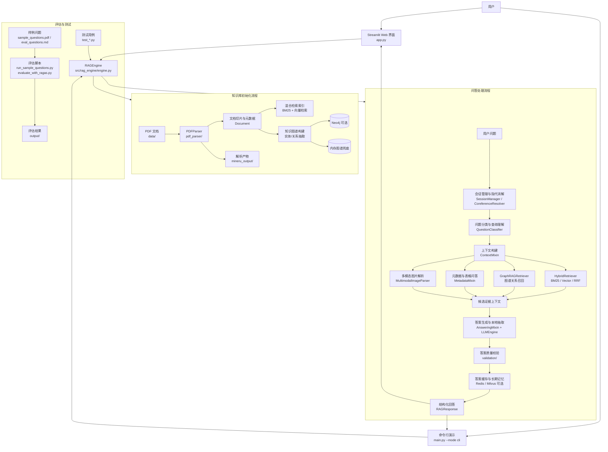

# PDF 智能问答系统

本项目是面向招股说明书、金融年报等 PDF 文档的 RAG/Graph RAG 智能问答系统，支持 PDF 解析、混合检索、知识图谱检索、多轮对话、图片内容解析、答案缓存与评估。

## 项目架构图

## 核心模块

| 模块 | 作用 |
| --- | --- |
| `app.py` | Streamlit Web 应用入口，提供索引管理、检索配置、对话与评估界面。 |
| `main.py` | 项目启动入口，支持 Web 模式和 CLI 演示模式。 |
| `pdf_parser/` | PDF 解析层，负责文本、表格、图片、页面渲染与 MinerU 解析产物复用。 |
| `src/rag_engine/` | RAG 编排层，串联初始化、上下文构建、答案生成、缓存、多模态和元数据问答。 |
| `src/retriever/` | 检索层，提供 BM25、向量检索、RRF 融合、重排与查询扩展。 |
| `src/graph_rag/` | Graph RAG 层，抽取实体关系，构建内存图谱，并可同步 Neo4j。 |
| `src/multimodal/` | 图片内容解析能力，用于组织结构图、市场图等视觉信息问答。 |
| `src/validation/` | 负向问题处理和答案质量校验，降低无依据回答风险。 |
| `src/memory_manager.py`、`src/session_manager.py` | 短期会话、长期记忆和多轮对话上下文管理。 |
| `evaluate_*.py`、`test_*.py` | RAGAS/本地评估脚本与工单验收测试。 |

## 数据流概览

1. 将 PDF 放入 `data/`，系统启动后由 `PDFParser` 解析为带页码、来源、chunk_id 的文档块。
2. `RAGEngine.initialize_project_knowledge_base()` 基于文档块构建混合检索索引，并同步构建 Graph RAG 知识图谱。
3. 用户提问进入 `RAGEngine.answer()` 后，先进行会话指代消解和问题分类，再按检索模式召回 BM25、向量、图谱、元数据或多模态证据。
4. 系统将证据拼接为上下文，优先做本地精确抽取，必要时调用 LLM 生成答案。
5. 答案经过质量校验、缓存和会话记录后返回 Web 界面或 CLI。
