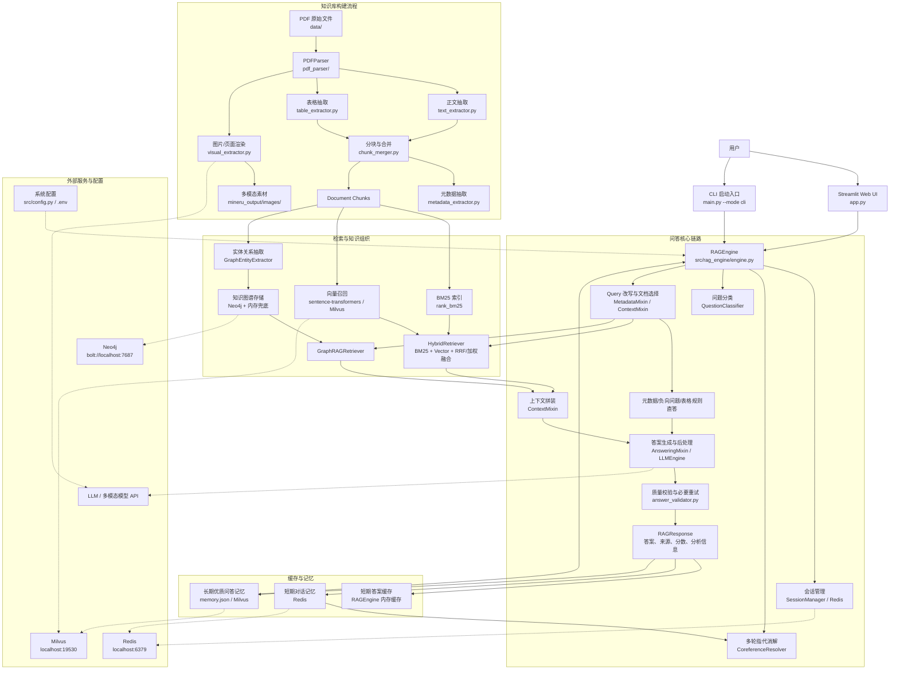

# PDF 招股说明书智能问答系统

本项目面向招股说明书、年度报告等金融 PDF 文档，构建了一个支持文档解析、混合检索、Graph RAG、多轮指代消解、结构化问答、图像/表格解析和记忆增强的智能问答系统。系统提供 Streamlit Web 页面和 CLI 两种入口。

## 项目架构图



## 核心模块说明

| 模块 | 位置 | 职责 |
| --- | --- | --- |
| Web 前端 | `app.py` | 提供 Streamlit 问答页面、索引管理、检索策略切换、反馈与记忆查看 |
| 启动入口 | `main.py` | 检查依赖，支持 Web/CLI 两种运行模式 |
| PDF 解析 | `pdf_parser/` | 解析 PDF 正文、表格、图片和页面渲染结果，输出文档 chunks 与元数据 |
| RAG 编排 | `src/rag_engine/` | 负责初始化知识库、构建上下文、问答生成、缓存、质量重试和多模态问答 |
| 混合检索 | `src/retriever/` | 提供 BM25、向量检索、动态权重、RRF/加权融合、重排与反馈调权 |
| Graph RAG | `src/graph_rag/` | 从文档抽取实体关系，构建知识图谱，并按问题召回关系证据 |
| 记忆管理 | `src/memory_manager.py` | 管理 Redis 短期对话记忆，以及本地/Milvus 长期优质问答记忆 |
| 多轮理解 | `src/coreference_resolver.py`、`src/session_manager.py` | 结合历史对话完成指代消解和当前公司识别 |
| 答案生成 | `utils/llm_engine/` | 负责规则抽取、LLM 生成、后处理、本地兜底答案 |
| 评估工具 | `utils/evaluator.py`、`test_work_order_*.py` | 支持 RAG 效果评估和工单回归测试 |

## 数据流概览

1. 将 PDF 放入 `data/`。
2. `RAGEngine.initialize_project_knowledge_base()` 调用 `PDFParser` 解析 PDF，生成文档 chunks。
3. 系统基于 chunks 同时构建 BM25 索引、向量召回数据和知识图谱。
4. 用户提问后，系统先进行会话指代消解、问题分类、Query 改写和目标 PDF 选择。
5. 对固定元数据、负向问题、部分表格问题优先走规则直答；其他问题走混合检索或 Graph RAG。
6. 检索结果被拼装为上下文后，进入规则抽取或 LLM 生成，并经过答案后处理和质量校验。
7. 最终返回答案、来源片段、相关分数、检索模式和分析信息，同时更新会话记忆与可选长期记忆。

## 运行入口

```powershell
python main.py --mode web
```

```powershell
python main.py --mode cli
```

如需启用 Redis、Milvus 等服务，可使用项目中的 Docker 配置：

```powershell
docker compose up -d
```
