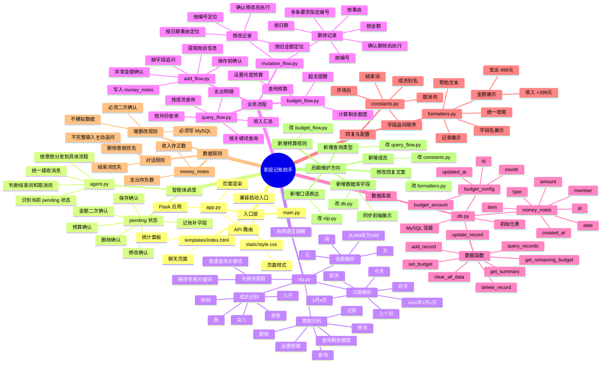

# 家庭记账助手思维导图

> 工单编号：人工智能NLP-RAG-基于PDF文档的问答系统

```mermaid
mindmap
  root((家庭记账助手))
    入口层
      app.py
        Flask 应用
        页面渲染
        API 路由
      main.py
        兼容启动入口
      templates/index.html
        聊天页面
        统计面板
      static/style.css
        页面样式
    智能体调度
      agent.py
        统一接收消息
        识别当前 pending 状态
        判断结束词和取消词
        按意图分发到具体流程
      pending 状态
        记账补字段
        金额二次确认
        保存确认
        删除确认
        修改确认
        预算确认
    自然语言理解
      nlp.py
        日期解析
          今天
          昨天
          前天
          上个月
          x月x日
          xxxx年x月x日
        成员识别
          我
          妈妈
          爸爸
          女儿
          儿子
        金额解析
          元
          块
          万
          从499改为399
        意图识别
          记账
          查询
          删除
          修改
          设置预算
          查询剩余额度
        关键词提取
          普通查询关键词
          删除专用关键词
    业务流程
      add_flow.py
        提取账目信息
        缺字段追问
        异常金额确认
        保存前确认
        写入 money_notes
      query_flow.py
        按成员查询
        按关键词查询
        按月份查询
        收入汇总
        支出明细
      mutation_flow.py
        删除记录
          按编号
          按日期
          按事由
          按金额
          多条要求指定编号
          确认删除后执行
        修改记录
          按编号定位
          按日期事由定位
          按旧金额定位
          确认修改后执行
      budget_flow.py
        设置月度预算
        查询预算
        计算剩余额度
        超支提醒
    数据库层
      db.py
        MySQL 连接
        初始化表
        money_notes
          id
          date
          member
          item
          amount
          type
          created_at
        budget_config
          id
          month
          budget_amount
          updated_at
        数据函数
          add_record
          query_records
          update_record
          delete_record
          get_summary
          set_budget
          get_remaining_budget
          clear_all_data
    回复与配置
      formatters.py
        金额展示
          支出 499元
          收入 +399元
        记录展示
        字段名展示
        帮助文本
        统一收尾
      constants.py
        开场白
        结束词
        取消词
        成员别名
        字段追问顺序
    数据规则
      money_notes
        支出存负数
        收入存正数
      增删改规则
        必须二次确认
        必须写 MySQL
        不模拟数据
      对话规则
        删除意图优先
        结束词优先
        不完整输入主动追问
    后期维护方向
      新增成员
        改 constants.py
      新增口语表达
        改 nlp.py
      修改回复文案
        改 formatters.py
      新增查询类型
        改 query_flow.py
      新增预算规则
        改 budget_flow.py
      新增数据库字段
        改 db.py
        同步前端展示
```
