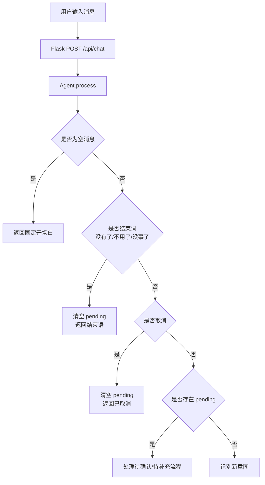
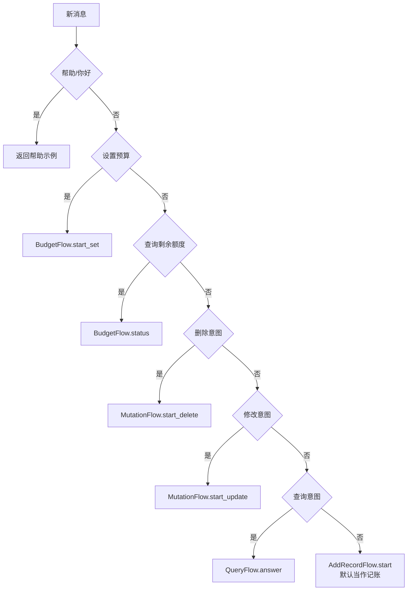
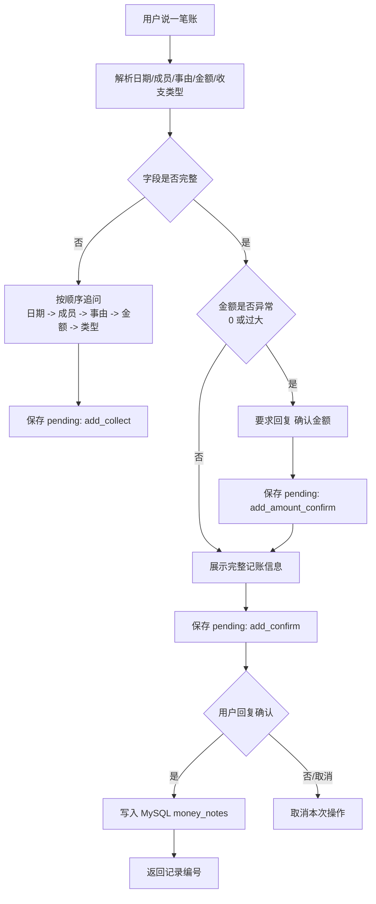
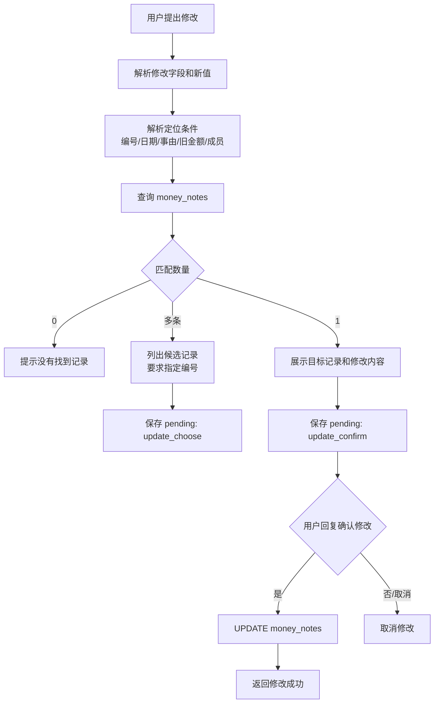
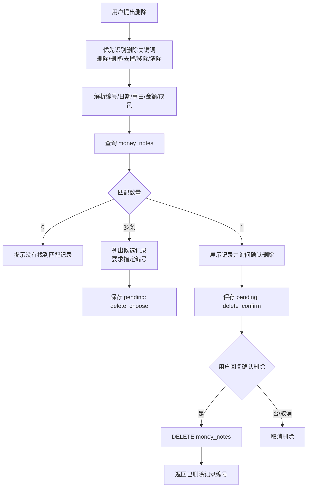
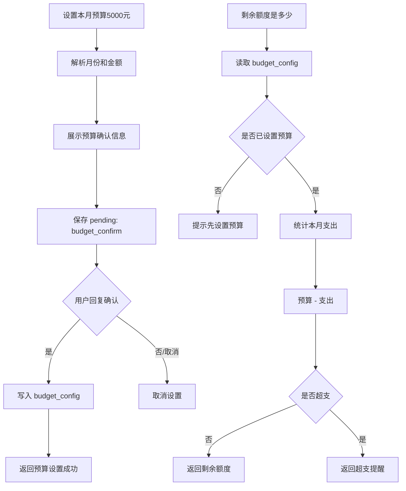
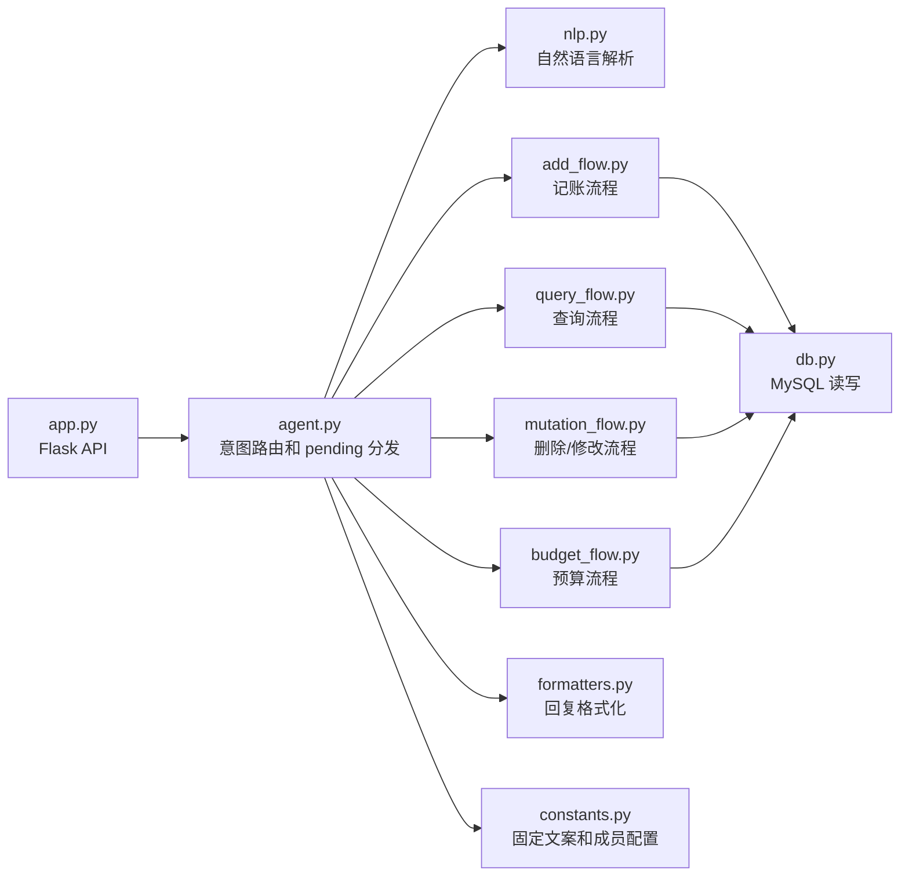

# 家庭记账助手流程图

> 工单编号：人工智能NLP-RAG-基于PDF文档的问答系统

## 1. 整体对话入口

```mermaid
flowchart TD
    A[用户输入消息] --> B[Flask POST /api/chat]
    B --> C[Agent.process]
    C --> D{是否为空消息}
    D -- 是 --> D1[返回固定开场白]
    D -- 否 --> E{是否结束词<br/>没有了/不用了/没事了}
    E -- 是 --> E1[清空 pending<br/>返回结束语]
    E -- 否 --> F{是否取消}
    F -- 是 --> F1[清空 pending<br/>返回已取消]
    F -- 否 --> G{是否存在 pending}
    G -- 是 --> H[处理待确认/待补充流程]
    G -- 否 --> I[识别新意图]
```

## 2. 新意图识别优先级

```mermaid
flowchart TD
    A[新消息] --> B{帮助/你好}
    B -- 是 --> B1[返回帮助示例]
    B -- 否 --> C{设置预算}
    C -- 是 --> C1[BudgetFlow.start_set]
    C -- 否 --> D{查询剩余额度}
    D -- 是 --> D1[BudgetFlow.status]
    D -- 否 --> E{删除意图}
    E -- 是 --> E1[MutationFlow.start_delete]
    E -- 否 --> F{修改意图}
    F -- 是 --> F1[MutationFlow.start_update]
    F -- 否 --> G{查询意图}
    G -- 是 --> G1[QueryFlow.answer]
    G -- 否 --> H[AddRecordFlow.start<br/>默认当作记账]
```

## 3. 记账流程

```mermaid
flowchart TD
    A[用户说一笔账] --> B[解析日期/成员/事由/金额/收支类型]
    B --> C{字段是否完整}
    C -- 否 --> D[按顺序追问<br/>日期 -> 成员 -> 事由 -> 金额 -> 类型]
    D --> E[保存 pending: add_collect]
    C -- 是 --> F{金额是否异常<br/>0 或过大}
    F -- 是 --> G[要求回复 确认金额]
    G --> H[保存 pending: add_amount_confirm]
    F -- 否 --> I[展示完整记账信息]
    H --> I
    I --> J[保存 pending: add_confirm]
    J --> K{用户回复确认}
    K -- 是 --> L[写入 MySQL money_notes]
    K -- 否/取消 --> M[取消本次操作]
    L --> N[返回记录编号]
```

## 4. 修改流程

```mermaid
flowchart TD
    A[用户提出修改] --> B[解析修改字段和新值]
    B --> C[解析定位条件<br/>编号/日期/事由/旧金额/成员]
    C --> D[查询 money_notes]
    D --> E{匹配数量}
    E -- 0 --> E1[提示没有找到记录]
    E -- 1 --> F[展示目标记录和修改内容]
    E -- 多条 --> G[列出候选记录<br/>要求指定编号]
    G --> H[保存 pending: update_choose]
    F --> I[保存 pending: update_confirm]
    I --> J{用户回复确认修改}
    J -- 是 --> K[UPDATE money_notes]
    J -- 否/取消 --> L[取消修改]
    K --> M[返回修改成功]
```

## 5. 删除流程

```mermaid
flowchart TD
    A[用户提出删除] --> B[优先识别删除关键词<br/>删除/删掉/去掉/移除/清除]
    B --> C[解析编号/日期/事由/金额/成员]
    C --> D[查询 money_notes]
    D --> E{匹配数量}
    E -- 0 --> E1[提示没有找到匹配记录]
    E -- 1 --> F[展示记录并询问确认删除]
    E -- 多条 --> G[列出候选记录<br/>要求指定编号]
    G --> H[保存 pending: delete_choose]
    F --> I[保存 pending: delete_confirm]
    I --> J{用户回复确认删除}
    J -- 是 --> K[DELETE money_notes]
    J -- 否/取消 --> L[取消删除]
    K --> M[返回已删除记录编号]
```

## 6. 预算流程

```mermaid
flowchart TD
    A[设置本月预算5000元] --> B[解析月份和金额]
    B --> C[展示预算确认信息]
    C --> D[保存 pending: budget_confirm]
    D --> E{用户回复确认}
    E -- 是 --> F[写入 budget_config]
    E -- 否/取消 --> G[取消设置]
    F --> H[返回预算设置成功]

    I[剩余额度是多少] --> J[读取 budget_config]
    J --> K{是否已设置预算}
    K -- 否 --> K1[提示先设置预算]
    K -- 是 --> L[统计本月支出]
    L --> M[预算 - 支出]
    M --> N{是否超支}
    N -- 否 --> O[返回剩余额度]
    N -- 是 --> P[返回超支提醒]
```

## 7. 模块职责

```mermaid
flowchart LR
    A[app.py<br/>Flask API] --> B[agent.py<br/>意图路由和 pending 分发]
    B --> C[nlp.py<br/>自然语言解析]
    B --> D[add_flow.py<br/>记账流程]
    B --> E[query_flow.py<br/>查询流程]
    B --> F[mutation_flow.py<br/>删除/修改流程]
    B --> G[budget_flow.py<br/>预算流程]
    D --> H[db.py<br/>MySQL 读写]
    E --> H
    F --> H
    G --> H
    B --> I[formatters.py<br/>回复格式化]
    B --> J[constants.py<br/>固定文案和成员配置]
```
