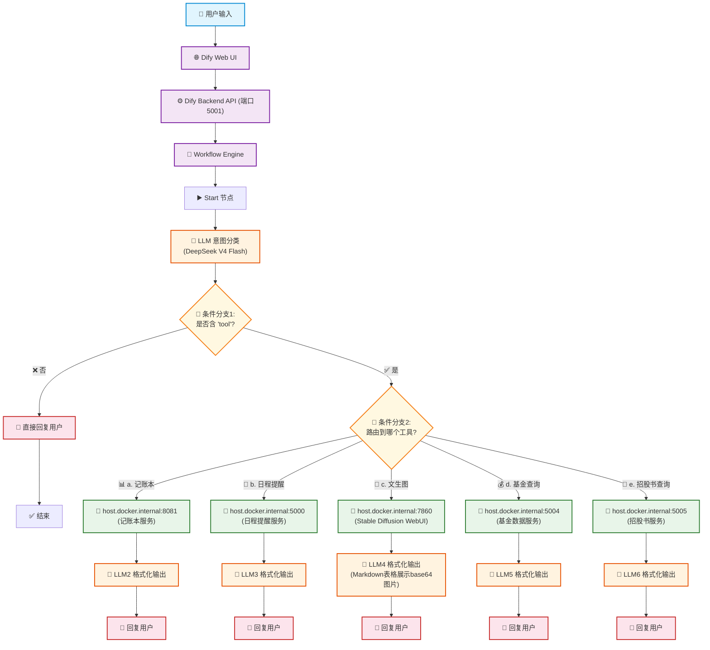
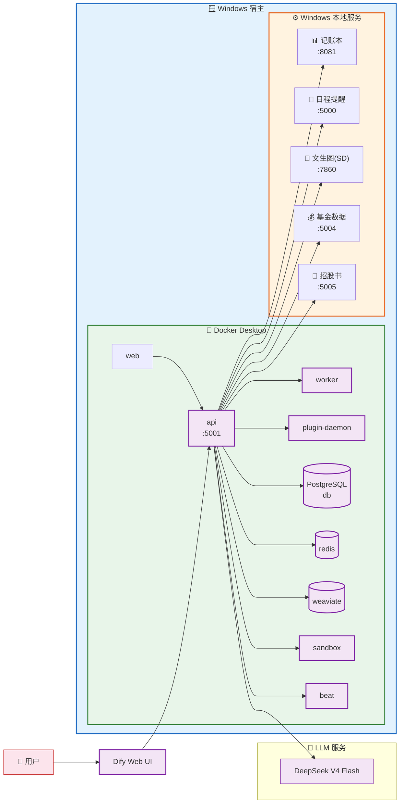

# 01-05 工单创建智能体 — 系统架构与工作流思维导图

---

## 一、工作流流程（Flowchart）



---

## 二、系统分层架构（Mindmap）

```mermaid
mindmap
  root(("🏗️ 工单创建智能体<br/>系统架构"))
    (("👤 用户层"))
      [用户输入]
      [对话界面]

    (("🌐 应用层 — Dify"))
      [Dify Web UI]
      [Dify Backend API<br/>端口 5001]
      [Workflow Engine]
      ::icon(fa fa-cogs)
      [LLM 意图分类<br/>DeepSeek V4 Flash]
      (条件分支1: 是否含tool?)
        [否 → 直接回复]
        (是 → 条件分支2: 路由选择)
          [a: 记账本<br/>→ host:8081]
          [b: 日程提醒<br/>→ host:5000]
          [c: 文生图<br/>→ host:7860]
          [d: 基金查询<br/>→ host:5004]
          [e: 招股书<br/>→ host:5005]

    (("🧠 LLM 服务层"))
      [LLM1 — 意图分类<br/>DeepSeek V4 Flash]
      [LLM2 — 记账本格式化]
      [LLM3 — 日程格式化]
      [LLM4 — 文生图格式化<br/>Markdown表格+Base64]
      [LLM5 — 基金格式化]
      [LLM6 — 招股书格式化]

    (("💻 基础设施层"))
      (Windows 宿主 OS)
        [Docker Desktop]
        (Dify 容器)
          [web]
          [api]
          [worker]
          [plugin-daemon]
          [db — PostgreSQL]
          [redis]
          [weaviate]
          [sandbox]
          [beat]
      (Windows 后端服务)
        [📊 记账本 — 端口 8081]
        [📅 日程提醒 — 端口 5000]
        [🎨 文生图(SD) — 端口 7860]
        [💰 基金数据 — 端口 5004]
        [📄 招股书 — 端口 5005]

    (("🔗 数据流"))
      [HTTP API 调用]
      [LLM Token 推理]
      [数据库读写<br/>PostgreSQL/Redis/Weaviate]
      [Base64 图片传输]
```

---

## 三、部署拓扑图



---

> **说明：**
> - 用户通过 Dify Web UI 输入问题
> - Dify Backend API (:5001) 接收请求并进入 Workflow Engine
> - LLM 意图分类使用 DeepSeek V4 Flash 判断是否包含 "tool" 关键词
> - 不含 "tool" → 直接回复；含 "tool" → 路由到对应后端服务
> - 文生图服务 (LLM4) 特殊处理：以 Markdown 表格展示 Base64 编码图像
> - Dify 运行在 Docker Desktop 容器中，后端服务运行在 Windows 宿主上
