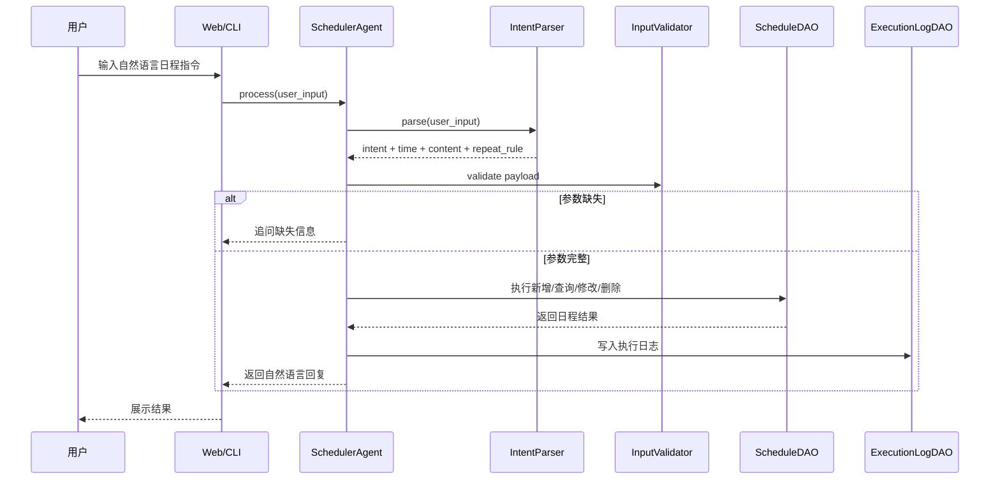
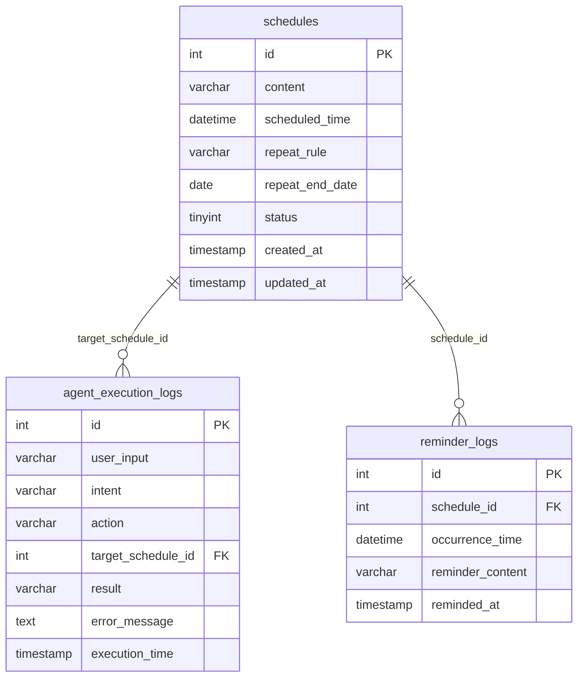

# 日程提醒智能体项目架构

## 1. 项目概述

`daily_scheduler_agent` 是一个基于自然语言输入的日程提醒智能体。系统支持用户通过 Web 页面或命令行输入中文日程指令，完成日程的新增、查询、修改、删除、循环提醒和到点提醒。项目采用 Flask 提供 Web 服务，使用规则和正则完成轻量级意图识别，通过 DAO 层访问 MySQL，并由后台提醒服务定时轮询到期日程。

## 2. 总体架构

```mermaid
flowchart LR
    User[用户] --> Web[Web 页面 templates/index.html]
    User --> CLI[命令行 interactive.py]

    Web --> Flask[Flask 服务 web_app.py]
    CLI --> Agent[SchedulerAgent]
    Flask --> Agent

    Agent --> Parser[IntentParser 意图解析]
    Agent --> Validator[InputValidator 参数校验]
    Agent --> ScheduleDAO[ScheduleDAO 日程数据访问]
    Agent --> LogDAO[ExecutionLogDAO 执行日志]

    ScheduleDAO --> MySQLConnector[MySQLConnector]
    LogDAO --> MySQLConnector
    MySQLConnector --> DB[(MySQL schedule_db)]

    Daemon[scheduler_daemon.py] --> ReminderService[ReminderService]
    Flask --> WebReminder[/reminders 轮询提醒]
    ReminderService --> ScheduleDAO
    WebReminder --> ScheduleDAO
    ReminderService --> LogDAO
    WebReminder --> LogDAO
    ReminderService --> Notify[提醒回调/日志]
    WebReminder --> Toast[浏览器/Windows 通知]
```

系统整体可以拆成五层：

| 层级 | 主要模块 | 职责 |
| --- | --- | --- |
| 入口层 | `web_app.py`、`interactive.py`、`main.py`、`scheduler_daemon.py` | 接收用户请求、启动 Web 服务、启动命令行交互、启动后台提醒进程 |
| Agent 层 | `agent/scheduler_agent.py` | 编排自然语言解析、参数校验、业务处理、数据库访问和日志记录 |
| 解析与工具层 | `agent/intent_parser.py`、`utils/time_utils.py`、`utils/validator.py` | 识别增删改查意图，解析中文时间、循环规则，校验缺失参数 |
| 数据访问层 | `db/mysql_connector.py`、`db/schedule_dao.py`、`db/execution_log_dao.py` | 初始化数据库、执行日程 CRUD、查询到期提醒、写入执行日志 |
| 提醒层 | `reminder/reminder_service.py`、`reminder/message_templates.py`、`reminder/notification.py` | 定时轮询到期日程，生成提醒内容，发送通知并记录提醒日志 |

## 3. 目录结构

```text
daily_scheduler_agent/
├── agent/
│   ├── intent_parser.py        # 自然语言意图识别和字段抽取
│   └── scheduler_agent.py      # 智能体主流程，处理增删改查和多轮确认
├── db/
│   ├── mysql_connector.py      # MySQL 连接和数据库初始化
│   ├── schedule_dao.py         # 日程 CRUD、循环日程计算、到期提醒查询
│   ├── execution_log_dao.py    # Agent 执行日志读写
│   └── schema.sql              # 数据库表结构
├── reminder/
│   ├── reminder_service.py     # APScheduler 后台轮询提醒服务
│   ├── message_templates.py    # 提醒消息模板
│   └── notification.py         # 系统通知发送
├── utils/
│   ├── time_utils.py           # 中文自然语言时间解析和循环发生时间计算
│   ├── validator.py            # 输入参数校验和追问文案
│   └── logger.py               # 日志配置
├── templates/
│   └── index.html              # Web 聊天界面
├── tests/                      # DAO、提醒、解析器测试
├── logs/                       # 运行日志
├── config.py                   # 数据库、提醒轮询、日志路径配置
├── web_app.py                  # Flask Web 入口和 HTTP API
├── interactive.py              # 命令行交互入口
├── main.py                     # 兼容入口，转发到 interactive.py
├── scheduler_daemon.py         # 后台提醒守护进程入口
├── start_web.bat/start_web.sh  # Web 启动脚本
└── requirements.txt            # Python 依赖
```

## 4. 核心模块说明

### 4.1 Web 服务层

`web_app.py` 是 Flask 应用入口，主要提供以下接口：

| 路由 | 方法 | 作用 |
| --- | --- | --- |
| `/` | GET | 返回聊天页面 |
| `/chat` | POST | 接收用户自然语言输入，调用 `SchedulerAgent.process()` |
| `/today` | GET | 查询今日日程 |
| `/skills` | GET | 返回智能体能力列表 |
| `/status`、`/db_status` | GET | 返回数据库连接和表记录统计 |
| `/logs` | GET | 展示最近 Agent 执行日志 |
| `/reminders` | GET | Web 端轮询到期提醒 |
| `/test_notification` | GET | 测试系统弹窗通知 |

Web 页面 `templates/index.html` 负责聊天 UI、按钮操作、语音输入、浏览器通知和周期性调用 `/reminders`。

### 4.2 Agent 编排层

`SchedulerAgent` 是业务核心，负责：

- 调用 `IntentParser` 将自然语言转换为结构化意图。
- 调用 `InputValidator` 检查添加、删除等操作是否缺少必要参数。
- 维护多轮对话状态，例如 `pending_add` 和 `pending_delete`。
- 根据意图分发到新增、查询、删除、修改流程。
- 调用 `ScheduleDAO` 读写日程数据。
- 调用 `ExecutionLogDAO` 记录每次执行结果。

主要处理流程：



### 4.3 自然语言解析层

`IntentParser` 使用关键词和正则表达式识别用户意图：

| 意图 | 示例能力 | 主要字段 |
| --- | --- | --- |
| `add` | 添加日程、提醒我、安排 | `content`、`scheduled_time`、`repeat_rule` |
| `query` | 查询今天、明天、全部、最近日程 | `scope` |
| `delete` | 删除、取消、移除日程 | `target_id`、`target_ids`、`target_content` |
| `update` | 修改日程时间或内容 | `target_id`、`content`、`scheduled_time` |
| `confirm` | 确认删除 | 用于二次确认 |
| `cancel_confirm` | 取消删除 | 用于取消待确认操作 |

`utils/time_utils.py` 负责解析中文日期时间、循环规则和下一次发生时间，包括今天、明天、后天、周几、几点、上午/下午、每天/每周/每月等表达。

### 4.4 数据访问层

数据访问层封装在 `db/` 目录：

- `MySQLConnector`：统一创建 MySQL 连接，执行 `schema.sql` 初始化表结构，并补充轻量迁移。
- `ScheduleDAO`：负责日程新增、查询、修改、软删除、循环日程展开、到期提醒查询和提醒日志写入。
- `ExecutionLogDAO`：负责写入和查询 `agent_execution_logs`。

业务代码不直接拼接数据库连接，而是通过 DAO 隔离 SQL 操作。

### 4.5 提醒服务层

提醒触发有两条路径：

1. Web 端提醒：浏览器每隔一段时间请求 `/reminders`，Flask 查询到期日程并返回给前端展示，同时调用系统通知。
2. 后台守护进程：`scheduler_daemon.py` 启动 `ReminderService`，由 APScheduler 周期性执行 `check_and_remind()`。

提醒服务会：

- 查询当前时间窗口内到期且未提醒过的日程。
- 为每条日程生成提醒文案。
- 写入 `reminder_logs`，避免同一次发生时间重复提醒。
- 写入 `agent_execution_logs`，记录提醒执行结果。

## 5. 数据库设计



核心表说明：

| 表名 | 作用 |
| --- | --- |
| `schedules` | 保存日程内容、首次提醒时间、循环规则、状态 |
| `agent_execution_logs` | 保存用户输入、识别意图、执行动作、目标日程、执行结果 |
| `reminder_logs` | 保存每次提醒发送记录，通过 `schedule_id + occurrence_time` 避免重复提醒 |

## 6. 关键业务流程

### 6.1 新增日程

```text
用户输入
  -> Web / CLI
  -> SchedulerAgent.process()
  -> IntentParser.parse()
  -> InputValidator.validate_add_payload()
  -> ScheduleDAO.add_schedule()
  -> ExecutionLogDAO.add_log()
  -> 返回“已添加日程 #id”
```

如果缺少时间或内容，`SchedulerAgent` 会保存 `pending_add`，向用户追问缺失字段，下一轮输入继续补全。

### 6.2 查询日程

```text
用户输入查询语句
  -> 解析 scope: today / tomorrow / all / upcoming
  -> ScheduleDAO 查询有效日程
  -> 循环日程按目标日期展开
  -> 格式化为自然语言列表
```

### 6.3 删除日程

```text
用户输入删除指令
  -> 解析目标 id 或内容
  -> 找到匹配日程
  -> 写入 pending_delete
  -> 要求用户二次确认
  -> 用户确认后软删除 status = 0
```

删除采用二次确认，避免误删。

### 6.4 到点提醒

```text
定时轮询
  -> ScheduleDAO.get_due_schedules()
  -> calculate_occurrence() 计算循环日程本次发生时间
  -> 检查 reminder_logs 是否已提醒
  -> 发送提醒
  -> 写入 reminder_logs 和 agent_execution_logs
```

## 7. 运行入口

| 文件 | 用途 | 启动方式 |
| --- | --- | --- |
| `web_app.py` | 启动 Flask Web 聊天界面 | `python web_app.py` |
| `interactive.py` | 启动命令行对话模式 | `python interactive.py` |
| `main.py` | 兼容旧入口，转发到命令行模式 | `python main.py` |
| `scheduler_daemon.py` | 启动后台提醒守护进程 | `python scheduler_daemon.py` |
| `start_web.bat` / `start_web.sh` | 快速启动 Web 服务 | 双击或 shell 执行 |
| `manage.sh` | 后台服务管理脚本 | `./manage.sh start` |

## 8. 配置与依赖

`config.py` 集中管理：

- MySQL 地址、端口、账号、密码、数据库名和字符集。
- 提醒轮询间隔 `REMINDER_POLL_SECONDS`。
- 提醒回看窗口 `REMINDER_LOOKBACK_SECONDS`。
- 日志目录、日志文件和 PID 文件路径。

`requirements.txt` 中的主要依赖：

- `Flask`：Web 服务。
- `PyMySQL`：MySQL 数据库连接。
- `APScheduler`：后台定时任务。

## 9. 架构特点

- 入口清晰：Web、命令行、后台提醒三个入口职责分离。
- Agent 层集中编排：自然语言解析、校验、业务处理和日志记录都由 `SchedulerAgent` 统一协调。
- DAO 隔离数据库操作：业务层不直接管理 SQL 连接。
- 支持多轮对话：添加缺少信息、删除二次确认等场景由 Agent 状态维护。
- 支持循环日程：通过 `repeat_rule` 和发生时间计算支持每日、每周、每月提醒。
- 提醒具备去重机制：`reminder_logs` 使用 `schedule_id + occurrence_time` 保证同一次提醒不会重复发送。
